Shravan Venkatraman1,2∗ Wenshuai Zhao2 Mohammad Hassan Vali2 Arno Solin2

1Mohamed bin Zayed University of Artificial Intelligence, UAE

2ELLIS Institute Finland & Department of Computer Science, Aalto University, Finland

{shravan.venkatraman,wenshuai.zhao,mohammad.vali,arno.solin}@aalto.fi

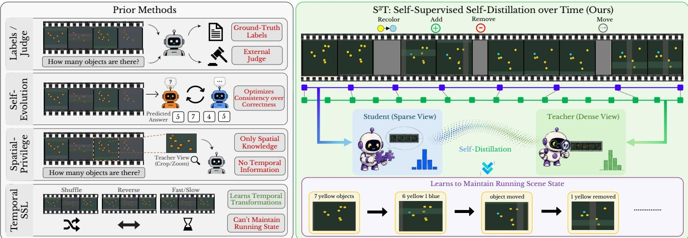  
Figure 1. $\mathbf { s } ^ { 3 } \mathbf { T }$ uses temporal sampling density as self-supervision for visual state tracking. Prior methods (left) rely on labels or external judges, optimize consistency without verifying correctness, use only spatial privileged views, or learn temporal transformations rather than persistent scene state. S3T (right) instead self-distills from a denser temporal view into a sparse-view student with shared frozen weights, enabling the model to track evolving object counts and states over time without labels, an external judge, or a separate teacher.

## Abstract

We introduce S3T (Self-Supervised Self-Distillation over Time), which, to the best of our knowledge, is the first fully self-contained framework for continuous video state tracking. Our method treats temporal sampling density as privileged information, based on the hypothesis that a denser view ofthe same clip recovers the running state more accurately. This view serves as the teacher, while a sparse-view student with the same weights learns to match its next-token distribution. The model generates its own target, so training requires no labels, separate teacher, or reward signal, and adds no inference cost. On LLaVA-OneVision-2-8B, S3Timproves VSTAT accuracy by +1.74 as a single model, +2.38 with souping, and +2.70 with additional vision-encoder adaptation, while prior self-evolving methods leave state tracking largely unchanged. The capability learned from unlabeled synthetic clips transfers to real videos, improving performance by +7.95 on VSTAT-YouTube state-tracking questions and +4.50 on MVBench Action Count.

## 1. Introduction

Recent progress in Video Large Language Models (Video-LLMs) has improved multimodal reasoning and enabled complex question answering over dynamic visual content [11, 54, 68, 69]. However, visual state tracking remains a major limitation, as models must maintain accurate running counts and scene states while objects are added, removed, moved, or occluded over time [7, 60]. VSTAT [64] is a benchmark designed to test this cumulative state reasoning, and it shows that human performance reaches 90.5%, while the strongest open-source models score only 34–35%. It also notes that current benchmarks focus mainly on action recognition and moment localization, leaving cumulative state tracking weakly represented in the training signal [3, 53, 62]. These models often fail even on seemingly simple state changes and continue revising their predictions as more of the video is revealed, rather than maintaining a stable running state (see Fig. 2). A likely reason is that existing training objectives, whether supervised fine-tuning for single-answer correctness [34, 40, 41, 52] or contrastive alignment of video–text pairs [17, 21, 59, 61], do not require models to accumulate evidence across the full clip.

<table><tr><td rowspan=2 colspan=1>FULL VIDEO</td><td rowspan=2 colspan=1>Shell game</td><td rowspan=2 colspan=1>Cup stacking</td><td></td><td></td></tr><tr><td rowspan=2 colspan=2>Funnel ball                     Tilted boxA ball starts at corner 1, the top-left. After the box is closedand tilted six times, which corner contains the ball?Corner mapping: 1 top-left, 2 top-right, 3 bottom-right,4 bottom-left.</td></tr><tr><td rowspan=1 colspan=1>QUESTION</td><td rowspan=1 colspan=1>At the end of the video, which position is the cup containingthe smaller cup in? Use the viewer&#x27;s perspective:(A) Right, (B) Left, (C) Center.</td><td rowspan=1 colspan=1>What animal is drawn on the cup that is seventh from thebottom? (A) Monkey, (B) Lion, (C) Tiger, (D) Zebra.</td><td rowspan=1 colspan=1></td></tr><tr><td rowspan=1 colspan=1>S³T (ours)</td><td rowspan=1 colspan=1>A</td><td rowspan=1 colspan=1></td><td rowspan=1 colspan=1>✓ B</td><td rowspan=1 colspan=1>2</td></tr><tr><td rowspan=1 colspan=1>LLaVA-OV-2-8B(base)</td><td rowspan=1 colspan=1>xC</td><td rowspan=1 colspan=1>xC</td><td rowspan=1 colspan=1>xA</td><td rowspan=1 colspan=1>x4</td></tr><tr><td rowspan=1 colspan=1>Qwen3-VL-8B</td><td rowspan=1 colspan=1>xC</td><td rowspan=1 colspan=1>×C</td><td rowspan=1 colspan=1>×A</td><td rowspan=1 colspan=1>× 4</td></tr><tr><td rowspan=1 colspan=1>Molmo2-8B</td><td rowspan=1 colspan=1>xC</td><td rowspan=1 colspan=1>×C</td><td rowspan=1 colspan=1>XA</td><td rowspan=1 colspan=1>×3</td></tr><tr><td rowspan=1 colspan=1>InternVL3.5-8B</td><td rowspan=1 colspan=1>xC</td><td rowspan=1 colspan=1>×A</td><td rowspan=1 colspan=1>X D</td><td rowspan=1 colspan=1>×4</td></tr><tr><td rowspan=1 colspan=1>Video-Zero-8B(self-evolving)</td><td rowspan=1 colspan=1>xC</td><td rowspan=1 colspan=1>×C</td><td rowspan=1 colspan=1>XA</td><td rowspan=1 colspan=1>×4</td></tr></table>

Q: There is first a water-pouring phase and then a separate espresso-pouring phase. A cup counts as successful only ifit receives both water infirst phase and espresso in second phase. How many cups were successful?  
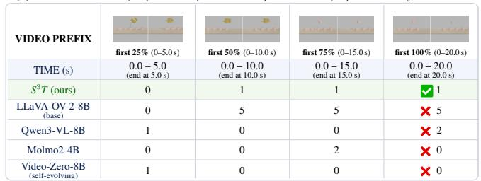

Q: The videofirst shows an initial central block structure. Then the camera keeps moving while a robot hand makes several add/remove attempts. After all actionsfinish, how many blocks remain in the central structure?  
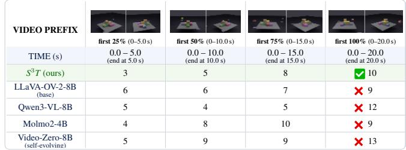  
Figure 2. Current Video-LLMs struggle to maintain visual state over time, while $\mathbf { s } ^ { 3 } \mathbf { T }$ consistently tracks the evolving scene. Across diverse VSTAT examples (top), strong open-source and self-evolving models fail on questions requiring persistent state reasoning, despite observing the full video. Prefix analysis (bottom) further shows that their predictions fluctuate as more evidence arrives, whereas S3T progressively accumulates the correct state and preserves it through the end of the sequence.

Reinforcement learning with verifiable rewards improves video reasoning but depends on ground-truth labels or expensive judge models [37, 38, 67, 73]. Self-distillation reduces this dependence by using the model’s own outputs as supervision [15, 49]. However, the only prior video self-distillation method, VISD, still requires ground-truth labels and a judge model [25]. Recent self-evolving frameworks [14, 16, 66, 70] instead use questioner–solver co-evolution or proposer–solver coupling, but target general reasoning or temporal grounding, which prioritizes event localization over maintaining a running visual state.

We present $\mathrm { S ^ { 3 } T }$ (Self-Supervised Self-Distillation over Time), the first fully self-contained self-distillation framework for improving continuous state tracking in videos without external supervision. The central idea is to use temporal sampling density as privileged information. We hypothesize that a denser sampling of the same sequence provides more evidence about the running scene state (such as object counts through occlusion) than a sparse sampling, while requiring no labels or annotations. $\mathrm { S ^ { 3 } T }$ uses this denser view as a teacher and distills its next-token distribution into the sparse-view student, using only the model’s self-generated outputs. Our method requires no labels, separate teacher network, reward model, or tracker (see Fig. 1). S3T improves VSTAT accuracy from 34.74 to 37.44 (+2.70), with gains concentrated on cumulativestate axes, including Count (+4.9), Atomic (+5.1), and Sequence (+5.8). These gains transfer to real videos, improving VSTAT-YouTube cumulative-state questions by +7.95 and MVBench Action Count by +4.50, while preserving general video-understanding performance.

Contributions. To summarize, our contributions are:

• We introduce temporal sampling density as privileged information for self-distillation in Video-LLMs, enabling supervision from unlabeled videos without external annotations or reward models.

• We propose $\mathrm { S ^ { 3 } T } ,$ the first fully self-contained selfdistillation framework for Video-LLMs that improves cumulative-state reasoning while preserving general video-understanding performance.

• We show that the capability learned from unlabeled synthetic clips transfers to real video, significantly improving cumulative-state performance on VSTAT-YouTube and MVBench Action Count, without retraining on real data.

€ Project page § Code ò Model

## 2. Related work

Video understanding and state tracking. Video-LLMs have progressed from early cross-modal alignment methods [1, 5, 32, 44] to recent systems [27, 33, 43, 71] that extend large language models to video through frame sampling and temporal aggregation. These models support open-ended dialogue [29, 42] and temporal reasoning [23, 24], but are primarily trained for action recognition, moment localization, and video question answering [57, 58]. These tasks generally require identifying the frames that contain the answer rather than maintaining a running scene state throughout a video. Recent benchmarks such as VSTAT [64] make this limitation explicit, with current open-source VidLLMs achieving only 34–35% on state tracking compared to about 90.5% for humans. Temporal self-supervised objectives such as frame-order prediction [19, 35], arrow-of-time classification [39, 55], pace estimation [6, 51], and masked video modeling [47] learn temporal structure from chronology, motion, or missing frames, but they do not require maintaining running counts or evolving scene states over long sequences and occlusions.

Self-distillation and self-evolution. Visual representations can be learned without human annotations using self-generated supervisory signals or privileged information available during training but not inference [45, 46, 50]. In image understanding, CVPD [49] and Vision-OPD [65] exploit privileged spatial views, such as high-resolution crops or zooms, to improve fine-grained recognition in images. These methods leverage spatial redundancy but do not address temporal accumulation across frames. Recent self-evolving methods improve Video-LLMs using modelgenerated supervision. Video-Zero [70], EvoGround [16], and CurEvo [66] optimize for question difficulty, answer consistency, evidence discovery, or temporal grounding rather than cumulative-state tracking. Their signals reward identifying relevant moments or producing consistent answers but do not require integrating evidence across an entire video to maintain a running scene state. VISD [25] is closer to video self-distillation but relies on groundtruth answers, spatio-temporal grounding annotations, and an external video-aware judge. Thus, to the best of our knowledge, no prior method directly targets cumulativestate tracking while remaining fully self-contained.

## 3. Methods

We present the proposed framework by first describing the procedurally generated unlabeled clips used to expose the model to visual state changes (Sec. 3.1), followed by the two temporal views and distillation objective (Sec. 3.2). $\mathrm { S ^ { 3 } T }$ samples each clip at two frame densities and lets the denser view teach the sparser one. Both views pass through the same frozen base model with a single trainable lowrank (LoRA; [13]) adapter and learn from self-generated targets, requiring no labels, separate teacher, reward model, or tracker, with no inference-time cost.

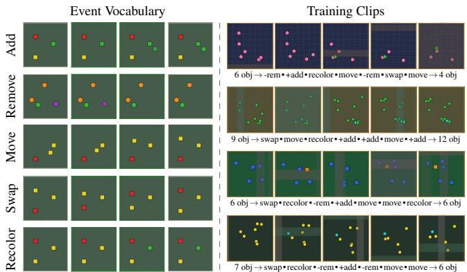  
Figure 3. Our training data generator, StateGen. Left: The five event types: add, remove, move, swap, and recolor. Right: Four example training clips shown at five uniformly spaced time points. Scenes contain near-identical objects undergoing these events under occlusion and global camera motion. Object counts below each strip are for visualization only and are not used in training.

## 3.1. Synthesizing training data

We train on a fixed set of 300 unlabeled clips generated using our procedural video generator, StateGen. Each clip is a 512×512 video at 12 FPS and lasts 20 seconds, giving $T = 2 4 0$ frames. Scenes contain 6–15 near-identical entities on a textured background and evolve through 7–11 non-overlapping events sampled from a fixed set of add, remove, move, swap, and recolor operations. Consecutive events are separated by at least 13 frames, while occlusion and global camera motion continue throughout the clip (Fig. 3). Because entities can appear and disappear over time, recovering the correct scene state requires information from the full sequence. The clips contain no state annotations, question-answer pairs, or captions. The model only receives RGB frames, and all supervision comes from its own generated outputs (Sec. 3.2). We use procedurally generated videos because temporal-density distillation requires many clips with meaningful state changes across time, while manually curating and annotating such data at scale would be expensive. $\mathrm { S ^ { 3 } \bar { T } }$ instead learns directly from unlabeled clips through self-generated supervision. State-Gen randomly samples entity counts, event counts, and event timings to create clips with different levels of difficulty (sampling details given in Sec. 4). Although training uses only synthetic videos, the cumulative-state tracking ability of $\mathrm { S ^ { 3 } T }$ transfers to real videos (Sec. 4.4).

## 3.2. Temporal self-distillation

Let $f _ { \theta }$ be the frozen base model with parameters θ, and $f _ { \theta + \phi }$ the same model equipped with a single trainable LoRA adapter ϕ. The same adapter is used for both student and teacher; these differ only in temporal sampling density and whether gradients are retained. We write $f _ { \theta + \phi } ( \cdot | x , k )$

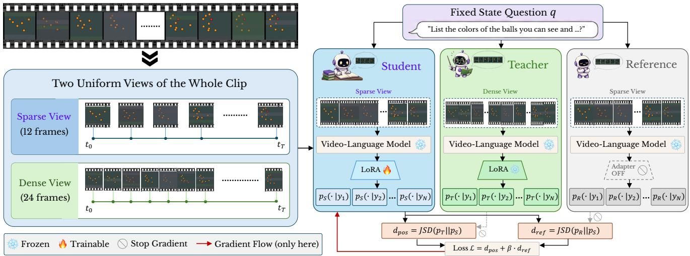  
Figure 4. Overview of $\mathbf { s } ^ { 3 } \mathbf { T } .$ Each clip is uniformly sampled into a sparse 12-frame view and a dense 24-frame view. A frozen videolanguage model with a single trainable LoRA adapter is used in three roles: the Student on the sparse view, the Teacher on the dense view, and the Reference on the sparse view with the adapter disabled. Student and Teacher use the same current adapter and differ only in frame density and gradient flow, with gradients passing through the Student while the Teacher is detached. All three score the same self-generated answer. The loss distills the Teacher into the Student while anchoring it to the base model, and only the single LoRA adapter is updated.

for its next-token distributions from k frames of clip x.

Two temporal views. For a clip x decoded to $T$ native frames, a view is a uniform set of k frame indices spanning the whole clip. The student view samples $k _ { s } ~ = ~ 1 2$ frames and the teacher view samples $k _ { t } = 2 4$ frames over the same span, so the only difference is temporal density: both cover $[ 0 , T - 1 ]$ with no crop, window, or sub-span. With more frames, we hypothesize the teacher has a more complete view of how the scene changes over time and can better recover its cumulative state (we validate this hypothesis in $\mathrm { A p p }$ . B). We treat these additional frames as privileged information (LUPI; [30, 48]) as they are available only to the teacher during training, while the student sees the sparse view and carries the gradient. The student thus learns to recover this readout from fewer frames, and Sec. 4 shows that it transfers to the frame budget used at evaluation. Teacher and student are two passes through the same $f _ { \theta + \phi }$ with the same single adapter $\phi ;$ no teacher-specific copy of the model or adapter is maintained. They differ only in frame density and gradient flow, with the sparse student pass carrying gradients while the dense teacher pass is detached. The student indices are also not a subset of the teacher’s. The two uniform grids over [0, T − 1] share only their endpoints, so the teacher sees additional temporal evidence rather than a deterministic superset of the student’s frames. The goal is to make the teacher more informative while keeping its readout recoverable from the sparse student view. We study this trade-off in Sec. 5.

On-policy, self-generated target. We use a fixed probe question q, chosen in advance and shared by both views of a clip; the model does not generate it, and it is not derived from the clip. It names the domain objects and asks for a short description of the current state, including which balls are visible, their colors, and their count. The model generates only the answer. Because q is shared across views, the frame budget is the only difference between the teacher and student passes, making their answer distributions comparable. A single $\mathrm { s ^ { 3 } T }$ run uses this one question for all training steps. Our strongest model soups [56] that run with a second one, which alternates between the same question and a small fixed set asking what changed across the clip; App. I gives the set and the schedule in full. Together, they produce complementary models that improve performance across question types.

Objective. The model is trained to match the teacher’s next-token distribution while remaining anchored to the base, and both terms use the same token-averaged Jensen-Shannon divergence (JSD; [26]) over the answer region,

$$
\begin{array} { r c l } { { \displaystyle { \cal D } _ { \mathrm { J S D } } \big ( P \big | \big | ~ Q \big ) ~ = ~ \frac { 1 } { T _ { a } } \sum _ { j = 1 } ^ { T _ { a } } \left[ \frac { 1 } { 2 } { \cal D } _ { \mathrm { K L } } \big ( p _ { j } \big | \big | m _ { j } \big ) + \frac { 1 } { 2 } { \cal D } _ { \mathrm { K L } } \big ( q _ { j } \big | \big | m _ { j } \big ) \right] , } } \\ { { } } & { { } } & { { } } \\ { { m _ { j } ~ = ~ \frac { 1 } { 2 } \big ( p _ { j } + q _ { j } \big ) , } } \end{array}\tag{1}
$$

computed in bits $( \log _ { 2 } ) _ { 2 }$ , so each position contributes at most one bit. We use JSD rather than Kullback–Leibler divergence (KLD; [18]) because it is symmetric and bounded on [0, 1], which keeps the objective and its gradients well behaved when the moving teacher and student differ on some tokens. For a comparable teacher–student gap, forward and reverse KLD produce a roughly 3.8× larger and noticeably spikier objective, together with a similar increase in the gradient norm. $\mathrm { A p p }$ . F shows this over the course of training.

The distillation term moves the student toward the teacher’s reading (see Fig. 4),

$$
d _ { \mathrm { p o s } } = \cal { D } _ { \mathrm { J S D } } \big ( \mathrm { s g } [ P ^ { ( k _ { t } ) } ] \big | P ^ { ( k _ { s } ) } \big ) ,\tag{2}
$$

where $\mathrm { s g } [ \cdot ]$ denotes stop-gradient. At training step i, both distributions are produced using the same current adapter $\phi _ { i } \colon$ the teacher distribution from the $k _ { t } = 2 4$ frame view is detached, while gradients flow only through the student distribution from the $k _ { s } = 1 2$ frame view. After updating $\phi _ { i }$ to $\phi _ { i + 1 }$ , this updated adapter is used by both passes in the next step. Thus, the teacher evolves together with the student without a separate teacher model or adapter.

The anchor keeps the adapted student within a bounded distance of the base on identical input,

$$
\begin{array} { r l } & { d _ { \mathrm { r e f } } ~ = ~ D _ { \mathrm { J S D } } \big ( \mathrm { \ s g } [ P ^ { \mathrm { r e f } } ] \big | P ^ { ( k _ { s } ) } \big ) , } \\ & { P ^ { \mathrm { r e f } } = f _ { \theta } ( \cdot | x , k _ { s } , q , a ) , } \end{array}\tag{3}
$$

where $P ^ { \mathrm { r e f } }$ is the base distribution on the student’s own sparse view, obtained by disabling ϕ to recover $f _ { \theta } .$ . Because $d _ { \mathrm { r e f } }$ is a JSD to the base rather than a KLD, it inherits the same boundedness. The full objective is

$$
\boxed { \mathcal { L } = d _ { \mathrm { p o s } } + \beta d _ { \mathrm { r e f } } }\tag{4}
$$

with $d _ { \mathrm { p o s } }$ at unit weight and $\beta$ weighting the anchor. A fixed β is difficult to tune. If too small, the adapter moves too far from the base model and loses calibration. If too large, the student cannot learn enough from the teacher. Thus, we update $\beta$ to keep $d _ { \mathrm { r e f } }$ near a target κ. It increases when $d _ { \mathrm { r e f } }$ exceeds κ and decreases when it falls below κ. The multiplicative update clips the per-step change and $\beta ,$ preventing spikes in $d _ { \mathrm { r e f } }$ from pushing β to its bound and keeping it within a fixed range. App. A gives the update rule and parameter values. Alg. 1 summarizes one $\dot { \mathbf { S } } ^ { 3 } \mathbf { T }$ training step.

## 4. Experiments

Implementation details. We fine-tune LLaVA-OV-2- 8B [2] using LoRA [13]. In the default configuration, the base model and vision encoder remain frozen, and only the adapter is updated (see Fig. 4). Our strongest configuration also adapts the vision encoder and is reported separately throughout. We apply rank-32 LoRA to the attention and feed-forward projections of the language model. The vision-to-language projector remains frozen, so the same frame produces the same tokens in both views, which differ only in frame count. The vision-adapted variant also applies rank-32 LoRA within the vision encoder blocks while keeping the patch embedding and projector frozen. We train for 3000 steps with one clip per step using AdamW [31] on 4×A100 GPUs in bfloat16. The student samples 12 frames and the teacher samples 24 frames from the same clip. For souping, we scale the merged weight update by $\alpha { = } 1 . 5$ when the vision encoder is frozen and α=1.3 when it is adapted. Training uses the fixed pool of 300 unlabeled StateGen clips described in Sec. 3.1. The model receives only RGB frames and does not use state annotations or generator metadata. The remaining hyperparameters, protocol selection choices, and full generation and sampling details are provided in $\operatorname { A p p . } \mathrm { A } .$

Algorithm 1 One $\mathrm { S ^ { 3 } T }$ training step   
Require: frozen base fθ, single adapter $\phi _ { i }$ , probe $q ,$ frame   
counts $k _ { s } = 1 2 , \ k _ { t } = 2 4$ , anchor set point κ, rate $\eta ,$ bounds   
$[ \beta _ { \mathrm { m i n } } , \beta _ { \mathrm { m a x } } ] ,$ anchor weight $\beta$   
1: sample clip x; decode to $T$ frames   
2: $V _ { s }  k _ { s }$ uniform frames of x ▷ student view   
3: $V _ { t } \gets k _ { t }$ uniform frames of x ▷ same span, denser   
4: a ← greedy decode $f _ { \theta + \phi _ { i } } ( \cdot \vert V _ { s } , q )$ ▷ self-generated target   
5: $P ^ { ( k _ { t } ) } \gets f _ { \theta + \phi _ { i } } ( \cdot | V _ { t } , q , \dot { a } )$ , no grad ▷ same adapter; teacher   
6: $P ^ { \mathrm { r e f } }  f _ { \theta } ( \cdot \vert V _ { s } , q , a )$ , no grad ▷ adapter off   
7: $P ^ { ( k _ { s } ) } \gets f _ { \theta + \phi _ { i } } ( \cdot | V _ { s } , q , a )$ ▷ same adapter; student   
8: $d _ { \mathrm { p o s } }  D _ { \mathrm { J S D } } \big ( \mathrm { s g } [ P ^ { ( k _ { t } ) } ] \| P ^ { ( k _ { s } ) } \big )$   
9: $d _ { \mathrm { r e f } }  D _ { \mathrm { J S D } } \big ( \mathrm { s g } [ P ^ { \mathrm { r e f } } ] \| P ^ { ( k _ { s } ) } \big )$   
10: $\mathcal { L }  d _ { \mathrm { p o s } } + \dot { \beta } d _ { \mathrm { r e f } }$   
11: update $\phi _ { i }  \phi _ { i + 1 }$ by back-propagating L through the student   
pass only; clip; step   
12: $\bar { \delta }  ( d _ { \mathrm { r e f } } - \bar { \kappa } ) / \kappa$   
13: $\beta \gets \mathrm { { c l i p } } \left( \beta e ^ { \stackrel { \cdot } { \eta } \cdot \mathrm { { c l i p } } ( \delta , - 3 , 3 ) } , \ \beta _ { \mathrm { { m i n } } } , \ \beta _ { \mathrm { { m a x } } } \right)$ ▷ anchor

Baselines and evaluation. We evaluate on VSTAT [64], which contains 1,500 multiple-choice and numerical questions over 834 simulated and real-world videos. The questions require temporal evidence and cannot be answered from a single keyframe or the final frame alone. The official metric averages multiple-choice accuracy and mean relative accuracy on numerical questions. Each question has a state-element label (Count, Location, or Attribute) and a state-structure label (Atomic, Sequence, Set, or Dictionary). We compare against open-source Video-LLMs, selfevolving methods, and temporal self-supervised objectives. All models use the official 64-frame evaluation budget.

## 4.1. Main results

Visual state tracking improves with no supervision beyond the model itself, with overall VSTAT accuracy increasing from 34.74 to 37.44, a gain of +2.70. This gain does not depend on souping, as a single $\mathrm { s ^ { 3 } T }$ run already scores above every method in the table. Runs trained with different stateprobe questions perform best on different axes, so we soup two such runs to combine their strengths at no additiona inference cost. The souped model outperforms both parent runs on Count, Atomic, and Sequence, which require accumulating evidence across the clip (see Tab. 1c). A five-seed soup trained with a single probe falls below S3T without any souping, indicating that the improvement comes from combining probe-specific strengths (see Tab. 2). Adapting the vision encoder provides an additional improvement. The exact probe formulations and weight-averaging procedure are provided in $\mathrm { A p p }$ . I. The closest comparisons are prior self-evolving methods, which also train on model-generated outputs without external labels. Since these methods use different backbones, we compare each with its own base model. Prior methods vary from a −0.22 regression to a +0.82 gain, while a single $\mathrm { S ^ { 3 } T }$ run improves by +1.74 before souping, making it the only method with a clear gain. A model can also raise its score on this benchmark by moving its answers toward the most common answer for each task, without using the video. We check in App. C whether our gain is of that kind, and find that it is not: $S ^ { 3 } T$ improves significantly on the questions where the most common answer is the wrong one.

<table><tr><td rowspan="2"></td><td rowspan="2"></td><td colspan="3">State Element</td><td colspan="4">State Structure</td></tr><tr><td>Avg</td><td>Count</td><td>Loc. Attr.</td><td>Atom.</td><td>Seq.</td><td>Set</td><td>Dict</td></tr><tr><td>Human Performance [64]</td><td>90.5</td><td>92.8</td><td>89.9</td><td>86.4</td><td>93.7</td><td>77.5</td><td>90.092.4</td><td></td></tr><tr><td>Open-source Models</td><td></td><td></td><td></td><td></td><td></td><td></td><td></td><td></td></tr><tr><td>LLaVA-OV-2-8B [2]</td><td>35.1</td><td>28.3</td><td>43.0</td><td>40.5</td><td>33.5</td><td>38.7 46.9</td><td></td><td>27.3</td></tr><tr><td>LLaVA-OV-2-8B (codec) [2]</td><td>35.0</td><td>28.6</td><td>42.0</td><td>40.6</td><td>33.9</td><td>37.0</td><td>46.3</td><td>27.6</td></tr><tr><td>Molmo2-4B [9]</td><td>34.4</td><td>31.6</td><td>39.7 34.5</td><td></td><td>37.1</td><td>33.636.7</td><td></td><td>27.1</td></tr><tr><td>Cambrian-S-7B [62]</td><td>34.2</td><td>33.2</td><td>33.636.9</td><td></td><td>34.0</td><td>30.640.2</td><td></td><td>32.5</td></tr><tr><td>Molmo2-8B [9]</td><td>34.0</td><td>30.9</td><td>37.0 37.0</td><td></td><td>34.7</td><td>36.3 39.1</td><td></td><td>27.0</td></tr><tr><td>Qwen3VL-8B [3]</td><td>33.2</td><td>30.9</td><td>37.033.9</td><td></td><td>32.4</td><td>33.3 37.9</td><td></td><td>31.5</td></tr><tr><td>InternVL3.5-2B [53]</td><td>31.8</td><td>29.6</td><td>33.934.1</td><td></td><td>31.7</td><td>29.936.3</td><td></td><td>29.9</td></tr><tr><td>Cambrian-S-3B [62]</td><td>31.8</td><td>29.7</td><td>32.7 35.0</td><td></td><td>32.7</td><td>31.9</td><td>35.1</td><td>27.2</td></tr><tr><td>VITA-1.5-7B [12]</td><td>31.5</td><td>25.5</td><td>36.338.6</td><td></td><td>29.4</td><td>33.043.1</td><td></td><td>26.3</td></tr><tr><td>Qwen3VL-4B [3]</td><td>31.3</td><td>27.0</td><td>33.3 37.9</td><td></td><td>30.4</td><td>32.8 39.8</td><td></td><td>25.8</td></tr><tr><td>InternVL3.5-8B [53]</td><td>30.6</td><td>25.1</td><td>33.2 39.2</td><td></td><td>26.9</td><td>33.8</td><td>41.8</td><td>28.3</td></tr><tr><td>Qwen3VL-2B [3]</td><td>29.4</td><td>29.4</td><td>28.2 30.5</td><td></td><td>32.5</td><td>24.9</td><td>32.1</td><td>23.5</td></tr><tr><td>Cambrian-S-1.5B [62]</td><td>29.3</td><td>26.0</td><td>34.1 31.0</td><td></td><td>28.0</td><td></td><td>31.031.8</td><td>29.3</td></tr><tr><td>LLaVA-OV-7B [20]</td><td>28.6</td><td>20.1</td><td>34.839.4</td><td></td><td>24.5</td><td>30.0</td><td>43.8</td><td>25.0</td></tr><tr><td>LLaVA-OV-0.5B [20]</td><td>21.3</td><td>14.6</td><td>33.9</td><td>21.7</td><td>19.7</td><td>25.8</td><td>22.2</td><td>20.9</td></tr><tr><td colspan="9">Self-Evolving Methods</td></tr><tr><td>Qwen3-VL-4B† [3]</td><td>31.43</td><td>27.7</td><td>33.7 36.6</td><td></td><td>31.9</td><td></td><td></td><td>32.5 38.5 24.4</td></tr><tr><td>Video-Zero-4B† [70]</td><td>31.63</td><td>27.7</td><td>34.5</td><td>36.5</td><td>32.1</td><td></td><td>32.3 37.8</td><td>25.5</td></tr><tr><td>Qwen3-VL-8B† [3]</td><td>34.11</td><td>32.6</td><td>37.833.4</td><td></td><td>35.0</td><td></td><td></td><td>33.1 37.1 30.4</td></tr><tr><td>Video-Zero-8B† [70]</td><td>33.89</td><td>32.0</td><td>37.2</td><td>34.3</td><td>34.1</td><td></td><td>35.5 38.3</td><td>29.1</td></tr><tr><td>Qwen2.5-VL-7B† [4]</td><td>31.84</td><td>25.2</td><td>37.4 39.5</td><td></td><td>28.8</td><td></td><td></td><td>39.4 41.6 26.2</td></tr><tr><td>EvoGround† [16]</td><td>32.66</td><td>26.7</td><td>36.640.6</td><td></td><td>29.7</td><td></td><td></td><td>39.542.927.0</td></tr><tr><td colspan="9">Ours</td></tr><tr><td>LLaVA-OV-2-8B†</td><td>34.74</td><td>27.7</td><td>42.041.4</td><td></td><td>32.6</td><td>37.0</td><td>48.6</td><td>27.4</td></tr><tr><td>S3T (SFT teacher)</td><td>34.45</td><td>26.0</td><td>42.2</td><td>43.6</td><td>30.9</td><td>38.0</td><td>50.9</td><td>27.5</td></tr><tr><td>S³T</td><td>36.48</td><td>30.4</td><td>41.7</td><td>43.3</td><td>35.2</td><td>39.4</td><td>47.8</td><td>28.8</td></tr><tr><td>S³T (soup)</td><td>37.12</td><td>32.4</td><td>40.7 43.0</td><td></td><td>37.2</td><td>41.4</td><td></td><td>44.928.4</td></tr><tr><td>S³T (soup, + vision enc.)</td><td>37.44</td><td>32.6</td><td>42.3</td><td>42.1</td><td>37.7</td><td>42.8</td><td></td><td>45.527.4</td></tr></table>

(a) VSTAT leaderboard

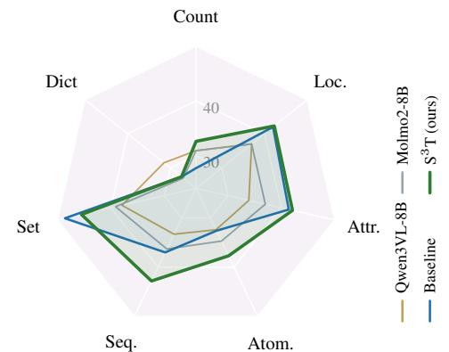  
(b) Per-axis profile vs. size-matched 8B open models

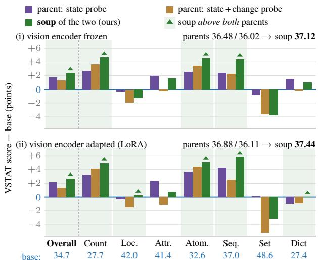  
(c) Per-axis changes from the base model, and their soup  
Table 1. $\mathbf { s } ^ { 3 } \mathbf { T }$ on VSTAT. (a) VSTAT accuracy (%) under the official protocol [64]. † marks reproduced scores. Deltas use our reproduced LLaVA-OV-2-8B base of 34.74 rather than the reported 35.1. Each self-evolving method appears below its reproduced base, with both evaluated under the same protocol. Per column, best and second are shaded. (b) Per-axis scores against size-matched 8B open models. (c) Per-axis changes for two runs differing only in the state probe and their soup, with the vision encoder frozen (top) or adapted (bottom). The blue line marks the base, absolute scores appear below each axis, and green triangles mark where the soup exceeds both runs

The per-axis breakdown shows that the gains are concentrated on the cumulative-state axes where answering requires integrating evidence across the entire clip. $\mathrm { S ^ { 3 } T }$ variants achieve the top two overall scores as well as the top two scores on Atomic and Sequence. The radar plot shows the same trend against models of matching 8B size. Supervised finetuning (SFT) helps isolate the effect of the distillation objective. It uses the same dense teacher view but fine-tunes on the teacher’s generated text instead of its predictive distribution. Although it achieves the best Attribute and Set scores, it remains below the base model overall. It shows that improving individual axes alone is not sufficient, and that the gains of $\mathrm { S ^ { 3 } T }$ arise from better cumulative-state tracking (we return to this in Sec. 4.3).

<table><tr><td>Setting</td><td>Overall</td><td>Count</td><td>Dict</td></tr><tr><td>Teacher view</td><td></td><td></td><td></td></tr><tr><td>Temporal stretch 12 → 24 (ours)</td><td>36.48</td><td>30.4</td><td>28.8</td></tr><tr><td>Temporal zoom (windowed) Identical 12→12 (no privileged view)</td><td>33.91</td><td>26.1</td><td>25.2</td></tr><tr><td>Nested 12 ⊂ 24 (student inside teacher)</td><td>34.83</td><td>27.7</td><td>27.6</td></tr><tr><td>Shifted equal-density teacher (12 → 12)</td><td>34.10 35.14</td><td>25.6</td><td>25.2</td></tr><tr><td></td><td></td><td>28.2</td><td>27.2</td></tr><tr><td>Objective and anchor</td><td></td><td></td><td></td></tr><tr><td>JSD distillation with reference anchor (ours)</td><td>36.48</td><td>30.4</td><td>28.8</td></tr><tr><td>SFT (cross-entropy on teacher text)</td><td>34.45</td><td>26.0</td><td>27.5</td></tr><tr><td>JSD to generator&#x27;s true state</td><td>33.90</td><td>27.5</td><td>29.2</td></tr><tr><td>No anchor  $( \beta \mathrm { = } 0 )$ </td><td>33.68</td><td>27.3</td><td>27.7</td></tr></table>

Table 2. Component ablations o $: \mathbf { S } ^ { 3 } :$ T. Scores are VSTAT accuracy (%) overall and on the Count and Dictionary axes. Rows marked (ours) indicate the settings used in our method. Blocks are separate comparisons and are not ranked against each other. Definitions of every setting, along with extended teacher-view alternatives, frame-ratio and souping-strength ablations, are given in Apps. E, G and I.  
Table 3. Comparison against established temporal self-supervised pretexts. Every row uses the identical training recipe, data, and frame bud get, changing only the prediction target, so the differences isolate the learning signal rather than any change in supervision volume. The established pretexts leave the base model essentially unchanged overall, and only $\mathrm { s ^ { 3 } T }$ improves it by a visible margin, with the gain concentrated on Count rather than spread evenly across the axes.

<table><tr><td>Training objective</td><td>Avg</td><td>Count</td><td>Dict</td></tr><tr><td>Base (no training)</td><td>34.74</td><td>27.7</td><td>27.4</td></tr><tr><td>Frame-order [19, 35]</td><td>34.98</td><td>27.7</td><td>30.5</td></tr><tr><td>Arrow-of-time [39, 55]</td><td>34.75</td><td>27.4</td><td>26.5</td></tr><tr><td>Pace [6, 51]</td><td>35.45</td><td>29.0</td><td>27.1</td></tr><tr><td>Mask-infill [47]</td><td>34.25</td><td>25.2</td><td>26.3</td></tr><tr><td> $\mathrm { S ^ { 3 } T }$  (ours)</td><td>36.48</td><td>30.4</td><td>28.8</td></tr></table>

## 4.2. Comparison with temporal pretexts

Tab. 3 compares $\mathrm { S ^ { 3 } T }$ with four established temporal selfsupervised objectives. Frame-order prediction [19, 35] asks the model to recover the order of shuffled clip segments. Arrow-of-time [39, 55] predicts whether a clip is played forward or backward, while pace prediction [6, 51] identifies its playback speed. Masked temporal infill [47] predicts the content of a masked temporal span. To keep the comparison controlled, we train each objective using the same base model and $\mathrm { S ^ { 3 } T }$ configuration. Only the learning objective changes. App. J defines each pretext in full. None of these objectives matches the improvement from $\mathrm { S ^ { 3 } T } .$ . Pace prediction performs best among them, possibly because it is most similar to temporal-density supervision, but it recovers less than half of the gain. Masked temporal infill performs below the baseline. The difference is clearest on Count, where $\mathrm { S ^ { 3 } T }$ is the only objective that improves performance. The other pretexts either leave it unchanged or reduce it. Although frame-order prediction achieves the best Dictionary score, it does not improve Count or the overall score. This comparison shows that the gains come from temporal-density distillation rather than temporal self-supervision alone.

## 4.3. Ablations

Teacher view. The teacher-view ablations in Tab. 2 fix the 12-frame student and vary only the teacher view. The windowed zoom gives the lowest overall score, showing that full temporal coverage matters more than sampling many frames from a short window. Event-aware, multi-scale, and adaptive teachers offer no consistent advantage over the fixed view. $\mathrm { A p p }$ . G defines these teachers and reports their scores. The identical 12 → 12 control removes the privileged frames but keeps the objective unchanged, bringing performance close to the base model. The final two controls test whether more frames or different frames alone produce the gain. A nested teacher uses 24 frames but includes every student frame and scores 34.10, below the base model. A shifted 12 → 12 teacher uses different frames at the same density and reaches only 35.14. Only the stretch teacher, which samples the clip more densely using different frames, gives the full gain. Across these settings the gain follows how much the teacher and student disagree during training rather than how accurate the teacher is (App. H).

Objective and anchor. The objective and anchor ablations in Tab. 2 compare supervised fine-tuning on the teacher’s generated text, JSD distillation toward the generator’s true state, alternative divergences, and removal of the reference anchor. Both supervised objectives score below the base model. Fine-tuning on the teacher’s text lowers the overall and Count scores. Distilling toward the true state performs worse despite using the same divergence and soft targets. It gives the best Dictionary score but does not improve cumulative-state tracking. Replacing JSD with forward or reverse KLD lowers performance and produces larger gradient spikes, making optimization less stable. App. F plots the loss and gradient traces and reports the final scores. Removing the reference anchor (β=0) drops performance below the base. The teacher provides the supervision, while the anchor stabilizes training. We also report full extended ablations of the student and teacher frame budgets in $\operatorname { A p p . }$ . E, and the souping procedure and sensitivity to α in $\mathrm { A p p . }$ . I. We also validate our α reported in Tab. 1a on held-out StateGen clips which matches our value

<table><tr><td>Real-video benchmark</td><td>Base</td><td>S3T (soup)</td><td>S3T (soup, +vis.)</td></tr><tr><td>Requires a running tally</td><td></td><td></td><td></td></tr><tr><td>VSTAT-YouTube, cumulative-state</td><td>43.41</td><td>+7.35</td><td>+7.95</td></tr><tr><td>MVBench, Action Count</td><td>54.50</td><td>+3.00</td><td>+4.50</td></tr><tr><td>General video understanding</td><td></td><td></td><td></td></tr><tr><td>TempCompass, multiple-choice [28]</td><td>74.49</td><td> $- 1 . 0 1 ^ { \mathrm { n s } }$ </td><td> $- 0 . 0 6 ^ { \mathrm { n s } }$ </td></tr><tr><td>TempCompass, yes/no</td><td>77.62</td><td> $+ 0 . 2 4 ^ { \mathrm { n s } }$ </td><td> $+ 0 . 0 4 ^ { \mathrm { n s } }$ </td></tr><tr><td>TempCompass, caption-matching</td><td>85.70</td><td> $- 1 . 0 0 ^ { \mathrm { n s } }$ </td><td>+0.20ns</td></tr><tr><td>MMVU [72]</td><td>55.20</td><td>0.00</td><td>0.00</td></tr></table>

Table 4. Transfer to real-video benchmarks. Base reports the baseline LLaVA-OV-2-8B score for each benchmark. The two $\mathrm { S ^ { 3 } T }$ columns report changes relative to it. soup uses a frozen vision encoder, while +vis. also adapts it. ns denotes a non-significant change. Clear gains occur on tasks requiring a running tally, while general video understanding is preserved.

(App. D).

## 4.4. Generalization to real video

Because $\mathrm { S ^ { 3 } T }$ is trained only on synthetic clips, we test whether what it learns transfers to real videos. Tab. 4 reports changes relative to our base model. For VSTAT-YouTube [64], we use only the task descriptions to identify 185 questions from assembly, pouring, nesting, and counting that require a running tally. On this subset, the frozen-encoder model improves by +7.35, while the visionadapted model improves by +7.95. The same pattern appears on MVBench Action Count [22], where the two models improve by +3.00 and +4.50, respectively. By contrast, none of the changes on TempCompass is statistically significant, and performance on MMVU remains unchanged. These results indicate that the gains transfer to real-video tasks that require cumulative-state tracking without changing general video understanding. App. K reports the remaining real-video results, including the effect of training on real Kinetics videos instead of synthetic clips.

## 5. Discussion

$\mathrm { S ^ { 3 } T }$ is an instance of learning under privileged information [30, 48]. The teacher must provide information missing from the student’s view while remaining similar enough for the student to imitate [8]. Consequently, our gains appear only near a 12-frame student and a 24-frame teacher, with the student budget being more sensitive. App. E shows the full sweep, along with how accuracy changes with the number of frames used at evaluation. The teacher-view ablations in Tab. 2 further show that temporal coverage matters more than frame count. The gain is not limited to sparse evaluation. Increasing the VSTAT evaluation budget from 24 to 64 frames barely changes the base model from 34.51 to 34.74, but raises a single $\mathrm { S ^ { 3 } T }$ model from 34.23 to 36.48. At 64 frames, $\mathrm { S ^ { 3 } T }$ also outperforms the base model at every tested budget, including its best score of 35.33 at 96 frames. $\mathrm { S ^ { 3 } T }$ therefore learns to use additional frames rather than benefiting only from sparse input; App. E gives the accuracy of both models at every budget we ran.

Most of the improvement comes from the language decoder. Adapting only its attention and feed-forward projections gives a gain of +2.38, compared with the total gain of $+ 2 . 7 0$ Adapting the vision encoder adds the remaining +0.32. In the first setting, both the vision encoder and vision-to-language projector remain frozen, so each frame produces the same visual tokens as in the base model. The +2.38 gain therefore comes from changing how the decoder combines information across frames. This is consistent with prior work that identifies the language decoder as the primary bottleneck in multimodal reasoning, where attention to visual tokens can weaken during decoding or be dominated by language priors [10, 36, 50, 63, 74].

Limitations. $\mathrm { s ^ { 3 } T }$ does not transfer consistently across the models we tested. We applied the same objective and data to eleven base models from five families and retuned the training settings for each model (App. L). Only LLaVA-OV-2- 8B [2] showed a clear improvement. We tested ten possible explanations, but none accounted for this difference. App. L reports each explanation and the measurement used to rule it out. Two possibilities remain. One is the amount of video post-training each backbone received. The other is how much a low-rank language-model adapter can change how the backbone uses visual evidence. Public checkpoints do not allow us to test these factors separately. This would require backbones with matched pre-training and tests across different adapter placements. We examined several measurable properties of the base model, but our analysis did not identify a consistent pre-training signal that separates successful from unsuccessful $\mathrm { S ^ { 3 } T }$ runs. We therefore leave finding such a signal for future work.

## 6. Conclusion

We introduced $\mathrm { S ^ { 3 } T } ,$ , the first fully self-contained framework for improving continuous visual state tracking in videos without supervision. The method uses a denser view of the same clip as privileged information and distills its predictions into a sparse view of the same model. It requires no labels, external teacher, reward model, or tracker. On VSTAT, the improvements are concentrated on cumulativestate tasks, suggesting that the model becomes better at maintaining state over time while preserving general video understanding. This ability also transfers to real videos on tasks that require a running tally. Overall, our results show that temporal sampling density can provide label-free supervision for learning long-horizon visual state tracking.

## Acknowledgement

We acknowledge funding from the Research Council of Finland (projects 362408 and 339730). This work was supported by the Research Council of Finland Flagship programme: Finnish Center for Artificial Intelligence FCAI. We acknowledge the computational resources provided by the Aalto Science-IT project.

## References

[1] Jean-Baptiste Alayrac, Jeff Donahue, Pauline Luc, Antoine Miech, Iain Barr, Yana Hasson, Karel Lenc, Arthur Mensch, Katherine Millican, Malcolm Reynolds, Roman Ring, Eliza Rutherford, Serkan Cabi, Tengda Han, Zhitao Gong, Sina Samangooei, Marianne Monteiro, Jacob L Menick, Sebastian Borgeaud, Andy Brock, Aida Nematzadeh, Sahand Sharifzadeh, Mikołaj Binkowski, Ricardo Barreira,´ Oriol Vinyals, Andrew Zisserman, and Karen Simonyan. Flamingo: a visual language model for few-shot learning. In Advances in Neural Information Processing Systems (NeurIPS), pages 23716–23736, 2022. 2

[2] Xiang An, Yin Xie, Feilong Tang, Yunyao Yan, Huajie Tan, Didi Zhu, Changrui Chen, Xiuwei Zhao, Bin Qin, Kaicheng Yang, Yifei Shen, Yuanhan Zhang, Kaichen Zhang, Wenkang Zhang, Zheng Cheng, Nansen Zhang, Chunsheng Wu, Chunjiang Ge, Zimin Ran, Dehua Song, Chunyuan Li, Shikun Feng, Ming Hu, Zhangquan Chen, Junbo Niu, Bo Li, Ziyong Feng, Ziwei Liu, Zongyuan Ge, and Jiankang Deng. LLaVA-OneVision-2: Towards next-generation perceptual intelligence. arXiv preprint arXiv:2605.25979, 2026. 5, 6, 8

[3] Shuai Bai, Yuxuan Cai, Ruizhe Chen, Keqin Chen, Xionghui Chen, Zesen Cheng, Lianghao Deng, Wei Ding, Chang Gao, Chunjiang Ge, Wenbin Ge, Zhifang Guo, Qidong Huang, Jie Huang, Fei Huang, Binyuan Hui, Shutong Jiang, Zhaohai Li, Mingsheng Li, Mei Li, Kaixin Li, Zicheng Lin, Junyang Lin, Xuejing Liu, Jiawei Liu, Chenglong Liu, Yang Liu, Dayiheng Liu, Shixuan Liu, Dunjie Lu, Ruilin Luo, Chenxu Lv, Rui Men, Lingchen Meng, Xuancheng Ren, Xingzhang Ren, Sibo Song, Yuchong Sun, Jun Tang, Jianhong Tu, Jianqiang Wan, Peng Wang, Pengfei Wang, Qiuyue Wang, Yuxuan Wang, Tianbao Xie, Yiheng Xu, Haiyang Xu, Jin Xu, Zhibo Yang, Mingkun Yang, Jianxin Yang, An Yang, Bowen Yu, Fei Zhang, Hang Zhang, Xi Zhang, Bo Zheng, Humen Zhong, Jingren Zhou, Fan Zhou, Jing Zhou, Yuanzhi Zhu, and Ke Zhu. Qwen3-VL technical report, 2025. 1, 6

[4] Shuai Bai, Keqin Chen, Xuejing Liu, Jialin Wang, Wenbin Ge, Sibo Song, Kai Dang, Peng Wang, Shijie Wang, Jun Tang, Humen Zhong, Yuanzhi Zhu, Mingkun Yang, Zhaohai Li, Jianqiang Wan, Pengfei Wang, Wei Ding, Zheren Fu, Yiheng Xu, Jiabo Ye, Xi Zhang, Tianbao Xie, Zesen Cheng, Hang Zhang, Zhibo Yang, Haiyang Xu, and Junyang Lin. Qwen2.5-VL technical report, 2025. 6

[5] Max Bain, Arsha Nagrani, Gul Varol, and Andrew Zisser-¨ man. Frozen in time: A joint video and image encoder for end-to-end retrieval. In Proceedings of the IEEE/CVF In-

ternational Conference on Computer Vision (ICCV), pages 1728–1738, 2021. 2

[6] Sagie Benaim, Ariel Ephrat, Oran Lang, Inbar Mosseri, William T Freeman, Michael Rubinstein, Michal Irani, and Tali Dekel. SpeedNet: Learning the speediness in videos. In Proceedings of the IEEE/CVF Conference on Computer Vision and Pattern Recognition (CVPR), pages 9922–9931, 2020. 3, 7, 6

[7] Xi Chen, Zuoxin Li, Ye Yuan, Gang Yu, Jianxin Shen, and Donglian Qi. State-aware tracker for real-time video object segmentation. In Proceedings of the IEEE/CVF Conference on Computer Vision and Pattern Recognition (CVPR), pages 9384–9393, 2020. 1

[8] Jang Hyun Cho and Bharath Hariharan. On the efficacy of knowledge distillation. In Proceedings of the IEEE/CVF International Conference on Computer Vision (ICCV), pages 4793–4801. IEEE, 2019. 8

[9] Christopher Clark, Jieyu Zhang, Zixian Ma, Jae Sung Park, Rohun Tripathi, Sangho Lee, Mohammadreza Salehi, Jason Ren, Chris Dongjoo Kim, Yinuo Yang, Vincent Shao, Yue Yang, Weikai Huang, Ziqi Gao, Taira Anderson, Jianrui Zhang, Jitesh Jain, George Stoica, Ali Farhadi, and Ran jay Krishna. Molmo2: Open weights and data for visionlanguage models with video understanding and grounding. In Proceedings of the IEEE/CVF Conference on Computer Vision and Pattern Recognition (CVPR), pages 28652– 28668, 2026. 6

[10] Parsa Esmaeilkhani and Longin Jan Latecki. Direct visual grounding by directing attention of visual tokens. In 2026 IEEE/CVF Winter Conference on Applications of Computer Vision (WACV), pages 5787–5797. IEEE, 2026. 8

[11] Hao Fei, Shengqiong Wu, Wei Ji, Hanwang Zhang, Meishan Zhang, Mong-Li Lee, and Wynne Hsu. Video-of-thought: Step-by-step video reasoning from perception to cognition. arXiv preprint arXiv:2501.03230, 2024. 1

[12] Chaoyou Fu, Haojia Lin, Xiong Wang, Yifan Zhang, Yunhang Shen, Xiaoyu Liu, Haoyu Cao, Zuwei Long, Heting Gao, Ke Li, Long Ma, Xiawu Zheng, Rongrong Ji, Xing Sun, Caifeng Shan, and Ran He. VITA-1.5: Towards GPT-4o level real-time vision and speech interaction. In Advances in Neural Information Processing Systems (NeurIPS), pages 75300–75320, 2026. 6

[13] Edward J Hu, yelong shen, Phillip Wallis, Zeyuan Allen-Zhu, Yuanzhi Li, Shean Wang, Lu Wang, and Weizhu Chen. LoRA: Low-rank adaptation of large language models. In In ternational Conference on Learning Representations (ICLR), 2022. 3, 5

[14] Shiqi Huang, Ziyue Wang, Zhongrong Zuo, Han Qiu, Qi She, and Bihan Wen. EvoVid: Temporal-centric selfevolution for video large language models. arXiv preprint arXiv:2605.21931, 2026. 2

[15] Jonas Hubotter, Frederike L¨ ubeck, Lejs Behric, Anton Bau-¨ mann, Marco Bagatella, Daniel Marta, Ido Hakimi, Idan Shenfeld, Thomas Kleine Buening, Carlos Guestrin, and Andreas Krause. Reinforcement learning via self-distillation. arXiv preprint arXiv:2601.20802, 2026. 2

[16] Minjoon Jung, Byoung-Tak Zhang, and Lorenzo Torresani.

EvoGround: Self-evolving video agents for video temporal grounding. arXiv preprint arXiv:2605.13803, 2026. 2, 3, 6

[17] Dohwan Ko, Joonmyung Choi, Juyeon Ko, Shinyeong Noh, Kyoung-Woon On, Eun-Sol Kim, and Hyunwoo J Kim. Video-text representation learning via differentiable weak temporal alignment. In Proceedings of the IEEE/CVF Conference on Computer Vision and Pattern Recognition (CVPR), pages 5016–5025, 2022. 1

[18] Solomon Kullback and Richard A Leibler. On information and sufficiency. The Annals of Mathematical Statistics, 22 (1):79–86, 1951. 4

[19] Hsin-Ying Lee, Jia-Bin Huang, Maneesh Singh, and Ming-Hsuan Yang. Unsupervised representation learning by sorting sequences. In Proceedings of the IEEE/CVF International Conference on Computer Vision (ICCV), pages 667– 676, 2017. 3, 7, 6

[20] Bo Li, Yuanhan Zhang, Dong Guo, Renrui Zhang, Feng Li, Hao Zhang, Kaichen Zhang, Peiyuan Zhang, Yanwei Li, Ziwei Liu, and Chunyuan Li. LLaVA-OneVision: Easy visual task transfer. arXiv preprint arXiv:2408.03326, 2024. 6

[21] Dongxu Li, Junnan Li, Hongdong Li, Juan Carlos Niebles, and Steven CH Hoi. Align and prompt: Video-and-language pre-training with entity prompts. In Proceedings of the IEEE/CVF Conference on Computer Vision and Pattern Recognition (CVPR), pages 4953–4963, 2022. 1

[22] Kunchang Li, Yali Wang, Yinan He, Yizhuo Li, Yi Wang, Yi Liu, Zun Wang, Jilan Xu, Guo Chen, Ping Lou, Limin Wang, and Yu Qiao. MVBench: A comprehensive multimodal video understanding benchmark. In Proceedings of the IEEE/CVF Conference on Computer Vision and Pattern Recognition (CVPR), pages 22195–22206, 2024. 8

[23] Lei Li, Yuanxin Liu, Linli Yao, Peiyuan Zhang, Chenxin An, Lean Wang, Xu Sun, Lingpeng Kong, and Qi Liu. Temporal reasoning transfer from text to video. In International Conference on Learning Representations (ICLR), pages 74070– 74102, 2025. 3

[24] Ruotong Liao, Max Erler, Huiyu Wang, Guangyao Zhai, Gengyuan Zhang, Yunpu Ma, and Volker Tresp. VideoIN-STA: Zero-shot long video understanding via informative spatial-temporal reasoning with LLMs. In Findings of the Association for Computational Linguistics (EMNLP), pages 6577–6602, 2024. 3

[25] Hao Lin, Kunyang Lv, Xu Jiang, Jingqi Tian, Zhongjing Du, Jiayu Ding, Qiaoman Zhang, and Hongbo Jin. VISD: Enhancing video reasoning via structured self-distillation. arXiv preprint arXiv:2605.06094, 2026. 2, 3

[26] Jianhua Lin. Divergence measures based on the shannon entropy. IEEE Transactions on Information Theory, 37(1): 145–151, 1991. 4

[27] Ji Lin, Hongxu Yin, Wei Ping, Pavlo Molchanov, Mohammad Shoeybi, and Song Han. VILA: On pre-training for visual language models. In Proceedings of the IEEE/CVF Conference on Computer Vision and Pattern Recognition (CVPR), pages 26689–26699, 2024. 2

[28] Yuanxin Liu, Shicheng Li, Yi Liu, Yuxiang Wang, Shuhuai Ren, Lei Li, Sishuo Chen, Xu Sun, and Lu Hou. TempCompass: Do video LLMs really understand videos? In Findings

of the Association for Computational Linguistics: ACL 2024, pages 8731–8772, 2024. 8

[29] Ye Liu, Zongyang Ma, Zhongang Qi, Yang Wu, Ying Shan, and Chang W Chen. ET Bench: Towards open-ended eventlevel video-language understanding. In Advances in Neural Information Processing Systems (NeurIPS), pages 32076– 32110, 2024. 3

[30] David Lopez-Paz, Leon Bottou, Bernhard Sch ´ olkopf, and¨ Vladimir Vapnik. Unifying distillation and privileged information. arXiv preprint arXiv:1511.03643, 2015. 4, 8

[31] Ilya Loshchilov, Frank Hutter, et al. Fixing weight decay regularization in Adam. arXiv preprint arXiv:1711.05101, 5 (5):5, 2017. 5, 1

[32] Huaishao Luo, Lei Ji, Ming Zhong, Yang Chen, Wen Lei, Nan Duan, and Tianrui Li. CLIP4Clip: An empirical study of CLIP for end to end video clip retrieval and captioning. Neurocomputing, 508:293–304, 2022. 2

[33] Muhammad Maaz, Hanoona Rasheed, Salman Khan, and Fahad Khan. Video-ChatGPT: Towards detailed video understanding via large vision and language models. In Proceedings of the 62nd Annual Meeting of the Association for Computational Linguistics (Volume 1: Long Papers), pages 12585–12602, 2024. 2

[34] Ahmad Mahmood, Ashmal Vayani, Muzammal Naseer, Salman Khan, and Fahad Shahbaz Khan. VURF: A generalpurpose reasoning and self-refinement framework for video understanding. arXiv preprint arXiv:2403.14743, 2024. 1

[35] Ishan Misra, C Lawrence Zitnick, and Martial Hebert. Shuffle and learn: unsupervised learning using temporal order verification. In Proceedings of the European Conference on Computer Vision (ECCV), pages 527–544. Springer, 2016. 3, 7, 6

[36] Siqu Ou, Tianrui Wan, Zhiyuan Zhao, Junyu Gao, and Xuelong Li. Do mllms really see it: Reinforcing visual attention in multimodal llms. arXiv preprint arXiv:2602.08241, 2026. 8

[37] Kun Ouyang, Yuanxin Liu, Haoning Wu, Yi Liu, Hao Zhou, Jie Zhou, Fandong Meng, and Xu Sun. Spacer: Reinforcing MLLMs in video spatial reasoning. arXiv preprint arXiv:2504.01805, 2025. 2

[38] Kun Ouyang, Yuanxin Liu, Linli Yao, Yishuo Cai, Hao Zhou, Fandong Meng, Jie Zhou, and Xu Sun. Conan: Progressive learning to reason like a detective over multi-scale visual evidence. In Proceedings of the IEEE/CVF Conference on Computer Vision and Pattern Recognition (CVPR), pages 41089–41099, 2026. 2

[39] Lyndsey C. Pickup, Zheng Pan, Donglai Wei, YiChang Shih, Changshui Zhang, Andrew Zisserman, Bernhard Scholkopf, and William T. Freeman. Seeing the arrow of time. In Proceedings of the IEEE/CVF Conference on Computer Vision and Pattern Recognition (CVPR), 2014. 3, 7, 6

[40] Rui Qian, Xiaoyi Dong, Pan Zhang, Yuhang Zang, Shuan grui Ding, Dahua Lin, and Jiaqi Wang. Streaming long video understanding with large language models. In Advances in Neural Information Processing Systems (NeurIPS), pages 119336–119360, 2024. 1

[41] Hanoona Rasheed, Muhammad Uzair Khattak, Muhammad Maaz, Salman Khan, and Fahad Shahbaz Khan. Fine-tuned

CLIP models are efficient video learners. In Proceedings of the IEEE/CVF Conference on Computer Vision and Pattern Recognition (CVPR), pages 6545–6554, 2023. 1

[42] Shaden Shaar, Bradon Thymes, Sirawut Chaixanien, Claire Cardie, and Bharath Hariharan. MovieRecapsQA: A multimodal open-ended video question-answering benchmark. arXiv preprint arXiv:2601.02536, 2026. 3

[43] Enxin Song, Wenhao Chai, Guanhong Wang, Yucheng Zhang, Haoyang Zhou, Feiyang Wu, Haozhe Chi, Xun Guo, Tian Ye, Yanting Zhang, Yan Lu, Jenq-Neng Hwang, and Gaoang Wang. MovieChat: From dense token to sparse memory for long video understanding. In Proceedings of the IEEE/CVF Conference on Computer Vision and Pattern Recognition (CVPR), pages 18221–18232, 2024. 2

[44] Chen Sun, Austin Myers, Carl Vondrick, Kevin Murphy, and Cordelia Schmid. VideoBERT: A joint model for video and language representation learning. In Proceedings of the IEEE/CVF International Conference on Computer Vision (ICCV), pages 7464–7473, 2019. 2

[45] Omkar Thawakar, Shravan Venkatraman, Ritesh Thawkar, Abdelrahman Shaker, Hisham Cholakkal, Rao Muhammad Anwer, Salman Khan, and Fahad Khan. EvoLMM: Selfevolving large multimodal models with continuous rewards. arXiv preprint arXiv:2511.16672, 2025. 3

[46] Ritesh Thawkar, Shravan Venkatraman, Omkar Thawakar, Abdelrahman Shaker, Fahad Khan, Hisham Cholakkal, Salman Khan, and Rao Muhammad Anwer. Ask, solve, generate: Self-evolving unified multimodal understanding and generation via self-consistency rewards. arXiv preprint arXiv:2606.27376, 2026. 3

[47] Zhan Tong, Yibing Song, Jue Wang, and Limin Wang. VideoMAE: Masked autoencoders are data-efficient learners for self-supervised video pre-training. In Advances in Neural Information Processing Systems (NeurIPS), pages 10078– 10093, 2022. 3, 7, 6

[48] Vladimir Vapnik and Rauf Izmailov. Learning using privileged information: similarity control and knowledge transfer. Journal of Machine Learning Research (JMLR), 16(1): 2023–2049, 2015. 4, 8

[49] Shravan Venkatraman, Omkar Thawakar, Ritesh Thawkar, Abdelrahman Shaker, and Rao Muhammad Anwer. Perception before supervision: Self-contained visual distillation from counterfactual blind spots. arXiv preprint arXiv:2608.09931, 2026. 2, 3

[50] Shravan Venkatraman, Ritesh Thawkar, Omkar Thawakar, Rao Muhammad Anwer, Hisham Cholakkal, Salman Khan, and Fahad Khan. Paying more attention to visual tokens in self-evolving large multimodal models. arXiv preprint arXiv:2606.27373, 2026. 3, 8

[51] Jiangliu Wang, Jianbo Jiao, and Yun-Hui Liu. Selfsupervised video representation learning by pace prediction. In Proceedings ofthe European Conference on Computer Vision (ECCV), pages 504–521. Springer, 2020. 3, 7, 6

[52] Qi Wang, Yanrui Yu, Ye Yuan, Rui Mao, and Tianfei Zhou. VideoRFT: Incentivizing video reasoning capability in MLLMs via reinforced fine-tuning. In Advances in Neu ral Information Processing Systems (NeurIPS), pages 4350– 4376, 2026. 1

[53] Weiyun Wang, Zhangwei Gao, Lixin Gu, Hengjun Pu, Long Cui, Xingguang Wei, Zhaoyang Liu, Linglin Jing, Sheng long Ye, Jie Shao, Zhaokai Wang, Zhe Chen, Hongjie Zhang, Ganlin Yang, Haomin Wang, Qi Wei, Jinhui Yin, Wenhao Li, Erfei Cui, Guanzhou Chen, Zichen Ding, Changyao Tian, Zhenyu Wu, Jingjing Xie, Zehao Li, Bowen Yang, Yuchen Duan, Xuehui Wang, Zhi Hou, Haoran Hao, Tianyi Zhang, Songze Li, Xiangyu Zhao, Haodong Duan, Nianchen Deng, Bin Fu, Yinan He, Yi Wang, Conghui He, Botian Shi, Junjun He, Yingtong Xiong, Han Lv, Lijun Wu, Wenqi Shao, Kaipeng Zhang, Huipeng Deng, Biqing Qi, Jiaye Ge, Qipeng Guo, Wenwei Zhang, Songyang Zhang, Maosong Cao, Junyao Lin, Kexian Tang, Jianfei Gao, Haian Huang, Yuzhe Gu, Chengqi Lyu, Huanze Tang, Rui Wang, Haijun Lv, Wanli Ouyang, Limin Wang, Min Dou, Xizhou Zhu, Tong Lu, Dahua Lin, Jifeng Dai, Weijie Su, Bowen Zhou, Kai Chen, Yu Qiao, Wenhai Wang, and Gen Luo. InternVL3.5: Advancing open-source multimodal models in versatility, reasoning, and efficiency. arXiv preprint arXiv:2508.18265, 2025. 1, 6

[54] Yi Wang, Kunchang Li, Xinhao Li, Jiashuo Yu, Yinan He, Guo Chen, Baoqi Pei, Rongkun Zheng, Zun Wang, Yansong Shi, Tianxiang Jiang, Songze Li, Jilan Xu, Hongjie Zhang, Yifei Huang, Yu Qiao, Yali Wang, and Limin Wang. Intern-Video2: Scaling foundation models for multimodal video understanding. In Proceedings of the European Confer ence on Computer Vision (ECCV), pages 396–416. Springer, 2024. 1

[55] Donglai Wei, Joseph J Lim, Andrew Zisserman, and William T Freeman. Learning and using the arrow of time. In Proceedings of the IEEE/CVF Conference on Computer Vision and Pattern Recognition (CVPR), pages 8052–8060, 2018. 3, 7, 6

[56] Mitchell Wortsman, Gabriel Ilharco, Samir Ya Gadre, Rebecca Roelofs, Raphael Gontijo-Lopes, Ari S Morcos, Hongseok Namkoong, Ali Farhadi, Yair Carmon, Simon Kornblith, and Ludwig Schmidt. Model soups: averaging weights of multiple fine-tuned models improves accuracy without increasing inference time. In Proceedings of the International Conference on Machine Learning (ICML), pages 23965–23998. PMLR, 2022. 4, 5

[57] Junbin Xiao, Angela Yao, Yicong Li, and Tat-Seng Chua. Can i trust your answer? visually grounded video question answering. In Proceedings of the IEEE/CVF Conference on Computer Vision and Pattern Recognition (CVPR), pages 13204–13214, 2024. 3

[58] Dejing Xu, Zhou Zhao, Jun Xiao, Fei Wu, Hanwang Zhang, Xiangnan He, and Yueting Zhuang. Video question answering via gradually refined attention over appearance and motion. In Proceedings of the ACM International Conference on Multimedia (ACM MM), pages 1645–1653, 2017. 3

[59] Hu Xu, Gargi Ghosh, Po-Yao Huang, Dmytro Okhonko, Armen Aghajanyan, Florian Metze, Luke Zettlemoyer, and Christoph Feichtenhofer. VideoCLIP: Contrastive pretraining for zero-shot video-text understanding. In Proceed ings of the 2021 Conference on Empirical Methods in Natu ral Language Processing, pages 6787–6800, 2021. 1

[60] Guang Yang, Manling Li, Jiajie Zhang, Xudong Lin, Heng

Ji, and Shih-Fu Chang. Video event extraction via tracking visual states of arguments. In AAAI, pages 3136–3144, 2023. 1

[61] Jianwei Yang, Yonatan Bisk, and Jianfeng Gao. TACO: Token-aware cascade contrastive learning for video-text alignment. In Proceedings of the IEEE/CVF International Conference on Computer Vision (ICCV), pages 11562– 11572, 2021. 1

[62] Shusheng Yang, Jihan Yang, Pinzhi Huang, Ellis L II Brown, Zihao Yang, Yue Yu, Shengbang Tong, Zihan Zheng, Yifan Xu, Muhan Wang, Rob Fergus, Yann LeCun, Li Fei-Fei, and Saining Xie. Cambrian-S: Towards spatial supersensing in video. In International Conference on Learning Representations (ICLR), 2025. 1, 6

[63] Shuo Yang, Yuwei Niu, Yuyang Liu, Yang Ye, Bin Lin, and Li Yuan. Look-back: Implicit visual re-focusing in mllm reasoning. In Proceedings of the AAAI conference on artificial intelligence, pages 11694–11702, 2026. 8

[64] Sihyun Yu, Nanye Ma, Pinzhi Huang, Hyunseok Lee, Shusheng Yang, June Suk Choi, Ellis Brown, Oscar Michel, Boyang Zheng, Jinwoo Shin, and Saining Xie. Benchmarking visual state tracking in multimodal video understanding. arXiv preprint arXiv:2606.03920, 2026. 1, 3, 5, 6, 8

[65] Qianhao Yuan, Jie Lou, Xing Yu, Hongyu Lin, Le Sun, Xianpei Han, and Yaojie Lu. Vision-OPD: Learning to see fine details for multimodal LLMs via on-policy self-distillation. arXiv preprint arXiv:2605.18740, 2026. 3

[66] Guiyi Zeng, Junqing Yu, Yi-Ping Phoebe Chen, Xu Chen, Wei Yang, and Zikai Song. CurEvo: Curriculum-guided self-evolution for video understanding. arXiv preprint arXiv:2604.26707, 2026. 2, 3

[67] Congzhi Zhang, Zhibin Wang, Yinchao Ma, Jiawei Peng, Yihan Wang, Qiang Zhou, Jun Song, and Bo Zheng. ReWatch-R1: Boosting complex video reasoning in large visionlanguage models through agentic data synthesis. arXiv preprint arXiv:2509.23652, 2025. 2

[68] Hang Zhang, Xin Li, and Lidong Bing. Video-LLaMA: An instruction-tuned audio-visual language model for video understanding. In Proceedings of the 2023 Conference on Empirical Methods in Natural Language Processing: System Demonstrations, pages 543–553, 2023. 1

[69] Haoji Zhang, Xin Gu, Jiawen Li, Chixiang Ma, Sule Bai, Chubin Zhang, Bowen Zhang, Zhichao Zhou, Dongliang He, and Yansong Tang. Thinking with videos: Multimodal toolaugmented reinforcement learning for long video reasoning. In Proceedings of the IEEE/CVF Conference on Computer Vision and Pattern Recognition (CVPR), pages 32903– 32914, 2026. 1

[70] Ruixu Zhang, Deyi Ji, Lanyun Zhu, Xuanyi Liu, Yuxin Meng, Ruihang Chu, and Yujiu Yang. Video-Zero: Self-evolution video understanding. arXiv preprint arXiv:2605.14733, 2026. 2, 3, 6

[71] Yuanhan Zhang, Jinming Wu, Wei Li, Bo Li, Zejun Ma, Ziwei Liu, and Chunyuan Li. LLaVA-Video: Video instruction tuning with synthetic data. arXiv preprint arXiv:2410.02713, 2024. 2

[72] Yilun Zhao, Haowei Zhang, Lujing Xie, Tongyan Hu, Guo Gan, Yitao Long, Zhiyuan Hu, Weiyuan Chen, Chuhan

Li, Zhijian Xu, et al. MMVU: Measuring expert-level multi-discipline video understanding. In Proceedings of the IEEE/CVF Conference on Computer Vision and Pattern Recognition (CVPR), pages 8475–8489. IEEE, 2025. 8

[73] Tinghui Zhu, Sheng Zhang, James Y Huang, Selena Song, Xiaofei Wen, Yuankai Li, Hoifung Poon, and Muhao Chen. Video models can reason with verifiable rewards. arXiv preprint arXiv:2605.15458, 2026. 2

[74] Xin Zou, Yizhou Wang, Yibo Yan, Yuanhuiyi Lyu, Kening Zheng, Sirui Huang, Junkai Chen, Peijie Jiang, Jia Liu, Chang Tang, et al. Look twice before you answer: Memory-space visual retracing for hallucination mitigation in multimodal large language models. arXiv preprint arXiv:2410.03577, 2024. 8

# Temporal Self-Distillation: Learning Visual State Tracking in Videos Without Supervision

Supplementary Material

This supplementary material provides the full implementation details (App. A), further analysis of the two temporal views (Apps. B, E and F), definitions of all ablation settings together with extended ablation tables (Apps. G and I), the remaining real-video results (App. K), and a discussion of backbone generalization (App. L).

## A. Training data and hyperparameters

The 300 training clips in Sec. 3.1 are generated by StateGen using seeds 0–299, which fixes the pool exactly. Each clip has a resolution o $5 1 2 \times 5 1 2$ , lasts 20 seconds at 12 fps, and contains $T = 2 4 0$ source frames. One clip is sampled per step for 3000 steps, so each clip is seen about ten times.

Each scene starts with 6–15 near-identical entities on a procedurally textured background and evolves through 7–11 events drawn from {add, remove, move, swap, recolor}. These events occur in near-equal proportions across the pool (497–574 occurrences each). Events are extended transitions with separate start and end frames. Consecutive event centres are at least 13 frames apart (median 22), so they do not overlap. Each clip also contains one to three occluders and continuous camera motion sampled from zoom, rotation, and pan. These repeatedly hide and reveal entities, making the current state difficult to recover from a single frame.

StateGen also records a JSON log of the exact procedural state of each clip. This log is used only for offline analysis. It is never given to the model, used as a target or reward, or used to filter the training data. $\mathrm { S ^ { 3 } T }$ is trained only from RGB video and its own generated outputs.

Hyperparameters. The LoRA adapters use rank $r { = } 3 2$ scaling factor $\alpha _ { \mathrm { L o R A } } { = } 6 4$ , and dropout 0.05. We use AdamW [31] with a learning rate of $1 . 5 \times 1 0 ^ { - 5 }$ , weight decay of 0.01, and gradient clipping at 1.0. Training runs on 4×A100 GPUs in bfloat16.

The anchor weight $\beta$ is updated at rate $\eta$ to keep $d _ { \mathrm { r e f } }$ near a target κ:

$$
\begin{array} { r l } & { \beta  \mathrm { c l i p } \Big ( \beta \cdot \exp \big ( \eta \cdot \mathrm { c l i p } ( \delta , - c , c ) \big ) , \ \beta _ { \mathrm { m i n } } , \ \beta _ { \mathrm { m a x } } \Big ) , } \\ & { \delta = \frac { d _ { \mathrm { r e f } } - \kappa } { \kappa } . } \end{array}\tag{5}
$$

Here, δ measures the relative difference between $d _ { \mathrm { r e f } }$ and its target. The inner clip limits each update, while the outer clip keeps $\beta$ within the allowed range. We use $\kappa { = } 0 . 0 6 , \eta { = } 0 . 0 5$ and c=3. We initialize $\beta$ at 0.05 and set $[ \beta _ { \mathrm { m i n } } , \beta _ { \mathrm { m a x } } ] =$ $[ 1 0 ^ { - 3 } , 5 ]$

Selection protocol. Because every ablation is evaluated on the same 1,500 VSTAT questions, we specify which choices were fixed before evaluation and which were compared on the benchmark. Fixed before any VSTAT measurement, and never tuned on it: the objective and its anchor, the 3000-step schedule, the LoRA rank and placement, the optimizer and learning rate, the 300-clip pool and its generator settings, and the two state probes, which ask for the visible state and for what changed.

The deployed configuration is used throughout, and we do not report the best result for each ablation. None of our hyperparameters were ever tuned on it. The teacher view, frame ratio, divergence, checkpoint step, and the soup strength α were compared on VSTAT to evaluate hyperparameter-sensitivity and are reported as ablations. We also report the full α sweep (Tab. A11) to show its sensitivity.

## B. The denser view as a state estimate

$\mathrm { S ^ { 3 } T }$ assumes that 24 frames provide a better estimate of the current state than 12. We test this directly before training. The frozen base model is evaluated on 300 held-out State-Gen clips at both frame budgets using the same probe. Since the clips are procedurally generated, we know the true end state of each clip. These labels are used only for this analysis and never during training.

<table><tr><td colspan="2">Measure 12 frames</td><td>24 frames</td><td>Difference</td></tr><tr><td>Correct state tokens (%) ↑</td><td>63.38</td><td>64.45</td><td>+1.07</td></tr><tr><td>Exactly correct count (%) ↑</td><td>17.0</td><td>20.0</td><td>+3.0</td></tr><tr><td>VSTAT accuracy (%) ↑</td><td>31.60</td><td>34.51</td><td>+2.91</td></tr></table>

Table A1. Sparse and dense views scored against the true state. Frozen base model evaluated on 300 StateGen clips against the generator’s record of the true state.

With twice as many frames, the model recovers more of the true state, reaching 64.45% correct state tokens compared with 63.38%, and improves by 2.91 points on VSTAT without any change to its weights. This difference is the additional information available to the teacher but not to the student.

## C. Gains against the answer prior

A model can raise its score on this benchmark without using the video, by moving its answers toward the most common answer for each task. We therefore check whether the $\mathrm { S ^ { 3 } T }$ gain works this way.

For each question we take the most frequent answer among all questions of the same source task. This gives a prediction that uses no video, and we use it only to split the benchmark: 366 of the 1,500 questions have a correct answer that matches this prediction, and the remaining 1,134 do not. On the second group, moving toward the answer prior can only lose accuracy.

Table A2. Accuracy split by whether the correct answer is also the most frequent answer for its task. VSTAT accuracy (%) for the base model and our vision-adapted model.
<table><tr><td>Question group</td><td>n</td><td>Base</td><td> $\mathrm { S ^ { 3 } T }$ </td></tr><tr><td>Correct answer matches the prior</td><td>366</td><td>38.01</td><td>43.69</td></tr><tr><td>Correct answer differs</td><td>1134</td><td>33.69</td><td>35.42</td></tr><tr><td>All questions</td><td>1500</td><td>34.74</td><td>37.44</td></tr></table>

S3T improves on both groups. On the 1,134 questions where the prior is wrong, the gain is +1.74 with an interval that excludes zero, and these questions supply about half of the overall gain. The improvements are also spread across the benchmark rather than concentrated: of the items whose score rises, 26.4% are ones where the correct answer matches the prior, against 24.4% of the benchmark as a whole. The gain is larger on the questions that agree with the prior, +5.68 against +1.74, and the share of answers matching the prior rises from 19.8% to 23.0% after training. Part of the effect is therefore a shift toward more common answers. But it is not the whole effect, because the improvement on the questions where that shift is penalised is on its own significant.

## D. Choosing the soup strength on held-out data

Every ablation in this paper is evaluated on VSTAT, so it is fair to ask how much of our result depends on choices made against the benchmark. The soup strength α is a single number applied after training, which makes it the easiest choice to select somewhere else and then check.

We generate 100 fresh StateGen clips from a seed range disjoint from the training pool. These clips are never trained on, and their generator states are used only for scoring here. For each α we merge the two runs, ask the merged model our usual probe on each clip at the student’s 12-frame view, and compare the count it reports with the true count. The whole procedure runs before any VSTAT number is looked at.

Table A3. Selecting α on held-out clips. Mean absolute count error on 100 held-out StateGen clips, with the VSTAT score of the same merged model for reference. The lowest count error and the highest VSTAT score occur at the same α.
<table><tr><td>α</td><td>1.0</td><td>1.1</td><td>1.2</td><td>1.3</td><td>1.4</td><td>1.5</td><td>1.7</td></tr><tr><td>Count error ↓</td><td>3.02</td><td>3.16</td><td>3.20</td><td>2.96</td><td>3.12</td><td>3.26</td><td>3.53</td></tr><tr><td>VSTAT ↑</td><td>35.97</td><td>36.13</td><td>36.65</td><td>37.44</td><td>36.99</td><td>36.76</td><td>37.06</td></tr></table>

The held-out count error is lowest at $\alpha { = } 1 . 3 ,$ , which is the value we report, and the same setting gives the best VSTAT score. Selecting α without the benchmark therefore returns the model we already report, and the headline number does not change. We choose teacher and student views, frame ratio, and divergence based on our temporal sampling density hypothesis, and provide a clear ablation on all of these settings. None of them were hand-tuned on the VSTAT benchmark, as declared in App. A.

## E. Frame budgets

Fig. A1 varies the two training frame budgets. The gains are concentrated around a 12-frame student and a 24-frame teacher. The student budget is more sensitive: above about 20 student frames, the objective becomes harmful for every teacher budget we tested, while the teacher budget allows a wider range. This pattern is consistent with the privilegedinformation view. A teacher too close to the student provides little additional evidence, while a teacher too far ahead becomes harder to imitate.

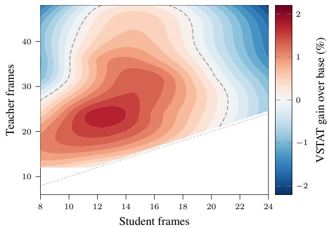  
Figure A1. The gain depends on both frame budgets. Runs use the same base model, data, and schedule, and vary only the student and teacher frame counts. The dotted line marks teacher = student. Warm colors indicate gains, cool colors indicate losses, and the dashed line marks the zero contour.

Tab. A4 varies the two budgets around our default 12 → 24 setting while keeping everything else fixed. At a fixed student budget, increasing the teacher budget reduces accuracy monotonically. Changing both budgets performs even worse: $2 4  4 8$ keeps the same $2 \times$ ratio but loses 3.85 points. The ratio alone therefore does not determine the gain, and the student budget also matters independently.

<table><tr><td>Student → teacher</td><td>Overall</td><td>Count</td><td>Dict</td></tr><tr><td>12→ 24 (ours)</td><td>36.48</td><td>30.4</td><td>28.8</td></tr><tr><td> $1 2  3 6$ </td><td>35.56</td><td>27.6</td><td>27.8</td></tr><tr><td> $1 2 \to 4 8$ </td><td>34.67</td><td>27.1</td><td>27.5</td></tr><tr><td> $8  3 2$ </td><td>33.81</td><td>28.6</td><td>26.7</td></tr><tr><td> $2 4  4 8$ </td><td>32.63</td><td>26.5</td><td>27.5</td></tr></table>

Table A4. Training frame ratio. VSTAT accuracy (%) when only the student and teacher frame counts are changed.

Tab. A5 shows the performance variation at different evaluation frame budgets discussed in Sec. 5. The base model improves as more frames are added up to 96 frames, after which performance declines. Its benefit from additional frames is therefore limited. A single $\mathrm { S ^ { 3 } T }$ model performs similarly to the base at the two budgets used during training and improves more clearly at larger budgets, reach ing 36.48 at the standard 64-frame setting. This is higher than the base model at every listed budget, including its peak of 35.33. Thus, changing the test-time frame budget alone does not recover the improvement learned by $\mathrm { s ^ { 3 } T }$

## F. Choice of distillation divergence

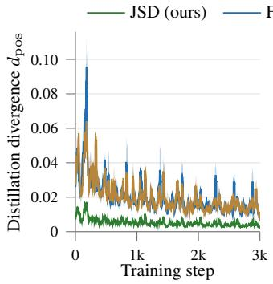

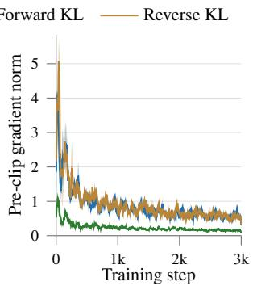  
Figure A2. JSD gives a bounded and smoother objective than KLD for the same teacher–student gap. We vary only the distillation divergence and plot $d _ { \mathrm { p o s } }$ (left) and the pre-clip gradient norm (right) over the full training run for JSD, forward KLD, and reverse KLD, averaged over three seeds.

We keep the training recipe fixed and vary only the distillation divergence $d _ { \mathrm { p o s } } .$ , while the anchor remains JSD in all cases. Results cover the full 3000 training steps and are averaged over three seeds. A separate JSD monitor stays near 0.005 for all three objectives. This shows that they operate over a similar teacher–student gap and mainly differ in loss scale and gradient behaviour (Fig. A2, Tab. A6). Both

<table><tr><td>Frames</td><td>8</td><td>12</td><td>24</td><td>32</td><td>64</td></tr><tr><td>Base</td><td>30.67</td><td>31.60</td><td>34.51</td><td>33.95</td><td>34.74</td></tr><tr><td>S3T</td><td>31.16</td><td>31.89</td><td>34.23</td><td>35.02</td><td>36.48</td></tr></table>

Table A5. VSTAT accuracy against the number of frames used at evaluation. The same two checkpoints are evaluated at every budget; only the number of frames changes. Dashes indicate budgets that were not evaluated.
<table><tr><td></td><td colspan="2"> $d _ { \mathrm { p o s } }$ </td><td colspan="2">Pre-clip grad. norm</td><td colspan="3">Accuracy (%)</td></tr><tr><td>Divergence</td><td>mean</td><td>max</td><td>mean</td><td>max</td><td>VSTAT</td><td>Count</td><td>Dictionary</td></tr><tr><td>JSD (ours)</td><td>0.0054</td><td>0.133</td><td>0.237</td><td>5.53</td><td>36.48</td><td>30.4</td><td>28.8</td></tr><tr><td>Forward KLD</td><td>0.0208</td><td>1.175</td><td>0.873</td><td>15.96</td><td>35.19</td><td>27.1</td><td>27.0</td></tr><tr><td>Reverse KLD</td><td>0.0204</td><td>0.448</td><td>0.918</td><td>29.32</td><td>35.14</td><td>27.9</td><td>26.0</td></tr></table>

Table A6. JSD and KLD as the distillation divergence. Mean and maximum $d _ { \mathrm { p o s } } ,$ pre-clipping gradient norm, and downstream accuracy over 3000 training steps. Training statistics are averaged across three seeds. The monitored teacher–student gap stays near 0.005 for all objectives, while both KLD variants produce larger losses and gradient spikes and perform below JSD downstream.

KLD variants remain trainable, but JSD gives more stable optimization and better downstream performance.

## G. Ablation setup

Tab. 2 compares several teacher-view variants. Each keeps the 12-frame student fixed and changes only how the teacher frames are selected. Our default teacher uses 24 uniformly sampled frames that cover the full clip.

Identical 12 → 12 (no privileged view). The teacher receives the student’s own 12-frame view, so both inputs are identical and the teacher has no additional frames. Everything else remains unchanged. The teacher–student divergence is zero by construction. This setting measures the effect of self-distillation after removing the privileged information.

SFT (cross-entropy on teacher text). The teacher generates an answer greedily from its dense 24-frame view, and the student is trained with hard-label cross-entropy on that text using its own 12-frame view. The privileged view and anchor are identical to ${ \bf S } ^ { 3 } \mathrm { T } .$ Only the target changes from the teacher’s full next-token distribution to a single token sequence. This provides a direct comparison between distribution and text supervision.

JSD to the generator’s true state. This is a supervised reference rather than a competing method. The objective, both views, and the anchor remain the same as in $\mathrm { S ^ { 3 } T } .$ Only the answer being scored changes from the model’s own text to the ground-truth state string stored in the clip’s program log. This setting uses labels and estimates how much a correct target can improve over self-generated targets. It is the only experiment in the paper where the program state is used during training.

Event-aware teacher. This variant places more teacher frames around scene changes detected by the frozen model without labels. It allocates more frames to periods where the state is likely to change. Since it performs below the fixed temporal stretch, we test whether unreliable detection explains the difference. The detector uses neither labels nor an external model. At each candidate time, it extracts two short non-overlapping windows on either side and asks the frozen model the same state probe for both. It then computes the token-averaged difference between their next-token distributions. A larger difference means that the model reads the scene differently across that point.

The score separates true event times from ordinary times with an AUROC of 0.851 [0.833,0.869], compared with $0 . 5 0 1 \pm 0 . 0 1 4$ under shuffled labels. This is about 26 standard deviations above chance. The detector does not depend on fixed temporal positions or repeated patterns. Ranking candidates only within time-matched groups still gives 0.81–0.85. It also produces 211 distinct boundary sets across 253 clips, and 75.5% of its proposed boundaries match events scheduled by StateGen. It further differs from shot-cut detection (Tab. A7), where pixel-based methods remain near chance because these clips contain no camera cuts. The event-aware teacher therefore receives a reliable boundary signal, and its lower accuracy is unlikely to be caused by poor event detection.

<table><tr><td>Detector</td><td>AUROC</td><td>F1</td></tr><tr><td>Model before/after JSD (ours)</td><td>0.851</td><td>0.776</td></tr><tr><td>ffmpeg scene-score</td><td>0.645</td><td>0.63-0.69</td></tr><tr><td>PySceneDetect</td><td>0.576</td><td>0.63-0.69</td></tr><tr><td>Random</td><td>0.503</td><td></td></tr></table>

Table A7. Detected boundaries are semantic rather than shot cuts. Detection of true event boundaries on 200 synthetic clips. AUROC measures the probability of ranking a true boundary above a non-boundary, with 0.5 corresponding to chance.

Multi-scale teacher. The teacher combines predictions from several frame counts, either {16, 32, 48} or {12, 24, 48}, instead of using a single 24-frame view. The student is then distilled toward the combined prediction.

Temporal zoom (windowed). Instead of spreading the teacher frames across the full clip, this variant places them inside a short window around one detected scene change. Given a boundary at frame b, the teacher samples uniformly over $[ b - 8 , b + 8 ]$ , covering 17 source frames or about 1.4 seconds of the 20-second clip. For this experiment alone, the teacher receives the same number of frames as the student. This makes it a control for frame placement. Coverage and density cannot both remain fixed because concentrating the same frame budget into a shorter interval increases density. We therefore keep the budget fixed and vary only where the frames are sampled. Any difference from the student’s own 12-frame view can then be attributed to frame placement rather than frame count.

Adaptive teachers. These variants choose the teacher density separately for each clip. A router selects a frame count using a lightweight rule, while a budget-controlled variant adjusts the density to keep $d _ { \mathrm { p o s } }$ near a target range. Both aim to provide additional information while keeping the teacher prediction learnable from the sparse student view.

Frame ratio. These runs change only the two frame budgets (App. E). The 12 → 36 and 12 → 48 settings keep the student at 12 frames while increasing the teacher budget. The 8 → 32 and 24 → 48 settings change both budgets while keeping a similar ratio. This separates the effect of the frame ratio from the effect of the student’s own frame budget.

Reference anchor. The default anchor is a JSD between the adapted student and the frozen base model on the student’s own view. It is weighted by β and controlled by the adaptive rule in Sec. 3.2. The “no anchor” setting uses β=0 and leaves everything else unchanged. The student is therefore trained only with the teacher term.

Results for the alternative teachers. Tab. A8 reports results for the teacher views defined above. None gives a meaningful improvement over the fixed 12 → 24 temporal stretch. The budget-controlled adaptive teacher reaches 36.49 compared with 36.48 for the fixed view. This difference is well within the ±0.52 variation across seeds, while the adaptive variant also requires a per-clip decision rule, which cannot be self-learned/-distilled. We therefore use the fixed teacher view.

<table><tr><td>Teacher view</td><td>Overall</td><td>Count</td><td>Dict</td></tr><tr><td>Temporal stretch 12→ 24 (ours)</td><td>36.48</td><td>30.4</td><td>28.8</td></tr><tr><td>Event-aware</td><td>35.11</td><td>28.5</td><td>27.5</td></tr><tr><td>Multi-scale {16, 32, 48}</td><td>36.23</td><td>29.9</td><td>28.1</td></tr><tr><td>Multi-scale {12, 24, 48}</td><td>36.04</td><td>29.3</td><td>28.0</td></tr><tr><td>Adaptive (router)</td><td>36.26</td><td>30.9</td><td>27.9</td></tr><tr><td>Adaptive (budget-controlled)</td><td>36.49</td><td>30.4</td><td>27.7</td></tr></table>

Table A8. Alternative teacher views. VSTAT accuracy (%) with the 12-frame student and objective fixed while only the teacher view changes. The first row repeats our setting from Tab. 2.

## H. What the teacher and student disagree about

Two ablation results do not follow the simple explanation that a more accurate teacher should always help more. A

teacher whose 24 frames include the student’s 12 has access to more information, but still performs below the base model. Distilling toward the generator’s true state also uses a correct target, yet performs even worse. We therefore examine the training objective directly. Tab. A9 reports the mean $d _ { \mathrm { p o s } }$ over all 3000 training steps together with the final VSTAT accuracy.
<table><tr><td>Setting</td><td>Mean  $d _ { \mathrm { p o s } }$ </td><td>VSTAT</td></tr><tr><td>JSD to the generator&#x27;s true state</td><td>0.0013</td><td>33.90</td></tr><tr><td>Nested  $1 2 \subset 2 4$ </td><td>0.0047</td><td>34.10</td></tr><tr><td>Shifted  $1 2  1 2$ </td><td>0.0051</td><td>35.14</td></tr><tr><td>Temporal stretch 12 → 24 (ours)</td><td>0.0052</td><td>36.48</td></tr></table>

Table A9. Teacher–student disagreement during training and final accuracy. Mean $d _ { \mathrm { p o s } }$ over 3000 steps and VSTAT accuracy (%) of the resulting model.

Across these settings, $d _ { \mathrm { p o s } }$ alone does not explain final accuracy. The nested, shifted, and temporal-stretch variants have similar levels of teacher–student disagreement, but their final scores differ. This suggests that useful supervision requires more than a teacher prediction that differs from the student’s own prediction. The teacher must also provide information that the student can learn from its sparse view. If the teacher is too similar to the student, there is little new signal to transfer. If the teacher differs in ways that the student cannot infer from its own input, the target may also be difficult to learn. The best setting therefore requires a balance between providing new information and keeping that information learnable from the student view.

As noted in App. G, the true-state run uses a different answer string from the other three settings, so its $d _ { \mathrm { p o s } }$ is not directly comparable. The analysis also includes only four runs and should not be treated as a general rule. However, it is consistent with the frame-budget results in App. E, where teachers that are too similar to the student provide little or no gain. This suggests that a useful teacher should provide information that differs meaningfully from the student’s current prediction, rather than simply being more accurate. We leave a more precise characterization of this balance for future work.

## I. Model souping

A single $\mathrm { S ^ { 3 } T }$ model reaches 36.48% accuracy on VSTAT. The 37.12 and 37.44 models reported in the main paper use model souping [56]. We average the weight updates from two independently trained runs into a single checkpoint with the same model size and inference cost.

Complementary probes. The two runs differ only in the probe q (Sec. 3.2), which changes which part of the state is used for self-supervision. The first uses the full-state probe “This is a short video of colored balls moving on a background. Some balls may be briefly hidden behind moving bars, and the camera may pan or zoom. List the colors of the balls you can see and how many there are. Be concise (one short line).” at every step.

The second alternates between this full-state probe and six fixed questions about changes during the clip. On every other step it uses the full-state probe, while the remaining steps use one of the six questions. Each question keeps the same two opening sentences and asks for a single word or number. The question assigned to a clip is fixed by a hash of its identifier, so each clip always receives the same one. The six questions ask whether any ball changes colour, how many different ball colours appear in total, whether any ball is added, whether any ball is removed, whether any ball moves to a different region, and which ball colour is most common. The question does not depend on the clip contents or the generator, and both views of a clip always receive the same question. The full-state run performs best across the state axes at 36.88, while the alternating run performs best on Count at 36.11. Their different strengths make the soup better than either parent.

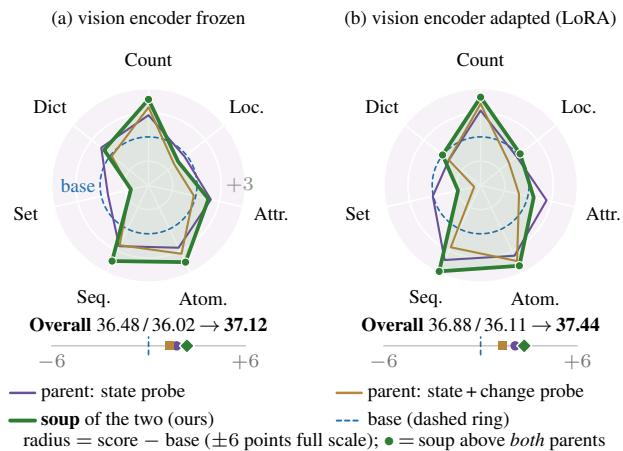  
Figure A3. The two specialists perform better on different axes, while the soup improves beyond both. Per-axis change from the base model for each parent and their soup, with the base shown as the dashed circle. (left) vision encoder frozen, (right) vision encoder adapted.

Redundant and complementary ingredients. Weight averaging is a general technique, so we test whether the gain comes simply from averaging any two runs. Tab. A10 keeps the merge procedure and scale fixed while changing only the runs being merged. Every merge of redundant seeds remains below its best individual run at 36.48, and naive weight averaging falls below the base model. In contrast, both merges of runs trained with different probes outperform their best parent in two independent replications. The clearest comparison uses α=1.5, where the procedure and scale are identical. Redundant runs reach 36.08, while com-

plementary runs reach 37.12. The difference comes from the different specialization of the two ingredients.
<table><tr><td>Ingredients</td><td>Merge</td><td>VSTAT</td><td> $\mathbf { v s } . \mathbf { S } ^ { 3 } \mathrm { T } \mathbf { B a s e }$ </td></tr><tr><td>5 seeds of one recipe</td><td>naive weight average</td><td>34.65</td><td> $- 1 . 8 3$ </td></tr><tr><td>5 seeds of one recipe</td><td>∆W soup,  $\alpha { = } 1 . 0$ </td><td>35.66</td><td> $- 0 . 8 2$ </td></tr><tr><td>5 seeds of one recipe</td><td>∆W soup,  $\alpha { = } 1 . 5$ </td><td>36.08</td><td> $- 0 . 4 0$ </td></tr><tr><td>5 seeds of one recipe</td><td>∆W soup,  $\alpha { = } 2 . 0$ </td><td>36.03</td><td> $- 0 . 4 5$ </td></tr><tr><td>2 complementary probes</td><td>∆W soup,  $\alpha { = } 1 . 5$ </td><td> $\mathbf { 3 7 . 1 2 }$ </td><td> ${ \bf + 0 . 6 4 }$ </td></tr><tr><td>2 complementary probes, vision ∆W soup,</td><td> $\alpha { = } 1 . 3$ </td><td> $\mathbf { 3 7 . 4 4 }$ </td><td> ${ \bf + 0 . 5 6 }$ </td></tr></table>

Table A10. Merging redundant and complementary runs. VS-TAT accuracy (%) with the merge procedure and scale fixed. The final column compares each setting with the single $S ^ { 3 } \mathrm { T }$ model at 36.48.

Weight averaging and strength. We average the weight updates rather than the model outputs. A LoRA adapter adds $\Delta W = s ( B A )$ to each adapted module, where A and B are the low-rank factors and s is the fixed scale. For each module, we average the two runs’ $\Delta W$ , multiply the result by a global strength α, and add it to the frozen base weights. The vision-adapted model applies the same procedure to the vision-encoder adapters.

We use $\alpha { = } 1 . 5$ for the frozen-encoder soup and $\alpha { = } 1 . 3$ for the vision-adapted soup. The frozen-encoder soup updates only the language model while keeping the base visual features fixed. Rescaling therefore affects only one stage, and a larger factor remains stable. The vision-adapted soup also changes the vision tower, so the rescaling affects both the visual features and their downstream readout. A smaller factor therefore works better.

Tab. A11 reports all strengths we evaluated. Both soups remain above the base score of 34.74 across the full range, so α mainly changes the size of the gain rather than whether a gain exists. Two additional frozen-encoder settings, $\alpha { = } 1 . 2 5$ and $\alpha { = } 1 . 3 5$ , reach 36.13 and 36.64 overall.

## J. Temporal-pretext baselines

Tab. 3 compares four established temporal self-supervised tasks. Each applies a known transformation to an unlabeled clip and trains the model to identify it. All use the same setup as $\mathrm { S ^ { 3 } T }$ , including the LLaVA-OV-2-8B base, the same 300 unlabeled clips, LoRA rank r=32, 3000 steps and the reference anchor, so only the training target changes.

Each task applies a transformation $T$ to clip x and derives a short text label ℓ(T) from the transformation itself, never from the generator metadata. The model is trained with cross-entropy to predict this label, under the same anchor and adaptive $\beta$ schedule as $\mathrm { S ^ { 3 } T }$ (Eq. (4)):

$$
{ \mathcal { L } } _ { \mathrm { p r e t e x t } } = \mathrm { C E } { \big ( } f _ { \theta + \phi } ( T ( x ) ) , \ell ( T ) { \big ) } + \beta d _ { \mathrm { r e f } } .\tag{6}
$$

Only the first term differs from our objective. The tasks differ only in the transformation and label:

<table><tr><td>Setting</td><td>Overall</td><td>Count</td><td>Dict</td></tr><tr><td>Vision-adapted pair</td><td></td><td></td><td></td></tr><tr><td> $\alpha { = } 1 . 2 0$ </td><td>36.65</td><td>31.8</td><td>25.8</td></tr><tr><td> $\alpha { = } 1 . 2 5$ </td><td>36.12</td><td>31.5</td><td>24.8</td></tr><tr><td> $\alpha { = } 1 . 3 0 \mathrm { ( o u r s ) }$ </td><td>37.44</td><td>32.6</td><td>27.4</td></tr><tr><td> $\alpha { = } 1 . 3 5$ </td><td>36.62</td><td>32.0</td><td>26.0</td></tr><tr><td> $\alpha { = } 1 . 4 0$ </td><td>36.99</td><td>32.3</td><td>25.6</td></tr><tr><td> $\alpha { = } 1 . 5 0$ </td><td>36.76</td><td>32.4</td><td>26.0</td></tr><tr><td> $\alpha { = } 1 . 6 0$ </td><td>36.67</td><td>32.6</td><td>25.7</td></tr><tr><td> $\alpha { = } 1 . 7 0$ </td><td>37.06</td><td>33.1</td><td>26.2</td></tr><tr><td>Frozen-encoder pair</td><td></td><td></td><td></td></tr><tr><td> $\alpha { = } 1 . 3 0$ </td><td>36.33</td><td>31.1</td><td>27.7</td></tr><tr><td> $\alpha { = } 1 . 4 0$ </td><td>36.79</td><td>31.8</td><td>28.5</td></tr><tr><td> $\alpha { = } 1 . 5 0 \mathrm { ( o u r s ) }$ </td><td>37.12</td><td>32.4</td><td>28.4</td></tr><tr><td> $\alpha { = } 1 . 6 0$ </td><td>37.09</td><td>33.3</td><td>28.8</td></tr><tr><td> $\alpha { = } 1 . 7 0$ </td><td>36.87</td><td>33.3</td><td>28.3</td></tr><tr><td> $C o n t r o l$ </td><td></td><td></td><td></td></tr><tr><td>Five seeds of one probe,  $\alpha { = } 1 . 5$ </td><td>36.08</td><td>29.7</td><td>27.8</td></tr><tr><td></td><td></td><td></td><td></td></tr></table>

Table A11. Averaging strength. VSTAT accuracy (%) for each global scale α applied to the averaged weight update. The redundant-ingredient control is repeated from Tab. A10.

• Frame order [19, 35] splits the student’s 12 frames into four contiguous segments and reorders them with a random permutation π. The label is four digits giving each displayed segment’s true position in time (e.g. 3 1 4 2), which is enough to undo π.

• Arrow of time [39, 55] reverses the frame order with probability 0.5. The label isforward or backward.

• Pace [6, 51] samples the 12 frames at a stride of 1, 2 or 4 over a randomly placed sub-span. The label is normal, 2x or 4x.

Masked infill [47] is not a cross-entropy task. A contiguous window of nine source frames, centred on a random interior position, is dropped from the student’s view, while the teacher sees the whole clip at the same 12-frame budget. The target text is the model’s own answer to the same probe on the whole clip, exactly as in $\mathrm { S ^ { 3 } T } ,$ and the loss is Eq. (4) unchanged. It is therefore $\mathrm { S ^ { 3 } T }$ with the two views exchanged, so that the degraded view is the student. No textual target in any of the four baselines comes from the clip generator; all four see exactly the supervision $\mathrm { S ^ { 3 } T }$ sees, which is none.

None of these matches the state-tracking gains of $\mathrm { S ^ { 3 } T }$ (Tab. 3). Pace is the strongest at 35.45 and closest to our temporal-density setup, but recovers less than half of the single-model gain. Frame order is the only exception on one axis, raising Dictionary to 30.5 while leaving the overal score unchanged; its weights are not used in $\mathrm { s ^ { 3 } T } .$ These three tasks can often be solved from local appearance or motion cues, without maintaining the scene state across the clip.

Masked infill is the most informative of the four, because it is our own objective with the views exchanged: same loss, same anchor, same self-generated target, but the degraded view is now the student. It falls to 34.25, below the 34.74 base, so the gap to $\mathrm { S ^ { 3 } T }$ isolates the one thing that differs, the direction of the asymmetry between the views. Making a model recover what was removed from its input is not the same as making it read a view it can already see more carefully, and only the second is useful here.

<table><tr><td>n</td><td>Count 747</td><td>Location 384</td><td>Attribute 369</td><td>Atomic 710</td><td>Sequence 211</td><td>Set 249</td><td>Dictionary 330</td></tr><tr><td>InternVL3.5-14B (+0.27) 95% CI</td><td>-0.11 [−1.30, 1.14]</td><td>+1.28 [-0.26,2.87]</td><td>+0.00 [−1.03,1.14]</td><td>+0.21 [-0.90, 1.35]</td><td>+1.42 [0.00, 3.32]</td><td>-0.08 [−1.69,1.61]</td><td>-0.06 [-1.97,1.94]</td></tr><tr><td>Qwen3-VL-8B (+0.13)</td><td>+0.95</td><td>-2.94</td><td>+1.68</td><td>-0.39</td><td>+2.27</td><td>+1.00</td><td>-0.76</td></tr><tr><td>S³T on LLaVA-OV-2-8B (+1.74)</td><td>+2.69</td><td>-0.29</td><td>+1.92</td><td>+2.58</td><td>+2.37</td><td>-0.84</td><td>+1.48</td></tr></table>

Table A12. Per-axis changes for the two bases with small positive overall changes. Both changes fall within our ±0.52 seed spread. $\mathrm { s ^ { 3 } T }$ on LLaVA-OV-2-8B is included for comparison. Intervals are 95% paired-bootstrap CIs over 10,000 item resamples. Bold values exclude zero, and n is the number of benchmark items. All runs use seed 7, so the intervals capture item variation only. Per-axis seed variation exceeds every change in the top two rows.

## K. Additional real-video results

Table A13. Additional real-video results. Values are changes in accuracy relative to the base model unless absolute scores are shown. Brackets give 95% bootstrap intervals over evaluation items. [n.s.] denotes a non-significant change.
<table><tr><td>Benchmark</td><td>Measure</td><td>Result</td></tr><tr><td>Kinetics real-video training (3 seeds)</td><td>∆ overall</td><td>+0.66 ± 0.28 [n.s.]</td></tr><tr><td>VET-Bench, shell game, 64f</td><td>3-way acc</td><td>base 0.31, S3T 0.33 (+0.02 [n.s.])</td></tr><tr><td>VET-Bench, shell game, 128f</td><td>3-way acc</td><td>base 0.28, S3T 0.30 (+0.02 [n.s.])</td></tr></table>

In Tab. A13, we present the extended real-video results beyond those in Tab. 4. VET-Bench’s shell game stays near chance for both the base and $\mathrm { S ^ { 3 } T , }$ since it tests tracking one hidden object through swaps rather than maintaining a count. Training on real Kinetics videos gives no clear overall improvement at +0.66, though its cumulative-state questions improve by +4.09. The learned behaviour therefore transfers beyond synthetic clips but stays specific to cumulative-state reasoning.

## L. How does $\mathbf { S ^ { 3 } T }$ transfer across base models?

## L.1. Results across base models

We apply the same objective and training data to eleven base models from five model families (Tab. A14). Only LLaVA-OV-2-8B shows a clear improvement. InternVL3.5-14B and Qwen3-VL-8B improve by only +0.27 and +0.13, which are within the observed seed variation. The remaining models are unchanged or perform worse. Retuning Molmo2-4B and Cambrian-S-7B reduces their losses but does not produce a clear gain. Teacher-view headroom also does not predict whether $\mathrm { S ^ { 3 } T }$ transfers successfully. The full analysis is given in Sec. L.2.

<table><tr><td>Base model</td><td>Backbone family</td><td>Base</td><td>∆S3T</td><td>Headroom 12→24</td></tr><tr><td>LLaVA-OV-2-8B</td><td>OneVision-2 / Qwen3-8B</td><td>34.74</td><td>+1.74</td><td>+2.91</td></tr><tr><td>InternVL3.5-14B</td><td>InternViT / Qwen3-14B</td><td>31.97</td><td>+0.27</td><td>+1.28</td></tr><tr><td>Qwen3-VL-8B</td><td>Qwen3-VL</td><td>34.11</td><td>+0.13</td><td>+3.42</td></tr><tr><td>InternVL3.5-8B</td><td>InternViT / Qwen3-8B</td><td>30.24</td><td>≈0 [n.s.]</td><td>-0.45</td></tr><tr><td>Molmo2-4B†</td><td>Molmo2</td><td>35.81</td><td>-0.18</td><td>+1.64</td></tr><tr><td>InternVL3.5-4B</td><td>InternViT / Qwen3-4B</td><td>29.76</td><td>-0.20</td><td>+1.12</td></tr><tr><td>LLaVA-OV-7B</td><td>One Vision / Qwen2-7B</td><td>28.49</td><td>-0.86</td><td>-0.76</td></tr><tr><td>Qwen3-VL-4B</td><td>Qwen3-VL</td><td>31.43</td><td>-0.86</td><td>+0.79</td></tr><tr><td>Cambrian-S-7B</td><td>Cambrian-S</td><td>31.53</td><td>-1.16</td><td>-0.33</td></tr><tr><td>Qwen2.5-VL-7B</td><td>Qwen2.5-VL</td><td>31.84</td><td>-1.43</td><td>+1.77</td></tr><tr><td>InternVL3.5-2B</td><td>InternViT / Qwen3-2B</td><td>31.31</td><td>-4.84</td><td>+1.53</td></tr></table>

†Best of four settings. Its checkpoint sweep peaks at 35.82 against a base of 35.81, confirming a null result. ‡Best-anchored of three runs. Cambrian-S is unstable, with results between −1.16 and −14.02.  
Table A14. $\mathbf { S } ^ { 3 } \mathbf { T }$ across eleven base models. All scores here are our own runs under a single 64-frame harness, so the base column may differ from the published numbers quoted in Tab. 1a. All rows use the same objective and data. Marked rows include additional tuning. $\Delta \boldsymbol { \mathrm { S } } ^ { 3 } \mathrm { T }$ is the change in VSTAT accuracy after training. Changes within the ±0.52 seed spread are treated as noise. Headroom is the base model’s gain from 12 to 24 frames without training and does not predict $\mathrm { s } \mathrm { \breve { { } T } }$ gains.

Two possible factors remain untested. The first is the amount of video post-training received by each backbone. The second is how much a language-model adapter can change the model’s use of visual evidence. Testing these factors would require backbones matched for video posttraining and experiments with different adapter placements. We therefore limit our transfer claim to LLaVA-OV-2-8B.

## L.2. What explains the difference?

We test several possible explanations for the differences across base models. These include the teacher’s advantage over the student, the relation between the two views, the quality of each model’s self-generated targets, hyperparameter sensitivity, and training stability. The teacherrelated checks measure frame headroom, teacher–student divergence, the teacher’s top-1 advantage, and soft versus hard targets. The view-related checks test frame nesting and whether the two views provide comparable information.

None of these factors explains the transfer results across models. We summarize the main checks below.

Teacher-view headroom. A model may need to benefit from the denser view before it can learn from that view. We therefore evaluate all eleven base models at both 12 and 24 frames on the same 1,500 VSTAT items. The gain from using more frames does not predict the effect of $\mathrm { S ^ { 3 } T }$ . The Spearman correlation is $\rho = + 0 . 2 9$ with $p = 0 . 3 9$ , and the Pearson correlation is $r = + 0 . 2 1$ with $p = 0 . 5 4$ . Qwen3- VL-8B provides the clearest counterexample. Its teacherview headroom $\mathrm { i s + 3 . 4 2 }$ , compared with +2.91 for LLaVA-OV-2-8B, but $\mathrm { S ^ { 3 } T }$ improves it by only +0.13.

All models reproduce their published performance at their native frame budgets and change their answers when the frame budget changes. For ten models, the answerchange rate is between 22% and 35%, while Cambrian-S changes 11.2% of its answers. InternVL also changes its spatial tile allocation when the number of frames changes. Repeating the test with one tile per frame gives the same conclusion, with $\rho = + 0 . 1 7$ and $p = 0 . 6 2$ . A denser view can therefore improve a base model without that information being transferred to the sparse view during $\mathrm { S ^ { 3 } T }$ training.

Hyperparameter sensitivity. Because the original recipe was developed on LLaVA-OV-2-8B, we separately retune Molmo2-4B and Cambrian-S-7B. For Molmo2-4B, we reduce the learning rate, tighten the anchor target, combine both changes, and evaluate every checkpoint from the strongest setting. Retuning reduces the original deficit from $- 0 . 6 9 \mathrm { ~ t o ~ } { - 0 . 1 8 }$ . The best checkpoint reaches 35.82 compared with a base score of 35.81, so no setting gives a clear improvement.

For Cambrian-S-7B, increasing the anchor bound reduces $d _ { \mathrm { r e f } }$ from 0.0758 to 0.0664 and reduces the fraction of saturated steps from 9.3% to 2.6%. This improves the result from −4.24 to −1.16. However, all three runs remain unstable. Gradient norms range from 8.5 to 37, and final changes range from $- 1 . 1 6 ~ \mathrm { t o } ~ - 1 4 . 0 2$ . Halving the learning rate does not remove the instability and leaves 19.7% of evaluation items empty. No other base model shows this behaviour.

The two small positive changes. Tab. A12 compares the +0.27 change on InternVL3.5-14B and the +0.13 change on Qwen3-VL-8B with the clear improvement on LLaVA-OV-2-8B. Neither small positive change is reliable. For InternVL3.5-14B, no per-axis interval excludes zero, and four of the seven axes change by at most 0.21. For Qwen3- VL-8B, only Location excludes zero, but the change is negative at −2.94 [−5.26,−0.70] and does not remain significant after Holm correction.

The per-axis change patterns also differ from those of the successful LLaVA-OV-2-8B model. The Spearman correlation is −0.04 with $p = 0 . 9 6$ for InternVL3.5-14B and +0.21 with $p = 0 . 6 6$ for $\mathrm { Q w e n 3 - V L - 8 B }$ . Correlations with the four-seed mean profile of LLaVA-OV-2-8B are also nonsignificant. On Qwen3-VL-8B, the Atomic and Set axes move in the opposite direction.

These confidence intervals capture item-level variation only because each model was trained with a single seed. Across four LLaVA-OV-2-8B seeds, the per-axis standard deviation reaches 1.80. Two InternVL3.5-8B seeds differ by 2.1 to 3.3 points on five axes and reverse direction on Atomic, Sequence, and Set. This variation is larger than every per-axis change observed for InternVL3.5-14B. We therefore report the two small positive average changes, but do not treat them as established gains.