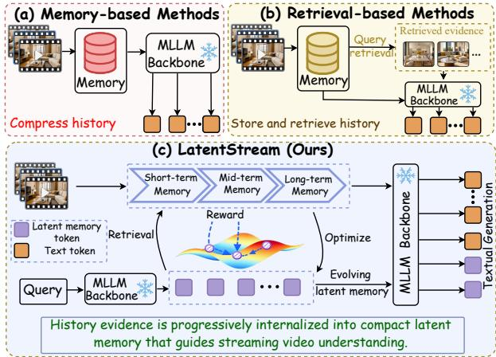
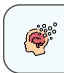
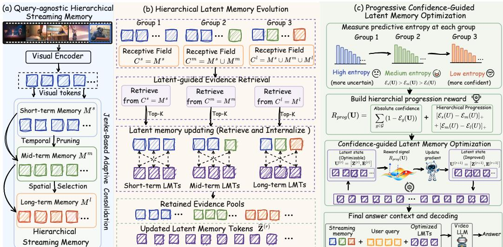
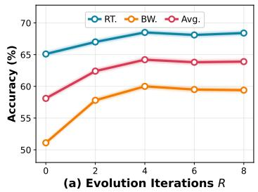
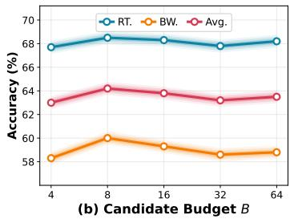
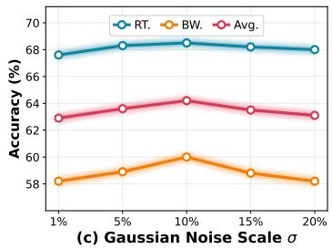

# Beyond Retrieval: Progressive Latent Memory Evolution for Streaming Video Understanding

Hongyu Qu∗1, Guangming Yao∗†2, Ling Xing1, Xiaobin Hu3, Rongxing Ding1, Guibin Zhang3, Fan Zhang4, Yi Yuan2, Xiangbo Shu†1, Shuicheng Yan3

1Nanjing University of Science and Technology 2Ant Group 3 National University of Singapore

4 The Chinese University of Hong Kong ∗ Equal contribution † Corresponding authors

## Abstract

Streaming video understanding requires multimodal large language models (MLLMs) to process continuous visual inputs and respond to user queries under strict causality and bounded memory. Existing approaches typically compress historical observations into an external memory bank and retrieve queryrelevant evidence as additional visual context. Though efective, this storeand-retrieve paradigm keeps historical evidence as external visual context, preventing it from being internalized into a compact, evolving latent memory that can continuously guide streaming reasoning. To bridge this gap, we introduce LatentStream, a progressive latent working memory framework that shifts streaming memory from store-and-retrieve to retrieve-and-internalize. Specifically, LatentStream comprises three coordinated components. First, Query-Agnostic Hierarchical Streaming Memory organizes visual history into short-, mid-, and long-term levels under a fixed memory budget through Jenks-guided adaptive consolidation. Once a query arrives, Hierarchical Latent Memory Evolution equips groups of latent memory tokens with progressively expanding memory receptive fields, enabling them to iteratively retrieve historical evidence from their corresponding scopes and internalize it into a compact, fixed-length latent memory. Finally, Progressive Confidence-guided Latent Memory Optimization constructs a hierarchical progression reward from group-wise predictive entropy and jointly refines the latent memory tokens and retrieved evidence, encouraging increasingly confident streaming reasoning. Extensive experiments demonstrate that LatentStream achieves new state-of-the-art results on existing online and ofline video benchmarks.

## 1 Introduction

Streaming video understanding requires models to continuously process incoming visual observations and respond to user questions that may be posed at any time [9, 47, 48]. This capability is essential for a wide range of real-world applications, including live monitoring [12], autonomous driving [5, 3], smart glasses [54, 21], as well as embodied agents and robotic systems [37, 27].

To equip existing Video-LLMs [60, 2, 22, 38] for continuously arriving visual streams, recent eforts have explored streaming video understanding from multiple perspectives, ranging from dedicated model training [28, 15,

  
Figure 1: Motivation of our LatentStream: paradigm comparison of memory-based and retrieval-based methods with our retrieve-and-internalize method LatentStream.

57] to streaming inference [48] and memory-based context management [46, 24, 42]. Among them, training-free approaches are more appealing as they directly adapt of-the-shelf Video-LLMs to streaming scenarios without additional parameter updates (Fig. 1a). Their key strategy is to manage the continuously accumulated visual context at inference time through frame selection [34], visual token pruning or merging [11, 52], KV-cache management [31, 7], and fixed-capacity or hier archical memory [46]. More recent approaches [24, 42] further couple such memory management with query-aware retrieval, selectively recalling relevant evidence from the retained history once a query arrives (Fig. 1b). By filtering redundant observations and retaining potentially informative evidence, these methods efectively constrain the growth of historical context, reducing memory and computational overhead for long-form video streams.

Despite these advances, existing methods typically treat streaming memory as an external bank of historical evidence, focusing primarily on what information to retain and what to retrieve once a query arrives [24, 46, 42]. Although query-aware memory retrieval allows the model to identify relevant visual evidence from the retained history, the retrieved evidence is still exposed to the model as external, variable-length visual context. Such a retrieval-centric paradigm essentially addresses which historical evidence should be accessed, while leaving largely unexplored how the accessed evidence can be internalized into a compact latent state that participates directly in subsequent video reasoning. As a result, query-agnostic streaming memory and query-conditioned reasoning remain loosely coupled: there is no compact latent memory representation that can accumulate task-relevant historical evidence and continuously evolve alongside the video reasoning process in the model latent space. This work posits that the model’s latent space [26, 6, 39, 51] provides a natural substrate for bridging this gap.

Building on this view, we argue that streaming video reasoning calls for a latent working memory: rather than exposing retrieved visual evidence to the model as variable-length reasoning context, such a latent memory progressively internalizes task-relevant history into a fixed-length latent state that further guides the streaming video reasoning process. Crucially, this latent state is not a one-shot compression of the retrieved history, but continuously evolves with newly accessed evidence and, in turn, further guides the retrieval of relevant historical information. This creates an iterative interplay between external memory access and latent memory evolution, turning the conventional store-and-retrieve mechanism into a retrieve-and-internalize paradigm. Thi naturally raises our pivotal research question:

How can historical evidence in external streaming memory be adaptively internalized into a compact, query-conditioned, and continuously evolving latent memory for streaming video reasoning?

To answer this question, we introduce LatentStream, a progressive latent working memory framework for streaming Video-LLMs (Fig. 1c). Instead of treating retrieved history as auxiliary context, LatentStream progressively internalizes task-relevant visual evidence into a compact, evolving latent memory that continuously guides streaming reasoning. At its core, LatentStream comprises three coordinated components. First, LatentStream constructs a ♣ Query-agnostic Hierarchical Streaming Memory (HSM) that organizes incoming observations into short-, mid-, and long-term memories under a fixed budget. A Jenks-guided adaptive consolidation strategy progressively reduces temporal and spatial redundancy while preserving informative evidence across extended video streams. Second, LatentStream introduces ♦ Hierarchical Latent Memory Evolution (HME) to internalize such hierarchical streaming memory into Latent Memory Tokens (LMTs), which are divided into three groups with progressively expanding memory receptive fields. At each evolution iteration, the LMTs retrieve relevant evidence from their respective memory scopes and evolve jointly with the retrieved visual memory, subsequently guiding the next round of historical access, forming iterative memory retrieval–update evolution. Third, to regulate this latent memory evolution, LatentStream develops ♥ Progressive Confidence-guided Latent Memory Optimization (PMO), which constructs a hierarchical confidence progression reward from group-wise latent token predictive entropy that encourages increasingly confident reasoning as the accessible historical scope expands. Guided by this objective, the latent memory tokens progressively absorb task-relevant evidence through test-time optimization without modifying the Video-LLM parameters. In this way, historical memory is no longer merely appended as variable-length auxiliary context, but is selectively internalized into a compact latent working memory that directly participates in subsequent reasoning.

We extensively validate LatentStream on five video understanding benchmarks spanning both online and ofline setings. The results show that LatentStream achieves new state-of-the-art or highly competitive performance across diverse tasks. Specifically, it achieves 64.2% on OVO-Bench [30] and 76.9% on StreamingBench [25] for streaming evaluation, while ataining 66.6% on VideoMME [13], 74.0% on MLVU [62], and 62.1% on LongVideoBench [43] for ofline long-video understanding. These results demonstrate that a latent working memory framework can consistently improve both online and ofline video understanding under a bounded memory budget.

In summary, our main contributions are as follows:

• We introduce LatentStream, a progressive latent working memory framework that advances conventional store-and-retrieve memory toward a retrieve-and-internalize paradigm, progressively internalizing task-relevant historical evidence into compact and evolving latent memory that can continuously guide streaming video reasoning.

• We propose Hierarchical Latent Memory Evolution, which couples Jenks-guided hierarchical streaming memory with three latent memory token groups of expanding memory receptive fields, enabling them to iteratively retrieve historical evidence from their corresponding scopes and internalize it into a compact, fixed-length latent memory.

• We develop Progressive Confidence-guided Latent Memory Optimization, which adopts a hierarchical progression reward based on group-wise latent token predictive entropy and refines the latent memory token embeddings, encouraging increasingly confident streaming reasoning.

## 2 Related Work

Streaming Video Understanding. Unlike ofline video understanding, which assumes the whole video is accessible beforehand, streaming video understanding requires models to causally process continuously arriving observations and respond to user queries in real time. Existing studies can be broadly categorized into four groups. (i) Proactive interaction methods aim to determine not only what to respond but also when to respond, typically through response prediction heads [1, 49], generative trigger tokens [45, 59], event-aware activation mechanisms [46, 16], or reinforcement learning [28]. (ii) Streaming memory methods [46, 42, 24] maintain useful historical information under bounded context and computation budgets, enabling models to access past observations during interaction. (iii) More recently, Streaming thinking methods [57, 28, 15] further couple perception with reasoning, allowing intermediate reasoning states to evolve progressively with incoming observations instead of postponing reasoning until a query arrives. (iv) In parallel, substantial eforts are devoted to real-time inference, reducing the cost of continuous video processing via selective model invocation [19, 10], visual token reduction [40, 44], or KV-cache optimization [56, 20]. Together, these advances progressively extend video-language models from ofline video processing toward causal, persistent, and real-time understanding and interaction in continuously evolving visual environments.

Long-term Memory Management in Streaming Videos. A fundamental challenge in streaming video understanding is to preserve useful historical information from an unbounded visual stream under bounded memory and context budgets. Existing approaches can be broadly grouped into four categories. (i) Hierarchical multi-level memory [36, 47, 46] organizes historical observations at diferent temporal scales or granularities, typically preserving detailed recent context while progressively consolidating older observations into compact long-term representations. (ii) Visual token compression and pruning [52, 23] control memory growth by removing spatially or temporally redundant visual tokens while retaining informative content. (iii) A closely related line develops KV-cache memory [9, 29, 50, 56], which directly compresses, retrieves, or reuses cached internal states to bound GPU memory and avoid repeatedly encoding historical observations. (iv) Retrieval-augmented memory [61, 24] instead decouples long-term storage from the active reasoning context, maintaining historical visual features or compressed memories externally and retrieving query-relevant evidence on demand. More fundamentally, existing streaming memory methods primarily consume retrieved history as auxiliary visual context or KV cache, rather than maintaining an explicit working state that progressively evolves with historical evidence. In contrast, LatentStream internalizes retrieved evidence into compact latent memory tokens that iteratively evolve and guide subsequent memory access, enabling historical information to directly participate in streaming video reasoning.

  
Figure 2: The overview of LatentStream. (a) Query-agnostic hierarchical streaming memory (HSM) organizes incoming visual tokens into short-, mid-, and long-term memories via Jenksbased adaptive consolidation. (b) Hierarchical latent memory evolution (HME) retrieves and internalizes historical evidence into compact latent memory via progressively expanding memory receptive fields. (c) Progressive confidence-guided latent memory optimization (PMO) refines the latent memory tokens with a hierarchical progression reward for streaming reasoning.

## 3 Methodology

## 3.1 Framework Overview

We propose LatentStream (Fig. 2), a progressive latent working memory framework for streaming video understanding. First, Query-agnostic Hierarchical Streaming Memory continuously organizes incoming visual tokens into short-, mid-, and long-term memories under a fixed token budget. While recent observations are densely retained, a Jenks-guided hierarchical routing mechanism performs tri-level temporal routing over mid-term visual evidence and aggressive spatial consolidation over long-term visual evidence. Second, Hierarchical Latent Memory Evolution equips diferent groups of Latent Memory Tokens (LMTs) with progressively expanding memory receptive fields. Through selective latent-guided historical evidence retrieval and injection in the frozen video-LLM, these LMTs progressively absorb critical visual evidence across temporal scales into a compact, query-conditioned latent memory. Third, Progressive Confidence-guided Latent Memory Optimization estimates the prediction uncertainty associated with diferent LMT groups and constructs a hierarchical confidence progression reward, encouraging increasingly confident reasoning as the accessible historical scope expands. Guided by this objective, the additionally retrieved visual token embeddings and the LMT embeddings are jointly optimized at test time. After optimization, the retrieved visual tokens are removed from the generation context, and the final answer is generated from the bounded external memory, the query, and the optimized latent memory tokens.

## 3.2 Query-agnostic Hierarchical Streaming Memory

Multi-level Streaming Memory Bank. To accommodate an ever-growing video stream within a bounded memory budget, we construct a query-agnostic hierarchical memory $\mathcal { M } = \{ \mathcal { M } ^ { g } \} _ { g \in \mathcal { G } }$ where $\mathcal { G } = \{ s , m , l \}$ indexes the short-, mid-, and long-term levels. Following the hierarchical consolidation paradigm [46], incoming visual tokens are first stored densely in the short-term memory $\mathcal { M } ^ { s }$ to preserve recent perceptual details. As the stream evolves, historical representations are progressively migrated across memory levels through Jenks-guided adaptive consolidation:

overflowing short-term evidence is selectively routed into ${ \mathcal { M } } ^ { m }$ with diferent degrees of temporal preservation, while older mid-term evidence is consolidated into $\mathcal { M } ^ { l }$ under stronger spatial compression. Notably, this memory is constructed entirely online before the query arrives, providing a query-agnostic historical basis for the subsequent latent memory reasoning.

Jenks-Based Adaptive Memory Consolidation. To adapt memory compression to the continuously changing redundancy paterns of streaming videos, we employ Jenks Natural Breaks [18] to derive data-dependent partitions directly from temporal and spatial score distributions. For shortto-mid memory transition, three-class Jenks partitioning is applied to temporal importance scores, yielding two breakpoints that divide historical representations into drop, compress, and preserve groups. For the short-to-mid transition, three-class Jenks partitioning produces two breakpoints that route visual representations into Drop, Compress, or Preserve:

$$
\begin{array} { r } { \rho _ { \mathrm { t e m p } } ( s _ { i } ) = \left\{ \begin{array} { l l } { \mathrm { D r o p } , } & { s _ { i } < \tau _ { 1 } , } \\ { \mathrm { C o m p r e s s } , } & { \tau _ { 1 } \leq s _ { i } < \tau _ { 2 } , \quad \left( \tau _ { 1 } , \tau _ { 2 } \right) = \mathrm { J e n k s } _ { 3 } \left( { \cal S } _ { \mathrm { t e m p } } \right) , } \\ { \mathrm { P r e s e r v e } , } & { s _ { i } \geq \tau _ { 2 } , } \end{array} \right. } \end{array}\tag{1}
$$

here $S _ { \mathrm { t e m p } } ~ = ~ \{ s _ { i } \}$ is the temporal-importance distribution, and $s _ { i }$ is estimated from the local cosine-distance variation between a visual token and its spatial neighbors across adjacent frames following [46]. Low-score representations are discarded, intermediate ones are temporally compressed, and high-score representations are preserved. For the mid-to-long transition, we apply two-class Jenks partitioning to the spatial-distance distribution $S _ { \mathrm { s p a t } } = \{ d _ { i j } \}$ , where $d _ { i j } = 1 - \cos ( \mathbf { v } _ { i } , \mathbf { v } _ { j } )$ measures the feature distance between neighboring preserved tokens. Pairs assigned to the low-distance group are spatially redundant and therefore merged, whereas those in the high-distance group are retained individually. More details about hierarchical streaming memory construction are provided in Appendix.

## 3.3 Hierarchical Latent Memory Evolution

Although the hierarchical memory bank maintains a bounded summary ofthe streaming history, it remains an external and query-agnostic repository. Exposing this memory to the model provides historical context, but it does not yield a compact latent state that can internalize task-relevant evidence to guide streaming video reasoning. To bridge external memory retention and queryconditioned reasoning, we introduce a set of hierarchical Latent Memory Tokens (LMTs) that repeatedly retrieve historical evidence, interact with the retrieved visual tokens, and evolve in the latent space of a frozen MLLM.

Grouped LMTs with Expanding Memory Receptive Fields. Given the memory bank $\mathcal { M } =$ $\{ \mathcal { M } ^ { g } \bar  \} _ { g \in \mathcal { G } }$ , we partition the latent memory tokens at evolution iteration r into three groups:

$$
\widehat { \mathbf { Z } } ^ { ( r ) } = \left[ \widehat { \mathbf { Z } } _ { s } ^ { ( r ) } ; \widehat { \mathbf { Z } } _ { m } ^ { ( r ) } ; \widehat { \mathbf { Z } } _ { l } ^ { ( r ) } \right] , \qquad \widehat { \mathbf { Z } } _ { g } ^ { ( r ) } \in \mathbb { R } ^ { K \times D } , \quad g \in \{ s , m , l \} ,\tag{2}
$$

where K denotes the number of LMTs in each group, and $D$ is the embedding dimension of the MLLM. To align the LMT hierarchy with the temporal organization of the external memory, we assign the three groups nested retrieval receptive fields:

$$
\mathcal { C } ^ { s } = \mathcal { M } ^ { s } , \qquad \mathcal { C } ^ { m } = \mathcal { M } ^ { s } \cup \mathcal { M } ^ { m } , \qquad \mathcal { C } ^ { l } = \mathcal { M } ^ { s } \cup \mathcal { M } ^ { m } \cup \mathcal { M } ^ { l } .\tag{3}
$$

Thus, the three groups progressively extend their accessible history from recent observations to the complete memory bank. This cumulative design allows broader-range LMTs to integrate long-term evidence without losing access to recent finer information. A bootstrap forward pass contextualizes the initial LMT embeddings $\mathbf { Z } ^ { \mathrm { i n i t } }$ jointly with the query and the fixed external memory under a group-specific atention mask, producing the query-conditioned initialization $\widehat { \mathbf { Z } } ^ { ( 0 ) }$ for the sub sequent retrieval–update memory evolution.

Latent-guided Historical Evidence Retrieval. As the latent memory progressively internalizes historical information, the evidence required for its subsequent evolution may change accordingly. To this end, we dynamically refresh the retrieved context at each evolution iteration. Specifically, at iteration r, each LMT group $\widehat { \mathbf { Z } } _ { g } ^ { ( r - 1 ) }$ retrieves historical evidence exclusively from its corresponding memory receptive field $\mathcal { C } ^ { g }$ . For each candidate visual token $\mathbf { m } _ { j } \in \mathcal { C } ^ { g }$ , we define $a _ { g , j } ^ { ( r ) }$ as its maximum cosine similarity to the K LMTs in $\widehat { \mathbf { Z } } _ { g } ^ { ( r - 1 ) }$ . This maximum cosine similarity preserves a strong afinity between the candidate evidence and any individual LMT. The retrieved evidence is then given by:

$$
\begin{array} { r } { \boldsymbol { \mathcal { Z } } _ { g } ^ { ( r ) } = \mathrm { T o p K } _ { B } \left( \left( a _ { g , j } ^ { ( r ) } \right) _ { { \bf m } _ { j } \in \mathcal { C } _ { g } } \right) , \qquad { \bf E } _ { g } ^ { ( r ) } = \left[ { \bf m } _ { j } \right] _ { j \in \mathcal { T } _ { g } ^ { ( r ) } } , } \end{array}\tag{4}
$$

where $\mathrm { T o p K } _ { B } ( \cdot )$ returns the indices of the B highest-scoring candidate visual evidence, where the same retrieval budget B is used for all LMT groups, and $\mathbf { \bar { E } } _ { g } ^ { ( r ) }$ denotes the temporary visual evidence retrieved for group g. Although q is not directly employed as a retrieval vector, its semantics have already been encoded into $\widehat { \mathbf { Z } } ^ { ( 0 ) }$ through the bootstrap forward pass. The retrieval is therefore query-conditioned from the first evolution round. After each latent memory updating, the relevance scores are recomputed from the evolved LMTs, allowing historical access to adapt progressively to what has already been internalized and what remains unresolved.

Group-Wise Evidence Injection and Latent Memory Updating. Given the candidate evidence $\mathbf { E } _ { g } ^ { ( r ) }$ retrieved above, we instantiate an optimizable copy $\widetilde { \mathbf { E } } _ { g } ^ { ( r ) }$ . Let $\widehat { \mathbf { E } } _ { g } ^ { ( r - 1 ) }$ denote the visual evidence pool accepted up to the previous iteration. To preserve the association between each LMT group and its retrieved evidence, we insert $\widehat { \mathbf { E } } _ { g } ^ { ( r - 1 ) }$ and $\widetilde { \mathbf E } _ { g } ^ { ( r ) }$ immediately after the corresponding LMT group $\widehat { \mathbf { Z } } _ { g } ^ { ( r - 1 ) }$ in the candidate input $\mathbf { X } _ { \mathrm { c a n d } } ^ { ( r ) }$ . Rather than modifying the preceding LMT activations through backward atention within the same forward pass, the retrieved evidence conditions the reward signal, whose gradient subsequently updates the optimizable LMT embeddings. In this way, the retrieved evidence is progressively internalized into the latent memory across optimiza tion iterations.

All injected evidence representations and LMT embeddings are jointly optimized under the progressive confidence objective (§3.4). Let $\mathcal { R } _ { \mathrm { c a n d } } ^ { ( r ) }$ denote the reward obtained with the current proposal and $\widehat { \mathcal { R } } ^ { ( r - 1 ) }$ the reward preserved from the previous iteration. The newly retrieved evidence is admited into the visual evidence pool only when the candidate state yields a reward improvement:

$$
\widehat { \mathbf { E } } _ { g } ^ { ( r ) } = \left\{ \begin{array} { l l } { \mathrm { M e r g e } \left( \widehat { \mathbf { E } } _ { g } ^ { ( r - 1 ) } , \widetilde { \mathbf { E } } _ { g } ^ { ( r ) } \right) , } & { \mathrm { i f ~ } \mathcal { R } _ { \mathrm { c a n d } } ^ { ( r ) } > \widehat { \mathcal { R } } ^ { ( r - 1 ) } , } \\ { \widehat { \mathbf { E } } _ { g } ^ { ( r - 1 ) } , } & { \mathrm { o t h e r w i s e } , } \end{array} \right.\tag{5}
$$

where $\mathrm { M e r g e } ( \cdot , \cdot )$ appends the newly selected visual evidence to the previously retained pool while removing duplicated entries. This reward gate controls only the accumulation of retrieved evidence: informative evidence is preserved across evolution iterations, whereas evidence that fails to improve the candidate reward is discarded. The updated LMTs subsequently guide the next retrieval iteration. The detailed optimization of the latent memory tokens is presented in §3.4.

## 3.4 Progressive Confidence-guided Latent Memory Optimization

Hierarchical Progression Reward Objective. The three LMT groups integrate query-relevant evidence from recent observations to the complete historical memory. However, broader retrieval may also introduce irrelevant evidence and destabilize latent evolution. We therefore exploit the frozen MLLM’s predictive uncertainty as intrinsic feedback, encouraging the latent memory to become increasingly confident as its accessible historical scope expands.

At evolution iteration $r ,$ let $b _ { g }$ denote the terminal position of the LMT–evidence block associated with group g. For an optimizable latent state U, we obtain the predictive distribution ${ \bf p } _ { g } ( { \bf U } )$ and compute its normalized top-δ entropy:

$$
\mathcal { E } _ { g } ( \mathbf { U } ) = - \frac { 1 } { \log \delta } \sum _ { j \in \Omega _ { g } ( \mathbf { U } ) } \bar { p } _ { g , j } ( \mathbf { U } ) \log \bar { p } _ { g , j } ( \mathbf { U } ) , \qquad \bar { p } _ { g , j } ( \mathbf { U } ) = \frac { p _ { g , j } ( \mathbf { U } ) } { \sum _ { v \in \Omega _ { g } ( \mathbf { U } ) } p _ { g , v } ( \mathbf { U } ) } ,\tag{6}
$$

where $\Omega _ { g } ( \mathbf { U } ) = \mathrm { T o p K } _ { \delta } ( \mathbf { p } _ { g } ( \mathbf { U } ) )$ denotes the set of the δ tokens with the highest probabilities. Since each group-wise distribution is evaluated after its corresponding retrieved evidence, the resulting entropy measures evidence-aware predictive confidence. A lower entropy indicates higher predictive confidence. Since the three groups incorporate increasingly comprehensive historical evidence, the desired progression is $\mathcal { E } _ { s } ( \mathbf { \breve { U } } ) \stackrel { * } { > } \mathcal { E } _ { m } ( \mathbf { U } ) > \mathcal { E } _ { l } ( \mathbf { U } )$ . To encourage both absolute confidence and consistent hierarchical progression, we define the hierarchical progression reward as:

Table 1: Comparison with state-of-the-art methods on OVO-Bench [30]. Best results among open-source models are in bold, and the best results among training-free methods are underlined. † indicates the reproduced results.
<table><tr><td rowspan="2">Method</td><td rowspan="2">Size Frames</td><td rowspan="2"></td><td colspan="6">Real-Time Visual Perception FPD OJR</td><td colspan="4">Backward Tracing</td><td rowspan="2">Overall</td></tr><tr><td>OCR ACR ATR STU</td><td></td><td></td><td></td><td></td><td>Avg.</td><td></td><td></td><td>EPM ASI HLD</td><td> $\underline { { \mathbf { A v g . } } }$ </td></tr><tr><td colspan="10">Proprietary Models</td><td></td><td></td><td></td><td></td></tr><tr><td>Gemini 1.5 Pro [35]</td><td></td><td>1 fps</td><td>85.9</td><td>67.0</td><td>79.3 58.4</td><td>63.4</td><td>62.0</td><td>69.3</td><td>58.6</td><td>76.4</td><td>52.6</td><td>62.5</td><td>65.9</td></tr><tr><td>GPT-4o [17]</td><td>一</td><td>64</td><td>69.8</td><td>64.2</td><td>71.6 51.1</td><td>70.3</td><td>59.8</td><td>64.5</td><td>57.9</td><td>75.7</td><td>48.7</td><td>60.8</td><td>62.6</td></tr><tr><td colspan="10">Open-source Offline MLLMs</td><td colspan="3"></td><td></td></tr><tr><td>LLaVA-Video [60]</td><td>7B</td><td>64</td><td>69.8</td><td>59.6</td><td>66.4</td><td>50.6 72.3</td><td>61.4</td><td>63.3</td><td>51.2</td><td>64.2</td><td>9.7</td><td>41.7</td><td>52.5</td></tr><tr><td>Qwen2-VL [38]</td><td>7B</td><td>64</td><td>69.1</td><td>53.2</td><td>63.8</td><td>50.6 66.3</td><td>60.9</td><td>60.7</td><td>44.4</td><td>66.9</td><td>34.4</td><td>48.6</td><td>54.6</td></tr><tr><td>InternVL2 [8]</td><td>8B</td><td>64</td><td>68.5</td><td>58.7</td><td>69.0</td><td>44.9 67.3</td><td>56.0</td><td>60.7</td><td>43.1</td><td>61.5</td><td>27.4</td><td>44.0</td><td>52.4</td></tr><tr><td>LongVU [33]</td><td>7B</td><td>1 fps</td><td>55.7</td><td>49.5</td><td>59.5</td><td>48.3 68.3</td><td>63.0</td><td>57.4</td><td>43.1</td><td>66.2</td><td>9.1</td><td>39.5</td><td>48.5</td></tr><tr><td colspan="10">Open-source Online MLLMs (Training-Based)</td><td colspan="3"></td></tr><tr><td>VideoLLM-Online [4] [CVPR 2024]</td><td>8B</td><td>2 fps</td><td>8.1</td><td>23.9</td><td>12.1</td><td>14.0 45.5</td><td>21.2</td><td>20.8</td><td>22.2</td><td>18.8</td><td>12.2</td><td>17.7</td><td>19.3</td></tr><tr><td>Dispider [32] [CVPR 2025]</td><td>7B</td><td>1 fps</td><td>57.7</td><td>49.5</td><td>62.1</td><td>44.9 61.4</td><td>51.6</td><td>54.6</td><td>48.5</td><td>55.4</td><td>4.3</td><td>36.1</td><td>45.3</td></tr><tr><td>Flash-VStream [55] [ICCV 2025]</td><td>7B</td><td>1 fps</td><td>25.5</td><td>32.1</td><td>29.3</td><td>33.7 29.7</td><td>28.8</td><td>29.9</td><td>36.4</td><td>33.8</td><td>5.9</td><td>25.4</td><td>27.6</td></tr><tr><td>ViSpeak [14] [ICCV 2025]</td><td>7B</td><td>1 fps</td><td>75.2</td><td>58.7</td><td>71.6</td><td>51.1 74.3</td><td>66.9</td><td>66.3</td><td>59.9</td><td>48.7</td><td>64.0</td><td>57.5</td><td>61.9</td></tr><tr><td>TimeChat-Online [52] [ACM MM 2025]</td><td>7B</td><td>1 fps</td><td>75.2</td><td>46.8</td><td>70.7</td><td>47.8 69.3</td><td>61.4</td><td>61.9</td><td>55.9</td><td>59.5</td><td>9.7</td><td>41.7</td><td>51.8</td></tr><tr><td>StreamForest [53] [NeurIPS 2025]</td><td>7B</td><td>1 fps</td><td>68.5</td><td>53.2</td><td>71.6</td><td>47.8 65.4</td><td>60.9</td><td>61.2</td><td>58.9</td><td>64.9</td><td>32.3</td><td>52.0</td><td>56.6</td></tr><tr><td>Streamo [45] [CVPR 2026]</td><td>7B</td><td>1 fps</td><td>79.2</td><td>57.8</td><td>75.0</td><td>49.4 64.4</td><td>70.1</td><td>66.0</td><td>54.6</td><td>52.0</td><td>31.7</td><td>46.1</td><td>56.1</td></tr><tr><td>ThinkStream [28] [ECCV 2026]</td><td>3B</td><td>1 fps</td><td>85.2</td><td>64.2</td><td>69.8</td><td>49.4 69.3</td><td>64.1</td><td>67.0</td><td>53.9</td><td>59.5</td><td>43.6</td><td>52.3</td><td>59.7</td></tr><tr><td colspan="10">Open-source Online MLLMs (Training-Free)</td><td colspan="3"></td><td></td><td></td></tr><tr><td>Qwen2.5-VL-3B† [2]</td><td>3B</td><td>1 fps</td><td>77.2</td><td>52.3</td><td>69.0</td><td>41.0</td><td>67.3 60.9</td><td>61.3</td><td>49.8</td><td>53.4</td><td>26.3</td><td>43.2</td><td>52.2</td></tr><tr><td>+ FluxMem</td><td>3B</td><td>1 fps</td><td>83.2</td><td>56.9</td><td>67.2</td><td>47.8 68.3</td><td>63.6</td><td>64.5</td><td>47.5</td><td>54.7</td><td>24.2</td><td>42.1</td><td>53.3</td></tr><tr><td>+ LatentStream (Ours)</td><td>3B</td><td>1 fps</td><td>84.6</td><td>57.8</td><td>70.7</td><td>46.1 71.3</td><td>64.1</td><td>65.8</td><td>51.2</td><td>53.4</td><td>51.6</td><td>52.1</td><td>59.0 (+6.8)</td></tr><tr><td>Qwen2.5-VL-7B† [2]</td><td>7B</td><td>1 fps</td><td>79.2</td><td>53.2</td><td>67.2</td><td>51.7 71.3</td><td>57.1</td><td>63.3</td><td>51.5</td><td>58.8</td><td>23.7</td><td>44.7</td><td>54.0</td></tr><tr><td>+ QueryStream [58] [ICLR 2026]</td><td>7B</td><td>1 fps</td><td>75.2</td><td>49.5</td><td>69.8</td><td>50.0 71.3</td><td>62.5</td><td>63.1</td><td>56.9</td><td>65.5</td><td>12.4</td><td>44.9</td><td>54.0</td></tr><tr><td>+ FluxMem [46] [CVPR 2026]</td><td>7B</td><td>1 fps</td><td>81.2</td><td>59.6</td><td>70.7</td><td>53.4 75.2</td><td>63.0</td><td>67.2</td><td>50.2</td><td>62.8</td><td>26.9</td><td>46.6</td><td>56.9</td></tr><tr><td>+ OASIS [24] [CVPR 2026]</td><td>7B</td><td></td><td>85.2</td><td>72.5</td><td>66.4</td><td>52.3 67.3</td><td>64.7</td><td>67.3</td><td>51.9</td><td>58.8</td><td>48.9</td><td>52.6</td><td>60.0</td></tr><tr><td>+ LatentStream (Ours)</td><td>7B</td><td>1 fps</td><td>85.9</td><td>61.5</td><td>73.3</td><td>46.6 78.2</td><td>65.2</td><td>68.5</td><td>50.8</td><td>60.8</td><td>68.3</td><td>60.0</td><td>64.2 (+10.2)</td></tr></table>

$$
\mathcal { R } _ { \mathrm { p r o g } } ( \mathbf { U } ) = \underbrace { \sum _ { g \in \mathcal { G } } \left( 1 - \mathcal { E } _ { g } ( \mathbf { U } ) \right) } _ { \mathrm { a b s o l u t e ~ c o n f i e n c e } } + \underbrace { \left( \left[ \mathcal { E } _ { s } ( \mathbf { U } ) - \mathcal { E } _ { m } ( \mathbf { U } ) \right] _ { + } + \left[ \mathcal { E } _ { m } ( \mathbf { U } ) - \mathcal { E } _ { l } ( \mathbf { U } ) \right] _ { + } \right) } _ { \mathrm { h i e r a r c h i c a l p r o g r e s s i o n } } ,\tag{7}
$$

where $[ x ] _ { + } = \operatorname* { m a x } ( 0 , x )$ . This objective encourages the latent memory to become both absolutely and progressively more confident as more historical evidence is incorporated.

Confidence-guided Latent Memory Optimization. At evolution iteration r, the latent memory tokens and retrieved evidence jointly form the optimizable latent state $\mathbf { U } ^ { ( r , 0 ) }$ . We first perturb these continuous representations by sampling a Gaussian distribution ${ \pmb \xi } \sim \mathcal { N } ( { \bf 0 } , \sigma ^ { 2 } { \bf I } )$ ) and forming $\mathbf { U } ^ { \prime } = \mathbf { U } + \pmb { \xi }$ , where $\sigma$ controls the magnitude of exploration. This induces the Gaussian policy $\pi _ { \sigma } ( \mathbf { U } ^ { \prime } \mid \mathbf { U } ) = \mathcal { N } ( \mathbf { U } , \sigma ^ { 2 } \mathbf { I } )$ . Starting from $\mathbf { U } ^ { ( r , 0 ) }$ , we adopt a REINFORCE-based direct policygradient method [41] and iteratively update the latent state as:

$$
\mathbf { U }  \mathbf { U } + \eta \widehat { \nabla } _ { \mathbf { U } } \mathcal { I } ( \mathbf { U } ) ,\tag{8}
$$

where $\eta$ is the learning rate and $\mathcal { I } ( \mathbf { U } ) = \mathbb { E } _ { \mathbf { U } ^ { \prime } \sim \pi _ { \sigma } ( \cdot | \mathbf { U } ) } [ \mathcal { R } _ { \mathrm { p r o g } } ( \mathbf { U } ^ { \prime } ) ]$ denotes the expected progression reward. Following the policy-gradient theorem, its gradient can be expressed as:

$$
\begin{array} { r } { \nabla _ { \mathbf { U } } \mathcal { I } ( \mathbf { U } ) = \mathbb { E } _ { \mathbf { U } ^ { \prime } \sim \pi _ { \sigma } ( \cdot | \mathbf { U } ) } \left[ \mathcal { R } _ { \mathrm { p r o g } } ( \mathbf { U } ^ { \prime } ) \nabla _ { \mathbf { U } } \log \pi _ { \sigma } ( \mathbf { U } ^ { \prime } \mid \mathbf { U } ) \right] = \mathbb { E } \left[ \mathcal { R } _ { \mathrm { p r o g } } ( \mathbf { U } ^ { \prime } ) \frac { \xi } { \sigma ^ { 2 } } \right] . } \end{array}\tag{9}
$$

Since $\mathcal { R } _ { \mathrm { p r o g } } ( \mathbf { U } ^ { \prime } )$ is evaluated on the candidate state containing group-wise retrieved evidence, its gradient provides evidence-conditioned updates to the LMT embeddings. This jointly optimizes the LMTs and retrieved evidence, progressively internalizing task-relevant history without external supervision or model-parameter updates.

After R evolution iterations, all injected evidence copies are removed, and the final answer is decoded from $\left\lceil \mathcal { M } ; q ; \widehat { \mathbf { Z } } ^ { ( R ) } \right\rceil$ , allowing the compact latent memory to guide more confident reasoning for final Streaming question answering.

Table 2: Comparison with state-of-the-art methods on StreamingBench [25] and ofline video benchmarks $[ 1 3 , 6 2 , 4 3 ]$ . Best results among open-source models are in bold, and the best results among training-free methods are underlined. † indicates the reproduced results.
<table><tr><td rowspan="3">Method</td><td rowspan="3">Size Frames</td><td>Online Video StreamingBench</td><td></td><td colspan="6">Offline Video</td></tr><tr><td></td><td></td><td>VideoMME</td><td></td><td></td><td>MLVU M-Avg</td><td>LongVideoBench Val</td></tr><tr><td colspan="4">Real-Time</td><td colspan="3">Short Medium Long All</td></tr><tr><td></td><td></td><td></td><td>Open-source Offline MLLMs</td><td></td><td></td><td></td><td></td><td></td></tr><tr><td>LLaVA-Video [60]</td><td>7B</td><td>1 fps</td><td></td><td>一</td><td></td><td>63.3</td><td>70.8</td><td>一</td></tr><tr><td>LLaVA-OneVision [22]</td><td>7B</td><td>32</td><td>71.1</td><td>70.1</td><td>56.4</td><td>48.8 58.4</td><td>64.7</td><td>56.5</td></tr><tr><td>InternVL2.5 [8]</td><td>8B</td><td>64</td><td>一</td><td></td><td>一</td><td>64.2</td><td>68.9</td><td>60.0</td></tr><tr><td>LongVU [33]</td><td>7B 1 fps</td><td>一</td><td>一</td><td></td><td></td><td>60.6</td><td>65.4</td><td></td></tr><tr><td colspan="9">Open-source Online MLLMs (Training-Based)</td></tr><tr><td>VideoLLM-Online [4] [CVPR 2024]</td><td>8B</td><td>2 fps</td><td>36.0</td><td>一</td><td></td><td></td><td></td><td>一</td></tr><tr><td>Dispider [32] [CVPR 2025]</td><td>7B</td><td>1 fps</td><td>67.6</td><td></td><td>53.7</td><td>49.7 57.2</td><td>61.7</td><td>一</td></tr><tr><td>Flash-VStream [55] [ICCV 2025]</td><td>7B</td><td>1 fps</td><td>23.2</td><td>72.0</td><td>61.1</td><td>50.3 61.2</td><td>一</td><td>一</td></tr><tr><td>TimeChat-Online [52] [ACM MM 2025]</td><td>7B</td><td>1 fps</td><td>75.3</td><td></td><td></td><td>52.4 63.3</td><td>65.4</td><td>57.7</td></tr><tr><td>StreamForest [53] [NeurIPS 2025]</td><td>7B</td><td>1 fps</td><td>77.3</td><td>一</td><td>1</td><td>61.9</td><td>69.6</td><td></td></tr><tr><td>ThinkStream [28] [ECCV 2026]</td><td>3B</td><td>1 fps</td><td>75.0</td><td></td><td></td><td>61.9</td><td></td><td>56.4</td></tr><tr><td colspan="9">Open-source Online MLLMs (Training-Free)</td></tr><tr><td>ReKV [9] [ICLR 2025]</td><td>7B</td><td>0.5 fps</td><td>69.1</td><td></td><td>一</td><td>一 一</td><td>68.5</td><td>一</td></tr><tr><td>StreamChat [47] [ICLR 2025]</td><td>8B</td><td>1 fps</td><td>64.7</td><td>一</td><td>一</td><td>一 一</td><td>一</td><td>1</td></tr><tr><td>Qwen2.5-VL† [2]</td><td>7B</td><td>1 fps</td><td>73.9</td><td>73.8</td><td>62.4</td><td>53.8 63.3</td><td>67.9</td><td>60.7</td></tr><tr><td>+ QueryStream [58] [ICLR 2026]</td><td>7B</td><td>1 fps</td><td>75.3</td><td></td><td>一</td><td>49.8 63.2</td><td>一</td><td>58.0</td></tr><tr><td>+ FluxMem [46] [CVPR 2026]</td><td>7B</td><td>1 fps</td><td>76.4</td><td>76.9</td><td>65.1</td><td>54.0 65.3</td><td>73.1</td><td>61.1</td></tr><tr><td>+ OASIS [24] [CVPR 2026]</td><td>7B</td><td></td><td>70.6</td><td></td><td></td><td></td><td></td><td></td></tr><tr><td>+ LatentStream (Ours)</td><td>7B</td><td>1 fps</td><td>76.9</td><td>77.2</td><td>67.4</td><td>55.1 66.6</td><td>74.0</td><td>62.1</td></tr></table>

## 4 Experiment

## 4.1 Experiment Setup

Benchmarks. We evaluate LatentStream on two streaming video benchmarks and three offline long-video benchmarks. OVO-Bench [30] evaluates timestamp-aware streaming video understanding, covering historical retrieval, real-time perception, and proactive response. Streaming-Bench [25] evaluates real-time visual, omni-source, and contextual understanding over continuous video streams. For ofline evaluation, Video-MME [13], MLVU [62], and LongVideoBench [43] collectively assess perception, retrieval, and reasoning over long videos across varying durations and levels of temporal granularity.

Implementation Details. we build our LatentStream on Qwen2.5-VL-3B and 7B backbones [2]. For online benchmarks, videos are sampled at 1 fps with at most 256 frames. The short- and midterm memory capacities are set to 8 and 64 frames, respectively, while earlier observations are consolidated into long-term memory under a global budget of 2048 visual tokens. The number of latent memory tokens K for each group is set to 2, with B = 8 visual candidate patches injected at each iteration. Unless otherwise specified, we perform R = 4 evolution iterations with a learning rate of $\eta = 1 \times 1 0 ^ { - 3 }$ and a Gaussian perturbation scale ofσ = 10%. For ofline benchmarks, videos are sampled at the same frame rate with 64 visual tokens per frame and at most 1, 024 frames. All experiments are conducted on eight NVIDIA H20 GPUs. Further implementation details are provided in the Appendix.

## 4.2 Comparison with State-of-the-Arts

Results on Streaming Video Benchmarks. As shown in Tables 1 and 2, LatentStream consistently improves the baseline Qwen2.5-VL [2] across both streaming benchmarks while keeping the backbone frozen. On OVO-Bench [30], our LatentStream (7B) improves Real-Time Visual Perception from 63.3% to 68.5% and Backward Tracing from 44.7% to 60.0%, achieving the best overall score of 64.2% (+10.2%) among open-source methods. our LatentStream (3B) similarly improves the overall score from 52.2% to 59.0% (+6.8%). On StreamingBench [25], LatentStream reaches 76.9% (+3.0%), outperforming all compared training-free methods. These results demonstrate the consistent efectiveness of progressive latent memory across diverse streaming video understanding tasks.

Table 3: Impacts of core components Table 4: Ablation of retrieve-and-internalize mechon OVO-Bench [30] and VideoMME [13]. anism on OVO-Bench [30] and VideoMME [13].
<table><tr><td>HSM PMO</td><td>HME</td><td>OVO-Bench</td><td>VideoMME Method</td><td></td><td>OVO-Bench VideoMME</td></tr><tr><td></td><td></td><td>54.0</td><td>63.3 BASELINE</td><td></td><td>56.9 65.4</td></tr><tr><td>√</td><td></td><td>58.1</td><td>65.1</td><td>+ Retrieved Visual Evidence</td><td>59.7 65.6</td></tr><tr><td>√</td><td></td><td>62.4</td><td>66.1</td><td>+ Initial Latent Memory Tokens</td><td>56.5 65.2</td></tr><tr><td>V</td><td>了 √</td><td>64.2</td><td>66.6</td><td>+ Evolved Latent Memory Tokens (Ours)</td><td>64.2 66.6</td></tr></table>

Results on Ofline Video Benchmarks. Though designed for streaming video understanding, LatentStream generalizes efectively to ofline long-video understanding under a bounded mem ory budget. As shown in Table 2, LatentStream achieves 66.6% on VideoMME [13], 74.0% on MLVU [62], and 62.1% on LongVideoBench [43], outperforming the Qwen2.5-VL-7B [2] baseline by 3.3% , 6.1%, and 1.4% points, respectively. These results surpass all compared training-free and training-based methods. On VideoMME, LatentStream further improves the short-, medium-, and long-video scores from 73.8%, 62.4%, and 53.8% to 77.2%, 67.4%, and 55.1%, respectively. The consistent gains across diferent video durations demonstrate that hierarchical streaming memory and progressive latent memory evolution efectively preserve and internalize task-relevant histor ical evidence beyond the online seting.

## 4.3 Ablation Study

Key Component Analysis. Table 3 first evaluates the contribution of three core components. Query-agnostic Hierarchical Streaming Memory (HSM) improves OVO-Bench [30] and VideoMME [13] from 54.0%/63.3% to 58.1%/65.1%, validating the benefit of hierarchical memory consolidation. Adding Progressive Confidence-guided Latent Memory Optimization (PMO) further raises the results to 62.4%/66.1%. Although visual tokens are neither retrieved nor injected in this variant, the gains demonstrate that confidence-guided optimization alone can efectively refine the latent memory tokens (LMTs). Finally, Hierarchical Latent Memory Evolution (HME) achieves the best performance of 64.2%/66.6% by retrieving visual evidence from expanding memory scopes and injecting it into LMT evolution, validating the efectiveness of our progressive latent working memory. Overall, the full model outperforms the baseline by 10.2% and 3.3%, confirming the complementarity of the three components.

Efectiveness of Retrieve-and-internalize Latent Memory. To distinguish latent internalization from simple context augmentation, Table 4 contrasts four ways of exploiting historical information. The baseline, conditioned on only the hierarchical memory and query (i.e., FluxMem [46]), obtains 56.9%/65.4% on OVO-Bench [30]/VideoMME [13]. Directly appending retrieved visual evidence following [58, 24] improves the results to 59.7/65.6 on OVO-Bench/VideoMME, showing that relevant evidence is beneficial but remains insuficient when used merely as external context. Introducing unoptimized latent memory tokens (LMTs) instead yields 56.5%/65.2%, indicating that the gains cannot be atributed to simply adding latent tokens. In contrast, the evolved LMTs achieve 64.2%/66.6%, outperforming direct evidence injection by 4.5%/1.0% and initial LMTs by 7.7%/1.4% points. Notably, the retrieved visual tokens are removed before final decoding. These results demonstrate that the retrieved evidence is efectively internalized into a compact latent working memory for streaming reasoning.

Efect of Progressive Confidenceguided Latent Memory Optimization. To study the efectiveness of our hierarchical progression reward (cf. Eq. 7), Table 5 compares it against no latent memory optimization and absolute confidence optimiza-

Table 5: Ablation of progressive confidence-guided optimization on OVO-Bench [30] and VideoMME [13].
<table><tr><td>Confidence Objective</td><td>OVO-Bench VideoMME</td><td></td></tr><tr><td>w/o Latent Memory Optimization</td><td>58.1</td><td>65.1</td></tr><tr><td>Absolute Confidence Optimization only</td><td>62.5</td><td>65.5</td></tr><tr><td>Hierarchical Progression Reward (Ours)</td><td>64.2</td><td>66.6</td></tr></table>

tion alone. Without latent memory optimization, the model obtains 58.1%/65.1% on OVO-Bench [30]/VideoMME [13]. Optimizing only the absolute confidence term, $\textstyle \sum _ { g \in { \mathcal { G } } } ( 1 - { \mathcal { E } } _ { g } )$ improves the results to 62.5%/65.5%, showing that predictive confidence provides efective selfsupervision for refining latent memory tokens and retrieved evidence without annotations. However, this objective encourages each group to become confident independently, without considering whether confidence increases consistently with the expanding memory receptive fields. By additionally encouraging the entropy ordering $\mathcal { E } _ { s } > \mathcal { E } _ { m } > \mathcal { E } _ { l }$ , our hierarchical progression reward achieves 64.2%/66.6%, outperforming absolute confidence optimization by 1.7%/1.1%. These results confirm that progressive confidence-guided latent memory optimization provides stronger test-time supervision for latent memory evolution.

  
Figure 3: Hyperparameter analysis on OVO-Bench [30]. (a) Efect of the number of evolution iterations R. (b) Efect of the candidate budget B. (c) Efect of Gaussian noise scale σ. “RT” / “BW” denote Real-Time Visual Perception and Backward Tracing; “Avg.” is the mean of RT and BW.

Evolution Iteration Number R. To evaluate the efect of the evolution iteration number R on streaming video understanding, we conduct experiments with diferent values of R, as shown in Fig. 3 (a). The results indicate that increasing R from 0 to 4 consistently improves performance, raising the average accuracy from 58.1% to 64.2%, which demonstrates that iterative retrieval–update optimization efectively enhances latent memory evolution. Although minor fluctuations occur with further iterations, the model maintains high accuracy and shows no additional improvement. We therefore fix R = 4 to balance performance and eficiency.

Candidate Budget B. As shown in Fig. 3 (b), we study the efect of varying the candidate budget (i.e., injected visual evidence each iteration) on streaming video understanding. As B increases from 4 to 8, the average accuracy improves from 63.0% to 64.2%; however, further increasing the budget leads to performance degradation. This suggests that a limited set of relevant visual evidence is suficient to efectively guide latent memory evolution, whereas excessive candidates introduce redundancy that hinders optimization.

Gaussian noise scale σ. We further investigate how the Gaussian perturbation scale σ governs the dynamics of latent memory optimization. As illustrated in Fig. 3 (c), increasing σ from 1% to 10% enhances latent exploration, enabling the model to explore a broader range of optimization trajectories and discover higher-confidence memory states. However, when σ becomes excessively large, the stronger perturbations destabilize the optimization process, resulting in performance degradation. Therefore, we set $\sigma = 1 0 \%$ for a well-calibrated level of perturbation.

Eficiency Analysis. We further evaluate the eficiency of LatentStream under the same Qwen2.5-VL-7B backbone on OVO-Bench [30]. As shown in Table 6, LatentStream reduces peak memory from 30.80 GB to 21.97 GB

Table 6: Eficiency comparison on OVO-Bench [30] with Qwen2.5-VL-7B as the backbone.
<table><tr><td>Method</td><td>Peak Mem↓</td><td>TTFT↓</td><td>TPOT↓</td><td>Perf.↑</td></tr><tr><td>Qwen2.5-VL-7B</td><td>30.80GB</td><td>7.63s</td><td>6.45ms</td><td>54.0</td></tr><tr><td>+ LatentStream (Ours)</td><td>21.97GB</td><td>8.41s</td><td>3.16ms</td><td>64.2</td></tr></table>

while improving performance from 54.0 to 64.2 (+18.9%). It also decreases time per output token (TPOT) from 6.45 ms to 3.16 ms, yielding a 51.0% reduction in per-token decoding latency. This improvement demonstrates that the compact hierarchical memory efectively limits the accumulated visual context and reduces autoregressive decoding overhead. Meanwhile, the time to first token (TTFT) increases from 7.63 s to 8.41 s due to the additional latent memory evolution performed before answer generation. Overall, LatentStream provide a favorable accuracy–eficiency balance for streaming video understanding.

## 5 Conclusion

In this work, we introduced LatentStream, a progressive latent working memory framework for streaming video understanding. Moving beyond conventional store-and-retrieve memory, LatentStream progressively internalizes task-relevant historical evidence into a compact, queryconditioned latent memory that continuously guides streaming reasoning. It integrates Query-

Agnostic Hierarchical Streaming Memory, Hierarchical Latent Memory Evolution, and Progressive Confidence-guided Latent Memory Optimization, while keeping the underlying MLLM fully frozen. Extensive experiments across streaming and ofline long-video benchmarks demonstrate the efectiveness of LatentStream. These results establish retrieve-and-internalize memory as a promising direction for bridging external memory with latent reasoning in streaming Video-LLMs.

## References

[1] Shehreen Azad, Vibhav Vineet, and Yogesh S Rawat. Streamready: Learning what to answer and when in long streaming videos. In CVPR, pp. 40494–40504, 2026. 3

[2] Shuai Bai, Keqin Chen, Xuejing Liu, Jialin Wang, Wenbin Ge, Sibo Song, Kai Dang, Peng Wang, Shijie Wang, Jun Tang, Humen Zhong, Yuanzhi Zhu, Mingkun Yang, Zhaohai Li, Jianqiang Wan, Pengfei Wang, Wei Ding, Zheren Fu, Yiheng Xu, Jiabo Ye, Xi Zhang, Tianbao Xie, Zesen Cheng, Hang Zhang, Zhibo Yang, Haiyang Xu, and Junyang Lin. Qwen2.5-vl technical report, 2025. URL https://arxiv.org/abs/2502.13923. 1, 7, 8, 9

[3] Tim Brodermann, Christos Sakaridis, Yuqian Fu, and Luc Van Gool. Cafuser: Condition- ¨ aware multimodal fusion for robust semantic perception of driving scenes. IEEE Robotics and Automation Leters, 10(4):3134–3141, 2025. 1

[4] Joya Chen, Zhaoyang Lv, Shiwei Wu, Kevin Qinghong Lin, Chenan Song, Difei Gao, Jia-Wei Liu, Ziteng Gao, Dongxing Mao, and Mike Zheng Shou. Videollm-online: Online video large language model for streaming video. In CVPR, pp. 18407–18418, 2024. 7, 8

[5] Li Chen, Penghao Wu, Kashyap Chita, Bernhard Jaeger, Andreas Geiger, and Hongyang Li. End-to-end autonomous driving: Challenges and frontiers. IEEE Transactions on Patern Analysis and Machine Intelligence, 46(12):10164–10183, 2024. 1

[6] Xinghao Chen, Anhao Zhao, Heming Xia, Xuan Lu, Hanlin Wang, Yanjun Chen, Wei Zhang, Jian Wang, Wenjie Li, and Xiaoyu Shen. Reasoning beyond language: A comprehensive sur vey on latent chain-of-thought reasoning. arXiv preprint arXiv:2505.16782, 2025. 2

[7] Yilong Chen, Xiang Bai, Zhibin Wang, Chengyu Bai, Yuhan Dai, and Ming Lu. Streamkv: Streaming video question-answering with segment-based kv cache retrieval and compression. In AAAI, volume 40, pp. 3120–3128, 2026. 2

[8] Zhe Chen, Weiyun Wang, Hao Tian, Shenglong Ye, Zhangwei Gao, Erfei Cui, Wenwen Tong, Kongzhi Hu, Jiapeng Luo, Zheng Ma, et al. How far are we to gpt-4v? closing the gap to commercial multimodal models with open-source suites. Science China Information Sciences, 67(12):220101, 2024. 7, 8

[9] Shangzhe Di, Zhelun Yu, Guanghao Zhang, Haoyuan Li, Hao Cheng, Bolin Li, Wanggui He, Fangxun Shu, and Hao Jiang. Streaming video question-answering with in-context video kv-cache retrieval. In ICLR, volume 2025, pp. 42115–42127, 2025. 1, 3, 8

[10] Xin Ding, Hao Wu, Yifan Yang, Shiqi Jiang, Qianxi Zhang, Donglin Bai, Zhibo Chen, and Ting Cao. Streammind: Unlocking full frame rate streaming video dialogue through event-gated cognition. In ICCV, pp. 13448–13459, 2025. 3

[11] Evangelos Dorovatas, Soroush Seifi, Gunshi Gupta, and Rahaf Aljundi. Recurrent atentionbased token selection for eficient streaming video-llms. In NeurIPS, pp. 144088–144114, 2026. 2

[12] Estera Dumitru and Stelian Spˆınu. A multi-task deep learning framework for real-time intelligent video surveillance with temporal event validation. arXiv preprint arXiv:2607.03131, 2026. 1

[13] Chaoyou Fu, Yuhan Dai, Yongdong Luo, Lei Li, Shuhuai Ren, Renrui Zhang, Zihan Wang, Chenyu Zhou, Yunhang Shen, Mengdan Zhang, et al. Video-mme: The first-ever comprehensive evaluation benchmark of multi-modal llms in video analysis. In CVPR, pp. 24108–24118, 2025. 3, 8, 9

[14] Shenghao Fu, Qize Yang, Yuan-Ming Li, Yi-Xing Peng, Kun-Yu Lin, Xihan Wei, Jian-Fang Hu, Xiaohua Xie, and Wei-Shi Zheng. Vispeak: Visual instruction feedback in streaming videos. In ICCV, pp. 21778–21788, 2025. 7

[15] Yiran Guan, Liang Yin, Dingkang Liang, Jianzhong Ju, Zhenbo Luo, Jian Luan, Yuliang Liu, and Xiang Bai. Video streaming thinking: Videollms can watch and think simultaneously. arXiv preprint arXiv:2603.12262, 2026. 1, 3

[16] Zhenghui Guo, Yuanbin Man, Junyuan Sheng, Bowen Lin, Ahmed Ahmed, Bo Jiang, Boyuan Zhang, Miao Yin, Sian Jin, Omprakash Gnawali, et al. Event-vstream: Event-driven real-time understanding for long video streams. In CVPR, pp. 3060–3069, 2026. 3

[17] Aaron Hurst, Adam Lerer, Adam P Goucher, Adam Perelman, Aditya Ramesh, Aidan Clark, AJ Ostrow, Akila Welihinda, Alan Hayes, Alec Radford, et al. Gpt-4o system card. arXiv preprint arXiv:2410.21276, 2024. 7

[18] George F Jenks and Fred C Caspall. Error on choroplethic maps: definition, measurement, reduction. Annals ofthe Association ofAmerican Geographers, 61(2):217–244, 1971. 5

[19] Junho Kim, Hosu Lee, James M Rehg, Minsu Kim, and Yong Man Ro. Stride: When to speak meets sequence denoising for streaming video understanding. arXiv preprint arXiv:2603.27593, 2026. 3

[20] Minsoo Kim, Kyuhong Shim, Jungwook Choi, and Simyung Chang. Infinipot-v: Memoryconstrained kv cache compression for streaming video understanding. In NeurIPS, pp. 138983– 139013, 2026. 3

[21] Lik-Hang Lee and Pan Hui. Interaction methods for smart glasses: A survey. IEEE access, 6: 28712–28732, 2018. 1

[22] Bo Li, Yuanhan Zhang, Dong Guo, Renrui Zhang, Feng Li, Hao Zhang, Kaichen Zhang, Peiyuan Zhang, Yanwei Li, Ziwei Liu, et al. Llava-onevision: Easy visual task transfer. arXiv preprint arXiv:2408.03326, 2024. 1, 8

[23] Ruanjun Li, Yuedong Tan, Yuanming Shi, and Jiawei Shao. Videoscan: Enabling efficient streaming video understanding via frame-level semantic carriers. arXiv preprint arXiv:2503.09387, 2025. 3

[24] Zhijia Liang, Jiaming Li, Weikai Chen, Yanhao Zhang, Haonan Lu, and Guanbin Li. Oasis: On-demand hierarchical event memory for streaming video reasoning. arXiv preprint arXiv:2604.17052, 2026. 2, 3, 7, 8, 9

[25] Junming Lin, Zheng Fang, Chi Chen, Haoxuan Cheng, Zihao Wan, Fuwen Luo, Ziyue Wang, Peng Li, Yang Liu, and Maosong Sun. Streamingbench: Assessing the gap for mllms to achieve streaming video understanding. In ICASSP, pp. 12147–12151, 2026. 3, 8

[26] Chengzhi Liu, Yuzhe Yang, Yue Fan, Qingyue Wei, Sheng Liu, and Xin Eric Wang. Reasoning within the mind: Dynamic multimodal interleaving in latent space. In CVPR, pp. 9225–9236, 2026. 2

[27] Yang Liu, Weixing Chen, Yongjie Bai, Xiaodan Liang, Guanbin Li, Wen Gao, and Liang Lin. Aligning cyber space with physical world: A comprehensive survey on embodied ai. IEEE/ASME Transactions on Mechatronics, 2025. 1

[28] Zikang Liu, Longteng Guo, Handong Li, Ru Zhen, Xingjian He, Ruyi Ji, Xiaoming Ren, Yanhao Zhang, Haonan Lu, andJing Liu. Thinking in streaming video. arXivpreprintarXiv:2603.12938, 2026. 1, 3, 7, 8

[29] Zhenyu Ning, Guangda Liu, Qihao Jin, Chengwei Li, Wenchao Ding, Minyi Guo, and Jieru Zhao. Livevlm: Eficient online video understanding via streaming-oriented kv cache and retrieval. arXiv preprint arXiv:2505.15269, 2025. 3

[30] Junbo Niu, Yifei Li, Ziyang Miao, Chunjiang Ge, Yuanhang Zhou, Qihao He, Xiaoyi Dong, Haodong Duan, Shuangrui Ding, Rui Qian, et al. Ovo-bench: How far is your video-llms from real-world online video understanding? In CVPR, pp. 18902–18913, 2025. 3, 7, 8, 9, 10

[31] Zhanzhong Pang, Dibyadip Chaterjee, Fadime Sener, and Angela Yao. Decouple and cache: Kv cache construction for streaming video understanding. arXiv preprint arXiv:2605.01858, 2026. 2

[32] Rui Qian, Shuangrui Ding, Xiaoyi Dong, Pan Zhang, Yuhang Zang, Yuhang Cao, Dahua Lin, and Jiaqi Wang. Dispider: Enabling video llms with active real-time interaction via disentangled perception, decision, and reaction. In CVPR, pp. 24045–24055, 2025. 7, 8

[33] Xiaoqian Shen, Yunyang Xiong, Changsheng Zhao, Lemeng Wu, Jun Chen, Chenchen Zhu, Zechun Liu, Fanyi Xiao, Balakrishnan Varadarajan, Florian Bordes, et al. Longvu: Spatiotemporal adaptive compression for long video-language understanding. arXiv preprint arXiv:2410.17434, 2024. 7, 8

[34] Yujiao Shen, Shulin Tian, Jingkang Yang, and Ziwei Liu. A simple baseline for streaming video understanding. arXiv preprint arXiv:2604.02317, 2026. 2

[35] Gemini Team, Petko Georgiev, Ving Ian Lei, Ryan Burnell, Libin Bai, Anmol Gulati, Garret Tanzer, Damien Vincent, Zhufeng Pan, Shibo Wang, et al. Gemini 1.5: Unlocking multimodal understanding across millions of tokens of context. arXiv preprint arXiv:2403.05530, 2024. 7

[36] Chao Wang, Xudong Tan, Jianjian Cao, Kangcong Li, and Tao Chen. Curvestream: Boosting streaming video understanding in mllms via curvature-aware hierarchical visual memory management. arXiv preprint arXiv:2603.19571, 2026. 3

[37] Kuanning Wang, Ke Fan, Yuqian Fu, Siyu Lin, Hu Luo, Daniel Seita, Yanwei Fu, Yu-Gang Jiang, and Xiangyang Xue. Ocra: Object-centric learning with 3d and tactile priors for human-torobot action transfer. arXiv preprint arXiv:2603.14401, 2026. 1

[38] Peng Wang, Shuai Bai, Sinan Tan, Shijie Wang, Zhihao Fan, Jinze Bai, Keqin Chen, Xuejing Liu, Jialin Wang, Wenbin Ge, et al. Qwen2-vl: Enhancing vision-language model’s perception of the world at any resolution. arXiv preprint arXiv:2409.12191, 2024. 1, 7

[39] Qixun Wang, Yang Shi, Yifei Wang, Yuanxing Zhang, Pengfei Wan, Kun Gai, Xianghua Ying, and Yisen Wang. Monet: Reasoning in latent visual space beyond image and language. In CVPR, pp. 12030–12040, 2026. 2

[40] Yiyu Wang, Xuyang Liu, Xiyan Gui, Xinying Lin, Boxue Yang, Chenfei Liao, Tailai Chen, and Linfeng Zhang. Accelerating streaming video large language models via hierarchical token compression. In CVPR, pp. 18523–18533, 2026. 3

[41] Ronald J Williams. Simple statistical gradient-following algorithms for connectionist reinforcement learning. Machine learning, 8(3):229–256, 1992. 7

[42] Hang Wu, Sherin Mary Mathews, Yujun Cai, Ming-Hsuan Yang, and Yiwei Wang. Semantic-aware adaptive visual memory for streaming video understanding. arXiv preprint arXiv:2605.07897, 2026. 2, 3

[43] Haoning Wu, Dongxu Li, Bei Chen, and Junnan Li. Longvideobench: A benchmark for longcontext interleaved video-language understanding. In NeurIPS, volume 37, pp. 28828–28857, 2024. 3, 8, 9

[44] Shiwei Wu, Joya Chen, Kevin Qinghong Lin, Qimeng Wang, Yan Gao, Qianli Xu, Tong Xu, Yao Hu, Enhong Chen, and Mike Zheng Shou. Videollm-mod: Eficient video-language streaming with mixture-of-depths vision computation. In NeurIPS, volume 37, pp. 109922–109947, 2024. 3

[45] Jiaer Xia, Peixian Chen, Mengdan Zhang, Xing Sun, and Kaiyang Zhou. Streaming video instruction tuning. In CVPR, pp. 31219–31229, 2026. 3, 7

[46] Yiweng Xie, Bo He, Junke Wang, Xiangyu Zheng, Ziyi Ye, and Zuxuan Wu. Fluxmem: Adaptive hierarchical memory for streaming video understanding. arXiv preprint arXiv:2603.02096, 2026. 2, 3, 4, 5, 7, 8, 9

[47] Haomiao Xiong, Zongxin Yang, Jiazuo Yu, Yunzhi Zhuge, Lu Zhang, Jiawen Zhu, and Huchuan Lu. Streaming video understanding and multi-round interaction with memoryenhanced knowledge. In ICLR, volume 2025, pp. 69332–69351, 2025. 1, 3, 8

[48] Ruyi Xu, Guangxuan Xiao, Yukang Chen, Liuning He, Kelly Peng, Yao Lu, and Song Han. Streamingvlm: Real-time understanding for infinite video streams. In ICLR, volume 2026, pp. 61463–61475, 2026. 1, 2

[49] Weicai Yan, Yuhong Dai, Qi Ran, Haodong Li, Wang Lin, Tao Jin, Xing Xie, Hao Liao, and Jianxun Lian. Proact-vl: A proactive videollm for real-time ai companions. arXiv preprint arXiv:2603.03447, 2026. 3

[50] Yanlai Yang, Zhuokai Zhao, Satya Narayan Shukla, Aashu Singh, Shlok Kumar Mishra, Lizhu Zhang, and Mengye Ren. Streammem: Query-agnostic kv cache memory for streaming video understanding. arXiv preprint arXiv:2508.15717, 2025. 3

[51] Zeyuan Yang, Xueyang Yu, Delin Chen, Maohao Shen, and Chuang Gan. Machine mental imagery: Empower multimodal reasoning with latent visual tokens. In CVPR, pp. 33510– 33520, 2026. 2

[52] Linli Yao, Yicheng Li, Yuancheng Wei, Lei Li, Shuhuai Ren, Yuanxin Liu, Kun Ouyang, Lean Wang, Shicheng Li, Sida Li, et al. Timechat-online: 80% visual tokens are naturally redundant in streaming videos. In ACM MM, pp. 10807–10816, 2025. 2, 3, 7, 8

[53] Xiangyu Zeng, Kefan Qiu, Qingyu Zhang, Xinhao Li, Jing Wang, Jiaxin Li, Ziang Yan, Kun Tian, Meng Tian, Xinhai Zhao, et al. Streamforest: Eficient online video understanding with persistent event memory. In NeurIPS, volume 38, pp. 75804–75835, 2026. 7, 8

[54] Deheng Zhang, Yuqian Fu, Runyi Yang, Yang Miao, Tianwen Qian, Xu Zheng, Guolei Sun, Ajad Chhatkuli, Xuanjing Huang, Yu-Gang Jiang, et al. Egonight: Towards egocentric vision understanding at night with a challenging benchmark. In ICLR, pp. 887–901, 2026. 1

[55] Haoji Zhang, Yiqin Wang, Yansong Tang, Yong Liu, Jiashi Feng, and Xiaojie Jin. Flashvstream: Eficient real-time understanding for long video streams. In ICCV, pp. 21059–21069, 2025. 7, 8

[56] Haowei Zhang, Shudong Yang, Jinlan Fu, See Kiong Ng, and Xipeng Qiu. Hermes: Kv cache as hierarchical memory for eficient streaming video understanding. In ACL, pp. 8411–8430, 2026. 3

[57] Jialiang Zhang, Junlong Tong, Junyan Lin, Hao Wu, Yirong Sun, Yunpu Ma, and Xiaoyu Shen. Think-as-you-see: Streaming chain-of-thought reasoning for large vision-language models. arXiv preprint arXiv:2603.02872, 2026. 2, 3

[58] Kairui Zhang, Zhenyu Yang, Bing Wang, Shengsheng Qian, and Changsheng Xu. Querystream: Advancing streaming video understanding with query-aware pruning and proactive response. In ICLR, 2026. 7, 8, 9

[59] Yichi Zhang, Xin Luna Dong, Zhaojiang Lin, Andrea Madoto, Anuj Kumar, Babak Damavandi, Joyce Chai, and Seungwhan Moon. Proactive assistant dialogue generation from streaming egocentric videos. In EMNLP, pp. 12055–12079, 2025. 3

[60] Yuanhan Zhang, Jinming Wu, Wei Li, Bo Li, Zejun Ma, Ziwei Liu, and Chunyuan Li. Llavavideo: Video instruction tuning with synthetic data. arXiv preprint arXiv:2410.02713, 2024. 1, 7, 8

[61] Zicheng Zhao, Kangyu Wang, Shijie Li, Rui Qian, Weiyao Lin, and Huabin Liu. Cogstream: Context-guided streaming video question answering. In AAAI, volume 40, pp. 13332–13341, 2026. 3

[62] Junjie Zhou, Yan Shu, Bo Zhao, Boya Wu, Zhengyang Liang, Shitao Xiao, Minghao Qin, Xi Yang, Yongping Xiong, Bo Zhang, et al. Mlvu: Benchmarking multi-task long video understanding. In CVPR, pp. 13691–13701, 2025. 3, 8, 9