# BooM-VVT: Boosting Mask-Free Video Virtual Try-On with Image-Level Pseudo Data

Wei Zhang Nanjing University of Science and Technology Nanjing, Jiangsu, China zwplus\_pro@njust.edu.cn

University of Science and   
Technology of China   
Hefei, Anhui, China   
xin.li@ustc.edu.cn

Xuekang Peng Nanjing University of Science and Technology Nanjing, Jiangsu, China pengxuekang@njust.edu.cn

Zhichao Lian✉∗   
Nanjing University of   
Science and Technology   
Nanjing, Jiangsu, China lzcts@163.com Peishu Shi   
National University of Singapore   
Singapore, Singapore   
peishushi@u.nus.edu   
Jialin Gao   
Meituan   
Beijing, China   
gao.linge@gmail.com

Yeying Jin✉∗† National University of Singapore Singapore, Singapore jinyeying@u.nus.edu

(a1) Large Motion  
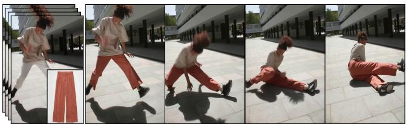

(a2) Severe Occlusion  
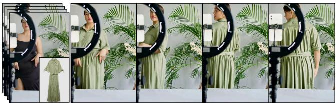

(a3) Object Interaction  
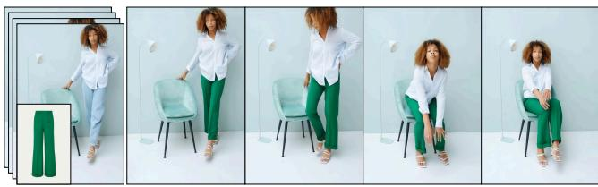  
(a) Challenging Real-World Scenarios

(b1) Multi-View Try-on  
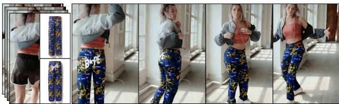

(b2) Cross-Category Try-on  
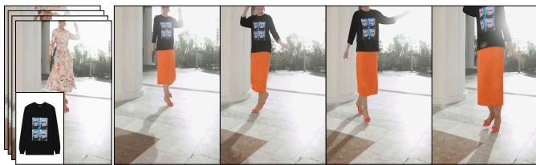

(b3) Layered Try-on  
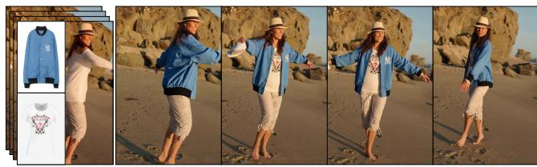  
(b) Diverse Try-on Tasks

Figure 1: BooM-VVT generates high-fidelity and temporally coherent virtual try-on videos without requiring masks. The left panel shows its robustness in challenging real-world scenarios, including large motion, severe occlusion, and object interaction. The right panel highlights its flexibility in diverse try-on tasks, such as multi-view, cross-category, and layered try-on.

∗Zhichao Lian and Yeying Jin are co-corresponding authors.   
†Project Leader. This work is licensed under a Creative Commons Attribution 4.0 International License. MM ’26, Rio de Janeiro, Brazil   
© 2026 Copyright held by the owner/author(s).   
ACM ISBN 979-8-4007-2213-4/2026/11   
https://doi.org/10.1145/3767308.3835712

## Abstract

Video virtual try-on (VVT) aims to generate realistic videos of a person wearing a target garment. Recent methods leverage a keyframe-driven video generation paradigm to improve in-thewild performance, yet they still rely on masks to localize try-on regions, making them vulnerable to large motions and severe occlusions. Although mask-free image-based try-on methods have shown promising results by leveraging large-scale pseudo data, extending this paradigm to videos remains dificult, as constructing video-level pseudo data is prohibitively expensive. Furthermore, coarse keyframe sampling and the scarcity of multi-view try-on data limit existing keyframe-driven methods in maintaining garment consistency and handling diverse try-on tasks.

To address these challenges, we propose BooM-VVT, a maskfree VVT framework built upon the keyframe-driven paradigm. To achieve mask-free VVT, we introduce a multi-stage training strategy that leverages image-level pseudo data for mask-free local ization learning, substantially reducing the need for costly videolevel pseudo data. To improve garment consistency, we propose Garment-Sensitive Keyframe Sampling, which selects keyframes based on garment-relevant body regions to better capture garment appearance. We further introduce Frame-Shared 3D-RoPE to establish spatiotemporal correspondences between keyframes and target video frames for accurate garment-detail transfer. Finally, we construct OmniView, a large-scale multi-view try-on dataset to support reliable try-on video generation under complex camera viewpoints and diverse try-on tasks. Extensive experiments demonstrate that BooM-VVT achieves superior temporal consistency and garment fidelity over existing methods. Project page: https://boomvvt.github.io/boomvvt.

## CCS Concepts

• Computing methodologies → Computer vision.

## Keywords

Video Virtual Try-On; Difusion Models

## ACM Reference Format:

Wei Zhang, Xin Li, Peishu Shi, Jialin Gao, Xuekang Peng, Zhichao Lian, and Yeying Jin. 2026. BooM-VVT: Boosting Mask-Free Video Virtual Try-On with Image-Level Pseudo Data. In Proceedings of the 34th ACM International Conference on Multimedia (MM ’26), November 10–14, 2026, Rio de Janeiro, Brazil. ACM, New York, NY, USA, 23 pages. https://doi.org/10.1145/3767308. 3835712

## 1 Introduction

Video virtual try-on (VVT) aims to synthesize realistic videos of a person wearing a target garment, with broad applications in ecommerce and digital content creation. Although recent difusionbased methods [7, 18, 19, 23, 25, 40] have achieved impressive progress, they remain heavily dependent on scarce paired garment– video data. Due to the limited scale and scene diversity of existing datasets [9, 11], these methods often struggle to preserve garment fidelity and temporal consistency in real-world scenarios.

To address this limitation, recent studies [15, 45] have introduced a keyframe-driven try-on video generation paradigm that decom poses the end-to-end VVT pipeline into two stages: (1) generating try-on images for selected keyframes, and (2) generating the final try-on video conditioned on the resulting keyframe try-on images. Under this paradigm, methods such as DreamVVT [45] can exploit large-scale unpaired video data to train the video generation model, thereby improving generalization in real-world scenarios. Despite these advantages, keyframe-driven methods still face several chal lenges. First, existing VVT methods typically rely on explicit masks to localize try-on regions. However, accurately estimating masks in videos is highly challenging due to large pose variations and severe occlusions, as shown in Fig. 1(a). Inaccurate masks often introduce temporal artifacts such as jittering and flickering. While mask-free image-based try-on methods [12, 13, 42, 43] have shown promising results by leveraging large-scale pseudo data, extending this paradigm to video virtual try-on remains nontrivial, as constructing video-level pseudo data is prohibitively expensive. Second, existing methods typically select keyframes based on overall pose changes and full-body visibility. However, this strategy is often influenced by body regions irrelevant to the target garment, such as the lower body when trying on tops. As a result, the selected keyframes may fail to fully capture the garment appearance, thereby compromising garment consistency in the synthesized videos. Third, existing multi-view try-on datasets remain limited in scale and coverage, as shown in Table 1. This limitation hinders current methods from generating plausible results under challenging viewpoints (e.g., back views) and handling diverse try-on tasks (see Fig. 1(b)).

To tackle these challenges, we present BooM-VVT, a novel maskfree video virtual try-on framework built upon the keyframe-driven paradigm. To achieve mask-free VVT, we propose a multi-stage training strategy that enables the model to leverage more accessible image-level pseudo data to learn robust mask-free try-on region localization. As a result, the model can adapt to mask-free video virtual try-on with only minimal video-level pseudo data, substantially easing data construction. To improve garment consistency, we first propose a Garment-Sensitive Keyframe Sampling (GSKS) strategy. Specifically, it selects keyframes based on body regions most relevant to the target garment, allowing the selected keyframes to better capture the target garment appearance. We further introduce Frame-Shared 3D-RoPE. By assigning identical positional encodings to keyframe try-on images and their corresponding target video frames, it explicitly establishes spatiotemporal correspondences between them, enabling more accurate garment appearance transfer. Finally, to address the scarcity of multi-view try-on data, we construct OmniView, a large-scale multi-view try-on dataset that enables reliable try-on generation across diverse viewpoints and try-on tasks. In summary, our contributions are as follows:

• We propose BooM-VVT, a mask-free video virtual try-on framework that leverages a multi-stage training strategy to learn robust try-on region localization from readily available image-level pseudo data, substantially reducing reliance on costly video-level pseudo data.

• To improve garment consistency, we propose a Garment-Sensitive Keyframe Sampling (GSKS) strategy and Frame-Shared 3D-RoPE. GSKS selects more informative keyframes based on garment-relevant body regions, while Frame-Shared 3D-RoPE facilitates more accurate garment appearance transfer by establishing spatiotemporal correspondences between the keyframes and the target video.

• We construct OmniView, a large-scale multi-view try-on dataset that enables reliable try-on generation across diverse viewpoints and try-on tasks.

## 2 OmniView Dataset

Overview of OmniView Dataset. Existing keyframe-driven VVT methods [45] require multi-view try-on images to provide comprehensive garment cues. However, existing multi-view try-on datasets, such as MVG [33], are limited in scale, garment diversity, and completeness (see Table 1). To address these limitations, we construct OmniView, a large-scale multi-view try-on dataset containing 6,110 samples. Each sample includes person images from at least two viewpoints, with 88% containing back-view images. As shown in Fig. 2, OmniView improves existing datasets in three aspects. First, each sample provides front- and back-view flat garment images for more complete garment references. Second, besides upper-body, lower-body, and full-body categories, OmniView introduces an additional outerwear category. Third, we synthesize pseudo-labeled data for each person image to support cross-category and layered try-on. In Fig. 2(b), the third and fourth columns show pseudo data for cross-category and layered try-on, respectively.

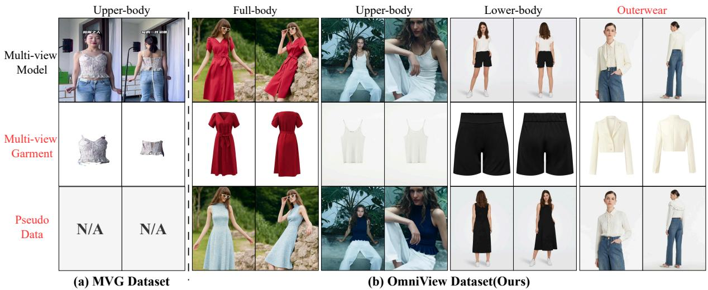  
Figure 2: Data samples from MVG (a) and OmniView (b). Compared with MVG, OmniView provides higher-quality garment images, more garment categories, and additional pseudo data.

Table 1: Comparison with existing multi-view try-on datasets. Category Diversity indicates whether the dataset covers diverse garment categories, and Garment Completeness indicates whether complete flat garment images are provided.
<table><tr><td>Dataset</td><td>Garment Category Diversity</td><td>Garment Completeness</td><td>Scale</td></tr><tr><td>MVG</td><td>x</td><td>x</td><td>1,009</td></tr><tr><td>OmniView</td><td>√</td><td>√</td><td>6,110</td></tr></table>

Data processing. We collect raw data from multiple e-commerce platforms and open-source datasets [29] following their terms of use. To address noise in the raw data, such as inconsistent model identities, we use Qwen3-VL-32B [1] to annotate model and garment images, followed by regrouping and manual verification to ensure identity consistency and garment correspondence. We then generate editing instructions with Qwen3-VL-32B and synthesize pseudo data using Qwen-Image-Edit-2511 [36]. For non-outerwear categories, we perform intra- and cross-category garment replacement, while for outerwear, we additionally introduce garment removal for layered try-on. Examples are shown in the third row of Fig. 2(b), including intra-category replacement (first two columns), cross-category replacement (third column), and garment removal (fourth column). The synthesized data are further reviewed using the same pipeline to ensure quality and consistency.

## 3 Method

## 3.1 Overview

BooM-VVT is built on the keyframe-driven video generation paradigm and aims to achieve mask-free video virtual try-on, as illustrated in Fig. 3. The framework consists of two stages: keyframe tryon (Sec. 3.2) and keyframe-guided try-on video generation (Sec. 3.3). Given an input video $V _ { i n } ,$ we first select informative keyframes using the proposed Garment-Sensitive Keyframe Sampling (GSKS) strategy and generate their try-on results with a multi-frame try-on model. Leveraging OmniView, the model supports both single-view and multi-view garment inputs and achieves reliable try-on across diverse viewpoints. The generated keyframe results are then used as appearance conditions for a DiT-based [26] video generation model. To facilitate accurate garment appearance transfer, we propose Frame-Shared 3D-RoPE, which aligns keyframe try-on tokens with video-frame tokens through shared positional encodings. We further introduce a multi-stage training strategy to enable mask-free video generation, as detailed in Fig. 4.

## 3.2 Keyframe Try-on

3.2.1 Garment-Sensitive Keyframe Sampling. In keyframe-driven VVT, keyframes serve as the primary carrier of target garment information for the final try-on video. An efective keyframe set should satisfy two properties: (i) high information capacity: garment-relevant body regions should be suficiently visible so that fine-grained garment details can be captured; and (ii) complementary viewpoint coverage: the selected keyframes should cover diverse viewpoints to provide more complete garment information.

To this end, we propose a Garment-Sensitive Keyframe Sampling (GSKS) strategy. To quantify the information capacity of each frame, we first define a garment-relevant limb set $P _ { c }$ and body region $A _ { c }$ according to the target garment category $c .$ For example, for upper body garments, $P _ { c }$ includes limbs such as the shoulders and arms, while $A _ { c }$ corresponds to the upper torso. Given an input video $V _ { i n } ;$ GSKS computes an information capacity score $S _ { \mathrm { C a p a c i t y } } ^ { c }$ for each frame based on a limb visibility score $S _ { p } ^ { c }$ and a region visibility score $S _ { a } ^ { c } .$ . Specifically, we use DWPose [39] to detect limbs in each frame, and define $S _ { p } ^ { c }$ as the ratio of the detected limbs belonging to $P _ { c }$ to the total number of limbs in $P _ { c } \mathbf { : }$

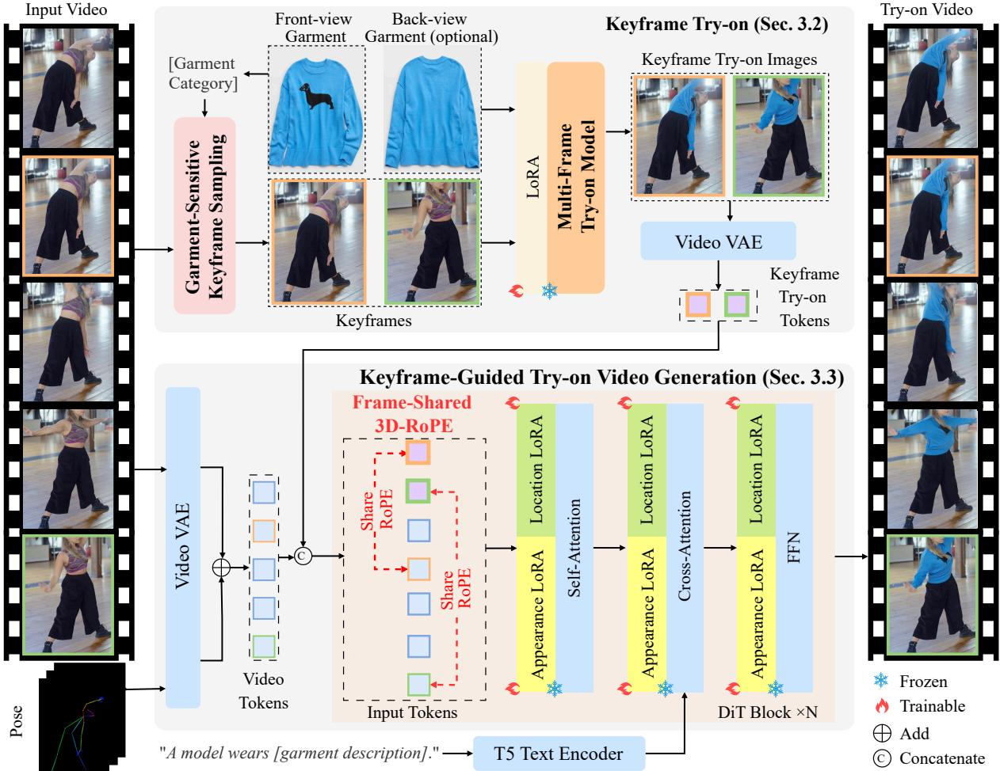  
Figure 3: Overview of BooM-VVT. The framework consists of two components: keyframe try-on and keyframe-guided try-on video generation. The first component selects informative keyframes from the input video and generates corresponding try-on images, while the second synthesizes the final try-on video under the guidance of these keyframe try-on results.

$$
S _ { \hat { p } } ^ { c } = \frac { | \hat { P } \cap P _ { c } | } { | P _ { c } | } ,\tag{1}
$$

where $\hat { P }$ denotes the set of detected limbs in the current frame. Meanwhile, SAM [2] estimates the garment-relevant region $A _ { c }$ , and the region visibility score $S _ { a } ^ { c }$ is computed as its area ratio to the whole frame. The final score is:

$$
S _ { \mathrm { C a p a c i t y } } ^ { c } = ( 1 - \lambda ) S _ { p } ^ { c } + \lambda S _ { a } ^ { c } .\tag{2}
$$

In practice, we set $\lambda = 0 . 2$

After scoring all frames, we select the frame with the highest $S _ { \mathrm { C a p a c i t y } } ^ { c }$ as the primary keyframe and add it to the keyframe set K. We then iteratively select the frame with the largest viewpoint diference from the selected keyframes to expand K, ensuring complementary viewpoint coverage. We measure viewpoint diference as the average cosine distance between the skeletal joint direction vectors of a candidate frame and those of the selected keyframes. To capture garment-relevant appearance variation, we only consider the limbs in $P _ { c } ,$ avoiding interference from irrelevant body regions. The pseudo-code is provided in the Appendix.

3.2.2 Multi-Frame Try-on Model. Given the selected keyframes, we employ a pretrained image try-on model based on the MM-DiT architecture [10] to generate keyframe try-on images. To improve cross-frame consistency, we adapt it to a multi-frame setting through image concatenation. Specifically, the selected keyframes are horizontally concatenated into a composite image, processed by the model, and then split into individual try-on frames. This single forward pass enables cross-frame information interaction and produces coherent results with consistent garment details. When multi-view garment images are available, we organize them using the same concatenation strategy as garment inputs. We further fine tune the model on OmniView using lightweight LoRA adapters inserted into the self-attention layers of MM-DiT blocks. During training, both single-view and multi-view garment inputs are used, enabling the model to generate plausible try-on results for challenging viewpoints (e.g., back views) with single-view garments. Multi-view garment references can further improve visual fidelity.

## 3.3 Keyframe-Guided Try-on Video Generation

Our video generation model is built upon Wan-Animate [4], a DiTbased image-to-video framework. As illustrated in Fig. 3, given an input video and pose sequence, we encode them into video and pose tokens using a Video VAE. The pose tokens are added to the video tokens for structural guidance. Meanwhile, the keyframe try-on images are encoded into keyframe tokens using the same VAE. These keyframe tokens are concatenated with video tokens along the sequence dimension and fed into the DiT backbone. After denoising, the latent representation is decoded by the VAE decoder to obtain the final try-on video.

3.3.1 Frame-Shared 3D-RoPE. Following the standard design of image-to-video generation, existing keyframe-driven VVT methods treat keyframe try-on images and video frames as spatiotemporally independent and assign them diferent positional encodings. However, this ignores an important prior in keyframe-driven VVT: each keyframe try-on image is naturally aligned with its correspond ing target frame. Assigning diferent positional encodings to such aligned representations increases their relative positional distance, thereby weakening the attention interaction between them and hindering accurate garment appearance transfer.

To address this issue, we propose Frame-Shared 3D-RoPE. Our design builds on the distance-aware property of 3D-RoPE [30], where tokens with smaller spatiotemporal distances tend to attend more strongly. Specifically, we assign each keyframe try-on token the same 3D positional encoding as its corresponding video-frame token. By sharing positional encodings across aligned keyframe and video-frame tokens, Frame-Shared 3D-RoPE reduces their relative positional distance and strengthens the attention interaction between them, leading to improved garment appearance transfer.

3.3.2 Multi-Stage Training Strategy. To achieve mask-free video virtual try-on, existing image-based virtual try-on methods typically rely on large-scale pseudo-paired data to learn mask-free tryon region localization. However, directly extending this strategy to videos is impractical due to the high cost of constructing large-scale video-level pseudo data. To address this challenge, we propose a multi-stage training strategy, as illustrated in Fig. 4. Specifically, we first train the video model for keyframe-guided generation on large-scale unpaired human-centric videos, then introduce maskfree try-on localization using image-level pseudo data, and finally adapt the model to mask-free video virtual try-on with limited video-level pseudo data.

Stage 1: Training for Keyframe-Driven Video Generation. As shown in Fig. 4(a), in the first stage, we follow the standard keyframe-driven training paradigm and train the video generation model on large-scale unpaired human-centric videos. Specifically, for each input video, we first randomly sample several frames as keyframe references. We then use garment masks to remove the original garments from the video, obtaining a garment-agnostic input. Given this garment-agnostic video and the sampled keyframes, the model is trained to reconstruct the original video. Since try-on regions are explicitly provided by masks, the model focuses on learning garment appearance transfer and temporal coherence.

Stage 2: Training for Mask-Free Try-on Localization. As illustrated in Fig. 4(b), the second stage equips the video model with mask-free try-on localization capability. Instead of constructing costly video-level pseudo data, we leverage readily available imagelevel pseudo pairs for supervision. Specifically, we build a largescale multi-view person dataset by sampling frames from videos and incorporating existing multi-view person datasets, where each sample contains two images of the same person under diferent poses. For each sample, one image is selected as the target image, whose garment is edited by Qwen-Image-Edit-2511 to generate a pseudo image, while the other image serves as the keyframe reference. The model is then trained to reconstruct the target image without explicit masks, forcing it to learn mask-free garment replacement localization. To preserve the priors learned in Stage 1, we freeze Appearance LoRA and introduce a separate Location LoRA. Stage 3: Training for High-Quality Mask-Free Video Try-on. Although Stage 2 enables mask-free try-on, image-level supervision lacks temporal constraints, resulting in limited video consistency. Therefore, we introduce a final fine-tuning stage with video-level pseudo data. As shown in Fig. 4(c,d), Stage 3 consists of two substages: Stage 3.1 for pseudo video generation and Stage 3.2 for finetuning with pseudo videos. In Stage 3.1, we use the Stage 1 model to construct video-level pseudo data from unpaired videos. Specifically, we generate keyframe try-on images using the multi-frame try-on model and construct garment-agnostic videos by removing original garments with garment masks. Conditioned on these inputs, the Stage 1 model synthesizes pseudo videos. In Stage 3.2, we finetune the Stage 2 model using pseudo videos and corresponding keyframes, with original unpaired videos as supervision. This stage combines the appearance transfer capability from Stage 1 with the mask-free localization capability from Stage 2, producing highquality try-on videos with improved temporal coherence.

## 4 Experiments

## 4.1 Experimental Setup

Training Datasets. For the multi-frame try-on model, we use OmniView, MVG [33], and ViViD [11] datasets. From each ViViD video, we sample two frames as multi-view person images to construct training pairs. In total, we obtain approximately 22K pairs, each containing two person images in diferent poses and their corresponding garment images. The video generation model uses stage-specific data. For Stage 1, we collect 20K human-centric videos from public datasets [11, 20, 35] and online sources. For Stage 2, we sample two frames from each Stage 1 video and combine them with OmniView, yielding 30K multi-view pairs for mask-free try-on localization. For Stage 3, we select 2,500 Stage 1 videos and synthesize their corresponding pseudo videos for final fine-tuning.

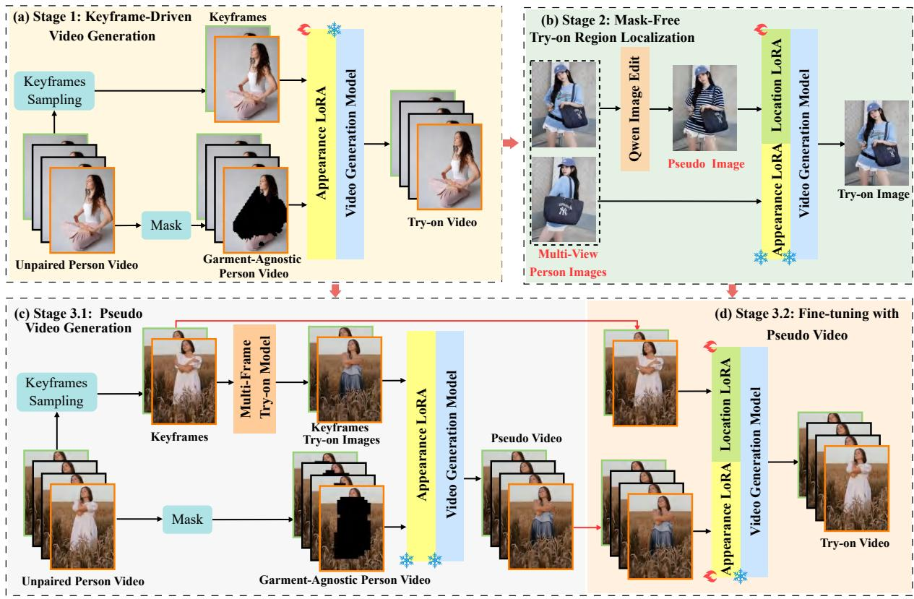

Figure 4: Overview of the proposed multi-stage training strategy for the video generation model in BooM-VVT. (a) Stage 1: The video generation model is trained for keyframe-driven video generation using unpaired videos. (b) Stage 2: The model learns mask-free try-on region localization from image-level pseudo data. (c) Stage 3.1: We use the model trained in Stage 1 to synthesize video-level pseudo data. (d) Stage 3.2: The model is fine-tuned on video-level pseudo data to enable high-quality try-on video generation without masks.  
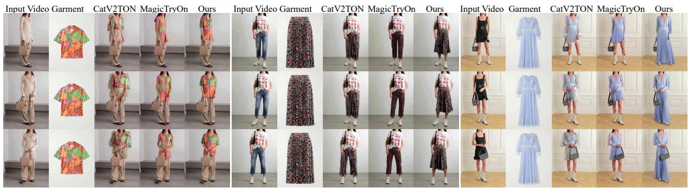  
Figure 5: Qualitative comparison on the ViViD-S dataset.

Evaluation Datasets. For indoor evaluation, we use ViViD-S, which contains 180 samples constructed following the CatV2TON protocol. In addition, we create an in-the-wild benchmark, named WildVVT, consisting of 100 samples that cover diverse human motions, scene conditions, and garment categories.

Implementation Details. For keyframe try-on, we adopt Qwen-Image-Edit-2511 as the Multi-Frame Try-on model and train a rank-64 LoRA for 20K steps. For video generation, we use Wan-Animate as the DiT backbone. We train a rank-128 Appearance LoRA for 10K steps in Stage 1, freeze it and train a rank-64 Location LoRA for 20K steps in Stage 2, and jointly fine-tune both LoRAs for 5K steps in Stage 3. Unless otherwise specified, all models are trained with AdamW on 4 NVIDIA RTX Pro 6000 GPUs, using a learning rate of 1 × 10−4 and a batch size of 1. During inference, following DreamVVT, we sample two keyframes per video to balance eficiency and generation quality. We combine the Multi-Frame Try-on model with Qwen-Image-Edit-Lightning [22], an acceleration LoRA for Qwen-Image-Edit-2511, and use 8 inference steps. The same acceleration LoRA is used for pseudo-image generation during data construction. For video generation, we use 20 inference steps with a guidance scale of 1.

Table 2: Quantitative results on the ViViD-S dataset.
<table><tr><td rowspan="2">Method</td><td rowspan="2">Mask</td><td colspan="4">Unpaired Setting</td><td colspan="3">Paired Setting</td></tr><tr><td>FVDu↓</td><td>ABC↑</td><td>GC↑</td><td>OVQ ↑</td><td>FVDP↓</td><td>SSIM ↑</td><td>LPIPS ↓</td></tr><tr><td>ViViD</td><td>√</td><td>164.87</td><td>3.03</td><td>2.26</td><td>2.24</td><td>139.10</td><td>0.842</td><td>0.078</td></tr><tr><td>CatV2TON</td><td>√</td><td>128.53</td><td>3.53</td><td>2.07</td><td>1.98</td><td>120.38</td><td>0.858</td><td>0.077</td></tr><tr><td>MagicTryOn</td><td>√</td><td>110.66</td><td>4.15</td><td>2.38</td><td>3.12</td><td>86.31</td><td>0.869</td><td>0.068</td></tr><tr><td>BooM-VVT (Stage 1)</td><td>√</td><td>106.25</td><td>4.38</td><td>3.36</td><td>3.57</td><td>88.19</td><td>0.872</td><td>0.065</td></tr><tr><td>BooM-VVT</td><td>x</td><td>101.92</td><td>4.61</td><td>3.95</td><td>4.21</td><td>79.12</td><td>0.891</td><td>0.061</td></tr></table>

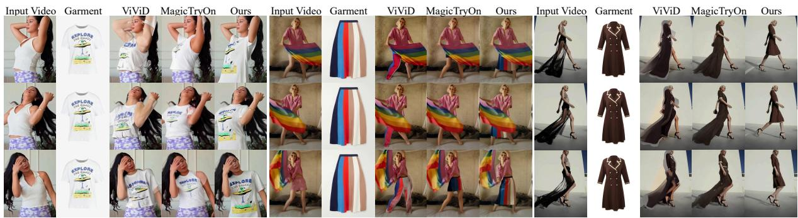  
Figure 6: Qualitative comparison on the WildVVT benchmark.

Evaluation Metrics. Following prior work, we evaluate generated try-on videos using FVD [31], SSIM [34], and LPIPS [41]. We further employ Gemini 3.1 Pro as a judge, scoring each result on a 0–5 scale along three dimensions: Appearance and Background Consistency (ABC), measuring the preservation of identity, background, and other non-try-on regions; Garment Consistency (GC), measuring the faithfulness of the generated garment to the reference; and Overall Video Quality (OVQ), measuring realism and temporal coherence.

## 4.2 Qualitative Comparison

We qualitatively compare BooM-VVT with state-of-the-art VVT methods, including ViViD [11], CatV2TON [7], and MagicTryOn [19]. As shown in Figs. 5 and 6, BooM-VVT produces more realistic and temporally coherent results on both ViViD-S and the more challenging WildVVT benchmark. CatV2TON and MagicTryOn often exhibit artifacts caused by their mask-based designs. As illustrated in Fig. 5, when the source and target garments difer substantially in shape, they remain constrained by the original garment structure and fail to reconstruct the target garment accurately. Moreover, as shown in Fig. 6, under challenging turning motions and severe occlusions, ViViD and MagicTryOn often fail to preserve plausible garment structures and fine-grained details. In contrast, BooM-VVT achieves better garment fidelity and spatiotemporal consistency across diverse real-world scenarios. Additional qualitative results are provided in the Appendix.

## 4.3 Quantitative Comparison

Quantitative results are reported in Table 2 and Table 3. Since public implementations of existing keyframe-driven VVT methods are unavailable, direct comparison with them is infeasible. Therefore, we use BooM-VVT (Stage 1) as a baseline for the keyframe-driven setting. Specifically, BooM-VVT (Stage 1) is a variant of our method whose video model is trained only in Stage 1. The results show that the keyframe-driven methods, BooM-VVT (Stage 1) and BooM-VVT, consistently outperform the non-keyframe-driven baselines on both ViViD-S and WildVVT, demonstrating the efectiveness of the keyframe-driven paradigm. However, mask dependence remains a major limitation of existing baselines. When source and target garments difer substantially in shape, inaccurate masks hinder garment transfer and reduce GC scores, consistent with the qualitative results in Fig. 5. The limitation becomes more pronounced on the more challenging WildVVT benchmark, where large pose variations and severe occlusions make it particularly dificult to obtain accurate masks. As a result, existing methods often fail to maintain appearance consistency and exhibit temporal jittering and flickering, leading to lower ABC and OVQ scores. By contrast, BooM-VVT remains robust in unconstrained real-world scenarios and achieves the best performance across all quality metrics. Table 3 further reports inference time and GPU memory usage. Compared with MagicTryOn, BooM-VVT achieves substantially better performance at comparable inference cost.

w/o Frame-

Table 3: Quantitative results on the WildVVT benchmark. The inference time and GPU memory usage are measured on a single NVIDIA A800 when generating a 65-frame video at a resolution of 624 × 832.
<table><tr><td>Method</td><td>Mask</td><td>FVD↓</td><td>ABC ↑</td><td>GC↑</td><td> $\mathrm { O V Q \uparrow }$ </td><td>GPU Memory</td><td>Inference Time</td></tr><tr><td>ViViD</td><td>√</td><td>301.80</td><td>2.13</td><td>1.55</td><td>1.57</td><td>55.8G</td><td>142s</td></tr><tr><td>CatV2TON</td><td>√</td><td>350.72</td><td>1.39</td><td>1.28</td><td>1.23</td><td>28.9G</td><td>158s</td></tr><tr><td>MagicTryOn</td><td>√</td><td>250.55</td><td>2.12</td><td>1.84</td><td>1.65</td><td>63.5G</td><td>342s</td></tr><tr><td>BooM-VVT (Stage 1)</td><td>√</td><td>241.72</td><td>3.96</td><td>3.07</td><td>3.26</td><td>57.9G</td><td>281s</td></tr><tr><td>BooM-VVT</td><td>x</td><td>219.76</td><td>4.33</td><td>3.72</td><td>3.94</td><td>57.9G</td><td>281s</td></tr></table>

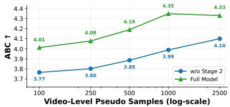

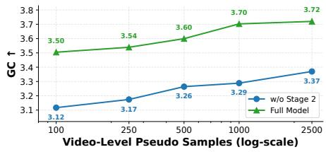

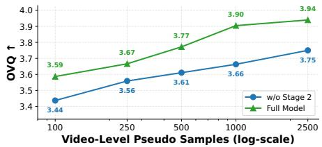  
Figure 7: Efectiveness of Stage 2 under diferent amounts of video-level pseudo data on the WildVVT benchmark.

Table 4: Ablation study on the WildVVT benchmark.
<table><tr><td>Method</td><td>FVD↓</td><td>ABC ↑</td><td>GC↑</td><td>OVQ↑</td></tr><tr><td>w/o GSKS</td><td>227.88</td><td>4.21</td><td>3.42</td><td>3.85</td></tr><tr><td>w/o Frame-Shared 3D-RoPE</td><td>224.15</td><td>4.34</td><td>3.27</td><td>3.81</td></tr><tr><td>w/o Stage 1</td><td>242.61</td><td>3.91</td><td>3.26</td><td>3.66</td></tr><tr><td>w/o Stage 2</td><td>237.89</td><td>4.10</td><td>3.37</td><td>3.75</td></tr><tr><td>Full Model</td><td>219.76</td><td>4.33</td><td>3.72</td><td>3.94</td></tr></table>

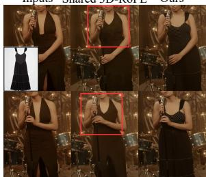

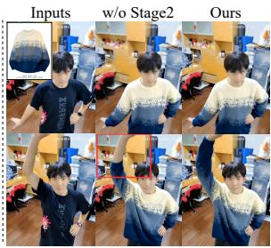  
Figure 8: Qualitative results of ablation study on the WildVVT benchmark.

## 4.4 Ablation Study

We conduct ablation studies on the WildVVT benchmark to evaluate the efectiveness of the key components in BooM-VVT, covering both architectural design and training strategy.

On the model architecture. We first examine two key components, Garment-Sensitive Keyframe Sampling (GSKS) and Frame-Shared 3D-RoPE. As shown in Table 4, removing either component degrades performance, particularly Garment Consistency (GC). For the w/o GSKS variant, we follow DreamVVT and select keyframes mainly based on global pose diferences. For the w/o Frame-Shared 3D-RoPE variant, keyframe try-on images and their corresponding target video frames are assigned diferent positional encodings, which weakens their attention interaction and hinders garment appearance transfer. Although this variant achieves a slightly higher ABC score, its GC and OVQ decrease while FVD increases, indicating that it preserves non-try-on regions at the expense of garment transfer quality. Fig. 8 further shows that this variant reconstructs incorrect shoulder straps and misses the white chest stripes.

On the training strategy. We further analyze the multi-stage training strategy, with results reported in Table 4 and Fig. 7. The w/o Stage 1 variant skips Stage 1 training for the Appearance LoRA, while the w/o Stage 2 variant skips Stage 2 training for the Location LoRA. To ensure a fair comparison in data construction cost, we train w/o Stage 2 with 400 additional video-level pseudo samples, whose construction cost matches that ofthe 30K image-level pseudo samples used in Stage 2.

As shown in Table 4, removing Stage 1 causes the largest performance drop, confirming its importance for high-quality keyframedriven try-on video generation. Removing Stage 2 also clearly degrades performance, demonstrating its role in accurate mask-free try-on localization. This is further illustrated in the right panel of Fig. 8, where w/o Stage 2 incorrectly localizes the try-on region and produces erroneous garment structures. Fig. 7 further shows that Stage 2 substantially improves fine-tuning eficiency at comparable data construction costs. Across all pseudo-video scales, the full model consistently outperforms the w/o Stage 2 variant. Notably, with only 500 video-level pseudo samples, the full model achieves performance comparable to that of w/o Stage 2 trained with 2,500 samples. We attribute this advantage to the broad coverage of garment types, poses, and real-world scenes in the large-scale imagelevel pseudo data, which improves generalization to unconstrained scenarios.

## 5 Conclusion

In this paper, we present BooM-VVT, a novel mask-free video virtual try-on framework built on the keyframe-driven paradigm. To achieve mask-free video virtual try-on, we introduce a multi-stage training strategy that leverages readily available image-level pseudo data to learn mask-free try-on region localization, substantially reducing the reliance on costly video-level pseudo data. To improve garment consistency, we further introduce Garment-Sensitive Keyframe Sampling (GSKS) and Frame-Shared 3D-RoPE. GSKS selects informative keyframes based on garment-relevant body regions, while Frame-Shared 3D-RoPE improves garment appearance transfer by explicitly establishing spatiotemporal correspondences between keyframes and their corresponding target video frames. In addition, we construct OmniView, a large-scale multi-view tryon dataset that provides more complete garment references and broader garment category coverage, enabling reliable try-on generation under challenging viewpoints and diverse tasks. Extensive experiments demonstrate that BooM-VVT outperforms existing methods in temporal consistency and garment fidelity under unconstrained real-world scenarios.

## 6 Limitations

Although BooM-VVT demonstrates strong robustness in challenging real-world scenarios, GSKS still relies on of-the-shelf DWPose and SAM. Extremely severe occlusions or inaccurate detections may therefore lead to suboptimal keyframe selection. In addition, extreme illumination changes may afect mask-free localization. Improving robustness to imperfect visual priors and reducing in ference cost remain important directions for future work.

## Acknowledgments

This work was partially supported by the 2024 Jiangsu Province Frontier Technology Research and Development Project (Grant No. BF2024071) and the Jiangsu Provincial Science and Technology Major Project (Grant No. BG2024042).

## References

[1] Shuai Bai, Yuxuan Cai, Ruizhe Chen, Keqin Chen, Xionghui Chen, Zesen Cheng, Lianghao Deng, Wei Ding, Chang Gao, Chunjiang Ge, et al. 2025. Qwen3-vl technical report. arXiv preprint arXiv:2511.21631 (2025).

[2] Nicolas Carion, Laura Gustafson, Yuan-Ting Hu, Shoubhik Debnath, Ronghang Hu, Didac Suris, Chaitanya Ryali, Kalyan Vasudev Alwala, Haitham Khedr, An drew Huang, et al. 2025. Sam 3: Segment anything with concepts. arXiv preprint arXiv:2511.16719 (2025).

[3] Tianyu Chang, Xiaohao Chen, Zhichao Wei, Xuanpu Zhang, Qingguo Chen, Weihua Luo, Peipei Song, and Xun Yang. 2025. PEMF-VTO: Point-Enhanced Video Virtual Try-on via Mask-free Paradigm. IEEE Transactions on Consumer Electronics (2025).

[4] Gang Cheng, Xin Gao, Li Hu, Siqi Hu, Mingyang Huang, Chaonan Ji, Ju Li, Dechao Meng, Jinwei Qi, Penchong Qiao, et al. 2025. Wan-animate: Unified character animation and replacement with holistic replication. arXiv preprint arXiv:2509.14055 (2025).

[5] Yisol Choi, Sangkyung Kwak, Kyungmin Lee, Hyungwon Choi, and Jinwoo Shin. 2024. Improving difusion models for authentic virtual try-on in the wild. In European Conference on Computer Vision. Springer, 206–235.

[6] Zheng Chong, Xiao Dong, Haoxiang Li, Shiyue Zhang, Wenqing Zhang, Xujie Zhang, Hanqing Zhao, Dongmei Jiang, and Xiaodan Liang. 2024. Catvton: Concatenation is all you need for virtual try-on with difusion models. arXiv preprint arXiv:2407.15886 (2024).

[7] Zheng Chong, Wenqing Zhang, Shiyue Zhang, Jun Zheng, Xiao Dong, Haoxiang Li, Yiling Wu, Dongmei Jiang, and Xiaodan Liang. 2025. Catv2ton: Taming difu sion transformers for vision-based virtual try-on with temporal concatenation. arXiv preprint arXiv:2501.11325 (2025)

[8] Aiyu Cui, Daniel McKee, and Svetlana Lazebnik. 2021. Dressing in order: Recurrent person image generation for pose transfer, virtual try-on and outfit editing. In Proceedings of the IEEE/CVF international conference on computer vision. 14638–14647.

[9] Haoye Dong, Xiaodan Liang, Xiaohui Shen, Bowen Wu, Bing-Cheng Chen, and Jian Yin. 2019. Fw-gan: Flow-navigated warping gan for video virtual try-on. In Proceedings ofthe IEEE/CVF international conference on computer vision. 1161– 1170.

[10] Patrick Esser, Sumith Kulal, Andreas Blattmann, Rahim Entezari, Jonas Müller, Harry Saini, Yam Levi, Dominik Lorenz, Axel Sauer, Frederic Boesel, et al. 2024. Scaling rectified flow transformers for high-resolution image synthesis. In Fortyfirst international conference on machine learning.

[11] Zixun Fang, Wei Zhai, Aimin Su, Hongliang Song, Kai Zhu, Mao Wang, Yu Chen, Zhiheng Liu, Yang Cao, and Zheng-Jun Zha. 2024. Vivid: Video virtual try-on using difusion models. arXiv preprint arXiv:2405.11794 (2024).

[12] Yutong Feng, Linlin Zhang, Hengyuan Cao, Yiming Chen, Xiaoduan Feng, Jian Cao, Yuxiong Wu, and Bin Wang. 2025. Omnitry: Virtual try-on anything without masks. arXiv preprint arXiv:2508.13632 (2025).

[13] Hailong Guo, Bohan Zeng, Yiren Song, Wentao Zhang, Jiaming Liu, and Chuang Zhang. 2025. Any2anytryon: Leveraging adaptive position embeddings for versatile virtual clothing tasks. In Proceedings ofthe IEEE/CVF International Conference on Computer Vision. 19085–19096.

[14] Xintong Han, Zuxuan Wu, Zhe Wu, Ruichi Yu, and Larry S Davis. 2018. Viton: An image-based virtual try-on network. In Proceedings ofthe IEEE conference on computer vision and pattern recognition. 7543–7552.

[15] Qingdong He, Xueqin Chen, Yanjie Pan, Peng Tang, Pengcheng Xu, Zhenye Gan, Chengjie Wang, Xiaobin Hu, Jiangning Zhang, and Yabiao Wang. 2025. The devil is in the details: Enhancing Video Virtual Try-On via Keyframe-Driven Details Injection. arXiv preprint arXiv:2512.20340 (2025).

[16] Jonathan Ho, Ajay Jain, and Pieter Abbeel. 2020. Denoising difusion probabilistic models. Advances in neural information processing systems 33 (2020), 6840–6851.

[17] Boyuan Jiang, Xiaobin Hu, Donghao Luo, Qingdong He, Chengming Xu, Jinlong Peng, Jiangning Zhang, Chengjie Wang, Yunsheng Wu, and Yanwei Fu. 2024. Fitdit: Advancing the authentic garment details for high-fidelity virtual try-on. arXiv preprint arXiv:2411.10499 (2024).

[18] Johanna Karras, Yingwei Li, Nan Liu, Luyang Zhu, Innfarn Yoo, Andreas Lugmayr, Chris Lee, and Ira Kemelmacher-Shlizerman. 2024. Fashion-vdm: Video difusion model for virtual try-on. In SIGGRAPH Asia 2024 Conference Papers. 1–11.

[19] Guangyuan Li, Siming Zheng, Hao Zhang, Jinwei Chen, Junsheng Luan, Binkai Ou, Lei Zhao, Bo Li, and Peng-Tao Jiang. 2025. MagicTryOn: Harnessing Difusion Transformer for Garment-Preserving Video Virtual Try-on. arXiv preprint arXiv:2505.21325 (2025).

[20] Hui Li, Mingwang Xu, Yun Zhan, Shan Mu, Jiaye Li, Kaihui Cheng, Yuxuan Chen, Tan Chen, Mao Ye,Jingdong Wang, and Siyu Zhu. 2025. OpenHumanVid: A Large-Scale High-Quality Dataset for Enhancing Human-Centric Video Generation. In Proceedings ofthe IEEE/CVFConference on ComputerVision andPattern Recognition. 7752–7762.

[21] Ente Lin, Xujie Zhang, Fuwei Zhao, Yuxuan Luo, Xin Dong, Long Zeng, and Xiaodan Liang. 2025. Dreamfit: Garment-centric human generation via a lightweight anything-dressing encoder. In Proceedings of the AAAI Conference on Artificial Intelligence, Vol. 39. 5218–5226.

[22] ModelTC. 2025. Qwen-Image-Lightning: Speed up Qwen-Image model with distillation. GitHub repository. Includes Qwen-Image-Edit-Lightning models, weights, and workflows. Retrieved April 2, 2026 from https://github.com/ModelTC/Qwen-Image-Lightning

[23] Hung Nguyen, Quang Qui-Vinh Nguyen, Khoi Nguyen, and Rang Nguyen. 2025. Swifttry: Fast and consistent video virtual try-on with difusion models. In Proceedings ofthe AAAI Conference on Artificial Intelligence, Vol. 39. 6200–6208.

[24] Alexander Quinn Nichol and Prafulla Dhariwal. 2021. Improved denoising difusion probabilistic models. In International conference on machine learning. PMLR, 8162–8171.

[25] Yanjie Pan, Qingdong He, Lidong Wang, Bo Peng, and Mingmin Chi. 2025. Once Is Enough: Lightweight DiT-Based Video Virtual Try-On via One-Time Garment Appearance Injection. arXiv preprint arXiv:2510.07654 (2025).

[26] William Peebles and Saining Xie. 2023. Scalable difusion models with transformers. In Proceedings ofthe IEEE/CVF international conference on computer vision. 4195–4205.

[27] Yuang Peng, Yuxin Cui, Haomiao Tang, Zekun Qi, Runpei Dong, Jing Bai, Chunrui Han, Zheng Ge, Xiangyu Zhang, and Shu-Tao Xia. 2024. Dreambench++: A human-aligned benchmark for personalized image generation. arXiv preprint arXiv:2406.16855 (2024).

[28] Robin Rombach, Andreas Blattmann, Dominik Lorenz, Patrick Esser, and Björn Ommer. 2022. High-resolution image synthesis with latent difusion models. In Proceedings of the IEEE/CVF conference on computer vision and pattern recognition. 10684–10695.

[29] Fei Shen, Xin Jiang, Xin He, Hu Ye, Cong Wang, Xiaoyu Du, Zechao Li, and Jinhui Tang. 2025. Imagdressing-v1: Customizable virtual dressing. In Proceedings ofthe AAAI Conference on Artificial Intelligence, Vol. 39. 6795–6804.

[30] Jianlin Su, Murtadha Ahmed, Yu Lu, Shengfeng Pan, Wen Bo, and Yunfeng Liu. 2024. Roformer: Enhanced transformer with rotary position embedding. Neurocomputing 568 (2024), 127063.

[31] Thomas Unterthiner, Sjoerd Van Steenkiste, Karol Kurach, Raphael Marinier, Marcin Michalski, and Sylvain Gelly. 2018. Towards accurate generative models of video: A new metric & challenges. arXiv preprint arXiv:1812.01717 (2018).

[32] Bochao Wang, Huabin Zheng, Xiaodan Liang, Yimin Chen, Liang Lin, and Meng Yang. 2018. Toward characteristic-preserving image-based virtual try-on network. In Proceedings of the European conference on computer vision (ECCV). 589–604.

[33] Haoyu Wang, Zhilu Zhang, Donglin Di, Shiliang Zhang, and Wangmeng Zuo. 2025. Mv-vton: Multi-view virtual try-on with difusion models. In Proceedings ofthe AAAI Conference on Artificial Intelligence, Vol. 39. 7682–7690.

[34] Zhou Wang, Alan C Bovik, Hamid R Sheikh, and Eero P Simoncelli. 2004. Image quality assessment: from error visibility to structural similarity. IEEE transactions on image processing 13, 4 (2004), 600–612.

[35] Zhenzhi Wang, Yixuan Li, Yanhong Zeng, Youqing Fang, Yuwei Guo, Wenran Liu, Jing Tan, Kai Chen, Tianfan Xue, Bo Dai, et al. 2024. Humanvid: Demystifying training data for camera-controllable human image animation. Advances in Neural Information Processing Systems 37 (2024), 20111–20131.

[36] Chenfei Wu, Jiahao Li, Jingren Zhou, Junyang Lin, Kaiyuan Gao, Kun Yan, Shengming Yin, Shuai Bai, Xiao Xu, Yilei Chen, et al. 2025. Qwen-image technical report. arXiv preprint arXiv:2508.02324 (2025).

[37] Zhenyu Xie, Zaiyu Huang, Xin Dong, Fuwei Zhao, Haoye Dong, Xijin Zhang, Feida Zhu, and Xiaodan Liang. 2023. Gp-vton: Towards general purpose virtual try-on via collaborative local-flow global-parsing learning. In Proceedings ofthe IEEE/CVF conference on computer vision and pattern recognition. 23550–23559.

[38] Yuhao Xu, Tao Gu, Weifeng Chen, and Arlene Chen. 2025. Ootdifusion: Outfitting fusion based latent difusion for controllable virtual try-on. In Proceedings ofthe

AAAI Conference on Artificial Intelligence, Vol. 39. 8996–9004.

[39] Zhendong Yang, Ailing Zeng, Chun Yuan, and Yu Li. 2023. Efective wholebody pose estimation with two-stages distillation. In Proceedings ofthe IEEE/CVF International Conference on Computer Vision. 4210–4220.

[40] Jianhao Zeng, Yancheng Bai, Ruidong Chen, Xuanpu Zhang, Lei Sun, Dongyang Jin, Ryan Xu, Nannan Zhang, Dan Song, and Xiangxiang Chu. 2025. Eevee: Towards Close-up High-resolution Video-based Virtual Try-on. arXiv preprint arXiv:2511.18957 (2025).

[41] Richard Zhang, Phillip Isola, Alexei A Efros, Eli Shechtman, and Oliver Wang. 2018. The unreasonable efectiveness of deep features as a perceptual metric. In Proceedings of the IEEE conference on computer vision and pattern recognition. 586–595.

[42] Wei Zhang, Yeying Jin, Xin Li, Yan Zhang, Xiaofeng Cong, Cong Wang, Fengcai Qiao, and Zhichao Lian. 2026. UniFit: Towards Universal Virtual Try-on with MLLM-Guided Semantic Alignment. In Proceedings ofthe AAAI Conference on Artificial Intelligence, Vol. 40. 12816–12824.

[43] Xuanpu Zhang, Dan Song, Pengxin Zhan, Tianyu Chang, Jianhao Zeng, Qingguo Chen, Weihua Luo, and An-An Liu. 2025. Boow-vton: Boosting in-the-wild virtual try-on via mask-free pseudo data training. In Proceedings ofthe Computer Vision and Pattern Recognition Conference. 26399–26408.

[44] Xiaojing Zhong, Zhonghua Wu, Taizhe Tan, Guosheng Lin, and Qingyao Wu. 2021. Mv-ton: Memory-based video virtual try-on network. In Proceedings ofthe 29th ACM International Conference on Multimedia. 908–916.

[45] Tongchun Zuo, Zaiyu Huang, Shuliang Ning, Ente Lin, Chao Liang, Zerong Zheng, Jianwen Jiang, Yuan Zhang, Mingyuan Gao, and Xin Dong. 2025. Dreamvvt: Mastering realistic video virtual try-on in the wild via a stage-wise difusion transformer framework. arXiv preprint arXiv:2508.02807 (2025).

## A Related Work

## A.1 Image Virtual Try-On

Image virtual try-on aims to synthesize a realistic image of a target person wearing a reference garment while preserving identity and scene context. Early methods [14, 32, 37] mainly followed a warping and-fusion pipeline, where the garment was first aligned to the target body via TPS or learned flow and then blended into the person image by a GAN-based generator. Although efective in controlled settings, these methods often sufer from misalignment artifacts and limited robustness under complex poses, severe occlusions, and unconstrained scenes.

Recent advances in difusion models [16, 24, 28] have substan tially improved synthesis realism and garment fidelity in image virtual try-on. Representative methods [5, 6, 17, 38] build on latent difusion model [28] and further enhance garment preservation through reference-feature injection or simple input concatenation. Beyond standard frontal-view try-on, MV-VTON [33] extends image virtual try-on to multi-view settings by using front- and backview garment images, and constructs the MVG dataset for this task. However, most existing image try-on methods still rely on dense preprocessing, such as human parsing and garment masks, which limits robustness and practical usability in real-world scenarios. To alleviate this limitation, more recent studies [12, 13, 42] explore mask-free paradigms, where the model implicitly learns try-on region localization from large-scale pseudo-paired data. As a result, these methods exhibit improved flexibility and generalization. However, their efectiveness has been demonstrated primarily in image synthesis, and extending mask-free paradigms to temporally coherent video generation remains challenging.

## A.2 Video Virtual Try-On

Compared with image virtual try-on, video virtual try-on (VVT) additionally requires temporal coherence across frames. Early VVT methods typically extend image-based pipelines to the video setting by introducing dedicated temporal modules. For example, FW-GAN [9] extends image-based try-on to videos through opticalflow-guided warping and fusion, while MV-TON [44] improves temporal consistency with a memory refinement module that propagates information from previously generated frames. Although these methods can produce plausible try-on results, their ability to maintain temporal coherence is often limited by the generative capacity of GAN-based architectures.

With the success of difusion models in video generation, recent VVT methods have made significant progress. ViViD [11] adapts image difusion models to video try-on by introducing temporal modeling modules and a dedicated garment encoder. CatV2TON [7] adopts a video DiT architecture to unify image and video tryon within a single model through temporal concatenation of garment and person inputs. MagicTryOn [19] introduces a garmentpreservation strategy that decomposes garment cues into semantic, structural, and appearance streams, and further incorporates garment-aware spatiotemporal RoPE to reduce temporal jitter. Despite these advances, most existing VVT methods still rely heavily on scarce paired video try-on data, which limits their generalization to unconstrained real-world scenarios.

To reduce this dependence, DreamVVT [45] shows that a keyframe driven, stage-wise design can better exploit readily available unpaired videos to improve video-model generalization. KeyTailor [15] introduces a keyframe-driven detail injection strategy to enrich garment dynamics and background integrity. Nevertheless, these methods still depend on explicit masks, which restrict garment fidelity and temporal coherence in challenging real-world scenarios. PEMF-VTO [3] explores mask-free video virtual try-on by introducing point-enhanced guidance for spatial garment transfer and temporal coherence. However, its learning paradigm still relies on large-scale video-level pseudo data. In contrast, our method achieves mask-free VVT under the keyframe-driven paradigm using more accessible image-level pseudo data, substantially reducing the dependence on video-level pseudo data. We further improve garment consistency in keyframe-driven try-on video generation through garment-sensitive keyframe sampling and explicit alignment between keyframes and target video frames.

## B Preliminary

## B.1 Virtual Try-On Paradigms

B.1.1 Mask-based and Mask-free Try-on. Virtual try-on methods can be broadly categorized into mask-based and mask-free paradigms. Mask-based methods formulate try-on as a conditional inpainting problem, where an agnostic mask is used to specify the editable clothing region. Given a person image �, a garment image $I _ { g } ,$ and a mask �, the try-on result ˆ� can be written as

$$
\hat { I } = G ( I , I _ { g } , M ) ,\tag{3}
$$

where � denotes the try-on model. This design provides explicit spatial controllability, but its performance heavily depends on mask quality. In complex scenarios, inaccurate masks may destroy original appearance cues and introduce artifacts. By contrast, mask-free methods do not rely on explicit masks and instead require the model to implicitly localize the try-on region from data. The try-on process can be formulated as

$$
\hat { I } = G ( I , I _ { g } ) .\tag{4}
$$

B.1.2 Keyframe-Driven Video Try-on. Existing video virtual try-on methods are often trained in an end-to-end manner, directly generating a try-on video from garment and video conditions. Given an input video $V = \{ I _ { t } \} _ { t = 1 } ^ { T }$ and a garment image $I _ { g } ,$ the generated try-on video $\hat { V }$ can be written as

$$
\hat { V } = G _ { \mathrm { v v t } } ( V , I _ { g } ) .\tag{5}
$$

Although conceptually simple, this design heavily depends on scarce paired garment–video data, making it dificult to preserve garment fidelity and temporal consistency in unconstrained scenarios. To address this limitation, recent methods adopt a keyframedriven paradigm, which decomposes VVT into two stages: keyframe try-on and keyframe-guided video generation. Specifically, given sampled keyframes $V _ { k } = \{ I _ { t _ { i } } \} _ { i = 1 } ^ { K }$ , the keyframe try-on results are first generated as

$$
\hat { V } _ { k } = G _ { \mathrm { i m g } } ( V _ { k } , I _ { g } ) ,\tag{6}
$$

and the final try-on video is then synthesized as

$$
\hat { V } = G _ { \mathrm { v i d } } ( V , \hat { V } _ { k } ) .\tag{7}
$$

This design makes it easier to exploit powerful image try-on models and pretrained video generation backbones, while also enabling training with more readily available unpaired videos. However, existing keyframe-driven methods still mostly rely on explicit masks during try-on generation, which limits their robustness in challenging real-world scenarios.

## B.2 Difusion Transformers

Difusion Transformers (DiTs) have emerged as powerful backbones for image and video generation due to their strong scalability and ability to model long-range dependencies.

For image generation, recent representative models such as Qwen-Image and FLUX adopt a multimodal difusion transformer (MM-DiT) architecture. In general, such models consist of a varia tional autoencoder (VAE), a text encoder, and an MM-DiT backbone. The input image is first mapped into a latent space by the VAE, while the text prompt is encoded into semantic embeddings by the text encoder. The MM-DiT backbone is composed of stacked Trans former blocks, which enable efective interaction across diferent modalities through self-attention, thereby supporting high-quality image generation and editing. In our framework, the multi-frame try-on model is built upon Qwen-Image-Edit, whose backbone also follows the MM-DiT architecture.

For video generation, recent mainstream models such as Wan adopt a DiT-based latent video generation architecture. A typical video DiT consists of a VAE, a text encoder, and a DiT backbone that includes patchifying and unpatchifying modules together with multiple Transformer blocks. By operating on spatiotemporal latent tokens, the model can jointly capture temporal continuity and appearance consistency across frames. To better incorporate textual instructions in long-context scenarios, such architectures often combine self-attention and cross-attention to inject conditioning information. In our framework, the video generation model is based on Wan-Animate, which is also built on the video DiT architecture.

Recent DiT-based generative models are often trained with flow matching. Let �1 denote the latent representation of a target sample and $x _ { 0 } \sim { \cal N } ( 0 , I )$ denote a Gaussian noise sample. Given a sampled time step $t \in [ 0 , 1 ]$ , the interpolated latent is defined as

$$
\begin{array} { r } { x _ { t } = t x _ { 1 } + ( 1 - t ) x _ { 0 } . } \end{array}\tag{8}
$$

The corresponding target velocity field is

$$
v _ { t } = \frac { d x _ { t } } { d t } = x _ { 1 } - x _ { 0 } .\tag{9}
$$

Flow matching trains the network to predict this velocity field under the given conditions, enabling the model to learn a continuous transport from noise to data. In our framework, both the multiframe try-on model and the video generation model are trained with flow matching.

## C Method Details

## C.1 Keyframe Sampling Algorithm

Fig. 9 shows the DWPose skeleton used in GSKS, together with the definitions of the garment-related limb set $P _ { c }$ and body region $A _ { c }$ for each garment category. Face-related keypoints (indices 0 and 14–17) are excluded from $P _ { c }$ for all garment categories, as they are irrelevant to garment appearance. As described in Sec. 3.2.1 of the main paper, GSKS selects keyframes according to two criteria: information capacity and complementary viewpoint coverage. Specif ically, for upper-body garments, $P _ { c }$ includes the shoulder and arm limbs together with torso connections; for lower-body garments, $P _ { c }$ includes the hip and leg limbs together with torso connections; and for full-body garments, $P _ { c }$ includes all body limbs. In all experiments, we use DWPose [39] for limb detection and SAM [2] for body region estimation. Unless otherwise specified, we set the number of keyframes to $K = 2 ,$ , the weighting factor to $\lambda = 0 . 2$ and the minimum frame interval between selected keyframes to $\Delta _ { \operatorname* { m i n } } = 4$ frames.

To facilitate reproducibility, we provide the complete pseudocode of GSKS in Algorithm 1. In the complementary viewpoint selection stage, the viewpoint diference between a candidate frame and the selected keyframes is measured using the average cosine distance of garment-related limb direction vectors. Missing limbs are treated as maximally similar to avoid overestimating viewpoint diferences caused by unreliable detections under severe occlusion.

## C.2 Evaluation Metrics

C.2.1 VLM-based Evaluation Metrics. To comprehensively evaluate the quality of generated try-on videos, we introduce three VLM-based metrics: Appearance & Background Consistency (ABC), Garment Consistency (GC), and Overall Visual Quality (OVQ). Inspired by recent studies [21, 27] showing strong alignment between large multimodal models and human judgments, we design a structured evaluation pipeline using Gemini 3.1 Pro as the evaluator.

For each test sample, the evaluator receives three inputs: (1) the source model video, which serves as the reference for person identity, motion, and background; (2) the target garment image; and (3) the generated try-on video to be evaluated. The evaluator is instructed to assess the three dimensions independently, each on an integer scale from 0 (worst) to 5 (best). To ensure consistent and reproducible scoring, we provide detailed sub-criteria and scoring anchors for each dimension in the evaluation prompt, as shown in Fig. 11. We set the decoding temperature to 0 and require the output to follow a structured JSON format containing the three integer scores together with brief rationales for each dimension.

We further validate the reliability of the VLM-based evaluation through a human study, which shows strong agreement between Gemini-based and human judgments; detailed results are provided in Appendix D.1.1.

C.2.2 Discussion on VFID Evaluation. Besides the FVD metric used in the main paper, prior VVT works have also widely reported the Video Fréchet Inception Distance (VFID) [9] for quantitative comparison. Although we do not use VFID as a primary metric in the main paper, we include it here for completeness and comparability with prior work.

During our study, we identified an implementation issue in a commonly used open-source VFID toolkit1 adopted by several recent methods [7, 19]. Specifically, regardless of the video length, the current implementation evaluates only the first 10 frames of each video and ignores all subsequent frames. As a result, the metric cannot fully assess quality over the entire video sequence, especially for videos with large motion variation or rapidly changing content. We provide a detailed analysis and a corrected implementation on our project page. Based on the corrected implementation, we report VFID scores for all compared methods in Sec. D.

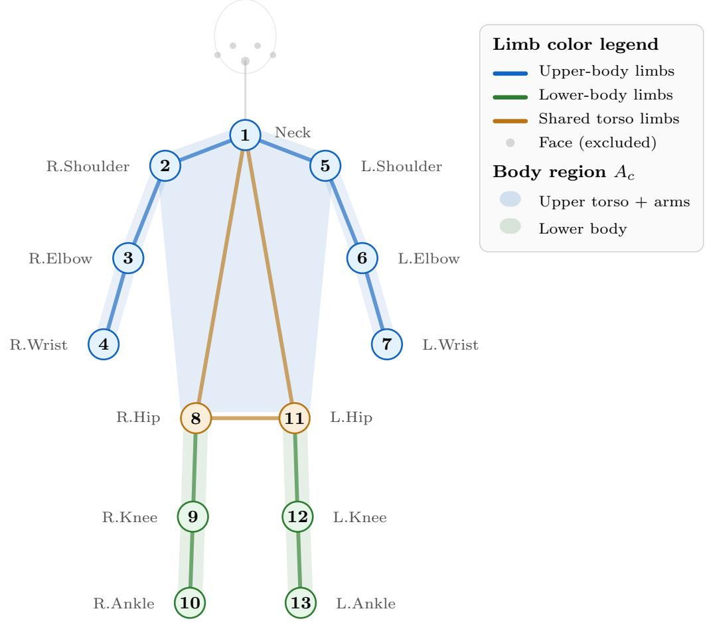

<table><tr><td rowspan=1 colspan=1>Category c</td><td rowspan=1 colspan=1>Garment-related limb set $P _ { c }$ (keypointpairs)</td><td rowspan=1 colspan=1>Body region $A _ { c }$ </td></tr><tr><td rowspan=1 colspan=1> Upper-body(tops, jackets)</td><td rowspan=1 colspan=1>(2,3) (3,4) (5,6) (6,7) (1,2) (1,5) (8,11) (1,8) (1,11)</td><td rowspan=1 colspan=1>Upper torso $^ +$ arms</td></tr><tr><td rowspan=1 colspan=1>■ Lower-body(pants, skirts)</td><td rowspan=1 colspan=1>(8,9) (9,10) (11,12) (12,13) (8,11) (1,8) (1,11)</td><td rowspan=1 colspan=1>Lower body</td></tr><tr><td rowspan=1 colspan=1>Full-body(dresses)</td><td rowspan=1 colspan=1>All of the above (9 + 4 = 13 limb connections)</td><td rowspan=1 colspan=1>Full body</td></tr></table>

Figure 9: DWPose 18-point skeleton and the definitions of the garment-related limb set $P _ { c }$ and body region $A _ { c }$ for each garment category used in GSKS.

## C.3 Pseudo-Label Data Construction

As described in the main paper, we use two types of pseudo data in the multi-stage training strategy: image-level pseudo data for

Stage 2 and video-level pseudo data for Stage 3. Their construction pipelines are detailed below.

Image-level pseudo data. For each person image, we construct a corresponding pseudo image through the following steps. (1) We first use Qwen3-VL-32B [1] to analyze the garment currently worn by the person and generate a garment editing instruction (e.g., “change the striped t-shirt to a plain white hoodie”). (2) We then apply Qwen-Image-Edit-2511 [36] to modify the garment region according to the instruction, producing a pseudo image. (3) Finally, we use Qwen3-VL-32B to verify whether the generated pseudo image is consistent with the editing instruction. Samples that fail verification are discarded. To accelerate inference, we adopt Qwen-Image-Edit-Lightning [22], a LoRA-based acceleration module for Qwen-Image-Edit. In total, we construct 30K pseudo images from person images covering diverse garment types, body poses, and real-world backgrounds.

Algorithm 1: Garment-Sensitive Keyframe Sampling   
(GSKS)   
Input: $V _ { \mathrm { i n } } { \mathrm { : } }$ input video (� frames);   
�: target garment category;   
�: number of keyframes;   
$\lambda = 0 . 2 \colon$ weight for region visibility;   
$\Delta _ { \operatorname* { m i n } } = 4 \colon$ minimum frame interval between selected keyframes;   
Output: K: selected keyframe set;   
1 Determine garment-related limb set $P _ { c }$ and body region $A _ { c }$   
according to �;   
/\* Phase 1: Per-frame information-capacity scoring $\star /$   
2 for $i = 0$ to $N { - } 1$ do   
3 Detect limbs in $V _ { \mathrm { i n } } [ i ]$ using DWPose;   
4 foreach limb $l = ( p _ { 1 } , p _ { 2 } ) \in P _ { c }$ do   
5 if � is detected then   
6 $\mathbf { d } _ { i } ^ { l } \gets$ normalize $\left( \hbar _ { 2 } - p _ { 1 } \right)$ ; valid�� ← True;   
7 else   
8 L $\mathbf { d } _ { i } ^ { l }  \mathbf { 0 } ;$ valid� ← False;   
9 Compute limb visibility $\begin{array} { r } { S _ { p } ^ { c } ( i ) = \frac { | \hat { P } \cap P _ { c } | } { | P _ { c } | } , } \end{array}$ , where $\hat { P }$ is the   
detected limb set in frame �;   
10 Estimate garment-related body region $A _ { c }$ using SAM and   
compute $\begin{array} { r } { S _ { a } ^ { c } ( i ) = \frac { \mathrm { a r e a } ( A _ { c } ) } { \mathrm { a r e a } ( V _ { \mathrm { i n } } [ i ] ) } } \end{array}$ ;   
11 Compute information capacity   
$S _ { \mathrm { C a p a c i t y } } ^ { c } ( i ) = ( 1 - \lambda ) S _ { \mathscr P } ^ { c } ( i ) + \lambda S _ { a } ^ { c } ( i ) ;$   
/\* Phase 2: Anchor keyframe selection \*/   
12 �∗ ← arg max� $S _ { \mathrm { C a p a c i t y } } ^ { c } ( i ) ;$   
13 ${ \mathcal { K } } \gets \{ V _ { \mathrm { i n } } [ i ^ { * } ] \} ; \quad \bar { J } _ { \mathrm { s e l } } \gets \{ i ^ { * } \}$   
/\* Phase 3: Iterative complementary selection \*/   
14 for $r = 1$ to �−1 do   
15 $i _ { \mathrm { b e s t } }  \mathrm { N o n e } ; \quad \mathrm { s c o r e } _ { \mathrm { b e s t } }  \mathrm { - } \infty ;$   
16 foreach candidate frame � ∉ $\boldsymbol { \mathcal { I } } _ { \mathrm { s e l } }$ do   
17 $\mathbf { i f } \ \exists \ j \in \mathcal { I } _ { \mathrm { s e l } } : | i - j | < \Delta _ { \operatorname* { m i n } }$ then   
18 continue;   
19 foreach $j \in \mathcal { I } _ { \mathrm { s e l } }$ do   
20 sim $( i , j ) \gets$   
$\begin{array} { r } { \frac { 1 } { | P _ { c } | } \sum _ { l \in P _ { c } } \left\{ { \cos ( \mathbf { d } _ { i } ^ { l } , \mathbf { d } _ { j } ^ { l } ) } \right. } \end{array}$ , if valid�� ∧ valid��   
otherwise   
21 dif(�) ← 1 − mean $j { \in }  { \mathcal { I } _ { \mathrm { s e l } } }$ (sim(�, � ) );   
22 if $( \mathrm { d i f f } ( i ) , S _ { \mathrm { C a p a c i t y } } ^ { c } ( i ) ) >$ score $\mathbf { b e s t }$ then   
23 $i _ { \mathrm { b e s t } }  i ;$ score $\mathsf { \Lambda } _ { \mathrm { p e s t } } \gets ( \mathrm { d i f f } ( i ) , S _ { \mathrm { C a p a c i t y } } ^ { c } ( i ) )$   
24 if $i _ { \mathrm { b e s t } }$ ≠ None then   
25 $\mathcal { K }  \mathcal { K } \cup \{ V _ { \mathrm { i n } } [ i _ { \mathrm { b e s t } } ] \} ;$   
26 ${ \cal J } _ { \mathrm { s e l } }  { \cal J } _ { \mathrm { s e l } } \cup \{ i _ { \mathrm { b e s t } } \} ;$   
27 else   
28 break;   
29 return K;

Video-level pseudo data. Since existing open-source video editing models cannot produce suficiently high-quality try-on videos, we use our Stage 1 model, BooM-VVT (Stage 1), to synthesize pseudo try-on videos. The construction pipeline is as follows. (1) Given a source video and a randomly selected target garment image, we apply GSKS to select keyframes from the source video. (2) We generate the corresponding keyframe try-on images using the multi-frame try-on model. (3) The source video, together with the keyframe tryon images and garment masks, is then fed into BooM-VVT (Stage 1) to generate a try-on video. (4) Finally, we use Qwen3-VL-32B to verify the generated video and ensure its quality. Samples with noticeable artifacts or garment inconsistencies are discarded. In total, we construct 2.5K video-level pseudo samples from unpaired human-centric videos.

Cost analysis. Table 5 compares the per-sample construction cost of the two data types. For image-level pseudo data, each sample requires only ∼4 s for image editing. For video-level pseudo data, each sample requires ∼12 s for keyframe try-on image synthesis and ∼262 s for video generation, totaling ∼274 s. Overall, constructing 30K image-level pseudo samples costs 33.3 GPU hours, while constructing 2.5K video-level pseudo samples costs 190.3 GPU hours. On a per-sample basis, image-level pseudo data is approximately 69× cheaper. This favorable cost ratio motivates our strategy of leveraging large-scale image-level pseudo data to expand data coverage at low cost, substantially reducing the reliance on expensive video-level pseudo data.

## D More Results

## D.1 Additional Quantitative Results

Using the corrected VFID implementation described in Sec. C.2.2, we report the VFID results on the ViViD and WildVVT datasets in Table 6. BooM-VVT achieves the best results in three of the four settings, and ranks second in the remaining one. In particular, on the more challenging WildVVT benchmark, BooM-VVT achieves the lowest VFIDI by a clear margin, indicating stronger generalization in unconstrained real-world scenarios.

D.1.1 Human Evaluation Validation. To further validate the reliability of our VLM-based evaluation, we conduct a human evaluation on the WildVVT benchmark. Specifically, we recruit 10 evaluators and use the same three evaluation dimensions as in our VLM-based protocol: Appearance & Background Consistency (ABC), Garment Consistency (GC), and Overall Visual Quality (OVQ). Each dimension is rated on a 0–5 scale, and each generated video is independently evaluated by at least two evaluators. The final score for each method is obtained by averaging the corresponding human ratings.

As shown in Table 7, BooM-VVT achieves the highest human evaluation scores across all three dimensions. Furthermore, the human scores show strong agreement with our Gemini-based evaluation, with an overall Pearson correlation ofapproximately � = 0.9.

Keyframes Keyframes Try-on Video (w GSKS) Try-on Images

Table 5: Per-sample construction cost of pseudo data. All timings are measured on a single NVIDIA A800 GPU.
<table><tr><td>Data Type</td><td>Resolution</td><td>Frames</td><td>Image Editing / Try-on Video Generation</td><td></td><td>Total</td></tr><tr><td>Image</td><td>832×624</td><td>1</td><td>4s</td><td></td><td>4s</td></tr><tr><td>Video</td><td>832×624</td><td>65</td><td>12 s</td><td>262 s</td><td>274 s</td></tr></table>

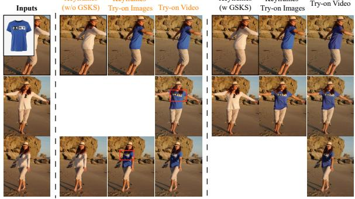  
Figure 10: Visual comparison of conventional keyframe sampling and GSKS. GSKS focuses on garment-relevant body regions and selects more informative keyframes, resulting in more faithful garment details in both keyframe try-on images and final videos. Red boxes highlight inconsistent garment details.

Table 6: VFID evaluation using the corrected implementation. VFIDI: I3D backbone; VFIDR: ResNeXt backbone. ↓: lower is better. Bold: best; Underline: second best.
<table><tr><td>Method</td><td colspan="2">ViViD-S VFIDI↓ VFIDR↓</td><td colspan="2">WildVVT</td></tr><tr><td>ViViD [11]</td><td>9.36</td><td>0.20</td><td>VFIDI↓</td><td>VFIDR↓</td></tr><tr><td></td><td></td><td>0.26</td><td>16.86 28.27</td><td>0.33</td></tr><tr><td>CatV²TON [7]</td><td>9.84 9.28</td><td>0.21</td><td>14.84</td><td>6.05</td></tr><tr><td>MagicTryOn [19]</td><td></td><td></td><td></td><td>0.51</td></tr><tr><td>BooM-VVT (Stage 1)</td><td>9.24</td><td>0.24</td><td>14.59</td><td>0.49</td></tr><tr><td>BooM-VVT</td><td>9.16</td><td>0.18</td><td>13.96</td><td>0.47</td></tr></table>

Table 7: Human evaluation on the WildVVT benchmark. Evaluators assess Appearance & Background Consistency (ABC), Garment Consistency (GC), and Overall Visual Quality (OVQ) on a 0–5 scale. Higher is better.

<table><tr><td>Method</td><td>ABC ↑</td><td>GC↑</td><td>OVQ ↑</td></tr><tr><td>ViViD</td><td>3.48</td><td>2.57</td><td>2.62</td></tr><tr><td>CatV2TON</td><td>3.00</td><td>2.24</td><td>2.19</td></tr><tr><td>MagicTryOn</td><td>3.90</td><td>3.10</td><td>3.30</td></tr><tr><td>BooM-VVT (Stage 1)</td><td>4.48</td><td>3.95</td><td>4.14</td></tr><tr><td>BooM-VVT</td><td>4.71</td><td>4.24</td><td>4.43</td></tr></table>

## D.2 Additional Qualitative Results

We provide additional qualitative comparisons on the WildVVT benchmark to further evaluate BooM-VVT under challenging real world scenarios, including large motion, severe occlusion, and object interaction.

Fig. 12 presents qualitative results under large motion. Compared with existing methods, BooM-VVT produces more stable garment appearance and better temporal consistency. In the left example of Fig. 12, the full mask-free model, BooM-VVT, also achieves better garment consistency than its mask-dependent variant, BooM-VVT (Stage 1), indicating that inaccurate masks caused by fast motion can degrade try-on region localization.

Fig. 13 shows results under severe occlusion. In such cases, heavy self-occlusion makes garment transfer particularly challenging for existing methods, often leading to obvious artifacts or incorrect garment structures. By contrast, BooM-VVT maintains plausible garment appearance even when large body regions are occluded.

Fig. 14 illustrates results in scenarios involving complex interactions between the person and surrounding objects. BooM-VVT better preserves the original interaction relationships, whereas existing methods often introduce noticeable artifacts in the interaction regions and may even distort or erase the interacting objects.

## D.3 Results on Diverse Try-on Tasks

Enabled by the proposed OmniView dataset, BooM-VVT supports diverse virtual try-on tasks, including layered try-on, cross-category try-on, and multi-view try-on. Fig. 15, Fig. 16, and Fig. 17 show representative results for these three settings, demonstrating that BooM-VVT generalizes well across diverse try-on scenarios.

Specifically, for the layered try-on task (Fig. 15), following DiOr [8], we perform multiple keyframe try-on operations to sequentially dress garments layer by layer, from innerwear to outerwear. For the cross-category try-on task (Fig. 16), we provide additional garment information in the text prompt to guide the model toward plausible cross-category try-on results. For the multi-view try-on task (Fig. 17), we concatenate garment images from diferent viewpoints and feed them into the multi-frame try-on model in a single forward pass. As shown in Fig. 17, BooM-VVT already produces reasonable results with only a front-view garment image. When multi-view garment images are additionally provided, the model generates more accurate results, especially for back-view frames.

## D.4 Additional Ablation Results

D.4.1 Visualization of Garment-Sensitive Keyframe Sampling. Fig. 10 provides a qualitative comparison between GSKS and conventional keyframe sampling based on global pose diferences. Conventional sampling treats all body motions equally, and therefore may select frames whose pose changes are mainly caused by garment-irrelevant body regions. Such keyframes provide limited appearance cues for the target garment and may further afect the quality of keyframe try-on and subsequent video generation.

In contrast, GSKS evaluates frame informativeness using garmentrelevant body regions and additionally encourages complementary viewpoint coverage. This allows the selected keyframes to provide more efective spatial and viewpoint cues for garment appearance transfer. As shown in the figure, GSKS leads to more faithful recon struction and preservation of fine-grained target-garment details, such as logos and patterns, in both the generated keyframe try-on images and the final try-on video. This qualitative comparison is consistent with the quantitative ablation results in Table 4, further validating the efectiveness of garment-sensitive keyframe selection.

Table 8: Sensitivity analysis of the weighting factor � in GSKS on the WildVVT benchmark.
<table><tr><td>λ</td><td>SSIM↑</td><td>LPIPS↓</td></tr><tr><td>0.1</td><td>0.865</td><td>0.067</td></tr><tr><td>0.2</td><td>0.871</td><td>0.062</td></tr><tr><td>0.3</td><td>0.871</td><td>0.062</td></tr><tr><td>0.4</td><td>0.871</td><td>0.062</td></tr><tr><td>0.5</td><td>0.870</td><td>0.062</td></tr><tr><td>0.6</td><td>0.871</td><td>0.062</td></tr><tr><td>0.7</td><td>0.869</td><td>0.064</td></tr><tr><td>0.8</td><td>0.867</td><td>0.069</td></tr><tr><td></td><td></td><td></td></tr><tr><td>0.9</td><td>0.862</td><td>0.072</td></tr></table>

D.4.2 Ablation on OmniView Dataset. To validate the efectiveness of the proposed OmniView dataset, we compare the full model with a variant whose multi-frame try-on model is not finetuned on OmniView (w/o OmniView). As shown in Fig. 18, training with OmniView brings two key improvements.

First, OmniView enhances cross-view consistency in keyframe try-on results. As illustrated in the left example of Fig. 18, the w/o

OmniView variant generates inconsistent garment details across viewpoints, such as a belt that appears in one view but disappears in another. In contrast, the full model produces consistent try-on results across viewpoints.

Second, OmniView significantly improves the model’s capability for multi-view garment inputs. As shown in the right example of Fig. 18, even when both front-view and back-view garment references are provided, the w/o OmniView variant still produces incorrect garment textures when the person turns around. In contrast, the full model synthesizes sharper textures and more accurate garment structures that are consistent with the reference, highlighting the importance of high-quality and diverse multi-view try-on data.

D.4.3 Sensitivity to the weighting factor �. We further study the efect of the weighting factor � in GSKS, which balances limb visibility and region visibility in the information-capacity score. Following the keyframe-driven setting, we evaluate BooM-VVT (Stage 1) on the WildVVT benchmark by reconstructing videos conditioned on the selected keyframes. The results are shown in Table 8.

Overall, the performance remains stable across a wide range of � values. In most cases, the model achieves very similar SSIM and LPIPS scores, indicating that GSKS is not overly sensitive to this hyperparameter. In particular, when � is set between 0.2 and 0.6, the results are consistently strong, with SSIM staying at around 0.871 and LPIPS at around 0.062. When � becomes too large, performance starts to degrade slightly, suggesting that overemphasizing region visibility may weaken the contribution of limb-based viewpoint cues. Based on this observation, we set � = 0.2 in all experiments.

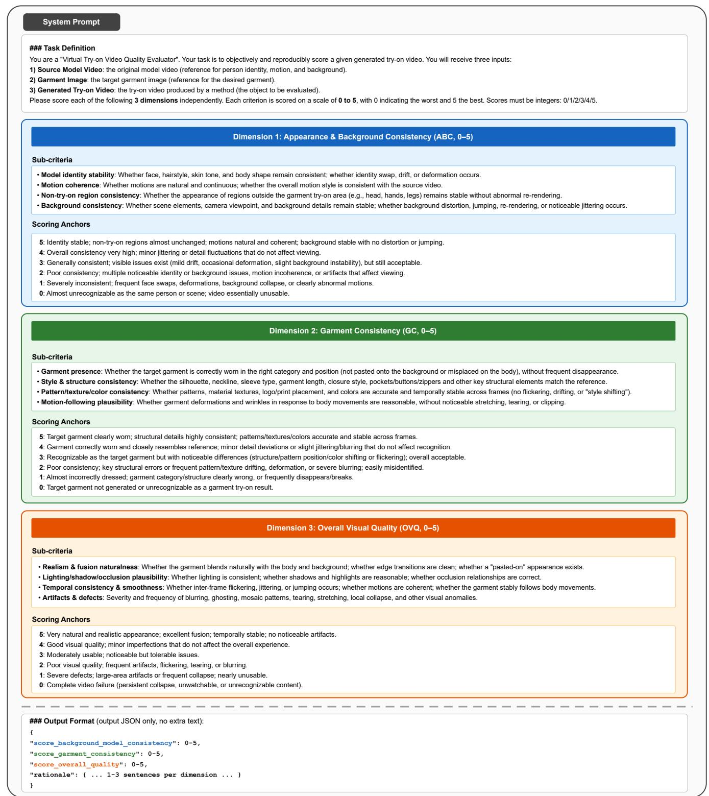  
Figure 11: Evaluation prompt used for VLM-based video virtual try-on assessment. The evaluator is instructed to score each generated try-on video along three dimensions: Appearance & Background Consistency (ABC), Garment Consistency (GC), and Overall Visual Quality (OVQ), each on an integer scale from 0 to 5 with detailed scoring anchors.

BooM-VVT  
Input Video  
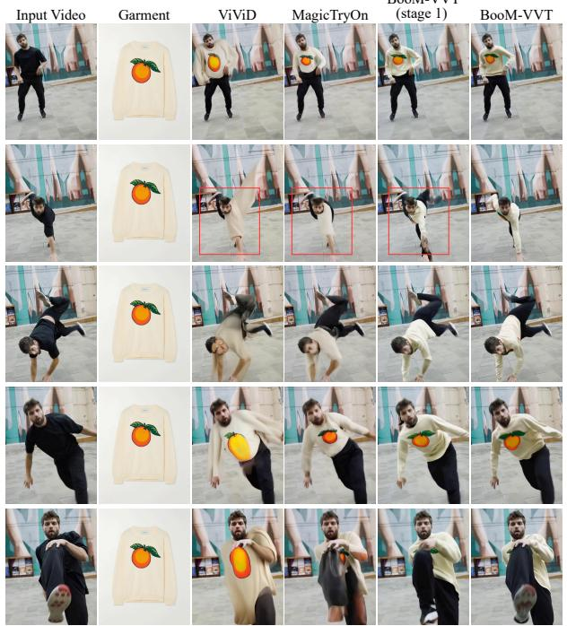

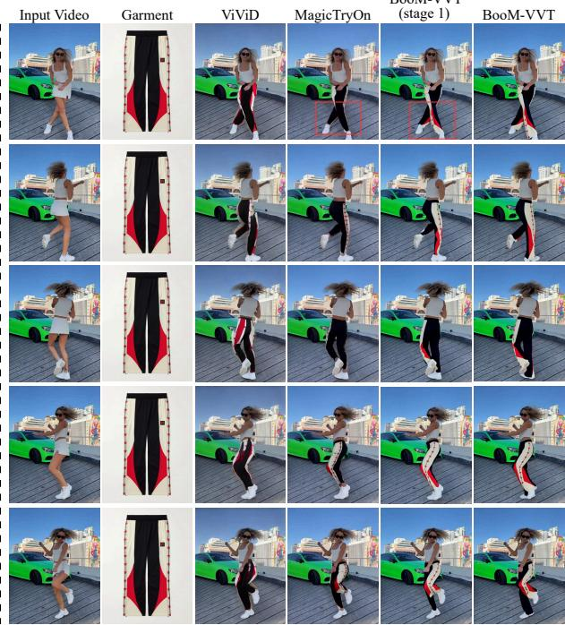  
Figure 12: Qualitative results under large motion. Red boxes highlight artifacts produced by existing methods.

BooM-VVT  
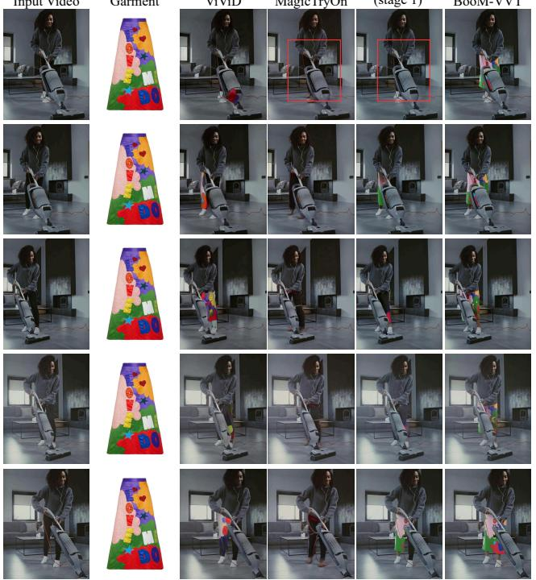

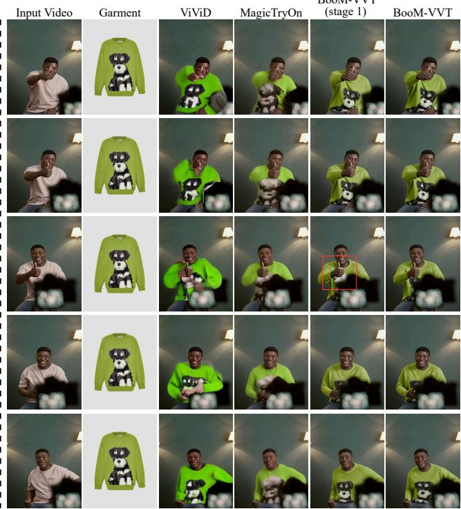  
Figure 13: Qualitative results under severe occlusion. Red boxes highlight artifacts produced by existing methods.

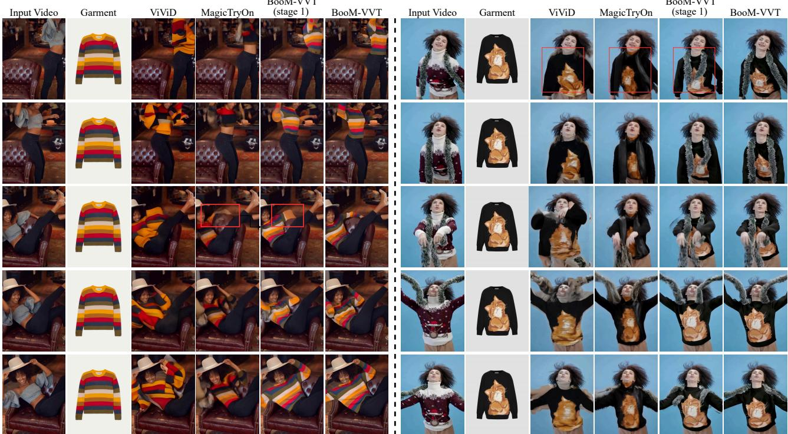  
BooM-VVT  
Figure 14: Qualitative results under object interaction. Red boxes highlight artifacts produced by existing methods.

BooM-VVT

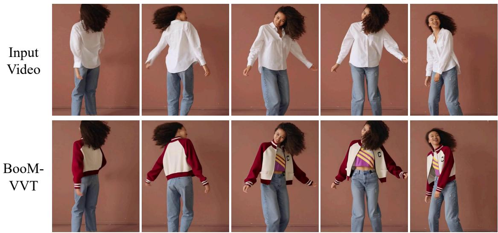

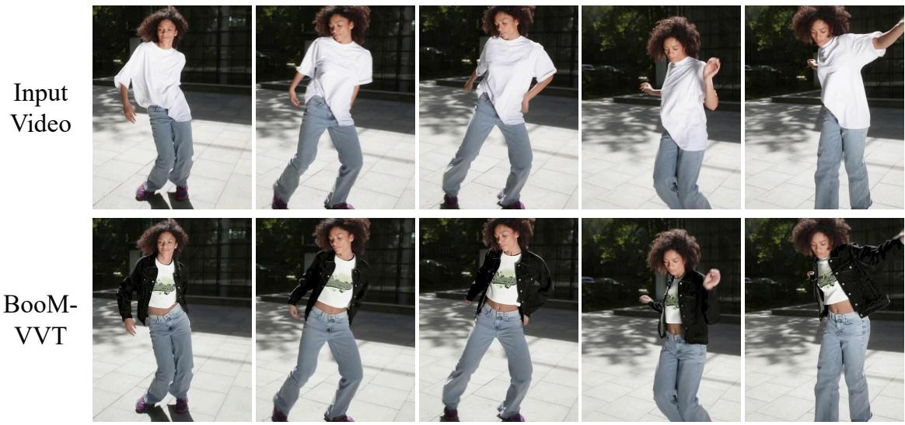  
Figure 15: Results of BooM-VVT on the layered try-on task.

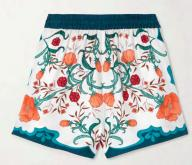

A model wears a beige crew-neck short-sleeve t-shirt with a colorful cartoon reindeer print and matching floral-patterned casual shorts.

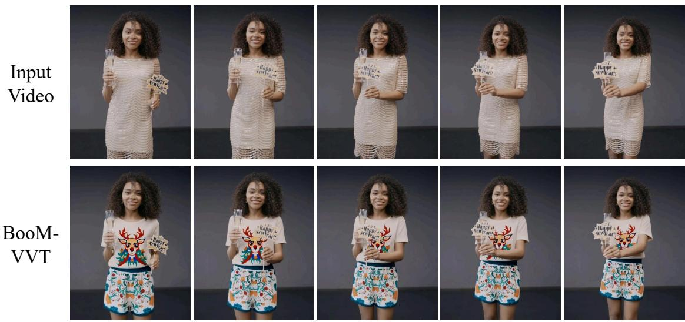

A model wears a white oversized crew-neck shortsleeve t-shirt with a panda print and a royal blue highwaisted A-line midi skirt.

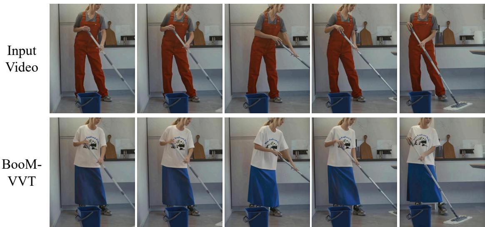  
Figure 16: Results of BooM-VVT on the cross-category try-on task.

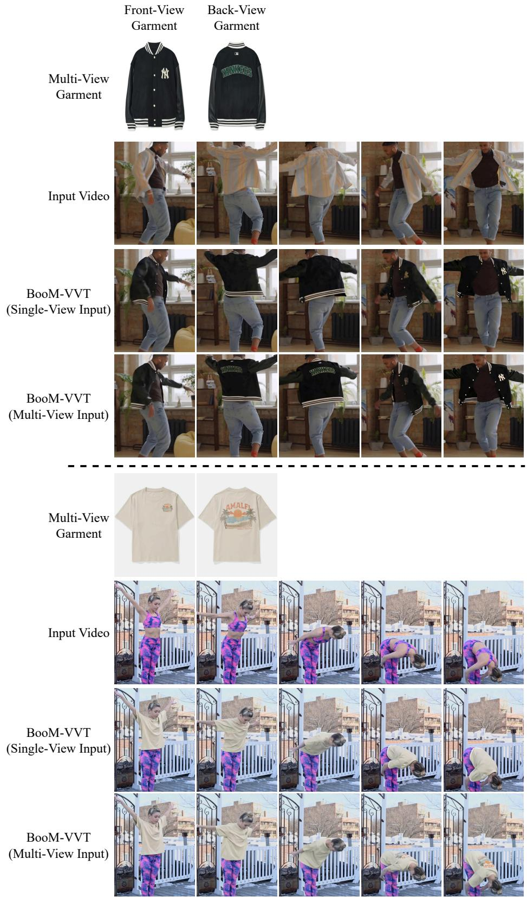  
Figure 17: Results of BooM-VVT on the multi-view try-on task. The third and fourth rows show results with single-view (front only) and multi-view (front + back) garment inputs, respectively.

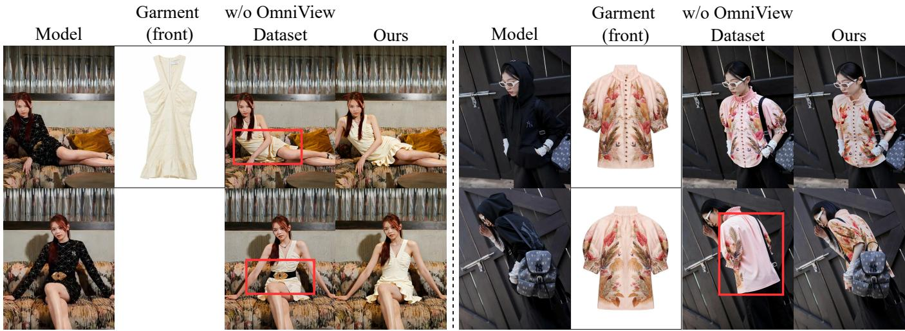  
Figure 18: Qualitative ablation on the OmniView dataset. Left: single-view garment input. The w/o OmniView variant produces cross-view inconsistencies (e.g., the belt highlighted by the red box). Right: multi-view garment input (front & back). The w/o OmniView variant generates incorrect textures in back-view frames, while the full model preserves accurate garment details. Please zoom in for details.