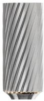
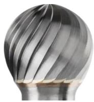
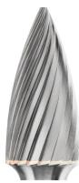
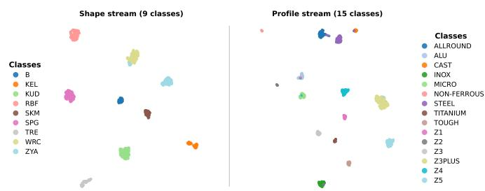

# Catalogue Photography as a Cold Start: Toward Deployable Carbide Burr Recognition

Abilash Philip Madavath\*, Chandra Yuvesh Aubeeluck\*, Augustin Raju

Nicolas Pyschny\*, Felix Hackeloer ¨ \*, Florian Zwanzig \*

TH Koln – University of Applied Sciences, Cologne, Germany¨

Abstract—Verifying that manufactured batches of milling tools or carbide rotary burrs conform to production order sheets remains a largely manual and error-prone quality assurance task. Automating this process with computer vision faces a critical cold-start constraint since no labelled imagery is available, leaving manufacturer catalogue photography as the sole source of supervision. We investigate how far catalogue supervision can support an industrial recognition pipeline under domain shift, explicitly measuring the gap between catalogue separability and performance on held-out field photographs. Our findings reveal three key insights. First, off-the-shelf frozen feature extractors do not reliably separate the two task attributes, head shape and tooth profile, motivating targeted representation learning. Second, metric learning produces near-perfect unsupervised cluster discovery on catalogue images (adjusted Rand index 0.94–0.97), but less than half of this gain transfers to field photographs. Third, the largest transfer gains do not come from model scale or representation complexity, but from simple changes that reduce domain sensitivity: converting images to grayscale (+0.22) and constraining retrieval using the known order sheet via Hungarian assignment (+0.11). We therefore treat catalogue photography as a useful cold start rather than a deploymentready training domain, and provide empirical baselines and an evaluation protocol for catalogue-to-field transfer in precision tool manufacturing.

Index Terms—industrial machine vision, fine-grained recognition, domain shift, metric learning, milling tool identification, evaluation methodology

## I. INTRODUCTION

Visual inspection in manufacturing is still largely manual, and a recent survey shows why this reaches its limits: error rates on complex inspection tasks range from twenty to thirty percent, made worse by fatigue and lapses in attention, and fewer than six percent of the 196 studies reviewed ask whether the correct parts are present in the first place [1]. That last question is exactly ours. Carbide burrs (Frasstifte¨ , also called rotary burrs) come in several hundred variants, and after production an operator has to confirm that the burrs on a pallet match the article numbers on a scanned order sheet. Two burrs can share a silhouette and differ only in tooth pitch or cut direction (Fig. 1).

The obstacle is that no packaging line imagery of the tool exists before the system is installed, and collecting it would interrupt production. The only training dataset is manufacturer catalogue photography: studio-lit, colour-graded renderings that differ systematically from what a camera above a pallet will see, where specular reflections and line lighting dominate. Catalogue accuracy measured on its own is therefore misleading; the catalogue-to-field gap $( \Delta _ { \mathrm { a c c } } )$ is the number that matters [2], [3]. We treat this as a cold start, a supervised source with no exposure to the deployment domain, and ask how far it carries a recognition system.

  
(a) ZYA

  
(b) KUD

  
(c) SPG  
Fig. 1: Three catalogue articles with the same cut (Z3) on different head shapes. The tooth pattern lines curve differently on each head, which is why one global appearance model mixes the two attributes. Images courtesy of August Ruggeberg GmbH & Co. KG (PFERD) [5].¨

Our approach describes each tool by two independent properties rather than as one of thousands of separate types, following work on compositional recognition, which addresses the case where classes are combinations of attributes and collecting data for every combination is infeasible [4]. For burrs the two properties are already standardised: head shape follows DIN 8032 and the cut follows DIN 8033 [5]. What we add is a test of that idea against real photographs, and an honest account of what did and did not transfer.

This paper studies the feasibility of training on catalogue images alone, comparing models, feature representations and scoring strategies rather than proposing a single final pipeline. Camera hardware, packaging line integration and continual learning are out of scope. By catalogue-only we mean that no image from the field test enters training, validation or model selection. We call the held-out real photographs the field set, to keep them apart from the held-out catalogue split.

## II. TASK, DATA AND PROTOCOL

We recognise a burr by two attributes: head shape $s \in S$ and tooth profile $p \in \mathcal { P }$ . Here $\left| S \right| = 9$ shapes (ZYA, KUD, SPG and six others) set by DIN 8032, and $| \mathcal { P } | = 1 5$ cuts (pitches Z1–Z5 alongside material-specific geometries such as INOX or ALU) set by DIN 8033 [5].

Full article numbers also specify diameter and shank length, but those are scale-dependent and better resolved by camera calibration, a reference marker in the scene, or the order sheet itself. Working from scale-normalised head crops, our pipeline predicts only the pair (s, p). That space is thin and very uneven: many combinations are never made, and those that exist range from fewer than ten images to over a hundred.

## A. Why two attributes rather than one label

The same cut on a different head looks different (Fig. 1). A model trained on profile labels across head shapes has to learn to ignore this; a model trained on combined (s, p) labels sees Z3-on-ZYA and Z3-on-KUD as unrelated classes and never has to. Whether this matters in practice is tested in Sec. III-B and III-C.

## B. The order sheet as a constraint

Matching each tool against the whole catalogue is an openset problem over hundreds of classes. But the order sheet is known before the pallet is imaged, so the real task is assigning n observed tools to a known list of m expected articles. Given per-attribute similarity scores, the Hungarian algorithm solves this exactly. We treat it as one scoring option among others and test it in Sec. III-D.

## C. Data

The catalogue dataset has 770 images over 9 shape classes and 838 over 15 profile classes, scraped from manufacturer pages, cropped to the head and orientation-normalised; classes with fewer than five images were dropped. The two sets index the same photographs under different labels, giving 724 images with both.

The field set is 45 real photographs covering 7 of 9 shapes and 52 covering 7 of 15 profiles. These pools are disjoint, since no field image carries both labels, so no joint accuracy is measurable. Where a combined number is useful we report the product of the two attributes under an independence assumption, and flag it every time. That assumption is likely optimistic: on a real conveyor line, glare on specular carbide or a defocused crop would degrade shape and profile together, pushing a true joint accuracy below the product we quote.

## D. A leakage channel to watch for

The catalogue lists the same physical tool under several surface treatments (uncoated, coated, specially finished). A random split puts near-duplicates on both sides. In our case that inflated catalogue accuracy to about 0.97 while the field set sat near 0.51. We now group images by parsed tool identity and check that no identity crosses the split. All catalogue numbers below are post-fix.

## E. Metrics

Recall at rank 1 (R@1) asks whether an image’s nearest neighbour in feature space carries the same label, that is, whether similar tools land close together, with no clustering step. Adjusted Rand index (ARI) clusters the features and scores how well those clusters line up with the true classes: 1 is a perfect match, 0 is no better than random. R@1 measures local neighbourhoods, ARI the global shape of the space, and the two can disagree. Top-1 accuracy (acc) is the usual recognition score. Finally, field gap $\Delta _ { \mathrm { a c c } } = \mathrm { a c c } _ { \mathrm { c a t a l o g u e } } - \mathrm { a c c } _ { \mathrm { f i e l d } }$ on the combined label measures how much of a configuration’s catalogue score is rendering style rather than tool identity; lower is better, and ranking by catalogue accuracy alone rewards the wrong property.

## F. Statistical limits

With 45 and 52 field images, the interval on a single accuracy is roughly ±0.04–0.09, and a paired McNemar test between the leading configurations is not significant. We therefore treat the top approaches as statistically equivalent and use the field set to detect domain shift, not to rank.

## III. FOUR STAGES

## A. Stage 1: frozen extractors

We first asked whether generic pretrained backbones separate burr morphology out of the box. We ran 41 feature extractors through six clustering algorithms (k-means, GMM, agglomerative with Ward linkage, HDBSCAN and two others) on each attribute, covering self-supervised transformers [6], [7], supervised ImageNet CNNs and ViTs [8], [9], and a geometric contour descriptor.

TABLE I: Stage 1. Top five frozen extractors per attribute, by best ARI across four clustering algorithms.
<table><tr><td>Featurizer</td><td>Best clusterer</td><td>ARI</td><td>R@1</td></tr><tr><td>Head shape</td><td></td><td></td><td></td></tr><tr><td>DINOv3 ViT-L/16</td><td>GMM</td><td>0.34</td><td>0.89</td></tr><tr><td>DINOv2 ViT-S/14</td><td>GMM</td><td>0.29</td><td>0.63</td></tr><tr><td>ResNet-18</td><td>k-means</td><td>0.26</td><td>0.59</td></tr><tr><td>DINOv2 ViT-B/14</td><td>GMM</td><td>0.25</td><td>0.61</td></tr><tr><td>Contour descriptor</td><td>k-means</td><td>0.25</td><td>0.60</td></tr><tr><td>Tooth profile</td><td></td><td></td><td></td></tr><tr><td>EfficientNet-B4</td><td>Agglomerative</td><td>0.33</td><td>0.77</td></tr><tr><td>ConvNeXt-L</td><td>Agglomerative</td><td>0.27</td><td>0.77</td></tr><tr><td>Wide-ResNet-101</td><td>Agglomerative</td><td>0.27</td><td>0.76</td></tr><tr><td>EfficientNet-B3</td><td>Agglomerative</td><td>0.27</td><td>0.75</td></tr><tr><td>EfficientNet-B2</td><td>Agglomerative</td><td>0.26</td><td>0.76</td></tr></table>

The two lists in Table I share no entry. Self-supervised transformers win shape, led by DINOv3 ViT-L/16 (ARI 0.34, R@1 0.89), with even a hand-built contour descriptor in the top five. Supervised CNNs win profile, led by EfficientNet-B4 (ARI 0.33), where DINOv3 collapses to 0.10. Scale brings no benefit: across EfficientNet B0–B7 and ConvNeXt tiny– large the scores vary erratically with no trend. HDBSCAN, the one algorithm not given the true class count, never wins a row. This is a sign that frozen feature spaces lack clear cluster boundaries, and it reverses in Stage 2. No single frozen representation handles both attributes, so specialisation has to come from training. The best frozen setup becomes baseline A1.

## B. Stage 2: what training does to the features

We then trained on catalogue imagery under two schemes. A2 is a shared backbone with two classification heads. A4 is two separate backbones trained with an additive angular margin loss [10], one for shape and one for profile. The clustering protocol is unchanged.

TABLE II: Catalogue separability before and after training.
<table><tr><td rowspan="2">Representation</td><td colspan="2">Head shape</td><td colspan="2">Tooth profile</td></tr><tr><td>ARI</td><td>R@1</td><td>ARI</td><td>R@1</td></tr><tr><td>Best frozen (Stage  $1 ) ^ { * }$ </td><td>0.34</td><td>0.89</td><td>0.33</td><td>0.78</td></tr><tr><td>A2: multi-task backbone</td><td>0.86</td><td>1.00</td><td>0.34</td><td>0.96</td></tr><tr><td>A4: two-stream ArcFace</td><td>0.97</td><td>1.00</td><td>0.95</td><td>0.98</td></tr></table>

∗Best value per column; models differ across attributes.

  
Fig. 2: UMAP projection of catalogue embeddings from the trained two-stream model (A4), coloured by ground-truth label. Each stream forms tight, well-separated groups for its own attribute.

Training changes the picture completely (Table II, Fig. 2). A4 reaches ARI 0.94–0.97 under all four clustering algorithms at once, and HDBSCAN [11], given no class count, finds exactly 9 shape clusters and 15 profile clusters. That is a stronger check than a fixed-k method hitting a target it was handed. The cross-check holds too: shape-trained features score ARI below 0.03 against profile classes and the reverse, so each stream knows only its own attribute.

One caution on the metrics. A2 has excellent nearestneighbour recall (R@1 0.96–1.00) yet its profile ARI stalls at 0.34, matching the untrained baseline, and HDBSCAN breaks its profile space into 71–89 small fragments rather than 15 groups. Local retrieval can stay high while the global structure is broken up, which is why we report both.

## C. Stage 3: what survives real photographs

We compare three configurations on identical splits: A1, the best frozen features; A3, a single backbone trained with ArcFace [10] on joint labels, the standard retrieval setup and our no-decomposition control; and A4. Six further approaches ran on the same harness; three fall below A1 in the field.

TABLE III: Top-1 accuracy on the catalogue split and the field set.
<table><tr><td rowspan="2">Configuration</td><td rowspan="2"> $\mathbf { C a t . }$ </td><td colspan="4">Field set</td></tr><tr><td>Comb. Shape</td><td>Profile</td><td>Comb.*</td><td> $\Delta _ { \mathrm { a c c } }$ </td></tr><tr><td>A1 (frozen)</td><td>0.371</td><td>0.756</td><td>0.413</td><td>0.300</td><td>0.071</td></tr><tr><td>A3 (one stream)</td><td>0.857</td><td>0.863</td><td>0.593</td><td>0.522</td><td>0.335</td></tr><tr><td>A4 (two streams)</td><td>0.916</td><td>0.889</td><td>0.603</td><td>0.556</td><td>0.360</td></tr></table>

∗Product of the two attributes; not a measured joint accuracy.

Values are means over three seeds and two colour modes, with a seed spread of at most ±0.05 on the combined field number. Although A4 attains the top nominal accuracy on both the catalogue split and the field set, A3 performs closely behind. Establishing a statistically significant ranking between the two architectures requires a larger field test pool.

Training helps, but less than the catalogue suggests. Moving from A1 to a trained model adds nearly 0.50 on the catalogue split and only about 0.20 on real photographs: under half the gain transfers, while $\Delta _ { \mathrm { a c c } }$ grows five-fold. Read on catalogue scores alone, training appears to more than double performance; in the field the improvement is roughly half that.

The sharpest case is not in the table. An edge-map encoder trained with a supervised contrastive loss reaches ARI 0.85–0.91 on catalogue profile, second only to A4, yet in the field it does worse than the untrained baseline. High catalogue separability can be an artefact of studio rendering rather than transferable geometry.

The case for A4 over A3 rests on specialisation, not accuracy. In the field A4’s shape stream scores 0.91 on shape and 0.22 on profile, and the profile stream mirrors it (0.22 / 0.64). That separation matters because order-sheet matching needs roughly independent per-attribute costs, which one combined embedding cannot supply.

## D. Stage 4: what actually moved the field number

Since neither the frozen features nor the label split gave a large transfer gain, we tested eight changes that need no retraining: resolution, pooling, augmentation, feature adaptation, retrieval post-processing, backbone choice, and the order-sheet constraint. Each was compared against the incumbent setup on the same images, keeping only effects above the measurement noise.

TABLE IV: Effect of individual changes on the field set.
<table><tr><td>Change</td><td>Field gain</td><td>Outcome</td></tr><tr><td>Grayscale (train and eval)</td><td>+0.22</td><td>kept</td></tr><tr><td>Order-sheet assignment</td><td>+0.11</td><td>kept†</td></tr><tr><td>Covariance alignment (CORAL)</td><td>-0.09</td><td>dropped (sample size too small)</td></tr><tr><td>Augmented gallery</td><td>-0.03</td><td>dropped (index clutter)</td></tr></table>

†Corrected 95% CI [+0.06, +0.17].

Only two survived (Table IV). Resolution and pooling produced variations indistinguishable from noise. Across six alternative backbones only EfficientNet-B4 matched the incumbent within error, while DINOv2, SigLIP2, EVA02, ConvNeXtV2 and ResNet-50 all lost accuracy. The best postprocessed frozen configuration reached 0.48 combined, below A4’s 0.56 even on the easier constrained task, so inferencetime constraints do not replace representation learning.

One caveat bounds the order-sheet result: it was measured on frozen features only, and transferring it to the trained twostream system is ongoing work. Both surviving changes share a trait worth noting, in that neither touches the representation.

## IV. DISCUSSION

Colour is the main shift. Grayscale conversion provided the largest performance boost (+0.22). Catalogue colour grading functions as a misleading shortcut that the network learns during training, creating a chromatic domain shift that the factory line cannot replicate.

Path to Operational Deployment. A combined field accuracy near 0.56 cannot autonomously replace manual inspection, which demands reliability in excess of 99%. However, this figure reflects unconstrained open-set retrieval; incorporating domain-informed workflow constraints—most notably order-sheet bipartite matching (+0.11 gain)—provides immediate headroom to lift operational accuracy into the mid-60% range without any retraining. Beyond raw accuracy, the core utility of this catalogue cold start is operational: it delivers a day-one deployment baseline without prior imagery, specialized along standardized physical axes, while escalating low-confidence predictions to human operators. This humanin-the-loop framework converts routine inspection into an active-learning pipeline, where flagged edge cases generate the annotated in-domain imagery currently missing. We therefore treat 0.556 not as an upper bound, but as a practical operational starting point.

What did not work. A cascade predicting shape first and routing to a shape-specific profile model did worse than the parallel two-stream design, despite removing the wrapping problem by construction: the per-shape data was too thin. CORAL failed because the field set is too small to estimate a covariance, and augmented-gallery expansion failed because we added views as separate index entries instead of averaging them. Both are implementation limits, not verdicts on the methods.

Visual shortcuts in catalogue data. A split meant to test invariance to photographic style clustered by tool shape instead, because product series and their photography setups are confounded with tool geometry in the catalogue. Even the best candidate separated styles only by proxy: style agreement tracked shape agreement almost one-to-one, while profile separation stayed poor. The feature space recovered the labels we wanted but not the nuisance we wanted removed. Anyone building a benchmark from a commercial catalogue should audit for this.

## V. LIMITATIONS AND CONCLUSION

The field set binds everything above. At 45 and 52 images it cannot separate the leading approaches, and until it covers the missing classes no deployment confidence interval would be honest. Expanding it comes before further model work. A paired field set, one tool photographed once and labelled on both attributes, would remove the independence assumption behind every combined number here and expose the correlated failures it hides. The field photographs of the tool are also not packaging line images, so the gap we report is a lower bound.

Catalogue photography is a usable cold start. No frozen extractor separates the two attributes, so the decomposition must be trained in; once it is, four clustering algorithms agree the structure is there and rediscover the class counts unsupervised. But most of that lives in the catalogue: under half of training’s gain survives real photographs, and an approach near the top on the catalogue sits below the untrained baseline in the field. The obstacle is domain shift, not model capacity, and the two changes that helped most, removing colour and using the order sheet, are not changes to the model at all.

## ACKNOWLEDGMENT

This work is supported through the InnoFaktur project by the European Regional Development Fund under grant EFRE-20500002. The authors thank August Ruggeberg GmbH &¨ Co. KG (PFERD) for domain access and support.

## REFERENCES

[1] N. Hutten, M. Alves Gomes, F. H ¨ olken, K. Andricevic, R. Meyes,¨ and T. Meisen, “Deep learning for automated visual inspection in manufacturing and maintenance: A survey of open-access papers,” Appl. Syst. Innov., vol. 7, no. 1, p. 11, 2024, doi: 10.3390/asi7010011.

[2] X. Zhu, T. Bilal, P. Martensson, L. Hanson, M. Bj˚ orkman, and A.¨ Maki, “Towards sim-to-real industrial parts classification with synthetic dataset,” in Proc. IEEE/CVF CVPR Workshops, 2023, pp. 4453–4462, doi: 10.1109/CVPRW59228.2023.00468.

[3] A. Torralba and A. A. Efros, “Unbiased look at dataset bias,” in Proc. IEEE CVPR, 2011, pp. 1521–1528.

[4] M. F. Naeem, Y. Xian, F. Tombari, and Z. Akata, “Learning graph embeddings for compositional zero-shot learning,” in Proc. IEEE/CVF CVPR, 2021, pp. 953–962, doi: 10.1109/CVPR46437.2021.00101.

[5] August Ruggeberg GmbH & Co. KG,¨ Burrs: Catalogue 202, PFERD, Marienheide, Germany. [Online]. Available: https: //int.pferd.com/en/products/milling-drilling-and-countersinking-tools/ tungsten-carbide-burrs-for-high-performance-applications [Accessed: Sep. 2, 2026].

[6] M. Oquab et al., “DINOv2: Learning robust visual features without supervision,” Trans. Mach. Learn. Res., 2024.

[7] O. Simeoni´ et al., “DINOv3,” arXiv:2508.10104, 2025.

[8] M. Tan and Q. V. Le, “EfficientNet: Rethinking model scaling for convolutional neural networks,” in Proc. ICML, 2019, pp. 6105–6114.

[9] Z. Liu, H. Mao, C.-Y. Wu, C. Feichtenhofer, T. Darrell, and S. Xie, “A ConvNet for the 2020s,” in Proc. IEEE/CVF CVPR, 2022, pp. 11976– 11986.

[10] J. Deng, J. Guo, N. Xue, and S. Zafeiriou, “ArcFace: Additive angular margin loss for deep face recognition,” in Proc. IEEE/CVF CVPR, 2019, pp. 4690–4699.

[11] R. J. G. B. Campello, D. Moulavi, and J. Sander, “Density-based clustering based on hierarchical density estimates,” in Proc. PAKDD, 2013, pp. 160–172.