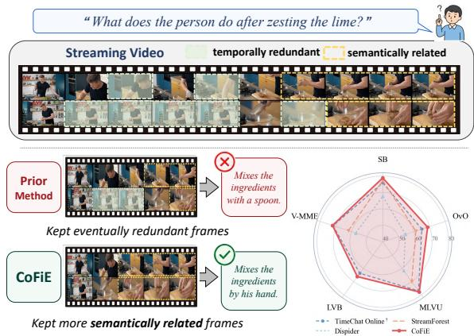
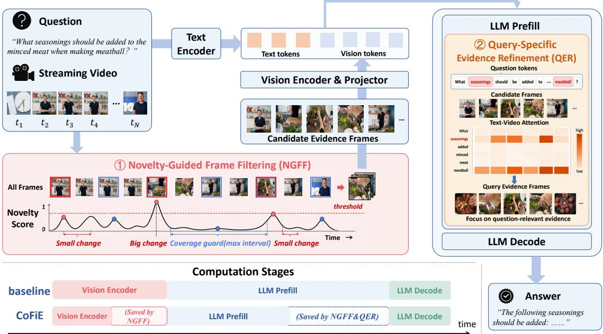
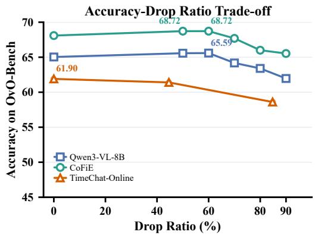
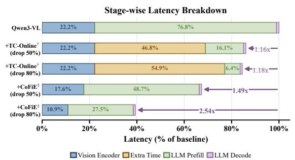

# CoFiE: Coarse-to-Fine Evidence Selection for Efficient Streaming Video Understanding

Jing Jiang1,2\*, Yiran Ling1,2\*, Ruonan Li3, Dimitrios Stamoulis1,2†, Jie Liu1,2†

1Harbin Institute of Technology

2State Key Laboratory of Smart Farm Technologies and Systems

3Pengcheng Laboratory

{25S003007, 25B903029}@stu.hit.edu.cn,

lirn@pcl.ac.cn, {dimi, jieliu}@hit.edu.cn

## Abstract

Streaming video understanding requires Vision Language Models (VLLMs) to process growing video streams and answer user questions under tight latency constraints. Existing methods improve efficiency with token pruning and memory-bank schemes, but mainly reduce visual tokens after the LLM encoding stage. Therefore, downstream token pruning alone cannot substantially reduce end-to-end latency, since the expensive frame encoding cost has already been incurred. In this work, we propose CoFiE, a Coarse-to-Fine Evidence selection framework, that decouples evidence selection into a coarse query-agnostic filtering stage before the vision encoder and afine queryspecific refinement stage during LLM prefill. We introduce two lightweight modules, namely the coarse Novelty-Guided Frame Filtering and the fine Query-Specific Evidence Refinement, that retain visually distinctive candidates and refine the most relevant frames, respectively. This design removes substantial redundancy before frame encoding while retaining queryspecific refinement once semantic information becomes available. Experimental results show that CoFiE establishes a new state-of-the-art accuracy–efficiency trade-off with open-source VLLMs across multiple video understanding benchmarks, reaching 78.86% on Streaming Bench and 68.72% on OvO-Bench, improving over prior best methods by up to 3.15%. Notably, even under aggressive evidence-frame filtering up to 80%, CoFiE outperforms opensource frontier multimodal models while improving end-to-end inference latency by up to 2.54×.

## 1 Introduction

While frontier Vision Large Language Models (VLLMs) already achieve strong performance on offline video question answering (Bai et al., 2025a;

  
Figure 1: CoFiE presents a lightweight approach to retain semantically relevant and filter visually redundant frames, establishing state-of-the-art performance across multiple video understanding benchmarks, improving over prior best methods by up to 3.15%.

Wang et al., 2024; Li et al., 2024a), streaming long-video understanding remains a distinct challenge (Yao et al., 2025). Unlike offline settings, where the VLLM receives the fixed clip and user task before answering, streaming models must process a continuously growing visual stream and respond to timestamped user queries (Niu et al., 2025). Consequently, query-specific evidence can only be identified after the question has been processed together with the visual tokens (Qian et al., 2025). This makes offline efficiency techniques less effective in streaming settings, where early reduction may discard short-lived events that become critical for later questions under strict latency constraints (Zeng et al., 2025b).

Recent online acceleration methods introduce complex compression (Yao et al., 2025) and memory-bank schemes (Zeng et al., 2025b; Zhang et al., 2025a) to reduce visually redundant content. However, existing methods perform evidence reduction after frame encoding has already occurred (Zhang et al., 2025a), so the expensive encoding computation is paid in full regardless of how aggressively visual tokens are pruned downstream. Moreover, these approaches rely on nearly uniform fixed-rate sampling or compression rules, despite the fact that evidence in streaming videos is highly non-uniform and may include rare but answer-critical events (Niu et al., 2025). As a result, while these methods often improve efficiency and accuracy, their end-to-end gains remain limited compared with unmodified baseline VLLMs that process denser visual context (Figure 1).

To overcome these limitations, we introduce CoFiE, a Coarse-to-Fine Evidence Selection framework, which decouples streaming evidence selection into two stages, a coarse query-agnostic stage and a fine query-specific stage. Our key intuition is to first keep a high-recall set of visually distinctive candidate frames, and then rank these candidates into evidence frames that are important for the user question. In the coarse stage before the visual encoder, a Novelty-Guided Frame Filtering (NGFF) module assigns each frame a histogrambased novelty score, retaining visually distinctive frames as high-recall candidates while discarding redundant ones. In the fine stage, a Query-Specific Evidence Refinement (QER) module ranks the retained candidates by their relevance to the question semantics using text-to-visual attention at LLM prefill. Our lightweight method allows only a compact set of high-recall candidate frames to interact with the text query, providing only question-relevant evidence frames for the LLM decoding stage, improving both end-to-end latency and downstream performance.

Our comprehensive evaluation across state-ofthe-art streaming video understanding benchmarks shows that CoFiE outperforms previously best methods by up to 3.15% (Figure 1). We summarize our contributions as follows:

• We propose CoFiE, a coarse-to-fine evidence selection framework for efficient streaming video understanding. To the best of our knowledge, CoFiE is the first framework to perform pre-encoder frame-level pruning for streaming VLLM inference.

• We decouple evidence selection into a queryagnostic coarse stage and a query-specific fine stage, implemented as two lightweight inference-time components. NGFF uses preencoder visual novelty to retain high-recall candidate frames, while QER aggregates textto-visual attention at the frame level to select question-relevant evidence during prefill.

• We evaluate CoFiE with extensive experiments and ablation studies and we demonstrate state-of-the-art performance across multiple streaming and long-video understanding benchmarks.

## 2 Related Work

Streaming video understanding has become a central capability for frontier VLLMs (Yao et al., 2025). Open model families such as InternVL (Chen et al., 2024c), LLaVA-OneVision (Li et al., 2024a), and Qwen-VL (Wang et al., 2024; Bai et al., 2025b,a), together with proprietary models such as GPT, Claude, and Gemini, report strong multimodal video performance and continue to narrow the gap to human-level results. However, these gains come with substantial inference cost: processing long inputs in streaming video understanding requires many visual tokens (Chen et al., 2024a), as context accumulates over time and user queries may arrive before the video ends (Zhang et al., 2025a). VLLMs must answer under partial observation, preserve useful history, and remain responsive as new frames arrive (Yao et al., 2025).

Several methods therefore aim to reduce the visual context in VLLMs, either by sampling fewer frames, compressing streaming memory, or pruning visual tokens. Memory-based methods such as VideoStreaming (Qian et al., 2024), VideoLLM-online (Chen et al., 2024a), Flash-VStream (Zhang et al., 2025a), StreamForest (Zeng et al., 2025b), and Dispider (Qian et al., 2025), maintain compact video representations through various memory instantiations, including persistent event banks, memory-augmented retrieval, and disentangled perception and decision events. TimeChat-Online (Yao et al., 2025) removes redundant streaming tokens based on temporal visual change, while GlimpsePrune (Zeng et al., 2025a) and PruneVid (Huang et al., 2025) use dynamic or question-aware pruning to reduce visual tokens during inference.

Overall, existing approaches show that streaming videos contain substantial redundancy (Yao et al., 2025), but they also expose a remaining challenge: fixed compression ratios and single-stage reduction rules can be brittle in online video understanding, where the relevant evidence depends on both temporal change and the user query. Unlike these methods, CoFiE explicitly separates evidence selection from query-specific evidence refinement, allowing early visual reduction to remain cheap while deferring answer-specific selection until the user query is available.

  
Figure 2: Method overview. CoFiE first applies Novelty-Guided Frame Filtering (NGFF) before visual encoding to keep a compact set of non-redundant candidate frames. It then applies Query-Specific Evidence Refinement (QER) during multimodal prefill to rank the encoded candidate frames with text-to-video attention and retain the query-specific evidence frames for answer generation.

## 3 Methodology

## 3.1 Problem Formulation & CoFiE Overview

In online video understanding, the VLLM first encodes the video frames into visual tokens, and then uses these tokens together with the user question during multimodal prefill and answer generation (Bai et al., 2025a). Formally, let $V _ { 1 : T } =$ $\{ I _ { 1 } , \ldots , I _ { T } \}$ be the frames sampled from the current video prefix, and let $q$ be the user question. The standard inference path is

$$
X = \phi ( V _ { 1 : T } ) , \qquad y \sim p _ { \theta } ( y \mid X , q ) ,\tag{1}
$$

where $\phi$ is the visual encoder, $X$ is the resulting visual-token sequence, and $y$ is the generated answer. Reducing frames before the encoder $\phi$ saves the cost of visual encoding and projection, while reducing tokens after ϕ mainly shortens the multimodal context used in prefill and decoding. However, before visual encoding, the model can only use cheap and query-agnostic signals from the raw frames, such as visual frame changes; queryspecific evidence becomes available only after the question is processed with the visual tokens, when the retained frames have already been encoded.

Method Overview CoFiE views the inference path as a coarse-to-fine selection problem comprising two stages, as illustrated in Figure 2. First, in the coarse stage before visual encoding, we aim to keep a compact set of frames that may contain visual evidence, including gradual changes that accumulate over time, without deciding which frames answer the question. This is achieved based on a lightweight novelty-scoring mechanism in the Novelty-Guided Frame Filtering (NGFF) module, which returns a set of coarse selected candidate frames $S _ { c } .$ . After these frames are encoded with the question in the text-to-visual attention computation during LLM prefill, CoFiE introduces a ranking scheme in the Query-Specific Evidence Refinement (QER) module to refine these candidates into question-specific evidence frames, yielding an even smaller set of frames $S _ { e }$ that reflect the frames most useful for downstream decoding and answer generation. We implement CoFiE on top of Qwen3-VL-8B-Instruct (Bai et al., 2025a). Next, in Sections 3.2 and 3.3, we describe in detail the two main stages of our method.

## 3.2 Novelty-Guided Frame Filtering

NGFF receives the sampled frames $V _ { 1 : T }$ and returns the candidate-frame set $S _ { c }$ before visual tokens are produced. At this point, the selector must be available before visual encoding, independent of the question, and cheaper than frame scoring with external vision-language models. This rules out heavier strategies based on auxiliary importance models, feature extraction, or motion estimation which would introduce overhead comparable to the visual encoder (Qian et al., 2025; Yao et al., 2025). We therefore use a heuristic novelty score for candidate-frame selection based on grayscale histogram change, as it requires no additional model or training, and is less sensitive to small spatial shifts than pixel-wise difference (Janwe and Bhoyar, 2013).

Lightweight histogram-based novelty. For each sampled frame $I _ { t } ,$ NGFF computes a compact grayscale histogram: first, we convert RGB values to grayscale intensity, and we then form a normalized B-bin histogram vector $h _ { t }$ over the normalized intensity range of pixel values, i.e., $\begin{array} { r } { \sum _ { b } h _ { t } [ b ] = 1 } \end{array}$ We measure the difference between two frames i and $j$ as the total-variation distance:

$$
d ( h _ { i } , h _ { j } ) = \frac { 1 } { 2 } \| h _ { i } - h _ { j } \| _ { 1 }\tag{2}
$$

To capture visually novel frames, for each intermediate sampled frame $I _ { t }$ with histogram $h _ { t }$ NGFF compares its distance with both the immediately previous sampled frame and the most recent candidate frame at index $r ( t )$

$$
s _ { t } ^ { \mathrm { a d j } } = d ( h _ { t } , h _ { t - 1 } ) , \qquad s _ { t } ^ { \mathrm { r e f } } = d ( h _ { t } , h _ { r ( t ) } ) ,\tag{3}
$$

$$
s _ { t } ^ { \mathrm { N G F F } } = \operatorname* { m a x } ( s _ { t } ^ { \mathrm { a d j } } , s _ { t } ^ { \mathrm { r e f } } ) .\tag{4}
$$

Intuitively, the adjacent term captures abrupt local changes, while the candidate-reference term captures accumulated drift from the last candidate visual state. Taking the maximum allows either type of change to trigger candidate-frame retention.

Gap-aware frame retention To keep the candidate sequence well covered, we introduce temporal safeguards: first, we always retain the first and last sampled frames. Moreover, if novelty-based selection returns fewer than $M _ { \mathrm { m i n } }$ candidates, we add uniformly spaced sampled frames in the candidate set. Last, for each $1 < t < T$ , NGFF retains frame

$I _ { t }$ as a candidate frame when either its novelty exceeds a threshold or the distance from the previous candidate frame becomes too large:

$$
I _ { t } \in S _ { c } \quad \mathbb { I } { \mathrm { \bf { F } } } \quad s _ { t } ^ { \mathrm { n g f } } \geq \tau _ { h } \quad \mathrm { O R } \quad t - r ( t ) \geq L _ { \operatorname* { m a x } } .\tag{5}
$$

with $L _ { \mathrm { m a x } }$ measured in sampled-frame indices rather than wall-clock time. Together, noveltybased retention and temporal safeguards produce the candidate-frame set $S _ { c } = \{ f _ { 1 } , \dots , f _ { m } \}$ ; only these m frames are sent to the encoder.

## 3.3 Query-Specific Evidence Refinement

At this stage, only the candidate frames selected by NGFF are encoded: $X _ { c } = \phi ( \{ I _ { t } : t \in S _ { c } \} )$ The key intuition is that, once these frames are processed with the question, they can be scored by how strongly they support answer generation. QER performs this refinement during multimodal prefill, using text-to-visual attention to select the evidence frames from the candidate set. To implement this refinement, we use the frame-token structure provided by Qwen3-VL-style inputs (Bai et al., 2025a). Each candidate frame is enclosed by vision boundary tokens and mapped to a group of visual tokens with temporal, height, and width positions (Bai et al., 2025b).

Let $\mathcal { V } _ { f }$ denote the visual-token indices corresponding to frame $f ,$ and let Q denote the textualtoken indices used for scoring, i.e., all non-visual tokens in the prefill sequence. At this stage, in middle-to-late decoder layers, attention scores between query tokens and vision tokens provide a stable text-to-vision relevance signal (Huang et al., 2025; Chen et al., 2024b). To this end, the QER module leverages the attention scores available at the last-layer attention map $\ell$ to compute compatibility between the user query and video frames, without introducing any additional computational overhead. Formally, for textual token i and visual token $j ,$ , we write:

$$
a _ { i j } ^ { \ell } = \frac { 1 } { H } \sum _ { h = 1 } ^ { H } \frac { \langle q _ { i } ^ { \ell , h } , k _ { j } ^ { \ell , h } \rangle } { \sqrt { d _ { h } } } ,\tag{6}
$$

where H is the number of attention heads and $d _ { h }$ is the head dimension. To achieve a lightweight implementation and avoid materializing a full textby-vision attention matrix, QER computes these scores in tiles of size 512 (Chen et al., 2024b).

Max-over-text aggregation Next, we aggregate token-level scores into a frame-level relevance score. For each visual token, we first take the strongest textual association, then average over the frame’s visual tokens:

$$
w _ { f } = \frac { 1 } { \vert \mathscr { V } _ { f } \vert } \sum _ { j \in \mathscr { V } _ { f } } \operatorname* { m a x } _ { i \in \mathscr { Q } } a _ { i j } ^ { \ell } .\tag{7}
$$

We emphasize here the use of the maximum operator: averaging attention over all textual tokens may dilute localized associations, especially when the question-relevant object occupies only a small portion of the frame. Therefore, our max-over-text aggregation remains recall-oriented at the frame level: a frame should be retained if any of its visual regions is strongly associated with a question token, ensuring that Equation 7 robustly identifies relevant frames even if they relate to a small visual region or a single queried object.

Frame refinement Given a keep ratio $\rho ,$ QER retains the top-scoring candidate frames:

$$
\begin{array} { r l } & { k = \operatorname* { m a x } ( 1 , \mathrm { r o u n d } ( \rho | S _ { c } | ) ) , } \\ & { S _ { e } = \mathrm { T o p K } _ { f \in S _ { c } } ( w _ { f } , k ) . } \end{array}\tag{8}
$$

Frames outside $S _ { e }$ are removed from the hidden states, positional embeddings, and compatible cached states before the remaining layers continue. The retained evidence frames are restored to chronological order, and the model completes prefill and generation on the shortened sequence. Scores are computed in chunks during the forward pass to avoid materializing the full text-by-vision attention matrix. We note that $\rho$ is not a bespoke method parameter: following standard inference evaluations, it defines the target computation budget (relative to a full-model execution), allowing representative comparisons with state-of-the-art approaches (Yao et al., 2025).

## 4 Experiments

## 4.1 Experimental Setup

Benchmarks. We evaluate CoFiE across both streaming video understanding and offline longvideo understanding benchmarks. The streaming setting includes StreamingBench (Lin et al., 2026) and OvO-Bench (Niu et al., 2025), while the offline setting includes MLVU (Zhou et al., 2025), LongVideoBench (Wu et al., 2024), MVBench (Li et al., 2024b), and Video-MME (Fu et al., 2025a). We report the standard evaluation metrics from each benchmark suite, along with inference time, to quantify the accuracy–efficiency trade-off.

Drop-ratio definition. The reported drop ratio is the proportion of the original input frames removed after both NGFF and QER. If NGFF removes a fraction $D _ { \mathrm { { N G F F } } }$ of the original frames and QER subsequently removes a fraction $D _ { \mathrm { Q E R } }$ of the NGFF-retained candidates, the total drop ratio is defined as:

$$
D _ { \mathrm { t o t a l } } = 1 - ( 1 - D _ { \mathrm { N G F F } } ) ( 1 - D _ { \mathrm { Q E R } } ) .\tag{9}
$$

## 4.2 Main Results: Online Benchmarks

Table 1 and Table 2 present the main comparisons on StreamingBench and the real-time visual perception category of OvO-Bench, respectively. Proprietary VLLMs are included as upper-bound references, while our comparisons focus on open-source offline and online video VLLMs. On Streaming-Bench, CoFiE achieves 78.58% accuracy without frame dropping and 78.86% accuracy with 50% frame dropping, outperforming the strongest prior open-source baseline StreamForest by 1.32% and 1.60%, respectively.

Compared with the Qwen3-VL-8B-Instruct backbone, CoFiE improves the overall accuracy by up to 2.98%. We emphasize that, to ensure a representative comparison, we also re-implement the strongest prior online baseline, namely TimeChat-Online (Yao et al., 2025), under the same updated VLLM backbone used by CoFiE, and we fully reproduce the results. We denote this strengthened baseline as TimeChat-Online† in Table 1 and Table 2. This setting ensures that we assess CoFiE against prior streaming-token reduction methods without an advantage from frontier VLLM capability, with CoFiE still outperforming the improved TimeChat-Online† by up to 2.7%.

Similarly, on OvO-Bench (Table 2), CoFiE reaches 68.72% average score under the 50% drop setting, surpassing the Qwen3-VL-8B-Instruct backbone by 3.69% and outperforming all opensource offline and online baselines. Even when removing 80% of the input frames, CoFiE retains 99.0% of its no-drop performance on Streaming-Bench and 96.9% on OvO-Bench, suggesting that our coarse-to-fine selection robustly removes redundant frames while preserving important visual evidence.

Accuracy–Efficiency Trade-off. Figure 3 illustrates the accuracy–drop ratio trade-off on OvO-Bench, comparing CoFiE with the unpruned Qwen3-VL-8B backbone and TimeChat-Online.

<table><tr><td rowspan="2">Method</td><td colspan="10">StreamingBench</td></tr><tr><td>OP</td><td>CR</td><td>CS</td><td>ATP</td><td>EU</td><td>TR</td><td>PR</td><td>SU</td><td>ACP</td><td>CT</td><td>Acc.</td></tr><tr><td colspan="10">Proprietary VLLMs</td></tr><tr><td>Gemini 1.5 Pro (Gemini Team, Google, 2024)</td><td>79.0</td><td>80.5 83.5</td><td>79.7</td><td></td><td>80.0</td><td>84.7</td><td>77.8</td><td>64.2</td><td>72.0</td><td>48.7</td><td>75.7</td></tr><tr><td>GPT-40 (OpenAI, 2024)</td><td>77.1</td><td>80.5</td><td>83.9</td><td>76.5</td><td>70.2</td><td>83.8</td><td>66.7</td><td>62.2</td><td>69.1</td><td>49.2</td><td>73.3</td></tr><tr><td>Claude 3.5 Sonnet (Anthropic, 2024)</td><td>80.49</td><td>77.34</td><td>82.02</td><td>81.73</td><td>72.33</td><td>75.39</td><td>61.11</td><td>61.79</td><td>69.32</td><td>43.09</td><td>72.44</td></tr><tr><td colspan="10">Open-Source Offline Video VLLMs</td></tr><tr><td>MiniCPM-V (Yao et al., 2024) 2.6</td><td></td><td></td><td></td><td>75.82</td><td>64.60</td><td>65.73</td><td>70.37</td><td>56.10</td><td>62.32</td><td>53.37</td><td>67.44</td></tr><tr><td>InternVL-V2 (Chen et al., 2024c)</td><td>71.93 68.12</td><td>71.09 60.94</td><td>77.92 69.40</td><td>77.12</td><td>67.70</td><td>62.93</td><td>59.26</td><td>53.25</td><td>54.96</td><td>56.48</td><td>63.72</td></tr><tr><td>VILA-1.5 (Lin et al., 2024)</td><td>53.68</td><td>49.22</td><td>70.98</td><td>56.86</td><td>53.42</td><td>53.89</td><td>54.63</td><td>48.78</td><td>50.14</td><td>17.62</td><td>52.32</td></tr><tr><td>Video-LLaMA2 (Cheng et al., 2024)</td><td>55.86</td><td>55.47</td><td>57.41</td><td>58.17</td><td>52.80</td><td>43.61</td><td>39.81</td><td>42.68</td><td>45.61</td><td>35.23</td><td>49.52</td></tr><tr><td>LLaVA-OneVision (Li et al., 2024a)</td><td>80.38</td><td>74.22</td><td>76.03</td><td>80.72</td><td>72.67</td><td>71.65</td><td>67.59</td><td>65.45</td><td>65.72</td><td>45.08</td><td>71.12</td></tr><tr><td>Qwen2-VL-7B (Wang et al., 2024)</td><td>75.2</td><td>82.81</td><td>73.19</td><td>77.45</td><td>68.32</td><td>71.03</td><td>72.22</td><td>61.19</td><td>61.47</td><td>46.11</td><td>69.04</td></tr><tr><td>Qwen2.5-VL-7B (Bai et al., 2025b)</td><td>78.32</td><td>80.47</td><td>78.86</td><td>80.45</td><td>76.73</td><td>78.50</td><td>79.63</td><td>63.41</td><td>66.19</td><td>53.19</td><td>73.68</td></tr><tr><td>Qwen3-VL-8B (Bai et al., 2025a)</td><td>81.84</td><td>80.47</td><td>82.97</td><td>83.01</td><td>75.47</td><td>82.87</td><td>81.48</td><td>65.04</td><td>67.05</td><td>53.19</td><td>75.88</td></tr><tr><td>Qwen3-VL-8B (drop 50%)</td><td>81.57</td><td>81.25</td><td>81.70</td><td>83.97</td><td>76.73</td><td>82.24</td><td>80.56</td><td>65.85</td><td>69.03</td><td>54.79</td><td>76.28</td></tr><tr><td>Qwen3-VL-8B (drop 80%)</td><td>79.40</td><td>79.69</td><td>79.50</td><td>82.37</td><td>71.70</td><td>76.64</td><td>81.48</td><td>65.04</td><td>63.64</td><td>54.79</td><td>73.56</td></tr><tr><td colspan="10">Open-source online video VLLMs</td></tr><tr><td>Dispider (Qian et al., 2025)</td><td>74.92</td><td>75.53</td><td>74.10</td><td>73.08</td><td>74.44</td><td>59.92</td><td>76.14</td><td>62.91</td><td>62.16</td><td>45.80</td><td>67.63</td></tr><tr><td>Flash-VStream (Zhang et al., 2025a) ViSpeak (Fu et al., 2025b)</td><td>25.89</td><td>43.57</td><td>24.91</td><td>23.87</td><td>27.33</td><td>13.08</td><td>18.52</td><td>25.20</td><td>23.87</td><td>48.70</td><td>23.23</td></tr><tr><td></td><td>79.80</td><td>88.30</td><td>83.30</td><td>81.10</td><td>76.40</td><td>75.10</td><td>70.40</td><td>65.90</td><td>77.30</td><td>34.20</td><td>74.40</td></tr><tr><td>StreamForest (Zeng et al., 2025b)</td><td>83.11</td><td>82.81</td><td>82.65</td><td>84.26</td><td>77.50</td><td>78.19</td><td>76.85</td><td>69.11</td><td>75.64</td><td>54.40</td><td>77.26</td></tr><tr><td>TimeChat-Online (Yao et al., 2025)</td><td>80.22</td><td>82.03</td><td>79.50</td><td>83.33</td><td>76.10</td><td>78.50</td><td>78.70</td><td>64.63</td><td>69.60</td><td>57.98</td><td>75.36</td></tr><tr><td>TimeChat-Online†</td><td>81.84</td><td>80.47</td><td>82.97</td><td>83.01</td><td>75.47</td><td>82.87</td><td>81.48</td><td>65.04</td><td>67.05</td><td>53.19</td><td>75.88</td></tr><tr><td>TimeChat-Online† (drop 50%)</td><td>80.23</td><td>82.11</td><td>78.80</td><td>81.87</td><td>78.30</td><td>75.54</td><td>75.47</td><td>63.39</td><td>63.96</td><td>54.44</td><td>72.53</td></tr><tr><td>TimeChat-Online† (drop 80%)</td><td>79.46</td><td>78.05</td><td>79.60</td><td>81.35</td><td>76.42</td><td>70.82</td><td>77.36</td><td>61.61</td><td>61.26</td><td>55.56</td><td>71.14</td></tr><tr><td>CoFiE</td><td>81.03</td><td>84.38</td><td>90.54</td><td>83.92</td><td>74.68</td><td>81.31</td><td>88.89</td><td>67.07</td><td>73.30</td><td>58.51</td><td>78.58</td></tr><tr><td>CoFiE (drop 50%)</td><td>82.93</td><td>84.38</td><td>89.91</td><td>82.96</td><td>75.32</td><td>84.11</td><td>87.96</td><td>67.48</td><td>72.44</td><td>57.45</td><td>78.86</td></tr><tr><td>CoFiE (drop 80%)</td><td>82.93</td><td>83.59</td><td>88.96</td><td>83.28</td><td>74.68</td><td>79.44</td><td>87.96</td><td>65.85</td><td>72.44</td><td>55.85</td><td>77.82</td></tr></table>

Table 1: Main results on StreamingBench (OP: Object Perception, CR: Causal Reasoning, CS: Clips Summarization, ATP: Attribute Perception, EU: Event Understanding, TR: Text-Rich Understanding, PR: Prospective Reasoning, SU: Spatial Understanding, ACP: Action Perception, CT: Counting, Acc.: average performance). The best two results, excluding the proprietary upper-bound models in gray, are bold and underlined, respectively. The drop 50% setting means that 50% of the original frames are removed; unless otherwise marked, all other rows are evaluated using 100% of the video frames. TimeChat-Online† denotes our improved reimplementation of TimeChat-Online with frontier VLLM updates for a representative comparison with CoFiE.

  
Figure 3: Accuracy–drop trade-off on OvO-Bench. CoFiE achieves higher accuracy across drop ratios, even under aggressive frame dropping up to 90%. The Qwen3-VL-8B curve applies NGFF and QER to the vanilla weights, while the CoFiE curve applies the same filters to the fine-tuned CoFiE checkpoint.

TimeChat-Online reaches its best accuracy of 61.90% along the trade-off curve, whereas CoFiE consistently dominates it across frame drop ratios. Notably, CoFiE surpasses the full-frame baseline while processing substantially fewer frames, achieving its best accuracy of 68.72% at a 50% drop ratio and remaining robust at an aggressive 80% drop ratio. Overall, CoFiE improves Pareto performance by removing temporally redundant frames while preserving query-specific visual evidence for online video understanding.

  
Figure 4: Stage-wise latency breakdown on OvO-Bench, normalized by the Qwen3-VL-8B no-drop baseline. Stacked bars show vision encoding, extra selection time, LLM prefill, and LLM decoding.

<table><tr><td rowspan="2">Method</td><td colspan="7">OvO-Bench Real-Time Visual Perception</td></tr><tr><td>OCR</td><td>ACR</td><td>ATR</td><td>STU</td><td>FPD</td><td>OJR</td><td>Avg.</td></tr><tr><td colspan="8">Proprietary VLLMs</td></tr><tr><td>Gemini 1.5 Pro (Gemini Team, Google, 2024)</td><td>87.30</td><td>67.00</td><td>80.20</td><td>54.50</td><td>68.30</td><td>67.40</td><td>70.80</td></tr><tr><td>GPT-40 (OpenAI, 2024)</td><td>69.10</td><td>65.10</td><td>65.50</td><td>50.00</td><td>68.30</td><td>63.70</td><td>63.60</td></tr><tr><td colspan="8">Open-source offline video VLLMs</td></tr><tr><td>Qwen2-VL-7B (Wang et al., 2024)</td><td>69.13</td><td>53.21</td><td>63.79</td><td>50.56</td><td>66.34</td><td>60.87</td><td>60.65</td></tr><tr><td>LLaVA-NeXT-Video-7B (Li et al., 2024a)</td><td>69.80</td><td>59.60</td><td>66.40</td><td>50.60</td><td>72.30</td><td>61.40</td><td>63.30</td></tr><tr><td>LLaVA-OneVision-7B (Li et al., 2024a)</td><td>67.10</td><td>58.70</td><td>69.80</td><td>49.40</td><td>71.30</td><td>60.30</td><td>62.80</td></tr><tr><td>InternVL-V2-8B (OpenGVLab Team, 2024)</td><td>68.50</td><td>58.70</td><td>69.00</td><td>44.90</td><td>67.30</td><td>56.00</td><td>60.70</td></tr><tr><td>LongVU-7B (Shen et al., 2024)</td><td>55.70</td><td>49.50</td><td>59.50</td><td>48.30</td><td>68.30</td><td>63.00</td><td>57.40</td></tr><tr><td>Qwen3-VL-8B (Bai et al., 2025a)</td><td>77.85</td><td>59.63</td><td>73.28</td><td>53.37</td><td>69.00</td><td>57.07</td><td>65.03</td></tr><tr><td>Qwen3-VL-8B (drop 50%)</td><td>79.19</td><td>61.47</td><td>71.55</td><td>55.62</td><td>68.00</td><td>57.61</td><td>65.57</td></tr><tr><td>Qwen3-VL-8B (drop 80%)</td><td>75.17</td><td>56.88</td><td>71.55</td><td>50.00</td><td>67.00</td><td>59.78</td><td>63.40</td></tr><tr><td colspan="8">Open-source online video VLLMs</td></tr><tr><td>Dispider (Qian et al., 2025)</td><td>57.72</td><td>49.54</td><td>62.07</td><td>44.94</td><td>61.39</td><td>51.63</td><td>54.55</td></tr><tr><td>TimeChat-Online (Yao et al., 2025)</td><td>75.20</td><td>46.80</td><td>70.70</td><td>47.80</td><td>69.30</td><td>61.40</td><td>61.90</td></tr><tr><td>Flash-VStream (Zhang et al., 2025a)</td><td>25.50</td><td>32.10</td><td>29.30</td><td>33.70</td><td>29.70</td><td>28.80</td><td>29.90</td></tr><tr><td>StreamForest (Zeng et al., 2025b)</td><td>68.46</td><td>53.21</td><td>71.55</td><td>47.75</td><td>65.35</td><td>60.87</td><td>61.20</td></tr><tr><td>TimeChat-Onlinef</td><td>77.85</td><td>59.63</td><td>73.28</td><td>53.37</td><td>69.00</td><td>57.07</td><td>65.03</td></tr><tr><td>TimeChat-Online† (drop 50%)</td><td>78.52</td><td>58.72</td><td>73.28</td><td>51.12</td><td>66.00</td><td>59.24</td><td>64.48</td></tr><tr><td>TimeChat-Online† (drop 80%)</td><td>72.48</td><td>55.05</td><td>68.97</td><td>48.88</td><td>66.00</td><td>53.26</td><td>60.77</td></tr><tr><td>CoFiE</td><td>79.87</td><td>58.72</td><td>78.45</td><td>56.18</td><td>75.00</td><td>60.33</td><td>68.09</td></tr><tr><td>CoFiE (drop 50%)</td><td>80.54</td><td>59.63</td><td>76.72</td><td>56.74</td><td>74.00</td><td>64.67</td><td>68.72</td></tr><tr><td>CoFiE (drop 80%)</td><td>76.51</td><td>52.29</td><td>75.86</td><td>53.37</td><td>76.00</td><td>61.96</td><td>66.00</td></tr></table>

Table 2: Main results on the OvO-Bench Real-Time Visual Perception category (OCR: Optical Character Recognition, ACR: Action Recognition, ATR: Attribute Recognition, STU: Spatial Understanding, FPD: Future Prediction, OJR: Object Recognition, Avg.: average performance). The best two results, excluding the proprietary upper-bound models in gray, are bold and underlined, respectively. The drop 50% setting means that 50% of the original frames are removed; unless otherwise marked, all other rows are evaluated using 100% of the video frames.

<table><tr><td rowspan="2">Method</td><td rowspan="2">MLVU LVB MVB</td><td colspan="2">Video-MME</td></tr><tr><td>Long</td><td>All</td></tr><tr><td>Qwen2-VL-7B Qwen2.5-VL-7B</td><td>76.94 63.73</td><td>67.0 50.4 66.88</td><td>63.3 63.2</td></tr><tr><td>Qwen3-VL-8B Dispider</td><td>61.7</td><td>65.1 一 48.4</td><td>71.7 57.2</td></tr><tr><td>TimeChat-Online Flash-VStream</td><td>62.6 55.4 66.3 42.0</td><td>65.4</td><td>62.4</td></tr><tr><td>StreamForest CoFiE</td><td>70.0 一</td><td>70.2 一</td><td>61.9</td></tr></table>

Table 3: Offline benchmark results under the 0% drop setting. LVB and MVB denote LongVideoBench and MVBench. Dashes indicate benchmarks for which the corresponding source papers did not report results.

Figure 4 reports the stage-wise latency breakdown on OvO-Bench, normalized by the Qwen3-

VL-8B no-drop baseline. For a fair comparison, all methods use the same backbone. CoFiE adopts its training-free variant, while TimeChat-Online is reproduced by applying its core compression module to Qwen3-VL without additional fine-tuning. Compared with TimeChat-Online, which yields limited end-to-end speedups of 1.16× and 1.18× at the 50% and 80% drop settings, CoFiE achieves 1.49× and 2.54×, respectively. The gain mainly comes from reducing computation before visual encoding. Overall, CoFiE delivers a substantially stronger end-to-end efficiency gain by targeting the dominant front-end visual computation.

## 4.3 Offline Long-video Results

For a comprehensive evaluation, we expand our methodology assessment to additional benchmarks: Table 3 reports the offline long-video results on MLVU, LongVideoBench, MVBench, and Video-MME under the 0% drop setting. Although CoFiE is designed for efficient streaming video understanding, it also improves the unpruned Qwen3-VL-8B backbone across all reported offline benchmarks. Against prior online video VLLMs, the gains are larger, especially on MLVU and LongVideoBench, where CoFiE outperforms the strongest reported online baselines by 7.79% and 10.86%, respectively. These results demonstrate that our fine-tuned model improves long-video reasoning ability beyond the streaming setting, rather than merely optimizing for online latency.

<table><tr><td>Variant</td><td>Drop (%)</td><td>Avg.</td><td>∆Avg.</td></tr><tr><td>Qwen3-VL-8B</td><td>0.0</td><td>65.03</td><td>一</td></tr><tr><td>NGFF-only</td><td>20.0</td><td>65.57</td><td>+0.54</td></tr><tr><td>QER-only</td><td>37.5</td><td>65.03</td><td>+0.00</td></tr><tr><td>NGFF20% + QER37.5%</td><td>50.0</td><td>66.85</td><td>+1.82</td></tr><tr><td>NGFF-only</td><td>50.0</td><td>63.40</td><td>-1.63</td></tr><tr><td>QER-only</td><td>60.0</td><td>65.03</td><td>+0.00</td></tr><tr><td>NGFF50% + QER60%</td><td>80.0</td><td>64.95</td><td>-0.08</td></tr><tr><td>NGFF-only</td><td>60.0</td><td>61.96</td><td>-3.07</td></tr><tr><td>QER-only</td><td>75.0</td><td>65.03</td><td>+0.00</td></tr><tr><td>NGFF60% + QER75%</td><td>90.0</td><td>62.99</td><td>-2.04</td></tr></table>

Table 4: Components ablation of NGFF and QER on the Real-Time Visual Perception category of OvO-Bench. QER consistently improves NGFF-pruned variants by refining query-relevant visual evidence after the initial novelty-based filtering stage.
<table><tr><td>Filtering signal</td><td>Inference time (s)</td><td>Accuracy</td></tr><tr><td>Baseline (drop 0%)</td><td></td><td></td></tr><tr><td>Uniform Sampling</td><td>319</td><td>65.03</td></tr><tr><td>Drop 20%</td><td></td><td></td></tr><tr><td>Low-Res Frame Difference (Lipton et al., 1998)</td><td>292</td><td>61.01</td></tr><tr><td>dHash (Zauner, 2010)</td><td>298</td><td>61.73</td></tr><tr><td>Downsampled SSIM (Wang et al., 2004)</td><td>297</td><td>62.54</td></tr><tr><td>Optical Flow (Horn and Schunck, 1981)</td><td>321</td><td>62.39</td></tr><tr><td>Scene Change Detection + H-Diff (Zhang et al., 1993)</td><td>294</td><td>61.01</td></tr><tr><td>Histogram Difference</td><td>293</td><td>63.58</td></tr></table>

Table 5: Capturing the effect of different lightweight filtering signals in NGFF. Histogram Difference is the default signal used in CoFiE.

## 4.4 Ablation Studies

NGFF and QER component ablation. Table 4 isolates the effect of each stage by comparing NGFF-only and QER-only variants on the Real-Time Visual Perception category of OvO-Bench. NGFF-only improves the unpruned baseline by 0.54% at 20% drop, but its accuracy decreases with the drop ratio. This behavior suggests that novelty-based filtering efficiently removes redundant frames, but a query-agnostic signal becomes insufficient once the compression budget discards sparse answer evidence.

QER consistently shifts this trade-off by refining NGFF candidates with query-dependent attention. Adding QER to NGFF20% raises the average score while increasing the total drop ratio to 50%. Under heavier compression, QER improves NGFF50% at 80% total drop and NGFF60% at 90% total drop. The 80% two-stage variant still retains 99.9% of the no-drop backbone accuracy. These results show that NGFF and QER are complementary, with NGFF reducing front-end visual computation and QER preserving task-critical visual evidence before generation.

Filtering-signal ablation. Table 5 compares lightweight pre-encoder filtering signals under the same 20% drop ratio. Histogram Difference achieves the highest accuracy among all adaptive signals, reaching 63.58%. It also yields an 8.2% end-to-end speedup while retaining 96.9% of the baseline accuracy. This controlled comparison further shows that the default signal should be simple, but not limited to raw pixel-level differences. Low-Res Frame Difference and dHash are efficient, but they underperform Histogram Difference respectively, suggesting that local differences and compact hashes are brittle proxies for taskcritical visual evidence. Downsampled SSIM is more competitive, but still trails Histogram Difference. Optical Flow captures motion structure, but its motion-estimation overhead makes it slower than the no-drop baseline. Overall, Histogram Difference provides the best speed–accuracy trade-off among practical front-end signals, making it an appropriate NGFF criterion for filtering redundant frames before visual encoding.

## 5 Limitations and Future Work

CoFiE focuses on frame-level evidence selection and does not explicitly optimize KV-cache management. By removing redundant frames before visual encoding and during multimodal prefill, our approach reduces the number of visual tokens entering the LLM and can partially alleviate KV-cache growth in long video streams. However, the cache is not jointly scheduled, compressed, retrieved, or evicted in the current framework. As video streams become longer or multi-turn interactions accumulate, historical KV states may still dominate memory consumption and become a bottleneck (Zeng et al., 2025b; Zhang et al., 2025a). In future work, we aim to study joint frame selection and KVcache management toward better controlling memory growth while preserving query-relevant visual

evidence.

## 6 Conclusion

This paper presented CoFiE, a coarse-to-fine evidence selection framework for efficient streaming video understanding. CoFiE first uses queryagnostic visual novelty to keep a high-recall set of candidate frames before visual encoding, then applies query-specific refinement during multimodal prefill to select evidence frames for generation. This design reduces redundant visual computation early while preserving the question-relevant evidence needed for accurate responses. Experiments on streaming and long-video benchmarks show that CoFiE achieves state-of-the-art accuracy– efficiency trade-offs, indicating that frame-level evidence selection is an effective path toward lowlatency streaming VLLMs.

## Acknowledgments

This work was supported by the National Natural Science Foundation of China (grant No. 62350710797). Additionally, the authors gratefully acknowledge the support of the NSFC Excellent Young Scientists Fund Program (Overseas).

## References

Anthropic. 2024. Claude 3.5 Sonnet model card addendum.

Shuai Bai, Yuxuan Cai, Ruizhe Chen, Keqin Chen, Xionghui Chen, Zesen Cheng, Lianghao Deng, Wei Ding, Chang Gao, Chunjiang Ge, Wenbin Ge, Zhifang Guo, Qidong Huang, Jie Huang, Fei Huang, Binyuan Hui, Shutong Jiang, Zhaohai Li, Mingsheng Li, and 45 others. 2025a. Qwen3-vl technical report. arXiv preprint.

Shuai Bai, Keqin Chen, Xuejing Liu, Jialin Wang, Wenbin Ge, Sibo Song, Kai Dang, Peng Wang, Shijie Wang, Jun Tang, Humen Zhong, Yuanzhi Zhu, Mingkun Yang, Zhaohai Li, Jianqiang Wan, Pengfei Wang, Wei Ding, Zheren Fu, Yiheng Xu, and 8 others. 2025b. Qwen2.5-vl technical report. arXiv preprint.

Joya Chen, Zhaoyang Lv, Shiwei Wu, Kevin Qinghong Lin, Chenan Song, Difei Gao, Jia-Wei Liu, Ziteng Gao, Dongxing Mao, and Mike Zheng Shou. 2024a. Videollm-online: Online video large language model for streaming video. In Proceedings of the IEEE/CVF Conference on Computer Vision and Pattern Recognition (CVPR), pages 18407–18418.

Liang Chen, Haozhe Zhao, Tianyu Liu, Shuai Bai, Junyang Lin, Chang Zhou, and Baobao Chang. 2024b. An image is worth 1/2 tokens after layer 2: Plug-andplay inference acceleration for large vision-language

models. In European Conference on Computer Vision, pages 19–35.

Zhe Chen, Jiannan Wu, Wenhai Wang, Weijie Su, Guo Chen, Sen Xing, Muyan Zhong, Qinglong Zhang, Xizhou Zhu, Lewei Lu, Bin Li, Ping Luo, Tong Lu, Yu Qiao, and Jifeng Dai. 2024c. Internvl: Scaling up vision foundation models and aligning for generic visual-linguistic tasks. In Proceedings of the IEEE/CVF conference on computer vision and pattern recognition, pages 24185–24198.

Zesen Cheng, Sicong Leng, Hang Zhang, Yifei Xin, Xin Li, Guanzheng Chen, Yongxin Zhu, Wenqi Zhang, Ziyang Luo, Deli Zhao, and Lidong Bing. 2024. VideoLLaMA 2: Advancing spatial-temporal modeling and audio understanding in video-llms. arXiv preprint.

Tri Dao. 2024. Flashattention-2: Faster attention with better parallelism and work partitioning. In The Twelfth International Conference on Learning Representations.

Chaoyou Fu, Yuhan Dai, Yongdong Luo, Lei Li, Shuhuai Ren, Renrui Zhang, Zihan Wang, Chenyu Zhou, Yunhang Shen, Mengdan Zhang, Peixian Chen, Yanwei Li, Shaohui Lin, Sirui Zhao, Ke Li, Tong Xu, Xiawu Zheng, Enhong Chen, Caifeng Shan, and 2 others. 2025a. Video-mme: The first-ever comprehensive evaluation benchmark of multi-modal llms in video analysis. In Proceedings ofthe IEEE/CVF Conference on Computer Vision and Pattern Recognition (CVPR), pages 24108–24118.

Shenghao Fu, Qize Yang, Yuan-Ming Li, Yi-Xing Peng, Kun-Yu Lin, Xihan Wei, Jian-Fang Hu, Xiaohua Xie, and Wei-Shi Zheng. 2025b. Vispeak: Visual instruction feedback in streaming videos. In Proceedings of the IEEE/CVF International Conference on Computer Vision (ICCV), pages 21778–21788.

Gemini Team, Google. 2024. Gemini 1.5: Unlocking multimodal understanding across millions of tokens of context. arXiv preprint.

Berthold K. P. Horn and Brian G. Schunck. 1981. Determining optical flow. Artificial Intelligence, 17(1– 3):185–203.

Xiaohu Huang, Hao Zhou, and Kai Han. 2025. Prunevid: Visual token pruning for efficient video large language models. In Findings of the Association for Computational Linguistics: ACL 2025, pages 19959–19973.

Nitin J. Janwe and Kishor K. Bhoyar. 2013. Video shot boundary detection based on jnd color histogram. In 2013 IEEE Second International Conference on Image Information Processing (ICIIP-2013), pages 476–480.

Bo Li, Yuanhan Zhang, Dong Guo, Renrui Zhang, Feng Li, Hao Zhang, Kaichen Zhang, Peiyuan Zhang, Yanwei Li, Ziwei Liu, and Chunyuan Li. 2024a. Llavaonevision: Easy visual task transfer. arXiv preprint arXiv:2408.03326.

Kunchang Li, Yali Wang, Yinan He, Yizhuo Li, Yi Wang, Yi Liu, Zun Wang, Jilan Xu, Guo Chen, Ping Luo, Limin Wang, and Yu Qiao. 2024b. MVBench: A comprehensive multi-modal video understanding benchmark. In Proceedings of the IEEE/CVF Conference on Computer Vision and Pattern Recognition (CVPR), pages 22195–22206.

Ji Lin, Hongxu Yin, Wei Ping, Yao Lu, Pavlo Molchanov, Andrew Tao, Huizi Mao, Jan Kautz, Mohammad Shoeybi, and Song Han. 2024. VILA: On pre-training for visual language models. In Proceedings of the IEEE/CVF Conference on Computer Vision and Pattern Recognition (CVPR).

Junming Lin, Zheng Fang, Chi Chen, Haoxuan Cheng, Zihao Wan, Fuwen Luo, Ziyue Wang, Peng Li, Yang Liu, and Maosong Sun. 2026. Streamingbench: Assessing the gap for mllms to achieve streaming video understanding. In Proceedings ofthe IEEE International Conference on Acoustics, Speech and Signal Processing (ICASSP), pages 12147–12151.

Alan J. Lipton, Hironobu Fujiyoshi, and Raju S. Patil. 1998. Moving target classification and tracking from real-time video. In Proceedings of the 1998 IEEE Workshop on Applications ofComputer Vision, pages 8–14. IEEE.

Junbo Niu, Yifei Li, Ziyang Miao, Chunjiang Ge, Yuanhang Zhou, Qihao He, Xiaoyi Dong, Haodong Duan, Shuangrui Ding, Rui Qian, Pan Zhang, Yuhang Zang, Yuhang Cao, Conghui He, and Jiaqi Wang. 2025. Ovo-bench: How far is your video-llms from realworld online video understanding? In Proceedings of the IEEE/CVF Conference on Computer Vision and Pattern Recognition (CVPR), pages 18902–18913.

OpenAI. 2024. GPT-4o system card. arXiv preprint.

OpenGVLab Team. 2024. InternVL2: Better than the best—expanding performance boundaries of open-source multimodal models with the progressive scaling strategy. https://internvl.github. io/blog/2024-07-02-InternVL-2.0/.

Rui Qian, Shuangrui Ding, Xiaoyi Dong, Pan Zhang, Yuhang Zang, Yuhang Cao, Dahua Lin, and Jiaqi Wang. 2025. Dispider: Enabling video llms with active real-time interaction via disentangled perception, decision, and reaction. In Proceedings of the IEEE/CVF Conference on Computer Vision and Pattern Recognition (CVPR), pages 24045–24055.

Rui Qian, Xiaoyi Dong, Pan Zhang, Yuhang Zang, Shuangrui Ding, Dahua Lin, and Jiaqi Wang. 2024. Streaming long video understanding with large language models. In Advances in Neural Information Processing Systems, volume 37, pages 119336– 119360.

Xiaoqian Shen, Yunyang Xiong, Changsheng Zhao, Lemeng Wu, Jun Chen, Chenchen Zhu, Zechun Liu, Fanyi Xiao, Balakrishnan Varadarajan, Florian Bordes, Zhuang Liu, Hu Xu, Hyunwoo J. Kim, Bilge

Soran, Raghuraman Krishnamoorthi, Mohamed Elhoseiny, and Vikas Chandra. 2024. Longvu: Spatiotemporal adaptive compression for long video-language understanding. arXiv preprint arXiv:2410.17434.

Peng Wang, Shuai Bai, Sinan Tan, Shijie Wang, Zhihao Fan, Jinze Bai, Keqin Chen, Xuejing Liu, Jialin Wang, Wenbin Ge, Yang Fan, Kai Dang, Mengfei Du, Xuancheng Ren, Rui Men, Dayiheng Liu, Chang Zhou, Jingren Zhou, and Junyang Lin. 2024. Qwen2- vl: Enhancing vision-language model’s perception of the world at any resolution. arXiv preprint arXiv:2409.12191.

Zhou Wang, Alan C. Bovik, Hamid R. Sheikh, and Eero P. Simoncelli. 2004. Image quality assessment: From error visibility to structural similarity. IEEE Transactions on Image Processing, 13(4):600–612.

Haoning Wu, Dongxu Li, Bei Chen, and Junnan Li. 2024. LongVideoBench: A benchmark for longcontext interleaved video-language understanding. In Advances in Neural Information Processing Systems, volume 37.

Linli Yao, Yicheng Li, Yuancheng Wei, Lei Li, Shuhuai Ren, Yuanxin Liu, Kun Ouyang, Lean Wang, Shicheng Li, Sida Li, Lingpeng Kong, Qi Liu, Yuanxing Zhang, and Xu Sun. 2025. Timechat-online: 80% visual tokens are naturally redundant in streaming videos. In Proceedings of the 33rd ACM International Conference on Multimedia, pages 10807– 10816.

Yuan Yao, Tianyu Yu, Ao Zhang, Chongyi Wang, Junbo Cui, Hongji Zhu, Tianchi Cai, Haoyu Li, Weilin Zhao, Zhihui He, Qianyu Chen, Huarong Zhou, Zhensheng Zou, Haoye Zhang, Shengding Hu, Zhi Zheng, Jie Zhou, Jie Cai, Xu Han, and 4 others. 2024. MiniCPM-V: A GPT-4V level MLLM on your phone. arXiv preprint.

Christoph Zauner. 2010. Implementation and benchmarking of perceptual image hash functions. Master’s thesis, Upper Austria University of Applied Sciences.

Quan-Sheng Zeng, Yunheng Li, Qilong Wang, Peng-Tao Jiang, Zuxuan Wu, Ming-Ming Cheng, and Qibin Hou. 2025a. A glimpse to compress: Dynamic visual token pruning for large vision-language models. arXiv preprint.

Xiangyu Zeng, Kefan Qiu, Qingyu Zhang, Xinhao Li, Jing Wang, Jiaxin Li, Ziang Yan, Kun Tian, Meng Tian, Xinhai Zhao, Yi Wang, and Limin Wang. 2025b. Streamforest: Efficient online video understanding with persistent event memory. In Advances in Neural Information Processing Systems, volume 38.

Haoji Zhang, Yiqin Wang, Yansong Tang, Yong Liu, Jiashi Feng, and Xiaojie Jin. 2025a. Flash-vstream: Efficient real-time understanding for long video streams. In Proceedings ofthe IEEE/CVF International Conference on Computer Vision (ICCV), pages 21059– 21069.

HongJiang Zhang, Atreyi Kankanhalli, and Stephen W. Smoliar. 1993. Automatic partitioning of full-motion video. Multimedia Systems, 1(1):10–28.

Kaichen Zhang, Bo Li, Peiyuan Zhang, Fanyi Pu, Joshua Adrian Cahyono, Kairui Hu, Shuai Liu, Yuanhan Zhang, Jingkang Yang, Chunyuan Li, and Ziwei Liu. 2025b. LMMs-eval: Reality check on the evaluation of large multimodal models. In Findings ofthe Associationfor Computational Linguistics: NAACL 2025, pages 881–916, Albuquerque, New Mexico. Association for Computational Linguistics.

Junjie Zhou, Yan Shu, Bo Zhao, Boya Wu, Zhengyang Liang, Shitao Xiao, Minghao Qin, Xi Yang, Yongping Xiong, Bo Zhang, Tiejun Huang, and Zheng Liu. 2025. MLVU: Benchmarking multi-task long video understanding. In Proceedings of the IEEE/CVF Conference on Computer Vision and Pattern Recognition (CVPR), pages 13691–13701.

## A Implementation Details

We implement CoFiE on Qwen3-VL-8B-Instruct. The Vision Transformer (ViT) encoder remains frozen during training, while the multimodal projector and large language model (LLM) are finetuned to help the base model leverage sparse visual evidence. Fine-tuning and evaluation use NVIDIA Pro6000-96GB GPUs with FlashAttention-2 (Dao, 2024) and the LMMs-Eval framework (Zhang et al., 2025b). The NGFF module is integrated into the video processor before visual feature encoding, quantifying frame novelty with 32-bin grayscale histograms and removing temporally redundant frames before the computationally intensive vision encoder. The QER module further refines the retained frame candidates during LLM pre-filling by scoring query-frame relevance using the last-layer text-to-vision attention map. The final frame retention ratio is set to 30%–50%, according to the target compression budget.

## B Additional Experimental Details

## B.1 Frame Dropping versus Token Dropping

<table><tr><td>Method</td><td>Drop (%)</td><td>Avg. Infer. time</td><td>Speedup</td><td>Acc. (∆Acc.)</td></tr><tr><td>Qwen3-VL-8B</td><td>0</td><td>2.68s</td><td>1.00×</td><td>65.03</td></tr><tr><td colspan="5">Token-level dropping</td></tr><tr><td rowspan="2">TimeChat-Online</td><td>50</td><td>2.31s</td><td>1.16×</td><td>60.48</td></tr><tr><td>80</td><td>2.27s</td><td>1.18×</td><td>57.12 (-3.36)</td></tr><tr><td colspan="5">Frame-level dropping</td></tr><tr><td rowspan="2">CoFiE</td><td>50</td><td>1.81s</td><td>1.48×</td><td>68.72</td></tr><tr><td>80</td><td>1.06s</td><td>2.54×</td><td>66.00 (-2.72)</td></tr></table>

Table 6: Frame-level versus token-level dropping on OvO-Bench Real-Time Visual Perception category. Average inference time is computed over videos of varying lengths. Speedup is measured relative to the unpruned Qwen3-VL-8B baseline.

Table 6 compares frame-level and token-level dropping on OvO-Bench under the same Qwen3- VL-8B backbone. At the 50% drop ratio, TimeChat-Online reduces inference time from 2.68s to 2.31s, yielding only a 1.16× speedup while degrading accuracy to 60.48. In contrast, CoFiE reduces inference time to 1.81s and improves accuracy to 68.72, indicating that redundant frames can be removed before visual encoding without discarding task-critical visual evidence. The gap becomes larger at the 80% drop ratio. Token-level dropping achieves only a 1.18× speedup and retains 87.8% of the unpruned accuracy, whereas CoFiE reaches a 2.54× speedup while preserving 101.5% of the no-drop performance. These results show that frame-level dropping is more effective for endto-end acceleration because it removes redundant visual computation before the vision encoder, while token-level dropping only shortens the downstream multimodal context after the dominant front-end cost has already been paid.

<table><tr><td> $M _ { \mathrm { m i n } }$ </td><td> $L _ { \mathrm { m a x } }$ </td><td> $\tau _ { h }$ </td><td>Acc. ↑</td><td>Drop (%) Time (s) ↓</td></tr><tr><td>2</td><td>30</td><td>0.30</td><td>65.20</td><td>82.29 119.84</td></tr><tr><td>4</td><td>30</td><td>0.30</td><td>66.00 82.14</td><td>120.02</td></tr><tr><td>8</td><td>30</td><td>0.30</td><td>66.00 81.60</td><td>121.25</td></tr><tr><td>4</td><td>15</td><td>0.30</td><td>67.60 80.44</td><td>125.58</td></tr><tr><td>4</td><td>30</td><td>0.30</td><td>66.00 82.14</td><td>120.02</td></tr><tr><td>4</td><td>45</td><td>0.30</td><td>66.80 82.55</td><td>118.66</td></tr><tr><td>4</td><td>30</td><td>0.15</td><td>68.40 61.60</td><td>209.28</td></tr><tr><td>4</td><td>30</td><td>0.30</td><td>66.00 82.14</td><td>120.02</td></tr><tr><td>4</td><td>30</td><td>0.45</td><td>70.00 89.44</td><td>91.81</td></tr><tr><td>4</td><td>30</td><td>0.60</td><td>68.40 92.44</td><td>80.71</td></tr><tr><td>4</td><td>30</td><td>0.75</td><td>68.80 93.98</td><td>75.30</td></tr></table>

Table 7: Sensitivity of NGFF hyperparameters on a StreamingBench subset.

## B.2 NGFF Hyperparameter Sensitivity

We evaluate the sensitivity of NGFF to three hyperparameters: the minimum number of retained frames $M _ { \mathrm { m i n } }$ , the maximum forced-retention interval $L _ { \mathrm { m a x } }$ , and the histogram-difference threshold $\tau _ { h } .$ Experiments use Qwen3-VL-8B on a subset of StreamingBench. Table 7 varies one hyperparameter at a time while holding the other two fixed.

As shown in Table 7, performance varies by less than 1% across the evaluated $M _ { \mathrm { m i n } }$ and $L _ { \mathrm { m a x } }$ ranges. $M _ { \mathrm { m i n } }$ acts as a lower bound that becomes active only for very short videos with frequent visual changes, while $L _ { \mathrm { m a x } }$ prevents long static intervals from becoming overly sparse. The threshold $\tau _ { h }$ directly controls the number of candidate frames and therefore exposes the retention–latency trade-off. The method is robust to reasonable hyperparameter choices within the tested ranges.

## B.3 Allocation between NGFF and QER

We further study how a fixed total frame-drop budget should be allocated between the query-agnostic NGFF stage and the query-specific QER stage. Experiments use Qwen3-VL-8B on a subset of Video-MME.

As shown in Table 8, the allocations form different accuracy–efficiency operating points. Assigning more of the budget to NGFF reduces visual encoding cost and improves latency, whereas retaining more candidates for QER better preserves question-relevant evidence. The 50% NGFF / 60% QER split offers a favorable efficiency–accuracy balance, while the 20% NGFF / 75% QER split favors accuracy. These results indicate that the two stages provide complementary rather than interchangeable capabilities.

<table><tr><td>Total drop</td><td>NGFF drop QER drop</td><td></td><td>Time ↓ Acc. ↑</td><td></td></tr><tr><td>0%</td><td>0%</td><td>0%</td><td>15m35s</td><td>71.1</td></tr><tr><td>80%</td><td>0%</td><td>80%</td><td>13m32s</td><td>71.9</td></tr><tr><td>80%</td><td>20%</td><td>75%</td><td>9m51s</td><td>72.6</td></tr><tr><td>80%</td><td>35%</td><td>70%</td><td>7m35s</td><td>68.9</td></tr><tr><td>80%</td><td>50%</td><td>60%</td><td>5m37s</td><td>70.4</td></tr><tr><td>80%</td><td>70%</td><td>33.4%</td><td>3m06s</td><td>65.2</td></tr><tr><td>80%</td><td>80%</td><td>0%</td><td>2m06s</td><td>59.3</td></tr></table>

Table 8: Allocation of an approximately fixed total drop ratio between NGFF and QER on a Video-MME subset.
<table><tr><td>NGFF signal</td><td>Total drop</td><td>NGFF drop</td><td>QER drop</td><td>Acc. / Time</td></tr><tr><td>Baseline</td><td>0%</td><td>0%</td><td>0%</td><td>64.51 / 275.02s</td></tr><tr><td>Histogram difference</td><td>20%</td><td>20%</td><td>0%</td><td>66.97 / 194.60s</td></tr><tr><td>CLIP similarity</td><td>20%</td><td>20%</td><td>0%</td><td>65.78 / 275.51s</td></tr><tr><td>Histogram difference</td><td>60%</td><td>20%</td><td>50%</td><td>66.97 / 152.24s</td></tr><tr><td>CLIP similarity</td><td>60%</td><td>20%</td><td>50%</td><td>65.78 / 212.98s</td></tr></table>

Table 9: Histogram-difference and CLIP-based filtering on an OvO-Bench subset.

## B.4 Comparison with Model-Based Filtering

To compare NGFF with a model-based filtering criterion, we use CLIP ViT-B/32 to extract frame features and retain frames with lower adjacent-frame similarity. We evaluate this variant with Qwen3- VL-8B on a subset of OvO-Bench.

As shown in Table 9, histogram-difference filtering achieves higher accuracy and lower latency than CLIP-based filtering. Although CLIP provides semantic visual features, the additional featureextraction cost largely negates the latency reduction from filtering. The histogram signal thus achieves a better end-to-end accuracy–latency trade-off at the pre-encoder stage.

## B.5 Attention-Layer Selection for QER

We evaluate the attention layer used by QER at a fixed 60% frame drop ratio with Qwen3-VL-8B on a subset of StreamingBench.

As shown in Table 10, middle-to-late layers consistently outperform early layers, and Layer 24 yields the highest accuracy in this subset. We adopt the final layer in the main method because its attention signal is directly associated with output prediction and because it generalizes across architectures without requiring layer-index tuning. The consistently strong results from Layers 18–35 indicate that QER is robust to the layer choice within this range.

<table><tr><td>Layer</td><td>Acc. ↑</td></tr><tr><td>0</td><td>58.80</td></tr><tr><td>4</td><td>59.60</td></tr><tr><td>8</td><td>60.80</td></tr><tr><td>12</td><td>62.00</td></tr><tr><td>18</td><td>67.20</td></tr><tr><td>24</td><td>68.00</td></tr><tr><td>30</td><td>66.80</td></tr><tr><td>35</td><td>67.20</td></tr></table>

Table 10: Layer-wise ablation for QER at a 60% drop ratio on a StreamingBench subset.

<table><tr><td>Method</td><td></td><td>Drop Attention preservation ↑ Recall@20% ↑</td><td></td></tr><tr><td>Uniform sampling</td><td>20%</td><td>62.74</td><td>63.24</td></tr><tr><td>Random sampling</td><td>20%</td><td>65.18</td><td>65.44</td></tr><tr><td>NGFF</td><td>20%</td><td>69.69</td><td>69.58</td></tr><tr><td>Uniform sampling</td><td>50%</td><td>5.28</td><td>4.80</td></tr><tr><td>Random sampling</td><td>50%</td><td>28.45</td><td>27.83</td></tr><tr><td>NGFF</td><td>50%</td><td>36.83</td><td>39.55</td></tr></table>

Table 11: Preservation of answer-relevant evidence by coarse filtering on a StreamingBench subset.

## B.6 Preservation of Answer-Relevant Evidence

NGFF compares each frame with both the preceding frame and the most recently retained frame, always retains the first and last frames, limits the maximum retention interval, and adds uniformly sampled frames when fewer than $M _ { \mathrm { m i n } }$ candidates remain. To directly evaluate whether these safeguards preserve answer-relevant content, we use query-conditioned attention obtained by applying QER to the full, unfiltered video. The question and its four answer options are used as textual queries. We define Attention Preservation Ratio as the fraction of full-video answer-relevant attention mass assigned to the frames retained by NGFF, and Top-Evidence Recall@20% as the fraction of the top 20% most answer-relevant frames retained after coarse filtering. Experiments use Qwen3-VL-8B on a subset of StreamingBench.

As shown in Table 11, at both drop ratios, NGFF retains more answer-relevant attention and more top-evidence frames than uniform or random sampling. The gap widens under the more aggressive 50% drop setting, which is consistent with NGFF’s role as a coarse candidate selector preceding query-

<table><tr><td>Backbone</td><td>Total drop NGFF drop QER drop</td><td></td><td></td><td>Acc. / Time</td></tr><tr><td>Qwen3-VL-8B</td><td>0%</td><td>0%</td><td>0%</td><td>66.80 / 514.68s</td></tr><tr><td>Qwen3-VL-8B</td><td>50%</td><td>20%</td><td>37.5%</td><td>67.60 / 312.19s</td></tr><tr><td>InternVL3.5-8B</td><td>0%</td><td>0%</td><td>0%</td><td>64.00 / 441.50s</td></tr><tr><td>InternVL3.5-8B</td><td>50%</td><td>20%</td><td>37.5%</td><td>66.40 / 383.28s</td></tr></table>

Table 12: Cross-backbone evaluation on a Streaming-Bench subset.

specific refinement.

## B.7 Generalization across VLLM Backbones

We additionally implement CoFiE on InternVL3.5- 8B, a VLLM from a different model family, and evaluate it on the same subset of StreamingBench used for this cross-backbone comparison.

As shown in Table 12, at a 50% total drop ratio, CoFiE improves Qwen3-VL-8B accuracy by 0.80 percentage points while providing a 1.65× speedup. On InternVL3.5-8B, it improves accuracy by 2.40 percentage points while providing a 1.15× speedup. These results show that the coarse-to-fine selection strategy transfers across the two VLLM families; the varying speedups arise from differences in how each backbone distributes latency across visual encoding, prefill, and decoding.