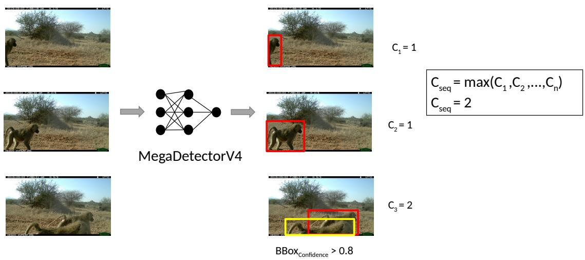
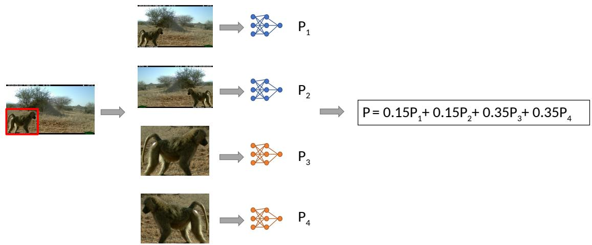
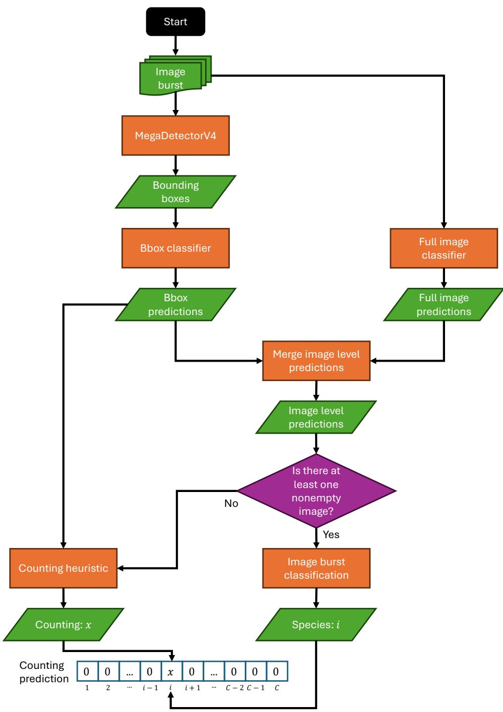

# Counting Animals in Camera-Traps Image Sequences without Count Labels: Winning Solution to the iWildCam 2021 Challenge

Fagner Cunha, Juan G. Colonna, Eulanda M. dos Santos

Federal University of Amazonas

Manaus, Amazonas, Brazil

{fagner.cunha, juancolonna, emsantos}@icomp.ufam.edu.br

## Abstract

Camera traps have become an essential tool for wildlife monitoring, motivating the development of computer vision methods for the automated extraction of information from these data. While most prior work has focused on species identification, many ecological applications also require estimating the number ofunique individuals appearing across short image sequences. This task is particularly challenging because camera traps typically acquire bursts of images at approximately one frame per second, creating large temporal discontinuities that may make conventional multi-object tracking methods unreliable, and because manually collecting individual count annotations is prohibitively expensive. In this work, we describe the winning solution to the iWild-Cam 2021 Challenge, which introduced a benchmark for counting animals at the sequence level under realistic annotation constraints where count annotations are unavailable for training. Our approach, MaxBoxCount, combines a strong species classification pipeline with a simple yet effective counting heuristic based on MegaDetector detections to estimate the number of unique individuals without requiring count annotations. Code is available at https: //github.com/alcunha/iwildcam2021ufam.

## 1. Introduction

Camera traps have been widely used for wildlife monitoring, collecting large amounts of images worldwide [1, 6]. Over the last decade, the computer vision community has investigated a wide range of approaches to improve the automated extraction of information from these data, with a primary focus on species identification [5, 10, 12, 13, 16]. However, solely identifying the species is not sufficient certain ecological modeling tasks, such as estimating the abundance or density of the species [11]. In these cases, counting the number of individuals captured across image sequences is also required. Motivated by this problem, the iWild-

Cam 2021 Challenge [4] introduced a benchmark for counting animals across short camera-trap image sequences, encouraging the development of methods that can estimate sequence-level counts under realistic annotation constraints.

Unlike traditional object counting, the competition required estimating the number of unique individuals from each species appearing across an entire sequence rather than counting detections independently in each image. Camera traps typically acquire bursts of images at approximately one frame per second [2, 6], creating large temporal discontinuities that may make conventional multi-object tracking methods unreliable. Furthermore, no count annotations were provided for the training set, reflecting a realistic scenario in which manually collecting individual counts is prohibitively expensive. Instead, participants received species labels together with weakly supervised object detections and instance segmentations, requiring solutions capable of estimating counts without direct supervision.

This formulation encouraged approaches that combine multiple sources of information rather than relying on supervised counting models. A na¨ıve strategy based solely on the number of detections tends to overestimate counts when the same individual appears in multiple images and underestimate them when different individuals appear in different frames. Accurately estimating sequence-level counts therefore requires reasoning about the correspondence of detections across the image burst despite sparse temporal information.

In this work, we describe the winning solution to the iWildCam 2021 counting challenge. Rather than proposing a learned counting model, our method combines a strong species classification pipeline with a simple yet effective sequence-level counting heuristic based on MegaDetector detections to estimate the number of unique individuals without requiring count annotations. Although designed specifically for the competition setting, the proposed approach illustrates how existing computer vision components can be effectively combined to solve weakly supervised counting problems in camera-trap image sequences.

  
Figure 1. The MaxBoxCount heuristic estimates the count for a sequence as the number of bounding boxes in the image with the highest number of detections. Only bounding boxes with confidence greater than τ are considered. For our iWildCam 2021 Challenge submission, we set τ = 0.8.

## 2. Materials and Methods

In this section, we present the dataset proposed by the iWildCam 2021 challenge and describe our heuristic strategy, which serves as a strong baseline for the task of counting animals in camera-trap images.

## 2.1. The iWildcam 2021 dataset

The iWildCam 2021 dataset comprises three components: camera trap images from the Wildlife Conservation Society (WCS) dataset, citizen science images from iNaturalist, and multispectral imagery for the camera trap locations. The camera trap data, provided by the WCS [9], contains 263,528 images of 206 species from 414 locations across 12 countries worldwide. The official training/test split is based on camera location, with the training set containing 203,314 images from 323 locations and the test set containing 60,214 images from 91 locations. As most publicly available camera trap data does not include count labels, the count labels for image bursts were collected exclusively for the test set to encourage the development of methods that can learn to count without explicit labels [4].

The dataset also includes a subset of the iNaturalist 2017-2019 competition dataset [7], with 13,051 additional images from 75 species. Although these images typically present a different data distribution and are of higher quality, they can still be valuable for improving classification.

Finally, the dataset includes raw remote sensing data for each camera location, collected by the Landsat 8 satellite, allowing investigation into whether the model performance can be improved using this kind of multimodal data. GPS coordinates for each camera location are provided, with most of them obfuscated for privacy and security reasons. Each location has been randomly adjusted to lie within 1 km of the original location center.

## 2.2. MaxBoxCount: A heuristic for counting animals in camera-trap images

Our proposed heuristic consists of two components: an image burst classifier based on an ensemble of EfficientNet-B2 [14] models and a counting heuristic based on the bounding boxes generated by MegaDetectorV4 [3]. The main idea is to estimate the number of animals present in the sequence based on the image with the highest number of bounding boxes (MaxBoxCount), which could provide a lower bound on the number of animals across the sequence if the animal detector achieves perfect detection (see Figure 1). Additionally, since the vast majority of the images contain only a single species, the simplest approach for classification is to assume a single species across the entire sequence and use the most likely species prediction for the total count of individuals.

Initially, MegaDetectorV4 is run on all images to detect animals. Next, we run the image classifiers on both the full image and the bounding box with the highest confidence score. The image prediction is calculated as the weighted average of the predictions from both models, following the approach used by the winning solution of iWildCam 2020: 0.15 (full image) + 0.15 (mirrored full image) + 0.35 (bbox) + 0.35 (mirrored bbox). Figure 2 illustrates this fusion strategy. To predict the species in the sequence, we average the species predictions of the non-empty images in the burst.

Finally, we generate a prediction vector containing the number of individuals of each species – in our case, only a single species – based on the maximum number of bounding boxes with confidence score higher than a threshold τ across any image in the sequence. If the classifiers identify only empty images, the vector will contain only zeros. Figure 3 presents a diagram summarizing the steps of our proposed heuristic baseline.

  
Figure 2. Fusion strategy for the classifier ensemble used in MaxBoxCount. The species prediction P for a given image is computed as the weighted average of the predictions for the full image (P1), its horizontally flipped version (P2), the highest-confidence bounding box $( P _ { 3 } ) .$ , and its horizontally flipped version $( P _ { 4 } )$

This classification strategy limits us to predicting only one species per sequence. However, it has proven to be a strong baseline, as it was the winning solution in iWildCam 2021. In the next subsection, we detail our implementation.

## 2.3. Species classifier

We trained two species classifiers based on the EfficientNet-B2 architecture: one trained using full images and another (bbox) trained with square crops containing animals, extracted from bounding boxes generated by MegaDetectorV4. We chose this approach following the iWildCam 2020 solutions, where the bbox model can provide better predictions due to the highlighted animal. On the other hand, the full image model has been shown to be more effective at classifying images with animal herds. We used only the provided camera-trap data to train the classifier models.

To train the bbox model, we treated all bounding boxes with a confidence score equal to or higher than 0.61 as independent training samples and applied square crops around them, using the size of the largest bbox side. If no bounding box met this confidence threshold, we used the full image for that training instance. The image label was assigned as the bounding box label.

During inference, the species prediction assigned to each image is the weighted average of the predictions from the bounding box with the highest score, the full image, and their horizontally mirrored versions, following the approach used by the winning solution of iWildCam 2020: 0.15 (ful image) + 0.15 (mirrored full image) + 0.35 (bbox) + 0.35 (mirrored bbox). To classify a sequence, we average the predictions of all nonempty images within the sequence.

Handling class imbalance. To address the class imbalance problem inherent in real-world applications, such as the one represented in iWildCam 2021 dataset, we applied the Balanced Group Softmax (BAGS) method [8]. Following the original BAGS paper, we grouped classes into 4 softmax groups based on the number N of training instances: $N \ < \ 1 0 , \ 1 0 \ \leq \ N \ < \ 1 0 0 , \ 1 0 0 \ \leq \ N \ < \ 1 0 0 0 ,$ $N \geq 1 0 0 0 .$ . For each softmax group, we included the class “others” to represent instances from all classes not included in that group. During training, for each softmax, we undersampled the “others” category to ensure it contained at most eight times the number of instances belonging to other classes per batch, to prevent it from dominating the softmax. Additionally, we included a special softmax group for the foreground/background classification. For the final prediction, we remapped all predictions to the original softmax, ignoring the “others” class. As in the original paper, these predictions are not true probabilities since they do not sum up to one, but we consider the highest value as the BAGS prediction.

Image preprocessing. For image preprocessing, we applied a square crop centered on the bounding boxes or a random crop of aspect ratio sampled in $[ 3 / 4 , 4 / 3 ]$ and area in [65%, 100%] for full image, followed by a random horizontal flip and RandAugment (N=6, M=2). Then, the images were normalized and resized to match the input dimensions of the network. During the fix train/test resolution stage, we used inference preprocessing, which consists only of normalizing and resizing the image or square crop to the input dimensions of the network.

  
Figure 3. Overview of the MaxBoxCount heuristic baseline for animal counting. The method uses bounding boxes generated by MegaDe tectorV4 to estimate the number of individuals in each image sequence. Species identification is performed using two classifiers: one operating on the full image and another on the detected bounding boxes.

Table 1. Training hyperparameters for each stage of the classifier training process.
<table><tr><td>Stage</td><td>Weights Trained</td><td>Epochs</td><td>LR</td><td>Preprocessing</td><td>Resolution</td></tr><tr><td>Stage 1*</td><td>Classifier layer</td><td>4</td><td>0.01</td><td>Training</td><td> $2 6 0 \times 2 6 0$ </td></tr><tr><td>Stage 2</td><td>All</td><td>20</td><td>0.01</td><td>Training</td><td> $2 6 0 \times 2 6 0$ </td></tr><tr><td>Stage 3</td><td>Last block + classifier</td><td>2</td><td>0.001</td><td>Inference</td><td> $3 8 0 \times 3 8 0$ </td></tr><tr><td>Stage 4</td><td>BAGS head</td><td>12</td><td>0.01</td><td>Training</td><td> $3 8 0 \times 3 8 0$ </td></tr><tr><td>Stage 5</td><td>BAGS head</td><td>2</td><td>0.001</td><td>Inference</td><td> $3 8 0 \times 3 8 0$ </td></tr></table>

∗ Applied only to the bounding-box classifier.

Multi-stage training. We trained the models in multiple stages. First, each model was trained using the standard softmax with the default input resolution of EfficientNet-B2 $( 2 6 0 \times 2 6 0 )$ . In the first stage, only the classifier layer was trained for 4 epochs, while the backbone, previously initialized with ImageNet weights, remained frozen. In the second stage, all layers were unfrozen, and all weights were fine-tuned for 20 epochs. In the third stage, to fix the train/test resolution discrepancy issue [15], we fine-tuned only the last inverted bottleneck block of the EfficientNet-B2 architecture and the classifier layer for 2 more epochs. This was done using a higher input resolution $( 3 8 0 \times 3 8 0 )$ and applying the inference preprocessing steps to the images. Afterward, we removed the plain softmax and trained the BAGS head on top of the backbone, which was kept frozen. In the fourth stage, the BAGS header was trained for 12 epochs using training preprocessing with data augmentation at the inference resolution (380×380). Finally, in the fifth stage, the BAGS header was fine-tuned for 2 epochs using inference-time preprocessing. Table 1 presents a summary of the parameters used.

Implementation details. To adjust the training hyperparameters, we held out a validation set from the training set based on the locations. However, to train the final models, we used all images available in the original training set. The models were initialized with ImageNet weights and trained with a batch size of 32 using SGD with an initial learning rate of 0.01 (0.001 during the fix train/test resolution stages) and momentum of 0.9. The learning rate was linearly warmed up from 0 to the initial value over one-third of the steps in the first epoch of each training stage, and then decayed to 0 following the cosine schedule. We also applied label smoothing with a value of 0.1.

Table 2. Final results on the iWildCam 2021 private test set. Lower scores are better.
<table><tr><td>Method</td><td>Private Score</td></tr><tr><td>1st place (Ours)</td><td>0.0293278</td></tr><tr><td>2nd place</td><td>0.0293786</td></tr><tr><td>3rd place</td><td>0.0308570</td></tr><tr><td>4th place</td><td>0.0308756</td></tr><tr><td>5th place</td><td>0.0336513</td></tr><tr><td>6th place</td><td>0.0339028</td></tr><tr><td>iWildCam 2020 winning (baseline)</td><td>0.0348171</td></tr><tr><td>7th place</td><td>0.0376347</td></tr><tr><td>8th place</td><td>0.0383956</td></tr><tr><td>All-zero baseline</td><td>0.0385147</td></tr></table>

## 3. Results

To evaluate animal counting methods, the iWildCam 2021 Challenge uses the mean column-wise root-mean-squared error (MCRMSE). Let $\textbf { Y } \in ~ \{ 0 , 1 , 2 , \ldots \} ^ { n \times m }$ denote the matrix of ground-truth counts, where each entry $y _ { i j }$ corresponds to the number of individuals of species $j _ { \mathrm { ~ \tiny ~ \in ~ } }$ $\{ 1 , \ldots , m \}$ in sequence $i \in \{ 1 , \ldots , n \}$ . Similarly, let $\dot { \mathbf { Y } } \in$ $\{ 0 , 1 , 2 , \dots \} ^ { n \times m }$ denote the matrix of predicted counts. The MCRMSE is defined as:

$$
M C R M S E = \frac { 1 } { m } \sum _ { j = 1 } ^ { m } \sqrt { \frac { 1 } { n } \sum _ { i = 1 } ^ { n } ( y _ { i j } - \hat { y } _ { i j } ) ^ { 2 } } .\tag{1}
$$

This metric accounts for both the species identification and counting errors, ensuring that false predictions on empty sequences also contribute to the overall error.

Table 2 presents the final standings based on the private score, which was calculated using 50% of the test set. Our approach was ranked first in the challenge out of 42 teams that entered the competition.

As stated by the competition organizers [4], the MCRMSE metric tends to be a small number even when the error in counts is large. This occurs because camera traps typically have a small number of individuals and because the model is double penalized for both species and counting errors. The organizers provided some simple baselines, which we specify in Table 2 for comparison purposes. One baseline uses the iWildCam 2020 winner’s species predictions combined with the maximum number of bounding boxes with confidence score higher than 0.8 across the sequence – in line with our solution. The all zeros baseline predicts zero for all instances, which performs surprisely well. This highlights how challenging this counting problem is, given its inherent conditions.

Table 3. Ablation study of the proposed iWildCam 2021 solution. Lower scores are better. The final configuration is highlighted in bold.
<table><tr><td>Test-Time Aug.</td><td>Seq. Aggreg.</td><td>MDv4 Threshold</td><td>Private Score</td></tr><tr><td>None</td><td>Voting</td><td>0.9</td><td>0.0314948</td></tr><tr><td>Horizontal flip</td><td>Voting</td><td>0.9</td><td>0.0305960</td></tr><tr><td>Horizontal flip</td><td>Average</td><td>0.9</td><td>0.0294853</td></tr><tr><td>Horizontal flip</td><td>Average</td><td>0.8</td><td>0.0293278</td></tr></table>

We present an ablation study to demonstrate the effectiveness of certain design choices in our heuristic solution, as shown in Table 3. This study considers only the species classifier at the image level used for the final submission. A well-known approach to improving classification predictions is using test-time augmentation; in our solution, we added a horizontal flip to both full image and bbox models. We also found that averaging the species predictions across images in a sequence provides better performance than the majority voting approach. Finally, we used a threshold of 0.8 for counting MegaDetectorV4 bounding boxes, as proposed by the organizers. We initially used 0.9 during the competition but found that it discarded too many valid bounding boxes.

## 4. Conclusion

Counting animals in sequences of camera trap images is a challenging problem, especially considering the scenario where there are no count labels, as is the case for most datasets. In this work, we presented a solution based on a heuristic strategy that uses the bounding boxes from MegaDetectorV4 combined with an ensemble of classifiers. Although our strategy is limited to predicting only one species per sequence, it has been proven to be a strong baseline for the problem, winning the iWildCam 2021 challenge.

However, we believe that a more natural mechanism should be based on tracking animals across images (multiobject tracking), classifying each track, and counting them. Such an approach could also be more interpretable to humans, avoiding “black box” solutions. During the competition, we experimented with DeepSORT [17] and variations using embedding features from ReID models. However, due to time constraints, we were unable to explore this strategy in depth.

## Acknowledgments

This study was financed in part by the Coordenac¸ao de˜ Aperfeic¸oamento de Pessoal de N´ıvel Superior - Brasil (CAPES) - Finance Code 001. This work was partially supported by Amazonas State Research Support Foundation - FAPEAM - through the POSGRAD project.

## References

[1] Jorge A Ahumada, Johanna Hurtado, and Diego Lizcano. Monitoring the status and trends of tropical forest terrestrial vertebrate communities from camera trap data: a tool for conservation. PloS one, 8(9):e73707, 2013. 1

[2] Sara Beery, Grant Van Horn, and Pietro Perona. Recognition in terra incognita. In Proceedings of the European Confer ence on Computer Vision, pages 456–473, 2018. 1

[3] Sara Beery, Dan Morris, and Siyu Yang. Efficient pipeline for camera trap image review. arXiv preprint arXiv:1907.06772, 2019. 2

[4] Sara Beery, Arushi Agarwal, Elijah Cole, and Vighnesh Birodkar. The iwildcam 2021 competition dataset. arXiv preprint arXiv:2105.03494, 2021. 1, 2, 5

[5] Sara Meghan Beery. Where the Wild Things Are: Computer Vision for Global-Scale Biodiversity Monitoring. Dissertation (ph.d.), California Institute of Technology, 2023. 1

[6] Zhihai He, Roland Kays, Zhi Zhang, Guanghan Ning, Chen Huang, Tony X Han, Josh Millspaugh, Tavis Forrester, and William McShea. Visual informatics tools for supporting large-scale collaborative wildlife monitoring with citizen scientists. IEEE Circuits and Systems Magazine, 16(1):73–86, 2016. 1

[7] G. V. Horn, O. M. Aodha, Y. Song, Y. Cui, C. Sun, A. Shepard, H. Adam, P. Perona, and S. Belongie. The inaturalist species classification and detection dataset. In 2018 IEEE/CVF Conference on Computer Vision and Pattern Recognition, pages 8769–8778, 2018. 2

[8] Yu Li, Tao Wang, Bingyi Kang, Sheng Tang, Chunfeng Wang, Jintao Li, and Jiashi Feng. Overcoming classifier imbalance for long-tail object detection with balanced group softmax. In Proceedings of the IEEE/CVF conference on computer vision and pattern recognition, pages 10991– 11000, 2020. 3

[9] Lila.science. Wcs camera traps, 2022. https : / / lila.science/datasets/wcscameratraps. Accessed: 2022-03-17. 2

[10] Mohammad Sadegh Norouzzadeh, Anh Nguyen, Margaret Kosmala, Alexandra Swanson, Meredith S Palmer, Craig

Packer, and Jeff Clune. Automatically identifying, counting, and describing wild animals in camera-trap images with deep learning. Proceedings ofthe National Academy ofSciences, 115(25):E5716–E5725, 2018. 1

[11] J Marcus Rowcliffe, Roland Kays, Chris Carbone, and Patrick A Jansen. Clarifying assumptions behind the estimation of animal density from camera trap rates. Journal of Wildlife Management, 2013. 1

[12] Stefan Schneider, Saul Greenberg, Graham W Taylor, and Stefan C Kremer. Three critical factors affecting automated image species recognition performance for camera traps. Ecology and Evolution, 10(7):3503–3517, 2020. 1

[13] Michael A Tabak, Mohammad S Norouzzadeh, David W Wolfson, Steven J Sweeney, Kurt C VerCauteren, Nathan P Snow, Joseph M Halseth, Paul A Di Salvo, Jesse S Lewis, Michael D White, et al. Machine learning to classify animal species in camera trap images: Applications in ecology. Meth. in Ecology and Evolution, 10(4):585–590, 2019. 1

[14] Mingxing Tan and Quoc Le. Efficientnet: Rethinking model scaling for convolutional neural networks. In Int. Conference on Machine Learning, pages 6105–6114, 2019. 2

[15] Hugo Touvron, Andrea Vedaldi, Matthijs Douze, and Herve´ Jegou. Fixing the train-test resolution discrepancy.´ Advances in neural information processing systems, 32, 2019. 5

[16] Marco Willi, Ross T Pitman, Anabelle W Cardoso, Christina Locke, Alexandra Swanson, Amy Boyer, Marten Veldthuis, and Lucy Fortson. Identifying animal species in camera trap images using deep learning and citizen science. Methods in Ecology and Evolution, 10(1):80–91, 2019. 1

[17] Nicolai Wojke, Alex Bewley, and Dietrich Paulus. Simple online and realtime tracking with a deep association metric. In 2017 IEEE international conference on image processing (ICIP), pages 3645–3649. IEEE, 2017. 6