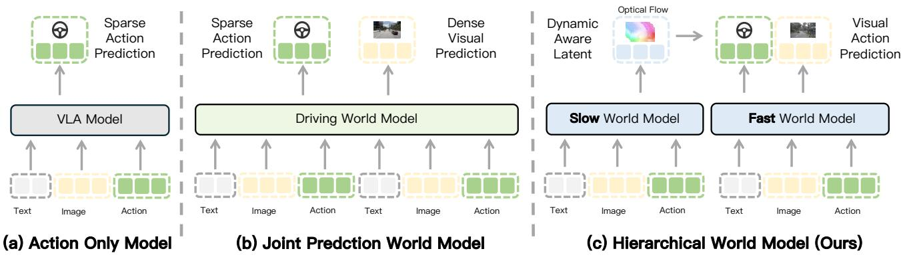
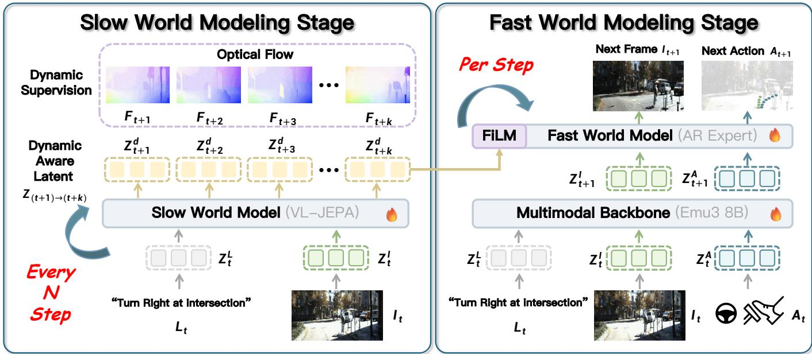
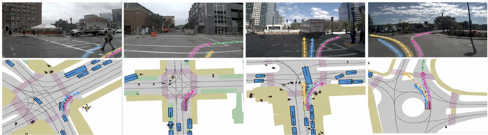
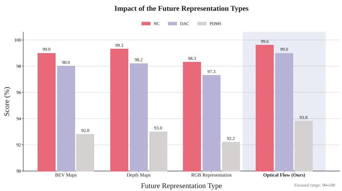
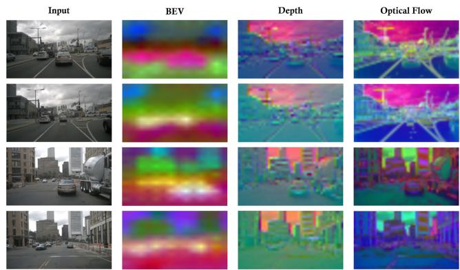
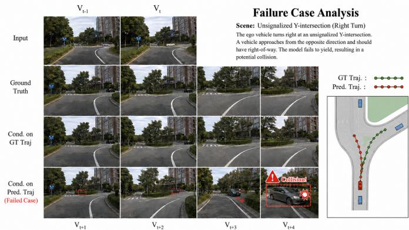
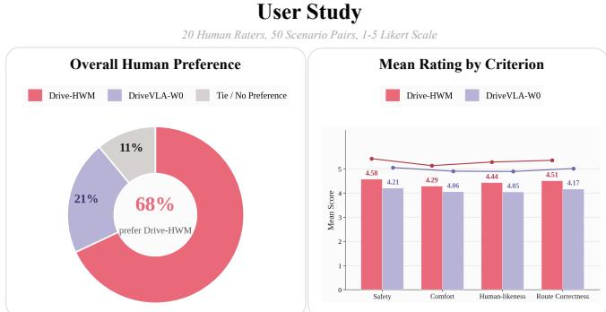
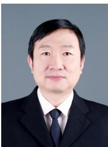

# Drive-HWM: Hierarchical World Models for Dynamic-Latent Guided Autonomous Driving

Zhaoxin Fan, Tianbao Zhang, Wenjun Wu, Xiaofeng Wang, Yeying Jin, Jian Zhao, Zheng Zhu, Shuicheng Yan

Abstract—World models offer a promising paradigm for autonomous driving by predicting how traffic scenes may evolve and using such predictions to support action generation. However, existing approaches either separate future prediction from action generation or jointly predict them at the same temporal scale, making it difficult to simultaneously achieve long-horizon anticipation and responsive, observation-grounded decision making. We present Drive-HWM, a hierarchical slow–fast world modeling framework that organizes future representation prediction and action generation at complementary temporal scales. The slow world model predicts multi-step future representations to capture extended scene evolution. To explicitly model the abundant motion dynamics in driving environments, we introduce Dynamic-Aware Latents learned through optical-flow prediction. Guided by these future representations, the fast model uses a lightweight multimodal backbone and an autoregressive expert to jointly predict the next frame and the immediate action from the latest observation. Next-frame prediction encourages the fast model to capture imminent scene evolution, while one-step action generation allows decisions to be continuously updated as new observations arrive. Extensive experiments on NAVSIM v1 and v2 demonstrate the strong driving performance of Drive-HWM. Comprehensive ablation studies further validate the effectiveness of the hierarchical slow–fast design, dynamics-aware future representations, and joint next-frame and action prediction.

Index Terms—Autonomous Driving World Model Dual System

## I. INTRODUCTION

UTONOMOUS driving unfolds in the future, not in the present. Although an autonomous vehicle perceives only the current traffic scene, every decision it makes depends on what may happen next: whether a pedestrian will cross the road, whether a nearby vehicle will change lanes, and how the scene will respond to the vehicle’s own actions. Reliable driving therefore requires more than recognizing the present; it requires reasoning about the evolution of the environment and the consequences of possible decisions. Yet, conventional driving systems largely operate reactively, mapping observed scenes directly to actions without explicitly modeling the future. World models provide a compelling alternative by learning the dynamics of driving environments and internally simulating how different futures may unfold [1]–[3]. Such

predictive reasoning enables an agent to evaluate candidate behaviors before acting, thereby bridging scene understanding and foresighted planning [4]–[6]. This capability makes world modeling a critical foundation for autonomous driving in complex, interactive, and uncertain environments.

In recent years, world modeling for autonomous driving has evolved from implicit future reasoning to explicit future prediction. Broadly speaking, VLA-based driving models [1], [3] can be viewed as implicit world models: they encode expectations about scene evolution in their latent representations, but expose only driving actions or trajectories as outputs (Fig. 1 (a)). Video- and representation-based world models [4], [7]–[9] make such expectations explicit by predicting future images or representations, including latent features, occupancy states, and motion fields. However, these models are primarily future predictors rather than executable driving policies.

To support decision making, predictive world models are typically adapted with action-generation modules or used indirectly as data generators, learned simulators, or providers of reward and supervision signals. Future prediction and action generation thus remain separated across model components or training stages. Recent world-action models instead jointly predict future states and driving actions within a unified architecture [10], encouraging the learned dynamics to capture decision-relevant scene evolution while providing richer temporal supervision for action generation (Fig. 1 (b). Nevertheless, their benefits are often limited to short horizons. As the horizon extends, prediction uncertainty and rollout errors accumulate, progressively degrading future representations and their utility for decision making. Joint prediction alone therefore cannot fully reconcile long-horizon anticipation with immediate, observation-grounded control.

A key question then arises: how should future representation prediction and action prediction be organized within a driving world model? Although closely related, they serve distinct roles at different temporal scales. Future representation prediction aims to capture how a driving scene evolves over an extended horizon. Since such evolution is largely governed by the motion of the ego vehicle and surrounding agents, as well as their interactions, the predicted representations should preserve not only scene semantics but also temporal dynamics. Multi-step prediction can thereby describe a coherent future evolution, such as the progression of a complete left turn. Action prediction, by contrast, is local and high-frequency: each action should be grounded in the latest observation to respond promptly to changing conditions. Predicting a long action sequence at once may accumulate execution errors and gradually deviate from the intended behavior. Future representation prediction and action prediction should therefore remain temporally distinct yet tightly coupled, with multistep dynamics providing predictive guidance for observationgrounded, one-step action generation.

  
Fig. 1: Comparison of three world modeling paradigms for autonomous driving. (a) Action-only models rely on spare action prediction. (b) Joint prediction world models jointly perform sparse action prediction and dense visual prediction. (c) Our hierarchical world model separates slow and fast world modeling

To this end, we present Drive-HWM, a hierarchical slow– fast world modeling framework that couples future representation prediction with high-frequency action generation. The slow world model predicts multi-step future representations to characterize scene evolution over an extended horizon. To make these representations sensitive to motion, we introduce Dynamic-Aware Latents, which are learned through opticalflow prediction to explicitly encode the dynamics of the ego vehicle and surrounding agents. Conditioned on these future representations and the latest observation, the fast model employs a lightweight multimodal backbone and a fast autoregressive expert to jointly predict the next frame and the immediate action. Next-frame prediction grounds the fast model in the imminent evolution of the scene, promoting consistency between its local world understanding and action generation. Meanwhile, predicting only the immediate action allows the model to revise its decision whenever a new observation arrives. Through this hierarchical coupling, Drive-HWM combines multi-step dynamics-aware future prediction with responsive, observation-grounded action generation.

To evaluate Drive-HWM, we conduct extensive experiments on NAVSIM v1/v2. Drive-HWM achieves strong performance across multiple driving metrics, demonstrating the effectiveness of hierarchical slow–fast world modeling. Comprehensive ablation studies further validate the contributions of dynamicsaware future representation prediction, joint next-frame and action prediction, and their hierarchical coupling. Our main contributions are summarized as follows:

• We propose Drive-HWM, a hierarchical slow–fast world modeling framework that couples multi-step future representation prediction with high-frequency, observationgrounded action generation.

• We develop dynamics-aware future representation prediction for the slow world model and joint next-frame and immediate-action prediction for the fast model, enabling long-horizon anticipation and responsive action generation at complementary temporal scales.

• Extensive experiments demonstrate the strong driving performance of Drive-HWM, while comprehensive ablations validate its key architectural and supervisory designs.

## II. RELATED WORK

In this section We review three lines of research most relevant to our work:: vision–language–action models for autonomous driving, predictive world models for autonomous driving, and world–action models.

Vision–Language–Action Models for Autonomous Driving. Vision–language–action (VLA) models extend vision– language models from scene understanding and semantic reasoning to executable driving decisions. Early approaches used language models to interpret traffic scenes, explain driving behaviors, or suggest high-level maneuvers without directly producing executable actions [11]–[13]. Subsequent methods connected semantic reasoning to low-level control through modular pipelines, whose discrete or non-differentiable interfaces limited end-to-end optimization [14]–[17]. Recent end-toend VLAs instead directly map multimodal observations and instructions to trajectories or control commands [18]–[25]. For example, DriveMoE [22] employs scene- and skill-specialized experts, ReCogDrive [24] combines vision–language reasoning with a diffusion planner, and AutoVLA [25] unifies reasoning and action generation through autoregressive action tokens. Broadly, VLAs may be viewed as implicit world models, as action generation requires representations that capture scene dynamics and potential action consequences. Several driving VLAs further adopt fast–slow designs to balance decision quality and computational cost: routine scenarios use direct action generation, whereas challenging situations invoke more expensive semantic or chain-of-thought reasoning [25]–[27]. These methods separate reasoning modes and allocate computation according to scenario complexity. In contrast, our hierarchy separates explicit future representation prediction from action generation according to their temporal roles: the slow model anticipates extended scene evolution, while the fast model produces observation-grounded actions. In the following, we therefore use world model in a narrower sense to denote models that explicitly predict future observations, states, or representations.

Predictive World Models for Autonomous Driving. World models learn environment dynamics by predicting future observations or latent states from historical context, optionally conditioned on agent actions [28]–[30]. In autonomous driving, existing methods differ primarily in the representation space in which the future is predicted. Generative world models such as GAIA-1 [8], DriveDreamer [4], and Vista [7] synthesize future camera observations, providing realistic and controllable simulations for data generation and policy evaluation. Other approaches predict more compact representations. Copilot4D [31] models future visual tokens, while occupancy-based world models forecast future 3D occupancy states to capture spatial scene evolution. DriveWorld [9] learns future latent dynamics as a self-supervised objective for transferable spatiotemporal representation learning. These methods demonstrate that predicting future observations or representations provides rich supervision for learning scene dynamics. Nevertheless, their primary output is the future world state rather than an executable driving action. Consequently, depending on their design goals, they can serve as data generators [32], learned simulators [33], representation pretraining objectives [34], or auxiliary modules for downstream planning [35]. Moreover, although some methods condition future prediction on a given action or trajectory, the action serves as an input describing how the future should unfold rather than a prediction target jointly generated by the world model. Our work builds on future representation prediction but focuses on how its extended temporal context can be coupled with high-frequency action generation.

World–Action Models. World–action models bridge predictive world modeling and policy learning by jointly modeling future states and agent actions [36]–[38]. In robotics, UniVLA [2] autoregressively models vision, language, and actions in a shared token space and incorporates future prediction to learn causal environment dynamics. WorldVLA [3] similarly unifies future-image and action generation, allowing world prediction and policy learning to provide mutual supervision. In autonomous driving, LAW [39] predicts future latent scene features conditioned on the current representation and predicted ego trajectory, using future observations to jointly improve representation learning and trajectory prediction. Other methods couple predicted future states with candidate action evaluation or directly generate future videos and driving actions within a unified model [40], [41]. By connecting state evolution with action generation, these methods learn more decision-relevant dynamics than standalone future predictors. However, existing approaches generally rely on a single predictive architecture or model future states and actions within a common rollout process. This organization overlooks their different temporal requirements: future representations should capture extended scene evolution, whereas executable actions must respond promptly to the latest observation. Long autoregressive action rollouts may also propagate early prediction errors to subsequent decisions. Drive-HWM addresses this distinction through a hierarchical slow–fast architecture: the slow world model predicts multi-step, dynamics-aware future representations, while the lightweight fast model jointly predicts the next frame and only the immediate action. This design uses long-horizon anticipation to guide action generation without sacrificing high-frequency observation grounding.

## III. METHOD

This section presents Drive-HWM. We first formulate the driving problem and provide an overview of the proposed slow–fast hierarchy. We then describe the slow world model, which anticipates extended scene evolution in latent space, and the fast world model, which generates actions grounded in both the latest observation and the predicted future context. Finally, we introduce the training objectives used to optimize the two components.

## A. Problem Formulation and Framework Overview

We formulate autonomous driving as sequential decisionmaking under partial observability. At timestep t, the agent receives an observation $o _ { t } \in \mathcal { O }$ , which may contain multi-view images and auxiliary sensory inputs, and predicts an action $a _ { t } \in { \mathcal { A } }$ . Since a single observation does not fully characterize the underlying environment state, the decision is conditioned on the interaction history

$$
\mathcal { H } _ { t } = \left( o _ { \le t } , a _ { < t } \right) , \qquad h _ { t } = E _ { \eta } ( \mathcal { H } _ { t } ) ,\tag{1}
$$

where $E _ { \eta }$ encodes the available observations and previous actions into a contextual representation $h _ { t } .$ . The objective is to learn a policy that predicts driving actions while accounting for how the observed scene may evolve over time.

A single-rate model must use the same representation and computational schedule for two different requirements: capturing extended scene evolution and responding to instantaneous observations. Drive-HWM addresses this mismatch through two world models operating at different temporal scales. The slow world model is evaluated once every N timesteps and predicts a sequence of future latent representations over a horizon of $K$ steps. The fast world model runs at every timestep and generates an action conditioned on the latest observation history and a temporally aligned latent prediction from the slow model.

More formally, let

$$
\tau ( t ) = N \left\lfloor { \frac { t } { N } } \right\rfloor\tag{2}
$$

denote the most recent slow-model update preceding timestep t. At update time τ, the slow model predicts $\begin{array} { r l } { { \hat { Z } } _ { \tau } ^ { s } } & { { } = } \end{array}$ $\{ \hat { z } _ { \tau + k | \tau } ^ { s } \} _ { k = 1 } ^ { K }$ . The prediction aligned with the next state at timestep t is therefore

$$
q _ { t } ^ { s } = \hat { z } _ { t + 1 | \tau ( t ) } ^ { s } .\tag{3}
$$

  
Fig. 2: Overview of the proposed slow–fast world modeling framework. The slow world model, updated every N steps, employs VL-JEPA to predict multi-horizon optical flow under dynamic supervision, producing Dynamic-Aware Latents $\mathbf { Z } _ { ( t + 1 )  ( t + k ) } ^ { d }$ that encode anticipated scene evolution. At every step, the temporally aligned dynamic latent is injected via FiLM into the fast world model built upon Emu3-8B. The autoregressive expert integrates the current instruction, observation, and action history to jointly predict the next action and next-frame visual tokens, enabling long-horizon dynamic awareness while remaining responsive to the latest observations.

Drive-HWM can then be summarized by the following hierarchical factorization:

$$
\begin{array} { r l } & { p _ { \Theta } \Big ( \{ a _ { t } , z _ { t + 1 } ^ { f } \} _ { t = 0 } ^ { T - 1 } , \{ Z _ { \tau } ^ { s } \} _ { \tau \in \mathcal { R } } \Big | o _ { \leq T } \Big ) } \\ & { \quad = \displaystyle \prod _ { \tau \in \mathcal { R } } p _ { \theta _ { s } } ( Z _ { \tau } ^ { s } \mid \mathcal { H } _ { \tau } ) \prod _ { t = 0 } ^ { T - 1 } p _ { \theta _ { f } } \Big ( a _ { t } , z _ { t + 1 } ^ { f } \mid \mathcal { H } _ { t } , q _ { t } ^ { s } \Big ) , } \end{array}\tag{4}
$$

where $\mathcal { R } = \{ 0 , N , 2 N , . . . \}$ is the set of slow-model update timesteps. The slow prediction is reused within each update interval, whereas the fast model continuously incorporates newly observed evidence. Consequently, the predicted future provides a persistent long-range context without preventing the action model from correcting its decisions when unexpected scene changes occur. The framework of Drive-HWM is illustrated in Fig. 2. Next, we introduce the slow and fast wolrd model indetail.

## B. Slow World Model: Dynamic-Aware Future Prediction

The slow world model is designed to capture long-term scene dynamics rather than appearance variations. A straightforward solution would be to predict future visual features extracted from RGB observations. However, such features are typically dominated by appearance semantics and spatial content, while the information most relevant to driving— including ego-motion, object displacement, and their temporal evolution—may occupy only a small portion of the representation. Moreover, directly predicting future RGB frames requires modeling substantial appearance details that are difficult to extrapolate and are not necessarily useful for action generation.

To address this issue, we introduce a Dynamic-Aware Latent (DAL) representation learned by predicting future optical flow. Optical flow provides an explicit description of pixel-wise displacement and naturally emphasizes moving agents, egomotion-induced scene changes, and the geometric evolution of the observed environment. Compared with future RGB prediction, it suppresses static appearance details such as texture, illumination, and color, allowing the slow model to allocate its capacity to temporally predictive motion information.

a) Multi-step optical-flow prediction.: Let $\tau$ denote a slow-model update timestep and let

$$
\begin{array} { r } { h _ { \tau } = E _ { \eta } ( \mathcal { H } _ { \tau } ) , \qquad \mathcal { H } _ { \tau } = ( o _ { \le \tau } , a _ { < \tau } ) , } \end{array}\tag{5}
$$

be the contextual representation of the available interaction history. Given $h _ { \tau }$ , the slow world model predicts scene dynamics over the subsequent K temporal offsets:

$$
\left\{ \hat { d } _ { \tau + k | \tau } ^ { s } , \hat { \mathcal { F } } _ { \tau + k | \tau } \right\} _ { k = 1 } ^ { K } = S _ { \theta _ { s } } ( h _ { \tau } ) ,\tag{6}
$$

where ${ \hat { d } } _ { \tau + k | \tau } ^ { s }$ denotes the Dynamic-Aware Latent at future offset $k ,$ and $\hat { \mathcal { F } } _ { \tau + k | \tau } ~ \in ~ \mathbb { R } ^ { H _ { f } \times W _ { f } \times 2 }$ is the corresponding predicted optical-flow field. The two channels of $\hat { \mathcal { F } } _ { \tau + k | \tau }$ represent horizontal and vertical displacements, respectively.

For each temporal offset, the flow prediction is decoded from the corresponding Dynamic-Aware Latent:

$$
\hat { \mathcal { F } } _ { \tau + k | \tau } = D _ { \mathrm { f l o w } } \left( \hat { d } _ { \tau + k | \tau } ^ { s } \right) , \qquad k = 1 , \dots , K ,\tag{7}
$$

where $D _ { \mathrm { H o w } }$ is a lightweight flow decoder. The intermediate representation ${ \hat { d } } _ { \tau + k | \tau } ^ { s }$ is therefore not an unconstrained visual feature. It is explicitly optimized to retain the information required to recover future motion fields and is consequently aware of both spatial content and temporal displacement.

The supervision target associated with future offset k is defined as

$$
\mathcal { F } _ { \tau + k } = \mathrm { F l o w } \left( o _ { \tau + k - 1 } , o _ { \tau + k } \right) ,\tag{8}
$$

where Flow $( \cdot , \cdot )$ denotes the optical-flow estimator used to construct the training targets. All K future flow fields are predicted from the same observed history $h _ { \tau } .$ , rather than being generated by recursively feeding previously predicted flow into the model:

$$
p _ { \theta _ { s } } \left( \mathcal { F } _ { \tau + 1 : \tau + K } \mid \mathcal { H } _ { \tau } \right) = \prod _ { k = 1 } ^ { K } p _ { \theta _ { s } } \left( \mathcal { F } _ { \tau + k } \mid \mathcal { H } _ { \tau } , k \right) .\tag{9}
$$

This parallel multi-offset formulation avoids recursive flow warping and prevents prediction errors at early offsets from being directly propagated to later ones.

b) Dynamic-Aware Latent.: Although dense optical flow provides direct motion supervision, passing raw flow fields to the fast model would discard contextual cues needed to interpret the motion. For example, similar image displacement may correspond to different driving implications depending on whether it originates from a vehicle, a pedestrian, the road surface, or camera motion. Drive-HWM therefore uses the hidden representation before flow decoding as its interface between the two temporal levels:

$$
{ \cal D } _ { \tau } ^ { s } = \left\{ \hat { d } _ { \tau + 1 | \tau } ^ { s } , \dots , \hat { d } _ { \tau + K | \tau } ^ { s } \right\} .\tag{10}
$$

Because $D _ { \tau } ^ { s }$ must support the reconstruction of multi-step future flow, it encodes anticipated scene displacement while preserving the contextual information required to explain that displacement. We refer to $D _ { \tau } ^ { s }$ as the Dynamic-Aware Latent sequence. In contrast to generic RGB features, which primarily describe what is currently visible, $D _ { \tau } ^ { s }$ emphasizes how the visible scene is likely to change over time.

At a fast-model timestep t, we select the temporally aligned Dynamic-Aware Latent from the most recent slow update:

$$
\tau ( t ) = N \left\lfloor \frac { t } { N } \right\rfloor , \qquad q _ { t } ^ { s } = \hat { d } _ { t + 1 | \tau ( t ) } ^ { s } .\tag{11}
$$

The aligned latent $q _ { t } ^ { s } ,$ , rather than the decoded optical-flow field, is provided to the fast world model. In this manner, optical flow acts as an explicit learning signal for discovering dynamics-sensitive representations, while the latent interface retains richer information for subsequent action generation.

c) Flow prediction objective.: The slow world model is optimized by matching its multi-step predictions to the corresponding future optical-flow targets:

$$
\mathcal { L } _ { \mathrm { f l o w } } = \frac { 1 } { K } \sum _ { k = 1 } ^ { K } w _ { k } \ell _ { \mathrm { f l o w } } \left( \hat { \mathcal { F } } _ { \tau + k | \tau } , \mathcal { F } _ { \tau + k } \right) ,\tag{12}
$$

where $w _ { k }$ controls the contribution of different prediction offsets and $\ell _ { \mathrm { f l o w } }$ denotes the optical-flow prediction loss. When flow validity or visibility masks are available, the loss is evaluated only over valid locations:

$$
\ell _ { \mathrm { f l o w } } \Big ( \hat { \mathcal { F } } , \mathcal { F } \Big ) = \frac { \sum _ { u } M ( u ) \rho \Big ( \hat { \mathcal { F } } ( u ) - \mathcal { F } ( u ) \Big ) } { \sum _ { u } M ( u ) + \epsilon } ,\tag{13}
$$

where u indexes spatial locations, $M$ is a valid-flow mask, and $\rho ( \cdot )$ is the employed robust regression penalty.

The flow prediction objective serves two complementary purposes. First, it provides explicit supervision for learning long-range scene dynamics without requiring photorealistic future reconstruction. Second, it shapes the intermediate latent space into a dynamics-sensitive representation that can be reused by the fast world model. The slow branch therefore does not output actions or an explicit trajectory. Instead, it supplies a sequence of future-oriented Dynamic-Aware Latents that informs high-frequency action generation.

C. Fast World Model: Dynamics-Conditioned Action Prediction

The slow world model predicts how the driving scene may evolve over an extended temporal horizon. However, its prediction is computed at a lower frequency and cannot incorporate observations arriving after the latest slow update. The fast world model therefore operates at every timestep to generate actions from the most recent visual evidence, while using the Dynamic-Aware Latent (DAL) supplied by the slow model as predictive context.

We instantiate the fast world model using Emu3-8B [42] as the action-prediction backbone. Emu3 represents visual content as discrete tokens and models multimodal sequences through autoregressive next-token prediction. This formulation provides a unified interface for processing the current observation and predicting both action and future visual tokens. On top of the Emu3 backbone, we introduce FiLM-based dynamic conditioning and an autoregressive expert for driving-specific prediction.

a) Visual token representation.: At timestep t, the latest observation $o _ { t }$ is converted into a sequence of discrete visual tokens using the Emu3 visual tokenizer:

$$
V _ { t } = T _ { \mathrm { v i s } } ( o _ { t } ) = ( v _ { t , 1 } , \dots , v _ { t , L _ { v } } ) ,\tag{14}
$$

where $L _ { v }$ denotes the number of visual tokens. Together with the preceding observation and action context, these tokens are processed by the Emu3 backbone:

$$
H _ { t } = B _ { \theta _ { b } } \left( V _ { \leq t } , A _ { < t } \right) ,\tag{15}
$$

where $B _ { \theta _ { b } }$ denotes the Emu3-8B backbone, $A _ { < t }$ contains the previous action tokens, and $H _ { t } ~ \in ~ \mathbb { R } ^ { L _ { t } \times D }$ represents the resulting contextual hidden states. In contrast to using a separately designed visual encoder, this token-based representation preserves the native visual modeling capability of the pretrained multimodal backbone.

b) FiLM-based dynamic conditioning.: The visual representation $H _ { t }$ describes the most recently observed scene, whereas the slow world model provides an anticipation of its future dynamics. Let

$$
\tau ( t ) = N \left\lfloor \frac { t } { N } \right\rfloor , \qquad q _ { t } ^ { s } = \hat { d } _ { t + 1 | \tau ( t ) } ^ { s }\tag{16}
$$

denote the Dynamic-Aware Latent aligned with the next transition at timestep t. Rather than directly concatenating $q _ { t } ^ { s }$ with the input sequence, we inject it into the Emu3 hidden representation through Feature-wise Linear Modulation (FiLM). Specifically, the modulation parameters are predicted from the aligned DAL:

$$
\left( \gamma _ { t } ^ { \left( l \right) } , \beta _ { t } ^ { \left( l \right) } \right) = G _ { \mathrm { F i L M } } ^ { \left( l \right) } \left( q _ { t } ^ { s } \right) ,\tag{17}
$$

where $G _ { \mathrm { F i L M } } ^ { ( l ) }$ is a lightweight projection module associated with the l-th modulated transformer layer. The corresponding hidden states are modulated as

$$
\widetilde { H } _ { t } ^ { ( l ) } = \left( 1 + \gamma _ { t } ^ { ( l ) } \right) \odot \mathrm { L N } \left( H _ { t } ^ { ( l ) } \right) + \beta _ { t } ^ { ( l ) } ,\tag{18}
$$

where ⊙ denotes element-wise multiplication and $\mathrm { L N } ( \cdot )$ denotes layer normalization.

This design allows the predicted dynamics to adaptively rescale and shift the feature channels used for action prediction without changing the token organization of the pretrained backbone. The current observation remains the primary input to the fast model, while the DAL modulates its interpretation according to the scene evolution anticipated by the slow world model. As a result, the fast model combines up-to-date visual evidence with future-oriented dynamic information instead of treating the slow prediction as an explicit action command.

c) Autoregressive action expert.: The FiLM-modulated features are subsequently processed by a driving-specific autoregressive expert:

$$
R _ { t } = E _ { \theta _ { e } } ^ { \mathrm { A R } } \left( \widetilde { H } _ { t } \right) ,\tag{19}
$$

where $E _ { \theta _ { e } } ^ { \mathrm { A R } }$ denotes the AR expert and $R _ { t }$ is the drivingspecific representation used for output prediction. We represent the action at timestep t as an ordered token sequence

$$
A _ { t } = \left( a _ { t , 1 } , \ldots , a _ { t , L _ { a } } \right) ,\tag{20}
$$

where the tokens encode the executable driving output. The action probability is factorized autoregressively as

$$
p _ { \theta _ { f } } \left( A _ { t } \mid { \mathcal { H } } _ { t } , q _ { t } ^ { s } \right) = \prod _ { j = 1 } ^ { L _ { a } } p _ { \theta _ { f } } \left( a _ { t , j } \mid a _ { t , < j } , R _ { t } \right) .\tag{21}
$$

Accordingly, the action prediction objective is

$$
\mathcal { L } _ { \mathrm { a c t } } = - \frac { 1 } { L _ { a } } \sum _ { j = 1 } ^ { L _ { a } } \log p _ { \theta _ { f } } \left( a _ { t , j } \mid a _ { t , < j } , R _ { t } \right) .\tag{22}
$$

The AR expert specializes the general-purpose multimodal representation of Emu3 for driving action generation. Autoregressive factorization also models the dependencies among action tokens, rather than estimating each action component independently.

d) Next-frame visual supervision.: Action supervision alone only indicates which control output should be selected, providing limited information about the scene transition underlying that decision. In particular, an action-only model may learn a direct mapping from frequently occurring visual patterns to driving commands without explicitly retaining how surrounding agents and scene geometry are changing. To provide a denser learning signal for short-term dynamics, we additionally require the fast model to predict the next observed frame.

The next observation $o _ { t + 1 }$ is converted into target visual tokens using the same visual tokenizer:

$$
V _ { t + 1 } = \mathcal { T } _ { \mathrm { v i s } } ( o _ { t + 1 } ) = ( v _ { t + 1 , 1 } , \dots , v _ { t + 1 , L _ { v } } ) .\tag{23}
$$

The AR expert predicts these tokens conditioned on the current visual evidence, the Dynamic-Aware Latent, and the action at the current timestep:

$$
\begin{array} { r l } { { } } & { { p _ { \theta _ { f } } } \left( { V _ { t + 1 } } \mid { \mathcal { H } _ { t } } , q _ { t } ^ { s } , A _ { t } \right) } \\ { ~ } & { { } ~ = \displaystyle \prod _ { i = 1 } ^ { L _ { v } } p _ { \theta _ { f } } \left( { v _ { t + 1 , i } } \mid { v _ { t + 1 , < i } } , A _ { t } , R _ { t } \right) . } \end{array}\tag{24}
$$

The corresponding visual prediction loss is

$$
\mathcal { L } _ { \mathrm { i m g } } = - \frac { 1 } { L _ { v } } \sum _ { i = 1 } ^ { L _ { v } } \log p _ { \theta _ { f } } \left( v _ { t + 1 , i } \mid v _ { t + 1 , < i } , A _ { t } , R _ { t } \right) .\tag{25}
$$

This auxiliary objective serves three purposes. First, it requires the shared representation to retain sufficient information to explain the immediate scene transition, thereby complementing the long-horizon motion information learned by the slow world model. Second, it provides spatially dense supervision beyond the low-dimensional action labels, regularizing the action expert against shortcut learning. Third, because the future visual prediction is conditioned on the DAL, it encourages the fast model to make effective use of the dynamic context instead of ignoring it during action training.

Importantly, next-frame prediction is introduced as an auxiliary training objective rather than an additional output required by the driving system. During inference, only the autoregressively predicted action tokens need to be decoded, and future image generation can be omitted.

e) Fast-world-model objective.: The fast world model is jointly optimized for action generation and next-frame visual prediction:

$$
\begin{array} { r } { \mathcal { L } _ { \mathrm { f a s t } } = \mathcal { L } _ { \mathrm { a c t } } + \lambda _ { \mathrm { i m g } } \mathcal { L } _ { \mathrm { i m g } } , } \end{array}\tag{26}
$$

where $\lambda _ { \mathrm { i m g } }$ controls the contribution of the auxiliary visual prediction task. The action objective teaches the model which action to execute, while the visual objective encourages it to capture the short-term scene transition associated with that decision. Together with the long-horizon DAL supplied by the slow world model, the fast branch combines future-oriented dynamic context, current visual evidence, and high-frequency action generation within a unified autoregressive framework.

TABLE I: Comparison with state-of-the-art methods on NAVSIM v1. The best and second-best results are highlighted in bold and underlined, respectively. Our method is highlighted in light blue.
<table><tr><td>Method</td><td>Ref.</td><td>Sensors</td><td>NC↑</td><td>DAC↑</td><td>TTC↑</td><td>C.↑</td><td>EP↑</td><td>PDMS↑</td></tr><tr><td>Human</td><td>一</td><td></td><td>100.0</td><td>100.0</td><td>100.0</td><td>99.9</td><td>87.5</td><td>94.8</td></tr><tr><td colspan="9">BEV-based methods</td></tr><tr><td>UniAD [10]</td><td>CVPR&#x27;23</td><td> $6 \times \mathrm { C a m }$ </td><td>97.8</td><td>91.9</td><td>92.9</td><td>100.0</td><td>78.8</td><td>83.4</td></tr><tr><td>TransFuser [43]</td><td>TPAMI&#x27;23</td><td> $3 \times \mathrm { ~ C a m ~ + ~ L ~ }$ </td><td>97.7</td><td>92.8</td><td>92.8</td><td>100.0</td><td>79.2</td><td>84.0</td></tr><tr><td>PARA-Drive [44]</td><td>CVPR&#x27;24</td><td> $6 \times \mathrm { C a m }$ </td><td>97.9</td><td>92.4</td><td>93.0</td><td>99.8</td><td>79.3</td><td>84.0</td></tr><tr><td>LAW [39]</td><td>ICLR’25</td><td> $1 \times \mathrm { { C a m } }$ </td><td>96.4</td><td>95.4</td><td>88.7</td><td>99.9</td><td>81.7</td><td>84.6</td></tr><tr><td>Hydra-MDP [45]</td><td>arXiv&#x27;24</td><td> $3 \times \mathrm { ~ C a m ~ + ~ L ~ }$ </td><td>98.3</td><td>96.0</td><td>94.6</td><td>100.0</td><td>78.7</td><td>86.5</td></tr><tr><td>DiffusionDrive [5]</td><td>CVPR&#x27;25</td><td> $3 \times \mathrm { ~ C a m ~ + ~ L ~ }$ </td><td>98.2</td><td>96.2</td><td>94.7</td><td>100.0</td><td>82.2</td><td>88.1</td></tr><tr><td>WoTE [1]</td><td>ICCV’25</td><td> $3 \times \mathrm { ~ C a m ~ + ~ L ~ }$ </td><td>98.5</td><td>96.8</td><td>94.4</td><td>99.9</td><td>81.9</td><td>88.3</td></tr><tr><td colspan="9">Normal view methods</td></tr><tr><td>AutoVLA [25]</td><td>NeurIPS&#x27;25</td><td> $3 \times \mathrm { { C a m } }$ </td><td>98.4</td><td>95.6</td><td>98.0</td><td>99.9</td><td>81.9</td><td>89.1</td></tr><tr><td>ReCogDrive [24]</td><td>arXiv&#x27;25</td><td> $3 \times \mathrm { { C a m } }$ </td><td>98.2</td><td>97.8</td><td>95.2</td><td>99.8</td><td>83.5</td><td>89.6</td></tr><tr><td> $\mathrm { \Delta D r i v e V L A  – W 0 ^ { \dagger } }$  [46]</td><td>arXiv&#x27;25</td><td>1× Cam</td><td>98.7</td><td>99.1</td><td>95.3</td><td>99.3</td><td>83.3</td><td>90.2</td></tr><tr><td> $\mathrm { A u t o V L A ^ { \ddagger } \ } [ 2 5 ]$ </td><td>NeurIPS’25</td><td> $3 \times \mathrm { { C a m } }$ </td><td>99.1</td><td>97.1</td><td>97.1</td><td>100.0</td><td>87.6</td><td>92.1</td></tr><tr><td>DriveVLA-W0‡ [46]</td><td>arXiv&#x27;25</td><td> $1 \times \mathrm { { C a m } }$ </td><td>99.3</td><td>97.4</td><td>97.0</td><td>99.9</td><td>88.3</td><td>93.0</td></tr><tr><td>Drive-HWM (Ours)</td><td></td><td> $1 \times \mathrm { { C a m } }$ </td><td>99.6</td><td>99.0</td><td>98.5</td><td>100.0</td><td>89.0</td><td>93.8</td></tr></table>

Sensors: 1× Cam denotes a single front-view camera; 3×/6× Cam denotes surround-view cameras; L denotes LiDAR. † Query-based action expert with multiple trajectory anchors following [45]. ‡ Autoregressive action expert with the best-of-N strategy $( N = 6 )$ following [25].

## D. Training Objective

Drive-HWM is trained using supervision for long-horizon latent prediction, short-horizon latent prediction, and action generation. For the fast world model, we define

$$
\begin{array} { r } { \mathcal { L } _ { \mathrm { f a s t } } = \mathcal { L } _ { \mathrm { a c t } } \left( \hat { a } _ { t } , a _ { t } \right) + \lambda _ { f } d \bigg ( \hat { z } _ { t + 1 } ^ { f } , y _ { t + 1 } \bigg ) , } \end{array}\tag{27}
$$

where $\mathcal { L } _ { \mathrm { a c t } }$ denotes the action prediction loss and $\lambda _ { f }$ balances action supervision against one-step latent prediction. For autoregressively tokenized actions, $\mathcal { L } _ { \mathrm { a c t } }$ is the token-level negative log-likelihood; it can equivalently be instantiated as a regression loss when continuous actions are directly predicted.

The complete objective is

$$
\mathcal { L } = \lambda _ { s } \mathcal { L } _ { \mathrm { s l o w } } + \mathcal { L } _ { \mathrm { a c t } } + \lambda _ { f } \mathcal { L } _ { \mathrm { v i s } } ,\tag{28}
$$

where $\mathcal { L } _ { \mathrm { v i s } } = d ( \hat { z } _ { t + 1 } ^ { f } , y _ { t + 1 } )$ and $\lambda _ { s }$ and $\lambda _ { f }$ control the two predictive objectives.

During training, each slow prediction is shared by the N fast-model steps within the corresponding update interval, matching the temporal schedule used at inference. The fast model is conditioned on the predicted slow latent rather than the encoded ground-truth future representation, avoiding a discrepancy between training and deployment. At inference time, the slow world model is evaluated only at timesteps in R, while the cached latent sequence is temporally indexed and supplied to the fast world model at every intermediate timestep. This design amortizes long-horizon future prediction across multiple action steps while retaining observationgrounded action generation at the native control frequency.

## IV. EXPERIMENT

This section presents the experimental evaluation of Drive-HWM. We first introduce the datasets, evaluation metrics, and implementation details. We then quantitatively compare Drive-HWM with state-of-the-art methods to assess its overall driving performance. Next, we provide qualitative visualizations to analyze the long-horizon anticipation and action-generation capabilities of the proposed slow–fast hierarchy. Finally, we conduct comprehensive ablation studies to examine the contribution of each component and validate the effectiveness of our design choices.

## A. Implementation Details

Datasets and evaluation. We pretrain our model on nu-Plan [49] and fine-tune it on NAVSIM [50], which is built upon the OpenScene dataset [51]. We report results under both NAVSIM v1 and NAVSIM v2 [52]. NAVSIM v1 evaluates No At-fault Collision (NC), Drivable Area Compliance (DAC), Time-to-Collision (TTC), Comfort (C.), and Ego Progress (EP), and summarizes performance using PDMS = NC × $\mathrm { D A C } \times ( \mathrm { 5 E P + 5 T T C + 2 C } ) / 1 2$ . NAVSIM v2 additionally considers Driving Direction Compliance (DDC), Traffic Light Compliance (TLC), Lane Keeping (LK), History Comfort (HC), and Extended Comfort (EC), with EPDMS = NC × $\mathrm { D A C } \times \mathrm { D D C } \times \mathrm { T L C } \times ( \mathrm { 5 E P } + \mathrm { 5 T T C } + 2 \mathrm { L K } + 2 \mathrm { H C } + 2 \mathrm { E C } ) / 1 6 .$

Training details. We set the slow-model update interval and prediction horizon to $N = K = 8$ . Accordingly, the slow world model is updated every eight timesteps and predicts Dynamic-Aware Latents for the next eight timesteps, while the fast world model runs at every timestep. We adopt a twostage training strategy: the backbone, slow world model, and fast world model are first jointly pretrained on nuPlan for 10K steps using the full objective $\mathcal { L } _ { \mathrm { t o t a l } } ;$ the complete model is then fine-tuned on NAVSIM for 6K steps using the action prediction loss. We resize input images to 256 × 144 and train the model on eight NVIDIA A100 GPUs with a global batch size of 48.

TABLE II: Comparison with state-of-the-art methods on NAVSIM v2 using the extended evaluation metrics. The best and second-best results are highlighted in bold and underlined, respectively. Our method is highlighted in light blue.
<table><tr><td>Method</td><td>NC↑</td><td>DAC↑</td><td>DDC↑</td><td>TLC↑</td><td>EP↑</td><td>TTC↑</td><td>LK↑</td><td>HC↑</td><td>EC↑</td><td>EPDMS↑</td></tr><tr><td>Ego Status</td><td>93.1</td><td>77.9</td><td>92.7</td><td>99.6</td><td>86.0</td><td>91.5</td><td>89.4</td><td>98.3</td><td>85.4</td><td>64.0</td></tr><tr><td>TransFuser [43]</td><td>96.9</td><td>89.9</td><td>97.8</td><td>99.7</td><td>87.1</td><td>95.4</td><td>92.7</td><td>98.3</td><td>87.2</td><td>76.7</td></tr><tr><td>HydraMDP++ [45]</td><td>97.2</td><td>97.5</td><td>99.4</td><td>99.6</td><td>83.1</td><td>96.5</td><td>94.4</td><td>98.2</td><td>70.9</td><td>81.4</td></tr><tr><td>DriveSupervisor [47]</td><td>97.5</td><td>96.5</td><td>99.4</td><td>99.6</td><td>88.4</td><td>96.6</td><td>95.5</td><td>98.3</td><td>77.0</td><td>83.1</td></tr><tr><td>ARTEMIS [48]</td><td>98.3</td><td>95.1</td><td>98.6</td><td>99.8</td><td>81.5</td><td>97.4</td><td>96.5</td><td>98.3</td><td></td><td>83.1</td></tr><tr><td>DiffusionDrive [5]</td><td>98.2</td><td>95.9</td><td>99.4</td><td>99.8</td><td>87.5</td><td>97.3</td><td>96.8</td><td>98.3</td><td>87.7</td><td>84.5</td></tr><tr><td>DriveVLA-W0 [46]</td><td>98.5</td><td>99.1</td><td>98.0</td><td>99.7</td><td>86.4</td><td>98.1</td><td>93.2</td><td>97.9</td><td>58.9</td><td>86.1</td></tr><tr><td>Drive-HWM (Ours)</td><td>98.9</td><td>99.5</td><td>99.4</td><td>99.9</td><td>88.5</td><td>98.7</td><td>96.5</td><td>98.3</td><td>87.5</td><td>86.4</td></tr></table>

Metrics: NC: No At-fault Collision; DAC: Drivable Area Compliance; DDC: Driving Direction Compliance; TLC: Traffic Light Compliance; EP: Ego Progress; TTC: Time to Collision; LK: Lane Keeping; HC: History Comfort; EC: Extended Comfort; EPDMS: Extended Predictive Driver Model Score. “–” denotes an unavailable result.

Avoiding Pedestrians  
On Stopline  
Traffic Light Intersection  
Intersection  
  
Fig. 3: Qualitative comparison of trajectories from different models in the front-facing camera and bird’s-eye view across diverse driving scenarios. Trajectories are shown for: Human Trajectory, Drive-HWM, DriveVLA-W0, Transfuser.

We use AdamW with an initial learning rate of $2 \times 1 0 ^ { - 4 }$ and a cosine learning-rate schedule.

## B. Quantitative Comparison

Tables I and II compare Drive-HWM with state-of-theart methods under the two NAVSIM protocols. On NAVSIM v1, Drive-HWM achieves the highest overall PDMS of 93.3 using only a single front-view camera and obtains the best or tied-best results on NC, TTC, comfort, and EP. In particular, compared with DriveVLA-W0 [46], which adopts the same VLA backbone but uses a single world model, Drive-HWM improves NC, DAC, TTC, comfort, EP, and PDMS by 0.2, 1.0, 1.0, 0.1, 0.2, and 0.3 points, respectively, over its strongest overall variant. The improvements in NC and TTC, which primarily measure collision avoidance and temporal safety margins, demonstrate that the slow branch can anticipate long-term scene evolution and potential risks, while the fast branch enables timely reactions to rapidly changing local conditions. Similarly, the gain in EP indicates that such longhorizon reasoning allows the agent to make safer yet less overly conservative progress. Although our DAC of 98.4 is slightly lower than the best individual result of 99.1, it remains highly comparable; unlike the aggregate metrics, DAC mainly evaluates instantaneous adherence to drivable-area boundaries and is therefore more sensitive to local geometric precision than to long-term planning quality. Overall, the leading PDMS confirms that the proposed slow–fast hierarchy achieves a more favorable balance among safety, compliance, progress, and comfort than methods relying on a single-timescale world model.

On the more comprehensive NAVSIM v2 benchmark, Drive-HWM again ranks first in the overall EPDMS, achieving 86.2, and obtains the best or tied-best performance on seven of the ten metrics, including NC, DAC, DDC, TLC, TTC, HC, and EPDMS. Compared with DriveVLA-W0 [46], Drive-HWM improves all ten reported metrics, with particularly substantial gains of 1.4 points in DDC, 1.7 points in EP, 1.5 points in LK, and 27.5 points in EC. The leading results on NC and TTC further verify the benefit of slow, longhorizon prediction for anticipating future hazards, whereas the improvements in DAC, DDC, and TLC show that the fast branch can convert high-level plans into responsive and rulecompliant actions. Drive-HWM also achieves a comparable EP of 88.1, only 0.3 points below the best result, indicating that its stronger safety performance is not obtained through excessively conservative driving. Its LK and EC results are competitive but not the best: LK emphasizes fine-grained lanecentering accuracy, while EC is particularly sensitive to shortterm acceleration and steering variations. The fast branch may introduce occasional local corrections when responding to dynamic risks, slightly affecting these two metrics, whereas the slow branch prioritizes globally safe and temporally consistent execution over optimizing isolated measures of geometric tracking or instantaneous smoothness.

TABLE III: Computational efficiency comparison. Latency is measured on a single NVIDIA H200 GPU with batch size 1. T and $T _ { f }$ denote the inference latency of the slow and fast models, respectively. Since the slow model is executed every N steps, the amortized latency is computed as $T _ { \mathrm { a v g } } =$ $T _ { f } + T _ { s } / N . \ : T _ { \mathrm { p e a k } }$ denotes the latency at a slow-model update step.
<table><tr><td>Method</td><td>N</td><td> $T _ { s }$ </td><td> $T _ { f }$  Latency (ms)↓</td><td> $T _ { \mathrm { p e a k } }$ </td><td> $T _ { \mathrm { a v g } }$ </td><td>PDMS↑</td></tr><tr><td>DriveVLA-W0 [46]</td><td>一</td><td></td><td>117.8</td><td>117.8</td><td>117.8</td><td>93.0</td></tr><tr><td>Fast Model Only</td><td></td><td></td><td>81.6</td><td>81.6</td><td>81.6</td><td>93.0</td></tr><tr><td>Drive-HWM (Ours)</td><td>8</td><td>25.6</td><td>81.6</td><td>107.2</td><td>84.8</td><td>93.8</td></tr></table>

Taken together, the best aggregate scores under both protocols, broad improvements over the same-backbone baseline, and strong performance with only a single front-view camera demonstrate that Drive-HWM provides the strongest overall trade-off, validating the effectiveness of hierarchical slow– fast world modeling for reliable long-horizon planning and responsive short-horizon control.

Computational Efficiency. We evaluate the inference efficiency of Drive-HWM on a single NVIDIA H200 GPU with batch size 1. As shown in Table III, the fast world model requires 81.6 ms per control step, while the slow world model takes 25.6 ms and is executed only once every N = 8 steps. This amortizes the slow-branch overhead to 3.2 ms per step, resulting in an average latency of 84.8 ms. Compared with DriveVLA-W0 [46] at 117.8 ms, Drive-HWM reduces latency by approximately 28% while improving PDMS from 93.0 to 93.3. These results show that the hierarchical slow–fast design introduces long-horizon predictive reasoning with only marginal computational overhead.

## C. Qualitative Comparison

Fig.3 provides qualitative comparisons in four representative and challenging scenarios, with trajectories visualized in both the front-camera view and the bird’s-eye view.

In the pedestrian-avoidance scenario, Drive-HWM predicts a curved trajectory that closely follows the human trajectory while maintaining sufficient clearance from the crossing pedestrian. In contrast, the baseline trajectories exhibit larger spatial deviations, suggesting less accurate modeling of the interaction between ego motion and the pedestrian’s future occupancy. At the intersection, Drive-HWM accurately captures the intended turning direction and produces a trajectory nearly overlapping with the human demonstration. TransFuser [43] and DriveVLA-W0 [46], however, deviate noticeably toward alternative paths, indicating ambiguity in their understanding of the long-term route intention and intersection topology. In the stop-line scenario, our method correctly anticipates the maneuver beyond the stop line and generates a geometrically coherent trajectory consistent with the reference behavior, whereas the baselines show less accurate directional alignment.

TABLE IV: Ablation studies on the hierarchical slow–fast architecture and future prediction horizon. The best and second-best results are highlighted in bold and underlined, respectively.
<table><tr><td>Configuration</td><td>Slow</td><td>Fast</td><td>K</td><td>NC↑</td><td>DAC↑</td><td>PDMS↑</td></tr><tr><td>Fast only</td><td>一</td><td>L</td><td>一</td><td>99.3</td><td>97.4</td><td>93.0</td></tr><tr><td>Slow only</td><td>√</td><td>一</td><td>8</td><td>98.2</td><td>97.1</td><td>90.2</td></tr><tr><td>Drive-HWM</td><td>V</td><td>√</td><td>4</td><td>99.0</td><td>98.0</td><td>93.0</td></tr><tr><td>Drive-HWM (Ours)</td><td>√</td><td>5</td><td>8</td><td>99.6</td><td>99.0</td><td>93.8</td></tr><tr><td>Drive-HWM</td><td>L</td><td>了</td><td>12</td><td>99.2</td><td>98.4</td><td>93.2</td></tr></table>

“Slow” and “Fast” denote the slow world model and fast action model, respectively. K denotes the planning horizon of the slow world model. The configuration with $K = 8$ is used as our default setting.

TABLE V: Ablation study on the backbone architectures of the slow and fast models. The best and second-best results within each group are highlighted in bold and underlined, respectively.
<table><tr><td>Backbone</td><td>NC↑ DAC↑</td><td>PDMS↑</td></tr><tr><td>Slow World Model Backbone</td><td>(Fast model: Emu3)</td><td></td></tr><tr><td>CogVideo [53]</td><td>98.8 98.1</td><td>93.0</td></tr><tr><td>WAN [54]</td><td>99.0 98.4</td><td>93.2</td></tr><tr><td>V-JEPA [55] (Ours)</td><td>99.6 99.0</td><td>93.8</td></tr><tr><td>Fast Action Model Backbone</td><td></td><td>(Slow model: V-JEPA)</td></tr><tr><td>LLaVA-OneVision [56]</td><td>99.0 98.4</td><td>93.5</td></tr><tr><td>Qwen2.5-VL [57]</td><td>99.1 98.6</td><td>93.3</td></tr><tr><td>Emu3 [42] (Ours)</td><td>99.6 99.0</td><td>93.8</td></tr></table>

When ablating the slow world model backbone, the fast action model is fixed as Emu3. When ablating the fast action model backbone, the slow world model is fixed as V-JEPA.

Finally, at the traffic-light-controlled intersection, Drive-HWM follows the human trajectory through the intended turning corridor, while the competing methods tend to continue toward the center of the intersection and fail to fully capture the upcoming route transition. This distinction is particularly important because the current observation alone provides limited evidence about the complete maneuver, requiring the planner to reason jointly about traffic signals, road topology, and future route evolution. Across all four scenarios, Drive-HWM exhibits stronger agreement with human driving behavior in terms of maneuver intention, lane-level geometry, obstacle avoidance, and traffic-rule compliance.

These results qualitatively demonstrate the benefit of the proposed hierarchical slow–fast world modeling: the slow world model anticipates long-horizon scene evolution and preserves high-level route and interaction intentions, while the fast world model grounds this predicted future context in the latest observation to make timely local corrections. Their complementary operation enables Drive-HWM to avoid the short-sighted or directionally inconsistent trajectories produced by single-timescale baselines, resulting in safer, more accurate, and more human-like trajectory generation across diverse driving conditions.

## D. Ablation Study

a) Impact of the Hierarchical Slow–Fast World Modeling Architecture: The slow–fast hierarchy is a key design of Drive-HWM, enabling the model to combine longhorizon scene anticipation with observation-grounded action generation. In this part, we investigate its effectiveness by removing either the slow or fast component and further study the influence of the prediction horizon K. As shown in Table IV, retaining only the fast model decreases NC, DAC, and PDMS from 99.5, 98.4, and 93.3 to 99.3, 97.4, and 93.0, respectively. Without the slow model, the policy mainly reacts to the current observation and lacks sufficient foresight for anticipating future road structures and potential risks. The slow-only variant leads to a larger PDMS drop of 3.1 points because long-horizon predictions alone cannot promptly adapt to newly observed changes or correct prediction errors during execution. Combining the two components achieves the best overall performance: the slow model provides temporally coherent planning guidance, while the fast model continuously grounds this guidance in the latest observation for responsive control. We also compare prediction horizons of K = 4, 8, and 12. A short horizon provides insufficient future context, whereas an excessively long horizon introduces greater prediction uncertainty. Consequently, K = 8 achieves the best balance between long-term foresight and prediction reliability, yielding the highest NC, DAC, and PDMS scores. These results verify the effectiveness of the proposed slow– fast decomposition and justify our choice of an eight-frame prediction horizon.

b) Impact of the Foundation World Model Backbone Choice: The choice of foundation model backbones is important for Drive-HWM, as it directly affects both future-scene prediction in the slow world model and observation-grounded action generation in the fast model. To investigate its impact, we separately replace the backbone of each component while keeping the other component fixed. Specifically, we compare V-JEPA with the generative video models CogVideo and WAN for the slow world model, and compare Emu3 with alternative vision-language backbones for the fast model. As shown in Table V, V-JEPA achieves the best overall performance among the slow-model backbones. Compared with generative video models, its latent-space predictive objective focuses more directly on temporally meaningful scene dynamics while avoiding the unnecessary complexity of reconstructing lowlevel visual details, making it more suitable for long-horizon driving anticipation. For the fast model, Emu3 achieves the best performance across the representative metrics, demonstrating its stronger ability to integrate the latest visual observation with the future context predicted by the slow model. Overall, the results validate V-JEPA and Emu3 as effective and complementary backbone choices for long-horizon world modeling and responsive action generation, respectively.

c) Impact of the Prediction Target of the Slow Model: The choice of prediction target is crucial for the slow world model, as it determines whether the learned latent representation can effectively capture the scene dynamics relevant to downstream action generation. To investigate this design, we supervise the slow model using four future representations— BEV maps, depth maps, RGB observations, and optical flow— while keeping the remaining model configurations unchanged. As shown in Fig. 4, RGB prediction yields the lowest performance because reconstructing appearance details may distract the model from learning planning-relevant motion patterns. BEV and depth supervision provide stronger geometric and spatial cues, but only implicitly characterize temporal changes and object movements. In contrast, optical flow achieves the best results. As illustrated in Fig. 5, optical flow offers dense and motion-discriminative supervision that explicitly describes pixel-level displacements and dynamic scene evolution. Consequently, its learned latent representation preserves richer motion information, providing more informative future context for driving decisions and action generation. These results demonstrate that optical flow is a more effective prediction target for dynamics-aware world modeling in autonomous driving.

  
Fig. 4: Quantitative comparison of different prediction targets for supervising the slow world model. Optical-flow supervision consistently achieves the highest NC, DAC, and PDMS scores, demonstrating that explicitly modeling dense scene dynamics provides more informative future representations for downstream driving decisions and action generation.

  
Fig. 5: Visualization of different future representations predicted by the slow world model. Compared with BEV and depth representations, optical flow provides denser and more motion-discriminative cues, explicitly capturing scene dynamics and object displacements that are essential for modeling future evolution in autonomous driving.

TABLE VI: Linear probing of motion information encoded in the slow-world-model representations. FEM and MC denote Future Ego Motion and Motion Consistency, respectively. The best and second-best results are highlighted in bold and underlined.
<table><tr><td>Probed Latent</td><td>FEM↑</td><td>MC↑</td></tr><tr><td>BEV</td><td>71.2</td><td>63.8</td></tr><tr><td>Depth</td><td>74.5</td><td>66.9</td></tr><tr><td>RGB</td><td>76.8</td><td>69.4</td></tr><tr><td>Optical Flow (Ours)</td><td>83.7</td><td>76.1</td></tr></table>

TABLE VII: Effect of slow-to-fast conditioning strategies. GCA denotes gated cross-attention. The latent representation produced by the slow world model is injected into the fast action model using different conditioning mechanisms.
<table><tr><td>Conditioning</td><td>NC↑</td><td>DAC↑</td><td>PDMS↑</td></tr><tr><td>Concatenation</td><td>98.2</td><td>97.7</td><td>92.5</td></tr><tr><td>Cross-Attention</td><td>98.7</td><td>98.0</td><td>93.0</td></tr><tr><td>GCA [58]</td><td>98.9</td><td>98.5</td><td>93.1</td></tr><tr><td>AdaLN [59]</td><td>99.2</td><td>98.6</td><td>93.3</td></tr><tr><td>FiLM [60] (Ours)</td><td>99.6</td><td>99.0</td><td>93.8</td></tr></table>

d) Motion-Aware Representation Probing: Learning motion-aware representations is essential for the slow world model, since its latent features should encode future scene dynamics rather than merely preserve static appearance or geometry. So we may wonder: does the slow world model learn dynamic-aware latent? To examine whether such information is captured, we freeze the slow world models trained with different prediction targets and train lightweight linear probes on their latent representations to predict future ego motion and temporal motion consistency. The slow world models remain fixed throughout probing, ensuring that the results reflect motion information already encoded in their representations. As shown in Table VI, the optical-flow latent achieves the highest probing accuracy on both tasks, outperforming the second-best RGB latent by 6.9 points on future ego-motion prediction and 6.7 points on motion consistency. Unlike BEV, depth, and RGB targets, optical flow directly provides dense displacement cues associated with both ego motion and dynamic scene evolution. Consequently, opticalflow supervision encourages the slow world model to learn a more general dynamic-aware latent representation, which provides informative dynamic priors for downstream driving decisions and action generation.

e) Impact of Slow-to-Fast Conditioning Strategies: Effectively injecting the dynamic-aware latent representation into the fast action model is critical for translating predicted scene dynamics into responsive driving actions. To investigate this design, we compare several slow-to-fast conditioning strategies, including feature concatenation, cross-attention, gated cross-attention, AdaLN, and FiLM, while keeping all other model configurations unchanged. As shown in Table VII, FiLM achieves the best overall performance, reaching 99.5 NC, 98.4 DAC, and 93.3 PDMS. Direct concatenation provides only limited interaction between the slow and fast representations, while attention-based methods introduce additional computational complexity and may not consistently preserve the global planning context. In contrast, FiLM transforms the dynamic-aware latent representation into feature-wise affine parameters that adaptively modulate the intermediate features of the fast model. This enables future prediction guidance to be injected throughout action generation without disrupting the observation-grounded representations.

TABLE VIII: Impact of next-frame visual supervision in the fast model. All variants are trained with action supervision, while differing only in the auxiliary target used for next-frame prediction. “None” denotes training with action supervision only.
<table><tr><td>Auxiliary Target</td><td>NC↑</td><td>DAC↑</td><td>PDMS↑</td></tr><tr><td>None (Action Only)</td><td>99.2</td><td>98.5</td><td>93.1</td></tr><tr><td>Next-Optical Flow</td><td>99.5</td><td>98.7</td><td>93.5</td></tr><tr><td>Next-frame Depth</td><td>99.4</td><td>98.8</td><td>93.6</td></tr><tr><td>Next-frame RGB (Ours)</td><td>99.6</td><td>99.0</td><td>93.8</td></tr></table>

f) Impact of the Next-frame Visual Supervision in the Fast Model: The auxiliary supervision of the fast model is important because it determines what information is preserved for immediate action generation. To study its impact, we compare action-only training with several next-frame prediction targets, including RGB, depth, and optical flow, while keeping all other settings unchanged. As shown in Table VIII, nextframe RGB supervision achieves the best overall performance. Unlike the slow world model, whose primary role is to anticipate long-horizon scene dynamics, the fast model focuses on making observation-grounded decisions at the current moment. Its representation must therefore retain comprehensive local evidence, including object semantics, lane markings, traffic signals, spatial layouts, and the states of nearby agents. RGB prediction provides richer and more complete scene information than depth or optical flow, which primarily emphasize geometry or motion, respectively. Moreover, predicting the next RGB frame encourages the fast model to capture immediate visual changes without discarding decision-critical appearance and semantic cues. These results suggest that optical flow is more suitable for learning dynamics-oriented representations in the slow world model, whereas next-frame RGB supervision better supports the fast model in generating accurate and responsive driving actions.

g) Failure Analysis: : We further analyze a representative failure case at an unsignalized Y-intersection, as illustrated in Fig. 6. In this scenario, the ego vehicle is expected to yield to an approaching vehicle before completing the right turn. When conditioned on the ground-truth trajectory, the generated future observations remain consistent with the safe maneuver. In contrast, under the predicted trajectory, the approaching vehicle gradually enters the ego path from $V _ { t + 1 }$ to $V _ { t + 3 }$ , while the ego vehicle continues the turn without sufficient yielding, eventually leading to a potential collision at $V _ { t + 4 }$ . This case suggests that Drive-HWM may still struggle in highly interactive scenarios where accurate anticipation of other agents’ future motion is critical, motivating better modeling of multimodal futures and interaction uncertainty.

  
Fig. 6: Failure case analysis of Drive-HWM at an unsignalized Y-intersection. The first row shows the observed input frames, followed by the ground-truth future observations. The third row shows future observations conditioned on the ground-truth trajectory, while the last row shows those conditioned on the predicted trajectory. In the failed rollout, an approaching vehicle progressively enters the ego vehicle’s path, while the predicted trajectory does not yield sufficiently, eventually resulting in a potential collision. The bird’s-eyeview visualization on the right compares the ground-truth and predicted ego trajectories.

  
Fig. 7: User study of Drive-HWM and DriveVLA-W0. Twenty human raters evaluate 50 paired driving scenarios. Drive-HWM is preferred in 68% of comparisons and consistently receives higher ratings in safety, comfort, humanlikeness, and route correctness.

h) User Study: : We further conduct a user study with 20 human raters over 50 paired driving scenarios to evaluate the perceived quality of the generated driving behaviors. Participants compare Drive-HWM with DriveVLA-W0 and rate their behaviors on a 1–5 Likert scale in terms of safety, comfort, human-likeness, and route correctness. As shown in Fig. 7, Drive-HWM is preferred in 68% of the comparisons, compared with 21% for DriveVLA-W0, while 11% receive no clear preference. Drive-HWM also achieves consistently higher mean ratings, with 4.58 vs. 4.21 in safety, 4.29 vs. 4.06 in comfort, 4.44 vs. 4.05 in human-likeness, and 4.51 vs. 4.17 in route correctness. These results indicate that the advantages of Drive-HWM are also reflected in human perception, particularly in safety, human-like behavior, and route-level decision quality.

## V. CONCLUSION

In this work, we investigated how future representation prediction and action generation should be organized within a driving world model. Although these two processes are closely related, they operate at different temporal scales: future representations should capture coherent scene evolution over an extended horizon, whereas executable actions must remain grounded in the latest observation and be updated at a high frequency. To reconcile these requirements, we proposed Drive-HWM, a hierarchical slow–fast world modeling framework that couples multi-step future representation prediction with immediate, observation-grounded action generation. The slow world model learns Dynamic-Aware Latents through opticalflow supervision to preserve the motion and interactions of the ego vehicle and surrounding agents. Conditioned on these predictive representations and the latest observation, the fast model jointly predicts the next RGB frame and the immediate action, maintaining comprehensive scene information while allowing each decision to be revised as new observations arrive. Extensive experiments on NAVSIM v1 and v2 demonstrate the effectiveness of the proposed framework, while comprehensive ablations validate the contributions of dynamics-aware future prediction, next-frame visual supervision, and hierarchical slow-to-fast conditioning.

The existing version also exhibits limitations. First, the hierarchical slow–fast architecture introduces additional computational and memory overhead, motivating future research on model compression and asynchronous inference. Second, the current model does not explicitly capture multimodal futures or predictive uncertainty, which may limit its performance in ambiguous and rare driving scenarios. We leave solving them as future works.

## VI. ACKNOWLEDGMENT

This work was supported by the New Generation Artificial Intelligence-National Science and Technology Major Project (2025ZD0122603). It was also supported by the Postdoctoral Fellowship Program and China Postdoctoral Science Foundation under Grant No. BX20250485, the Beijing Natural Science Foundation under Grant No. 4254100, by the Fundamental Research Funds for the Central Universities (JKF-2026071097445), and by Beijing Advanced Innovation Center for Future Blockchain and Privacy Computing.

## REFERENCES

[1] Y. Li, Y. Wang, Y. Liu, J. He, L. Fan, and Z. Zhang, “End-to-end driving with online trajectory evaluation via bev world model,” in Proceedings of the IEEE/CVF International Conference on Computer Vision, 2025, pp. 27 137–27 146.

[2] Y. Wang, X. Li, W. Wang, J. Zhang, Y. Li, Y. Chen, X. Wang, and Z. Zhang, “Unified vision-language-action model,” arXiv preprint arXiv:2506.19850, 2025.

[3] J. Cen, C. Yu, H. Yuan, Y. Jiang, S. Huang, J. Guo, X. Li, Y. Song, H. Luo, F. Wang et al., “Worldvla: Towards autoregressive action world model,” arXiv preprint arXiv:2506.21539, 2025.

[4] X. Wang, Z. Zhu, G. Huang, X. Chen, J. Zhu, and J. Lu, “Drivedreamer: Towards real-world-drive world models for autonomous driving,” in European conference on computer vision. Springer, 2024, pp. 55–72.

[5] B. Liao, S. Chen, H. Yin, B. Jiang, C. Wang, S. Yan, X. Zhang, X. Li, Y. Zhang, Q. Zhang et al., “Diffusiondrive: Truncated diffusion model for end-to-end autonomous driving,” in Proceedings of the Computer Vision and Pattern Recognition Conference, 2025, pp. 12 037–12 047.

[6] B. Jiang, S. Chen, Q. Xu, B. Liao, J. Chen, H. Zhou, Q. Zhang, W. Liu, C. Huang, and X. Wang, “Vad: Vectorized scene representation for efficient autonomous driving,” in Proceedings of the IEEE/CVF International Conference on Computer Vision, 2023, pp. 8340–8350.

[7] S. Gao, J. Yang, L. Chen, K. Chitta, Y. Qiu, A. Geiger, J. Zhang, and H. Li, “Vista: A generalizable driving world model with high fidelity and versatile controllability,” Advances in Neural Information Processing Systems, vol. 37, pp. 91 560–91 596, 2024.

[8] A. Hu, L. Russell, H. Yeo, Z. Murez, G. Fedoseev, A. Kendall, J. Shotton, and G. Corrado, “Gaia-1: a generative world model for autonomous driving (2023),” URL https://arxiv. org/abs/2309.17080, vol. 3.

[9] C. Min, D. Zhao, L. Xiao, J. Zhao, X. Xu, Z. Zhu, L. Jin, J. Li, Y. Guo, J. Xing et al., “Driveworld: 4d pre-trained scene understanding via world models for autonomous driving,” in Proceedings of the IEEE/CVF conference on computer vision and pattern recognition, 2024, pp. 15 522–15 533.

[10] Y. Hu, J. Yang, L. Chen, K. Li, C. Sima, X. Zhu, S. Chai, S. Du, T. Lin, W. Wang et al., “Planning-oriented autonomous driving,” in Proceedings of the IEEE/CVF conference on computer vision and pattern recognition, 2023, pp. 17 853–17 862.

[11] Z. Xu, Y. Zhang, E. Xie, Z. Zhao, Y. Guo, K.-Y. K. Wong, Z. Li, and H. Zhao, “Drivegpt4: Interpretable end-to-end autonomous driving via large language model,” IEEE Robotics and Automation Letters, vol. 9, no. 10, pp. 8186–8193, 2024.

[12] L. Chen, H. Hassani, and S. Nikan, “Ts-vlm: Text-guided softsort pooling for vision-language models in multi-view driving reasoning,” arXiv preprint arXiv:2505.12670, 2025.

[13] X. Zhou, L. Shan, and X. Gui, “Dynrsl-vlm: Enhancing autonomous driving perception with dynamic resolution vision-language models,” arXiv preprint arXiv:2503.11265, 2025.

[14] X. Zhou, X. Han, F. Yang, Y. Ma, and A. C. Knoll, “Opendrivevla: Towards end-to-end autonomous driving with large vision language action model, 2025a,” URL https://arxiv. org/abs/2503.23463.

[15] J. Yuan, S. Sun, D. Omeiza, B. Zhao, P. Newman, L. Kunze, and M. Gadd, “Rag-driver: Generalisable driving explanations with retrievalaugmented in-context learning in multi-modal large language model,” arXiv preprint arXiv:2402.10828, 2024.

[16] J. Zhang, X. Yang, T. Wang, Y. Yao, A. Petiushko, and B. Li, “Safeauto: Knowledge-enhanced safe autonomous driving with multimodal foundation models,” arXiv preprint arXiv:2503.00211, 2025.

[17] H. Arai, K. Miwa, K. Sasaki, K. Watanabe, Y. Yamaguchi, S. Aoki, and I. Yamamoto, “Covla: Comprehensive vision-language-action dataset for autonomous driving. in 2025 ieee/cvf winter conference on applications of computer vision (wacv),” IEEE, vol. 1, no. 3, p. 4, 2025.

[18] K. Renz, L. Chen, E. Arani, and O. Sinavski, “Simlingo: Vision-only closed-loop autonomous driving with language-action alignment,” in Proceedings of the Computer Vision and Pattern Recognition Conference, 2025, pp. 11 993–12 003.

[19] K. Renz, L. Chen, A. Marcu, J. Hunermann, B. Hanotte, A. Karnsund,¨ J. Shotton, E. Arani, and O. Sinavski, “Carllava: Vision language models for camera-only closed-loop driving. arxiv 2024,” arXiv preprint arXiv:2406.10165.

[20] J.-J. Hwang, R. Xu, H. Lin, W.-C. Hung, J. Ji, K. Choi, D. Huang, T. He, P. Covington, B. Sapp et al., “Emma: End-to-end multimodal model for autonomous driving,” arXiv preprint arXiv:2410.23262, 2024.

[21] S. Zeng, X. Chang, M. Xie, X. Liu, Y. Bai, Z. Pan, M. Xu, X. Wei, and N. Guo, “Futuresightdrive: Thinking visually with spatio-temporal cot for autonomous driving,” arXiv preprint arXiv:2505.17685, 2025.

[22] Z. Yang, Y. Chai, X. Jia, Q. Li, Y. Shao, X. Zhu, H. Su, and J. Yan, “Drivemoe: Mixture-of-experts for vision-language-action model in endto-end autonomous driving,” arXiv preprint arXiv:2505.16278, 2025.

[23] A. Jiang, Y. Gao, Z. Sun, Y. Wang, J. Wang, J. Chai, Q. Cao, Y. Heng, H. Jiang, Y. Dong et al., “Diffvla: Vision-language guided diffusion planning for autonomous driving,” arXiv preprint arXiv:2505.19381, 2025.

[24] Y. Li, K. Xiong, X. Guo, F. Li, S. Yan, G. Xu, L. Zhou, L. Chen, H. Sun, B. Wang et al., “Recogdrive: A reinforced cognitive framework for end-to-end autonomous driving,” arXiv preprint arXiv:2506.08052, 2025.

[25] Z. Zhou, T. Cai, S. Z. Zhao, Y. Zhang, Z. Huang, B. Zhou, and J. Ma, “Autovla: A vision-language-action model for end-to-end autonomous driving with adaptive reasoning and reinforcement fine-tuning,” arXiv preprint arXiv:2506.13757, 2025.

[26] Y. Luo, F. Li, S. Xu, Z. Lai, L. Yang, Q. Chen, Z. Luo, Z. Xie, S. Jiang, J. Liu et al., “Adathinkdrive: Adaptive thinking via reinforcement learning for autonomous driving,” arXiv preprint arXiv:2509.13769, 2025.

[27] K. Qian, Z. Ma, Y. He, Z. Luo, T. Shi, T. Zhu, J. Li, J. Wang, Z. Chen, X. He et al., “Fasionad: Fast and slow fusion thinking systems for human-like autonomous driving with adaptive feedback,” arXiv preprint arXiv:2411.18013, 2024.

[28] M. Awais, M. Naseer, S. Khan, R. M. Anwer, H. Cholakkal, M. Shah, M.-H. Yang, and F. S. Khan, “Foundation models defining a new era in vision: a survey and outlook,” IEEE Transactions on Pattern Analysis and Machine Intelligence, vol. 47, no. 4, pp. 2245–2264, 2025.

[29] B. Lin, Y. Nie, Z. Wei, J. Chen, S. Ma, J. Han, H. Xu, X. Chang, and X. Liang, “Navcot: Boosting llm-based vision-and-language navigation via learning disentangled reasoning,” IEEE Transactions on Pattern Analysis and Machine Intelligence, vol. 47, no. 7, pp. 5945–5957, 2025.

[30] Z. Wang, S. Cai, A. Liu, Y. Jin, J. Hou, B. Zhang, H. Lin, Z. He, Z. Zheng, Y. Yang et al., “Jarvis-1: Open-world multi-task agents with memory-augmented multimodal language models,” IEEE Transactions on Pattern Analysis and Machine Intelligence, vol. 47, no. 3, pp. 1894– 1907, 2024.

[31] L. ZHANG, Y. Xiong, Z. Yang, S. C. ROMERO, and R. Urtasun, “Learning unsupervised world models for autonomous driving via discrete diffusion,” Mar. 27 2025, uS Patent App. 18/900,601.

[32] K. Zeng, Z. Wu, K. Xiong, X. Wei, X. Guo, Z. Zhu, K. Ho, L. Zhou, B. Zeng, M. Lu et al., “Rethinking driving world model as synthetic data generator for perception tasks,” in International Conference on Learning Representations, vol. 2026, 2026, pp. 135 507–135 534.

[33] J. Zhang, M. Jiang, N. Dai, T. Lu, A. Uzunoglu, S. Zhang, Y. Wei, J. Wang, V. Patel, P. Liang et al., “World-in-world: World models in a closed-loop world,” in International Conference on Learning Representations, vol. 2026, 2026, pp. 55 660–55 699.

[34] H. He, Y. Zhang, L. Lin, Z. Xu, and L. Pan, “Pre-trained video generative models as world simulators,” in Proceedings of the AAAI Conference on Artificial Intelligence, vol. 40, no. 6, 2026, pp. 4645–4653.

[35] A. Jiang, Y. Gao, Y. Wang, Z. Sun, S. Wang, Y. Heng, H. Sun, S. Tang, L. Zhu, J. Chai et al., “Irl-vla: Training an vision-language-action policy via reward world model,” arXiv preprint arXiv:2508.06571, 2025.

[36] A. Ye, B. Wang, C. Ni, G. Huang, G. Zhao, H. Li, H. Li, J. Li, J. Lv, J. Liu et al., “Gigaworld-policy: An efficient action-centered world– action model,” arXiv preprint arXiv:2603.17240, 2026.

[37] H. Bi, H. Tan, S. Xie, Z. Wang, S. Huang, H. Liu, R. Zhao, Y. Feng, C. Xiang, Y. Rong et al., “Motus: A unified latent action world model,” in Proceedings of the IEEE/CVF Conference on Computer Vision and Pattern Recognition, 2026, pp. 35 101–35 113.

[38] F. Zhu, Z. Yan, Z. Hong, Q. Shou, X. Ma, and S. Guo, “Wmpo: World model-based policy optimization for vision-language-action models,” in International Conference on Learning Representations, vol. 2026, 2026, pp. 62 486–62 502.

[39] Y. Li, L. Fan, J. He, Y. Wang, Y. Chen, Z. Zhang, and T. Tan, “Enhancing end-to-end autonomous driving with latent world model,” arXiv preprint arXiv:2406.08481, 2024.

[40] Y. Li, Y. Wang, Y. Liu, J. He, L. Fan, and Z. Zhang, “End-to-end driving with online trajectory evaluation via bev world model,” in 2025 IEEE/CVF International Conference on Computer Vision (ICCV). IEEE, 2025, pp. 27 137–27 146.

[41] X. Wang and P. Peng, “Prophetdwm: A driving world model for rolling out future actions and videos,” arXiv preprint arXiv:2505.18650, 2025.

[42] X. Wang, X. Zhang, Z. Luo, Q. Sun, Y. Cui, J. Wang, F. Zhang, Y. Wang, Z. Li, Q. Yu et al., “Emu3: Next-token prediction is all you need,” arXiv preprint arXiv:2409.18869, 2024.

[43] A. Prakash, K. Chitta, and A. Geiger, “Multi-modal fusion transformer for end-to-end autonomous driving,” in Proceedings of the IEEE/CVF conference on computer vision and pattern recognition, 2021, pp. 7077– 7087.

[44] X. Weng, B. Ivanovic, Y. Wang, Y. Wang, and M. Pavone, “Paradrive: Parallelized architecture for real-time autonomous driving,” in Proceedings of the IEEE/CVF Conference on Computer Vision and Pattern Recognition, 2024, pp. 15 449–15 458.

[45] Z. Li, K. Li, S. Wang, S. Lan, Z. Yu, Y. Ji, Z. Li, Z. Zhu, J. Kautz, Z. Wu et al., “Hydra-mdp: End-to-end multimodal planning with multi-target hydra-distillation,” arXiv preprint arXiv:2406.06978, 2024.

[46] Y. Li, S. Shang, W. Liu, B. Zhan, H. Wang, Y. Wang, Y. Chen, X. Wang, Y. An, C. Tang et al., “Drivevla-w0: World models amplify data scaling law in autonomous driving,” arXiv preprint arXiv:2510.12796, 2025.

[47] W. Yao, Z. Li, S. Lan, Z. Wang, X. Sun, J. M. Alvarez, and Z. Wu, “Drivesuprim: Towards precise trajectory selection for end-to-end planning,” arXiv preprint arXiv:2506.06659, 2025.

[48] R. Feng, N. Xi, D. Chu, R. Wang, Z. Deng, A. Wang, L. Lu, J. Wang, and Y. Huang, “Artemis: Autoregressive end-to-end trajectory planning with mixture of experts for autonomous driving,” IEEE Robotics and Automation Letters, vol. 11, no. 1, pp. 226–233, 2025.

[49] H. Caesar, J. Kabzan, K. S. Tan, W. K. Fong, E. Wolff, A. Lang, L. Fletcher, O. Beijbom, and S. Omari, “nuplan: A closed-loop mlbased planning benchmark for autonomous vehicles,” arXiv preprint arXiv:2106.11810, 2021.

[50] D. Dauner, M. Hallgarten, T. Li, X. Weng, Z. Huang, Z. Yang, H. Li, I. Gilitschenski, B. Ivanovic, M. Pavone et al., “Navsim: Data-driven non-reactive autonomous vehicle simulation and benchmarking,” Advances in Neural Information Processing Systems, vol. 37, pp. 28 706– 28 719, 2024.

[51] O. Contributors, “Openscene: The largest up-to-date 3d occupancy prediction benchmark in autonomous driving,” in Proceedings of the Conference on Computer Vision and Pattern Recognition, Vancouver, Canada, 2023, pp. 18–22.

[52] W. Cao, M. Hallgarten, T. Li, D. Dauner, X. Gu, C. Wang, Y. Miron, M. Aiello, H. Li, I. Gilitschenski et al., “Pseudo-simulation for autonomous driving,” arXiv preprint arXiv:2506.04218, 2025.

[53] W. Hong, M. Ding, W. Zheng, X. Liu, and J. Tang, “Cogvideo: Largescale pretraining for text-to-video generation via transformers,” arXiv preprint arXiv:2205.15868, 2022.

[54] T. Wan, A. Wang, B. Ai, B. Wen, C. Mao, C.-W. Xie, D. Chen, F. Yu, H. Zhao, J. Yang et al., “Wan: Open and advanced large-scale video generative models,” arXiv preprint arXiv:2503.20314, 2025.

[55] D. Chen, M. Shukor, T. Moutakanni, W. Chung, J. Yu, T. Kasarla, Y. Bang, A. Bolourchi, Y. LeCun, and P. Fung, “Vl-jepa: Joint embedding predictive architecture for vision-language,” arXiv preprint arXiv:2512.10942, 2025.

[56] B. Li, Y. Zhang, D. Guo, R. Zhang, F. Li, H. Zhang, K. Zhang, P. Zhang, Y. Li, Z. Liu et al., “Llava-onevision: Easy visual task transfer,” arXiv preprint arXiv:2408.03326, 2024.

[57] S. Bai, Y. Cai, R. Chen, K. Chen, X. Chen, Z. Cheng, L. Deng, W. Ding, C. Gao, C. Ge et al., “Qwen3-vl technical report,” arXiv preprint arXiv:2511.21631, 2025.

[58] J.-B. Alayrac, J. Donahue, P. Luc, A. Miech, I. Barr, Y. Hasson, K. Lenc, A. Mensch, K. Millican, M. Reynolds et al., “Flamingo: a visual language model for few-shot learning,” Advances in neural information processing systems, vol. 35, pp. 23 716–23 736, 2022.

[59] Y. Guo, C. Wang, S. X. Yu, F. McKenna, and K. H. Law, “Adaln: a vision transformer for multidomain learning and predisaster building information extraction from images,” Journal of Computing in Civil Engineering, vol. 36, no. 5, p. 04022024, 2022.

Yeying Jin currently a Staff Researcher with Tencent, Singapore, where she is the Research Lead for world models, agentic AI, and AIGC, and she is also an Adjunct Faculty Member with the Department of Electrical and Computer Engineering, NUS. Her current research interests include game world models, agentic video generation, and coding agents. She has authored or coauthored more than 70 papers at toptier venues, including 12 as first author, which have received over 1900 citations, with more than 1100 citations for her first-author work.

[60] E. Perez, F. Strub, H. De Vries, V. Dumoulin, and A. Courville, “Film: Visual reasoning with a general conditioning layer,” in Proceedings of the AAAI conference on artificial intelligence, vol. 32, no. 1, 2018.

Jian Zhao is currently the Leader of EVOL Lab and a Principal Research Scientist with the Institute of AI (TeleAI), China Telecom, and a Researcher and Ph.D. Supervisor with School of Artificial Intelligence, Optics and Electronics (iOPEN), Northwestern Polytechnical University (NWPU).

Wenjun Wu received the PhD degree in computer science from Beihang University, in 2001. He was employed with Argonne National Laboratory as a research scientist working on grid computing, cloud computing, media collaboration, etc., until 2012. He is currently employed with Beihang University as a professor. His research interests include crowdsourcing, machine learning, cloud computing, eScience, and cyber infrastructure.

Xiaofeng Wang received the Ph.D. degree from the Institute of Automation, Chinese Academy of Sciences, Beijing, China, in 2025. His research interests include general world models. He is currently the Deputy Director of the Beijing Key Laboratory of General World Models and an Algorithm Partner at Excellent Vision Technology.

  
Zhaoxin Fan received his Ph.D. degree from the School of Information, Renmin University, China in 2024. He has also conducted research at Carnegie Mellon University and Hong Kong University of Science and Technology. He is currently an Assistant Professor in the Institute of Artificial Intelligence, Beihang University. His research interests include multi-modal large language models , computer vision, and embodied AI.

Zheng Zhu is currently the Co-founder and Chief Scientist at GigaAI. During 2019-2021, he was a post-doc fellow at Tsinghua University. Before that, he received Ph.D. degree from Institute of Automation, Chinese Academy of Sciences in 2019. During 2016-2019, he was research interns at Sense-Time, Horizon Robotics, and DeepGlint. He has coauthored more than 80 top journal and conference papers mainly on computer vision and robotics problems.

Tianbao Zhang is currently an PhD student at Shanghai Jiao Tong University (SJTU) and the Intern at Dim12 AI. He won CVPR 2026 GigaBrain Challenge 2026 Workshop (Best Paper Runner Up) and won Chinese Conference on Pattern Recognition and Computer Vision (PRCV Best Student Papera and CCF outstanding Paper). His research interests include computer vision, avatars, and embodied AI.

Shuicheng Yan is currently a Distinguished Professor (Practice) at the School of Computing, National University of Singapore. He previously served as the Group Chief Scientist at Sea Group and has held several other notable industry positions. Prof. Yan is a Fellow of the Singapore Academy of Engineering, AAAI, ACM, IEEE, and IAPR. His research focuses on computer vision, machine learning, and multimedia analysis. He has also been recognised as one of the World’s Highly Cited Researchers for ten years.