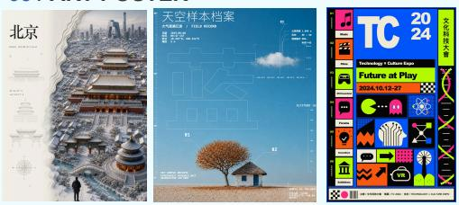
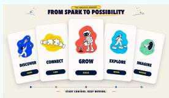
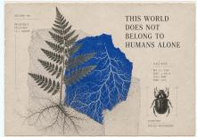
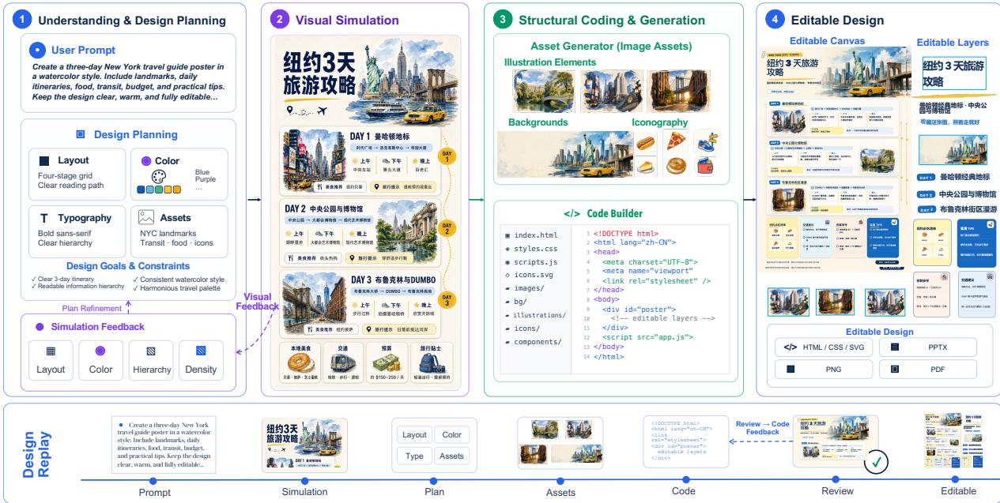
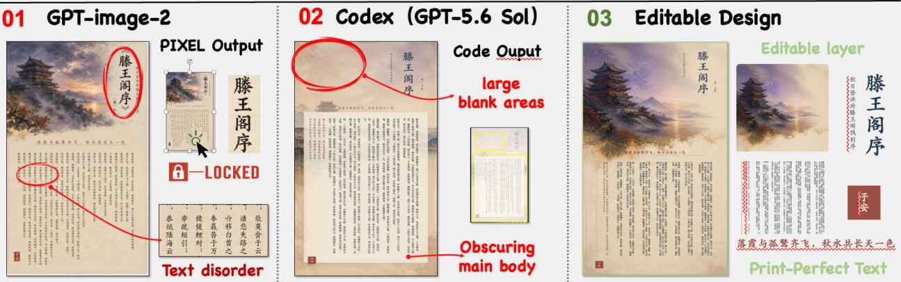
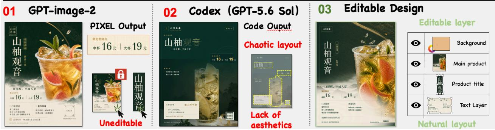
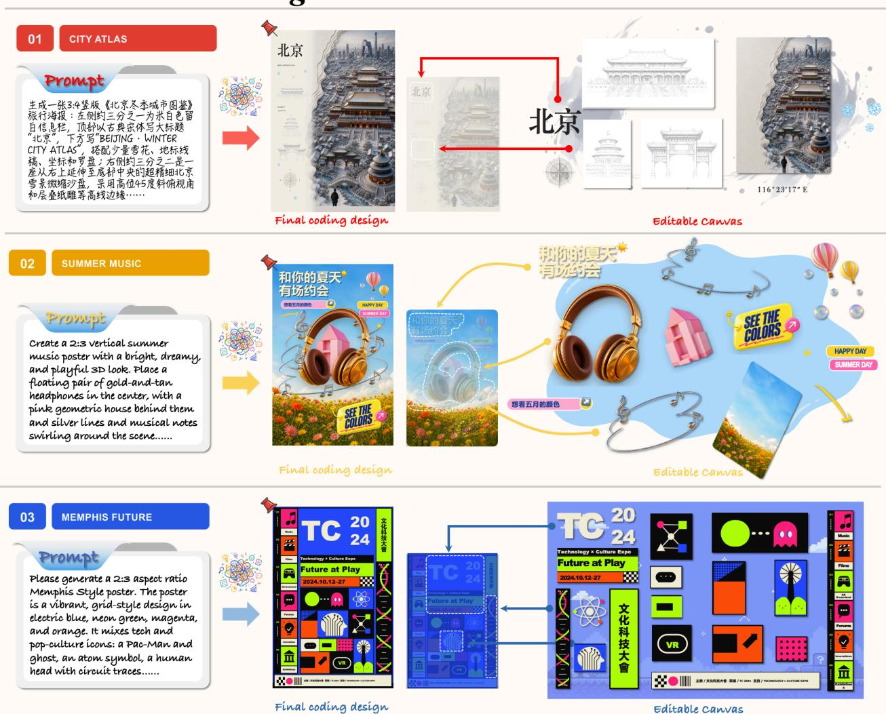
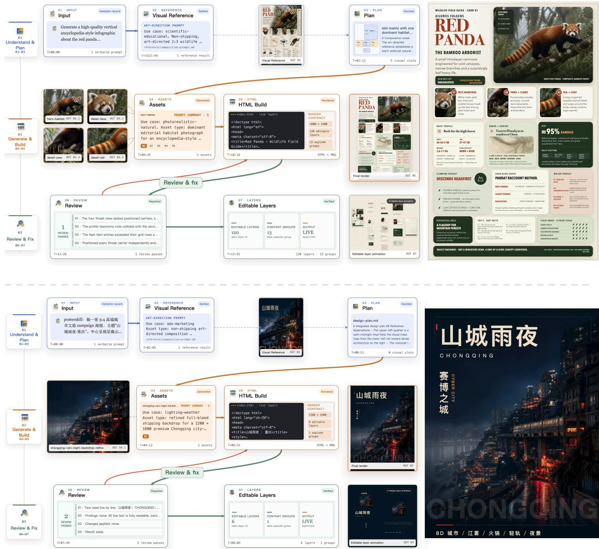

# Editable Visual Design

Junyan Ye1,2,∗, Wei Liu1,∗, Dongzhi Jiang4, Zichen Wen5, HaoDong Li4, Zhutao Lv2, Jiaxin Lin1, Jinhua Yu2, Jun He2, Zilong Huang2, Rui Chen1,†, Weijia Li3,†

1Tencent Hunyuan, 2Sun Yat-sen University

3Tsinghua University, 4The Chinese University of Hong Kong, 5Shanghai Jiao Tong University

While difusion base models such as GPT-Image-2 and Nano-Banana exhibit remarkable visual expressiveness, their end-to-end generation inherently yields flattened bitmaps with error-prone text, precluding layer-wise post-editing. Conversely, code-based visual generation via Coding Agents provides precise layout control and decoupled layers, yet remains constrained by a lack of global aesthetic intuition and the dificulty of coding complex visual assets.

To address this, we propose Editable Visual Design, a new paradigm driven by a Coding Agent. We designate the VLM as the “creative brain” for requirement comprehension, task planning, and aesthetic judgment, while utilizing the image generation model as an on-demand “visual world simulator” to synthesize standalone visual assets. Operating under an “imagine first, then act” closed-loop workflow, the agent generates isolated assets, writes native HTML/CSS, and iteratively refines the design against visual rendering feedback.

Furthermore, Agent Design Replay faithfully reproduces the creative and reasoning trajectory akin to that of professional human designers. Ultimately, the system delivers editable artifacts with decoupled layers and real text, enabling users to perform intuitive mouse dragging and layout adjustments on a graphical user interface. Validations on posters, infographics, and other scenarios show that this paradigm successfully achieves both refined aesthetics and production-grade editability.

GitHub: https://github.com/yejy53/Editable-Design

## 01 / CAMPAIGNS

02 / LONG­TEXT DESIGN  

03 / ART POSTER  
04 / INFOGRAPHIC  

  
Figure 1 | Editable design artifacts generated by our proposed Editable Visual Design.

## 1 Introduction

In recent years, large language models have made breakthrough progress in code generation, and they show particularly large potential on Visual Design tasks. The latest generation of models, represented by GPT-5.6 Sol [27], Claude Fable 5 [1], and Kimi K3 [22], can already build structurally complete and clearly organized layouts automatically by directly generating HTML, SVG, and CSS. This way of constructing designs through code brings engineering advantages, including clean layers, interactive text, and natural support for later modification, and it opens up a great deal of room for automated poster design and infographic generation.

However, when visual code generation tries to move toward “production-grade design”, it runs into two bottlenecks that are very hard to break through: aesthetic intuition and assets. First, current code LLMs badly lack global visual control. They are fluent in syntax, the DOM tree, and Flexbox layout, but they have no two-dimensional spatial sense [13, 34, 41] or visual intuition [42]. Asking a model to write layout code directly usually yields only the highly templated, thin trio of “big headline, card, rounded shadow”. The model knows how to write code, but not how to write code that looks good, and it stru les to cross the a from “structurall correct” to “visuall refined”. Second, visual code is inherentl weak at building complex assets. HTML, SVG, and CSS are extremely good at precise typography and geometric alignment, but asking a model to hand-draw complex visual assets in pure code, such as a cinematic background, a 3D hero visual, natural textures, or an elaborate illustration, is very costly and the result feels stif. As a result, past code generation could often only use simple geometric color blocks, gradients, or emoji as placeholders, and the final product looks like an unfinished draft.

Looking across the field of visual generation today, existing research mainly follows two orthogonal paths, and each is lopsided. On one side is “left-brain” pure code generation: current Coding Agents are like a system with only a left brain, fluent in logic and structure, but because code is essentially a one-dimensional symbol sequence, these models badly lack two-dimensional spatial sense and aesthetic intuition. On the other side is “right-brain” visual content generation such as difusion models [32], which compress centuries of human artistic priors and can instantly produce images with top-tier composition, lighting, and texture. But they have a fatal structural weakness: they lack rigorous engineering logic. The raster images they generate not only contain misspelled and distorted text [3, 4], but also have deeply entangled elements that cannot be separated into editable layers [5, 17, 18], which makes them inherently unusable for text accuracy, local edits, and downstream delivery, so they cannot serve as a genuinely editable design engineering deliverable.

To break through the aesthetic bottleneck of code generation and the non-editability of pixel images, we present Editable Visual Design, a new paradigm for editable visual design driven by a Coding Agent. Inspired by the World Action Model (WAM) [36, 56], we s lit the s stem into a collaborative mechanism of a “creative brain” and a “visual world simulator”: a VLM acts as the creative brain, coordinating requirement understanding, design planning, code construction, and judgment of results; the image generation model acts as a visual simulator that can be called at any time to quickly turn abstract ideas into concrete visual efects.

The agent follows an “imagine first, then act” creative loop: it first calls the simulator to generate an imagined visual that establishes priors for composition, lighting, and color, and then independently handles asset generation, native HTML/CSS writing, and multiple rounds of render-and-reflect repair. We also introduce Agent Design Replay, which presents the agent’s full trajectory—from intent planning and asset generation to code reflection and repair—much like that of a human artist, so that the design process becomes fully visible, traceable, and reproducible.

What the system ultimately delivers are editable artifacts that have passed deterministic checks and visual review. Text, assets, and layout layers in the artifact are fully decoupled, so users can select, drag, edit, and export each of them independently. We validate the efectiveness of the paradigm on several typical design cases, including marketing materials, infographics, long-text layout, and event posters, and show design artifacts that combine high-quality aesthetics with full editability.

## 2 Coding-Agent-Driven Design Workflow

The Editable Visual Design paradigm builds a complete workflow from design requirement to editable code artifact through the collaboration of a multimodal large model (VLM) and an image generation model (Figure 2). The system consists of a VLM that handles requirement understanding, design planning, and layout decisions (the creative brain) and a generation model that is called on demand (the visual simulator). It has five steps: understanding and design planning, visual simulation, structural coding and generation, verification and visual self-healing, and editable design delivery. In the system reported here, the creative brain is Codex driven by GPT-5.6 Sol [27], and the visual simulator is GPT Image 2 [28], which produces both the imagined visual and the standalone assets.

  
Figure 2 | Overview of the Editable Visual Design workflow. A VLM plans the design, calls the image model for an imagined visual and for standalone assets, then writes native HTML/CSS/SVG and delivers an editable canvas. The band along the bottom is the Design Replay, the recorded trajectory from prompt to artifact.

## 2.1 Understanding and Design Planning

Before anything is generated, the agent reads the brief and settles what the piece has to do: what content must appear, what the deliverable is and at what size, and what visual register it should sit in. It then calls the image model for an imagined visual—not a structural sketch but a picture of what the finished piece could look like, there to give the rest of the process a strong aesthetic reference to work against. This imagined visual is part of the design plan rather than a step before it, since the plan is only settled once there is something to look at; it is also the cheapest place for the user to intervene, saying the direction is not what they wanted and having it redone before any code exists.

## 2.2 Visual Simulation

In the visual simulation stage, the VLM visually parses the imagined visual, extracting the color tone, compositional distribution, and overall style characteristics to serve as a global reference for the code construction and visual design that follow. We do not need the agent to reproduce the visual reference one-to-one; still, the result obtained from the image model gives reasonably good feedback to the coding agent’s later stage of concrete design execution, improving its aesthetics and sense of design. The role is the same kind of thing as rendering: the agent can run its own code in a browser and look at the page it just wrote, and it can equally call the image model and look at a version of the design that has not been written yet. Both hand it pixels to judge; one shows what the code currently is, the other what the design could be.

## 2.3 Structural Coding and Generation

Once the visual prior is established, the Coding Agent takes on the core responsibility of composition and layout planning. The agent first uses the visual prior to determine the visual topology of the canvas and the spatial distribution of images and text, and calls the generation model on demand to produce clean, standalone local visual assets, such as a text-free background or an isolated subject, which avoids layer entanglement and pixel contamination. The agent then writes structured code in native HTML/CSS, establishing a clear typographic hierarchy, grid alignment, and multi-layer arrangement, and combines the decoupled visual assets with the real text into a complete, well-layered page.

In practice the standalone assets are generated separately, layer by layer, rather than cut out of the imagined visual, so none of its pixels reach the deliverable. Two routes are used depending on the subject: where the model supports it, the asset is requested directly with an alpha channel; otherwise the prompt places the subject on a flat green background and a matting script lifts it out, which works as long as the subject itself contains no green. On the code side the agent writes native HTML and CSS, declares the page as a canvas of fixed pixel size, and tags every element a user might want to move on its own as a separate layer. Layout is not allowed to depend on the viewport, so the page measures the same wherever it is opened, which is what makes the coordinates a user drags meaningful.

## 2.4 Verification and Visual Self-Healing

To handle flaws that the first pass of generated code may contain, such as style overflow, overlapping elements, or occlusion between images and text, the workflow introduces a dual verification and iterative self-healing mechanism. The system first loads the code in a headless browser environment and runs deterministic layout rule checks, detecting whether elements overflow their size bounds, whether external resources fail to load, or whether the DOM structure is malformed. The system then feeds an actual rendered screenshot of the page to a VLM reviewer for multimodal visual reflection [20, 50, 51]. The VLM compares the rendered result against the original design intent and assesses the visual balance, alignment precision, and text readability of the page. When a flaw is found, the agent generates a targeted local patch to fine-tune the code, so that after one or two rounds of reflection and repair the final render reaches the expected quality standard.

## 2.5 Editable Design and Agent Design Replay

What this workflow finally delivers is a complete result that is both usable in engineering terms and transparent in process. The artifact itself is made of native DOM nodes, fully decoupling text, assets, and background layers, so the user can at any time double-click to edit text directly, drag and scale assets, and export layers separately. At the same time, the system serializes the agent’s full decision process, from requirement decomposition, visual imagination, and asset prompts to code evolution and final reflective repair, into an Agent Design Replay. This design trajectory not only moves the com lex eneration rocess awa from the traditional uninter retable black box [55], but also ives users a clear basis for tracing design intent, intervening manually, and making further adjustments.

## 3 Case Studies and Showcase

To validate how the Editable Visual Design paradigm performs in practice, we analyze it along three dimensions: baseline comparison, coverage of multiple scenarios, and the creative trajectory.

## 3.1 Comparative Analysis

Figure 3 compares Editable Visual Design with conventional “pure difusion image generation” and “pure LLM code layout” under the same design requirement. The figure shows that although pure difusion models produce good visual quality, their generated text is prone to distortion and their layers are deeply entangled [3, 18], making later editing dificult; conventional pure code generation is structurally tidy, but because it lacks a global aesthetic prior, the artifact often looks flat and monotonous. By contrast, Editable Visual Design obtains good color and atmosphere from the image simulator while achieving clear typography and layer decoupling through code reconstruction, striking a good balance between visual quality and engineering editability.

## 3.2 Diverse Scenario Showcase

Figure 4 collects cases of this workflow across diferent design types, covering event posters, infographics, marketing materials, and long-text layout. The cases show that the paradigm adapts to diferent information densities and style requirements: in information-dense cases it maintains the type scale and grid alignment, and in visually driven cases it organizes multi-layer space sensibly. All artifacts are delivered as native DOM, and text, background, and illustration can each be selected, edited, and exported independently in the interactive view.

## 3.3 Real-World Case Study of the Agent Design Replay Trajectory

Fi ure 5 uses a real red anda enc clo edia info ra hic to show the full creative trajector of Agent Design Replay. The agent starts by parsing the requirement and generating an imagined visual, then independently settles the layout plan, generates standalone local assets on demand, and writes native HTML/CSS to build the multiple layers; it then observes the render and reflectively repairs layout details, finally delivering a finished piece with a clear layer structure. This case shows concretely how the agent gradually turns an initial idea into a design artifact that has both visual expressiveness and structured code, presenting full decision transparency and traceability.

B / Design a 3:4 vertical New Chinese light-luxury tea-launch poster in dark green, off-white...  
  
Figure 3 | Comparison against two paradigms under the same brief. GPT-image-2 [28] returns a locked bitmap whose Chinese characters come out disordered; Codex on GPT-5.6 Sol [27] returns code but leaves large blank areas and a chaotic layout. Editable Visual Design keeps the typography print-clean and delivers the page as separable layers. Red marks the failure modes, green what layering adds.

## 4 Conclusion and Discussion

## 4.1 Conclusion

This re ort ex lores Editable Visual Design, an attem t at editable desi n that combines a Codin A ent with visual generation models. Through the collaborative mechanism of “VLM decision planning + generation model visual simulation”, it tries to ease the weakness of pure code generation in aesthetic intuition and to improve on the non-layerable pixels and hard-to-edit text of conventional image generation. Under this design, the agent tries to “first use image simulation for composition and color, then carry out structured code construction”, and uses Agent Design Replay to record the creative process from intent planning and asset generation to code adjustment. The editable artifacts it finally delivers have decoupled layers and editable text, ofering a practical reference for exploring automated visual design that balances visual quality with maintainability.

## 4.2 Discussion

Revisiting “Generation for Understanding”: from mathematical and logical problem solving to forming visual ideas. For a long time, when unified multimodal models (UMMs) [7] explored “Generation for Understanding” [46], they mostly focused on tasks with strong symbolic logic and linear reasoning, such as drawing geometric auxiliary lines or spatial mazes [24, 29], but the gains from these attempts have often been relatively limited [33]. The reason may be that rigorous deductive reasoning tasks are inherently a poor fit for the implicit feedback mechanism of generative models. A vivid analogy is this: people can hardly solve a rigorous math problem inside a dream, yet dreams are often a source of visual inspiration, imagery, and creative ideas. Generative techniques such as difusion models are good at presenting spatial aesthetics, color atmosphere, and compositional references that are hard to quantify in one-dimensional plain text. Our exploration suggests that placing the generation model up front as a visual simulator, letting the agent perceive the overall efect through an image before writing code, may be a relatively natural way for generation to feed back into multimodal understanding and decision-making: using visual generation to obtain aesthetic and compositional priors, and thereby assisting the subsequent code layout and arrangement decisions to some extent.

  
Figure 4 | From prompt to editable canvas. Three briefs in diferent visual registers—City Atlas, Summer Music, and Memphis Future—each shown as the prompt, the coded result, and the same artifact opened up. The right-hand panels carry the point: headline lettering, illustrations, badges, and background all stay independently addressable.

Division of labor and collaboration for generation models: a tool that assists the decision brain. From GenClaw [55] and Mind-Brush [15] through to the work in this report, we see, to some degree, a natural division of labor among diferent models. Treating the generation model as an external simulator and local asset renderer that the agent can call at any time is a relatively pragmatic and eficient combination. Under this division of labor, requirement decomposition, task planning, code organization, and quality checking are mainly led by a VLM with general reasoning ability, while the generation model quickly turns abstract ideas into concrete visuals as needed. This kind of collaboration helps bring out the visual expressiveness of the generation model while using code to achieve more precise structural control.

Exploring the move from “bitmap output” to “structured delivery”. In real design and application settings, a design deliverable usually needs to be reasonably maintainable and to leave room for adjustment. Conventional text-to-image models produce rich visual quality, but because pixels are deeply entangled [18] and text is error-prone [3], later fine-tuning is fairly dificult. Editable Visual Design tries to organize the page with native HTML/CSS and decoupled assets, so that text, background, and graphic layers stay relatively independent and users can select, modify, and export them afterwards. This ofers a workable direction for exploring forms of design generation that balance visual expressiveness with deterministic editability.

Agent Design Replay and process visibility: thoughts on human-AI collaboration and future design interaction. Compared with the earlier black-box mode that directly outputs a final result, this report uses Agent Design Replay to record and present the agent’s process from requirement understanding, concept simulation, and asset generation to code adjustment, which helps improve the transparency and traceability of the design decision chain. This process visibility not only helps build understanding and trust in human-AI collaboration (Human-in-the-Loop), but also ofers a useful reference for further exploring more natural forms of design interaction in the future, such as an AI operating a mouse through a GUI to lay out and draw directly on a canvas.

  
Figure 5 | Agent Design Replay on two real cases. Each step carries a timestamp and its own output, across three phases: understand and plan, generate and build, and review andfix. Top: an information-dense field guide—120 editable layers in 13 groups—where the review catches and repairs real layout defects. Bottom: a visually driven travel poster—6 layers in 1 group—where the review passes with no changes. Layer structure follows the density of the brief.

## 5 Limitations

Editable Visual Design does not create ability the underlying models lack; what it does is route each part of the job to whichever model is better suited to it, so what ets delivered is bounded b both. If the codin a ent writes weaker layout code, the page is weaker however good the reference was. More often the binding constraint is the image model’s sense of design: it returns something technically clean but compositionally ordinary, with no clear focal point and no colour idea worth carr in forward, and a reference like that ives the a ent little to build on. The asset route makes its own demand, needin the model to return a subject cleanl se arated from its back round.

Longer pieces are harder than single ones. A multi-page deck or a full website has to stay consistent across pages—the same type scale, the same palette, a visual thread that carries from one page to the next—and that consistency has to be held while the agent works through something far longer than a poster. The cases in this report are all single-page designs, and how far the approach scales at that length depends heavily on the capability of the underlying models.

Aesthetic quality is hard to evaluate in the way generation quality usually is. There is no ground truth for what a poster should look like, and the properties this work is after—whether a composition feels considered, whether the colour carries atmosphere, whether the type scale reads as deliberate—are exactly the ones people disagree about. We therefore report cases rather than scores, and the visual half of the quality check is a VLM judgment that stands in for a designer’s eye rather than measuring anything.

Editability is likewise easier to assert than to measure. Layer counts and DOM structure can be reported, but what matters is whether a designer who opens the file can get it to do what they want, and that does not reduce to a number.

## 6 Related Work

## 6.1 Visual Code Generation and LLMs

The lea in visual code eneration abilit is reflected most directl in the latest eneration of frontier lar e models. Models such as GPT-5.6 Sol [27], Claude Fable 5 [1], and Kimi K3 [22] can alread build interactive interfaces and structured la outs directl from natural lan ua e instructions. Around this abilit , the research communit has established a series of benchmarks and methods: from the earl Desi n2Code [34], WebSi ht [23], and Web2Code [57], to Interaction2Code [43] and Desi nBench [44], which cover multi le interactions and com lex frameworks. To im rove la out fidelit , LaTCoder [13] ro oses La out-as-Thou ht for block-wise eneration, UICo ilot [12] and LayoutCoder [41] use DOM hierarchy and layout priors to guide generation, and UI2CodeN [50] models generation as a closed loop of “execute, visually inspect, iteratively refine”. Beyond general web pages, vector and structured design has also advanced quickly: StarVector [31] and OmniSVG [49] model SVG as code sequence generation, InternSVG [35] connects SVG understanding and generation, AutoPresent [10] and PPTAgent [61] build presentations through code actions, and ChartMimic [47] and ChartCoder [60] focus on chart code generation. These works establish the advantage of visual code as an editable, verifiable deliverable. However, the optimization objectives of existing methods generally center on syntactic compliance and layout fidelity [42]; limited by the bottleneck of pure code in expressing complex visual texture, high-quality backgrounds, natural textures, or elaborate illustrations are hard to hand-draw directly in code and often degenerate into simple color blocks or gradients used as placeholders. Editable Visual Design builds on this code generation ability and focuses on making up for its shortcomings in global aesthetic control and complex asset generation.

## 6.2 Image Generation and Computational Design

Com lementar to the code route is the ima e eneration route based on difusion models. Latent Difusion [32] established the basic paradigm of high-quality text-to-image generation, and foundation models such as BAGEL [7], Qwen-Image [40], and Emu3.5 [6] have further improved generation quality and text rendering ability [52]. One branch of this line focuses on photorealism: Z-Image [58] achieves photorealistic generation and bilingual Chinese–English text rendering with an eficient architecture, and RealGen [54] uses synthetic image detectors [14, 21, 26, 38, 53] as a reward signal to suppress artifacts in generated images. For visual design tasks such as posters and infographics, frontier systems such as GPT Image 1/2 [28, 45], Nano Banana 2 [11], and Seedream 5.0 Pro [2] have achieved marked improvements in high-density text rendering and layer separation, and the open-source SenseNova-U1 [8] also supports text-dense infographic generation and editing. On the research side, TextDifuser [3] improves in-image text rendering through explicit layout, COLE [18] and OpenCOLE [17] decompose graphic design into hierarchical subtasks, Graphist [5] outputs structured information containing coordinates and layer order, and PosterCraft [4] optimizes poster aesthetics and text accuracy through a unified framework and reinforcement learning. These works demonstrate the strong potential of image models in composition and aesthetic quality. However, what such methods produce is still essentially a raster image, which has inherent limitations in rigorous long-text layout, local text modification, and downstream engineering maintenance. Editable Visual Design does not take the generated raster image as the final deliverable; instead, it draws on the aesthetic and compositional priors accumulated in this line of work, together with its local asset rendering ability, as upstream input that feeds the subsequent structured code construction.

## 6.3 Agentic and Reasoning-driven Design Generation

Visual generation is gradually moving from a single-step black-box mode toward an agentic paradigm of “reason and plan first, then generate and execute”. Early work such as Visual ChatGPT [39] and GenArtist [37] explored multimodal tool scheduling and plan verification, Idea2Img [51] refines through sketch generation and reflective iteration, and RPG [48] uses a multimodal model for global region planning. Subsequently, GoT [9] proposed the Generation Chain-of-Thought, T2I-R1 [19] introduced a two-level chain of thought coordinated with reinforcement learning, Uni-CoT [29] explored unified multimodal reasoning, Mind-Brush [15] deeply fuses thinking, retrieval, and creation, and SCOPE [30], GEMS [16], and Qwen-Image-Agent [59] further enrich planning, search, and context feedback mechanisms. The direct predecessor GenClaw [55] pointed out the limitation of conventional agents that over-rely on producing the final image end-to-end, and proposed a code-driven generation paradigm that treats code as a controllable intermediate canvas (code → image); a parallel line extends this idea beyond still images, where VideoCoCo [25] uses an executable program as a process-level chain of thought that keeps the generation process inspectable and controllable. Editable Visual Design continues the core idea of agent collaboration and division of labor, and further evolves the technical route into one that uses image generation as intermediate assets and as an up-front simulator, with code as the final engineering deliverable (image → code), pushing visual design from a single raster image toward a layer-decoupled, fully editable structured artifact.

## References

[1] Anthropic. Claude fable 5 and claude mythos 5. https://www.anthropic.com/news/claude-fable-5-myt hos-5, 2026. Announced 9 June 2026; API model ID claude-fable-5. Accessed: 2026-08-27.

[2] ByteDance Seed. Seedream 5.0 pro. https://seed.bytedance.com/en/blog/beyond-generation-it-u nderstands-design-introducing-seedream-5-0-pro, 2026. Announced 8 July 2026. Multimodal image model o timized for hi h-densit info ra hics, osters, and la er-se arated editable out ut. Accessed: 2026-08-27.

[3] Jingye Chen, Yupan Huang, Tengchao Lv, Lei Cui, Qifeng Chen, and Furu Wei. Textdifuser: Difusion models as text painters. In Advances in Neural Information Processing Systems (NeurIPS), 2023.

[4] Sixiang Chen, Jianyu Lai, Jialin Gao, Tian Ye, Haoyu Chen, Hengyu Shi, Shitong Shao, Yunlong Lin, Song Fei, Zhaohu Xing, Yeying Jin, Junfeng Luo, Xiaoming Wei, and Lei Zhu. Postercraft: Rethinking high-quality aesthetic poster generation in a unified framework. arXiv preprint arXiv:2506.10741, 2025.

[5] Yutao Cheng, Zhao Zhang, Maoke Yang, Hui Nie, Chunyuan Li, Xinglong Wu, and Jie Shao. Graphic design with large multimodal model. arXiv preprint arXiv:2404.14368, 2024.

[6] Yufeng Cui, Honghao Chen, Haoge Deng, Xu Huang, Xinghang Li, Jirong Liu, Yang Liu, Zhuoyan Luo, Jinsheng Wang, Wenxuan Wang, Yueze Wang, Chengyuan Wang, Fan Zhang, Yingli Zhao, Ting Pan, Xianduo Li, Zecheng Hao, Wenxuan Ma, Zhuo Chen, Yulong Ao, Tiejun Huang, Zhongyuan Wang, and Xinlong Wang. Emu3.5: Native multimodal models are world learners. arXiv preprint arXiv:2510.26583, 2025.

[7] Chaorui Deng, Deyao Zhu, Kunchang Li, Chenhui Gou, Feng Li, Zeyu Wang, Shu Zhong, Weihao Yu, Xiaonan Nie, Ziang Song, Guang Shi, and Haoqi Fan. Emerging properties in unified multimodal pretraining. arXiv preprint arXiv:2505.14683 2025.

[8] Haiwen Diao, Penghao Wu, Hanming Deng, Jiahao Wang, Shihao Bai, Silei Wu, Weichen Fan, Wenjie Ye, Wenwen Tong, Xiangyu Fan, Yan Li, Yubo Wang, Zhijie Cao, Zhiqian Lin, Zhitao Yang, Zhongang Cai, Yuwei Niu, Yue Zhu, Bo Liu, Chengguang Lv, Haojia Yu, Haozhe Xie, Hongli Wang, Jianan Fan, Jiaqi Li, Jiefan Lu, Jingcheng Ni, Junxiang Xu, Kaihuan Liang, Lianqiang Shi, Linjun Dai, Linyan Wang, Oscar Qian, Peng Gao, Pengfei Liu, Qin in Sun, Rui Shen, Ruisi Wan , Shen nan Ma, Shuan Yan , Si i Xie, Si in Li, Tianbo Zhon , Xian li Kong, Xuanke Shi, Yang Gao, Yongqiang Yao, Yves Wang, Zhengqi Bai, Zhengyu Lin, Zixin Yin, Wenxiu Sun, Ruihao Gong, Quan Wang, Lewei Lu, Lei Yang, Ziwei Liu, and Dahua Lin. Sensenova-u1: Unifying multimodal understanding and generation with neo-unify architecture. arXiv preprint arXiv:2605.12500, 2026.

[9] Rongyao Fang, Chengqi Duan, Kun Wang, Linjiang Huang, Hao Li, Shilin Yan, Hao Tian, Xingyu Zeng, Rui Zhao, Jifeng Dai, Xihui Liu, and Hongsheng Li. Got: Unleashing reasoning capability of multimodal large language model for visual generation and editing. In Advances in Neural Information Processing Systems (NeurIPS), 2025.

[10] Jiaxin Ge, Zora Zhiruo Wang, Xuhui Zhou, Yi-Hao Peng, Sanjay Subramanian, Qinyue Tan, Maarten Sap, Alane Suhr, Daniel Fried, Graham Neubig, and Trevor Darrell. Autopresent: Designing structured visuals from scratch. In IEEE/CVF Conference on Computer Vision and Pattern Recognition (CVPR), 2025.

[11] Google DeepMind. Nano banana 2 (gemini 3.1 flash image). https://blog.google/innovation-and-ai/te chnology/developers-tools/build-with-nano-banana-2/, 2026. Announced 26 February 2026. Image generation with world-knowledge-grounded infographics, diagrams and text rendering. Accessed: 2026-08-27.

[12] Yi Gui, Zhen Li, Zhongyi Zhang, Yao Wan, Dongping Chen, Hongyu Zhang, Yi Su, Bohua Chen, Xing Zhou, Wenbin Jiang, and Xiangliang Zhang. Uicopilot: Automating ui synthesis via hierarchical code generation from webpage designs. arXiv preprint arXiv:2505.09904, 2025.

[13] Yi Gui, Zhen Li, Zhongyi Zhang, Guohao Wang, Tianpeng Lv, Gaoyang Jiang, Yi Liu, Dongping Chen, Yao Wan, Hon u Zhan , Wenbin Jian , Xuanhua Shi, and Hai Jin. Latcoder: Convertin web a e desi n to code with layout-as-thought. arXiv preprint arXiv:2508.03560, 2025.

[14] Yuncheng Guo, Junyan Ye, Chenjue Zhang, Hengrui Kang, Haohuan Fu, Conghui He, and Weijia Li. Omniaid: Decoupling semantic and artifacts for universal ai-generated image detection in the wild. In International Conference on Machine Learning (ICML), 2026.

[15] Jun He, Jun an Ye, Zilong Huang, Dongzhi Jiang, Chenjue Zhang, Leqi Zhu, Renrui Zhang, Xiang Zhang, and Weijia Li. Mind-brush: Integrating agentic cognitive search and reasoning into image generation. arXiv preprint arXiv:2602.01756, 2026.

[16] Zefeng He, Siyuan Huang, Xiaoye Qu, Yafu Li, Tong Zhu, Yu Cheng, and Yang Yang. Gems: Agent-native multimodal generation with memory and skills. arXiv preprint arXiv:2603.28088, 2026.

[17] Naoto Inoue, Kento Masui, Wataru Shimoda, and Kota Yamaguchi. Opencole: Towards reproducible automatic graphic design generation. arXiv preprint arXiv:2406.08232, 2024.

[18] Peidong Jia, Chenxuan Li, Yuhui Yuan, Zeyu Liu, Yichao Shen, Bohan Chen, Xingru Chen, Yinglin Zheng, Dong Chen, Ji Li, Xiaodong Xie, Shanghang Zhang, and Baining Guo. Cole: A hierarchical generation framework for multi-layered and editable graphic design. arXiv preprint arXiv:2311.16974, 2023.

[19] Dongzhi Jiang, Ziyu Guo, Renrui Zhang, Zhuofan Zong, Hao Li, Le Zhuo, Shilin Yan, Pheng-Ann Heng, and Hongsheng Li. T2i-r1: Reinforcing image generation with collaborative semantic-level and token-level cot. In Advances in Neural Information Processing Systems (NeurIPS), 2025.

[20] Dongzhi Jiang, Renrui Zhang, Haodong Li, Zhuofan Zong, Ziyu Guo, Jun He, Claire Guo, Junyan Ye, Rongyao Fang, Weijia Li, Rui Liu, and Hongsheng Li. Draco: Draft as cot for text-to-image preview and rare concept generation. arXiv preprint arXiv:2512.05112, 2025.

[21] Hengrui Kang, Siwei Wen, Zichen Wen, Junyan Ye, Weijia Li, Peilin Feng, Baichuan Zhou, Bin Wang, Dahua Lin, Linfeng Zhang, and Conghui He. Legion: Learning to ground and explain for synthetic image detection. In IEEE/CVF International Conference on Computer Vision (ICCV), pages 18937–18947, 2025.

[22] Kimi Team. Kimi k3: Open frontier intelligence. arXiv preprint arXiv:2607.24653, 2026. Corporate authorship as printed on the paper’s title page; not a truncated author list.

[23] Hugo Laurençon, Léo Tronchon, and Victor Sanh. Unlocking the conversion of web screenshots into html code with the websight dataset. arXiv preprint arXiv:2403.09029, 2024.

[24] Ang Li, Charles Wang, Deqing Fu, Kaiyu Yue, Zikui Cai, Wang Bill Zhu, Ollie Liu, Peng Guo, Willie Neiswanger, Furong Huang, Tom Goldstein, and Micah Goldblum. Zebra-cot: A dataset for interleaved vision-language reasoning. In International Conference on Learning Representations (ICLR), 2026.

[25] Haodong Li, Tianfei Ren, Xiaoxiao Ma, Chunmei Qing, Zhen Fang, Sipeng He, Ziyu Guo, Haoyu Wu, Juanxi Tian, Yihang Zou, Ruichuan An, Dongzhi Jiang, Boxue Yang, Ji Xie, Xu Huang, Wenhao Yan, Jialv Zou, Zhengrong Yue, Yaxin Luo, Xiaotong Li, Yuzhu Wang, Junyan Ye, Jinjing Zhao, Zehui Chen, Lin Chen, Renye Yan, Feng Zhao, and Pheng-Ann Heng. Videococo: Code-as-cot for physically-consistent video generation via an agentic dual-engine system. arXiv preprint arXiv:2607.27380, 2026.

[26] Kaiqing Lin, Zhiyuan Yan, Ruoxin Chen, Junyan Ye, Ke-Yue Zhang, Yue Zhou, Peng Jin, Bin Li, Taiping Yao, and Shouhong Ding. Seeing before reasoning: A unified framework for generalizable and explainable fake image detection. arXiv preprint arXiv:2509.25502, 2025.

[27] OpenAI. GPT-5.6: Frontier intelligence that scales with your ambition. https://openai.com/index/gpt-5-6/, 2026. Published 9 July 2026. GPT-5.6 family: Sol (flagship), Terra, Luna. Accessed: 2026-08-27.

[28] OpenAI. Gpt image 2. https://openai.com/index/introducing-chatgpt-images-2-0/, 2026. Announced 21 April 2026 as the model behind ChatGPT Images 2.0 (model ID gpt-image-2, snapshot gpt-image-2-2026-04-21). Major gains in instruction following, dense text rendering and multilingual generation, targeting infographics and production design assets. Accessed: 2026-08-27.

[29] Luozheng Qin, Jia Gong, Yuqing Sun, Tianjiao Li, Haoyu Pan, Mengping Yang, Xiaomeng Yang, Chao Qu, Zhiyu Tan, and Hao Li. Uni-cot: Towards unified chain-of-thought reasoning across text and vision. In International Conference on Learning Representations (ICLR), 2026.

[30] Tianfei Ren, Zhipeng Yan, Yiming Zhao, Zhen Fang, Yu Zeng, Guohui Zhang, Hang Xu, Xiaoxiao Ma, Shiting Huang, Ke Xu, Wenxuan Huang, Lionel Z. Wang, Lin Chen, Zehui Chen, Jie Huang, and Feng Zhao. Scope: Structured decomposition and conditional skill orchestration for complex image generation. arXiv preprint arXiv:2605.08043, 2026.

[31] Juan A. Rodriguez, Abhay Puri, Shubham Agarwal, Issam H. Laradji, Pau Rodriguez, Sai Rajeswar, David Vazquez, Christopher Pal, and Marco Pedersoli. Starvector: Generating scalable vector graphics code from images and text. In IEEE/CVF Conference on Computer Vision and Pattern Recognition (CVPR), 2025.

[32] Robin Rombach, Andreas Blattmann, Dominik Lorenz, Patrick Esser, and Björn Ommer. High-resolution image synthesis with latent difusion models. In IEEE/CVF Conference on Computer Vision and Pattern Recognition (CVPR), pages 10684–10695, 2022.

[33] Weikang Shi, Aldrich Yu, Rongyao Fang, Houxing Ren, Ke Wang, Aojun Zhou, Changyao Tian, Xinyu Fu, Yuxuan Hu, Zimu Lu, Linjiang Huang, Si Liu, Rui Liu, and Hongsheng Li. Mathcanvas: Intrinsic visual chain-of-thought

for multimodal mathematical reasoning. In Proceedings of the 64th Annual Meeting of the Association for Computational Linguistics (Volume 1: Long Papers), pages 27933–27954, 2026.

[34] Chenglei Si, Yanzhe Zhang, Ryan Li, Zhengyuan Yang, Ruibo Liu, and Diyi Yang. Design2code: Benchmarking multimodal code generation for automated front-end engineering. arXiv preprint arXiv:2403.03163, 2024.

[35] Haomin Wang, Jinhui Yin, Qi Wei, Wenguang Zeng, Lixin Gu, Shenglong Ye, Zhangwei Gao, Yaohui Wang, Yanting Zhang, Yuanqi Li, Yanwen Guo, Wenhai Wang, Kai Chen, Yu Qiao, and Hongjie Zhang. Internsvg: Towards unified svg tasks with multimodal large language models. In International Conference on Learning Representations (ICLR), 2026.

[36] Siyin Wang, Junhao Shi, Zhaoyang Fu, Xinzhe He, Feihong Liu, Chenchen Yang, Yikang Zhou, Zhaoye Fei, Jingjing Gong, Jinlan Fu, Mike Zheng Shou, Xuanjing Huang, Xipeng Qiu, and Yu-Gang Jiang. World action models: The next frontier in embodied ai. arXiv preprint arXiv:2605.12090, 2026.

[37] Zhenyu Wang, Aoxue Li, Zhenguo Li, and Xihui Liu. Genartist: Multimodal llm as an agent for unified image generation and editing. In Advances in Neural Information Processing Systems (NeurIPS), 2024.

[38] Siwei Wen, Junyan Ye, Peilin Feng, Hengrui Kang, Zichen Wen, Yize Chen, Jiang Wu, Wenjun Wu, Conghui He, and Weijia Li. Spot the fake: Large multimodal model-based synthetic image detection with artifact explanation. In Advances in Neural Information Processing Systems (NeurIPS), 2025.

[39] Chenfei Wu, Shengming Yin, Weizhen Qi, Xiaodong Wang, Zecheng Tang, and Nan Duan. Visual chatgpt: Talking, drawing and editing with visual foundation models. arXiv preprint arXiv:2303.04671, 2023.

[40] Chenfei Wu, Jiahao Li, Jingren Zhou, Junyang Lin, Kaiyuan Gao, Kun Yan, Sheng-ming Yin, Shuai Bai, Xiao Xu, Yilei Chen, Yuxiang Chen, Zecheng Tang, Zekai Zhang, Zhengyi Wang, An Yang, Bowen Yu, Chen Cheng, Dayiheng Liu, Deqing Li, Hang Zhang, Hao Meng, Hu Wei, Jingyuan Ni, Kai Chen, Kuan Cao, Liang Peng, Lin Qu, Minggang Wu, Peng Wang, Shuting Yu, Tingkun Wen, Wensen Feng, Xiaoxiao Xu, Yi Wang, Yichang Zhang, Yongqiang Zhu, Yujia Wu, Yuxuan Cai, and Zenan Liu. Qwen-image technical report. arXiv preprint arXiv:2508.02324, 2025.

[41] Fan Wu, Cuiyun Gao, Shuqing Li, Xin-Cheng Wen, and Qing Liao. Mllm-based ui2code automation guided by ui layout information. arXiv preprint arXiv:2506.10376, 2025.

[42] Bang Xiao, Lingjie Jiang, Shaohan Huang, Tengchao Lv, Yupan Huang, Xun Wu, Lei Cui, and Furu Wei. Code aesthetics with agentic reward feedback. In International Conference on Learning Representations (ICLR), 2026.

[43] Jingyu Xiao, Yuxuan Wan, Yintong Huo, Zixin Wang, Xinyi Xu, Wenxuan Wang, Zhiyao Xu, Yuhang Wang, and Michael R. Lyu. Interaction2code: Benchmarking mllm-based interactive webpage code generation from interactive prototyping. In IEEE/ACM International Conference on Automated Software Engineering (ASE), 2025.

[44] Jingyu Xiao, Ming Wang, Man Ho Lam, Yuxuan Wan, Junliang Liu, Yintong Huo, and Michael R. Lyu. Designbench: A comprehensive benchmark for mllm-based front-end code generation. arXiv preprint arXiv:2506.06251, 2025.

[45] Zhiyuan Yan, Junyan Ye, Weijia Li, Zilong Huang, Shenghai Yuan, Xiangyang He, Kaiqing Lin, Jun He, Conghui He, and Li Yuan. Gpt-imgeval: A comprehensive benchmark for diagnosing gpt4o in image generation. arXiv preprint arXiv:2504.02782, 2025.

[46] Zhiyuan Yan, Kaiqing Lin, Zongjian Li, Junyan Ye, Hui Han, Haochen Wang, Zhendong Wang, Bin Lin, Hao Li, Xinyan Xiao, Jingdong Wang, Haifeng Wang, and Li Yuan. Unified multimodal models as auto-encoders. In IEEE/CVF Conference on Computer Vision and Pattern Recognition (CVPR), pages 41903–41912, 2026.

[47] Cheng Yang, Chufan Shi, Yaxin Liu, Bo Shui, Junjie Wang, Mohan Jing, Linran Xu, Xinyu Zhu, Siheng Li, Yuxiang Zhang, Gongye Liu, Xiaomei Nie, Deng Cai, and Yujiu Yang. Chartmimic: Evaluating lmm’s cross-modal reasoning capabilit via chart-to-code generation. In International Conference on Learning Representations (ICLR), 2025.

[48] Ling Yang, Zhaochen Yu, Chenlin Meng, Minkai Xu, Stefano Ermon, and Bin Cui. Mastering text-to-image difusion: Recaptioning, planning, and generating with multimodal llms. In International Conference on Machine Learning (ICML), 2024.

[49] Yiying Yang, Wei Cheng, Sijin Chen, Xianfang Zeng, Fukun Yin, Jiaxu Zhang, Liao Wang, Gang Yu, Xingjun Ma, and Yu-Gang Jiang. Omnisvg: A unified scalable vector graphics generation model. In Advances in Neural Information Processing Systems (NeurIPS), 2025.

[50] Zhen Yang, Wenyi Hong, Mingde Xu, Xinyue Fan, Weihan Wang, Jiale Cheng, Xiaotao Gu, and Jie Tang. Ui2coden: Ui-to-code generation as interactive visual optimization. arXiv preprint arXiv:2511.08195, 2025.

[51] Zhengyuan Yang, Jianfeng Wang, Linjie Li, Kevin Lin, Chung-Ching Lin, Zicheng Liu, and Lijuan Wang. Idea2img: Iterative self-refinement with gpt-4v(ision) for automatic image design and generation. In European Conference on Computer Vision (ECCV), 2024.

[52] Junyan Ye, Dongzhi Jiang, Zihao Wang, Leqi Zhu, Zhenghao Hu, Zilong Huang, Jun He, Zhiyuan Yan, Jinghua Yu, Hongsheng Li, Conghui He, and Weijia Li. Echo-4o: Harnessing the power of gpt-4o synthetic images for improved image generation. arXiv preprint arXiv:2508.09987, 2025.

[53] Junyan Ye, Baichuan Zhou, Zilong Huang, Junan Zhang, Tianyi Bai, Hengrui Kang, Jun He, Honglin Lin, Zihao Wang, Tong Wu, Zhizheng Wu, Yiping Chen, Dahua Lin, Conghui He, and Weijia Li. Loki: A comprehensive synthetic data detection benchmark using large multimodal models. In International Conference on Learning Representations (ICLR), 2025.

[54] Junyan Ye, Leqi Zhu, Yuncheng Guo, Dongzhi Jiang, Zilong Huang, Yifan Zhang, Zhiyuan Yan, Haohuan Fu, Conghui He, and Weijia Li. Realgen: Photorealistic text-to-image generation via detector-guided rewards. arXiv preprint arXiv:2512.00473, 2025.

[55] Junyan Ye, Jun He, Zilong Huang, Dongzhi Jiang, Xuan Yang, Rui Chen, and Weijia Li. Genclaw: Code-driven agentic image generation. arXiv preprint arXiv:2605.30248, 2026.

[56] Tianyuan Yuan, Zibin Dong, Yicheng Liu, and Hang Zhao. Fast-wam: Do world action models need test-time future imagination? arXiv preprint arXiv:2603.16666, 2026.

[57] Sukmin Yun, Haokun Lin, Rusiru Thushara, Mohammad Qazim Bhat, Yongxin Wang, Zutao Jiang, Mingkai Deng, Jinhong Wang, Tianhua Tao, Junbo Li, Haonan Li, Preslav Nakov, Timothy Baldwin, Zhengzhong Liu, Eric P. Xing, Xiaodan Liang, and Zhiqiang Shen. Web2code: A large-scale webpage-to-code dataset and evaluation framework for multimodal llms. In Advances in Neural Information Processing Systems (NeurIPS) Datasets and Benchmarks Track, 2024.

[58] Z-Image Team. Z-image: An eficient image generation foundation model with single-stream difusion transformer. arXiv preprint arXiv:2511.22699, 2025.

[59] Zekai Zhang, Jiahao Li, Jie Zhang, Kaiyuan Gao, Kun Yan, Lihan Jiang, Ningyuan Tang, Shengming Yin, Tianhe Wu, Xiaoyue Chen, Xiao Xu, Yan Shu, Yanran Zhang, Yixian Xu, Yuxiang Chen, Zhendong Wang, Zihao Liu, Zikai Zhou, Huishuai Zhang, Dongyan Zhao, and Chenfei Wu. Qwen-image-agent: Bridging the context gap in real-world image generation. arXiv preprint arXiv:2606.26907, 2026.

[60] Xuanle Zhao, Xianzhen Luo, Qi Shi, Chi Chen, Shuo Wang, Zhiyuan Liu, and Maosong Sun. Chartcoder: Advancing multimodal large language model for chart-to-code generation. In Proceedings of the 63rd Annual Meeting ofthe Associationfor Computational Linguistics (Volume 1: Long Papers), pages 7333–7348, 2025.

[61] Hao Zheng, Xinyan Guan, Hao Kong, Jia Zheng, Weixiang Zhou, Hongyu Lin, Yaojie Lu, Ben He, Xianpei Han, and Le Sun. Pptagent: Generating and evaluating presentations beyond text-to-slides. In Proceedings of EMNLP, 2025.