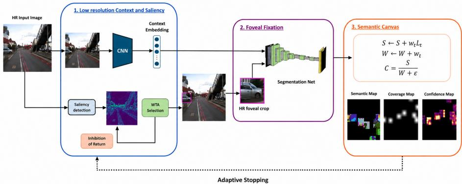
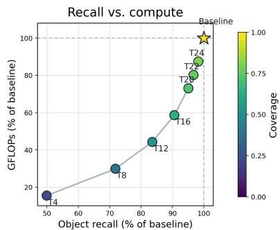
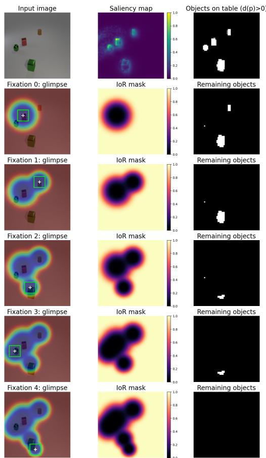
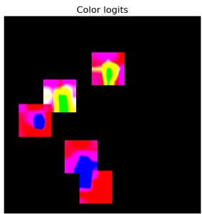
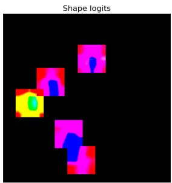
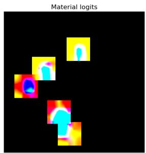
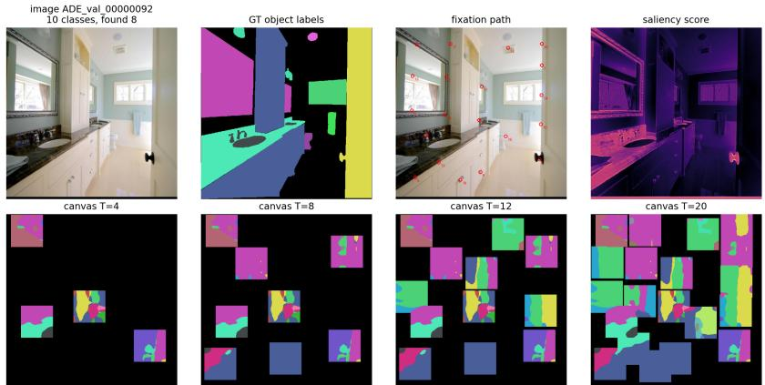

# Eficient Semantic Understanding from Digital Foveation

Caterina Caccavella1,2, Vittorio Fra1,3, Andreas Ziegler4, Giulia D’Angelo5, and Yulia Sandamirskaya1

1 Zurich University of Applied Sciences (ZHAW), Wädenswil, Switzerland

2 ETH Zürich, Zürich, Switzerland

3 Politecnico di Torino, Turin, Italy

University of Tübingen, Tübingen, Germany

Czech Technical University, Prague, Czech Republic

Abstract. Dense semantic segmentation allocates computational resource uniformly across the entire image, regardless of scene complexity or task relevance. Inspired by biological vision, we investigate whether semantic understanding can be achieved more eficiently through digital foveated perception. We introduce a lightweight active-vision pipeline that combines saliency-driven fixation selection, high-resolution foveal observations, low-resolution contextual information, semantic accumulation, and adaptive computation. Beyond conventional dense prediction metrics, we use object-level evaluation to measure semantic understanding under sparse observations. On ADE20K-Object, a single foveated observation achieves 95.9% of the baseline Top-1 accuracy and 96.9% of the baseline Top-3 accuracy while requiring only 4.7% of the computational cost. At the scene level, semantic accumulation recovers 90.6% of the baseline object recall while using 58.6% of the computation. These results suggest that substantial semantic understanding can emerge from sparse observations when computation is allocated selectively, highlighting active vision as an eficient alternative to uniform dense processing and motivating evaluation protocols beyond conventional pixel-wise segmentation metrics.

Keywords: Active Vision · Foveated Vision · Semantic Segmentation · Computational Eficiency

## 1 Introduction

Humans extract useful semantic information while processing only a fraction of the available visual input [21]. Human vision achieves this through selective allocation of computational resources across space and time, most notably through visual attention and foveation, where high-resolution information is acquired only at selected locations while the visual periphery provides coarse contextual information [7,14,19]. The process of directing relevant scene regions to the fovea through eye movements is known as foveation [19], and can be approximated in artificial systems through digital foveation, where high-resolution processing is restricted to selected regions of the visual field [20].

Modern computer vision systems typically process images densely and uniformly, regardless of the scene structure or task requirements [11]. While this strategy has enabled remarkable advances in recognition, detection, and segmentation, it also leads to rapidly increasing computational and energy requirements as image resolutions and model capacities continue to grow [26]. This trend is largely motivated by conventional imaging sensors, which provide dense images at a fixed spatial resolution [27], and by the eficiency of highly parallel GPU computation on dense tensors [23]. However, these assumptions become restrictive in robotics, autonomous systems, and embedded applications operating under strict resource constraints [4].

This observation raises a fundamental twofold question: how much semantic information is actually required to understand a scene? And can this information be acquired more eficiently through selective processing? In this work, we investigate how semantic understanding emerges from sparse observations acquired through digital foveation. We introduce a biologically inspired activevision pipeline that combines saliency-driven fixation selection, high-resolution foveal observations, low-resolution contextual information, semantic accumulation, and adaptive computation. By allocating computation to informative regions of a scene, the proposed pipeline investigates the relationship between semantic understanding, dense reconstruction, and computational cost. We adopt semantic segmentation as our learning and evaluation framework, since it provides a rich supervision signal that simultaneously encodes object identity, location, and extent, making it particularly well suited for learning semantic representations from sparse observations. However, dense metrics alone may not fully capture the semantic information acquired through active vision. We therefore complement conventional segmentation metrics with object-level measures of semantic understanding and scene-level evidence accumulation.

We evaluate the proposed pipeline on both controlled and realistic datasets,   
showing that substantial semantic understanding can emerge from sparse obser  
vations while requiring substantially less computation than full-image processing. The main contributions of this work are as follows:

– We build a modular and interpretable active-vision pipeline based on biologically inspired, training-free attention mechanisms, including saliency, inhibition-of-return, contextual processing, and semantic accumulation.

– We propose an evaluation protocol that complements conventional pixel-wise segmentation metrics with object-level measures of semantic understanding.   
– We show that active visual systems can acquire semantic information from sparse observations that approach the performance of full-image processing while requiring substantially less computation.

– We explicitly characterize the trade-of between semantic understanding and computational cost on both controlled (CLEVR) and realistic (ADE20K) environments.

## 2 Related Work

Early computational models of visual attention were strongly influenced by findings in neuroscience and cognitive science. The seminal work of Itti et al. [14] introduced a saliency-based model of bottom-up attention in which salient regions emerge through comparisons between local image features and their surrounding neighborhood across multiple feature channels and are sequentially selected through Winner-Take-All (WTA) and Inhibition of Return (IoR) mechanisms. Subsequent work extended these ideas through perceptual grouping [24], eventbased sensing [13], depth-aware attention [9], and low-power neuromorphic implementations [6]. Moreover, biologically inspired frameworks such as Dynamic Neural Field (DNF) have explored interpretable and modular cognitive architectures that integrate visual attention for perception and action [10].

Attention mechanisms were later incorporated into artificial vision systems through glimpse-based models such as the Recurrent Attention Model (RAM) [20] and Deep RAM [1]. More recent active-vision frameworks include Glimpse-based Active Perception and Coarse-to-Fine GAP [16, 17], which combine saliencydriven attention with modern neural architectures, as well as Active Visual Exploration Based on Attention-Map Entropy (AME) [22], AdaptiveNN [28], and the Canvas Vision Transformer (CanViT) [2], which investigate attention-guided exploration, adaptive computation, and scene-level memory representations. Collectively, these works demonstrate the efectiveness of sparse visual observations, although they are typically optimized end-to-end for a specific downstream objective, such as classification, detection, or dense prediction. Recent work has also explored biologically inspired processing closer to the sensor level. The Foveated Vision Interface (FOVI) [3] introduces a retina-inspired sampling interface that substantially reduces computation for image classification, although it does not yet address active fixation selection.

In contrast, our goal is to investigate how semantic information is progressively acquired and integrated from sparse observations and how this process relates to computational eficiency. We therefore focus on a lightweight segmentation model combined with a training-free attention mechanism suitable for resource-constrained settings, while systematically evaluating how semantic evidence is acquired and accumulated through sequential glimpses.

## 3 Methods

We study active visual understanding through a biologically inspired digital foveation pipeline. Informative scene regions are identified using a low-resolution saliency mechanism and explored through sequential high-resolution foveal observations augmented with low-resolution context. Semantic information acquired across fixations is accumulated in a scene-level memory representation. A schematic of the proposed pipeline is shown in Fig. 1, and additional implementation details are provided in the supplementary material.

Digital Foveation and Fixation Selection. A low-resolution copy of the input image is used both to compute a saliency map, as in [14], and to provide global scene context. Fixations are selected from this saliency map using inhibition of return (IoR), which suppresses previously attended locations and encourages exploration without training a separate policy. At each fixation, the model extracts a high-resolution foveal crop, while the low-resolution full image is processed once by a lightweight context CNN comprising three convolutional blocks, global average pooling, and a linear projection to produce a compact context embedding. The resulting context embedding is projected and added to the foveal network features, providing coarse scene-level information without requiring dense full-image segmentation.

  
Fig. 1: Overview of the proposed active-vision semantic segmentation pipeline. A low-resolution preview provides saliency and global context, while a Winner-Take-All (WTA) mechanism with inhibition-of-return selects fixation locations. At each fixation, a high-resolution foveal crop is segmented and its logits are accumulated in a semantic canvas to produce the final prediction.

Training from Sparse Object Views. During training, fixation locations are sampled from semantic object masks rather than saliency maps. Saliency naturally favors large and visually distinctive regions and would therefore pro duce an imbalanced training distribution. Since saliency serves primarily as a training-free bottom-up mechanism for selecting observations at inference time, we decouple the training distribution from the saliency distribution and instead sample object categories more uniformly. For each fixation, a high-resolution foveal crop and a low-resolution global context are extracted. Supervision is applied to all valid semantic pixels within the crop, allowing the model to learn object representations from partial observations acquired at diferent viewpoints and spatial locations while preserving standard dense segmentation supervision on the observed region.

Semantic Canvas and Adaptive Computation. The semantic canvas is a scene-level memory that stores semantic predictions accumulated across multiple fixations. After each fixation, the local semantic logits predicted by the segmentation network are projected back into their corresponding image coordinates. Before being written into the canvas, each logit map is multiplied by a Gaussian weighting mask centered on the fixation, giving greater influence to predictions near the center of the foveal crop and smoothly reducing the contribution of predictions toward the crop boundaries. A second canvas stores the corresponding accumulated weights, allowing overlapping observations to be combined through weighted averaging and indicating which image regions have been observed. The final semantic prediction is obtained by normalizing the accumulated logits with the accumulated weights and selecting the most likely class at each pixel. This update mechanism is entirely deterministic and contains no trainable recurrent memory or learned write rule. In resource-constrained settings, the number of fixations can be chosen according to the task or computational budget, while fixation selection is driven by saliency and inhibition of return. The same canvas also provides the basis for adaptive computation: confidence and coverage estimates can be used to stop once additional fixations are unlikely to add useful semantic evidence, allowing simple scenes to use fewer observations and more complex scenes to receive additional computation.

## 4 Experimental Setup

Datasets. We evaluate the proposed pipeline in both controlled and realistic environments. As a controlled proof-of-principle benchmark, we use CLEVR [15], a synthetic dataset with well-defined object categories and boundaries. To evaluate active vision in realistic scenes, we construct an object-centric subset of ADE20K [30] containing 98 object classes by excluding layout and background categories. The complete class list is provided in the supplementary material.

Baselines. We compare against the of-the-shelf lightweight semantic segmentation network Lite R-ASPP [12], which is publicly available and widely used for dense prediction tasks. The dense baseline processes the entire image in a single forward pass and serves as reference for both accuracy and computational cost. Metric. Computational eficiency is measured in Floating Point Operations (FLOPs). The active vision pipeline separates computation into a one-time perimage cost and a per-fixation cost. The one-time cost includes the low-resolution context branch and, when reported, the saliency computation. The per-fixation cost includes extracting the foveal crop, running the foveal segmentation network, and writing the predicted logits into the semantic canvas. Since the context embedding can be cached and reused across fixations, the total cost grows approximately linearly with the number of foveal observations.

Evaluation Protocol. We evaluate active vision from three complementary perspectives: dense reconstruction, semantic understanding, and computational eficiency. Dense reconstruction is measured using full-image mean Intersection over Union (mIoU) and scene coverage. Semantic understanding is assessed using object-level metrics including Top-1 and Top-3 accuracy, visible-object mIoU, and object recall. Computational eficiency is measured in GFLOPs and reported relative to the corresponding full-image baseline.

## 5 Results

## 5.1 Single-Fixation Semantic Understanding

As shown in Tab. 1, a single foveated observation captures a large fraction of the semantic information available to the full-image model while using substantially less computation. Although the glimpse model has slightly more parameters due to its modular architecture and additional context-processing components, its computational cost remains significantly lower because only small foveal regions are processed at high resolution.

Table 1: Single-observation semantic understanding. The full-image baseline is evaluated on the same visible object pixels as the foveated model.
<table><tr><td>Dataset</td><td>Model</td><td>Params</td><td>GFLOPs(↓)</td><td>Top-1(↑)</td><td>Top-3(↑)</td><td>Visible(↑)</td></tr><tr><td>CLEVR</td><td>Baseline</td><td>3.962M</td><td>1.033</td><td>0.929</td><td>0.997</td><td>0.648</td></tr><tr><td></td><td>Glimpse-model</td><td>4.185M</td><td>0.127</td><td>0.982</td><td>1.000</td><td>0.961</td></tr><tr><td>ADE20K</td><td>Baseline</td><td>3.493M</td><td>4.361</td><td>0.531</td><td>0.738</td><td>0.336</td></tr><tr><td>Obj</td><td>Glimpse-model</td><td>3.687M</td><td>0.206</td><td>0.509</td><td>0.715</td><td>0.243</td></tr></table>

On CLEVR, the full-image baseline processes 240×240 images, requires 1.033 GFLOPs, and reaches 0.929 Top-1 accuracy, 0.997 Top-3 accuracy, and 0.648 visible mIoU on the object-level readout. The glimpse model processes 40×40 foveal crops and requires only 12.3% of the baseline cost, while reaching 0.982 Top-1 accuracy, 1.000 Top-3 accuracy, and 0.961 visible mIoU. This indicates that, in the controlled CLEVR setting, attended local observations are suficient to recover object-level semantics reliably.

On ADE20K-Object, the full-image baseline processes 512×512 images and requires 4.361 GFLOPs, whereas the fovea plus context glimpse model processes a 96×96 foveal crop and requires only 4.7% of the baseline cost. Evaluated on the same visible object pixels, the glimpse model reaches 0.509 Top-1 accuracy, 0.715 Top-3 accuracy, and 0.243 visible mIoU, retaining 95.9%, 96.9%, and 72.3% of the corresponding baseline performance, respectively.

## 5.2 Learning Semantic Representations from Sparse Observations

Table 2 evaluates the role of contextual information and sparse-view training. Adding a low-resolution global context consistently improves performance, increasing Top-1 accuracy from 0.499 to 0.509, Top-3 accuracy from 0.709 to 0.715, and visible-object mIoU from 0.257 to 0.261. These gains are most pronounced for categories such as beds, desks, countertops, and armchairs, where local appearance alone may be insuficient for reliable recognition. This observation is consistent with previous studies showing that modern vision networks rely on non-local contextual information and exhibit efective receptive fields that extend well beyond local image regions [18, 29]. Additional per-class results are provided in the supplementary material. We further compare sparse-view training against a full-object crop control, where each training sample consists of a crop containing the entire object. Despite having access to complete object views during training, the full-object model reaches only 0.385 Top-1 accuracy and 0.195 visible-object mIoU, substantially below the sparse-view model. This suggests that learning from partial observations acquired at diferent viewpoints and spatial locations is not merely a computational constraint, but can produce representations that transfer more efectively to foveated evaluation.

Table 2: Efect of use of contextual information on ADE20K-Object. All models are evaluated using the same single-fixation protocol on visible object pixels.
<table><tr><td>Method</td><td></td><td></td><td>Top-1(↑) Top-3(↑) Visible mIoU(↑)</td></tr><tr><td>Full-object crop training</td><td>0.385</td><td>0.593</td><td>0.195</td></tr><tr><td>Fovea only</td><td>0.499</td><td>0.709</td><td>0.257</td></tr><tr><td>Fovea + context</td><td>0.509</td><td>0.715</td><td>0.261</td></tr></table>

## 5.3 Scene Understanding Through Sequential Semantic Integration

Multiple observations allow the model to accumulate semantic evidence over time. We first verify this behavior on CLEVR using sparse foveal observations.

Using 4 fixations, the model covers 80.4% of objects (6.38 per scene on average) and reaches 0.391 full-image mIoU, 0.862 pixel accuracy, 0.900 Top-1, and 0.996 Top-3 accuracy over observed regions. Increasing the budget to 6 fixations improves object coverage to 90.7%, demonstrating that objectlevel semantic information can be recovered from only a few targeted observations.

  
Fig. 2: Object recall vs. inference FLOPs on ADE20K-Object. Color indicates canvas coverage; each point is a fixed fixation budget. 0

0 evidence-accumulation behavior on ADE20K-Object. Here, the trade-of between computation, object discovery, and dense reconstruction is more pronounced. Object recall increases with the number of fixations T, reaching 0.645 at $T = 1 6$ corresponding to 90.6% of the full-image baseline recall while requiring only 58.6% of the baseline computation. Top-1 accuracy reaches 93.7% of the fullimage baseline. Increasing the budget to $T = 2 4$ further improves object recall to 98.2% of the baseline while using 87.4% of the baseline computation. However, full-canvas mIoU remains below the baseline, indicating that sparse observations recover object semantics faster than dense scene reconstruction. The complete set of results discussed here are reported in the supplementary material.

Additional experiments on adaptive stopping and goal-directed visual search are also reported in the supplementary material.

## 6 Discussion

Our results suggest that useful semantic understanding can emerge from sparse observations without requiring uniform processing of the entire visual scene. Across both controlled and realistic environments, object-level recognition performance remains close to that of full-image processing despite substantial reductions in computational cost. However, dense reconstruction remains more challenging, suggesting that conventional segmentation metrics may underestimate the semantic information captured by active vision. These findings support a broader shift in perspective: rather than focusing exclusively on matching state-of-the-art dense prediction benchmarks, active vision research should increasingly investigate how semantic representations are acquired, accumulated, and utilized under realistic computational constraints.

More generally, we argue that progress toward eficient and adaptive visual systems may require rethinking not only learning algorithms but also the way visual information is sampled, represented, and processed. Modern vision systems continue to heavily rely on scaling model size and training data to achieve generalization. In contrast, biological systems appear to build reusable representations from sparse observations through hierarchical, modular, and highly adaptive mechanisms. While our study explores only one instance of this idea through digital foveation, related eforts can be found across neuroscience, neuromorphic sensing, active perception, and cognitive architectures [5, 8, 25].

The present work nevertheless has some limitations. First, our evaluation is restricted to CLEVR and ADE20K-Object, and therefore does not extensively capture the complexity of real-world embodied perception. Second, our approach relies on digital foveation rather than physical sensing systems and camera motion. Finally, the semantic canvas currently acts primarily as a memory mechanism and only weakly influences fixation selection and stopping decisions. Future work should investigate richer scene representations capable of actively guiding exploration, adaptive stopping, and task-dependent behavior. A natural extension is to integrate top-down knowledge into the semantic canvas, enabling memory and task goals to guide future observations.

## 7 Conclusion

We presented a biologically inspired active-vision framework that combines saliencydriven fixation selection, digital foveation, semantic accumulation, and adaptive computation. At the object level, a single foveated observation achieves 95.9% of the baseline Top-1 accuracy and 96.9% of the baseline Top-3 accuracy while requiring only 4.7% of the computation. At the scene level, progressively integrating semantic information across 12 fixations recovers 83.6% of the baseline object recall while using 44.3% of the baseline computation, whereas increasing the budget to 16 fixations improves object recall to 90.6% of the baseline while using 58.6% of the computation. These results demonstrate that semantic understanding can emerge from sparse observations and that the number of fixations provides a simple and controllable trade-of between semantic performance and computational cost. This provides a promising foundation for future activevision systems incorporating richer semantic memory, top-down reasoning, and task-driven exploration.

## 8 Acknowledgment

This work was supported by the SNSF Practice to Science grant PT0042\_222692 „Brain-inspired vision technologies for assistive robots", the Fluently project with

Grant Agreement No. 101058680 and the European Union - NextGenerationEU Project 3A-ITALY MICS (PE0000004, CUP E13C22001900001, Spoke 6).

## References

1. Ba, J., Mnih, V., Kavukcuoglu, K.: Multiple object recognition with visual attention. arXiv preprint arXiv:1412.7755 (2014)

2. Berreby, Y.E., Du, S., Durand, A., Krishna, B.S.: Canvit: Toward active-vision foundation models. arXiv preprint arXiv:2603.22570 (2026)

3. Blauch, N., Alvarez, G.A., Konkle, T.: A biologically-inspired foveated interface for deep vision models

4. Chen, C., Tung, F., Vedula, N., Mori, G.: Constraint-aware deep neural network compression. In: Proceedings of the European Conference on Computer Vision (ECCV). pp. 400–415 (2018)

5. D’Angelo, G., Clerico, V., Bartolozzi, C., Hofmann, M., Furlong, P.M., Hadjiivanov, A.: Wandering around: A bioinspired approach to visual attention through object motion sensitivity. Neuromorphic Computing and Engineering 5(2), 024019 (2025)

6. D’Angelo, G., Perrett, A., Iacono, M., Furber, S., Bartolozzi, C.: Event driven bioinspired attentive system for the icub humanoid robot on spinnaker. Neuromorphic Computing and Engineering 2(2), 024008 (2022)

7. Felleman, D.J., Van Essen, D.C.: Distributed hierarchical processing in the primate cerebral cortex. Cerebral cortex (New York, NY: 1991) 1(1), 1–47 (1991)

8. Friston, K., FitzGerald, T., Rigoli, F., Schwartenbeck, P., Pezzulo, G.: Active inference: a process theory. Neural computation 29(1), 1–49 (2017)

9. Ghosh, S., D’Angelo, G., Glover, A., Iacono, M., Niebur, E., Bartolozzi, C.: Eventdriven proto-object based saliency in 3d space to attract a robot’s attention. Scientific reports 12(1), 7645 (2022)

10. Grieben, R., Sehring, S., Tekülve, J., Spencer, J.P., Schöner, G.: Roboverine: A human-inspired neural robotic process model of active visual search and scene grammar in naturalistic environments. In: 2024 IEEE/RSJ International Conference on Intelligent Robots and Systems (IROS). pp. 11470–11477. IEEE (2024)

11. Guo, M.H., Xu, T.X., Liu, J.J., Liu, Z.N., Jiang, P.T., Mu, T.J., Zhang, S.H., Martin, R.R., Cheng, M.M., Hu, S.M.: Attention mechanisms in computer vision: A survey. Computational visual media 8(3), 331–368 (2022)

12. Howard, A., Sandler, M., Chu, G., Chen, L.C., Chen, B., Tan, M., Wang, W., Zhu, Y., Pang, R., Vasudevan, V., et al.: Searching for mobilenetv3. In: Proceedings of the IEEE/CVF international conference on computer vision. pp. 1314–1324 (2019)

13. Iacono, M., D’Angelo, G., Glover, A., Tikhanof, V., Niebur, E., Bartolozzi, C.: Proto-object based saliency for event-driven cameras. In: 2019 IEEE/RSJ International Conference on Intelligent Robots and Systems (IROS). pp. 805–812. IEEE (2019)

14. Itti, L., Koch, C.: Computational modelling of visual attention. Nature reviews neuroscience 2(3), 194–203 (2001)

15. Johnson, J., Hariharan, B., Van Der Maaten, L., Fei-Fei, L., Lawrence Zitnick, C., Girshick, R.: Clevr: A diagnostic dataset for compositional language and elemen tary visual reasoning. In: Proceedings of the IEEE conference on computer vision and pattern recognition. pp. 2901–2910 (2017)

16. Kolner, O., Ortner, T., Woźniak, S., Pantazi, A.: Mind the GAP: Glimpse-based active perception improves generalization and sample eficiency of visual reasoning. In: The Thirteenth International Conference on Learning Representations (2025), https://openreview.net/forum?id=iXCeQ2m6vT

17. Kolner, O., Ortner, T., Woźniak, S., Pantazi, A.: Task-driven sensing with coarseto-fine glimpse-based active perception. In: NeurIPS2025 Workshop Learning to Sense (Non-Proceedings Track) (2025)

18. Luo, W., Li, Y., Urtasun, R., Zemel, R.: Understanding the efective receptive field in deep convolutional neural networks. Advances in neural information processing systems 29 (2016)

19. Martinez-Conde, S., Macknik, S.L., Hubel, D.H.: The role of fixational eye movements in visual perception. Nature reviews neuroscience 5(3), 229–240 (2004)

20. Mnih, V., Heess, N., Graves, A., Kavukcuoglu, K.: Recurrent models of visual attention. Advances in neural information processing systems 27 (2014)

21. Ort, E., Fahrenfort, J.J., Ten Cate, T., Eimer, M., Olivers, C.N.: Humans can eficiently look for but not select multiple visual objects. Elife 8, e49130 (2019)

22. Pardyl, A., Rypeść, G., Kurzejamski, G., Zieliński, B., Trzciński, T.: Active vi sual exploration based on attention-map entropy. arXiv preprint arXiv:2303.06457 (2023)

23. Raina, R., Madhavan, A., Ng, A.Y.: Large-scale deep unsupervised learning using graphics processors. In: Proceedings of the 26th annual international conference on machine learning. pp. 873–880 (2009)

24. Russell, A.F., Mihalaş, S., von der Heydt, R., Niebur, E., Etienne-Cummings, R.: A model of proto-object based saliency. Vision research 94, 1–15 (2014)

25. Schöner, G.: Dynamic thinking: A primer on dynamic field theory. Oxford University Press (2016)

26. Strubell, E., Ganesh, A., McCallum, A.: Energy and policy considerations for deep learning in nlp. In: Proceedings of the 57th annual meeting of the association for computational linguistics. pp. 3645–3650 (2019)

27. Szeliski, R.: Computer vision: algorithms and applications. Springer Nature (2022)

28. Wang, Y., Yue, Y., Yue, Y., Wang, H., Jiang, H., Han, Y., Ni, Z., Pu, Y., Shi, M., Lu, R., et al.: Emulating human-like adaptive vision for eficient and flexible machine visual perception. Nature Machine Intelligence pp. 1–19 (2025)

29. Wong, A., Cicek, S., Soatto, S.: Targeted adversarial perturbations for monocular depth prediction. Advances in neural information processing systems 33, 8486–8497 (2020)

30. Zhou, B., Zhao, H., Puig, X., Fidler, S., Barriuso, A., Torralba, A.: Scene parsing through ade20k dataset. In: Proceedings of the IEEE conference on computer vision and pattern recognition. pp. 633–641 (2017)

# Supplementary Material

## A Additional Implementation Details

## A.1 Semantic Canvas

The semantic canvas provides an explicit memory of the semantic evidence collected across fixations. At fixation t, the foveal network predicts a local semantic logit map $L _ { t }$ that is projected back into image coordinates. To account for the varying reliability of predictions within the foveal crop, each logit map is weighted by a Gaussian weighting mask $w _ { t } .$ , centered on the fixation location, assigning higher weight to pixels near the fixation center and lower weight to pixels near crop boundaries. The canvas stores both accumulated logits $S$ and accumulated write weights W:

$$
S \gets S + w _ { t } L _ { t } , \qquad W \gets W + w _ { t } .\tag{1}
$$

After T fixations, the final semantic canvas is obtained by normalizing the accumulated logits,

$$
C = \frac { S } { W + \epsilon } ,\tag{2}
$$

where ϵ is a small constant used for numerical stability. Semantic predictions are obtained by taking the class with maximum logit value at each pixel.

The accumulated weight map W additionally provides a measure of scene coverage, indicating which regions have received semantic evidence. Unlike recurrent memory architectures, the semantic canvas contains no learned update mechanism; it simply accumulates semantic evidence directly in image coordinates through weighted averaging.

Additional Semantic Canvas Ablations We explored several mechanisms for integrating semantic evidence across fixations. These ablations were not used as the main result because they did not provide the best overall accuracy–eficiency trade-of, but they highlight the flexibility of the proposed modular framework and motivate future work.

Gaussian logit accumulation. The main model uses a non-parametric semantic canvas in which foveal logits are written back to image coordinates using Gaussian-weighted averaging. This design is inexpensive, stable, and modular: the foveal recognizer, saliency policy, and canvas can be modified independently. It provides the best trade-of when the goal is eficient object discovery and partial scene understanding.

Low-resolution canvas priors. We also tested initializing the canvas with a weak low-resolution semantic prior computed from the global preview image.

This improved early scene coverage and full-canvas mIoU, especially at low fixation budgets, but introduced additional computation and did not improve objectlevel Top-1 accuracy. This variant is useful when broad scene completion is more important than minimizing computation.

Learned scene-belief canvas. A stronger variant used a learned stateful belief canvas initialized from a low-resolution semantic prior and refined after each fixation using the accumulated foveal evidence. This substantially improved dense scene completion and object discovery: at $T = 2 0$ , full-canvas mIoU increased from 0.184 to 0.220, and object recall increased from 0.677 to 0.983. However, Top-1 object accuracy decreased from 0.545 to 0.500 and computational cost increased. We therefore treat it as a higher-compute variant for applications requiring denser scene maps.

Multi-scale glimpses. Earlier experiments used multi-scale glimpse heads that predicted semantic maps at multiple spatial scales, taking inspiration from the multi-scale glimpse sensor from [1]. These provided broader context and greater flexibility, but dense supervision of peripheral predictions often biased the representation toward coarse or dominant regions. The final architecture instead uses low-resolution context as a feature cue while keeping the main semantic prediction foveal.

Overall, these ablations show that the proposed framework can be adapted to diferent task requirements. For object discovery or eficient partial mapping, the observed-evidence Gaussian canvas is preferable. For denser semantic completion, low-resolution priors or learned scene-belief canvases improve coverage and fullcanvas mIoU at higher cost. For visual search, the same canvas can be queried or biased toward task-relevant classes without changing the foveal recognizer.

## A.2 Adaptive Stopping

The adaptive stopping mechanism uses the semantic canvas to determine whether additional fixations are likely to provide useful information. No policy is learned; the mechanism operates entirely at inference time by combining bottom-up saliency, inhibition of return, and semantic confidence.

At fixation step t, candidate locations are scored according to

$$
F _ { t } ( p ) = \left( A ( p ) + \alpha U _ { t } ( p ) \right) I _ { t } ( p ) ,\tag{3}
$$

where $A ( p )$ denotes the saliency map, $U _ { t } ( p )$ the canvas uncertainty, and $I _ { t } ( p )$ the inhibition-of-return mask. Salient regions with high semantic uncertainty are therefore prioritized, while previously visited locations are suppressed.

Stopping is based on the remaining unexplained evidence,

$$
R _ { t } ( p ) = A ( p ) I _ { t } ( p ) U _ { t } ( p ) .\tag{4}
$$

Exploration terminates when the maximum remaining score, max $\tau _ { p } R _ { t } ( p )$ , stays below a threshold τ for two consecutive fixations after a minimum fixation budget has been reached. Diferent computation–accuracy trade-ofs are obtained

by varying the uncertainty weight α, the stopping threshold τ, and the minimum fixation budget. No additional training is required. Preliminary results are reported in C.3.

## A.3 Computational Cost

Computational cost is measured in floating-point operations (FLOPs) used at the inference stage. We report FLOPs relative to the corresponding full-image baseline for each dataset, since CLEVR and ADE20K use diferent input resolutions.

For the active model, computation is decomposed into one-time per-image costs and per-fixation costs:

$$
\mathrm { F L O P s } _ { \mathrm { a c t i v e } } ( T ) = \mathrm { F L O P s } _ { \mathrm { f i x e d } } + T \cdot \mathrm { F L O P s } _ { \mathrm { f o v e a } } ,\tag{5}
$$

where $\mathrm { F L O P s } _ { \mathrm { f i x e d } }$ includes saliency estimation, contextual processing, and optional low-resolution prior computation, while T denotes the number of fixations. For adaptive stopping experiments, T is replaced by the average number of fixations used before termination.

The saliency map and low-resolution context embedding are computed once per image and reused across fixations. Canvas accumulation, inhibition of return, cropping, and bookkeeping operations are deterministic tensor operations and are small compared with the neural network forward passes. Including these operations does not materially change the reported trade-ofs.

## B ADE20K-Object Class Definition

To construct ADE20K-Object, we retain semantic categories corresponding primarily to localized objects and assign all remaining stuf, layout, and structural categories to the ignore label during training and evaluation. Retained and excluded object classes are reported in Tabs. S1 and S2.

## C Additional Experiments

This section reports additional experiments that complement the main paper, including adaptive stopping, goal-directed visual search, and per-class analyses.

## C.1 Per-Class Analysis

To better understand the role of context and sparse observations, we analyze performance at the level of individual object categories. Two complementary questions are considered: (i) which classes benefit most from low-resolution contextual information, and (ii) which classes can be reliably recognized from sparse observations.

Table S1: Semantic object classes retained in ADE20K-Object.
<table><tr><td>ID Class 7 bed</td><td>|ID Class</td><td>|ID Class</td></tr><tr><td></td><td>|55 case</td><td>|107 washer</td></tr><tr><td>8 windowpane</td><td>56 pool table</td><td>108 plaything</td></tr><tr><td>10 cabinet</td><td>57 pillow</td><td>110 stool</td></tr><tr><td>12 person</td><td>58 screen door</td><td>111 barrel</td></tr><tr><td>14 door</td><td>62 bookcase</td><td>112 basket</td></tr><tr><td>15 table</td><td>63 blind</td><td>115 bag</td></tr><tr><td>17 plant</td><td>64 coffee table</td><td>116 minibike</td></tr><tr><td>18 curtain</td><td>65 toilet</td><td>117 cradle</td></tr><tr><td>19 chair</td><td>66 flower</td><td>118 oven</td></tr><tr><td>20 car</td><td>67 book</td><td>119 ball</td></tr><tr><td>22 painting</td><td>69 bench</td><td>120 food</td></tr><tr><td>23 sofa</td><td>70 countertop</td><td>124 microwave</td></tr><tr><td>24 shelf</td><td>71 stove</td><td>125 pot</td></tr><tr><td>27 mirror</td><td>73 kitchen island</td><td>126 animal</td></tr><tr><td>28 rug</td><td>74 computer</td><td>127 bicycle</td></tr><tr><td>30 armchair</td><td>75 swivel chair</td><td>129 dishwasher</td></tr><tr><td>31 seat</td><td>76 boat</td><td>130 screen</td></tr><tr><td>33 desk</td><td>77 bar</td><td>131 blanket</td></tr><tr><td>35 wardrobe</td><td>78 arcade machine</td><td>132 sculpture</td></tr><tr><td>36 lamp</td><td>80 bus</td><td>133 hood</td></tr><tr><td>37 bathtub</td><td>81 towel</td><td>134 sconce</td></tr><tr><td>39 cushion</td><td>82 light</td><td>135 vase</td></tr><tr><td>41 box</td><td>83 truck</td><td>136 traffic light</td></tr><tr><td>43 signboard</td><td>85 chandelier</td><td>137 tray</td></tr><tr><td>44 chest of drawers</td><td>87 streetlight</td><td>138 ashcan</td></tr><tr><td>45 counter</td><td>88 booth</td><td>139 fan</td></tr><tr><td>47 sink</td><td>89 television</td><td>141 crt screen</td></tr><tr><td>49 fireplace</td><td>90 airplane</td><td>142 plate</td></tr><tr><td>50 refrigerator</td><td>92 apparel</td><td>143 monitor</td></tr><tr><td></td><td>97 ottoman</td><td>145 shower</td></tr><tr><td></td><td>98 bottle</td><td>146 radiator</td></tr><tr><td></td><td>99 buffet</td><td>147 glass</td></tr><tr><td></td><td>100 poster</td><td>148 clock</td></tr><tr><td></td><td></td><td></td></tr><tr><td></td><td>102 van</td><td>149 flag</td></tr><tr><td></td><td>103 ship</td><td></td></tr></table>

Classes Benefiting from Context Table S3 reports the object classes exhibiting the largest improvements when low-resolution context is added to the foveal observation. The strongest gains are observed for categories whose appearance is strongly tied to the surrounding scene, including beds, desks, countertops, and armchairs. Context also improves recognition of visually ambiguous categories such as plates and ashcans, where local appearance alone is often insuficient for reliable classification.

Table S2: Background and layout classes excluded from ADE20K-Object.
<table><tr><td>ID Class</td><td></td><td>|ID Class</td><td>|ID Class</td></tr><tr><td></td><td>0 wall</td><td>[48 skyscraper</td><td>|101 stage</td></tr><tr><td></td><td>1 building</td><td>[51 grandstand</td><td>104 fountain</td></tr><tr><td></td><td>2 sky</td><td>52 path</td><td>105 conveyer belt</td></tr><tr><td></td><td>3 floor</td><td>53 stairs</td><td>106 canopy</td></tr><tr><td></td><td>4 tree</td><td>[54 runway</td><td>109 swimming pool</td></tr><tr><td></td><td>5 ceiling</td><td>[59 stairway</td><td>113 waterfall</td></tr><tr><td></td><td>6 road</td><td>60 river</td><td>114 tent</td></tr><tr><td></td><td>9 grass</td><td>61 bridge</td><td>121 step</td></tr><tr><td></td><td>11 sidewalk</td><td>68 hill</td><td>122 storage tank</td></tr><tr><td></td><td>13 earth</td><td>72 palm</td><td>123 trade name</td></tr><tr><td></td><td>16 mountain</td><td>79 hovel</td><td>128 lake</td></tr><tr><td></td><td>21 water</td><td>84 tower</td><td>140 pier</td></tr><tr><td></td><td>25 house</td><td>86 awning</td><td>144 bulletin board</td></tr><tr><td></td><td>26 sea</td><td>91 dirt track</td><td></td></tr><tr><td></td><td>29 field</td><td>93 pole</td><td></td></tr><tr><td></td><td>32 fence</td><td>94 land</td><td></td></tr><tr><td></td><td>34 rock</td><td>95 bannister</td><td></td></tr><tr><td></td><td>38 railing</td><td>[96 escalator</td><td></td></tr><tr><td></td><td>40 base</td><td></td><td></td></tr><tr><td></td><td>42 column</td><td></td><td></td></tr><tr><td></td><td>46 sand</td><td></td><td></td></tr></table>

These results support the hypothesis that coarse scene-level information provides useful semantic cues even when detailed recognition is performed locally through foveal observations.

Per-Class Recognition Performance Performance varies substantially across semantic categories. Classes with distinctive local visual evidence, such as car, plant, person, bed, curtain, and windowpane, are recognized reliably from sparse observations. For example, the glimpse model reaches Top-1 accuracies of 0.810 for car, 0.806 for plant, 0.758 for person, 0.713 for bed, and 0.708 for curtain.

In contrast, categories such as wardrobe, seat, counter, cabinet, sofa, and table remain considerably more challenging. These classes often exhibit higher appearance variability, partial visibility, and stronger dependence on contextual information, resulting in a larger performance gap relative to the full-image baseline. Representative per-class results are reported in Tab. S4.

## C.2 Sequential Semantic Integration

Table S5 reports how semantic evidence accumulates as the number of fixations increases. Each fixation contributes a foveal semantic prediction that is written into the global canvas using Gaussian-weighted logit accumulation. FLOPs are computed with inference-only accounting: the low-resolution context is processed once per image and reused across fixations, while each additional fixation

Table S3: Object classes with the largest gains from low-resolution context on ADE20K-Object.
<table><tr><td>Class</td><td>n</td><td>Fovea Top-1 Context Top-1 ∆ Top-1 ∆ mIoU</td><td></td><td></td></tr><tr><td>Ashcan</td><td>300</td><td>0.283</td><td>0.377</td><td>+0.093 +0.028</td></tr><tr><td>Plate</td><td>165</td><td>0.164</td><td>0.255</td><td>+0.091 +0.050</td></tr><tr><td>Bed</td><td>567</td><td>0.628</td><td>0.713</td><td>+0.085 +0.086</td></tr><tr><td>Ship</td><td>12</td><td>0.000</td><td>0.083</td><td>+0.083 +0.131</td></tr><tr><td>Desk</td><td>183</td><td>0.273</td><td>0.355</td><td>+0.082 +0.056</td></tr><tr><td>Traffic light</td><td>195</td><td>0.210</td><td>0.287</td><td>+0.077 +0.014</td></tr><tr><td>Kitchen island 27</td><td></td><td>0.148</td><td>0.222</td><td>+0.074 +0.045</td></tr><tr><td>Sconce</td><td>324</td><td>0.432</td><td>0.500</td><td>+0.068 +0.100</td></tr><tr><td>Countertop</td><td>93</td><td>0.290</td><td>0.355</td><td>+0.065 +0.073</td></tr><tr><td>Armchair</td><td>294</td><td>0.248</td><td>0.306</td><td>+0.058 +0.076</td></tr></table>

adds one cached-context foveal forward pass. As expected, increasing T improves coverage, object recall, Top-1 accuracy, and full-canvas mIoU, while increasing computation approximately linearly. At $T = 1 6 ,$ the model recovers 90.6% of the full-image baseline object recall and 93.7% of its Top-1 accuracy while using only 58.6% of the baseline computation. Full-canvas mIoU remains lower than the baseline, indicating that sparse foveal observations are more efective for accumulating object-level semantic evidence than for complete dense scene reconstruction.

## C.3 Adaptive Stopping

Adaptive stopping was evaluated on both CLEVR and ADE20K-Object. The mechanism is not learned and operates only at inference time. At each fixation, candidate locations are scored by combining bottom-up saliency, inhibition of return, and semantic uncertainty estimated from the current canvas. Exploration terminates when the remaining salient uncertainty stays below a threshold for several consecutive fixations after a minimum fixation budget has been reached.

On CLEVR, adaptive stopping was evaluated with a semantic canvas initialized by a low-resolution semantic prior and refined by foveal observations. The prior is a coarse full-image prediction computed once from a downsampled image and inserted into the canvas with low confidence. This provides an initial estimate of semantic confidence over the entire scene, while subsequent foveal fixations locally refine the canvas. With a low-compute setting, the model used 4.0 fixations on average, requiring 0.245 GFLOPs, or 23.7% of the full-image baseline, while covering 80.4% of the objects. Increasing the average number of fixations to 6.0 raised object coverage to 90.7% while still requiring only 0.326 GFLOPs, or 31.6% of the baseline.

On ADE20K-Object, adaptive stopping was evaluated using the fovea+context model together with canvas-based uncertainty. Since the low-resolution semantic prior is less reliable in realistic scenes, it is used only as a weak confidence cue, while object evidence is primarily accumulated from foveal observations. With

Table S4: Representative object-level performance by class on ADE20K-Object. The full-image baseline is evaluated on the same visible object pixels as the glimpse model.
<table><tr><td>Class</td><td>Glimpse mIoU Baseline mIoU Glimpse Top-1 Baseline Top-1</td><td>0.8713</td><td></td></tr><tr><td>Bed</td><td>0.6696</td><td>0.8412</td><td>0.7125</td></tr><tr><td>Windowpane</td><td>0.6764</td><td>0.7198</td><td>0.6920 0.7021</td></tr><tr><td>Cabinet</td><td>0.3844</td><td>0.5002</td><td>0.3724 0.4609</td></tr><tr><td>Person</td><td>0.7711</td><td>0.8457</td><td>0.7581 0.8001</td></tr><tr><td>Door</td><td>0.4453</td><td>0.5672</td><td>0.4798 0.5400</td></tr><tr><td>Table</td><td>0.4184</td><td>0.5539</td><td>0.4911 0.5821</td></tr><tr><td>Plant</td><td>0.8592</td><td>0.8607</td><td>0.8060 0.7903</td></tr><tr><td>Curtain</td><td>0.6682</td><td>0.7177</td><td>0.7080 0.6972</td></tr><tr><td>Chair</td><td>0.4485</td><td>0.5522</td><td>0.5167 0.5615</td></tr><tr><td>Car</td><td>0.8371</td><td>0.8659</td><td>0.8101 0.8058</td></tr><tr><td>Sofa</td><td>0.4094</td><td>0.5936</td><td>0.4528 0.6195</td></tr><tr><td>Wardrobe</td><td>0.1535</td><td>0.5723</td><td>0.1705 0.5504</td></tr><tr><td>Seat</td><td>0.2121</td><td>0.5853</td><td>0.1548 0.4345</td></tr><tr><td>Counter</td><td>0.1123</td><td>0.2920</td><td>0.1204 0.2130</td></tr></table>

$\alpha = 0 . 5 , \tau = 0 . 4$ and a patience of 6, the model used 6.30 fixations on average, corresponding to 1.036 GFLOPs, or 23.8% of the full-image baseline. At this setting, it reached 0.813 object recall, corresponding to approximately 4.31 of the 5.30 objects per image, with 0.480 Top-1 accuracy, 0.679 Top-3 accuracy, 0.078 full-canvas mIoU, and 0.194 visited-region mIoU. With $\alpha = 0 . 5 , \tau = 0 . 3 ,$ and a patience of 4, the model used 7.52 fixations on average, costing 1.228 GFLOPs, or 28.2% of the baseline, and increased object recall to 0.836.  
These results show that canvas confidence can be used to allocate computation adaptively: simple scenes require fewer fixations, while scenes with remaining salient uncertainty continue to receive additional observations.

## C.4 Goal-Directed Visual Search

We additionally evaluated whether the semantic canvas can support a simple goal-directed visual search task without training a separate policy. Given a target class, the fixation score is biased toward regions where the current canvas assigns high probability to that class:

$$
F _ { t } ( p ) = \left( A ( p ) + \alpha U _ { t } ( p ) + \beta P _ { t } ( c _ { \mathrm { t a r g e t } } \mid p ) \right) I _ { t } ( p ) ,\tag{6}
$$

where $A ( p )$ is bottom-up saliency, $U _ { t } ( p )$ is canvas uncertainty, $P _ { t } ( c _ { \mathrm { t a r g e t } } \mid p )$ denotes the probability assigned by the current semantic canvas to the target class at pixel $p ,$ obtained by applying a softmax over the accumulated canvas logits, and $I _ { t } ( p )$ is inhibition of return. The parameter $\beta$ controls the strength of the target bias.

As a preliminary goal-directed search experiment, we biased the fixation score toward regions where the semantic canvas predicted evidence for a requested target class. On ADE20K-Object, the strongest target-bias setting used 6.87 fixations on average, corresponding to 1.126 GFLOPs, or 25.8% of the full-image baseline. The target class was observed before stopping in 77.9% of images, compared with 76.1% for the generic non-targeted policy at a similar threshold. The stricter criterion of fixating the target center was satisfied in 43.4% of images. These results suggest that semantic confidence can weakly bias exploration toward task-relevant targets, but reliable goal-directed fixation remains an open direction.

Table S5: Semantic canvas performance on ADE20K-Object as a function of the number of fixations (T). FLOPs are computed using inference-only accounting: the low-resolution context is computed once per image and each fixation adds one foveal forward pass.
<table><tr><td>Method</td><td colspan="5">GFLOPs Coverage Object Recall Top-1 Full mIoU (4) (↑) (↑)</td></tr><tr><td>T4</td><td>0.676</td><td>0.227</td><td>0.355</td><td>0.485</td><td>(↑) 0.068</td></tr><tr><td>T8</td><td>1.303</td><td>0.387</td><td>0.511</td><td>0.512</td><td>0.111</td></tr><tr><td>T12</td><td>1.930</td><td>0.521</td><td>0.595</td><td>0.524</td><td>0.141</td></tr><tr><td>T16</td><td>2.557</td><td>0.634</td><td>0.645</td><td>0.537</td><td>0.165</td></tr><tr><td>T20</td><td>3.183</td><td>0.727</td><td>0.677</td><td>0.545</td><td>0.184</td></tr><tr><td>T22</td><td>3.497</td><td>0.766</td><td>0.688</td><td>0.548</td><td>0.192</td></tr><tr><td>T24</td><td>3.810</td><td>0.801</td><td>0.699</td><td>0.553</td><td>0.198</td></tr><tr><td>Full-image baseline</td><td>4.361</td><td>1.000</td><td>0.712</td><td>0.573</td><td>0.376</td></tr></table>

These results suggest that the semantic canvas can support simple taskdependent exploration without learning a dedicated fixation policy. Importantly, the visual-search behavior is obtained by modifying the inference-time fixation score only; no reinforcement learning or task-specific policy training is introduced.

## D Additional Qualitative Results

## D.1 CLEVR Qualitative Results

Figures S1 and S2 provide qualitative examples of the sequential fixation pro cess and the corresponding semantic predictions obtained from the progressively accumulated scene representation.

Sequence of fixations for one image  
  
Fig. S1: First row: input image (left), saliency map (middle), and objects on the table with depth $d ( p ) > 0$ (right). Each subsequent row shows the current fixation region (left), the inhibited region (middle), and the objects remaining above the table (right).

  
Fig. S2: Reconstructed model prediction for the color head (left), shape head (middle), and material head (right). Diferent colors indicate diferent predicted classes the color, shape and material categories.

## D.2 ADE20K Qualitative Results

  
Fig. S3: Qualitative ADE20K-Object example showing sequential semantic integration. The top row shows the input image, object labels, saliency-guided fixation path, and saliency map. The bottom row shows the semantic canvas after increasing numbers of fixations. As more foveal observations are accumulated, the canvas progressively covers more object regions and recovers a larger fraction of the scene.

Figure S3 illustrates how the proposed semantic canvas progressively integrates semantic information from successive fixations.

## References

1. Mnih, V., Heess, N., Graves, A., Kavukcuoglu, K.: Recurrent models of visual attention. Advances in neural information processing systems 27 (2014)