# FORIS: PROGRESSIVE FOREGROUND REFINEMENT FOR TRAINING-FREE IN-CONTEXT SEGMENTATION

Ming Hu1,2, Jianfu Yin1,2, Mingyu Dou1,2, Miaomiao Zhang1,2, Yao Wang3 Cong Hu4, Bingliang Hu1, Quan Wang1

1Xi’an Institute of Optics and Precision Mechanics, Chinese Academy of Sciences

2University of Chinese Academy of Sciences 3Xi’an Jiaotong University

4Zhongnan Hospital of Wuhan University huming708@gmail.com

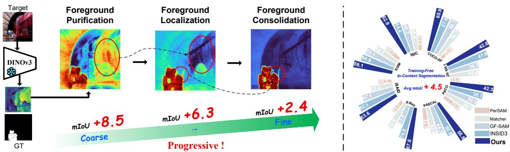  
Figure 1: Left: Our core coarse-to-fine progressive refinement paradigm, which sequentially performs Foreground Purification, Foreground Localization, and Foreground Consolidation. Ablation results on COCO-20i show that each stage progressively improves the segmentation IoU. Right: Performance comparison with existing methods across diverse datasets spanning multiple domains, demonstrating the consistent effectiveness of FoRIS and its improvement in average mIoU.

## Abstract

In-Context Segmentation (ICS) aims to precisely segment arbitrary semantic concepts, such as objects or parts, given one or a few annotated visual exemplars. In this paper, we revisit ICS from a more classical segmentation perspective, viewing it as a coarse-to-fine progressive refinement process. Rather than directly predicting the final mask through reference-query matching, we progressively refine the segmentation from coarse and ambiguous foreground responses to precise and complete foreground structures. Building upon this perspective, we propose a training-free incontext segmentation framework, termed FoRIS. Specifically, FoRIS consists of three key stages: Foreground Purification, Foreground Localization, and Foreground Consolidation, which progressively suppress background distractions, localize discriminative target regions, and recover complete foreground structures through semantic aggregation. Experimental results demonstrate that FoRIS achieves SOTA performance across semantic and part segmentation tasks, with average improvements of 4.5 and 4.8 mIoU points over existing approaches in the 1-shot and 5-shot settings, respectively. Code: https://github.com/Xi-Mu-Yu/FoRIS.

## 1 INTRODUCTION

Segmentation is a fundamental task in computer vision with broad applications across natural, med ical, and remote-sensing imagery Hu et al. (2025; 2026b; 2024; 2026a); Ronneberger et al. (2015); Yang et al. (2023; 2025); He et al. (2017); Badrinarayanan et al. (2017); Chen et al. (2017); Arbelaez et al. (2010); Felzenszwalb & Huttenlocher (2004); Achanta et al. (2012); Shi & Malik (2000); Long et al. (2015). Traditional segmentation methods are typically restricted to predefined semantic categories and require substantial task-specific supervision, limiting their flexibility in openworld scenarios Cuttano et al. (2026). With the rapid development of visual foundation models (VFMs) Caron et al. (2021); Oquab et al. (2024); Siméoni et al. (2025); Kirillov et al. (2023); Carion et al. (2025), in-context segmentation (ICS) has emerged as a promising paradigm for open-world segmentation Cuttano et al. (2026); Zhang et al. (2024b;a); Liu et al. (2024b). Given one or more annotated reference examples at inference time, ICS aims to segment arbitrary target concepts without category-specific retraining, enabling flexible generalization across diverse concepts, domains, and annotation settings Cuttano et al. (2026).

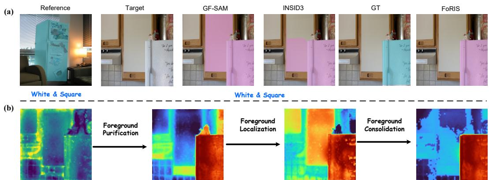  
Figure 2: Motivation for progressive foreground refinement. (a) Existing training-free ICS methods rely on direct reference-query matching, which may confuse visually similar background regions with the target. (b) We reinterpret ICS as a progressive foreground refinement process consisting of foreground purification, foreground localization, and foreground consolidation.

Existing ICS methods generally follow two paradigms. Fine-tuned methods adapt pretrained visual or diffusion architectures with task-specific segmentation supervision, translating pretrained representations into dense pixel-level predictions. Although effective within the training distribution, they require additional optimization and supervision, which can limit open-world generalization. In contrast, training-free methods combine complementary pretrained models, typically leveraging visual representations for reference-query correspondence and segmentation priors for mask generation. While avoiding task-specific optimization, these methods still primarily rely on reference-query correspondence to transfer foreground semantics to the target image.

Despite their methodological differences, existing training-free ICS methods largely adopt a correspondence-centric formulation, where foreground semantics are transferred from reference exemplars to query images through feature correspondence or similarity propagation Liu et al. (2024b); Zhang et al. (2024a); Cuttano et al. (2026). As illustrated in Fig. 2(a), given a reference image containing a white square-shaped refrigerator, such correspondence-based methods may incorrectly associate visually similar white square-shaped wall regions in the query image with the target, resulting in inaccurate segmentation. This failure exposes a fundamental mismatch between visual similarity and target membership: a query region may closely resemble the reference foreground while being semantically irrelevant to the target.

More fundamentally, an annotated foreground mask specifies where the target lies, but does not guarantee that the corresponding frozen features provide a semantically pure representation of the target. Contextual, positional, and background-correlated information may remain entangled with foreground features. Meanwhile, variations in viewpoint, appearance, and object structure can cause true target regions in the query image to produce only partial or fragmented semantic responses. These factors introduce three coupled sources of uncertainty: foreground contamination, ambiguous target localization, and fragmented foreground responses. Consequently, the central challenge of training-free ICS is not simply to establish more accurate correspondence, but to progressively transform noisy visual evidence into reliable, foreground-centric semantic representations.

This observation motivates us to reconsider the role of correspondence in ICS. Rather than discarding correspondence, we view it as an intermediate source of semantic evidence within a progressive foreground refinement process, as illustrated in Fig. 2(b). Specifically, foreground semantics progressively emerge through three stages: foreground purification, foreground localization, and foreground consolidation. Foreground purification suppresses contextual and background interference in reference features, establishing a cleaner semantic basis for correspondence. Foreground localization then exploits the purified foreground cues to identify discriminative target regions in the query image, reducing localization ambiguity. Finally, foreground consolidation aggregates semantically related but spatially scattered responses, progressively recovering complete object structures from fragmented local evidence. In this view, correspondence is not treated as a sufficient endpoint, but as one component of a broader process that progressively refines semantic evidence into coherent object-level predictions.

Based on this perspective, we propose FoRIS (Foreground Refinement for Training-Free In-context Segmentation), a training-free ICS framework that explicitly implements this progressive foreground refinement paradigm. FoRIS sequentially performs foreground purification, foreground localization, and foreground consolidation using a frozen VFM, without additional segmentation supervision or auxiliary segmentation models. By placing correspondence within a progressive refinement pipeline, FoRIS shifts the focus from one-step semantic transfer toward the reliable extraction, localization, and consolidation of foreground evidence.

We further investigate a challenging and underexplored limitation of current VFM-based trainingfree ICS methods: their limited generalization to slender and fragmented structures. Such structures often exhibit weak semantic responses, limited spatial support, and substantial appearance variations, amplifying the ambiguities that correspondence-based methods struggle to resolve. We systematically evaluate this challenge across diverse slender-structure datasets and find that existing training-free ICS methods remain substantially less reliable in such scenarios. These findings reveal a pronounced generalization gap despite the strong representations provided by VFMs, highlighting the need for training-free ICS methods that can accommodate heterogeneous target geometries and fragmented structures. Our contributions are summarized as follows:

• We introduce progressive foreground refinement as a new perspective for training-free incontext segmentation, repositioning reference-query correspondence as an intermediate source of semantic evidence within a three-stage refinement process: foreground purification, localization, and consolidation.

• We propose FoRIS, a training-free ICS framework that explicitly implements this progressive refinement paradigm and achieves average IoU improvements of over 4.5 and 4.8 percentage points over existing methods under the 1-shot and 5-shot settings, respectively.

• We systematically investigate the generalization limitations of current VFM-based trainingfree ICS methods on slender and fragmented structures, revealing a challenging and underexplored scenario that remains an open problem for future ICS research.

## 2 RELATED WORK

In-context segmentation. In-context segmentation (ICS) extends the in-context learning paradigm of LLMs Brown et al. (2020); Ouyang et al. (2023); Chowdhery et al. (2023); Touvron et al. (2023) to visual segmentation. Early works such as SegGPT Wang et al. (2023b) and Painter Wang et al. (2023a) demonstrated that segmentation can be conditioned on contextual examples, while recent approaches leverage visual foundation models (VFMs) for one-shot semantic, part, and personalized segmentation Liu et al. (2024b); Zhang et al. (2024b). Unlike few-shot segmentation Wang et al. (2019); Cuttano et al. (2025); Hong et al. (2022); Lang et al. (2022), which typically targets predefined novel classes, ICS aims to segment arbitrary concepts specified at inference time across diverse semantic granularities.

Existing ICS methods can be broadly categorized into training-free and supervised approaches. Training-free methods Liu et al. (2024b); Zhang et al. (2024a); Espinosa et al. (2025); Cuttano et al. (2026) typically combine pretrained visual representations with external segmentation priors, while supervised methods Meng et al. (2024); Zhu et al. (2024) adapt pretrained architectures through task-specific training. Despite their different implementations, existing approaches largely rely on reference-target correspondence as the primary mechanism for transferring foreground semantics and inferring target masks. However, correspondence alone may be insufficient when reference features are contaminated by background information or target responses are ambiguous and fragmented. Rather than discarding correspondence, we reinterpret its role within a progressive foreground refinement process. Inspired by the coarse-to-fine nature of segmentation, our approach progressively purifies foreground representations, localizes discriminative target regions, and consolidates fragmented semantic responses, allowing correspondence-derived evidence to evolve into coherent object masks.

Progressive Segmentation and Mask Refinement. A central challenge in training-free segmentation is to transform the rich visual representations provided by vision foundation models (VFMs) into reliable foreground-background separation. This objective is closely related to a long-standing principle in classical segmentation: accurate object masks often emerge through progressive refinement rather than a single prediction step. Classical approaches progressively reduce segmentation uncertainty by updating region assignments, object boundaries, or spatial consistency. Region Growing Adams & Bischof (1994) expands initial seeds according to local similarity, while Graph Cut Boykov & Jolly (2001) and GrabCut Rother et al. (2004) iteratively optimize foregroundbackground assignments through global region relationships. Active Contour Kass et al. (1988) progressively evolves object boundaries, and multi-scale approaches Adelson et al. (1984) refine object structures from coarse to fine resolutions. Despite their methodological differences, these approaches share a common principle: reliable segmentation emerges by progressively transforming uncertain local evidence into coherent foreground structures.

In contrast, existing training-free ICS methods largely adopt a correspondence-centric formulation, where foreground semantics are transferred from annotated reference images to target images through feature correspondence or similarity propagation Liu et al. (2024b); Zhang et al. (2024a); Cuttano et al. (2026). Although some methods further employ clustering, propagation, or mask refinement, these operations are primarily built upon correspondence-derived evidence rather than explicitly modeling foreground refinement as the central inference process. Consequently, they remain vulnerable to background interference, ambiguous semantic correspondence, and fragmented target responses, which may lead to incomplete or disconnected predictions and semantic drift. This observation motivates us to reinterpret training-free ICS as a progressive foreground refinement process, where correspondence serves as intermediate semantic evidence that is progressively purified, localized, and consolidated into coherent object-level predictions.

## 3 IN-CONTEXT SEGMENTATION WITH FORIS

Given reference image–mask pairs $\{ ( I _ { s } , M _ { s } ) \} _ { s = } ^ { S }$ and a target image $I _ { t }$ , FoRIS predicts $\hat { M } _ { t }$ without fine-tuning or auxiliary heads. We extract patch features from the last intermediate layer of the encoder and $\ell _ { 2 } \cdot$ -normalize them along the channel dimension:

$$
\mathbf { F } = \phi { \big ( } [ I _ { 1 } , \dots , I _ { S } , I _ { t } ] { \big ) } \in \mathbb { R } ^ { ( S + 1 ) \times C \times H \times W } , \qquad \mathbf { f } ( \mathbf { p } ) = \mathbf { F } ( \mathbf { p } ) / \| \mathbf { F } ( \mathbf { p } ) \| _ { 2 } .\tag{1}
$$

FoRIS refines a foreground response through three stages—foregroundpurification (FP),foreground localization (FL), andforeground consolidation (FC). algorithm 1 summarizes the full data flow.

## 3.1 FOREGROUND PURIFICATION

FP removes positional layout bias and background clutter via adaptive positional debiasing (APD) and two-stage foreground refinement (FR).

Adaptive Positional Debiasing. Positional bias can hinder prototype matching when reference and target objects occupy inconsistent locations. However, in domains with strong spatial regularity—e.g., lung CT, where anatomical structures follow consistent layouts—positional cues can serve as informative priors rather than noise. We therefore debias adaptively instead of indiscriminately. Following INSID3 Cuttano et al. (2026), we offline estimate a low-rank positional subspace U via SVD on centered features from a zero-input image. At inference, we measure reference–target semantic alignment:

$$
s _ { \mathrm { s e m } } = { \frac { \langle \mu ^ { \mathrm { f g } } , { \bar { \mathbf { f } } } _ { t } \rangle } { \lVert { \bar { \mathbf { f } } } _ { t } \rVert _ { 2 } } } , \qquad \mu ^ { \mathrm { f g } } = \mathrm { n o r m } { \Big ( } \operatorname* { m e a n } _ { \mathbf { p } \in \Omega ^ { \mathrm { f g } } } \mathbf { f } _ { r } ( \mathbf { p } ) { \Big ) } ,\tag{2}
$$

where $\bar { \mathbf { f } } _ { t } = \mathrm { m e a n } _ { \mathbf { p } } \mathbf { f } _ { t } ( \mathbf { p } )$ . Debiasing is applied to all reference and target tokens only when $s _ { \mathrm { s e m } } < \theta ;$

$$
\begin{array} { r } { \mathbf { P } _ { \perp } = \mathbf { I } _ { C } - \mathbf { U U } ^ { \top } , \qquad \tilde { \mathbf { f } } ( \mathbf { p } ) = \left\{ \begin{array} { l l } { \mathrm { n o r m } \big ( \mathbf { P } _ { \perp } \mathbf { f } ( \mathbf { p } ) \big ) , } & { s _ { \mathrm { s e m } } < \theta , } \\ { \mathbf { f } ( \mathbf { p } ) , } & { \mathrm { o t h e r w i s e } . } \end{array} \right. } \end{array}\tag{3}
$$

We denote the resulting feature maps as F˜ and use ˜f for all subsequent stages unless stated otherwise.   
We set θ=0.80 by default (cf. section 4.2.1 and fig. 5).

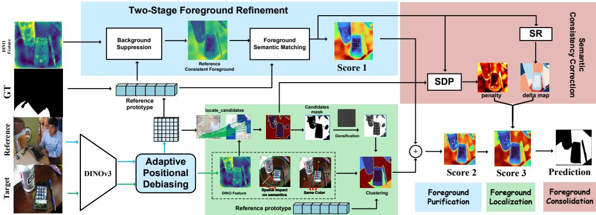  
Figure 3: Overview of FoRIS. Given reference image(s) with foreground mask(s) and a target image, FoRIS performs through three sequential stages. (1) Foreground purification (FP): patch features from a frozen DINOv3 encoder are adaptively debiased and purified via two-stage foreground refinement, including contrastive background suppression and foreground semantic matching, yielding an initial response (Score 1). (2) Foreground localization (FL): bidirectional feature matching identifies reliable foreground candidates, which are densified and integrated with clustering-based seed priors built from DINO, spatial, and color cues to produce a refined response (Score 2). (3) Foreground consolidation (FC): semantic disagreement penalization (SDP) and semantic reweighting (SR) suppress conflicting activations and strengthen semantically pure regions, producing the final response (Score 3).

Two-stage foreground refinement. FR operates on debiased features $\tilde { \mathbf { f } }$ and produces both an initial response and a gated feature map used later in FC.

Stage 1 (feature gating). We first construct foreground and background prototypes from debiased reference tokens. Foreground tokens from all references are concatenated and partitioned by average-linkage agglomerative clustering under cosine distance, yielding J cluster prototypes $\pmb { \mu } _ { j } = \mathrm { n o r m } \big ( \mathrm { m e a n } _ { i : \ell _ { i } = j } \mathbf { x } _ { i } ^ { \mathrm { f g } } \big )$ for $j = 1 , \dots , J$ , where $J$ is determined by the clustering procedure rather than fixed manually and $\ell _ { i }$ is the cluster label of foreground token $\dot { i } .$ The hard-negative background prototype targets background patches most confusable with the foreground. We rank all debiased background tokens by their cosine similarity to $\mu ^ { \mathrm { f g } }$ and retain the top 20%:

$$
\begin{array} { r } { \mathcal { T } _ { \mathrm { h n } } = \mathrm { T o p K } _ { 2 0 \% } \Big ( \big \{ \langle \mathbf { x } _ { i } ^ { \mathrm { b g } } , \pmb { \mu } ^ { \mathrm { f g } } \rangle \big \} _ { i = 1 } ^ { N _ { \mathrm { b g } } } \Big ) , } \end{array}\tag{4}
$$

and define $\pmb { \mu } ^ { \mathrm { b g } } = \mathrm { n o r m } \big ( \mathrm { m e a n } _ { i \in \mathcal { T } _ { \mathrm { h n } } } \mathbf { x } _ { i } ^ { \mathrm { b g } } \big )$ . A contrastive gate is then computed on all reference and target tokens and applied multiplicatively. We aggregate similarities to the J foreground cluster prototypes via temperature-scaled log-sum-exp:

$$
g ( \mathbf { p } ) = \sigma \Big ( \beta \log \sum _ { j = 1 } ^ { J } \exp \Big ( \frac { \langle \tilde { \mathbf { f } } ( \mathbf { p } ) , \mu _ { j } \rangle } { \beta } \Big ) - \langle \tilde { \mathbf { f } } ( \mathbf { p } ) , \mu ^ { \mathrm { b g } } \rangle \Big ) , \qquad \hat { \mathbf { f } } ( \mathbf { p } ) = g ( \mathbf { p } ) \cdot \tilde { \mathbf { f } } ( \mathbf { p } ) ,\tag{5}
$$

where $\beta { = } 0 . 0 7$ and reference foreground locations receive a gate floor. Stage 1 yields gated features $\hat { \mathbf { f } } ,$ which are passed to FC for cluster reweighting (section 3.3).

Stage 2 (foreground semantic matching). Score 1 is computed on debiased but ungated target features $\tilde { \mathbf { f } } _ { t } .$ , using prototypes rebuilt from debiased reference tokens. This decouples contrastive gating from prototype matching: gating suppresses background-dominated activations for consolidation, while matching preserves the full debiased semantic geometry for cross-image correspondence. The orthogonalized background direction is

$$
\pmb { \mu } _ { \bot } ^ { \mathrm { b g } } = \frac { \pmb { \mu } ^ { \mathrm { b g } } - \langle \pmb { \mu } ^ { \mathrm { b g } } , \pmb { \mu } ^ { \mathrm { f g } } \rangle \pmb { \mu } ^ { \mathrm { f g } } } { \lVert \pmb { \mu } ^ { \mathrm { b g } } - \langle \pmb { \mu } ^ { \mathrm { b g } } , \pmb { \mu } ^ { \mathrm { f g } } \rangle \pmb { \mu } ^ { \mathrm { f g } } \rVert _ { 2 } } ,\tag{6}
$$

and the initial purified response is

$$
S ^ { ( 1 ) } ( { \bf p } ) = \beta \log \sum _ { j = 1 } ^ { J } \exp \Bigl ( \frac { \langle \tilde { \bf f } _ { t } ( { \bf p } ) , { \pmb \mu } _ { j } \rangle } { \beta } \Bigr ) - \langle \tilde { \bf f } _ { t } ( { \bf p } ) , { \pmb \mu } _ { \perp } ^ { \mathrm { b g } } \rangle .\tag{7}
$$

## 3.2 FOREGROUND LOCALIZATION

FL refines $S ^ { ( 1 ) }$ into Score 2 using debiased reference and target features $\tilde { \mathbf { f } } .$

Cross-image candidate voting. Dense patch-to-patch matching assigns a foreground vote to each target location:

$$
V ( \mathbf { p } ) = \frac { 1 } { S } \sum _ { s = 1 } ^ { S } \mathbb { 1 } \Big [ M _ { s } \big ( \operatorname { a r g m a x } _ { \mathbf { q } } \langle \tilde { \mathbf { f } } _ { s } ( \mathbf { q } ) , \tilde { \mathbf { f } } _ { t } ( \mathbf { p } ) \rangle \big ) \Big ] .\tag{8}
$$

Locations with majority support form $\mathcal { C } = \{ \mathbf { p } \ | \ V ( \mathbf { p } ) > \ \frac { 1 } { 2 } \}$ , which is lightly densified on a coarse spatial grid.

Multi-cue clustering and seed-cluster prior. Target patches are clustered on a joint representation of $\ell _ { 2 }$ -normalized DINO features, RGB color, and 2D coordinates:

$$
\mathbf { z } _ { i } = \operatorname { n o r m } \left( [ \mathbf { f } _ { i } ; \mathbf { c } _ { i } ; \mathbf { p } _ { i } ] \right) .\tag{9}
$$

The same agglomerative clustering protocol as above assigns each patch a cluster id $\kappa ( \mathbf { p } ) \in$ $\{ 1 , \ldots , J ^ { \prime } \}$ . Let $\mathcal { G } _ { j } = \{ \mathbf { p } : \kappa ( \mathbf { p } ) = j \}$ denote the patch set of cluster $j .$ If no cluster overlaps ${ \mathcal { C } } ,$ we set $\begin{array} { r } { \dot { P } ( \mathbf { p } ) = \mathbb { \bar { 1 } } [ \mathbf { p } \in \mathcal { C } ] ; } \end{array}$ otherwise, the seed cluster $j ^ { \star }$ maximizes reference affinity weighted by candidate area:

$$
j ^ { \star } = \arg \operatorname* { m a x } _ { j \in \mathcal { I } _ { \mathcal { C } } } \underbrace { \mathrm { m e a n } _ { \mathbf { p } \in \mathcal { G } _ { j } } \langle \tilde { \mathbf { f } } _ { t } ( \mathbf { p } ) , \mu ^ { \mathrm { f g } } \rangle } _ { \mathrm { c r o s s - i m a g e ~ a f f i n i t y } } \cdot \underbrace { \frac { | \mathcal { G } _ { j } \cap \mathcal { C } | } { | \mathcal { G } _ { j } | } } _ { \mathrm { a r e a ~ w e i g h t } } ,\tag{10}
$$

where $\mathcal { I } c = \{ j : \mathcal { G } _ { j } \cap \mathcal { C } \neq \emptyset \}$ . All clusters receive

$$
\begin{array} { r } { \rho _ { j } = \operatorname * { m e a n } _ { \mathbf { p } \in \mathcal { G } _ { j } } \langle \tilde { \mathbf { f } } _ { t } ( \mathbf { p } ) , \pmb { \mu } ^ { \mathrm { f g } } \rangle \cdot \operatorname * { m a x } \left( \langle \pmb { \mu } _ { j ^ { \star } } , \pmb { \mu } _ { j } \rangle , 0 \right) \cdot \frac { | \mathcal { G } _ { j } \cap \mathcal { C } | } { | \mathcal { G } _ { j } | } , } \end{array}\tag{11}
$$

which is min–max normalized across clusters and mapped to patches as

$$
P ( \mathbf { p } ) = \frac { \rho _ { \kappa ( \mathbf { p } ) } - \operatorname* { m i n } _ { i } \rho _ { i } } { \operatorname* { m a x } _ { i } \rho _ { i } - \operatorname* { m i n } _ { i } \rho _ { i } + \epsilon } \in [ 0 , 1 ] .\tag{12}
$$

Score 2 is

$$
\begin{array} { r } { S ^ { ( 2 ) } = S ^ { ( 1 ) } + ( V - \frac { 1 } { 2 } ) + ( P - \frac { 1 } { 2 } ) . } \end{array}\tag{13}
$$

## 3.3 FOREGROUND CONSOLIDATION

FC transforms Score 2 into Score 3 via semantic disagreement penalization (SDP) and semantic reweighting (SR).

Semantic disagreement penalization. We penalize inter-map disagreement and foreground– background coupling:

$$
\mathscr { D } ( \mathbf { p } ) = | S _ { \mathrm { f g } } ( \mathbf { p } ) - V ( \mathbf { p } ) | + | S _ { \mathrm { f g } } ( \mathbf { p } ) - P ( \mathbf { p } ) | , \qquad \mathscr { B } ( \mathbf { p } ) = \operatorname* { m i n } \big ( S _ { \mathrm { f g } } ( \mathbf { p } ) , S _ { \mathrm { b g } } ( \mathbf { p } ) \big ) .\tag{14}
$$

An uncertainty-modulated penalty concentrates corrections on ambiguous patches:

$$
\begin{array} { r } { \Pi ( \mathbf { p } ) = \big ( \mathcal { D } ( \mathbf { p } ) + \mathcal { B } ( \mathbf { p } ) \big ) \cdot \mathcal { U } ( \mathbf { p } ) , \qquad \mathcal { U } ( \mathbf { p } ) = 1 - 2 \big | S _ { \mathrm { f g } } ( \mathbf { p } ) - \frac { 1 } { 2 } \big | . } \end{array}\tag{15}
$$

Semantic reweighting. Target patches are re-clustered on gated features $\widehat { \mathbf { f } } _ { t } ,$ yielding a new cluster assignment $\kappa ^ { \prime } ( \bar { \bf p } )$ . Each cluster $j$ receives a reweighting factor based on foreground–background separation:

$$
\Delta _ { j } = \big ( \overline { { S } } _ { \mathrm { f g } } ^ { ( j ) } - \overline { { S } } _ { \mathrm { b g } } ^ { ( j ) } \big ) _ { + } - \operatorname* { m i n } \big ( \overline { { S } } _ { \mathrm { f g } } ^ { ( j ) } , \overline { { S } } _ { \mathrm { b g } } ^ { ( j ) } \big ) ,\tag{16}
$$

where $\overline { { S } } _ { . } ^ { ( j ) }$ is the mean over $\{ \mathbf { p } : \kappa ^ { \prime } ( \mathbf { p } ) = j \}$ . The patch-level map is $\Delta ( \mathbf { p } ) = \Delta _ { \kappa ^ { \prime } ( \mathbf { p } ) }$ , and the consolidated response is

$$
S ^ { ( 3 ) } = S ^ { ( 2 ) } - \Pi + \Delta .\tag{17}
$$

GT  
Table 1: Comparison of FoRIS (mIoU in %, ↑) on one-shot semantic, part, and personalized segmentation. State-of-the-art methods are grouped into task-specific fine-tuning and training-free approaches. Previous training-free methods rely on SAM, pre-trained with mask-level supervision, whereas FoRIS uses only frozen self-supervised DINOv3 features. Gray indicates the model was trained on the corresponding train split of the dataset; best results bold, 2nd best underlined.
<table><tr><td rowspan="2">Method</td><td rowspan="2">Encoder</td><td rowspan="2">#Param</td><td colspan="5">Semantic</td><td colspan="4">Part</td></tr><tr><td></td><td></td><td>LVIS-92 COCO-20 ISIC SUIM iSAID X-Ray</td><td></td><td></td><td></td><td>|PASCAL PACO</td><td></td><td>Avg</td></tr><tr><td colspan="10">Task-specific fine-tuning: Semantic + mask supervision</td><td colspan="3"></td></tr><tr><td>Painter Wang et al. (2023a)</td><td>ViT</td><td>354M</td><td>10.5</td><td>33.1</td><td></td><td></td><td></td><td></td><td>30.4</td><td>14.1</td><td>1</td></tr><tr><td>SegGPT Wang et al. (2023b)</td><td>ViT</td><td>354M</td><td>18.6</td><td>56.1</td><td>37.5</td><td>34.9</td><td>30.9</td><td>87.5</td><td>35.8</td><td>13.5</td><td>39.4</td></tr><tr><td>SINE Liu et al. (2024a)</td><td>DINOv2</td><td>373M</td><td>31.2</td><td>64.5</td><td>25.8</td><td>50.7</td><td>38.3</td><td>39.8</td><td>36.2</td><td>23.3</td><td>38.7</td></tr><tr><td>DiffewS Zhu et al. (2024)</td><td>Stable Diffusion</td><td>890M</td><td>31.4</td><td>71.3</td><td>27.8</td><td>48.9</td><td>47.5</td><td>41.6</td><td>34.0</td><td>22.8</td><td>40.7</td></tr><tr><td>SegIC Meng et al. (2024)</td><td>DINOv2</td><td>310M</td><td>44.6</td><td>76.1</td><td>25.3</td><td>52.5</td><td>46.1</td><td>34.5</td><td>39.9</td><td>25.9</td><td>43.1</td></tr><tr><td>SegIC (CoCo) Meng et al. (2024)</td><td>DINOv2</td><td>310M</td><td>35.7</td><td>75.6</td><td>22.5</td><td>52.9</td><td>40.8</td><td>30.8</td><td>38.6</td><td>25.1</td><td>40.3</td></tr><tr><td colspan="10">Training free: Mask-supervised pre-training</td><td colspan="3"></td></tr><tr><td>PerSAM Zhang et al. (2024b)</td><td>SAM</td><td>640M</td><td>11.5</td><td>23.0</td><td>23.9</td><td>28.7</td><td>19.2</td><td>31.7</td><td>32.5</td><td>22.5</td><td>24.1</td></tr><tr><td>Matcher Liu et al. (2024b)</td><td>DINOv2 + SAM</td><td>945 M</td><td>33.0</td><td>52.7</td><td>38.6</td><td>44.1</td><td>33.3</td><td>70.8</td><td>42.9</td><td>34.7</td><td>43.7</td></tr><tr><td>GF-SAM Zhang et al. (2024a)</td><td>DINOv2 + SAM</td><td>945 M</td><td>35.2</td><td>58.7</td><td>48.7</td><td>53.1</td><td>47.1</td><td>51.0</td><td>44.5</td><td>36.3</td><td>46.8</td></tr><tr><td>GF-SAM† Zhang et al. (2024a)</td><td>DINOv3+SAM</td><td>945M</td><td>31.8</td><td>54.8</td><td>50.9</td><td>50.5</td><td>46.7</td><td>56.1</td><td>44.9</td><td>34.4</td><td>46.3</td></tr><tr><td colspan="10">Training-free: Unsupervised pre-training</td><td colspan="3"></td></tr><tr><td>INSID3</td><td>DINOv3</td><td>304M</td><td>41.8</td><td>57.6</td><td>54.4</td><td>54.9</td><td>52.1</td><td>78.8</td><td>50.5</td><td>38.7</td><td>53.6</td></tr><tr><td>FoRIS (ours)</td><td>DINOv3</td><td>304M</td><td>42.8</td><td>60.9</td><td>62.9</td><td>59.1</td><td>53.6</td><td>87.6</td><td>55.8</td><td>42.3</td><td>58.1</td></tr></table>

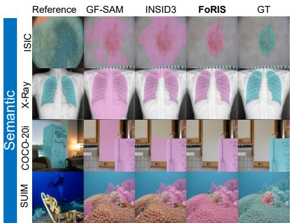

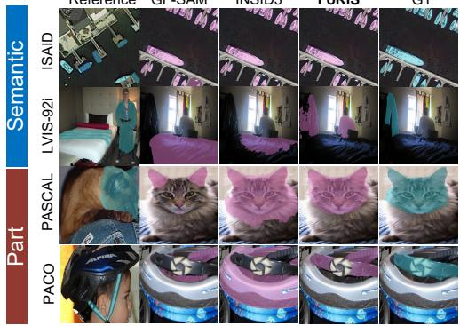  
Figure 4: Comparison of FoRIS with GF-SAM Zhang et al. (2024a) and INSID3 Cuttano et al. (2026) on one-shot semantic and part segmentation.

## 4 EXPERIMENTS

We evaluate FoRIS on one-shot semantic and part segmentation. Following INSID3 Cuttano et al. (2026), we adopt the same datasets, baselines, and evaluation protocols for fair comparison. All results are reported as mIoU; implementation details are provided in Appendix section A.

## 4.1 MAIN RESULTS

One-shot semantic segmentation. FoRIS achieves the best performance on all semantic benchmarks (cf. table 1). Compared with the strongest training-free baseline GF-SAM, FoRIS improves mIoU by 7.6 %, 2.2 %, 14.2 %, 6.0 %, 6.5 %, and 36.6 % pts. on LVIS-92i, COCO-20i, ISIC, SUIM, iSAID, and Chest X-ray, with the largest gains on out-of-domain datasets. Under the same frozen DINOv3 backbone and parameter budget, FoRIS consistently surpasses INSID3 by 1.0 %–8.8 % pts. across all six benchmarks. FoRIS also generalizes better than task-specific fine-tuned methods without any segmentation training. Qualitative results in fig. 4 show that FoRIS produces clean, semantically coherent masks directly from frozen features.

One-shot part segmentation. FoRIS also sets a new SOTA on part-level benchmarks. It outperforms GF-SAM by 11.3 % and 6.0 % pts. on PASCAL-Part and PACO-Part, and INSID3 by 5.3 % and 3.6 % pts., respectively. Compared with fine-tuned SegIC and DiffewS, FoRIS achieves up to 21.8 % pts. higher mIoU while remaining fully training-free. These results indicate that progressive foreground refinement benefits fine-grained structural understanding beyond object-level segmenta tion. Qualitative comparisons in fig. 4 confirm improved boundary quality and part integrity.

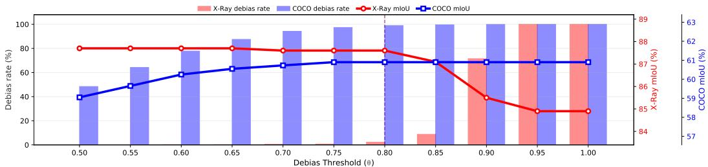  
Figure 5: Effect of the adaptive debiasing threshold θ on COCO and Chest X-ray.

## 4.2 ABLATION STUDY

We conduct ablation experiments to validate each component of FoRIS (cf. table 2). Starting from the baseline, progressively adding FP, FL, and FC consistently improves performance across all benchmarks, confirming the complementarity of the three-stage design.

## 4.2.1 FOREGROUND PURIFICATION

We examine the dual role of positional bias: it can interfere with correspondence when reference and target layouts differ, yet provide useful structural priors in domains with stable spatial organization, such as Chest Xray. APD therefore adaptively applies debiasing only when the semantic alignment score $s _ { \mathrm { s e m } } < \theta ,$ , projecting features onto the orthogonal complement of the positional subspace. We sweep $\theta \in \{ 0 . 5 0 , 0 . 5 5 , \ldots , 1 . 0 0 \}$ on COCO and Chest X-ray (fig. 5). On COCO, mIoU increases from 59.1 % to 60.9 % and saturates at $\theta \ge 0 . 7 5 .$ , indicating that suppressing positional bias benefits cross-layout matching. In contrast, Chest X-ray remains stable at $8 7 . 6 \text{‰}$ 87.7 % for $\theta ~ \leq ~ 0 . 8 0$ but drops to 84.9 % at θ=1.0, showing that excessive debiasing can remove useful anatomical priors.

Table 2: Ablation study of different modules.
<table><tr><td rowspan="2">Base</td><td colspan="3" rowspan="2">FP FL FC APD FR</td><td colspan="2">mIoU</td></tr><tr><td>COCO</td><td>ISIC SUIM PASCAL</td></tr><tr><td>√</td><td rowspan="4"></td><td colspan="2"></td><td>43.7 46.8 44.4</td><td>38.7</td></tr><tr><td>√</td><td>√</td><td></td><td>46.9 41.2 48.3 57.1 53.1</td><td>43.9 39.3 50.2 44.4</td></tr><tr><td>√</td><td></td><td>1</td><td>51.9</td><td>53.2 51.8</td></tr><tr><td>√</td><td>√ √</td><td></td><td>52.2</td><td>58.7 52.9 48.3</td></tr><tr><td>√</td><td>√</td><td></td><td></td><td>52.9</td><td>49.3 55.6 50.8</td></tr><tr><td>√</td><td></td><td>√ √</td><td></td><td>56.2</td><td>58.0 55.8 53.8</td></tr><tr><td>V</td><td>1</td><td>V</td><td>V</td><td>58.5</td><td>60.2 58.9 55.1</td></tr><tr><td>√</td><td></td><td>√</td><td>√ √</td><td>58.0 59.2</td><td>54.8 54.2</td></tr><tr><td></td><td></td><td></td><td>V</td><td>60.9</td><td>62.9 59.1 55.8</td></tr></table>

table 2 further confirms the dataset-dependent role of APD: enabling APD alone improves COCO by 3.2 % pts. (43.7 → 46.9) but reduces ISIC by 5.6 % pts. (46.8 → 41.2). With all modules enabled, FoRIS achieves 60.9 %/62.9 %/59.1 %/55.8 % mIoU on COCO/ISIC/SUIM/PASCAL-Part, with up to 2.9 % pts. improvement over the best variant without APD. These results support adaptive, rather than always-on, positional debiasing for cross-domain generalization.

## 4.2.2 FOREGROUND LOCALIZATION

Multi-cue clustering. We study whether augmenting frozen DINOv3 features with positional coordinates and RGB appearance during clustering improves FL (cf. table 3c). Positional cues benefit Chest X-ray (+1.1 % pts.), where anatomical structures follow strong spatial regularity, while RGB cues help SUIM (+0.2 % pts.), where appearance variation is more pronounced. Combining both cues maintains strong performance across domains (87.6 % on Chest X-ray, 59.1 % on SUIM), and we adopt this joint representation by default.

Dense candidate aggregation. We further evaluate coarse-grid densification of the candidate set (cf. table 3b). Dense aggregation consistently improves mIoU on $\mathrm { C O C O } ( 6 0 . 1 \%    6 0 . 9 \% )$ , Chest X-ray $( 8 7 . 4 \%  8 7 . 6 \% )$ , and PACO-Part $( \dot { 4 1 } . 8 \bar { \% }  4 2 . 3 \% )$ . The gains are largest on fine-grained PACO-Part, where richer local context helps disambiguate subtle part-level differences.

Table 3: Ablation studies of different components in FoRIS.  
(a) Comparison between original and adaptive positional debiasing on X-Ray, COCO, and PACO.
<table><tr><td>Method</td><td>X-Ray ↑</td><td>COCO↑</td><td>PACO ↑</td></tr><tr><td>OD</td><td>84.9</td><td>60.9</td><td>42.3</td></tr><tr><td>AD</td><td>87.6</td><td>60.9</td><td>42.3</td></tr></table>

(c) Ablation study of positional and RGB cues in the FL module on X-Ray and SUIM.

(b) Ablation study of densification in the FL module on COCO, X-Ray, and PACO.
<table><tr><td>Method</td><td>COCO↑</td><td>X-Ray ↑</td><td>PACO ↑</td></tr><tr><td>w/o Dense</td><td>60.1</td><td>87.4</td><td>41.8</td></tr><tr><td>w/ Dense</td><td>60.9</td><td>87.6</td><td>42.3</td></tr></table>

(d) Ablation study of consolidation components in the FC module on ISIC, COCO, and PACO.

<table><tr><td>Method</td><td>X-Ray ↑</td><td>SUIM↑</td></tr><tr><td>None</td><td>86.7</td><td>59.0</td></tr><tr><td>Pos</td><td>87.8</td><td>58.8</td></tr><tr><td>RGB</td><td>86.8</td><td>59.2</td></tr><tr><td> $\mathrm { P o s } + \mathrm { R G B }$ </td><td>87.6</td><td>59.1</td></tr></table>

<table><tr><td>Method</td><td>ISIC ↑</td><td>COCO↑</td><td>PACO ↑</td></tr><tr><td>None</td><td>60.2</td><td>58.5</td><td>39.8</td></tr><tr><td>SDP</td><td>61.1</td><td>59.9</td><td>41.7</td></tr><tr><td>SR</td><td>62.6</td><td>60.2</td><td>40.9</td></tr><tr><td> $\mathrm { S D P + S R }$ </td><td>62.9</td><td>60.9</td><td>42.3</td></tr></table>

## 4.2.3 FOREGROUND CONSOLIDATION

table 3d evaluates the two FC components: semantic disagreement penalization (SDP) and semantic reweighting (SR). SDP consistently improves the baseline by suppressing unreliable activations caused by inter-map disagreement and foreground–background coupling, with the largest gain on PACO-Part (+1.9 % pts.). SR provides stronger improvements on ISIC and COCO by correcting region-level semantic bias through cluster-wise reweighting. Combining SDP and SR achieves the best performance on all benchmarks, confirming their complementarity.

## 5 CHALLENGES AND THE FUTURE OF VFM-BASED TRAINING-FREE ICS

When extending ICS to the slender-structure scenarios illustrated in Fig. 6, Tab. 4 shows that existing SAM- and DINO-based ICS methods achieve consistently low IoU on Fundus and DeepGlobe-18, revealing their limitations in slender-structure segmentation. This raises two questions: why are slender structures particularly challenging for VFM-based training-free ICS, and how can segmentation performance be improved in such scenarios? Further analysis and experiments are provided in Appendix F.

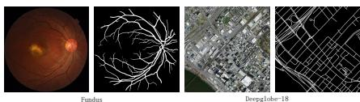  
Figure 6: Visualization of the Fundus and DeepGlobe-18 datasets.

## 6 CONCLUSION

In this work, inspired by the coarse-to-fine paradigm in classical image processing, we rethink the fundamental formulation of ICS and propose a foreground progressive ICS framework, FoRIS. Rather than treating ICS as a direct matching problem between reference and target images, we reformulate it as a progressive foreground refinement process, which progressively suppresses background interference, localizes target regions, and recovers coherent object structures through three stages: foreground purification, foreground localization, and foreground consolida tion. Extensive experiments demonstrate that FoRIS achieves competitive performance across semantic segmentation, part segmentation, and cross-domain benchmarks, while exhibiting strong out-of-distribution generalization. Meanwhile, we reveal the limitations of existing training-free ICS methods on slender and fragmented structures: weak semantic responses, limited spatial sup port, and substantial appearance variations make direct feature matching inadequate for preserving structural continuity. How to fully exploit VFM representations to handle such weakly salient, finegrained, and topology-sensitive targets remains an important open problem for training-free ICS.

Table 4: Comparison of results between SAM-based and DINO-based methods.
<table><tr><td rowspan="2">Method</td><td colspan="2">Fundus</td><td colspan="2">|DeepGlobe 18</td></tr><tr><td>1-shot 5-shot</td><td></td><td>1-shot 5-shot</td><td></td></tr><tr><td>GF-SAM</td><td>8.6</td><td>8.4</td><td>8.5</td><td>9.3</td></tr><tr><td>INSID3</td><td>12.3</td><td>11.7</td><td>7.2</td><td>7.3</td></tr><tr><td>FoRIS</td><td>19.7</td><td>21.5</td><td>13.3</td><td>13.5</td></tr></table>

## REFERENCES

Radhakrishna Achanta, Appu Shaji, Kevin Smith, Aurelien Lucchi, Pascal Fua, and Sabine Süsstrunk. Slic superpixels compared to state-of-the-art superpixel methods. IEEE transactions on pattern analysis and machine intelligence, 34(11):2274–2282, 2012.

Rolf Adams and Leanne Bischof. Seeded region growing. IEEE Transactions on pattern analysis and machine intelligence, 16(6):641–647, 1994.

Edward H Adelson, Charles H Anderson, James R Bergen, Peter J Burt, and Joan M Ogden. Pyramid methods in image processing. RCA engineer, 29(6):33–41, 1984.

Pablo Arbelaez, Michael Maire, Charless Fowlkes, and Jitendra Malik. Contour detection and hierarchical image segmentation. IEEE transactions on pattern analysis and machine intelligence, 33(5):898–916, 2010.

Vijay Badrinarayanan, Alex Kendall, and Roberto Cipolla. Segnet: A deep convolutional encoderdecoder architecture for image segmentation. IEEE transactions on pattern analysis and machine intelligence, 39(12):2481–2495, 2017.

Yuri Y Boykov and M-P Jolly. Interactive graph cuts for optimal boundary & region segmentation of objects in nd images. In Proceedings eighth IEEE international conference on computer vision. ICCV 2001, volume 1, pp. 105–112. IEEE, 2001.

Tom Brown, Benjamin Mann, Nick Ryder, Melanie Subbiah, Jared D. Kaplan, Prafulla Dhariwal, Arvind Neelakantan, Pranav Shyam, Girish Sastry, Amanda Askell, et al. Language models are few-shot learners. In NeurIPS, pp. 1877–1901, 2020.

Sema Candemir, Stefan Jaeger, Kannappan Palaniappan, Jonathan P. Musco, Rahul K. Singh, Zhiyun Xue, Alexandros Karargyris, Sameer Antani, George Thoma, and Clement J. McDonald. Lung segmentation in chest radiographs using anatomical atlases with nonrigid registration. IEEE Trans. Med. Imaging, 33(2):577–590, 2013.

Nicolas Carion, Laura Gustafson, Yuan-Ting Hu, Shoubhik Debnath, Ronghang Hu, Didac Suris, Chaitanya Ryali, Kalyan Vasudev Alwala, Haitham Khedr, Andrew Huang, et al. Sam 3: Segment anything with concepts. arXiv preprint arXiv:2511.16719, 2025.

Mathilde Caron, Hugo Touvron, Ishan Misra, Hervé Jégou, Julien Mairal, Piotr Bojanowski, and Armand Joulin. Emerging properties in self-supervised vision transformers. In ICCV, pp. 9650– 9660, 2021.

Liang-Chieh Chen, George Papandreou, Iasonas Kokkinos, Kevin Murphy, and Alan L Yuille. DeepLab: Semantic image segmentation with deep convolutional nets, atrous convolution, and fully connected CRFs. IEEE Trans. Pattern Anal. Mach. Intell., 40(4):834–848, 2017.

Aakanksha Chowdhery, Sharan Narang, Jacob Devlin, Maarten Bosma, Gaurav Mishra, Adam Roberts, Paul Barham, Hyung Won Chung, Charles Sutton, Sebastian Gehrmann, Parker Schuh, Kensen Shi, et al. PaLM: Scaling language modeling with pathways. J. Mach. Learn. Res., 24 (240):1–113, 2023.

Noel Codella, Veronica Rotemberg, Philipp Tschandl, M. Emre Celebi, Stephen Dusza, David Gutman, Brian Helba, Aadi Kalloo, Konstantinos Liopyris, Michael Marchetti, Harald Kittler, and Allan Halpern. Skin lesion analysis toward melanoma detection 2018: A challenge hosted by the international skin imaging collaboration (ISIC). arXiv:1902.03368 [cs.CV], 2019.

Claudia Cuttano, Gabriele Trivigno, Giuseppe Averta, and Carlo Masone. SANSA: Unleashing the hidden semantics in SAM2 for few-shot segmentation. In NeurIPS, 2025.

Claudia Cuttano, Gabriele Trivigno, Christoph Reich, Daniel Cremers, Carlo Masone, and Stefan Roth. Insid3: Training-free in-context segmentation with dinov3. In Proceedings of the IEEE/CVF Conference on Computer Vision and Pattern Recognition, pp. 21638–21648, 2026.

Ilke Demir, Krzysztof Koperski, David Lindenbaum, Guan Pang, Jing Huang, Saikat Basu, Forest Hughes, Devis Tuia, and Ramesh Raskar. Deepglobe 2018: A challenge to parse the earth through satellite images. In 2018 IEEE/CVF Conference on Computer Vision and Pattern Recognition Workshops (CVPRW), pp. 172–17209. IEEE, 2018.

Miguel Espinosa, Chenhongyi Yang, Linus Ericsson, Steven McDonagh, and Elliot J. Crowley. No time to train! Training-free reference-based instance segmentation. arXiv:2507.01300 [cs.CV], 2025.

Pedro F Felzenszwalb and Daniel P Huttenlocher. Efficient graph-based image segmentation. International journal ofcomputer vision, 59(2):167–181, 2004.

Oliver Hahn, Christoph Reich, Nikita Araslanov, Daniel Cremers, Christian Rupprecht, and Stefan Roth. Scene-centric unsupervised panoptic segmentation. In CVPR, pp. 24485–24495, 2025.

Mark Hamilton, Zhoutong Zhang, Bharath Hariharan, Noah Snavely, and William T. Freeman. Unsupervised semantic segmentation by distilling feature correspondences. In ICLR, 2022.

Kaiming He, Georgia Gkioxari, Piotr Dollár, and Ross Girshick. Mask r-cnn. In ICCV, pp. 2961– 2969, 2017.

Sunghwan Hong, Seokju Cho, Jisu Nam, Stephen Lin, and Seungryong Kim. Cost aggregation with 4D convolutional Swin transformer for few-shot segmentation. In ECCV, pp. 108–126, 2022.

Ming Hu, Jianfu Yin, Jing Wang, Yuqi Wang, Bingliang Hu, and Quan Wang. Specslice-convlstm: Medical hyperspectral image segmentation using spectral slicing and convlstm. In International Conference on Pattern Recognition, pp. 211–225. Springer, 2024.

Ming Hu, Jianfu Yin, Zhuangzhuang Ma, Jianheng Ma, Feiyu Zhu, Bingbing Wu, Ya Wen, Meng Wu, Cong Hu, Bingliang Hu, et al. beta-fft: Nonlinear interpolation and differentiated training strategies for semi-supervised medical image segmentation. In Proceedings of the IEEE/CVF Conference on Computer Vision and Pattern Recognition, pp. 30839–30849, 2025.

Ming Hu, Mingyu Dou, Jianfu Yin, Miaomiao Zhang, Cong Hu, Yao Wang, Bingliang Hu, and Quan Wang. Whereedit: Mask-aware local latent editing for one-step image editing. arXiv preprint arXiv:2607.20883, 2026a.

Ming Hu, Yongsheng Huo, Mingyu Dou, Jianfu Yin, Peng Zhao, Yao Wang, Cong Hu, Bingliang Hu, and Quan Wang. Fb-clip: Fine-grained zero-shot anomaly detection with foregroundbackground disentanglement. In Proceedings of the IEEE/CVF Conference on Computer Vision and Pattern Recognition, pp. 35659–35669, 2026b.

Md Jahidul Islam, Chelsey Edge, Yuyang Xiao, Peigen Luo, Muntaqim Mehtaz, Christopher Morse, Sadman Sakib Enan, and Junaed Sattar. Semantic segmentation of underwater imagery: Dataset and benchmark. In IROS, pp. 1769–1776, 2020.

Stefan Jaeger, Alexandros Karargyris, Sema Candemir, Les Folio, Jenifer Siegelman, Fiona Callaghan, Zhiyun Xue, Kannappan Palaniappan, Rahul K. Singh, Sameer Antani, et al. Automatic tuberculosis screening using chest radiographs. IEEE Trans. Med. Imaging, 33(2):233–245, 2013.

Kai Jin, Xingru Huang, Jingxing Zhou, Yunxiang Li, Yan Yan, Yibao Sun, Qianni Zhang, Yaqi Wang, and Juan Ye. Fives: A fundus image dataset for artificial intelligence based vessel segmentation. Scientific data, 9(1):475, 2022.

Michael Kass, Andrew Witkin, and Demetri Terzopoulos. Snakes: Active contour models. International journal ofcomputer vision, 1(4):321–331, 1988.

Alexander Kirillov, Eric Mintun, Nikhila Ravi, Hanzi Mao, Chloe Rolland, Laura Gustafson, Tete Xiao, Spencer Whitehead, Alexander C. Berg, Wan-Yen Lo, Piotr Dollar, and Ross Girshick. Segment Anything. In ICCV, pp. 4015–4026, 2023.

Philipp Krähenbühl and Vladlen Koltun. Efficient inference in fully connected CRFs with Gaussian edge potentials. In NIPS, pp. 109–117, 2011.

Chunbo Lang, Gong Cheng, Binfei Tu, and Junwei Han. Learning what not to segment: A new perspective on few-shot segmentation. In CVPR, pp. 8057–8067, 2022.

Yang Liu, Chenchen Jing, Hengtao Li, Muzhi Zhu, Hao Chen, Xinlong Wang, and Chunhua Shen. A simple image segmentation framework via in-context examples. In NeurIPS, pp. 25095–25119, 2024a.

Yang Liu, Muzhi Zhu, Hengtao Li, Hao Chen, Xinlong Wang, and Chunhua Shen. Matcher: Segment anything with one shot using all-purpose feature matching. In ICLR, 2024b.

Jonathan Long, Evan Shelhamer, and Trevor Darrell. Fully convolutional networks for semantic segmentation. In Proceedings ofthe IEEE conference on computer vision andpattern recognition, pp. 3431–3440, 2015.

Luke Melas-Kyriazi, Christian Rupprecht, Iro Laina, and Andrea Vedaldi. Deep spectral methods: A surprisingly strong baseline for unsupervised semantic segmentation and localization. In CVPR, pp. 8364–8375, 2022.

Lingchen Meng, Shiyi Lan, Hengduo Li, Jose M. Alvarez, Zuxuan Wu, and Yu-Gang Jiang. SegIC: Unleashing the emergent correspondence for in-context segmentation. In ECCV, volume 38, pp. 203–220, 2024.

Khoi Nguyen and Sinisa Todorovic. Feature weighting and boosting for few-shot segmentation. In ICCV, pp. 622–631, 2019.

Maxime Oquab, Timothée Darcet, Théo Moutakanni, Huy Vo, Marc Szafraniec, Vasil Khalidov, Pierre Fernandez, Daniel Haziza, Francisco Massa, Alaaeldin El-Nouby, et al. DINOv2: Learning robust visual features without supervision. Trans. Mach. Learn. Res., 2024.

Long Ouyang, Jeffrey Wu, Xu Jiang, Diogo Almeida, Carroll Wainwright, Pamela Mishkin, Chong Zhang, Sandhini Agarwal, Katarina Slama, Alex Ray, et al. Training language models to follow instructions with human feedback. In NeurIPS, pp. 27730–27744, 2023.

Olaf Ronneberger, Philipp Fischer, and Thomas Brox. U-net: Convolutional networks for biomedical image segmentation. In International Conference on Medical image computing and computerassisted intervention, pp. 234–241. Springer, 2015.

Carsten Rother, Vladimir Kolmogorov, and Andrew Blake. " grabcut" interactive foreground extraction using iterated graph cuts. ACM transactions on graphics (TOG), 23(3):309–314, 2004.

Jianbo Shi and Jitendra Malik. Normalized cuts and image segmentation. IEEE Transactions on pattern analysis and machine intelligence, 22(8):888–905, 2000.

Oriane Siméoni, Huy V. Vo, Maximilian Seitzer, Federico Baldassarre, Maxime Oquab, Cijo Jose, Vasil Khalidov, Marc Szafraniec, Seungeun Yi, Michaël Ramamonjisoa, et al. DINOv3. arXiv:2508.10104 [cs.CV], 2025.

Hugo Touvron, Thibaut Lavril, Gautier Izacard, Xavier Martinet, Marie-Anne Lachaux, Timothée Lacroix, Baptiste Rozière, Naman Goyal, Eric Hambro, Faisal Azhar, et al. LLaMA: Open and Efficient Foundation Language Models. arXiv:2302.13971 [cs.CV], 2023.

Philipp Tschandl, Cliff Rosendahl, and Harald Kittler. The HAM10000 dataset, a large collection of multi-source dermatoscopic images of common pigmented skin lesions. Sci. Data, 5(1):1–9, 2018.

Wouter Van Gansbeke, Simon Vandenhende, Stamatios Georgoulis, and Luc Van Gool. Unsupervised semantic segmentation by contrasting object mask proposals. In ICCV, pp. 10052–10062, 2021.

Kaixin Wang, Jun Hao Liew, Yingtian Zou, Daquan Zhou, and Jiashi Feng. PaNet: Few-shot image semantic segmentation with prototype alignment. In ICCV, pp. 9197–9206, 2019.

Xinlong Wang, Wen Wang, Yue Cao, Chunhua Shen, and Tiejun Huang. Images speak in images: A generalist painter for in-context visual learning. In CVPR, pp. 6830–6839, 2023a.

Xinlong Wang, Xiaosong Zhang, Yue Cao, Wen Wang, Chunhua Shen, and Tiejun Huang. SegGPT: Towards segmenting everything in context. In ICCV, pp. 1130–1140, 2023b.

Lihe Yang, Lei Qi, Litong Feng, Wayne Zhang, and Yinghuan Shi. Revisiting weak-to-strong consistency in semi-supervised semantic segmentation. In Proceedings ofthe IEEE/CVF conference on computer vision and pattern recognition, pp. 7236–7246, 2023.

Lihe Yang, Zhen Zhao, and Hengshuang Zhao. Unimatch v2: Pushing the limit of semi-supervised semantic segmentation. IEEE Transactions on Pattern Analysis and Machine Intelligence, 47(4): 3031–3048, 2025.

Xiwen Yao, Qinglong Cao, Xiaoxu Feng, Gong Cheng, and Junwei Han. Scale-aware detailed matching for few-shot aerial image semantic segmentation. IEEE Trans. Geosci. Remote. Sens., 60:1–11, 2021.

Anqi Zhang, Guangyu Gao, Jianbo Jiao, Chi Harold Liu, and Yunchao Wei. Bridge the points: Graph-based few-shot segment anything semantically. In NeurIPS, pp. 33232–33261, 2024a.

Renrui Zhang, Zhengkai Jiang, Ziyu Guo, Shilin Yan, Junting Pan, Xianzheng Ma, Hao Dong, Peng Gao, and Hongsheng Li. Personalize segment anything model with one shot. In ICLR, 2024b.

Muzhi Zhu, Yang Liu, Zekai Luo, Chenchen Jing, Hao Chen, Guangkai Xu, Xinlong Wang, and Chunhua Shen. Unleashing the potential of the diffusion model in few-shot semantic segmentation. In NeurIPS, pp. 42672–42695, 2024.

## APPENDIX

## A EXPERIMENTS SETTING

We evaluate FoRIS on one-shot semantic and part segmentation. In each setting, a single annotated reference mask is provided, and the model is tasked with segmenting the corresponding concept in the target image: (1) semantic – all instances of a given class (e.g., “dog”); (2) part – same object part (e.g., “dog ear”).

For one-shot semantic segmentation, we use six datasets across a range of imaging scenarios: COCO-20i Nguyen & Todorovic (2019) with 80 object categories; LVIS-92i Liu et al. (2024b) with 920 categories and a strong long-tail distribution; ISIC2018 Codella et al. (2019); Tschandl et al. (2018) for skin lesion segmentation; Chest X-Ray Candemir et al. (2013); Jaeger et al. (2013), an X-ray dataset of lung screening; iSAID-5i Yao et al. (2021), a remote sensing dataset with 15 categories; and SUIM Islam et al. (2020) with underwater imagery and 8 categories. For one-shot part segmentation, we use PASCAL-Part Liu et al. (2024b), providing 56 object parts across 15 categories, and PACO-Part Liu et al. (2024b) with 303 object parts from 75 categories.

Implementation details. We adopt the Large version of the DINOv3 Siméoni et al. (2025) encoder. Input images are resized to 1024 × 1024, following SAM-based approaches Liu et al. (2024b); Zhang et al. (2024b;a). The final segmentation masks are predicted at patch resolution: we bilinearly interpolate them to original resolution, and apply mask refinement with a CRF Krähenbühl & Koltun (2011), following Hamilton et al. (2022); Hahn et al. (2025); Van Gansbeke et al. (2021); Melas-Kyriazi et al. (2022).

## B ALGORITHM SUMMARY

Algorithm 1 FoRIS inference (single target episode)   
Require: Reference images $\{ I _ { s } , M _ { s } \} _ { s = 1 } ^ { S }$ , target image $I _ { t } ,$ frozen encoder $\phi$   
Ensure: Binary mask $\hat { M } _ { t }$   
1: $\mathbf { F } \gets \phi ( [ I _ { 1 } , \ldots , I _ { S } , I _ { t } ] ) ; \mathbf { f } ( \mathbf { p } ) \gets \mathbf { F } ( \mathbf { p } ) / \| \mathbf { F } ( \mathbf { p } ) \| _ { 2 }$   
2: // FP: adaptive positional debiasing   
3: Compute $s _ { \mathrm { s e m } } ; \mathrm { i f } s _ { \mathrm { s e m } } < \theta ,$ replace f with $\tilde { \mathbf { f } }$ via $\mathbf { P } _ { \perp }$ (eq. (3))   
4: // FP: Stage-1 gating   
5: Cluster reference foreground tokens (agglomerative) $ \{ \mu _ { j } \} _ { j = 1 } ^ { J } ;$ ; build $\mu ^ { \mathrm { f g } } , \mu ^ { \mathrm { b g } }$ (TopK 20%   
hard negatives)   
6: Compute gate $g ( \mathbf { p } )$ and gated features $\hat { \mathbf { f } } \left( \mathbf { p } \right)$ on all tokens (eq. (5))   
7: // FP: Stage-2 matching (Score 1)   
8: Orthogonalize $\mu _ { \perp } ^ { \mathrm { b g } }$ w.r.t. $\mu ^ { \mathrm { f g } }$ (eq. (6))   
9: $\begin{array} { r } { S ^ { ( 1 ) } \gets \beta \log { \sum _ { j } } \mathrm { e x p } ( \langle \tilde { \mathbf { f } } _ { t } , \pmb { \mu } _ { j } \rangle / \beta ) - \langle \tilde { \mathbf { f } } _ { t } , \pmb { \mu } _ { \perp } ^ { \mathrm { b g } } \rangle } \end{array}$ on ungated $\tilde { \mathbf { f } } _ { t } \left( \mathrm { e q . } \left( 7 \right) \right)$   
10: $S _ { \mathrm { f g } } , S _ { \mathrm { b g } } $ per-episode min–max normalization   
11: // FL (Score 2)   
12: V ← cross-image candidate votes; densify $\mathcal { C }$   
13: Cluster target patches on $[ \mathbf { f } ; \mathbf { c } ; \mathbf { p } ]$ (eq. (9)); build seed prior $P$ from $j ^ { \star }$ and $\{ \rho _ { j } \}$   
14: $S ^ { ( 2 ) } \gets S ^ { ( 1 ) } + ( V - \textstyle \frac { 1 } { 2 } ) \dot { + } ( P - \textstyle \frac { 1 } { 2 } ) ( \mathrm { e q . } ( 1 3 ) )$   
15: // FC (Score 3)   
16: Π ← SDP from $S _ { \mathrm { f g } } , S _ { \mathrm { b g } } , V , P$ (eq. (15))   
17: Re-cluster gated $\hat { \mathbf { f } } _ { t } ;$ compute ∆(p) from cluster means   
18: $S ^ { ( 3 ) }  S ^ { ( \bar { 2 } ) } - \Pi + \Delta \bar { ( \mathrm { e q . } ( 1 7 ) ) }$   
19: $\hat { M } _ { t } \gets$ binarize, upsample, CRF-refine $S ^ { ( 3 ) }$   
20: return $\hat { M } _ { t }$

Table 5: Semantic correspondence on SPair-71k (PCK@T in %, ↑). Comparison across DINOv3 backbones with original, debiased, and adaptive debias variants.
<table><tr><td></td><td colspan="3">Small</td><td colspan="3">Base</td><td colspan="3">Large</td></tr><tr><td>T</td><td>original</td><td>debias</td><td>adaptive</td><td>original</td><td>debias</td><td>adaptive</td><td>original</td><td>debias</td><td>adaptive</td></tr><tr><td>0.05</td><td>27.93</td><td>28.18</td><td>28.37</td><td>30.07</td><td>33.68</td><td>33.69</td><td>33.55</td><td>34.57</td><td>34.61</td></tr><tr><td>0.10</td><td>44.92</td><td>45.65</td><td>45.94</td><td>46.80</td><td>52.60</td><td>52.60</td><td>52.04</td><td>54.11</td><td>54.12</td></tr><tr><td>0.15</td><td>54.31</td><td>55.75</td><td>56.01</td><td>55.60</td><td>62.49</td><td>62.50</td><td>61.63</td><td>64.24</td><td>64.27</td></tr><tr><td>0.20</td><td>60.55</td><td>62.78</td><td>62.97</td><td>61.22</td><td>68.72</td><td>68.73</td><td>67.80</td><td>70.76</td><td>70.76</td></tr></table>

## C SEMANTIC CORRESPONDENCE ANALYSIS OF POSITIONAL DEBIASING

To further investigate the effect of positional debiasing on semantic correspondence, we evaluate the original, fixed-debiasing, and adaptive-debiasing variants on SPair-71k. The results are reported in table 5.

Applying positional debiasing consistently improves semantic correspondence across different DI-NOv3 model scales and evaluation thresholds. For example, with the DINOv3-Base backbone, PCK@0.10 improves from 46.80 to 52.60, while PCK@0.20 increases from 61.22 to 68.73. Similar improvements are observed across the Small, Base, and Large backbones, indicating that removing position-dominated components can improve the reliability of dense semantic correspondence.

Adaptive debiasing further achieves the strongest performance across the evaluated settings. Although its improvement over fixed debiasing is relatively modest, the adaptive variant consistently avoids the performance degradation observed when positional information is suppressed indiscriminately. This suggests that positional information in frozen DINOv3 features is not purely harmful: useful spatial regularities can facilitate correspondence when reference and target images are already well aligned.

This observation is also consistent with the segmentation ablation in table 2. Applying debiasing unconditionally does not always improve downstream segmentation and can even degrade performance on some datasets, such as ISIC (46.8→41.2). In contrast, adaptive debiasing dynamically regulates the debiasing strength according to the reliability of semantic correspondence, suppressing position-dominated activations only when necessary.

Overall, the SPair-71k results provide complementary evidence for the design of APD: effective positional debiasing should selectively suppress harmful positional bias while retaining useful geometric priors encoded in frozen visual features.

## D COMPUTATIONAL COST OF FORIS

We further analyze the computational cost of FoRIS on COCO-20i from both the componentwise and resolution-wise perspectives. As shown in Table 6, the total inference time of FoRIS is 1 620.77 ms for a single in-context example at a resolution of 1 024 px on a single RTX 3090. The main computational costs come from the encoder forward pass and the subsequent foreground localization and consolidation stages, while foreground purification introduces only a relatively small overhead. Although FoRIS is slower than INSID3 Cuttano et al. (2026) at the same 1 024 px resolution, directly comparing runtime at a fixed resolution does not fully characterize the accuracy– efficiency trade-off between the two methods.

To further investigate this trade-off, we evaluate FoRIS under different input resolutions on COCO-20i, as reported in Table 7. Interestingly, FoRIS achieves 59.5 % mIoU even at a resolution of only 512 px, already surpassing the 57.6 % mIoU achieved by INSID3 at 1 024 px. More importantly, the 512 px setting requires only 258 ms per in-context example, compared with 812 ms for INSID3 at 1 024 px. This corresponds to a 68.2 % reduction in inference time while simultaneously improving mIoU by 1.9 percentagepoints. Thus, although FoRIS incurs a higher computational cost when operating at the same resolution, it can achieve stronger segmentation performance with substantially lower-resolution inputs, yielding a more favorable practical accuracy–efficiency trade-off on COCO-20i.

The resolution study further reveals a clear diminishing-return effect. Increasing the input resolution of FoRIS from 512 px to 1 024 px improves mIoU from 59.5 % to 60.9 %, yielding only a 1.4 percentage−point gain, whereas the inference time increases from 258 ms to 1 621 ms, corresponding to more than a 6× increase in computational cost. Further increasing the resolution provides little additional benefit: mIoU remains around 61 % even at 1 760 px, while the inference time increases substantially to 11 235 ms. These results indicate that, on COCO-20i, the segmentation performance of FoRIS is relatively insensitive to increasing input resolution, and that low-resolution inference can already preserve most of its segmentation capability.

Overall, the results on COCO-20i demonstrate that the computational efficiency of FoRIS should be considered jointly with its achievable segmentation accuracy at different resolutions, rather than solely through runtime comparisons at a fixed resolution. In particular, the 512 px setting provides a compelling operating point, achieving higher mIoU than INSID3 at 1 024 px while requiring only a fraction of its inference time. This favorable accuracy–efficiency trade-off suggests that FoRIS can maintain strong in-context segmentation performance without relying on computationally expensive high-resolution inputs.

Table 6: Detailed computational analysis of FoRIS on COCO-20i. We report the inference time of each component in milliseconds (ms, ↓) for a single in-context example. Runtime is measured at a resolution of 1 024 px on a single RTX 3090.
<table><tr><td>Component</td><td>Runtime↓</td></tr><tr><td>Encoder forward</td><td>702.27 ms</td></tr><tr><td>Foreground purification</td><td>38.74 ms</td></tr><tr><td>Foreground localization</td><td>346.44 ms</td></tr><tr><td>Foreground consolidation</td><td>342.50 ms</td></tr><tr><td>CRF refinement</td><td>190.82 ms</td></tr><tr><td>Total inference time</td><td>1 620.77 ms</td></tr><tr><td>INSID3 Cuttano et al. (2026)</td><td>812 ms</td></tr></table>

Table 7: Resolution-wise computational analysis of FoRIS on COCO-20i. We report the inference time and mIoU of FoRIS under different input resolutions. Runtime is measured for a single in-context example on a single RTX 3090. The 1 024 px setting corresponds to the resolution used for the component-wise analysis in Table 6.
<table><tr><td colspan="8">Low resolution ← Resolution → High resolution</td></tr><tr><td></td><td>512 px</td><td>720 px</td><td>896 px</td><td>1024 px</td><td>1440 px</td><td>1600 px</td><td>1760 px</td></tr><tr><td>Runtime mIoU (%)</td><td>258 ms 59.5</td><td>593 ms 60.3</td><td>1 108 ms 60.7</td><td>1 621 ms 60.9</td><td>5 468 ms 60.8</td><td>9018ms 60.1</td><td>11 235 ms 61.0</td></tr></table>

## E N-SHOT SEGMENTATION

We further evaluate FoRIS in the 5-shot setting by providing five reference image–mask pairs for each target image. As shown in Table 8, FoRIS achieves the highest average mIoU of 64.7%, outperforming the strongest training-free baseline, INSID3, by 4.8 percentage points. FoRIS ranks first on 7 out of 8 benchmarks and consistently outperforms INSID3 across all datasets, with particularly notable gains on X-Ray (+7.9 points), PASCAL (+6.2 points), and PACO (+5.4 points). These improvements span diverse domains, including natural images, medical images, underwater scenes, and aerial imagery, demonstrating the robustness of FoRIS under substantial domain shifts. Notably, FoRIS uses the same DINOv3 encoder and parameter count as INSID3, indicating that the performance gains arise from more effective foreground purification, localization, and consolidation rather than increased model capacity. Moreover, all hyperparameters are directly reused from the 1-shot setting without any additional tuning, demonstrating that FoRIS scales effectively to multiple contextual examples.

Table 8: Comparison of FoRIS (mIoU in %, ↑) on 5-shot semantic and part segmentation. Models are provided with 5 contextual examples and tasked with segmenting the annotated concept in the target image. FoRIS scales effectively to multiple references, achieving robust performance across domains. All hyperparameters are reused from the 1-shot setting without any tuning, highlighting the versatility of our approach. Gray indicates the model was trained on the corresponding train split of the dataset; best results bold, 2nd best underlined.
<table><tr><td rowspan="2">Method</td><td rowspan="2">Encoder</td><td rowspan="2">Params</td><td colspan="6">Semantic</td><td rowspan="2" colspan="2">Part</td><td rowspan="2">Avg</td></tr><tr><td>LVIS-92i COCO-20i ISIC SUIM iSAID X-Ray</td><td></td><td></td><td></td><td></td><td>PASCAL PACO</td><td></td></tr><tr><td colspan="10">Task-specific fine-tuning: semantic + mask supervision</td><td></td><td></td></tr><tr><td>SegGPT</td><td>ViT</td><td>354M</td><td>25.4</td><td>67.9</td><td>45.2</td><td>33.7</td><td>35.9</td><td>89.1</td><td>42.8</td><td>14.1</td><td>44.3</td></tr><tr><td>SINE</td><td>DINOv2</td><td>373M</td><td>35.5</td><td>66.1</td><td>28.6</td><td>54.8</td><td>40.5</td><td>40.6</td><td>36.4</td><td>25.4</td><td>41.0</td></tr><tr><td>DiffewS</td><td>Stable Diffusion</td><td>890M</td><td>35.4</td><td>72.2</td><td>32.7</td><td>49.8</td><td>48.0</td><td>45.1</td><td>39.7</td><td>26.1</td><td>43.6</td></tr><tr><td colspan="10">Training-free: mask-supervised pre-training</td><td colspan="2"></td></tr><tr><td>Matcher</td><td>DINOv2+SAM</td><td>945M</td><td>40.0</td><td>60.7</td><td>35.0</td><td>50.6</td><td>34.3</td><td>71.2</td><td>45.8</td><td>33.6</td><td>46.4</td></tr><tr><td>GF-SAM</td><td>DINOv2+SAM</td><td>945M</td><td>44.2</td><td>66.8</td><td>55.2</td><td>58.1</td><td>52.4</td><td>52.9</td><td>51.2</td><td>41.9</td><td>52.8</td></tr><tr><td>GF-SAM†</td><td>DINOv3+SAM</td><td>945M</td><td>42.8</td><td>64.4</td><td>56.7</td><td>58.6</td><td>53.2</td><td>54.7</td><td>50.3</td><td>39.3</td><td>52.5</td></tr><tr><td>GF-SAM† + debias DINOv3+SAM</td><td></td><td>945M</td><td>43.6</td><td>64.6</td><td>58.2</td><td>59.2</td><td>54.1</td><td>59.1</td><td>51.4</td><td>40.2</td><td>53.8</td></tr><tr><td colspan="10">Training-free: unsupervised pre-training</td><td rowspan="2"></td></tr><tr><td>INSID3</td><td>DIÑOv3</td><td>304M</td><td>47.2</td><td>65.1</td><td>63.9</td><td>61.7</td><td>56.9</td><td>80.1</td><td>57.1</td><td>46.8</td><td>59.9</td></tr><tr><td>FoRIS</td><td>DINOv3</td><td>304M</td><td>51.0</td><td>68.4</td><td>66.5</td><td>66.9</td><td>61.7</td><td>88.0</td><td>63.3</td><td>52.2</td><td>64.7</td></tr></table>

## F LIMITATIONS OF VFM-BASED TRAINING-FREE ICS FOR SLENDER STRUCTURE SEGMENTATION

Vision foundation models (VFMs) have emerged as powerful visual representation learners and have substantially advanced training-free in-context segmentation (ICS). By leveraging large-scale pretrained knowledge, existing VFM-based ICS methods perform segmentation without task-specific optimization, typically by measuring feature similarity between support and query images, constructing semantic prototypes, or exploiting correspondence encoded in foundation-model representations. These approaches achieve strong results on objects with distinct semantics and relatively compact spatial extent.

However, the suitability of such training-free paradigms for slender-structure segmentation remains uncertain. Unlike common objects with large, coherent regions, slender structures—blood vessels, nerves, and tubular anatomical patterns—exhibit properties that conflict with the assumptions underlying current VFM-based ICS. Segmenting them requires not only semantic recognition but also precise localization, boundary preservation, and structural continuity, none of which are explicitly optimized in standard VFM representations.

Patch-level foreground–background mixing. Most foundation models, especially transformerbased architectures, represent images with spatial tokens derived from local patches. For compact objects, individual tokens usually contain enough foreground signal to capture object semantics. For slender structures, however, foreground may occupy only a small fraction of a patch, so the resulting representation is dominated by surrounding background. The extracted feature therefore mixes foreground and background rather than encoding a pure object descriptor. This weakens separability between slender structures and their context and makes reliable training-free matching difficult.

Dispersed intra-class feature distributions. Training-free ICS methods often assume that instances of the same category form a consistent, compact cluster in feature space. Prototype-based approaches, for instance, summarize foreground regions into representative embeddings and label query regions by similarity to these prototypes. Slender structures violate this assumption: scale, orientation, curvature, illumination, and local appearance vary widely along a single structure, and different segments can look substantially different. The foreground distribution in feature space becomes dispersed rather than compact, so a single prototype may fail to cover the full appearance and topology of an elongated target.

Table 9: Comparison of training-free ICS methods on slender-structure datasets (mIoU, %). All methods use frozen DINOv3-L at 1024×1024 with default last-layer features.
<table><tr><td rowspan="2">Method</td><td colspan="2">Fundus</td><td colspan="2">DeepGlobe-18</td></tr><tr><td>1-shot</td><td>5-shot</td><td>1-shot</td><td>5-shot</td></tr><tr><td>GF-SAM Zhang et al. (2024a)</td><td>8.6</td><td>8.4</td><td>8.5</td><td>9.3</td></tr><tr><td>INSID3 Cuttano et al. (2026)</td><td>12.3</td><td>11.7</td><td>7.2</td><td>7.3</td></tr><tr><td>FoRIS</td><td>19.7</td><td>21.5</td><td>13.3</td><td>13.5</td></tr></table>

## F.1 EXPERIMENTAL SETUP

To empirically examine the limitations above, we treat slender-structure segmentation as a stress test for training-free ICS rather than as a solved benchmark. We evaluate on two public datasets with elongated, low-contrast foreground: Fundus Jin et al. (2022) for retinal vessel segmentation and DeepGlobe-18 Demir et al. (2018) for aerial road extraction. Both exhibit low appearance saliency, elongated topology, and weak local discriminability. We follow the episodic protocol of the main experiments: each episode contains S reference image–mask pairs and one target image, and all methods use a frozen DINOv3-L encoder without task-specific fine-tuning. Unless otherwise noted, inputs are resized to 1024×1024 and features are taken from the last intermediate encoder block (layer 23), matching the default setting in section 4. We report mean IoU (mIoU) over randomly sampled episodes. Because slender structures occupy a tiny fraction of image area, mIoU alone can understate partial recovery of thin branches; we therefore complement table 9 with layer/resolution sweeps (tables 10 and 11) and layer-wise feature visualizations.

## F.2 QUANTITATIVE COMPARISON ON SLENDER STRUCTURES

Table 9 summarizes one-shot and five-shot mIoU on Fundus and DeepGlobe-18. Three observations stand out.

All methods remain far below compact-object performance. Even the best entry in table 9— FoRIS at 21.5% mIoU on Fundus (5-shot)—is an order of magnitude lower than scores on benchmarks such as COCO or Chest X-ray in table 1. This confirms that current VFM representations, together with prototype-based ICS pipelines, are insufficient for reliable slender-structure recovery despite strong performance on semantically compact targets.

Relative ranking is preserved, but absolute gains are modest. As shown in table 9, FoRIS consistently outperforms INSID3 and GF-SAM on both datasets (+7.4/+9.8 pts. on Fundus and +6.1/+6.2 pts. on DeepGlobe-18 under 1-shot). Progressive refinement in FoRIS mitigates background-dominated matching to some extent, yet the low performance ceiling suggests that post hoc score refinement cannot fully compensate for weak patch-level vessel semantics.

Additional references provide limited benefit. table 9 further shows that increasing shots from 1 to 5 improves Fundus mIoU by only 1.8 pts. for FoRIS and can even reduce INSID3 performance (12.3 → 11.7). On DeepGlobe-18, all methods gain less than 1.5 pts. with five references. This supports the dispersed-feature limitation above: extra prototypes are insufficient to cover the full appearance and topology of elongated structures.

## F.3 LAYER-WISE AND RESOLUTION SENSITIVITY

Slender structures are highly sensitive to both which encoder layer is used and how densely patches are sampled. Tables 10 and 11 and figs. 7 and 8 report layer-wise sweeps on Fundus and DeepGlobe-18 under 1-shot and 5-shot settings with input resolutions of 512, 1024, and 2048. The same trends appear on both datasets.

Early layers carry little segmentation signal. In tables 10 and 11, layers 0–7 yield mIoU below 13% on Fundus and below 10% on DeepGlobe-18 across all resolutions and shot counts. Low-level tokens therefore encode texture and local appearance rather than vessel- or road-level semantics usable for cross-image matching.

Mid-to-deep layers encode partial target semantics. Performance rises sharply between layers 8 and 16 in both tables. On Fundus (table 10), 1-shot mIoU reaches 28.9–31.9% at layer 12 with 2048 inputs; on DeepGlobe-18 (table 11), the corresponding peak at layer 19 reaches 23.9%. Intermediate representations thus begin to capture structure-relevant cues, but only after sufficient depth and spatial resolution.

The default last layer is suboptimal. Layer 23—used by default in our main pipeline and in table 9—achieves only 19.7% mIoU on Fundus and 13.3% on DeepGlobe-18 at 1024 (1-shot), as reported in tables 10 and 11. In contrast, the best layer at the same resolution (layer 20 on Fundus, layer 19 on DeepGlobe-18) and the best overall settings (layers 20–21 at 2048 on Fundus, up to 41.7%; layer 19 at 2048 on DeepGlobe-18, up to 23.9%) are substantially higher. The final block appears over-specialized for global semantic aggregation and sacrifices the fine spatial detail needed for thin structures, consistent with the structural-preservation limitation above.

Resolution is critical for thin structures. At the best-performing mid-to-deep layers in tables 10 and 11, increasing resolution from 512 to 2048 nearly doubles 1-shot mIoU on Fundus (21.9% → 41.7% at layer 20) and more than doubles it on DeepGlobe-18 (10.0% → 23.9% at layer 19). Higher resolution reduces foreground–background mixing within each patch token and lets crossimage matching operate on a finer spatial grid, directly mitigating the patch-mixing issue described above. Even so, the best layer–resolution combinations in tables 10 and 11 remain below 45% mIoU on Fundus and 27% on DeepGlobe-18, indicating that representation and matching improvements alone are insufficient without explicit structural priors.

Table 10: Layer-wise mIoU (%) on Fundus with FoRIS under 1-shot and 5-shot settings and input resolutions of 512, 1024, and 2048. Bold indicates the best result per column.
<table><tr><td rowspan="2">Layer</td><td colspan="3">1-shot</td><td colspan="3">5-shot</td></tr><tr><td>512</td><td>1024</td><td>2048</td><td>512</td><td>1024</td><td>2048</td></tr><tr><td>0</td><td>9.4</td><td>9.3</td><td>8.9</td><td>9.2</td><td>9.4</td><td>9.5</td></tr><tr><td>1</td><td>9.9</td><td>9.6</td><td>9.5</td><td>9.0</td><td>9.0</td><td>9.2</td></tr><tr><td>2</td><td>9.5</td><td>9.6</td><td>9.4</td><td>9.8</td><td>9.4</td><td>9.1</td></tr><tr><td>3</td><td>9.6</td><td>9.8</td><td>9.5</td><td>10.2</td><td>9.6</td><td>9.3</td></tr><tr><td>4</td><td>10.2</td><td>10.1</td><td>9.8</td><td>11.1</td><td>10.5</td><td>9.6</td></tr><tr><td>5</td><td>10.5</td><td>10.1</td><td>9.7</td><td>11.2</td><td>10.5</td><td>9.8</td></tr><tr><td>6</td><td>11.1</td><td>12.1</td><td>10.8</td><td>12.7</td><td>14.1</td><td>12.6</td></tr><tr><td>7</td><td>10.1</td><td>10.7</td><td>10.5</td><td>12.8</td><td>15.3</td><td>13.7</td></tr><tr><td>8</td><td>12.4</td><td>13.2</td><td>13.1</td><td>14.3</td><td>17.6</td><td>18.5</td></tr><tr><td>9</td><td>14.0</td><td>15.8</td><td>15.3</td><td>17.0</td><td>22.0</td><td>23.8</td></tr><tr><td>10</td><td>16.3</td><td>21.9</td><td>22.0</td><td>19.8</td><td>28.2</td><td>33.3</td></tr><tr><td>11</td><td>18.0</td><td>25.4</td><td>26.5</td><td>21.5</td><td>32.2</td><td>38.1</td></tr><tr><td>12</td><td>19.0</td><td>28.9</td><td>31.9</td><td>21.7</td><td>33.3</td><td>42.0</td></tr><tr><td>13</td><td>20.6</td><td>31.9</td><td>37.0</td><td>23.1</td><td>35.3</td><td>44.9</td></tr><tr><td>14</td><td>19.9</td><td>30.2</td><td>38.0</td><td>21.7</td><td>33.4</td><td>43.4</td></tr><tr><td>15</td><td>20.7</td><td>30.4</td><td>39.0</td><td>21.2</td><td>32.3</td><td>42.8</td></tr><tr><td>16</td><td>21.5</td><td>31.3</td><td>40.0</td><td>22.0</td><td>32.7</td><td>42.0</td></tr><tr><td>17</td><td>20.9</td><td>30.6</td><td>38.0</td><td>21.7</td><td>32.9</td><td>41.3</td></tr><tr><td>18</td><td>21.5</td><td>31.7</td><td>39.3</td><td>22.8</td><td>33.6</td><td>39.6</td></tr><tr><td>19</td><td>21.9</td><td>33.4</td><td>40.9</td><td>23.8</td><td>34.6</td><td>40.6</td></tr><tr><td>20</td><td>21.9</td><td>32.5</td><td>41.7</td><td>24.5</td><td>34.8</td><td>43.8</td></tr><tr><td>21</td><td>21.9</td><td>31.4</td><td>40.1</td><td>24.6</td><td>33.4</td><td>42.3</td></tr><tr><td>22</td><td>19.8</td><td>29.4</td><td>35.7</td><td>22.8</td><td>30.8</td><td>38.6</td></tr><tr><td>23</td><td>15.1</td><td>19.7</td><td>20.5</td><td>14.6</td><td>21.5</td><td>23.9</td></tr></table>

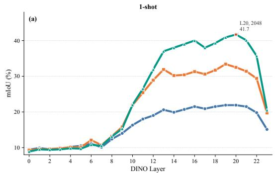

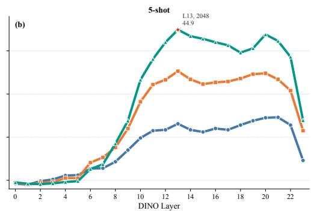  
Figure 7: Layer-wise mIoU on Fundus. Curves summarize table 10. Mid-to-deep layers (8–21) benefit strongly from higher input resolution, whereas the last layer (23) degrades sharply, confirming that the default feature depth is misaligned with slender-structure matching.

Table 11: Layer-wise mIoU (%) on DeepGlobe-18 with FoRIS under 1-shot and 5-shot settings and input resolutions of 512, 1024, and 2048. Bold indicates the best result per column.
<table><tr><td rowspan="2">Layer</td><td colspan="3">1-shot</td><td colspan="3">5-shot</td></tr><tr><td>512</td><td>1024</td><td>2048</td><td>512</td><td>1024</td><td>2048</td></tr><tr><td>0</td><td>6.8</td><td>7.5</td><td>9.1</td><td>6.7</td><td>7.7</td><td>9.6</td></tr><tr><td>1</td><td>6.6</td><td>7.0</td><td>8.1</td><td>6.4</td><td>6.9</td><td>8.4</td></tr><tr><td>2</td><td>6.7</td><td>7.4</td><td>8.6</td><td>6.7</td><td>7.5</td><td>9.7</td></tr><tr><td>3</td><td>6.6</td><td>7.3</td><td>8.3</td><td>6.6</td><td>7.7</td><td>9.9</td></tr><tr><td>4</td><td>6.4</td><td>6.8</td><td>7.8</td><td>6.4</td><td>7.0</td><td>8.1</td></tr><tr><td>5</td><td>6.2</td><td>7.0</td><td>9.0</td><td>6.2</td><td>7.4</td><td>10.5</td></tr><tr><td>6</td><td>6.2</td><td>6.9</td><td>8.5</td><td>6.3</td><td>7.4</td><td>10.1</td></tr><tr><td>7</td><td>6.1</td><td>7.2</td><td>8.9</td><td>6.4</td><td>7.6</td><td>10.2</td></tr><tr><td>8</td><td>6.5</td><td>7.6</td><td>9.4</td><td>6.9</td><td>8.0</td><td>11.0</td></tr><tr><td>9</td><td>7.0</td><td>8.6</td><td>10.9</td><td>7.4</td><td>9.3</td><td>12.6</td></tr><tr><td>10</td><td>7.5</td><td>9.6</td><td>12.5</td><td>7.9</td><td>10.4</td><td>14.8</td></tr><tr><td>11</td><td>7.9</td><td>10.9</td><td>14.9</td><td>8.5</td><td>11.8</td><td>17.7</td></tr><tr><td>12</td><td>8.2</td><td>11.4</td><td>16.2</td><td>8.7</td><td>12.4</td><td>18.8</td></tr><tr><td>13</td><td>8.4</td><td>12.5</td><td>17.6</td><td>9.0</td><td>13.1</td><td>19.2</td></tr><tr><td>14</td><td>8.6</td><td>12.7</td><td>18.9</td><td>9.1</td><td>13.6</td><td>21.6</td></tr><tr><td>15</td><td>8.7</td><td>13.3</td><td>20.7</td><td>9.2</td><td>14.5</td><td>23.5</td></tr><tr><td>16</td><td>8.7</td><td>13.2</td><td>20.4</td><td>9.3</td><td>14.4</td><td>22.6</td></tr><tr><td>17</td><td>8.7</td><td>13.1</td><td>19.8</td><td>9.2</td><td>13.9</td><td>22.2</td></tr><tr><td>18</td><td>9.5</td><td>15.3</td><td>23.2</td><td>10.3</td><td>16.8</td><td>26.1</td></tr><tr><td>19</td><td>10.0</td><td>16.7</td><td>23.9</td><td>11.3</td><td>18.2</td><td>26.3</td></tr><tr><td>20</td><td>9.6</td><td>15.5</td><td>22.5</td><td>10.5</td><td>17.2</td><td>25.2</td></tr><tr><td>21</td><td>9.0</td><td>14.7</td><td>20.8</td><td>10.4</td><td>16.5</td><td>23.8</td></tr><tr><td>22</td><td>9.0</td><td>15.0</td><td>21.6</td><td>10.2</td><td>17.0</td><td>24.5</td></tr><tr><td>23</td><td>8.9</td><td>13.3</td><td>18.8</td><td>7.9</td><td>13.5</td><td>20.4</td></tr></table>

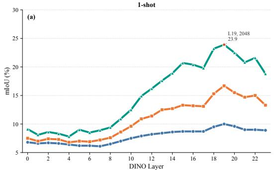

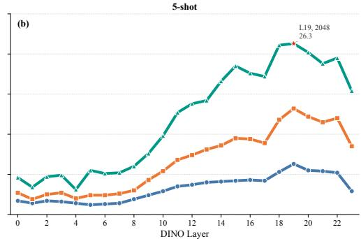  
Figure 8: Layer-wise mIoU on DeepGlobe-18. Curves summarize table 11. The pattern mirrors Fundus: mid-to-deep layers gain from higher resolution, while the last layer (23) underperforms, indicating that default last-layer features are poorly suited to elongated targets.

## F.4 FEATURE REPRESENTATION ANALYSIS

To connect the quantitative gap in tables 9 to 11 to representation behavior, we visualize DINOv3 patch features layer by layer on representative Fundus and DeepGlobe-18 episodes (figs. 9 to 14). For each encoder block we show the feature norm, a PCA colorization of raw tokens, and the same PCA view after positional debiasing.

Foreground–background mixing in patch tokens. In early and mid layers, PCA maps on vessel or road pixels closely resemble surrounding background: token colors vary smoothly across tissue or terrain boundaries instead of forming a coherent foreground cluster. Norm maps further show that high-magnitude responses often align with global illumination or texture rather than with thin foreground branches. A single token therefore rarely represents “vessel” or “road” in isolation, directly illustrating the patch-mixing limitation.

Dispersed foreground semantics across branches. Even in deeper layers where foreground regions become slightly more distinguishable, different branches, crossings, and terminators appear as separate color modes in PCA space rather than as one compact cluster. This dispersion explains why prototype-based ICS—which compresses the reference mask into a small set of cluster centers—systematically misses thin side branches and peripheral capillaries.

Positional debiasing improves alignment but not topology. Positional debiasing (Debias PCA) reduces layout-driven color gradients and sharpens cross-image correspondence, especially when reference and target objects occupy different locations. It does not, however, reconnect fragmented segments in similarity maps: debiasing improves where to match but not whether matched regions form a connected structure. This aligns with the modest quantitative gains of FoRIS over INSID3— purification improves semantic alignment, yet structural continuity remains largely unaddressed.

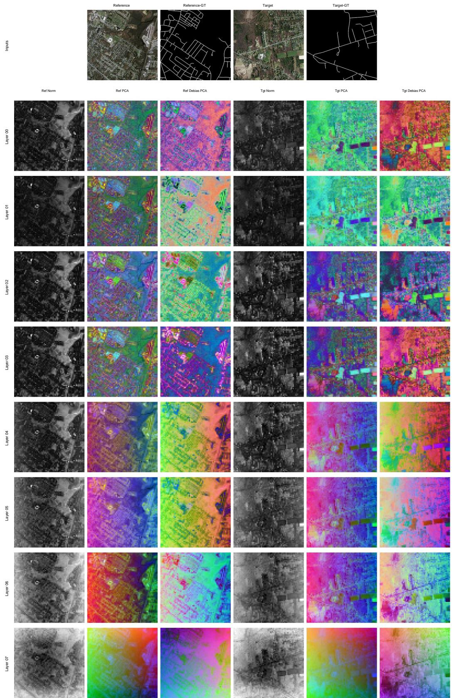  
Figure 9: Layer-wise DINOv3 features on DeepGlobe-18 (layers 0–7). Top row: reference image, reference mask, target image, and ground truth. Each subsequent row shows, for reference (left) and target (right), the feature norm (Norm), PCA colorization (PCA), and debiased PCA (Debias PCA).

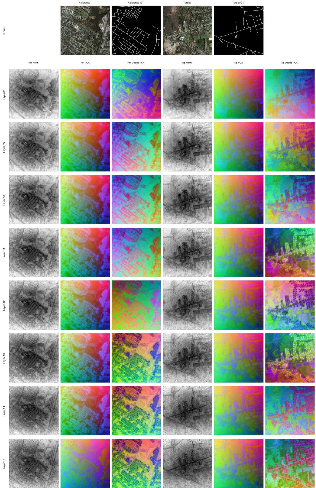  
Figure 10: Layer-wise DINOv3 features on DeepGlobe-18 (layers 8–15). Same layout as fig. 9.

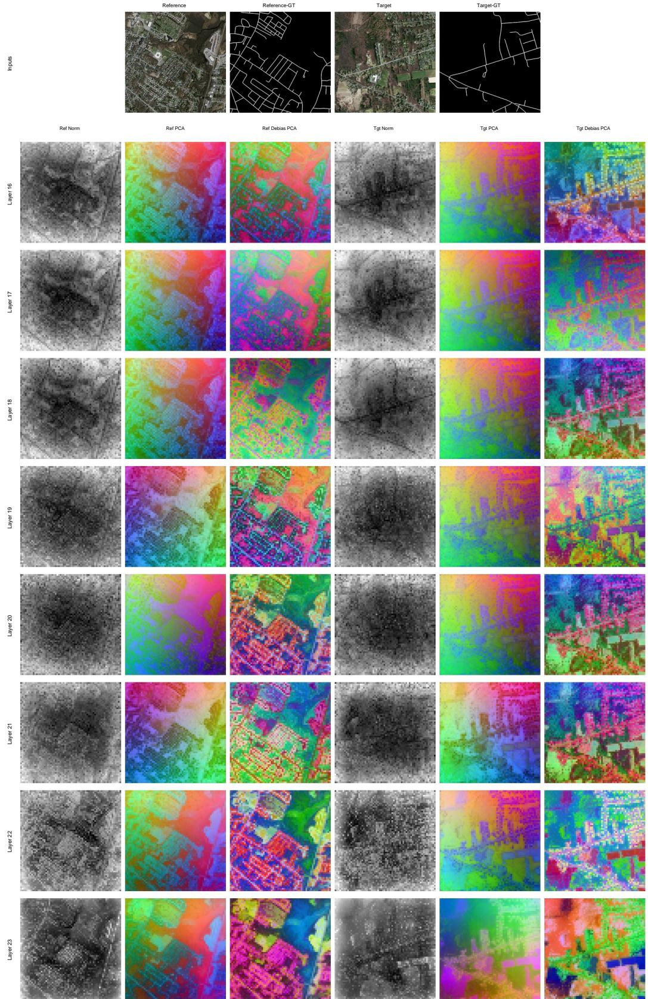  
Figure 11: Layer-wise DINOv3 features on DeepGlobe-18 (layers 16–23). Same layout as fig. 9.

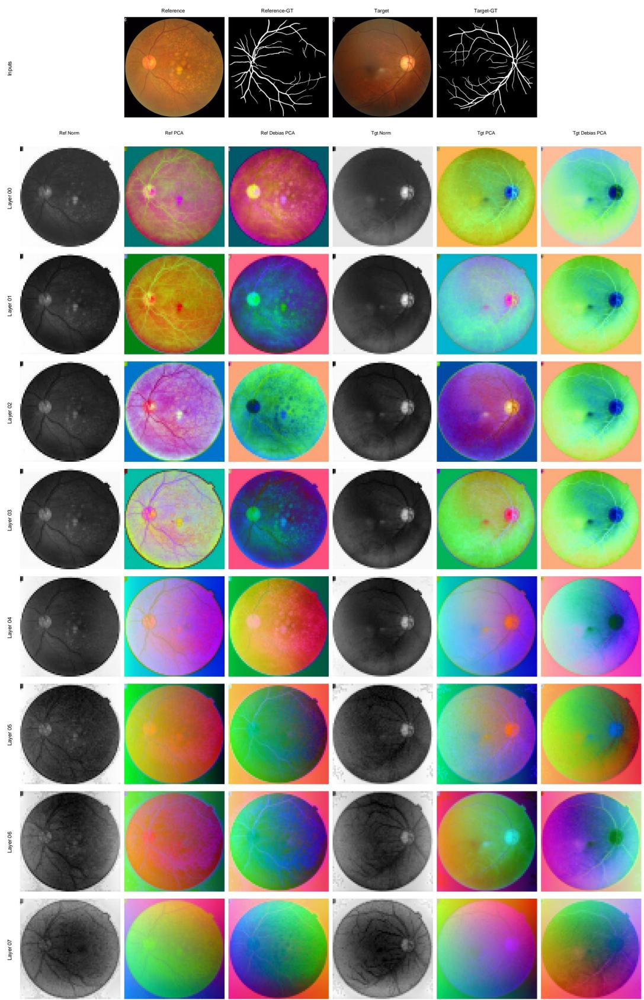  
Figure 12: Layer-wise DINOv3 features on Fundus (layers 0–7). Same layout as fig. 9.

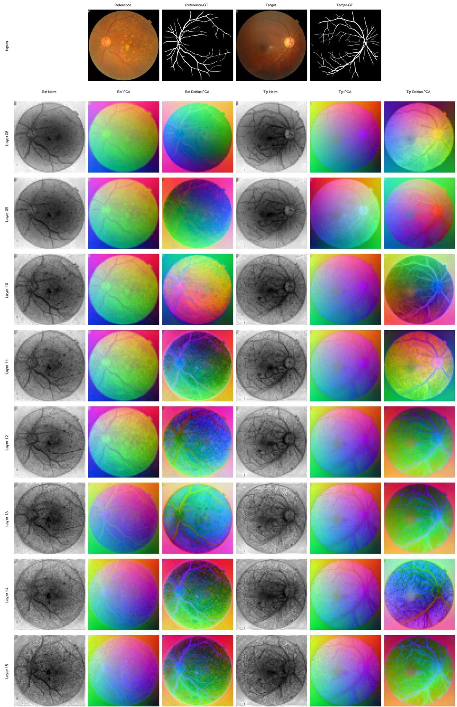  
Figure 13: Layer-wise DINOv3 features on Fundus (layers 8–15). Same layout as fig. 9.

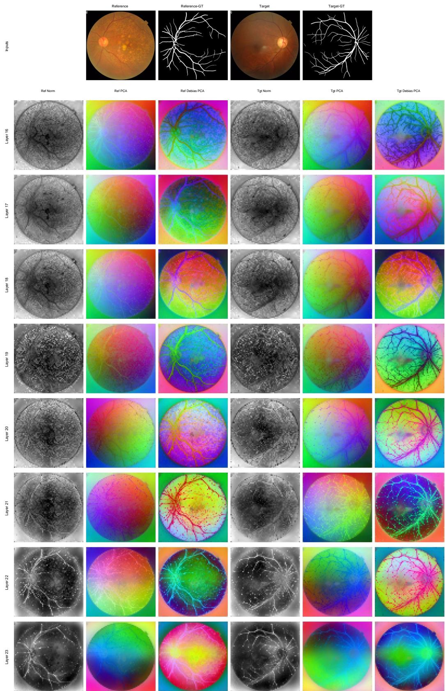  
Figure 14: Layer-wise DINOv3 features on Fundus (layers 16–23). Same layout as fig. 9.