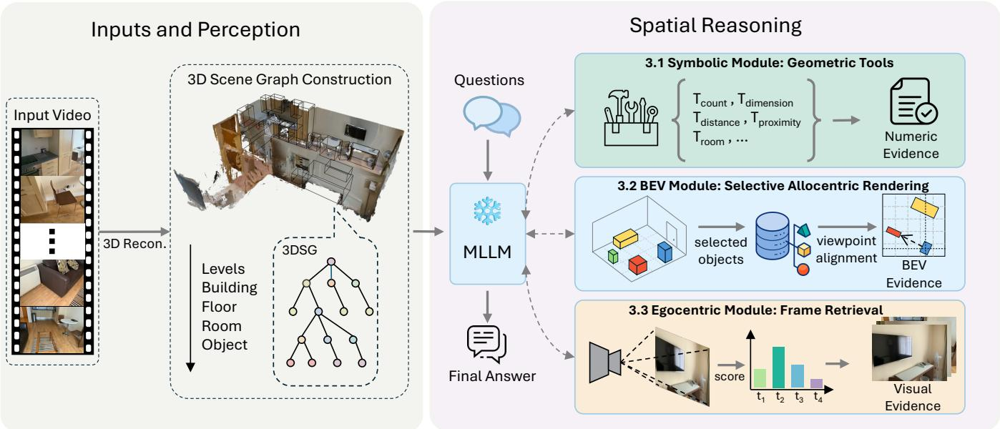
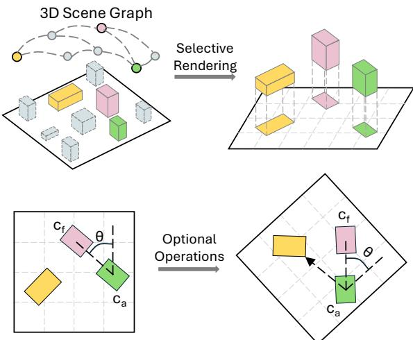
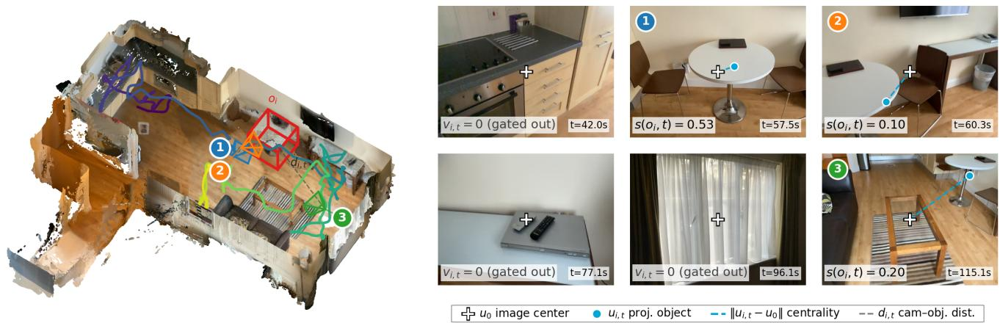

# GraFT: A Training-Free Framework for Spatial Reasoning in Multimodal Large Language Models via 3D Scene Graphs

Junqing Du, Fernando Ropero, Erkin Turkoz, Yanfeng Zhang∗, Lu Liu

Riemann Lab, Huawei Technologies

## Abstract

3D spatial reasoning underpins understanding and acting in the physical world, yet it remains unreliable in current multi- modal large language models (MLLMs). These models falter at precise geometric measurement, at transforming between egocentric and allocentric viewpoints, and at grounding fine- grained appearance. The most common remedies fine-tune the model on large-scale curated spatial-reasoning datasets or at- tach dedicated encoders for 3D geometry, which typically cou- ples the solution to costly supervision and a specific backbone. We instead introduce GraFT, a training-free framework that supplies the missing 3D structure through a compact, easily maintained 3D scene graph (3DSG). From this 3DSG, GraFT provides three spatial reasoning capabilities: (1) deterministic geometry through symbolic tools, (2) allocentric layout through a bird’s-eye-view (BEV) rendering, and (3) visualattribute grounding through task-relevant egocentric frames. On ScanQA, GraFT improves every metric over the samebackbone baseline, raising CIDEr by 27%. On VSI-Bench, GraFT improves frozen MLLMs by up to 65%, surpassing every proprietary and general-purpose open-source baseline, and several prominent fine-tuned spatial models.

## 1 Introduction

Spatial reasoning, the ability to interpret the spatial struc- ture of a 3D scene, such as the sizes, distances, and spa- tial relations of the objects it contains, is a cornerstone of physical intelligence. It underpins downstream applications from augmented reality and autonomous driving to embod- ied AI (Yang et al. 2025; Chen et al. 2024a). Multimodal large language models (MLLMs) have attracted growing interest as a natural-language interface for these tasks (Yang et al. 2025; Zhu et al. 2025). However, they still fall markedly short on spatial reasoning, a gap consistently documented across recent benchmarks and surveys (Yang et al. 2025; Chen et al. 2024a; Liu et al. 2025).

Prevailing approaches build spatial competence into the model itself. One line of work trains the MLLM for spatial reasoning via supervised fine-tuning (Chen et al. 2024a; Zhu et al. 2025) or reinforcement learning (Ouyang et al. 2025; Li et al. 2026; Wu et al. 2025b; Liao et al. 2025; Tang et al. 2026); another feeds explicit 3D representations such as point clouds through specialized encoders (Xu et al. 2024). Both approaches not only require large-scale data curation and training, but also commit, before the task is seen, to a fixed choice: a spatial prior bound to the training distribution and backbone, or an encoder tied to one input format. Yet the ev- idence a spatial task demands varies widely. Layout-centric tasks benefit from a global, map-like view of the scene (Qi et al. 2026; Zhang et al. 2025a). Tasks about an object’s vi-sual attributes instead align with the pretraining strength of MLLMs once a suitable 2D view is provided. Exact metric grounding, by contrast, is more reliably obtained by delegat- ing to external geometric tools than by relying on learned priors (Han et al. 2025; Chen et al. 2026). These hetero-geneous demands motivate matching the capability to each task, rather than committing to a single strategy in advance.

We present GraFT, a training-free framework that in- stead derives task-appropriate evidence by reasoning through a 3D scene graph (3DSG), a representation the robotics and embodied-AI community increasingly adopts (Hughes, Chang, and Carlone 2022; Gu et al. 2024; Yin et al. 2024). Unlike raw point clouds, a 3DSG exposes per-object ori-ented bounding boxes and semantic labels as a compact symbolic structure that is incrementally maintainable and readable without a learned encoder. GraFT treats this graph as the medium that connects a task to the evidence it de- mands. Symbolic geometric tools compute exact answers from the precise 3D attributes stored in the graph; a task- conditioned bird’s-eye-view rendering exposes global layout; and for tasks about what an object looks like, the graph’s ge-ometry ranks the egocentric frames stored with the queried object by how clearly they show it, passing only the top-k to the backbone. The frozen backbone then reasons over this ev- idence using two abilities it already possesses: invoking tools and interpreting structured visual inputs (Qi et al. 2026; Zhu et al. 2025).

We validate GraFT on two widely used spatial- reasoning benchmarks, VSI-Bench (Yang et al. 2025) and ScanQA (Azuma et al. 2022), against strong proprietary, open-source, and fine-tuned models. On VSI-Bench, GraFT lifts three frozen open-source backbones by 37% to 65% over their standalone performance, and its best configura- tion reaches 51.4 on the average. That result is ahead of ev- ery proprietary model (best 45.4) and every general-purpose open-source baseline (best 40.9) we evaluate, and it surpasses several systems fine-tuned for spatial reasoning. On ScanQA, replacing uniformly sampled frames with selected views im- proves every caption metric under the same backbone, with the largest gain on CIDEr (58.0 to 73.6), all without updating a single parameter.

  
Fi ure 1: Overview of GraFT. Left: an u stream i eline turns the in ut video into a hierarchical 3D scene ra h. Ri ht: the frozen MLLM matches each task to one of three modules (s mbolic tools, BEV renderin , or e ocentric frames), which returns evidence the backbone reasons over to answer, without task-specific training.

Our main contributions are:

• A training-free framework built on a 3D scene graph. From a single 3DSG, GraFT derives three capabilities (symbolic tools, BEV rendering, and egocentric frames selection), giving a frozen MLLM 3D spatial reasoning with no fine-tuning.

• A clean, geometric BEV for egocentric-to-allocentric reasoning. From the scene graph, GraFT renders a topdown view of only the task-relevant objects, each drawn as a box with its exact proportions and all other scene content omitted, so the backbone reads the layout from uncluttered, geometrically faithful evidence.

• A geometry-guided egocentric view retrieval algorithm. Video frames are ranked by the geometric visibility of the queried objects, and only the most informative first-person views are forwarded to the backbone.

• Strong spatial reasoning without any training. On VSI-Bench, GraFT surpasses every proprietary and general- purpose open-source baseline, and several models fine- tuned for spatial reasoning; on ScanQA, it improves every metric under the same backbone.

## 2 Related Work

Spatial reasoning with MLLMs. Benchmarks such as ScanQA (Azuma et al. 2022) and VSI-Bench (Yang et al. 2025) document a persistent gap between the general visual competence of MLLMs and their spatial understanding. A common approach augments training: SpatialVLM (Chen et al. 2024a), SpatialRGPT (Cheng et al. 2024), and MM-Spatial (Daxberger et al. 2025) inject large-scale metric su-pervision; SpaceR (Ouyang et al. 2025), SpatialLadder (Li et al. 2026), ViLaSR (Wu et al. 2025b), R1-Zero-VSI (Liao et al. 2025), and OCR (Tang et al. 2026) apply reinforcement learning; and Spatial-MLLM (Wu et al. 2025a), VG LLM (Zheng et al. 2025), and VLM-3R (Fan et al. 2026) build 3D geometry into the model. Others instead consume explicit 3D inputs through dedicated encoders, as in 3D- LLM (Hong et al. 2023), PointLLM (Xu et al. 2024), and Chat-Scene (Huang et al. 2024). Both tie spatial competence to training, so a new scene needs retraining; GraFT instead keeps the backbone frozen and changes only its input.

Structured visual prompting. A complementary line reformats the scene into 2D inputs that MLLMs already parse well. Set-of-Mark prompting overlays visual anchors on im- ages (Yang et al. 2023); GPT4Scene pairs video frames with a global BEV image (Qi et al. 2026); and Struct2D (Zhu et al. 2025) pairs a marked BEV with object metadata, in both zero-shot and fine-tuned forms. These schemes apply one fixed rendering to every question, whereas GraFT’s BEV module renders on demand, each view conditioned on the question and showing only the referenced objects.

Tool-augmented spatial reasoning. A further line grants the model access to external tools. SpatialScore’s SpatialA- gent (Wu et al. 2026), TIGeR (Han et al. 2025), and Space-Tools (Chen et al. 2026) let an MLLM invoke estimators for depth, pose, or bounding boxes, typically re-running per- ception for each question. GraFT runs this perception only once, at graph construction; its reasoning-time tools then perform deterministic geometry over the graph, amortizing perception across all questions.

3D scene graphs in embodied AI. Introduced as a unified structure over semantics, 3D geometry, and viewpoints (Armeni et al. 2019), the 3D scene graph is now widely adopted across robotics and embodied AI (Rotondi et al. 2026). They are built in real time and with open-vocabulary or hierarchi- cal semantics (Hughes, Chang, and Carlone 2022; Gu et al. 2024; Werby et al. 2024), and applied to navigation, embodied QA, and object search, usually by serializing the graph into a textual prompt (Yin et al. 2024; Saxena et al. 2025; Honerkamp et al. 2024). GraFT broadens this interface, using the same graph for symbolic tool calls, selective renderings, and visibility-ranked frames.

## 3 The GraFT Framework

Overview. GraFT is a training-free reasoning layer around a frozen multimodal large language model backbone. Given a 3D scene graph $\mathcal { G }$ of an environment, GraFT supplies the backbone with the evidence it needs for spatial reasoning, without updating any of its parameters (Figure 1). GraFT produces this evidence through one of three capabilities, each suited to a diferent family of tasks: symbolic geometric tools for exact metric answers (Section 3.1), a task-conditioned bird’s-eye-view rendering for egocentric-to-allocentric rea- soning (Section 3.2), and geometry-guided egocentric view retrieval for visual attributes (Section 3.3). Selecting among them is a canonical tool-selection step.

Scene representation. GraFT reasons over a hierarchi-cal 3D scene graph produced by an upstream perception pipeline and consumed as given, which decouples the rea- soning layer from how the graph is produced. The graph is formalized as $\mathcal { G } = ( \mathcal { N } , \mathcal { E } )$ . The node set $\mathcal { N }$ unions four layers: a building node $\mathcal { N } _ { B }$ , floor nodes ${ \mathcal { N } } _ { F } ,$ room nodes $\textstyle { \mathcal { N } } _ { R } .$ , and object nodes $\mathcal { N } _ { O }$ , and the edge set $\mathcal { E }$ records con- tainment between adjacent layers. Building, floor, and room nodes store a coarse class and box geometry, while each ob- ject node carries the detail the reasoning relies on. Its core is the tuple $o _ { i } = ( \ell _ { i } , \mathbf { c } _ { i } , \mathbf { s } _ { i } , \mathbf { R } _ { i } , \mathbf { n } _ { i } , \mathcal { V } _ { i } )$ : the class label $\ell _ { i } .$ , the box center ${ \bf c } _ { i } = ( x _ { i } , y _ { i } , z _ { i } )$ in world meters, the full extents $\mathbf { s } _ { i } = ( w _ { i } , d _ { i } , h _ { i } )$ along the box axes, the orientation $\mathbf { R } _ { i }$ re-covered from a stored unit quaternion, a unit surface normal $\mathbf { n } _ { i } ,$ and the set $\nu _ { i }$ of video frames in which the object is visible. These frames come from the calibrated video that captured the scene, a posed sequence of frames indexed by $t { : }$ each frame t provides a camera orientation $\mathbf { R } _ { t } ,$ center $\mathbf { p } _ { t } .$ and intrinsics ${ \bar { K } } _ { t } ,$ so $\nu _ { i }$ is the subset of these frames into which $o _ { i } { ' } \mathrm { s }$ box projects.

## 3.1 Symbolic Module: Geometric Tools

Each object’s box $\left( \mathbf { c } _ { i } , \mathbf { s } _ { i } , \mathbf { R } _ { i } \right)$ fixes its position, size, and orientation to the precision of the upstream perception. Any quantity that is a function of this geometry then follows deterministically from the boxes, so its accuracy is inherited from the perception rather than re-estimated by the backbone. Inferring such quantities from an image would only add error on top. We therefore compute them from the 3DSG directly, through symbolic geometric tools that read straight from the boxes:

• a count tool that lists each object class with its instance count;

  
Figure 2: Constructing the BEV rendering. Top: from the 3D scene graph, GraFT selectively renders only the task- relevant objects as box footprints, omitting the rest. Bottom: optional task-conditioned operations rotate the scene about the viewpoint $\mathbf { c } _ { a }$ by $\theta$ so the facing direction $\mathbf { c } _ { f }$ points up (the egocentric-to-allocentric alignment), and overlay an optional anchor-to-target arrow to make a relation explicit.

• a size tool that returns an object’s width, depth, and height as the extents of its box;

• a distance tool that measures the surface-to-surface distance between the boxes of two object classes;

• a proximity tool that ranks several candidate classes by their closest distance to an anchor object, resolving which is nearest or farthest;

• a room tool that returns the room’s width, depth, height, and floor area.

Each tool runs deterministically over the boxes, so no part of the numerical computation passes through the backbone.

Resolving a geometric task takes exactly one tool call: GraFT never chains tools or feeds one tool’s output into the next, keeping the symbolic module a single deterministic step.

## 3.2 BEV Module: Selective Allocentric Rendering

Reasoning about a scene’s global arrangement requires an egocentric-to-allocentric conversion, which a single top- down view makes explicit. GraFT renders such a view di- rectly from the scene graph rather than capturing it with a camera. We build on Struct2D’s re-oriented BEV (Zhu et al. 2025) but render it diferently: Struct2D marks the query- relevant objects on a top-down view of the full reconstructed scene, whereas GraFT draws only those objects, each as a clean box whose proportions follow its exact dimensions, and omits everything else. The backbone then sees just the layout a task needs, drawn to scale and free of the clutter of a full scene render, which keeps the spatial relations easy to read. Figure 2 illustrates this construction.

The viewpoint and heading are likewise set by the task, not by where a camera happened to be. Given a viewpoint center $\mathbf { c } _ { a }$ and a reference point $\mathbf { c } _ { f }$ that fixes the facing direction, GraFT rotates the scene about the viewpoint by an angle θ that brings the facing direction ${ \bf c } _ { f } - { \bf c } _ { a }$ to the top of the image (Figure 2). The render can additionally carry an optional anchor-to-target arrow that makes a relation explicit rather than leaving it for the backbone to infer.

  
Figure 3: Geometry-guided frame scoring for the egocentric module. Left: the reconstructed scene with the queried object $o _ { i }$ (red box) and the camera trajector ; the three numbered viewpoints are the frames scored at right, shown at camera–object distance $d _ { i , t } . R i g h t \cdot$ six example frames, shown solely to illustrate the scoring. Each marks the image center $\mathbf { u } _ { 0 }$ (cross) and the projected object $\mathbf { u } _ { i , t }$ (dot), whose ofset gives the centrality term $s ^ { \mathrm { c t r } }$ ; together with proximity $s ^ { \mathrm { p r o \bar { x } } }$ and corner coverage $s ^ { \mathrm { c o v } }$ they form the visibility-gated score $s ( o _ { i } , t )$ (Eq. (5)). Frames in which $o _ { i }$ is not visible are gated out $( v _ { i , t } = 0 ) ;$ among the rest, view 1 $\left( t { = } 5 7 . 5 \mathrm { s } \right)$ scores highest $( 0 . 8 4 \times 0 . 6 \dot { 3 } \times 1 . 0 0 { = } 0 . 5 3 \dot { : }$ close, centered, fully covered), ahead of view $3 ( 0 . 5 6 \times 0 . { \overset { \cdot } { 3 } } 6 \times 1 . 0 0 { = } 0 . 2 0 )$ and view $2 \ : ( 0 . 6 1 \times 0 . 6 5 \times 0 . 2 5 = 0 . 1 0$ , penalized because the table is only partially framed). GraFT forwards the top-scoring frames.

## 3.3 Egocentric Module: Frame Retrieval

Where the symbolic and BEV modules answer from the graph’s geometry alone, a task about an object’s visual attributes must return to the pixels. For a queried object $o _ { i } ,$ GraFT scores the posed frames $\nu _ { i }$ stored with the object and forwards only the top-k clearest views; Figure 3 illustrates the scoring on example frames of one scene.

Whether a frame belongs to $\nu _ { i }$ is decided by projecting the object’s box into it. Let $v _ { i , t }$ denote the visibility of $o _ { i }$ in frame t, equal to 1 when the three geometric conditions of Eq. (1) hold jointly and 0 otherwise,

$$
\begin{array} { r } { v _ { i , t } = 1 \left[ \begin{array} { c } { n _ { i , t } \geq 2 , } \\ { d _ { \operatorname* { m i n } } \leq d _ { i , t } \leq d _ { \operatorname* { m a x } } , } \\ { \left. \mathbf { z } _ { t } , \mathbf { c } _ { i } - \mathbf { p } _ { t } \right. / d _ { i , t } \geq \cos \tau } \end{array} \right] . } \end{array}\tag{1}
$$

In the first condition, $n _ { i , t }$ counts how many of the eight box corners project in front of the camera and inside the image, under the frame’s perspective projection $\pi ( \cdot ; \theta _ { t } )$ . The cor- ners are obtained by ofsetting the center $\mathbf { c } _ { i }$ along the box axes R by half the extents $\mathbf { s } _ { i }$ in every sign combination. The calibration $\boldsymbol { \theta } _ { t } = ( \mathbf { R } _ { t } , \mathbf { p } _ { t } , K _ { t } )$ collects the camera ori- entation, center, and intrinsics. Requiring only two corners admits partial views. The second keeps the camera–object distance $d _ { i , t } = \| \mathbf { c } _ { i } - \mathbf { p } _ { t } \|$ within an informative depth range. The third requires the camera to face the object within an angle τ: the unit optical axis $\mathbf { z } _ { t }$ is the third column of $\mathbf { R } _ { t }$ so $\langle \mathbf { z } _ { t } , \mathbf { c } _ { i } - \mathbf { p } _ { t } \rangle / d _ { i , t }$ equals the cosine of the angle between the optical axis and the direction to the object. All thresholds are fixed once and shared across scenes and tasks; the frames that pass constitute $\nu _ { i }$ . In Figure 3, the frames at t=42.0, 77.1, and 96.1 s fail these tests and are gated out $( v _ { i , t } = 0 )$

A visible frame is then rated by three terms, each in [0, 1]. Let $\mathbf { u } _ { i , t }$ be the projected center, replaced by the centroid of the in-frame corners when the center falls outside the image; let $\mathbf { u } _ { 0 }$ be the image center and $\rho$ the image half-diagonal. A centrality term $s _ { i , t } ^ { \mathrm { c t r } }$ rewards a well-framed object,

$$
s _ { i , t } ^ { \mathrm { c t r } } = \operatorname* { m a x } \Bigl ( 0 , \ : 1 - \frac { \| \mathbf { u } _ { i , t } - \mathbf { u } _ { 0 } \| } { \rho } \Bigr ) ,\tag{2}
$$

peaking when the object sits at the image center; a proximity term $s _ { i , t } ^ { \mathrm { \scriptsize { \ p r o x } } }$ rewards a near object,

$$
s _ { i , t } ^ { \mathrm { p r o x } } = \frac { 1 } { \operatorname* { m a x } ( d _ { i , t } , 1 ) } ,\tag{3}
$$

floored at one meter so a very close object does not dominate; and a coverage term $s _ { i , t } ^ { \mathrm { c o v } }$ measures how completely the object is framed,

$$
s _ { i , t } ^ { \mathrm { c o v } } = \frac { n _ { i , t } } { 8 } ,\tag{4}
$$

the fraction of box corners inside the image: partial views pass the gate, but fuller framing scores higher. A good view must satisfy all three at once, so the score $s ( o _ { i } , t )$ is defined as their product, gated by $v _ { i , i }$ ,

$$
s ( o _ { i } , t ) = v _ { i , t } s _ { i , t } ^ { \mathrm { p r o x } } s _ { i , t } ^ { \mathrm { c t r } } s _ { i , t } ^ { \mathrm { c o v } } ,\tag{5}
$$

and a low value on any one term drags the product down. The three views in Figure 3 make this concrete: view 1 (t=57.5 s) is close, centered, and fully covered, and scores

highest; view 3 (t=115.1 s) is fully covered but far; and view 2 (t=60.3 s), though near and fairly centered, frames only a quarter of the corners, which alone drags its score down.

Finally, GraFT ranks the frames by the score in (5), discards near-duplicate viewpoints, and forwards the top-k as the first-person evidence the backbone reasons over.

## 4 Experiments

This section evaluates GraFT on VSI-Bench and ScanQA. Section 4.1 describes the experimental settings. We then iso- late each capability under a fixed backbone: the symbolic tools on the metric subtasks of VSI-Bench (Section 4.2), the BEV rendering on its directional subtasks (Section 4.3), and the egocentric retrieval on ScanQA (Section 4.4). Finally, Section 4.5 compares the composed system with prior work, on the VSI-Bench subsets that Struct2D (Zhu et al. 2025) reports and on the complete benchmark.

## 4.1 Experimental Setup

Benchmarks. The symbolic-tool study (Table 1) covers the five metric subtasks of VSI-Bench (Yang et al. 2025). The BEV study (Table 2) uses the two directional subtasks of the 422-question VSI-Bench subset that Struct2D reports on (Zhu et al. 2025). We evaluate the egocentric module on ScanQA (Azuma et al. 2022) (Table 3), compare with Struct2D on the VSI-Bench subsets it reports (Table 4), and report the realistic-perception results on the complete VSI- Bench (Table 5). Following the oficial protocols, VSI-Bench numerical tasks are scored by mean relative accuracy and multiple-choice tasks by exact-match accuracy. ScanQA an-swers are open-ended text, scored by four standard caption metrics, BLEU, METEOR, ROUGE, and CIDEr, which all measure word and phrase overlap with the reference answers (higher is better).

Backbones. GraFT is run on frozen, of-the-shelf backbones with no task-specific training: a frontier closed model (GPTo3) and an open-weight MLLM (Qwen2.5-VL-7B (Bai et al. 2025)) in the per-module studies (Tables 1–3), joined by Qwen2.5-VL-3B and InternVL2-8B (Chen et al. 2024b) on the complete VSI-Bench (Table 5).

Perception. We evaluate under three perception settings. (i) Video input: the backbone receives the raw video alone, without a 3DSG. (ii) Ground-truth perception: the 3DSG is constructed from the ground-truth object annotations of ScanNet (Dai et al. 2017a), ScanNet++ (Yeshwanth et al. 2023), and ARKitScenes (Baruch et al. 2021). (iii) Realistic perception: the 3DSG is instead built by an ofline perception pipeline; following prior work (Dai et al. 2017b; Zhu et al. 2025; Huang et al. 2024), we reconstruct the scene and detect objects with Mask3D (Schult et al. 2023) and UniDet3D (Kolodiazhnyi et al. 2025). Further construction details are provided in Appendix A.

## 4.2 Symbolic Tools for Metric Estimation

For the symbolic module, Table 1 examines where precise geometry should come from: the backbone computing it it- self by reasoning over the 3DSG serialized as text (Serialized Graph), or a set of deterministic functions (GraFT) that compute it directly over the stored 3DSG. These two forms, with the Video input, are compared on the five subtasks of VSI-Bench (counting, absolute distance, object size, room size, and relative distance), whose answers follow deterministically from the scene geometry. Following the perception settings of Section 4.1, Serialized Graph and GraFT are each evaluated under ground-truth and realistic perception, on two backbones of very diferent capability, GPT-o3 and Qwen2.5-VL-7B, so the finding is not tied to one model scale.

<table><tr><td>Method</td><td>Obj. Avg. Count</td><td></td><td>Abs. Obj. Dist. Size</td><td>Room Size</td><td></td><td>Rel. Dist.</td></tr><tr><td>GPT-03</td><td></td><td></td><td></td><td></td><td></td><td></td></tr><tr><td>Video input Video</td><td>53.2</td><td>53.1</td><td>40.6</td><td>70.0</td><td>51.4</td><td>50.9</td></tr><tr><td>Ground-truth perception</td><td></td><td></td><td></td><td></td><td></td><td></td></tr><tr><td>Serialized Graph 89.3 GraFT (Ours)</td><td>95.2</td><td>91.1 89.9</td><td>73.3 97.5</td><td>98.5 99.5</td><td>91.1 91.1</td><td>92.7 98.2</td></tr><tr><td>Realistic perception Serialized Graph</td><td>56.5</td><td>49.3</td><td></td><td></td><td></td><td></td></tr><tr><td>GraFT (Ours)</td><td>58.0</td><td>49.5</td><td>45.5 43.2</td><td>69.9 66.5</td><td>72.3 83.4</td><td>45.5 47.3</td></tr><tr><td>Qwen2.5-VL-7B</td><td></td><td></td><td></td><td></td><td></td><td></td></tr><tr><td>Video input Video</td><td>36.8</td><td>33.2</td><td>15.5</td><td>51.6</td><td>43.4</td><td>40.0</td></tr><tr><td>Ground-truth perception</td><td></td><td></td><td></td><td></td><td></td><td></td></tr><tr><td>Serialized Graph</td><td>155.4</td><td>80.0</td><td>29.7</td><td>59.2</td><td>88.3</td><td>20.0</td></tr><tr><td>GraFT (Ours)</td><td>92.3</td><td>85.3</td><td>96.5</td><td>97.8</td><td>91.1</td><td>90.9</td></tr><tr><td>Realistic perception</td><td></td><td></td><td></td><td></td><td></td><td></td></tr><tr><td></td><td></td><td></td><td></td><td></td><td></td><td></td></tr><tr><td></td><td></td><td></td><td></td><td></td><td></td><td></td></tr><tr><td></td><td></td><td></td><td></td><td></td><td></td><td></td></tr><tr><td></td><td></td><td></td><td></td><td></td><td></td><td></td></tr><tr><td></td><td></td><td></td><td></td><td></td><td></td><td></td></tr><tr><td></td><td></td><td></td><td></td><td></td><td></td><td></td></tr><tr><td></td><td></td><td></td><td></td><td></td><td></td><td></td></tr><tr><td></td><td></td><td></td><td></td><td></td><td></td><td></td></tr><tr><td></td><td>39.3</td><td>45.0</td><td>17.9</td><td></td><td></td><td></td></tr><tr><td></td><td></td><td></td><td></td><td>46.9</td><td>72.3</td><td></td></tr><tr><td></td><td></td><td></td><td></td><td></td><td></td><td>14.5</td></tr><tr><td></td><td></td><td></td><td></td><td></td><td></td><td></td></tr><tr><td>Serialized Graph</td><td></td><td></td><td></td><td></td><td></td><td></td></tr><tr><td></td><td></td><td></td><td></td><td></td><td></td><td></td></tr><tr><td></td><td></td><td></td><td></td><td></td><td></td><td></td></tr><tr><td></td><td></td><td></td><td></td><td></td><td></td><td></td></tr><tr><td></td><td></td><td></td><td></td><td></td><td></td><td></td></tr><tr><td></td><td></td><td></td><td></td><td></td><td></td><td></td></tr><tr><td></td><td></td><td></td><td></td><td></td><td></td><td></td></tr><tr><td></td><td></td><td></td><td></td><td></td><td></td><td></td></tr><tr><td></td><td></td><td></td><td></td><td></td><td></td><td></td></tr><tr><td></td><td></td><td></td><td></td><td></td><td></td><td></td></tr><tr><td></td><td></td><td></td><td></td><td></td><td></td><td></td></tr><tr><td></td><td></td><td></td><td></td><td></td><td></td><td></td></tr><tr><td></td><td></td><td></td><td></td><td></td><td></td><td></td></tr><tr><td></td><td></td><td></td><td></td><td></td><td></td><td></td></tr><tr><td></td><td></td><td></td><td></td><td></td><td></td><td></td></tr><tr><td></td><td></td><td></td><td></td><td>67.5</td><td></td><td></td></tr><tr><td></td><td></td><td></td><td></td><td></td><td>83.4</td><td></td></tr><tr><td></td><td></td><td></td><td></td><td></td><td></td><td></td></tr><tr><td></td><td></td><td></td><td>41.5</td><td></td><td></td><td></td></tr><tr><td></td><td></td><td></td><td></td><td></td><td></td><td>43.2</td></tr><tr><td></td><td></td><td></td><td></td><td></td><td></td><td></td></tr><tr><td>GraFT (Ours)</td><td></td><td></td><td></td><td></td><td></td><td></td></tr><tr><td></td><td></td><td></td><td></td><td></td><td></td><td></td></tr><tr><td></td><td></td><td></td><td></td><td></td><td></td><td></td></tr><tr><td></td><td></td><td></td><td></td><td></td><td></td><td></td></tr><tr><td></td><td></td><td></td><td></td><td></td><td></td><td></td></tr><tr><td></td><td></td><td></td><td></td><td></td><td></td><td></td></tr><tr><td></td><td></td><td></td><td></td><td></td><td></td><td></td></tr><tr><td></td><td></td><td></td><td></td><td></td><td></td><td></td></tr><tr><td></td><td></td><td>44.6</td><td></td><td></td><td></td><td></td></tr><tr><td></td><td>56.0</td></table>

Table 1: The five metric subtasks of VSI-Bench under three input forms (raw Video, direct reasoning over the 3DSG serialized as text (Serialized Graph), and our symbolic tools (GraFT)), each evaluated with a ground-truth and a realistic-perception 3DSG. Within each perception block the higher Avg. of Serialized Graph vs. GraFT is in bold.

Both Serialized Graph and GraFT improve over the Video input, showing that the 3DSG helps in either form; we then isolate the contrast between the two. First, GraFT is the more accurate on every setting: on GPT-o3 it improves over Serialized Graph by +5.9 points under ground-truth perception and +1.5 under realisticperception, and on Qwen2.5-VL-7B the gains are larger, +36.9 and +16.7; deterministic functions (GraFT) thus outperform in-context arithmetic (Serialized Graph). Second, GraFT makes accuracy far less dependent on the backbone: under Serialized Graph the weaker Qwen2.5-VL-7B trails GPT-o3 by 33.9 points on groundtruth perception and 17.2 on realistic perception, but under GraFT it comes within 2.9 and 2.0. By computing the answer over the 3DSG, GraFT lets a weaker backbone nearly match a stronger one.

<table><tr><td>Method</td><td>Avg. Rel. Dir. Route Plan</td><td></td><td></td></tr><tr><td colspan="4">Video input</td></tr><tr><td>VSI-Bench (Yang et al. 2025) 55.7</td><td></td><td>49.4</td><td>61.9</td></tr><tr><td colspan="4">Ground-truth perception</td></tr><tr><td>Struct2D (Zhu et al. 2025)</td><td>87.3</td><td>94.4</td><td>80.1</td></tr><tr><td>GraFT (Ours)</td><td>90.9</td><td>96.1</td><td>85.7</td></tr><tr><td colspan="4">Realistic perception</td></tr><tr><td>GPT4Scene (Qi et al. 2026)</td><td>53.4</td><td>47.9</td><td>58.8</td></tr><tr><td>Struct2D (Zhu et al. 2025)</td><td>68.2</td><td>60.1</td><td>76.2</td></tr><tr><td>GraFT (Ours)</td><td>71.5</td><td>71.6</td><td>71.4</td></tr></table>

Table 2: Zero-shot GPT-o3 on the two directional subtasks of the VSI-Bench subset that Struct2D reports on; GraFT answers with a single allocentric BEV rendering. Avg. is the mean of the two subtasks; baseline numbers are from Struct2D (Zhu et al. 2025). Best per column within each group is in bold.

## 4.3 BEV Rendering for Egocentric-to-Allocentric Reasoning

Table 2 evaluates the BEV module, whose single task- conditioned rendering turns an egocentric video into one allocentric view for reasoning. We test this on two directional VSI-Bench subtasks, relative direction and route planning, using the same questions and scenes as Struct2D (Zhu et al. 2025) for a fair comparison; all methods use GPT-o3, and the table groups them by the perception settings of Section 4.1.

GraFT surpasses the Video input baseline by +35.2 under ground-truth perception and +15.8 under realistic perception. GraFT also leads the prior BEV methods on both settings: its average is +3.6 over Struct2D under ground-truth perception, and +18.1 over GPT4Scene (Qi et al. 2026) and +3.3 over Struct2D under realistic perception. This consistent lead over prior BEV methods comes from GraFT’s se- lectivity: it renders only the query-relevant objects and omits the rest, giving the frozen backbone an uncluttered view of the layout a directional question needs.

## 4.4 Egocentric Frame Retrieval on ScanQA

Table 3 evaluates the egocentric module, which grounds at- tribute questions in pixels: for a queried object, it forwards only the top-k frames that best reveal it to a frozen Qwen2.5- VL-7B backbone. We test on ScanQA (Azuma et al. 2022), whose answers often hinge on an object’s visual attributes, against zero-shot MLLMs (InternVL2-8B, MiniCPM-V-2.6, and Qwen2.5-VL-7B with uniform sampling) and the finetuned Chat-3D.

On the same Qwen2.5-VL-7B backbone, GraFT improves every metric over uniform frame sampling, most notably raising CIDEr from 58.0 to 73.6 and BLEU-1 from 22.2 to 34.2 (a +15.6 and +12.0 point gain). Across the full table it also ranks first on all five metrics, ahead of both the zero-shot general-purpose MLLMs and the fine-tuned Chat-3D. Both results point to the same efect: GraFT’s geometry-guided selection surfaces the frames that best reveal the queried object, giving the backbone the visual evidence an attribute question needs. Appendix B.2 ablates the frame budget k, where even a single selected frame beats uniform eight-frame sampling.

<table><tr><td colspan="5">Model B-1 B-4 METEOR ROUGE CIDEr</td></tr><tr><td colspan="5">Zero-shot baselines</td></tr><tr><td colspan="2">InternVL2-8B 23.93.3</td><td>14.5</td><td>34.3</td><td>62.5</td></tr><tr><td colspan="2">MiniCPM-V-2.6 25.1 8.4 Qwen2.5-VL-7B 22.2 7.4</td><td>11.8 16.6</td><td>31.5 30.8</td><td>60.1 58.0</td></tr><tr><td colspan="2">Fine-tuned</td><td></td><td></td><td></td></tr><tr><td colspan="5">Chat-3D 29.1 6.4 11.9 28.5 53.2</td></tr><tr><td colspan="5">Training-free (Ours)</td></tr><tr><td colspan="5">GraFT (Ours) 34.2 9.8 21.7 38.0 73.6</td></tr></table>

Table 3: The egocentric module on ScanQA, with a frozen Qwen2.5-VL-7B backbone. GraFT (Ours) uses the top-2 frames from the realistic-perception 3DSG. Comparisons: zero-shot InternVL2-8B (Chen et al. 2024b) and MiniCPM-V-2.6 (Yao et al. 2025), the fine-tuned Chat-3D (Wang et al. 2025), and the same Qwen2.5-VL-7B backbone with uniform sampling. B-1/B-4 denote BLEU-1/BLEU-4. Best per column in bold; second best underlined.
<table><tr><td>Method</td><td>Obj. Abs. Avg.</td><td>Cnt. Dist. Size</td><td>Obj. Room Size</td><td>Rel. Dist.</td><td>Rel. Dir.</td><td>Route Plan</td></tr><tr><td>GPT-03</td><td></td><td></td><td></td><td></td><td></td><td></td></tr><tr><td colspan="7">Ground-truth perception</td></tr><tr><td></td><td>Struct2D 83.8 93.8 90.6</td><td></td><td>47.4</td><td>96.5</td><td>94.4</td><td>80.1</td></tr><tr><td>GraFT</td><td>93.1 90.1</td><td>97.5</td><td>91.1</td><td>98.2</td><td>96.1</td><td>85.7</td></tr><tr><td colspan="7">Realistic perception Struct2D 56.1 52.8 38.4</td></tr><tr><td></td><td>49.5</td><td></td><td>48.9 72.3</td><td>60.0</td><td>60.1</td><td>76.2</td></tr><tr><td>GraFT</td><td>58.8</td><td>42.7</td><td></td><td>45.5</td><td>71.6</td><td>71.4</td></tr><tr><td colspan="7">Qwen2.5-VL-7B</td></tr><tr><td colspan="7">Realistic perception</td></tr><tr><td>GraFT</td><td>Struct2D 43.6 47.1 35.1 57.1 50.444.642.3</td><td>67.5</td><td>48.9 83.4</td><td>43.4</td><td>35.1 45.9 42.8</td><td>35.8 28.9</td></tr></table>

Table 4: Our GraFT vs. Struct2D (Zhu et al. 2025). Top: zero-shot GPT-o3 on the six subtasks of the VSI-Bench subset that Struct2D reports on (Obj. Size not reported, marked “–”), under ground-truth and realistic perception. Bottom: Qwen2.5- VL-7B on the seven VSI-Bench subtasks Struct2D reports, under realistic perception. Struct2D is fine-tuned (SFT) while GraFT is training-free. Avg. averages each panel’s own sub- tasks; the higher Avg. per group is in bold.

## 4.5 GraFT versus Prior Work

On the last experiment, we test whether GraFT can match models trained for spatial reasoning. We compare head-to- head with Struct2D on the subsets it reports (Table 4), and on the complete VSI-Bench under realisticperception (Table 5).

Against Struct2D, GraFT leads in all three settings of Ta- ble 4. Two use a GPT-o3 backbone; since Struct2D does not report object size under GPT-o3, we compare on the six subtasks it does report, where GraFT gains +9.3 average points under ground-truth perception, ahead on five of the six, and +2.7 under realistic perception. The third uses a Qwen2.5-

<table><tr><td></td><td></td><td colspan="5">Numerical Answer</td><td colspan="4">Multiple-Choice</td></tr><tr><td>Method</td><td>|Rank Avg.</td><td></td><td>Obj. Cnt. Abs. Dist. Obj. Size Room Size</td><td></td><td></td><td></td><td></td><td></td><td>Rel. Dist. Rel. Dir. Route Plan App. Ord.</td><td></td></tr><tr><td>Proprietary Models (API)</td><td colspan="9"></td></tr><tr><td>GPT-40</td><td>18</td><td>34.0</td><td>46.2</td><td>5.3</td><td>43.8</td><td>38.2</td><td>37.0</td><td>41.3</td><td>31.5</td><td>28.5</td></tr><tr><td>Gemini-1.5 Flash</td><td>11</td><td>42.1</td><td>49.8</td><td>30.8</td><td>53.5</td><td>54.4</td><td>37.7</td><td>41.0</td><td>31.5</td><td>37.8</td></tr><tr><td>Gemini-1.5 Pro</td><td>9</td><td>45.4</td><td>56.2</td><td>30.9</td><td>64.1</td><td>43.6</td><td>51.3</td><td>46.3</td><td>36.0</td><td>34.6</td></tr><tr><td>Open-source Models</td></tr><tr><td>InternVL2-8B</td><td>15</td><td>37.5</td><td>31.3</td><td>29.0</td><td>48.9</td><td>44.2</td><td>38.0</td><td>33.4</td><td>28.9</td><td>46.4</td></tr><tr><td>InternVL2-40B</td><td>16</td><td>37.0</td><td>41.3</td><td>26.2</td><td>48.2</td><td>27.5</td><td>47.6</td><td>32.7</td><td>27.8</td><td>44.7</td></tr><tr><td>VILA-1.5-8B</td><td>23</td><td>28.9</td><td>17.4</td><td>21.8</td><td>50.3</td><td>18.8</td><td>32.1</td><td>34.8</td><td>31.0</td><td>24.8</td></tr><tr><td>VILA-1.5-40B</td><td>21</td><td>31.2</td><td>22.4</td><td>24.8</td><td>48.7</td><td>22.7</td><td>40.5</td><td>25.7</td><td>31.5</td><td>32.9</td></tr><tr><td>LongVILA-8B</td><td>25</td><td>21.6</td><td>29.1</td><td>9.1</td><td>16.7</td><td>0.0</td><td>29.6</td><td>30.7</td><td>32.5</td><td>25.5</td></tr><tr><td>LongVA-7B</td><td>22</td><td>29.2</td><td>38.0</td><td>16.6</td><td>38.9</td><td>22.2</td><td>33.1</td><td>43.3</td><td>25.4</td><td>15.7</td></tr><tr><td>Qwen2.5-VL-3B</td><td>24</td><td>28.7</td><td>14.6</td><td>24.3</td><td>22.1</td><td>35.0</td><td>34.1</td><td>45.7</td><td>29.4</td><td>24.3</td></tr><tr><td>Qwen2.5-VL-7B</td><td>19</td><td>33.0</td><td>40.9</td><td>14.8</td><td>43.4</td><td>10.7</td><td>38.6</td><td>38.5</td><td>33.0</td><td>29.8</td></tr><tr><td>LLaVA-NeXT-Video-7B</td><td>17</td><td>35.6</td><td>48.5</td><td>14.0</td><td>47.8</td><td>24.2</td><td>43.5</td><td>42.4</td><td>34.0</td><td>30.6</td></tr><tr><td>LLaVA-NeXT-Video-72B</td><td>12</td><td>40.9</td><td>48.9</td><td>22.8</td><td>57.4</td><td>35.3</td><td>42.4</td><td>36.7</td><td>35.0</td><td>48.6</td></tr><tr><td>LLaVA-OneVision-7B</td><td>20</td><td>32.4</td><td>47.7</td><td>20.2</td><td>47.4</td><td>12.3</td><td>42.5</td><td>35.2</td><td>29.4</td><td>24.4</td></tr><tr><td>LLaVA-OneVision-72B</td><td>14</td><td>40.2</td><td>43.5</td><td>23.9</td><td>57.6</td><td>37.5</td><td>42.5</td><td>39.9</td><td>32.5</td><td>44.6</td></tr><tr><td>Spatial Reasoning Models</td><td></td><td></td><td></td><td></td><td></td><td></td><td></td><td></td><td></td><td></td></tr><tr><td>VG LLM-8B (Zheng et al. 2025)</td><td>2</td><td>50.7</td><td>67.9</td><td>37.7</td><td>58.6</td><td>62.0</td><td>46.6</td><td>40.7</td><td>32.4</td><td>59.2</td></tr><tr><td>Spatial-MLLM (Wu et al. 2025a)</td><td>4</td><td>48.4</td><td>65.3</td><td>34.8</td><td>63.1</td><td>45.1</td><td>41.3</td><td>46.2</td><td>33.5</td><td>46.3</td></tr><tr><td>OCR (Tang et al. 2026)</td><td>5</td><td>47.5</td><td>63.2</td><td>34.1</td><td>57.4</td><td>46.7</td><td>39.6</td><td>45.5</td><td>44.3</td><td>49.8</td></tr><tr><td>SpatialLadder (Li et al. 2026)</td><td>7</td><td>45.7</td><td>63.5</td><td>34.3</td><td>61.7</td><td>43.9</td><td>45.4</td><td>44.8</td><td>35.6</td><td>36.4</td></tr><tr><td>SpaceR (Ouyang et al. 2025)</td><td>8</td><td>45.5</td><td>57.8</td><td>28.2</td><td>59.9</td><td>47.1</td><td>40.1</td><td>45.4</td><td>33.5</td><td>52.1</td></tr><tr><td>ViLaSR (Wu et al. 2025b)</td><td>9</td><td>45.4</td><td>63.5</td><td>34.4</td><td>60.6</td><td>30.9</td><td>48.9</td><td>45.2</td><td>30.4</td><td>49.2</td></tr><tr><td>R1-Zero-VSI (Liao et al. 2025)</td><td>13</td><td>40.7</td><td>59.9</td><td>29.6</td><td>50.8</td><td>48.3</td><td>35.4</td><td>35.6</td><td>34.0</td><td>31.5</td></tr><tr><td>Training-free, Realistic Perception</td><td></td><td></td><td></td><td></td><td></td><td></td><td></td><td></td><td></td><td></td></tr><tr><td>GraFT (Qwen2.5-VL-3B, Ours)</td><td></td><td>47.5</td><td>46.3</td><td>42.9</td><td>62.2</td><td>83.0</td><td>41.7</td><td>31.7</td><td>25.8</td><td>46.6</td></tr><tr><td>GraFT (Qwen2.5-VL-7B, Ours)</td><td>53</td><td>50.0</td><td>44.6</td><td>42.3</td><td>67.5</td><td>83.4</td><td>43.4</td><td>42.8</td><td>28.9</td><td>46.8</td></tr><tr><td>GraFT (InternVL2-8B, Ours)</td><td>1</td><td>51.4</td><td>46.9</td><td>44.1</td><td>63.8</td><td>83.4</td><td>45.1</td><td>46.4</td><td>31.4</td><td>49.8</td></tr></table>

Table 5: Comparison on the full VSI-Bench (Yang et al. 2025). GraFT is training-free and evaluated under realistic perception. Baseline scores follow the literature (GPT-4o (OpenAI 2024); Gemini-1.5 (Gemini Team 2024); InternVL2 (Chen et al. 2024b); VILA-1.5 (Lin et al. 2024); Lon VILA (Chen et al. 2025); Lon VA (Zhan et al. 2025b); Qwen2.5-VL (Bai et al. 2025); LLaVA-NeXT-Video (Zhang et al. 2024); LLaVA-OneVision (Li et al. 2025)); Qwen2.5-VL-3B is our own evaluation under the oficial protocol. Rank is each method’s overall standing by Avg. Best per subtask column in bold; second best underlined.

VL-7B backbone over all seven subtasks Struct2D reports, where GraFT gains +6.8 under realistic perception, even though Struct2D is fine-tuned on Struct2D-Set and GraFT does no training.

On the complete VSI-Bench, GraFT reaches up to 51.4 on the oficial average, ahead of every general-purpose open- source baseline and of several prominent fine-tuned spa- tial models, leading VG LLM-8B, Spatial-MLLM, OCR, SpaceR, and ViLaSR by +0.7 to +6.0. The lift is also consistent across backbones (+18.8, +17.0, and +13.9 over the Qwen2.5-VL-3B, Qwen2.5-VL-7B, and InternVL2-8B baselines), and with GraFT a 3B model (47.5) surpasses the strongest 72B general-purpose baseline (40.9). Additional single-module ablations in Appendix B.1 support that this gain comes from matching each task to the right module rather than any single capability. GraFT thus matches or sur- passes models trained specifically for spatial reasoning, all without training of its own.

## 5 Conclusion

We introduced GraFT, a training-free framework that gives a frozen MLLM 3D spatial reasoning by operating over a single 3DSG. From this 3DSG, GraFT derives three com- plementary capabilities: symbolic geometric tools for metric estimation, a selectively rendered BEV for allocentric layout, and geometry-ranked egocentric frames for visual attributes, each supplying the backbone with the evidence its task de- mands. Per-module studies under both ground-truth and real- istic perception settings validate each capability on its target tasks, and GraFT lifts three open-source backbones by 37% to 65% on the VSI-Bench average, reaching up to 51.4 and surpassing several models fine-tuned for spatial reasoning; even a 3B backbone overtakes the strongest 72B baseline.

These results show that a frozen MLLM paired with a compact 3DSG is already a strong spatial reasoner, without spatial supervision or a backbone-specific encoder. Its main limitation is that accuracy is bounded by scene-graph quality; and since this compact graph is easy to maintain and shared by every capability, new modules over it can extend GraFT to further spatial tasks.

## References

Armeni, I.; He, Z.-Y.; Gwak, J.; Zamir, A. R.; Fischer, M.; Malik, J.; and Savarese, S. 2019. 3D Scene Graph: A Struc- ture for Unified Semantics, 3D Space, and Camera. In Proceedings ofthe IEEE/CVFInternational Conference on Computer Vision (ICCV).

Azuma, D.; Miyanishi, T.; Kurita, S.; and Kawanabe, M. 2022. ScanQA: 3D Question Answering for Spatial Scene Understanding. In Proceedings ofthe IEEE/CVF Conference on Computer Vision and Pattern Recognition (CVPR).

Bai, S.; Chen, K.; Liu, X.; Wang, J.; et al. 2025. Qwen2.5-VL Technical Report. arXiv:2502.13923.

Baruch, G.; Chen, Z.; Dehghan, A.; Dimry, T.; Feigin, Y.; Fu, P.; Gebauer, T.; Jofe, B.; Kurz, D.; Schwartz, A.; and Shulman, E. 2021. ARKitScenes: A Diverse Real-World Dataset for 3D Indoor Scene Understanding Using Mobile RGB-D Data. In NeurIPS Datasets and Benchmarks Track.

Chen, B.; Xu, Z.; Kirmani, S.; Ichter, B.; Driess, D.; Florence, P.; Sadigh, D.; Guibas, L.; and Xia, F. 2024a. SpatialVLM: Endowing Vision-Language Models with Spatial Reasoning Capabilities. In Proceedings of the IEEE/CVF Conference on Computer Vision and Pattern Recognition (CVPR).

Chen, S.; Uy, M. A.; Song, C. H.; Ladhak, F.; Murali, A.; Qu, Q.; Birchfield, S.; Blukis, V.; and Tremblay, J. 2026. SpaceTools: Tool-Augmented Spatial Reasoning via Double Interactive RL. In Proceedings ofthe IEEE/CVF Conference on Computer Vision and Pattern Recognition (CVPR).

Chen, Y.; Xue, F.; Li, D.; Hu, Q.; et al. 2025. LongVILA: Scaling Long-Context Visual Language Models for Long Videos. In International Conference on Learning Representations (ICLR).

Chen, Z.; Wang, W.; Tian, H.; Ye, S.; Gao, Z.; Cui, E.; Tong, W.; Hu, K.; Luo, J.; Ma, Z.; et al. 2024b. How Far Are We to GPT-4V? Closing the Gap to Commercial Multimodal Mod- els with Open-Source Suites. Science China Information Sciences, 67: 220101.

Cheng, A.-C.; Yin, H.; Fu, Y.; Guo, Q.; Yang, R.; Kautz, J.; Wang, X.; and Liu, S. 2024. SpatialRGPT: Grounded Spatial Reasoning in Vision-Language Models. In Advances in Neural Information Processing Systems.

Dai, A.; Chang, A. X.; Savva, M.; Halber, M.; Funkhouser, T.; and Nießner, M. 2017a. ScanNet: Richly-Annotated 3D Reconstructions of Indoor Scenes. In Proceedings of the IEEE Conference on Computer Vision and Pattern Recognition (CVPR).

Dai, A.; Nießner, M.; Zollhöfer, M.; Izadi, S.; and Theobalt, C. 2017b. BundleFusion: Real-time Globally Consistent 3D Reconstruction Using On-the-fly Surface Reintegration. ACM Transactions on Graphics.

Daxberger, E.; Wenzel, N.; Grifiths, D.; Gang, H.; Lazarow, J.; Kohavi, G.; Kang, K.; Eichner, M.; Yang, Y.; Dehghan, A.; and Grasch, P. 2025. MM-Spatial: Exploring 3D Spatial Understanding in Multimodal LLMs. In Proceedings of the IEEE/CVF International Conference on Computer Vision (ICCV).

Fan, Z.; Zhang, J.; Li, R.; Zhang, J.; Chen, R.; Hu, H.; Wang, K.; Qu, H.; Zhou, S.; Wang, D.; Yan, Z.; Xu, H.; Theiss, J.; Chen, T.; Li, J.; Tu, Z.; Wang, Z.; and Ranjan, R. 2026. VLM-3R: Vision-Language Models Augmented with Instruction- Aligned 3D Reconstruction. In IEEE/CVF Conference on Computer Vision and Pattern Recognition (CVPR).

Gemini Team. 2024. Gemini 1.5: Unlocking Multimodal Understanding Across Millions of Tokens of Context. arXiv:2403.05530.

Gu, Q.; Kuwajerwala, A.; Morin, S.; Jatavallabhula, K. M.; Sen, B.; Agarwal, A.; Rivera, C.; Paul, W.; Ellis, K.; Chel- lappa, R.; Gan, C.; de Melo, C. M.; Tenenbaum, J. B.; Tor- ralba, A.; Shkurti, F.; and Paull, L. 2024. ConceptGraphs: Open-Vocabulary 3D Scene Graphs for Perception and Plan- ning. In IEEE International Conference on Robotics and Automation (ICRA).

Han, Y.; Zhou, E.; Rong, S.; An, J.; Wang, P.; Wang, Z.; Chi, C.; Sheng, L.; and Zhang, S. 2025. TIGeR: Tool- Integrated Geometric Reasoning in Vision-Language Models for Robotics. arXiv:2510.07181.

Honerkamp, D.; Büchner, M.; Despinoy, F.; Welschehold, T.; and Valada, A. 2024. Language-Grounded Dynamic Scene Graphs for Interactive Object Search with Mobile Manipulation. IEEE Robotics and Automation Letters.

Hong, Y.; Zhen, H.; Chen, P.; Zheng, S.; Du, Y.; Chen, Z.; and Gan, C. 2023. 3D-LLM: Injecting the 3D World into Large Language Models. In Advances in Neural Information Processing Systems.

Huang, H.; Chen, Y.; Wang, Z.; Huang, R.; Xu, R.; Wang, T.; Liu, L.; Cheng, X.; Zhao, Y.; Pang, J.; and Zhao, Z. 2024. Chat-Scene: Bridging 3D Scene and Large Language Models with Object Identifiers. In Advances in Neural Information Processing Systems.

Hughes, N.; Chang, Y.; and Carlone, L. 2022. Hydra: A Real-time Spatial Perception System for 3D Scene Graph Construction and Optimization. In Proceedings of Robotics: Science and Systems (RSS).

Kolodiazhnyi, M.; Vorontsova, A.; Skripkin, M.; Rukhovich, D.; and Konushin, A. 2025. UniDet3D: Multi-dataset Indoor 3D Object Detection. In Proceedings ofthe AAAI Conference on Artificial Intelligence.

Li, B.; Zhang, Y.; Guo, D.; Zhang, R.; et al. 2025. LLaVA- OneVision: Easy Visual Task Transfer. Transactions on Machine Learning Research (TMLR).

Li, H.; Li, D.; Wang, Z.; Yan, Y.; Wu, H.; Zhang, W.; Shen, Y.; Lu, W.; Xiao, J.; and Zhuang, Y. 2026. SpatialLadder: Pro- gressive Training for Spatial Reasoning in Vision-Language Models. In International Conference on Learning Representations (ICLR).

Liao, Z.; Xie, Q.; Zhang, Y.; Kong, Z.; Lu, H.; Yang, Z.; and Deng, Z. 2025. Improved Visual-Spatial Reasoning via R1-Zero-Like Training. In ICCV Workshop on Reliable and Interactable World Models.

Lin, J.; Yin, H.; Ping, W.; Lu, Y.; Molchanov, P.; Tao, A.; Mao, H.; Kautz, J.; Shoeybi, M.; and Han, S. 2024. VILA: On Pre-Training for Visual Language Models. In Proceedings of

the IEEE/CVF Conference on Computer Vision and Pattern Recognition (CVPR).

Liu, W.; Xue, Q.; Wang, H.; Yin, X.; Yang, B.; and Gao, W. 2025. Spatial Reasoning in Multimodal Large Lan- guage Models: A Survey ofTasks, Benchmarks and Methods. arXiv:2511.15722.

OpenAI. 2024. GPT-4o System Card. arXiv:2410.21276.

Ouyang, K.; Liu, Y.; Wu, H.; Liu, Y.; Zhou, H.; Zhou, J.; Meng, F.; and Sun, X. 2025. SpaceR: Reinforcing MLLMs in Video Spatial Reasoning. arXiv:2504.01805.

Qi, Z.; Zhang, Z.; Fang, Y.; Wang, J.; and Zhao, H. 2026. GPT4Scene: Understand 3D Scenes from Videos with Vision-Language Models. In International Conference on Learning Representations (ICLR).

Rotondi, D.; Argenziano, F.; Koch, S.; Hughes, N.; Buech- ner, M.; Wald, J.; Schmid, L. R.; Nardi, D.; Valada, A.; Paull, L.; Tombari, F.; Carlone, L.; and Arras, K. O. 2026. 3D Scene Graphs: Open Challenges and Future Directions. arXiv:2606.19383.

Saxena, S.; Buchanan, B.; Paxton, C.; Liu, P.; Chen, B.; Vaskevicius, N.; Palmieri, L.; Francis, J.; and Kroemer, O. 2025. GraphEQA: Using 3D Semantic Scene Graphs for Real-time Embodied Question Answering. In Conference on Robot Learning (CoRL).

Schult, J.; Engelmann, F.; Hermans, A.; Litany, O.; Tang, S.; and Leibe, B. 2023. Mask3D: Mask Transformer for 3D Semantic Instance Segmentation. In IEEE International Conference on Robotics and Automation (ICRA).

Tang, H.; Cao, M.; Liu, R.; Liang, X.; Li, L.; Li, G.; and Liang, X. 2026. Video Spatial Reasoning with Object-Centric 3D Rollout. In Proceedings ofthe AAAI Conference on Artificial Intelligence (AAAI), 9395–9403.

Wang, Z.; Huang, H.; Zhao, Y.; Zhang, Z.; Jin, T.; and Zhao, Z. 2025. Data-Eficiently Learn Large Language Model for Universal 3D Scene Perception. In Findings of the Associationfor Computational Linguistics: NAACL, 313–333.

Werby, A.; Huang, C.; Büchner, M.; Valada, A.; and Burgard, W. 2024. Hierarchical Open-Vocabulary 3D Scene Graphs for Language-Grounded Robot Navigation. In Robotics: Science and Systems (RSS).

Wu, D.; Liu, F.; Hung, Y.-H.; and Duan, Y. 2025a. Spatial- MLLM: Boosting MLLM Capabilities in Visual-Based Spa- tial Intelligence. In Advances in Neural Information Processing Systems.

Wu, H.; Huang, X.; Chen, Y.; Zhang, Y.; Wang, Y.; and Xie, W. 2026. SpatialScore: Towards Comprehensive Evaluation for Spatial Intelligence. In Proceedings of the IEEE/CVF Conference on Computer Vision and Pattern Recognition (CVPR).

Wu, J.; Guan, J.; Feng, K.; Liu, Q.; Wu, S.; Wang, L.; Wu, W.; and Tan, T. 2025b. Reinforcing Spatial Reasoning in Vision-Language Models with Interwoven Thinking and Vi- sual Drawing. In Advances in Neural Information Processing Systems.

Xu, R.; Wang, X.; Wang, T.; Chen, Y.; Pang, J.; and Lin, D. 2024. PointLLM: Empowering Large Language Models to

Understand Point Clouds. In Proceedings of the European Conference on Computer Vision (ECCV).

Yang, J.; Yang, S.; Gupta, A. W.; Han, R.; Li, F.-F.; and Xie, S. 2025. Thinking in Space: How Multimodal Large Language Models See, Remember, and Recall Spaces. In Proceedings of the IEEE/CVF Conference on Computer Vision and Pattern Recognition (CVPR).

Yang, J.; Zhang, H.; Li, F.; Zou, X.; Li, C.; and Gao, J. 2023. Set-of-Mark Prompting Unleashes Extraordinary Vi- sual Grounding in GPT-4V. arXiv:2310.11441.

Yao, Y.; Yu, T.; Zhang, A.; Wang, C.; Cui, J.; Zhu, H.; Cai, T.; Li, H.; Zhao, W.; He, Z.; et al. 2025. Eficient GPT-4V Level Multimodal Large Language Model for Deployment on Edge Devices. Nature Communications, 16: 5509.

Yeshwanth, C.; Liu, Y.-C.; Nießner, M.; and Dai, A. 2023. ScanNet++: A High-Fidelity Dataset of 3D Indoor Scenes. In Proceedings of the IEEE/CVF International Conference on Computer Vision (ICCV).

Yin, H.; Xu, X.; Wu, Z.; Zhou, J.; and Lu, J. 2024. SG-Nav: Online 3D Scene Graph Prompting for LLM-based Zero- shot Object Navigation. In Advances in Neural Information Processing Systems (NeurIPS).

Zhang, L.; Hao, X.; Xu, Q.; Zhang, Q.; Zhang, X.; Wang, P.; Zhang, J.; Wang, Z.; Zhang, S.; and Xu, R. 2025a. MapNav: A Novel Memory Representation via Annotated Semantic Maps for Vision-and-Language Navigation. In Proceedings of the 63rd Annual Meeting of the Association for Computational Linguistics (ACL).

Zhang, P.; Zhang, K.; Li, B.; Zeng, G.; et al. 2025b. Long Context Transfer from Language to Vision. Transactions on Machine Learning Research (TMLR).

Zhang, Y.; Li, B.; Liu, H.; Lee, Y. J.; Gui, L.; Fu, D.; Feng, J.; Liu, Z.; and Li, C. 2024. LLaVA-NeXT: A Strong Zero-Shot Video Understanding Model. https://llava-vl.github.io/blog/ 2024-04-30-llava-next-video/.

Zheng, D.; Huang, S.; Li, Y.; and Wang, L. 2025. Learning from Videos for 3D World: Enhancing MLLMs with 3D Vision Geometry Priors. In Advances in Neural Information Processing Systems.

Zhu, F.; Wang, H.; Xie, Y.; Gu, J.; Ding, T.; Yang, J.; and Jiang, H. 2025. Struct2D: A Perception-Guided Framework for Spatial Reasoning in MLLMs. In Advances in Neural Information Processing Systems.

## A Implementation Details

## A.1 3DSG Construction

Under ground-truth perception we build the graph from the dataset annotations of ARKitScenes, ScanNet, and Scan- Net++. Under realistic perception we follow the Struct2D setup: the scene is reconstructed ofline and objects are detected with UniDet3D and Mask3D; and converted into the same graph structure as the ground-truth 3DSG, which serves as the interface for our reasoning modules. Per-frame camera poses and intrinsics are kept with the graph for the egocentric module.

## A.2 BEV for Relative Direction

For a relative-direction question, GraFT renders a single query-conditioned, heading-aligned bird’s-eye view (BEV) of the 3DSG and reads the answer from it. Algorithm 1 de- tails the rendering. The BEV is an orthographic top-down projection onto the world XY plane, a fixed 640 × 480 im-age; the scene is rotated so the observer’s facing direction points up (+Y = forward), each object is labeled with a class number and instance sufix, and a dashed arrow points from the anchor to the queried target. A parallel textual key lists each drawn instance’s observer-frame coordinates so the backbone can cross-reference the markers.

Algorithm 1 BEV rendering for relative direction   
Input: 3DSG G, question q   
1: C ← RelevantClasses(q) ▷ regex + synonyms, or a   
VLM selector over $\mathcal { G } ^ { * } \mathrm { { s } }$ classes   
2: if ${ \mathcal { C } } = \emptyset$ then C ← classes(G) ▷ fall back to the whole   
scene   
3: (a, f) ← AnchorFacing(q) ▷ anchor object a, faced   
object f   
4: $\theta \stackrel {  } {  } \frac { \pi } { 2 } - \mathrm { a t a n 2 } ( ( \mathbf { c } _ { f } - \mathbf { c } _ { a } ) _ { y } , ( \mathbf { c } _ { f } - \mathbf { c } _ { a } ) _ { x } )$ ▷ rotate so   
${ \bf c } _ { a } \to { \bf c } _ { f }$ points up   
5: initialize blank canvas I   
6: for $o \in { \mathcal { G } }$ with class $( o ) \in { \mathcal { C } }$ do   
7: P ← footprint of $^ { O , }$ rotated by θ about $\mathbf { c } _ { a }$   
8: draw filled P on I with label   
9: end for   
10: draw dashed arrow $a $ target   
11: ${ \mathcal { K } } \gets \{ ( \mathrm { l a b e l } ( o ) , x _ { o } , y _ { o } ) \}$ in the observer frame ▷   
+x=right, +y=forward   
Output: BEV image I and object key K

The rendered BEV and its key are sent to the backbone as the following instruction (Relative direction prompt).

Relative direction prompt   
The image is a top-down (BEV) view of the   
room with you at the anchor. The BEV is   
heading-aligned, so your facing direction   
points UP: image top = FRONT, bottom =   
BACK, left = LEFT, right = RIGHT. A   
dashed dark-blue arrow goes from the   
observer’s position to the TARGET named

in the question. Classify which quadrant   
the arrow enters and map it to the listed   
options; never pick a direction that is   
not listed.   
Object positions in your observer   
reference frame:   
1 stove: [+0.0, +0.0]   
2 sofa: [+0.0, +4.2]   
3 tv: [-2.2, +2.8]

## A.3 BEV for Route Planning

Route planning uses the same BEV rendering with a route- specific layout (Algorithm 2). A parser first resolves the route landmarks (start, initial facing, waypoints, and final target) to scene instances, choosing the instance combination that yields a coherent, backtrack-free route. All objects are drawn and numbered as marks, and the image is paired with a legend and an ordered step list; the backbone decides each turn from the step list and the image. Marks are numbered in the order the route visits them, and each forward step names the next mark together with its coordinate, so the backbone receives the route geometry numerically as well as through the rendered marks.

The initial heading comes from the start and facing land- marks. When they are distinct objects, it is the floor-plane direction ${ \bf c } _ { f } - { \bf c } _ { s }$ from the start centre to the facing cen- tre. When both are the same object (“standing at the sofa, facing the sofa”), that is undefined, so the heading is the negated floor-plane surface normal of the start object $- \mathbf { n } _ { s } ^ { x y }$ The scene is rotated about the start centre $\mathbf { c } _ { s }$ so this heading lands on +Y.

Algorithm 2 BEV rendering for route planning   
Input: 3DSG G, question q   
1: (s, f, [w1, . . . , wm], g) ← ParseRoute $( q , { \mathcal { G } } )$ ▷ start,   
facing, waypoints, target   
2: if a landmark $\not \in { \mathcal { G } }$ then estimate its floor position ▷   
absent landmark, never left unresolved   
3: if $f \neq s$ then h $ \mathbf { c } _ { f } - \mathbf { c } _ { s }$ else h $\gets - \mathbf { n } _ { s } ^ { x y }$ ▷ facing:   
start→facing, or start’s inward normal   
4: θ ← heading so h points up (+Y )   
5: initialize blank canvas I   
6: for $o \in { \mathcal { G } }$ do   
7: P ← footprint of $^ { O , }$ rotated by θ about $\mathbf { c } _ { s }$   
8: draw filled $P$ on I with a mark label   
9: end for   
10: L ← ordered steps “Step k: goforward to mark j (name)   
at $( x , y ) ^ { \prime }$   
Output: BEV image I, step list L

The rendered BEV and its step list are sent to the backbone as the following instruction (Route prompt).

Route prompt   
You are a robot. The image is a top-down   
(BEV) view of the room with you at the   
anchor. The BEV is heading-aligned, so

your INITIAL facing direction points UP:   
image top = FRONT, bottom = BACK, left =   
LEFT, right = RIGHT   
(+y = forward, -y = back, +x = right, -x   
= left).   
After each "go forward to X" your actual   
facing rotates to the direction you   
just walked, but the BEV image stays   
fixed in this initial frame.   
Object marks: 1=sofa (anchor), 2=   
fireplace, 3=stove (target)   
Route:   
Step 1: Go forward to mark 2 (fireplace   
) at (0.00, 2.41).   
Step 2: [turn left / turn right / turn   
back]   
Step 3: Go forward until mark 3 (stove)   
at (-5.47, -0.62).   
Judge each turn qualitatively from the   
BEV image: see where the next target   
lies relative to your current facing, and   
pick the matching turn.

## A.4 Egocentric Frame Retrieval

For a visual-attribute question, GraFT scores every posed frame for the queried object and forwards the top-k to the backbone (Algorithm 3; k=2 on ScanQA). A frame’s score multiplies an inverse-distance proximity term, a centrality term (r is the projected object’s pixel ofset from the image centre, ρ the half-diagonal), and a coverage term (the fraction of the object’s eight box corners inside the image), gated by the visibility thresholds of Table A1.

All thresholds are fixed once and shared across scenes and tasks; Table A1 lists the values. The depth band and the corner and viewing-angle thresholds instantiate the visibility gate of this module (Algorithm 3). The de-duplication window controls the diversity of the forwarded set: consecutive video frames are nearly identical, so after ranking, a candidate is skipped whenever it lies within 15 positions of an already selected frame in the chronologically ordered frame list.

<table><tr><td>Parameter</td><td>Symbol</td><td>Value</td></tr><tr><td>Depth band</td><td> $d _ { \operatorname* { m i n } } , d _ { \operatorname* { m a x } }$ </td><td>0.5 m, 4 m</td></tr><tr><td>Viewing-angle threshold</td><td>COS T</td><td>0.5</td></tr><tr><td>Corners required in frame</td><td>n</td><td>≥ 2 of 8</td></tr><tr><td>Frame budget (ScanQA)</td><td>k</td><td>2</td></tr><tr><td>De-duplication window</td><td>一</td><td>15 frames</td></tr><tr><td>Visibility threshold</td><td></td><td>0</td></tr></table>

Table A1: Default parameters of the egocentric module, fixed across scenes and tasks.

Appearance order on VSI-Bench. For VSI-Bench’s appearance-order task, the same per-frame visibility score is used under a temporal rule instead of ranking: for each queried object, GraFT scans its frames in chronological order and records the first frame whose visibility score passes the score threshold of Table A1; the objects are then ordered by these first-visible times, and that order is the answer.

Algorithm 3 Egocentric frame retrieval   
Input: 3DSG G, question q, posed frames $( \mathrm { p o s e } _ { t } , K _ { t } ) _ { t = 1 } ^ { N }$   
bud et k   
1: $\tau $ target objects of q resolved against $\mathcal { G } \triangleright$ by class   
name   
2: for each frame t do   
3: $s _ { t } \gets 0 ; \ c _ { t } \gets 0$   
4: for each target $o \in \mathcal { T }$ do   
5: project o’s centre to pixel u at depth d; n ← #   
corners of o inside image ▷ pinhole $K _ { t } .$ , poset   
6: if $\langle \mathbf { z } _ { t } , \mathbf { c } _ { o } - \mathbf { p } _ { t } \rangle / \bar { d } \geq \cos \tau , 0 . 5 \leq d \leq 4 ,$ , and $n \geq 2$   
then   
7: $s _ { t }  s _ { t } + \frac { 1 } { \operatorname* { m a x } ( d , 1 ) } \cdot \operatorname* { m a x } ( 0 , 1 { - } r / \rho ) \cdot \frac { n } { 8 } \triangleright$   
prox. × centrality × coverage   
8: $c _ { t } \gets c _ { t } + 1$   
9: end if   
10: end for   
11: end for   
12: rank frames by $\left( { { c } _ { t } } , { { s } _ { t } } \right)$ descending   
13: F ← top-k, greedily skipping frames temporally close   
to a chosen one   
14: if $F = \emptyset$ then $F \gets k$ uniformly spaced frames ▷   
fallback   
Output: selected egocentric frames F

<table><tr><td colspan="3">Obj.  $_ \mathrm { A b s . }$  Obj. Room Rel. Rel. Route App. Method Avg. Cnt. Dist. Size Size Dist. Dir. Plan Ord.</td></tr><tr><td>Tools</td><td>45.944.6 42.3 67.5</td><td>83.4 43.4 37.3</td></tr><tr><td>BEV</td><td>29.4 45.4 20.633.7 27.8</td><td>30.4 18.0 29.4 42.8 28.9 6.5</td></tr><tr><td>Ego</td><td>35.4 38.213.8 45.532.8</td><td>36.9 37.033.0 46.8</td></tr></table>

Table B1: Single-module ablation on VSI-Bench (Qwen2.5- VL-7B, realistic perception). Each row applies a single mod-ule to all eight subtasks; the full GraFT that routes per ques- tion scores 50.0 (Table 5). Avg. is over the eight subtasks.

## B Additional Experiments

## B.1 Single-Module Ablation

Table B1 isolates the VSI-Bench capabilities by applying one module to all eight subtasks, against the full GraFT (Table 5). The results show that each module leads on its target family. Tools dominates the metric subtasks (e.g. room size 83.4 vs. 32.8 and 27.8), BEV leads relative direction (42.8), and Ego leads appearance order (46.8), whose temporal ordering only frame retrieval carries. Selecting the right module per question is what lifts the full system (50.0) above every single module (45.9 / 29.4 / 35.4).

## B.2 Egocentric Frame Budget

Table B2 ablates the number of retrieved egocentric frames k on ScanQA. The main text reports k=2 (Table 3); here we vary $k \in \{ 1 , 2 , 3 \}$ . Scores rise steadily with the frame budget on most metrics, for instance CIDEr $( 6 9 . 2  7 3 . 6  7 5 . 9 ) ;$ k=2 already recovers most of the gain and gives the best BLEU-4, motivating it as the default. Notably, even a single selected frame outperforms uniform 8-frame sampling: the

gain comes from the geometric selection rule, not from the frame count.
<table><tr><td colspan="2">Frames B-1</td><td>B-4 METEOR ROUGE</td><td></td><td>CIDEr</td></tr><tr><td>Uniform sampling</td><td>22.2 7.4</td><td>16.6</td><td>30.8</td><td>58.0</td></tr><tr><td>Selected top-k, k=1</td><td>32.0 8.0</td><td>20.6</td><td>36.1</td><td>69.2</td></tr><tr><td>Selected top-k, k=2</td><td>34.2 9.8</td><td>21.7</td><td>38.0</td><td>73.6</td></tr><tr><td>Selected top-k, k=3 35.5</td><td>8.7</td><td>22.5</td><td>39.5</td><td>75.9</td></tr></table>

Table B2: Egocentric frame-budget ablation on ScanQA (Qwen2.5-VL-7B, realistic perception). Selected rows retrieve the top-k geometry-ranked frames; Uniform samples 8 frames evenly (Table 3). k=2 is the default used in the main text.