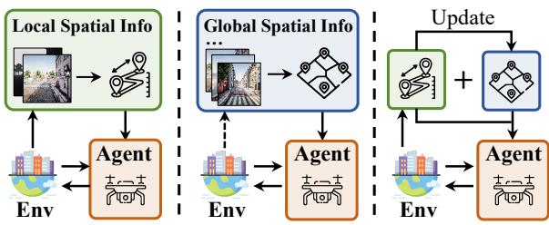
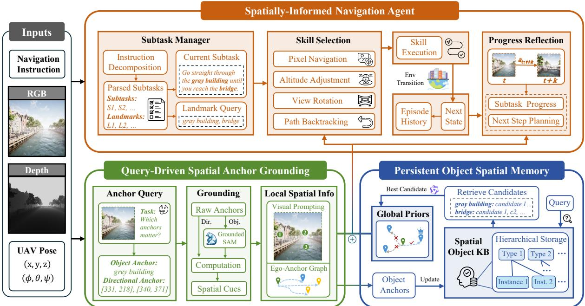
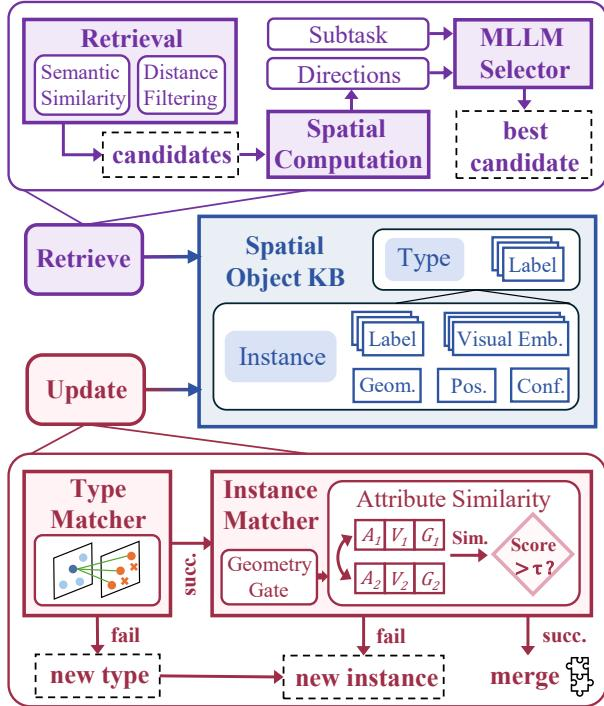
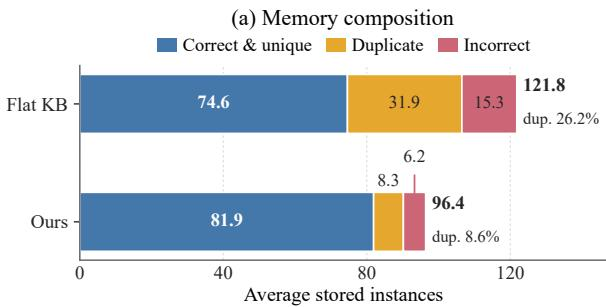
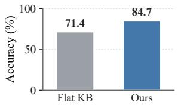
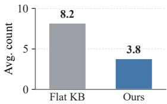
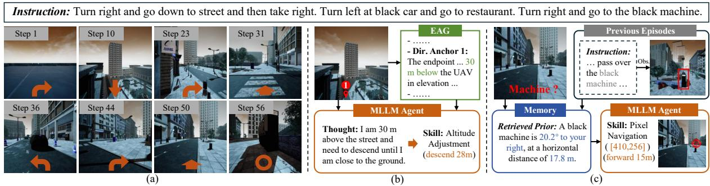
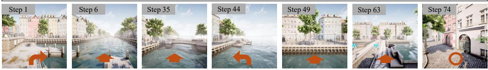
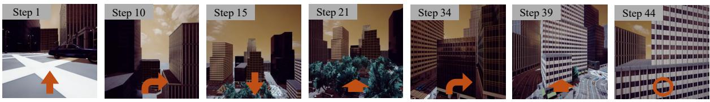
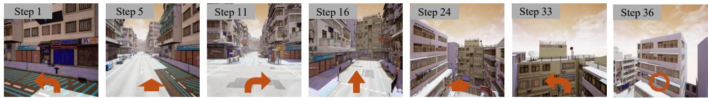

# AirAnchor: Bridging Local and Global Spatial Information for Zero-Shot Aerial Vision-and-Language Navigation

Shanwei Fan<sup>1,2</sup>, Bin Zhang<sup>1,2</sup>, Zhiwei Xu<sup>3</sup>, Yingxuan Teng<sup>1,2</sup> Siqi Dai<sup>1,2</sup>, Lin Cheng<sup>1,2</sup>, Guoliang Fan<sup>1,2</sup>

<sup>1</sup>National Key Laboratory of Cognition and Decision Intelligence for Complex Systems, Institute of Automation, Chinese Academy of Sciences, Beijing, China <sup>2</sup>School of Artificial Intelligence, University of Chinese Academy of Sciences, Beijing, China <sup>3</sup>School of Artificial Intelligence, Shandong University, Jinan, Shandong, China

{fanshanwei2024,zhangbin2020,tengyingxuan2024}@ia.ac.cn {daisiqi2025,chenglin2025,guoliang.fan}@ia.ac.cn zhiwei\_xu@sdu.edu.cn

## Abstract

Aerial Vision-and-Language Navigation requires drones to follow natural-language instructions and navigate through complex urban environments. Accurate navigation relies on both local and global spatial information, which support immediate action grounding and long-horizon path planning, respectively. However, existing zero-shot methods typically operate at a single spatial scale, relying either on local representations constructed online from current observations or on global memories built offline from historical experience. To address this limitation, we propose AirAnchor, a new paradigm that bridges local and global spatial information through spatial anchors and integrates both into a shared navigation framework, enabling comprehensive spatial ground ing for decision-making. AirAnchor consists of three core components: (1) Query-Driven Spatial Anchor Grounding, which identifies decision-relevant anchors from visual observations and organizes them into local spatial representations; (2) Persistent Object Spatial Memory, which incrementally maintains an ob ject knowledge base as persistent global spatial memory and retrieves landmark-related spatial priors; and (3) a Spatially-Informed Navigation Agent, which explicitly integrates both local and global spatial information into an agentic framework for decision-making. Extensive experiments on AerialVLN demonstrate that AirAnchor substantially outperforms existing zero-shot baselines, validating the effectiveness and efficiency of the proposed paradigm.

## 1 Introduction

Aerial Vision-and-Language Navigation (Aerial VLN) (Liu et al., 2023b; Gao et al., 2025; Wang et al., 2025a,b) has emerged as a novel and chal-

(a)

(b)

(c)

Figure 1: Comparison of three spatial representation paradigms in zero-shot methods: (a) the local-centric paradigm, (b) the global-centric paradigm, and (c) our anchor-centric paradigm, which bridges spatial information across both scales.

lenging embodied AI task that requires an unmanned aerial vehicle (UAV) to follow naturallanguage instructions and navigate through complex 3D aerial environments. Recent advances in multimodal large language models (MLLMs) have inspired a series of zero-shot methods for Aerial VLN (Chen et al., 2026; Wang et al., 2025a). Compared with learning-based approaches, these methods require neither task-specific navigation training nor large-scale annotated trajectories, offering a promising path toward more generalizable UAV navigation. However, generic MLLMs remain limited in their ability to infer precise metric and directional relations directly from visual observations (Zhang et al., 2025b). Zero-shot Aerial VLN therefore requires explicit and interpretable spatial representations to ground model reasoning in environmental geometry and support accurate navigation decisions (Xia et al., 2026).

As illustrated in Figure 1, existing zero-shot methods typically represent spatial information on either a local or global scale. Local-centric methods construct structured spatial representations online from visual observations, such as 2D semantic maps (Gao et al., 2024) or depth-aware geometric cues (Hu et al., 2025; Zheng et al., 2026). In contrast, global-centric methods organize historical experience into large-scale memory graphs (Zhang et al., 2025a) or landmark knowledge bases (Ning et al., 2026), which are accessed through graph search or knowledge retrieval. However, relying on either scale alone is inherently limiting. Local spatial information provides the geometric evi dence required to ground immediate actions in the surrounding environment, whereas global spatial information provides scene-level priors that align long-horizon path planning with instructions, particularly when instruction-relevant landmarks lie beyond the UAV’s current field of view. A straightforward way to combine their strengths is to model the two scales independently and fuse their representations during decision-making. However, such separation overlooks their inherent compositional relationship: locally grounded spatial evidence can naturally evolve into persistent global knowledge. Maintaining the two scales separately makes such cross-scale accumulation indirect and requires the decision model to reconcile heterogeneous spatial representations at decision time, complicating their effective integration. These limitations motivate us to design a shared spatial primitive that retains the complementary benefits of local and global spatial representations while enabling locally grounded evidence to be progressively accumulated into global memory and allowing both scales to be jointly exploited for navigation.

To this end, we introduce AirAnchor, a new paradigm that bridges local spatial grounding and global spatial memory within an MLLM-powered navigation agent through structured prompts. Our key insight is that Aerial VLN does not require an exhaustive spatial representation of the environment. Instead, decision-relevant spatial information can be distilled into a sparse set of semantically meaningful references, which we term spatial anchors. We define two types of anchors: object anchors, which represent specific objects and their spatial attributes, and directional anchors, which encode spatial cues associated with particular directions. Anchors constructed from real-time observations can be organized into local spatial representations, while object anchors can be persistently accumulated to form global spatial representations. To realize this idea, we design a UAV navigation system with a modular architecture comprising three main components: (1) Query-Driven Spatial Anchor Grounding queries the MLLM to identify decision-relevant object and directional anchors in the current observation, computes their spatial cues from the corresponding depth map, and organizes them into an Egocentric Anchor Graph (EAG) as the local spatial representation. (2) Persistent Object Spatial Memory maintains an object knowledge base as the global spatial representation for retrieving landmark priors. During navigation, landmarks extracted from the instruction are used as queries to retrieve candidate objects from the knowledge base. The MLLM then selects the candidate that best matches the referenced landmark. Meanwhile, newly acquired object anchors are either merged with existing instances or inserted as new entries through similarity-based matching. (3) A Spatially-Informed Navigation Agent is an MLLM-based agentic framework that integrates subtask management, skill selection, and progress reflection into a closed-loop decisionmaking pipeline. It jointly aligns the UAV’s current observation and user instruction with the local and global spatial information provided by the EAG and landmark priors, enabling comprehensive spatial grounding for navigation. Extensive experiments on AerialVLN (Liu et al., 2023b) demonstrate that AirAnchor consistently improves the performance of zero-shot agents, validating the effectiveness of our paradigm.

The contributions of our method are summarized as follows: (1) We introduce AirAnchor, a novel paradigm that bridges local spatial grounding and global spatial memory through spatial anchors, allowing information from both scales to be jointly utilized within a navigation framework. (2) To implement AirAnchor, we develop a modular system consisting of three components: Query-Driven Spatial Anchor Grounding, Persistent Object Spatial Memory, and the Spatially-Informed Navigation Agent. (3) Extensive experiments demonstrate that AirAnchor outperforms existing zero-shot baselines. Further ablation studies validate the effectiveness of designed components.

## 2 Related Works

Vision-and-Language Navigation. Vision-and-Language Navigation (VLN), introduced with the Room-to-Room (R2R) benchmark (Anderson et al., 2018), was later extended to continuous environments with low-level control by R2R-

CE (Krantz et al., 2020). Early methods focused on cross-modal representation learning (Hao et al., 2020; Hong et al., 2021) and history modeling (Chen et al., 2021b), while recent advances in MLLMs have enabled vision-language-action models (Wang et al., 2026), fast–slow dual-system architectures (Wei et al., 2026), and zero-shot agentic frameworks (Zhou et al., 2024; Chen et al., 2024).

Aerial VLN (Liu et al., 2023b) further extends VLN to continuous 3D aerial environments. Learning-based methods use trajectory supervision, with improvements from temporal history modeling (Gao et al., 2025), map-aware action prediction (Zhao et al., 2025), and multi-task learning (Xu et al., 2026). Zero-shot methods instead exploit MLLM reasoning through structured local spatial representations (Gao et al., 2024; Zheng et al., 2026; Hu et al., 2025), global memory (Zhang et al., 2025a; Ning et al., 2026), and fine-grained modular design (Shao et al., 2026). AirAnchor follows the zero-shot paradigm but differs from prior methods by bridging local spatial grounding and global spatial memory through spatial anchors and jointly exploiting both within an agentic framework.

Spatial Representations for VLN. Spatial representations ground navigation decisions in the environment. Early VLN methods implicitly encode spatial context through recurrent states or multimodal histories (Anderson et al., 2018; Chen et al., 2021b). Later approaches introduce explicit local geometry using egocentric or top-down semantic maps (Georgakis et al., 2022; Gao et al., 2024) and bird’s-eye-view structures (Liu et al., 2023a) for action grounding. Global representations further accumulate navigation experience for longhorizon reasoning, typically through topological graphs (Chen et al., 2021a, 2022; Zhang et al., 2025a) or compact landmark memories (Ning et al., 2026). However, local and global information is usually represented and maintained separately, making cross-scale information exchange and accumulation indirect. AirAnchor instead adopts object anchors as shared primitives across both scales, allowing spatial evidence grounded online to support immediate decisions while being naturally accumulated as persistent global knowledge.

## 3 Method

In this section, we introduce the AirAnchor paradigm for zero-shot Aerial VLN. As illustrated in Figure 2, at each decision step, Query-Driven

Spatial Anchor Grounding identifies decisionrelevant anchors from the current observation and organizes their spatial cues into an Egocentric Anchor Graph (EAG) as the local spatial representation. Persistent Object Spatial Memory consolidates observed object anchors into a Spatial Object Knowledge Base (SOKB) and retrieves instructionrelevant landmarks as global spatial priors. Finally, the Spatially-Informed Navigation Agent jointly exploits the local EAG and global priors within an MLLM-powered agentic framework for skill-level planning and progress reflection.

## 3.1 Task Formulation

In Aerial VLN, a UAV agent receives a naturallanguage instruction I and navigates in a 3D urban environment. At timestep t, it observes an egocentric RGB-D observation $( I _ { t } , D _ { t } )$ and its pose $\mathbf { p } _ { t }$ . The UAV can execute eight discrete actions: Move Forward, Turn Left, Turn Right, Ascend, Descend, Move Left, Move Right, and Stop (Liu et al., 2023b). Navigation is successful if the UAV stops within a predefined distance threshold of the target destination. In our paradigm, rather than invoking the MLLM for every low-level action decision, AirAnchor performs high-level skill selection and delegates skill execution to a motion planner.

## 3.2 Query-Driven Spatial Anchor Grounding

Aerial environments are large, open, and inherently 3D. Consequently, dense geometric maps are expensive to construct and maintain, whereas 2D grid maps or graphs may discard altitude information and fine-grained spatial relations. Our key insight is that, given the semantic reasoning capabilities of MLLMs, grounding the local spatial context does not require an exhaustive geometric representation. Instead, it is sufficient to expose the geometry of a sparse set of scene elements that are relevant to the current decision. We term these semanticgeometric references spatial anchors.

Query-Driven Anchor Selection. Let $\begin{array} { r l } { \mathcal { C } _ { t } } & { { } = } \end{array}$ $( s _ { n } , \gamma _ { t } , \pi _ { t } )$ denote the navigation context, where $s _ { n } , \gamma _ { t }$ , and $\pi _ { t }$ represent the current subtask, navigation progress, and plan, respectively. Conditioned on $I _ { t }$ and $\mathcal { C } _ { t }$ , the MLLM queries

$$
\mathcal { A } _ { t } = \mathrm { M L L M } _ { \mathrm { q u e r y } } ( I _ { t } , \mathcal { C } _ { t } ) = \mathcal { A } _ { t } ^ { o } \cup \mathcal { A } _ { t } ^ { d } ,\tag{1}
$$

where $\mathbf { \mathcal { A } } _ { t } ^ { o }$ and $\mathbf { \mathcal { A } } _ { t } ^ { d }$ denote object anchors and directional anchors, respectively. Object anchors identify important objects through semantic labels, whereas directional anchors specify ray-casting directions through pixel coordinates. This querydriven design enables the MLLM to actively identify key elements in $I _ { t }$ whose spatial information is most relevant to the current navigation decision. Spatial Cue Grounding. For each queried anchor $a _ { i }$ , we derive its spatial cues from the depth $D _ { t }$ . Specifically, for a directional anchor, we backproject its pixel coordinate and depth value to obtain the corresponding reference point in the world frame. For an object anchor, an open-vocabulary detector based on Grounded SAM (Ren et al., 2024) first localizes and segments the object, after which the corresponding depth pixels are back-projected to obtain its 3D point cloud. To compactly characterize its geometry, we represent the object using a 2.5D spatial extent ${ \bf g } _ { i } = ( R _ { i } , z _ { i } ^ { \operatorname* { m i n } } , z _ { i } ^ { \operatorname* { m a x } } )$ , where $R _ { i }$ denotes its horizontal footprint and $[ z _ { i } ^ { \mathrm { m i n } } , z _ { i } ^ { \mathrm { m a x } } ]$ denotes its vertical extent. The object center $\mathbf { c } _ { i }$ is computed from ${ \bf { g } } _ { i }$ and used as its reference point. We then characterize the spatial cues of each anchor $a _ { i }$ by computing the relative geometry between its reference point and the UAV pose:

  
Figure 2: AirAnchor consists of three key modules. Query-Driven Spatial Anchor Grounding identifies spatial anchors and constructs the local spatial representation. Persistent Object Spatial Memory maintains the global spatial representation, supporting online updates and prior knowledge retrieval. Spatially-Informed Navigation Agent integrates the local spatial representation and global spatial priors within an agentic framework to enable closed-loop and spatially grounded navigation decisions.

$$
\mathbf { r } _ { t , i } = ( \phi _ { t , i } , \Delta z _ { t , i } , d _ { t , i } ^ { x y } , d _ { t , i } ^ { 3 D } ) ,\tag{2}
$$

where $\phi _ { t , i }$ denotes the relative bearing, $\Delta z _ { t , i }$ the relative height difference, and $d _ { t , i } ^ { x y }$ and $d _ { t , i } ^ { 3 D }$ the horizontal and Euclidean distances, respectively.

Egocentric Anchor Graph. We organize the grounded anchors into an Egocentric Anchor Graph (EAG), denoted by $\mathcal { G } _ { t } = ( \nu _ { t } , \mathcal { E } _ { t } )$ , where the node set $\nu _ { t }$ and edge set $\mathcal { E } _ { t }$ are defined as

$$
\begin{array} { r l } & { \mathcal { V } _ { t } = \{ v _ { t } ^ { u } \} \cup \{ v _ { i } \mid a _ { i } \in \mathcal { A } _ { t } \} , } \\ & { \mathcal { E } _ { t } = \{ ( v _ { t } ^ { u } , v _ { i } ) \mid a _ { i } \in \mathcal { A } _ { t } \} . } \end{array}\tag{3}
$$

Here, $v _ { t } ^ { u }$ and $v _ { i }$ denote the UAV node and anchor node, respectively. Each anchor node stores its semantic and geometric attributes, while each UAVanchor edge encodes the corresponding spatial cue $\mathbf { r } _ { t , i }$ . In addition, we annotate the anchors in $I _ { t }$ with visual prompts to obtain $I _ { t } ^ { \prime } ,$ explicitly aligning the structured EAG with the visual observation.

Through the design of spatial anchors, we construct a lightweight and interpretable local spatial representation that provides explicit local grounding for MLLM-based navigation decisions. Implementation details are provided in the Appendix A.1.

## 3.3 Persistent Object Spatial Memory

Long-horizon Aerial VLN often refers to landmarks beyond the UAV’s current field of view, requiring global spatial representations to guide path planning. In this setting, an object-centric knowledge base provides an efficient representation for large urban scenes. However, urban scenes exhibit complex and diverse object semantics and visual appearances, making robust object association and memory maintenance challenging. Therefore, we design our memory around a Spatial Object Knowledge Base (SOKB), which adopts a hierarchical storage structure together with coarse-to-fine object association and knowledge retrieval mechanisms. Hierarchical Structure. As shown in Figure 3, the SOKB M adopts a type-instance hierarchy:

  
Figure 3: Overview of Persistent Object Spatial Memory. Centered on the SOKB, it maintains the global spatial representation to support reliable landmark-prior retrieval and online object knowledge updates.

$$
\begin{array} { r l } & { \mathcal { M } = \{ \mathcal { T } _ { m } \} _ { m = 1 } ^ { N _ { T } } , \mathcal { T } _ { m } = ( \mathcal { B } _ { m } ^ { T } , \mathcal { O } _ { m } ) , } \\ & { \mathcal { O } _ { m } = \{ o _ { j } \} _ { j = 1 } ^ { N _ { m } } , o _ { j } = ( \mathcal { B } _ { j } ^ { A } , \mathcal { B } _ { j } ^ { V } , \mathbf { g } _ { j } , \mathbf { c } _ { j } , q _ { j } ) . } \end{array}\tag{4}
$$

Here, each type $\mathcal { T } _ { m }$ represents an object category and ${ \mathcal { O } } _ { m }$ contains the distinct object instances belonging to that category. We employ bounded banks to store category labels $B _ { m } ^ { \hat { T } } .$ , appearance labels $B _ { j } ^ { A }$ , and visual embeddings $B _ { j } ^ { \bar { V } }$ , respectively mitigating synonymous category expressions, diverse object appearances, and substantial viewpoint-dependent visual variations in Aerial VLN. For each instance $o _ { j } , \mathbf { g } _ { j }$ denotes its geometric extent, $\mathbf { c } _ { j }$ its 3D center, and $q _ { j }$ its confidence score. This hierarchy supports efficient organization and coarse-to-fine association and retrieval.

Object Association. A newly observed object anchor $a _ { i } ^ { o }$ is first matched against object types according to semantic similarity. Candidate instances under compatible types are then filtered by a geometry gate to remove spatially implausible matches. For each remaining instance $o _ { j }$ , we compute a weighted association score:

$$
\begin{array} { c } { { S _ { M } ( i , j ) = w _ { G } S _ { G } ( i , j ) + w _ { S } S _ { S } ( i , j ) } } \\ { { + w _ { V } S _ { V } ( i , j ) , } } \end{array}\tag{5}
$$

where $S _ { G }$ measures geometric consistency between spatial extents, $S _ { S }$ captures category- and appearance-level semantic similarity, and $S _ { V }$ measures visual similarity using DINOv2 (Oquab et al., 2024) embeddings. If the highest association score exceeds a predefined threshold, the incoming anchor is fused with the matched instance by merging their spatial extents and updating the semantic and visual banks; otherwise, a new instance is created. Landmark Prior Retrieval. For each active subtask $s _ { n } .$ , its referenced landmarks ${ \mathcal { L } } _ { n }$ are used to retrieve candidate instances from the SOKB based on semantic similarity $S _ { S }$ and a distance filter, yielding a candidate set $\mathcal { C } _ { \ell }$ for each landmark $\ell \in \mathcal { L } _ { n }$ We define $\mathcal { R } _ { t , \ell } = \{ ( o _ { j } , \mathbf { r } _ { t , j } ) \mid o _ { j } \in \mathcal { C } _ { \ell } \}$ as the candidate instances together with their UAV-relative spatial cues. The MLLM is then employed for candidate selection:

$$
\hat { \mathcal { O } } _ { n } = \mathrm { M L L M } _ { \mathrm { r e t } } \big ( s _ { n } , \{ ( \ell , \mathcal { R } _ { t , \ell } ) \ | \ \ell \in \mathcal { L } _ { n } \} \big ) ,\tag{6}
$$

where $\hat { \mathcal { O } } _ { n } = \{ \hat { o } _ { \ell } \mid \ell \in \mathcal { L } _ { n } \}$ contains the best candidate $\hat { o } _ { \ell }$ selected for each landmark. The MLLM disambiguates semantically similar candidates by matching their spatial cues with the spatial relations implied by the instruction to identify the referred landmark. The selected instances and their corresponding spatial cues are organized into the global landmark prior $\mathcal { P } _ { t } = \{ \left( \hat { o } _ { \ell } , \mathbf { r } _ { t , \hat { o } _ { \ell } } \right) | \ell \in \mathcal { L } _ { n } \}$

Overall, our memory design enables efficient maintenance and online updates while providing reliable landmark priors for long-horizon navigation. Detailed object association, merging, and retrieval procedures are provided in Appendix A.2.

## 3.4 Spatially-Informed Navigation Agent

To integrate spatial information across local and global scales for robust and spatially grounded navigation, we introduce a Spatially-Informed Navigation Agent that combines subtask management, skill-level planning, and progress reflection in a closed-loop framework, while seamlessly incorporating spatial representations at both scales through structured prompts.

Subtask Management. At the beginning of each episode, the instruction is decomposed into an ordered sequence of subtasks:

$$
\{ ( s _ { n } , \mathcal { L } _ { n } ) \} _ { n = 1 } ^ { N } = \mathrm { M L L M } _ { \operatorname* { d e c } } ( \mathcal { T } ) ,\tag{7}
$$

where $s _ { n }$ denotes a subtask and ${ \mathcal { L } } _ { n }$ its referenced landmarks. This allows the agent to focus on one subtask at a time, reducing the burden of longhorizon instruction tracking.

Skill-Level Planning. We employ the MLLM as a high-level planner that performs skill-level decision making. Let $\sigma _ { t } = k _ { t } ( \eta _ { t } )$ denote a parameterized skill, where $k _ { t }$ specifies the skill type and $\pmb { \eta } _ { t }$ its parameters. The planning process is formulated as

$$
\left( \sigma _ { t } , \xi _ { t } \right) = \mathrm { M L L M } _ { \mathrm { n a v } } \left( I _ { t } ^ { \prime } , \mathcal { C } _ { t } , \mathcal { G } _ { t } , \mathcal { P } _ { t } \right) ,\tag{8}
$$

where $\xi _ { t }$ denotes the rationale for the selected skill.

We define four skills tailored to Aerial VLN: Pixel Navigation specifies a target waypoint using a designated image coordinate and depth value; Altitude Adjustment controls vertical displacement; View Rotation determines a turning angle from panoramic observations; and Path Backtracking recovers from navigation errors by returning to a previous waypoint. The selected skill $\sigma _ { t }$ is converted into a target pose and executed by a lowlevel motion planner. Further details of skill-level planning are provided in Appendix A.3.2.

Progress Reflection. Reliable reasoning about navigation progress often depends on changes in spatial relations rather than solely on textual or visual semantics, such as when determining whether the UAV has passed or flown over a landmark. We therefore explicitly incorporate spatial context into the reflection process. Specifically, after executing skill $\sigma _ { t }$ for k low-level actions, the UAV moves from $\mathbf { p } _ { t } \mathrm { t o } \mathbf { p } _ { t + k }$ . We retain the anchors in $\mathcal { G } _ { t }$ and recompute their spatial cues relative to $\mathbf { p } _ { t + k } .$ , yielding $\widetilde { \mathcal { G } } _ { t + k }$ , which encodes the spatial relations between the current pose and the anchors in $\mathcal { G } _ { t }$ . We then summarize the reflection inputs into a semantic context $\mathcal { C } _ { t } ^ { \mathrm { s e m } } = ( \mathcal { C } _ { t } , I _ { t } ^ { \prime } , I _ { t + k } ^ { \prime } , \sigma _ { t } , \xi _ { t } )$ and a spatial context $\mathcal { C } _ { t } ^ { \mathrm { { s p a } } } = ( \mathcal { G } _ { t } , \widetilde { \mathcal { G } } _ { t + k } )$ . The reflection process is formulated as

$$
( \gamma _ { t + k } , b _ { t + k } , \pi _ { t + k } ) = \mathrm { M L L M _ { r e f } } ( \mathcal { C } _ { t } ^ { \mathrm { s e m } } , \mathcal { C } _ { t } ^ { \mathrm { s p a } } ) ,\tag{9}
$$

where $\gamma _ { t + k }$ denotes the updated assessment of navigation progress, $b _ { t + k }$ is a binary variable indicating whether the current subtask has been completed, and $\pi _ { t + k }$ specifies the plan for the next step.

Overall, the agent integrates local and global spatial information into an agentic framework, enabling efficient and spatially grounded navigation.

## 4 Experiments

## 4.1 Experimental Setup

Dataset. We evaluate AirAnchor on the AerialVLN-S dataset of the challenging AerialVLN (Liu et al., 2023b) benchmark. The benchmark comprises 8,446 flight trajectories collected from experienced UAV pilots across 25 diverse city-scale environments built in Unreal Engine 4, covering more than 870 categories of urban objects. AerialVLN-S is a small-scale variant of AerialVLN consisting of 17 compact scenes.

Metrics. Following AerialVLN, we report four evaluation metrics: Success Rate (SR), Oracle Success Rate (OSR), Navigation Error (NE), and Success weighted by normalized Dynamic Time Warping (SDTW). SR measures the percentage of episodes in which the agent stops within 20 meters of the target, whereas OSR considers an episode successful if any point along the predicted trajectory enters the 20 m success radius. NE is the Euclidean distance between the agent’s final position and the target. SDTW jointly measures navigation success and trajectory fidelity with respect to the reference path.

Baselines. We compare AirAnchor with three groups of baselines. Statistical methods include Random and Action Sampling. Learning-based methods include Seq2Seq (Anderson et al., 2018), CMA (Krantz et al., 2020), and LAG (Liu et al., 2023b), which learn navigation policies from taskspecific trajectory supervision. For zero-shot methods, we include indoor VLN agents NavGPT (Zhou et al., 2024) and MapGPT (Chen et al., 2024), as well as Aerial VLN agents TypeFly (Chen et al., 2023), PIVOT (Nasiriany et al., 2024), SPF (Hu et al., 2025), and FineCog-Nav (Shao et al., 2026). Implementation Details. We implement AirAnchor with Qwen3.6-Plus (Alibaba Cloud, 2026) as the MLLM backbone via its online API. A<sup>∗</sup> search (Hart et al., 1968) serves as the low-level motion planner, generating feasible paths from the current pose to the target pose. Each scene starts with an empty SOKB, which is updated online and retained across episodes within the same scene. All zero-shot Aerial VLN baselines are reproduced using the same MLLM backbone.

<table><tr><td rowspan="2">Category</td><td rowspan="2">Method</td><td colspan="4">Validation Seen</td><td colspan="4">Validation Unseen</td></tr><tr><td>SR↑</td><td>OSR↑</td><td>SDTW↑</td><td>NE↓</td><td>SR↑</td><td>OSR↑</td><td>SDTW↑</td><td>NE↓</td></tr><tr><td rowspan="2">Statistical</td><td>Random</td><td>0.0</td><td>0.0</td><td>0.0</td><td>109.6</td><td>0.0</td><td>0.0</td><td>0.0</td><td>149.7</td></tr><tr><td>Action Sampling</td><td>0.9</td><td>5.7</td><td>0.3</td><td>213.8</td><td>0.2</td><td>1.1</td><td>0.1</td><td>237.6</td></tr><tr><td rowspan="3">Learning-Based</td><td>Seq2Seq</td><td>4.8</td><td>19.8</td><td>1.6</td><td>146.0</td><td>2.3</td><td>11.7</td><td>0.7</td><td>218.9</td></tr><tr><td>CMA</td><td>3.0</td><td>23.2</td><td>0.6</td><td>121.0</td><td>3.2</td><td>16.0</td><td>1.1</td><td>172.1</td></tr><tr><td>LAG</td><td>7.2</td><td>15.7</td><td>2.4</td><td>90.2</td><td>5.1</td><td>10.5</td><td>1.4</td><td>127.9</td></tr><tr><td rowspan="6">Zero-Shot</td><td>Indoor</td><td>NavGPT</td><td>0.0</td><td>0.0</td><td>0.0</td><td>163.5</td><td>0.0 0.0</td><td></td><td>0.0</td><td>82.1</td></tr><tr><td></td><td>MapGPT</td><td>2.1</td><td>4.7</td><td>0.8</td><td>124.9</td><td>0.0</td><td>0.0</td><td>0.0</td><td>107.0</td></tr><tr><td></td><td>TypeFly</td><td>1.8</td><td>5.5</td><td>0.4</td><td>136.8</td><td>1.4</td><td>4.3</td><td>0.3</td><td>166.4</td></tr><tr><td>Aerial</td><td>PIVOT</td><td>3.2</td><td>12.4</td><td>0.9</td><td>116.3</td><td>2.6</td><td>10.2</td><td>0.7</td><td>139.6</td></tr><tr><td></td><td>SPF</td><td>5.7</td><td>14.4</td><td>2.1</td><td>103.8</td><td>5.1</td><td>12.2</td><td>1.7</td><td>116.0</td></tr><tr><td>FineCog-Nav</td><td></td><td>6.9</td><td>16.8</td><td>2.7</td><td>97.5</td><td>6.2</td><td>15.3</td><td>2.3</td><td>107.0</td></tr><tr><td></td><td></td><td>AirAnchor (Ours)</td><td>9.6</td><td>23.1</td><td>4.0</td><td>80.5</td><td>9.2</td><td>22.0</td><td>3.5</td><td>84.6</td></tr></table>

Table 1: Overall performance comparison on the AerialVLN-S benchmark. Bold and underline indicate the best and second-best results, respectively.

<table><tr><td>Module</td><td>Ablation Variant</td><td>SR↑ SDTW↑ NE↓</td><td></td></tr><tr><td></td><td>AirAnchor</td><td>9.6 4.0</td><td>80.5</td></tr><tr><td rowspan="2">Anchor</td><td>w/o Dir. Anchor</td><td>9.3</td><td>3.7 84.7</td></tr><tr><td>w/o Obj. Anchor</td><td>8.7</td><td>3.5 87.6</td></tr><tr><td rowspan="2">Memory</td><td>Flat KB</td><td>8.4</td><td>3.4 90.8</td></tr><tr><td>w/o MLLM Selector</td><td>9.0</td><td>3.6 86.9</td></tr><tr><td rowspan="5">Agent</td><td>w/o Subtask</td><td>8.7</td><td>3.5 88.6</td></tr><tr><td>Action-Level Planning</td><td>9.0</td><td>3.3 85.6</td></tr><tr><td>w/o EAG</td><td>7.8</td><td>2.9 93.8</td></tr><tr><td>w/o Landmark Prior</td><td>8.1</td><td>3.2 94.5</td></tr><tr><td>w/o Spatial Reflection</td><td>8.4</td><td>3.3 89.0</td></tr></table>

Table 2: Ablation study of different modules.  
Table 3: Ablation of the navigation skill set.
<table><tr><td>Setting</td><td>Pixel Alt. View Back. SR↑ SDTW↑ NE↓</td><td></td><td></td><td></td><td></td><td></td><td></td></tr><tr><td>Full</td><td>√</td><td>√</td><td>√</td><td>√</td><td>9.6</td><td>4.0</td><td>80.5</td></tr><tr><td>– Alt.</td><td>√</td><td>X</td><td>√</td><td>√</td><td>9.0</td><td>3.6</td><td>85.8</td></tr><tr><td>– View</td><td>√</td><td>√</td><td>×</td><td>√</td><td>8.6</td><td>3.4</td><td>87.8</td></tr><tr><td>- Back.</td><td>√</td><td>√</td><td>√</td><td>X</td><td>9.3</td><td>3.8</td><td>83.1</td></tr><tr><td>Pixel Only</td><td>√</td><td>X</td><td>X</td><td>×</td><td>8.1</td><td>3.1</td><td>91.6</td></tr></table>

## 4.2 Overall Performance

Table 1 summarizes the overall results on AerialVLN-S. AirAnchor performs strongly on both validation splits and outperforms all learningbased baselines on Validation Unseen, demonstrating robust zero-shot generalization across aerial environments. In contrast, indoor zero-shot agents such as NavGPT and MapGPT achieve nearly zero success when directly transferred to aerial environments. This suggests that ground-based zero-shot VLN methods do not transfer effectively to Aerial



(b) Retrieval accuracy ↑  


(c) Candidate set size ↓  
  
Figure 4: Comparison of object knowledge base design. We compare the proposed SOKB with a flat KB in terms of (a) memory composition, (b) landmark retrieval accuracy, and (c) candidate-set size.

VLN, where dedicated spatial reasoning mechanisms are required to handle large-scale 3D aerial environments.

Among zero-shot aerial methods, AirAnchor consistently outperforms all baselines across both validation splits. Compared with the strongest zero-shot aerial baseline, FineCog-Nav, AirAnchor achieves relative improvements of 39.1% / 48.4% in SR, 37.5% / 43.8% in OSR, and 48.1% / 52.2% in SDTW on Seen / Unseen, while reducing NE by 17.4% / 20.9%, respectively. The substantial improvements in OSR and NE are consistent with the complementary use of local metric grounding and persistent landmark priors, which provides more reliable spatial guidance toward instruction-relevant regions, including those beyond the current field of view. Meanwhile, the gains in SR and SDTW suggest that spatially informed skill-level planning and progress reflection more effectively translate spatial knowledge into successful and trajectory-aligned navigation. Notably, AirAnchor exhibits minor degradation from Validation Seen to Unseen, highlighting its robustness across diverse aerial scenes.

## 4.3 Ablation Study

To comprehensively evaluate AirAnchor, we conduct ablation studies on its key components. All ablation experiments are performed on the validation "Seen" split of the AerialVLN-S benchmark. Effect of Spatial Anchors. As shown in Table 2, removing directional anchors reduces SR by 3.1%, while removing object anchors causes larger drops in SR and SDTW (9.4% and 12.5%) and increases NE by 7.1 m. This confirms that directional anchors provide useful ray-based geometry, while object anchors additionally ground instruction-relevant landmarks with semantic and metric cues.

Effect of Persistent Object Memory. Replacing SOKB with Flat KB, which indexes objects by labels and merges same-label observations using a fixed spatial threshold (Ning et al., 2026), reduces SR by 12.5% and increases NE by 10.3 m. Replacing the MLLM selector with semantic-nearest retrieval results in a smaller degradation, confirming the benefit of spatially informed landmark disambiguation. Figure 4 further shows that SOKB stores 20.9% fewer instances while preserving 9.8% more correct unique objects, reduces duplicate instances by 74.0%, and improves retrieval accuracy by 18.6%. It also reduces the candidate-set size by 53.7%, indicating more efficient retrieval over the object knowledge. These results demonstrate more reliable and compact spatial memory.

Effect of Agent Design. Table 2 shows that removing subtask management degrades long-horizon navigation, while action-level planning reduces SR by 6.3% and SDTW by 17.5%, supporting skilllevel decision making. Removing EAG yields the largest SR and SDTW drops (18.8% and 27.5%), whereas removing landmark priors causes the largest NE increase (14.0 m), highlighting the complementary roles of local geometry and global spatial guidance. Removing spatial context from reflection further reduces SR and SDTW by 12.5% and 17.5%, respectively, confirming the benefit of explicit spatial context for progress reasoning. Finally, Table 3 shows that all specialized skills are beneficial, with View Rotation having the largest impact, followed by Altitude Adjustment and Path Backtracking; using Pixel Navigation alone reduces SR by 15.6% and increases NE by 11.1 m.

## 4.4 Case Analysis

Figure 5 illustrates how AirAnchor coordinates local and global spatial information within a longhorizon episode. At Step 10, the EAG grounds a directional anchor whose endpoint is about 30 m below the UAV. The agent uses this metric cue to select Altitude Adjustment and descend 28 m toward street level, showing how local anchors support precise 3D control. At Step 50, when the instruction refers to the black machine, the SOKB retrieves a previously observed instance and provides a prior locating it $2 0 . 2 ^ { \circ }$ to the right and 17.8 m away. The agent then selects Pixel Navigation toward the landmark. This example illustrates the complementary roles of local metric grounding and persistent global guidance during navigation.

## 5 Conclusion

In this work, we introduced AirAnchor, a zero-shot Aerial VLN paradigm that bridges local grounding and global memory through spatial anchors within an MLLM-powered agentic framework. AirAnchor grounds spatial anchors into an Egocentric Anchor Graph for local spatial reasoning, while persistently consolidating object anchors into a Spatial Object Knowledge Base to retrieve global spatial priors. A Spatially-Informed Navigation Agent further integrates both representations into a closed-loop process. The experimental results demonstrate the efficacy and robustness of our method.

## 6 Limitations

Despite its effectiveness, AirAnchor has several limitations. First, spatial anchors are grounded from RGB-D observations and UAV poses with open-vocabulary perception models. Errors in depth estimation, object localization, or geometric grounding can therefore propagate into the EAG and subsequently affect navigation decisions. For object anchors, incorrect association may further be accumulated in the persistent SOKB and influence later retrieval.

Second, the benefit of global spatial memory depends on previously accumulated scene knowledge. When entering a new environment, instructionrelevant landmarks may not yet exist in the SOKB, and the agent must rely primarily on local observations until sufficient object knowledge has been collected. Improving cold-start exploration and uncertainty-aware memory updates would make persistent spatial reasoning more robust.

  
Figure 5: Visualization of a successful navigation episode. (a) Key steps throughout the episode. (b) Local spatial grounding at Step 10. (c) Global prior guidance at Step 50.

Third, the current navigation agent employs a predefined set of four skills together with an A<sup>∗</sup> low-level planner. Although this design provides an effective abstraction for AerialVLN-S, more complex maneuvers or dynamic environments may require adaptive or learned skill composition. Finally, our evaluation is limited to simulated AerialVLN-S environments, and the robustness of AirAnchor to real-world sensing noise and dynamic environments remains to be validated. Moreover, the current system relies on multiple foundation models, including an online MLLM, introducing additional computational and communication overhead. Future work should investigate more efficient implementations and the robustness of AirAnchor across different MLLM backbones.

## References

Alibaba Cloud. 2026. Qwen3.6-Plus. Alibaba Cloud Model Studio. Model version: qwen3.6-plus-2026- 04-02.

Peter Anderson, Qi Wu, Damien Teney, Jake Bruce, Mark Johnson, Niko Sünderhauf, Ian Reid, Stephen Gould, and Anton Van Den Hengel. 2018. Visionand-language navigation: Interpreting visuallygrounded navigation instructions in real environments. In 2018 IEEE/CVF conference on computer vision and pattern recognition, pages 3674–3683. IEEE.

Guojun Chen, Xiaojing Yu, Neiwen Ling, and Lin Zhong. 2023. Typefly: Flying drones with large language model. arXiv preprint arXiv:2312.14950.

Hanxuan Chen, Jie Zheng, Siqi Yang, Tianle Zeng,

Siwei Feng, Songsheng Cheng, Ruilong Ren, Hanzhong Guo, Shuai Yuan, Xiangyue Wang, and 1 others. 2026. Vision-and-language navigation for uavs: Progress, challenges, and a research roadmap. arXiv preprint arXiv:2604.13654.

Jiaqi Chen, Bingqian Lin, Ran Xu, Zhenhua Chai, Xiaodan Liang, and Kwan-Yee Wong. 2024. Mapgpt: Map-guided prompting with adaptive path planning for vision-and-language navigation. In Proceedings of the 62nd Annual Meeting of the Association for Computational Linguistics (Volume 1: Long Papers), pages 9796–9810.

Kevin Chen, Junshen K Chen, Jo Chuang, Marynel Vázquez, and Silvio Savarese. 2021a. Topological planning with transformers for vision-and-language navigation. In 2021 IEEE/CVF Conference on Computer Vision and Pattern Recognition (CVPR), pages 11271–11281. IEEE.

Shizhe Chen, Pierre-Louis Guhur, Cordelia Schmid, and Ivan Laptev. 2021b. History aware multimodal transformer for vision-and-language navigation. Advances in neural information processing systems, 34:5834–5847.

Shizhe Chen, Pierre-Louis Guhur, Makarand Tapaswi, Cordelia Schmid, and Ivan Laptev. 2022. Think global, act local: Dual-scale graph transformer for vision-and-language navigation. In 2022 IEEE/CVF Conference on Computer Vision and Pattern Recognition (CVPR), pages 16516–16526. IEEE.

Yunpeng Gao, Chenhui Li, Zhongrui You, Junli Liu, Zhen Li, Pengan Chen, Qizhi Chen, Zhonghan Tang, Liansheng Wang, Penghui Yang, and 1 others. 2025. Openfly: A comprehensive platform for aerial vision-language navigation. arXiv preprint arXiv:2502.18041.

Yunpeng Gao, Zhigang Wang, Pengfei Han, Linglin Jing, Dong Wang, and Bin Zhao. 2024. Exploring spatial representation to enhance llm reasoning in aerial vision-language navigation. arXiv preprint arXiv:2410.08500.

Georgios Georgakis, Karl Schmeckpeper, Karan Wanchoo, Soham Dan, Eleni Miltsakaki, Dan Roth, and

Kostas Daniilidis. 2022. Cross-modal map learning for vision and language navigation. In 2022 IEEE/CVF Conference on Computer Vision and Pattern Recognition (CVPR), pages 15439–15449. IEEE.

Weituo Hao, Chunyuan Li, Xiujun Li, Lawrence Carin, and Jianfeng Gao. 2020. Towards learning a generic agent for vision-and-language navigation via pretraining. In Proceedings of the IEEE/CVF Conference on Computer Vision and Pattern Recognition, pages 13137–13146.

Peter E Hart, Nils J Nilsson, and Bertram Raphael. 1968. A formal basis for the heuristic determination of minimum cost paths. IEEE transactions on Systems Science and Cybernetics, 4(2):100–107.

Yicong Hong, Qi Wu, Yuankai Qi, Cristian Rodriguez-Opazo, and Stephen Gould. 2021. Vln bert: A recurrent vision-and-language bert for navigation. In Proceedings ofthe IEEE/CVF conference on Computer Vision and Pattern Recognition, pages 1643–1653.

Chih Yao Hu, Yang-Sen Lin, Yuna Lee, Chih-Hai Su, Jie-Ying Lee, Shr-Ruei Tsai, Chin-Yang Lin, Kuan-Wen Chen, Tsung-Wei Ke, and Yu-Lun Liu. 2025. See, point, fly: A learning-free vlm framework for universal unmanned aerial navigation. In Conference on Robot Learning, pages 4697–4708. PMLR.

Jacob Krantz, Erik Wijmans, Arjun Majumdar, Dhruv Batra, and Stefan Lee. 2020. Beyond the nav-graph: Vision-and-language navigation in continuous environments. In European Conference on Computer Vision, pages 104–120. Springer.

Zehan Li, Xin Zhang, Yanzhao Zhang, Dingkun Long, Pengjun Xie, and Meishan Zhang. 2023. Towards general text embeddings with multi-stage contrastive learning. arXiv preprint arXiv:2308.03281.

Rui Liu, Xiaohan Wang, Wenguan Wang, and Yi Yang. 2023a. Bird’s-eye-view scene graph for visionlanguage navigation. In 2023 IEEE/CVF International Conference on Computer Vision (ICCV), pages 10934–10946. IEEE.

Shubo Liu, Hongsheng Zhang, Yuankai Qi, Peng Wang, Yanning Zhang, and Qi Wu. 2023b. Aerialvln: Vision-and-language navigation for uavs. In Proceedings of the IEEE/CVF International Conference on Computer Vision, pages 15384–15394.

Soroush Nasiriany, Fei Xia, Wenhao Yu, Ted Xiao, Jacky Liang, Ishita Dasgupta, Annie Xie, Danny Driess, Ayzaan Wahid, Zhuo Xu, and 1 others. 2024. Pivot: Iterative visual prompting elicits actionable knowledge for vlms. arXiv preprint arXiv:2402.07872.

Yuwei Ning, Ganlong Zhao, Yipeng Qin, Si Liu, Yang Liu, Liang Lin, and Guanbin Li. 2026. Lookasidevln: direction-aware aerial vision-and-language navigation. In Proceedings of the IEEE/CVF Conference on Computer Vision and Pattern Recognition, pages 32441–32450.

Maxime Oquab, Timothée Darcet, Théo Moutakanni, Huy V. Vo, Marc Szafraniec, Vasil Khalidov, Pierre Fernandez, Daniel Haziza, Francisco Massa, Alaaeldin El-Nouby, Mido Assran, Nicolas Ballas, Wojciech Galuba, Russell Howes, Po-Yao Huang, Shang-Wen Li, Ishan Misra, Michael Rabbat, Vasu Sharma, and 7 others. 2024. DINOv2: Learning Robust Visual Features Without Supervision. Transactions on Machine Learning Research.

Tianhe Ren, Shilong Liu, Ailing Zeng, Jing Lin, Kunchang Li, He Cao, Jiayu Chen, Xinyu Huang, Yukang Chen, Feng Yan, and 1 others. 2024. Grounded sam: Assembling open-world models for diverse visual tasks. arXiv preprint arXiv:2401.14159.

Dian Shao, Zhengzheng Xu, Peiyang Wang, Like Liu, Yule Wang, Jieqi Shi, and Jing Huo. 2026. Finecognav: Integrating fine-grained cognitive modules for zero-shot multimodal uav navigation. arXiv preprint arXiv:2604.16298.

Xiangyu Wang, Donglin Yang, Hohin Kwan, Jinyu Chen, Hongsheng Li, Yue Liao, Si Liu, and 1 others. 2025a. Towards realistic uav vision-language navigation: Platform, benchmark, and methodology. In International Conference on Learning Representations, volume 2025, pages 7292–7310.

Xiangyu Wang, Donglin Yang, Yue Liao, Wenhao Zheng, wenjun wu, Bin Dai, Hongsheng Li, and Si Liu. 2025b. Uav-flow colosseo: A real-world benchmark for flying-on-a-word uav imitation learning. In Advances in Neural Information Processing Systems, volume 38, Main Conference. Curran Associates, Inc.

Yunheng Wang, Yuetong Fang, Taowen Wang, Lusong Li, Kun Liu, Junzhe Xu, Zizhao Yuan, Yixiao Feng, Jiaxi Zhang, Wei Lu, and 1 others. 2026. What limits vision-and-language navigation? arXiv preprint arXiv:2605.13328.

Meng Wei, Chenyang Wan, Peng Peng, Xiqian Yu, Yuqiang Yang, Delin Feng, Wenzhe Cai, Chenming Zhu, Tai Wang, Jiangmiao Pang, and 1 others. 2026. Ground slow, move fast: A dual-system foundation model for generalizable vision-language navigation. In International Conference on Learning Representations, volume 2026, pages 12380–12396.

Xingyu Xia, Lekai Zhou, Yujie Tang, Xiaozhou Zhu, Hai Zhu, and Wen Yao. 2026. Vision-language navigation for aerial robots: Towards the era of large language models. arXiv preprint arXiv:2604.07705.

Huilin Xu, Zhuoyang Liu, Yixiang Luomei, and Feng Xu. 2026. Aerial vision-language navigation with a unified framework for spatial, temporal and embodied reasoning. IEEE Transactions on Circuits and Systems for Video Technology.

Weichen Zhang, Chen Gao, Shiquan Yu, Ruiying Peng, Baining Zhao, Qian Zhang, Jinqiang Cui, Xinlei Chen, and Yong Li. 2025a. Citynavagent: Aerial

vision-and-language navigation with hierarchical semantic planning and global memory. In Proceedings of the 63rd Annual Meeting of the Association for Computational Linguistics (Volume 1: Long Papers), pages 31292–31309.

Weichen Zhang, Zile Zhou, Xin Zeng, Liu Xuchen, Jianjie Fang, Chen Gao, Jinqiang Cui, Yong Li, Xinlei Chen, and Xiao-Ping Zhang. 2025b. Open3d-vqa: A benchmark for embodied spatial concept reasoning with multimodal large language model in open space. In Proceedings ofthe 33rd ACM International Conference on Multimedia, pages 12784–12791.

Ganlong Zhao, Guanbin Li, Jia Pan, and Yizhou Yu. 2025. Aerial vision-and-language navigation with grid-based view selection and map construction. arXiv preprint arXiv:2503.11091.

Guiyong Zheng, Yueting Ban, Mingjie Zhang, Juepeng Zheng, and Boyu Zhou. 2026. Onfly: Onboard zeroshot aerial vision-language navigation toward safety and efficiency. arXiv preprint arXiv:2603.10682.

Gengze Zhou, Yicong Hong, and Qi Wu. 2024. Navgpt: Explicit reasoning in vision-and-language navigation with large language models. In Proceedings of the AAAI Conference on Artificial Intelligence, volume 38, pages 7641–7649.

## A Implementation Details

This section provides additional implementation details of AirAnchor.

## A.1 Query-Driven Spatial Anchor Grounding

## A.1.1 Anchor Query

At decision step t, the anchor-query MLLM receives the current egocentric RGB observation $I _ { t }$ and navigation context $\mathcal { C } _ { t } = ( s _ { n } , \gamma _ { t } , \pi _ { t } )$ . We query exactly $K = 3$ spatial anchors,

$$
\mathcal { A } _ { t } = \mathcal { A } _ { t } ^ { o } \cup \mathcal { A } _ { t } ^ { d } ,\tag{10}
$$

where the relative numbers of object and directional anchors are determined by the MLLM according to the current navigation context. Object anchors provide a category label $\ell _ { i } ^ { T }$ and an appearance description $\ell _ { i } ^ { A }$ , whereas directional anchors specify an image coordinate $\mathbf { u } _ { i } = ( u _ { i } , v _ { i } )$ . Directional anchors are transient local references and are never inserted into the persistent SOKB. The query is explicitly conditioned on the active navigation objective: the MLLM is instructed to select complementary anchors whose geometry is useful for resolving the current spatial decision rather than exhaustively describing visually salient scene elements. Object-anchor bounding boxes, masks, and detector confidence are not predicted by the MLLM; they are obtained by the grounding module described below.

## A.1.2 Depth Back-Projection

Let K denote the camera intrinsic matrix and ${ \bf T } _ { t } ^ { w c } = [ { \bf R } _ { t } ^ { w c } , { \bf t } _ { t } ^ { w c } ]$ the camera-to-world transformation in this z-up frame. For a pixel $\mathbf { u } = ( u , v )$ with homogeneous coordinate $\widetilde { \mathbf { u } } = ( u , v , 1 ) ^ { \top }$ 1 , we first define the unit camera ray

$$
\widehat \mathbf { r } ^ { c } ( \mathbf { u } ) = \frac { \mathbf { K } ^ { - 1 } \widetilde { \mathbf { u } } } { \| \mathbf { K } ^ { - 1 } \widetilde { \mathbf { u } } \| _ { 2 } } .\tag{11}
$$

For perspective depth $d ( \mathbf { u } )$ , the corresponding world-coordinate point is therefore

$$
\mathbf { q } ^ { w } ( \mathbf { u } , d ) = \mathbf { R } _ { t } ^ { w c } \left[ d ( \mathbf { u } ) \widehat { \mathbf { r } } ^ { c } ( \mathbf { u } ) \right] + \mathbf { t } _ { t } ^ { w c } .\tag{12}
$$

The ray normalization in Eq. 11 is required because the depth value measures distance along the projection ray rather than planar camera-axis depth.

We use a maximum reliable depth $D _ { \mathrm { m a x } }$ 100 m. Depth values beyond $D _ { \mathrm { m a x } }$ are not interpreted as accurate metric surface measurements.

Instead, they indicate that the corresponding viewing ray remains unobstructed beyond the reliable sensing range.

For a directional anchor $a _ { i } ^ { d } ,$ we compute the median positive depth within a $5 \times 5$ neighborhood ${ \mathcal { N } } ( { \mathbf { u } } _ { i } )$

$$
\bar { d } _ { i } = \mathrm { m e d i a n } \left\{ D _ { t } ( { \mathbf { u } } ) | { \mathbf { u } } \in \mathcal { N } ( { \mathbf { u } } _ { i } ) , D _ { t } ( { \mathbf { u } } ) > 0 \right\} .\tag{13}
$$

If no positive depth is available in the neighborhood, the anchor is discarded. Otherwise, we define

$$
\widehat { d } _ { i } = \operatorname * { m i n } ( \bar { d } _ { i } , D _ { \operatorname * { m a x } } ) , \qquad f _ { i } ^ { \mathrm { f a r } } = \mathbb { 1 } [ \bar { d } _ { i } > D _ { \operatorname * { m a x } } ] ,\tag{14}
$$

and obtain its reference point as

$$
\mathbf { q } _ { i } ^ { w } = \mathbf { q } ^ { w } ( \mathbf { u } _ { i } , \widehat { d } _ { i } ) .\tag{15}
$$

When $f _ { i } ^ { \mathrm { f a r } } = 1$ , the point at 100 m is only a capped geometric reference; it is not interpreted as a physical surface.

## A.1.3 Object-Anchor Geometry

For an object anchor $a _ { i } ^ { o }$ , the landmark detector $L D ( \cdot )$ , implemented with Grounded SAM (Ren et al., 2024), localizes the queried object. Among valid detections, we retain the highest-confidence mask $\mathbf { M } _ { i }$ and its bounding box. If the selected mask contains no pixel with positive depth, the object anchor is discarded because neither its fardepth ratio nor its metric geometry is defined.

Long-range masks require special treatment because a large fraction of their pixels may lie beyond the reliable metric range. For a mask with at least one positive-depth pixel, we define the far-depth ratio

$$
\rho _ { i } ^ { \mathrm { f a r } } = \frac { \sum _ { \mathbf { u } } \mathbb { 1 } \left[ M _ { i } ( \mathbf { u } ) = 1 \wedge D _ { t } ( \mathbf { u } ) > D _ { \operatorname* { m a x } } \right] } { \sum _ { \mathbf { u } } \mathbb { 1 } \left[ M _ { i } ( \mathbf { u } ) = 1 \wedge D _ { t } ( \mathbf { u } ) > 0 \right] } .\tag{16}
$$

If

$$
\rho _ { i } ^ { \mathrm { f a r } } > \tau _ { \mathrm { f a r } } , \qquad \tau _ { \mathrm { f a r } } = 0 . 5 ,\tag{17}
$$

more than half of the observed object support lies beyond the reliable range, making its spatial extent unreliable. We therefore degrade the object anchor into a directional anchor located at the mask centroid ${ \bf { u } } _ { i } ^ { c } .$ . The resulting directional anchor is grounded using Eqs. 13–15 and is not written into the SOKB. This preserves useful directional information without introducing inaccurate object geometry into persistent memory.

Otherwise, only mask pixels satisfying $0 ~ <$ $D _ { t } ( \mathbf { u } ) \leq D _ { \operatorname* { m a x } }$ are back-projected:

$$
\begin{array} { c } { { \mathcal { Q } } _ { i } = \left\{ \mathbf { q } ^ { w } ( \mathbf { u } , D _ { t } ( \mathbf { u } ) ) \mid M _ { i } ( \mathbf { u } ) = 1 , \right. } \\ { \left. 0 < D _ { t } ( \mathbf { u } ) \leq D _ { \operatorname* { m a x } } \right\} . } \end{array}\tag{18}
$$

If $\mathcal { Q } _ { i } = \mathcal { O }$ after reliable-depth filtering, the anchor is discarded. Otherwise, the temporary 3D points are compressed into the 2.5D geometry

$$
\mathbf { g } _ { i } = ( R _ { i } , z _ { i } ^ { \operatorname* { m i n } } , z _ { i } ^ { \operatorname* { m a x } } ) ,\tag{19}
$$

where

$$
R _ { i } = { \mathrm { C o n v H u l l } } \left( \Pi _ { x y } { \left( \mathcal { Q } _ { i } \right) } \right) ,\tag{20}
$$

$$
z _ { i } ^ { \operatorname* { m i n } } = \operatorname* { m i n } _ { \mathbf { q } \in \mathcal { Q } _ { i } } q _ { z } , \qquad z _ { i } ^ { \operatorname* { m a x } } = \operatorname* { m a x } _ { \mathbf { q } \in \mathcal { Q } _ { i } } q _ { z } .\tag{21}
$$

Its reference center is

$$
\mathbf { c } _ { i } = \left[ \begin{array} { l } { \mathrm { C e n t r o i d } ( R _ { i } ) _ { x } } \\ { \mathrm { C e n t r o i d } ( R _ { i } ) _ { y } } \\ { ( z _ { i } ^ { \operatorname* { m i n } } + z _ { i } ^ { \operatorname* { m a x } } ) / 2 } \end{array} \right] .\tag{22}
$$

The temporary point cloud is discarded after constructing g<sub>i</sub>.

For a valid object anchor, we associate its detector confidence with the reliability of its metric observation:

$$
q _ { i } = q _ { i } ^ { \mathrm { d e t } } \left( 1 - \rho _ { i } ^ { \mathrm { f a r } } \right) ,\tag{23}
$$

where $q _ { i } ^ { \mathrm { d e t } }$ is the Grounded-SAM detection confidence. Thus, partially far-range observations can still contribute to memory, but receive lower reliability.

## A.1.4 Spatial Cue Computation

To avoid conflating the scalar observation reliability q<sub>i</sub> with geometric points, we use the appendix-local notation ${ \bf p } _ { i } ^ { \mathrm { r e f } }$ for the world-coordinate reference point of an anchor:

$$
\mathbf { p } _ { i } ^ { \mathrm { r e f } } = \left\{ \mathbf { c } _ { i } , \quad a _ { i } \in \mathcal { A } _ { t } ^ { o } , \right.\tag{24}
$$

Let the UAV world position be $\begin{array} { r l } { \mathbf { x } _ { t } } & { { } = } \end{array}$ $( x _ { t } , y _ { t } , z _ { t } ) ^ { \top }$ with heading $\psi _ { t }$ , and write $\mathbf { p } _ { i } ^ { \mathrm { r e f } } = ( p _ { x , i } , p _ { y , i } , p _ { z , i } ) ^ { \top }$ . Define

$$
\Delta x _ { t , i } = p _ { x , i } - x _ { t } ,\tag{25}
$$

$$
\Delta y _ { t , i } = p _ { y , i } - y _ { t } ,\tag{26}
$$

$$
\Delta z _ { t , i } = p _ { z , i } - z _ { t } .\tag{27}
$$

Because the equations operate in the z-up world frame, $\Delta z _ { t , i } > 0$ means that the anchor lies above the UAV. We compute

$$
d _ { t , i } ^ { x y } = \sqrt { \Delta x _ { t , i } ^ { 2 } + \Delta y _ { t , i } ^ { 2 } } ,\tag{28}
$$

$$
d _ { t , i } ^ { 3 D } = \sqrt { ( d _ { t , i } ^ { x y } ) ^ { 2 } + \Delta z _ { t , i } ^ { 2 } } ,\tag{29}
$$

and the relative bearing

$$
\begin{array} { r } { \phi _ { t , i } = \mathrm { w r a p } _ { [ - \pi , \pi ) } \left[ \mathrm { a t a n 2 } ( \Delta y _ { t , i } , \Delta x _ { t , i } ) - \psi _ { t } \right] . } \end{array}
$$

Hence,

(30)

$$
\mathbf { r } _ { t , i } = ( \phi _ { t , i } , \Delta z _ { t , i } , d _ { t , i } ^ { x y } , d _ { t , i } ^ { 3 D } ) ,\tag{31}
$$

which is shared by object and directional anchors.

## A.1.5 EAG Representation

Each anchor node in $\mathcal { G } _ { t } = ( \nu _ { t } , \mathcal { E } _ { t } )$ is represented together with the relative spatial cue encoded on its UAV-anchor edge. For an object anchor, the corresponding edge is described, for example, as

Anchor 1 [Object: gray building]: The   
object center is 24.6 degrees to your   
left, 3.2 m above the UAV, at a   
horizontal distance of 18.5 m and a 3D   
distance of 18.8 m.

For a directional anchor, the corresponding edge is described as

Anchor 2 [Direction]: Free travel   
distance along this direction: 35.0 m.   
The ray-cast endpoint is 12.4 degrees to   
your right, 6.8 m below the UAV, at a   
horizontal distance of 34.3 m.

For a capped far-range directional anchor, we use

Anchor 3 [Direction]: Free travel   
distance along this direction exceeds   
100 m. The geometric reference is capped   
at 100 m and lies 12.4 degrees to your   
right, 8.5 m below the UAV.

The same anchor indices are overlaid on the RGB observation $I _ { t }$ to obtain $I _ { t } ^ { \prime } ,$ explicitly aligning the EAG with its visual evidence.

## A.2 Persistent Object Spatial Memory

## A.2.1 SOKB Representation

The SOKB follows the type-instance hierarchy defined in the main paper:

$$
\begin{array} { r } { \mathcal { M } = \{ \mathcal { T } _ { m } \} _ { m = 1 } ^ { N _ { T } } , } \end{array}
$$

$$
\mathcal { T } _ { m } = ( B _ { m } ^ { T } , \mathcal { O } _ { m } ) ,
$$

$$
\mathcal { O } _ { m } = \{ o _ { j } \} _ { j = 1 } ^ { N _ { m } } ,\tag{32}
$$

$$
o _ { j } = ( B _ { j } ^ { A } , B _ { j } ^ { V } , { \bf g } _ { j } , { \bf c } _ { j } , q _ { j } ) .
$$

$B _ { m } ^ { T }$ contains alternative category expressions of object type $\mathcal { T } _ { m } . B _ { j } ^ { A }$ stores appearance descriptions and $B _ { j } ^ { V }$ stores normalized DINOv2 (Oquab et al., 2024) features for instance $o _ { j } . \textbf { g } _ { j }$ is its persistent 2.5D geometry, $\mathbf { c } _ { j }$ its derived center, and $q _ { j } \in [ 0 , 1 ]$ its current reliability. The center $\mathbf { c } _ { j }$ is retained as a cached quantity for efficient retrieval, but it is not independently fused: after every geometry update it is recomputed deterministically from $\mathbf { g } _ { j }$ using the same rule as Eq. 22.

## A.2.2 Type-Level Matching

We use GTE-small (Li et al., 2023) to obtain text embeddings. Let $E ( \cdot )$ denote its ℓ<sub>2</sub>-normalized embedding. For an incoming category label $\ell _ { i } ^ { T }$ , the similarity to type $\mathcal { T } _ { m }$ is

$$
S _ { T } ( i , m ) = \operatorname* { m a x } _ { \ell \in { \cal B } _ { m } ^ { T } } { \cal E } ( \ell _ { i } ^ { T } ) ^ { \top } { \cal E } ( \ell ) .\tag{33}
$$

Candidate types are defined as

$$
\mathcal { C } _ { i } ^ { T } = \{ m \ | \ S _ { T } ( i , m ) \ge \tau _ { T } \} .\tag{34}
$$

If $\mathcal { C } _ { i } ^ { T } = \mathcal { O }$ , a new type and its first instance are initialized directly from $a _ { i } ^ { o } .$ . Otherwise, we define the best compatible type

$$
m ^ { * } = \arg \operatorname* { m a x } _ { m \in \mathcal { C } _ { i } ^ { T } } S _ { T } ( i , m ) ,\tag{35}
$$

which is used whenever the incoming observation is not associated with an existing instance.

## A.2.3 Geometry Gate

For incoming BEV footprint $R _ { i }$ and stored footprint $R _ { j }$ , their minimum horizontal separation is

$$
d _ { i j } ^ { \mathrm { B E V } } = \left\{ \begin{array} { l l } { 0 , } & { R _ { i } \cap R _ { j } \neq \emptyset , } \\ { \quad \displaystyle \operatorname* { m i n } _ { \mathbf { x } \in R _ { i } , \mathbf { y } \in R _ { j } } \| \mathbf { x } - \mathbf { y } \| _ { 2 } , } & { \mathrm { o t h e r w i s e } . } \end{array} \right.\tag{36}
$$

Instances satisfying

$$
d _ { i j } ^ { \mathrm { B E V } } > D _ { G }\tag{37}
$$

are removed before fine-grained matching. We use $D _ { G } = 2 0$ m. Equivalently, the gated candidate set is

$$
\mathcal { T } _ { i } = \left\{ j \ : | \ : m ( j ) \in \mathcal { C } _ { i } ^ { T } , \ : d _ { i j } ^ { \mathrm { B E V } } \leq D _ { G } \right\} ,\tag{38}
$$

where $m ( j )$ denotes the parent type of $o _ { j }$

## A.2.4 Fine-Grained Object Association

For candidates passing the geometry gate, geometric similarity combines observation-to-memory footprint coverage and horizontal distance:

$$
S _ { \mathrm { c o v } } ( i , j ) = \frac { \mathrm { A r e a } ( R _ { i } \cap R _ { j } ) } { \mathrm { A r e a } ( R _ { i } ) + \epsilon } , \qquad \epsilon = 1 0 ^ { - 6 } ,\tag{39}
$$

$$
S _ { \mathrm { d i s t } } ( i , j ) = \exp \left( - \frac { d _ { i j } ^ { \mathrm { B E V } } } { \sigma _ { G } } \right) ,\tag{40}
$$

and

$$
\begin{array} { r } { S _ { G } ( i , j ) = \lambda _ { G } S _ { \mathrm { c o v } } ( i , j ) + ( 1 - \lambda _ { G } ) S _ { \mathrm { d i s t } } ( i , j ) . } \end{array}\tag{41}
$$

The coverage term in Eq. 39 is intentionally asymmetric: it measures how much of the newly observed footprint $R _ { i }$ is explained by the persistent footprint $R _ { j }$ . This is preferable to a symmetric IoU here because a single aerial observation may cover only a partial region of a large object whose persistent geometry has already accumulated multiple views.

When a non-empty appearance description $\ell _ { i } ^ { A }$ and at least one stored appearance description are available, appearance-level semantic similarity is

$$
S _ { A } ( i , j ) = \operatorname* { m a x } _ { \ell \in { \mathcal { B } } _ { j } ^ { A } } E ( \ell _ { i } ^ { A } ) ^ { \top } E ( \ell ) .\tag{42}
$$

The semantic score is then

$$
S _ { S } ( i , j ) = \lambda _ { S } S _ { T } ( i , m ( j ) ) + ( 1 - \lambda _ { S } ) S _ { A } ( i , j ) .\tag{43}
$$

If the incoming object has no intrinsic appearance attribute, or if $B _ { j } ^ { A }$ is empty, the unavailable appearance term is omitted and we set $S _ { S } ( i , j ) =$ $S _ { T } ( i , m ( j ) )$ . This convention avoids embedding an empty string while preserving the category score as the complete semantic signal.

For visual matching, let $\mathbf { v } _ { i }$ denote the normalized DINOv2 embedding of the current object crop. We compute

$$
S _ { V } ( i , j ) = \operatorname* { m a x } _ { \mathbf { v } \in \mathcal { B } _ { j } ^ { V } } \mathbf { v } _ { i } ^ { \top } \mathbf { v } .\tag{44}
$$

The final association score is

$$
\begin{array} { c } { { S _ { M } ( i , j ) = w _ { G } S _ { G } ( i , j ) + w _ { S } S _ { S } ( i , j ) } } \\ { { + w _ { V } S _ { V } ( i , j ) , } } \end{array}\tag{45}
$$

where $w _ { G } + w _ { S } + w _ { V } = 1$ . The best gated candidate is

$$
j ^ { * } = \arg \operatorname* { m a x } _ { j \in \mathcal { T } _ { i } } S _ { M } ( i , j ) .\tag{46}
$$

If $S _ { M } ( i , j ^ { * } ) \ge \tau _ { M }$ , the incoming anchor is fused with $o _ { j ^ { * } }$ ; otherwise, a new instance is created under the best compatible type $\mathcal { T } _ { m } \mathrm { : }$ ∗ from Eq. 35. If $\mathcal { I } _ { i } =$ $\mathcal { O } ,$ the fine-grained match is skipped and a new instance is also created under $\mathcal { T } _ { m ^ { * } }$

## A.2.5 Geometry and Attribute Fusion

When $a _ { i } ^ { o }$ is associated with $o _ { j }$ , the persistent geometry is updated as

$$
R _ { j } \gets \mathrm { C o n v H u l l } ( R _ { j } \cup R _ { i } ) ,\tag{47}
$$

$$
z _ { j } ^ { \mathrm { m i n } } \gets \operatorname* { m i n } ( z _ { j } ^ { \mathrm { m i n } } , z _ { i } ^ { \mathrm { m i n } } ) ,\tag{48}
$$

$$
z _ { j } ^ { \operatorname* { m a x } } \gets \operatorname* { m a x } ( z _ { j } ^ { \operatorname* { m a x } } , z _ { i } ^ { \operatorname* { m a x } } ) .\tag{49}
$$

The center $\mathbf { c } _ { j }$ is then recomputed using Eq. 22. The instance confidence jointly incorporates the reliability of the new observation and its association consistency:

$$
q _ { j }  ( 1 - \alpha _ { q } ) q _ { j } + \alpha _ { q } [ q _ { i } S _ { M } ( i , j ) ] .\tag{50}
$$

A newly created instance is initialized with $q _ { j } = q _ { i }$ Thus, a high-confidence observation that is strongly consistent with the stored object reinforces the persistent instance, whereas a marginal association produces only a small update.

The category bank $B _ { m ( j ) } ^ { \bar { T } } .$ , appearance bank $B _ { j } ^ { A }$ and visual bank $B _ { j } ^ { V }$ are all bounded. Each stored bank entry retains the reliability of the observation that produced it solely for bank replacement; for an entry $b , q ( b )$ denotes this inherited reliability. Whenever a new entry causes a bank to exceed its capacity, we compute

$$
U ( b ) = \lambda _ { B } q ( b ) + ( 1 - \lambda _ { B } ) \operatorname* { m i n } _ { b ^ { \prime } \neq b } \left[ 1 - \sin ( b , b ^ { \prime } ) \right]\tag{51}
$$

for every entry in the temporarily expanded bank and remove the entry with the lowest utility. We use cosine similarity of GTE-small embeddings for the category/appearance banks and cosine similarity of normalized DINOv2 features for the visual bank. This update requires no separate redundancy threshold: near-identical repeated observations naturally receive low diversity utility, while reliable evidence from distinct aerial viewpoints is retained. For a successful association, the incoming category expression, non-empty appearance description, and visual feature are respectively considered for $B _ { m ( j ) } ^ { T } .$ $B _ { j } ^ { A }$ , and $B _ { j } ^ { V }$ using the same bounded-bank rule.

## A.2.6 Landmark Prior Retrieval

For landmark ℓ in the active subtask, we represent its category and appearance description as $\mathbf { \bar { \rho } } _ { \ell } T$ and

$\ell ^ { A }$ . Define the category compatibility

$$
S _ { R } ^ { T } ( \ell , o _ { j } ) = \operatorname* { m a x } _ { l \in { \cal B } _ { m ( j ) } ^ { T } } { \cal E } ( \ell ^ { T } ) ^ { \top } { \cal E } ( l ) .\tag{52}
$$

When $\ell ^ { A }$ is non-empty and $B _ { j } ^ { A }$ contains at least one appearance description, define

$$
S _ { R } ^ { A } ( \ell , o _ { j } ) = \operatorname* { m a x } _ { l \in { \mathcal { B } } _ { j } ^ { A } } E ( \ell ^ { A } ) ^ { \top } E ( l ) ,\tag{53}
$$

and use

$$
\begin{array} { r } { S _ { R } ( \ell , o _ { j } ) = \lambda _ { R } S _ { R } ^ { T } ( \ell , o _ { j } ) + ( 1 - \lambda _ { R } ) S _ { R } ^ { A } ( \ell , o _ { j } ) . } \end{array}\tag{54}
$$

If no appearance constraint is present in the instruction, or if the instance has no stored appearance description, the unavailable appearance term is omitted and $S _ { R } ( \ell , o _ { j } ) = S _ { R } ^ { T } ( \ell , o _ { j } )$

We use the stored instance reliability to softly calibrate candidate ranking:

$$
\widetilde { S } _ { R } ( \ell , o _ { j } ) = S _ { R } ( \ell , o _ { j } ) \left[ \beta _ { q } + ( 1 - \beta _ { q } ) q _ { j } \right] .\tag{55}
$$

Because $\beta _ { q }$ is close to one, semantic compatibility remains the dominant signal; confidence acts only as supporting evidence between otherwise comparable instances. Candidates satisfy

$$
S _ { R } ( \ell , o _ { j } ) \geq \tau _ { R } , \qquad d _ { t , j } ^ { x y } \leq D _ { R } .\tag{56}
$$

The top- $K _ { R }$ instances according to $\widetilde { S } _ { R }$ form $\mathcal { C } _ { \ell } .$ For each candidate, its UAV-relative spatial cue $\mathbf { r } _ { t , j }$ is recomputed from its persistent center. We define

$$
\mathcal { R } _ { t , \ell } = \{ ( o _ { j } , \mathbf { r } _ { t , j } , q _ { j } ) \ | \ o _ { j } \in \mathcal { C } _ { \ell } \} .\tag{57}
$$

The MLLM selector jointly reasons over the active subtask and the candidate sets $\mathcal { R } _ { t , \ell }$ for all $\ell \in \mathcal { L } _ { n }$ and may select one instance or return None for each landmark. Once selected, the identity of a landmark remains fixed within the active subtask, while its relative cue is recomputed as the UAV moves. The selected instances and current cues constitute the global prior $\mathcal { P } _ { t }$

## A.2.7 Memory Lifecycle During Evaluation

AirAnchor adopts a scene-level online-persistent memory protocol. A separate SOKB is maintained for each environment scene, implemented as a dictionary indexed by the scene identifier. The SOKB of a scene is initialized as empty when the first evaluation episode from that scene is encountered and is subsequently updated using object anchors acquired during navigation.

Unless otherwise specified, all experiments follow the canonical episode order provided by the corresponding AerialVLN-S split. Episodes are not regrouped by scene. A separate SOKB is maintained for each scene; when evaluation later returns to a previously encountered scene, its accumulated SOKB is restored and continues to be updated. Accordingly, each episode can access only object knowledge accumulated from earlier evaluated episodes of the same scene under the current episode ordering. No information from future episodes is available. All online memory updates use only object anchors obtained from RGB-D observations and UAV poses actually collected by the agent.

## A.3 Spatially-Informed Navigation Agent

## A.3.1 Subtask Management

At the beginning of each episode, $\mathrm { M L L M _ { d e c } }$ decomposes the complete instruction into

$$
\{ ( s _ { n } , \mathcal { L } _ { n } , \mathcal { U } _ { n } ) \} _ { n = 1 } ^ { N } .\tag{58}
$$

Each $s _ { n }$ preserves the original execution order and relational language, while ${ \mathcal { L } } _ { n }$ contains the landmarks used to query the SOKB. Only one subtask is active at a time, and landmark retrieval is repeated when the agent advances to a new subtask. Each subtask is further decomposed into a nonempty ordered list of subgoals $\mathcal { U } _ { n }$ , used only to compute the automatic-backtracking threshold

$$
B _ { n } = \lambda _ { \mathrm { s t e p } } | \mathcal { U } _ { n } | , \qquad \lambda _ { \mathrm { s t e p } } = 3 .\tag{59}
$$

The controller counts agent-loop iterations for the active subtask since its start or most recent backtracking. If this count exceeds $B _ { n }$ while the subtask remains incomplete, it automatically triggers Path Backtracking, subject to a shared limit of two backtracking executions per subtask for both agentselected and automatic recovery. The local iteration counter is reset after backtracking; the backtracking count is reset only for a new subtask. Once the backtracking limit is reached, further backtracking is disabled.

## A.3.2 Skill-Level Planning

A parameterized skill is denoted by

$$
\sigma _ { t } = k _ { t } ( \pmb { \eta } _ { t } ) .\tag{60}
$$

The navigation MLLM predicts $( \sigma _ { t } , \xi _ { t } )$ from the visually prompted observation, navigation context,

EAG, and global landmark priors. The skill parameters are produced in the same navigation call; no additional MLLM call is used to separately predict Pixel-Navigation distance or Altitude-Adjustment magnitude. We implement four skills tailored to aerial navigation.

Pixel Navigation. Pixel Navigation follows the image-space waypoint formulation of SPF (Hu et al., 2025). Its parameter is

$$
\pmb { \eta } _ { t } ^ { \mathrm { p i x } } = ( u _ { t } , v _ { t } , d _ { t } ) ,\tag{61}
$$

where $( u _ { t } , v _ { t } )$ is an image-space waypoint and $d _ { t }$ is its metric travel depth. AirAnchor explicitly provides metric anchor cues, allowing the MLLM to predict $d _ { t }$ in meters. Let

$$
\widehat { \mathbf { r } } _ { t } ^ { c } = \frac { \mathbf { K } ^ { - 1 } ( u _ { t } , v _ { t } , 1 ) ^ { \top } } { \Vert \mathbf { K } ^ { - 1 } ( u _ { t } , v _ { t } , 1 ) ^ { \top } \Vert _ { 2 } }\tag{62}
$$

be the normalized camera ray. Its world-frame direction is

$$
\widehat { \mathbf { r } } _ { t } ^ { w } = \mathbf { R } _ { t } ^ { w c } \widehat { \mathbf { r } } _ { t } ^ { c } .\tag{63}
$$

The target position is

$$
\mathbf { x } _ { t } ^ { * } = \mathbf { x } _ { t } + d _ { t } \widehat { \mathbf { r } } _ { t } ^ { w } .\tag{64}
$$

Altitude Adjustment. Altitude Adjustment receives a signed metric vertical displacement

$$
\eta _ { t } ^ { \mathrm { a l t } } = \Delta h _ { t } ,\tag{65}
$$

and produces

$$
\mathbf { x } _ { t } ^ { * } = ( x _ { t } , y _ { t } , z _ { t } + \Delta h _ { t } ) ^ { \top } .\tag{66}
$$

Because all spatial computation uses the z-up world frame, $\Delta h _ { t } > 0$ denotes ascent and $\Delta h _ { t } < 0$ denotes descent.

View Rotation. View Rotation performs an in-place panoramic observation to support finegrained heading estimation beyond the current field of view. The UAV position remains fixed, and the heading at the beginning of the scan is retained as the reference heading. Eight RGB observations are acquired at uniformly distributed relative yaw offsets:

$$
\begin{array} { c } { { \{ \delta \psi _ { m } \} _ { m = 0 } ^ { 7 } = \{ 0 ^ { \circ } , 4 5 ^ { \circ } , 9 0 ^ { \circ } , 1 3 5 ^ { \circ } , 1 8 0 ^ { \circ } , } } \\  { - 1 3 5 ^ { \circ } , - 9 0 ^ { \circ } , - 4 5 ^ { \circ } \} . } \end{array}\tag{67}
$$

The resulting panoramic observation is

$$
\mathcal { T } _ { t } ^ { \mathrm { p a n } } = \left\{ \left( I _ { t } ^ { ( m ) } , \delta \psi _ { m } \right) \right\} _ { m = 0 } ^ { 7 } .\tag{68}
$$

The discrete views serve as panoramic visual references rather than candidate actions. Given the eight observations and their signed yaw offsets, the MLLM first identifies the coarse direction that best supports the active subtask and then performs finegrained angular reasoning between the observed directions. It predicts a target relative yaw

$$
\Delta \psi _ { t } ^ { \mathrm { p r e d } } \in [ - 1 8 0 ^ { \circ } , 1 8 0 ^ { \circ } ] ,\tag{69}
$$

which is not restricted to the eight sampled yaw offsets.

Because the environment provides a $1 5 ^ { \circ }$ rotation primitive, the predicted angle is converted to the closest executable rotation:

$$
\Delta \psi _ { t } ^ { \mathrm { e x e c } } = 1 5 ^ { \circ } \mathrm { r o u n d } \left( \frac { \Delta \psi _ { t } ^ { \mathrm { p r e d } } } { 1 5 ^ { \circ } } \right) .\tag{70}
$$

The UAV then rotates from the scan-reference heading by $\Delta { \psi } _ { t } ^ { \mathrm { e x e c } }$ . View Rotation changes only the UAV heading and does not invoke the local $\mathbf { A } ^ { * }$ planner.

Path Backtracking. Path Backtracking operates exclusively on the execution history of the current subtask. Directional anchors are not retained in history because they represent transient geometry useful only for the decision at which they were grounded. Let

$$
\mathcal G _ { t } ^ { o } \subseteq \mathcal G _ { t }\tag{71}
$$

denote the EAG obtained by retaining only the UAV node, object-anchor nodes, and corresponding UAV–object edges. The current-subtask history is organized as a path chain

$$
\mathcal { H } _ { n } = ( \gamma _ { n } ^ { H } , \mathcal { E } _ { n } ^ { H } ) .\tag{72}
$$

Each history node is

$$
h _ { j } = \left( { \bf p } _ { j } , \mathcal { C } _ { j } , \chi _ { j } , \mathcal { G } _ { j } ^ { o } \right) ,\tag{73}
$$

where $\chi _ { j }$ is a concise scene caption generated in the same MLLM call as the corresponding skilllevel decision. The edge between two consecutive history nodes is

$$
e _ { j } = \left( \sigma _ { j } , \xi _ { j } , \Delta \mathbf { p } _ { j } \right) ,\tag{74}
$$

where the realized displacement is

$$
\Delta \mathbf { p } _ { j } = ( \mathbf { x } _ { j + k } - \mathbf { x } _ { j } , \mathrm { w r a p } ( \psi _ { j + k } - \psi _ { j } ) ) .\tag{75}
$$

Thus, an edge records both the skill-level decision and the motion that was actually executed.

Path Backtracking can be selected by the agent or triggered automatically when the subtask iteration count exceeds its threshold, with at most two executions per subtask in total. In either case, the MLLM receives the current subtask and serialized history chain ${ \mathcal { H } } _ { n }$ and selects

$$
j _ { b } = \mathrm { M L L M } _ { \mathrm { b a c k } } ( s _ { n } , \mathcal { H } _ { n } ) .\tag{76}
$$

The executor then retraces the previously executed path-chain transitions from the current state back to node $h _ { j _ { b } }$ . Since these transitions have already been traversed in the same scene, backtracking reuses the stored transition sequence and does not invoke the local $\mathbf { A } ^ { * }$ planner.

## A.3.3 Local A<sup>∗</sup> Execution

A<sup>∗</sup> (Hart et al., 1968) is invoked only for Pixel Navigation and Altitude Adjustment. It does not access a preconstructed scene map, simulator navigation graph, or reference trajectory. Instead, a temporary local free-space representation is constructed solely from the depth observation associated with the selected skill.

Consistent with Appendix A.1.2, all depth measurements are capped at

$$
\widehat { D } ( \mathbf { u } ) = \operatorname* { m i n } ( D ( \mathbf { u } ) , D _ { \mathrm { m a x } } ) .\tag{77}
$$

For a viewing ray $\widehat { \mathbf { r } } ( \mathbf { u } )$ , its locally observed free segment is

$$
\begin{array} { r l } & { \mathcal { F } ( \mathbf { u } ) = \big \{ \mathbf { x } _ { t } + s \widehat { \mathbf { r } } ( \mathbf { u } ) \big | } \\ & { \qquad 0 < s < \operatorname* { m a x } \bigl ( 0 , \widehat { D } ( \mathbf { u } ) - \delta _ { \mathrm { s a f e } } \bigr ) \big \} . } \end{array}\tag{78}
$$

When the original depth exceeds $D _ { \mathrm { m a x } } .$ , the ray is therefore regarded as free only up to the reliable sensing boundary rather than being assumed obstacle-free indefinitely.

For Pixel Navigation, the local representation is constructed from the current egocentric depth $D _ { t }$ and the commanded metric depth is constrained by

$$
d _ { t } ^ { \mathrm { e x e c } } = \operatorname* { m a x } \Big ( 0 , \operatorname* { m i n } \Big ( d _ { t } , \widehat { D } _ { t } ( u _ { t } , v _ { t } ) - \delta _ { \mathrm { s a f e } } \Big ) \Big )\tag{79}
$$

If $d _ { t } ^ { \mathrm { e x e c } } = 0 .$ the translational request is treated as locally infeasible. Otherwise, $\mathbf { A } ^ { * }$ searches the temporary local action lattice toward the resulting waypoint. For Altitude Adjustment, we obtain an upward-facing depth observation when ascending and a downward-facing depth observation when descending, and construct the local free-space representation in the same manner. View Rotation is executed directly through yaw rotations, whereas Path Backtracking retraces the stored history chain and does not invoke $\mathbf { A } ^ { * }$

If no feasible local path is found, the executor does not substitute an oracle waypoint. The failed transition is recorded in the navigation context and control returns to the high-level planner for a new closed-loop decision.

## A.3.4 Progress Reflection

Suppose skill $\sigma _ { t }$ executes k primitive actions and moves the UAV from $\mathbf { p } _ { t }$ to $\mathbf { p } _ { t + k } .$ . The worldcoordinate reference point ${ \bf p } _ { i } ^ { \mathrm { r e f } }$ of every anchor in the decision-time EAG $\mathcal { G } _ { t }$ is retained until reflection. Its relative cue is recomputed at the new pose:

$$
\widetilde { \mathbf { r } } _ { t + k , i } = \mathrm { R e l } \left( \mathbf { p } _ { t + k } , \mathbf { p } _ { i } ^ { \mathrm { r e f } } \right) ,\tag{80}
$$

where Rel(·) denotes the same relative-geometry computation used in Appendix A.1. The recentered graph is

$$
\begin{array} { r l } & { \widetilde { \mathcal { G } } _ { t + k } = ( \widetilde { \mathcal { V } } _ { t + k } , \widetilde { \mathcal { E } } _ { t + k } ) , } \\ & { \widetilde { \mathcal { V } } _ { t + k } = \{ v _ { t + k } ^ { u } \} \cup \{ v _ { i } \mid a _ { i } \in \mathcal { A } _ { t } \} , } \\ & { \widetilde { \mathcal { E } } _ { t + k } = \left\{ ( v _ { t + k } ^ { u } , v _ { i } , \widetilde { \mathbf { r } } _ { t + k , i } ) \middle \vert a _ { i } \in \mathcal { A } _ { t } \right\} . } \end{array}\tag{81}
$$

Thus, $\mathcal { G } _ { t }$ and $\widetilde { \mathcal { G } } _ { t + k }$ contain the same anchor identities but express their relations to the UAV before and after skill execution. Their comparison explicitly exposes changes such as approaching, passing, crossing, or flying above a landmark.

Following the notation in the main paper,

$$
\mathcal { C } _ { t } ^ { \mathrm { s e m } } = ( \mathcal { C } _ { t } , I _ { t } ^ { \prime } , I _ { t + k } ^ { \prime } , \sigma _ { t } , \xi _ { t } ) ,\tag{82}
$$

$$
\mathcal { C } _ { t } ^ { \mathrm { { s p a } } } = ( \mathcal { G } _ { t } , \widetilde { \mathcal { G } } _ { t + k } ) .\tag{83}
$$

The reflection MLLM predicts

$$
( \gamma _ { t + k } , b _ { t + k } , \pi _ { t + k } ) = \mathrm { M L L M _ { r e f } } ( \mathcal { C } _ { t } ^ { \mathrm { s e m } } , \mathcal { C } _ { t } ^ { \mathrm { s p a } } ) .\tag{84}
$$

If $b _ { t + k }$ indicates completion, the agent advances to the next subtask and retrieves its corresponding landmark priors. To avoid carrying the completed subtask state into the next one, the progress variable is reset to NOTSTARTED and the plan is initialized from the newly active subtask text, without using its auxiliary subgoals. Completion of the final subtask triggers STOP; otherwise, the episode terminates when the global budget of 20 agent-loop iterations is exhausted.

## A.4 Hyperparameter Settings

Table 4 summarizes the hyperparameters used in AirAnchor.

## A.5 Pseudocode

Algorithm 1 summarizes the complete navigation pipeline, and Algorithm 2 details incremental SOKB maintenance. Here, ℓ counts all agentloop iterations, c counts iterations since the current subtask began or last backtracked, and r counts backtracking executions within that subtask. The skill set $S _ { t }$ constrains the available choices without changing the subtask input. If retrieval returns no candidates, the global prior is empty. Skill execution follows Appendix A.3.2, including panoramic reasoning with global priors, history-based recovery-node selection, and the local planner where applicable. The automatic trigger is checked before the next skill execution after $c > B _ { n } ;$ completion and the global budget take precedence over recovery.

## B Additional Experimental Results

## B.1 Additional Quantitative Analysis

All experiments in this subsection are conducted on the AerialVLN-S Validation Seen split under the same evaluation protocol as the main experiments.

## B.1.1 Impact of the Number of Spatial Anchors

We analyze how the number of spatial anchors affects navigation performance. A small K provides insufficient spatial references, whereas an excessively large K may introduce redundant or less relevant information: the anchor query gradually covers less decision-relevant objects, detection and spatial grounding introduce additional noisy cues, and the enlarged EAG increases the structured context presented to the MLLM, potentially diluting its attention to critical spatial information. As shown in Table 5, using only one anchor reduces SR from 9.6 to 8.4 and increases NE by 9.7 m, indicating that a single reference is often insufficient to capture complementary object-level and directional geometry. Increasing K to six also degrades performance, despite grounding more scene elements. We therefore set K = 3, which provides a compact set of complementary spatial references while avoiding excessive redundancy and noise in the EAG.

## B.1.2 Memory Construction Mechanism

We further compare practical strategies for constructing the scene-level global object memory. Besides the default online-persistent SOKB, we construct a pre-rendered initialization inspired by offline scene-memory construction (Ning et al., 2026). For each scene, we uniformly sample 32 collision-free aerial poses from valid simulator free space using a fixed sampling procedure. At each pose, four RGB-D observations are rendered at yaw offsets of 0<sup>◦</sup>, 90<sup>◦</sup>, 180<sup>◦</sup>, and 270<sup>◦</sup>, yielding 128 observations per scene. Since no navigation context is available during pre-rendering, the MLLM receives only the RGB observation and proposes up to three persistent, spatially stable, and visually distinctive landmark candidates. Their geometry is obtained from the corresponding depth observations, and the resulting object anchors are consolidated using the same grounding, reliability estimation, and SOKB association mechanisms as online AirAnchor observations.

<table><tr><td>Module</td><td>Parameter</td><td>Value</td><td>Description</td></tr><tr><td>Observation</td><td>RGB resolution</td><td>512 × 512</td><td>Resolution of RGB observations.</td></tr><tr><td></td><td>Depth resolution</td><td>512 × 512</td><td>Resolution of depth observations.</td></tr><tr><td>Anchor</td><td>Queried anchors K</td><td>3</td><td>Number of spatial anchors per decision step.</td></tr><tr><td></td><td>Directional depth window</td><td>5 × 5</td><td>Neighborhood used for directional depth aggregation.</td></tr><tr><td></td><td>Reliable depth  $D _ { \mathrm { m a x } }$ </td><td>100 m</td><td>Maximum depth,</td></tr><tr><td></td><td>Far-object threshold  $\tau _ { \mathrm { f a r } }$ </td><td>0.50</td><td>Object-to-directional fallback threshold in Eq. 17.</td></tr><tr><td></td><td>Grounded-SAM box / text threshold</td><td>0.30/0.25</td><td>Open-vocabulary object-grounding thresholds.</td></tr><tr><td>Memory</td><td>Bank capacities</td><td>3/3/3</td><td>Type-label / appearance-label / visual-feature capacities.</td></tr><tr><td></td><td>Type threshold τT</td><td>0.55</td><td>Minimum similarity for compatible object types.</td></tr><tr><td></td><td>Geometry gate  $D _ { G }$ </td><td>20 m</td><td>Maximum BEV separation for instance association.</td></tr><tr><td></td><td> $\lambda _ { G } , \sigma _ { G }$ </td><td>0.5, 10 m</td><td>Observation-coverage / distance geometric-similarity.</td></tr><tr><td></td><td> $\lambda _ { S }$ </td><td>0.5</td><td>Category-appearance semantic trade-off.</td></tr><tr><td></td><td>(wG, ws, wv)</td><td>(0.40, 0.35, 0.25)</td><td>Geometry / semantics / vision association weights.</td></tr><tr><td></td><td>Match threshold  $\tau _ { M }$ </td><td>0.65</td><td>Minimum score for merging an incoming anchor.</td></tr><tr><td></td><td>Confidence rate  $\alpha _ { q }$ </td><td>0.20</td><td>Instance-reliability update rate.</td></tr><tr><td></td><td>Bank utility weight  $\lambda _ { B }$ </td><td>0.50</td><td>Reliability-diversity trade-off for bank replacement.</td></tr><tr><td></td><td>Retrieval semantic weight  $\lambda _ { R }$ </td><td>0.50</td><td></td></tr><tr><td></td><td>Confidence floor</td><td></td><td>Category and appearance trade-off. Confidence calibration strength for retrieval ranking.</td></tr><tr><td></td><td> $\beta _ { q }$ </td><td>0.80</td><td></td></tr><tr><td></td><td>Retrieval threshold  $\tau _ { R }$ </td><td>0.50</td><td>Minimum semantic compatibility for landmark retrieval. Maximum horizontal distance of retrieval candidates.</td></tr><tr><td></td><td>Retrieval radius  $D _ { R }$  Retrieval top-  $K _ { R }$ </td><td>80 m 3</td><td>Maximum candidates per landmark.</td></tr><tr><td></td><td></td><td></td><td></td></tr><tr><td>Agent</td><td> $\lambda _ { \mathrm { s t e p } }$ </td><td>3 2</td><td>Multiplier for the automatic-backtracking threshold</td></tr><tr><td></td><td>Backtracking limit</td><td></td><td>Maximum number of backtracking attempts per subtask.</td></tr><tr><td></td><td>Episode agent-loop budget</td><td>20</td><td>Maximum number of agent-loop iterations per episode.</td></tr><tr><td></td><td>Pixel travel range</td><td>[5, 50] m</td><td>Metric travel-distance range for Pixel Navigation.</td></tr><tr><td></td><td>Safety margin  $\delta _ { \mathrm { s a f e } }$ </td><td>2 m</td><td>Clearance from observed depth surfaces.</td></tr><tr><td></td><td>Maximum altitude change</td><td>30 m</td><td>Maximum magnitude of one Altitude Adjustment.</td></tr></table>

Table 4: Implementation settings of AirAnchor.

<table><tr><td>K</td><td>SR↑</td><td>SDTW↑</td><td>NE↓</td></tr><tr><td>1</td><td>8.4</td><td>3.3</td><td>90.2</td></tr><tr><td>3</td><td>9.6</td><td>4.0</td><td>80.5</td></tr><tr><td>6</td><td>9.2</td><td>3.6</td><td>85.4</td></tr></table>

Table 5: Impact of the number of spatial anchors.

<table><tr><td>Memory Construction</td><td>SR↑</td><td>SDTW↑</td><td>NE↓</td></tr><tr><td>Pre-rendered Init. (Frozen)</td><td>8.7</td><td>3.4</td><td>88.7</td></tr><tr><td>Online Persistent (Ours)</td><td>9.6</td><td>4.0</td><td>80.5</td></tr><tr><td>Pre-rendered Init. + Update</td><td>9.9</td><td>4.2</td><td>78.9</td></tr></table>

Table 6: Comparison of memory construction protocols.

We compare three settings: Pre-rendered Init. (Frozen) uses the pre-rendered SOKB throughout evaluation without test-time updates; Online Persistent is the default AirAnchor setting, where the SOKB of each scene starts empty and incrementally accumulates query-driven object anchors across episodes from that scene; and Pre-rendered Init. + Online Update initializes the SOKB from the pre-rendered observations and subsequently enables the same online updates as AirAnchor.

As shown in Table 6, the default Online Persistent memory outperforms the frozen pre-rendered memory despite starting from an empty SOKB. Specifically, online construction improves SR from 8.7 to 9.6 and SDTW from 3.4 to 4.0, while reducing NE by 8.2 m. This result indicates that the usefulness of global memory depends not only on scene coverage, but also on which objects are retained and whether their representations can be refined during navigation. The frozen initialization provides broader scene-level coverage from the beginning, but its observations are navigationagnostic and therefore may include objects that are visually distinctive yet irrelevant to the instructions encountered during evaluation. Moreover, once constructed, erroneous or weakly observed instances cannot be corrected.

Algorithm 1 AirAnchor Navigation   
Require: Instruction $\mathcal { T } ,$ scene identifier sid, scene-indexed memory store M   
Ensure: Navigation trajectory T and updated memory store M   
1: M ← M[sid] if available; otherwise $\mathcal { M }  \emptyset$   
2: $\{ ( s _ { n } , \mathcal { L } _ { n } , \mathcal { U } _ { n } ) \} _ { n = 1 } ^ { N }  \mathrm { M L L M } _ { \mathrm { d e c } } ( \mathbb { Z } )$   
3: $t \gets 0 ; \ell \gets 0 ;$ initialize $\tau$ with the initial UAV pose   
4: for $n = 1 , \ldots , N$ do   
5: $\mathbf { i f } \ \ell = 2 0$ then   
6: break   
7: end if   
8: $B _ { n }  3 | \mathcal { U } _ { n } | ; c  0 ; r  0 ; \mathcal { H } _ { n }  \emptyset$   
9: $\gamma _ { t } \gets \mathrm { { N o T S I } }$ ARTED; initialize $\pi _ { t }$ from $s _ { n } ; \mathcal { C } _ { t } \gets \left( s _ { n } , \gamma _ { t } , \pi _ { t } \right)$   
10: Read current pose; retrieve candidates for ${ \mathcal { L } } _ { n }$ and select identities with $\mathrm { M L L M _ { r e t } }$ if non-empty   
11: while $\ell < 2 0$ do   
12: Observe $\left( I _ { t } , D _ { t } , \mathbf { p } _ { t } \right)$ ; construct $\mathcal { P } _ { t }$ by recentering the selected landmark priors at $\mathbf { p } _ { t }$   
13: $\mathcal { A } _ { t } \gets \mathrm { M L L M } _ { \mathrm { q u e r y } } ( I _ { t } , \mathcal { C } _ { t } )$   
14: $\left( \mathcal { G } _ { t } , I _ { t } ^ { \prime } , \mathcal { A } _ { t } ^ { o , \mathrm { v a l i d } } \right) \gets \mathrm { G R O U N D A N C H O R S } \left( \mathcal { A } _ { t } , D _ { t } , \mathbf { p } _ { t } , D _ { \operatorname* { m a x } } \right)$   
15: for all $a _ { i } ^ { o } \in \mathcal { A } _ { t } ^ { o , \mathrm { v a l i d } }$ do   
16: $\mathcal { M } \gets \mathrm { U P D A T E S O K B } ( \mathcal { M } , a _ { i } ^ { o } )$   
17: end for   
18: ${ \cal { S } } _ { t } \gets$ available skills; exclude Path Backtracking if $r = 2$ or no previous recovery node exists   
19: $( \sigma _ { t } , \xi _ { t } , \chi _ { t } ) \gets \mathrm { M L L M } _ { \operatorname { n a v } } ( I _ { t } ^ { \prime } , \mathcal { C } _ { t } , \mathcal { G } _ { t } , \mathcal { P } _ { t } ; S _ { t } )$   
20: $\mathbf { i } \mathbf { { f } } c > B _ { n }$ and Path Backtracking $\in \dot { S } _ { t }$ then   
21: $\sigma _ { t } \gets \mathrm { P A T H B A C K T R A C K I N G } ( \mathcal { D } ) ; \xi _ { t } \gets$ automatic subtask-threshold trigger   
22: end if   
23: Record decision node $h _ { t } = ( \mathbf { p } _ { t } , \mathcal { C } _ { t } , \chi _ { t } , \mathcal { G } _ { t } ^ { o } )$ in ${ \mathcal { H } } _ { n }$   
24: Execute $\sigma _ { t }$ as specified in Appendix $\mathrm { A } . 3 . 2 ;$ obtain $\left( I _ { t + k } , \mathbf { p } _ { t + k } \right)$   
25: Append $( \sigma _ { t } , \xi _ { t } , \Delta \mathbf { p } _ { t } )$ to ${ \mathcal { H } } _ { n }$ and the executed path to $\tau$   
26: $\widetilde { \mathcal { G } } _ { t + k } \gets$ RECENTER $\left( \mathcal { G } _ { t } , \mathbf { p } _ { t + k } \right)$   
27: $( \gamma _ { t + k } , b _ { t + k } , \pi _ { t + k } ) \gets \mathrm { M L L M _ { r e f } } ( \mathcal { C } _ { t } ^ { \mathrm { s e m } } , \mathcal { C } _ { t } ^ { \mathrm { s p a } } )$   
28: $\dot { \ell } \gets \ell + 1 ; c \gets c + 1$   
29: if $\sigma _ { t }$ is Path Backtracking then   
30: $r  r + 1 ; c  0$   
31: end if   
32: $t \gets t + k ; \mathcal { C } _ { t } \gets \left( s _ { n } , \gamma _ { t } , \pi _ { t } \right)$   
33: if b = COMPLETED then   
34: break ▷ Advance to the next subtask, if any   
35: end if   
36: end while   
37: end for   
38: Execute STOP; M[sid] ← M   
39: return $\tau$ and M

same coarse-to-fine association mechanism. The simultaneous improvement in SDTW and NE therefore suggests that online memory contributes not only to identifying instruction-relevant landmarks, but also to providing more useful spatial priors for maintaining accurate long-horizon navigation.

In contrast, AirAnchor constructs object anchors conditioned on the active subtask, navigation progress, and current plan. Consequently, the objects entering the SOKB are biased toward landmarks and spatial references that are directly useful for navigation. Repeated observations from subsequent episodes further refine their geometry, semantic descriptions, and visual evidence through the

The Pre-rendered Init. + Online Update setting achieves the best overall performance, but its gain over Online Persistent is comparatively small: SR increases by only 0.3 points, SDTW by 0.2, and NE decreases by 1.6 m. This pattern suggests that offline initialization is mainly beneficial during the cold-start stage, when few task-relevant landmarks have yet been accumulated. Once online navigation experience provides sufficient coverage, continued context-conditioned updates become the dominant source of useful memory information. Therefore, the results support the central design of AirAnchor: global spatial knowledge is most effective when it is progressively constructed from the same task-relevant object anchors used for local spatial grounding, rather than maintained as a static scene representation.

Algorithm 2 Incremental SOKB Update   
Require: Memory $\mathcal { M } ,$ valid object anchor $a _ { i } ^ { o }$   
Ensure: Updated M   
1: Compute S<sub>T</sub>(i, m) for all types   
2: $\mathcal { C } _ { i } ^ { T } \gets \{ m : S _ { T } ( i , m ) \geq \tau _ { T } \}$   
3: if $\cdot \mathcal { C } _ { i } ^ { T } = \mathcal { D }$ then   
4: Create a new type and initialize its first instance from   
$a _ { i } ^ { o }$   
5: return M   
6: end if   
7: $m ^ { * } \gets \arg \operatorname* { m a x } _ { m \in \mathcal { C } _ { i } ^ { T } } S _ { T } ( i , m )$   
8: $\mathcal { I } _ { i }  \emptyset$   
9: for all $o _ { j }$ with $m ( j ) \in \mathcal { C } _ { i } ^ { T }$ do   
10: if $d _ { i j } ^ { \mathrm { B E V } } \leq D _ { G }$ then   
11: ${ \mathcal { T } } _ { i } \gets { \mathcal { T } } _ { i } \cup \{ j \}$   
12: end if   
13: end for   
14: i $\mathbf { f } \mathcal { I } _ { i } = \emptyset$ then   
15: Create a new instance under $\tau _ { m ^ { * } }$   
16: return $\mathcal { M }$   
17: end if   
18: for all $j \in \mathcal { I } _ { i }$ do   
19: Compute $S _ { G } ( i , j ) , S _ { S } ( i , j )$ , and $S _ { V } ( i , j )$   
20: Compute $S _ { M } ( i , j )$ using $\operatorname { E q . } 4 5$   
21: end for   
22: $j ^ { \ast } \gets$ arg ma $\backslash \mathrm { { x } } _ { j \in \mathcal { T } _ { i } } S _ { M } ( i , j )$   
23: i $\because S _ { M } ( i , j ^ { * } ) \geq \tau _ { M }$ then   
24: Merge the persistent 2.5D geometry and recompute   
$\mathbf { c } _ { j ^ { \ast } }$   
25: Update $B _ { m ( j ^ { * } ) } ^ { T } , B _ { j ^ { * } } ^ { A }$ , and $B _ { j ^ { * } } ^ { V }$ using Eq. 51   
26: Update $q _ { j ^ { * } }$ using Eq. 50   
27: else   
28: Create a new instance under $\tau _ { m ^ { * } }$   
29: end if   
30: return $\mathcal { M }$

## B.1.3 Robustness to Episode Ordering

The default AirAnchor evaluation follows the canonical episode order provided by AerialVLN-S. To examine whether scene-persistent memory depends on this ordering, we additionally evaluate three independent random permutations of all Validation Seen episodes. For each run, all scene memories are initialized as empty, and each episode can access only the SOKB accumulated from earlier episodes of the same scene under that permutation. All other settings are unchanged.

As shown in Table 8, randomizing the episode order causes little change in SR and SDTW, which remain close to the canonical results. This indicates that the benefit of persistent memory does not rely on a favorable evaluation sequence. The larger variation in NE reflects the expected cold-start effect: changing the order changes which same-scene landmarks have already been accumulated when an episode is encountered, thereby affecting the accuracy of long-range spatial priors and final approach.

This limited order sensitivity follows from AirAnchor’s object-centric memory construction. Object anchors are associated through semantic, visual, and geometric consistency rather than episode identity, allowing repeated landmarks observed from different trajectories to be consolidated regardless of when they are encountered. As samescene experience accumulates, different episode orders therefore recover largely overlapping taskrelevant spatial knowledge. Overall, episode ordering mainly affects when useful landmark priors become available, rather than the persistent-memory benefit itself.

## B.1.4 MLLM Efficiency Analysis

Table 7 reveals different efficiency–performance characteristics among the three methods. SPF has the lowest MLLM workload, requiring only 30.3 calls and 21,725 tokens per episode. This follows directly from its lightweight reactive design: each invocation maps the current visual observation to a single spatial waypoint, with little additional structured reasoning or persistent state involved. Such a compact control loop is highly efficient, but each prediction is primarily grounded in the current observation. Consequently, long-horizon instruction following and spatial relations that extend beyond the current field of view receive limited explicit support, which is reflected in its lower SR of 5.7.

FineCog-Nav exhibits the opposite behavior. Although its average per-call input size is only 691 tokens, close to that of SPF, its primitive-action cognitive loop repeatedly invokes perception, reasoning, decision, and memory-related modules throughout navigation. As a result, the workload accumulates to 513.4 calls and 390,697 tokens per episode. This dense cognitive processing provides frequent closed-loop reassessment, but also repeatedly reprocesses closely related visual and textual context at a fine control granularity. The resulting computational overhead is therefore driven primarily by the frequency of MLLM reasoning rather than by unusually large individual prompts.

AirAnchor occupies a different operating point. Its average input per call is larger (1,418 tokens) because a high-level decision explicitly incorporates compact local spatial anchors, persistent landmark priors, and spatial evidence for progress reflection. However, these richer reasoning calls are performed at the skill level and are amortized over multiple primitive actions. AirAnchor therefore requires only 45.8 calls and 68,059 tokens per episode—substantially closer to SPF than to FineCog-Nav in invocation frequency—while achieving the highest SR of 9.6. Relative to FineCog-Nav, it reduces MLLM invocations by 91.1% and total token consumption by 82.6%.

<table><tr><td>Method</td><td>Calls↓</td><td>Input / Call.↓</td><td>Output / Call.↓</td><td>Total Tokens↓</td><td>SR↑</td></tr><tr><td>SPF</td><td>30.3</td><td>681</td><td>36</td><td>21,725</td><td>5.7</td></tr><tr><td>FineCog-Nav</td><td>513.4</td><td>691</td><td>70</td><td>390,697</td><td>6.9</td></tr><tr><td>AirAnchor</td><td>45.8</td><td>1,418</td><td>68</td><td>68,059</td><td>9.6</td></tr></table>

Table 7: Comparison of MLLM workload. Calls denotes the average number of MLLM invocations per episode; Input / Call and Output / Call indicate the average numbers of input and output tokens per invocation, respectively; and Total Tokens denotes the average token consumption per episode.

<table><tr><td>Episode Order</td><td>SR↑</td><td>SDTW↑</td><td>NE↓</td></tr><tr><td>Canonical</td><td>9.6</td><td>4.0</td><td>80.5</td></tr><tr><td>Random Shuffle</td><td> $9 . 5 \pm 0 . 2$ </td><td> $4 . 0 \pm 0 . 1$ </td><td> $8 2 . 4 \pm 3 . 8$ </td></tr></table>

Table 8: Robustness to episode ordering. Random Shuffle reports mean and standard deviation over three independent episode permutations.

These results highlight the efficiency advantage of AirAnchor’s design: rather than minimizing reasoning as in a purely reactive waypoint policy, or repeatedly invoking multiple cognitive modules at every primitive action, AirAnchor concentrates MLLM computation on a small number of spatially informed high-level decisions. The anchor-based representation further allows local geometry and persistent global knowledge to be communicated in a compact, structured form. This enables substantially stronger navigation performance without the dense MLLM interaction required by primitiveaction cognitive agents.

## B.2 Additional Qualitative Analysis

## B.2.1 Additional Successful Cases

Additional successful trajectories from different scenes are shown in Figure 6. These cases demonstrate that AirAnchor can successfully navigate across diverse scene types and instruction conditions, highlighting the generalization and robustness of our method.

## B.2.2 Failure Modes

Despite the benefits of cross-scale spatial reasoning, AirAnchor retains three limitations inherent to its design.

Sparse grounding bottleneck. AirAnchor grounds only a small set of decision-relevant anchors. If a critical landmark or motion direction is omitted during anchor selection, its geometry is unavailable to all subsequent reasoning in that decision step. This limitation is amplified at long range, where objects with unreliable depth are degraded to directional anchors. Although this prevents inaccurate geometry from entering the SOKB, it also temporarily removes object identity and leaves the agent with only coarse directional evidence.

Persistent memory error propagation. The SOKB reuses accumulated object anchors across navigation episodes, making association errors more consequential than transient perception errors. Visually similar urban structures may be incorrectly merged, while strong viewpoint changes may split one landmark into multiple instances; either case can bias later landmark retrieval. Moreover, landmarks that have not yet been observed provide no global prior. Thus, the effectiveness of persistent spatial memory depends jointly on reliable object association and sufficient online scene coverage.

Ambiguous spatial completion. Progress reflection compares the same anchors before and after skill execution, but linguistic relations such as “near”, “past”, “across”, and “around” do not correspond to fixed geometric thresholds. Incomplete or inaccurate anchor evidence can therefore cause premature or delayed subtask completion. Since completion directly controls subtask transition and the final STOP decision, such errors can propagate into substantial trajectory deviations near the destination.

## C Prompt Templates

The following templates specify the task instructions provided to the MLLM in each AirAnchor

Instruction: Turn right and follow the water way. Pass two bridges and turn left down the first road. Go to the end of the road and stop in front of the red building on the other side.



Instruction: Take off, turn right, and descend to a position above the park. Fly over the park, then turn right and proceed toward the gray building.  
  
Instruction: Turn left and proceed to the intersection. Then turn right to face the green building and ascend. Move toward the green building, then turn left to face the gray building.

  
Figure 6: Visualization of key navigation steps from additional successful trajectories across different scenes.

module. Runtime observations and structured navigation states are inserted into the corresponding placeholders.

## C.1 Instruction Decomposition Prompt

Role.

Decompose an aerial navigation instruction into an ordered sequence of executable subtasks, extract the landmarks referenced by each subtask, and further decompose each subtask into ordered subgoals solely for computing its automatic-backtracking threshold.

## Input.

Navigation instruction:

<INSTRUCTION>

## Definitions.

A subtask is a coherent segment of the instruction describing an intermediate navigation objective. The ordered subtasks must collectively preserve the complete execution semantics of the original instruction.

A subgoal is a minimal instruction-supported navigation objective within a subtask. Return at least one subgoal per subtask, preserving the original action order and spatial relations without adding low-level actions or arbitrarily splitting a single objective. Only the number of subgoals is used by the controller, which sets the

automatic-backtracking threshold to three times that number. The complete subtask text remains the navigation MLLM input; these auxiliary subgoals are not used to initialize the plan.

A landmark is a persistent scene object explicitly referenced by the instruction. Its category describes the intrinsic object type, while attributes contain only

intrinsic visual properties explicitly stated in the instruction, such as color, material, shape, or structural appearance.

Spatial or temporal expressions such as left, right, above, below, before, after, behind, across, around, and pass describe navigation relations. They must remain in the subtask text and must not be encoded as landmark attributes.

## Reasoning Procedure.

1. Read the complete instruction and identify its ordered navigation objectives.

2. Group actions that jointly describe one coherent intermediate objective into the same subtask while preserving their original execution order.

3. For each subtask, identify every explicitly referenced landmark and extract its category and stated intrinsic appearance attributes.

4. Preserve all spatial and temporal relations required to execute the instruction correctly.

5. Further decompose each subtask into a non-empty ordered list of minimal subgoals. Keep the complete subtask text unchanged and preserve all of its navigation requirements in the subgoal list.

6. Do not introduce objects, attributes, actions, or relations that are not supported by the instruction.

## Output.

Return JSON only:

```jsonl
{
"subtasks": [
{
"id": "S1",
"text": ". 11
"subgoals": ["..."],
"landmarks": [
{
"id": "L1",
"category": "...",
"attributes": ["..."]
}
]
}
]
}
If no intrinsic appearance attribute is explicitly given for a
landmark, return an empty attributes list.
```

## C.2 Spatial Anchor Query Prompt

Role.   
Select three visual references whose metric spatial   
information would be most useful for the UAV’s next   
navigation decision.   
Inputs.   
Current 512 × 512 egocentric RGB observation:   
<IMAGE>   
Current subtask:   
<SUBTASK>   
Current navigation progress:   
<PROGRESS>   
Current next-step plan:   
<PLAN>

## Input Meaning.

The current subtask specifies the active instruction objective.

The navigation progress summarizes which parts of that subtask have already been achieved.

The next-step plan specifies the immediate objective that the next navigation decision should accomplish.

The RGB observation is the UAV’s current forward-facing view.

## Anchor Types.

Object anchor. A clearly visible and spatially persistent object whose relative location would help execute the current subtask.

For an object anchor, return only its intrinsic object category and visible attributes. Object localization, segmentation, confidence, distance, bearing, and height are obtained by the external grounding and depth modules and must not be estimated here.

Directional anchor. An image direction whose depth-supported range and relative geometry would help determine the next movement.

Represent a directional anchor by an integer pixel coordinate [u,v]. The image origin is at the top-left; u ∈ [0, 511] increases to the right and v ∈ [0, 511] increases downward.

## Reasoning Procedure.

1. Identify the immediate action implied by the current subtask, progress, and next-step plan.

2. Determine which object locations or movement directions require explicit metric information to resolve that action.

3. Select exactly three anchors that provide the most useful and complementary spatial evidence.

4. Prefer instruction-relevant objects and decision-relevant directions over visually salient but navigation-irrelevant content.

5. Avoid redundant anchors that would provide nearly identical spatial information.

6. Do not infer metric distance, bearing, or height directly from RGB.

## Output.

## Return JSON only:

{   
"anchors": [   
{   
"id": "A1",   
"type": "object",   
"category": "building",   
"attributes": ["gray", "rectangular"]   
},   
{   
"id": "A2",   
"type": "direction",   
"pixel": [u, v]   
}   
]   
}   
The anchors list must contain exactly three entries. Any   
combination of object and directional anchors is allowed.

## C.3 Landmark Prior Selection Prompt

Resolve the landmarks referenced by the current subtask against candidate object instances retrieved from persistent scene memory.

Inputs.   
Current subtask:   
<SUBTASK>   
Referenced landmarks: <LANDMARKS>   
Retrieved candidate sets: <CANDIDATE\_SETS>

## Input Meaning.

Each referenced landmark has a unique landmark\_id, an object category, and any appearance attributes specified by the instruction.

The candidate set for a landmark contains persistent object instances that have already passed coarse semantic and spatial retrieval. Each candidate contains:

• a unique candidate and persistent instance ID;

• stored category and appearance descriptions;

• a memory reliability score;

• its bearing relative to the current UAV;

• whether and how far it lies above or below the UAV;

• horizontal distance to the UAV;

• 3D distance to the UAV.

These spatial quantities are computed from the stored object geometry and the current UAV pose. They should be used as metric spatial evidence, while the memory reliability indicates how strongly the stored instance is supported by previous observations.

## Reasoning Procedure.

For each referenced landmark:

1. Compare its category and appearance description with those of its candidate instances.

2. Interpret the spatial relations expressed by the current subtask and determine what approximate landmark configuration those relations imply.

3. Compare each candidate’s UAV-relative spatial information with the configuration implied by the instruction.

4. When several landmarks occur in the same subtask, jointly use their relative ordering and spatial constraints to disambiguate otherwise similar candidates.

5. Use memory reliability only as supporting evidence; do not choose an instance solely because it has the highest reliability.

6. Select at most one candidate for each landmark. If the semantic and spatial evidence is insufficient or contradictory, return null rather than forcing a match.

## Output.

Return JSON only:   
{   
"matches": [   
{   
"landmark\_id": "L1",   
"instance\_id": "O3",   
"reason": "concise semantic and spatial   
evidence"   
},   
{   
"landmark\_id": "L2",   
"instance\_id": null,   
"reason": "insufficient evidence"   
}   
]   
}   
Return one entry for every referenced landmark and   
preserve their input order.

## C.4 Skill-Level Navigation Prompt

Role.   
Select one high-level navigation skill and its required   
parameters to best advance the current aerial-navigation   
subtask.   
Inputs.   
Current 512 × 512 RGB observation with anchor indices   
overlaid:   
<IMAGE>   
Current subtask:   
<SUBTASK>   
Current navigation progress:

<PROGRESS>   
Current next-step plan:   
<PLAN>   
Local Egocentric Anchor Graph (EAG):   
<EAG>   
Global landmark priors:   
<GLOBAL\_PRIOR>

## Navigation-State Meaning.

The current subtask specifies the active instruction objective. The navigation progress summarizes what has already been achieved, and the next-step plan specifies the immediate objective for the next action.

The Egocentric Anchor Graph (EAG) is a compact local spatial representation constructed from the current RGB-D observation. It contains the UAV and the spatial anchors selected for the current decision. Each anchor is associated with the same numbered marker in the RGB observation.

An object anchor represents a visible object and contains its semantic description. Its spatial relation to the UAV includes relative bearing, relative height, horizontal distance, and 3D distance.

A directional anchor represents a queried image direction. Its spatial information describes the relative direction and the depth-supported visible range along that camera ray. If the measured range exceeds the reliable depth limit, the anchor explicitly indicates that the reference has been capped rather than treating the capped point as a physical surface.

The global landmark priors contain persistent memory instances selected as likely matches for landmarks referenced by the current subtask. Their positions are recomputed relative to the current UAV pose. A prior can therefore provide directional and distance information about an instruction-relevant landmark even when that landmark is outside the current field of view.

Use the explicit metric spatial information in the EAG and global priors rather than re-estimating precise geometry from RGB.

## Available Skills.

## Pixel Navigation

Move toward an image-space direction visible in the current RGB observation.

## Parameters:

The pixel must satisfy u, v ∈ [0, 511]. It may be any pixel in the current image and does not need to coincide with an anchor marker.

The intended travel distance must satisfy 5 ≤ d ≤ 50 meters.

Use this skill when the required translational direction can be determined from the current view.

## Altitude Adjustment

Perform an explicit vertical displacement while

maintaining the current horizontal position.

## Parameter:

{"delta\_h\_m":h}

Positive values mean ascending and negative values mean descending, with |h| ≤ 30 meters.

Use this skill when the instruction or current geometry requires a change in altitude before further navigation.

## View Rotation

Role.   
Determine the concrete yaw rotation that best reorients the   
UAV for continuing the current navigation subtask.   
Inputs.   
Current subtask:   
<SUBTASK>   
Current navigation progress:   
<PROGRESS>   
Current next-step plan:   
<PLAN>   
Global landmark priors:   
<GLOBAL\_PRIOR>   
Eight RGB observations captured at the same UAV   
position:   
<VIEW\_0>, <VIEW\_1>, . . . , <VIEW\_7>

Reorient the UAV when the required navigation direction cannot be determined reliably from the current field of view.

Return an empty parameter object. Eight observations covering the surrounding panorama will subsequently be acquired at 45<sup>◦</sup> intervals, and a dedicated panoramic reasoning module will infer a fine-grained target yaw that is not restricted to the sampled viewing angles.

Use this skill when an instruction-relevant landmark, expected route, or required heading lies outside the current view or remains directionally ambiguous.

## Path Backtracking

Return along the previously executed path of the current subtask.

Return an empty parameter object. A dedicated history reasoning module will subsequently select the previous path node to which the UAV should return.

Use this skill only when the available evidence indicates that previous navigation has deviated from the intended subtask and continuing from the current state is unlikely to recover efficiently.

## Reasoning Procedure.

1. Identify the immediate navigation objective from the current subtask, progress, and next-step plan.

2. Use global landmark priors, when available, to determine the long-range landmark or direction relevant to that objective.

3. Use the current RGB observation and EAG to determine what movement is supported by the currently observed local geometry.

4. Decide whether the objective requires translation, vertical adjustment, additional viewing coverage, or recovery from a previous navigation error.

5. Select exactly one skill that most directly advances the immediate objective.

6. If Pixel Navigation or Altitude Adjustment is selected, determine the corresponding metric parameters from the available spatial evidence.

7. Do not determine whether the current subtask is complete. Completion is evaluated only after skill execution by the progress-reflection module.

Also produce a concise scene\_caption describing only the navigation-relevant visual state. It is stored in the current-subtask history for possible backtracking.

## Output.

Return JSON only:

{   
"skill": "Pixel Navigation",   
"parameters": {   
"pixel": [u, v],   
"distance\_m": d   
},   
"reason": "concise spatial evidence for the   
selected skill",   
"scene\_caption": "concise navigation  
relevant scene description"   
}   
The skill field must be exactly one of "Pixel   
Navigation", "Altitude Adjustment", "View   
Rotation", or "Path Backtracking".   
For View Rotation and Path Backtracking, return   
"parameters": {}.

## C.5 Panoramic View Reorientation Prompt

## Input Meaning.

The current subtask specifies the active navigation objective. The progress summarizes what has already been achieved, and the next-step plan describes the immediate objective that the new heading should support.

The global landmark priors describe instruction-relevant landmarks retrieved from persistent memory. When available, they provide each landmark’s current relative direction, relative height, and distance from the UAV and can therefore help determine which panoramic region should contain the desired route or landmark.

## Panoramic View Definition.

The eight images are captured at the same UAV position and jointly form a sparse 360<sup>◦</sup> panoramic observation. Their yaw offsets are defined relative to the heading before the panoramic scan:

VIEW\_0: 0 deg   
VIEW\_1: 45 deg   
VIEW\_2: 90 deg   
VIEW\_3: 135 deg   
VIEW\_4: 180 deg   
VIEW\_5: -135 deg   
VIEW\_6: -90 deg   
VIEW\_7: -45 deg

Positive yaw means turning right and negative yaw means turning left. The eight views are visual references, not discrete action choices. The desired heading may lie between two sampled views.

Turning-Direction Definition.

Use the following coarse directional regions:

• Right: a target heading on the right side, with 0<sup>◦</sup> < yaw\_delta\_deg ≤ 135<sup>◦</sup>.

• Left: a target heading on the left side, with −135<sup>◦</sup> ≤ yaw\_delta\_deg < 0<sup>◦</sup>.

• Around: a target heading primarily behind the UAV, with 135<sup>◦</sup> < |yaw\_delta\_deg| ≤ 180<sup>◦</sup>. Either rotation direction may be used according to which better aligns with the desired heading.

The final yaw is not restricted to multiples of 45<sup>◦</sup> or to the eight sampled view directions.

## Reasoning Procedure.

1. Identify the heading required to advance the current subtask from the current progress and next-step plan.

2. Use any global landmark prior to estimate the coarse direction of the relevant landmark or route.

3. Examine all eight views jointly and identify the panoramic region that best supports the required heading.

4. Classify the required reorientation as left, right, or around using the angular definitions above.

5. Within that region, compare neighboring views and infer the fine-grained heading. The target may lie between the sampled yaw directions.

6. Output a signed yaw rotation in [−180 , 180 ] relative to the heading before the scan. Choose the smallest rotation that correctly aligns the UAV with the immediate navigation objective.

## Output.

Return JSON only:   
{   
"turning\_direction": "right",   
"yaw\_delta\_deg": 70,   
"reason": "concise visual and spatial   
evidence for the target heading"   
}   
The turning\_direction field must be one of "left",   
"right", or "around" and must be consistent with the   
sign and magnitude of yaw\_delta\_deg.

## C.6 Backtracking Node Selection Prompt

Select the previous path-history node to which the UAV should return after agent-selected recovery or an automatic subtask-step trigger.

## Inputs.

Current-subtask path history:

## History Definition.

The path history contains only states and executed transitions from the current subtask and is ordered chronologically.

Each history node contains:

• a unique node ID;

• the UAV pose at that decision state;

• the navigation state recorded at that time;

• a concise scene caption;

• object-anchor spatial information observed at that state.

The object-anchor information records visible persistent objects and their relative bearing, relative height, horizontal distance, and 3D distance to the UAV at that history node.

Each history transition records the navigation skill executed from the preceding node, the reason for that decision, and the actual UAV displacement produced by the execution.

Directional anchors are not retained in the path history because they are transient references associated with individual decisions.

## Reasoning Procedure.

1. Trace the history in chronological order and compare the recorded navigation states with the objective of the current subtask.

2. Identify the earliest transition after which the trajectory appears to have deviated from the intended objective.

3. Find the latest node immediately before that deviation where the subtask grounding and movement direction were still reliable.

4. Prefer the most recent valid recovery point rather than returning farther than necessary.

5. Select only a node ID that exists in the provided history.

Output.   
Return JSON only:   
{   
"node\_id": 4,   
"reason": "concise evidence identifying the   
last reliable state"   
}

## C.7 Progress Reflection Prompt

## Role.

Evaluate how the most recently executed navigation skill changed the progress of the current subtask and determine whether that subtask is complete.

## Inputs.

Reason for selecting the skill:

## Navigation-State Meaning.

The current subtask specifies the active instruction objective.

The previous progress summarizes which parts of that subtask had already been achieved before the most recent skill was executed.

The previous plan describes the immediate navigation objective that the executed skill was intended to accomplish.

The two RGB observations show the scene immediately before and after execution of that skill.

## EAG Definition.

The Egocentric Anchor Graph (EAG) is a compact spatial representation constructed at the decision state before skill execution. It contains the UAV and the decision-relevant spatial anchors grounded from the pre-execution RGB-D observation.

An object anchor represents a visible object. Its reference point is the grounded object center.

A directional anchor represents a selected image direction. Its reference point is obtained from the depth-supported point along that camera ray. If its depth exceeds the reliable sensing range, the reference is capped and explicitly marked as a far-range directional reference rather than a physical surface.

For every anchor, its relation to the UAV contains:

• relative bearing;

• relative height;

• horizontal distance;

• 3D distance.

The decision-time EAG records these relations before skill execution.

The recentered EAG contains exactly the same anchor identities and world reference points. It is not a newly perceived or re-detected graph. After the UAV moves, only each anchor’s relation to the new UAV pose is recomputed.

Therefore, changes between the decision-time and recentered EAGs directly describe how the UAV moved relative to the same spatial references.

## Reasoning Procedure.

1. From the current subtask, previous progress, and previous plan, identify what the executed skill was intended to achieve.

2. Check whether the executed skill and its parameters are consistent with that intended action.

3. Compare the before/after RGB observations to determine the semantic effect of the execution.

4. Compare each shared anchor between the decision-time and recentered EAGs. Use changes in bearing, relative height, horizontal distance, and 3D distance to determine the corresponding spatial effect.

5. For relational objectives such as approaching, passing, crossing, moving behind, or flying above/below a landmark, require the observed spatial changes to be consistent with that relation. Do not infer completion from visual similarity alone when explicit spatial evidence contradicts it.

6. Integrate the semantic and spatial evidence to update the current subtask progress.

7. Mark the subtask as COMPLETED only when all navigation conditions required by the current subtask are sufficiently supported. Otherwise mark it as ONGOING.

8. If the status is ONGOING, provide a concise next-step plan that addresses the remaining part of the current subtask.

9. If the status is COMPLETED, do not infer or plan the next subtask, because no next-subtask information is provided in this call. Return an empty next\_plan; the navigation controller will initialize the next subtask separately.

Output.   
Return JSON only:   
{   
"progress": "concise updated description of   
current-subtask progress",   
"status": "ONGOING",   
"next\_plan": "concise next action for the   
current subtask"   
}   
The status field must be either "ONGOING" or   
"COMPLETED".   
If status is "COMPLETED", return:   
"next\_plan": 11 11

## C.8 Navigation-Agnostic Object Query Prompt

This prompt is used only for the pre-rendered memory-construction experiment.

## Role.

Select objects from the current scene that are suitable for persistent spatial landmark memory.

## Input.

Current 512 × 512 RGB observation:

<IMAGE>

Landmark-Memory Criterion.

A suitable memory object should be:

• spatially persistent rather than transient;

• clearly visible in the current observation;

• sufficiently distinctive to support recognition from later aerial viewpoints.

Examples include distinctive buildings, bridges, towers, large facilities, and other stable urban structures.

For each selected object, the category describes its intrinsic object type and attributes describe only intrinsic visible properties such as color, material, shape, or structural appearance.

Object localization, segmentation, confidence, and metric geometry are computed by the same external grounding pipeline used for online anchors and must not be estimated here.

## Reasoning Procedure.

1. Examine the current image for clearly visible persistent scene objects.

2. Prefer objects that are visually distinctive enough to be re-identified from different aerial viewpoints.

3. Avoid transient objects and generic structures when more distinctive persistent landmarks are available.

4. Select at most three objects.

5. Return only their semantic category and intrinsic visible attributes.

## Output.

Return JSON only:

{   
"objects": [   
{   
"category": "bridge",   
"attributes": ["gray", "arched"]   
}   
]   
}   
The objects list may contain zero to three entries.