# Beyond Gait: Person Identification from Millimeter-Wave Point Clouds Across Activities of Daily Living

Xilai Wang, Zixiong Han, Graduate Student Member, IEEE, Saad Rhanmouni, Chenzhe Zhao, Yunze Lu, and Miodrag Bolic, Senior Member, IEEE

Abstract—Person identification from millimeter-wave (mmWave) point clouds has mainly relied on gait. Indoor walking, however, is often brief and interrupted, while other activities of daily living (ADLs) may provide complementary identity information. We investigate identification across seven ADLs using mm-ADL, a new point-cloud dataset collected from 11 subjects under a controlled protocol. This extension introduces heterogeneous states and transitions whose spatial and temporal characteristics vary with activity. We therefore study whether activity can provide useful context for learning identity representations. We propose an activity-conditioned framework in which a human activity recognition router dispatches each clip to an activity-specific identity expert. The framework is implemented as a supervised mixture of experts, using a dual-stream static-dynamic PointNet (DS-SDPNet) to combine time-aggregated spatial structure with frame-to-frame information. We evaluate closed-set identification (ID) and subject-disjoint re-identification (ReID). With learned hard routing, ID accuracy increases from 62.1% to 68.0%. In a two-occupant ReID setting, hard routing increases mAP from 57.2% to 75.4% and Rank-1 accuracy from 59.1% to 82.1%. Under a matched gallery partition, activity-specific experts also outperform a shared embedding, showing that the gain extends beyond restricting the gallery. These results support the feasibility of using ADLs beyond gait for identification and the value of activity conditioning under controlled indoor conditions.

Index Terms—Activities of daily living, human activity recognition, millimeter-wave radar, mixture of experts, person identification, person re-identification, point cloud.

## I. INTRODUCTION

Person activity patterns embed identification information, and gait is the activity pattern that has been studied most. Millimeter-wave (mmWave) point-cloud gait recognition is one of the recent advances in activity-pattern-based identification. Compared with camera-based solutions, mmWave sensing is effective in darkness, under weak illumination, and under partial visual occlusion, and it can enable person identification while preserving privacy. A mmWave pointcloud clip contains spatial and temporal information related to a person’s body geometry, posture, and movement. These cues provide the basis for investigating identity information in activities beyond gait.

Gait-based identification requires a sufficiently informative walking sequence. In a home or office, a person may walk only briefly between locations, with frequent starts, stops, turns, and halts. Other activities of daily living (ADLs), such as sitting down, lying down, and getting up, provide additional opportunities to observe the person. Extracting identity information from these activities can therefore further support indoor person identification. Although several public mmWave point-cloud datasets have been developed for gait recognition, identification across heterogeneous daily activities remains less explored.

This extension also changes the modeling problem. Different windows from a walking sequence commonly contain the same type of motion. An ADL sequence instead contains heterogeneous states and transitions, including standing/walking, sitting, lying down, and the transitions among them. Activity changes both the observed body configuration and its temporal evolution. For example, the vertical extent of a standing person has a different interpretation from that of a person lying down. A monolithic identity model must accommodate these activity differences while learning to distinguish subjects.

This work studies activity as semantic context for mmWave point-cloud identification. We investigate whether learning identity distinctions within each activity is more effective than using one shared model for all activities. To test this hypothesis, we propose an activity-conditioned framework in which a human activity recognition (HAR) router first estimates the activity and then dispatches the clip to an activityspecific identity expert. The framework is implemented as a supervised mixture of experts (MoE), with the router trained independently from the identity experts. Hard top-1 routing selects one expert, while soft routing combines expert outputs using the HAR probabilities. We also propose a dual-stream static-dynamic PointNet (DS-SDPNet) as the expert backbone, combining the spatial point distribution accumulated across a clip with its frame-to-frame evolution.

We evaluate the framework on mm-ADL, a new dataset collected from 11 subjects performing seven ADLs under a controlled protocol. Closed-set identification (ID) evaluates discrimination among subjects seen during training, while subject-disjoint re-identification (ReID) evaluates matching for held-out identities using an enrolled gallery. The ReID evaluation considers a two-occupant scenario. Comparisons with monolithic, joint multi-task, and end-to-end MoE models examine different ways of integrating activity and identity, while a matched-gallery analysis examines the contribution of activity-specific embeddings.

The main contributions are summarized as follows:

• We investigate the feasibility of person identification across seven mmWave point-cloud ADLs, including activities beyond conventional gait, using a new 11-subject dataset named mm-ADL. We evaluate both closed-set ID and subject-disjoint ReID under controlled conditions.

• We propose an activity-conditioned identification framework with an independently trained HAR router and activity-specific identity experts. We evaluate the benefit of explicit activity conditioning, the cost of learned routing, and the effect of gallery partitioning in ReID.

• We propose DS-SDPNet to combine time-aggregated spatial structure with frame-to-frame information. Backbone comparisons on mm-ADL and the public mmGait dataset [1], together with component ablations, evaluate its effectiveness as the identity expert.

## II. RELATED WORK

## A. Activity Biometrics

Person identification from motion has been studied with several sensing modalities. Iosifidis et al. [2] use multi-camera body masks for identification from activities including walking, running, jumping, and waving. Azad et al. [3] use RGB videos to identify people from daily routine activities, while Wang et al. [4] use 3-D skeletons extracted from RGBD data. Daily activity patterns have also been captured using RFID [5] and wearable inertial sensors [6], [7]. These studies support investigating both body configuration and the personal manner of performing an activity as sources of identity information.

Radar-based motion biometrics have mainly used micro-Doppler signatures or gait point clouds. UWB and Doppler radar studies identify people from motions such as jumping, crawling, walking, and boxing [8], [9], or from combined Sit-to-Stand and Stand-to-Sit movements [10], [11]. GesturePrint [12] and the framework in [13] use mmWave radar for joint gesture and identity recognition. For gait, Meng et al. [1] study co-existing people, Cheng and Liu [14] study person ReID, and subsequent work addresses spatio-temporal modeling [15]–[17] and open-set identification under occlusion [18]. These studies motivate extending mmWave pointcloud identification to whole-body ADL states and transitions.

## B. Integrating Activity and Identity

Human motion contains both content, the activity being performed, and style, the personal manner of performing it. One approach is joint or multi-task learning, in which a shared representation predicts activity and identity together [3], [4], [6], [13]. Another approach uses activity or context first and then selects a corresponding identity model [12], [19], [20]. These approaches provide different ways to use activity information: as supervision for a shared representation or as context for selecting an identity model.

Our framework follows the activity-first approach and studies its usefulness for heterogeneous mmWave point-cloud ADLs. The HAR router supplies an explicit activity partition, and each expert learns identity distinctions within that partition. The same framework is evaluated with an ID classification head and a ReID metric-learning head. This evaluation examines both recognition of training identities and retrieval for held-out identities, including the effect of restricting the ReID gallery by activity.

The expert bank and its input-dependent routing can also be described as a supervised MoE implementation. In sparsely gated MoE models such as [21], the gate and experts are learned jointly from the task objective. Here, the activity label defines the expert specialization, and the router is trained on HAR independently from the identity experts. We compare these complete training designs to examine whether explicit activity conditioning is useful in this setting.

## III. MMWAVE POINT CLOUDS AND ADL TAXONOMY

## A. Point-Cloud Generation

The frequency modulated continuous wave (FMCW) mmWave radar used in this work transmits linear frequencymodulated continuous-wave chirps. A chirp with starting frequency $f _ { c } ,$ bandwidth $B _ { w }$ , duration $T _ { c } ,$ and slope $S = B _ { w } / T _ { c }$ is

$$
\begin{array} { c } { { s ( t ) = \exp \left\{ j 2 \pi \left( f _ { c } t + \frac { S } { 2 } t ^ { 2 } \right) \right\} , } } \\ { { 0 \leq t \leq T _ { c } . } } \end{array}\tag{1}
$$

After dechirping, a fast-time Fourier transform (FFT) estimates range, phase changes across chirps estimate radial velocity, and the virtual antenna array estimates azimuth and elevation. The resulting range resolution is $\Delta r = c / ( 2 B _ { w } )$ . The radar configuration is summarized in Table I.

TABLE I  
RADAR WAVEFORM CONFIGURATION.
<table><tr><td>Parameter</td><td>Value</td><td>Performance</td><td>Value</td></tr><tr><td> $f _ { \mathrm { m i n } }$ </td><td>60.75 GHz</td><td> $\overline { { \Delta R } }$ </td><td>0.084 m</td></tr><tr><td> $f _ { \mathrm { m a x } }$ </td><td>63.98 GHz</td><td> $R _ { \mathrm { m a x } }$ </td><td>8.09 m</td></tr><tr><td> $B _ { w }$ </td><td>1780 MHz</td><td> $\Delta v$ </td><td>0.093 m/s</td></tr><tr><td> $T _ { c }$ </td><td>89.10 µs</td><td> $v _ { \mathrm { m a x } }$ </td><td>4.50 m/s</td></tr><tr><td> $N _ { s }$ </td><td>96</td><td> $\Delta \varphi , \Delta \theta$ </td><td> $2 8 . 6 ^ { \circ }$ </td></tr><tr><td> $N _ { \mathrm { c h i r p } }$ </td><td> $3 \times 9 6$ </td><td> $\operatorname { F o V }$ </td><td> $\pm 7 0 ^ { \circ }$ </td></tr><tr><td> $\underline { { T _ { \mathrm { f r a m e } } } }$ </td><td> $5 5 ~ \mathrm { m s }$ </td><td>Frame rate</td><td> $1 8 . 2 \ \mathrm { f p s }$ </td></tr></table>

Fig. 1 summarizes the processing chain. A range FFT is followed by mean subtraction across chirps to suppress static clutter. Capon beamforming produces a range–azimuth heatmap, and constant false-alarm rate detection extracts candidate cells. Elevation and Doppler are estimated at the detected cells, producing points with [x, y, z, vr, SNR]. A group tracker associates points across frames and removes unassociated detections, leaving the target point cloud used in this work.

This processing explains the characteristics relevant to our task. The output is sparse and unstable, with tens of points per subject per frame and no color or texture, but each point includes radial velocity. Static clutter removal also suppresses a subject who becomes fully stationary. Consequently, a single frame is insufficient to describe body configuration, and nearstatic activities are observable mainly through residual movement before a stationary posture is reached. These properties motivate temporal-window modeling and the static–dynamic architecture in Section IV.

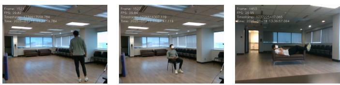

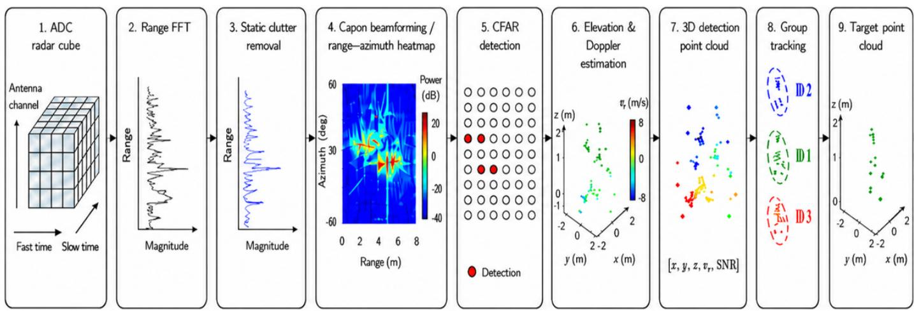  
Fig. 1. Signal-processing pipeline for target point-cloud generation. The raw data cube (1) is transformed along fast time (2) and cleared of static returns (3); Capon beamforming produces a range–azimuth heatmap (4) on which CFAR detection operates (5). Elevation and Doppler are estimated at detected cells (6) yielding a point cloud with per-point velocity and SNR (7). Group tracking associates points into subject tracks (8) and discards unassociated returns, leaving the target point cloud used in this work (9).

## B. ADL Taxonomy

We adopt a state-and-transition-based taxonomy that describes consecutive indoor motion with a small activity set, following transition-aware HAR [22], [23]. The seven-activity ethogram contains three states, Standing/Walking, Sitting, and Lying Down, and four transitions, Stand-to-Sit, Sit-to-Lie, Lieto-Sit, and Sit-to-Stand, as shown in Fig. 2.

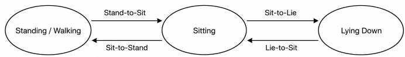  
Fig. 2. Transition relationships among the considered activities of daily living.

Standing and walking are combined because indoor space often does not allow a long continuous walk, and the recorded motion contains frequent starts, stops, and halts. Sitting and lying are referred to as near-static states in this work. Their samples contain residual postural motion before the subject becomes fully stationary; a fully stationary subject is largely removed with the background and does not provide a stable point cloud. Examples are shown in Fig. 3. This taxonomy therefore describes the observable motion intervals rather than an indefinitely maintained posture.

## IV. METHODOLOGY

## A. Framework Overview

A point-cloud clip embeds two attributes: “what activity is this” and “who is performing it.” With heterogeneous ADLs, separating these attributes can make the identity representation easier to learn. We therefore assign activity classification to the router and identity representation to the experts. As shown in Fig. 4, the normalized clip is first processed by the HAR router, and the resulting activity probabilities control the activityspecific DS-SDPNet experts. The same framework supports an ID classification head and a ReID metric-learning head.

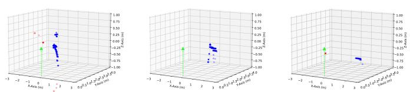  
(a)  
(b)  
(c)  
(d)  
(e)  
(f)  
Fig. 3. Radar point-cloud data and the corresponding ground-truth images. From left to right: Standing/Walking, Sitting, and Lying Down. Blue points represent returns from the target subject, while red points represent noise.

## B. Point-Cloud Preprocessing

Each clip is represented as $\mathcal { P } \in \mathbb { R } ^ { T \times N \times C }$ , where $C = 4$ retains $( x , y , z , v _ { r } )$ . Because absolute horizontal coordinates describe where a person stands rather than how the person moves, we center each frame in the horizontal plane. For frame $t ,$

$$
\begin{array} { c c c } { \displaystyle { \mathbf { c } _ { t } = \frac { 1 } { N } \sum _ { n = 1 } ^ { N } ( x _ { t , n } , y _ { t , n } ) , } } \\ { \displaystyle { ( \tilde { x } _ { t , n } , \tilde { y } _ { t , n } ) = ( x _ { t , n } , y _ { t , n } ) - \mathbf { c } _ { t } . } } \end{array}\tag{2}
$$

The height $z _ { t , n }$ is unchanged because it is measured relative to the ground and is a body-geometry cue. The normalized clip $\tilde { \mathcal P }$ is shared by the router and experts.

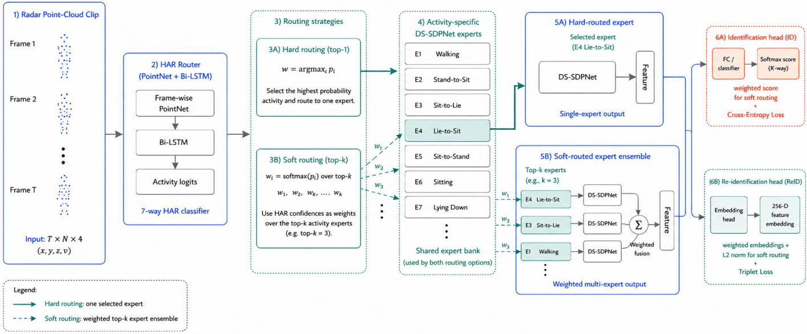  
Fig. 4. HAR-routed sequential mixture-of-experts framework for subject identification and re-identification.

## C. DS-SDPNet Identity Expert

We propose DS-SDPNet to capture identity along two complementary axes. The dynamic stream models the frameto-frame evolution that reflects how an activity is performed, while the static stream accumulates the spatial point distribution across the clip to reflect stature and build. The two representations are fused only after separate feature extraction, as shown in Fig. 5.

1) Dynamic Stream: The dynamic stream treats the clip as an ordered sequence of frames. A PointNet encoder with a 4 × 4 input transform and shared MLP widths of 64, 128, and 1024 is applied to every frame with tied weights. Batch normalization and ReLU follow the MLP layers, and symmetric max pooling over the N points produces one 1024- D descriptor per frame. The resulting sequence is processed by a single-layer bidirectional LSTM with hidden size h per direction. Average and maximum pooling are then applied across the T bidirectional outputs and concatenated into a 4h-D dynamic feature. Average pooling reflects components of the hidden-state trajectory that persist across frames, while maximum pooling is driven by the time steps of strongest activation and thus retains short-lived responses that averaging would attenuate.

2) Static Stream and Feature Fusion: The static stream discards temporal order and treats the T frames as one accumulated cloud of T ×N points, providing a denser spatial envelope than a single sparse radar frame. A second PointNet, with its own 4 × 4 input transform and shared MLP widths of 64, 128, and 256, applies global max pooling to produce a 256-D static feature. The static and 4h-D dynamic features are concatenated and batch normalized so that the two streams have comparable scales. We denote the resulting (256+4h)-D fused feature by z, which is passed to the task-specific head. We use h = 64 for ID and h = 128 for ReID, giving 512-D and 768-D fused representations, respectively.

## D. HAR Router and Routing Strategies

The HAR router architecture and the hard top-1 and soft topk routing policies are illustrated in Fig. 6.The HAR router also starts from the frame-wise PointNet described above. Each 1024-D frame descriptor is projected by an FC–ReLU–dropout block to 512 dimensions. A single-layer bidirectional LSTM with 128 hidden units per direction then produces a T × 256 sequence. A second FC–ReLU–dropout block projects every time step from 256 to 64 dimensions. The dropout probability in both blocks is 0.1.

The T projected steps are concatenated into a 64T-D vector, which is 1280-D for T = 20. Keeping the ordered steps distinguishes opposite transitions such as Stand-to-Sit and Sit-to-Stand. The classifier applies FC(64T, 128), batch normalization, ReLU, dropout, and FC(128, A) to produce A = 7 activity logits ℓ, where $\ell _ { a }$ is the logit of activity class a for a single clip. The gate distribution is

$$
\begin{array} { c } { { p _ { a } ( \tilde { \mathcal { P } } ) = \displaystyle \frac { \exp ( \ell _ { a } / \tau ) } { \sum _ { b = 1 } ^ { A } \exp ( \ell _ { b } / \tau ) } , } } \\ { { a = 1 , \ldots , A , } } \end{array}\tag{3}
$$

where $\tau = 1$

Let $E _ { a } ( \cdot )$ be the expert for activity a, and let $\kappa _ { k }$ contain the k largest HAR probabilities. The sparse gate is

$$
w _ { a } = \left\{ \begin{array} { l l } { \frac { p _ { a } } { \sum _ { b \in \mathcal { K } _ { k } } p _ { b } } , } & { a \in \mathcal { K } _ { k } , } \\ { 0 , } & { \mathrm { o t h e r w i s e } , } \end{array} \right.\tag{4}
$$

and the MoE output is

$$
\mathcal { O } ( \tilde { \mathcal { P } } ) = \sum _ { a \in \mathcal { K } _ { k } } w _ { a } E _ { a } ( \tilde { \mathcal { P } } ) .\tag{5}
$$

Hard routing is the special case $k = 1$ , which activates the most probable expert. Soft routing uses $k = 3$ and retains the router uncertainty through a weighted combination. For ID, all experts share the same subject-class axis, so their class distributions can be combined directly. For ReID, each expert returns an embedding; the weighted result is $L _ { 2 }$ normalized before matching. We also use an oracle router based on the ground-truth activity label to measure the upper bound and isolate the cost of learned routing.

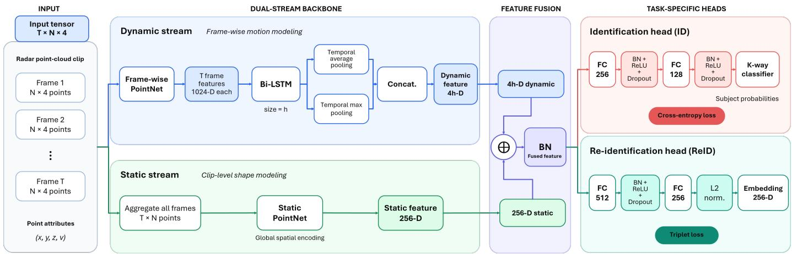  
Fig. 5. DS-SDPNet architecture. The dynamic stream encodes frame-wise motion, the static stream encodes the accumulated point-cloud shape, and the fused feature is passed to either the ID or ReID head.

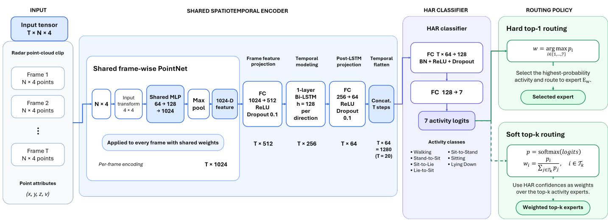  
Fig. 6. PointNet+LSTM HAR router and the hard top-1 and soft top-k routing policies.

## E. ID and ReID Heads

The ID and ReID tasks use the same DS-SDPNet backbone but different heads and training losses. Each activity expert has its own copy of the selected head.

1) Identification Head: Closed-set ID assigns a clip to one of the K subjects seen during training. The head applies FC(256 + 4h, 256)–BN–ReLU–dropout, FC(256, 128)–BN– ReLU–dropout, and an FC(128, K) classifier. B denotes the number of clips in a training mini-batch, and the subscript i indexes clips within that mini-batch. For subject logits $\mathbf { s } _ { i }$ and ground-truth subject $y _ { i } .$ , where $s _ { i , c }$ is the logit of clip i for subject class $c ,$ the mini-batch cross-entropy is

$$
\mathcal { L } _ { \mathrm { I D } } = - \frac { 1 } { B } \sum _ { i = 1 } ^ { B } \log \frac { \exp ( s _ { i , y _ { i } } ) } { \sum _ { c = 1 } ^ { K } \exp ( s _ { i , c } ) } .\tag{6}
$$

The HAR router uses the corresponding activity cross-entropy,

$$
\mathcal { L } _ { \mathrm { H A R } } = - \frac { 1 } { B } \sum _ { i = 1 } ^ { B } \log \frac { \exp ( \ell _ { i , a _ { i } } ) } { \sum _ { b = 1 } ^ { A } \exp ( \ell _ { i , b } ) } ,\tag{7}
$$

where $a _ { i }$ is the activity label of clip i and $\ell _ { i , b }$ is the logit of clip i for activity class b, i.e. the per-clip form of the single-clip logit $\ell _ { b }$ used in Eq. (3). The router and experts are trained independently: the expert loss does not update the router, which keeps the activity semantics explicit and lets one router serve different ID and ReID expert banks.

2) Re-identification Head: Open-set ReID must embed subjects not seen during training. Its head applies FC(256 + 4h, 512)–BN–ReLU–dropout and FC(512, F), followed by $L _ { 2 }$ normalization,

$$
\mathbf { e } = \frac { \psi ( \mathbf { z } ) } { \| \psi ( \mathbf { z } ) \| _ { 2 } } \in \mathbb { S } ^ { F - 1 } ,\tag{8}
$$

where z is the $( 2 5 6 + 4 h ) \mathbf { - D }$ fused DS-SDPNet feature, $\psi ( \cdot )$ denotes the two fully connected layers of this head that map z to an unnormalized F-D vector, and F = 256 is the embedding dimension. Thus, $D ( \mathbf { e } _ { i } , \mathbf { e } _ { j } ) \ = \ \| \mathbf { e } _ { i } - \mathbf { e } _ { j } \| _ { 2 }$ is a monotone function of cosine similarity. Batch-hard mining selects the most distant positive and nearest negative for each anchor,

$$
\begin{array} { r l } & { d _ { i } ^ { + } = \underset { j : y _ { j } = y _ { i } , j \ne i } { \operatorname* { m a x } } D ( \mathbf { e } _ { i } , \mathbf { e } _ { j } ) , } \\ & { d _ { i } ^ { - } = \underset { j : y _ { j } \ne y _ { i } } { \operatorname* { m i n } } D ( \mathbf { e } _ { i } , \mathbf { e } _ { j } ) . } \end{array}\tag{9}
$$

The ReID loss is

$$
\mathcal { L } _ { \mathrm { R e I D } } = \frac { 1 } { B } \sum _ { i = 1 } ^ { B } \left[ d _ { i } ^ { + } - d _ { i } ^ { - } + m \right] _ { + } ,\tag{10}
$$

where $[ x ] _ { + } = \operatorname* { m a x } ( x , 0 )$ and $m = 0 . 2$ . Anchors without a valid positive in the mini-batch are excluded. The loss pulls same-subject clips together and separates different subjects by at least the margin, so identity can be retrieved without a fixed classifier over the test subjects.

## V. EXPERIMENTAL SETUP

## A. mm-ADL Dataset

We use the IWR6843ISK-ODS radar with a $1 2 0 ^ { \circ }$ field of view in elevation and azimuth. It is mounted at a height of approximately 1.5 m and monitors a range of 0.9–7 m. An Intel RealSense RGB camera records synchronized ground truth.

Eleven subjects (six males and five females, 1.60–1.85 m in height) performed predefined activity sequences in a $4 \times 8$ m conference room. The collection uses three protocols. The activity sequences in each protocol are:

1) Walk protocol: Random wandering with random turns and halts.

2) Sit protocol: Walk to a chair, sit down, remain seated for a short interval, stand up, and return.

3) Lie protocol: Walk to a bed/sofa, lie down, remain lying for a short interval, get up, and return.

Each subject repeated each sequence 50 times. All subjects followed the same execution protocol under a fixed radar geometry, so the evaluation focuses on differences in subject size and movement patterns under the same viewpoint and environment. Data were collected on multiple days, and subjects changed outerwear to reduce dependence on clothing material and style. The synchronized videos were used to annotate each activity’s temporal boundaries and labels. The study was approved by the University of Ottawa Research Ethics Boards (REB), ethics ID: H-11-25-12304.

Table II reports activity durations before windowing. Transitions are short, while Standing/Walking is substantially longer. The Sitting and Lying Down intervals are also limited because static clutter removal suppresses the point cloud after the subject becomes fully stationary; they therefore contain nearstatic state intervals with residual postural motion.

We segment the sequences using a 20-frame sliding window, long enough to capture a short transition but short enough to reduce ambiguous activity mixtures. The activity occupying the longest duration in a window supplies its label. Each frame is represented by 128 points: frames with more points are randomly downsampled, and frames with fewer points are padded by resampling the available points, following [1]. To balance the activities, we retain 50 non-overlapping clips per activity per subject. The resulting mm-ADL dataset contains 3,850 clips and 77,000 frames, each represented as $\mathcal { P } \in \mathbb { R } ^ { 2 0 \times 1 2 8 \times \mathbf { \dot { 4 } } }$ . The dataset is made publicly available at https://github.com/OwenHan10/mm-ADL.git.

TABLE II  
AVERAGE FRAMES PER ACTIVITY TYPE IN MM-ADL.
<table><tr><td>Activity</td><td>Average frames</td></tr><tr><td>Standing/Walking</td><td>161.03</td></tr><tr><td>Stand-to-Sit</td><td>14.73</td></tr><tr><td>Sit-to-Lie</td><td>24.81</td></tr><tr><td>Lie-to-Sit</td><td>27.24</td></tr><tr><td>Sit-to-Stand</td><td>11.96</td></tr><tr><td>Sitting</td><td>31.02</td></tr><tr><td>Lying Down</td><td>29.98</td></tr></table>

## B. Evaluation Protocols

For closed-set ID, all 11 subjects appear in training and testing. For each subject and activity, the 50 non-overlapping clips are partitioned into five contiguous blocks of 10. Fold k uses its kth block for testing and the other 40 clips for training, giving 3,080 training and 770 test clips per fold. The router and experts are trained from scratch within each fold, and a test clip is scored even when it is misrouted.

For open-set ReID, training and test identities are disjoint. Six subject folds use nine training subjects and two held-out subjects, arranged so every subject appears in a test fold at least once. For each held-out subject and activity, 40 clips form the enrolled gallery and 10 form the query set. Query and gallery clips are embedded without retraining, and gallery entries are ranked by Euclidean distance. This is a deploymentoriented two-occupant indoor scenario with a fixed enrolled gallery, rather than a large-population ReID benchmark.

## C. Implementation Details

All models are trained for 500 epochs with Adam, weight decay $1 0 ^ { - 3 }$ , and dropout 0.1. ID experts use learning rate $1 0 ^ { - 3 }$ , batch size 25, and $h = 6 4$ . ReID experts use learning rate $1 0 ^ { - 4 }$ , batch size 60, h = 128, and a 256-D embedding. The HAR router uses learning rate $1 0 ^ { - 3 }$ and batch size 25. Soft routing retains $k = 3$ experts with $\tau = 1$ . All experiments use a fixed random seed.

## D. Evaluation Metrics

ID and HAR are evaluated using accuracy, defined as the proportion of test clips whose predicted label matches the ground-truth subject or activity label. Results are averaged across the corresponding folds.

For ReID, every query embedding is compared with all gallery embeddings using the Euclidean distance in Eq. (8), and the gallery is sorted in ascending distance. Let Q be the query set, $\mathcal { R } _ { q }$ the correct gallery matches for query q, and $r _ { q } ^ { \mathrm { m i n } }$ the rank of its first correct match. The cumulative matching characteristic at rank k is

$$
\mathrm { C M C @ } k = \frac { 1 } { | \mathcal { Q } | } \sum _ { q \in \mathcal { Q } } \mathbb { I } ( r _ { q } ^ { \mathrm { m i n } } \leq k ) .\tag{11}
$$

We report Rank-1, i.e., CMC@1. CMC considers only the first correct match. To evaluate the complete ranking, let $r _ { q , j }$ denote the rank of the jth correct match for query q. Its Average Precision and the mean Average Precision are

$$
\mathrm { A P } _ { q } = \frac { 1 } { \left| \mathcal { R } _ { q } \right| } \sum _ { j = 1 } ^ { \left| \mathcal { R } _ { q } \right| } \frac { j } { r _ { q , j } } ,\tag{12}
$$

$$
{ \mathrm { m A P } } = { \frac { 1 } { | { \mathcal { Q } } | } } \sum _ { q \in { \mathcal { Q } } } { \mathrm { A P } } _ { q } .\tag{13}
$$

Rank-1 measures whether the first returned identity is correct, whereas mAP measures how consistently all correct clips are ranked ahead of impostors. ReID results are averaged across the corresponding folds.

## VI. RESULTS AND ANALYSIS

We first examine identity information within individual ADLs, then evaluate the benefit of learned activity conditioning. We next study subject-disjoint ReID and separate the effects of gallery partitioning and activity-specific embeddings. Backbone comparisons, component ablations, and feature visualizations complete the analysis.

## A. ADL Identification Feasibility

Table III reports oracle-routed ID accuracy for each ADL. Ground-truth activity labels select the corresponding expert, allowing us to first examine identity discrimination when the activity is known. All seven activities achieve accuracy above 62% for 11 subjects, well above the chance level of 1/11. Transitions generally perform better than the state activities, with Sit-to-Lie reaching 80.8%.

The variation across activities is consistent with differences in the body configurations and temporal information available in each clip. Sitting and Lying Down contain residual postural motion before the subject becomes fully stationary. Standing/Walking combines brief walking with starts, stops, halts, and standing, and has the lowest accuracy in this evaluation. These results support the feasibility of identity recognition from the considered ADLs under the controlled protocol. They do not by themselves determine the relative contributions of body geometry and movement patterns.

The table also includes three mmWave point-cloud identity baselines under the same input and folds. Their backbone comparison is discussed in Section VI-D; the present result establishes that non-gait ADLs contain usable identity information when activity is known.

## B. Activity-Conditioned Identification

1) HAR Router: We next evaluate whether activity conditioning remains useful when the activity must be estimated from the input. As an independent HAR evaluation, Table IV reports leave-one-subject-out accuracy. Point-Net+LSTM achieves 95.7% overall accuracy, with every activity at or above 94.0%, and has higher overall mean accuracy than DVCNN [24] and m-Activity [25] under the same input and evaluation protocol. These results indicate that activity can be estimated for held-out subjects. The routing cost within the ID and ReID pipelines is evaluated separately by comparing learned and oracle routing.

TABLE III  
PER-ACTIVITY ID ACCURACY UNDER ORACLE ROUTING ON MM-ADL (%).
<table><tr><td>Activity</td><td>DS-SDPNet</td><td>HDNet</td><td>DSFE+LGTE</td><td>SRPNet</td></tr><tr><td>Sit-to-Lie</td><td> $\overline { { 8 0 . 8 \pm 4 . 2 } }$ </td><td> $\overline { { 8 0 . 2 \pm 4 . 0 } }$ </td><td>79.1±4.8</td><td> $\overline { { 7 2 . 4 \pm 2 . 9 } }$ </td></tr><tr><td>Lie-to-Sit</td><td> ${ \bf 7 4 . 6 \pm 2 . 0 }$ </td><td> $7 2 . 9 { \pm } 0 . 8 $ </td><td> $7 1 . 7 { \pm } 2 . 2 $ </td><td> $6 4 . 1 { \pm } 3 . 6 $ </td></tr><tr><td>Sit-to-Stand</td><td> ${ \bf 7 1 . 7 \pm 2 . 7 }$ </td><td> $6 5 . 2 { \pm } 1 . 8 $ </td><td> $6 2 . 9 { \pm } 3 . 2 $ </td><td> $4 8 . 4 \pm 3 . 1$ </td></tr><tr><td>Stand-to-Sit</td><td> ${ \bf 6 9 . 8 \pm 2 . 3 }$ </td><td> $6 5 . 3 { \pm } 2 . 3 $ </td><td> $6 4 . 8 { \pm } 2 . 1 $ </td><td> $5 1 . 2 { \pm } 4 . 4$ </td></tr><tr><td>Sitting</td><td> ${ \bf 6 7 . 2 \pm 1 . 9 }$ </td><td> $6 4 . 8 \pm 5 . 0$ </td><td> $5 6 . 5 { \pm } 2 . 4 $ </td><td> $5 3 . 4 \pm 4 . 2$ </td></tr><tr><td>Lying Down</td><td>64  $. 7 \pm 4 . 9$ </td><td> ${ \bf 6 5 . 2 \pm 4 . 2 }$ </td><td> $5 7 . 4 { \pm } 4 . 8 $ </td><td> $5 3 . 1 \pm 5 . 6 $ </td></tr><tr><td>Standing/Walking</td><td> ${ \bf 6 2 . 5 \pm 3 . 5 }$ </td><td> $6 0 . 3 { \pm } 2 . 0 \ $ </td><td> $5 0 . 9 { \pm } 4 . 8 $ </td><td> $5 1 . 2 { \pm } 3 . 9 $ </td></tr><tr><td>Overall</td><td> $\overline { { 7 0 . 2 \pm 1 . 2 } }$ </td><td> $6 7 . 7 { \pm } 1 . 5$ </td><td> $6 3 . 3 { \pm } 0 . 7$ </td><td> $\overline { { 5 6 . 3 \pm 1 . 8 } }$ </td></tr></table>

TABLE IV  
PER-ACTIVITY HAR ACCURACY ON MM-ADL (%).
<table><tr><td>Activity</td><td>PointNet+LSTM</td><td>DVCNN</td><td>m-Activity</td></tr><tr><td>Sit-to-Lie</td><td> $\mathbf { \overline { { 9 4 . 9 2 7 . 0 } } }$ </td><td> $\overline { { 8 8 . 6 \pm 1 2 . 5 } }$ </td><td> $\overline { { 8 2 . 9 \pm 1 4 . 1 } }$ </td></tr><tr><td>Lie-to-Sit</td><td> ${ \bf 9 6 . 9 \pm 4 . 9 }$ </td><td> $8 9 . 8 { \pm } 1 0 . 2 \ $ </td><td> $8 6 . 4 \pm 1 1 . 9$ </td></tr><tr><td>Sit-to-Stand</td><td> $\mathbf { 9 5 . 6 \pm 5 . 7 }$ </td><td> $9 5 . 3 { \pm } 5 . 7 $ </td><td> $9 3 . 1 { \pm } 9 . 4 $ </td></tr><tr><td>Stand-to-Sit</td><td> $\mathbf { 9 4 . 0 \pm 5 . 2 }$ </td><td> $8 9 . 1 { \pm } 8 . 1 $ </td><td> $8 7 . 5 { \pm } 6 . 4 $ </td></tr><tr><td>Sitting</td><td> ${ \bf 9 4 . 5 \pm 3 . 9 }$ </td><td> $8 4 . 4 \pm 7 . 6$ </td><td> $8 2 . 9 { \pm } 1 0 . 3 $ </td></tr><tr><td>Lying Down</td><td> $\mathbf { 9 5 . 8 \pm 3 . 9 }$ </td><td> $9 2 . 9 { \pm } 6 . 5 $ </td><td> $8 9 . 5 { \pm } 8 . 6 $ </td></tr><tr><td>Standing/Walking</td><td> ${ \bf 9 8 . 4 \pm 1 . 9 }$ </td><td> $9 5 . 5 { \pm } 3 . 9 $ </td><td> $8 6 . 2 \pm 1 2 . 0$ </td></tr><tr><td>Overall</td><td> $\overline { { \mathbf { 9 5 . 7 \pm 4 . 0 } } }$ </td><td> $\overline { { 9 0 . 8 \pm 5 . 6 } }$ </td><td> $\overline { { 8 6 . 9 \pm 6 . 1 } }$ </td></tr></table>

2) Activity–Identity Integration: Table V compares how activity information is integrated with identity. The monolithic DS-SDPNet mixes all activities in one model. Joint multi-task learning uses one shared DS-SDPNet with activity and identity heads, with uncertainty weighting [26]. Its mean ID accuracy is 64.3%, compared with 62.1% for the monolithic model. HAR hard routing reaches 68.0%, while soft routing reaches 69.0%. Both are close to the oracle activity-routing result of 70.2%.

Under the evaluated protocol, activity-specific experts therefore achieve higher mean ID accuracy than the shared models. This supports using activity as context for organizing identity representation learning. Soft routing has a small numerical advantage over hard routing, but these results do not establish a statistically significant difference between them. Hard routing provides the common activity-conditioned pipeline for the two tasks, while soft routing evaluates the effect of retaining router uncertainty.

TABLE V  
ACTIVITY–IDENTITY INTEGRATION USING DS-SDPNET (%).
<table><tr><td>Method</td><td>ID</td><td>ReID mAP</td><td>ReID Rank-1</td></tr><tr><td>Monolithic (no router)</td><td> $6 2 . 1 \pm 1 . 2$ </td><td>57.2±5.1</td><td> $\overline { { 5 9 . 1 \pm 6 . 9 } }$ </td></tr><tr><td>Joint multi-task learning</td><td> $6 4 . 3 { \pm } 1 . 5 $ </td><td></td><td></td></tr><tr><td>End-to-end MoE [21]</td><td> $5 6 . 0 { \pm } 3 . 1 $ </td><td></td><td></td></tr><tr><td>HAR hard routing</td><td> $6 8 . 0 { \pm } 1 . 1 $ </td><td> ${ \bf 7 5 . 4 \pm 1 3 . 0 }$ </td><td> ${ \bf 8 2 . 1 \pm 1 2 . 3 }$ </td></tr><tr><td>HAR soft-gated MoE</td><td> ${ \bf 6 9 . 0 \pm 1 . 8 }$ </td><td> $5 5 . 4 \pm 2 . 3$ </td><td> $8 1 . 8 \pm 7 . 0$ </td></tr><tr><td>Oracle activity routing</td><td> $\overline { { 7 0 . 2 \pm 1 . 2 } }$ </td><td> $\overline { { 7 6 . 2 \pm 1 2 . 8 } }$ </td><td> $\overline { { 8 4 . 1 \pm 1 4 . 0 } }$ </td></tr></table>

3) Routing Supervision: We also compare explicit HAR routing with an end-to-end MoE variant based on [21]. Seven

DS-SDPNet experts and a gate with the same PointNet+LSTM capacity as our HAR router are trained jointly from the identity objective, without activity labels. This variant obtains 56.0% ID accuracy in Table V, below both HAR-routed variants. The comparison concerns identification performance under the evaluated training designs.

The gate diagnostics describe how the end-to-end model uses its experts. A diagnostic that counts a sample as correct whenever any of the seven experts predicts it correctly reaches $0 . 8 3 7 \pm 0 . 0 2 5 ;$ this uses the true identity to assess the expert bank and is not an available inference rule. Using a dense softmax over all experts gives $0 . 6 0 0 \pm 0 . 0 1 8 \mathrm { \ I D }$ accuracy, whereas forcing hard top-1 routing gives $0 . 5 1 3 \pm 0 . 0 5 4$ . Gate assignments have $0 . 2 8 0 \pm 0 . 1 5 5$ normalized mutual information (NMI) with activity and $0 . 3 6 3 \pm 0 . 1 3 0$ activity purity, defined by each expert’s dominant activity. Expert-utilization entropy is $1 . 2 6 1 \pm 0 . 6 4 6$ , compared with the uniform-use maximum ln $7 = 1 . 9 4 6$ , corresponding to roughly 3.5 effective experts.

These diagnostics indicate partial activity alignment and uneven expert use. Activity alignment is a descriptive property of this gate, whose training objective is identity prediction. The higher ID accuracy of the HAR-routed framework supports explicit activity conditioning in this evaluation.

## C. Subject-Disjoint Re-identification

We next evaluate whether the learned identity representations support matching for subjects excluded from training. The subject-disjoint protocol in Section V uses two held-out subjects per fold, with an enrolled gallery and query clips embedded without retraining. Under hard routing, each query is matched against the gallery assigned to its selected expert, keeping the comparison within one expert’s metric space. The results therefore evaluate activity-conditioned retrieval for two enrolled identities.

1) Learned Routing and Oracle Reference: As shown in Table V, hard routing reaches 75.4% mAP and 82.1% Rank-1, compared with 57.2% and 59.1% for the monolithic model. The learned-routing results are close to the oracle activityrouting values of 76.2% mAP and 84.1% Rank-1. This indicates a limited performance cost from replacing groundtruth activity labels with the learned router in this protocol. It also shows that activity-conditioned embeddings can support retrieval for identities not seen during training, within the evaluated two-occupant setting.

2) Gallery Partition and Expert Specialization: The ReID improvement may come from two effects: searching a smaller same-activity gallery and learning activity-specific embeddings. Table VI examines them under the same router and six-fold protocol. Restricting the monolithic model from a global gallery to the HAR-routed gallery raises mAP from 57.2% to 61.5%. Replacing the monolithic embedding with activity-specific experts under the same gallery partition raises it further to 75.4%.

In this ordered comparison, approximately three quarters of the total mAP improvement occurs when the activity-specific expert bank replaces the shared model, and the remaining quarter occurs when the gallery is restricted. The benefit therefore extends beyond searching a smaller gallery. The similar HARrouted and oracle-routed monolithic results further indicate that the residual activity-routing errors have little effect on this comparison.

TABLE VI  
REID GAIN DECOMPOSITION UNDER A MATCHED EVALUATION PROTOCOL (%).
<table><tr><td>Configuration</td><td>mAP</td><td>Rank-1</td></tr><tr><td>Monolithic, global gallery</td><td> $\overline { { 5 7 . 2 \pm 5 . 1 } }$ </td><td> $\overline { { 5 9 . 1 \pm 6 . 9 } }$ </td></tr><tr><td>Monolithic, HAR-routed gallery</td><td> $6 1 . 5 { \pm } 7 . 2 $ </td><td> $6 2 . 9 { \pm } 1 5 . 9$ </td></tr><tr><td>Monolithic, oracle-routed gallery</td><td> $6 1 . 0 { \pm } 7 . 7 \ $ </td><td> $6 3 . 2 \pm 1 5 . 9$ </td></tr><tr><td>HAR-MoE</td><td> ${ \bf 7 5 . 4 \pm 1 3 . 0 }$ </td><td> ${ \bf 8 2 . 1 \pm 1 2 . 3 }$ </td></tr></table>

3) Routing Error: We also examine whether mis-routed gallery clips limit retrieval. Removing these contaminants changes performance by only +0.0040 mAP and −0.0057 Rank-1, so gallery contamination does not meaningfully degrade the reported results. A contaminant remains a clip from a validly enrolled subject and may still rank below genuine same-activity matches. This analysis concerns the gallery effect of routing errors; the learned-versus-oracle comparison measures their overall effect on the evaluated pipeline.

4) Soft Routing: Soft routing retains a similar Rank-1 of 81.8% but reduces mAP to 55.4%, below the monolithic mean. The independently trained ReID experts do not share an aligned metric space, so a weighted combination of their embeddings can disturb the ranking. For ID, every expert shares the same subject-class axis, allowing their class distributions to be combined directly. These results support hard top-1 routing for the present ReID implementation, while soft routing remains an optional ID variant. Combining ReID embeddings would require addressing cross-expert alignment.

## D. Backbone and Component Analysis

1) Identity Backbone: We reproduce three mmWave pointcloud identity baselines under the same input and folds. SRPNet [14] extracts spatio-temporal features for radar pointcloud ReID. HDNet [16] uses hierarchical motion modeling with a point-flow descriptor and dynamic frame sampling. DSFE+LGTE [17] combines dual-stream spatial feature extraction with local-global temporal encoding. Although these models were developed mainly for gait, they provide the closest point-cloud identity baselines for evaluating ADL identification.

DS-SDPNet has the highest overall mean ID, ReID mAP, and ReID Rank-1 among the compared backbones on mm-ADL, as shown in Table VII. It also has the highest mean ID accuracy on six of the seven individual activities in Table III. We reproduce all backbones on the single-person portion of mmGait using the same 20-frame window and five-fold protocol. DS-SDPNet reaches 81.1% ID accuracy, numerically close to HDNet at 80.8%. These means support comparable performance on mmGait without establishing a significant difference. The reported 1.24 G FLOPs for DS-SDPNet are higher than SRPNet and DSFE+LGTE but substantially lower than HDNet at 3.49 G FLOPs. This comparison concerns the identity backbone.

TABLE VII  
BACKBONE COMPARISON UNDER ORACLE ROUTING (%).
<table><tr><td>Backbone</td><td>ID  $\mathrm { m m \mathrm { - } A D L }$ </td><td>ID  $\mathrm { m m G a i t } { - } 1 0$ </td><td>ReID  $\mathrm { m A P }$ </td><td>ReID  $\mathrm { R a n k } { - } 1$ </td><td> $\mathrm { F L O P s }$ </td></tr><tr><td>SRPNet</td><td> $\overline { { 5 6 . 3 \pm 1 . 8 } }$ </td><td> $3 5 . 3 { \pm } 2 . 7 $ </td><td> $\overline { { 5 8 . 5 \pm 7 . 4 } }$ </td><td>1  $\overline { { 6 1 . 1 \pm 1 7 . 1 } }$ </td><td>1.19G</td></tr><tr><td>HDNet</td><td> $6 7 . 7 { \pm } 1 . 5$ </td><td> $8 0 . 8 \pm 2 . 6 $ </td><td> $7 5 . 5 { \pm } 1 3 . 8 $ </td><td> $8 1 . 9 { \pm } 1 5 . 5 $ </td><td>3.49G</td></tr><tr><td>DSFE+LGTE</td><td> $6 3 . 3 { \pm } 0 . 7 \ $ </td><td> $6 5 . 1 \pm 5 . 2$ </td><td> $6 9 . 2 \pm 1 1 . 9$ </td><td> $7 9 . 9 { \pm } 1 4 . 2 $ </td><td>0.85G</td></tr><tr><td>DS-SDPNet</td><td> $\mathbf { 7 0 . 2 \pm 1 . 2 }$ </td><td> ${ \bf 8 1 . 1 \pm 0 . 5 }$ </td><td> ${ \bf 7 6 . 2 \pm 1 2 . 8 }$ </td><td> $\mathbf { 8 4 . 1 \pm 1 4 . 0 }$ </td><td>1.24G</td></tr></table>

2) Component Ablations: Table VIII summarizes the component ablations. For HAR, PointNet-only reaches 92.3% accuracy, compared with 85.6% for LSTM-only, while the full PointNet+LSTM reaches 95.7%. These results support combining frame-wise spatial features with temporal modeling for activity recognition.

For identity, the dynamic-stream variant reaches 69.6%, compared with 67.1% for the static-stream variant. Combining both gives the highest mean accuracy of 70.2%, although the gain over the dynamic stream is small. Both streams receive spatial coordinates and radial velocity, and the static stream aggregates observations across the clip. These ablations therefore compare representation designs; they do not isolate the respective contributions of body geometry and personal movement style.

TABLE VIII  
HAR-ROUTER AND DS-SDPNET COMPONENT ABLATIONS (ACCURACY IN %).
<table><tr><td>Component</td><td>Configuration</td><td>Accuracy</td><td>FLOPs</td></tr><tr><td rowspan="3">HAR router</td><td>LSTM-only</td><td> $\overline { { 8 5 . 6 \pm 6 . 0 } }$ </td><td>13.68M</td></tr><tr><td>PointNet-only</td><td> $9 2 . 3 { \pm } 5 . 4 $ </td><td>752.79M</td></tr><tr><td>PointNet+LSTM</td><td> ${ \bf 9 5 . 7 \pm 4 . 0 }$ </td><td>776.66M</td></tr><tr><td rowspan="3">ID expert</td><td>Static stream</td><td> $6 7 . 1 { \pm } 6 . 6 $ </td><td>480.49M</td></tr><tr><td>Dynamic stream</td><td> $6 9 . 6 { \pm } 7 . 3$ </td><td>763.78M</td></tr><tr><td>DS-SDPNet</td><td> $\mathbf { 7 0 . 2 \pm 1 . 2 }$ </td><td>1.24G</td></tr></table>

## E. Feature Visualization

To compare the monolithic and activity-conditioned representations, we visualize their penultimate-layer features using the held-out ID samples. In the monolithic DS-SDPNet space in Fig. 7, points from different subjects are interspersed. This provides a qualitative view of the representation learned when all activities are handled by one model.

Fig. 8 provides the HAR-routed comparison. The router features form activity-separated groups, while the activityspecific expert features show identity groups within each activity. These visualizations illustrate the organization of the learned representations. Because t-SNE is a two-dimensional projection, the figures provide supporting observations; the identification and matched-gallery comparisons in Tables V and VI provide the quantitative evidence for activity conditioning.

## VII. LIMITATIONS AND FUTURE WORK

The present study evaluates identification feasibility under controlled conditions. The seven-activity ethogram is a coarse model of daily behavior, while real indoor activity is more varied and continuous. The mm-ADL dataset is also limited to 11 subjects and 50 clips per activity because point-cloud activity annotation is costly. The ReID evaluation considers two enrolled identities with 40 gallery clips per activity per subject. A larger dataset is needed to evaluate more enrolled subjects and smaller galleries.

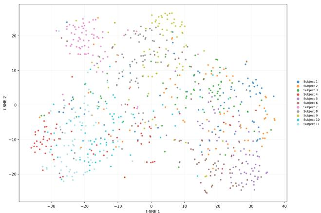  
Fig. 7. Identity-colored t-SNE visualization of the embedding learned by the monolithic DS-SDPNet identification model.

All subjects follow the same execution protocol under a fixed sensor geometry. This controls activity, viewpoint, and environment so the present study can focus on subject size and movement patterns. The scripted protocol may also favor activity-specific learning by reducing variation within each activity. The observed routing gains therefore do not establish the same benefit for uncontrolled behavior or across different rooms and radar positions. Future data should include these sources of variation.

The point clouds contain both body-geometry and movement-related information. The present component ablations do not separate these sources, and the contribution of stature relative to personal movement style remains unresolved. The results establish usable identity information in the recorded ADLs without attributing that information primarily to either source.

The HAR-routed framework stores seven activity experts even though hard routing activates only one per clip. Future work can investigate shared or compressed experts while retaining the semantic activity partition. The proximity of learned and oracle routing indicates a limited routing cost for the evaluated models, but substantial identification errors remain even with oracle activity labels. Long-term indoor monitoring will require additional validation and temporal context, such as spatial location and identity continuity, to correct isolated mis-identifications. With a larger and more diverse dataset, the framework can also be extended to more occupants and to open-set identification with explicit unknown-subject rejection.

## VIII. CONCLUSION

This work investigates person identification from mmWave point clouds across activities of daily living beyond conventional gait. The seven ADLs in mm-ADL contain usable identity information under the controlled collection and evaluation protocols. To address activity heterogeneity, we use recognized activity as context for selecting activity-specific identity experts. The HAR-routed framework achieves higher mean ID accuracy than the evaluated shared-model alternatives, and hard routing supports subject-disjoint ReID in a twooccupant setting. The matched-gallery analysis shows that the ReID benefit extends beyond restricting retrieval to an activityspecific gallery. DS-SDPNet combines time-aggregated spatial structure with frame-to-frame information and provides a competitive backbone for this framework. These results support activity conditioning as a useful approach to extracting identity information from heterogeneous ADLs, while broader deployment requires evaluation with more subjects, environments, and uncontrolled behavior.

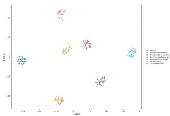  
(a) HAR Router

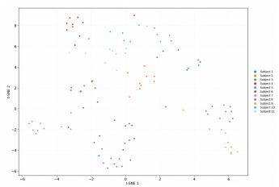  
(b) Sit-to-Lie

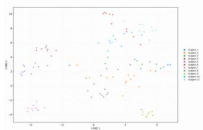  
(c) Lie-to-Sit

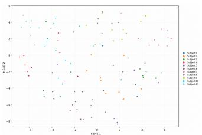  
(d) Sit-to-Stand

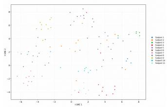  
(e) Stand-to-Sit

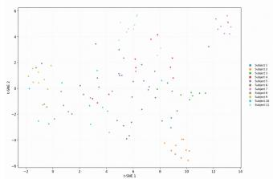  
(f) Sitting

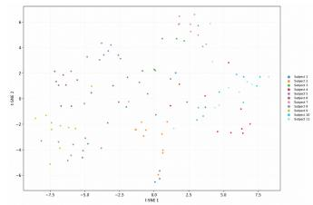  
(g) Lying Down

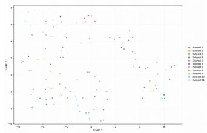  
(h) Standing/Walking  
Fig. 8. Feature embeddings throughout the HAR-routed framework. (a) HAR-router features colored by activity. (b)–(h) Activity-specific DS-SDPNet features colored by subject identity and ordered by ID accuracy.

## ACKNOWLEDGMENT

We are grateful to NSERC for partially funding this project through the I2I grant titled ”AI-based continuous, non-invasive and unobtrusive monitoring of cardiac patients.”

## REFERENCES

[1] Z. Meng, S. Fu, J. Yan, H. Liang, A. Zhou, S. Zhu, H. Ma, J. Liu, and N. Yang, “Gait recognition for co-existing multiple people using millimeter wave sensing,” in Proceedings of the AAAI conference on artificial intelligence, vol. 34, no. 01, 2020, pp. 849–856.

[2] A. Iosifidis, A. Tefas, and I. Pitas, “Activity-based person identification using fuzzy representation and discriminant learning,” IEEE Transactions on Information Forensics and Security, vol. 7, no. 2, pp. 530–542, 2011.

[3] S. Azad and Y. S. Rawat, “Activity-biometrics: Person identification from daily activities,” in Proceedings of the IEEE/CVF Conference on Computer Vision and Pattern Recognition, 2024, pp. 287–296.

[4] H. Wang and L. Wang, “Learning content and style: Joint action recognition and person identification from human skeletons,” Pattern Recognition, vol. 81, pp. 23–35, 2018.

[5] A. Huang, D. Wang, R. Zhao, and Q. Zhang, “Au-id: Automatic user identification and authentication through the motions captured from sequential human activities using rfid,” Proceedings of the ACM on Interactive, Mobile, Wearable and Ubiquitous Technologies, vol. 3, no. 2, pp. 1–26, 2019.

[6] L. Chen, Y. Zhang, and L. Peng, “Metier: a deep multi-task learning based activity and user recognition model using wearable sensors,” Proceedings of the ACM on Interactive, Mobile, Wearable and Ubiquitous Technologies, vol. 4, no. 1, pp. 1–18, 2020.

[7] J. Shin, M. Al Mehedi Hasan, and M. Maniruzzaman, “Identifying users based on their activity pattern using machine learning,” in Proceedings of the 2023 6th International Conference on Electronics, Communications and Control Engineering, 2023, pp. 29–35.

[8] Y. Yang, C. Hou, Y. Lang, G. Yue, Y. He, and W. Xiang, “Person identification using micro-doppler signatures of human motions and uwb radar,” IEEE Microwave and Wireless Components Letters, vol. 29, no. 5, pp. 366–368, 2019.

[9] Y. Lang, Q. Wang, Y. Yang, C. Hou, Y. He, and J. Xu, “Person identification with limited training data using radar micro-doppler signatures,” Microwave and Optical Technology Letters, vol. 62, no. 3, pp. 1060– 1068, 2020.

[10] K. Saho, K. Shioiri, and K. Inuzuka, “Accurate person identification based on combined sit-to-stand and stand-to-sit movements measured using doppler radars,” IEEE Sensors Journal, vol. 21, no. 4, pp. 4563– 4570, 2020.

[11] Z. Li, Z. Yang, P. Chu, and J. Zhou, “Sit-to-stand estimation and person identification using millimeter-wave radar in casual home scenarios,” IEEE Sensors Journal, 2025.

[12] L. Xu, K. Wang, C. Gu, X. Guo, S. He, and J. Chen, “Gestureprint: Enabling user identification for mmwave-based gesture recognition systems,” in 2024 IEEE 44th International Conference on Distributed Computing Systems (ICDCS). IEEE, 2024, pp. 1074–1085.

[13] Y. Wu, L. Wu, T. Hu, Z. Xiao, J. Zhang, and M. Xiao, “A joint gesture-identity recognition framework based on 4d millimeter-wave radar sensing,” Sensors, vol. 25, no. 23, p. 7249, 2025.

[14] Y. Cheng and Y. Liu, “Person reidentification based on automotive radar point clouds,” IEEE Transactions on Geoscience and Remote Sensing, vol. 60, pp. 1–13, 2021.

[15] C. Wang, P. Gong, and L. Zhang, “Stpointgcn: Spatial temporal graph convolutional network for multiple people recognition using millimeterwave radar,” in ICASSP 2022-2022 IEEE International Conference on Acoustics, Speech and Signal Processing (ICASSP). IEEE, 2022, pp. 3433–3437.

[16] Y. Huang, Y. Wang, K. Shi, C. Gu, Y. Fu, C. Zhuo, and Z. Shi, “Hdnet: Hierarchical dynamic network for gait recognition using millimeterwave radar,” in ICASSP 2023-2023 IEEE International Conference on Acoustics, Speech and Signal Processing (ICASSP). IEEE, 2023, pp. 1–5.

[17] S. Xue, L. Du, Y. Shi, X. Chen, and M. Xie, “Fine-grained spatial– temporal gait recognition network based on millimeter-wave radar point cloud,” IEEE Transactions on Geoscience and Remote Sensing, vol. 62, pp. 1–16, 2023.

[18] T. Wang, Y. Zhao, M.-C. Chang, and J. Liu, “Open-set occluded

person identification with mmwave radar,” IEEE Transactions on Mobile Computing, vol. 24, no. 6, pp. 5229–5244, 2025.

[19] W.-H. Lee and R. B. Lee, “Implicit smartphone user authentication with sensors and contextual machine learning,” in 2017 47th Annual IEEE/IFIP International Conference on Dependable Systems and Networks (DSN). IEEE, 2017, pp. 297–308.

[20] Y. Zeng, A. Pande, J. Zhu, and P. Mohapatra, “Wearia: Wearable device implicit authentication based on activity information,” in 2017 IEEE 18th International Symposium on A World of Wireless, Mobile and Multimedia Networks (WoWMoM). IEEE, 2017, pp. 1–9.

[21] N. Shazeer, A. Mirhoseini, K. Maziarz, A. Davis, Q. Le, G. Hinton, and J. Dean, “Outrageously large neural networks: The sparsely-gated mixture-of-experts layer,” arXiv preprint arXiv:1701.06538, 2017.

[22] J.-L. Reyes-Ortiz, L. Oneto, A. Sama, X. Parra, and D. Anguita,\` “Transition-aware human activity recognition using smartphones,” Neurocomputing, vol. 171, pp. 754–767, 2016.

[23] M. G. Amin and R. G. Guendel, “Radar human motion recognition using motion states and two-way classifications,” arXiv preprint arXiv:1911.03512, 2019.

[24] C. Yu, Z. Xu, K. Yan, Y.-R. Chien, S.-H. Fang, and H.-C. Wu, “Noninvasive human activity recognition using millimeter-wave radar,” IEEE Systems Journal, vol. 16, no. 2, pp. 3036–3047, 2022.

[25] Y. Wang, H. Liu, K. Cui, A. Zhou, W. Li, and H. Ma, “m-activity: Accurate and real-time human activity recognition via millimeter wave radar,” in ICASSP 2021-2021 IEEE International Conference on Acoustics, Speech and Signal Processing (ICASSP). IEEE, 2021, pp. 8298– 8302.

[26] A. Kendall, Y. Gal, and R. Cipolla, “Multi-task learning using uncertainty to weigh losses for scene geometry and semantics,” in Proceedings of the IEEE conference on computer vision and pattern recognition, 2018, pp. 7482–7491.