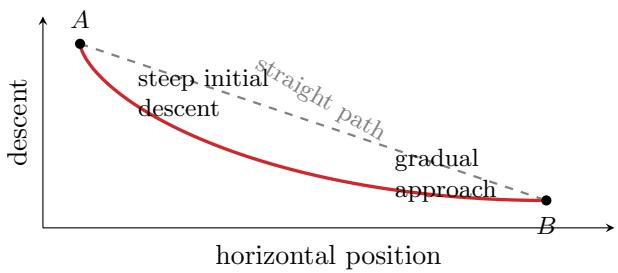
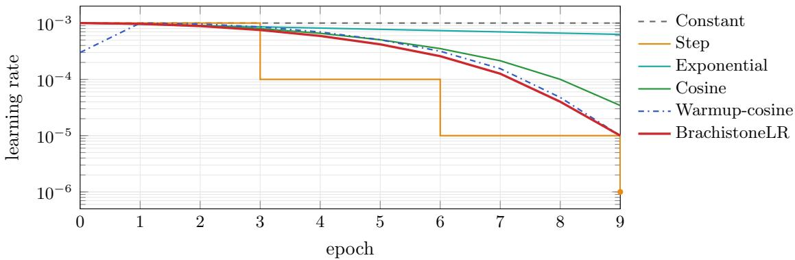
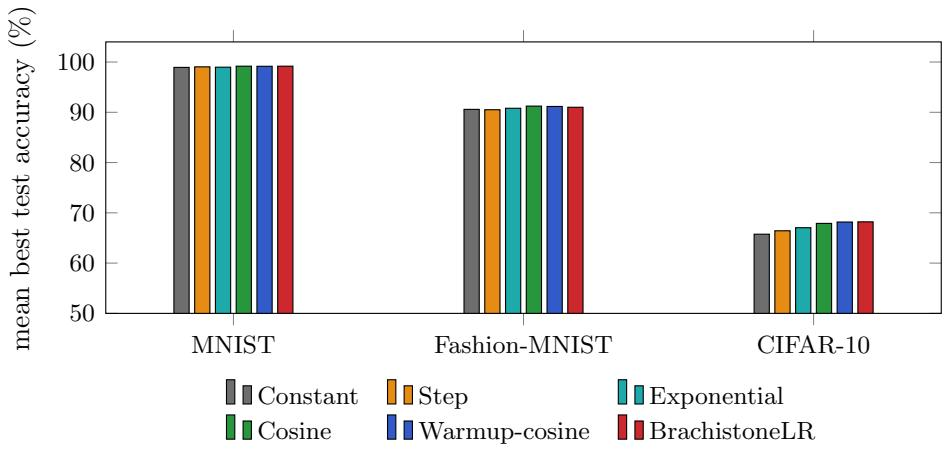

# BrachistoneLR: A Brachistochrone-Inspired Learning-Rate Schedule and a Controlled Benchmark of Scheduling Policies

sadekur cse@lus.ac.bd

Md. Sadekur Rahman Roni   
Department of Computer Science and Engineering   
Leading University   
Sylhet, Bangladesh   
Md. Jalal uddin Chowdhury   
DeepNet Research and Development Lab   
Sylhet 3100, Bangladesh   
Moutusi Dash Nimi   
Department of Electrical and Electronic Engineering   
Leading University   
Sylhet, Bangladesh

jalal cse@lus.ac.bd

mou07nimi@gmail.com

## Abstract

The learning-rate schedule is a consequential choice in training deep networks, yet the policies in common use are heuristic and published comparisons are hard to read, because architecture, dataset and budget tend to vary alongside the schedule. We study BrachistoneLR, a schedule built by mapping the vertical coordinate of the brachistochrone, the curve of fastest descent under gravity, onto the range between a peak and a floor rate. Expanding the definition shows it to be cosine annealing with the half-period set to E − 1 instead of E, the configuration a standard implementation gives when its period argument is one less than the number of epochs. The rate therefore reaches its floor at the last epoch trained rather than one epoch later, and we show this diference decays as E−2, making it a short-horizon efect. We then benchmark six schedules over 72 runs on three image classification datasets (MNIST, Fashion-MNIST, CIFAR-10) and four architecture families (fully connected, convolutional, recurrent, residual), fixing the optimizer, data pipeline and evaluation protocol so that only the schedule varies. Schedules that fall smoothly from peak to floor beat the constant rate and calendar-based decay by margins that grow with task dificulty, reaching 2.5 points of dataset mean on CIFAR-10. Within that leading group, BrachistoneLR, cosine annealing and warmup-cosine lie within 0.06 accuracy points and 0.17 of a mean rank, which one seed per configuration cannot separate. BrachistoneLR is best on both residual networks and has the highest CIFAR-10 mean, and it sets no milestones, decay factor, warmup length or restart period. We conclude that the shape of a schedule matters more than its parameterization, that the choice of whether to use a smooth schedule matters more than the choice among them, and that the terminal-rate distinction is worth attention only over short horizons.

Keywords: learning rate scheduling, deep learning optimization, cosine annealing, image classification, empirical benchmark

## 1 Introduction

The learning rate is usually the first hyperparameter a practitioner tunes and often the one that matters most (Goodfellow et al., 2016). Its initial value is only part of the story:

the rule by which it is varied during training afects both how quickly optimization escapes a poor initialization and how well the resulting solution generalizes. A large rate early helps the iterates leave regions of high loss, while a small rate late is what makes the final approach to a minimum stable, and any useful schedule has to reconcile these two requirements (Loshchilov and Hutter, 2017; Smith, 2017).

The policies in common use reconcile them in diferent ways. A constant rate is the simplest choice but leaves late-training refinement entirely to the optimizer. Step and exponential decay reduce the rate on a fixed calendar and oblige the user to choose milestones or a decay factor. Cosine annealing follows a half-cosine from a peak to a floor and has become a strong default (Loshchilov and Hutter, 2017), and warmup-cosine prepends a short linear ramp that stabilizes the first updates of large or deep models (Goyal et al., 2017). Because these policies difer both in shape and in the number of quantities they expose, and because published comparisons are drawn from experiments that vary architecture, dataset and budget at the same time, it is dificult to attribute any reported diference to the schedule itself.

We do three things in this paper. We introduce BrachistoneLR, a schedule whose shape is taken from the brachistochrone, the classical curve of fastest descent. We then characterize its relationship to cosine annealing exactly, and the characterization is deflationary: BrachistoneLR is not a new family of schedules but a particular choice of period within an existing one, obtainable in any standard library by setting the cosine period to E − 1. We state this at the outset because it determines what the rest of the paper can and cannot claim. Finally we report a benchmark of six schedules over four architectures and three datasets (72 runs) under a single fixed protocol, so that the schedule is the only thing that changes from run to run. The value of the paper lies in the second and third of these rather than the first: a closed-form account of what the period choice does, and controlled evidence on how much the choice of schedule is worth in the first place.

## 2 Related Work

Cosine annealing was introduced as a component of SGDR (Loshchilov and Hutter, 2017) and has since become the default in large-scale training, including the scaling-law studies that fixed much of current practice (Kaplan et al., 2020). Linear warmup was popularized for large-batch training (Goyal et al., 2017), cyclical policies that raise and lower the rate repeatedly were developed in parallel (Smith, 2017), and the one-cycle policy and the superconvergence phenomenon grew out of that same line (Smith and Topin, 2019). A useful corrective comes from Li and Arora (2019), who showed that for scale-invariant networks an exponentially increasing rate can be equivalent to a standard decaying schedule with weight decay, which is a reminder that the apparent shape of a schedule is not always what determines its efect. More recent work has been driven by a structural weakness of cosine annealing, namely that it must commit to the total training length in advance, so that extending a run requires recomputing the whole curve. The warmup-stable-decay schedule (Hu et al., 2024) holds the rate constant after warmup and decays only at the end, which decouples the decay from a predetermined step count, and Wen et al. (2025) give a losslandscape account of why that late decay phase produces the sharp improvement it does. Defazio et al. (2023) argue on theoretical grounds for linear decay to zero, while Defazio et al.

(2024) dispense with the schedule altogether in favor of a form of iterate averaging. This literature bears on our analysis in a way worth stating plainly: it seeks to reduce dependence on the horizon E, whereas the distinction we examine in Section 3.2 moves in the opposite direction and ties the schedule to E more tightly. That the resulting efect vanishes as $E ^ { - 2 }$ is consistent with the view taken in that literature, namely that the endpoint of the decay matters chiefly through the closing phase of training. The present paper belongs to a smaller tradition of controlled empirical study rather than method proposal. Gotmare et al. (2019) examined learning-rate restarts, warmup and distillation empirically and found that several of the standard justifications ofered for these heuristics do not survive inspection. Our benchmark is narrower in scope but fully crossed, in that every schedule is run with every architecture on every dataset under one protocol, which is what allows the efect of the schedule to be separated from the efect of the setting. Against this background we make no claim to a new optimization mechanism. BrachistoneLR is cosine annealing with the half-period set to $E - 1$ , and Section 3.2 shows that the deviation this introduces from the conventional half-period E shrinks quadratically in the horizon. What the paper contributes is an exact characterization of that deviation together with a controlled measurement, on a fixed protocol, of how much the choice of schedule is worth in the first place, relative to the choice made within the smooth family.

## 3 Methodology

This section fixes the notation, defines BrachistoneLR and relates it analytically to cosine annealing, and then sets out the baselines, architectures and training protocol against which it is evaluated. The design principle throughout is that the schedule should be the only quantity that varies: the optimizer, the initialization, the data pipeline and the evaluation criterion are held fixed across every run, so that a diference in accuracy can be attributed to the shape of $\eta ( e )$ alone. The comparison is fully crossed rather than sampled, in that every schedule is run with every architecture on every dataset, which keeps the design small enough to control closely and wide enough to show whether the behavior of a schedule is consistent from one setting to the next.

## 3.1 Setup and notation

Every classifier is trained by minimizing the cross-entropy loss with the Adam optimizer (Kingma and Ba, 2015). Let E denote the number of epochs, $e \in \{ 0 , \ldots , E - 1 \}$ the epoch index, and ηmax, ηmin the peak and floor learning rates. A schedule is a map from the epoch index to a positive rate; the three smooth schedules considered here take values in $[ \eta _ { \mathrm { m i n } } , \eta _ { \mathrm { m a x } } ]$ , whereas the calendar-based rules follow their own multiplicative law and are not clipped to the floor. Every schedule starts from $\eta _ { \mathrm { m a x } } = 1 0 ^ { - 3 }$ , and $\eta _ { \mathrm { m i n } } = 1 0 ^ { - 5 }$ wherever a schedule has an explicit floor, so that the diferences we measure are diferences of shape rather than of range.

## 3.2 The BrachistoneLR schedule

The brachistochrone is the path along which a body slides between two points in the least time under gravity. Johann Bernoulli posed the problem in 1696, and the curve that solves it is a cycloid, $x ( \theta ) = a ( \theta - \sin \theta ) , \ y ( \theta ) = a ( 1 - \cos \theta )$ (Figure 1). Its descent is steep at the start and gentle at the end, which is the profile one wants from a learning-rate schedule: aggressive updates while the iterate is still far from a solution, small ones while it is being refined. BrachistoneLR takes the normalized vertical coordinate of this cycloid and uses it to interpolate between ηmax and ηmin:

  
Figure 1: The brachistochrone (curve of fastest descent, solid) between two points A and B is a cycloid: it falls steeply at first and then flattens, in contrast to the straight path (dashed). BrachistoneLR maps this descent profile onto the learning-rate schedule of (1).

$$
\eta ( e ) ~ = ~ \eta _ { \mathrm { m a x } } - \left( \eta _ { \mathrm { m a x } } - \eta _ { \mathrm { m i n } } \right) \frac { 1 - \cos \theta } { 2 } , \qquad \theta ~ = ~ \frac { e } { E - 1 } \pi .\tag{1}
$$

At $e = 0$ we have $\theta = 0$ and $\eta = \eta _ { \mathrm { m a x } } ;$ at $e = E - 1$ we have $\theta = \pi$ and $\eta = \eta _ { \mathrm { m i n } }$ . Figure 2 shows the schedule alongside the five baselines.

Relationship to cosine annealing. Expanding (1) gives the equivalent form

$$
\eta ( e ) ~ = ~ \eta _ { \mathrm { m i n } } + ( \eta _ { \mathrm { m a x } } - \eta _ { \mathrm { m i n } } ) \frac { 1 + \cos ( \pi e / ( E - 1 ) ) } { 2 } ,\tag{2}
$$

which is exactly cosine annealing with the half-period set to $E - 1$ rather than E (Loshchilov and Hutter, 2017). Two consequences follow, and we state both before drawing any conclusions from the experiments. The first is practical: (2) is what a standard cosine-annealing implementation produces when its period argument is set to $E - 1$ instead of $E ,$ so BrachistoneLR requires no new code and is available in any current framework (Paszke et al., 2019). The second is that the brachistochrone should be read as motivation rather than as a derivation. The vertical coordinate of a cycloid taken as a function of its parameter $\theta$ is a raised cosine by construction, and mapping θ linearly onto the epoch index, as (1) does, is a choice: the curve itself is $y$ as a function of $x ,$ and $x ( \theta ) = a ( \theta - \sin { \theta } )$ is not linear in $\theta ,$ so a schedule built from horizontal progress along the same curve would not be a cosine at all. The physical analogy is therefore suggestive rather than load-bearing, and nothing in what follows depends on it.

The single structural consequence of the period choice is where the trajectory ends. BrachistoneLR is at $\eta _ { \mathrm { m i n } }$ at the last epoch that is actually trained, whereas cosine annealing with half-period E is still above the floor there, at $\eta ( E - 1 ) = \eta _ { \mathrm { m i n } } + ( \eta _ { \mathrm { m a x } } - \eta _ { \mathrm { m i n } } ) \big ( 1 +$ cos $( \pi ( E - 1 ) / E ) ) / 2$ , and attains $\eta _ { \mathrm { m i n } }$ only at the index $e = E ,$ , which is never reached. How much this matters depends on the horizon: since 1 + cos $( \pi ( E - 1 ) / E ) = 1 - \cos ( \pi / E )$ , the excess above the floor is $( \eta _ { \mathrm { m a x } } - \eta _ { \mathrm { m i n } } ) \big ( 1 - \cos ( \pi / E ) \big ) / 2 \approx ( \eta _ { \mathrm { m a x } } - \eta _ { \mathrm { m i n } } ) \pi ^ { 2 } / ( 4 E ^ { 2 } )$ , which for the $E = 1 0$ budget used here is $2 . { \dot { 4 } } \times 1 0 ^ { - 5 }$ , larger than $\eta _ { \mathrm { m i n } }$ itself, but for $E = 1 0 0$ is $2 . 4 \times 1 0 ^ { - 7 }$ , a perturbation of the floor of a few percent. BrachistoneLR thus decays slightly faster than standard cosine annealing and finishes at a strictly lower rate, and the diference is one that can matter for short training runs and becomes negligible for long ones; Sections 4 and 5 examine what it is worth empirically. Beyond the horizon E and the two endpoints $\eta _ { \mathrm { m a x } }$ and $\eta _ { \mathrm { m i n } }$ , the schedule has nothing to set: no decay milestones, no decay factor, no warmup length, no restart period.

<table><tr><td>Schedule</td><td>Update rule  $\eta ( e )$ </td><td>Hyperparameters</td></tr><tr><td>Constant</td><td> $\eta _ { \mathrm { m a x } }$ </td><td></td></tr><tr><td>Step decay</td><td> $\eta _ { \mathrm { m a x } } \gamma ^ { \lfloor e / s \rfloor }$ </td><td> $\gamma = 0 . 1 , \ s = \lfloor E / 3 \rfloor$ </td></tr><tr><td>Exponential decay</td><td> $\eta _ { \mathrm { m a x } } \gamma ^ { e }$ </td><td> $\gamma = 0 . 9 5$ </td></tr><tr><td>Cosine annealing</td><td> $\eta _ { \mathrm { m i n } } + ( \eta _ { \mathrm { m a x } } - \eta _ { \mathrm { m i n } } ) \frac { 1 + \cos ( \pi e / E ) } { 2 }$ </td><td></td></tr><tr><td>Warmup-cosine</td><td>linear ramp for  $e < w$  then cosine</td><td> $w = \lceil 0 . 1 E \rceil$ </td></tr><tr><td>BrachistoneLR (ours)</td><td> $\eta _ { \mathrm { m a x } } - ( \eta _ { \mathrm { m a x } } - \eta _ { \mathrm { m i n } } ) \frac { 1 - \cos \theta } { 2 } , \theta = \frac { \pi e } { E - 1 }$ </td><td></td></tr></table>

Table 1: The six learning-rate schedules compared. All start from $\eta _ { \mathrm { m a x } } = 1 0 ^ { - 3 }$ and, where they have an explicit floor, descend to $\eta _ { \mathrm { m i n } } = 1 0 ^ { - 5 }$ ; only the shape varies. The two calendar-based rules are not clipped to the floor, so exponential decay ends well above it and step decay one order of magnitude below it.

## 3.3 Baseline schedules

Table 1 gives the five baseline schedules with their update rules and the quantities each one exposes. Together they cover the families in common use: no decay (constant), decay on a fixed calendar (step, exponential), smooth peak-to-floor decay (cosine annealing), and a warmup followed by smooth decay (warmup-cosine). Their trajectories over the $E = 1 0$ horizon are drawn in Figure 2. Two of them do not respect the nominal range: with $\gamma \ : = \ : 0 . 9 5$ , exponential decay has only fallen to $6 . 3 \times 1 0 ^ { - 4 }$ by the last epoch and never approaches the floor, while step decay with $\gamma = 0 . 1$ and $s = 3$ passes through the floor and ends an order of magnitude below it, at $1 0 ^ { - 6 }$ . We report both as they are conventionally defined rather than clipping them, and return to the point where it bears on the interpretation.

## 3.4 Architectures

We use four architecture families so that the comparison is not specific to a single inductive bias or gradient-flow regime. The $f u l l y$ connected network (FCN) stacks four dense layers (512-256-128-10) with batch normalization (Iofe and Szegedy, 2015), ReLU activations, and dropout $p = 0 . 3$ (Srivastava et al., 2014). The convolutional network (CNN) uses three convolutional blocks (32-64-128 filters, $3 \times 3$ kernels) with batch normalization and $2 \times 2$ max-pooling, followed by a 256-unit head. The LSTM (Hochreiter and Schmidhuber, 1997) has two recurrent layers of 128 units (dropout 0.3) and reads each image row by row as a sequence. The residual network (ResNet) (He et al., 2016) has three residual blocks (32-64-128 channels) with skip connections, batch normalization, and adaptive average pooling.

  
Figure 2: Learning-rate schedules over the 10-epoch horizon (log scale, $\eta _ { \mathrm { m a x } } = 1 0 ^ { - 3 } , \eta _ { \mathrm { m i n } } =$ $1 0 ^ { - 5 } )$ Cosine annealing, warmup-cosine and BrachistoneLR share the smooth peak-to-floor profile. Of the three, BrachistoneLR is the only one that both starts at $\eta _ { \mathrm { m a x } }$ and is at $\eta _ { \mathrm { m i n } }$ at the final trained epoch: standard cosine annealing is still a factor of three above the floor when training stops, while warmup-cosine reaches the floor only by compressing its cosine into the epochs that follow the ramp.

## 3.5 Datasets and training protocol

The three benchmarks are MNIST (LeCun et al., 1998) (70,000 grayscale 28 × 28 digits), Fashion-MNIST (Xiao et al., 2017) (70,000 grayscale 28 × 28 garments) and CIFAR-10 (Krizhevsky, 2009) (60,000 RGB 32 × 32 objects), all ten-class problems. Images are normalized with per-dataset channel statistics, and each training set is split $9 0 / 1 0$ into training and validation by stratified sampling, with the oficial test set reserved for final evaluation. Every configuration is trained with Adam $( \beta _ { 1 } = 0 . 9 , \beta _ { 2 } = 0 . 9 9 9 , \epsilon = 1 0 ^ { - 8 } )$ from an initial rate of $1 0 ^ { - 3 }$ modulated by the schedule under test, using the cross-entropy loss, for 10 epochs, with batch sizes of 128 for training and 256 for evaluation. All $3 \times 4 \times 6 = 7 2$ configurations start from identical initializations; we record accuracy and the learning rate at every epoch and report the test accuracy of the epoch with the highest validation accuracy. The implementation is in $\mathrm { P y T o r c h }$ (Paszke et al., 2019) and every run was performed on a single GPU. Each configuration was run once, with a single random seed, so we treat sub-percentage-point diferences as indicative and make no claims of statistical significance (Section 5).

<table><tr><td>Dataset</td><td>Model</td><td>Constant</td><td>Step</td><td>Exp.</td><td>Cosine</td><td>W-Cosine</td><td>BrachistoneLR</td></tr><tr><td rowspan="4">MNIST</td><td>FCN</td><td>98.24</td><td>98.25</td><td>98.19</td><td>98.52</td><td>98.43</td><td>98.46</td></tr><tr><td>CNN</td><td>99.23</td><td>99.50</td><td>99.35</td><td>99.52</td><td>99.46</td><td>99.46</td></tr><tr><td>LSTM</td><td>98.92</td><td>98.80</td><td>98.94</td><td>99.03</td><td>99.02</td><td>99.07</td></tr><tr><td>ResNet</td><td>99.31</td><td>99.62</td><td>99.41</td><td>99.61</td><td>99.68</td><td>99.70</td></tr><tr><td rowspan="4">Fashion-MNIST</td><td>FCN</td><td>88.74</td><td>88.36</td><td>88.93</td><td>89.49</td><td>89.52</td><td>89.18</td></tr><tr><td>CNN</td><td>91.96</td><td>92.61</td><td>92.34</td><td>92.84</td><td>92.84</td><td>92.54</td></tr><tr><td>LSTM</td><td>89.01</td><td>87.79</td><td>89.46</td><td>89.41</td><td>89.39</td><td>89.25</td></tr><tr><td>ResNet</td><td>92.62</td><td>93.26</td><td>92.45</td><td>93.17</td><td>92.89</td><td>93.04</td></tr><tr><td rowspan="4">CIFAR-10</td><td>FCN</td><td>55.64</td><td>54.43</td><td>55.28</td><td>56.50</td><td>55.88</td><td>56.27</td></tr><tr><td>CNN</td><td>74.84</td><td>75.69</td><td>77.36</td><td>77.51</td><td>78.26</td><td>77.68</td></tr><tr><td>LSTM</td><td>54.92</td><td>53.36</td><td>55.82</td><td>55.41</td><td>55.66</td><td>55.50</td></tr><tr><td>ResNet</td><td>77.60</td><td>82.23</td><td>79.68</td><td>82.18</td><td>82.87</td><td>83.38</td></tr><tr><td># best (of 12)</td><td></td><td>0</td><td>1</td><td>2</td><td>4</td><td>3</td><td>3</td></tr></table>

Table 2: Best test accuracy (%) for each schedule across all 72 configurations. The highest value in each row is in bold; where two schedules tie, both are marked, which is why the counts in the last row sum to thirteen rather than twelve. BrachistoneLR is best on three configurations, including both residual networks, is among the three best schedules in ten of the twelve rows, and is never worse than fourth.

## 4 Results

We report the twelve dataset–architecture combinations first at the level of individual configurations, then in aggregate, and finally in terms of the patterns that depend on architecture and of the trajectories themselves. The figure quoted for each configuration is the test accuracy at the epoch of highest validation accuracy, as set out in Section 3, and every figure comes from a single run. Small diferences should therefore be read as indicative rather than as a strict ordering, a caveat we take up in Section 5.

## 4.1 Overall comparison

Table 2 gives the best test accuracy of each schedule on all twelve dataset–architecture combinations. The three datasets discriminate to very diferent degrees: on MNIST the six schedules occupy a band of 1.5 points near the ceiling (98.2–99.7%), on Fashion-MNIST the band widens to 5.5 points (87.8–93.3%), and on CIFAR-10 it spans 30 points (53.4– 83.4%). Counting best-in-row, cosine annealing leads on four combinations, BrachistoneLR and warmup-cosine on three each, exponential decay on two, step decay on one, and the constant rate on none; these counts sum to thirteen rather than twelve because cosine annealing and warmup-cosine tie on Fashion-MNIST with the CNN. BrachistoneLR wins on MNIST with the LSTM and on both residual networks, and its CIFAR-10 ResNet result (83.38%) is both the best on that configuration, by 1.20 points over cosine annealing, and the highest single accuracy recorded anywhere on that dataset.

<table><tr><td>Schedule</td><td>MNIST</td><td>Fashion</td><td>CIFAR-10</td><td>Overall</td><td>Mean rank↓</td></tr><tr><td>Constant</td><td>98.93</td><td>90.58</td><td>65.75</td><td>85.09</td><td>5.33</td></tr><tr><td>Step decay</td><td>99.04</td><td>90.51</td><td>66.43</td><td>85.33</td><td>4.25</td></tr><tr><td>Exponential decay</td><td>98.97</td><td>90.80</td><td>67.04</td><td>85.60</td><td>4.25</td></tr><tr><td>Cosine annealing</td><td>99.17</td><td>91.23</td><td>67.90</td><td>86.10</td><td>2.29</td></tr><tr><td>Warmup-cosine</td><td>99.15</td><td>91.16</td><td>68.17</td><td>86.16</td><td>2.42</td></tr><tr><td>BrachistoneLR</td><td>99.17</td><td>91.00</td><td>68.21</td><td>86.13</td><td>2.46</td></tr></table>

Table 3: Mean best test accuracy (%) per dataset and overall (averaged over the four architectures), together with the mean rank across all twelve combinations (lower is better; ties receive the average rank). BrachistoneLR, cosine annealing and warmup-cosine are separated by less than a tenth of a point overall and jointly outperform the remaining three schedules. With one seed per configuration, the ordering within this leading group should not be read as meaningful. The best value in each column is in bold.

## 4.2 Aggregate behavior

Table 3 and Figure 3 aggregate over configurations. Three schedules stand apart on both measures: cosine annealing (86.10% overall, mean rank 2.29), warmup-cosine (86.16%, 2.42) and BrachistoneLR (86.13%, 2.46). These three are separated by 0.06 percentage points and 0.17 of a rank, while exponential (85.60%), step (85.33%) and constant (85.09%) decay lie half a point to a point behind and none of them achieves a mean rank better than 4.25. The ordering is stable across the three datasets, and on CIFAR-10, where the choice of schedule matters most, BrachistoneLR has the highest dataset mean (68.21%), just ahead of warmup-cosine (68.17%) and cosine annealing (67.90%).

## 4.3 Architecture and dataset efects

The clearest architectural pattern concerns depth. BrachistoneLR is best on both residua networks (MNIST 99.70%, CIFAR-10 83.38%) and, averaged over the three datasets, has the highest ResNet accuracy of any schedule (92.04%, ahead of warmup-cosine at 91.81% and step decay at 91.70%), which is where a lower terminal rate has the most room to help. On convolutional networks it is never the best but always close, finishing within 0.06, 0.30 and 0.58 points of the row leader on MNIST, Fashion-MNIST and CIFAR-10 respectively. The recurrent models are the exception: BrachistoneLR is best on MNIST with the LSTM (99.07%) but is edged out by exponential decay and warmup-cosine on the other two datasets, and averaged over the three its LSTM accuracy is marginally below that of exponential decay (81.27% against 81.41%), which suggests that a higher sustained rate suits recurrent weight updates. On fully connected networks the leading schedules sit within a fraction of a point of one another (on MNIST, for instance, 98.46 against 98.52).

  
Figure 3: Mean best test accuracy per dataset (averaged over the four architectures). Dificulty increases from left to right. The three datasets share a common axis, so the diferences between schedules within a dataset are compressed relative to the differences between datasets; the ordering is visible on CIFAR-10, where the spread is largest, but Table 3 should be read for the values themselves.

## 4.4 Learning-rate trajectories

Figure 2 makes the diferences in shape concrete. The constant rate does not move; exponential decay with $\gamma = 0 . 9 5$ still retains 63% of its initial value at the last epoch $( 0 . 9 5 ^ { 9 } \approx 0 . 6 3 )$ and so never enters a low-rate regime; step decay falls in discrete factors of ten; and cosine annealing, warmup-cosine and BrachistoneLR share the peak-to-floor descent. Of these three, BrachistoneLR and warmup-cosine are the only ones that are at $\eta _ { \mathrm { m i n } }$ when training stops, and BrachistoneLR is the only one that arrives there without spending its first epoch below $\eta _ { \mathrm { m a x } }$ . Consistent with Section 3.2, this is the most plausible source of its small advantage on the deeper models and the harder dataset. We also observed, in the per-epoch validation curves we recorded but do not reproduce here, that the abrupt multiplicative drops of step decay were sometimes followed by a transient loss of accuracy, whereas none of the smooth schedules produced such dips.

## 5 Discussion

The benchmark separates the six policies along a single axis, the overall shape of the trajectory, and is largely indiferent to how that shape is parameterized. The three schedules that fall smoothly from the peak to the floor across the whole budget take the top three places in mean rank and finish within 0.06 points of one another, while the constant rate and the two calendar-based rules trail by half a point to a point overall and never reach a mean rank better than 4.25; the gap between the two groups widens with the dificulty of the task, from a quarter of a point of dataset mean on MNIST to between 0.9 and 2.5 points on CIFAR-10, and to 5.8 points on the CIFAR-10 residual network, where BrachistoneLR reaches 83.38% and a constant rate reaches 77.60%. Two properties of the smooth policies

account for this. They hold the rate near $\eta _ { \mathrm { m a x } }$ through the early and middle epochs, which is consequential when the budget is only ten epochs long: exponential decay with $\gamma = 0 . 9 5$ has surrendered barely a third of its initial rate by the end of training and so never enters a genuine fine-tuning regime, while step decay is at or below the floor from epoch six onwards and spends its last four epochs at a rate from which little further progress is available. They also arrive at the small rate continuously rather than in jumps, and the multiplicative drops of step decay were followed in our runs by transient dips in validation accuracy that the smooth schedules never produced. Within the leading group the argument has to be made more narrowly. BrachistoneLR difers from standard cosine annealing in one respect only, the choice of half-period, and the consequence is that it sits at $\eta _ { \mathrm { m i n } }$ at the last epoch that is trained while cosine annealing is still at $3 . 4 \times 1 0 ^ { - 5 }$ , more than three times the floor. The configurations on which BrachistoneLR wins outright are the ones on which that diference would be expected to matter: the two residual networks, the deepest models in the study, on which it also has the highest three-dataset mean of any schedule; and on the harder of the two the three smooth schedules order themselves by terminal rate, with BrachistoneLR and warmup-cosine, both of which finish at $\eta _ { \mathrm { m i n } }$ , taking the first two places and cosine annealing 1.20 points behind. The reading we favor is the conventional account of latestage annealing, in which a final phase at a rate that is genuinely small, rather than merely smaller than the peak, allows a deep model to settle within a basin instead of continuing to traverse it. On that account a benefit should appear only where the model is deep enough and the task hard enough that the closing epochs still carry information, which is consistent with the absence of any efect on MNIST and on the shallower models. The same reasoning bounds the claim in three ways. First, the advantage over standard cosine annealing is a function of the horizon and falls of as $E ^ { - 2 }$ : at $E = 1 0 0$ the two schedules difer at the final epoch by a few percent of the floor and are for practical purposes the same policy, so nothing here establishes BrachistoneLR as an improvement on cosine annealing in general, only as the member of that family whose end point is aligned with the end of training. Second, one seed per configuration cannot support an ordering within the leading group, where 0.06 points and 0.17 of a rank separate the three schedules; BrachistoneLR is also fourth of six on two configurations, both on Fashion-MNIST, and on the recurrent models its three-dataset mean is marginally below that of exponential decay, so the advantage is neither uniform nor established, and separating the top three with any confidence would require repeated runs with paired statistical tests. Third, every schedule was run at a single shared peak rate of $1 0 ^ { - 3 }$ with Adam. This is what makes the comparison controlled, but it is also a confound: each policy has its own optimal peak, and a constant rate in particular is never used untuned in practice, so the margin we report between the smooth schedules and the constant baseline should be read as the margin at this peak rather than the margin that would survive tuning each policy separately. The same caveat covers the floor, fixed at $1 0 ^ { - 5 }$ throughout, the ten-epoch budget, and the coverage of the study: three small-to medium vision datasets and four moderate architectures, with SGD, longer horizons, larger models and other modalities left open. It is also worth situating the result against the direction the literature has taken, which is away from schedules that commit to a horizon at all: the warmup-stable-decay schedule holds the rate constant and decays only at the end, decoupling the decay from a predetermined step count (Hu et al., 2024; Wen et al., 2025), and schedule-free methods dispense with the curve entirely (Defazio et al., 2024).

BrachistoneLR sits at the opposite extreme, binding the schedule to E as tightly as it can be bound, and our $E ^ { - 2 }$ result explains why that binding buys so little: the quantity it controls, the gap between the terminal rate and the floor, is itself vanishing in the horizon. What the results do support is a claim about cost rather than about ceilings. BrachistoneLR is better than three of the five baselines on all three datasets and on three of the four architecture families, level with the other two, and best on both residual networks and on the highest single CIFAR-10 result, and it obtains this while exposing three quantities that are all fixed in advance by the training budget and the optimizer. Since accuracy within the smooth family is for practical purposes the same, the sensible criterion for choosing among its members is how much tuning each one demands, and by that criterion a cosine whose half-period is the training horizon is the cheapest member and a reasonable default, particularly for residual and convolutional models.

## 6 Conclusion

BrachistoneLR is a learning-rate schedule whose shape is borrowed from the curve of fastest descent and which, once expanded, turns out to be cosine annealing with its half-period set to $E - 1$ , so that the rate reaches its floor at the last epoch that is trained rather than one epoch later. We have been explicit that this is a configuration of an existing schedule rather than a new one, and that the deviation it introduces from the conventional half-period shrinks as $E ^ { - 2 }$ , so it is a short-horizon efect by construction. The benchmark that occupies most of the paper supports a more general conclusion than the schedule itself does: across 72 runs on a fixed protocol, the three smooth peak-to-floor policies separate clearly from the constant rate and from calendar-based decay, by margins that grow with task dificulty, while difering from one another by less than a tenth of an accuracy point. Within that leading group BrachistoneLR is best on both residual networks and has the highest mean on CIFAR-10, but with one seed per configuration we cannot and do not claim that this ordering is real. The practical reading is that the choice between the smooth schedules is close to immaterial and the choice of whether to use one at all is not. The obvious next steps follow from the limitations: repeated runs with paired significance testing, a sweep over the horizon E to test the predicted $E ^ { - 2 }$ decay directly, per-schedule tuning of the peak rate, and comparison against schedules that do not fix the horizon in advance.

## References

Aaron Defazio, Ashok Cutkosky, Harsh Mehta, and Konstantin Mishchenko. Optimal linear decay learning rate schedules and further refinements. arXiv preprint arXiv:2310.07831, 2023.

Aaron Defazio, Xingyu Alice Yang, Ahmed Khaled, Konstantin Mishchenko, Harsh Mehta, and Ashok Cutkosky. The road less scheduled. In Advances in Neural Information Processing Systems (NeurIPS), 2024.

Ian Goodfellow, Yoshua Bengio, and Aaron Courville. Deep Learning. MIT Press, 2016. ISBN 9780262035613. URL https://www.deeplearningbook.org.

Akhilesh Gotmare, Nitish Shirish Keskar, Caiming Xiong, and Richard Socher. A closer look at deep learning heuristics: Learning rate restarts, warmup and distillation. In International Conference on Learning Representations (ICLR), 2019.

Priya Goyal, Piotr Doll´ar, Ross Girshick, Pieter Noordhuis, Lukasz Wesolowski, Aapo Kyrola, Andrew Tulloch, Yangqing Jia, and Kaiming He. Accurate, large minibatch SGD: Training ImageNet in 1 hour. arXiv preprint arXiv:1706.02677, 2017.

Kaiming He, Xiangyu Zhang, Shaoqing Ren, and Jian Sun. Deep residual learning for image recognition. In IEEE Conference on Computer Vision and Pattern Recognition (CVPR), pages 770–778, 2016.

Sepp Hochreiter and J¨urgen Schmidhuber. Long short-term memory. Neural Computation, 9(8):1735–1780, 1997.

Shengding Hu et al. MiniCPM: Unveiling the potential of small language models with scalable training strategies. In Conference on Language Modeling (COLM), 2024.

Sergey Iofe and Christian Szegedy. Batch normalization: Accelerating deep network training by reducing internal covariate shift. In International Conference on Machine Learning (ICML), pages 448–456, 2015.

Jared Kaplan, Sam McCandlish, Tom Henighan, Tom B. Brown, Benjamin Chess, Rewon Child, Scott Gray, Alec Radford, Jefrey Wu, and Dario Amodei. Scaling laws for neural language models. arXiv preprint arXiv:2001.08361, 2020.

Diederik P. Kingma and Jimmy Ba. Adam: A method for stochastic optimization. In International Conference on Learning Representations (ICLR), 2015.

Alex Krizhevsky. Learning multiple layers of features from tiny images. Technical report, University of Toronto, 2009.

Yann LeCun, L´eon Bottou, Yoshua Bengio, and Patrick Hafner. Gradient-based learning applied to document recognition. Proceedings of the IEEE, 86(11):2278–2324, 1998.

Zhiyuan Li and Sanjeev Arora. An exponential learning rate schedule for deep learning. arXiv preprint arXiv:1910.07454, 2019.

Ilya Loshchilov and Frank Hutter. SGDR: Stochastic gradient descent with warm restarts. In International Conference on Learning Representations (ICLR), 2017.

Adam Paszke, Sam Gross, Francisco Massa, Adam Lerer, James Bradbury, Gregory Chanan, Trevor Killeen, Zeming Lin, Natalia Gimelshein, Luca Antiga, et al. PyTorch: An imperative style, high-performance deep learning library. In Advances in Neural Information Processing Systems (NeurIPS), volume 32, pages 8024–8035, 2019.

Leslie N. Smith. Cyclical learning rates for training neural networks. In IEEE Winter Conference on Applications of Computer Vision (WACV), pages 464–472, 2017.

Leslie N. Smith and Nicholay Topin. Super-convergence: Very fast training of neural networks using large learning rates. arXiv preprint arXiv:1708.07120, 2019.

Nitish Srivastava, Geofrey Hinton, Alex Krizhevsky, Ilya Sutskever, and Ruslan Salakhutdinov. Dropout: A simple way to prevent neural networks from overfitting. Journal of Machine Learning Research, 15(1):1929–1958, 2014.

Kaiyue Wen, Zhiyuan Li, Jason Wang, David Hall, Percy Liang, and Tengyu Ma. Understanding warmup-stable-decay learning rates: A river valley loss landscape perspective. In International Conference on Learning Representations (ICLR), 2025.

Han Xiao, Kashif Rasul, and Roland Vollgraf. Fashion-MNIST: A novel image dataset for benchmarking machine learning algorithms. arXiv preprint arXiv:1708.07747, 2017.