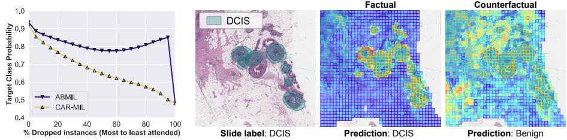
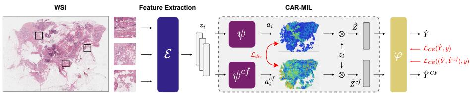
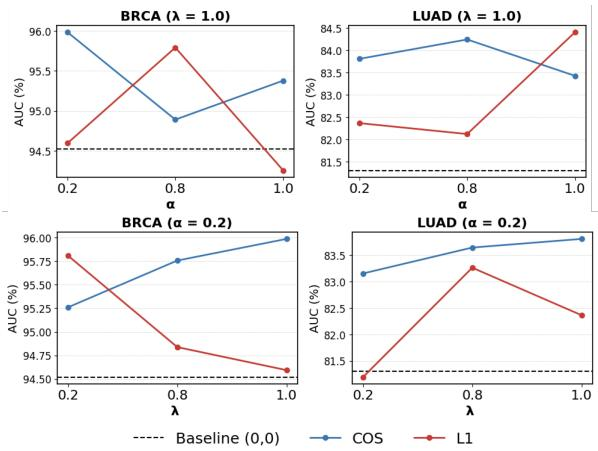
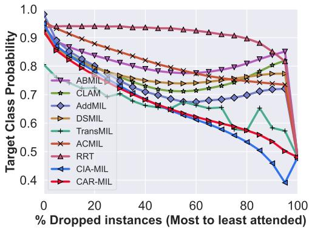
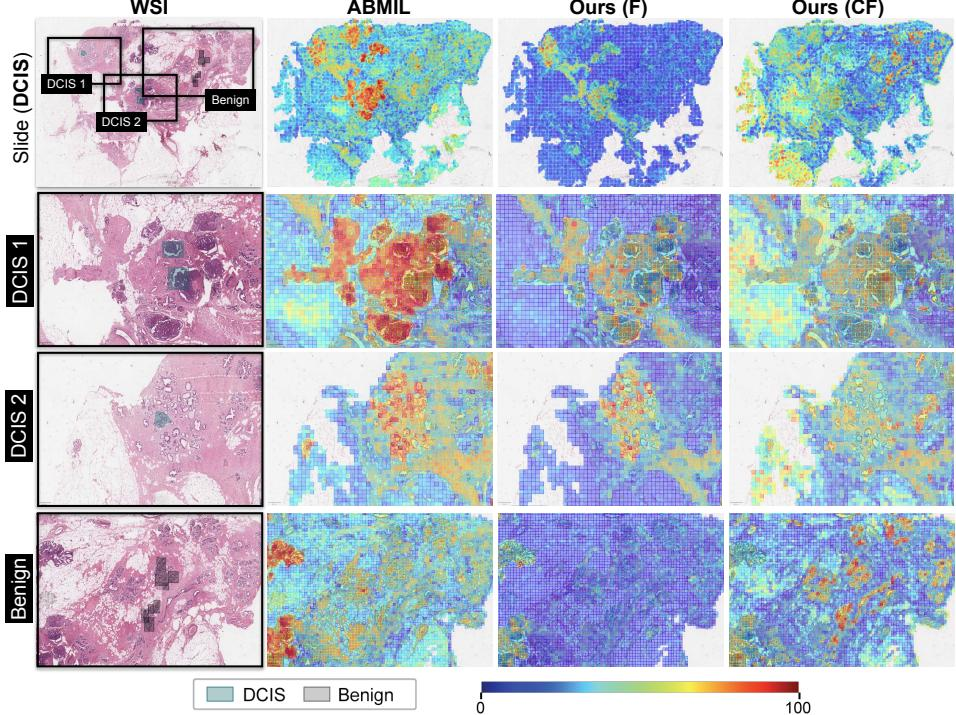
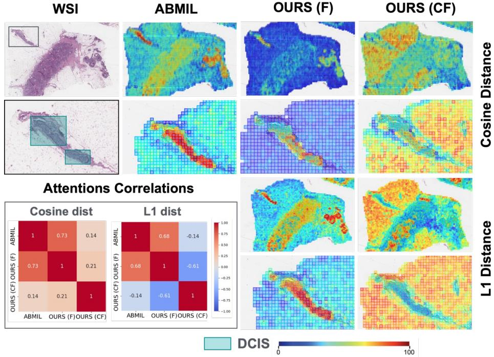
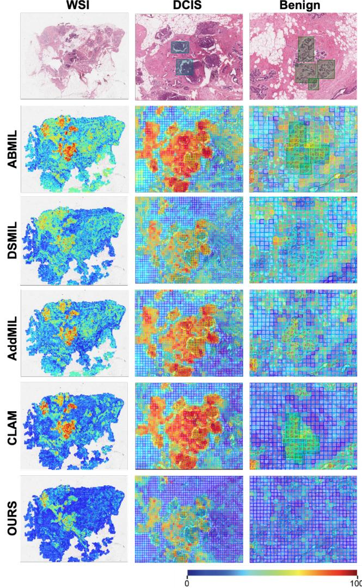

# CAR-MIL: Counterfactual Attention Regularization for Multiple Instance Learning

Imane Chraki1,2, Pierre Marza1,2, Stergios Christodoulidis1,2, and Maria Vakalopoulou1,2

1 Université Paris-Saclay, CentraleSupélec, Gustave Roussy, INSERM, IHU PRISM, Cancer Data Science Unit, France

2 Université Paris-Saclay, CentraleSupélec, MICS Laboratory, France

Abstract. Multiple Instance Learning (MIL) is widely used for weakly supervised learning, particularly in digital pathology, where fine-grained annotations are costly. Most MIL methods aggregate instance features via attention mechanisms. However, attention weights do not always faithfully reflect instance importance and may focus on spuriously correlated regions. In this work, we propose CAR-MIL, a framework that explicitly guides attention learning through a counterfactual attention regularization objective inspired by counterfactual explanations. Built on a standard attention-based MIL architecture, our approach introduces a lightweight counterfactual attention branch trained to produce an alternative prediction while remaining close to the factual attention distribution. This encourages prediction changes to arise from minimal, structured redistributions of attention, leading to more informative evidence allocation. The resulting factual and counterfactual attention maps capture complementary evidence: the former highlights regions supporting the prediction, while the latter reveals regions whose reweighting would challenge it. We evaluate our method on synthetic MIL benchmarks with instance-level ground truth enabling controlled analysis of attention behavior and on five digital pathology datasets across four tasks. CAR-MIL maintains competitive classification performance, with the largest gains observed on more challenging tasks, while improving attention reliability, demonstrating the benefits of integrating counterfactual explainability reasoning into attention learning. Code is available at: https://github.com/ImaneCR/CAR-MIL/.

## 1 Introduction

Multiple Instance Learning (MIL) addresses learning from weakly-annotated data, where samples are organized into bags of instances, and labels are assigned only at the bag level [12, 26].

Attention-based MIL methods [17, 23, 38] address this challenge by learning a weighted aggregation of instance features into a bag representation, and achieve high predictive performance. Despite recent progress, two major limitations remain. First, as shown in recent studies [13, 16, 19, 41], MIL attention may highlight irrelevant or spuriously-correlated regions, both degrading performance and interpretability. Such an issue can arise from training instability, with the attention collapsing and highlighting only a small set of regions [34,42]. Secondly, current methods only emphasize evidence supporting the predicted class while providing little insight into evidence that contradicts the decision, limiting both their reliability and their explanatory capacity. This is for example problematic in medical applications, where attention maps are often used to justify automated decisions. These observations suggest that attention should not be treated merely as a by-product of optimization but its training should be guided to reflect how evidence supporting or contradicting a prediction is allocated across instances.

(b) Qualitative visualisation of attention maps (BRACS)  
  
Fig. 1: CAR-MIL is a multiple instance learning method to model complex interactions between relevant regions using counterfactual explanation. (a) Dropping highlyattended instances for CAR-MIL leads to a higher performance drop than ABMIL on the TCGA-BRCA dataset. (b) Qualitative example from the BRACS dataset: the factual attention correctly focuses on the Ductal Carcinoma In Situ (DCIS) areas and predicts the correct slide-level label, whereas the counterfactual attention reallocates evidence and predicts the Benign class.

A natural framework for reasoning about such evidence is provided by counterfactual explanations (CE) [37], which characterize predictions through minimal changes to the input of a model that would alter its output. This counterfactual perspective distinguishes evidence supporting a decision from evidence that challenges it. Importantly, existing CE methods provide post-hoc interpretability, as they are applied to a trained model to better understand its decisionmaking process. However, as showcased earlier, in the case of MIL, evidence reasoning should be performed at training time. We thus propose two main adaptations to this framework: (i) integrating CE at training time to guide the learning of attention, (ii) performing perturbations in attention instead of input space as it is more adapted to MIL. To the best of our knowledge, such an adaptation of CE to MIL training has not been studied in previous work. Recent methods begin to incorporate counterfactual interventions into the training of attention [9,31] but this is diferent from what we propose. Indeed, the latter rely on random attention perturbations while we believe learning such perturbations is beneficial.

In this work, we introduce CAR-MIL (Figure 1), a method trained to provide a factual and counterfactual attentions following CE principles. The counterfactual attention is constrained to remain close to the factual attention while producing a diferent prediction, encouraging changes to arise from selective redistributions of attention across instances. We propose a double-branch design yielding complementary attention maps: the factual attention highlights regions supporting the prediction, while the counterfactual attention reveals regions refuting it. Our framework introduces a new learning paradigm where the model learns how reallocating attention across instances afects the predicted outcome and therefore providing a contrastive training signal that guides attention learning dynamics. The counterfactual branch is implemented as a lightweight attention module sharing the encoder and classifier with the factual branch, therefore introducing minimal computational overhead and requiring no additional supervision. We evaluate CAR-MIL on synthetic MIL benchmarks designed to assess interaction modelling [16], as well as on five digital pathology datasets across four tasks. Across all settings, our method consistently maintains a competitive classification performance, with the largest performance gains observed on the more challenging tasks, while producing more reliable attention distributions, as confirmed by both quantitative metrics and qualitative analysis.

Our contributions can be summarized as follows: (i) We introduce for the first time counterfactual attention regularization for MIL, enforcing prediction divergence under minimal attention perturbations. (ii) We learn complementary factual and counterfactual attention distributions that reveal supporting and refuting evidence within attention maps. (iii) We demonstrate that explicitly guiding attention during training maintains or improves both predictive accuracy and interpretability in attention-based MIL models.

## 2 Related Work

Attention-based embedding-level MIL — Such MIL models aggregate instance embeddings into a global bag representation through an attention mechanism. The standard attention MIL (ABMIL) method [17] infers weights from instance features to aggregate them accordingly.

Numerous variants have then been proposed to improve the attention module [22, 24, 30, 32, 34, 41, 42]. Many of these MIL variants aim to improve the attention learning process, for example, by incorporating self-attention mechanisms [40], enforcing consistency between attention weights and instance feature representations [24], constraining attention through negative bag supervision in the case of binary classification [30], or mitigating problems caused by hard instances by introducing masking modules [34]. However, modifying only the attention mechanism, without evaluating the impact of the applied techniques on the model’s predictions, might not guarantee achieving the desired predictive outcome [31].

Interpretability of MIL Models — Attention-based MIL models rely on attention scores to provide a localization map of regions of interest. However, raw attention maps inherent to these models often do not guarantee reliability [16, 19, 41]. On the other hand, fully additive models such as [19] seek to disentangle and sum individual contributions explicitly. Post-hoc explainability strategies have also been proposed [1, 3, 4, 16, 20, 28, 29, 33, 39], including perturbation-based methods that modify instance subsets within bags and observe prediction changes [13, 16]. Despite progress, many of these methods are constrained by computational cost, limited scalability to large bags [7, 19, 27] or limited explanatory capacity: they typically highlight instances that support the predicted class, but do not reveal evidence that contradicts or challenges the decision [16].

Counterfactual Reasoning for Explanation and Attention Learning We can consider two main frameworks with diferent objectives: (i) Counterfactual Explainability (CE) tries to understand the inner mechanisms of a trained model, while (ii) Counterfactual Attention Learning (CAL) aims at improving the quality of attention at training time. CE was introduced by [37] as a posthoc interpretability framework that explains a model’s prediction by identifying minimal changes to the input that would alter its decision. The core idea is to characterize predictions through contrast: what needs to change for the outcome to difer. CE methods therefore operate after training and focus on generating alternative inputs that provide insight into decision boundaries. On the other hand, CAL [9, 31] incorporates counterfactual reasoning into training by verifying that the learned attention is meaningfully better than controlled alternatives. In particular, CIA-MIL [9] introduces a counterfactual causal intervention on attention, evaluating whether the learned attention contributes meaningfully to prediction compared to a controlled random attention. A main drawback of such approaches is the lack of control on the applied perturbations. Indeed, by comparing the learned attention with a random counterpart, they primarily use counterfactual perturbations as a diagnostic tool and do not explicitly structure how evidence should be redistributed across instances during training. To address this, we incorporate CE at training time, and we have the flexibility to learn what perturbations would impact the final prediction.

## 3 Methods

## 3.1 Preliminaries

Multiple Instance Learning — In Multiple Instance Learning (MIL), a sample is defined as a set of instances named a bag $B _ { i } = \{ x _ { i , 1 } , . . . , x _ { i , N _ { i } } \}$ , where $N _ { i }$ denotes the number of instances in bag i. Importantly, in MIL, the supervision is only available at the bag level, i.e. each bag is associated with a label $y _ { i } \in \{ 1 , \ldots , K \}$ for a K-class classification task. Instance-level labels are unobserved. We focus on embedding-level attention-based MIL models.

Standard Attention-Based MIL — Each instance $x _ { i , j }$ is independently encoded using a feature extractor E as $\mathbf { \Phi } : z _ { i , j } = \mathcal { E } ( x _ { i , j } ) \in \mathbb { R } ^ { \bar { d } }$ . For clarity, we drop the bag index and denote a bag of embeddings as $\{ z _ { j } \} _ { j = 1 } ^ { N }$ . An attention module $\psi$ produces an attention logit $u _ { j }$ for each instance:

$$
u _ { j } = \psi ( z _ { j } ) , \qquad a = \mathrm { s o f t m a x } ( u ) ,\tag{1}
$$

where $u = ( u _ { 1 } , \ldots , u _ { N } ) \in \mathbb { R } ^ { N }$ denotes the vector of attention logits and $a =$ $( a _ { 1 } , \dots , a _ { N } ) \in \mathbb { R } ^ { N }$ the corresponding normalized attention weights.

We denote the bag-level classifier by $\varphi$ . The bag representation ${ \hat { Z } } ,$ , class logits $F ( u )$ and probabilities yˆ(u) are then obtained as:

$$
\hat { Z } = \sum _ { j = 1 } ^ { N } a _ { j } z _ { j } , \qquad F ( u ) = \varphi ( \hat { Z } ) \in \mathbb { R } ^ { K } , \qquad \hat { y } ( u ) = \mathrm { s o f t m a x } ( F ( u ) ) .\tag{2}
$$

## 3.2 Counterfactual Attention Regularization

Factual and Counterfactual Branches — Our method follows a two-branch setting (Figure 2) with a factual and counterfactual branches. Both have the same ABMIL [17] architecture, but diferent weights that are optimized concurrently. The encoder E and downstream classifier $\varphi$ are not part of the branches and are thus shared between both. The diference between CAR-MIL and AB-MIL lies in the additional lightweight counterfactual branch, introducing minimal computational overhead. Diferences in predictions thus arise solely from attention weighting diferences between the two branches. The attention modules for the factual and counterfactual branches are respectively denoted as $\psi$ and $\psi _ { c f }$ , and similarly to eq. 1, 2, we have the following for the counterfactual branch:

$$
u _ { j } ^ { \mathrm { c f } } = \psi _ { \mathrm { c f } } ( z _ { j } ) , \quad a ^ { \mathrm { c f } } = \mathrm { s o f t m a x } ( u ^ { \mathrm { c f } } ) , \quad \hat { Z } ^ { \mathrm { c f } } = \sum _ { j = 1 } ^ { N } a _ { j } ^ { \mathrm { c f } } z _ { j } , \quad F ( u ^ { \mathrm { c f } } ) = \varphi ( \hat { Z } ^ { \mathrm { c f } } ) .\tag{3}
$$

Evidence Diferential — We define the counterfactual evidence diferential in logit space as:

$$
\varDelta F ( u , u ^ { \mathrm { c f } } ) = F ( u ) - F ( u ^ { \mathrm { c f } } ) \in \mathbb { R } ^ { K }\tag{4}
$$

It quantifies the diference between the predicted logits of factual and counterfactual attention logits. For a specific class $y \in \{ 1 , \dots , K \} , \varDelta F _ { y }$ represents the element in $\varDelta F$ corresponding to class $y .$ A large $\varDelta F _ { y }$ indicates that the logit predicted from the factual attention is higher than from its counterfactual counterpart. This would suggest that the factual branch attention provides stronger class-y evidence than the counterfactual branch.

## 3.3 Training Objective

we add to the main classification loss of the model an additional composite loss term constraining the two branches attentions to be close yet their predictions to be diferent. Therefore, prediction shifts are encouraged to arise from small but structured diferences of the attention logits. The proposed CAR-MIL framework is therefore optimized using three complementary loss terms:

  
Fig. 2: CAR-MIL Overview. CAR-MIL is a two-branch attention MIL architecture trained with an explainable proximity-evidence constraint. Both branches operate on the same instance embeddings and share the downstream classifier. During training, a joint loss encourages (i) accurate bag-level predictions from the main(factual) branch, (ii) label-consistent evidence separation between main and counterfactual branches via the evidence diferential, and (iii) meaningful diferences between their attention vectors w.r.t the prediction shift.

– Classification loss: Standard cross entropy loss on the factual branch prediction. This main loss ensures accurate bag-level prediction from the main (factual) branch:

$$
\mathcal { L } _ { \mathrm { c l s } } = \mathrm { C E } ( \hat { y } ( u ) , y )\tag{5}
$$

– Counterfactual evidence diferential loss: Encourages the evidence diferential $\varDelta F$ to favor diference between the two branches predictions on the ground-truth class, enforcing label-consistent separation between factual and counterfactual predictions:

$$
\mathcal { L } _ { \mathrm { d i f f } } = \mathrm { C E } \bigl ( \mathrm { s o f t m a x } ( \varDelta F ) , y \bigr ) = \log \left( 1 + \sum _ { k \neq y } e ^ { \varDelta F _ { k } - \varDelta F _ { y } } \right)\tag{6}
$$

In particular, if ${ \mathcal { L } } _ { \mathrm { d i f f } } \leq \varepsilon .$ then for all $k \neq y$

$$
\varDelta F _ { y } - \varDelta F _ { k } \geq - \log ( e ^ { \varepsilon } - 1 )\tag{7}
$$

Thus, minimizing ${ \mathcal { L } } _ { \mathrm { d i f f } }$ explicitly encourages the two branches to difer primarily on the ground-truth class.

Attention-logit proximity regularization: Constrains the counterfactual attention logits to remain close to the factual attention logits, ensuring that prediction diferences arise from minimal and controlled weighting updates of attention:

$$
\begin{array} { r } { \mathcal { L } _ { \mathrm { d i v } } = D ( u , u ^ { \mathrm { c f } } ) , } \end{array}\tag{8}
$$

where $D ( \cdot , \cdot )$ denotes a distance metric in logit space. In practice, $D ( \cdot , \cdot )$ can be instantiated using a normalized $L _ { 1 }$ distance or a cosine-based dissimilarity. The $L _ { 1 }$ formulation,

$$
\mathcal { L } _ { \mathrm { d i v } } = D _ { L _ { 1 } } ( u , u ^ { \mathrm { c f } } ) = \frac { 1 } { N } \sum _ { j = 1 } ^ { N } | u _ { j } - u _ { j } ^ { \mathrm { c f } } | ,\tag{9}
$$

penalizes absolute deviations in a sparse and interpretable manner, encouraging the counterfactual branch to modify the raw attention values of only a small subset of influential instances. This property aligns with the intuition that counterfactual evidence should emerge from minimal attention changes. Alternatively, a cosine-based distance,

$$
\mathcal { L } _ { \mathrm { d i v } } = D _ { \mathrm { c o s } } ( \boldsymbol { u } , \boldsymbol { u } ^ { \mathrm { c f } } ) = 1 - \frac { \sum _ { j = 1 } ^ { N } u _ { j } u _ { j } ^ { \mathrm { c f } } } { \Vert \boldsymbol { u } \Vert _ { 2 } \Vert u ^ { \mathrm { c f } } \Vert _ { 2 } } ,\tag{10}
$$

captures directional disagreement between the two attention patterns, encouraging the counterfactual head to orient its attention toward diferent subsets of instances while remaining scale-invariant. This is particularly useful when the magnitude of the logits is less important than their relative orientation across instances.

Overall Objective — The full training objective implements a counterfactual attention regularization principle to guide the learning dynamics of attentions. It encourages solutions where factual and counterfactual attentions remain close but induce label-consistent prediction diferences. As a result, the factual attention is encouraged to highlight supporting evidence for the predicted class compared to the counterfactual branch. The final loss is given as follows,

$$
\begin{array} { r } { \mathcal { L } = \mathcal { L } _ { \mathrm { c l s } } + \alpha \mathcal { L } _ { \mathrm { d i f f } } + \lambda \mathcal { L } _ { \mathrm { d i v } } , \qquad \alpha , \lambda \geq 0 , } \end{array}\tag{11}
$$

where α and λ are hyperparameters controlling the contribution of each loss in the final objective. In Sect.A.4 of the supplementary material, we provide additional analytical results that explain why the CAR module increases factual attention on instances supporting the class prediction, while decreasing CF attention on those instances and increasing it on non-supportive ones.

## 4 Experiments and Results

We conducted experiments on both synthetic and histopathological datasets. In the following sections, we summarize the datasets used, along with their implementation details, the comparison methods, and the evaluation strategy.

## 4.1 Experiments on MNIST-bags Synthetic Data

Datasets — We leverage the recent MIL classification datasets from [16] derived from MNIST [11]. In this synthetic setting, instance-level annotations are available to indicate whether an instance provides supporting or refuting evidence for the bag label according to the dataset construction rule. We consider two dataset variants: 4-bags: Class 1 if the bag contains an 8, class 2 if it contains a 9, class 3 if it contains both 8 and 9, and class 0 otherwise. This setting evaluates the model’s ability to capture interactions between instances that jointly determine the bag label. Adjacent Pairs: a bag is class 1 if it contains any pair of consecutive digits between 0 and 4; otherwise, the bag corresponds to class 0. In this setting, the evidential role of an instance depends on the presence of other instances in the bag, making the prediction inherently contextual. This setup therefore evaluates whether models correctly capture context-dependent evidence relationships between instances.

Table 1: Comparison of Baseline and Counterfactual MIL Models on the MNIST-bags Synthetic Datasets. Results are reported for binary (Adjacent Pairs) and multi-class (Four Bags) classification tasks. Bag AUC measures slide-level predictive performance, while Instance $A U P R C ^ { + }$ and $A U P R C ^ { \pm }$ assess alignment between attention scores and instance-level evidence supporting or refuting the bag label. CAR-MIL substantially improves instance-level performance, indicating better discriminative evidence of the attention, while maintaining strong bag-level performance.
<table><tr><td></td><td></td><td colspan="3">Adjacent Pairs</td><td colspan="3">Four Bags</td></tr><tr><td>Model</td><td>Evidence</td><td></td><td></td><td>AUC (↑) AUPRC+ (↑) AUPRC± (↑) AUC (↑) AUPRC+ (↑) AUPRC± (↑)</td><td></td><td></td><td></td></tr><tr><td>ABMIL [17]</td><td>attention</td><td> $8 5 . 7 \pm 5 . 9$ </td><td> $7 6 . 9 \pm 6 . 1$ </td><td> $6 1 . 5 \pm 0 . 9$ </td><td> $9 9 . 1 \pm 0 . 1$ </td><td> ${ \bf 8 6 . 8 \pm 0 . 2 }$ </td><td> $5 3 . 1 \pm 0 . 1$ </td></tr><tr><td>AddMIL [19]</td><td>attention</td><td> $8 1 . 0 \pm 2 . 2$ </td><td> $6 4 . 3 \pm 4 . 8$ </td><td> $6 3 . 5 \pm 1 . 2$ </td><td> $9 7 . 0 \pm 2 . 7$ </td><td> $8 2 . 1 \pm 1 2 . 1$ </td><td> $5 3 . 4 \pm 0 . 8$ </td></tr><tr><td></td><td>patch-scores</td><td> $\mathrm { { N / A } }$ </td><td> $6 6 . 7 \pm 7 . 4$ </td><td> $6 7 . 6 \pm 6 . 6$ </td><td> $\mathrm { { N / A } }$ </td><td> $7 6 . 4 \pm 1 5 . 0$ </td><td> $\underline { { 7 6 . 8 \pm 1 4 . 6 } }$ </td></tr><tr><td>TransMIL [32] attention</td><td></td><td> ${ \bf 9 4 . 6 \pm 4 . 4 }$ </td><td> $8 1 . 5 \pm 6 . 9$ </td><td> $6 1 . 7 \pm 2 . 1$ </td><td> $9 9 . 5 \pm 0 . 1 $ </td><td> $8 1 . 6 \pm 6 . 3$ </td><td> $\overline { { 5 1 . 9 \pm 0 . 8 } }$ </td></tr><tr><td>CAR-MIL</td><td>attention</td><td> $\underline { { 9 4 . 1 \pm 5 . 9 } }$ </td><td> ${ \bf 8 5 . 7 \pm 6 . 5 }$ </td><td>1  ${ \bf 8 4 . 6 \pm 5 . 2 }$ </td><td> $\pm \overline { { { \bf 9 9 . 6 ~ \pm ~ 0 . 1 } } }$ </td><td> ${ \bf 8 6 . 8 \pm 0 . 6 }$ </td><td> ${ \bf 8 9 . 7 \pm 0 . 9 }$ </td></tr></table>

Implementation Details — Feature extraction is performed for the MNIST images using ResNet18 [15] model pre-trained on ImageNet [10] from the TorchVision library [25]. Experiments were repeated 10 times with a learning rate of 0.0002 and the SGD optimizer. We compare our proposed strategy against MIL pooling baselines, reporting means and standard deviations across repetitions of performance in terms of area under the curve (AUC) at the bag level, as well as area under the precision-recall curve of attention prediction of instances’ positive evidence label (AUPRC+) and a two-class (positive and negative evidence classes) averaged area under the precision-recall curve (AUPRC±). More details are to be found in Sects.A.5 and A.6 of our supplementary material. We evaluate our method using the L1 distance as the metric to measure the similarity between factual and counterfactual attentions. We present the considered baselines along with the method used to extract instance scores in parentheses: ABMIL [17] (raw attention scores), TransMIL [32] (attention rollout [18]), AddMIL [19] (patch-level scores).

In all models, the attention is interpreted as representing positive evidence (instances that support the predicted label) while reverse attention is used to represent negative evidence. In our proposed approach, counterfactual attention serves as an estimation of negative evidence, explicitly modelling instance-level factors that contradict the predicted outcome.

Counterfactual Reasoning Improves Attention — The synthetic benchmark provides a controlled setting to evaluate both downstream classification performance and the alignment between attention distributions and instancelevel evidence. For the Adjacent Pairs binary classification task, the model must be aware of the contextual influence of individual instances to achieve accurate predictions. As reported in Table 1, CAR-MIL outperforms the ABMIL and AddMIL, and reaches performance comparable to TransMIL at the bag level (94.1 vs. 94.6 AUC). More importantly, our method yields substantially higher instance-level performance (AUPRC+=85.7 and AUPRC±=84.6), indicating that the learned attention more faithfully reflects discriminative evidence. As for the Four Bags multi-class task, our method improves both performance at the bag-level and attention reliability to reflect the evidence provided by instances that support or refute the bag label. These synthetic experiments suggest that counterfactual reasoning applied at the attention level promotes a tighter correspondence between attention allocation and instance-level evidence. As a result, more faithful attention leads to improved predictive performance.

## 4.2 Experiments on Histopathology Data

Datasets — We conduct our experiments on multiple public whole-slide image (WSI) datasets from TCGA [36]: TCGA-NSCLC (Non–Small Cell Lung Cancer) and TCGA-BRCA(Breast Invasive Carcinoma) for binary cancer subtyping, TCGA-LUAD(Lung Adenocarcinoma) for TP53 mutation prediction, CAMELYON16 [5] for binary metastasis detection in breast lymph node, and BRACS [6](BreAst Cancer Subtyping), a breast cancer dataset for multiclass tissue classification between normal, benign, and malignant categories.. CAME-LYON16 and BRACS contain instance-level annotations, with the latter having only sparse labels.

Implementation Details — Slides were processed using the standard approach as in [24] to obtain patches of size 256x256 at 20X magnification. We use pre-extracted features with UNI-V1 [8] foundation model. Please note that any other encoder could be integrated into our method. Experiments were conducted under five cross-validation settings for TCGA-NSCLC, TCGA-BRCA, and TCGA-LUAD using a learning rate of 0.0002. We used the originally published train-val-test split for BRACS in three runs with a learning rate of 0.0001, and similarly the train-test split for CAMELYON16 in three runs with a learning rate of 0.0002. All experiments were conducted using the Adam [21] optimizer. Additional details to be found in Sects.A.5 and A.6 of our supplementary material.

We challenge CAR-MIL against several popular MIL frameworks including: baseline approaches that do not use attention (Mean-Max MIL), classical attention-based MIL (ABMIL [17]) and attention-focused architectures such as CLAM [24], ACMIL [42], DSMIL [22], TransMIL [32], AddMIL [19], and CIA-MIL [9]. We report performance metrics in terms of AUC or balanced accuracy and F1 score. For CAMELYON16, we report the AUPRC+, the area under the precision recall curve for attention as a prediction of instance labels. Scores are reported in terms of the average ± standard deviation.

In the proposed framework, the proximity regularization constrains the counterfactual attention logits to remain close to the factual attention logits. We experiment with both $L _ { 1 }$ and cosine distances as attention similarity measures for our method. Evaluating both variants allows us to study how diferent proximity geometries afect the redistribution of evidence and predictive performance.

Table 2: Performance Comparison of CAR-MIL Against State-of-the-Art MIL Models on Histopathology Classification Tasks. Results are reported for BRCA and NSCLC cancer subtyping, TP53 mutation prediction in LUAD, BRACS tissue subtyping, and CAMELYON16 metastasis detection. Metrics include AUC, F1- score, and balanced accuracy. CAR-MIL consistently improves or matches the best baseline performance across datasets using UNI features.
<table><tr><td></td><td colspan="2">BRCA</td><td colspan="2">NSCLC</td><td colspan="2">LUAD</td><td colspan="2">BRACS</td><td colspan="2">CAMELYON16</td></tr><tr><td>Model</td><td>AUC (↑)</td><td>F1 (↑)</td><td>AUC (↑)</td><td>F1 (↑)</td><td>AUC (↑)</td><td>F1 (↑)</td><td>BACC (↑)</td><td>F1 (↑)</td><td>AUC (↑)</td><td>AUPRC+ (↑)</td></tr><tr><td>Meanmil</td><td>93.2±2.4</td><td>85.1±2.4</td><td>96.9±1.3</td><td>94.0±1.0</td><td>74.5±6.3</td><td>71.1±7.4</td><td>33.2±1.8</td><td>28.2±2.1</td><td>62.5±4.8</td><td>N/A</td></tr><tr><td>MaxMIL</td><td>95.4±1.5</td><td>88.0±1.1</td><td>97.5±1.0</td><td>94.6±1.9</td><td>76.0±5.4</td><td>71.8±4.9</td><td>32.3±7.1</td><td>29.4±8.6</td><td>98.3±0.4</td><td>N/A</td></tr><tr><td>CLAM [24]</td><td>94.5±2.3</td><td>87.6±1.7</td><td>97.9±0.8</td><td>94.1±1.7</td><td>74.0±3.0</td><td>70.6±1.8</td><td>40.4±5.5</td><td>38.0±4.9</td><td>99.7±0.3</td><td>94.4±0.3</td></tr><tr><td>AddMIL [19]</td><td>93.7±2.6</td><td>86.0±3.3</td><td>94.6±3.0</td><td>91.9±2.7</td><td>73.3±3.9</td><td>71.5±4.0</td><td>38.3±9.6</td><td>35.7±11.6</td><td>98.2±1.4</td><td>93.4±1.2</td></tr><tr><td>DSMIL [22]</td><td>94.1±1.6</td><td>85.3±2.3</td><td>97.4±1.1</td><td>94.0±2.6</td><td>66.9±4.7</td><td>64.8±5.1</td><td>42.3±2.0</td><td>40.0±2.0</td><td>98.9±1.1</td><td>80.6±11.2</td></tr><tr><td>TransMIL [32]</td><td>93.2±2.7</td><td>87.7±0.8</td><td>97.8±0.6</td><td>94.8±2.0</td><td>71.7±5.4</td><td>68.8±4.4</td><td>40.0±3.6</td><td>37.6±3.8</td><td>99.9±0.1</td><td>28.2±3.6</td></tr><tr><td>ACMIL [42]</td><td>94.4±2.9</td><td>88.7±2.2</td><td>97.9±0.8</td><td>93.9±2.5</td><td>75.5±7.4</td><td>72.0±6.6</td><td>41.2±1.4</td><td>38.5±2.4</td><td>99.4±0.5</td><td>95.4±0.5</td></tr><tr><td>RRT-MIL [35]</td><td>93.7±1.2</td><td>84.6±3.4</td><td>97.3±1.8</td><td>93.7±2.9</td><td>75.1±5.2</td><td>71.8±4.0</td><td>39.3± 4.8</td><td>34.5±5.2</td><td>99.6±0.5</td><td>94.4±1.1</td></tr><tr><td>CIA-MIL [9]</td><td>94.5±1.2</td><td>87.3±2.7</td><td>96.5±1.6</td><td>93.0±2.5</td><td>77.5±2.5</td><td>71.1±5.6</td><td>37.6±2.1</td><td>35.0±1.6</td><td>99.2±0.5</td><td>92.9±1.5</td></tr><tr><td>ABMIL [17]</td><td>95.3±1.7</td><td>88.9±1.3</td><td>97.6±1.0</td><td>94.2±1.2</td><td>74.0±4.3</td><td>72.1±5.4</td><td>38.2±4.1</td><td>36.0±4.5</td><td>98.7±0.3</td><td>93.2±1.2</td></tr><tr><td>CAR-MIL (L1)</td><td>95.5±2.2</td><td>87.9±1.5</td><td>98.0±0.5</td><td>94.4±1.7</td><td>76.4±4.9</td><td>72.4±3.8</td><td>40.8±2.5</td><td>38.1±2.5</td><td>99.9±0.1</td><td>94.8±1.0</td></tr><tr><td>CAR-MIL (COS)</td><td>95.0±1.7</td><td>89.6±1.4</td><td>97.5±0.9</td><td></td><td>95.0±1.8 78.1±4.1 72.6±4.5</td><td></td><td>43.1±2.0</td><td>40.4±2.4</td><td>99.3±0.7</td><td>91.7±0.6</td></tr></table>

CAR-MIL Achieves Competitive Downstream Performance — Table 2 summarizes the performance of CAR-MIL across five histopathology tasks. Overall, CAR-MIL achieves performance comparable to or better than strong MIL baselines, while paired statistical t-tests show that no attention-based MIL method significantly outperforms CAR-MIL on any dataset. Performance gains are more pronounced on the more challenging LUAD and BRACS tasks, suggesting that explicitly guiding attention during training is particularly beneficial in more challenging settings. In particular, the cosine variant of CAR-MIL tends to perform better on the more challenging LUAD and BRACS tasks, while the $L _ { 1 }$ formulation remains competitive on binary subtyping tasks such as BRCA and NSCLC. On CAMELYON16, where patch-level tumor annotations are well defined and available, CAR-MIL maintains competitive patch-level performance (AUPRC+) indicating that redistributing attention through the counterfactual branch does not cause the model to deviate from diagnostically-relevant regions.

## 5 Analysis of Counterfactual Attention Regularization

Hyperparameter Sensitivity — Fig. 3 analyzes the sensitivity to hyperparameters α controlling the evidence diferential loss ${ \mathcal { L } } _ { \mathrm { d i f f } }$ , and λ controlling the attention logit proximity loss ${ \mathcal { L } } _ { \mathrm { d i v } }$ . We report the AUC obtained for both the cosine and $L _ { 1 }$ variants of a run of CAR-MIL on the BRCA and LUAD datasets for diferent combinations of these weights. The explored configurations include values {0.2, 0.8, 1.0}, together with the baseline ABMIL setting without counterfactual regularization $( \alpha = \lambda = 0 )$ . On BRCA, the baseline AUC of 94.5 improves to values between 95.3 and 96.0 depending on the configuration, with the best performance obtained for moderate counterfactual regularization. On LUAD, where the task is more challenging, the baseline AUC of 81.3 increases to values up to 84.2–84.4. While improvements are observed on both datasets, the efect of the hyperparameter choices is more visible on LUAD than on BRCA. This diference likely reflects the relative dificulty of the tasks: when baseline performance is already high, as on BRCA, performance diferences across configurations remain relatively small, whereas on the more challenging LUAD task the influence of the regularization weights becomes more visible. Across settings, the cosine variant exhibits smoother trends across configurations, while the L1 variant shows slightly larger variability depending on the choice of weights.

Table 3: Ablation with Respect to MIL Settings. Integrating the proposed counterfactual attention regularization (CAR) into more attention-based MIL architectures, including DSMIL, and TransMIL. Performance comparaison is assessed between the original baselines versus their CAR-augmented variants across five datasets. CAR generally improves or maintains performance across most metrics, showing that the proposed regularization can be integrated into diverse MIL attention architectures.
<table><tr><td></td><td colspan="2">BRCA</td><td colspan="2">NSCLC</td><td colspan="2">LUAD</td><td colspan="2">BRACS</td><td colspan="2">CAMELYON16</td></tr><tr><td>Model</td><td>AUC (↑)</td><td>F1 (↑)</td><td>AUC (↑)</td><td>F1 (↑)</td><td>AUC (↑)</td><td>F1 (↑)</td><td>BACC (↑)</td><td>F1 (↑)</td><td>AUC (↑)</td><td>AUPRC+ (↑)</td></tr><tr><td>ABMIL [17]</td><td>95.3±1.7</td><td>88.9±1.3</td><td>97.6±1.0</td><td>94.2±1.2</td><td>74.0±4.3</td><td>72.1±5.4</td><td>38.2±4.1</td><td>36.0±4.5</td><td>98.7±0.3</td><td>93.2±1.2</td></tr><tr><td>CAR-MIL</td><td>95.0±1.7</td><td>89.6±1.4</td><td>98.0±0.5</td><td>94.4±1.7</td><td>78.1±4.1</td><td>72.6±4.5</td><td>43.1±2.0</td><td>40.4±2.4</td><td>99.9±0.1</td><td>94.8±1.0</td></tr><tr><td>DSMIL [22]</td><td>94.1±1.6</td><td>85.3±2.3</td><td>97.4±1.1</td><td>94.0±2.6</td><td>66.9±4.7</td><td>64.8±5.1</td><td>42.3±2.0</td><td>40.0±2.0</td><td>98.9±1.1</td><td>80.6±11.2</td></tr><tr><td>CAR-DSMIL</td><td>94.5±2.2</td><td>85.6±2.7</td><td>97.8±1.0</td><td>94.0±2.3</td><td>71.2±4.1</td><td>67.8±3.4</td><td>42.5±5.1</td><td>39.8±2.0</td><td>99.0±0.6</td><td>87.8±2.9</td></tr><tr><td>TransMIL [32]</td><td>93.2±2.7</td><td>87.7±0.8</td><td>97.8±0.6</td><td>94.8±2.0</td><td>71.7±5.4</td><td>68.8±4.4</td><td>40.0±3.6</td><td>37.6±3.8</td><td>99.9±0.1</td><td>28.2±3.6</td></tr><tr><td>CAR-TransMIL</td><td>94.0±1.3</td><td>87.2±4.3</td><td>97.6±1.4</td><td>94.3±2.0</td><td>73.6±4.4</td><td>69.8±4.0</td><td>42.6±6.1</td><td>39.4±6.2</td><td>99.7±0.1</td><td>32.6±0.3</td></tr></table>

MIL Setting — Table 3 evaluates the efect of integrating our counterfactual attention regularization (CAR) into diferent MIL settings: ABMIL [17] (already presented in Table 2, but reported for comparison with other MIL methods), DSMIL [22] and TransMIL [32]. We provide in Sect.A.7 of our supplementary material more technical details on the integration of CAR following the different attention formulations. For each setting, we report the best-performing distance variant (either $L _ { 1 }$ or cosine) in order to focus on the contribution of the proposed CAR mechanism rather than the choice of distance metric. Across architectures, the proposed regularization consistently improves or maintains performance compared to the original models. In particular, the gains are most visible for the ABMIL backbone. Similar trends are observed when integrating the method into DSMIL and TransMIL, where CAR variants improve mutation prediction LUAD and BRACS classification performance while preserving strong results on easier tasks. Overall, these results indicate that counterfactual attention regularization can be efectively combined with diferent MIL aggregation mechanisms to improve slide-level prediction.

Feature Extractor — Table 4 reports an analysis with respect to the feature encoder. Using pretrained ResNet50 [15] on ImageNet [10,25] features, CAR-MIL consistently improves performance over the ABMIL baseline across all datasets.

Table 4: Ablation on the Feature Encoder Using ResNet50 Features. Comparison between ABMIL and CAR-MIL across three TCGA datasets – BR.: BRCA, NS.: NSCLC, LU.: LUAD. CAR-MIL consistently improves AUC and F1 over the baseline ABMIL indicating that the proposed CAR remains efective even when using standard convolutional features.  
Fig. 3: Hyperparameters Sensitivity. Sensitivity to hyperparameters α and λ is evaluated on BRCA and LUAD for the Cosine and L1 divergence variants on a single run. Cosine variant tends to have more consistent trends than the L1 variant.
<table><tr><td>Model AUC (↑) F1 (↑)</td></tr><tr><td>è ABMIL [17] 89.2±2.6 79.7±3.9</td></tr><tr><td>B CAR-MIL 90.3±2.1 81.9±5.0</td></tr><tr><td>s ABMIL [17] 93.4±1.7 88.2±1.6 N CAR-MIL 94.3±1.2 88.9±1.3</td></tr><tr><td></td></tr><tr><td>ABMIL [17] 68.2±5.6 66.3±4.8 CAR-MIL 70.4±6.1 68.4±5.1</td></tr></table>

As expected, absolute performance remains lower than with UNI features reported in the main experiments, reflecting the stronger representational capacity of pathology-specific foundation models. Nevertheless, the consistent gains demonstrate that the proposed counterfactual attention regularization is not tied to a specific encoder and can improve MIL aggregation even with standard convolutional features. In fact the gains are even more pronounced with out-of-domain features as the ones from ResNet50 compared to UNI features, highlighting the positive impact of guiding the learning dynamics of attention under generic features representations.

Multi-class Setting — We investigate the counterfactual branch predicted class logit under the multi-class setting. We find that the class whose CF logit increases most varies with the ground-truth class. On Four Bags, class 1 shifts toward class 3 (100% of bags) while class 3 shifts toward class 1 (62%), reflecting the dataset evidence structure. On BRACS, redistribution is difuse across all 7 classes with no dominant competitor, consistent with higher semantic ambiguity.

## 6 Attention Analysis

Counterfactual Attention Regularization for Interpretability — We assess how much the proposed counterfactual attention regularization contributes to bridging the gap between predictive performance and interpretability relevance in MIL frameworks. Using the synthetic benchmark, we compare the attention from our method with the raw attention from ABMIL and attention maps generated from two baselines: (i) a Random assignment of attention weights to instances, serving as a lower bound, and (ii) a post-hoc explainability method, Perturbation Single [14, 16], which estimates instance importance by measuring prediction sensitivity to perturbations, by passing bags of single instances through the model ("single"). We then assess the interpretability of the inherent learned attention in CAR-MIL counterfactual variant. As shown in Table 5, counterfactual-guided attention learning substantially improves the alignment between attention and instance-level evidence compared to both AB-MIL and the perturbation-based explanation. In particular, CAR-MIL achieves the highest AUPRC+ and $\mathrm { { A U P R C ^ { \pm } } }$ scores on both tasks.

Fig. 4: Efect of Removing Highly Attended Instances on the Prediction Confidence. Removing attention according to topranked instances shows that CAR-MIL yields a smooth, monotonic drop in confidence, indicating faithful instance importance, whereas AB-MIL exhibits non-monotonic behavior.  
Table 5: Attention as Interpretability Proxy on MNISTbags. Evaluation of attention as a proxy for instance-level evidence on synthetic MIL datasets with ground-truth evidence labels. CAR-MIL attention is reliable as an interpretability signal, outperforming ABMIL raw attention and perturbation evidence attribution for explaining ABMIL. – Rand.: Random, Att.: Attention, Pert.: Perturbation, Adj. P.: Adjacent Pairs, Four B: Four Bags.
<table><tr><td>Model</td><td>Evid. AUPRC+) AUPRC±</td></tr><tr><td>Rand.</td><td>54.2 ± 0.9 54.2 ± 0.9</td></tr><tr><td>P ABMIL [17] Att.</td><td>76.9 ± 6.1</td></tr><tr><td>Pert. 78.5</td><td>61.5 ± 0.9 ± 1.0 78.5 ± 1.0</td></tr><tr><td>A. CAR-MIL Att.</td><td>85.7 ± 6.5 84.6 ± 5.2</td></tr><tr><td></td><td></td></tr><tr><td>U .</td><td>Rand. 30.6 ± 0.2  $3 1 . 2 \pm \ : 0 . 2$ </td></tr><tr><td>ABMIL [17] Att.</td><td>86.8 ± 0.2  $5 3 . 1 \pm 0 . 1$ </td></tr><tr><td>Pert. CAR-MIL Att.</td><td>87.9 ± 1.6  $\underline { { 8 7 . 7 \pm 2 . 1 } }$  86.8 ± 0.6 89.7 ± 0.9</td></tr></table>

Faithfulness Evaluation via Perturbation Analysis — To further assess the faithfulness of attention, we perform a MORF (Most Relevant First) perturbation test [13, 16], where instances in correctly-predicted bags are removed in order of decreasing attention importance. For CAR-MIL, importance is computed from the discrepancy between factual and counterfactual attention scores. A faithful attention mechanism is expected to produce a monotonic decrease in the model’s confidence, since removing the most relevant instances should consistently degrade predictive performance. In Figure 4, our proposed CAR-MIL model exhibits a smooth and monotonic drop in prediction probability as a function of the percentage of removed patches, suggesting that learned attentions align closely with true predictive importance. In contrast, models such as ABMIL show non-monotonic or convex response curves, suggesting that their attention weights may not reliably capture relevant evidence among instances. Interestingly, CAR-MIL showcases a similar trend as the recent CIA-MIL method that

WSI

ABMIL  
Ours (F)  
Ours (CF)  
  
Fig. 5: Comparisons Between the Attentions of ABMIL and the Two CAR-MIL Attention Branches (F: Factual, CF: Counterfactual). Qualitative comparison of attention maps on a DCIS WSI from the BRACS dataset. ABMIL highlights broad regions within the annotated DCIS area but produces a difuse attention pattern. Our model (factual attention) concentrates attention on more precise subregions that correspond closely to the annotated malignant ducts. The counterfactual branch highlights benign or non-malignant areas, providing a complementary view of “negative evidence”. Together, the two branches provide a more structured and interpretable separation between supporting and refuting regions.

focuses on causally aligning attention with predictions at the cost of a trade-of between performance and explainability. As shown in Table 2, CAR-MIL outperforms CIA-MIL in terms of downstream performance. Indeed, by improving solely explainability through counterfactual intervention, CIA-MIL can lead to a drop in performance compared with CAR-MIL.

WSI Heatmaps — To qualitatively illustrate the diferences between attentions, we visualize attention maps for a representative WSI from the BRACS dataset labeled as DCIS (Ductal Carcinoma In Situ). Figure 5 displays the attentions obtained with ABMIL, CAR-MIL factual attention (F), and CAR-MIL counterfactual (CF) branch. Although ABMIL broadly highlights areas containing annotated DCIS regions, its attention is spatially difuse. In contrast, CAR-MIL produces more localized and concentrated attention regions. The counterfactual head provides further informative signal: its highest value occurs in benign or non-neoplastic areas, i.e., regions whose removal would weaken the model’s confidence in the positive class. This complementary pattern aligns with our design goal: factual attention captures supporting evidence, while counterfactual attention highlights refuting or neutral evidence. More quantitatively, the factual branch does not simply reproduce ABMIL localization (Spearman r=0.67 on the representative example in Figure 5 between attention vectors), while the factual and counterfactual branches attend to distinct regions $_ { ( r = 0 . 2 9 ) }$ . Across BRACS slides, factual attention remains only moderately correlated with AB-MIL (L1: $r { = } 0 . 6 9 { \pm } 0 . 0 5 ;$ Cosine: $r { = } 0 . 6 9 { \pm } 0 . 0 3 )$ , whereas factual and counterfactual attentions are strongly anti-correlated under L1 $( r { = } { - } 0 . 6 7 { \pm } 0 . 0 2 )$ and weakly correlated under cosine $\left( r { = } 0 . 2 0 { \pm } 0 . 6 3 \right)$ . Our supplementary material Figs.A.1, A.2 further illustrate this behavior and show that CAR-MIL concentrates attention on DCIS regions while suppressing benign tissue compared with ABMIL, DSMIL, AddMIL, and CLAM.

## 7 Conclusion

In this work, we introduce CAR-MIL, a counterfactual attention regularization framework designed to jointly improve the performance and reliability of attention-based MIL models. Motivated by the observation that attention plays a dual role, as both the mechanism that aggregates instance information and the most commonly used proxy for MIL interpretability, we propose a doublebranch (factual-counterfactual) architecture and a training strategy that explicitly guides attention using learned counterfactual perturbations. By encouraging the counterfactual branch to induce prediction changes while remaining close to the main attention distribution, CAR-MIL reveals informative regions that standard attention may overlook. Through experiments on synthetic datasets and multiple whole-slide image benchmarks, we demonstrate that CAR-MIL maintains or improves downstream performance while producing attention maps that better align with instance-level evidence. These results suggest that integrating counterfactual explainability reasoning into the attention optimization process ofers a promising direction for designing MIL models that are not only more accurate but also more interpretable. Future work could explore how the learned counterfactual attentions can be leveraged beyond training, for instance as auxiliary supervisory signals or for downstream tasks such as improving weak supervision, guiding active learning strategies, supporting model debugging, and facilitating deeper analysis of model behavior and decision-making processes.

## Acknowledgements

This work has benefited from state financial aid, managed by the Agence Nationale de Recherche under the investment program integrated into France 2030, project references ANR-21-RHUS-0003, ANR-21-CE45-0007, ANR-23-CE45-0029, ANR-23-IAHU-0002, and ANR-23-IACL-0003 – DATAIA CLUSTER (as part of IA CLUSTER program). This project has partily received funding from the European Union’s Horizon Europe research and innovation programme under grant agreement No 101156771. Views and opinions expressed are however those of the authors only and do not necessarily reflect those of the European Union. The European Union cannot be held responsible for them. Experiments have been conducted using HPC resources from the Mésocentre computing center of CentraleSupélec and École Normale Supérieure Paris-Saclay, supported by CNRS and Région Île-de-France, and resources from GENCI–IDRIS (Grant 2025-AD011015828, 2026-AD011015828R1). The results shown in this paper are part based upon data generated by the TCGA Research Network: https://www.cancer.gov/tcga.

## References

1. Adebayo, J., Gilmer, J., Muelly, M., Goodfellow, I., Hardt, M., Kim, B.: Sanity checks for saliency maps. Advances in neural information processing systems 31 (2018)

2. Alber, M., Lapuschkin, S., Seegerer, P., Hägele, M., Schütt, K.T., Montavon, G., Samek, W., Müller, K.R., Dähne, S., Kindermans, P.J.: innvestigate neural networks! Journal of machine learning research 20(93), 1–8 (2019)

3. Bach, S., Binder, A., Montavon, G., Klauschen, F., Müller, K.R., Samek, W.: On pixel-wise explanations for non-linear classifier decisions by layer-wise relevance propagation. PloS one 10(7), e0130140 (2015)

4. Baehrens, D., Schroeter, T., Harmeling, S., Kawanabe, M., Hansen, K., Müller, K.R.: How to explain individual classification decisions. The Journal of Machine Learning Research 11, 1803–1831 (2010)

5. Bejnordi, B.E., Veta, M., Van Diest, P.J., Van Ginneken, B., Karssemeijer, N., Litjens, G., Van Der Laak, J.A., Hermsen, M., Manson, Q.F., Balkenhol, M., et al.: Diagnostic assessment of deep learning algorithms for detection of lymph node metastases in women with breast cancer. Jama 318(22), 2199–2210 (2017)

6. Brancati, N., Anniciello, A.M., Pati, P., Riccio, D., Scognamiglio, G., Jaume, G., Pietro, G.D., Bonito, M.D., Foncubierta, A., Botti, G., Gabrani, M., Feroce, F., Frucci, M.: Bracs: A dataset for breast carcinoma subtyping in h&e histology images (2021)

7. Van den Broeck, G., Lykov, A., Schleich, M., Suciu, D.: On the tractability of shap explanations. Journal of Artificial Intelligence Research 74, 851–886 (2022)

8. Chen, R.J., Ding, T., Lu, M.Y., Williamson, D.F., Jaume, G., Song, A.H., Chen, B., Zhang, A., Shao, D., Shaban, M., et al.: Towards a general-purpose foundation model for computational pathology. Nature medicine 30(3), 850–862 (2024)

9. Chraki, I., Marza, P., Christodoulidis, S., Vakalopoulou, M.: Counterfactual intervention in attention multiple instance learning for digital pathology. In: Medical Imaging with Deep Learning (2026)

10. Deng, J., Dong, W., Socher, R., Li, L.J., Li, K., Fei-Fei, L.: Imagenet: A largescale hierarchical image database. In: 2009 IEEE conference on computer vision and pattern recognition. pp. 248–255. Ieee (2009)

11. Deng, L.: The mnist database of handwritten digit images for machine learning research [best of the web]. IEEE Signal Processing Magazine 29(6), 141–142 (2012)

12. Dietterich, T.G., Lathrop, R.H., Lozano-Pérez, T.: Solving the multiple instance problem with axis-parallel rectangles. Artificial intelligence 89(1-2), 31–71 (1997)

13. Early, J., Cheung, G.K., Cutajar, K., Xie, H., Kandola, J., Twomey, N.: Inherently interpretable time series classification via multiple instance learning. arXiv preprint arXiv:2311.10049 (2023)

14. Early, J., Evers, C., Ramchurn, S.: Model agnostic interpretability for multiple instance learning. arXiv preprint arXiv:2201.11701 (2022)

15. He, K., Zhang, X., Ren, S., Sun, J.: Deep residual learning for image recognition. In: Proceedings of the IEEE conference on computer vision and pattern recognition. pp. 770–778 (2016)

16. Hense, J., Jamshidi Idaji, M., Eberle, O., Schnake, T., Dippel, J., Ciernik, L., Buchstab, O., Mock, A., Klauschen, F., Müller, K.R.: Xmil: Insightful explanations for multiple instance learning in histopathology. Advances in Neural Information Processing Systems 37, 8300–8328 (2024)

17. Ilse, M., Tomczak, J., Welling, M.: Attention-based deep multiple instance learning. In: International conference on machine learning. pp. 2127–2136. PMLR (2018)

18. Jacovi, A., Goldberg, Y.: Towards faithfully interpretable nlp systems: How should we define and evaluate faithfulness? arXiv preprint arXiv:2004.03685 (2020)

19. Javed, S.A., Juyal, D., Padigela, H., Taylor-Weiner, A., Yu, L., Prakash, A.: Additive mil: Intrinsically interpretable multiple instance learning for pathology. Advances in Neural Information Processing Systems 35, 20689–20702 (2022)

20. Kindermans, P.J., Hooker, S., Adebayo, J., Alber, M., Schütt, K.T., Dähne, S., Erhan, D., Kim, B.: The (un) reliability of saliency methods. In: Explainable AI: Interpreting, explaining and visualizing deep learning, pp. 267–280. Springer (2019)

21. Kingma, D.P.: Adam: A method for stochastic optimization. arXiv preprint arXiv:1412.6980 (2014)

22. Li, B., Li, Y., Eliceiri, K.W.: Dual-stream multiple instance learning network for whole slide image classification with self-supervised contrastive learning. In: Proceedings of the IEEE/CVF conference on computer vision and pattern recognition. pp. 14318–14328 (2021)

23. Lu, M.Y., Chen, T.Y., Williamson, D.F., Zhao, M., Shady, M., Lipkova, J., Mahmood, F.: Ai-based pathology predicts origins for cancers of unknown primary. Nature 594(7861), 106–110 (2021)

24. Lu, M.Y., Williamson, D.F., Chen, T.Y., Chen, R.J., Barbieri, M., Mahmood, F.: Data-eficient and weakly supervised computational pathology on whole-slide images. Nature biomedical engineering 5(6), 555–570 (2021)

25. Maintainers, T., contributors, A.: Torchvision: Pytorch’s computer vision library. GitHub repository (2016)

26. Maron, O., Lozano-Pérez, T.: A framework for multiple-instance learning. Advances in neural information processing systems 10 (1997)

27. Molnar, C., König, G., Herbinger, J., Freiesleben, T., Dandl, S., Scholbeck, C.A., Casalicchio, G., Grosse-Wentrup, M., Bischl, B.: General pitfalls of model-agnostic interpretation methods for machine learning models. In: International Workshop on Extending Explainable AI Beyond Deep Models and Classifiers. pp. 39–68. Springer (2020)

28. Montavon, G., Binder, A., Lapuschkin, S., Samek, W., Müller, K.R.: Layer-wise relevance propagation: an overview. Explainable AI: interpreting, explaining and visualizing deep learning pp. 193–209 (2019)

29. Pirovano, A., Heuberger, H., Berlemont, S., Ladjal, S., Bloch, I.: Improving interpretability for computer-aided diagnosis tools on whole slide imaging with multiple instance learning and gradient-based explanations. In: International Workshop on Interpretability of Machine Intelligence in Medical Image Computing. pp. 43–53. Springer (2020)

30. Qu, L., Wang, M., Song, Z., et al.: Bi-directional weakly supervised knowledge distillation for whole slide image classification. Advances in Neural Information Processing Systems 35, 15368–15381 (2022)

31. Rao, Y., Chen, G., Lu, J., Zhou, J.: Counterfactual attention learning for fine-grained visual categorization and re-identification. In: Proceedings of the IEEE/CVF international conference on computer vision. pp. 1025–1034 (2021)

32. Shao, Z., Bian, H., Chen, Y., Wang, Y., Zhang, J., Ji, X., et al.: Transmil: Transformer based correlated multiple instance learning for whole slide image classification. Advances in neural information processing systems 34, 2136–2147 (2021)

33. Shrikumar, A., Greenside, P., Kundaje, A.: Learning important features through propagating activation diferences. In: International conference on machine learning. pp. 3145–3153. PMLR (2017)

34. Tang, W., Huang, S., Zhang, X., Zhou, F., Zhang, Y., Liu, B.: Multiple instance learning framework with masked hard instance mining for whole slide image classification. In: Proceedings of the IEEE/CVF international conference on computer vision. pp. 4078–4087 (2023)

35. Tang, W., Zhou, F., Huang, S., Zhu, X., Zhang, Y., Liu, B.: Feature re-embedding: Towards foundation model-level performance in computational pathology. In: Proceedings of the IEEE/CVF Conference on Computer Vision and Pattern Recognition (CVPR). pp. 11343–11352 (June 2024)

36. Tomczak, K., Czerwińska, P., Wiznerowicz, M.: Review the cancer genome atlas (tcga): an immeasurable source of knowledge. Contemporary Oncology/Współczesna Onkologia 2015(1), 68–77 (2015)

37. Wachter, S., Mittelstadt, B., Russell, C.: Counterfactual explanations without opening the black box: Automated decisions and the gdpr. Harv. JL & Tech. 31, 841 (2017)

38. Wagner, S.J., Reisenbüchler, D., West, N.P., Niehues, J.M., Zhu, J., Foersch, S., Veldhuizen, G.P., Quirke, P., Grabsch, H.I., van den Brandt, P.A., et al.: Transformer-based biomarker prediction from colorectal cancer histology: A largescale multicentric study. Cancer cell 41(9), 1650–1661 (2023)

39. Wang, X., Wang, D., Yao, Z., Xin, B., Wang, B., Lan, C., Qin, Y., Xu, S., He, D., Liu, Y.: Machine learning models for multiparametric glioma grading with quantitative result interpretations. Frontiers in neuroscience 12, 1046 (2019)

40. Xiong, Y., Zeng, Z., Chakraborty, R., Tan, M., Fung, G., Li, Y., Singh, V.: Nyströmformer: A nyström-based algorithm for approximating self-attention. In: Proceedings of the AAAI conference on artificial intelligence. vol. 35, pp. 14138–14148 (2021)

41. Zhang, H., Meng, Y., Zhao, Y., Qiao, Y., Yang, X., Coupland, S.E., Zheng, Y.: Dtfd-mil: Double-tier feature distillation multiple instance learning for histopathology whole slide image classification. In: Proceedings of the IEEE/CVF conference on computer vision and pattern recognition. pp. 18802–18812 (2022)

42. Zhang, Y., Li, H., Sun, Y., Zheng, S., Zhu, C., Yang, L.: Attention-challenging multiple instance learning for whole slide image classification. In: European conference on computer vision. pp. 125–143. Springer (2024)

## Supplementary Material

## A.1 Background on Counterfactual Explanations

Counterfactual explanations are a conceptual framework for machine learning interpretability. According to [27], a counterfactual explanation of a prediction describes the smallest change to the input values that shifts the prediction to a predefined output. This type of reasoning has its roots in social sciences, describing individuals imagining hypothetical scenarios contradicting factual reality, that would have changed the outcome of a certain situation. [27, 37].

Searching for a counterfactual close enough to the factual inputs but yielding diferent outcomes can result in many possible options. According to [27], the counterfactual choice should take into consideration its likelihood in real world. However in our work we operate at the level of attention over bags’ instances. Given that there is no access to a ground truth of a likely attention distribution, our counterfactual regularization mainly builds upon the Wachter et al [37] formulation of the counterfactual cost function as it was first introduced for interpretability. Given a sample $\mathbf { x } ,$ the goal is to find a counterfactual $\mathbf { x } ^ { \mathrm { c f } }$ whose prediction is close to a desired target $y ^ { \mathrm { c f } }$ while staying as close as possible to the original input. Wachter et al. propose minimizing the following cost function:

$$
\begin{array} { r } { \begin{array} { r } { \mathcal L ( \mathbf x , \mathbf x ^ { \mathrm { c f } } , y ^ { \mathrm { c f } } , \lambda ) = \alpha \cdot \ell \big ( f ( \mathbf x ^ { \mathrm { c f } } ) , y ^ { \mathrm { c f } } \big ) + d ( \mathbf x , \mathbf x ^ { \mathrm { c f } } ) } \end{array} } \end{array}\tag{12}
$$

where $f ( \cdot )$ is the prediction model, $\ell ( \cdot )$ is a loss function penalizing deviation from the desired output $y ^ { \mathrm { c f } }$ , and $d ( \mathbf { x } , \mathbf { x } ^ { \mathrm { c f } } )$ is the distance between the counterfactual and the original input. In this work, instead of operating in the input space (e.g. image pixels), we target the attention module.

## A.2 Comparison with Weakly Supervised Knowledge Distillation

WENO [30] proposes a weakly supervised knowledge distillation framework that combines an attention-based MIL bag classifier with an instance classifier. In this approach, attention scores produced by the bag classifier are interpreted as soft pseudo-labels used to supervise the instance classifier, which in turn performs hard positive instance mining to refine the bag classifier.

Although WENO and our approach both rely on attention-based MIL architectures, their objectives difer. WENO assumes that attention scores can approximate class-specific supervision at the instance level, efectively learning patch-level predictions from slide-level labels in digital histopathology datasets. This assumption is well aligned with binary MIL tasks such as CAMELYON16 metastasis detection, where positive regions correspond to localized tumor areas that can be reasonably associated with instance-level labels.

In contrast, our framework does not attempt to assign class labels to individual instances. Instead, CAR-MIL analyzes how instances support or refute the bag-level prediction through counterfactual attention contrast. This design avoids tying evidence to explicit patch-level class assignments and therefore generalizes naturally to multi-class classification tasks, where defining instance-level labels as positive or negative becomes more ambiguous.

Table A.1: Comparison between WENO and CAR-MIL on representative datasets.
<table><tr><td></td><td>LUAD</td><td>CAMELYON16</td></tr><tr><td>Method</td><td>AUC (↑) F1 (↑)</td><td>AUC (↑)  $\mathbf { A U P R C } ^ { + }$  (↑)</td></tr><tr><td>ABMIL [17]</td><td>74.0±4.3 72.1±5.4 98.7±0.3</td><td> $9 3 . 2 { \pm } 1 . 2 $ </td></tr><tr><td>WENO [30]</td><td>55.5±10.7 58.6±8.699.3±0.5</td><td> $9 0 . 6 { \pm } 2 . 9 $ </td></tr><tr><td>CAR-MIL (ours, L1) 76.4±4.9 72.4±3.8 99.9±0.1</td><td></td><td> $9 4 . 8 { \pm } 1 . 0 \ $ </td></tr></table>

To provide a representative comparison, we evaluated WENO on two datasets used in our experiments. We report AUC and F1 for LUAD and AUC together with $\mathrm { { A U P R C ^ { + } } }$ for CAMELYON16. While WENO performs strongly on the binary CAMELYON16 metastasis detection task, its performance on LUAD mutation prediction is substantially lower. Mutation prediction tasks typically rely on subtle morphological signals that may be spatially difuse across the slide rather than localized to specific patches. In such settings, enforcing patch-level pseudolabels can introduce noisy supervision. By contrast, CAR-MIL models prediction evidence through factual vs counterfactual attention allocation without requiring explicit patch-level supervision, which leads to more stable performance across tasks.

## A.3 Visualisations and Attention Study

Attention Distance Metric Choice — To better understand the efect of the distance metric choice on the behaviour of the main (F) and counterfactual (CF) attention branches, we perform a qualitative analysis on a representative BRACS slide containing ductal carcinoma in situ (DCIS) regions annotated by expert pathologists. For this slide, we compare the attention maps (F and CF) produced by CAR-MIL under $L _ { 1 }$ setting, and cosine setting, together with the baseline ABMIL attention map. For consistency, all attention maps are derived from the unormalised attention scores , followed by Min–Max scaling to the range [0, 1].

We additionally extract a high-resolution zoom around the annotated DCIS region to examine how the diferent attention mechanisms highlight diagnostically relevant structures. As shown in figure A.1, across both distance metrics choices, the F and CF attentions exhibit complementary behaviour with main factual attention focusing on regions that support the predicted bag label, while the counterfactual attention tends to emphasise areas deviating from these regions. In particular, under $L _ { 1 }$ distance, the factual attention (F) most closely resembles the ABMIL attention, producing smooth attention that extend into the surrounding tissue. In contrast, the cosine-based model produces a more concentrated fatual attention, with sharper and more localized focus around DCIS structures and reduced spread into neighbouring regions. The counterfactual attention display the opposite trend in each case.

  
Fig. A.1: Comparison of attention maps across ABMIL and CAR-MIL under L1 and cosine divergences. Right Bottom: Pearson correlation heatmaps measuring similarity between ABMIL, F, and CF attention maps for each attention distance metric choice for CAR-MIL. Under both L and cosine, the F head resembles ABMIL closely, while CF exhibits inverse behaviour. Under cosine dissimilarity, F is more concentrated and sharply focused on DCIS regions. All attention maps use Min-Max scaling applied to unormalised attentions.

Baselines Comparison — We further compare the behaviour of our main attention (F) with several MIL baselines, including ABMIL, CLAM, AddMIL, and DSMIL. Figure A.2 shows WSI attention maps for a representative BRACS slide labelled as DCIS, together with two high-resolution zooms: one centred on the annotated DCIS region and another on a benign area within the same slide.

## A.4 Theoretical Analysis

This section provides additional theoretical analysis of the proposed counterfactual attention regularization framework. We adopt the same notation as in the main paper, and references to equations numbered in the main paper are explicitly indicated.

Intuitively, the proposed regularization encourages the factual and counterfactual attention branches to produce diferent prediction scores while remaining close in attention-logit space. The analysis below studies how small perturbations of the attention logits afect the relative prediction scores of diferent classes. Our goal is therefore to analyze how perturbations of the attention logits influence the counterfactual evidence diferential introduced in the main paper. To make the analysis tractable, we consider the pairwise diference between the evidence diferentials of the ground-truth class y and a competing class k, which measures how the perturbation changes their relative prediction scores.

We proceed in three steps. First, we analyze the local behavior of this pairwise diference under small perturbations of the attention logits. Second, under a linear classifier assumption, we derive the sensitivity of the class logits with respect to the attention logits. Finally, we characterize the perturbations that maximize this quantity under the $L _ { 1 }$ proximity constraint used in the proposed regularization.

## A.4.1 Local Analysis of the Evidence Margin

Recall from Sec. 3.2 of the main paper that the counterfactual evidence diferential is defined as

$$
\varDelta F ( u , u ^ { \mathrm { c f } } ) = F ( u ) - F ( u ^ { \mathrm { c f } } ) ,\tag{13}
$$

where $\varDelta F _ { c } ( u , u ^ { \mathrm { c f } } )$ denotes the component corresponding to class c.

In the main paper, the loss $\mathcal { L } _ { \mathrm { d i f f } } = \mathrm { C E } ( \mathrm { s o f t m a x } ( \varDelta F ) , y )$ encourages the evidence diferential of the ground-truth class y to exceed those of competing classes. To analyze the local behavior of this objective, we consider the pairwise evidence margin between the ground-truth class y and a competing class k:

$$
m _ { y , k } ( u , u ^ { \mathrm { c f } } ) : = \varDelta F _ { y } ( u , u ^ { \mathrm { c f } } ) - \varDelta F _ { k } ( u , u ^ { \mathrm { c f } } )\tag{14}
$$

Although ${ \mathcal { L } } _ { \mathrm { d i f f } }$ simultaneously enforces $\varDelta F _ { y } > \varDelta F _ { k }$ for all competing classes $k \neq$ y, the cross-entropy objective can be written as $\begin{array} { r } { \mathcal { L } _ { \mathrm { d i f f } } = \log \left( 1 + \sum _ { k \neq y } e ^ { - m _ { y , k } } \right) } \end{array}$ 2 and thus is primarily influenced by the most competitive class, i.e., the class with the largest $\varDelta F _ { k }$ . Consequently, the optimization dynamics can be understood by analyzing the pairwise margin $m _ { y , k }$ for a representative competing class. The following analysis therefore focuses on the local behavior of $m _ { y , k }$ Let

$$
\delta = \boldsymbol { u } ^ { \mathrm { c f } } - \boldsymbol { u }\tag{15}
$$

denote a perturbation of the attention logits. In practice, δ quantifies the amount that must be injected into or removed from the instance attention logits in order to transform u into $u ^ { \mathrm { c f } }$ . Assuming that the class logits $F ( u )$ are diferentiable with respect to $u ,$ and let $c \in \{ 1 , \ldots , K \}$ denote a class index. A first-order Taylor expansion for suficiently small δ yields:

$$
\varDelta F _ { c } ( u , u + \delta ) = F _ { c } ( u ) - F _ { c } ( u + \delta ) \approx - \nabla _ { u } F _ { c } ( u ) ^ { \top } \delta\tag{16}
$$

Therefore the local variation of the evidence margin satisfies:

$$
m _ { y , k } ( u , u + \delta ) \approx - ( \nabla _ { u } F _ { y } ( u ) - \nabla _ { u } F _ { k } ( u ) ) ^ { \top } \delta\tag{17}
$$

Defining the margin sensitivity vector:

$$
g _ { y , k } ( u ) : = \nabla _ { u } F _ { y } ( u ) - \nabla _ { u } F _ { k } ( u )\tag{18}
$$

we obtain therefore:

$$
m _ { y , k } ( u , u + \delta ) \approx - g _ { y , k } ( u ) ^ { \top } \delta\tag{19}
$$

This expression shows that the margin variation is governed by the sensitivity vector $g _ { y , k } ( u )$ . In particular, perturbations aligned with $- g _ { y , k } ( u )$ increase the evidence margin, whereas perturbations aligned with $g _ { y , k } ( u )$ decrease it.

## A.4.2 Attention Sensitivity under Linear Classifiers

We now derive the explicit form of $\nabla _ { u } F _ { c } ( u )$ when the classifier $\varphi$ is linear with respect to the aggregated bag representation.

Let $z _ { j } \in \mathbb { R } ^ { d }$ denote the embedding of instance $j ,$ , and let $w _ { c } \in \mathbb { R } ^ { d }$ denote the classifier weights associated with class c. Assuming a linear classifier, the class-c logit is:

$$
F _ { c } ( u ) = w _ { c } ^ { \top } \hat { Z }\tag{20}
$$

Using the bag representation defined in Eq. (2) of the main paper,

$$
\hat { Z } = \sum _ { j = 1 } ^ { N } a _ { j } z _ { j } \Rightarrow F _ { c } ( u ) = \sum _ { j = 1 } ^ { N } a _ { j } w _ { c } ^ { \top } z _ { j }\tag{21}
$$

For convenience, we define $s _ { c , j }$ in Eq. (22) which can be interpreted as the class-c logit that would be obtained if the bag contained only instance $j .$ Substituting $s _ { c , j }$ into Eq. (21), the bag logit can be written as an attention-weighted average of instance-level logits:

$$
s _ { c , j } : = w _ { c } ^ { \top } z _ { j } \ \Rightarrow \ F _ { c } ( u ) = \sum _ { j = 1 } ^ { N } a _ { j } s _ { c , j }\tag{22}
$$

For convenience, we define in Eq. (23) the quantity $\mu _ { c } ,$ representing the attentionweighted average class alignment. Diferentiating $F _ { c } ( u )$ with respect to the attention logits gives:

$$
\mu _ { c } : = \sum _ { j = 1 } ^ { N } a _ { j } s _ { c , j } , \qquad \frac { \partial F _ { c } } { \partial u _ { j } } = a _ { j } ( s _ { c , j } - \mu _ { c } ) .\tag{23}
$$

Thus, the influence of instance $j$ on the class-c logit depends on both its attention weight $a _ { j }$ and the deviation of its instance-level logit (evidence) $s _ { c , j }$ from the bag-level average $\mu _ { c }$

## A.4.3 Margin Sensitivity

Using the class-wise attention sensitivity $\frac { \partial F _ { c } } { \partial u _ { j } }$ from $\operatorname { E q } .$ . (23) and substituting it into Eq. (18), the margin sensitivity along instance $j$ becomes:

$$
g _ { y , k , j } ( u ) = a _ { j } \left[ ( s _ { y , j } - s _ { k , j } ) - ( \mu _ { y } - \mu _ { k } ) \right]\tag{24}
$$

The term $\left( { { s _ { y , j } } - { s _ { k , j } } } \right)$ measures how strongly instance $j$ supports class $y$ relative to class $k ,$ while $\left( \mu _ { y } - \mu _ { k } \right)$ represents the corresponding average evidence diference across the bag. Therefore, $( s _ { y , j } - s _ { k , j } ) - ( \mu _ { y } - \mu _ { k } )$ measures how unusually discriminative instance $j$ is relative to the average evidence in the bag. Instances for which this quantity has large magnitude exert the strongest influence on the evidence margin.

## A.4.4 Optimal Perturbations under $\mathbf { L _ { 1 } }$ Distance

We now analyze which perturbations of the attention logits maximize the evidence margin under an $L _ { 1 }$ proximity constraint: $\| \delta \| _ { 1 } \leq \varepsilon$ . Recall the first-order approximation above $m _ { y , k } ( u , u + \delta ) \approx - g _ { y , k } ( u ) ^ { \top } \delta$ . So maximizing the margin reduces to:

$$
\operatorname* { m a x } _ { \| \delta \| _ { 1 } \leq \varepsilon } - g _ { y , k } ( u ) ^ { \top } \delta\tag{25}
$$

This optimization follows from the dual relationship between the $L _ { 1 }$ and $L _ { \infty }$ norms:

$$
\operatorname* { m a x } _ { \| \delta \| _ { 1 } \leq \varepsilon } { g ^ { \top } \delta = \varepsilon \| g \| _ { \infty } }\tag{26}
$$

Hence the optimal perturbation concentrates on instances with maximal absolute margin sensitivity. Let:

$$
M = \operatorname* { m a x } _ { j } | g _ { y , k , j } ( u ) | , \quad S = \{ j : \ | g _ { y , k , j } ( u ) | = M \}\tag{27}
$$

Any optimal perturbation $\delta ^ { \star }$ must satisfy:

$$
\operatorname { s u p p } ( \delta ^ { \star } ) \subseteq S , \qquad \| \delta ^ { \star } \| _ { 1 } = \varepsilon , \qquad \operatorname { s i g n } ( \delta _ { j } ^ { \star } ) = - \operatorname { s i g n } ( g _ { y , k , j } ( u ) ) \quad { \mathrm { f o r ~ } } j \in S\tag{28}
$$

Thus the optimal perturbation primarily modifies the attention logits of the most discriminative instances. In particular, instances strongly supporting the ground-truth class yield positive margin sensitivity and therefore receive negative perturbations, reducing their attention in the counterfactual branch, whereas instances with negative margin sensitivity receive positive perturbations.

In the implementation used in the main paper, the $L _ { 1 }$ proximity term is normalized by the bag size: $\begin{array} { r } { \mathcal { L } _ { \mathrm { d i v } } = \frac { 1 } { N } \lVert u - u ^ { \mathrm { c f } } \rVert _ { 1 } } \end{array}$ , which corresponds to the $L _ { 1 }$ formulation in $\operatorname { E q . } ( 9 )$ of the main paper. This normalization keeps the scale of the regularization comparable across bags of diferent sizes, preventing large bags from inducing disproportionately large penalties and thereby improving training

stability.

Overall, this analysis suggests that meaningful counterfactual explanations arise from small but structured redistributions of attention logits targeting instances with maximal margin sensitivity. This directly motivates the design of the training objective in the main paper: ${ \mathcal { L } } _ { \mathrm { d i f f } }$ encourages prediction diferences between factual and counterfactual branches, while ${ \mathcal { L } } _ { \mathrm { d i v } }$ constrains their attention logits to remain close. Although the analysis above focuses on the $L _ { 1 }$ case, the same principle also motivates the cosine-based proximity used in the main paper, which promotes directional diferences between attention patterns while preserving their overall scale.

## A.5 Dataset Descriptions

## A.5.1 WSI Datasets

Tab. A.2 presents in more details the description of the diferent datasets used in our study. Details about the number of samples and classes are included, together with a small description of each of the digital pathology whole slide image data. More details can be identified in the original papers.

## A.5.2 Synthetic Datasets

For the synthetic experiments, we reproduce the settings introduced in [16], including the Four Bags and Adjacent Pairs datasets. Each dataset is defined through an evidence function $\varepsilon _ { j } ( c )$ , which assigns to each instance $x _ { j }$ and each class $c \in \{ 1 , . . , K \}$ where K is the number of classes, a value in $\left\{ - 1 , 0 , 1 \right\}$ indicating whether the instance provides negative $( \varepsilon _ { j } ( c ) = - 1 )$ , neutr $\iota l ( \varepsilon _ { j } ( c ) =$ 0), or positive $( \varepsilon _ { j } ( c ) = 1 )$ evidence for class c.

Four Bags dataset — Digits 8 and 9 provide opposite evidence for diferent classes. For an instance $x _ { j }$ , the evidence assignments are:

$$
x _ { j } \sim 8 : \quad \varepsilon _ { j } ( c ) = { \left\{ \begin{array} { l l } { 1 } & { c \in \{ 1 , 3 \} , } \\ { - 1 } & { c \in \{ 0 , 2 \} } \end{array} \right. }\tag{29}
$$

$$
x _ { j } \sim 9 : \quad \varepsilon _ { j } ( c ) = { \left\{ \begin{array} { l l } { 1 } & { c \in \{ 2 , 3 \} , } \\ { - 1 } & { c \in \{ 0 , 1 \} } \end{array} \right. }\tag{30}
$$

Otherwise :

$$
\varepsilon _ { j } ( c ) = 0 \quad \forall c \in \{ 0 , 1 , 2 , 3 \}\tag{31}
$$

Adjacent Pairs dataset — Digits provide evidence only when specific pairs co-occur. Digit 4 supports class 1 and refutes class 0 only if digit 3 is present in the same bag:

Table A.2: Overview of Whole-Slide Image (WSI) datasets used in this study. For each cohort, we report the data source, clinical or diagnostic task, number of slides, and the distribution of labels.
<table><tr><td>Cohort</td><td>Description</td><td># Slides</td><td>Labels with #</td></tr><tr><td colspan="4">TCGA [36]</td></tr><tr><td>BRCA</td><td>WSIs from TCGA-BRCA. Used for histological subtype classifi- cation between invasive ductal carcinoma (IDC) and invasive</td><td>977</td><td>IDC: 779 ILC: 198</td></tr><tr><td>NSCLC</td><td>lobular carcinoma (ILC). WSIs from TCGA-LUAD and TCGA-LUSC. Used for distinguishing between lung adenocarcinoma (LUAD) and</td><td>956</td><td>LUAD: 478 LUSC: 478</td></tr><tr><td>LUAD (TP53)</td><td>(LUSC). TCGA-LUAD dataset for TP53 mutation prediction directly from H&amp;E WSIs. Labels cor- respond to mutation status</td><td>427</td><td>TP53 WT: 199 TP53 Mut: 228</td></tr><tr><td colspan="4">(mutated vs wild-type). BRACS (BACH Challenge) [6]</td></tr><tr><td>BRACS (7 classes)</td><td>Breast biopsy WSIs with de- tailed, fine-grained categories (7 diagnostic classes).</td><td>546</td><td>Class 1: 147 Class 2: 73 Class 3: 48 Class 4: 41 Class 5: 61</td></tr><tr><td colspan="4">Camelyon 16 Challenge [5]</td></tr><tr><td>Camelyon16 (Train)</td><td>Lymph node metastasis detec- tion dataset. Training subset of whole-slide images (H&amp;E) anno- tated for the presence of tumor</td><td>270</td><td>Normal: 159 Tumor: 111</td></tr><tr><td>Camelyon16 (Test)</td><td>metastasis. Official test subset from the Camelyon16 challenge.</td><td>129</td><td>Normal: 80 Tumor: 49</td></tr></table>

$$
x _ { j } \sim 4 : \quad \varepsilon _ { j } ( c ) = { \left\{ \begin{array} { l l } { 1 } & { { \mathrm { i f ~ } } c = 1 \ \& \ { \mathrm { d i g i t ~ } } 3 \ { \mathrm { i s ~ i n ~ t h e ~ b a g , } } } \\ { - 1 } & { { \mathrm { i f ~ } } c = 0 \ \& \ { \mathrm { d i g i t ~ } } 3 \ { \mathrm { i s ~ i n ~ t h e ~ b a g , } } } \\ { 0 } & { { \mathrm { o t h e r w i s e . } } } \end{array} \right. }\tag{32}
$$

Evidence for other digits follows [16].

## A.6 Evaluation Details

## A.6.1 Evaluation Metrics: AUPRC+ and AUPRC±

Given a bag $B = \{ \mathbf { x } _ { j } \} _ { j = 1 } ^ { N }$ and class $c \in \{ 1 , . . , K \}$ , let the ground-truth evidence vector be:

$$
e ^ { ( c ) } = \{ \varepsilon _ { j } ( c ) \} _ { j = 1 } ^ { N }\tag{33}
$$

In most real-world histopathology datasets, such instance-level evidence is unavailable. However, for certain binary tasks such as metastasis detection on CAMELYON16 [5] (Sec. 4 main paper), pixel-level tumor annotations allow patch-level labels to be derived. In this setting, the presence of tumor patches directly determines the bag label, making patch labels a well-defined proxy for positive evidence supporting the prediction.

We define the explanation score vector as:

$$
\boldsymbol { s } ^ { ( c ) } = \{ s _ { j } ( c ) \} _ { j = 1 } ^ { N }\tag{34}
$$

where each score is computed as the sigmoid of the raw $/$ non normalized attention value:

$$
s _ { j } ( c ) = \sigma ( u _ { j } )\tag{35}
$$

To evaluate the explanation quality, we define binary targets for positive and negative evidence:

$$
\left\{ \begin{array} { l l } { e _ { \mathrm { p o s } } ^ { ( c ) } = \mathbf { 1 } [ \varepsilon _ { j } ( c ) = 1 ] } \\ { e _ { \mathrm { n e g } } ^ { ( c ) } = \mathbf { 1 } [ \varepsilon _ { j } ( c ) = - 1 ] } \end{array} \right.\tag{36}
$$

We compute the corresponding one-vs-all AUPRC scores:

$$
\left\{ \begin{array} { l l } { \mathrm { A U P R C ^ { + } } = \mathrm { A U P R C } \Big ( e _ { \mathrm { p o s } } ^ { ( c ) } , s ^ { ( c ) } \Big ) } \\ { \qquad \mathrm { A U P R C ^ { - } } = \mathrm { A U P R C } \Big ( e _ { \mathrm { n e g } } ^ { ( c ) } , - s ^ { ( c ) } \Big ) } \end{array} \right.\tag{37}
$$

We average these two values to obtain the AUPRC-2 metric:

$$
\begin{array} { l } { \displaystyle \mathrm { A U P R C ^ { \pm } } = \frac { 1 } { 2 } \big ( \mathrm { A U P R C } ( e _ { \mathrm { p o s } } ^ { ( c ) } , s ^ { ( c ) } ) } \\ { \displaystyle + \mathrm { A U P R C } ( e _ { \mathrm { n e g } } ^ { ( c ) } , - s ^ { ( c ) } ) \big ) . } \end{array}\tag{38}
$$

## A.6.2 Perturbation Curves

We qualitatively assess the quality of MIL models’ attention as an interpretability proxy, following the region perturbation strategy used in [2,16]. For a bag B containing N patches, we sort instances by decreasing attention scores and partition them into 100 disjoint groups $r _ { 1 } , \ldots , r _ { 1 0 0 }$ , each containing 1% of the most relevant instances according to attention values ( r1 contains the top-1% most relevant patches, $r _ { 2 }$ the next most relevant 1%, and so on). We construct perturbed versions of the bag by progressively removing the most relevant groups. Let $B ^ { ( 0 ) } = B$ denote the original slide. At step $k ,$ we drop the top k% most relevant patches and define the perturbed bag:

$$
\left\{ \begin{array} { l l } { \displaystyle B ^ { ( k ) } = P ( B , k ) = \bigcup _ { i = k + 1 } ^ { 1 0 0 } r _ { i } , } & { \quad k = 0 , 1 , \ldots , 9 9 } \\ { \quad } \\ { \displaystyle B ^ { ( 1 0 0 ) } = \mathbf { 0 } } \end{array} \right.\tag{39}
$$

## A.7 Implementation Details Across Diferent MIL Settings

Our framework regularizes the pre-softmax attention scores that determine how instance features are aggregated into a bag representation. For any MIL architecture exposing such scores, we introduce factual and counterfactual attention mechanisms producing logits u and $u ^ { \mathrm { c f } }$ . The two branches share the feature extractor and classifier, and the counterfactual objective is applied directly at the level of these raw attention scores.

Table A.3 reports the profiled computational complexity of baseline MIL architectures and their CAR-MIL variants. Complexity was measured with a dummy input of shape 1×10000×1024, corresponding to a single bag containing 10000 instances with 1024-dimensional features. We report multiply-accumulate operations (MACs) in billions and the number of learnable parameters in millions. Overall, the additional cost remains small for attention-based MIL models and moderate for transformer-based models, which is expected given the higher computational cost of transformer-based architectures.

Table A.3: Model complexity comparison between baseline MIL architectures and their CAR-MIL counterparts. The reported MACs quantify the cost of one forward pass whereas the parameter count reflects model size independently of the input.
<table><tr><td>Model</td><td>MACs (G) Params (M)</td></tr><tr><td>ABMIL CAR-ABMIL</td><td>5.899 0.657</td></tr><tr><td></td><td>5.901 0.657</td></tr><tr><td>DSMIL CAR-DSMIL</td><td>5.318 0.594 5.908 0.659</td></tr><tr><td></td><td></td></tr><tr><td>TransMIL CAR-TransMIL</td><td>24.796 2.672 34.653 3.722</td></tr></table>

ABMIL — In the standard attention-based MIL setting (ABMIL) [17], the model already produces a vector of pre-softmax instance scores. CAR-MIL therefore only introduces a parallel attention branch generating $u ^ { \mathrm { c f } }$ , while the encoder and classifier remain shared. Since the aggregation mechanism is unchanged, the additional parameters correspond only to the extra attention projection, resulting in negligible computational overhead ( Tab. A.3).

DSMIL — DSMIL [22] computes an instance-to-class attention matrix prior to softmax normalization. Let

$$
U _ { j , c } = { q { ( z _ { j } ) } ^ { \top } } q { ( z _ { m _ { c } } ) }\tag{40}
$$

denote the attention score between instance $j$ and the class-specific critical instance $z _ { m _ { c } }$ . CAR-MIL introduces a second query projection producing counterfactual scores

$$
\begin{array} { r } { U _ { j , c } ^ { \mathrm { c f } } = q _ { \mathrm { c f } } ( z _ { j } ) ^ { \top } q _ { \mathrm { c f } } ( z _ { m _ { c } } ) . } \end{array}\tag{41}
$$

Given the predicted bag class ${ \hat { y } } ,$ , we extract the corresponding column

$$
\boldsymbol { u } = \boldsymbol { U } _ { : , \hat { y } } , \qquad \boldsymbol { u } ^ { \mathrm { c f } } = \boldsymbol { U } _ { : , \hat { y } } ^ { \mathrm { c f } }\tag{42}
$$

and apply the counterfactual objective to these vectors. Architecturally, this requires duplicating only the query projection used in the DSMIL bag classifier, leaving the remaining components unchanged. Consequently, the parameter increase is small and the computational overhead remains modest (Table A.3).

TransMIL — Transformer-based MIL models such as TransMIL [32] compute attention through self-attention layers. In a standard transformer, attention derives from the pre-softmax query–key afinities

$$
u = { \frac { Q K ^ { \top } } { \sqrt { d } } } ,\tag{43}
$$

which would naturally align with our regularization. However, TransMIL employs Nyström attention [40], which approximates the full attention matrix using landmark tokens and does not expose the exact pre-softmax attention logits governing bag aggregation. To integrate CAR-MIL, we therefore introduce a counterfactual transformer block parallel to the final attention layer and extract class-token attention maps as a surrogate attention signal. The factual and counterfactual predictions are then obtained from the two transformer branches. Because Nyström attention approximates full attention, the resulting attention maps should be interpreted as approximate proxies rather than exact pre-softmax logits. This modification duplicates only the final transformer block, leading to a moderate increase in parameters and computation compared to ABMIL and DSMIL, as reflected in Table A.3.

WSI  
DCIS  
Benign  
  
Fig. A.2: Comparison of attention maps across MIL baselines (ABMIL, CLAM, AddMIL, DSMIL) and CAR-MIL (F). For a BRACS WSI labelled as DCIS, we compare overall WSI attention maps and two zoomed regions: an expertannotated DCIS region (middle) and a benign region (right). Baseline methods tend to distribute attention broadly and often allocate non-negligible weight to benign structures. In contrast, CAR-MIL produces a more concentrated and selective attention pattern, focusing sharply on the DCIS lesion while suppressing attention in benign tissue. All attention maps are derived from Min–Max scaled unnormalised attentions