# COORDFORMER: Give Me Any Coordinates and I Will Give You Labels

Iacopo Curti1 Pierluigi Zama Ramirez2 Alioscia Petrelli3 Luigi Di Stefano1 1CVLab, University of Bologna 2Ca’ Foscari University of Venice 3SINA, company

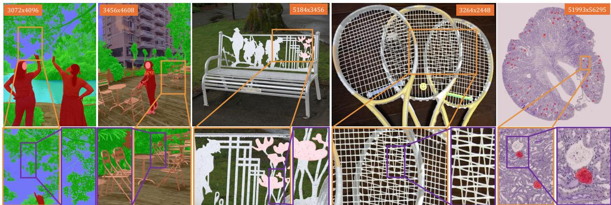  
Figure 1. Segmentation results by COORDFORMER on MaSS13K [59] (left), DIS5K [39] (center) and KPIS [16] (right). COORDFORMER predicts labels directly at selected pixel locations, enabling highly detailed segmentation of very-high-resolution images. This design allows COORDFORMER to capture thin structures and fine boundaries.

## Abstract

Semantic segmentation on very-high-resolution images remains challenging due to the high computational cost and the difficulty ofcapturingfine-grained details. We propose COORDFORMER, a novel coordinate-based architecturefor semantic segmentation that predicts labels at arbitrary spatial locations through a Coordinate Decoder equipped with a Localized Cross-Attention mechanism. The decoder combines coordinate embeddings with high-resolution local patch features and interacts with global tokens extracted from a downsampled image processed by a ViTfoundation encoder, enabling rich semantic context while preserving pixel-level precision. This design enables flexible inference at arbitrary resolutions while keeping memory low on veryhigh-resolution inputs, and supports an efficient semanticedge-focused strategy that concentrates computation along boundaries, maintaining fine-grained accuracy while reducing latency and computational cost. COORDFORMER achieves state-of-the-art performance on MaSS13K and outperforms comparably sized and higher-parameter methods on DIS5K and KPIs, demonstrating its effectivenessfor highquality, very-high-resolution semantic segmentation.

## 1. Introduction

Semantic Segmentation (SS) is a core problem in computer vision that aims to assign a semantic label to every pixel in an image, enabling dense understanding of visual scenes. Recent years have witnessed remarkable progress in SS, largely driven by deep learning techniques [33]. Most existing SS models, however, are designed and evaluated on standardresolution datasets, typically around 1 megapixel [6, 10, 60]. Although several methods have explored high-resolution semantic segmentation [2, 29, 55], they are usually developed based on benchmarks such as Cityscapes [13] and ADE20K [70], where average image resolutions range from 1 to 4 megapixels and annotated masks exhibit limited structural complexity. Consequently, these approaches tend to overlook the challenges of very-high-resolution segmentation (> 4 Mpx) and often fail to capture thin structures or fine-grained details accurately, as highlighted in [59]. However, achieving finely detailed segmentation on very-high-resolution images is critical for numerous real-world applications, including image editing, augmented reality, and high-impact domains such as medical image analysis. To systematically study the problem, MaSS13K [59] was introduced at CVPR 2025 as a benchmark specifically designed to reveal the limitations of existing models in fine-grained, very-high-resolution semantic segmentation. Along with it, MaSSFormer [59] was proposed as an initial attempt to address the task and serve as a strong baseline for future research. Motivated by these findings, we take a step further and propose a new SS architecture, termed COORDFORMER, capable of addressing the challenging scenario set forth by MaSS13K. At its core lies a Coordinate Decoder [36, 46] equipped with a tailored Localized Cross-Attention mechanism. The decoder includes two complementary components: an MLP that pro cesses spatial coordinates, and a ViT-style patch embedder that operates on small patches extracted from high-resolution images. Together, these modules generate coordinate-aware query tokens enriched with pixel-level, high-resolution de tails. These query tokens interact, through the proposed Localized Cross-Attention, with global tokens derived from a downsampled version of the entire image, which is processed by a Vision Transformer foundation model such as DINOv3 [45]. This interaction results in highly contextualized tokens, rich in semantic information while remaining aware of the fine-grained details present in the input image, enabling precise labeling at the queried spatial coordinates. Our novel framework offers several advantages. First, the coordinate-based strategy allows to predict labels only for a few selected pixels during inference, such as a particular region of interest, or to flexibly set the output resolution according to the target application. Consequently, our design allows explicit control over the computational cost at inference time, making it possible to choose the optimal trade-off between accuracy, efficiency, and memory constraints. This property stands in stark contrast to previous methods such as MaSSFormer [59], which require processing the entire input image and thus incur significant memory and computational overhead when handling very-high-resolution data. Indeed, MaSSFormer resizes all images to a fixed 12.6 Mpx resolution during inference, highlighting its limited flexibility in dealing with varying image scales. Furthermore, by leveraging the coordinate-based formulation, we introduce an efficient inference strategy. This approach focuses computation along semantic boundaries reducing inference time, while maintaining high accuracy on thin structures and fine details. Second, our coordinate-based decoding strategy, when coupled with a strong pre-trained foundation encoder, enables extremely precise predictions at the full very-high-resolution of the input images, as illustrated in Fig. 1. When evaluated on the challenging, finely detailed, very-high-resolution semantic segmentation task introduced by MaSS13K, COORDFORMER achieves state-of-the-art performance, surpassing existing approaches by a substantial margin. To further assess the precision of our predictions, we also evaluate COORDFORMER on the Dichotomous Image Segmentation (DIS) benchmark, DIS5K [39], where it outperforms both models of comparable size and higherparameter ones, confirming its effectiveness in capturing fine-grained details. We additionally evaluate our method on the Kidney Pathology Image Segmentation benchmark (KPIS [16]), where it surpasses recent task-specific networks [17, 49] under the protocol [17]. This result confirms that our method transfers to a markedly different segmentation domain, even on the gigapixel-scale whole-slide images that characterize KPIS. The code is publicly available on GitHub. The main contributions of this paper are:

• A novel Coordinate Decoder for very-high-resolution semantic segmentation, capable of producing highly detailed, spatially precise predictions.

• A new Localized Cross-Attention mechanism tailored to our coordinate-based framework, enabling efficient integration of local and global information.

• An efficient inference strategy, enabled by our coordinatebased formulation, that concentrates computation along semantic boundaries, dramatically reducing latency and cost while preserving accuracy.

• We achieve state-of-the-art performance on MaSS13K and superior results on DIS5K and KPIS, demonstrating the generality of our method

## 2. Related Works

Semantic Segmentation. Early deep learning models tackled the semantic segmentation task with Fully Convolutional Networks (FCNs) [32], with notable examples including UNet [41], PSPNet [66], and DeepLab [3–6], among others [14]. The introduction of transformers [18] and attention mechanisms [51] has reshaped the field, enabling models like Swin Transformer [30], DPT [40], SegFormer [60], Mask-Former [9], and SegNext [21] to capture long-range dependencies and multi-scale context. Recent universal segmentation models such as Mask2Former [10] further exemplify the impact of attention-based designs. A critical component of these models is the decoder, which reconstructs dense predictions from encoded features. UNet [41] introduced skip connections; DeepLabv3+ [6] used atrous convolution; Seg-Former employed a lightweight MLP decoder; Mask2Former combined pixel and transformer decoders. In this work, we propose a novel Coordinate Decoder with Localized Cross-Attention that enables finely-detailed semantic predictions with controlled latency and memory consumption.

High-resolution Semantic Segmentation. Handling highresolution images remains a major challenge in semantic segmentation due to high computational and memory demands. Several methods have been proposed to address this task, either by explicitly targeting high-resolution processing [2, 7, 20, 23, 29, 31, 38, 42, 55, 64], or by focusing on general efficiency [22, 34, 44, 47, 52, 61, 62, 67], thereby enabling high-resolution inference under standard hardware constraints. Beyond resource efficiency, high-resolution segmentation demands precise delineation of fine structures. Refinement strategies [11, 25, 43, 63, 68] and edge-aware techniques [27, 53] can improve output sharpness, yet many approaches still underperform in very-high-resolution settings – partly due to limited resolution of most dataset (e.g., 2-4 Mpx) and the lack of finely-detailed annotations. Recent, coordinate-based refiners [25, 68] operate on coordinates, but require a dense segmentor and correct its output; differently, our method predicts labels directly at arbitrary coordinates. To foster research on very-high resolution image understanding, a recent semantic segmentation benchmark has been proposed, MaSS13K [59], together with a taskspecific baseline, MaSSFormer. Other segmentation tasks in which boundary precision is essential are Image Matting and Dichotomous Image Segmentation (DIS). Methods for these tasks [37, 39, 69, 71] are typically precise on boundaries, yet do not focus on capturing high-level semantic concepts, as the objective is limited to foreground-background separation without semantic classification. Regarding very-highresolution segmentation, the medical community introduced KPIS [16] at MICCAI 2024. It is a histopathology dataset for glomeruli segmentation in gigapixel-scale images. Although recent methods [17, 49] address this task, they are incapable of boundary-based inference, remaining fully dense. In this work, we introduce a novel framework capable of producing detailed predictions on very high-resolution inputs for both semantic and dichotomous image segmentation.

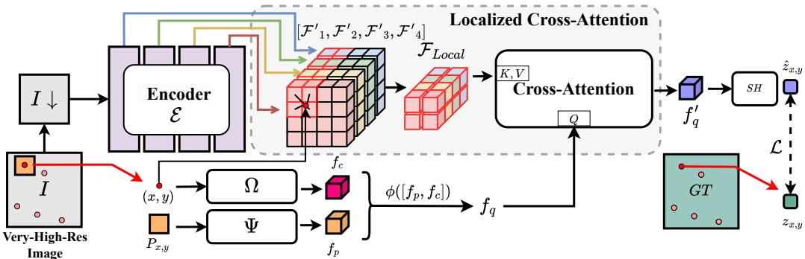  
Figure 2. COORDFORMER Architecture and Training Overview. Given a very-high-resolution image (> 4Mpx), a ViT-based foundation encoder, $\varepsilon ,$ extracts globally contextualized tokens from a downsampled input, while a Coordinate Decoder builds coordinate-aware query features, $f _ { q } ,$ from local high-resolution patches, $P _ { x , y }$ , and pixel coordinates, $( x , y )$ . These queries interact with nearby global tokens through Localized Cross-Attention obtaining features, $f _ { q } ^ { \prime }$ rich in both semantics and fine-details. These are passed to a Segmentation Head (SH) to predict class logits, $\hat { z } _ { x , y } ,$ at the queried locations. During training, pixel and label information is sampled from random coordinates of images and ground truths, and the network is optimized with multi-class Cross-entropy, per-class Dice and per-class Cross-entropy losses.

Attention Mechanisms. Attention mechanisms have gained traction in computer vision following their deployment in Transformers [51]. Vision Transformer (ViT) applied self-attention to image patches for global context modeling [18], while DETR employed cross-attention to align object queries with image features [1]. Deformable DETR improved efficiency via sparse, content-adaptive attention [72], and Axial-DeepLab factorized attention along spatial axes to reduce complexity [54]. Swin Transformer introduced window-based attention with shifted windows for hierarchical representations [30], and MaskFormer proposed masked attention to focus decoding within predicted regions [9]. Recently, SegNeXt revisited convolutional attention, fusing efficiency and spatial priors with attention-driven modeling [21]. In this work, we propose a Localized Cross-Attention layer specifically designed for our coordinate decoder.

## 3. Method

We address the problem of very-high-resolution semantic segmentation, where the goal is to assign a semantic label to every pixel of a high-resolution input image. Formally, given an image $I \in \mathbf { \mathbb { R } } ^ { H \times W \times 3 }$ , the objective is to learn a function, $f _ { \theta } ^ { - } : \mathbb { R } ^ { H \times W \times 3 }  \mathbb { R } ^ { H \times W \times K }$ , that assigns a probability distribution over the label set of K classes, to each pixel $( x , y ) \in I .$ . Unlike conventional approaches that produce dense predictions for all pixels simultaneously, our method, named COORDFORMER, adopts a coordinate-based formulation that allows querying arbitrary spatial locations at inference time. Specifically, given an input coordinate

$$
( x , y ) \in [ 0 , W - 1 ] \times [ 0 , H - 1 ] ,\tag{1}
$$

our model predicts the semantic logit as $\hat { z } _ { x , y } = f _ { \theta } ( I , ( x , \bar { y } ) ) \in \mathbb { R } ^ { K }$ . This formulation provides flexible control over output resolution, computational cost, latency and memory consumption, while enabling precise segmentation results. An overview of the architecture and training of COORDFORMER is shown in Fig. 2.

## 3.1. Architecture

Encoder. The encoder is responsible for extracting globally-contextualized semantic representations from the input image. Given the very-high resolution of the data, directly processing the image at its native scale would be computationally prohibitive. To address this, the input image

I is first downsampled to a manageable resolution $I ^ { \downarrow }$ of size $\begin{array}{c} H ^ { \downarrow } \times W ^ { \downarrow } ( H ^ { \downarrow } = \mathbf { \bar { \begin{array} { l } { } \end{array} } \end{array} } W ^ { \downarrow } \in \{ 2 0 4 8 , \mathbf { \bar { 2 } 0 4 4 } \}$ in our experiments), which is then processed by a powerful Vision Transformer (ViT) foundation model:

$$
\{ \mathcal { F } _ { i } \} _ { i = 1 } ^ { 4 } = \mathcal { E } ( I ^ { \downarrow } )\tag{2}
$$

where E denotes the encoder $( \mathrm { e . g . }$ ., DINOv3 [45]), and $\{ \mathcal { F } _ { i } \} _ { i = 1 } ^ { 4 }$ are feature maps of dimensions $h \times w \times c _ { e }$ from four different transformer blocks. Here, $h = H ^ { \downarrow } / p _ { e }$ and $w = W ^ { \downarrow } / p _ { e }$ correspond to the spatial resolution of the feature maps given the encoder patch size $p _ { e } .$ , and $c _ { e }$ denotes the number of feature channels. Each global feature map ${ \mathcal { F } } _ { i }$ projected to a lower dimensional channel space, $c _ { l } = c _ { e } / 4$ obtaining $\mathcal { F ^ { \prime } } _ { i }$ . For each spatial position, the tokens from these layers are concatenated to a single, rich representation:

$$
\mathcal { F } _ { g } = [ \mathcal { F } ^ { \prime } _ { 1 } , \mathcal { F } ^ { \prime } _ { 2 } , \mathcal { F } ^ { \prime } _ { 3 } , \mathcal { F } ^ { \prime } _ { 4 } ] \in \mathbb { R } ^ { h \times w \times 4 c _ { l } } .\tag{3}
$$

In the feature map, $\mathcal { F } _ { g }$ , each token encodes semantic information associated with a specific image location at multiple levels of abstraction. These globally-contextualized tokens provide a context-aware representation of the scene, serving as the semantic foundation for the subsequent coordinatebased decoding stage.

Coordinate Decoder. The Coordinate Decoder predicts the semantic logit at a specific spatial location of the original high-resolution image I by building a coordinate-aware query from the input coordinate and its local high-resolution patch. This query token is subsequently used in the Localized Cross-Attention (LCA) module to interact with the global tokens produced by the encoder, effectively combining fine local information with global semantic context. Formally, given an input query coordinate $( x , y )$ , we extract a small image patch $P _ { x , y } ,$ of size $p \times p ( p = 8 $ in our experiments), whose top-left corner is aligned with this position, from the high-resolution image I. This patch is processed by a lightweight MLP patch embedder, Ψ, to produce a compact feature vector encoding local texture and boundary details:

$$
f _ { p } = \Psi ( P _ { x , y } ) , \quad \Psi : \mathbb { R } ^ { 3 p ^ { 2 } } \to \mathbb { R } ^ { d _ { p } } ,\tag{4}
$$

In parallel, the 2D coordinate $( x , y )$ is normalized to the range [0, 1] and transformed to Fourier-feature embeddings [48] by Ω, that maps the spatial position into a frequency embedding space:

$$
f _ { c } = \Omega ( x , y ) , \quad \Omega : \mathbb { R } ^ { 2 } \to \mathbb { R } ^ { d _ { c } } ,\tag{5}
$$

The resulting patch feature and coordinate embedding are concatenated and projected through a sequence of linear layers with ReLU, ϕ to form a coordinate-aware query token:

$$
\begin{array} { r } { f _ { q } = \phi ( [ f _ { p } , f _ { c } ] ) , \quad \phi : \mathbb { R } ^ { d _ { p } + d _ { c } } \to \mathbb { R } ^ { c _ { q } } , } \end{array}\tag{6}
$$

which encodes both pixel-level high-frequency details and precise spatial awareness.

Localized Cross-Attention. The LCA module performs a cross-attention operation that allows the coordinate-aware query token $f _ { q }$ to interact with a small subset of encoder representations corresponding to its spatial neighborhood, so as to keep computational cost low. Given the query coordinate $( x , y )$ in the high-resolution image space, we first map it to the coordinate system of the encoder feature map, which has been downsampled both by the input resizing and by the encoder patching operation. Let $s _ { H } = H / H ^ { \downarrow }$ and $s _ { W } = W / W ^ { \downarrow }$ denote the spatial scaling factors between the original image and the encoder input, along the vertical and horizontal axes respectively, and let $p _ { \epsilon }$ denote the encoder patch size, the corresponding location $( x ^ { \downarrow } , y ^ { \downarrow } )$ in the feature map is computed as

$$
( x ^ { \downarrow } , y ^ { \downarrow } ) = \left( { \frac { x } { s _ { W } \cdot p _ { e } } } , { \frac { y } { s _ { H } \cdot p _ { e } } } \right) ,\tag{7}
$$

which accounts for both the input downsampling and the encoder’s patch resolution. We project the input coordinate $( x , y )$ onto the downsampled token grid $\mathcal { F } _ { g } .$ , obtaining $( x ^ { \downarrow } , \dot { y } ^ { \downarrow } )$ . We then extract a local neighborhood of k tokens around $( x ^ { \downarrow } , y ^ { \downarrow } )$ via bilinear sampling on $\mathcal { F } _ { g }$ (implemented with grid sample), yielding a local set $\mathcal { F } _ { \mathrm { l o c a l } }$ of size k. In our implementation we sample $k = 4$ local features corresponding to a $2 \times 2$ neighborhood around $( x ^ { \downarrow } , y ^ { \downarrow } )$ . A Cross-Attention (CA) operation is then applied between the coordinate-aware query token $f _ { q }$ and the sampled local encoder tokens $\mathcal { F } _ { \mathrm { l o c a l } }$ (serving as keys and values):

$$
f _ { q } ^ { \prime } = \mathrm { C A } ( f _ { q } , \mathcal { F } _ { \mathrm { l o c a l } } )\tag{8}
$$

where $f _ { q } ^ { \prime }$ denotes the refined query token enriched with global semantic context. This LCA module drastically reduces computational complexity, which becomes linear in k rather than in the total number of global tokens. Despite the restriction to a small neighborhood, we observe no loss in segmentation quality, as the encoder tokens are highly contextualized and rich in semantic information.

Segmentation Head. The refined query feature $f _ { q } ^ { \prime }$ produced by the LCA module is passed through a lightweight Segmentation Head (SH) to obtain the class logits associated with the queried coordinate. The SH is implemented as a small MLP with a Batch-Norm layer that maps the contextualized feature into the semantic space of K classes:

$$
\begin{array} { r } { \hat { z } _ { x , y } = \mathrm { S H } ( f _ { q } ^ { \prime } ) , \quad \mathrm { S H } : \mathbb { R } ^ { c _ { q } }  \mathbb { R } ^ { K } , } \end{array}\tag{9}
$$

where $\hat { z } _ { x , y }$ denotes the predicted logits for coordinate $( x , y )$

## 3.2. Training

During training, we supervise the model by randomly sampling coordinates $( x , y )$ from the high-resolution image domain of size $H \times W$ . For each sampled coordinate, the corresponding local patch is extracted, processed by the encoder–decoder architecture, and passed through SH to obtain the class logits $\hat { z } _ { x , y } \in \mathbb { R } ^ { K }$ . The prediction at each queried coordinate is supervised with a weighted combination of the standard Multi-class Cross-Entropy (CE) loss , K class-specific Binary Dice (D) and Binary Cross-Entropy (BCE) losses computed over the individual logit maps. The overall loss is defined as

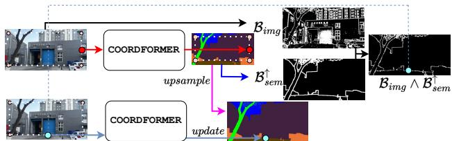  
Figure 3. Semantic-Edge-Focused Inference Overview

$$
\begin{array} { r } { \displaystyle \mathcal { L } = \lambda _ { \mathrm { C E } } \mathcal { L } _ { \mathrm { C E } } + \frac { 1 } { K } { \displaystyle \sum _ { k = 1 } ^ { K } } ( \lambda _ { \mathrm { D } } \mathcal { L } _ { \mathrm { D } } ^ { k } + \lambda _ { \mathrm { B C E } } \mathcal { L } _ { \mathrm { B C E } } ^ { k } ) } \end{array}\tag{10}
$$

where $\mathcal { L } _ { \mathrm { C E } } ~ = ~ L _ { \mathrm { C E } } ( \hat { z } _ { x , y } , z _ { x , y } ) , ~ \mathcal { L } _ { \mathrm { D } } ^ { k } ~ = ~ L _ { \mathrm { D } } ( \hat { z } _ { x , y } ^ { k } , z _ { x , y } ^ { k } ) .$ $\mathcal { L } _ { \mathrm { B C E } } ^ { k } = L _ { \mathrm { B C E } } ( \hat { z } _ { x , y } ^ { k } , z _ { x , y } ^ { k } ) , z _ { x , y }$ denote the ground truth class at location $( x , y )$ , and $\lambda _ { \mathrm { C E } } , \lambda _ { \mathrm { D } }$ , and $\lambda _ { \mathrm { B C E } }$ are scalar weights that balance the loss terms. This formulation encourages both accurate pixel-level classification through the Cross-Entropy loss and sharp, well-defined segmentation boundaries through the Dice loss component. The training optimizes encoder, decoder, and SH parameters using AdamW optimizer with learning rate $1 e ^ { - 4 }$ . The model has been trained on 4 A100 for approximately 170 epochs (with early stopping), using a batch size of 16 MaSS13K images [59] and sampling 16,384 random coordinates per image.

## 3.3. Inference

Coordinate-based Inference. Our framework supports flexible inference by predicting labels only at queried spatial coordinates (Fig. 2) combined with corresponding high resolution patch, rather than producing a dense segmentation map in a single forward pass. Given a set of query coordinates $\{ ( x _ { i } , \bar { y _ { i } } ) \} _ { i = 1 } ^ { N }$ , each coordinate and the corresponding patch are independently processed by COORDFORMER to obtain its corresponding class logits $\hat { z } _ { i }$ and consequently the label as $a r g m a x ( \hat { z } _ { i } )$ . This design offers control over the trade-off between accuracy, efficiency, and memory usage. Dense predictions can be obtained by querying all pixels, while sparse ones can be produced by sampling only a subset of coordinates, allowing the model to adapt its computational load to different applications and hardware constraints.

Semantic-Edge-Focused Inference. To further improve efficiency, we introduce a Semantic-Edge-Focused Inference (SEFI) strategy, shown in Fig. 3, that concentrates computation along thin semantic boundaries. The procedure operates as follows. First, we sample coordinates with a fixed stride s (set to 8 in our experiments) and predict a coarse segmentation map. From this coarse prediction, we extract a binary semantic boundary map, $\boldsymbol { B } _ { \mathrm { s e m } }$ , where a pixel is assigned value 1 if it has at least one adjacent pixel which is predicted with a different semantic label. To increase robustness to segmentation errors, we also dilate the map by a square kernel of size r. Since these boundaries are coarse, we also compute a binary image boundary map, $B _ { \mathrm { i m g } } ,$ , by applying a Sobel filter and thresholding to the RGB image, $I ,$ obtaining edges that better fits structural details but include both semantic and non-semantic contours. To retain only structural semantic boundaries, we perform a pixel-wise logical AND between the upsampled semantic boundary map, $\bar { B } _ { \mathrm { s e m } } ^ { \uparrow }$ (resized to $H \times W )$ , and the Sobel boundary map:

$$
B = B _ { \mathrm { s e m } } ^ { \uparrow } \land B _ { \mathrm { i m g } } .\tag{11}
$$

The resulting binary mask, B, better highlights semantic boundaries. To obtain the full resolution prediction, we first upsample the coarse segmentation map, then compute predictions at the coordinates corresponding to the refined semantic boundaries. Finally, we update values at boundary locations in the coarse segmentation mask. This strategy, enabled by our coordinate-based design, substantially reduces the pixels, required to achieve sharp and accurate dense segmentations. Additional inference protocols (e.g., region-of-interest querying) are described in the supplementary material (Sec. A4).

## 4. Experimental Results

## 4.1. Very-High-Resolution Segmentation

Results on MaSS13K. We evaluate our method on MaSS13K [59], a very-high-resolution benchmark for high-quality semantic segmentation, and report results in Tab. 1a. MaSS13K contains 13,348 real-world images, most at 12Mpx resolution, split into 11,348/500/1,500 train/validation/test samples. The dataset provides highquality masks for seven categories (human, vegetation, ground, sky, water, building, and others) and is characterized by exceptionally high annotation complexity - on average 20×–50× higher than standard segmentation benchmarks. The benchmark primarily assesses general segmentation performance using mIoU, and the fine-grained precision of predictions using BIoU, and BF1 scores. As shown in Tab. 1a, our method with SEFI achieves state-of-the-art performance on both the validation and test sets, demonstrating a strong ability to recover fine-grained details in very-high-resolution scenarios. Improvements are particularly pronounced on boundary-focused metrics such as BIoU and BF1, which are most indicative of performance on thin structures and detailed edges. We emphasize that COORDFORMER achieves remarkable gains in boundary metrics with fewer parameters than MaSSFormer, further demonstrating the effectiveness of the proposed coordinate-based architecture. Qualitative results in Fig. 1 and Fig. 4 highlight the effectiveness of our method in preserving complex structural details.

<table><tr><td rowspan="2">Methods</td><td rowspan="2">Backbone</td><td colspan="3">MaSS-val (500)</td><td colspan="3">MaSS-test (1,500)</td><td colspan="2">Model Stat.</td></tr><tr><td>mIoU↑</td><td>BIoU↑</td><td>BF1↑</td><td>mIoU↑</td><td>BIoU↑</td><td>BF1↑</td><td>Param</td><td>MACs</td></tr><tr><td>BiSeNetv2 [62]</td><td></td><td>71.55</td><td>25.05</td><td>.3182</td><td>72.92</td><td>24.48</td><td>.3171</td><td>3.35M</td><td>591 G</td></tr><tr><td>SegNeXt [21]</td><td>MSCAN-B</td><td>87.71</td><td>39.93</td><td>.4615</td><td>88.11</td><td>39.45</td><td>.4596</td><td>27.57M</td><td>1536 G</td></tr><tr><td>PIDNet-L [61]</td><td></td><td>82.28</td><td>31.30</td><td>3475</td><td>81.77</td><td>30.70</td><td>.3479</td><td>37.08M</td><td>1653 G</td></tr><tr><td>FeedFormer [44]</td><td>lvt</td><td>87.17</td><td>42.06</td><td>.4838</td><td>86.56</td><td>41.07</td><td>.4789</td><td>4.65M</td><td>300 G</td></tr><tr><td>SeaFormer-L [52]</td><td>一</td><td>86.78</td><td>38.61</td><td>.4498</td><td>87.36</td><td>38.28</td><td>.4489</td><td>13.95M</td><td>303 G</td></tr><tr><td>DeepLabv3+ [6]</td><td>R50</td><td>86.66</td><td>40.08</td><td>.4718</td><td>85.14</td><td>38.65</td><td>.4678</td><td>41.22M</td><td>8008 G</td></tr><tr><td>UPerNet [58]</td><td>R50</td><td>82.03</td><td>35.85</td><td>.4181</td><td>81.98</td><td>35.61</td><td>.4170</td><td>64.04M</td><td>11373 G</td></tr><tr><td>MaskFormer [9]</td><td>R50</td><td>83.27</td><td>38.61</td><td>.4399</td><td>83.22</td><td>37.90</td><td>.4393</td><td>41.31M</td><td>2396 G</td></tr><tr><td>Mask2Former [10]</td><td>R50</td><td>88.28</td><td>47.40</td><td>.5458</td><td>88.00</td><td>46.13</td><td>.5330</td><td>44.01M</td><td>3123 G</td></tr><tr><td>MPFormer [65]</td><td>R50</td><td>87.76</td><td>47.81</td><td>.5513</td><td>87.18</td><td>47.17</td><td>.5486</td><td>43.9M</td><td>4155 G</td></tr><tr><td>PEM [2]</td><td>R50</td><td>83.41</td><td>40.51</td><td>.4675</td><td>83.38</td><td>39.99</td><td>.4644</td><td>35.5M</td><td>1859 G</td></tr><tr><td>MaSSFormer-Lite [59]</td><td>R18</td><td>87.11</td><td>45.35</td><td>.5137</td><td>86.13</td><td>43.28</td><td>.5086</td><td>15.07M</td><td>771 G</td></tr><tr><td>MaSSFormer [59]</td><td>R50</td><td>88.97</td><td>48.97</td><td>.5639</td><td>88.21</td><td>48.39</td><td>5593</td><td>37.42M</td><td>2036 G</td></tr><tr><td>COORDFORMER</td><td>DINOv3-S+</td><td>92.53</td><td>53.24</td><td>.5965</td><td>92.30</td><td>52.40</td><td>.5916</td><td>29.92M</td><td>6430* G</td></tr></table>

(a) MaSS13K Results.
<table><tr><td rowspan="2">Methods</td><td colspan="6">DIS-TE (1–4) (2,000)</td><td colspan="6">DIS-VD (470)</td><td rowspan="2">Params</td><td rowspan="2">(M)</td></tr><tr><td>F ↑</td><td>F↑</td><td>M↓</td><td>Sm↑</td><td>Em ↑</td><td>HCEγ↓</td><td>F↑</td><td>F w ↑</td><td>M↓</td><td>Sm↑</td><td>Em ↑</td><td>HCEγ↓</td></tr><tr><td>PSPNet [66]</td><td>.710</td><td>.620</td><td>.095</td><td>.755</td><td>.819</td><td>1442</td><td>.691</td><td>.603</td><td>.102</td><td>.744</td><td>.802</td><td>1588</td><td></td><td>-</td></tr><tr><td>DeepLabv3+ [6]</td><td>.678</td><td>.584</td><td>.105</td><td>.729</td><td>.810</td><td>1365</td><td></td><td>.660</td><td>.568</td><td>.114</td><td>.716</td><td>.796</td><td>1520</td><td>41</td></tr><tr><td>HRNet [55]</td><td>.743</td><td>.658</td><td>.087</td><td>.781</td><td>.840</td><td>1432</td><td></td><td>.726</td><td>.641</td><td>.095</td><td>.767</td><td>.824</td><td>1560</td><td></td></tr><tr><td>ICNet [67]</td><td>.711</td><td>.622</td><td>.095</td><td>.758</td><td>.825</td><td>1359</td><td>.697</td><td></td><td>.609</td><td>.102</td><td>.747</td><td>.811</td><td>1503</td><td></td></tr><tr><td>MBV3 [22]</td><td>.729</td><td>.658</td><td>.085</td><td>.770</td><td>.850</td><td>1457</td><td></td><td>.714</td><td>.642</td><td>.092</td><td>.758</td><td>.841</td><td>1625</td><td></td></tr><tr><td>STDC2 [19]</td><td>.710</td><td>.628</td><td>.094</td><td>.754</td><td>.832</td><td>1426</td><td></td><td>.696</td><td>.613</td><td>.103</td><td>.740</td><td>.817</td><td>1598</td><td></td></tr><tr><td>IS-Net [39]</td><td>.799</td><td>.726</td><td>.070</td><td>.819</td><td>.858</td><td>1016</td><td></td><td>.791</td><td>.717</td><td>.074</td><td>.813</td><td>.856</td><td>1116</td><td>44</td></tr><tr><td>FP-DIS [71]</td><td>.831</td><td>.770</td><td>.047</td><td>.847</td><td>.895</td><td>1165</td><td></td><td>.823</td><td>.763</td><td>.062</td><td>.843</td><td>.891</td><td>1309</td><td>-</td></tr><tr><td>UDUN [37]</td><td>.831</td><td>.772</td><td>.057</td><td>.844</td><td>.892</td><td>977</td><td></td><td>.823 .763</td><td></td><td>.059</td><td>.838</td><td>.892</td><td>1097</td><td>25</td></tr><tr><td>BiRefNetswinT [69]</td><td>.866</td><td>.822</td><td>.045</td><td>.877</td><td>.916</td><td>980</td><td></td><td>.862</td><td>.819</td><td>.045</td><td>.874</td><td>.917</td><td>1070</td><td>39</td></tr><tr><td>BiRefNetswinB [69]</td><td>.891</td><td>.855</td><td>.036</td><td>.898</td><td>.933</td><td>954</td><td>.881</td><td>.844</td><td></td><td>.039</td><td>.890</td><td>.925</td><td>1029</td><td>101</td></tr><tr><td>BiRefNetswint. [69]</td><td>.896</td><td>.858</td><td>.035</td><td>.901</td><td>.934</td><td>916</td><td></td><td>.891 .854</td><td></td><td>.038</td><td>.898</td><td>.931</td><td>989</td><td>215</td></tr><tr><td>COORDFORMER</td><td>.899</td><td>.876</td><td>.032</td><td>.900</td><td>.940</td><td>806</td><td></td><td>.898</td><td>.879</td><td>.032</td><td>.902</td><td>.942</td><td>787</td><td>30</td></tr></table>

(b) DIS5K Results.
<table><tr><td>Methods</td><td>Input size</td><td>DSC↑</td></tr><tr><td>U-Net** [41]</td><td>512×512</td><td>0.5499</td></tr><tr><td>SAM-ViT-H** [26]</td><td>1024×1024</td><td>0.7724</td></tr><tr><td>HoloHisto-4K** [49]</td><td>3840×2160</td><td>0.8454</td></tr><tr><td>MuViT[1,8]+UNETR**</td><td>2×512×512</td><td>0.8958</td></tr><tr><td>COORDFORMER</td><td>2048×2048</td><td>0.9178</td></tr></table>

(c) KPIS (test set) Results.  
Table 1. Very-High-Resolution Segmentation Results on MaSS13K [59] (a) DIS5K [39] (b) and KPIS (c) . “↑” (“↓”) means higher (lower) is better. \*MACs averaged over the dataset. \*\* indicates the score was taken from [17]. Best , Second-Best

Results on DIS5K. We also evaluate COORDFORMER on DIS5K [39], a benchmark for high-precision Dichotomous Image Segmentation (train/val/test: 3,000/470/2,000), and report results in Tab. 1b. Despite not being tailored to the DIS task, COORDFORMER achieves superior performance on nearly all metrics—except $S _ { m }$ in the test set relative to BiRefNet with swinL —outperforming more parameterintensive methods and clearly surpasses approaches of similar size. In particular, compared to BiRefNet (swinT) our model gets significant improvements across all the metrics, highlighting the generality of our coordinate-based design outside the semantic segmentation setting.

Results on KPIS. On the KPIS challenge (Task 2, WSIlevel diseased glomeruli segmentation), which features gigapixel images (train/val/test: 30/8/12), COORDFORMER achieves 0.9178 DSC, surpassing MuViT [17] (Tab. 1c) under the same inference protocol. This shows that our method extends to the gigapixel medical domain, confirming its applicability across diverse very-high-resolution scenarios.

## 4.2. Computational Analysis

COORDFORMER Inference time and Memory footprint. The computational cost of COORDFORMER (i.e., with SEFI), depends on the number of semantic-edge pixels processed at inference. Hence, in Tab. 1a we report MACs averaged over the images of MaSS13K. Note that the MaSS13K paper [59] contains a typo: the reported values are MACs (as counted by fvcore1), not FLOPs, since fused multiply–accumulate is counted as a single operation. On average, our method uses more MACs than competing methods. However, unlike standard dense decoders, COORDFORMER allows explicit control over memory occupancy and latency: the number of processed coordinates can be freely adjusted to match the desired trade-off between accuracy, latency, and hardware constraints. In memory- or compute-constrained platforms, inference can be performed in small coordinate batches (down to pixel-by-pixel), substantially reducing GPU memory occupancy, albeit at the cost of increased inference time due to reduced parallelism. Conversely, in time-constrained applications, processing of large coordinate batches can be parallelized across cores and devices to minimize latency. Peculiarly, COORDFORMER can compute an extremely high resolution output without the need to store a dense fullresolution feature map, since it does not require processing the full-resolution image in a single forward pass. In order to assess their practical computational costs, we compare COORDFORMER and MaSSFormer in terms of GPU memory footprint (left) and inference time (right), in Fig. 5. For our method, we consider COORDFORMER, i.e. the default configuration with SEFI, and COORDFORMER dense, where all the coordinates within the image are processed (i.e., without SEFI). With both configurations, we evaluate multiple inference settings by varying the number of coordinates processed per batch (1k and 50k). All experiments are performed on a single NVIDIA A6000 GPU with 48 GB, and at three resolutions: 8, 12, and 64 Mpx. In terms of memory, COORDFORMER scales gracefully with image resolution, thanks to its coordinate-based inference strategy. Contrarily, MaSSFormer requires resizing images to 4096 × 3072 to handle very high-resolution inputs. COORDFORMER and COORDFORMER dense show no difference in memory requirements, since during inference we still need to keep only a single coordinate batch (1k, 50k) in VRAM (the red and green curves overlap, as do the yellow and purple ones). MaSSFormer requires way more memory than our models, and its official implementation yields an out-of-memory (OOM) error at 64 Mpx. COORDFORMER and COORDFORMER dense, instead, can successfully handle all input resolutions in the considered datasets, without any OOM, and with memory consumption primarily determined by the coordinate batch size. Regarding inference time, COORDFORMER is faster than MaSSFormer with the largest coordinate batches (50k), and comparable with 1k coordinate batches. In particular, COORDFORMER takes $\sim \frac { 1 } { 3 }$ of MaSSFormer’s inference time up to 12 Mpx (e.g., 520 vs. 1847 ms with 8 Mpx, 730 vs. 2635 ms with 12 Mpx) and, unlike MaSSFormer, can process also 64 Mpx inputs. COORDFORMER dense is slower, yet, despite the way higher MACs, thanks to the parallelization, the runtime remains in the same order of magnitude as MaSSFormer (e.g., 4480 vs. 2635 ms, CoordFormer dense vs. MaSSFormer at 12 Mpx). Importantly, COORDFORMER dense achieves the best performance overall (see row 3 of Tab. 2). Further increasing the coordinate batch size on the hardware specified above does not yield additional gains, as CUDA core saturation prevents further parallelism. Overall, these results show that MACs alone may not provide a clear picture when comparing the practical computational efficiency of different methods: although our method entails more MACs than competing approaches, its coordinate-based formulation enables effective parallelization and avoids common bottlenecks (e.g., memory-bandwidth limits, kernel-launch overheads, and poor parallelization), resulting in lower latency and smaller memory footprint in practice, achieving fast inference (> 1 fps up to 12 Mpx) with affordable memory usage on consumer-level GPUs.

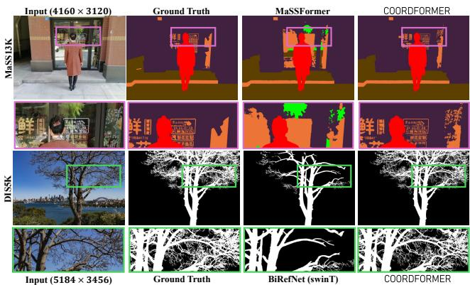  
Figure 4. Qualitative comparisons to main competitors on MaSS13K (top) and DIS5K (Bottom).

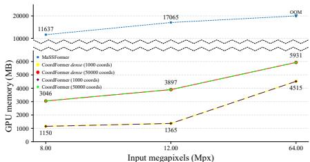

(a) GPU memory vs input Mpx  
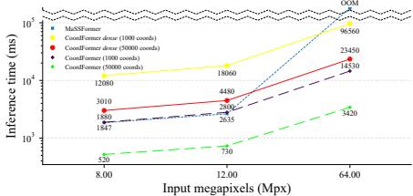  
(b) Inference time vs input Mpx  
Figure 5. GPU Memory footprint (a) and Inference Times (b) of COORDFORMER, COORDFORMER dense (no SEFI) and MaSSFormer. GPU memory footprint (a) and inference time (b) are evaluated at input resolutions of 8, 12, and 64 Mpx, with COORDFORMER tested using coordinate batch of 1k and 50k.

<table><tr><td rowspan="2">Methods</td><td rowspan="2">Decoder Attention</td><td rowspan="2">Bsem</td><td rowspan="2">Inference</td><td colspan="3">MaSS-val (500)</td><td rowspan="2">Model Params</td><td rowspan="2">Total MACs</td><td rowspan="2">Encoder MACs</td><td rowspan="2">Decoder MACs</td><td rowspan="2">Decoder MACs (1 coord)</td><td rowspan="2">Coord Usage %</td></tr><tr><td>Bimg</td><td>mloU↑ BIoU↑</td><td>BFI↑</td></tr><tr><td>DINOv3 [45] + SH</td><td></td><td>x</td><td>x</td><td>90.09</td><td>28.72</td><td>.3507</td><td>28.70M</td><td>2960 G</td><td>2950 G</td><td>10 G</td><td></td><td></td></tr><tr><td>COORDFORMER</td><td>CA</td><td>x</td><td>x</td><td>92.17</td><td>52.82</td><td>.5889</td><td>29.92M</td><td>168270 G</td><td>2950 G</td><td>165320 G</td><td>4.847 G</td><td>100</td></tr><tr><td>COORDFORMER</td><td>LCA</td><td>x</td><td>x</td><td>92.62</td><td>54.51</td><td>.6074</td><td>29.92M</td><td>26990 G</td><td>2950 G</td><td>24040 G</td><td>.002 G</td><td>100</td></tr><tr><td>COORDFORMER</td><td>CA</td><td>√</td><td>√</td><td>92.12</td><td>51.87</td><td>.5817</td><td>29.92M</td><td>27160 G</td><td>2950 G</td><td>24210 G</td><td>4.847 G</td><td>14</td></tr><tr><td>COORDFORMER</td><td>LCA</td><td>√</td><td>x</td><td>92.59</td><td>53.92</td><td>.6043</td><td>29.92M</td><td>7360 G</td><td>2950 G</td><td>4410 G</td><td>.002 G</td><td>18</td></tr><tr><td>COORDFORMER</td><td>LCA</td><td>√</td><td>√</td><td>92.53</td><td>53.24</td><td>.5965</td><td>29.92M</td><td>6430 G</td><td>2950 G</td><td>3480 G</td><td>.002 G</td><td>14</td></tr></table>

Table 2. Contributions ablations on MaSS13K[59]. SH: Segmentation Head. CA: Cross-Attention. LCA: Localized Cross-Attention. “↑” means higher is better. Best , Second-Best

## 4.3. Ablation studies

Main Contributions Ablations. Table 2 reports the main contributions of COORDFORMER. In the first row, we evaluate a baseline semantic segmentation model obtained by equipping DINOv3 [45] with the simple Segmentation Head (SH). This model processes images resized to 2048 × 2048, as COORDFORMER, but the results on MaSS13K reveal that while it effectively captures semantic information, it struggles to produce precise segmentations. Specifically, it achieves high mIoU of 90.09 but low BIoU of 28.72, highlighting limited boundary accuracy. If we compare the firs row with all other rows, that include the Coordinate-Decoder, we note a substantial improvement across all metrics, particularly in boundary scores (BIoU and BF1), confirming the benefits of the coordinate-based design for very-high resolution high-quality segmentation. While MACs may be an inaccurate proxy for computational efficiency across different methods—which can exhibit varying degrees of inherent parallelism—they remain meaningful within these ablations, where we vary only the number of attended tokens/coordinates within our own method. Comparing the performance of the second and third row, we can appreciate the benefits on efficiency and boundary metrics when using LCA rather than a simple Cross-Attention. LCA requires far fewer MACs than standard CA when processing a single coordinate (0.002 G vs. 4.847 G) and substantially lower tota MACs over the full image, while achieving higher boundary scores (BIoU 54.51 vs. 52.82, BF1 0.6074 vs. 0.5889). We conjecture that LCA outperforms CA because CA forces the model to suppress irrelevant distant tokens that diffuse attention away from geometrically relevant context—as in Deformable DETR [72], where sparse local attention matched or exceeded its global counterpart. Additionally, since DINO tokens already encode scene-level semantics globally, a few localized tokens may suffice to retrieve the relevant information. Moreover, We note that when processing 100% of coordinates our model achieves the best performance, yet with large computational overhead. By observing the last 4 rows, we can analyze the benefits of using the proposed SEFI strategy. First, by introducing coarse Semantic Edges, $\boldsymbol { B } _ { s e m }$ , we can achieve a significant decrease in tota MACs (3rd vs 5th rows: from 26990G to 7360G). By employing also the image edges, $B _ { i m g }$ to obtain thin semantic

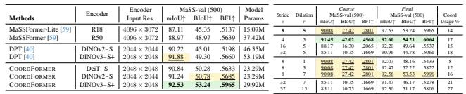  
(a) Decoder Analysis  
(b) SEFI Analysis.  
Table 3. COORDFORMER Decoder Analysis (a) on MaSS13K [59] and SEFI analysis (b). “↑” means higher is better. Best ,

## Second-Best

edges we can decrease MACs even more (5th vs last row: 7360G to 6430G), with marginal decrease in performance. In summary, the semantic-edge inference protocol reduces the number of used coordinates from 100% to 14% while preserving precision, substantially improving efficiency at negligible cost to performance. Overall, these results prove that our method can achieve remarkable performance on very-high-resolution segmentation while remaining efficient by focusing computation where it is most needed.

COORDFORMER Decoder Contribution Analysis. One could argue that COORDFORMER’s performance gains stem primarily from its foundational backbone rather than its architectural design. To isolate the impact of our coordinatebased decoder, we attempted to integrate DINOv3/v2 backbones into competing methods for a fair comparison. However, architectures such as MaSSFormer are specifically tailored for Very-High-Resolution (VHR) data and are not natively compatible with standard foundational ViT encoders. Furthermore, simply introducing a DINO backbone is infeasible in the VHR regime due to prohibitive memory and computational overhead. In contrast, COORDFORMER seamlessly integrates any ViT backbone because its coordinate decoder is fully decoupled from the encoder, making the use of foundation models both natural and efficient. A standard approach for employing foundational encoders in segmentation is to pair them with general dense-prediction decoders, such as DPT [40]. Accordingly, we trained DINOv3-S+ [45] and DINOv2-S [35] (with registers [15]) using a DPT decoder on MaSS13K, with results reported in Tab. 3a (rows 3 and 4). In these experiments, the input resolution is similar to COORDFORMER (∼ 2048 × 2048); however, we note that larger inputs would be infeasible due to DPT’s memory constraints. When comparing these DPT-based results to COORDFORMER using the same backbones (last two rows of Tab. 3a), COORDFORMER achieves significantly higher BIoU and BF1 scores. Remarkably, it does so while requiring nearly half the parameters. This result underscores the importance of our coordinate-based formulation, regardless of the backbone employed. Finally, we investigate the versatility of the proposed COORDFORMER decoder across other pre-trained backbones. We evaluate our coordinate-based decoder when paired with several encoders: DeiT-S [50], DINOv2-S with registers, and DINOv3-S+ (last three rows of Tab. 3a). Our method performs best with strong foundation models, achieving state-of-the-art results with both the DINOv2-S and DINOv3-S+ encoders. Notably, it still surpasses prior methods on most metrics even with weaker backbones pretrained on ImageNet-1k, such as DeiT-S. Overall, these results show that our coordinate-based design is both key to performance and broadly applicable.

SEFI Analysis. In Table 3b we report experimental results that investigates the gain provided by the Final inference relatively to the initial Coarse segmentation and the impact of changing hyperparameters (stride s and dilation radius r) in SEFI. In general, increasing the coarse stride s reduces coordinate density and degrades boundary alignment. For instance, increasing the stride from 8 to 32 substantially degrades the coarse prediction, reducing BIoU to 39% of the baseline (10.75 vs. 27.42). This degradation propagates to the final output, whose BIoU drops to 84% of the baseline (44.78 vs. 53.24). These results show that the quality of the coarse segmentation impacts final performance. However, our coordinate-based approach allows increasing the dilation to compensate for less accurate coarse maps. Indeed, with stride 32, increasing the dilation to 15 recovers performance, with results slightly below our default setting, still achieving state-of-the-art. Finally, decreasing the stride to s = 4, with respect to our default setting (s = 8), yields further improvements at the cost of processing more coordinates.

## 5. Final Discussion

Limitations. We note that COORDFORMER can be highly efficient when the hardware provides adequate parallel compute resources (e.g., GPUs with sufficient CUDA cores). On the other hand, when we cannot parallelize computation our method requires to sequentially process coordinates, leading to high inference time. Nevertheless, our method is currently the only one capable of achieving high-quality very-highresolution segmentations in memory-constraint scenarios.

Conclusions. We presented COORDFORMER, a coordinate-based framework for very-high-resolution semantic segmentation that combines pixel-level detail with strong global context via a Coordinate Decoder and a Localized Cross-Attention mechanism. This formulation enables precise, flexible, and computationally controllable inference, allowing segmentation at arbitrary resolutions, within regions of interest, or along thin semantic boundaries. Future extensions include applying our coordinate-based design to instance and panoptic segmentation, and exploring dense prediction tasks such as depth estimation or image inpainting, where inference can be restricted to task-relevant pixels. We believe these directions highlight the broader potential of coordinate-driven designs for very-high-resolution vision tasks and hope it will inspire further research.

## Acknowledgments

We acknowledge the CINECA award under the ISCRA initiative, for the availability of high-performance computing resources and support.

## References

[1] Nicolas Carion, Francisco Massa, Gabriel Synnaeve, Nicolas Usunier, Alexander Kirillov, and Sergey Zagoruyko. End-toend object detection with transformers. In European conference on computer vision, pages 213–229. Springer, 2020.

[2] Niccolo Cavagnero, Gabriele Rosi, Claudia Cuttano, Francesca Pistilli, Marco Ciccone, Giuseppe Averta, and Fabio Cermelli. Pem: Prototype-based efficient maskformer for image segmentation. In Proceedings of the IEEE/CVF conference on computer vision and pattern recognition, pages 15804–15813, 2024.

[3] Liang-Chieh Chen, George Papandreou, Iasonas Kokkinos, Kevin Murphy, and Alan L Yuille. Deeplab: Semantic image segmentation with deep convolutional nets, atrous convolution, and fully connected crfs. IEEE transactions on pattern analysis and machine intelligence, 40(4):834–848, 2017.

[4] Liang-Chieh Chen, George Papandreou, Florian Schroff, and Hartwig Adam. Rethinking atrous convolution for semantic image segmentation. arXiv preprint arXiv:1706.05587, 2017.

[5] Liang-Chieh Chen, George Papandreou, Iasonas Kokkinos, Kevin Murphy, and Alan L. Yuille. Deeplab: Semantic image segmentation with deep convolutional nets, atrous convolution, and fully connected crfs. IEEE Transactions on Pattern Analysis and Machine Intelligence, 40(4):834–848, 2018.

[6] Liang-Chieh Chen, Yukun Zhu, George Papandreou, Florian Schroff, and Hartwig Adam. Encoder-decoder with atrous separable convolution for semantic image segmentation. In Proceedings of the European conference on computer vision (ECCV), pages 801–818, 2018.

[7] Wuyang Chen, Ziyu Jiang, Zhangyang Wang, Kexin Cui, and Xiaoning Qian. Collaborative global-local networks for memory-efficient segmentation of ultra-high resolution images. In Proceedings ofthe IEEE/CVF conference on computer vision and pattern recognition, pages 8924–8933, 2019.

[8] Zhe Chen, Yuchen Duan, Wenhai Wang, Junjun He, Tong Lu, Jifeng Dai, and Yu Qiao. Vision transformer adapter for dense predictions. In The Eleventh International Conference on Learning Representations, 2023.

[9] Bowen Cheng, Alex Schwing, and Alexander Kirillov. Perpixel classification is not all you need for semantic segmentation. Advances in neural information processing systems, 34: 17864–17875, 2021.

[10] Bowen Cheng, Ishan Misra, Alexander G Schwing, Alexander Kirillov, and Rohit Girdhar. Masked-attention mask transformer for universal image segmentation. In Proceedings of the IEEE/CVF conference on computer vision and pattern recognition, pages 1290–1299, 2022.

[11] Ho Kei Cheng, Jihoon Chung, Yu-Wing Tai, and Chi-Keung Tang. Cascadepsp: Toward class-agnostic and very highresolution segmentation via global and local refinement. In Proceedings of the IEEE/CVF conference on computer vision and pattern recognition, pages 8890–8899, 2020.

[12] Xiangxiang Chu, Zhi Tian, Yuqing Wang, Bo Zhang, Haibing Ren, Xiaolin Wei, Huaxia Xia, and Chunhua Shen. Twins: Revisiting the design of spatial attention in vision transformers. NeurIPS, 34, 2021.

[13] Marius Cordts, Mohamed Omran, Sebastian Ramos, Timo Rehfeld, Markus Enzweiler, Rodrigo Benenson, Uwe Franke, Stefan Roth, and Bernt Schiele. The cityscapes dataset for semantic urban scene understanding. In Proceedings of the IEEE conference on computer vision and pattern recognition, pages 3213–3223, 2016.

[14] Gabriela Csurka, Riccardo Volpi, Boris Chidlovskii, et al. Semantic image segmentation: Two decades of research. Foundations and Trends® in Computer Graphics and Vision, 14 (1-2):1–162, 2022.

[15] Timothee Darcet, Maxime Oquab, Julien Mairal, and Piotr Bo-´ janowski. Vision transformers need registers. In The Twelfth International Conference on Learning Representations, 2024.

[16] Ruining Deng, Tianyuan Yao, Yucheng Tang, Junlin Guo, Siqi Lu, Juming Xiong, Lining Yu, et al. Kpis 2024 challenge: Advancing glomerular segmentation from patch- to slide-level. Medical Image Analysis, 2025.

[17] Albert Dominguez Mantes, Gioele La Manno, and Martin Weigert. Muvit: Multi-resolution vision transformers for learning across scales in microscopy. In Proceedings of the IEEE/CVF Conference on Computer Vision and Pattern Recognition (CVPR), 2026.

[18] Alexey Dosovitskiy, Lucas Beyer, Alexander Kolesnikov, Dirk Weissenborn, Xiaohua Zhai, Thomas Unterthiner, Mostafa Dehghani, Matthias Minderer, Georg Heigold, Sylvain Gelly, Jakob Uszkoreit, and Neil Houlsby. An image is worth 16x16 words: Transformers for image recognition at scale. In International Conference on Learning Representations, 2021.

[19] Mingyuan Fan, Shenqi Lai, Junshi Huang, Xiaoming Wei, Zhenhua Chai, Junfeng Luo, and Xiaolin Wei. Rethinking bisenet for real-time semantic segmentation. In Proceedings of the IEEE/CVF conference on computer vision and pattern recognition, pages 9716–9725, 2021.

[20] Jiaqi Gu, Hyoukjun Kwon, Dilin Wang, Wei Ye, Meng Li, Yu-Hsin Chen, Liangzhen Lai, Vikas Chandra, and David Z Pan. Multi-scale high-resolution vision transformer for semantic segmentation. In Proceedings of the IEEE/CVF conference on computer vision and pattern recognition, pages 12094–12103, 2022.

[21] Meng-Hao Guo, Cheng-Ze Lu, Qibin Hou, Zhengning Liu, Ming-Ming Cheng, and Shi-Min Hu. Segnext: Rethinking convolutional attention design for semantic segmentation. Advances in neural information processing systems, 35:1140– 1156, 2022.

[22] Andrew Howard, Mark Sandler, Grace Chu, Liang-Chieh Chen, Bo Chen, Mingxing Tan, Weijun Wang, Yukun Zhu, Ruoming Pang, Vijay Vasudevan, et al. Searching for mo-

bilenetv3. In Proceedings of the IEEE/CVF international conference on computer vision, pages 1314–1324, 2019.

[23] Lei Ke, Mingqiao Ye, Martin Danelljan, Yu-Wing Tai, Chi-Keung Tang, Fisher Yu, et al. Segment anything in high quality. Advances in Neural Information Processing Systems, 36:29914–29934, 2023.

[24] Alexander Kirillov, Kaiming He, Ross Girshick, Carsten Rother, and Piotr Dollar. Panoptic segmentation. In ´ Proceedings of the IEEE/CVF conference on computer vision and pattern recognition, pages 9404–9413, 2019.

[25] Alexander Kirillov, Yuxin Wu, Kaiming He, and Ross Girshick. Pointrend: Image segmentation as rendering. In Proceedings of the IEEE/CVF conference on computer vision and pattern recognition, pages 9799–9808, 2020.

[26] Alexander Kirillov, Eric Mintun, Nikhila Ravi, Hanzi Mao, Chloe Rolland, Laura Gustafson, Tete Xiao, Spencer Whitehead, Alexander C. Berg, Wan-Yen Lo, Piotr Dollar, and Ross´ Girshick. Segment anything. In Proceedings of the IEEE/CVF International Conference on Computer Vision (ICCV), pages 4015–4026, 2023.

[27] Xiangtai Li, Xia Li, Li Zhang, Guangliang Cheng, Jianping Shi, Zhouchen Lin, Shaohua Tan, and Yunhai Tong. Improving semantic segmentation via decoupled body and edge supervision. In European Conference on Computer Vision, pages 435–452. Springer, 2020.

[28] Yanghao Li, Saining Xie, Xinlei Chen, Piotr Dollar, Kaiming He, and Ross Girshick. Benchmarking detection transfer learning with vision transformers. arXiv preprint arXiv:2111.11429, 2021.

[29] Guosheng Lin, Anton Milan, Chunhua Shen, and Ian Reid. Refinenet: Multi-path refinement networks for highresolution semantic segmentation. In Proceedings of the IEEE Conference on Computer Vision and Pattern Recognition (CVPR), 2017.

[30] Ze Liu, Yutong Lin, Yue Cao, Han Hu, Yixuan Wei, Zheng Zhang, Stephen Lin, and Baining Guo. Swin transformer: Hierarchical vision transformer using shifted windows. In Proceedings of the IEEE/CVF international conference on computer vision, pages 10012–10022, 2021.

[31] Zhijian Liu, Zhuoyang Zhang, Samir Khaki, Shang Yang, Haotian Tang, Chenfeng Xu, Kurt Keutzer, and Song Han. Sparse refinement for efficient high-resolution semantic segmentation. In European Conference on Computer Vision, pages 108–127. Springer, 2024.

[32] Jonathan Long, Evan Shelhamer, and Trevor Darrell. Fully convolutional networks for semantic segmentation. In Proceedings of the IEEE conference on computer vision and pattern recognition, pages 3431–3440, 2015.

[33] Shervin Minaee, Yuri Boykov, Fatih Porikli, Antonio Plaza, Nasser Kehtarnavaz, and Demetri Terzopoulos. Image segmentation using deep learning: A survey. IEEE transactions on pattern analysis and machine intelligence, 44(7):3523– 3542, 2021.

[34] Zhenliang Ni, Xinghao Chen, Yingjie Zhai, Yehui Tang, and Yunhe Wang. Context-guided spatial feature reconstruction for efficient semantic segmentation. In European Conference on Computer Vision, pages 239–255. Springer, 2024.

[35] Maxime Oquab, Timothee Darcet, Th´ eo Moutakanni, Huy V´ Vo, Marc Szafraniec, Vasil Khalidov, Pierre Fernandez, Daniel HAZIZA, Francisco Massa, Alaaeldin El-Nouby, et al. Dinov2: Learning robust visual features without supervision. Transactions on Machine Learning Research, 2024.

[36] Jeong Joon Park, Peter Florence, Julian Straub, Richard Newcombe, and Steven Lovegrove. Deepsdf: Learning continuous signed distance functions for shape representation. In Proceedings ofthe IEEE/CVF conference on computer vision and pattern recognition, pages 165–174, 2019.

[37] Jialun Pei, Zhangjun Zhou, Yueming Jin, He Tang, and Pheng-Ann Heng. Unite-divide-unite: Joint boosting trunk and structure for high-accuracy dichotomous image segmentation. In Proceedings of the 31st ACM International Conference on Multimedia, pages 2139–2147, 2023.

[38] Lu Qi, Jason Kuen, Tiancheng Shen, Jiuxiang Gu, Wenbo Li, Weidong Guo, Jiaya Jia, Zhe Lin, and Ming-Hsuan Yang. High quality entity segmentation. In 2023 IEEE/CVF International Conference on Computer Vision (ICCV), pages 4024–4033. IEEE, 2023.

[39] Xuebin Qin, Hang Dai, Xiaobin Hu, Deng-Ping Fan, Ling Shao, and Luc Van Gool. Highly accurate dichotomous image segmentation. In European Conference on Computer Vision, pages 38–56. Springer, 2022.

[40] Rene Ranftl, Alexey Bochkovskiy, and Vladlen Koltun. Vi-´ sion transformers for dense prediction. In Proceedings of the IEEE/CVF international conference on computer vision, pages 12179–12188, 2021.

[41] Olaf Ronneberger, Philipp Fischer, and Thomas Brox. U-net: Convolutional networks for biomedical image segmentation. In International Conference on Medical image computing and computer-assisted intervention, pages 234–241. Springer, 2015.

[42] Lianlei Shan, Minglong Li, Xiaobin Li, Yang Bai, Ke Lv, Bin Luo, Si-Bao Chen, and Weiqiang Wang. Uhrsnet: A semantic segmentation network specifically for ultra-high-resolution images. In 2020 25th International Conference on Pattern Recognition (ICPR), pages 1460–1466. IEEE, 2021.

[43] Tiancheng Shen, Yuechen Zhang, Lu Qi, Jason Kuen, Xingyu Xie, Jianlong Wu, Zhe Lin, and Jiaya Jia. High quality segmentation for ultra high-resolution images. In Proceedings ofthe IEEE/CVF conference on computer vision and pattern recognition, pages 1310–1319, 2022.

[44] Jae-hun Shim, Hyunwoo Yu, Kyeongbo Kong, and Suk-Ju Kang. Feedformer: Revisiting transformer decoder for efficient semantic segmentation. In Proceedings of the AAAI conference on artificial intelligence, pages 2263–2271, 2023.

[45] Oriane Simeoni, Huy V Vo, Maximilian Seitzer, Federico´ Baldassarre, Maxime Oquab, Cijo Jose, Vasil Khalidov, Marc Szafraniec, Seungeun Yi, Michael Ramamonjisoa, et al. Di-¨ nov3. arXiv preprint arXiv:2508.10104, 2025.

[46] Vincent Sitzmann, Julien Martel, Alexander Bergman, David Lindell, and Gordon Wetzstein. Implicit neural representations with periodic activation functions. Advances in neural information processing systems, 33:7462–7473, 2020.

[47] Towaki Takikawa, David Acuna, Varun Jampani, and Sanja Fidler. Gated-scnn: Gated shape cnns for semantic segmenta-

tion. In Proceedings of the IEEE/CVF international conference on computer vision, pages 5229–5238, 2019.

[48] Matthew Tancik, Pratul Srinivasan, Ben Mildenhall, Sara Fridovich-Keil, Nithin Raghavan, Utkarsh Singhal, Ravi Ramamoorthi, Jonathan Barron, and Ren Ng. Fourier features let networks learn high frequency functions in low dimensional domains. Advances in neural information processing systems, 33:7537–7547, 2020.

[49] Yucheng Tang, Yufan He, Vishwesh Nath, Pengfei Guo, Ruining Deng, Tianyuan Yao, Quan Liu, Can Cui, Mengmeng Yin, Ziyue Xu, Holger Roth, Daguang Xu, Haichun Yang, and Yuankai Huo. Holohisto: End-to-end gigapixel wsi segmentation with 4k resolution sequential tokenization. arXiv preprint arXiv:2407.03307, 2024.

[50] Hugo Touvron, Matthieu Cord, and Herve J ´ egou. Deit iii:´ Revenge of the vit. In Computer Vision – ECCV 2022: 17th European Conference, Tel Aviv, Israel, October 23–27, 2022, Proceedings, Part XXIV, page 516–533, Berlin, Heidelberg, 2022. Springer-Verlag.

[51] Ashish Vaswani, Noam Shazeer, Niki Parmar, Jakob Uszkoreit, Llion Jones, Aidan N Gomez, Łukasz Kaiser, and Illia Polosukhin. Attention is all you need. Advances in neural information processing systems, 30, 2017.

[52] Qiang Wan, Zilong Huang, Jiachen Lu, Gang Yu, and Li Zhang. Seaformer++: Squeeze-enhanced axial transformer for mobile visual recognition. International Journal ofComputer Vision, 133(6):3645–3666, 2025.

[53] Chi Wang, Yunke Zhang, Miaomiao Cui, Peiran Ren, Yin Yang, Xuansong Xie, Xian-Sheng Hua, Hujun Bao, and Weiwei Xu. Active boundary loss for semantic segmentation. In Proceedings of the AAAI conference on artificial intelligence, pages 2397–2405, 2022.

[54] Huiyu Wang, Yukun Zhu, Bradley Green, Hartwig Adam, Alan Yuille, and Liang-Chieh Chen. Axial-deeplab: Standalone axial-attention for panoptic segmentation. In European conference on computer vision, pages 108–126. Springer, 2020.

[55] Jingdong Wang, Ke Sun, Tianheng Cheng, Borui Jiang, Chaorui Deng, Yang Zhao, Dong Liu, Yadong Mu, Mingkui Tan, Xinggang Wang, et al. Deep high-resolution representation learning for visual recognition. IEEE transactions on pattern analysis and machine intelligence, 43(10):3349–3364, 2020.

[56] Wenhai Wang, Enze Xie, Xiang Li, Deng-Ping Fan, Kaitao Song, Ding Liang, Tong Lu, Ping Luo, and Ling Shao. Pyramid vision transformer: A versatile backbone for dense prediction without convolutions. In ICCV, pages 568–578, 2021.

[57] Wenhai Wang, Enze Xie, Xiang Li, Deng-Ping Fan, Kaitao Song, Ding Liang, Tong Lu, Ping Luo, and Ling Shao. Pvtv2: Improved baselines with pyramid vision transformer. CVMJ, pages 1–10, 2022.

[58] Tete Xiao, Yingcheng Liu, Bolei Zhou, Yuning Jiang, and Jian Sun. Unified perceptual parsing for scene understanding. In Proceedings ofthe European conference on computer vision (ECCV), pages 418–434, 2018.

[59] Chenxi Xie, Minghan Li, Hui Zeng, Jun Luo, and Lei Zhang. Mass13k: A matting-level semantic segmentation benchmark.

In Proceedings of the IEEE/CVF Conference on Computer Vision and Pattern Recognition (CVPR), 2025.

[60] Enze Xie, Wenhai Wang, Zhiding Yu, Anima Anandkumar, Jose M Alvarez, and Ping Luo. Segformer: Simple and efficient design for semantic segmentation with transformers. Advances in neural informationprocessing systems, 34:12077– 12090, 2021.

[61] Jiacong Xu, Zixiang Xiong, and Shankar P Bhattacharyya. Pidnet: A real-time semantic segmentation network inspired by pid controllers. In Proceedings of the IEEE/CVF conference on computer vision and pattern recognition, pages 19529–19539, 2023.

[62] Changqian Yu, Changxin Gao, Jingbo Wang, Gang Yu, Chunhua Shen, and Nong Sang. Bisenet v2: Bilateral network with guided aggregation for real-time semantic segmentation. Internationaljournal ofcomputer vision, 129(11):3051–3068, 2021.

[63] Yuhui Yuan, Jingyi Xie, Xilin Chen, and Jingdong Wang. Segfix: Model-agnostic boundary refinement for segmentation. In European conference on computer vision, pages 489–506. Springer, 2020.

[64] Yuhui Yuan, Rao Fu, Lang Huang, Weihong Lin, Chao Zhang, Xilin Chen, and Jingdong Wang. Hrformer: high-resolution transformer for dense prediction. In Proceedings ofthe 35th International Conference on Neural Information Processing Systems, pages 7281–7293, 2021.

[65] Hao Zhang, Feng Li, Huaizhe Xu, Shijia Huang, Shilong Liu, Lionel M Ni, and Lei Zhang. Mp-former: Mask-piloted transformer for image segmentation. In Proceedings of the IEEE/CVF Conference on Computer Vision and Pattern Recognition, pages 18074–18083, 2023.

[66] Hengshuang Zhao, Jianping Shi, Xiaojuan Qi, Xiaogang Wang, and Jiaya Jia. Pyramid scene parsing network. In Proceedings ofthe IEEE conference on computer vision and pattern recognition, pages 2881–2890, 2017.

[67] Hengshuang Zhao, Xiaojuan Qi, Xiaoyong Shen, Jianping Shi, and Jiaya Jia. Icnet for real-time semantic segmentation on high-resolution images. In Proceedings ofthe European conference on computer vision (ECCV), pages 405–420, 2018.

[68] Ziyu Zhao, Xiaoguang Li, Pingping Cai, Canyu Zhang, and Song Wang. Leveraging adaptive implicit representation mapping for ultra high-resolution image segmentation. In European Conference on Computer Vision (ECCV). Springer, 2024.

[69] Peng Zheng, Dehong Gao, Deng-Ping Fan, Li Liu, Jorma Laaksonen, Wanli Ouyang, and Nicu Sebe. Bilateral reference for high-resolution dichotomous image segmentation. CoRR, 2024.

[70] Bolei Zhou, Hang Zhao, Xavier Puig, Sanja Fidler, Adela Barriuso, and Antonio Torralba. Scene parsing through ade20k dataset. In Proceedings ofthe IEEE conference on computer vision and pattern recognition, pages 633–641, 2017.

[71] Yan Zhou, Bo Dong, Yuanfeng Wu, Wentao Zhu, Geng Chen, and Yanning Zhang. Dichotomous image segmentation with frequency priors. In IJCAI, pages 1822–1830, 2023.

[72] Xizhou Zhu, Weijie Su, Lewei Lu, Bin Li, Xiaogang Wang, and Jifeng Dai. Deformable {detr}: Deformable transformers

for end-to-end object detection. In International Conference on Learning Representations, 2021.

# COORDFORMER: Give Me Any Coordinates and I Will Give You Labels

# Supplementary Material

In this supplementary material we provide additional analyses and details of COORDFORMER. In particular, the document is organized as follows:

• Sec. A1. We report additional ablation experiments. Specifically, we analyze how varying the encoder input resolution affects performance and computational cost, we measure the performance gains obtained with a highercapacity backbone, and we isolate the contribution of each query component.

• Sec. A2. We analyze the annotation quality of a legacy semantic segmentation benchmark (ADE20K [70]) compared to MaSS13K [59], and show how COORDFORMER performs when annotations are less precise.

• Sec. A3. To ensure reproducibility, we present a comprehensive overview of the implementation details, including training protocol, optimization hyperparameters, and details on the MACs calculations.

• Sec. A4. We provide additional details on the inference protocols enabled by COORDFORMER.

• Sec. A5. We provide qualitative results on MaSS13K, DIS5K [39] and KPIS [16].

• Sec. A6. We present qualitative failure cases of our method on MaSS13K[59] and DIS5K[39].

## A1. Additional ablation experiments

## A1.1. Ablation on the Encoder Input

The ablation in Tab. A1 examines how the input resolution of the encoder, $H ^ { \downarrow } \times W ^ { \downarrow }$ , affects accuracy and computational cost on MaSS13K. In the first two rows, we study the effect of increasing the input resolution of DINOv3 in the baseline configuration that uses only the Segmentation Head (SH) on top of the encoder. Specifically, we raise the input resolution to the maximum allowed by our hardware (i.e., 3072 × 2304) while keeping all training settings unchanged. Increasing the resolution from 2048 × 2048 to 3072 × 2304 yields only modest gains – especially on boundary metrics (BIoU: 28.72 → 32.48, BF1: 0.3507 → 0.3948) – while almost tripling the total cost (2960G → 7850G MACs). This increase comes almost entirely from the encoder (2950G → 7840G MACs), as the SH is extremely lightweight. The last rows report results for COORDFORMER using encoder inputs of $1 0 2 4 \times 1 0 2 4$ and $2 0 4 8 \times 2 0 4 8$ . Unlike DINOv3 + SH, COORDFORMER already delivers strong boundary performance when the encoder processes only 1024 × 1024 images (91.16 mIoU, 48.83 BIoU, 0.5477 BF1) with a total cost of 3720G MACs. Increasing the encoder resolution to 2048 × 2048 leads to clear improvements across all metrics – particularly on boundaries (mIoU +1.37, BIoU +4.41, BF1 +0.0488) – while increasing the total cost from 3720G to 6430G MACs (about 1.7×). Crucially, this additional cost is almost entirely absorbed by the encoder (270G → 2950G), whereas the decoder remains roughly constant (∼3.4T MACs) thanks to the Coordinate Decoder computational cost being decoupled from the encoder’s input size.

<table><tr><td>Methods</td><td>Encoder Input Res.</td><td>MaSS-val (500) mIoU↑</td><td>BIoU↑</td><td>BF1↑</td><td>Model Params</td><td>Total MACs</td><td>Encoder MACs</td><td>Decoder MACs</td></tr><tr><td>DINOv3 [45] + SH</td><td>2048 × 2048</td><td>90.09</td><td>28.72</td><td>.3507</td><td>28.70M</td><td>2960 G</td><td>2950 G</td><td>10 G</td></tr><tr><td>DINOv3 [45] + SH</td><td> $3 0 7 2 \times 2 3 0 4$ </td><td>90.36</td><td>32.48</td><td>.3948</td><td>28.70M</td><td>7850 G</td><td>7840 G</td><td>10 G</td></tr><tr><td>COORDFORMER</td><td> $\overline { { 1 0 2 4 \times 1 0 2 4 } }$ </td><td>91.16</td><td>48.83</td><td>.5477</td><td>29.92M</td><td>3720 G</td><td>270 G</td><td>3450 G</td></tr><tr><td>COORDFORMER</td><td> $2 0 4 8 \times 2 0 4 8$ </td><td>92.53</td><td>53.24</td><td>.5965</td><td>29.92M</td><td>6430 G</td><td>2950 G</td><td>3480 G</td></tr></table>

Table A1. Analysis on the Encoder Input Size on MaSS13K[59]. “↑” means higher is better. Best , Second-Best

<table><tr><td></td><td></td><td colspan="3">MaSS-val (500)</td><td colspan="3">MaSS-test (1,500)</td><td>Stat.</td></tr><tr><td>Methods</td><td>Backbone</td><td>mIoU↑</td><td>BIoU↑</td><td>BF1↑</td><td>mIoU↑</td><td>BIoU↑</td><td>BF1↑</td><td>Param.</td></tr><tr><td>MaSSFormer-Lite [59]</td><td>R18</td><td>87.11</td><td>45.35</td><td>.5137</td><td>86.13</td><td>43.28</td><td>.5086</td><td>15.07M</td></tr><tr><td>MaSSFormer [59]</td><td>R50</td><td>88.97</td><td>48.97</td><td>.5639</td><td>88.21</td><td>48.39</td><td>.5593</td><td>37.42M</td></tr><tr><td>COORDFORMER</td><td>DINOv3-S+</td><td>92.53</td><td>53.24</td><td>.5965</td><td>92.30</td><td>52.40</td><td>.5916</td><td>29.92M</td></tr><tr><td>COORDFORMER-B</td><td>DINOv3-B</td><td>92.59</td><td>54.65</td><td>.6163</td><td>92.68</td><td>54.10</td><td>.6109</td><td>90.38M</td></tr></table>

Table A2. Analysis on the Encoder Capacity on MaSS13K [59]. “↑” means higher is better. Best , Second-Best

## A1.2. Ablation on the Encoder Capacity

We investigate how the capacity of the encoder affects the quality of our predictions. Starting from our default configuration, which builds on DINOv3-S+, we replace the backbone with the deeper DINOv3-B and train the model under the same protocol, denoting this variant COORDFORMER-B. Tab. A2 reports the results on both the MaSS-val and MaSStest splits of MaSS13K [59]. The deeper backbone yields consistent improvements across all metrics. On MaSS-test, COORDFORMER-B improves the mIoU by 0.38 points over our default model, while the boundary-aware metrics benefit substantially more, with BIoU rising by 1.70 points and BF1 by 1.9 points. The same trend holds on MaSS-val. This asymmetry is informative: the region-level mIoU is already close to saturation in our default configuration, so the additional encoder capacity translates primarily into sharper, more accurate object boundaries rather than into coarse region accuracy. This is consistent with the design of our method, whose contribution is concentrated precisely at the boundaries. It is also worth noting that even our default DINOv3-S+ model already surpasses MaSSFormer [59] by a large margin on every metric while using fewer parameters (29.92M against 37.42M), and COORDFORMER-B further widens this gap at the cost of a roughly threefold increase in parameters (90.38M). The deeper variant therefore, offers a favorable accuracy–complexity trade-off when boundary fidelity is the priority, whereas the default configuration remains the most efficient choice for general use.

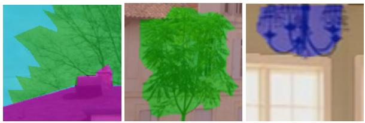  
(a) Groundtruth ADE20K

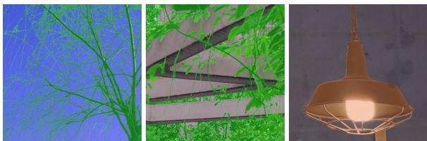  
(b) Groundtruth MaSS13K  
Figure A1. Annotation sharpness comparison: ADE20K [70] (a) vs MaSS13K [59] (b)

<table><tr><td colspan="3"></td><td colspan="3">MaSS-val (500)</td></tr><tr><td>Methods</td><td>fc fp</td><td></td><td>mIoU↑</td><td>BIoU↑</td><td>BF1 ↑</td></tr><tr><td>COORDFORMER</td><td>√</td><td>x</td><td>91.55</td><td>42.75</td><td>49.39</td></tr><tr><td>COORDFORMER</td><td>x</td><td>√</td><td>92.15</td><td>52.97</td><td>59.25</td></tr><tr><td>COORDFORMER</td><td>√</td><td>√</td><td>92.53</td><td>53.24</td><td>59.65</td></tr></table>

Table A3. Query components ablation on MaSS13K [59]. Contribution of the coordinate embedding $f _ { c }$ and the local patch embedding $f _ { p } . \ ^ { \ast \ast } \uparrow ^ { \ast }$ means higher is better.

## A1.3. Ablation on the Query Components

The query fed to our decoder combines a local patch embedding $f _ { p }$ with a coordinate embedding $f _ { c }$ through $\phi ( [ f _ { p } , f _ { c } ] )$ To isolate the contribution of each component, we evaluate three variants: the coordinate embedding alone $( f _ { c } ) _ { \cdot }$ , the patch embedding alone $( f _ { p } )$ , and the full query $( \phi ( [ f _ { p } , f _ { c } ] ) )$ All variants share the same backbone and training protocol, and we report mIoU together with the boundary-sensitive BIoU and BF1 metrics on MaSS13K [59]. Results are shown in Tab. A3. The local patch embedding is the dominant source of information: using $f _ { p }$ alone reaches 52.97 BIoU and 59.25 BF1, far above the 42.75 BIoU and 49.39 BF1 obtained from the coordinate embedding alone. The gap is most pronounced on the boundary metrics, confirming that the high-resolution local appearance captured by $f _ { p }$ is what drives boundary accuracy, whereas the coordinate embedding cannot localize boundaries on its own. The two components are nonetheless complementary: the full query $\phi ( [ f _ { p } , f _ { c } ] )$ achieves the best result across all three metrics (92.53 mIoU, 53.24 BIoU, 59.65 BF1), showing that the coordinate embedding contributes positional information that refines the prediction beyond what local appearance alone provides.

## A2. Evaluation on ADE20K

We choose not to focus on standard semantic segmentation benchmarks such as ADE20K, since they do not provide high-resolution images paired with accurate, fine-grained annotations. This is apparent from Fig. A1, which visually compares the annotations of ADE20K and MaSS13K. For similar objects, the annotation sharpness differs markedly between the two: ADE20K prioritizes covering a large number of classes, whereas MaSS13K emphasizes precise, accurate delineation. Our method is designed to address the challenges of MaSS13K (very-high-resolution images and boundary accuracy) rather than those of ADE20K (mainly large class diversity and scale variation).

<table><tr><td>Methods</td><td>Backbone</td><td>Param.</td><td>mIoU ↑</td></tr><tr><td>Semantic FPN [24]</td><td>PVT-Small [56]</td><td>28.2M</td><td>41.9</td></tr><tr><td>Semantic FPN [24]</td><td>PVTv2-B2 [57]</td><td>29.1M</td><td>45.2</td></tr><tr><td>Semantic FPN [24]</td><td>Swin-T [30]</td><td>31.9M</td><td>41.5</td></tr><tr><td>Semantic FPN [24]</td><td>Twins-SVT-S [12]</td><td>28.3M</td><td>43.2</td></tr><tr><td>Semantic FPN [24]</td><td>ViT-S [28]</td><td>27.8M</td><td>44.6</td></tr><tr><td>UperNet [58]</td><td>DeiT-Adapter-S [8]</td><td>58M</td><td>46.2</td></tr><tr><td>MaskFormer [9]</td><td>Swin-B [30]</td><td>102M</td><td>52.7</td></tr><tr><td>Mask2Former [10]</td><td>Swin-B [30]</td><td>107M</td><td>53.9</td></tr><tr><td>MaskFormer [9]</td><td>Swin-L [30]</td><td>212M</td><td>54.1</td></tr><tr><td>Mask2Former [10]</td><td>Swin-L [30]</td><td>216M</td><td>56.1</td></tr><tr><td>DINOv3 [45] + SH</td><td>DINOv3-S+</td><td>28.7M</td><td>47.7</td></tr><tr><td>COORDFORMER</td><td>DINOv3-S+</td><td>29.9M</td><td>49.7</td></tr><tr><td>COORDFORMER-L</td><td>DINOv3-L</td><td>309M</td><td>57.0</td></tr></table>

Table A4. Semantic segmentation results on ADE20K [70] val. “↑” means higher is better. Best , Second-Best

Nonetheless, we report experiments on ADE20K in Tab. A4, evaluated with the standard mIoU metric. As shown in the table, COORDFORMER reaches 49.7 mIoU with only 29.9M parameters, outperforming all methods built on smallscale (S) backbones—including UPerNet with DeiT-Adapter-S, which uses nearly twice as many parameters (58M)— and trailing only the substantially heavier models equipped with Swin-B and Swin-L backbones. We also evaluate COORDFORMER with a DINOv3-L backbone (last row), which achieves 57.0 mIoU, the highest among all compared methods. These results confirm that, although ADE20K cannot fully reflect the boundary precision COORDFORMER is designed for, our method remains competitive on a benchmark outside its intended setting.

## A3. Additional Implementation Details

COORDFORMER is implemented on top of semantic-segmentation library2 and PyTorch 2.6. We adopt mixed precision training with bfloat16 autocasting. We train the model using the AdamW optimizer with a batch size of 16. The initial learning rate is set to $1 e ^ { - 4 }$ with a weight decay of $1 e ^ { - 4 }$ , and we apply a linear decay schedule after a linear warmup over the first ten epochs. For data augmentation, we use random flipping and random photometric distortion. The number of MACs for all variants of COORDFORMER is computed using the tools provided in PyTorch. We also adopt an early stopping strategy, terminating training when no improvement in the validation metric is observed for several consecutive epochs. The weights for the Cross-Entropy Loss, Binary Dice Loss and Binary Cross-Entropy Loss, $\lambda _ { \mathrm { C E } } , \lambda _ { \mathrm { D } }$ and $\lambda _ { \mathrm { B C E } } ,$ , are set to 2, 5 and 5, respectively. Moreover, in Tab. A5, we report an architecture overview. The encoder tokens $F _ { i }$ are extracted from multiple depths of the transformer encoder $\mathcal { E }$ at regular layer intervals. For instance, DINOv3-S+ has 12 layers, so we take features every three layers (i.e., from four evenly spaced layers). We highlight that Ω allows to obtain Fourier-feature embedding [48] to lift 2D coordinates into a higher-dimensionality. We use 10 frequencies in our implementation. The projection layers, that process $F _ { i }$ to obtain $F _ { i } ^ { \prime } ,$ , reduce the number of channels of the feature map from $c _ { e } = 3 8 4 ~ \mathrm { t o } ~ c _ { l } = 9 6$ The Patch MLP Ψ is implemented as a standard ViT-like patch embedder [18], using one convolutional layer with kernel size 8, stride 8, and $d _ { p } = 3 8 4$ . The block $\phi ,$ is a sequence of linear layer and ReLU activations which projects the concatenation of patch and coordinate tokens to the query dimension $c _ { q } = 3 8 4$ . The Localized Cross-Attention (LCA) layer is implemented as a standard cross-attention block between the coordinate-aware queries and the selected local encoder tokens, omitting the feed-forward network typically applied after the attention operation. The threshold used to obtain B is set to 0.1. Regarding DINOv3 [45], DINOv2[35], DeiT-S [50], and MaSSFormer [59], we used the official codes and weights available online. We also provide the pseudocode for the SEFI technique in Algorithm 1.

<table><tr><td>Stage</td><td>Layer / Operation</td><td>Input → Output</td><td>Description</td></tr><tr><td>Encoder  $( \mathrm { e . g . , D I N O v { 3 - S + } } )$ </td><td>Image downsampling ViT backbone ε Multi-level token concat.</td><td> $I \in \mathbb { R } ^ { H \times W \times 3 } \to I ^ { \downarrow } \in \mathbb { R } ^ { H ^ { \downarrow } \times W ^ { \downarrow } \times 3 }$   $I ^ { \downarrow }  \{ F _ { i } \} _ { i = 1 } ^ { 4 }$   $\{ F _ { i } \} _ { i = 1 } ^ { 4 } \to F _ { g }$ </td><td>Very-high-resolution RGB image is resized (e.g.,  $H ^ { \downarrow } = W ^ { \downarrow } = 2 0 4 8 ) .$  Extract from DINOv3-S+ four  $\breve { F } _ { i } \in \mathbb { R } ^ { h \times w \times \dot { c } _ { e } }$  from transformer blocks After projecting Fi to F concatenate along channels:  $F _ { g } = [ F _ { 1 } ^ { \prime } , F _ { 2 } ^ { \prime } , F _ { 3 } ^ { \prime } , F _ { 4 } ^ { \prime } ] \in \mathbb { R } ^ { h \times w \times 4 c _ { l } }$  Extract a local patch  $P _ { x , y }$  of size  $p \times p \left( p = 8 \right)$  from  $( x , y )$  in the original image.</td></tr><tr><td>Coordinate Decoder</td><td>Patch extraction Patch MLP Ψ frequency transform Ω projection φ</td><td> $( I , ( x , y ) )  P _ { x , y }$   $P _ { x , y }  f _ { p }$   $( x , y ) \to f _ { c }$   $[ f _ { p } , f _ { c } ] \to f _ { q }$ </td><td>Patch embedder Ψ :  $\mathbb { R } ^ { 3 p ^ { 2 } } \to \mathbb { R } ^ { d _ { p } }$  encodes fine details into a patch feature  $f _ { p } .$  Normalize  $( x , y )$  to  $[ 0 , 1 ] ^ { 2 }$  and map with S  $\smash { 2 : \mathbb { R } ^ { 2 } \to \mathbb { R } ^ { d _ { c } } }$  to obtain  $f _ { c } .$  Concatenate  $f _ { p }$  and  $f _ { c }$  and project  $\phi : \mathbb { R } ^ { d _ { p } + d _ { c } }  \mathbb { R } ^ { c _ { q } }$  to form the query  $f _ { q } .$ </td></tr><tr><td>Localized Cross-Attention (LCA)</td><td>Coordinate mapping Local token selection Cross-Attention</td><td> $( x , y ) \to ( x ^ { \downarrow } , y ^ { \downarrow } )$   $( F _ { g } , ( x ^ { \downarrow } , y ^ { \downarrow } ) )  F _ { \mathrm { l o c a l } }$   $( f _ { q } , F _ { \mathrm { l o c a l } } ) \to f _ { q } ^ { \prime }$ </td><td> $\begin{array} { r } { ( x ^ { \downarrow } , y ^ { \downarrow } ) = \biggl ( \frac { x } { s _ { W } p _ { e } } , \frac { y } { s _ { H } p _ { e } } \biggl ) , } \end{array}$  sH, sw are downsampling factors and  $p _ { e }$  is the patch size. Select local neighborhood of  $k = 4$  tokens around  $( x ^ { \downarrow } , y ^ { \downarrow } )$  in  $F _ { g }$  to obtain tokens  $F _ { \mathrm { l o c a l } } .$   $f _ { q }$  as query and  $F _ { \mathrm { l o c a l } }$  as keys/values, refined token  $f _ { q } ^ { \prime }$  with global context.  $\hat { z } _ { x , y } \in \mathbb { R } ^ { K }$ </td></tr><tr><td colspan="4">Segmentation Head MLP head (SH) Table A5. COORDFORMER architecture overview. The table details the subsequent coordinate-based decoding pipeline, from input</td></tr></table>

Table A5. COORDFORMER architecture overview. The table details the subsequent coordinate-based decoding pipeline, from input image and coordinates to final class logits. Notation follows Sec. 3.1.

Algorithm 1: Semantic-Edge-Focused Inference (SEFI)   
Input: High-res image $I \in \mathbb { R } ^ { H \times W \times 3 } ;$ COORDFORMER $f _ { \boldsymbol { \theta } } ;$ coarse stride $s ;$ dilation radius $r ;$ Sobel threshold $\tau$   
(default 0.1); coordinate batch size $B .$   
Output: Dense label map $\hat { \mathbf { Y } } \in \{ 1 , \ldots , K \} ^ { H \times W }$   
(1) Coarse querying at stride s;   
$\mathcal { C } \gets \{ ( x , y ) : x \in \bar { \{ 0 , s , 2 s , \ldots \} } , y \in \{ 0 , s , 2 s , \ldots \} \} ;$   
$\hat { \mathbf { Z } } _ { c } \gets \mathbf { Q } \mathbf { U } \mathbf { E } \mathbf { R } \mathbf { Y } \mathbf { L } \mathbf { A } \mathbf { B } \mathbf { E } \mathbf { L } \mathbf { S } ( f _ { \theta } , I , \mathcal { C } )$ ; $/ /$ reshape on coarse grid $\lceil H / s \rceil \times \lceil W / s \rceil$   
$\begin{array} { r } { \hat { \bf Z } _ { 0 }  \mathrm { U P S A M P L E } ( \hat { \bf Z } _ { c } , H , W ) ; } \end{array}$   
(2) Semantic boundary mask from coarse prediction;   
$\mathcal { B } _ { \mathrm { s e m } } \gets \mathrm { S E M A N T I C B O U N D A R Y } ( \hat { \mathbf { Z } } _ { c } ) ;$   
$\mathcal { B } _ { \mathrm { s e m } }  \mathrm { D I L A T E } ( \mathcal { B } _ { \mathrm { s e m } } , r ) ;$   
$\begin{array} { r } { B _ { \mathrm { s e m } } ^ { \uparrow }  \mathrm { U P S A M P L E } ( B _ { \mathrm { s e m } } , H , W ) ; } \end{array}$   
(3) Image boundary mask (Sobel);   
$B _ { \mathrm { i m g } }  \mathbb { 1 } [ \operatorname { S o B E L } ( I ) > \tau ] ;$   
(4) Refined semantic boundary coordinates;   
$B  B _ { \mathrm { s e m } } ^ { \uparrow } \land B _ { \mathrm { i m g } } ;$   
$\mathcal { Q }  \{ ( x , y ) : \bar { \mathcal { B } } ( x , y ) = 1 \} \mathrm { : }$   
(5) Boundary refinement by coordinate querying;   
foreach mini-batch $\mathcal { Q } _ { b } \subseteq \mathcal { Q }$ ofsize B do   
zˆ ← QUERYLABEL $\mathrm { s } ( f _ { \boldsymbol { \theta } } , I , \mathcal { Q } _ { b } ) ;$ ;   
$\hat { \mathbf { Z } } _ { 0 } [ \mathcal { Q } _ { b } ] \gets \hat { z } _ { b }$ $/ /$ overwrite boundary in the upsampled coarse map   
$\hat { \mathbf { Y } } _ { 0 } \gets$ arg maxk $\hat { \mathbf { Z } } _ { 0 } ^ { k } ;$   
return ${ \hat { \mathbf { Y } } } _ { 0 } ;$   
Subroutine: QUERYLABEL $\mathfrak { s } ( f _ { \theta } , I , S )$   
For each $( x , y ) \in S ,$ compute logits $\hat { z } _ { x , y } = f _ { \theta } ( I , ( x , y ) )$

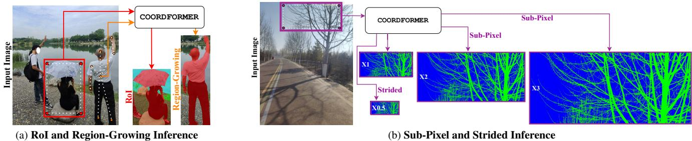  
Figure A2. Inference protocols enabled by COORDFORMER. Beyond the Semantic-Edge-Focused Inference described in the main paper, COORDFORMER supports several other inference protocols: RoI querying, region growing, sub-pixel, and strided inference.

## A4. Additional Inference Protocols

Our method enables several inference protocols (Fig. A2). While Semantic-Edge-Focused Inference is described in Sec. 3.3 of the main paper, COORDFORMER also supports other protocols, some of which substantially reduce unnecessary computation on very-high-resolution images. As shown in Fig. A2a, our framework can process only the regions or coordinates of interest rather than the full image. For instance, one can extract an arbitrary Region of Interest (RoI) and segment it at full resolution by querying only its pixel coordinates, yielding detailed local predictions at a fraction of the global cost. The method also supports interactive, category-aware Region Growing: starting from a single userselected pixel, we iteratively query neighboring coordinates and expand the region until a different semantic category is encountered, producing coherent semantic regions without processing the entire image. Moreover, COORDFORMER allows the output resolution to be chosen (Fig. A2b) by sampling coordinates at any density, enabling coarse (Strided Inference), medium, or fully detailed masks depending on computational needs. Finally, predicting labels from continuous coordinates lets COORDFORMER query sub-pixel locations (Sub-Pixel Inference), yielding masks at resolutions beyond the input image—a property that could benefit downstream tasks such as mask-conditioned generation and restoration.

## A5. Additional Qualitative Results

Additional qualitative results for MaSS13K [59], DIS5K [39], and KPIS [16] are shown in Fig. A3, Fig. A4, and Fig. A5, respectively. The images have been downsampled for PDF size constraints. Some of the original resolution predictions are included in the zip file attached with the submission.

## A6. Failure Cases

Although COORDFORMER achieves strong results on both MaSS13K and DIS5K, a few recurring failure modes can be observed, as shown in Fig. A6 and Fig. A7.

On both datasets, the most challenging examples involve extremely small or distant semantic regions, very thin structures, or boundaries embedded in highly cluttered textures. These cases are illustrated in the first two rows of Fig. A6 and Fig. A7. In the first rows, the thin structures can be recovered by disabling SEFI, as shown in the COORDFORMER dense column, where our method uses the full set of image coordinates to generate the prediction. The second rows show cases in which COORDFORMER, COORDFORMER dense, and MaSSFormer/BiRefNet all fail to predict thin cables, branches, or grid-like textures. These results highlight the challenges posed by such structures in both DIS5K and MaSS13K. The third and fourth rows highlight failures related to semantic ambiguity. In particular, the third row of Fig. A6 depicts a scene with strong reflections caused by a glass surface, where COORDFORMER, MaSSFormer, and COORDFORMER dense fail to predict the vegetation class. The fourth row of Fig. A6 illustrates one of the most common semantic errors, in which the other class is misclassified due to intrinsic ambiguities associated with this category in the MaSS13K dataset. The last two rows of Fig. A7 illustrate cases in which the main object is not correctly identified by the compared methods. Overall, these examples show that the main limitations of COORDFORMER arise in the presence of extremely fine structures and semantically ambiguous scenes. While dense inference can recover part of the missing details in some cases, the remaining errors highlight the intrinsic difficulty of these examples for both efficient and dense prediction settings.

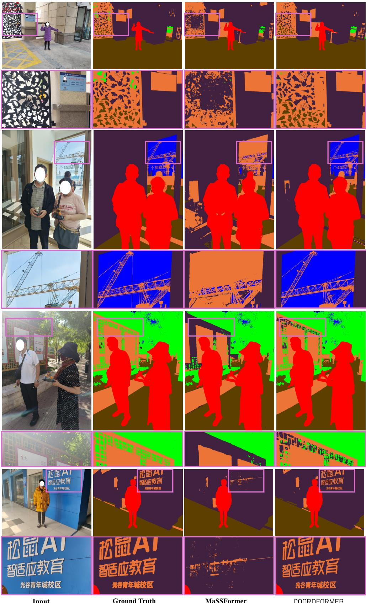  
Figure A3. Qualitative comparison between COORDFORMER and MaSSFormer on MaSS13K [59]. Please zoom in for a clearer view.

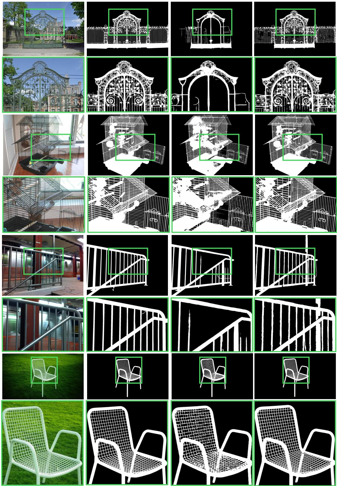  
Input  
Ground Truth  
BiRefNet (swinT)  
COORDFORMER

Figure A4. Qualitative comparison between COORDFORMER and BiRefNet on DIS5K [39]. Please zoom in for a clearer view.

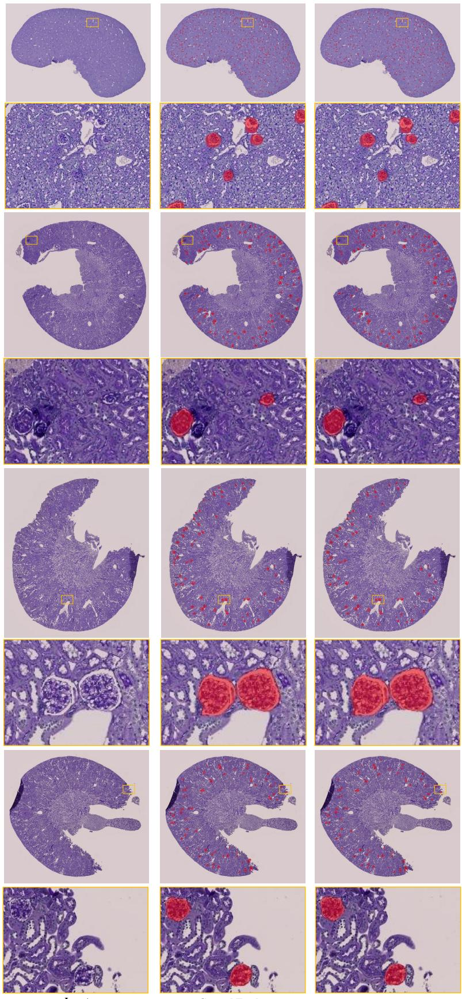  
Input  
Ground Truth  
COORDFORMER  
Figure A5. Qualitative comparison of COORDFORMER and Ground Truth on KPIS [16]. Please zoom in for a clearer view.

COORDFORMER

Ground Truth

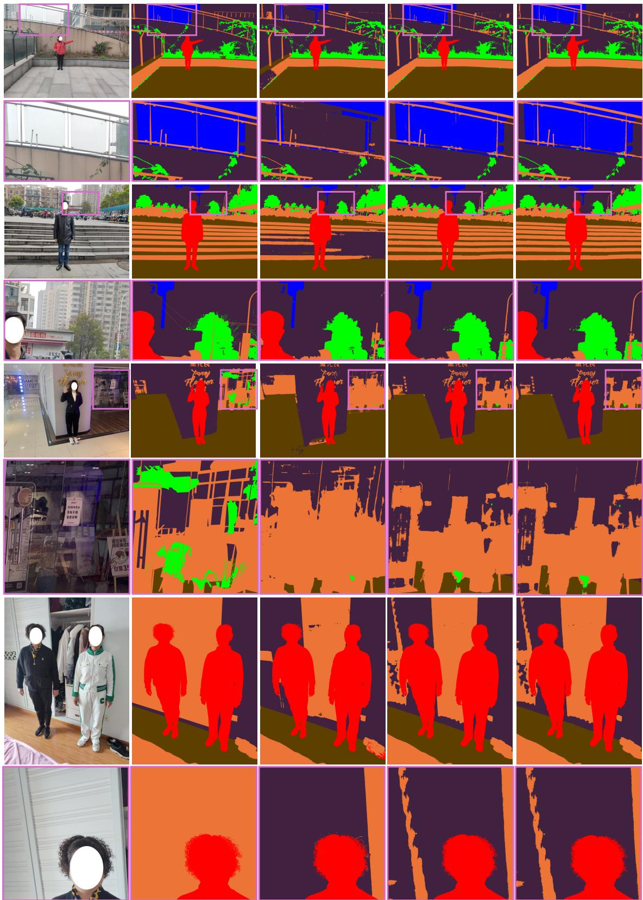  
COORDFORMER dense

Figure A6. Failure cases of COORDFORMER. Our method is compared with COORDFORMER dense and MaSSFormer on MaSS13K [59]. Please zoom in for a clearer view.

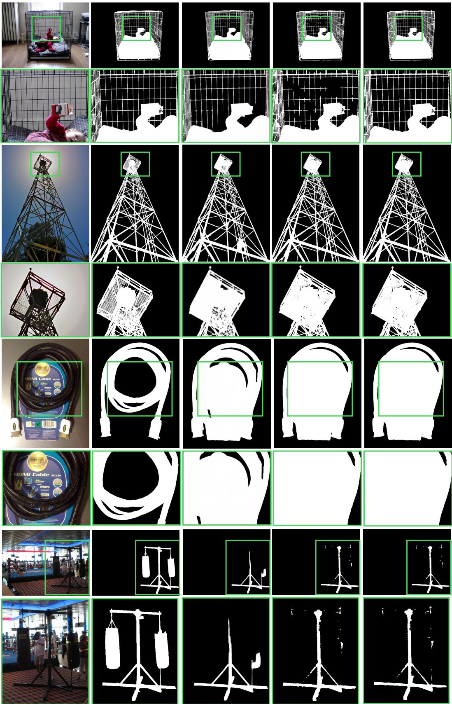  
Input  
Ground Truth  
BiRefNet (swinT)  
COORDFORMER  
COORDFORMER dense

Figure A7. Failure cases of COORDFORMER. Our method is compared with COORDFORMER dense and BiRefNet on DIS5K [39].   
Please zoom in for a clearer view.