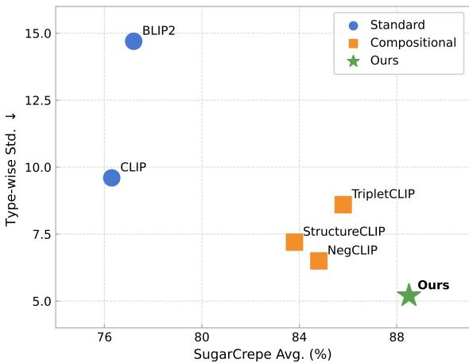
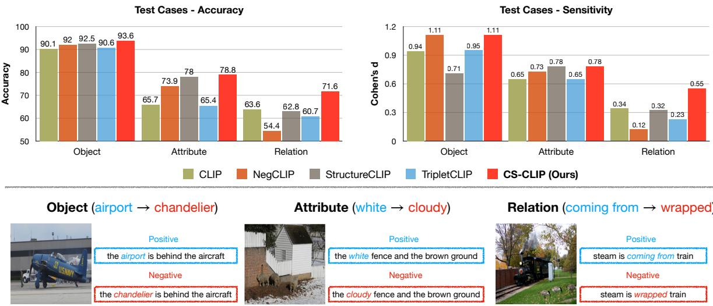
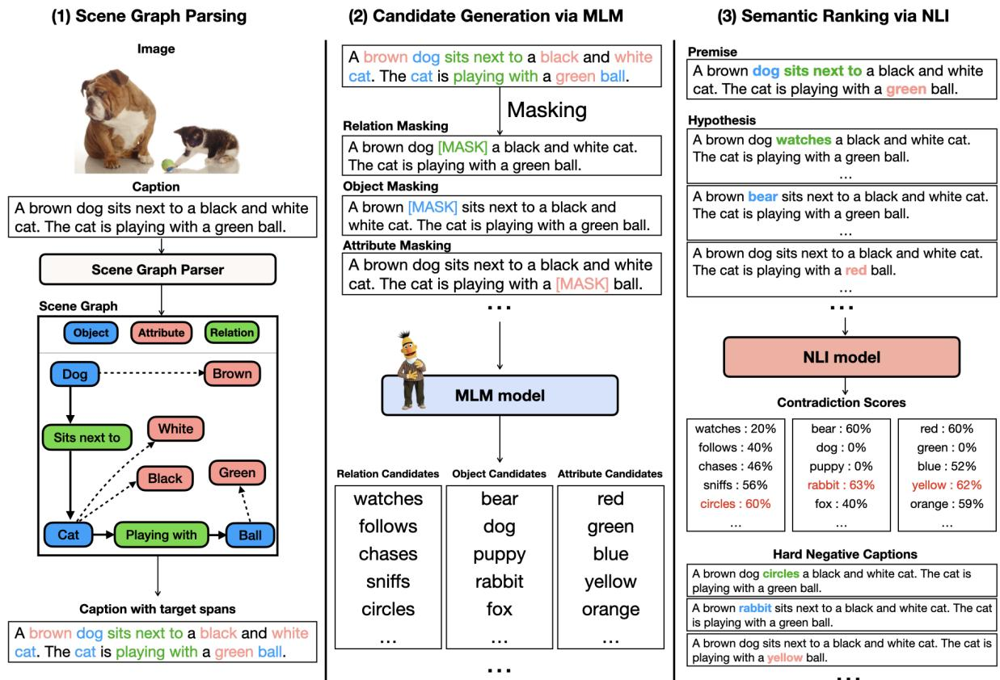
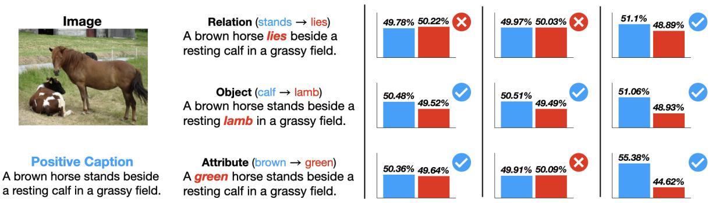
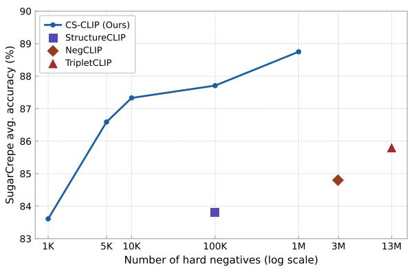
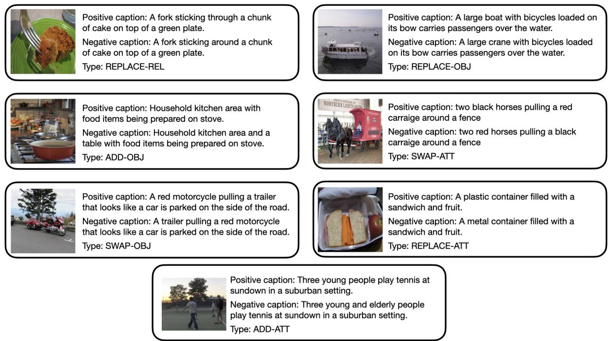

# CS-CLIP: Compositional Scene Graph-guided CLIP for Robust Compositional Reasoning

SeongJun Jeong Minjoon Jung Woo Suk Choi Youwon Jang Byoung-Tak Zhang \*

Seoul National University

{sjjeong, mjjung, wschoi, ywjang, btzhang}@bi.snu.ac.kr

## Abstract

Vision-language models (VLMs) demonstrate strong performance across compositional reasoning benchmarks, which require reasoning over semantic perturbations of objects, attributes, relations, and their interactions. However, our controlled analysis reveals that existing compositionality-aware VLMs exhibit element-specific biases, often underperforming vanilla CLIP on certain compositional elements. To address this, we propose Compositional Scene Graph-guided CLIP (CS-CLIP), which uses scene graphs to identify compositional elements and construct structured negatives via selective masking. We further retain negatives that are most contradictory to the original caption, forcing the model to rely on compositional structure rather than surface cues. CS-CLIP achieves state-of-the-art compositional reasoning with robust performance across compositional elements. It also preserves general vision-language capabilities such as crossmodal retrieval and downstream visual reasoning, while requiring fewer training samples than prior methods.

## 1 Introduction

Vision-language models (VLMs) (e.g., CLIP (Radford et al., 2021)) learn transferable multimodal representations that serve as effective foundations. With this advancement, compositionality-aware VLMs (Yuksekgonul et al., 2022; Huang et al., 2024; Patel et al., 2024) have emerged, enabling models to reason over compositional elements and their interactions by incorporating hard negative captions into contrastive training to improve compositional reasoning.

Despite their reported gains on compositional benchmarks (Yuksekgonul et al., 2022; Hsieh et al., 2023; Dumpala et al., 2024), it remains unclear how well such methods handle individual compositional

## Average vs. Type-wise Deviation

  
Figure 1: Average performance versus type-wise deviation on SugarCrepe. CS-CLIP (Ours) achieves the highest SugarCrepe average with the lowest standard deviation across reasoning types, indicating more robust compositional reasoning.

elements. Evaluating element-specific behavior requires test cases that isolate the targeted compositional element from other cues. We construct such controlled test cases by fixing the perturbation template and substitute vocabulary, isolating a single compositional element per instance. We measure both accuracy and sensitivity to evaluate whether models can confidently capture changes in compositional elements. Our results reveal that existing compositionality-aware VLMs fail to demonstrate clear improvements over the vanilla CLIP backbone; in fact, they frequently underperform it across different element changes. This indicates a significant deficiency and bias in existing VLMs, which have not surfaced in previous benchmarks.

To address this, we propose Compositional Scene Graph-guided CLIP (CS-CLIP), which generates hard negatives that explicitly target individual compositional elements. CS-CLIP parses captions into scene graphs (Johnson et al., 2015; Wu et al., 2019) to localize objects, attributes, and relations, and applies a diverse set of perturbations—replacement, addition, and swapping—to each element independently, ensuring that supervision covers every element type. To produce negatives that are distinguishable from the positive only through compositional reasoning, we adopt a generate-and-rank strategy: a masked language model (MLM) (Devlin et al., 2019) generates fluent candidates, and a natural language inference model (NLI) (Liu et al., 2019) selects those that semantically contradict the original caption. Training on these element-targeted hard negatives directly addresses the biases identified above, encouraging the model to reason over compositional structure rather than rely on superficial cues.

On compositional reasoning benchmarks (Hsieh et al., 2023; Yuksekgonul et al., 2022), CS-CLIP achieves state-of-the-art average performance with the lowest type-wise deviation, indicating robust compositional reasoning (Figure 1). CS-CLIP also preserves competitive cross-modal retrieval on COCO (Lin et al., 2014), transfers to zeroshot visual reasoning on GQA (Hudson and Manning, 2019), and achieves its compositional gains with substantially fewer training samples than prior methods.

Our contributions are threefold:

• We reveal element-specific biases in existing compositionality-aware VLMs, which even underperform vanilla CLIP on certain elements, through our controlled test cases.

• We propose CS-CLIP, which constructs element-targeted hard negatives via scene graph parsing and a generate-and-rank pipeline ensuring fluency and semantic contradiction.

• CS-CLIP achieves state-of-the-art compositional reasoning, mitigating element-specific biases while preserving general visionlanguage capabilities with substantially fewer training samples.

## 2 Related Work

Vision-Language Models. Vision-language models (VLMs) trained via large-scale contrastive learning (Radford et al., 2021; Jia et al., 2021; Li et al., 2021, 2022, 2023) align image and text representations into a shared embedding space, demonstrating strong generalization across various downstream tasks (Lin et al., 2014; Plummer et al., 2015; Deng et al., 2009; Song et al., 2022; Rombach et al., 2022; Zhou et al., 2023). However, these models often exhibit bag-of-words behavior (Yuksekgonul et al., 2022; Thrush et al., 2022), prioritizing salient keywords over fine-grained compositional structure (Zhao et al., 2022; Hsieh et al., 2023), which limits their compositional reasoning across objects, attributes, and relations.

Compositional Reasoning Benchmarks. Several benchmarks have been proposed to assess compositional reasoning in VLMs (Yuksekgonul et al., 2022; Thrush et al., 2022; Zhao et al., 2022; Hsieh et al., 2023; Dumpala et al., 2024). Early benchmarks such as VL-Checklist (Zhao et al., 2022) and ARO (Yuksekgonul et al., 2022) construct hard negatives via rule-based perturbations, which can introduce artifacts that language-only models exploit through text-only plausibility cues (Hsieh et al., 2023). SugarCrepe (Hsieh et al., 2023) and SugarCrepe++ (Dumpala et al., 2024) address this by generating fluent and plausible negatives via LLMs, yet these samples are not explicitly controlled at the level of individual compositional elements, making it difficult to diagnose which element a model actually struggles with.

Hard Negatives for Compositional Reasoning. Several methods improve compositional reasoning by augmenting contrastive training with hard negatives. NegCLIP (Yuksekgonul et al., 2022) constructs hard negatives by perturbing word order and attribute bindings. StructureCLIP (Huang et al., 2024) generates semantic negatives via structureguided word swapping and extends the model architecture to incorporate an additional scene graph input. TripletCLIP (Patel et al., 2024) adopts LLMgenerated contradictory captions and synthesized negative images (Sauer et al., 2024), but does not explicitly control which compositional element is modified. As a result, these methods provide uneven supervision across compositional elements, leading to element-specific biases that hinder balanced compositional reasoning.

## 3 Controlled Analysis

## 3.1 Construction of Test Cases

We construct test cases from VG-Relation and VG-Attribute (Yuksekgonul et al., 2022), targeting three compositional elements: objects, attributes, and relations. For each dataset, we extract global vocabularies of objects, relations, and attributes from the scene graph annotations, defining the candidate spaces for controlled perturbations.

  
Figure 2: Results of our controlled evaluation. We illustrate the accuracy and sensitivity metrics for each element (top) and present representative cases of positive and hard negative captions (bottom).

For each positive caption, we generate a hard negative by modifying exactly one compositional element at a time. For VG-Relation, positives follow the template “{subject} is {relation} {object}”; we replace either the relation or the object by sampling from the corresponding vocabulary, yielding the Relation and Object subsets. For VG-Attribute, positives follow “the {attribute1} {object1} and the {attribute2} {object2}”; we substitute one attribute by sampling from the attribute vocabulary, yielding the Attribute subset. We use random sampling to avoid biasing the evaluation toward any specific hard negative generation method. We manually filter synonyms and near-duplicates to reduce ambiguous negatives. Illustrative examples are shown at the bottom of Figure 2, and further construction details are provided in Appendix C.

## 3.2 Evaluating Discriminative Confidence

We consider two qualities: accuracy and sensitivity. Accuracy is the proportion of cases where a model assigns a higher score to the positive caption than to its negative counterpart. Sensitivity captures how confidently the model separates positives from negatives, measured by Cohen’s d (Cohen, 2013):

$$
d = ( \mu _ { \mathrm { p o s } } - \mu _ { \mathrm { n e g } } ) / s _ { \mathrm { p o o l e d } } ,\tag{1}
$$

where $\mu _ { \mathrm { p o s } }$ and $\mu _ { \mathrm { n { e g } } }$ are the mean similarity scores for positive and negative captions and $s _ { \mathrm { p o o l e d } }$ is the pooled standard deviation. Robust VLMs should achieve both high accuracy and high sensitivity (i.e.,, high Cohen’s d) consistently across all compositional elements, indicating confident discrimination on each element rather than gains concentrated on a few.

## 3.3 Results on our Test Cases

In Figure 2 (top), we evaluate vanilla CLIP (Radford et al., 2021) and three compositionality-aware VLMs: NegCLIP (Yuksekgonul et al., 2022), StructureCLIP (Huang et al., 2024), and TripletCLIP (Patel et al., 2024), and report their performance across compositional element changes.

While most VLMs demonstrate improved accuracy over CLIP, this does not necessarily indicate robust compositional reasoning. For instance, StructureCLIP outperforms CLIP for object changes with substantially low sensitivity. More importantly, VLMs fail to demonstrate consistent improvements across element changes. Specifically, they marginally exceed CLIP for object changes; however, they often underperform it for attribute and relation changes. Notably, NegCLIP significantly underperforms CLIP (63.6 → 54.4) with substantially lower sensitivity.

As previously discussed, these deficiencies have not been exposed in existing benchmarks. This suggests that current compositionality-aware VLMs may rely on superficial cues or shortcut correlations rather than genuine compositional reasoning.

  
Figure 3: Overview of CS-CLIP. Our framework generates hard negatives in three steps: (1) identifying compositional elements via scene graph parsing, (2) generating candidates with an MLM, and (3) selecting contradictory captions using an NLI model.

## 4 Method

To address the element-specific biases identified in our analysis, we propose Compositional Scene Graph-guided CLIP (CS-CLIP). CS-CLIP constructs hard negatives that (i) target every compositional element with element-level precision, and (ii) differ from the positive only in the targeted element, without spurious differences such as grammatical artifacts or semantic equivalence. As illustrated in Figure 3, each component of CS-CLIP is chosen to satisfy one of these requirements: scene graph parsing for element-level targeting (i), and a generate-and-rank pipeline combining MLM for fluency and NLI for semantic contradiction (ii).

## 4.1 Hard Negative Augmentation

Scene Graph Parsing. To enable element-level control, we parse each caption T into a scene graph $G = ( O , R , A )$ using an off-the-shelf parser (Wu et al., 2019), where O, R, A denote the sets of objects, relations, and attributes. The graph localizes each compositional element to its span in T, which serves as the target for the generate-and-rank process below.

Candidate Generation via MLM. To prevent grammatical artifacts that allow models to bypass compositional reasoning, we use a pre-trained MLM (Devlin et al., 2019) to generate fluent candidate tokens for the target span. Given a target span in T, we mask the span to form $T _ { \mathrm { m a s k e d } }$ and obtain the top-K candidate tokens $( K = 1 6 )$ :

$$
\mathcal { C } _ { c a n d } = \mathrm { T o p } { - } K _ { w \in \mathcal { V } } \left( P _ { M L M } ( w \mid T _ { m a s k e d } ) \right)\tag{2}
$$

where V is the filtered MLM vocabulary. We filter V to remove sub-word artifacts (e.g., “##ing”) and to retain only words matching the grammatical category (noun, verb, adjective) of the target span, using WordNet (Miller, 1995) for validation.

Semantic Ranking via NLI. MLM candidates may include words that preserve the original meaning (e.g., synonyms), yielding semantically equivalent paraphrases rather than true contradictions. To filter these out, we use a pre-trained NLI model (Liu et al., 2019) to select the candidate that semantically contradicts the original caption. Treating T as the premise and each candidate $T _ { c } ^ { \prime } \in { \mathcal { C } } _ { \mathrm { c a n d } }$ as the hypothesis, the NLI model assigns a contradiction score $S _ { \mathrm { c o n t r a } } ( T , T _ { c } ^ { \prime } )$ , and the final hard negative is

selected as:

$$
T ^ { \prime } = \operatorname * { a r g m a x } _ { T _ { c } ^ { \prime } \in \mathcal { C } _ { \mathrm { c a n d } } } S _ { \mathrm { c o n t r a } } ( T , T _ { c } ^ { \prime } ) .\tag{3}
$$

Augmentation Types. We instantiate the above pipeline as several augmentation types, each perturbing a compositional element in a distinct way:

• Replace (Object, Attribute, Relation): We mask and replace the span of an object, attribute, or relation identified by the scene graph, using the full generate-and-rank pipeline.

• Add (Object, Attribute): We insert “and [MASK]” next to an existing object or attribute and fill the mask via the generate-andrank pipeline, introducing an additional element to the caption.

• Swap (Object, Attribute): We swap two spans of the same element type within the caption via a rule-based procedure. Unlike Replace and Add, Swap does not require MLM or NLI since it operates by rearranging existing words.

For each positive caption, we generate one hard negative per applicable type, skipping types whose target elements are absent from the scene graph (e.g., no Add-Attribute negative when the caption has no attribute span).

## 4.2 Contrastive Learning Objectives

We adopt CLIP (Radford et al., 2021) as our backbone, consisting of a visual encoder and a textual encoder that project images and captions into a shared embedding space. We integrate our hard negatives into training as follows.

Training instances. Let $( v , c )$ denote a positive image-caption pair and $c ^ { - }$ the embedding of one of its hard negatives. Since each caption can have multiple hard negatives (one per applicable type), we treat each $( v , c , c ^ { - } )$ triplet as an independent training instance within the batch.

Loss functions. We use the standard InfoNCE loss (Oord et al., 2018) over a batch of B instances, where the contrast is taken across positive imagecaption pairs (i.e., other captions in the batch serve as in-batch negatives):

$$
\mathcal { L } _ { \mathrm { I n f o N C E } } = - \frac { 1 } { B } \sum _ { i = 1 } ^ { B } \log \frac { \exp ( \sin ( v _ { i } , c _ { i } ) ) } { \sum _ { j = 1 } ^ { B } \exp ( \sin ( v _ { i } , c _ { j } ) ) } ,\tag{4}
$$

where sim(·, ·) is cosine similarity.

To leverage the hard negatives, we additionally apply a hinge loss (Huang et al., 2024) on each triplet:

$$
\mathcal { L } _ { \mathrm { h i n g e } } = \frac { 1 } { B } \sum _ { i = 1 } ^ { B } \operatorname* { m a x } \big ( 0 , \omega - \mathrm { s i m } ( v _ { i } , c _ { i } ) + \mathrm { s i m } ( v _ { i } , c _ { i } ^ { - } ) \big ) ,\tag{5}
$$

where ω is the margin hyper-parameter, which we set to 0.1. The hinge loss enforces that the positive caption is more similar to the image than its hard negative by at least ω, providing element-targeted supervision that the InfoNCE term alone does not provide.

The final loss combines both:

$$
\begin{array} { r } { \mathcal { L } = \mathcal { L } _ { \mathrm { I n f o N C E } } + \mathcal { L } _ { \mathrm { h i n g e } } . } \end{array}\tag{6}
$$

## 5 Experiments

## 5.1 Experimental Setup

Baselines. We consider two different types of VLMs, including standard VLMs: CLIP (Radford et al., 2021) and BLIP-2 (Li et al., 2023), and compositionality-aware VLMs: NegCLIP (Yuksekgonul et al., 2022), StructureCLIP (Huang et al., 2024), and TripletCLIP (Patel et al., 2024). We use their publicly available checkpoints1 and provide details for each baseline in Appendix A.

Benchmarks. We evaluate compositional reasoning on three benchmarks: SugarCrepe (Hsieh et al., 2023), VG-Relation, and VG-Attribute (Yuksekgonul et al., 2022). SugarCrepe covers seven reasoning types through LLM-generated hard negatives, providing a broad assessment of compositional reasoning. VG-Relation and VG-Attribute specifically target relation and attribute understanding through hard negatives that swap individual compositional elements. Further benchmark details are provided in Appendix B.

Evaluation metrics. We report accuracy for all three compositional reasoning benchmarks, measured as the proportion of cases where a model assigns a higher similarity score to the positive caption than to its hard negative. We additionally evaluate on the COCO 5K split (Lin et al., 2014; Karpathy and Fei-Fei, 2015) for image-to-text retrieval (I2T) and text-to-image retrieval (T2I), reporting Recall@1.

<table><tr><td rowspan="3">Method</td><td colspan="3">Replace</td><td colspan="2">Swap</td><td colspan="2">Add</td><td rowspan="3">Avg ↑</td><td rowspan="3">Std↓</td></tr><tr><td>Rel.</td><td>Obj.</td><td>Att.</td><td>Obj.</td><td>Att.</td><td>Obj.</td><td>Att.</td></tr><tr><td>Standard VLMs</td><td></td><td></td><td></td><td></td><td></td><td></td><td></td><td></td><td></td></tr><tr><td>CLIP</td><td>68.9</td><td>90.9</td><td>80.0</td><td>61.3</td><td>63.6</td><td>76.8</td><td>68.3</td><td>76.3</td><td>9.6</td></tr><tr><td>BLIP-2</td><td>64.2</td><td>94.0</td><td>74.4</td><td>53.6</td><td>51.0</td><td>85.8</td><td>74.5</td><td>77.2</td><td>14.7</td></tr><tr><td colspan="10">Compositionality-aware VLMs</td></tr><tr><td>NegCLIP</td><td>76.4</td><td>92.6</td><td>85.9</td><td>75.0</td><td>75.2</td><td>88.7</td><td>82.8</td><td>84.8</td><td>6.5</td></tr><tr><td>StructureCLIP</td><td>73.8</td><td>93.5</td><td>85.6</td><td>70.3</td><td>80.4</td><td>85.4</td><td>82.6</td><td>83.8</td><td>7.2</td></tr><tr><td>TripletCLIP</td><td>82.7</td><td>94.4</td><td>86.5</td><td>67.4</td><td>72.6</td><td>87.3</td><td>85.6</td><td>85.8</td><td>8.6</td></tr><tr><td>CS-CLIP (Ours)</td><td>84.1±0.5</td><td>94.1±0.4</td><td>88.4±0.4</td><td>76.7±1.2</td><td>81.0±0.9</td><td>91.0±1.2</td><td>89.4±0.3</td><td>88.6±0.2</td><td>5.6±0.4</td></tr></table>

Table 1: Results on SugarCrepe. We report accuracy (%) for each subtype and the average score (Avg) across all samples from the seven subsets. We additionally report the standard deviation (Std) of the seven subset accuracies as a diagnostic for uniformity across reasoning types; a lower Std indicates smaller type-wise deviation when conditioned on comparable Avg. For CS-CLIP, we report the mean and standard deviation over three random seeds; baselines are evaluated from their public checkpoints.

<table><tr><td rowspan="2">Method</td><td colspan="2">VG</td><td colspan="2">COCO</td></tr><tr><td>Rel.</td><td>Att.</td><td>I2T@1</td><td>T2I@1</td></tr><tr><td>Standard VLMs</td><td></td><td></td><td></td><td></td></tr><tr><td>CLIP</td><td>58.8</td><td>60.2</td><td>50.0</td><td>30.4</td></tr><tr><td>BLIP-2</td><td>42.5</td><td>69.0</td><td>41.5</td><td>30.0</td></tr><tr><td>Compositionality-aware VLMs</td><td></td><td></td><td></td><td></td></tr><tr><td>NegCLIP</td><td>78.9</td><td>70.8</td><td>56.2</td><td>41.5</td></tr><tr><td>StructureCLIP</td><td>81.8</td><td>77.6</td><td>55.5</td><td>41.4</td></tr><tr><td>TripletCLIP</td><td>51.6</td><td>60.1</td><td>39.7</td><td>33.3</td></tr><tr><td>CS-CLIP (Ours)</td><td>85.9</td><td>77.3</td><td>53.2</td><td>42.1</td></tr></table>

Table 2: Results on VG-Relation, VG-Attribute, and COCO. We report accuracy (%) for VG and Recall@1 (%) for retrieval tasks in COCO. CS-CLIP achieves the highest accuracy on VG-Relation while remaining competitive on VG-Attribute, and preserves cross-modal retrieval capability on COCO.

Implementation details. We use CLIP (ViT-B/32) as our backbone for fair comparison with the baselines. Hard negatives are generated from the COCO training set (Lin et al., 2014), yielding approximately 2M training instances. Unlike Triplet-CLIP, which uses additional pre-training data from CC12M (Changpinyo et al., 2021), we train only on COCO. Negative generation takes approximately 35 hours on a single NVIDIA RTX A6000 48GB GPU. We train for 2 epochs with a batch size of 128, using AdamW with an initial learning rate of 10−5 and cosine decay schedule. Training takes approximately 3 hours on the same hardware.

## 5.2 Main Results

Robust compositional reasoning across element changes. We examine whether CS-CLIP addresses the element-specific biases identified in Section 3.

<table><tr><td>Method</td><td>Accuracy</td></tr><tr><td>CLIP</td><td>58.1</td></tr><tr><td>TripletCLIP</td><td>51.9</td></tr><tr><td>NegCLIP</td><td>65.9</td></tr><tr><td>StructureCLIP</td><td>69.1</td></tr><tr><td>CS-CLIP (Ours)</td><td>71.3</td></tr></table>

Table 3: Zero-shot image-to-text retrieval accuracy on GQA validation split. CS-CLIP achieves the highest accuracy among all baselines.

As shown in Figure 2 (top), CS-CLIP achieves the highest accuracy and sensitivity across all three compositional elements, while baselines underperform vanilla CLIP on relations. Table 2 shows the same pattern on VG, where CS-CLIP reaches state-of-the-art on VG-Relation and remains competitive on VG-Attribute. These results suggest that CS-CLIP provides balanced supervision across compositional elements, mitigating the element-specific biases in existing VLMs.

Gains across reasoning and element types. Table 1 shows that CS-CLIP achieves the highest average accuracy and the lowest type-wise standard deviation (Std) on SugarCrepe. A lower Std indicates more uniform performance across the seven reasoning types. Notably, TripletCLIP achieves a strong average yet shows a deviation nearly unchanged from vanilla CLIP, indicating that its gains do not translate into robust reasoning across types. NegCLIP and StructureCLIP show similarly uneven patterns. CS-CLIP, in contrast, performs best or second-best on every reasoning type, suggesting that its average gain reflects robust compositional reasoning rather than improvement on certain types.

<table><tr><td rowspan="2">Variant</td><td colspan="3">Replace</td><td colspan="2">Swap</td><td colspan="2">Add</td><td rowspan="2">Avg↑</td><td rowspan="2">Std↓</td></tr><tr><td>Rel</td><td>Obj</td><td>Att</td><td>Obj</td><td>Att</td><td>Obj</td><td>Att</td></tr><tr><td>Pipeline ablation</td><td></td><td></td><td></td><td></td><td></td><td></td><td></td><td></td><td></td></tr><tr><td>CLIP</td><td>68.9</td><td>90.9</td><td>80.0</td><td>61.3</td><td>63.6</td><td>76.8</td><td>68.3</td><td>76.3</td><td>9.6</td></tr><tr><td>SG + Random</td><td>76.1</td><td>94.0</td><td>84.8</td><td>72.0</td><td>73.1</td><td>92.0</td><td>80.2</td><td>85.3</td><td>8.2</td></tr><tr><td>SG + MLM</td><td>76.3</td><td>93.2</td><td>85.2</td><td>77.2</td><td>80.1</td><td>90.5</td><td>80.6</td><td>85.6</td><td>6.1</td></tr><tr><td>SG + MLM + NLI</td><td>83.7</td><td>94.3</td><td>87.9</td><td>78.0</td><td>81.9</td><td>90.8</td><td>89.0</td><td>88.5</td><td>5.2</td></tr><tr><td>Component leave-one-out</td><td></td><td></td><td></td><td></td><td></td><td></td><td></td><td></td><td></td></tr><tr><td>w/o Object negatives</td><td>83.8</td><td>92.4</td><td>89.7</td><td>73.2</td><td>80.6</td><td>90.3</td><td>88.3</td><td>87.9</td><td>6.3</td></tr><tr><td>w/o Attribute negatives</td><td>83.4</td><td>94.1</td><td>84.1</td><td>79.7</td><td>73.6</td><td>91.9</td><td>84.0</td><td>87.2</td><td>6.4</td></tr><tr><td>w/o Relation negatives</td><td>77.7</td><td>94.3</td><td>88.2</td><td>75.2</td><td>82.4</td><td>90.4</td><td>89.9</td><td>87.4</td><td>6.6</td></tr></table>

Table 4: Ablation study on SugarCrepe. We report pipeline and component-level ablations along with element-wise standard deviation (Std). Underlined values indicate the subtypes directly affected by removing the corresponding component-specific negatives.

<table><tr><td>Variant</td><td>Placement</td><td>Avg</td></tr><tr><td>CS-CLIP-noSG</td><td>Random position</td><td>85.9</td></tr><tr><td>CS-CLIP (Ours)</td><td>SG-guided target span</td><td>88.5</td></tr></table>

Table 5: Effect of structural placement on Sugar-Crepe. Both variants share the same vocabulary produced by our pipeline and differ only in placement.

Generalization beyond Compositional Benchmarks. We evaluate whether CS-CLIP’s compositional improvements preserve general representation capabilities and transfer to downstream tasks. On COCO cross-modal retrieval (Table 2), CS-CLIP achieves competitive performance on both text-to-image and image-to-text retrieval, while TripletCLIP degrades substantially despite its compositional gains. To further assess downstream transferability, we construct a zero-shot retrieval task on the GQA validation split (Hudson and Manning, 2019). For each of 10,000 image-questionanswer triples, we construct a positive text by concatenating the question and the correct answer, and a negative text by replacing the correct answer with another object or attribute from the image’s scene graph annotation. The model selects the text with higher similarity to the image embedding (Appendix D). As shown in Table 3, CS-CLIP achieves the highest accuracy among all baselines. These results indicate that CS-CLIP preserves cross-modal alignment and transfers to downstream visual reasoning.

## 5.3 Analysis

Effect of Each Pipeline Stage. Table 4 (top) reports a pipeline ablation. Starting from CLIP, we sequentially add scene graph-guided target spans, MLM-based candidate generation, and NLI-based ranking, with average accuracy rising from 76.3 to 88.5 and type-wise std dropping from 9.6 to 5.2. Scene graph guidance drives the largest accuracy gain, while MLM and NLI further refine the negatives, each contributing additional reductions in type-wise deviation.

Component-Level Contributions. Table 4 (bottom) reports a leave-one-out ablation where we remove the hard negatives corresponding to one compositional element at a time. Removing any element type degrades performance, but the drop is concentrated on the subtypes directly involving that element (underlined). For example, removing Relation negatives causes the largest drop on Replace-Relation, while removing Attribute negatives most affects Replace- and Swap-Attribute. This pattern indicates that element-targeted supervision directly determines element-wise performance, supporting our design choice of generating hard negatives for every compositional element.

Vocabulary Diversity vs. Structural Placement. To test whether CS-CLIP’s gains come from the diverse vocabulary produced by our pipeline or from where the perturbation is placed, we compare two variants with the same vocabulary but different placements (Table 5). CS-CLIP-noSG places perturbations at random positions, while CS-CLIP places them at scene graph-guided spans. The structural placement yields a substantial gain, suggesting that the benefit comes primarily from precise element-level control rather than vocabulary alone. Sample Efficiency. We train CS-CLIP across data scales from 1K to 1M hard negatives sampled from our generated pool, providing a controlled within-method scaling experiment (Figure 5). Baseline checkpoints are plotted at their publicly reported training scales; since these methods differ in training data and implementation, the baseline points serve as descriptive context rather than a controlled cross-method comparison. The withinmethod curve shows that CS-CLIP maintains its performance with substantially fewer hard negatives, reaching strong accuracy well before the largest scale. This suggests that the gains of CS-

  
Figure 4: Qualitative analysis. We present an image with its corresponding positive and negative captions, along with prediction probabilities across models. ✓ (blue) and × (red) denote correct and incorrect answers, respectively. Compared to CLIP and TripletCLIP, CS-CLIP demonstrates a clearer margin in distinguishing compositional element changes and selects the correct answers.

  
Figure 5: Sample efficiency of CS-CLIP on Sugar-Crepe. CS-CLIP is trained across data scales from 1K to 1M hard negatives. Baseline checkpoints are placed at their reported training scales.

CLIP stem from the quality and targeting of its hard negatives rather than data scale.

## 5.4 Qualitative Analysis

Figure 4 illustrates how models handle individual compositional element changes. For Object changes, all models distinguish positive and negative captions. On Relation cases (e.g., “stands” replaced with “lies”), CLIP and TripletCLIP assign higher scores to the negative, while CS-CLIP correctly identifies the positive. On Attribute cases (e.g., “brown horse” replaced with “green horse”), baselines are misled by background colors such as a green grass field, suggesting reliance on global color cues rather than the targeted object. CS-CLIP remains confident in the correct attribute, indicating that its training successfully grounds attributes to their corresponding objects.

## 6 Conclusion

We revealed that existing compositionality-aware VLMs suffer from element-specific biases, indicating a lack of robust compositional reasoning. To address this, we proposed CS-CLIP, which constructs element-targeted hard negatives through scene graph parsing combined with masked language modeling and natural language inference. By explicitly targeting each compositional element and ensuring that hard negatives are fluent yet semantically contradictory to the positive, CS-CLIP forces the model to rely on compositional reasoning rather than superficial cues or shortcut correlations. Across compositional reasoning benchmarks, CS-CLIP achieves robust performance across reasoning types, preserves cross-modal capability, and transfers to downstream visual reasoning, with strong sample efficiency. We will release our code and trained models to facilitate future research.

## 7 Limitations

While our study demonstrates the effectiveness of CS-CLIP, we acknowledge several limitations. Our framework relies on an off-the-shelf scene graph parser, MLM and NLI modules, meaning any inherent linguistic biases in these modules may propagate to the generated negatives. However, this modularity allows CS-CLIP to scale with future advancements in these modules, improving performance without requiring architectural changes. Our negative generation relies solely on original captions. Since these captions describe the visual content, the derived negatives remain visually relevant. While incorporating visual features could further refine this process, our current approach serves as an efficient and effective alternative.

## 8 Ethical Considerations

Our research utilizes publicly available datasets, including Visual Genome and COCO, and follows their respective terms of use. The proposed CS-CLIP framework aims to improve the compositional reasoning capabilities of vision-language models. However, like other models derived from CLIP, CS-CLIP may inherit societal, racial, or gender biases present in large-scale web-crawled training data. While our approach focuses on improving compositional accuracy, it does not explicitly filter or mitigate these underlying biases. Therefore, caution should be exercised when deploying this model in sensitive real-world applications. No personal or private data was collected or used during this study.

## Acknowledgments

This work was partly supported by grants from the IITP (RS-2021-II211343-GSAI/10%, RS-2022-II220951-LBA/10%, RS-2022-II220953- PICA/10%, RS-2026-25553157-MIACC/10%), the NRF (RS-2024-00353991-SPARC/15%, RS-2023-00274280-HEI/15%), the KEIT (RS-2025-25453780/15%), and the KIAT (RS-2025-25460896/15%), funded by the Korean government.

## References

Soravit Changpinyo, Piyush Sharma, Nan Ding, and Radu Soricut. 2021. Conceptual 12m: Pushing webscale image-text pre-training to recognize long-tail visual concepts. In Proceedings of the IEEE/CVF conference on computer vision and pattern recognition, pages 3558–3568.

Jacob Cohen. 2013. Statistical power analysisfor the behavioral sciences. routledge.

Jia Deng, Wei Dong, Richard Socher, Li-Jia Li, Kai Li, and Li Fei-Fei. 2009. Imagenet: A large-scale hierarchical image database. In 2009 IEEE conference on computer vision and pattern recognition, pages 248–255. Ieee.

Jacob Devlin, Ming-Wei Chang, Kenton Lee, and Kristina Toutanova. 2019. Bert: Pre-training of deep bidirectional transformers for language understanding. In Proceedings of the 2019 conference of the North American chapter of the association for computational linguistics: human language technologies, volume 1 (long and short papers), pages 4171–4186.

Sri Harsha Dumpala, Aman Jaiswal, Chandramouli Shama Sastry, Evangelos Milios, Sageev Oore, and Hassan Sajjad. 2024. Sugarcrepe++ dataset: Visionlanguage model sensitivity to semantic and lexical alterations. Advances in Neural Information Processing Systems, 37:17972–18018.

Cheng-Yu Hsieh, Jieyu Zhang, Zixian Ma, Aniruddha Kembhavi, and Ranjay Krishna. 2023. Sugarcrepe: Fixing hackable benchmarks for vision-language compositionality. Advances in neural information processing systems, 36:31096–31116.

Yufeng Huang, Jiji Tang, Zhuo Chen, Rongsheng Zhang, Xinfeng Zhang, Weijie Chen, Zeng Zhao, Zhou Zhao, Tangjie Lv, Zhipeng Hu, and 1 others. 2024. Structure-clip: Towards scene graph knowledge to enhance multi-modal structured representations. In Proceedings of the AAAI conference on artificial intelligence, volume 38, pages 2417–2425.

Drew A Hudson and Christopher D Manning. 2019. Gqa: A new dataset for real-world visual reasoning and compositional question answering. In Proceedings of the IEEE/CVF conference on computer vision and pattern recognition, pages 6700–6709.

Chao Jia, Yinfei Yang, Ye Xia, Yi-Ting Chen, Zarana Parekh, Hieu Pham, Quoc Le, Yun-Hsuan Sung, Zhen Li, and Tom Duerig. 2021. Scaling up visual and vision-language representation learning with noisy text supervision. In International conference on machine learning, pages 4904–4916. PMLR.

Justin Johnson, Ranjay Krishna, Michael Stark, Li-Jia Li, David Shamma, Michael Bernstein, and Li Fei-Fei. 2015. Image retrieval using scene graphs. In Proceedings of the IEEE conference on computer vision and pattern recognition, pages 3668–3678.

Andrej Karpathy and Li Fei-Fei. 2015. Deep visualsemantic alignments for generating image descriptions. In Proceedings of the IEEE conference on computer vision and pattern recognition, pages 3128– 3137.

Ranjay Krishna, Yuke Zhu, Oliver Groth, Justin Johnson, Kenji Hata, Joshua Kravitz, Stephanie Chen, Yannis Kalantidis, Li-Jia Li, David A Shamma, and 1 others. 2017. Visual genome: Connecting language and vision using crowdsourced dense image annotations. International journal of computer vision, 123(1):32–73.

Junnan Li, Dongxu Li, Silvio Savarese, and Steven Hoi. 2023. Blip-2: Bootstrapping language-image pretraining with frozen image encoders and large language models. In International conference on machine learning, pages 19730–19742. PMLR.

Junnan Li, Dongxu Li, Caiming Xiong, and Steven Hoi. 2022. Blip: Bootstrapping language-image pretraining for unified vision-language understanding and generation. In International conference on machine learning, pages 12888–12900. PMLR.

Junnan Li, Ramprasaath Selvaraju, Akhilesh Gotmare, Shafiq Joty, Caiming Xiong, and Steven Chu Hong Hoi. 2021. Align before fuse: Vision and language representation learning with momentum distillation. Advances in neural information processing systems, 34:9694–9705.

Tsung-Yi Lin, Michael Maire, Serge Belongie, James Hays, Pietro Perona, Deva Ramanan, Piotr Dollár, and C Lawrence Zitnick. 2014. Microsoft coco: Common objects in context. In European conference on computer vision, pages 740–755. Springer.

Yinhan Liu, Myle Ott, Naman Goyal, Jingfei Du, Mandar Joshi, Danqi Chen, Omer Levy, Mike Lewis, Luke Zettlemoyer, and Veselin Stoyanov. 2019. Roberta: A robustly optimized bert pretraining approach. arXiv preprint arXiv:1907.11692.

George A Miller. 1995. Wordnet: a lexical database for english. Communications ofthe ACM, 38(11):39–41.

Aaron van den Oord, Yazhe Li, and Oriol Vinyals. 2018. Representation learning with contrastive predictive coding. arXiv preprint arXiv:1807.03748.

Maitreya Patel, Naga Sai Abhiram Kusumba, Sheng Cheng, Changhoon Kim, Tejas Gokhale, Chitta Baral, and 1 others. 2024. Tripletclip: Improving compositional reasoning of clip via synthetic vision-language negatives. Advances in neural information processing systems, 37:32731–32760.

Bryan A Plummer, Liwei Wang, Chris M Cervantes, Juan C Caicedo, Julia Hockenmaier, and Svetlana Lazebnik. 2015. Flickr30k entities: Collecting region-to-phrase correspondences for richer imageto-sentence models. In Proceedings of the IEEE international conference on computer vision, pages 2641–2649.

Alec Radford, Jong Wook Kim, Chris Hallacy, Aditya Ramesh, Gabriel Goh, Sandhini Agarwal, Girish Sastry, Amanda Askell, Pamela Mishkin, Jack Clark, and 1 others. 2021. Learning transferable visual models from natural language supervision. In International conference on machine learning, pages 8748–8763. PmLR.

Robin Rombach, Andreas Blattmann, Dominik Lorenz, Patrick Esser, and Björn Ommer. 2022. Highresolution image synthesis with latent diffusion models. In Proceedings of the IEEE/CVF conference on computer vision and pattern recognition, pages 10684–10695.

Axel Sauer, Dominik Lorenz, Andreas Blattmann, and Robin Rombach. 2024. Adversarial diffusion distillation. In European Conference on Computer Vision, pages 87–103. Springer.

Haoyu Song, Li Dong, Weinan Zhang, Ting Liu, and Furu Wei. 2022. Clip models are few-shot learners: Empirical studies on vqa and visual entailment. In Proceedings of the 60th Annual Meeting of the Associationfor Computational Linguistics (Volume 1: Long Papers), pages 6088–6100.

Tristan Thrush, Ryan Jiang, Max Bartolo, Amanpreet Singh, Adina Williams, Douwe Kiela, and Candace Ross. 2022. Winoground: Probing vision and language models for visio-linguistic compositionality. In Proceedings of the IEEE/CVF Conference on Computer Vision and Pattern Recognition, pages 5238– 5248.

Hao Wu, Jiayuan Mao, Yufeng Zhang, Yuning Jiang, Lei Li, Weiwei Sun, and Wei-Ying Ma. 2019. Unified visual-semantic embeddings: Bridging vision and language with structured meaning representations. In Proceedings ofthe IEEE/CVF Conference on Computer Vision and Pattern Recognition, pages 6609–6618.

Mert Yuksekgonul, Federico Bianchi, Pratyusha Kalluri, Dan Jurafsky, and James Zou. 2022. When and why vision-language models behave like bags-ofwords, and what to do about it? arXiv preprint arXiv:2210.01936.

Tiancheng Zhao, Tianqi Zhang, Mingwei Zhu, Haozhan Shen, Kyusong Lee, Xiaopeng Lu, and Jianwei Yin. 2022. Vl-checklist: Evaluating pre-trained visionlanguage models with objects, attributes and relations. arXiv preprint arXiv:2207.00221.

Ziqin Zhou, Yinjie Lei, Bowen Zhang, Lingqiao Liu, and Yifan Liu. 2023. Zegclip: Towards adapting clip for zero-shot semantic segmentation. In Proceedings of the IEEE/CVF conference on computer vision and pattern recognition, pages 11175–11185.

## A Baseline Details

We compare CS-CLIP against two representative vision-language models (VLMs), CLIP and BLIP-2, as well as three state-of-the-art compositionalityaware VLMs: NegCLIP, StructureCLIP, and TripletCLIP. We report results using publicly released checkpoints and the official code provided by the authors.

CLIP (Radford et al., 2021): A contrastive vision-language pre-training method that aligns image and text representations by predicting crossmodal correspondences. We use the official OpenAI CLIP (ViT-B/32) checkpoint.

BLIP-2 (Li et al., 2023): An efficient strategy that bootstraps from frozen image encoders and large language models via a Querying Transformer (Q-Former). BLIP-2 was pre-trained on the same large-scale datasets as its predecessor, BLIP (Li et al., 2022), totaling approximately 129 million image-text pairs. We use the publicly released BLIP-2 checkpoint.

NegCLIP (Yuksekgonul et al., 2022): A CLIP variant that utilizes composition-aware hard negative mining (e.g., perturbing word order or attribute bindings) during training to reduce “bag-of-words” behavior. NegCLIP is trained on the COCO training dataset (Lin et al., 2014).

StructureCLIP (Huang et al., 2024): A framework that integrates explicit scene graph knowledge (objects, attributes, relations) to generate structured negatives. It employs a knowledge-enhanced encoder to refine multimodal representations. We reproduced this model using the official implementation.

TripletCLIP (Patel et al., 2024): A strategy that augments data with synthetic hard negative captions (via in-context learning) and images (via textto-image models) and uses an alternating tripletstyle contrastive objective. It is pre-trained on CC12M (Changpinyo et al., 2021) and fine-tuned on the COCO training dataset.

## B Benchmark Details

SugarCrepe (Hsieh et al., 2023). SugarCrepe is a vision-language compositionality benchmark formulated as a binary image-to-text retrieval test. For each image, the model must choose the positive caption that correctly describes the image over a minimally perturbed hard negative caption. The hard negative differs only by small compositional changes. SugarCrepe is constructed from COCO image-text pairs and generates hard negatives via an LLM-based rewriting procedure, followed by human validation to remove false negatives and an adversarial refinement step to reduce text-only artifacts. The benchmark covers multiple finegrained hard-negative families, including Replace (object/attribute/relation), Swap (object/attribute), and Add (object/attribute).

VG-Relation (Yuksekgonul et al., 2022). VG-Relation is part of the Attribution–Relation–Order (ARO) benchmark built from Visual Genome annotations (Krishna et al., 2017). Each test instance contains a cropped image region tightly covering two salient objects and a pair of candidate captions of the form “X relation Y ” versus the swappedorder caption “Y relation X” (e.g., “the horse is eating the grass” vs. “the grass is eating the horse”). The benchmark spans a diverse set of relations (including spatial prepositions and verb relations).

VG-Attribute (Yuksekgonul et al., 2022). VG-Attribute evaluates whether a model correctly binds object properties to the right entities. Each test instance is a cropped region containing two objects and two candidate captions that swap the attributes between the objects (e.g., “the crouched cat and the open door” vs. “the open cat and the crouched door”).

COCO Retrieval (Lin et al., 2014). For standard MSCOCO image–text retrieval, we follow the widely adopted Karpathy split (Karpathy and Fei-Fei, 2015): 113,287 images for training, 5,000 for validation, and 5,000 for testing, with each image paired with five reference captions. We evaluate both text-to-image retrieval (T2I) and image-to-text retrieval (I2T) on the Karpathy test split. We report Recall@1, defined as the proportion of queries for which at least one ground-truth match appears in the top-1 retrieved results.

## C Test Cases Details

Our controlled test cases are constructed from the densely structured scene graph annotations of the Visual Genome (VG) dataset, which provide object, relation, and attribute information for each image. Specifically, we utilize the VG-Relation and VG-Attribute subsets, and generate negative captions by modifying only a single compositional element of the original positive captions (i.e. object, relation, or attribute). To support systematic replacement, we build global vocabularies for each compositional element. The object vocabulary is collected from scene graph object annotations and contains 899 unique objects, while the attribute vocabulary is compiled separately and includes 541 unique attributes. In addition, following the same procedure, we construct a relation vocabulary consisting of 91 unique relations. We manually filter synonyms and near-duplicates from each vocabulary to ensure that sampled substitutes produce semantically distinct negatives.

Relation: In the VG-Relation dataset (Yuksekgonul et al., 2022), positive captions follow the template “subject is relation object.” We replace the target relation with a randomly sampled substitute from the relation vocabulary. This yields 13,595 pairs in which discrimination depends solely on the relation (e.g., changing “man is riding horse” to “man is standing next to horse”).

Object: Similarly derived from the VG-Relation dataset using the same template, we replace the target object with a substitute sampled from the object vocabulary. This yields 23,937 pairs in which discrimination depends solely on the object (e.g., changing “man is riding horse” to “man is riding car”).

Attribute: In the VG-Attribute dataset (Yuksekgonul et al., 2022), positive captions follow the template “the {attribute1} {object1} and the {attribute2} {object2}.” We replace the target attribute with a randomly sampled substitute from the attribute vocabulary while keeping the remaining context unchanged. This process yields 28,748 pairs in which discrimination depends solely on the attribute (e.g., changing “the brown giraffe and the green tree” to “the blue giraffe and the green tree”).

## D Details of the GQA Downstream Evaluation

We build a zero-shot image-to-text retrieval benchmark on the GQA balanced validation split (Hudson and Manning, 2019) to test whether a model grounds a scene-consistent answer over a fluent but visually-incorrect distractor.

## D.1 Constructing the Two-Choice Set

Each instance is a triplet ⟨image, $t ^ { + } , t ^ { - } \rangle$ in which the model must select the positive text $t ^ { + }$ over the negative text t−. Both texts are prefixed with the question so the two choices differ only in the

<table><tr><td>Positive text  $t ^ { + }$ </td><td>Negative text  $t ^ { - }$ </td></tr><tr><td>The boy in the bed is looking at what animal? The boy is looking at the cat.</td><td>The boy in the bed is looking at what animal? The boy is looking at the sky.</td></tr><tr><td>What vegetable is in the pasta that is in the top? The vegetable is broccoli.</td><td>What vegetable is in the pasta that is in the top? The vegetable is peas.</td></tr></table>

Table 6: Examples of the constructed two-choice instances.

answer content:

$$
t ^ { + } = [ q \parallel f ] ,\tag{7}
$$

$$
t ^ { - } = [ q \parallel \tilde { f } ] ,\tag{8}
$$

where $q$ is the question, $f$ is the gold fullAnswer, and $\tilde { f }$ replaces the gold answer span in $f$ with a different entity drawn from the same image’s scene graph. The replacement is sampled from object names and attributes present in the scene graph, excluding the objects referenced by the question and answer annotations. This keeps $t ^ { - }$ linguistically plausible yet visually false, so the model must rely on fine-grained grounding rather than language priors.

## D.2 Quality Filtering

We discard yes/no answers, since a binary flip is trivially separable. We reject a replacement whose character-level similarity to the gold answer exceeds 0.85, or that is a substring of the gold answer with a length difference of at most two characters, removing near-duplicates such as singular/plural variants. We reject a negative sentence whose similarity to the positive sentence exceeds 0.9, ensuring the two choices describe different content. After filtering, we randomly sample 10,000 instances with a fixed seed for reproducibility.

## D.3 Evaluation Protocol

For each instance we encode the image and both texts, ℓ2-normalize the embeddings, and compute cosine similarities $s ^ { + } ~ = ~ \langle z _ { \mathrm { i m g } } , z _ { t ^ { + } } \rangle$ and $s ^ { - } =$ $\langle z _ { \mathrm { i m g } } , z _ { t ^ { - } } \rangle$ . The instance is correct if $s ^ { + } > s ^ { - }$ and we report accuracy:

$$
\mathrm { A c c } = \frac { 1 } { N } \sum _ { i = 1 } ^ { N } \boldsymbol { k } ^ { \prime } \big [ s _ { i } ^ { + } > s _ { i } ^ { - } \big ] , \quad N = 1 0 , 0 0 0 ,\tag{9}
$$

where chance is 50%. No GQA data is used for training.

  
Figure 6: Examples of CS-CLIP’s Hard Negatives.

## E Effectiveness on Different Backbones

To evaluate the generalizability of our approach, we additionally apply our hard negative augmentation to StructureCLIP (Huang et al., 2024) as a backbone. StructureCLIP incorporates a graph encoder that takes scene graphs as input. We adopt its architecture but train it using our hard negatives.

<table><tr><td rowspan="2">Backbone</td><td rowspan="2">Ours</td><td colspan="3">Replace</td><td colspan="2">Swap</td><td colspan="2">Add</td><td rowspan="2">Avg ↑</td></tr><tr><td>Rel</td><td>Obj</td><td>Att</td><td>Obj</td><td>Att</td><td>Obj</td><td>Att</td></tr><tr><td rowspan="2">CLIP</td><td>=</td><td>68.9</td><td>90.9</td><td>80.0</td><td>61.3</td><td>63.6</td><td>76.8</td><td>68.3</td><td>76.3</td></tr><tr><td>√</td><td>83.7</td><td>94.3</td><td>87.9</td><td>78.0</td><td>81.9</td><td>90.8</td><td>89.0</td><td>88.5</td></tr><tr><td rowspan="2">StructureCLIP</td><td>1</td><td>73.8</td><td>93.5</td><td>85.6</td><td>70.3</td><td>80.4</td><td>85.4</td><td>82.6</td><td>83.8</td></tr><tr><td>√</td><td>83.3</td><td>94.0</td><td>88.3</td><td>78.8</td><td>80.9</td><td>90.3</td><td>86.2</td><td>88.0</td></tr></table>

Table 7: Effectiveness across different backbones. We apply our hard negative augmentation to both CLIP and StructureCLIP backbones. Our augmentation consistently improves performance on both backbones.

As shown in Table 7, applying our hard negatives improves the average accuracy of CLIP from 76.3% to 88.5% and StructureCLIP from 83.8% to 88.0%. This indicates that our augmentation provides consistent supervision across different backbone architectures, and the benefits of CS-CLIP are not tied to a specific encoder design.

## F Examples of CS-CLIP’s Hard Negatives

Figure 6 shows representative examples of hard negatives generated by CS-CLIP across all seven augmentation types. Each negative caption differs from the positive only in the targeted compositional element (e.g., Replace-Relation changes “through” to “around”), while preserving fluency and the rest of the sentence structure.