# CVT-GS: Learning to Simplify 3D Gaussian Splatting with Centroidal Voronoi Tessellation

Bingxian Li1, Yilong Li2, Jingliang Peng2, Peng-Shuai Wang2, Fei Zhu2∗, Guozheng Li1, Chi Harold Liu1, Guoping Wang2, Bo Pang2∗

1Beijing Institute of Technology, Beijing, China 2Peking University, Beijing, China

## Abstract

While 3D Gaussian Splatting (3DGS) has emerged as a powerful representation for real-time novel view synthesis, rendering high-fidelity scenes often relies on a massive number of Gaussian primitives, incurring substantial storage and computational overhead. Existing simplification techniques are largely intrusive, requiring training-time pruning, architectural modifications, or computationally expensive per-scene fine-tuning. These drawbacks limit their deployment on ofthe-shelf pretrained models. In this paper, we propose CVT-GS, a novel optimization-free post-hoc simplification framework that directly compresses trained 3DGS scenes without sacrificing visual fidelity. Our approach first constructs spatially coherent cells over Gaussian centers via a geometryaware Centroidal Voronoi Tessellation (CVT). Subsequently, a lightweight neural cell merger predicts the geometry and ap pearance of a single, highly representative Gaussian primitive for each cell under diferentiable rendering supervision. By formulating simplification as a rendering-aware many-to-one merging process rather than naive primitive pruning, CVT-GS outputs a standard 3DGS scene that is seamlessly compatible with existing renderers. Experiments on various datasets demonstrate the superiority of our method. Notably, when achieving a 100× reduction in Gaussian points, our method operates 12× faster than state-of-the-art methods while improving the PSNR by 1.3 dB.

## Introduction

3D Gaussian Splatting (3DGS) has become a leading representation for novel view synthesis by combining explicit anisotropic Gaussian primitives with eficient diferentiable rasterization (Kerbl et al. 2023). Compared with volumetric radiance fields (Mildenhall et al. 2020; Barron et al. 2021), 3DGS ofers high visual fidelity, fast optimization, and eficient rendering, but these advantages come with a structural cost. A high-quality scene often requires hundreds of thousands to millions of Gaussian primitives, imposing substantial storage, transmission, sorting, and rendering overhead and limiting deployment on resource-constrained platforms.

To mitigate these limitations, recent 3DGS simplification and compression methods address this redundancy through pruning, structured representations, quantization, entropy coding, or neural attribute fitting (Hanson et al. 2025; Chen et al. 2025; Liu et al. 2025; Chen et al. 2026; Tang et al. 2026; Wang et al. 2025). These methods have made strong progress, but most of them are coupled with training-time optimization, representation redesign, specialized codecs, or scene-specific refinement. This leaves a practical gap because many standard 3DGS scenes are already trained, and users need a quick generic post-hoc method thatpreserves the original standard 3DGS format. We then naturally ask, can we design a fast, generic post-hoc simplification framework that preserve original 3DGS format without extra optimization?

To answer this question, we must first formalize the posthoc compression objective: reducing a pre-trained scene of N Gaussians to a target count $M = \lceil \rho N \rceil$ under an aggressive compression ratio ρ, which could be as small as 0.001. The most intuitive baseline could be independent primitive pruning, or edge-collapse-like merging (Xiong et al. 2026). However, since ρ could be extremely small, simply discarding primitives inevitably creates "holes" in scene coverage and fails to exploit the structural redundancy among spatially overlapping Gaussians. To preserve rendering fidelity at extreme compression rates, one must consolidate information rather than merely discard it. Following this intuition, we shift the paradigm from naive pruning to rendering-aware many-to-one merging. Instead of deleting points, our formulation consolidates a spatial subset of input Gaussians into a newly predicted standard primitive, ensuring the simplified output remains seamlessly compatible with existing 3DGS renderers. However, such passway poses two central challenges. First, how to partition the scene into M spatially coherent support regions, and second, how to convert each variable-sized support into a single Gaussian without sacrificing much visual fidelity.

We present CVT-GS, a post-hoc 3DGS simplification framework that separates many-to-one simplification into two steps, namely constructing mergeable support regions and predicting one output Gaussian for each support. For a prescribed output count, CVT-GS first partitions the input Gaussian centers into scene-level support regions using a geometry-aware Centroidal Voronoi Tessellation (CVT) inspired by classical geometry processing algorithms (Du, Faber, and Gunzburger 1999; Liu et al. 2009; Lévy and Liu 2010). Our CVT minimizes a global spatial distortion objective to allocate density-adaptive and spatially coherent support regions, bypassing the limitations of heuristic local neighborhoods (Xiong et al. 2026) and tree-based grouping (Wang et al. 2025). For each partitioned support, our lightweight neural cell merger, MergeNet, predicts a single representative Gaussian primitive in a single feed-forward pass. Because these merged primitives strictly preserve the standard 3DGS format, the resulting scenes remain plugand-play with existing rasterizers. Experiments of multiple benchmark suggest our CVT-GS achievs a superior qualityspeed balance under extreme compression ratio.

To conclude, our contributions include the following.

• We introduce CVT-GS, a generic post-hoc framework that directly reduces the primitive count of pre-trained 3DGS scenes. This simplification process strictly preserves the standard representation and seamless renderer compatibility.

• We propose a geometry-aware CVT formulation for constructing coherent support regions over Gaussian primitives, together with a lightweight neural cell merger that predicts one standard Gaussian for each support through a single feed-forward pass.

• Experiments on four 3DGS datasets demonstrate that CVT-GS achieves higher PSNR and better eficiency than prior state-of-the-art baselines, with up to 12.3× faster simplification under the same immediate-output protocol.

## Related Work

## Structured 3DGS Representations

Structured 3DGS representations improve scene organization, compactness, or deployment flexibility by changing how Gaussian primitives are generated, parameterized, or decoded. Scafold-GS predicts local Gaussians from a structured scafold representation (Lu et al. 2024), while compact or flexible representations encode Gaussian attributes with neural fields, many-in-one structures, or progressive bitstreams (Liu et al. 2025; Tang et al. 2026; Chen et al. 2026). These methods broaden the design space of 3DGS, but they typically introduce auxiliary structures or an altered decoding process. In contrast, the proposed method starts from a pre-trained standard 3DGS scene and returns a reduced set of standard Gaussians, requiring no changes to the renderer or the original decoding pipeline.

## 3DGS Simplification and Compression

The large primitive count of 3DGS has also motivated pruning and coding methods. Pruning-oriented methods use learned masks, constrained target counts, uncertainty scores, or significance heuristics (Lee et al. 2024; Niedermayr, Stumpfegger, and Westermann 2024; Fang and Wang 2024; Zhang et al. 2024; Hanson et al. 2025; Fan et al. 2024), while coding-oriented methods compress attributes through lightweight encodings, vector quantization, context models, or entropy coding (Girish, Gupta, and Shrivastava 2024; Navaneet et al. 2024; Chen et al. 2024, 2025; Dai, Liu, and Zhang 2025; Zhan et al. 2025). Recent post-training methods are closer to our setting. NanoGS performs training-free local pairwise merging (Xiong et al. 2026), GHAP formulates

Gaussian reduction from an optimal-transport view (Wang et al. 2025), and NeuralGS fits compact neural fields but requires cluster-wise optimization and quality-restoring finetuning (Tang et al. 2026). The proposed method instead constructs scene-level CVT supports and predicts one standard Gaussian per cell with a shared neural cell merger.

## CVT in Geometry Processing

CVT is a classical tool in computational geometry for optimal spatial partitioning and distribution-preserving sampling (Du, Faber, and Gunzburger 1999). Unlike k-means or greedy clustering, CVT yields a principled equilibrium in which each representative point optimally represents its local region in a least-squares sense. It can also be extended with anisotropic metrics and tensor-field guidance (Liu et al. 2009; Lévy and Liu 2010). Building on this geometry-processing perspective, we apply CVT to trained 3DGS primitives. CVT determines which primitives form each mergeable support, while a neural cell merger predicts one standard Gaussian to represent each support.

## Method

CVT-GS addresses the post-hoc simplification of pre-trained 3DGS models. Given an input scene $S = \{ G _ { i } \} _ { i = 1 } ^ { N }$ and a target simplification ratio $\rho ,$ we aim to output a standard 3DGS model $\mathbf { \epsilon } ^ { \star \star } = \{ G _ { k } ^ { \star } \} _ { k = 1 } ^ { M }$ with $M = \lceil \rho \dot { N } \rceil$ primitives. Under this reduced primitive count, the objective is to preserve the rendering fidelity of the input model, defined as:

$$
\operatorname* { m i n } _ { S ^ { \star } : | S ^ { \star } | = M } { \mathcal { L } } ( { \mathcal { R } } ( S ^ { \star } ) , { \mathcal { R } } ( S ) ) .\tag{1}
$$

where R denotes standard Gaussian splatting over evaluation views, and $\mathcal { L }$ is an image-space rendering loss. The most naive approach might be try to directly optimizing Eq. (1) for each input scene. However, such method would require scenespecific optimization, which is time-consuming and introduces substantial additional computation. Instead, CVT-GS decomposes the problem into scene-level support construction and feed-forward Gaussian prediction. Our geometryaware CVT first converts the input Gaussian primitives into M density-adaptive support cells in the 3D position space of Gaussian centers. Each cell is then treated as a variable-sized local set whose geometry and appearance are predicted by MergeNet, a shared network trained once to output one standard Gaussian primitive per cell. Thus, the output primitives are newly predicted from grouped inputs rather than selected as a subset of S, and no per-scene fine-tuning is required.

In the following, we follow 3DGS (Kerbl et al. 2023) and define that each Gaussian point primitive $G _ { i }$ contains position $\mu _ { i } ,$ covariance $\Sigma _ { i } ,$ scale ${ \bf s } _ { i } ,$ rotation $\mathbf { q } _ { i } ,$ opacity $\alpha _ { i } ,$ and appearance coeficients f .

The following subsections discuss CVT support construction, cell feature construction, and MergeNet prediction with rendering supervision.

## Centroidal Voronoi Support Construction

Before predicting the output Gaussians, input primitives must be partitioned into support regions tailored for many-to-one merging. Fundamentally, this is a geometric allocation problem. If a support spans distant surfaces or disjoint structures, the merged primitive is forced to either unnaturally over-expand its covariance or sacrifice scene coverage. Conversely, relying on independent local neighborhoods fails to coordinate the M outputs under a unified, scene-level objective.To overcome these dilemmas, we formulate support construction as a geometry-aware Centroidal Voronoi Tessellation (CVT) that allocates a fixed budget of supports across the pre-trained 3DGS distribution via a global variational objective. The CVT minimizes an opacity-weighted spatial energy, which quantifies the second-order spread that each output Gaussian must absorb. This minimization produces cells that are tightly bounded to their centroids while naturally adapting to the local density and opacity mass of the input Gaussians. Consequently, dense or high-opacity regions receive finer subdivisions, whereas sparser areas are eficiently represented by larger cells.

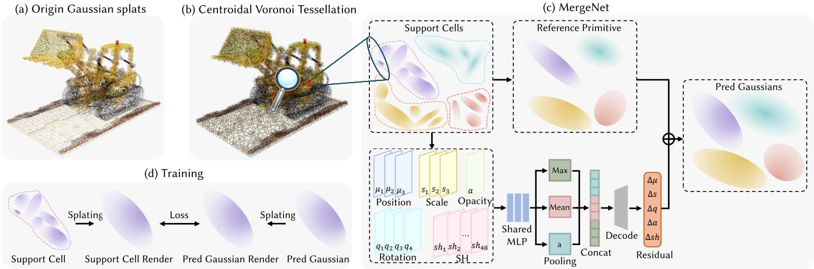  
Figure 1: Overview of our method. (a) The input is a trained 3DGS scene composed of original Gaussian splats. (b) Geometryaware Centroidal Voronoi Tessellation (CVT) partitions Gaussian centers into $M = \lceil \rho N \rceil$ support cells. (c) For each cell, an initial reference primitive is heuristically computed. MergeNet then predicts a residual update to refine this reference into a Gaussian point that better represent the overall appearance of cell. (d) MergeNet is trained ofline under local diferentiable rendering supervision, aligning the rendered crops of the predicted Gaussian with those of the original cell. When applying our method, no parameters of the network will be updated.

As geometric pre-processing, we follow NanoGS (Xiong et al. 2026) and filter out Gaussians whose opacity is below $\tau _ { \alpha } = 0 . 1$ . Please note that the prescribed output count remains unchanged, with $M = \lceil \rho \dot { N } \rceil$ still computed from the original number of input primitives N. After that, CVT is computed in the 3D position space of Gaussian centers, with opacity used as sample mass. The resulting weighted samples define the empirical measure

$$
\nu _ { S } = \sum _ { i \in \mathcal { T } } \alpha _ { i } \delta _ { \pmb { \mu } _ { i } } ,\tag{2}
$$

where $\nu _ { S }$ denotes this opacity-weighted empirical measure, $\alpha _ { i }$ is the opacity of primitive $G _ { i } ,$ , and $\delta _ { \mu _ { i } }$ is the unit Dirac measure at $\pmb { \mu } _ { i } .$ In the integrals below, $\mathbf { \bar { x } \in \mathbb { R } ^ { 3 } }$ denotes a spatial location.

Given M sites $C = \{ \mathbf { c } _ { k } \} _ { k = 1 } ^ { M }$ , where $\mathbf { c } _ { k } \in \mathbb { R } ^ { 3 }$ is the site

of the k-th cell, the Voronoi region of that site is

$$
\begin{array} { r l } & { \Omega _ { k } ( C ) = \big \{ \mathbf x \in \mathbb { R } ^ { 3 } : \| \mathbf x - \mathbf c _ { k } \| _ { 2 } ^ { 2 } } \\ & { \qquad \leq \| \mathbf x - \mathbf c _ { j } \| _ { 2 } ^ { 2 } , \forall j \in \{ 1 , \dots , M \} \big \} . } \end{array}\tag{3}
$$

The support construction is formulated as optimal quantization of $\nu _ { S }$ , with CVT energy $E _ { \mathrm { C V T } }$ defined as

$$
E _ { \mathrm { C V T } } ( C ) = \sum _ { k = 1 } ^ { M } \int _ { \Omega _ { k } ( C ) } \| \mathbf x - \mathbf c _ { k } \| _ { 2 } ^ { 2 } d \nu _ { S } ( \mathbf x ) .\tag{4}
$$

The energy in Eq. (4) couples all cells through one scenelevel distortion. As a result, the support of each output primitive is determined relative to all other supports, rather than by an isolated local neighborhood decision.

Since $\nu _ { S }$ is supported on discrete Gaussian positions, the method optimizes the cell memberships of remaining primitives. For fixed sites, the cell assignment $a ( i ) \in \{ 1 , \ldots , M \}$ of primitive i and the member set $\mathsf { \bar { V } } _ { k }$ of the k-th cell are given by the 3D Voronoi map

$$
a ( i ) = \underset { j \in \{ 1 , \ldots , M \} } { \mathrm { a r g m i n } } \| \pmb { \mu } _ { i } - \mathbf { c } _ { j } \| _ { 2 } ^ { 2 } , \quad V _ { k } = \{ i \in \mathcal { Z } \mid a ( i ) = k \} .\tag{5}
$$

Thus, $V _ { k }$ contains the indices of input Gaussians assigned to the k-th support cell after opacity filtering. Substituting Eq. (2) into Eq. (4) yields the discrete CVT objective

$$
E _ { \mathrm { C V T } } = \sum _ { k = 1 } ^ { M } \sum _ { i \in V _ { k } } \alpha _ { i } \| \pmb { \mu } _ { i } - \mathbf { c } _ { k } \| _ { 2 } ^ { 2 } .\tag{6}
$$

For fixed memberships $V _ { k }$ , minimizing Eq. (6) gives the closed-form Lloyd site update

$$
\mathbf { c } _ { k } = \frac { \sum _ { i \in V _ { k } } \alpha _ { i } \pmb { \mu } _ { i } } { \sum _ { i \in V _ { k } } \alpha _ { i } } .\tag{7}
$$

Alternating Eq. (5) and Eq. (7) performs Lloyd relaxation (Lloyd 1982) on $\nu _ { S }$

For Gaussian simplification, Eq. (6) has a direct geometric interpretation because it measures the weighted second-order spatial spread that each output primitive must absorb within its cell. Lowering this quantity yields tighter and more coherent supports, reducing the burden on the subsequent single-Gaussian prediction. The centroidal update in Eq. (7) further enforces that each site is the opacity-weighted center of its assigned primitives, which is precisely the density-adaptive behavior needed when a target number of output Gaussians must cover a highly non-uniform 3DGS distribution. This weighted Lloyd relaxation is implemented with the Geogram library (Lévy 2026). Let $N _ { c } = \bar { | \mathcal { I } | }$ be the number of remaining primitives. For T Lloyd iterations, the assignment step has the conservative upper bound $O ( T N _ { c } M ) _ { \mathrm { i } } ^ { . }$ ; in practice, Geogram accelerates nearest-site queries with spatial search structures.

## Cell Feature Construction

After CVT, $V _ { k }$ denotes the index set of input Gaussians assigned to the k-th support cell after opacity filtering. The variable-sized member set $\{ G _ { i } \} _ { i \in V _ { k } }$ is used to predict one output primitive $G _ { k } ^ { \star }$ . Before applying MergeNet, the cell is normalized by a deterministic reference primitive $\bar { G } _ { k }$ . This reference provides a stable local coordinate system and initial parameter scale for residual prediction.

Let $\begin{array} { r } { \omega _ { i } ~ = ~ \left. \alpha _ { i } \right/ \sum _ { j \in V _ { k } } \alpha _ { j } } \end{array}$ be the normalized opacity weight inside $V _ { k }$ . The reference position and appearance are weighted averages, $\begin{array} { r c l } { \bar { \pmb { \mu } } _ { k } } & { = } & { \sum _ { i \in V _ { k } } \omega _ { i } \pmb { \mu } _ { i } } \end{array}$ and $\begin{array} { r l } { \bar { \bf f } _ { k } } & { { } = } \end{array}$ $\textstyle \sum _ { i \in V _ { k } } { \boldsymbol { \omega } } _ { i } \mathbf { f } _ { i }$ , where $\mathbf { f } _ { i }$ denotes the appearance coeficients of primitive $G _ { i }$ . The reference covariance is obtained from the weighted second spatial moment of the Gaussian mixture in the cell

$$
\bar { \pmb { \Sigma } } _ { k } = \underbrace { \sum _ { i \in V _ { k } } \omega _ { i } \pmb { \Sigma } _ { i } } _ { \mathrm { w i t h i n - s p l a t ~ s h a p e } } + \underbrace { \sum _ { i \in V _ { k } } \omega _ { i } ( \pmb { \mu } _ { i } - \pmb { \bar { \mu } } _ { k } ) ( \pmb { \mu } _ { i } - \pmb { \bar { \mu } } _ { k } ) ^ { \top } } _ { \mathrm { b e t w e e n - s p l a t ~ s p r e a d } } .\tag{8}
$$

The scale $\bar { \bf s } _ { k }$ is obtained from the square roots of the sorted eigenvalues of $\bar { \Sigma } _ { k }$ , and the rotation $\bar { \mathbf q } _ { k }$ is obtained from the corresponding eigenvectors. Opacity is initialized by probabilistic composition, $\bar { \alpha } _ { k } = 1 \bar { - } \prod _ { i \in V _ { k } } ( 1 - \alpha _ { i } )$

Using ${ \bar { G } } _ { k } \ = \ ( { \bar { \mu } } _ { k } , { \bar { \bf s } } _ { k } , { \bar { \bf q } } _ { k } , { \bar { \alpha } } _ { k } , { \bar { \bf f } } _ { k } )$ , each member primitive $G _ { i }$ with $i \ \in \ V _ { k }$ is described by a reference-relative descriptor $\mathbf { z } _ { i k }$ . It contains the normalized local position $( \bar { \mathbf { R } } _ { k } ) ^ { \top } ( { \pmb { \mu } } _ { i } - { \pmb { \mu } } _ { k } ) \oslash \bar { \mathbf { s } } _ { k }$ , relative log-scale log $\mathbf { s } _ { i } - \log \bar { \mathbf { s } } _ { k }$ relative rotation $\bar { \mathbf q } _ { k } ^ { - 1 } \otimes \mathbf q _ { i } ,$ opacity terms $( \alpha _ { i } , \omega _ { i } )$ , and the appearance residual $\mathbf { f } _ { i } - \bar { \mathbf { f } } _ { k }$ , where $\bar { \mathbf { R } } _ { k }$ is the rotation matrix induced by $\bar { \mathbf q } _ { k }$ and $\oslash$ denotes element-wise division; $\otimes$ denotes quaternion multiplication. Quaternion signs are aligned to $\bar { \mathbf q } _ { k }$ before relative rotations are formed. These referencerelative features provide a normalized local description of each cell, allowing the shared MergeNet to operate across scenes and simplification ratios.

## MergeNet Prediction and Loss

MergeNet is a permutation-invariant set predictor that maps each CVT cell to one standard Gaussian primitive. Given the reference-relative descriptors $\{ { \bf z } _ { i k } \} _ { i \in V _ { k } }$ , a shared pointwise MLP ϕ embeds every cell member. Mean pooling, max pooling, and opacity-weighted pooling aggregate the variablesized set into a fixed-dimensional cell code $\mathbf { h } _ { k }$ . A decoder MLP ψ then predicts a residual update $\Delta G _ { k }$ with respect to the reference primitive

$$
\Delta G _ { k } = \psi ( { \bf h } _ { k } ) , \qquad G _ { k } ^ { \star } = { \bar { G } } _ { k } \oplus \Delta G _ { k } .\tag{9}
$$

Here ⊕ denotes reference-relative composition in the standard 3DGS parameter space, where positions are predicted in the local frame of $\bar { G } _ { k } ^ { \ }$ , scales and opacities are updated in log-scale and logit-opacity domains, rotations are composed by quaternion increments, and appearance coeficients are updated additively. This parameterization keeps the prediction normalized across cells of diferent spatial extents while preserving a valid standard 3DGS primitive. The three pooling operators are complementary. Mean pooling captures average cell statistics, max pooling preserves salient member responses, and opacity-weighted pooling emphasizes primitives with larger visual contribution.

Training is performed with local diferentiable rendering supervision. For each CVT cell $V _ { k } .$ , let $S _ { k } = \{ G _ { i } \} _ { i \in V _ { k } }$ denote the input member set. For a sampled local crop π associated with the k-th cell, $S _ { k }$ and its one-primitive prediction $G _ { k } ^ { \star }$ are rendered with the same rasterizer and crop window, producing the reference crop $I _ { k , \pi }$ and predicted crop $\hat { I } _ { k , \pi }$ In addition to the standard rendering loss, a gradient consistency term encourages local edge and texture preservation

$$
\mathcal { L } _ { \mathrm { g r a d } } = \Vert \nabla _ { x } \hat { I } _ { k , \pi } - \nabla _ { x } I _ { k , \pi } \Vert _ { 1 } + \Vert \nabla _ { y } \hat { I } _ { k , \pi } - \nabla _ { y } I _ { k , \pi } \Vert _ { 1 } .\tag{10}
$$

$$
\mathcal { L } _ { \mathrm { t r a i n } } = ( 1 - \lambda ) \mathcal { L } _ { 1 } + \lambda \mathcal { L } _ { \mathrm { S S I M } } + \lambda _ { g } \mathcal { L } _ { \mathrm { g r a d } } .\tag{11}
$$

Here $\nabla _ { x }$ and $\nabla _ { y }$ denote finite-diference image gradients. $\mathcal { L } _ { 1 }$ is the mean absolute pixel error, $\mathcal { L } _ { \mathrm { S S I M } } = 1 \bar { - } \mathrm { S \bar { S } I M }$ , and $( \lambda , \lambda _ { g } )$ are loss weights. Losses are averaged over sampled cells and crops, with the original cell rendering used as a fixed target; only MergeNet parameters are updated.At deployment, CVT-GS exports the simplified scene as a standard 3DGS representation without per-scene optimization.

## Experiments

## Experimental Settings

Evaluation Datasets and Metrics. We evaluate on four standard 3DGS benchmarks, including NeRF-Synthetic (Mildenhall et al. 2020), Mip-NeRF360 (Barron et al. 2022), Tanks & Temples (Knapitsch et al. 2017), and Deep Blending (Hedman et al. 2018). They cover synthetic objects, unbounded real scenes, large-scale captures, and indoor scenes. We measure rendering fidelity on test views using PSNR, SSIM (Wang et al. 2004), and LPIPS (Zhang et al. 2018). We also report end-to-end simplification time.

Baselines and Comparison Protocol. We compare our method with LightGS (Fan et al. 2024), PUP-3DGS (Hanson et al. 2025), GHAP (Wang et al. 2025), and NanoGS (Xiong et al. 2026). NanoGS is the closest baseline because it is also a training-free post-hoc simplification method. Following NanoGS, we adopt an immediate-output protocol. Each method is evaluated directly after primitive-count reduction, without method-specific recovery, refinement, or fine-tuning. Thus, LightGS, PUP-3DGS, and GHAP are evaluated after their pruning, selection, and reduction stages, respectively. All methods use the same trained 3DGS inputs, target count $M = \lceil \rho N \rceil$ , renderer/evaluator, and hardware. We evaluate $\rho \in \{ 0 . 1 , 0 . 0 1 , 0 . 0 0 1 \}$ }.Note that Gaussian compression methods, such as attribute quantization and entropy coding, are orthogonal to our work. Because they compress the parameters of a fixed primitive set rather than reducing the primitive count, these techniques can be seamlessly applied to our simplified output as a subsequent step.

<table><tr><td rowspan="2">Method</td><td colspan="4">ρ = 0.1</td><td colspan="4">ρ = 0.01</td><td colspan="4"> $\rho = 0 . 0 0 1$ </td></tr><tr><td>PSNR↑</td><td>SSIM↑</td><td>LPIPS↓</td><td>Time (s)↓</td><td>PSNR↑</td><td>SSIM↑</td><td>LPIPS↓</td><td>Time (s)↓</td><td>PSNR↑</td><td>SSIM↑</td><td>LPIPS↓</td><td>Time (s)↓</td></tr><tr><td colspan="9">NeRF Synthetic (3DGS: 33.47 / 0.970 / 0.030)</td><td></td><td></td><td></td></tr><tr><td>LightGS</td><td>21.88</td><td>0.888</td><td>0.097</td><td>31.98</td><td>15.76</td><td>0.807</td><td>0.181</td><td>32.34</td><td>12.64</td><td>0.796</td><td>0.224</td><td>32.36</td></tr><tr><td>PUP-3DGS</td><td>20.24</td><td>0.860</td><td>0.116</td><td>29.20</td><td>13.26</td><td>0.786</td><td>0.206</td><td>29.16</td><td>11.31</td><td>0.792</td><td>0.230</td><td>28.59</td></tr><tr><td>GHAP</td><td>21.19</td><td>0.854</td><td>0.125</td><td>6.28</td><td>13.40</td><td>0.785</td><td>0.206</td><td>6.50</td><td>11.25</td><td>0.792</td><td>0.242</td><td>3.52</td></tr><tr><td>NanoGS</td><td>25.81</td><td>0.910</td><td>0.092</td><td>11.36</td><td>22.28</td><td>0.858</td><td>0.153</td><td>11.70</td><td>19.04</td><td>0.822</td><td>0.207</td><td>11.83</td></tr><tr><td>Ours</td><td>27.76</td><td>0.936</td><td>0.079</td><td>3.58</td><td>23.75</td><td>0.880</td><td>0.134</td><td>3.02</td><td>20.18</td><td>0.846</td><td>0.191</td><td>2.75</td></tr><tr><td colspan="9">Mip-NeRF360 (3DGS: 27.43 / 0.813 / 0.221)</td><td></td><td></td><td></td><td></td></tr><tr><td>LightGS</td><td>19.38</td><td>0.588</td><td>0.412</td><td>76.14</td><td>14.39</td><td>0.389</td><td>0.582</td><td>74.79</td><td>11.97</td><td>0.278</td><td>0.662</td><td>74.54</td></tr><tr><td>PUP-3DGS</td><td>15.96</td><td>0.537</td><td>0.428</td><td>76.36</td><td>10.89</td><td>0.232</td><td>0.623</td><td>74.73</td><td>9.32</td><td>0.100</td><td>0.691</td><td>74.22</td></tr><tr><td>GHAP</td><td>17.35</td><td>0.444</td><td>0.494</td><td>34.23</td><td>10.62</td><td>0.174</td><td>0.664</td><td>35.24</td><td>8.52</td><td>0.035</td><td>0.728</td><td>31.40</td></tr><tr><td>NanoGS</td><td>21.97</td><td>0.582</td><td>0.432</td><td>149.64</td><td>19.39</td><td>0.470</td><td>0.587</td><td>158.05</td><td>17.20</td><td>0.430</td><td>0.661</td><td>158.12</td></tr><tr><td>Ours</td><td>23.45</td><td>0.665</td><td>0.366</td><td>13.71</td><td>20.57</td><td>0.523</td><td>0.532</td><td>9.01</td><td>18.11</td><td>0.466</td><td>0.626</td><td>8.09</td></tr><tr><td colspan="9">Tanks &amp; Temples (3DGS: 23.61 / 0.843 / 0.169)</td><td></td><td></td><td></td><td></td></tr><tr><td>LightGS</td><td>17.50</td><td>0.642</td><td>0.357</td><td>32.15</td><td>12.30</td><td>0.452</td><td>0.585</td><td>31.91</td><td>9.36</td><td>0.341</td><td>0.690</td><td>33.30</td></tr><tr><td>PUP-3DGS</td><td>13.65</td><td>0.585</td><td>0.403</td><td>31.29</td><td>9.11</td><td>0.325</td><td>0.625</td><td>30.64</td><td>7.40</td><td>0.210</td><td>0.699</td><td>30.46</td></tr><tr><td>GHAP</td><td>15.34</td><td>0.487</td><td>0.484</td><td>23.45</td><td>8.43</td><td>0.220</td><td>0.672</td><td>22.91</td><td>5.33</td><td>0.026</td><td>0.748</td><td>20.17</td></tr><tr><td>NanoGS</td><td>17.94</td><td>0.626</td><td>0.413</td><td>57.84</td><td>15.29</td><td>0.501</td><td>0.576</td><td>62.03</td><td>13.54</td><td>0.457</td><td>0.641</td><td>62.33</td></tr><tr><td>Ours</td><td>19.66</td><td>0.712</td><td>0.324</td><td>7.53</td><td>16.61</td><td>0.532</td><td>0.539</td><td>5.62</td><td>14.50</td><td>0.471</td><td>0.625</td><td>5.71</td></tr><tr><td colspan="9">Deep Blending (3DGS: 29.69 / / 0.907 / 0.238)</td><td></td><td></td><td></td><td></td></tr><tr><td>LightGS</td><td>24.28</td><td>0.816</td><td>0.351</td><td>33.50</td><td>18.28</td><td>0.712</td><td>0.506</td><td>31.31</td><td>13.41</td><td>0.616</td><td>0.610</td><td>31.99</td></tr><tr><td>PUP-3DGS</td><td>19.90</td><td>0.765</td><td>0.391</td><td>33.45</td><td>10.91</td><td>0.441</td><td>0.615</td><td>31.05</td><td>8.23</td><td>0.166</td><td>0.708</td><td>30.16</td></tr><tr><td>GHAP</td><td>21.75</td><td>0.739</td><td>0.436</td><td>31.56</td><td>11.36</td><td>0.435</td><td>0.646</td><td>31.98</td><td>7.56</td><td>0.051</td><td>0.746</td><td>29.42</td></tr><tr><td>NanoGS</td><td>26.29</td><td>0.839</td><td>0.371</td><td>104.34</td><td>23.12</td><td>0.780</td><td>0.467</td><td>97.94</td><td>19.42</td><td>0.739</td><td>0.507</td><td>99.63</td></tr><tr><td>Ours</td><td>27.42</td><td>0.864</td><td>0.317</td><td>11.63</td><td>24.35</td><td>0.808</td><td>0.434</td><td>7.63</td><td>20.52</td><td>0.765</td><td>0.484</td><td>6.97</td></tr></table>

Table 1: Quantitative results evaluated on NeRF Synthetic, Mip-NeRF360, Tanks & Temples, and Deep Blending datasets. We highlight the best-performing results in bold and underline the second-best results among all compared methods.

Implementation Details. All inputs are standard 3DGS models optimized with the oficial implementation (Kerbl et al. 2023). MergeNet is trained once for 30k steps on cells sampled from 3DGS scenes built from LLFF (Mildenhall et al. 2019), ShapeNet (Chang et al. 2015), and ScanNet (Dai et al. 2017). We set $\lambda = 0 . 2$ and $\lambda _ { g } = 0 . 2$ . The same checkpoint is used for all test scenes and simplification ratios. No scene-specific optimization is performed. For CVT construction, we filter out Gaussians with opacity below $\tau _ { \alpha } = 0 . 1$ We then run five Lloyd iterations to optimize Eq. (6). Simplification time covers the full pipeline, from loading the trained scene to writing the output. All experiments run on a single

NVIDIA RTX 4090 GPU (24 GB VRAM) with PyTorch 2.8 and CUDA 12.8.

## Experimental Results

Quantitative Results. Table 1 compares our method with LightGS, PUP-3DGS, GHAP, and NanoGS across four benchmarks and three simplification ratios. At matched primitive counts, our method achieves the best rendering quality and the shortest average simplification time in every setting. Compared with NanoGS, the most relevant SOTA trainingfree post-hoc simplification baseline, our method improves average PSNR by $\mathbf { \bar { \rho } } + 1 . 5 7 / + 1 . 3 0 / + 1 . 0 3 \mathrm { d B }$ and SSIM by $+ 0 . 0 5 5 / + 0 . 0 3 4 / + 0 . 0 2 5$ for $\rho = 0 . 1 / 0 . 0 1 / 0 . 0 0 1$ , respectively.

The gains become more significant as the simplification ratio decreases. At $\rho ~ = ~ 0 . 0 0 1$ , our method outperforms the strongest pruning/selection/reduction baseline among LightGS, PUP-3DGS, and GHAP by +5.1 to +7.5 dB PSNR across datasets. On real-captured scenes such as Mip-NeRF360 and Tanks & Temples, pruning and tree-based reduction degrade rapidly at low ratios, whereas our CVTbased support construction maintains more stable fidelity.

Qualitative Results. Figure 2 compares visual quality on the garden scene under progressively more aggressive simplification. The pretrained 3DGS representation of the garden scene contains $N = 4 { , } 2 0 7 { , } 3 5 2$ Gaussian primitives. Accordingly, the simplification ratios $\rho = 0 . 1 , 0 . 0 1$ , and

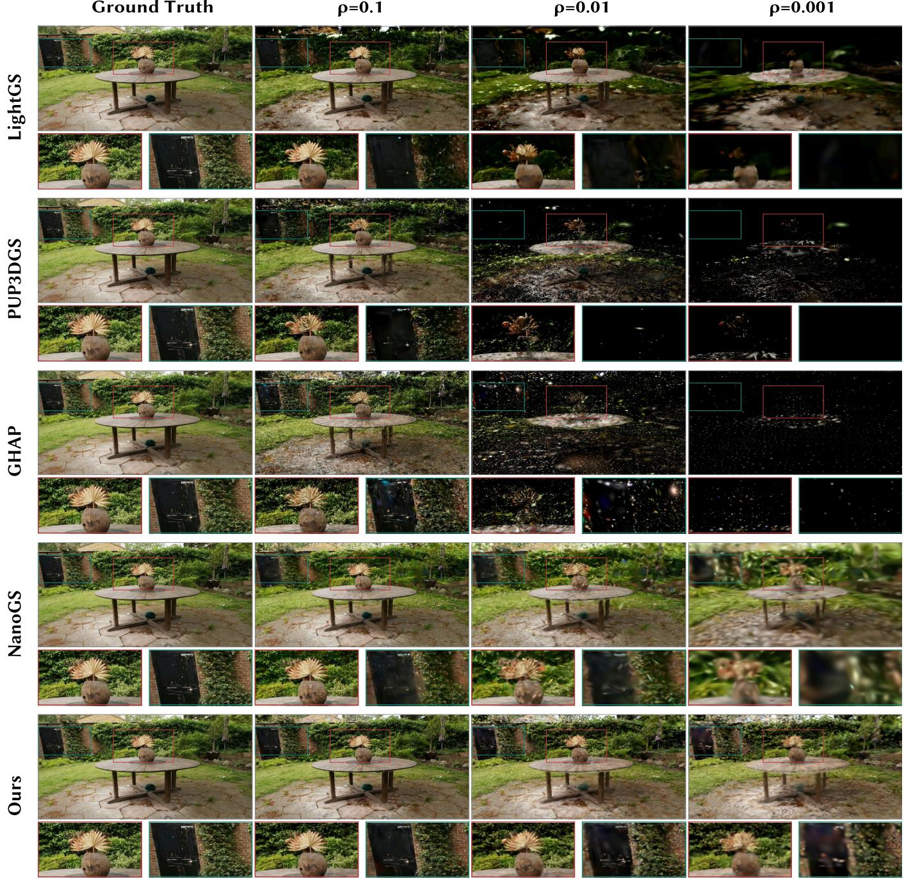  
Figure 2: Qualitative results on garden (Mip-NeRF360). Comparison of our method with existing baselines under diferent simplification ratios.

0.001 yield 420,736, 42,074, and 4,208 output primitives, respectively. While most methods preserve the coarse layout at $\rho = 0 . 1$ , pruning/selection/reduction baselines quickly develop missing regions, speckles, and dark holes at $\rho = 0 . 0 1$ and $\rho ~ = ~ 0 . 0 0 1$ . NanoGS blurs the plant, tabletop, and background structures under aggressive simplification. Our method better preserves the vase silhouette, radial plant details, tabletop contour, and background foliage, showing that CVT support construction and MergeNet retain both global structure and local appearance. Additional qualitative and per-scene results are provided in the supplementary material.

Simplification Time. We measure end-to-end simplification time from loading a trained 3DGS scene to writing the simplified output. Figure 3 compares our method with NanoGS and GHAP on matched scenes.

Using the pooled time over all evaluated scenes and simplification ratios, our method is 12.3× faster than NanoGS and 3.1× faster than GHAP while achieving higher PSNR. These gains come from constructing CVT supports once and predicting the output Gaussians with a single MergeNet pass. Supplementary comparisons further show 7.2×/7.0× speedups over LightGS/PUP-3DGS.

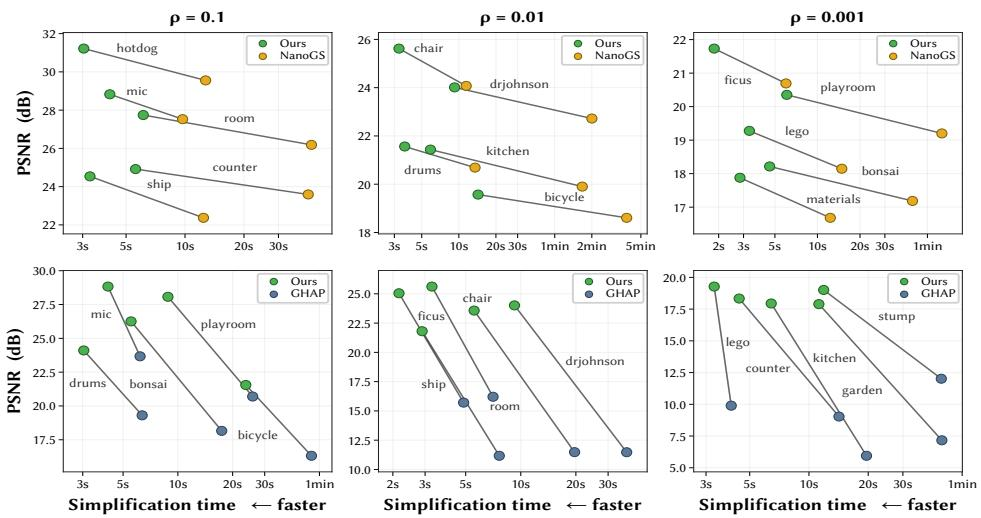  
Figure 3: Trade-of between quality and simplification time under diferent simplification ratios. Top and bottom rows compare our method with NanoGS and GHAP, respectively. Each connected pair denotes the same scene; upper-left indicates higher PSNR and shorter end-to-end simplification time.

<table><tr><td rowspan="2">Variant</td><td colspan="3">ρ = 0.1</td><td colspan="3">ρ = 0.01</td><td colspan="3">ρ = 0.001</td></tr><tr><td>PSNR</td><td>SSIM</td><td>LPIPS</td><td>PSNR</td><td>SSIM</td><td>LPIPS</td><td>PSNR</td><td>SSIM</td><td>LPIPS</td></tr><tr><td>w/o CVT</td><td>23.69</td><td>0.766</td><td>0.294</td><td>19.67</td><td>0.623</td><td>0.501</td><td>15.80</td><td>0.509</td><td>0.677</td></tr><tr><td>w/o filtering</td><td>23.73</td><td>0.772</td><td>0.294</td><td>20.56</td><td>0.660</td><td>0.441</td><td>17.47</td><td>0.610</td><td>0.530</td></tr><tr><td>w/o MergeNet</td><td>22.62</td><td>0.737</td><td>0.337</td><td>18.31</td><td>0.572</td><td>0.595</td><td>14.10</td><td>0.430</td><td>0.811</td></tr><tr><td>Full</td><td>24.57</td><td>0.794</td><td>0.272</td><td>21.32</td><td>0.686</td><td>0.410</td><td>18.33</td><td>0.637</td><td>0.481</td></tr></table>

Table 2: Quantitative ablation study averaged over four benchmark datasets. We ablate CVT support construction, MergeNet, and opacity filtering.

## Ablation Studies

In this section, we verify the efectiveness of diferent components of CVT-GS. Table 2 ablates CVT support construction, MergeNet, and opacity filtering using averages over the four benchmarks. All variants use the same target count $M = \lceil \rho N \rceil$ , and the full model performs best at every simplification ratio. Per-benchmark results are provided in the supplementary material.

Efectiveness of CVT Support Construction. Replacing CVT with local k-NN grouping consistently degrades quality, and the gap widens as the simplification ratio decreases. The average PSNR drops by 0.88, 1.65, and 2.53 dB at $\rho = 0 . 1 , 0 . 0 1$ , and 0.001, respectively, while average LPIPS increases from 0.481 to 0.677 at the most aggressive ratio. This trend supports the central premise of our method. When one output Gaussian must summarize many input primitives, the support should be formed by a scene-level densityadaptive partition rather than by independent local groups.

Efectiveness ofMergeNet and Filtering. Removing MergeNet causes the largest degradation in most settings, with average PSNR drops of 1.95, 3.01, and 4.23 dB across the three ratios. This indicates that the learned neural cell merger is the key component for high-fidelity many-to-one Gaussian merging. Deterministic cell statistics provide a stable reference but cannot capture the residual geometry and appearance within each cell. Opacity filtering has a smaller but consistent efect, improving average PSNR by 0.76–0.86 dB and reducing LPIPS by 0.022–0.049.

## Conclusion

In this paper, we presented CVT-GS, an optimization-free, post-hoc simplification framework for pre-trained 3DGS scenes. By reformulating simplification as scene-level CVT support allocation followed by rendering-aware many-to-one merging, CVT-GS moves beyond naive primitive removal. It delivers superior visual quality while operating more than one order of magnitude faster than existing baselines, all while maintaining strict compatibility with the standard 3DGS format. Specifically, our geometry-aware CVT allocates coherent, density-adaptive support cells over Gaussian centers, which MergeNet then condenses into single representative primitives in a single feed-forward pass. Extensive experiments across four standard benchmarks demonstrate that CVT-GS substantially improves the trade-of between synthesis quality and simplification speed under aggressive compression ratios. Notably, at the extreme 100× simplification setting, CVT-GS achieves an average PSNR of 21.32 dB, outperforming the sota post-hoc baseline by 1.30 dB. Ablation studies further confirm the indispensability of both CVT spatial partitioning and neural cell merging. For future work, researchers may explore more sophisticated MergeNet architectures and extend this framework to dynamic 4D representations where temporal dimensions are integrated.

## References

Barron, J. T.; Mildenhall, B.; Tancik, M.; Hedman, P.; Martin-Brualla, R.; and Srinivasan, P. P. 2021. Mip-NeRF: A Multiscale Representation for Anti-Aliasing Neural Radiance Fields. In Proceedings of the IEEE/CVF International Conference on Computer Vision (ICCV).

Barron, J. T.; Mildenhall, B.; Verbin, D.; Srinivasan, P. P.; and Hedman, P. 2022. Mip-NeRF 360: Unbounded Anti-Aliased Neural Radiance Fields. In Proceedings of the IEEE/CVF Conference on Computer Vision and Pattern Recognition (CVPR).

Chang, A. X.; Funkhouser, T.; Guibas, L.; Hanrahan, P.; Huang, Q.; Li, Z.; Savarese, S.; Savva, M.; Song, S.; Su, H.; Xiao, J.; Yi, L.; and Yu, F. 2015. ShapeNet: An Information-Rich 3D Model Repository. Technical Report arXiv:1512.03012, Stanford University, Princeton University, Toyota Technological Institute at Chicago.

Chen, Y.; Li, M.; Wu, Q.; Lin, W.; Harandi, M.; and Cai, J. 2026. PCGS: Progressive Compression of 3D Gaussian Splatting. In Proceedings ofthe AAAI Conference on Artificial Intelligence (AAAI).

Chen, Y.; Wu, Q.; Li, M.; Lin, W.; Harandi, M.; and Cai, J. 2025. Fast Feedforward 3D Gaussian Splatting Compression. In International Conference on Learning Representations (ICLR).

Chen, Y.; Wu, Q.; Lin, W.; Harandi, M.; and Cai, J. 2024. HAC: Hash-grid Assisted Context for 3D Gaussian Splatting Compression. In European Conference on Computer Vision (ECCV).

Dai, A.; Chang, A. X.; Savva, M.; Halber, M.; Funkhouser, T.; and Nießner, M. 2017. ScanNet: Richly-Annotated 3D Reconstructions of Indoor Scenes. In Proceedings of the IEEE Conference on Computer Vision and Pattern Recognition (CVPR).

Dai, Z.; Liu, T.; and Zhang, Y. 2025. Eficient Decoupled Feature 3D Gaussian Splatting via Hierarchical Compression. In Proceedings ofthe IEEE/CVF Conference on Computer Vision and Pattern Recognition (CVPR).

Du, Q.; Faber, V.; and Gunzburger, M. 1999. Centroidal Voronoi Tessellations: Applications and Algorithms. SIAM Review, 41(4).

Fan, Z.; Wang, K.; Wen, K.; Zhu, Z.; Xu, D.; and Wang, Z. 2024. LightGaussian: Unbounded 3D Gaussian Compression with 15x Reduction and 200+ FPS. In Advances in Neural Information Processing Systems (NeurIPS).

Fang, G.; and Wang, B. 2024. Mini-Splatting: Representing Scenes with a Constrained Number of Gaussians. In European Conference on Computer Vision (ECCV).

Girish, S.; Gupta, K.; and Shrivastava, A. 2024. EAGLES: Eficient Accelerated 3D Gaussians with Lightweight Encodings. In European Conference on Computer Vision (ECCV).

Hanson, A.; Tu, A.; Singla, V.; Jayawardhana, M.; Zwicker, M.; and Goldstein, T. 2025. PUP 3D-GS: Principled Uncertainty Pruning for 3D Gaussian Splatting. In Proceedings of the IEEE/CVF Conference on Computer Vision and Pattern Recognition (CVPR).

Hedman, P.; Philip, J.; Price, T.; Frahm, J.-M.; Drettakis, G.; and Brostow, G. 2018. Deep Blending for Free-Viewpoint Image-Based Rendering. ACM Transactions on Graphics, 37(6).

Kerbl, B.; Kopanas, G.; Leimkühler, T.; and Drettakis, G. 2023. 3D Gaussian Splatting for Real-Time Radiance Field Rendering. InACM Transactions on Graphics (SIGGRAPH), volume 42.

Knapitsch, A.; Park, J.; Zhou, Q.-Y.; and Koltun, V. 2017. Tanks and Temples: Benchmarking Large-Scale Scene Reconstruction. ACM Transactions on Graphics, 36(4).

Lee, J. C.; Rho, D.; Sun, X.; Ko, J. H.; and Park, E. 2024. Compact 3D Gaussian Representation for Radiance Field. In Proceedings of the IEEE/CVF Conference on Computer Vision and Pattern Recognition (CVPR).

Lévy, B. 2026. Geogram: A Programming Library with Geometric Algorithms. https://github.com/BrunoLevy/geogram. Accessed: 2026-07-05.

Lévy, B.; and Liu, Y. 2010. Lp Centroidal Voronoi Tessellation and Its Applications. ACM Transactions on Graphics (SIGGRAPH), 29(4).

Liu, H.; Wang, Y.; Li, C.; Cai, R.; Wang, K.; Li, W.; Molchanov, P.; Wang, P.; and Wang, Z. 2025. FlexGS: Train Once, Deploy Everywhere with Many-in-One Flexible 3D Gaussian Splatting. In Proceedings of the IEEE/CVF Conference on Computer Vision and Pattern Recognition (CVPR).

Liu, Y.; Wang, W.; Lévy, B.; Sun, F.; Yan, D.-M.; Lu, L.; and Yang, C. 2009. On Centroidal Voronoi Tessellation—Energy Smoothness and Fast Computation. ACM Transactions on Graphics, 28(4).

Lloyd, S. 1982. Least Squares Quantization in PCM. IEEE Transactions on Information Theory, 28(2).

Lu, T.; Yu, M.; Xu, L.; Xiangli, Y.; Wang, L.; Lin, D.; and Dai, B. 2024. Scafold-GS: Structured 3D Gaussians for View-Adaptive Rendering. In Proceedings of the IEEE/CVF Conference on Computer Vision and Pattern Recognition (CVPR).

Mildenhall, B.; Srinivasan, P. P.; Ortiz-Cayon, R.; Kalantari, N. K.; Ramamoorthi, R.; Ng, R.; and Kar, A. 2019. Local Light Field Fusion: Practical View Synthesis with Prescriptive Sampling Guidelines. ACM Transactions on Graphics, 38(4).

Mildenhall, B.; Srinivasan, P. P.; Tancik, M.; Barron, J. T.; Ramamoorthi, R.; and Ng, R. 2020. NeRF: Representing Scenes as Neural Radiance Fields for View Synthesis. In European Conference on Computer Vision (ECCV).

Navaneet, K. L.; Pourahmadi Meibodi, K.; Abbasi Koohpayegani, S.; and Pirsiavash, H. 2024. CompGS: Smaller and Faster Gaussian Splatting with Vector Quantization. In European Conference on Computer Vision (ECCV).

Niedermayr, S.; Stumpfegger, J.; and Westermann, R. 2024. Compressed 3D Gaussian Splatting for Accelerated Novel View Synthesis. In Proceedings of the IEEE/CVF Conference on Computer Vision and Pattern Recognition (CVPR).

Tang, Z.; Feng, C.; Cheng, X.; Yu, W.; Zhang, J.; Liu, Y.; Long, X.-X.; Wang, W.; and Yuan, L. 2026. NeuralGS:

Bridging Neural Fields and 3D Gaussian Splatting for Compact 3D Representations. In Proceedings of the AAAI Conference on Artificial Intelligence (AAAI).

Wang, T.; Li, M.; Zeng, G.; Meng, C.; and Zhang, Q. 2025. Gaussian Herding across Pens: An Optimal Transport Perspective on Global Gaussian Reduction for 3DGS. NeurIPS 2025, arXiv:2506.09534.

Wang, Z.; Bovik, A. C.; Sheikh, H. R.; and Simoncelli, E. P. 2004. Image Quality Assessment: From Error Visibility to Structural Similarity. IEEE Transactions on Image Processing, 13(4): 600–612.

Xiong, B.; Liu, R.; Zhou, T.; Chen, M.; Fan, Z.; and Feng, A. 2026. NanoGS: Training-Free Gaussian Splat Simplification. arXiv:2603.16103.

Zhan, Y.-T.; Ho, C.-Y.; Yang, H.; Chen, Y.-H.; Chiang, J. C.; Liu, Y.-L.; and Peng, W.-H. 2025. CAT-3DGS: A Context-Adaptive Triplane Approach to Rate-Distortion-Optimized 3DGS Compression. In International Conference on Learning Representations (ICLR).

Zhang, R.; Isola, P.; Efros, A. A.; Shechtman, E.; and Wang, O. 2018. The Unreasonable Efectiveness ofDeep Features as a Perceptual Metric. In Proceedings of the IEEE Conference on Computer Vision and Pattern Recognition (CVPR).

Zhang, Z.; Song, T.; Lee, Y.; Yang, L.; Peng, C.; Chellappa, R.; and Fan, D. 2024. LP-3DGS: Learning to Prune 3D Gaussian Splatting. In Advances in Neural Information Processing Systems (NeurIPS).

## Supplementary Material for CVT-GS

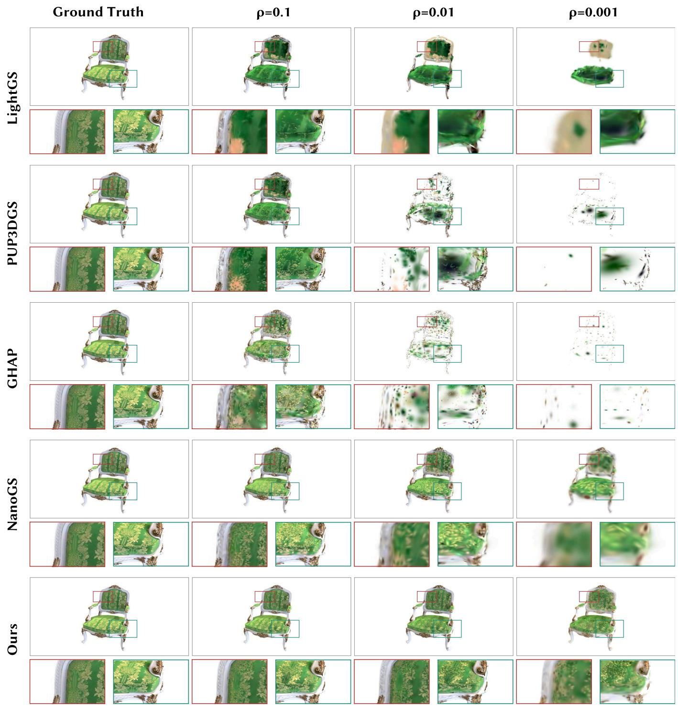  
Figure 4: Qualitative results on chair (NeRF-Synthetic). Comparison of our method with existing baselines under diferen simplification ratios.

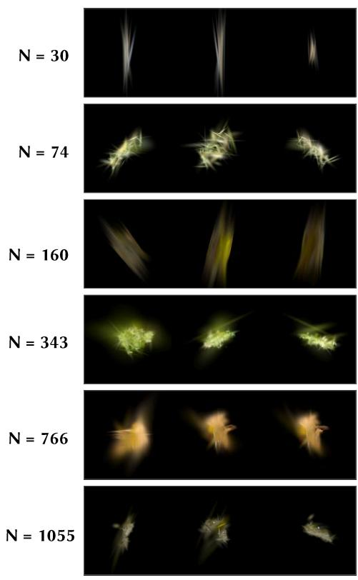  
Ground Truth

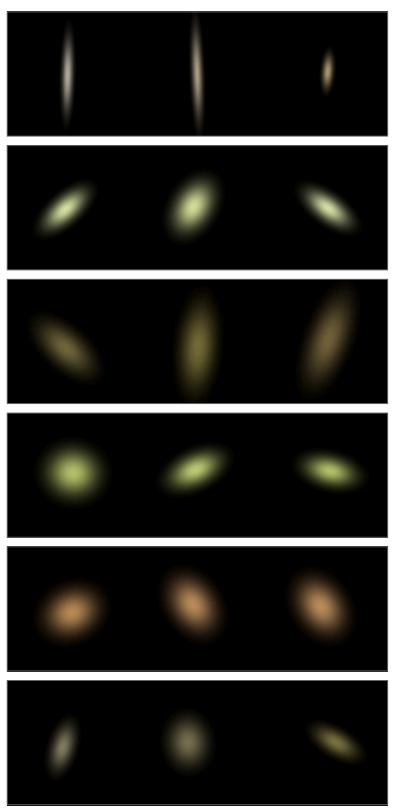  
Ours

Figure 5: Cell-level rendering examples of the learned many-to-one merger. Each row shows one CVT support cell containing a variable number of input Gaussian primitives; the left column renders the original cell, and the right column renders the one-Gaussian output of our method  
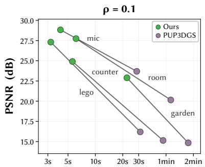

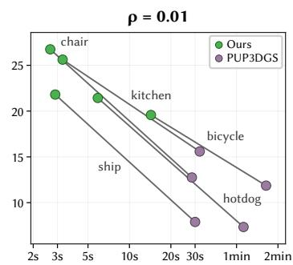

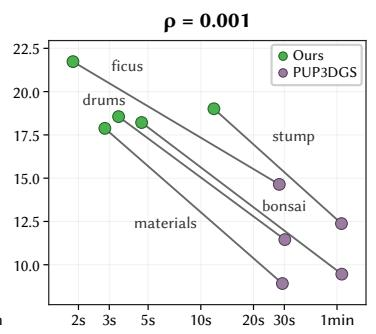

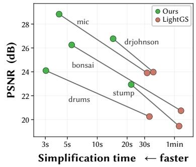

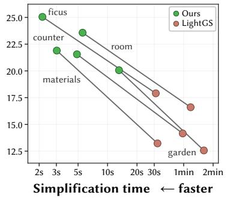

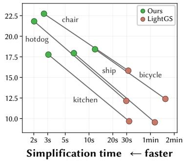  
Figure 6: Trade-of between quality and simplification time under diferent simplification ratios. Top and bottom rows compare our method with PUP-3DGS and LightGS, respectively. Each connected pair denotes the same scene; upper-left indicates higher PSNR and shorter end-to-end simplification time.

<table><tr><td rowspan="2">Variant</td><td colspan="3"> $\rho = 0 . 1$ </td><td colspan="3"> $\rho = 0 . 0 1$ </td><td colspan="3">ρ= 0.001</td></tr><tr><td>PSNR↑</td><td>SSIM↑</td><td>LPIPS↓</td><td>PSNR↑</td><td>SSIM↑</td><td>LPIPS↓</td><td>PSNR↑</td><td>SSIM↑</td><td>LPIPS↓</td></tr><tr><td colspan="10">NeRF Synthetic</td></tr><tr><td>w/o CVT</td><td>27.12</td><td>0.926</td><td>0.088</td><td>22.45</td><td>0.845</td><td>0.183</td><td>18.35</td><td>0.792</td><td>0.275</td></tr><tr><td>w/o filtering</td><td>27.01</td><td>0.929</td><td>0.085</td><td>23.71</td><td>0.873</td><td>0.143</td><td>19.81</td><td>0.840</td><td>0.198</td></tr><tr><td>w/o MergeNet</td><td>26.12</td><td>0.914</td><td>0.103</td><td>20.62</td><td>0.805</td><td>0.242</td><td>15.67</td><td>0.684</td><td>0.441</td></tr><tr><td>Full</td><td>27.76</td><td>0.936</td><td>0.079</td><td>23.75</td><td>0.880</td><td>0.134</td><td>20.18</td><td>0.846</td><td>0.191</td></tr><tr><td colspan="10">Mip-NeRF360</td></tr><tr><td>w/o CVT</td><td>22.73</td><td>0.631</td><td>0.384</td><td>19.12</td><td>0.473</td><td>0.595</td><td>15.63</td><td>0.374</td><td>0.779</td></tr><tr><td>w/o filtering</td><td>21.86</td><td>0.615</td><td>0.424</td><td>19.08</td><td>0.471</td><td>0.599</td><td>16.74</td><td>0.419</td><td>0.686</td></tr><tr><td>w/o MergeNet</td><td>21.47</td><td>0.603</td><td>0.442</td><td>18.32</td><td>0.439</td><td>0.654</td><td>14.96</td><td>0.352</td><td>0.815</td></tr><tr><td>Full</td><td>23.45</td><td>0.665</td><td>0.366</td><td>20.57</td><td>0.523</td><td>0.532</td><td>18.11</td><td>0.466</td><td>0.626</td></tr><tr><td colspan="10">Tanks &amp; Temples</td></tr><tr><td>w/o CVT</td><td>18.72</td><td>0.679</td><td>0.357</td><td>14.97</td><td>0.462</td><td>0.648</td><td>11.43</td><td>0.282</td><td>0.935</td></tr><tr><td>w/o filtering</td><td>19.20</td><td>0.697</td><td>0.338</td><td>15.87</td><td>0.514</td><td>0.562</td><td>13.61</td><td>0.438</td><td>0.714</td></tr><tr><td>w/o MergeNet</td><td>17.95</td><td>0.644</td><td>0.401</td><td>13.78</td><td>0.402</td><td>0.792</td><td>9.82</td><td>0.198</td><td>1.127</td></tr><tr><td>Full</td><td>19.66</td><td>0.712</td><td>0.324</td><td>16.61</td><td>0.532</td><td>0.539</td><td>14.50</td><td>0.471</td><td>0.625</td></tr><tr><td colspan="10">Deep Blending</td></tr><tr><td>w/o CVT</td><td>26.18</td><td>0.827</td><td>0.349</td><td>22.15</td><td>0.710</td><td>0.578</td><td>17.81</td><td>0.588</td><td>0.719</td></tr><tr><td>w/o filtering</td><td>26.85</td><td>0.848</td><td>0.330</td><td>23.57</td><td>0.784</td><td>0.458</td><td>19.74</td><td>0.742</td><td>0.523</td></tr><tr><td>w/o MergeNet</td><td>24.93</td><td>0.785</td><td>0.403</td><td>20.52</td><td>0.643</td><td>0.693</td><td>15.94</td><td>0.488</td><td>0.862</td></tr><tr><td>Full</td><td>27.42</td><td>0.864</td><td>0.317</td><td>24.35</td><td>0.808</td><td>0.434</td><td>20.52</td><td>0.765</td><td>0.484</td></tr></table>

Table 3: Quantitative ablation study on each benchmark dataset. We ablate CVT support construction, MergeNet, and opacity filtering. Best results are highlighted in bold.

<table><tr><td rowspan="2">Scene</td><td colspan="3">ρ= 0.1</td><td colspan="3">ρ= 0.01</td><td colspan="3">ρ= 0.001</td></tr><tr><td>PSNR↑</td><td>SSIM↑</td><td>LPIPS↓</td><td>PSNR↑</td><td>SSIM↑</td><td>LPIPS↓</td><td>PSNR↑</td><td>SSIM↑</td><td>LPIPS↓</td></tr><tr><td colspan="10">NeRF Synthetic</td></tr><tr><td>drums</td><td>24.1045</td><td>0.9239</td><td>0.0689</td><td>21.5618</td><td>0.8725</td><td>0.1291</td><td>18.5562</td><td>0.8405</td><td>0.1990</td></tr><tr><td>lego</td><td>27.3102</td><td>0.9199</td><td>0.0917</td><td>22.0116</td><td>0.8271</td><td>0.1712</td><td>19.2768</td><td>0.7978</td><td>0.2193</td></tr><tr><td>materials</td><td>26.2606</td><td>0.9265</td><td>0.0919</td><td>21.8998</td><td>0.8614</td><td>0.1430</td><td>17.8781</td><td>0.8112</td><td>0.2192</td></tr><tr><td>mic</td><td>28.8284</td><td>0.9846</td><td>0.0287</td><td>25.2896</td><td>0.9462</td><td>0.0665</td><td>21.6724</td><td>0.9227</td><td>0.0987</td></tr><tr><td>ship</td><td>24.5378</td><td>0.8202</td><td>0.1852</td><td>21.8053</td><td>0.7711</td><td>0.2764</td><td>17.7706</td><td>0.7428</td><td>0.3389</td></tr><tr><td>chair</td><td>28.7003</td><td>0.9417</td><td>0.0544</td><td>25.6197</td><td>0.9058</td><td>0.1013</td><td>22.7328</td><td>0.8691</td><td>0.1591</td></tr><tr><td>ficus</td><td>31.1139</td><td>0.9930</td><td>0.0293</td><td>25.0480</td><td>0.9347</td><td>0.0617</td><td>21.7319</td><td>0.8998</td><td>0.1164</td></tr><tr><td>hotdog</td><td>31.2173</td><td>0.9738</td><td>0.0801</td><td>26.7425</td><td>0.9246</td><td>0.1191</td><td>21.8104</td><td>0.8830</td><td>0.1744</td></tr><tr><td colspan="10">Mip-NeRF360</td></tr><tr><td>bicycle</td><td>21.5512</td><td>0.5594</td><td>0.4016</td><td>19.5702</td><td>0.3924</td><td>0.5693</td><td>18.4167</td><td>0.3665</td><td>0.6929</td></tr><tr><td>flowers</td><td>18.9185</td><td>0.4407</td><td>0.4709</td><td>17.2129</td><td>0.3099</td><td>0.6279</td><td>15.6628</td><td>0.2659</td><td>0.7375</td></tr><tr><td>garden</td><td>22.8975</td><td>0.6338</td><td>0.3283</td><td>20.0644</td><td>0.4055</td><td>0.5541</td><td>17.8939</td><td>0.3442</td><td>0.7180</td></tr><tr><td>stump treehill</td><td>22.9398</td><td>0.5984</td><td>0.3755</td><td>20.4165</td><td>0.4293</td><td>0.5701</td><td>19.0091</td><td>0.3947</td><td>0.6832</td></tr><tr><td></td><td>20.3475</td><td>0.4889</td><td>0.4834</td><td>19.4054</td><td>0.4189</td><td>0.6112</td><td>18.1206</td><td>0.3993</td><td>0.6426</td></tr><tr><td>room</td><td>27.7428</td><td>0.8313</td><td>0.3176</td><td>23.5693</td><td>0.7632</td><td>0.4348</td><td>19.3816</td><td>0.7057</td><td>0.5032</td></tr><tr><td>counter</td><td>24.9181</td><td>0.8095</td><td>0.3131</td><td>21.5521</td><td>0.6847</td><td>0.4641</td><td>18.3329</td><td>0.6048</td><td>0.5244</td></tr><tr><td>kitchen</td><td>25.4750</td><td>0.7949</td><td>0.3096</td><td>21.4345</td><td>0.5997</td><td>0.4848</td><td>17.9453</td><td>0.5051</td><td>0.6069</td></tr><tr><td>bonsai</td><td>26.2531</td><td>0.8305</td><td>0.2954</td><td>21.8816</td><td>0.7051</td><td>0.4726</td><td>18.2148</td><td>0.6118</td><td>0.5225</td></tr><tr><td colspan="10">Tanks &amp; Temples</td></tr><tr><td>truck</td><td>21.2978</td><td>0.7672</td><td>0.2921</td><td>17.9508</td><td>0.5705</td><td>0.5133</td><td>15.3810</td><td>0.4975</td><td>0.6359</td></tr><tr><td>train</td><td>18.0144</td><td>0.6577</td><td>0.3567</td><td>15.2701</td><td>0.4930</td><td>0.5647</td><td>13.6154</td><td>0.4439</td><td>0.6143</td></tr><tr><td colspan="10">Deep Blending</td></tr><tr><td>drjohnson</td><td>26.7728</td><td>0.8577</td><td>0.3196</td><td>24.0122</td><td>0.7978</td><td>0.4484</td><td>20.6855</td><td>0.7520</td><td>0.4894</td></tr><tr><td>playroom</td><td>28.0718</td><td>0.8699</td><td>0.3138</td><td>24.6901</td><td>0.8183</td><td>0.4188</td><td>20.3519</td><td>0.7778</td><td>0.4782</td></tr></table>

Table 4: Per-scene quantitative results of our method across four benchmark datasets and three simplification ratios. Higher PSNR/SSIM and lower LPIPS indicate better performance.