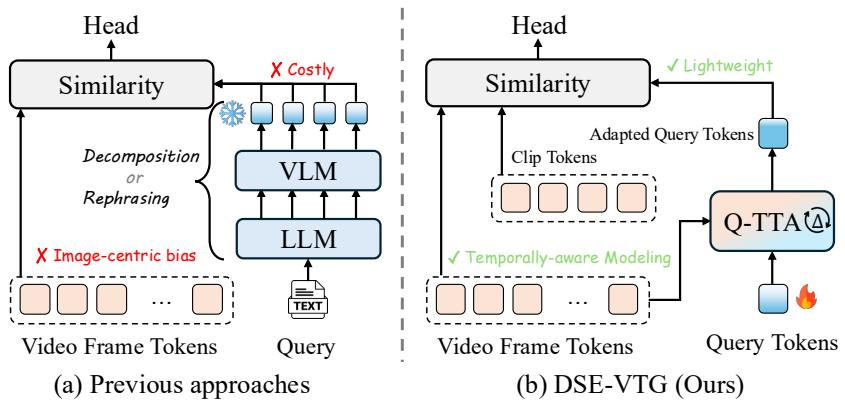
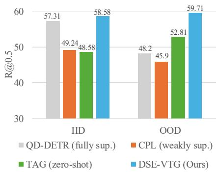
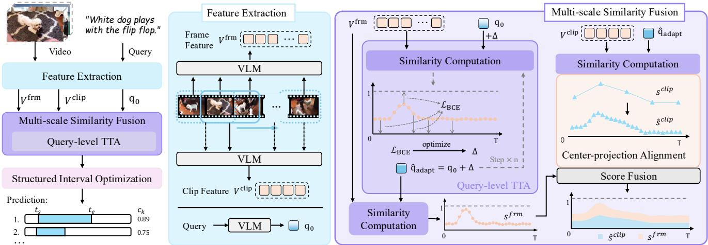
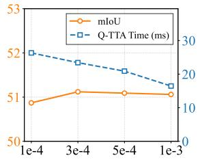
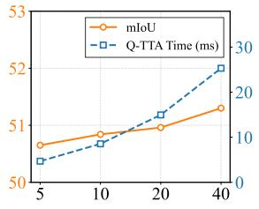
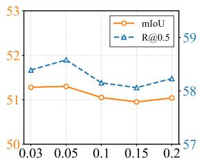
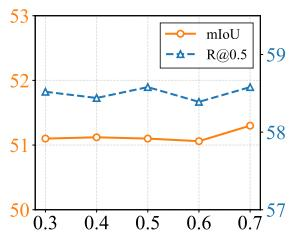

# DSE-VTG: Dual-Side Enhancement for Training-Free Video Temporal Grounding

Zhuo Cao1, Bingqing Zhang1, Sen Wang1, Xue Li1\*

1 The University of Queensland, Australia

{william.cao, bingqing.zhang, sen.wang}@uq.edu.au

xueli@eesc.uq.edu.au

## Abstract

Text-guided Video Temporal Grounding (VTG) aims to localize the relevant segments in an untrimmed video based on text queries, yet collecting dense temporal annotations and training task-specific models remain costly and brittle under distribution shift. Recent training-free VTG approaches mitigate this issue by directly matching pretrained vision-language representations, but they stillface twofundamental information bottlenecks: frame-wise visual encoding overlooks temporal dynamics, whilefixed query embeddings cannot resolve query ambiguity. To address these issues, we propose DSE-VTG, a Dual-Side Enhancement framework that addresses both without any task-specific training. On the visual side, Multi-scale Similarity Fusion (MSF) combines frame- and clip-level similarities into a unified, temporally aware similarity profile. On the textual side, Query-level Test-Time Adaptation (Q-TTA) optimizes a lightweight additive offset to adapt the query embedding to the video at test time, without finetuning the backbone or calling external large language models. Extensive experiments on three standard and two OOD benchmarks show that DSE-VTG achieves state-of-the-art performance among training-free methods. On Charades-STA, it improves mIoU over the strongest prior training-free method by 5.61 points. Under distribution shift, DSE-VTG reaches 50.86 mIoU on Charades-CG Novel-Word, surpassing the strongest supervised baseline by 2.76 mIoU. Our code will be released upon acceptance.

## 1. Introduction

As the primary visual medium in daily life, video contains a density of spatiotemporal information that far exceeds that of static images. The complexity of video streams necessitates intelligent systems capable of accurately parsing dynamic visual information. As a crucial step toward this goal, text-guided Video Temporal Grounding (VTG) aims to localize temporal segments in untrimmed videos that semantically correspond to natural language queries. This task serves as a cornerstone for content production and consumption industries, including video editing, summarization, and question answering.

Despite the broad utility of this task, achieving precise temporal localization remains challenging, owing to the difficulty of establishing fine-grained semantic alignment between unconstrained visual sequences and diverse linguistic queries. Historically, fully supervised methods have dominated this field [3, 20, 28, 32] and have achieved promising results. However, reliance on expensive temporal annotations and susceptibility to out-of-distribution (OOD) shifts have severely limited the scalability of these approaches. To overcome these bottlenecks, a novel paradigm of trainingfree methods has emerged, demonstrating exceptional generality across diverse scenarios [19, 30, 44, 50]. By directly leveraging the rich open-vocabulary representations of pretrained Vision-Language Models (VLMs), such as BLIP-2 [22], these methods perform temporal grounding through inference-time cross-modal matching. This strategy effectively eliminates task-specific training while retaining robustness to distribution shifts.

Despite these initial advancements, existing training-free VTG approaches [19, 30, 44, 50] are constrained by representation limitations in both visual and textual modalities, as illustrated in Fig. 1(a). Visually, these methods typically inherit an image-centric bias from foundational VLMs. This bias stems from image-text pre-training. Therefore, treating videos as independently sampled frames at a fixed rate (e.g., 3 fps [19, 50]) misses temporal dependencies. In the textual modality, natural language queries inherently exhibit ambiguity and uncertainty. For instance, in the query “a person is cooking something”, the term “something” is vague, and the concepts of “person” and “cooking” can correspond to various visual representations. Static query embeddings cannot adapt to video context, leading to poor discriminability in similarity scores. To alleviate this queryside bottleneck, prior works decompose queries with language parsers [30], or employ external LLMs for query decomposition and rephrasing [44, 50] (as shown in Fig. 1(a)). Although these strategies can improve performance, they suffer from two critical limitations. First, they remain query-only and video-agnostic, without dynamic alignment to video evidence. Second, external LLMs add computation and instability, undermining the lightweight premise of the training-free paradigm.

  
Figure 1. Different architectures for training-free video temporal grounding.

To address these challenges, we introduce DSE-VTG (illustrated in Fig. 1(b)), a dual-side enhancement framework for training-free temporal grounding. The proposed framework integrates multi-scale visual evidence while dynamically resolving query ambiguity. On the video side, we introduce a Multi-scale Similarity Fusion (MSF) module, which combines temporal evidence at two granularities without introducing any trainable visual parameters. By utilizing a backbone capable of video processing, we obtain both fine-grained frame-level features and temporally aware clip-level features. The similarity scores of these features are subsequently projected onto a unified timeline via center-projection alignment. This mechanism ensures that localization is guided by both local action boundaries and global event semantics. On the query side, the framework incorporates Query-level Test-Time Adaptation (Q-TTA), a self-bootstrapping query refinement module. Rather than relying on fixed query embeddings or computationally expensive LLMs, this module dynamically optimizes a lightweight learnable offset to refine the representation of the query during inference. Guided by pseudo-labels from the initial similarities, Q-TTA refines the query into a discriminative, video-specific representation without updating any VLM parameters.

To validate the effectiveness of the proposed method, we conduct evaluations across three standard benchmarks, Charades-STA [6], ActivityNet Captions [7], QVHighlights [20], and two out-of-distribution benchmarks derived from Charades-STA, i.e., Charades-CG [21] and Charades-CD [46]. The experimental results demonstrate that DSE-VTG establishes new state-of-the-art performance in the training-free setting. On Charades-STA, the method achieves 58.58 R@0.5 and 51.30 mIoU, outperforming the strongest prior training-free baseline [19] by 10.00 in R@0.5 and 5.61 in mIoU (Fig. 2, IID). On QVHighlights, the method reaches 38.64 mAP, surpassing the performance of previous best training-free methods by 5.49 mAP. It exhibits particularly strong gains under stricter localization thresholds (e.g., R@0.7 and mAP@0.75), which indicates improved boundary precision. Notably, under the out-of-distribution setting, DSE-VTG maintains strong robustness. As shown in Fig. 2, it achieves 59.71 R@0.5 on the Charades-CG Novel-Word split, even outperforming the supervised baselines, and consistently improves performance on Charades-CD. Further analysis demonstrates that the proposed method generalizes well across multiple VLMs. These results confirm that dual-side enhancement effectively strengthens the temporal semantic alignment and generality of the training-free paradigm.

Figure 2. IID and OOD performance compar ison on Charades-STA/CG [6, 21].  

Overall, the main contributions of this work are summarized as follows: (1) We propose DSE-VTG, a novel dual-side enhancement framework for training-free Video Temporal Grounding, which resolves the critical bottlenecks of image-centric visual bias and static query ambiguity. (2) We design two specific functional components: the Multi-scale Similarity Fusion (MSF) module for unified temporally-aware visual modeling, and the Query-level Test-Time Adaptation (Q-TTA) module for lightweight, dynamic semantic alignment. (3) We conduct extensive experiments across three standard and two OOD benchmarks, showing that DSE-VTG achieves state-of-the-art performance in the training-free setting and exhibits superior accuracy and robustness in out-of-distribution scenarios.

## 2. Related Work

## 2.1. Video Temporal Grounding

Video temporal grounding (VTG) traditionally relies on varying degrees of temporal annotations, spanning fully supervised [2, 3, 20, 25, 28, 32], weakly supervised [5, 12, 48], and unsupervised paradigms [33, 40, 41, 49]. While effective, these approaches suffer from severe scalability limitations: they rely heavily on large-scale annotated datasets and exhibit limited generalization under distribution shift. To overcome these limitations, recent works have pioneered a zero-shot, training-free paradigm [30] that directly leverages pretrained Vision-Language Models (VLMs) [22, 35] for inference-time alignment without any fine-tuning or task-specific training. Within this scope, TFVTG [50] employs a large language model to decompose complex queries into sub-events and explicitly models temporal dynamics in videos. To address semantic fragmentation and skewed similarity distributions, TAG [19] introduces temporal pooling and temporal-coherence clustering.

Despite temporal post-processing, the visual representation stage of existing training-free methods [19, 30, 50] remains largely frame-centric: features are extracted at a single temporal resolution, treating videos as sequences of independent frames. Meanwhile, recent video-language foundation models [23, 42] can provide temporally aware representations across multiple granularities, from individual frames to multi-second clips. However, these capabilities remain under-exploited in training-free VTG, where actions and events span multiple temporal scales. In contrast to these single resolution paradigms, our method explicitly models multi-scale temporal context, effectively combining coarse-grained semantics with fine-grained boundaries for precise localization.

## 2.2. Query Understanding and Semantic Alignment

Natural language queries in VTG inherently contain ambiguities, vague references, and contextual dependencies that challenge direct vision-language alignment. To mitigate semantic ambiguity, prior works have explored Test-Time Adaptation (TTA) for query rewriting [18] or zeroshot action localization via parameter updating [24]. However, in the VTG domain, existing training-free methods either use simplified queries without adaptation [33] or rely on expensive LLM-based query decomposition at inference time [44, 50]. This leaves a critical gap: how can we enhance semantic alignment in VTG while maintaining computational efficiency? We address this by proposing a lightweight Query-level TTA module that dynamically refines the query embedding based on the specific video context, achieving precise semantic alignment without external LLM inference or backbone fine-tuning.

## 3. Method

## 3.1. Problem Formulation

We study the task of Video Temporal Grounding (VTG) under a zero-shot protocol which is free of task-specific training: no component is trained or finetuned on any VTG dataset, and the only test-time optimization is a disposable per-query offset (Sec. 3.4). Given an untrimmed video V and a natural language query Q, VTG aims to predict one or multiple temporal moments $\{ ( t _ { s } ^ { k } , t _ { e } ^ { k } , c ^ { k } ) \} _ { k = 1 } ^ { K }$ in V that semantically correspond to Q. Here $t _ { s } ^ { k }$ and $t _ { e } ^ { k }$ are the start and end timestamps of the k-th predicted moment, and $c ^ { k } \in [ 0 , 1 ]$ denotes its confidence score.

## 3.2. Overview

Figure 3 shows the overall architecture of DSE-VTG. A video-capable VLM first encodes the input video into frame-level features $V ^ { \mathrm { f r m } }$ and clip-level features $V ^ { \mathrm { c l i p } }$ , together with an initial query embedding q0 (Sec. 3.3); Q-TTA refines ${ \bf q } _ { 0 }$ into a video-specific query $\hat { \mathbf { q } } _ { \mathrm { a d a p t } }$ by optimizing a lightweight offset against pseudo-labels mined from the initial similarities (Sec. 3.4); MSF projects the two similarity streams into a common frame timeline (Sec. 3.5); and structured interval optimization decodes the fused scores into temporal boundaries (Sec. 3.6). Together, these modules form a unified training-free paradigm achieving accurate video-text alignment.

## 3.3. Multi-Granularity Feature Extraction

To establish a robust foundation for temporal grounding, we first map the raw video V and text query Q into a shared semantic space. Existing training-free pipelines typically inherit an image-centric representation bias from imagepretrained vision-language models, treating videos as independent frames. To inject temporal cues without additional training, we adopt a video-capable backbone to extract multi-granularity visual features, capturing both finegrained local semantics and broader temporal dynamics.

Video-capable backbone Unlike image-only architectures (e.g., ViT + Q-Former, CLIP-style encoders [22]), a video-capable backbone natively supports multi-frame inputs and models temporal relations during feature extraction. This yields temporally aware clip representations while preserving training-free inference.

Query and dual-granularity video features Given a natural language query Q, we first extract its sentence-level text embedding $\mathbf { q } _ { 0 } \in \mathbb { R } ^ { D }$ , D is the feature dimension. For the visual counterpart, let a video be represented as a sequence of T sampled frames. We extract two complementary feature streams: (i) Frame-level features sampled at 3 fps at default, and (ii) Clip-level features obtained by applying a sliding temporal window of length W seconds with stride S seconds, producing N clip windows encoded. To better cover temporal boundaries, we additionally introduce boundary windows with half-length $B = W / 2$ . The extracted frame- and clip-level features are respectively denoted as:

  
Figure 3. Overall architecture of DSE-VTG. A VLM extracts frame- and clip-level visual features $( V ^ { \mathrm { f r m } }$ and $V ^ { \mathrm { c l i p } } )$ and the initial query embedding $q _ { 0 } ;$ Query-level TTA module optimizes $q _ { 0 }$ into a more discriminative adapted query $\hat { q } _ { \mathrm { a d a p t } } ;$ ; Multi-scale Similarity Fusion com putes cross-modal similarities, using Center-projection Alignment to seamlessly fuse clip-level scores with the frame timeline; Structured Interval Optimization decodes the fused scores into temporal boundaries

$$
V ^ { \mathrm { f r m } } = \{ \mathbf { v } _ { t } ^ { \mathrm { f r m } } \} _ { t = 1 } ^ { T } , V ^ { \mathrm { c l i p } } = \{ \mathbf { v } _ { i } ^ { \mathrm { c l i p } } \} _ { i = 1 } ^ { N } ,\tag{1}
$$

where $\mathbf { v } _ { t } ^ { \mathrm { f r m } } \in \mathbb { R } ^ { D }$ and $\mathbf { v } _ { i } ^ { \mathtt { c l i p } } \in \mathbb { R } ^ { D }$

## 3.4. Query-level Test-Time Adaptation

While the extracted multi-granularity features capture rich visual semantics, direct cross-modal alignment is often hindered by the ambiguity and rigidity of the fixed text embedding $\mathbf { q } _ { 0 } .$ . To bridge this semantic gap, we propose Querylevel Test-Time Adaptation (Q-TTA). Unlike common TTA methods that adapt visual encoders, or task-specific heads, Q-TTA optimizes a single additive offset to the query embedding, keeps every VLM parameter frozen, and discards the offset after the query is answered, so no state persists across queries and videos.

Pseudo-label construction To establish the baseline alignment for pseudo-labeling, we first compute the cosine similarity between the initial text embedding ${ \bf q } _ { 0 }$ and framelevel visual features $V ^ { \mathrm { f r m } }$ . Denoting $\ell _ { 2 }$ normalized features by ˆ·, the initial frame-level similarity is computed as:

$$
\begin{array} { r } { s _ { t } ^ { ( 0 ) } = \langle \hat { \bf q } _ { 0 } , \hat { \bf v } _ { t } ^ { \mathrm { f r m } } \rangle , \quad t = 1 , \dots , T . } \end{array}\tag{2}
$$

These scores are rescaled to [0, 1] via min-max normalization. Instead of relying on external annotations, we treat high-confidence frames as latent positives. Specifically, we select the top- $\cdot k _ { \mathrm { p o s } }$ frames with the highest similarity scores as the pseudo-positive set $\mathcal { P } _ { \cdot }$ , where $k _ { \mathrm { p o s } } ~ = ~ \lfloor \gamma _ { \mathrm { p o s } } T \rfloor$ and $\gamma _ { \mathrm { p o s } }$ is a small positive ratio $( e . g . , 5 \% )$ . For the pseudonegative set ${ \mathcal { N } } .$ , rather than naively selecting the bottomranked frames, we randomly sample $k _ { \mathrm { n e g } } = \lfloor \gamma _ { \mathrm { n e g } } T \rfloor$ frames from the remaining unselected frames.

Adaptation objective We introduce a learnable offset vector $\Delta \in \mathbb { R } ^ { D }$ to adjust the query embedding. The adapted and $\ell _ { 2 }$ normalized query is defined as:

$$
\hat { \mathbf { q } } _ { \mathrm { a d a p t } } = \frac { \mathbf { q } _ { 0 } + \Delta } { \lVert \mathbf { q } _ { 0 } + \Delta \rVert _ { 2 } } .\tag{3}
$$

At each adaptation step, we recompute the frame similarities under the adapted query and rescale them to [0, 1] to obtain bounded logits:

$$
l _ { t } = \langle \hat { \mathbf { q } } _ { \mathrm { a d a p t } } , \hat { \mathbf { v } } _ { t } ^ { \mathrm { f r m } } \rangle , \quad \tilde { l } _ { t } = \frac { l _ { t } - \operatorname* { m i n } ( 1 ) } { \operatorname* { m a x } ( 1 ) - \operatorname* { m i n } ( 1 ) + \epsilon } ,\tag{4}
$$

where $1 = \{ l _ { t } \} _ { t = 1 } ^ { T }$ collects the per-frame similarities and ϵ is a small constant for numerical stability.

The offset $\Delta$ is optimized by minimizing a binary crossentropy objective supervised by the pseudo-labels, where $\mathcal { L } _ { \mathrm { B C E } } ( \tilde { l } _ { t } , y )$ denotes the logits formulation, i.e., a sigmoid is applied to $\ddot { l } _ { t }$ inside the loss:

$$
\mathcal { L } ( \Delta ) = \frac { w _ { \mathrm { p o s } } } { | \mathcal { P } | } \sum _ { t \in \mathcal { P } } \mathcal { L } _ { \mathrm { B C E } } ( \tilde { l } _ { t } , 1 ) + \frac { w _ { \mathrm { n e g } } } { | \mathcal { N } | } \sum _ { t \in \mathcal { N } } \mathcal { L } _ { \mathrm { B C E } } ( \tilde { l } _ { t } , 0 ) ,\tag{5}
$$

where $w _ { \mathrm { p o s } }$ and $w _ { \mathrm { n e g } }$ are loss weights for positive and negative frames, respectively. Since $\tilde { l } _ { t } ~ \in ~ [ 0 , 1 ]$ , the sigmoid outputs are confined to [0.5, 0.73], so the objective acts as a bounded, ranking-style push that raises pseudo-positive frames and lowers pseudo-negative ones, which we found more stable than raw or temperature-scaled cosine logits.

Lightweight optimization Since we only optimize a single D-dimensional vector $\Delta$ rather than updating any VLM parameters, Q-TTA is highly computationally efficient. Once optimized, $\hat { \mathbf { q } } _ { \mathrm { a d a p t } }$ is used alongside ${ \bf q } _ { 0 }$ in the subsequent multi-scale similarity fusion (Sec. 3.5), the proposals generated from the two queries are pooled and ranked jointly (Sec. 3.6).

## 3.5. Multi-scale Similarity Fusion

Employing either frame or clip-level visual features in isolation yields suboptimal performance. However, because these features operate on distinct temporal grids, a direct combination of their similarity scores is non-trivial. To address this challenge, we introduce the Multi-scale Similarity Fusion (MSF) module, which aligns and integrates these complementary similarity streams into a unified and temporally structured profile.

Adapted similarity computation Using the refined query $\hat { \mathbf { q } } _ { \mathrm { a d a p t } } .$ , we re-compute the similarities across both visual streams. Following the similarity metric defined in Eq. 2, the updated frame- and clip-level similarities are:

$$
\begin{array} { r } { s _ { t } ^ { \mathrm { f r m } } = \langle \hat { \mathbf { q } } _ { \mathrm { a d a p t } } , \hat { \mathbf { v } } _ { t } ^ { \mathrm { f r m } } \rangle ; \quad s _ { i } ^ { \mathrm { c l i p } } = \langle \hat { \mathbf { q } } _ { \mathrm { a d a p t } } , \hat { \mathbf { v } } _ { i } ^ { \mathrm { c l i p } } \rangle , } \end{array}\tag{6}
$$

where $t ~ = ~ 1 , \dots , T$ and $i ~ = ~ 1 , \dots , N$ Each stream is independently rescaled to [0, 1]. Frame-level similarities provide fine temporal resolution but are often noisy due to missing context, whereas clip-level similarities capture broader temporal semantics but lack boundary precision. We need to integrate these complementary signals to achieve both temporal stability and localization accuracy.

Center-projection alignment Frame- and clip-level similarities are defined on different temporal grids. Let $f _ { t }$ denote the timestamp of frame t, and $c _ { i }$ the center timestamp of clip i. We project clip scores onto the frame timeline via kernel-based temporal aggregation:

$$
\tilde { s } _ { t } ^ { \mathrm { c l i p } } = \sum _ { i = 1 } ^ { N } K ( f _ { t } - c _ { i } ) s _ { i } ^ { \mathrm { c l i p } } , \quad K ( d ) = \operatorname* { m a x } \left( 0 , 1 - \frac { | d | } { \delta } \right) \mathrm { , }\tag{7}
$$

where $K ( \cdot )$ is a compact-support temporal kernel, and $d$ denotes the temporal distance. Here we adopt a triangular kernel with bandwidth δ.

Score fusion We fuse frame- and clip-level streams as:

$$
s _ { t } ^ { \mathrm { f u s } } = \left( 1 - \alpha \right) s _ { t } ^ { \mathrm { f r m } } + \alpha \tilde { s } _ { t } ^ { \mathrm { c l i p } } ,\tag{8}
$$

where $\alpha \in [ 0 , 1 ]$ is a fixed mixing hyperparameter shared across all videos. The fused score $s _ { t } ^ { \mathrm { f u s } }$ is rescaled to [0, 1] and fed into the structured interval optimization (Sec. 3.6).

By integrating fine-grained semantic evidence with temporally-aware clip context, this multi-scale similarity fusion (MSF) effectively overcomes the static-feature bottleneck of prior training-free pipelines. Experiments show that MSF consistently improves single-scale baselines and complements query-side adaptation.

## 3.6. Structured Interval Optimization

Given the fused similarity sequence $\{ s _ { t } \} _ { t = 1 } ^ { T }$ from MSF (Sec. 3.5), we localize the temporal interval that maximizes semantic contrast with respect to the query.

We first suppress low-confidence regions using adaptive thresholding, only optimizing the scores $s _ { t }$ that satisfy $s _ { t } > \mu ( \mathbf { s } ) - \sigma ( \mathbf { s } )$ , where $\mu ( \mathbf { s } )$ and $\sigma ( \mathbf { s } )$ are the mean and standard deviation of the fused score sequence. To avoid skewed similarity distributions, we follow TAG [19] to apply a Box–Cox transformation:

$$
\bar { s } _ { t } = \left\{ \begin{array} { l l } { \frac { s _ { t } ^ { \lambda } - 1 } { \lambda } , } & { \lambda \neq 0 , } \\ { \log ( s _ { t } ) , } & { \lambda = 0 , } \end{array} \right.\tag{9}
$$

with λ selected via likelihood search. Then we use TCC [19] to cluster frame features into $C$ groups, which yields a partition of the timeline; segment boundaries $( i . e .$ $t _ { s } , t _ { e } )$ are defined at label transitions. Candidate intervals are scored using calibrated similarities:

$$
\phi ( t _ { s } , t _ { e } ) = \frac { \sum _ { t = t _ { s } } ^ { t _ { e } - 1 } \bar { s } _ { t } } { t _ { e } - t _ { s } } - \frac { \sum _ { t \notin [ t _ { s } , t _ { e } ) } \bar { s } _ { t } } { T - ( t _ { e } - t _ { s } ) }\tag{10}
$$

Proposals are ranked by $\phi ( \cdot )$ and mapped to timestamps.

In summary, MSF reduces representation noise, Q-TTA sharpens alignment, and structured interval optimization localizes intervals from the refined scores.

## 4. Experiments

## 4.1. Datasets & Evaluation Metrics

We evaluate on three widely used video temporal grounding benchmarks covering both in-distribution (IID) and out-ofdistribution (OOD) settings.

Charades-STA [6] is built upon the Charades dataset [37], which focuses on indoor human activities. Its test split contains 1,334 videos with 3,720 query-moment pairs, with an average video duration of approximately 30 seconds. To further evaluate robustness under distribution shift, we additionally report results on the Novel-Composition and Novel-Word splits of Charades-CG [21], as well as the Test-OOD split of Charades-CD [46]. These splits provide complementary OOD settings for assessing generalization beyond the standard Charades-STA distribution.

ActivityNet Captions [7] contains 4,885 videos with 17,031 query-moment pairs, covering diverse open-domain activities. The videos are substantially longer than those in Charades-STA, with an average duration of about 120 seconds, making temporal localization more challenging over extended temporal contexts.

Table 1. Results on the Charades-STA test split and ActivityNet Captions val 2 split. Best results are in bold; second-best are underlined within each group. †: MLLM-based methods trained with temporal-grounding supervision of varying degrees; this group indicates mode class rather than a common supervision regime. ‡: requires an external LLM at inference (query decomposition/rephrasing).
<table><tr><td rowspan="2">Method</td><td rowspan="2">Setting</td><td colspan="4">Charades-STA</td><td colspan="4">ActivityNet Captions</td></tr><tr><td>R@0.3</td><td>R@0.5</td><td>R@0.7</td><td>mIoU</td><td>R@0.3</td><td>R@0.5</td><td>R@0.7</td><td>mIoU</td></tr><tr><td>EMB [11]</td><td rowspan="5">fully</td><td>72.50</td><td>58.33</td><td>39.25</td><td>53.09</td><td>64.13</td><td>44.81</td><td>26.07</td><td>45.59</td></tr><tr><td>MGSL-Net [26]</td><td></td><td>63.98</td><td>41.03</td><td></td><td>51.87</td><td>31.42</td><td></td><td></td></tr><tr><td>EaTR [13]</td><td></td><td>68.47</td><td>44.92</td><td></td><td>58.18</td><td>37.64</td><td></td><td></td></tr><tr><td>UniVTG [25]</td><td>72.63</td><td>60.19</td><td>38.55</td><td>52.17</td><td>-</td><td></td><td></td><td></td></tr><tr><td>FlashVTG [3]</td><td>80.65</td><td>70.32</td><td>49.87</td><td>59.61</td><td>–</td><td>–</td><td></td><td></td></tr><tr><td>CRM [10]</td><td rowspan="4">weakly</td><td>53.66</td><td>34.76</td><td>16.37</td><td>-</td><td>55.26</td><td>32.19</td><td></td><td></td></tr><tr><td>CNM [47]</td><td>60.39</td><td>35.43</td><td>15.45</td><td>1</td><td>55.68</td><td>33.31</td><td></td><td></td></tr><tr><td>CPL [48]</td><td>66.40</td><td>49.24</td><td>22.39</td><td></td><td>55.73</td><td>31.37</td><td></td><td></td></tr><tr><td>Huang et al. [12]</td><td>69.16</td><td>52.18</td><td>23.94</td><td>45.20</td><td>58.07</td><td>36.91</td><td></td><td>41.02</td></tr><tr><td>PSVL [33]</td><td rowspan="4">unsup.</td><td>46.47</td><td>31.29</td><td>14.17</td><td>31.24</td><td>44.74</td><td>30.06</td><td>14.74</td><td>29.62</td></tr><tr><td>PZVMR [40]</td><td>46.83</td><td>33.21</td><td>19.14</td><td>36.15</td><td>45.63</td><td>32.14</td><td>18.71</td><td>30.35</td></tr><tr><td>Kim et al. [16]</td><td>52.95</td><td>37.24</td><td>19.33</td><td>36.05</td><td>47.61</td><td>32.59</td><td>15.42</td><td>32.45</td></tr><tr><td>SPL [49] KPSČ-F [41]</td><td>60.73</td><td>40.70</td><td>19.62</td><td>40.47</td><td>50.24</td><td>27.24</td><td>15.03</td><td>35.44</td></tr><tr><td>TimeChat-7B [36]</td><td rowspan="4">MLLM†</td><td>57.85</td><td>40.03</td><td>23.12</td><td>39.53</td><td>48.41</td><td>27.05</td><td>14.79</td><td>35.06</td></tr><tr><td>VTimeLLM-13B [8]</td><td>40.6 55.3</td><td>23.8</td><td>9.7</td><td>26.2</td><td>25.0</td><td>13.2</td><td>6.1</td><td>18.5</td></tr><tr><td>Qwen2.5-VL-7B [34]</td><td>72.98</td><td>34.3 56.13</td><td>14.7 30.43</td><td>34.6 50.01</td><td>44.8 41.84</td><td>29.5 27.27</td><td>14.2</td><td>31.4</td></tr><tr><td>Qwen3-VL-8B [1]</td><td>73.01</td><td>47.04</td><td>18.63</td><td>45.13</td><td>47.67</td><td>31.37</td><td>16.05 20.38</td><td>31.10 36.11</td></tr><tr><td>Luo et al. [30]</td><td rowspan="5">zero-shot</td><td>56.77</td><td></td><td></td><td></td><td></td><td></td><td></td><td></td></tr><tr><td>VTG-GPT‡ [44]</td><td>59.48</td><td>42.93</td><td>20.13</td><td>37.92</td><td>48.28</td><td>27.90</td><td>11.57</td><td>30.45</td></tr><tr><td></td><td>67.04</td><td>43.68</td><td>25.94</td><td>39.81</td><td>47.13</td><td>28.25</td><td>12.84</td><td>30.49</td></tr><tr><td>TFVTG‡ [50]</td><td>67.82</td><td>49.97 48.58</td><td>24.32 26.67</td><td>44.51 45.69</td><td>49.34 51.88</td><td>27.02 28.91</td><td>13.39</td><td>34.10</td></tr><tr><td>TAG [19]</td><td></td><td></td><td></td><td></td><td></td><td></td><td>15.07</td><td>36.55</td></tr><tr><td>DSE-VTG (Ours)</td><td></td><td>75.65</td><td>58.58</td><td>32.23</td><td>51.30</td><td>54.83</td><td>31.97</td><td>16.15</td><td>37.93</td></tr></table>

QVHighlights [20] contains 1,550 validation queries over YouTube videos, with an average duration of approximately 150 seconds. The dataset mainly covers news and vlog content and provides annotations for both temporal moment boundaries and frame-level saliency scores.

Metrics For Charades-STA and ActivityNet Captions, we adopt the same evaluation metrics as prior works [19, 30, 50], including mean Intersection over Union (mIoU) and Recall@θ (R@θ) at IoU thresholds $\theta ~ \in ~ \{ 0 . 3 , 0 . 5 , 0 . 7 \}$ For QVHighlights, following the official evaluation protocol [20], we report metrics including mAP, mAP@0.75, R@0.5, R@0.7. These metrics measure both localization accuracy and ranking quality.

## 4.2. Implementation Details

For video feature extraction, we employ Qwen3-VL-Embedding-8B [23] as the primary vision-language backbone. Frame-level features are sampled at 3 fps. Cliplevel features are extracted using a 4-second temporal slid ing window with a 2-second stride and 2-second boundary segments at both ends. For fair comparison with prior work, we evaluate BLIP-2 [22] at 3 fps, alongside additional backbones [14, 23, 31, 43]. In query-level test-time adaptation, the learnable residual vector $\Delta \in \mathbb { R } ^ { D }$ is optimized via AdamW with BCE loss on pseudo-labeled frames. Default Charades-STA TTA hyperparameters include 40 steps, learning rate $1 . 7 \times 1 0 ^ { - 4 }$ , and early stopping. We evaluate Qwen2.5-VL-7B [34] and Qwen3-VL-8B [1] in Tab. 1 on the full test sets using a fixed direct-prompting template with greedy decoding and without model- or datasetspecific prompt tuning. Since published zero-shot results for the same MLLM can vary substantially with prompt wording and frame sampling, these results are intended as a controlled reference under a unified evaluation protocol, rather than as estimates of the best attainable performance of the evaluated models. Further implementation details are provided in the supplementary material.

## 4.3. Experimental Results

We evaluate DSE-VTG on three standard VTG benchmarks and two OOD benchmarks: Tables 1 and 2 report indistribution results on Charades-STA, ActivityNet Captions and QVHighlights, while Tables 3 and 4 report results on the three OOD splits of Charades-CD and Charades-CG under distribution shift. Same-backbone comparisons with TFVTG [50] and TAG [19], reproduced from their released code, are provided in the supplementary material.

Table 2. Evaluation results on QVHighlights val split. Best results are in bold; second-best are underlined.
<table><tr><td rowspan="2">Method</td><td rowspan="2">Setting</td><td colspan="2">Recall</td><td colspan="2">mAP</td></tr><tr><td>@0.5</td><td>@0.7</td><td>@0.75</td><td>Avg.</td></tr><tr><td rowspan="5">M-DETR [20] UMT [27] QD-DETR [32] TR-DETR [38] R2-Tunning [28]</td><td rowspan="5">fully</td><td>53.94</td><td>34.84</td><td></td><td>32.20</td></tr><tr><td>60.26</td><td>44.26</td><td>39.90</td><td>38.59</td></tr><tr><td>62.68</td><td>46.66</td><td>41.82</td><td>41.22</td></tr><tr><td>67.10</td><td>51.48</td><td>46.42</td><td>45.09</td></tr><tr><td>68.71</td><td>52.06</td><td></td><td>47.59</td></tr><tr><td>FlashVTG [3] DualGround [15]</td><td rowspan="3">zero-</td><td>73.10 73.48</td><td>57.29 58.97</td><td>54.33 56.35</td><td>52.84 53.26</td></tr><tr><td>TFVTG [50]</td><td>64.45</td><td>40.19</td><td>30.76</td><td>33.15</td></tr><tr><td>TAG [19]</td><td>23.29</td><td>15.16</td><td>24.58</td><td>24.78</td></tr><tr><td>DSE-VTG (Ours)</td><td>shot</td><td>67.29</td><td>47.16</td><td>39.80</td><td>38.64</td></tr></table>

Table 4. Evaluation results under OOD setting on Charades-CG.
<table><tr><td rowspan="2">Method</td><td rowspan="2">Setting</td><td colspan="2">Novel-Composition</td><td colspan="2">Novel-Word</td></tr><tr><td>R@0.5</td><td>mIoU</td><td>R@0.5</td><td>mIoU</td></tr><tr><td>VISA [21]</td><td rowspan="4">fully</td><td>45.41</td><td>42.03</td><td>42.35</td><td>40.18</td></tr><tr><td>M-DETR [20]</td><td>37.65</td><td>36.17</td><td>43.45</td><td>38.37</td></tr><tr><td>QD-DETR [32]</td><td>40.62</td><td>36.64</td><td>48.20</td><td>43.22</td></tr><tr><td>MESM [29]</td><td>44.39</td><td>39.89</td><td>52.66</td><td>46.38</td></tr><tr><td>SHINE [4]</td><td rowspan="3">weakly</td><td>50.23</td><td>44.14</td><td>55.25</td><td>48.10</td></tr><tr><td>CPL [48]</td><td>39.11</td><td>35.53</td><td>45.90</td><td></td></tr><tr><td>PPS [17]</td><td>40.09</td><td>37.07</td><td>42.01</td><td>38.23</td></tr><tr><td>PC-Net [51]</td><td rowspan="4">zero-shot</td><td>41.69</td><td>38.04</td><td>46.19</td><td>41.06</td></tr><tr><td>Luo et al. [30]</td><td>40.27</td><td></td><td>45.04</td><td></td></tr><tr><td>TFVTG [50]</td><td>43.20</td><td>40.43</td><td>53.53</td><td>45.35</td></tr><tr><td>TAG [19]</td><td>43.06</td><td>42.04</td><td>52.81</td><td>47.60</td></tr><tr><td>DSE-VTG (Ours)</td><td></td><td>51.77</td><td>46.46</td><td>59.71</td><td>50.86</td></tr></table>

As shown in Table 1, DSE-VTG sets a new stateof-the-art under zero-shot, training-free protocol on both Charades-STA [6] and ActivityNet Captions [7]. Specifically, on Charades-STA, DSE-VTG achieves 58.58 and 51.30 in R@0.5 and mIoU, respectively, yielding significant improvements of 10.00 and 5.61 over the previous best training-free baseline [19]. When TAG and TFVTG are re-run with the same Qwen3-VL-Embedding-8B [23] features, they reach 45.41 and 44.03 mIoU, and DSE-VTG still improves over them by 5.89 and 7.27 mIoU (see supplementary material). Furthermore, on Charades-STA it surpasses all weakly-supervised and unsupervised methods, substantially narrows the performance gap between fully-supervised and training-free approaches. On ActivityNet Captions, where longer videos and broader captions make temporal localization more challenging, DSE-VTG achieves the best results among training-free methods.

Table 2 shows that DSE-VTG achieves the best overall performance on QVHighlights [20] under zero-shot setting, reaching 38.64 mAP and outperforming prior SOTA [50] by 5.49 mAP. Notably, the improvement is most pronounced under stricter localization criteria (e.g., R@0.7, mAP@0.75), indicating more accurate boundaries and better prediction ranking. All improvements are achieved without any task-specific training or query rephrasing.

Table 3. Results on the Charades-CD test-ood split. Best results are in bold; second-best are underlined.
<table><tr><td rowspan="2">Method</td><td rowspan="2">Setting</td><td colspan="3">Recall</td></tr><tr><td>@0.3</td><td>@0.5</td><td>@0.7</td></tr><tr><td>SCDM [45]</td><td rowspan="3">fully</td><td>52.38</td><td>41.60</td><td>22.22</td></tr><tr><td>MESM [29]</td><td>69.69</td><td>54.48</td><td>29.39</td></tr><tr><td>CICR [39]</td><td>70.73</td><td>54.72</td><td>29.30</td></tr><tr><td>DEMR [9]</td><td></td><td>67.81</td><td>52.46</td><td>30.97</td></tr><tr><td>WSSL [5]</td><td>weakly</td><td>35.86</td><td>23.67</td><td>8.27</td></tr><tr><td>SPL [49]</td><td>unsup.</td><td>62.96</td><td>38.25</td><td>15.53</td></tr><tr><td>TFVTG [50]</td><td rowspan="3">zero- shot</td><td>65.45</td><td>48.67</td><td>22.64</td></tr><tr><td>TAG [19]</td><td>67.70</td><td>50.28</td><td>28.47</td></tr><tr><td>DSE-VTG (Ours)</td><td>72.21</td><td>54.84</td><td>31.11</td></tr></table>

Tables 3 and 4 report OOD results on Charades-CD [46] test-ood split and Charades-CG [21]. DSE-VTG consistently outperforms training-free baselines under both shift types: on Charades-CG it achieves 46.46 and 50.86 mIoU for Novel-Composition and Novel-Word splits respectively, surpassing TAG [19] by 4.42/3.26 mIoU, together with strong recall gains e.g., +8.71 R@0.5 on Novel-Composition. On Charades-CD, DSE-VTG further reaches 72.21 and 54.84 in R@0.3 and R@0.5, outperforming TAG by 4.51 and 4.56. These results show robust temporalsemantic alignment under both compositional and lexical shifts, without task-specific training.

## 4.4. Ablation Studies

We conduct extensive ablation studies and further analysis on Charades-STA [6] and QVHighlights [20]. Case study and more analysis can be found in supplementary material.

Ablation of the Dual-side Design Table 5 isolates the contributions of the two proposed components. On Charades-STA, Q-TTA and MSF individually improve mIoU from 45.69 to 47.06 and 50.25, respectively, while their combination reaches 51.30. The same trend holds on QVHighlights, where the full model improves mAP from 35.08 to 38.64. These consistent gains show that MSF and Q-TTA are complementary.

Video-side Multi-scale Fusion Table 6 studies the videoside design with different backbones and feature granularities. When only using frame-level features, BLIP-2 [22] and Qwen3-VL-Embedding [23] exhibit mixed strengths across different metrics. Under the same Qwen3 backbone, frameonly and clip-only features achieve 47.06 and 42.82 mIoU, respectively, whereas their fusion reaches 51.30 mIoU and improves R@0.7 from 27.69/15.40 to 32.23. These results suggest that clip-level context complements the fine temporal resolution provided by frame-level features.

  
Learning Rate

  
TTA Steps

  
Positive Frame Ratio

  
Negative Frame Ratio  
Figure 4. Hyperparameter sensitivity analysis of Q-TTA.

Table 5. Ablations on each component. Best results are in bold; second-best are underlined.
<table><tr><td rowspan="2">MSF</td><td rowspan="2">Q-TTA</td><td colspan="3">Charades-STA</td><td colspan="2">QVHighlights</td></tr><tr><td>R@0.5</td><td>R@0.7</td><td>mIoU</td><td>R@0.5</td><td>mAP</td></tr><tr><td rowspan="4">√ √</td><td rowspan="4">√</td><td>50.19</td><td>26.26</td><td>45.69</td><td>63.81</td><td>35.08</td></tr><tr><td>52.34</td><td>27.69</td><td>47.06</td><td>64.77</td><td>36.30</td></tr><tr><td>57.12</td><td>30.59</td><td>50.25</td><td>65.48</td><td>36.94</td></tr><tr><td>58.58</td><td>32.23</td><td>51.30</td><td>67.29</td><td>38.64</td></tr></table>

Table 6. MSF ablation. Backbones are denoted by colored dots: BLIP-2 [22], Qwen3-VL-Embedding [23].
<table><tr><td>Backbone</td><td>Frame</td><td>Clip</td><td>R@0.5</td><td>R@0.7</td><td>mIoU</td></tr><tr><td>O</td><td>√</td><td></td><td>51.83</td><td>29.01</td><td>46.60</td></tr><tr><td>O</td><td>√</td><td></td><td>52.34</td><td>27.69</td><td>47.06</td></tr><tr><td>O</td><td></td><td>√</td><td>34.22</td><td>15.40</td><td>42.82</td></tr><tr><td>O</td><td>√</td><td>√</td><td>58.58</td><td>32.23</td><td>51.30</td></tr></table>

Table 7. Q-TTA ablation. pos/neg-only means only using the positive/negative frames.
<table><tr><td>Variants</td><td>R@0.3</td><td>R@0.5</td><td>R@0.7</td><td>mIoU</td></tr><tr><td>w/o Q-TTA</td><td>74.65</td><td>57.12</td><td>30.59</td><td>50.25</td></tr><tr><td> $Q \mathrm { - } \mathrm { T T A } _ { p o s - o n l y }$ </td><td>75.27</td><td>56.80</td><td>30.86</td><td>50.38</td></tr><tr><td> $Q – \mathrm { T T A } _ { n e g - o n l y }$ </td><td>75.35</td><td>58.31</td><td>31.77</td><td>51.00</td></tr><tr><td>Q-TTA</td><td>75.65</td><td>58.58</td><td>32.23</td><td>51.30</td></tr></table>

Query-side Adaptation Objectives Table 7 analyzes the positive and negative pseudo-label objectives in Q-TTA. Positive-only adaptation produces marginal and mixed changes, increasing mIoU from 50.25 to 50.38 while slightly reducing R@0.5. In contrast, negative-only adaptation improves all metrics and reaches 51.00 mIoU. Combining both objectives achieves the best performance at 51.30 mIoU, suggesting that suppressing pseudo-negative frames is the primary driver, while reinforcing pseudo-positive frames provides a complementary signal.

Performance across VLM Backbones To validate the generality of our approach, we instantiate our framework with a diverse set of VLM backbones, as reported in Table 8. Our framework performance scales with model capacity, culminating in best results with the Qwen3-VL-Embedding-8B [23]. Notably, DSE-VTG consistently exhibits strong grounding capability across different VLM architectures (e.g., RzenEmbed-V2-7B achieving 51.09 mIoU), validating its robustness and broad applicability.

Table 8. VLMs ablations. Best results are in bold; second-best are underlined.
<table><tr><td>VLMs</td><td>R@0.3</td><td>R@0.5</td><td>R@0.7</td><td>mIoU</td></tr><tr><td>VLM2Vec-V2-2B [31]</td><td>51.40</td><td>33.58</td><td>15.05</td><td>33.81</td></tr><tr><td>Omni-Embed-Nemotron-3B [43]</td><td>45.27</td><td>30.56</td><td>14.92</td><td>29.42</td></tr><tr><td>Qwen3-VL-Embedding-2B [23]</td><td>73.58</td><td>55.86</td><td>30.19</td><td>49.64</td></tr><tr><td>RzenEmbed-V2-7B [14]</td><td>76.45</td><td>57.82</td><td>30.16</td><td>51.09</td></tr><tr><td>Qwen3-VL-Embedding-8B [23]</td><td>75.65</td><td>58.58</td><td>32.23</td><td>51.30</td></tr></table>

Computational cost Extracting frame- and clip-level features takes 4.85 s and 3.12 s, respectively, but is performed only once per video; the resulting features are cached and reused across all queries associated with that video. Consistent with prior feature-based training-free VTG methods [19, 50], video features are pre-extracted and reused for subsequent query processing. Once indexed, DSE-VTG processes each query in 69 ms end to end, including 24 ms for text encoding, 25 ms for Q-TTA, 1 ms for MSF, and 19 ms for structured interval optimization. Dual-scale features add 0.44 GB of peak memory relative to single-scale.

Hyperparameter Sensitivity and Efficiency of Q-TTA As shown in the leftmost panel of Fig. 4, model performance exhibits minimal variation with increasing learning rates, while the time required for test-time adaptation progressively decreases. This reduction occurs because of the early stopping strategy, where a larger learning rate requires fewer adaptation steps. Furthermore, although increasing adaptation steps steadily improves grounding accuracy, the time overhead remains exceptionally low (e.g., approximately 25 ms per query for 40 steps). The two rightmost panels of Fig. 4 show robustness to the positive and negative frame ratios.

## 5. Conclusion

We presented DSE-VTG, a dual-side enhancement framework addressing image-centric visual bias and static query ambiguity in training-free Video Temporal Grounding. It combines Multi-scale Similarity Fusion for frame- and cliplevel temporal modeling with Query-level Test-Time Adaptation for lightweight, video-specific query refinement. Extensive experiments on five benchmarks show state-of-theart training-free performance and strong robustness to distribution shifts. DSE-VTG provides a simple and scalable upgrade for similarity-based grounding pipelines.

## References

[1] Shuai Bai, Yuxuan Cai, Ruizhe Chen, Keqin Chen, Xionghui Chen, Zesen Cheng, Lianghao Deng, Wei Ding, Chang Gao, Chunjiang Ge, et al. Qwen3-vl technical report. arXiv preprint arXiv:2511.21631, 2025. 6

[2] Zhuo Cao, Heming Du, Bingqing Zhang, Xin Yu, Xue Li, and Sen Wang. When one moment isn’t enough: Multi-moment retrieval with cross-moment interactions. In NeurIPS, 2025. 3

[3] Zhuo Cao, Bingqing Zhang, Heming Du, Xin Yu, Xue Li, and Sen Wang. Flashvtg: Feature layering and adaptive score handling network for video temporal grounding. In WACV, pages 9208–9218, 2025. 1, 3, 6, 7

[4] Zixu Cheng, Yujiang Pu, Shaogang Gong, Parisa Kordjamshidi, and Yu Kong. Shine: Saliency-aware hierarchical negative ranking for compositional temporal grounding. In ECCV, 2024. 7

[5] Xuguang Duan, Wenbing Huang, Chuang Gan, Jingdong Wang, Wenwu Zhu, and Junzhou Huang. Weakly supervised dense event captioning in videos. NeurIPS, 31, 2018. 3, 7

[6] Jiyang Gao, Chen Sun, Zhenheng Yang, and Ram Nevatia. Tall: Temporal activity localization via language query. In ICCV, pages 5267–5275, 2017. 2, 5, 7

[7] Fabian Caba Heilbron, Victor Escorcia, Bernard Ghanem, and Juan Carlos Niebles. Activitynet: A large-scale video benchmark for human activity understanding. In CVPR, pages 961–970, 2015. 2, 5, 7

[8] Bin Huang, Xin Wang, Hong Chen, Zihan Song, and Wenwu Zhu. Vtimellm: Empower llm to grasp video moments. In CVPR, pages 14271–14280, 2024. 6

[9] Haojian Huang, Kaijing Ma, Jin Chen, Haodong Chen, Zhou Wu, Xianghao Zang, Han Fang, Chao Ban, Hao Sun, Mulin Chen, and Zhongjiang He. Adaptive evidential learning for temporal-semantic robustness in moment retrieval. In AAAI, 2026. 7

[10] Jiabo Huang, Yang Liu, Shaogang Gong, and Hailin Jin. Cross-sentence temporal and semantic relations in video activity localisation. In ICCV, pages 7199–7208, 2021. 6

[11] Jiabo Huang, Hailin Jin, Shaogang Gong, and Yang Liu. Video activity localisation with uncertainties in temporal boundary. In ECCV, pages 724–740, 2022. 6

[12] Yifei Huang, Lijin Yang, and Yoichi Sato. Weakly supervised temporal sentence grounding with uncertainty-guided self-training. In CVPR, pages 18908–18918, 2023. 3, 6

[13] Jinhyun Jang, Jungin Park, Jin Kim, Hyeongjun Kwon, and Kwanghoon Sohn. Knowing where to focus: Event-aware transformer for video grounding. In ICCV, pages 13846– 13856, 2023. 6

[14] Weijian Jian, Yajun Zhang, Dawei Liang, Chunyu Xie, Yixiao He, Dawei Leng, and Yuhui Yin. Rzenembed: To wards comprehensive multimodal retrieval. arXiv preprint arXiv:2510.27350, 2025. 6, 8

[15] Minseok Kang, Minhyeok Lee, Minjung Kim, Donghyeong Kim, and Sangyoun Lee. Empower words: Dualground for structured phrase and sentence-level temporal grounding. In NeurIPS, 2025. 7

[16] Dahye Kim, Jungin Park, Jiyoung Lee, Seongheon Park, and Kwanghoon Sohn. Language-free training for zero-shot video grounding. In WACV, pages 2539–2548, 2023. 6

[17] Sunoh Kim, Jungchan Cho, Joonsang Yu, YoungJoon Yoo, and Jin Young Choi. Gaussian Mixture Proposals with Pull-Push Learning Scheme to Capture Diverse Events for Weakly Supervised Temporal Video Grounding. In AAAI, 2024. 7

[18] Yilong Lai, Jialong Wu, Zhenglin Wang, and Deyu Zhou. Adarewriter: Unleashing the power of prompting-based conversational query reformulation via test-time adaptation. In EMNLP, 2025. 3

[19] Jin-Seop Lee, SungJoon Lee, Jaehan Ahn, YunSeok Choi, and Jee-Hyong Lee. Tag: A simple yet effective temporalaware approach for zero-shot video temporal grounding. In BMVC, 2025. 1, 2, 3, 5, 6, 7, 8

[20] Jie Lei, Tamara L Berg, and Mohit Bansal. Detecting moments and highlights in videos via natural language queries. NeurIPS, 34:11846–11858, 2021. 1, 2, 3, 6, 7

[21] Juncheng Li, Junlin Xie, Long Qian, Linchao Zhu, Siliang Tang, Fei Wu, Yi Yang, Yueting Zhuang, and Xin Eric Wang. Compositional temporal grounding with structured variational cross-graph correspondence learning. In CVPR, 2022. 2, 5, 7

[22] Junnan Li, Dongxu Li, Silvio Savarese, and Steven Hoi. Blip-2: Bootstrapping language-image pre-training with frozen image encoders and large language models. In ICML, pages 19730–19742, 2023. 1, 3, 6, 7, 8

[23] Mingxin Li, Yanzhao Zhang, Dingkun Long, Keqin Chen, Sibo Song, Shuai Bai, Zhibo Yang, Pengjun Xie, An Yang, Dayiheng Liu, et al. Qwen3-vl-embedding and qwen3-vl-reranker: A unified framework for state-of-theart multimodal retrieval and ranking. arXiv preprint arXiv:2601.04720, 2026. 3, 6, 7, 8

[24] Benedetta Liberatori, Alessandro Conti, Paolo Rota, Yiming Wang, and Elisa Ricci. Test-time zero-shot temporal action localization. In CVPR, pages 18720–18729, 2024. 3

[25] Kevin Qinghong Lin, Pengchuan Zhang, Joya Chen, Shraman Pramanick, Difei Gao, Alex Jinpeng Wang, Rui Yan, and Mike Zheng Shou. Univtg: Towards unified video language temporal grounding. In ICCV, pages 2794–2804, 2023. 3, 6

[26] Daizong Liu, Xiaoye Qu, Xing Di, Yu Cheng, Zichuan Xu, and Pan Zhou. Memory-guided semantic learning network for temporal sentence grounding. In AAAI, pages 1665– 1673, 2022. 6

[27] Ye Liu, Siyuan Li, Yang Wu, Chang-Wen Chen, Ying Shan, and Xiaohu Qie. Umt: Unified multi-modal transformers for joint video moment retrieval and highlight detection. In CVPR, pages 3042–3051, 2022. 7

[28] Ye Liu, Jixuan He, Wanhua Li, Junsik Kim, Donglai Wei, Hanspeter Pfister, and Chang Wen Chen. r2-tuning: Efficient image-to-video transfer learning for video temporal grounding. In ECCV, 2024. 1, 3, 7

[29] Zhihang Liu, Jun Li, Hongtao Xie, Pandeng Li, Jiannan Ge, Sun-Ao Liu, and Guoqing Jin. Towards balanced alignment: Modal-enhanced semantic modeling for video moment retrieval. In AAAI, pages 3855–3863, 2024. 7

[30] Dezhao Luo, Jiabo Huang, Shaogang Gong, Hailin Jin, and Yang Liu. Zero-shot video moment retrieval from frozen vision-language models. In WACV, pages 5464–5473, 2024. 1, 2, 3, 6, 7

[31] Rui Meng, Ziyan Jiang, Ye Liu, Mingyi Su, Xinyi Yang, Yuepeng Fu, Can Qin, Zeyuan Chen, Ran Xu, Caiming Xiong, Yingbo Zhou, Wenhu Chen, and Semih Yavuz. Vlm2vec-v2: Advancing multimodal embedding for videos, images, and visual documents. arXiv preprint arXiv:2507.04590, 2025. 6, 8

[32] WonJun Moon, Sangeek Hyun, SangUk Park, Dongchan Park, and Jae-Pil Heo. Query-dependent video representation for moment retrieval and highlight detection. In CVPR, pages 23023–23033, 2023. 1, 3, 7

[33] Jinwoo Nam, Daechul Ahn, Dongyeop Kang, Seong Jong Ha, and Jonghyun Choi. Zero-shot natural language video localization. In ICCV, pages 1470–1479, 2021. 3, 6

[34] Qwen Team. Qwen2.5-VL technical report. arXiv preprint arXiv:2502.13923, 2025. 6

[35] Alec Radford, Jong Wook Kim, Chris Hallacy, Aditya Ramesh, Gabriel Goh, Sandhini Agarwal, Girish Sastry, Amanda Askell, Pamela Mishkin, Jack Clark, et al. Learning transferable visual models from natural language supervision. In ICML, pages 8748–8763, 2021. 3

[36] Shuhuai Ren, Linli Yao, Shicheng Li, Xu Sun, and Lu Hou. Timechat: A time-sensitive multimodal large language model for long video understanding. In CVPR, pages 14313– 14323, 2024. 6

[37] Gunnar A. Sigurdsson, Gul Varol, X. Wang, Ali Farhadi,¨ Ivan Laptev, and Abhinav Kumar Gupta. Hollywood in homes: Crowdsourcing data collection for activity understanding. In ECCV, 2016. 5

[38] Hao Sun, Mingyao Zhou, Wenjing Chen, and Wei Xie. Trdetr: Task-reciprocal transformer for joint moment retrieval and highlight detection. In AAAI, pages 4998–5007, 2024. 7

[39] Kefan Tang, Lihuo He, Jisheng Dang, and Xinbo Gao. Boosting temporal sentence grounding via causal inference. In ACM MM, pages 8701–8710, 2025. 7

[40] Guolong Wang, Xun Wu, Zhaoyuan Liu, and Junchi Yan. Prompt-based zero-shot video moment retrieval. In ACM MM, pages 413–421, 2022. 3, 6

[41] Guolong Wang, Xun Wu, Xun Tu, Zhaoyuan Liu, and Junchi Yan. Unsupervised video moment retrieval with knowledgebased pseudo-supervision construction. ACM Trans. Inf. Syst., 43, 2024. 3, 6

[42] Yi Wang, Kunchang Li, Yizhuo Li, Yinan He, Bingkun Huang, Zhiyu Zhao, Hongjie Zhang, Jilan Xu, Yi Liu, Zun Wang, Sen Xing, Guo Chen, Junting Pan, Jiashuo Yu, Yali Wang, Limin Wang, and Yu Qiao. Internvideo: General video foundation models via generative and discriminative learning. arXiv preprint arXiv:2212.03191, 2022. 3

[43] Mengyao Xu, Wenfei Zhou, Yauhen Babakhin, Gabriel Moreira, Ronay Ak, Radek Osmulski, Bo Liu, Even Oldridge, and Benedikt Schifferer. Omni-embed-nemotron: A unified multimodal retrieval model for text, image, audio, and video. arXiv preprint arXiv:2510.03458, 2025. 6, 8

[44] Yifang Xu, Yunzhuo Sun, Zien Xie, Benxiang Zhai, and Sidan Du. Vtg-gpt: Tuning-free zero-shot video temporal grounding with gpt. Applied Sciences, 14:1894, 2024. 1, 2, 3, 6

[45] Yitian Yuan, Lin Ma, Jingwen Wang, Wei Liu, and Wenwu Zhu. Semantic conditioned dynamic modulation for tempo ral sentence grounding in videos. NeurIPS, 32, 2019. 7

[46] Yitian Yuan, Xiaohan Lan, Xin Wang, Long Chen, Zhi Wang, and Wenwu Zhu. A closer look at temporal sentence grounding in videos: Dataset and metric. In Proceedings of the 2nd International Workshop on Human-Centric Multimedia Analysis, page 13–21, 2021. 2, 5, 7

[47] Minghang Zheng, Yanjie Huang, Qingchao Chen, and Yang Liu. Weakly supervised video moment localization with con trastive negative sample mining. In AAAI, pages 3517–3525, 2022. 6

[48] Minghang Zheng, Yanjie Huang, Qingchao Chen, Yuxin Peng, and Yang Liu. Weakly supervised temporal sentence grounding with gaussian-based contrastive proposal learn ing. In CVPR, pages 15555–15564, 2022. 3, 6, 7

[49] Minghang Zheng, Shaogang Gong, Hailin Jin, Yuxin Peng, and Yang Liu. Generating structured pseudo labels for noise resistant zero-shot video sentence localization. In ACL, pages 14197–14209, 2023. 3, 6, 7

[50] Minghang Zheng, Xinhao Cai, Qingchao Chen, Yuxin Peng, and Yang Liu. Training-free video temporal grounding using large-scale pre-trained models. In ECCV, 2024. 1, 2, 3, 6, 7, 8

[51] Mingyao Zhou, Hao Sun, Wei Xie, Ming Dong, Chengji Wang, and Mang Ye. PC-net: Weakly supervised compositional moment retrieval via proposal-centric network. In NeurIPS, 2025. 7