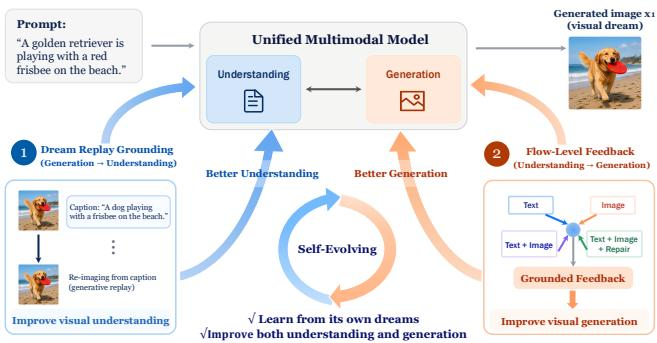
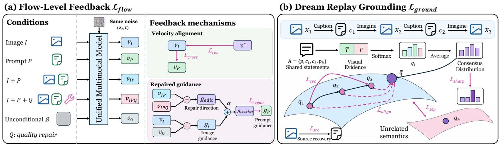
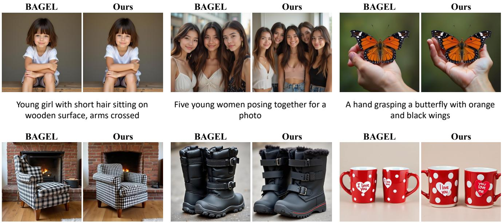
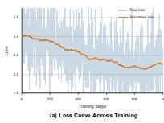
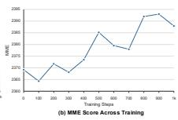
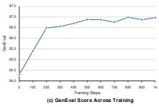

# Dreaming in Flow: Generative Grounding Feedback for Self-Evolving Unified Multimodal Models

Ke Hao1,2∗, Yuanzhi Liang2∗, Tingxi Chen1, Rui Li3, Haibin Huang2, Chi Zhang2, Yun Gu1†, Xuelong Li2†

1Shanghai Jiao Tong University, Shanghai, China 2Institute of Artificial Intelligence, China Telecom (TeleAI), Shanghai, China 3University of Science and Technology of China, Hefei, China ke\_hao2002@outlook.com, yungu@ieee.org, xuelong\_li@ieee.org

## Abstract

Unified multimodal models integrate visual understanding and generation within a single network, yet the two capabilities are commonly optimized as separate tasks. We introduce Generative Grounding Feedback (GGF), a self-evolving post-training framework that uses only text prompts and the model’s own visual experience. Given a prompt, the model first generates a visual “dream.” Flow-level feedback compares text-, image-, and repair-conditioned predictions at the same noisy latent state, transferring image-grounded generation directions to the prompt condition. Dream replay grounding replays this dream through captioning and re-imagination, training claim-level evidence to remain consistent across the replay while separating unrelated visual experiences. Jointly optimized, these two directions let generation provide visual grounding for understanding and understanding refine subsequent generation without paired image–text supervision. Experiments across unified models with diferent understanding–generation integration designs show consistent improvements in text-toimage generation together with modest gains in visual understanding.

## Introduction

Recent advances have moved unified multimodal models toward increasingly tight integration between visual understanding and generation. Early-fusion models such as Chameleon(Team 2024) and Emu3(Wang et al. 2024) represent images and text within a common token sequence. Transfusion(Zhou et al. 2025), Show-o(Xie et al. 2025b), and JanusFlow(Ma et al. 2025) further combine autoregressive language modeling with difusion- or flow-based visual generation. Janus uses separate visual encoders for understanding and generation while retaining a unified transformer, and BAGEL(Deng et al. 2025) extends this design to interleaved multimodal understanding and generation within a decoder-only architecture. Together, these models bring language tokens, semantic visual features, and generative latent representations into a shared model context. This provides a more direct connection between understanding and generation than loosely bridged VLM–generator pipelines, where information must pass through adapters, captions, or external scores.

  
Figure 1: Overview of GGF, which closes the loop between generation and understanding through flow-level feedback and dream replay grounding from a shared visual experience.

This architectural integration creates an opportunity beyond task unification. Once understanding and generation are placed inside the same model, a generated image is no longer merely a final output. It can also become a training experience for both capabilities. Paired with its source prompt, the image provides a self-generated grounding instance for improving visual understanding. When processed by the understanding branch, it also produces semantic visual evidence that can guide future generation. Self-generated images therefore support a bidirectional learning loop: generation provides visual experience for understanding, while understanding returns grounded feedback to generation.

However, architectural unification alone does not guarantee useful self-evolution. A self-generated image may faithfully express the source prompt, but it may also omit objects, distort attributes, violate spatial relations, or contain lowlevel artifacts. Naively training on such samples risks amplifying the model’s own errors. The key problem is therefore not simply how to reuse self-generated images, but how to ground them: the model must determine whether its own visual experience actually supports the intent that produced it. A reliable self-evolving unified model should learn from its dreams, but not blindly imitate them. It must generate visual experience, estimate its semantic fidelity, and consolidate only useful signals back into both understanding and generation.

We propose Generative Grounding Feedback (GGF), a grounded dreaming framework for self-evolving unified multimodal models. Given a text prompt, the model first dreams by generating an image using its current generative branch. The generated image is then read by the understanding branch and replayed through captioning and re-imagination. We evaluate the visual evidence associated with the source and replayed semantics, encouraging claims that remain consistent across the replay while separating them from unrelated visual experiences. Source recovery, replay consistency, and semantic separation together provide grounded supervision for visual understanding.

For the understanding-to-generation direction, GGF further exploits the flow-based generation interface of integrated unified models. We construct multiple conditional views of the same noisy latent state, including text-conditioned, image-conditioned, image-plus-text-conditioned, and imageplus-text-plus-repair-conditioned predictions. Their diferences reveal how prompt information, visual grounding, and repair instructions steer generation. We then distill the more concrete and repair-enhanced image-conditioned guidance into prompt-conditioned generation, while simultaneously using the generated image as a grounding sample for understanding. In this way, GGF does not merely ask whether a final image is good. It asks how the model’s internal generation direction should move when its own visual dream is grounded by understanding.

The resulting loop improves both sides of the unified model. In the generation-to-understanding direction, the replay trajectory turns self-generated images into grounding experiences: the understanding branch learns to preserve semantics that remain stable across captioning and re-imagination. In the understanding-to-generation direction, flow-level feedback uses understanding-encoded visual evidence to refine the generation trajectory. As generated dreams become more faithful, their replayed semantics become more coherent; this stronger grounding signal improves visual understanding, which in turn provides more informative visual evidence for generation. This forms an internal self-evolution loop: dreaming in flow, grounding the dream, and feeding the grounded signal back into future understanding and generation.

Our contributions are threefold. First, we introduce Generative Grounding Feedback (GGF), a grounded dreaming framework that couples understanding and generation through a shared visual experience and a bidirectional grounding loop. Second, we develop two complementary feedback mechanisms: flow-level feedback transfers understanding-encoded visual evidence into promptconditioned generation, while dream replay grounding uses source recovery, replay consistency, and semantic separation to improve visual understanding. Third, we validate GGF across three unified multimodal backbones spanning different architectural families, showing improvements in both text-to-image generation and visual understanding.

## Related Work

Unified multimodal models. A growing body of work aims to unify visual understanding and generation within a single model. Early approaches such as Unified-IO 2 (Lu et al. 2024), Chameleon (Team 2024), Emu2 (Sun et al. 2024), Emu3 (Wang et al. 2024), VILA-U (Wu et al. 2025d), VARGPT (Zhuang et al. 2025), and MetaMorph (Tong et al. 2025) largely formulate multimodal understanding and generation within a shared autoregressive framework. Janus (Wu et al. 2025a) and Janus-Pro (Chen et al. 2025b) retain a shared transformer while decoupling the visual pathways for understanding and generation, alleviating interference between the two capabilities. A complementary line integrates autoregressive semantic modeling with difusion- or flow-based visual synthesis, including Transfusion (Zhou et al. 2025), Show-o (Xie et al. 2025b), Show-o2 (Xie, Yang, and Shou 2026), JanusFlow (Ma et al. 2025), BAGEL (Deng et al. 2025), and BLIP3-o (Chen et al. 2025a). Beyond tightly integrated architectures, systems such as NExT-GPT (Wu et al. 2023), SEED-X (Ge et al. 2024), MetaQueries (Pan et al. 2025), OpenUni (Wu et al. 2025b), and Harmon (Wu et al. 2025c) connect the two capabilities through modality bridges, learnable queries, or aligned visual representations. Together, these works establish increasingly tight architectural interfaces between understanding and generation, providing the foundation for subsequent eforts to make the two capabilities explicitly supervise and improve one another during post-training.

Cross-capability transfer between understanding and generation. Several works explore how one capability can provide supervision to the other within unified multimodal models. On the understanding-to-generation side, representation-alignment methods such as RecA (Xie et al. 2025a) use understanding features as dense visual conditions to supervise generation, while UNO (Liu et al. 2026) further injects understanding-oriented semantic and structural supervision into generative representations. Another line leverages understanding as explicit feedback for generation: TIFA (Hu et al. 2023) and VQAScore (Lin et al. 2024) provide fine-grained text–image evaluation signals, while subsequent methods use critique, reflection, editing, or reprompting to iteratively refine generated results (Singh and Zheng 2023; Lyu et al. 2025; Huang et al. 2026; Tang et al. 2026; Ye et al. 2026). The reverse direction has also been explored: DeGF (Zhang et al. 2025) uses generated visual evidence to improve multimodal understanding, while GAS (Guo et al. 2026) treats generation as auxiliary supervision for strengthening visual representations. Overall, these methods demonstrate efective cross-capability transfer, but largely remain one-way rather than forming a reciprocal learning loop.

Self-improvement and reciprocal evolution. Recent work further explores how unified multimodal models can improve from their own generated experience. One line first generates multimodal experience and then filters, evaluates, or restructures it into post-training data (Wang et al. 2025; Han et al. 2026; Fang et al. 2026). A tighter loop directly uses understanding-derived preferences (Qu et al. 2025) or intrinsic rewards (Jin et al. 2025; Pan et al. 2026) to optimize generation, reducing the need for external evaluators but leaving the explicit learning path largely understandingto-generation. Another line moves toward reciprocal optimization of both capabilities: some methods jointly optimize understanding and generation with curated task rewards or pre-constructed question–answer supervision (Jiang et al. 2026; Mao, Yang, and Shou 2025), while others couple the two directions through intrinsic reciprocal rewards or reconstruction-based objectives (Hong et al. 2026; Yan et al. 2026). (Thawkar et al. 2026) further couples understanding and generation through self-derived consistency signals, but still starts from external unlabeled images. Overall, existing approaches often rely on curated task supervision, predefined answers, external visual data, or reward construction within reinforcement-learning or preference-optimization frameworks. It therefore remains underexplored how to enable both capabilities to self-evolve from text prompts alone, without external visual experience or task-specific supervision, while establishing a direct internal coupling between understanding and generation.

## Method

## Overview

We consider a unified multimodal model with an autoregressive understanding branch and a flow-based generation branch. Given a text prompt p, the model first generates an image $x _ { 1 }$ using its current parameters. For intuition, we refer to this self-generated image as a visual dream. Technically, $x _ { 1 }$ is a non-diferentiable self-generated training sample that remains associated with the prompt that produced it.

Generative Grounding Feedback (GGF) uses this visual dream as a shared self-generated experience for coupling generation and understanding. In the understandingto-generation direction, GGF uses the flow-based generation interface to compare how text, image, and repair conditions steer the same noisy latent state. This provides guidance at the level of the generation trajectory, aligning the model’s interpretation of the dream with its understanding-encoded visual semantics and further refining the next dream through repair.

In the generation-to-understanding direction, GGF utilizes the model’s generative ability to replay its visual dream. The model first interprets the dream through a caption and then re-imagines the captured semantics. This replay cycle aligns consistent semantic manifolds and separates unrelated ones, improving visual understanding. The complete framework can therefore be summarized in three steps: dreaming a visual experience, refining generation with understanding feedback, and grounding understanding through generative replay.

## Self-Generated Visual Experience

For each training prompt $p ,$ we sample an image from the current generation model:

$$
x _ { 1 } \sim G _ { \theta } ( p ) ,\tag{1}
$$

where sampling is performed without gradient computation.

We encode $x _ { 1 }$ using the VAE encoder to obtain a generative latent $z _ { 1 }$ . We then sample a flow timestep t and Gaussian noise ϵ:

$$
z _ { t } = ( 1 - t ) z _ { 1 } + t \epsilon , \qquad v ^ { * } = \epsilon - z _ { 1 } ,\tag{2}
$$

where $v ^ { * }$ is the flow-matching target velocity.

The same image is also processed by the visual understanding encoder to obtain semantic visual tokens. We construct four conditional contexts:

$$
I , \qquad P , \qquad I + P , \qquad I + P + Q ,\tag{3}
$$

where I denotes the image condition, $P$ the source prompt, and $Q$ a quality-repair instruction.

For each condition C, the generation branch predicts

$$
v _ { C } = v _ { \theta } ( z _ { t } , t \mid C ) .\tag{4}
$$

We additionally compute the unconditional prediction

$$
v _ { 0 } = v _ { \theta } ( z _ { t } , t \mid \emptyset )\tag{5}
$$

and define the condition-specific guidance residual as

$$
g _ { C } = v _ { C } - v _ { 0 } .\tag{6}
$$

All predictions are evaluated at the same noisy state $( z _ { t } , t )$ . Their diferences therefore isolate how each condition changes the generation direction.

## Flow-Level Feedback to Generation

We next feed the self-generated experience back to the generation branch. First, the image-conditioned prediction is trained to reconstruct the flow trajectory of $x _ { 1 }$

$$
\mathcal { L } _ { \mathrm { r e c } } = \left| v _ { I } - v ^ { * } \right| _ { 2 } ^ { 2 } .\tag{7}
$$

The image condition describes the sampled visual content more concretely than the prompt alone. Their shared semantics allow the richer image-conditioned signal to ground the prompt in its concrete visual realization, thereby refining the learned prompt–image correspondence. We therefore align the prompt-conditioned velocity with the image-conditioned prediction:

$$
\mathcal { L } _ { \mathrm { c r o s s } } = 1 - \cos \left( v _ { P } , \mathrm { s g } ( v _ { I } ) \right) ,\tag{8}
$$

where $\operatorname { s g } ( \cdot )$ denotes stop-gradient.

Directly distilling the image-conditioned prediction may also preserve defects in $x _ { 1 }$ . We therefore derive an internal repair direction by comparing the predictions with and without a quality-repair instruction:

$$
g _ { \mathrm { e d i t } } = v _ { I P Q } - v _ { I P } .\tag{9}
$$

We compute the image- and prompt-conditioned guidance residuals:

$$
g _ { I } = v _ { I } - v _ { 0 } , \qquad g _ { P } = v _ { P } - v _ { 0 } ,\tag{10}
$$

and construct a repair-enhanced teacher:

$$
g _ { \mathrm { t e a c h e r } } = g _ { I } + \alpha g _ { \mathrm { e d i t } } .\tag{11}
$$

The prompt-conditioned guidance is then aligned with this teacher:

$$
\mathcal { L } _ { \mathrm { r e p a i r } } = 1 - \cos \left( g _ { P } , \mathrm { s g } ( g _ { \mathrm { t e a c h e r } } ) \right) .\tag{12}
$$

  
Figure 2: Overview of Generative Grounding Feedback (GGF). Given a text prompt $p ,$ the model first dreams by generating an image $x _ { 1 } .$ Flow-level feedback uses understanding-encoded visual evidence to refine the generation trajectory, while dream replay grounds visual understanding by preserving consistent semantics across captioning and re-imagination. The two directions are optimized jointly from the same self-generated visual experience.

The two alignment objectives are complementary. $\mathcal { L } _ { \mathrm { c r o s s } }$ transfers the overall image-conditioned flow direction. $\mathcal { L } _ { \mathrm { r e p a i r } }$ removes the unconditional component and transfers only the condition-induced guidance. The latter therefore teaches the prompt condition not merely to reproduce the generated image, but to follow a visually grounded and repairenhanced generation direction.

Repeated training on self-generated samples may cause the model to drift from its pretrained behavior. We retain the initial model $\theta _ { 0 }$ and introduce

$$
{ \mathcal { L } } _ { \mathrm { a n c h o r } } = 1 - \cos \left( v _ { P } , \operatorname { s g } \left( v _ { \theta _ { 0 } } ( z _ { t } , t \mid P ) \right) \right) .\tag{13}
$$

This anchor preserves the pretrained generation prior while allowing the model to learn from its own visual experience.

Overall, the complete flow-level objective is

$$
{ \mathcal { L } } _ { \mathrm { f l o w } } = { \mathcal { L } } _ { \mathrm { r e c } } + \lambda _ { \mathrm { c r o s s } } { \mathcal { L } } _ { \mathrm { c r o s s } } + \lambda _ { \mathrm { r e p a i r } } { \mathcal { L } } _ { \mathrm { r e p a i r } } + \lambda _ { \mathrm { a n c h o r } } ^ { G } { \mathcal { L } } _ { \mathrm { a n c h o r } } .\tag{14}
$$

## Dream Replay Grounding

The reciprocal direction uses generation to improve visual understanding. Given the visual dream $x _ { 1 }$ , the understanding branch first describes its visual content, and the generation branch re-imagines the resulting caption. Repeating this process once forms a dream replay trajectory:

$$
\begin{array} { r } { c _ { 1 } \sim U _ { \theta } ( \cdot \mid x _ { 1 } ) , \quad x _ { 2 } \sim G _ { \theta } ( c _ { 1 } ) , } \\ { c _ { 2 } \sim U _ { \theta } ( \cdot \mid x _ { 2 } ) , \quad x _ { 3 } \sim G _ { \theta } ( c _ { 2 } ) . } \end{array}\tag{15}
$$

The replayed images express how the model realizes the semantics read from its own dream. Captioning and image generation in this trajectory are performed without gradient computation; the resulting replay sequence provides fixed visual and textual evidence for grounding the understanding branch.

We introduce an independent prompt $p _ { b } .$ , sampled from the same training corpus, and generate an unrelated dream $x _ { b } \sim G _ { \theta } ( p _ { b } )$ ). The semantic statement set shared across the replay sequence is

$$
\begin{array} { r } { A = \{ p , c _ { 1 } , c _ { 2 } , p _ { b } \} . } \end{array}\tag{16}
$$

For an image x and a statement $a \in A .$ , let $\ell _ { \theta } ^ { + } ( a \mid x )$ and $\ell _ { \theta } ^ { - } ( a \mid x )$ denote the logits assigned to the afirmative (True) and negative (False) answers by the understanding branch. Their diference defines the image-conditioned evidence, $e _ { \theta } ( a \mid x ) = \ell _ { \theta } ^ { + } ( a \mid x ) - \ell _ { \theta } ^ { - } ( a \mid x )$ . Language priors may make a statement appear plausible without visual support. We remove this bias using its text-only evidence:

$$
s _ { \theta } ( x , a ) = e _ { \theta } ( a \mid x ) - \operatorname { s g } ( e _ { \theta } ( a ) ) .\tag{17}
$$

The residual scores over the shared statement set define a semantic distribution for each image:

$$
q _ { i } ( a ) = \frac { \exp ( s _ { \theta } ( x _ { i } , a ) / \tau _ { s } ) } { \sum _ { a ^ { \prime } \in \mathcal { A } } \exp ( s _ { \theta } ( x _ { i } , a ^ { \prime } ) / \tau _ { s } ) } , \qquad i \in \{ 1 , 2 , 3 , b \} .\tag{18}
$$

Here, $q _ { i }$ is the semantic evidence vector of $x _ { i }$ over all statements in ${ \mathcal { A } } ,$ obtained by applying the softmax along the statement dimension. These distributions place every dream in a common semantic coordinate system defined by the replay sequence.

The replay trajectory should preserve the semantic content read from $x _ { 1 }$ . We form its consensus distribution $\textstyle { \bar { q } } = { \frac { 1 } { 3 } } \sum _ { i = 1 } ^ { 3 } q _ { i }$ and align each replay state with the detached consensus:

$$
\mathcal { L } _ { \mathrm { a l i g n } } = \frac { 1 } { 3 } \sum _ { i = 1 } ^ { 3 } \mathrm { S m o o t h L 1 } \left( q _ { i } , \mathrm { s g } ( \bar { q } ) \right) .\tag{19}
$$

This alignment maintains semantic agreement throughout the replay. We further constrain the final re-imagination to return to the initial dream in both distribution and score geometry:

$$
\begin{array} { r l } & { \mathcal { L } _ { \mathrm { c y c } } = \displaystyle \frac { 1 } { 2 } \bigg [ \mathrm { S m o o t h L 1 } \left( q _ { 3 } , \mathrm { s g } ( q _ { 1 } ) \right) } \\ & { \qquad + \mathrm { 1 } - \mathrm { c o s } \bigg ( \mathrm { t a n h } \bigg ( \frac { s _ { 3 } } { \tau _ { s } } \bigg ) , \mathrm { s g } \bigg ( \mathrm { t a n h } \bigg ( \frac { s _ { 1 } } { \tau _ { s } } \bigg ) \bigg ) \bigg ) \bigg ] , } \end{array}\tag{20}
$$

where $s _ { i }$ collects $s _ { \theta } ( x _ { i } , a )$ over $a \in { \mathcal { A } }$

Semantic consistency alone admits a collapsed solution in which every image receives a similar distribution. The independently generated dream $x _ { b }$ provides an of-manifold reference. We define

$$
d _ { b } = \mathrm { S m o o t h L 1 } \left( q _ { b } , \mathrm { s g } ( \bar { q } ) \right)\tag{21}
$$

and apply a smooth separation penalty:

$$
\mathcal { L } _ { \mathrm { s e p } } = \tau _ { m } \mathrm { s o f t p l u s } \left( \frac { m - d _ { b } } { \tau _ { m } } \right) ,\tag{22}
$$

where m is the separation margin and $\tau _ { m }$ controls its smoothness. This separates unrelated dreams from the replay manifold. We also minimize the normalized entropy of the consensus distribution,

$$
\mathcal { L } _ { \mathrm { s h a r p } } = - \frac { 1 } { | \mathcal { A } | } \sum _ { a \in \mathcal { A } } \bar { q } ( a ) \log ( \bar { q } ( a ) + \epsilon ) ,\tag{23}
$$

which encourages the visual evidence to identify a compact set of supported statements.

We retain the original source-prompt grounding loss, which recovers the source prompt from the initial dream:

$$
\mathcal { L } _ { \mathrm { s r c } } = - \frac { 1 } { L } \sum _ { j = 1 } ^ { L } \log P _ { U _ { \theta } } \left( p _ { j } \mid p _ { < j } , x _ { 1 } \right) .\tag{24}
$$

To stabilize the understanding branch, we anchor its token distribution to the frozen initial model:

$$
\mathcal { L } _ { \mathrm { a n c h o r } } ^ { U } = \frac { 1 } { L } \sum _ { j = 1 } ^ { L } D _ { \mathrm { K L } } \big ( P _ { U _ { \theta _ { 0 } } } ( \cdot \lfloor p _ { < j } , x _ { 1 } ) \parallel P _ { U _ { \theta } } ( \cdot \lfloor p _ { < j } , x _ { 1 } ) \big )\tag{25}
$$

The complete grounding objective is

$$
\begin{array} { r l } & { \mathcal { L } _ { \mathrm { g r o u n d } } = \lambda _ { g } \big ( \mathcal { L } _ { \mathrm { s r c } } + \lambda _ { \mathrm { a l i g n } } \mathcal { L } _ { \mathrm { a l i g n } } + \lambda _ { \mathrm { c y c } } \mathcal { L } _ { \mathrm { c y c } } } \\ & { \qquad + \lambda _ { \mathrm { s e p } } \mathcal { L } _ { \mathrm { s e p } } + \lambda _ { \mathrm { s h a r p } } \mathcal { L } _ { \mathrm { s h a r p } } \big ) + \lambda _ { \mathrm { a n c h o r } } ^ { U } \mathcal { L } _ { \mathrm { a n c h o r } } ^ { U } . } \end{array}\tag{26}
$$

Together, these objectives ground the understanding branch by preserving semantics that survive dream replay and separating them from unrelated visual experience.

## Bidirectional Grounding Optimization

GGF jointly optimizes the two reciprocal directions:

$$
\mathcal { L } _ { \mathrm { G G F } } = \mathcal { L } _ { \mathrm { f l o w } } + \mathcal { L } _ { \mathrm { g r o u n d } } .\tag{27}
$$

The flow-level objective uses understanding-encoded visual evidence to refine the generation trajectory, while the grounding objective uses generative replay to improve visual understanding. Both objectives originate from the same visual dream and update the generation and understanding branches within each training step. This reciprocal training process allows each capability to provide grounded supervision for the other as the model evolves.

## Experiments

## Experimental Setup

Unified backbones. We evaluate Generative Grounding Feedback (GGF) on three unified multimodal models to assess its architectural generality. BAGEL (Deng et al. 2025) is a decoder-only, 7B mixture-of-transformers model that interleaves understanding with rectified-flow generation in a VAE latent space. Show-o2-1.5B-HQ (Xie, Yang, and Shou 2026) combines autoregressive text modeling and flow-matching image generation in a shared Qwen2.5-1.5B-Instruct transformer, with a 3D causal VAE and dual-path spatial fusion. OpenUni-B-512 (Wu et al. 2025b) couples an InternVL3- 1B understanding model with a SANA-0.6B-512px difusion generator through learnable queries. Together, these backbones span mixture-of-transformers, shared-transformer, and bridge-style integration, as well as substantially diferent parameter scales, providing a common test of GGF across architectures.

Benchmarks. We evaluate generation and understanding using the same post-trained checkpoint. For visual generation, GenEval (Ghosh, Hajishirzi, and Schmidt 2023) measures object-level compositional alignment, including counting, spatial relations, and attribute binding, while DPG-Bench (Hu et al. 2024) evaluates dense prompt following. For visual understanding, MME (Fu et al. 2026) covers both perception and cognition, and POPE (Li et al. 2023) measures object hallucination. We further include Hallusion-Bench (Guan et al. 2024) for visual illusion and knowledge hallucination, and SEED-Bench (Li et al. 2024) for comprehensive multimodal comprehension.

Training protocol. GGF is a self-evolving process and requires no paired image–text data. We use 1k text prompts for visual dreaming and a disjoint set of 1k prompts as pb for dream replay grounding. Each backbone is trained for 1k steps on NVIDIA H100 GPUs. BAGEL is distributed across two GPUs due to its memory footprint, while Show-o2 and OpenUni are each trained on a single GPU. At each training step, the flow time t is randomly sampled over the full interval (0, 1). The repair loss is activated only for $t \leq 0 . 7$ to avoid applying the repair signal at unstable, highly noisy states. For all backbones, we train rank-16 LoRA adapters and keep the original model parameters frozen. The trainable modules and generation configurations follow the native design of each backbone:

• BAGEL. We place separate LoRA adapters in the generation experts and the language-understanding layers. Visual dreams are generated at $\mathbf { \bar { 5 } 1 2 } \times 5 1 2$ with 20 flow steps, while replay uses 224 × 224 images and 4 flow steps. Evaluation follows the native 1024 × 1024, 50-step generation protocol.

• Show-o2. We apply a shared LoRA adapter to the multimodal transformer layers. Training and evaluation both use a resolution of 512 × 512 and a 50 difusion steps.

• OpenUni. We apply LoRA to the language model, multimodal connector, and generation transformer. Training and evaluation both use a resolution of $5 1 2 \times 5 1 2$ and 20 difusion steps.

Additional backbone-specific hyperparameters are provided in the supplementary material.

  
Black and white checkered armchair with wooden frame beside a brick fireplace  
A pair of black high-top snow boots with straps and buckles  
Two red mugs with white polka dots and heart-shaped stickers saying 'I love you' and 'You love me

Figure 3: Qualitative comparison before and after GGF on identical prompts. GGF improves physical plausibility (e.g., hands, faces, and fine object details that are malformed in the pretrained model) and compositional faithfulness (e.g., correct object counts and spatial relations).

## Text-to-Image Generation

Table 1 reports text-to-image generation results across the three unified backbones. GGF consistently improves both GenEval and DPG-Bench. Most notably, it raises the strong BAGEL baseline from 84.30 to 86.97 on GenEval, with clear gains in counting, spatial relations, and attribute binding. Show-o2 and OpenUni exhibit the same overall trend across their distinct architectures. In contrast, single-object accuracy changes only marginally because all three pretrained models already perform near saturation in this category. The consistent DPG-Bench gains further indicate that the improvement extends to prompts with denser semantic constraints. Overall, these results align with the goal of using bidirectional feedback to preserve compositional structure throughout self-generated visual experience.

## Impact on Understanding

We next examine whether self-evolution through visual dreaming also benefits understanding. As shown in Table 2, GGF consistently improves MME across BAGEL and Showo2, with gains exceeding 20 points for both backbones. The most pronounced gains appear on HallusionBench. On BAGEL, GGF raises aAcc from 51.8 to 59.4 and fAcc from 24.3 to 31.2, while Show-o2 improves across all three evaluation levels. Since qAcc and fAcc require jointly correct answers across paired contexts or multiple questions about the same figure, these gains reflect stronger consistency beyond isolated question accuracy.

POPE accuracy and F1 also improve slightly on both backbones, while SEED-Bench remains essentially unchanged. This pattern suggests that the understanding gains are concentrated in grounded and consistent interpretation without degrading broad visual comprehension. In particular, the improvement under the stricter HallusionBench grouping metrics is aligned with dream replay grounding, which encourages semantic agreement across successive re-imaginations of the same visual content.

## Ablation Study

Table 3 ablates the objectives in both directions of GGF on BAGEL. The complete objective performs best on both GenEval and MME, and removing any component degrades both metrics. Within flow-level feedback, the generation anchor produces the largest GenEval drop, highlighting the importance of retaining the pretrained flow prior while learning from self-generated experience. Cross-condition alignment has the strongest efect on MME in this group, indicating that image-grounded flow transfer also contributes to the reciprocal optimization of understanding.

For dream replay grounding, semantic separation is the most consequential component: without the unrelated dream as an of-manifold reference, MME decreases by nearly 19 points. Replay alignment and cycle consistency also yield clear gains, confirming that both agreement across replay states and endpoint consistency carry useful grounding signals. The smaller but consistent contributions of source recovery, distribution sharpening, and the understanding anchor further stabilize this process. Notably, objectives from either direction afect both generation and understanding, supporting the reciprocal coupling at the core of GGF.

Table 1: Text-to-image generation on GenEval (six sub-dimensions and overall) and DPG-Bench. For each backbone we report the pretrained model and its GGF-post-trained counterpart (+GGF). GGF consistently improves the overall score, with the largest gains on the compositional dimensions (counting, position, color attribution). Best of each pair in bold.
<table><tr><td></td><td></td><td colspan="7">GenEval↑</td><td></td></tr><tr><td>Model</td><td>Params</td><td>Single</td><td>Two</td><td>Counting</td><td>Colors</td><td>Position</td><td>Color Attr.</td><td>Overall</td><td>DPG↑</td></tr><tr><td>OpenUni</td><td>1.6B</td><td>98.12</td><td>62.63</td><td>48.12</td><td>81.65</td><td>17.75</td><td>30.00</td><td>56.38</td><td>76.27</td></tr><tr><td>+GGF</td><td></td><td>98.12</td><td>65.66</td><td>50.94</td><td>84.31</td><td>34.25</td><td>38.25</td><td>61.92</td><td>78.49</td></tr><tr><td>Show-o2</td><td>1.5B</td><td>97.50</td><td>77.78</td><td>55.62</td><td>82.45</td><td>45.50</td><td>56.75</td><td>69.27</td><td>83.26</td></tr><tr><td>+GGF</td><td></td><td>98.44</td><td>80.30</td><td>59.06</td><td>87.77</td><td>51.75</td><td>62.00</td><td>73.22</td><td>84.52</td></tr><tr><td>BAGEL</td><td>14B</td><td>98.13</td><td>94.44</td><td>78.13</td><td>92.82</td><td>68.50</td><td>73.75</td><td>84.30</td><td>84.04</td></tr><tr><td>+GGF</td><td></td><td>98.75</td><td>95.45</td><td>82.50</td><td>93.09</td><td>75.00</td><td>77.00</td><td>86.97</td><td>85.43</td></tr></table>

Table 2: Multimodal understanding results. POPE reports Acc./F1 averaged over three splits; HallusionBench reports aAcc/qAcc/fAcc. SEED denotes its image-only question types 1–9.
<table><tr><td>Model</td><td>MME↑</td><td>POPE↑ Acc./F1</td><td>Hallusion↑ aAcc/qAcc/fAcc</td><td>SEED↑</td></tr><tr><td>BAGEL</td><td>2369.2</td><td>88.3/87.2</td><td>51.8/32.1/24.3</td><td>78.6</td></tr><tr><td>+GGF</td><td>2390.4</td><td>88.4/87.3</td><td>59.4/38.9/31.2</td><td>78.7</td></tr><tr><td>Show-o2</td><td>1691.8</td><td>85.7/84.4</td><td>82.0/74.7/63.6</td><td>71.8</td></tr><tr><td>+GGF</td><td>1714.4</td><td>85.8/84.5</td><td>83.1/75.6/65.9</td><td>71.8</td></tr></table>

## Comparison with Post-Training Methods

We further compare GGF with SRUM (Jin et al. 2025), which transfers understanding to generation by weighting the flow-matching objective with global and region-level rewards. This reward-weighted reconstruction improves DPG-Bench slightly in our reproduction, but lowers GenEval and MME while leaving POPE unchanged. The result indicates that emphasizing rewarded image regions can benefit dense prompt alignment without consistently preserving broader generation and understanding capabilities. GGF complements trajectory-level generation feedback with dream replay grounding, allowing both capabilities to improve under the same post-training objective. It consequently achieves the strongest result across all four metrics in Table 4.

GGF is also more eficient in our reproduction. Using eight H100 GPUs, SRUM’s ofline generation and scoring stages take approximately 3 and 15 hours, respectively, followed by about 1 hour of training. GGF integrates experience generation and bidirectional optimization within training, completing 1,000 steps in approximately 4.1 hours on two H100 GPUs without a separate scoring stage.

Table 3: Ablation study of the flow-level feedback and dream replay grounding objectives on BAGEL.
<table><tr><td>Variant</td><td>GenEval↑</td><td>MME↑</td></tr><tr><td>Flow-Level Feedback</td><td></td><td></td></tr><tr><td>w/o  $\mathcal { L } _ { \mathrm { r e c } }$ </td><td>86.29</td><td>2381.68</td></tr><tr><td>w/o  $\mathcal { L } _ { \mathrm { c r o s s } }$ </td><td>86.13</td><td>2377.75</td></tr><tr><td>w/o  $\mathcal { L } _ { \mathrm { r e p a i r } }$ </td><td>86.22</td><td>2388.40</td></tr><tr><td>w/o  $\mathcal { L } _ { \mathrm { a n c h o r } } ^ { G }$ </td><td>86.04</td><td>2383.94</td></tr><tr><td>Dream Replay Grounding</td><td></td><td></td></tr><tr><td>w/o  $\mathcal { L } _ { \mathrm { s r c } }$ </td><td>86.47</td><td>2384.28</td></tr><tr><td>w/o  $\mathcal { L } _ { \mathrm { a l i g n } }$ </td><td>86.23</td><td>2381.64</td></tr><tr><td>w/o  $\mathcal { L } _ { \mathrm { c y c } }$ </td><td>86.29</td><td>2383.84</td></tr><tr><td>w/o  $\mathcal { L } _ { \mathrm { s e p } }$ </td><td>86.33</td><td>2371.70</td></tr><tr><td>w/o  $\mathcal { L } _ { \mathrm { s h a r p } }$ </td><td>86.21</td><td>2388.12</td></tr><tr><td>w/o  $\mathcal { L } _ { \mathrm { a n c h o r } } ^ { U }$ </td><td>86.75</td><td>2383.15</td></tr><tr><td>GGF (full)</td><td>86.97</td><td>2390.41</td></tr></table>

## Qualitative Results

Figure 3 compares generations from the pretrained backbone and its GGF-post-trained counterpart on identical prompts and sampling settings. Two kinds of improvement are visible. First, GGF markedly improves the physical plausibility of generated content: common failure cases of the pretrained model—malformed or extra-fingered hands, distorted faces, and objects with broken or physically inconsistent local structure—are frequently corrected after post-training, yielding cleaner and more realistic details. Second, GGF improves compositional faithfulness to the prompt, most clearly on counting, where the number of generated instances more often matches the requested count, as well as on spatial relations and attribute binding. These qualitative trends are consistent with the quantitative gains on the counting, position, and color-attribution dimensions of GenEval, and they reflect the two forces in GGF: the repair-enhanced guidance direction pushes generation away from low-level artifacts, while the prompt-grounding feedback strengthens adherence to the requested objects and their relations.

Table 4: Comparison of post-training methods on BAGEL, evaluated on both generation (GenEval overall, DPG-Bench) and understanding (MME, POPE). GGF provides the strongest joint performance across both capabilities. Best in bold.
<table><tr><td rowspan="2">Method</td><td colspan="2">Generation</td><td colspan="2">Understanding</td></tr><tr><td>GenEval↑</td><td>DPG↑</td><td>MME↑</td><td>POPE↑</td></tr><tr><td>BAGEL</td><td>84.30</td><td>84.04</td><td>2369.18</td><td>88.2</td></tr><tr><td>+SRUM</td><td>81.12</td><td>84.20</td><td>2365.85</td><td>88.2</td></tr><tr><td>+GGF</td><td>86.97</td><td>85.43</td><td>2390.41</td><td>88.4</td></tr></table>

  
Figure 4: Training dynamics of GGF on BAGEL: (a) training loss, (b) MME, and (c) GenEval over optimization steps.

## Training dynamics

Figure 4 visualizes the optimization trajectory on BAGEL. We smooth the raw loss to suppress fluctuations caused by prompt sampling and stochastic self-generated trajectories, exposing its underlying trend. The smoothed loss decreases over training, accompanied by an overall rise in both GenEval and MME, showing that optimizing the coupled objective translates into measurable improvements in generation and understanding. Together, these curves suggest a gradual accumulation of self-generated experience: improved visual episodes provide stronger flow-level guidance for subsequent generation, while replay grounding consolidates understanding, allowing the two capabilities to reinforce each other over successive updates.

## Conclusion

We introduced Generative Grounding Feedback (GGF), a self-evolving post-training framework that couples visual understanding and generation through the model’s own visual experience. Given a text prompt, GGF first generates a visual “dream” and then reuses this dream in two complementary directions. Flow-level feedback compares text-, image-, and repair-conditioned predictions at the same noisy latent state, transferring image-grounded and repair-enhanced generation directions to the prompt condition while preserving the pretrained generation prior. Dream replay grounding replays the dream through captioning and re-imagination, and trains claim-level visual evidence to remain consistent across the replay while separating unrelated visual experiences. Jointly optimized from the same self-generated experience, the two directions allow generation to provide visual grounding for understanding and understanding to refine subsequent generation without paired image–text supervision. Across three unified multimodal models with diferent understanding– generation integration designs, GGF consistently improves text-to-image generation and yields modest gains in visual understanding. These results demonstrate that unified multimodal models can self-evolve from text prompts alone when their generated visual experience is grounded before being consolidated.

## References

Chen, J.; Xu, Z.; Pan, X.; Hu, Y.; Qin, C.; Goldstein, T.; Huang, L.; Zhou, T.; Xie, S.; Savarese, S.; et al. 2025a. Blip3-o: A family of fully open unified multimodal models-architecture, training and dataset. arXiv preprint arXiv:2505.09568.

Chen, X.; Wu, Z.; Liu, X.; Pan, Z.; Liu, W.; Xie, Z.; Yu, X.; and Ruan, C. 2025b. Janus-pro: Unified multimodal understanding and generation with data and model scaling. arXiv preprint arXiv:2501.17811.

Deng, C.; Zhu, D.; Li, K.; Gou, C.; Li, F.; Wang, Z.; Zhong, S.; Yu, W.; Nie, X.; Song, Z.; et al. 2025. Emerging properties in unified multimodal pretraining. arXiv preprint arXiv:2505.14683.

Fang, Z.; Han, R.; Sun, X.; Ma, Y.; Wang, Z.; Zeng, Y.; Chen, Z.; Chen, L.; Huang, W.; Xu, W.-J.; et al. 2026. Unicorn: Towards self-improving unified multimodal models through self-generated supervision. In Proceedings of the 64th Annual Meeting ofthe Associationfor Computational Linguistics (Volume 1: Long Papers), 13638–13669.

Fu, C.; Chen, P.; Shen, Y.; Qin, Y.; Zhang, M.; Lin, X.; Yang, J.; Zheng, X.; Li, K.; Sun, X.; et al. 2026. Mme: A comprehensive evaluation benchmark for multimodal large language models. Advances in Neural Information Processing Systems, 38.

Ge, Y.; Zhao, S.; Zhu, J.; Ge, Y.; Yi, K.; Song, L.; Li, C.; Ding, X.; and Shan, Y. 2024. Seed-x: Multimodal models with unified multi-granularity comprehension and generation. arXiv preprint arXiv:2404.14396.

Ghosh, D.; Hajishirzi, H.; and Schmidt, L. 2023. Geneval: An object-focused framework for evaluating text-to-image alignment. Advances in Neural Information Processing Systems, 36: 52132–52152.

Guan, T.; Liu, F.; Wu, X.; Xian, R.; Li, Z.; Liu, X.; Wang, X.; Chen, L.; Huang, F.; Yacoob, Y.; et al. 2024. Hallusionbench: an advanced diagnostic suite for entangled language hallucination and visual illusion in large vision-language models. In 2024 IEEE/CVF Conference on Computer Vision and Pattern Recognition (CVPR), 14375–14385. IEEE.

Guo, Z.; Xie, J.; Xiao, D.; Wang, Q.; Lu, R.; He, X.; Sun, W.; and Yang, C. 2026. Generation as Auxiliary Supervision: Enhancing Visual Understanding at Zero Inference Overhead via Decoupled Embedding Prediction. arXiv preprint arXiv:2608.12209.

Han, Y.; Chen, H.; Han, A.; Wang, Z.; Liu, X.; Zhang, S.; Zou, D.; et al. 2026. Turning internal gap into selfimprovement: Promoting the generation-understanding unification in mllms. In International Conference on Learning Representations, volume 2026, 136501–136534.

Hong, J.; Zhang, Y.; Wang, G.; Liu, Y.; Wen, J.-R.; and Yan, R. 2026. Suder: Self-improving unified large multimodal models for understanding and generation with dual

self-rewards. In Proceedings of the 32nd ACM SIGKDD Conference on Knowledge Discovery and Data Mining V. 2, 1686–1697.

Hu, X.; Wang, R.; Fang, Y.; Fu, B.; Cheng, P.; and Yu, G. 2024. Ella: Equip difusion models with llm for enhanced semantic alignment. arXiv preprint arXiv:2403.05135.

Hu, Y.; Liu, B.; Kasai, J.; Wang, Y.; Ostendorf, M.; Krishna, R.; and Smith, N. A. 2023. Tifa: Accurate and interpretable text-to-image faithfulness evaluation with question answering. In 2023 ieee/cvf international conference on computer vision (iccv), 20349–20360. IEEE.

Huang, W.; Chen, S.; Xie, Z.; Cao, S.; Tang, S.; Shen, Y.; Yin, Q.; Hu, W.; Wang, X.; Tang, Y.; et al. 2026. Interleaving reasoning for better text-to-image generation. In International Conference on Learning Representations, volume 2026, 106153–106182.

Jiang, J.; Si, C.; Luo, J.; Zhang, H.; and Ma, C. 2026. Coreinforcement learning for unified multimodal understanding and generation. Advances in Neural Information Processing Systems, 38: 5823–5846.

Jin, W.; Niu, Y.; Liao, J.; Duan, C.; Li, A.; Gao, S.; and Liu, X. 2025. Srum: Fine-grained self-rewarding for unified multimodal models. arXiv preprint arXiv:2510.12784.

Li, B.; Ge, Y.; Ge, Y.; Wang, G.; Wang, R.; Zhang, R.; and Shan, Y. 2024. Seed-bench: Benchmarking multimodal large language models. In 2024 IEEE/CVF Conference on Computer Vision and Pattern Recognition (CVPR), 13299– 13308. IEEE.

Li, Y.; Du, Y.; Zhou, K.; Wang, J.; Zhao, X.; and Wen, J.-R. 2023. Evaluating object hallucination in large visionlanguage models. In Proceedings of the 2023 conference on empirical methods in natural languageprocessing, 292–305.

Lin, Z.; Pathak, D.; Li, B.; Li, J.; Xia, X.; Neubig, G.; Zhang, P.; and Ramanan, D. 2024. Evaluating text-to-visual generation with image-to-text generation. In European Conference on Computer Vision, 366–384. Springer.

Liu, Z.; Ni, Z.; Yue, Y.; Da, C.; Yang, H.; Zhang, D.; Gai, K.; and Huang, G. 2026. Steering Visual Generation in Unified Multimodal Models with Understanding Supervision. arXiv preprint arXiv:2605.05781.

Lu, J.; Clark, C.; Lee, S.; Zhang, Z.; Khosla, S.; Marten, R.; Hoiem, D.; and Kembhavi, A. 2024. Unified-io 2: Scaling autoregressive multimodal models with vision, language, audio, and action. In 2024 IEEE/CVF Conference on Computer Vision and Pattern Recognition (CVPR), 26429– 26445. IEEE.

Lyu, Y.; Wong, C. K.; Liao, C.; Jiang, L.; Zheng, X.; Lu, Z.; Zhang, L.; and Hu, X. 2025. Understandingin-generation: Reinforcing generative capability of unified model via infusing understanding into generation. arXiv preprint arXiv:2509.18639.

Ma, Y.; Liu, X.; Chen, X.; Liu, W.; Wu, C.; Wu, Z.; Pan, Z.; Xie, Z.; Zhang, H.; Yu, X.; et al. 2025. Janusflow: Harmonizing autoregression and rectified flow for unified multimodal understanding and generation. In Proceedings of the IEEE/CVF Conference on Computer Vision and Pattern Recognition, 7739–7751.

Mao, W.; Yang, Z.; and Shou, M. Z. 2025. Unirl: Selfimproving unified multimodal models via supervised and reinforcement learning. arXiv preprint arXiv:2505.23380.

Pan, J.; Li, L.; Peng, Y.; Tang, Y.-M.; Wang, S.; Sun, Y.; Wu, H.; Huang, Q.; and Wang, H. 2026. Learning to generate via understanding: Understanding-driven intrinsic rewarding for unified multimodal models. arXiv preprint arXiv:2603.06043.

Pan, X.; Shukla, S. N.; Singh, A.; Zhao, Z.; Mishra, S. K.; Wang, J.; Xu, Z.; Chen, J.; Li, K.; Juefei-Xu, F.; et al. 2025. Transfer between modalities with metaqueries. arXiv preprint arXiv:2504.06256.

Qu, L.; Li, H.; Wang, W.; Liu, X.; Li, J.; Nie, L.; and Chua, T.- S. 2025. Silmm: Self-improving large multimodal models for compositional text-to-image generation. In 2025 IEEE/CVF Conference on Computer Vision and Pattern Recognition (CVPR), 18497–18508. IEEE.

Singh, J.; and Zheng, L. 2023. Divide, evaluate, and refine: Evaluating and improving text-to-image alignment with iterative vqa feedback. Advances in Neural Information Processing Systems, 36: 70799–70811.

Sun, Q.; Cui, Y.; Zhang, X.; Zhang, F.; Yu, Q.; Wang, Y.; Rao, Y.; Liu, J.; Huang, T.; and Wang, X. 2024. Generative multimodal models are in-context learners. In Proceedings ofthe IEEE/CVF conference on computer vision andpattern recognition, 14398–14409.

Tang, Z.; Yang, S.; Wang, Z.; Peng, B.; Li, Y.; Dong, B.; and Dong, J. 2026. Endogenous reprompting: Self-evolving cognitive alignment for unified multimodal models. arXiv preprint arXiv:2601.20305.

Team, C. 2024. Chameleon: Mixed-modal early-fusion foundation models. arXiv preprint arXiv:2405.09818.

Thawkar, R.; Venkatraman, S.; Thawakar, O.; Shaker, A.; Khan, F.; Cholakkal, H.; Khan, S.; and Anwer, R. M. 2026. Ask, Solve, Generate: Self-Evolving Unified Multimodal Understanding and Generation via Self-Consistency Rewards. arXiv preprint arXiv:2606.27376.

Tong, S.; Fan, D.; Li, J.; Xiong, Y.; Chen, X.; Sinha, K.; Rabbat, M.; LeCun, Y.; Xie, S.; and Liu, Z. 2025. Metamorph: Multimodal understanding and generation via instruction tuning. In Proceedings of the IEEE/CVF International Conference on Computer Vision, 17001–17012.

Wang, C.; Lu, G.; Yang, J.; Huang, R.; Han, J.; Hou, L.; Zhang, W.; and Xu, H. 2025. Illume: Illuminating your llms to see, draw, and self-enhance. In 2025 IEEE/CVF International Conference on Computer Vision (ICCV), 21612– 21622. IEEE.

Wang, X.; Zhang, X.; Luo, Z.; Sun, Q.; Cui, Y.; Wang, J.; Zhang, F.; Wang, Y.; Li, Z.; Yu, Q.; et al. 2024. Emu3: Next-token prediction is all you need. arXiv preprint arXiv:2409.18869.

Wu, C.; Chen, X.; Wu, Z.; Ma, Y.; Liu, X.; Pan, Z.; Liu, W.; Xie, Z.; Yu, X.; Ruan, C.; et al. 2025a. Janus: Decoupling visual encoding for unified multimodal understanding and generation. In Proceedings of the Computer Vision and Pattern Recognition Conference, 12966–12977.

Wu, S.; Fei, H.; Qu, L.; Ji, W.; and Chua, T.-S. 2023. Next-gpt: Any-to-any multimodal llm. arXiv preprint arXiv:2309.05519.

Wu, S.; Wu, Z.; Gong, Z.; Tao, Q.; Jin, S.; Li, Q.; Li, W.; and Loy, C. C. 2025b. Openuni: A simple baseline for unified multimodal understanding and generation. arXiv preprint arXiv:2505.23661.

Wu, S.; Zhang, W.; Xu, L.; Jin, S.; Wu, Z.; Tao, Q.; Liu, W.; Li, W.; and Loy, C. C. 2025c. Harmonizing visual representations for unified multimodal understanding and generation. In Proceedings of the IEEE/CVF International Conference on Computer Vision, 17739–17750.

Wu, Y.; Zhang, Z.; Chen, J.; Tang, H.; Li, D.; Fang, Y.; Zhu, L.; Xie, E.; Yin, H.; Yi, L.; et al. 2025d. Vila-u: a unified foundation model integrating visual understanding and generation. In International Conference on Learning Representations, volume 2025, 93620–93638.

Xie, J.; Darrell, T.; Zettlemoyer, L.; and Wang, X. 2025a. Reconstruction alignment improves unified multimodal models. arXiv preprint arXiv:2509.07295.

Xie, J.; Mao, W.; Bai, Z.; Zhang, D. J.; Wang, W.; Lin, K. Q.; Gu, Y.; Chen, Z.; Yang, Z.; and Shou, M. Z. 2025b. Show-o: One single transformer to unify multimodal understanding and generation. In International Conference on Learning Representations, volume 2025, 28240–28264.

Xie, J.; Yang, Z.; and Shou, M. Z. 2026. Show-o2: Improved native unified multimodal models. Advances in Neural Information Processing Systems, 38: 47490–47518.

Yan, Z.; Lin, K.; Li, Z.; Ye, J.; Han, H.; Wang, H.; Wang, Z.; Lin, B.; Li, H.; Xiao, X.; et al. 2026. Unified multimodal models as auto-encoders. In Proceedings of the IEEE/CVF Conference on Computer Vision and Pattern Recognition, 41903–41912.

Ye, S.; Xu, M.; Gu, S.; He, D.; Wang, L.; and Hu, W. 2026. Understanding vs. generation: Navigating optimization dilemma in multimodal models. In International Conference on Learning Representations, volume 2026, 25118–25141.

Zhang, C.; Wan, Z.; Kan, Z.; Ma, M. Q.; Stepputtis, S.; Ramanan, D.; Salakhutdinov, R.; Morency, L.-P.; Sycara, K.; and Xie, Y. 2025. Self-correcting decoding with generative feedback for mitigating hallucinations in large visionlanguage models. In International Conference on Learning Representations, volume 2025, 5494–5524.

Zhou, C.; Yu, L.; Babu, A.; Tirumala, K.; Yasunaga, M.; Shamis, L.; Kahn, J.; Ma, X.; Zettlemoyer, L.; and Levy, O. 2025. Transfusion: Predict the next token and difuse images with one multi-modal model. In International Conference on Learning Representations, volume 2025, 6446–6469.

Zhuang, X.; Xie, Y.; Deng, Y.; Liang, L.; Ru, J.; Yin, Y.; and Zou, Y. 2025. Vargpt: Unified understanding and generation in a visual autoregressive multimodal large language model. arXiv preprint arXiv:2501.12327.