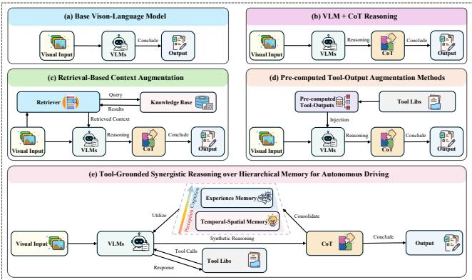
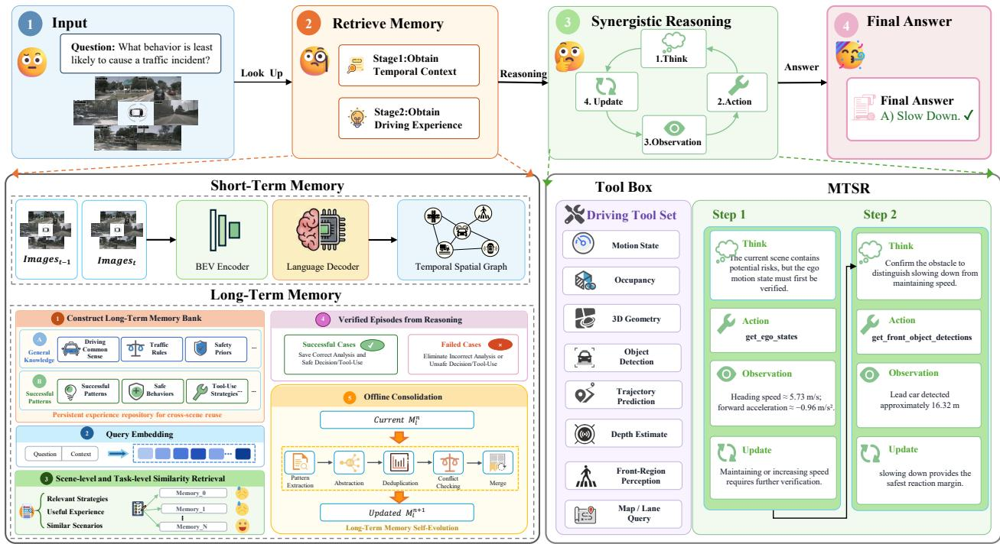
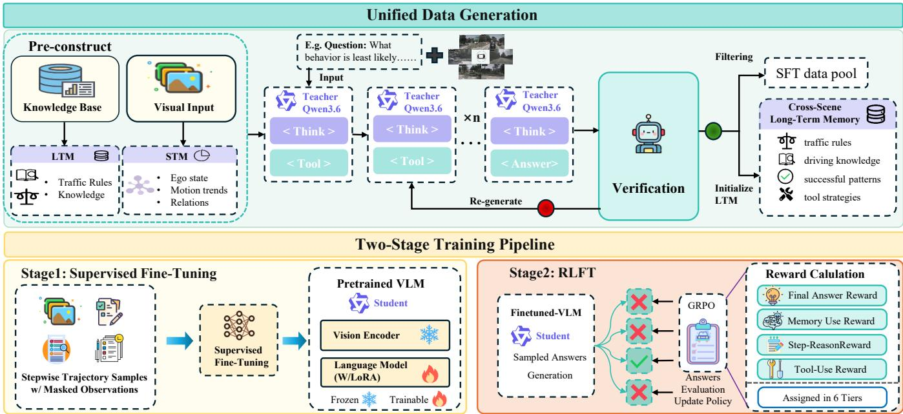
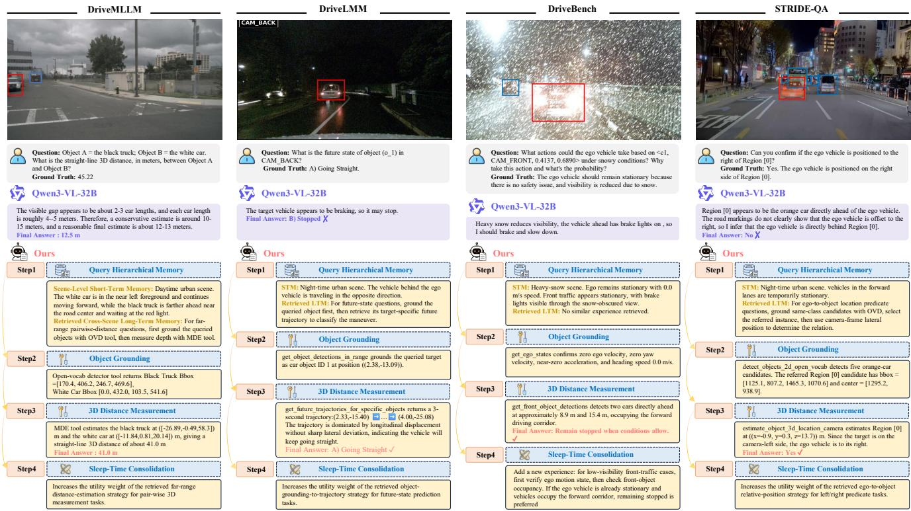
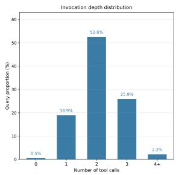
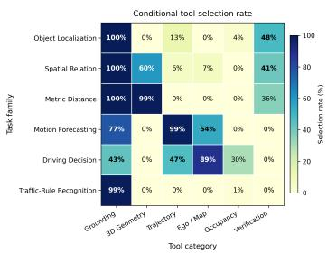
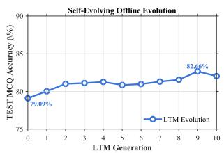
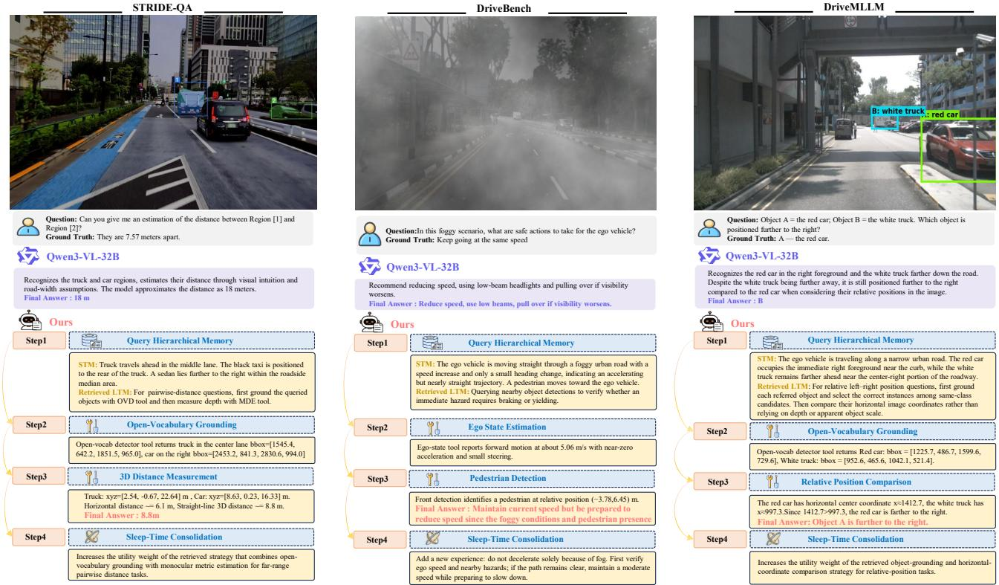
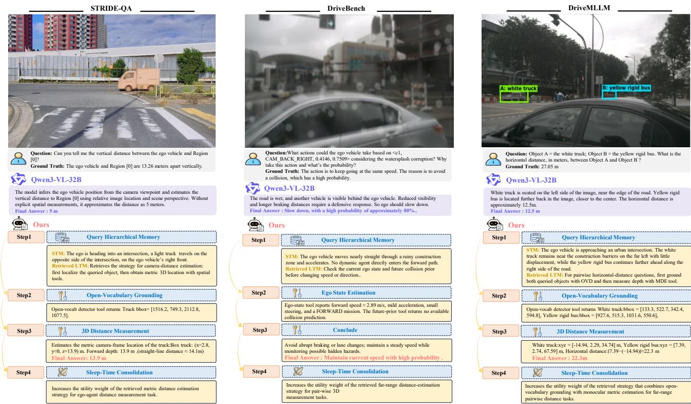

# Drive by Hindsight and Foresight: Tool-Grounded Synergistic Reasoning over Hierarchical Memory for Autonomous Driving

Baojie Chen<sup>1∗</sup>, Zijun Jia<sup>1</sup>, Jing Zhong<sup>2</sup>

<sup>1</sup> B<sub>e</sub>ih<sub>ang</sub> U<sub>n</sub>i<sub>vers</sub>it<sub>y</sub> <sup>2</sup> T<sub>s</sub>i<sub>ng</sub>h<sub>ua</sub> U<sub>n</sub>i<sub>vers</sub>it<sub>y</sub>

## Abstract

Vision-lan<sub>g</sub>ua<sub>g</sub>e models (VLMs) have shown <sub>p</sub>romise for au t<sub>onomous</sub> d<sub>r</sub>i<sub>v</sub>i<sub>ng</sub> t<sub>as</sub>k<sub>s, ye</sub>t <sub>s</sub>till <sub>su</sub>f<sub>er</sub> f<sub>rom</sub> h<sub>a</sub>ll<sub>uc</sub>i<sub>na</sub>ti<sub>on,</sub> <sub>wea</sub>k <sub>spa</sub>ti<sub>o-</sub>t<sub>empora</sub>l <sub>percep</sub>ti<sub>on, an</sub>d li<sub>m</sub>it<sub>e</sub>d <sub>genera</sub>li<sub>za</sub>ti<sub>on.</sub> R<sub>ecen</sub>t <sub>me</sub>th<sub>o</sub>d<sub>s</sub> i<sub>mprove reason</sub>i<sub>ng an</sub>d d<sub>ec</sub>i<sub>s</sub>i<sub>on-ma</sub>ki<sub>ng ca-</sub> <sub>pa</sub>biliti<sub>es</sub> th<sub>roug</sub>h <sub>c</sub>h<sub>a</sub>i<sub>n-o</sub>f<sub>-</sub>th<sub>oug</sub>ht <sub>exp</sub>l<sub>ana</sub>ti<sub>ons, re</sub>t<sub>r</sub>i<sub>eva</sub>l<sub>-</sub> <sub>augmen</sub>t<sub>e</sub>d <sub>genera</sub>ti<sub>on or</sub> th<sub>e s</sub>t<sub>a</sub>ti<sub>c</sub> i<sub>ncorpora</sub>ti<sub>on o</sub>f <sub>ex</sub>t<sub>erna</sub>l t<sub>oo</sub>l <sub>ou</sub>t<sub>pu</sub>t<sub>s.</sub> Alth<sub>oug</sub>h th<sub>ese</sub> <sub>mec</sub>h<sub>an</sub>i<sub>sms</sub> <sub>enr</sub>i<sub>c</sub>h th<sub>e</sub> i<sub>n</sub>iti<sub>a</sub>l <sub>con</sub>t<sub>ex</sub>t<sub>,</sub> th<sub>e mo</sub>d<sub>e</sub>l <sub>ne</sub>ith<sub>er proac</sub>ti<sub>ve</sub>l<sub>y perce</sub>i<sub>ves scene</sub> i<sub>n</sub>f<sub>or</sub> <sub>ma</sub>ti<sub>on nor accumu</sub>l<sub>a</sub>t<sub>es exper</sub>i<sub>ence a</sub>ft<sub>er answer</sub>i<sub>ng.</sub> T<sub>o over-</sub> <sub>come</sub> th<sub>ese</sub> li<sub>m</sub>it<sub>a</sub>ti<sub>ons, we presen</sub>t<sub>,</sub> t<sub>o our</sub> k<sub>now</sub>l<sub>e</sub>d<sub>ge,</sub> th<sub>e</sub> fi<sub>rs</sub>t <sub>synerg</sub>i<sub>s</sub>ti<sub>c</sub> f<sub>ramewor</sub>k th<sub>a</sub>t ti<sub>g</sub>htl<sub>y coup</sub>l<sub>es</sub> hi<sub>erarc</sub>hi<sub>ca</sub>l <sub>memory</sub> <sub>w</sub>ith <sub>proac</sub>ti<sub>ve</sub> t<sub>oo</sub>l i<sub>nvoca</sub>ti<sub>on</sub> i<sub>n</sub> <sub>a</sub> <sub>c</sub>l<sub>ose</sub>d <sub>reason-</sub> ing loop. Our contributions are threefold. (i) Hierarchical Driving Memory: a scene-level short-term memory maint<sub>a</sub>i<sub>ns</sub> th<sub>e</sub> d<sub>ynam</sub>i<sub>c scene s</sub>t<sub>a</sub>t<sub>e, an</sub>d <sub>an evo</sub>l<sub>v</sub>i<sub>ng</sub> l<sub>ong-</sub>t<sub>erm</sub> <sub>memory re</sub>t<sub>r</sub>i<sub>eves reusa</sub>bl<sub>e exper</sub>i<sub>ence an</sub>d t<sub>oo</sub>l <sub>s</sub>t<sub>ra</sub>t<sub>eg</sub>i<sub>es</sub> b<sub>y</sub> similarity. (ii) Memory-Tool Synergistic Reasoning Framework: guided by the scene state and retrieved experience, th<sub>e mo</sub>d<sub>e</sub>l <sub>a</sub>d<sub>ap</sub>ti<sub>ve</sub>l<sub>y</sub> i<sub>nvo</sub>k<sub>es</sub> t<sub>oo</sub>l<sub>s</sub> t<sub>o re</sub>fi<sub>ne</sub> it<sub>s reason</sub>i<sub>ng a</sub>t i<sub>n</sub>f<sub>erence</sub> ti<sub>me an</sub>d <sub>conso</sub>lid<sub>a</sub>t<sub>es reusa</sub>bl<sub>e ex er</sub>i<sub>ence</sub> i<sub>n</sub>t<sub>o a</sub> long-term memory pool ofline. (iii) Data Generation and Two-stage Training Pipeline: verified memory-tool trajecto-<sub>r</sub>i<sub>es</sub> b<sub>u</sub>ilt b<sub>y mu</sub>lti<sub>-s</sub>t<sub>ep</sub> t<sub>eac</sub>h<sub>er ro</sub>ll<sub>ou</sub>t <sub>are use</sub>d t<sub>o</sub> t<sub>ra</sub>i<sub>n w</sub>ith ste<sub>p</sub>wise su<sub>p</sub>ervised fine-tunin<sub>g</sub> (SFT) and <sub>g</sub>rou<sub>p</sub> relative <sub>p</sub>olic<sub>y</sub> o<sub>p</sub>timization (GRPO). Our 7B model reaches an overall reasonin<sub>g</sub> score of 80.03 and MCQ accurac<sub>y</sub> of 79.09% on D<sub>r</sub>i<sub>ve</sub>LMM<sub>-o</sub>1 b<sub>enc</sub>h<sub>mar</sub>k<sub>, surpass</sub>i<sub>ng</sub> th<sub>e s</sub>t<sub>ronges</sub>t b<sub>ase</sub>li<sub>ne</sub> b<sub>y</sub> 7.74 MCQ points and <sub>g</sub>eneralizes stron<sub>g</sub>l<sub>y</sub> across DriveM-LLM and STRIDE-QA benchmarks. Notabl<sub>y</sub>, ablation and <sub>ana</sub>l<sub>ys</sub>i<sub>s s</sub>t<sub>u</sub>di<sub>es va</sub>lid<sub>a</sub>t<sub>e</sub> th<sub>e e</sub>f<sub>ec</sub>ti<sub>veness o</sub>f <sub>eac</sub>h <sub>componen</sub>t <sub>an</sub>d f<sub>ur</sub>th<sub>er revea</sub>l th<sub>e comp</sub>l<sub>emen</sub>t<sub>ary ro</sub>l<sub>es o</sub>f hi<sub>erarc</sub>hi<sub>ca</sub>l memor<sub>y</sub>. <sup>Sh</sup>ort-term memor<sub>y</sub> stren<sub>g</sub>t<sup>h</sup>ens s<sub>p</sub>at<sup>i</sup>otem<sub>p</sub>ora<sup>l</sup> und<sub>ers</sub>t<sub>an</sub>di<sub>ng,</sub> i<sub>mprov</sub>i<sub>ng</sub> STSB<sub>enc</sub>h <sub>accuracy</sub> b<sub>y</sub> 24<sub>.</sub>2 <sub>po</sub>i<sub>n</sub>t<sub>s,</sub> <sub>w</sub>hil<sub>e o</sub>fli<sub>ne</sub> l<sub>ong-</sub>t<sub>erm memory conso</sub>lid<sub>a</sub>ti<sub>on y</sub>i<sub>e</sub>ld<sub>s an a</sub>ddi<sub>-</sub> tional 3.57-point MCQ <sub>g</sub>ain with all model parameters frozen, d<sub>emons</sub>t<sub>ra</sub>ti<sub>ng</sub> <sub>con</sub>ti<sub>nua</sub>l <sub>se</sub>lf<sub>-evo</sub>l<sub>u</sub>ti<sub>on</sub> th<sub>roug</sub>h <sub>accumu</sub>l<sub>a</sub>t<sub>e</sub>d d<sub>r</sub>i<sub>v</sub>i<sub>ng</sub> <sub>exper</sub>i<sub>ence.</sub>

## 1 Introduction

P<sub>re</sub>t<sub>ra</sub>i<sub>ne</sub>d <sub>v</sub>i<sub>s</sub>i<sub>on-</sub>l<sub>anguage mo</sub>d<sub>e</sub>l<sub>s</sub> h<sub>ave ena</sub>bl<sub>e</sub>d th<sub>e</sub>i<sub>r grow-</sub> in<sub>g</sub> ado<sub>p</sub>tion in autonomous drivin<sub>g</sub> (Tian et al. 2024; Hwan<sub>g</sub> <sub>e</sub>t <sub>a</sub>l<sub>.</sub> 2025<sub>;</sub> Ji<sub>ang e</sub>t <sub>a</sub>l<sub>.</sub> 2024<sub>;</sub> F<sub>u e</sub>t <sub>a</sub>l<sub>.</sub> 2025<sub>;</sub> W<sub>ang e</sub>t <sub>a</sub>l<sub>.</sub> 2025b), and are increasin<sub>g</sub>l<sub>y</sub> used for drivin<sub>g</sub> scene under-<sub>s</sub>t<sub>an</sub>di<sub>ng,</sub> hi<sub>g</sub>h<sub>-</sub>l<sub>eve</sub>l b<sub>e</sub>h<sub>av</sub>i<sub>or</sub> d<sub>ec</sub>i<sub>s</sub>i<sub>ons, an</sub>d d<sub>ec</sub>i<sub>s</sub>i<sub>on exp</sub>l<sub>a-</sub> nation (Jian<sub>g</sub> et al. 2024; Mao et al. 2024). Amon<sub>g</sub> these a<sub>p</sub>- <sub>p</sub>li<sub>ca</sub>ti<sub>ons,</sub> <sub>au</sub>t<sub>onomous</sub> d<sub>r</sub>i<sub>v</sub>i<sub>ng</sub> <sub>reason</sub>i<sub>ng</sub> b<sub>enc</sub>h<sub>mar</sub>k<sub>s</sub> <sub>pro-</sub> <sub>v</sub>id<sub>e a na</sub>t<sub>ura</sub>l t<sub>es</sub>tb<sub>e</sub>d f<sub>or eva</sub>l<sub>ua</sub>ti<sub>ng w</sub>h<sub>e</sub>th<sub>er</sub> VLM<sub>s can</sub> t<sub>rans</sub>f<sub>orm v</sub>i<sub>sua</sub>l <sub>o</sub>b<sub>serva</sub>ti<sub>ons</sub> i<sub>n</sub>t<sub>o</sub> i<sub>n</sub>t<sub>erpre</sub>t<sub>a</sub>bl<sub>e scene un-</sub> derstandin<sub>g</sub> and drivin<sub>g</sub> decisions. (Marcu et al. 2024; Xie et al. 2025; Ishaq et al. 2025).

  
Fi<sub>gure</sub> 1<sub>:</sub> C<sub>ompar</sub>i<sub>son</sub> <sub>o</sub>f <sub>reason</sub>i<sub>ng</sub> <sub>para</sub>di<sub>gms</sub> f<sub>or</sub> <sub>au-</sub> tonomous drivin<sub>g</sub>: (a) A base VLM directl<sub>y</sub> ma<sub>p</sub>s visual in<sub>p</sub>uts to answers; (b) CoT unfolds direct <sub>p</sub>rediction into <sub>g</sub>uided intermediate reasonin<sub>g</sub> ste<sub>p</sub>s; (c) RAG au<sub>g</sub>ments reasonin<sub>g</sub> with retrieved external context; (d) Previous toolaugmented methods inject pre-computed tool outputs into sin<sub>g</sub>le-<sub>p</sub>ass reasonin<sub>g</sub>; and (e) Our framework cou<sub>p</sub>les hi-<sub>erarc</sub>hi<sub>ca</sub>l <sub>memory w</sub>ith <sub>on</sub>li<sub>ne</sub> t<sub>oo</sub>l i<sub>n</sub>t<sub>erac</sub>ti<sub>on an</sub>d <sub>o</sub>fli<sub>ne</sub> <sub>exper</sub>i<sub>ence conso</sub>lid<sub>a</sub>ti<sub>on.</sub>

E<sub>x</sub>i<sub>s</sub>ti<sub>ng e</sub>f<sub>or</sub>t<sub>s procee</sub>d l<sub>arge</sub>l<sub>y a</sub>l<sub>ong</sub> th<sub>ree rou</sub>t<sub>es: un-</sub> f<sub>o</sub>ldi<sub>ng</sub> th<sub>e o</sub>b<sub>serva</sub>ti<sub>on</sub> i<sub>n</sub>t<sub>o s</sub>t<sub>ep-</sub>b<sub>y-s</sub>t<sub>ep exp</sub>l<sub>ana</sub>ti<sub>ons v</sub>i<sub>a</sub> chain-of-thou<sub>g</sub>ht (CoT) for better trans<sub>p</sub>arenc<sub>y</sub> and inter-<sub>p</sub>retabilit<sub>y</sub> (Ishaq et al. 2025; Zen<sub>g</sub> et al. 2025); s<sub>p</sub>licin<sub>g</sub> th<sub>e ou</sub>t<sub>pu</sub>t<sub>s o</sub>f d<sub>r</sub>i<sub>v</sub>i<sub>ng</sub> t<sub>oo</sub>l<sub>s</sub> i<sub>n</sub>t<sub>o</sub> th<sub>e promp</sub>t <sub>or con</sub>t<sub>ex</sub>t t<sub>o</sub> supplement external observations (Qian et al. 2025; Zhen<sub>g</sub> et al. 2025); or injecting knowledge via retrieval-augmented <sub>g</sub>eneration (RAG) (Yuan et al. 2024; Ye et al. 2025; Wan<sub>g</sub> et al. 2025a). In all three, the model is either made to <sub>p</sub>roduce <sub>more</sub> <sub>e</sub>l<sub>a</sub>b<sub>ora</sub>t<sub>e</sub> <sub>exp</sub>l<sub>ana</sub>ti<sub>ons</sub> f<sub>rom</sub> t<sub>emp</sub>l<sub>a</sub>t<sub>es</sub> <sub>or</sub> t<sub>o</sub> <sub>pass</sub>i<sub>ve</sub>l<sub>y</sub> <sub>rece</sub>i<sub>ve more</sub> i<sub>n</sub>f<sub>orma</sub>ti<sub>on,</sub> th<sub>e answers</sub> it <sub>pro</sub>d<sub>uces an</sub>d th<sub>e</sub> i<sub>n</sub>f<sub>orma</sub>ti<sub>on</sub> it <sub>rece</sub>i<sub>ves</sub> k<sub>eep</sub> <sub>grow</sub>i<sub>ng,</sub> <sub>w</sub>hil<sub>e</sub> it<sub>s</sub> <sub>un</sub>d<sub>ers</sub>t<sub>an</sub>d<sub>-</sub> i<sub>ng</sub> d<sub>oes no</sub>t <sub>evo</sub>l<sub>ve accor</sub>di<sub>ng</sub>l<sub>y.</sub> H<sub>uman</sub> d<sub>r</sub>i<sub>v</sub>i<sub>ng</sub> f<sub>o</sub>ll<sub>ows a</sub> dif<sub>eren</sub>t <sub>pa</sub>tt<sub>ern:</sub> <sub>a</sub> d<sub>r</sub>i<sub>v</sub>i<sub>ng</sub> d<sub>ec</sub>i<sub>s</sub>i<sub>on</sub> i<sub>s</sub> <sub>no</sub>t <sub>a</sub> <sub>one-s</sub>h<sub>o</sub>t <sub>recog-</sub> <sub>n</sub>iti<sub>on o</sub>f <sub>a s</sub>t<sub>a</sub>ti<sub>c</sub> f<sub>rame</sub> b<sub>u</sub>t <sub>a un</sub>ifi<sub>e</sub>d <sub>process o</sub>f <sub>ac</sub>ti<sub>ve per-</sub> <sub>cep</sub>ti<sub>on, spa</sub>ti<sub>o-</sub>t<sub>empora</sub>l <sub>un</sub>d<sub>ers</sub>t<sub>an</sub>di<sub>ng, an</sub>d <sub>exper</sub>i<sub>ence ac-</sub> cumulation. A driver relies on foresight to keep track of the motion trends of the ego vehicle and key objects over time, and on hindsight to draw on transferable experience accumulated through long-term driving, judging which risks to <sub>pr</sub>i<sub>or</sub>iti<sub>ze an</sub>d <sub>w</sub>hi<sub>c</sub>h <sub>ac</sub>ti<sub>ons</sub> t<sub>o</sub> t<sub>a</sub>k<sub>e</sub> i<sub>n</sub> th<sub>e curren</sub>t <sub>s</sub>it<sub>ua</sub>ti<sub>on.</sub> A<sub>ga</sub>i<sub>ns</sub>t thi<sub>s re</sub>f<sub>erence, w</sub>h<sub>a</sub>t <sub>curren</sub>t <sub>me</sub>th<sub>o</sub>d<sub>s</sub> l<sub>ac</sub>k b<sub>ecomes</sub> <sub>c</sub>l<sub>ear: no</sub> d<sub>ynam</sub>i<sub>c scene s</sub>t<sub>a</sub>t<sub>e</sub> th<sub>a</sub>t <sub>evo</sub>l<sub>ves w</sub>ith <sub>o</sub>b<sub>serva</sub>ti<sub>ons,</sub> <sub>no</sub> d<sub>r</sub>i<sub>v</sub>i<sub>ng exper</sub>i<sub>ence conso</sub>lid<sub>a</sub>t<sub>e</sub>d <sub>across scenes, an</sub>d <sub>no</sub> <sub>ac</sub>ti<sub>ve</sub> <sub>ev</sub>id<sub>ence-see</sub>ki<sub>ng</sub> d<sub>r</sub>i<sub>ven</sub> b<sub>y</sub> <sub>ev</sub>id<sub>ence</sub> <sub>gaps.</sub> Thi<sub>s</sub> <sub>gap</sub> motivates the central question of this paper: Can a reasoning model for autonomous driving capture the key characteristics ofhuman drivingforesight and hindsight by integrating spatio-temporal awareness, proactive perception, and experience accumulation within a unified closed-loop reasoning framework?

T<sub>o</sub> thi<sub>s en</sub>d<sub>, we propose a</sub> t<sub>oo</sub>l<sub>-groun</sub>d<sub>e</sub>d <sub>synerg</sub>i<sub>s</sub>ti<sub>c rea-</sub> <sub>son</sub>i<sub>ng</sub> f<sub>ramewor</sub>k <sub>over</sub> hi<sub>erarc</sub>hi<sub>ca</sub>l <sub>memory.</sub> S<sub>cene-</sub>l<sub>eve</sub>l <sub>s</sub>h<sub>or</sub>t<sub>-</sub>t<sub>erm memory ma</sub>i<sub>n</sub>t<sub>a</sub>i<sub>ns</sub> th<sub>e curren</sub>t <sub>spa</sub>ti<sub>o-</sub>t<sub>empora</sub>l <sub>s</sub>t<sub>a</sub>t<sub>e, w</sub>hil<sub>e cross-scene</sub> l<sub>ong-</sub>t<sub>erm memory re</sub>t<sub>r</sub>i<sub>eves expe-</sub> <sub>r</sub>i<sub>ence as</sub> t<sub>rans</sub>f<sub>era</sub>bl<sub>e pr</sub>i<sub>ors.</sub> C<sub>on</sub>diti<sub>one</sub>d <sub>on</sub> hi<sub>erarc</sub>hi<sub>ca</sub>l <sub>memory,</sub> th<sub>e mo</sub>d<sub>e</sub>l <sub>proac</sub>ti<sub>ve</sub>l<sub>y</sub> i<sub>nvo</sub>k<sub>es</sub> t<sub>oo</sub>l<sub>s</sub> t<sub>o acqu</sub>i<sub>re</sub> i<sub>n-</sub> f<sub>orma</sub>ti<sub>on.</sub> A<sub>cross</sub> th<sub>ree</sub> d<sub>r</sub>i<sub>v</sub>i<sub>ng</sub> b<sub>enc</sub>h<sub>mar</sub>k<sub>s, our</sub> 7B <sub>mo</sub>d<sub>e</sub>l <sub>ou</sub>t<sub>per</sub>f<sub>orms</sub> th<sub>e</sub> <sub>s</sub>t<sub>ronges</sub>t b<sub>ase</sub>li<sub>ne</sub> <sub>an</sub>d <sub>genera</sub>li<sub>zes</sub> <sub>ro</sub>b<sub>us</sub>tl<sub>y</sub> <sub>w</sub>ith<sub>ou</sub>t f<sub>ur</sub>th<sub>er</sub> t<sub>ra</sub>i<sub>n</sub>i<sub>ng.</sub> C<sub>on</sub>t<sub>ro</sub>ll<sub>e</sub>d <sub>s</sub>t<sub>u</sub>di<sub>es</sub> f<sub>ur</sub>th<sub>er s</sub>h<sub>ow</sub> th<sub>a</sub>t short-term memory improves STSBench accuracy by 24.2 <sub>po</sub>i<sub>n</sub>t<sub>s, w</sub>hil<sub>e o</sub>fli<sub>ne</sub> l<sub>ong-</sub>t<sub>erm memory conso</sub>lid<sub>a</sub>ti<sub>on pro-</sub> vides an additional 3.57-point MCQ gain without updating <sub>mo</sub>d<sub>e</sub>l <sub>parame</sub>t<sub>ers.</sub> M<sub>ore</sub> b<sub>roa</sub>dl<sub>y,</sub> th<sub>ese</sub> <sub>resu</sub>lt<sub>s</sub> <sub>po</sub>i<sub>n</sub>t t<sub>o</sub> <sub>a</sub> <sub>s</sub>hift i<sub>n au</sub>t<sub>onomous-</sub>d<sub>r</sub>i<sub>v</sub>i<sub>ng</sub> VLM <sub>researc</sub>h<sub>:</sub> f<sub>rom sca</sub>li<sub>ng s</sub>t<sub>a</sub>ti<sub>c</sub> <sub>percep</sub>ti<sub>on an</sub>d i<sub>so</sub>l<sub>a</sub>t<sub>e</sub>d <sub>reason</sub>i<sub>ng</sub> t<sub>owar</sub>d <sub>pers</sub>i<sub>s</sub>t<sub>en</sub>t<sub>,</sub> i<sub>n</sub>t<sub>erac-</sub> ti<sub>ve</sub> d<sub>r</sub>i<sub>v</sub>i<sub>ng</sub> i<sub>n</sub>t<sub>e</sub>lli<sub>gence</sub> th<sub>a</sub>t <sub>can evo</sub>l<sub>ve w</sub>ith <sub>ev</sub>id<sub>ence an</sub>d <sub>exper</sub>i<sub>ence.</sub>O<sub>ur con</sub>t<sub>r</sub>ib<sub>u</sub>ti<sub>ons are summar</sub>i<sub>ze</sub>d <sub>as</sub> f<sub>o</sub>ll<sub>ows:</sub>

• (1) We develop a hierarchical driving memory combin<sub>g</sub> <sub>scene-</sub>l<sub>eve</sub>l <sub>s</sub>h<sub>or</sub>t<sub>-</sub>t<sub>erm</sub> <sub>memory</sub> f<sub>or</sub> <sub>ma</sub>i<sub>n</sub>t<sub>a</sub>i<sub>n</sub>i<sub>ng</sub> <sub>spa</sub>ti<sub>o-</sub> t<sub>empora</sub>l <sub>s</sub>t<sub>a</sub>t<sub>es w</sub>ith <sub>cross-scene</sub> l<sub>ong-</sub>t<sub>erm memory</sub> f<sub>or</sub> <sub>re</sub>t<sub>r</sub>i<sub>ev</sub>i<sub>ng reusa</sub>bl<sub>e</sub> d<sub>r</sub>i<sub>v</sub>i<sub>ng exper</sub>i<sub>ence an</sub>d <sub>s</sub>t<sub>ra</sub>t<sub>eg</sub>i<sub>es.</sub>

• (2) We propose a memory-tool synergistic reasoning (MTSR) framework which unifies foresight and hind-<sub>s</sub>i<sub>g</sub>ht b<sub>y coup</sub>li<sub>ng a</sub>d<sub>ap</sub>ti<sub>ve</sub> t<sub>oo</sub>l <sub>use w</sub>ith hi<sub>erarc</sub>hi<sub>ca</sub>l <sub>memory a</sub>t i<sub>n</sub>f<sub>erence</sub> ti<sub>me an</sub>d <sub>conso</sub>lid<sub>a</sub>t<sub>es ver</sub>ifi<sub>e</sub>d <sub>expe-</sub> <sub>r</sub>i<sub>ence</sub> i<sub>n</sub>t<sub>o</sub> l<sub>ong-</sub>t<sub>erm memory o</sub>fli<sub>ne.</sub>

• (3) We build a data-generation and two-stage posttraining pipeline that produces verified memory-tool trajectories through multi-step teacher rollouts and trains the model with ste<sub>p</sub>wise su<sub>p</sub>ervised fine-tunin<sub>g</sub> (SFT) and <sub>g</sub>rou<sub>p</sub> relative <sub>p</sub>olic<sub>y</sub> o<sub>p</sub>timization (GRPO).

## 2 Related Work

## 2.1 VLMs and Benchmarks for Autonomous Driving

Vision-lan<sub>g</sub>ua<sub>g</sub>e models (VLMs) increasin<sub>g</sub>l<sub>y</sub> connect vi-<sub>sua</sub>l <sub>percep</sub>ti<sub>on</sub> <sub>w</sub>ith l<sub>anguage-</sub>b<sub>ase</sub>d <sub>reason</sub>i<sub>ng</sub> <sub>an</sub>d <sub>p</sub>l<sub>an-</sub> <sub>n</sub>i<sub>ng</sub> i<sub>n au</sub>t<sub>onomous</sub> d<sub>r</sub>i<sub>v</sub>i<sub>ng, w</sub>ith <sub>sys</sub>t<sub>ems suc</sub>h <sub>as</sub> S<sub>enna,</sub> ORION<sub>,</sub> <sub>a</sub>nd N<sub>av</sub>iDri<sub>ve</sub>VLM <sub>exp</sub>l<sub>o</sub>rin<sub>g</sub> dif<sub>e</sub>r<sub>e</sub>nt int<sub>e</sub>rf<sub>aces</sub> between hi<sub>g</sub>h-level reasonin<sub>g</sub> and motion <sub>p</sub>lannin<sub>g</sub> (Jian<sub>g</sub> et al. 2024; Fu et al. 2025; Tao et al. 2026). In <sub>p</sub>arallel, th<sub>e</sub> b<sub>enc</sub>h<sub>mar</sub>k<sub>s</sub> h<sub>ave progresse</sub>d f<sub>rom percep</sub>ti<sub>on-or</sub>i<sub>en</sub>t<sub>e</sub>d <sub>an</sub>d f<sub>ree-</sub>f<sub>orm</sub> <sub>ques</sub>ti<sub>on</sub> <sub>answer</sub>i<sub>ng</sub> t<sub>o</sub> <sub>r</sub>i<sub>s</sub>k <sub>assessmen</sub>t<sub>,</sub> <sub>exp</sub>li<sub>c</sub>it reasonin<sub>g</sub>, and s<sub>p</sub>atial-tem<sub>p</sub>oral understandin<sub>g</sub> as well (Sima et al. 2024; Qian et al. 2024; Marcu et al. 2024; Gao et al. 2025; Ishihara et al. 2025; Gholami et al. 2025).DriveM-LLM evaluates s<sub>p</sub>atial understandin<sub>g</sub> (Guo et al. 2024), and STSB<sub>enc</sub>h <sub>emp</sub>h<sub>as</sub>i<sub>zes spa</sub>ti<sub>o-</sub>t<sub>empora</sub>l <sub>scenar</sub>i<sub>o un</sub>d<sub>ers</sub>t<sub>an</sub>d<sub>-</sub> in<sub>g</sub> (Fruhwirth-Reisin<sub>g</sub>er et al. 2025). These benchmarks, to<sub>g</sub>ether with reliabilit<sub>y</sub> studies (Xie et al. 2025; Yu et al. 2025), show persistent weaknesses in motion trends, object i<sub>n</sub>t<sub>erac</sub>ti<sub>ons, groun</sub>di<sub>ng, an</sub>d <sub>sa</sub>f<sub>e</sub>t<sub>y-cr</sub>iti<sub>ca</sub>l <sub>reason</sub>i<sub>ng.</sub>

## 2.2 External Augmentation in Reasoning for Autonomous Driving

Chain-of-thou<sub>g</sub>ht (CoT) methods make intermediate drivin<sub>g</sub> judgments more explicit. DriveLMM-o1 supervises stepb<sub>y</sub>-ste<sub>p</sub> reasonin<sub>g</sub> for scene understandin<sub>g</sub> (Ishaq et al. 2025), FutureSi<sub>g</sub>htDrive introduces s<sub>p</sub>atio-tem<sub>p</sub>oral visual CoT (Zen et al. 2025), and reinforcement- and critic-based <sub>approac</sub>h<sub>es</sub> i<sub>mprove</sub> <sub>reason</sub>i<sub>ng</sub> f<sub>or</sub> <sub>p</sub>l<sub>ann</sub>i<sub>ng</sub> <sub>an</sub>d <sub>sa</sub>f<sub>e</sub>t<sub>y</sub> <sub>as-</sub> sessment (Zhan<sub>g</sub> et al. 2026; Yan<sub>g</sub> et al. 2026; Liu et al. 2026). External au<sub>g</sub>mentation <sub>p</sub>rovides com<sub>p</sub>lementar<sub>y</sub> inf<sub>orma</sub>ti<sub>on:</sub> S<sub>a</sub>f<sub>e</sub>D<sub>r</sub>i<sub>ve</sub>RAG<sub>,</sub> RAG<sub>-</sub>D<sub>r</sub>i<sub>ver, an</sub>d RAD <sub>re</sub>t<sub>r</sub>i<sub>eve</sub> k<sub>now</sub>l<sub>e</sub>d<sub>ge</sub> <sub>or</sub> d<sub>r</sub>i<sub>v</sub>i<sub>ng</sub> <sub>cases</sub> f<sub>or</sub> <sub>sa</sub>f<sub>e</sub>t<sub>y</sub> <sub>reason</sub>i<sub>ng,</sub> <sub>exp</sub>l<sub>ana-</sub> tion, and decision makin<sub>g</sub> (Ye et al. 2025; Yuan et al. 2024; Wan<sub>g</sub> et al. 2025a). A<sub>g</sub>entThink takes a ste<sub>p</sub> further throu<sub>g</sub>h <sub>a</sub>ddi<sub>ng</sub> t<sub>oo</sub>l<sub>-ou</sub>t<sub>pu</sub>t<sub>s</sub> i<sub>n</sub>t<sub>o</sub> <sub>con</sub>t<sub>ex</sub>t t<sub>o</sub> i<sub>mprove</sub> <sub>per</sub>f<sub>ormance</sub> <sub>an</sub>d alleviate hallucinations (Qian et al. 2025). However, all the <sub>me</sub>th<sub>o</sub>d<sub>s</sub> <sub>a</sub>b<sub>ove</sub> <sub>s</sub>till <sub>re</sub>l<sub>y</sub> <sub>on</sub> <sub>a</sub> <sub>one-way,</sub> <sub>pass</sub>i<sub>ve</sub> i<sub>n</sub>t<sub>a</sub>k<sub>e</sub> <sub>process</sub> <sub>ra</sub>th<sub>er</sub> th<sub>an un</sub>d<sub>ers</sub>t<sub>an</sub>di<sub>ng</sub> th<sub>a</sub>t <sub>evo</sub>l<sub>ves w</sub>ith <sub>ev</sub>id<sub>ence, w</sub>hi<sub>c</sub>h <sub>mo</sub>ti<sub>va</sub>t<sub>es us</sub> t<sub>o propose our</sub> f<sub>ramewor</sub>k<sub>.</sub>

## 3 Methodology

## 3.1 Overview

As shown in Figure 2, given a question q and the current <sub>s</sub>i<sub>x-v</sub>i<sub>ew o</sub>b<sub>serva</sub>ti<sub>on</sub> $\mathcal { T } _ { t } = \{ I _ { t } ^ { v } \} _ { v = 1 } ^ { 6 }$ <sub>, our</sub> f<sub>ramewor</sub>k <sub>con</sub>di<sub>-</sub> tions the vision-language policy π<sub>θ</sub> on scene-level short-term <sup>memor</sup>y $\mathcal { M } _ { s }$ , the top-K entries $\mathcal { E } _ { K }$ <sub>re</sub>t<sub>r</sub>i<sub>eve</sub>d f<sub>rom cross-</sub> <sup>scene lon</sup>g<sup>-term memor</sup>y $\mathcal { M } _ { l }$ , and the drivin<sub>g</sub> tool set T:

$$
y \sim \pi _ { \boldsymbol { \theta } } ( q , \mathcal { T } _ { t } , \mathcal { M } _ { s } , \mathcal { E } _ { K } , \mathcal { T } ) .\tag{1}
$$

H<sub>ere,</sub> $\mathcal { M } _ { s }$ re<sub>p</sub>resents t<sup>h</sup>e current s<sub>p</sub>at<sup>i</sup>o-tem<sub>p</sub>ora<sup>l</sup> state, <sub>w</sub>h<sub>ereas</sub> $\mathcal { E } _ { K }$ <sub>prov</sub>id<sub>es reusa</sub>bl<sub>e exper</sub>i<sub>ence.</sub> Th<sub>e po</sub>li<sub>cy</sub> it<sub>-</sub> <sub>era</sub>ti<sub>ve</sub>l<sub>y</sub> id<sub>en</sub>tifi<sub>es m</sub>i<sub>ss</sub>i<sub>ng ev</sub>id<sub>ence,</sub> i<sub>nvo</sub>k<sub>es</sub> t<sub>oo</sub>l<sub>s, accumu-</sub> l<sub>a</sub>t<sub>es</sub> th<sub>e re</sub>t<sub>urne</sub>d <sub>o</sub>b<sub>serva</sub>ti<sub>ons</sub> i<sub>n</sub> it<sub>s reason</sub>i<sub>ng con</sub>t<sub>ex</sub>t<sub>, un</sub>til it judges the evidence suficient and answers.

## 3.2 Hierarchical Driving Memory

O<sub>ur</sub> f<sub>ramewor</sub>k <sub>ma</sub>i<sub>n</sub>t<sub>a</sub>i<sub>ns</sub> <sub>a</sub> hi<sub>erarc</sub>hi<sub>ca</sub>l d<sub>r</sub>i<sub>v</sub>i<sub>ng</sub> <sub>memory</sub> <sub>cons</sub>i<sub>s</sub>ti<sub>ng</sub> <sub>o</sub>f $M _ { s }$ <sub>an</sub>d $M _ { l }$ <sub>.</sub> Th<sub>e</sub> f<sub>ormer</sub> <sub>prov</sub>id<sub>es</sub> <sub>a</sub> <sub>compac</sub>t <sub>spa</sub>ti<sub>o-</sub>t<sub>empora</sub>l <sub>represen</sub>t<sub>a</sub>ti<sub>on o</sub>f th<sub>e curren</sub>t <sub>scene, w</sub>h<sub>ereas</sub> th<sub>e</sub> l<sub>a</sub>tt<sub>er supp</sub>li<sub>es reusa</sub>bl<sub>e reason</sub>i<sub>ng an</sub>d t<sub>oo</sub>l<sub>-use exper</sub>i<sub>ence</sub> <sup>f</sup>rom <sub>p</sub>ast scenes.

Scene-Level Short-Term Memory. A single-timestamp <sub>mu</sub>lti<sub>-v</sub>i<sub>ew</sub> <sub>o</sub>b<sub>serva</sub>ti<sub>on</sub> <sub>prov</sub>id<sub>es</sub> <sub>r</sub>i<sub>c</sub>h <sub>appearance</sub> i<sub>n</sub>f<sub>orma-</sub> ti<sub>on</sub> b<sub>u</sub>t <sub>canno</sub>t <sub>exp</sub>li<sub>c</sub>itl<sub>y revea</sub>l h<sub>ow</sub> th<sub>e ego ve</sub>hi<sub>c</sub>l<sub>e an</sub>d <sub>near</sub>b<sub>y</sub> t<sub>ra</sub>fi<sub>c</sub> <sub>par</sub>ti<sub>c</sub>i<sub>pan</sub>t<sub>s</sub> <sub>evo</sub>l<sub>ve</sub> <sub>over</sub> ti<sub>me.</sub> Di<sub>rec</sub>tl<sub>y</sub> f<sub>ee</sub>di<sub>ng</sub> <sub>mu</sub>lti<sub>p</sub>l<sub>e s</sub>i<sub>x-v</sub>i<sub>ew</sub> f<sub>rames</sub> i<sub>n</sub>t<sub>o</sub> th<sub>e</sub> VLM <sub>wou</sub>ld <sub>su</sub>b<sub>s</sub>t<sub>an</sub>ti<sub>a</sub>ll<sub>y</sub> i<sub>ncrease</sub> th<sub>e v</sub>i<sub>sua</sub>l <sub>con</sub>t<sub>ex</sub>t <sub>an</sub>d <sub>requ</sub>i<sub>re</sub> th<sub>e</sub> l<sub>anguage mo</sub>d<sub>e</sub>l t<sub>o</sub> <sub>per</sub>f<sub>orm</sub> <sub>cross-v</sub>i<sub>ew</sub> <sub>a</sub>li<sub>gnmen</sub>t <sub>an</sub>d t<sub>empora</sub>l <sub>correspon</sub>d<sub>ence</sub> i<sub>mp</sub>li<sub>c</sub>itl<sub>y.</sub> W<sub>e</sub> th<sub>ere</sub>f<sub>ore cons</sub>t<sub>ruc</sub>t $M _ { s }$ from two adjacent six-<sub>v</sub>i<sub>ew o</sub>b<sub>serva</sub>ti<sub>ons</sub> $\mathcal { T } _ { t - 1 }$ <sub>an</sub>d $\mathcal { T } _ { t }$

  
Fi<sub>gure</sub> 2<sub>:</sub> O<sub>verv</sub>i<sub>ew o</sub>f <sub>our</sub> f<sub>ramewor</sub>k<sub>.</sub> Gi<sub>ven a ques</sub>ti<sub>on an</sub>d <sub>a mu</sub>lti<sub>-v</sub>i<sub>ew</sub> i<sub>mage,</sub> th<sub>e mo</sub>d<sub>e</sub>l <sub>con</sub>diti<sub>ons on a scene-</sub>l<sub>eve</sub>l <sub>s</sub>h<sub>or</sub>t<sub>-</sub> <sup>term memor</sup>y $M _ { s }$ <sub>an</sub>d <sub>exper</sub>i<sub>ence re</sub>t<sub>r</sub>i<sub>eve</sub>d f<sub>rom a cross-scene</sub> l<sub>ong-</sub>t<sub>erm memory</sub> $M _ { l } .$ <sub>,</sub> th<sub>e</sub>n <sub>pe</sub>rf<sub>o</sub>rm<sub>s</sub> M<sub>e</sub>m<sub>o</sub>r<sub>y-</sub>T<sub>oo</sub>l S<sub>y</sub>n<sub>e</sub>r<sub>g</sub>i<sub>s</sub>ti<sub>c</sub> R<sub>eason</sub>i<sub>ng:</sub> it id<sub>en</sub>tifi<sub>es</sub> th<sub>e curren</sub>t <sub>ev</sub>id<sub>ence gap,</sub> i<sub>nvo</sub>k<sub>es a</sub> d<sub>r</sub>i<sub>v</sub>i<sub>ng</sub> t<sub>oo</sub>l<sub>, groun</sub>d<sub>s</sub> th<sub>e o</sub>b<sub>serva</sub>ti<sub>on, an</sub>d <sub>up</sub>d<sub>a</sub>t<sub>es</sub> th<sub>e scene</sub> b<sub>e</sub>li<sub>e</sub>f<sub>,</sub> l<sub>oop</sub>i<sub>ng un</sub>til it <sub>answers.</sub>

F<sub>or</sub> <sub>eac</sub>h ti<sub>mes</sub>t<sub>amp</sub> $\tau \in \{ t - 1 , t \}$ <sub>, a pre</sub>t<sub>ra</sub>i<sub>ne</sub>d bi<sub>r</sub>d’<sub>s-eye</sub> view (BEV) <sub>p</sub>erce<sub>p</sub>tion model (Zhou et al. 2025) encodes the <sub>su</sub>rr<sub>ou</sub>nd<sub>-v</sub>i<sub>ew</sub> im<sub>ages</sub> int<sub>o a</sub>n <sub>ego-ce</sub>ntri<sub>c</sub> BEV r<sub>ep</sub>r<sub>ese</sub>nt<sub>a-</sub> ti<sub>on an</sub>d <sub>pre</sub>di<sub>c</sub>t<sub>s</sub> b<sub>o</sub>th <sub>a s</sub>t<sub>ruc</sub>t<sub>ure</sub>d <sub>seman</sub>ti<sub>c</sub> d<sub>escr</sub>i<sub>p</sub>ti<sub>on an</sub>d <sub>scene a</sub>tt<sub>r</sub>ib<sub>u</sub>t<sub>es:</sub>

$$
\begin{array} { r } { ( d _ { \tau } , n _ { \tau } ) = F _ { \mathrm { B E V } } ( \mathcal { Z } _ { \tau } ) , } \end{array}\tag{2}
$$

<sub>w</sub>h<sub>ere</sub> $d _ { \tau }$ d<sub>escr</sub>ib<sub>es</sub> t<sub>ra</sub>fi<sub>c par</sub>ti<sub>c</sub>i<sub>pan</sub>t<sub>s, roa</sub>d <sub>e</sub>l<sub>emen</sub>t<sub>s,</sub> $n _ { \tau }$ <sub>con</sub>t<sub>a</sub>i<sub>ns</sub> l<sub>oca</sub>ti<sub>ons, qua</sub>lit<sub>a</sub>ti<sub>ve re</sub>l<sub>a</sub>ti<sub>ons an</sub>d <sub>mo</sub>ti<sub>on</sub> t<sub>ren</sub>d<sub>s.</sub> Th<sub>en</sub> <sub>we</sub> <sub>organ</sub>i<sub>ze</sub> th<sub>em</sub> i<sub>n</sub>t<sub>o</sub> <sub>a</sub> <sub>scene</sub> <sub>grap</sub>h<sub>:</sub>

$$
M _ { s } = \Phi _ { \mathrm { g r a p h } } ( d _ { t - 1 } , d _ { t } , n _ { t - 1 } , n _ { t } ) = ( \mathcal { V } , \mathcal { R } ) ,\tag{3}
$$

<sub>w</sub>h<sub>ere</sub> $\nu$ <sub>con</sub>t<sub>a</sub>i<sub>ns</sub> th<sub>e</sub> <sub>ego</sub> <sub>ve</sub>hi<sub>c</sub>l<sub>e,</sub> t<sub>ra</sub>fi<sub>c</sub> <sub>par</sub>ti<sub>c</sub>i<sub>pan</sub>t<sub>s,</sub> <sub>an</sub>d relevant road elements; R re<sub>p</sub>resents their s<sub>p</sub>atial, tem<sub>p</sub>oral, <sub>an</sub>d i<sub>n</sub>t<sub>erac</sub>ti<sub>on re</sub>l<sub>a</sub>ti<sub>ons.</sub> N<sub>o</sub>t<sub>a</sub>bl<sub>y,</sub> th<sub>e s</sub>h<sub>or</sub>t<sub>-</sub>t<sub>erm memory</sub> i<sub>s</sub> <sub>re</sub>f<sub>res</sub>h<sub>e</sub>d <sub>on</sub>l<sub>y w</sub>h<sub>en</sub> th<sub>e</sub> i<sub>npu</sub>t <sub>scene a</sub>d<sub>vances an</sub>d <sub>rema</sub>i<sub>ns a</sub> read-only scene prior within a trajectory.

Cross-Scene Long-Term Memory. Reliable reasoning <sub>a</sub>l<sub>so</sub> <sub>requ</sub>i<sub>res</sub> hi<sub>n</sub>d<sub>s</sub>i<sub>g</sub>ht<sub>.</sub> T<sub>o</sub> <sub>ma</sub>i<sub>n</sub>t<sub>a</sub>i<sub>n</sub> <sub>a</sub> <sub>pers</sub>i<sub>s</sub>t<sub>en</sub>t l<sub>ong-</sub>t<sub>erm</sub> <sup>memor</sup>y $M _ { l }$ <sub>con</sub>t<sub>a</sub>i<sub>n</sub>i<sub>ng</sub> d<sub>r</sub>i<sub>v</sub>i<sub>ng</sub> <sub>commonsense,</sub> t<sub>ra</sub>fi<sub>c</sub> <sub>ru</sub>l<sub>es</sub> <sub>an</sub>d <sub>reusa</sub>bl<sub>e exper</sub>i<sub>ence</sub> di<sub>s</sub>till<sub>e</sub>d f<sub>rom ver</sub>ifi<sub>e</sub>d <sub>success</sub>f<sub>u</sub>l t<sub>ra-</sub> jectories, we define each entry as $e _ { i } = \left( c _ { i } , r _ { i } , p _ { i } ^ { + } , \pi _ { i } ^ { \mathrm { t o o l } } , w _ { i } \right)$

<sub>, w</sub>h<sub>ere</sub> $c _ { i }$ d<sub>escr</sub>ib<sub>es</sub> th<sub>e app</sub>li<sub>ca</sub>bl<sub>e scene an</sub>d t<sub>as</sub>k <sub>con</sub>diti<sub>ons,</sub> $r _ { i }$ <sub>summar</sub>i<sub>zes re</sub>l<sub>evan</sub>t <sub>r</sub>i<sub>s</sub>k f<sub>ac</sub>t<sub>ors,</sub> $p _ { i } ^ { + }$ d<sub>eno</sub>t<sub>es a reusa</sub>bl<sub>e</sub> <sub>success</sub>f<sub>u</sub>l <sub>reason</sub>i<sub>ng</sub> <sub>pa</sub>tt<sub>ern,</sub> $\pi _ { i } ^ { \mathrm { t o o l } }$ <sub>recor</sub>d<sub>s an e</sub>f<sub>ec</sub>ti<sub>ve</sub> t<sub>oo</sub>l<sub>-</sub> u<sup>se</sup> <sup>strate</sup>gy, <sup>and</sup> $w _ { i }$ d<sub>eno</sub>t<sub>es</sub> it<sub>s</sub> <sub>re</sub>t<sub>r</sub>i<sub>eva</sub>l <sub>u</sub>tilit<sub>y.</sub> F<sub>or</sub> <sub>a</sub> <sub>ques</sub>ti<sub>on</sub> $q ,$ we jointly encode the question and M<sub>s</sub> into a query rep-<sub>resen</sub>t<sub>a</sub>ti<sub>on, ran</sub>ki<sub>ng eac</sub>h <sub>en</sub>t<sub>ry</sub> b<sub>y seman</sub>ti<sub>c re</sub>l<sub>evance an</sub>d <sub>norma</sub>li<sub>ze</sub>d <sub>u</sub>tilit<sub>y:</sub>

$$
\begin{array} { c } { { S ( e _ { i } \mid q , M _ { s } ) = \mathrm { s i m } ( E _ { m } ( [ q ; M _ { s } ] ) , E _ { m } ( e _ { i } ) ) + \lambda \bar { w } _ { i } , } } \\ { { \mathcal { E } _ { K } = \mathrm { T o p K } _ { e _ { i } \in M _ { l } } S ( e _ { i } \mid q , M _ { s } ) . } } \end{array}\tag{4}
$$

<sub>w</sub>h<sub>ere</sub> $\bar { w } _ { i }$ is the normalized utility and λ controls its contributi<sub>on.</sub> Aft<sub>er</sub> filt<sub>er</sub>i<sub>ng</sub> <sub>an</sub>d d<sub>e</sub>d<sub>up</sub>li<sub>ca</sub>ti<sub>on,</sub> $\mathcal { E } _ { K }$ <sub>prov</sub>id<sub>es</sub> t<sub>rans</sub>f<sub>er-</sub> <sub>a</sub>bl<sub>e</sub> <sub>reason</sub>i<sub>ng</sub> <sub>an</sub>d t<sub>oo</sub>l<sub>-use</sub> <sub>pr</sub>i<sub>ors</sub> <sub>ra</sub>th<sub>er</sub> th<sub>an</sub> di<sub>rec</sub>t <sub>answer</sub> hi<sub>n</sub>t<sub>s.</sub>

Ofline consolidation. The long-term memory remains read-onl<sub>y</sub> durin<sub>g</sub> online reasonin<sub>g</sub>. Let C denote a com<sub>p</sub>leted memory–tool trajectory, formally defined in Sec. 3.3, and let $M _ { l } ^ { ( n ) }$ denote the LTM before the n-th consolidation round. We first extract reusable experience from trajectories that <sub>pass</sub> <sub>ver</sub>ifi<sub>ca</sub>ti<sub>on</sub> <sub>an</sub>d th<sub>en</sub> <sub>conso</sub>lid<sub>a</sub>t<sub>e</sub> th<sub>e</sub> <sub>resu</sub>lti<sub>ng</sub> <sub>exper</sub>i<sub>-</sub> <sub>ence</sub> b<sub>u</sub>f<sub>er:</sub>

$$
\mathcal { B } _ { n } ^ { + } = \big \{ \operatorname { E x t } ( \mathcal { C } ) \mid \operatorname { V r f } ( \mathcal { C } ) = 1 \big \} , \quad M _ { l } ^ { ( n + 1 ) } = \Phi _ { \mathrm { c o n } } \big ( M _ { l } ^ { ( n ) } , \mathcal { B } _ { n } ^ { + } \big ) .\tag{5}
$$

Ext(·) maps a completed trajectory to the experience schema defined above, while Vrf(·) verifies final-answer correct-<sub>ness,</sub> t<sub>oo</sub>l<sub>-ca</sub>ll <sub>va</sub>lidit<sub>y, an</sub>d <sub>reason</sub>i<sub>ng–o</sub>b<sub>serva</sub>ti<sub>on cons</sub>i<sub>s-</sub> t<sub>ency.</sub> Th<sub>e resu</sub>lti<sub>ng ver</sub>ifi<sub>e</sub>d <sub>exper</sub>i<sub>ences are</sub> filt<sub>ere</sub>d<sub>, a</sub>b<sub>-</sub> <sub>s</sub>t<sub>rac</sub>t<sub>e</sub>d<sub>,</sub> d<sub>e</sub>d<sub>up</sub>li<sub>ca</sub>t<sub>e</sub>d<sub>, an</sub>d <sub>merge</sub>d b<sub>y</sub> th<sub>e o</sub>fli<sub>ne conso</sub>li<sub>-</sub> d<sub>a</sub>ti<sub>on opera</sub>t<sub>or</sub> $\Phi _ { \mathrm { c o n } }$ <sub>.</sub> F<sub>o</sub>r <sub>a</sub>n <sub>ex</sub>i<sub>s</sub>tin<sub>g e</sub>ntr<sub>y</sub> $e _ { i } ,$ we ass<sup>i</sup><sub>g</sub>n a <sub>u</sub>tilit<sub>y cre</sub>dit $g _ { i } ( \mathcal { C } ) \in \{ 0 , 1 \}$ to each verified trajectory and <sub>up</sub>d<sub>a</sub>t<sub>e</sub> it<sub>s re</sub>t<sub>r</sub>i<sub>eva</sub>l <sub>u</sub>tilit<sub>y as</sub>

  
Figure 3: Data generation and two-stage post-training. A teacher VLM generates verified memory-tool trajectories via too <sub>execu</sub>t<sub>ors; s</sub>t<sub>epw</sub>i<sub>se</sub> SFT <sub>prov</sub>id<sub>es a</sub> t<sub>oo</sub>l<sub>-use co</sub>ld <sub>s</sub>t<sub>ar</sub>t<sub>,</sub> f<sub>o</sub>ll<sub>owe</sub>d b<sub>y</sub> GRPO<sub>.</sub>

$$
w _ { i }  w _ { i } + \eta g _ { i } ( \mathcal { C } ) ,\tag{6}
$$

where η is the utility-update rate, and $g _ { i } ( \mathcal { C } ) = 1$ <sub>on</sub>l<sub>y</sub> <sub>w</sub>h<sub>en</sub> $e _ { i } \in \mathcal { E } _ { K }$ <sub>an</sub>d th<sub>e ver</sub>ifi<sub>er</sub> d<sub>e</sub>t<sub>erm</sub>i<sub>nes</sub> th<sub>a</sub>t it <sub>prov</sub>id<sub>e</sub>d <sub>use</sub>f<sub>u</sub>l <sub>gu</sub>id<sub>ance</sub> t<sub>o</sub> ${ \mathcal { C } } ;$ <sub>o</sub>th<sub>erw</sub>i<sub>se,</sub> $g _ { i } ( \mathcal { C } ) = 0$ <sub>.</sub> Th<sub>e comp</sub>l<sub>e</sub>t<sub>e o</sub>fli<sub>ne</sub> <sub>conso</sub>lid<sub>a</sub>ti<sub>on</sub> <sub>proce</sub>d<sub>ure</sub> i<sub>s</sub> <sub>summar</sub>i<sub>ze</sub>d i<sub>n</sub> A<sub>ppen</sub>di<sub>x</sub> A<sub>.</sub>2<sub>.</sub>

## 3.3 Memory-Tool Synergistic Reasoning

C<sub>on</sub>diti<sub>one</sub>d <sub>on</sub> $\mathcal { M } _ { s }$ <sub>an</sub>d $\mathcal { E } _ { K }$ <sub>,</sub> th<sub>e mo</sub>d<sub>e</sub>l <sub>evo</sub>l<sub>ves a</sub> t<sub>rans</sub>i<sub>en</sub>t <sub>scene</sub> b<sub>e</sub>li<sub>e</sub>f th<sub>roug</sub>h t<sub>oo</sub>l i<sub>n</sub>t<sub>erac</sub>ti<sub>on.</sub> St<sub>ar</sub>ti<sub>ng</sub> f<sub>rom</sub> $x _ { 0 } =$ $( q , \mathcal { I } , \mathcal { M } _ { s } , \mathcal { E } _ { K } )$ , a complete trajectory is

$$
\mathcal C = ( x _ { 0 } , s _ { 1 } , \ldots , s _ { T } , y ) , \qquad s _ { t } = ( h _ { t } , a _ { t } , o _ { t } , u _ { t } ) ,\tag{7}
$$

<sub>w</sub>h<sub>ere</sub> $h _ { t } , a _ { t } , o _ { t } ,$ <sub>, an</sub>d $u _ { t }$ d<sub>eno</sub>t<sub>e</sub> th<sub>e reason</sub>i<sub>ng s</sub>t<sub>a</sub>t<sub>e, ac</sub>ti<sub>on,</sub> t<sub>oo</sub>l <sub>o</sub>b<sub>serva</sub>ti<sub>on,</sub> <sub>an</sub>d <sub>rev</sub>i<sub>se</sub>d <sub>scene</sub> b<sub>e</sub>li<sub>e</sub>f<sub>,</sub> <sub>respec</sub>ti<sub>ve</sub>l<sub>y,</sub> <sub>w</sub>ith $u _ { 0 } = ( \mathcal { M } _ { s } , \mathcal { E } _ { K } )$

At step t, the policy generates the next reasoning state and <sub>ac</sub>ti<sub>on</sub> f<sub>rom</sub> th<sub>e</sub> i<sub>n</sub>t<sub>erac</sub>ti<sub>on</sub> hi<sub>s</sub>t<sub>ory:</sub>

$$
( h _ { t } , a _ { t } ) \sim \pi _ { \theta } ( \cdot \mid x _ { 0 } , \mathcal { H } _ { < t } ) , \qquad a _ { t } \in \mathcal { T } \cup \{ \mathrm { f i n i s h } \} ,\tag{8}
$$

<sub>w</sub>h<sub>ere</sub> $\mathcal { H } _ { < t } = ( s _ { 1 } , \ldots , s _ { t - 1 } )$ <sub>.</sub> B<sub>o</sub>th <sub>memor</sub>i<sub>es rema</sub>i<sub>n</sub> fi<sub>xe</sub>d <sub>w</sub>ithi<sub>n a query; on</sub>l<sub>y</sub> th<sub>e</sub> t<sub>rans</sub>i<sub>en</sub>t <sub>scene</sub> b<sub>e</sub>li<sub>e</sub>f <sub>evo</sub>l<sub>ves as</sub> <sub>o</sub>b<sub>serva</sub>ti<sub>ons are</sub> i<sub>ncorpora</sub>t<sub>e</sub>d<sub>.</sub> O<sub>nce su</sub>fi<sub>c</sub>i<sub>en</sub>t <sub>ev</sub>id<sub>ence</sub> h<sub>as</sub> been collected, the model emits finish and <sub>g</sub>enerates

$$
y \sim \pi _ { \boldsymbol { \theta } } ( . \mid x _ { 0 } , \mathcal { H } _ { \leq T } ) .\tag{9}
$$

Th<sub>us, reason</sub>i<sub>ng</sub> f<sub>o</sub>ll<sub>ows a</sub> Thi<sub>n</sub>k<sub>–</sub>A<sub>c</sub>ti<sub>on–</sub>Ob<sub>serva</sub>ti<sub>on–</sub> U<sub>p</sub>d<sub>a</sub>t<sub>e</sub> l<sub>oop</sub> <sub>w</sub>ith<sub>ou</sub>t <sub>a</sub> <sub>pre</sub>d<sub>e</sub>fi<sub>ne</sub>d t<sub>oo</sub>l <sub>sequence:</sub> $\mathcal { M } _ { s }$ d<sub>e-</sub> <sub>scr</sub>ib<sub>es</sub> th<sub>e curren</sub>t <sub>scene,</sub> $\mathcal { E } _ { K }$ <sub>sugges</sub>t<sub>s re</sub>l<sub>evan</sub>t <sub>r</sub>i<sub>s</sub>k<sub>s an</sub>d

<sub>s</sub>t<sub>ra</sub>t<sub>eg</sub>i<sub>es, an</sub>d <sub>eac</sub>h <sub>o</sub>b<sub>serva</sub>ti<sub>on narrows</sub> th<sub>e rema</sub>i<sub>n</sub>i<sub>ng un-</sub> <sub>cer</sub>t<sub>a</sub>i<sub>n</sub>t<sub>y.</sub> T<sub>oo</sub>l i<sub>n</sub>t<sub>er</sub>f<sub>aces are</sub> d<sub>e</sub>t<sub>a</sub>il<sub>e</sub>d i<sub>n</sub> A<sub>ppen</sub>di<sub>x</sub> A<sub>.</sub>3<sub>.</sub>

## 3.4 Data Generation and Two-Stage Post-Training

We construct verified memory-tool trajectories and train the policy using stepwise SFT followed by trajectory-level GRPO<sub>, as s</sub>h<sub>ow</sub>n in Fi<sub>g.</sub> 3<sub>.</sub>

Multi-Step Teacher Rollout and Validation. To expose th<sub>e s</sub>t<sub>u</sub>d<sub>en</sub>t t<sub>o</sub> th<sub>e same memory-con</sub>diti<sub>one</sub>d t<sub>oo</sub>l<sub>-use pro-</sub> <sub>cess, a</sub> t<sub>eac</sub>h<sub>er po</sub>li<sub>cy</sub> $\pi _ { \phi }$ <sub>s</sub>t<sub>ar</sub>t<sub>s</sub> f<sub>rom</sub> th<sub>e</sub> i<sub>n</sub>iti<sub>a</sub>l <sub>con</sub>t<sub>ex</sub>t $x _ { 0 } ,$ <sub>re</sub>t<sub>r</sub>i<sub>eves re</sub>l<sub>evan</sub>t <sub>en</sub>t<sub>r</sub>i<sub>es</sub> f<sub>rom an</sub> i<sub>n</sub>iti<sub>a</sub>li<sub>ze</sub>d l<sub>ong-</sub>t<sub>erm mem-</sub> <sup>or</sup>y $M _ { I } ^ { ( 0 ) }$ , and generates multi-step trajectories through the MTSR loop. Each trajectory is validated for final-answer cor-<sub>rec</sub>t<sub>ness,</sub> t<sub>oo</sub>l<sub>-ca</sub>ll <sub>va</sub>lidit<sub>y,</sub> <sub>an</sub>d <sub>reason</sub>i<sub>ng-o</sub>b<sub>serva</sub>ti<sub>on</sub> <sub>con-</sub> <sub>s</sub>i<sub>s</sub>t<sub>ency.</sub> V<sub>er</sub>ifi<sub>e</sub>d <sub>ones</sub> f<sub>orm</sub> th<sub>e</sub> t<sub>ra</sub>i<sub>n</sub>i<sub>ng se</sub>t $\mathcal { D } _ { \mathrm { M T S R } }$ <sub>, w</sub>hi<sub>c</sub>h i<sub>s a</sub>l<sub>so conso</sub>lid<sub>a</sub>t<sub>e</sub>d i<sub>n</sub>t<sub>o</sub> $M _ { l } ^ { ( 0 ) }$ (Al<sub>g</sub>orithm 1) to <sub>y</sub>ield the <sub>s</sub>t<sub>u</sub>d<sub>en</sub>t’<sub>s</sub> i<sub>n</sub>iti<sub>a</sub>l l<sub>ong-</sub>t<sub>erm memory.</sub>

Stepwise Supervised Fine-Tuning Warm-up. We perf<sub>o</sub>rm <sub>s</sub>t<sub>epw</sub>i<sub>se</sub> SFT in t<sub>wo</sub> <sub>p</sub>h<sub>ases</sub> t<sub>o</sub> <sub>p</sub>r<sub>og</sub>r<sub>ess</sub>i<sub>ve</sub>l<sub>y</sub> <sub>es</sub>t<sub>a</sub>b<sub>-</sub> lish memory-tool interaction. Phase 1 removes executor-<sub>re</sub>t<sub>urne</sub>d <sub>o</sub>b<sub>serva</sub>ti<sub>ons an</sub>d t<sub>ra</sub>i<sub>ns</sub> th<sub>e mo</sub>d<sub>e</sub>l t<sub>o se</sub>l<sub>ec</sub>t t<sub>oo</sub>l<sub>s</sub> and generate arguments. Phase 2 continues from the Phase-1 <sub>c</sub>h<sub>ec</sub>k<sub>po</sub>i<sub>n</sub>t <sub>w</sub>ith <sub>comp</sub>l<sub>e</sub>t<sub>e memory an</sub>d t<sub>oo</sub>l f<sub>ee</sub>db<sub>ac</sub>k t<sub>o</sub> l<sub>earn</sub> <sub>o</sub>b<sub>serva</sub>ti<sub>on-groun</sub>d<sub>e</sub>d <sub>reason</sub>i<sub>ng.</sub> L<sub>e</sub>t $\mathcal { D } ^ { ( { p } ) }$ <sub>an</sub>d $\mathcal { V } ^ { ( { p } ) } ( \mathcal { C } )$ d<sub>eno</sub>t<sub>e</sub> th<sub>e</sub> t<sub>ra</sub>i<sub>n</sub>i<sub>ng</sub> d<sub>a</sub>t<sub>a an</sub>d <sub>superv</sub>i<sub>se</sub>d t<sub>o</sub>k<sub>en pos</sub>iti<sub>ons</sub> f<sub>or</sub> <sub>p</sub><sup>h</sup>ase $p \in \{ 1 , 2 \}$ . The unified SFT objective is

$$
\mathcal { L } _ { \mathrm { S F T } } ^ { ( p ) } ( \theta ) = - \mathbb { E } _ { \mathcal { C } \sim \mathcal { D } ^ { ( p ) } } \left[ \sum _ { j \in \mathcal { Y } ^ { ( p ) } ( \mathcal { C } ) } \log \pi _ { \theta } \left( z _ { j } ^ { ( p ) } \mid z _ { < j } ^ { ( p ) } \right) \right] .\tag{10}
$$

H<sub>ere,</sub> $\mathcal { V } ^ { ( 1 ) }$ <sub>con</sub>t<sub>a</sub>i<sub>ns</sub> t<sub>oo</sub>l<sub>-ca</sub>ll t<sub>o</sub>k<sub>ens, w</sub>h<sub>ereas</sub> $y ^ { ( 2 ) }$ <sub>con</sub>t<sub>a</sub>i<sub>ns</sub> <sub>mo</sub>d<sub>e</sub>l<sub>-genera</sub>t<sub>e</sub>d <sub>reason</sub>i<sub>ng,</sub> <sub>ac</sub>ti<sub>ons,</sub> b<sub>e</sub>li<sub>e</sub>f <sub>up</sub>d<sub>a</sub>t<sub>es,</sub> <sub>an</sub>d fi<sub>-</sub> <sub>na</sub>l <sub>answers.</sub> E<sub>xecu</sub>t<sub>or-re</sub>t<sub>urne</sub>d <sub>o</sub>b<sub>serva</sub>ti<sub>ons are prov</sub>id<sub>e</sub>d <sub>as</sub> <sub>con</sub>t<sub>ex</sub>t b<sub>u</sub>t <sub>exc</sub>l<sub>u</sub>d<sub>e</sub>d f<sub>rom</sub> th<sub>e</sub> t<sub>ra</sub>i<sub>n</sub>i<sub>ng</sub> l<sub>oss.</sub> Th<sub>e</sub> t<sub>wo-p</sub>h<sub>ase</sub> SFT <sub>warm-up prepares</sub> th<sub>e mo</sub>d<sub>e</sub>l f<sub>or memory-con</sub>diti<sub>one</sub>d <sub>reason</sub>i<sub>ng an</sub>d <sub>e</sub>f<sub>ec</sub>ti<sub>ve</sub> t<sub>oo</sub>l i<sub>n</sub>t<sub>egra</sub>ti<sub>on pr</sub>i<sub>or</sub> t<sub>o</sub> GRPO<sub>.</sub>

Trajectory-Level GRPO. Starting from the Phase-2 checkpoint, GRPO samples G trajectories per input. A correctness-gated reward jointly evaluates final-answer cor-<sub>rec</sub>t<sub>ness, re</sub>l<sub>evan</sub>t <sub>memory use, va</sub>lid t<sub>oo</sub>l i<sub>n</sub>t<sub>erac</sub>ti<sub>on, an</sub>d <sub>ou</sub>t<sub>pu</sub>t f<sub>orma</sub>t<sub>; aux</sub>ili<sub>ary rewar</sub>d<sub>s ac</sub>ti<sub>va</sub>t<sub>e on</sub>l<sub>y</sub> f<sub>or correc</sub>t <sub>answers.</sub> W<sub>e op</sub>ti<sub>m</sub>i<sub>ze</sub>

$$
\mathcal { L } _ { \mathrm { G R P O } } ( \boldsymbol { \theta } ) = - \mathbb { E } \left[ \frac { 1 } { G } \sum _ { i = 1 } ^ { G } \frac { 1 } { | \mathcal { V } ( \mathcal { C } _ { i } ) | } \sum _ { j \in \mathcal { V } ( \mathcal { C } _ { i } ) } \ell _ { i , j } ^ { \mathrm { c l i p } } - \beta D _ { \mathrm { K L } } \left( \pi _ { \theta } \| \pi _ { \mathrm { r e f } } \right) \right] .\tag{11}
$$

<sub>w</sub>h<sub>ere</sub> $\ell _ { i , j } ^ { \mathrm { c l i p } }$ uses the trajectory-level group-relative advantage <sub>an</sub>d $\pi _ { \mathrm { r e f } }$ i<sub>s</sub> i<sub>n</sub>iti<sub>a</sub>li<sub>ze</sub>d f<sub>rom</sub> th<sub>e</sub> Ph<sub>ase-</sub>2 <sub>po</sub>li<sub>cy.</sub> R<sub>ewar</sub>d ti<sub>ers</sub> <sub>an</sub>d f<sub>u</sub>ll <sub>op</sub>ti<sub>m</sub>i<sub>za</sub>ti<sub>on</sub> d<sub>e</sub>t<sub>a</sub>il<sub>s are prov</sub>id<sub>e</sub>d i<sub>n</sub> A<sub>ppen</sub>di<sub>x</sub> B<sub>.</sub>3<sub>.</sub>

## 4 Experiments

W<sub>e con</sub>d<sub>uc</sub>t <sub>exper</sub>i<sub>men</sub>t<sub>s</sub> t<sub>o answer</sub> th<sub>e</sub> f<sub>o</sub>ll<sub>ow</sub>i<sub>ng</sub> f<sub>our ques-</sub> ti<sub>ons:</sub>

Q1. Can our framework improve both answer accuracy and <sup>reasonin</sup>g qu<sup>alit</sup>y <sup>o</sup>v<sup>er</sup> <sup>stron</sup>g g<sup>eneral-</sup>pu<sup>r</sup>p<sup>ose</sup> <sup>and</sup> <sup>reasonin</sup>g<sup>-</sup> enhanced VLM baselines? (§4.2)

Q2. How well does our framework generalize across b<sub>enc</sub>h<sub>mar</sub>k<sub>s an</sub>d <sub>c</sub>h<sub>a</sub>ll<sub>enge o</sub>th<sub>er</sub> t<sub>as</sub>k<sub>s w</sub>ith<sub>ou</sub>t f<sub>ur</sub>th<sub>er</sub> t<sub>ra</sub>i<sub>n-</sub> in<sub>g</sub>? (§4.2)

Q3. How do hierarchical driving memory, two-stage postt<sub>ra</sub>i<sub>n</sub>i<sub>ng, an</sub>d <sub>memory-gu</sub>id<sub>e</sub>d <sub>proac</sub>ti<sub>ve</sub> t<sub>oo</sub>l i<sub>nvoca</sub>ti<sub>on con-</sub> tribute to model <sub>p</sub>erformance? (§4.3)

Q4. Can ofline consolidation of LTM yield cumulative im<sub>p</sub>rovements without u<sub>p</sub>datin<sub>g</sub> model <sub>p</sub>arameters? (§4.4)

## 4.1 Experimental Setup

Benchmarks and Evaluation Metrics. DriveLMMo1 (Ishaq et al. 2025) is the <sub>p</sub>rimar<sub>y</sub> benchmark; we re<sub>p</sub>ort it<sub>s overa</sub>ll <sub>reason</sub>i<sub>ng score,</sub> fi<sub>ve</sub> d<sub>r</sub>i<sub>v</sub>i<sub>ng-spec</sub>ifi<sub>c</sub> di<sub>mens</sub>i<sub>ons,</sub> and MCQ accurac<sub>y</sub>. DriveMLLM (Guo et al. 2024) eval-<sub>ua</sub>t<sub>es</sub> <sub>zero-</sub>/<sub>one-s</sub>h<sub>o</sub>t <sub>genera</sub>li<sub>za</sub>ti<sub>on</sub> <sub>over</sub> <sub>e</sub>i<sub>g</sub>ht fi<sub>ne-gra</sub>i<sub>ne</sub>d tasks usin<sub>g</sub> their mean accurac<sub>y</sub> (AccS). STRIDE-QA (Ishihara et al. 2025) re<sub>p</sub>orts localization success at 0–3 s, its mean (MLSR), and tem<sub>p</sub>oral localization consistenc<sub>y</sub> (TLC). STS-Bench (Fruhwirth-Reisin<sub>g</sub>er et al. 2025) evaluates s<sub>p</sub>atiot<sub>e</sub>m<sub>po</sub>r<sub>a</sub>l <sub>u</sub>nd<sub>e</sub>r<sub>s</sub>t<sub>a</sub>ndin<sub>g</sub> <sub>ove</sub>r 971 <sub>ques</sub>ti<sub>o</sub>n<sub>s</sub> <sub>us</sub>in<sub>g</sub> <sub>ca</sub>t<sub>ego</sub>r<sub>y</sub> <sub>accuracy an</sub>d <sub>a ques</sub>ti<sub>on-we</sub>i<sub>g</sub>ht<sub>e</sub>d <sub>m</sub>i<sub>cro average.</sub> F<sub>u</sub>ll <sub>pro</sub>t<sub>o-</sub> <sub>co</sub>l<sub>s are prov</sub>id<sub>e</sub>d i<sub>n</sub> A<sub>ppen</sub>di<sub>x</sub> C<sub>.</sub>

Training, Inference and Implementation. We adapt Qwen2.5-VL-7B-Instruct (Bai et al. 2025) usin<sub>g</sub> LoRA $( r =$ 16, α = 32) while freezing the vision encoder. Qwen3.6-Plus generates 7,000 tool-executing trajectories, of which 6,383 pass answer verification and trajectory-quality filtering. Two-<sub>p</sub>h<sub>ase</sub> <sub>s</sub>t<sub>epw</sub>i<sub>se</sub> SFT fi<sub>rs</sub>t l<sub>earns</sub> <sub>va</sub>lid t<sub>oo</sub>l <sub>se</sub>l<sub>ec</sub>ti<sub>on</sub> <sub>an</sub>d <sub>argu-</sub> <sub>men</sub>t <sub>genera</sub>ti<sub>on</sub> f<sub>or</sub> 3 <sub>epoc</sub>h<sub>s,</sub> <sub>an</sub>d th<sub>en</sub> <sub>o</sub>b<sub>serva</sub>ti<sub>on-groun</sub>d<sub>e</sub>d reasoning for 20 epochs, followed by trajectory-level GRPO which samples G = 8 responses per prompt. At inference, the <sub>mo</sub>d<sub>e</sub>l <sub>re</sub>t<sub>r</sub>i<sub>eves</sub> th<sub>e</sub> t<sub>op-</sub>4 LTM <sub>en</sub>t<sub>r</sub>i<sub>es an</sub>d <sub>per</sub>f<sub>orms a</sub>t <sub>mos</sub>t <sub>e</sub>i<sub>g</sub>ht Thi<sub>n</sub>k<sub>-</sub>A<sub>c</sub>ti<sub>on-</sub>Ob<sub>serva</sub>ti<sub>on-</sub>U<sub>p</sub>d<sub>a</sub>t<sub>e</sub> t<sub>urns w</sub>ith t<sub>oo</sub>l <sub>exe-</sub> cution. All ex<sub>p</sub>eriments are conducted on 4×NVIDIA RTX PRO 6000 Blackwell GPUs (96GB memor<sub>y</sub>), data constructi<sub>on an</sub>d i<sub>mp</sub>l<sub>emen</sub>t<sub>a</sub>ti<sub>on</sub> d<sub>e</sub>t<sub>a</sub>il<sub>s are g</sub>i<sub>ven</sub> i<sub>n</sub> A<sub>ppen</sub>di<sub>x</sub> B<sub>.</sub>

## 4.2 Main Results

Results on DriveLMM-o1. Table 1 answers Q1. Our f<sub>ramewor</sub>k <sub>ac</sub>hi<sub>eves</sub> th<sub>e</sub> b<sub>es</sub>t <sub>reason</sub>i<sub>ng score o</sub>f 80<sub>.</sub>03 <sub>an</sub>d MCQ accurac<sub>y</sub> of 79.09%, improvin<sub>g</sub> the Qwen2.5-VL-7B b<sub>ac</sub>kb<sub>one</sub> b<sub>y</sub> 28<sub>.</sub>26 <sub>an</sub>d 41<sub>.</sub>28 <sub>po</sub>i<sub>n</sub>t<sub>s, respec</sub>ti<sub>ve</sub>l<sub>y.</sub> It <sub>a</sub>l<sub>so ex-</sub> ceeds the same-scale A<sub>g</sub>entThink (Qian et al. 2025) b<sub>y</sub> 7.74 MCQ points and ranks first on Rule Adherence and Scene Awareness. DriveA<sub>g</sub>ent-R1 (Zhen<sub>g</sub> et al. 2025) is the closest <sub>concurren</sub>t <sub>me</sub>th<sub>o</sub>d i<sub>n</sub> <sub>ac</sub>ti<sub>ve</sub> <sub>percep</sub>ti<sub>on.</sub> H<sub>owever,</sub> it<sub>s</sub> <sub>c</sub>h<sub>ec</sub>k<sub>-</sub> <sub>po</sub>i<sub>n</sub>t<sub>s</sub> <sub>an</sub>d <sub>eva</sub>l<sub>ua</sub>ti<sub>on</sub> <sub>asse</sub>t<sub>s</sub> h<sub>ave</sub> <sub>no</sub>t b<sub>een</sub> f<sub>u</sub>ll<sub>y</sub> <sub>re</sub>l<sub>ease</sub>d<sub>,</sub> <sub>preven</sub>ti<sub>ng</sub> <sub>a</sub> f<sub>a</sub>ithf<sub>u</sub>l <sub>compar</sub>i<sub>son</sub> <sub>un</sub>d<sub>er</sub> th<sub>e</sub> <sub>same</sub> <sub>pro</sub>t<sub>oco</sub>l<sub>.</sub> A<sub>mong</sub> <sub>repro</sub>d<sub>uc</sub>ibl<sub>e</sub> t<sub>oo</sub>l<sub>-augmen</sub>t<sub>e</sub>d b<sub>ase</sub>li<sub>nes,</sub> A<sub>gen</sub>tThi<sub>n</sub>k injects pre-computed tool outputs into single-pass generati<sub>on, w</sub>h<sub>ereas our</sub> f<sub>ramewor</sub>k <sub>se</sub>l<sub>ec</sub>t<sub>s an</sub>d <sub>execu</sub>t<sub>es</sub> t<sub>oo</sub>l<sub>s on</sub>li<sub>ne</sub> <sub>w</sub>ithi<sub>n</sub> <sub>a</sub> <sub>memory-con</sub>diti<sub>one</sub>d i<sub>n</sub>t<sub>erac</sub>ti<sub>on</sub> l<sub>oop.</sub> Thi<sub>s</sub> <sub>compar-</sub> i<sub>son</sub> d<sub>emons</sub>t<sub>ra</sub>t<sub>es a</sub> f<sub>avora</sub>bl<sub>e accuracy-reason</sub>i<sub>ng</sub> t<sub>ra</sub>d<sub>e-o</sub>f<sub>,</sub> while the efects of com<sub>p</sub>onents are examined in §4.3.

Cross-Benchmark Generalization. Turning to Q2, we <sub>eva</sub>l<sub>ua</sub>t<sub>e a</sub>ll <sub>mo</sub>d<sub>e</sub>l<sub>s w</sub>ith<sub>ou</sub>t <sub>a</sub>dditi<sub>ona</sub>l t<sub>ra</sub>i<sub>n</sub>i<sub>ng or memory</sub> <sub>up</sub>d<sub>a</sub>t<sub>es.</sub> O<sub>n</sub> D<sub>r</sub>i<sub>ve</sub>MLLM<sub>,</sub> T<sub>a</sub>bl<sub>e</sub> 2 <sub>s</sub>h<sub>ows</sub> th<sub>a</sub>t <sub>our</sub> f<sub>rame-</sub> <sub>wor</sub>k <sub>o</sub>bt<sub>a</sub>i<sub>ns zero-</sub>/<sub>one-s</sub>h<sub>o</sub>t A<sub>cc</sub>S <sub>scores o</sub>f 74<sub>.</sub>36/80<sub>.</sub>59 <sub>on</sub> D<sub>r</sub>i<sub>ve</sub>MLLM<sub>, versus</sub> 56<sub>.</sub>96/61<sub>.</sub>21 f<sub>or</sub> A<sub>gen</sub>tThi<sub>n</sub>k <sub>an</sub>d 57.18/60.52 for direct tool injection (Table 2). Gains con-<sub>cen</sub>t<sub>ra</sub>t<sub>e on groun</sub>di<sub>ng an</sub>d <sub>me</sub>t<sub>r</sub>i<sub>c-geome</sub>t<sub>ry</sub> t<sub>as</sub>k<sub>s.</sub> O<sub>n un-</sub> seen STRIDE-QA, it achieves the best open-model MLSR of 3<sub>.</sub>9 <sub>an</sub>d th<sub>e s</sub>t<sub>ronges</sub>t l<sub>onger-</sub>h<sub>or</sub>i<sub>zon resu</sub>lt<sub>s, reac</sub>hi<sub>ng</sub> 5<sub>.</sub>6/4<sub>.</sub>4 LSR at 2/3 s (Table 3). These results su<sub>pp</sub>ort the transfer of STM <sub>scene s</sub>t<sub>a</sub>t<sub>es an</sub>d LTM t<sub>oo</sub>l<sub>-use exper</sub>i<sub>ence.</sub>

Qualitative Analysis. We additionally test our framework on DriveBench (Xie et al. 2025) solel<sub>y</sub> to examine robustness <sub>un</sub>d<sub>er</sub> <sub>v</sub>i<sub>sua</sub>l <sub>corrup</sub>ti<sub>on.</sub> A<sub>s</sub> <sub>s</sub>h<sub>own</sub> i<sub>n</sub> Fi<sub>gure</sub> 4<sub>,</sub> <sub>on</sub> l<sub>ong-range</sub> di<sub>s</sub>t<sub>ance es</sub>ti<sub>ma</sub>ti<sub>on,</sub> f<sub>u</sub>t<sub>ure-s</sub>t<sub>a</sub>t<sub>e pre</sub>di<sub>c</sub>ti<sub>on, a</sub>d<sub>verse-wea</sub>th<sub>er</sub> decision making, and ego-object spatial reasoning, including d<sub>egra</sub>d<sub>e</sub>d l<sub>ow-v</sub>i<sub>s</sub>ibilit<sub>y scenes, our mo</sub>d<sub>e</sub>l <sub>ac</sub>ti<sub>ve</sub>l<sub>y groun</sub>d<sub>s</sub> it<sub>s answer</sub> i<sub>n</sub> t<sub>oo</sub>l <sub>ev</sub>id<sub>ence an</sub>d <sub>reuses re</sub>t<sub>r</sub>i<sub>eve</sub>d <sub>exper</sub>i<sub>ence,</sub> rather than <sub>g</sub>uessin<sub>g</sub> from appearance as Qwen3-VL-32B does (e.g., 41.0 m vs. 12.5 m against a 45.22 m ground truth).

## 4.3 Ablation Study

Turning to Q3, we examine how post-training, hierarchical <sub>memory, an</sub>d <sub>s</sub>t<sub>ruc</sub>t<sub>ure</sub>d t<sub>empora</sub>l <sub>con</sub>t<sub>ex</sub>t <sub>con</sub>t<sub>r</sub>ib<sub>u</sub>t<sub>e</sub> t<sub>o</sub> th<sub>e</sub> fi<sub>na</sub>l <sub>per</sub>f<sub>ormance.</sub>

Post-training stages. Turning to Q3, Table 5 shows twostage SFT raises reasoning/MCQ from 51.77/37.81 to 73.91/67.06, and adding GRPO yields our full model at 80.03/79.09. GRPO on the base alone reaches only 73.85/64.49, even below SFT in MCQ, showing the SFT <sub>co</sub>ld <sub>s</sub>t<sub>ar</sub>t i<sub>s</sub> <sub>a</sub> <sub>necessary</sub> <sub>prerequ</sub>i<sub>s</sub>it<sub>e.</sub> SFT <sub>es</sub>t<sub>a</sub>bli<sub>s</sub>h<sub>es</sub> <sub>va</sub>lid interaction, while GRPO refines complete trajectories once th<sub>a</sub>t f<sub>oun</sub>d<sub>a</sub>ti<sub>on</sub> i<sub>s</sub> i<sub>n p</sub>l<sub>ace.</sub>



Fi ure 4: Qualitative Com arison with Qwen3-VL-32B on DriveMLLM, DriveLMM-o1, DriveBench and STRIDE-QA. Al r<sub>esu</sub>lt<sub>s a</sub>r<sub>e ze</sub>r<sub>o-s</sub>h<sub>o</sub>t <sub>excep</sub>t f<sub>o</sub>r Dri<sub>ve</sub>LMM<sub>.</sub>
<table><tr><td rowspan="2">Vision-Language Models</td><td colspan="3">Driving Metrics (%) ↑</td><td colspan="2">Scene Detail (%) ↑</td><td colspan="2">Overall (%) ↑</td></tr><tr><td>Risk Assess.</td><td>Rule Adh.</td><td>Scene Aware.</td><td>Relevance</td><td>Missing</td><td>Reason.</td><td>MCQ</td></tr><tr><td>GPT-40</td><td>71.32</td><td>80.72</td><td>72.96</td><td>76.65</td><td>71.43</td><td>72.52</td><td>57.84</td></tr><tr><td>Ovis1.5-Gemma2-9B</td><td>51.34</td><td>66.36</td><td>54.74</td><td>55.72</td><td>55.74</td><td>55.62</td><td>48.85</td></tr><tr><td>LLaVA-CoT</td><td>57.62</td><td>69.01</td><td>60.84</td><td>62.72</td><td>60.67</td><td>61.41</td><td>49.27</td></tr><tr><td>InternVL2.5-8B</td><td>69.02</td><td>78.43</td><td>71.52</td><td>75.80</td><td>70.54</td><td>71.62</td><td>54.87</td></tr><tr><td>Qwen2.5-VL-72B</td><td>64.40</td><td>72.81</td><td>60.29</td><td>65.13</td><td>62.81</td><td>65.73</td><td>61.27</td></tr><tr><td>Qwen3-VL-8B</td><td>79.50</td><td>84.32</td><td>80.41</td><td>84.43</td><td>75.32</td><td>77.76</td><td>55.54</td></tr><tr><td>Qwen2.5-VL-7B (base)</td><td>46.44</td><td>60.45</td><td>51.02</td><td>50.15</td><td>52.19</td><td>51.77</td><td>37.81</td></tr><tr><td>DriveLMM-o1</td><td>73.01</td><td>81.56</td><td>75.39</td><td>79.42</td><td>74.49</td><td>75.24</td><td>62.36</td></tr><tr><td>AgentThink</td><td>80.51</td><td>84.98</td><td>82.11</td><td>84.99</td><td>79.56</td><td>79.68</td><td>71.35</td></tr><tr><td>Ours</td><td>76.95</td><td>86.28</td><td>84.05</td><td>77.38</td><td>76.39</td><td>80.03</td><td>79.09</td></tr></table>

Table 1: Performance comparison on the DriveLMM-o1 benchmark. Bold is best, underline is second best.

Hierarchical memory. We isolate the two memory levels <sub>w</sub>hil<sub>e re</sub>t<sub>a</sub>i<sub>n</sub>i<sub>ng</sub> th<sub>e</sub> t<sub>ra</sub>i<sub>ne</sub>d <sub>mo</sub>d<sub>e</sub>l <sub>an</sub>d t<sub>oo</sub>l <sub>execu</sub>t<sub>or.</sub> A<sub>s s</sub>h<sub>own</sub> in Table 5, the no-memory variant reaches 72.16% MCQ; adding LTM alone improves it to 75.20%, STM alone to 76.91%, and combining both yields the best 79.09%. STM <sub>con</sub>t<sub>r</sub>ib<sub>u</sub>t<sub>es more, as mos</sub>t D<sub>r</sub>i<sub>ve</sub>LMM<sub>-o</sub>1 <sub>ques</sub>ti<sub>ons</sub> d<sub>epen</sub>d <sub>on</sub> th<sub>e curren</sub>t <sub>scene s</sub>t<sub>a</sub>t<sub>e, w</sub>hil<sub>e</sub> LTM <sub>a</sub>dd<sub>s a sma</sub>ll<sub>er</sub> b<sub>u</sub>t <sub>cons</sub>i<sub>s</sub>t<sub>en</sub>t <sub>ga</sub>i<sub>n</sub> f<sub>rom reusa</sub>bl<sub>e exper</sub>i<sub>ence;</sub> th<sub>e</sub>i<sub>r com</sub>bi<sub>na</sub>ti<sub>on</sub> <sub>con</sub>fi<sub>rms</sub> th<sub>e</sub> <sub>comp</sub>l<sub>emen</sub>t<sub>ary</sub> <sub>ro</sub>l<sub>es</sub> <sub>o</sub>f th<sub>e</sub> t<sub>wo</sub> <sub>memor</sub>i<sub>es.</sub>

Temporal Representation Ablation. Table 4 compares t<sub>e</sub>m<sub>po</sub>r<sub>a</sub>l r<sub>ep</sub>r<sub>ese</sub>nt<sub>a</sub>ti<sub>o</sub>n<sub>s</sub> <sub>o</sub>n STSB<sub>e</sub>n<sub>c</sub>h<sub>.</sub> R<sub>aw</sub> <sub>s</sub>i<sub>x-</sub>fr<sub>a</sub>m<sub>e</sub> in<sub>-</sub> <sub>p</sub>ut <sub>p</sub>rovides a modest <sub>g</sub>ain over the base model (35.64% vs.

31.38%), whereas static and tem<sub>p</sub>oral STM reach 50.36% <sub>an</sub>d 55<sub>.</sub>61%<sub>, respec</sub>ti<sub>ve</sub>l<sub>y.</sub> E<sub>xp</sub>li<sub>c</sub>it t<sub>empora</sub>l<sub>-s</sub>t<sub>a</sub>t<sub>e organ</sub>i<sub>za-</sub> ti<sub>on</sub> i<sub>s</sub> th<sub>ere</sub>f<sub>ore more e</sub>f<sub>ec</sub>ti<sub>ve</sub> th<sub>an</sub> i<sub>ncreas</sub>i<sub>ng v</sub>i<sub>sua</sub>l <sub>con</sub>t<sub>ex</sub>t<sub>.</sub>

## 4.4 Behavioral and Evolutionary Analysis

Online tool behavior. Figures 5a and 5b characterize onli<sub>ne ev</sub>id<sub>ence acqu</sub>i<sub>s</sub>iti<sub>on us</sub>i<sub>ng</sub> b<sub>enc</sub>h<sub>mar</sub>k<sub>-</sub>b<sub>a</sub>l<sub>ance</sub>d <sub>macro</sub> <sub>averages.</sub> O<sub>vera</sub>ll<sub>,</sub> 97<sub>.</sub>4% <sub>o</sub>f <sub>quer</sub>i<sub>es use one</sub> t<sub>o</sub> th<sub>ree</sub> t<sub>oo</sub>l<sub>s,</sub> <sub>w</sub>ith <sub>an</sub> <sub>average</sub> <sub>o</sub>f 2<sub>.</sub>10 <sub>ca</sub>ll<sub>s,</sub> <sub>w</sub>hil<sub>e</sub> <sub>no-</sub>t<sub>oo</sub>l <sub>answer</sub>i<sub>ng</sub> <sub>occurs</sub> i<sub>n on</sub>l<sub>y</sub> 0<sub>.</sub>5% <sub>o</sub>f <sub>cases.</sub> Withi<sub>n</sub> th<sub>e a</sub>d<sub>m</sub>i<sub>ss</sub>ibl<sub>e</sub> t<sub>oo</sub>l <sub>se</sub>t<sub>s, me</sub>t<sub>r</sub>i<sub>c-</sub> di<sub>s</sub>t<sub>ance,</sub> <sub>mo</sub>ti<sub>on-</sub>f<sub>orecas</sub>ti<sub>ng,</sub> <sub>an</sub>d d<sub>r</sub>i<sub>v</sub>i<sub>ng-</sub>d<sub>ec</sub>i<sub>s</sub>i<sub>on</sub> <sub>ques</sub>ti<sub>ons</sub> predominantly invoke 3D geometry, trajectory, and ego/map t<sub>oo</sub>l<sub>s,</sub> <sub>respec</sub>ti<sub>ve</sub>l<sub>y.</sub> T<sub>oo</sub>l <sub>execu</sub>ti<sub>on</sub> <sub>succee</sub>d<sub>s</sub> i<sub>n</sub> 99<sub>.</sub>74% <sub>o</sub>f <sub>ca</sub>ll<sub>s, w</sub>ith <sub>on</sub>l<sub>y</sub> 0<sub>.</sub>45% <sub>exac</sub>t d<sub>up</sub>li<sub>ca</sub>t<sub>es.</sub> M<sub>oreover,</sub> 98<sub>.</sub>94% of trajectories terminate normally; 0.65% stop without a furth<sub>er</sub> <sub>ac</sub>ti<sub>on,</sub> 0<sub>.</sub>39% t<sub>erm</sub>i<sub>na</sub>t<sub>e</sub> <sub>a</sub>ft<sub>er</sub> <sub>a</sub> t<sub>oo</sub>l <sub>error,</sub> <sub>an</sub>d <sub>on</sub>l<sub>y</sub> 0<sub>.</sub>02% <sub>reac</sub>h th<sub>e max</sub>i<sub>mum-</sub>t<sub>urn</sub> li<sub>m</sub>it<sub>.</sub> Th<sub>ese resu</sub>lt<sub>s s</sub>h<sub>ow</sub> t<sub>as</sub>k<sub>-</sub> d<sub>epen</sub>d<sub>en</sub>t<sub>, var</sub>i<sub>a</sub>bl<sub>e-</sub>l<sub>eng</sub>th<sub>, an</sub>d <sub>re</sub>li<sub>a</sub>bl<sub>e</sub> i<sub>n</sub>t<sub>erac</sub>ti<sub>on ra</sub>th<sub>er</sub> th<sub>an a</sub> fi<sub>xe</sub>d i<sub>nvoca</sub>ti<sub>on sc</sub>h<sub>e</sub>d<sub>u</sub>l<sub>e.</sub>

<table><tr><td rowspan="2">Model</td><td colspan="10">Zero-shot</td><td colspan="9">One-shot</td></tr><tr><td>L/R</td><td>F/B</td><td>RHD</td><td>RD</td><td>PPos</td><td>BBox</td><td>CVD</td><td>CD</td><td>AccS</td><td>L/R</td><td>F/B</td><td>RHD</td><td>RD</td><td></td><td>PPos</td><td>BBoX</td><td>CVD CD</td><td>AccS</td></tr><tr><td>GPT-40</td><td>91.72</td><td>67.60</td><td>9.58</td><td>14.69</td><td>40.90</td><td>4.07</td><td>46.11</td><td>70.65</td><td>43.16</td><td>91.08</td><td>69.37</td><td>36.51</td><td>71.17</td><td>42.44</td><td>5.10</td><td>0.00</td><td>63.88</td><td>47.44</td></tr><tr><td>GPT-4o-mini</td><td>67.67</td><td>50.13</td><td>70.44</td><td>0.00</td><td>29.28</td><td>3.78</td><td>0.00</td><td>46.40</td><td>33.46</td><td>66.00</td><td>48.95</td><td>83.02</td><td>58.47</td><td>25.71</td><td>3.97</td><td>52.73</td><td>55.23</td><td>49.26</td></tr><tr><td>LLaVA-ov-72B</td><td>85.42</td><td>49.48</td><td>13.76</td><td>45.27</td><td>16.46</td><td>0.00</td><td>42.97</td><td>27.09</td><td>35.06</td><td>79.12</td><td>62.97</td><td>49.26</td><td>68.04</td><td>28.57</td><td>2.20</td><td>53.12</td><td>60.90</td><td>50.52</td></tr><tr><td>Qwen2.5-VL-7B</td><td>76.55</td><td>55.24</td><td>7.14</td><td>17.11</td><td>55.97</td><td>38.31</td><td>55.94</td><td>51.52</td><td>44.72</td><td>80.30</td><td>53.14</td><td>36.96</td><td>39.13</td><td>62.69</td><td>22.63</td><td>49.88</td><td>48.32</td><td>49.13</td></tr><tr><td> $\mathrm { Q w e n + C o T }$ </td><td>87.06</td><td>63.09</td><td>16.69</td><td>22.56</td><td>52.51</td><td>38.87</td><td>76.90</td><td>38.71</td><td>49.55</td><td>86.35</td><td>59.95</td><td>43.29</td><td>31.81</td><td>53.64</td><td>26.93</td><td>51.02</td><td>42.30</td><td>49.41</td></tr><tr><td>Qwen + DirectTool</td><td>78.95</td><td>48.96</td><td>58.43</td><td>67.57</td><td>58.20</td><td>42.22</td><td>51.76</td><td>51.38</td><td>57.18</td><td>84.57</td><td>55.50</td><td>67.32</td><td>59.54</td><td>85.58</td><td>26.07</td><td>52.34</td><td>53.25</td><td>60.52</td></tr><tr><td>AgentThink</td><td>82.33</td><td>54.40</td><td>56.14</td><td>61.45</td><td>70.45</td><td>56.23</td><td>23.09</td><td>51.60</td><td>56.96</td><td>78.71</td><td>48.46</td><td>60.64</td><td>60.71</td><td>72.36</td><td>64.46</td><td>52.26</td><td>52.04</td><td>61.21</td></tr><tr><td>Ours</td><td>89.28</td><td>78.02</td><td>73.94</td><td>70.50</td><td>67.15</td><td>63.27</td><td>77.47</td><td>75.26</td><td>74.36</td><td>87.16</td><td>83.12</td><td>80.89</td><td>74.29</td><td>76.27</td><td>67.92</td><td>87.86</td><td>87.19</td><td>80.59</td></tr></table>

Table 2: Zero-shot and one-shot results on DriveMLLM (%). Bold best, underline second best, within each setting.

<table><tr><td>Model</td><td> $\mathrm { L S R _ { 0 s } }$ </td><td> $\mathrm { L S R _ { \mathrm { 1 s } } }$ </td><td> $\mathrm { L S R _ { 2 s } }$ </td><td> $\mathrm { L S R } _ { \mathrm { 3 s } }$ </td><td>MLSR</td><td>TLC</td></tr><tr><td>GPT-40</td><td>18.1</td><td>6.6</td><td>6.1</td><td>7.6</td><td>9.6</td><td>0.7</td></tr><tr><td>InternVL2.5-8B</td><td>2.4</td><td>1.0</td><td>1.7</td><td>0.7</td><td>1.5</td><td>0.0</td></tr><tr><td>Qwen3-VL-8B</td><td>1.0</td><td>3.2</td><td>4.4</td><td>1.0</td><td>2.4</td><td>0.0</td></tr><tr><td>SpatialRGPT-VILA-1.5-8B</td><td>0.5</td><td>0.2</td><td>0.2</td><td>0.0</td><td>0.2</td><td>0.0</td></tr><tr><td>Cosmos-Reason1-7B</td><td>1.5</td><td>3.2</td><td>2.0</td><td>1.5</td><td>2.0</td><td>0.0</td></tr><tr><td>Ours</td><td>2.0</td><td>3.4</td><td>5.6</td><td>4.4</td><td>3.9</td><td>0.2</td></tr></table>

Table 3: Zero-shot cross-dataset results on STRIDE-QA. GPT<sub>-</sub>4<sub>o</sub> i<sub>s</sub> i<sub>nc</sub>l<sub>u</sub>d<sub>e</sub>d <sub>as</sub> <sub>a</sub> <sub>propr</sub>i<sub>e</sub>t<sub>ary</sub> <sub>re</sub>f<sub>erence;</sub> b<sub>o</sub>ld d<sub>eno</sub>t<sub>es</sub> th<sub>e</sub> b<sub>es</sub>t <sub>resu</sub>lt <sub>among</sub> th<sub>e rema</sub>i<sub>n</sub>i<sub>ng mo</sub>d<sub>e</sub>l<sub>s.</sub>

  
(a) Tool-call de<sub>p</sub>th.

  
(b) Conditional tool selection.

  
(c) Lon<sub>g</sub>-term memor<sub>y</sub> self-<sub>evo</sub>l<sub>u</sub>ti<sub>on.</sub>  
Fi<sub>g</sub>ure 5: Behavioral and evolutionar<sub>y</sub> anal<sub>y</sub>sis. (a) Distribution of interaction de<sub>p</sub>th. (b) Task-conditioned tool selection. (c) Test MCQ over slee<sub>p</sub>-time LTM consolidation rounds (frozen model).

<table><tr><td>Method</td><td>Overall</td><td> $\mathtt { E g o }$ </td><td> $\operatorname { E g o - A g } .$ </td><td> $\mathrm { A g } .$ </td><td> $\mathrm { A g . ^ { - A g . } }$ </td></tr><tr><td>GPT-40 InternVL3-8B</td><td>50.25 42.85</td><td>63.63 34.36</td><td>75.75 51.41</td><td>45.59 46.69</td><td>43.38 39.52</td></tr><tr><td>Qwen2.5-VL 7B</td><td></td><td></td><td></td><td></td><td></td></tr><tr><td rowspan="3">+ 6 frames input + static STM</td><td>31.38</td><td>26.47</td><td>34.17</td><td>32.74</td><td>30.73</td></tr><tr><td>35.64</td><td>35.62</td><td>26.64</td><td>36.58</td><td>37.47</td></tr><tr><td>50.36</td><td>81.37</td><td>37.50</td><td>52.17</td><td>45.16</td></tr><tr><td>+ STM</td><td>55.61</td><td>84.31</td><td>45.00</td><td>61.23</td><td>47.41</td></tr></table>

Table 4: Zero-shot efect of the short-term memor<sub>y</sub> (STM) on STSBench temporal-dynamic perception (%). Bold best, <sub>un</sub>d<sub>er</sub>li<sub>ne secon</sub>d b<sub>es</sub>t<sub>.</sub> R<sub>e</sub>l<sub>. =</sub> R<sub>e</sub>l<sub>a</sub>ti<sub>on,</sub> A<sub>g. =</sub> A<sub>gen</sub>t<sub>.</sub>

<table><tr><td>Variant</td><td>Reason.</td><td>MCQ</td></tr><tr><td>Base</td><td>51.77</td><td>37.81</td></tr><tr><td>+ SFT</td><td>73.91</td><td>67.06</td></tr><tr><td>+ GRPO</td><td>73.85</td><td>64.49</td></tr><tr><td>Ours</td><td>80.03</td><td>79.09</td></tr></table>

(a) Post-trainin<sub>g</sub> sta<sub>g</sub>es.

<table><tr><td>Memory</td><td>MCQ</td></tr><tr><td>w/o memory</td><td>72.16</td></tr><tr><td>+ LTM</td><td>75.20</td></tr><tr><td>+ STM</td><td>76.91</td></tr><tr><td> ${ \bf \Pi } + \bf { S } \bf { T } \bf { M } + \bf { L } \bf { T } \bf { M }$ </td><td>79.09</td></tr></table>

(b) Memor<sub>y</sub> com<sub>p</sub>onents.  
Table 5: Ablations on DriveLMM-o1 (%, ↑). Bold best. M<sub>emory</sub> <sub>componen</sub>t<sub>s</sub> <sub>are</sub> <sub>a</sub>dd<sub>e</sub>d <sub>on</sub> th<sub>e</sub> t<sub>ra</sub>i<sub>ne</sub>d<sub>,</sub> t<sub>oo</sub>l<sub>-equ</sub>i<sub>ppe</sub>d <sub>no-memory</sub> <sub>mo</sub>d<sub>e</sub>l<sub>.</sub>

Ofline LTM evolution. To answer Q4, we consolidate successful trajectories while freezing all model parameters. Only t<sub>ra</sub>i<sub>n</sub>i<sub>ng-sp</sub>lit <sub>an</sub>d <sub>a</sub>dditi<sub>ona</sub>l <sub>non-</sub>b<sub>enc</sub>h<sub>mar</sub>k <sub>scenes are use</sub>d<sub>;</sub> no test information enters. Fi<sub>g</sub>ure 5c shows MCQ increasin<sub>g</sub> fr<sub>o</sub>m 79<sub>.</sub>09% t<sub>o</sub> 82<sub>.</sub>66% b<sub>y ge</sub>n<sub>e</sub>r<sub>a</sub>ti<sub>o</sub>n 9<sub>, a</sub> 3<sub>.</sub>57<sub>-po</sub>int <sub>ga</sub>in <sub>w</sub>ith<sub>ou</sub>t <sub>parame</sub>t<sub>er up</sub>d<sub>a</sub>t<sub>es.</sub> Th<sub>e s</sub>li<sub>g</sub>ht <sub>genera</sub>ti<sub>on-</sub>10 d<sub>ec</sub>li<sub>ne</sub> i<sub>n</sub>di<sub>ca</sub>t<sub>es sa</sub>t<sub>ura</sub>ti<sub>on,</sub> d<sub>emons</sub>t<sub>ra</sub>ti<sub>ng non-parame</sub>t<sub>r</sub>i<sub>c</sub> i<sub>mprove-</sub> <sub>men</sub>t th<sub>roug</sub>h <sub>accumu</sub>l<sub>a</sub>t<sub>e</sub>d <sub>exper</sub>i<sub>ence.</sub>

## 5 Conclusion

W<sub>e</sub> <sub>presen</sub>t<sub>e</sub>d <sub>a</sub> hi<sub>erarc</sub>hi<sub>ca</sub>l <sub>memory-</sub>t<sub>oo</sub>l f<sub>ramewor</sub>k th<sub>a</sub>t <sub>com</sub>bi<sub>nes</sub> f<sub>ores</sub>i<sub>g</sub>ht <sub>w</sub>ith hi<sub>n</sub>d<sub>s</sub>i<sub>g</sub>ht<sub>, an</sub>d <sub>a</sub>d<sub>ap</sub>ti<sub>ve ev</sub>id<sub>ence ac-</sub> <sub>qu</sub>i<sub>s</sub>iti<sub>on</sub> f<sub>or</sub> <sub>au</sub>t<sub>onomous</sub> d<sub>r</sub>i<sub>v</sub>i<sub>ng</sub> <sub>reason</sub>i<sub>ng.</sub> Th<sub>e</sub> <sub>exper</sub>i<sub>men-</sub> t<sub>a</sub>l <sub>resu</sub>lt<sub>s</sub> hi<sub>g</sub>hli<sub>g</sub>ht th<sub>e</sub> i<sub>mpor</sub>t<sub>ance o</sub>f <sub>mov</sub>i<sub>ng au</sub>t<sub>onomous</sub> d<sub>r</sub>i<sub>v</sub>i<sub>ng</sub> VLM<sub>s</sub> t<sub>owar</sub>d <sub>a</sub>d<sub>ap</sub>ti<sub>ve sys</sub>t<sub>ems</sub> th<sub>a</sub>t <sub>can accumu-</sub> l<sub>a</sub>t<sub>e</sub> <sub>exper</sub>i<sub>ence</sub> <sub>an</sub>d i<sub>n</sub>t<sub>erac</sub>t <sub>w</sub>ith <sub>ex</sub>t<sub>erna</sub>l <sub>ev</sub>id<sub>ence.</sub> F<sub>u</sub>t<sub>ure</sub> <sub>wor</sub>k <sub>w</sub>ill <sub>exp</sub>l<sub>ore</sub> <sub>more</sub> <sub>sca</sub>l<sub>a</sub>bl<sub>e</sub> <sub>conso</sub>lid<sub>a</sub>ti<sub>on</sub> <sub>an</sub>d <sub>ex</sub>t<sub>ens</sub>i<sub>on</sub> t<sub>owar</sub>d <sub>open-wor</sub>ld <sub>c</sub>l<sub>ose</sub>d<sub>-</sub>l<sub>oop</sub> d<sub>r</sub>i<sub>v</sub>i<sub>ng.</sub>

## References

B<sub>a</sub>i<sub>,</sub> S<sub>.;</sub> Ch<sub>e</sub>n<sub>,</sub> K<sub>.;</sub> Li<sub>u,</sub> X<sub>.;</sub> W<sub>a</sub>n<sub>g,</sub> J<sub>.;</sub> G<sub>e,</sub> W<sub>.;</sub> S<sub>o</sub>n<sub>g,</sub> S<sub>.;</sub> D<sub>a</sub>n<sub>g,</sub> K.; Wan<sub>g</sub>, P.; Wan<sub>g</sub>, S.; Tan<sub>g</sub>, J.; et al. 2025. Qwen2.5-VL T<sub>ec</sub>h<sub>n</sub>i<sub>ca</sub>l R<sub>epor</sub>t<sub>.</sub> <sub>ar</sub>Xi<sub>v:</sub>2502<sub>.</sub>13923<sub>.</sub>

F<sub>ru</sub>h<sub>w</sub>i<sub>r</sub>th<sub>-</sub>R<sub>e</sub>i<sub>s</sub>i<sub>nger,</sub> C<sub>.;</sub> M<sub>a</sub>lić<sub>,</sub> D<sub>.;</sub> Li<sub>n,</sub> W<sub>.;</sub> S<sub>c</sub>hi<sub>nag</sub>l<sub>,</sub> D<sub>.;</sub> S<sub>c</sub>h<sub>u</sub>lt<sub>e</sub>r<sub>,</sub> S<sub>.; a</sub>nd P<sub>ossegge</sub>r<sub>,</sub> H<sub>.</sub> 2025<sub>.</sub> STSB<sub>e</sub>n<sub>c</sub>h<sub>:</sub> A S<sub>pa</sub>ti<sub>o-</sub> T<sub>empora</sub>l S<sub>cenar</sub>i<sub>o</sub> B<sub>enc</sub>h<sub>mar</sub>k f<sub>or</sub> M<sub>u</sub>lti<sub>-</sub>M<sub>o</sub>d<sub>a</sub>l L<sub>arge</sub> L<sub>an-</sub> guage Models in Autonomous Driving. In Advances in Neural Information Processing Systems 38 (NeurIPS), Datasets and Benchmarks Track.

F<sub>u,</sub> H<sub>.;</sub> Zh<sub>a</sub>n<sub>g,</sub> D<sub>.;</sub> Zh<sub>ao,</sub> Z<sub>.;</sub> C<sub>u</sub>i<sub>,</sub> J<sub>.;</sub> Li<sub>a</sub>n<sub>g,</sub> D<sub>.;</sub> Zh<sub>a</sub>n<sub>g,</sub> C<sub>.;</sub> Zh<sub>a</sub>n<sub>g,</sub> D<sub>.;</sub> Xi<sub>e,</sub> H<sub>.;</sub> W<sub>a</sub>n<sub>g,</sub> B<sub>.; a</sub>nd B<sub>a</sub>i<sub>,</sub> X<sub>.</sub> 2025<sub>.</sub> ORION<sub>:</sub> A H<sub>o</sub>li<sub>s</sub>ti<sub>c</sub> E<sub>n</sub>d<sub>-</sub>t<sub>o-</sub>E<sub>n</sub>d A<sub>u</sub>t<sub>onomous</sub> D<sub>r</sub>i<sub>v</sub>i<sub>ng</sub> F<sub>ramewor</sub>k b<sub>y</sub> Vision-Language Instructed Action Generation. In Proceedings of the IEEE/CVF International Conference on Computer Vision (ICCV).

G<sub>ao,</sub> Y<sub>.;</sub> Pi<sub>cc</sub>inini<sub>,</sub> M<sub>.;</sub> Br<sub>us</sub>ni<sub>c</sub>ki<sub>,</sub> R<sub>.;</sub> Zh<sub>a</sub>n<sub>g,</sub> Y<sub>.; a</sub>nd B<sub>e</sub>t<sub>z,</sub> J. 2025. NuRisk: A Visual Question Answerin<sub>g</sub> Dataset f<sub>or</sub> A<sub>gen</sub>t<sub>-</sub>L<sub>eve</sub>l Ri<sub>s</sub>k A<sub>ssessmen</sub>t i<sub>n</sub> A<sub>u</sub>t<sub>onomous</sub> D<sub>r</sub>i<sub>v</sub>i<sub>ng.</sub> <sub>ar</sub>Xi<sub>v:</sub>2509<sub>.</sub>25944<sub>.</sub>

Gh<sub>o</sub>l<sub>am</sub>i<sub>,</sub> M<sub>.;</sub> R<sub>ezae</sub>i<sub>,</sub> A<sub>.;</sub> W<sub>e</sub>i<sub>m</sub>i<sub>n,</sub> Z<sub>.;</sub> M<sub>ao,</sub> S<sub>.;</sub> Zh<sub>ou,</sub> S<sub>.;</sub> Zh<sub>ang,</sub> Y<sub>.; an</sub>d Akb<sub>ar</sub>i<sub>,</sub> M<sub>.</sub> 2025<sub>.</sub> S<sub>pa</sub>ti<sub>a</sub>l R<sub>eason</sub>i<sub>ng</sub> <sub>w</sub>ith Vi<sub>s</sub>i<sub>on-</sub>L<sub>anguage</sub> M<sub>o</sub>d<sub>e</sub>l<sub>s</sub> i<sub>n</sub> E<sub>go-</sub>C<sub>en</sub>t<sub>r</sub>i<sub>c</sub> M<sub>u</sub>lti<sub>-</sub>Vi<sub>ew</sub> S<sub>cenes. ar</sub>Xi<sub>v:</sub>2509<sub>.</sub>06266<sub>.</sub>

G<sub>uo,</sub> X<sub>.;</sub> Zh<sub>ang,</sub> R<sub>.;</sub> D<sub>uan,</sub> Y<sub>.;</sub> H<sub>e,</sub> Y<sub>.;</sub> Zh<sub>ang,</sub> C<sub>.;</sub> Li<sub>u,</sub> S<sub>.;</sub> <sub>an</sub>d Ch<sub>en,</sub> L<sub>.</sub> 2024<sub>.</sub> D<sub>r</sub>i<sub>ve</sub>MLLM<sub>:</sub> A B<sub>enc</sub>h<sub>mar</sub>k f<sub>or</sub> S<sub>pa</sub>ti<sub>a</sub>l U<sub>n</sub>d<sub>ers</sub>t<sub>an</sub>di<sub>ng w</sub>ith M<sub>u</sub>lti<sub>mo</sub>d<sub>a</sub>l L<sub>arge</sub> L<sub>anguage</sub> M<sub>o</sub>d<sub>e</sub>l<sub>s</sub> i<sub>n</sub> A<sub>u</sub>t<sub>onomous</sub> D<sub>r</sub>i<sub>v</sub>i<sub>ng.</sub> <sub>ar</sub>Xi<sub>v:</sub>2411<sub>.</sub>13112<sub>.</sub>

H<sub>wa</sub>n<sub>g,</sub> J<sub>.-</sub>J<sub>.;</sub> X<sub>u,</sub> R<sub>.;</sub> Lin<sub>,</sub> H<sub>.;</sub> H<sub>u</sub>n<sub>g,</sub> W<sub>.-</sub>C<sub>.;</sub> Ji<sub>,</sub> J<sub>.;</sub> Ch<sub>o</sub>i<sub>,</sub> K<sub>.;</sub> H<sub>ua</sub>n<sub>g,</sub> D<sub>.;</sub> H<sub>e,</sub> T<sub>.;</sub> C<sub>ov</sub>in<sub>g</sub>t<sub>o</sub>n<sub>,</sub> P<sub>.;</sub> S<sub>app,</sub> B<sub>.;</sub> Zh<sub>ou,</sub> Y<sub>.;</sub> G<sub>uo,</sub> J<sub>.;</sub> A<sub>ngue</sub>l<sub>ov,</sub> D<sub>.; an</sub>d T<sub>an,</sub> M<sub>.</sub> 2025<sub>.</sub> EMMA<sub>:</sub> E<sub>n</sub>d<sub>-</sub>t<sub>o-</sub>E<sub>n</sub>d Multimodal Model for Autonomous Driving. Transactions on Machine Learning Research.

I<sub>s</sub>h<sub>aq,</sub> A<sub>.;</sub> L<sub>a</sub>h<sub>ou</sub>d<sub>,</sub> J<sub>.;</sub> M<sub>o</sub>r<sub>e,</sub> K<sub>.;</sub> Th<sub>awa</sub>k<sub>a</sub>r<sub>,</sub> O<sub>.;</sub> Th<sub>aw</sub>k<sub>a</sub>r<sub>,</sub> R<sub>.;</sub> Di<sub>ssanaya</sub>k<sub>e,</sub> D<sub>.;</sub> Ah<sub>san,</sub> N<sub>.;</sub> Li<sub>,</sub> Y<sub>.;</sub> Kh<sub>an,</sub> F<sub>.</sub> S<sub>.;</sub> Ch<sub>o</sub>l<sub>a</sub>kk<sub>a</sub>l<sub>,</sub> H<sub>.;</sub> L<sub>ap</sub>t<sub>ev,</sub> I<sub>.;</sub> An<sub>we</sub>r<sub>,</sub> R<sub>.</sub> M<sub>.; a</sub>nd Kh<sub>a</sub>n<sub>,</sub> S<sub>.</sub> 2025<sub>.</sub> D<sub>r</sub>i<sub>ve</sub>LMM<sub>-o</sub>1<sub>:</sub> A St<sub>ep-</sub>b<sub>y-</sub>St<sub>ep</sub> R<sub>eason</sub>i<sub>ng</sub> D<sub>a</sub>t<sub>ase</sub>t <sub>an</sub>d L<sub>arge</sub> M<sub>u</sub>lti<sub>mo</sub>d<sub>a</sub>l M<sub>o</sub>d<sub>e</sub>l f<sub>or</sub> D<sub>r</sub>i<sub>v</sub>i<sub>ng</sub> S<sub>cenar</sub>i<sub>o</sub> U<sub>n</sub>d<sub>er-</sub> <sub>s</sub>t<sub>an</sub>di<sub>ng. ar</sub>Xi<sub>v:</sub>2503<sub>.</sub>10621<sub>.</sub>

I<sub>s</sub>hih<sub>ara,</sub> K<sub>.;</sub> S<sub>asa</sub>ki<sub>,</sub> K<sub>.;</sub> T<sub>a</sub>k<sub>a</sub>h<sub>as</sub>hi<sub>,</sub> T<sub>.;</sub> Shi<sub>ono,</sub> D<sub>.; an</sub>d Y<sub>a-</sub> ma<sub>g</sub>uchi, Y. 2025. STRIDE-QA: Visual Question Answerin<sub>g</sub> D<sub>a</sub>t<sub>ase</sub>t f<sub>o</sub>r S<sub>pa</sub>ti<sub>o</sub>t<sub>e</sub>m<sub>po</sub>r<sub>a</sub>l R<sub>easo</sub>nin<sub>g</sub> in Urb<sub>a</sub>n Dri<sub>v</sub>in<sub>g</sub> S<sub>cenes. ar</sub>Xi<sub>v:</sub>2508<sub>.</sub>10427<sub>.</sub>

Jian<sub>g</sub>, B.; Chen, S.; Liao, B.; Zhan<sub>g</sub>, X.; Yin, W.; Zhan<sub>g</sub>, Q.; H<sub>ua</sub>n<sub>g,</sub> C<sub>.;</sub> Li<sub>u,</sub> W<sub>.; a</sub>nd W<sub>a</sub>n<sub>g,</sub> X<sub>.</sub> 2024<sub>.</sub> S<sub>e</sub>nn<sub>a:</sub> Brid<sub>g-</sub> in<sub>g</sub> L<sub>a</sub>r<sub>ge</sub> Vi<sub>s</sub>i<sub>o</sub>n<sub>-</sub>L<sub>a</sub>n<sub>guage</sub> M<sub>o</sub>d<sub>e</sub>l<sub>s a</sub>nd End<sub>-</sub>t<sub>o-</sub>End A<sub>u-</sub> t<sub>onomous</sub> D<sub>r</sub>i<sub>v</sub>i<sub>ng. ar</sub>Xi<sub>v:</sub>2410<sub>.</sub>22313<sub>.</sub>

Liu, Z.; Ye, H.; Zhan<sub>g</sub>, X.; and Qi, M. 2026. C<sub>r</sub>iti<sub>que</sub>D<sub>r</sub>i<sub>ve</sub>VLM<sub>:</sub> F<sub>rom</sub> V<sub>er</sub>ifi<sub>er-</sub>G<sub>u</sub>id<sub>e</sub>d R<sub>e</sub>i<sub>n</sub>f<sub>orcemen</sub>t L<sub>earn</sub>i<sub>ng</sub> t<sub>o</sub> L<sub>a</sub>t<sub>en</sub>t Th<sub>oug</sub>ht Di<sub>s</sub>till<sub>a</sub>ti<sub>on</sub> f<sub>or</sub> A<sub>u</sub>t<sub>onomous</sub> D<sub>r</sub>i<sub>v</sub>i<sub>n . ar</sub>Xi<sub>v:</sub>2607<sub>.</sub>04179<sub>.</sub>

Mao, J.; Ye, J.; Qian, Y.; Pavone, M.; and Wan<sub>g</sub>, Y. 2024<sub>.</sub> A L<sub>anguage</sub> A<sub>gen</sub>t f<sub>or</sub> A<sub>u</sub>t<sub>onomous</sub> D<sub>r</sub>i<sub>v</sub>i<sub>ng.</sub> <sub>ar</sub>Xi<sub>v:</sub>2311<sub>.</sub>10813<sub>.</sub>

M<sub>arcu,</sub> A<sub>.-</sub>M<sub>.;</sub> Ch<sub>en,</sub> L<sub>.;</sub> Hü<sub>nermann,</sub> J<sub>.;</sub> K<sub>arnsun</sub>d<sub>,</sub> A<sub>.;</sub> H<sub>a</sub>n<sub>o</sub>tt<sub>e,</sub> B<sub>.;</sub> Chid<sub>a</sub>n<sub>a</sub>nd<sub>a,</sub> P<sub>.;</sub> N<sub>a</sub>ir<sub>,</sub> S<sub>.;</sub> B<sub>a</sub>drin<sub>a</sub>r<sub>aya</sub>n<sub>a</sub>n<sub>,</sub> V<sub>.;</sub>

K<sub>en</sub>d<sub>a</sub>ll<sub>,</sub> A<sub>.;</sub> Sh<sub>o</sub>tt<sub>on,</sub> J<sub>.;</sub> A<sub>ran</sub>i<sub>,</sub> E<sub>.; an</sub>d Si<sub>navs</sub>ki<sub>,</sub> O<sub>.</sub> 2024<sub>.</sub> Lin<sub>g</sub>oQA: Visual Question Answerin<sub>g</sub> for Autonomous Driving. In Proceedings of the European Conference on Computer Vision (ECCV). Cham: Springer.

Qian, K.; Jian<sub>g</sub>, S.; Zhon<sub>g</sub>, Y.; Luo, Z.; Huan<sub>g</sub>, Z.; Zhu, T.; Ji<sub>ang,</sub> K<sub>.;</sub> Y<sub>ang,</sub> M<sub>.;</sub> F<sub>u,</sub> Z<sub>.;</sub> Mi<sub>ao,</sub> J<sub>.;</sub> Shi<sub>,</sub> Y<sub>.;</sub> Li<sub>m,</sub> H<sub>.</sub> Z<sub>.;</sub> Li<sub>u,</sub> L<sub>.;</sub> Zh<sub>ou,</sub> T<sub>.;</sub> Y<sub>u,</sub> H<sub>.;</sub> H<sub>u,</sub> Y<sub>.;</sub> Li<sub>,</sub> G<sub>.;</sub> Ch<sub>en,</sub> G<sub>.;</sub> Y<sub>e,</sub> H<sub>.;</sub> S<sub>un,</sub> L<sub>.; an</sub>d Y<sub>ang,</sub> D<sub>.</sub> 2025<sub>.</sub> A<sub>gen</sub>tThi<sub>n</sub>k<sub>:</sub> A U<sub>n</sub>ifi<sub>e</sub>d F<sub>ramewor</sub>k f<sub>or</sub> T<sub>oo</sub>l<sub>-</sub>A<sub>ugmen</sub>t<sub>e</sub>d Ch<sub>a</sub>i<sub>n-o</sub>f<sub>-</sub>Th<sub>oug</sub>ht R<sub>eason-</sub> i<sub>ng</sub> i<sub>n</sub> Vi<sub>s</sub>i<sub>on-</sub>L<sub>anguage</sub> M<sub>o</sub>d<sub>e</sub>l<sub>s</sub> f<sub>or</sub> A<sub>u</sub>t<sub>onomous</sub> D<sub>r</sub>i<sub>v</sub>i<sub>ng.</sub> <sub>ar</sub>Xi<sub>v:</sub>2505<sub>.</sub>15298<sub>.</sub>

Qian, T.; Chen, J.; Zhuo, L.; Jiao, Y.; and Jian<sub>g</sub>, Y.-G. 2024. NuScenes-QA: A Multi-Modal Visual Question Answerin<sub>g</sub> Benchmark for Autonomous Driving Scenario. In Proceedings of the Thirty-Eighth AAAI Conference on Artificial Intelligence, 4542–4550. Washington, DC: AAAI Press.

Sim<sub>a,</sub> C<sub>.;</sub> R<sub>e</sub>n<sub>z,</sub> K<sub>.;</sub> Chitt<sub>a,</sub> K<sub>.;</sub> Ch<sub>e</sub>n<sub>,</sub> L<sub>.;</sub> Zh<sub>a</sub>n<sub>g,</sub> H<sub>.;</sub> Xi<sub>e,</sub> C<sub>.;</sub> B<sub>e</sub>iß<sub>wenger,</sub> J<sub>.;</sub> L<sub>uo,</sub> P<sub>.;</sub> G<sub>e</sub>i<sub>ger,</sub> A<sub>.; an</sub>d Li<sub>,</sub> H<sub>.</sub> 2024<sub>.</sub> DriveLM: Drivin<sub>g</sub> with Graph Visual Question Answerin<sub>g</sub>. In Proceedings of the European Conference on Computer Vision (ECCV). Cham: Springer.

T<sub>ao,</sub> X<sub>.;</sub> T<sub>ag</sub>h<sub>av</sub>i<sub>,</sub> P<sub>.;</sub> Fil<sub>ev,</sub> D<sub>.;</sub> L<sub>angar</sub>i<sub>,</sub> R<sub>.;</sub> <sub>an</sub>d P<sub>an</sub>d<sub>ey,</sub> G<sub>.</sub> 2026<sub>.</sub> N<sub>av</sub>iDri<sub>ve</sub>VLM<sub>:</sub> D<sub>ecoup</sub>lin<sub>g</sub> Hi<sub>g</sub>h<sub>-</sub>L<sub>eve</sub>l R<sub>ea-</sub> <sub>son</sub>i<sub>ng an</sub>d M<sub>o</sub>ti<sub>on</sub> Pl<sub>ann</sub>i<sub>ng</sub> f<sub>or</sub> A<sub>u</sub>t<sub>onomous</sub> D<sub>r</sub>i<sub>v</sub>i<sub>ng.</sub> <sub>a</sub>rXi<sub>v:</sub>2603<sub>.</sub>07901<sub>.</sub>

Ti<sub>an,</sub> X<sub>.;</sub> G<sub>u,</sub> J<sub>.;</sub> Li<sub>,</sub> B<sub>.;</sub> Li<sub>u,</sub> Y<sub>.;</sub> W<sub>ang,</sub> Y<sub>.;</sub> Zh<sub>ao,</sub> Z<sub>.;</sub> Zh<sub>an,</sub> K<sub>.;</sub> Ji<sub>a,</sub> P<sub>.;</sub> L<sub>a</sub>n<sub>g,</sub> X<sub>.; a</sub>nd Zh<sub>ao,</sub> H<sub>.</sub> 2024<sub>.</sub> Dri<sub>ve</sub>VLM<sub>:</sub> Th<sub>e</sub> C<sub>o</sub>n<sub>ve</sub>r<sub>-</sub> <sub>ge</sub>n<sub>ce o</sub>f A<sub>u</sub>t<sub>o</sub>n<sub>o</sub>m<sub>ous</sub> Dri<sub>v</sub>in<sub>g a</sub>nd L<sub>a</sub>r<sub>ge</sub> Vi<sub>s</sub>i<sub>o</sub>n<sub>-</sub>L<sub>a</sub>n<sub>guage</sub> Models. In Proceedings of the 8th Conference on Robot Learning (CoRL).

Wan<sub>g</sub>, Y.; Liu, Q.; Jian<sub>g</sub>, Z.; Wan<sub>g</sub>, T.; Jiao, J.; Chu, H.; G<sub>ao,</sub> B<sub>.; an</sub>d Ch<sub>en,</sub> H<sub>.</sub> 2025<sub>a.</sub> RAD<sub>:</sub> R<sub>e</sub>t<sub>r</sub>i<sub>eva</sub>l<sub>-</sub>A<sub>ugmen</sub>t<sub>e</sub>d D<sub>ec</sub>i<sub>s</sub>i<sub>on-</sub>M<sub>a</sub>ki<sub>ng</sub> <sub>o</sub>f M<sub>e</sub>t<sub>a-</sub>A<sub>c</sub>ti<sub>ons</sub> <sub>w</sub>ith Vi<sub>s</sub>i<sub>on-</sub>L<sub>anguage</sub> Models in Autonomous Driving. In Proceedings of the IEEE/CVF Conference on Computer Vision and Pattern Recognition (CVPR) Workshops.

W<sub>a</sub>n<sub>g,</sub> Y<sub>.;</sub> L<sub>uo,</sub> W<sub>.;</sub> B<sub>a</sub>i<sub>,</sub> J<sub>.;</sub> C<sub>ao,</sub> Y<sub>.;</sub> Ch<sub>e,</sub> T<sub>.;</sub> Ch<sub>e</sub>n<sub>,</sub> K<sub>.;</sub> Ch<sub>e</sub>n<sub>,</sub> Y<sub>.;</sub> Di<sub>a</sub>m<sub>o</sub>nd<sub>,</sub> J<sub>.;</sub> Din<sub>g,</sub> Y<sub>.;</sub> Din<sub>g,</sub> W<sub>.; e</sub>t <sub>a</sub>l<sub>.</sub> 2025b<sub>.</sub> Al<sub>pamayo-</sub>R1<sub>:</sub> B<sub>r</sub>id<sub>g</sub>i<sub>ng</sub> R<sub>eason</sub>i<sub>ng</sub> <sub>an</sub>d A<sub>c</sub>ti<sub>on</sub> P<sub>re</sub>di<sub>c</sub>ti<sub>on</sub> f<sub>or</sub> G<sub>enera</sub>li<sub>za</sub>bl<sub>e</sub> A<sub>u</sub>t<sub>onomous</sub> D<sub>r</sub>i<sub>v</sub>i<sub>ng</sub> i<sub>n</sub> th<sub>e</sub> L<sub>ong</sub> T<sub>a</sub>il<sub>.</sub> <sub>a</sub>rXi<sub>v:</sub>2511<sub>.</sub>00088<sub>.</sub>

Xi<sub>e,</sub> S<sub>.;</sub> K<sub>o</sub>n<sub>g,</sub> L<sub>.;</sub> D<sub>o</sub>n<sub>g,</sub> Y<sub>.;</sub> Sim<sub>a,</sub> C<sub>.;</sub> Zh<sub>a</sub>n<sub>g,</sub> W<sub>.;</sub> Ch<sub>e</sub>n<sub>,</sub> Q. A.; Liu, Z.; and Pan, L. 2025. Are VLMs Read<sub>y</sub> for Aut<sub>onomous</sub> D<sub>r</sub>i<sub>v</sub>i<sub>ng</sub>? A<sub>n</sub> E<sub>mp</sub>i<sub>r</sub>i<sub>ca</sub>l St<sub>u</sub>d<sub>y</sub> f<sub>rom</sub> th<sub>e</sub> R<sub>e</sub>li<sub>a</sub>bilit<sub>y,</sub> D<sub>a</sub>t<sub>a, a</sub>nd M<sub>e</sub>tri<sub>c</sub> P<sub>e</sub>r<sub>spec</sub>ti<sub>ves. a</sub>rXi<sub>v:</sub>2501<sub>.</sub>04003<sub>.</sub>

Y<sub>a</sub>n<sub>g,</sub> L<sub>.;</sub> H<sub>ua</sub>n<sub>g,</sub> J<sub>.;</sub> H<sub>ua</sub>n<sub>g,</sub> Z<sub>.;</sub> Li<sub>u,</sub> S<sub>.;</sub> <sub>a</sub>nd Y<sub>a</sub>n<sub>g,</sub> H<sub>.</sub> 2026<sub>.</sub> J<sub>u</sub>d<sub>ge,</sub> Th<sub>en</sub> D<sub>r</sub>i<sub>ve:</sub> A C<sub>r</sub>iti<sub>c-</sub>C<sub>en</sub>t<sub>r</sub>i<sub>c</sub> Vi<sub>s</sub>i<sub>on</sub> L<sub>anguage</sub> A<sub>c</sub>ti<sub>on</sub> F<sub>ramewor</sub>k f<sub>or</sub> A<sub>u</sub>t<sub>onomous</sub> D<sub>r</sub>i<sub>v</sub>i<sub>ng. ar</sub>Xi<sub>v:</sub>2604<sub>.</sub>27366<sub>.</sub>

Ye, H.; Qi, M.; Liu, Z.; Liu, L.; and Ma, H. 2025. S<sub>a</sub>f<sub>e</sub>D<sub>r</sub>i<sub>ve</sub>RAG<sub>:</sub> T<sub>owar</sub>d<sub>s</sub> S<sub>a</sub>f<sub>e</sub> A<sub>u</sub>t<sub>onomous</sub> D<sub>r</sub>i<sub>v</sub>i<sub>ng</sub> <sub>w</sub>ith K<sub>now</sub>l<sub>e</sub>d<sub>ge</sub> G<sub>rap</sub>h<sub>-</sub>B<sub>ase</sub>d R<sub>e</sub>t<sub>r</sub>i<sub>eva</sub>l<sub>-</sub>A<sub>ugmen</sub>t<sub>e</sub>d G<sub>enera</sub>ti<sub>on.</sub> <sub>ar</sub>Xi<sub>v:</sub>2507<sub>.</sub>21585<sub>.</sub>

Y<sub>u,</sub> S<sub>.;</sub> L<sub>ee,</sub> S<sub>.;</sub> Kim<sub>,</sub> N<sub>.;</sub> Shin<sub>,</sub> J<sub>.;</sub> P<sub>a</sub>rk<sub>,</sub> J<sub>.;</sub> R<sub>yu,</sub> W<sub>.;</sub> J<sub>u</sub>n<sub>g,</sub> R.; and Shim, H. 2025. Wa<sub>y</sub>moQA: A Multi-View Visual Question Answerin<sub>g</sub> Dataset for Safet<sub>y</sub>-Critical Reasonin<sub>g</sub> i<sub>n</sub> A<sub>u</sub>t<sub>onomous</sub> D<sub>r</sub>i<sub>v</sub>i<sub>ng. ar</sub>Xi<sub>v:</sub>2511<sub>.</sub>20022<sub>.</sub>

Y<sub>uan,</sub> J<sub>.;</sub> S<sub>un,</sub> S<sub>.;</sub> O<sub>me</sub>i<sub>za,</sub> D<sub>.;</sub> Zh<sub>ao,</sub> B<sub>.;</sub> N<sub>ewman,</sub> P<sub>.;</sub> K<sub>unze,</sub> L<sub>.;</sub> <sub>an</sub>d G<sub>a</sub>dd<sub>,</sub> M<sub>.</sub> 2024<sub>.</sub> RAG<sub>-</sub>D<sub>r</sub>i<sub>ver:</sub> G<sub>enera</sub>li<sub>sa</sub>bl<sub>e</sub> D<sub>r</sub>i<sub>v</sub>i<sub>ng</sub> E<sub>xp</sub>l<sub>ana</sub>ti<sub>ons w</sub>ith R<sub>e</sub>t<sub>r</sub>i<sub>eva</sub>l<sub>-</sub>A<sub>ugmen</sub>t<sub>e</sub>d I<sub>n-</sub>C<sub>on</sub>t<sub>ex</sub>t L<sub>earn-</sub> ing in Multi-Modal Large Language Model. In Proceedings ofRobotics: Science and Systems (RSS).

Z<sub>eng,</sub> S<sub>.;</sub> Ch<sub>ang,</sub> X<sub>.;</sub> Xi<sub>e,</sub> M<sub>.;</sub> Li<sub>u,</sub> X<sub>.;</sub> B<sub>a</sub>i<sub>,</sub> Y<sub>.;</sub> P<sub>an,</sub> Z<sub>.;</sub> X<sub>u,</sub> M<sub>.;</sub> W<sub>e</sub>i<sub>,</sub> X<sub>.;</sub> <sub>an</sub>d G<sub>uo,</sub> N<sub>.</sub> 2025<sub>.</sub> F<sub>u</sub>t<sub>ure</sub>Si<sub>g</sub>htD<sub>r</sub>i<sub>ve:</sub> Thi<sub>n</sub>ki<sub>ng</sub> Vi<sub>sua</sub>ll<sub>y</sub> <sub>w</sub>ith S<sub>pa</sub>ti<sub>o-</sub>T<sub>empora</sub>l C<sub>o</sub>T f<sub>or</sub> A<sub>u</sub>t<sub>onomous</sub> D<sub>r</sub>i<sub>v-</sub> ing. In Advances in Neural Information Processing Systems 38 (NeurIPS). Spotlight.

Zh<sub>ang,</sub> Z<sub>.;</sub> Zh<sub>eng,</sub> H<sub>.;</sub> W<sub>ang,</sub> Y<sub>.;</sub> X<sub>u,</sub> L<sub>.;</sub> D<sub>eng,</sub> T<sub>.;</sub> Ch<sub>en,</sub> X.; Chen, Q.; Zhan<sub>g</sub>, B.; and Huan<sub>g</sub>, W. 2026. OmniDrive-R1<sub>:</sub> R<sub>e</sub>i<sub>n</sub>f<sub>orcemen</sub>t<sub>-</sub>D<sub>r</sub>i<sub>ven</sub> I<sub>n</sub>t<sub>er</sub>l<sub>eave</sub>d M<sub>u</sub>lti<sub>-</sub>M<sub>o</sub>d<sub>a</sub>l Ch<sub>a</sub>i<sub>n-</sub> <sub>o</sub>f<sub>-</sub>Th<sub>oug</sub>ht f<sub>or</sub> T<sub>rus</sub>t<sub>wor</sub>th<sub>y</sub> Vi<sub>s</sub>i<sub>on-</sub>L<sub>anguage</sub> A<sub>u</sub>t<sub>onomous</sub> D<sub>r</sub>i<sub>v</sub>i<sub>ng. ar</sub>Xi<sub>v:</sub>2512<sub>.</sub>14044<sub>.</sub>

Zh<sub>eng,</sub> W<sub>.;</sub> M<sub>ao,</sub> X<sub>.;</sub> Y<sub>e,</sub> N<sub>.;</sub> Li<sub>,</sub> P<sub>.;</sub> Zh<sub>an,</sub> K<sub>.;</sub> L<sub>ang,</sub> X<sub>.; an</sub>d Zh<sub>ao,</sub> H<sub>.</sub> 2025<sub>.</sub> D<sub>r</sub>i<sub>ve</sub>A<sub>gen</sub>t<sub>-</sub>R1<sub>:</sub> Ad<sub>vanc</sub>i<sub>ng</sub> VLM<sub>-</sub>B<sub>ase</sub>d A<sub>u-</sub> t<sub>onomous</sub> D<sub>r</sub>i<sub>v</sub>i<sub>ng w</sub>ith A<sub>c</sub>ti<sub>ve</sub> P<sub>ercep</sub>ti<sub>on an</sub>d H<sub>y</sub>b<sub>r</sub>id Thi<sub>n</sub>k<sub>-</sub> in<sub>g. a</sub>rXi<sub>v:</sub>2507<sub>.</sub>20879<sub>.</sub>

Zh<sub>ou,</sub> X<sub>.;</sub> Li<sub>a</sub>n<sub>g,</sub> D<sub>.;</sub> T<sub>u,</sub> S<sub>.;</sub> Ch<sub>e</sub>n<sub>,</sub> X<sub>.;</sub> Din<sub>g,</sub> Y<sub>.;</sub> Zh<sub>a</sub>n<sub>g,</sub> D<sub>.;</sub> T<sub>an,</sub> F<sub>.;</sub> Zh<sub>ao,</sub> H<sub>.; an</sub>d B<sub>a</sub>i<sub>,</sub> X<sub>.</sub> 2025<sub>.</sub> HERMES<sub>:</sub> A U<sub>n</sub>ifi<sub>e</sub>d S<sub>e</sub>lf<sub>-</sub>D<sub>r</sub>i<sub>v</sub>i<sub>ng</sub> W<sub>or</sub>ld M<sub>o</sub>d<sub>e</sub>l f<sub>or</sub> Si<sub>mu</sub>lt<sub>aneous</sub> 3D Scene Understanding and Generation. In Proceedings of the IEEE/CVF International Conference on Computer Vision (ICCV), 27817–27827.

## A Additional Method Details

## A.1 Scene-Level Short-Term Memory Construction

Th<sub>e</sub> <sub>scene-</sub>l<sub>eve</sub>l <sub>s</sub>h<sub>or</sub>t<sub>-</sub>t<sub>erm</sub> <sub>memory</sub> <sub>represen</sub>t<sub>s</sub> th<sub>e</sub> <sub>curren</sub>t d<sub>r</sub>i<sub>v</sub>i<sub>ng</sub> <sub>scene</sub> <sub>as</sub> <sub>a</sub> <sub>compac</sub>t <sub>grap</sub>h <sub>con</sub>t<sub>a</sub>i<sub>n</sub>i<sub>ng</sub> th<sub>e</sub> <sub>ego</sub> <sub>s</sub>t<sub>a</sub>t<sub>e,</sub> key objects, spatial sectors, distance bands, motion states, risks, and inter-object relations. Adjacent-timestamp multi-<sub>v</sub>i<sub>ew</sub> im<sub>ages a</sub>r<sub>e passe</sub>d thr<sub>oug</sub>h <sub>a p</sub>r<sub>e</sub>tr<sub>a</sub>in<sub>e</sub>d HERMES<sub>-s</sub>t<sub>y</sub>l<sub>e</sub> BEV <sub>enco</sub>d<sub>er an</sub>d <sub>an</sub> LLM d<sub>eco</sub>d<sub>er</sub> t<sub>o o</sub>bt<sub>a</sub>i<sub>n scene</sub> d<sub>escr</sub>i<sub>p-</sub> ti<sub>ons</sub> th<sub>a</sub>t i<sub>n</sub>iti<sub>a</sub>li<sub>ze</sub> th<sub>e grap</sub>h<sub>-s</sub>t<sub>ruc</sub>t<sub>ure</sub>d <sub>s</sub>t<sub>a</sub>t<sub>e;</sub> Th<sub>e s</sub>h<sub>or</sub>t<sub>-</sub>t<sub>erm</sub> <sub>memory</sub> i<sub>s prov</sub>id<sub>e</sub>d <sub>as a rea</sub>d<sub>-on</sub>l<sub>y scene pr</sub>i<sub>or</sub> d<sub>ur</sub>i<sub>ng eac</sub>h <sub>reason</sub>i<sub>ng ep</sub>i<sub>so</sub>d<sub>e an</sub>d i<sub>s re</sub>f<sub>res</sub>h<sub>e</sub>d <sub>on</sub>l<sub>y w</sub>h<sub>en a new pa</sub>i<sub>r o</sub>f adjacent observations becomes available.

## A.2 Cross-Scene Long-Term Memory

Al<sub>gor</sub>ith<sub>m</sub> 1<sub>:</sub> Ofli<sub>ne</sub> L<sub>ong-</sub>T<sub>erm</sub> M<sub>emory</sub> C<sub>onso</sub>lid<sub>a</sub>ti<sub>on</sub>   
Require: Current memory $M _ { l } ^ { ( n ) }$ , pending trajectory bufer   
${ \bar { \mathcal { P } } } _ { n } ,$ utility-update rate η   
Ensure: Updated memory $\dot { M } _ { l } ^ { ( n + 1 ) }$   
1<sub>:</sub> $\mathcal { P } _ { n } ^ { + }  \mathbf { \bar { V } _ { E R I F I E D } T R A J S } ( \mathcal { P } _ { n } ^ { ^ { * } } )$   
2<sub>:</sub> $B _ { n } ^ { + }$ ← QualityFilterExtractBuffer $\left( \mathcal { P } _ { n } ^ { + } \right) )$   
3<sub>:</sub> $u _ { n } \gets$ C<sub>ollect</sub>U<sub>seful</sub>E<sub>ntries</sub> $( \mathcal P _ { n } ^ { + } )$   
4<sub>:</sub> $\widehat { M } _ { l } ^ { ( n ) } \gets \mathrm { R e I N F O R C E } \big ( M _ { l } ^ { ( n ) } , \mathcal { U } _ { n } , \eta \big )$   
5<sub>:</sub> $\{ \mathcal { G } _ { k } \}$ ← SemanticCluster $( B _ { n } ^ { + } )$   
6: for each cluster $\mathcal { G } _ { k }$ do   
7<sub>:</sub> $\mathcal { G } _ { k }$ ← Deduplicate $\left( \mathcal { G } _ { k } \right)$   
8<sub>:</sub> $\mathcal { G } _ { k }$ ← ResolveConflicts $( \mathcal { G } _ { k } , \widehat { M } _ { l } ^ { ( n ) } )$   
9: $\bar { e } _ { k } \gets \mathrm { A B S T R A C T } ( \mathcal { G } _ { k } )$   
10: end for   
11<sub>:</sub> $\overline { { M _ { l } ^ { ( n + 1 ) } } }  \mathbf { M } \mathrm { E R G E } \big ( \widehat { M } _ { l } ^ { ( n ) } , \{ \bar { e } _ { k } \} \big )$   
12: return $M _ { l } ^ { ( n + 1 ) }$

Th<sub>e cross-scene</sub> l<sub>ong-</sub>t<sub>erm memory</sub> i<sub>s</sub> b<sub>u</sub>ilt i<sub>n</sub> t<sub>wo s</sub>t<sub>ages.</sub> It is first initialized with 23,388 experience entries of traffi<sub>c</sub> <sub>ru</sub>l<sub>es</sub> <sub>an</sub>d <sub>genera</sub>l d<sub>r</sub>i<sub>v</sub>i<sub>ng</sub> k<sub>now</sub>l<sub>e</sub>d<sub>ge</sub> <sub>a</sub>b<sub>s</sub>t<sub>rac</sub>t<sub>e</sub>d f<sub>rom</sub> th<sub>e</sub> OmniDrive dataset. After multi-ste<sub>p</sub> teacher rollout (A<sub>p</sub>- <sub>p</sub>endix B.1), we further abstract reusable success <sub>p</sub>atterns and tool strategies from the verified trajectories and append th<sub>em</sub> t<sub>o</sub> th<sub>e s</sub>t<sub>ore.</sub>

B<sub>o</sub>th th<sub>e query an</sub>d th<sub>e s</sub>t<sub>ore</sub>d <sub>en</sub>t<sub>r</sub>i<sub>es are enco</sub>d<sub>e</sub>d into normalized 384-dimensional representations using sentence-transformers/all-MiniLM-L6-v2. Th<sub>e</sub> <sub>re</sub>t<sub>r</sub>i<sub>eva</sub>l <sub>query</sub> i<sub>s</sub> <sub>compose</sub>d f<sub>rom</sub> th<sub>e</sub> <sub>curren</sub>t <sub>ques</sub>ti<sub>on</sub> t<sub>oge</sub>th<sub>er</sub> <sub>w</sub>ith th<sub>e</sub> <sub>scene-</sub>l<sub>eve</sub>l <sub>s</sub>h<sub>or</sub>t<sub>-</sub>t<sub>erm</sub> <sub>memory,</sub> <sub>so</sub> th<sub>a</sub>t <sub>a s</sub>i<sub>ng</sub>l<sub>e seman</sub>ti<sub>c query expresses</sub> b<sub>o</sub>th <sub>w</sub>h<sub>a</sub>t th<sub>e</sub> t<sub>as</sub>k <sub>as</sub>k<sub>s</sub> <sub>an</sub>d <sub>w</sub>h<sub>a</sub>t th<sub>e</sub> <sub>curren</sub>t <sub>scene</sub> l<sub>oo</sub>k<sub>s</sub> lik<sub>e;</sub> <sub>en</sub>t<sub>r</sub>i<sub>es</sub> <sub>w</sub>h<sub>ose</sub> t<sub>as</sub>k <sub>an</sub>d <sub>scene con</sub>t<sub>ex</sub>t b<sub>o</sub>th <sub>resem</sub>bl<sub>e</sub> th<sub>e query</sub> th<sub>ere</sub>f<sub>ore ran</sub>k hi<sub>g</sub>h<sub>es</sub>t<sub>.</sub> R<sub>e</sub>t<sub>r</sub>i<sub>eva</sub>l <sub>compu</sub>t<sub>es cos</sub>i<sub>ne s</sub>i<sub>m</sub>il<sub>ar</sub>it<sub>y</sub> b<sub>e</sub>t<sub>ween</sub> th<sub>e</sub> query and every entry, and the top-4 entries are returned.

T<sub>wo</sub> <sub>sa</sub>f<sub>eguar</sub>d<sub>s</sub> <sub>app</sub>l<sub>y</sub> <sub>a</sub>t <sub>re</sub>t<sub>r</sub>i<sub>eva</sub>l ti<sub>me.</sub> Fi<sub>rs</sub>t<sub>,</sub> <sub>en</sub>t<sub>r</sub>i<sub>es</sub> <sub>or</sub>i<sub>g-</sub> i<sub>na</sub>ti<sub>ng</sub> f<sub>rom</sub> th<sub>e</sub> <sub>query</sub>’<sub>s</sub> <sub>own</sub> <sub>scene</sub> <sub>are</sub> <sub>exc</sub>l<sub>u</sub>d<sub>e</sub>d<sub>,</sub> <sub>w</sub>hi<sub>c</sub>h <sub>pre-</sub> <sub>ven</sub>t<sub>s</sub> <sub>a</sub> <sub>samp</sub>l<sub>e</sub> f<sub>rom</sub> <sub>re</sub>t<sub>r</sub>i<sub>ev</sub>i<sub>ng</sub> th<sub>e</sub> <sub>roug</sub>hl<sub>y</sub> f<sub>or</sub>t<sub>y</sub> t<sub>empora</sub>ll<sub>y</sub> adjacent frames of its own scene as trivially similar evid<sub>ence.</sub> S<sub>econ</sub>d<sub>,</sub> th<sub>e re</sub>t<sub>urne</sub>d <sub>v</sub>i<sub>ew</sub> i<sub>s</sub> i<sub>n</sub>f<sub>erence-sa</sub>f<sub>e:</sub> i<sub>n</sub>t<sub>erna</sub>l id<sub>en</sub>tit<sub>y</sub> fi<sub>e</sub>ld<sub>s</sub> <sub>an</sub>d th<sub>e</sub> t<sub>eac</sub>h<sub>er</sub>’<sub>s</sub> d<sub>ec</sub>i<sub>s</sub>i<sub>on</sub> <sub>are</sub> <sub>s</sub>t<sub>r</sub>i<sub>ppe</sub>d<sub>,</sub> <sub>so</sub> <sub>no</sub> <sub>raw</sub> t<sub>ra</sub>i<sub>n</sub>i<sub>ng ques</sub>ti<sub>on or groun</sub>d<sub>-</sub>t<sub>ru</sub>th <sub>answer</sub> i<sub>s ever expose</sub>d t<sub>o</sub> th<sub>e mo</sub>d<sub>e</sub>l<sub>.</sub> Th<sub>e s</sub>t<sub>ore rema</sub>i<sub>ns rea</sub>d<sub>-on</sub>l<sub>y</sub> d<sub>ur</sub>i<sub>ng</sub> b<sub>enc</sub>h<sub>mar</sub>k <sub>eva</sub>l<sub>ua</sub>ti<sub>on an</sub>d i<sub>s up</sub>d<sub>a</sub>t<sub>e</sub>d <sub>on</sub>l<sub>y</sub> i<sub>n</sub> th<sub>e o</sub>fli<sub>ne-conso</sub>lid<sub>a</sub>ti<sub>on</sub> ex<sub>p</sub>eriment (Al<sub>g</sub>orithm 1).

## A.3 Driving Tool Library

The complete driving tool library contains 27 callable functions covering visual grounding, metric geometry, object perception, ego-state estimation, trajectory forecasting, oc-<sub>cupa</sub>n<sub>cy</sub> r<sub>easo</sub>nin<sub>g,</sub> <sub>a</sub>nd m<sub>ap</sub> <sub>que</sub>r<sub>y</sub>in<sub>g.</sub> B<sub>e</sub>l<sub>ow,</sub> <sub>we</sub> d<sub>esc</sub>rib<sub>e</sub> the 20 core tools used in the reported experiments. Each t<sub>oo</sub>l <sub>re</sub>t<sub>urns s</sub>t<sub>ruc</sub>t<sub>ure</sub>d <sub>o</sub>b<sub>serva</sub>ti<sub>ons</sub> th<sub>a</sub>t <sub>can</sub> b<sub>e</sub> i<sub>ncorpora</sub>t<sub>e</sub>d i<sub>n</sub>t<sub>o</sub> th<sub>e</sub> t<sub>rans</sub>i<sub>en</sub>t <sub>scene</sub> b<sub>e</sub>li<sub>e</sub>f d<sub>ur</sub>i<sub>ng memory-con</sub>diti<sub>one</sub>d reason<sup>i</sup>n<sub>g</sub>.

## Open-Vocabulary Grounding Functions.

• detect\_objects\_2d\_open\_vocab: Given a list of object <sub>wor</sub>d<sub>s an</sub>d <sub>one name</sub>d <sub>camera v</sub>i<sub>ew,</sub> thi<sub>s</sub> f<sub>unc</sub>ti<sub>on runs an</sub> <sub>open-voca</sub>b<sub>u</sub>l<sub>ary</sub> 2D d<sub>e</sub>t<sub>ec</sub>t<sub>or an</sub>d <sub>re</sub>t<sub>urns</sub> b<sub>oun</sub>di<sub>ng</sub> b<sub>oxes,</sub> <sub>cen</sub>t<sub>ers, an</sub>d <sub>con</sub>fid<sub>ences.</sub> A<sub>n emp</sub>t<sub>y</sub> d<sub>e</sub>t<sub>ec</sub>ti<sub>on resu</sub>lt i<sub>s</sub> t<sub>rea</sub>t<sub>e</sub>d <sub>as</sub> i<sub>nconc</sub>l<sub>us</sub>i<sub>ve ra</sub>th<sub>er</sub> th<sub>an as ev</sub>id<sub>ence</sub> th<sub>a</sub>t th<sub>e</sub> queried object is absent.

• select\_referred\_instance: Selects and confirms the ref<sub>erre</sub>d i<sub>ns</sub>t<sub>ance w</sub>h<sub>en mu</sub>lti<sub>p</sub>l<sub>e same-c</sub>l<sub>ass can</sub>did<sub>a</sub>t<sub>es are</sub> detected. It takes the camera view, textual object descripti<sub>on,</sub> <sub>an</sub>d <sub>se</sub>l<sub>ec</sub>t<sub>e</sub>d b<sub>oun</sub>di<sub>ng</sub> b<sub>ox</sub> <sub>as</sub> i<sub>npu</sub>t<sub>,</sub> <sub>an</sub>d <sub>re</sub>t<sub>urns</sub> th<sub>e</sub> <sub>con</sub>fi<sub>rme</sub>d <sub>p</sub>i<sub>xe</sub>l <sub>cen</sub>t<sub>er</sub> <sub>an</sub>d b<sub>ox</sub> f<sub>or</sub> <sub>su</sub>b<sub>sequen</sub>t <sub>me</sub>t<sub>r</sub>i<sub>c</sub> <sub>es-</sub> ti<sub>ma</sub>ti<sub>on.</sub>

## 3D Geometry Functions.

• estimate\_object\_3d\_location\_camera: Given a camera <sub>v</sub>i<sub>ew an</sub>d <sub>e</sub>ith<sub>er a</sub> t<sub>ex</sub>t <sub>query or an exp</sub>li<sub>c</sub>it b<sub>ox,</sub> thi<sub>s</sub> f<sub>unc-</sub> tion returns the metric camera-frame (x, y, z) of the target in m<sub>e</sub>t<sub>e</sub>r<sub>s</sub> fr<sub>o</sub>m m<sub>u</sub>lti<sub>-v</sub>i<sub>ew</sub> BEV<sub>-</sub>3D <sub>pe</sub>r<sub>cep</sub>ti<sub>o</sub>n<sub>,</sub> t<sub>oge</sub>th<sub>e</sub>r <sub>w</sub>ith th<sub>e s</sub>t<sub>ra</sub>i<sub>g</sub>ht<sub>-</sub>li<sub>ne camera</sub> di<sub>s</sub>t<sub>ance.</sub> Th<sub>e re</sub>t<sub>urne</sub>d <sub>co-</sub> <sub>or</sub>di<sub>na</sub>t<sub>es</sub> <sub>s</sub>h<sub>are</sub> <sub>a</sub> <sub>common</sub> <sub>me</sub>t<sub>r</sub>i<sub>c</sub> BEV f<sub>rame,</sub> <sub>ena</sub>bli<sub>ng</sub> <sub>cross-v</sub>i<sub>ew spa</sub>ti<sub>a</sub>l <sub>compar</sub>i<sub>son.</sub>

• estimate\_object\_depth: Returns the metric forward dist<sub>ance</sub> t<sub>o a</sub> t<sub>arge</sub>t <sub>on one camera v</sub>i<sub>ew,</sub> it<sub>s s</sub>t<sub>ra</sub>i<sub>g</sub>ht<sub>-</sub>li<sub>ne</sub> <sub>camera</sub> di<sub>s</sub>t<sub>ance, an</sub>d <sub>a coarse</sub> di<sub>s</sub>t<sub>ance</sub> b<sub>an</sub>d<sub>.</sub> U<sub>se</sub>d f<sub>or</sub> “h<sub>ow</sub> f<sub>ar</sub>” <sub>ques</sub>ti<sub>ons.</sub>

• measure\_pairwise\_distance\_3d: Given two tar<sub>g</sub>ets on one camera view, returns the absolute lateral gap |∆x| <sub>an</sub>d th<sub>e s</sub>t<sub>ra</sub>i<sub>g</sub>ht<sub>-</sub>li<sub>ne</sub> 3D di<sub>s</sub>t<sub>ance</sub> b<sub>e</sub>t<sub>ween</sub> th<sub>em</sub> i<sub>n me</sub>t<sub>ers.</sub>

• compare\_object\_depth\_order: Given two tar<sub>g</sub>ets on one <sub>camera v</sub>i<sub>ew, repor</sub>t<sub>s w</sub>hi<sub>c</sub>h i<sub>s c</sub>l<sub>oser</sub> t<sub>o</sub> th<sub>e ego,</sub> th<sub>e</sub>i<sub>r</sub> <sub>me</sub>t<sub>r</sub>i<sub>c</sub> d<sub>ep</sub>th<sub>s, an</sub>d <sub>a con</sub>fid<sub>ence</sub> l<sub>eve</sub>l<sub>.</sub> U<sub>se</sub>d f<sub>or</sub> “<sub>w</sub>hi<sub>c</sub>h i<sub>s</sub> <sub>c</sub>l<sub>oser</sub>” <sub>an</sub>d f<sub>ron</sub>t/b<sub>e</sub>hi<sub>n</sub>d <sub>ques</sub>ti<sub>ons.</sub>

• estimate\_object\_depth\_monocular: Provides a <sub>monocu</sub>l<sub>ar-</sub>d<sub>ep</sub>th <sub>es</sub>ti<sub>ma</sub>ti<sub>on.</sub> Th<sub>e resu</sub>lt i<sub>s</sub> t<sub>rea</sub>t<sub>e</sub>d <sub>as an</sub> <sub>approx</sub>i<sub>ma</sub>t<sub>e p</sub>i<sub>xe</sub>l<sub>-anc</sub>h<sub>ore</sub>d <sub>es</sub>ti<sub>ma</sub>t<sub>e an</sub>d i<sub>s cons</sub>id<sub>ere</sub>d l<sub>ess</sub> <sub>re</sub>li<sub>a</sub>bl<sub>e</sub> f<sub>or</sub> l<sub>ong-range</sub> t<sub>arge</sub>t<sub>s.</sub> F<sub>or</sub> <sub>pa</sub>i<sub>rw</sub>i<sub>se</sub> <sub>mea-</sub> <sub>suremen</sub>t<sub>,</sub> b<sub>o</sub>th t<sub>arge</sub>t<sub>s are es</sub>ti<sub>ma</sub>t<sub>e</sub>d <sub>w</sub>ithi<sub>n</sub> th<sub>e same</sub> i<sub>mage</sub> t<sub>o preserve re</sub>l<sub>a</sub>ti<sub>ve sca</sub>l<sub>e cons</sub>i<sub>s</sub>t<sub>ency.</sub>

## Detection Functions.

• get\_leading\_object\_detection: Detects the leadin<sub>g</sub> object in the same lane within 10 m ahead, returning its ID, position, and size. Returns None if no leading object <sub>ex</sub>i<sub>s</sub>t<sub>s.</sub>

• get\_surrounding\_object\_detections: Detects objects within a 20 m × 20 m box around the ego, returning IDs, <sub>pos</sub>iti<sub>ons,</sub> <sub>an</sub>d <sub>s</sub>i<sub>zes.</sub>

• get\_front\_object\_detections: Identifies objects in a 10 m × 20 m region in front of the ego, returning IDs, <sub>pos</sub>iti<sub>ons, an</sub>d <sub>s</sub>i<sub>zes.</sub>

• get\_object\_detections\_in\_range: Detects objects whose <sub>cen</sub>t<sub>er</sub> f<sub>a</sub>ll<sub>s w</sub>ithi<sub>n a spec</sub>ifi<sub>e</sub>d BEV <sub>rec</sub>t<sub>ang</sub>l<sub>e</sub> $( x _ { \mathrm { s t a r t } } , x _ { \mathrm { e n d } } ) \times ( y _ { \mathrm { s t a r t } } , y _ { \mathrm { e n d } } )$ i<sub>n me</sub>t<sub>ers.</sub>

## Ego-State Estimation Function.

• get\_ego\_states: Returns the e<sub>g</sub>o vehicle’s current kine-<sub>ma</sub>ti<sub>c</sub> <sub>s</sub>t<sub>a</sub>t<sub>e</sub> <sub>an</sub>d <sub>s</sub>h<sub>or</sub>t hi<sub>s</sub>t<sub>ory:</sub> <sub>ve</sub>l<sub>oc</sub>it<sub>y</sub> $( v _ { x } , v _ { y } )$ <sub>,</sub> h<sub>ea</sub>di<sub>ng</sub> <sub>angu</sub>l<sub>ar</sub> <sub>ve</sub>l<sub>oc</sub>it<sub>y,</sub> <sub>acce</sub>l<sub>era</sub>ti<sub>on,</sub> <sub>can-</sub>b<sub>us</sub> <sub>pos</sub>iti<sub>on,</sub> h<sub>ea</sub>di<sub>ng</sub> speed, steering angle, the last two seconds of trajectory, and the mission <sub>g</sub>oal (LEFT / RIGHT / FORWARD).

## Trajectory Forecasting Functions.

• get\_future\_trajectories\_for\_specific\_objects: Given a list of object IDs obtained from a prior detection call, returns their <sub>p</sub>redicted future wa<sub>yp</sub>oints over the next ∼3 s.

• get\_future\_trajectories\_in\_range: Returns <sub>p</sub>redicted future trajectories for any object whose current center li<sub>es</sub> i<sub>n a spec</sub>ifi<sub>e</sub>d BEV <sub>rec</sub>t<sub>ang</sub>l<sub>e.</sub>

## Occupancy and Map Query Functions.

• get\_occupancy\_at\_locations\_for\_timestep: Given a list of (x, y) locations and a future timestep t ∈ {0, 1, 2, 3, 4} (corresponding to 0, 0.5, 1, 1.5, 2 s), returns whether each l<sub>oca</sub>ti<sub>on</sub> i<sub>s occup</sub>i<sub>e</sub>d<sub>.</sub>

• get\_drivable\_at\_locations: Returns whether each (x, y) l<sub>oca</sub>ti<sub>on</sub> li<sub>es</sub> i<sub>n a</sub> d<sub>r</sub>i<sub>va</sub>bl<sub>e reg</sub>i<sub>on.</sub>

• get\_lane\_category\_at\_locations: Returns the laneelement category at each (x, y) location, one or more of {divider, ped\_crossing, boundar<sub>y</sub>}, with optional probabilit<sub>y</sub> <sub>scores.</sub>

• get\_current\_shoulder: Returns the distance from the e<sub>g</sub>o t<sub>o</sub> th<sub>e</sub> l<sub>e</sub>ft <sub>an</sub>d <sub>r</sub>i<sub>g</sub>ht <sub>roa</sub>d <sub>s</sub>h<sub>ou</sub>ld<sub>ers a</sub>t th<sub>e curren</sub>t l<sub>oca</sub>ti<sub>on.</sub>

• get\_current\_lane\_divider: Returns the distance from the <sub>ego</sub> t<sub>o</sub> th<sub>e</sub> l<sub>e</sub>ft <sub>an</sub>d <sub>r</sub>i<sub>g</sub>ht l<sub>ane</sub> di<sub>v</sub>id<sub>ers</sub> <sub>a</sub>t th<sub>e</sub> <sub>curren</sub>t l<sub>oca-</sub> ti<sub>on.</sub>

• get\_nearest\_pedestrian\_crossing: Returns the location <sub>o</sub>f th<sub>e</sub> <sub>neares</sub>t <sub>pe</sub>d<sub>es</sub>t<sub>r</sub>i<sub>an</sub> <sub>cross</sub>i<sub>ng</sub> i<sub>n</sub> f<sub>ron</sub>t <sub>o</sub>f th<sub>e</sub> <sub>ego,</sub> <sub>or</sub> N<sub>one</sub> if <sub>none ex</sub>i<sub>s</sub>t<sub>s.</sub>

## B Data Generation and Post-Training Details

## B.1 Multi-Step Teacher Rollout and Validation

W<sub>e cons</sub>t<sub>ruc</sub>t <sub>go</sub>ld<sub>-con</sub>diti<sub>one</sub>d<sub>,</sub> t<sub>oo</sub>l<sub>-execu</sub>ti<sub>ng</sub> t<sub>eac</sub>h<sub>er</sub> t<sub>ra-</sub> jectories. The gold answer is provided to the teacher to anchor trajectory synthesis, while real tool observations are obt<sub>a</sub>i<sub>ne</sub>d <sub>on</sub>l<sub>y</sub> th<sub>roug</sub>h <sub>execu</sub>ti<sub>on.</sub> V<sub>a</sub>lid<sub>a</sub>ti<sub>on</sub> th<sub>ere</sub>f<sub>ore</sub> f<sub>ocuses</sub> <sub>on ac</sub>ti<sub>on va</sub>lidit<sub>y, o</sub>b<sub>serva</sub>ti<sub>on provenance, groun</sub>di<sub>ng qua</sub>l<sub>-</sub> it<sub>y, an</sub>d <sub>o</sub>b<sub>serva</sub>ti<sub>on–reason</sub>i<sub>ng cons</sub>i<sub>s</sub>t<sub>ency ra</sub>th<sub>er</sub> th<sub>an</sub> i<sub>n-</sub> d<sub>epen</sub>d<sub>en</sub>tl<sub>y re-eva</sub>l<sub>ua</sub>ti<sub>ng answer correc</sub>t<sub>ness.</sub> E<sub>ac</sub>h <sub>ro</sub>ll<sub>ou</sub>t f<sub>o</sub>ll<sub>ows</sub> th<sub>e</sub> fl<sub>ow:</sub>

<table><tr><td>Item API provider Model identifier</td><td>Value Alibaba Cloud DashScope</td></tr><tr><td>Dated snapshot Extended thinking Call window Logged calls</td><td>qwen3.6-plus (alias) not exposed by the API disabled 2026-05-09 to 2026-05-13 6,395</td></tr><tr><td>Temperature Top-p / top-k Max output tokens Response format Request timeout</td><td>0.1 provider defaults (not set) 2,048 JSON object mode 180s</td></tr><tr><td>Retries per question 2 (3 attempts max)</td><td></td></tr></table>

Table 6: Teacher generation configuration for Phase-1 trajector<sub>y</sub> s<sub>y</sub>nt<sup>h</sup>es<sup>i</sup>s.

$$
q + I + M _ { s } + \mathcal { E } _ { K } \to \mathrm { R e a s o n i n g ~ S t a t e ~ 1 \to T o o l ~ C a l l ~ 1 \to ~ }
$$

Observation 1 → · · · → Final Answer,

<sub>w</sub>ith <sub>rea</sub>l t<sub>oo</sub>l <sub>execu</sub>ti<sub>on</sub> <sub>a</sub>t <sub>eac</sub>h <sub>s</sub>t<sub>ep.</sub> V<sub>a</sub>lid<sub>a</sub>ti<sub>on</sub> <sub>app</sub>li<sub>es</sub> action-syntax and tool-argument checks, object-grounding <sub>an</sub>d <sub>o</sub>b<sub>serva</sub>ti<sub>on-provenance</sub> <sub>c</sub>h<sub>ec</sub>k<sub>s,</sub> <sub>o</sub>b<sub>serva</sub>ti<sub>on–reason</sub>i<sub>ng</sub> <sub>cons</sub>i<sub>s</sub>t<sub>ency,</sub> fi<sub>na</sub>l<sub>-answer correc</sub>t<sub>ness, an</sub>d <sub>max</sub>i<sub>mum-s</sub>t<sub>ep</sub> / <sub>re</sub>d<sub>un</sub>d<sub>ancy</sub> filt<sub>er</sub>i<sub>ng;</sub> f<sub>a</sub>il<sub>e</sub>d <sub>ro</sub>ll<sub>ou</sub>t<sub>s are regenera</sub>t<sub>e</sub>d<sub>.</sub>

T<sub>a</sub>bl<sub>e</sub> 6 <sub>recor</sub>d<sub>s</sub> th<sub>e exac</sub>t t<sub>eac</sub>h<sub>er se</sub>t<sub>up, so</sub> th<sub>a</sub>t th<sub>e gener-</sub> <sub>a</sub>ti<sub>on</sub> <sub>run</sub> i<sub>s</sub> d<sub>ocumen</sub>t<sub>e</sub>d <sub>even</sub> th<sub>oug</sub>h it <sub>canno</sub>t b<sub>e</sub> <sub>rep</sub>l<sub>aye</sub>d bit-exactly. The model identifier is a provider-side alias rather th<sub>an</sub> <sub>a</sub> d<sub>a</sub>t<sub>e</sub>d <sub>snaps</sub>h<sub>o</sub>t<sub>:</sub> th<sub>e</sub> API <sub>re</sub>t<sub>urns</sub> <sub>no</sub> fi<sub>ner</sub> b<sub>u</sub>ild <sub>s</sub>t<sub>r</sub>i<sub>ng,</sub> <sub>so</sub> th<sub>e a</sub>li<sub>as may reso</sub>l<sub>ve</sub> t<sub>o a</sub> dif<sub>eren</sub>t <sub>un</sub>d<sub>er</sub>l<sub>y</sub>i<sub>ng</sub> b<sub>u</sub>ild <sub>a</sub>ft<sub>er</sub> our call window. We therefore treat the released trajectories <sub>as</sub> th<sub>e</sub> f<sub>rozen recor</sub>d <sub>o</sub>f thi<sub>s run ra</sub>th<sub>er</sub> th<sub>an as an ar</sub>tif<sub>ac</sub>t th<sub>a</sub>t <sub>a rea</sub>d<sub>er can regenera</sub>t<sub>e.</sub> E<sub>x</sub>t<sub>en</sub>d<sub>e</sub>d<sub>-</sub>thi<sub>n</sub>ki<sub>ng mo</sub>d<sub>e was no</sub>t <sub>ena</sub>bl<sub>e</sub>d<sub>;</sub> th<sub>e</sub> t<sub>eac</sub>h<sub>er em</sub>it<sub>s</sub> it<sub>s</sub> t<sub>race</sub> di<sub>rec</sub>tl<sub>y un</sub>d<sub>er a</sub> JSON response-format constraint. Nucleus and top-k sampling pa-<sub>rame</sub>t<sub>ers were</sub> l<sub>e</sub>ft <sub>a</sub>t <sub>prov</sub>id<sub>er</sub> d<sub>e</sub>f<sub>au</sub>lt<sub>s an</sub>d <sub>are no</sub>t <sub>par</sub>t <sub>o</sub>f th<sub>e</sub> <sub>recor</sub>d<sub>e</sub>d <sub>con</sub>fi<sub>gura</sub>ti<sub>on.</sub>

Th<sub>e</sub> t<sub>eac</sub>h<sub>er sys</sub>t<sub>em promp</sub>t <sub>an</sub>d th<sub>e</sub> t<sub>oo</sub>l<sub>-ca</sub>ll JSON <sub>sc</sub>h<sub>ema</sub> it <sub>mus</sub>t <sub>sa</sub>ti<sub>s</sub>f<sub>y are repro</sub>d<sub>uce</sub>d i<sub>n</sub> A<sub>ppen</sub>di<sub>x</sub> D<sub>.</sub>1<sub>;</sub> th<sub>e sc</sub>h<sub>ema</sub> is the same re<sub>g</sub>istr<sub>y</sub>-validated contract used at inference (A<sub>p</sub>- pendix A.3), so a trajectory that passes validation is exe-<sub>cu</sub>t<sub>a</sub>bl<sub>e</sub> b<sub>y</sub> th<sub>e</sub> <sub>s</sub>t<sub>u</sub>d<sub>en</sub>t <sub>w</sub>ith<sub>ou</sub>t t<sub>rans</sub>l<sub>a</sub>ti<sub>on.</sub>

## B.2 Stepwise Conversion and Two-Phase SFT

The verified trajectory pool is decomposed into step-level <sub>superv</sub>i<sub>s</sub>i<sub>on ra</sub>th<sub>er</sub> th<sub>an use</sub>d <sub>as w</sub>h<sub>o</sub>l<sub>e</sub> t<sub>races, w</sub>hi<sub>c</sub>h <sub>are</sub> t<sub>oo</sub> open-ended for supervised fine-tuning. Each trajectory yields <sub>severa</sub>l <sub>nex</sub>t<sub>-s</sub>t<sub>ep pre</sub>di<sub>c</sub>ti<sub>on examp</sub>l<sub>es:</sub> f<sub>rom</sub> th<sub>e ques</sub>ti<sub>on p</sub>l<sub>us</sub> compact memory context to ⟨think⟩ and ⟨action⟩; from the previous observation to the next ⟨think⟩ and ⟨action⟩; and from the final observation to ⟨think⟩, reasoning, and the final <sub>answer.</sub> E<sub>nv</sub>i<sub>ronmen</sub>t<sub>-re</sub>t<sub>urne</sub>d <sub>o</sub>b<sub>serva</sub>ti<sub>ons</sub> <sub>appear</sub> <sub>as</sub> <sub>user-</sub> <sub>s</sub>id<sub>e</sub> t<sub>urns</sub> <sub>an</sub>d <sub>are</sub> <sub>mas</sub>k<sub>e</sub>d f<sub>rom</sub> th<sub>e</sub> l<sub>oss,</sub> <sub>so</sub> <sub>superv</sub>i<sub>s</sub>i<sub>on</sub> <sub>ap-</sub> <sub>p</sub>li<sub>es on</sub>l<sub>y</sub> t<sub>o mo</sub>d<sub>e</sub>l<sub>-genera</sub>t<sub>e</sub>d <sub>reason</sub>i<sub>ng, ac</sub>ti<sub>ons,</sub> b<sub>e</sub>li<sub>e</sub>f <sub>up-</sub> dates, and final answers. Phase 1 yields 13,679 tool-decision records and Phase 2 yields 20,062 records with complete <sub>memory-con</sub>diti<sub>one</sub>d <sub>reason</sub>i<sub>ng con</sub>t<sub>ex</sub>t<sub>s an</sub>d <sub>execu</sub>t<sub>e</sub>d t<sub>oo</sub>l <sub>o</sub>b<sub>serva</sub>ti<sub>ons.</sub>

<table><tr><td>Parameter</td><td>Phase-1 SFT</td><td>Phase-2 SFT</td></tr><tr><td>Training Configuration</td><td></td><td></td></tr><tr><td>Objective</td><td>tool-call init</td><td>obs.-grounded reason.</td></tr><tr><td>Epochs</td><td>3</td><td>20</td></tr><tr><td>Per-device batch size</td><td>1</td><td>1</td></tr><tr><td>Gradient accumulation Data-parallel size</td><td>16</td><td>16</td></tr><tr><td>Effective batch size</td><td>1</td><td>1</td></tr><tr><td></td><td>16</td><td>16</td></tr><tr><td>Max sequence length</td><td>12,288</td><td>12,288</td></tr><tr><td>Precision</td><td>bfloat16</td><td>bfloat16</td></tr><tr><td>Attention</td><td>SDPA</td><td>SDPA</td></tr><tr><td>Gradient checkpointing</td><td>enabled</td><td>enabled</td></tr><tr><td>Loss scope</td><td>last round</td><td>last round</td></tr><tr><td>Optimizer (AdamW, fused)</td><td></td><td></td></tr><tr><td>Learning rate</td><td>5e-5</td><td>2e-5</td></tr><tr><td>Betas  $( { \breve { \beta } } _ { 1 } , \beta _ { 2 } )$ </td><td>(0.9, 0.95)</td><td>(0.9, 0.95)</td></tr><tr><td>Epsilon €</td><td>1e-8</td><td>1e-8</td></tr><tr><td>Weight decay</td><td>0.01</td><td>0.01</td></tr><tr><td>Gradient clipping</td><td>1.0</td><td>1.0</td></tr><tr><td>Scheduler</td><td></td><td></td></tr><tr><td>Type</td><td>Cosine</td><td>Cosine</td></tr><tr><td>Warmup ratio</td><td>0.05</td><td>0.05</td></tr><tr><td>LoRA Configuration</td><td></td><td></td></tr><tr><td>Rank</td><td>16</td><td>16</td></tr><tr><td>Alpha</td><td>32</td><td>32</td></tr><tr><td>Dropout</td><td>0.05</td><td>0.05</td></tr><tr><td>Bias</td><td>none</td><td>none</td></tr><tr><td>Target modules</td><td colspan="2">all linear layers</td></tr><tr><td>Frozen</td><td colspan="2">vision encoder, aligner</td></tr><tr><td>Data and Selection</td><td></td><td></td></tr><tr><td>Training records</td><td>13,679</td><td>20,062</td></tr><tr><td>Validation split ratio</td><td>0.01</td><td>0.005</td></tr><tr><td>Data-loader workers</td><td>4</td><td>4</td></tr><tr><td>Save / eval interval</td><td>200 / 300</td><td>1000 / 1000</td></tr><tr><td>Selection criterion</td><td colspan="2">validation loss</td></tr><tr><td>Seed</td><td colspan="2">42</td></tr></table>

T<sub>a</sub>bl<sub>e</sub> 7<sub>:</sub> S<sub>uperv</sub>i<sub>se</sub>d fi<sub>ne-</sub>t<sub>un</sub>i<sub>ng</sub> h<sub>yperparame</sub>t<sub>ers.</sub> B<sub>o</sub>th <sub>p</sub>h<sub>ases</sub> t<sub>ra</sub>i<sub>n a s</sub>i<sub>ng</sub>l<sub>e</sub> L<sub>o</sub>RA <sub>a</sub>d<sub>ap</sub>t<sub>er on one</sub> GPU<sub>;</sub> th<sub>e e</sub>f<sub>-</sub> f<sub>ec</sub>ti<sub>ve</sub> b<sub>a</sub>t<sub>c</sub>h <sub>s</sub>i<sub>ze</sub> i<sub>s</sub> $1 \times 1 6 \times 1 = 1 6$ <sup>se</sup>qu<sup>ences</sup>.

We adapt Qwen2.5-VL-7B-Instruct with LoRA (rank 16, α = 32, dropout 0.05) on all linear layers of the lan-<sub>guage</sub> b<sub>ac</sub>kb<sub>one,</sub> f<sub>reez</sub>i<sub>ng</sub> th<sub>e v</sub>i<sub>s</sub>i<sub>on enco</sub>d<sub>er an</sub>d <sub>mu</sub>lti<sub>mo</sub>d<sub>a</sub>l <sub>a</sub>li<sub>gner; a</sub>ll <sub>s</sub>t<sub>ages use</sub> bfl<sub>oa</sub>t16 <sub>an</sub>d Ad<sub>am</sub>W<sub>.</sub> Ph<sub>ase</sub> 1 l<sub>earns</sub> <sub>va</sub>lid t<sub>oo</sub>l <sub>se</sub>l<sub>ec</sub>ti<sub>on an</sub>d <sub>argumen</sub>t <sub>genera</sub>ti<sub>on, w</sub>ith t<sub>oo</sub>l <sub>o</sub>b<sub>ser-</sub> <sub>va</sub>ti<sub>ons remove</sub>d f<sub>rom</sub> th<sub>e con</sub>t<sub>ex</sub>t <sub>excep</sub>t <sub>can</sub>did<sub>a</sub>t<sub>e</sub> d<sub>e</sub>t<sub>ec</sub>ti<sub>ons</sub> <sub>nee</sub>d<sub>e</sub>d b<sub>y</sub> th<sub>e</sub> i<sub>ns</sub>t<sub>ance-se</sub>l<sub>ec</sub>ti<sub>on ac</sub>ti<sub>on.</sub> Ph<sub>ase</sub> 2 <sub>con</sub>ti<sub>nues</sub> f<sub>rom</sub> th<sub>e</sub> Ph<sub>ase</sub> 1 <sub>a</sub>d<sub>ap</sub>t<sub>er</sub> <sub>an</sub>d l<sub>earns</sub> <sub>o</sub>b<sub>serva</sub>ti<sub>on-groun</sub>d<sub>e</sub>d <sub>reason</sub>i<sub>ng.</sub> Th<sub>e</sub> <sub>comp</sub>l<sub>e</sub>t<sub>e</sub> t<sub>ra</sub>i<sub>n</sub>i<sub>ng,</sub> <sub>op</sub>ti<sub>m</sub>i<sub>za</sub>ti<sub>on,</sub> L<sub>o</sub>RA<sub>,</sub> <sub>an</sub>d d<sub>a</sub>t<sub>a-se</sub>l<sub>ec</sub>ti<sub>on</sub> h<sub>yperparame</sub>t<sub>ers</sub> f<sub>or</sub> b<sub>o</sub>th SFT <sub>p</sub>h<sub>ases</sub> <sub>are</sub> <sub>sum-</sub> <sub>mar</sub>i<sub>ze</sub>d i<sub>n</sub> T<sub>a</sub>bl<sub>e</sub> 7<sub>.</sub>

<table><tr><td>Tier Condition</td><td>Reward</td></tr><tr><td>1</td><td>correct ∧ tool ∧ memory cited +0.7</td></tr><tr><td>2</td><td>correct ∧ tool ∧ no memory citation +0.5</td></tr><tr><td>3</td><td>correct ∧ no tool 0.0</td></tr><tr><td>4 incorrect ∧ tool</td><td>+0.2</td></tr><tr><td>5</td><td>incorrect ∧ no tool 0.0</td></tr><tr><td>6</td><td>malformed output 0.0</td></tr></table>

Table 8: Tiered outcome reward for trajectory-level GRPO. Tiers are mutually exclusive; each trajectory is scored once.

## B.3 GRPO and Reward Design

Starting from the Phase 2 checkpoint, we run trajectoryl<sub>eve</sub>l GRPO <sub>w</sub>ith l<sub>r</sub> $1 \times 1 0 ^ { - 6 }$ , warmup ratio 0.25, KL co-<sub>e</sub>fi<sub>c</sub>i<sub>en</sub>t $\beta ~ = ~ 0 . 0 0 1$ <sub>,</sub> <sub>an</sub>d $G = 8$ sampled trajectories per prompt; the maximum completion length is 1,536 tokens <sub>an</sub>d t<sub>ra</sub>i<sub>n</sub>i<sub>ng uses</sub> D<sub>eep</sub>S<sub>pee</sub>d Z<sub>e</sub>RO<sub>-</sub>3<sub>.</sub> A <sub>s</sub>i<sub>ng</sub>l<sub>e ru</sub>l<sub>e-</sub>b<sub>ase</sub>d outcome reward model assigns each sampled trajectory to exactl<sub>y</sub> one tier (Table 8). Correctness is evaluated on the multiple-choice letter of the last parseable final answer; tool d<sub>eno</sub>t<sub>es a</sub>t l<sub>eas</sub>t <sub>one ac</sub>ti<sub>on pass</sub>i<sub>ng</sub> th<sub>e sc</sub>h<sub>ema</sub> l<sub>ega</sub>lit<sub>y c</sub>h<sub>ec</sub>k<sub>;</sub> memory cited requires at least two concrete scene-state or ex-<sub>per</sub>i<sub>ence p</sub>h<sub>rases sur</sub>f<sub>ace</sub>d i<sub>n</sub> th<sub>e reason</sub>i<sub>ng.</sub> Th<sub>ree proper</sub>ti<sub>es</sub> <sub>o</sub>f th<sub>e rewar</sub>d d<sub>eserve exp</sub>li<sub>c</sub>it <sub>s</sub>t<sub>a</sub>t<sub>emen</sub>t<sub>:</sub>

Fi<sub>rs</sub>t<sub>,</sub> th<sub>e memory-c</sub>it<sub>a</sub>ti<sub>on</sub> b<sub>onus</sub> i<sub>s</sub> f<sub>u</sub>ll<sub>y correc</sub>t<sub>ness-</sub> gated: the +0.2 gap between Tier 1 and Tier 2 is available on<sup>l</sup><sub>y</sub> on correct answers.

S<sub>econ</sub>d<sub>,</sub> t<sub>oo</sub>l <sub>use</sub> i<sub>s</sub> d<sub>e</sub>lib<sub>era</sub>t<sub>e</sub>l<sub>y no</sub>t f<sub>u</sub>ll<sub>y correc</sub>t<sub>ness-ga</sub>t<sub>e</sub>d<sub>.</sub> Tier 4 assigns a small positive reward to incorrect trajecto-<sub>r</sub>i<sub>es</sub> th<sub>a</sub>t i<sub>ssue</sub>d <sub>a</sub>t l<sub>eas</sub>t <sub>one</sub> l<sub>ega</sub>l t<sub>oo</sub>l <sub>ca</sub>ll<sub>, w</sub>hi<sub>c</sub>h <sub>ma</sub>k<sub>es</sub> R(incorrect, tool) > R(correct, no tool). This ordering is int<sub>en</sub>ti<sub>ona</sub>l <sub>an</sub>d <sub>serves</sub> t<sub>wo purposes.</sub> It i<sub>s a</sub> b<sub>oo</sub>t<sub>s</sub>t<sub>rapp</sub>i<sub>ng</sub> t<sub>erm:</sub> <sub>a</sub>t th<sub>e s</sub>t<sub>ar</sub>t <sub>o</sub>f <sub>re</sub>i<sub>n</sub>f<sub>orcemen</sub>t t<sub>ra</sub>i<sub>n</sub>i<sub>ng</sub> th<sub>e po</sub>li<sub>cy mus</sub>t fi<sub>rs</sub>t l<sub>earn</sub> th<sub>a</sub>t th<sub>e</sub> t<sub>oo</sub>l i<sub>n</sub>t<sub>er</sub>f<sub>ace</sub> i<sub>s execu</sub>t<sub>a</sub>bl<sub>e a</sub>t <sub>a</sub>ll<sub>, an</sub>d <sub>a pure</sub>l<sub>y</sub> <sub>correc</sub>t<sub>ness-ga</sub>t<sub>e</sub>d <sub>rewar</sub>d <sub>g</sub>i<sub>ves no gra</sub>di<sub>en</sub>t <sub>on</sub> th<sub>e promp</sub>t<sub>s</sub> th<sub>e</sub> <sub>mo</sub>d<sub>e</sub>l <sub>canno</sub>t <sub>ye</sub>t <sub>answer,</sub> <sub>w</sub>hi<sub>c</sub>h <sub>are</sub> <sub>exac</sub>tl<sub>y</sub> th<sub>e</sub> <sub>promp</sub>t<sub>s</sub> t<sub>oo</sub>l <sub>use</sub> i<sub>s mean</sub>t t<sub>o a</sub>dd<sub>ress.</sub> It i<sub>s a</sub>l<sub>so an an</sub>ti<sub>-s</sub>h<sub>or</sub>t<sub>cu</sub>t t<sub>erm:</sub> th<sub>e superv</sub>i<sub>se</sub>d <sub>warm-up a</sub>l<sub>rea</sub>d<sub>y</sub> l<sub>eaves</sub> th<sub>e mo</sub>d<sub>e</sub>l <sub>a</sub>bl<sub>e</sub> t<sub>o</sub> <sub>answer</sub> <sub>many</sub> <sub>ques</sub>ti<sub>ons</sub> di<sub>rec</sub>tl<sub>y,</sub> <sub>so</sub> <sub>rewar</sub>di<sub>ng</sub> <sub>correc</sub>t<sub>-</sub>b<sub>u</sub>t<sub>-</sub> toolless trajectories would make direct answering the domi<sub>nan</sub>t <sub>s</sub>t<sub>ra</sub>t<sub>egy</sub> <sub>an</sub>d di<sub>scar</sub>d th<sub>e</sub> i<sub>n</sub>t<sub>erac</sub>ti<sub>on</sub> b<sub>e</sub>h<sub>av</sub>i<sub>our</sub> th<sub>a</sub>t th<sub>e</sub> <sub>warm-up</sub> <sub>es</sub>t<sub>a</sub>bli<sub>s</sub>h<sub>e</sub>d<sub>.</sub>

Th<sub>e s</sub>h<sub>ap</sub>i<sub>ng</sub> t<sub>erm canno</sub>t b<sub>e exp</sub>l<sub>o</sub>it<sub>e</sub>d<sub>,</sub> f<sub>or</sub> th<sub>ree reasons</sub> that are structural rather than em<sub>p</sub>irical. (i) Tiers are mutuall<sub>y</sub> exclusive and each trajectory is scored exactly once, so a trajectory that issues seven tool calls receives the same +0.2 <sub>as one</sub> th<sub>a</sub>t i<sub>ssues a s</sub>i<sub>ng</sub>l<sub>e ca</sub>ll<sub>;</sub> th<sub>e rewar</sub>d i<sub>s</sub> th<sub>ere</sub>f<sub>ore</sub> fl<sub>a</sub>t i<sub>n</sub> th<sub>e num</sub>b<sub>er o</sub>f <sub>ca</sub>ll<sub>s an</sub>d <sub>exer</sub>t<sub>s no pressure</sub> t<sub>owar</sub>d d<sub>eeper or</sub> re<sub>p</sub>eated invocation. (ii) The tier is strictl<sub>y</sub> dominated: an<sub>y</sub> trajectory that converts a tool call into a correct answer moves t<sub>o</sub> Ti<sub>er</sub> 2 <sub>or</sub> Ti<sub>er</sub> 1 <sub>an</sub>d <sub>more</sub> th<sub>an</sub> d<sub>ou</sub>bl<sub>es</sub> it<sub>s rewar</sub>d<sub>, so</sub> th<sub>e</sub> <sub>s</sub>h<sub>ap</sub>i<sub>ng</sub> t<sub>erm</sub> i<sub>s</sub> <sub>never</sub> th<sub>e</sub> b<sub>es</sub>t <sub>ava</sub>il<sub>a</sub>bl<sub>e</sub> <sub>ou</sub>t<sub>come</sub> f<sub>or</sub> <sub>a</sub> <sub>promp</sub>t the model can solve. (iii) Advanta<sub>g</sub>es are standardized within each group of G samples of the same prompt, so Tier 4 onl<sub>y</sub> <sub>pro</sub>d<sub>uces</sub> <sub>a</sub> <sub>pos</sub>iti<sub>ve</sub> <sub>a</sub>d<sub>van</sub>t<sub>age</sub> <sub>w</sub>h<sub>en</sub> <sub>no</sub> <sub>samp</sub>l<sub>e</sub> i<sub>n</sub> th<sub>e</sub> <sub>group</sub> i<sub>s</sub> correct; whenever the group contains a correct trajectory, the t<sub>oo</sub>l<sub>-us</sub>i<sub>ng-</sub>b<sub>u</sub>t<sub>-</sub>i<sub>ncorrec</sub>t <sub>samp</sub>l<sub>es rece</sub>i<sub>ve nega</sub>ti<sub>ve a</sub>d<sub>van</sub>t<sub>age.</sub>

<table><tr><td>Parameter</td><td>Value</td></tr><tr><td>Objective Loss / advantage estimator Clipping parameter € KL coefficient β KL placement</td><td>GRPO 0.2 (symmetric) 0.001 in loss, not in reward sampled-token (k3)</td></tr><tr><td>Policy update epochs µ Entropy bonus Sampling</td><td>1 (on-policy) none</td></tr><tr><td>Group size G</td><td>8</td></tr><tr><td>Generation batch size</td><td>16</td></tr><tr><td>Prompts per gen. batch</td><td>2</td></tr><tr><td>Steps per generation</td><td>8</td></tr><tr><td>Temp. / top-p / top-k</td><td>1.0 / 0.95 / 50</td></tr><tr><td>Max prompt / completion</td><td>512 / 1,536</td></tr><tr><td>Max tool-interaction turns</td><td>7</td></tr><tr><td>Rollout engine</td><td>vLLM (server mode)</td></tr><tr><td>Reward</td><td></td></tr><tr><td>Reward function</td><td>answer_or_tool</td></tr><tr><td>Reward weight</td><td>1.0</td></tr><tr><td>Standardization</td><td></td></tr><tr><td></td><td>per group</td></tr><tr><td>Reward whitening</td><td>disabled</td></tr><tr><td>Overlong / dyn. filtering</td><td>disabled</td></tr><tr><td>Reference policy</td><td></td></tr><tr><td>Source</td><td>Phase-2 SFT adapter</td></tr><tr><td>Synchronization</td><td>none (frozen)</td></tr><tr><td>Optimization</td><td></td></tr><tr><td>Per-device batch size</td><td>2</td></tr><tr><td>Gradient accumulation</td><td>8(4 in final phase)</td></tr><tr><td>Effective batch size</td><td>16</td></tr><tr><td></td><td></td></tr><tr><td>Optimizer</td><td>AdamW (fused)</td></tr><tr><td>Betas / ∈ / wd</td><td>(0.9, 0.95) / 1e-8 / 0.01</td></tr><tr><td>Gradient clipping</td><td>1.0</td></tr><tr><td>Scheduler</td><td>Cosine</td></tr><tr><td></td><td></td></tr><tr><td>Parallelism</td><td>ZeRO-3; 1 trainer + 1</td></tr><tr><td></td><td></td></tr><tr><td></td><td>rollout GPU</td></tr><tr><td></td><td></td></tr><tr><td></td><td></td></tr><tr><td>Save interval</td><td></td></tr><tr><td></td><td></td></tr><tr><td></td><td></td></tr><tr><td></td><td></td></tr><tr><td></td><td></td></tr><tr><td></td><td></td></tr><tr><td></td><td></td></tr><tr><td></td><td></td></tr><tr><td></td><td></td></tr><tr><td></td><td></td></tr><tr><td></td><td></td></tr><tr><td></td><td></td></tr><tr><td></td><td></td></tr><tr><td></td><td></td></tr><tr><td></td><td></td></tr><tr><td></td><td></td></tr><tr><td></td><td></td></tr><tr><td></td><td></td></tr><tr><td></td><td></td></tr><tr><td></td><td></td></tr><tr><td></td><td></td></tr><tr><td></td><td></td></tr><tr><td></td><td></td></tr><tr><td></td><td></td></tr><tr><td></td><td></td></tr><tr><td></td><td></td></tr><tr><td></td><td></td></tr><tr><td></td><td></td></tr><tr><td></td><td></td></tr><tr><td></td><td></td></tr><tr><td></td><td></td></tr><tr><td></td><td>every 50 steps</td></tr><tr><td></td><td></td></tr><tr><td></td><td></td></tr><tr><td></td><td></td></tr><tr><td></td><td></td></tr><tr><td></td><td></td></tr><tr><td></td><td></td></tr><tr><td>Seed / data seed</td><td></td></tr><tr><td></td><td></td></tr><tr><td></td><td></td></tr><tr><td></td><td></td></tr><tr><td></td><td></td></tr><tr><td></td><td></td></tr><tr><td></td><td></td></tr><tr><td></td><td></td></tr><tr><td></td><td></td></tr><tr><td></td><td></td></tr><tr><td></td><td></td></tr><tr><td></td><td></td></tr><tr><td></td><td></td></tr><tr><td></td><td>42 / 42</td></tr><tr><td></td><td></td></tr><tr><td></td><td></td></tr><tr><td></td><td></td></tr><tr><td></td><td></td></tr><tr><td></td><td></td></tr><tr><td></td><td></td></tr><tr><td></td><td></td></tr><tr><td></td><td></td></tr><tr><td></td><td></td></tr><tr><td></td><td></td></tr></table>

T<sub>a</sub>bl<sub>e</sub> 9<sub>:</sub> GRPO im<sub>p</sub>l<sub>e</sub>m<sub>e</sub>nt<sub>a</sub>ti<sub>o</sub>n <sub>pa</sub>r<sub>a</sub>m<sub>e</sub>t<sub>e</sub>r<sub>s s</sub>h<sub>a</sub>r<sub>e</sub>d <sub>ac</sub>r<sub>oss</sub> th<sub>e</sub> f<sub>our</sub> <sub>con</sub>ti<sub>nue</sub>d<sub>-</sub>t<sub>ra</sub>i<sub>n</sub>i<sub>ng</sub> <sub>p</sub>h<sub>ases.</sub> P<sub>er-p</sub>h<sub>ase</sub> l<sub>earn</sub>i<sub>ng</sub> <sub>ra</sub>t<sub>e,</sub> <sub>warmup ra</sub>ti<sub>o, an</sub>d <sub>s</sub>t<sub>ep</sub> b<sub>u</sub>d<sub>ge</sub>t <sub>are</sub> li<sub>s</sub>t<sub>e</sub>d i<sub>n</sub> T<sub>a</sub>bl<sub>e</sub> 10<sub>.</sub>

Th<sub>e s</sub>h<sub>ap</sub>i<sub>ng</sub> t<sub>erm</sub> i<sub>s</sub> th<sub>us ac</sub>ti<sub>ve prec</sub>i<sub>se</sub>l<sub>y on</sub> th<sub>e promp</sub>t<sub>s</sub> <sub>w</sub>h<sub>ere</sub> th<sub>e po</sub>li<sub>cy</sub> h<sub>as no</sub>t <sub>ye</sub>t l<sub>earne</sub>d t<sub>o succee</sub>d<sub>, an</sub>d i<sub>nac</sub>ti<sub>ve</sub> <sub>e</sub>l<sub>sew</sub>h<sub>ere.</sub>

Thi<sub>r</sub>d<sub>, open-en</sub>d<sub>e</sub>d it<sub>ems are</sub> t<sub>rea</sub>t<sub>e</sub>d <sub>as</sub> i<sub>ncorrec</sub>t b<sub>y</sub> th<sub>e</sub> <sub>mu</sub>lti<sub>p</sub>l<sub>e-c</sub>h<sub>o</sub>i<sub>ce correc</sub>t<sub>ness</sub> t<sub>es</sub>t <sub>an</sub>d <sub>can</sub> th<sub>ere</sub>f<sub>ore on</sub>l<sub>y reac</sub>h Ti<sub>ers</sub> 4<sub>–</sub>6<sub>,</sub> <sub>so</sub> th<sub>e</sub> <sub>re</sub>i<sub>n</sub>f<sub>orcemen</sub>t <sub>s</sub>t<sub>age</sub> <sub>app</sub>li<sub>es</sub> <sub>pressure</sub> <sub>on</sub> <sub>mu</sub>lti<sub>p</sub>l<sub>e-c</sub>h<sub>o</sub>i<sub>ce correc</sub>t<sub>ness an</sub>d t<sub>oo</sub>l di<sub>sc</sub>i<sub>p</sub>li<sub>ne</sub> b<sub>u</sub>t <sub>no</sub> di<sub>rec</sub>t <sub>pressure</sub> <sub>on</sub> <sub>open-en</sub>d<sub>e</sub>d <sub>reason</sub>i<sub>ng</sub> <sub>qua</sub>lit<sub>y.</sub> W<sub>e</sub> <sub>re</sub>t<sub>urn</sub> t<sub>o</sub> thi<sub>s</sub> <sub>asymme</sub>t<sub>ry</sub> i<sub>n</sub> A<sub>ppen</sub>di<sub>x</sub> E<sub>.</sub>2<sub>.</sub>

## B.4 Training and Compute Configuration

GRPO uses a separate subset of training questions disjoint f<sub>rom</sub> SFT<sub>.</sub> At i<sub>n</sub>f<sub>erence</sub> th<sub>e mo</sub>d<sub>e</sub>l f<sub>o</sub>ll<sub>ows a</sub> Thi<sub>n</sub>k<sub>–</sub>A<sub>c</sub>ti<sub>on–</sub> Ob<sub>serva</sub>ti<sub>on–</sub>U<sub>p</sub>d<sub>a</sub>t<sub>e</sub> l<sub>oop w</sub>ith <sub>rea</sub>l t<sub>oo</sub>l <sub>execu</sub>ti<sub>on: eac</sub>h <sub>re-</sub> t<sub>urne</sub>d <sub>o</sub>b<sub>serva</sub>ti<sub>on</sub> i<sub>s appen</sub>d<sub>e</sub>d t<sub>o</sub> th<sub>e reason</sub>i<sub>ng con</sub>t<sub>ex</sub>t <sub>an</sub>d i<sub>n</sub>f<sub>orms</sub> th<sub>e nex</sub>t <sub>s</sub>t<sub>ep,</sub> b<sub>u</sub>t d<sub>oes no</sub>t <sub>mo</sub>dif<sub>y</sub> th<sub>e exp</sub>li<sub>c</sub>it <sub>s</sub>h<sub>or</sub>t<sub>-</sub> term memor<sub>y</sub>. We use <sub>g</sub>reed<sub>y</sub> decodin<sub>g</sub> (tem<sub>p</sub>erature 0), bfloat16, SDPA attention, an image-pixel budget of ∼ 10<sup>6</sup>, <sub>an</sub>d <sub>we a</sub>ll<sub>ow a</sub>t <sub>mos</sub>t <sub>seven</sub> t<sub>oo</sub>l<sub>-execu</sub>ti<sub>on</sub> t<sub>urns</sub> f<sub>o</sub>ll<sub>owe</sub>d b<sub>y</sub> <sub>one</sub> t<sub>erm</sub>i<sub>na</sub>l <sub>answer</sub> t<sub>urn,</sub> <sub>y</sub>i<sub>e</sub>ldi<sub>ng</sub> <sub>a</sub>t <sub>mos</sub>t <sub>e</sub>i<sub>g</sub>ht <sub>mo</sub>d<sub>e</sub>l t<sub>urns</sub> <sub>per</sub> <sub>query.</sub> U<sub>n</sub>l<sub>ess</sub> <sub>o</sub>th<sub>erw</sub>i<sub>se</sub> <sub>s</sub>t<sub>a</sub>t<sub>e</sub>d<sub>,</sub> <sub>a</sub>ll <sub>mo</sub>d<sub>e</sub>l <sub>parame</sub>t<sub>ers</sub> <sub>an</sub>d b<sub>o</sub>th <sub>memory c</sub>h<sub>anne</sub>l<sub>s are</sub> f<sub>rozen</sub> d<sub>ur</sub>i<sub>ng eva</sub>l<sub>ua</sub>ti<sub>on.</sub> All <sub>ex-</sub> <sub>p</sub>eriments run on 4× NVIDIA RTX PRO 6000 Blackwell GPUs (96 GB each) distributed across two servers.

<table><tr><td>Phase</td><td>LTM</td><td>LR</td><td>Warmup</td><td>Steps</td></tr><tr><td>v0 (fresh)</td><td></td><td> $1 \times 1 0 ^ { - 6 }$ </td><td>0.25</td><td>800</td></tr><tr><td>v1</td><td></td><td> $5 \times 1 0 ^ { - 7 }$ </td><td>0.05</td><td>500</td></tr><tr><td>v2</td><td>enabled</td><td> $5 \times 1 0 ^ { - 7 }$ </td><td>0.10</td><td>500</td></tr><tr><td>v3 (final)</td><td>enabled</td><td> $1 \times 1 0 ^ { - 6 }$ </td><td>0.10</td><td>500</td></tr></table>

T<sub>a</sub>bl<sub>e</sub> 10<sub>:</sub> GRPO <sub>con</sub>ti<sub>nue</sub>d<sub>-</sub>t<sub>ra</sub>i<sub>n</sub>i<sub>ng</sub> <sub>c</sub>h<sub>a</sub>i<sub>n.</sub> E<sub>ac</sub>h <sub>p</sub>h<sub>ase</sub> <sub>re-</sub> <sub>sumes</sub> <sub>s</sub>t<sub>r</sub>i<sub>c</sub>tl<sub>y</sub> f<sub>rom</sub> th<sub>e</sub> <sub>prece</sub>di<sub>ng</sub> <sub>p</sub>h<sub>ase</sub>’<sub>s</sub> <sub>c</sub>h<sub>ec</sub>k<sub>po</sub>i<sub>n</sub>t<sub>;</sub> l<sub>ong-</sub> term memory is injected into the prompt set from v2 onward. Th<sub>e repor</sub>t<sub>e</sub>d <sub>mo</sub>d<sub>e</sub>l i<sub>s</sub> th<sub>e</sub> fi<sub>na</sub>l <sub>v</sub>3 <sub>c</sub>h<sub>ec</sub>k<sub>po</sub>i<sub>n</sub>t<sub>.</sub>

Software environment. Ubuntu 24.04.2 LTS (kernel 6.8.0), NVIDIA driver 590.48.01, CUDA 12.8 with cuDNN 9.10.2, P<sub>y</sub>thon 3.10. Ke<sub>y</sub> <sub>p</sub>acka<sub>g</sub>es: torch 2.8.0 (cu128), t<sub>rans</sub>f<sub>ormers</sub> 4<sub>.</sub>57<sub>.</sub>6<sub>, pe</sub>ft 0<sub>.</sub>18<sub>.</sub>1<sub>,</sub> t<sub>r</sub>l 0<sub>.</sub>24<sub>.</sub>0<sub>,</sub> d<sub>eepspee</sub>d 0<sub>.</sub>17<sub>.</sub>6<sub>,</sub> <sub>acce</sub>l<sub>era</sub>t<sub>e</sub> 1<sub>.</sub>13<sub>.</sub>0<sub>, v</sub>ll<sub>m</sub> 0<sub>.</sub>11<sub>.</sub>0<sub>, sen</sub>t<sub>ence-</sub>t<sub>rans</sub>f<sub>ormers</sub> 5<sub>.</sub>4<sub>.</sub>1<sub>,</sub> num<sub>py</sub> 2.2.6. flash-attn is deliberatel<sub>y</sub> not installed and <sub>a</sub>tt<sub>en</sub>ti<sub>on runs</sub> th<sub>roug</sub>h SDPA<sub>; env</sub>i<sub>ronmen</sub>t<sub>s</sub> th<sub>a</sub>t d<sub>o</sub> i<sub>ns</sub>t<sub>a</sub>ll it may produce slightly diferent numerics. A complete pip freeze of this environment is included in the su<sub>pp</sub>lement.

Random seeds. Trainer-side randomness is seeded at 42 <sub>a</sub>nd <sub>p</sub>r<sub>opaga</sub>t<sub>e</sub>d t<sub>o</sub> P<sub>y</sub>th<sub>o</sub>n<sub>,</sub> N<sub>u</sub>mP<sub>y, a</sub>nd P<sub>y</sub>T<sub>o</sub>r<sub>c</sub>h<sub>,</sub> fi<sub>x</sub>in<sub>g</sub> <sub>a</sub>d<sub>ap</sub>t<sub>er</sub> i<sub>n</sub>iti<sub>a</sub>li<sub>za</sub>ti<sub>on,</sub> d<sub>a</sub>t<sub>a s</sub>h<sub>u</sub>fli<sub>ng, an</sub>d d<sub>a</sub>t<sub>a</sub>l<sub>oa</sub>d<sub>er or</sub>d<sub>er</sub> f<sub>or</sub> b<sub>o</sub>th <sub>superv</sub>i<sub>se</sub>d <sub>s</sub>t<sub>ages an</sub>d th<sub>e re</sub>i<sub>n</sub>f<sub>orcemen</sub>t <sub>s</sub>t<sub>age.</sub> D<sub>a</sub>t<sub>ase</sub>t <sub>par</sub>titi<sub>ons use</sub>d f<sub>or ana</sub>l<sub>ys</sub>i<sub>s are</sub> d<sub>rawn un</sub>d<sub>er sepa-</sub> <sub>ra</sub>t<sub>e</sub>l<sub>y recor</sub>d<sub>e</sub>d <sub>see</sub>d<sub>s.</sub> I<sub>n</sub>f<sub>erence</sub> i<sub>s</sub> d<sub>e</sub>t<sub>erm</sub>i<sub>n</sub>i<sub>s</sub>ti<sub>c g</sub>i<sub>ven a</sub> fi<sub>xe</sub>d checkpoint. The teacher model and the evaluation judge are h<sub>os</sub>t<sub>e</sub>d thi<sub>r</sub>d<sub>-par</sub>t<sub>y</sub> API<sub>s</sub> th<sub>a</sub>t <sub>accep</sub>t <sub>no see</sub>d <sub>argumen</sub>t<sub>, so</sub> the released trajectories and judge outputs are frozen records <sub>o</sub>f th<sub>e ac</sub>t<sub>ua</sub>l <sub>runs; an</sub>d <sub>re</sub>i<sub>n</sub>f<sub>orcemen</sub>t <sub>ro</sub>ll<sub>ou</sub>t<sub>s are samp</sub>l<sub>e</sub>d <sub>a</sub>t temperature 1 without a per-sample seed threaded through the <sub>ro</sub>ll<sub>ou</sub>t <sub>server, so</sub> th<sub>e samp</sub>l<sub>e</sub>d <sub>groups are no</sub>t bit<sub>-repro</sub>d<sub>uc</sub>ibl<sub>e</sub> <sub>across reruns, as</sub> i<sub>s expec</sub>t<sub>e</sub>d f<sub>or on-po</sub>li<sub>cy re</sub>i<sub>n</sub>f<sub>orcemen</sub>t l<sub>earn</sub>i<sub>ng.</sub>

Hyperparameter selection. Optimizer, adapter, and reinf<sub>orcemen</sub>t h<sub>yperparame</sub>t<sub>ers were</sub> fi<sub>xe</sub>d b<sub>y compu</sub>t<sub>e</sub> b<sub>u</sub>d<sub>ge</sub>t <sub>ra</sub>th<sub>er</sub> th<sub>an</sub> <sub>searc</sub>h<sub>e</sub>d<sub>:</sub> th<sub>ey</sub> f<sub>o</sub>ll<sub>ow</sub> th<sub>e</sub> d<sub>e</sub>f<sub>au</sub>lt<sub>s</sub> <sub>o</sub>f th<sub>e</sub> t<sub>ra</sub>i<sub>n</sub>i<sub>ng</sub> t<sub>oo</sub>lkit <sub>an</sub>d <sub>o</sub>f <sub>pr</sub>i<sub>or</sub> <sub>s</sub>t<sub>epw</sub>i<sub>se</sub> t<sub>oo</sub>l<sub>-use</sub> <sub>rec</sub>i<sub>pes.</sub> W<sub>e</sub> <sub>ran</sub> <sub>no</sub> <sub>gr</sub>id <sub>or</sub> <sub>ran</sub>d<sub>om</sub> <sub>searc</sub>h <sub>over</sub> l<sub>earn</sub>i<sub>ng</sub> <sub>ra</sub>t<sub>e,</sub> <sub>a</sub>d<sub>ap</sub>t<sub>er</sub> <sub>ran</sub>k<sub>,</sub> <sub>re</sub>t<sub>r</sub>i<sub>eva</sub>l d<sub>ep</sub>th<sub>,</sub> <sub>group</sub> <sub>s</sub>i<sub>ze,</sub> <sub>or</sub> i<sub>n</sub>t<sub>erac</sub>ti<sub>on</sub> b<sub>u</sub>d<sub>ge</sub>t<sub>,</sub> <sub>an</sub>d <sub>we</sub> <sub>s</sub>t<sub>a</sub>t<sub>e</sub> thi<sub>s</sub> <sub>p</sub>l<sub>a</sub>i<sub>n</sub>l<sub>y</sub> <sub>ra</sub>th<sub>er</sub> th<sub>an</sub> <sub>presen</sub>t <sub>a</sub> <sub>pos</sub>t<sub>-</sub>h<sub>oc</sub> <sub>searc</sub>h <sub>space.</sub> Ch<sub>ec</sub>k<sub>-</sub> <sub>po</sub>i<sub>n</sub>t<sub>s are se</sub>l<sub>ec</sub>t<sub>e</sub>d b<sub>y accuracy on a va</sub>lid<sub>a</sub>ti<sub>on par</sub>titi<sub>on</sub> h<sub>e</sub>ld out from the training file by the trainer, never on any bench-<sub>mar</sub>k t<sub>es</sub>t <sub>sp</sub>lit<sub>.</sub>

## C Benchmarks and Evaluation Protocols

## C.1 DriveLMM-o1 Protocol

DriveLMM-o1 (Ishaq et al. 2025) is our primary bench-<sub>mar</sub>k f<sub>or reason</sub>i<sub>ng qua</sub>lit<sub>y an</sub>d <sub>answer accuracy.</sub> It i<sub>s</sub> b<sub>u</sub>ilt on nuScenes keyframes and contains over 18K training and over 4K test VQA examples spanning perception, prediction, and plannin<sub>g</sub>; unlike earlier drivin<sub>g</sub> VQA sets it sup-<sub>p</sub>li<sub>es</sub> <sub>manua</sub>ll<sub>y</sub> <sub>cura</sub>t<sub>e</sub>d i<sub>n</sub>t<sub>erme</sub>di<sub>a</sub>t<sub>e</sub> <sub>reason</sub>i<sub>ng</sub> <sub>s</sub>t<sub>eps</sub> f<sub>or</sub> <sub>ev-</sub> <sub>ery</sub> <sub>ques</sub>ti<sub>on</sub> <sub>ra</sub>th<sub>er</sub> th<sub>an</sub> <sub>on</sub>l<sub>y</sub> <sub>a</sub> fi<sub>na</sub>l <sub>answer.</sub> Th<sub>e</sub> t<sub>es</sub>t <sub>sp</sub>lit contains 4,634 questions (2,391 multiple-choice and 2,243 open-ended), drawn from 539 multi-view keyframes across 115 nuScenes scenes; each sample provides six surround-<sub>v</sub>i<sub>ew</sub> i<sub>mages.</sub>

Input configuration. We follow the oficial inference for-<sub>ma</sub>t<sub>.</sub> Th<sub>e s</sub>i<sub>x v</sub>i<sub>ews are supp</sub>li<sub>e</sub>d i<sub>n</sub> th<sub>e canon</sub>i<sub>ca</sub>l <sub>or</sub>d<sub>er</sub> (FRONT\_LEFT, FRONT, FRONT\_RIGHT, BACK\_RIGHT, BACK, BACK\_LEFT), stitched into $\mathbf { a } 2 \times 3 \mathbf { g } \mathrm { r i d }$ <sub>,</sub> <sub>an</sub>d th<sub>e</sub> l<sub>ay-</sub> <sub>ou</sub>t i<sub>s</sub> d<sub>ec</sub>l<sub>are</sub>d i<sub>n</sub> th<sub>e sys</sub>t<sub>em promp</sub>t <sub>so</sub> th<sub>a</sub>t <sub>answers re</sub>f<sub>err</sub>i<sub>ng</sub> t<sub>o,</sub> f<sub>or</sub> <sub>examp</sub>l<sub>e,</sub> “t<sub>op</sub> <sub>row,</sub> <sub>secon</sub>d i<sub>mage</sub>” <sub>reso</sub>l<sub>ve</sub> <sub>correc</sub>tl<sub>y.</sub> W<sub>e reuse</sub> th<sub>e o</sub>fi<sub>c</sub>i<sub>a</sub>l <sub>reason</sub>i<sub>ng</sub> i<sub>ns</sub>t<sub>ruc</sub>ti<sub>on ver</sub>b<sub>a</sub>ti<sub>m so</sub> th<sub>a</sub>t th<sub>e</sub> fi<sub>ne-</sub>t<sub>une</sub>d <sub>mo</sub>d<sub>e</sub>l <sub>an</sub>d th<sub>e eva</sub>l<sub>ua</sub>ti<sub>on</sub> h<sub>arness see</sub> th<sub>e same</sub> tem<sub>p</sub><sup>l</sup>ate.

Reasoning score. An LLM judge scores each re-<sub>sponse</sub> <sub>aga</sub>i<sub>ns</sub>t th<sub>e</sub> h<sub>uman-ver</sub>ifi<sub>e</sub>d <sub>reason</sub>i<sub>ng</sub> <sub>s</sub>t<sub>eps</sub> <sub>on</sub> <sub>a</sub> 1–10 scale along twelve dimensions: Faithfulness-Step, I<sub>n</sub>f<sub>orma</sub>ti<sub>veness-</sub>St<sub>ep,</sub> Ri<sub>s</sub>k A<sub>ssessmen</sub>t A<sub>ccuracy,</sub> T<sub>ra</sub>fi<sub>c</sub> Rule Adherence, Scene Awareness & Object Understandi<sub>ng,</sub> R<sub>epe</sub>titi<sub>on-</sub>T<sub>o</sub>k<sub>en,</sub> H<sub>a</sub>ll<sub>uc</sub>i<sub>na</sub>ti<sub>on,</sub> S<sub>eman</sub>ti<sub>c</sub> C<sub>overage-</sub> St<sub>ep,</sub> C<sub>o</sub>mm<sub>o</sub>n<sub>se</sub>n<sub>se</sub> R<sub>easo</sub>nin<sub>g,</sub> Mi<sub>ss</sub>in<sub>g</sub> St<sub>ep,</sub> R<sub>e</sub>l<sub>eva</sub>n<sub>ce,</sub> and Missing Details. The judge receives the question, the <sub>conca</sub>t<sub>ena</sub>t<sub>e</sub>d <sub>groun</sub>d<sub>-</sub>t<sub>ru</sub>th <sub>reason</sub>i<sub>ng s</sub>t<sub>eps an</sub>d fi<sub>na</sub>l <sub>answer,</sub> <sub>an</sub>d th<sub>e mo</sub>d<sub>e</sub>l <sub>response, an</sub>d <sub>re</sub>t<sub>urns a s</sub>t<sub>ruc</sub>t<sub>ure</sub>d JSON <sub>o</sub>b<sub>-</sub> ject under a fixed schema with no free text. The full prompts given to the judge is presented in D.2. We use GPT-4o-mini at temperature 0, matching the reference implementation’s d<sub>e</sub>f<sub>au</sub>lt<sub>.</sub> Th<sub>e repor</sub>t<sub>e</sub>d <sub>reason</sub>i<sub>ng score</sub> i<sub>s</sub>

$$
\mathrm { R e a s o n . } = \frac { 1 0 0 } { 1 0 \left| \mathcal { D } \right| } \sum _ { i \in \mathcal { D } } \frac { 1 } { 1 2 } \sum _ { k = 1 } ^ { 1 2 } m _ { k , i } ,\tag{12}
$$

<sub>w</sub>h<sub>ere</sub> $m _ { k , i }$ is dimension k for question i and D is the full 4,634-question split. Table 1 reports five of the twelve dimen-<sub>s</sub>i<sub>ons</sub> i<sub>n</sub>di<sub>v</sub>id<sub>ua</sub>ll<sub>y;</sub> th<sub>e</sub> “Mi<sub>ss</sub>i<sub>ng</sub>” <sub>co</sub>l<sub>umn</sub> i<sub>s</sub> Mi<sub>ss</sub>i<sub>ng</sub> D<sub>e</sub>t<sub>a</sub>il<sub>s.</sub>

Answer accuracy. A question is multiple-choice when the trailing index of its identifier lies in {2, 3, 4, 5, 8}, the official partition, which yields exactly 2,391 items. The predi<sub>c</sub>t<sub>e</sub>d <sub>op</sub>ti<sub>on</sub> i<sub>s ex</sub>t<sub>rac</sub>t<sub>e</sub>d b<sub>y sp</sub>litti<sub>ng</sub> th<sub>e response a</sub>t th<sub>e</sub> fi<sub>rs</sub>t fi<sub>na</sub>l<sub>-answer</sub> <sub>mar</sub>k<sub>er</sub> <sub>an</sub>d t<sub>a</sub>ki<sub>ng</sub> th<sub>e</sub> fi<sub>rs</sub>t <sub>op</sub>ti<sub>on</sub> <sub>pa</sub>tt<sub>ern</sub> i<sub>n</sub> th<sub>e</sub> <sub>rema</sub>i<sub>n</sub>d<sub>er; a response w</sub>ith <sub>no parsea</sub>bl<sub>e mar</sub>k<sub>er</sub> i<sub>s score</sub>d incorrect. MCQ accuracy is the mean over the 2,391 items.

## C.2 Cross-Benchmark Evaluation

DriveMLLM (Guo et al. 2024) evaluates fine-grained spati<sub>a</sub>l <sub>un</sub>d<sub>ers</sub>t<sub>an</sub>di<sub>ng</sub> <sub>on</sub> <sub>nu</sub>S<sub>cenes</sub> f<sub>ron</sub>t<sub>-</sub>f<sub>ac</sub>i<sub>ng</sub> i<sub>mages,</sub> <sub>pa</sub>i<sub>r-</sub> i<sub>ng eac</sub>h i<sub>mage w</sub>ith <sub>programma</sub>ti<sub>ca</sub>ll<sub>y genera</sub>t<sub>e</sub>d <sub>ques</sub>ti<sub>ons</sub> <sub>w</sub>h<sub>ose groun</sub>d t<sub>ru</sub>th i<sub>s</sub> d<sub>er</sub>i<sub>ve</sub>d f<sub>rom ca</sub>lib<sub>ra</sub>t<sub>e</sub>d 3D b<sub>oxes an</sub>d camera intrinsics. It covers both absolute (camera-to-object)

and relative (object-to-object) relations, and each question i<sub>s</sub> <sub>answere</sub>d f<sub>rom</sub> <sub>a</sub> <sub>s</sub>i<sub>ng</sub>l<sub>e</sub> <sub>v</sub>i<sub>ew</sub> <sub>w</sub>ith <sub>no</sub> t<sub>empora</sub>l <sub>con</sub>t<sub>ex</sub>t<sub>.</sub> F<sub>o</sub>ll<sub>ow</sub>i<sub>ng</sub> th<sub>e</sub> <sub>zero-</sub> <sub>an</sub>d <sub>one-s</sub>h<sub>o</sub>t <sub>pro</sub>t<sub>oco</sub>l<sub>s</sub> <sub>o</sub>f <sub>pr</sub>i<sub>or</sub> t<sub>oo</sub>l<sub>-</sub> au<sub>g</sub>mented work, we evaluate ei<sub>g</sub>ht tasks: left/ri<sub>g</sub>ht (L/R), front/behind (F/B), relative horizontal distance (RHD), relative distance (RD), <sub>p</sub>ixel localization (PPos), boundin<sub>g</sub>-box localization (BBox), camera vertical distance (CVD), and camera distance (CD). Binar<sub>y</sub> relational tasks are scored b<sub>y</sub> <sub>exac</sub>t <sub>ma</sub>t<sub>c</sub>h<sub>,</sub> $\operatorname { a c c } _ { i } = \mathbf { 1 } [ p _ { i } = y _ { i } ]$ <sub>.</sub> M<sub>e</sub>t<sub>r</sub>i<sub>c-regress</sub>i<sub>on</sub> t<sub>as</sub>k<sub>s use</sub> <sub>a</sub> b<sub>oun</sub>d<sub>e</sub>d <sub>pena</sub>lt<sub>y on</sub> th<sub>e a</sub>b<sub>so</sub>l<sub>u</sub>t<sub>e error,</sub>

$$
\mathrm { a c c } _ { i } = \frac { 1 } { 1 + \alpha _ { d } \| d _ { i } - d _ { i } ^ { \mathrm { g t } } \| _ { 1 } } , \qquad \alpha _ { d } = 0 . 0 5 ,\tag{13}
$$

<sub>cove</sub>rin<sub>g</sub> RHD<sub>,</sub> RD<sub>,</sub> CVD<sub>,</sub> <sub>a</sub>nd CD<sub>.</sub> Pi<sub>xe</sub>l l<sub>oca</sub>li<sub>za</sub>ti<sub>o</sub>n <sub>uses</sub> th<sub>e</sub> E<sub>uc</sub>lid<sub>ean</sub> f<sub>orm</sub>

$$
\operatorname { a c c } _ { i } = { \frac { 1 } { 1 + \alpha _ { p } \| x _ { i } - x _ { i } ^ { \mathrm { g t } } \| _ { 2 } } } , \qquad \alpha _ { p } = 0 . 0 0 5 ,\tag{14}
$$

<sub>an</sub>d b<sub>oun</sub>di<sub>ng-</sub>b<sub>ox</sub> l<sub>oca</sub>li<sub>za</sub>ti<sub>on</sub> i<sub>s score</sub>d b<sub>y</sub> i<sub>n</sub>t<sub>ersec</sub>ti<sub>on-over-</sub> <sub>un</sub>i<sub>on.</sub> Th<sub>e aggrega</sub>t<sub>e score</sub> i<sub>s</sub> th<sub>e unwe</sub>i<sub>g</sub>ht<sub>e</sub>d <sub>mean over</sub> th<sub>e e</sub>i<sub>g</sub>ht t<sub>as</sub>k<sub>s,</sub> $\begin{array} { r } { \operatorname { A c c S } = \frac { 1 } { 8 } \sum _ { j = 1 } ^ { 8 } \operatorname { a c c } _ { j } . } \end{array}$ <sub>.</sub> All <sub>sca</sub>li<sub>ng cons</sub>t<sub>an</sub>t<sub>s</sub> <sub>are</sub> th<sub>e pu</sub>bli<sub>s</sub>h<sub>e</sub>d <sub>va</sub>l<sub>ues.</sub> P<sub>arame</sub>t<sub>ers an</sub>d l<sub>ong-</sub>t<sub>erm memory</sub> <sub>s</sub>t<sub>ay</sub> f<sub>rozen;</sub> th<sub>e</sub> <sub>one-s</sub>h<sub>o</sub>t <sub>se</sub>tti<sub>ng</sub> <sub>a</sub>dd<sub>s</sub> <sub>a</sub> <sub>s</sub>i<sub>ng</sub>l<sub>e</sub> i<sub>n-con</sub>t<sub>ex</sub>t d<sub>emons</sub>t<sub>ra</sub>ti<sub>on.</sub>

STSBench (Fruhwirth-Reisinger et al. 2025) targets s<sub>p</sub>at<sup>i</sup>o-tem<sub>p</sub>ora<sup>l</sup> reason<sup>i</sup>n<sub>g</sub> over <sup>b</sup>ot<sup>h</sup> e<sub>g</sub>o an<sup>d</sup> non-e<sub>g</sub>o a<sub>g</sub>ents, <sub>w</sub>hi<sub>c</sub>h di<sub>s</sub>ti<sub>ngu</sub>i<sub>s</sub>h<sub>es</sub> it f<sub>rom</sub> b<sub>enc</sub>h<sub>mar</sub>k<sub>s</sub> th<sub>a</sub>t t<sub>es</sub>t <sub>ego-cen</sub>t<sub>r</sub>i<sub>c</sub> <sub>ac</sub>ti<sub>on</sub> <sub>recogn</sub>iti<sub>on</sub> <sub>on</sub> <sub>s</sub>i<sub>ng</sub>l<sub>e</sub> i<sub>mages</sub> <sub>or</sub> <sub>monocu</sub>l<sub>ar</sub> <sub>v</sub>id<sub>eo.</sub> It<sub>s</sub> nuScenes instantiation mines 43 pre-defined trafic scenarios f<sub>rom groun</sub>d<sub>-</sub>t<sub>ru</sub>th <sub>anno</sub>t<sub>a</sub>ti<sub>ons, passes</sub> th<sub>em</sub> th<sub>roug</sub>h h<sub>uman</sub> verification, and converts them into 971 five-way multiple-<sub>c</sub>h<sub>o</sub>i<sub>ce ques</sub>ti<sub>ons, eac</sub>h <sub>groun</sub>d<sub>e</sub>d i<sub>n s</sub>i<sub>x</sub> t<sub>empora</sub>l f<sub>rames a</sub>t 2 Hz from six surround-view cameras. We report accuracy for e<sub>g</sub>o mot<sup>i</sup>on, e<sub>g</sub>o–a<sub>g</sub>ent re<sup>l</sup>at<sup>i</sup>ons, a<sub>g</sub>ent mot<sup>i</sup>on, an<sup>d</sup> a<sub>g</sub>ent– agent relations, plus a micro-average over all 971 questions.

STRIDE-QA (Ishihara et al. 2025) is built from an urban driving corpus disjoint from nuScenes, which makes it <sub>a genu</sub>i<sub>ne cross-</sub>d<sub>a</sub>t<sub>ase</sub>t t<sub>es</sub>t<sub>: ne</sub>ith<sub>er our</sub> t<sub>ra</sub>i<sub>n</sub>i<sub>ng</sub> d<sub>a</sub>t<sub>a nor</sub> our memor<sub>y</sub> contains an<sub>y</sub> STRIDE-QA scene, sensor confi<sub>gura</sub>ti<sub>on,</sub> <sub>or</sub> <sub>c</sub>it<sub>y.</sub> W<sub>e</sub> <sub>eva</sub>l<sub>ua</sub>t<sub>e</sub> <sub>on</sub> th<sub>e</sub> b<sub>enc</sub>h<sub>mar</sub>k <sub>sp</sub>lit<sub>,</sub> b<sub>u</sub>ilt from held-out recording dates and comprising 5,317 QA pairs over 409 scene groups, filtered to dynamic interactions <sub>an</sub>d <sub>ca</sub>t<sub>egor</sub>i<sub>ze</sub>d i<sub>n</sub>t<sub>o s</sub>i<sub>x scenar</sub>i<sub>o</sub> t<sub>ypes.</sub> Th<sub>e mo</sub>d<sub>e</sub>l <sub>o</sub>b<sub>serves</sub> f<sub>our con</sub>t<sub>ex</sub>t f<sub>rames</sub> f<sub>rom a</sub> f<sub>ron</sub>t<sub>-</sub>f<sub>ac</sub>i<sub>ng camera w</sub>ith <sub>a</sub> $6 0 ^ { \circ }$ fi<sub>e</sub>ld <sub>o</sub>f <sub>v</sub>i<sub>ew a</sub>t $t \in \{ - 1 . 5 , - 1 . 0 , - 0 . 5 , 0 \}$ <sub>s,</sub> <sub>w</sub>ith <sub>a</sub> <sub>s</sub>i<sub>ng</sub>l<sub>e</sub> t<sub>arge</sub>t <sub>agen</sub>t id<sub>en</sub>tifi<sub>e</sub>d b<sub>y</sub> it<sub>s segmen</sub>t<sub>a</sub>ti<sub>on mas</sub>k<sub>, an</sub>d <sub>pre-</sub> di<sub>c</sub>t<sub>s a</sub>t $t \in \{ 0 , 1 , 2 , 3 \}$ <sub>s</sub> th<sub>e</sub> t<sub>arge</sub>t’<sub>s</sub> di<sub>s</sub>t<sub>ance,</sub> <sub>ve</sub>l<sub>oc</sub>it<sub>y,</sub> <sub>an</sub>d h<sub>ea</sub>di<sub>ng ang</sub>l<sub>e</sub> t<sub>oge</sub>th<sub>er w</sub>ith th<sub>e ego ve</sub>l<sub>oc</sub>it<sub>y.</sub> H<sub>ea</sub>di<sub>ng</sub> i<sub>s</sub> <sub>expresse</sub>d i<sub>n</sub> th<sub>e</sub> <sub>ego</sub> f<sub>rame</sub> <sub>w</sub>ith $0 ^ { \circ }$ f<sub>orwar</sub>d <sub>an</sub>d <sub>pos</sub>iti<sub>ve</sub> <sub>coun</sub>t<sub>er-c</sub>l<sub>oc</sub>k<sub>w</sub>i<sub>se;</sub> t<sub>arge</sub>t<sub>s may</sub> l<sub>eave</sub> th<sub>e</sub> fi<sub>e</sub>ld <sub>o</sub>f <sub>v</sub>i<sub>ew a</sub>t $t > 0 ,$ <sub>.</sub> A l<sub>oca</sub>li<sub>za</sub>ti<sub>on succee</sub>d<sub>s on</sub>l<sub>y</sub> if di<sub>s</sub>t<sub>ance an</sub>d h<sub>ea</sub>di<sub>ng</sub> <sub>are s</sub>i<sub>mu</sub>lt<sub>aneous</sub>l<sub>y w</sub>ithi<sub>n</sub> t<sub>o</sub>l<sub>erance,</sub>

$$
s _ { g , t } = { \bf 1 } \Big [ | \hat { d } _ { t } - d _ { t } ^ { * } | < 0 . 2 5 d _ { t } ^ { * } \ \wedge \ | \hat { \theta } _ { t } - \theta _ { t } ^ { * } | < 1 0 ^ { \circ } \Big ] ,\tag{15}
$$

where the ±25% distance mar<sub>g</sub>in follows <sub>p</sub>rior s<sub>p</sub>atial-<sub>reason</sub>i<sub>ng wor</sub>k <sub>an</sub>d th<sub>e</sub> $\pm 1 0 ^ { \circ }$ h<sub>ea</sub>di<sub>ng marg</sub>i<sub>n</sub> i<sub>s se</sub>t <sub>so</sub> th<sub>a</sub>t at 10 m the lateral deviation equals a standard 3.5 m lane <sub>w</sub>idth<sub>.</sub> W<sub>e</sub> r<sub>epo</sub>rt LSR <sub>a</sub>t th<sub>e</sub> $0 / 1 / 2 / 3$ <sub>s</sub> ti<sub>mes</sub>t<sub>eps,</sub> it<sub>s</sub> <sub>mean</sub> $\begin{array} { r } { \mathrm { M L S R } = \frac { 1 } { | G | } \sum _ { g } \frac { 1 } { T + 1 } \sum _ { t = 0 } ^ { T } s _ { g , t } , } \end{array}$ <sub>,</sub> <sub>an</sub>d T<sub>empora</sub>l L<sub>oca</sub>li<sub>za-</sub> ti<sub>on</sub> C<sub>ons</sub>i<sub>s</sub>t<sub>ency</sub> $\begin{array} { r } { \mathrm { T L C } = \frac { 1 } { | G | } \sum _ { g } { \bf 1 } \big [ s _ { g , 0 } \wedge s _ { g , 1 } \wedge s _ { g , 2 } \wedge s _ { g , 3 } \big ] } \end{array}$ with T = 3, the strict fraction of sequences localized cor-<sub>rec</sub>tl<sub>y</sub> <sub>a</sub>t <sub>a</sub>ll f<sub>our</sub> ti<sub>mes</sub>t<sub>eps.</sub>

## C.3 Leakage Control

Training data. All supervised trajectories and all reinf<sub>o</sub>r<sub>ce</sub>m<sub>e</sub>nt <sub>p</sub>r<sub>o</sub>m<sub>p</sub>t<sub>s a</sub>r<sub>e ge</sub>n<sub>e</sub>r<sub>a</sub>t<sub>e</sub>d fr<sub>o</sub>m th<sub>e</sub> Dri<sub>ve</sub>LMM<sub>-o</sub>1 training split only. No test question, image, or reference an-<sub>swer</sub> i<sub>s use</sub>d <sub>a</sub>t <sub>any</sub> t<sub>ra</sub>i<sub>n</sub>i<sub>ng s</sub>t<sub>age.</sub>

Memory initialization. The initial long-term store is ab-<sub>s</sub>t<sub>rac</sub>t<sub>e</sub>d f<sub>rom</sub> th<sub>e</sub> O<sub>mn</sub>iD<sub>r</sub>i<sub>ve</sub> d<sub>a</sub>t<sub>ase</sub>t<sub>, w</sub>hi<sub>c</sub>h <sub>supp</sub>li<sub>es scene-</sub> l<sub>eve</sub>l d<sub>r</sub>i<sub>v</sub>i<sub>ng</sub> k<sub>now</sub>l<sub>e</sub>d<sub>ge,</sub> t<sub>ra</sub>fi<sub>c ru</sub>l<sub>es, an</sub>d <sub>coun</sub>t<sub>er</sub>f<sub>ac</sub>t<sub>ua</sub>l d<sub>r</sub>i<sub>v</sub>i<sub>ng ra</sub>ti<sub>ona</sub>l<sub>es over nu</sub>S<sub>cenes scenes.</sub> B<sub>ecause</sub> O<sub>mn</sub>iD<sub>r</sub>i<sub>ve</sub> <sub>s</sub>h<sub>ares</sub> it<sub>s un</sub>d<sub>er</sub>l<sub>y</sub>i<sub>ng corpus w</sub>ith th<sub>ree o</sub>f <sub>our</sub> b<sub>enc</sub>h<sub>mar</sub>k<sub>s,</sub> extraction is restricted to nuScenes training scenes: no ent<sub>ry</sub> i<sub>n</sub> th<sub>e</sub> <sub>s</sub>t<sub>ore</sub> <sub>or</sub>i<sub>g</sub>i<sub>na</sub>t<sub>es</sub> f<sub>rom</sub> <sub>a</sub> <sub>scene</sub> th<sub>a</sub>t <sub>appears</sub> i<sub>n</sub> <sub>any</sub> <sub>eva</sub>l<sub>ua</sub>ti<sub>on sp</sub>lit<sub>.</sub> E<sub>n</sub>t<sub>r</sub>i<sub>es a</sub>dd<sub>e</sub>d l<sub>a</sub>t<sub>er,</sub> d<sub>ur</sub>i<sub>ng</sub> th<sub>e a</sub>b<sub>s</sub>t<sub>rac</sub>ti<sub>on</sub> <sub>o</sub>f <sub>reusa</sub>bl<sub>e success an</sub>d f<sub>a</sub>il<sub>ure pa</sub>tt<sub>erns</sub> f<sub>rom ver</sub>ifi<sub>e</sub>d t<sub>eac</sub>h<sub>er</sub> <sub>ro</sub>ll<sub>ou</sub>t<sub>s,</sub> i<sub>n</sub>h<sub>er</sub>it th<sub>e same res</sub>t<sub>r</sub>i<sub>c</sub>ti<sub>on</sub> b<sub>ecause</sub> th<sub>ose ro</sub>ll<sub>ou</sub>t<sub>s</sub> <sub>are</sub> th<sub>emse</sub>l<sub>ves genera</sub>t<sub>e</sub>d <sub>on</sub>l<sub>y</sub> f<sub>rom</sub> t<sub>ra</sub>i<sub>n</sub>i<sub>ng-sp</sub>lit <sub>ques</sub>ti<sub>ons.</sub>

Memory access at evaluation time. During benchmark <sub>eva</sub>l<sub>ua</sub>ti<sub>on</sub> th<sub>e</sub> <sub>s</sub>t<sub>ore</sub> i<sub>s</sub> <sub>rea</sub>d<sub>-on</sub>l<sub>y</sub> <sub>an</sub>d f<sub>rozen.</sub> R<sub>e</sub>t<sub>r</sub>i<sub>eva</sub>l <sub>ap-</sub> <sub>p</sub>li<sub>es</sub> t<sub>wo</sub> <sub>sa</sub>f<sub>eguar</sub>d<sub>s.</sub> Fi<sub>rs</sub>t<sub>,</sub> <sub>an</sub> <sub>an</sub>ti<sub>-</sub>l<sub>ea</sub>k filt<sub>er</sub> <sub>exc</sub>l<sub>u</sub>d<sub>es</sub> <sub>every</sub> <sub>en</sub>t<sub>ry w</sub>h<sub>ose scene</sub> id<sub>en</sub>tifi<sub>er ma</sub>t<sub>c</sub>h<sub>es</sub> th<sub>e query</sub>’<sub>s own scene,</sub> <sub>w</sub>hi<sub>c</sub>h <sub>preven</sub>t<sub>s</sub> <sub>a</sub> <sub>samp</sub>l<sub>e</sub> f<sub>rom</sub> <sub>re</sub>t<sub>r</sub>i<sub>ev</sub>i<sub>ng</sub> th<sub>e</sub> <sub>roug</sub>hl<sub>y</sub> f<sub>or</sub>t<sub>y</sub> temporally adjacent frames of its own scene as trivially simil<sub>ar ev</sub>id<sub>ence.</sub> S<sub>econ</sub>d<sub>,</sub> th<sub>e re</sub>t<sub>urne</sub>d <sub>v</sub>i<sub>ew</sub> i<sub>s</sub> i<sub>n</sub>f<sub>erence-sa</sub>f<sub>e:</sub> t<sub>eac</sub>h<sub>er</sub> d<sub>ec</sub>i<sub>s</sub>i<sub>ons an</sub>d d<sub>a</sub>t<sub>ase</sub>t id<sub>en</sub>tit<sub>y</sub> t<sub>o</sub>k<sub>ens are s</sub>t<sub>r</sub>i<sub>ppe</sub>d<sub>, so</sub> <sub>no re</sub>f<sub>erence answer or scene</sub> id<sub>en</sub>tifi<sub>er</sub> i<sub>s ever expose</sub>d t<sub>o</sub> th<sub>e</sub> <sub>mo</sub>d<sub>e</sub>l<sub>.</sub>

Model selection. Checkpoints are selected on a validation <sub>par</sub>titi<sub>on</sub> h<sub>e</sub>ld <sub>ou</sub>t f<sub>rom</sub> th<sub>e</sub> t<sub>ra</sub>i<sub>n</sub>i<sub>ng</sub> fil<sub>e</sub> b<sub>y</sub> th<sub>e</sub> t<sub>ra</sub>i<sub>ner, never</sub> <sub>on any</sub> b<sub>enc</sub>h<sub>mar</sub>k t<sub>es</sub>t <sub>sp</sub>lit<sub>.</sub>

Ofline consolidation. Consolidation uses only training-<sub>sp</sub>lit <sub>ro</sub>ll<sub>ou</sub>t<sub>s an</sub>d <sub>a</sub>dditi<sub>ona</sub>l <sub>non-</sub>b<sub>enc</sub>h<sub>mar</sub>k <sub>scenes; correc</sub>t<sub>-</sub> <sub>ness</sub> i<sub>s ver</sub>ifi<sub>e</sub>d <sub>aga</sub>i<sub>ns</sub>t t<sub>ra</sub>i<sub>n</sub>i<sub>ng</sub> l<sub>a</sub>b<sub>e</sub>l<sub>s a</sub>l<sub>one, an</sub>d th<sub>e memory</sub> i<sub>s</sub> f<sub>rozen</sub> b<sub>e</sub>f<sub>ore</sub> <sub>eva</sub>l<sub>ua</sub>ti<sub>on,</sub> <sub>so</sub> th<sub>e</sub> <sub>se</sub>lf<sub>-evo</sub>l<sub>u</sub>ti<sub>on</sub> <sub>pro</sub>t<sub>oco</sub>l i<sub>s</sub> <sub>s</sub>t<sub>r</sub>i<sub>c</sub>tl<sub>y</sub> i<sub>n</sub>d<sub>uc</sub>ti<sub>ve.</sub>

## D Prompt and Serialization Templates

## D.1 Teacher Rollout Prompts

Teacher trajectories are produced by a three-stage prompted <sub>p</sub>i<sub>pe</sub>li<sub>ne</sub> <sub>ra</sub>th<sub>er</sub> th<sub>an</sub> <sub>a</sub> <sub>s</sub>i<sub>ng</sub>l<sub>e</sub> <sub>genera</sub>ti<sub>on</sub> <sub>ca</sub>ll<sub>.</sub> St<sub>age</sub> 1 <sub>p</sub>l<sub>ans</sub> <sub>a s</sub>h<sub>or</sub>t <sub>ac</sub>ti<sub>on s</sub>k<sub>e</sub>l<sub>e</sub>t<sub>on w</sub>ith<sub>ou</sub>t <sub>access</sub> t<sub>o any</sub> t<sub>oo</sub>l <sub>ou</sub>t<sub>pu</sub>t<sub>.</sub> St<sub>age</sub> 2 i<sub>s</sub> i<sub>nvo</sub>k<sub>e</sub>d <sub>once per</sub> i<sub>n</sub>t<sub>erac</sub>ti<sub>on roun</sub>d<sub>:</sub> it <sub>o</sub>b<sub>serves</sub> th<sub>e</sub> t<sub>oo</sub>l <sub>resu</sub>lt<sub>s execu</sub>t<sub>e</sub>d <sub>so</sub> f<sub>ar an</sub>d <sub>e</sub>ith<sub>er em</sub>it<sub>s</sub> th<sub>e nex</sub>t <sub>ac</sub>ti<sub>on or</sub> d<sub>ec</sub>l<sub>ares</sub> th<sub>e ev</sub>id<sub>ence su</sub>fi<sub>c</sub>i<sub>en</sub>t<sub>.</sub> St<sub>age</sub> 3 <sub>rece</sub>i<sub>ves</sub> th<sub>e comp</sub>l<sub>e</sub>t<sub>e</sub>d t<sub>race</sub> t<sub>oge</sub>th<sub>er w</sub>ith th<sub>e rea</sub>l <sub>o</sub>b<sub>serva</sub>ti<sub>ons,</sub> th<sub>en</sub> <sub>up</sub>d<sub>a</sub>t<sub>es curren</sub>t b<sub>e</sub>li<sub>e</sub>f <sub>an</sub>d <sub>s</sub>t<sub>ep</sub> b<sub>y s</sub>t<sub>ep reason</sub>i<sub>ng.</sub> All th<sub>ree</sub> stages are conditioned on the gold answer, so a trajectory is an explanation of a known answer rather than an independent <sub>a</sub>tt<sub>emp</sub>t <sub>a</sub>t it<sub>;</sub> th<sub>e</sub> filt<sub>er</sub>i<sub>ng</sub> d<sub>escr</sub>ib<sub>e</sub>d i<sub>n</sub> A<sub>ppen</sub>di<sub>x</sub> B<sub>.</sub>1 th<sub>ere</sub>f<sub>ore</sub> rejects malformed or ungrounded traces rather than incorrect <sub>ones.</sub> Th<sub>e</sub> th<sub>ree</sub> <sub>sys</sub>t<sub>em</sub> <sub>promp</sub>t<sub>s</sub> <sub>are</sub> <sub>repro</sub>d<sub>uce</sub>d <sub>ver</sub>b<sub>a</sub>ti<sub>m</sub> b<sub>e</sub>l<sub>ow.</sub>

Stage 1 — action planning. You are a Memory-Tool Synergistic Reasoning policy teacher. Your job is to produce a skeletonfor autonomous driving VQA. The skeleton must decide which external actions should be executed before the student answers. You see the image grid, question, gold answer, memory and reasoning seed, but you DO NOT see real tool observations. Do notfabricate observations.

Output strict JSON only:

```json
{"steps": [{"think": {"goal": "...",
"evidence_gap": "..."},
"action": {"type": "...", "arguments":
{...}}}]}
```

Rules:

1<sub>.</sub> U<sub>se</sub> 1<sub>–</sub>3 <sub>ac</sub>ti<sub>ons</sub> <sub>on</sub>l<sub>y.</sub>

2. action.type must be one of the allowed action t<sub>yp</sub>es.

3. Use sample\_token="<CURRENT\_SAMPLE>" when an acti<sub>on nee</sub>d<sub>s</sub> th<sub>e curren</sub>t <sub>samp</sub>l<sub>e.</sub>

4<sub>.</sub> L<sub>oo</sub>k <sub>up</sub> i<sub>n s</sub>h<sub>or</sub>t<sub>-</sub>t<sub>erm memory</sub> b<sub>e</sub>f<sub>ore ca</sub>lli<sub>ng</sub> t<sub>oo</sub>l<sub>s.</sub>

5. No observation\_summary, final\_answer, or tool re-<sub>su</sub>lt t<sub>ex</sub>t i<sub>n</sub> thi<sub>s</sub> <sub>p</sub>h<sub>ase.</sub>

Stage 2 — next-step decision. You are a Memory-Tool Synergistic Reasoning policy teacher. Decide the next action after reading the image, question, gold answer, reasoning seed, and any already executed observations. Use a memorytool synergistic style: first use scene-level short-term memory when scene continuity is relevant, retrieve long-term experience when planning or safetyjudgment benefitsfrom similar past driving cases, then use tools as needed.

Output strict JSON only:

{"decision\_type": "action",   
"scene\_state": "<brief reusable   
scene-local state>",   
"experience": "<brief retrieved   
cross-scene experience>",   
"think": {"goal": "...",   
"evidence\_gap": "...",   
"decision": "<why this action is the   
next   
best evidence source>"},   
"action": {"type": "...", "arguments":   
{...}}}

Ifenough evidence has already been gathered and at least one action has been executed, output strict JSON only:

```jsonl
{"decision_type": "finish",
"scene_state": "...", "experience":
"...",
"think": {"goal": "finish with the
benchmark
compatible answer", "evidence_gap":
"none",
"decision": "<why the evidence is
sufficient>"},
"final_answer": "<exact gold final
answer>"}
```

Rules:

1<sub>.</sub> U<sub>se</sub> <sub>a</sub>t <sub>mos</sub>t <sub>one</sub> <sub>ac</sub>ti<sub>on</sub> i<sub>n</sub> thi<sub>s</sub> <sub>response.</sub>

2. action.type must be one of the available actions.

3. Use sample\_token="<CURRENT\_SAMPLE>" when an acti<sub>on nee</sub>d<sub>s</sub> th<sub>e curren</sub>t <sub>samp</sub>l<sub>e.</sub>

4<sub>.</sub> F<sub>or p</sub>l<sub>ann</sub>i<sub>ng, sa</sub>f<sub>e</sub>t<sub>y,</sub> b<sub>e</sub>h<sub>av</sub>i<sub>or pre</sub>di<sub>c</sub>ti<sub>on, re</sub>l<sub>a</sub>ti<sub>ve mo</sub>ti<sub>on, an</sub>d <sub>am</sub>bi<sub>guous</sub> t<sub>empora</sub>l <sub>ques</sub>ti<sub>ons,</sub> <sub>cons</sub>id<sub>er</sub> l<sub>oo</sub>ki<sub>ng</sub> <sub>up</sub> i<sub>n</sub> <sub>s</sub>h<sub>or</sub>t<sub>-</sub> t<sub>erm memory</sub> fi<sub>rs</sub>t t<sub>o ge</sub>t <sub>a</sub> f<sub>u</sub>ll <sub>v</sub>i<sub>ew o</sub>f th<sub>e scene.</sub>

5. Avoid template collapse: do not repeat a fixed route just because th<sub>e</sub> <sub>ques</sub>ti<sub>on</sub> t<sub>ype</sub> i<sub>s</sub> f<sub>am</sub>ili<sub>ar.</sub> C<sub>ompare</sub> th<sub>e</sub> <sub>curren</sub>t <sub>o</sub>b<sub>serva</sub>ti<sub>ons,</sub> <sub>memory</sub> <sub>ava</sub>il<sub>a</sub>bilit<sub>y,</sub> <sub>ac</sub>ti<sub>on</sub> hi<sub>s</sub>t<sub>ory,</sub> t<sub>oo</sub>l <sub>cos</sub>t<sub>s,</sub> <sub>an</sub>d <sub>unreso</sub>l<sub>ve</sub>d ev<sup>id</sup>ence <sub>g</sub>a<sub>p</sub>..

6. decision\_type=finish is allowed onl<sub>y</sub> after at least one <sub>use</sub>f<sub>u</sub>l <sub>ac</sub>ti<sub>on</sub> h<sub>as</sub> b<sub>een execu</sub>t<sub>e</sub>d<sub>.</sub>

7. final\_answer in a finish res<sub>p</sub>onse must exactl<sub>y</sub> match the <sub>go</sub>ld fi<sub>na</sub>l <sub>answer.</sub>

Stage 3 — summary. You are a Memory-Tool Synergistic Reasoning policy teacher. You will receive a think-actiontrace with real observations from tools and memory. Produce compact memory sections, observation-aware private updates, and DriveLMM-o1-style public step-by-step reasoning that turns private evidence into benchmark-friendly reasoning.

Output strict JSON only:

```jsonl
{"scene_state": "<compact structured
scene state>"
"experience": "<brief historical
driving experience>"
"updates": [{"observation_summary":
"...",
"belief_update": "...", "decision":
"..."}],
"reasoning": "<step-by-step
reasoning>",
"final_answer": "<exact gold final
answer>"}
```

## Rules:

1. final\_answer must exactl<sub>y</sub> e<sub>q</sub>ual the <sub>p</sub>rovided <sub>g</sub>old final answer.

2. updates len<sub>g</sub>th must e<sub>q</sub>ual the number of observations.

3. observation\_summary must accuratel<sub>y</sub> reflect the <sub>g</sub>iven <sub>o</sub>b<sub>serva</sub>ti<sub>on;</sub> d<sub>o no</sub>t <sub>a</sub>dd <sub>unsuppor</sub>t<sub>e</sub>d f<sub>ac</sub>t<sub>s.</sub>

4. experience must onl<sub>y</sub> use retrieved lon<sub>g</sub>-term ex<sub>p</sub>erience context.

5. belief\_update must be <sub>g</sub>rounded in the corres<sub>p</sub>ondin<sub>g</sub> ob-<sub>serva</sub>ti<sub>on.</sub>

6. reasoning must be ste<sub>p</sub>-b<sub>y</sub>-ste<sub>p</sub> st<sub>y</sub>le. Ste<sub>p</sub> 1 must <sub>p</sub>oint to key evidence in the 2 × 3 image grid or a camera view or spatial <sub>reg</sub>i<sub>on, an</sub>d i<sub>nc</sub>l<sub>u</sub>d<sub>e</sub> th<sub>e rea</sub>l <sub>v</sub>i<sub>sua</sub>l <sub>or o</sub>b<sub>serva</sub>ti<sub>on ev</sub>id<sub>ence</sub> th<sub>a</sub>t <sub>suppor</sub>t<sub>s</sub> it<sub>, w</sub>ith<sub>ou</sub>t <sub>ev</sub>id<sub>ence source</sub> t<sub>ags.</sub> St<sub>ep</sub> 2 <sub>mus</sub>t <sub>exp</sub>l<sub>a</sub>i<sub>n</sub> h<sub>ow</sub> th<sub>a</sub>t <sub>ev</sub>id<sub>ence a</sub>f<sub>ec</sub>t<sub>s</sub> th<sub>e ego ve</sub>hi<sub>c</sub>l<sub>e</sub>’<sub>s sa</sub>f<sub>e</sub>t<sub>y, maneuver</sub> f<sub>eas</sub>ibilit<sub>y, co</sub>lli<sub>s</sub>i<sub>on r</sub>i<sub>s</sub>k<sub>,</sub> l<sub>ane-c</sub>h<sub>ange</sub> f<sub>eas</sub>ibilit<sub>y, spee</sub>d <sub>c</sub>h<sub>o</sub>i<sub>ce,</sub> <sub>or</sub> f<sub>u</sub>t<sub>ure</sub> b<sub>e</sub>h<sub>av</sub>i<sub>or.</sub> St<sub>ep</sub> 3 <sub>mus</sub>t fi<sub>rs</sub>t <sub>name compac</sub>t <sub>ev</sub>id<sub>ence</sub> <sub>sources,</sub> t<sub>rans</sub>l<sub>a</sub>t<sub>e</sub> th<sub>e</sub>i<sub>r suppor</sub>t i<sub>n</sub>t<sub>o na</sub>t<sub>ura</sub>l d<sub>r</sub>i<sub>v</sub>i<sub>ng</sub> l<sub>anguage;</sub> f<sub>or mu</sub>lti<sub>p</sub>l<sub>e-c</sub>h<sub>o</sub>i<sub>ce ques</sub>ti<sub>ons</sub> it <sub>mus</sub>t <sub>exp</sub>l<sub>a</sub>i<sub>n w</sub>h<sub>y</sub> th<sub>e se</sub>l<sub>ec</sub>t<sub>e</sub>d <sub>op</sub>ti<sub>on</sub> i<sub>s sa</sub>f<sub>er, more</sub> lik<sub>e</sub>l<sub>y, or more re</sub>l<sub>evan</sub>t th<sub>an</sub> th<sub>e a</sub>lt<sub>erna-</sub> ti<sub>ves.</sub> St<sub>ep</sub> 4<sub>, g</sub>i<sub>ve a</sub> fi<sub>na</sub>l <sub>answer.</sub>

## D.2 LLM-Judge Prompt for DriveLMM-o1

W<sub>e</sub> <sub>use</sub> th<sub>e</sub> <sub>o</sub>fi<sub>c</sub>i<sub>a</sub>l D<sub>r</sub>i<sub>ve</sub>LMM<sub>-o</sub>1 <sub>eva</sub>l<sub>ua</sub>ti<sub>on</sub> <sub>scr</sub>i<sub>p</sub>t <sub>w</sub>ith<sub>ou</sub>t modification. The judge is gpt-4o-mini at temperature 0, constrained to a strict JSON schema, with a 500-token output budget. For each question the judge receives a single <sub>user message o</sub>f th<sub>e</sub> f<sub>orm</sub>

Question: {question}   
Ground Truth: {ground\_truth}   
LLM Response: {llm\_response}

where ground\_truth concatenates the human-written <sub>reason</sub>i<sub>ng s</sub>t<sub>eps an</sub>d th<sub>e re</sub>f<sub>erence</sub> fi<sub>na</sub>l <sub>answer.</sub> Th<sub>e sys</sub>t<sub>em</sub> <sub>promp</sub>t i<sub>s repro</sub>d<sub>uce</sub>d <sub>ver</sub>b<sub>a</sub>ti<sub>m</sub> b<sub>e</sub>l<sub>ow.</sub>

System prompt. You are an autonomous driving reasoning evaluator. Your task is to assess the alignment, coherence, and quality of reasoning steps in text responses for safetycritical driving scenarios.

You will evaluate the model-generated reasoning using the following metrics:

1. Faithfulness-Step (1–10): Measures how well the model’s rea-<sub>son</sub>i<sub>ng s</sub>t<sub>eps a</sub>li<sub>gn w</sub>ith th<sub>e groun</sub>d t<sub>ru</sub>th<sub>.</sub> 9<sub>–</sub>10<sub>:</sub> All <sub>s</sub>t<sub>eps cor-</sub> <sub>rec</sub>tl<sub>y ma</sub>t<sub>c</sub>h <sub>or c</sub>l<sub>ose</sub>l<sub>y re</sub>fl<sub>ec</sub>t th<sub>e re</sub>f<sub>erence.</sub> 7<sub>–</sub>8<sub>:</sub> M<sub>os</sub>t <sub>s</sub>t<sub>eps</sub> <sub>a</sub>li<sub>gn, w</sub>ith <sub>m</sub>i<sub>nor</sub> d<sub>ev</sub>i<sub>a</sub>ti<sub>ons.</sub> 5<sub>–</sub>6<sub>:</sub> S<sub>ome s</sub>t<sub>eps a</sub>li<sub>gn,</sub> b<sub>u</sub>t <sub>sev-</sub> <sub>era</sub>l <sub>are</sub> i<sub>ncorrec</sub>t <sub>or m</sub>i<sub>ss</sub>i<sub>ng.</sub> 3<sub>–</sub>4<sub>:</sub> F<sub>ew s</sub>t<sub>eps a</sub>li<sub>gn; mos</sub>t <sub>are</sub> inaccurate or missing. 1–2: Majority of steps are incorrect.

2. Informativeness-Step (1–10): Measures completeness of rea-<sub>son</sub>i<sub>ng.</sub> 9<sub>–</sub>10<sub>:</sub> C<sub>ap</sub>t<sub>ures</sub> <sub>a</sub>l<sub>mos</sub>t <sub>a</sub>ll <sub>cr</sub>iti<sub>ca</sub>l i<sub>n</sub>f<sub>orma</sub>ti<sub>on.</sub> 7<sub>–</sub>8<sub>:</sub> C<sub>ov-</sub> <sub>ers</sub> <sub>mos</sub>t k<sub>ey</sub> <sub>po</sub>i<sub>n</sub>t<sub>s,</sub> <sub>w</sub>ith <sub>m</sub>i<sub>nor</sub> <sub>om</sub>i<sub>ss</sub>i<sub>ons.</sub> 5<sub>–</sub>6<sub>:</sub> Mi<sub>ss</sub>i<sub>ng</sub> <sub>s</sub>i<sub>g-</sub> <sub>n</sub>ifi<sub>can</sub>t d<sub>e</sub>t<sub>a</sub>il<sub>s.</sub> 3<sub>–</sub>4<sub>:</sub> O<sub>n</sub>l<sub>y</sub> <sub>par</sub>ti<sub>a</sub>l <sub>reason</sub>i<sub>ng</sub> <sub>presen</sub>t<sub>.</sub> 1<sub>–</sub>2<sub>:</sub> P<sub>oor</sub> <sub>ex</sub>t<sub>rac</sub>ti<sub>on</sub> <sub>o</sub>f <sub>re</sub>l<sub>evan</sub>t <sub>reason</sub>i<sub>ng.</sub>

3. Risk Assessment Accuracy (1–10): Evaluates if the model correctly prioritizes high-risk objects or scenarios. 9–10: Correctly id<sub>en</sub>tifi<sub>es</sub> <sub>an</sub>d <sub>pr</sub>i<sub>or</sub>iti<sub>zes</sub> k<sub>ey</sub> d<sub>angers.</sub> 7<sub>–</sub>8<sub>:</sub> M<sub>os</sub>tl<sub>y</sub> <sub>accura</sub>t<sub>e,</sub> <sub>w</sub>ith <sub>m</sub>i<sub>nor m</sub>i<sub>spr</sub>i<sub>or</sub>iti<sub>za</sub>ti<sub>ons.</sub> 5<sub>–</sub>6<sub>:</sub> S<sub>ome</sub> i<sub>mpor</sub>t<sub>an</sub>t <sub>r</sub>i<sub>s</sub>k<sub>s are over-</sub> looked. 3–4: Significant misjudgments in risk prioritization. 1<sub>–</sub>2<sub>:</sub> Mi<sub>s</sub>id<sub>en</sub>tifi<sub>es</sub> k<sub>ey r</sub>i<sub>s</sub>k<sub>s or m</sub>i<sub>sses</sub> th<sub>em en</sub>ti<sub>re</sub>l<sub>y.</sub>

4. Trafic Rule Adherence (1–10): Evaluates whether the re-<sub>sponse</sub> f<sub>o</sub>ll<sub>ows</sub> t<sub>ra</sub>fi<sub>c</sub> l<sub>aws</sub> <sub>an</sub>d d<sub>r</sub>i<sub>v</sub>i<sub>ng</sub> b<sub>es</sub>t <sub>prac</sub>ti<sub>ces.</sub> 9<sub>–</sub>10<sub>:</sub> F<sub>u</sub>ll<sub>y</sub> <sub>comp</sub>li<sub>an</sub>t <sub>w</sub>ith l<sub>ega</sub>l <sub>an</sub>d <sub>sa</sub>f<sub>e</sub> d<sub>r</sub>i<sub>v</sub>i<sub>ng</sub> <sub>prac</sub>ti<sub>ces.</sub> 7<sub>–</sub>8<sub>:</sub> Mi<sub>-</sub> <sub>nor</sub> d<sub>ev</sub>i<sub>a</sub>ti<sub>ons,</sub> b<sub>u</sub>t <sub>mos</sub>tl<sub>y correc</sub>t<sub>.</sub> 5<sub>–</sub>6<sub>:</sub> S<sub>ome</sub> i<sub>naccurac</sub>i<sub>es</sub> i<sub>n</sub> l<sub>ega</sub>l/<sub>sa</sub>f<sub>e</sub> d<sub>r</sub>i<sub>v</sub>i<sub>ng recommen</sub>d<sub>a</sub>ti<sub>ons.</sub> 3<sub>–</sub>4<sub>:</sub> S<sub>evera</sub>l <sub>ru</sub>l<sub>e v</sub>i<sub>o</sub>l<sub>a-</sub> ti<sub>ons or unsa</sub>f<sub>e sugges</sub>ti<sub>ons.</sub> 1<sub>–</sub>2<sub>:</sub> P<sub>romo</sub>t<sub>es</sub> hi<sub>g</sub>hl<sub>y unsa</sub>f<sub>e</sub> d<sub>r</sub>i<sub>v</sub>i<sub>ng</sub> b<sub>e</sub>h<sub>av</sub>i<sub>or.</sub>

5. Scene Awareness & Object Understanding (1–10): Measures how well the response interprets objects, their positions, and actions. 9–10: Clearly understands all relevant objects and their <sub>re</sub>l<sub>a</sub>ti<sub>ons</sub>hi<sub>ps.</sub> 7<sub>–</sub>8<sub>:</sub> Mi<sub>nor m</sub>i<sub>s</sub>i<sub>n</sub>t<sub>erpre</sub>t<sub>a</sub>ti<sub>ons</sub> b<sub>u</sub>t <sub>mos</sub>tl<sub>y correc</sub>t<sub>.</sub> 5–6: Some key objects misunderstood or ignored. 3–4: Many errors in object recognition and reasoning. 1–2: Misidentifies or ignores key objects.

6. Repetition-Token (1–10): Identifies unnecessary repetition in r<sub>easo</sub>nin<sub>g.</sub> 9<sub>–</sub>10<sub>:</sub> N<sub>o</sub> r<sub>e</sub>d<sub>u</sub>nd<sub>a</sub>n<sub>cy,</sub> <sub>ve</sub>r<sub>y</sub> <sub>co</sub>n<sub>c</sub>i<sub>se.</sub> 7<sub>–</sub>8<sub>:</sub> Min<sub>o</sub>r r<sub>ep-</sub> <sub>e</sub>titi<sub>on</sub> b<sub>u</sub>t <sub>s</sub>till <sub>c</sub>l<sub>ear.</sub> 5<sub>–</sub>6<sub>:</sub> N<sub>o</sub>ti<sub>cea</sub>bl<sub>e re</sub>d<sub>un</sub>d<sub>ancy.</sub> 3<sub>–</sub>4<sub>:</sub> F<sub>requen</sub>t <sub>repe</sub>titi<sub>on</sub> th<sub>a</sub>t di<sub>srup</sub>t<sub>s</sub> <sub>reason</sub>i<sub>ng.</sub> 1<sub>–</sub>2<sub>:</sub> E<sub>xcess</sub>i<sub>ve</sub> <sub>re</sub>d<sub>un</sub>d<sub>ancy,</sub> <sub>ma</sub>ki<sub>ng</sub> <sub>reason</sub>i<sub>ng</sub> <sub>unc</sub>l<sub>ear.</sub>

7. Hallucination (1–10): Detects irrelevant or invented reasoning <sub>s</sub>t<sub>eps no</sub>t <sub>a</sub>li<sub>gne</sub>d <sub>w</sub>ith <sub>groun</sub>d t<sub>ru</sub>th<sub>.</sub> 9<sub>–</sub>10<sub>:</sub> N<sub>o</sub> h<sub>a</sub>ll<sub>uc</sub>i<sub>na</sub>ti<sub>ons, a</sub>ll <sub>reason</sub>i<sub>ng</sub> i<sub>s groun</sub>d<sub>e</sub>d<sub>.</sub> 7<sub>–</sub>8<sub>:</sub> O<sub>ne or</sub> t<sub>wo m</sub>i<sub>nor</sub> h<sub>a</sub>ll<sub>uc</sub>i<sub>na</sub>ti<sub>ons.</sub> 5<sub>–</sub>6<sub>:</sub> S<sub>ome</sub> f<sub>a</sub>b<sub>r</sub>i<sub>ca</sub>t<sub>e</sub>d d<sub>e</sub>t<sub>a</sub>il<sub>s.</sub> 3<sub>–</sub>4<sub>:</sub> F<sub>requen</sub>t h<sub>a</sub>ll<sub>uc</sub>i<sub>na</sub>ti<sub>ons.</sub> 1<sub>–</sub>2<sub>:</sub> Majority of reasoning is hallucinated.

8. Semantic Coverage-Step (1–10): Checks if the response fully <sub>covers</sub> th<sub>e</sub> <sub>cr</sub>iti<sub>ca</sub>l <sub>reason</sub>i<sub>ng</sub> <sub>e</sub>l<sub>emen</sub>t<sub>s.</sub> 9<sub>–</sub>10<sub>:</sub> N<sub>ear</sub>l<sub>y</sub> <sub>comp</sub>l<sub>e</sub>t<sub>e</sub> <sub>seman</sub>ti<sub>c</sub> <sub>coverage.</sub> 7<sub>–</sub>8<sub>:</sub> G<sub>oo</sub>d <sub>coverage,</sub> <sub>some</sub> <sub>m</sub>i<sub>nor</sub> <sub>om</sub>i<sub>ss</sub>i<sub>ons.</sub> 5–6: Partial coverage with key gaps. 3–4: Major gaps in reasonin<sub>g.</sub> 1–2<sub>:</sub> Ver<sub>y p</sub>oor semantic co<sub>v</sub>era<sub>g</sub>e<sub>.</sub>

9. Commonsense Reasoning (1–10): Assesses the use of intuitive d<sub>r</sub>i<sub>v</sub>i<sub>ng</sub> l<sub>og</sub>i<sub>c</sub> i<sub>n</sub> <sub>reason</sub>i<sub>ng.</sub> 9<sub>–</sub>10<sub>:</sub> Di<sub>sp</sub>l<sub>ays</sub> <sub>s</sub>t<sub>rong</sub> <sub>commonsense</sub> <sub>un</sub>d<sub>ers</sub>t<sub>an</sub>di<sub>ng.</sub> 7<sub>–</sub>8<sub>:</sub> M<sub>os</sub>tl<sub>y correc</sub>t<sub>, w</sub>ith <sub>m</sub>i<sub>nor gaps.</sub> 5<sub>–</sub>6<sub>:</sub> S<sub>ome</sub> <sub>commonsense errors.</sub> 3<sub>–</sub>4<sub>:</sub> F<sub>requen</sub>t <sub>commonsense m</sub>i<sub>s</sub>t<sub>a</sub>k<sub>es.</sub> 1<sub>–</sub> 2<sub>:</sub> L<sub>ac</sub>k<sub>s</sub> b<sub>as</sub>i<sub>c</sub> d<sub>r</sub>i<sub>v</sub>i<sub>ng commonsense.</sub>

10. Missing Step (1–10): Evaluates if any necessary reasoning steps <sub>are m</sub>i<sub>ss</sub>i<sub>ng.</sub> 9<sub>–</sub>10<sub>:</sub> N<sub>o cr</sub>iti<sub>ca</sub>l <sub>s</sub>t<sub>eps m</sub>i<sub>ss</sub>i<sub>ng.</sub> 7<sub>–</sub>8<sub>:</sub> Mi<sub>nor m</sub>i<sub>ss</sub>i<sub>ng</sub> <sub>s</sub>t<sub>eps,</sub> b<sub>u</sub>t <sub>answer</sub> i<sub>s</sub> <sub>mos</sub>tl<sub>y</sub> i<sub>n</sub>t<sub>ac</sub>t<sub>.</sub> 5<sub>–</sub>6<sub>:</sub> S<sub>ome</sub> i<sub>mpor</sub>t<sub>an</sub>t <sub>s</sub>t<sub>eps</sub> <sub>m</sub>i<sub>ss</sub>i<sub>ng.</sub> 3<sub>–</sub>4<sub>:</sub> M<sub>any</sub> <sub>cr</sub>iti<sub>ca</sub>l <sub>reason</sub>i<sub>ng</sub> <sub>gaps.</sub> 1<sub>–</sub>2<sub>:</sub> R<sub>esponse</sub> i<sub>s</sub> hi<sub>g</sub>hl<sub>y</sub> i<sub>ncomp</sub>l<sub>e</sub>t<sub>e.</sub>

11. Relevance (1–10): Measures how well the response is specific to th<sub>e</sub> <sub>g</sub>i<sub>ven</sub> <sub>scenar</sub>i<sub>o</sub> <sub>an</sub>d <sub>groun</sub>d t<sub>ru</sub>th<sub>.</sub> 9<sub>–</sub>10<sub>:</sub> Hi<sub>g</sub>hl<sub>y</sub> <sub>spec</sub>ifi<sub>c</sub> <sub>an</sub>d di<sub>rec</sub>tl<sub>y re</sub>l<sub>evan</sub>t t<sub>o</sub> th<sub>e</sub> d<sub>r</sub>i<sub>v</sub>i<sub>ng scenar</sub>i<sub>o.</sub> 7<sub>–</sub>8<sub>:</sub> M<sub>os</sub>tl<sub>y re</sub>l<sub>evan</sub>t<sub>,</sub> b<sub>u</sub>t <sub>some m</sub>i<sub>nor par</sub>t<sub>s may</sub> b<sub>e over</sub>l<sub>y gener</sub>i<sub>c.</sub> 5<sub>–</sub>6<sub>:</sub> S<sub>omew</sub>h<sub>a</sub>t <sub>re</sub>l<sub>evan</sub>t b<sub>u</sub>t l<sub>ac</sub>k<sub>s</sub> <sub>prec</sub>i<sub>s</sub>i<sub>on;</sub> <sub>con</sub>t<sub>a</sub>i<sub>ns</sub> <sub>vague</sub> <sub>or</sub> <sub>genera</sub>l <sub>reason-</sub> i<sub>ng.</sub> 3<sub>–</sub>4<sub>:</sub> M<sub>os</sub>tl<sub>y gener</sub>i<sub>c or o</sub>f<sub>-</sub>t<sub>op</sub>i<sub>c reason</sub>i<sub>ng, w</sub>ith <sub>s</sub>i<sub>gn</sub>ifi<sub>can</sub>t i<sub>rre</sub>l<sub>evan</sub>t <sub>con</sub>t<sub>en</sub>t<sub>.</sub> 1<sub>–</sub>2<sub>:</sub> L<sub>arge</sub>l<sub>y</sub> i<sub>rre</sub>l<sub>evan</sub>t<sub>,</sub> <sub>m</sub>i<sub>ss</sub>i<sub>ng</sub> k<sub>ey</sub> <sub>aspec</sub>t<sub>s</sub> <sub>o</sub>f th<sub>e scenar</sub>i<sub>o.</sub>

12. Missing Details (1–10): Evaluates the extent to which critical i<sub>n</sub>f<sub>orma</sub>ti<sub>on</sub> i<sub>s m</sub>i<sub>ss</sub>i<sub>ng</sub> f<sub>rom</sub> th<sub>e response,</sub> i<sub>mpac</sub>ti<sub>ng</sub> th<sub>e reason-</sub> i<sub>ng qua</sub>lit<sub>y.</sub> 9<sub>–</sub>10<sub>:</sub> N<sub>o s</sub>i<sub>gn</sub>ifi<sub>can</sub>t d<sub>e</sub>t<sub>a</sub>il<sub>s are m</sub>i<sub>ss</sub>i<sub>ng; response</sub> i<sub>s</sub> <sub>compre</sub>h<sub>ens</sub>i<sub>ve.</sub> 7<sub>–</sub>8<sub>:</sub> C<sub>overs mos</sub>t i<sub>mpor</sub>t<sub>an</sub>t d<sub>e</sub>t<sub>a</sub>il<sub>s, w</sub>ith <sub>m</sub>i<sub>nor</sub> <sub>om</sub>i<sub>ss</sub>i<sub>ons.</sub> 5<sub>–</sub>6<sub>:</sub> S<sub>ome essen</sub>ti<sub>a</sub>l d<sub>e</sub>t<sub>a</sub>il<sub>s are m</sub>i<sub>ss</sub>i<sub>ng.</sub> 3<sub>–</sub>4<sub>:</sub> M<sub>any</sub> <sub>cr</sub>iti<sub>ca</sub>l <sub>reason</sub>i<sub>ng s</sub>t<sub>eps or con</sub>t<sub>ex</sub>t<sub>ua</sub>l d<sub>e</sub>t<sub>a</sub>il<sub>s are a</sub>b<sub>sen</sub>t<sub>.</sub> 1<sub>–</sub>2<sub>:</sub> R<sub>esponse</sub> i<sub>s</sub> hi<sub>g</sub>hl<sub>y</sub> l<sub>ac</sub>ki<sub>ng</sub> i<sub>n necessary</sub> d<sub>e</sub>t<sub>a</sub>il<sub>s.</sub>

Final Evaluation: Compute the Overall Score as the average of all metric scores. Avoid subjective interpretation and adhere to the given thresholds. Always strictly follow these scoring guidelines. Do not add any additional explanations beyond the structured JSON output.

Output format. The judge returns a flat JSON object with one numeric field <sub>p</sub>er metric <sub>p</sub>lus an Overall Score, enforced b<sub>y</sub> a strict json\_schema res<sub>p</sub>onse format so that unparseable or partial responses are rejected at the API level:

```json
{"Faithfulness-Step": 6.0,
"Informativeness-Step": 6.5,
"Risk Assessment Accuracy": 7.0,
"Traffic Rule
Adherence": 7.5, "Scene Awareness &
Object
Understanding": 8.0,
"Repetition-Token": 7.0,
"Hallucination": 8.5, "Semantic
Coverage-Step": 7.5,
"Commonsense Reasoning": 7.0, "Missing
Step": 8.5,
"Relevance": 8.5, "Missing Details":
7.0,
"Overall Score": 7.42}
```

Two notes on the reference implementation. First, th<sub>e re</sub>f<sub>erence scr</sub>i<sub>p</sub>t <sub>con</sub>t<sub>a</sub>i<sub>ns a nam</sub>i<sub>ng</sub> i<sub>ncons</sub>i<sub>s</sub>t<sub>ency:</sub> th<sub>e</sub> <sub>en</sub>f<sub>orce</sub>d JSON <sub>sc</sub>h<sub>ema</sub> d<sub>ec</sub>l<sub>ares</sub> th<sub>e</sub> <sub>n</sub>i<sub>n</sub>th fi<sub>e</sub>ld as Commonsense, whereas the s<sub>y</sub>stem <sub>p</sub>rom<sub>p</sub>t and the in-<sub>p</sub>rom<sub>p</sub>t exam<sub>p</sub>le both name it Commonsense Reasoning. We <sub>p</sub>reserve the <sub>p</sub>rom<sub>p</sub>t’s namin<sub>g</sub> in all <sub>re</sub>l<sub>ease</sub>d <sub>per-ques</sub>ti<sub>on</sub> <sub>ou</sub>t<sub>pu</sub>t<sub>s.</sub> S<sub>econ</sub>d<sub>,</sub> <sub>as</sub> <sub>s</sub>t<sub>a</sub>t<sub>e</sub>d i<sub>n</sub> A<sub>p-</sub> <sub>pen</sub>di<sub>x</sub> C<sub>.</sub>3<sub>,</sub> <sub>we</sub> <sub>compu</sub>t<sub>e</sub> th<sub>e</sub> <sub>repor</sub>t<sub>e</sub>d <sub>reason</sub>i<sub>ng</sub> <sub>score</sub> <sub>as</sub> th<sub>e</sub> mean of the twelve dimensions rather than reading the judge’s self-re<sub>p</sub>orted Overall Score field, because the latter is <sub>occas</sub>i<sub>ona</sub>ll<sub>y</sub> i<sub>ncons</sub>i<sub>s</sub>t<sub>en</sub>t <sub>w</sub>ith th<sub>e</sub> di<sub>mens</sub>i<sub>ons re</sub>t<sub>urne</sub>d i<sub>n</sub> th<sub>e</sub> <sub>same ca</sub>ll<sub>.</sub>

<table><tr><td>Component</td><td>Median</td><td>p90</td><td>Max</td></tr><tr><td>LLM generation</td><td>34.96 s</td><td>50.66 s</td><td>82.60 s</td></tr><tr><td>Tool execution†</td><td>5.4ms</td><td>84.1 ms</td><td>35.70s</td></tr><tr><td>Parsing</td><td>0.13 ms</td><td>0.22 ms</td><td>0.46 ms</td></tr><tr><td>Other (decode, tokenize)</td><td>49.1 ms</td><td>91.7 ms</td><td>2.08s</td></tr><tr><td>End-to-end</td><td>35.04s</td><td>50.73 s</td><td>96.75 s</td></tr></table>

T<sub>a</sub>bl<sub>e</sub> 11<sub>:</sub> P<sub>er-query</sub> l<sub>a</sub>t<sub>ency</sub> b<sub>rea</sub>kd<sub>own.</sub> <sup>†</sup><sub>aggrega</sub>t<sub>e</sub>d <sub>over</sub> <sub>a</sub>ll t<sub>oo</sub>l <sub>ca</sub>ll<sub>s</sub> i<sub>n</sub> <sub>a</sub> <sub>query.</sub>
<table><tr><td>Benchmark</td><td>Calls</td><td>Median</td><td>p90</td><td>Peak mem.</td></tr><tr><td>DriveLMM-o1</td><td>1295</td><td>0.20 ms</td><td>1.49 ms</td><td>~19GB</td></tr><tr><td>DriveMLLM</td><td>1956</td><td>2.12 ms</td><td>74.15 ms</td><td>~24GB</td></tr></table>

Table 12: Per-benchmark tool-call latenc<sub>y</sub> (median/<sub>p</sub>90) and inference <sub>p</sub>eak GPU memor<sub>y</sub>. The rare 35.70 s max (one cold-start monocular-de<sub>p</sub>th call) is re<sub>p</sub>orted in Table 11.
<table><tr><td>Tool</td><td>N</td><td>Median</td><td>p90</td></tr><tr><td>Instance filter (Python)</td><td>419</td><td>0.05 ms</td><td>0.06 ms</td></tr><tr><td>2D detection (YOLO-World)</td><td>960</td><td>2.08 ms</td><td>80.8 ms</td></tr><tr><td>3D localization (camera)</td><td>390</td><td>2.92 ms</td><td>5.04 ms</td></tr><tr><td>3D localization (monocular)</td><td>26</td><td>99.6 ms</td><td>241 ms</td></tr><tr><td>Geometry / distance / depth</td><td>119</td><td>~5ms</td><td>~9ms</td></tr></table>

Table 13: Per-tool latenc<sub>y</sub>. Onl<sub>y</sub> monocular de<sub>p</sub>th (UniDe<sub>p</sub>th) is costly, and it is invoked rarely (N=26); 2D detection uses <sub>p</sub>er-<sup>i</sup>ma<sub>g</sub>e cac<sup>hi</sup>n<sub>g</sub>.

## E Additional Experimental Results

## E.1 Tool-Use Behavior and Eficiency

T<sub>a</sub>bl<sub>e</sub> 11 <sub>s</sub>h<sub>ows</sub> th<sub>a</sub>t <sub>en</sub>d<sub>-</sub>t<sub>o-en</sub>d l<sub>a</sub>t<sub>ency</sub> i<sub>s</sub> d<sub>om</sub>i<sub>na</sub>t<sub>e</sub>d b<sub>y</sub> LLM decoding (median 34.96 s), while tool execution adds only 5.4 ms at the median per query. Per-call tool latency stays in the millisecond ran<sub>g</sub>e on both benchmarks (Table 12); the lone 35.70 s maximum comes from a single cold-start monocular-depth call, invoked in only 26 of all queries (Table 13). Inference <sub>p</sub>eaks at ∼19 GB on DriveLMM-o1 and ∼24 GB on DriveMLLM, so the full s<sub>y</sub>stem runs on a sin-<sub>g</sub>l<sub>e consumer</sub> GPU<sub>.</sub> O<sub>vera</sub>ll<sub>, a</sub>ddi<sub>ng a</sub> hi<sub>erarc</sub>hi<sub>ca</sub>l <sub>memory</sub> <sub>an</sub>d <sub>a</sub> t<sub>oo</sub>l<sub>-use</sub> l<sub>oop</sub> i<sub>n</sub>t<sub>ro</sub>d<sub>uces neg</sub>li<sub>g</sub>ibl<sub>e run</sub>ti<sub>me over</sub>h<sub>ea</sub>d <sub>re</sub>l<sub>a</sub>ti<sub>ve</sub> t<sub>o</sub> th<sub>e</sub> b<sub>ac</sub>kb<sub>one</sub> VLM’<sub>s own</sub> d<sub>eco</sub>di<sub>ng cos</sub>t<sub>.</sub>

## E.2 Confidence Intervals

Th<sub>e ma</sub>i<sub>n resu</sub>lt<sub>s are s</sub>i<sub>ng</sub>l<sub>e</sub> d<sub>e</sub>t<sub>erm</sub>i<sub>n</sub>i<sub>s</sub>ti<sub>c eva</sub>l<sub>ua</sub>ti<sub>on runs:</sub> i<sub>n-</sub> ference uses greedy decoding at temperature 0, so repeated <sub>eva</sub>l<sub>ua</sub>ti<sub>on o</sub>f <sub>a</sub> fi<sub>xe</sub>d <sub>c</sub>h<sub>ec</sub>k<sub>po</sub>i<sub>n</sub>t i<sub>s</sub> bit<sub>-</sub>id<sub>en</sub>ti<sub>ca</sub>l <sub>an</sub>d <sub>run-</sub>t<sub>o-</sub> <sub>run</sub> <sub>var</sub>i<sub>ance</sub> i<sub>s</sub> <sub>zero</sub> b<sub>y</sub> <sub>cons</sub>t<sub>ruc</sub>ti<sub>on.</sub> S<sub>amp</sub>li<sub>ng</sub> <sub>var</sub>i<sub>a</sub>bilit<sub>y</sub> <sub>none</sub>th<sub>e</sub>l<sub>ess rema</sub>i<sub>ns</sub> b<sub>ecause</sub> th<sub>e</sub> t<sub>es</sub>t <sub>sp</sub>lit i<sub>s</sub> fi<sub>n</sub>it<sub>e.</sub> W<sub>e</sub> th<sub>ere-</sub> f<sub>ore</sub> <sub>repor</sub>t <sub>non-parame</sub>t<sub>r</sub>i<sub>c</sub> <sub>con</sub>fid<sub>ence</sub> i<sub>n</sub>t<sub>erva</sub>l<sub>s</sub> <sub>o</sub>bt<sub>a</sub>i<sub>ne</sub>d b<sub>y</sub> bootstrapping over test questions (10,000 resamples with re-<sub>p</sub>lacement, <sub>p</sub>er-question scores held fixed).

<table><tr><td>Metric</td><td>Value</td><td>95% CI</td></tr><tr><td>MCQ Reasoning score</td><td>79.09 80.03</td><td>[77.46, 80.72] [79.46, 80.57]</td></tr><tr><td>Risk Assessment Traffic Rule Adherence Scene Awareness</td><td>76.95 86.29 84.06</td><td>[76.27, 77.59] [85.75, 86.82] [83.55, 84.56]</td></tr><tr><td>Relevance Missing Details</td><td>77.38 76.39</td><td>[76.66, 78.08] [75.67, 77.11]</td></tr><tr><td>Faithfulness-Step Informativeness-Step</td><td>74.56</td><td>[73.99, 75.13]</td></tr><tr><td>Repetition-Token</td><td>85.53</td><td></td></tr><tr><td>Hallucination Semantic Coverage-Step</td><td>96.71 76.72</td><td>[85.13, 85.94] [96.49, 96.92]</td></tr></table>

Table 14: Bootstrap 95% confidence intervals on DriveLMM-o1 (10,000 resamples over the 2,391 MCQ or 4,634 full-split questions).

Th<sub>e a</sub>d<sub>van</sub>t<sub>age</sub> i<sub>n answer accuracy</sub> i<sub>s ro</sub>b<sub>us</sub>t<sub>:</sub> th<sub>e s</sub>t<sub>ronges</sub>t published baseline reaches 71.35 MCQ, far outside the int<sub>erva</sub>l <sub>un</sub>d<sub>er conven</sub>ti<sub>on.</sub> Th<sub>e a</sub>d<sub>van</sub>t<sub>age</sub> i<sub>n reason</sub>i<sub>ng score</sub> is not: the strongest baseline reaches 79.68, which falls inside our interval [79.46, 80.57]. We therefore claim a clear i<sub>mprovemen</sub>t i<sub>n answer accuracy an</sub>d <sub>par</sub>it<sub>y</sub> i<sub>n overa</sub>ll <sub>rea-</sub> <sub>son</sub>i<sub>ng score.</sub> Thi<sub>s</sub> i<sub>s cons</sub>i<sub>s</sub>t<sub>en</sub>t <sub>w</sub>ith th<sub>e s</sub>h<sub>ape o</sub>f T<sub>a</sub>bl<sub>e</sub> 1<sub>,</sub> <sub>w</sub>h<sub>ere our mo</sub>d<sub>e</sub>l l<sub>ea</sub>d<sub>s on</sub> R<sub>u</sub>l<sub>e</sub> Adh<sub>erence an</sub>d S<sub>cene</sub> A<sub>ware-</sub> <sub>ness w</sub>hil<sub>e conce</sub>di<sub>ng</sub> th<sub>e</sub> d<sub>escr</sub>i<sub>p</sub>ti<sub>ve</sub> di<sub>mens</sub>i<sub>ons, an</sub>d <sub>w</sub>ith th<sub>e rewar</sub>d d<sub>es</sub>i<sub>gn o</sub>f A<sub>ppen</sub>di<sub>x</sub> B<sub>.</sub>3<sub>:</sub> th<sub>e re</sub>i<sub>n</sub>f<sub>orcemen</sub>t <sub>s</sub>t<sub>age</sub> <sub>op</sub>ti<sub>m</sub>i<sub>zes answer correc</sub>t<sub>ness on mu</sub>lti<sub>p</sub>l<sub>e-c</sub>h<sub>o</sub>i<sub>ce</sub> it<sub>ems an</sub>d d<sub>oes no</sub>t di<sub>rec</sub>tl<sub>y rewar</sub>d d<sub>escr</sub>i<sub>p</sub>ti<sub>ve comp</sub>l<sub>e</sub>t<sub>eness.</sub> S<sub>eman</sub>ti<sub>c</sub> Coverage-Step (61.26) is our lowest dimension by over 13 <sub>po</sub>i<sub>n</sub>t<sub>s,</sub> <sub>re</sub>fl<sub>ec</sub>ti<sub>ng</sub> th<sub>a</sub>t th<sub>e</sub> <sub>reason</sub>i<sub>ng</sub> l<sub>oop</sub> <sub>s</sub>t<sub>ops</sub> <sub>as</sub> <sub>soon</sub> <sub>as</sub> th<sub>e ev</sub>id<sub>ence nee</sub>d<sub>e</sub>d t<sub>o</sub> di<sub>scr</sub>i<sub>m</sub>i<sub>na</sub>t<sub>e among op</sub>ti<sub>ons</sub> h<sub>as</sub> b<sub>een</sub> <sub>ga</sub>th<sub>ere</sub>d<sub>, w</sub>hi<sub>c</sub>h i<sub>s e</sub>fi<sub>c</sub>i<sub>en</sub>t f<sub>or answer accuracy</sub> b<sub>u</sub>t l<sub>eaves</sub> <sub>re</sub>f<sub>erence reason</sub>i<sub>ng s</sub>t<sub>eps uncovere</sub>d<sub>.</sub>

## E.3 Other Qualitative Results

Fi<sub>gures</sub> 6 <sub>an</sub>d 7 <sub>ex</sub>t<sub>en</sub>d thi<sub>s compar</sub>i<sub>son w</sub>ith <sub>s</sub>i<sub>x</sub> f<sub>ur</sub>th<sub>er</sub> cases. On STRIDE-QA, the baseline estimates metric distances from image perspective and returns 5 m and 18 m for references of 13.26 m and 7.57 m, whereas grounding the <sub>re</sub>f<sub>eren</sub>t <sub>an</sub>d <sub>query</sub>i<sub>ng camera-</sub>f<sub>rame</sub> 3D l<sub>oca</sub>li<sub>za</sub>ti<sub>on g</sub>i<sub>ves</sub> 13.9 m and 8.8 m. The DriveMLLM cases show that the ret<sub>r</sub>i<sub>eve</sub>d <sub>en</sub>t<sub>ry cons</sub>t<sub>ra</sub>i<sub>ns w</sub>hi<sub>c</sub>h <sub>ev</sub>id<sub>ence</sub> i<sub>s a</sub>d<sub>m</sub>i<sub>ss</sub>ibl<sub>e ra</sub>th<sub>er</sub> th<sub>an mere</sub>l<sub>y w</sub>h<sub>e</sub>th<sub>er a</sub> t<sub>oo</sub>l i<sub>s ca</sub>ll<sub>e</sub>d<sub>: a pa</sub>i<sub>rw</sub>i<sub>se-</sub>di<sub>s</sub>t<sub>ance</sub> <sub>ques</sub>ti<sub>on</sub> <sub>re</sub>t<sub>r</sub>i<sub>eves</sub> <sub>a</sub> <sub>groun</sub>d<sub>-</sub>th<sub>en-measure</sub> <sub>proce</sub>d<sub>ure</sub> <sub>an</sub>d <sub>re-</sub> covers 22.3 m against a 27.05 m reference, while a relative-<sub>pos</sub>iti<sub>on ques</sub>ti<sub>on re</sub>t<sub>r</sub>i<sub>eves a s</sub>t<sub>ra</sub>t<sub>egy</sub> th<sub>a</sub>t <sub>exp</sub>li<sub>c</sub>itl<sub>y ru</sub>l<sub>es ou</sub>t d<sub>ep</sub>th <sub>reason</sub>i<sub>ng,</sub> <sub>an</sub>d <sub>compar</sub>i<sub>ng</sub> h<sub>or</sub>i<sub>zon</sub>t<sub>a</sub>l i<sub>mage</sub> <sub>coor</sub>di<sub>-</sub> nates (1412.7 against 997.3) identifies the correct object <sub>w</sub>h<sub>ere</sub> th<sub>e</sub> b<sub>ase</sub>li<sub>ne</sub>’<sub>s</sub> d<sub>ep</sub>th<sub>-</sub>b<sub>ase</sub>d <sub>reason</sub>i<sub>ng</sub> i<sub>nver</sub>t<sub>s</sub> it<sub>.</sub> U<sub>n-</sub> d<sub>er</sub> th<sub>e</sub> <sub>corrup</sub>t<sub>e</sub>d D<sub>r</sub>i<sub>ve</sub>B<sub>enc</sub>h <sub>scenes</sub> th<sub>e</sub> b<sub>ase</sub>li<sub>ne</sub> <sub>reac</sub>t<sub>s</sub> t<sub>o</sub> d<sub>egra</sub>d<sub>e</sub>d i<sub>magery a</sub>l<sub>one, recommen</sub>di<sub>ng</sub> d<sub>ece</sub>l<sub>era</sub>ti<sub>on un</sub>d<sub>er</sub> <sub>wa</sub>t<sub>ersp</sub>l<sub>as</sub>h <sub>an</sub>d <sub>pu</sub>lli<sub>ng over un</sub>d<sub>er</sub> f<sub>og, w</sub>h<sub>ereas our me</sub>th<sub>o</sub>d verifies the ego state (2.89 m/s, no collision prior) and the f<sub>orwar</sub>d <sub>corr</sub>id<sub>or</sub> b<sub>e</sub>f<sub>ore</sub> <sub>ma</sub>i<sub>n</sub>t<sub>a</sub>i<sub>n</sub>i<sub>ng</sub> <sub>spee</sub>d<sub>,</sub> <sub>an</sub>d i<sub>n</sub> th<sub>e</sub> f<sub>og</sub> <sub>case</sub> t<sub>empers</sub> th<sub>a</sub>t d<sub>ec</sub>i<sub>s</sub>i<sub>on</sub> <sub>a</sub>ft<sub>er</sub> d<sub>e</sub>t<sub>ec</sub>ti<sub>ng</sub> <sub>a</sub> <sub>pe</sub>d<sub>es</sub>t<sub>r</sub>i<sub>an</sub> <sub>a</sub>t (−3.78, 6.45) m. Each trace closes with an ofline consolid<sub>a</sub>ti<sub>on s</sub>t<sub>ep:</sub> fi<sub>ve cases re</sub>i<sub>n</sub>f<sub>orce</sub> th<sub>e u</sub>tilit<sub>y we</sub>i<sub>g</sub>ht <sub>o</sub>f th<sub>e</sub> <sub>re</sub>t<sub>r</sub>i<sub>eve</sub>d <sub>s</sub>t<sub>ra</sub>t<sub>egy,</sub> <sub>w</sub>hil<sub>e</sub> th<sub>e</sub> f<sub>og</sub> <sub>case</sub> <sub>a</sub>b<sub>s</sub>t<sub>rac</sub>t<sub>s</sub> <sub>a</sub> <sub>new</sub> <sub>en</sub>t<sub>ry</sub> <sub>s</sub>t<sub>a</sub>ti<sub>ng</sub> th<sub>a</sub>t f<sub>og a</sub>l<sub>one s</sub>h<sub>ou</sub>ld <sub>no</sub>t t<sub>r</sub>i<sub>gger</sub> d<sub>ece</sub>l<sub>era</sub>ti<sub>on</sub> b<sub>e</sub>f<sub>ore</sub> <sub>ego spee</sub>d <sub>an</sub>d <sub>near</sub>b<sub>y</sub> h<sub>azar</sub>d<sub>s are ver</sub>ifi<sub>e</sub>d<sub>.</sub> T<sub>oge</sub>th<sub>er</sub> th<sub>ese</sub> <sub>cases</sub> <sub>s</sub>h<sub>ow</sub> <sub>re</sub>t<sub>r</sub>i<sub>eve</sub>d <sub>exper</sub>i<sub>ence</sub> <sub>se</sub>l<sub>ec</sub>ti<sub>ng</sub> t<sub>as</sub>k<sub>-appropr</sub>i<sub>a</sub>t<sub>e</sub> <sub>ev</sub>id<sub>ence an</sub>d t<sub>oo</sub>l <sub>o</sub>b<sub>serva</sub>ti<sub>ons groun</sub>di<sub>ng</sub> th<sub>e answer</sub> i<sub>n</sub> <sub>geome</sub>t<sub>r</sub>i<sub>c an</sub>d <sub>s</sub>t<sub>a</sub>t<sub>e ev</sub>id<sub>ence ra</sub>th<sub>er</sub> th<sub>an appearance-</sub>b<sub>ase</sub>d <sub>guesses, a</sub>lth<sub>oug</sub>h th<sub>e me</sub>t<sub>r</sub>i<sub>c es</sub>ti<sub>ma</sub>t<sub>es rema</sub>i<sub>n approx</sub>i<sub>ma</sub>t<sub>e.</sub>

## F Limitations

End-to-end median latency is approximately 35 s per query, d<sub>om</sub>i<sub>na</sub>t<sub>e</sub>d b<sub>y</sub> l<sub>anguage-mo</sub>d<sub>e</sub>l d<sub>eco</sub>di<sub>ng ra</sub>th<sub>er</sub> th<sub>an</sub> t<sub>oo</sub>l <sub>ex-</sub> <sub>ecu</sub>ti<sub>on;</sub> th<sub>e</sub> f<sub>ramewor</sub>k i<sub>s</sub> th<sub>ere</sub>f<sub>ore su</sub>it<sub>e</sub>d t<sub>o o</sub>fli<sub>ne scene</sub> <sub>un</sub>d<sub>ers</sub>t<sub>an</sub>di<sub>ng,</sub> d<sub>a</sub>t<sub>a anno</sub>t<sub>a</sub>ti<sub>on, an</sub>d <sub>s</sub>i<sub>mu</sub>l<sub>a</sub>ti<sub>on-</sub>b<sub>ase</sub>d <sub>eva</sub>l<sub>-</sub> <sub>ua</sub>ti<sub>on ra</sub>th<sub>er</sub> th<sub>an</sub> t<sub>o a rea</sub>l<sub>-</sub>ti<sub>me</sub> d<sub>r</sub>i<sub>v</sub>i<sub>ng s</sub>t<sub>ac</sub>k<sub>, an</sub>d <sub>we use</sub> d<sub>r</sub>i<sub>v</sub>i<sub>ng</sub> b<sub>enc</sub>h<sub>mar</sub>k<sub>s as a</sub> d<sub>eman</sub>di<sub>ng</sub> t<sub>es</sub>tb<sub>e</sub>d f<sub>or groun</sub>d<sub>e</sub>d <sub>mu</sub>lti<sub>-s</sub>t<sub>ep reason</sub>i<sub>ng ra</sub>th<sub>er</sub> th<sub>an as a c</sub>l<sub>a</sub>i<sub>m o</sub>f <sub>ve</sub>hi<sub>c</sub>l<sub>e rea</sub>di<sub>-</sub> <sub>ness.</sub> A<sub>s ana</sub>l<sub>yse</sub>d i<sub>n</sub> A<sub>ppen</sub>di<sub>x</sub> B<sub>.</sub>3<sub>,</sub> th<sub>e re</sub>i<sub>n</sub>f<sub>orcemen</sub>t <sub>s</sub>t<sub>age</sub> <sub>op</sub>ti<sub>m</sub>i<sub>zes</sub> <sub>mu</sub>lti<sub>p</sub>l<sub>e-c</sub>h<sub>o</sub>i<sub>ce</sub> <sub>correc</sub>t<sub>ness,</sub> <sub>so</sub> d<sub>escr</sub>i<sub>p</sub>ti<sub>ve</sub> <sub>qua</sub>lit<sub>y</sub> i<sub>mproves</sub> th<sub>roug</sub>h <sub>superv</sub>i<sub>se</sub>d fi<sub>ne-</sub>t<sub>un</sub>i<sub>ng</sub> b<sub>u</sub>t <sub>rece</sub>i<sub>ves no</sub> di<sub>-</sub> <sub>rec</sub>t <sub>re</sub>i<sub>n</sub>f<sub>orcemen</sub>t <sub>s</sub>i <sub>na</sub>l<sub>.</sub> I<sub>n</sub>f<sub>erence</sub> i<sub>s</sub> d<sub>e</sub>t<sub>erm</sub>i<sub>n</sub>i<sub>s</sub>ti<sub>c,</sub> b<sub>u</sub>t th<sub>e</sub> <sub>p</sub>i<sub>pe</sub>li<sub>ne was</sub> t<sub>ra</sub>i<sub>ne</sub>d <sub>once:</sub> th<sub>e</sub> i<sub>n</sub>t<sub>erva</sub>l<sub>s</sub> i<sub>n</sub> T<sub>a</sub>bl<sub>e</sub> 14 <sub>cap</sub>t<sub>ure</sub> t<sub>es</sub>t<sub>-se</sub>t <sub>samp</sub>li<sub>ng var</sub>i<sub>a</sub>bilit<sub>y, no</sub>t <sub>var</sub>i<sub>a</sub>bilit<sub>y across</sub> i<sub>n</sub>d<sub>epen-</sub> d<sub>en</sub>t t<sub>ra</sub>i<sub>n</sub>i<sub>ng runs, an</sub>d th<sub>e re</sub>i<sub>n</sub>f<sub>orcemen</sub>t <sub>s</sub>t<sub>age</sub> i<sub>s no</sub>t bit<sub>-</sub> <sub>repro</sub>d<sub>uc</sub>ibl<sub>e even un</sub>d<sub>er a</sub> fi<sub>xe</sub>d t<sub>ra</sub>i<sub>ner see</sub>d<sub>.</sub> Fi<sub>na</sub>ll<sub>y, o</sub>fli<sub>ne</sub> <sub>conso</sub>lid<sub>a</sub>ti<sub>on</sub> i<sub>mproves accuracy</sub> f<sub>or n</sub>i<sub>ne genera</sub>ti<sub>ons an</sub>d th<sub>en</sub> d<sub>ec</sub>li<sub>nes,</sub> i<sub>n</sub>di<sub>ca</sub>ti<sub>n sa</sub>t<sub>ura</sub>ti<sub>on o</sub>f th<sub>e s</sub>t<sub>ore; we o</sub>b<sub>serve</sub> this on a single consolidation trajectory and do not characteri<sub>ze</sub> it<sub>s var</sub>i<sub>ance or asymp</sub>t<sub>o</sub>t<sub>e.</sub> I<sub>mprov</sub>i<sub>ng re</sub>t<sub>r</sub>i<sub>eva</sub>l <sub>re</sub>li<sub>a</sub>bilit<sub>y</sub> <sub>an</sub>d b<sub>e</sub>li<sub>e</sub>f<sub>-con</sub>fli<sub>c</sub>t <sub>reso</sub>l<sub>u</sub>ti<sub>on are</sub> th<sub>e na</sub>t<sub>ura</sub>l <sub>nex</sub>t <sub>s</sub>t<sub>eps.</sub>



<table><tr><td colspan="2">Ours</td></tr><tr><td>Step1</td><td>Query Hierarchical Memory</td></tr><tr><td></td><td>STM: Truck travels ahead in the middle lane. The black taxi is positioned to the rear of the truck. A sedan lies further to the right within the roadside Retrieved LTM: For pairwise-distance questions, first ground the queried median area. objects with OVD tool and then measure depth with MDE tool.</td></tr><tr><td>Step2</td><td>Open-Vocabulary Grounding</td></tr><tr><td></td><td>Open-vocab detector tool returns truck in the center lane bbox=[1545.4, 642.2, 1851.5, 965.0], car on the right bbox=[2453.2, 841.3, 2830.6, 994.0]</td></tr><tr><td>Step3</td><td>3D Distance Measurement</td></tr><tr><td rowspan="2">Step4</td><td>Truck: xyz=[2.54, -0.67, 22.64] m , Car: xyz=[8.63, 0.23, 16.33] m. Horizontal distance ~= 6.1 m, Straight-line 3D distance ~= 8.8 m. Final Answer : 8.8m</td></tr><tr><td>Sleep-Time Consolidation</td></tr><tr><td></td><td>Increases the utility weight of the retrieved strategy that combines open- vocabulary grounding with monocular metric estimation for far-range pairwise distance tasks.</td></tr></table>

Fi<sub>g</sub>ure 6: Additional qualitative comparison with Qwen3-VL-32B on STRIDE-QA, DriveBench, and DriveMLLM. Each case <sub>s</sub>h<sub>ows</sub> th<sub>e re</sub>t<sub>r</sub>i<sub>eve</sub>d <sub>s</sub>h<sub>or</sub>t<sub>- an</sub>d l<sub>ong-</sub>t<sub>erm memory,</sub> th<sub>e execu</sub>t<sub>e</sub>d t<sub>oo</sub>l <sub>ac</sub>ti<sub>ons w</sub>ith th<sub>e</sub>i<sub>r re</sub>t<sub>urne</sub>d <sub>o</sub>b<sub>serva</sub>ti<sub>ons,</sub> th<sub>e</sub> fi<sub>na</sub>l <sub>answer,</sub> <sub>an</sub>d th<sub>e o</sub>fli<sub>ne conso</sub>lid<sub>a</sub>ti<sub>on up</sub>d<sub>a</sub>t<sub>e.</sub>  


<table><tr><td>Step1</td><td>Query Hierarchical Memory</td></tr><tr><td></td><td>STM: The ego is heading into an intersection, a light truck travels on the opposite side of the intersection, on the ego vehicle&#x27;s right front. Retrieved LTM: Retrieves the strategy for camera-distance estimation: first localize the queried object, then obtain metric 3D location with spatial tools.</td></tr><tr><td>Step2</td><td>Open-Vocabulary Grounding</td></tr><tr><td></td><td>Open-vocab detector tool returns Truck bbox= [1516.2, 749.3, 2112.8, 1077.5].</td></tr><tr><td>Step3</td><td>T: 3D Distance Measurement</td></tr><tr><td></td><td>Estimates the metric camera-frame location of the truck:Box truck: (x=2.8, y≈0, z=13.9) m. Forward depth: 13.9 m .(straight-line distance ≈ 14.1m) Final Answer: 13.9 m</td></tr><tr><td>Step4</td><td>Sleep-Time Consolidation</td></tr><tr><td></td><td>Increases the utility weight of the retrieved metric distance estimation strategy for ego-agent distance measurement task.</td></tr></table>

Fi<sub>gure</sub> 7<sub>:</sub> F<sub>ur</sub>th<sub>er</sub> <sub>qua</sub>lit<sub>a</sub>ti<sub>ve</sub> <sub>compar</sub>i<sub>son</sub> i<sub>n</sub> th<sub>e</sub> <sub>same</sub> f<sub>orma</sub>t<sub>.</sub>
<table><tr><td>Step1</td><td>Ours Query Hierarchical Memory</td></tr><tr><td></td><td>STM: The ego vehicle is approaching an urban intersection. The white truck remains near the construction barriers on the far left with little displacement, while the yellow rigid bus continues farther ahead along the right side of the road. Retrieved LTM: For pairwise horizontal-distance questions, first ground both queried objects with OVD and then measure depth with MDE tool.</td></tr><tr><td>Step2</td><td>Open-Vocabulary Grounding</td></tr><tr><td>Step3</td><td>Open-vocab detector tool returns White truck:bbox = [133.3, 522.7, 342.4, 594.8], Yellow rigid bus:bbox = [927.6, 515.3, 1031.6, 550.6],</td></tr><tr><td></td><td>3D Distance Measurement</td></tr><tr><td rowspan="3">Step4</td><td>White truck:xyz = [-14.94, 2.29, 34.74] m, Yellow rigid bus:xyz = [7.39, 2.74, 67.59] m, Horizontal distance:|7.39–(−14.94)|≈22.3 m</td></tr><tr><td>Final Answer : 22.3m Sleep-Time Consolidation</td></tr><tr><td>Increases the utility weight of the retrieved strategy that combines open- vocabulary grounding with monocular metric estimation for far-range pairwise distance tasks.</td></tr></table>