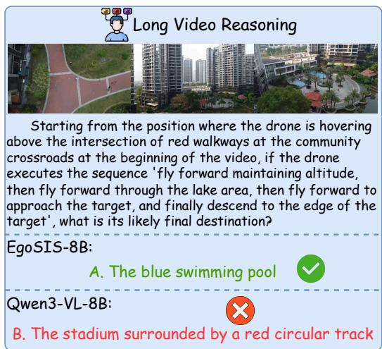
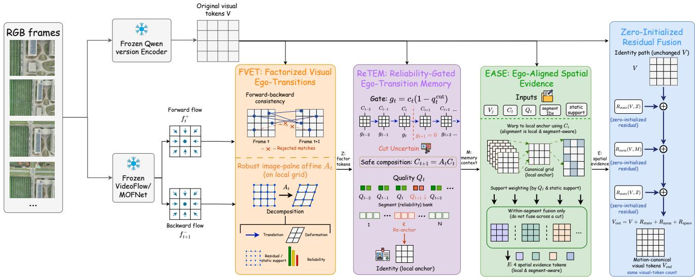
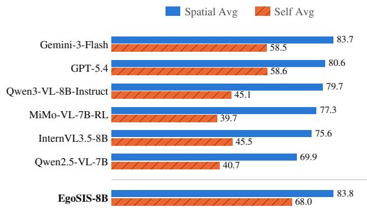

# EGOSIS: FROM FACTORIZED VISUAL EGO-TRANSITIONS TO MOTION-CANONICAL SPATIAL EVIDENCE FOR UAV REASONING

Jingpu Yang1,2,∗, Fengxian Ji2,∗, Mingxuan Cui3, Yilin Sun1, Hang Zhang4, Jianhua Zhu1, and Yufeng Wang1,†

1Beihang University, Beijing, China 2Zhongguancun Academy, Beijing, China 3Northeastern University, Shenyang, China 4Technology and Engineering Center for Space Utilization, Chinese Academy of Sciences, Beijing 100094, China ∗Equal contribution. †Corresponding author: Yufeng Wang (wyfeng@buaa.edu.cn).

## ABSTRACT

UAV video question answering requires separating camera motion from changes in the scene, but RGB-only multimodal models receive no explicit, stable reference for that separation. We present EgoSIS, a pose-free adapter that converts RGB-derived bidirectional flow into motion-canonical visual evidence in three stages. Factorized Visual Ego-Transitions (FVET) fits a robust image-plane transition and exposes motion, residual-support, and reliability factors. Reliability-Gated Ego-Transition Memory (ReTEM) uses reliability-weighted updates for a bounded history and re-anchors it at cuts or sustained uncertainty. Ego-Aligned Spatial Evidence (EASE) warps supported visual features into each segment’s local anchor and injects four spatial evidence tokens per visual slice through zero-initialized residuals, without changing Qwen’s visualtoken count. On SIS-Bench, EgoSIS-8B obtains 89.9% perception, 82.5% perception-plus-memory, and 76.2% overall accuracy, with the largest gains concentrated in self-awareness perception and memory. The adapter thus provides an interpretable interface between optical flow and spatial reasoning.

Index Terms— UAV video understanding, spatial reasoning, ego-motion, multimodal large language models, motion canonicalization

## 1. INTRODUCTION

UAV autonomy spans resilient communication, including agentbased anti-jamming [1], LLM-assisted frequency-game planning [2], and risk-sensitive anti-spoofing [3], as well as visual navigation [4]. Here we study UAV video reasoning, which must model both the scene and the motion of the observing platform. Camera motion shifts most image points, so apparent displacement entangles ego-motion, independently moving objects, occlusion, and artifacts. An RGB-only video multimodal large language model (MLLM) [5, 6, 7, 8, 9, 10] has no explicit stable reference for this ambiguity, which is especially harmful for temporal spatial questions. Recent UAV video benchmarks such as SIS-Bench [11] quantify this gap: the closed-source models in Table 1 remain below 75% overall accuracy, with limited performance on spatio-temporal consistency and action recall under sustained platform motion.

Related visual work uses geometric gating for temporally stable UAV segmentation [12] and reliable local correspondence for multimodal UAV fusion in GAAT [13, 14]. GeoCoT [15] combines contextual and spatial clues for image geolocation; our focus is a stable reference across moving UAV views. Optical flow provides cues for action and camera-motion recognition [11, 16, 17, 18, 19, 20], but a dense, view-dependent flow map does not by itself separate global from residual motion, identify unreliable correspondences, or define comparable coordinates across segments. We therefore adopt one causal chain: factorize each transition, retain reliable history, and align supported evidence to a local anchor.

  
Fig. 1. Qualitative comparison on a long UAV video: EGOSIS-8B identifies the destination swimming pool, whereas Qwen3-VL-8B predicts a stadium.

In Fig. 1, EGOSIS-8B follows the trajectory to a swimming pool, whereas Qwen3-VL-8B predicts a stadium, motivating a motion-canonical reference for temporal spatial reasoning.

EGOSIS is a pose-free RGB adapter that implements this chain. Factorized Visual Ego-Transitions (FVET) checks bidirectional flow and emits motion, residual/static-support, and reliability factors. Reliability-Gated Ego-Transition Memory (RETEM) keeps a bounded history and composes only safe geometry. Ego-Aligned Spatial Evidence (EASE) warps supported features into the current segment anchor. The representation is an image-plane proxy, not metric pose or a 3-D map; zero-initialized residuals preserve Qwen’s visual token count, and F/FR/FRE denote the cumulative variants.

Table 1. Performance on SIS-Bench. Accuracy (%) across 13 tasks for proprietary, open-source, and EgoSIS models.
<table><tr><td>Model</td><td>Perc.</td><td>Perc.+Mem.</td><td>Overall</td><td colspan="7">Spatial Cognition</td><td colspan="6">Self-Awareness</td></tr><tr><td></td><td></td><td></td><td></td><td>OE</td><td>OA</td><td>RD LO</td><td>LR</td><td></td><td>PR SC</td><td>STC</td><td>AR</td><td>AS</td><td>ARec</td><td>AP</td><td>PP</td></tr><tr><td colspan="10">Proprietary models</td><td></td><td></td><td></td><td></td><td></td><td></td><td></td></tr><tr><td>Gemini-3-Flash</td><td>79.1</td><td>74.4</td><td>71.6</td><td>97.2</td><td>80.6</td><td>75.0</td><td>94.4 84.0</td><td>89.7</td><td>71.8</td><td>57.7</td><td>66.5</td><td>84.1</td><td>42.4</td><td>61.6</td><td></td><td>53.7</td></tr><tr><td>Kimi-2.5</td><td>73.0</td><td>73.2</td><td>71.0</td><td>97.0</td><td>78.0</td><td>80.5</td><td>98.0</td><td>81.9</td><td>87.3</td><td>76.4</td><td>53.1</td><td>50.9</td><td>77.8</td><td>53.0</td><td>65.4</td><td>57.0</td></tr><tr><td>Doubao-Seed-1.8</td><td>68.7</td><td>73.3</td><td>70.6</td><td>97.4</td><td>72.6</td><td>76.5</td><td>96.1</td><td>84.4</td><td>87.7</td><td>66.2</td><td>57.3</td><td>43.7</td><td>85.1</td><td>59.2</td><td>63.1</td><td>54.0</td></tr><tr><td>Qwen3.5-Plus GPT-5.4</td><td>73.3</td><td>71.7</td><td>70.1</td><td>97.6</td><td>76.2</td><td>78.5</td><td>97.7</td><td>83.3</td><td>87.7</td><td>75.9</td><td>54.8</td><td>52.8</td><td>82.5</td><td>42.4</td><td>69.2</td><td>58.5</td></tr><tr><td></td><td>73.7</td><td>72.2</td><td>70.0</td><td>98.4</td><td>74.9</td><td>67.0</td><td>94.8</td><td>78.6</td><td>86.9</td><td>64.1</td><td>57.3</td><td>57.3</td><td>77.8</td><td>49.9</td><td>65.8</td><td>58.8</td></tr><tr><td colspan="10">Open-source baselines</td><td colspan="7"></td></tr><tr><td>Qwen3-VL-8B-Instruct</td><td>74.8</td><td>67.0</td><td>63.1</td><td>97.2</td><td>82.2</td><td>73.5</td><td>95.8</td><td>74.9</td><td>82.9</td><td>54.4</td><td>51.0</td><td>55.1</td><td>60.3</td><td>32.2</td><td>57.0</td><td>29.0</td></tr><tr><td>Qwen3-VL-8B-Thinking</td><td>72.2</td><td>66.5</td><td>64.6</td><td>95.5</td><td>76.0</td><td>72.5</td><td>95.1</td><td>78.6</td><td>79.8</td><td>64.6</td><td>55.6</td><td>53.4</td><td>62.9</td><td>33.6</td><td>64.6</td><td>46.3</td></tr><tr><td>Qwen3-VL-4B-Instruct</td><td>73.3</td><td>65.0</td><td>62.5</td><td>96.3</td><td>80.4</td><td>71.0</td><td>93.8</td><td>70.7</td><td>82.1</td><td>73.3</td><td>47.3</td><td>53.4</td><td>61.3</td><td>29.1</td><td>57.0</td><td>36.4</td></tr><tr><td>InternVL3.5-8B</td><td>73.4</td><td>64.0</td><td>61.1</td><td>96.1</td><td>76.5</td><td>70.5</td><td>86.3</td><td>72.0</td><td>73.8</td><td>55.4</td><td>47.3</td><td>56.1</td><td>52.4</td><td>31.8</td><td>55.1</td><td>41.9</td></tr><tr><td>Qwen3-VL-30B-A3B-Instruct</td><td>68.7 69.5</td><td>62.4 62.9</td><td>61.0</td><td>97.2</td><td>78.6</td><td>79.0</td><td>95.1</td><td>76.5</td><td>85.3</td><td>67.7</td><td>47.7</td><td>39.7</td><td>44.8</td><td>28.4</td><td>59.7</td><td>48.9</td></tr><tr><td>GLM-4.1V-9B-Thinking MiMo-VL-7B-RL</td><td>68.8</td><td>61.1</td><td>60.4 59.2</td><td>92.1</td><td>77.5</td><td>72.0</td><td>93.5</td><td>64.1</td><td>75.4</td><td>63.6</td><td>49.8</td><td>48.1</td><td>55.9</td><td>34.8</td><td>48.7</td><td>43.4</td></tr><tr><td>Qwen2.5-VL-7B-Instruct</td><td>67.1</td><td>57.5</td><td>55.8</td><td>96.3</td><td>74.2</td><td>73.5</td><td>80.1</td><td>75.2</td><td>81.3</td><td>72.3</td><td>47.3</td><td>44.8</td><td>43.2</td><td>29.7</td><td>51.7</td><td>40.8</td></tr><tr><td>Qwen2.5-VL-3B-Instruct</td><td>58.6</td><td>56.2</td><td>53.6</td><td>96.5 92.7</td><td>71.1 48.8</td><td>69.0 64.5</td><td>73.2 90.8</td><td>54.2 51.9</td><td>69.0</td><td>67.7</td><td>41.5 42.7</td><td>43.3</td><td>55.6</td><td>29.2</td><td>60.8</td><td>31.6</td></tr><tr><td></td><td></td><td></td><td></td><td></td><td>EgoSIS (ours)</td><td></td><td></td><td></td><td>62.7</td><td>57.4</td><td></td><td>37.9</td><td>62.5</td><td>35.6</td><td>53.6</td><td>23.2</td></tr><tr><td colspan="10"></td><td colspan="7"></td></tr><tr><td>EgoSIS-3B</td><td>84.1</td><td>74.9</td><td>68.2</td><td>96.3</td><td>69.5</td><td>66.5</td><td>92.8</td><td>68.8</td><td>72.6</td><td>58.5</td><td>44.0</td><td>88.6</td><td>81.6</td><td>49.3</td><td>46.8</td><td>22.4</td></tr><tr><td>EgoSIS-4B</td><td>87.3</td><td>79.8</td><td>73.0</td><td>97.0</td><td>80.9</td><td>76.0</td><td>95.4</td><td>79.5</td><td>82.5</td><td>60.5</td><td>43.6</td><td>87.2</td><td>83.5</td><td>55.2</td><td>57.0</td><td>27.2</td></tr><tr><td>EgoSIS-7B</td><td>87.6 89.9</td><td>79.8</td><td>73.1</td><td>97.4</td><td>79.1</td><td>73.5</td><td>94.1</td><td>79.2</td><td>75.8</td><td>59.0</td><td>46.1</td><td>89.7</td><td>84.1</td><td>57.1</td><td>57.4</td><td>26.1</td></tr><tr><td>EgoSIS-8B</td><td></td><td>82.5</td><td>76.2</td><td>97.8</td><td>86.6</td><td>78.0</td><td>98.0</td><td>79.9</td><td>90.5</td><td>64.6</td><td>53.1</td><td>89.7</td><td>87.3</td><td>57.5</td><td>58.6</td><td>31.2</td></tr></table>

Our contributions are threefold:

• We introduce FVET, which factorizes bidirectional visual transitions into global image-plane motion, residual/static support, and reliability.

• We propose RETEM, a bounded transition memory with reliability gates, cut-aware segmentation, and safe geometric re-anchoring.

• We develop EASE, which converts reliable transition history into local motion-canonical evidence without expanding the visual-token sequence, and evaluate the complete adapter on SIS-Bench.

## 2. EGOSIS

## 2.1. Overview

Let $\{ I _ { t } \} _ { t = 0 } ^ { T - 1 }$ denote T RGB frames sampled from a UAV video and let $\dot { V } \in \mathbb { R } ^ { \times G _ { t } \times G _ { h } \times G _ { w } \times d }$ be the visual-token grid produced by the frozen Qwen vision encoder [21, 22] after its spatial merger, where $G _ { t } , G _ { h } , G _ { w }$ are its temporal and spatial grid sizes and d is its feature width. A frozen VideoFlow/MOFNet estimator [23] produces bidirectional flow. As Fig. 2 shows, FVET factorizes each flow pair, RETEM gates packet-history updates and composes safe geometry, and EASE aligns supported visual features to segment anchors. We denote FVET, FVET+RETEM, and the full model by F, FR, and FRE, respectively. Boundary duplication aligns flow entry t with source frame t; the final outgoing edge is masked as invalid.

The two frozen streams yield visual tokens V and flow pairs. FVET extracts factor tokens $Z ;$ RETEM maintains reliable segment history M; EASE pools four aligned evidence tokens E. These contexts update V through zero-initialized residuals.

## 2.2. Factorized Visual Ego-Transitions

For edge t, let $f _ { t } ^ { + }$ map frame t to t + 1 and let $f _ { t + 1 } ^ { - }$ be the backward flow of the latter frame. For normalized grid coordinate $p \in$ $[ - 1 , 1 ] ^ { 2 }$ , let $S = \mathrm { d i a g } ( 2 / ( W - 1 ) , 2 / ( H - 1 ) )$ convert pixel flow on an $H \times W$ grid to normalized displacement. The forward endpoint and forward–backward consistency error [24] are

$$
\hat { p } _ { t } ( p ) = p + S f _ { t } ^ { + } ( p ) ,\tag{1}
$$

$$
e _ { t } ( p ) = \left. f _ { t } ^ { + } ( p ) + \mathcal { W } \big ( f _ { t + 1 } ^ { - } ; \hat { p } _ { t } ( p ) \big ) \right. _ { 2 } .\tag{2}
$$

where $\mathcal { W } ( b ; q )$ bilinearly samples $^ { b }$ at $q .$ Only $\hat { p } _ { t }$ is normalized; $f _ { t } ^ { + } , e _ { t }$ , and the threshold remain in pixels. We retain finite correspondences with in-bounds endpoints, finite backward support, and $e _ { t } ( p ) ~ \leq ~ \tau _ { t } ( p )$ , where $\tau _ { t } ( p ) ~ = ~ 0 . 5 + 0 . 0 5 ( \lVert f _ { t } ^ { + } ( p ) \rVert _ { 2 } +$ $\| \mathcal { W } ( f _ { t + 1 } ^ { - } ; \hat { p } _ { t } ( p ) ) \| _ { 2 } \big )$

We fit an affine $A _ { t } \in \mathbb { R } ^ { 3 \times 3 }$ from frame t to t + 1 in normalized coordinates using Huber IRLS [25] with MAD rejection. If too few consistent points survive, the edge remains time-aligned but contributes zero support and confidence. The resulting packet is

$$
s _ { t } = [ \Delta x _ { t } / W , \Delta y _ { t } / H , \theta _ { t } , \log \alpha _ { t } , r _ { t } ^ { \mathrm { m e d } } , r _ { t } ^ { \mathrm { M A D } } , c _ { t } , q _ { t } ^ { \mathrm { c u t } } , \Delta t _ { t } ]\tag{3}
$$

where $\Delta x _ { t } , \Delta y _ { t }$ are pixel-equivalent affine translations, $\theta _ { t }$ and αt are rotation and geometric-mean absolute scale, and $r _ { t } ^ { \mathrm { m e d } } , r _ { t } ^ { \mathrm { M A D } }$ are residual statistics normalized by the flow-grid diagonal; $\Delta t _ { t }$ is the timestamp gap (or frame-index gap when timestamps are unavailable). Confidence ct combines valid support, forward–backward agreement, residual/static support, and affine conditioning; cut score $q _ { t } ^ { \mathrm { { c u t } } }$ also uses RGB photometric warp disagreement. FVET projects the translation, deformation, residual/support, and reliability factors of $s _ { t }$ in Eq. (3) with relative-time and factor-type embeddings, yielding motion tokens $Z = \{ Z _ { t } \}$

  
Fig. 2. Overview of EGOSIS, a pose-free RGB adapter for UAV video reasoning. FVET factorizes bidirectional flow, RETEM gates and re-anchors transition memory, and EASE aligns visual evidence to segment anchors. The resulting contexts Z, M, and E update frozen Qwen visual features through zero-initialized residuals without changing the visual-token count.

## 2.3. Reliability-Gated Ego-Transition Memory

Let $h _ { t }$ be the semantic state before edge t, ψ its learned encoder, and $\mathbf { 1 } [ \cdot ]$ an indicator. ReTEM reliability-weights the update as

$$
g _ { t } = c _ { t } ( 1 - q _ { t } ^ { \mathrm { c u t } } ) \mathbf { 1 } [ \mathrm { e d g e } t \mathrm { v a l i d } ] ,\tag{4}
$$

$$
h _ { t + 1 } = ( 1 - g _ { t } ) h _ { t } + g _ { t } { \mathrm { ~ G R U } } ( \psi ( s _ { t } ) , h _ { t } ) .\tag{5}
$$

Within a segment, $C _ { t } \in \mathbb { R } ^ { 3 \times 3 }$ maps the current anchor to frame $t ,$ while $Q _ { t } \in [ 0 , 1 ]$ ] records cumulative geometric quality; both start at $( I , 1 )$ . With geometry threshold $\gamma _ { \mathrm { g e o } } ,$ a safe candidate is composed as

$$
\begin{array} { r } { ( C _ { t + 1 } , Q _ { t + 1 } ) = \left\{ \begin{array} { l l } { ( A _ { t } C _ { t } , Q _ { t } g _ { t } ) , } & { g _ { t } \geq \gamma _ { \mathrm { g e o } } , \ A _ { t } C _ { t } \ \mathrm { s a f e } , } \\ { ( C _ { t } , Q _ { t } ) , } & { \mathrm { o t h e r w i s e } . } \end{array} \right. } \end{array}\tag{6}
$$

The order $A _ { t } C _ { t }$ follows the anchor-to-frame direction. A hard cut, persistent low confidence, an unsafe candidate, a post-update quality drop, or the segment horizon re-anchors the track at $( I , 1 )$ . Subthreshold cut evidence only soft-gates the semantic state; a threshold crossing starts a new segment. The final sentinel is skipped, and memory becomes valid only after a positive-confidence valid edge. Mean-pooled past segments form a bounded bank; learned queries attend to it and the current history to produce context M.

## 2.4. Ego-Aligned Spatial Evidence

For contiguous Qwen temporal patch $j ,$ let $V _ { j } \in \mathbb { R } ^ { G _ { h } \times G _ { w } \times d }$ be its visual map, $r _ { j }$ its first frame, and sj its ReTEM segment. Since $C _ { r _ { j } }$ maps anchor to frame, warp(X, $C _ { r _ { j } } )$ samples current-grid tensor X into the anchor. For conservative static mask $m _ { j }$

$$
w _ { j } = \mathrm { w a r p } ( m _ { j } , C _ { r _ { j } } ) \odot u _ { j } \odot v _ { j } ^ { \mathrm { s t a t } } \odot c _ { j } ^ { \mathrm { m i n } } ( 1 - q _ { j } ^ { \mathrm { m a x } } ) Q _ { r _ { j } } ,\tag{7}
$$

Here $u _ { j }$ and $v _ { j } ^ { \mathrm { s t a t } }$ are in-bounds feature and warped-static support; $c _ { j } ^ { \operatorname* { m i n } }$ and $q _ { j } ^ { \operatorname* { m a x } }$ aggregate valid internal edges whose endpoints lie in the patch, and $Q _ { r _ { j } }$ is cumulative quality. The mask $m _ { j }$ intersects their static support. Groups without internal edges use $c _ { j } ^ { \operatorname* { m i n } } = 1 , q _ { j } ^ { \operatorname* { m a x } } = 0 ;$ those crossing a cut, segment boundary, or pure padding are invalid. Valid groups in segment s form

$$
\bar { V } _ { s } = \frac { \sum _ { j \in s } w _ { j } \odot \operatorname { w a r p } ( V _ { j } , C _ { r _ { j } } ) } { \sum _ { j \in s } w _ { j } + \epsilon } ;\tag{8}
$$

where ϵ and a masked fallback keep empty support finite. $\textup { A 2 } \times 2$ pool yields four internal context tokens $E ;$ contexts Z, M, and E attend to each visual slice through zero-initialized residuals:

$$
V ^ { \mathrm { o u t } } = V + R _ { \mathrm { s t a t e } } ( V , Z ) + R _ { \mathrm { m e m } } ( V , M ) + R _ { \mathrm { s p a c e } } ( V , E )\tag{9}
$$

Each R uses a zero-initialized output projection; validity masks suppress unsupported fallbacks, so $\hat { V } ^ { \mathrm { o u t } }$ preserves $V \mathbf { \bar { s } }$ shape and token positions.

## 3. EXPERIMENTS

## 3.1. Experimental Setup

Unless otherwise noted, we train each structural variant for one epoch on SIS-Motion-54K [11] using causal language-modeling loss on assistant answer tokens. The pretrained Qwen backbone and the MOFNet-based flow estimator remain frozen; only the EgoSIS connector and LoRA adapters [26] on the language self-attention Q/K/V/O projections are trained. LoRA uses rank 32, alpha 64, and dropout 0.05. The formal stagewise run uses a frozen census of 54,298 valid training instances from 11,763 videos, global batch size 32, BF16, and ZeRO-2. Videos are sampled at 2 FPS and clamped to 8–32 frames; frame manifests, prompts, decoding, and score denominators are held fixed within each comparison.

## 3.2. Main Results

We report all 13 official SIS-Bench tasks. UAV benchmarks such as VisDrone [27], UAVid [28], and UAV123 [29] emphasize the viewpoint and motion conditions relevant here. Under spatial cognition,

  
Fig. 3. Question-weighted dimension accuracy using counts reconstructed from Table 1.

OE, OA, RD, LO, LR, PR, SC, and STC denote Object Existence, Object Attribute, Relative Direction, Landmark Order, Landmark Recall, Positional Relationship, Spatial Consistency, and Spatio-Temporal Consistency. Under self-awareness, AR, AS, ARec, AP, and PP denote Action Recognition, Action Sequence, Action Recall, Action Prediction, and Path Planning.

Following the SIS-Bench evaluation protocol [11], Perc. covers the perception tasks OE, OA, RD, and AR, while Perc.+Mem. additionally includes all memory tasks. Overall covers all 4,856 questions across perception, memory, and reasoning. Each aggregate accuracy is the total number of correct answers divided by the number of questions in that group.

EgoSIS-8B achieves the highest overall accuracy in Table 1, reaching 76.2% compared with 63.1% for Qwen3-VL-8B-Instruct. Its largest improvements over this backbone are in recognizing the UAV’s actions and recalling their temporal history, spanning both perception and memory within self-awareness. The gains in reasoning are less consistent: spatial consistency improves substantially, whereas spatio-temporal consistency and action prediction improve only modestly. Path planning remains the weakest task, suggesting that better recognition and recall of past motion do not yet translate into comparable gains in planning.

## 3.3. Cross-Benchmark Generalization

Table 2 reports transfer beyond SIS-Bench. OpenUAV-QA [11], derived from OpenUAV/TravelUAV [4], uses S/L splits at 45 frames before the model’s frame cap. CameraBench [30] reports classification mAP and VQA accuracy; MotionBench [31] reports camera-motion (CM) and overall accuracy at 32 frames. EgoSIS-8B leads the reported OpenUAV-QA columns at 97.3%/93.8%/95.6% and CameraBench classification at 44.6%. It also leads Motion-Bench CM at 59.0% and ties Ovis2.5-9B at 29.7% Overall at the displayed precision. CameraBench VQA remains weaker: 53.6% versus Ovis2.5-9B’s 61.5%. Comparisons with EgoSIS-7B involve different backbone generations and do not isolate model scale.

## 3.4. Ablation and Analysis

Table 3 compares 8B variants on 4,856 SIS-Bench questions. Qwen3-VL-8B-Instruct is the zero-shot reference. Visual-only SFT is compared with F, FR, and FRE, which successively introduce FVET, ReTEM, and EASE. FR freezes the inherited F model and trains ReTEM; FRE freezes FR and trains the zero-initialized EASE branch. These comparisons measure incremental stagewise training effects, with additional optimization at each stage.

Table 2. Cross-benchmark generalization (%). OU, CB, and MB denote OpenUAV-QA, CameraBench, and MotionBench@32f; column maxima are bold.
<table><tr><td rowspan="2">Model</td><td colspan="3">OU</td><td colspan="2">CB</td><td colspan="2">MB</td></tr><tr><td>S</td><td>L</td><td>All</td><td>Cl.</td><td>VQA</td><td>CM All</td><td></td></tr><tr><td>Qwen2.5-VL-7B-Instruct 75.6 70.6 73.1 36.0 57.4 49.1 27.6 Qwen3-VL-8B-Instruct</td><td>82.6 78.5 80.6 42.3 55.844.9 24.3</td><td></td><td></td><td></td><td></td><td></td><td></td></tr><tr><td>InternVL3.5-8B</td><td>82.5 82.8 82.7 33.2 53.548.3 27.2</td><td></td><td></td><td></td><td></td><td></td><td></td></tr><tr><td>InternVL3.5-4B</td><td>78.3 73.3 75.8 31.648.452.2 27.3</td><td></td><td></td><td></td><td></td><td></td><td></td></tr><tr><td>GLM-4.1V-9B-Thinking</td><td>85.3 78.7 82.0 36.4 51.5 52.5 28.8</td><td></td><td></td><td></td><td></td><td></td><td></td></tr><tr><td>MiMo-VL-7B-RL</td><td></td><td></td><td></td><td></td><td></td><td>70.3 73.4 71.8 25.2 50.6 54.0 29.5</td><td></td></tr><tr><td>GLM-4.6V-Flash-9B</td><td></td><td></td><td></td><td></td><td></td><td>88.5 82.6 85.6 41.4 50.549.9 29.4</td><td></td></tr><tr><td>Kimi-VL-A3B-Instruct</td><td>86.385.385.8 34.156.346.8 28.6</td><td></td><td></td><td></td><td></td><td></td><td></td></tr><tr><td>Ovis2.5-9B</td><td>77.2 79.9 78.5 33.961.554.5 29.7</td><td></td><td></td><td></td><td></td><td></td><td></td></tr><tr><td>Qwen3-VL-8B-Thinking</td><td>82.9 78.7 80.8 42.5 54.6 56.6 29.3</td><td></td><td></td><td></td><td></td><td></td><td></td></tr><tr><td>VST-7B-RL Step3-VL-10B</td><td>48.5 52.2 50.3 35.9 61.0 56.9 28.5</td><td></td><td></td><td></td><td></td><td></td><td></td></tr><tr><td>InternVL3-9B</td><td></td><td>36.2 37.7 37.0 19.4 50.0 26.5 20.1</td><td></td><td></td><td></td><td></td><td></td></tr><tr><td></td><td></td><td>86.0 87.6 86.8 34.4 46.1 46.2 27.9</td><td></td><td></td><td></td><td></td><td></td></tr><tr><td>MOFNet-7B</td><td></td><td>97.2 91.9 94.6 43.9</td><td></td><td></td><td></td><td></td><td></td></tr><tr><td></td><td></td><td></td><td></td><td></td><td>56.6</td><td></td><td>56.1 28.4</td></tr><tr><td></td><td></td><td></td><td></td><td></td><td></td><td></td><td></td></tr><tr><td>EGOSIS-7B EGOSIS-8B</td><td></td><td>97.1 93.0 95.1 36.6</td><td></td><td>97.3 93.8 95.6 44.653.6 59.0 29.7</td><td>52.8</td><td>57.1 28.4</td><td></td></tr></table>

Table 3. SIS-Bench component ablation (%) with matched evaluation: 4,856 questions overall and task-specific denominators.
<table><tr><td rowspan="2">Variant</td><td colspan="2">Spatial Reasoning</td><td colspan="5">Self-Awareness</td><td rowspan="2">Overall</td></tr><tr><td>SC</td><td>STC</td><td>AR</td><td>AS</td><td>ARec</td><td>AP</td><td>PP</td></tr><tr><td>Zero-shot reference</td><td>54.4</td><td>51.0</td><td>55.1</td><td>60.3</td><td>32.2</td><td>57.0</td><td>29.0</td><td>63.1</td></tr><tr><td>Visual-only SFT</td><td>56.4</td><td>50.6</td><td>56.0</td><td>87.0</td><td>47.8</td><td>55.9</td><td>29.0</td><td>65.2</td></tr><tr><td>EgoSIS-F</td><td>62.1</td><td>51.0</td><td>77.3</td><td>85.1</td><td>53.2</td><td>54.4</td><td>29.8</td><td>73.3</td></tr><tr><td>EgoSIS-FR</td><td>65.1</td><td>52.3</td><td>89.4</td><td>86.3</td><td>52.6</td><td>53.6</td><td>30.1</td><td>74.1</td></tr><tr><td>EgoSIS-FRE</td><td>64.6</td><td>53.1</td><td>89.7</td><td>87.3</td><td>57.5</td><td>58.6</td><td>31.2</td><td>76.2</td></tr></table>

Visual-only SFT mainly improves action sequence understanding and recall, with limited gains in action recognition and spatial reasoning. Introducing FVET substantially improves action recognition and spatial consistency, and ReTEM further strengthens both. These gains do not extend uniformly to other tasks: action recall and prediction decline slightly when ReTEM is added. EASE then improves recall and prediction beyond both F and FR, consistent with the benefit of aligning visual evidence across frames. The complete FRE model reaches 76.2% overall accuracy, compared with 65.2% for visual-only SFT, and performs best on six of the seven displayed tasks. Spatial consistency remains slightly higher with FR, indicating a small tradeoff when aligned evidence is introduced.

## 4. CONCLUSION

UAV video reasoning needs a stable spatial reference because image displacement otherwise conflates platform motion with scene change. EgoSIS addresses this problem as a causal chain: FVET factorizes each bidirectional transition, ReTEM gates history by reliability and re-anchors unsafe segments, and EASE aligns supported visual evidence without changing the number or positions of visual tokens. On SIS-Bench, EgoSIS-8B reaches 89.9% perception, 82.5% perception-plus-memory, and 76.2% overall accuracy. Cross-benchmark results for the EASE-off 8B setting show a clear gain on OpenUAV-QA but mixed performance on CameraBench and MotionBench. The current representation remains an image-plane proxy rather than metric pose, and checkpoint-controlled progressive ablations are still needed to isolate the contributions of ReTEM and EASE.

## 5. REFERENCES

[1] Jingpu Yang, Mingxuan Cui, Hang Zhang, Fengxian Ji, Zhengzhao Lai, and Yufeng Wang, “Agent-based anti-jamming techniques for UAV communications in adversarial environments: A comprehensive survey,” 2025, arXiv:2508.11687.

[2] Jingpu Yang, Hang Zhang, Fengxian Ji, Yufeng Wang, Mingjie Wang, Yizhe Luo, and Wenrui Ding, “Frequency point game environment for UAVs via expert knowledge and large language model,” 2025, arXiv:2508.02757.

[3] Hang Zhang, Wenrui Ding, Yufeng Wang, Jingpu Yang, and Yizhe Luo, “IDTD-RL: An intelligent dual-track defense risksensitive reinforcement learning framework for anti-spoofing in UAV communications,” IEEE Transactions on Information Forensics and Security, vol. 21, pp. 7858–7873, 2026.

[4] Xiangyu Wang, Donglin Yang, Ziqin Wang, Hohin Kwan, Jinyu Chen, Wenjun Wu, Hongsheng Li, Yue Liao, and Si Liu, “Towards realistic UAV vision-language navigation: Platform, benchmark, and methodology,” 2024, arXiv:2410.07087.

[5] Muhammad Maaz, Hanoona Rasheed, Salman Khan, and Fahad Shahbaz Khan, “Video-ChatGPT: Towards detailed video understanding via large vision and language models,” in Proc. Annual Meeting ofthe Associationfor Computational Linguistics (ACL), 2024.

[6] Boyi Zhang, Kehan Liu, Zhihao Wu, et al., “Video-LLaVA: Learning united visual representation by aligning video and images,” 2023.

[7] Hang Zhang, Xin Li, et al., “Video-LLaMA: An instructiontuned audio-visual language model for video understanding,” 2023.

[8] Shuhuai Ren, Shicheng Li, Shuyuan Shen, et al., “TimeChat: A time-sensitive multimodal large language model for long video understanding,” in Proc. IEEE/CVF Conference on Computer Vision and Pattern Recognition (CVPR), 2024, pp. 14313–14323.

[9] Boshi Wang, Bing Zhao, et al., “Video-MME: A comprehensive evaluation benchmark for multi-modal large language models in video analysis,” 2024.

[10] Deyao Zhu, Jun Chen, Xiaoqian Shen, Xiang Li, and Mohamed Elhoseiny, “SpatialVLM: A vision-language model for spatial understanding,” 2024.

[11] Zhishan Zou, Guoyan Sun, Zhiwei Wei, Jiancheng Pan, Yujie Li, Mugen Peng, and Wenjia Xu, “Self in Space: Benchmarking self-awareness and spatial cognition in UAV embodied intelligence,” 2026, arXiv:2607.12477, doi: 10.48550/arXiv.2607.12477.

[12] Jingpu Yang, Fengxian Ji, Zhengzhao Lai, Juanfan Wu, Mingxuan Cui, and Yufeng Wang, “Zero-parameter geometric gating for temporally stable low-altitude UAV video semantic segmentation,” 2026, arXiv:2606.09162.

[13] Jingpu Yang, Debin Tang, Yilin Sun, Fengxian Ji, Jiahua Zhu, Wenrui Ding, and Yufeng Wang, “GAAT: Geometry-aware alignment transformer for multimodal UAV perception,” 2026, arXiv:2608.27971.

[14] Paul-Edouard Sarlin, Daniel DeTone, Tomasz Malisiewicz, and Andrew Rabinovich, “Superglue: Learning feature matching with graph neural networks,” in Proc. IEEE/CVF Conference on Computer Vision and Pattern Recognition (CVPR), 2020, pp. 4938–4947.

[15] Zirui Song, Jingpu Yang, Yuan Huang, Jonathan Tonglet, Zeyu Zhang, Tao Cheng, Meng Fang, Iryna Gurevych, and Xiuying Chen, “Geolocation with real human gameplay data: A large-scale dataset and human-like reasoning framework,” 2025, arXiv:2502.13759.

[16] Zachary Teed and Jia Deng, “RAFT: Recurrent all-pairs field transforms for optical flow,” in Proc. European Conference on Computer Vision (ECCV), 2020, pp. 402–419.

[17] Deqian Tian, Philipp Fischer, Tobias K”ohler, Yang Li, and Daniel Cremers, “Flownet: Learning optical flow with convolutional networks,” in Proc. IEEE International Conference on Computer Vision (ICCV), 2015, pp. 2758–2766.

[18] Eddy Ilg, Nikolaus Mayer, Tonmoy Saikia, Margret Keuper, Alexey Dosovitskiy, and Thomas Brox, “Flownet 2.0: Evolution of optical flow estimation with deep networks,” in Proc. IEEE Conference on Computer Vision and Pattern Recognition (CVPR), 2017, pp. 2462–2470.

[19] Takumi Hui and Chen Change Loy, “A lightweight network for optical flow estimation,” in Proc. IEEE Conference on Computer Vision and Pattern Recognition (CVPR), 2018, pp. 8981– 8989.

[20] Suhwan Cho, Sangryul Jeon, et al., “Learning to estimate optical flow with global motion aggregation,” in Proc. IEEE/CVF Conference on Computer Vision and Pattern Recognition (CVPR), 2022, pp. 8121–8130.

[21] Shuai Bai, Keqin Chen, Xuejing Liu, et al., “Qwen2.5-VL technical report,” 2025, arXiv:2502.13923.

[22] Shuai Bai, Yuxuan Cai, Ruizhe Chen, et al., “Qwen3-VL technical report,” 2025, arXiv:2511.21631.

[23] Xiaoyu Shi, Zhaoyang Huang, Weikang Bian, Dasong Li, Manyuan Zhang, Ka Chun Cheung, Simon See, Hongwei Qin, Jifeng Dai, and Hongsheng Li, “VideoFlow: Exploiting temporal cues for multi-frame optical flow estimation,” in Proc. IEEE/CVF International Conference on Computer Vision (ICCV), 2023, pp. 12469–12480.

[24] Simon Meister, Junhwa Hur, and Stefan Roth, “UnFlow: Unsupervised learning of optical flow with a bidirectional census loss,” in Proc. AAAI Conference on Artificial Intelligence, 2018, vol. 32.

[25] Peter J. Huber, “Robust estimation of a location parameter,” The Annals of Mathematical Statistics, vol. 35, no. 1, pp. 73– 101, 1964.

[26] Edward J. Hu, Yelong Shen, Phillip Wallis, Zeyuan Allen-Zhu, Yuanzhi Li, Shean Wang, Lu Wang, and Weizhu Chen, “LoRA: Low-rank adaptation of large language models,” in International Conference on Learning Representations (ICLR), 2022.

[27] Pengfei Zhu, Longyin Wen, Dawei Du, Xiao Bian, Haibin Ling, Qinghua Hu, Hongwei Wu, Qilong Nie, Hao Cheng, Chunhua Liu, et al., “VisDrone-DET2018: The vision meets drone object detection in image challenge results,” in Proc. European Conference on Computer Vision Workshops, 2018.

[28] Yang Lyu, George V. Georgiou, Qi Zhang, et al., “UAVid: A multi-level benchmark for multi-frame moving object detection,” ISPRS Journal of Photogrammetry and Remote Sensing, vol. 166, pp. 64–78, 2020.

[29] Matthias Mueller, Neil Smith, and Bernard Ghanem, “UAV123: A benchmark and simulator for uav tracking,” in Proc. European Conference on Computer Vision (ECCV), 2016, pp. 445–461.

[30] Zhiqiu Lin, Siyuan Cen, Daniel Jiang, Jay Karhade, Hewei Wang, Chancharik Mitra, Tiffany Ling, Yuhan Huang, Sifan Liu, Mingyu Chen, Rushikesh Zawar, Xue Bai, Yilun Du, Chuang Gan, and Deva Ramanan, “Towards understanding camera motions in any video,” 2025, arXiv:2504.15376.

[31] Wenyi Hong, Yean Cheng, Zhuoyi Yang, Weihan Wang, Lefan Wang, Xiaotao Gu, Shiyu Huang, Yuxiao Dong, and Jie Tang, “MotionBench: Benchmarking and improving fine-grained video motion understanding for vision language models,” in Proc. IEEE/CVF Conference on Computer Vision and Pattern Recognition (CVPR), 2025, pp. 8450–8460.