# FIRE3D: Feed-forward Interactive 3D Scene Reconstruction Within A Minute

Hongchi Xia1 Tianhang Cheng1 Wei-Chiu Ma2 Shenlong Wang1

1University of Illinois Urbana-Champaign 2Cornell University

https://xiahongchi.github.io/Fire3D

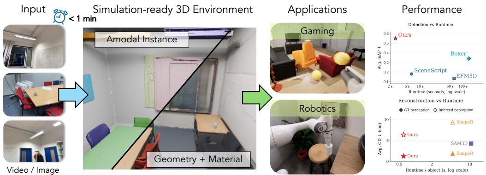  
Figure 1: Overview of FIRE3D: From a single video or image capture, FIRE3D reconstructs the simulation-ready 3D environment in under a minute. It does not require any additional object annotation, such as bounding boxes or instance masks, and produces geometry and texture consistent object assets with the background as well. FIRE3D unlocks a wide range of downstream applications across interactive gaming and robotics.

## Abstract

We present FIRE3D, a unified framework that takes a single RGB image or casual RGB video and transforms it into simulation-ready 3D scene assets for games and interactive applications in under a minute. At the core of FIRE3D is a feedforward, end-to-end network that predicts a compositional scene representation from posed RGB-D observations estimated from the RGB capture, including the 6-DoF pose, bounding box, mesh, and texture for every object. By modeling the scene as a collection of discrete entities, FIRE3D produces amodally complete and simulation-ready environments where objects are physically decoupled and ready for interaction. Our framework requires no test-time optimization, runs orders of magnitude faster than prior interaction-ready methods, and provides objectlevel completeness beyond existing feed-forward 3D approaches. We demonstrate competitive or state-of-the-art results across pose accuracy, geometry completeness, and texture quality across various datasets while being orders of magnitudes faster.

## 1 Introduction

Imagine turning a room into an editable 3D world: each chair, table, cabinet, and background surface becomes a complete textured entity that can be moved, rendered, or simulated. Such object-level digital twins are valuable for AR/VR, robotics, gaming, and content creation. Yet real indoor scenes are cluttered, partially observed, and often contain many interacting objects. A practical system must jointly parse object instances, recover complete geometry beyond visible surfaces, synthesize appearance, and preserve the metric layout of the scene.

<table><tr><td rowspan="2">Method</td><td rowspan="2">Feed-forward</td><td colspan="2">Input</td><td colspan="5">Output</td></tr><tr><td>Type</td><td>No External Perception</td><td>BBox &amp; Mask</td><td>Obj. Geo</td><td>Texture</td><td>BG</td><td>Interact-able</td></tr><tr><td>Pixel-space opt. [31, 21]</td><td>x</td><td>Video</td><td>√</td><td>x</td><td>X</td><td>V</td><td>L</td><td>X</td></tr><tr><td>Object-centric opt. [65, 63]</td><td>×</td><td>Video</td><td>x</td><td>x</td><td>√</td><td>√</td><td>1</td><td>√</td></tr><tr><td>Perception [2, 51]</td><td></td><td>Video</td><td>V</td><td>√</td><td>x</td><td>x</td><td>x</td><td>x</td></tr><tr><td>Image-to-scene [1, 19]</td><td></td><td>Image</td><td>x</td><td>√</td><td>√</td><td></td><td>2</td><td>V</td></tr><tr><td>Video-to-scene [48]</td><td></td><td>Video</td><td>x</td><td>x</td><td>J</td><td></td><td>x</td><td>V</td></tr><tr><td>Ours</td><td>√</td><td>Image / Video</td><td>√</td><td>√</td><td>1</td><td>√</td><td></td><td>√</td></tr></table>

Table 1: Comparison with representative scene reconstruction methods. Our model doesn’t rely on unstable external perception networks and can output complete simulation-ready scenes. ✓/✗: supported/not supported; ∼: partially; BG: background. Obj. Geo: Object-wise geometry. The Input Type column denotes the user-provided RGB capture; FIRE3D converts them into posed RGB-D observations before inference.

Existing methods address only parts of this problem. 3D detectors localize objects but do not reconstruct complete geometry or texture [60]. Point-cloud segmentation networks parse visible regions but remain perception-only [41]. Object-centric reconstruction methods improve amodal completion, but often assume pre-segmented object inputs or process objects independently. Recent systems move closer to object-level scene reconstruction, but still rely on image prompts, external SLAM and detection, incomplete shape-only reconstruction, or expensive optimization-based refinement [8, 48, 65]. Thus, a key gap remains: fast feed-forward reconstruction of complete textured object-level scenes from unsegmented, posed RGB-D observations estimated from raw RGB captures.

We introduce FIRE3D, a feed-forward framework for object-level textured 3D scene reconstruction from posed RGB-D observations. We represent each observation by an RGB image, a camera-frame point map (equivalently, depth with known intrinsics), and a camera-to-world pose. For a single RGB image or casual monocular RGB video, we estimate the required point maps and camera poses with Pi3 [59] before FIRE3D inference. Given these observations without instance masks, FIRE3D lifts multi-view features into a 3D feature point cloud and jointly predicts object validity, pose, and 3D instance masks. Each parsed instance is then canonicalized and reconstructed by a point-cloudconditioned cascaded flow-matching model, which generates structure, shape, and material latents in sequence. A key design of FIRE3D is an ultra-compact hierarchical latent space that represents each object with a small set of structure, geometry, and material tokens. This compact representation enables batched flow matching sampling across many instances, substantially accelerating scene-level reconstruction. This enables FIRE3D to achieve over 5× speedup over prior methods [8].

Training such a feed-forward generative reconstruction model requires large and diverse supervision. To this end, we curate a large-scale training corpus across five scene datasets and four object datasets, totaling 80k scenes, 140k video snippets, and an extra 500k objects. This data provides broad coverage of indoor layouts, object categories, occlusion patterns, and appearance variation, enabling FIRE3D to learn robust scene parsing from real observations while also learning amodal object completion and textured reconstruction at scale. Together, the feed-forward scene parser, compact latent space, batched object generator, and large-scale training corpus enable fast object-level reconstruction of cluttered indoor scenes.

Experiments on challenging multi-object indoor scenes from unseen datasets show that FIRE3D improves geometry accuracy, object completeness, texture quality, and pose consistency over perceptiononly, object-centric, and optimization-based baselines, while producing faithful textured reconstructions that can be edited, rendered, and simulated. Importantly, for the posed RGB-D observations estimated from a 60-frame RGB video containing more than 12 instances, FIRE3D completes end-to-end inference in under 60 seconds.

## Our contributions are threefold:

• We introduce FIRE3D, a feed-forward framework that reconstructs object-level textured 3D scenes from unsegmented posed RGB-D observations estimated from RGB image/video captures, without manual boxes or masks.

• We design an ultra-compact latent flow-matching generator that reconstructs up to 16 objects in parallel, achieving over 5× speedup with minor quality loss.

• We curate a large-scale training corpus with 80k scenes, 140k video snippets, and an extra 500k objects and show strong improvements in geometry, completeness, texture, pose consistency, and runtime.

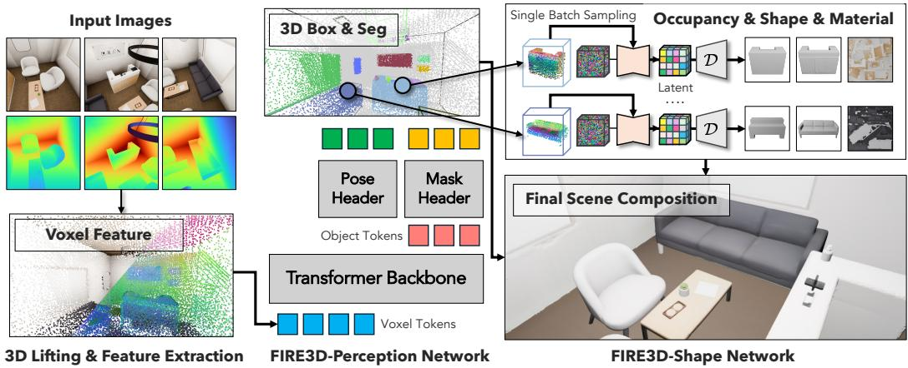  
Figure 2: Overview of FIRE3D network: Given the input posed RGB-D observations, FIRE3D first performs instance-aware 3D scene perception, and then generates the compact latents of each object conditioned on the predicted instance point clouds. Finally, the complete textured meshes are decoded with the hierarchical VAEs and assembled into a 3D scene with the predicted object 3D poses.

## 2 Related Works

Simulation-ready 3D Scene Reconstruction. As summarized in Tab. 1, NeRF- [31, 3, 33, 71, 17, 77, 38] and 3DGS-based methods [21, 18, 73, 34] achieve realistic novel-view synthesis, but represent scenes as fields or splats rather than editable object-level assets. Scene-level reconstruction methods [66, 67, 65, 63, 35, 36, 10, 62, 45] can produce simulation-ready environments, yet rely on optimization, search, or iterative refinement, limiting scalability in cluttered scenes. Recent feed-forward models [48, 1, 19, 8, 30] avoid costly test-time optimization and recover complete shapes or textured objects, but often require pre-segmented inputs, prompts, external perception, or sequential object-wise inference. In contrast, FIRE3D performs batched feed-forward inference, jointly perceiving and reconstructing all objects with consistent geometry and texture.

Feed-forward 3D Learning. Feed-forward 3D learning enables efficient scene understanding and geometric prediction. Existing perception methods predict 3D boxes from multi-view images [60, 69, 4], segment point clouds into semantic or instance regions [40, 41, 47, 53], or infer layouts, global boxes, and egocentric scene representations from images or video [2, 13, 51, 9]. However, their outputs are typically boxes, masks, layouts, or partial geometry, rather than complete textured assets for simulation. Recent feed-forward reconstruction models predict dense geometry from images. TRELLIS.2 [68] and other image-to-3D methods [75, 28, 54, 42, 29, 55, 25] recover geometry and texture from a single image, but mainly target individual objects. DUSt3R and successors [58, 26, 57, 56, 7, 70, 27, 74] infer point maps, depth, camera parameters, tracks, or dense scene geometry without per-scene optimization, but do not explicitly produce object-level textured meshes, poses, and editable assets. Our method unifies perception and reconstruction in a feed-forward framework. From unsegmented posed RGB-D observations constructed from native RGB-D data or estimated from RGB captures, FIRE3D directly reconstructs object instances, poses, complete foreground geometry and texture, plus a static background instance, producing interactable, simulation-ready scenes.

## 3 Method

In this paper, we propose a model that takes a single RGB image or casually captured monocular RGB video, estimates its posed RGB-D observations, and converts them into a photo-realistic, simulationready 3D environment within 60 seconds. Based on the observation that existing approaches either heavily rely on (multi-stage) optimization [65] or employ iterative estimation of scene objects [8], we propose to develop a feed-forward network that can recover the complete geometry and material properties of a scene in a single pass. At the core of our framework lies three tight-coupled components: (i) an compact, object-centric shape representation that is both memory-efficient and highly expressive; (ii) a perception network that extracts object poses and features; and (iii) a shape generation network that operates on the compressed latent space, enabling parallel batch generation on a single GPU. Altogether, these components form a unified pipeline where the efficiency of our scene reconstruction is fundamentally enabled by our hierarchical latent space.

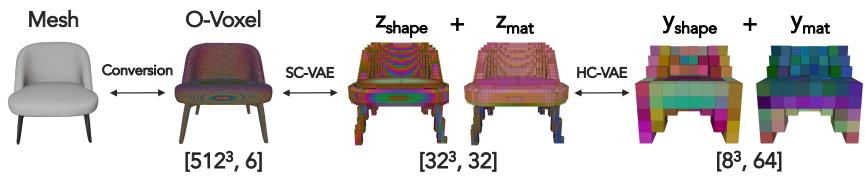  
Figure 3: Overview of FIRE3D hierarchical compression VAE: To further compress the object latent space and enable efficient scene-scale number of object reconstruction, FIRE3D leverages HC-VAE to further compress the SC-VAE latents into an even more compact latent space, resulting in 32× compression rate compared with SC-VAE.

We start by describing the limitations of existing object representations. Then we showcase how to compress it further, leading to a high-compact object representation. Finally, we discuss how we develop our perception and shape network around the representation, significantly speed up simulation-ready full scene reconstruction. Fig. 2 summarizes our approach.

## 3.1 Representing an Object within 256 KBytes

Our goal is to reconstruct a simulation-ready, interactable 3D environment within 60 seconds. However, a typical scene may contain tens or even hundreds of objects. To efficiently generate these assets simultaneously, we require a representation that is both expressive (i.e., capable of encoding diverse geometries and object categories) and compact (i.e., fit within the memory constraints of a single GPU).

Sparse Compression VAE (SC-VAE) [68]. One popular 3D object representation is the latent space derived from SC-VAE. Specifically, given a textured mesh M, we first convert it into its Occupancy-Voxel (O-Voxel) representation, and then encode it into a shape latent $\mathbf { z } _ { \mathrm { s h a p e } }$ and a material latent $\mathbf { z } _ { \mathrm { m a t } }$ using pretrained SC-VAE [68]. While this representation has enjoyed great success in single-object 3D generation methods (e.g. TRELLIS.2), its latent resolution (typically $3 2 ^ { 3 } \times 3 2 )$ quickly becomes computationally expensive when scaled to scenes with many objects. For instance, an 80GB A100 GPU can only support the simultaneous generation of two objects using this resolution.

Hierarchical Compression VAE (HC-VAE). To enable efficient multi-object generation, we propose to further compress the SC-VAE latents. Our key observation is that most real-world objects lie on a low-dimensional manifold and can be represented with an even more parsimonious code. We therefore employ an additional sparse 3D CNN to compress the latents into $\mathbf { y } _ { \mathrm { s h a p e } }$ and $\mathbf { y } _ { \mathrm { m a t } } \in 8 ^ { 3 } \times 6 4$ As shown in Fig. 5, we can still reconstruct fine-grained details even at this 32× compression rate. Fig. 3 illustrates the procedure.

## 3.2 Instance-aware 3D Scene Perception from Posed RGB-D Observations

Having established an extremely compact representation for individual objects, we now describe how FIRE3D detects and segments objects within a scene to extract features for shape and material reconstruction.

FIRE3D operates on a set of posed RGB-D observations $\mathcal { O } = \{ ( \mathbf { I } _ { i } , \mathbf { X } _ { i } , \mathbf { T } _ { i } ) \} _ { i = 1 } ^ { N }$ , where $\mathbf { I } _ { i }$ is an RGB image, $\mathbf { X } _ { i }$ is its camera-frame 3D point map, and $\mathbf { T } _ { i }$ is the camera-to-world pose. A depth map with known camera intrinsics provides an equivalent representation of $\mathbf { X } _ { i } .$ . For native RGB-D captures, these quantities are measured directly. For a single RGB image or casual monocular RGB video, we use $\mathrm { P i ^ { 3 } }$ [59] to estimate local point maps and camera poses, and normalize the resulting geometry to FIRE3D’s coordinate convention. In the single-image case, the camera coordinate frame defines the reference frame.

Given the posed RGB-D observations defined above, we use the camera-frame point map and camera pose to transform every pixel $\mathbf { p } _ { i }$ into a 3D point xi and augment it with a DINOv3 [49] feature fi extracted from the corresponding image frame. We then voxelize the resulting feature point cloud $\mathcal { P } = \{ ( \mathbf { x } _ { j } , \mathbf { f } _ { j } ) \} _ { i = 1 } ^ { N _ { p } }$ into a sparse 3D feature grid and feed it into a query-based transformer [5] to segment the objects and estimate their respective poses:

$$
\left\{ \hat { v } ^ { ( k ) } , \hat { \pi } ^ { ( k ) } , \hat { \mathbf { m } } ^ { ( k ) } \right\} _ { k = 1 } ^ { K _ { Q } } = f _ { \mathrm { p e r c e p t } } ( \mathcal { P } ) .\tag{1}
$$

Here, $\hat { v } ^ { ( k ) } \in [ 0 , 1 ]$ denotes the validity score, $\hat { \mathbf { m } } ^ { ( k ) } \in \{ 0 , 1 \} ^ { N _ { p } }$ represents the 3D instance mask over ${ \mathcal P } ,$ and $\hat { \pi } ^ { ( k ) }$ parameterizes the similarity transformation of the predicted object extent.

Candidates with validity scores below a predefined threshold are discarded, resulting in a total of K predicted objects. For each valid candidate, we apply the predicted similarity transformation $\hat { \pi } ^ { ( \bar { k } ) }$ to map the instance point cloud from world coordinate into its canonical coordinate frame. These canonicalized instance point clouds are then served as object-centric 3D conditions, which are subsequently used by our shape generation network (Sec. 3.3) to map each object to the compact HC-VAE latent space, enabling the efficient, parallel reconstruction of the entire scene.

## 3.3 Batched Point Cloud Conditioned Object Reconstruction and Scene Assembly

The final module in our network aims to map each detected object to an HC-VAE latent, which is then decoded into complete geometry and material properties:

$$
\{ \mathbf { y } _ { \mathrm { s h a p e } } ^ { ( k ) } , \mathbf { y } _ { \mathrm { m a t } } ^ { ( k ) } \} _ { k = 1 } ^ { K } = f _ { \mathrm { r e c o n } } \left( \{ \hat { \mathcal { P } } ^ { ( k ) } \} _ { k = 1 } ^ { K } \right) .\tag{2}
$$

We parameterize $f _ { \mathrm { r e c o n } }$ as cascaded transformer-based flow-matching models. Thanks to our compact HC-VAE latents, we can simultaneously generate over 16 objects on a single 80GB A100 GPU and adopt a smaller flow matching network. The shape latent object is first generated, and then used as the condition for the material latent generation. This ordering ensures that material prediction is explicitly shape-aware, encouraging consistency between geometry and appearance.

To obtain the final textured meshes, the predicted latents are passed through the HC-VAE and SC-VAE decoders to produce canonical textured meshes, followed by an O-Voxel-to-mesh conversion. The resulting textured meshes $\{ \hat { \mathcal { M } } ^ { ( k ) } \} _ { k = 1 } ^ { K }$ are in their individual canonical object frame. Finally, to assemble the 3D Scene, we transform each reconstructed mesh back into the world coordinate system using the similarity transformations $\{ \hat { \pi } ^ { ( k ) } \} _ { k = 1 } ^ { K }$ predicted by the perception network.

Throughout our reconstruction, we treat the background as an ordinary instance. Structural scene surfaces are grouped into one background instance and follow the same flow-matching, VAE decoding, and scene-assembly pipeline as foreground instances.

## 3.4 Training

We freeze the DINOv3 backbone and train the perception model from scratch on five scene datasets with accurate 3D oriented bounding boxes and per-point instance segmentation annotations. Each scene includes one background instance alongside its foreground instances. We adopt the SC-VAE from the TRELLIS.2 [68], and train the HC-VAE from scratch on latents encoded by the SC-VAE. By compressing each object latent to an $8 ^ { 3 }$ grid with 64 channels, the flow matching models can be trained at the scene level by packing all instances from a scene into a single batch. This supports up to 64 objects per A100 GPU and substantially reduces training cost compared with per-object sequential training. The inference time parallelism of 16 objects is still capped by the SC-VAE size.

## 3.5 Inference

Perception Post-processing. Given K candidate object tokens from the transformer decoder, we discard low-confidence proposals by thresholding the predicted validity scores $\hat { v } ^ { ( k ) }$ with $\tau _ { v } ,$ and apply non-maximum suppression (NMS) with IoU threshold τNMS to the predicted oriented bounding boxes, suppressing duplicate detections of the same instance following standard practice [5].

Batchified Inference for Efficiency. At inference time, HC-VAE compression allows all detected instances to be processed in batched forward passes through flow matching models, as each instance is represented by a compact $8 ^ { 3 }$ × 64 latent. The HC-VAE and SC-VAE decoding stages are also batched across instances. The final O-Voxel-to-textured-mesh conversion is batchified using a CUDA C++ implementation of dual contouring for mesh extraction and parallelized UV unwrapping and texture baking. This fully batched design avoids per-instance sequential processing and makes scene-level inference practical, with reconstruction time scaling sub-linearly in the number of objects.

AEO [51]  
Imaginarium [78]  
iTHOR [23]  
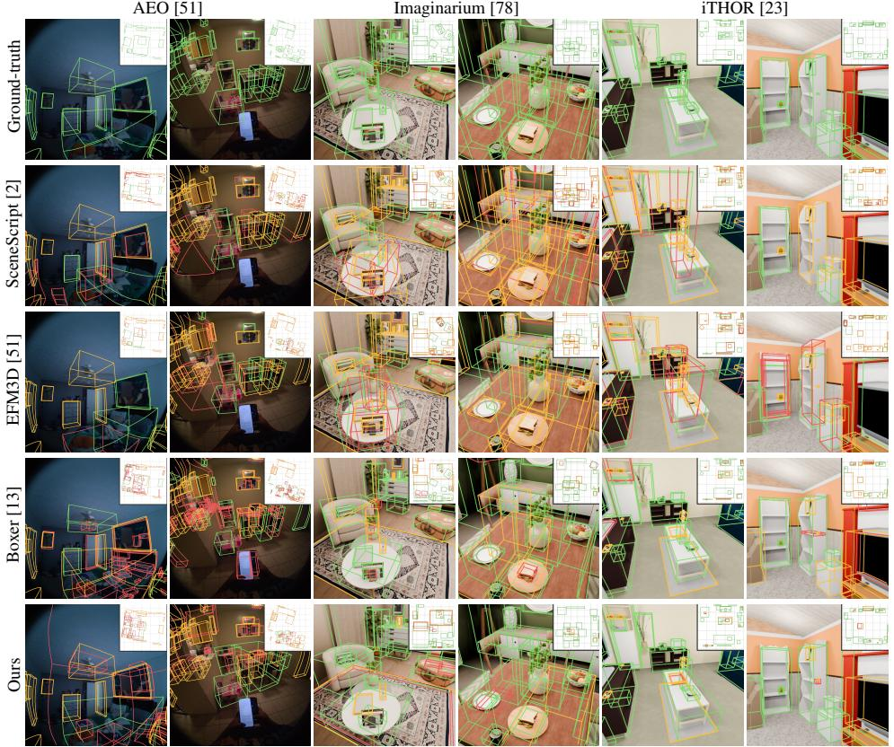  
Figure 4: Qualitative results of video-based 3D scene perception. True positive predictions are visualized in green; otherwise, they are set to red. The undetected ones are annotated in orange.

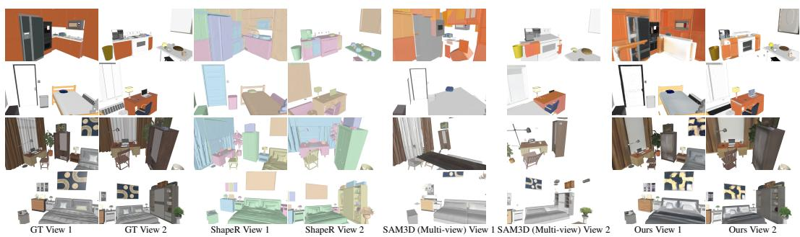  
Figure 5: Qualitative 3D scene reconstruction with ground-truth instance perception. ShapeR does not generate texture, and SAM3D cannot generalize well to the multi-view setting due to the inconsistent predicted object poses across views. In contrast, FIRE3D performs well thanks to its native 3D point cloud conditioned generation. We exclude BG for matched comparisons.

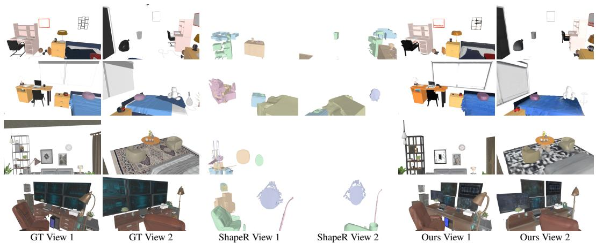  
Figure 6: Qualitative 3D scene reconstruction from inferred perception. ShapeR fails to detect a few objects and generates inaccurate geometry from the error perception result, while FIRE3D can complete the scene perception and reconstruction well. We exclude BG for matched comparisons.

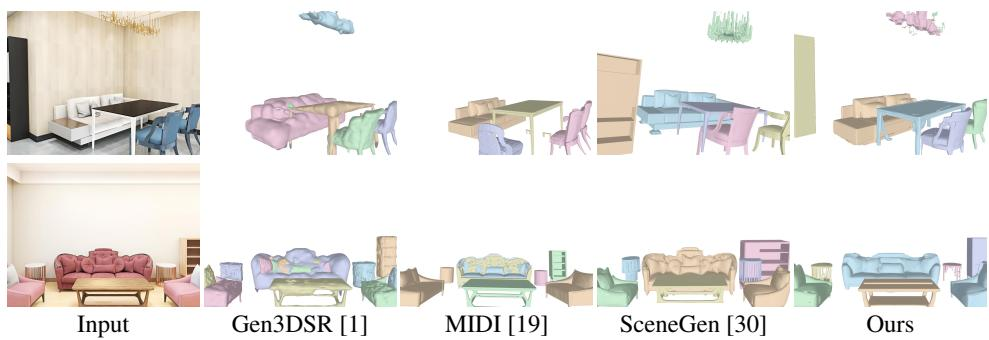  
Figure 7: Qualitative results of single-image 3D scene reconstruction. FIRE3D can achieve the best geometry consistency over baselines. We exclude BG for matched comparisons.

## 4 Experiments

## 4.1 Implementation Details

Training Data We build training data from diverse indoor scene datasets and render RGB-D observations from SAGE-10k [64], InternScenes [76], ProcTHOR [23], MansionWorld [6], and SceneSmith [39], totaling 80k scenes and 140k rendered videos with randomized camera intrinsics. We further augment the diversity and realism with Flux.2 [24], which produces an additional 80k videos. Additionally, we use an extra 500k objects from four object datasets [16, 11, 22, 12] in the flow matching reconstruction model training to further enhance its capability.

Training Details We train the perception and generative models separately, using data augmentations including random frame dropping, scene rotation, and camera-pose/depth noise. The perception model is trained with 500k iterations, and the flow-matching generative model is trained for 200k iterations using AdamW with a learning rate of $1 \times 1 0 ^ { - 4 }$ . We adopt AnyUp [61] for higher resolution DINO features. We use 12 sampling steps with a classifier-free guidance scale of 3 for all experiments.

## 4.2 Experimental Settings

Tasks Settings We evaluate our model in three kinds of settings. (1) Video-based Perception: Given posed RGB-D observations from evaluation datasets, the model predicts the 3D object-oriented bounding boxes (OBBs) and instance segmentation. (2) Video-based Reconstruction: Given posed RGB-D observations and either ground-truth or inferred instance perception, the model reconstructs each object’s complete geometry and texture. (3) Single-image Reconstruction: Given a single

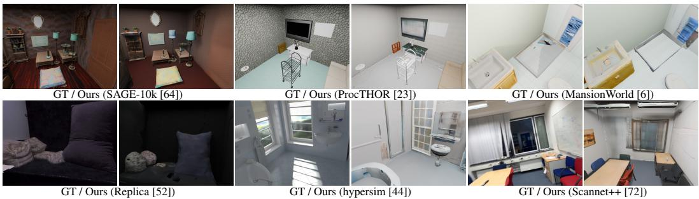  
Figure 8: Qualitative whole-scene reconstruction across diverse datasets. FIRE3D can generalize well across various scenarios with the complete background reconstructed.

<table><tr><td rowspan=1 colspan=8>Method      Runtime (s) mAP↑ mIoU ↑</td></tr><tr><td rowspan=4 colspan=1>SceneScript [2]AEO EFM3D [51]Boxer [13]     1Ours</td><td rowspan=1 colspan=1>6.27</td><td rowspan=1 colspan=1></td><td rowspan=1 colspan=3>0.09</td><td rowspan=1 colspan=1>0.10</td><td></td></tr><tr><td rowspan=1 colspan=1>61.88</td><td rowspan=1 colspan=1></td><td rowspan=1 colspan=2>0.18</td><td rowspan=1 colspan=1></td><td rowspan=1 colspan=1>0.13</td><td></td></tr><tr><td rowspan=1 colspan=1>36.2</td><td rowspan=1 colspan=1>4</td><td></td><td rowspan=1 colspan=1>0.23</td><td rowspan=1 colspan=1></td><td rowspan=1 colspan=1>0.22</td><td></td></tr><tr><td rowspan=1 colspan=1>2.66</td><td rowspan=1 colspan=1></td><td></td><td rowspan=1 colspan=1>0.25</td><td rowspan=1 colspan=1></td><td rowspan=1 colspan=1>0.11</td><td></td></tr><tr><td rowspan=4 colspan=1>SceneScript [2]IHOR EFM3D [51]Boxer [13]    1Ours</td><td rowspan=1 colspan=1>6.27</td><td rowspan=1 colspan=1></td><td></td><td rowspan=1 colspan=1>0.16</td><td rowspan=1 colspan=1></td><td rowspan=1 colspan=1>0.10</td><td></td></tr><tr><td rowspan=1 colspan=1>61.88</td><td rowspan=1 colspan=1></td><td></td><td rowspan=1 colspan=1>0.13</td><td rowspan=1 colspan=1></td><td rowspan=1 colspan=1>0.08</td><td></td></tr><tr><td rowspan=1 colspan=1>36.2</td><td rowspan=1 colspan=1>4</td><td></td><td rowspan=1 colspan=1>0.36</td><td rowspan=1 colspan=1></td><td rowspan=1 colspan=1>0.16</td><td></td></tr><tr><td rowspan=1 colspan=1>2.66</td><td rowspan=1 colspan=1></td><td></td><td rowspan=1 colspan=1>0.52</td><td rowspan=1 colspan=1></td><td rowspan=1 colspan=1>0.41</td><td rowspan=1 colspan=1></td></tr><tr><td rowspan=4 colspan=1>1maim SceneScript [2]EFM3D [51]Boxer [13]  1Ours</td><td rowspan=1 colspan=1>6.27</td><td rowspan=1 colspan=1></td><td></td><td rowspan=1 colspan=1>0.20</td><td rowspan=1 colspan=1></td><td rowspan=1 colspan=1>0.14</td><td rowspan=1 colspan=1></td></tr><tr><td rowspan=1 colspan=1>61.88</td><td rowspan=1 colspan=1></td><td></td><td rowspan=1 colspan=1>0.14</td><td rowspan=1 colspan=1></td><td rowspan=1 colspan=1>0.09</td><td rowspan=1 colspan=1></td></tr><tr><td rowspan=1 colspan=1>36.2</td><td rowspan=1 colspan=1>4</td><td></td><td rowspan=1 colspan=1>0.32</td><td rowspan=1 colspan=1></td><td rowspan=1 colspan=1>0.17</td><td rowspan=1 colspan=1></td></tr><tr><td rowspan=1 colspan=1>2.66</td><td rowspan=1 colspan=1></td><td></td><td rowspan=1 colspan=1>0.58</td><td rowspan=1 colspan=1></td><td rowspan=1 colspan=1>0.46</td><td rowspan=1 colspan=1></td></tr></table>

Table 2: Quantitative results on 3D scene perception. We compare the mAP and mIoU of the perception results for detection and segmentation quality. We also measure and report the average model inference time across datasets.
<table><tr><td rowspan="3">Method</td><td rowspan="3"></td><td rowspan="3">Runtime (s / Obj.)</td><td rowspan="3">Perce- ption</td><td colspan="3">Geometry Quality</td><td colspan="3">Rendering Quality</td></tr><tr><td>CD↓</td><td>F1 ↑</td><td>NC↑</td><td>PSNR ↑</td><td>SSIM ↑</td><td>LPIPS ↓</td></tr><tr><td rowspan="4">Shdpe</td><td>ShapeR [48]</td><td>4.84</td><td>GT</td><td>1.37</td><td>0.58</td><td>0.81</td><td></td><td>1</td><td></td></tr><tr><td>SAM3D [8]</td><td>10.61</td><td>GT</td><td>4.07</td><td>0.26</td><td>0.71</td><td></td><td>-</td><td></td></tr><tr><td>Ours</td><td>0.60</td><td>GT</td><td>1.64</td><td>0.52</td><td>0.73</td><td></td><td></td><td></td></tr><tr><td>ShapeR [48]</td><td>4.84</td><td>GT</td><td>2.16</td><td>0.68</td><td>0.79</td><td></td><td></td><td></td></tr><tr><td rowspan="4">IHOR</td><td>SAM3D [8]</td><td>10.61</td><td>GT</td><td>4.63</td><td>0.48</td><td>0.73</td><td>21.35</td><td>0.90</td><td>0.19</td></tr><tr><td>Ours</td><td>0.60</td><td>GT</td><td>1.38</td><td>0.71</td><td>0.81</td><td>23.85</td><td>0.92</td><td>0.13</td></tr><tr><td>ShapeR [48]</td><td>4.84</td><td>Infer</td><td>8.90</td><td>0.21</td><td>0.68</td><td></td><td></td><td></td></tr><tr><td>Ours</td><td>0.60</td><td>Infer</td><td>6.15</td><td>0.29</td><td>0.72</td><td>19.04</td><td>0.86</td><td>0.25</td></tr><tr><td rowspan="5">Imaiunm</td><td>ShapeR [48]</td><td>4.84</td><td>GT</td><td>1.54</td><td>0.72</td><td>0.83</td><td></td><td></td><td></td></tr><tr><td>SAM3D [8]</td><td>10.61</td><td>GT</td><td>3.83</td><td>0.45</td><td>0.75</td><td>18.47</td><td>0.87</td><td>0.19</td></tr><tr><td>Ours</td><td>0.60</td><td>GT</td><td>1.08</td><td>0.68</td><td>0.82</td><td>20.23</td><td>0.89</td><td>0.14</td></tr><tr><td>ShapeR [48]</td><td>4.84</td><td>Infer</td><td>9.77</td><td>0.23</td><td>0.67</td><td></td><td></td><td></td></tr><tr><td>Ours</td><td>0.60</td><td>Infer</td><td>6.49</td><td>0.27</td><td>0.70</td><td>15.46</td><td>0.82</td><td>0.28</td></tr></table>

Table 3: Quantitative results on video-based 3D scene reconstruction. Methods are evaluated under both groundtruth and inferred perception inputs. “-” indicates metrics not applicable. The average runtime per object is measured across datasets. We highlight best and second best .

RGB image and its $\mathrm { P i ^ { 3 } }$ -estimated point map, automatically conducts scene perception and reconstruct every object in the 3D scene.

Evaluation Datasets (1) AEO Dataset [51]: a real-world dataset with OBB annotations for all 3D objects in the scene, is only used in the video-based perception task. (2) ShapeR Dataset [48]: a real-world dataset with OBBs, segmented point cloud, and ground-truth object geometry annotations for selected 3D objects in the scene, is only used in the video-based reconstruction task. (3) iTHOR Dataset [23] and Imaginarium [78] Dataset: synthetic datasets with OBBs, segmented point cloud, and ground-truth object geometry and textures for all 3D objects in the scene, are used in both video-based perception and reconstruction tasks. (4) 3D-Front Dataset [15]: a synthetic dataset with rendered images and ground-truth object meshes from the eval split of Gen3DSR [1] evaluation benchmark, is used in the single-image reconstruction task.

Metrics We evaluate the detection and segmentation quality with mAP and mIoU, geometry quality with Chamfer Distance (CD, unit is cm), F-Score (F1), and Normal Consistency (NC), and assess rendering quality using PSNR, SSIM, and LPIPS.

Baselines We evaluate our framework against representative task-specific and simulation-oriented approaches in different evaluation settings. SceneScript [2] uses an auto-regressive model to predict the pose of every indoor element from a 3D point cloud. EFM3D [51] predicts 3D OBBs and occupancy field from input video and semi-dense points. Boxer [13] leverages 2D per-image object bounding boxes with 3D point cloud to predict every object’s OBBs. ShapeR [48] reconstructs the 3D geometry with a generative model conditioned on input object points, images, and text prompts. It relies on EFM3D [51] to detect objects in the scene. SAM3D [8] relies on user clicks as prompts to get instance masks, and reconstructs the 3D geometry with texture and pose from the segmented image patch. We implement a multi-view version, which uses the image with the largest object mask area in the video to reconstruct every object. Gen3DSR [1], MIDI [19], and SceneGen automatically segment and reconstruct every scene object from a single image without the need for user clicks as prompts like SAM3D.

## 4.3 Experimental Results

Video-based 3D Scene Perception Here we evaluate the performance of our model against SoTA methods. As shown in Tab. 2, our model has a superior performance and runtime across various datasets. Specifically, FIRE3D can generalize well to the real-captured AEO dataset thanks to the Flux.2 [24] realistic image synthesis, while Boxer [13] is trained on that dataset but doesn’t achieve a better mAP than FIRE3D. Fig. 4 shows that our model predicts more structured instance layouts than baselines across datasets.

Video-based 3D Scene Reconstruction As shown in Tab. 3, FIRE3D achieves the best scene quality with both GT and inferred perception inputs against SoTA methods, except when compared with ShapeR [48] on its own released dataset, which is caused by the OOD fisheye cameras and the salient points-only condition in the ShapeR dataset. Additionally, ShapeR [48] requires text prompts and view-consistent object segmentation, and does not generate textures for rendering. SAM3D [8] produces strong single-view textured objects and rendering metrics, but lacks multi-view consistency and depends on user input. In contrast, FIRE3D uses posed RGB-D observations to predict instance point clouds and reconstruct textured foreground objects together with a static background instance without prompts. Fig. 5 compares reconstruction under GT perception inputs, where ShapeR may duplicate small objects due to its additional image modality, while SAM3D struggles in the multiview setting because of inconsistent predicted object poses across frames. Fig. 6 further shows that, under inferred perception inputs, FIRE3D reconstructs both complete geometry and texture more reliably than ShapeR. Additional results in Fig. 8 on diverse datasets, including unseen datasets [44, 52, 72], demonstrate its generalization across diverse scenes. These whole-scene renderings include the predicted background instance.

Single-image Reconstruction We evaluate the performance of our model and other automatic SoTA methods from a single RGB capture, using a Pi3-estimated point map as FIRE3D input. As shown in Fig. 4 and Tab. 4, thanks to our large-scale training and data augmentation, our model can even generalize and achieve better performance than those specialized models on the single-image setting, even though we never train on them. FIRE3D is also more aligned with the input single image in scene layout and geometry consistency.

<table><tr><td>Method</td><td>CD↓</td><td>F1↑</td><td>NC↑</td></tr><tr><td>Gen3DSR [1]</td><td>20.56</td><td>0.08</td><td>0.64</td></tr><tr><td>MIDI [19]</td><td>20.21</td><td>0.05</td><td>0.55</td></tr><tr><td>SceneGen [30]</td><td>14.90</td><td>0.06</td><td>0.58</td></tr><tr><td>Ours</td><td>11.24</td><td>0.10</td><td>0.66</td></tr></table>

Table 4: Quantitative results on single image 3D-Front [15] Dataset.

<table><tr><td rowspan="2">Method</td><td rowspan="2">Dataset</td><td colspan="2">Representation</td><td colspan="3">Geometry</td><td colspan="3">Rendering</td></tr><tr><td>Res.</td><td>Feat. Dim.</td><td>CD</td><td>F1</td><td>NC</td><td>PSNR</td><td>SSIM</td><td>LPIPS</td></tr><tr><td>SC-VAE only [68]</td><td rowspan="2">Toys4K[50]</td><td>32</td><td>32</td><td>0.261</td><td>0.997</td><td>0.965</td><td>26.801</td><td>0.955</td><td>0.056</td></tr><tr><td>SC-VAE + HC-VAE (Ours)</td><td>8</td><td>64</td><td>0.269</td><td>0.991</td><td>0.943</td><td>26.635</td><td>0.947</td><td>0.065</td></tr><tr><td rowspan="2">SC-VAE only [68] SC-VAE + HC-VAE (Ours)</td><td rowspan="2">Imaginarium[78]</td><td>32</td><td>32</td><td>0.407</td><td>0.919</td><td>0.957</td><td>21.966</td><td>0.818</td><td>0.270</td></tr><tr><td>8</td><td>64</td><td>0.413</td><td>0.914</td><td>0.946</td><td>21.665</td><td>0.792</td><td>0.305</td></tr></table>

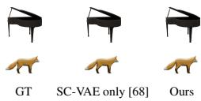  
Table 5: Qualitative and Quantitative results on VAE design comparison. We evaluate the geometry and rendering metrics in Toys4k [50] Object Dataset and Imaginarium [78] Scene Dataset. Results show that our added HC-VAE above SC-VAE further compresses the latent space and still maintains the high-quality reconstruction.

VAE Reconstruction Comparisons We evaluate the reconstruction quality of our added HC-VAE above the original SC-VAE in [68] in the Toys4K object [50] dataset as well as the Imaginarium [78] scene dataset. As shown in Tab. 5, though we further compress the object latent by 32×, our reconstruction still maintains high quality in terms of geometry and rendering metrics, which enables our model to perform batchified and accelerated inference with a minor loss in reconstruction quality.

Ablation Study To study how preprocessed   
camera poses and depth will affect the model infer  
ence performance, we replace GT posed RGB-D   
observations with perturbations involving poses   
from COLMAP [46] and Pi3 [59]. Tab. 6 shows   
that those noises cause minor performance degra  
dation. We also validated that batched and seque ntial execution produce identical outputs, while   
batching reduces runtime to more than 10× faste batching reduces runtime to more than 10× faster

<table><tr><td>Setting</td><td>mAP↑</td><td>mIoU↑</td><td>CD↓</td><td>PSNR↑</td></tr><tr><td>GT pose + GT depth</td><td>0.54</td><td>0.44</td><td>7.98</td><td>15.93</td></tr><tr><td>COLMAP pose + Pi³ depth</td><td>0.53</td><td>0.42</td><td>7.23</td><td>16.29</td></tr><tr><td>Pi3 pose + Pi3 depth</td><td>0.46</td><td>0.37</td><td>8.99</td><td>15.83</td></tr></table>

Table 6: Input pose and depth noise sensitivity has limited effects on FIRE3D performance.

Runtime Analysis We profile several representative scenes across various datasets with results in Tab. 7. For geometry-only inference, it requires 1.844s per object, including network prediction and mesh postprocessing. Texture inference and decoding, UV generation, and texture baking increase the end-to-end texture total to 4.783s per object. It turns out that FIRE3D can support 30 object

<table><tr><td>Geometry pathway</td><td>s/obj.</td><td>Texture additions</td><td>s/obj.</td></tr><tr><td>Perception</td><td>0.209</td><td>Texture inference &amp; dec.</td><td>0.154</td></tr><tr><td>Shape inf. &amp; geo. dec.</td><td>0.238</td><td>UV generation w. xatlas</td><td>1.799</td></tr><tr><td>Topology &amp; remeshing</td><td>1.396</td><td>Baking materials</td><td>0.986</td></tr><tr><td>Geometry total</td><td>1.844</td><td>Texture total</td><td>4.783</td></tr><tr><td colspan="3">Network inference total</td><td>0.601</td></tr><tr><td colspan="3">Post-process total</td><td>4.181</td></tr></table>

Table 7: Per-object runtime breakdown. Texture total includes the geometry pathway runtime.

geometry inferences per scene in under a minute, and 12 objects including the texture.

Failure mode analysis FIRE3D can produce errors if the perception doesn’t detect objects correctly, which leads to missed objects. Also, point-based conditioning has limitations in perfect object shape and texture reconstructions. See the artifacts in the figure visualizations for details.

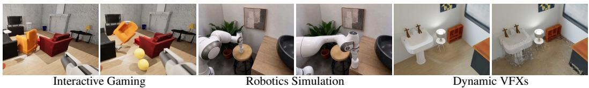  
Figure 9: Applications of interactive environments created by FIRE3D. Here we showcase diverse downstream applications for FIRE3D, including interactive gaming, robotics, and visual effects.

## 4.4 Interactive Environment Applications

FIRE3D has a wide range of applications across gaming, robotics, and content creation. An overview of the application demonstration can be found in Fig. 9.

Gaming & Dynamic VFXs We create a virtual shooting game with Unreal [14] using our reconstructed assets. Thanks to the interactive reconstruction, FIRE3D can accelerate turning a casually captured RGB video into a game within minutes, which showcases its superior performance in terms of speed against previous optimization-based methods [66, 67]. It can also be extended to generate imaginary dynamic visual effects with Blender, such as water simulation.

Robotics FIRE3D can also be applied in simulation data generation for Embodied AI. With the help of IsaacSim [37] and IsaacLab [32], we can generate a pick-and-place robot demonstration with Franka Arm, which grasps the object from the chair and place on top of the table. This shows great potential of using FIRE3D to generate robotics data with grounded physics for sim2real transfer.

## 5 Conclusion & Limitation

We presented FIRE3D, a feed-forward framework for object-level textured 3D scene reconstruction from unsegmented, posed RGB-D observations estimated from single-image and casual-video RGB captures. FIRE3D leverages compressed object representation with HC-VAE and unifies instance-aware perception and object-centric generation. It enables efficient batched reconstruction of interactable scene elements with consistent geometry and texture. Limitations: FIRE3D focuses on static indoor scenes, and requires posed RGB-D observations at the network interface with external geometric preprocessing for RGB-only captures. Its quality depends on depth, camera poses, and instance parsing; The generated assets are not yet guaranteed to be physically stable, relightable, or articulated. Future work will extend FIRE3D to joint RGB geometry estimation without externa preprocessing, articulated/deformable objects, and physically grounded reconstruction.

## References

[1] Ardelean, A., Özer, M., Egger, B.: Gen3dsr: Generalizable 3d scene reconstruction via divide and conquer from a single view. In: 2025 International Conference on 3D Vision (3DV). pp. 616–626. IEEE (2025)

[2] Avetisyan, A., Xie, C., Howard-Jenkins, H., Yang, T.Y., Aroudj, S., Patra, S., Zhang, F., Frost, D., Holland, L., Orme, C., et al.: Scenescript: Reconstructing scenes with an autoregressive structured language model. In: European Conference on Computer Vision. pp. 247–263. Springer (2024)

[3] Barron, J.T., Mildenhall, B., Tancik, M., Hedman, P., Martin-Brualla, R., Srinivasan, P.P.: Mip-nerf: A multiscale representation for anti-aliasing neural radiance fields. In: Proceedings of the IEEE/CVF international conference on computer vision. pp. 5855–5864 (2021)

[4] Boudjoghra, M.E.A., Dai, A., Lahoud, J., Cholakkal, H., Anwer, R.M., Khan, S., Khan, F.S.: Open-yolo 3d: Towards fast and accurate open-vocabulary 3d instance segmentation. arXiv preprint arXiv:2406.02548 (2024)

[5] Carion, N., Massa, F., Synnaeve, G., Usunier, N., Kirillov, A., Zagoruyko, S.: End-to-end object detection with transformers. In: European conference on computer vision. pp. 213–229. Springer (2020)

[6] Che, L., Wen, S., Huang, S., Wang, C., Yang, Y., Dudek, G., Wang, X., Su, J.: Mansion: Multi-floor language-to-3d scene generation for long-horizon tasks. arXiv preprint arXiv:2603.11554 (2026)

[7] Chen, X., Chen, Y., Xiu, Y., Geiger, A., Chen, A.: Ttt3r: 3d reconstruction as test-time training. arXiv preprint arXiv:2509.26645 (2025)

[8] Chen, X., Chu, F.J., Gleize, P., Liang, K.J., Sax, A., Tang, H., Wang, W., Guo, M., Hardin, T., Li, X., et al.: Sam 3d: 3dfy anything in images. arXiv preprint arXiv:2511.16624 (2025)

[9] Chen, Y., Ni, J., Jiang, N., Zhang, Y., Zhu, Y., Huang, S.: Single-view 3d scene reconstruction with high-fidelity shape and texture. In: 2024 International Conference on 3D Vision (3DV). pp. 1456–1467. IEEE (2024)

[10] Cheng, T., Ma, W.C., Guan, K., Torralba, A., Wang, S.: Structure from duplicates: Neural inverse graphics from a pile of objects. arXiv preprint arXiv:2401.05236 (2024)

[11] Collins, J., Goel, S., Deng, K., Luthra, A., Xu, L., Gundogdu, E., Zhang, X., Vicente, T.F.Y., Dideriksen, T., Arora, H., et al.: Abo: Dataset and benchmarks for real-world 3d object understanding. In: 2022 IEEE/CVF Conference on Computer Vision and Pattern Recognition (CVPR). pp. 21094–21104. IEEE (2022)

[12] Deitke, M., Schwenk, D., Salvador, J., Weihs, L., Michel, O., VanderBilt, E., Schmidt, L., Ehsani, K., Kembhavi, A., Farhadi, A.: Objaverse: A universe of annotated 3d objects. In: Proceedings of the IEEE/CVF conference on computer vision and pattern recognition. pp. 13142–13153 (2023)

[13] DeTone, D., Shen, T., Zhang, F., Ma, L., Straub, J., Newcombe, R., Engel, J.: Boxer: Robust lifting of open-world 2d bounding boxes to 3d. arXiv preprint arXiv:2604.05212 (2026)

[14] Epic Games: Unreal engine https://www.unrealengine.com

[15] Fu, H., Cai, B., Gao, L., Zhang, L.X., Wang, J., Li, C., Zeng, Q., Sun, C., Jia, R., Zhao, B., et al.: 3d-front: 3d furnished rooms with layouts and semantics. In: Proceedings of the IEEE/CVF International Conference on Computer Vision. pp. 10933–10942 (2021)

[16] Fu, H., Jia, R., Gao, L., Gong, M., Zhao, B., Maybank, S., Tao, D.: 3d-future: 3d furniture shape with texture. International Journal of Computer Vision 129(12), 3313–3337 (2021)

[17] Guo, H., Peng, S., Lin, H., Wang, Q., Zhang, G., Bao, H., Zhou, X.: Neural 3d scene reconstruction with the manhattan-world assumption. In: Proceedings of the IEEE/CVF conference on computer vision and pattern recognition. pp. 5511–5520 (2022)

[18] Huang, B., Yu, Z., Chen, A., Geiger, A., Gao, S.: 2d gaussian splatting for geometrically accurate radiance fields. In: ACM SIGGRAPH 2024 conference papers. pp. 1–11 (2024)

[19] Huang, Z., Guo, Y.C., An, X., Yang, Y., Li, Y., Zou, Z.X., Liang, D., Liu, X., Cao, Y.P., Sheng, L.: Midi: Multi-instance diffusion for single image to 3d scene generation. In: Proceedings of the IEEE/CVF Conference on Computer Vision and Pattern Recognition. pp. 23646–23657 (2025)

[20] Huang, Z., Wu, X., Zhong, F., Zhao, H., Nießner, M., Lasenby, J.: Litereality: Graphics-ready 3d scene reconstruction from rgb-d scans. Advances in Neural Information Processing Systems 38, 162794–162827 (2026)

[21] Kerbl, B., Kopanas, G., Leimkühler, T., Drettakis, G., et al.: 3d gaussian splatting for real-time radiance field rendering. ACM Trans. Graph. 42(4), 139–1 (2023)

[22] Khanna, M., Mao, Y., Jiang, H., Haresh, S., Shacklett, B., Batra, D., Clegg, A., Undersander, E., Chang, A.X., Savva, M.: Habitat synthetic scenes dataset (hssd-200): An analysis of 3d scene scale and realism tradeoffs for objectgoal navigation (2023), https://arxiv.org/abs/2306.11290

[23] Kolve, E., Mottaghi, R., Han, W., VanderBilt, E., Weihs, L., Herrasti, A., Deitke, M., Ehsani, K., Gordon, D., Zhu, Y., et al.: Ai2-thor: An interactive 3d environment for visual ai. arXiv preprint arXiv:1712.05474 (2017)

[24] Labs, B.F.: FLUX.2: Frontier Visual Intelligence. https://bfl.ai/blog/flux-2 (2025)

[25] Lai, Z., Zhao, Y., Zhao, Z., Liu, H., Lin, Q., Huang, J., Guo, C., Yue, X.: Lattice: Democratize high-fidelity 3d generation at scale. arXiv preprint arXiv:2512.03052 (2025)

[26] Leroy, V., Cabon, Y., Revaud, J.: Grounding image matching in 3d with mast3r (2024), https://arxiv. org/abs/2406.09756

[27] Lin, H., Chen, S., Liew, J., Chen, D.Y., Li, Z., Shi, G., Feng, J., Kang, B.: Depth anything 3: Recovering the visual space from any views. arXiv preprint arXiv:2511.10647 (2025)

[28] Liu, M., Xu, C., Jin, H., Chen, L., Varma T, M., Xu, Z., Su, H.: One-2-3-45: Any single image to 3d mesh in 45 seconds without per-shape optimization. Advances in Neural Information Processing Systems 36, 22226–22246 (2023)

[29] Long, X., Guo, Y.C., Lin, C., Liu, Y., Dou, Z., Liu, L., Ma, Y., Zhang, S.H., Habermann, M., Theobalt, C., et al.: Wonder3d: Single image to 3d using cross-domain diffusion. In: Proceedings of the IEEE/CVF conference on computer vision and pattern recognition. pp. 9970–9980 (2024)

[30] Meng, Y., Wu, H., Zhang, Y., Xie, W.: Scenegen: Single-image 3d scene generation in one feedforward pass. arXiv preprint arXiv:2508.15769 (2025)

[31] Mildenhall, B., Srinivasan, P.P., Tancik, M., Barron, J.T., Ramamoorthi, R., Ng, R.: Nerf: Representing scenes as neural radiance fields for view synthesis. Communications of the ACM 65(1), 99–106 (2021)

[32] Mittal, M., Yu, C., Yu, Q., Liu, J., Rudin, N., Hoeller, D., Yuan, J.L., Singh, R., Guo, Y., Mazhar, H., Mandlekar, A., Babich, B., State, G., Hutter, M., Garg, A.: Orbit - A Unified Simulation Framework for Interactive Robot Learning Environments. IEEE Robotics and Automation Letters 8(6) (2023). https://doi.org/10.1109/LRA.2023.3270034

[33] Müller, T., Evans, A., Schied, C., Keller, A.: Instant neural graphics primitives with a multiresolution hash encoding. ACM transactions on graphics (TOG) 41(4), 1–15 (2022)

[34] Ni, J., Chen, Y., Yang, Z., Liu, Y., Lu, R., Zhu, S.C., Huang, S.: G4splat: Geometry-guided gaussian splatting with generative prior. arXiv preprint arXiv:2510.12099 (2025)

[35] Ni, J., Liu, Y., Lu, R., Zhou, Z., Zhu, S.C., Chen, Y., Huang, S.: Decompositional neural scene reconstruction with generative diffusion prior. In: Proceedings of the Computer Vision and Pattern Recognition Conference. pp. 6022–6033 (2025)

[36] Niemeyer, M., Geiger, A.: Giraffe: Representing scenes as compositional generative neural feature fields. In: Proceedings of the IEEE/CVF conference on computer vision and pattern recognition. pp. 11453–11464 (2021)

[37] NVIDIA Corporation: Nvidia isaac sim. https://github.com/isaac-sim/IsaacSim (2025), version 5.0.0

[38] Ost, J., Mannan, F., Thuerey, N., Knodt, J., Heide, F.: Neural scene graphs for dynamic scenes. In: Proceedings of the IEEE/CVF Conference on Computer Vision and Pattern Recognition. pp. 2856–2865 (2021)

[39] Pfaff, N., Cohn, T., Zakharov, S., Cory, R., Tedrake, R.: Scenesmith: Agentic generation of simulation-ready indoor scenes. arXiv preprint arXiv:2602.09153 (2026)

[40] Qi, C.R., Su, H., Mo, K., Guibas, L.J.: Pointnet: Deep learning on point sets for 3d classification and segmentation. In: Proceedings of the IEEE conference on computer vision and pattern recognition. pp. 652–660 (2017)

[41] Qi, C.R., Yi, L., Su, H., Guibas, L.J.: Pointnet++: Deep hierarchical feature learning on point sets in a metric space. Advances in neural information processing systems 30 (2017)

[42] Qian, G., Mai, J., Hamdi, A., Ren, J., Siarohin, A., Li, B., Lee, H.Y., Skorokhodov, I., Wonka, P., Tulyakov, S., et al.: Magic123: One image to high-quality 3d object generation using both 2d and 3d diffusion priors. arXiv preprint arXiv:2306.17843 (2023)

[43] Ravi, N., Gabeur, V., Hu, Y.T., Hu, R., Ryali, C., Ma, T., Khedr, H., Rädle, R., Rolland, C., Gustafson, L., et al.: Sam 2: Segment anything in images and videos. In: International Conference on Learning Representations. vol. 2025, pp. 28085–28128 (2025)

[44] Roberts, M., Ramapuram, J., Ranjan, A., Kumar, A., Bautista, M.A., Paczan, N., Webb, R., Susskind, J.M.: Hypersim: A photorealistic synthetic dataset for holistic indoor scene understanding. In: Proceedings of the IEEE/CVF international conference on computer vision. pp. 10912–10922 (2021)

[45] Sautter, T., Dihlmann, J.N., Lensch, H.: 3d-re-gen: 3d reconstruction of indoor scenes with a generative framework. arXiv preprint arXiv:2512.17459 (2025)

[46] Schönberger, J.L., Frahm, J.M.: Structure-from-motion revisited. In: Conference on Computer Vision and Pattern Recognition (CVPR) (2016)

[47] Schult, J., Engelmann, F., Hermans, A., Litany, O., Tang, S., Leibe, B.: Mask3d: Mask transformer for 3d semantic instance segmentation (2023), https://arxiv.org/abs/2210.03105

[48] Siddiqui, Y., Frost, D., Aroudj, S., Avetisyan, A., Howard-Jenkins, H., DeTone, D., Moulon, P., Wu, Q., Li, Z., Straub, J., et al.: Shaper: Robust conditional 3d shape generation from casual captures. arXiv preprint arXiv:2601.11514 (2026)

[49] Siméoni, O., Vo, H.V., Seitzer, M., Baldassarre, F., Oquab, M., Jose, C., Khalidov, V., Szafraniec, M., Yi, S., Ramamonjisoa, M., et al.: Dinov3. arXiv preprint arXiv:2508.10104 (2025)

[50] Stojanov, S., Thai, A., Rehg, J.M.: Using shape to categorize: Low-shot learning with an explicit shape bias. In: Proceedings of the IEEE/CVF conference on computer vision and pattern recognition. pp. 1798–1808 (2021)

[51] Straub, J., DeTone, D., Shen, T., Yang, N., Sweeney, C., Newcombe, R.: Efm3d: A benchmark for measuring progress towards 3d egocentric foundation models. arXiv preprint arXiv:2406.10224 (2024)

[52] Straub, J., Whelan, T., Ma, L., Chen, Y., Wijmans, E., Green, S., Engel, J.J., Mur-Artal, R., Ren, C., Verma, S., et al.: The replica dataset: A digital replica of indoor spaces. arXiv preprint arXiv:1906.05797 (2019)

[53] Takmaz, A., Fedele, E., Sumner, R.W., Pollefeys, M., Tombari, F., Engelmann, F.: Openmask3d: Openvocabulary 3d instance segmentation (2023), https://arxiv.org/abs/2306.13631

[54] Tochilkin, D., Pankratz, D., Liu, Z., Huang, Z., Letts, A., Li, Y., Liang, D., Laforte, C., Jampani, V., Cao, Y.P.: Triposr: Fast 3d object reconstruction from a single image. arXiv preprint arXiv:2403.02151 (2024)

[55] Voleti, V., Yao, C.H., Boss, M., Letts, A., Pankratz, D., Tochilkin, D., Laforte, C., Rombach, R., Jampani, V.: Sv3d: Novel multi-view synthesis and 3d generation from a single image using latent video diffusion. In: European Conference on Computer Vision. pp. 439–457. Springer (2024)

[56] Wang, J., Chen, M., Karaev, N., Vedaldi, A., Rupprecht, C., Novotny, D.: Vggt: Visual geometry grounded transformer (2025), https://arxiv.org/abs/2503.11651

[57] Wang, Q., Zhang, Y., Holynski, A., Efros, A.A., Kanazawa, A.: Continuous 3d perception model with persistent state (2025), https://arxiv.org/abs/2501.12387

[58] Wang, S., Leroy, V., Cabon, Y., Chidlovskii, B., Revaud, J.: Dust3r: Geometric 3d vision made easy (2024), https://arxiv.org/abs/2312.14132

[59] Wang, Y., Zhou, J., Zhu, H., Chang, W., Zhou, Y., Li, Z., Chen, J., Pang, J., Shen, C., He, T.: π3: Permutationequivariant visual geometry learning. In: International Conference on Learning Representations. vol. 2026, pp. 10481–10497 (2026)

[60] Wang, Y., Guizilini, V.C., Zhang, T., Wang, Y., Zhao, H., Solomon, J.: Detr3d: 3d object detection from multi-view images via 3d-to-2d queries. In: Conference on robot learning. pp. 180–191. PMLR (2022)

[61] Wimmer, T., Truong, P., Rakotosaona, M.J., Oechsle, M., Tombari, F., Schiele, B., Lenssen, J.E.: Anyup: Universal feature upsampling. In: International Conference on Learning Representations. vol. 2026, pp. 140700–140720 (2026)

[62] Wu, Q., Liu, X., Chen, Y., Li, K., Zheng, C., Cai, J., Zheng, J.: Object-compositional neural implicit surfaces. In: European Conference on Computer Vision. pp. 197–213. Springer (2022)

[63] Xia, C., Zhu, K., Wang, Z., Liu, F., Zhang, Z., Duan, Y.: Simrecon: Simready compositional scene reconstruction from real videos. arXiv preprint arXiv:2603.02133 (2026)

[64] Xia, H., Li, X., Li, Z., Ma, Q., Xu, J., Liu, M.Y., Cui, Y., Lin, T.Y., Ma, W.C., Wang, S., Song, S., Wei, F.: Sage: Scalable agentic 3d scene generation for embodied ai. arXiv preprint arXiv:2602.10116 (2026)

[65] Xia, H., Lin, C.H., Hsu, H.Y., Leboutet, Q., Gao, K., Paulitsch, M., Ummenhofer, B., Wang, S.: Holoscene: Simulation-ready interactive 3d worlds from a single video. arXiv preprint arXiv:2510.05560 (2025)

[66] Xia, H., Lin, Z.H., Ma, W.C., Wang, S.: Video2game: Real-time interactive realistic and browser-compatible environment from a single video. In: Proceedings of the IEEE/CVF Conference on Computer Vision and Pattern Recognition. pp. 4578–4588 (2024)

[67] Xia, H., Su, E., Memmel, M., Jain, A., Yu, R., Mbiziwo-Tiapo, N., Farhadi, A., Gupta, A., Wang, S., Ma, W.C.: Drawer: Digital reconstruction and articulation with environment realism. In: Proceedings of the Computer Vision and Pattern Recognition Conference. pp. 21771–21782 (2025)

[68] Xiang, J., Lv, Z., Xu, S., Deng, Y., Wang, R., Zhang, B., Chen, D., Tong, X., Yang, J.: Structured 3d latents for scalable and versatile 3d generation. In: Proceedings of the IEEE/CVF conference on computer vision and pattern recognition. pp. 21469–21480 (2025)

[69] Xu, C., Ling, H., Fidler, S., Litany, O.: 3difftection: 3d object detection with geometry-aware diffusion features. In: Proceedings of the IEEE/CVF Conference on Computer Vision and Pattern Recognition. pp. 10617–10627 (2024)

[70] Yang, J., Sax, A., Liang, K.J., Henaff, M., Tang, H., Cao, A., Chai, J., Meier, F., Feiszli, M.: Fast3r: Towards 3d reconstruction of 1000+ images in one forward pass. In: Proceedings of the Computer Vision and Pattern Recognition Conference. pp. 21924–21935 (2025)

[71] Yariv, L., Hedman, P., Reiser, C., Verbin, D., Srinivasan, P.P., Szeliski, R., Barron, J.T., Mildenhall, B.: Bakedsdf: Meshing neural sdfs for real-time view synthesis. In: ACM SIGGRAPH 2023 conference proceedings. pp. 1–9 (2023)

[72] Yeshwanth, C., Liu, Y.C., Nießner, M., Dai, A.: Scannet++: A high-fidelity dataset of 3d indoor scenes. In: Proceedings of the IEEE/CVF International Conference on Computer Vision. pp. 12–22 (2023)

[73] Yu, Z., Chen, A., Huang, B., Sattler, T., Geiger, A.: Mip-splatting: Alias-free 3d gaussian splatting. In: Proceedings of the IEEE/CVF conference on computer vision and pattern recognition. pp. 19447–19456 (2024)

[74] Zhang, J., Herrmann, C., Hur, J., Jampani, V., Darrell, T., Cole, F., Sun, D., Yang, M.H.: Monst3r: A simple approach for estimating geometry in the presence of motion. arXiv preprint arXiv:2410.03825 (2024)

[75] Zhao, Z., Lai, Z., Lin, Q., Zhao, Y., Liu, H., Yang, S., Feng, Y., Yang, M., Zhang, S., Yang, X., et al.: Hunyuan3d 2.0: Scaling diffusion models for high resolution textured 3d assets generation. arXiv preprint arXiv:2501.12202 (2025)

[76] Zhong, W., Cao, P., Jin, Y., Luo, L., Cai, W., Lin, J., Wang, H., Lyu, Z., Wang, T., Dai, B., et al.: Internscenes: A large-scale simulatable indoor scene dataset with realistic layouts. arXiv preprint arXiv:2509.10813 (2025)

[77] Zhou, X., Guo, H., Peng, S., Xiao, Y., Lin, H., Wang, Q., Zhang, G., Bao, H.: Neural 3d scene reconstruction with indoor planar priors. IEEE Transactions on Pattern Analysis and Machine Intelligence 46(9), 6355– 6366 (2024)

[78] Zhu, X., Huang, X., Xie, Q., Deng, Z., Yu, J., Guan, Y., Liu, Z., Zhu, L., Zhao, Q., Liu, L., et al.: Imaginarium: Vision-guided high-quality 3d scene layout generation. ACM Transactions on Graphics (TOG) 44(6), 1–24 (2025)

## Appendix

## A More Experiment Results

Single-image Reconstruction We showcase more single-image reconstruction visualizations in Fig. 1, which is evaluated in the 3D-Front [15] dataset. FIRE3D can achieve better geometry performance against SoTA automatic single-image instance scene reconstruction methods, including Gen3DSR [1], MIDI [19], and SceneGen [30], with better perception and consistency.

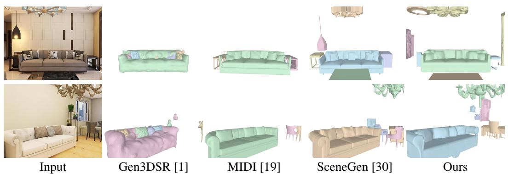  
Figure 1: More qualitative results of single-image 3D scene reconstruction. FIRE3D can achieve the best geometry consistency over baselines. We exclude BG for matched comparisons.

Comparison against HoloScene HoloScene [65] is the closest optimization-based system targeting simulation-oriented reconstruction from video. As shown in Tab. 1 and Fig. 2, FIRE3D improves scenelevel CD and F1 and substantially improves objectlevel CD and F1, while HoloScene obtains higher scene-level NC and PSNR. The two methods are therefore not uniformly ordered by quality. The main difference is efficiency: HoloScene requires approximately eight hours per scene, whereas FIRE3D requires approximately one minute, corresponding to a 480× speedup.

<table><tr><td>Setting</td><td>Method</td><td>CD↓</td><td>F1↑</td><td>NC↑</td><td>PSNR↑</td></tr><tr><td rowspan="2">Scene</td><td>HoloScene</td><td>2.63</td><td>0.43</td><td>0.86</td><td>17.87</td></tr><tr><td>Ours</td><td>2.24</td><td>0.45</td><td>0.82</td><td>13.55</td></tr><tr><td rowspan="2">Object</td><td>HoloScene</td><td>2.94</td><td>0.35</td><td>0.81</td><td>20.78</td></tr><tr><td>Ours</td><td>1.28</td><td>0.61</td><td>0.81</td><td>20.64</td></tr></table>

Table 1: Quantitative comparison against HoloScene. FIRE3D achieves comparable scene-level geometry performance and objectlevel overall performance while reducing runtime by 480×.

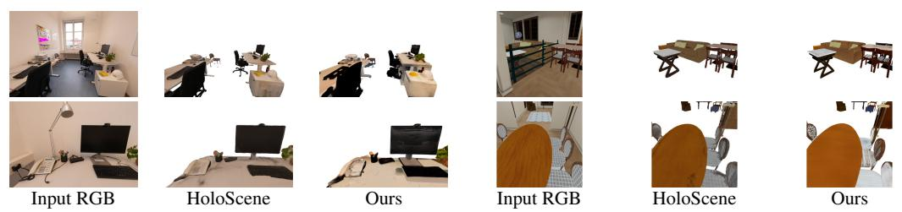  
Figure 2: Qualitative comparison with HoloScene. Input RGB, HoloScene, and FIRE3D use identical released cameras. Background surfaces are excluded. Appearance is evaluated on GT foreground-object pixels.

GT View 2

Comparison against SimRecon We compare with Sim-  
Recon [63] on matched 10-scene subsets of iTHOR [23]   
and Imaginarium [78]. Tab. 2 shows that FIRE3D im  
proves the mAP detection evaluation metric on both   
datasets and obtains a higher overall mIoU on instance seg  
mentation, with comparable results against SimRecon on   
mIoU in the Imaginarium [78] dataset. In terms of runtime   
analysis, FIRE3D reduces average runtime from 262.74   
to 8.23 seconds per scene, yielding a 31.93× speedup. It   
concludes that FIRE3D is able to achieve superior over  
all perception performance even with much less runtime   
compared with single-scene optimization-based methods   
thanks to our curated large corpus of scene datasets. See visualizations of perception results in Fig. 3. thanks to our curated large corpus of scene datasets. See vi

<table><tr><td>Dataset</td><td>Method</td><td>mAP↑</td><td>mIoU↑</td></tr><tr><td rowspan="2">iTHOR</td><td>SimRecon</td><td>0.36</td><td>0.31</td></tr><tr><td>Ours</td><td>0.49</td><td>0.37</td></tr><tr><td rowspan="2">Imag.</td><td>SimRecon</td><td>0.61</td><td>0.56</td></tr><tr><td>Ours</td><td>0.67</td><td>0.52</td></tr><tr><td rowspan="2">Overall</td><td>SimRecon</td><td>0.48</td><td>0.44</td></tr><tr><td>Ours</td><td>0.58</td><td>0.45</td></tr></table>

Table 2: Quantitative comparison against SimRecon. FIRE3D achieves superior overall perception performance while enjoying a 31× speedup.

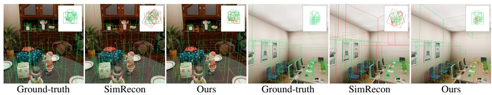  
Figure 3: Qualitative 3D-detection comparison with SimRecon. Each row uses the same original RGB and camera. Green denotes GT or a prediction with 3D IoU > 0.25, red denotes an unmatched prediction, and orange denotes a missed GT object. Every panel includes the same-scale bird’s-eyeview inset. FIRE3D has fewer missed objects and higher accuracy than SimRecon [63].

Comparison against LiteReality LiteReality [20] follows a lift-then-instance pipeline based on external scanning and asset retrieval. To isolate object reconstruction, we provide both methods with GT detection and segmentation on the same randomly selected iTHOR [23] and Imaginarium [78] scenes, and include inference and mesh post-processing in the runtime. Tab. 3 shows that FIRE3D improves all three geometry metrics and reduces the geometry runtime from 18.21 to 2.44 seconds per object (7.46× faster). See visualizations comparisons in Fig. 4

<table><tr><td>Method</td><td>CD↓</td><td>F1↑</td><td>NC↑</td></tr><tr><td>LiteReality</td><td>10.60</td><td>0.18</td><td>0.46</td></tr><tr><td>Ours</td><td>1.47</td><td>0.70</td><td>0.81</td></tr></table>

Table 3: Comparison against LiteReality. FIRE3D achieves superior geometry performance over LiteReality while enjoying a 7.46× faster runtime.

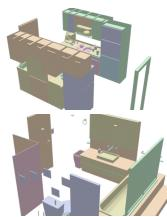  
GT View 1

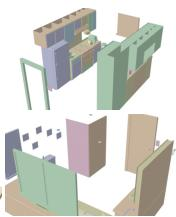

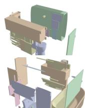  
LiteReality View 1

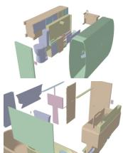  
LiteReality View 2

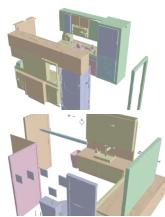  
Ours View 1

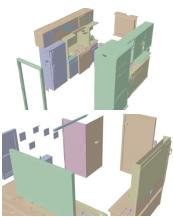  
Ours View 2

Figure 4: Geometry comparison with LiteReality under GT perception and pose. FIRE3D can reconstruct the object geometry more accurately while requiring much less runtime.

Comparison against composed pipeline We also construct a direct modular baseline that combines Boxer [13] for 3D detection, SAM2 [43] for image segmentation, and TRELLIS.2 [68] for object generation. We evaluate both pipelines end-to-end on the same 30 Imaginarium scenes. As shown in Tab. 4, the unified design of FIRE3D improves all reported perception, geometry, and rendering metrics, while reducing network inference runtime per object 6.52× faster due to our HC-VAE design over SC-VAE in TRELLIS.2 [68], and FIRE3D also enjoys a faster mesh post-processing speed thanks to the implemented parallelism. The modular baseline can also accumulate errors across independently trained stages, whereas FIRE3D predicts object instances and reconstructs their assets within a shared 3D representation, which helps boost the reconstruction performance. Visualizations can be found in Fig. 5.

<table><tr><td>Method</td><td>mAP↑</td><td>mIoU↑</td><td>CD↓</td><td>PSNR↑</td></tr><tr><td>Composed</td><td>0.36</td><td>0.28</td><td>5.97</td><td>15.24</td></tr><tr><td>Ours</td><td>0.50</td><td>0.39</td><td>3.21</td><td>15.38</td></tr></table>

Table 4: End-to-end comparison on 30 Imaginarium scenes.

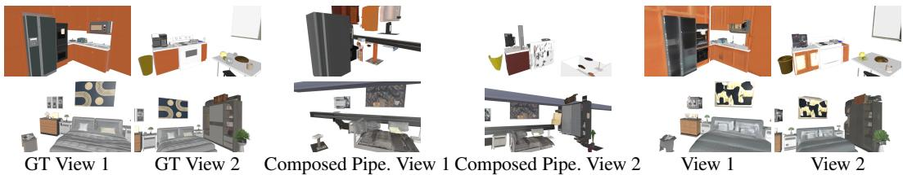  
Figure 5: End-to-end qualitative comparison. Both reconstruction methods use inferred perception, and background geometry is omitted for all columns. FIRE3D achieves higher perception and reconstruction performance while reducing the runtime thanks to the compressed object representation from HC-VAE and parallelism.

## B Implementation Details

## B.1 Data Preparation Details

Data curation: We build training data from diverse indoor scene datasets and render RGB-D observations from SAGE-10k [64], InternScenes [76], ProcTHOR [23], MansionWorld [6], and SceneSmith [39], totaling 80k scenes and 140k rendered videos with randomized camera intrinsics. We further augment the diversity and realism with Flux.2 [24], which produces an additional 80k videos. Additionally, we use an extra 500k objects from four object datasets, including the 3D-Future dataset [16], the ABO dataset [11], the HSSD dataset [22], and the Objaverse dataset [12], in the flow matching reconstruction model training to further enhance its capability.

Data rendering: With the collected data of abundant indoor scenes, we leverage Blender to render RGB-D videos together with camera intrinsics and poses inside the rooms. We design a heuristic algorithm to automatically generate a camera trajectory inside the room, and use Blender EEVEE and CYCLES renderers to render the videos with added lights. The image resolution is fixed to 512x512, and camera intrinsics are chosen randomly with a FOV from 40 degrees to 90 degrees. Each frame therefore provides RGB, metric depth, camera intrinsics, and a camera-to-world pose for constructing the posed RGB-D observation. Through this process, we totally rendered 138202 videos. For datasets with diverse objects and layouts such as SAGE-10k [64], SceneSmith [2], and InternScenes [76], we render 3 videos per scene. For other datasets, MansionWorld and ProcTHOR [6, 23], we only render 2 and 1 video per room.

## B.2 Data Augmentation Details

During training, we apply data augmentations to the scene renderings to boost the generalizability of the trained models.

Scene rotation We apply random rotations of 90, 180, and 270 degrees to the whole scene along the z-axis. This can help the model learn the orientations of objects during the training of the perception model.

Noise-based augmentation In realistic capturing from the real world, the camera poses and depth estimates obtained through geometric preprocessing [46, 56, 59] are not perfectly accurate. In our practical configurations, we use COLMAP poses with $\mathrm { P i ^ { 3 } }$ depth, or $\mathrm { P i ^ { 3 } }$ for both poses and depth. However, in our synthetic rendering, the attained camera poses and depth rendering are too perfect. This hurts the performance when transferred to model inference on real-world videos. To mitigate this, we add random Gaussian noise to the camera translations, rotations, as well as the depth values to mimic the noise in practically estimated posed RGB-D observations.

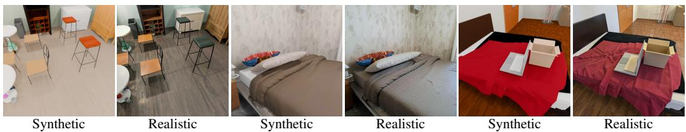  
Figure 6: Visualization of comparisons between synthetic rendering and generated realistic pairs. Here we showcase the comparison of the original synthetic rendering and the Flux.2 generated realistic images.

Flux-based augmentation To mitigate the gap between synthetic rendering and realistic capturing, we also use the Flux.2 [24] to synthesize photorealistic images from synthetic renders, and attain 79672 videos from this process. The visualizations of comparisons between synthetic and realistic generation can be found in Fig. 6.

## B.3 Object Compact Latent Representation Details

## B.3.1 Hierarchical VAEs design

To enable efficient multi-object generation, the proposed Hierarchical Compression VAE (HC-VAE) encodes the sparse feature tensor above the Sparse Compression VAE (SC-VAE) in [68]. The HC-VAE is a pair of lightweight sparse 3D convolution networks of encoder and a decoder, built with FlexGEMM [68] to further compress the sparse latent into an even more compact one. In the following, we will describe the detailed HC-VAE structure as well. We also show the detailed network architecture in Tab. 5 and Tab. 6.

HC-VAE for shape latents. The shape HC-VAE is implemented as a sparse 3D U-Net-style variational autoencoder. The encoder receives 32-channel sparse shape features and progressively increases the feature width from 128 to 512 and 1024 channels, using residual ConvNeXt-style 3D convolutional blocks at each resolution. Two stride-2 residual downsampling stages reduce the sparse spatial resolution, after which the representation is projected to a 64-channel latent code. The decoder mirrors this hierarchy with 3D residual upsampling stages, reducing the feature width from 1024 to 512 and 128 channels before reconstructing the 32-channel shape feature field. This branch also predicts subdivision signals for refining the sparse structure.

HC-VAE for material latents. The material HC-VAE uses the same sparse 3D U-Net-style encoder– decoder design as the shape HC-VAE, but is trained to reconstruct physically based rendering attributes rather than geometry latents. Its encoder maps 32-channel sparse material features through three feature stages with widths 128, 512, and 1024, and compresses them into a 64-channel latent representation. The decoder applies the symmetric sequence of residual 3D convolution and upsampling blocks to recover 32-channel material features. In contrast to the shape branch, this model does not predict subdivision, since material attributes are decoded on the given sparse support.

<table><tr><td>Model</td><td>Architecture</td><td>Channel schedule</td><td>Latent channels</td></tr><tr><td>HC-VAE, shape</td><td>Sparse 3D U-Net VAE</td><td>(128, 512, 1024) → (1024, 512, 128)</td><td>64</td></tr><tr><td>HC-VAE, material</td><td>Sparse 3D U-Net VAE</td><td>(128, 512, 1024) → (1024, 512, 128)</td><td>64</td></tr></table>

Table 5: Architecture summary of HC-VAE.

<table><tr><td>Model</td><td>In ch.</td><td>Out ch.</td><td>Blocks</td><td>Sampling blocks</td><td>Loss</td><td>Subdivision</td></tr><tr><td>HC-VAE, shape</td><td>32</td><td>32</td><td>(4, 6, 8)/(8, 6, 4)</td><td>stride-2 residual conv. / residual upconv.</td><td>L2</td><td>yes</td></tr><tr><td>HC-VAE, material</td><td>32</td><td>32</td><td>(4, 6, 8)/(8,6, 4)</td><td>stride-2 residual conv. / residual upconv.</td><td>L2</td><td>no</td></tr></table>

Table 6: Detailed configuration of the latent and structure autoencoders.

## B.3.2 Hierarchical Batchified Object Decoding

Batchified flow-matching inference. During inference, objects in the same scene are decoded in chunks of size B rather than one at a time. The background instance is included in the same packed batch and decoded with the same flow models. For each chunk, the object points, point features, instance indices, and object-to-canonical transforms are concatenated into a single batched input. The instance index identifies which object each point belongs to, while the transform normalizes the object into its canonical frame. The flow-matching model therefore denoises multiple object latents in one forward pass, with object-specific conditioning preserved by the packed instance labels and per-object transforms.

Sparse coordinate packing. For feature and material generation, the decoded sparse coordinates of all objects in a chunk are packed into one sparse tensor. The first coordinate dimension stores the local object index within the chunk, and the remaining three dimensions store the voxel coordinate. This produces a standard batched sparse representation of the form $( b , x , y , z )$ , where $b \in \{ 0 , \ldots , B - 1 \}$ The corresponding shape or material latent features are concatenated in the same order, allowing the sparse convolutional decoders to process all objects in the chunk jointly while keeping their sparse supports disjoint.

Batchified mesh post-processing. After latent decoding, the resulting per-object meshes generally have different numbers of vertices and faces. We batch them by padding each mesh to the maximum vertex and face count within the chunk and storing binary vertex and face masks. The padded tensors are then processed together on the GPU for hole filling, narrow-band remeshing, and mesh simplification. The masks are used to recover the valid vertices and faces for each object after post-processing, after which each mesh is transformed back to world coordinates and exported independently.

Batchified texture realization. For textured export, the same chunked mesh representation is used for UV unwrapping and rasterization. UV-space texels are rasterized for all objects in the chunk, and valid texel positions are projected back to the corresponding 3D surface. These 3D sample positions are used to query the decoded Material voxel field with trilinear interpolation, producing texture maps and material masks for each object. This keeps expensive UV, rasterization, and material sampling steps batched while preserving separate outputs for each object.

## B.4 Architecture Details

## B.4.1 Instance-aware 3D scene perception model

Point-level feature extraction. The perception model first extracts dense 2D visual descriptors using a DINOv3 ViT-L/16 backbone and lifts them to a 3D point representation. Each point is represented by a 1024-dimensional feature vector. A point-based U-Net then processes the lifted point cloud with hidden width 1024 and two 1024-channel convolutional layers. To control memory, both the input and output point sets are capped at 30k points, and Fourier positional features are sampled with rate 60. The main architecture hyper-parameters are summarized in Tab. 7.

Instance-aware scene decoding. The scene decoder is a transformer-based instance prediction module with model dimension 1024, 16 attention heads, and a 4096-dimensional feed-forward network. It uses six transformer encoder layers for global scene reasoning, six additional encoder layers for segmentation feature refinement, and six decoder layers for object-level prediction. The decoder predicts object validity, translation, rotation, scale, and point-to-instance segmentation. Object pose quantities are discretized into 1024 bins, and the segmentation feature dimension is 1024.

## B.4.2 Point cloud conditioned generative reconstruction model

Conditional flow models. The reconstruction stage uses three point-cloud-conditioned flowmatching models for sparse structure, shape features, and material features. All three models share the same conditioning design: object-level point features are encoded with Fourier positional features and projected to a 1024-dimensional context. The flow backbone uses 30 transformer-style residual blocks. The flow architecture details are listed in Tab. 8.

Latent parameterization. The sparse-structure flow predicts 8-channel latents on a $2 ^ { 3 }$ grid, which are decoded into object occupancy coordinates. The shape flow predicts 64-channel latents on the generated sparse support, and the material flow predicts 64-channel material latents conditioned on the shape support. The shape and material flows operate at sparse resolution 8, while the scene-space generation resolution is 1024.

## B.5 Training Details

<table><tr><td>Component</td><td>Width</td><td>Layers</td><td>Heads</td><td>FFN dim.</td><td>Feature dim.</td><td>Precision</td></tr><tr><td>Point U-Net</td><td>1024</td><td>2 conv. layers</td><td></td><td></td><td>1024</td><td>bfloat16</td></tr><tr><td>Scene encoder</td><td>1024</td><td>6</td><td>16</td><td>4096</td><td>1024</td><td>bfloat16</td></tr><tr><td>Segmentation encoder</td><td>1024</td><td>6</td><td>16</td><td>4096</td><td>1024</td><td>bfloat16</td></tr><tr><td>Object decoder</td><td>1024</td><td>6</td><td>16</td><td>4096</td><td>1024</td><td>bfloat16</td></tr></table>

Table 7: Architecture hyper-parameters of the instance-aware perception model.

<table><tr><td>Model</td><td>Latent res.</td><td>In ch.</td><td>Out ch.</td><td>Width</td><td>Cond. dim.</td><td>Blocks</td><td>Pos. enc.</td></tr><tr><td>Sparse structure flow</td><td> $2 ^ { 3 }$ </td><td>8</td><td>8</td><td>1024</td><td>1024</td><td>30</td><td>RoPE</td></tr><tr><td>Shape feature flow</td><td>sparse 8</td><td>16</td><td>16</td><td>1024</td><td>1024</td><td>30</td><td>RoPE</td></tr><tr><td>Material feature flow</td><td>sparse 8</td><td>32</td><td>16</td><td>1024</td><td>1024</td><td>30</td><td>RoPE</td></tr></table>

Table 8: Architecture hyper-parameters of the point-cloud-conditioned flow models.

<table><tr><td>Model group</td><td>Steps</td><td>LR</td><td>WD</td><td>Betas</td><td>Precision</td><td>Grad. clip</td><td>EMA</td><td>Save interval</td></tr><tr><td>Perception</td><td>500k</td><td> $1 0 ^ { - 4 }$ </td><td>0.01</td><td>(0.9,0.95)</td><td>bfloat16</td><td>0.1</td><td>no</td><td>2500</td></tr><tr><td>Structure / shape / material flows</td><td>1M</td><td> $1 0 ^ { - 4 }$ </td><td>0.01</td><td>(0.9, 0.95)</td><td>bfloat16</td><td>1.0</td><td>0.9999</td><td>5000</td></tr></table>

Table 9: Training hyper-parameters for perception and reconstruction models.

Perception model training. The instance-aware perception model is optimized for 500k steps using AdamW with learning rate $1 0 ^ { - 4 }$ , weight decay 0.01, betas (0.9, 0.95), and $\epsilon = 1 0 ^ { - 8 }$ . We use a 1000-step warmup, bfloat16 mixed precision, gradient clipping at norm 0.1, and no EMA. The loss combines translation, scale, rotation, validity, and segmentation terms; the matching cost weights are 0.1 for classification, 10.0 for translation, 10.0 for scale, and 1.0 for rotation. Checkpoints and validation/inference outputs are produced every 2500 steps. The training hyper-parameters are summarized in Tab. 9.

Generative reconstruction model training. All three flow-matching reconstruction models are trained for 200k steps with AdamW, learning rate $1 0 ^ { - 4 }$ , weight decay 0.01, betas (0.9, 0.95), and $\epsilon = 1 0 ^ { - 8 }$ . Training uses bfloat16 mixed precision, gradient clipping at norm 1.0 with a 95th-percentile clipping statistic, and EMA with decay 0.9999. Classifier-free conditioning dropout is applied with probability $p _ { \mathrm { u n c o n d } } = 0 . 1$ . Checkpoints, validation, and inference samples are saved every 5000 steps, as shown in Tab. 9. Experiments are conducted on 8 GPUs over seven days.