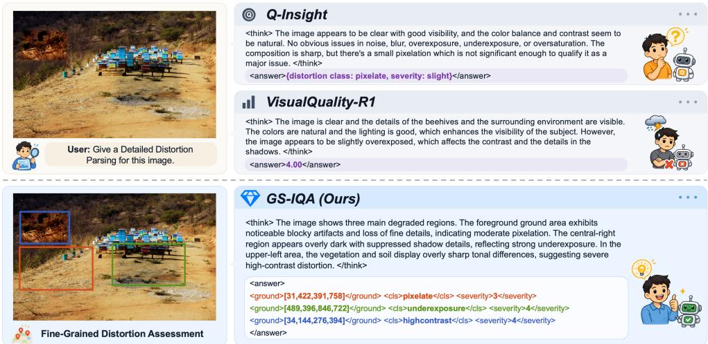
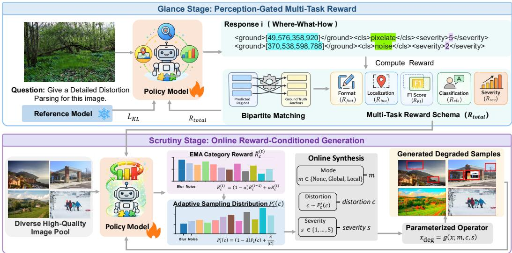
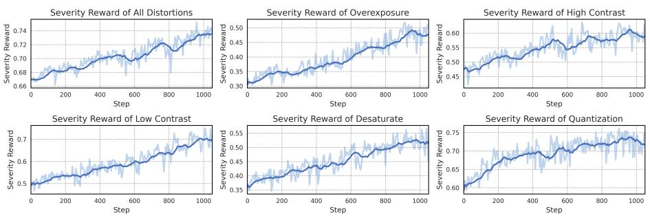

# FROM GLANCE TO SCRUTINY: PROGRESSIVE DISTOR-TION REASONING FOR FINE-GRAINED IMAGE QUAL-ITY ASSESSMENT

Aoting Zhang1,4 Mingze Gao2 Dongbao Yang3 Longyi Chen2

Daoxin Zhang2 Yi Wu2 Yao Hu2 Yu Zhou3

1IIE, Chinese Academy of Sciences 2Xiaohongshu Inc.

3Nankai University 4University of Chinese Academy of Sciences

zhangaoting@iie.ac.cn yangdongbao@nankai.edu.cn

## ABSTRACT

Multi-modal large language models (MLLMs) have demonstrated significant potential in image quality assessment (IQA) by bridging visual perception with descriptive evaluations. However, existing approaches mainly focus on holistic quality prediction, often functioning as black boxes that provide limited insight into where distortions occur and how they affect perceived quality, hindering finegrained analysis of localized and heterogeneous degradations. We propose GS-IQA, a framework that reformulates IQA as a progressive Where–What–How diagnosis, emulating the human perceptual process from an initial glance to closer scrutiny. Since a severity judgment is meaningful only for a correctly localized and recognized region, we realize this progression through a two-stage reinforcement learning paradigm that respects such dependencies: the glance stage uses a perception-gated reward to establish where degradations lie and what they are, activating severity feedback only once both are correct, while the scrutiny stage introduces online reward-conditioned degradation generation to synthesize hard examples targeted at the model’s perceptual bottlenecks, sharpening its discrimination of subtle severity variations. To enable systematic evaluation, we construct Diag-Bench, a region-level IQA benchmark of about 25K curated samples spanning 12 distortion types and five ordinal severity levels. Extensive experiments show that GS-IQA consistently surpasses state-of-the-art methods in distortion localization, recognition, and severity estimation, and that its diagnostic representations transfer effectively to conventional global quality prediction across diverse external benchmarks. Code and data will be released.

## 1 INTRODUCTION

Image Quality Assessment (IQA) aims to evaluate visual quality consistently with human perception. Depending on the availability of a pristine reference, existing methods are broadly categorized into full-reference (FR) and no-reference (NR) approaches. FR-IQA methods compare distorted images with their references using structural metrics or learned perceptual features Wang et al. (2004); Zhang et al. (2018b), whereas NR-IQA methods estimate quality without references, evolving from natural scene statistics Mittal et al. (2012b;a) to deep quality-aware models Su et al. (2020); Ding et al. (2020); Ke et al. (2021); Ding et al. (2021). Despite strong numerical performance, their reliance on holistic score regression often renders the assessment process opaque, offering limited evidence about the distortions underlying a predicted quality score.

The emergence of multimodal large language models (MLLMs) Liu et al. (2023); Ye et al. (2024) has extended IQA beyond scalar prediction toward language-based perceptual understanding. Existing approaches generally include score-based methods Wu et al. (2023); You et al. (2025a), which perform ordinal regression or preference ranking, and description-based methods Wu et al. (2024a); You et al. (2024), which explain perceived artifacts in natural language. Despite improved interpretability through instruction tuning Chen et al. (2024b) and large-scale quality-description corpora, most assessments remain image-level summaries, failing to explicitly associate distortion location, category, and severity. This limitation is particularly evident for spatially heterogeneous degradations. As illustrated in Figure 1, Q-Insight Li et al. (2025) identifies only a dominant degradation whose severity is diluted by pristine regions, whereas VisualQuality-R1 Wu et al. (2025) assigns a relatively high holistic score despite prominent local defects. Such global assessments may obscure perceptually important artifacts and provide limited guidance for distortion-aware restoration Zhang et al. (2018a; 2020); Jinjin et al. (2020) and region-adaptive enhancement Moran et al. (2020); Guo et al. (2020), which benefit from spatially grounded characterization of each defect and its severity.

  
Figure 1: Qualitative comparison of GS-IQA with existing MLLM-based IQA methods. While Q-Insight and VisualQuality-R1 condense spatially heterogeneous degradations into a single distortion description or holistic quality score, GS-IQA employs progressive distortion reasoning to localize individual degraded regions and associate each with its distortion type and ordinal severity, enabling fine-grained and spatially grounded quality assessment.

Human observers, in contrast, rarely assess such complex degradations through an immediate monolithic judgment. Visual quality perception typically unfolds progressively: an initial glance establishes a broad awareness of where potential degradations occur and what distortion patterns they resemble, after which closer scrutiny examines the relevant local evidence to determine how severely visual quality is affected. This perceptual progression naturally gives rise to three interdependent questions: where does the degradation occur, what type of distortion is present, and how severe is it? Crucially, these questions are neither independent nor equally difficult. Reliable severity estimation presupposes that the model has first attended to the correct region and identified the corresponding distortion pattern; otherwise, the severity signal may be dominated by irrelevant or pristine content.

Motivated by this observation, we propose GS-IQA, a unified framework that performs fine-grained image quality assessment through progressive Where–What–How distortion reasoning. Rather than condensing heterogeneous degradations into a single global judgment, GS-IQA associates each degraded region with its distortion category and ordinal severity, thereby providing spatially grounded and verifiable quality interpretations. To learn these fine-grained associations, we develop a twostage reinforcement learning paradigm based on Group Relative Policy Optimization (GRPO) Shao et al. (2024), through which the model progresses from broad distortion perception to subtle severity discrimination. During the glance stage, a perception-gated reward coordinates distortion localization, recognition, and severity learning according to their prerequisite relationships. In particular, the severity reward is activated only when the predicted region and distortion category are sufficiently reliable, preventing erroneous grounding or recognition from introducing misleading supervision while retaining coarse intensity cues for valid predictions. Having established robust Where–What perception, the scrutiny stage shifts the optimization focus toward subtle severity variations that remain difficult to distinguish. Since repeatedly training on a fixed corpus can lead to early saturation, we introduce online reward-conditioned degradation generation, where category-wise severity statistics adapt the sampling probabilities of different distortions. By allocating more synthesized samples to underperforming categories, the training distribution evolves with the model, sustaining informative optimization and progressively sharpening fine-grained severity discrimination. To support the training and systematic evaluation of fine-grained quality assessment, we further construct Diag-Bench, a region-level benchmark comprising 25K carefully curated samples across 12 distortion types and five ordinal severity levels.

In summary, our contributions are as follows:

• We introduce GS-IQA, a unified framework that reformulates fine-grained IQA as progressive Where–What–How reasoning, explicitly associating each degraded region with its distortion type and ordinal severity.

• A Glance-to-Scrutiny reinforcement learning paradigm is developed that respects the perceptual dependencies among distortion localization, recognition, and severity estimation. A perception-gated reward first establishes reliable Where–What perception progressively refining fine-grained How discrimination.

• We propose online reward-conditioned degradation generation for the scrutiny stage, which tracks category-wise severity performance and adaptively reallocates synthesis toward underperforming distortions, mitigating the saturation of severity learning on static data.

• Diag-Bench provides a region-level quality diagnosis benchmark comprising 25K samples across 12 distortion categories and five ordinal severity levels. Extensive experiments demonstrate the effectiveness of GS-IQA in fine-grained distortion assessment and its transferability to conventional global quality prediction.

## 2 RELATED WORKS

## 2.1 IMAGE QUALITY ASSESSMENT

Score-based Methods. Image quality assessment (IQA) is commonly studied under full-reference (FR) and no-reference (NR) settings. FR-IQA compares distorted images against pristine references using structural similarity or learned perceptual representations Wang et al. (2004); Zhang et al. (2018b); Prashnani et al. (2018); Cao et al. (2022), whereas NR-IQA predicts perceptual quality directly from distorted inputs, evolving from natural scene statistics Mittal et al. (2012a) to deep neural predictors Talebi & Milanfar (2018); Su et al. (2020) and transformer-based architectures with multi-scale modeling Ke et al. (2021). Despite strong correlation with human opinion scores, these methods largely compress visual quality into a single scalar, providing limited evidence about the spatial extent, distortion type, or severity underlying the prediction.

MLLM-based Methods. MLLMs extend IQA beyond scalar prediction toward language-based quality understanding, covering quality scoring, descriptive assessment, and perceptual reasoning You et al. (2024); Wu et al. (2023); You et al. (2025a); Wu et al. (2024a;b); Zhang et al. (2025b;a). Recent studies further introduce reinforcement learning to improve perceptual alignment and distortion understanding Li et al. (2025); Wu et al. (2025). Meanwhile, spatially grounded IQA methods associate quality judgments with localized visual evidence Chen et al. (2024a; 2026); Peng et al. (2026). SEAGULL Chen et al. (2024b) extends such analysis to distortion type and ordinal severity for specified regions, while Refine-IQA Jia et al. (2026) incorporates distortion recognition, severity estimation, and grounding into reinforcement fine-tuning. These advances improve local quality understanding, yet the dependency among localization, recognition, and severity remains largely unexploited in learning. GS-IQA addresses this gap through progressive Where–What–How reasoning, using reliable Where–What perception to constrain ordinal How supervision and thereby avoid misleading severity feedback from incorrect region–type associations. It further couples rewardconditioned online generation with the model’s evolving severity weakness, enabling training to progress beyond coarse degradation perception toward fine-grained severity discrimination.

## 2.2 REINFORCEMENT LEARNING FOR MLLMS

Reinforcement learning with verifiable rewards has proven effective for eliciting reasoning without dense annotation Shao et al. (2024); Guo et al. (2025), and has been extended to multimodal perception such as detection and grounding Liu et al. (2025b;a); Bai et al. (2025b), where rule-based signals like IoU provide objective supervision. In IQA, recent studies have introduced reward optimization for quality scoring and distortion understanding Li et al. (2025); Wu et al. (2025); Jia et al. (2026), yet joint region-level diagnosis poses two additional challenges: independently optimized objectives can assign misleading severity credit to incorrectly localized or recognized regions, while fixed training corpora gradually lose informativeness as familiar degradations dominate. Existing curriculum or reweighting strategies Bai et al. (2025b); Yan et al. (2026), which only reorganize available samples, cannot expand the training distribution. GS-IQA addresses both by gating severity feedback on verified localization and recognition, while using reward-conditioned online synthesis to replenish training with degradations from categories that remain difficult to grade.

  
Figure 2: Framework of GS-IQA, which performs quality diagnosis by predicting triplets that localize degraded areas, identify distortion types, and estimate ordinal severity. Training follows a GRPO-based from-glance-to-scrutiny scheme: the glance stage learns region-level grounding and recognition under perception-gated multi-task reward, while the scrutiny stage refines severity estimation with online reward-conditioned degradation generation of controllable hard examples.

## 3 METHODOLOGY

## 3.1 OVERVIEW OF GS-IQA

As illustrated in Figure 2, GS-IQA formulates region-level image quality assessment as progressive Where–What–How diagnosis: localizing degraded regions, recognizing their distortion types, and estimating their ordinal severity levels. These dimensions are interdependent: since the same ordinal level carries different perceptual salience across distortion types, a severity prediction is meaningful only once the region and its type are correct. GS-IQA therefore adopts a two-stage GRPO framework, in which the glance stage establishes region-level perception through perception-gated multi-task learning, activating severity feedback only for spatially matched and correctly recognized regions. The scrutiny stage then tracks category-wise severity performance and adaptively emphasizes underperforming distortions through online severity-controllable synthesis, further refining How discrimination.

## 3.2 GLANCE STAGE: PERCEPTION-GATED MULTI-TASK LEARNING

Building on the MLLM’s low-level visual priors, the Glance stage learns region-level Where–What– How perception under GRPO. A perception-gated multi-task reward jointly supervises distortion localization and category recognition, while activating ordinal severity feedback only for spatially matched regions with correctly recognized distortion types. This design provides reliable supervision for localized degradation perception and establishes a robust perceptual foundation for the subsequent Scrutiny stage.

Format Reward. To enable reliable parsing and automatic reward computation, we adopt a lightweight serialization convention for the predicted Where–What–How associations. Specifically, the reasoning process is delimited by $< \mathrm { t h i n k > . . . < / t h i n k > }$ , followed by the final prediction within <answe $\mathtt { r } > \ldots < / \mathsf { a n s w e r } >$ . Within the answer span, each detected region is represented by a region–category–severity association $\hat { \mathbf { t } } _ { i } = ( \hat { \mathbf { b } } _ { i } , \hat { c } _ { i } , \hat { s } _ { i } )$ , serialized as:

$$
\hat { \mathbf { t } } _ { i } \equiv < \mathbf { g } \mathbf { \mathrm { r o u n d } } > \hat { \mathbf { b } } _ { i } < / \mathbf { g } \mathbf { \mathrm { r o u n d } } > , < \mathbf { c } \mathbf { \mathbf { \mathbf { \mathbf { \mathbf { 1 } } } } } \mathbf { s } > \hat { c } _ { i } < / \mathbf { c } \mathbf { \mathbf { \mathbf { 1 } } } \mathbf { s } > , < \mathbf { s } \mathbf { e } \mathbf { v e r i } \mathbf { t } \mathbf { y } > \hat { s } _ { i } < / \mathbf { s } \mathbf { e } \mathbf { v e r i } \mathbf { t } \mathbf { y } > ,\tag{1}
$$

where $\hat { \mathbf { b } } _ { i } = [ \hat { x } _ { i 1 } , \hat { y } _ { i 1 } , \hat { x } _ { i 2 } , \hat { y } _ { i 2 } ] , \hat { c } _ { i }$ , and $\hat { s } _ { i }$ denote the predicted bounding box, distortion category, and severity level, respectively. The associations extracted from the answer constitute the prediction set $\hat { \mathcal { T } } = \{ \hat { t } _ { i } \} _ { i = 1 } ^ { N }$ , which provides the common input for the grounding and severity rewards below. We assign $R _ { \mathrm { f m t } } = 1$ when the reasoning and answer spans are correctly delimited and the answer contains at least one well-formed association, and $R _ { \mathrm { f m t } } = 0$ otherwise. This reward only ensures parseability, while semantic correctness is evaluated by the subsequent perception rewards. For pristine images, the canonical association ([0, 0, 1000, 1000], None, 0) is used, allowing them to share the same structured output and reward pipeline as degraded images.

Degradation Grounding Reward. This reward supervises degradation grounding, covering spatial localization (Where) and distortion identification $( \bar { W } h a t )$ . Since a single image may contain multiple degraded regions and co-occurring artifacts, the predictions form an unordered set rather than an ordered sequence. To handle this permutation ambiguity, we establish an optimal bipartite matching between predicted and ground-truth triplets before reward computation, ensuring each prediction is compared to the best-aligned ground-truth region.

Specifically, we formulate this correspondence as a bipartite assignment problem. Let $\hat { \mathcal { T } } = \{ \hat { \mathbf { t } } _ { i } \} _ { i = 1 } ^ { N }$ and $\mathcal { T } = \{ \mathbf { t } _ { j } \} _ { j = 1 } ^ { M }$ denote the predicted and ground-truth triplet sets, respectively. Each triplet $\mathbf { t } =$ $( \mathbf { b } , c , s )$ comprises a bounding box b, a distortion category c, and an ordinal severity level s. To establish correspondence between the two sets, we define $\Phi ( \hat { \bf t } _ { i } , { \bf t } _ { j } )$ as their pairwise perception score and seek the assignment that maximizes the overall compatibility:

$$
\hat { \sigma } = \arg \operatorname* { m a x } _ { \sigma \in \Omega _ { N , M } } \sum _ { i = 1 } ^ { N } \Phi ( \hat { \mathbf { t } } _ { i } , \mathbf { t } _ { \sigma ( i ) } ) ,\tag{2}
$$

where $\Omega _ { N , M }$ denotes the set of valid one-to-one matchings from predictions to ground-truth, obtained using the Hungarian algorithm Kuhn (1955). Based on optimal assignment, we retain the spatially valid pairs whose intersection-over-union exceeds: $\mathcal { M } = \{ ( i , j ) ~ | ~ j = \hat { \sigma } ( i ) , \mathrm { I o U } ( \hat { \mathbf { b } } _ { i } , \mathbf { b } _ { j } ) \geq$ 0.5}. The localization and classification rewards are then computed over the matched pairs:

$$
R _ { \mathrm { i o u } } = \frac { 1 } { | \mathcal { M } | } \sum _ { ( i , j ) \in \mathcal { M } } \mathrm { I o U } ( \hat { \mathbf { b } } _ { i } , \mathbf { b } _ { j } ) , \quad R _ { \mathrm { c l s } } = \frac { 1 } { | \mathcal { M } | } \sum _ { ( i , j ) \in \mathcal { M } } \mathbb { I } ( \hat { c } _ { i } = c _ { j } ) .\tag{3}
$$

Both rewards are set to zero when no valid pair is found. To penalize both missed regions and hallucinated predictions, we incorporate the F1-style grounding reward $\frac { 2 | \mathcal { M } | } { N + M }$ , which is equivalent to the harmonic mean of matching precision $| { \mathcal { M } } | / N$ and recall $| { \mathcal { M } } | / M$

Perception-Gated Severity Reward. Severity estimation is inherently category-dependent, as the same ordinal level may exhibit markedly different perceptual salience across distortion types $( \mathrm { e . g . }$ Level 1 saturation can be more noticeable than Level 1 blur). A severity prediction is therefore meaningful only relative to a correctly recognized distortion category. For the spatially matched pairs in M, we activate severity supervision only when the predicted category agrees with the ground truth, conditioning How discrimination on reliable Where–What perception.

To provide denser feedback while preserving the ordinal structure of severity, we assign graded credit according to the distance between the predicted and ground-truth levels. For each matched pair $( i , j ) \in \mathcal { M }$ , we define the ordinal severity distance as

$$
d _ { i j } ^ { \mathrm { s e v } } = | \hat { s } _ { i } - s _ { j } | .\tag{4}
$$

The tiered ordinal reward assigns progressively lower credit as the severity distance increases, taking $r _ { \mathrm { o r d } } = 1 , \alpha _ { 1 } , \alpha _ { 2 } , 0$ for $d = 0 , 1 , 2$ , and $d \geq 3$ , respectively, where $\alpha _ { 1 } > \alpha _ { 2 } > 0$ enforces monotonic decay and $( \alpha _ { 1 } , \alpha _ { 2 } ) = ( 0 . 6 , 0 . 2 )$ in practice. Crucially, severity credit is released only when both spatial correspondence and distortion recognition are correct. We therefore define

$$
R _ { \mathrm { s e v } } = \frac { 1 } { | \mathcal { M } | } \sum _ { ( i , j ) \in \mathcal { M } } \mathbb { I } ( \hat { c } _ { i } = c _ { j } ) r _ { \mathrm { o r d } } \left( d _ { i j } ^ { \mathrm { s e v } } \right) ,\tag{5}
$$

Unmatched or misclassified regions contribute zero reward. This normalization prevents selective omission of difficult regions from inflating the severity reward, while preserving the prerequisite relationship that valid How supervision requires reliable Where–What perception.

Overall Multi-Task Reward. The above components are combined to jointly optimize format validity, degradation grounding, and severity perception:

$$
R _ { \mathrm { t o t a l } } = R _ { \mathrm { f m t } } + R _ { \mathrm { i o u } } + R _ { \mathrm { F } 1 } + R _ { \mathrm { c l s } } + R _ { \mathrm { s e v } } .\tag{6}
$$

## 3.3 SCRUTINY STAGE: ONLINE REWARD-CONDITIONED GENERATION

After the Glance stage establishes reliable region-level degradation perception, further improvement in severity discrimination is often limited by the fixed composition of static training data. A fixed corpus provides finite combinations of distortion patterns and severity appearances, causing optimization to gradually concentrate on already well-learned degradations. To sustain informative training, the Scrutiny stage introduces online reward-conditioned degradation generation, which tracks category-wise severity performance and adaptively reallocates sampling toward distortions that remain difficult to grade. As the policy evolves, the training distribution evolves accordingly, continually refreshing fine-grained supervision around the model’s current weaknesses.

Reward-Driven Distribution Evolution. We maintain an online profile of category-wise severity performance to guide degradation sampling. At step t, for each distortion category c, we collect its spatially matched regions as $\boldsymbol { B } _ { c } ^ { ( t ) } = \{ ( i , j ) \in \mathcal { M } \mid c _ { j } = c \}$ . The batch-level score measures severity performance over these regions, where category-mismatched predictions receive zero credit. To reduce batch-wise fluctuations, we further maintain an exponential moving average (EMA):

$$
\bar { R } _ { c } ^ { ( t ) } = \frac { 1 } { | \mathcal { B } _ { c } ^ { ( t ) } | } \sum _ { ( i , j ) \in \{ \pmb { \mathscr { B } } _ { c } ^ { ( t ) } \} } \mathbb { I } ( \hat { c } _ { i } = c _ { j } ) r _ { \mathrm { o r d } } \big ( d _ { i j } ^ { \mathrm { s e v } } \big ) , \quad \hat { R } _ { c } ^ { ( t ) } = ( 1 - \alpha ) \hat { R } _ { c } ^ { ( t - 1 ) } + \alpha \bar { R } _ { c } ^ { ( t ) } ,\tag{7}
$$

where $\bar { R } _ { c } ^ { ( t ) }$ reflects the current batch-wise severity performance of category c, and $\hat { R } _ { c } ^ { ( t ) }$ provides a smoothed estimate of its recent learning status. If category c is absent from the current batch, its EMA statistic remains unchanged. $\mathbf { A }$ lower $\hat { R } _ { c } ^ { ( t ) }$ therefore indicates a distortion whose severity remains harder to grade. We convert these statistics into an adaptive sampling distribution by applying a temperature-scaled softmax over the negative rewards:

$$
P _ { t } ( c ) = \frac { \exp { \left( - \hat { R } _ { c } ^ { ( t ) } / \tau \right) } } { \sum _ { c ^ { \prime } \in \mathcal { C } } \exp { \left( - \hat { R } _ { c ^ { \prime } } ^ { ( t ) } / \tau \right) } } , \quad P _ { t } ^ { \prime } ( c ) = ( 1 - \lambda ) P _ { t } ( c ) + \frac { \lambda } { \vert \mathcal { C } \vert } ,\tag{8}
$$

where $\tau$ controls how strongly sampling concentrates on low-reward categories, while λ preserves exploration through a uniform prior. Consequently, categories with persistently weak severity performance receive more training samples, whereas well-learned categories gradually recede. Unlike reweighting a fixed corpus, this distribution directly governs online degradation synthesis, allowing the training data to evolve with the policy.

Online Degradation Synthesis. Given the adaptive sampling distribution $P _ { t } ^ { \prime } ( c )$ , we synthesize training samples online by sampling a degradation mode $m \in \{ \mathrm { N o n e , G l o b a l , L o c a l } \}$ , a distortion category $c \sim P _ { t } ^ { \prime } ( c )$ , and an ordinal severity level $s \in \{ 1 , \ldots , 5 \}$ . The mode determines whether we keep the image pristine, apply a single global degradation, or inject multiple localized degradations into randomly sampled patches. The generator g(·) applies a degradation operator to a pristine image x to produce a degraded image:

$$
x _ { \mathrm { d e g } } = g ( x ; m , c , s ) .\tag{9}
$$

Crucially, it emits structured supervision together with the synthesized image. For each degraded region $k ,$ we record its bounding box $b _ { k }$ , category $c _ { k }$ , and severity level $s _ { k } .$ , forming a set-structured annotation $\mathcal { T } = \{ ( b _ { k } , c _ { k } , s _ { k } ) \} _ { k = 1 } ^ { \tilde { K } }$ . In the local mode, the set of severity $\left\{ s _ { k } \right\}$ is sampled independently for each injected region, enabling multiple localized degradations with controllable severity within one image. By combining reward-driven category sampling with controllable severity synthesis, this stage continually expands fine-grained supervision while concentrating training capacity on distortions with weak severity estimation.

## 3.4 DIAG-BENCH: BENCHMARK FOR FINE-GRAINED QUALITY DIAGNOSIS

We construct Diag-Bench, a 25K-sample benchmark that formulates IQA as a fine-grained Where– What–How diagnosis, requiring models to localize degraded regions, identify distortion types, and estimate ordinal severity. Unlike existing benchmarks dominated by image-level scores or coarse descriptions, Diag-Bench combines authentic and synthetic degradations with region-level annotations. Following prior IQA studies You et al. (2025b), we consider 12 representative distortion categories—noise, blur, compression, overexposure, underexposure, high contrast, low contrast, oversaturate, desaturate, oversharpen, pixelate, quantization—each with five ordinal severity levels.

The authentic subset is built upon ViDA-UGC Liao et al. (2025), a large-scale UGC dataset with region-level distortion annotations, which we semantically map onto our predefined categories while discarding those without a counterpart. To ensure unambiguous severity annotation, we retain only images carrying a single distortion category and annotate their ordinal severity, yielding 3,470 training and 868 testing samples. The synthetic subset provides scalable and controllable supervision over distortion type, spatial extent, and severity. We sample 8,000 pristine images from KADIS-700K Lin et al. (2019) and apply a two-stage quality screening procedure: Q-Insight Li et al. (2025) and VisualQuality-R1 (Wu et al., 2025) first filter sources with potential pre-existing degradations, followed by manual inspection to remove residual low-quality images, leaving 4,275 high-quality sources. To avoid source-level leakage, we partition the 4,275 pristine images into 3,775 training and 500 testing sources before any degradation is applied. All static samples and online degradations used in both the Glance and Scrutiny stages are generated exclusively from the training-source pool, while the test sources remain completely unseen throughout optimization. Parameterized OpenCV operators (You et al., 2025b; Bradski, 2000; Ma et al., 2017; Lin et al., 2019) generate pristine, global, and non-overlapping local degradations in a 1:2:2 ratio, with 1–3 degraded regions per local sample. Each image is annotated with triplets $\{ ( b _ { k } , c _ { k } , s _ { k } ) \} _ { k = 1 } ^ { K } .$ , where $s _ { k } \in \{ 1 , \ldots , 5 \}$ denotes ordinal severity; pristine images use the canonical annotation ([0, 0, 1000, 1000], None, 0). To ensure the perceptibility of the synthesized label, human experts review all candidates and discard ambiguous ones, retaining 21,275 samples, 18,775 for training and 2,500 for testing.

## 4 EXPERIMENTS

## 4.1 EXPERIMENTAL SETUP

Implementation Details. We adopt Qwen3-VL-4B Bai et al. (2025a) as the base model and optimize it through two consecutive reinforcement stages without preceding supervised fine-tuning. The Glance stage is trained on the static training split of Diag-Bench, whereas the Scrutiny stage employs online reward-conditioned degradation generation for severity refinement. GRPO samples a group of $G = 5$ responses per prompt with a global batch size of 128. In the scrutiny stage, the online sampler tracks per-category severity performance with EMA momentum $\alpha = 0 . 1$ , using temperature $\tau = 1 . 0$ for category reweighting, and mixes the sampling distribution with a uniform prior using λ = 0.05. All experiments are conducted with NVIDIA H800 GPUs.

Evaluation Protocols and Metrics. We evaluate GS-IQA under three complementary settings covering core diagnostic capability, cross-dataset generalization, and transferability to holistic quality assessment. On Diag-Bench, region-level evaluation assesses the complete Where–What–How diagnosis: localization is measured by precision, recall, F1-score, and mIoU, while distortion recognition and severity estimation are measured by classification accuracy (ClsAcc) and severity accuracy (SevAcc), respectively. Cross-dataset generalization is evaluated on established external benchmarks without dataset-specific fine-tuning, where ClsAcc and SevAcc are reported under the global-degradation setting. Finally, we assess the transferability of Where–What–How learning to global IQA, with Spearman Rank-Order Correlation Coefficient (SRCC) and Pearson Linear Correlation Coefficient (PLCC) measuring how effectively region-aware distortion semantics and ordinal severity cues support holistic quality prediction.

## 4.2 COMPARISON WITH STATE-OF-THE-ART METHODS

Fine-Grained Quality Diagnosis. Table 1 compares GS-IQA with general-purpose MLLMs, grounding models, IQA-specific models, and task-aligned fine-grained baselines on Diag-Bench.

Table 1: Fine-grained image quality diagnosis results on Diag-Bench. We evaluate distortion localization (Where), type recognition (What), and severity estimation (How). † denotes task-aligned variants. The best and second-best results are marked in bold and underlined, respectively.
<table><tr><td rowspan="2">Method</td><td colspan="4">Where</td><td>What</td><td>How</td></tr><tr><td>Precision</td><td>Recall</td><td>F1</td><td>mIoU</td><td>ClsAcc</td><td>SevAcc</td></tr><tr><td colspan="7">General-purpose MLLMs</td></tr><tr><td>Gemini-2.5-Pro Comanici et al. (2025)</td><td>0.343</td><td>0.428</td><td>0.381</td><td>0.920</td><td>0.466</td><td>0.363</td></tr><tr><td>Gemini-3-Pro</td><td>0.722</td><td>0.563</td><td>0.633</td><td>0.921</td><td>0.603</td><td>0.563</td></tr><tr><td>GPT-4o Hurst et al. (2024)</td><td>0.183</td><td>0.227</td><td>0.202</td><td>0.876</td><td>0.600</td><td>0.600</td></tr><tr><td>GPT-5 Singh et al. (2025)</td><td>0.138</td><td>0.269</td><td>0.183</td><td>0.854</td><td>0.677</td><td>0.400</td></tr><tr><td>Qwen3-VL-4B Bai et al. (2025a) (Base)</td><td>0.544</td><td>0.176</td><td>0.266</td><td>0.905</td><td>0.931</td><td>0.316</td></tr><tr><td>Qwen3-VL-235B Bai et al. (2025a)</td><td>0.624</td><td>0.330</td><td>0.431</td><td>0.954</td><td>0.535</td><td>0.677</td></tr><tr><td colspan="7">Grounding-oriented Models</td></tr><tr><td>Shikra-7B Chen et al. (2023)</td><td>0.019</td><td>0.184</td><td>0.034</td><td>0.602</td><td>0.041</td><td>N/A</td></tr><tr><td>Ferret-7B You et al. (2023)</td><td>0.032</td><td>0.286</td><td>0.058</td><td>0.687</td><td>0.055</td><td>N/A</td></tr><tr><td>Kosmos-2-1.6B Peng et al. (2023)</td><td>0.012</td><td>0.125</td><td>0.022</td><td>0.583</td><td>0.033</td><td>N/A</td></tr><tr><td>GroundingGPT-7B Li et al. (2024)</td><td>0.024</td><td>0.203</td><td>0.043</td><td>0.653</td><td>0.067</td><td>N/A</td></tr><tr><td colspan="7">IQA-specific Models</td></tr><tr><td>Q-Insight Li et al. (2025)</td><td>N/A</td><td>N/A</td><td>N/A</td><td>N/A</td><td>0.346</td><td>0.502</td></tr><tr><td>VisualQuality-R1 Wu et al. (2025)</td><td>N/A</td><td>N/A</td><td>N/A</td><td>N/A</td><td>0.284</td><td>0.606</td></tr><tr><td colspan="7">Fine-grained IQA Models</td></tr><tr><td>Supervised Fine-tuning</td><td>0.854</td><td>0.861</td><td>0.857</td><td>0.926</td><td>0.467</td><td>0.585</td></tr><tr><td>Q-Insight† Li et al. (2025)</td><td>0.889</td><td>0.814</td><td>0.850</td><td>0.938</td><td>0.892</td><td>0.652</td></tr><tr><td>VisualQuality-R1† Wu et al. (2025)</td><td>0.910</td><td>0.858</td><td>0.883</td><td>0.946</td><td>0.907</td><td>0.438</td></tr><tr><td>GS-IQA-Glance (Ours)</td><td>0.948</td><td>0.848</td><td>0.895</td><td>0.953</td><td>0.921</td><td>0.678</td></tr><tr><td>GS-IQA-Scrutiny (Ours)</td><td>0.953</td><td>0.909</td><td>0.930</td><td>0.967</td><td>0.947</td><td>0.732</td></tr></table>

General-purpose and grounding-oriented models show limited transfer to low-level degradation localization: GPT-4o and GPT-5 achieve F1 scores of only 0.202 and 0.183, while conventional grounding models remain below 0.06. This reflects the difficulty of localizing degradations, which are often weakly bounded and spatially diffuse rather than semantically well-defined objects.

IQA-specific MLLMs provide stronger quality awareness, but their holistic formulations neither ground individual degraded regions nor reliably disentangle region-wise distortion attributes. Supervised fine-tuning achieves competitive localization but substantially weaker recognition and severity estimation. To control for output-format differences, we adapt Q-Insight and VisualQuality-R1 to the same prompts, training data, and structured prediction format, while preserving their respective optimization objectives. Both task-aligned variants improve markedly over SFT in localization and recognition; however, neither explicitly exploits ordinal severity distance during optimization, with Q-Insight† reaching a SevAcc of 0.652 and VisualQuality-R1† 0.438. GS-IQA-Glance further raises SevAcc to 0.678 through perception-gated ordinal rewards, while GS-IQA-Scrutiny uses category-wise severity feedback to adapt online degradation sampling, increasing SevAcc to 0.732 while also improving Recall from 0.848 to 0.909, F1 from 0.895 to 0.930, and ClsAcc from 0.921 to 0.947. These results demonstrate that explicitly modeling the dependencies among localization, recognition, and severity is effective for joint fine-grained quality diagnosis.

Table 2: Global degradation diagnosis.
<table><tr><td>Method</td><td>ClsAcc</td><td>SevAcc</td></tr><tr><td>AgenticIR</td><td>0.426</td><td>0.237</td></tr><tr><td>Q-Insight</td><td>0.434</td><td>0.365</td></tr><tr><td>VisualQuality-R1</td><td>0.482</td><td>0.359</td></tr><tr><td>GS-IQÀ-Scrutiny</td><td>0.916</td><td>0.735</td></tr></table>

Global Degradation Diagnosis. We further evaluate the diagnostic capability of GS-IQA beyond localization on globally degraded images, where each image contains a single distortion with uniform severity. This setting removes the grounding requirement and isolates the What and How capabilities. As shown in Table 2, GS-IQA-Scrutiny substantially outperforms existing IQA methods, improving the best competing ClsAcc from 0.482 to 0.916 and SevAcc from 0.365 to 0.735. These results demonstrate that the advantage of GS-IQA extends beyond spatial grounding to distortion recognition and fine-grained severity discrimination.

## 4.3 GENERALIZATION AND TRANSFERABILITY

Cross-Dataset Diagnostic Generalization. We evaluate the transferability of the learned distortion semantics and severity cues beyond Diag-Bench on DQ-495K, KADID-10K, TID2013, and Waterloo, without dataset-specific fine-tuning. Since these benchmarks provide image-level annotations, evaluation focuses on the transferable What and How dimensions using the distortion categories and five-level severity labels that can be mapped to our taxonomy. As shown in Table 3, GS-IQA consistently outperforms Q-Insight and VisualQuality-R1 across all four datasets, improving ClsAcc over the strongest baseline by 50.3, 41.6, 29.3, and 32.8 points, respectively, while achieving gains of up to 14.5 points in SevAcc. These consistent improvements demonstrate that GS-IQA learns transferable distortion and severity representations that generalize beyond the content distribution and synthesis patterns of Diag-Bench.

Table 3: Cross-dataset generalization of distortion diagnosis on external IQA benchmarks without dataset-specific fine-tuning. Best results are highlighted in bold.
<table><tr><td>Method</td><td>Metric</td><td>DQ-495K</td><td>KADID-10k</td><td>TID2013</td><td>Waterloo</td></tr><tr><td>Q-Insight Li et al. (2025)</td><td>ClsAcc SevAcc</td><td>0.284 0.398</td><td>0.242 0.430</td><td>0.443 0.085</td><td>0.504 0.254</td></tr><tr><td>VisualQuality-R1 Wu et al. (2025)</td><td>ClsAcc SevAcc</td><td>0.157 0.498</td><td>0.188 0.232</td><td>0.158 0.306</td><td>0.332 0.074</td></tr><tr><td>GS-IQA (Ours)</td><td>ClsAcc SevAcc</td><td>0.787 0.532</td><td>0.658 0.514</td><td>0.736 0.354</td><td>0.832 0.399</td></tr></table>

Table 4: Holistic quality prediction transferability across five external IQA benchmarks.
<table><tr><td rowspan="2">Method</td><td colspan="2">BID</td><td colspan="2">CLIVE</td><td colspan="2">SPAQ</td><td colspan="2">KonIQ</td><td colspan="2">AGIQA</td><td colspan="2">AVG.</td></tr><tr><td>SRCC</td><td>PLCC</td><td>SRCC</td><td>PLCC</td><td>SRCC</td><td>PLCC</td><td>SRCC</td><td>PLCC</td><td>SRCC</td><td>PLCC</td><td>SRCC</td><td>PLCC</td></tr><tr><td>Q-Align Wu et al. (2023)</td><td>0.576</td><td>0.651</td><td>0.554</td><td>0.643</td><td>0.767</td><td>0.779</td><td>0.573</td><td>0.612</td><td>0.682</td><td>0.705</td><td>0.630</td><td>0.678</td></tr><tr><td>DeQA-Score You et al. (2025a)</td><td>0.702</td><td>0.743</td><td>0.743</td><td>0.795</td><td>0.852</td><td>0.858</td><td>0.677</td><td>0.703</td><td>0.738</td><td>0.790</td><td>0.742</td><td>0.778</td></tr><tr><td>Q-Insight Li et al. (2025)</td><td>0.806</td><td>0.818</td><td>0.804</td><td>0.837</td><td>0.907</td><td>0.912</td><td>0.812</td><td>0.809</td><td>0.657</td><td>0.705</td><td>0.797</td><td>0.816</td></tr><tr><td>VisualQuality-R1 Wu et al. (2025)</td><td>0.811</td><td>0.820</td><td>0.811</td><td>0.844</td><td>0.913</td><td>0.917</td><td>0.855</td><td>0.870</td><td>0.754</td><td>0.820</td><td>0.829</td><td>0.854</td></tr><tr><td>GS-IQA (Ours)</td><td>0.886</td><td>0.884</td><td>0.893</td><td>0.898</td><td>0.886</td><td>0.882</td><td>0.885</td><td>0.901</td><td>0.749</td><td>0.780</td><td>0.860</td><td>0.869</td></tr></table>

Holistic Quality Prediction Transferability. We further evaluate the transferability of the finegrained representations learned through Where–What–How diagnosis to conventional global IQA. Following the training protocol of VisualQuality-R1, we initialize a global quality regressor from GS-IQA and fine-tune it using the same training data, dataset splits, and regression objective. As shown in Table 4, GS-IQA achieves the best average performance across five external benchmarks, reaching 0.860 SRCC and 0.869 PLCC. Compared with VisualQuality-R1, the average SRCC and PLCC improve by 0.031 and 0.015, respectively, with GS-IQA ranking first on BID, CLIVE, and KonIQ. These results indicate that Where–What–How learning captures transferable perceptual representations that can be effectively aggregated into calibrated image-level scores. GS-IQA therefore supports both interpretable local diagnosis and conventional global quality prediction.

## 4.4 ABLATION STUDIES

Impact of Severity Reward. Table 5(a) examines how different reward formulations affect severity learning in the Glance stage. The proposed perception-gated reward achieves the highest SevAcc of 0.678, improving over the hard binary reward (0.652) while maintaining competitive localization performance. Continuous linear and ordinal ranking rewards (detailed in Supplementary materials) retain strong F1 scores but yield noticeably lower SevAcc of 0.627 and 0.304, respectively, indicat ing that reward design plays a critical role in preserving exact severity calibration rather than merely relative intensity ordering. Moreover, removing perception gating reduces both F1 (0.895→0.878) and SevAcc (0.678→0.651), supporting our key design that severity feedback should be conditioned on reliable spatial and categorical perception. Together, these results show that effective fine-grained severity learning requires both ordinally informative feedback and valid Where–What associations.

Impact of Online Generation. Table 5(b) evaluates various data strategies in the scrutiny stage, revealing that training exclusively on static data leads to a performance bottleneck, whereas online generation effectively overcomes this limit by introducing dynamic perceptual challenges. Among online strategies, our reward conditioned generation achieves a higher SevAcc of 0.732 compared to random generation. The higher SevAcc of reward-conditioned generation indicates that categorywise severity feedback provides a more informative sampling signal than random online synthesis, allocating additional training to distortions that remain difficult to grade. Removing Glance initialization consistently degrades localization, recognition, and severity performance, confirming that the static perception stage provides a stronger initialization for subsequent adaptive refinement.

Table 5: Ablation studies of GS-IQA, including (a) the perception-gated severity reward in the initial glance stage, and (b) reward-conditioned online generation in the scrutiny stage.
<table><tr><td>Configuration</td><td>Precision</td><td>Recall</td><td>F1</td><td>mIoU</td><td>ClsAcc</td><td>SevAcc</td></tr><tr><td colspan="7">(a) Severity Reward in Glance Stage</td></tr><tr><td>Hard Binary Reward</td><td>0.955</td><td>0.800</td><td>0.871</td><td>0.960</td><td>0.939</td><td>0.652</td></tr><tr><td>Continuous Linear Reward</td><td>0.954</td><td>0.879</td><td>0.915</td><td>0.953</td><td>0.926</td><td>0.627</td></tr><tr><td>Ordinal Ranking Reward</td><td>0.966</td><td>0.872</td><td>0.916</td><td>0.960</td><td>0.924</td><td>0.304</td></tr><tr><td>Perception-gated Reward</td><td>0.948</td><td>0.848</td><td>0.895</td><td>0.953</td><td>0.921</td><td>0.678</td></tr><tr><td>w/o Perception Gating</td><td>0.950</td><td>0.816</td><td>0.878</td><td>0.957</td><td>0.927</td><td>0.651</td></tr><tr><td colspan="7">(b) Online Generation in Scrutiny Stage</td></tr><tr><td>Static Data Only</td><td>0.941</td><td>0.849</td><td>0.893</td><td>0.957</td><td>0.945</td><td>0.682</td></tr><tr><td>Random Online Generation</td><td>0.967</td><td>0.897</td><td>0.931</td><td>0.967</td><td>0.947</td><td>0.694</td></tr><tr><td>Reward-conditioned Generation</td><td>0.953</td><td>0.909</td><td>0.930</td><td>0.967</td><td>0.947</td><td>0.732</td></tr><tr><td>w/o glance initialization</td><td>0.957</td><td>0.854</td><td>0.902</td><td>0.960</td><td>0.914</td><td>0.665</td></tr></table>

  
Figure 3: Learning dynamics of severity perceptual refinement in GS-IQA-Scrutiny.

Sample Efficiency of Generative Scrutiny. Table 6(a) investigates the sample efficiency of rewardconditioned generation under different source-pool sizes. Notably, with only 50 source images (1% of the training pool), GS-IQA already achieves an F1 score of 0.902, outperforming the Glance-stage baseline trained on static data. As the source pool expands from 50 to 3,775 images, performance improves steadily from 0.902 to 0.930 in F1 and from 0.689 to 0.732 in SevAcc. These results show that online degradation synthesis can effectively reuse limited pristine content to produce diverse region–category–severity supervision, while broader source diversity further benefits fine-grained severity learning. This makes the Scrutiny stage substantially less dependent on manually constructed training samples and enables scalable refinement from a compact pool of pristine images.

Scaling Analysis of Model Capacity. Table 6(b) shows that increasing model capacity yields diminishing gains in localization but more consistent improvements in severity estimation. As the model scales from 4B to 32B, F1 increases from 0.930 to 0.952, while SevAcc improves from 0.732 to 0.754. This trend suggests that fine-grained severity discrimination benefits more from increased model capacity than spatial localization, further highlighting severity estimation as the more challenging component of the Where–What–How diagnosis.

Dynamics of Perceptual Refinement. Figure 3 shows the evolution of severity rewards during the Scrutiny stage. The overall reward rises steadily, with consistent improvements observed for representative distortions such as overexposure, high contrast, low contrast, desaturation, and quantization. This behavior reflects the intended effect of reward-conditioned sampling: categories with weaker severity estimation continue to receive additional training exposure, enabling progressive refinement rather than early saturation on a fixed training distribution.

Table 6: Ablation on sample efficiency and model scaling.
<table><tr><td>Configuration</td><td>F1</td><td>ClsAcc</td><td>SevAcc</td></tr><tr><td colspan="4">(a) Sample Efficiency</td></tr><tr><td>50 (1%)</td><td>0.902</td><td>0.923</td><td>0.689</td></tr><tr><td>500 (13%)</td><td>0.915</td><td>0.932</td><td>0.705</td></tr><tr><td>1,000 (26%)</td><td>0.922</td><td>0.939</td><td>0.718</td></tr><tr><td>2,000 (53%)</td><td>0.927</td><td>0.943</td><td>0.727</td></tr><tr><td>3,775 (100%)</td><td>0.930</td><td>0.947</td><td>0.732</td></tr><tr><td colspan="4">(b) Model Capacity</td></tr><tr><td>GS-IQA-4B</td><td>0.930</td><td>0.947</td><td>0.732</td></tr><tr><td>GS-IQA-8B</td><td>0.944</td><td>0.942</td><td>0.740</td></tr><tr><td>GS-IQA-32B</td><td>0.952</td><td>0.956</td><td>0.754</td></tr></table>

## 5 CONCLUSION

In this paper, we present GS-IQA, a fine-grained image quality diagnosis framework that reasons about degradations progressively, from an initial glance to closer scrutiny. Instead of collapsing heterogeneous degradations into a single score, GS-IQA characterizes each along the Where–What– How dimensions–locating the affected region, recognizing its type, and grading its severity. As a severity judgment holds only where the region and its type are already correct, we cast these interdependent goals into a two-stage reinforcement learning scheme: perception-gated rewards first consolidate localization and recognition in the glance stage, and online reward-conditioned degradation generation then supplies targeted hard cases that sharpen severity estimation under scrutiny. Extensive experiments demonstrate that GS-IQA consistently outperforms existing MLLM-based IQA methods in fine-grained diagnosis, generalizes to external benchmarks without dataset-specific fine-tuning, and yields representations that transfer effectively to holistic quality prediction. Finegrained diagnosis thus proves not a cost paid for interpretability, but a route to quality representations that serve both local diagnosis and image-level prediction.

## REFERENCES

Shuai Bai, Yuxuan Cai, Ruizhe Chen, et al. Qwen3-VL technical report. arXiv preprint arXiv:2511.21631, 2025a.

Sule Bai, Mingxing Li, Yong Liu, Jing Tang, Haoji Zhang, Lei Sun, Xiangxiang Chu, and Yansong Tang. Univg-r1: Reasoning guided universal visual grounding with reinforcement learning. arXiv preprint arXiv:2505.14231, 2025b.

G. Bradski. The OpenCV Library. Dr. Dobb’s Journal of Software Tools, 2000.

Yue Cao, Zhaolin Wan, Dongwei Ren, Zifei Yan, and Wangmeng Zuo. Incorporating semisupervised and positive-unlabeled learning for boosting full reference image quality assessment. In Proceedings of the IEEE/CVF conference on computer vision and pattern recognition, pp. 5851–5861, 2022.

Chaofeng Chen, Sensen Yang, Haoning Wu, Liang Liao, Zicheng Zhang, Annan Wang, Wenxiu Sun, Qiong Yan, and Weisi Lin. Q-Ground: Image quality grounding with large multi-modality models. In Proceedings ofthe 32nd ACM International Conference on Multimedia, pp. 486–495, 2024a.

Keqin Chen, Zhao Zhang, Weili Zeng, Richong Zhang, Feng Zhu, and Rui Zhao. Shikra: Unleashing multimodal llm’s referential dialogue magic. arXiv preprint arXiv:2306.15195, 2023.

Zewen Chen, Juan Wang, Wen Wang, Sunhan Xu, Hang Xiong, Yun Zeng, Jian Guo, Shuxun Wang, Chunfeng Yuan, Bing Li, et al. Seagull: No-reference image quality assessment for regions of interest via vision-language instruction tuning. arXiv preprint arXiv:2411.10161, 2024b.

Zheng Chen, Xun Zhang, Wenbo Li, Renjing Pei, Fenglong Song, Xiongkuo Min, Xiaohong Liu, Xin Yuan, Yong Guo, and Yulun Zhang. Grounding-IQA: Grounding multimodal language model for image quality assessment. In International Conference on Learning Representations, volume 2026, pp. 39839–39851, 2026.

Gheorghe Comanici, Eric Bieber, Mike Schaekermann, Ice Pasupat, Noveen Sachdeva, Inderjit Dhillon, Marcel Blistein, Ori Ram, Dan Zhang, Evan Rosen, et al. Gemini 2.5: Pushing the frontier with advanced reasoning, multimodality, long context, and next generation agentic capabilities. arXiv preprint arXiv:2507.06261, 2025.

Keyan Ding, Kede Ma, Shiqi Wang, and Eero P Simoncelli. Image quality assessment: Unifying structure and texture similarity. IEEE transactions on pattern analysis and machine intelligence, 44(5):2567–2581, 2020.

Keyan Ding, Yi Liu, Xueyi Zou, Shiqi Wang, and Kede Ma. Locally adaptive structure and texture similarity for image quality assessment. In Proceedings of the 29th ACM International Conference on multimedia, pp. 2483–2491, 2021.

Chunle Guo, Chongyi Li, Jichang Guo, Chen Change Loy, Junhui Hou, Sam Kwong, and Runmin Cong. Zero-reference deep curve estimation for low-light image enhancement. In Proceedings of the IEEE/CVF conference on computer vision and pattern recognition, pp. 1780–1789, 2020.

Daya Guo, Dejian Yang, Haowei Zhang, Junxiao Song, Peiyi Wang, Qihao Zhu, Runxin Xu, Ruoyu Zhang, Shirong Ma, Xiao Bi, et al. Deepseek-r1: Incentivizing reasoning capability in llms via reinforcement learning. arXiv preprint arXiv:2501.12948, 2025.

Aaron Hurst, Adam Lerer, Adam P Goucher, Adam Perelman, Aditya Ramesh, Aidan Clark, AJ Ostrow, Akila Welihinda, Alan Hayes, Alec Radford, et al. Gpt-4o system card. arXiv preprint arXiv:2410.21276, 2024.

Ziheng Jia, Jiaying Qian, Zicheng Zhang, Zijian Chen, and Xiongkuo Min. Refine-IQA: Multistage reinforcement finetuning for perceptual image quality assessment. Proceedings of the AAAI Conference on Artificial Intelligence, 2026.

Gu Jinjin, Cai Haoming, Chen Haoyu, Ye Xiaoxing, Jimmy S Ren, and Dong Chao. Pipal: a largescale image quality assessment dataset for perceptual image restoration. In European conference on computer vision, pp. 633–651, 2020.

Junjie Ke, Qifei Wang, Yilin Wang, Peyman Milanfar, and Feng Yang. Musiq: Multi-scale image quality transformer. In Proceedings of the IEEE/CVF international conference on computer vision, pp. 5148–5157, 2021.

Harold W Kuhn. The hungarian method for the assignment problem. Naval research logistics quarterly, 2(1-2):83–97, 1955.

Weiqi Li, Xuanyu Zhang, Shijie Zhao, Yabin Zhang, Junlin Li, Li Zhang, and Jian Zhang. Q-Insight: Understanding image quality via visual reinforcement learning. Proceedings of the Advances in Neural Information Processing Systems, 2025.

Zhaowei Li, Qi Xu, Dong Zhang, Hang Song, Yiqing Cai, Qi Qi, Ran Zhou, Junting Pan, Zefeng Li, Vu Tu, et al. GroundingGPT: Language enhanced multi-modal grounding model. In Proceedings of the 62nd Annual Meeting of the Association for Computational Linguistics (Volume 1: Long Papers), pp. 6657–6678, 2024.

Wenjie Liao, Jieyu Yuan, Yifang Xu, Chunle Guo, Zilong Zhang, Jihong Li, Jiachen Fu, Haotian Fan, Tao Li, Junhui Cui, et al. ViDA-UGC: Detailed image quality analysis via visual distortion assessment for ugc images. arXiv preprint arXiv:2508.12605, 2025.

Hanhe Lin, Vlad Hosu, and Dietmar Saupe. KADID-10k: A large-scale artificially distorted iqa database. In International Conference on Quality of Multimedia Experience, pp. 1–3, 2019.

Haotian Liu, Chunyuan Li, Qingyang Wu, and Yong Jae Lee. Visual instruction tuning. Advances in neural information processing systems, 36:34892–34916, 2023.

Yuqi Liu, Bohao Peng, Zhisheng Zhong, Zihao Yue, Fanbin Lu, Bei Yu, and Jiaya Jia. Segzero: Reasoning-chain guided segmentation via cognitive reinforcement. arXiv preprint arXiv:2503.06520, 2025a.

Ziyu Liu, Zeyi Sun, Yuhang Zang, Xiaoyi Dong, Yuhang Cao, Haodong Duan, Dahua Lin, and Jiaqi Wang. Visual-rft: Visual reinforcement fine-tuning. In 2025 IEEE/CVF International Conference on Computer Vision, pp. 2034–2044, 2025b.

Kede Ma, Zhengfang Duanmu, Qingbo Wu, Zhou Wang, Hongwei Yong, Hongliang Li, and Lei Zhang. Waterloo exploration database: New challenges for image quality assessment models. IEEE Transactions on Image Processing, 26(2):1004–1016, 2017.

Anish Mittal, Anush Krishna Moorthy, and Alan Conrad Bovik. No-reference image quality assessment in the spatial domain. IEEE Transactions on Image Processing, 21(12):4695–4708, 2012a.

Anish Mittal, Rajiv Soundararajan, and Alan C Bovik. Making a “completely blind” image quality analyzer. IEEE Signal processing letters, 20(3):209–212, 2012b.

Sean Moran, Pierre Marza, Steven McDonagh, Sarah Parisot, and Gregory Slabaugh. Deeplpf: Deep local parametric filters for image enhancement. In Proceedings of the IEEE/CVF conference on computer vision and pattern recognition, pp. 12826–12835, 2020.

Xinge Peng, Yiting Lu, Xin Li, and Zhibo Chen. IQA-Spider: Unifying multi-granularity image quality assessment with reasoning, grounding and referring. arXiv preprint arXiv:2605.24553, 2026.

Zhiliang Peng, Wenhui Wang, Li Dong, Yaru Hao, Shaohan Huang, Shuming Ma, and Furu Wei. Kosmos-2: Grounding multimodal large language models to the world. arXiv preprint arXiv:2306.14824, 2023.

Ekta Prashnani, Hong Cai, Yasamin Mostofi, and Pradeep Sen. PIEAPP: Perceptual image-error assessment through pairwise preference. In IEEE/CVF Conference on Computer Vision and Pattern Recognition, pp. 1808–1817, 2018.

Zhihong Shao, Peiyi Wang, Qihao Zhu, Runxin Xu, Junxiao Song, Xiao Bi, Haowei Zhang, Mingchuan Zhang, YK Li, Yang Wu, et al. Deepseekmath: Pushing the limits of mathematical reasoning in open language models. arXiv preprint arXiv:2402.03300, 2024.

Aaditya Singh, Adam Fry, Adam Perelman, Adam Tart, Adi Ganesh, Ahmed El-Kishky, Aidan McLaughlin, Aiden Low, AJ Ostrow, Akhila Ananthram, et al. Openai gpt-5 system card. arXiv preprint arXiv:2601.03267, 2025.

Shaolin Su, Qingsen Yan, Yu Zhu, Cheng Zhang, Xin Ge, Jinqiu Sun, and Yanning Zhang. Blindly assess image quality in the wild guided by a self-adaptive hyper network. In Proceedings of the IEEE/CVF conference on computer vision and pattern recognition, pp. 3667–3676, 2020.

Hossein Talebi and Peyman Milanfar. NIMA: Neural image assessment. IEEE transactions on image processing, 27(8):3998–4011, 2018.

Zhou Wang, Alan C Bovik, Hamid R Sheikh, and Eero P Simoncelli. Image quality assessment: from error visibility to structural similarity. IEEE transactions on image processing, 13(4):600– 612, 2004.

Haoning Wu, Zicheng Zhang, Weixia Zhang, Chaofeng Chen, Liang Liao, Chunyi Li, Yixuan Gao, Annan Wang, Erli Zhang, Wenxiu Sun, et al. Q-Align: Teaching lmms for visual scoring via discrete text-defined levels. arXiv preprint arXiv:2312.17090, 2023.

Haoning Wu, Zicheng Zhang, Erli Zhang, Chaofeng Chen, Liang Liao, Annan Wang, Kaixin Xu, Chunyi Li, Jingwen Hou, Guangtao Zhai, et al. Q-Instruct: Improving low-level visual abilities for multi-modality foundation models. In IEEE/CVF Conference on Computer Vision and Pattern Recognition, pp. 25490–25500, 2024a.

Haoning Wu, Hanwei Zhu, Zicheng Zhang, Erli Zhang, Chaofeng Chen, Liang Liao, Chunyi Li, Annan Wang, Wenxiu Sun, Qiong Yan, et al. Towards open-ended visual quality comparison. In European Conference on Computer Vision, pp. 360–377, 2024b.

Tianhe Wu, Jian Zou, Jie Liang, Lei Zhang, and Kede Ma. VisualQuality-R1: Reasoning-induced image quality assessment via reinforcement learning to rank. Proceedings of the Advances in Neural Information Processing Systems, 2025.

Qingyang Yan, Guangyao Chen, and Yixiong Zou. Start small, think big: Curriculum-based relative policy optimization for visual grounding. In Proceedings of the AAAI Conference on Artificial Intelligence, volume 40, pp. 11550–11558, 2026.

Qinghao Ye, Haiyang Xu, Jiabo Ye, Ming Yan, Anwen Hu, Haowei Liu, Qi Qian, Ji Zhang, and Fei Huang. mplug-owl2: Revolutionizing multi-modal large language model with modality collaboration. In Proceedings of the ieee/cvf conference on computer vision and pattern recognition, pp. 13040–13051, 2024.

Haoxuan You, Haotian Zhang, Zhe Gan, Xianzhi Du, Bowen Zhang, Zirui Wang, Liangliang Cao, Shih-Fu Chang, and Yinfei Yang. Ferret: Refer and ground anything anywhere at any granularity. arXiv preprint arXiv:2310.07704, 2023.

Zhiyuan You, Zheyuan Li, Jinjin Gu, Zhenfei Yin, Tianfan Xue, and Chao Dong. Depicting beyond scores: Advancing image quality assessment through multi-modal language models. In European Conference on Computer Vision, pp. 259–276, 2024.

Zhiyuan You, Xin Cai, Jinjin Gu, Tianfan Xue, and Chao Dong. Teaching large language models to regress accurate image quality scores using score distribution. In Proceedings of the Computer Vision and Pattern Recognition Conference, pp. 14483–14494, 2025a.

Zhiyuan You, Jinjin Gu, Xin Cai, Zheyuan Li, Kaiwen Zhu, Chao Dong, and Tianfan Xue. Enhancing descriptive image quality assessment with a large-scale multi-modal dataset. IEEE Transactions on Image Processing, 2025b.

Kai Zhang, Wangmeng Zuo, and Lei Zhang. FFDNet: Toward a fast and flexible solution for cnnbased image denoising. IEEE Transactions on Image Processing, 27(9):4608–4622, 2018a.

Kai Zhang, Luc Van Gool, and Radu Timofte. Deep unfolding network for image super-resolution. In Proceedings of the IEEE/CVF conference on computer vision and pattern recognition, pp. 3217–3226, 2020.

Richard Zhang, Phillip Isola, Alexei A Efros, Eli Shechtman, and Oliver Wang. The unreasonable effectiveness of deep features as a perceptual metric. In IEEE/CVF Conference on Computer Vision and Pattern Recognition, pp. 586–595, 2018b.

Zicheng Zhang, Tengchuan Kou, Shushi Wang, Chunyi Li, Wei Sun, Wei Wang, Xiaoyu Li, Zongyu Wang, Xuezhi Cao, Xiongkuo Min, et al. Q-eval-100k: Evaluating visual quality and alignment level for text-to-vision content. In Proceedings of the IEEE/CVF Conference on Computer Vision and Pattern Recognition, pp. 10621–10631, 2025a.

Zicheng Zhang, Haoning Wu, Ziheng Jia, Weisi Lin, and Guangtao Zhai. Teaching lmms for image quality scoring and interpreting. arXiv preprint arXiv:2503.09197, 2025b.