# From Coordinates to Candidate Regions: Temporal Change Localization via Region Selection in Remote Sensing Multimodal LLMs

Juwan Chung Sungjune Park Yeongyun Kim Yong Man Ro Integrated Vision Language Lab, KAIST, South Korea {juwan99, sungjune-p, yeongyun.kim, ymro}@kaist.ac.kr

## Abstract

Remote sensing multimodal large language models (RS-MLLMs) have advanced scene understanding and visual question answering over satellite imagery, yet localizing specific objects or changed regions remains challeng ing. Existing approaches rely on generating bounding box coordinates as token sequences, which is fragile for the small, densely packed objects common in remote sensing and increasingly error-prone when multiple targets must be localized simultaneously. In this work, we present an RS-specific formulation of the re gion selection paradigm, previously explored in natural-image MLLMs, and extend it to temporal change localization over multi-image sequences. Our framework employs a text conditioned region proposal module, encodes each candidate as special tokens carrying perframe visual features enriched with spatial and temporal cues, and lets the LLM localize targets by selecting region tokens in its response. We construct a multi-task training and evaluation suite spanning localization, referring expression, visual grounding, and understanding tasks across single-image and multitemporal settings. Experiments show that our approach substantially outperforms coordinate generation baselines on temporal change lo calization, while improving single-image visual grounding and maintaining competitive understanding performance. Oracle analysis decomposes the contributions of the region proposer and the LLM selector, providing diagnostic insight unique to this framework. Our code will be available at https://github. com/juwan-kr/RS-RegionSelect.

## 1 Introduction

Remote sensing (RS) image analysis, including object detection, change detection, and scene classification, plays a critical role in disaster response, urban planning, and environmental monitoring. The recent introduction of multimodal large language models (MLLMs) to this domain has brought significant progress, enabling conversational interaction with RS imagery (Kuckreja et al., 2024; Muhtar et al., 2024; Zhang et al., 2024; Zhan et al., 2025; Soni et al., 2025; Park et al., 2025), temporal multi-image reasoning (Irvin et al., 2025), and finegrained spatial grounding at both box and pixel levels (Zhou et al., 2024; Shabbir et al., 2025; Shu et al., 2026, 2025).

Despite these advances, localization of specific objects or changed regions remains a key challenge. Most existing RS-MLLMs perform localization by generating bounding box coordinates as discrete token sequences. This coordinate-generation approach can be fragile in the RS setting, where objects are typically small and densely packed, occupying only a handful of image patches; small coordinate errors that would be negligible for large natural-image objects can significantly degrade localization quality. The problem is compounded when multiple regions must be localized at once, as in change detection, because the model must produce a long sequence of coordinate tokens with growing risk of omission, duplication, or degenerate repetitive patterns (Figure 3).

To address this, we draw on recent work in natural-image MLLMs that frames localization as region selection (Ma et al., 2024; Jiang et al., 2024; Zhang et al., 2025; Yuan et al., 2024): given a set of candidate regions, the model selects the relevant ones rather than generating coordinates from scratch. We adopt this paradigm and extend it to the RS domain, where temporal image sequences and heterogeneous object vocabularies present additional challenges. While open-vocabulary detection in RS has been explored by standalone detectors (Huang et al., 2025), integrating such detection as a component within an MLLM for region-level reasoning over temporal sequences has not been addressed. Our framework represents each candidate region as a group of special tokens carrying per-frame visual features along with spatial and temporal cues (Figure 1). The LLM performs localization by generating region tokens within its natural language response, effectively reducing the localization problem to discrete token selection.

To support training and evaluation, we assemble a multi-task dataset from both multi-temporal sources (TEOChatlas (Irvin et al., 2025) for change localization and temporal QA; additional change detection datasets (Liu et al., 2024a,b; Shen et al., 2021; Holail et al., 2023)) and single-image sources (GeoChat Instruct (Kuckreja et al., 2024), FIT-RS (Luo et al., 2024), DIOR-RSVG (Zhan et al., 2023)). Experiments show that our model substantially outperforms both existing RS-MLLMs and a same-data coordinate-generation baseline on temporal change localization and visual grounding tasks, while maintaining competitive performance on scene classification, QA, and other understanding tasks.

Our contributions are as follows:

• We present an RS-specific formulation of region selection for dense localization and extend it to temporal change detection over multi-image sequences. Each candidate carries aligned per-frame visual features, enabling region-level cross-frame comparison within the LLM.

• We design a region proposal module that integrates heterogeneous RS detection datasets into a unified class vocabulary and employs prompt-aware class filtering to bridge the LLM’s natural language query to the detector’s class space.

• We construct a multi-task training and evaluation suite and provide systematic evaluation with controlled ablations and oracle analysis that separately quantifies the proposer and selector contributions.

## 2 Related Work

Remote Sensing MLLMs and Temporal Reasoning. A growing body of work has adapted MLLMs to remote sensing. GeoChat (Kuckreja et al., 2024) introduced conversational capabilities with region-level referring and grounding. TEOChat (Irvin et al., 2025) extended MLLM reasoning to temporal earth observation, supporting diverse spatio-temporal tasks including change localization, damage assessment, and temporal QA over multi-image sequences. EarthDial (Soni et al., 2025) supports both multi-sensor and multitemporal inputs. Other systems target pixel-level grounding (Shabbir et al., 2025; Shu et al., 2026), cross-sensor fusion (Shu et al., 2025), and largescale scene understanding (Muhtar et al., 2024; Zhang et al., 2024; Zhan et al., 2025). For languageconditioned change reasoning, ChangeChat (Deng et al., 2025) and CDChat (Noman et al., 2025) address bi-temporal conversational understanding, while TerraScope (Shu et al., 2026) integrates pixellevel masks with multi-temporal chain-of-thought reasoning. Pixel-level approaches offer fine spatial resolution but can struggle to delineate individual objects in densely packed scenes, where instance-level distinctions matter. Among boxlevel approaches, localization is universally performed through coordinate generation. Our work explores region selection as a complementary alternative that aligns with the LLM’s discrete token generation mechanism and provides explicit perregion visual features.

Region-Level Visual Grounding in MLLMs. Visual grounding in MLLMs is typically performed either by generating bounding box coordinates (Chen et al., 2023; Peng et al., 2024; Wang et al., 2024) or by producing segmentation masks (Lai et al., 2024). A complementary line of work injects region-level features directly into the LLM input. GPT4RoI (Zhang et al., 2025) uses ROIAlign features as spatial tokens; Groma (Ma et al., 2024) introduces a locate-then-understand pipeline with a dedicated region proposer; ChatRex (Jiang et al., 2024) adds retrieval-based region perception; and Osprey (Yuan et al., 2024) supports pixel-level region understanding. These approaches have proven effective for natural images but are limited to single-image settings. On the detection side, openvocabulary object detection has been explored in RS (Huang et al., 2025), demonstrating that textconditioned detectors can generalize across heterogeneous RS class vocabularies. We build on these foundations and extend the region-centric paradigm to RS with two key adaptations: each candidate carries per-frame visual features from a temporal image sequence for cross-time comparison, and the region proposal module employs prompt-aware class filtering to bridge the LLM’s natural language query to the detector’s class vocabulary.

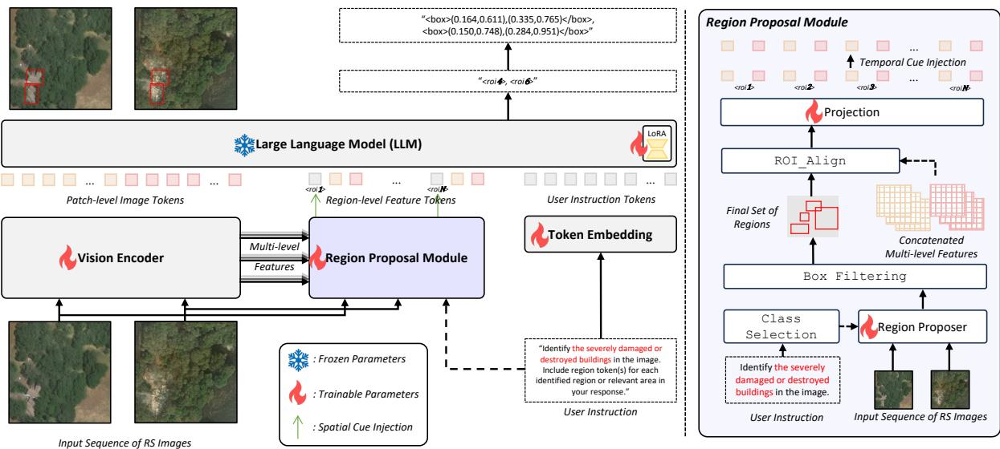  
Figure 1: Overview of our framework. Given an input sequence of RS images and a user instruction, the vision encoder extracts multi-level features. The region proposal module (right) performs text-conditioned class selection, generates region proposals, applies box filtering and ROIAlign (He et al., 2017), and projects features into region tokens with spatial and temporal cue injection. The LLM receives patch-level image tokens, region-level feature tokens, and user instruction tokens, and generates a response containing selected region tokens (e.g., <roi4>, ${ < } \mathsf { r o i } _ { 6 } { > } )$ for localization.

## 3 Method

## 3.1 Task Formulation

Region-level candidate selection has been explored in natural-image MLLMs (Ma et al., 2024; Jiang et al., 2024; Zhang et al., 2025). We adopt this paradigm and extend it to RS, where temporal image sequences and dense small objects present distinct challenges.

Given RS images $\mathcal { I } = \{ I _ { 1 } , \ldots , I _ { M } \}$ capturing the same location at different times and a text query q, the goal is to identify the spatial regions relevant to q. In the conventional approach, the model generates bounding box coordinates as a token sequence. In our formulation, a region proposal module first produces a set of candidates $\mathcal { R } = \{ r _ { 1 } , . . . , r _ { N } \}$ , and the model selects relevant ones by generating their corresponding tokens (e.g., <roi4>) within a natural language response. Each selection is a single token rather than a multi-token coordinate tuple, which not only simplifies the output space but also reduces the number of tokens the LLM must generate for multi-target localization, improving inference efficiency (Appendix G).

Beyond simplifying the output, this formulation also enriches the input: the visual features of each candidate are injected into the LLM’s context, giving the model direct access to region-level visual information that is absent in coordinate-generation approaches.

## 3.2 Region Proposal Module

Generating candidate regions for RS requires addressing two practical challenges. First, RS object detection datasets define heterogeneous class taxonomies, so the proposal mechanism must operate flexibly across diverse vocabularies. Second, using the full class set for every query leads to many irrelevant proposals.

To handle both issues, we adopt a textconditioned open-vocabulary detection architecture as the backbone of our region proposal module. Open-vocabulary detection in RS has been explored by standalone systems (Huang et al., 2025); our module serves a different role as a component within an MLLM framework, bridging the user’s natural language query to the detector’s class space. Specifically, we fine-tune MM-Grounding-DINO (Zhao et al., 2024) on five RS object detection datasets (xView(Lam et al., 2018), DIOR(Li et al., 2020), DOTA-v2.0(Ding et al., 2022), FAIR1M(Sun et al., 2022), and SODA-A(Cheng et al., 2023)), constructing a union set of 36 categories that spans diverse RS object types from vehicles and buildings to infrastructure and sports facilities (full class list in Appendix C). During detector training, only the classes present in each source dataset are provided as text prompts, allowing the model to learn vocabulary-conditioned proposal generation despite the heterogeneous annotations across datasets. At inference, we compute the semantic similarity between the user query and each class name using a sentence encoder (Wang et al., 2020), and retain only the top-ranked classes when the similarity distribution is sufficiently peaked, suppressing irrelevant proposals. The raw outputs are deduplicated, filtered through NMS, and capped at a fixed number of candidates. Further filtering details are provided in $\mathsf { A p - }$ pendix A.

## 3.3 Region Token Representation

Each candidate $r _ { k }$ is represented by a group of special tokens:

$$
\underbrace { < \Gamma { \circ } { \bf i } _ { \bf k } > } _ { \mathrm { p r o x y t o k e n } } \underbrace { < { \sf o b } { \bf j } _ { \bf k } , 1 > \ < { \sf o b } { \bf j } _ { \bf k } , 2 > \ { \mathrm {  ~ \cdot ~ } } \cdot \cdot \ < { \sf o b } { \bf j } _ { \bf k } , { \sf u } ) ^ { > } } _ { \mathrm { p e r - f r a m e ~ v i s u a l ~ f e a t u r e s } }\tag{1}
$$

Here, ${ \tt c r o i } _ { \tt k } >$ is a learnable proxy token that the LLM can generate in its output to select region $r _ { k } .$ , and each ${ < } \circ \mathsf { b j } _ { \mathsf { k , t } } { > }$ carries the visual features of $r _ { k }$ extracted from image $I _ { t } .$ . For bi-temporal tasks $\left( M { = } 2 \right)$ , each region has two visual slots, enabling the LLM to observe how the same spatial location has changed between time steps.

The visual features are obtained by extracting multi-scale intermediate representations from the vision encoder, applying ROIAlign (He et al., 2017) using each candidate’s bounding box, and projecting through a learned two-layer MLP to match the LLM’s hidden dimension. The proxy token <roik> is augmented with a spatial embedding derived from a geometry descriptor of the bounding box:

$$
\begin{array} { c } { { { \bf g } _ { k } = [ x _ { 1 } , y _ { 1 } , x _ { 2 } , y _ { 2 } , c _ { x } , c _ { y } , } } \\ { { w , h , a , \log ( w / h ) ] } } \end{array}\tag{2}
$$

$$
\begin{array} { r } { \mathbf { e } _ { < \mathsf { r o i k } > } ^ { \prime } = \mathrm { L N } \Big ( \mathrm { W T E } ( < \mathsf { r o i } _ { \mathsf { k } } > ) } \\ { + \mathbf { \boldsymbol { \alpha } } _ { g } \cdot \mathrm { G e o M L P } ( \mathbf { g } _ { k } ) \Big ) } \end{array}\tag{3}
$$

where $( x _ { 1 } , y _ { 1 } )$ and $( x _ { 2 } , y _ { 2 } )$ are the top-left and bottom-right box coordinates in normalized $[ 0 , 1 ]$ space, $\left( c _ { x } , c _ { y } \right)$ is the box center, w and h are the width and height, a is the area, and $\log ( w / h )$ encodes the aspect ratio. $\alpha _ { g }$ is a learnable scalar and LN denotes LayerNorm(Ba et al., 2016). Each visual feature is similarly augmented with a temporal embedding encoding the frame index and total

frame count:

$$
\mathbf { f } _ { k , t } ^ { \prime } = \mathrm { L N } \Bigl ( \mathbf { f } _ { k , t } + \boldsymbol { \alpha } _ { t } \cdot ( \mathbf { e } _ { t } ^ { \mathrm { i d x } } + \mathbf { e } _ { M } ^ { \mathrm { c n t } } ) \Bigr )\tag{4}
$$

where $\mathbf { f } _ { k , t }$ is the projected visual feature of region $r _ { k }$ from image $I _ { t } , \mathbf { e } _ { t } ^ { \mathrm { i d x } }$ is a learnable embedding for the frame index t (indicating which temporal position this image occupies), ${ \bf e } _ { M } ^ { \mathrm { c n t } }$ is a learnable embedding for the total number of input frames $M ,$ and $\alpha _ { t }$ is a learnable scalar analogous to $\alpha _ { g }$ . The spatial cue tells the model where each candidate is located, while the temporal cue lets it distinguish which frame a feature originates from. The enriched embeddings then replace the corresponding token positions in the LLM input.

## 3.4 Region-Aware Language Modeling

The LLM receives an input sequence consisting of image patch tokens from the vision encoder, the region token groups for all candidates, and the tokenized text query. A brief description prefix informs the model of the available region tokens and their temporal ordering.

During generation, the model produces a natural language response that may include ${ \tt c r o i } _ { \tt k } >$ tokens to indicate region selections. Each ${ \tt c r o i } _ { \tt k } >$ maps back to its candidate bounding box, yielding the localization result.

Because the model has access to per-frame visual features of the same spatial region, it can attend to both ${ < } \circ \mathsf { b } \mathsf { j } _ { \mathsf { k } , 1 } { > }$ (pre-event) and ${ < } \circ \mathbf { b } \mathbf { j } _ { \mathsf { k } , 2 } { > }$ (postevent) to assess whether region $r _ { k }$ has changed, enabling visual comparison within the LLM’s context.

## 3.5 Training

Our training data spans both multi-temporal and single-image settings. For multi-temporal tasks, TEOChatlas (Irvin et al., 2025) provides change localization (xBD (Gupta et al., 2019), S2Looking (Shen et al., 2021)), spatial referring expression, change QA, region-level QA, temporal QA (QFabric (Verma et al., 2021)), and scene classification (fMoW (Christie et al., 2018)). Additional change detection data comes from LEVIR-MCI (Liu et al., 2024a), TUE-CD (Liu et al., 2024b), and other sources (Holail et al., 2023; Shen et al., 2021). For single-image tasks, GeoChat Instruct (Kuckreja et al., 2024) provides general RS conversation, FIT-RS (Luo et al., 2024) provides fine-grained understanding, and DIOR-RSVG (Zhan et al., 2023) and OPT-RSVG (Li et al., 2024) provide visual grounding. Including scene-level QA and classification tasks ensures the model builds broad RS domain knowledge, providing the visual understanding foundation on which localization capabilities are built. Table 1 summarizes dataset usage across training stages.

<table><tr><td>Dataset Group</td><td>1</td><td>2</td><td>3</td></tr><tr><td>TEOChatlas (Irvin et al., 2025) (scene/QA)</td><td></td><td></td><td></td></tr><tr><td>TEOChatlas (region/temporal)</td><td></td><td>√</td><td>V</td></tr><tr><td>TEOChatlas (localization)</td><td></td><td>√</td><td>√</td></tr><tr><td>GeoChat Instruct (Kuckreja et al., 2024)</td><td></td><td>√</td><td></td></tr><tr><td>RSVG (Zhan et al., 2023; Li et al., 2024)</td><td></td><td></td><td>√</td></tr><tr><td>FIT-RS (Luo et al., 2024)</td><td></td><td></td><td>√</td></tr><tr><td>Additional CD (Liu et al., 2024a,b)</td><td></td><td></td><td>√</td></tr></table>

Table 1: Dataset usage across training stages (1, 2, 3).

Training proceeds in three stages (Figure 2). Stage 1 (RS domain adaptation) runs for 2 epochs on scene-level RS tasks without any region module, fine-tuning the LLM via LoRA (learning rate $2 \times 1 0 ^ { - 5 } )$ together with the visual tokenizer head and the last vision encoder block, while the remaining vision encoder layers stay frozen. Stage 2 (RPM and new token alignment training) also runs for 2 epochs and introduces the region proposal module while keeping the LLM frozen to stabilize the newly introduced parameters. In an initial phase, the region projector and ROI token embeddings are trained (learning rate $1 \times 1 0 ^ { - 4 } )$ on simple single-image region tasks so the model learns to associate region tokens with visual content. In a subsequent phase, spatial and temporal embedding components are activated, and training expands to multi-temporal and multi-target settings. Stage 3 (RS multi-task fine-tuning) runs for 2 epochs and jointly trains all components on the full task mixture at a learning rate of $2 \times 1 0 ^ { - 5 }$ The visual embedding components are selectively unfrozen alongside the LLM (via LoRA(Hu et al., 2021)), while gradient masking restricts text embedding updates to ROI-specific token rows to preserve pretrained representations. All LoRA stages use rank 64 and α=128. Additional hyperparameters are in Appendix B.

## 4 Experiments

## 4.1 Setup

We evaluate on two groups of tasks. Localization tasks (Table 2) form the core evaluation: bi-temporal building localization (LOC) on xBD (Gupta et al., 2019), which asks the model to identify all buildings from temporal image pairs; change detection localization (CDL) on S2Looking (Shen et al., 2021), which asks for changed buildings; spatial referring expression (SRE) on both datasets, which grounds a spatially described region; single-image visual grounding on DIOR-RSVG (Zhan et al., 2023), evaluated by box-level Accuracy@0.5; change detection on LEVIR-MCI (Liu et al., 2024a); and zero-shot change detection on HRCUS-CD (Zhang et al., 2023) (not in training data). All other localization tasks use pixel-level F1. Understanding tasks (Table 3) include damage classification on xBD, QA on xBD and S2Looking, temporal QA and temporal referring expression on QFabric (Verma et al., 2021), and scene classification on fMoW, evaluated by accuracy except xBD damage classification, which uses F1. Detailed task descriptions and example prompts are in Appendix D.

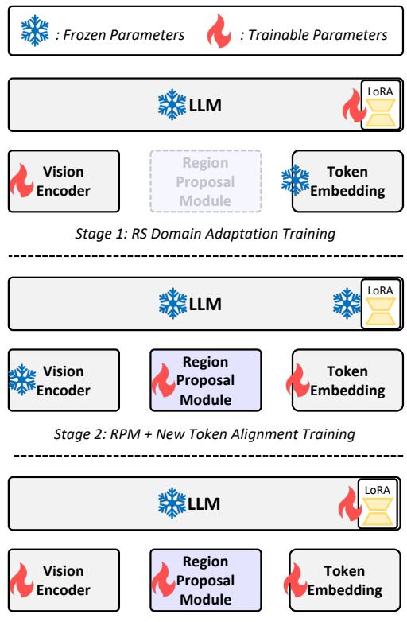  
Stage 3: RS Multi-task Fine-Tuning  
Figure 2: Stage-wise training. In Stages 1 and 3, only the visual tokenizer head and the last vision encoder block are trainable within the vision encoder.

We compare against four baselines. TEOChat (Irvin et al., 2025) is a temporal RS-MLLM with coordinate generation. EarthDial (Soni et al., 2025) is a multi-sensor, multi-temporal RS-MLLM. Qwen3-VL (Bai et al., 2025) is an off-the-shelf general-purpose MLLM without RS-specific finetuning. Ovis2.5-FT is our base model (Ovis2.5 (Lu et al., 2025)) fine-tuned on the same data with the same recipe, but without the region proposal module, using coordinate generation instead.

## 4.2 Main Results

Localization Tasks. Table 2 presents localization results across seven benchmarks. The most informative comparison is against Ovis2.5-FT, which shares the same base model, training data, and optimization recipe, differing only in the localization formulation. On xBD building localization, the gap is striking: our model achieves 69.4% F1 compared to 32.3% for Ovis2.5-FT, a 37.1-point improvement from replacing coordinate generation with the complete region-selection interface under the same base model, training data, and optimization recipe. On S2Looking change detection localization, the gap is 14.1 points (50.5 vs. 36.4). These results confirm that for multi-target temporal localization, where the model must identify many small regions simultaneously, region selection provides a substantial advantage over coordinate generation.

On DIOR-RSVG(Zhan et al., 2023) singleimage visual grounding, our model reaches 77.3% accuracy compared to 69.5% for Ovis2.5-FT, demonstrating that the benefit of region selection extends beyond temporal tasks. Spatial referring expression (SRE) shows consistent improvement: 40.2% vs. 27.6% on xBD and 49.6% vs. 36.1% on S2Looking, though absolute scores remain moderate for all models, reflecting the inherent difficulty of grounding complex spatial descriptions in RS imagery. HRCUS-CD, evaluated in a zeroshot setting (not in training data), yields 55.0% F1, and LEVIR-MCI reaches 58.8%, both surpassing the coordinate-generation baseline. Comparisons with two recent open-weight generalist MLLMs, Qwen3.5-9B (Qwen Team, 2026) and InternVL3.5- 8B (Wang et al., 2025), are reported in Appendix E, where our model leads on all five evaluated localization benchmarks.

Compared to existing RS-MLLMs, our model outperforms TEOChat (Irvin et al., 2025) on all localization benchmarks despite TEOChat having been specifically designed for temporal RS tasks. EarthDial (Soni et al., 2025) and Qwen3-VL (Bai et al., 2025) show substantially lower scores, particularly on datasets they were not trained on (marked with ∗ in the table).

Figure 3 illustrates two representative examples.

On a LEVIR-MCI (Liu et al., 2024a) scene with many changed buildings (top), Qwen3-VL (Bai et al., 2025) produces coordinates in a degenerate arithmetic pattern, while TEOChat (Irvin et al., 2025) generates many small boxes with limited coverage. On an HRCUS-CD (Zhang et al., 2023) scene (bottom, zero-shot), Qwen3-VL generates mislocated coordinates and TEOChat fails to detect any change. In both cases, our model correctly identifies the relevant regions through region token selection.

Understanding Tasks. Table 3 presents understanding results. Our model performs comparably to TEOChat (Irvin et al., 2025) on scene-level QA (xBD QA: 85.9 vs. 89.9; S2Looking QA: 74.0 vs. 73.4), confirming that the region selection interface does not degrade general understanding capabilities. On QFabric(Verma et al., 2021) temporal tasks, where region-level visual features directly aid reasoning about specific spatial regions across time, our model achieves the best results (TRE: 78.0%, RTQA: 78.6%), outperforming both TEOChat and Ovis2.5-FT. Scene classification on fMoW (73.5%) is slightly below TEOChat (75.1%) but substantially above Qwen3-VL(Bai et al., 2025) (37.3%) and EarthDial(Soni et al., 2025) (37.2%). Notably, the improvement over Ovis2.5-FT on temporal tasks (QFabric TRE: 78.0 vs. 73.5; RTQA: 78.6 vs. 75.6) suggests that regionlevel features benefit not only localization but also region-conditioned understanding.

## 4.3 Analysis

Ablation Study. Table 4 isolates the contribution of each component.

Full model vs. No ROI (Ovis2.5-FT). Reverting to coordinate generation with the same architecture and data: S2Looking(Shen et al., 2021) CDL drops from 50.5 to 36.4 and DIOR-RSVG(Zhan et al., 2023) from 77.3 to 69.5.

Full model vs. Text-coord ROI. Replacing visual features with textual coordinates while retaining selection. Change detection drops moderately (S2Looking CDL: 50.5→47.5), while DIOR-RSVG remains strong (74.7) since text coordinates suffice for spatial information in single-image tasks.

Full model vs. Visual feature only (w/o spatial and temporal cues). DIOR-RSVG drops dramatically (77.3→32.3): queries describe objects by spatial attributes (e.g., “the small ship on the right”), and without the geometry embedding the model can recognize visual content but cannot determine a candidate’s location or relative size, making it unable to match the spatial description. Separate ablations show that this drop is driven mainly by the spatial cue, while the temporal cue provides a smaller but consistent gain, with DIOR-RSVG dropping from 77.3 to 33.5 without the spatial cue. The full six-configuration grid is reported in Appendix F.

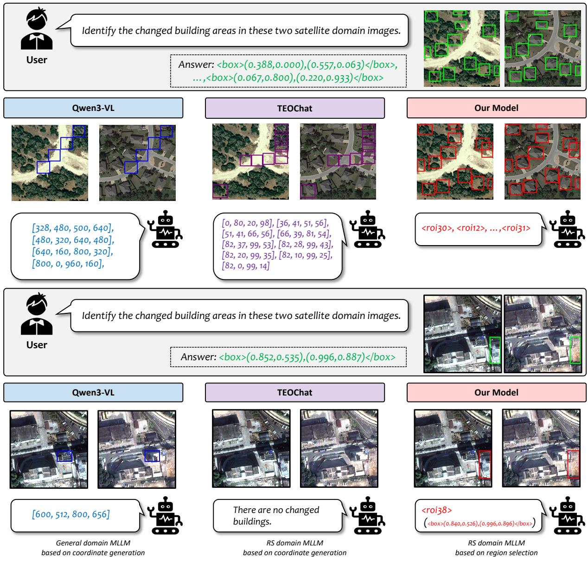  
Figure 3: Qualitative comparison of change detection localization. Top (LEVIR-MCI)(Liu et al., 2024a): Qwen3- VL(Bai et al., 2025) (coordinates normalized to 0–1000) outputs a degenerate arithmetic pattern. TEOChat(Irvin et al., 2025) (0–100) produces many small boxes. Our model identifies changed regions through region token selection. Bottom (HRCUS-CD(Zhang et al., 2023), zero-shot): Qwen3-VL generates mislocated coordinates. TEOChat fails to detect change. Our model selects <roi >. Green boxes (top-right) show ground truth (0–1 normalized).

Oracle and Proposer Recall Analysis. A distinctive advantage of the region selection framework is that it cleanly decomposes end-to-end performance into three interpretable levels: proposer recall (AR@100, measuring what fraction of ground-truth regions appear among the candidates), oracle F1 (model performance when ground-truth boxes are added to the candidate set, guaranteeing perfect recall), and standard F1 (actual end-to-end performance). Table 5 presents this decomposition.

The proposer, trained solely on five RS object detection datasets that contain no change detection annotations, generalizes remarkably well in a zero-shot manner to temporal change benchmarks: AR@100 reaches 74.3% on xBD(Gupta et al., 2019), 70.3% on S2Looking(Shen et al., 2021), 78.7% on HRCUS-CD(Zhang et al., 2023), and 87.1% on LEVIR-MCI(Liu et al., 2024a). This indicates that the unified 36-class vocabulary learned from heterogeneous RS detection datasets transfers effectively to building-centric localization tasks.

<table><tr><td>Model</td><td>Size</td><td>xBD LOC (F1)</td><td>S2Looking CDL (F1)</td><td>xBD SRE (F1)</td><td>S2Looking SRE (F1)</td><td>DIOR-RSVG Acc@0.5</td><td>HRCUS-CD F1</td><td>LEVIR-MCI F1</td></tr><tr><td>Qwen3-VL (Bai et al., 2025)</td><td>8B</td><td>17.3*</td><td>11.8*</td><td>6.7*</td><td>7.9*</td><td>53.8*</td><td>21.7*</td><td>13.3*</td></tr><tr><td>TEOChat (Irvin et al., 2025)</td><td>7B</td><td>38.9</td><td>34.5</td><td>25.1</td><td>32.9</td><td>27.6</td><td>33.3*</td><td>26.4*</td></tr><tr><td>EarthDial (Soni et al., 2025)</td><td>4B</td><td>24.1</td><td>2.6*</td><td>8.7</td><td>12.2*</td><td>39.6</td><td>4.7*</td><td>12.6*</td></tr><tr><td>Ovis2.5-FT</td><td>9B</td><td>32.3</td><td>36.4</td><td>27.6</td><td>36.1</td><td>69.5</td><td>54.4†</td><td>56.4</td></tr><tr><td>Ours</td><td>9B</td><td>69.4</td><td>50.5</td><td>40.2</td><td>49.6</td><td>77.3</td><td>55.0†</td><td>58.8</td></tr></table>

Table 2: Localization results (%). LOC: bi-temporal building localization; CDL: change detection localization; SRE: spatial referring expression. Our model achieves the best performance on all benchmarks. ∗Zero-shot (not trained on this dataset). †HRCUS-CD not in training data.

<table><tr><td colspan="4"> </td><td colspan="2">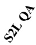</td><td colspan="2"></td></tr><tr><td>Model</td><td></td><td></td><td></td><td></td><td></td><td></td></tr><tr><td>Qwen3-VL</td><td>37.3</td><td>34.6 50.0</td><td>44.7 89.9</td><td>41.3 73.4</td><td>22.1 74.9</td><td>61.6 71.7</td></tr><tr><td>TEOChat</td><td>75.1 37.2</td><td>0.6</td><td>37.4</td><td>48.8</td><td>0.0</td><td>53.7</td></tr><tr><td>EarthDial</td><td>71.2</td><td>45.2</td><td>85.8</td><td>74.0</td><td>73.5</td><td>75.6</td></tr><tr><td>Ovis2.5-FT Ours</td><td>73.5</td><td>51.2</td><td>85.9</td><td>74.0</td><td>78.0</td><td>78.6</td></tr></table>

Table 3: Understanding results (%). xBD CDC is F1 and the remaining tasks are accuracy. CDC: change damage classification; S2L: S2Looking; QF: QFabric; TRE: temporal referring expression; RTQA: region temporal QA. Our model shows no region interface degradation and leads temporal region tasks.
<table><tr><td>Config.</td><td>S2L S2L CDL SRE</td><td>Acc</td><td>F1</td><td>RSVG LEVIR HRCUS F1</td></tr><tr><td>Full model</td><td>50.5 49.6</td><td>77.3</td><td>58.8</td><td>55.0</td></tr><tr><td>w/o spat.+temp.</td><td>39.0 39.3</td><td>32.3</td><td>56.6</td><td>41.6</td></tr><tr><td>Text-coord ROI</td><td>47.5 47.9</td><td>74.7</td><td>55.7</td><td>50.1</td></tr><tr><td>No ROI (coord gen)</td><td>36.4 36.1</td><td>69.5</td><td>56.4</td><td>54.4</td></tr></table>

Table 4: Ablation study (%). S2L: S2Looking; CDL: change detection localization; SRE: spatial referring expression; RSVG: DIOR-RSVG (Acc@0.5).

The decomposition reveals that the performance bottleneck varies by dataset. On xBD, the proposer recall is 74.3% and the standard F1 reaches 69.4%, which is close to the oracle F1 of 76.3% (gap: 6.9 points). This means the LLM selector is effective at utilizing the available candidates, and the primary ceiling comes from proposals that the detector misses. On LEVIR-MCI, in contrast, the proposer achieves the highest recall (87.1%), yet the standard F1 is only 58.8% compared to 70.0% oracle (gap: 11.2 points). Here the selector, not the proposer, is the dominant bottleneck: the detector finds most targets, but the LLM fails to select all of them correctly. On S2Looking, both the proposer recall (70.3%) and the standard-to-oracle gap (9.8 points) indicate room for improvement on both sides.

For DIOR-RSVG(Zhan et al., 2023), where the proposer was trained on DIOR(Li et al., 2020) data (marked ‡), recall is naturally higher (83.0%) and the oracle gap is small (77.3 vs. 80.7), suggesting that the framework is operating near its ceiling for this task.

This analysis provides actionable guidance: for datasets where the oracle gap is large (e.g., LEVIR-MCI), improving the LLM’s selection ability through better training data or objectives is the priority; for datasets where proposer recall is the ceiling (e.g., S2Looking), strengthening the detector or expanding its training data is more impactful. This kind of decomposition is not available in coordinate-generation models, where the quality of localization and the model’s spatial reasoning are entangled and cannot be separately diagnosed.

Temporal Comparison Diagnostics. To verify that localization reflects cross-frame comparison rather than appearance-only selection, we replace each evaluation pair with an identical pair by duplicating the post-event image into both temporal slots. Since post-event objects remain visible, an appearance-only model would still emit regions. As shown in Table 6, both the region-token emission rate and the number of predicted regions collapse to near zero on identical pairs. Reversing the actual image order changes 41.2% of responses on QFabric, whereas reversing only the frame-index embeddings changes TRE by a single point (78.0 to 77.0). This indicates that temporal behavior is driven by ordered per-frame features, and the frame-index embedding acts as a lightweight identifier.

<table><tr><td>Task</td><td>AR@100</td><td>Standard</td><td>Oracle</td></tr><tr><td>xBD LOC (F1)</td><td>74.3</td><td>69.4</td><td>76.3</td></tr><tr><td>S2Looking CDL (F1)</td><td>70.3</td><td>50.5</td><td>60.3</td></tr><tr><td>xBD SRE (F1)</td><td>74.3</td><td>40.2</td><td>50.2</td></tr><tr><td>S2Looking SRE (F1)</td><td>70.3</td><td>49.6</td><td>58.3</td></tr><tr><td>DIOR-RSVG (Acc)</td><td>83.0</td><td>77.3</td><td>80.7</td></tr><tr><td>HRCUS-CD (F1)</td><td>78.7</td><td>55.0</td><td>61.1</td></tr><tr><td>LEVIR-MCI (F1)</td><td>87.1</td><td>58.8</td><td>70.0</td></tr></table>

Table 5: Three-level performance decomposition (%). AR@100: proposer recall (fraction of GT regions found among candidates at IoU≥0.5). Standard: end-to-end model performance. Oracle: performance when GT boxes are added to the candidate set, guaranteeing perfect proposer recall. ‡Proposer trained on DIOR; all others zero-shot.
<table><tr><td rowspan="2"></td><td colspan="2">Emission rate (%)</td><td colspan="2">Avg. #regions</td></tr><tr><td>Normal</td><td>Identical</td><td>Normal</td><td>Identical</td></tr><tr><td>S2Looking</td><td>74.6</td><td>2.8</td><td>1.35</td><td>0.03</td></tr><tr><td>LEVIR-MCI</td><td>39.1</td><td>0.0</td><td>3.06</td><td>0.00</td></tr></table>

Table 6: Identical-pair control. Each test pair is replaced with a no-change pair by duplicating the post-event image into both temporal slots. Region-token emission collapses to near zero, with no emission on any of the 1,929 LEVIR-MCI pairs.

Target-Density Analysis. Coordinate generation degrades sharply as targets multiply. On LEVIR-MCI, TEOChat falls from 47.6 F1 for a single target to 26.2 for more than 20 targets, while our model remains at 58.1 in the densest bin (Table 7). Degenerate arithmetic coordinate patterns appear in 19.0% to 28.8% of Qwen3-VL outputs and in 9.7% of Ovis2.5-FT outputs. Such failure modes cannot arise under region selection, which produces discrete token choices instead of coordinate sequences.

## 5 Conclusion

We have presented an RS-specific formulation of the region selection paradigm for remote sensing localization and multi-temporal change localization. By encoding each candidate region with perframe visual features, spatial geometry, and temporal cues, the model performs localization through discrete token selection rather than coordinate generation. In controlled experiments where the only difference is the localization formulation, region selection yields substantial improvements on change detection localization and visual grounding tasks. Understanding tasks remain competitive, confirming that the region interface does not degrade general capabilities. Oracle analysis provides a clean decomposition of proposer and selector contributions, a diagnostic unique to this framework that offers concrete guidance for future improvement.

<table><tr><td>GT targets</td><td>1</td><td>2-5</td><td>6-10</td><td>11-20</td><td>&gt;20</td></tr><tr><td>TEOChat</td><td>47.6</td><td>38.9</td><td>30.6</td><td>26.9</td><td>26.2</td></tr><tr><td>Ours</td><td>51.3</td><td>60.6</td><td>59.4</td><td>59.6</td><td>58.1</td></tr></table>

Table 7: Change localization F1 on LEVIR-MCI, grouped by the number of ground-truth changed regions per sample. TEOChat degrades as targets multiply, while our model remains stable.

## Limitations

Proposer Recall Ceiling. The model can only select from candidates generated by the region proposal module; regions not proposed cannot be recovered. Our oracle analysis quantifies this ceiling and shows that it is a significant factor, particularly on S2Looking CDL (9.8-point gap) and LEVIR-MCI (11.2-point gap). Improving proposer coverage through stronger detectors, iterative proposals, or expanded training data is a natural direction for future work.

Training-Evaluation Metric Gap. The model is trained with token-level cross-entropy loss but evaluated with set-level F1 at a fixed IoU threshold. This mismatch means that predicting the correct set of regions in a different order incurs a training loss despite being equally valid. Exploring setlevel objectives or reinforcement learning with taskspecific rewards could help bridge this gap.

Future Directions. The current framework operates at the axis-aligned bounding box level. Extending it to oriented bounding boxes or pixellevel masks would broaden its applicability to a wider range of RS tasks, provided sufficient training data is available. On the temporal side, our diagnostics support region-level cross-frame comparison between aligned candidate features rather than broader temporal reasoning over long sequences, and extending the framework to longer sequences and richer temporal relations is another natural direction.

## Acknowledgments

This work was supported in part by the Institute of Information and Communications Technology Planning and Evaluation (IITP) grant funded by the Korean Government (Ministry of Science and ICT) under Grant RS-2022-II220124, and in part by the IITP grant funded by the Korean Government (Ministry of Science and ICT) under Grant RS-2022-II220984.

## References

Jimmy Lei Ba, Jamie Ryan Kiros, and Geoffrey E Hinton. 2016. Layer normalization. arXiv preprint arXiv:1607.06450.

Shuai Bai, Yuxuan Cai, Ruizhe Chen, Keqin Chen, Xionghui Chen, Zesen Cheng, Lianghao Deng, Wei Ding, Chang Gao, Chunjiang Ge, Wenbin Ge, Zhifang Guo, Qidong Huang, Jie Huang, Fei Huang, Binyuan Hui, Shutong Jiang, Zhaohai Li, Mingsheng Li, and 45 others. 2025. Qwen3-vl technical report. arXiv preprint arXiv:2511.21631.

Keqin Chen, Zhao Zhang, Weili Zeng, Richong Zhang, Feng Zhu, and Rui Zhao. 2023. Shikra: Unleashing multimodal llm’s referential dialogue magic. arXiv preprint arXiv:2306.15195.

Gong Cheng, Xiang Yuan, Xiwen Yao, Kebing Yan, Qinghua Zeng, Xingxing Xie, and Junwei Han. 2023. Towards large-scale small object detection: Survey and benchmarks. IEEE transactions on pattern analysis and machine intelligence, 45(11):13467–13488.

Gordon Christie, Neil Fendley, James Wilson, and Ryan Mukherjee. 2018. Functional map of the world. In Proceedings of the IEEE Conference on Computer Vision and Pattern Recognition, pages 6172–6180.

Mostafa Dehghani, Basil Mustafa, Josip Djolonga, Jonathan Heek, Matthias Minderer, Mathilde Caron, Andreas Steiner, Joan Puigcerver, Robert Geirhos, Ibrahim Alabdulmohsin, Avital Oliver, Piotr Padlewski, Alexey Gritsenko, Mario Luciˇ c, and´ Neil Houlsby. 2023. Patch n’ pack: Navit, a vision transformer for any aspect ratio and resolution. In Advances in Neural Information Processing Systems (NeurIPS), volume 36.

Pei Deng, Wenqian Zhou, and Hanlin Wu. 2025. Changechat: An interactive model for remote sensing change analysis via multimodal instruction tuning. In ICASSP 2025-2025 IEEE International Conference on Acoustics, Speech and Signal Processing (ICASSP), pages 1–5. IEEE.

Jian Ding, Nan Xue, Gui-Song Xia, Xiang Bai, Wen Yang, Michael Ying Yang, Serge Belongie, Jiebo Luo, Mihai Datcu, Marcello Pelillo, and Liangpei Zhang. 2022. Object detection in aerial images: A

large-scale benchmark and challenges. IEEE Transactions on Pattern Analysis and Machine Intelligence, 44(11):7778–7796.

Ritwik Gupta, Richard Hosfelt, Sandra Sajeev, Nirav Patel, Bryce Goodman, Jigar Doshi, Eric Heim, Howie Choset, and Matthew Gaston. 2019. xbd: A dataset for assessing building damage from satellite imagery. arXiv preprint arXiv:1911.09296.

Kaiming He, Georgia Gkioxari, Piotr Dollár, and Ross Girshick. 2017. Mask r-cnn. In Proceedings of the IEEE international conference on computer vision, pages 2961–2969.

Shimaa Holail, Tamer Saleh, Xiongwu Xiao, and Deren Li. 2023. Afde-net: Building change detection using attention-based feature differential enhancement for satellite imagery. IEEE Geoscience and Remote Sensing Letters, 20:1–5.

Edward J Hu, Yelong Shen, Phillip Wallis, Zeyuan Allen-Zhu, Yuanzhi Li, Shean Wang, Lu Wang, and Weizhu Chen. 2021. Lora: Low-rank adaptation of large language models. arXiv preprint arXiv:2106.09685.

Ziyue Huang, Yongchao Feng, Ziqi Liu, Shuai Yang, Qingjie Liu, and Yunhong Wang. 2025. Openrsd: Towards open-prompts for object detection in remote sensing images. In Proceedings of the IEEE/CVF International Conference on Computer Vision, pages 8384–8394.

Drew A Hudson and Christopher D Manning. 2019. Gqa: A new dataset for real-world visual reasoning and compositional question answering. In Proceedings of the IEEE/CVF conference on computer vision and pattern recognition, pages 6700–6709.

Jeremy Andrew Irvin, Emily Ruoyu Liu, Joyce Chuyi Chen, Ines Dormoy, Jinyoung Kim, Samar Khanna, Zhuo Zheng, and Stefano Ermon. 2025. Teochat: A large vision-language assistant for temporal earth observation data. In International Conference on Learning Representations.

Qing Jiang, Gen Luo, Yuqin Yang, Yuda Xiong, Yihao Chen, Zhaoyang Zeng, Tianhe Ren, and Lei Zhang. 2024. Chatrex: Taming multimodal llm for joint perception and understanding. arXiv preprint arXiv:2411.18363.

Kartik Kuckreja, Muhammad Sohail Danish, Muzammal Naseer, Abhijit Das, Salman Khan, and Fahad Shahbaz Khan. 2024. Geochat: Grounded large vision-language model for remote sensing. In Proceedings of the IEEE/CVF conference on computer vision and pattern recognition, pages 27831–27840.

Xin Lai, Zhuotao Tian, Yukang Chen, Yanwei Li, Yuhui Yuan, Shu Liu, and Jiaya Jia. 2024. Lisa: Reasoning segmentation via large language model. In Proceedings of the IEEE/CVF conference on computer vision and pattern recognition, pages 9579–9589.

Darius Lam, Richard Kuzma, Kevin McGee, Samuel Dooley, Michael Laielli, Matthew Klaric, Yaroslav Bulatov, and Brendan McCord. 2018. xview: Objects in context in overhead imagery. arXiv preprint arXiv:1802.07856.

Ke Li, Gang Wan, Gong Cheng, Liqiu Meng, and Junwei Han. 2020. Object detection in optical remote sensing images: A survey and a new benchmark. IS-PRS journal of photogrammetry and remote sensing, 159:296–307.

Ke Li, Di Wang, Haojie Xu, Haodi Zhong, and Cong Wang. 2024. Language-guided progressive attention for visual grounding in remote sensing images. IEEE Transactions on Geoscience and Remote Sensing, 62:1–13.

Chenyang Liu, Keyan Chen, Haotian Zhang, Zipeng Qi, Zhengxia Zou, and Zhenwei Shi. 2024a. Changeagent: Toward interactive comprehensive remote sensing change interpretation and analysis. IEEE Transactions on Geoscience and Remote Sensing, 62:1–16.

Yunlong Liu, Kai Zhang, Chunan Guan, Shanxin Zhang, Hong Li, Wenbo Wan, and Jiande Sun. 2024b. Building change detection in earthquake: A multiscale interaction network with offset calibration and a dataset. IEEE Transactions on Geoscience and Remote Sensing, 62:1–17.

Shiyin Lu, Yang Li, Yu Xia, Yuwei Hu, Shanshan Zhao, Yanqing Ma, Zhichao Wei, Yinglun Li, Lunhao Duan, Jianshan Zhao, Yuxuan Han, Haijun Li, Wanying Chen, Junke Tang, Chengkun Hou, Zhixing Du, Tianli Zhou, Wenjie Zhang, Huping Ding, and 23 others. 2025. Ovis2.5 technical report. arXiv preprint arXiv:2508.11737.

Junwei Luo, Zhen Pang, Yongjun Zhang, Tingzhu Wang, Linlin Wang, Bo Dang, Jiangwei Lao, Jian Wang, Jingdong Chen, Yihua Tan, and Yansheng Li. 2024. Skysensegpt: A fine-grained instruction tuning dataset and model for remote sensing vision-language understanding. arXiv preprint arXiv:2406.10100.

Chuofan Ma, Yi Jiang, Jiannan Wu, Zehuan Yuan, and Xiaojuan Qi. 2024. Groma: Localized visual tokenization for grounding multimodal large language models. In European Conference on Computer Vision, pages 417–435. Springer.

Dilxat Muhtar, Zhenshi Li, Feng Gu, Xueliang Zhang, and Pengfeng Xiao. 2024. Lhrs-bot: Empowering remote sensing with vgi-enhanced large multimodal language model. In European Conference on Computer Vision, pages 440–457. Springer.

Mubashir Noman, Noor Ahsan, Muzammal Naseer, Hisham Cholakkal, Rao Muhammad Anwer, Salman Khan, and Fahad Shahbaz Khan. 2025. Cdchat: A large multimodal model for remote sensing change description. In IGARSS 2025-2025 IEEE International Geoscience and Remote Sensing Symposium, pages 7033–7037. IEEE.

Sungjune Park, Yeongyun Kim, Se Yeon Kim, and Yong Man Ro. 2025. Remote sensing large visionlanguage model: Semantic-augmented multi-level alignment and semantic-aware expert modeling. arXiv preprint arXiv:2506.21863.

Zhiliang Peng, Wenhui Wang, Li Dong, Yaru Hao, Shaohan Huang, Shuming Ma, Qixiang Ye, and Furu Wei. 2024. Grounding multimodal large language models to the world. In International Conference on Learning Representations.

Bryan A Plummer, Liwei Wang, Chris M Cervantes, Juan C Caicedo, Julia Hockenmaier, and Svetlana Lazebnik. 2015. Flickr30k entities: Collecting region-to-phrase correspondences for richer imageto-sentence models. In Proceedings of the IEEE international conference on computer vision, pages 2641–2649.

Qwen Team. 2026. Qwen3.5: Towards native multimodal agents.

Samyam Rajbhandari, Jeff Rasley, Olatunji Ruwase, and Yuxiong He. 2020. Zero: Memory optimizations toward training trillion parameter models. In SC20: international conferencefor high performance computing, networking, storage and analysis, pages 1–16. IEEE.

Nils Reimers and Iryna Gurevych. 2019. Sentence-bert: Sentence embeddings using siamese bert-networks. In Proceedings of the 2019 conference on empirical methods in natural language processing and the 9th international joint conference on natural language processing (EMNLP-IJCNLP), pages 3982–3992.

Akashah Shabbir, Mohammed Zumri, Mohammed Bennamoun, Fahad S Khan, and Salman Khan. 2025. Geopixel: Pixel grounding large multimodal model in remote sensing. arXiv preprint arXiv:2501.13925.

Shuai Shao, Zeming Li, Tianyuan Zhang, Chao Peng, Gang Yu, Xiangyu Zhang, Jing Li, and Jian Sun. 2019. Objects365: A large-scale, high-quality dataset for object detection. In Proceedings of the IEEE/CVF international conference on computer vision, pages 8430–8439.

Li Shen, Yao Lu, Hao Chen, Hao Wei, Donghai Xie, Jiabao Yue, Rui Chen, Shouye Lv, and Bitao Jiang. 2021. S2looking: A satellite side-looking dataset for building change detection. Remote Sensing, 13(24):5094.

Yan Shu, Bin Ren, Zhitong Xiong, Danda Pani Paudel, Luc Van Gool, Begüm Demir, Nicu Sebe, and Paolo Rota. 2025. Earthmind: Leveraging cross-sensor data for advanced earth observation interpretation with a unified multimodal llm. arXiv preprint arXiv:2506.01667.

Yan Shu, Bin Ren, Zhitong Xiong, Xiao Xiang Zhu, Begüm Demir, Nicu Sebe, and Paolo Rota. 2026. Terrascope: Pixel-grounded visual reasoning for earth observation. arXiv preprint arXiv:2603.19039.

Sagar Soni, Akshay Dudhane, Hiyam Debary, Mustansar Fiaz, Muhammad Akhtar Munir, Muhammad Sohail Danish, Paolo Fraccaro, Campbell D Watson, Levente J Klein, Fahad Shahbaz Khan, and Salman Khan. 2025. Earthdial: Turning multisensory earth observations to interactive dialogues. In Proceedings ofthe IEEE/CVF Conference on Computer Vision and Pattern Recognition (CVPR).

Xian Sun, Peijin Wang, Zhiyuan Yan, Feng Xu, Ruiping Wang, Wenhui Diao, Jin Chen, Jihao Li, Yingchao Feng, Tao Xu, Martin Weinmann, Stefan Hinz, Cheng Wang, and Kun Fu. 2022. Fair1m: A benchmark dataset for fine-grained object recognition in highresolution remote sensing imagery. ISPRS Journal of Photogrammetry and Remote Sensing, 184:116–130.

Michael Tschannen, Alexey Gritsenko, Xiao Wang, Muhammad Ferjad Naeem, Ibrahim Alabdulmohsin, Nikhil Parthasarathy, Talfan Evans, Lucas Beyer, Ye Xia, Basil Mustafa, Olivier Hénaff, Jeremiah Harmsen, Andreas Steiner, and Xiaohua Zhai. 2025. Siglip 2: Multilingual vision-language encoders with improved semantic understanding, localization, and dense features. arXiv preprint arXiv:2502.14786.

Sagar Verma, Akash Panigrahi, and Siddharth Gupta. 2021. Qfabric: Multi-task change detection dataset. In 2021 IEEE/CVF Conference on Computer Vision and Pattern Recognition Workshops (CVPRW), pages 1052–1061.

Jiaqi Wang, Pan Zhang, Tao Chu, Yuhang Cao, Yujie Zhou, Tong Wu, Bin Wang, Conghui He, and Dahua Lin. 2023. V3det: Vast vocabulary visual detection dataset. In Proceedings ofthe IEEE/CVF International Conference on Computer Vision, pages 19844–19854.

Peng Wang, Shuai Bai, Sinan Tan, Shijie Wang, Zhihao Fan, Jinze Bai, Keqin Chen, Xuejing Liu, Jialin Wang, Wenbin Ge, Yang Fan, Kai Dang, Mengfei Du, Xuancheng Ren, Rui Men, Dayiheng Liu, Chang Zhou, Jingren Zhou, and Junyang Lin. 2024. Qwen2- vl: Enhancing vision-language model’s perception of the world at any resolution. arXiv preprint arXiv:2409.12191.

Weiyun Wang, Zhangwei Gao, Lixin Gu, Hengjun Pu, Long Cui, Xingguang Wei, Zhaoyang Liu, Linglin Jing, Shenglong Ye, Jie Shao, Zhaokai Wang, Zhe Chen, Hongjie Zhang, Ganlin Yang, Haomin Wang, Qi Wei, Jinhui Yin, Wenhao Li, Erfei Cui, and 56 others. 2025. Internvl3.5: Advancing open-source multimodal models in versatility, reasoning, and efficiency. arXiv preprint arXiv:2508.18265.

Wenhui Wang, Furu Wei, Li Dong, Hangbo Bao, Nan Yang, and Ming Zhou. 2020. Minilm: Deep selfattention distillation for task-agnostic compression of pre-trained transformers. Advances in neural information processing systems, 33:5776–5788.

An Yang, Anfeng Li, Baosong Yang, Beichen Zhang, Binyuan Hui, Bo Zheng, Bowen Yu, Chang Gao,

Chengen Huang, Chenxu Lv, Chujie Zheng, Dayiheng Liu, Fan Zhou, Fei Huang, Feng Hu, Hao Ge, Haoran Wei, Huan Lin, Jialong Tang, and 41 others. 2025. Qwen3 technical report. arXiv preprint arXiv:2505.09388.

Yuqian Yuan, Wentong Li, Jian Liu, Dongqi Tang, Xinjie Luo, Chi Qin, Lei Zhang, and Jianke Zhu. 2024. Osprey: Pixel understanding with visual instruction tuning. In Proceedings ofthe IEEE/CVF Conference on Computer Vision and Pattern Recognition, pages 28202–28211.

Yang Zhan, Zhitong Xiong, and Yuan Yuan. 2023. Rsvg: Exploring data and models for visual grounding on remote sensing data. IEEE transactions on geoscience and remote sensing, 61:1–13.

Yang Zhan, Zhitong Xiong, and Yuan Yuan. 2025. Skyeyegpt: Unifying remote sensing vision-language tasks via instruction tuning with large language model. ISPRS Journal of Photogrammetry and Remote Sensing, 221:64–77.

Jindou Zhang, Zhenfeng Shao, Qing Ding, Xiao Huang, Yu Wang, Xuechao Zhou, and Deren Li. 2023. Aernet: An attention-guided edge refinement network and a dataset for remote sensing building change detection. IEEE Transactions on Geoscience and Remote Sensing, 61:1–16.

Shilong Zhang, Peize Sun, Shoufa Chen, Min Xiao, Wenqi Shao, Wenwei Zhang, Yu Liu, Kai Chen, and Ping Luo. 2025. Gpt4roi: Instruction tuning large language model on region-of-interest. In European Conference on Computer Vision, pages 52–70. Springer.

Wei Zhang, Miaoxin Cai, Tong Zhang, Yin Zhuang, and Xuerui Mao. 2024. Earthgpt: A universal multimodal large language model for multisensor image comprehension in remote sensing domain. IEEE Transactions on Geoscience and Remote Sensing, 62:1–20.

Xiangyu Zhao, Yicheng Chen, Shilin Xu, Xiangtai Li, Xinjiang Wang, Yining Li, and Haian Huang. 2024. An open and comprehensive pipeline for unified object grounding and detection. arXiv preprint arXiv:2401.02361.

Yue Zhou, Mengcheng Lan, Xiang Li, Litong Feng, Yiping Ke, Xue Jiang, Qingyun Li, Xue Yang, and Wayne Zhang. 2024. Geoground: A unified large vision-language model for remote sensing visual grounding. arXiv preprint arXiv:2411.11904.

## A Region Proposal Module Details

Detection Backbone. We use MM-Grounding-DINO (Zhao et al., 2024) with a Swin-Tiny backbone as the text-conditioned detection backbone, initialized from pretrained weights on Objects365 (Shao et al., 2019), GoldG (Hudson and Manning, 2019; Plummer et al., 2015), Grit (Peng et al., 2024), and V3Det (Wang et al., 2023). We fine-tune the detection head on five RS datasets (xView (Lam et al., 2018), DIOR (Li et al., 2020), DOTA-v2.0 (Ding et al., 2022), FAIR1M (Sun et al., 2022), SODA-A (Cheng et al., 2023)) for 20 epochs with a learning rate of $5 \times 1 0 ^ { - 5 }$ and a step decay at epoch 15. The backbone and language model are frozen during this fine-tuning; only the detection stack is updated. Training uses 8 NVIDIA GeForce RTX 3090 GPUs with per-GPU batch size 1 and gradient accumulation of 4, yielding an effective batch size of 32. We select the epoch-15 checkpoint based on zero-shot recall evaluation on held-out RS detection benchmarks, conducted over the unified class vocabulary described in Appendix C.

Prompt-Aware Class Filtering. At inference, we encode the user query and all 36 class names using all-MiniLM-L6-v2 (Wang et al., 2020; Reimers and Gurevych, 2019) and compute cosine similarity between the query embedding and each class name embedding. The goal is to determine whether the query targets specific object categories (e.g., “Identify all damaged buildings” relates to building) or is too general to narrow down (e.g., “Describe the changes in this area”). When the similarity distribution is sharply peaked toward a few classes, we use only those top-ranked classes as input to the detector; otherwise, all 36 classes are used. Concretely, the filtering activates when three conditions are jointly met: (1) the highest cosine similarity score exceeds 0.35, (2) the z-score of that top score (relative to the mean and standard deviation of all 36 scores) exceeds 2.4, and (3) the standard deviation of the scores exceeds 0.06. These thresholds were tuned on a small validation set to balance between reducing irrelevant proposals and avoiding missing relevant categories. Across seven one-at-a-time threshold settings, AR@100 varied by at most 0.9 points on DIOR-RSVG and remained unchanged on S2Looking, and the filter retained the ground-truth category in 100% of activated building-centric queries and 98.9% of activated DIOR-RSVG queries.

Box Filtering. Raw proposals with detection confidence below 0.1 are discarded. If the user query references a specific region (e.g., via a bounding box annotation), the corresponding reference box is added to the candidate set with an elevated confidence score to ensure it survives subsequent filtering. Hard NMS with an IoU threshold of 0.5 is then applied to remove duplicate detections. The final candidate set is capped at 100 regions per sample. Sweeping this cap over 10, 25, 50, and 100 candidates showed that performance stabilizes beyond 50, with at most a 1.1-point variation. Reference boxes are placed at the front of the candidate list $( < r \sigma \mathrm { i } _ { 1 } > , < r \sigma \mathrm { i } _ { 2 } > , \ \ldots )$ , and the remaining candidates are shuffled per training epoch to prevent the model from learning position-dependent biases.

ROI Exposure Policy. Not all tasks require the full set of candidate regions. For localization and grounding tasks (e.g., change detection localization, visual grounding), the complete candidate set is provided to the LLM, allowing it to select among all proposals. For region-level QA or captioning, where the user query refers to a specific region (e.g., “Describe the building at $< \mathsf { r o i } _ { 3 } > ^ { , 9 } )$ only the referenced region is included, reducing input length and focusing the model’s attention. For scene-level tasks such as classification or general QA, no region tokens are provided at all, and the model operates purely on image patch tokens. This flexible policy allows the same framework to handle diverse task types without architectural changes.

## B Training Details

Our base model is Ovis2.5 (Lu et al., 2025), an open-source MLLM that integrates a nativeresolution vision transformer (NaViT(Dehghani et al., 2023)) initialized from SigLIP2 (Tschannen et al., 2025) weights with a Qwen3 (Yang et al., 2025) language model backbone. Ovis2.5 is pretrained through a multi-phase curriculum on largescale multimodal data, providing strong generalpurpose vision-language capabilities as our starting point.

All stages are trained on 8× NVIDIA A6000 GPUs using DeepSpeed ZeRO(Rajbhandari et al., 2020), bf16 precision, and gradient checkpointing. LoRA (Hu et al., 2021) is applied with rank 64, $\alpha { = } 1 2 8$ , and dropout 0.05 to all attention and feedforward projections. Region visual features are extracted from NaViT layers {6, 13, 19, 26} with 2×2 ROIAlign spatial bins. The learnable scalars $\alpha _ { g }$ and $\alpha _ { t }$ are initialized near zero. Maximum image resolution is $1 0 2 4 \times 1 0 2 4$ (fMoW: 512×512 due to memory), and maximum sequence length is 6000 tokens.

Stage 1 trains the LLM via LoRA alongside the visual tokenizer head and the last vision encoder block $( \mathrm { l r ~ 2 } \times 1 0 ^ { - 5 }$ ; ViT last block lr $5 \times 1 0 ^ { - 6 } )$ for

2 epochs with per-GPU batch size 2 and gradient accumulation 4.

Stage 2 is split into two phases with the LLM frozen throughout. Phase 1 initializes and trains only the region projector $( \mathrm { l r } 1 \times 1 0 ^ { - 4 } )$ and ROI token embeddings (lr $2 \times 1 0 ^ { - 5 } )$ . Phase 2 activates the remaining region components including the geometry MLP, temporal embeddings, LayerNorm layers, and $\alpha _ { g } / \alpha _ { t } ( \mathrm { I r } 5 { \times } 1 0 ^ { - 5 } )$ , expanding to multitemporal and multi-target tasks with per-GPU batch size 2 and gradient accumulation 4.

Stage 3 jointly trains the LLM via LoRA (lr $2 \times 1 0 ^ { - 5 } )$ and all region components (lr $5 \times 1 0 ^ { - 5 } )$ for 2 epochs on the full multi-task mixture, with per-GPU batch size 2 and gradient accumulation 4. Gradient masking restricts embedding and output projection updates to ROI-specific token rows.

## C Union Class Set for Region Proposer

See Table 8 for the 36-category union class set.

## D Dataset Summary

Table 9 summarizes training and evaluation data.

## E Comparison with Recent Generalist MLLMs

We additionally evaluate Qwen3.5-9B (Qwen Team, 2026) and InternVL3.5-8B (Wang et al., 2025), two recent open-weight generalist MLLMs of comparable parameter scale, under the same evaluation protocol and output adapters as in Section 4.1. Both models are evaluated in a zero-shot manner. Table 11 reports results on the five localization benchmarks used for this comparison, together with the models from Table 2. The stronger generalist models improve over Qwen3-VL, particularly on single-image grounding, but the gap to our model remains large on every benchmark, and change detection localization stays below 21 F1 for Qwen3.5-9B and 34 F1 for InternVL3.5-8B.

## F Full Component Ablation

Table 12 extends the ablation in Table 4 by separately removing the spatial and temporal cues, evaluated on the three benchmarks used in this analysis. Removing the spatial cue causes most of the degradation, with DIOR-RSVG falling from 77.3 to 33.5, while removing only the temporal cue leads to small but consistent drops on all three benchmarks.

## G Inference Efficiency

Table 13 compares the end-to-end inference cost of region selection and coordinate generation under identical hardware and batch settings. Region selection shortens the generated output from 39.1 to 6.4 tokens per sample on S2Looking and from 26.0 to 3.4 on DIOR-RSVG. The region proposal module adds 0.11 to 0.22 seconds per sample, and the injected region tokens add prefill rather than decoding cost. As a result, total wall-clock time drops by a factor of 4.7 to 5.3.

## H Qualitative Examples

Figure 4 presents qualitative examples of our model across five tasks. For spatial referring expression (xBD SRE, S2Looking SRE), the model correctly selects the regions matching spatial and semantic constraints from the query. For single-image visual grounding (DIOR-RSVG), it identifies the described object through region token selection. For temporal referring expression (QFabric TRE), the model identifies the correct temporal frame in which a change occurred across a multi-image sequence. For change detection localization (LEVIR-MCI CDL), it selects multiple changed building regions from a bi-temporal image pair.

<table><tr><td>#</td><td>Category</td><td>DIOR</td><td>DOTA-v2.0</td><td>FAIR1M</td><td>SODA-A</td><td>xView</td></tr><tr><td>1</td><td>airplane</td><td>1.9k</td><td>19.8k</td><td>32.1k</td><td>40.6k</td><td>1.9k</td></tr><tr><td>2</td><td>helicopter</td><td></td><td>1.2k</td><td></td><td>1.7k</td><td>0.1k</td></tr><tr><td>3</td><td>airport</td><td>0.7k</td><td>0.4k</td><td></td><td></td><td></td></tr><tr><td>4</td><td>helipad</td><td></td><td>0.2k</td><td></td><td></td><td>0.2k</td></tr><tr><td>5</td><td>aircraft hangar</td><td></td><td></td><td></td><td></td><td>0.3k</td></tr><tr><td>6</td><td>ship</td><td>27.3k</td><td>106.7k</td><td>41.9k</td><td>85.6k</td><td>8.1k</td></tr><tr><td>7</td><td>harbor</td><td>2.4k</td><td>16.6k</td><td></td><td></td><td></td></tr><tr><td>8</td><td>container crane</td><td></td><td>0.5k</td><td></td><td></td><td>0.2k</td></tr><tr><td>9</td><td>container</td><td></td><td></td><td></td><td>175.2k</td><td>2.5k</td></tr><tr><td>10</td><td>container yard</td><td></td><td></td><td></td><td></td><td>3.7k</td></tr><tr><td>11</td><td>road vehicle</td><td>13.7k</td><td>429.0k</td><td>290.4k</td><td>668.5k</td><td>441.8k</td></tr><tr><td>12</td><td>rail vehicle</td><td></td><td></td><td></td><td></td><td>7.0k</td></tr><tr><td>13</td><td>train station</td><td>0.5k</td><td></td><td></td><td></td><td></td></tr><tr><td>14</td><td>constr. equip.</td><td></td><td></td><td>26.9k</td><td>一</td><td>7.8k</td></tr><tr><td>15</td><td>vehicle yard</td><td></td><td></td><td></td><td></td><td>6.5k</td></tr><tr><td>16</td><td>building</td><td></td><td></td><td></td><td></td><td>546.4k</td></tr><tr><td>17</td><td>constr. site</td><td></td><td></td><td></td><td></td><td>1.7k</td></tr><tr><td>18</td><td>storage tank</td><td>3.1k</td><td>17.6k</td><td></td><td>45.4k</td><td>2.9k</td></tr><tr><td>19</td><td>chimney</td><td>0.6k</td><td></td><td></td><td></td><td>一</td></tr><tr><td>20</td><td>wind turbine</td><td>2.4k</td><td></td><td></td><td>33.0k</td><td></td></tr><tr><td>21</td><td>utility tower</td><td></td><td></td><td></td><td></td><td>0.9k</td></tr><tr><td>22</td><td>dam</td><td>0.5k</td><td></td><td></td><td></td><td></td></tr><tr><td>23</td><td>bridge</td><td>1.4k</td><td>4.9k</td><td>1.2k</td><td></td><td></td></tr><tr><td>24</td><td>overpass</td><td>1.3k</td><td></td><td></td><td></td><td></td></tr><tr><td>25</td><td>roundabout</td><td>一</td><td>1.4k</td><td>0.6k</td><td></td><td></td></tr><tr><td>26</td><td>road intersect.</td><td></td><td></td><td>7.0k</td><td></td><td></td></tr><tr><td>27</td><td>toll station</td><td>0.6k</td><td></td><td></td><td></td><td></td></tr><tr><td>28</td><td>service area</td><td>1.1k</td><td></td><td></td><td></td><td></td></tr><tr><td>29</td><td>baseball field</td><td>2.4k</td><td>1.6k</td><td>1.1k</td><td></td><td></td></tr><tr><td>30</td><td>basketball court</td><td>1.1k</td><td>1.3k</td><td>1.3k</td><td></td><td></td></tr><tr><td>31</td><td>soccer field</td><td></td><td>0.9k</td><td>0.9k</td><td></td><td></td></tr><tr><td>32</td><td>tennis court</td><td>4.9k</td><td>6.6k</td><td>2.9k</td><td></td><td></td></tr><tr><td>33</td><td>running track</td><td>1.2k</td><td>1.0k</td><td></td><td></td><td></td></tr><tr><td>34</td><td>swimming pool</td><td></td><td>5.5k</td><td></td><td>37.8k</td><td></td></tr><tr><td>35</td><td>golf course</td><td>0.5k</td><td></td><td></td><td></td><td></td></tr><tr><td>36</td><td>stadium</td><td>0.6k</td><td></td><td></td><td></td><td></td></tr><tr><td></td><td>Total images</td><td>11.7k</td><td>31.3k</td><td>22.9k</td><td>39.2k</td><td>14.0k</td></tr><tr><td></td><td>Total instances</td><td>68.0k</td><td>615.2k</td><td>406.2k</td><td>1087.8k</td><td>1032.1k</td></tr></table>

Table 8: Union class set for the region proposer. Since each RS detection dataset defines its own class taxonomy, we construct a unified 36-category set by merging all source vocabularies and mapping each dataset’s original classes to this shared space. Instance counts are shown per dataset; “–” indicates the category is absent.

<table><tr><td>Source</td><td>Task</td><td># Train</td><td># Eval</td><td># Imgs</td><td>Metric</td><td>Stage</td></tr><tr><td colspan="7">TEOChatlas (Irvin et al., 2025)</td></tr><tr><td>fMoW (Christie et al., 2018)</td><td>Scene classification</td><td>12,006</td><td>12,006</td><td>1-8</td><td>Acc</td><td>1,3</td></tr><tr><td>xBD (Gupta et al., 2019) (LOC)</td><td>Building localization</td><td>7,988</td><td>2,720</td><td>2</td><td>F1</td><td>2,3</td></tr><tr><td>xBD (CDC)</td><td>Damage classification</td><td>10,560</td><td>3,600</td><td>2</td><td>F1</td><td>2,3</td></tr><tr><td>xBD (SRE)</td><td>Spatial referring expr.</td><td>4,684</td><td>1,596</td><td>2</td><td>F1</td><td>2,3</td></tr><tr><td>xBD (QA/RQA)</td><td>Change QA / Region QA</td><td>29,188</td><td>9,984</td><td>2</td><td>Acc</td><td>1-3</td></tr><tr><td>S2Looking (Shen et al., 2021) (CDL)</td><td>Change localization</td><td>4,556</td><td>1,668</td><td>2</td><td>F1</td><td>2,3</td></tr><tr><td>S2Looking (SRE)</td><td>Spatial referring expr.</td><td>2,788</td><td>1,020</td><td>2</td><td>F1</td><td>2,3</td></tr><tr><td>S2Looking (QA/RQA)</td><td>Change QA / Region QA</td><td>13,676</td><td>5,012</td><td>2</td><td>Acc</td><td>1-3</td></tr><tr><td>QFabric (Verma et al., 2021)</td><td>Region/temporal QA</td><td>36,552</td><td>7,636</td><td>2-5</td><td>Acc/F1</td><td>2,3</td></tr><tr><td>GeoChat Instruct (Kuckreja et al., 2024)</td><td>RS conversation</td><td>296,097</td><td></td><td>1</td><td></td><td>1-3</td></tr><tr><td>FIT-RS (Luo et al., 2024)</td><td>Fine-grained RS</td><td>197,202</td><td></td><td>1</td><td></td><td>3</td></tr><tr><td>DIOR-RSVG (Zhan et al., 2023)</td><td>Visual grounding</td><td>17,402</td><td>7,422</td><td>1</td><td>Acc@0.5</td><td>2,3</td></tr><tr><td>OPT-RSVG (Li et al., 2024)</td><td>Visual grounding</td><td>56,455</td><td></td><td>1</td><td></td><td>2,3</td></tr><tr><td>LEVIR-MCI (Liu et al., 2024a)</td><td>Change detection</td><td>7,544</td><td>1,929</td><td>2</td><td>F1</td><td>2,3</td></tr><tr><td>HRCUS-CD (Zhang et al., 2023)†</td><td>Change detection</td><td></td><td>372</td><td>2</td><td>F1</td><td></td></tr><tr><td>Additional CD</td><td>Change detection</td><td>~20k</td><td></td><td>2</td><td>一</td><td>2,3</td></tr></table>

Table 9: Dataset summary. †Zero-shot evaluation only.

<table><tr><td>Task</td><td># Imgs</td><td>Example Prompt</td><td>Example Response</td></tr><tr><td colspan="4">Evaluation tasks</td></tr><tr><td>xBD LOC</td><td>2</td><td>Identify all the buildings in the first image. &lt;roi1&gt;, &lt;rois&gt;, &lt;rois&gt;, &lt;roi Include region token(s) for each identified region.</td><td></td></tr><tr><td>S2Looking CDL 2</td><td></td><td>Identify all changed buildings. Include re- &lt;roi₂&gt;, &lt;roi7&gt;, &lt;roi gion token(s) for each identified region. If there are no such regions, do not include any region tokens.</td><td> $_ { 1 5 } >$ </td></tr><tr><td>xBD SRE</td><td>2</td><td>Identify the destroyed buildings in this area: &lt;roi  $_ { 3 } > .$  Include region token(s) for each identified region.</td><td> ${ < } r { 0 } \mathrm { i } _ { 5 } { > } , { < } r { 0 } \mathrm { i } _ { 9 } { > }$ </td></tr><tr><td>xBD CDC</td><td>2</td><td>How severe is the damage to this building? Major damage. &lt;roi₅&gt;</td><td></td></tr><tr><td>xBD QA</td><td>2</td><td>Are there any destroyed buildings in the Yes. area? Answer with one word.</td><td></td></tr><tr><td>xBD RQA</td><td>2</td><td>How has this building  ${ \mathsf { < r o i } } _ { 3 } >$  tween the first and second image?</td><td>changed be- The building has sustained major structural damage.</td></tr><tr><td>QFabric RTQA</td><td>2-5</td><td>What change has occurred in  ${ \mathsf { < r o i } } _ { 2 } \mathrm { > }$  tween image 1 and image 3?</td><td>be- New construction has appeared.</td></tr><tr><td>QFabric TRE</td><td>2-5</td><td>In which image was the area  ${ < } r { \tt o i } _ { 5 } { > }$  developed?</td><td>first Image 3.</td></tr><tr><td>fMoW</td><td>1-8</td><td>What type of functional area is shown in this Airport. satellite image?</td><td></td></tr><tr><td>DIOR-RSVG</td><td>1</td><td>A small ship docked on the right side of the harbor.</td><td> ${ < } r { \tt o i } _ { 1 5 } { > }$ </td></tr><tr><td>LEVIR-MCI</td><td>2</td><td>Identify the changed building areas in these &lt;roi two satellite domain images.</td><td> $_ { 3 \theta } > , < r o \mathrm { i } _ { 1 2 } > , < r o \mathrm { i } _ { 3 1 } >$ </td></tr><tr><td colspan="4">Training-only tasks</td></tr><tr><td>GeoChat Instruct 1</td><td></td><td>Can you describe what you see in this satel- The image shows a residential area with sev- lite image?</td><td>eral low-rise buildings and tree cover along the streets.</td></tr><tr><td>FIT-RS</td><td>1</td><td>Describe the objects and layout visible in A large industrial complex is visible in the this remote sensing image in detail.</td><td>center, surrounded by storage tanks and con- nected by roads to a nearby port facility.</td></tr><tr><td>OPT-RSVG</td><td>1</td><td>The red-roofed building in the northeast cor- ner of the residential block.</td><td> ${ < } r { \circ } \mathrm { i } _ { 8 } { > }$ </td></tr><tr><td>Region Captioning 2</td><td></td><td>Describe the building at  ${ \mathrm { c r o i } } _ { 3 } > .$ </td><td>The building at &lt;roi₃&gt; appears to be a two-story residential structure with a light- colored roof.</td></tr><tr><td>Grounded Desc.</td><td>2</td><td>Describe how the buildings have changed. Buildings at &lt;roi₂&gt; and &lt;roi7&gt; show sig- Include region token(s) for each identified nificant structural damage, while the area at region.</td><td> ${ \tt c r o i } _ { 1 1 } >$  remains intact.</td></tr></table>

Table 10: Example prompts and responses for evaluation and training-only tasks. Region tokens $( < r \circ \mathrm { i } _ { \mathsf { k } } > )$ refer to candidate regions from the region proposal module. In practice, prompts are preceded by image tokens and a system prefix describing available region tokens.

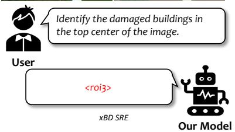

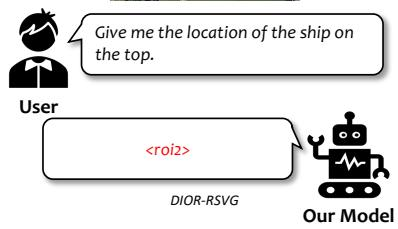

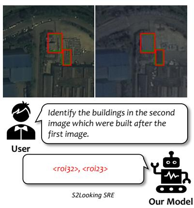

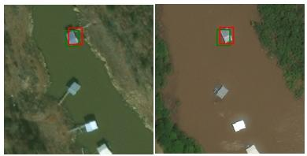

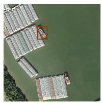

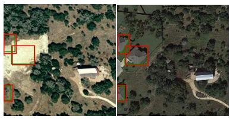

Identify all images in which a construction project was begun in this region referred region from the previous image.

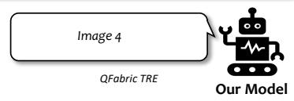

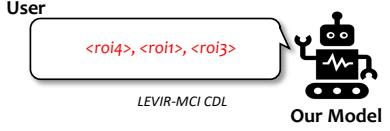  
Figure 4: Qualitative examples across five tasks. Top row: xBD SRE (bi-temporal spatial referring expression), DIOR-RSVG (single-image visual grounding), and S2Looking SRE (bi-temporal spatial referring expression). Bottom row: QFabric TRE (temporal referring expression over four images) and LEVIR-MCI CDL (bi-temporal change detection localization). In all cases, the model produces region token selections that correctly correspond to the queried targets, and identifies the correct temporal frame in which a change occurred across a multi-image sequence.

<table><tr><td>Model</td><td>xBD LOC</td><td>S2Looking CDL</td><td>DIOR-RSVG Acc@0.5</td><td>HRCUS F1</td><td>LEVIR F1</td></tr><tr><td>Qwen3-VL</td><td>17.3*</td><td>11.8*</td><td>53.8*</td><td>21.7*</td><td>13.3*</td></tr><tr><td>Qwen3.5-9B</td><td>22.8*</td><td>12.5*</td><td>58.3*</td><td>20.8*</td><td>21.2*</td></tr><tr><td>InternVL3.5-8B</td><td>27.2*</td><td>20.3*</td><td>69.0*</td><td>33.2*</td><td>26.4*</td></tr><tr><td>TEOChat</td><td>38.9</td><td>34.5</td><td>27.6</td><td>33.3*</td><td>26.4*</td></tr><tr><td>EarthDial</td><td>24.1</td><td>2.6*</td><td>39.6</td><td>4.7*</td><td>12.6*</td></tr><tr><td>Ovis2.5-FT</td><td>32.3</td><td>36.4</td><td>69.5</td><td>54.4†</td><td>56.4</td></tr><tr><td>Ours</td><td>69.4</td><td>50.5</td><td>77.3</td><td>55.0†</td><td>58.8</td></tr></table>

Table 11: Localization results (%) on the five benchmarks evaluated for the generalist comparison. ∗Zeroshot (not trained on this dataset). †HRCUS-CD not in training data.

<table><tr><td>Configuration</td><td>S2L CDL</td><td>DIOR-RSVG</td><td>LEVIR</td></tr><tr><td>Full model</td><td>50.5</td><td>77.3</td><td>58.8</td></tr><tr><td>w/o temp. cue</td><td>50.1</td><td>76.1</td><td>58.0</td></tr><tr><td>w/o spat. cue</td><td>39.2</td><td>33.5</td><td>56.5</td></tr><tr><td>w/o spat.+temp. cues</td><td>39.0</td><td>32.3</td><td>56.6</td></tr><tr><td>Text-coordinate selection</td><td>47.5</td><td>74.7</td><td>55.7</td></tr><tr><td>Coordinate generation</td><td>36.4</td><td>69.5</td><td>56.4</td></tr></table>

Table 12: Component ablation over all six configurations. Text-coordinate selection replaces region feature tokens with textual coordinates of the candidates, and coordinate generation is the No ROI baseline from Table 4.

<table><tr><td></td><td colspan="2">S2Looking</td><td colspan="2">DIOR-RSVG</td></tr><tr><td></td><td>Coord.</td><td>Region</td><td>Coord.</td><td>Region</td></tr><tr><td>Output tokens / sample</td><td>39.1</td><td>6.4</td><td>26.0</td><td>3.4</td></tr><tr><td>Total time (s / sample)</td><td>6.75</td><td>1.27</td><td>4.18</td><td>0.89</td></tr></table>

Table 13: Inference efficiency of coordinate generation (Coord.) and region selection (Region). Total time includes the region proposal module, which adds 0.11 to 0.22 seconds per sample.