# GALoc: Gravity Aligned Wireframes for Depth-Free Monocular Floorplan Localization

Jeahn Han1, Minji Kim1, Jeongbin Sohn1, Jonghyeok Park2, Matthias Wuest ¨ 3, and Pyojin Kim1 1GIST 2KAIST 3Zurich University of Applied Sciences

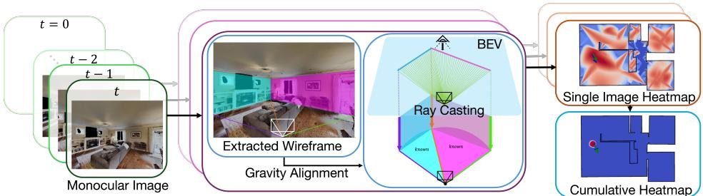  
Fig. 1: Overview of GALoc, multi-view floorplan matching for localizing SE(2) camera poses with gravity-aligned wireframes. GALoc uses gravity-aligned wireframes and wall junctions from RGB images to get bird’s-eye-view (BEV) rays. GALoc matches them against a floorplan with SE(2) search and sequential fusion to achieve precise floorplan localization.

Abstract— Floorplans are compact, appearance-invariant maps ideal for indoor localization, yet existing methods rely on depth networks that are brittle in cluttered scenes. We propose GALoc, a geometry-first framework that replaces depth prediction with gravity-aligned wireframes that satisfy verticality and coplanarity by construction. Given monocular RGB, camera intrinsics, relative poses, and IMU orientation, GALoc constructs a linear constraint matrix encoding verticality and coplanarity, and finds the camera gauge minimizing its smallest singular value via global search. The rectified wireframes are projected into bird’s-eye-view layouts through a closedform, FOV-consistent transformation and matched against the floorplan via metric-free SE(2) search. We evaluate end-toend on Structured3D, with calibrated noise on Gibson, and on real-world author-collected sequences. When sufficient wall geometry is visible, GALoc matches or outperforms depthbased baselines — achieving 88% sequential localization success at 0.1m over 100-step sequences on Gibson vs the baseline’s 68% — while abstaining in structure-blind scenes.

## I. INTRODUCTION

Visual localization underpins 3D reconstruction [1], augmented reality [2], and autonomous navigation [3], yet classical approaches based on feature matching [4] or depthderived point clouds [5] require dense reconstructions or pre-built maps that degrade under appearance changes. Floorplan-based localization [6], [7], [8], [9] sidesteps these costs: floorplans are compact, appearance-invariant, and encode structural geometry without per-scene retraining.

However, existing floorplan methods still route through depth—whether from RGB-D sensors [10] or learned networks [11]—matching predicted depth to floorplan structure. This coupling is fragile: in cluttered environments furniture is mistaken for walls, and in unseen or low-texture scenes depth regressors extrapolate poorly. The core issue is that depth is an intermediate representation the task does not require; what we need is the geometric structure of walls.

We present GALoc, a depth-free monocular framework that replaces depth prediction with gravity-aligned wireframes (Figure 1). Our key insight (Section III-C) is that gravity alignment can be cast as an analytical null-space search: we build a linear constraint matrix from 2D wireframe junctions encoding verticality and coplanarity, then recover the unknown camera gauge as the angle minimizing its smallest singular value. The recovered 3D wireframe satisfies both constraints exactly by construction, without depth supervision, and is projected into a bird’s-eye-view (BEV) layout matched against the floorplan via metric-free SE(2) search. Our contributions are:

• Null Space Gravity-Aligned Rectification: a 1D gauge search over yaw selecting the angle minimizing the smallest singular value of the architectural constraint matrix, without depth regression.

• Field-of-View Consistent BEV Transformation: From rectified wireframes and FOV, we derive a closedform, scale-free BEV translation using an inscribedangle constraint that guarantees FOV consistency.

Notably, GALoc requires no learned depth, no semantic annotations, and no panoramic input at the cost of a wireframe extractor (Table II).

## II. RELATED WORKS

From Dense Maps to Floorplans. Visual localization methods trade off map richness against map cost: image retrieval [12] scales well but depends on database coverage; SfM [1], [13] yields 3D maps that must be rebuilt when scenes change; and learning-based methods [14], [15] remain scene-specific. All incur recurring costs, motivating floorplans as an alternative.

Floorplan Localization. Floorplan-based methods infer SE(2) poses by aligning images to architectural maps [6], [16]. Early approaches match LiDAR or RGB-D depth rays to the floorplan [5], [17], while layoutmatching methods extract room edges from RGB [18], [3]. RGB-only methods learn image–floorplan compatibility: LaLaLoc/LaLaLoc++ [7], [8] via shared embeddings, LASER [9] via pose-conditioned descriptors, [19] via a fully geometric method, and F3Loc [11] via learned wall-distance rays—trained to regress floorplan-supervised depth that sees through clutter—fused in a histogram filter. Subsequent work enriches this depth-ray model with semantic labels [20], foundation-model depth [21], 3D geometric priors [22], or uncertainty [23], but all retain depth as the core representation. We replace depth with wireframe geometry.

Sequential Localization. Temporal fusion improves robustness via Bayesian filtering [24]: particle filters [25], [3], histogram filters [26], and F3Loc [11] all fuse depth-derived observations sequentially. We adopt the same histogramfilter backbone but feed it depth-free geometric observations, showing that the observation model is the limiting factor.

Room Layout Estimation. The field has progressed from Manhattan-world vanishing points [27] through CNN-based prediction [28] to direct polygon extraction [29], [30]. We employ PolygonHGT [30] as our front-end.

Gravity Alignment. Many systems—including F3Loc [11]—apply a homography for gravity alignment, which rectifies the image without imposing verticality or coplanarity on the recovered geometry. We instead formulate alignment as a null-space search over depths (Section III-C), yielding a 3D structure where both hold by construction, without depth supervision.

## III. FLOORPLAN LOCALIZATION

Problem Definition. Given a temporal sequence of k+1 monocular RGB images $\mathcal { T } ~ = ~ \{ I _ { \tau } ~ | ~ \tau ~ \in ~ \{ t - k , \ldots , t \} \}$ with known camera intrinsics $K$ , relative poses, and gravity directions (roll/pitch) from an IMU, we seek the ${ \mathrm { S E } } ( 2 )$ camera pose $s _ { t } = [ s _ { x , t } , s _ { y , t } , s _ { \phi , t } ]$ within a wall-only floorplan, represented as a set of 2D line segments encoding walls.

Overview. Figure 2 illustrates our pipeline. We extract wireframes from each frame (Section III-A) and complete truncated wall cycles (Section III-B). Our core contribution is a null space gravity alignment that recovers gravity-aligned 3D wireframes via null-space search—without depth regression (Section III-C). The rectified wireframe is projected into a bird’s-eye-view layout with a closed-form FOV-consistent transformation (Section III-D), raycast against the floorplan and fused over time in a histogram filter (Section III-E). Section III-C & Section III-D are our main contributions.

## A. Wireframe Extraction

We employ PolygonHGT [30], a wireframe extractor, to obtain wall structure from each RGB image. It returns the pixel coordinates of wall junctions, a connectivity matrix defining edges between them, and ceiling/floor labels for each junction. We measure wireframe quality via intersection over union, Io $\mathrm { J } ( M , \hat { M } ) = | M \cap \hat { M } | / | M \cup \hat { M } |$ |, between the ground-truth layout mask M and the predicted mask Mˆ .

## B. From Truncated Cycles to Full Wall Corners

Each visible wall panel is a four-corner cycle. We denote true junctions (actual corners) as $j _ { \mathrm { t r u e } }$ . Corners truncated by the image boundary are completed via line intersections and a vanishing direction for well-posed cases $( j _ { \mathrm { t r u e } } \in \{ 2 , 3 \} ) \colon$ under-constrained cases $( j _ { \mathrm { t r u e } } \le 1 )$ are left unchanged. Each completed cycle receives ceiling (P) and floor (Q) labels and a horizontal FOV arc label—known (K) if all four corners are recovered, otherwise unknown (U) (Figure 3).

## C. Null Space Gravity Alignment

Formulation. We formulate gravity alignment as a nullspace search rather than an optimization over reprojection error. Given the 2D wireframe junctions, we construct a linear constraint matrix A(θ) encoding verticality and coplanarity (Table I); a valid 3D structure exists only where $A ( \theta )$ is rank-deficient. GALoc proceeds in two stages: Stage 1 estimates the yaw gauge ˆθ = arg minθ $\sigma _ { \mathrm { m i n } } ( A ( \theta ) )$ , and Stage 2 fixes ˆθ and recovers the structure as the unit-norm minimizer $\hat { Z } \ = \ \mathrm { a r g } \mathrm { m i n } _ { \| Z \| = 1 } \| A ( \hat { \boldsymbol { \theta } } ) Z \| \ = \ \mathbf { v } _ { N }$ , in closed form via Eckart–Young–Mirsky. The constraints therefore fix the admissible form of the wireframe rather than being solved for, as in a minimal solver [31].

Coordinate Frame. We adopt the standard camera convention: x right, y down, z into the scene (optical axis). Given an IMU-corrected rotation $R _ { \mathrm { r p } }$ that removes roll and pitch, the residual unknown is a single yaw angle θ about gravity. The full camera-to-world rotation is $R ( \theta ) \ : = \ : R _ { y } ( \theta ) R _ { \mathrm { r p } }$ where $R _ { y } ( \theta )$ is a rotation about the gravity-aligned y-axis. For each ceiling $( P _ { i } )$ and floor $( Q _ { i } )$ junction with pixel coordinates $\tilde { \mathbf { u } } _ { i } ^ { P }$ and $\bar { \mathbf { u } } _ { i } ^ { Q }$ , we define gauge-dependent observation rays:

$$
\widetilde { \mathbf { r } } _ { i } ^ { P } ( \boldsymbol { \theta } ) = R ( \boldsymbol { \theta } ) K ^ { - 1 } \widetilde { \mathbf { u } } _ { i } ^ { P } , \quad \widetilde { \mathbf { r } } _ { i } ^ { Q } ( \boldsymbol { \theta } ) = R ( \boldsymbol { \theta } ) K ^ { - 1 } \widetilde { \mathbf { u } } _ { i } ^ { Q } .\tag{1}
$$

We suppress the θ-dependence in the notation below for readability. Every ray $\tilde { \mathbf { r } } = ( \tilde { r } _ { x } , \tilde { r } _ { y } , \tilde { r } _ { z } ) ^ { \top }$ follows the $( x , y , z )$ convention defined above.

Depth Parameterization. Each ceiling point $\begin{array} { r l } { P _ { i } } & { { } = } \end{array}$ $[ x _ { i } ^ { \bar { P } } , y _ { i } ^ { P } , z _ { i } ^ { P } ] ^ { \top }$ lies along its observation ray at an unknown scalar depth:

$$
P _ { i } = Z _ { P _ { i } } \tilde { \mathbf { r } } _ { i } ^ { P } ,\tag{2}
$$

where $Z _ { P _ { i } } \mathrm { ~  ~ { ~ > ~ } ~ } 0$ is the depth (scale along the ray) in the camera frame. Recall that each ray $\begin{array} { r l } { \tilde { \mathbf { r } } _ { i } ^ { B } ( \theta ) } & { { } = } \end{array}$ $R ( \theta ) K ^ { - 1 } [ u _ { i } ^ { B } , v _ { i } ^ { B } , 1 ] ^ { \top }$ from Equation (1). The k coordinate $( k \in \{ x , y , z \} )$ of a 3D point Bi $( B \in \{ P , Q \} )$ is then

$$
k _ { i } ^ { B } = \tilde { r } _ { i , k } ^ { B } Z _ { B _ { i } } ,\tag{3}
$$

where $\tilde { r } _ { i , k } ^ { B }$ denotes the k-th component of $\tilde { \mathbf { r } } _ { i } ^ { B }$ . We now eliminate the floor depth $Z _ { Q }$ as an independent variable. A vertical wall requires $P _ { i }$ and $Q _ { i }$ to share the same $z -$ coordinate:

$$
\begin{array} { r l r } & { } & { z _ { i } ^ { P } = z _ { i } ^ { Q } \quad \Rightarrow \quad Z _ { P _ { i } } \tilde { r } _ { i , z } ^ { P } = Z _ { Q _ { i } } \tilde { r } _ { i , z } ^ { Q } } \\ & { \Rightarrow \quad Z _ { Q _ { i } } = \frac { \tilde { r } _ { i , z } ^ { P } } { \tilde { r } _ { i , z } ^ { Q } } Z _ { P _ { i } } = \lambda _ { i } Z _ { P _ { i } } , \lambda _ { i } \triangleq \frac { \tilde { r } _ { i , z } ^ { P } } { \tilde { r } _ { i , z } ^ { Q } } . } \end{array}\tag{4}
$$

Substituting back, the floor point is

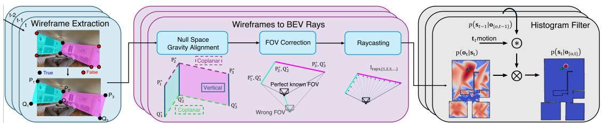  
Fig. 2: Our pipeline uses a wireframe extractor (Section III-A) and corner completion algorithm (Section III-B) to obtain full walls. These walls are gravity-aligned so that verticality and coplanarity hold by construction (Section III-C) yielding an accurate BEV representation. We then determine the wall–pose relationship based on the FOV (Section III-D), perform raycasting on the BEV walls and use the resulting rays for floorplan localization (Section III-E).

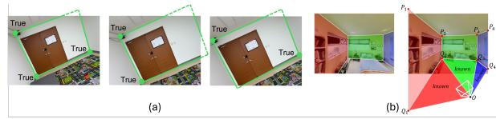

Fig. 3: (a) Truncated cycle completion for $j _ { \mathrm { t r u e } } = 3 ~ ( \mathrm { l e f t } )$ $j _ { \mathrm { t r u e } } ~ = ~ 2$ adjacent (middle), and $j _ { \mathrm { t r u e } } ~ = ~ 2$ non-adjacent (right). (b) After extraction (left), truncated sections are extended (right) and FOV regions are labeled as known (K) or unknown (U).  
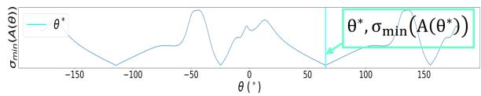  
Fig. 4: Gauge estimation. The gauge $\hat { \theta }$ minimizes $\sigma _ { \mathrm { m i n } } ( A ( \theta ) )$ , which exhibits four minima at $\frac { \pi } { 2 }$ intervals.

$$
Q _ { i } = \lambda _ { i } Z _ { P _ { i } } { \tilde { \mathbf { r } } } _ { i } ^ { Q } .\tag{5}
$$

The structure recovery problem reduces to finding the vector $Z = [ Z _ { P _ { 1 } } , \ldots , Z _ { P _ { N } } ] ^ { \dagger }$ , where N is the number of ceiling– floor vertical pairs as the variable $Z _ { Q _ { i } } = \lambda _ { i } Z _ { P _ { i } }$ is now a function of $Z _ { P _ { i } }$

Architectural Constraints. We derive three families of linear constraints on $Z$ from indoor geometry. These constraints are shown in Table I.

(i) Verticality (x-coordinate). A vertical wall requires the ceiling and floor points to also share the same x-coordinate:

$$
x _ { i } ^ { P } = x _ { i } ^ { Q } \Rightarrow Z _ { P _ { i } } \tilde { r } _ { i , x } ^ { P } = \lambda _ { i } Z _ { P _ { i } } \tilde { r } _ { i , x } ^ { Q } \Rightarrow \left( \tilde { r } _ { i , x } ^ { P } - \lambda _ { i } \tilde { r } _ { i , x } ^ { Q } \right) Z _ { P _ { i } } = 0 . _ { ( 6 ) }\tag{6}
$$

This row involves the single unknown $Z _ { P _ { i } }$ , the floor depth having been eliminated via $Z _ { Q _ { i } } = \lambda _ { i } Z _ { P _ { i } }$ (Equation (4)): the ceiling and floor rays enter through the single coefficient $( \tilde { r } _ { i , x } ^ { P } \ - \ \lambda _ { i } \tilde { r } _ { i , x } ^ { Q } )$ rather than through separate columns of $A ( { \dot { \theta } } )$ . This coefficient depends on $\theta$ but vanishes at the correct gauge regardless of $Z _ { P _ { i } }$ , so this row constrains θ rather than the structure. The rows are nonetheless retained for two reasons: they sharpen the $\sigma _ { \mathrm { m i n } }$ basin, aiding Brent convergence; and under noise $( { \hat { \theta } } \ \neq \ \theta ^ { * } )$ the coefficient is small but nonzero. So they enter the EYM projection and shape the recovered depths jointly with the coplanarity constraints. Without them, nothing in $A ( \theta )$ couples the $x \mathrm { - }$ coordinates of matched ceiling/floor points, and $Z$ is fit by coplanarity alone.

TABLE I: Architectural constraints forming $A ( \theta ) Z ~ = ~ 0 .$ Here $Z = [ Z _ { P _ { 1 } } , \ldots , Z _ { P _ { N } } ] ^ { \top }$ are depths in the camera frame, $\lambda _ { i } = \tilde { r } _ { i , z } ^ { P } / \tilde { r } _ { i , z } ^ { Q }$ couples each floor depth to its ceiling depth (Equation (4)), and all rays $\widetilde { \mathbf { r } } _ { i } ^ { P , Q } ( \theta )$ depend on the unknown yaw θ via Equation (1).

Constraint Geometry Linear row in Z Verticality $\overline { { { x _ { i } ^ { P } } = x _ { i } ^ { Q } \qquad ( \tilde { r } _ { i , x } ^ { P } - \lambda _ { i } \tilde { r } _ { i , x } ^ { Q } ) Z _ { P _ { i } } = 0 } }$ Ceiling coplanarity $\begin{array} { r l } { y _ { i } ^ { P } = y _ { i + 1 } ^ { P } } & { { } \tilde { r } _ { i , y } ^ { P } Z _ { P _ { i } } - \tilde { r } _ { i + 1 , y } ^ { P } Z _ { P _ { i + 1 } } = 0 } \end{array}$ Floor coplanarity $y _ { i } ^ { Q } = y _ { i + 1 } ^ { Q } \tilde { r } _ { i , y } ^ { Q } \lambda _ { i } Z _ { P _ { i } } - \tilde { r } _ { i + 1 , y } ^ { Q } \lambda _ { i + 1 } Z _ { P _ { i + 1 } } = 0$

(ii) Ceiling coplanarity (y-coordinate). All ceiling points lie on a horizontal plane, so adjacent ceiling points $P _ { i }$ and $P _ { i + 1 }$ share the same height:

$$
\begin{array} { r l r } { y _ { i } ^ { P } = y _ { i + 1 } ^ { P } } & { \Rightarrow } & { Z _ { P _ { i } } \tilde { r } _ { i , y } ^ { P } = Z _ { P _ { i + 1 } } \tilde { r } _ { i + 1 , y } ^ { P } } \\ { \Rightarrow } & { { } \tilde { r } _ { i , y } ^ { P } Z _ { P _ { i } } - \tilde { r } _ { i + 1 , y } ^ { P } Z _ { P _ { i + 1 } } = 0 . } \end{array}\tag{7}
$$

(iii) Floor coplanarity (y-coordinate). Similarly, all floor points share a common height. Substituting $Z _ { Q _ { i } } = \lambda _ { i } Z _ { P _ { i } }$ from Equation (4):

$$
\begin{array} { r l r } { y _ { i } ^ { Q } = y _ { i + 1 } ^ { Q } } & { \Rightarrow } & { \lambda _ { i } Z _ { P _ { i } } \tilde { r } _ { i , y } ^ { Q } = \lambda _ { i + 1 } Z _ { P _ { i + 1 } } \tilde { r } _ { i + 1 , y } ^ { Q } } \\ { } & { } & { \Rightarrow \tilde { r } _ { i , y } ^ { Q } \lambda _ { i } Z _ { P _ { i } } - \tilde { r } _ { i + 1 , y } ^ { Q } \lambda _ { i + 1 } Z _ { P _ { i + 1 } } = 0 . } \end{array}\tag{8}
$$

For N vertical wall pairs, N verticality rows, N−1 ceiling coplanarity rows, and $N - 1$ floor coplanarity rows in Table I, form the $( 3 N { - } 2 ) \times N$ matrix $A ( \theta )$

BEV projection (Section III-D) requires the full depth vector $Z ,$ not just the gauge θ; we therefore retain Z as an explicit variable, so a single SVD of $A ( \theta )$ couples gauge estimation and structure recovery. Eliminating $Z$ via crossmultiplication is less practical: $\sigma _ { \mathrm { m i n } } ( A ( \theta ) )$ is defined implicitly as the smallest root of det $( A ^ { \top } A - \lambda I ) = 0 \quad$ , which is non-polynomial in $\theta ,$ and algebraic elimination via resultants yields a univariate polynomial of degree $O ( N ^ { 2 } )$ offering no practical advantage over our 360-point scan below.

Gauge Estimation. At the correct yaw $\theta ^ { * }$ , the architectural constraints are simultaneously satisfiable with ideal pixel coordinates: a non-trivial structure $Z \neq 0$ exists such that $A ( \theta ^ { * } ) Z = 0$ . Equivalent to $A ( \theta ^ { * } )$ being rank-deficient:

$$
\exists Z \neq 0 : \ A ( \theta ) Z = 0 \quad \Longleftrightarrow \quad \sigma _ { \mathrm { m i n } } \big ( A ( \theta ) \big ) = 0 .\tag{9}
$$

When noise-free, $\sigma _ { \mathrm { m i n } } ( A ( \theta ^ { * } ) ) ~ = ~ 0 .$ . Under pixel noise, the rays $\tilde { \mathbf { r } } _ { i } ^ { P , Q }$ are perturbed and $A ( \theta )$ becomes generically full-rank for all $\theta ;$ no angle makes the constraints exactly

satisfiable. We recover the best gauge by finding the angle that minimizes the smallest singular value $( \sigma _ { m i n } ( A ( \theta ) ) ) \colon$

$$
\hat { \theta } \ : = \ : \arg \operatorname* { m i n } _ { \theta \in [ - \pi , \pi ] } \ : \sigma _ { \operatorname* { m i n } } \bigl ( A ( \theta ) \bigr ) .\tag{10}
$$

The landscape $\sigma _ { \mathrm { m i n } } ( A ( \theta ) )$ has four minima at $\frac { \pi } { 2 }$ spacing. Since $R _ { y } ( \theta )$ fixes the y-component of every ray, θ enters $A ( \theta )$ only through the verticality rows and through $\lambda _ { i }$ in the floor-coplanarity rows. A yaw of $\pi$ maps $\tilde { \textbf { r } } \mapsto$ $( - \tilde { r } _ { x } , \tilde { r } _ { y } , - \tilde { r } _ { z } ) { : \lambda _ { i } }$ is invariant, both coplanarity families are unchanged, and the verticality rows negate, so $A ( \theta + \pi ) =$ $D A ( \theta )$ with $D = \mathrm { d i a g } ( \pm 1 )$ orthogonal. The spectrum is therefore exactly π-periodic, for every θ and every noise level, and a $1 8 0 ^ { \circ }$ -rotated room is algebraically indistinguishable. A yaw of $\frac { \pi } { 2 }$ maps $\tilde { \mathbf { r } } \mapsto ( \tilde { r } _ { z } , \tilde { r } _ { y } , - \tilde { r } _ { x } )$ , so $\begin{array} { r l } { \lambda _ { i } ( \theta + \frac { \pi } { 2 } ) = ~ } & { { } } \end{array}$ $\tilde { r } _ { i , x } ^ { P } / \tilde { r } _ { i , x } ^ { Q } .$ . At the true gauge a vertical wall satisfies $x _ { i } ^ { P } = x _ { i } ^ { Q }$ as well as $z _ { i } ^ { P } = z _ { i } ^ { Q }$ , forcing $\tilde { r } _ { i , x } ^ { P } / \tilde { r } _ { i , x } ^ { Q } = Z _ { Q _ { i } } / Z _ { P _ { i } } = \lambda _ { i } ( \theta ^ { * } )$ the coplanarity rows are again unchanged while the verticality coefficient $\tilde { r } _ { i , z } ^ { P } - \lambda _ { i } \tilde { r } _ { i , z } ^ { Q }$ vanishes. Hence $\begin{array} { r l r } { A ( \theta ^ { * } + { \frac { \pi } { 2 } } ) = } \end{array}$ $A ( \theta ^ { * } )$ in the noise-free case—the solver cannot distinguish facing a wall head-on from looking along it. The $\frac { \pi } { 2 }$ structure makes the search global: $\textbf { a } 1 ^ { \circ }$ scan of $\sigma _ { \mathrm { m i n } }$ over $[ - \pi , \pi ]$ brackets four minima, and Brent refinement [32] within a $\pm 1 ^ { \circ }$ bracket recovers sub-degree precision.

Structure Recovery Using Null Space Gravity Alignment. $\operatorname { A t } { \hat { \theta } } ,$ the matrix $A ( { \hat { \theta } } )$ is full-rank due to noise—the architectural constraints are only approximately satisfied. We enforce exact constraint satisfaction via the Eckart–Young–Mirsky (EYM) theorem [33]. Let $\boldsymbol { A } ( \hat { \boldsymbol { \theta } } ) = \boldsymbol { U } \boldsymbol { \Sigma } \boldsymbol { V } ^ { \top }$ be the SVD. We construct the nearest rank-deficient matrix $A ^ { \prime } ( { \hat { \theta } } )$ by zeroing the smallest singular value:

$$
A ^ { \prime } ( { \hat { \theta } } ) = U \Sigma ^ { \prime } V ^ { \top } , \Sigma = { \left( \begin{array} { l l l } { \sigma _ { 1 } } & { \dots } & { 0 } \\ { \vdots } & { \ddots } & { \vdots } \\ { 0 } & { \dots } & { \sigma _ { \operatorname* { m i n } } } \end{array} \right) } \to \Sigma ^ { \prime } = { \left( \begin{array} { l l l } { \sigma _ { 1 } } & { \dots } & { 0 } \\ { \vdots } & { \ddots } & { \vdots } \\ { 0 } & { \dots } & { 0 } \end{array} \right) }\tag{11}
$$

where $\Sigma ^ { \prime }$ replaces $\sigma _ { \mathrm { m i n } }$ with zero. Equation (11) shows the relationship between Σ and $\Sigma ^ { \prime }$ . By construction, $A ^ { \prime } ( { \hat { \theta } } )$ is rank-deficient and its null-space vector

$$
Z ( { \hat { \theta } } ) = \mathbf { v } _ { N } , \quad { \mathrm { w h e r e ~ } } \mathbf { v } _ { N } { \mathrm { ~ i s ~ t h e ~ l a s t ~ c o l u m n ~ o f ~ } } V ,\tag{12}
$$

satisfies $A ^ { \prime } ( \hat { \theta } ) Z = 0$ exactly. Verticality and coplanarity are imposed by the depth parameterization and the assembly below, so they hold for any Z: the constraints fix the admissible form of the wireframe rather than being solved for, as in a minimal solver [31]. What the EYM step supplies is the depths. The null space of the Frobeniusnearest rank-deficient $A ^ { \prime } ( { \hat { \theta } } )$ gives the $Z$ most consistent with the measured rays. The exactness is therefore a property of the recovered 3D structure, not of the input pixels.

Scope of the guarantee. The EYM step minimizes $\parallel A ( { \hat { \theta } } ) -$ $A ^ { \prime } ( { \hat { \theta } } ) \| _ { F } .$ , a Frobenius-norm perturbation of the constraint matrix, not a geometric reprojection error in pixel space. We therefore do not claim minimality with respect to pixel or ray coordinates: the Frobenius-optimal $A ^ { \prime } ( { \hat { \theta } } )$ need not correspond to any realizable adjustment of the rays, since a given ray component appears in several rows that EYM perturbs jointly. What $A ^ { \prime } ( { \hat { \theta } } )$ provides is the nearest rankdeficient constraint matrix (Frobenius norm), whose null space yields depths under which the architectural constraints are exactly satisfiable on the recovered structure.

Coordinate assembly. The null-space solve yields depth ratios $Z = \mathbf { v } _ { N }$ (normalized so $Z _ { 1 } = 1 ) \cdot$ ; the final coordinates are then assembled so the architectural constraints hold exactly. For each pair i, the horizontal coordinates are taken from the ceiling ray $\tilde { r } _ { i } ^ { P } ( \boldsymbol { \hat { \theta } } )$ scaled by its depth ratio, and shared with the floor point to enforce verticality:

$$
x _ { i } = z _ { 1 } Z _ { i } \tilde { r } _ { i , x } ^ { P } ( \hat { \theta } ) , \qquad z _ { i } = z _ { 1 } Z _ { i } \tilde { r } _ { i , z } ^ { P } ( \hat { \theta } ) ,\tag{13}
$$

where $z _ { 1 }$ is an optional global scale (set to 1 due to no metric value). The vertical coordinates are set to a single constant per plane, recovered from the coplanarity rows of $A ^ { \prime } ( { \hat { \theta } } )$

$$
y _ { i } ^ { P } = z _ { 1 } Z _ { 1 } \tilde { r } _ { 1 , y } ^ { P } , \qquad y _ { i } ^ { Q } = z _ { 1 } Z _ { 1 } \lambda _ { 1 } \tilde { r } _ { 1 , y } ^ { Q } ,\tag{14}
$$

so all floor (resp. ceiling) points are exactly coplanar. Thus the solve provides depth ratios, while the assembly enforces verticality (shared $x , z )$ and coplanarity (constant $y )$ by construction; the input pixels are unchanged. Here the plane heights are set from the leading coefficients of the first ceiling-coplanarity and first floor-coplanarity rows of $A ( { \hat { \theta } } )$ (Table I): the ceiling height from $\tilde { r } _ { 1 , y } ^ { \bar { P } } ,$ , and the floor height from $\lambda _ { 1 } \tilde { r } _ { 1 , y } ^ { Q } ,$ where $\lambda _ { 1 }$ carries the ceiling-to-floor depth coupling of Equation (4). Scaled by $Z _ { 1 }$ , each gives the shared plane height its row enforces, so every $P$ (resp. Q) point inherits the same $y .$

Resolving Gauge Symmetries. $\sigma _ { \mathrm { m i n } } ( A ( \theta ) )$ has four minima at $\frac { \pi } { 2 }$ spacing, yielding four candidate angles $\Theta _ { 4 }$ . We disambiguate via two physical checks on the assembled structure, not on $Z$ itself: since $A ( \theta + \pi ) = D A ( \theta )$ with $D$ orthogonal, $Z ( \theta + \pi ) = Z ( \theta )$ , and the $\pi$ pair is separated only by the sign of $\tilde { r } _ { z } .$

1) Positive depth: select $\theta \in \Theta _ { 4 }$ minimizing # $\mathbb { E } \{ i : z _ { i } ( \theta ) < 0 \}$ , with $z _ { i } = \bar { z } _ { 1 } Z _ { i } \tilde { r } _ { i , z } ^ { P } ( \theta )$

2) Chirality: if ties remain, select θ minimizing lateral ordering inconsistencies between image-space and reconstructed 3D points.

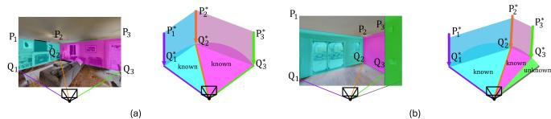  
Fig. 5: (a) Where all walls in the FOV have four true junctions. (b) Where not all walls have four true corners.

The resulting pair $( { \hat { \theta } } , Z )$ yields a gravity-aligned 3D wireframe that enforces verticality and coplanarity by construction, used for downstream BEV projection and localization (solvable and partial-FOV cases are illustrated in Figure 5).

## D. Bird’s Eye View (BEV)

The gravity-aligned 3D wireframe from Section III-C is projected onto the $X { - } Z$ plane, giving a BEV wall chain $\{ P _ { i } ^ { \prime } \} _ { i = 1 } ^ { N }$ with the camera at the origin. Let $\begin{array} { l c l } { P _ { \ell } } & { = } & { P _ { 1 } ^ { \prime } } \end{array}$ and $\begin{array} { r c l } { P _ { r } } & { = } & { P _ { N } ^ { \prime } } \end{array}$ be the outermost known-arc endpoints, $d = \| P _ { r } - P _ { \ell } \|$ their chord length, and Θ the horizontal angle the known arc subtends in the image (equal to the camera FOV when every panel is known). Under noise, the angle Θ′ that the BEV chain subtends at the origin differs from $\Theta ,$ distorting ray scoring. By the inscribedangle theorem, every point subtending $\Theta$ on $\overline { { P _ { \ell } P _ { r } } }$ lies on a circle of radius $R = d / ( 2 \sin \Theta )$ whose center $C$ lies on the perpendicular bisector of the chord; we retain the circle on which the camera faces the wall chain and place the camera position at the point of the arc nearest the origin, which is given by ${ X ^ { \star } \bar { ( } C ) = C - R ( C / \| C \| ) }$ where $C$ is the center of the retained circle. This adjusts only the translation, leaving ${ \hat { \theta } } , Z$ unchanged, and is scale-free: $R \propto d$ inherits the global scale ambiguity of $Z ( { \hat { \theta } } )$ , which cancels in the cosine-similarity scoring of Section III-E. Only known arcs contribute observation rays; unknown FOV segments are appended at their angular positions but excluded from K (Figure 6).

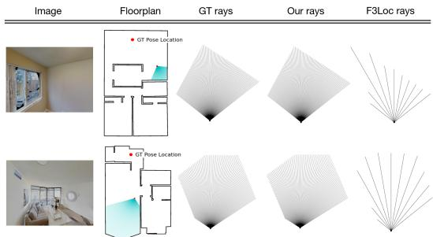  
Fig. 7: Raycast comparison. GALoc produces ray patterns that closely match the ground-truth rays; F3Loc fails to recover accurate wall boundaries in these scenarios.

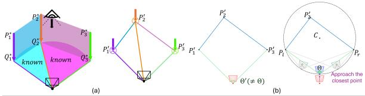  
Fig. 6: Bird’s-eye-view construction. (a) Projecting the gravity-aligned wireframe onto the $X { - } Z$ plane yields a scalefree BEV wall chain. (b) Under noise the raw BEV camera subtends an incorrect angle $\Theta ^ { \prime } \neq \Theta$ (left); the inscribed-angle theorem places it on a circle where $\mathrm { F O V } = \Theta$ holds exactly (right), and we select the arc point nearest the origin.

## E. Raycasting and Floorplan Matching

The gravity alignment gauge θ from Section III-C rectifies the wireframe into a canonical frame; the floorplan heading $s _ { \phi , t }$ is a separate unknown recovered by the SE(2) search below. From the BEV wall map and known FOV sectors we cast observation rays and score them against precomputed map profiles to produce a per-pose likelihood. GALoc’s raycast observations closely track the ground-truth rays, whereas F3Loc misplaces wall boundaries, shown in Figure 7.

Observation Rays. From gravity-aligned junctions we cast $N _ { r } = \lfloor \Theta \rfloor + 1 \mathrm { r a y s } l _ { \mathrm { r a y s } , i }$ at $1 ^ { \circ }$ spacing across the horizontal FOV Θ, symmetric about the optical axis, keeping those in known sectors, indexed by ${ \cal K } \subset \{ 0 , \ldots , { \cal N } _ { r } - 1 \}$ . For each grid pose $p = ( x , y )$ and heading v, we align each ray to its bin in the precomputed 360-bin profile $w _ { p , v }$ via $a ( i , v ) \equiv$ $\begin{array} { r } { v + i - \frac { N _ { r } - 1 } { 2 } } \end{array}$ (mod 360), yielding the aligned pairs

$$
\begin{array} { r } { \mathcal { R } ( p , v ) ~ = ~ \{ { \scriptsize \mathrm { \ ( \ } l _ { \mathrm { r a y s } , i } , w _ { p , v } [ a ( i , v ) ] \mathrm { \ ) \ : \ i \in } K \} } . } \end{array}\tag{15}
$$

Figure 7 illustrates the agreement between observed and map-based rays.

Known-Only Cosine Similarity. We score each pose with a masked cosine similarity over the known rays, sharpened by $\gamma = 1 0$

$$
s ( p , v ) = \left[ \operatorname* { m a x } \left( 0 , \frac { \sum _ { i \in K } l _ { \mathrm { r a y s } , i } \cdot w _ { p , v } [ a ( i , v ) ] } { ( \sum _ { i \in K } l _ { \mathrm { r a y s } , i } ^ { 2 } ) ^ { \frac { 1 } { 2 } } ( \sum _ { i \in K } w _ { p , v } [ a ( i , v ) ] ^ { 2 } ) ^ { \frac { 1 } { 2 } } + 1 0 ^ { - 6 } } \right) \right] ^ { \gamma } .\tag{16}
$$

Observations with unknown arcs are downweighted by a confidence factor $c = ( | \mathcal { K } | / N _ { r } ) ^ { 2 }$ , floored at $c _ { \operatorname* { m i n } } = 0 . 0 1$

Sequential Fusion. We maintain a log-domain belief log $B _ { t } ( p , v )$ over the SE(2) grid. At each timestep, a prediction step shifts and rolls the previous belief by the odometry $( \Delta x _ { t } , \Delta y _ { t } , \Delta v _ { t } )$ , and a measurement step adds the confidence-weighted log-likelihood:

$$
\log B _ { t } ( p , v ) \  \ \log \tilde { B } _ { t } ( p , v ) \ + \ c \log \bigl ( \varepsilon + s _ { t } ( p , v ) \bigr ) ,\tag{17}
$$

where log $\tilde { B } _ { t }$ is the motion-propagated prior and $\varepsilon \quad =$ $0 . 0 1$ is a small constant that keeps the logarithm finite when $s _ { t } ( p , v ) \ = \ 0$ . For visualization we marginalize over heading to obtain a 2D pose heatmap, $H _ { t } ( p ) \mathrm { ~  ~ \alpha ~ } \propto$ $\begin{array} { r } { \sum _ { v } \exp ( \log B _ { t } ( p , v ) ) } \end{array}$

## IV. EXPERIMENTS AND RESULTS

We evaluate GALoc in three complementary settings: endto-end with PolygonHGT on Structured3D, on real-world custom datasets which validate the full pipeline, and with calibrated noise on Gibson.

Evaluation protocol. For single-image localization we report recall (percentage of poses within $X$ m of GT) and a new metric rank (GT percentile in the output heatmap). For sequential localization we report success rate (SR): the pose must stay within X m of GT over 10 consecutive frames. Rank remains informative under geometric ambiguities where multiple poses are equally plausible.

Structured3D [34]. A synthetic dataset with non-upright viewpoints, low–medium occlusion, and $\sim 8 0 ^ { \circ }$ horizontal FOV. All Structured3D results use PolygonHGT [30] predictions end-to-end.

Gibson [35]. A synthetic dataset with gravity-aligned cameras and $\sim 1 0 8 ^ { \circ }$ horizontal FOV. Its floorplans are rasters with wall artifacts that make off-the-shelf corner detectors misfire, so we mark wall junctions manually and use the ground-truth pose to select the subset visible and unoccluded from each viewpoint, projecting them into the frame with a fixed wall and camera height. The ground-truth pose determines only which junctions a detector would see; it never enters $A ( \theta )$ , the BEV projection, or the pose scoring, and the heights are used only to build the input wireframe. To simulate detector imperfection we perturb each ceiling and floor junction independently in the image plane with zero-mean Gaussian noise $( \sigma \in \{ 3 , 5 , 7 \} \mathrm { p x } )$ , so verticality and coplanarity no longer hold in the input rays and $A ( \theta )$ is full-rank at every θ. The perturbed junctions yield layoutmask IoUs of 96.76%, 94.73%, and 92.78%; we adopt $\sigma { = } 5 $ , whose 94.73% matches PolygonHGT’s 94.66% on Structured3D. Running PolygonHGT end-to-end here would instead conflate geometry with detector domain transfer: Gibson provides no ground-truth wireframes, so PolygonHGT cannot be trained on it, while F3Loc’s released weights were. The comparison is thus conservative for GALoc on the domain axis and favorable on the input-quality axis, since our junctions have correct topology, connectivity, and ceiling/floor labels by construction.

TABLE II: Method input assumptions. GALoc uses no learned depth, semantics, or panoramas, at the cost of requiring a wireframe extractor.
<table><tr><td></td><td>F3Loc</td><td>SemRayLoc</td><td>PALMS+</td><td>GALoc</td></tr><tr><td>Depth source</td><td>Learned rays</td><td>Learned rays</td><td>Foundation depth</td><td>None</td></tr><tr><td>Wireframe</td><td>None</td><td>None</td><td>None</td><td>PolygonHGT</td></tr><tr><td>Floorplan type</td><td>Geometric</td><td>Semantic</td><td>Geometric</td><td>Geometric</td></tr></table>

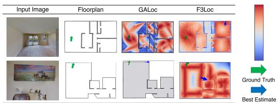  
Fig. 8: Single-image localization. Top: visible wall geometry enables accurate localization. Bottom: a featureless closeup yields zero confidence; the near-uniform heatmap injects no information, and the filter falls back to odometry.

Baselines. We compare GALoc against three baselines: F3Loc [11] (learned wall-distance rays, histogram filter), SemRayLoc [20] (learned semantic rays, semantic floorplans), and PALMS+ [21] (foundation-model depth, pointcloud matching). GALoc uses none of these: no learned depth, no semantic annotations, no panoramic input. Table II summarizes each method’s input requirements.

## A. Single Image Localization

Table III reports single-image results on S3D [34] and Gibson [35]. $F 3 L o c _ { m }$ (the single-image variant of F3Loc [11]; $F 3 L o c _ { c o m p }$ denotes its multi-frame complete variant used in the sequential comparison) reports higher aggregate recall on S3D because it produces an estimate for every frame, including structure-blind close-ups where no wall geometry exists. GALoc instead reports zero confidence there (Figure 8). This is a trade-off rather than a strict advantage. The gap is concentrated in low-coverage frames: nearly 40% of Structured3D frames have zero wall coverage, and where coverage exceeds ∼40% GALoc matches or surpasses $F 3 L o c _ { m }$ at the thresholds shown in Figure 9. Gibson presents the complementary distribution—over 80% of frames have sufficient coverage, reflecting both its wider $\mathrm { F O V } \left( \sim 1 0 8 ^ { \circ } \ \mathrm { v s } \sim 8 0 ^ { \circ } \right)$ and the topological completeness of our junctions. GALoc leads accordingly, achieving 18.1% recall at 0.1 m $( 3 \times \ F 3 L o c _ { m } )$ and 45.3% rank at 0.01% versus 19.8% in aggregate.

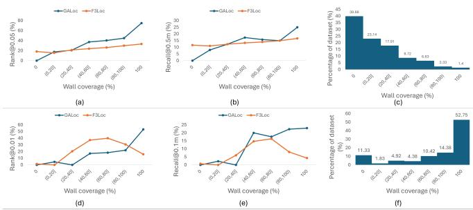  
Fig. 9: Coverage-conditioned analysis comparing $\mathbf { G A L o c } _ { ( \sigma = 5 ) }$ and $\mathbf { F } 3 \mathbf { L o c } _ { m } .$ . Wall coverage is the fraction of horizontal FOV spanned by fully reconstructed walls (K). Top: Structured3D, Bottom: Gibson. (a,d) Rank at 0.05% and 0.01%. (b,e) Recall at 0.5 m and 0.1 m. (c,f) Dataset distribution. Nearly 40% of Structured3D frames have zero wall coverage, explaining GALoc’s aggregate gap (Table III); on Gibson, over 80% of frames fall in the ${ > } 4 0 \%$ coverage bins where GALoc leads on recall (e,f).

## B. Sequential Localization

Temporal fusion resolves single-frame ambiguities, making this the most realistic deployment setting. We compare against F3Loc only: PALMS+ [21] produces a single heatmap from a stationary scan and tracks via odometry alone, and SemRayLoc [20] requires semantic annotations Gibson lacks. We evaluate sequence lengths of 15, 25, 50, and 100 on Gibson; S3D provides no sequential data.

Both $F 3 L o c _ { c o m p }$ and $G A L o c _ { \sigma = 5 }$ improve with sequence length (Figures 10 and 11); the distinction is convergence speed and precision. F3Loc holds a slight edge at 15 steps, where few observations are available, but loses it rapidly: its low-coverage wall-distance estimates inject confident-butwrong observations that corrupt the filter. GALoc instead abstains when no panel is fully recovered, so high-coverage frames accumulate geometric evidence while zero-coverage ones propagate uncertainty without misinforming the belief. Figure 8 (bottom) shows this directly: too close to a wall, GALoc’s heatmap is uniform, whereas F3Loc’s is diffuse but spatially biased, steering the belief away from the true pose.

## C. Real-World Evaluation

We evaluate GALoc on five sequences collected in two environments—a cluttered office $( 1 0 . 8 \times 7 . 2 \mathrm { m } )$ and a long corridor (51.6×12.8 m)—using an iPhone with ARKit providing visual-inertial odometry as semi-ground-truth. Table IV reports the zero-shot results with the automatic wireframe detector: GALoc reaches 20% recall at 1 m, while F3Loc’s recall is zero at all thresholds—its learned wall-distance model, despite being trained to see through clutter, fails entirely on these out-of-distribution environments (see Figure 13). With hand-labeled junctions (semi-GT), GALoc instead reaches 80% recall at 1 m on the same sequences, so the gap between the two settings isolates detector domain transfer, not the localization geometry, as the bottleneck.

Figure 12 shows two sequences, with endpoint errors of 0.25–0.6 m (office) and 0.2–0.53 m (corridor). Figure 13 shows why depth alternatives fail: GALoc’s rays reach 32–

TABLE III: Single-image recall and rank on Structured3D [34] and Gibson [35]. GALoc’s lower aggregate recall on Structured3D reflects the ∼40% of frames with zero wall coverage (Figure 9); on Gibson, where over 80% of frames have sufficient coverage, GALoc achieves 3× the recall of $\mathrm { F } 3 \mathrm { L o c } _ { m }$ at 0.1 m.
<table><tr><td></td><td colspan="5">Recall (Thresholds)</td><td colspan="5"></td><td></td><td colspan="5">Recall (Thresholds)</td><td colspan="5"></td></tr><tr><td>Method</td><td>0.1m</td><td>0.3m</td><td>0.5m</td><td>0.7m</td><td>1m,</td><td> $3 0 ^ { \circ }$ </td><td>1m</td><td>0.01</td><td>0.02</td><td>0.05</td><td>0.10</td><td>Method</td><td>0.1m</td><td>0.3m</td><td>0.5m</td><td>0.7m</td><td></td><td>1m, 30°</td><td>1m 0.01</td><td>0.02</td><td>0.05 0.10</td></tr><tr><td> $\mathrm { F } 3 \mathrm { L o c } _ { m } \ [ 1 1 ]$ </td><td>1.2</td><td>8.7</td><td>12.1</td><td>18.5</td><td></td><td>20.0</td><td>21.9</td><td>2.7</td><td>13.0</td><td>19.8</td><td>23.0</td><td> $\mathrm { F } 3 \mathrm { L o c } _ { m }$ </td><td>6.1</td><td>26.5</td><td>37.0</td><td>43.5</td><td></td><td>46.2</td><td>48.1 19.8</td><td>26.4</td><td>36.5 45.7</td></tr><tr><td>PALMS+ [21]</td><td>0.8</td><td>3.8</td><td>5.8</td><td>8.4</td><td>10.3</td><td></td><td>12.6</td><td>0.4</td><td>0.9</td><td>1.3 1.6</td><td></td><td> $\mathbf { G A L o c } _ { ( \sigma = 3 ) }$ </td><td>19.4</td><td>46.8</td><td>49.6</td><td>51.4</td><td>52.0</td><td>52.8</td><td>47.6</td><td>56.1 67.0</td><td>70.2</td></tr><tr><td>SemRayLoc [20]</td><td>1.0</td><td>10.2</td><td>13.1</td><td>20.2</td><td>21.8</td><td></td><td>23.8</td><td>2.3</td><td>9.5</td><td>14.0 16.1</td><td></td><td> $\mathbf { G A L o c } _ { ( \sigma = 5 ) }$ </td><td>18.1</td><td>44.4</td><td>48.3</td><td>50.1</td><td>50.5</td><td>51.5</td><td>45.3</td><td>52.6</td><td>63.5 69.2</td></tr><tr><td>GALoc (Ours)</td><td>0.3</td><td>5.1</td><td>7.3</td><td>11.9</td><td>15.7</td><td></td><td>18.2</td><td>0.3</td><td>9.2</td><td>15.8 19.4</td><td></td><td> $\mathrm { G A L o c } _ { ( \sigma = 7 ) }$ </td><td>14.2</td><td>39.8</td><td>45.0</td><td>46.9</td><td>47.8</td><td>48.7</td><td>43.4</td><td>51.5 61.7</td><td>67.4</td></tr></table>

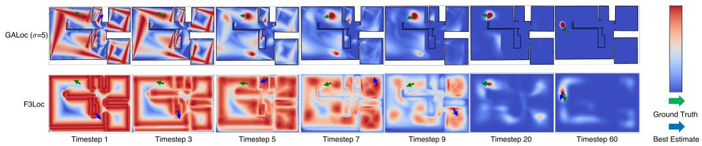  
Fig. 10: Sequential localization on Gibson. $G A L o c _ { ( \sigma = 5 ) }$ converges to the ground-truth pose within 7–10 frames; F3Loc [11] typically requires 20–50 frames and exhibits less stable convergence.

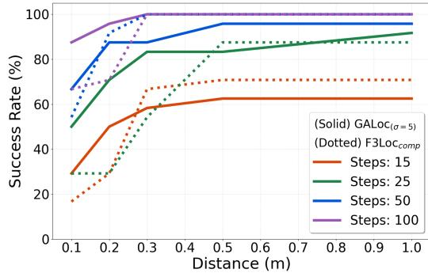  
Fig. 11: Sequential localization on Gibson. Success rate vs. distance threshold for various sequence lengths. Solid: $G A L o c _ { ( \sigma = 5 ) }$ . Dotted: $F 3 L o c _ { c o m p } .$ At short horizons GALoc trails slightly as few frames lead to geometric ambiguities; once evidence accumulates, GALoc overtakes F3Loc and holds 88% vs. 68% SR at 0.1 m with 100 steps.

TABLE IV: Real-world sequential localization with GALoc and F3Loc (both zero-shot) across five sequences in two environments (three in office, two in corridor).  
Recall (distance thresholds)
<table><tr><td>Method</td><td>0.1m</td><td>0.3m</td><td>0.5m</td><td>0.7m</td><td>1m, 30°</td><td>1m</td></tr><tr><td>GALoc</td><td>0.0</td><td>0.0</td><td>0.0</td><td>20.0</td><td>20.0</td><td>20.0</td></tr><tr><td>F3Loc</td><td>0.0</td><td>0.0</td><td>0.0</td><td>0.0</td><td>0.0</td><td>0.0</td></tr></table>

34 m in corridors, whereas F3Loc’s estimate collapses on these out-of-distribution frames and, in offices, is dominated by furniture. Consumer RGB-D sensors also saturate near ∼15 m, matching F3Loc’s [11] maximum range.

## D. Runtime Comparison

TABLE V: Runtime (i5-12400F, 32GB RAM, RTX3060).
<table><tr><td>Method</td><td>Wireframe/Depth</td><td>Gravity align Matching</td><td></td><td>End-to-end</td></tr><tr><td>GALoc</td><td>2.10 s</td><td>0.01 s</td><td>0.19s</td><td>2.32 s</td></tr><tr><td>F3Loc</td><td>0.04 s</td><td>0.01 s</td><td>0.34s</td><td>0.40 s</td></tr></table>

Table V reports runtime. GALoc uses Numba-based parallelization and evaluates a dense 0.01 m, 1◦ grid.

## E. Ablation: Robustness to Input Noise

Perturbing each junction independently makes A(θ) fullrank at every θ, so the gauge is recovered from a system no angle satisfies exactly. Degrading the perturbation from σ=3 (96.76%) to σ=7 (92.78%) costs 4.2 pp in recall at 1 m (Table III, right): noise raises $\sigma _ { \operatorname* { m i n } } ( A ( { \widehat { \theta } } ) )$ and shifts ˆθ, and the EYM projection still returns an architecturally valid wireframe at every noise level, so the BEV layout degrades rather than collapsing.

## V. LIMITATIONS AND CONCLUSION

Limitations. GALoc assumes Atlanta-world geometry [36] and abstains when wall structure is not visible, reducing single-frame coverage compared to depth-based methods (Figure 8). Its accuracy is bounded by the wireframe extractor, which also dominates runtime. Our real-world evaluation is also limited in scope. Two representative failure modes are zero wall coverage (camera too close to a wall, all FOV arcs unknown, filter falls back to odometry) and partial junction detection $( j _ { \mathrm { t r u e } } \leq 1$ , panel discarded, reduced known-FOV arc). The second is the harder case: unlike zero coverage, where GALoc abstains, the surviving panels still yield a confident but geometrically incomplete BEV layout. Fusing wireframe geometry with depth—depth for scale and close range, wireframes for long-range structural constraints—is a natural extension, as is comparison against uncertainty-aware depth pipelines under a common front-end.

Conclusion. We presented GALoc, a depth-free floorplan localization framework that recovers gravity-aligned wireframes via null-space search and matches them against the floorplan through metric-free SE(2) search. GALoc and depth-based methods occupy complementary regimes: when wall geometry is visible, GALoc achieves 3× the singleimage recall at 0.1 m and 88% vs. 68% sequential success on Gibson, while abstaining when it is not. GALoc’s accuracy is bounded by the wireframe front-end: our Gibson protocol supplies junctions with correct topology and ceiling/floor labels, which current detectors do not always meet—the zeroshot vs hand-labeled real-world gap (20% vs 80% recall at 1 m) shows the cost. As wireframe extraction matures toward the robustness monocular depth enjoys today, geometry-first localization stands to become competitive across a wider range of environments.

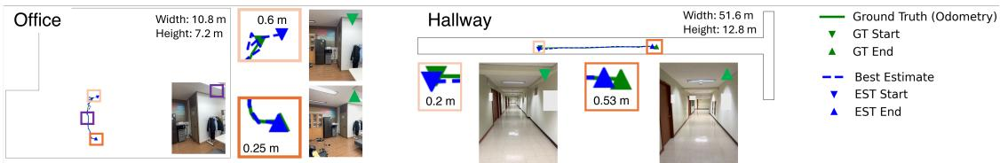

Fig. 12: Real-world sequential localization. Trajectories in an office (10.8×7.2 m, top) and a long corridor (51.6×12.8 m, bottom), with endpoint errors of 0.25–0.6 m and 0.2–0.53 m respectively. Photos show viewpoints along each sequence.  
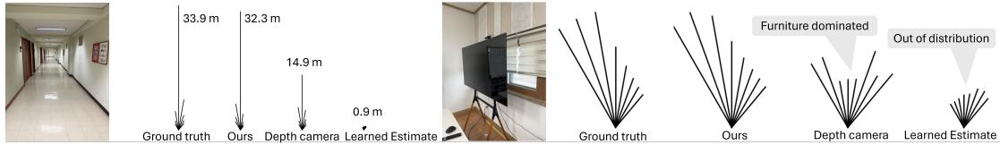  
Fig. 13: Real-world ray comparison. Top: office. Bottom: corridor. GALoc recovers wall structure directly, with rays reaching about 32 m in the corridor. Metric scale (from ceiling height) is for visualization only; matching is scale-invariant.

## REFERENCES

[1] J. L. Schonberger and J.-M. Frahm, “Structure-from-motion revisited,” in CVPR, 2016, pp. 4104–4113.

[2] T. Sattler, M. Havlena, K. Schindler, and M. Pollefeys, “Large-scale location recognition and the geometric burstiness problem,” in CVPR, 2016, pp. 1582–1590.

[3] F. Boniardi, A. Valada, R. Mohan, T. Caselitz, and W. Burgard, “Robot localization in floor plans using a room layout edge extraction network,” in IROS. IEEE, 2019, pp. 5291–5297.

[4] P. Kim, B. Coltin, O. Alexandrov, and H. J. Kim, “Robust visual localization in changing lighting conditions,” in ICRA. IEEE, 2017, pp. 5447–5452.

[5] H. Yin, Y. Wang, X. Ding, L. Tang, S. Huang, and R. Xiong, “3d lidar-based global localization using siamese neural network,” T-ITS, vol. 21, no. 4, pp. 1380–1392, 2019.

[6] S. Workman, R. Souvenir, and N. Jacobs, “Wide-area image geolocalization with aerial reference imagery,” in CVPR, 2015, pp. 3961–3969.

[7] H. Howard-Jenkins, J.-R. Ruiz-Sarmiento, and V. A. Prisacariu, “Lalaloc: Latent layout localisation in dynamic, unvisited environments,” in ICCV, 2021, pp. 10 107–10 116.

[8] H. Howard-Jenkins and V. A. Prisacariu, “Lalaloc++: Global floor plan comprehension for layout localisation in unvisited environments,” in ECCV. Springer, 2022, pp. 693–709.

[9] Z. Min, N. Khosravan, Z. Bessinger, M. Narayana, S. B. Kang, E. Dunn, and I. Boyadzhiev, “Laser: Latent space rendering for 2d visual localization,” in CVPR, 2022, pp. 11 122–11 131.

[10] W. Winterhalter, F. Fleckenstein, B. Steder, L. Spinello, and W. Burgard, “Accurate indoor localization for rgb-d smartphones and tablets given 2d floor plans,” in IROS. IEEE, 2015, pp. 3138–3143.

[11] C. Chen, R. Wang, C. Vogel, and M. Pollefeys, “F3loc: fusion and filtering for floorplan localization,” in CVPR, 2024, pp. 18 029–18 038.

[12] N. Keetha, A. Mishra, J. Karhade, K. M. Jatavallabhula, S. Scherer, M. Krishna, and S. Garg, “Anyloc: Towards universal visual place recognition,” IEEE Robotics and Automation Letters, vol. 9, no. 2, pp. 1286–1293, 2023.

[13] V. Panek, Z. Kukelova, and T. Sattler, “Meshloc: Mesh-based visual localization,” in ECCV. Springer, 2022, pp. 589–609.

[14] E. Brachmann, A. Krull, S. Nowozin, J. Shotton, F. Michel, S. Gumhold, and C. Rother, “Dsac-differentiable ransac for camera localization,” in CVPR, 2017, pp. 6684–6692.

[15] A. Kendall, M. Grimes, and R. Cipolla, “Posenet: A convolutional network for real-time 6-dof camera relocalization,” in CVPR, 2015.

[16] Y. Tian, C. Chen, and M. Shah, “Cross-view image matching for geolocalization in urban environments,” in CVPR, 2017, pp. 3608–3616.

[17] N. Zimmerman, T. Guadagnino, X. Chen, J. Behley, and C. Stachniss, “Long-term localization using semantic cues in floor plan maps,” RA-L, vol. 8, no. 1, pp. 176–183, 2022.

[18] C. Lin, C. Li, and W. Wang, “Floorplan-jigsaw: Jointly estimating scene layout and aligning partial scans,” in ICCV, 2019.

[19] J. Kim, J. Jeong, and Y. M. Kim, “Fully geometric panoramic localization,” in CVPR, 2024, pp. 20 827–20 837.

[20] Y. Grader and H. Averbuch-Elor, “Supercharging floorplan localization with semantic rays,” in ICCV, 2025, pp. 27 116–27 125.

[21] Y. Cheng, B. Princen, and R. Manduchi, “Palms+: Modular imagebased floor plan localization leveraging depth foundation model,” arXiv preprint arXiv:2511.09724, 2025.

[22] B. Chen, J. Kang, H. Yang, P. Zhong, and J. Wang, “Perspective from a higher dimension: Can 3d geometric priors help visual floorplan localization?” in ACM, 2025, pp. 7181–7190.

[23] M. Wuest, F. Engelmann, O. Miksik, M. Pollefeys, and D. Barath, ¨ “Unloc: Leveraging depth uncertainties for floorplan localization,” arXiv preprint arXiv:2509.11301, 2025.

[24] F. Dellaert, D. Fox, W. Burgard, and S. Thrun, “Monte carlo localization for mobile robots,” in ICRA, vol. 2. IEEE, 1999.

[25] P. Karkus, D. Hsu, and W. S. Lee, “Particle filter networks with application to visual localization,” in CoRL. PMLR, 2018.

[26] O. Mendez, S. Hadfield, N. Pugeault, and R. Bowden, “Sedar: Reading floorplans like a human—using deep learning to enable humaninspired localisation,” IJCV, vol. 128, no. 5, pp. 1286–1310, 2020.

[27] W. Zhang, W. Zhang, and J. Gu, “Edge-semantic learning strategy for layout estimation in indoor environment,” IEEE transactions on cybernetics, vol. 50, no. 6, pp. 2730–2739, 2019.

[28] C. Yan, B. Shao, H. Zhao, R. Ning, Y. Zhang, and F. Xu, “3d room layout estimation from a single rgb image,” TMM, vol. 22, no. 11, pp. 3014–3024, 2020.

[29] S. Stekovic, S. Hampali, M. Rad, S. D. Sarkar, F. Fraundorfer, and V. Lepetit, “General 3d room layout from a single view by renderand-compare,” in ECCV. Springer, 2020, pp. 187–203.

[30] D. Gillsjo, G. Flood, and K.¨ Astr˚ om, “Polygon detection for room¨ layout estimation using heterogeneous graphs andwireframes,” in ICCV, 2023, pp. 1–10.

[31] Z. Kukelova, M. Bujnak, and T. Pajdla, “Automatic generator of minimal problem solvers,” in ECCV. Springer, 2008, pp. 302–315.

[32] R. P. Brent, Algorithms for minimization without derivatives. Courier Corporation, 2013.

[33] G. H. Golub, A. Hoffman, and G. W. Stewart, “A generalization of the eckart-young-mirsky matrix approximation theorem,” Linear Algebra and its applications, vol. 88, pp. 317–327, 1987.

[34] J. Zheng, J. Zhang, J. Li, R. Tang, S. Gao, and Z. Zhou, “Structured3d: A large photo-realistic dataset for structured 3d modeling,” in ECCV. Springer, 2020, pp. 519–535.

[35] F. Xia, A. R. Zamir, Z. He, A. Sax, J. Malik, and S. Savarese, “Gibson env: Real-world perception for embodied agents,” in CVPR, 2018.

[36] G. Schindler and F. Dellaert, “Atlanta world: An expectation maximization framework for simultaneous low-level edge grouping and camera calibration in complex man-made environments,” in CVPR, vol. 1. IEEE, 2004, pp. I–I.