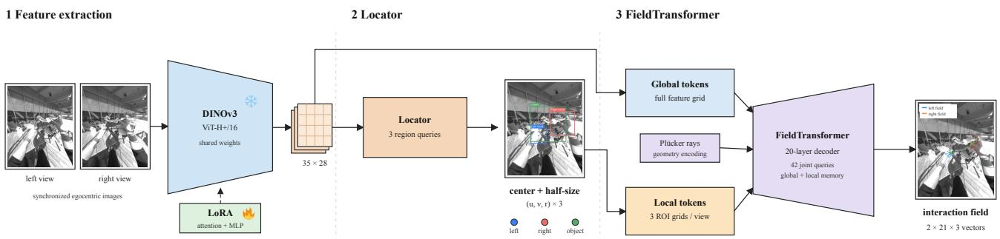
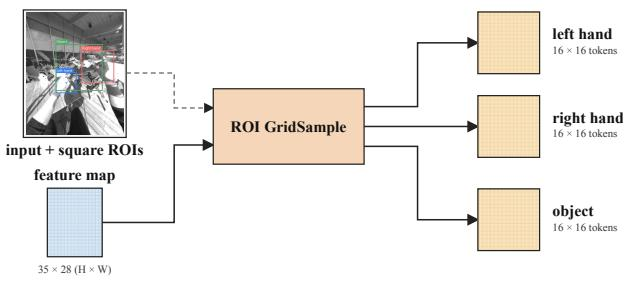

# GOLF: Global Observation with Local Focus for Calibration-Aware Stereo Interaction Field Estimation First-Place Solution for the HANDS@ECCV 2026 SHOW3D Challenge

Minqiang Zou\*, Riqiang Jin\*, Zhi Lv, Dong Luo, Lianghai Tian, Zhenyu Zhao, Qi Xu, Tong Wu, Mochen Yu†, and Yao Tang† JIIOV Technology

{minqiang.zou,riqiang.jin,zhi.lv,dong.luo,lianghai.tian}@jiiov.com {zhenyu.zhao,qi.xu,tong.wu,mochen.yu,yao.tang}@jiiov.com

## Abstract

We present GOLF, thefirst-place solution to the SHOW3D Interaction Field Estimation Challenge at HANDS@ECCV 2026. Given synchronized egocentric stereo views, the task is to predict a 3D vectorfrom each of21 handjoints to the closest point on the manipulated object. GOLF combines dense global context, locally sampled hand/object evidence, and common-frame Plucker-ray geometry. We adapt DINOv3¨ ViT-H+/16 with LoRA and trainable LayerNorm parameters, then jointly decode both interaction fields. Our primary model achieves an official score of27.61 and a mean ADE of 27.96 mm on the hidden test set. An equal-weight ensemble with a complementary directlyfine-tuned variant improves these results to an official score of27.47 and a mean ADE of 27.82 mm, securing first place.

## 1. Introduction

Interaction fields encode hand–object geometry by a vector from each hand joint to its closest object-surface point [3, 5], remaining meaningful even before contact. ARCTIC and HOT3D cover related controlled and egocentric hand–object settings [2, 3]. SHOW3D evaluates interaction fields from two synchronized headset views with subjects held out at test time.

Full-image features preserve scene context but provide limited resolution for small, occluded hands and objects; crop-only processing restores detail but can lose hand–object context. Stereo views improve visibility, yet naive feature concatenation requires the network to infer camera geometry implicitly. This tension motivates retaining global context, densely sampling spatially focused local evidence, and encoding calibrated rays for every visual token.

GOLF combines three ideas (Fig. 1). First, densely sam-

pled square hand/object RoIs emphasize local detail without discarding dense context. Second, reference-frame Plucker ¨ embeddings expose calibrated stereo geometry. Third, DI-NOv3 ViT-H+/16 [6] is efficiently adapted with LoRA [4] and LayerNorm affine parameters. A query decoder jointly predicts both interaction fields.

## 2. Method

## 2.1. Interaction Field

For hand $h \in \{ L , R \}$ and joint $j ,$ let $\mathbf { p } _ { h , j }$ denote the 3D joint position and $\mathbf { p } _ { h , j } ^ { * }$ its closest point on the manipulated object surface. The interaction-field target is

$$
\begin{array} { r } { \mathbf { v } _ { h , j } = \mathbf { p } _ { h , j } ^ { * } - \mathbf { p } _ { h , j } \in \mathbb { R } ^ { 3 } . } \end{array}\tag{1}
$$

Given stereo images and calibration, the network predicts $\hat { \mathbf { V } } \in \mathbb { R } ^ { 2 \times 2 1 \times 3 }$ in the reference-camera frame and minimizes masked mean ADE over valid hands. Before evaluation or submission, each prediction is rotated by the per-frame calibration $R _ { \mathrm { w o r l d  r e f } }$ into the required world frame; all vectors remain in millimeters.

## 2.2. Global–Local Representation

Both views share a DINOv3 ViT-H+/16 encoder [6]. Original backbone weights are frozen except for LayerNorm affine parameters, while LoRA adapters are trained. For a pretrained projection $W _ { 0 }$ , LoRA applies

$$
y = W _ { 0 } x + { \frac { \alpha } { r } } B A x .\tag{2}
$$

Rank-128 LoRA with $\alpha = 2 5 6$ adapts attention QKV/output and all three SwiGLU projections in every block.

For each view v, the field branch fuses blocks {10, 20, 26, 31} with learned softmax weights into feature map $F ^ { v }$ ; the locator consumes block 31 directly. Its eightlayer, three-query decoder predicts center $\mathbf { c } _ { t } ^ { v }$ , square halfsize $s _ { t } ^ { v }$ , and presence for each hand and the object. The object-region query is additionally conditioned on a learned embedding of the provided object category. Center and logsize use Smooth L1 loss, presence uses binary cross-entropy, and coverage measures the target extent left outside the predicted square, normalized by 64 pixels. Their weights are 1, 1, 1, and 0.1, respectively; missing hands are masked from the regression terms.

  
Figure 1. Overview of GOLF. A shared LoRA-adapted DINOv3 encoder processes synchronized headset views. The locator predicts square hand/object regions, and the FieldTransformer decodes 42 joint vectors from global tokens, RoI tokens, and calibrated Plucker-ray¨ embeddings.

  
Figure 2. Local-token construction. The portrait $3 5 \times 2 8 ( H \times W )$ feature map is sampled at the locator grids to form three $1 6 \times 1 6$ RoI token maps.

For each predicted region, a regular 16 × 16 grid G bilinearly samples spatially aligned local RoI tokens:

$$
R _ { t } ^ { v } = \operatorname { G r i d S a m p l e } \left( F ^ { v } , \mathbf { c } _ { t } ^ { v } + s _ { t } ^ { v } G \right) , \quad t \in \{ L , R , O \} .\tag{3}
$$

Role embeddings distinguish the three regions, while the full 35 × 28 feature map is retained as dense global context (Fig. 2).

## 2.3. Calibration-Aware Stereo Decoder

We back-project token pixel u in camera k with $( K ^ { k } ) ^ { - 1 } [ u , \overline { { v } } , \dot { 1 } ] ^ { \top }$ and transform ray direction d and origin o to the reference frame. We normalize d to unit length and express o in meters before forming the moment. The ray is encoded using origin-aware Plucker coordinates [7]¨

$$
\pi ( \mathbf { u } , k ) = [ \mathbf { d } , \mathbf { o } \times \mathbf { d } ] \in \mathbb { R } ^ { 6 } .\tag{4}
$$

A two-layer MLP maps rays to decoder width; ray and view embeddings are added to all tokens. Global rays use patch centers and local rays use actual GridSample locations. Reference-view swapping discourages camera-role shortcuts, and memory concatenates global and three local RoI token sets from both views. We adopt Joint Transformer’s jointindexed query formulation [1]: 42 learned queries—one per hand–joint pair—attend to our global–local stereo memory through a 20-layer Transformer with width 512 and eight heads. A shared linear head outputs each query’s 3D vector.

## 2.4. Training

All stages use AdamW with cosine decay. We train the monocular locator and LoRA for 20 epochs with total batch 32 and learning rate $1 0 ^ { - 4 }$ , treating both cameras independently and using photometric/noise augmentation, HFlip, partial crop, and $\pm 2 0 ^ { \circ }$ rotation. Weight decay is $5 \times 1 0 ^ { - 4 }$ for the locator and zero for LoRA and LayerNorm parameters. The 40-epoch stereo stage uses total batch 96, learning rates of $5 \times 1 0 ^ { - 5 }$ for the FieldTransformer and $1 0 ^ { - 4 }$ for LoRA, and weight decay $5 \times 1 0 ^ { - 4 }$ only on the FieldTransformer, with shared $\pm 1 0 ^ { \circ }$ rotation, photometric jitter, HFlip, and reference swapping. The locator decoder and heads remain frozen; its auxiliary loss still updates the shared backbone adapters, whereas field gradients stop at the predicted RoI coordinates. We then enable LayerNorm affine parameters and jointly fine-tune them, LoRA, and the FieldTransformer for 20 epochs at $1 0 ^ { - 4 }$ . After fixing all choices, we return the two development subjects to the official training set, keep the locator frozen, and fine-tune the FieldTransformer, LoRA adapters, and LayerNorm affine parameters for two epochs at $2 \times 1 0 ^ { - 5 }$ For horizontal-flip test-time augmentation (HFlip TTA), both views and their intrinsics are mirrored together. We restore the prediction by swapping left/right slots and negating the camera-frame x component, rotate both branches to the world frame, and average them.

Table 1. Development-set resolution tuning under a matched monocular DINOv3 ViT-L/16 setting. Lower is better.
<table><tr><td>Resolution  $( H \times W )$ </td><td>Val mean ADE (mm)</td></tr><tr><td> $4 0 0 \times 3 2 0$ </td><td>44.22</td></tr><tr><td> $4 8 0 \times 3 8 4$ </td><td>41.38</td></tr><tr><td> $5 6 0 \times 4 4 8$ </td><td>40.23</td></tr><tr><td> $6 4 0 \times 5 1 2$ </td><td>40.51</td></tr></table>

## 3. Experiments

Setup. The SHOW3D training set contains 468 recordings from 10 subjects and 21 objects, sampled at 10 FPS. The hidden test set contains 20,042 frames sampled at 5 FPS from 139 recordings, covering three unseen subjects and 16 objects. For development, we hold out subjects XYZ109 and LYA722 as a clean validation split. Inputs are resized to $5 6 0 \times 4 4 8 ( H \times W )$ . The server reports left/right ADE, mean ADE, recall, and an official ranking score. The official score is a hidden server-side metric that jointly accounts for prediction accuracy and coverage; its exact formula is not public. All error metrics and the official score are lower-isbetter.

Input resolution. During development, we use a matched monocular DINOv3 ViT-L/16 setup to tune the input resolution (Tab. 1). These runs are used only for hyperparameter selection and differ from the final model evaluated on Codabench, so we report validation results only.

Feature-space versus image-space crops. Under a matched configuration, RGB-crop re-encoding and featurespace RoI sampling achieve comparable validation mean ADE (37.93 versus 37.77 mm). This setting differs from other experiments and supports only this paired comparison. We choose feature-space sampling for its single backbone pass and lower cost.

Backbone adaptation. We compare staged adapters on the clean split (Tab. 2). Larger attention/MLP ranks correlate with lower errors; LayerNorm affine adaptation gives the best run at 10.04 pixels and 28.31/28.04 mm raw/HFlip-TTA mean ADE. As the rows come from successive stages, they indicate capacity effects rather than a strict one-variable ablation.

Challenge results. Table 3 traces submissions rather than controlled ablations. Stereo fusion improves performance, and reference-frame Plucker encoding further lowers mean¨ ADE from 36.17 to 35.57 mm; broader ViT-H+ adaptation closes most of the remaining gap.

The primary model reaches 27.61 official score and 27.96 mm mean ADE; equal-weight averaging with a last-

Table 2. Backbone adaptation on the development split. Raw uses the original stereo pair; HFlip TTA averages the raw and coordinaterestored flipped predictions. Both ADE columns report validation mean ADE in millimeters; lower is better.
<table><tr><td>Backbone adaptation Center err. (px) Raw ADE HFlip-TTA ADE</td><td></td><td></td><td></td></tr><tr><td> $\mathrm { A t t n } 6 4 + \mathrm { M L P } 1 6$ </td><td>10.46</td><td>29.11</td><td>28.84</td></tr><tr><td>Attn 128 + MLP 128</td><td>10.12</td><td>28.82</td><td>28.41</td></tr><tr><td>+ LayerNorm affine</td><td>10.04</td><td>28.31</td><td>28.04</td></tr></table>

Table 3. Submission progression on the hidden SHOW3D test set. Lower is better.
<table><tr><td>System</td><td>Official</td><td>Mean ADE (mm)</td></tr><tr><td>InterField, ResNet-50</td><td>58.98</td><td>59.38</td></tr><tr><td>DINOv3 ViT-L/16, one view,  $4 0 0 \times 3 2 0$ </td><td>43.12</td><td>43.50</td></tr><tr><td>+ both-view training/HFlip,  $5 6 0 \times 4 4 8$ </td><td>38.74</td><td>39.10</td></tr><tr><td>+ local RoI tokens</td><td>36.01</td><td>36.36</td></tr><tr><td>+ stereo fusion</td><td>35.83</td><td>36.17</td></tr><tr><td>+ reference-frame Plücker encoding</td><td>35.21</td><td>35.57</td></tr><tr><td>ViT-H+, LoRA 64/16</td><td>29.51</td><td>29.86</td></tr><tr><td>ViT-H+, LoRA 128/128 + LN</td><td>28.55</td><td>28.91</td></tr><tr><td>+ full-training-set fine-tuning</td><td>27.61</td><td>27.96</td></tr><tr><td>+ direct-FT last-24-block ensemble</td><td>27.47</td><td>27.82</td></tr></table>

24-block fine-tuned variant reaches 27.47 and 27.82 mm, respectively, ranking first.

## 4. Conclusion

Combining global–local features, stereo geometry, and efficient backbone adaptation, GOLF’s final ensemble scores 27.47 and places first in the HANDS@ECCV 2026 SHOW3D Challenge.

## References

[1] Karim Abou Zeid. Joint Transformer. HANDS@ICCVW, 2023. GitHub repository.

[2] Prithviraj Banerjee, Sindi Shkodrani, Pierre Moulon, et al. HOT3D: Hand and object tracking in 3D from egocentric multiview videos. In CVPR, pages 7061–7071, 2025.

[3] Zicong Fan, Omid Taheri, Dimitrios Tzionas, et al. ARCTIC: A dataset for dexterous bimanual hand-object manipulation. In CVPR, pages 12943–12954, 2023.

[4] Edward J. Hu, Yelong Shen, Phillip Wallis, et al. LoRA: Lowrank adaptation of large language models. In ICLR, 2022.

[5] Patrick Rim, Kevin Harris, Braden Copple, et al. SHOW3D: Capturing scenes of 3D hands and objects in the wild. In CVPR, pages 7111–7120, 2026.

[6] Oriane Simeoni, Huy V. Vo, Maximilian Seitzer, et al. DINOv3.´ Transactions on Machine Learning Research, 2026.

[7] Vincent Sitzmann, Semon Rezchikov, William T. Freeman, et al. Light field networks: Neural scene representations with single-evaluation rendering. In NeurIPS, pages 19313–19325, 2021.