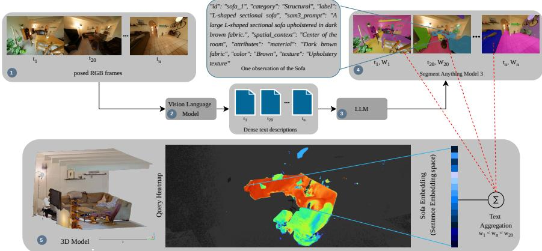
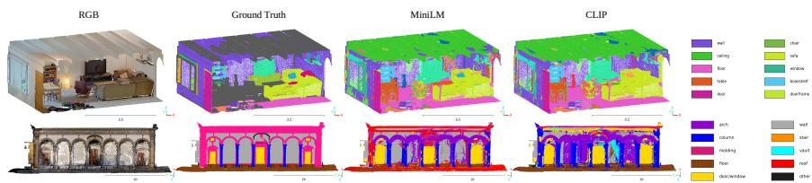
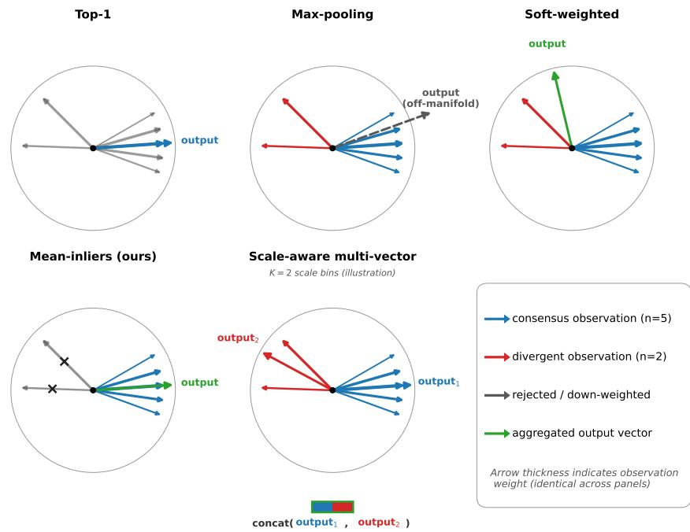

# GoDeep: Annotation-Free Open-Vocabulary 3D Scene Understanding via Language-Space Lifting

Thodoris Betsas , Anastasios Doulamis , and Andreas Georgopoulos

Laboratory of Photogrammetry, School of Rural, Surveying and Geoinformatics Engineering, NTUA, 15772 Athens, Greece

betsasth@mail.ntua.gr, adoulam@cs.ntua.gr, drag@central.ntua.gr

Abstract. Open vocabulary 3D semantic segmentation methods typically lift CLIP features into 3D. This embeds points in a joint visionlanguage space known to behave like a bag-of-words on compositional tasks. Furthermore, even annotation free variants often require a large 3D training corpus and a dedicated 3D encoder per domain. Instead we use a vision-language model purely as a translator. It produces structured, entity-level descriptions of each posed image. These descriptions are grounded, projected, and aggregated directly in a general-purpose, language-only embedding space, with no 3D training corpus or encoder required. On ScanNet++, our pipeline is competitive with strong annotation free baselines trained on ScanNet. On a 5-building cultural heritage benchmark, raw scores initially favor a CLIP-based variant, but a single systematic vocabulary correction reverses this ranking. An effect confirmed by a second, independent correction on a diferent class, indicating that language-space embeddings track physical content more faithfully. This fidelity extends to genuinely out-of-vocabulary (OOV) objects on ScanNet++ proving that language-space embeddings separate presence from absence objects far more sharply than CLIP-based embeddings do. GoDeep also localize these OOV objects within the scene, all without any 2D-3D annotation. Because every representation remains discrete text, predictions are also explainable at the point level. Finally, exploiting both a heuristic weighting, that favors precise over merely frequent observations and GoDeep’s explainability property, we propose an aggregation strategy, as a proof of concept, that favors finer elements localization.

Keywords: Open Vocabulary 3D Semantic Segmentation · Annotation Free Learning · Vision Language Models · Sentence Embeddings · Cultural Heritage Documentation

## 1 Introduction

3D semantic segmentation has traditionally relied on human-annotated point clouds, a process that is costly and labor-intensive to carry out at the point level, and that, even when done carefully, rarely captures every object category actually present in a scene. As a result, the classes used by mature closed-set 3D segmentation methods [15, 27, 28] are typically coarse structural categories like wall, column and roof, into which finer elements (a capital, a shaft, a frieze) are silently absorbed, losing their own semantic identity [2,13]. The dominant recipe for open-vocabulary 3D segmentation addresses this by lifting 2D vision-language features into 3D, either by distilling CLIP [19] embeddings onto point clouds [17] or by training a 3D encoder against 2D or textual pseudo-supervision [9,12,30]. These methods share an assumption rarely questioned: that 3D points should be embedded in CLIP’s joint vision-language space, a space shown to behave like a bag-of-words on relational and attribute-binding tasks [23, 34], a liability precisely where open-vocabulary segmentation matters most, e.g., in cultural heritage documentation.

Despite avoiding human-annotated 3D labels, these methods remain resourcedependent in a diferent sense: each still requires assembling a large, purposebuilt 3D training corpus, paired with dense 2D vision-language supervision [9, 12, 17, 30], to train or distill a dedicated 3D encoder for every target domain, and queries are then mediated by the same limited CLIP text encoder discussed above. At the same time, modern VLMs are already capable of producing dense, structured scene descriptions [24], yet this richness is seldomly preserved in the resulting 3D representation, typically reduced to whatever a short class name or generic caption can convey — a limitation further compounded by CLIP’s 77-token context window.

Rather than lifting CLIP features, we use a vision-language model (e.g., Qwen2-VL [24]) purely as a translator: applied independently to each posed image of a scene, it produces a structured, entity-level description of that view. Each described entity is grounded back into the image via an open-vocabulary segmenter (SAM3 [3]) and projected onto the point cloud using the camera’s known pose, so that every 3D point accumulates the set of natural-language entities observed for it across views. These per-point entity sets are then aggregated directly in a general-purpose sentence embedding space [20], without a limitation to the number of entities or words. The resulting per-point features therefore live entirely in this language-only space, rather than any joint visionlanguage space: alignment performed internally by the 2D segmenter is confined to grounding text onto pixels and never propagates into the 3D representation itself. The pipeline needs no 3D training corpus and no dedicated 3D encoder, since every component is a frozen, of-the-shelf 2D or language model, applied directly to a new scene at inference time.

We evaluate this design on two fronts. On the 100-class ScanNet++ benchmark [32], our pipeline is competitive with strong annotation-free baselines trained on ScanNet, though it falls behind to methods trained on larger multidataset corpora or directly on the target distribution (Section 4.2). On a multibuilding cultural heritage dataset [16], raw benchmark scores initially favor the CLIP-based variant. Paragraph 5.1 shows that correcting a single systematic vocabulary mismatch, dataset-wide, improves the language-space representation far more than its CLIP-based counterpart, reversing the ranking. Our contributions are fourfold:

– We present an annotation-free 3D scene understanding pipeline that decouples 3D representation learning from CLIP’s joint embedding space by lifting structured, VLM-generated descriptions into a pure sentence-embedding space.

– We show this design matches 3D-trained annotation-free baselines on a standard indoor benchmark without any 3D training.

We show, on a real 5-building cultural heritage benchmark, that correcting a single systematic vocabulary mismatch reverses the ranking between language-space and CLIP-based embeddings, evidence that the former tracks physical content more faithfully, a property that becomes a liability only when the evaluation vocabulary itself is imprecise.

– We show the pipeline is explainable at the per-point level: predictions trace back to specific, weighted natural-language evidence, and this weighting measurably favors precise observations over merely frequent ones.

## 2 Related Work

Closed-set 3D semantic segmentation algorithms can be classified by representation into point-based [18,28,36], dimensionality-reduction [11,15,29], discretizationbased [4], graph-based [26], and hybrid [27, 31, 33] methods [1]. These methods achieve strong results but are confined to the fixed class vocabulary seen during training, and are further sensitive to the acquisition modality of the training data (e.g., RGB-D, LiDAR etc.), limiting their transferability across sensor types and domains [1].

Inspired by 2D open-vocabulary segmentation [6, 8, 10], 3D open-set scene understanding methods utilize vision-language models to move beyond closed class sets. OpenScene [17] and PLA [5] distill CLIP features or hierarchical 3D-caption pairs onto point clouds, training a dedicated 3D encoder in each case. OpenMask3D [21] instead pairs a once-trained, class-agnostic 3D instance mask proposal network with CLIP embeddings computed at inference. CLIP-FO3D [35] similarly distills dense CLIP features into a trained 3D encoder. More recently, Mosaic3D [9] and SceneSplat [12] scale this recipe with larger VLM-generated pseudo-label corpora, achieving strong results on ScanNet++, while RegionPLC [30] does so on ScanNet and ScanNet200. All of these methods query through CLIP’s joint vision-language embedding space and, except for OpenMask3D’s frozen mask backbone, require training a dedicated 3D encoder per target domain, a design we revisit in Section 3.

This shared reliance on CLIP’s text encoder is not incidental: CLIP is trained with a contrastive image-text objective in which a short caption need only distinguish its paired image from others in a batch, a task solvable by recognizing salient keywords without resolving how they relate to one another. Sentence encoders such as the one we use [20] are instead trained on natural language inference and semantic textual similarity, tasks that directly reward correctly parsing relations between words. This distinction is measurable: CLIP-family encoders behave like a bag-of-words on tasks requiring attribute binding and relational reasoning [23, 34]. We revisit this distinction empirically in Section 5.1.

  
Fig. 1: Overview of the GoDeep pipeline on a single query (sofa): (1) posed frames are (2) described by a vision-language model and (3) structured by an LLM into JSON entities. (4) Each entity’s prompt grounds a mask via SAM3 [3], weighted by depth, centrality, and mask precision $( w _ { 1 } , w _ { 2 } , w _ { 3 } )$ . (5) Weighted observations are combined via mean-inliers pooling into a per-point sentence embedding, stored on the point cloud and compared against a text query to produce the heatmap shown (blue: low, red: high similarity).

## 3 Method

## 3.1 Overview

Figure 1 summarizes our pipeline. A vision-language model describes each posed image of a scene in natural language. An open-vocabulary segmenter grounds each described entity to pixels. Each 3D point is then projected into its nearby camera views to collect the entity groundings that cover it. The resulting perpoint natural-language evidence is aggregated in a sentence embedding space. No stage is trained on the target scene or domain. Every intermediate representation, including the VLM description, the JSON entity, and the aggregated embedding, also remains a discrete, human-readable piece of text. This lets us trace any point’s final label back to the specific sentences that produced it, a property we exploit directly in Paragraph 5.6.

## 3.2 Structured Description Generation and Grounding

For each posed image, a vision-language model (Sec. 1) produces a free-form dense description of the visible content. A lightweight language model then converts this description into a structured JSON list of entities. This step filters out content irrelevant to the task at hand, e.g., sky or lighting conditions in an architectural survey. Each entity retains a category, a short label, a segmentationoriented prompt, and free-text attributes (material, color, texture) when mentioned (Figure 1). Entities with associated defects or conditions are recorded separately. Each entity’s prompt is then passed to SAM3 [3]. Masks are not mutually exclusive: a point may accumulate evidence from multiple overlapping entities, e.g., a structural element and a defect on its surface.

## 3.3 Multi-View 3D Lifting and Language-Space Aggregation

Each 3D point is projected into its candidate camera views using the camera’s calibrated intrinsics, pose, and lens distortion model (radial-tangential, following the standard OpenCV parameterization). For each camera $c ,$ we build a downsampled depth bufer $Z _ { c }$ from the point cloud itself, and discard a point $p$ as occluded from c if its camera-space depth z exceeds the bufered depth at its projected location $\pi ( p )$ by more than a fixed tolerance τ. Among all candidate cameras, we first keep only the K closest to $p$ by raw depth, then discard any of these K that fail the occlusion test above. Therefore, a point may receive descriptions from fewer than $K$ cameras when some of its nearest views are occluded.

Each visible (point, camera, mask) triple contributes a weight

$$
w = \frac { 1 } { z + \epsilon } \mathrm { ~ \cdot ~ } \exp \left( - \frac { d _ { 2 D } ^ { 2 } } { d _ { \operatorname* { m a x } } ^ { 2 } } \right) \mathrm { ~ \cdot ~ } \frac { 1 } { \sqrt { a } + \epsilon } .\tag{1}
$$

Here, $z$ is the depth in camera $c , d _ { 2 D }$ is the 2D distance to the image center, $d _ { \mathrm { m a x } }$ is a normalizing constant, a is the mask’s relative area, and ϵ is a small constant for numerical stability. The three factors favor closer, more centrally-imaged, and more precisely-segmented observations. Peripheral, distant, or coarsely segmented masks are treated as less reliable evidence. Paragraph 5.6 shows this weighting is not a minor implementation detail: it measurably reorders which evidence dominates a point’s final label.

Each point accumulates a weighted set $\left\{ \left( v _ { i } , w _ { i } \right) \right\}$ of natural-language entity embeddings. Here $v _ { i } \in \mathbb { R } ^ { d }$ is the sentence embedding [20] of the i-th observed entity, and $w _ { i }$ is its weight from above. We aggregate this set via mean-inliers pooling: a first-pass weighted mean $\bar { v }$ is computed, then every observation is compared against this same v¯ via cosine similarity, and the final mean vˆ is recomputed using only the observations that pass this test:

$$
\begin{array} { r } { \bar { v } = \mathrm { n o r m a l i z e } \Big ( \sum _ { i } w _ { i } v _ { i } \Big ) , \qquad \hat { v } = \mathrm { n o r m a l i z e } \Big ( \sum _ { i : v _ { i } . \bar { v } > \delta } w _ { i } v _ { i } \Big ) . } \end{array}\tag{2}
$$

Observations with similarity below a fixed threshold δ to v¯ are discarded as outliers, and vˆ is recomputed over the remaining inliers. This scheme absorbs occasional VLM hallucinations or mis-grounded masks without letting a single bad observation dominate a point’s representation. Section 5.5 compares it against four alternative aggregation strategies. Points with no covering observation are inpainted from their k nearest neighbors with a valid embedding, weighted by inverse distance, and the aggregated embeddings are optionally projected to a lower dimension via PCA.

## 4 Experiments

## 4.1 Setup

Datasets. We evaluate on ScanNet++ [32] (50 validation scenes, top-100 class benchmark) and on a cultural heritage dataset [16] spanning 5 historic buildings captured with a mix of terrestrial laser scanning and photogrammetry, annotated with the 10 ARCH-standard classes [13].

Evaluation Protocol. We assign each point its argmax class by cosine similarity between the point’s aggregated embedding and the text embeddings of the class names, following the protocol used by Mosaic3D [9] and SceneSplat [12]. No per-class thresholds are involved. On ScanNet++, we report f-mIoU and fmAcc, excluding wall, floor, and ceiling, following standard practice for this benchmark. On the heritage dataset, we report mIoU, mAcc, and mPrec over all 10 ARCH classes, including the catch-all other category.

Baselines. On ScanNet++, we report literature numbers for OpenScene [17], RegionPLC [30], Mosaic3D [9], and SceneSplat [12], all under the same protocol. We also considered PointSeg [7] (training-free, but targeting 3D instance segmentation under detection-style mAP/AP metrics) and CLIP-FO3D [35] (trains a 3D encoder via distillation and does not, to our knowledge, report ScanNet++ results). Neither is therefore included in Table 1. For the heritage dataset, no prior annotation-free or training-free method reports results under a comparable protocol. Instead we use a controlled internal comparison (MiniLM vs. CLIP text encoders) as our primary evidence, detailed in paragraph 5.1.

Implementation. We use Qwen2-VL [24] for all ScanNet++ experiments. For the heritage dataset, we use Gemini [22] instead, motivated by its substantially richer and more lexically diverse descriptions on this domain (quantified in Paragraph 5.3). We attribute this gap partly to model scale: we use Qwen2-VL-2B, the smallest model in its family, due to the compute constraints of a single consumer GPU, whereas Gemini-2.5-Flash is substantially larger. This asymmetry did not measurably afect ScanNet++, where Qwen2-VL alone still performs competitively against 3D-trained baselines (Table 1). Within each dataset, the VLM is held fixed across the MiniLM and CLIP variants, so this choice does not afect the fairness of that comparison. We report results using all-MiniLM-L6-v2 [20, 25] and, as an ablation, the substantially larger CLIP ViT-L/14 text encoder [19]. Mean-inliers is our reported aggregation strategy throughout. All experiments run on a single consumer laptop GPU (NVIDIA RTX 3070, 8 GB VRAM; AMD Ryzen 9 5900HS; 40 GB RAM), underscoring the pipeline’s low hardware requirements relative to methods that train a dedicated 3D encoder.

## 4.2 Quantitative & Qualitative Results

Table 1 reports f-mIoU and f-mAcc under the argmax protocol, with qualitative predictions shown in Figure 2. Our language-only embedding space performs on par with the widely-used CLIP space, and in several cases matches or exceeds methods trained on ScanNet, without any 3D training of our own.

  
Fig. 2: Argmax semantic segmentation predictions, colored by class, for MiniLM (left) and CLIP (right), on a ScanNet++ scene (top row, 100-class vocabulary) and a heritage building (bottom row, 10-class ARCH vocabulary). Both variants require no 3D training on either domain. Legends show ten classes per scene (10/100 for ScanNet++; all 10 for the heritage benchmark).

MiniLM slightly outperforms CLIP (16.83 vs. 16.17 f-mIoU) under otherwise identical settings, isolating the efect of the text encoder alone. GoDeep also attains substantially higher f-mAcc than every ScanNet-only baseline, at the cost of increased false positives (Section 6). As expected, GoDeep falls behind Mosaic3D and SceneSplat when either is trained on larger multi-dataset corpora or directly on ScanNet++, where training on the target distribution provides a natural advantage. Table 2 shows the reverse pattern: on the raw ARCH vocabulary, CLIP outperforms MiniLM on all three metrics. Correcting a single mismatched prompt (floor → floor/grass) dataset-wide, however, improves MiniLM far more than CLIP across all three, reversing the mIoU ranking. A second, independent correction (vault → vault/ceiling) pushes MiniLM’s mIoU to 35.96%. Section 5.1 traces this to a systematic diference in how the two representations respond to vocabulary quality.

Table 1: ScanNet++ top-100 (argmax protocol). f-mIoU/f-mAcc exclude wall, floor, ceiling. †Reproduced by [9], not reported in the original RegionPLC paper.
<table><tr><td>Method</td><td>3D Training Data</td><td>f-mIoU f-mAcc</td><td></td></tr><tr><td>OpenScene [17]</td><td>ScanNet</td><td>8.8</td><td>14.7</td></tr><tr><td>RegionPLC [30]†</td><td>ScanNet</td><td>11.3</td><td>20.1</td></tr><tr><td>SceneSplat [12]</td><td>ScanNet</td><td>14.7</td><td>24.7</td></tr><tr><td>Mosaic3D [9]</td><td>ScanNet</td><td>16.2</td><td>27.1</td></tr><tr><td>GoDeep (MiniLM, ours)</td><td>–</td><td>16.83</td><td>39.08</td></tr><tr><td>GoDeep (CLIP, ours)</td><td>一</td><td>16.17</td><td>39.06</td></tr><tr><td>Mosaic3D [9]</td><td>multi-dataset (5.6M)</td><td>18.0</td><td>29.0</td></tr><tr><td>SceneSplat [12]</td><td>ScanNet++</td><td>26.8</td><td>45.3</td></tr><tr><td>SceneSplat [12]</td><td>SN+SN+++MP3D</td><td>28.4</td><td>50.0</td></tr></table>

Table 2: Cultural heritage benchmark, 5 buildings [16], 10 ARCH classes [13], including other. Corrected replaces floor → floor/grass dataset-wide; Both additionally replaces vault → vault/ceiling. ∆ shown relative to raw.
<table><tr><td></td><td colspan="2">mIoU</td><td colspan="3">mAcc</td><td colspan="3">mPrec</td></tr><tr><td>Variant</td><td>raw</td><td>corr. (∆)</td><td>raw</td><td></td><td>corr. (∆)</td><td>raw</td><td>corr. (∆)</td><td></td></tr><tr><td>MiniLM</td><td>22.70</td><td>32.98 (+10.28)</td><td>49.83</td><td></td><td>54.42 (+4.59)</td><td>40.48</td><td></td><td>49.80 (+9.32)</td></tr><tr><td>MiniLM (Both)</td><td>22.70</td><td>35.96 (+13.26)</td><td>49.83</td><td></td><td>56.31 (+6.48)</td><td>40.48</td><td></td><td>49.27 (+8.79)</td></tr><tr><td>CLIP</td><td>25.92</td><td>28.48 (+2.56)</td><td>50.55</td><td></td><td>52.90 (+2.35)</td><td>46.33</td><td></td><td>48.42 (+2.09)</td></tr><tr><td>CLIP (Both)</td><td>25.92</td><td>29.47 (+3.55)</td><td>50.55</td><td></td><td>54.01 (+3.46)</td><td>46.33</td><td></td><td>49.46 (+3.13)</td></tr></table>

## 5 Ablation Studies

We organize this section around three questions. Firstly, how faithfully do language space embeddings track physical content compared to CLIP based alternatives, both under controlled vocabulary corrections (Paragraph 5.1) and on genuinely out-of-vocabulary objects (Paragraph 5.2)? Secondly, what design choices drive this behavior: the choice of VLM (Paragraph 5.3, 5.4) and the choice of aggregation strategy (Paragraph 5.5)? Thirdly, how transparent is the resulting representation (Paragraph 5.6)?

5.1 Semantic Truth vs. Annotation Convention: Table 2 shows that correcting a single systematic vocabulary mismatch (floor → floor/grass), applied dataset-wide, improves MiniLM roughly 4× more than CLIP in overall mIoU (+10.28 vs. +2.56). To verify this is not an isolated efect, we apply a second, independent correction (vault → vault/ceiling) to a diferent class entirely. Table 3 shows that the same asymmetry holds: MiniLM’s overall mIoU gain from this second correction alone (+2.93) is again roughly 3× CLIP’s (+0.89), and applying both corrections jointly is close to additive for MiniLM, but remains small for CLIP throughout (+3.55).

Each correction produces a distinct cascading efect, largely confined to its own semantically related class: correcting floor raises MiniLM’s column IoU by +29.00 while leaving vault/ceiling untouched (+0.00), whereas correcting vault raises arch by +5.56 while leaving column untouched (+0.03). This class-specific, non-overlapping pattern is itself evidence that the efect reflects genuine semantic structure rather than noise. We trace the mechanism behind the larger of the two, the column gain: 3.04M ground-truth floor/grass points were incorrectly predicted as column by MiniLM before correction, because the uncorrected floor prompt was a poor semantic match for these points, pushing them toward whatever prompt was next closest. Correcting the prompt reclaims 96.3% of these points for floor/grass, which directly reduces column’s false positives and raises its IoU. The same leak afects CLIP (690K points), but correction reclaims essentially none of it (the leak grows slightly, by 1.7%), consistent with CLIP’s comparatively muted response to vocabulary correction throughout Table 3. Together, these two independent corrections indicate that MiniLM’s language-space embeddings track physical content more precisely than CLIP’s, a property that becomes a liability only when the evaluation vocabulary itself is imprecise (Contribution 3).

Table 3: Efect of two independent vocabulary corrections (floor → floor/grass, vault → vault/ceiling), applied separately and jointly, across the full 5-building heritage dataset. ∆IoU shown per class relative to the uncorrected baseline.
<table><tr><td></td><td colspan="3">MiniLM ∆IoU</td><td colspan="3">CLIP ΔIoU</td></tr><tr><td>Class</td><td>grass</td><td>ceiling</td><td>Both</td><td>grass</td><td>ceiling</td><td>Both</td></tr><tr><td>floor/grass</td><td>+45.32</td><td>+0.12</td><td>+45.63</td><td>+22.27</td><td></td><td>-0.04 +22.03</td></tr><tr><td>vault/ceiling</td><td>+0.00</td><td>+26.15</td><td>+26.24</td><td>-0.67</td><td>+9.94</td><td>+9.84</td></tr><tr><td>column</td><td>+29.00</td><td>+0.03</td><td>+29.11</td><td>-0.10</td><td>-0.29</td><td>-0.43</td></tr><tr><td>stair</td><td>+15.02</td><td>+0.00</td><td>+15.05</td><td>+0.92</td><td>-0.57</td><td>+0.06</td></tr><tr><td>roof</td><td>+8.21</td><td>-0.85</td><td>+7.38</td><td>+0.03</td><td>-1.54</td><td>-1.52</td></tr><tr><td>arch</td><td>+0.01</td><td>+5.56</td><td>+5.64</td><td>-0.02</td><td>+0.66</td><td>+0.57</td></tr><tr><td>Overall mIoU (10 classes) +10.28</td><td></td><td>+2.93</td><td>+13.26</td><td>+2.56</td><td>+0.89</td><td>+3.55</td></tr></table>

5.2 Out-of-Distribution Evaluation: We test whether GoDeep recognizes objects outside the 100-class ScanNet++ vocabulary, using 25 out-of-vocabulary classes spanning structural, technical, furniture, and fixture categories, under three conditions: present (the object’s ground-truth points exist in the scene), absent (a diferent scene where they do not), and extreme (25 categories irrelevant to any indoor scene, as a calibration floor).

Both encoders correctly separate present from absent from extreme on average (Table 4), but MiniLM’s present/absent margin is 2.4× CLIP’s (+0.143 vs. +0.061), and CLIP’s absent scores are barely distinguishable from its extreme baseline (+0.008 vs. MiniLM’s +0.092), indicating weaker calibration between “plausible but absent” and “nonsensical” queries. This separation is not universal: 4/25 classes invert (absent scoring marginally higher than present) for each encoder, with fake ceiling inverting for both, suggesting a possible confound in that particular absent-scene assignment.

We further compare localization once an object is present, via per-scene, per-encoder adaptive threshold sweeps (50th–90th percentile) and binary IoU against ground truth. MiniLM wins more class-threshold comparisons (72/125 vs. 53/125) and achieves higher overall mean IoU (0.204 vs. 0.189), though the advantage that it is category-dependent: structural and fixture objects favor MiniLM consistently (6/6 classes), furniture shows no meaningful diference, and CLIP’s largest wins occur on two objects with generic component names (cable tray, folding screen). This mirrors paragraph 5.1: MiniLM’s languagespace embeddings respond more strongly to vocabulary precision, benefitting more when it is high and, by the same mechanism, sufering more when a query is inherently ambiguous, while CLIP’s more difuse joint embedding space is comparatively insensitive to wording precision in either direction.

Table 4: Out-of-distribution calibration and localization on ScanNet++, 25 classes per suite. Present/Absent/Extreme: mean similarity of each scene’s top-100 highest-scoring points (a noise-robust proxy for confidence), for an object confirmed present, confirmed absent from that scene, and entirely unrelated to any indoor scene, respectively. $\varDelta _ { P - A } :$ present−absent gap (higher indicates sharper discrimination between "object here" and "object elsewhere"). Loc. win-rate: fraction of 125 class×threshold comparisons (25 classes $\times ~ 5$ percentile thresholds, 50th–90th) where an encoder achieves higher binary IoU against ground truth. Mean IoU: overall mean IoU across all comparisons.
<table><tr><td>Encoder Present Absent Extreme</td><td></td><td></td><td></td><td> $\varDelta _ { P - A }$ </td><td>Loc. win-rate Mean IoU</td><td></td></tr><tr><td>MiniLM</td><td>0.704</td><td>0.561</td><td>0.469</td><td>+0.143</td><td>72/125</td><td>0.204</td></tr><tr><td>CLIP</td><td>0.590</td><td>0.529</td><td>0.522</td><td>+0.061</td><td>53/125</td><td>0.189</td></tr></table>

5.3 VLM Description Richness: We compare Qwen2-VL-2B and Gemini-2.5-Flash on the same 748 images (Table 5), reporting MTLD [14], a lengthrobust lexical diversity measure computed as the mean number of words required for the running type-token ratio to drop to a fixed threshold (0.72), averaged over forward and backward passes through the text. Gemini produces descriptions that are 4× longer on average and more lexically diverse by every measure we compute: MTLD is 2.1× higher, and Gemini uses 3.4× more unique adjectives and 3.1× more unique nouns, both directly relevant to the material, color, and part-level attributes our pipeline extracts. This gap is expected given model scale: Qwen2-VL-2B is the smallest model in its family, chosen to fit within a single consumer GPU’s compute budget, whereas Gemini-2.5-Flash is substantially larger. The asymmetry did not measurably afect ScanNet++, where Qwen2-VL alone remains competitive against 3D-trained baselines (Table 1), suggesting that model scale matters more for domains with unusually specialized vocabulary (e.g., architectural terminology) than for general indoor scenes. A larger Qwen2-VL variant (7B/72B) would likely narrow this gap, though at a compute cost beyond our single GPU, however we leave this to future work.

Table 5: Lexical richness of VLM descriptions, same 748 images (1\_SC scene). MTLD is a length-robust lexical diversity measure; unique adjectives/nouns are counted by lemma.
<table><tr><td>VLM</td><td colspan="5">Words/desc. (mean) MTLD Unique words Unique adj. Unique nouns</td></tr><tr><td>Qwen2-VL-2B</td><td>231.0</td><td>46.81</td><td>1,968</td><td>397</td><td>785</td></tr><tr><td>Gemini-2.5-Flash</td><td>914.4</td><td>97.41</td><td>6,035</td><td>1,347</td><td>2,408</td></tr></table>

5.4 VLM Description Consistency: We compare descriptions pairwise across runs using two measures: exact-match rate, the fraction of image descriptions that are byte-identical between two runs, and Jaccard similarity, the ratio of shared to total unique words between two descriptions of the same image (1.0 = identical vocabulary, 0.0 = no overlap). Although generation nominally uses sampling (temperature = 0.7), we observe that Qwen2-VL-2B, loaded in 4-bit quantization, produces byte-identical descriptions across four independent runs on the same 360 images (100% exact match, mean pairwise Jaccard similarity of 1.000), with no random seed fixed in our implementation. We attribute this to quantization narrowing the output probability distribution suficiently that sampling collapses to argmax selection in practice, though we did not verify this mechanism directly. Regardless of cause, the practical implication is that our language-space representation is fully reproducible under our deployment configuration.

Table 6: Consistency of Qwen2-VL-2B descriptions across 4 independent runs on the same 360 ScanNet++ images, despite nominal sampling (temperature = 0.7). Per run lexical statistics are pooled across runs; cross-run metrics compare descriptions pairwise.
<table><tr><td>Metric</td><td>Qwen2-VL-2B</td></tr><tr><td>Images Evaluated</td><td>360</td></tr><tr><td>Independent Runs</td><td>4</td></tr><tr><td>Words / Description (mean)</td><td>272.5</td></tr><tr><td>MTLD (Lexical Diversity)</td><td>32.6</td></tr><tr><td>Unique Words</td><td>1,292</td></tr><tr><td>Mean Pairwise Jaccard Similarity Exact-Match Rate (byte-identical)</td><td>1.000 100.0%</td></tr></table>

5.5 Aggregation Strategies and Comparison: Beyond mean-inliers (Section 3.3), we evaluate four alternative aggregation strategies for combining a point’s weighted set of natural-language observations $\{ ( v _ { i } , w _ { i } ) \}$ into a single embedding (Figure 3). Top-1 selects only the single observation with the highest weight wi, discarding all others: the simplest possible choice, but with no robustness to a single mis-grounded or hallucinated observation. Max-pooling takes the element-wise maximum across all observed vectors, independent of their weights entirely. This is common in convolutional feature aggregation but disrupts the cosine-similarity geometry of a sentence-embedding space, since the resulting vector no longer corresponds to any single coherent point on the embedding manifold. Soft-weighted aggregation takes the opposite philosophy from meaninliers: rather than rejecting observations that diverge from the consensus, it computes an initial weighted mean, then boosts the weight of each observation in proportion to how much it diverges from that mean, amplifying rather than suppressing minority evidence. Scale-aware multi-vector aggregation groups a point’s observations by how frequently each underlying phrase occurs across the entire scene (independent of that specific point), into K=3 bins from most to least common; mean-inliers pooling is then applied independently within each bin, and the K resulting vectors are concatenated. This prevents a rare but precise observation (e.g., “ornate capital”) from being diluted by a frequent, generic one (e.g., “column”), the same mechanism underlying the rank-shift evidence in Section 5.6.

We compare all five strategies on the same scene (1\_SC), MiniLM held fixed, RAW embeddings throughout (Table 7). Scale-aware multi-vector achieves the highest mIoU (30.18), exceeding mean-inliers by +4.36 points, consistent with the explainability mechanism just described. Soft-weighted also outperforms mean-inliers, suggesting that in a heterogeneous heritage scene, observations that mean-inliers treats as outliers are often valid, rare evidence rather than noise. Max-pooling performs worst, consistent with it ignoring the weighting scheme entirely and disrupting the embedding space’s geometry. These results are based on a single scene and come with a substantial storage cost for scaleaware aggregation (24.3 GB vs. 6.5–8 GB for the other strategies, from the K=3 concatenated representation). We therefore report mean-inliers as our primary method throughout this paper, while these findings motivate full-dataset validation of scale-aware aggregation as future work.

Table 7: Aggregation strategy comparison, scene 1\_SC, MiniLM fixed, RAW embeddings. Storage measured for the full scene’s embedding file.
<table><tr><td>Method</td><td>mIoU mAcc mPrec Storage</td><td></td><td></td><td></td></tr><tr><td>Scale-aware multi-vector 30.18 57.3747.6524.3 GB</td><td></td><td></td><td></td><td></td></tr><tr><td>Soft-weighted</td><td>27.27 52.92 47.39 ~7GB</td><td></td><td></td><td></td></tr><tr><td>Mean-inliers (reported)</td><td>25.82 51.28 41.23 ~6.8 GB</td><td></td><td></td><td></td></tr><tr><td>Top-1</td><td>21.67 47.06 32.32 ~8 GB</td><td></td><td></td><td></td></tr><tr><td>Max-pooling</td><td></td><td></td><td></td><td>20.68 41.80 46.40 ~6.5 GB</td></tr></table>

5.6 Explainability of the Weighting Scheme: Because every intermediate representation remains discrete text (Section 3), a prediction can be traced end to end: from the VLM description of a view, to the text assigned to each mask, to the weighted text observed at each point, to the final sentence embedding it produces. This lets us inspect not only how a point was labeled, but why. We isolate all points belonging to column capitals in one heritage scene (1\_SC) and rank their associated descriptions either by raw observation frequency or by the weight from Eq. (1). Descriptions naming the capital explicitly rank low by frequency (“Ornate Capital”, rank 14; “Ornate Classical Capital”, rank 17) but rise sharply once weighted (rank 4 and 6, respectively), while generic column descriptions with comparable frequency drop correspondingly (e.g., “Columns”, rank 3 → 8). This weighting is therefore a substantive design choice: it systematically prioritizes precise, well-observed evidence over evidence that is merely frequent (Contribution 4).

  
Fig. 3: Schematic comparison of the five aggregation strategies (Paragraph 5.5) on an identical set of seven observations: five angularly clustered “consensus” observations and two angularly divergent ones, with arrow thickness indicating observation weight $w _ { i }$ (identical across panels; illustrative weights, not drawn from actual pipeline data). Top-1 keeps only the highest-weight observation. Max-pooling ignores weights entirely and produces a vector of the unit-norm embedding manifold (dashed). Soft-weighted amplifies the divergent observations rather than suppressing them. Mean-inliers (ours) rejects them as outliers. Scale-aware multi-vector, shown here with K=2 scale bins for illustration (K=3 in our reported experiments), preserves both groups as separate output vectors that are concatenated rather than merged.

## 6 Discussion

GoDeep decouples 3D scene understanding from CLIP’s joint vision-language space, lifting VLM descriptions directly into a sentence-embedding space instead (Contributions 1–2), matching strong annotation-free ScanNet++ baselines without 3D training. No comparable baseline exists for our heritage benchmark, where evidence instead comes from a controlled internal comparison.

That comparison grounds Contribution 3: two independent vocabulary corrections, dataset-wide, both show MiniLM responding far more strongly than CLIP (Paragraph 5.1), with a traced mechanism rather than a bare correlation. The out-of-distribution evaluation extends this to genuinely unseen vocabulary (Paragraph 5.2): MiniLM discriminates presence from absence more sharply, though localization is category-dependent rather than uniformly favoring either encoder.

Contribution 4 rests on every intermediate representation remaining discrete text, making predictions traceable to specific evidence (Paragraph 5.6): this traceability is actionable, not only diagnostic, since identifying that mean-inliers discards rare evidence directly motivated scale-aware multi-vector aggregation (Paragraph 5.5).

Limitations: Querying a VLM and LLM per image adds computational cost (∼21 sec and ∼51 sec per ScanNet++ image, respectively, on a single consumer GPU), though far less than curating 3D training corpora. Excluding this one-time step, projecting and aggregating text features takes on average ∼14.5 minutes per ScanNet++ scene. GoDeep’s higher f-mAcc on ScanNet++ (Table 1) reflects a bias toward recall over precision, consistent with argmax classification over dense, unconstrained VLM descriptions. Gemini, used for the heritage VLM, is closed-source and less reproducible than Qwen2-VL, and the heritage results rely on an internal rather than external comparison, since no prior method reports results under a comparable protocol on this domain. Our representations are memory-intensive in general: even mean-inliers, our reported strategy, requires ∼6.8 GB for a scene of ∼5M points. Scale-aware multi-vector aggregation (Paragraph 5.5) is the most extreme case, at 24.3 GB on the same scene (3.5× mean-inliers, from its K=3 concatenated representation). Aggregation comparison results are also based on a single scene, and we leave full-dataset validation, along with reducing this footprint, to future work.

## 7 Conclusion

We presented GoDeep, an annotation-free 3D scene understanding pipeline that lifts structured VLM descriptions into a pure sentence-embedding space, requiring no 3D training corpus or dedicated 3D encoder. On ScanNet++, GoDeep matches strong annotation-free baselines trained on ScanNet. On a 5-building cultural heritage benchmark, two independent vocabulary corrections show that language-space embeddings track physical content more faithfully than CLIPbased embeddings, reversing the raw benchmark ranking. This fidelity extends to genuinely out-of-vocabulary objects and generalizes across five aggregation strategies, one of which (scale-aware multi-vector) exceeds our reported configuration at a storage cost we leave to future work to reduce. Throughout, GoDeep’s predictions remain traceable to the specific natural-language evidence that produced them, a property we use not only to explain individual predictions but to diagnose and improve the pipeline itself.

## Acknowledgements

The publication of this paper is supported by the Research Project "Photogrammetry and Geoinformatics" no. 95030400 from the National Technical University

of Athens. The authors would like to thank Dr. Katerina Adam and the anonymous reviewers for their constructive comments.

## References

1. Betsas, T., Georgopoulos, A., Doulamis, A., Grussenmeyer, P.: Deep learning on 3d semantic segmentation: A detailed review. Remote Sensing 17(2), 298 (2025) 3

2. Betsas, T., Murtiyoso, A., Grussenmeyer, P., Georgopoulos, A.: Exploring point transformers on 3d semantic segmentation of javanese architectures. The International Archives of the Photogrammetry, Remote Sensing and Spatial Information Sciences 48, 57–64 (2026) 2

3. Carion, N., Gustafson, L., Hu, Y.T., Debnath, S., Hu, R., Suris, D., Ryali, C., Alwala, K.V., Khedr, H., Huang, A., et al.: Sam 3: Segment anything with concepts. arXiv preprint arXiv:2511.16719 (2025) 2, 4, 5

4. Choy, C., Gwak, J., Savarese, S.: 4d spatio-temporal convnets: Minkowski convolutional neural networks. In: Proceedings of the IEEE/CVF conference on computer vision and pattern recognition. pp. 3075–3084 (2019) 3

5. Ding, R., Yang, J., Xue, C., Zhang, W., Bai, S., Qi, X.: Pla: Language-driven openvocabulary 3d scene understanding. In: Proceedings of the IEEE/CVF conference on computer vision and pattern recognition. pp. 7010–7019 (2023) 3

6. Ghiasi, G., Gu, X., Cui, Y., Lin, T.Y.: Scaling open-vocabulary image segmentation with image-level labels. In: European conference on computer vision. pp. 540–557. Springer (2022) 3

7. He, Q., Peng, J., Jiang, Z., Hu, X., Zhang, J.: Pointseg: A training-free paradigm for 3d scene segmentation via foundation models. In: Proceedings of the IEEE/CVF International Conference on Computer Vision. pp. 2657–2667 (2025) 6

8. Hu, R., Rohrbach, M., Darrell, T.: Segmentation from natural language expressions. In: European conference on computer vision. pp. 108–124. Springer (2016) 3

9. Lee, J., Park, C., Choe, J., Wang, Y.C.F., Kautz, J., Cho, M., Choy, C.: Mosaic3d: Foundation dataset and model for open-vocabulary 3d segmentation. In: Proceedings of the IEEE/CVF Conference on Computer Vision and Pattern Recognition (CVPR). pp. 14089–14101 (June 2025) 2, 3, 6, 7

10. Li, B., Weinberger, K.Q., Belongie, S., Koltun, V., Ranftl, R.: Language-driven semantic segmentation. arXiv preprint arXiv:2201.03546 (2022) 3

11. Li, S., Chen, X., Liu, Y., Dai, D., Stachniss, C., Gall, J.: Multi-scale interaction for real-time lidar data segmentation on an embedded platform. IEEE Robotics and Automation Letters 7(2), 738–745 (2021) 3

12. Li, Y., Ma, Q., Yang, R., Li, H., Ma, M., Ren, B., Popovic, N., Sebe, N., Konukoglu, E., Gevers, T., Van Gool, L., Oswald, M.R., Paudel, D.P.: Scenesplat: Gaussian splatting-based scene understanding with vision-language pretraining. In: Proceedings of the IEEE/CVF International Conference on Computer Vision (ICCV). pp. 4961–4972 (October 2025) 2, 3, 6, 7

13. Matrone, F., Lingua, A., Pierdicca, R., Malinverni, E.S., Paolanti, M., Grilli, E., Remondino, F., Murtiyoso, A., Landes, T.: A benchmark for large-scale heritage point cloud semantic segmentation. The International Archives of the Photogrammetry, Remote Sensing and Spatial Information Sciences XLIII-B2-2020, 1419–1426 (2020). https://doi.org/10.5194/isprs-archives-XLIII-B2-2020-

1419- 2020, https://isprs- archives.copernicus.org/articles/XLIII- B2- 2020/1419/2020/ 2, 6, 8

14. McCarthy, P.M., Jarvis, S.: Mtld, vocd-d, and hd-d: A validation study of sophisticated approaches to lexical diversity assessment. Behavior research methods 42(2), 381–392 (2010) 10

15. Milioto, A., Vizzo, I., Behley, J., Stachniss, C.: Rangenet++: Fast and accurate lidar semantic segmentation. In: 2019 IEEE/RSJ international conference on intelligent robots and systems (IROS). pp. 4213–4220. IEEE (2019) 2, 3

16. Pellis, E., Masiero, A., Betti, M., Tucci, G., Grussenmeyer, P.: A photogrammetric image-point dataset for the semantic segmentation of heritage buildings. Data in Brief 60, 111661 (2025) 2, 6, 8

17. Peng, S., Genova, K., Jiang, C., Tagliasacchi, A., Pollefeys, M., Funkhouser, T., et al.: Openscene: 3d scene understanding with open vocabularies. In: Proceedings of the IEEE/CVF conference on computer vision and pattern recognition. pp. 815– 824 (2023) 2, 3, 6, 7

18. Qi, C.R., Yi, L., Su, H., Guibas, L.J.: Pointnet++: Deep hierarchical feature learning on point sets in a metric space. Advances in neural information processing systems 30 (2017) 3

19. Radford, A., Kim, J.W., Hallacy, C., Ramesh, A., Goh, G., Agarwal, S., Sastry, G., Askell, A., Mishkin, P., Clark, J., et al.: Learning transferable visual models from natural language supervision. In: International conference on machine learning. pp. 8748–8763. PmLR (2021) 2, 6

20. Reimers, N., Gurevych, I.: Sentence-bert: Sentence embeddings using siamese bertnetworks. In: Proceedings of the 2019 conference on empirical methods in natural language processing and the 9th international joint conference on natural language processing (EMNLP-IJCNLP). pp. 3982–3992 (2019) 2, 3, 5, 6

21. Takmaz, A., Fedele, E., Sumner, R.W., Pollefeys, M., Tombari, F., Engelmann, F.: Openmask3d: Open-vocabulary 3d instance segmentation. arXiv preprint arXiv:2306.13631 (2023) 3

22. Team, G., Anil, R., Borgeaud, S., Alayrac, J.B., Yu, J., Soricut, R., Schalkwyk, J., Dai, A.M., Hauth, A., Millican, K., et al.: Gemini: a family of highly capable multimodal models. arXiv preprint arXiv:2312.11805 (2023) 6

23. Thrush, T., Jiang, R., Bartolo, M., Singh, A., Williams, A., Kiela, D., Ross, C.: Winoground: Probing vision and language models for visio-linguistic compositionality. In: Proceedings of the IEEE/CVF Conference on Computer Vision and Pattern Recognition (CVPR). pp. 5238–5248 (June 2022) 2, 3

24. Wang, P., Bai, S., Tan, S., Wang, S., Fan, Z., Bai, J., Chen, K., Liu, X., Wang, J., Ge, W., et al.: Qwen2-vl: Enhancing vision-language model’s perception of the world at any resolution. arXiv preprint arXiv:2409.12191 (2024) 2, 6

25. Wang, W., Wei, F., Dong, L., Bao, H., Yang, N., Zhou, M.: Minilm: Deep selfattention distillation for task-agnostic compression of pre-trained transformers. Advances in neural information processing systems 33, 5776–5788 (2020) 6

26. Wang, Y., Sun, Y., Liu, Z., Sarma, S.E., Bronstein, M.M., Solomon, J.M.: Dynamic graph cnn for learning on point clouds. ACM Transactions on Graphics (tog) 38(5), 1–12 (2019) 3

27. Wu, X., Jiang, L., Wang, P.S., Liu, Z., Liu, X., Qiao, Y., Ouyang, W., He, T., Zhao, H.: Point transformer v3: Simpler faster stronger. In: Proceedings of the IEEE/CVF conference on computer vision and pattern recognition. pp. 4840–4851 (2024) 2, 3

28. Wu, X., Lao, Y., Jiang, L., Liu, X., Zhao, H.: Point transformer v2: Grouped vector attention and partition-based pooling. Advances in Neural Information Processing Systems 35, 33330–33342 (2022) 2, 3

29. Xiao, A., Yang, X., Lu, S., Guan, D., Huang, J.: Fps-net: A convolutional fusion network for large-scale lidar point cloud segmentation. ISPRS Journal of Photogrammetry and Remote Sensing 176, 237–249 (2021) 3

30. Yang, J., Ding, R., Deng, W., Wang, Z., Qi, X.: Regionplc: Regional point-language contrastive learning for open-world 3d scene understanding. In: Proceedings of the IEEE/CVF conference on computer vision and pattern recognition. pp. 19823– 19832 (2024) 2, 3, 6, 7

31. Ye, Y., Xie, Y., Zhang, J., Chen, Z., Xia, Y.: Uniseg: A prompt-driven universal segmentation model as well as a strong representation learner. In: International Conference on Medical Image Computing and Computer-Assisted Intervention. pp. 508–518. Springer (2023) 3

32. Yeshwanth, C., Liu, Y.C., Nießner, M., Dai, A.: Scannet++: A high-fidelity dataset of 3d indoor scenes. In: Proceedings of the IEEE/CVF International Conference on Computer Vision (ICCV). pp. 12–22 (October 2023) 2, 6

33. Yue, Y., Robert, D., Wang, J., Hong, S., Wegner, J.D., Rupprecht, C., Schindler, K.: Litept: Lighter yet stronger point transformer. arXiv preprint arXiv:2512.13689 (2025) 3

34. Yuksekgonul, M., Bianchi, F., Kalluri, P., Jurafsky, D., Zou, J.: When and why vision-language models behave like bags-of-words, and what to do about it? (2023), https://arxiv.org/abs/2210.01936 2, 3

35. Zhang, J., Dong, R., Ma, K.: Clip-fo3d: Learning free open-world 3d scene representations from 2d dense clip. In: Proceedings of the IEEE/CVF International Conference on Computer Vision (ICCV) Workshops. pp. 2048–2059 (October 2023) 3, 6

36. Zhao, H., Jiang, L., Jia, J., Torr, P.H., Koltun, V.: Point transformer. In: Proceedings of the IEEE/CVF international conference on computer vision. pp. 16259– 16268 (2021) 3