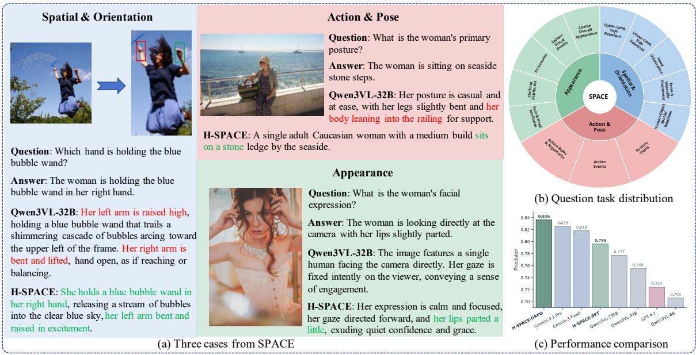
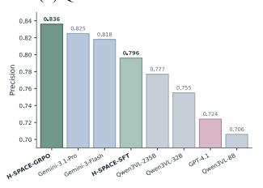
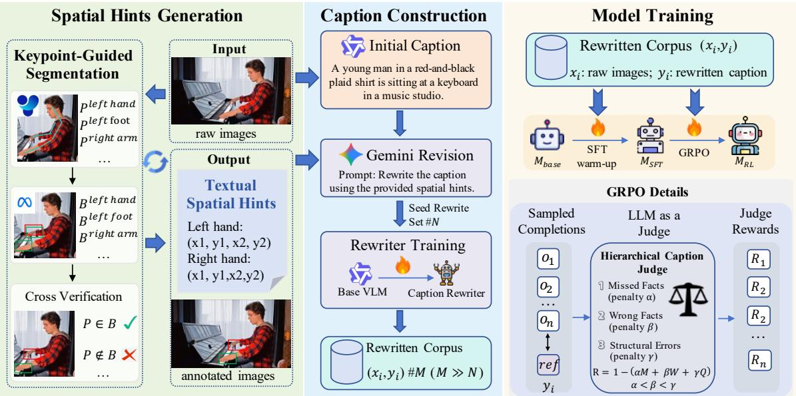
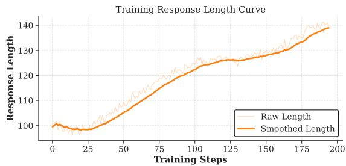
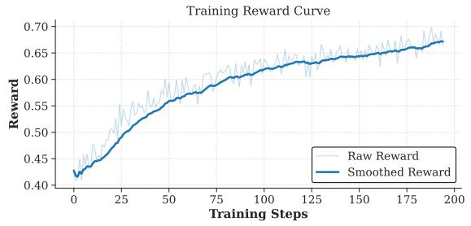
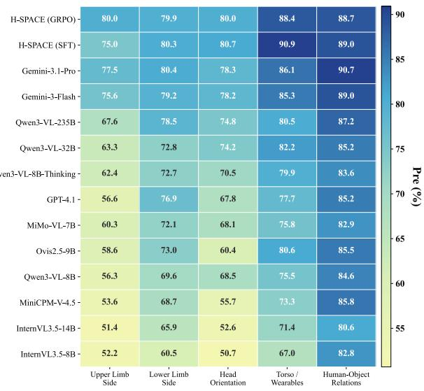

# Human-Centric Image Captioning with Subject-Centered Spatial Understanding

Bozhou Li∗†   
Peking University   
Beijing, China   
2301213084@pku.edu.cn   
Bohan Zeng   
Peking University   
Beijing, China   
bhzeng25@stu.pku.edu.cn

Yifan Dai Shanghai Jiao Tong University Shanghai, China yfandaii@sjtu.edu.cn

Jiahang Zhang∗†   
Peking University   
Beijing, China   
1900012780@pku.edu.cn   
Yiyan Ji   
Nanjing University   
Nanjing, China   
jiyiiiyyy@gmail.com

Yuran Wang Peking University Beijing, China yuranwang25@stu.pku.edu.cn

Yuanxing Zhang§   
Kling Team   
Beijing, China   
longo11070001@gmail.com   
Yue Ding   
Chinese Academy of Sciences   
Beijing, China   
yueding1011@gmail.com Xinlong Chen   
Chinese Academy of Sciences Beijing, China   
chenxinlong2025@ia.ac.cn

Chengzhuo Tong Peking University Beijing, China 22009200626@stu.xidian.edu.cn

Wentao Zhang   
Peking University   
Beijing, China   
wentao.zhang@pku.edu.cn   
Yushuo Guan‡   
Kling Team   
Beijing, China   
yushuo.guan@gmail.com   
Yang Shi   
Peking University   
Beijing, China   
frankyang1517@gmail.com   
Pengfei Wan   
Kling Team   
Beijing, China   
wpf1987@outlook.com

## Abstract

While multimodal large language models (MLLMs) achieve remark able performance on generic image captioning, they frequently sufer from structural hallucinations in human-centric scenarios. Accurately modeling human subjects is foundational for critical downstream applications, such as accurate avatar/video/image generation and fine-grained human action understanding. However, these tasks require highly precise subject-centered spatial grounding, such as distinguishing egocentric left/right laterality and maintaining correct anatomical-object bindings. Although catastrophic for structural integrity, these localized spatial inversions are often overshadowed by overall descriptive metrics in existing benchmarks. To systematically expose and quantify this bottleneck, we introduce SPACE (Subject-centric Poses, Appearance, and Characteristics Evaluation), a benchmark designed to evaluate subject-centered spatial understanding. On SPACE, we reveal that despite strong generic perception, current MLLMs consistently fail to ground descriptions in the subject’s intrinsic frame of reference. To bridge this gap, we propose a specialized data construction and alignment pipeline. We first extract structured spatial hints from fine-grained body-part localization to guide a two stage caption rewriting process, yielding highly spatially-faithful

training data. Furthermore, we design a rubric-based reward for Group Relative Policy Optimization (GRPO) that explicitly penalizes structurally critical spatial errors during alignment. Extensive experiments on SPACE demonstrate our framework significantly improves human-centric caption quality, particularly in subjectcentered spatial reasoning, achieving performance competitive with strong closed-source models. Our benchmark and code are available at https://github.com/JHang2020/SPACE-Eval.

## CCS Concepts

• Computing methodologies → Computer vision.

## Keywords

human-centric image captioning, multimodal large language models, subject-centered spatial understanding, benchmark

## ACM Reference Format:

Bozhou Li, Jiahang Zhang, Yue Ding, Yushuo Guan, Bohan Zeng, Yiyan Ji, Xinlong Chen, Yang Shi, Yifan Dai, Yuran Wang, Chengzhuo Tong, Pengfei Wan, Yuanxing Zhang, and Wentao Zhang. 2026. Human-Centric Image Captioning with Subject-Centered Spatial Understanding. In Proceedings of the 34th ACM International Conference on Multimedia (MM ’26), November 10–14, 2026, Rio de Janeiro, Brazil. ACM, New York, NY, USA, 10 pages. https://doi.org/10.1145/3767308.3835525

## 1 Introduction

Multimodal large language models (MLLMs) have achieved substantial progress in general visual understanding and reasoning [2, 3, 10, 15, 17, 22, 25, 29, 44, 63]. While recent advances have extended these capabilities toward detailed human analysis and fine-grained descriptions [31, 48, 56], existing eforts still primarily emphasize broad human activities, coarse spatial relations, or overall caption richness. A central challenge in human-centric captioning remains underexamined: coordinate-frame conversion. Models observe an image from an extrinsic, camera-centered frame, whereas correct human descriptions often require an intrinsic, subject-centered frame. For example, accurately describing whether an accessory appears on a person’s left or right side requires the model to convert from camera-centered observation to subject-centered description. This issue is important not only for faithful human-centered understanding, but also for constructing reliable human-centric caption corpora, whose quality directly afects the training of downstream multimodal and generative models [12, 45, 49]. However, existing caption benchmarks and human-centered evaluations do not explic itly test this conversion in generated descriptions, leaving a critical blind spot in current assessment.

  
Fi ure 1: Overview of SPACE. (a) Three re resentative benchmark cases from the three cate ories: S atial & Orientation Action & Pose, and Appearance dimensions. Compared with Qwen3VL-32B, H-SPACE produces more accurate human-centric descriptions. (b) Question task distribution of SPACE, organized into three top-level dimensions and their fine-grained subcategories. (c) Performance comparison on SPACE using overall Precision. H-SPACE, especially after GRPO, achieves the best performance among representative Gemini, GPT, and Qwen baselines.

To systematically study this issue, we introduce SPACE (Subjectcentric Poses, Appearance, and Characteristics Evaluation), a comprehensive benchmark for human-centric image captioning. SPACE contains 2,981 images and 19,892 evaluation keypoints, organized into three categories: Spatial & Orientation, Action & Pose, and Appearance. Among them, Spatial & Orientation is the core category and directly evaluates whether a model can translate cameracentered visual observations into accurate subject-centered descriptions. The other two categories, Action & Pose and Appearance, provide complementary coverage of broader human-centric captioning ability, allowing us to distinguish failures in coordinate-frame conversion from more general captioning weaknesses. Through a comprehensive evaluation of mainstream MLLMs on SPACE, we reveal a clear vulnerability: despite strong performance on appearance and coarse actions, contemporary models consistently struggle with directional attribution, especially in distinguishing left and right body parts.

To address this limitation, we propose a scalable data construction and training framework for human-centric captioning. We first combine YOLO pose estimation [20] and SAM3-based [5] part segmentation to derive structured body-part hints, including verified part-level bounding boxes, which provide explicit spatial evidence for annotation. Based on these hints, we decouple dificult humancentric caption construction into two stages: an initial captioning stage that produces coarse descriptions, and a rewriting stage in which a stronger proprietary MLLM revises the caption conditioned on the spatial hints to obtain subject-centered, spatially corrected supervision. We then distill this rewriting behavior into an opensource rewriter and use it for bootstrapped large-scale data expansion. Finally, we train a hint-free deployment model with supervised fine-tuning and Group Relative Policy Optimization (GRPO) [14]. During preference optimization, a fine-grained rubric-based reward judge compares generated captions against rewritten references and assigns stronger penalties to spatially critical errors, enabling the model to better internalize subject-centered spatial constraints during generation.

Figure 2 summarizes the overall pipeline of SPACE construction and model training.

In summary, our main contributions are as follows:

• Novel Benchmark and Insight: We introduce SPACE, a comprehensive human-centric caption benchmark whose core Spatial & Orientation category explicitly targets coordinate-frame conversion (e.g., distinguishing a subject’s left and right limbs), while Action & Pose and Appearance provide complementary evaluation categories. Our extensive evaluation reveals that current mainstream models sufer from substantial deficiencies in accurately grounding directional body-part attributes.

  
Figure 2: Overview ofour data construction and training pipeline. Left: YOLO pose estimation and SAM3-based part segmentation yield reliable body-part bounding boxes that serve as structured spatial hints. Middle: Gemini-3-Pro rewrites initial captions conditioned on these hints, and the rewritten data train an open-source rewriter for large-scale expansion. Right: the caption model is trained with supervised fine-tuning followed by GRPO, whose reward model scores generated captions against references.

• Scalable Data Construction Pipeline: We design an automated data synthesis workflow that harnesses expert vision-only models (YOLO and SAM3) for spatial prompt generation. Coupled with a two-stage caption-and-rewrite strategy and bootstrapped data expansion, this pipeline yields a large-scale training corpus with subject-centered spatial awareness.

• Spatial-Aware Baseline Model: Finally, we present a strong baseline model trained via SFT and standard GRPO with a rubricbased spatial judge reward. Experiments demonstrate that this model achieves state-of-the-art performance on SPACE, validating the eficacy of our automated data construction pipeline in instilling coordinate-frame awareness into MLLMs.

## 2 Related Work

## 2.1 Human-Centric Benchmarking in MLLMs

A large body of work has developed image and video captioning benchmarks to assess multimodal models from diferent perspectives, including descriptiveness, faithfulness, coverage, and human preference [4, 6, 7, 9, 13, 32]. While these benchmarks have substantially improved caption evaluation, they are largely generic and are not tailored to human-centered understanding.

Recent human-centered benchmarks can be roughly divided into caption-oriented and understanding-oriented evaluations. Captionoriented benchmarks remain relatively scarce, and existing eforts mainly emphasize human behaviors and human-object relations in generated descriptions [56]. Understanding-oriented benchmarks instead assess human-centered multimodal understanding through question answering, grounding, or other discriminative formats [31, 40]. Human-MME further broadens human-centered evaluation to diverse scenarios [31]. However, these benchmarks still do not explicitly isolate coordinate-frame conversion in generated human descriptions, particularly subject-centered spatial errors such as left-right confusion and incorrect body-part binding. In contrast, SPACE focuses on human-centric evaluation with explicit attention to subject-centered spatial correctness in caption generation.

## 2.2 Spatial Understanding and Frame of Reference in MLLMs

A substantial body of literature has shown that, despite strong progress in general visual understanding tasks, current LVLMs still exhibit persistent weaknesses in spatial understanding and reasoning [23, 24, 26, 30, 38, 46, 51, 59]. Existing eforts to improve spatial intelligence in multimodal models mainly follow two directions. One line injects explicit 3D or geometric signals, for example through geometry-aware encoders, reconstruction-oriented tokens, or explicit 3D intermediate supervision [8, 11, 34, 50]. The other line improves spatial capability through targeted data curation and training paradigms, including spatial question-answer data, simulator-based generation, cognitive maps, staged supervised fine-tuning, reinforcement learning, and progressive curricula [27, 35, 39, 50, 54, 57]. Together, these studies have substantially advanced spatial grounding and spatial reasoning under generic visual settings.

Distinct from these general spatial modeling eforts, a specialized branch of research has emerged to investigate the psychological concept of Frame ofReference (FoR) in MLLMs [36, 65, 66]. Cognitive science distinguishes between an extrinsic (camera-centered or viewer-centered) reference frame and an intrinsic (subject-centered or object-centered) reference frame. Specific benchmarks, such as COMFORT [66] and FoREST [36], explicitly reveal that while contemporary MLLMs perform reasonably well under extrinsic frames, they exhibit severe directional biases and substantial performance drops under intrinsic frames. Other recent eforts, such as InSpire [65], attempt to align Vision-Language-Action models with intrinsic object directionality to assist embodied agents. While these works highlight the FoR-related “spatial blindspot” of MLLMs, they mainly focus on VQA, classification, or embodied settings. In contrast, our work studies this coordinate-frame conversion problem in dense human-centric caption generation.

## 2.3 Data Construction and Preference Optimization

Recent work has increasingly explored automatic construction of richer caption supervision through multi-stage generation, questionguided enrichment, and rewrite-based refinement [62, 67]. Related person-centered studies have further shown that MLLMs can be used to synthesize large-scale human descriptions, improve stylistic diversity, and reorganize person-centric annotations at scale [19, 37, 43]. These eforts demonstrate the usefulness of synthetic supervision and rewriting pipelines, but they mainly aim to improve descriptiveness, diversity, or retrieval-oriented discriminability, rather than correcting subject-centered spatial errors with explicit geometric hints.

In parallel, recent post-training work has investigated rewardbased optimization and preference alignment for captioning and LVLM generation, including metric-aware caption optimization, caption-specific preference learning, task-level preference alignment, and DPO-based mitigation of multimodal hallucination [16, 42, 53, 55]. More recently, rubric-based LLM and VLM evaluators, as well as rubric-oriented reward models, have highlighted the value of explicit scoring criteria for improving the interpretability and controllability of reward signals [1, 18, 21, 64]. Benchmark studies on multimodal reward models further suggest that reliable visual preference signals remain task-sensitive and dificult to obtain [28, 61]. In contrast, our work focuses on human-centric caption generation under a subject-centered frame, and instantiates a task-specific rubric-based reward around spatial omissions, generic factual mistakes, and structurally critical orientation errors, while integrating structured spatial hints into both data construction and reward design.

## 3 Proposed SPACE Benchmark

## 3.1 Motivation and Overview

While recent MLLMs demonstrate impressive capabilities in general object recognition, they consistently sufer from severe structural hallucinations when describing fine-grained human details. Among these, subject-centered spatial relations—such as correctly distinguishing a subject’s left and right limbs or accurately binding objects to specific body parts—represent a critical yet largely overlooked bottleneck. Although often overshadowed by overall descriptive accuracy in conventional evaluations, such structural inversions undermine the reliability ofMLLMs in downstream applications such as human image/video generation, fine-grained action understanding, and embodied agent control. To systematically expose and quantify this vulnerability, we introduce SPACE (Subjectcentric Poses, Appearance, and Characteristics Evaluation).

Table 1: Comparison between SPACE and prior human-centered spatial benchmarks. Cat.: number of categories. Imgs: number of images. Subj.-centered: subject-centered orientation. Non-subj. rel.: camera-centered spatial relations. Body-part orient.: body-part-level orientation.
<table><tr><td>Benchmark</td><td>Cat.</td><td>Imgs</td><td>Subj.- centered</td><td>rel.</td><td>Non-subj. Body-part orient.</td></tr><tr><td>HC-COCO-test</td><td>1</td><td>2.5k</td><td></td><td>x</td><td>X</td></tr><tr><td>HumaniBench</td><td>7</td><td>~1.5k</td><td></td><td>X</td><td>x</td></tr><tr><td>Human-MME</td><td>8</td><td>19,945</td><td></td><td>x</td><td></td></tr><tr><td>SPACE (Ours)</td><td>13</td><td>2,981</td><td>1</td><td></td><td>L</td></tr></table>

SPACE contains 2,981 images and 19,892 evaluation keypoints, organized into three top-level categories: Spatial & Orientation, Action & Pose, and Appearance. Among them, Spatial & Orientation is the core category and explicitly targets spatial relations involving human subjects. It covers both subject-centered orientation, where the correct description must be made from the subject’s perspective, and non-subject-centered spatial relations, where the target relation is defined under a more generic or camera-centered frame. The other two categories, Action & Pose and Appearance, provide complementary coverage of human-centric captioning and help distinguish whether model failures are specific to subject-centered spatial understanding or reflect broader weaknesses in human description generation. Figure 1 provides a high-level overview of the benchmark composition and one representative benchmark instance. Model comparisons on SPACE are reported later in Section 5.2.

Each sample is organized as an image-caption pair together with fine-grained evaluation keypoints and answers, which serve as the atomic evaluation units in SPACE. As shown later in Table 2, current MLLMs exhibit the largest gap on the Spatial & Orientation category, especially on subject-centered cases, which motivates the dedicated spatially focused pipeline introduced in Section 4.1.

## 3.2 Benchmark Construction

Constructing a benchmark that specifically penalizes subject-centered spatial hallucinations requires a highly rigorous pipeline due to the serious hallucinations of current MLLMs. Automated metrics and LLM-generated captions frequently overlook or confuse egocentric left-right orientations. Therefore, we design a controlled construction process that relies heavily on manual verification to explicitly disentangle subject-centered semantics from generic visual descriptions.

1. Data Collection and Filtering: We initiate the process by sampling raw images from the CapRL-5M [52] and LAION-400M [41] corpora. To ensure relevance, we apply a YOLO-based detector to filter the collected images, retaining only those containing human subjects. We preserve diverse human-centric scenes during this stage so that the benchmark covers varied appearances, poses, actions, and human-object configurations. Importantly, the images selected for SPACE are reserved for benchmark construction and are excluded from the training-data generation pipeline, ensuring that the benchmark and training corpus are strictly non-overlapping at the image level.

2. Caption Generation and Manual Rectification: For each filtered image, we prompt Gemini-3-Pro to generate an initial dense caption describing the human subjects and their activities. However, relying solely on automated generation often yields descriptions with subtle errors, particularly regarding spatial orientations and anatomical sides. Therefore, we perform meticulous manual corrections on these initial captions. Our annotators are instructed to rectify any descriptive inaccuracies and explicitly enforce a subjectcentric coordinate system, ensuring that ambiguous body parts are accurately specified as “left” or “right” based on the subject’s perspective.

3. Keypoint Generation for Evaluation: Having established the rectified captions as ground-truth descriptions, we further derive fine-grained evaluation keypoints for each top-level category. For Spatial & Orientation, we predefine semantic points for both subjectcentered orientation and non-subject-centered spatial relations. The former includes side-sensitive body-part cases such as hand/arm, leg/foot, head orientation, and torso-wearable bindings, while the latter covers human-object and local part-object relations under a more generic spatial frame. For Action & Pose, we instantiate keypoints over posture type, event verbs, and action arguments. Specifically, Appearance is organized into Face and Head Cues, Clothing and Style, Accessories and Visible Attributes, Salient Local Details, and Overall Appearance Cues. Conditioned on the verified captions, Gemini-3-Pro is then used to instantiate these keypoints and their corresponding ground-truth answers for each image.

This pipeline yields 2,981 image-caption pairs with 19,892 keypoint annotations for human-centric spatial and behavioral evaluation.

## 3.3 Evaluation Protocol and Metrics

Given a test image, the evaluated MLLM first generates a free-form caption, which is then scored against the predefined evaluation keypoints and their ground-truth answers by a judge model. The protocol follows the benchmark taxonomy introduced above. In particular, within Spatial & Orientation, Categories 1.1–1.4 correspond to subject-centered orientation cases that must be described from the subject’s own frame, whereas Category 1.5 covers non-subjectcentered spatial relations under a more generic frame. For each keypoint, the judge assigns one of three labels: correct, meaning that the caption expresses the target semantic point correctly; wrong, meaning that the caption mentions the target point but describes it incorrectly; and not mentioned, meaning that the caption fails to cover the target point at all.

Let K denote a set ofevaluation keypoints, which can correspond to the full benchmark or to a specific top-level category. We denote by $N _ { \mathrm { c } } ( \mathcal { K } ) , N _ { \mathrm { w } } ( \mathcal { K } )$ , and $N _ { \mathrm { m } } ( \mathcal { K } )$ the numbers of keypoints judged as correct, wrong, and not mentioned, respectively. The total number of keypoints is therefore

$$
| \mathcal { K } | = N _ { \mathrm { c } } ( \mathcal { K } ) + N _ { \mathrm { w } } ( \mathcal { K } ) + N _ { \mathrm { m } } ( \mathcal { K } ) .\tag{1}
$$

We report two complementary metrics. Hit measures coveragequality over all evaluation points:

$$
\mathrm { H i t } ( { \mathcal { K } } ) = \frac { N _ { \mathrm { c } } ( { \mathcal { K } } ) } { | { \mathcal { K } } | } .\tag{2}
$$

Precision evaluates correctness conditioned on the model having mentioned the relevant point:

$$
\mathrm { P r e c i s i o n } ( \mathcal { K } ) = \frac { N _ { \mathrm { c } } ( \mathcal { K } ) } { N _ { \mathrm { c } } ( \mathcal { K } ) + N _ { \mathrm { w } } ( \mathcal { K } ) } .\tag{3}
$$

Intuitively, Hit penalizes both omission and error, while Precision isolates whether the model is correct once it attempts to describe the corresponding semantic point. We report these two metrics for the overall benchmark and for each top-level category separately.

## 4 The Proposed Method

Figure 2 provides an overview of our method. As shown by the benchmark results in Table 2 and Figure 3, current MLLMs exhibit the largest weakness on the Spatial & Orientation category, especially on subject-centered cases. Motivated by this dificulty, we design a dedicated pipeline that first constructs reliable spatial hints, then produces spatially corrected training captions, and finally optimizes a deployment model with rubric-based preference learning.

## 4.1 Structured Spatial Hint Generation

This stage converts each image into conservative structured spatial hints for later caption correction. For each detected person, we first use YOLO11x-Pose to estimate a human skeleton, then use SAM3 to localize body-part candidates inside the person crop, and finally apply a side-aware geometric verification rule to remove unreliable left-right assignments. The output of this stage is a hint-annotated image together with a textual hint list.

1. Human Pose Estimation (YOLO): Given an input humancentric image I, we apply a pre-trained YOLO-Pose model to detect human subjects and annotate their skeletal structure. Let �YOLO denote the pose estimation function. For each detected person, YOLO-Pose returns a person box together with a set of � anatomical joints $\mathcal { T } = \{ j _ { i } = ( x _ { i } , y _ { i } , c _ { i } ) \} _ { i = 1 } ^ { N }$ , where $( x _ { i } , y _ { i } )$ represents the 2D coordinate of the �-th joint (e.g., left wrist) and $c _ { i }$ is the confidence score. These outputs tell us where the subject is and provide coarse anatomical anchors for later part-level localization.

2. Part Candidate Localization (SAM3): For each detected person, we crop the image to the YOLO person box and run SAM3 $( f _ { \mathrm { S A M } } )$ only inside this localized region. Using body-part-specific textual prompts, SAM3 produces candidate masks and bounding boxes for the queried parts. If SAM3 returns multiple candidates for the same part, we keep the candidate whose box center is closest to the corresponding YOLO keypoint. Therefore, YOLO keypoints are not fed to SAM3 as prompts; instead, they act as anatomical anchors for candidate selection.

3. Side-Aware Verification and Hint Construction: The last step is to verify whether the SAM3 candidates are geometrically consistent with the YOLO skeleton, especially for bilateral parts such as hands, feet, and shoulders. Let $r _ { \ell }$ and $r _ { r }$ denote the SAM3 candidates initially associated with the left and right side of a bilateral part, and let $\pmb { \mathit { p } } _ { \ell }$ and $\ b { p _ { r } }$ denote the corresponding YOLO keypoints when available. For any candidate �, we denote the center of its bounding box by c(�) and measure geometric compatibility by the Euclidean distance $d ( \mathbf { c } ( \boldsymbol { r } ) , \boldsymbol { p } )$

Table 2: Main results on SPACE. We report Precision and Hit for the overall benchmark and the three top-level dimensions. Models are grouped into closed-source and open-source MLLMs; within each group, the best value per column is bolded. Parameter counts are given when publicly known; “–” denotes an undisclosed model size.
<table><tr><td rowspan="2">Model</td><td rowspan="2">Params</td><td colspan="2">Overall</td><td colspan="2">Spatial &amp; Ori.</td><td colspan="2">Action &amp; Pose</td><td colspan="2">Appearance</td></tr><tr><td>Prec. Hit</td><td></td><td>Prec.</td><td>Hit</td><td>Prec.</td><td>Hit</td><td>Prec.</td><td>Hit</td></tr><tr><td>Closed-source Models</td><td></td><td></td><td></td><td></td><td></td><td></td><td></td><td></td><td></td></tr><tr><td>GPT-4.1</td><td></td><td>72.4 44.5</td><td></td><td>67.9</td><td>47.7</td><td>72.0</td><td>56.4</td><td>84.4</td><td>28.5</td></tr><tr><td>Gemini-3-Flash [10]</td><td>一</td><td>81.8 62.1</td><td></td><td>80.1</td><td>67.0</td><td>83.5</td><td>70.3</td><td>82.1</td><td>47.8</td></tr><tr><td>Gemini-3.1-Pro [10]</td><td></td><td>82.5 67.6</td><td></td><td>81.1</td><td>74.5</td><td>83.1</td><td>75.6</td><td>84.0</td><td>51.3</td></tr><tr><td>Open-source Models</td><td></td><td></td><td></td><td></td><td></td><td></td><td></td><td></td><td></td></tr><tr><td>MiMo-VL-7B-SFT [60]</td><td>7B</td><td>70.2 40.8</td><td></td><td>68.4</td><td>42.7</td><td>68.5</td><td>49.6</td><td>76.6</td><td>29.3</td></tr><tr><td>MiniCPM-V-4.5 [58]</td><td>9B</td><td>67.5</td><td>43.7</td><td>63.4</td><td>45.4</td><td>68.1</td><td>51.8</td><td>73.9</td><td>33.5</td></tr><tr><td>Ovis2.5-9B [33]</td><td>9B</td><td>72.6</td><td>47.1</td><td>68.2</td><td>47.5</td><td>72.9</td><td>56.0</td><td>79.6</td><td>37.6</td></tr><tr><td>InternVL3.5-8B [47]</td><td>8B</td><td>64.3 35.5</td><td></td><td>60.5</td><td>35.1</td><td>63.7</td><td>43.9</td><td>72.1</td><td>27.3</td></tr><tr><td>InternVL3.5-14B [47]</td><td>14B</td><td>63.9</td><td>32.4</td><td>60.9</td><td>32.1</td><td>64.3</td><td>42.7</td><td>68.9</td><td>22.0</td></tr><tr><td>Qwen3-VL-8B-Instruct [2]</td><td>8B</td><td>70.656.7</td><td></td><td>66.6</td><td>59.1</td><td>72.8</td><td>63.2</td><td>73.9</td><td>47.0</td></tr><tr><td>Qwen3-VL-8B-Thinking [2]</td><td>8B</td><td>73.3 51.8</td><td></td><td>70.4</td><td>56.7</td><td>72.9</td><td>60.5</td><td>79.6</td><td>37.3</td></tr><tr><td>Qwen3-VL-32B-Instruct [2]</td><td>32B</td><td>75.5</td><td>61.3</td><td>72.1</td><td>65.3</td><td>76.4</td><td>68.2</td><td>79.8</td><td>49.6</td></tr><tr><td>Qwen3-VL-235B-A22B-Instruct [2]</td><td>235B</td><td>77.7</td><td>60.7</td><td>74.9</td><td>65.0</td><td>78.2</td><td>68.2</td><td>82.1</td><td>47.8</td></tr><tr><td>H-SPACE-GRPO</td><td>8B</td><td></td><td>83.6 67.9</td><td>82.4</td><td>70.4</td><td>84.0</td><td>68.9</td><td>84.6</td><td>63.9</td></tr></table>

The rule is intentionally conservative. When both side keypoints are available, we keep a candidate on its nominal side only if it is closer to the same-side keypoint than to the opposite-side one. If both candidates collapse toward the same side, we keep only the better-supported candidate for that side and mark the opposite side as unresolved. If the two candidates cross over, we discard both rather than swap them. When only one side keypoint is visible, we preserve the nominal candidate only when it is the closer one; oth erwise both sides remain unresolved. If the corresponding keypoint is unavailable, the part is treated as unresolved and omitted from the final hint set. This rule follows a simple principle: a missing spatial hint is preferable to a confidently wrong left-right hint.

Let L denote the predefined set of queried body-part labels, and let $b _ { L }$ denote the final retained bounding box for part label $L \in { \mathcal { L } }$ after verification, where $b _ { L } = \emptyset$ indicates that the part is unresolved and therefore discarded. We then define the valid body-part set as

$$
\mathcal { L } _ { \mathrm { v a l i d } } = \left\{ L \in \mathcal { L } \mid b _ { L } \neq \emptyset \right\} ,\tag{4}
$$

and collect the verified boxes as

$$
\mathcal { B } _ { \mathrm { v e r i f i e d } } = \left\{ b _ { L } \ | \ L \in \mathcal { L } _ { \mathrm { v a l i d } } \right\} .\tag{5}
$$

For each retained body part, we draw the verified box directly onto the raw image to obtain a hint-annotated image $\mathcal { I } _ { \mathrm { d r a w } } .$ . To make subject-centered spatial cues easier to parse, we use diferent colors to distinguish bounding boxes associated with diferent subjectcentered side assignments (e.g., left versus right) and other spatial roles. In parallel, we serialize the corresponding part labels and

coordinates as a textual hint list

$$
C = \left\{ ( L , b _ { L } ) \mid L \in { \mathcal { L } } _ { \mathrm { v a l i d } } \right\} .\tag{6}
$$

Together, $( \bar { J } _ { \mathrm { d r a w } } , C )$ constitute the structured spatial hints used in the subsequent data generation and training stages.

## 4.2 Two-Stage Caption Generation and Rewriting Pipeline

To construct high-quality, human-centric image-caption data that accurately reflects the subject-centered coordinate system, we design a dedicated two-stage data generation workflow. Generating a fully correct human-centric caption in a single pass is intrinsically dificult because it requires both broad semantic coverage and precise subject-centered spatial reasoning. We therefore decompose the problem into an initial description phase followed by a structured refinement phase. This decomposition separates broad human description from spatially critical correction, which simplifies data construction while preserving semantic coverage.

1. Initial Caption Generation: To establish the data source for our rewriting pipeline, we first collect raw images from CapRL 5M and LAION-400M. We then apply a YOLO object detector for preliminary filtering to isolate images containing human subjects. The training corpus is constructed from a subset that is strictly disjoint from the images used in SPACE, so that no benchmark image is reused during model training. For each retained humancentric image I, we prompt Qwen3-VL-235B-A22B to generate a detailed human-centric caption, which serves as the initial caption for the subsequent rewriting stage.

2. Structured Prompt-Conditioned Rewriting: To rectify the spatial inaccuracies in the initial caption, we employ a proprietary MLLM, Gemini-3-Pro, as a rewriter. We provide the model with the hint-annotated image $\mathcal { I } _ { \mathrm { d r a w } } .$ , the textual hint list ${ \mathit { C } } ,$ and the initial caption. Conditioned on these structured spatial hints, the rewriter revises the caption so that body parts are more explicitly grounded to their corresponding visual regions and directional expressions are more consistent with the subject-centered frame.

3. Distillation and Bootstrapped Data Expansion: Relying entirely on a proprietary model for large-scale data annotation is cost-prohibitive. To scale up the corpus, we use the rewritten captions to fine-tune an open-source MLLM, distilling the rewriting behavior into a lower-cost model. Once trained, this model can use the same structured spatial hints to produce refined captions at scale. We then apply it for bootstrapped data expansion over a broader set of human-centric images, yielding a larger rewritten corpus for final training. For each rewriting instance, $x _ { i }$ denotes the raw-image captioning input, $x _ { i } ^ { \mathrm { h i n t } }$ denotes the auxiliary hintaugmented input used only by the rewriter, and $y _ { i } ^ { \star }$ denotes the rewritten target caption. The resulting deployment-training corpus therefore retains the rewritten pairs $( x _ { i } , y _ { i } ^ { \star } )$ rather than the intermediate hint-conditioned inputs.

## 4.3 Supervised Fine-Tuning and Preference Optimization

Given the rewritten tuples $( x _ { i } , y _ { i } ^ { \star } )$ , we train a unified multimodal deployment model �� with supervised fine-tuning followed by GRPO.

1. Supervised Fine-Tuning (SFT): We first optimize $\pi _ { \theta }$ on the rewritten corpus using teacher forcing:

$$
\mathcal { L } _ { \mathrm { S F T } } = - \sum _ { t = 1 } ^ { T } \log \pi _ { \theta } ( y _ { i , t } ^ { \star } \mid x _ { i } , y _ { i , < t } ^ { \star } ) .\tag{7}
$$

We then freeze the resulting model as the reference policy $\pi _ { \mathrm { r e f } }$ for the subsequent preference optimization stage.

2. Hierarchical Rubric-Based Judge Reward: Our main taskspecific design lies in the reward. Given the rewritten target $y _ { i } ^ { \star }$ a judge model extracts a set of expected facts $E _ { i }$ and compares them with a sampled caption, yielding three disjoint error sets: missed facts $M _ { i } ,$ , generic wrong facts $W _ { i } ,$ and critical structural errors �� [1, 18, 21, 64]. The last category captures the failures that matter most in our setting, especially left-right anatomical reversals and incorrect subject-object binding. We therefore assign hierarchical penalties $\alpha < \beta \ll \gamma$ and define the reward as

$$
R _ { i } ^ { \mathrm { j u d g e } } = \mathrm { c l i p } \left( 1 - \frac { \alpha | M _ { i } | + \beta | W _ { i } | + \gamma | Q _ { i } | } { \operatorname* { m a x } ( 1 , | E _ { i } | ) } , R _ { \operatorname* { m i n } } , 1 \right) .\tag{8}
$$

In GRPO, this score is used as the reward $r _ { i } ^ { ( g ) }$ for each sampled completion.

3. Group Relative Policy Optimization (GRPO): We use standard GRPO to optimize �� against the frozen reference policy $\pi _ { \mathrm { r e f } } .$ The objective is

$$
\begin{array} { r } { \ell _ { i , g , t } ^ { \mathrm { G R P O } } = - \operatorname* { m i n } \Bigl ( \rho _ { i , g , t } A _ { i } ^ { ( g ) } , \mathrm { c l i p } ( \rho _ { i , g , t } , 1 - \epsilon , 1 + \epsilon ) A _ { i } ^ { ( g ) } \Bigr ) } \\ { + \lambda _ { \mathrm { K L } } \mathcal { D } _ { \mathrm { K L } } ( \pi _ { \theta } \parallel \pi _ { \mathrm { r e f } } ) . } \end{array}\tag{9}
$$

where

$$
\rho _ { i , g , t } = \frac { \pi _ { \theta } ( \boldsymbol { \hat { y } } _ { i , t } ^ { ( g ) } \mid \boldsymbol { x } _ { i } ) } { \pi _ { \mathrm { o l d } } ( \boldsymbol { \hat { y } } _ { i , t } ^ { ( g ) } \mid \boldsymbol { x } _ { i } ) } .
$$

Here, $A _ { i } ^ { ( g ) }$ denotes the group-wise relative advantage. At inference time, we discard all training-time hints and deploy the model directly on the raw-image input ��.

## 5 Experiments

## 5.1 Datasets and Implementation Details

We evaluate all models on SPACE under the protocol described in Section 3, using Qwen3-VL-235B-A22B-Instruct as the judge model. Unless otherwise specified, caption generation uses temperature 0.

For data construction, we use YOLO11x-Pose and SAM3 for structured hint extraction. We employ Gemini-3-Pro to annotate approximately 60K human-centric samples, distill the rewriting behavior into an open-source rewriter based on Qwen3-VL-32B, and further expand the rewritten corpus to approximately 237K samples. The final deployment model is built on Qwen3-VL-8B-Instruct.

All training stages use AdamW with a cosine learning-rate schedule, warmup ratio 0.03, and 1 epoch. For supervised fine-tuning, we use batch size 128, learning rate $1 \times 1 0 ^ { - 5 }$ , and 187K rewritten samples. For GRPO, we use learning rate 1 × 10−6, KL coeficient $\lambda _ { \mathrm { K L } } ~ = ~ \mathbf { 0 . 0 3 }$ , 50K training samples, 8 sampled completions per prompt, and Qwen3-VL-32B-Instruct as the rubric-based reward judge. The reward coeficients are $\alpha _ { \mathrm { m i s s e d } } ~ = ~ { \bf 1 . 0 } , ~ \beta _ { \mathrm { w r o n g } } ~ = ~ { \bf 1 . 5 }$ �critical = 2.5, with $R _ { \mathrm { m i n } } = - 1 . 0$

## 5.2 Main Results

Table 2 presents the main results on SPACE, comparing representative open-source and closed-source MLLMs under the same prompt and judge-based protocol, with Precision and Hit reported over the full benchmark and the three top-level dimensions. H-SPACE-GRPO achieves the highest overall performance among the compared models, reaching 83.6 Precision and 67.9 Hit. Relative to the base Qwen3-VL-8B-Instruct, it improves overall Precision and Hit by 13.0 and 11.2 points, respectively. It also performs better than substantially larger open-source models such as Qwen3-VL-32B-Instruct and Qwen3-VL-235B-A22B-Instruct, suggesting that task-specific data construction and post-training are efective for human-centric captioning under a subject-centered frame.

H-SPACE-GRPO also compares favorably with strong closedsource systems. In particular, it slightly exceeds Gemini-3.1-Pro on the overall benchmark (83.6 vs. 82.5 Precision, 67.9 vs. 67.6 Hit), and attains the highest Precision in all three top-level dimensions. Notably, H-SPACE-GRPO achieves the best Precision on Spatial & Orientation (82.4), which is consistent with the goal of reducing structurally critical subject-centered errors. At the same time, Gemini-3.1-Pro remains stronger in Hit on Spatial & Orientation and Action & Pose, indicating that coverage of relevant semantic points is still not fully solved.

## 5.3 Fine-Grained Spatial Analysis

To better understand where models fail within the core Spatial & Orientation dimension, we examine a fine-grained breakdown of its representative subcategories, which reveals whether the observed weakness is broadly distributed or concentrated on a smaller set of subject-centered cases. Figure 3 visualizes the relative performance of diferent models on these categories.

  
Figure 3: Left: training dynamics of our model during post-training, including the response-length curve (top) and the reward curve (bottom), both of which show a steady upward trend over training steps. Right: fine-grained precision heatmap on Category 1 (Spatial & Orientation) of SPACE.

Across models, Category 1.1 emerges as one of the most challenging cases, whereas Category 1.5 is generally handled much better. Compared with Category 1.5, Category 1.1 requires explicit subject-centered left-right discrimination of the arms and hands, making it particularly sensitive to failures in intrinsic frame conversion. Several open-source models achieve only slightly above 50% Precision on Category 1.1 while showing substantially stronger performance on Category 1.5. This contrast suggests that subjectcentered spatial grounding, rather than generic human description, remains a major bottleneck in human-centric captioning.

This trend holds across model families, so the dificulty is not tied to a specific architecture or model scale. Current MLLMs are therefore not uniformly weak on human-centric captioning; their failures concentrate on the cases that require reliable intrinsic frame conversion and precise body-part grounding, which reinforces the main finding of SPACE.

## 5.4 Controlled Rewriting Analysis

We further analyze the efect of caption rewriting in a controlled setting. We fix the source captions to those produced by a Qwen3- VL baseline on SPACE and only vary the rewriting stage.

We consider three rewriting variants. First, we use Gemini-3.1- Pro as a rewriter without structured hints, conditioning only on the original image and the source caption. Second, we provide Gemini-3.1-Pro with the full hint-conditioned input, including the hint-annotated image and the bbox-derived textual hints, to probe the direct efect of adding structured spatial guidance. Third, we evaluate our trained rewriter under the same hint-conditioned input, allowing us to assess both the efectiveness of the learned rewriter itself and whether hint-guided rewriting behavior can be realized in a lower-cost open-source model.

Because the source captions are fixed across settings, the observed diferences can be attributed to the rewriting stage itself rather than to variation in the base captioner. Concretely, on Category 1, Gemini-3.1-Pro without hints, Gemini-3.1-Pro with hints, and our trained rewriter obtain 73.3, 80.7, and 80.0 Precision, respectively. These results support two observations. First, structured hints are informative: supplying them to Gemini-3.1-Pro improves Category 1 Precision by 7.4 points, indicating that the bbox-derived spatial guidance carries subject-centered information that even a strong rewriter cannot reliably recover from the image and the source caption alone. Second, our trained rewriter is efective: despite being an open-source distilled model, it reaches 80.0 Precision under the same hint-conditioned input, essentially matching the proprietary rewriter at substantially lower cost. Overall, subjectcentered spatial errors are not only a challenging evaluation target, but also a correctable one given efective rewriting and hint utilization.

## 6 Conclusion

We study subject-centered spatial understanding in human-centric image captioning. We introduce SPACE, a benchmark that evaluates whether models can convert camera-centered observations into correct subject-centered descriptions, on which current MLLMs still struggle despite strong performance on broader visual tasks. To address this gap, we propose a scalable data construction and training pipeline combining structured spatial hints, caption rewriting, and rubric-based preference optimization. The resulting model substantially improves caption quality on SPACE, particularly in reducing subject-centered spatial errors, and remains competitive with strong closed-source systems.

## Acknowledgments

This work was supported by the Beijing Major Science and Technology Project (No. Z251100008425023).

## References

[1] David Anugraha, Zilu Tang, Lester James Validad Miranda, Hanyang Zhao, MohammadRifqi Farhansyah, Garry Kuwanto, Derry Wijaya, and Genta Indra Winata. 2025. R3: Robust Rubric-Agnostic Reward Models. ArXiv abs/2505.13388 (2025). https://api.semanticscholar.org/CorpusID:278768432

[2] Shuai Bai, Yuxuan Cai, Ruizhe Chen, Keqin Chen, Xionghui Chen, Zesen Cheng, Lianghao Deng, Wei Ding, Chang Gao, Chunjiang Ge, et al. 2025. Qwen3-vl technical report. arXiv preprint arXiv:2511.21631 (2025).

[3] Tianyi Bai, Hao Liang, Binwang Wan, Yanran Xu, Xi Li, Shiyu Li, Ling Yang, Bozhou Li, Yifan Wang, Bin Cui, et al. 2024. A survey of multimodal large language model from a data-centric perspective. arXiv preprint arXiv:2405.16640 (2024).

[4] Michele Cafagna, Kees van Deemter, and Albert Gatt. 2023. HL dataset: visually grounded description of scenes, actions and rationales. In Proceedings ofthe 16th International Natural Language Generation Conference. 293–312.

[5] Nicolas Carion, Laura Gustafson, Yuan-Ting Hu, Shoubhik Debnath, Ronghang Hu, Didac Suris, Chaitanya Ryali, Kalyan Vasudev Alwala, Haitham Khedr, An drew Huang, et al. 2025. Sam 3: Segment anything with concepts. arXiv preprint arXiv:2511.16719 (2025).

[6] Xinlong Chen, Yue Ding, Weihong Lin, Jingyun Hua, Linli Yao, Yang Shi, Bozhou Li, Yuanxing Zhang, Qiang Liu, Pengfei Wan, et al. 2025. Avocado: An audiovisual video captioner driven by temporal orchestration. arXiv preprint arXiv:2510.10395 (2025).

[7] Xinlong Chen, Weihong Lin, Jingyun Hua, Linli Yao, Yue Ding, Bozhou Li, Bohan Zeng, Yang Shi, Qiang Liu, Yuanxing Zhang, et al. 2026. DiaDem: Advancing Dialogue Descriptions in Audiovisual Video Captioning for Multimodal Large Language Models. arXiv preprint arXiv:2601.19267 (2026).

[8] Zhangquan Chen, Manyuan Zhang, Xinlei Yu, Xufang Luo, Mingze Sun, Zihao Pan, Yan Feng, Peng Pei, Xunliang Cai, and Ruqi Huang. 2025. Think with 3d: Geometric imagination grounded spatial reasoning from limited views. arXiv preprint arXiv:2510.18632 (2025).

[9] Kanzhi Cheng, Wenpo Song, Jiaxin Fan, Zheng Ma, Qiushi Sun, Fangzhi Xu, Chenyang Yan, Nuo Chen, Jianbing Zhang, and Jiajun Chen. 2025. Caparena: Benchmarking and analyzing detailed image captioning in the llm era. In Findings ofthe Association for Computational Linguistics: ACL 2025. 14077–14094.

[10] Gheorghe Comanici, Eric Bieber, Mike Schaekermann, Ice Pasupat, Noveen Sachdeva, Inderjit Dhillon, Marcel Blistein, Ori Ram, Dan Zhang, Evan Rosen, et al. 2025. Gemini 2.5: Pushing the frontier with advanced reasoning, multi modality, long context, and next generation agentic capabilities. arXiv preprint arXiv:2507.06261 (2025).

[11] Zhiwen Fan, Jian Zhang, Renjie Li, Junge Zhang, Runjin Chen, Hezhen Hu, Kevin Wang, Huaizhi Qu, Dilin Wang, Zhicheng Yan, et al. 2025. Vlm-3r: Vision language models augmented with instruction-aligned 3d reconstruction. arXiv preprint arXiv:2505.20279 (2025).

[12] Yu Gao, Lixue Gong, Qiushan Guo, Xiaoxia Hou, Zhichao Lai, Fanshi Li, Liang Li, Xiaochen Lian, Chao Liao, Liyang Liu, Wei Liu, Yichun Shi, Shiqi Sun, Yu-Chen Tian, Zhi Tian, Peng Wang, Rui Wang, Xuanda Wang, Xun Wang, Ye Wang, Guofeng Wu, Jie Wu, Xin Xia, Xuefeng Xiao, Zhonghua Zhai, Xinyu Zhang, Qi Zhang, Yuwei Zhang, Shijia Zhao, Jianchao Yang, and Weilin Huang. 2025. Seedream 3.0 Technical Report. ArXiv abs/2504.11346 (2025). https: //api.semanticscholar.org/CorpusID:277787095

[13] Roopal Garg, Andrea Burns, Burcu Karagol-Ayan, Yonatan Bitton, Ceslee Montgomery, Yasumasa Onoe, Andrew Bunner, Ranjay Krishna, Jason Michael Baldridge, and Radu Soricut. 2024. Imageinwords: Unlocking hyper-detailed image descriptions. In Proceedings of the 2024 Conference on Empirical Methods in Natural Language Processing. 93–127.

[14] Daya Guo, Dejian Yang, Haowei Zhang, Junxiao Song, Peiyi Wang, Qihao Zhu, Runxin Xu, Ruoyu Zhang, Shirong Ma, Xiao Bi, et al. 2025. Deepseek-r1: Incen tivizing reasoning capability in llms via reinforcement learning. arXiv preprint arXiv:2501.12948 (2025).

[15] Wenyi Hong, Wenmeng Yu, Xiaotao Gu, Guo Wang, Guobing Gan, Haomiao Tang, Jiale Cheng, Ji Qi, Junhui Ji, Lihang Pan, et al. 2025. Glm-4.5 v and glm-4.1 v-thinking: Towards versatile multimodal reasoning with scalable reinforcement learning. arXiv preprint arXiv:2507.01006 (2025).

[16] Zihan Huang,Junda Wu, Rohan Surana, Tong Yu, David Arbour, Ritwik Sinha, and Julian McAuley. 2025. Image Diference Captioning via Adversarial Preference Optimization. In Proceedings of the 2025 Conference on Empirical Methods in Natural Language Processing, Christos Christodoulopoulos, Tanmoy Chakraborty, Carolyn Rose, and Violet Peng (Eds.). Association for Computational Linguistics, Suzhou, China, 33758–33770. doi:10.18653/v1/2025.emnlp-main.1713

[17] Aaron Hurst, Adam Lerer, Adam P Goucher, Adam Perelman, Aditya Ramesh, Aidan Clark, AJ Ostrow, Akila Welihinda, Alan Hayes, Alec Radford, et al. 2024. Gpt-4o system card. arXiv preprint arXiv:2410.21276 (2024).

[18] Ruipeng Jia, Yunyi Yang, Yuxin Wu, Yongbo Gai, Siyuan Tao, Mengyu Zhou, Jian-Ren Lin, Xiaoxi Jiang, and Guanjun Jiang. 2026. Open Rubric System: Scaling Reinforcement Learning with Pairwise Adaptive Rubric. ArXiv abs/2602.14069 (2026). https://api.semanticscholar.org/CorpusID:285615651

[19] Jiayu Jiang, Changxing Ding, Wentao Tan, Junhong Wang, Jin Tao, and Xiangmin Xu. 2025. Modeling Thousands of Human Annotators for Generalizable Text-to-Image Person Re-identification. 2025 IEEE/CVF Conference on Computer Vision and Pattern Recognition (CVPR) (2025), 9220–9230. https://api.semanticscholar. org/CorpusID:276961622

[20] Rahima Khanam and Muhammad Hussain. 2024. Yolov11: An overview of the key architectural enhancements. arXiv preprint arXiv:2410.17725 (2024).

[21] Seongyun Lee, Seungone Kim, Sue Hyun Park, Geewook Kim, and Minjoon Seo. 2024. Prometheus-Vision: Vision-Language Model as a Judge for Fine-Grained Evaluation. In Annual Meeting ofthe Association for Computational Linguistics. https://api.semanticscholar.org/CorpusID:26697748

[22] Bozhou Li, Yushuo Guan, Haolin Li, Bohan Zeng, Yiyan Ji, Yue Ding, Pengfei Wan, Kun Gai, Yuanxing Zhang, and Wentao Zhang. 2026. Semantic Routing: Exploring Multi-Layer LLM Feature Weighting for Difusion Transformers. arXiv preprint arXiv:2602.03510 (2026).

[23] Bozhou Li, Hao Liang, Zimo Meng, and Wentao Zhang. 2024. Are bigger encoders always better in vision large models? arXiv preprint arXiv:2408.00620 (2024).

[24] Bozhou Li, Xinda Xue, Sihan Yang, Yang Shi, Xinlong Chen, Yushuo Guan, Yuanxing Zhang, and Wentao Zhang. 2026. The unseen bias: How norm discrepancy in pre-norm mllms leads to visual information loss. In International Conference on Learning Representations, Vol. 2026. 1687–1709.

[25] Bozhou Li, Sihan Yang, Yushuo Guan, Ruichuan An, Xinlong Chen, Yang Shi, Pengfei Wan, Wentao Zhang, et al. 2025. GRAN-TED: Generating Robust, Aligned, and Nuanced Text Embedding for Difusion Models. arXiv preprint arXiv:2512.15560 (2025).

[26] Bozhou Li and Wentao Zhang. 2025. Id-align: Rope-conscious position remapping for dynamic high-resolution adaptation in vision-language models. arXiv preprint arXiv:2505.21465 (2025).

[27] Hongxing Li, Dingming Li, Zixuan Wang, Yuchen Yan, Hang Wu, Wenqi Zhang, Yongliang Shen, Weiming Lu, Jun Xiao, and Yueting Zhuang. 2025. Spatialladder: Progressive training for spatial reasoning in vision-language models. arXiv preprint arXiv:2510.08531 (2025).

[28] Lei Li, Yuancheng Wei, Zhihui Xie, Xuqing Yang, Yifan Song, Peiyi Wang, Chenxin An, Tianyu Liu, Sujian Li, Bill Yuchen Lin, et al. 2025. VL-RewardBench: a challenging benchmark for vision-language generative reward models. In Proceedings of the Computer Vision and Pattern Recognition Conference. 24657–24668.

[29] Mingxin Li, Yanzhao Zhang, Dingkun Long, Keqin Chen, Sibo Song, Shuai Bai, Zhibo Yang, Pengjun Xie, An Yang, Dayiheng Liu, et al. 2026. Qwen3-VL-Embedding and Qwen3-VL-Reranker: A Unified Framework for State-of-the-Art Multimodal Retrieval and Ranking. arXiv preprint arXiv:2601.04720 (2026).

[30] Yuan Liu, Haodong Duan, Yuanhan Zhang, Bo Li, Songyang Zhang, Wangbo Zhao, Yike Yuan, Jiaqi Wang, Conghui He, Ziwei Liu, et al. 2024. Mmbench: Is your multi-modal model an all-around player?. In European conference on computer vision. Springer, 216–233.

[31] Yuansen Liu, Haiming Tang, Jinlong Peng, Jiangning Zhang, Xiaozhong Ji, Qingdong He, Wenbin Wu, Donghao Luo, Zhenye Gan,Junwei Zhu, et al. 2025. Human-MME: A Holistic Evaluation Benchmark for Human-Centric Multimodal Large Language Models. arXiv preprint arXiv:2509.26165 (2025).

[32] Zhihang Liu, Chen-Wei Xie, Bin Wen, Feiwu Yu, Jixuan Chen, Pandeng Li, Boqiang Zhang, Nianzu Yang, Yinglu Li, Zuan Gao, et al. 2025. CAPability: A Comprehensive Visual Caption Benchmark for Evaluating Both Correctness and Thoroughness. arXiv preprint arXiv:2502.14914 (2025).

[33] Shiyin Lu, Yang Li, Yu Xia, Yuwei Hu, Shanshan Zhao, Yanqing Ma, Zhichao Wei, Yinglun Li, Lunhao Duan, Jianshan Zhao, et al. 2025. Ovis2. 5 technical report. arXiv preprint arXiv:2508.11737 (2025).

[34] Wufei Ma, Yu-Cheng Chou, Qihao Liu, Xingrui Wang, Celso de Melo, Jianwen Xie, and Alan Yuille. 2025. Spatialreasoner: Towards explicit and generalizable 3d spatial reasoning. arXiv preprint arXiv:2504.20024 (2025).

[35] Kun Ouyang, Yuanxin Liu, Haoning Wu, Yi Liu, Hao Zhou, Jie Zhou, Fandong Meng, and Xu Sun. 2025. Spacer: Reinforcing mllms in video spatial reasoning. arXiv preprint arXiv:2504.01805 (2025).

[36] Tanawan Premsri and Parisa Kordjamshidi. 2025. FoREST: Frame of Reference Evaluation in Spatial Reasoning Tasks. In Proceedings of the 2025 Conference on Empirical Methods in Natural Language Processing. Association for Computational Linguistics, 34965–34991. doi:10.18653/v1/2025.emnlp-main.1772

[37] Yang Qin, Chao Chen, Zhihang Fu, Dezhong Peng, Xi Peng, and Peng Hu. 2025. Human-centered interactive learning via mllms for text-to-image person reidentification. In Proceedings of the Computer Vision and Pattern Recognition Conference. 14390–14399.

[38] Pooyan Rahmanzadehgervi, Logan Bolton, Mohammad Reza Taesiri, and Anh Totti Nguyen. 2024. Vision language models are blind. In Proceedings ofthe

Asian Conference on Computer Vision. 18–34.

[39] Arijit Ray, Jiafei Duan, Ellis Brown, Reuben Tan, Dina Bashkirova, Rose Hendrix, Kiana Ehsani, Aniruddha Kembhavi, Bryan A Plummer, Ranjay Krishna, et al. 2024. Sat: Dynamic spatial aptitude training for multimodal language models. arXiv preprint arXiv:2412.07755 (2024).

[40] Shaina Raza, Aravind Narayanan, Vahid Reza Khazaie, Ashmal Vayani, Ahmed Y Radwan, Mukund S Chettiar, Amandeep Singh, Mubarak Shah, and Deval Pandya. 2025. Humanibench: A human-centric framework for large multimodal models evaluation. arXiv preprint arXiv:2505.11454 (2025).

[41] Christoph Schuhmann, Richard Vencu, Romain Beaumont, Robert Kaczmarczyk, Clayton Mullis, Aarush Katta, Theo Coombes, Jenia Jitsev, and Aran Komatsuzaki. 2021. Laion-400m: Open dataset of clip-filtered 400 million image-text pairs. arXiv preprint arXiv:2111.02114 (2021).

[42] Takumi Takada, Yuma Suzuki, Hiroki Takushima, Hayato Tanoue, Haruki Sato, Aiswariya Kumar, Hiroki Nishihara, Takayuki Hori, and Kazuya Ueki. 2024. Direct Metric Optimization for Image Captioning through Reward-Weighted Augmented Data Utilization. In Proceedings ofthe 62nd Annual Meeting ofthe Association for Computational Linguistics (Volume 1: Long Papers), Lun-Wei Ku, Andre Martins, and Vivek Srikumar (Eds.). Association for Computational Linguistics, Bangkok, Thailand, 8333–8346. doi:10.18653/v1/2024.acl-long.453

[43] Wentan Tan, Changxing Ding, Jiayu Jiang, Fei Wang, Yibing Zhan, and Dapeng Tao. 2024. Harnessing the power of mllms for transferable text-to-image person reid. In Proceedings ofthe IEEE/CVF Conference on Computer Vision and Pattern Recognition. 17127–17137.

[44] Kimi Team, Tongtong Bai, Yifan Bai, Yiping Bao, SH Cai, Yuan Cao, Y Charles, HS Che, Cheng Chen, Guanduo Chen, et al. 2026. Kimi K2. 5: Visual Agentic Intelligence. arXiv preprint arXiv:2602.02276 (2026).

[45] Z-Image Team, Huanqia Cai, Sihan Cao, Ruoyi Du, Peng Gao, Steven Hoi, Zhaohui Hou, Shijie Huang, Dengyang Jiang, Xin Jin, Liangchen Li, Zhen Li, Zhong-Yu Li, David Liu, Dongyang Liu, Junhan Shi, Qilong Wu, Fengyi Yu, Chi Zhang, Shifeng Zhang, and Shilin Zhou. 2025. Z-Image: An Eficient Image Generation Foun dation Model with Single-Stream Difusion Transformer. ArXiv abs/2511.22699 (2025). https://api.semanticscholar.org/CorpusID:283438115

[46] Shengbang Tong, Zhuang Liu, Yuexiang Zhai, Yi Ma, Yann LeCun, and Saining Xie. 2024. Eyes wide shut? exploring the visual shortcomings of multimodal llms. In Proceedings of the IEEE/CVF conference on computer vision and pattern recognition. 9568–9578.

[47] Weiyun Wang, Zhangwei Gao, Lixin Gu, Hengjun Pu, Long Cui, Xingguang Wei, Zhaoyang Liu, Linglin Jing, Shenglong Ye, Jie Shao, et al. 2025. Internvl3. 5: Advancing open-source multimodal models in versatility, reasoning, and eficiency. arXiv preprint arXiv:2508.18265 (2025).

[48] Fangyun Wei, Jinjing Zhao, Kun Yan, Hongyang Zhang, and Chang Xu. 2024. A large-scale human-centric benchmark for referring expression comprehension in the LMM era. Advances in Neural Information Processing Systems 37 (2024), 69566–69587.

[49] Chenfei Wu, Jiahao Li, Jingren Zhou, Junyang Lin, Kaiyuan Gao, Kun Yan, Sheng ming Yin, Shuai Bai, Xiao Xu, Yilei Chen, Yuxiang Chen, Zecheng Tang, Zekai Zhang, Zhengyi Wang, An Yang, Bowen Yu, Chen Cheng, Da-Wei Liu, De mei Li, Hang Zhang, Hao Meng, Hu Wei, Ji-Li Ni, Kai Chen, Kuang Cao, Liang Peng, Lin Qu, Min Wu, Peng Wang, Shuting Yu, Tingkun Wen, Wensen Feng, Xiao-Xue Xu, Yi Wang, Yichang Zhang, Yong-An Zhu, Yujian Wu, Yu-Jiao Cai, and Ze-Yang Liu. 2025. Qwen-Image Technical Report. ArXiv abs/2508.02324 (2025). https://api.semanticscholar.org/CorpusID:280422608

[50] Diankun Wu, Fangfu Liu, Yi-Hsin Hung, and Yueqi Duan. 2025. Spatial-mllm: Boosting mllm capabilities in visual-based spatial intelligence. arXiv preprint arXiv:2505.23747 (2025).

[51] Tianbao Xie, Danyang Zhang, Jixuan Chen, Xiaochuan Li, Siheng Zhao, Ruisheng Cao, Toh J Hua, Zhoujun Cheng, Dongchan Shin, Fangyu Lei, et al. 2024. Osworld: Benchmarking multimodal agents for open-ended tasks in real computer environments. Advances in Neural Information Processing Systems 37 (2024), 52040–52094.

[52] Long Xing, Xiaoyi Dong, Yuhang Zang, Yuhang Cao, Jianze Liang, Qidong Huang, Jiaqi Wang, Feng Wu, and Dahua Lin. 2025. Caprl: Stimulating dense image caption capabilities via reinforcement learning. arXiv preprint arXiv:2509.22647 (2025).

[53] Ziang Yan, Zhilin Li, Yinan He, Chenting Wang, Kunchang Li, Xinhao Li, Xi angyun Zeng, Zilei Wang, Yali Wang, Yu Qiao, Limin Wang, and Yi Wang. 2024. Task Preference Optimization: Improving Multimodal Large Language Models with Vision Task Alignment. 2025 IEEE/CVF Conference on Computer Vision and Pattern Recognition (CVPR) (2024), 29880–29892. https://api.semanticscholar.org/ CorpusID:275119548

[54] Shusheng Yang, Jihan Yang, Pinzhi Huang, Ellis Brown, Zihao Yang, Yue Yu, Shengbang Tong, Zihan Zheng, Yifan Xu, Muhan Wang, et al. 2025. Cambrian-s: Towards spatial supersensing in video. arXiv preprint arXiv:2511.04670 (2025).

[55] Zhihe Yang, Xufang Luo, Dongqi Han, Yunjian Xu, and Dongsheng Li. 2025. Mitigating Hallucinations in Large Vision-Language Models via DPO: On-Policy Data Hold the Key. 2025 IEEE/CVF Conference on Computer Vision and Pattern Recognition (CVPR) (2025), 10610–10620. https://api.semanticscholar.org/CorpusID:

275570496

[56] Zuopeng Yang, Pengbo Wang, Tianshu Chu, and Jie Yang. 2022. Human-centric image captioning. Pattern Recognition 126 (2022), 108545.

[57] Baiqiao Yin, Qineng Wang, Pingyue Zhang, Jianshu Zhang, Kangrui Wang, Zihan Wang, Jieyu Zhang, Keshigeyan Chandrasegaran, Han Liu, Ranjay Krishna, et al. 2025. Spatial mental modeling from limited views. In Structural Priors for Vision Workshop at ICCV’25.

[58] Tianyu Yu, Zefan Wang, Chongyi Wang, Fuwei Huang, Wenshuo Ma, Zhihui He, Tianchi Cai, Weize Chen, Yuxiang Huang, Yuanqian Zhao, et al. 2025. Minicpm-v 4.5: Cooking eficient mllms via architecture, data, and training recipe. arXiv preprint arXiv:2509.18154 (2025).

[59] Xiang Yue, Yuansheng Ni, Kai Zhang, Tianyu Zheng, Ruoqi Liu, Ge Zhang, Samuel Stevens, Dongfu Jiang, Weiming Ren, Yuxuan Sun, et al. 2024. Mmmu: A massive multi-discipline multimodal understanding and reasoning benchmark for expert agi. In Proceedings of the IEEE/CVF conference on computer vision and pattern recognition. 9556–9567.

[60] Xiaomi LLM-Core Team Zihao Yue, Zhenrui Lin, Yi-Hao Song, Weikun Wang, Shu-Qin Ren, Shuhao Gu, Shicheng Li, Peidian Li, Liang Zhao, Lei Li, Kainan Bao, Hao Tian, Hailin Zhang, Gang Wang, Dawei Zhu, Cici, Chenhong He, Bowen Ye, Bowen Shen, Zihan Zhang, Zi-Ang Jiang, Zhixian Zheng, Zhichao Song, Zhen Luo, Yue Yu, Yudong Wang, Yu Tian, Yu Tu, Yihan Yan, Yi Huang, Xu Wang, Xin dan Xu, Xin Ran Song, Xing Zhang, Xing Yong, Xin Zhang, Xia Deng, Wenyu Yang, Wenhan Ma, Weiwei Lv, Weiji Zhuang, Wei Liu, Sirui Deng, Shuo Liu, Shimao Chen, Shi liang Yu, Shao yang Liu, Shan yong Wang, Rui Ma, Qiantong Wang, Peng Wang, Nuo Chen, Menghang Zhu, Kang Zhou, Kang Zhou, Kai Fang, Jun-Miao Shi, Jinhao Dong, Jiebao Xiao, Jiaming Xu, Huaqiu Liu, Hongsheng Xu, Hengxu Qu, Hao-Song Zhao, Hanglong Lv, Guoan Wang, Duo Zhang, Dong Zhang, Di Zhang, Chong-Yi Ma, Chang Liu, Can Cai, and Bing Xia. 2025. MiMo-VL Technical Report. ArXiv abs/2506.03569 (2025). https: //api.semanticscholar.org/CorpusID:279155294

[61] Fatemeh Pesaran Zadeh, Yoojin Oh, and Gunhee Kim. 2025. LPOI: Listwise Preference Optimization for Vision Language Models. ArXiv abs/2505.21061 (2025). https://api.semanticscholar.org/CorpusID:278911233

[62] Yu Zeng, Yukun Qi, Yiming Zhao, Xikun Bao, Lin Chen, Zehui Chen, Shiting Huang, Jie Zhao, and Feng Zhao. 2025. Enhancing Large Vision-Language Models with Ultra-Detailed Image Caption Generation. In Proceedings of the 2025 Conference on Empirical Methods in Natural Language Processing, Christos Christodoulopoulos, Tanmoy Chakraborty, Carolyn Rose, and Violet Peng (Eds.). Association for Computational Linguistics, Suzhou, China, 26715–26741. doi:10.18653/v1/2025.emnlp-main.1357

[63] Biao Zhang, Paul Suganthan, Gaël Liu, Ilya Philippov, Sahil Dua, Ben Hora, Kat Black, Gus Martins, Omar Sanseviero, Shreya Pathak, et al. 2025. T5Gemma 2: Seeing, Reading, and Understanding Longer. arXiv preprint arXiv:2512.14856 (2025).

[64] Junkai Zhang, Zihao Wang, Lin Gui, Swarnashree Mysore Sathyendra, Jaehwan Jeong, Victor Veitch, Wei Wang, Yunzhong He, Bing Liu, and Lifeng Jin. 2025. Chasing the Tail: Efective Rubric-based Reward Modeling for Large Language Model Post-Training. ArXiv abs/2509.21500 (2025). https://api.semanticscholar. org/CorpusID:281659317

[65] Ji Zhang, Shihan Wu, Xu Luo, Hao Wu, Lianli Gao, Hengtao Shen, and Jingkuan Song. 2025. InSpire: Vision-Language-Action Models with Intrinsic Spatial Reasoning. ArXiv abs/2505.13888 (2025). https://api.semanticscholar.org/CorpusID: 278768943

[66] Zheyuan Zhang, Fengyuan Hu, Jayjun Lee, Freda Shi, Parisa Kordjamshidi, Joyce Chai, and Ziqiao Ma. 2024. Do Vision-Language Models Represent Space and How? Evaluating Spatial Frame of Reference Under Ambiguities. ArXiv abs/2410.17385 (2024). https://api.semanticscholar.org/CorpusID:273532344

[67] Deyao Zhu, Jun Chen, Kilichbek Haydarov, Xiaoqian Shen, Wenxuan Zhang, and Mohamed Elhoseiny. 2023. Chatgpt asks, blip-2 answers: Automatic questioning towards enriched visual descriptions. arXiv preprint arXiv:2303.06594 (2023).