# Inverse Digital Marbling: Recovering Gesture Programs with a Replay Adjoint

Tianqi Liu<sup>1</sup> Yushan Han<sup>2,∗</sup> Hang Liu<sup>3</sup>

<sup>1</sup>Zelostech, Beijing, China

<sup>2</sup>Huaxin Design Institute, Hangzhou, China

<sup>3</sup>Communication University of China, Beijing, China

<sup>∗</sup>Corresponding author: hanyushan.hx@chinaccs.cn

## Abstract

Pigment deposition in paper marbling displaces the pattern already present, coupling the appearance of each gesture to later actions. We recover executable programs for a deposition-based digital marbling model: given a target image, we optimise an ordered program of capsule insertions whose replay approximates it. The capsule primitive continuously joins circular drops to elongated deposits. Its transport is exactly area-preserving and has a closed-form inverse on the exterior of the deposited region. A replay adjoint reconstructs intermediate states, retaining coordinates lost inside deposits and periodic position checkpoints. At 2000 gestures and 1024<sup>2</sup> pixels, the PyTorch replay implementation uses 8.7× less memory than the tested checkpointed-autograd configuration at comparable step time; the fused implementation fits a program in about four minutes on one workstation GPU. We evaluate image reconstruction on five marbled sheets, compare against transport-disabled fitting, one-pass geometric compensation and a published stroke-based fitter at matched stroke count, and measure sensitivity to an alternative ordered-drop transport. Recovered programs replay across a 4× range of linear resolution. Edits specified in program order or in palette space — inserting a gesture, recolouring a stage, translating a stage — replay correctly under the same model; edits specified by image content, such as moving a motif, do not. On synthetic targets with known generating programs, the recovered programs match the images but not the generating gestures under a positional matching statistic. The output is an editable program in the specified digital medium.

## 1 Introduction

Turning an image into a program is useful when the program, rather than a raster approximation, is the desired output. It can be replayed at a new resolution, edited at the level of actions, or supplied to an authoring or fabrication system. Stroke-based rendering provides this representation for media in which a placed mark remains fixed: later marks may cover it, but do not change its geometry [1, 4, 5]. That assumption is productive for drawing and painting, but it removes a defining operation of marbling: the displacement of existing pigment.

In paper marbling, pigment floats on a liquid surface. A new deposit creates paint and displaces the pattern already present; a drawn tool transports earlier pigment along its path. Consequently, the location of an early mark in the final image depends on every later gesture. Gesture order matters, local corrections propagate globally, and a program must be evaluated as a coupled dynamical process. The inverse problem is to recover one program whose execution is visually equivalent to a given sheet, not to identify the historical sequence that produced it.

Two related research directions address complementary aspects of this problem. Digital marbling provides interactive forward simulators and composable closed-form maps [9, 8, 10], most recently analytical fluid brushes whose reverse-drift functions compose in a shader and render at any resolution [23]. These yield ordered programs — but forwards, authored by a user, not recovered from a target; drop insertion is part of that literature, while the tine brushes of Mixwell [23] move pigment without depositing it. Diferentiable simulation uses adjoints to recover controls or latent fluid states [21, 22], but optimises continuous fields rather than a discrete, ordered program of typed gestures that each create material. We invert this deposition-based program family.

Fitting requires diferentiation through the gesture chain. Retaining every per-pixel intermediate state at N = 2000 and 1024<sup>2</sup> requires tens of gigabytes. Checkpointing [13] trades storage for recomputation, while reversible networks [14, 20] and path replay for light transport [12] reconstruct intermediate states. In our renderer, the backward coordinate map is invertible outside each deposit, but its extension across deposited material loses coordinates. The replay adjoint records those exceptional coordinates and regenerates the exterior states.

This paper gives a model of the chain for which that record is small and the rest is cheap, and a system built on it. A gesture is a capsule whose length continuously joins a circular drop to a drawn deposit, and its transport is a translation in parallel-set area coordinates. That gives the forward map and its inverse in closed form, and makes the deposition set the single exact obstruction to coordinate regeneration, with a record count that depends on the sampled trajectories and that we measure directly. What the adjoint requires of the operator is a computable inverse; the closed form makes that inverse fast on its whole domain (Sec. 5.2). Geometry, width and palette assignment are then optimised jointly through 2000 gestures.

<table><tr><td>line of work</td><td>unknown</td><td>later marks move earlier ones?</td></tr><tr><td>stroke-based rendering [1, 4, 5]</td><td>ordered marks</td><td>no — placed marks are fixed</td></tr><tr><td>stroke fitting with smudging [15]</td><td>ordered strokes</td><td>yes, locally through colour smudging</td></tr><tr><td>process recovery from a finished image or time-lapse</td><td>marks, layers or frames</td><td>no explicit marbling transport map</td></tr><tr><td>[24, 25, 26] differentiable fluid control [21, 22]</td><td>continuous fields or yes, but there is no controls</td><td>typed gesture to</td></tr><tr><td>forward digital marbling [9, 8, 23]</td><td>nothing — the</td><td>recover yes</td></tr><tr><td>this work</td><td>program is authored ordered typed gestures</td><td>yes</td></tr></table>

Table 1: Related representations and tasks. Forward marbling provides authored programs; inverse painting includes ordered marks, layers, and smudging. Our task fits capsule-deposition programs through an explicit area-preserving exterior transport, with a replay adjoint specialised to its non-injective deposition extension.

We evaluate the recovered programs against structural controls chosen to isolate the contribution of transport: a flat-colour floor that puts every error on a common scale, a matched ablation with transport disabled, a onepass closed-form correction whose geometric obstruction Lemma 1 identifies, a second transport operator built from a published primitive, three seeds, and synthetic targets with known generating programs. Stroke-based renderers fit the same images but optimise a diferent object — marks that stay where they are placed — so they calibrate raster approximation rather than transport; we run one of them at matched stroke count and report where it wins (Sec. 6.2). The output is an executable program that replays unchanged across a 4× resolution range and can be edited at the level of gestures and stages (Fig. 10): order, replayability and gesture-level structure that survive execution.

## Contributions.

1. A capsule insertion primitive for digital marbling: exactly area-preserving of its footprint, with a closedform inverse, joining drops to drawn deposits continuously; the result that the straight segment is the unique curve skeleton for which its parallel-set area law is globally exact; and a quantified relationship to line-source potential flow (Sec. 4).

2. A replay adjoint specialised to this recurrence, whose only exact obstruction is characterised and whose record is measured rather than assumed, using 8.7× less memory than checkpointed automatic diferentiation at comparable step time (Sec. 5.2).

3. A system that recovers executable 2000-gesture programs from single images in minutes, with demonstrated program-level edits and documented failure cases, and an evaluation whose synthetic experiment measures image reconstruction and generatinggesture correspondence separately (Secs. 6 and 7).

The output is executable with respect to the computational gesture model: “execution” below means replay by its hard renderer. The target is a visually equivalent program rather than the historical sequence that produced a sheet, and the operator is a geometric surrogate for the bath rather than a simulation of it; Sec. 4.1 quantifies the discrepancy between the surrogate and the physical flow.

## 2 Related work

Forward models of marbling. Computational marbling has primarily been an authoring and simulation problem. Fluid solvers [9] reproduce the response of floating pigment to user input. Mathematical marbling replaces a full fluid solve with composable maps [8]; the classical drop map is closed-form and area-preserving. Jafer [10] derives Oseen-flow maps for short stylus motion. Most recently, James and James [23] derive sharp analytical fluid brushes from potential flow around a cylindrical tine, with reverse-drift functions that encode tine insertion, motion and removal, compose in a shader, and render progressively at any resolution. Those tools move pigment without depositing it. Inserting a tine of radius a into an incompressible sheet displaces material by $\sigma = { \sqrt { \sigma ^ { \prime 2 } - a ^ { 2 } } } ;$ that is the classical drop map, and it is identically the ℓ = 0 limit of (7), so at the drop the two constructions are the same map. The two constructions extend the drop map in diferent directions. Mixwell adds tine motion and removal, which transport material without net injection: the composed brush has no deposition set, is invertible everywhere, and raises no obstruction of the kind Lemma 1 identifies. We add extent instead — the capsule carries the drop continuously to an elongated deposit, keeping the closed-form inverse — and it is that continued deposition which makes the chain non-injective on its footprint and gives the adjoint of Sec. 5.2 something it must record; tinestyle drag is the zero-injection class we set aside (Sec. 10). All of these works establish eficient forward construction; none fits a program to an image. Our task starts from the finished image and searches for the ordered construction program.

Inverse design through physical dynamics. Adjoint fluid control [21] and diferentiable programming systems [22] show that desired outcomes can be converted into controls through multi-step simulation, and recent work derives adjoints directly on flow maps to diferentiate long simulations accurately [16]. That work also regenerates state rather than storing it, but for a flow that is reversible; the distinction here is that our map is deliberately not reversible on the deposition set, and the contribution is to characterise and measure that exception rather than to avoid it. These methods optimise continuous fields, initial conditions, or controls. Our replay strategy instead specialises state reconstruction to a gesture map that loses coordinates on its deposition set. Here the unknown is a discrete-length program of typed pigment-creating gestures, and the rendered appearance is carried by material deposited at diferent times.

Images as action programs. Stroke-based rendering spans hand-designed placement [1], sequential agents [2], diferentiable rasterisation [3, 4], and feed-forward stroke prediction [5]; the line begins with Haeberli’s ordered marks [28] and Hertzmann’s multi-size layering [29], which uses a coarse-to-fine radius schedule similar to ours. A parallel line recovers executable programs from images hand-drawn diagrams [32], procedural models fitted by search [33] — where the program’s semantics is a static composition; here it is a coupled dynamical process, so the contribution of slot i depends on every later slot. These methods composite marks [19]; their strength is direct image approximation rather than subsequent transport of the accumulated canvas. Physically based paint systems model wet media during forward interaction [7], while robotic painters incorporate medium response through calibration or feedback [6].

A separate line recovers or synthesises a plausible process: a drawing order for line drawings [24], ordered translucent strokes from time-lapse paintings [25], and ordered layered paths from one image [26]. These methods use diferent structural and learned priors; they do not fit the deposition-and-transport model studied here. We optimise gesture parameters in fixed ordered slots, so later transport afects the image contribution of earlier slots; we do not search over discrete order.

The closest recent work is Jiang et al. [15], which fits brushstrokes diferentiably and includes smudging, so later strokes can alter paint already placed. Its smudge renderer samples and blends existing canvas colours along brush motion. Our construction instead uses explicit material coordinate maps that preserve area outside deposits and admit exterior inversion. The contribution is the capsule-deposition primitive and an adjoint specialised to reconstructing its transport trajectories while retaining coordinates lost by the deposition extension. Both approaches produce structured painting representations; our replay and editing results are evaluated within the specified marbling model.

Memory-eficient diferentiation. Long reverse-mode chains can store all states, checkpoint them [13], or regenerate them by reversing the forward step [20, 14]. Related replay strategies are central to diferentiable light transport [12], and flow-map adjoints obtain the state-reconstruction benefits for long fluid simulations by reusing flow maps [16]; solver-level adjoints run an executed block-implicit sweep backwards with a per-sweep replay bufer in place of an autograd tape [17]. Where reversal loses information, reversible learning stores exactly the discarded bits [20]; our recurrence specialises that principle to pigment transport. The material a gesture creates has no earlier state to regenerate; we construct that exceptional set explicitly, record it, and measure its size. The soft coverage used during optimisation follows diferentiable rasterisation [11]; edge sampling [30] and reparameterisation [31] are the unbiased alternatives for gradients across a visibility discontinuity; the annealed relaxation sufices here because every reported number is a hard render.

## 3 Problem formulation

Let $\Omega = [ 0 , 1 ] ^ { 2 }$ be the canvas and $I ^ { * } : \Omega \to [ 0 , 1 ] ^ { 3 }$ the target image. A program is an ordered sequence $\Pi = ( g _ { 1 } , \dotsc , g _ { N } )$ of gestures $g _ { i } = ( a _ { i } , d _ { i } , r _ { i } , c _ { i } )$ with anchor $a _ { i } \in \mathbb { R } ^ { 2 }$ , ofset $d _ { i } \in \mathbb { R } ^ { 2 }$ , half-width $r _ { i } > 0$ and colour $c _ { i } \in [ 0 , 1 ] ^ { 3 }$ . Gesture i has footprint

$$
K _ { i } = \{ x \in \mathbb { R } ^ { 2 } : \ \mathrm { d i s t } ( x , [ a _ { i } , a _ { i } + d _ { i } ] ) \leq r _ { i } \} ,\tag{1}
$$

the closed capsule of radius $r _ { i }$ about its segment; $\ell _ { i } =$ $\| d _ { i } \| = 0$ is a disc, $\ell _ { i } > 0$ a drawn line, and gesture type is the continuous parameter $\ell _ { i } .$

A forward model R maps a program to an image. We consider models of the following form. Each gesture i induces a map $\psi _ { i } : \mathbb { R } ^ { 2 }  \mathbb { R } ^ { 2 }$ that traces pre-existing material from after gesture i to before it. Inside newly deposited material, it is a computational extension rather than a physical pre-image. For a pixel $x \in \Omega$ set $x _ { N } = x$ and, for $i = N , \ldots , 1$

$$
\alpha _ { i } = \alpha ( x _ { i } ; g _ { i } ) , \qquad x _ { i - 1 } = \psi _ { i } ( x _ { i } ) ,\tag{2}
$$

where $\alpha ( \cdot ; g _ { i } )$ is the coverage of gesture $\textit { i } ( \mathbf { 1 } _ { K _ { i } }$ for a hard render). The rendered colour is back-to-front compositing [19] along this chain,

$$
\mathcal R ( \Pi ) ( x ) = \sum _ { i = 1 } ^ { N } c _ { i } \alpha _ { i } \prod _ { j > i } ( 1 - \alpha _ { j } ) \ + \ c _ { 0 } \prod _ { j = 1 } ^ { N } ( 1 - \alpha _ { j } ) ,\tag{3}
$$

with $c _ { 0 }$ the background. Equation (3) is ordinary stroke compositing; within this fixed gesture and coverage family, the renderers difer through $\psi _ { i }$ . Evaluating coverage at a back-traced position is the semi-Lagrangian view of advection: the coverage of gesture i is evaluated where the pixel’s material was when gesture i acted, and that position depends on every later gesture.

Definition 1. A forward model of the form $( 2 ) - ( 3 )$ is inert-mark if $\psi _ { i } = \mathrm { i d }$ for every i, and displacing otherwise. A displacing model is specified by the family of material maps $\{ \psi _ { i } \}$ ; its fidelity to a physical medium is a separate, measurable property of that family.

<table><tr><td>symbol</td><td>meaning (first use)</td></tr><tr><td> $\Pi = ( g _ { 1 } , \dotsc , g _ { N } )$ </td><td>program: N gestures in execution order</td></tr><tr><td> $g _ { i } = ( a _ { i } , d _ { i } , r _ { i } , c _ { i } )$   $\ell _ { i } = \| d _ { i } \|$ </td><td>anchor, offset, half-width, colour gesture length; 0 is a drop,  $> 0$  a drawn</td></tr><tr><td></td><td>line</td></tr><tr><td> $K _ { i }$ </td><td>footprint: capsule of radius  $r _ { i }$  about the segment</td></tr><tr><td> $\Omega = [ 0 , 1 ] ^ { 2 } , P$   $\psi _ { i }$ </td><td>canvas and its pixel count backward material map of gesture  $i \ ( \mathrm { E q . \ 7 } )$ </td></tr><tr><td> $\Phi _ { i }$ </td><td>exterior inverse of ψi  $\left( \operatorname { E q . 8 } \right)$ </td></tr><tr><td> $\mathcal { R } _ { A } , \mathcal { R } _ { U }$ </td><td>renderer with transport applied / omitted</td></tr><tr><td> $\mathcal { R } _ { D }$ </td><td>third renderer, 16 area-matched drops</td></tr><tr><td>σ</td><td>(Sec. 6.4) distance from a point to the gesture&#x27;s seg-</td></tr><tr><td></td><td>ment area, perimeter of the parallel set at  $\sigma$ </td></tr><tr><td> $A _ { \ell } , P _ { \ell }$ </td><td>(Eq. 5)</td></tr><tr><td> $u = A _ { \ell } ( \sigma )$  q</td><td>area coordinate; Φ is a translation in u arclength along the iso-distance contour,</td></tr><tr><td></td><td>normalised q re-centred on the flank midpoint (Prop. 2)</td></tr><tr><td> $v$   $\alpha _ { i } , ~ \tau$ </td><td>coverage of gesture i; relaxation width</td></tr><tr><td></td><td>(Eq. 10)</td></tr><tr><td>P  $s _ { i } = ( x _ { i } , C _ { i } , T _ { i } )$ </td><td>trainable palette, 8 colours (Sec. 5.1) per-pixel state: position, colour, transmit-</td></tr><tr><td></td><td>tance</td></tr><tr><td> $\lambda _ { i } ^ { C } , \lambda _ { i } ^ { T } , \lambda _ { i } ^ { x }$  λ</td><td>adjoints of  $\mathcal { L }$  with respect to  $s _ { i } ~ ( \mathrm { E q . ~ } 1 5 )$  weight on the length regulariser  $\left( \operatorname { E q . 4 } \right)$ </td></tr></table>

Table 2: Notation. Subscript i indexes gestures throughout; the render processes them from N down to 1, so state indices decrease as rendering proceeds.

The definition separates the structural property needed by the inverse problem from the accuracy of a particular fluid approximation. We restrict to responses determined by the gesture alone: $\psi _ { i }$ does not depend on the current pigment loading. The exterior transport maps for insertions at the same segment commute because the operator below translates an area coordinate. Coloured deposition operations need not commute, since their coverage is ordered. Insertions at diferent segments generally do not, because the second acts on material already moved by the first.

The inverse problem is

$$
\operatorname* { m i n } _ { \theta } \mathcal { L } \big ( \mathcal { R } ( \Pi ( \theta ) ) , I ^ { * } \big ) + \lambda \mathcal { P } ( \Pi ( \theta ) ) ,\tag{4}
$$

over a smooth parameterisation $\theta \mapsto \Pi ( \theta )$ that enforces the feasible set by construction (Sec. 5.1), with data term $\mathcal { L }$ and regulariser P. Our task is to obtain a program attaining low reconstruction loss under the displacing renderer. The inert-mark case and a closed-form preimage correction are comparison methods, not alternative definitions of the target task.

Required properties. The construction relies on five properties. Four are properties of a single map: (P1) a closed-form backward map; (P2) a computable inverse (closed-form here); (P3) preservation of area outside newly deposited material; and (P4) non-injectivity confined to the deposition set $K _ { i } .$ . P1 evaluates the renderer, P2 regenerates states, P3 provides incompressible area bookkeeping, and P4 identifies the trajectory samples to record; their number is measured rather than bounded by deposited area, and computable iterative inverses can also support replay (Sec. 5.2). The fifth is a property of the family: (P5) gesture type varies continuously within it, and every member satisfies P1–P4. Without P5 the choice between a drop and a drawn deposit is combinatorial and has to be searched; with it, type is one more diferentiable coordinate. The operator below has all five, and Sec. 4.2 explains what each one excludes.

## 4 The capsule insertion operator

We now specify $\psi _ { i }$ for an incompressible surface. Fix a gesture with segment of length ℓ and half-width r, and use coordinates adapted to it: $\sigma ( x ) = \mathrm { d i s t } ( x , \mathrm { s e g m e n t } )$ and $q \in [ 0 , 1 )$ the arclength along the iso-distance contour $\{ \sigma = \mathrm { c o n s t } \}$ normalised by that contour’s perimeter. By Steiner’s formula the parallel set at distance σ has area and perimeter

$$
A _ { \ell } ( \sigma ) = 2 \ell \sigma + \pi \sigma ^ { 2 } , \qquad P _ { \ell } ( \sigma ) = 2 \ell + 2 \pi \sigma = A _ { \ell } ^ { \prime } ( \sigma ) .\tag{5}
$$

Writing $x ( \sigma , q )$ with unit normal n and unit tangent $T$ of the contour, $\partial _ { q } x = P _ { \ell } ( \sigma ) T$ and $\partial _ { \sigma } x = n + b ( \sigma , q ) T$ almost everywhere, for a tangential chart-drift term b. Thus $| \partial _ { \sigma } { x } \times \partial _ { q } { x } | = P _ { \ell } ( \sigma )$ and $d A = P _ { \ell } ( \sigma )$ dσ dq. Introduce the area coordinate $u = A _ { \ell } ( \sigma ) ;$ ; then $d A = d u d q$ . The chart is defined for $\sigma > 0$ . The maps are piecewise smooth and locally Lipschitz on their open exterior domains; chart boundaries do not afect the area calculation.

Insertion. The gesture inserts material of area $A _ { \ell } ( r )$ and pushes the surrounding surface outward. Define the forward map in area–arclength coordinates by

$$
\Phi : ( u , v ) \longmapsto \bigl ( u + A _ { \ell } ( r ) , v \bigr ) , \qquad u > 0 ,\tag{6}
$$

where $v = q - \ell / ( 2 P \ell ( \sigma ) )$ is arclength measured from the midpoint of the capsule’s flank rather than from a corner of it. Preserving the raw q instead would also be measure-preserving; Proposition 2 is the reason we do not.

Proposition 1 (Measure preservation). Φ is measurepreserving and maps the plane minus the segment bijectively onto the plane minus the closed footprint $K ,$ that is onto $\{ \sigma > r \}$ . The segment is not in the domain; the limit $u \to 0$ from the exterior reaches ∂K.

Proof. The shift from q to $v = q - \ell / ( 2 P _ { \ell } ( \sigma ) )$ preserves the area element, so dA = du dv. In $( u , v )$ , Φ is a translation with Jacobian determinant 1. It sends $\{ u \ > \ 0 \}$ onto $\{ u > A _ { \ell } ( r ) \} = \{ \sigma > r \}$ , the limit $u \to 0$ onto ∂K, and translation is a bijection. □

The exterior backward map is $\psi = \Phi ^ { - 1 }$ , defined on $\sigma ^ { \prime } > r$ by $A _ { \ell } ( \sigma ) = A _ { \ell } ( \sigma ^ { \prime } ) - A _ { \ell } ( r )$ . Both directions are quadratic in the unknown; each is written as the root that is free of cancellation:

$$
\sigma = { \frac { C } { \ell + { \sqrt { \ell ^ { 2 } + \pi C } } } } , \qquad C = ( \sigma ^ { \prime } - r ) \bigl ( 2 \ell + \pi ( \sigma ^ { \prime } + r ) \bigr ) ,\tag{7}
$$

$$
\sigma ^ { \prime } = \frac { B } { \ell + \sqrt { \ell ^ { 2 } + \pi B } } , \qquad B = 2 \ell ( \sigma + r ) + \pi ( \sigma ^ { 2 } + r ^ { 2 } ) .\tag{8}
$$

Here $C = A _ { \ell } ( \sigma ^ { \prime } ) - A _ { \ell } ( r )$ and $B = A _ { \ell } ( \sigma ) + A _ { \ell } ( r )$ . Equation (7) renders; (8) is its exact inverse and is what the adjoint of Sec. 5.2 iterates. The factored C and the conjugate root matter in the regime $\sigma ^ { \prime } \to r ,$ where every pixel adjacent to a fresh gesture lives; the conjugate form of (8) matters when $\ell / \pi \gg \sigma , r$ , the long-thin regime the continuous gesture type produces. At $\ell = 0 , ( 7 )$ is the drop map $\sigma = \sqrt { \sigma ^ { \prime 2 } - r ^ { 2 } }$ of [8].

The tangential coordinate. Equation (6) fixes the radial motion and preserves the arclength coordinate. Which one is preserved is a choice, and not a neutral one.

Proposition 2 (Centred arclength). Let $\delta ( u )$ be a continuously diferentiable function of u alone. Every map $( u , q ) \ \mapsto \ ( u + A _ { \ell } ( r ) , q + \delta ( u ) )$ is measure-preserving. Among those that depend continuously on the inserted area and reduce to the identity at zero area, exactly one commutes with the reflection of the capsule across its perpendicular bisector, the mirror line through the flank midpoints: the one that preserves the centred coordinate $v = q - \ell / ( 2 P _ { \ell } ( \sigma ) )$ , i.e. arclength measured from the flank midpoint.

Proof. The Jacobian of $( u , q ) \ \mapsto \ ( u + A , q + \delta ( u ) )$ is $\left( \begin{array} { c } { { 1 } } \\ { { \delta ^ { \prime } ( u ) } } \end{array} 0 \right)$ , of determinant 1. With the origin at a flank corner the flank midpoint sits at $q = \ell / ( 2 P _ { \ell } ( \sigma ) )$ , which varies with $\sigma ,$ hence with u; so $v = q - \ell / ( 2 P _ { \ell } ( \sigma ) )$ is a shift of the form $\delta ( u )$ and the family is the same family written in v. Since σ is reflection-invariant, that reflection acts as $v \mapsto - v$ at fixed u; a map $v \mapsto v + \delta ( u )$ commutes with it $\mathrm { i f f } - v + \delta ( u ) = - ( v + \delta ( u ) )$ for all $v ,$ i.e. $2 \delta \equiv 0$ modulo the period of $q ,$ so $\delta \equiv 0$ or $\begin{array} { r } { \delta \equiv \frac { 1 } { 2 } } \end{array}$ . For a family that depends continuously on the inserted area and reduces to the identity at zero area, the half-turn branch is excluded. □

The tangential transport is thus fixed by symmetry, not by physics: the physical injection flow moves material along the gradient of a harmonic potential, whose level sets are not the parallel sets of the segment except at $\ell = 0$ . The operator reproduces inserted area exactly and streamline geometry approximately; Sec. 4.1 measures by how much.

Choice of skeleton. The capsule needs projection onto the skeleton, arclength along its parallel curves, and an invertible area law, all in closed form; for a straight segment all three are elementary, and the area law is the binding constraint. Steiner’s formula $A _ { \ell } ( \sigma ) = 2 \ell \sigma + \pi \sigma ^ { 2 }$ counts the parallel set of a skeleton correctly only for $\sigma$ below the skeleton’s reach; beyond it the parallel set self-overlaps and the formula over-counts, which breaks measure preservation (a circular arc of radius R has reach R and over-counts by several percent at $\sigma = 2 R )$ . The renderer evaluates the law only on the canvas, so the construction requires a reach exceeding diam(Ω). Two consequences follow. The formula is exact at every distance only when the reach is infinite, which by Federer’s characterisation [27] means the skeleton is convex; the only compact convex curves are segments and points, so the segment is the unique skeleton for which the parallel-set area law holds everywhere. On a bounded canvas the requirement is weaker: a circular arc of radius $R > \mathrm { d i a m } ( \Omega )$ satisfies (5) exactly wherever the renderer looks, and also admits closed-form projection and elementary arclength, whereas a cubic B´ezier fails on those two counts, its nearest-point projection being the root of a quintic and its arclength an elliptic integral. We develop the segment, which is exact without a reach constraint, and leave curved skeletons under a reach constraint to future work. Sec. 9 uses this as the condition for another medium.

<table><tr><td>property (max over 200,000 exterior pts)</td><td>float32</td><td>float64</td></tr><tr><td>round trip Φ  $\circ \psi = \mathrm { i d }$ </td><td> $1 . 9 \times 1 0 ^ { - 6 }$ </td><td> $5 . 7 \times 1 0 ^ { - 1 5 }$ </td></tr><tr><td>area Jacobian  $| \operatorname* { d e t } J - 1 |$ </td><td> $1 . 1 \times 1 0 ^ { - 6 }$ </td><td> $1 . 6 \times 1 0 ^ { - 1 5 }$ </td></tr><tr><td>drop limit,  $\ell = 1 0 ^ { - 6 }$ </td><td> $2 . 7 \times 1 0 ^ { - 6 }$ </td><td> $2 . 9 \times 1 0 ^ { - 6 }$ </td></tr><tr><td>midplane reflection, centred v</td><td> $2 . 7 \times 1 0 ^ { - 6 }$ </td><td> $5 . 9 \times 1 0 ^ { - 1 5 }$ </td></tr><tr><td>midplane reflection, raw q</td><td> $4 . 6 \times 1 0 ^ { - 2 }$ </td><td> $4 . 6 \times 1 0 ^ { - 2 }$ </td></tr></table>

Table 3: Numerical verification of Propositions 1 and 2 and of Equations (7)–(8), in canvas units, on a capsule with $\ell = 0 . 1 0 .$ $r = 0 . 0 3$ . The Jacobian is evaluated by exact diferentiation of the implemented map, so det $J = 1$ holds to machine precision, as Proposition 1 requires. The last row is the same test with the arclength origin at a flank corner rather than the flank midpoint: preserving raw q breaks the capsule’s mirror symmetry by four orders of magnitude more than the discretisation, which is what Proposition 2 rules out.

Role of the arclength coordinate. Normalised arclength provides the area chart $d A = d u d q$ . Within that chart, any admissible tangential shift in Proposition 2 preserves area, and centred arclength selects the reflectionsymmetric family connected to the identity. Computing this chart consistently in both directions is required for the stated round-trip identity. Table 3 measures the symmetry error introduced by preserving the uncentred coordinate instead.

The chain. With $\psi _ { i }$ given by (7) in gesture i’s coordinates, extended to $K _ { i }$ by clamping C to zero — which sets $\sigma = 0$ and preserves the centred arclength, so a point at signed arclength t from the flank midpoint, at distance $\sigma ^ { \prime }$ on the flank, goes to position $\ell t / ( \ell + \pi \sigma ^ { \prime } )$ on the segment; this extension is continuous across $\partial K _ { i }$ , where it agrees with the exterior limit. It is not nearest-point projection, and it is what the implementation computes $- \ ( 2 ) \not { - } ( 3 )$ define the transport renderer $\mathcal { R } _ { A } ;$ setting $\psi _ { i } = \mathrm { i d }$ gives the inert-mark model $\mathcal { R } _ { U }$ . Both are evaluated by the same recurrence. The operator acts on the free plane: there is no wall, so a bounded tray with a no-flux boundary is not modelled (Sec. 10).

<table><tr><td> $\ell / r$ </td><td> $D ( \psi _ { A } , \psi _ { L } )$ </td><td> $D ( \psi _ { D } , \psi _ { L } )$ </td><td> $D ( \psi _ { A } , \psi _ { D } )$ </td></tr><tr><td>0.1</td><td>1.8%</td><td>0.2%</td><td>1.8%</td></tr><tr><td>0.25</td><td>4.5%</td><td>0.6%</td><td>4.6%</td></tr><tr><td>0.5</td><td>8.8%</td><td>1.3%</td><td>8.9%</td></tr><tr><td>1.0</td><td>16.5%</td><td>3.5%</td><td>16.9%</td></tr><tr><td>1.5</td><td>22.6%</td><td>6.2%</td><td>23.5%</td></tr><tr><td>2.0</td><td>26.9%</td><td>9.2%</td><td>28.5%</td></tr><tr><td>3.0</td><td>30.7%</td><td>14.6%</td><td>34.1%</td></tr><tr><td>5.0</td><td>29.0%</td><td>20.6%</td><td>35.7%</td></tr><tr><td>10.0</td><td>30.0%</td><td>22.6%</td><td>34.0%</td></tr></table>

Table 4: Displacement discrepancy (9) between the capsule operator $\psi _ { A } ,$ the sixteen-drop operator ψ<sub>D</sub> of Sec. 6.4, and quasi-static injection of the same area by a uniform line source in 2-D potential flow, $\psi _ { L }$ , as a function of aspect ratio. Line gestures of the recovered programs have $\ell / r$ quartiles 1.0, 1.9, 3.6 (90th percentile 6.0). At the median aspect ratio $\psi _ { D }$ is closer to the potential flow than $\psi _ { A }$ is. All three agree as $\ell  0 :$ at $\ell = 0$ the capsule is identically the incompressible cylinder-insertion map $\sigma = \sqrt { \sigma ^ { \prime 2 } - r ^ { 2 } }$ , which is where every insertion operator must start.

## 4.1 Fidelity of the surrogate

To quantify the discrepancy between the operator and the physical flow it approximates, and how far the evaluator of Sec. 6.4 is from both, we use one functional. For two backward maps of the same gesture, on the parallel curve $\Gamma = \{ \sigma ^ { \prime } = 2 r \}$ one half-width outside the footprint after insertion,

$$
D ( \psi _ { 1 } , \psi _ { 2 } ) = \frac { \operatorname* { m a x } _ { x \in \Gamma } \lVert \psi _ { 1 } ( x ) - \psi _ { 2 } ( x ) \rVert } { \operatorname* { m e a n } _ { x \in \Gamma } \lVert x - \psi _ { 1 } ( x ) \rVert } ,\tag{9}
$$

the largest disagreement between the two pre-images relative to the mean displacement $\psi _ { 1 }$ applies there. As reference we take $\psi _ { L }$ : quasi-static injection of the same area $A _ { \ell } ( r )$ by a uniform line source on the segment in 2-D potential flow, whose velocity is elementary (logarithms and arctangents) and whose particle paths we integrate backward for the injection time. All three maps insert the same area, so $D$ measures foliation and tangential transport, not mass. Table 4: at the median aspect ratio of the recovered gestures $( \ell / r \approx 2 )$ the capsule operator difers from $\psi _ { L }$ by 27% under D, saturating near 30% for long gestures and vanishing as $\ell \to 0$ , where it is exact.

## 4.2 Design rationale

The operator is not chosen for fidelity. It is the weakest model that supports the inverse problem, and each of its properties is forced by the previous one.

Comparison with a discretised fluid solver. Marbling has been simulated directly: Acar and Boulanger integrate a multiscale fluid model and reproduce the response of floating pigment to user input [9]. Pigment injection is not the deciding factor: a source term poses no dificulty, and injection is in any case the origin of the obstruction characterised in Lemma 1, which no change of forward model removes. Three other considerations are decisive. First, a discretised solve supplies a flow map only numerically, and its inverse only by integrating backwards, which the viscous part makes ill-posed; the replay of Sec. 5.2 then has nothing to regenerate from and the trajectory must be stored, which at $N = 2 0 0 0$ and $1 0 2 4 ^ { 2 }$ is the 50 GB of storage that the replay scheme of Sec. 5.2 is designed to avoid (Table 6). Second, area preservation becomes approximate: numerical difusion and mass drift accumulate over 2000 sequential gestures, and the deposited-area bookkeeping of Sec. 7 — an exact resource with the exact gradient $\partial _ { r } A _ { \ell } = P _ { \ell }$ — is no longer exact. Third, cost: a fit is 240 optimisation steps, each a forward and backward pass through all N gestures, which at 0.52 s per closed-form render step already totals about four minutes. Gradients through very long advection chains are also poorly conditioned, which would arise in full for a chain of 2000 gestures with internal substeps.

A full solver also models phenomena outside the regime of interest. A marbling bath is creeping flow: viscositydominated and efectively inertia-free, so the governing model is Stokes rather than Navier–Stokes. This is why the reference against which we measure the operator, ψ<sub>L</sub> of Sec. 4.1, is a line source in potential flow, and why Jafer’s stylus maps linearise at low Reynolds number [10].

Continuous gesture type. Gesture type is a continuous parameter here, not a discrete choice. A vocabulary ofering a drop and a drawn line as separate primitives would make type combinatorial: the optimiser could adjust a mark but never turn one kind of mark into the other, and the type choice would require discrete search rather than gradient-based optimisation. The capsule interpolates the two along its length $\ell = \| d \|$ , with $\ell = 0$ a disc and $\ell > 0$ a drawn deposit, and the whole family — not only its endpoints — carries the closed-form inverse (8). Invertibility therefore survives every intermediate shape the optimiser passes through, which is what allows a single diferentiable parameter to carry the type. The continuous parameter is used in practice: 78% of recovered gestures have $\ell _ { i } \geq 0 . 0 0 4$ and 59% have $\ell _ { i } > r _ { i }$ , and fixing $\ell _ { i } = 0$ costs $6 . 2 \%$ on all five references (Sec. 8).

Summary of design constraints. The five properties of Sec. 3, and little freedom in how to meet them: exact area preservation fixes the radial motion, the reach condition restricts the skeleton to a segment, and reflection symmetry fixes the tangential gauge. The cost is a 27% discrepancy from potential flow at the median aspect ratio (Table 4), measured against a reference that approximates the physical flow more closely than our map does.

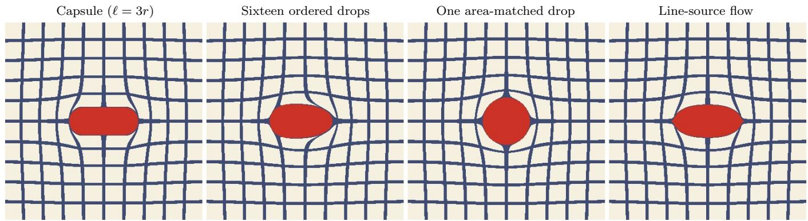  
Figure 1: One gesture of the same inserted area under four operators. A grid carried by the sheet is pulled back through each backward map; the deposit is red. Left to right: the capsule (ours, $\ell = 3 r )$ ), one closed-form map that inserts an elongated deposit; sixteen ordered drops along the same segment, whose displacement is used by $\mathcal { R } _ { D }$ in Sec. 6.4, with visible order efects; a single drop of the same area [8], which cannot produce a drawn deposit; and the line-source potential flow $\psi _ { L }$ , the physical reference of Eq. (9). The transfer experiment retains capsule coverage while substituting the ordered-drop displacement.

## 5 Inverse rendering

## 5.1 Parameterisation and relaxation

Every constraint is enforced by construction, so (4) is unconstrained in θ. Half-width is $r ~ = ~ r _ { \mathrm { l o } } + ( r _ { \mathrm { h i } } -$ $r _ { \mathrm { l o } } )$ sigmoid(θ<sub>r</sub>); ofset is $d = \ell _ { \mathrm { m a x } } \operatorname { t a n h } ( \theta _ { d } ) ;$ ; anchor is $a =$ $a _ { \mathrm { l o } } + \left( a _ { \mathrm { h i } } - a _ { \mathrm { l o } } \right)$ sigmoid $\left( \theta _ { a } \right)$ componentwise, with a window chosen either to keep the anchor on the canvas or to contain the whole footprint; colour is $c = \mathrm { s o f t m a x } ( \theta _ { c } / \tau _ { c } ) \mathsf { P }$ over a trainable palette $\mathsf { P } \in [ 0 , 1 ] ^ { k \times 3 }$ , itself a sigmoid of free parameters. Table 5 gives every constant.

The hard coverage $\mathbf { 1 } _ { K _ { i } }$ has no useful gradient. We relax it to

$$
\alpha _ { \tau } ( x ; g ) = \mathrm { s i g m o i d } \Big ( \frac { r - \sigma ( x ) } { \operatorname* { m a x } ( \tau r , \tau _ { \mathrm { m i n } } ) } \Big ) ,\tag{10}
$$

and anneal τ geometrically over the optimisation, so that early iterations see a smooth objective and late ones a sharp one; because $\tau _ { \operatorname* { m i n } } > 0$ , optimisation always uses a finite-width relaxation and never the hard coverage itself. The relaxed coverage does not integrate to $A _ { \ell } ( r )$ so during optimisation the model is only approximately area-consistent; every reported number is computed at the hard render. Optimisation is by Adam with a cosine step-size schedule; every gesture, the palette and every colour weight are optimised jointly. Gesture order and count are fixed.

The deep-feature objective. Three series — the gesture-count and gesture-type ablations of Sec. 8 and the paint-budget sweep of Sec. 7 — were trained under a deep-feature data term rather than pixel MSE, and are read within themselves. It is the unit-normalised VGG16 feature distance: the reference and the render are normalised by the ImageNet channel statistics and passed through the convolutional stack of VGG16 with ImageNet weights; at relu1 2, relu2 2, relu3 3 and relu4 3 the per-location feature vectors of both images are normalised to unit length across channels, their squared diference is summed over channels and averaged over locations, and the four layer terms are summed. This is LPIPS-shaped but carries no learned weights, and is treated as a perceptual proxy in its own units.

Objective and metrics. The data term is pixel meansquared error, computed on sRGB values as stored, without a transfer-function decode: the reference is read as 8-bit sRGB and divided by 255, and the palette lives in the same space. Linear light would reweight the error towards highlights; the choice made here is shared by every arm and every comparator, so it cancels in all reported contrasts. We use LPIPS-Alex [18] only as a secondary perceptual measurement. Optimisation uses the relaxed coverage of Eq. (10); every reported image error uses an exported program with hard coverage. This separation ensures that the relaxation used to obtain gradients cannot itself improve the reported scores.

## 5.2 The adjoint of the chain

Optimising a program of N coupled gestures requires a gradient through all N of them, and keeping every intermediate state for the backward pass is infeasible at the chain lengths required here. Two properties of the operator replace it: it is invertible in closed form, so states can be regenerated instead of stored, and its noninvertibility is confined to an explicitly characterisable set, so the exceptions can be recorded. Figure 2 shows the construction; Table 6 gives its cost.

Write the per-pixel state after gesture i has been processed as $s _ { i - 1 } = ( x _ { i - 1 } , C _ { i - 1 } , T _ { i - 1 } )$ — position, accumulated colour, transmittance; indices decrease as processing proceeds, matching (2) — so that (2)–(3) read

```tcl
gestures N / parameters 2000 / 26,024 (13 per gesture, palette $8 \times 3 )$
half-width window $r \in [ \dot { 0 . 6 } r ^ { 0 } , 1 . 7 \dot { r } ^ { 0 } ] ; r ^ { 0 }$ geometric from 0.120 to 0.005 over the program, so r ∈ [0.003, 0.204]
ofset $d = \ell _ { \mathrm { m a x } } \operatorname { t a n h } \theta _ { d } , \ell _ { \mathrm { m a x } } = 0 . 3 0$
coverage relaxation $\tau \colon 0 . 3 5  0 . 0 2$ geometric; floor $\tau _ { \mathrm { m i n } } = 0 . 7 / \mathrm { r e s }$
colour softmax over an 8-colour palette, temperature $1 . 0  0 . 0 5$
regulariser $\textstyle \lambda \sum _ { i } \ell _ { i } , \lambda = 3 \times 1 0 ^ { - 4 }$
optimiser Adam; steps 0.012 (anchor), 0.018 (width), 0.015 (ofset), 0.030 (colour), 0.010 (palette), with cosine
decay; 240 iterations at $1 0 2 4 ^ { 2 }$
objective scale data term scaled by $\mathcal { L } _ { \mathrm { V G G } } ( 0 ) / \mathcal { L } _ { \mathrm { M S E } } ( 0 )$ at initialisation, per run
evaluation hard render $\mathbf { 1 } _ { K }$ at $1 0 2 4 ^ { 2 }$ , reference implementation, seed 0
```  
Table 5: Optimisation settings. Constants were selected on flower and battal, together with one further sheet that is not part of the evaluation corpus, and then held fixed for the remaining references and matched controls.

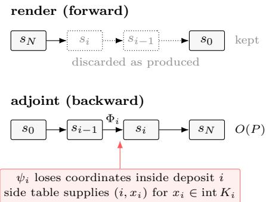  
Figure 2: Regenerate, and trace the exceptions. The render produces per-pixel states $s _ { i } = ( x _ { i } , C _ { i } , T _ { i } )$ in the order $N  0 ;$ reverse-mode diferentiation needs them in the order $0  N$ . Exterior positions are reconstructed with $\Phi _ { i } ,$ and the remaining state with (13)–(14). Positions lost inside deposits are read from a side table (Lemma 1). The diagram shows the $O ( P )$ active state; total memory also includes the side table and periodic position checkpoints.

$$
\begin{array} { r l } & { C _ { i - 1 } = C _ { i } + T _ { i } \alpha _ { i } c _ { i } , T _ { i - 1 } = T _ { i } ( 1 - \alpha _ { i } ) , } \\ & { } \\ & { x _ { i - 1 } = \psi _ { i } ( x _ { i } ) , } \end{array}\tag{11}
$$

with $s _ { N } = ( x , 0 , 1 )$ and $\mathcal { R } ( \Pi ) ( x ) = C _ { 0 } + T _ { 0 } c _ { 0 }$ . Reversemode diferentiation of L through (11) requires the states $s _ { i }$ in the order $i = 0 , \ldots , N ;$ a forward pass produces them in the opposite order and retains only $s _ { 0 }$ . Storing all of them costs $O ( N P )$ for P pixels — about 50 GB for 2000 gestures at $1 0 2 4 ^ { 2 }$ , an analytic estimate for a configuration that was not run — and checkpointing [13] trades it for recomputation. Instead we regenerate them. Because $\psi _ { i }$ is invertible when restricted to the exterior (Proposition 1, with inverse (8)),

$$
x _ { i } = \Phi _ { i } ( x _ { i - 1 } ) ,\tag{12}
$$

$$
\log T _ { i } = \log T _ { i - 1 } - \log ( 1 - \alpha _ { i } ) ,\tag{13}
$$

$$
C _ { i } = C _ { i - 1 } - T _ { i } \alpha _ { i } c _ { i } ,\tag{14}
$$

which is (11) solved for $s _ { i }$ . The backward pass steps (12)–(14) alongside the vector-Jacobian products of (11), holding O(P) state.

Lemma 1 (Support of the replay record). Let $K _ { i }$ be the closed footprint. The exterior map $\Phi _ { i }$ is a bijection from $\mathbb { R } ^ { 2 } \setminus \{ \mathrm { s e g m e n t } _ { i } \}$ onto $\mathbb { R } ^ { 2 } \setminus K _ { i }$ . Consequently, (12) reconstructs $x _ { i }$ uniquely whenever $x _ { i } \notin K _ { i }$ For $x _ { i } \in$ $K _ { i } ,$ , the extended $\psi _ { i }$ maps to the segment, outside the domain of $\Phi _ { i } ;$ exterior inversion cannot reconstruct such samples. The exceptional set is the closed footprint $K _ { i } ;$ the implementation records its interior (below).

Proof. For $x _ { i } \notin K _ { i } .$ , Proposition 1 gives $x _ { i } = \Phi _ { i } ( \psi _ { i } ( x _ { i } ) )$ For $x _ { i } \in K _ { i } .$ , the clamped extension sets $\sigma = 0 , \mathrm { s o } \ \psi _ { i } ( x _ { i } )$ lies on the segment and (12) is undefined. The extension collapses two-dimensional regions to that segment and is not injective. The boundary $\partial K _ { i }$ has zero planar area.

The boundary $\partial K _ { i }$ is null in the plane but not in a finite sample, because collapsed trajectories concentrate on it; the implementation therefore resolves ties by recording the open condition $\sigma ^ { \prime } < r _ { i }$ and treating the boundary as exterior, which errs towards regenerating rather than storing.

Relation to reversible backpropagation. Existing approaches that avoid storing a long trajectory share the assumption that the forward step is invertible. Reversible architectures are built so that it can [14]; reversible learning integrates the dynamics backwards [20]; path replay re-traces a light path from its seed [12]. A painting operator breaks that assumption diferently: it creates material, so the map is not injective on the deposition set and no integration scheme can recover the lost state. The applicable principle is that of reversible learning [20], to store exactly what cannot be regenerated and nothing else, specialised here to a set that is identifiable during the forward pass and whose size we measure below rather than bound. We state it that way in Sec. 9 because it is the part of this paper most likely to be useful outside marbling.

The lemma gives the record this replay scheme needs: we store $( i , x _ { i , p } )$ for every pixel trajectory p inside footprint i and regenerate every other position with (12).

Remark (Size of the side table). Let $\begin{array} { r } { S = \sum _ { i , p } { \bf 1 } [ x _ { i , p } \in \mathbb { ~ } } \end{array}$ int $K _ { i } ]$ be the implemented record count. A unit-density estimate would be $P \sum _ { i } | K _ { i } | / | \Omega |$ . It is not a general bound: collapsed trajectories can travel together and be counted again at subsequent insertions, and the pixel grid introduces sampling error. At $N = 2 0 0 0$ we measured 9.9–14.0 records per pixel at $1 2 8 ^ { 2 } , 2 5 6 ^ { 2 }$ and $1 0 2 4 ^ { 2 }$ to the reported precision (0.12–0.18 GB at $1 0 2 4 ^ { 2 } )$ . The corresponding unit-density area estimates are 4.4 for the initial program and 5.5–6.2 for recovered programs. These are measurements on the tested programs, not bounds.

Soft coverage makes transmittance reconstruction illconditioned when $\alpha _ { i }$ approaches one, and a long float32 composition accumulates position error even though each map preserves area. Both are conditioning problems rather than approximations, and both are handled by choosing where to spend memory: transmittance is carried in logarithms, and positions are checkpointed periodically at an interval set so that measured replay drift stays below the 0.7-pixel annealing floor — the point at which a regenerated position can no longer change the relaxed coverage it is used to evaluate. With checkpoint interval k and the record count S defined above,

$$
M = O ( P + P \lceil N / k \rceil + S ) .
$$

The constants depend on the implementation; $S$ is measured rather than bounded by deposited area.

Structure of the gradient. Write $\lambda _ { i - 1 } ^ { C } , \lambda _ { i - 1 } ^ { T }$ and $\lambda _ { i - 1 } ^ { x }$ for the adjoints of $\mathcal { L }$ with respect to the state $s _ { i - 1 }$ that step i produces. Diferentiating (11) gives the adjoint step

$$
\begin{array} { r l } & { \lambda _ { i } ^ { C } = \lambda _ { i - 1 } ^ { C } , \qquad \lambda _ { i } ^ { T } = \left( 1 - \alpha _ { i } \right) \lambda _ { i - 1 } ^ { T } + \alpha _ { i } \lambda _ { i - 1 } ^ { C } \cdot c _ { i } , } \\ & { \lambda _ { i } ^ { x } = \left( D \psi _ { i } \right) ^ { \top } \lambda _ { i - 1 } ^ { x } + \mu _ { i } \partial _ { x } \alpha _ { i } , } \\ & { \mu _ { i } = T _ { i } \bigl ( \lambda _ { i - 1 } ^ { C } \cdot c _ { i } - \lambda _ { i - 1 } ^ { T } \bigr ) , } \end{array}\tag{15}
$$

and the parameter gradients

$$
\frac { \partial \mathcal { L } } { \partial c _ { i } } = \sum _ { x } \lambda _ { i - 1 } ^ { C } T _ { i } \alpha _ { i } , \qquad \frac { \partial \mathcal { L } } { \partial \theta _ { i } } = \sum _ { x } \left[ \mu _ { i } \frac { \partial \alpha _ { i } } { \partial \theta _ { i } } + \lambda _ { i - 1 } ^ { x } \cdot \frac { \partial \psi _ { i } } { \partial \theta _ { i } } \right]\tag{16}
$$

for the geometric parameters $\theta _ { i } \in \{ a _ { i } , d _ { i } , r _ { i } \}$ . Three regions of the canvas contribute diferently $\left( \mathrm { F i g . 3 } \right)$ . Inside the footprint — the hole $- \alpha _ { i }  1$ : the gesture’s colour receives its gradient there, weighted by the transmittance $T _ { i }$ left by the gestures laid after it, so paint that is later covered receives no colour gradient. On the relaxed rim of width τ around $\partial K _ { i } , \partial _ { \theta } \alpha _ { i }$ is non-zero: this is where the shape of the deposit is adjusted, through the sensitivity $\mu _ { i }$ of the composite to coverage. Everywhere outside the rest — $- \alpha _ { i } = 0$ and only the transport term acts: $\partial _ { \theta } \psi _ { i }$ is non-zero on the whole exterior, decaying as inserted area over perimeter, so changing the position, width or length of gesture i changes where every earlier deposit is sampled, and $\lambda _ { i - 1 } ^ { x }$ carries the sensitivity of all that earlier paint. The term $( D \psi _ { i } ) ^ { \top } \lambda _ { i - 1 } ^ { x }$ pulls that accumulated sensitivity back through gesture i’s map into the frame in which gestures $i + 1 , \dots , N$ act, so each later gesture’s transport term receives gradient contributions from pigment deposited before gesture i. Inside the hole the extended $\psi _ { i }$ collapses to the segment and its derivative

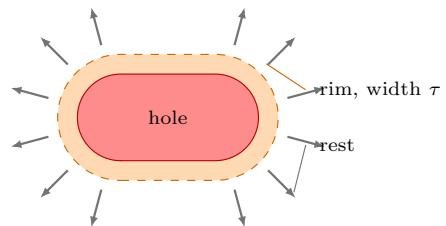

$$
\alpha _ { i } \to 1
$$

$$
\lambda _ { i - 1 } ^ { C } T _ { i } \alpha _ { i }
$$

$$
\mu _ { i } \partial _ { \theta } \alpha _ { i }
$$

rest $\alpha _ { i } = 0$ transport gradient $\lambda _ { i - 1 } ^ { x } \cdot \partial _ { \theta } \psi _ { i }$ , decaying as $A / P ( \sigma )$

Figure 3: Where one gesture’s gradient comes from. Inside its footprint the gesture receives a colour gradient, weighted by the transmittance of the paint laid above it; on the relaxed rim it receives a shape gradient through the coverage; on the whole exterior it receives a transport gradient through ψ<sub>i</sub>, because resizing or moving it changes where every earlier deposit is sampled. Paint beneath the hole is hidden $( T \to 0 )$ and receives neither gradient there; the spatial sensitivity of the earlier paint that remains visible is pulled back through $( D \psi _ { i } ) ^ { \top }$ to the gestures laid after it.

is rank-deficient, but there $T _ { i - 1 } = T _ { i } ( 1 - \alpha _ { i } ) \to 0$ occludes all earlier pigment, so the colour gradient of earlier paint is blocked at exactly the pixels where position no longer affects the rendered image. Replay makes every quantity in (15)–(16) available at step i from $s _ { i - 1 }$ and the side table; the capsule supplies $\psi _ { i } .$ its inverse and their derivatives in closed form, so no per-sample iterative solve is needed (an iterative alternative is compared in the supplement).

Memory and runtime. Table 6. Storing the full perpixel trajectory at $N = 2 0 0 0 , 1 0 2 4 ^ { 2 }$ would need about 50 GB for the state alone, an analytic figure. Against the practical baseline — automatic diferentiation with checkpoints every 20 gestures, 6.49 GB — regenerating costs 0.75 GB at a comparable step time (23.89 against 23.00 s). The baseline interval (20) was selected near its memory optimum and was not swept; across our own sweep the ratio ranges from 4.9 to 12.1×, and it is 8.7× at the adopted interval of 256. Gradient error against the checkpointed-autograd gradient grows monotonically with the interval and is $7 . 4 \times 1 0 ^ { - 3 }$ relative at the adopted one, with cosine similarity 0.99997 over the full parameter vector, consistent with float32 error accumulating in the regenerated positions.

Fitting performance. The relevant outcome is the absolute memory footprint rather than the ratio: the fused implementation peaks at 1.72 GB and the $\mathrm { P y }$ Torch recurrence at 0.75 GB for a 2000-gesture program at $1 0 2 4 ^ { 2 }$ , a fraction of one consumer GPU’s memory. A full optimisation of 240 steps takes 234 s on one RTX PRO 4000. The optimisation step — forward, backward and update — takes 0.55 s at $N = 2 0 0 0$ and scales linearly in N: 0.075, 0.15, 0.30, 0.55 and 1.0 s at N = 250, 500, 1000, 2000 and 4000; at $5 1 2 ^ { 2 }$ it is 0.075 s and at $2 0 4 8 ^ { 2 } ~ 2 . 5 \mathrm { s } .$

<table><tr><td>backward pass</td><td>peak (GB) step (s) vs. AD</td><td></td><td></td></tr><tr><td>stored trajectory</td><td>≈50</td><td></td><td></td></tr><tr><td>autograd, checkpoints every 20</td><td>6.49</td><td>23.00</td><td>1.0×</td></tr><tr><td>replay adjoint (PyTorch, ckpt 256)</td><td>0.75</td><td>23.89</td><td>8.7×</td></tr><tr><td>replay adjoint, fused (Triton)</td><td>1.72</td><td>0.52</td><td>3.8×</td></tr><tr><td></td><td></td><td></td><td></td></tr><tr><td>checkpoint peak (GB)</td><td>vs. AD</td><td>grad. err</td><td>cosine</td></tr><tr><td>64</td><td>1.32 4.9×</td><td> $4 . 2 \times 1 0 ^ { - 3 }$ </td><td>0.9999914</td></tr><tr><td>128</td><td>0.91</td><td> $7 . 1 \times \phantom { - } 5 . 5 \times 1 0 ^ { - 3 }$ </td><td>0.9999849</td></tr><tr><td>256</td><td>0.71</td><td> $9 . 1 \times \phantom { - } 7 . 4 \times 1 0 ^ { - 3 }$ </td><td>0.9999731</td></tr><tr><td>512</td><td>0.61 10.6×</td><td> $1 . 1 \times 1 0 ^ { - 2 }$ </td><td>0.9999408</td></tr><tr><td>none</td><td>0.54 12.1×</td><td> $1 . 7 \times 1 0 ^ { - 2 }$ </td><td>0.9998566</td></tr></table>

Table 6: The adjoint at the operating point $( N = 2 0 0 0 , 1 0 2 4 ^ { 2 }$ float32, one 24 GB GPU). Top: storing the trajectory at this depth would take about 50 GB for the $N \times P$ per-pixel states, an analytic figure we did not run, so the practical baseline is automatic diferentiation with checkpoints every 20 gestures. That interval is within a few per cent of the memory-minimising one for this scheme, and was not forced by the card, which had headroom. Regenerating the trajectory instead costs 0.75 GB at a comparable step time (23.89 against 23.00 s); the fused kernels trade some of that back for a 44× faster step than checkpointed autograd, and are used for the transport-arm fits. The side table holds 9.88 records per pixel (124 MB). Bottom: the checkpoint interval trades memory against float32 drift in the regenerated positions; we use 256. The sweep is a separate run from the top table, which is why its 256 row reads 0.71 rather than 0.75 GB. Gradient error is relative to the checkpointed-autograd gradient, exact up to float32 rounding, and the cosine similarity of the full parameter gradient never falls below 0.9998.

Implementation. The vector–Jacobian products of (11) are written analytically rather than obtained by differentiating the renderer, which is what allows the whole step to be fused into a single kernel and is the diference between the two bottom rows of Table 6. They agree with automatic diferentiation to $5 . 4 \times 1 0 ^ { - 1 5 }$ in float64 and with central diferences of the rendered value to $2 . 5 \times 1 0 ^ { - 9 } ;$ the float32 error of the full 2000-gesture replay is the $7 . 4 \times 1 0 ^ { - 3 }$ of Table 6.

## 6 Experiments

## 6.1 Protocol

We use five scanned ebru marbled sheets as target images: flower, tulip, teardrops, battal, and lale. Ebru is a living practice, inscribed on the UNESCO Representative List of the Intangible Cultural Heritage of Humanity in 2014, and it has its own named, ordered gesture vocabulary: battal is the sprinkled ground, and the floral patterns are drawn with a stylus over such a ground [34]. That vocabulary is not ours. Four of the five references were physically made largely by zero-injection stylus and comb work, which our gesture family excludes (Sec. 10), so the recovered programs are not the traditional gestures and are not claimed to be. This also bears on Sec. 6.5:

where the model’s gesture family difers from the one that made a sheet, there is no correspondence to recover. All five are photographs of marbled sheets published on Wikimedia Commons under free licences, cropped to a centre square fixed before any fitting and resampled to $5 1 2 ^ { 2 }$ ; the supplement lists each file, its author and its licence, and the three out-of-domain artworks of Sec. 6.2 are public-domain reproductions from the same source. The crops are native $5 1 2 ^ { 2 }$ and are resampled to $1 0 2 4 ^ { 2 }$ by Lanczos filtering for fitting and scoring; the $5 1 2 ^ { 2 }$ column of Table 14 shows the efect of replay and scoring at that common resolution. The images are used only as optimisation targets. Flower and battal were used while selecting the constants in Table 5, together with a sixth sheet excluded from the corpus because its source could not be documented; the remaining three were held out from that process. Every main result is a hard render of an exported program. Unless noted otherwise, each program has $N = 2 0 0 0$ gestures and 26,024 optimised parameters, and is fitted for 240 Adam steps from the same rule-based initial program.

We denote by $\Pi _ { A }$ the program obtained after the finitestep optimisation of Eq. (4) with the relaxed transport renderer. For the structural control, $\Pi _ { U }$ is obtained with each material map set to the identity, using the same parameter family and step budget.

$\Pi _ { A }$ is trained through the fused implementation and $\Pi _ { U }$ through the reference implementation, which alone exposes the inert-mark path. The data-term scale of Table 5 is set from each arm’s own initial loss and difers between arms by 1.36–2.22×, so the efective regularisation difers by that factor. That factor does not account for the diference the control reports: Π<sub>U</sub> reaches a lower loss than $\Pi _ { A }$ does under each arm’s own renderer on $4 / 5$ references in MSE and $5 / 5$ in LPIPS-Alex (Sec. 6.2), so the gap cannot be attributed to under-optimisation of the control. Adam is also approximately invariant to a global scale on the objective, so the mismatch acts mainly on the relative weight of the length regulariser. To keep evaluation matched, both exported programs are rerendered by the same hard reference implementation under both models, producing the four cells $\mathcal { L } ( \mathcal { R } _ { M } ( \Pi _ { X } ) , I ^ { * } )$ M, $X \in \{ A , U \}$ : two optimisation runs per reference, each scored twice. Pixel MSE is primary and LPIPS-Alex is reported as a secondary metric.

External stroke fitter. Stylized Neural Painting [4] fits parametric brush strokes to an image through a differentiable stroke renderer. Its strokes are inert marks, so it is a raster comparator: it can be compared with $\Pi _ { A }$ only as an image and with $\Pi _ { U }$ only under $\mathcal { R } _ { U }$ . We use the authors’ code and pre-trained oil-paint renderer with the released defaults: the progressive schedule of five grid levels with 36 strokes per block, giving 1980 strokes of 12 parameters (23,760 values, against our 26,024), of which 1756–1902 pass the renderer’s minimum-size test; the paper’s objective $( L _ { 1 }$ plus optimal transport); and a hard render of the final strokes at $1 0 2 4 ^ { 2 }$ . Each reference is fitted from a white and from a black initial canvas and the better is kept. The render is scored against the same $1 0 2 4 ^ { 2 }$ target by the same code as every other row. The fit takes about 7 min per reference on the same card. A second seed moves each reference’s error by 0.7–3.7%.

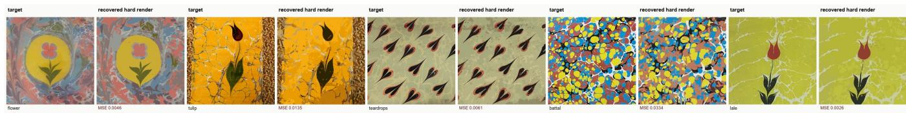  
Figure 4: Target-to-program recovery. Each pair shows a reference image and the hard render obtained by replaying its recovered 2000-gesture deposit-and-transport program. The five references cover both repeated motifs and all-over patterns; no panel is selected by score.

Error scale and controls. Reference images difer in variance by almost an order of magnitude, so every error we report is normalised by the MSE of the best constant image, which puts the five references on one scale. With one exception the comparators are internal ablations: the inert-mark arm shares this paper’s vocabulary, initial program, seed, resolution and step budget and difers only in $\psi _ { i } ,$ isolating the efect of transport. The exception is a published stroke fitter run at matched stroke count, which places that control against a system we did not build. Where two arms both sit above the constant-image baseline, we report their ratio only alongside it, since neither is then a reconstruction. Three series — the ablations of Sec. 8 and the paint-budget sweep of Sec. 7 — were trained under the deep-feature objective and are read against their own noise band in those units. The spreads in Table 12 measure how far a re-run moves and are used as such.

## 6.2 Recovered programs

Figure 4 shows the primary result: a single target image is converted into a replayable 2000-gesture program under the prescribed deposit-and-transport model. The hard-render MSE of the recovered programs is 0.0026– 0.0334 across the five references. Repeated motifs and large silhouettes are retained, while the all-over battal pattern remains the hardest reference because its smallest structures approach the gesture-width floor. The identity of the hardest reference is informative: battal is the one pure-insertion pattern in the set and the model fits it worst (2.59×), while the stylus-drawn florals, whose making our gesture family does not model at all, score best $\left( 5 . 2 2 \times \right)$ The floor ratio tracks image statistics, not fidelity to the medium — a conclusion the out-of-domain targets below reinforce.

The scale for these errors is the best constant image, whose MSE is the image variance. Every pixel-MSE image error in the cross-method comparisons is reported normalised by that floor. The recovered programs sit below it on all five references, by a geometric mean of $3 . 6 7 \times$ (Table 7); re-fitted from three seeds the figure is 3.71× on the seed geometric mean and 3.66× on the worst seed, $5 / 5$ in both cases (Sec. 6.6). The ratio calibrates rather than ranks: $\mathrm { ~ a ~ } 6 4 ^ { 2 }$ thumbnail with half the parameters reaches a lower pixel error still (Table 8), as any transport-free representation can.

An external stroke fitter. Stylized Neural Painting, run at matched stroke count (Sec. 6.1), is a raster of the same order as the recovered program: below the flat floor on $5 / 5$ (geometric mean $3 . 1 1 \times$ , interval [2.35, 4.13]), ahead of Π in pixel MSE on $2 / 5$ references and behind it on $3 / 5 ,$ , and behind it in LPIPS-Alex on $4 / 5$ (Table $7 ;$ the supplement gives the LPIPS cells and the renders). Its role here is to place the matched control. Under its own renderer $\mathcal { R } _ { U }$ , the inert-mark arm $\Pi _ { U }$ is a raster fitter of the same standing as the published one — ahead of it in pixel MSE on $4 / 5$ and in LPIPS-Alex on $5 / 5 - \mathrm { s o }$ the program that lands above the floor once executed was not produced by a weak stroke fitter; it was produced by a competent one and executed under the transport its fitting ignored. That execution is the comparison a stroke-based method cannot enter, since its output has no transport arm.

The matched control isolates the role of coupled recovery. Fitting the same vocabulary with every material map set to the identity and then executing the result gives $\Pi _ { U } .$ which is 6.5× worse than $\Pi _ { A }$ (95% interval 4.2–10.2). $\Pi _ { U }$ executed is above the flat floor on $5 / 5$ references, a geometric mean 1.77× worse than a single constant colour. When executed under transport, a program fitted without it no longer reconstructs the target. The underlying cells are in Table 7.

Under $\mathcal { R } _ { U }$ , Π reaches a lower loss than $\Pi _ { A }$ does under $\mathcal { R } _ { A }$ $4 / 5$ references in MSE and $5 / 5$ in LPIPS-Alex: fitting without transport is the easier problem, and if a raster approximation is all that is wanted, modelling transport is a cost. The benefit of modelling transport is a program that remains valid when executed under the transport model. The held-out references, which took no part in choosing the constants, show floor ratios of 2.91, 5.22 and 5.24× against 3.25 and 2.59× for the two development references.

Out of domain. The floor ratio is not evidence that anything specific to marbling has been captured. The same solver with the same settings, given three artworks instead of marbled sheets, reaches 3.8× on The Great Wave, 2.7× on The Starry Night and 8.5× on the Mona Lisa $\left( { \mathrm { F i g . ~ 5 } } \right)$ , the last higher than any ebru reference. The representation approximates non-marbling targets as readily; the three are shown to calibrate the ratios in Table 7. The stroke fitter, run on the same three, reaches 3.3, 2.9 and 12.0×, ahead of the recovered program in pixel MSE on 2/3 and in LPIPS-Alex on $1 / 3$ (supplement).

## 6.3 Closed-form compensation baseline

A natural alternative to joint optimisation is to fit an inert-mark program and then translate each gesture so that subsequent transport carries it to the position selected by the inert-mark fit. Because ψ has a closed-form inverse this can be done in one pass, with no gradients and no re-optimisation. We evaluate two variants: anchor compensation pre-images the segment start and carries the ofset vector unchanged, and endpoint compensation preimages both ends, which is stronger although it changes segment length and hence inserted area. Both run from the last gesture to the first, so each gesture is pre-imaged through the already-compensated geometry of every later one, at a cost of $N ( N - 1 ) / 2$ point transforms (1,999,000 at $N = 2 0 0 0 )$ and no derivatives. Radii are left unchanged: the deformation of a footprint by later gestures is exactly what a one-pass point correction cannot repair.

Table 8. Closed-form geometry alone removes a median 44.7% of the inert-replay error and closes a median 52.4% of the gap to joint recovery. But the compensated program still only reaches the flat floor: it beats a single constant colour on 2 of 5 references. One-pass correction remains less accurate than joint fitting on these examples.

Lemma 1 identifies an obstruction to this pointwise correction. Pre-imaging gesture i through a later gesture j requires a point of $\Phi _ { j } ^ { - 1 }$ ; if the point lies inside $K _ { j }$ there is none, because the extended $\psi _ { j }$ maps all of $K _ { j }$ to the segment, on which $\Phi _ { j }$ is undefined. This occurs for 1362– 1466 of the 2000 gestures. Where a pre-image does exist the correction is essentially exact — round trip within $7 . 9 \times 1 0 ^ { - 5 }$ canvas units — and where it does not, the error is 0.02–0.04, several hundred times larger. The large point round-trip residuals occur in the blocked subset; the diagnostic is geometric, so it locates the failure of the correction rather than partitioning the image-space residual. The same loss of coordinates that replay storage handles is what obstructs an exact pre-image correction.

Two checks establish that the comparison is not an artefact of its construction: skipping a blocked step instead of clamping it onto the segment moves the geometric mean from 3.71× to 3.67×, inside the re-run band, and compensating both endpoints rather than the anchor alone is better (3.71× against 4.40×), so the ceiling is not an artefact of correcting too few points. Closed-form knowledge of the transport map is therefore not suficient; the comparison does not isolate the value of gradients alone, since joint recovery also adjusts width, colour and visibility.

## 6.4 Transfer across transport constructions

To test whether recovery overfits the foliation of our capsule map, we score both programs under a third renderer $\mathcal { R } _ { D }$ that was not used for fitting. Gesture i’s displacement is replaced by a composition of $K = 1 6$ published drop maps [8] placed along its segment, each of radius $s = \sqrt { A _ { \ell _ { i } } ( r _ { i } ) / ( K \pi ) }$ so that the inserted area equals the gesture’s own. Coverage is unchanged; only $\psi _ { i }$ is replaced. Each drop map preserves area on its exterior. Because capsule coverage is retained, $\mathcal { R } _ { D }$ is a controlled hybrid renderer, not a simulation of the complete coloured ordered-drop deposition process. Its displacement is built from a published primitive and difers from $\mathcal { R } _ { A } \colon$ under (9) it is 17–36% from $\psi _ { A }$ over the first-quartile to ninetiethpercentile aspect ratios of the recovered gestures (Table 4), and it is closer to line-source potential flow than $\psi _ { A }$ is (9% against 27% at the median aspect ratio). Figure 1 shows the two operators, a single drop of the same area, and the reference flow acting on a grid.

The substitution degrades $\Pi _ { A } .$ , and Table 9 quantifies the efect: executed under the alternative operator, $\Pi _ { A }$ is worse by 17.8 to 51.6% than under the operator it was fitted for (median 24.8%), while $\Pi _ { U }$ , whose fit is invalidated under either transport renderer, scores within $1 \%$ of its $\mathcal { R } _ { A }$ value; against its own fitting renderer $\mathcal { R } _ { U }$ which applies no transport, its change is several hundred percent, and the table reports the $\mathcal { R } _ { A }$ comparison for both programs. That degradation measures how much of the fit is specific to our foliation. What survives it is that $\Pi _ { A }$ remains a reconstruction — still below the flat floor on $5 / 5 -$ while Π<sub>U</sub> remains above it, and the 4.9× separation holds (95% interval 3.6–6.8, same direction on all five references and in LPIPS-Alex).

Two qualifications. $\mathcal { R } _ { D }$ is a finite ordered-drop alternative built from a published primitive, not an independent physical model: its K drops are laid in one sweep along the segment, so it carries an injection schedule of its own, and refining K is not a limit process towards the line source. Table 4 measures what makes it a useful arbiter: at the median aspect ratio it sits closer to $\psi _ { L }$ than our map does. The reference $\psi _ { L }$ is not itself the evaluator because it is an integration rather than a map: each point is carried by an RK4 solve of the source velocity, so it cannot be composed 2000 times at image resolution the way a closed-form displacement can. That is the constraint of Sec. 4.2 appearing again in the evaluation, and it is why the arbiter is built from a published closed-form primitive. The test varies the foliation of an insertion operator at matched inserted area; it says nothing about a diferent displacement class, such as the zero-injection tine and stylus operators of [8], which are area-preserving and invertible and would be the natural next arbiter.

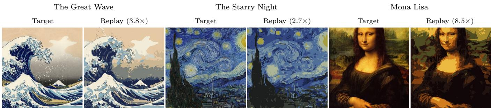  
Figure 5: Out-of-domain targets. Three artworks and the replay of the 2000-gesture program recovered from each under the headline settings, with the floor ratio. The programs approximate non-marbling targets using the same deposition vocabulary; this ratio does not measure marbling fidelity.

<table><tr><td></td><td></td><td colspan="4">transport applied  $\left( { \mathcal { R } } _ { A } \right)$ </td><td colspan="2">transport omitted  $\left( \mathcal { R } _ { U } \right)$ </td><td colspan="2">external, raster</td></tr><tr><td>reference</td><td>flat floor</td><td> $\Pi _ { A }$ </td><td> $\Pi _ { U }$ </td><td> $\operatorname { f l o o r } / \Pi _ { A }$ </td><td> $\Pi _ { U } / \mathrm { f l o o r }$ </td><td> $\Pi _ { A }$ </td><td> $\Pi _ { U }$ </td><td>SNP</td><td>floor/SNP</td></tr><tr><td>flower</td><td>0.0151</td><td>0.0046</td><td>0.0282</td><td>3.25×</td><td>1.87×</td><td>0.0179</td><td>0.0053</td><td>0.0039</td><td>3.83×</td></tr><tr><td>tulip†</td><td>0.0393</td><td>0.0135</td><td>0.0643</td><td>2.90×</td><td>1.64×</td><td>0.0399</td><td>0.0121</td><td>0.0152</td><td>2.58×</td></tr><tr><td>teardrops†</td><td>0.0317</td><td>0.0061</td><td>0.0544</td><td>5.22×</td><td>1.72×</td><td>0.0353</td><td>0.0048</td><td>0.0077</td><td>4.14×</td></tr><tr><td>battal</td><td>0.0865</td><td>0.0334</td><td>0.1531</td><td>2.59×</td><td>1.77×</td><td>0.1285</td><td>0.0213</td><td>0.0329</td><td>2.63×</td></tr><tr><td>lale†</td><td>0.0138</td><td>0.0026</td><td>0.0259</td><td>5.22×</td><td>1.88×</td><td>0.0154</td><td>0.0022</td><td>0.0051</td><td>2.72×</td></tr><tr><td>geometric mean 95% CI</td><td></td><td></td><td></td><td>3.67×</td><td>1.77×</td><td></td><td></td><td></td><td>3.11×</td></tr><tr><td>three seeds, GM / worst</td><td></td><td></td><td></td><td>[2.43, 5.55] 3.71× / 3.66×</td><td>[1.65, 1.90]</td><td></td><td></td><td></td><td>[2.35, 4.13]</td></tr></table>

Table 7: Recovery error against the flat floor, and the matched transport control (hard-render pixel MSE at ${ 1 0 2 4 } ^ { 2 } ;$ lower is better). Flat floor is the MSE of the best constant image, the cheapest non-trivial reconstruction of that reference. $\Pi _ { A }$ is recovered jointly through the transport chain; $\Pi _ { U }$ is fitted with every material map set to the identity. Both exported programs are scored by the same hard reference renderer under both models. $\Pi _ { A }$ beats the floor on $5 / 5$ references (geometric mean 3.67× below it). $\Pi _ { U } ,$ executed, is above the floor on $5 / 5 - \mathrm { f i t t i n g }$ without transport and then executing with it is worse than painting a single colour. Intervals are paired t-intervals on log-ratios. <sup>†</sup>: held out during development. $S N P$ is Stylized Neural Painting [4] at matched stroke count, scored on its own $1 0 2 4 ^ { 2 }$ render (Sec. 6.1); it fits inert marks and has no transport arm, so it is a raster comparator only.

## 6.5 Synthetic ground truth

Every result so far is measured against historical sheets, where we cannot know whether any 2000-gesture program reproduces the target. That confounds two very diferent failures: insuficient model expressivity, and failure of the optimiser to find a good fit. To separate them we build targets with known generating programs. Twelve programs are drawn from the model’s own prior — the solver’s radius schedule, the empirical ofset-length distribution of the recovered programs (median $\ell = 0 . 0 1 8$ , 78% above the export threshold, matching Sec. 8), uniform anchors and a random eight-colour palette — and rendered under $\mathcal { R } _ { A }$ Each target is therefore the exact render of a program that lies inside the feasible set, so a zero-error solution provably exists. We then recover from the image alone, with the settings of Table 5 unchanged.

Figure 8 shows what recovery looks like here, and Table 10 reports the image error and the gesture correspondence separately.

The image. Recovery reaches a geometric mean 2.27× below the flat floor, against 3.67× on the historical references. Exact representability does not make a target easier to fit. One candidate mechanism is that the historical sheets carry large-scale structure the optimiser can exploit while a program drawn from an uninformative prior does not (Fig. 8); testing it is future work. A zero-error program exists here by construction, so on this family the residual is not model misfit but the optimiser’s approximation gap, arising from the relaxed objective, the regulariser and the finite step budget. This bound applies to the synthetic family; the historical sheets are addressed by the next control, which re-fits the reference renders of the recovered historical programs. These targets are also representable by construction. Recovery reaches a geometric mean 3.98× below each render’s own constantimage baseline , compared with 3.67× for the original scans (one run per reference, headline settings). The targets and their baseline variances difer, so these ratios do not bound model misfit on the original scans. They show that the procedure leaves residual error even when fitting images produced by its own model.

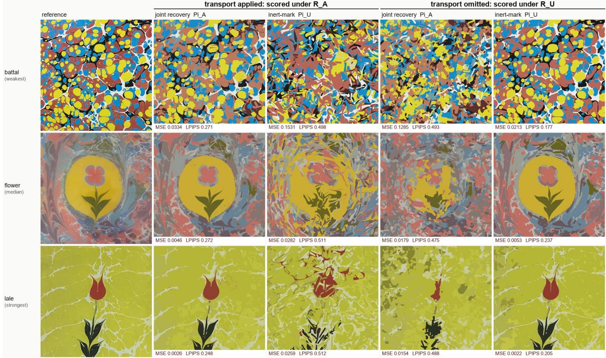  
Figure 6: Why the ratios in Table 7 are reported against a floor. Three of the five references — battal, flower and lale: the weakest, the median and one of the two strongest floor ratios. Left pair: both programs executed with transport $\left( \mathcal { R } _ { A } \right)$ . Right pair: both scored with transport omitted (R<sub>U</sub>). Each program reconstructs under the model it was fitted for and disintegrates under the other, but the failures are not degraded reconstructions: the two inner result columns (Π<sub>U</sub> executed, Π<sub>A</sub> imagined) are visibly further from the target than a single flat colour would be, which is what the floor column of Table 7 records. All five references in the supplement.

The program. We restrict matching to gestures owning at least 50 pixels at $1 0 2 4 ^ { 2 }$ (scaled for the $5 1 2 ^ { 2 }$ matching pass), about 1030 of the 2000 true gestures. Excluded gestures may still be partially visible and localisable; the threshold only defines the evaluated subset. We use optimal assignment on segment-midpoint distance and compare with another target’s recovered program, a null that shares the fitting procedure and has a similarly sized candidate pool, unlike a null drawn from another ground-truth program, which has systematically fewer visible gestures.

The aggregate statistics are similar: median matched distance 0.0168 against 0.0170 for the null, and 32% of matches inside the true radius for both (Table 10). The test therefore gives no evidence of generating-gesture correspondence beyond the cross-target null, for this procedure and this positional statistic.

## 6.6 Aggregation and numerical variation

The reference image is the unit of analysis $( n = 5 )$ . Because losses are positive and comparisons are multiplicative, we aggregate ratios on the log scale and report geometric means with paired 95% intervals; per-reference values remain visible in every table. Table 12 gives the noise floors, and there are two, in diferent units. In pixel MSE on the transport arm — the units of every cross-method comparison — two runs of one configuration and seed difer by 0.6–4.6%, and three seeds on all five references spread 2.7–6.7%, median 6.1%. In the deep-feature units of the ablation series of Sec. 8, the across-seed spread is 0.5–0.6%, and that is the band those series are read against. The seed runs use the headline configuration; seed 0 difers from the headline run by up to 1.3%, which we count in the spread. All cross-method scores are produced by one reference renderer from exported programs; training-time scores, taken before palette colours are snapped at export, are 0.9–14.6% lower (Table 12) and are not used for any comparison. The small reference set permits the large, consistent within-image comparisons reported here, but not population-level claims about marbling styles.

## 7 Program-level output

The solver returns ordered parameters rather than a final raster image. Rendering prefixes of the sequence exposes how the design is assembled (Fig. 9); individual gestures, colours or whole stages can be edited and replayed through

<table><tr><td>reference</td><td>flat floor</td><td>inert replay</td><td>anchor</td><td>endpoint</td><td>blocked</td></tr><tr><td>flower</td><td>0.0151</td><td>0.0282</td><td>0.0175</td><td>0.0156</td><td>1466</td></tr><tr><td>tulip</td><td>0.0393</td><td>0.0643</td><td>0.0480</td><td>0.0412</td><td>1454</td></tr><tr><td>teardrops</td><td>0.0317</td><td>0.0544</td><td>0.0353</td><td>0.0291</td><td>1371</td></tr><tr><td>battal</td><td>0.0865</td><td>0.1531</td><td>0.0974</td><td>0.0833</td><td>1362</td></tr><tr><td>lale</td><td>0.0138</td><td>0.0259</td><td>0.0196</td><td>0.0148</td><td>1422</td></tr></table>

<table><tr><td>method (geometric mean, five references)</td><td>GM hard MSE</td><td>vs. joint</td></tr><tr><td>flat floor (best constant image)</td><td>0.029530</td><td>3.67×</td></tr><tr><td> $6 4 ^ { 2 }$  thumbnail (12,288 values)</td><td>0.006777</td><td>0.85×</td></tr><tr><td>SNP [4], 1980 strokes (23,760 values)</td><td>0.009478</td><td>1.18×</td></tr><tr><td>inert replay  $( \Pi _ { U }$  under  $\mathcal { R } _ { A } )$ </td><td>0.052296</td><td>6.53×</td></tr><tr><td>anchor pre-image</td><td>0.035528</td><td>4.44×</td></tr><tr><td>endpoint pre-image</td><td>0.029687</td><td>3.71×</td></tr><tr><td>endpoint, blocked steps skipped</td><td>0.029374</td><td>3.67×</td></tr><tr><td>joint recovery (ours)</td><td>0.008006</td><td>1.00×</td></tr></table>

Table 8: One-pass closed-form compensation against joint recovery, all five references at $1 0 2 4 ^ { 2 }$ , hard render, one reference renderer. Each variant pre-images an inert-mark program’s gestures through every later gesture’s inverse map, without gradients or re-optimisation. The $6 4 ^ { 2 }$ thumbnail is the reference downsampled and bilinearly upsampled; it is not a method, and it is listed because it bounds what pixel error alone can establish at this parameter count. The stroke-fitter row is the external raster comparator of Table 7, included on the same footing. Blocked counts gestures of the endpoint variant whose pre-image fails to exist at some step: 1362–1466 of 2000 (68–73%). By Lemma 1 no exact pre-image exists for those gestures, so no correction of this form can place them, and they carry essentially all of the point round-trip residual — where a pre-image exists the correction is exact to $7 . 9 \times 1 0 ^ { - 5 }$ canvas units. Skipping the blocked steps instead of clamping them changes the result by less than the re-run band (3.67× against $3 . 7 1 \times )$ , so the baseline is not handicapped by that choice. Endpoint compensation removes a median 44.7% of the inert-replay error and closes a median 52.4% of the gap to joint recovery, yet still lands at the trivial floor: it beats a single constant colour on only 2 of 5 references. Its error is 3.71× that of joint recovery (95% interval [2.44, 5.62], 5/5).

## the same dynamics.

Editing the program. Figure 10 shows three representative edits, each replayed by the hard renderer under the same dynamics with nothing re-optimised. Inserting one drop into the ground at gesture 1000 pushes the pigment laid before it and is itself pushed by everything after it, so the vein pattern re-flows around it as the insertion model prescribes while the motif is untouched. Recolouring the last fifth of the program is exact, because transport does not depend on pigment, and changes only the pixels those gestures own. Translating the last quarter moves the late structure and re-flows the earlier pattern around it. The edits change $7 - 4 1 \%$ of the pixels. One attempted edit fails: selecting the gestures that own a motif in the final image and translating their anchors does not translate the motif, because each gesture’s final position is the composition of every later map, and the selection also captures early gestures that contribute only marginally to the region. Moving a motif is a re-optimisation problem, not a parameter edit.

R D: sixteen area-matched drops per gesture  
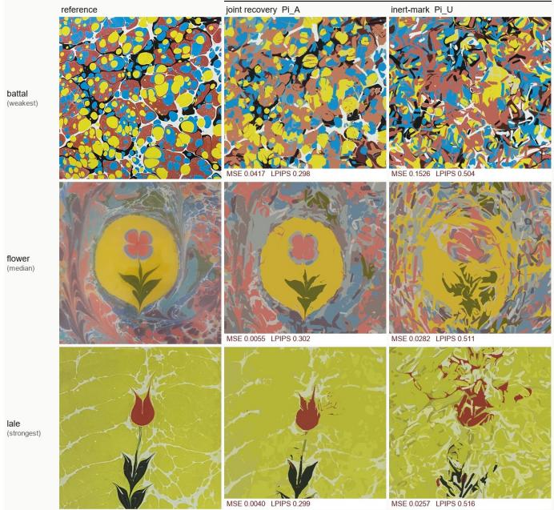  
Figure 7: Under a transport neither program was fitted against. Both programs executed under $\mathcal { R } _ { D }$ , sixteen area-matched drop maps per gesture, same three references as Fig. 6. Π<sub>A</sub> degrades — by a median +24.8% (Table 9) — but remains a reconstruction; $\Pi _ { U }$ does not become one. All five in the supplement.

Resolution. Gestures are specified in canvas coordinates, so a recovered program is a continuous-domain object and the raster resolution used for fitting should not be tied to it. Table 14 tests that directly: each program is optimised once at $1 0 2 4 ^ { 2 }$ and then replayed unchanged at $5 1 2 ^ { 2 }$ and $2 0 4 8 ^ { 2 }$ , scored against the reference resampled to the same grid. Replaying at $2 0 4 8 ^ { 2 }$ moves the error by at most 0.23%; replaying at $5 1 2 ^ { 2 }$ changes it by at most 4%. Above the scans’ native $5 1 2 ^ { 2 }$ the target is an upsample, so those tests assess replay of the representation, not recovery of new detail.

The converse does not hold for fitting: programs fitted at $5 1 2 ^ { 2 }$ and replayed at $1 0 2 4 ^ { 2 }$ reach 3.13× the floor against $3 . 6 7 \times$ for programs fitted at $1 0 2 4 ^ { 2 }$ (per reference $- 3 \mathrm { t o } - 3 1 \% )$ , at about a seventh of the optimisation time, because the width floor and the relaxation are defined in pixels. A coarse-to-fine schedule recovers most of that loss: fitting at $5 1 2 ^ { 2 }$ for 200 steps with a free radius window and then continuing the same program at $1 0 2 4 ^ { 2 }$ for 40 steps, with the relaxation started near its floor, reaches $3 . 7 5 \times$ in geometric mean against $3 . 6 7 \times$ for the headline fit, in 37 s of optimisation time against ${ \mathrm { 1 3 2 s } } ,$ one run per reference. The spread is wide — flower improves to 4.44×, lale falls from 5.22 to 3.97× because the coarse stage assigns a wrong colour to the flower head of the lale motif, which forty fine steps do not undo — and relative to a $1 0 2 4 ^ { 2 }$ fit with the same free radius (3.98×) the schedule loses 6%. Table 13 gives the times and the per-reference errors.

<table><tr><td></td><td colspan="2"> $\Pi _ { A }$ </td><td colspan="2"> $\Pi _ { U }$ </td><td></td></tr><tr><td>reference</td><td>MSE</td><td> $\mathbf { v s . \ } \mathcal { R } _ { A }$ </td><td>MSE</td><td> $\mathbf { v s } . \ \mathcal { R } _ { A }$ </td><td> $\Pi _ { U } / \Pi _ { A }$ </td></tr><tr><td>flower</td><td>0.0055</td><td> $+ 1 7 . 8 \%$ </td><td>0.0282</td><td> $- 0 . 1 \%$ </td><td>5.1×</td></tr><tr><td>tulip</td><td>0.0165</td><td>+22.3%</td><td>0.0647</td><td>+0.6%</td><td>3.9×</td></tr><tr><td>teardrops</td><td>0.0088</td><td>+45.5%</td><td>0.0544</td><td>-0.0%</td><td>6.2×</td></tr><tr><td>battal</td><td>0.0417</td><td>+24.8%</td><td>0.1526</td><td>-0.3%</td><td>3.7×</td></tr><tr><td>lale</td><td>0.0040</td><td>+51.6%</td><td>0.0257</td><td>-1.0%</td><td>6.4×</td></tr><tr><td>median</td><td></td><td>+24.8%</td><td></td><td>-0.1%</td><td>5.1×</td></tr><tr><td>GM [95% CI]</td><td></td><td></td><td></td><td></td><td>4.93× [3.59, 6.79]</td></tr></table>

Table 9: Transfer to $\mathcal { R } _ { D } .$ , a displacement built from sixteen area-matched drop maps per gesture, which neither program was fitted against. vs. $\mathcal { R } _ { A }$ is the change against the same program’s score under our transport renderer (Table 7), for both programs: $\Pi _ { A } ,$ , fitted under ${ \mathcal { R } } _ { A } .$ , pays +17.8 to +51.6% for the foreign operator, median +24.8%; Π<sub>U</sub>, which either transport destroys, moves −1.0 to +0.6% (against its own fitting renderer $\mathcal { R } _ { U }$ , which applies no transport, its change is several hundred percent). $\Pi _ { A }$ remains ahead on $5 / 5$ in MSE and $5 / 5$ in LPIPS-Alex.

Spatial distribution of the residual. Figure 11 shows target, replay and amplified absolute error for the median and the hardest reference. The residual is not spread evenly: it concentrates on the finest structures, where the recovered gesture widths approach the width floor, and along the boundaries of large colour regions. This is the same limit the gesture-count series reaches (Sec. 8)

— additional gestures capture finer structure until the improvement falls below the noise floor — and it is why battal, an all-over pattern of small features, is the reference the method reconstructs least well.

Containment. Reparameterising each anchor by the current width and ofset can confine every footprint to a centred window covering 64% of the canvas. The constraint holds for every gesture in all five programs and changes hard-render MSE by a median +6.5% (per reference +3.7% to +15.0%). That median is comparable to the across-seed spread of Table 12; flower has the largest increase, +15.0%. It constrains where the tool may act, not where transport later carries the pigment: the constrained programs still retain 78–79% of their painted area outside the canvas after transport, as the unconstrained ones do.

Area budget versus gesture count. Deposited area is a resource, and the area law makes it a controllable one: the solver carries a penalty $\lambda _ { A } \sum _ { i } A _ { \ell _ { i } } ( r _ { i } )$ with the exact gradient $\partial _ { r } A _ { \ell } = P _ { \ell }$ . Sweeping $\lambda _ { A }$ from 0 to 1 on all five references cuts deposited area by 83%, from 6.8 to 1.2 canvas areas, at a 5% reduction in the geometric-mean floor ratio, with per-reference changes from −13% to +5%. What the penalty does not do is remove a gesture: at $\lambda _ { A } = 1$ every one of the 2000 still covers more than a pixel and none sits at the radius floor. The loss is temporal instead — the fraction of gestures still visible rises from 6% in the first decile of the sequence to 99% in the last, and 83% of all deposited paint never reaches the image. Most of it is not covered but expelled: footprints are laid almost entirely on the canvas (2% outside at deposition), and it is the later insertions that carry the early paint of it.

The budget that removes gestures is the count $N ,$ and Table 16 re-scores the archived count sweep to show what it trades. As N falls from 4000 to 125 the visible fraction rises monotonically from 45% to 100%, while the floor ratio falls from 1.75× to 0.91×: a 125-gesture program is worse than a flat colour on these references. At $N = 5 0 0$ 90% of gestures are visible at 1.39× the floor; at $N = 2 0 0 0$ 60% at 1.61×. Fidelity and visibility trade of along this axis, and the operating point of the paper sits on the fidelity side of it. One scope note applies to both budgets: they count deposited area, which is what a physical bath consumes; delivered area on the canvas is a diferent and smaller quantity.

Penalising non-visible pigment. The area penalty charges every gesture, but the paint that never reaches the image is a specific subset, and the compositing identity $\begin{array} { r } { \sum _ { i } v _ { i } = \sum _ { x } ( 1 - T _ { 0 } ) } \end{array}$ , with $\begin{array} { r } { v _ { i } = \sum _ { x } T _ { i } \alpha _ { i } } \end{array}$ the area gesture i owns in the image, shows that its complement, the visible area, can be computed with one additional render using unit colours. We therefore added $\lambda _ { O } \big ( \sum _ { i } A _ { i } ^ { \tau } ~ -$ visible area and re-fit all five references with a free radius window (Table 17). In this regime the term does not behave as intended: the canvas is painted almost entirely in every program, so shrinking a gesture almost never exposes background, and the penalty acts approximately as a totalarea penalty with an ofset. At $\lambda _ { O } = 1$ the deposited total falls from 5.8 to 1.3 canvas areas and the unseen share from 83% to 24%, while the visible fraction of gestures rises from 59% to 67%. The free-radius control alone improves the geometric-mean floor ratio from $3 . 6 7 \times$ to 3.98×, so the headline radius window restricts attainable fidelity; against that control the aggregate change stays within 1%, with teardrops losing 12.9% at $\lambda _ { O } = 1$ . No setting removes a gesture, and replacing the fixed count by an error target (1.05× the headline error) with an adaptive multiplier on the data term holds the requested quality (3.70×) and also removes no gestures. Only the gesture count N reduces the number of gestures.

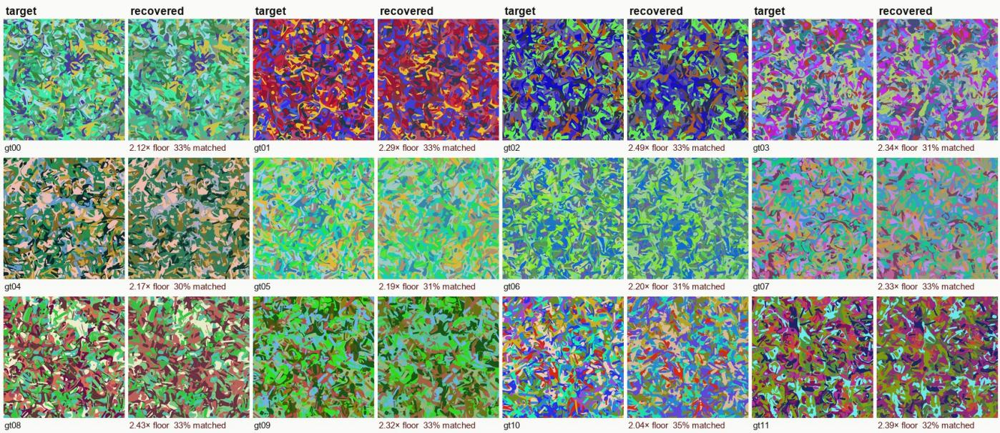

Figure 8: Synthetic ground truth. Each target is the render of a known 2000-gesture program drawn from the model’s prior; beside it is the render of the program recovered from that image alone. Annotations give the floor ratio and the fraction of visible gestures matched inside the true radius, from the matching pass that produced the figure; the final matched-null analysis of Table 10 difers from these annotations by up to one point. These targets deliberately do not look like marbling: the prior places anchors uniformly and draws colours at random, so the images carry none of the large-scale structure a real sheet has. This experiment tests the fitting procedure, not the medium  
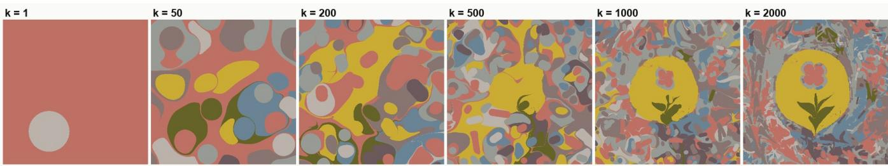  
Figure 9: A recovered program can be replayed. Hard renders of the first k gestures show the recovered flower program assembling in execution order. This temporal decomposition is unavailable from a raster reconstruction alone.

## 8 Ablations

The gesture-count series uses two references and a fixed deep-feature data term; the gesture-type comparison uses all five. Each comparison is internal to a matched series, and all values are hard-rendered.

Gesture count. Table 18: reconstruction improves monotonically in N on both references with diminishing returns, each doubling yielding improvements of 5.9, 5.9, 5.6, 4.0 and 3.1%. This series is scored in its own deep-feature units, so the comparable noise figure is the across-seed spread measured in those units, 0.5–0.6%, not the pixel-MSE band of Table 12; every doubling listed is outside it. Returns diminish but remain resolvable at the last step, so N = 2000 is an operating point chosen for cost rather than a measured ceiling.

Continuous gesture type. Fixing $\ell _ { i } = 0 -$ every gesture the drop primitive introduced in closed form by Lu et al. [8] — increases loss on all five references by a median 6.2% on that series’ own deep-feature objective, against an across-seed spread of 0.5–0.6% in the same units, so both the sign and the magnitude are resolvable. In the recovered programs, 78% of gestures have $\ell _ { i } \geq$ 0.004 (four pixels at 1024<sup>2</sup>) and 59% have $\ell _ { i } > r _ { i } .$ , so the optimiser makes substantive use of the continuous dropto-line degree of freedom. This compares gesture shapes within our vocabulary; it is not a comparison against [8], whose operator set also includes zero-injection tine and stylus maps that we do not implement.

## 9 Generality of the construction

The marbling-specific components of this construction can be separated from the generic ones.

<table><tr><td></td><td colspan="3">image (10242)</td><td colspan="2">visible gestures</td><td colspan="2">median match (canvas)</td><td colspan="2">within true radius</td></tr><tr><td>target</td><td>recovered</td><td>floor</td><td> $\mathrm { { f l o o r / r e c } }$ </td><td>truth</td><td>recovered</td><td>recovered</td><td>matched null</td><td>recovered</td><td>matched null</td></tr><tr><td>gt00</td><td>0.0219</td><td>0.0464</td><td>2.12×</td><td>1029</td><td>1206</td><td>0.0162</td><td>0.0161</td><td>33%</td><td>33%</td></tr><tr><td>gt01</td><td>0.0314</td><td>0.0720</td><td>2.29×</td><td>1071</td><td>1220</td><td>0.0170</td><td>0.0165</td><td>32%</td><td>33%</td></tr><tr><td>gt02</td><td>0.0270</td><td>0.0672</td><td>2.49×</td><td>1040</td><td>1250</td><td>0.0163</td><td>0.0166</td><td>32%</td><td>32%</td></tr><tr><td>gt03</td><td>0.0249</td><td>0.0582</td><td>2.34×</td><td>1020</td><td>1215</td><td>0.0169</td><td>0.0176</td><td>30%</td><td>31%</td></tr><tr><td>gt04</td><td>0.0331</td><td>0.0718</td><td>2.17×</td><td>1042</td><td>1222</td><td>0.0171</td><td>0.0160</td><td>30%</td><td>33%</td></tr><tr><td>gt05</td><td>0.0268</td><td>0.0586</td><td>2.19×</td><td>1046</td><td>1231</td><td>0.0171</td><td>0.0174</td><td>30%</td><td>34%</td></tr><tr><td>gt06</td><td>0.0207</td><td>0.0455</td><td>2.20×</td><td>1032</td><td>1215</td><td>0.0169</td><td>0.0173</td><td>31%</td><td>31%</td></tr><tr><td>gt07</td><td>0.0239</td><td>0.0557</td><td>2.33×</td><td>1018</td><td>1201</td><td>0.0168</td><td>0.0178</td><td>33%</td><td>29%</td></tr><tr><td>gt08</td><td>0.0270</td><td>0.0655</td><td>2.43×</td><td>1057</td><td>1239</td><td>0.0168</td><td>0.0170</td><td>33%</td><td>32%</td></tr><tr><td>gt09</td><td>0.0259</td><td>0.0601</td><td>2.32×</td><td>1015</td><td>1237</td><td>0.0166</td><td>0.0156</td><td>34%</td><td>36%</td></tr><tr><td>gt10</td><td>0.0487</td><td>0.0991</td><td>2.04×</td><td>1037</td><td>1242</td><td>0.0161</td><td>0.0171</td><td>35%</td><td>32%</td></tr><tr><td>gt11</td><td>0.0286</td><td>0.0683</td><td>2.39×</td><td>1045</td><td>1227</td><td>0.0166</td><td>0.0172</td><td>31%</td><td>32%</td></tr><tr><td>summary</td><td></td><td></td><td>2.27×</td><td></td><td></td><td>0.0168</td><td>0.0170</td><td>32%</td><td>32%</td></tr></table>

Table 10: Synthetic ground truth. Each target is the render of a known 2000-gesture program drawn from the model’s prior, so a zero-error solution provably lies inside the feasible set. Image: recovery reaches a geometric mean 2.27× below the flat floor, against 3.67× on the historical references; on this family the residual is the fitting procedure’s gap, not model misfit. Visible gestures counts those owning at least 50 pixels of the final $1 0 2 4 ^ { 2 }$ image (scaled for the $5 1 2 ^ { 2 }$ matching pass). Gestures below this threshold are excluded by the matching protocol, not proved unidentifiable. Median match is the optimal-assignment distance between visible recovered and visible true gestures; the matched null repeats it with another target’s recovered program, giving a similarly sized visible candidate pool produced by the same fitting procedure. The twelve targets form a paired design and we test it: the paired mean diference in median matched distance is $- 1 . 6 \times 1 0 ^ { - 4 }$ canvas units $( t ( 1 1 ) = - 0 . 7 7$ , 95% interval $[ - 6 . 1 , + 2 . 9 ] \times 1 0 ^ { - 4 }$ , recovery nominally better on 8 of 12), and the within-radius fractions difer on 6 targets each way. The interval excludes any systematic reduction larger than 3.8% of the 0.0168 median, which is the sensitivity of this test at $n = 1 2$ Recovered programs also carry 18% more visible gestures than the truth on 12 of 12 targets. This positional comparison bounds one statistic under one recovery procedure; it does not establish intrinsic non-identifiability.
<table><tr><td>contrast (ratio)</td><td>GM</td><td>95% CI</td><td>t(5)</td><td> $d _ { z }$ </td><td>sign</td></tr><tr><td>executed,  $\Pi _ { U } / \Pi _ { A } \ ( \mathrm { M S E } )$ </td><td>6.53×</td><td>[4.20, 10.15]</td><td>11.8</td><td>5.3</td><td> $5 / 5$ </td></tr><tr><td>imagined,  $\Pi _ { A } / \Pi _ { U }$  (MSE)</td><td>5.10×</td><td>[3.13, 8.33]</td><td>9.2</td><td>4.1</td><td>5/5</td></tr><tr><td>interaction, ratio of ratios (MSE)</td><td>33.33×</td><td>[14.39, 77.20]</td><td>11.6</td><td>5.2</td><td>5/5</td></tr><tr><td>transfer  $\mathcal { R } _ { D } , \Pi _ { U } / \Pi _ { A } \ ( \mathrm { M S E } )$ </td><td>4.93×</td><td>[3.59, 6.79]</td><td>13.9</td><td>6.2</td><td>5/5</td></tr><tr><td>executed,  $\Pi _ { U } / \Pi _ { A }$  (LPIPS)</td><td>1.93×</td><td>[1.80, 2.08]</td><td>25.3</td><td>11.3</td><td> $5 / 5$ </td></tr><tr><td>imagined,  $\Pi _ { A } / \Pi _ { U }$  (LPIPS)</td><td>2.37×</td><td>[2.05, 2.74]</td><td>16.6</td><td>7.4</td><td> $5 / 5$ </td></tr></table>

Table 11: Paired analysis on the log scale, $n = 5$ references. GM is the geometric-mean ratio, the interval a paired t-interval on the five log-ratios, $d _ { z }$ the standardised paired efect, and “sign” the number of references with the predicted direction (one-sided sign-test floor $2 ^ { - 5 } = 0 . 0 3 1 \AA$ ). The MSE contrasts between the inert arm and joint recovery compare cells on opposite sides of the flat floor (Table 7), so their size is not a quality statement. The minimum detectable paired efect at $n = 5 ,$ one-sided $\alpha = 0 . 0 5$ , power 0.8 is $d _ { z } \approx 1 . 3 3$ . Executed MSE on the three references not used during development: GM 7.5× [2.8, 20.2] (development two: 5.3×).

Marbling-specific. Only the operator itself: the choice to foliate by distance to the segment, the Steiner area law (5), and the symmetry argument that fixes the tangential coordinate. Another medium would need its own ψ, and Sec. 4.1 is the template for quantifying the discrepancy between that ψ and the physics it approximates.

Generic. The distinction in Definition 1 identifies whether later gestures alter the coordinates at which earlier coverage is evaluated. This makes image fitting transport-dependent, but does not require inversion for diferentiation: ordinary automatic diferentiation and checkpointing remain alternatives.

Replay applies when intermediate states can be reconstructed with computable inverses and derivatives away from explicitly detectable exceptional sets. The nonreconstructible state must be retained, and numerical conditioning may require checkpoints. Closed-form inversion is useful but not necessary (supplement, S6); the memory benefit depends on the actual record count and checkpoint schedule. Extending this approach to another wet medium requires a suitable state representation and transport law. Difusion, mixing and pigment-dependent dynamics introduce additional state loss and ill-conditioning, and establishing replay eficiency there is a separate problem.

## 10 Limitations

Scope of the evidence. The evaluation contains five references from one medium and one primary optimisation run per cell. Two of them were used during development.

Target  
Recovered program  
Insert one drop  
Recolour last fifth  
Translate last quarter  
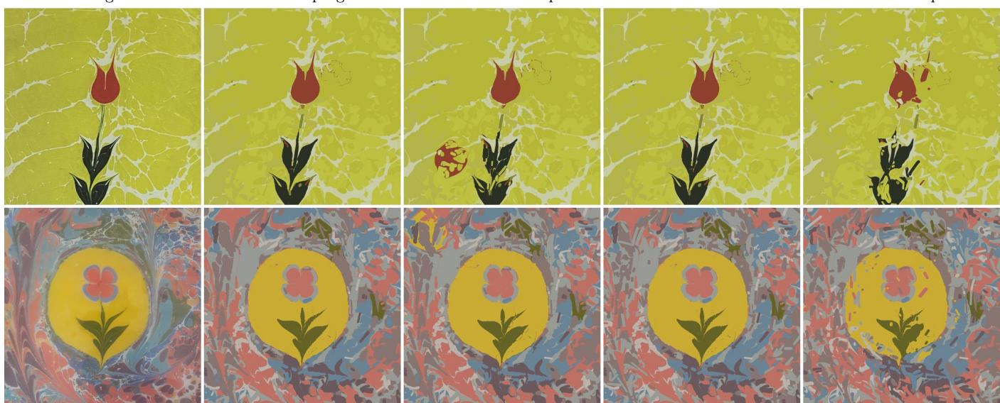  
Figure 10: Program-level edits, replayed. Lale and flower: target, recovered program, and three edits of that program rendered by the same hard renderer. Column three inserts a single drop of radius 0.06 into the ground beside the motif, at canvas position (0.30, 0.72) for lale and (0.20, 0.20) for flower, in a palette colour taken from the motif, at gesture 1000 of 2000; column four swaps the two most-used palette entries among the last fifth of the gestures; column five translates the last quarter of the gestures by +0.08 canvas units in x. Nothing is re-optimised.

<table><tr><td colspan="4">re-run, same configuration</td><td colspan="2">export comparison</td></tr><tr><td>reference</td><td>run 1</td><td>run 2</td><td>spread</td><td>log score</td><td>export vs. log</td></tr><tr><td>flower</td><td>0.004649</td><td>0.004596</td><td>1.1%</td><td>0.004609</td><td>+0.9%</td></tr><tr><td>tulip</td><td>0.013519</td><td>0.013318</td><td>1.5%</td><td>0.013263</td><td>+1.9%</td></tr><tr><td>teardrops</td><td>0.006070</td><td>0.006307</td><td>3.9%</td><td>0.005296</td><td>+14.6%</td></tr><tr><td>battal</td><td>0.033431</td><td>0.033246</td><td>0.6%</td><td>0.032551</td><td>+2.7%</td></tr><tr><td>lale</td><td>0.002633 0.002755</td><td></td><td>4.6%</td><td>0.002453</td><td>+7.3%</td></tr></table>

Table 12: Numerical variation, in the two units the paper uses. Left: two optimisation runs of one configuration and seed, both scored by the hard reference renderer, difer by 0.6–4.6% in pixel MSE. Right: the training-time score of the best step, taken before palette colours are snapped at export, against the reference render of the exported program; the column is $1 0 0 ( \mathrm { M S E _ { e x p o r t } / M S E _ { l o g } - 1 } )$ . Rendering the exported program with both kernels agrees within 0.15%, so the gap is colour snapping, not renderer disagreement. Across three seeds on all five references the pixel-MSE spread is 2.7–6.7%, median 6.1%. Seed 0 difers from the headline run by up to 1.3%, which we count as part of the spread. In the deep-feature units of the ablation series the across-seed spread is 0.5–0.6% (two references, two seeds).

The large paired efects reproduce on the three held-out images and exceed measured numerical variation, but a larger, multi-seed corpus is needed to estimate performance across marbling schools and acquisition conditions. The comparison set is mostly internal: the inert-mark arm, the one-pass correction and the second transport operator each isolate one mechanism of the model; the one external system, a stroke-based fitter, optimises inert marks and is scored only as a raster; a shared task on which both kinds of system execute, and execution on a physical bath, are

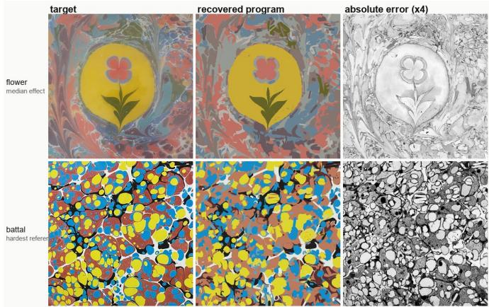  
Figure 11: Where the residual is. Target, replayed program, and absolute error amplified 4× (dark is larger error), at 1024<sup>2</sup>. Error concentrates on structures near the gesture-width floor rather than being distributed over the canvas.

future work.

Model. The operator is a geometric surrogate: exactly area-preserving of the footprint, but with the foliation and tangential transport of Sec. 4 rather than those of a harmonic potential, with a 27% discrepancy from linesource potential flow at the median aspect ratio under (9). It uses a free plane with no tray wall, passive pigment, quasi-static sequential gestures, and no viscosity contrast, fingering, interfacial tension, or difusion. The recovered programs inject 5.5–6.2 canvas areas, much of which leaves the visible window; direct physical execution therefore requires a bounded-domain model and a calibrated paint budget. Zero-injection stylus drag is also outside the present gesture family. The transfer experiment supports variation within the insertion class, not arbitrary fluid dynamics.

<table><tr><td></td><td colspan="2">time per fit (s)</td><td colspan="5">hard-render MSE  $\times 1 0 ^ { 3 }$  at  $1 0 2 4 ^ { 2 }$ </td><td>GM</td><td>GM</td></tr><tr><td>configuration</td><td>steps</td><td>wall</td><td>flower</td><td>tulip</td><td>teardrops</td><td>battal</td><td>lale</td><td> $\mathrm { M S E } \times \mathrm { 1 0 ^ { 3 } }$ </td><td>floor/MSE</td></tr><tr><td>headline:  $1 0 2 4 ^ { 2 }$  240 steps, windowed radius</td><td>132</td><td>234</td><td>4.65</td><td>13.52</td><td>6.07</td><td>33.43</td><td>2.63</td><td>8.04</td><td>3.67×</td></tr><tr><td>free radius:  ${ 1 0 2 4 } ^ { 2 } ,$  240 steps</td><td>132</td><td>234</td><td>4.69</td><td>12.81</td><td>5.31</td><td>29.95</td><td>2.34</td><td>7.41</td><td>3.98×</td></tr><tr><td> $5 1 2 ^ { 2 }$  only: 240 steps, windowed radius</td><td>18</td><td></td><td>5.74</td><td>15.19</td><td>6.55</td><td>34.32</td><td>3.82</td><td>9.44</td><td>3.13×</td></tr><tr><td>stage A: 5122, 200 steps, free radius</td><td>15</td><td>45</td><td>5.25</td><td>14.83</td><td>5.68</td><td>32.05</td><td>3.54</td><td>8.71</td><td>3.39×</td></tr><tr><td>stage B: A, then 40 steps at  $1 0 2 4 ^ { 2 }$ </td><td>37</td><td>91</td><td>3.40</td><td>14.28</td><td>5.63</td><td>32.05</td><td>3.46</td><td>7.88</td><td>3.75×</td></tr></table>

Table 13: Speed against error. Steps is the optimisation time alone, from the uncontended per-step measurements (0.55 s at $1 0 2 4 ^ { 2 } , 0 . 0 7 5 \colon$ s at $\bar { 5 } 1 2 ^ { 2 } , N = 2 0 0 0 )$ . Wall is a whole fit including start-up and the export render, which difer by row; the step column is the fair comparison. MSE is pixel mean-squared error of the exported program under the reference renderer against the target at $1 0 2 4 ^ { 2 } ;$ floor/MSE is the error of the best single flat colour divided by the program’s error, so 3.67× means the program’s error is 3.67 times smaller than painting one colour. One run per cell. The coarse-to-fine schedule (stage B) matches the headline’s error in 37 s of optimisation against ${ \mathrm { 1 3 2 s } } ,$ with a wide per-reference spread: flower improves and lale loses, because the coarse stage commits to a wrong colour for the tulip head.
<table><tr><td rowspan="2">reference</td><td colspan="4">replayed at three resolutions (pixel MSE)</td><td colspan="2">PSNR (dB)</td><td colspan="2">SSIM</td><td rowspan="2">floor/MSE</td></tr><tr><td> $5 1 2 ^ { 2 }$ </td><td> $1 0 2 4 ^ { 2 }$ </td><td> $2 0 4 8 ^ { 2 }$ </td><td>1024→2048</td><td>floor</td><td>ΠIA</td><td>floor</td><td> $\Pi _ { A }$ </td></tr><tr><td>flower</td><td>0.004663</td><td>0.004649</td><td>0.004651</td><td>+0.03%</td><td>18.21</td><td>23.33</td><td>0.669</td><td>0.658</td><td>3.25×</td></tr><tr><td>tulip</td><td>0.013721</td><td>0.013519</td><td>0.013517</td><td>-0.02%</td><td>14.06</td><td>18.69</td><td>0.377</td><td>0.490</td><td>2.90×</td></tr><tr><td>teardrops</td><td>0.006311</td><td>0.006070</td><td>0.006068</td><td>-0.03%</td><td>14.99</td><td>22.17</td><td>0.488</td><td>0.539</td><td>5.22×</td></tr><tr><td>battal</td><td>0.034035</td><td>0.033431</td><td>0.033457</td><td>+0.08%</td><td>10.63</td><td>14.76</td><td>0.269</td><td>0.400</td><td>2.59×</td></tr><tr><td>lale</td><td>0.002634</td><td>0.002633</td><td>0.002627</td><td>-0.22%</td><td>18.62</td><td>25.80</td><td>0.714</td><td>0.751</td><td>5.22×</td></tr></table>

Table 14: The recovered program is a continuous-domain object fitted to raster samples. Each program is optimised once at $1 0 2 4 ^ { 2 }$ and then replayed unchanged on a $5 1 2 ^ { 2 }$ $1 0 2 4 ^ { 2 }$ and $2 0 4 8 ^ { 2 }$ grid, scored against the reference resampled to the same grid. Replaying at $2 0 4 8 ^ { \bar { 2 } }$ changes the error by at most 0.23% on any reference (median 0.04%); replaying at $5 1 2 ^ { 2 }$ , the scans’ native scale, by at most 4%, comparable to the seed spread of Table 12: the resolution the program was fitted at is not baked into it. PSNR and SSIM are reported alongside the same metrics for the best constant image as a reference point: battal’s 14.76 dB is +4.13 dB over its own floor. The PSNR column is a monotone re-expression of the same floor ratio (+4.13 dB is $1 0 \log _ { 1 0 } 2 . 5 9 )$ , not an independent metric. SSIM against a constant image is ill-conditioned, since a flat image has no local variance, so neither the $4 / 5$ it clears nor flower’s exception should be read as corroborating or refuting the MSE result.

<table><tr><td rowspan="2"> $\lambda _ { A }$ </td><td colspan="2">deposited area</td><td colspan="2">floor/MSE</td><td colspan="2">visible gestures</td></tr><tr><td>GM (canvas)</td><td>vs. 0</td><td>GM</td><td>vs. 0</td><td>GM</td><td> $\mathrm { { v s . 0 } }$ </td></tr><tr><td>0.00</td><td>6.76</td><td>+0%</td><td>1.75×</td><td>+0%</td><td>1215</td><td>+0</td></tr><tr><td>0.03</td><td>2.50</td><td>-63%</td><td>1.74×</td><td>-0%</td><td>1217</td><td>+2</td></tr><tr><td>0.30</td><td>1.51</td><td>-78%</td><td>1.69×</td><td>-3%</td><td>1267</td><td>+52</td></tr><tr><td>1.00</td><td>1.16</td><td>-83%</td><td>1.66×</td><td>-5%</td><td>1353</td><td>+138</td></tr></table>

Table 15: Paint budget as a penalty $\begin{array} { r } { \lambda _ { A } \sum _ { i } A _ { \ell _ { i } } \left( r _ { i } \right) } \end{array}$ on deposited area, geometric means over the five references. This series was trained under the deep-feature objective with a free radius window and no length penalty, so it is read within itself, like Sec. 8; scores are pixel MSE on the reference renderer. At $\lambda _ { A } = 1 . 0$ deposited area falls 83% while the floor ratio changes $- 5 \%$ in geometric mean, with nonuniform changes across references; per-reference changes range from −13% (teardrops) to +5%. The headline seed spread does not establish significance for this separately trained series. Visible gestures counts those owning at least 50 pixels of the final image: unchanged at $\lambda _ { A } = 0 . 0 3$ and rising on every reference from $\lambda _ { A } = 0 . 3 ,$ by +83 to +184 per program at $\lambda _ { A } = 1 . 0$

<table><tr><td>N</td><td>area floor/MSE</td><td>∆ visible</td><td> $\mathrm { v i s . } / N$ </td></tr><tr><td>125</td><td>0.76 0.91×</td><td></td><td>124 100%</td></tr><tr><td>250 1.13</td><td></td><td>1.12× +23%</td><td>242 97%</td></tr><tr><td>500 2.12</td><td>1.39×</td><td>+24%</td><td>452 90%</td></tr><tr><td>1000 3.49</td><td>1.51×</td><td>+9%</td><td>779 78%</td></tr><tr><td>2000 5.77</td><td>1.61×</td><td>+7%</td><td>1218 61%</td></tr><tr><td>400010.44</td><td>1.75×</td><td>+8%</td><td>1788 45%</td></tr></table>

Table 16: The gesture count as a budget, from the archived count sweep, restricted to the two references of that sweep still in the corpus (flower and battal) (deep-feature objective; a separate series, read within itself), re-scored on the reference renderer at $1 0 \dot { 2 } 4 ^ { 2 }$ . Unlike the area penalty of Table 15, which shrinks every gesture and removes none, lowering N removes gestures outright. Visible counts gestures owning at least 50 pixels of the final image and visible/N is the fraction of the program that can still be matched to the image: it runs from 100% at $N = 1 2 5$ to 45% at $N = 4 0 0 0$ , while the visible count runs from 124 to 1788. At $N = 1 2 5$ the program is worse than a flat colour (0.91×). Fewer gestures means a larger share of the program survives to the image and a smaller absolute number does.

Depth. Measured step time grows approximately linearly with program length (Sec. 5.2), and replay memory includes $P \lceil N / k \rceil$ checkpoints and S exception records. We have not run $N = 1 0 ^ { 4 }$ . At fixed optimisation steps, increasing the number of parameters can also change convergence. Table 18 shows diminishing gains through $N = 4 0 0 0 ;$ it does not identify the limiting resource at greater depth.

<table><tr><td>arm</td><td>floor/MSE vs. headline unseen visible</td><td></td><td></td><td></td><td> $N _ { \mathrm { e f f } }$ </td></tr><tr><td>control,  $\lambda _ { O } = 0$ </td><td>3.98×</td><td> $+ 8 . 4 \%$ </td><td>83%</td><td>59%</td><td>2000</td></tr><tr><td> $\lambda o = 0 . 1$ </td><td>4.01×</td><td>+9.3%</td><td>46%</td><td>60%</td><td>2000</td></tr><tr><td> $\lambda _ { O } = 0 . 3$ </td><td>3.95×</td><td>+7.6%</td><td>34%</td><td>62%</td><td>2000</td></tr><tr><td> $\lambda _ { O } = 1$ </td><td>3.95×</td><td>+7.6%</td><td>24%</td><td>67%</td><td>2000</td></tr><tr><td>error target,  $\lambda _ { O } = 0 . 3$ </td><td>3.70×</td><td> $+ 0 . 8 \%$ </td><td>40%</td><td>62%</td><td>2000</td></tr></table>

Table 17: Penalising deposited area not visible in the final canvas. All five references, headline objective and step budget, free radius window, one run per cell, scored on the reference renderer at $1 0 2 4 ^ { 2 }$ ; geometric means and plain means over the five. Unseen is the fraction of deposited paint that never reaches the image, whether pushed of the canvas by later insertions or covered on it (footprints are laid almost entirely on the canvas, 2% outside at deposition; the archived ofcanvas measurement of Sec. 7 shows that most of the unseen paint is expelled rather than covered); visible the fraction of gestures owning at least 50 pixels; $N _ { \mathrm { e f f } }$ the smallest number of gestures exceeding one pixel of area in any program. The free-radius control improves on the headline in these single-run comparisons; the headline used the radius window of Table 5. With the canvas painted almost entirely (visible area 0.97–0.99 in every arm) the visible term varies little and the penalty acts approximately as a total-area penalty. Against the control, aggregate image-error changes are small, with a larger loss on teardrops at $\lambda o = 1$ . No tested setting removes a gesture; these are descriptive comparisons.
<table><tr><td>N</td><td>flower</td><td>battal</td><td>mean</td><td>per doubling</td></tr><tr><td>125</td><td>5.1723</td><td>5.9314</td><td>5.552</td><td></td></tr><tr><td>250</td><td>4.9600</td><td>5.5528</td><td>5.256</td><td>-5.3%</td></tr><tr><td>500</td><td>4.7266</td><td>5.1401</td><td>4.933</td><td>-6.1%</td></tr><tr><td>1000</td><td>4.5795</td><td>4.7669</td><td>4.673</td><td>-5.3%</td></tr><tr><td>2000</td><td>4.3969</td><td>4.5163</td><td>4.457</td><td>-4.6%</td></tr><tr><td>4000</td><td>4.3113</td><td>4.2997</td><td>4.306</td><td>-3.4%</td></tr></table>

Table 18: Reconstruction versus gesture count under the deep-feature training objective of that series (lower is better; the two development references in the corpus). Monotone with diminishing returns; the last doubling buys 3.4%, which is still outside the 0.5–0.6% across-seed spread measured in these same deep-feature units.

Zero-injection transport. Tine and stylus drag [8, 10] is a diferent displacement class with no deposition set. We did not obtain a calibrated comparison against it at matched reach and report none; the analytical brushes of [23] are a published candidate evaluator for that class.

Identifiability. Program parameters have ambiguities, including palette-label permutations. Gestures below the ownership threshold can still influence the final image through transport, so low visibility does not imply absence of information about them. Our synthetic matching experiment assesses one recovery procedure and positional statistic. We seek a program attaining low reconstruction loss under the model, not the historical process that made a sheet. Gesture count and ordered slots are fixed; discrete program search and physical calibration remain separate problems.

## 11 Conclusion

We presented inverse digital marbling: the recovery of executable programs in a deposition-based model of the medium. A capsule primitive joins drops to elongated deposits, with exactly area-preserving exterior transport and a closed-form exterior inverse. Its replay adjoint regenerates intermediate states while retaining exceptional coordinates and position checkpoints. At the reported operating point, the PyTorch implementation uses 8.7× less memory than the tested checkpointed-autograd baseline at comparable step time; the fused implementation fits 2000-gesture programs in minutes. The programs replay at multiple resolutions and support edits under the same dynamics. Transport-aware fitting outperforms the tested transport-disabled and one-pass compensation controls when replayed under the insertion model and, scored as a raster, is level with a published stroke-based fitter at matched stroke count. Alternative-transport and synthetic experiments delimit operator sensitivity and generating-gesture correspondence. The result is an editable computational process for a medium in which later actions move earlier marks.

Availability. The recovered programs, the recorded scores from which every table is generated, the generating scripts, the discrepancy computation of Sec. 4.1 and the reference implementation of the forward model are archived and available from the corresponding author on request. The source package includes the supplementary PDF and the table-generation script; regeneration of the measurements requires the separate results archive. A public code-and-data release is planned for the journal version.

## References

[1] A. Hertzmann. A Survey of Stroke-Based Rendering. IEEE Computer Graphics and Applications, 23(4):70–81, 2003.

[2] Z. Huang, W. Heng, S. Zhou. Learning to Paint with Model-based Deep Reinforcement Learning. In Proc. ICCV, 2019.

[3] T.-M. Li, M. Luk´aˇc, M. Gharbi, J. Ragan-Kelley. Diferentiable Vector Graphics Rasterization for Editing and Learning. ACM Transactions on Graphics (Proc. SIG-GRAPH Asia), 39(6), 2020.

[4] Z. Zou, T. Shi, S. Qiu, Y. Yuan, Z. Shi. Stylized Neural Painting. In Proc. CVPR, 2021.

[5] S. Liu, T. Lin, D. He, F. Li, R. Deng, X. Li, E. Ding, H. Wang. Paint Transformer: Feed Forward Neural Painting with Stroke Prediction. In Proc. ICCV, 2021.

[6] P. Schaldenbrand, J. McCann, J. Oh. FRIDA: A Collaborative Robot Painter with a Diferentiable, Real2Sim2Real Planning Environment. In Proc. ICRA, 2023.

[7] C. J. Curtis, S. E. Anderson, J. E. Seims, K. W. Fleischer, D. H. Salesin. Computer-Generated Watercolor. In Proc. SIGGRAPH, 1997.

[8] S. Lu, A. Jafer, X. Jin, H. Zhao, X. Mao. Mathematical Marbling. IEEE Computer Graphics and Applications, 32(6):26–35, 2012.

[9] R. Acar, P. Boulanger. Digital Marbling: A Multiscale Fluid Model. IEEE Transactions on Visualization and Computer Graphics, 12(4):600–614, 2006.

[10] A. Jafer. Oseen Flow in Paint Marbling. arXiv preprint 1702.02106, 2018.

[11] S. Liu, T. Li, W. Chen, H. Li. Soft Rasterizer: A Diferentiable Renderer for Image-based 3D Reasoning. In Proc. ICCV, 2019.

[12] D. Vicini, S. Speierer, W. Jakob. Path Replay Backpropagation: Diferentiating Light Paths using Constant Memory and Linear Time. ACM Transactions on Graphics (Proc. SIGGRAPH), 40(4), 2021.

[13] A. Griewank, A. Walther. Algorithm 799: Revolve: An Implementation of Checkpointing for the Reverse or Adjoint Mode of Computational Diferentiation. ACM Transactions on Mathematical Software, 26(1):19–45, 2000.

[14] A. N. Gomez, M. Ren, R. Urtasun, R. B. Grosse. The Reversible Residual Network: Backpropagation Without Storing Activations. In Proc. NeurIPS, 2017.

[15] Y. Jiang, J. Lu, Y. Chen, Y. He, K. Wu, Y. Yang, C. Jiang. Birth of a Painting: Diferentiable Brushstroke Reconstruction. arXiv:2511.13191, 2025.

[16] Z. Li, J. He, B. B¨orcs¨ok, T. Zhang, D. Chen, T. Du, M. C. Lin, G. Turk, B. Zhu. An Adjoint Method for Diferentiable Fluid Simulation on Flow Maps. In Proc. ACM SIGGRAPH Asia, 2025.

[17] L. Shu, Y. Jiang, K. Wu, Y. Yang, L. Guibas, C. Jiang. Diferentiate the Solver, Not the Equation: Reverse-Sweep Adjoints for Block Implicit Simulation. arXiv:2608.08559, 2026.

[18] R. Zhang, P. Isola, A. A. Efros, E. Shechtman, O. Wang. The Unreasonable Efectiveness of Deep Features as a Perceptual Metric. In Proc. CVPR, 2018.

[19] T. Porter, T. Duf. Compositing Digital Images. In Proc. SIGGRAPH, 1984.

[20] D. Maclaurin, D. Duvenaud, R. P. Adams. Gradientbased Hyperparameter Optimization through Reversible Learning. In Proc. ICML, 2015.

[21] A. McNamara, A. Treuille, Z. Popovi´c, J. Stam. Fluid Control Using the Adjoint Method. ACM Transactions on Graphics (Proc. SIGGRAPH), 23(3), 2004.

[22] Y. Hu, L. Anderson, T.-M. Li, Q. Sun, N. Carr, J. Ragan-Kelley, F. Durand. DifTaichi: Diferentiable Programming for Physical Simulation. In Proc. ICLR, 2020.

[23] D. L. James, E. James. Mixwell: Sharp 2D Fluid Brushes for Progressive Physics-Based Mixing. ACM Transactions on Graphics (Proc. SIGGRAPH), 45(4), 2026.

[24] H. Fu, S. Zhou, L. Liu, N. J. Mitra. Animated Construction of Line Drawings. ACM Transactions on Graphics (Proc. SIGGRAPH Asia), 30(6):133, 2011.

[25] J. Tan, M. Dvoroˇzˇn´ak, D. S´ykora, Y. Gingold. Decomposing Time-Lapse Paintings into Layers. ACM Transactions on Graphics (Proc. SIGGRAPH), 34(4):61, 2015.

[26] X. Ma, Y. Zhou, X. Xu, B. Sun, V. Filev, N. Orlov, Y. Fu, H. Shi. Towards Layer-wise Image Vectorization. In Proc. CVPR, 2022.

[27] H. Federer. Curvature Measures. Transactions of the American Mathematical Society, 93(3):418–491, 1959.

[28] P. Haeberli. Paint by Numbers: Abstract Image Representations. In Proc. SIGGRAPH, 1990.

[29] A. Hertzmann. Painterly Rendering with Curved Brush Strokes of Multiple Sizes. In Proc. SIGGRAPH, 1998.

[30] T.-M. Li, M. Aittala, F. Durand, J. Lehtinen. Diferentiable Monte Carlo Ray Tracing through Edge Sampling. ACM Transactions on Graphics (Proc. SIGGRAPH Asia), 37(6), 2018.

[31] G. Loubet, N. Holzschuch, W. Jakob. Reparameterizing Discontinuous Integrands for Diferentiable Rendering. ACM Transactions on Graphics (Proc. SIGGRAPH Asia), 38(6), 2019.

[32] K. Ellis, D. Ritchie, A. Solar-Lezama, J. B. Tenenbaum. Learning to Infer Graphics Programs from Hand-Drawn Images. In Proc. NeurIPS, 2018.

[33] J. O. Talton, Y. Lou, S. Lesser, J. Duke, R. Mˇech, V. Koltun. Metropolis Procedural Modeling. ACM Transactions on Graphics, 30(2), 2011.

[34] R. J. Wolfe. Marbled Paper: Its History, Techniques, and Patterns. University of Pennsylvania Press, 1990.