# KAIROS: A DATASET FOR FINE-GRAINED VIDEO-LANGUAGE MODELING OVER SPACE, TIME, AND DY-NAMICS

Ruibo Ming1, Lei Sun1, Deheng Zhang1, He Zhang2, Jialu Li², Jian Wang3, Zhendong Li1, Mengshun Hu¹, Danda Pani Paudel¹, Luc van Gool¹, Jinjin Gu¹ 1INSAIT, Sofia University “St. Kliment Ohridski" 2Adobe Research 3Snap Research

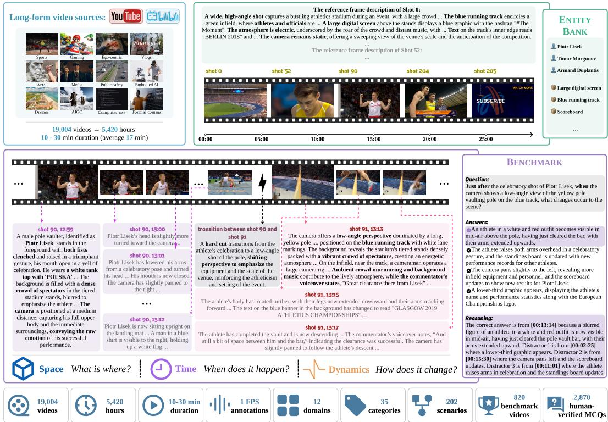  
Figure 1: KAIRos represents long-form videos as structured, time-resolved annotation streams. Each video is decomposed into shots, with each shot annotated by a reference-frame description, an in-shot differential chain, and a video-level entity bank that links recurring identities across shots. At 1 FPS, the annotations capture three axes of fine-grained video understanding: Space, Time, and Dynamics. KAIROs-Bench is derived from KAIROs by converting these structured annotations into temporally grounded questions, whose answers are tied to explicit evidence spans.

## ABSTRACT

Many emerging video language modeling tasks require systems to move beyond clip-level abstraction and model visual content as it unfolds over extended time horizons. However, most existing video datasets rely on coarse or sparsely aligned supervision, which compresses temporal variation and limits the ability of models to learn reusable representations of continuous visual dynamics. We introduce KAIROs, a video dataset for video-language modeling with time-resolved annotations. KAIROs consists of long-duration videos, ranging from ten minutes to half an hour, annotated with fine-grained temporal alignment. The annotations capture ongoing actions, entity appearances and attributes, interactions, and evolving contextual cues along the video timeline. This time-resolved structure supports fine-grained evaluation, long-range modeling and reasoning, instruction data construction, representation learning, and video generation. KAIROs provides a general-purpose foundation for modeling visual experiences over time.

## 1 INTRODUCTION

Video-language modeling (Venugopalan et al., 2015; Sun et al., 2019; Zhu & Yang, 2020; Li et al., 2020; Luo et al., 2020; Fu et al., 2021; Li et al., 2022; Xu et al., 2021; Alayrac et al., 2022; Li et al., 2023; Zhang et al., 2023; Li et al., 2024a) seeks to represent and reason over video content through language as it unfolds over both space and time. In a video, entities appear, interact, and evolve continuously, forming structured patterns across both spatial layouts and temporal progressions. Such spatiotemporal evolution gives rise to rich dynamics, including event progression, state transitions, and causal dependencies, and provides the foundation for grounded reasoning about what happens, why it happens, and what may follow. Therefore, fine-grained video-language modeling requires jointly modeling Space, Time, and Dynamics: Space specifies what is present and how it is spatially arranged, Time captures when events occur across the video timeline, and Dynamics characterizes how entities, actions, and contexts evolve and interact to form coherent video-level understanding.

A fundamental barrier to achieving this goal lies in the data. Significant efforts have been made to advance video understanding, including construction of video caption datasets (Chen et al., 2024b; Farré et al., 2024), video instruction tuning and conversational video datasets (Luo et al., 2023; Zhang et al., 2024; Chen et al., 2024b; Ren et al., 2024), and recent long video benchmarks (Chen et al., 2024a; Qin et al., 2025; Mangalam et al., 2023; Wu et al., 2024; Cheng et al., 2025; Fu et al., 2025; Chandrasegaran et al., 2024; Li et al., 2024b; Wang et al., 2025a). Despite these advances, almost all prior works still fall short on all three fronts outlined above.

1. Space: Existing datasets still lack spatial granularity. Most rely on holistic video captions and place far less emphasis on fine-grained visual annotation than image datasets. As a result, their annotations typically foreground only the most salient objects, leaving many entities, attributes, and relations essential for a comprehensive account of video content unspecified.

2. Time: Existing datasets offer limited temporal resolution. Most provide annotations at the clip level, such as a single caption or a set of questions, without fine-grained temporal alignment. While such annotations capture high-level semantics, they fail to reflect how visual content, events, and scene states evolve over time.

3. Dynamics: Existing datasets, especially benchmarks, largely fail to probe fine-grained spatiotemporal grounding. This includes aspects such as pinpointing precisely when an event occurs, tracing how states change over time, and examining how observations from different moments jointly support reasoning about temporal order, interactions, and causality. As a result, they provide only limited supervision and evaluation of such dynamics, leaving models inadequately assessed in their ability to perform grounded reasoning over dynamic video structure.

These limitations are especially pronounced in long-form videos (e.g., longer than 10 minutes), where richer temporal dependencies accumulate over extended durations but remain sparsely annotated.

We propose KAIROs, a new dataset for fine-grained video-language modeling over Space, Time, and Dynamics. The core of KAIROs lies an automated annotation pipeline that produces fine-grained spatiotemporal descriptions at multiple levels of granularity: within each shot, it records detailed visual content; across frames within a shot, it captures temporal variation and scene evolution; and over the full video, it integrates these observations into spatially detailed and temporally resolved descriptions. A key component of this framework is a unified, text-centric representation that maintains consistency across long video contexts. KAIRos integrates entity consistency directly into frame-level annotations, allowing recurring entities and semantic attributes to be resolved over time. This design links entities across distant segments through language, while incorporating multimodal signals such as speech and environmental audio into a coherent narrative.

As demonstrated in Figure 1, built on this pipeline, KAIROs provides rich, time-resolved annotations for constructing both training data and benchmarks for video-language models. Since evidence may be distributed across distant temporal segments, KAIRos supports tasks such as cross-temporal reference resolution, causal reasoning, and compositional reasoning. Its annotations can be converted into dense dynamic captions, question-answer pairs, and explicit reasoning paths grounded in temporally localized evidence. This enables questions about what happened, when an entity appeared, how entities interacted, and how a scene evolved over time, together with rationales that connect answers to the corresponding video evidence.

Our final dataset contains 19,004 videos with an average duration of 17 minutes, totaling 5,420 hours of annotated video across 202 diverse scenario types. We focus on videos ranging from 10 to 30 minutes in length to better reflect real-world temporal horizons while maintaining high annotation quality. This regime is particularly important because the limitations of existing datasets become even more severe in long-form videos, where richer temporal dependencies accumulate over extended durations while annotations remain sparse. From a subset of 820 videos, we further construct a benchmark of 2,870 questions, all of which are passed through sanity checks and human verification. These questions are temporally grounded to specific moments in the video and include explicit reasoning rationales. As illustrated in Figure 1, KAIROs exhibits a substantial leap compared to caption-based datasets in annotation density and information richness.

Our extensive experiments on state-of-the-art video language models (OpenAI, 2026c; The Gemini Team, 2026; Intelligence, 2024; ByteDance Seed, 2026; Chen et al., 2024c; Bai et al., 2025; Xiaomi, 2025) reveal that performance degrades when the evidence spans several shots or the whole video. Besides, we highlight that fine-tuning on training data derived from KAIROS can improve the performance of video-language models on other long video benchmarks.

Our contributions are threefold.

1. We introduce KAIROs, a new long-form video-language dataset designed for fine-grained modeling of Space, Time, and Dynamics.

2. We develop an automated annotation pipeline that produces multi-level spatiotemporal representations for long videos, which captures detailed and structured visual content and enabling coherent tracking of recurring entities and semantic attributes over time.

3. We construct a temporally grounded benchmark and demonstrate the utility of KAIROs for evaluating and improving video-language models.

## 2 THE KAIROS DATASET

Annotation format. KAIROS represents each video as a dense, temporally unfolding annotation stream. Rather than assigning a single coarse clip-level description, it refreshes annotations at 1 FPS to capture fine-grained visual, auditory, and semantic changes as they occur. The format also preserves video structure: frames are organized into locally coherent shots, while a video-level entity matching mechanism tracks identities, attributes, and relationships as they persist, disappear, reappear, or are disambiguated across shots. Formally, each extracted frame is stored as a structured record with four fields: (1) an absolute timestamp, (2) the corresponding video frame, (3) a shot index, and (4) an audio-aware description. Together, these records provide a temporally grounded interface for fine-grained video understanding, retrieval, temporal reasoning, entity tracking, and video generation.

## 2.1 KAIROS ANNOTATION PIPELINE

The dense and structured nature of KAIROS annotations makes manual annotation prohibitively expensive. We therefore develop an automated pipeline that first structures the video globally and then performs fine-grained annotation. As shown in Figure 2, this design preserves both local details and long-range video dynamics under a tractable computational budget.

Video structure parsing. We model cross-shot entity consistency to handle entities that reappear across distant shots, undergo visual changes, or are later identified through speech and context, thereby capturing continuity and long-range relationships across the video. We first employ TransNetV2 (Soucek & Lokoc, 2024) to segment each video into shots. After shot segmentation, we identify entities appearing in the reference frame of each shot and construct a video-level entity bank. We define eight types of entities: person, animal, object, vehicle, text, location, food, and clothing. Each detected entity is associated with a canonical label and a short visual-detail string, describing distinguishing attributes. We then link each entity mention emitted for a new reference frame to the video-level entity bank. The bank is injected into every reference-frame prompt, which requires that an entity already in the bank be referred to by its canonical name verbatim; a mention whose normalized label exactly matches a bank entry is recorded as a new appearance of that entity. This lets later shots reuse established identities instead of introducing duplicates. In this way, the entity bank serves both as a tracking mechanism and as global context for spatio-temporal descriptions.

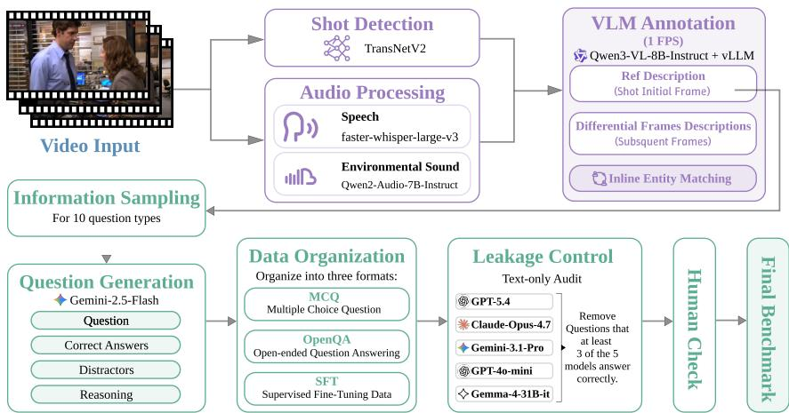  
Figure 2: KAIRos transforms raw long-form videos into structured, time-resolved annotations that integrate visual, temporal, entity-level, and audio information, supporting dense captioning, reasoning supervision, and KAIROs-Bench construction.

In-shot fine-grained annotation. Given the parsed video structure, KAIROS annotates each shot at 1 FPS with an initial-and-subsequent scheme. The first sampled frame in each shot is treated as the reference frame and receives a full moment-level description, including spatial layout, visible entities, attributes, relations, on-screen text, and relevant audio cues. Subsequent 1 FPS samples are treated as differential frames, which record only fine-grained changes relative to the previous second, such as actions, state transitions, motion, interactions, visibility changes, and newly appearing or disappearing entities. This design reduces redundancy while preserving fine-grained temporal evolution. The core visual annotation process is driven by Qwen3-VL-8B-Inst ruct (Bai et al., 2025) and accelerated with vLLM (Kwon et al., 2023). For each initial or differential frame, the model receives the sampled frame, the current entity bank, and the relevant context history and audio information. The generated description is structured along three axes: Space, describing what is present at a moment; Time, anchoring the description to an absolute point on the video timeline; and Dynamics, describing how the scene evolves.

Audio and transition annotation. We combine speech transcription and non-speech audio summarization. faster-whisper-1arge-v3 (SYSTRAN, 2024; Radford et al., 2023) transcribes speech into timestamped sentence-level segments, while Qwen2-Audio-7B-Instruct (Chu et al., 2024) summarizes ambient and event-level sounds in 30-second windows. Both streams are aligned with the annotation timeline: speech is attached to the corresponding frame, while nonspeech summaries are attached only to reference frames to preserve context without redundancy. KAIRos also explicitly annotates shot-boundary transitions to preserve cross-shot continuity. For each boundary, the pipeline records the editing technique (hard cut, fade, dissolve, wipe, etc.), the narrative purpose of the cut, and the visual contrast across it. These descriptions link adjacent shots and prevent the video annotation from becoming a set of disconnected shot-level records.

Annotation computation analysis. Because KAIROS annotations are produced by a fully automated pipeline, the process scales naturally with available GPU parallelism. In our production setting, one H200 annotates about 4 hours of video per hour; with tensor parallelism over two H200s, the pipeline reaches about 8× real time. This corresponds to roughly 1,355 H200-hours for the KAIROs dataset of 5,420 hours, with preprocessing and audio analysis running at over 20× real time and contributing little to the overall cost.

## 2.2 VIDEO CURATION

To provide a suitable setting for studying dynamic and fine-grained video understanding, we explicitly prioritize long-form narratives with extended durations and a high density of shot transitions. Such videos naturally encapsulate rich event progressions, entity interactions, and causal dependencies over time. We source our raw data from the two most prominent long-form video platforms:

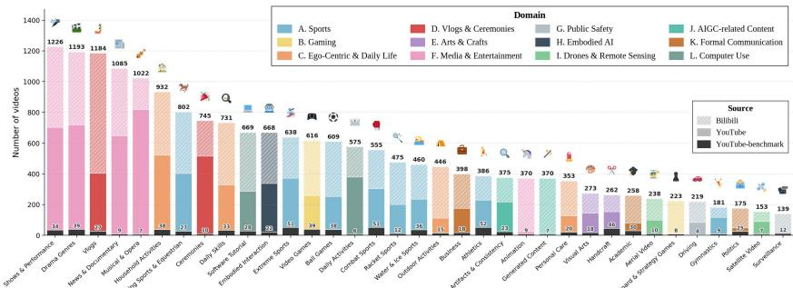  
Figure 3: Per-category video count of KAIROs dataset, grouped by the 12 parent domains (bar color). Each bar stacks the curated benchmark subset (820 videos, dark bottom), the YouTube nonbenchmark remainder (middle), and the Bilibili (top hatched).

YouTube and Bilibili. Using an agent-based search strategy, we constructed an initial pool of candidate videos ranging from 10 minutes to 4 hours in length. This yielded a total of 28,282 URLs, comprising 15,054 from YouTube and 13,228 from Bilibili.

To ensure semantic diversity, each candidate URL is pre-annotated and filtered using a stringent three-level taxonomy encompassing 12 high-level domains, 35 categories, and 202 leaf-level scenarios (e.g., A. Sports → A.1. Ball Games → A.1.1. Basketball). During processing, excessively long videos are segmented into consecutive clips of no more than 30 minutes to maintain annotation fidelity while preserving long-range context. Our final annotated dataset consists of 19,004 high-quality videos, of which 9,434 are from YouTube, and 9,570 are from Bilibili. The total is 5,420 hours. As illustrated in Figure 3, KAIROS exhibits substantial diversity.

## 3 THE KAIROS-BENCH

The dense, time-resolved annotations of KAIRos provide structured evidence for downstream videolanguage tasks. We use them to construct KAIROs-Bench, a benchmark for fine-grained video understanding, by guiding LLM-based question generation with a taxonomy of capabilities and temporal tiers. Each item is derived from the relevant evidence in the annotation stream and produced as a complete multiple-choice instance, including the question, answer, distractors, and rationale. The same mechanism can also be adapted to generate instruction-response pairs for downstream training. Because benchmark construction requires a higher quality standard than raw generation, we further apply a strict verification process before including questions in KAIROs-Bench.

## 3.1 BENCHMARK DESIGN

We design the KAIROs-Bench around three orthogonal axes that are often entangled in long-form video understanding: Space, Time, and Dynamics. The Space axis measures what is present at a single moment, including scenes, entities, spatial relations, on-screen text, and audio cues. The Time axis measures where the required evidence resides and how long the evidence span is, ranging from moment-level cues to whole-video context. The Dynamics axis measures how the video evolves, including within-shot changes, cross-shot continuity, temporal ordering, causal relations, counterfactual reasoning, counting, and holistic integration. To systematically probe these dimensions, we partition questions into 17 capabilities across four cognitive levels: second-level perception, intrashot evolution, cross-shot reasoning, and whole-video understanding. Each question is therefore associated with both a capability label and a temporal tier, allowing model performance to be analyzed at a finer granularity.

Given a video, the generator samples evidence only from the timestamped KAIROs annotation stream, and asks Gemini-2.5-Flash (Comanici et al., 2025) to produce a complete multiplechoice question (MCQ) in a single call. This design makes question construction scalable while keeping every question grounded in the same fine-grained evidence used by the dataset.

We design ten source-type samplers, each targeting a different temporal scale and semantic structure in the annotation stream:

• Reference-frame samplers. The ref samplers target local evidence from reference frames. ref\_perception samples scene, entity, and spatial information, ref\_ocr samples on-screen text, and ref\_audio samples speech or environmental sound.

• Within-shot samplers. The diff samplers target short-range dynamics within a shot. diff\_change samples a reference frame with several subsequent differential descriptions, while diff\_sequence samples the full differential chain of a shot.

• Cross-shot samplers. entity-tracking, transition, cross\_shot, and long-range sample entities, events, and transitions across multiple shots, from adjacent-shot changes to multiminute evidence windows.

• Full-video sampler. full\_video samples evidence over an entire video or a long segment, supporting holistic questions that require extended temporal integration.

Each sampler returns the materials needed for question generation, including the relevant annotation descriptions, their timestamps, the evidence span, neighboring reference-frame context, and a pool of candidate distractors. The evidence span determines the temporal tier of the question: T1 for moment-level evidence, T2 for evidence within 60 seconds, T3 for evidence within 300 seconds, T4 for evidence within 900 seconds, and T5 for evidence beyond 900 seconds. At the same time, the source type restricts the possible capability labels from the Space and Dynamics taxonomy. Thus, the temporal tier and capability label are not assigned post hoc after question generation; they are determined by the evidence sampling process itself.

In the second step, we provide Gemini-2.5-Flash (Comanici et al., 2025) with the sampled evidence, the neighboring reference-frame context before and after the target evidence, and a coarse temporal hint indicating the approximate position of the evidence in the video. The model is required to return a structured response containing four fields: question, answer, distractors, and reasoning. The question, correct answer, three distractors, and rationale are generated atomically in the same call. This encourages internal consistency between the answer and the reasoning, and avoids a separate rewriting stage that could make the distractors superficially different from the correct answer.

The distractors design. A key design choice is to construct distractors from real annotations rather than hallucinating from scratch. Specifically, the distractor pool is drawn from non-overlapping time windows of the same video. Thus, wrong options remain linguistically and semantically plausible because they describe content that actually appears in the video, but they refer to the wrong time point. This reduces text leakage and prevents models from relying on commonsense priors or eliminating obviously implausible choices. To answer correctly, a model must locate the relevant temporal evidence and understand the corresponding visual, auditory, or dynamic content.

## 3.2 CHECKS OF THE BENCHMARK

Leakage control and sanity checks. A common failure mode in video benchmarks is text leakage, where a model can infer the correct answer from the question wording or option priors alone, without actually understanding the video. We address this issue at both the generation and filtering stages. At the generation stage, distractors are designed to be plausible rather than fabricated. This prevents models from answering by simply eliminating obviously implausible choices, instead forces them to locate and understand the relevant visual, auditory, and dynamic evidence. With this design, some questions may still be solvable from textual priors. We therefore apply a strict text-only audit using a committee of five strong language models: GPT-5. 4 (OpenAI, 2026b), C1aude-Opus-4 .7 (Anthropic, 2026), Gemini-3.1-Pro (The Gemini Team, 2026), GPT-4o-mini (OpenAI, 2026a), and Gemma-4-31B-it (Google DeepMind, 2026). Each model receives only the question and the four shuffled answer options, without access to the video frames, audio, or textual video annotations. If at least three of the five models answer a question correctly, the question is marked as text-solvable and removed. Since each model is evaluated with a single shuffled option order, the random majority floor is approximately 10.4%. Across 25,707 raw questions, this text-only audit removes 19,430 items and leaves 6,277 video-dependent candidates.

Human review. After the text-only audit, we further introduce a human verification stage to construct the final curated evaluation set. Each surviving MCQ is independently reviewed by at least two human annotators, who watch the corresponding video and evaluate the item according to four criteria. First, question validity checks whether the question is clear, unambiguous, and answerable given the video evidence. Second, accuracy and grounding verifies that the correct answer matches the visual or auditory facts and that the associated temporal evidence is accurate. Third, answer uniqueness ensures that none of the distractors can reasonably be interpreted as another correct answer. Fourth, video dependence confirms that the question cannot be answered easily without watching the video. Any item that fails the review criteria is discarded. For the final leaderboard set, we retain only questions with unanimous pass verdicts, yielding 2,870 human-curated MCQs over 820 videos. As shown in Table 1, we keep the text-only accuracy of KAIROs-Bench substantially lower than that of common video benchmarks, indicating that the retained questions require video-grounded evidence rather than language-only reasoning.

Benchmark Capability Distribution (17 capabilities, 4 axes)  
Table 1: Using a text-only Gemini-3.1-Pro solver with identical prompts and option shuffling, KAIROs-Bench shows the lowest leakage among all benchmarks, measured by absolute lift over the random baseline, despite having the second-longest question stems.
<table><tr><td>Benchmark</td><td># Options</td><td>Random</td><td>Accuracy</td><td>Leakage ↓</td><td># Avg words ↑</td></tr><tr><td>CG-Bench (Chen et al., 2024a)</td><td>var 2–8, N=6.86</td><td>14.57%</td><td>50.20%</td><td>+35.63 pp</td><td>48</td></tr><tr><td>DeVE-QA (Qin et al., 2025)</td><td>fixed 5</td><td>20.00%</td><td>53.60%</td><td>+33.60 pp</td><td>37</td></tr><tr><td>EgoSchema (Mangalam et al., 2023)</td><td>fixed 5</td><td>20.00%</td><td>53.60%</td><td>+33.60 pp</td><td>154</td></tr><tr><td>LongVideoBench (Wu et al., 2024)</td><td>fixed 4</td><td>25.00%</td><td>56.00%</td><td>+31.00 pp</td><td>87</td></tr><tr><td>Video-Holmes (Cheng et al., 2025)</td><td>fixed 6</td><td>16.67%</td><td>47.60%</td><td>+30.93 pp</td><td>54</td></tr><tr><td>Video-MME (Fu et al., 2025)</td><td>fixed 4</td><td>25.00%</td><td>54.80%</td><td>+29.80 pp</td><td>40</td></tr><tr><td>HourVideo (Chandrasegaran et al., 2024)</td><td>fixed 5</td><td>20.00%</td><td>39.00%</td><td>+19.00 pp</td><td>97</td></tr><tr><td>MVBench (Li et al., 2024b)</td><td>var 2–5, Ñ=3.51</td><td>28.45%</td><td>41.00%</td><td>+12.55 pp</td><td>32</td></tr><tr><td>LVBench (Wang et al., 2025a)</td><td>fixed 4</td><td>25.00%</td><td>37.40%</td><td>+12.40 pp</td><td>39</td></tr><tr><td>KAIROS (Ours)</td><td>fixed 4</td><td>25.00%</td><td>34.60%</td><td>+9.60 pp</td><td>144</td></tr></table>

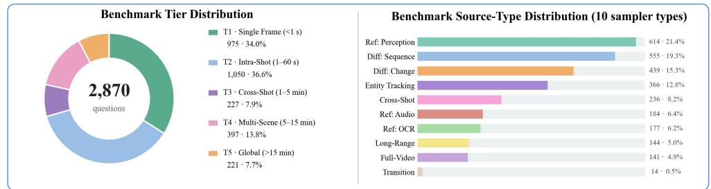

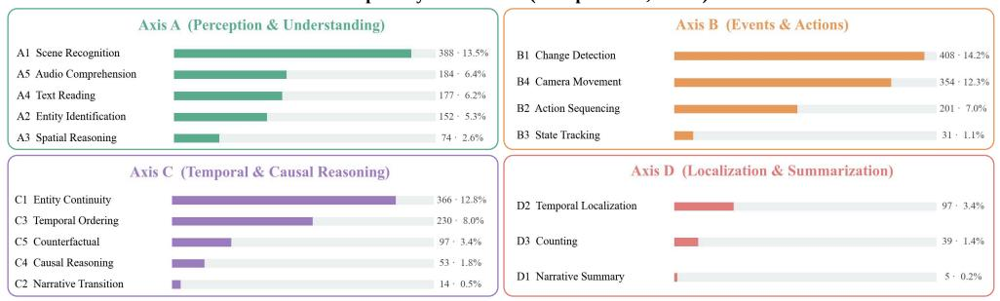  
Figure 4: Statistics of KAIROs-Bench. Distribution of the curated 2,870 questions across three independent labeling axes: evidence span, source type, and evaluated capability, showing the benchmark coverage over space, time, and dynamics.

## 3.3 BENCHMARK STATISTICS

Following the generation, leakage-control, and human-review steps above, the released KAIRos-Bench contains 2,870 human-verified MCQs (and matched Open-ended QA pairs) over 820 videos drawn from all 35 categories. Figure 4 summarizes the three labeling axes: the Time axis is deliberately weighted toward the long-context tail (T3-T5 jointly account for ≈30% of items), the Source axis is dominated by reference-frame and within-shot samplers but retains meaningful mass on cross-shot and full-video samplers, and the Capability axis spreads over all 17 rows so that peraxis evaluation surfaces specific failure modes rather than a single overall score. Representative questions across these axes are shown in Figure 5.

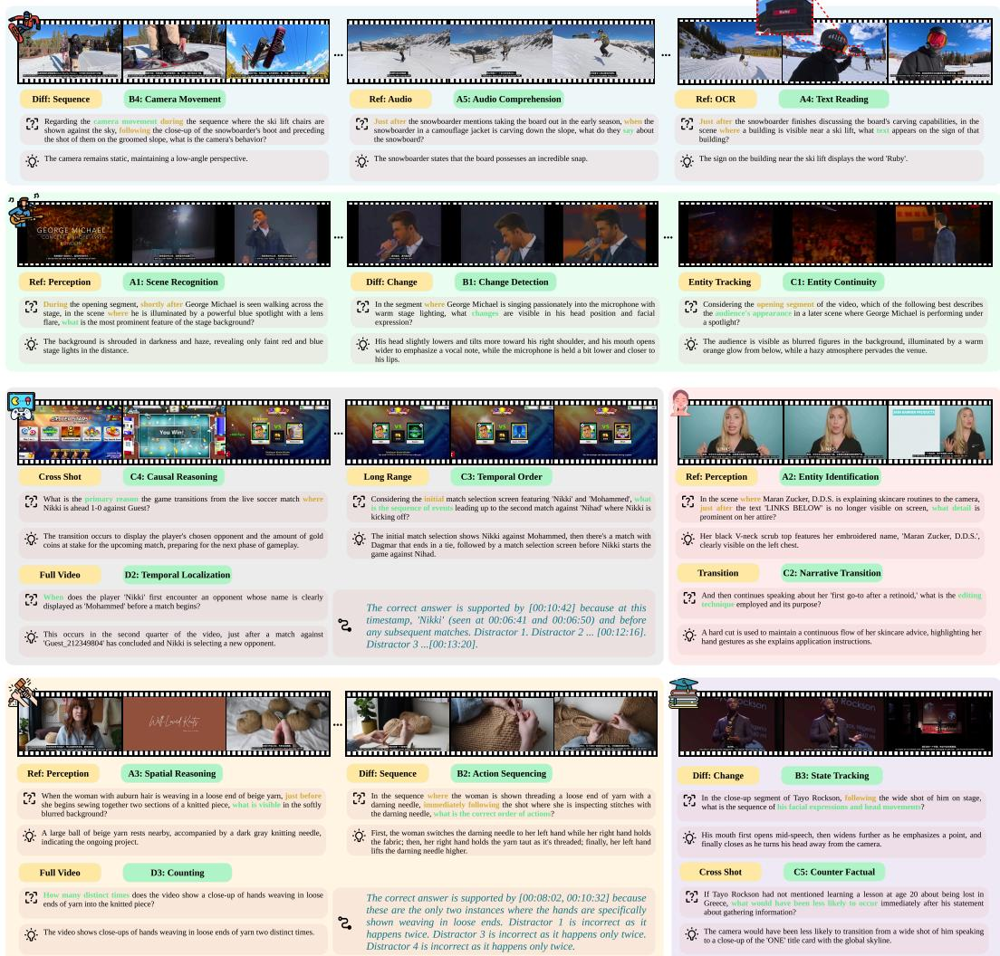  
Figure 5: Representative questions from KAIROs-Bench across the three axes. Each block shows three keyframes, the question and correct answer, and the labels assigned to the question. The examples cover the full evidence span: from single-frame perception, through within-shot evolution and cross-shot continuity, up to full-video.

## 3.4 RESULTS OF THE KAIROS-BENCH

We evaluate 7 closed-source models and 14 open-source models. Three models receive the video natively: the two Gemini models and LLaVA-Video-7B. Every other model receives uniformly sampled frames at the per-model budget listed in Table 8. The results are shown in Table 2. Accuracy drops once the evidence spans several shots or the whole video.

To further analyze text leakage, we evaluate public video-MCQ benchmarks under an identical protocol: we draw a stratified sample of 500 questions from each benchmark and answer them with Gemini-3 . 1-Pro (The Gemini Team, 2026) using text only, without any visual input. We define leakage as the solver accuracy minus the random-answering baseline for each benchmark. KAIROs-Bench exhibits the lowest leakage despite having the second-highest word count. This is notable because KAIROs-Bench intentionally avoids exposing numeric timestamps that would allow a model to directly retrieve or attend to the referenced segment. Instead, each question contains a linguistic anchor that pins the query to a specific moment in the video while still requiring the model to localize the relevant event from visual content. This design prevents models from taking a timestamp-based shortcut, yet it also makes text-only leakage a more serious concern because the questions must include richer natural-language grounding. To mitigate this risk, KAIROs-Bench undergoes a strict auditing process involving five models followed by human verification.

Table 2: MCQ leaderboard on the KAIROs-Bench with full per-capability accuracy. The 17 capabilities are grouped by their temporal scope. #Q is the question count per capability.
<table><tr><td rowspan="3">Model</td><td rowspan="3">A1</td><td colspan="5">Single Frame</td><td colspan="4">Within Shot B3</td><td colspan="4">Cross Shots</td><td colspan="4">Full Video</td></tr><tr><td>Overall 2,870</td><td></td><td>A2 152</td><td>A3 74</td><td>A4 177</td><td>A5 184</td><td>B1</td><td>B2</td><td>B4 354</td><td>C1 366</td><td>C2 14</td><td>C3 230</td><td>C4</td><td>C5 97</td><td>D1</td><td>D2 97</td><td>D3</td></tr><tr><td>#Q</td><td>388</td><td></td><td></td><td></td><td></td><td>408</td><td>201</td><td>31</td><td></td><td></td><td></td><td>53</td><td></td><td>5</td><td></td><td>39</td></tr><tr><td>Closed-source</td><td>59.0</td><td>61.1</td><td>54.6</td><td>67.6</td><td>72.3</td><td>66.8</td><td>53.7</td><td></td><td></td><td></td><td></td><td>61.3</td><td></td><td></td><td></td><td>80.0</td><td></td><td>30.8</td></tr><tr><td>Gemini-3.1-Pro (The Gemini Team, 2026)</td><td></td><td>57.1</td><td>57.4</td><td>78.3</td><td>64.5</td><td></td><td>55.6</td><td>42.8</td><td>51.6 60.9</td><td>54.8 69.5</td><td>64.5 58.2</td><td>14.3 18.2</td><td></td><td>69.8</td><td>46.4 37.3</td><td>100.0</td><td>81.4 74.0</td><td>35.3</td></tr><tr><td>GPT–5.5 (OpenAI, 2026c) Gemini-2. 5-Flash (Comanici et al., 2025)</td><td>57.4 54.1</td><td>53.4</td><td>60.5</td><td>74.3</td><td>66.1</td><td>39.9 53.8</td><td>56.4</td><td>46.9 47.3</td><td>45.2</td><td>54.2</td><td>57.1</td><td>14.3</td><td>58.8 47.0</td><td>57.1 56.6</td><td>32.0</td><td>100.0</td><td>52.6</td><td>41.0</td></tr><tr><td>Nova-2-Lite (Intelligence, 2024)</td><td>46.8</td><td>47.7</td><td>47.4</td><td>59.5</td><td>48.6</td><td>37.0</td><td>55.9</td><td>40.3</td><td>45.2</td><td>47.2</td><td>42.9</td><td>35.7</td><td>43.9</td><td>60.4</td><td>48.5</td><td>100.0</td><td>39.2</td><td>33.3</td></tr><tr><td>Seed-2. 0-Lite (ByteDance Seed, 2026)</td><td>42.6</td><td>50.8</td><td>48.0</td><td>58.1</td><td>47.5</td><td>31.5</td><td>41.7</td><td>35.8</td><td>48.4</td><td>40.4</td><td>41.8</td><td>7.1</td><td>37.4</td><td>39.6</td><td>35.0</td><td>100.0</td><td>48.5</td><td>51.3</td></tr><tr><td>GPT-4o (Achiam et al., 2023)</td><td>37.9</td><td>42.8</td><td>43.4</td><td>50.0</td><td>44.1</td><td>31.0</td><td>32.4</td><td>32.8</td><td>25.8</td><td>39.5</td><td>42.4</td><td>21.4</td><td>33.5</td><td>34.0</td><td>28.9</td><td>100.0</td><td>42.3</td><td>28.2</td></tr><tr><td>GPT-4o-mini (OpenAI, 2026a)</td><td>31.0</td><td>32.7</td><td>27.6</td><td>32.4</td><td>32.2</td><td>23.9</td><td>35.0</td><td>29.9</td><td>41.9</td><td>24.9</td><td>35.2</td><td>21.4</td><td>31.3</td><td>41.5</td><td>27.8</td><td>80.0</td><td>19.6</td><td>41.0</td></tr><tr><td>Open-weight</td><td></td><td></td><td></td><td></td><td></td><td></td><td></td><td></td><td></td><td></td><td></td><td></td><td></td><td></td><td></td><td></td><td></td><td></td></tr><tr><td>InternVL3-78B (Chen et al., 2024c)</td><td>52.0</td><td>47.9</td><td></td><td></td><td></td><td></td><td></td><td></td><td></td><td></td><td></td><td></td><td></td><td></td><td></td><td></td><td></td><td>51.3</td></tr><tr><td>InternVL3.5-38B (Wang et al., 2025b)</td><td>47.0</td><td>46.9</td><td>46.7 46.7</td><td>64.9 62.2</td><td>53.7</td><td>37.0</td><td>61.3</td><td>45.3</td><td>58.1 38.7</td><td>62.4 54.5</td><td>50.3</td><td>50.0</td><td>46.1</td><td>64.2</td><td>44.3</td><td>100.0 100.0</td><td>47.4</td><td>51.3</td></tr><tr><td>GLM-4 . 5V (Hong et al., 2025)</td><td>46.8</td><td>44.8</td><td>44.1</td><td>54.1</td><td>50.3 53.7</td><td>29.9</td><td>53.4</td><td>35.3 39.8</td><td>51.6</td><td>65.8</td><td>42.1 41.3</td><td>50.0</td><td>41.3</td><td>62.3</td><td>52.6</td><td></td><td>48.5</td><td>30.8</td></tr><tr><td>Qwen3-VL-30B-A3B (Bai et al., 2025)</td><td>45.4</td><td>43.3</td><td>42.8</td><td>58.1</td><td>54.2</td><td>34.8 28.8</td><td>50.0</td><td>37.3</td><td>41.9</td><td>63.8</td><td></td><td>35.7</td><td>37.4</td><td>45.3</td><td>43.3 41.2</td><td>100.0</td><td>47.4</td><td>30.8</td></tr><tr><td>MiMo-VL-7B (Xiaomi, 2025)</td><td>42.3</td><td>41.5</td><td>41.4</td><td>54.1</td><td>47.5</td><td>24.5</td><td>46.8 42.2</td><td>37.8</td><td>32.3</td><td>55.1</td><td>42.4 41.8</td><td>28.6</td><td>38.7</td><td>54.7</td><td>37.1</td><td>100.0 100.0</td><td>41.2 33.0</td><td>38.5</td></tr><tr><td>Qwen3–VL-8B (Bai et al., 2025)</td><td>42.2</td><td>42.0</td><td>43.4</td><td>54.0</td><td>52.5</td><td>26.1</td><td>42.6</td><td>38.3</td><td>41.9</td><td>50.6</td><td>42.1</td><td>35.7</td><td>40.4</td><td>54.7</td><td>37.1</td><td>100.0</td><td>39.2</td><td>35.9</td></tr><tr><td>InternVL3-8B (Zhu et al., 2025)</td><td>41.5</td><td>46.1</td><td>36.2</td><td>55.4</td><td>45.8</td><td>30.4</td><td>51.7</td><td>38.8</td><td>38.7</td><td>35.3</td><td>37.4</td><td>42.9 28.6</td><td>34.4</td><td>52.8</td><td>40.2</td><td>100.0</td><td>36.1</td><td>38.5</td></tr><tr><td>Qwen2 . 5-VL-7B (Bai et al., 2023)</td><td>41.0</td><td>37.6</td><td>40.8</td><td>54.0</td><td>44.1</td><td>35.3</td><td>42.4</td><td>39.3</td><td>41.9</td><td>48.6</td><td>38.0</td><td>35.7</td><td>39.1 37.8</td><td>54.7 45.3</td><td>43.3</td><td>100.0</td><td>36.1</td><td>33.3</td></tr><tr><td>InternVL3. 5-8B (Wang et al., 2025b)</td><td>40.8</td><td>42.0</td><td>36.8</td><td>43.2</td><td>47.5</td><td>29.3</td><td>44.6</td><td>37.8</td><td>38.7</td><td>44.1</td><td>41.3</td><td>50.0</td><td>39.6</td><td>52.8</td><td>25.8</td><td>80.0</td><td>33.0</td><td>43.6</td></tr><tr><td>Step3-VL-10B (Team, 2025)</td><td>39.7</td><td>41.5</td><td>40.1</td><td>50.0</td><td>53.7</td><td>23.9</td><td>38.7</td><td>29.9</td><td>35.5</td><td>45.2</td><td>41.5</td><td>35.7</td><td>31.7</td><td>49.1</td><td>38.1</td><td>100.0</td><td>39.2</td><td>43.6</td></tr><tr><td>GLM–4V- 9B (GLM et al., 2024)</td><td>38.6</td><td>39.7</td><td>36.2</td><td>37.8</td><td>35.0</td><td>27.7</td><td>41.2</td><td>33.3</td><td>54.8</td><td>46.6</td><td>39.9</td><td>42.9</td><td>36.5</td><td>47.2</td><td>40.2</td><td>100.0</td><td>25.8</td><td>28.2</td></tr><tr><td>Gemma-4-31B (Google DeepMind, 2026)</td><td>38.2</td><td>42.3</td><td>46.7</td><td>58.1</td><td>42.9</td><td>26.1</td><td>33.1</td><td>26.9</td><td>38.7</td><td>42.1</td><td>39.3</td><td>35.7</td><td>34.8</td><td>41.5</td><td>38.1</td><td>100.0 100.0</td><td>41.2 22.7</td><td>30.8 28.2</td></tr><tr><td>CogVLM2-Video-13B (Hong et al., 2024) LLaVA-Video-7B (Li et al., 2024a)</td><td>36.3 26.8</td><td>33.8 33.0</td><td>36.8 16.4</td><td>36.5 33.8</td><td>31.1 24.3</td><td>29.4 28.8</td><td>40.2 22.1</td><td>33.3 22.4</td><td>51.6 25.8</td><td>49.4 28.0</td><td>36.9 31.1</td><td>7.1 30.9 21.4 27.8</td></table>

Table 3: OpenQA leaderboard on the KAIROS-Bench. Gemini-2.5-Flash (Comanici et al., 2025) judge scores each answer against the ground truth on a 0-3 scale, and we report per-tier binarized accuracy with scores no less than 2 counted as correct.  
Table 4: KAIROS training data improves Qwen2.5-VL-7B-Instruct (Bai et al., 2023) on KAIROS-Bench and three external long-video benchmarks via LoRA (Hu et al., 2022) fine-tuning. At evaluation stage, we ablate the frame budget over {16, 32, 64}. Without external training data, the fine-tuned model improves over the base across all benchmarks.
<table><tr><td>Model</td><td>Overall 2,870</td><td>T1 975</td><td>T2 1,050</td><td>T3 227</td><td>T4 397</td><td>T5 221</td></tr><tr><td>GLM–4 . 5V (Hong et al., 2025)</td><td>22.8%</td><td>27.2%</td><td>18.8%</td><td>20.3%</td><td>23.7%</td><td>23.5%</td></tr><tr><td>MiMo-VL-7B (Xiaomi, 2025)</td><td>22.6%</td><td>27.3%</td><td>19.7%</td><td>22.0%</td><td>19.1%</td><td>22.2%</td></tr><tr><td>Qwen3-VL-30B-A3B (Bai et al., 2025)</td><td>22.4%</td><td>27.2%</td><td>19.0%</td><td>16.3%</td><td>21.2%</td><td>26.7%</td></tr><tr><td>InternVL3–78B (Chen et al., 2024c)</td><td>19.9%</td><td>26.4%</td><td>14.1%</td><td>17.6%</td><td>20.2%</td><td>20.8%</td></tr><tr><td>Step3-VL-10B (Team, 2025)</td><td>19.7%</td><td>25.9%</td><td>15.7%</td><td>14.2%</td><td>18.6%</td><td>19.0%</td></tr><tr><td>Qwen2 .5-VL-7B (Bai et al., 2023)</td><td>19.2%</td><td>22.8%</td><td>15.5%</td><td>15.4%</td><td>18.9%</td><td>24.9%</td></tr><tr><td>Qwen3-VL-8B (Bai et al., 2025)</td><td>19.2%</td><td>25.9%</td><td>12.4%</td><td>14.1%</td><td>21.7%</td><td>22.2%</td></tr><tr><td>InternVL3. 5-38B (Wang et al., 2025b)</td><td>16.9%</td><td>22.8%</td><td>11.5%</td><td>15.9%</td><td>18.6%</td><td>14.0%</td></tr><tr><td>InternVL3. 5-8B (Wang et al., 2025b)</td><td>14.8%</td><td>20.8%</td><td>9.6%</td><td>13.2%</td><td>15.1%</td><td>14.5%</td></tr><tr><td>InternVL3–8B (Zhu et al., 2025)</td><td>14.7%</td><td>21.0%</td><td>9.4%</td><td>13.2%</td><td>14.1%</td><td>14.9%</td></tr><tr><td>GLM-4V– 9B (GLM et al., 2024)</td><td>10.8%</td><td>16.3%</td><td>6.6%</td><td>8.4%</td><td>8.6%</td><td>13.1%</td></tr><tr><td>LLaVA-Video−7B (Li et al., 2024a)</td><td>8.3%</td><td>9.6%</td><td>3.2%</td><td>6.2%</td><td>14.4%</td><td>17.6%</td></tr></table>

<table><tr><td rowspan="2">Model</td><td colspan="4">Benchmark</td></tr><tr><td>KAIROS</td><td>LongVideoBench</td><td>LVBench</td><td>Video-MME</td></tr><tr><td>base (32-f)</td><td>40.42</td><td>56.29</td><td>38.69</td><td>57.11</td></tr><tr><td>finetuned (16-f)</td><td>47.94</td><td>58.00</td><td>39.18</td><td>57.63</td></tr><tr><td>finetuned (32-f)</td><td>47.49</td><td>60.08</td><td>40.81</td><td>59.56</td></tr><tr><td>finetuned (64-f)</td><td>45.12</td><td>59.50</td><td>42.15</td><td>59.30</td></tr></table>

We additionally run an OpenQA pass on open-source models on KAIROs-Bench: the model must generate the answer rather than pick a letter. We score with a text-only LLM judge Gemini-2.5-Flash, which gets only question, reference answer, and candidate. It returns an integer 0–3 (no less than 2 counts as correct). The results are shown in Table 3.

## 3.5 EMPOWERING VIDEO-LANGUAGE MODELS WITH KAIROS

We fine-tune Qwen2.5-VL-7B-Inst ruct with LoRA for 1 epoch, on 232,101 SFT data (including the question, answer and reasoning) derived from the KAIROs training split. The model is trained using uniformly sampled 32 frames per video. We evaluate on KAIROs-Bench and three public long-video benchmarks (LongVideoBench, LVBench, and Video-MME). Without external training data, the fine-tuned model improves over the base across all benchmarks. The results are shown in Table 4, proving that KAIROs serves as a valid supervision target.

## 4 CONCLUSION

We present KAIROs, a dataset of 19,004 long-form videos with 1 FPS temporally grounded annotations, and KAIROs-Bench, a strictly audited benchmark of 2,870 MCQ and OpenQA questions organized along three orthogonal axes (Space, Time, Dynamics). KAIROs-Bench is the cleanest of nine public video-MCQ benchmarks under an identical text-only-leakage probe. Fine-tuning a 7B open-weight VLM on 232,101 SFT data corpus derived from KAIROs dataset improves accuracy on KAIROS and on three external long-video benchmarks despite using no training data from them. We release the dataset, benchmark, and pipeline to enable evaluation and supervision of long-form video understanding at the granularity at which it actually unfolds.

## REFERENCES

Josh Achiam, Steven Adler, Sandhini Agarwal, Lama Ahmad, Ilge Akkaya, Florencia Leoni Aleman, Diogo Almeida, Janko Altenschmidt, Sam Altman, Shyamal Anadkat, et al. Gpt-4 technical report. arXiv preprint arXiv:2303.08774, 2023.

Hassan Akbari, Liangzhe Yuan, Rui Qian, Wei-Hong Chuang, Shih-Fu Chang, Yin Cui, and Boqing Gong. Vatt: Transformers for multimodal self-supervised learning from raw video, audio and text. Advances in neural information processing systems, 34:24206–24221, 2021.

Jean-Baptiste Alayrac, Jeff Donahue, Pauline Luc, Antoine Miech, Iain Barr, Yana Hasson, Karel Lenc, Arthur Mensch, Katherine Millican, Malcolm Reynolds, et al. Flamingo: a visual language model for few-shot learning. Advances in neural information processing systems, 35:23716– 23736, 2022.

Lisa Anne Hendricks, Oliver Wang, Eli Shechtman, Josef Sivic, Trevor Darrell, and Bryan Russell. Localizing moments in video with natural language. In Proceedings of the IEEE international conference on computer vision, pp. 5803–5812, 2017.

Anthropic. Introducing Claude Opus 4.7. https://www.anthropic.com/news/ claude-opus-4-7, 2026. Accessed: 2026-05-07.

Anurag Arnab, Mostafa Dehghani, Georg Heigold, Chen Sun, Mario Lučić, and Cordelia Schmid. Vivit: A video vision transformer. In Proceedings of the IEEE/CVF international conference on computer vision, pp. 6836–6846, 2021.

Jinze Bai, Shuai Bai, Shusheng Yang, Shijie Wang, Sinan Tan, Peng Wang, Junyang Lin, Chang Zhou, and Jingren Zhou. Qwen-vl: A versatile vision-language model for understanding, localization, text reading, and beyond. arXiv preprint arXiv:2308.12966, 2023.

Shuai Bai, Yuxuan Cai, Ruizhe Chen, Keqin Chen, Xionghui Chen, Zesen Cheng, Lianghao Deng, Wei Ding, Chang Gao, Chunjiang Ge, et al. Qwen3-vl technical report. arXiv preprint arXiv:2511.21631, 2025.

Max Bain, Arsha Nagrani, Gül Varol, and Andrew Zisserman. Frozen in time: A joint video and image encoder for end-to-end retrieval. In Proceedings of the IEEE/CVF international conference on computer vision, pp. 1728–1738, 2021.

Gedas Bertasius, Heng Wang, and Lorenzo Torresani. Is space-time attention all you need for video understanding? In Icml, volume 2, pp. 4, 2021.

ByteDance Seed. Seed2.0. https://seed.bytedance.com/en/seed2, 2026. Accessed: 2026-05-07.

Joao Carreira and Andrew Zisserman. Quo vadis, action recognition? a new model and the kinetics dataset. In proceedings of the IEEE Conference on Computer Vision and Pattern Recognition, pp. 6299–6308, 2017.

Keshigeyan Chandrasegaran, Agrim Gupta, Lea M. Hadzic, Taran Kota, Jimming He, Cristóbal Eyzaguirre, Zane Durante, Manling Li, Jiajun Wu, and Li Fei-Fei. Hourvideo: 1-hour videolanguage understanding,2024.URL https://arxiv.org/abs/2411.04998.

Guo Chen, Yicheng Liu, Yifei Huang, Yuping He, Baoqi Pei, Jilan Xu, Yali Wang, Tong Lu, and Limin Wang. Cg-bench: Clue-grounded question answering benchmark for long video understanding,2024a. URL https://arxiv.org/abs/2412.12075.

Lin Chen, Xilin Wei, Jinsong Li, Xiaoyi Dong, Pan Zhang, Yuhang Zang, Zehui Chen, Haodong Duan, Bin Lin, Zhenyu Tang, et al. Sharegpt4video: Improving video understanding and generation with better captions. Advances in Neural Information Processing Systems, 37:19472–19495, 2024b.

Zhe Chen, Jiannan Wu, Wenhai Wang, Weijie Su, Guo Chen, Sen Xing, Muyan Zhong, Qinglong Zhang, Xizhou Zhu, Lewei Lu, et al. Internvl: Scaling up vision foundation models and aligning for generic visual-linguistic tasks. In CVPR, 2024c.

Junhao Cheng, Yuying Ge, Teng Wang, Yixiao Ge, Jing Liao, and Ying Shan. Video-holmes: Can mllm think like holmes for complex video reasoning?, 2025. URL https: //arxiv.org/ abs/2505.21374.

Yunfei Chu, Jin Xu, Qian Yang, Haojie Wei, Xipin Wei, Zhifang Guo, Yichong Leng, Yuanjun Lv, Jinzheng He, Junyang Lin, et al. Qwen2-audio technical report. arXiv preprint arXiv:2407.10759, 2024.

Gheorghe Comanici, Eric Bieber, Mike Schaekermann, Ice Pasupat, Noveen Sachdeva, Inderjit Dhillon, Marcel Blistein, Ori Ram, Dan Zhang, Evan Rosen, et al. Gemini 2.5: Pushing the frontier with advanced reasoning, multimodality, long context, and next generation agentic capabilities. arXiv preprint arXiv:2507.06261, 2025.

Han Fang, Pengfei Xiong, Luhui Xu, and Yu Chen. Clip2video: Mastering video-text retrieval via image clip. arXiv preprint arXiv:2106.11097, 2021.

Miquel Farré, Andi Marafioti, Lewis Tunstall, Leandro Von Werra, and Thomas Wolf. Finevideo. https://huggingface.co/datasets/HuggingFaceFV/finevideo,2024.

Christoph Feichtenhofer, Haoqi Fan, Jitendra Malik, and Kaiming He. Slowfast networks for video recognition. In Proceedings of the IEEE/CVF international conference on computer vision, pp. 6202–6211, 2019.

Chaoyou Fu, Yuhan Dai, Yongdong Luo, Lei Li, Shuhuai Ren, Renrui Zhang, Zihan Wang, Chenyu Zhou, Yunhang Shen, Mengdan Zhang, et al. Video-mme: The first-ever comprehensive evaluation benchmark of multi-modal llms in video analysis. In Proceedings of the IEEE/CVF conference on computer vision and pattern recognition, pp. 24108–24118, 2025.

Tsu-Jui Fu, Linjie Li, Zhe Gan, Kevin Lin, William Yang Wang, Lijuan Wang, and Zicheng Liu. Violet: End-to-end video-language transformers with masked visual-token modeling. arXiv preprint arXiv:2111.12681, 2021.

Jiyang Gao, Chen Sun, Zhenheng Yang, and Ram Nevatia. Tall: Temporal activity localization via language query. In Proceedings of the IEEE international conference on computer vision, pp. 5267–5275, 2017.

Team GLM, Aohan Zeng, Bin Xu, Bowen Wang, Chenhui Zhang, Da Yin, Diego Rojas, Guanyu Feng, Hanlin Zhao, Hanyu Lai, Hao Yu, Hongning Wang, Jiadai Sun, Jiajie Zhang, Jiale Cheng, Jiayi Gui, Jie Tang, Jing Zhang, Juanzi Li, Lei Zhao, Lindong Wu, Lucen Zhong, Mingdao Liu, Minlie Huang, Peng Zhang, Qinkai Zheng, Rui Lu, Shuaiqi Duan, Shudan Zhang, Shulin Cao, Shuxun Yang, Weng Lam Tam, Wenyi Zhao, Xiao Liu, Xiao Xia, Xiaohan Zhang, Xiaotao Gu, Xin Lv, Xinghan Liu, Xinyi Liu, Xinyue Yang, Xixuan Song, Xunkai Zhang, Yifan An, Yifan Xu, Yilin Niu, Yuantao Yang, Yueyan Li, Yushi Bai, Yuxiao Dong, Zehan Qi, Zhaoyu Wang, Zhen Yang, Zhengxiao Du, Zhenyu Hou, and Zihan Wang. Chatglm: A family of large language models from glm-130b to glm-4 all tools, 2024.

Google DeepMind. Gemma 4 Model Card. https://ai.google.dev/gemma/docs/ core/model\_card\_4, 2026. Accessed: 2026-05-07.

Kristen Grauman, Andrew Westbury, Eugene Byrne, Zachary Chavis, Antonino Furnari, Rohit Girdhar, Jackson Hamburger, Hao Jiang, Miao Liu, Xingyu Liu, et al. Ego4d: Around the world in 3,000 hours of egocentric video. In Proceedings of the IEEE/CVF conference on computer vision and pattern recognition, pp. 18995–19012, 2022.

Wenyi Hong, Weihan Wang, Ming Ding, Wenmeng Yu, Qingsong Lv, Yan Wang, Yean Cheng, Shiyu Huang, Junhui Ji, Zhao Xue, et al. Cogvlm2: Visual language models for image and video understanding. arXiv preprint arXiv:2408.16500, 2024.

Wenyi Hong, Wenmeng Yu, Xiaotao Gu, Guo Wang, Guobing Gan, Haomiao Tang, Jiale Cheng, Ji Qi, Junhui Ji, Lihang Pan, et al. Glm-4.1 v-thinking: Towards versatile multimodal reasoning with scalable reinforcement learning. pp. arXiv–2507, 2025.

Edward J Hu, yelong shen, Phillip Wallis, Zeyuan Allen-Zhu, Yuanzhi Li, Shean Wang, Lu Wang, and Weizhu Chen. LoRA: Low-rank adaptation of large language models. In International Conference on LearningRepresentations, 2022. URL https://openreview.net/forum? id=nZeVKeeFYf9.

Amazon Artificial General Intelligence. The amazon nova family of models: Technical report and model card. Amazon Technical Reports, 2024. URL https://www.amazon.science/publications/ the-amazon-nova-family-of-models-technical-report-and-model-card.

Yunseok Jang, Yale Song, Chris Dongjoo Kim, Youngjae Yu, Youngjin Kim, and Gunhee Kim. Video question answering with spatio-temporal reasoning. International Journal of Computer Vision, 127(10):1385–1412, 2019.

Baoxiong Jia, Ting Lei, Song-Chun Zhu, and Siyuan Huang. Egotaskqa: Understanding human tasks in egocentric videos. In The 36th Conference on Neural Information Processing Systems (NeurIPS 2022) Track on Datasets and Benchmarks, 2022.

Alexander Klaser, Marcin Marszałek, and Cordelia Schmid. A spatio-temporal descriptor based on 3d-gradients. In BMVC 2008-19th British machine vision conference, pp. 275–1. British Machine Vision Association, 2008.

Ranjay Krishna, Kenji Hata, Frederic Ren, Li Fei-Fei, and Juan Carlos Niebles. Dense-captioning events in videos. In Proceedings of the IEEE international conference on computer vision, pp. 706–715, 2017.

Woosuk Kwon, Zhuohan Li, Siyuan Zhuang, Ying Sheng, Lianmin Zheng, Cody Hao Yu, Joseph Gonzalez, Hao Zhang, and Ion Stoica. Efficient memory management for large language model serving with pagedattention. In Proceedings of the 29th symposium on operating systems principles, pp. 611–626, 2023.

Ivan Laptev. On space-time interest points. International journal of computer vision, 64(2):107–123, 2005.

Jie Lei, Tamara L Berg, and Mohit Bansal. Detecting moments and highlights in videos via natural language queries. Advances in Neural Information Processing Systems, 34:11846–11858, 2021.

Bo Li, Yuanhan Zhang, Dong Guo, Renrui Zhang, Feng Li, Hao Zhang, Kaichen Zhang, Peiyuan Zhang, Yanwei Li, Ziwei Liu, et al. Llava-onevision: Easy visual task transfer. arXiv preprint arXiv:2408.03326, 2024a.

Dongxu Li, Junnan Li, Hongdong Li, Juan Carlos Niebles, and Steven CH Hoi. Align and prompt: Video-and-language pre-training with entity prompts. In Proceedings of the IEEE/CVF conference on computer vision and pattern recognition, pp. 4953–4963, 2022.

Junnan Li, Dongxu Li, Silvio Savarese, and Steven Hoi. Blip-2: Bootstrapping language-image pre-training with frozen image encoders and large language models. In International conference on machine learning, pp. 19730–19742. PMLR, 2023.

Kunchang Li, Yali Wang, Yinan He, Yizhuo Li, Yi Wang, Yi Liu, Zun Wang, Jilan Xu, Guo Chen, Ping Luo, et al. Mvbench: A comprehensive multi-modal video understanding benchmark. In Proceedings of the IEEE/CVF Conference on Computer Vision and Pattern Recognition, pp. 22195–22206, 2024b.

KunChang Li, Yinan He, Yi Wang, Yizhuo Li, Wenhai Wang, Ping Luo, Yali Wang, Limin Wang, and Yu Qiao. Videochat: Chat-centric video understanding. Science China Information Sciences, 68(10):200102, 2025.

Linjie Li, Yen-Chun Chen, Yu Cheng, Zhe Gan, Licheng Yu, and Jingjing Liu. Hero: Hierarchical encoder for video+ language omni-representation pre-training. In Proceedings of the 2020 conference on empirical methods in natural language processing (EMNLP), pp. 2046–2065, 2020.

Yanwei Li, Chengyao Wang, and Jiaya Jia. Llama-vid: An image is worth 2 tokens in large language models. In European Conference on Computer Vision, pp. 323–340. Springer, 2024c.

Ze Liu, Jia Ning, Yue Cao, Yixuan Wei, Zheng Zhang, Stephen Lin, and Han Hu. Video swin transformer. In Proceedings of the IEEE/CVF conference on computer vision and pattern recognition, pp. 3202–3211, 2022.

Huaishao Luo, Lei Ji, Botian Shi, Haoyang Huang, Nan Duan, Tianrui Li, Jason Li, Taroon Bharti, and Ming Zhou. Univl: A unified video and language pre-training model for multimodal understanding and generation. arXiv preprint arXiv:2002.06353, 2020.

Huaishao Luo, Lei Ji, Ming Zhong, Yang Chen, Wen Lei, Nan Duan, and Tianrui Li. Clip4clip: An empirical study of clip for end to end video clip retrieval. arXiv preprint arXiv:2104.08860, 2021.

Huaishao Luo, Lei Ji, Ming Zhong, Yang Chen, Wen Lei, Nan Duan, and Tianrui Li. Clip4clip: An empirical study of clip for end to end video clip retrieval and captioning. Neurocomputing, 508: 293–304, 2022.

Ruipu Luo, Ziwang Zhao, Min Yang, Zheming Yang, Minghui Qiu, Zhongyu Wei, Yanhao Wang, and Cen Chen. Valley: Video assistant with large language model enhanced ability. ACM Transactions on Multimedia Computing, Communications and Applications, 2023.

Yiwei Ma, Guohai Xu, Xiaoshuai Sun, Ming Yan, Ji Zhang, and Rongrong Ji. X-clip: End-toend multi-grained contrastive learning for video-text retrieval. In Proceedings of the 30th ACM international conference on multimedia, pp. 638–647, 2022.

Muhammad Maaz, Hanoona Rasheed, Salman Khan, and Fahad Khan. Video-chatgpt: Towards detailed video understanding via large vision and language models. In Proceedings of the 62nd Annual Meeting of the Association for Computational Linguistics (Volume 1: Long Papers), pp. 12585–12602, 2024.

Karttikeya Mangalam, Raiymbek Akshulakov, and Jitendra Malik. Egoschema: A diagnostic benchmark for very long-form video language understanding. NeurIPS, 2023.

Antoine Miech, Dimitri Zhukov, Jean-Baptiste Alayrac, Makarand Tapaswi, Ivan Laptev, and Josef Sivic. Howto100m: Learning a text-video embedding by watching hundred million narrated video clips. In Proceedings of the IEEE/CVF international conference on computer vision, pp. 2630–2640, 2019.

Kepan Nan, Rui Xie, Penghao Zhou, Tiehan Fan, Zhenheng Yang, Zhijie Chen, Xiang Li, Jian Yang, and Ying Tai. Openvid-1m: A large-scale high-quality dataset for text-to-video generation. arXiv preprint arXiv:2407.02371, 2024.

OpenAI. GPT-4o mini: advancing cost-efficient intelligence. https : //openai. com/index/ gpt-4o-mini-advancing-cost-efficient-intelligence/, 2026a. Accessed: 2026-05-07.

OpenAI. IntroducingGPT-5.4. https://openai.com/index/ introducing-gpt-5-4/,2026b. Accessed: 2026-05-07.

OpenAI. GPT-5.5 system card. https://openai.com/index/ gpt-5-5-system-card/, 2026c. Accessed: 2026-05-07.

Viorica Patraucean, Lucas Smaira, Ankush Gupta, Adria Recasens, Larisa Markeeva, Dylan Banarse, Skanda Koppula, Joseph Heyward, Mateusz Malinowski, Yi Yang, Carl Doersch, Tatiana Matejovicova, Yury Sulsky, Antoine Miech, Alexandre Frechette, Hanna Klimczak, Raphael Koster, Junlin Zhang, Stephanie Winkler, Yusuf Aytar, Simon Osindero, Dima Damen, Andrew Zisserman, and Joao Carreira. Perception test: A diagnostic benchmark for multimodal video models. In Advances in Neural Information Processing Systems, 2023.

Hangyu Qin, Junbin Xiao, and Angela Yao. Question-answering dense video events. In Proceedings of the 48th International ACM SIGIR Conference on Research and Development in Information Retrieval, SIGIR '25, pp. 884–894. ACM, 2025. doi: 10.1145/3726302.3729945. URL ht tp : //dx.doi.org/10.1145/3726302.3729945.

Alec Radford, Jong Wook Kim, Chris Hallacy, Aditya Ramesh, Gabriel Goh, Sandhini Agarwal, Girish Sastry, Amanda Askell, Pamela Mishkin, Jack Clark, et al. Learning transferable visual models from natural language supervision. In International conference on machine learning, pp. 8748–8763. PmLR, 2021.

Alec Radford, Jong Wook Kim, Tao Xu, Greg Brockman, Christine McLeavey, and Ilya Sutskever. Robust speech recognition via large-scale weak supervision. In International conference on machine learning, pp. 28492–28518. PMLR, 2023.

Shuhuai Ren, Linli Yao, Shicheng Li, Xu Sun, and Lu Hou. Timechat: A time-sensitive multimodal large language model for long video understanding. In Proceedings of the IEEE/CVF Conference on Computer Vision and Pattern Recognition, pp. 14313–14323, 2024.

Mattia Soldan, Alejandro Pardo, Juan León Alcázar, Fabian Caba, Chen Zhao, Silvio Giancola, and Bernard Ghanem. Mad: A scalable dataset for language grounding in videos from movie audio descriptions. In Proceedings of the IEEE/CVF Conference on Computer Vision and Pattern Recognition, pp. 5026–5035, 2022.

Tomás Soucek and Jakub Lokoc. Transnet v2: An effective deep network architecture for fast shot transition detection. In Proceedings of the 32nd ACM International Conference on Multimedia, pp. 11218–11221, 2024.

Chen Sun, Austin Myers, Carl Vondrick, Kevin Murphy, and Cordelia Schmid. Videobert: A joint model for video and language representation learning. In Proceedings of the IEEE/CVF international conference on computer vision, pp. 7464–7473, 2019.

SYSTRAN. faster-whisper. https://github.com/SYSTRAN/faster-whisper,2024.

StepFun Team. Step-3 is large yet affordable: Model-system co-design for cost-effective decoding, 2025.URLhttps://arxiv.org/abs/2507.19427.

The Gemini Team. Gemini 3.1 Pro: A smarter model for your most complex tasks.https://blog.google/innovation-and-ai/models-and-research/ gemini-models/gemini-3-1-pro/,February 2026. Accessed: 2026-05-07.

Zhan Tong, Yibing Song, Jue Wang, and Limin Wang. Videomae: Masked autoencoders are dataefficient learners for self-supervised video pre-training. Advances in neural information processing systems, 35:10078–10093, 2022.

Du Tran, Lubomir Bourdev, Rob Fergus, Lorenzo Torresani, and Manohar Paluri. Learning spatiotemporal features with 3d convolutional networks. In Proceedings of the IEEE international conference on computer vision, pp. 4489–4497, 2015.

Subhashini Venugopalan, Marcus Rohrbach, Jeffrey Donahue, Raymond Mooney, Trevor Darrell, and Kate Saenko. Sequence to sequence-video to text. In Proceedings of the IEEE international conference on computer vision, pp. 4534–4542, 2015.

Heng Wang and Cordelia Schmid. Action recognition with improved trajectories. In Proceedings of the IEEE international conference on computer vision, pp. 3551–3558, 2013.

Heng Wang, Alexander Kläser, Cordelia Schmid, and Cheng-Lin Liu. Dense trajectories and motion boundary descriptors for action recognition. International journal of computer vision, 103(1):60– 79,2013.

Limin Wang, Yuanjun Xiong, Zhe Wang, Yu Qiao, Dahua Lin, Xiaoou Tang, and Luc Van Gool. Temporal segment networks: Towards good practices for deep action recognition. In European conference on computer vision, pp. 20–36. Springer, 2016.

Weihan Wang, Zehai He, Wenyi Hong, Yean Cheng, Xiaohan Zhang, Ji Qi, Ming Ding, Xiaotao Gu, Shiyu Huang, Bin Xu, et al. Lvbench: An extreme long video understanding benchmark. In Proceedings of the IEEE/CVF International Conference on Computer Vision, pp. 22958–22967, 2025a.

Weiyun Wang, Zhangwei Gao, Lixin Gu, Hengjun Pu, Long Cui, Xingguang Wei, Zhaoyang Liu, Linglin Jing, Shenglong Ye, Jie Shao, et al. Internvl3. 5: Advancing open-source multimodal models in versatility, reasoning, and efficiency. arXiv preprint arXiv:2508.18265, 2025b.

Xiaolong Wang, Ross Girshick, Abhinav Gupta, and Kaiming He. Non-local neural networks. In Proceedings of the IEEE conference on computer vision and pattern recognition, pp. 7794–7803, 2018.

Yi Wang, Kunchang Li, Yizhuo Li, Yinan He, Bingkun Huang, Zhiyu Zhao, Hongjie Zhang, Jilan Xu, Yi Liu, Zun Wang, et al. Internvideo: General video foundation models via generative and discriminative learning. arXiv preprint arXiv:2212.03191, 2022.

Yi Wang, Yinan He, Yizhuo Li, Kunchang Li, Jiashuo Yu, Xin Ma, Xinhao Li, Guo Chen, Xinyuan Chen, Yaohui Wang, et al. Internvid: A large-scale video-text dataset for multimodal understanding and generation. arXiv preprint arXiv:2307.06942, 2023.

Chen Wei, Haoqi Fan, Saining Xie, Chao-Yuan Wu, Alan Yuille, and Christoph Feichtenhofer. Masked feature prediction for self-supervised visual pre-training. In Proceedings of the IEEE/CVF conference on computer vision and pattern recognition, pp. 14668–14678, 2022.

Bo Wu, Shoubin Yu, Zhenfang Chen, Joshua B Tenenbaum, and Chuang Gan. STAR: A benchmark for situated reasoning in real-world videos. In Thirty-fifth Conference on Neural Information Processing Systems (NeurIPS), 2021.

Haoning Wu, Dongxu Li, Bei Chen, and Junnan Li. Longvideobench: A benchmark for long-context interleaved video-language understanding. Advances in Neural Information Processing Systems, 37:28828–28857, 2024.

Junbin Xiao, Xindi Shang, Angela Yao, and Tat-Seng Chua. Next-qa: Next phase of questionanswering to explaining temporal actions. In Proceedings of the IEEE/CVF conference on computer vision and pattern recognition, pp. 9777–9786, 2021.

LLM-Core-Team Xiaomi. Mimo: Unlocking the reasoning potential of language model – from pretraining to posttraining, 2025.URL https://arxiv.org/abs/2505.07608.

Hu Xu, Gargi Ghosh, Po-Yao Huang, Dmytro Okhonko, Armen Aghajanyan, Florian Metze, Luke Zettlemoyer, and Christoph Feichtenhofer. Videoclip: Contrastive pre-training for zero-shot video-text understanding. In Proceedings of the 2021 conference on empirical methods in natural language processing, pp. 6787–6800, 2021.

Antoine Yang, Arsha Nagrani, Ivan Laptev, Josef Sivic, and Cordelia Schmid. Vidchapters-7m: Video chapters at scale. Advances in Neural Information Processing Systems, 36:49428–49444, 2023.

Kexin Yi, Chuang Gan, Yunzhu Li, Pushmeet Kohli, Jiajun Wu, Antonio Torralba, and Joshua B. Tenenbaum. CLEVRER: collision events for video representation and reasoning. In ICLR, 2020.

Zhou Yu, Dejing Xu, Jun Yu, Ting Yu, Zhou Zhao, Yueting Zhuang, and Dacheng Tao. Activitynetqa: A dataset for understanding complex web videos via question answering. In Proceedings of the AAAI conference on artificial intelligence, volume 33, pp. 9127–9134, 2019.

Hang Zhang, Xin Li, and Lidong Bing. Video-llama: An instruction-tuned audio-visual language model for video understanding. In Proceedings of the 2023 conference on empirical methods in natural language processing: system demonstrations, pp. 543–553, 2023.

Yuanhan Zhang, Jinming Wu, Wei Li, Bo Li, Zejun Ma, Ziwei Liu, and Chunyuan Li. Llava-video: Video instruction tuning with synthetic data. arXiv preprint arXiv:2410.02713, 2024.

Bolei Zhou, Alex Andonian, Aude Oliva, and Antonio Torralba. Temporal relational reasoning in videos. In Proceedings of the European conference on computer vision (ECCV), pp. 803–818, 2018.

Jinguo Zhu, Weiyun Wang, Zhe Chen, Zhaoyang Liu, Shenglong Ye, Lixin Gu, Hao Tian, Yuchen Duan, Weijie Su, Jie Shao, et al. Internvl3: Exploring advanced training and test-time recipes for open-source multimodal models. arXiv preprint arXiv:2504.10479, 2025.

Linchao Zhu and Yi Yang. Actbert: Learning global-local video-text representations. In Proceedings of the IEEE/CVF conference on computer vision and pattern recognition, pp. 8746–8755, 2020.

## APPENDIX

## A RELATED WORK

Video Understanding and Video-Language Models. Early video understanding relied on handcrafted spatiotemporal descriptors and trajectory-based representations (Laptev, 2005; Klaser et al., 2008; Wang & Schmid, 2013; Wang et al., 2013). These methods established the fundamentally spatiotemporal nature of video analysis, but they typically produced clip-level decisions rather than persistent representations of entities and states over time. Deep architectures later shifted the field toward learnable spatiotemporal features (Tran et al., 2015; Carreira & Zisserman, 2017; Feichtenhofer et al., 2019; Wang et al., 2016; Zhou et al., 2018; Wang et al., 2018). While these models substantially improved video representations, their supervision was still largely aligned with clips or full videos rather than explicitly with second-level state transitions or temporally consistent entity attributes. Video Transformers further improved long-range temporal modeling through native crossframe attention (Bertasius et al., 2021; Arnab et al., 2021; Liu et al., 2022), while self-supervised pretraining methods demonstrated strong transfer without dense annotation (Tong et al., 2022; Wei et al., 2022; Akbari et al., 2021; Wang et al., 2022). Nevertheless, much of this literature still optimizes coarse temporal objectives and often relies on sparse temporal sampling or compressed visual tokens for efficiency, which can weaken sensitivity to subtle state changes in long videos.

Video-language research evolved from sequence-to-sequence captioning models such as S2VT (Venugopalan et al., 2015) to large-scale video-text pretraining frameworks (Sun et al., 2019; Zhu & Yang, 2020; Li et al., 2020; Luo et al., 2020; Fu et al., 2021; Li et al., 2022; Xu et al., 2021). Large web-scale corpora such as HowTo100M (Miech et al., 2019) and WebVid (Bain et al., 2021), together with CLIP-style contrastive learning (Radford et al., 2021), enabled more scalable crossmodal alignment and inspired retrieval-oriented extensions (Luo et al., 2021; 2022; Ma et al., 2022; Fang et al., 2021; Bain et al., 2021). However, these corpora are often only weakly aligned in time, and most training objectives emphasize global or clip-level matching rather than second-level, temporally anchored scene grounding. Recent Video-LLMs connect visual encoders to large language models through adapters, query modules, or projection layers. Connector-based architectures such as Flamingo (Alayrac et al., 2022) and BLIP-2 (Li et al., 2023) established scalable multimodal interfaces, and subsequent systems, including Video-LLaMA (Zhang et al., 2023), Video-ChatGPT (Maaz et al., 2024), LLaVA-Video (Li et al., 2024a), LLaMA-VID (Li et al., 2024c), and TimeChat (Ren et al., 2024), extended this paradigm to video dialogue, instruction following, and long-context reasoning. Even so, a central tension remains between temporal coverage and spatiotemporal fidelity: sparse frame sampling, frame pooling, and aggressive token reduction improve throughput, but they can hinder fine-grained temporal localization, entity tracking, and temporally consistent reasoning.

Video-Language Datasets and Benchmarks. Large-scale video-text pretraining datasets provide the foundation for many modern video-language models. Web-scale corpora such as WebVid (Bain et al., 2021), InternVid (Wang et al., 2023), and OpenVid-1M (Nan et al., 2024) collect millions to hundreds of millions of video-text pairs, enabling scalable video-text representation learning. These datasets improve coverage and diversity, but their annotations are weakly aligned and lack dense temporal supervision. More recent high-quality captioning datasets, such as ShareGPT4Video (Chen et al., 2024b), and FineVideo (Farré et al., 2024), move toward richer and more structured supervision. Another important line of work focuses on video instruction tuning and conversational video data. Datasets such as VideoChat-11K (Li et al., 2025), Video-ChatGPT-100K (Maaz et al., 2024), Valley-Instruct-65K (Luo et al., 2023), LLaVA-Video-178K (Zhang et al., 2024), ShareGPTVideo (Chen et al., 2024b), and TimeIT (Ren et al., 2024) transform existing captions, QA annotations, or video understanding tasks into instruction-following formats. While these datasets provide richer language supervision, much of their annotations are still coarse in spatial and temporal granularity. As a result, they lack fine-grained grounding in space and time and provide limited supervision over video dynamics.

Temporal grounding and dense video understanding benchmarks provide more explicit temporal supervision. Classic and widely used datasets such as ActivityNet (Krishna et al., 2017), Charades-STA (Gao et al., 2017), DiDeMo (Anne Hendricks et al., 2017), and QVHighlights (Lei et al., 2021) annotate the relationship between natural language queries and temporal segments in videos. These benchmarks have played an important role in moving video-language evaluation beyond fullvideo classification and toward timestamp-aware grounding. More recent long-form or egocentric grounding resources, such as MAD (Soldan et al., 2022) and Ego4D (Grauman et al., 2022), extend this setting to movies or first-person videos. VidChapters-7M (Yang et al., 2023) further introduces large-scale chapter-level supervision for long videos, with chapter titles and timestamps collected from web videos. These datasets are highly relevant to temporal localization, but they still do not fully solve the problem of fine-grained state and attribute tracking. Moment boundaries are often coarse, query-level, or segment-level, and the annotations usually describe events or steps rather than maintain a persistent inventory of entities, attributes, relations, and state changes across time.

Video question-answering benchmarks have also evolved from short-clip QA toward long-form and diagnostic evaluation. Earlier benchmarks evaluate video understanding through manually annotated or carefully constructed questions, including both open-ended and multiple-choice formats (Yu et al., 2019; Xiao et al., 2021; Grauman et al., 2022). More recent comprehensive benchmarks, including MVBench (Li et al., 2024b), LongVideoBench (Wu et al., 2024), Video-MME (Fu et al., 2025), and LVBench (Wang et al., 2025a), expand evaluation toward multi-task reasoning, long-video understanding, and full-spectrum video modeling. These benchmarks have been crucial for revealing the limitations of Video LLMs under long-context settings, but most of them still reduce evaluation to discrete multiple-choice accuracy. This makes leaderboards easy to compare, but it can also obscure whether a model truly tracks temporal evidence, maintains entity consistency, or merely exploits language priors and coarse scene summaries.

Several diagnostic and multi-task benchmarks aim to evaluate more detailed perceptual and temporal capabilities. The Perception Test includes object tracks, point tracks, action segments, sound segments, multiple-choice video QA, and grounded video QA, providing a more diverse testbed for perception, grounding, and multimodal reasoning (Patraucean et al., 2023). Datasets such as STAR, CLEVRER, EgoTaskQA, and TGIF-QA focus on situated reasoning, physical reasoning, egocentric reasoning, state transitions, and repetition counting (Wu et al., 2021; Yi et al., 2020; Jia et al., 2022; Jang et al., 2019). These datasets isolate specific reasoning factors but are typically built on short or synthetic clips and thus complement rather than replace long-video benchmarks that require sustained temporal reasoning.

Overall, existing datasets and benchmarks have substantially advanced video-language learning, but they leave an important gap for fine-grained, temporally faithful video understanding. Large-scale web corpora provide breadth but only weak temporal and spatial alignment. Instruction datasets improve the conversational interface of VideoLLMs but often rely on synthetic or model-generated supervision. Temporal grounding datasets provide timestamp supervision but usually focus on queryto-moment localization rather than persistent entity and state modeling. Long-video QA benchmarks expose the difficulty of reasoning over extended contexts, but their multiple-choice format can underdiagnose perceptual failures, temporal hallucinations, and entity-state inconsistencies. These limitations suggest the need for benchmarks and training resources that combine long temporal coverage with dense temporal anchoring, explicit spatial and entity-level grounding, and evaluation protocols that test not only whether a model gives the correct answer, but also whether it can maintain temporally consistent, evidence-grounded representations throughout the video.

## B ANNOTATION PIPELINE HYPERPARAMETERS

This section enumerates the hyperparameters used by every pipeline stage so that the corpus and the benchmark can be reproduced exactly. The four artifacts emitted per video are described in Table 5 of §C; the present section concerns how those artifacts are produced.

## B.1 SHOT DETECTION AND FRAME SAMPLING

Shot detector. Shot boundaries are produced by TRANsNETV2 (Soucek & Lokoc, 2024) with a softmax threshold of 0.5 and a minimum scene length of 15 source frames. The threshold is intentionally slightly recall-biased: a missed boundary merges two semantically distinct shots and breaks every cross-shot question generated for the resulting merged span, whereas a spurious boundary at most introduces a redundant reference frame inside a real shot. Both hard cuts and gradual transitions are accepted as boundaries; the gradual-transition probability head is read from the same TransNetV2 forward pass.

Frame sampling. After shot detection, the pipeline materialises a per-frame structural record and extracts a 1 FPS JPEG subset for downstream annotation. Frames are resized so that the longer image dimension is 1024 pixels, and saved at JPEG quality 90 . The resulting 1 FPS timeline is the spine of the annotation stream and is what every subsequent description, audio segment, and benchmark evidence span is keyed to.

Reference and differential frames. Within each shot, the first extracted frame is treated as the initial frame and receives a full spatial description plus, when entity tracking is enabled, a structured entity list. All later 1 FPS samples in the same shot are treated as differential frames and are described only in terms of what changed relative to the previous state. For long shots, the pipeline reanchors every 300 differential frames by promoting the current frame to a new initial frame, which keeps prompt context bounded and reduces drift in long description chains.

## B.2 AUDIO PIPELINE

Two complementary audio models. Audio is processed by two complementary models running on the same physical device. Speech is transcribed with FASTER-WHISPER-LARGE-V3 (SYS-TRAN, 2024; Radford et al., 2023) at sentence resolution. Non-speech audio is summarized by QWEN2-AUDIO-7B-INSTRUCT (Chu et al., 2024) over fixed 30 -second windows; this captures environmental and event-level sounds such as crowd noise, engine sounds, applause, footsteps, and music.

Alignment. The two audio streams are aligned to the same 1 FPS timeline used by the visual annotation stage. Each speech sentence is attached to the first processed frame whose timestamp falls inside the sentence's time span, and never attached twice. Environmental audio summaries are attached only to initial frames, not to every differential frame, so that nearby records are not burdened with repeated ambient descriptions.

## B.3 VISUAL ANNOTATION PROMPTS

Server. The visual annotation stage is driven by QwEN3-VL-8B-INSTRUCT served through vLLM (Kwon et al., 2023) with tensor parallel size 2 , bfloat 16 weights, sampling temperature 0.2, and gpu\_memory-utilization 0.85.

Four prompt templates. The pipeline emits descriptions through four prompt templates:

• NARRATIVE\_REF\_WITH\_ENTITIES (initial frames). Returns structured JSON of the form {"description" : . . ., "entities" : [. . . ] }: a dense paragraphplus an entity list with canonical mention, entity type, and a visual\_details string for re-identification. Conditioned on the current frame, the current entity bank, and a narrative context window of the previous 20 shot descriptions.

• DIFFERENTIAL (within-shot differential frames). Receives the previous and current frame plus a shot-local description chain capped at the previous 50 descriptions. Forbids restating alreadydescribed static content; allows an empty string when no meaningful change is observed.

• TRANSITION (shot boundaries). Receives the two boundary frames of adjacent shots together with their shot descriptions, and asks the model to describe the cut in terms of editing technique, narrative purpose, and framing change without restating scene content already covered.

• REFERENCE (fallback). A plain single-frame captioning path used when entity-structured output is not needed.

Audio injection. Aligned ASR and environmental audio are appended to every prompt as a shared suffix that contains only the not-yet-used segments anchored to the current timestamp; this brings spoken and ambient content into the same frame-level annotation stream without a separate fusion stage.

## B.4 CROSS-SHOT ENTITY MATCHING

Entity vocabulary. For each initial frame the model emits a structured set of entities drawn from the fixed vocabulary of 8 categories: person, animal, object, vehicle, text, location, food, clothing. Every instance carries a canonical phrase and a concise visual\_details string intended to preserve identifying appearance cues across shots.

Label-exact matching. Cross-shot entity assignment relies on the prompt contract rather than on a similarity threshold. The current bank is rendered into each initial-frame prompt as one record per entity (canonical name, type, and visual\_details), limited to the 400 most recently seen entities, and the model is instructed to reuse a bank entity's canonical name verbatim. An emitted mention is matched against the bank by normalized label equality: lower-casing, removal of a leading article and of edge punctuation, and whitespace collapsing. A hit appends an appearance (shot, frame, surface phrase) to the existing entity; a miss registers a new entity ID.

## B.5 MEGA-BATCH INFERENCE

Single batch across the workload. Each inference round collects the initial-frame prompts of at most one shot per video (a long shot re-anchored every 300 frames contributes one prompt per segment) and then fills the remaining token budget with differential prompts drawn from segments whose initial frame has already been completed. Prompt lengths are estimated analytically before batching and any prompt that would overflow the round budget is deferred. The resulting workload is submitted through one vllm. generate\_batch call.

Token budget and engine cadence. The hard cap is 1.2M prompt tokens per round, large enough to saturate both inference GPUs while remaining stable against out-of-memory spikes from heavy multi-image prompts. The vLLM engine is rebuilt every 150 rounds so that shared-memory artifacts that accumulate over long tensor-parallel sessions do not destabilise multi-hour annotation jobs.

## B.6 HARDWARE AND THROUGHPUT

The pipeline runs on a homogeneous H200 cluster. The prep and audio stages each exceed 20× real time on a single H200, while the infer stage reaches roughly 4× real time per H200, or 8× aggregate throughput under tensor-parallel-2 serving.

## C PER-VIDEO SCHEMA AND DISTRIBUTION DIAGNOSTICS

## C.1 PER-VIDEO SCHEMA

Every video directory holds the six artifacts listed in Table 5. The central supervision channel is descriptions. jsonl: one JSON record per 1 FPS extracted frame, containing the absolute timestamp, the shot identifier and shot start/end frames and times, a flag is\_reference distinguishing reference frames from differential frames, the description text, and, on reference frames that sit at a shot boundary, a populated t rans it i on field carrying the cross-shot dynamics description. This single record type is sufficient to support every axis of the derived benchmark and every granularity of the fine-tuning corpus — a downstream sampler need only filter by i s\_reference and the presence of transition to obtain the artifact it wants.

## C.2 SOURCE CURATION

Two-platform pool, three-level taxonomy. Videos are drawn from two public long-form video platforms, YouTube and Bilibili, seeded by two curated download lists that together pool 28,282 candidate URLs (15,054 YouTube + 13,228 Bilibili). Each row is pre-tagged with a three-level content taxonomy: 12 parent domains (A. Sports, B. Gaming, C.

Table 5: Per-video output schema. descriptions. jsonl is the central supervision artifact; the other five files carry structural metadata that supports downstream sampling.
<table><tr><td>File</td><td>Producer Role</td><td></td></tr><tr><td>frames/{frame_id}.jpg prep</td><td></td><td>1 FPS JPEG samples, ≤1024 px, JPEG quality 90 .</td></tr><tr><td>prep-cache.json</td><td>prep</td><td>shot list and frame manifest, fingerprinted by the shot- detector and sampler config.</td></tr><tr><td>audio_segments.json</td><td>audio</td><td>FASTER-WHISPER-LARGE-V3 speech segments and QWEN2-AUDIO-7B-INSTRUCT environment summaries.</td></tr><tr><td>descriptions.jsonl</td><td>infer</td><td>per-frame reference and differential descriptions; transition field on shot boundaries.</td></tr><tr><td>entities_final.json</td><td>infer</td><td>per-video entity bank: canonical label, type, visual details, first appearance.</td></tr><tr><td>resume_state.json</td><td>infer</td><td>entity counter and ASR deduplication state; checkpointed at every shot boundary.</td></tr></table>

Ego-Centric & Daily Life, D. Vlogs & Ceremonies, E. Arts & Crafts, F. Media & Entertainment, G. Public Safety, H. Embodied AI, I. Drones & Remote Sensing, J. AIGC-related Content, K. Formal Communication, L. Computer Use); 35 categories nested within domains; and 202 scenarios at the leaf level (e.g. Basketball within A. Sports / I. Bal1 Games). The full taxonomy — every leaf scenario under its parent (domain, category) — is enumerated in Table 6.

Table 6: Full 12 -domain / 35 -category / 202 -scenario content taxonomy of KAIROs. Each candidate URL in the 28,282 -URL pool was pre-tagged with one (domain, category, scenario) triple at curation time. The same taxonomy carries through to the annotation corpus and to the benchmark sampler, so any per-axis evaluation cut can be re-grouped by content type.
<table><tr><td>Domain</td><td>Category</td><td>Scenarios</td></tr><tr><td rowspan="6">A. Sports</td><td>I. Ball Games</td><td>Basketball, Soccer/Football, Volleyball, Baseball, American Football, Golf, Snooker, Bowling</td></tr><tr><td>II. Racket Sports III. Water &amp; Ice</td><td>Tennis, Badminton, Table Tennis Swimming, Diving, Water Polo, Ice Hockey, Curling, Figure</td></tr><tr><td>Sports IV. Athletics</td><td>Skating, Speed Skating, Short Track Racing, Relay Race, Marathon, Long Jump, High Jump, Hur- dles, Pole Vault, Shot Put, Discus Throw, Javelin Throw, Ham-</td></tr><tr><td>V. Gymnastics</td><td>mer Throw Artistic Gymnastics, Trampoline</td></tr><tr><td>VI. Combat Sports</td><td>Boxing, Wrestling, Judo, Taekwondo, Karate, MMA, WWE, Kickboxing, Wushu, Fencing, Sumo</td></tr><tr><td>VII. Racing Sports &amp; Equestrian</td><td>Formula 1, Rally Racing, Off-road Racing, Motorcycle Racing, Horse Racing, Equestrian Skateboarding, BMX, Parkour, Surfing, Alpine Skiing, Snow-</td></tr><tr><td rowspan="3">B. Gaming</td><td></td><td>boarding, Rock Climbing, Bouldering, Skydiving, Bungee Jumping, Scuba Diving First-Person Shooter, MOBA, VR Games, Soulslike, Rogue-</td></tr><tr><td>II. Board &amp; Strategy</td><td>like, Sandbox Games, Racing Simulation, Sports Simulation, Horror Games, Puzzle Games Go, Chess, Chinese Chess, Gomoku, Mahjong, Poker, Bridge</td></tr><tr><td>Games</td><td>C. Ego-Centric &amp; I. Household Activi- Cooking, Washing Dishes, Folding Laundry, Ironing Clothes,</td></tr><tr><td rowspan="3">Daily Life</td><td>ties</td><td>Vacuuming, Assembling Furniture, Fixing Furniture, Cleaning, Child Care</td></tr><tr><td>II. Daily Skills</td><td>Typing, Handwriting, Tool Using, Equipment Operation, Play- ing Instruments, Conversation, Studying, Teaching, First Aid,</td></tr><tr><td>III. Personal Care</td><td>Car Repair, Tire Change Hand Washing, Makeup, Skincare, Taking Medicine, Rehabili- tation</td></tr></table>

(continued on next page...)

(...continued from previous page)
<table><tr><td>Domain</td><td>Category</td><td>Scenarios</td></tr><tr><td></td><td>IV. Outdoor Activi- ties</td><td>Gardening, Agricultural Labor, Tourism</td></tr><tr><td>D. Vlogs &amp; Cere- I. Vlogs monies</td><td></td><td>Daily Vlogs, Travel Vlogs, Walking Vlogs, Running Vlogs, Riding Vlogs, Shopping Vlogs, Gym Vlogs</td></tr><tr><td>E. Arts &amp; Crafts</td><td>II. Ceremonies</td><td>Wedding Ceremony, Birthday Party</td></tr><tr><td></td><td>I. Visual Arts</td><td>Pencil Sketching, Oil Painting, Watercolor Painting, Calligra- phy</td></tr><tr><td></td><td>II. Handcraft</td><td>Pottery, Origami, Paper Cutting, Embroidery, Knitting, Wood- working, Sculpting, Jewelry Making, Glass Blowing, Leather Crafting, 3D Printing</td></tr><tr><td>tertainment</td><td>F. Media &amp; En- I. Drama Genres</td><td>Medical, Legal, Crime, Domestic, School, Xianxia, Spy, Office</td></tr><tr><td></td><td>II. Shows &amp; Perfor- mance III. News &amp; Docu-</td><td>Talk Show, Stand-up Comedy, Magic, Street Performance, Cir- cus, Acrobatics, Concert News Broadcast, Documentary</td></tr><tr><td></td><td>mentary IV. Musical &amp; Opera V. Animation</td><td>Musical, Opera Animated Films, Animated Series</td></tr><tr><td>G. Public Safety</td><td>I. Driving II. Surveillance</td><td>Urban Driving, Highway Driving Traffic Surveillance, Public Space Monitoring, Home Security</td></tr><tr><td>H. Embodied AI</td><td>I. Embodied Interac-</td><td>Manipulation, Tool Use, Navigation, Human-Robot Interaction,</td></tr><tr><td>I. Drones &amp; Re-</td><td>tion I. Aerial Video</td><td>Dexterous Manipulation Aerial Footage, Survey Flights</td></tr><tr><td>mote Sensing</td><td>II. Satellite Video</td><td>Satellite Video, Time-lapse Observation</td></tr><tr><td>J. AIGC-related</td><td>I. Generated Content</td><td>Text-to-Video Samples, AI Stylized Animation, Deepfake</td></tr><tr><td>Content</td><td>II. Artifacts &amp; Con-</td><td>Compression Artifacts, Moiré, AI Motion Glitch, Frame Inter-</td></tr><tr><td>K. Formal Com-</td><td>sistency I. Academic</td><td>polation Artifacts, Temporal Consistency Issues Conference Presentation, Plenary Speech, Poster Presentation,</td></tr><tr><td>munication</td><td></td><td>Job Talk, Seminar, Group Meeting, Dissertation Defense, TED- style Talk, Lecture</td></tr><tr><td></td><td>II. Business</td><td>Investor Pitch, Product Launch, Board Meeting, Contract Ne- gotiation</td></tr><tr><td></td><td>III. Politics</td><td>Stump Speech, Acceptance Speech, State of the Union, Press Conference, Legislative Debate, Diplomatic Negotiation, Par- liamentary Session</td></tr><tr><td></td><td>L. Computer Use I. Software Tutorial</td><td>Word, Excel, PowerPoint, PhotoShop, LightRoom, Premiere,</td></tr><tr><td></td><td></td><td>Blender, VS Code Browse, E-mail</td></tr></table>

Duration filtering. Candidate URLs are filtered to the 10 -30 minutes duration band: the length regime where clip-scale benchmarks stop scaling and where the Time axis becomes non-trivial. Sources longer than 30 min are split into consecutive fixed-length 30-minute parts (the -partNN suffixes visible in the corpus) rather than truncated, so no footage is discarded. After duration filtering and download-side failures (privacy takedowns, geo-restrictions, channel deletion), the final annotation corpus contains 19,004 videos totalling 5,420 hours.

## C.3 LENGTH AND STRUCTURE

The corpus's content taxonomy and length distribution are summarized in Figs. 6-9, with the deepest per-scenario decomposition in Fig. 10. Together these substantiate the design claim that KAIROs lives in the multi-shot, long-context regime that single-clip benchmarks do not exercise.

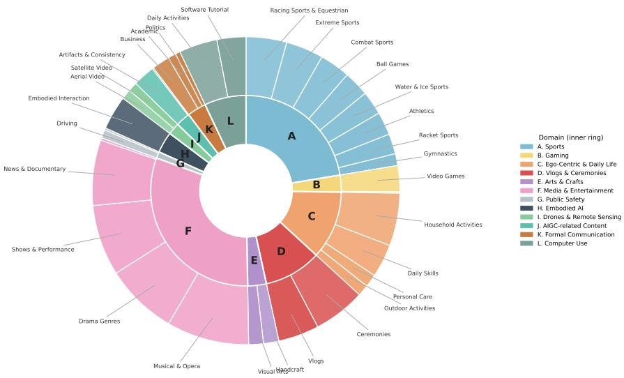

Figure 6: Two-ring content taxonomy of the KAIROs corpus. Inner ring: the 12 parent domains (codes A-L). Outer ring: the 35 categories nested within domains, with leader-line labels. Wedge sizes are video counts. The corpus is non-uniform but well-spread: A. Sports and F. Media & Entertainment together account for the largest share, while small-tail domains (G. Public Safety,H. Embodied AI,I. Drones & Remote Sensing) are kept at single-digit shares so that downstream evaluation can isolate domain-specific failures.  
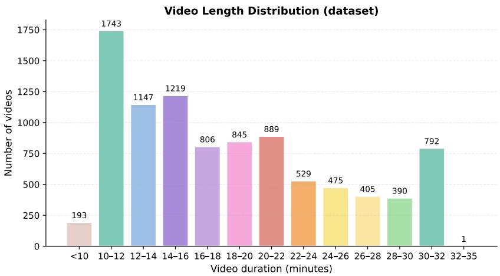  
Figure 7: Per-video duration distribution on the YouTube partition (9,434 videos, 2,857 hours). Median 17.0 min, mean 18.2 min, max 32.7 min. The bulk of the corpus sits in the 10 -30-min target band; the small <10 bar reflects -partNN tail fragments left after splitting longer sources rather than truncation.

## D BENCHMARK CONSTRUCTION DETAILS

## D.1 SOURCE-TYPE SAMPLERS AND TIER MAPPING

Each of the 10 source types corresponds to a single sampler over the timestamped annotation stream. A sampler returns the materials needed for question generation — the relevant annotations, their timestamps, the evidence span, neighbouring reference-frame context, and a pool of candidate distractors — without ever accessing the raw frames. The temporal tier of a generated question is determined by the realized evidence span itself, not assigned post hoc by the LLM. Each sampler also restricts the capability labels that the generator may emit (e.g. ref\_audio can only be tagged with A5\_audio\_comprehension, while transition is tagged with C2\_narrative\_transition). Table 7 reports the per-source-type composition of the released benchmark, alongside the tier range that each sampler's evidence span can fall into.

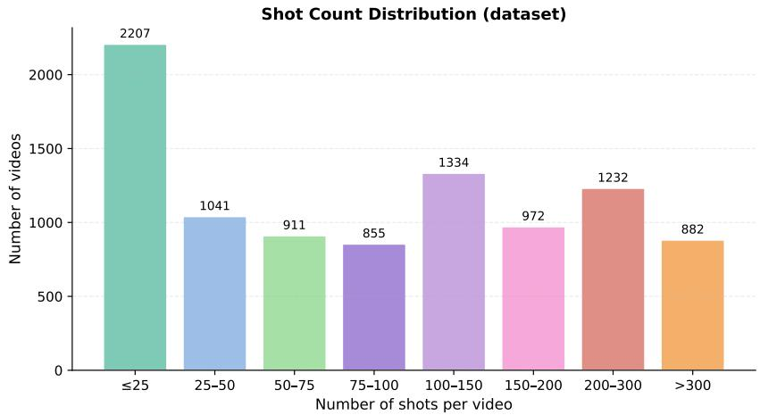  
Figure 8: Shots-per-video distribution on the YouTube partition. Median 91 shots per video, mean 126.4 , max 1,235 , and 1,192,552 shots in total. The right tail is dominated by fast-cut sports broadcasts and clip compilations and motivates the differential-frame chain in the annotation pipeline.

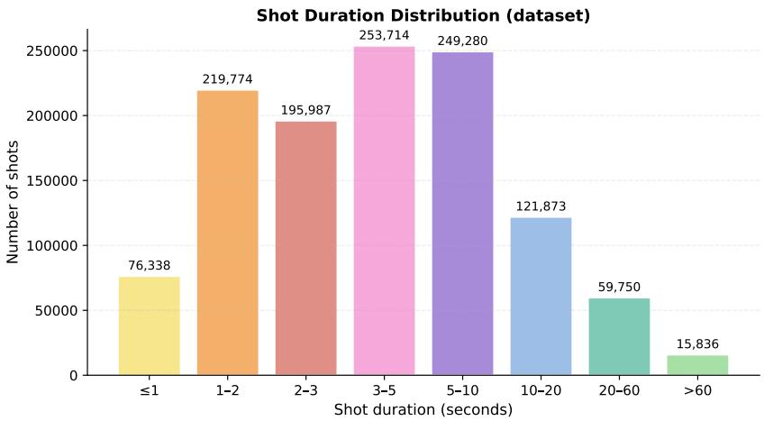  
Figure 9: Per-shot duration distribution on the YouTube partition. Median 3.7 s, mean 8.6 s. The right tail (held shots, >60 s) is what makes Time-axis questions non-trivial in the derived benchmark, and is also where the 300 -frame re-anchor schedule is exercised.

Atomic generation. Given the sampled evidence, the neighbouring reference-frame context before and after the target evidence, and a coarse temporal hint, GEMINI-2.5-FLASH returns a structured JSON object containing four fields: question, answer, distractors, and reasoning. All four are produced atomically in the same call. This encourages internal consistency between the answer and the reasoning, and avoids a separate rewriting stage that could make the distractors superficially different from the correct answer.

## D.2 CROSS-BENCHMARK TEXT-ONLY LEAKAGE — PROTOCOL

The cross-benchmark leakage probe in Table 1 of the main text fixes the solver, the prompt, the option-shuffle protocol, and the sample size identically across all benchmarks:

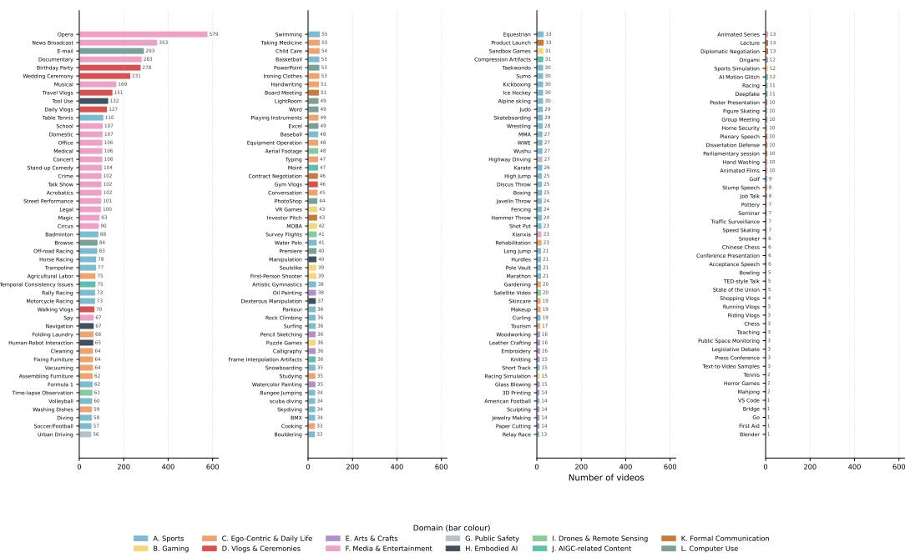  
Figure 10: Per-scenario video count across all 202 scenarios of the corpus, grouped by parent category and parent domain (bar color). Bars are sorted within each category by descending count; the resulting distribution is long-tailed but non-degenerate, with no single scenario dominating and every scenario receiving a meaningful share of the corpus.

Table 7: Per-source-type composition of KAIRos-Bench after audit and human review. Allowed tiers is the range of evidence spans the sampler can realise; the tier of a question is set by the realized span, not by the source type.
<table><tr><td>Source type</td><td>Evidence shape</td><td>Allowed tiers</td><td>#Q</td></tr><tr><td>ref-perception</td><td>single reference frame, scene + entities + relations</td><td>T1</td><td>614</td></tr><tr><td>ref_ocr</td><td>single reference frame, on-screen text</td><td>T1</td><td>177</td></tr><tr><td>ref_audio</td><td>single reference frame, aligned ASR / environment</td><td>T1</td><td>184</td></tr><tr><td>diff_change</td><td>ref + several differential frames inside one shot</td><td>T2</td><td>439</td></tr><tr><td>diff_sequence</td><td>full differential chain of one shot</td><td>T2</td><td>555</td></tr><tr><td>entity-tracking</td><td>cross-shot entity reappearance</td><td>T3-T5</td><td>366</td></tr><tr><td>transition</td><td>two boundary frames + adjacent shot descriptions</td><td>T2-T3</td><td>14</td></tr><tr><td>cross_shot</td><td>several adjacent or near-adjacent shots</td><td>T3-T4</td><td>236</td></tr><tr><td>long_range</td><td>evidence span &gt;300 s</td><td>T4-T5</td><td>144</td></tr><tr><td>full_video</td><td>whole-video integration</td><td>T5</td><td>141</td></tr></table>

• Solver. GEMINI-3.1-PRO , no video and no audio, K=1 shuffle, seed 42, greedy decoding, with the smallest thinking budget the model accepts (128 tokens).

• Sample size. 500 questions per benchmark, stratified over capability/tier/source where applicable, otherwise uniform.

• Prompt. A fixed system prompt states that no video or images are available and asks for the answer letter on the first line followed by one sentence of rationale on the second; the user message contains the question stem and the shuffled options. No in-context examples and no reasoning before the answer.

• Random baseline. Computed per benchmark from the realized option counts $( 1 / N$ for fixed-N benchmarks, and the per-question mean of $1 / N _ { i }$ for variable-option benchmarks).

• Leakage. Solver accuracy minus random baseline, reported in percentage points.

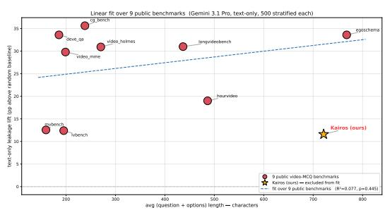

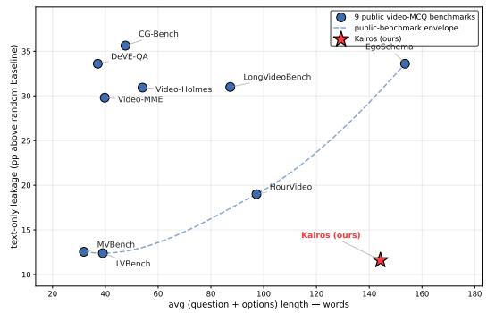  
Figure 11: Leakage vs. average MCQ length. Linear fit of text-only-leakage (pp) on average total characters per question across the ten benchmarks of Table 1 of the main text. KAIROS-Bench is to the right of the cloud (long stems) and below the line (lower leakage than length predicts).  
Figure 12: Leakage-length scatter. Perbenchmark scatter underlying the fit in Fig. 11. Each dot is one of the ten benchmarks; axes are average total MCQ characters and the absolute lift over the random baseline. KAIROs is the rightmost low-leakage point.

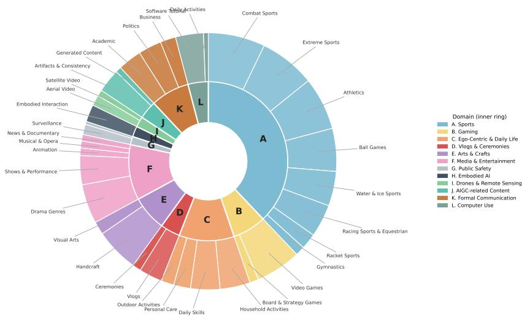  
Figure 13: Two-ring view of the capability axis of KAIROs-Bench. Inner ring: the four cognitive levels A (Perception, Space), B (Events, within-shot Dynamics), C (Temporal, cross-shot Dynamics), D (Localisation, holistic). Outer ring: the 17 capability cells nested within each level.

Figure 11 fits a linear regression of leakage on average total characters across the ten benchmarks; KAIROs-Bench has the longest stems among the four-option benchmarks but lies below the regression line, i.e. its leakage is lower than its length would predict. Figure 12 shows the underlying scatter, broken down by benchmark.

## D.3 BENCHMARK DISTRIBUTION DIAGNOSTICS

Figures 13–18 expand the three-axis summary in Fig. 4 of the main text to the content and structural axes, none of which are exposed in the main paper. Figure 13 reframes the capability axis as a tworing pie (axis → capability) so that the relative weight of holistic Axis-D cells is legible. Figure 14 reports the benchmark video count by content category, and Fig. 15 the per-scenario decomposition; both confirm that the 820 benchmark videos preserve the corpus-level taxonomy distribution rather than over-sampling a small subset. Figures 16–18 report per-video duration, shots per video, and per-shot duration on the benchmark subset.

Benchmark Questions per Scenario

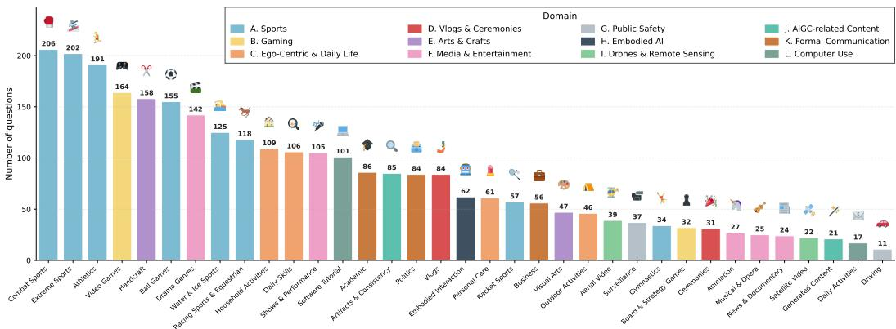  
Figure 14: Per-category video count of KAIRos-Bench (820 videos), grouped by parent domain (bar color). The benchmark preserves the long-tail shape of the corpus (Fig. 3 of the main text); no domain is dropped, and the small-tail domains G, H, I are over-sampled relative to their share of the corpus to keep per-domain question counts non-trivial.

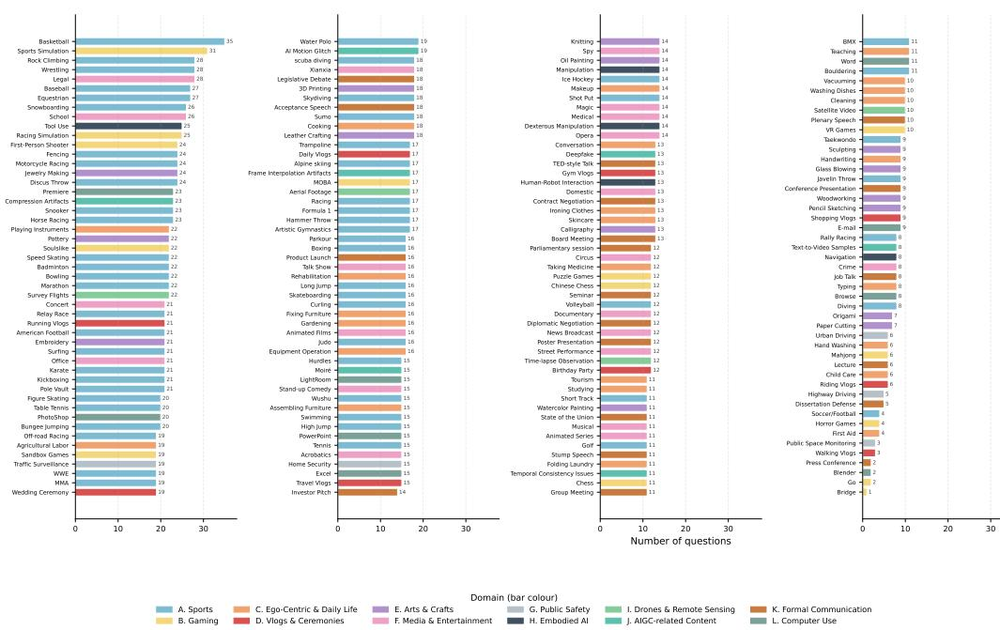  
Figure 15: Per-scenario video count of KAIROs-Bench across the 202 scenarios of the content taxonomy. Bars are colored by parent domain. The benchmark video pool is intentionally spread thin across scenarios rather than concentrated in a few high-volume cells, so that per-scenario evaluation is well-defined for as many cells as possible at the cost of small absolute counts in the long tail.

## E EVALUATION PROTOCOL

We evaluate 21 models in total: 7 closed-source proprietary and 14 open-weight. A unified runner groups questions by video\_id, prepares the video once per video for the relevant backend, then dispatches every question for that video in parallel (API: ThreadPoolExecutor) or batched (vLLM: generate\_batch).

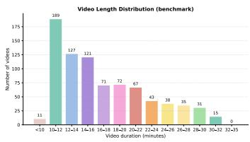  
Figure 16: Per-video duration on the 820 benchmark videos.

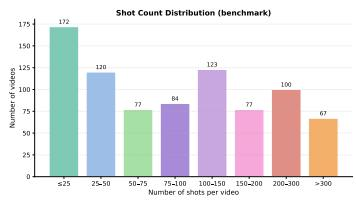  
Figure 17: Shots per benchmark video.

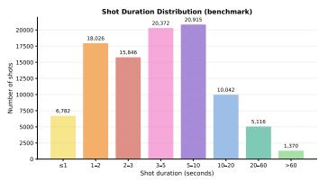  
Figure 18: Per-shot duration on the benchmark videos.

## E.1 BACKENDS AND VIDEO-INPUT NEGOTIATION

Five backends. The runner instantiates one of five backends per model based on its registry entry:

• vLLM (open-weight): frame mode for every family except LLAVA-VIDEO-7B, which is fed the video directly.

• HuggingFace Transformers (open-weight): used for the few open-weight models without a vLLM video implementation, in frame mode only.

• OpenAI direct (closed-source + OpenRouter-proxied open-weight): probes dat a : vi deo/mp 4 native video once per model and caches the result; falls back to N uniformly subsampled frames otherwise.

• Gemini direct: File API upload + 2 s processing poll, cached per video path. Native video is the only input mode.

• Anthropic direct: frame mode only (no native video support in the public API).

Native-video models. Only GEMINI-2.5-FLASH, GEMINI-3.1-PRO, LLAVA-VIDEO-7B run with native video input in our evaluation; every other model receives uniformly subsampled frames at the per-model budget reported in Table 8.

## E.2 PER-MODEL DECODING AND FRAME BUDGET

Table 8 enumerates the eval-time configuration used for every model in the leaderboard of Table 2 of the main text. The frame budget is the maximum number of frames the runner sends per question; the actual count for a given question equals min(budget, [video\_dur ·1 ]) so that very short videos are never up-sampled past their native 1 FPS rate. Decoding is greedy (temperature 0) for every model except GPT-5.5, whose API only accepts its default sampling temperature; for the OpenQA run we keep the same decoding so that the only intentional change between MCQ and OpenQA is the answer format.

Scoring. A model output is parsed by first stripping any <think> block, then taking the last explicit Answer : X if present, otherwise a leading bracketed or bare letter; outputs with no such letter are counted as incorrect. Per-tier, per-capability, per-source, and per-domain accuracies are computed by simple bucket-then-average over the parsed letters. Three openweight models (INTERNVL3.5-8B, MIMO-VL-7B, LLAVA-VIDEO-7B) are decoded with vLLM st ructured\_outputs that constrain the final token to a single letter, because their unconstrained outputs occasionally trail off into reasoning without committing to a choice.

## E.3 OPEN-ENDED QA JUDGE

Why an OpenQA pass. A multiple-choice task is easy to score but lossy: a model can recognise the right answer without being able to produce it. We therefore additionally run an OpenQA pass on the same 2,870 questions, asking each model to generate a free-form answer rather than pick a letter. Decoding stays greedy; the per-model token budget is raised to at least 256 tokens so that free-form answers are not truncated.

Judge. Each generation is scored against the reference answer by GEMINI-2.5-FLASH , which sees only the question stem, the reference answer, and the candidate; no video, no audio, no chain-ofthought. The judge returns an integer 0–3 in the MMBench-Video style, and we report binarised accuracy at threshold $\geq 2$ . The leaderboard is reproduced in Table 3 of the main text.

Table 8: Per-model evaluation configuration. Type is the backend used. TP is the tensor-parallel size on H200 GPUs (vLLM only). Frames is the per-question frame budget (native = native video input). Max tokens is the decoding cap. Sampling is greedy throughout.
<table><tr><td>Model</td><td>Type</td><td>TP</td><td>Frames</td><td>Max tokens</td><td>Notes</td></tr><tr><td colspan="6">Closed-source proprietary</td></tr><tr><td>GEMINI-3.1-PRO</td><td>gemini</td><td></td><td>native</td><td>1024</td><td>video-native</td></tr><tr><td>GEMINI-2.5-FLASH</td><td>gemini</td><td></td><td>native</td><td>512</td><td>video-native</td></tr><tr><td>GPT-5.5</td><td>openai</td><td></td><td>256</td><td>2048</td><td>forced frame mode</td></tr><tr><td>GPT-40</td><td>openai</td><td></td><td>64</td><td>1024</td><td>forced frame mode</td></tr><tr><td>GPT-4O-MINI</td><td>openai</td><td></td><td>128</td><td>1024</td><td>forced frame mode</td></tr><tr><td>NOVA-2-LITE</td><td>openai</td><td></td><td>32</td><td>1024</td><td>forced frame mode</td></tr><tr><td>SEED-2.0-LITE</td><td>openai</td><td></td><td>32</td><td>1024</td><td>forced frame mode</td></tr><tr><td colspan="6">Open-weight</td></tr><tr><td>INTERNVL3-78B</td><td>vLLM</td><td>4</td><td>16</td><td>512</td><td>frame mode</td></tr><tr><td>INTERNVL3.5-38B</td><td>vLLM</td><td>2</td><td>12</td><td>512</td><td>frame mode</td></tr><tr><td>INTERNVL3-8B</td><td>vLLM</td><td>2</td><td>16</td><td>512</td><td>frame mode</td></tr><tr><td>INTERNVL3.5-8B</td><td>vLLM</td><td>2</td><td>12</td><td>2048</td><td>structured-output letter</td></tr><tr><td>GLM-4.5V</td><td>vLLM</td><td>4</td><td>16</td><td>64</td><td>enable_thinking=False</td></tr><tr><td>GLM-4V-9B</td><td>HF</td><td></td><td>1</td><td>512</td><td>1-frame ceiling per the model card</td></tr><tr><td>STEP3-VL-10B</td><td>vLLM</td><td>2</td><td>16</td><td>8192</td><td>frame mode</td></tr><tr><td>QWEN3-VL-30B-A3B</td><td>vLLM</td><td>2</td><td>16</td><td>512</td><td>frame mode</td></tr><tr><td>QWEN3-VL-8B</td><td>vLLM</td><td>1</td><td>16</td><td>512</td><td>frame mode</td></tr><tr><td>QWEN2.5-VL-7B</td><td>vLLM</td><td>1</td><td>16</td><td>512</td><td>frame mode</td></tr><tr><td>MIMO-VL-7B</td><td>vLLM</td><td>1</td><td>16</td><td>4096</td><td>structured-output letter</td></tr><tr><td>COGVLM2-VIDEO-13B</td><td>HF</td><td></td><td>16</td><td>1024</td><td>frame mode</td></tr><tr><td>GEMMA-4-31B</td><td>openai</td><td></td><td>32</td><td>1024</td><td>forced frame mode</td></tr><tr><td>LLAVA-VIDEO-7B</td><td>vLLM</td><td>1</td><td>native</td><td>512</td><td>video-native; structured-output letter</td></tr></table>

## F FINE-TUNING RECIPE

## F.1 HYPERPARAMETERS

Table 9 summarizes every fine-tuning hyperparameter. The recipe deliberately stays close to a vanilla LLaMA-Factory qwen2\_5\_v1 template: LoRA on the seven attention/MLP projections, frozen vision tower, single epoch, cosine schedule. The only non-default choice is the cutoff length, which is raised to 16,384 tokens to fit the long anchor-based prompts at 32 frames.

Eval-time frame ablation. At eval time, the fine-tuned checkpoint is decoded with {16, 32, 64} uniformly subsampled frames per question; the headline numbers across these frame budgets and across the four evaluation benchmarks are reported in Table 4.

## G LIMITATIONS AND BROADER IMPACT

## G.1 LIMITATIONS

VLM bias. All annotations are produced by Qwen3-VL-8B-Inst ruct (Bai et al., 2025), so a systematic perception bias of that VLM also biases KAIROs descriptions; running the pipeline with a different VLM is straightforward and would help quantify the bias.

Language-only entity matching. Cross-shot entity matching is language-only, so for visuallyhard-to-describe entities (e.g. visually similar but semantically distinct people in crowd scenes), label-exact matching splits an identity whenever the model paraphrases an established name instead of reusing it, and merges two mentions only when it assigns them the same label. This is addressable by adding a vision-only re-identification signal as a visual matching stage, which we leave to future work to keep the pipeline VLM-only.

Residual leakage. Even after the multi-model audit and human review, the cross-benchmark leakage probe still finds +9.6 pp lift over random under GEMINI-3.1-PRO — the lowest of the ten benchmarks tested but not zero. We attribute this residual to the linguistic anchors that the questions include in lieu of numeric timestamps; removing those anchors would reduce leakage further but would also degrade question grounding for non-visual solvers, so we leave the trade-off explicit rather than tune it.

Table 9: Fine-tuning hyperparameters. The recipe uses LLaMA-Factory's qwen2\_5\_v1 template; the seven LoRA target modules are the standard transformer projections.
<table><tr><td>Setting</td><td>Value</td></tr><tr><td colspan="2">Model and parameterisation</td></tr><tr><td>Base model</td><td>QWEN2.5-VL-7B-INSTRUCT</td></tr><tr><td>Framework</td><td>LLaMA-Factory</td></tr><tr><td>Adapter</td><td>LoRA, rank 32 , α =64</td></tr><tr><td>LoRA target modules</td><td>q, k, v, o, gate, up, down-proj</td></tr><tr><td>Frozen modules</td><td>vision tower (multi-modal projector trainable)</td></tr><tr><td>Precision</td><td>bf16</td></tr><tr><td>Distributed</td><td>DeepSpeed ZeRO-3</td></tr><tr><td>Hardware</td><td>4×H200</td></tr><tr><td colspan="2">Optimization</td></tr><tr><td>Optimizer</td><td>AdamW (LLaMA-Factory default)</td></tr><tr><td>Learning rate</td><td>1×10−4</td></tr><tr><td>Schedule</td><td>cosine, warmup ratio 0.03</td></tr><tr><td>Weight decay</td><td>0.01</td></tr><tr><td>Per-device batch size</td><td>1</td></tr><tr><td>Gradient accumulation</td><td>8</td></tr><tr><td>Effective batch size</td><td>32</td></tr><tr><td>Epochs</td><td>1</td></tr><tr><td>Cutoff length</td><td>16,384 tokens</td></tr><tr><td colspan="2">Visual input</td></tr><tr><td>Frame budget per sample</td><td>32</td></tr><tr><td>Sampler</td><td>uniform</td></tr><tr><td>Input resolution</td><td>420 × 420 pixels per frame (image and video pixels)</td></tr><tr><td>Frame source</td><td>pre-extracted 1 FPS JPEGs (no re-decoding)</td></tr></table>

Per-tier population imbalance. Two cells of the capability axis have small populations (D1\_narrative\_summarisation5questions, C2\_narrative\_transition 14questions). Per-cell accuracy on those cells is therefore high-variance and should be read as a coarse signal rather than a precise number. The headline overall accuracy and the per-tier breakdown are unaffected.

## G.2 BROADER IMPACT

Intended uses. KAIROs is intended for the development and evaluation of long-form video understanding systems in three modes: (i) as supervision data for video-language pretraining and finetuning; (ii) as a benchmark for long-form video QA; (iii) as a substrate for evaluating video-language alignment, entity tracking, and temporal grounding methods that go beyond clip-level decisions.

Risks. The dataset contains only annotations of public, platform-distributed videos, with platformtakedown semantics preserved. Personally-identifying information that appears in the source videos (e.g. recognisable individuals in sports broadcasts) is not added by the annotation pipeline; faces and identities are referenced only at the level the source already exposes them. Misuse risks are those typical of any large video corpus; the annotation-side frames are not redistributed, which limits this surface.