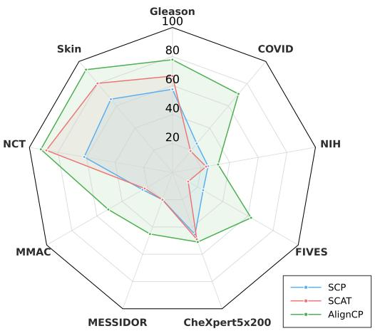
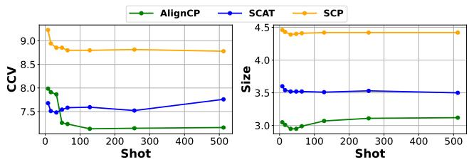
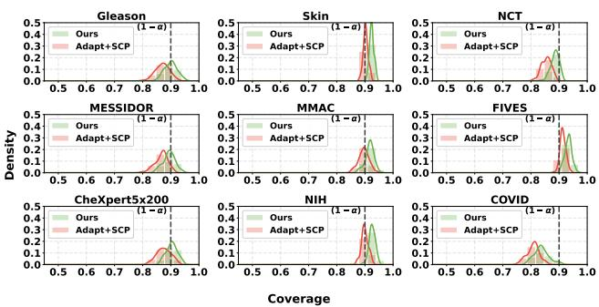

# Learning to Adapt and Calibrate: Score Distribution Alignment for Few-Shot Uncertainty Prediction in Medical VLMs

Xuan Cuong Ngo Ngan Le

University of Arkansas

Fayetteville, Arkansas, USA

{cngo,thile}@uark.edu

## Abstract

Uncertainty estimation for medical vision–language models (VLMs) using conformal prediction has gained in creasing attention due to its distribution-free coverage guar antees under exchangeability, but applying it in few-shot transfer is challenging. In this setting, only a small labeled support set is available, yet both supervised adaptation and conformal calibration require labeled data. A natural strat egy is therefore to use the support set for supervised fine tuning and then reuse it for conformal calibration. How ever, once the model has been adapted on these samples, their nonconformity scores are no longer exchangeable with those of unseen query samples, and naively applying split conformal prediction (SCP) can lead to unreliable cover age. Existing transductive conformal adaptation methods often avoid supervised updates to preserve the standard conformal protocol, but this sacrifices much of the value offew-shot supervision. In few-shot transfer, adaptation is the primary objective; conformal prediction should instead serve as an uncertainty estimation layer for the adapted model rather than restricting adaptation itself. We study this problem from the perspective of adaptation-induced non-exchangeability and propose AlignCP, a framework that reconciles supervisedfew-shot adaptation with confor mal uncertainty estimation. AlignCPfirst adapts a medical VLM on the labeled support set and then reuses the same samples for calibration. To compensate for the resulting mismatch between support and query scores, AlignCP uses unlabeled query predictions to reweight the support non- conformity scores, producing a corrected calibration dis tribution from which the conformal threshold is computed. Since supervised adaptation breaks the exchangeability re- quired by standard SCP,AlignCP does not claim its standard marginal coverage guarantee; instead, it aims to recover re- liable em irical covera e as closel as ossible b correct ing the adaptation-induced score-distribution shift without requiring query labels. Extensive experiments across di- verse medical domains show that AlignCP improves pre

dictive performance over unsupervised conformal baselines while maintaining reliable empirical coverage and compet- itive prediction-set eficiency under distribution shift.

## 1. Introduction

Medical vision–language models (VLMs) have recently demonstrated strong transfer capabilities across a range of clinical applications, including image classification [11], visual question answering [25], and cross-modal reasoning. As a result, these models are increasingly adopted in high- stakes healthcare settings, with specialized medical VLMs developed for radiology [45, 48], histology [19, 26], and retinal imaging [39]. Their efectiveness largely stems from large-scale pretraining, which enables strong generalization even when labeled medical data is limited. However, despite these promising advances, the reliability and uncertainty be- havior of medical VLMs under transfer remain insuficiently studied, with only a few recent works beginning to address this issue [38].

Split conformal prediction (SCP) provides a principled, distribution-free framework for uncertainty quantification, ofering finite-sample coverage guarantees under the ex- changeability assumption [12, 42]. Recent works have extended SCP to neural networks, showing that reliable pre- diction sets can be obtained using a small labeled calibra- tion set [1, 10]. However, in transfer learning scenarios, it is common practice to perform supervised fine-tuning on available support data to improve predictive performance [18, 30]. When SCP is applied after such adaptation, the predictive model has already been updated using part of the target data. This violates the exchangeability assumption between calibration and test samples, thereby undermining the theoretical coverage guarantees of SCP [38].

To mitigate this issue, recent transductive conformal adaptation methods propose avoiding supervised updates and instead performing unsupervised adaptation jointly over calibration and test covariates [38]. These methods are de-signed to preserve empirical coverage by preventing label- driven shifts in the nonconformity score distribution. Nev- ertheless, this strategy is misaligned with the central goal of few-shot learning. In few-shot transfer, the main objective is to exploit the limited labeled support set as efectively as possible to adapt the model to the target task. Uncer- tainty estimation through conformal prediction should assist this adapted model by providing a calibrated view of its predictions, rather than becoming the constraint that pre- vents supervised adaptation. Therefore, while transductive conformal adaptation can maintain validity, it may do so by prioritizing conformal assumptions over task adaptation, efectively leaving valuable labeled supervision underused. This trade-of is especially undesirable in medical few-shot settings, where a small number of labeled examples can provide critical task-specific information and significantly improve predictive accuracy [15].

In this work, we develop a principled framework for su- pervised few-shot adaptation of medical VLMs with reliable conformal uncertainty estimation under distribution shift. Unlike transductive conformal adaptation methods that pre- serve exchangeability by avoiding supervised updates, we adopt a perspective that is more consistent to the goal of few- shot learning. In few-shot transfer, the scarce labeled sup- port samples provide the most direct supervision for adapting a pretrained model to the target medical task; therefore, task adaptation should be the first priority. Conformal predic- tion should then serve as an auxiliary uncertainty estimation mechanism for the adapted model, rather than a constraint that prevents supervised learning from the available labels. However, once the model is fine-tuned on the support set, the calibration and test nonconformity scores are no longer exchangeable, causing standard conformal prediction to suf- fer from undercoverage. For this reason, our objective is not to guarantee the exact marginal coverage of standard confor- mal prediction, but to close the resulting coverage gap and provide the most trustworthy uncertainty estimates possible for the adapted medical VLM.

We begin by revisiting supervised few-shot conformal transfer from a distributional perspective. In this setting, the limited labeled support set is used both to fine-tune the model for the target task and to provide the calibration scores for conformal prediction. While supervised fine-tuning im- proves task adaptation, it can also bias the adapted model toward the support/calibration samples, shifting the induced nonconformity score distribution away from that of the test data. Since the coverage behavior of split conformal predic- tion depends on the calibration scores being representative of the test scores, this score-level mismatch can directly lead to coverage degradation. Recent theoretical results formalize this phenomenon by bounding the coverage gap in terms of discrepancies between the pushforward score distributions under calibration and test data [43]. These insights suggest that the central challenge is to control the score distribution shift induced by supervised adaptation, so that conformal prediction can provide reliable uncertainty estimates for the adapted model under distribution shift.

Motivated by this insight, we propose AlignCP, a frame- work that enables supervised few-shot fine-tuning while explicitly reducing the score distribution shift induced by adaptation. After adapting the VLM on the labeled support set, AlignCP learns a reweighted calibration score distribu- tion that better matches the unlabeled test score distribution. This is achieved by minimizing a theoretically motivated objective derived from a coverage-gap bound defined over the two score distributions. Since supervised adaptation vi- olates the exchangeability assumption through score-level distribution mismatch, reducing this mismatch helps nar- row the resulting coverage gap and improve the reliability of conformal uncertainty estimates. Importantly, because nonconformity scores are one-dimensional, the proposed alignment is computationally eficient and remains stable in data-scarce few-shot regimes.

Extensive experiments across diverse medical domains demonstrate that AlignCP achieves stronger predictive per- formance than purely unsupervised transductive approaches, while maintaining reliable empirical coverage and competi- tive prediction set eficiency under distribution shift.

The main contributions are summarized as follows:

◦ Supervised Few-Shot Conformal Adaptation: We pro-pose AlignCP, a principled framework for uncertainty estimation in supervised few-shot adaptation of medical VLMs. Unlike transductive approaches that avoid super- vised updates, AlignCP first adapts the model using the limited labeled support set and then corrects the induced score-level mismatch.

◦ Coverage Gap Minimization Perspective: We refor-mulate conformal prediction after supervised few-shot adaptation as a coverage gap minimization problem. Building on recent theoretical bounds, AlignCP learns a reweighted calibration score distribution that better matches the unlabeled test score distribution by minimiz- ing a theoretically motivated objective defined over the two score distributions.

◦ Improved Accuracy-Coverage Trade-of: Extensive ex-periments across diverse medical domains demonstrate that AlignCP achieves stronger predictive performance than purely unsupervised transductive methods, while maintaining reliable empirical coverage and competitive prediction set eficiency.

## 2. Related Work

Conformal prediction for classification. Conformal prediction constructs prediction sets with finite-sample marginal coverage under exchangeability [2, 34, 42]. For classification, common nonconformity scores include least ambiguous classification (LAC) [33], adaptive prediction sets (APS) [32], and regularized adaptive prediction sets (RAPS) [1]. These methods improve the reliability of clas-sifier outputs by calibrating prediction sets on held-out data. However, their coverage guarantee relies on calibration and test samples following the same score distribution, which is often violated under domain shift.

Conformal prediction under distribution shift. Several works study conformal prediction beyond the standard i.i.d. setting. Weighted conformal prediction reweights calibra- tion samples to address covariate shift [40], while more general approaches analyze conformal validity under distri- bution drift and non-exchangeability [3]. In medical imag- ing, distribution shift is especially common because datasets can difer in imaging protocol, patient population, disease prevalence, and annotation process. Recent studies show that conformal prediction can sufer from degraded cover- age under such shifts [27]. Unlike prior reweighting-based methods, AlignCP does not assume any prior knowledge about the source-target distribution shift.

Few-shot adaptation and transductive learning. Few- shot adaptation improves target-domain performance us- ing a small labeled support set, while transductive meth- ods additionally use unlabeled test samples during infer- ence. TIM optimizes mutual information over query pre- dictions [5], and TransCLIP extends transductive inference to VLMs [47]. SCA-T applies transductive optimization to conformal prediction for few-shot medical VLMs [38].These methods either avoid supervised adaptation to preserve cal- ibration, or apply adaptation in a way that can change the calibration score distribution and cause undercoverage. In contrast, AlignCP explicitly combines supervised adapta- tion with score-distribution alignment, retaining the accu- racy gain from adaptation while correcting the calibration mismatch needed for reliable conformal prediction.

Medical VLMs. VLMs such as CLIP learn transferable image-text representations through contrastive learning [30]. This paradigm has been adapted to medical imaging through methods such as ConVIRT [48], GLoRIA [17], BioViL [4], MedCLIP [45], and CheXzero [41]. These models pro-vide strong zero-shot and few-shot transfer ability, but their predictions can still be miscalibrated when deployed on shifted target datasets. AlignCP is complementary to these representation-learning methods, focusing on reliable adap- tation and conformal calibration for medical VLMs.

## 3. Methodology

## 3.1. Notation and Problem Setup

We first introduce the notation used throughout the method section. Let X denote the input space and Y denote the label space. We use uppercase letters, e.g., (X, Y ), for random variables and lowercase letters, e.g., (x, y), for their realizations. For a distribution R over $\mathcal { X } \times \mathcal { Y } , R _ { X }$ denotes its marginal distribution over X, and $R ^ { n }$ denotes the nfold product distribution obtained by drawing n independent samples from R.

We consider a source distribution $P$ and a target distri- bution $Q$ over $\mathcal { X } \times \mathcal { V }$ . The labeled calibration set is drawn from the source distribution,

$$
{ \mathcal { D } } _ { \mathrm { c a l } } = \{ ( X _ { i } , Y _ { i } ) \} _ { i = 1 } ^ { n } \sim P ^ { n } ,\tag{1}
$$

while the unlabeled target query set is drawn from the target marginal distribution,

$$
\mathcal D _ { \mathrm { q r y } } = \{ \widetilde X _ { j } \} _ { j = 1 } ^ { m } \sim Q _ { X } ^ { m } .\tag{2}
$$

Let $f _ { \theta }$ denote a pretrained VLM, and let $\theta ^ { \prime }$ denote the parameters after supervised adaptation. The nonconformity score is written as $s _ { \theta ^ { \prime } } : \mathcal { X } \times \mathcal { Y }  \mathbb { R }$ , where larger scores indicate lower conformity between an input and a candidate label. For simplicity, we write $s ( x , y )$ instead of $s _ { \theta ^ { \prime } } ( x , y )$ when the model parameters are clear from context.

For any distribution R over $\mathcal { X } \times \mathcal { V } .$ , the induced score random variable is $S _ { R } = s ( X , Y )$ for $( X , Y ) \sim R$ . The corresponding score distribution is the pushforward distribu- tion $R _ { s } : = s _ { \# } R .$ . Thus, source examples induce $P _ { s } = s _ { \# } P _ { \# }$ while target examples induce $Q _ { s } = s _ { \# } Q .$ . We denote the cumulative distribution function of $R _ { s }$ by $F _ { R _ { s } }$ and, when it exists, its density by $p _ { R _ { s } }$

For each calibration sample, the calibration score is $S _ { i } =$ $s ( X _ { i } , Y _ { i } )$ , and the set of calibration scores is denoted by $ { S _ { \mathrm { c a l } } } = \{ S _ { i } \} _ { i = 1 } ^ { n }$ . Since $\mathcal { D } _ { \mathrm { c a l } } \sim P ^ { n }$ , the induced calibration scores satisfy $S _ { \mathrm { c a l } } \sim P _ { s } ^ { n }$ . Here, $P ^ { n }$ denotes the distribution of source data pairs, whereas $P _ { s } ^ { n }$ denotes the distribution of their induced nonconformity scores.

Given $ { S _ { \mathrm { c a l } } }$ , we denote the split conformal threshold at miscoverage level $\alpha \in ( 0 , 1 )$ by $\widehat { q } _ { 1 - \alpha } ( S _ { \mathrm { c a l } } )$ . The corre- sponding prediction set is

$$
\mathcal { C } _ { \alpha } ( x ) = \{ y \in \mathcal { V } : s ( x , y ) \leq \widehat { q } _ { 1 - \alpha } ( S _ { \mathrm { c a l } } ) \} .\tag{3}
$$

For a test example $( X _ { t } , Y _ { t } )$ , we write its nonconformity score as $S _ { t } = s ( X _ { t } , Y _ { t } )$

Finally, CovP(α) and $\operatorname { C o v } _ { Q } ( \alpha )$ denote the marginal cov- erage of the same conformal procedure when the test point is drawn from $P$ and $Q .$ , respectively. The coverage gap between the source and target distributions is

$$
\Delta _ { P , Q } ( \alpha ) = \left| \mathrm { C o v } _ { P } ( \alpha ) - \mathrm { C o v } _ { Q } ( \alpha ) \right| .\tag{4}
$$

This quantity will be used to characterize how distribution shift in score space afects conformal coverage.

## 3.2. Revisiting Conformal Prediction

Conformal prediction (CP) [42] constructs prediction sets with finite-sample coverage guarantees under exchangeabil- ity. We first consider the standard setting where the calibra- tion and test examples are drawn from the same distribution

$P$ over $\mathcal { X } \times \mathcal { V }$ . Given calibration scores $ { S _ { \mathrm { c a l } } } = \{ S _ { i } \} _ { i = 1 } ^ { n }$ ∼ $P _ { s } ^ { n }$ , split conformal prediction (SCP) [28] chooses a thresh-old from the empirical quantile of the calibration scores.

Let $S _ { ( 1 ) } \leq \dots \leq S _ { ( n ) }$ denote the order statistics of $ { S _ { \mathrm { c a l } } }$ For a target miscoverage level $\alpha \in ( 0 , 1 )$ , the split conformal threshold is

$$
\widehat { q } _ { 1 - \alpha } ( S _ { \mathrm { c a l } } ) : = S _ { ( \lceil ( n + 1 ) ( 1 - \alpha ) \rceil ) } ,\tag{5}
$$

with the convention that $S _ { ( n + 1 ) } = \infty$ when the index ex- ceeds n. The prediction set for a test input x is then

$$
\mathcal { C } _ { \alpha } ( x ) = \{ y \in \mathcal { V } : s ( x , y ) \leq \widehat { q } _ { 1 - \alpha } ( S _ { \mathrm { c a l } } ) \} .\tag{6}
$$

For a test example $( X _ { t } , Y _ { t } ) \sim P ,$ , let $S _ { t } ~ = ~ s ( X _ { t } , Y _ { t } )$ denote its nonconformity score. Since $S _ { t }$ and the calibration scores are drawn from the same score distribution $P _ { s }$ , SCP guarantees

$$
\begin{array} { r } { \mathbb { P } \big ( Y _ { t } \in \mathcal { C } _ { \alpha } ( X _ { t } ) \big ) = \mathbb { P } \left( S _ { t } \le \widehat { q } _ { 1 - \alpha } ( S _ { \mathrm { c a l } } ) \right) } \\ { \ge 1 - \alpha . } \end{array}\tag{7}
$$

This formulation shows that conformal validity depends on the relationship between the calibration score distribution and the test score distribution. This perspective becomes central under distribution shift, where calibration scores fol- low $P _ { s }$ but target test scores follow $Q _ { s }$

## 3.3. Coverage Gap under Distribution Shift

We now consider the distribution-shift setting, where the cal- ibration scores are drawn from the source score distribution $P _ { s }$ , while target test scores are drawn from $Q _ { s }$ . The confor- mal threshold $\widehat { q } _ { 1 - \alpha } ( S _ { \mathrm { c a l } } )$ is still computed from the source calibration scores $S _ { \mathrm { c a l } } \sim P _ { s } ^ { n }$ . However, when evaluating on the target distribution, the test score follows $S _ { t } \sim Q _ { s }$ Therefore, if $P _ { s } \neq Q _ { s }$ , the source calibration scores and target test scores are no longer drawn from the same score distribution, and the standard split conformal guarantee un- der P does not directly transfer to $Q$

Using the same source-calibrated threshold, the source coverage can be written as

$$
\operatorname { C o v } _ { P } ( \alpha ) = \mathbb { E } _ { S _ { \mathrm { c a l } } \sim P _ { s } ^ { n } } \left[ \mathbb { E } _ { S _ { t } \sim P _ { s } } \left[ { \bf 1 } \left\{ S _ { t } \le \widehat { q } _ { 1 - \alpha } ( S _ { \mathrm { c a l } } ) \right\} \right] \right] .\tag{8}
$$

Similarly, the target coverage is

$$
\operatorname { C o v } _ { Q } ( \alpha ) = \mathbb { E } _ { S _ { \mathrm { c a l } } \sim P _ { s } ^ { n } } \left[ \mathbb { E } _ { S _ { t } \sim Q _ { s } } \left[ { \bf 1 } \left\{ S _ { t } \leq { \widehat { q } } _ { 1 - \alpha } ( S _ { \mathrm { c a l } } ) \right\} \right] \right] .\tag{9}
$$

Thus, both quantities use the same random threshold learned from $P _ { s } ,$ , but difer in the distribution used to evaluate the test score. The coverage gap $\Delta _ { P , Q } ( \alpha )$ therefore captures the change in coverage caused by replacing the source test score distribution $P _ { s }$ with the target test score distribution $Q _ { s }$

Under the source distribution, split conformal prediction guarantees

$$
\begin{array} { r } { \mathrm { C o v } _ { P } ( \alpha ) \geq 1 - \alpha . } \end{array}\tag{10}
$$

For the target distribution, the definition of the coverage gap gives

$$
\mathrm { C o v } _ { Q } ( \alpha ) \geq \mathrm { C o v } _ { P } ( \alpha ) - \Delta _ { P , Q } ( \alpha ) .\tag{11}
$$

Combining the two inequalities yields

$$
\mathrm { C o v } _ { Q } ( \alpha ) \geq 1 - \alpha - \Delta _ { P , Q } ( \alpha ) .\tag{12}
$$

This inequality shows that target coverage degrades accord- ing to the coverage gap induced by the mismatch between $P _ { s }$ and $Q _ { s }$ . Consequently, improving target reliability under distribution shift can be viewed as reducing the score-level discrepancy that contributes to $\Delta _ { P , Q } ( \alpha )$

## 3.4. Supervised Conformal Transfer under Distribution Shift

Building on the coverage-gap view above, our goal is to im- prove target coverage after supervised adaptation by reduc- ing the score-level mismatch between the source calibration distribution and the target test distribution. Since the tar- get labels are unavailable, we cannot directly observe target scores from $Q _ { s } ,$ . Instead, AlignCP learns a reweighted cali- bration score distribution from the labeled source calibration set and the unlabeled target query inputs.

Reweighted calibration distribution. To adjust the source calibration scores toward the target score distribution, AlignCP assigns a nonnegative weight $w _ { i }$ to each calibra- tion score $S _ { i }$ , with $w _ { i } \geq 0$ and $\textstyle \sum _ { i = 1 } ^ { n } w _ { i } = 1$ . These weights define the weighted empirical calibration score distribution

$$
P _ { s , n } ^ { w } = \sum _ { i = 1 } ^ { n } w _ { i } \delta _ { S _ { i } } ,\tag{13}
$$

where $\delta _ { S _ { i } }$ denotes the Dirac measure at $S _ { i }$ . When $w _ { i } = 1 / n$ for all $i , P _ { s , n } ^ { w }$ reduces to the standard unweighted empirical calibration score distribution. The corresponding weighted empirical CDF is

$$
F _ { P _ { s , n } ^ { w } } ( t ) = \sum _ { i = 1 } ^ { n } w _ { i } \mathbf { 1 } \{ S _ { i } \leq t \} .\tag{14}
$$

The weighted conformal threshold is defined as

$$
\widehat { q } _ { 1 - \alpha } ^ { w } : = \operatorname* { i n f } \left\{ t \in \mathbb { R } : F _ { P _ { s , n } ^ { w } } ( t ) \geq 1 - \alpha \right\} .\tag{15}
$$

This gives the weighted prediction set

$$
\begin{array} { r } { \mathcal { C } _ { \alpha } ^ { w } ( x ) = \left\{ y \in \mathcal { V } : s ( x , y ) \leq \widehat { q } _ { 1 - \alpha } ^ { w } \right\} . } \end{array}\tag{16}
$$

Thus, the central problem is to choose weights such that $P _ { s , n } ^ { w }$ better matches the target score distribution and reduces the induced coverage gap.

Coverage gap as score distribution discrepancy. The previous subsection shows that target coverage is controlled by $\Delta _ { P , Q }$ . Under mild regularity conditions, such as the existence of a density for $P _ { s }$ , the total coverage gap can be bounded by a discrepancy between the source and target score CDFs [7]:

$$
\Delta _ { P , Q } \leq \int _ { \mathbb { R } } p _ { P _ { s } } ( u ) \left| F _ { P _ { s } } ( u ) - F _ { Q _ { s } } ( u ) \right| d u .\tag{17}
$$

A proof is provided in the appendix. This bound motivates aligning calibration and target distributions directly in the one-dimensional score space.

Approximating the target score distribution from unlabeled queries. The bound in (17) depends on $Q _ { s }$ , which cannot be directly evaluated without target labels. However, in classification, we can compute the nonconformity score for every candidate label even when the true label is un- known. For each unlabeled query input $\widetilde { X } _ { j }$ , we define the lower and upper candidate scores as

$$
S _ { j } ^ { \downarrow } = \operatorname* { m i n } _ { y \in \mathcal { V } } s ( \widetilde { X } _ { j } , y ) , \qquad S _ { j } ^ { \uparrow } = \operatorname* { m a x } _ { y \in \mathcal { V } } s ( \widetilde { X } _ { j } , y ) .\tag{18}
$$

These scores induce two empirical surrogate distributions,

$$
\widehat { Q } _ { s , m } ^ { \downarrow } = \frac { 1 } { m } \sum _ { j = 1 } ^ { m } \delta _ { S _ { j } ^ { \downarrow } } , \qquad \widehat { Q } _ { s , m } ^ { \uparrow } = \frac { 1 } { m } \sum _ { j = 1 } ^ { m } \delta _ { S _ { j } ^ { \uparrow } } .\tag{19}
$$

For brevity, we write $\widehat { Q } ^ { \downarrow } : = \widehat { Q } _ { s , m } ^ { \downarrow }$ and $\widehat { Q } ^ { \uparrow } : = \widehat { Q } _ { s , m } ^ { \uparrow }$

Let $\widetilde { Y } _ { j } \sim Q ( \cdot \mid \widetilde { X } _ { j } )$ denote the unknown target label and let $\widetilde { S } _ { j } = s ( \widetilde { X } _ { j } , \widetilde { Y } _ { j } )$ be the corresponding unobserved target score. By construction, $S _ { j } ^ { \downarrow } \leq \widetilde { S } _ { j } \leq S _ { j } ^ { \uparrow }$ for every query sample. If the target labels were known, the empirical target score distribution would be $\begin{array} { r } { \widehat { Q } _ { s } = \frac { 1 } { m } \sum _ { j = 1 } ^ { m } \delta _ { \widetilde { S } _ { j } } } \end{array}$ . Although $\widehat { Q } _ { s }$ is unobserved, the lower and upper surrogate scores bracket each unobserved target score. Consequently, their empirical CDFs satisfy

$$
F _ { \widehat { Q } ^ { \uparrow } } ( t ) \leq F _ { \widehat { Q } _ { s } } ( t ) \leq F _ { \widehat { Q } ^ { \downarrow } } ( t ) , \qquad \forall t \in \mathbb { R } .\tag{20}
$$

This bracketing relation provides a computable way to ap- proximate the unknown target score distribution using only unlabeled query inputs.

Sandwich upper bound. Directly minimizing the discrep- ancy in (17) is infeasible because $F _ { Q _ { s } }$ is unknown. We therefore derive a computable surrogate using the lower and upper query-induced CDFs. For any surrogate distribution $\hat { Q }$ and any $u \in \mathbb { R }$ , the triangle inequality gives

$$
\begin{array} { r l } & { \Big | F _ { P _ { s } } ( u ) - F _ { \widehat { Q } _ { s } } ( u ) \Big | \leq \Big | F _ { P _ { s } } ( u ) - F _ { \widehat { Q } } ( u ) \Big | } \\ & { \qquad + \left| F _ { \widehat { Q } _ { s } } ( u ) - F _ { \widehat { Q } } ( u ) \right| . } \end{array}\tag{21}
$$

Applying (21) with $\widehat { Q } ^ { \uparrow }$ and $\widehat { Q } ^ { \downarrow }$ , and then averaging the two inequalities, gives

$$
\begin{array} { r l } & { \Big | F _ { P _ { s } } ( u ) - F _ { \widehat { Q } _ { s } } ( u ) \Big | } \\ & { \leq \frac { 1 } { 2 } \Big ( \Big | F _ { P _ { s } } ( u ) - F _ { \widehat { Q } ^ { \dagger } } ( u ) \Big | + \Big | F _ { P _ { s } } ( u ) - F _ { \widehat { Q } ^ { \pm } } ( u ) \Big | } \\ & { \quad + \Big | F _ { \widehat { Q } _ { s } } ( u ) - F _ { \widehat { Q } ^ { \dagger } } ( u ) \Big | + \Big | F _ { \widehat { Q } _ { s } } ( u ) - F _ { \widehat { Q } ^ { \pm } } ( u ) \Big | \Big ) . } \end{array}\tag{22}
$$

Using the bracketing relation in (20), the last two terms reduce to the bracket width:

$$
\begin{array} { r l } & { \left| F _ { \widehat { Q } _ { s } } ( u ) - F _ { \widehat { Q } ^ { \dagger } } ( u ) \right| + \left| F _ { \widehat { Q } _ { s } } ( u ) - F _ { \widehat { Q } ^ { \pm } } ( u ) \right| } \\ & { = F _ { \widehat { Q } ^ { \pm } } ( u ) - F _ { \widehat { Q } ^ { \dagger } } ( u ) . } \end{array}\tag{23}
$$

This yields the sandwich-type upper bound

$$
\begin{array} { r l } & { \int _ { \mathbb { R } } p _ { P _ { s } } ( u ) \Big | F _ { P _ { s } } ( u ) - F _ { \widehat { Q } _ { s } } ( u ) \Big | d u } \\ & { \leq \frac { 1 } { 2 } \displaystyle \int _ { \mathbb { R } } p _ { P _ { s } } ( u ) \Big ( \Big | F _ { P _ { s } } ( u ) - F _ { \widehat { Q } ^ { \dagger } } ( u ) \Big | + \Big | F _ { P _ { s } } ( u ) - F _ { \widehat { Q } ^ { \bot } } ( u ) \Big | } \\ & { \qquad + F _ { \widehat { Q } ^ { \sharp } } ( u ) - F _ { \widehat { Q } ^ { \dagger } } ( u ) \Big ) d u . } \end{array}\tag{24}
$$

The first two terms encourage the source score CDF to align with the two query-induced surrogate CDFs, while the last term accounts for the uncertainty interval between the lower and upper surrogate distributions.

Empirical objective. In practice, AlignCP replaces the population source score CDF $F _ { P _ { s } }$ with the weighted empir- ical calibration CDF $F _ { P _ { s , n } ^ { w } }$ . We evaluate the discrepancy on the fixed calibration score support, which gives

$$
\begin{array} { r l } & { \mathcal { L } _ { \mathrm { a l i g n } } ( w ) = \displaystyle \frac { 1 } { 2 n } \sum _ { i = 1 } ^ { n } \Big ( \left| F _ { P _ { s , n } ^ { w } } ( S _ { i } ) - F _ { \widehat { Q } ^ { \dagger } } ( S _ { i } ) \right| } \\ & { \quad \quad + \left| F _ { P _ { s , n } ^ { w } } ( S _ { i } ) - F _ { \widehat { Q } ^ { \downarrow } } ( S _ { i } ) \right| + F _ { \widehat { Q } ^ { \downarrow } } ( S _ { i } ) - F _ { \widehat { Q } ^ { \dagger } } ( S _ { i } ) \Big ) , } \end{array}\tag{25}
$$

subject to $w _ { i } \geq 0$ and $\textstyle \sum _ { i = 1 } ^ { n } w _ { i } = 1$ . Here, the weights afect the objective through the weighted CDF $F _ { P _ { \mathrm { ~ e ~ } _ { r } } ^ { w } }$ , rather than through the outer summation. Minimizing $\dot { \mathcal { L } } _ { \mathrm { a l i g n } } ( w )$ therefore learns a reweighted calibration distribution whose score CDF is closer to the query-induced surrogate target distributions. The learned distribution $P _ { s , n } ^ { w }$ is then used to compute $\widehat { q } _ { 1 - \alpha } ^ { w }$ and construct the final weighted prediction set $\mathcal { C } _ { \alpha } ^ { w } ( x )$

Why minimizing Eq. 25 helps ? Eq. 25 is the empirical counterpart of the upper bound in Eq. 24, which in turn bounds the score-distribution discrepancy associated with $\Delta _ { P , Q }$ in Eq. 17. Therefore, minimizing Eq. 25 reduces an empirical upper bound on $\Delta _ { P , Q }$ . By Eq. 12, this tightens the lower bound on target coverage and helps recover the desired coverage level.

Table 1. Comparison of AlignCP with conformal prediction base- lines, averaged over nine datasets across three modalities and three conformity scores.
<table><tr><td rowspan="2">Score Method</td><td rowspan="2"></td><td rowspan="2">ACA↑</td><td rowspan="2">|Coverage| Valid?</td><td colspan="3">α = 0.10</td><td colspan="3">α = 0.05</td></tr><tr><td>Cov.</td><td>Size↓</td><td>CCV↓</td><td>Cov.</td><td>Size↓</td><td>CCV↓</td></tr><tr><td rowspan="7">LAC</td><td>|SCP</td><td>50.1</td><td>√</td><td>0.894 ±0.004</td><td>4.00</td><td>8.92</td><td>0.949±0.004</td><td>4.80</td><td>5.09</td></tr><tr><td>Weighted CP</td><td>63.9</td><td>x</td><td>0.862 ±0.003</td><td>7.89</td><td>76.67</td><td>0.869 ±0.004</td><td>7.89</td><td>80.97</td></tr><tr><td>Adapt+SCP</td><td>63.9</td><td>x</td><td>0.885 ±0.004</td><td>2.86</td><td>5.70</td><td>0.940±0.003</td><td>3.48</td><td>3.58</td></tr><tr><td>SCAT</td><td>55.2</td><td>√</td><td>0.898 ±0.003</td><td>3.30</td><td>7.47</td><td>0.952 ±0.003</td><td>4.03</td><td>4.03</td></tr><tr><td>ALIGNCP (A)</td><td> $\underline { { 6 3 . 4 } } _ { + 8 . 2 }$ </td><td>✓</td><td>0.896±0.004 2.17–1.13 7.97+0.50</td><td></td><td></td><td>0.949±0.003 3.640.39 4.61+0.58</td><td></td><td></td></tr><tr><td>ALIGNCP (LR)</td><td> $5 7 . 4 _ { + 2 . 2 }$ </td><td>√</td><td>|0.916±0.0043.62+0.32 7.91+0.44</td><td></td><td></td><td>|0.951±0.003 4.61+0.58 4.16+0.13</td><td></td><td></td></tr><tr><td>ALIGNCP (LP)</td><td> $6 3 . 9 _ { + 8 . 7 }$ </td><td>√</td><td>0.898±0.0042.99–0.31 7.46–0.01</td><td></td><td></td><td>0.951 ±0.003 3.64-0.39 4.09+0.06</td><td></td><td></td></tr><tr><td rowspan="7">APS</td><td>SCP</td><td>50.1</td><td>√</td><td>0.896±0.003</td><td>4.05</td><td>8.70</td><td>0.953 ±0.003</td><td>4.87</td><td>4.82</td></tr><tr><td>Weighted CP</td><td>63.9</td><td>x</td><td>0.862 ±0.003</td><td>7.89</td><td>76.66</td><td>0.872 ±0.003</td><td>7.89</td><td>79.98</td></tr><tr><td>Adapt+SCP</td><td>63.9</td><td>x</td><td>0.885 ±0.004</td><td>2.86</td><td>5.70</td><td>0.940±0.003</td><td>3.48</td><td>3.58</td></tr><tr><td>SCAT</td><td>55.2</td><td>√</td><td>0.900 ±0.004</td><td>3.35</td><td>7.18</td><td>0.954 ±0.003</td><td>4.08</td><td>3.97</td></tr><tr><td>ALIGNCP (A)</td><td> $6 3 . 4 _ { + 8 . 2 }$ </td><td>√</td><td>0.899±0.003 2.27-1.08 8.73±1.55</td><td></td><td></td><td>0.948±0.002 4.92±0.84 5.83+1.86</td><td></td><td></td></tr><tr><td>ALIGNCP (LR)</td><td> $\lvert 5 7 . 4 _ { + 2 . 2 }$ </td><td>✓</td><td>|0.907±0.004 3.59+0.24 7.82+0.64</td><td></td><td></td><td>0.951 ±0.002 4.83+0.75 4.19+0.22</td><td></td><td></td></tr><tr><td>ALIGNCP (LP)</td><td> $6 3 . 9 _ { + 8 . 7 }$ </td><td>√</td><td>0.900±0.004 3.01-0.34 5.77–1.41</td><td></td><td></td><td>0.954±0.002 3.77–0.31 3.55–0.42</td><td></td><td></td></tr><tr><td rowspan="7"></td><td>SCP</td><td>50.1</td><td>√</td><td> $\lvert 0 . 8 9 5 { \scriptstyle \pm 0 . 0 0 3 }$ </td><td>4.15</td><td>8.75</td><td>0.953 ±0.003</td><td>5.01</td><td>4.90</td></tr><tr><td>Weighted CP</td><td>63.9</td><td>x</td><td> $\lvert 0 . 8 6 6 { \scriptstyle \pm 0 . 0 0 3 }$ </td><td>7.89</td><td>76.66</td><td>0.869 ±0.003</td><td>7.89</td><td>79.99</td></tr><tr><td>Adapt+SCP</td><td>63.9</td><td>x</td><td> $\lvert 0 . 8 8 5 \substack { \pm 0 . 0 0 3 }$ </td><td>2.85</td><td>5.71</td><td> $\lvert 0 . 9 3 9 _ { \pm 0 . 0 0 3 }$ </td><td>3.50</td><td>3.58</td></tr><tr><td>RAPSSCAT</td><td>55.2</td><td>√</td><td> $\boxed { 0 . 9 0 3 \pm 0 . 0 0 4 }$ </td><td>3.40</td><td>7.50</td><td>0.954 ±0.003</td><td>4.18</td><td>4.57</td></tr><tr><td>ALIGNCP (A)</td><td>63.4+8.2</td><td>√</td><td> $\left| 0 . 8 9 7 _ { \pm 0 . 0 0 3 } ~ 2 . 2 7 _ { \mathrm { - 1 . 1 3 } } ~ 8 . 7 5 _ { + 1 . 2 5 } \right.$ </td><td></td><td></td><td>0.948±0.002 2.91-1.27 5.89+1.32</td><td></td><td></td></tr><tr><td>ALIGNCP (LR)</td><td> $\left| 5 7 . 4 _ { + 2 . 2 } \right.$ </td><td>√</td><td>|0.906±0.0033.61+0.21 8.12+0.62</td><td></td><td></td><td>0.960±0.0024.99±0.81 4.26-0.31</td><td></td><td></td></tr><tr><td>ALIGNCP (LP)</td><td> $\left| 6 3 . 9 _ { + 8 . 7 } \right|$ </td><td>√</td><td>0.900±0.004 3.00-0.40 5.79–1.71</td><td></td><td></td><td> $0 . 9 5 3 \pm 0 . 0 0 2 3 . 7 7 _ { - 0 . 4 1 } 3 . 5 7 _ { - 1 . 0 0 }$ </td><td></td><td></td></tr></table>

Table 2. Comparison of AlignCP with transductive solvers. $( S \to U )$ denotes supervised adaptation followed by unsupervised transductive optimization, while (SS) denotes semi-supervised op- timization using the labeled support set.
<table><tr><td rowspan="2">ScoreMethod</td><td rowspan="2"></td><td rowspan="2">ACA↑</td><td rowspan="2">|Coverage| Valid?</td><td colspan="3">α = 0.10</td><td colspan="2">|Complexity</td></tr><tr><td>Cov.</td><td>Size↓</td><td>CCV↓</td><td>| T↓ GPU↓</td><td></td></tr><tr><td rowspan="9">LAC</td><td>|SCP TIM [5]</td><td>50.1</td><td>√</td><td> $\lvert 0 . 8 9 4 \substack { \pm 0 . 0 0 3 }$ </td><td>4.00</td><td>8.92</td><td>|0.00</td><td></td></tr><tr><td>TIM  $( S  U ) [ 5 ]$ </td><td> $5 3 . 5 _ { + 3 . 4 }$ </td><td>x</td><td>0.888±0.004 3.96-0.04</td><td></td><td>8.08-0.84</td><td>1.12</td><td>0.6</td></tr><tr><td> $\left( S S \right) \left[ 5 \right]$ </td><td> $5 7 . 0 _ { + 6 . 9 }$ </td><td>x</td><td> $\lvert 0 . 8 7 8 \mathrel { \pm } 0 . 0 0 4$ </td><td> $3 . 5 4 _ { - 0 . 4 6 }$ </td><td> $8 . 6 9 _ { - 0 . 2 3 }$ </td><td>1.24</td><td>0.6</td></tr><tr><td>TIM TransCLIP [47]</td><td> $6 3 . 0 _ { + 1 2 . 9 }$ </td><td>x</td><td>0.863 ±0.004</td><td> $2 . 1 3 _ { - 1 . 8 7 }$ </td><td> $7 . 5 4 _ { - 1 . 3 8 }$ </td><td>1.11</td><td>0.6</td></tr><tr><td></td><td> $5 4 . 8 _ { + 4 . 7 }$ </td><td>x</td><td> $\lvert 0 . 7 2 6 \pm 0 . 0 0 3$ </td><td> $2 . 1 6 _ { - 1 . 8 4 }$ </td><td> $2 2 . 3 1 _ { + 1 3 . 3 9 }$ </td><td>0.47</td><td>1.1</td></tr><tr><td>TransCLIP (S → U) [47]</td><td> $6 1 . 3 _ { + 1 1 . 2 }$ </td><td>x</td><td>|0.866±0.003</td><td> $2 . 0 5 _ { - 1 . 9 5 }$ </td><td> $8 . 0 6 _ { - 0 . 8 6 }$ </td><td>0.83</td><td>1.1</td></tr><tr><td>TransCLIP (SS) [47]</td><td> $5 4 . 0 _ { + 3 . 9 }$ </td><td>x</td><td> $\lvert 0 . 8 6 3 \substack { \pm 0 . 0 0 4 }$ </td><td> $3 . 0 4 _ { - 0 . 9 6 }$ </td><td> $7 . 4 1 _ { - 1 . 5 1 }$ </td><td>0.45</td><td>1.1</td></tr><tr><td>SCAT [38]</td><td> $5 5 . 2 _ { + 5 . 1 }$ </td><td>√</td><td> $\lvert 0 . 8 9 8 \pm 0 . 0 0 3$ </td><td> $3 . 3 0 . 0 . 7 0 $ </td><td> $\underline { { 7 . 4 7 . 1 . 4 5 } }$ </td><td>1.04</td><td>0.6</td></tr><tr><td>ALIGNCP</td><td> ${ \bf 6 3 . 9 _ { + 1 3 . 8 } }$ </td><td>√</td><td> $\lvert 0 . 8 9 8 \pm 0 . 0 0 4$ </td><td> $2 . 9 9 _ { - 1 . 0 1 }$ </td><td> $7 . 4 6 _ { - 1 . 4 6 }$ </td><td>1.43</td><td>1.0</td></tr><tr><td rowspan="8">APS</td><td>|SCP</td><td>50.1</td><td>√</td><td> $\lvert 0 . 8 9 6 { \scriptstyle \pm 0 . 0 0 3 }$ </td><td>4.05</td><td>8.69</td><td>|0.00</td><td>一</td></tr><tr><td>TIM [5]</td><td> $5 3 . 5 _ { + 3 . 4 }$ </td><td>x</td><td>0.887 ±0.004</td><td> $3 . 1 6 _ { - 0 . 8 9 }$ </td><td> $7 . 4 7 _ { - 1 . 2 2 }$ </td><td>1.18</td><td>0.6</td></tr><tr><td>TIM  $( S  U ) [ 5 ]$ </td><td> $5 7 . 0 _ { + 6 . 9 }$ </td><td>x</td><td>0.880±0.004</td><td> $3 . 6 0 _ { - 0 . 4 5 }$ </td><td> $8 . 0 0 _ { - 0 . 6 9 }$ </td><td>1.58</td><td>0.6</td></tr><tr><td>TIM (SS) [5]</td><td> $6 3 . 0 _ { + 1 2 . 9 }$ </td><td>x</td><td> $\lvert 0 . 8 6 3 \substack { \pm 0 . 0 0 4 }$ </td><td> $2 . 1 3 _ { - 1 . 9 2 }$ </td><td> $7 . 5 4 _ { - 1 . 1 5 }$ </td><td>1.22</td><td>0.6</td></tr><tr><td>TransCLIP [47]</td><td> $5 4 . 8 _ { + 4 . 7 }$ </td><td>x</td><td> $\vert 0 . 7 3 3 { \scriptstyle \pm 0 . 0 0 3 }$ </td><td> $2 . 5 2 _ { - 1 . 5 3 }$ </td><td> $2 1 . 7 8 _ { + 1 3 . 0 9 }$ </td><td>0.40</td><td>1.1</td></tr><tr><td>TransCLIP (S → U) [47]</td><td> $6 1 . 3 _ { + 1 1 . 2 }$ </td><td>x</td><td> $\lvert 0 . 8 6 6 \pm 0 . 0 0 3$ </td><td> $2 . 0 5 _ { - 2 . 0 0 }$ </td><td> $8 . 2 6 _ { - 0 . 4 3 }$ </td><td>0.65</td><td>1.1</td></tr><tr><td>TransCLIP (SS) [47]</td><td> $5 4 . 0 _ { + 3 . 9 }$ </td><td>x</td><td> $\lvert 0 . 8 6 3 _ { \pm 0 . 0 0 3 }$ </td><td>2.13-1.92</td><td> $7 . 5 4 _ { - 1 . 1 5 }$ </td><td>0.42</td><td>1.1</td></tr><tr><td>SCAT [38]</td><td> $5 5 . 2 _ { + 5 . 1 }$ </td><td>√</td><td> $\overline { { 0 . 9 0 0 \pm 0 . 0 0 4 } } \underline { { 3 . 3 5 } } . 0 . 7 0$ </td><td></td><td> $2 . 1 8 . 1 . 5 1$ </td><td>1.15</td><td>0.6</td></tr><tr><td>ALIGNCP</td><td></td><td> ${ \bf 6 3 . 9 _ { + 1 3 . 8 } }$ </td><td>√</td><td> $\mathbf { \left| 0 . 9 0 0 \pm 0 . 0 0 4 \ 3 . 0 1 . _ { 1 . 0 4 } \right. }$ </td><td></td><td> $5 . 7 7 _ { - 2 . 9 2 }$ </td><td>1.54</td><td>1.0</td></tr></table>

## 4. Experiments

## 4.1. Experiment Settings

Dataset and Foundation Models. Following [38], we conduct experiments on nine datasets across three medical imaging modalities: histology (NCT-CRC [22], SICAPv2 [35] and SkinCancer [23]), ophthalmology (MESSIDOR [8], MMAC [29], FIVES [21]), and chest X-ray (CheX-pert [20, 45], NIH-LT [14, 44], COVID [6, 31]). For each modality, we employ a modality-specific pretrained foun- dation model: CONCH [26] for histology, FLAIR [39] for ophthalmology, and CONVIRT [48] for chest X-ray to en-sure strong modality-specific representations. All datasets are treated as multi-class classification problems, with an average of eight classes per dataset.

  
Figure 1. Dataset-wise ACA comparison across nine datasets for SCP, SCAT, and AlignCP.

Implementation Details. For AlignCP, we first fine-tune the VLMs in a supervised manner on the calibration set using linear probing (LP), LoRA (LR) and residual adapter (A) strategy with linear probing be the main baseline, following [13, 16, 36]. To learn the importance weights for distribution alignment, we parameterize the weights as free learnable variables and optimize them using Adam with a learning rate of $1 0 ^ { - 5 }$ for 300 epochs. The weights are initialized uniformly and normalized via a softmax function to ensure they form a valid probability distribution (i.e., sum to one). The training objective corresponds to the loss defined in Equation 25. All experiments are conducted on a single NVIDIA RTX 3090 GPU (24GB). Each configuration is repeated 100 times with diferent random seeds to ensure statistical robustness.

Conformal prediction. For conformal prediction, we em- ploy three nonconformity scores for multi-class classifica- tion: RAPS [1], LAC [33], and APS [32]. For RAPS, we set the hyperparameters to k=1 and $\lambda = 0 . 0 0 1$ . Experiments are conducted at two level $\alpha = 0 . 1$ 1 and $\alpha = 0 . 0 5$

Metric. For evaluation metrics, following [37], we re-port balanced classwise accuracy (ACA), empirical cov-erage $( ^ { 6 6 } \mathrm { C o v . } ^ { 5 3 } )$ , average prediction set size $( ^ { 6 6 } { \mathrm { S i z e } } ^ { 7 } )$ , and class-conditioned coverage gap (“CCV”) [10]. To assess computational eficiency, we additionally report GPU mem- ory consumption $\mathrm { ( ^ { 6 6 } G P U ^ { \dag } }$ , in GB) and inference time $\left( ^ { 6 6 } \mathrm { T } ^ { 5 } \right)$ in seconds). We consider a method undercovered when its empirical coverage falls more than 0.01 below the target cov- erage level. In all tables, gray rows indicate undercoverage. The Coverage Valid column marks whether a method satis- fies this coverage criterion. Among coverage-valid methods, bold and underlined values denote the best and second-best

  
Figure 2. CCV and average prediction set size using LAC at $\alpha = 0 . 1$ for SCAT, SCP, and AlignCP across diferent labeled shots. Lower is better.

results, respectively.

## 4.2. Experiment Result

Overall Performance. Table 1 compares AlignCP with SCP, Adapt+SCP, Weighted CP [3], and SCAT [38] across nine datasets and three nonconformity scores. Adapt+SCP uses the same supervised adaptation as AlignCP but di- rectly applies standard SCP afterward, without the proposed score-distribution alignment. This makes it the most direct baseline for isolating the efect of our calibration step.

AlignCP preserves the accuracy gains from supervised adaptation while maintaining coverage close to the tar- get at both $\alpha ~ = ~ 0 . 1 0$ and $\begin{array} { r } { \begin{array} { r c l } { \alpha } & { = } & { 0 . 0 5 } \end{array} } \end{array}$ In contrast, Adapt+SCP achieves the same ACA as the linear-probe variant of AlignCP (63.9) but consistently undercovers, while Weighted CP shows even more severe undercover- age. Among coverage-valid methods, AlignCP also yields smaller prediction sets than SCP and SCAT with competitive CCV. The consistent performance across Adapter, LoRA, and Linear Probe further shows that the proposed align- ment is robust to the adaptation strategy. Overall, AlignCP provides a better balance of accuracy, coverage validity, set eficiency, and class-conditional reliability under target shift. Comparison with Transductive Baselines. Table 2 com- pares AlignCP with TIM, TransCLIP, and SCAT under LAC and APS. Although transductive adaptation improves classi- fication accuracy, most TIM and TransCLIP variants sufer from undercoverage. In contrast, AlignCP achieves the best accuracy while maintaining target coverage. Among methods that reserve covera e, AlignCP also roduces the most eficient prediction sets with the lowest CCV, while incurring computational cost comparable to existing trans- ductive solvers. These results show that AlignCP provides a stronger trade-of between adaptation performance, uncer- tainty reliability, and prediction-set eficiency.

Efect of Calibration Shots. Figure 2 studies the efect of calibration-set size on prediction-set size and class-conditioned coverage variation (CCV). Across all shot regimes, AlignCP consistently produces smaller prediction sets than SCP and SCAT, demonstrating improved set efi- ciency.

  
Figure 3. Coverage distributions across nine datasets at the target level 1 − α. The dashed vertical line denotes the desired coverage. Compared with Adapt+SCP, which applies standard SCP after su- pervised adaptation without our calibration alignment, AlignCP produces coverage distributions closer to the target level across most datasets, reducing the undercoverage introduced by adapta- tion.

For CCV, AlignCP is slightly worse than SCAT in the extremely low-shot regime, where classwise estimates are noisy. As more calibration samples become available, how- ever, AlignCP quickly achieves the lowest CCV and remains consistently better than both baselines. Overall, AlignCP benefits efectively from additional calibration data, yield- ing both compact prediction sets and improved classwise coverage balance.

## 4.3. Coverage Distribution Analysis

Figure 3 isolates the efect of the proposed calibration align- ment by comparing AlignCP with Adapt+SCP under the same supervised adaptation setting. Both methods use the same labeled support set and the same adapted predictor; therefore, they share the same predictive model and accu- racy. The only diference is the conformal calibration step. Adapt+SCP applies standard SCP after adaptation, whereas AlignCP additionally learns the calibration weights by min- imizing the empirical alignment objective in Eq. 25.

Figure 3 provides direct empirical evidence for this ef- fect. Adapt+SCP frequently produces coverage distribu- tions shifted below the target level, with clear undercoverage on Gleason, NCT, MESSIDOR, CheXpert5x200, NIH, and COVID. In contrast, AlignCP shifts the distributions toward the target across the nine datasets. The distributions are cen- tered close to the target on Gleason, MESSIDOR, MMAC, and CheXpert5x200, while Skin, FIVES, and NIH show slightly conservative coverage. Even on COVID, where the remaining shift is larger, AlignCP substantially reduces the undercoverage relative to Adapt+SCP.

Since the two methods use the same supervised predictor, these diferences cannot be attributed to improved classifica- tion accuracy. They directly reflect the efect of minimizing Eq. 25. Together, Fig. 3 and Table 1 show that supervised adaptation alone improves prediction but can degrade con- formal validity, while the proposed score-distribution align- ment preserves the adapted predictor and brings empirical coverage substantially closer to the target level.

Table 3. Results on natural-image datasets. Entries report Cover- age / Size / CCV.
<table><tr><td rowspan="2">Dataset</td><td rowspan="2">Method</td><td rowspan="2">Acc. |</td><td colspan="2">LAC</td><td colspan="2">APS</td></tr><tr><td>α = .10</td><td> $\alpha = . 0 5$ </td><td> $\alpha = . 1 0$ </td><td> $\alpha = . 0 5$ </td></tr><tr><td rowspan="4">ImageNet</td><td>SCP</td><td>59.37</td><td>0.895 / 6.67 / 8.0</td><td>0.946 / 17.58 / 5.0</td><td>0.896 / 19.78 / 6.0</td><td>0.949 / 42.29 / 3.0</td></tr><tr><td>Adapt+SCP 69.43</td><td></td><td>0.867 / 5.48 / 6.0</td><td>0.932 / 14.92 / 5.0</td><td>0.869 / 9.66 / 6.0</td><td>0.931 / 20.52 / 5.0</td></tr><tr><td>SCA-T</td><td>58.86</td><td>0.890 / 26.23 / 8.0</td><td>0.903 / 35.90 / 5.0</td><td>0.895 / 43.60 / 8.0</td><td>0.922 / 140.78 / 5.0</td></tr><tr><td>AlignCP</td><td>69.43</td><td>0.899 / 8.48 / 6.0</td><td>0.952 / 22.72 / 5.0</td><td>0.898 / 11.77 / 6.0</td><td>0.952 / 28.84 / 5.0</td></tr><tr><td rowspan="4">CIFAR-10</td><td>SCP</td><td>88.32</td><td>0.892 / 1.01 / 6.5</td><td>0.948 / 1.30 / 3.8</td><td>0.917 / 1.60 / 2.2</td><td>0.959 / 1.96 / 1.8</td></tr><tr><td>Adapt+SCP 93.50</td><td></td><td>0.868 / 0.94 / 5.7</td><td>0.912 /1.06 /5.3</td><td>0.910 / 1.35 / 1.4</td><td>0.957 / 1.64 / 1.1</td></tr><tr><td>SCA-T</td><td>89.17</td><td>0.880 / 0.93 / 4.7</td><td>0.930 / 1.04 / 2.4</td><td>0.904 / 1.05 / 2.75</td><td>0.947 / 1.16 / 1.9</td></tr><tr><td>AlignCP</td><td>93.50</td><td>0.891 / 0.97 / 5.3</td><td>0.950 / 1.27 / 2.5</td><td>0.906 / 1.33 / 1.6</td><td>0.956 / 1.63 / 1.6</td></tr></table>

Table 4. Sensitivity of AlignCP to initialization, learning rate, and optimization iterations under LAC at $\alpha = 0 . 1 0$ . Results for each hyperparameter are averaged over the remaining settings.
<table><tr><td>Hyperparameter</td><td>Setting</td><td> $\mathbf { C o v . }$ </td><td>Size↓</td><td>V↓</td></tr><tr><td rowspan="2">Initialization</td><td>Random</td><td>0.899</td><td>3.08</td><td>7.950</td></tr><tr><td>Uniform</td><td>0.898</td><td>3.01</td><td>7.849</td></tr><tr><td rowspan="3">Learning Rate</td><td> $1 0 ^ { - 8 }$ </td><td>0.899</td><td>3.045</td><td>7.9</td></tr><tr><td> $1 0 ^ { - 7 }$ </td><td>0.898</td><td>3.045</td><td>7.9</td></tr><tr><td> $1 0 ^ { - 6 }$ </td><td>0.899</td><td>3.045</td><td>7.9</td></tr><tr><td rowspan="3">Iterations</td><td>100</td><td>0.898</td><td>3.045</td><td>7.9</td></tr><tr><td>500</td><td>0.898</td><td>3.045</td><td>7.9</td></tr><tr><td>1000</td><td>0.898</td><td>3.045</td><td>7.9</td></tr></table>

Table 5. Statistical comparison of ACA over 100 matched runs. We report the mean paired diference, paired-bootstrap 95% confidence interval, and two-sided Wilcoxon signed-rank test.
<table><tr><td>Comparison</td><td>ΔACA</td><td>95% CI</td><td>p-value</td></tr><tr><td>ALIGNCP vs. SCP</td><td>+13.815</td><td>[13.807, 13.821]</td><td> $3 . 9 \times 1 0 ^ { - 1 8 }$ </td></tr><tr><td>ALIGNCP vs. SCAT</td><td>+8.729</td><td>[8.720, 8.735]</td><td> $3 . 9 \times 1 0 ^ { - 1 8 }$ </td></tr></table>

## 4.4. Natural-Image Generalization.

Table 3 evaluates AlignCP with CLIP on ImageNet [9] and CIFAR-10 [24]. AlignCP preserves the accuracy gains from supervised adaptation while maintaining cover- age close to the target levels, whereas Adapt+SCP frequently undercovers despite similar accuracy. Across both datasets and conformal scores, AlignCP also maintains competi- tive prediction-set size and CCV. These results confirm that the proposed score-distribution alignment is not specific to medical imaging and generalizes to standard natural-image benchmarks.

## 4.5. Sensitivity Analysis.

Table 4 evaluates sensitivity to weight initialization, learn- ing rate, and optimization iterations. Coverage, set size, and CCV vary only marginally across all settings, includ- ing random versus uniform initialization. The results also remain essentially unchanged across learning rates and iter- ation counts, indicating that the learned weighting and re- sulting conformal predictions are stable to the optimization configuration.

## 4.6. Statistical Significance.

Table 5 reports paired statistical comparisons over 100 matched runs. AlignCP improves ACA over SCP and SCAT by 13.815 and 8.729, respectively. The corresponding 95% confidence intervals are narrow and remain well above zero, while the two-sided Wilcoxon signed-rank tests [46] yield $p = 3 . 9 \times 1 0 ^ { - 1 8 }$ for both comparisons. These results con- firm that the observed accuracy gains are consistent and statistically significant across repeated runs.

## 5. Conclusion

In this work, we proposed AlignCP, a principled frame- work for supervised few-shot conformal transfer in medical VLMs. AlignCP addresses the score-level mismatch in- troduced by supervised adaptation by learning a reweighted calibration score distribution that better matches the target- domain behavior. This allows the model to benefit from few-shot fine-tuning while reducing the resulting cover- age gap. Experiments across diverse medical tasks and modalities show that AlignCP improves adaptation perfor- mance, maintains reliable coverage, produces smaller pre- diction sets, and reduces class-conditioned coverage dispar- ities. These results highlight score-distribution alignment as an efective way to combine supervised adaptation with conformal reliability.

Limitation. The coverage gap bound depends on surrogate score distributions and can loosen when they poorly approx- imate the test distribution. In extremely low-shot settings, limited calibration data may also make the bounds less stable and increase CCV. Future work will improve score modeling for more reliable guarantees in data-scarce regimes.

## References

[1] Anastasios Angelopoulos, Stephen Bates, Jitendra Malik, and Michael I Jordan. Uncertainty sets for image classifiers us- ing conformal prediction. arXiv preprint arXiv:2009.14193, 2020. 1, 3, 6

[2] Anastasios Angelopoulos, Stephen Bates, Adam Fisch, Lihua Lei, and Tal Schuster. Conformal risk control. In Interna- tional conference on learning representations, pages 55198– 55218, 2024. 2

[3] Rina Foygel Barber, Emmanuel J Candes, Aaditya Ramdas, and Ryan J Tibshirani. Conformal prediction beyond ex- changeability. The Annals of Statistics, 51(2):816–845, 2023. 3, 7

[4] Benedikt Boecking, Naoto Usuyama, Shruthi Bannur, Daniel C Castro, Anton Schwaighofer, Stephanie Hyland, Maria Wetscherek, Tristan Naumann, Aditya Nori, Javier Alvarez-Valle, et al. Making the most of text semantics to improve biomedical vision–language processing. In Euro- pean conference on computer vision, pages 1–21. Springer, 2022. 3

[5] Malik Boudiaf, , et al. Information maximization for few-shot learning. NeurIPS, 2020. 3, 6

[6] Muhammad EH Chowdhury et al. Can ai help in screening viral and covid-19 pneumonia? Ieee Access, 8:132665– 132676, 2020. 6

[7] Alvaro Correia and Christos Louizos. Non-exchangeable conformal prediction with optimal transport: Tackling distribu- tion shift with unlabeled data. Advances in Neural Information Processing Systems, 38:157924–157960, 2026. 5

[8] Etienne Decenciere et al. Feedback on a publicly distributed\` image database: the messidor database. Image Analysis & Stereology, pages 231–234, 2014. 6

[9] Jia Deng, Wei Dong, Richard Socher, Li-Jia Li, Kai Li, and Li Fei-Fei. Imagenet: A large-scale hierarchical image database. In 2009 IEEE conference on computer vision and pattern recognition, pages 248–255. Ieee, 2009. 8

[10] Tifany Ding, Anastasios Angelopoulos, Stephen Bates, Michael Jordan, and Ryan J Tibshirani. Class-conditional conformal prediction with many classes. NeurIPS, 36:64555– 64576, 2023. 1, 6

[11] Ye Du, Nanxi Yu, and Shujun Wang. Medical knowledge intervention prompt tuning for medical image classification. IEEE Transactions on Medical Imaging, 2025. 1

[12] Alex Gammerman, Volodya Vovk, and Vladimir Vapnik. Learning by transduction. arXiv preprint arXiv:1301.7375, 2013. 1

[13] Peng Gao et al. Clip-adapter: Better vision-language models with feature adapters. IJCV, 132(2):581–595, 2024. 6

[14] Gregory Holste et al. Long-tailed classification of thorax dis-eases on chest x-ray: A new benchmark study. In MICCAI Workshop on Data Augmentation, Labelling, and Imperfections, pages 22–32. Springer, 2022. 6

[15] Ruibing Hou, Hong Chang, Bingpeng Ma, Shiguang Shan, and Xilin Chen. Cross attention network for few-shot classi- fication. Advances in neural information processing systems, 32, 2019. 2

[16] Edward J Hu, Yelong Shen, Phillip Wallis, Zeyuan Allen Zhu, Yuanzhi Li, Shean Wang, Lu Wang, and Weizhu Chen. Lora: Low-rank adaptation of large language models. arXiv preprint arXiv:2106.09685, 2021. 6

[17] Shih-Cheng Huang, Liyue Shen, Matthew P Lungren, and Serena Yeung. Gloria: A multimodal global-local represen- tation learning framework for label-eficient medical image recognition. In Proceedings of the IEEE/CVF international conference on computer vision, pages 3942–3951, 2021. 3

[18] Yunshi Huang et al. Lp++: A surprisingly strong linear probe for few-shot clip. In CVPR, pages 23773–23782, 2024. 1

[19] Zhi Huang, Federico Bianchi, Mert Yuksekgonul, Thomas J Montine, and James Zou. A visual–language foundation model for pathology image analysis using medical twitter. Nature medicine, 29(9):2307–2316, 2023. 1

[20] Jeremy Irvin et al. Chexpert: A large chest radiograph dataset with uncertainty labels and expert comparison. In Proceed- ings of the AAAI conference on artificial intelligence, pages 590–597, 2019. 6

[21] Kai Jin, Xingru Huang, Jingxing Zhou, Yunxiang Li, Yan Yan, Yibao Sun, Qianni Zhang, Yaqi Wang, and Juan Ye. Fives: A fundus image dataset for artificial intelligence based vessel segmentation. Scientific data, 9(1):475, 2022. 6

[22] Jakob Nikolas Kather, Niels Halama, and Alexander Marx. 100,000 histological images of human colorectal cancer and healthy tissue. (No Title), 2018. 6

[23] Katharina Kriegsmann, Frithjof Lobers, Christiane Zgorzel-ski, Joerg Kriegsmann, Charlotte Janssen, Rolf R¨udinger Meliß, Thomas Muley, Ulrich Sack, Georg Steinbuss, and Mark Kriegsmann. Deep learning for the detection of anatom- ical tissue structures and neoplasms of the skin on scanned histopathological tissue sections. Frontiers in Oncology, 12: 1022967, 2022. 6

[24] Alex Krizhevsky, Geofrey Hinton, et al. Learning multiple layers of features from tiny images. 2009. 8

[25] Yunyi Liu, Zhanyu Wang, Dong Xu, and Luping Zhou. Q2atransformer: Improving medical vqa via an answer querying decoder. In International conference on informa tion processing in medical imaging, pages 445–456. Springer, 2023. 1

[26] Ming Y Lu et al. A visual-language foundation model for computational pathology. Nature medicine, 30(3):863–874, 2024. 1, 6

[27] Hendrik Mehrtens, Tabea Bucher, and Titus J Brinker. Pitfalls of conformal predictions for medical image classification. In International workshop on uncertainty for safe utilization of machine learning in medical imaging, pages 198–207. Springer, 2023. 3

[28] Harris Papadopoulos, Kostas Proedrou, Volodya Vovk, and Alex Gammerman. Inductive confidence machines for re- gression. In ECCV, pages 345–356. Springer, 2002. 4

[29] Bo Qian et al. A competition for the diagnosis of myopic maculopathy by artificial intelligence algorithms. JAMA oph thalmology, 142(11):1006–1015, 2024. 6

[30] Alec Radford et al. Learning transferable visual models from natural language supervision. In ICML, pages 8748–8763. PmLR, 2021. 1, 3

[31] Tawsifur Rahman et al. Exploring the efect of image enhancement techniques on covid-19 detection using chest x- ray images. Computers in biology and medicine, 132:104319, 2021. 6

[32] Yaniv Romano, Matteo Sesia, and Emmanuel Candes. Classification with valid and adaptive coverage. Advances in neural information processing systems, 33:3581–3591, 2020. 3, 6

[33] Mauricio Sadinle, Jing Lei, and Larry Wasserman. Least ambiguous set-valued classifiers with bounded error levels. Journal of the American Statistical Association, 114(525): 223–234, 2019. 3, 6

[34] Glenn Shafer and Vladimir Vovk. A tutorial on conformal prediction. Journal ofmachine learning research, 9(3), 2008. 2

[35] Julio Silva-Rodr´ıguez, Adrian Colomer, Mar´ ´ıa A Sales, Rafael Molina, and Valery Naranjo. Going deeper through the gleason scoring scale: An automatic end-to-end system for histology prostate grading and cribriform pattern detec- tion. Computer methods and programs in biomedicine, 195: 105637, 2020. 6

[36] Julio Silva-Rodriguez, Sina Hajimiri, Ismail Ben Ayed, and Jose Dolz. A closer look at the few-shot adaptation of large vision-language models. In CVPR, pages 23681–23690, 2024. 6

[37] Julio Silva-Rodr´ıguez, Ismail Ben Ayed, and Jose Dolz. Conformal prediction for zero-shot models. In Proceedings ofthe Computer Vision and Pattern Recognition Conference, pages 19931–19941, 2025. 6

[38] Julio Silva-Rodr´ıguez, Ismail Ben Ayed, and Jose Dolz. Trust-worthy few-shot transfer of medical vlms through split confor- mal prediction. In MICCAI, pages 658–668. Springer, 2025. 1, 3, 6, 7

[39] Julio Silva-Rodriguez, Hadi Chakor, Riadh Kobbi, Jose Dolz, and Ismail Ben Ayed. A foundation language-image model of the retina (flair): Encoding expert knowledge in text su-pervision. Medical Image Analysis, 99:103357, 2025. 1, 6

[40] Ryan J Tibshirani, Rina Foygel Barber, Emmanuel Candes, and Aaditya Ramdas. Conformal prediction under covariate shift. Advances in neural information processing systems, 32, 2019. 3

[41] Ekin Tiu, Ellie Talius, Pujan Patel, Curtis P Langlotz, Andrew Y Ng, and Pranav Rajpurkar. Expert-level detection of pathologies from unannotated chest x-ray images via self- supervised learning. Nature biomedical engineering, 6(12): 1399–1406, 2022. 3

[42] Vladimir Vovk, Alexander Gammerman, and Glenn Shafer. Algorithmic learning in a random world. Springer, 2005. 1, 2, 3

[43] Tuo Wang, Jian Kang, Yujun Yan, Adithya Kulkarni, and Dawei Zhou. Non-exchangeable conformal prediction for temporal graph neural networks. In Proceedings of the 31st ACM SIGKDD Conference on Knowledge Discovery and Data Mining V. 2, pages 3031–3042, 2025. 2

[44] Xiaosong Wang, Yifan Peng, Le Lu, Zhiyong Lu, Mohammadhadi Bagheri, and Ronald M Summers. Chestx- ray8: Hospital-scale chest x-ray database and benchmarks

on weakly-supervised classification and localization of com- mon thorax diseases. In CVPR, pages 2097–2106, 2017. 6

[45] Zifeng Wang, Zhenbang Wu, Dinesh Agarwal, and Jimeng Sun. Medclip: Contrastive learning from unpaired medical images and text. In Proceedings of the 2022 Conference on Empirical Methods in Natural Language Processing, pages 3876–3887, 2022. 1, 3, 6

[46] Frank Wilcoxon. Individual comparisons by ranking meth ods. In Breakthroughs in statistics: Methodology and distri bution, pages 196–202. Springer, 1992. 8

[47] Maxime Zanella, Benoˆıt Gerin, and Ismail Ayed. Boosting´ vision-language models with transduction. Advances in Neu ral Information Processing Systems, 37:62223–62256, 2024. 3, 6

[48] Yuhao Zhang, Hang Jiang, Yasuhide Miura, Christopher D Manning, and Curtis P Langlotz. Contrastive learning of medical visual representations from paired images and text. In Machine learning for healthcare conference, pages 2–25. PMLR, 2022. 1, 3, 6