# Automatic Reproducible Camera Intrinsic Calibration

Xiangcheng Hu

Abstract— Accurate camera intrinsic calibration is fundamental to robot perception, and the accuracy depends on the quality of the collected images. However, existing target-based calibration methods often require the practitioner to manually filter out high-quality images and to specify an appropriate radial distortion order. This paper presents a fully automatic intrinsic calibration pipeline that determines both from the collected data. We adopt an iterative rejection scheme that estimates parameters on a candidate image set and removes views whose mean residual exceeds a multiple of the median. Crucially, this process runs independently under each candidate distortion order, so that the retained image set is consistent with the residual scale of that order. Further, the distortion order is selected on held-out images, with the intrinsics and distortion fixed and only the board pose re-estimated, ensuring that an added coefficient is supported by independent observations. Finally, we integrate both steps into an interactive calibration tool that supports full-pipeline data inspection and parameter estimation. Experiments on our own camera data and five public real-world datasets show that image filtering reduces the held-out reprojection error by 25%, the order selection further by 5%, achieving the lowest held-out mean among four compared configurations without manual image selection. We will release the code and data to facilitate future research.

Index Terms— Intrinsics calibration, calibration evaluation, distortion model, robotics software.

## I. INTRODUCTION

## A. Motivation and Challenges

Cameras are the primary sensor of autonomous driving and embodied intelligence systems, and all geometric computation derived from the images, including depth estimation, pose estimation, visual odometry, and multi-sensor fusion [1], relies on accurate intrinsics [2]. The intrinsics are calibrated once from a small set of planar target images and then held fixed throughout the deployment, so a calibration error recurs in every downstream application as a systematic geometric bias [3]. Target-based calibration has been solved in essentially the same form for more than two decades, and the solver itself is mature [4]–[8]. However, the bottleneck is no longer the solver but the two inputs that precede it: which images are selected for estimation, and what order of radial distortion model is adopted. Both are typically set by convention or operator experience. Corner extraction under motion blur, large incidence angles and low resolution carries view-dependent systematic components [9], and since each view carries only six board-pose parameters, such error propagates into the intrinsics shared by the whole set. A higherorder distortion model necessarily reduces the calibration-set

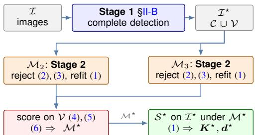

Fig. 1: The proposed pipeline. Stage 1 accepts images once and fixes the split. Stage 2 then runs inside each candidate order, so an order is scored together with the estimation set its own residual scale induces. The candidates meet only on the held-out V, which selects M⋆; Stage 2 is then rerun on all of I⋆.

residual, yet this reduction is an inherent property of fitting more parameters, not evidence of better prediction on unseen images. While production calibration controls data quality at collection through fixtures and prescribed orientations, field calibration with a hand-held board must assess quality from the collected data itself, where the only available quantity is the reprojection error, which cannot resolve either problem:

• Which images to estimate from. Per-view residuals are available only after a parameter has been estimated, and the views that should be removed have already displaced that calibration. A filtering criterion independent of the fit is therefore required first, after which the residual scale can be recomputed on the retained images.

• Which radial distortion order to adopt. Adding higher-order radial coefficients enlarges the parameter space, and the calibration-set residual can only decrease. This decrease is an inherent property of the least-squares formulation and cannot determine whether the added coefficients improve prediction on retained images.

The two problems are coupled through the residual. Rejecting views by their residuals requires a threshold defined relative to the residual scale, which is lower under a higher-order model because more parameters fit the same corners more closely. The retained image set therefore differs between candidate orders, and a set fixed in advance is consistent with neither. Existing calibration toolboxes leave both problems to the operator. The MATLAB Camera Calibrator [6] plots per-view errors, from which images are deleted and radial coefficients enabled manually; the ROS calibrator [7] provides no filtering stage and fixes a low-order distortion model irrespective of the data; mrcal requires the lens model to be specified [8]. Related automation addresses other stages of the calibration problem. Guided acquisition proposes target placements that improve observability [10]– [14], which concerns which images to capture. Closest to this work, a patent on planar-target calibration selects the optimal image combination under a fixed distortion model [15], but the distortion order itself remains predetermined.

## B. Contributions

The contributions of this paper are threefold:

• We present an automatic image-set selection method (Section II) for intrinsic calibration that iteratively rejects views whose residuals exceed a median-scaled threshold under each distortion order, so that the retained set is consistent with the residual scale.

• We introduce a distortion-order selection criterion (Section III) that evaluates each candidate on held-out images with the intrinsics and distortion fixed, avoiding the use of calibration-set residuals to assess model adequacy.

• We integrate both steps into an interactive calibration tool (Section IV) that supports full-pipeline data inspection and parameter estimation (Fig. 1).

## II. AUTOMATIC IMAGE SELECTION

## A. Calibration Formulation

Let $\mathcal { Z } ~ = ~ \{ 1 , \ldots , N \}$ index the acquired images, with image i contributing $N _ { i }$ calibration points $\mathbf { \Delta } \pmb { u } _ { i j }$ matched to target points $P _ { j }$ . Given intrinsics K, distortion d and board pose $\pmb { T } _ { i } \in \mathrm { S E } ( 3 )$ , the projection $\pi ( K , d , T _ { i } , P _ { j } )$ applies the Brown-Conrady model, mapping a normalized coordinate x with $\rho = \| { \pmb x } \| _ { 2 }$ to $\pmb { x } ( 1 + k _ { 1 } \rho ^ { 2 } + k _ { 2 } \rho ^ { 4 } + k _ { 3 } \rho ^ { 6 } ) + \pmb { t } ( \pmb { x } ; p _ { 1 } , p _ { 2 } )$ Calibration over $\mathcal { S } \subseteq \mathcal { Z }$ minimizes

$$
\operatorname* { m i n } _ { K , d , \{ T _ { i } \} } \sum _ { i \in \mathcal { S } } \sum _ { j = 1 } ^ { N _ { i } } \bigl \| { \pmb u } _ { i j } - \pi ( K , d , { \pmb T } _ { i } , { \pmb P } _ { j } ) \bigr \| _ { 2 } ^ { 2 } ,\tag{1}
$$

with per-view mean residual $\begin{array} { r l r } { \bar { e } _ { i } } & { { } = } & { N _ { i } ^ { - 1 } \sum _ { j } \| { \bf { u } } _ { i j } \ - \frac { } { } } \end{array}$ $\pi ( K , d , T _ { i } , P _ { j } ) \| _ { 2 }$ . The calibration-set error is evaluated on the images to estimate K, d. The held-out error is evaluated on excluded images with K, d fixed and only $\mathbf { \delta } _ { \mathbf { \mathcal { T } } _ { i } }$ reestimated.

## B. Stage 1: Detection-Based Acceptance

Sub-pixel corner extraction has been improved by dedicated detectors [16], [17] and by target designs that raise the precision of each junction [18]. In this work, the output of such a detector serves as the acceptance criterion of Stage 1: an image is admitted to the estimation only if the extractor [17] recovers the complete inner corner grid, which also excludes partial detections that associate different sub-grids across images. This criterion is operational: the extractor fails predominantly under motion blur and at extreme incidence, precisely the conditions under which corner extraction bias propagates into the shared intrinsics. The acceptance criterion applies only when at least max $( N _ { \mathrm { s t o p } } , N / 2 )$ images are retained; fewer indicates a problem with the target or the acquisition rather than with individual images.

## C. Stage 2: Iterative Robust Rejection

While Stage 1 filters images based on detection completeness, it does not identify images whose corners are extracted successfully but are geometrically inconsistent with the rest of the set. Such inconsistencies become visible only after an initial calibration, through the per-view residuals $\bar { e } _ { i } ,$ and removing them is the task of Stage 2. Following prior work on planar-target calibration [15], we iteratively reject images whose residual exceeds a threshold proportional to the median. Specifically, let $\boldsymbol { \mathcal { T } ^ { ( t ) } }$ denote the retained set at iteration t and $\mathbf { \widetilde { \boldsymbol { e } } } ^ { ( t ) } = \mathbf { \widetilde { \boldsymbol { e } } } ^ { \left( t \right) }$ med $\{ \bar { e } _ { i } \} _ { i \in \mathcal { I } ^ { ( t ) } }$ . Images are rejected by

$$
\tau ^ { ( t ) } = \kappa \tilde { e } ^ { ( t ) } , \qquad \kappa = 2 ,\tag{2}
$$

$$
\begin{array} { r } { \boldsymbol { { \mathcal { Z } } } ^ { ( t + 1 ) } = \{ ~ { \ i } \in { \mathcal { I } } ^ { ( t ) } ~ | ~ \bar { e } _ { i } ^ { ( t ) } \le { \tau } ^ { ( t ) } ~ \} , } \end{array}\tag{3}
$$

after which (1) is re-solved on $\mathcal { T } ^ { ( t + 1 ) }$ . Because $\tilde { e } ^ { ( t ) }$ is recomputed at each iteration, the threshold tightens as outlier views are removed, and also adapts to the candidate distortion order, since a higher-order model yields a lower residual scale. The robust scale estimate $\hat { \sigma } = 1 . 4 8 2 6$ · medi $( | \bar { e } _ { i } - $ e˜| [19] is evaluated as an alternative in Section V-B. The iteration terminates when no image exceeds $\tau ^ { ( t ) }$ , after at most $T _ { \mathrm { m a x } } ~ = ~ 3$ rounds, or when fewer than $N _ { \mathrm { { s t o p } } } = 8$ images remain. Crucially, this procedure runs independently under each candidate order, producing a model-conditioned estimation set $s _ { \mathcal { M } }$

## III. DISTORTION-MODEL SELECTION

## A. Candidate Models and Subsets

The comparison is restricted to the radial order: $\mathcal { M } _ { 2 } =$ $\{ k _ { 1 } , k _ { 2 } , p _ { 1 } , p _ { 2 } \}$ versus $\mathcal { M } _ { 3 } ~ = ~ \{ k _ { 1 } , k _ { 2 } , k _ { 3 } , p _ { 1 } , p _ { 2 } \}$ , the default choice in mainstream toolboxes. Rational and fisheye families [20], as well as formulations that unify several models [21], are beyond the scope of this work but compatible with the selection criterion below.

The set $\mathcal { T } ^ { \star }$ accepted by Stage 1 is split into an estimation subset $\mathcal { C }$ and a validation subset V by assigning every fifth image in capture order to V, distributing the validation views over the acquisition sequence and making the split deterministic. This split is applied only when $\left| \mathcal { T } ^ { \star } \right| \geq N _ { \operatorname* { m i n } } =$ 15; below this threshold $\mathcal { M } _ { 2 }$ is retained. Importantly, $\nu$ must be drawn from $\mathcal { T } ^ { \star }$ rather than from the images rejected at Stage 1: a validation subset with higher corner noise than the estimation subset would reflect its own extraction error rather than the distortion model, biasing the comparison toward the lower order (Section V-C).

## B. Pose-Only Validation and Criterion

For each candidate M, (1) is solved over C with the rejection of (3) applied internally, so that Stage 2 operates under the candidate model itself, yielding $( K _ { \mathcal { M } } , d _ { \mathcal { M } } )$ . The estimated intrinsics and distortion are then fixed, and only the board pose is re-estimated on each validation image by solving

$$
\hat { \pmb { T } } _ { i } ^ { \mathcal { M } } = \arg \operatorname* { m i n } _ { \pmb { T } \in \mathrm { S E } ( 3 ) } \sum _ { j = 1 } ^ { N _ { i } } \big \| \pmb { u } _ { i j } - \pi ( \pmb { K } _ { \mathcal { M } } , \pmb { d } _ { \mathcal { M } } , \pmb { T } , \pmb { P } _ { j } ) \big \| _ { 2 } ^ { 2 } ,\tag{4}
$$

OpenCV (640 × 480, 62°)  
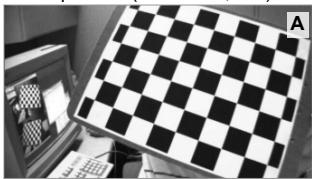  
ROS (640 × 480, 73°)

OpenCalib-F (1920 × 1200, 84°)  
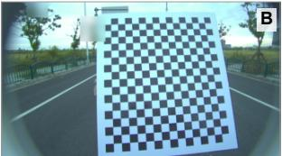

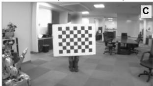

Rig-A / Rig-B (1920 × 1080, 111°)  
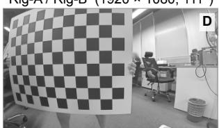  
Fig. 2: The four camera models evaluated, $6 2 ^ { \circ }$ to $1 1 1 ^ { \circ }$ diagonal field of view: (A) OpenCV, $9 \times 6$ board; (B) OpenCalib-F, $1 7 \times 1 5 ,$ the only outdoor scene; (C) ROS, $8 \times 6 ;$ (D) Rig-A/Rig-B, $1 1 \times 8 ,$ captured on our own rig.

for each $i \in \mathcal { V } ,$ , which is a perspective-n-point problem with six degrees of freedom and $2 N _ { i }$ measurements. Substituting $\hat { \pmb { T } } _ { i } ^ { \mathcal { M } }$ into $\bar { e } _ { i }$ yields per-view validation errors, summarized as

$$
\bar { e } _ { \mathrm { v } } ( \mathcal { M } ) = \frac { 1 } { | \mathcal { V } | } \sum _ { i \in \mathcal { V } } \bar { e } _ { i } ^ { \mathcal { M } } , \quad e _ { \mathrm { v } } ^ { \operatorname* { m a x } } ( \mathcal { M } ) = \operatorname* { m a x } _ { i \in \mathcal { V } } \bar { e } _ { i } ^ { \mathcal { M } } .\tag{5}
$$

By refitting only the six pose parameters with the intrinsics and distortion fixed, each candidate is evaluated on views that did not contribute to its estimation. Each order is compared together with the estimation set that its own residual scale induces, and the common validation subset V ensures that the comparison is controlled. Formally, $\mathcal { M } _ { 3 }$ is adopted if and only if

$$
\bar { e } _ { \mathrm { v } } ( M _ { 3 } ) \leq \alpha \bar { e } _ { \mathrm { v } } ( M _ { 2 } ) \mathrm { a n d } e _ { \mathrm { v } } ^ { \mathrm { m a x } } ( M _ { 3 } ) \leq \beta e _ { \mathrm { v } } ^ { \mathrm { m a x } } ( M _ { 2 } ) ,\tag{6}
$$

with $\alpha = 1$ and $\beta = 1$ , both evaluated on views excluded from the intrinsic estimation. That is, the higher order is adopted only when it degrades neither the mean nor the worst-case validation error, requiring that the added coefficients be supported by independent observations. Parity rather than a strict margin is used to avoid penalizing differences within the noise level of ${ \bar { e } } _ { \mathrm { v } } ;$ the sensitivity to α is examined in Section V-C. Once $\mathcal { M } ^ { \star }$ is determined, the rejection of Section II-C is rerun on the full accepted pool $\mathcal { T } ^ { \star }$ under $\mathcal { M } ^ { \star }$ , producing the final estimation set $S ^ { \star } \subseteq \mathbb { Z } ^ { \star }$ from which $( K ^ { \star } , d ^ { \star } )$ are obtained. The validation views enter the final estimate at this stage, and the views rejected in this pass are recorded alongside the rest.

## IV. INTERACTIVE CALIBRATION TOOL

The image filtering and distortion-order selection of Sections II and III introduce data-dependent decisions into the calibration procedure. To make these decisions transparent and reproducible, we implement the pipeline as an interactive offline tool whose workflow consists of three steps: importing an image folder, specifying the target geometry, and running the calibration. The tool displays the filtering status of every image and the distribution of calibration points, so that both decisions can be inspected within the interface (Supplement B, Fig. 6). The algorithmic core is independent of the interface and can be invoked from scripts; all results in Section V are produced in this way. In addition to the estimated parameters, the tool records the calibration provenance: the images retained and rejected at each stage with their residuals, the subsets C and V, the four quantities of (6) with the selected order, and the number of observations in the four 20% corner zones of the image.

## V. EXPERIMENTS

## A. Experimental Setup

Data. We evaluate on own cameras images and five public datasets, covering four camera models that span $6 2 ^ { \circ }$ to 111◦ diagonal field of view and 0.3 to 2.3 Mpx (Fig. 2). Rig-A, the primary dataset, contains 39 images captured handheld on a mobile mapping rig. Rig-B is a second camera of the same model, captured in two independent sessions. The public datasets are OpenCalib’s front camera [22] and the stereo pairs distributed with ROS and OpenCV. Chessboard specifications (inner corners, square size): Rig 11×8, 45 mm; OpenCalib-F $1 7 \times 1 5$ , 50 mm; ROS $8 \times 6 ,$ , 108 mm; OpenCV $9 \times 6 ,$ 30 mm.

Baselines. We compare against two toolboxes run with their default settings. The first is the MonoCalibrator of the ROS camera calibration package [7] (ROS-calib), which uses its own detector, sub-pixel refinement and frame acceptance at $- \mathbf { k } \ : 2 \ : \ : ( { \mathcal { M } } _ { 2 } )$ . The second is mrcal [8], which includes outlier rejection and a board-flex model; we apply it to the corners extracted in Section II-B at its documented 8-coefficient rational model, with the 4- and 5-coefficient variants included for the order comparison. Additionally, the proposed pipeline with both selections disabled, no image filtering and the order fixed at $\mathcal { M } _ { 2 }$ , serves as an ablation baseline. For the public datasets, we adopt a rotating four-fold holdout protocol: both selection stages, the order criterion and the final fit are computed within the calibration fold, ensuring that no held-out image informs the selection.

Metrics. In the absence of ground-truth intrinsics, reprojection error is the standard image-space metric [2], [14]: the calibration-set residual serves as a fit diagnostic, and the held-out error as the evaluation criterion. We report the mean corner error $\begin{array} { r } { { \bar { e } } = \operatorname* { m e a n } _ { i j } \| { \pmb u } _ { i j } - { \hat { \pmb u } } _ { i j } \| _ { 2 } } \end{array}$ , following the MATLAB convention. For Rig-A, V consists of the same six images throughout all experiments. With both selection stages disabled, the estimator reproduces the ROS calibrator to within 2.1 px on Rig-B, confirming that the improvements reported below originate from the selection method rather than from differences in the solver.

## B. Image Selection Analysis

This experiment evaluates the image filtering of Section II. Fig. 3 (left) summarizes the filtering outcome across all datasets. On Rig-A, Stage 1 rejects 12 of 39 images and Stage 2 rejects a further 7 under the final selected order; on OpenCalib-F, all 22 images pass both stages; on the remaining datasets, one to two images are rejected. The median per-view error of rejected images on Rig-A is 4.7 times that of the accepted ones, confirming that the filtering targets views most affected by systematic corner extraction error. Fig. 3 (right) compares four configurations on Rig-A under $\mathcal { M } _ { 2 } .$ , evaluated on the same six held-out images. Applying both stages reduces the held-out error from 0.419 to 0.316 px (25%), substantially more than the calibrationset reduction from 0.467 to 0.342 px. This asymmetry is expected: removing systematically biased views benefits the shared intrinsics more than it benefits the calibration-set residual, which is partially absorbed by the per-view pose parameters. The two stages serve complementary roles: without Stage 1, Stage 2 rejects only one image and the held-out error remains at 0.419 px, because high-residual views inflate the median on which the threshold depends. The median-scaled threshold of (2) is preferable to ${ \hat { \sigma } } ,$ which either retains all images or over-rejects (Supplement A).

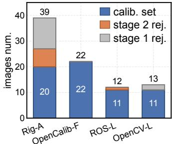

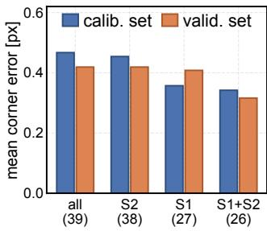

Fig. 3: Image selection. Left: images kept and rejected per stage; right stereo cameras omitted (identical to left). Right: calibration and validation mean corner error [px] of four Rig-A sets, M .  
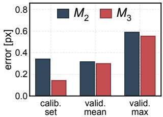

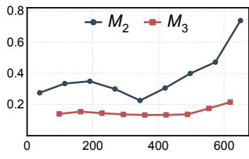  
Fig. 4: Distortion-order selection on Rig-A. Left: mean corner error [px] of both candidates on the calibration set and the validation views. Right: per-view residual against the radial distance r from the principal point, over the observed range.

## C. Distortion-Model Selection Analysis

This experiment evaluates the order selection criterion of Section III. Fig. 4 compares $\mathcal { M } _ { 2 }$ and $\mathcal { M } _ { 3 }$ on $\operatorname { R i g - A }$ The calibration-set error drops from 0.342 px under $\mathcal { M } _ { 2 }$ to 0.143 px under $\mathcal { M } _ { 3 } .$ , but this reduction conflates two effects: on the 26 images retained under $\mathcal { M } _ { 2 } .$ the additional coefficient alone reduces the error from 0.342 to 0.252 px; the remainder is attributable to the six further images rejected as the residual scale tightens under $\mathcal { M } _ { 3 }$ . Neither quantity can determine the order, as both are derived from the data that produced the fit. On the held-out views, the difference is 0.316 px versus 0.299 px, satisfying both conditions of (6) $( e _ { \mathrm { v } } ^ { \mathrm { m a x } } \colon 0 . 5 5 4 \ \leq \ 0 . 5 9 0 )$ . The order selection also shifts $f _ { x }$ by 11 px to 661.73 px. Repeating the split at all five offsets yields a consistently lower $\bar { e } _ { \mathrm { v } }$ under $\mathcal { M } _ { 3 }$ (mean difference $- 0 . 0 7 3 \pm 0 . 0 3 4 \mathrm { p x } ) ;$ the criterion adopts $\mathcal { M } _ { 3 }$ at four of five offsets. Setting $\alpha = 0 . 9 8$ instead of parity would reject $\mathcal { M } _ { 3 }$ on two OpenCalib-F folds whose improvement is only 1.2 and 1.3%, confirming that parity is appropriate at this noise level.

TABLE I: Held-out mean corner error [px] ↓ of each method on the five public datasets.
<table><tr><td rowspan=2 colspan=1>Method</td><td rowspan=2 colspan=1>OpenCalib-F</td><td rowspan=1 colspan=2>ROS</td><td rowspan=1 colspan=2>OpenCV</td></tr><tr><td rowspan=1 colspan=1>L</td><td rowspan=1 colspan=1>R</td><td rowspan=1 colspan=1>L</td><td rowspan=1 colspan=1>R</td></tr><tr><td rowspan=2 colspan=1>ROS-calibmrcal</td><td rowspan=1 colspan=1>0.232(18)</td><td rowspan=1 colspan=1>0.168(41)</td><td rowspan=1 colspan=1>0.157(34)</td><td rowspan=1 colspan=1>0.601(84)0</td><td rowspan=1 colspan=1>.665(101)</td></tr><tr><td rowspan=1 colspan=1>0.387(104)</td><td rowspan=1 colspan=1>0.231(77)0</td><td rowspan=1 colspan=1>.165(35)</td><td rowspan=1 colspan=1>0.243(50)</td><td rowspan=1 colspan=1>0.271(50)</td></tr><tr><td rowspan=2 colspan=1>ours w/o sel.ours</td><td rowspan=1 colspan=1>0.230(18)</td><td rowspan=1 colspan=1>0.167(40)</td><td rowspan=1 colspan=1>0.151(33)</td><td rowspan=1 colspan=1>0.234(51)</td><td rowspan=1 colspan=1>0.246(55)</td></tr><tr><td rowspan=1 colspan=1>0.226(21)</td><td rowspan=1 colspan=1>0.165(40)</td><td rowspan=1 colspan=1>0.148(34)</td><td rowspan=1 colspan=1>0.233(49)</td><td rowspan=1 colspan=1>0.240(58)</td></tr></table>

Note: parentheses give the fold-to-fold standard deviation in the last digit; lower is better $( { \dot { \downarrow } } ) { : }$ within each column, a darker cell marks a lower error, bold the best; “w/o sel.” disables selection.

The order criterion requires at least $N _ { \mathrm { m i n } }$ images per estimation fold, satisfied only by the two wider-field datasets. On OpenCalib-F, neither stage rejects any image, so the improvement is due to order selection alone: $\mathcal { M } _ { 3 }$ is selected on three of four folds, reducing the held-out error from 0.230 to 0.226 px; on the fourth fold the worst validation view degrades and $\mathcal { M } _ { 2 }$ is retained. The four narrower-field datasets fall below $N _ { \mathrm { m i n } }$ ; only image filtering contributes, reducing the held-out mean by 0.6 to 2.6%. In Fig. 4 (right), the per-view residual under $\mathcal { M } _ { 2 }$ increases from 0.23 to 0.74 px toward the image border while under $\mathcal { M } _ { 3 }$ it remains near 0.15 px, indicating under-modelling by $\mathcal { M } _ { 2 }$ . This holds only over the observed range: the calibration points extend to $r = 8 4 1 \mathrm { p x }$ versus $r = 1 1 2 6 \mathrm { p x }$ at the corner, where the two radial scale factors diverge by 21.2%.

## D. Comparison with Existing Methods

Table I reports the held-out error of each method on the five public datasets. The proposed pipeline achieves the lowest held-out mean on all five datasets. Since the foldto-fold standard deviation exceeds the difference between the full pipeline and the ablation, the paired per-fold difference is more discriminative: on OpenCalib-F it ranges from −6.3% to 0% across the four folds, with the three folds that adopt $\mathcal { M } _ { 3 }$ showing improvement and the remaining fold unchanged. The mrcal results corroborate the need for order selection. At 8 coefficients, mrcal achieves the lowest calibration-set residual of any configuration, yet its held-out error exceeds that at 4 coefficients by 7.6 to 63.3% across all five datasets, a direct instance of the overfitting described in Section I-A. On OpenCalib-F, the 5-coefficient model outperforms the 4-coefficient one, consistent with the criterion selecting $\mathcal { M } _ { 3 } .$ . On Rig-A, the proposed pipeline yields 0.143 px on the retained images, compared with 0.151 px for mrcal and 0.299 px for ROS-calib.

## VI. CONCLUSION

This paper presented a fully automatic camera intrinsic calibration pipeline that determines both the image set and the radial distortion order from the collected data, without relying on the calibration-set residual for either decision. Experiments on seven datasets across four camera models show that image filtering reduces the held-out error by up to 25%, with order selection providing further improvement.

Future work includes extending the candidate set to rational and fisheye distortion families and incorporating geometric coverage constraints into the filtering criterion.

## ACKNOWLEDGMENT

Generative AI tools were used to polish the wording of this manuscript and to assist the development of the graphical user interface of the calibration tool.

[1] X. Hu et al., “PALoc: Advancing SLAM benchmarking with priorassisted 6-DoF trajectory generation and uncertainty estimation,” IEEE/ASME Transactions on Mechatronics, vol. 29, no. 6, pp. 4297– 4308, 2024.

[2] T. Schops¨ et al., “Why having 10,000 parameters in your camera model is better than twelve,” in IEEE/CVF Conf. Comput. Vis. Pattern Recognit. (CVPR), 2020, pp. 2535–2544.

[3] X. Hu et al., “MapEval: Towards unified, robust and efficient SLAM map evaluation framework,” IEEE Robot. Autom. Lett., vol. 10, no. 5, pp. 4228–4235, 2025.

[4] Z. Zhang, “A flexible new technique for camera calibration,” IEEE Trans. Pattern Anal. Mach. Intell., vol. 22, no. 11, pp. 1330–1334, 2000.

[5] D. C. Brown, “Close-range camera calibration,” Photogramm. Eng., vol. 37, no. 8, pp. 855–866, 1971.

[6] The MathWorks, Inc., “Using the single camera calibrator app,” Comput. Vis. Toolbox Doc., https://www.mathworks.com/help/vision/ug/ using-the-single-camera-calibrator-app.html, 2026, accessed: 2026- 08-16.

[7] ROS Perception, “camera calibration,” ROS Wiki, http://wiki.ros.org/ camera calibration, accessed: 2026-08-16.

[8] D. Kogan, “mrcal: Camera-modeling toolkit,” https://mrcal. secretsauce.net, 2026, version 2.5.2, accessed: 2026-08-16.

[9] Z. Tang et al., “A precision analysis of camera distortion models,” IEEE Trans. Image Process., vol. 26, no. 6, pp. 2694–2704, 2017.

[10] A. Richardson et al., “AprilCal: Assisted and repeatable camera calibration,” in IEEE/RSJ Int. Conf. Intell. Robots Syst. (IROS), 2013, pp. 1814–1821.

[11] S. Peng and P. Sturm, “Calibration wizard: A guidance system for camera calibration based on modelling geometric and corner uncertainty,” in IEEE/CVF Int. Conf. Comput. Vis. (ICCV), 2019, pp. 1497–1505.

[12] M. Polic et al., “Uncertainty based camera model selection,” in IEEE/CVF Conf. Comput. Vis. Pattern Recognit. (CVPR), 2020, pp. 5991–6000.

[13] A. Hagemann et al., “Inferring bias and uncertainty in camera calibration,” Int. J. Comput. Vis., vol. 130, no. 1, pp. 17–32, 2022.

[14] C. Q. Nguyen and S. Choi, “Generalized camera calibration: Camera model selection and calibration with effective image sampling,” IEEE Sensors J., vol. 25, no. 15, pp. 29 124–29 140, 2025.

[15] U.S. Patent, “Method and apparatus for automatic intrinsic camera calibration using images of a planar calibration pattern,” U.S. Patents 10,269,140; 10,380,766; 10,706,588; 12,243,269, 2019–2025.

[16] S. Placht et al., “ROCHADE: Robust checkerboard advanced detection for camera calibration,” in Eur. Conf. Comput. Vis. (ECCV), 2014, pp. 766–779.

[17] A. Duda and U. Frese, “Accurate detection and localization of checkerboard corners for calibration,” in Brit. Mach. Vis. Conf. (BMVC), 2018.

[18] H. Ha et al., “Deltille grids for geometric camera calibration,” in IEEE/CVF Int. Conf. Comput. Vis. (ICCV), 2017, pp. 5354–5362.

[19] P. J. Rousseeuw and C. Croux, “Alternatives to the median absolute deviation,” J. Amer. Statist. Assoc., vol. 88, no. 424, pp. 1273–1283, 1993.

[20] J. Kannala and S. S. Brandt, “A generic camera model and calibration method for conventional, wide-angle, and fish-eye lenses,” IEEE Trans. Pattern Anal. Mach. Intell., vol. 28, no. 8, pp. 1335–1340, 2006.

[21] Y. Lochman et al., “BabelCalib: A universal approach to calibrating central cameras,” in IEEE/CVF Int. Conf. Comput. Vis. (ICCV), 2021, pp. 15 233–15 242.

[22] G. Yan et al., “OpenCalib: A multi-sensor calibration toolbox for autonomous driving,” Softw. Impacts, vol. 14, p. 100393, 2022.

Algorithm 1 Image and distortion-order selection   
Require: I, target geometry, $\kappa , \alpha , \beta , N _ { \mathrm { m i n } } , N _ { \mathrm { s t o p } } , T _ { \mathrm { m a x } }$   
1: $\mathbf { \bar { \mathcal { A } } }  \{ i \in \breve { \mathbb { Z } } \mid$ complete detection by [17] } {§II-B}   
2: $\mathcal { T } ^ { \star } \gets \dot { \mathcal { A } } \operatorname { i f } | \dot { \mathcal { A } } | \geq \dot { \operatorname* { m a x } } ( N _ { \mathrm { s t o p } } , | \mathcal { T } | / \dot { 2 } )$ , else all detected images   
3: if $\lvert \mathcal { T } ^ { \star } \rvert \ge N _ { \operatorname* { m i n } }$ then   
4: ${ \boldsymbol \nu } \gets { \boldsymbol \mathbb { Z } _ { 0 : : 5 } ^ { \star } }$ ${ \mathcal { C } } \gets { \mathcal { I } } ^ { \star } \setminus \mathcal { V }$ {§III-A}   
5: for all $\mathcal { M } \in \{ \mathcal { M } _ { 2 } , \mathcal { M } _ { 3 } \}$ do   
6: $( K _ { \mathcal { M } } , { \pmb d } _ { \mathcal { M } } )  \hat { \mathrm { S E L E C T } } ( \mathcal { C } , \mathcal { M } )$   
7: $( \bar { e } _ { \mathrm { v } } , e _ { \mathrm { v } } ^ { \mathrm { m a x } } ) ( \mathcal { M } ) \gets ( 4 ) , ( \dot { 5 } )$ on V   
8: end for   
9: $\mathcal { M } ^ { \star }  \mathcal { M } _ { 3 }$ if (6), else $\mathcal { M } _ { 2 }$   
10: else   
11: $\mathcal { M } ^ { \star }  \mathcal { M } _ { 2 }$   
12: end if   
13: return SELECT $( \mathbf { \mathcal { T } ^ { \star } } , \mathbf { \mathcal { M } ^ { \star } } )$ and the calibration record   
14:   
15: function SELECT(S, M)   
16: repeat solve (1) on S under M; $S ^ { \prime }  ( 2 ) ,$ (3); if ${ \boldsymbol { S } } ^ { \prime } = { \boldsymbol { S } }$   
or $| \dot { S ^ { \prime } } | < N _ { \mathrm { s t o p } }$ break else $s  s ^ { \prime }$   
17: until $T _ { \mathrm { m a x } }$ rounds; return $( K , d )$ on S

calib. set stage 2 rej. stage 1 rej.   
per-view error [px] 10   
0.1   
10 20 30 39  
Fig. 5: Per-view residual of all 39 Rig-A images, under the final model and colored by selection result. Dashed: median of the calibration set; dotted: rejection threshold $\tau = 2 \tilde { e } .$

This supplementary material presents the complete pipeline and the per-view filtering statistics (A), and describes the software implementation (B). The tool, the data and the scripts that reproduce every number in the paper will be released; the repository is withheld during review.

## A. Complete Pipeline

Algorithm 1 presents the complete pipeline, including the fallback criterion that retains $\mathcal { M } _ { 2 }$ when the accepted set is too small to split. Fig. 5 shows the per-view residuals of all 39 Rig-A images under the final model, alongside the filtering outcome. Replacing the median-scaled threshold of (2) by e˜+λσˆ leaves the retained set unchanged for $\lambda \geq 3 ;$ for $\lambda \ \leq 2 .$ , only 9 to 13 of the 21 estimation images are retained and the held-out error degrades to 0.409 px. The twelve images rejected by Stage 1 have a median residual 4.7 times that of the accepted ones, and the seven rejected by Stage 2 are those exceeding $\tau = \kappa \tilde { e }$ after the residual scale has been recomputed on the set that Stage 1 retained.

## B. Software Implementation

Fig. 7 illustrates the four layers of the tool. The core layer implements corner extraction (Section II-B), both selection stages (Sections II-B–II-C), the estimation (1) and the order criterion (6). The session layer manages the dataset and delegates computation to a worker thread. The interface layer (Fig. 6) exposes three panels: an image list showing the selection status of every frame, a calibration-point view with the per-zone corner counts, and a board and model panel with the estimated parameters. Images rejected at Stage 1 are redetected with the OpenCV corner extractor, using a sub-pixel refinement window of 0.35 times the median corner spacing, so that they appear in the diagnostic views without entering the estimation. The core can also be imported independently of the interface, which is how the experiments of Section V invoke the same functions in headless mode.

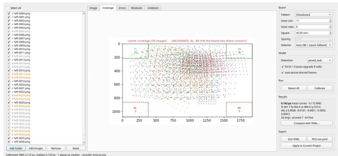  
Fig. 6: Interface on Rig-A after calibration. Left: image list, with images rejected at Stage 1 greyed out and those rejected at Stage 2 marked in orange. Center: calibration points and cornerzone counts. Right: board and model settings with the estimated parameters. The status bar reports the residual and the number of views exceeding κe˜.

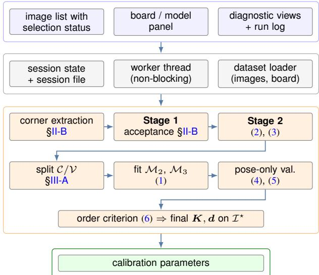  
Fig. 7: Software layers. The core reproduces a calibration; the session and interface layers add the diagnostics and the results.