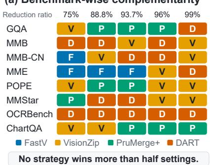
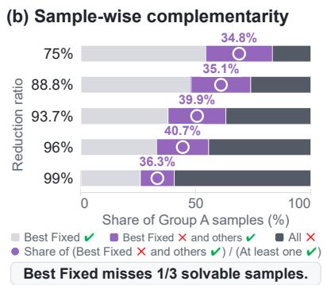
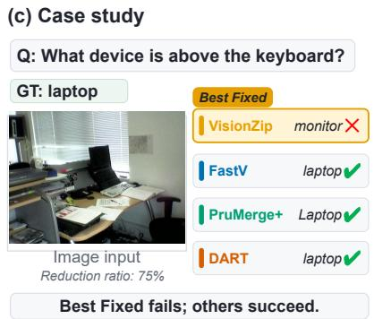
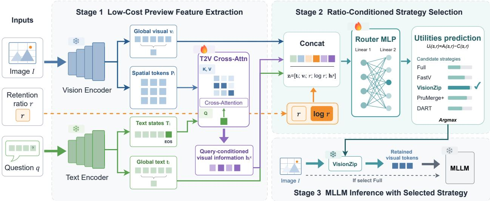
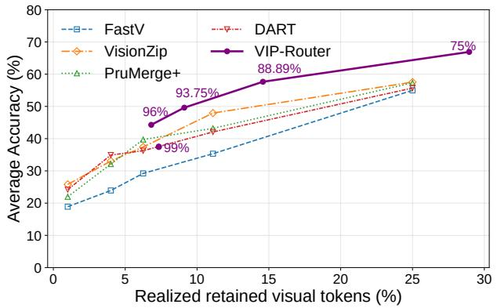
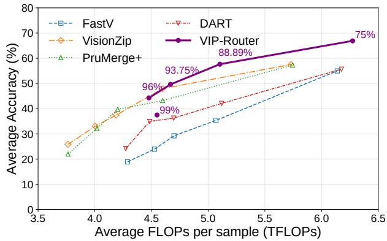
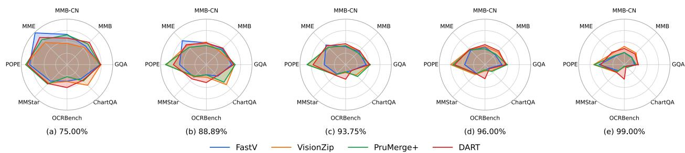
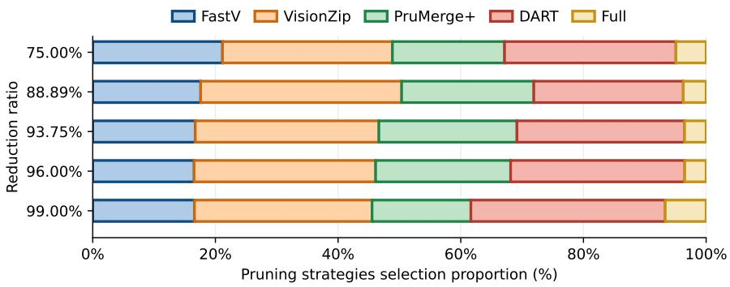

# Beyond One-Size-Fits-All: Sample-Adaptive Strategy Routing for Vision Token Pruning in MLLMs

Haiji Liang1,∗,† Pengfei Zhou1,2,∗,† Zhenglin Wan1 Wei Wang3 Yang You1,‡ Wangbo Zhao3,‡

1National University of Singapore 2InfRec, Cardinal AI Lab

3The Hong Kong University of Science and Technology

∗Equal contribution † Project leads ‡Corresponding authors

Abstract Multimodal large language models (MLLMs) process hundreds or thousands of visual tokens per image, incurring prohibitive inference costs. While existing vision token pruning methods mitigate this overhead, they implicitly assume that a single fixed pruning strategy can be applied uniformly across all inputs. Our analysis further reveals that ranking pruning methods by average benchmark accuracy conceals substantial sample-wise complementarity: although the average-best strategy excels overall, alternative strategies prove superior on a significant fraction of individual samples. To harness this diversity, we propose VIP-Router, a lightweight VIsion Pruning Router that adaptively selects the pruning strategy predicted to be best suited to each input at a specified pruning level. Conditioned on low-cost visual and textual features, VIP-Router identifies the most suitable candidate strategy while retaining full-token inference as an option when pruning is predicted to be unfavorable. Evaluated on a curated suite of pruning-sensitive visual perception benchmarks, VTC-Bench Group A, VIP-Router consistently outperforms the best fixed strategy baseline across all reduction ratios, achieving a 26.9% relative improvement in average accuracy, and a 22.0% relative increase in average utility after accounting for realized token cost. Crucially, VIP-Router operates in a plug-and-play manner without modifying underlying pruning algorithms or model weights, introducing trainable parameters equivalent to merely 0.017% of the backbone. Furthermore, VIP-Router proves efective across various MLLM backbones and yields consistent gains on unseen benchmarks, highlighting the potential of sample adaptive routing for visual token pruning.

## 1. Introduction

Multimodal large language models (MLLMs) have demonstrated impressive capabilities across a broad spectrum of vision-language tasks [2, 16, 20, 28, 40]. However, the high computational cost of processing visual tokens remains a critical bottleneck for their practical deployment: an image can introduce hundreds or even thousands of tokens into the language model, dominating both memory and latency [12]. To alleviate this overhead, vision token pruning has emerged as a mainstream and efective approach [6, 26, 29, 32]. These methods leverage diverse signals, including attention scores [6], token importance [32], and semantic similarity [26], to identify and drop redundant tokens.

Yet, VTC-Bench [19] shows that benchmarks commonly used to evaluate pruning methods were designed for general perception rather than specifically stress-testing vision token pruning. On the pruning-sensitive VTC-Bench Group A (samples answered correctly with full tokens but incorrectly after equivalent-ratio downsampling), we observe that no single pruning strategy dominates across all benchmarks: as shown in Figure 1 (a), diferent strategies excel on diferent tasks, indicating a non-

(a) Benchmark-wise complementarity

  
Figure 1 | (a) The accuracy-best strategy varies across the full VTC-Bench Group A and reduction ratios, with no strategy winning more than half of the 40 benchmark-ratio settings. (b) At each reduction ratio, the stacked bars split Group A samples into those answered correctly by Best Fixed, those missed by Best Fixed but answered correctly by another strategy, and those missed by all strategies. Purple dots report the fraction of samples solvable by at least one strategy that are wrong with Best Fixed, which exceeds one-third at every ratio. (c) In this example, Qwen2-VL yields contrasting predictions across diferent pruning strategies, illustrating their inherent complementarity.

trivial degree of complementarity. More critically, beyond this benchmark-level divergence, ranking pruning methods solely by average benchmark performance further obscures the complementarity at the sample level. Among samples for which at least one pruning strategy succeeds, over onethird are cases where Best Fixed (the best fixed pruning method) fails but an alternative strategy answers correctly (Figure 1 (b)). Consequently, the strategy that performs best on average can still be suboptimal for a substantial fraction of individual inputs. In short, average-best does not imply sample-best.

Therefore, rather than designing yet another heuristic to chase higher average performance, we treat this complementarity as an untapped source of improvement and exploit it through sample-adaptive selection. The primary challenge is that the sample-best choice is defined by the inference outcome, which is inherently unavailable beforehand; identifying it exactly would require executing multiple candidate strategies and comparing their respective outputs, thereby defeating the very computational savings that pruning is intended to provide. Yet, intuitively, the suitability of a pruning strategy should depend on the visual and linguistic characteristics of the current input. Our key finding is that low-cost visual and textual features already provide informative signal to predict strategy suitability.

To this end, we propose VIsion Pruning Router (VIP-Router), a lightweight, plug-and-play module compatible with existing pruning methods. VIP-Router constructs a query-conditioned preview representation from visual and textual features using text-to-vision cross-attention, and uses a ratioconditioned utility predictor to score each candidate option. At inference time, only the highestscoring option is executed, with full-token inference included as an explicit candidate when pruning is predicted to be unfavorable.

In our evaluations, VIP-Router consistently outperforms the best fixed pruning strategies across all five reduction ratios on VTC-Bench Group A. Accounting for its realized token cost, VIP-Router improves average utility from 30.88 to 37.68, corresponding to a 22.0% relative improvement over Best Fixed; meanwhile, average accuracy increases from 40.35% to 51.19%, a 26.9% relative gain. These gains require no modification to either the candidate pruning methods or the underlying MLLM computation pipeline, while VIP-Router adds only about 1.4M trainable parameters, approximately 0.017% of the MLLM parameters.

Our main contributions are summarized as follows:

• We characterize the sample-level complementarity among existing vision token pruning strategies on pruning-sensitive benchmarks, revealing substantial per-sample suboptimality masked by standard aggregate protocols.

• We introduce VIP-Router, a plug-and-play router that uses low-cost features to predict perstrategy utility conditioned on the pruning level while retaining full-token inference as an option when pruning is unfavorable.

• Extensive experiments establish consistent cost-aware accuracy gains across pruning levels, applicability across diferent MLLM backbones, and positive zero-shot transfer to unseen benchmarks.

## 2. Related Work

## 2.1. Vision Token Pruning for MLLMs

Vision token pruning is a widely studied approach to improving MLLM eficiency by removing or consolidating redundant visual tokens before or within the language model. Existing methods primarily difer in the criterion used to identify which visual information should be retained. Attentionbased methods such as FastV and PruMerge exploit attention signals from the language model or visual encoder to identify salient tokens [6, 26], while FitPrune [33] derives pruning configurations by matching attention statistics before and after pruning. Other methods explicitly target redundancy among visual representations: VisionZip [32] preserves dominant tokens while compressing contextual ones, DivPrune [1] promotes diversity among retained tokens, and DART [29] removes tokens according to their duplication with representative pivots. Recent work has also examined failure modes of pruning; for example, RVIS [13] adapts pruning during decoding in response to changes in task-relevant visual information.

Despite these diferences, existing approaches fundamentally rely on a single fixed pruning criterion for all inputs. VIP-Router instead treats existing pruning strategies as complementary candidates and performs sample-level selection among them.

## 2.2. Adaptive Inference for Eficient MLLMs

Adaptive inference methods adjust MLLM computation according to the input or runtime eficiency requirements rather than using a single fixed inference configuration [38]. One line of work adapts the amount or location of token computation. Dynamic-LLaVA [9] sparsifies visual and linguistic contexts during prefill and decoding; ATP-LLaVA and SparseVLM [34, 36] determine input- or layer-dependent visual-token retention ratios; and AIM [37] combines pre-LLM merging with progressive in-LLM pruning to support diferent eficiency requirements. $\bar { \mathrm { F } ^ { 3 } } \mathrm { A }$ [10] further uses question-conditioned signals to adapt visual-token allocation at a specified pruning level. Another line adapts the visual representation or compression pathway. $\mathrm { ~ M } ^ { 3 }$ [3] constructs nested representations at multiple visualtoken granularities, while MQT [8] produces diferent numbers of visual tokens with a shared query transformer. AdaLLaVA [31] operates at a broader structural level by dynamically reconfiguring MLLM computation under runtime latency constraints. Most closely related to VIP-Router, QMoP [18] uses a query-guided router over pooling-, resampler-, and pruning-based compression branches. However, QMoP jointly learns specialized compression branches and fuses their output representations, potentially with minor performance degradation, whereas VIP-Router leaves existing pruning operators unchanged and makes a discrete selection among of-the-shelf strategies.

Overall, prior adaptive methods primarily vary the amount or location of computation, the granularity of visual representations, or the compression pathway. VIP-Router operates on a diferent adaptation axis: which pruning criterion to apply to each sample at a specified pruning level.

## 3. Vision Pruning Router

## 3.1. Overview

VIP-Router implements sample-level pruning strategy selection through three components: frozen visual and textual preview encoders, a text-to-vision cross-attention module, and a ratio-conditioned MLP utility predictor. As illustrated in Figure 2, the lightweight encoders provide global and tokenlevel representations, cross-attention extracts query-conditioned visual information, and the MLP jointly estimates the utility of all candidate strategies at the given pruning ratio. The following sections (3.2-3.4) detail the routing objective, preview representation, and utility predictor.

## 3.2. Problem Formulation

We follow the Group A setting of VTC-Bench [19], where full-token inference is correct and the equivalent-ratio image-downsampling baseline fails. Given a sample $x _ { i } = \left( I _ { i } , q _ { i } \right)$ , we select a strategy from S = {Full, FastV, VisionZip, PruMerge+, DART}. The candidate Full retains all visual tokens, while the remaining candidates apply existing pruning rules.

Let $r \in ( 0 , 1 ]$ denote the retained-token ratio used by the compressed candidates; the corresponding reduction ratio is $1 - r .$ . Here, � specifies the target pruning operating point rather than a hard per-sample token constraint, since VIP-Router may select Full when pruning is unfavorable. For strategy $s ,$ let $a _ { i } ^ { s } \in \{ 0 , 1 \}$ indicate whether the MLLM answers sample � correctly.

We define

$$
U _ { i } ( s , r ) = a _ { i } ^ { s } - c ( s , r ) , \qquad c ( s , r ) = \left\{ { 1 , } \quad s = \mathrm { F u l l } , \right.\tag{1}
$$

Under Group $\mathsf { A } ,$ this objective ranks a correctness-preserving compressed strategy above Full, and Full above an incorrect compressed strategy, thereby providing a cost-aware no-pruning option.

The oracle sample-level decision is

$$
s _ { i } ^ { \star } = \arg \operatorname* { m a x } _ { s \in S } U _ { i } ( s , r ) .\tag{2}
$$

At test time, these utilities are unknown. We therefore learn a router $g _ { \theta }$ that jointly predicts the utility of all candidates:

$$
\hat { \mathbf { u } } _ { i } = g _ { \theta } ( I _ { i } , q _ { i } , r ) , \qquad \hat { s } _ { i } = \arg \operatorname* { m a x } _ { s \in S } \hat { u } _ { i , s } .\tag{3}
$$

## 3.3. Cross-Modal Preview Representation

We instantiate the preview representation using frozen CLIP visual and text encoders. For image $I _ { i } ,$ we extract penultimate-layer visual representations, yielding spatial patch features $\mathbf { P } _ { i } ,$ whose mean gives the global visual feature $\mathbf { v } _ { i }$ . For question $q _ { i . }$ , the text encoder produces token representations $\mathbf { T } _ { i }$ and a global text representation $\mathbf { t } _ { i } .$

While $\mathbf { v } _ { i }$ and $\mathbf { t } _ { i }$ provide low-cost global summaries, direct concatenation captures only coarse crossmodal interaction. We therefore introduce a lightweight text-to-vision cross-attention module. After projecting both modalities to a common dimension, the text tokens query the spatial visual features:

$$
\mathbf { H } _ { i } = \mathbf { M H A } \left( \boldsymbol { Q } = \mathbf { T } _ { i } \mathbf { W } _ { T } , K = \mathbf { P } _ { i } \mathbf { W } _ { P } , V = \mathbf { P } _ { i } \mathbf { W } _ { P } \right) .\tag{4}
$$

  
Figure 2 | Overview of VIP-Router. Frozen visual and textual preview features, together with query-conditioned cross-modal features and the retained-token ratio, are used to predict the utility of each candidate pruning strategy and Full.

We take the cross-attended EOS representation $\mathbf { h } _ { i } ^ { \times } = \mathbf { H } _ { i , \mathrm { E O S } }$ as a compact query-conditioned visual summary. The resulting representation therefore captures global question semantics, global visual content, and query-conditioned visual information.

## 3.4. Ratio-Conditioned Utility Routing

Training a separate router for each retained-token ratio would cause the number of routers to scale linearly with the number of supported ratios. We instead share a single router across all ratios and explicitly condition it on �. The final router representation is

$$
{ \bf z } _ { i } = \left[ { \bf t } _ { i } ; { \bf v } _ { i } ; r ; \log r ; { \bf h } _ { i } ^ { \times } \right] .\tag{5}
$$

A two-layer MLP maps $\mathbf { z } _ { i }$ to a utility estimate for each candidate strategy. Predicting utility rather than correctness directly aligns the routing decision with the cost-aware objective in Equation 1, providing a common score for ranking candidates across retained-token ratios.

Training uses ofline per-strategy correctness labels. For each available sample–ratio pair, these labels are converted into the utility target

$$
\mathbf { U } _ { i } = [ U _ { i } ( s _ { 1 } , r ) , \ldots , U _ { i } ( s _ { K } , r ) ] ^ { \top } .
$$

For stable optimization, we standardize each candidate’s utility targets using training-set statistics and regress the resulting targets $\widetilde { \mathbf { U } } _ { i }$ ; predictions are transformed back to raw utility before strategy selection. The complete standardization procedure is provided in Appendix A.3.2. We optimize the router using an element-wise Huber loss:

$$
\mathcal { L } ( \theta ) = \frac { 1 } { N K } \sum _ { i = 1 } ^ { N } \sum _ { k = 1 } ^ { K } \ell _ { \mathrm { H u b e r } } \left( \widehat { \widetilde { u } } _ { i , k } , \widetilde { U } _ { i , k } \right) .\tag{6}
$$

Only the feature projections, cross-attention module, and utility predictor are updated; the preview encoders and MLLM remain frozen. At inference time, VIP-Router predicts candidate utilities at the

specified retained-token ratio, selects the highest-utility candidate, and applies the selected strategy within the unchanged MLLM in a single forward pass.

## 4. Experiments

## 4.1. Experimental Setup

Backbone and candidate pruning strategies. Following VTC-Bench [19], we use Qwen2-VL-7B [28] as the backbone MLLM in our main experiments. We adopt the four pruning implementations released by VTC-Bench: FastV [6], VisionZip [32], PruMerge+ [26], and DART [29]. All implementations and pruning hyperparameters are used without modification. Full-token inference is included as an additional candidate for VIP-Router, as defined in Section 3.2.

Data construction and splits. VTC-Bench [19] constructs its pruning-sensitive Group A evaluation set from eight established benchmarks: GQA [11], MMBench and MMBench-CN [22], MME [7], POPE [17], MMStar [5], OCRBench [21], and ChartQA [24]. For each reduction ratio, Group A contains samples that are answered correctly with full-token inference but incorrectly after equivalentratio image downsampling. We construct the routing dataset from the correctness labels released by VTC-Bench and partition unique image–question records into training, validation, and test sets with a 70/15/15 split. All ratio-specific examples derived from the same image–question record remain in the same split. For each available sample–ratio example in the training set, the correctness vector over candidate strategies is converted into the utility target defined in Equation 1. The same split is used throughout all experiments, and the main results are reported on the held-out test set.

Baselines and evaluation metrics. We compare VIP-Router with each of the four pruning strategies applied uniformly to all test samples. We additionally report Best Fixed, which selects a single pruning strategy on the training split by maximizing average utility jointly over all training samples and reduction ratios, and then applies the same strategy to all test samples and ratios. The Per-Sample Oracle selects the highest-utility strategy using ground-truth test labels and serves only as an unattainable upper bound. We report Accuracy, normalized Token Cost, Utility, and Oracle Headroom Recovery (OHR). Accuracy measures the fraction of correctly answered Group A samples. Token Cost is the realized average fraction of retained visual tokens after strategy selection; because VIP-Router may select Full, its realized Token Cost can exceed the retained-token ratio of the compressed candidates. Utility averages the sample-level objective in Equation 1. OHR measures the fraction of the available sample-level utility headroom recovered by VIP-Router:

$$
\mathrm { O H R } = \frac { U _ { \mathrm { V I P - R o u t e r } } - U _ { \mathrm { b e s t - f i x e d } } } { U _ { \mathrm { o r a c l e } } - U _ { \mathrm { b e s t - f i x e d } } } \times 1 0 0 \% .\tag{7}
$$

Higher OHR indicates that VIP-Router recovers a larger fraction of the utility gap between Best Fixed and the Per-Sample Oracle.

Router training. Unless otherwise stated, we use the CLIP-based router configuration described in Section 3.3. Only the feature projections, cross-attention layer, and utility prediction head are optimized; the backbone MLLM and preview encoders remain frozen. We train VIP-Router using AdamW with a learning rate of $1 0 ^ { - 3 }$ , a batch size of 256, and at most 50 epochs, and select the checkpoint with the highest validation macro utility. Additional optimization, implementation, hardware, and runtime details are provided in Appendix A.3.

Table 1 | Cost-aware comparison of Best Fixed, VIP-Router, and the Per-Sample Oracle across reduction ratios on VTC-Bench Group A test set. VIP-Router results are averaged over five random seeds, whereas Best Fixed and the Per-Sample Oracle are deterministic. Best Fixed uses a single pruning strategy selected jointly over all source-training samples and ratios. For Best Fixed, Token Cost equals the exact retained-token ratio �. VIP-Router may select Full, and therefore its realized Token Cost can exceed �. Accuracy and utility are multiplied by 100 for reporting; token cost remains on the [0, 1] scale. The best pruning result at each ratio is bolded.
<table><tr><td rowspan="2">Reduction Ratio</td><td colspan="3">Oracle</td><td colspan="3">Best Fixed VisionZip</td><td colspan="3">VIP-Router</td><td rowspan="2">OHR</td></tr><tr><td>Acc.</td><td>Cost</td><td>Utility</td><td>Acc.</td><td>Cost</td><td>Utility</td><td>Acc.</td><td>Cost</td><td>Utility</td></tr><tr><td>75.00%</td><td>100.00</td><td>0.351</td><td>64.91</td><td>57.54</td><td>0.250</td><td>32.54</td><td>66.91</td><td>0.287</td><td>38.23</td><td>17.58%</td></tr><tr><td>88.89%</td><td>100.00</td><td>0.353</td><td>64.70</td><td>47.94</td><td>0.111</td><td>36.83</td><td>57.65</td><td>0.144</td><td>43.24</td><td>23.00%</td></tr><tr><td>93.75%</td><td>100.00</td><td>0.390</td><td>61.02</td><td>37.42</td><td>0.063</td><td>31.17</td><td>49.62</td><td>0.095</td><td>40.08</td><td>29.85%</td></tr><tr><td>96.00%</td><td>100.00</td><td>0.460</td><td>53.96</td><td>33.05</td><td>0.040</td><td>29.05</td><td>44.29</td><td>0.073</td><td>36.95</td><td>31.71%</td></tr><tr><td>99.00%</td><td>100.00</td><td>0.586</td><td>41.40</td><td>25.82</td><td>0.010</td><td>24.82</td><td>37.48</td><td>0.076</td><td>29.89</td><td>30.58%</td></tr></table>

Table 2 | Average accuracy (%) on VTC-Bench Group A test set across visual-token reduction ratios. Full has 100% accuracy by the construction of Group A and is shown only as a reference. VIP-Router results are averaged over five random seeds, whereas fixed-strategy results are deterministic.
<table><tr><td>Method</td><td>75.00%</td><td>88.89%</td><td>93.75%</td><td>96.00%</td><td>99.00%</td></tr><tr><td>Full</td><td>100.00</td><td>100.00</td><td>100.00</td><td>100.00</td><td>100.00</td></tr><tr><td>FastV</td><td>54.99</td><td>35.33</td><td>29.22</td><td>23.92</td><td>18.89</td></tr><tr><td>VisionZip</td><td>57.54</td><td>47.94</td><td>37.42</td><td>33.05</td><td>25.82</td></tr><tr><td>PruMerge+</td><td>57.31</td><td>43.20</td><td>39.73</td><td>32.12</td><td>21.98</td></tr><tr><td>DART</td><td>55.68</td><td>42.07</td><td>36.26</td><td>34.91</td><td>24.18</td></tr><tr><td>VIP-Router</td><td>66.91</td><td>57.65</td><td>49.62</td><td>44.29</td><td>37.48</td></tr></table>

## 4.2. Main Results

Cost-aware performance. Table 1 shows that VIP-Router consistently improves over Best Fixed even after accounting for its realized visual-token cost. Averaged across the five reduction ratios, utility increases from 30.88 to 37.68, corresponding to a 22.0% relative improvement. The gain holds at every reduction ratio, ranging from 5.07 to 8.91 utility points over Best Fixed. As a stronger ratio-wise reference, the strongest fixed method itself varies with the pruning level: PruMerge+ achieves the highest fixed-strategy utility at 93.75% reduction and DART at 96.00%, while VisionZip leads at the remaining ratios. VIP-Router nevertheless exceeds this fixed-method envelope at every ratio. Relative to the Per-Sample Oracle, VIP-Router recovers 17.6–31.7% of the available utility headroom across the five ratios, with a macro-average OHR of 26.5%. The improvement is also not primarily attributable to full-token inference. Although VIP-Router may select Full when pruning is predicted to be unfavorable, its realized Token Cost is explicitly charged in utility, and Full accounts for only 3.48–6.66% of routing decisions across the five ratios (Figure 5 in Appendix A). Moreover, a worst-case counterfactual bounds the contribution of the full-token option to at most 0.41 utility points on average, or 6.1% of the observed utility gain over Best Fixed (Remark 1). Thus, the improvement arises predominantly from sample-adaptive selection among pruning strategies rather than from additional use of full-token inference.

  
(a) Accuracy versus realized token cost.

  
(b) Accuracy versus total inference FLOPs.  
Figure 3 | Accuracy–eficiency comparison between fixed pruning strategies and VIP-Router. Point labels indicate prescribed reduction ratios. The total inference FLOPs include both routing overhead and the computation of the selected pruning strategy.

Table 3 | Parameter overhead and performance of the default VIP-Router and its native-feature variants. Extra frozen parameters include modules loaded exclusively for routing beyond Qwen2-VL; reused native MLLM components are excluded. Percentages are relative to Qwen2-VL parameters. All variants are single-run results.
<table><tr><td>Vision Features</td><td>Text Features</td><td>Cross Attn.</td><td># Extra Frozen Params</td><td># Trainable Params</td><td>Acc.</td><td>Utility</td></tr><tr><td>CLIP ViT-B/32</td><td>CLIP Text</td><td>Yes</td><td>151.28 M (1.82%)</td><td>1.38 M (0.017%)</td><td>51.51</td><td>38.09</td></tr><tr><td>Native ViT</td><td>CLIP Text</td><td>Yes</td><td>63.43 M (0.77%)</td><td>1.78 M (0.021%)</td><td>51.57</td><td>37.98</td></tr><tr><td>Native ViT</td><td>Native LM</td><td>Yes</td><td>0.00 M (0.00%)</td><td>4.13 M (0.050%)</td><td>51.86</td><td>37.37</td></tr><tr><td>Native ViT</td><td>CLIP Text</td><td>No</td><td>63.43 M (0.77%)</td><td>0.92 M (0.011%)</td><td>50.47</td><td>37.19</td></tr><tr><td>Native ViT</td><td>Native LM</td><td>No</td><td>0.00 M (0.00%)</td><td>2.49 M (0.030%)</td><td>52.21</td><td>37.62</td></tr></table>

Accuracy across reduction ratios and benchmarks. VIP-Router also achieves the highest average accuracy at every reduction ratio, as shown in Table 2. Compared with Best Fixed, it improves accuracy by at least 9.37 points at each ratio and increases the average accuracy across the five ratios from 40.35% to 51.19%, corresponding to a 26.9% relative improvement. The relative gain becomes particularly pronounced under aggressive pruning, reaching 45.2% at 99% token reduction. The improvement is also broadly distributed across tasks: VIP-Router achieves the best pruning result in 30 of the 40 benchmark–ratio combinations (75.0%); the full per-benchmark breakdown is provided in Appendix A.5.1.

## 4.3. Eficiency Analysis

Accuracy–eficiency trade-of. Figure 3 compares VIP-Router with fixed pruning strategies from two complementary perspectives: prescribed pruning level and realized computation. As shown in Figure 3a, VIP-Router achieves higher accuracy than the fixed strategies across most of the evaluated reduction range. Figure 3b further accounts for the FLOPs of both routing and the selected pruning method; VIP-Router remains above the fixed-strategy curves over most of the evaluated compute range beyond approximately 4.5 TFLOPs. Together, these results show that the accuracy gains of VIP-Router persist after accounting for its additional routing computation. The most aggressive 99% reduction setting behaves diferently. At this pruning level, VIP-Router more frequently selects the full-token option for samples predicted to be unfavorable for pruning, increasing its realized

Table 4 | Evaluation of VIP-Router across MLLM backbones and zero-shot transfer to unseen benchmarks. In panel (a), the pruning strategy selected by Best Fixed is shown after each MLLM name. The constant Best Fixed Cost of 0.095 is the macro-average retained-token ratio over the five evaluated pruning levels $( \bar { r } = 0 . 0 9 4 7 )$ . Parenthesized percentages report OHR, which is also macro-averaged across the five reduction ratios.
<table><tr><td>Method</td><td>Acc.</td><td>Cost</td><td>Utility (OHR)</td></tr><tr><td colspan="4">LLaVA-1.5-7B (PruMerge+)</td></tr><tr><td>Oracle Best Fixed</td><td>100.00 43.38</td><td>0.458 0.095</td><td>54.23 33.91</td></tr><tr><td>VIP-Router</td><td>51.82</td><td>0.128</td><td>38.97 (26.15%)</td></tr><tr><td colspan="4">LLaVA-OneVision-7B (DART)</td></tr><tr><td>Oracle Best Fixed</td><td>100.00 45.22</td><td>0.431 0.095</td><td>56.95 35.74</td></tr><tr><td>VIP-Router</td><td>48.24</td><td>0.117</td><td>36.56 (2.93%)</td></tr><tr><td colspan="4">InternVL3-8B (DART)</td></tr><tr><td>Oracle</td><td>100.00</td><td>0.385</td><td>61.46</td></tr><tr><td>Best Fixed VIP-Router</td><td>50.93 53.81</td><td>0.095 0.118</td><td>41.46 42.01 (4.17%)</td></tr><tr><td colspan="4">Qwen2.5-VL-7B (DART)</td></tr><tr><td>Oracle</td><td>100.00</td><td>0.450</td><td>54.96</td></tr><tr><td>Best Fixed</td><td>40.01</td><td>0.095</td><td>30.54</td></tr><tr><td>VIP-Router</td><td>48.75</td><td>0.134</td><td>35.40 (20.52%)</td></tr></table>

(a) Evaluation across MLLM backbones.

<table><tr><td>Method</td><td>Acc.</td><td>Cost</td><td>Utility (OHR)</td></tr><tr><td colspan="4">ScienceQA-IMG</td></tr><tr><td>Oracle</td><td>100.00</td><td>0.518</td><td>48.16</td></tr><tr><td>Best Fixed VIP-Router</td><td>29.59 36.18</td><td>0.095 0.106</td><td>20.11 25.54 (19.47%)</td></tr><tr><td colspan="4">MMMU</td></tr><tr><td>Oracle Best Fixed</td><td>100.00 31.99</td><td>0.533 0.095</td><td>46.71 22.52</td></tr><tr><td>VIP-Router</td><td>35.22</td><td>0.106</td><td>24.59 (6.53%)</td></tr><tr><td colspan="4">RealWorldQA</td></tr><tr><td>Oracle</td><td>100.00</td><td>0.373</td><td>62.67</td></tr><tr><td>Best Fixed VIP-Router</td><td>38.41 43.64</td><td>0.095 0.096</td><td>28.94 34.08 (13.62%)</td></tr><tr><td colspan="4"></td></tr><tr><td>SEED-Bench Image Oracle</td><td>100.00</td><td>0.445</td><td>55.48</td></tr><tr><td>Best Fixed</td><td>39.27</td><td>0.095</td><td>29.80</td></tr><tr><td>VIP-Router</td><td>40.21</td><td>0.103</td><td>29.87 (0.47%)</td></tr></table>

(b) Transfer to unseen benchmarks.

Token Cost and FLOPs. Consequently, the corresponding point becomes less competitive under matched-compute comparison, even though VIP-Router still substantially improves accuracy over fixed strategies evaluated at the same prescribed reduction ratio.

Router parameter overhead. The default VIP-Router achieves the highest utility while introducing only 1.38M trainable parameters (0.017% of the 8.291B Qwen2-VL [28]). Although this configuration uses frozen CLIP encoders [25] for preview features, these external parameters are not intrinsic to the routing formulation: reusing native MLLM representations progressively reduces the additional frozen footprint and can eliminate it entirely. In particular, the fully native variant without cross-attention requires no external frozen parameters and only 2.49M trainable parameters, while its utility is within 0.5 points of the default configuration. Thus, VIP-Router can trade external preview capacity for native feature reuse while keeping its trainable parameter overhead at or below 0.05% of the backbone.

## 4.4. Cross-Backbone Evaluation and Benchmark Transfer

Evaluation across MLLM backbones. We consider four representative MLLMs from diferent model families: LLaVA-1.5-7B, LLaVA-OneVision-7B, InternVL3-8B, and Qwen2.5-VL-7B [2, 16, 20, 40]. For each backbone, we run full-token, equivalent-downsampling, and per-strategy inference and reconstruct VTC-Bench Group A following the same protocol described in Section A.3.1. We then train a separate VIP-Router instance using the corresponding backbone-specific source-training labels and evaluate it on the held-out test split. Best Fixed is selected from the same source-training split and held fixed across all reduction ratios. As shown in Table 4(a), VIP-Router improves utility over Best Fixed on all four backbones, with gains ranging from 0.55 to 5.06 points. The improvement varies substantially across models, indicating that the routing formulation is broadly applicable while the magnitude of sample-level pruning heterogeneity is backbone dependent.

Table 5 | Staged ablation of the VIP-Router design. All ablation results are reported from single runs, and comparisons are made within each stage. The best utility within each stage is bolded.
<table><tr><td># Routers</td><td>r Input</td><td> $T _ { \mathrm { g l o b a l } }$ </td><td> $V _ { \mathrm { g l o b a l } }$ </td><td>Spatial Info</td><td>Cross Attn.</td><td>Pooling</td><td>Acc.</td><td>Cost</td><td>Utility</td></tr><tr><td colspan="10">A. Global feature inputs</td></tr><tr><td>5</td><td></td><td>√</td><td>一</td><td>一</td><td>一</td><td>一</td><td>47.99</td><td>0.122</td><td>35.81</td></tr><tr><td>5</td><td>一</td><td></td><td>√</td><td>一</td><td>一</td><td>一</td><td>51.26</td><td>0.132</td><td>38.02</td></tr><tr><td>5</td><td>一</td><td>√</td><td>√</td><td>一</td><td>一</td><td>一</td><td>52.01</td><td>0.139</td><td>38.07</td></tr><tr><td colspan="10">B. Cross-ratio parameter sharing</td></tr><tr><td>5</td><td></td><td>√</td><td>√</td><td>一</td><td>一</td><td>一</td><td>52.01</td><td>0.139</td><td>38.07</td></tr><tr><td>1</td><td>√</td><td>√</td><td>√</td><td>一</td><td>一</td><td>一</td><td>49.59</td><td>0.126</td><td>36.96</td></tr><tr><td colspan="10">C. Query-conditioned spatial interaction</td></tr><tr><td>1</td><td></td><td>√</td><td>√</td><td>一</td><td>一</td><td>Mean</td><td>48.29</td><td>0.119</td><td>36.41</td></tr><tr><td>1</td><td>√</td><td>一</td><td>√</td><td>√</td><td>一</td><td>Learnable</td><td>50.82</td><td>0.136</td><td>37.23</td></tr><tr><td>1</td><td>√</td><td>√</td><td>√</td><td>√</td><td>1</td><td>Learnable</td><td>49.81</td><td>0.124</td><td>37.45</td></tr><tr><td>1</td><td>√</td><td>√</td><td>√</td><td>√</td><td>√</td><td>Masked mean</td><td>50.39</td><td>0.125</td><td>37.94</td></tr><tr><td>1</td><td>√</td><td>√</td><td>√</td><td>√</td><td>√</td><td>EOS</td><td>51.51</td><td>0.134</td><td>38.09</td></tr></table>

Zero-shot transfer to unseen benchmarks. We further evaluate ScienceQA-IMG, MMMU, Real-WorldQA, and SEED-Bench Image [15, 23, 30, 35]. For each target benchmark, the test set is reconstructed following the same protocol used for VTC-Bench Group A. The VIP-Router trained on the VTC-Bench Group A training set, together with the corresponding source-selected Best Fixed strategy, is then transferred directly to the reconstructed target Group A without target-specific router training or strategy selection. As shown in Table 4(b), VIP-Router achieves positive utility gains on all four unseen benchmarks, although the transfer strength varies considerably across tasks. The largest gains occur on ScienceQA-IMG and RealWorldQA, whereas the improvement on SEED-Bench Image is marginal. Overall, these results show that pruning-strategy preferences learned from the source benchmarks can transfer to unseen tasks, but the degree of transfer remains sensitive to domain shift.

## 4.5. Ablation Studies

Global feature inputs. As shown in Table 5, global visual features provide a substantially stronger routing signal than global text features alone. Combining the two yields the best performance in this stage, but the gain over using $V _ { \mathrm { g l o b a l } }$ alone is marginal, suggesting that coarse global text features contribute little additional information through direct concatenation.

Cross-ratio parameter sharing. Replacing five ratio-specific routers with a single ratio-conditioned router reduces utility by only 1.11 points, while consolidating all pruning levels into one shared model. This trade-of motivates the shared-router design used in VIP-Router, with the next stage focusing on recovering the performance loss through richer cross-modal interaction.

Query-conditioned cross-modal interaction. Spatially preserving the visual representation substantially improves the shared router over global averaging, whereas adding the global text feature alone provides only a modest additional gain. Explicit text-to-vision cross-attention further improves routing performance, with the EOS-based representation achieving the best result. The richer cross-modal representation more than compensates for the loss from parameter sharing. It achieves parity with five separate ratio-specific routers (38.09 vs. 38.07) while reducing the model overhead from five Stage-A models to just one, supporting the use of query-conditioned spatial interaction in the shared router.

## 5. Conclusion

In this paper, we introduced VIP-Router, a lightweight framework that reframes vision token pruning from applying a fixed criterion uniformly across inputs to selecting the most suitable pruning strategy for each sample. Across five reduction ratios on the pruning-sensitive VTC-Bench Group A setting, VIP-Router consistently improves both accuracy and utility over Best Fixed, remains efective across diferent MLLM backbones, and transfers zero-shot to unseen benchmarks. Beyond these empirical gains, our results show that pruning-strategy choice itself constitutes an important axis of adaptive inference.

## AI Use Statement

In this work, we used generative AI tools to assist with software implementation and code review, data processing and table preparation, refinement of research ideas and experimental methodology, mathematical proofs production, and editing the manuscript for clarity and readability. Generative AI was not used to generate datasets; other required-disclosure tasks were not applicable to this work.

All AI-assisted code was manually reviewed and tested by the authors. AI-assisted data processing, tables, methodological suggestions, and manuscript edits were likewise checked against the underlying implementations, experimental results, and source materials. The authors made all final research and writing decisions and take full responsibility for the content of this work, including all text, claims, code, results, and artifacts produced with the assistance of generative AI.

## Reproducibility Statement

We provide the information required to reproduce VIP-Router and all reported experiments in the main paper, appendix, and supplementary materials. The routing objective and model architecture are specified in Section 3, with pseudocode provided in Appendix A.2. Dataset construction, record-level train/validation/test splitting, baseline selection, and evaluation metrics are described in Section 4.1 and Appendix A.3. Appendix A.3 further reports the complete training configuration, random seeds, software environment, hardware, and implementation details. Additional encoder configurations and detailed experimental results are provided in Appendices A.4 and A.5.

## Limitations

Our work has two main limitations: (i) All empirical results in this paper are currently restricted to the Group A setting. Consequently, the router’s scaling behavior and performance on unfiltered benchmarks that include pruning-insensitive samples have not yet been comprehensively evaluated. (ii) We have also conducted preliminary experiments to explore a stricter setting: whether a routing policy learned on a source MLLM can generalize directly to unseen target architectures without any target-specific adaptation. In this exploratory cross-backbone setup, a router trained solely on a source model is deployed on target backbones with all learned components and decision parameters held fixed. Initial observations indicate that direct zero-shot policy transfer generally fails to preserve the advantages of backbone-specific training, often falling behind static baseline policies across target architectures. These findings suggest that while the proposed routing formulation is broadly applicable across diverse MLLM families, the optimal sample-level pruning preferences remain largely backbone-dependent.

## References

[1] Saeed Ranjbar Alvar, Gursimran Singh, Mohammad Akbari, and Yong Zhang. DivPrune: Diversity-based Visual Token Pruning for Large Multimodal Models. In Proceedings of the IEEE/CVF Conference on Computer Vision and Pattern Recognition, pages 9392–9401, 2025.

[2] Shuai Bai, Keqin Chen, Xuejing Liu, Jialin Wang, Wenbin Ge, Sibo Song, Kai Dang, Peng Wang, Shijie Wang, Jun Tang, Humen Zhong, Yuanzhi Zhu, Mingkun Yang, Zhaohai Li, Jianqiang Wan, Pengfei Wang, Wei Ding, Zheren Fu, Yiheng Xu, Jiabo Ye, Xi Zhang, Tianbao Xie, Zesen Cheng, Hang Zhang, Zhibo Yang, Haiyang Xu, and Junyang Lin. Qwen2.5-VL Technical Report, 2025.

[3] Mu Cai, Jianwei Yang, Jianfeng Gao, and Yong Jae Lee. Matryoshka Multimodal Models. In The Thirteenth International Conference on Learning Representations, 2024.

[4] Bingyi Cao, Koert Chen, Kevis-Kokitsi Maninis, Kaifeng Chen, Arjun Karpur, Ye Xia, Sahil Dua, Tanmaya Dabral, Guangxing Han, Bohyung Han, Joshua Ainslie, Alex Bewley, Mithun Jacob, René Wagner, Washington Ramos, Krzysztof Choromanski, Mojtaba Seyedhosseini, Howard Zhou, and Andre Araujo. TIPSv2: Advancing Vision-Language Pretraining with Enhanced Patch-Text Alignment. In Proceedings of the IEEE/CVF Conference on Computer Vision and Pattern Recognition, pages 29325–29335, 2026.

[5] Lin Chen, Jinsong Li, Xiaoyi Dong, Pan Zhang, Yuhang Zang, Zehui Chen, Haodong Duan, Jiaqi Wang, Yu Qiao, Dahua Lin, and Feng Zhao. Are We on the Right Way for Evaluating Large Vision-Language Models? In Advances in Neural Information Processing Systems, pages 27056–27087. Curran Associates, Inc., 2024.

[6] Liang Chen, Haozhe Zhao, Tianyu Liu, Shuai Bai, Junyang Lin, Chang Zhou, and Baobao Chang. An Image is Worth 1/2 Tokens After Layer 2: Plug-and-Play Inference Acceleration for Large Vision-Language Models. In Computer Vision – ECCV 2024, pages 19–35, Cham, 2025. Springer Nature Switzerland.

[7] Chaoyou Fu, Peixian Chen, Yunhang Shen, Yulei Qin, Mengdan Zhang, Xu Lin, Jinrui Yang, Xiawu Zheng, Ke Li, Xing Sun, Yunsheng Wu, and Rongrong Ji. MME: A Comprehensive Evaluation Benchmark for Multimodal Large Language Models, 2024. Comment: Project page: https://github.com/BradyFU/Awesome-Multimodal-Large-Language-Models.

[8] Wenbo Hu, Zi-Yi Dou, Liunian Harold Li, Amita Kamath, Nanyun Peng, and Kai-Wei Chang. Matryoshka Query Transformer for Large Vision-Language Models. In Advances in Neural Information Processing Systems, pages 50168–50188. Curran Associates, Inc., 2024.

[9] Wenxuan Huang, Zijie Zhai, Yunhang Shen, Shaosheng Cao, Fei Zhao, Xiangfeng Xu, Zheyu Ye, and Shaohui Lin. Dynamic-LLaVA: Eficient Multimodal Large Language Models via Dynamic Vision-language Context Sparsification. International Conference on Learning Representations, 2025:69927–69955, 2025.

[10] YiJie Huang, Yiqun Zhang, Zhuoyue Jia, Xiaocui Yang, Junzhao Huang, Zihan Wang, Shi Feng, Daling Wang, Yifei Zhang, and Yongkang Liu. How Many Visual Tokens Do Multimodal Language Models Need? Scaling Visual Token Pruning with F^3A, 2026.

[11] Drew A. Hudson and Christopher D. Manning. GQA: A New Dataset for Real-World Visual Reasoning and Compositional Question Answering. In Proceedings of the IEEE/CVF Conference on Computer Vision and Pattern Recognition, pages 6700–6709, 2019.

[12] Yizhang Jin, Jian Li, Tianjun Gu, Yexin Liu, Bo Zhao, Jinxiang Lai, Zhenye Gan, Yabiao Wang, Chengjie Wang, Xin Tan, and Lizhuang Ma. Eficient multimodal large language models: A survey. Visual Intelligence, 3(1):27, 2025.

[13] Jiwan Kim, Kibum Kim, Wonjoong Kim, Byung-Kwan Lee, and Chanyoung Park. Why and When Visual Token Pruning Fails? A Study on Relevant Visual Information Shift in MLLMs Decoding, 2026. Comment: Preprint, Project : https://ptkjw1997.github.io/DSTP-page/.

[14] Moshe Leshno, Vladimir Ya. Lin, Allan Pinkus, and Shimon Schocken. Multilayer feedforward networks with a nonpolynomial activation function can approximate any function. Neural Networks, 6(6):861–867, 1993.

[15] Bohao Li, Yuying Ge, Yixiao Ge, Guangzhi Wang, Rui Wang, Ruimao Zhang, and Ying Shan. SEED-Bench: Benchmarking Multimodal Large Language Models. In Proceedings of the IEEE/CVF Conference on Computer Vision and Pattern Recognition, pages 13299–13308, 2024.

[16] Bo Li, Yuanhan Zhang, Dong Guo, Renrui Zhang, Feng Li, Hao Zhang, Kaichen Zhang, Peiyuan Zhang, Yanwei Li, Ziwei Liu, and Chunyuan Li. LLaVA-OneVision: Easy Visual Task Transfer. Transactions on Machine Learning Research, 2024.

[17] Yifan Li, Yifan Du, Kun Zhou, Jinpeng Wang, Xin Zhao, and Ji-Rong Wen. Evaluating Object Hallucination in Large Vision-Language Models. In The 2023 Conference on Empirical Methods in Natural Language Processing, 2023.

[18] Zhongyang Li, Yaqian Li, Faming Fang, Rinyoichi Takezoe, Zi-Hao Bo, Cheng Qian, Mo Guang, Guixu Zhang, and Kaiwen Long. QMoP: Query Guided Mixture-of-Projector for Eficient Visual Token Compression, 2026.

[19] Chenfei Liao, Wensong Wang, Zichen Wen, Xu Zheng, Yiyu Wang, Haocong He, Yuanhuiyi Lyu, Lutao Jiang, Xin Zou, Yuqian Fu, Bin Ren, Linfeng Zhang, and Xuming Hu. Are We Using the Right Benchmark: An Evaluation Framework for Visual Token Compression Methods. In Proceedings of the 64th Annual Meeting of the Association for Computational Linguistics (Volume 1: Long Papers), pages 4236–4253, San Diego, California, United States, 2026. Association for Computational Linguistics.

[20] Haotian Liu, Chunyuan Li, Yuheng Li, and Yong Jae Lee. Improved Baselines with Visual Instruction Tuning. In 2024 IEEE/CVF Conference on Computer Vision and Pattern Recognition (CVPR), pages 26286–26296, 2024.

[21] Yuliang Liu, Zhang Li, Mingxin Huang, Biao Yang, Wenwen Yu, Chunyuan Li, Xu-Cheng Yin, Cheng-Lin Liu, Lianwen Jin, and Xiang Bai. OCRBench: On the hidden mystery of OCR in large multimodal models. Science China Information Sciences, 67(12):220102, 2024.

[22] Yuan Liu, Haodong Duan, Yuanhan Zhang, Bo Li, Songyang Zhang, Wangbo Zhao, Yike Yuan, Jiaqi Wang, Conghui He, Ziwei Liu, Kai Chen, and Dahua Lin. MMBench: Is Your Multi-modal Model an All-Around Player? In Computer Vision – ECCV 2024, pages 216–233, Cham, 2025. Springer Nature Switzerland.

[23] Pan Lu, Swaroop Mishra, Tony Xia, Liang Qiu, Kai-Wei Chang, Song-Chun Zhu, Oyvind Tafjord, Peter Clark, and Ashwin Kalyan. Learn to Explain: Multimodal Reasoning via Thought Chains for Science Question Answering. In Advances in Neural Information Processing Systems, 2022.

[24] Ahmed Masry, Do Xuan Long, Jia Qing Tan, Shafiq Joty, and Enamul Hoque. ChartQA: A Benchmark for Question Answering about Charts with Visual and Logical Reasoning. In Findings of the Association for Computational Linguistics: ACL 2022, pages 2263–2279, Dublin, Ireland, 2022. Association for Computational Linguistics.

[25] Alec Radford, Jong Wook Kim, Chris Hallacy, A. Ramesh, Gabriel Goh, Sandhini Agarwal, Girish Sastry, Amanda Askell, Pamela Mishkin, Jack Clark, Gretchen Krueger, and I. Sutskever. Learning Transferable Visual Models From Natural Language Supervision. In International Conference on Machine Learning, 2021. [TLDR] It is demonstrated that the simple pre-training task of predicting which caption goes with which image is an eficient and scalable way to learn SOTA image representations from scratch on a dataset of 400 million (image, text) pairs collected from the internet.

[26] Yuzhang Shang, Mu Cai, Bingxin Xu, Yong Jae Lee, and Yan Yan. LLaVA-PruMerge: Adaptive Token Reduction for Eficient Large Multimodal Models. In Proceedings of the IEEE/CVF International Conference on Computer Vision, pages 22857–22867, 2025.

[27] Michael Tschannen, Alexey Gritsenko, Xiao Wang, Muhammad Ferjad Naeem, Ibrahim Alabdulmohsin, Nikhil Parthasarathy, Talfan Evans, Lucas Beyer, Ye Xia, Basil Mustafa, Olivier Hénaf, Jeremiah Harmsen, Andreas Steiner, and Xiaohua Zhai. SigLIP 2: Multilingual Vision-Language Encoders with Improved Semantic Understanding, Localization, and Dense Features, 2025. Comment: Model checkpoints are available at https://github.com/googleresearch/big\_vision/tree/main/big\_vision/configs/proj/image\_text/README\_siglip2.md.

[28] Peng Wang, Shuai Bai, Sinan Tan, Shijie Wang, Zhihao Fan, Jinze Bai, Keqin Chen, Xuejing Liu, Jialin Wang, Wenbin Ge, Yang Fan, Kai Dang, Mengfei Du, Xuancheng Ren, Rui Men, Dayiheng Liu, Chang Zhou, Jingren Zhou, and Junyang Lin. Qwen2-VL: Enhancing Vision-Language Model’s Perception of the World at Any Resolution, 2024. Comment: Code is available at https://github.com/QwenLM/Qwen2-VL. arXiv admin note: text overlap with arXiv:2408.15262 by other authors.

[29] Zichen Wen, Yifeng Gao, Shaobo Wang, Junyuan Zhang, Qintong Zhang, Weijia Li, Conghui He, and Linfeng Zhang. Stop Looking for “Important Tokens” in Multimodal Language Models: Duplication Matters More. In Proceedings of the 2025 Conference on Empirical Methods in Natural Language Processing, pages 9961–9980, Suzhou, China, 2025. Association for Computational Linguistics.

[30] xAI. Grok-1.5 vision preview. https://x.ai/blog/grok-1.5v, 2024.

[31] Zhuoyan Xu, Khoi Duc Nguyen, Preeti Mukherjee, Saurabh Bagchi, Somali Chaterji, Yingyu Liang, and Yin Li. Learning to Inference Adaptively for Multimodal Large Language Models. In Proceedings of the IEEE/CVF International Conference on Computer Vision, pages 3552–3563, 2025.

[32] Senqiao Yang, Yukang Chen, Zhuotao Tian, Chengyao Wang, Jingyao Li, Bei Yu, and Jiaya Jia. VisionZip: Longer is Better but Not Necessary in Vision Language Models. In Proceedings of the IEEE/CVF Conference on Computer Vision and Pattern Recognition, pages 19792–19802, 2025.

[33] Weihao Ye, Qiong Wu, Wenhao Lin, and Yiyi Zhou. Fit and Prune: Fast and Training-free Visual Token Pruning for Multi-modal Large Language Models. Proceedings of the AAAI Conference on Artificial Intelligence, 39(21):22128–22136, 2025.

[34] Xubing Ye, Yukang Gan, Yixiao Ge, Xiao-Ping Zhang, and Yansong Tang. ATP-LLaVA: Adaptive Token Pruning for Large Vision Language Models. In Proceedings of the IEEE/CVF Conference on Computer Vision and Pattern Recognition, pages 24972–24982, 2025.

[35] Xiang Yue, Yuansheng Ni, Kai Zhang, Tianyu Zheng, Ruoqi Liu, Ge Zhang, Samuel Stevens, Dongfu Jiang, Weiming Ren, Yuxuan Sun, Cong Wei, Botao Yu, Ruibin Yuan, Renliang Sun, Ming Yin, Boyuan Zheng, Zhenzhu Yang, Yibo Liu, Wenhao Huang, Huan Sun, Yu Su, and Wenhu Chen. MMMU: A Massive Multi-discipline Multimodal Understanding and Reasoning Benchmark for Expert AGI. In Proceedings of the IEEE/CVF Conference on Computer Vision and Pattern Recognition, pages 9556–9567, 2024.

[36] Yuan Zhang, Chun-Kai Fan, Junpeng Ma, Wenzhao Zheng, Tao Huang, Kuan Cheng, Denis A. Gudovskiy, Tomoyuki Okuno, Yohei Nakata, Kurt Keutzer, and Shanghang Zhang. SparseVLM: Visual Token Sparsification for Eficient Vision-Language Model Inference. In Proceedings of the 42nd International Conference on Machine Learning, pages 74840–74857. PMLR, 2025.

[37] Yiwu Zhong, Zhuoming Liu, Yin Li, and Liwei Wang. AIM: Adaptive Inference of Multi-Modal LLMs via Token Merging and Pruning. In Proceedings of the IEEE/CVF International Conference on Computer Vision, pages 20180–20192, 2025.

[38] Pengfei Zhou, Zhiwei Tang, Yixing Ma, Jiasheng Tang, Yizeng Han, Zhenglin Wan, Fanqing Meng, Wei Wang, Bohan Zhuang, Wangbo Zhao, et al. Agent-as-a-router: Agentic model routing for coding tasks. arXiv preprint arXiv:2606.22902, 2026.

[39] Chenchen Zhu, Saksham Suri, Cijo Jose, Maxime Oquab, Marc Szafraniec, Wei Wen, Yunyang Xiong, Patrick Labatut, Piotr Bojanowski, Raghuraman Krishnamoorthi, and Vikas Chandra. Eficient Universal Perception Encoder, 2026. Comment: Code: https://github.com/facebookresearch/EUPE; Model: https://huggingface.co/ collections/facebook/eupe.

[40] Jinguo Zhu, Weiyun Wang, Zhe Chen, Zhaoyang Liu, Shenglong Ye, Lixin Gu, Hao Tian, Yuchen Duan, Weijie Su, Jie Shao, Zhangwei Gao, Erfei Cui, Xuehui Wang, Yue Cao, Yangzhou Liu, Xingguang Wei, Hongjie Zhang, Haomin Wang, Weiye Xu, Hao Li, Jiahao Wang, Nianchen Deng, Songze Li, Yinan He, Tan Jiang, Jiapeng Luo, Yi Wang, Conghui He, Botian Shi, Xingcheng Zhang, Wenqi Shao, Junjun He, Yingtong Xiong, Wenwen Qu, Peng Sun, Penglong Jiao, Han Lv, Lijun Wu, Kaipeng Zhang, Huipeng Deng, Jiaye Ge, Kai Chen, Limin Wang, Min Dou, Lewei Lu, Xizhou Zhu, Tong Lu, Dahua Lin, Yu Qiao, Jifeng Dai, and Wenhai Wang. InternVL3: Exploring Advanced Training and Test-Time Recipes for Open-Source Multimodal Models, 2025. Comment: Technical Report.

## A. Appendix

## A.1. Theoretical Motivation: Utility Prediction from a Compact Representation

Setup. Treat a benchmark sample $x = ( I , q )$ together with a retained-token ratio � as a random draw from the data distribution over $( x , r )$ ; we drop the sample index � used in Section 3. The retained-token ratios lie on the finite grid

$$
\mathcal { R } = \{ 0 . 2 5 , 0 . 1 1 1 1 , 0 . 0 6 2 5 , 0 . 0 4 , 0 . 0 1 \} .
$$

We write the candidate set as $S = \{ { \mathrm { F u l l } } \} \cup S _ { \mathrm { p } } .$ , where $S _ { \mathrm { p } }$ contains the pruning strategies.

Recall the token cost $C ( s , r )$ and per-sample utility

$$
U ( s , r ) = A ( s , r ) - C ( s , r ) , \qquad A ( s , r ) \in \{ 0 , 1 \} .
$$

More generally, this objective belongs to the family $A ( s , r ) - \lambda C ( s , r )$ . We use $\lambda = 1$ throughout the paper because, under Group A, it induces the desired ordering between successful pruning, full-token inference, and failed pruning, as detailed below.

Structure of the oracle. Under Group A, full-token inference is correct by construction, so

$$
U ( { \mathrm { F u l l } } , r ) = 0 .
$$

All pruning strategies have the same token cost �: a correct pruning strategy has utility $1 - r ,$ whereas an incorrect one has utility −�. The oracle therefore has a simple structure: (i) if at least one pruning strategy is correct, every correct pruning strategy is optimal with utility $1 - r ;$ (ii) if all pruning strategies fail, Full is uniquely optimal with utility 0. Thus, the per-sample optimum may contain multiple equivalent pruning strategies, and the router only needs to select one zero-regret member of this set.

What the router must learn. Let $\mathbf { z } ( x , r )$ denote the preview representation in Equation 5. For a pruning strategy $s \in S _ { \mathrm { p } }$ , the Bayes-optimal squared-loss utility predictor is

$$
\bar { u } _ { s } ( \mathbf { z } ) = \mathbb { E } [ U ( s , r ) \mid \mathbf { z } ] = \bar { p } _ { s } ( \mathbf { z } ) - r , \qquad \bar { p } _ { s } ( \mathbf { z } ) = \mathrm { P r } ( A ( s , r ) = 1 \mid \mathbf { z } ) .\tag{8}
$$

For Full, Group A gives $\bar { u } _ { \mathrm { F u l l } } = 0$ identically. Utility prediction therefore reduces, in principle, to estimating the conditional success probabilities of the pruning strategies and comparing them against a known cost threshold.

At the Bayes optimum,

$$
s _ { \mathbf { z } } ^ { \star } = \mathrm { F u l l } \quad \iff \quad \operatorname* { m a x } _ { s \in S _ { \mathrm { p } } } \bar { p } _ { s } ( \mathbf { z } ) < r .\tag{9}
$$

Thus, full-token inference is preferred only when every pruning strategy is predicted to preserve correctness with probability below the retained-token ratio. Our implementation predicts all candidate utilities using a common output head for simplicity, but the Full target remains constant under Group A.

Error decomposition. Let $\mathbf { U } = [ U ( s _ { 1 } , r ) , \ldots , U ( s _ { K } , r ) ]$ denote the random utility vector and $\bar { \bf { u } } ( { \bf { z } } ) =$ $\mathbb { E } [ \mathbf { U } \mid \mathbf { z } ]$ . For any square-integrable predictor �, the orthogonality of the $L ^ { 2 }$ projection onto $\sigma ( \mathbf { z } )$ yields

$$
\begin{array} { r l r l } { \mathbb { E } \big \| g ( \mathbf { z } ) - \mathbf { U } \big \| _ { 2 } ^ { 2 } = } & { { } } & { \underbrace { \mathbb { E } \big \| \bar { \mathbf { u } } ( \mathbf { z } ) - \mathbf { U } \big \| _ { 2 } ^ { 2 } } _ { \mathrm { ~ \normalfont ~ \left( ~ \bar { ~ } \varepsilon ~ - ~ \bar { ~ } \varepsilon ~ - ~ \bar { } { ~ u } ( \mathbf { z } ) ~ \big ) ~ \right)}  ~ } + ~ \underbrace { \mathbb { E } \big \| g ( \mathbf { z } ) - \bar { \mathbf { u } } ( \mathbf { z } ) \big \| _ { 2 } ^ { 2 } } _ { \mathrm { ~ \normalfont ~ \left( ~ \bar { ~ } \varepsilon ~ - ~ \bar { ~ } \varepsilon ~ - ~ \bar { } { ~ u } ( \mathbf { z } ) ~ \right) ~ } } . } \end{array}\tag{10}
$$

$$
\delta _ { \mathrm { r e p } } ^ { 2 } ~ ( \mathrm { r e p r e s e n t a t i o n ~ g a p } ) \qquad \delta _ { \mathrm { e s t } } ^ { 2 } ~ ( \mathrm { e s t i m a t i o n ~ e r r o r } )
$$

The representation gap is the utility uncertainty that survives compressing $( x , r )$ into $\mathbf { z } ;$ it cannot be reduced by enlarging the predictor, only by enriching z. Our three-branch design (global text, global vision, and query-conditioned spatial evidence) is designed to reduce this representation gap, and we validate it empirically by ablation. 1

Approximation by a lightweight MLP. Since R is finite and the frozen encoders produce bounded features, z ranges over a compact set $z$ . Assuming each $\bar { u } _ { s }$ is continuous on $z ,$ , universal approximation for non-polynomial activations [14] implies that for any $ { \delta _ { \mathrm { m l p } } } > 0$ there exists a finite-width two-layer GELU network $g _ { \theta }$ such that

$$
\begin{array} { r } { \underset { { \bf z } \in \mathcal { Z } } { \operatorname* { s u p } } \left\| g _ { \boldsymbol { \theta } } ( { \bf z } ) - \bar { \bf u } ( { \bf z } ) \right\| _ { \infty } \leq \delta _ { \mathrm { m l p } } . } \end{array}\tag{11}
$$

This is an existence statement; optimization and generalization residuals of the trained router are absorbed into $\delta _ { \mathrm { e s t } }$

From utility prediction to decision quality. Let $\hat { \mathbf { u } } = g _ { \theta } ( \mathbf { z } )$ and $\hat { s } \in \mathrm { a r g } \operatorname* { m a x } _ { s \in \mathcal { S } } \hat { u } _ { s }$

Lemma 1 (Pointwise regret). $I f \| \hat { \mathbf { u } } - \mathbf { U } \| _ { \infty } \leq \varepsilon$ on a sample $( x , r )$ , then $U ( s ^ { \star } ) - U ( \hat { s } ) \leq 2 \varepsilon$

Proof. $U ( s ^ { \star } ) \leq \hat { u } _ { s ^ { \star } } + \varepsilon \leq \hat { u } _ { \hat { s } } + \varepsilon \leq U ( \hat { s } ) + 2 \varepsilon .$

Corollary 1 (Decision margin at aggressive pruning levels). Let $S ^ { \star } ( x , r )$ denote the set of optimal strategies and define the nonzero decision margin as the gap between the optimal utility and the best strictly suboptimal utility. Under Group A,

$$
\Delta ( x , r ) \in \{ r , 1 - r \} .
$$

If at least one pruning strategy is correct, the gap between a correct pruning strategy and Full is $1 - r .$ If all pruning strategies fail, the gap between Full and a failed pruning strategy is �.

Consequently, a uniform utility-prediction error $\varepsilon < \Delta ( x , r ) / 2$ is suficient to preserve an optimal decision. For $r \in \{ 0 . 0 4 , 0 . 0 6 2 5 , 0 . 1 1 1 1 , 0 . 2 5 \}$ , $\varepsilon < 0 . 0 2$ is suficient for all samples, whereas at $r = 0 . 0 1$ the corresponding guarantee requires $\varepsilon < 0 . 0 0 5$ . The shrinking margin at the most aggressive pruning level occurs only at the boundary between Full and failed pruning strategies; crossing this boundary incurs utility regret �.

Proposition 1 (Expected regret).

$$
\mathbb { E } \big [ U ( s ^ { \star } ) - U ( \widehat { s } ) \big ] \ \leq \ 2 \mathbb { E } \big \| \widehat { \mathbf { u } } - \mathbf { U } \big \| _ { \infty } \ \leq \ 2 \sqrt { \delta _ { \mathrm { r e p } } ^ { 2 } + \delta _ { \mathrm { e s t } } ^ { 2 } } ,\tag{12}
$$

where the first inequality applies the proof of Lemma 1 pointwise, and the second uses $\| \cdot \| _ { \infty } \leq \| \cdot \| _ { 2 }$ and Jensen’s inequality.

Scope of the analysis. The analysis formalizes a limited claim: sample-adaptive pruning-strategy selection can be reduced to estimating conditional pruning success accurately enough to preserve its ordering relative to known token costs. It does not establish that the preview representation is suficient a priori. This is an empirical question, which we evaluate through the feature ablations and the observed utility headroom recovered relative to the Per-Sample Oracle.

Remark 1 (Upper bound on the contribution of full-token fallback). Let $f _ { r }$ denote the fraction of samples for which VIP-Router selects Full at retained-token ratio �. Consider a counterfactual policy that disables Full and instead routes these samples to a compressed strategy. In the worst case, all such replacements are incorrect. Accuracy can therefore decrease by at most $f _ { r } ,$ while Token Cost decreases by exactly $f _ { r } ( 1 - r )$ . Consequently,

$$
U _ { \mathrm { f o r c e d - p r u n i n g } } \geq U _ { \mathrm { V I P - R o u t e r } } - f _ { r } r .\tag{13}
$$

Using the five-seed mean routing frequencies, the corresponding bounds are 1.23, 0.41, 0.22, 0.14, and 0.07 utility points at the five reduction ratios, respectively. The average bound is only 0.41 utility points, corresponding to at most 6.1% of VIP-Router’s observed utility gain over Best Fixed. Thus, even under this worst-case counterfactual, access to full-token inference can explain only a small fraction of the overall improvement.

## A.2. Algorithm

Algorithm 1 Training procedure of VIP-Router.   
Require: Training set $\mathcal { D } _ { \mathrm { t r a i n } } ~ = ~ \{ ( I _ { i } , q _ { i } , r _ { i } , \mathbf { a } _ { i } ) \} _ { i = 1 } ^ { N } .$ , candidate set $S ~ = ~ \{ s _ { 1 } , . . . , s _ { K } \}$ , frozen preview   
encoders, and router $g _ { \theta }$   
Ensure: Trained router parameters $\theta ^ { \star }$ and training-set normalization statistics $\{ ( \mu _ { k } , \sigma _ { k } ) \} _ { k = 1 } ^ { K }$   
1: Construct utility targets for all training samples:   
$U _ { i } ( s _ { k } , r _ { i } ) \gets a _ { i } ^ { s _ { k } } - c ( s _ { k } , r _ { i } ) , \qquad i = 1 , \dots , N , k = 1 , \dots , K$   
2: Compute per-strategy normalization statistics on the training set:   
$\mu _ { k }  \frac { 1 } { N } \sum _ { i = 1 } ^ { N } U _ { i } ( s _ { k } , r _ { i } ) , \qquad \sigma _ { k }  \sqrt { \frac { 1 } { N } \sum _ { i = 1 } ^ { N } \bigl ( U _ { i } ( s _ { k } , r _ { i } ) - \mu _ { k } \bigr ) ^ { 2 } } , \quad k = 1 , \ldots , K$   
3: for each training epoch do   
4: for each minibatch $\mathcal { B } \subset \mathcal { D } _ { \mathrm { t r a i n } }$ do   
5: for each $\left( I _ { i } , q _ { i } , r _ { i } , \mathbf { a } _ { i } \right) \in \mathcal { B }$ do   
6: Standardize the utility target for each strategy:   
$\widetilde { U } _ { i , k } \gets \frac { U _ { i } ( s _ { k } , r _ { i } ) - \mu _ { k } } { \sigma _ { k } } , \qquad k = 1 , \dots , K$   
7: Form the standardized target utility vector:   
$\widetilde { \mathbf { U } } _ { i } \gets [ \widetilde { U } _ { i , 1 } , \dots , \widetilde { U } _ { i , K } ] ^ { \top }$   
8: Extract frozen visual and textual preview features from $( I _ { i } , q _ { i } )$   
9: Compute query-conditioned cross-modal features   
10: Predict standardized strategy utilities:   
$\hat { \widetilde { \mathbf { u } } } _ { i } \gets g _ { \theta } ( I _ { i } , q _ { i } , r _ { i } )$   
11: end for   
12: Compute the element-wise Huber loss:   
$\mathcal { L } \gets \frac { 1 } { | \mathcal { B } | K } \sum _ { i \in \mathcal { B } } \sum _ { k = 1 } ^ { K } \ell _ { \mathrm { H u b e r } } \big ( \hat { \widetilde { u } } _ { i , k } , \widetilde { U } _ { i , k } \big )$   
13: Update � by minimizing $\mathcal { L }$   
14: end for   
15: Evaluate utility on the validation set after recovering utilities to the original scale   
16: end for   
17: return checkpoint $\theta ^ { \star }$ with the highest validation utility and $\{ ( \mu _ { k } , \sigma _ { k } ) \} _ { k = 1 } ^ { K }$

Algorithm 2 Inference procedure of VIP-Router.   
Require: Image �, question $q ,$ retained-token ratio $r ,$ candidate set $S = \{ s _ { 1 } , \ldots , s _ { K } \}$ , trained router   
$g _ { \theta ^ { \star } }$ , training-set normalization statistics $\{ ( \mu _ { k } , \sigma _ { k } ) \} _ { k = 1 } ^ { K } .$ , and frozen MLLM �   
1: Extract frozen visual and textual preview features from $( I , q )$   
2: Compute query-conditioned cross-modal features   
3: Predict standardized strategy utilities:   
$\hat { \widetilde { \mathbf { u } } } \gets g _ { \theta ^ { \star } } ( I , q , r )$   
4: Recover predicted utilities on the original scale:   
$\hat { u } _ { k } \gets \sigma _ { k } \hat { \widetilde { u } } _ { k } + \mu _ { k } , \qquad k = 1 , \dots , K$   
5: Select the highest-utility candidate:   
$\hat { s } \gets s _ { \mathrm { a r g m a x } _ { k \in \{ 1 , \dots , K \} } } \hat { u } _ { k }$   
6: Apply ˆ� and run the frozen MLLM once:   
$\hat { y } \gets f _ { \hat { s } } ( I , q ; r )$   
7: return ˆ�

## A.3. Implementation and Reproducibility Details

## A.3.1. Dataset Construction and Split Details

We construct the routing dataset from the per-sample inference results oficially released by VTC-Bench [19] for Qwen2-VL-7B-Instruct. The released results include full-token inference, equivalentratio image downsampling, and the four candidate pruning methods evaluated at multiple reduction ratios. For each benchmark, binary correctness is derived from its task-specific evaluation fields. For MMBench and MMBench-CN, we compare the extracted multiple-choice prediction with the ground-truth answer.

Following VTC-Bench, we reconstruct Group A independently at each reduction ratio. An image– question record is included at a given ratio when full-token inference is correct while equivalent-ratio image downsampling is incorrect. We then associate the correctness labels of FastV, VisionZip, PruMerge+, and DART with each eligible record–ratio pair. This procedure produces 33,091 routing examples from 12,919 unique image–question records. Because Group A membership depends on the reduction ratio, the routing data form a sparse record–ratio grid: the same record may appear at only a subset of the evaluated ratios.

We evaluate five retained-token ratios,

$$
r \in \{ 0 . 2 5 , 0 . 1 1 1 1 , 0 . 0 6 2 5 , 0 . 0 4 , 0 . 0 1 \} ,
$$

corresponding to visual-token reduction ratios of 75.00%, 88.89%, 93.75%, 96.00%, and 99.00%, respectively. The ratio inputs to VIP-Router are � and ln $( r + 1 0 ^ { - 8 } )$

Data splitting is performed at the image–question-record level rather than at the record–ratio level, ensuring that all ratio-specific examples of the same record remain in the same split. Records are identified by the pair benchmark:doc\_id and assigned deterministically to training, validation, and test sets using a fixed hash-based 70/15/15 split. This results in 8,988 training, 1,956 validation, and

Table 6 | Number of routing examples at each visual-token reduction ratio. Group A membership is ratio-dependent, so the number of eligible examples varies across ratios.
<table><tr><td>Reduction</td><td>Retained r</td><td>Train</td><td>Val.</td><td>Test</td><td>Total</td></tr><tr><td>75.00%</td><td>0.2500</td><td>1,998</td><td>411</td><td>431</td><td>2,840</td></tr><tr><td>88.89%</td><td>0.1111</td><td>3,720</td><td>810</td><td>801</td><td>5,331</td></tr><tr><td>93.75%</td><td>0.0625</td><td>4,772</td><td>1,044</td><td>1,037</td><td>6,853</td></tr><tr><td>96.00%</td><td>0.0400</td><td>5,391</td><td>1,136</td><td>1,183</td><td>7,710</td></tr><tr><td>99.00%</td><td>0.0100</td><td>7,218</td><td>1,551</td><td>1,588</td><td>10,357</td></tr><tr><td>Total</td><td>一</td><td>23,099</td><td>4,952</td><td>5,040</td><td>33,091</td></tr></table>

1,975 test records, with no record shared across splits. The split is record-disjoint but not necessarily image-disjoint: when the same underlying image is paired with multiple questions and therefore multiple document IDs, the resulting image–question records are treated as distinct samples.

## A.3.2. Router Architecture and Training Configuration

Preview encoder. The default VIP-Router uses the frozen openai/clip-vit-base-patch32 checkpoint for both visual and textual preview encoding. Images follow the default CLIP preprocessing and are resized and center-cropped to 224 × 224. We extract the penultimate visual hidden representation, discard the CLS token, and retain the resulting 49 patch tokens $ { \mathbf { P } } \in \mathbb { R } ^ { 4 9 \times 7 6 8 }$ . Their mean forms the 768-dimensional global visual representation.

Questions are tokenized to a maximum length of 77 tokens. We retain the 512-dimensional text-token representations and use the CLIP-projected EOS representation as the 512-dimensional global text feature. All CLIP parameters remain frozen during router training.

Cross-modal representation and utility prediction. Text and visual token representations are projected independently to 256 dimensions. A single four-head text-to-vision cross-attention layer uses the projected text tokens as queries and the projected visual tokens as keys and values. The attention output is followed by LayerNorm, and the EOS-position output is used as the 256-dimensional query-conditioned visual representation h×. The attention layer uses dropout 0.1; no additional residual or feed-forward block is introduced.

The router input is

$$
\mathbf { z } = [ \mathbf { t } _ { \mathrm { g l o b a l } } ; \mathbf { v } _ { \mathrm { g l o b a l } } ; r ; \ln ( r + 1 0 ^ { - 8 } ) ; \mathbf { h } ^ { \times } ] \in \mathbb { R } ^ { 1 5 3 8 } .
$$

A two-layer MLP,

$$
1 5 3 8 \to 5 1 2 \to 5 ,
$$

with GELU activation and dropout 0.1, predicts the utilities of

$$
\{ \mathrm { F a s t V , V i s i o n Z i p , P r u M e r g e ^ { + } , D A R T , F u l l } \} .
$$

Full is treated as an ordinary candidate whose utility is predicted by the router rather than analytically fixed. The complete router contains 1,382,405 trainable parameters.

Standardization. All standardization statistics are estimated exclusively from the training split. The frozen global preview features and the two ratio features are standardized feature-wise using their training-set means and standard deviations.

Utility targets are standardized separately for each candidate. For candidate $k ,$ let $\mu _ { k }$ and $\sigma _ { k }$ denote

Table 7 | Performance of VIP-Router with alternative frozen preview encoders. The default CLIP-B/32 result is averaged over five random seeds, whereas the alternative encoder variants are single-run results and are therefore intended as robustness evidence rather than a strict encoder ranking.
<table><tr><td>Variant</td><td>Vision Encoder</td><td>Text Encoder</td><td>Acc.</td><td>Cost</td><td>Utility</td></tr><tr><td>Default</td><td>CLIP ViT-B/32</td><td>CLIP Text</td><td>51.19</td><td>0.135</td><td>37.68</td></tr><tr><td>CLIP-B/16</td><td>CLIP ViT-B/16</td><td>CLIP Text</td><td>50.31</td><td>0.130</td><td>37.28</td></tr><tr><td>SigLIP2-B/32</td><td>SigLIP2-B/32</td><td>SigLIP2 Text</td><td>47.38</td><td>0.110</td><td>36.36</td></tr><tr><td>TIPSv2-B/14</td><td>TIPSv2-B/14</td><td>TIPSv2 Text</td><td>49.87</td><td>0.125</td><td>37.34</td></tr><tr><td>EUPE + CLIP Text</td><td>EUPE-ViT-B</td><td>CLIP Text</td><td>51.12</td><td>0.132</td><td>37.96</td></tr><tr><td>EUPE + SigLIP2 Text</td><td>EUPE-ViT-B</td><td>SigLIP2 Text</td><td>50.47</td><td>0.131</td><td>37.34</td></tr></table>

the mean and standard deviation of its training-set utility. The regression target is

$$
\widetilde { U } _ { i , k } = \frac { U _ { i , k } - \mu _ { k } } { \sigma _ { k } } .\tag{14}
$$

For constant dimensions, including the Full utility under Group A, the standardization scale is set to 1. At inference time, predicted standardized utilities are transformed back to the original utility scale,

$$
\hat { U } _ { i , k } = \hat { \widetilde { U } } _ { i , k } \sigma _ { k } + \mu _ { k } ,\tag{15}
$$

and the candidate with the largest predicted utility is selected. Validation and test samples are not used to estimate any standardization statistics.

Optimization. We train the projection layers, cross-attention module, LayerNorm, and utility predictor using AdamW with learning rate $1 0 ^ { - 3 }$ , weight decay $1 0 ^ { - 4 }$ , and batch size 256. Training runs for at most 50 epochs with a linear warm-up over the first 5% of optimization steps followed by cosine learning-rate decay. Gradients are clipped to a global norm of 1.0.

The objective is an element-wise Huber loss with � = 1, averaged over samples and the five candidate utilities in the standardized target space. Training is performed in FP32. We use early stopping with patience five. For checkpoint selection, validation utility is first averaged within each retained-token ratio and then macro-averaged across the five ratios. The checkpoint with the highest validation macro utility is used for final test evaluation.

Frozen CLIP representations are precomputed once for each unique image–question record and reused across its available retained-token ratios; all trainable VIP-Router components are evaluated online.

Unless otherwise stated, VIP-Router results are averaged over five independent training runs with random seeds 0, 1, 2, 3, 4. All runs use the same deterministic data split, cached preview features, architecture, target standardization, and optimization configuration; only the random training trajectory difers.

## A.3.3. Hardware and Software Environment

All experiments are conducted on a single NVIDIA H200 GPU. We use Python 3.10.12, PyTorch 2.3.0 with CUDA 12.4, and Transformers 4.49.0. The CLIP preview encoder is implemented with transformers.CLIPModel and CLIPProcessor. Router training is performed in FP32.

## A.4. Encoder Analysis

Encoder alternative. The default VIP-Router uses CLIP ViT-B/32 and its paired text encoder to construct the preview representation. To examine whether the routing framework remains efective with alternative preview encoders, we replace the default frozen encoders while keeping the routing objective, candidate strategy set, dataset split, and architecture unchanged. All variants retain the same text-to-vision cross-attention module, EOS-style pooling, ratio conditioning, and two-layer utility predictor.

  
Figure 4 | Per-benchmark accuracy of the four fixed pruning strategies on VTC-Bench Group A.

As shown in Table 7, VIP-Router remains efective across substantially diferent preview encoder families. CLIP-B/16 [25], TIPSv2-B/14 [4], and both EUPE [39] variants achieve utility close to the default CLIP-B/32 configuration, while SigLIP2-B/32 [27] exhibits a somewhat larger decrease. Notably, the EUPE–CLIP variant achieves slightly higher utility than the default configuration, with comparable accuracy. These results indicate that the routing formulation is not restricted to a single preview feature family and can operate with multiple frozen vision–language representations.

We do not interpret the small diferences among encoder variants as a strict ranking. The alternative configurations were evaluated as single runs, and their training RNG trajectories are not perfectly matched across variants. Accordingly, this experiment is intended to assess the robustness of VIP-Router to encoder replacement rather than to identify an optimal preview encoder.

## A.5. Additional Results

## A.5.1. Detailed Per-Benchmark Results

Table 8 reports the complete per-benchmark accuracy results underlying the aggregate comparison in Section 4.2. VIP-Router achieves the best pruning result in 30 of the 40 benchmark–ratio combinations (75.0%), showing that its improvement is broadly distributed across benchmarks rather than driven by a small subset of tasks. Its gains also persist under the most aggressive reduction settings, where the accuracy of all fixed pruning strategies degrades substantially. Full-token inference is included only as a reference and has 100% accuracy by the construction of VTC-Bench Group A. The strongest fixed strategy varies with the pruning level: VisionZip achieves the highest overall accuracy among fixed strategies at 75.00%, 88.89%, and 99.00% reduction, whereas PruMerge+ and DART are strongest at 93.75% and 96.00%, respectively. VIP-Router nevertheless achieves higher overall accuracy than the strongest fixed strategy at every evaluated reduction ratio.

## A.5.2. Complementarity among Pruning Strategies

Figure 4 provides the per-benchmark comparison of the fixed pruning strategies. Their relative performance varies across benchmarks, and no single pruning criterion is uniformly strongest. Across reduction ratios, a substantial fraction of Group A samples for which Best Fixed fails can still be correctly handled by at least one alternative pruning strategy. Thus, failures of the globally selected fixed strategy are frequently recoverable by another pruning criterion. This sample-level evidence complements the Best Fixed–Oracle gap reported in the main text and shows that benchmark-average rankings mask substantial strategy complementarity.

Table 8 | Per-benchmark accuracy (%) of fixed pruning strategies and VIP-Router on VTC-Bench Group A test set across visual-token reduction ratios. Full is shown in gray as a reference and has 100% accuracy by the construction of Group A; it is excluded from highlighting. Fixed-strategy results are deterministic, whereas VIP-Router results are averaged over five random seeds. Within each reduction-ratio block, the best pruning result in each column is bolded, and the second-best result in the Avg. column is underlined.
<table><tr><td>Method</td><td>GQA</td><td>MMB</td><td>MMBCN</td><td>MME</td><td>POPE</td><td>MMStar</td><td>OCR</td><td>ChartQA</td><td>Overall</td></tr><tr><td>Full</td><td>100.00</td><td>100.00</td><td>100.00</td><td>100.00</td><td>100.00</td><td>100.00</td><td>100.00</td><td>100.00</td><td>100.00</td></tr><tr><td colspan="10">Reduction ratio = 75.00%</td></tr><tr><td>FastV</td><td>61.59</td><td>54.05</td><td>43.33</td><td>87.50</td><td>69.44</td><td>55.88</td><td>25.81</td><td>39.71</td><td>54.99</td></tr><tr><td>VisionZip</td><td>60.26</td><td>54.05</td><td>33.33</td><td>62.50</td><td>80.56</td><td>58.82</td><td>19.35</td><td>55.88</td><td>57.54</td></tr><tr><td>PruMerge+</td><td>64.24</td><td>62.16</td><td>40.00</td><td>62.50</td><td>77.78</td><td>52.94</td><td>22.58</td><td>42.65</td><td>57.31</td></tr><tr><td>DART</td><td>56.95</td><td>51.35</td><td>46.67</td><td>87.50</td><td>73.61</td><td>50.00</td><td>51.61</td><td>41.18</td><td>55.68</td></tr><tr><td>VIP-Router</td><td>64.11</td><td>63.24</td><td>66.67</td><td>90.00</td><td>90.83</td><td>50.59</td><td>56.77</td><td>47.65</td><td>66.91</td></tr><tr><td colspan="10">Reduction ratio = 88.89%</td></tr><tr><td>FastV</td><td>42.45</td><td>36.21</td><td>28.81</td><td>41.18</td><td>43.84</td><td>25.00</td><td>10.00</td><td>32.26</td><td>35.33</td></tr><tr><td>VisionZip</td><td>46.70</td><td>27.59</td><td>33.90</td><td>41.18</td><td>74.66</td><td>28.12</td><td>20.00</td><td>51.61</td><td>47.94</td></tr><tr><td>PruMerge+</td><td>47.64</td><td>25.86</td><td>22.03</td><td>47.06</td><td>71.23</td><td>31.25</td><td>10.00</td><td>41.01</td><td>43.20</td></tr><tr><td>DART</td><td>49.06</td><td>32.76</td><td>37.29</td><td>58.82</td><td>60.96</td><td>46.88</td><td>33.33</td><td>26.73</td><td>42.07</td></tr><tr><td>VIP-Router</td><td>53.58</td><td>46.90</td><td>49.15</td><td>57.65</td><td>83.70</td><td>34.38</td><td>47.00</td><td>51.52</td><td>57.65</td></tr><tr><td colspan="10">Reduction ratio = 93.75%</td></tr><tr><td>FastV</td><td>38.08</td><td>36.49</td><td>25.00</td><td>52.94</td><td>38.71</td><td>31.82</td><td>8.11</td><td>15.22</td><td>29.22</td></tr><tr><td>VisionZip</td><td>38.43</td><td>28.38</td><td>27.94</td><td>38.24</td><td>70.97</td><td>31.82</td><td>8.11</td><td>27.17</td><td>37.42</td></tr><tr><td>PruMerge+</td><td>46.26</td><td>27.03</td><td>22.06</td><td>38.24</td><td>73.12</td><td>31.82</td><td>9.46</td><td>27.90</td><td>39.73</td></tr><tr><td>DART</td><td>44.48</td><td>25.68</td><td>39.71</td><td>44.12</td><td>59.14</td><td>34.09</td><td>31.08</td><td>15.22</td><td>36.26</td></tr><tr><td>VIP-Router</td><td>49.82</td><td>43.24</td><td>46.47</td><td>48.24</td><td>85.27</td><td>31.36</td><td>43.51</td><td>29.35</td><td>49.62</td></tr><tr><td colspan="10">Reduction ratio = 96.00%</td></tr><tr><td>FastV</td><td>28.49</td><td>28.42</td><td>27.62</td><td>27.59</td><td>37.32</td><td>31.48</td><td>7.50</td><td>8.03</td><td>23.92</td></tr><tr><td>VisionZip</td><td>37.09</td><td>33.68</td><td>28.57</td><td>37.93</td><td>66.99</td><td>33.33</td><td>6.25</td><td>10.95 15.69</td><td>33.05 32.12</td></tr><tr><td>PruMerge⁺</td><td>39.17</td><td>25.26</td><td>22.86</td><td>34.48</td><td>62.20</td><td>24.07</td><td>5.00</td><td>12.04</td><td>34.91</td></tr><tr><td>DART</td><td>41.84</td><td>24.21</td><td>39.05</td><td>44.83</td><td>56.46</td><td>35.19</td><td>31.25</td><td></td><td></td></tr><tr><td>VIP-Router</td><td>43.50</td><td>40.63</td><td>46.48</td><td>40.69</td><td>78.47</td><td>35.93</td><td>41.50</td><td>20.07</td><td>44.29</td></tr><tr><td colspan="10">Reduction ratio = 99.00%</td></tr><tr><td>FastV</td><td>18.57</td><td>14.71</td><td>20.73</td><td>19.35</td><td>45.49</td><td>15.87</td><td>2.73</td><td>3.28</td><td>18.89</td></tr><tr><td>VisionZip</td><td>24.90</td><td>26.47</td><td>34.15</td><td>33.87</td><td>51.76</td><td>28.57</td><td>0.00</td><td>5.84</td><td>25.82</td></tr><tr><td>PruMerge+</td><td>22.04</td><td>15.29</td><td>16.46</td><td>24.19</td><td>53.33</td><td>23.81</td><td>1.82</td><td>7.30</td><td>21.98</td></tr><tr><td>DART</td><td>24.69</td><td>19.41</td><td>29.27</td><td>37.10</td><td>38.43</td><td>26.98</td><td>30.91</td><td>3.65</td><td>24.18</td></tr><tr><td>VIP-Router</td><td>27.14</td><td>37.76</td><td>43.66</td><td>36.45</td><td>61.57</td><td>32.06</td><td>41.27</td><td>25.47</td><td>37.48</td></tr></table>

  
Figure 5 | VIP-Router strategy-selection distribution across visual-token reduction ratios. Each bar reports the mean fraction of test samples routed to FastV, VisionZip, PruMerge+, DART, or Full over five random seeds.

## A.5.3. VIP-Router Selection Behavior

Figure 5 shows the strategy-selection distribution of VIP-Router across reduction ratios. The routing decisions remain distributed across all four pruning methods at every operating point, indicating that VIP-Router does not collapse to another globally fixed pruning policy. The relative preference among pruning strategies also changes with the pruning level; for example, DART is selected increasingly often under aggressive reduction, whereas VisionZip remains a substantial component throughout the evaluated range.

Full-token inference remains a minority choice. VIP-Router selects Full for 4.92%, 3.72%, 3.51%, 3.48%, and 6.66% of samples at reduction ratios of 75.00%, 88.89%, 93.75%, 96.00%, and 99.00%, respectively. Thus, the accuracy improvement is not obtained by routinely reverting to full-token inference. Together with the counterfactual bound in Remark 1, these results indicate that the primary gain comes from sample-adaptive selection among heterogeneous pruning strategies.

## A.5.4. Routing Error Diagnosis

We analyze the saved test predictions of the final VIP-Router across five random seeds, with 5,040 image–question-record–ratio decisions per seed. Let $s _ { i } ^ { \star }$ denote the oracle argmax returned by the evaluation procedure and $\hat { s } _ { i }$ the router’s selected strategy. We distinguish an oracle-argmax mismatch, $\hat { s } _ { i } \neq s _ { i } ^ { \star }$ , from the incurred utility regret:

$$
\Delta _ { i } = U _ { i } \big ( s _ { i } ^ { \star } , r _ { i } \big ) - U _ { i } \big ( \hat { s } _ { i } , r _ { i } \big ) .
$$

An argmax mismatch is not a VQA answer error and may incur zero regret when multiple strategies attain the same optimal utility. For mismatched decisions, we define the oracle margin as

$$
m _ { i } = U _ { i } ^ { ( 1 ) } - U _ { i } ^ { ( 2 ) } ,
$$

where $U _ { i } ^ { ( 1 ) }$ and $U _ { i } ^ { ( 2 ) }$ are the two highest candidate utilities, including ties. We classify mismatches as near-tie when $m _ { i } \le 0 . 0 3$ and high-margin otherwise.

Strategy disagreement versus utility loss. Table 9 shows that high-margin mismatches account for 40.9% of strategy disagreements but contribute 63.5% of total regret. Their contribution to the remaining utility loss is therefore substantially larger than their frequency alone suggests. Conversely, approximately 28.9% of all argmax mismatches incur zero regret, reflecting utility-equivalent choices rather than suboptimal routing. Near-tie mismatches nevertheless contribute 36.5% of total regret: a small gap between the two best candidates does not bound the loss from selecting a lower-utility candidate. Thus, exact agreement with a single oracle argmax is insuficient to assess routing quality; the utility consequences of a decision must also be considered.

Table 9 | Routing-error diagnosis of VIP-Router on VTC-Bench Group A. Values are means across five random seeds. Mismatch percentages are fractions of all oracle-argmax mismatches, and regret percentages are fractions of total regret; both pool all test record–ratio pairs within each run rather than macro-averaging across ratios. Mean regret is computed within each decision group on the raw utility scale. Neighborhood statistics use $k = 1 0$
<table><tr><td>Decision group</td><td>Mismatch (%)</td><td>Regret (%)</td><td>Mean regret</td><td>Neighbor agreement</td><td>Neighbor entropy (nats)</td></tr><tr><td>Oracle-argmax match</td><td>一</td><td>0</td><td>0</td><td>0.436</td><td>0.885</td></tr><tr><td>All oracle-argmax mismatches</td><td>100</td><td>100</td><td>0.234</td><td>0.444</td><td>0.905</td></tr><tr><td>Near-tie</td><td>59.1</td><td>36.5</td><td>0.145</td><td>0.485</td><td>0.865</td></tr><tr><td>High-margin</td><td>40.9</td><td>63.5</td><td>0.363</td><td>0.385</td><td>0.963</td></tr></table>

Local structure of routing errors. To examine the feature-space neighborhoods of these decisions, we retrieve the ten nearest training examples at the same retained-token ratio using cosine similarity. The representation consists of the frozen global preview features and ratio inputs,

$$
[ \mathbf { t } _ { \mathrm { g l o b a l } } ; \mathbf { v } _ { \mathrm { g l o b a l } } ; r ; \ln ( r + 1 0 ^ { - 8 } ) ] ,
$$

with training-set feature standardization followed by L2 normalization. The learned cross-attention representation is not included. Neighbor agreement measures the fraction of retrieved examples sharing the test example’s oracle-argmax label, while neighbor entropy measures the entropy of the retrieved oracle-label distribution.

High-margin mismatches have lower neighbor agreement and higher neighbor entropy than oraclematched decisions. Importantly, the lower-agreement pattern does not hold for argmax mismatches as a whole, indicating that the association is specific to the high-margin subset rather than strategy disagreement in general. These results associate high-margin routing errors with locally mixed oracle labels in the frozen global preview space. They characterize the structure of the remaining errors without establishing a representational limitation of the complete learned cross-modal router.