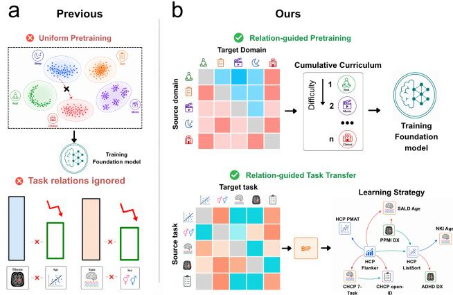
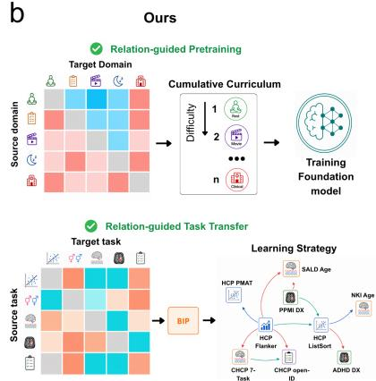
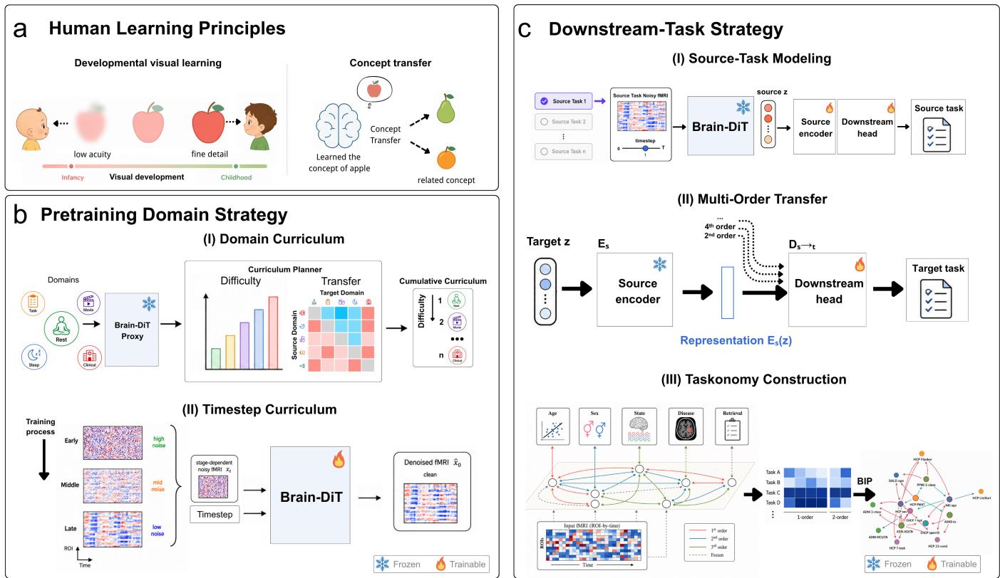
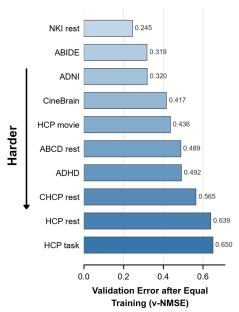
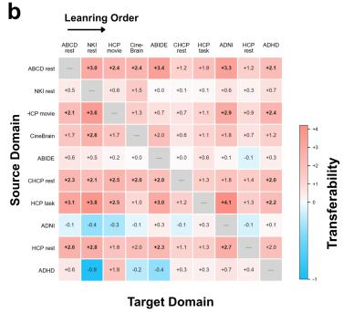
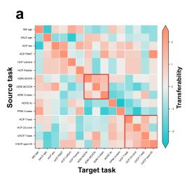
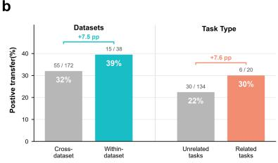
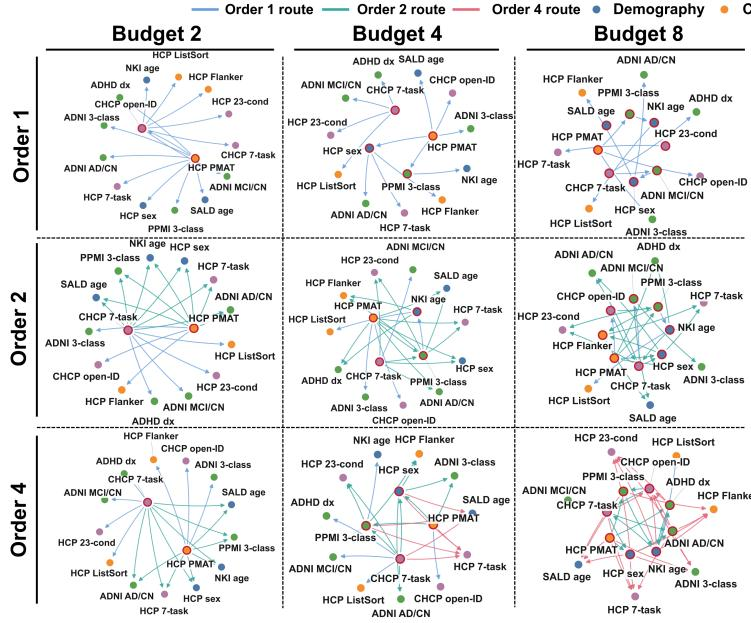
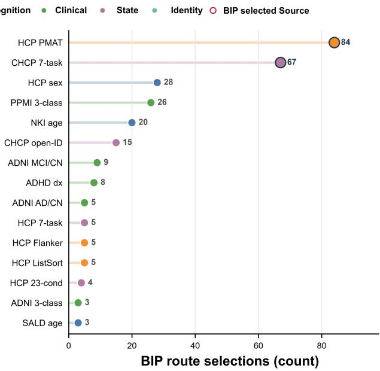
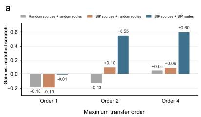

# BrainTaskonomy: Learning How to Pretrain and What to Transfer in fMRI Foundation Models

Junfeng Xia1, Wenhao Ye1, Junxiang Zhang1, Jiayu Zuo1, Mo Wang2,1,4\*, Quanying Liu1,3,4\*

1Department of Biomedical Engineering, Southern University of Science and Technology, Shenzhen, China

2Department of Computer Science, University of Warwick, The UK

3Shenzhen Loop Area Institute, Shenzhen, China

4Omni-Intelligence, Shenzhen, China

Co-corresponding authors: 12250099@mail.sustech.edu.cn, liuqy@sustech.edu.cn

## Abstract

fMRI foundation models increasingly aggregate heterogeneous data across brain states, cohorts, and acquisition settings, yet pretraining domains are commonly treated as a flat mixture and downstream tasks are adapted independently. We study whether measured learning relations can organize both stages without modifying the backbone. During pretraining, a lightweight Brain-DiT proxy estimates dificulty and directed facilitation across ten fMRI domains, yielding a priority-guided cumulative domain curriculum combined with high-to-low-noise timestep scheduling and joint consolidation. During adaptation, controlled first- and higherorder transfer across fifteen tasks constructs a directed taskonomy, from which budgeted integer programming (BIP) selects directly supervised source tasks and target-specific routes. The joint priority-domain and high-to-low-timestep curriculum reduces v-NMSE, PSD-NMSE, and FC-MSE by 6.5%, 16.3%, and 10.5%, respectively, relative to uniform sampling over both dimensions, and shows strong downstream performance across six in- and out-of-domain tasks. The taskonomy reveals asymmetric, target-dependent transfer, while exploratory sealed-test evaluation shows larger descriptive gains for BIP policies when higher-order route spaces are available than for matched random controls. Together, these findings support organizing fMRI pretraining and adaptation by measured learning relations rather than treating domains and tasks as independent flat sets.

## Introduction

Brain foundation models have emerged across EEG and fMRI, using large-scale self-supervised pretraining on heterogeneous neural recordings to learn reusable representations that are subsequently adapted with task-specific supervision (Guo et al. 2026; Wang et al. 2024; Jiang, Zhao, and Lu 2024; Xia et al. 2026b,c; Wang et al. 2026c,a; Dong et al. 2024). As their pretraining corpora and downstream task spaces expand, two allocation questions become increasingly important: which training experiences should be prioritized to establish transferable representations, and which downstream capabilities should receive direct supervision so that others can be acquired through transfer?

These questions are particularly salient for fMRI foundation models. To support diverse cognitive and clinical applications, recent models increasingly aggregate resting-state, task-evoked, naturalistic, lifespan, and clinical data (Xia et al. 2026b,c). Yet these domains are commonly mixed randomly or in proportion to dataset size from the beginning of pretraining, despite substantial diferences in neural dynamics, populations, acquisition protocols, signal quality, and scale. Some domains may be readily learned and provide transferable foundations for others, whereas specialized or long-tailed domains may be more dificult or overshadowed by larger datasets. Meanwhile, downstream tasks such as demographic prediction, cognitive assessment, clinical diagnosis, brain-state decoding, and individual identification are usually adapted independently, despite scarce labels and potentially shared neural representations. fMRI foundation models therefore face two related allocation problems: how to distribute pretraining computation across heterogeneous domains, and how to distribute limited supervision across interdependent downstream tasks.

  
Figure 1: Motivation. (a) Existing pipelines mix heterogeneous pretraining domains and adapt downstream tasks independently, ignoring their relations. (b) We use directed domain relations to construct a pretraining curriculum and downstream task relations to jointly plan supervision and transfer across targets.

  
Figure 2: Overview of the proposed framework. (a) Human-inspired motivation: visual development proceeds from coarse to fine, while learned concepts facilitate related learning. (b) Two-level pretraining curriculum: domain dificulty and directed facilitation define cumulative domain stages, while a dificulty-motivated high-to-low-noise schedule progressively expands the active timestep range. (c) Downstream taskonomy: source-task encoders $E _ { s } ^ { - }$ are trained on fixed Brain-DiT features and frozen during taskonomy construction. For a source set S, the source bottlenecks are concatenated and passed to a target-specific readout $d _ { S  t } ,$ trained on low-shot target data to estimate first- and higher-order transfer. BIP then selects supervised source tasks and transfer paths under a limited budget.

Several lines of research provide complementary guidance for addressing these problems. Human visual experience develops from coarse, low-acuity observations toward increasingly fine-grained inputs, and training artificial vision models with a corresponding developmental visual diet produces more robust representations than randomly mixing the same experiences (Braddick and Atkinson 2011; Brown et al. 2015; Lu et al. 2026). Curriculum learning and datamixture optimization further show that examples, domains, and skills need not be treated as exchangeable training units (Bengio et al. 2009; Chen et al. 2023; Xie et al. 2023). In difusion models, denoising objectives at diferent timesteps exhibit diferent optimization dificulty, motivating progressive schedules from high-noise recovery to low-noise refinement (Kim et al. 2025). Complementarily, Taskonomy and its fMRI extensions reveal directed first- and higher-order transfer relations and use them to allocate supervision under limited budgets (Zamir et al. 2018; Qu et al. 2024; Xia et al. 2026a). Together, these studies suggest a common principle: learning priority should depend not only on intrinsic learnability, but also on how strongly an object supports subsequent learning.

Based on this principle, we study learning relations across pretraining domains and downstream tasks. Our contributions are threefold:

• Learning relations. We characterize fixed-budget dificulty and directed facilitation across ten fMRI domains, together with first- and higher-order transfer across fifteen downstream tasks.

• Learning how to pretrain. We use domain relations to construct a cumulative domain curriculum, combined with high-to-low-noise timestep scheduling andjoint consolidation.

• Learning what to transfer. We use the downstream taskonomy and BIP to select supervised source tasks and target-specific transfer routes under limited budgets.

Experiments demonstrate improved pretraining fidelity and in-domain transfer, while exploratory sealed-test results suggest benefits from taskonomy-guided policies with access to higher-order route spaces.

a  

  
Figure 3: Domain dificulty and directed facilitation. (a) Fixed-budget domain dificulty measured by v-NMSE. (b) Directed facilitation between source and target domains. Red denotes facilitation and blue denotes interference. Dificulty and facilitation jointly determine the curriculum order.

## Related Work

## fMRI Foundation Models

fMRI foundation models have progressed through richer objectives and finer spatial scales. At the ROI level, BrainLM reconstructs masked signals, Brain-JEPA predicts latent targets, and BrainMass combines functional-connectivity reconstruction with representation alignment (Ortega Caro et al. 2024; Dong et al. 2024; Yang et al. 2024). Voxel-level models learn 4D dynamics through eficient temporal modeling or dynamic patching (Wang et al. 2026a,c, 2025). Brain-DiT spans resting, task, naturalistic, disease, and sleep states, while BrainWorld extends difusion pretraining to voxel-level whole-brain dynamics (Xia et al. 2026b,c). Yet these domains remain mixed using fixed or random schedules, leaving their learning structure unexplored.

## Curriculum Learning and Transfer-Aware Resource Allocation

Foundation models depend strongly on how heterogeneous data are sampled and ordered. DoReMi, DoGE, and RegMix optimize domain proportions using proxy or cross-domain signals (Xie et al. 2023; Fan, Pagliardini, and Jaggi 2023; Liu et al. 2025). Skill-It organizes skills through prerequisite relations (Chen et al. 2023), while difusion curricula progressively schedule timesteps with diferent convergence dificulty (Kim et al. 2025). Taskonomy instead estimates directed first- and higher-order transfer and selects supervised source tasks under a limited budget (Zamir et al. 2018; Achille et al. 2019; Standley et al. 2020; Fifty et al. 2021). Existing work therefore treats mixture proportions, learning order, objective dificulty, and transfer utility separately; these principles remain unintegrated for multi-state fMRI pretraining and downstream supervision.

## fMRI Heterogeneity and Transfer Structure

fMRI heterogeneity spans brain states, populations, diagnoses, acquisition protocols, resolutions, and preprocessing spaces. FlexiBrain accommodates this variability through native-space dynamic patching and resolution-adaptive embeddings, and reveals asymmetric transfer across spaces and diagnostic populations (Wang et al. 2026b). Cognitive taskonomies similarly show that fMRI task states are interdependent (Qu et al. 2024). Single-source transfer is directed, while multi-source transfer depends on source composition and cannot be inferred from pairwise relations alone (Xia et al. 2026a). Thus, fMRI heterogeneity is not only a nuisance, but also transferable structure that can guide learning.

(a) Uniform timestep sampling
<table><tr><td>Domain Policy</td><td>v-NMSE↓</td><td>PSD-NMSE↓</td><td>FC-MSE↓</td></tr><tr><td>Uniform</td><td>0.4148</td><td>0.1506</td><td>0.0611</td></tr><tr><td>Random</td><td>0.3950</td><td>0.1377</td><td>0.0565</td></tr><tr><td>Priority</td><td>0.3936</td><td>0.1349</td><td>0.0567</td></tr></table>

(b) High-to-low timestep curriculum
<table><tr><td>Domain Policy</td><td>v-NMSE↓</td><td>PSD-NMSE↓</td><td>FC-MSE↓</td></tr><tr><td>Uniform</td><td>0.3885</td><td>0.1302</td><td>0.0548</td></tr><tr><td>Random</td><td>0.3893</td><td>0.1288</td><td>0.0548</td></tr><tr><td>Priority</td><td>0.3880</td><td>0.1261</td><td>0.0547</td></tr></table>

Table 1: Pretraining ablations defined jointly by timestep policy (panels) and domain policy (rows). Uniform, Random, and Priority denote uniform mixing, random ordering, and priority-guided ordering. Training-step counts and further details are provided in the supplementary material. Lower errors are better; bold is best.

## Method

Without modifying the Brain-DiT backbone, we study how to organize heterogeneous domains and difusion timesteps during pretraining, and how to allocate limited supervision across downstream tasks. Given a clean fMRI window $\mathbf { x } _ { 0 } ,$ timestep t, and Gaussian noise $\mathbf { \epsilon } \epsilon \sim \mathcal { N } ( \mathbf { 0 } , \mathbf { I } )$ , the noisy input and velocity target are

$$
\begin{array} { r } { \mathbf { x } _ { t } = \sqrt { \bar { \alpha } _ { t } } \mathbf { x } _ { 0 } + \sqrt { 1 - \bar { \alpha } _ { t } } \mathbf { \epsilon } , } \\ { \mathbf { v } _ { t } = \sqrt { \bar { \alpha } _ { t } } \mathbf { \epsilon } \mathbf { \epsilon } - \sqrt { 1 - \bar { \alpha } _ { t } } \mathbf { x } _ { 0 } . } \end{array}\tag{1}
$$

We first estimate domain dificulty and directed facilitation to construct a nested domain–timestep curriculum, and then model downstream task transfer to derive budget-aware supervision policies.

## Structure-Guided Curriculum Pretraining

Domain dificulty. A domain is defined as a dataset–state pair with a distinct cohort and acquisition distribution. Let $\{ \mathcal { D } _ { i } \} _ { i = 1 } ^ { M }$ denote the candidate fMRI domains. We train the same lightweight Brain-DiT proxy independently on each domain using identical architectures, optimization budgets, and uniform timestep sampling. Let $\mathcal { B } _ { i } = \{ ( \mathbf { x } _ { 0 } ^ { ( n ) } , \epsilon ^ { ( n ) } ) \} _ { n = 1 } ^ { N _ { i } }$ be a frozen validation bank for domain i. Its normalized velocity-prediction error at timestep t is

<table><tr><td rowspan="3">Method</td><td colspan="8">In-domain</td><td colspan="4">Out-of-domain</td></tr><tr><td colspan="2">ABIDE</td><td colspan="2">NKI</td><td colspan="2">ABCD</td><td colspan="2">HCP</td><td colspan="2">SALD</td><td colspan="2">PPMI</td></tr><tr><td>MSE↓</td><td>r ↑</td><td>MSE↓</td><td>r ↑</td><td>ACC ↑</td><td>F1 ↑</td><td>ACC ↑</td><td>F1↑</td><td>MSE↓</td><td>r ↑</td><td>ACC ↑</td><td>F1↑</td></tr><tr><td colspan="10">Baselines</td><td></td><td></td><td></td></tr><tr><td>BrainLM</td><td>.91±.01</td><td>.24±.02</td><td>.50±.02</td><td>.68±.01</td><td>59.24±1.03</td><td>58.74±.70</td><td>62.71±4.43</td><td>61.74±4.72</td><td>.68±.06</td><td>.62±.06</td><td>68.79±3.25</td><td>55.46±1.57</td></tr><tr><td>Brain-JEPA</td><td>.98±.07</td><td>.17±.02 .50±.04</td><td>1.03±.08 .60±.06 .62±.04</td><td>.33±.03</td><td></td><td></td><td>69.97±2.73</td><td>69.17±3.55</td><td>1.13±.11 .70±.08</td><td>.30±.06</td><td>63.12±5.35</td><td>53.85±2.90</td></tr><tr><td colspan="10">BrainMass .70±.04</td><td>.63±.06</td><td>63.12±4.43</td><td>49.47±1.16</td></tr><tr><td>Uniform timestep sampling</td><td></td><td></td><td></td><td></td><td></td><td></td><td></td><td></td><td></td><td></td><td></td><td></td></tr><tr><td colspan="10">Uniform .53±.01</td><td></td><td>63.83±9.75</td><td>52.14±2.67</td></tr><tr><td>Random</td><td>.53±.05</td><td>.63±.00 .63±.06</td><td>.30±.02 .31±.02</td><td>.86±.01 .84±.01</td><td>56.84±.84 66.19±.11</td><td>56.36±.95 66.10±.10</td><td>79.70±5.45 79.21±4.40</td><td>79.39±5.77 79.01±4.37</td><td>.501±.001 .538±.014</td><td>.726±.002 .655±.004</td><td>68.09±2.13</td><td>60.39±.94</td></tr><tr><td>Priority</td><td>.51±.04</td><td>.65±.03</td><td>.31±.02</td><td>.85±.01</td><td>63.79±5.04</td><td>63.48±5.51</td><td>81.02±3.48</td><td>80.99±3.52</td><td>.466±.014</td><td>.754±.002</td><td>67.38±4.91</td><td>53.20±2.03</td></tr><tr><td colspan="10">High-to-low timestep curriculum</td><td colspan="3"></td></tr><tr><td>Uniform</td><td>.46±.04</td><td>.69±.03</td><td>.32±.03</td><td>.84±.02</td><td>61.59±2.01</td><td>61.16±2.01</td><td>82.51±3.37</td><td>82.44±3.34</td><td>.455±.019</td><td>.756±.002*</td><td>65.96±3.69</td><td>56.36±2.59</td></tr><tr><td>Random</td><td>.45±.02</td><td> $\underline { { \overline { { 6 9 \pm . 0 1 } } } }$ </td><td>.31±.01</td><td>.85±.01</td><td>63.14±.82</td><td>62.96±.65</td><td>81.19±1.78</td><td>80.80±2.41</td><td>.406±.006*</td><td>.729±.005</td><td>68.09±2.13</td><td>58.97±.45</td></tr><tr><td>Priority</td><td>.43±.02*</td><td>.71±.01* .27±.01*</td><td></td><td>.87±.01*</td><td>66.38±.32*</td><td>66.26±.45*</td><td>84.32±3.72*</td><td>84.29±3.73</td><td>.458±.004</td><td>.746±.004</td><td>71.63±3.25*</td><td>67.42±.78*</td></tr></table>

Table 2: Downstream comparison of curriculum-pretrained Brain-DiT variants and existing fMRI foundation models under the Omni-fMRI benchmark (Wang et al. 2026c). Brain-DiT variants are organized by timestep-policy panels, following Table 1. Within each panel, Uniform, Random, and Priority in the Method column are domain policies denoting uniform mixing, random ordering, and priority-guided ordering, respectively. Results are reported as mean±standard deviation; “–” denotes unavailable results. Bold and underlined values indicate the best and second-best results, respectively. Gray highlights Priority under the high-to-low timestep curriculum. \* indicates a large efect relative to the strongest external baseline (Cohen’s $d \geq 0 . 8 )$

$$
\ell _ { i } ( t ) = \frac { \sum _ { n = 1 } ^ { N _ { i } } \left\| \mathbf { v } _ { t } ^ { ( n ) } - \mathbf { v } _ { \theta _ { i } } \left( \mathbf { x } _ { t } ^ { ( n ) } , t \right) \right\| _ { F } ^ { 2 } } { \sum _ { n = 1 } ^ { N _ { i } } \left\| \mathbf { v } _ { t } ^ { ( n ) } \right\| _ { F } ^ { 2 } + \varepsilon } ,\tag{2}
$$

where the denominator normalizes the residual by the energy of the ground-truth velocity target. We define domain dificulty by averaging over a fixed timestep grid G:

$$
D _ { i } = { \frac { 1 } { | { \boldsymbol { \mathcal { G } } } | } } \sum _ { t \in { \mathcal { G } } } \ell _ { i } ( t ) .\tag{3}
$$

A lower $D _ { i }$ indicates that domain i is easier for the proxy model to learn.

Compute-matched directed facilitation and priority. To quantify whether prioritizing i facilitates subsequent learning of j, we compare compute-matched policies. The source policy allocates the entire source-stage budget to i, whereas the reference distributes it over a domain-balanced mixture excluding j. Starting from the same initialization, both then continue on the same target bank from $j ,$ with matched windows, timesteps, noise, and optimization budgets. Let $L _ { i \to j }$ and $L _ { \mathrm { r e f } \to j }$ denote their final target NMSEs. We define

$$
F ( i  j ) = \frac { L _ { \mathrm { r e f }  j } - L _ { i  j } } { L _ { \mathrm { r e f }  j } } .\tag{4}
$$

A positive value means prioritizing i better prepares the model for j than generic non-target pretraining; a negative value denotes a relative disadvantage. Thus, $F ( i  j )$ measures policy-relative directed facilitation, not the leave-onedomain-out marginal contribution of i.

We summarize each domain’s global transfer value by its mean outgoing facilitation and combine it with dificulty:

$$
\bar { F } _ { i } = \frac { 1 } { M - 1 } \sum _ { j \neq i } F ( i  j ) , \qquad p _ { i } = z ( D _ { i } ) - z ( \bar { F } _ { i } ) .\tag{5}
$$

Domains are introduced in ascending order of $p _ { i }$ , prioritizing those that are easier to learn and more beneficial to subsequent domains. The order is fixed before full-scale pretraining.

SNR-partitioned timestep curriculum. Following dificulty-based difusion curriculum learning (Kim et al. 2025), we progressively expand denoising from high-noise to low-noise timesteps. For each timestep $t \in \{ 1 , \dots , T _ { \mathrm { d i f f } } \}$ we compute

$$
r _ { t } = \log \frac { \bar { \alpha } _ { t } } { 1 - \bar { \alpha } _ { t } } .\tag{6}
$$

The ordered timestep sequence is divided into Kτ contiguous clusters using boundaries $0 = b _ { 0 } < b _ { 1 } < \dots < b _ { K _ { \tau } } = T _ { \mathrm { d i f f } }$ with

$$
C _ { k } = \{ b _ { k - 1 } + 1 , \ldots , b _ { k } \} .
$$

The boundaries are obtained once by constrained dynamic programming:

$$
\begin{array} { r l } { \underset { \left\{ b _ { k } \right\} } { \operatorname* { m i n } } } & { \displaystyle \sum _ { k = 1 } ^ { K _ { \tau } } \sum _ { t \in C _ { k } } \left| r _ { t } - \mathrm { m e d i a n } _ { u \in C _ { k } } r _ { u } \right| , } \\ { \mathrm { s . t . } } & { n _ { \operatorname* { m i n } } \leq \left| C _ { k } \right| \leq n _ { \operatorname* { m a x } } . } \end{array}\tag{7}
$$

We index the clusters such that $C _ { 1 }$ contains the lowest-noise timesteps with the highest log-SNR, whereas $C _ { K _ { \tau } }$ contains the highest-noise timesteps with the lowest log-SNR.

Nested curriculum and plateau gates. Let $\sigma =$ $( \sigma _ { 1 } , \dots , \sigma _ { M } )$ denote the priority-guided domain order. Domains are introduced cumulatively under the initial highnoise support $C _ { a _ { 0 } : K _ { \tau } }$ , with all previously activated domains retained through replay. A stage advances when the relevant fixed-bank loss fails to improve by at least δ from its stage-best value for a prescribed patience: $K _ { d }$ evaluations on the newest domain trigger the next domain, while, after all domains are active, $K _ { t }$ evaluations on the domain-balanced loss trigger the next lower-noise cluster,

$$
C _ { a : K _ { \tau } } \to C _ { a - 1 : K _ { \tau } } .\tag{8}
$$

Previously activated domains and timestep clusters remain available throughout training. Once all clusters are active, the model undergoes uniform joint consolidation over all domains and timesteps.

## Downstream Taskonomy

First-order transfer. Given a fixed Brain-DiT feature extractor Φ , each scan is represented as $z = \Phi _ { \mathrm { B D } } ( x )$ . For each source task s, we train a standardized encoder $E _ { s }$ and head $h _ { s } .$ . To evaluate $s  t ,$ , we discard $h _ { s } .$ , freeze $E _ { s }$ , and train a new target head on a fixed low-shot support set. We compare this route with a matched self-transfer reference $t \ \to \ t ,$ whose encoder is trained on task t and matched in architecture, target support, head capacity, initialization, and optimization budget. With all metrics oriented such that larger values are better, the first-order afinity is

$$
G _ { 1 } ( s  t ) = M _ { t } ( s  t ) - M _ { t } ( t  t ) , \qquad s \neq t .\tag{9}
$$

Higher-order transfer. For a source set $S$ of order $m =$ $\left| S \right| ^ { - } > 1$ , all source encoders remain frozen. Each source representation is projected through a source-fitted PCA bottleneck, after which the projected representations are concatenated and passed to a target-specific ridge readout:

$$
r _ { S } ( z ) = { \mathrm { C o n c a t } } _ { s \in S } [ P _ { s } ( E _ { s } ( z ) ) ] , \qquad \widehat { y } _ { t } = d _ { S  t } ( r _ { S } ( z ) ) .\tag{10}
$$

Here, $P _ { s }$ denotes the PCA projection fitted from source-task representations. Only the target readout $d _ { S  t }$ is fitted during Taskonomy construction. Each route is compared with an order-matched self-transfer reference $t ^ { \times m }  t ,$ which uses m independently trained target-task encoders and matches the transfer route in fusion/head capacity, target support, initialization, and optimization budget:

$$
G _ { m } ( S \to t ) = M _ { t } ( S \to t ) - M _ { t } ( t ^ { \times m } \to t ) .\tag{11}
$$

Because downstream tasks use heterogeneous metrics, we calibrate each gain using a prespecified target-specific increment, $\widetilde { G } _ { m } ( S  t ) = G _ { m } ( S  t ) / \delta _ { t }$ . These calibrated afinities define the directed downstream taskonomy. Targetwise z-scores are used only for visualization, whereas route selection uses $\widetilde { G } _ { m }$ directly.

## Budget-Aware Transfer Planning

BIP uses only construction-validation taskonomy results. Let $x _ { s } \in \{ 0 , 1 \}$ indicate whether source task s receives direct supervision, and $y _ { t , r } \in \{ 0 , 1 \}$ indicate whether route r is assigned to target t. Each route requires a source set $S _ { r }$ and has utility

$$
u _ { t , r } = \widetilde { G } _ { | S _ { r } | } ^ { \mathrm { c v } } ( r  t ) .\tag{12}
$$

A direct route has $S _ { r } = \{ t \}$ and $u _ { t , r } = 0$ , corresponding to the self-transfer reference. Given a source budget K and maximum transfer order m, we first average route utility

  
Figure 4: Downstream fMRI Taskonomy reveals directed transfer structure. (a) Column-wise z-scored first-order gains computed relative to the matched $t  t$ self-transfer reference. (b) Positive transfer is descriptively more prevalent within than across datasets, whereas the related-task contrast is modest.

across targets within each of five predefined task categories and then weight the categories equally:

$$
\begin{array} { r l } { \displaystyle \operatorname* { m a x } _ { x , y } } & { \displaystyle \frac { 1 } { | { \mathcal C } | } \displaystyle \sum _ { c \in { \mathcal C } } \displaystyle \frac { 1 } { | { \mathcal T } _ { c } | } \displaystyle \sum _ { t \in { \mathcal T } _ { c } } \displaystyle \sum _ { r \in { \mathcal R } _ { t } ^ { ( m ) } } y _ { t , r } u _ { t , r } } \\ { \mathrm { s . t . } } & { \displaystyle \sum _ { s } x _ { s } = K , \displaystyle \sum _ { r \in { \mathcal R } _ { t } ^ { ( m ) } } y _ { t , r } = 1 \quad \forall t , } \\ { y _ { t , r } \leq x _ { s } } & { \forall t , r , s \in S _ { r } , \qquad x _ { s } , y _ { t , r } \in \{ 0 , 1 \} . } \end{array}\tag{13}
$$

Here, C denotes the five predefined task categories and $\mathcal { T } _ { c }$ denotes the target tasks assigned to category c. The solution selects exactly $\bar { K }$ supervised sources and one route per target. Since route spaces are nested, a maximum-order-four policy may still select an order-one or order-two route.

Policy validation. BIP is solved only from constructionvalidation afinities, after which the selected source portfolios and target routes are fixed. We then test whether these policies generalize from the lightweight frozen PCA–ridge construction protocol to a stronger target-adaptation protocol: Brain-DiT remains frozen, while the routed source encoders and a new target head are adapted on fresh low-shot support sets and evaluated on sealed test subjects. We compare BIP-selected sources and routes with BIP sources plus random feasible routes, fully random policies, and capacitymatched scratch controls. A sequential decomposition separates source-portfolio and route-selection efects. Complete split, matching, aggregation, and uncertainty-estimation procedures are provided in the supplementary material.

## Experiments

## Experimental Setup

Pretraining. We use ten fMRI domains spanning resting, task, naturalistic, lifespan, and clinical data: HCP rest, HCP movie, HCP task, CHCP rest, ABCD rest, NKI rest, ABIDE, ADHD, ADNI, and CineBrain (Van Essen et al. 2013; Ge et al. 2023; Casey et al. 2018; Tobe et al. 2022; Di Martino et al. 2014; Milham et al. 2012; Jack Jr et al. 2008; Gao et al. 2025). Following Omni-fMRI preprocessing (Wang et al. 2026c), scans are mapped to Schaefer-100 space and divided into non-overlapping 40-TR windows; splits are subject-disjoint and normalization uses training data only. SALD (Wei et al. 2018) is excluded from pretraining and held out for out-of-domain age prediction. A lightweight unconditional Brain-DiT proxy estimates domain dificulty and directed facilitation. We cross uniform and high-to-low timestep schedules with uniform, random, and priority-guided domain policies (Table 1). All policies share the same fixed-bank convergence criteria; their update counts difer because each newly introduced domain or timestep range changes the active training distribution. Pretraining quality uses domain-balanced v-NMSE and 50- step DDIM reconstruction PSD-NMSE and FC-MSE. Full preprocessing and training settings are provided in the sup-

  
Figure 5: Budget-aware transfer policies derived from the downstream taskonomy. Left: BIP-selected directly supervised sources (red outlines) and target-specific routes across source budgets $K \in \{ 2 , 4 , 8 \}$ and maximum transfer orders $m \in \{ 1 , 2 , 4 \}$ . Right: source-task usage counts aggregated over the frozen BIP policies, revealing recurrent transfer hubs.

b
<table><tr><td rowspan=1 colspan=4>Policy-gain decomposition</td></tr><tr><td rowspan=1 colspan=1>Sourceselection</td><td rowspan=1 colspan=1>-0.01</td><td rowspan=1 colspan=1>+0.23</td><td rowspan=1 colspan=1>+0.04</td></tr><tr><td rowspan=1 colspan=1>Routeselection</td><td rowspan=1 colspan=1>+0.18</td><td rowspan=1 colspan=1>+0.45</td><td rowspan=1 colspan=1>+0.51</td></tr><tr><td rowspan=1 colspan=1></td><td rowspan=1 colspan=3>Order 1Order 2Order 4</td></tr></table>

Figure 6: Exploratory validation of Taskonomy-derived policies. a, Gain over capacity-matched scratch for all 15 targets, first averaged within each of five predefined task categories and then equally across categories; values are further averaged over five support draws and budgets $K \in$ {2, 4, 8}. b, Decomposition ofthe BIP advantage into sourceand route-selection contributions. Higher-order gains were driven mainly by route selection.

plementary material.

Downstream evaluation. Following the Omni-fMRI benchmark (Wang et al. 2026c), we evaluate full fine-tuning on age regression for ABIDE and NKI and sex classification for ABCD and HCP. We additionally evaluate held-out SALD age prediction and held-out PPMI binary classification. BrainLM, Brain-JEPA, and BrainMass serve as external foundation-model baselines. Age prediction is evaluated using MSE and Pearson correlation r, while sex classification uses accuracy and macro-F1. All Brain-DiT variants use identical data splits, prediction heads, optimization settings, and three random seeds. Following Omni-fMRI, we compare the best Brain-DiT result in each column with the strongest external baseline using Cohen’s d, and mark large efects $( d \ge 0 . 8 )$ with an asterisk.

Taskonomy and policy validation. Participants are split once at the cohort level; all tasks from the same cohort inherit the same mutually exclusive participant pools, and all runs from one participant remain in a single pool. Using fixed features from the oficial Brain-DiT checkpoint, we construct a 15-task taskonomy through controlled first- and higher-order transfer and solve BIP using only construction-validation afinities. The selected source portfolios and target-specific routes are then frozen and evaluated on fresh low-shot support sets and sealed test subjects against matched randomroute, fully random, and capacity-matched scratch controls. Full task definitions, split statistics, adaptation settings, and matching protocols are provided in the supplementary material.

## Domain Learning Structure Guides Curriculum Pretraining

Domains difer in dificulty and directed facilitation. Figure 3(a) shows a 2.65× diference in proxy dificulty across the ten domains. NKI is the easiest domain $( D =$ 0.245), followed by ABIDE and ADNI $( D = 0 . 3 1 9$ and 0.320), whereas HCP rest and HCP task are the most dificult (D = 0.639 and 0.650). This ranking does not simply separate resting-state from task or naturalistic data, suggesting that cohort, acquisition, and signal properties jointly afect learnability.

The compute-matched facilitation matrix in Figure 3(b) is strongly asymmetric. Relative to generic non-target pretraining, HCP task yields 4.1% and 3.8% directed facilitation for ADNI and NKI, whereas ADNI yields little or negative relative benefit for most domains. Dificulty and facilitation consequently produce an order that difers from a simple easy-to-hard curriculum: ABCD is introduced first despite intermediate dificulty, while the dificult HCP task domain is promoted by its strong outgoing facilitation.

Domain and timestep curricula provide complementary benefits. Table 1 crosses two timestep policies with three domain policies. Under uniform timesteps, Random and Priority domain reduce v-NMSE to 0.3950 and 0.3936; under high-to-low timesteps, Uniform and Random domain reach 0.3885 and 0.3893. The high-to-low Priority row achieves the best v-NMSE (0.3880), PSD-NMSE (0.1261), and FC-MSE (0.0547), improving over uniform domains and timesteps by 6.5%, 16.3%, and 10.5%, respectively.

The small gap between the high-to-low Uniform and Priority rows in v-NMSE and FC-MSE indicates that timestep scheduling explains most of the aggregate gain. Nevertheless, the planned domain order provides a complementary benefit, most clearly in PSD-NMSE (0.1302 → 0.1261) and the downstream results reported below.

Curriculum gains extend to in-domain tasks. As shown in Table 2, the high-to-low Priority row is the strongest reported Brain-DiT configuration on all four in-domain tasks. It achieves an MSE of 0.43 and r = 0.71 on ABIDE age prediction, an MSE of 0.27 and r = 0.87 on NKI age prediction, 66.38% accuracy and 66.26% macro-F1 on ABCD sex classification, and 84.32% accuracy and 84.29% macro-F1 on HCP sex classification. It also outperforms BrainLM, Brain-JEPA, and BrainMass on these evaluations, indicating that the curriculum benefit extends beyond the difusion objective.

The held-out SALD results are less conclusive. Under high-to-low timesteps, Random domain achieves the best MSE (0.406 ± 0.006), whereas Uniform domain achieves the best Pearson correlation $( 0 . 7 5 6 \pm 0 . 0 0 2 )$ . Priority domain obtains 0.458 ± 0.004 and $0 . 7 4 6 \pm 0 . 0 0 4$ , respectively. Although all six Brain-DiT configurations outperform the listed external baselines on SALD, the split metric leadership indicates that no single domain policy dominates this heldout task. In contrast, high-to-low Priority achieves the best held-out PPMI results, with 71.63% accuracy and 67.42% macro-F1. The contrasting SALD and PPMI results suggest that curriculum-induced representations transfer selectively rather than uniformly across unseen populations and clinical targets.

## Directed Task Relations Guide Budget-Aware Transfer

Downstream transfer is asymmetric and target dependent. Figure 4(a) visualizes first-order transfer among the 15 downstream tasks. Although the heatmap is standardized within each target for visualization, all analyses use the original self-referenced transfer gains. A source that benefits one target can be inefective or harmful to another, and reversing the direction generally changes the result, confirming that the taskonomy represents directed transfer rather than symmetric similarity.

Figure 4(b) further shows that positive transfer occurs on 39% of within-dataset edges (15/38), compared with 32% of cross-dataset edges (55/172), a diference of 7.5 percentage points. Among pairs with task-relatedness annotations, positive transfer occurs on 30% of related edges (6/20) and 22% of unrelated edges (30/134). These descriptive results suggest that both shared dataset context and task semantics shape transfer, although neither factor alone fully explains the observed structure.

BIP selects compact source portfolios and recurrent hubs. Figure 5 shows the policies selected across budgets $K \in \{ 2 , 4 , 8 \}$ and maximum transfer orders m $\in \{ 1 , 2 , 4 \}$ Under small budgets, BIP concentrates supervision on a few sources and reuses them through multiple target-specific routes. Larger budgets add more specialized sources and replace some indirect routes with direct supervision. Allowing second- and fourth-order routes further expands the set of targets supported by a fixed source portfolio.

The route-use analysis identifies several recurrent transfer hubs. HCP PMAT and CHCP seven-task decoding are used most frequently, appearing in 84 and 67 selected routes, respectively, followed by HCP sex, PPMI three-class diagnosis, and NKI age. These frequencies are derived from the frozen BIP policies and therefore reflect practical route utility, rather than visual centrality in the first-order heatmap.

Exploratory policy validation favors higher-order planning. Figure 6 reports category-balanced gain over capacity-matched scratch across all 15 target tasks. BIP showed limited benefit under first-order transfer, whereas positive descriptive gains emerged when higher-order routes were available. Most of this improvement arose from targetspecific route selection rather than source selection.

## Discussion and Conclusion

We show that measured learning relations can organize fMRI foundation-model pretraining and downstream adaptation without changing the backbone. Random cumulative ordering improves over flat domain mixing, indicating that staged exposure is itself beneficial. Priority-guided ordering adds gains, most clearly in v-NMSE and spectral fidelity, while high-to-low-noise scheduling accounts for most aggregate reconstruction improvement. Thus, timestep and domain curricula are complementary: one organizes denoising dificulty, whereas the other determines which experiences are introduced first. Because policies plateau after diferent update counts, the comparison reflects endpoint quality and convergence rather than matched-compute eficiency.

Controlled downstream transfer reveals an asymmetric, target-dependent taskonomy. BIP converts these relations into compact source portfolios and target-specific routes, with descriptive gains when higher-order routes are available. Sequential analysis associates these gains more strongly with target-specific routing than source selection. Nevertheless, policy validation remains exploratory, and task-dependent SALD and PPMI results show that improved in-domain organization does not ensure uniform OOD robustness. Future work should examine broader domain and task spaces, crossbackbone stability, and cost-aware allocation of computation and supervision.

## References

Achille, A.; Lam, M.; Tewari, R.; Ravichandran, A.; Maji, S.; Fowlkes, C. C.; Soatto, S.; and Perona, P. 2019. Task2vec: Task embedding for meta-learning. In Proceedings of the IEEE/CVF international conference on computer vision, 6430–6439.

Bengio, Y.; Louradour, J.; Collobert, R.; and Weston, J. 2009. Curriculum learning. In Proceedings of the 26th annual international conference on machine learning, 41–48.

Braddick, O.; and Atkinson, J. 2011. Development of human visual function. Vision research, 51(13): 1588–1609.

Brown, A. M.; Lindsey, D. T.; Cammenga, J. G.; Giannone, P. J.; and Stenger, M. R. 2015. The contrast sensitivity of the newborn human infant. Investigative ophthalmology & visual science, 56(1): 625–632.

Casey, B. J.; Cannonier, T.; Conley, M. I.; Cohen, A. O.; Barch, D. M.; Heitzeg, M. M.; Soules, M. E.; Teslovich, T.; Dellarco, D. V.; Garavan, H.; et al. 2018. The adolescent brain cognitive development (ABCD) study: imaging acquisition across 21 sites. Developmental cognitive neuroscience, 32: 43–54.

Chen, M.; Roberts, N.; Bhatia, K.; Wang, J.; Zhang, C.; Sala, F.; and Ré, C. 2023. Skill-it! a data-driven skills framework for understanding and training language models. Advances in Neural Information Processing Systems, 36: 36000–36040.

Di Martino, A.; Yan, C.-G.; Li, Q.; Denio, E.; Castellanos, F. X.; Alaerts, K.; Anderson, J. S.; Assaf, M.; Bookheimer, S. Y.; Dapretto, M.; et al. 2014. The autism brain imaging data exchange: towards a large-scale evaluation of the intrinsic brain architecture in autism. Molecularpsychiatry, 19(6): 659–667.

Dong, Z.; Li, R.; Wu, Y.; Nguyen, T. T.; Chong, J. S.; Ji, F.; Tong, N. R.; Chen, C. L.; and Zhou, J. H. 2024. Brain-jepa: Brain dynamics foundation model with gradient positioning and spatiotemporal masking. Advances in Neural Information Processing Systems, 37: 86048–86073.

Fan, S.; Pagliardini, M.; and Jaggi, M. 2023. Doge: Domain reweighting with generalization estimation. arXiv preprint arXiv:2310.15393.

Fifty, C.; Amid, E.; Zhao, Z.; Yu, T.; Anil, R.; and Finn, C. 2021. Eficiently identifying task groupings for multitask learning. Advances in Neural Information Processing Systems, 34: 27503–27516.

Gao, J.; Liu, Y.; Yang, B.; Feng, J.; and Fu, Y. 2025. Cine-Brain: A large-scale multi-modal brain dataset during naturalistic audiovisual narrative processing. arXiv preprint arXiv:2503.06940.

Ge, J.; Yang, G.; Han, M.; Zhou, S.; Men, W.; Qin, L.; Lyu, B.; Li, H.; Wang, H.; Rao, H.; et al. 2023. Increasing diversity in connectomics with the Chinese Human Connectome Project. Nature Neuroscience, 26(1): 163–172.

Guo, H.; Bi, H.; Abdellatif, F.; Galbenus, A.; Shah, J.; Morrison, A.; Dammers, J.; et al. 2026. Brain-OF: An Omnifunctional Foundation Model for fMRI, EEG and MEG. arXiv preprint arXiv:2602.23410.

Jack Jr, C. R.; Bernstein, M. A.; Fox, N. C.; Thompson, P.; Alexander, G.; Harvey, D.; Borowski, B.; Britson, P. J.; L. Whitwell, J.; Ward, C.; et al. 2008. The Alzheimer’s disease neuroimaging initiative (ADNI): MRI methods. Journal of Magnetic Resonance Imaging: An Oficial Journal of the International Society for Magnetic Resonance in Medicine, 27(4): 685–691.

Jiang, W.-B.; Zhao, L.; and Lu, B.-L. 2024. Large brain model for learning generic representations with tremendous EEG data in BCI. In International Conference on Learning Representations, volume 2024, 16405–16426.

Kim, J.-Y.; Go, H.; Kwon, S.; and Kim, H.-G. 2025. Denoising task dificulty-based curriculum for training difusion models. In International Conference on Learning Representations, volume 2025, 64392–64405.

Liu, Q.; Zheng, X.; Muennighof, N.; Zeng, G.; Dou, L.; Pang, T.; Jiang, J.; and Lin, M. 2025. Regmix: Data mixture as regression for language model pre-training. In International Conference on Learning Representations, volume 2025, 38305–38339.

Lu, Z.; Thorat, S.; Cichy, R. M.; and Kietzmann, T. C. 2026. Adopting a human developmental visual diet yields robust and shape-based AI vision. Nature Machine Intelligence, 1–14.

Milham, M. P.; Fair, D.; Mennes, M.; and Mostofsky, S. H. 2012. The adhd-200 consortium: a model to advance the translational potential of neuroimaging in clinical neuroscience. Frontiers in Systems Neuroscience, Volume 6 - 2012.

Ortega Caro, J.; de Oliveira Fonseca, A. H.; Rizvi, S.; Rosati, M.; Averill, C.; Cross, J.; Mittal, P.; Zappala, E.; Dhodapkar, R.; Abdallah, C.; et al. 2024. BrainLM: A foundation model for brain activity recordings. In International Conference on Learning Representations, volume 2024, 565–576.

Qu, Y.; Xia, J.; Jian, X.; Li, W.; Peng, K.; Liang, Z.; Wu, H.; and Liu, Q. 2024. Uncovering cognitive taskonomy through

transfer learning in masked autoencoder-based fMRI reconstruction. In International Workshop on Human Brain and Artificial Intelligence, 35–50. Springer.

Standley, T.; Zamir, A.; Chen, D.; Guibas, L.; Malik, J.; and Savarese, S. 2020. Which tasks should be learned together in multi-task learning? In International conference on machine learning, 9120–9132. PMLR.

Tobe, R. H.; MacKay-Brandt, A.; Lim, R.; Kramer, M.; Breland, M. M.; Tu, L.; Tian, Y.; Trautman, K. D.; Hu, C.; Sangoi, R.; et al. 2022. A longitudinal resource for studying connectome development and its psychiatric associations during childhood. Scientific data, 9(1): 300.

Van Essen, D. C.; Smith, S. M.; Barch, D. M.; Behrens, T. E.; Yacoub, E.; Ugurbil, K.; Consortium, W.-M. H.; et al. 2013. The WU-Minn Human Connectome Project: An Overview. Neuroimage, 80: 62–79.

Wang, C.; Jiang, Y.; Peng, Z.; Li, C.; Bang, C.-b.; Zhao, L.; Fu, W.; Lv, J.; Sepulcre, J.; Yang, C.; et al. 2026a. Towards a general-purpose foundation model for functional MRI analysis. Nature Biomedical Engineering, 1–12.

Wang, G.; Liu, W.; He, Y.; Xu, C.; Ma, L.; and Li, H. 2024. Eegpt: Pretrained transformer for universal and reliable representation of eeg signals. Advances in Neural Information Processing Systems, 37: 39249–39280.

Wang, M.; Xia, J.; Ye, W.; Liu, E.; Peng, K.; Feng, J.; Liu, Q.; and Wen, H. 2025. SLIM-Brain: A Data-and Training-Eficient Foundation Model for fMRI Data Analysis. arXiv preprint arXiv:2512.21881.

Wang, M.; Ye, W.; Xia, J.; Xu, M.; Wen, H.; and Liu, Q. 2026b. Flexibrain: Resolution-agnostic voxel-level encoding for native fmri. arXiv preprint arXiv:2606.11500.

Wang, M.; Ye, W.; Xia, J.; Zhang, J.; Pan, X.; Xu, M.; Deng, H.; Wen, H.; and Liu, Q. 2026c. Omni-fMRI: A Universal Atlas-Free fMRI Foundation Model. arXiv preprint arXiv:2601.23090.

Wei, D.; Zhuang, K.; Ai, L.; Chen, Q.; Yang, W.; Liu, W.; Wang, K.; Sun, J.; and Qiu, J. 2018. Structural and functional brain scans from the cross-sectional Southwest University adult lifespan dataset. Scientific Data, 5(1): 180134.

Xia, J.; Li, W.; Zhang, M.; and Guo, J. 2026a. Beyond Single-Source Cognitive Taskonomy: Multi-Source Task Relations through fMRI Transfer Learning. arXiv preprint arXiv:2606.26279.

Xia, J.; Ye, W.; Pan, X.; Shen, X.; Wang, M.; and Liu, Q. 2026b. Brain-dit: A universal multi-state fmri foundation model with metadata-conditioned pretraining. arXiv preprint arXiv:2604.12683.

Xia, J.; Ye, W.; Zhang, J.; Pan, X.; Wang, M.; and Liu, Q. 2026c. Brainworld: A structural-prior-conditioned generative model for whole-brain 4d fmri dynamics. arXiv preprint arXiv:2606.17742.

Xie, S. M.; Pham, H.; Dong, X.; Du, N.; Liu, H.; Lu, Y.; Liang, P. S.; Le, Q. V.; Ma, T.; and Yu, A. W. 2023. Doremi: Optimizing data mixtures speeds up language model pretraining. Advances in Neural Information Processing Systems, 36: 69798–69818.

Yang, Y.; Ye, C.; Su, G.; Zhang, Z.; Chang, Z.; Chen, H.; Chan, P.; Yu, Y.; and Ma, T. 2024. Brainmass: Advancing brain network analysis for diagnosis with large-scale selfsupervised learning. IEEE transactions on medical imaging, 43(11): 4004–4016.

Zamir, A. R.; Sax, A.; Shen, W.; Guibas, L. J.; Malik, J.; and Savarese, S. 2018. Taskonomy: Disentangling task transfer learning. In Proceedings of the IEEE conference on computer vision and pattern recognition, 3712–3722.