# Can We Trust Video Hallucination Detectors? VIDHALLOC for Evaluating the Evaluators

Xinyu CHEN Adnan Mahmood Mark Dras

## Abstract

Video-language models and video agents can produce hallucinations that conflict with spatiotemporal evidence. Existing benchmarks mainly evaluate model hallucinations, and heterogeneous mechanisms make detector reliability difficult to compare. We introduce VID-HALLOC, a benchmark that evaluates hallucination detection methods under a unified diagnostic evaluation protocol using 2,000 adversarial hallucination samples across Video Question Answering and Video Captioning tasks, spanning Ontology and Dynamic hallucination categories. To construct VIDHALLOC efficiently, we introduce VIDEOHALO, a Harness Engineering-informed multi-agent work flow that decomposes data construction into four executable stages supported by a memory system and a communication protocol. Evaluation of fifteen methods reveals that the four dedicated detectors peak at an Overall accuracy of only 34.63%, indicating limited reliability across video hallucination types [Dataset Repository].

## 1 Introduction

Large Video-Language Models (LVLMs) and video agents can now process long recordings, reason over complex spatial and temporal events, and coordinate tools for video understanding (Google DeepMind, 2025; OpenAI, 2025; Li et al., 2024; Bai et al., 2025b; Gemma Team, 2026; Wang et al., 2025; Qwen Team, 2026; Xu et al., 2025; Fan et al., 2024; Wang et al., 2026; Zhang et al., 2025c). These capabilities do not prevent them from producing content that is inconsistent with the video (Zheng et al., 2025). We define a video hallucination as generated content that misaligns with observable video evidence. Compared with image hallucination, the video setting requires evidence to be traced across entity-related information, actions, temporal relations, and camera transitions.

Reliable hallucination detection is therefore an essential part of trustworthy video-language systems.

Multimodal hallucination detection has evolved from image-level verification to video-aware assessment. Existing approaches assess video–text consistency through embedding similarity, learned entailment, and structured verification. Related approaches also estimate grounding confidence from internal model signals (Shalam et al., 2026; Jing et al., 2024; Chen et al., 2024; Bansal et al., 2024; Jing et al., 2025).

Image and video hallucination benchmarks have supported the study of trustworthy vision-language models by covering several forms of hallucinated content (Li et al., 2023; Wang et al., 2024a,c; Li et al., 2025a). Most existing benchmarks focus on determining whether an LVLM or agent exhibits hallucinations, rather than evaluating the reliability of the hallucination detection methods themselves. The heterogeneity in their categorization systems and evaluation targets precludes meaningful comparisons across different detection paradigms. Furthermore, constructing a video benchmark with fine-grained type annotations poses a significant challenge, as evidence localization and manual verification demand considerable human involvement (Wang et al., 2024c; Yang et al., 2024; Zhang et al., 2025b; Li et al., 2025a,b; Lu et al., 2025; Lei et al., 2021; Xiao et al., 2021; Wang et al., 2024b).

To address this evaluation gap, we introduce VIDHALLOC, a benchmark for evaluating video hallucination detectors under a unified diagnostic framework and protocol (Figure 1). The benchmark is constructed using VIDEOHALO, a multi-agent workflow informed by harness engineering (Zhong and Zhu, 2026; Hong et al., 2024; Wu et al., 2024; Qian et al., 2024; Sumers et al., 2024). The workflow achieves higher construction throughput than human experts with high category accuracy in the human audit (Table 3; Appendix C). Among the fifteen evaluated methods, Gemini-3-

<table><tr><td rowspan="2">Method</td><td rowspan="2">Granularity</td><td rowspan="2">Type Classification</td><td rowspan="2">Detection</td><td colspan="2">Output</td><td rowspan="2">VLM Tasks</td></tr><tr><td>Score</td><td>Label</td></tr><tr><td>PAC-S (Sarto et al., 2023)</td><td>Response</td><td>None</td><td>Trained Model</td><td></td><td></td><td>Img Cap., Vid. Caption</td></tr><tr><td>EMScore (Shi et al., 2022)</td><td>Token</td><td>None</td><td>Off-the-shelf</td><td>vvv</td><td></td><td>Vid. Caption</td></tr><tr><td>mPLUG-Owl-Video (Bansal et al., 2024)</td><td>Response</td><td>EEH, EQH, AVH, SRH, APH, TRH</td><td>Trained Model</td><td></td><td></td><td>Vid. Caption, Vid. QA</td></tr><tr><td>FIFA (Jing et al., 2025)</td><td>Atomic Fact</td><td>EEH, AVH, SRH, APH</td><td>Off-the-shelf</td><td></td><td>√</td><td>V2T, T2V</td></tr><tr><td>MTLA (Shalam et al., 2026)</td><td>Temp. Window</td><td>None</td><td>Mechanistic Detection</td><td>V</td><td></td><td>Img Obj. Detection, Vid. Ground.</td></tr></table>

Table 1: Comparison of existing hallucination detection methods. Mechanistic Detection uses internal model signals. Score denotes continuous confidence and Label denotes a discrete decision.

<table><tr><td rowspan="2">Benchmark</td><td rowspan="2">Detection Eval Granularity</td><td rowspan="2"></td><td colspan="8">Type Annotation</td><td rowspan="2">VLM Tasks</td><td rowspan="2"></td><td rowspan="2"># Ques. / # Vids. Adversarial</td></tr><tr><td></td><td colspan="3">Ontology</td><td colspan="4">Dynamic EEH ECH EQH AVH SRH APH TRH CPH</td></tr><tr><td>VideoHallucer</td><td></td><td></td><td></td><td></td><td></td><td></td><td></td><td></td><td></td><td></td><td></td><td></td><td></td></tr><tr><td>(Wang et al., 2024c) VidHalluc</td><td>×</td><td>Response</td><td>L</td><td>X</td><td>X</td><td>√</td><td>X</td><td>√</td><td></td><td>√ ×</td><td>Video QA</td><td>1,800 / 948</td><td>√</td></tr><tr><td>(Li et al., 2025a) Vript-HAL</td><td>× ×</td><td>Response Response</td><td>X √</td><td>X X</td><td>X</td><td>X</td><td>X</td><td>√ 」</td><td>√</td><td>√</td><td>Video QA Caption</td><td>9,295 / 5,002 122 / 122</td><td>√ X</td></tr><tr><td>(Yang et al., 2024) EventHallusion (Zhang et al., 2025b)</td><td>X</td><td>Response</td><td>X</td><td>X</td><td>X</td><td>X</td><td>X</td><td>L</td><td>X</td><td>X</td><td>Video QA</td><td>-/400</td><td>X</td></tr><tr><td>VideoHallu (Li et al., 2025b)</td><td>×</td><td>Response</td><td>X</td><td>X</td><td>X √</td><td>X 7</td><td>X √</td><td>L</td><td>× √</td><td>× √</td><td>Video QA</td><td>3,233 / 987</td><td>√</td></tr><tr><td>ELV-Halluc</td><td>×</td><td>Response</td><td>X</td><td>X</td><td>X</td><td>√</td><td>√</td><td>√</td><td>×</td><td>×</td><td>Video QA</td><td>4,800 / 200</td><td>√</td></tr><tr><td>(Lu et al., 2025) Dr.V-Bench</td><td>×</td><td>Response</td><td>√</td><td>X</td><td>√</td><td>√</td><td>√</td><td>√</td><td>√</td><td>×</td><td>Video QA, Caption</td><td>10,000 / 4,974</td><td>√</td></tr><tr><td>(Luo et al., 2025) OmniVCHall (Xing et al., 2026)</td><td>×</td><td>Response</td><td>√</td><td>X</td><td>X</td><td>√</td><td>5</td><td>√</td><td>√</td><td>√</td><td>Video QA</td><td>9,027 / 823</td><td>√</td></tr><tr><td>VIDHALLOC (ours)</td><td>√</td><td>Response</td><td>√</td><td>√</td><td>√</td><td>√</td><td>√</td><td>√</td><td>√</td><td>√</td><td>Video QA, Caption</td><td>2,000 / 1,090</td><td>√</td></tr></table>

Table 2: Comparison of VIDHALLOC with existing video hallucination benchmarks. Detection Eval denotes whether detection methods are evaluated.

Flash (Google DeepMind, 2025) achieves 83.63% Overall accuracy, while the best dedicated detector reaches 34.63%, indicating limited detector reliability across the evaluated video tasks.

Our main contributions are summarized as follows:

• A Diagnostic Framework — We organize video hallucinations into five ontological and three dynamic categories to evaluate detection reliability.

• VIDHALLOC — We introduce a benchmark comprising 2,000 adversarial samples spanning Video Question Answering and Video Captioning, with a unified protocol for evaluating hallucination detectors.

• VIDEOHALO — We develop a multi-agent workflow for video benchmark construction, informed by harness engineering and supported by a unified communication protocol and hierarchical memory.

## 2 Related Work

From Image to Video Hallucination Detection — Image-oriented hallucination detection assesses either complete responses or finer semantic units (Rohrbach et al., 2018; Petryk et al.,

2024; Gunjal et al., 2024; Park et al., 2025). At the response level, GAVIE uses GPT-4 to evaluate an answer against textual descriptions of the image (Liu et al., 2023), and PAC-S measures overall image–text compatibility in an embedding space (Sarto et al., 2023). Fine-grained approaches instead examine individual claims within a response. FaithScore extracts atomic facts and verifies them against the image (Jing et al., 2024), and UNIHD checks individual claims using evidence from auxiliary tools (Chen et al., 2024).

Video detection must connect textual claims with evidence across frames and events. Embeddingbased methods include PAC-S for image and video caption evaluation (Sarto et al., 2023) and EM-Score, which combines video–sentence matching with frame–word alignment (Shi et al., 2022). For learned entailment, Owl-Con is the mPLUG-Owl-Video model fine-tuned on VideoCon to determine whether a video supports a textual claim (Bansal et al., 2024). FIFA performs structured verification by extracting facts, modeling their dependencies, and checking them against video evidence (Jing et al., 2025). Another line of work uses internal model signals: MTLA estimates grounding confidence by aggregating prediction-token attention within a proposed spatiotemporal region (Shalam et al., 2026).

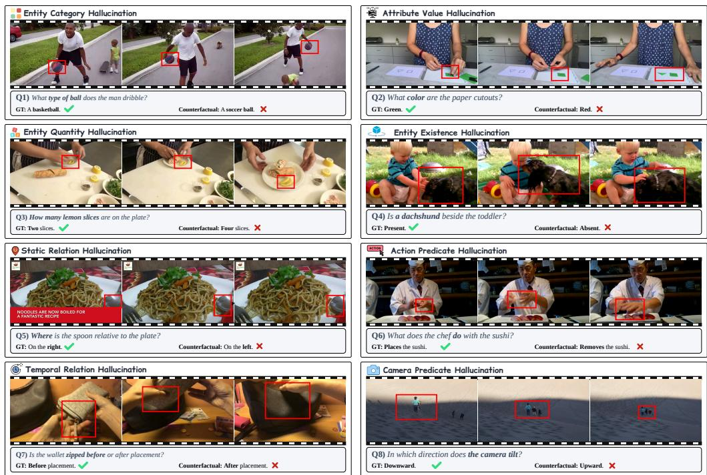  
Figure 1: An Overview Taxonomy of VIDHALLOC — VIDHALLOC establishes a more comprehensive, hierarchical classification for the evaluation of hallucination detectors. It categorizes video hallucinations into ontology hallucinations (covering entity existence, category, quantity, attribute value, and static relations) and dynamic hallucinations (encompassing action predicates, temporal relations, and camera predicates).

These methods differ in their evaluation units, detection mechanisms, and task-specific protocols, making their reliability across hallucination types difficult to compare. VIDHALLOC addresses this gap by evaluating representative detection methods under a unified hallucination taxonomy and an adversarial evaluation protocol. Table 1 provides the detailed method comparison.

Hallucination Benchmarks — Hallucination benchmarks were initially developed to characterize when multimodal models produce unsupported content. In the image setting, POPE isolates object-existence errors, AMBER broadens the analysis to attributes and relations, and HallusionBench examines failures induced by visual illusions and misleading language contexts (Li et al., 2023; Wang et al., 2024a; Guan et al., 2024). Video benchmarks introduce a different challenge because the relevant evidence may be distributed across frames and events. VidHalluc focuses on temporal ordering and event consistency, exposing errors that cannot be diagnosed from isolated frames (Li et al., 2025a). ELV-Halluc moves the evaluation to long-form videos, where a claim may appear locally plausible while conflicting with evidence aggregated across distant segments (Lu et al., 2025). Dr.V-Bench instead provides fine-grained spatiotemporal grounding, allowing a hallucinated claim to be associated with the relevant interval and visual region (Luo et al., 2025). Table 2 compares the task categories, hallucination taxonomies, evaluation objectives, sample sizes, and adversarial characteristics across existing benchmarks. While existing benchmarks evaluate LVLM hallucinations within task-specific settings, they cannot ensure the reliability of detection techniques across diverse hallucination types. Furthermore, manually constructing video datasets becomes costly when fine-grained control over type-specific annotations is required (Li et al., 2025a; Lu et al., 2025; Luo et al., 2025).

## 3 VIDHALLOC Benchmark

We present the VIDHALLOC benchmark of 2,000 instances to evaluate hallucination detectors, featuring coupled annotations of hallucination types across the core tasks of Video Question Answering (Video QA) and Video Captioning.

## 3.1 Video Hallucination Types

Building upon prior observations of video misalignments (Bai et al., 2024; Chen et al., 2024; Wang et al., 2024c; Li et al., 2025a), we present a comprehensive framework to facilitate a rigorous assessment of detection reliability. Specifically, we organize general video hallucinations into two toplevel categories: Ontology and Dynamic. Ontology hallucination describes entity-related misalignments, encompassing objects, scenes, attributes, categories, spatial relations, and quantities. In contrast, Dynamic hallucination characterizes motion and temporal inconsistencies, specifically including actions, temporal order, and camera transitions.

Ontology Hallucination (OH) — Ontology hallucination describes entity-related misalignments across five core aspects: Entity Existence Hallucination (EEH): fabricates or explicitly denies the presence of an object or scene. Entity Category Hallucination (ECH): misidentifies the semantic category of a grounded entity (e.g., describing a basketball as a soccer ball). Entity Quantity Hallucination (EQH): miscounts visible entities within a given interval. Attribute Value Hallucination (AVH): distorts an observable property of a grounded entity (e.g., describing a closed door as open, or a blue pen as red). Static Relation Hallucination (SRH): misrepresents the spatial relationship between grounded entities.

Dynamic Hallucination (DH) — Dynamic hallucination describes motion and temporal inconsistencies across actions, temporal order, and camera transitions: Action Predicate Hallucination (APH): mischaracterizes the action or behavior of a grounded entity. Temporal Relation Hallucination (TRH): reverses or distorts the chronological order between valid events (e.g., event A occurs before event B, but the output reverses their order). Camera Predicate Hallucination (CPH): misidentifies camera motions or editing operations (e.g., the camera zooms in while the video actually zooms out).

## 3.2 Data Processing

Video Collection — To provide a rich and diverse foundation for dataset construction, we curate a candidate pool of 31,771 real-world videos sourced from VidOR, COIN, Perception Test, UCF101- DS, and UCF101 (Shang et al., 2019; Tang et al., 2019; Patraucean et al., 2023; Schiappa et al., 2023;

Soomro et al., 2012). These sources encompass a wide spectrum of authentic visual content, covering entity relations, multistep instructional activities, general perception scenarios, and temporally bounded human actions.

Filter and Normalization — We process the initial video pool in three steps using FFmpeg (Tomar, 2006) and OpenCV (Bradski, 2000). (1) Quality Filtering: we remove defective data, including files that are corrupted, duplicated, or unable to pass basic visual checks. (2) Distribution Normalization: we balance the dataset, preventing the overrepresentation of either static shots or dynamic transitions while maintaining a proper proportion of video sources and tasks. (3) Human Auditing: human reviewers check a random subset to confirm the automated decisions, yielding a refined pool of 1,090 videos ready for representation validation.

Representation Validation — Before feeding the candidate pool into VIDEOHALO, we extract and validate the feature representations of every video to ensure two key qualities: wide visual diversity across the entire dataset and sufficient temporal changes within individual clips. Specifically, we use CLIP (Radford et al., 2021) to extract global visual representations that examine overall semantic coverage (McInnes et al., 2018), and LaViLa (Zhao et al., 2023) to capture sequential temporal representations that measure scene variations over time. Figures 5 and 6 in Appendix A report these checks to confirm the breadth and richness of the dataset.

## 3.2.1 VIDEOHALO

Inspired by Harness Engineering (Zhong and Zhu, 2026), VIDEOHALO automates video dataset construction by decomposing the annotation process into four executable sub-tasks. By equipping rolespecific agents with a hierarchical memory system and a unified communication protocol (Hong et al., 2024; Wu et al., 2024; Qian et al., 2024; Sumers et al., 2024), our workflow simplifies complex benchmark engineering while strictly preserving quality. Figure 2 summarizes this pipeline, with complete interfaces and rejection rules detailed in Appendix B (Section B.4).

Memory System — To ensure robust synchronization across the multi-agent workflow, VIDEO-HALO implements a hierarchical memory system comprising two foundational layers invoked during each agent call. (1) Systematic Cognitive Layer:

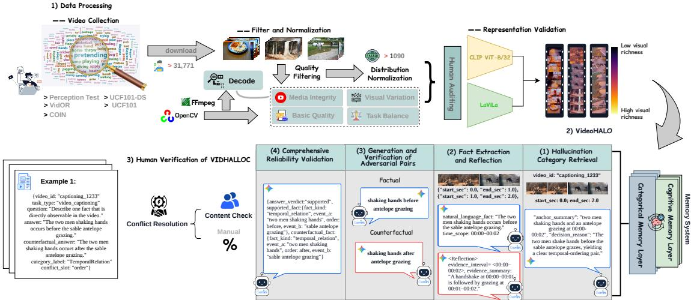  
Figure 2: End-to-End Benchmark Construction — The data processing pipeline curates 1,090 high-quality samples from an initial pool of 31,771 videos through rigorous decoding, filtering, distribution normalization, and human verification. To guarantee representativeness, CLIP ViT-B/32 (Radford et al., 2021) ensures dataset-wide visual diversity, while LaViLa (Zhao et al., 2023) captures temporal scene transitions within individual videos. Flowing from right to left, VIDEOHALO orchestrates four collaborative stages: Hallucination Category Retrieval, Fact Extraction and Reflection, Generation and Verification of Adversarial Pairs, and Comprehensive Reliability Validation. Throughout this workflow, a dual-layer memory system provides a globally consistent cognitive foundation for all agents, while stage-specific records dynamically govern the information shared between roles. Finally, human reviewers independently audit a subset of the generated samples (Appendix C).

The cognitive layer establishes overarching data construction boundaries and the exact protocols for synthesizing adversarial samples. (2) Categorical Memory Layer: The categorical layer supplies precise specifications for all hallucination types, indicating their conceptual boundaries, illustrative examples, and retrieval rules. Ultimately, this duallayer architecture instills a universally consistent cognitive foundation, seamlessly guiding the entire pipeline to generate fine-grained, high-quality data (Appendix B.1).

Coordinated Video Understanding Subtasks — VIDEOHALO progresses through four collaborative stages. (1) Hallucination Category Retrieval: The planner agent scans the video to identify promising scenes. (2) Fact Extraction and Reflection: The extraction and reflection agents isolate and verify specific visual details. (3) Generation and Verification of Adversarial Pairs: Text-only agents utilize predefined templates (Table 6) to formulate a targeted question and modify a single key detail to form a counterfactual statement, followed by a rigorous cross-check to ensure the broader context remains unaltered. (4) Comprehensive Reliability Validation: The monitor agent re-engages the visual modality to check the samples against video evidence. Appendix B.2 details these task contracts.

Communication Protocol — VIDEOHALO orchestrates multi-agent collaboration via a structured communication protocol. Rather than relying on open-ended dialogue, agents exchange outputs through standardized, schema-driven forms. To preserve task state, crucial fields validated in earlier stages are locked as permanent contextual states. Downstream agents evaluate this propagated information while being restricted from overwriting prior conclusions, ensuring consistent reasoning across the pipeline (detailed in Appendix B.3).

## 3.2.2 External Human Audit

The human audit yielded a sample accuracy of 98.75% against one author’s independently assigned reference categories. The two workers achieved 96.63% category agreement, with an overall multiclass Cohen’s κ of 0.962 (Table 3). Appendix C details the sampling procedure, annotation protocol, metric definitions, and confidence intervals. Table 3 also reports construction throughput and unit price, which, together with the audit results, indicate that VIDEOHALO combines efficient benchmark construction with high data quality.

## 3.3 Data Statistics

VIDHALLOC comprises 2,000 adversarial hallucination samples from 1,090 unique source videos,

(a) Category Annotation Quality
<table><tr><td rowspan="2">Metric</td><td colspan="5">Ontology Hallucination</td><td colspan="3">Dynamic Hallucination</td><td rowspan="2">All</td></tr><tr><td>EEH</td><td>ECH</td><td>EQH</td><td>AVH</td><td>SRH</td><td>APH</td><td>TRH</td><td>CPH</td></tr><tr><td>Sample accuracy (%)</td><td>99.00</td><td>93.00</td><td>100.00</td><td>100.00</td><td>100.00</td><td>98.00</td><td>100.00</td><td>100.00</td><td>98.75</td></tr><tr><td>Worker agreement (%)</td><td>97.00</td><td>96.00</td><td>100.00</td><td>98.00</td><td>99.00</td><td>96.00</td><td>93.00</td><td>94.00</td><td>96.63</td></tr><tr><td>Cohen&#x27;s κ</td><td>0.983</td><td>0.975</td><td>1.000</td><td>0.963</td><td>0.989</td><td>0.976</td><td>0.958</td><td>0.964</td><td>0.962</td></tr></table>

(b) Construction Efficiency
<table><tr><td>Method</td><td>Throughput ↑</td><td>Unit price ↓</td></tr><tr><td>Human workers</td><td>24.50</td><td>0.630</td></tr><tr><td>VIDEOHALO</td><td>41.45</td><td>0.194</td></tr></table>

Table 3: Data Quality and Construction Efficiency — (a) Sample accuracy compares original benchmark categories with one author’s independent reference labels. Agreement and Cohen’s κ compare the two workers. Per-category κ uses one-vs-rest coding, whereas All reports multiclass κ (Appendix C). (b) Throughput measures accepted samples per hour, and unit price is reported in AUD per sample, covering both VIDEOHALO API inference and human labor.

## 3.4 Evaluation

with exactly 250 instances in each category (Table 4). The table reports category-level question and video counts, average question lengths, and average video durations. A source video can contribute samples to multiple categories. Average video durations range from 48.63 seconds for APH to 61.05 seconds for CPH; AVH and EEH both exceed 50 seconds, while TRH averages 53.44 seconds.

Figure 4 (left) in Appendix A shows the numbers of Video QA and Captioning samples within each category. ECH has an equal split of 125 Video QA and 125 Captioning instances. The corresponding counts are 120 and 130 for AVH, and 145 and 105 for EEH. CPH has the largest difference between the two task counts, with 146 Video QA and 104 Captioning instances.

Average question lengths in Table 4 range from 12.06 words for SRH to 15.30 words for TRH, with EEH and ECH averaging 13.28 and 13.47 words, respectively. The word cloud in Figure 4 (right) displays vocabulary used in the benchmark questions, including task words such as summarize, identify, state, and describe.

We assess the extent of alignment through three performance measures. These comprise Factual, Counterfactual, and Overall. For any given instance i, let the tuple $( d _ { i } ^ { F } , d _ { i } ^ { C } ) \in \{ \mathsf { S } , \mathsf { R } \} ^ { 2 }$ denote the method decisions. The variable $d _ { i } ^ { F }$ dictates whether the method supports (S) or rejects (R) the factual answer. The variable $d _ { i } ^ { C }$ indicates the corresponding decision for the counterfactual answer. These joint decisions establish four exclusive outcome states:

d = R d<sup>C</sup> = S $\begin{array} { c } { d _ { i } ^ { F } = { \sf S } } \\ { d _ { i } ^ { F } = { \sf R } } \end{array}$ Both correct (o<sub>i</sub> = 1) Factual only Counterfactual only Neither The Factual accuracy quantifies the proportion of instances satisfying $\bar { d } _ { i } ^ { F } = { \sf S }$ . The Counterfactual accuracy measures the proportion of instances satisfying $d _ { i } ^ { C } = { \sf R }$ . The Overall accuracy isolates the joint success rate. The criterion demands the "Both correct" state. The ideal outcome corresponds to the indicator function $o _ { i } = { \bf 1 } \{ d _ { i } ^ { F } = { \sf S } \land d _ { i } ^ { C } = { \sf R } \}$ This strict evaluation dictates simultaneous comprehension across both statements.

<table><tr><td>Statistic</td><td colspan="5">Ontology</td><td colspan="3">Dynamic</td></tr><tr><td></td><td>EEH</td><td>ECH</td><td>EQH</td><td>AVH</td><td>SRH</td><td>APH</td><td>TRH</td><td>CPH</td></tr><tr><td># Questions</td><td>250</td><td>250</td><td>250</td><td>250</td><td>250</td><td>250</td><td>250</td><td>250</td></tr><tr><td># Videos</td><td>250</td><td>250</td><td>250</td><td>250</td><td>250</td><td>250</td><td>250</td><td>250</td></tr><tr><td>Avg. question length (words)</td><td>13.28</td><td>13.47</td><td>12.78</td><td>12.97</td><td>12.06</td><td>12.14</td><td>15.30</td><td>13.46</td></tr><tr><td>Avg. video length (s)</td><td>50.88</td><td>48.88</td><td>49.25</td><td>50.03</td><td>48.95</td><td>48.63</td><td>53.44</td><td>61.05</td></tr></table>

Table 4: Category-Level Statistics of VIDHALLOC — The Ontology group comprises EEH, ECH, EQH, AVH, and SRH. The Dynamic group contains APH, TRH, and CPH. Every individual category includes exactly 250 adversarial hallucination samples. The reported video counts reflect category-specific assignments derived from a total of 1,090 unique source videos. Length statistics quantify the word counts of the textual queries and the temporal durations of their corresponding videos.

## 4 Experiments

We evaluate fifteen methods on VIDHALLOC, including two commercial models, six open-source models, three video agents, and four detection methods. Alongside the four dedicated detectors, we employ LVLMs and video agents as independent evaluators to determine whether each candidate response is supported by the video and correctly answers the question. Our results reveal that most LVLMs and video agents exhibit notable vulnerabilities on VIDHALLOC (Section 4.1). We then assess the performance of four representative detection methods on VIDHALLOC, showing the need to improve the reliability of these evaluators against various types of hallucinations (Section 4.2). During inference, we preserve each model’s original configuration, including conversation mode, hyperparameters, and frame count. Following standard practices (Cheng et al., 2024; Zhang et al., 2025a), we set temperature to 0, top-k to 1, and disable stochastic sampling for all opensource models to avoid randomness in response generation. For commercial models, we sample frames at 1 fps. For video agents and detection methods, we use the original configuration from their paper. Implementation details and threshold settings are in Appendix D. Appendix E reports the corresponding uncertainty analysis.

<table><tr><td colspan="5">Accuracy on VIDHALLOC</td></tr><tr><td>Methods</td><td>|LLM Params Encoder</td><td>Frames</td><td></td><td>Factual ↑ Counterfactual ↑ Overall ↑</td><td></td></tr><tr><td colspan="6"></td></tr><tr><td>Gemini-3-Flash (Google DeepMind, 2025)</td><td>Commercial VLMs 一</td><td></td><td>1fps</td><td>98.25</td><td>84.63 83.63</td></tr><tr><td colspan="6"></td></tr><tr><td>GPT-5 (OpenAI, 2025)</td><td>Open Source VLMs</td><td></td><td>1fps 83.63</td><td>92.75</td><td>79.50</td></tr><tr><td colspan="6">7B</td></tr><tr><td>LLaVA-NeXT-Video (Li et al., 2024) Qwen3-VL-Instruct (Bai et al., 2025b)</td><td>CLIP ViT-L/14 Qwen3-VL-ViT</td><td>32 32</td><td>72.38 87.88</td><td>25.63 83.38</td><td>2.13 73.00</td></tr><tr><td>Gemma-4-it (Gemma Team, 2026)</td><td>8B 12B Unified</td><td>32</td><td>55.88</td><td>94.88</td><td>52.63</td></tr><tr><td>InternVL3.5 (Wang et al., 2025)</td><td>14.8B</td><td>InternViT-300M</td><td>32</td><td>90.88 72.13</td><td>64.88</td></tr><tr><td>Qwen3.6-27B (Qwen Team, 2026)</td><td>27B</td><td>Qwen3.5-Vision-</td><td>32 95.50</td><td>84.50</td><td>81.00</td></tr><tr><td>Qwen3-Omni-Instruct (Xu et al., 2025)</td><td>Encoder 30B-A3B Qwen3-Omni ViT</td><td></td><td>32 98.13</td><td>48.00</td><td>46.75</td></tr><tr><td colspan="6"></td></tr><tr><td>VideoAgent (Fan et al., 2024)</td><td>Video Agents 一</td><td></td><td></td><td></td><td></td></tr><tr><td>VideoHV-Agent (Wang et al., 2026)</td><td></td><td></td><td>36.63 1fps 80.75</td><td>89.75 53.13</td><td>31.50</td></tr><tr><td>Deep Video Discovery (Zhang et al., 2025c)</td><td></td><td></td><td>2fps 88.38</td><td>81.00</td><td>39.75 71.50</td></tr><tr><td colspan="6">Detection Methods</td></tr><tr><td>PAC-S (Sarto et al., 2023)</td><td></td><td>CLIP ViT-B/32</td><td>1</td><td>47.75 56.88</td><td>7.25</td></tr><tr><td>EMScore (Shi et al., 2022)</td><td>CLIP ViT-B/32</td><td>一</td><td>66.63</td><td>37.13</td><td>6.50</td></tr><tr><td>Owl-Con (mPLUG-Owl-7B-Video)</td><td>CLIP ViT-L/14</td><td>32</td><td>67.50</td><td>59.25</td><td>33.13</td></tr><tr><td>(Bansal et al., 2024) FIFA (Jing et al., 2025)</td><td>7B</td><td>1fps</td><td>44.25</td><td>88.88</td><td>34.63</td></tr></table>

Table 5: Performance Comparison of Existing Methods on VIDHALLOC — The numbers in the table represent accuracy percentages (%). Bold numbers denote the best performance, and underlined numbers indicate the secondbest performance. Appendix D reports the input and execution settings.

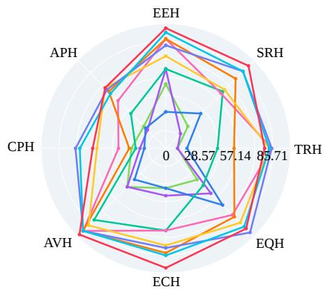

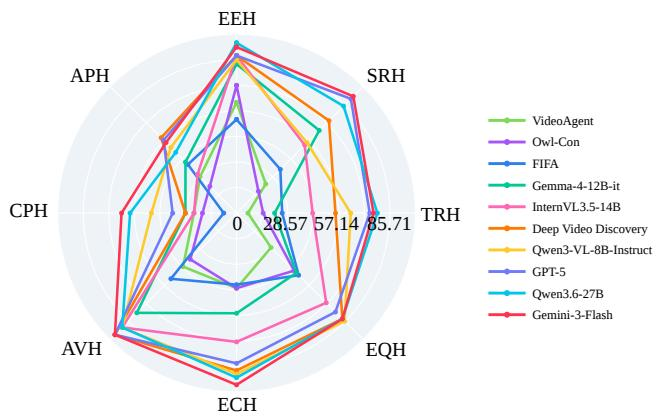  
Figure 3: Comparative Results on VIDHALLOC Across Various Hallucination Types — Left: Video QA. Right: Caption evaluation. Each axis indicates the overall metric for a distinct hallucination type. TRH, APH, and CPH represent temporal sequence, action, and camera transition hallucinations, respectively, while EEH, ECH, EQH, AVH, and SRH correspond to entity-level hallucinations regarding objects, categories, quantities, attributes, and spatial relations.

## 4.1 Evaluation on VIDHALLOC

Table 5 and Figure 3 present the performance of all tested LVLMs and video agents on VIDHALLOC, showing accuracy as percentages. Across both Video QA and video captioning tasks, we observe that the Overall accuracy of most LVLMs and all three video agents score at least 17.60% and 15.60% lower on DH compared to OH, respectively (Appendix E.2, Table 14). This significant difference is due to the inherent focus of OH, which assesses stable factual elements, such as objects, categories, attributes, and spatial relations, that are easily verifiable within short video clips. In contrast, DH forces models to continuously reason across frames to differentiate detailed actions, event order, and camera transitions. Furthermore, due to the design of adversarial candidates, the factual and counterfactual statements become proximate in both visual and semantic spaces. Consequently, LVLMs and agents are more prone to confusion and errors.

We also observe that model scale does not correlate directly with performance. Commercial models generally outperform open-source models across most tasks, with Gemini-3-Flash (Google DeepMind, 2025) standing out in particular. However, Gemini-3-Flash still falls short on several DH tasks, scoring 55.77% in APH Video Captioning and 58.62% in CPH Video QA. In contrast, GPT-5 (OpenAI, 2025) does not consistently surpass the best open-source models. For instance, the Overall accuracy of 35.71% in CPH Video Captioning is substantially lower than the 59.52% achieved by Qwen3.6-27B (Qwen Team, 2026). These results highlight the need for improvement even in top-tier commercial models.

## 4.2 Evaluation of Detection Methods on VIDHALLOC

To evaluate the effectiveness of detection methods in evaluating hallucinations, we use PAC-S (Sarto et al., 2023), EMScore (Shi et al., 2022), Owl-Con (Bansal et al., 2024), and FIFA (Jing et al., 2025) as baselines. Under the evaluated protocol, none of the four dedicated detectors correctly resolves a majority of adversarial attacks, and performance deteriorates further on dynamic hallucinations (Appendix D.2, Tables 9–10).

EMScore (Shi et al., 2022) and PAC-S (Sarto et al., 2023) achieve Overall scores of 16% and 18% respectively in ECH Video Captioning against a complete failure of 0% in TRH Video Captioning. Although FIFA (Jing et al., 2025) and Owl-Con (Bansal et al., 2024) reach peak scores of 64.44% in EQH Video QA and 71.43% in EEH Video Captioning, respectively, this performance fails to generalize. Both methods experience severe accuracy drops in other tasks, with FIFA plunging to a mere 7.14% in CPH Video Captioning and Owl-Con falling to 9.43% in TRH Video QA.

The evaluated methods assess video–text consistency through distinct mechanisms. Among embedding-based methods, PAC-S (Sarto et al., 2023) computes visual–text similarity, and EM-Score (Shi et al., 2022) combines global video– sentence matching with frame–word alignment. Neither explicitly encodes event order in this evaluation, which may contribute to their weak TRH results. Owl-Con is the mPLUG-Owl-Video entailment model trained with VideoCon contrastive captions (Bansal et al., 2024), and its performance varies across hallucination categories. FIFA (Jing et al., 2025) decomposes responses into atomic facts before verifying them with multimodal evidence from off-the-shelf models. Because its output depends on both decomposition and evidence verification, errors at either stage can affect the final decision. Overall, these category-level variations indicate that embedding similarity, learned entailment, and structured verification transfer unevenly under the unified VIDHALLOC protocol (Appendices D.2 and F).

## 5 Conclusion

We introduce VIDHALLOC to evaluate video hallucination detectors using adversarial candidates across various hallucination categories, and the VIDEOHALO workflow for efficient benchmark construction through multiple agents. Mean Overall accuracy across fifteen evaluated systems is lower on dynamic hallucinations than on ontology types. The four dedicated detectors achieve a peak Overall accuracy of 34.63%, trailing the top LVLM at 83.63%. These findings establish dynamic hallucinations as a primary target for detector development and support an integrated evaluation of factual acceptance and counterfactual rejection.

## Limitations

VidHalLoc focuses on adversarial attacks differing in a single targeted detail. This design supports diagnosis by hallucination type but unconstrained model outputs may contain multiple interacting errors. The balanced category distribution may also diverge from frequencies encountered in practical deployments. Extending the benchmark with authentic responses would enable the evaluation of compound errors under target distributions.

The benchmark covers Video QA and Video Captioning using 1,090 videos from five public datasets with average durations per category ranging from 48.63 to 61.05 seconds. Coverage remains untested on longer recordings where relevant evidence spans distant segments. Extending the evaluation to these formats would test detector capacity to integrate distant evidence and verify event relations.

The evaluated systems employ varied visual encoders and frame sampling strategies alongside distinct language models and inference pipelines. The results characterize reliability under the reported configurations but fail to isolate the contribution of individual components. Complementary evaluations varying a single factor would help identify the specific design choices affecting detection reliability.

## References

Shuai Bai, Keqin Chen, Xuejing Liu, Jialin Wang, Wenbin Ge, Sibo Song, Kai Dang, Peng Wang, Shijie Wang, Jun Tang, Humen Zhong, Yuanzhi Zhu, Mingkun Li, Zhaohai Li, Jianqiang Wan, Pengfei Wang, Wei Ding, Zheren Fu, Yiheng Xu, and 8 oth ers. 2025a. Qwen2.5-VL Technical Report. Preprint, arXiv:2502.13923.

Shuai Bai et al. 2025b. Qwen3-VL Technical Report. arXiv preprint arXiv:2511.21631.

Zechen Bai, Pichao Wang, Tianjun Xiao, Tong He, Zongbo Han, Zheng Zheng, and Mike Zheng Shou. 2024. Hallucination of Multimodal Large Language Models: A Survey. arXiv preprint arXiv:2404.18930.

Hritik Bansal, Yonatan Bitton, Idan Szpektor, Kai-Wei Chang, and Aditya Grover. 2024. VideoCon: Robust Video-Language Alignment via Contrast Captions. In Proceedings of the IEEE/CVF Conference on Computer Vision and Pattern Recognition, pages 13927–13937.

G. Bradski. 2000. The OpenCV Library. Dr. Dobb’s Journal of Software Tools.

Xiang Chen, Chenxi Wang, Yida Xue, Ningyu Zhang, Xiaoyan Yang, Qiang Li, Yue Shen, Lei Liang, Jinjie Gu, and Huajun Chen. 2024. Unified Hallucination Detection for Multimodal Large Language Models. In Proceedings of the 62nd Annual Meeting of the Associationfor Computational Linguistics (Volume 1: Long Papers), pages 3235–3252.

Zesen Cheng, Sicong Leng, Hang Zhang, Yifei Xin, Xin Li, Guanzheng Chen, Yongxin Zhu, Wenqi Zhang, Ziyang Luo, Deli Zhao, et al. 2024. VideoLLaMA 2: Advancing Spatial-Temporal Modeling and Audio Understanding in Video-LLMs. arXiv preprint arXiv:2406.07476.

Tri Dao, Daniel Y. Fu, Stefano Ermon, Atri Rudra, and Christopher Ré. 2022. FlashAttention: Fast and Memory-Efficient Exact Attention with IO-Awareness. In Advances in Neural Information Processing Systems, volume 35, pages 16344–16359.

DMLC Community. 2021. Decord: An Efficient Video Loader for Deep Learning. Software, version 0.6.0.

Yue Fan, Xiaojian Ma, Rujie Wu, Yuntao Du, Jiaqi Li, Zhi Gao, and Qing Li. 2024. VideoAgent: A Memory-Augmented Multimodal Agent for Video Understanding. In European Conference on Computer Vision, pages 75–92.

Gemma Team. 2026. Gemma 4 Technical Report. arXiv preprint arXiv:2607.02770.

Google DeepMind. 2025. Gemini 3 Flash. Model Card.

Tianrui Guan, Fuxiao Liu, Xiyang Wu, Ruiqi Xian, Zongxia Li, Xiaoyu Liu, Xijun Wang, Lichang Chen, Furong Huang, Yaser Yacoob, et al. 2024. HallusionBench: An Advanced Diagnostic Suite for Entangled Language Hallucination and Visual Illusion in Large Vision-Language Models. In Proceedings ofthe IEEE/CVF conference on computer vision and pattern recognition, pages 14375–14385.

Anisha Gunjal, Jihan Yin, and Erhan Bas. 2024. Detecting and Preventing Hallucinations in Large Vision Language Models. Proceedings ofthe AAAI Conference on Artificial Intelligence, 38(16):18135–18143.

Sirui Hong, Mingchen Zhuge, Jonathan Chen, Xiawu Zheng, Yuheng Cheng, Ceyao Zhang, Jinlin Wang, Zili Wang, Steven Ka Shing Yau, Zijuan Lin, Liyang Zhou, Chenyu Ran, Lingfeng Xiao, Chenglin Wu, and Juergen Schmidhuber. 2024. MetaGPT: Meta Programming for a Multi-Agent Collaborative Framework. In The Twelfth International Conference on Learning Representations.

Liqiang Jing, Viet Lai, Seunghyun Yoon, Trung Bui, and Xinya Du. 2025. FIFA: Unified Faithfulness Evaluation Framework for Text-to-Video and Video-to-Text Generation. arXiv preprint arXiv:2507.06523.

Liqiang Jing, Ruosen Li, Yunmo Chen, and Xinya Du. 2024. FaithScore: Fine-Grained Evaluations of Hallucinations in Large Vision-Language Models. In

Findings ofthe Associationfor Computational Lin guistics: EMNLP 2024, pages 5042–5063.

Jie Lei, Tamara L. Berg, and Mohit Bansal. 2021. Detecting Moments and Highlights in Videos via Natural Language Queries. In Advances in Neural Information Processing Systems, volume 34, pages 11846– 11858.

Chaoyu Li, Eun Woo Im, and Pooyan Fazli. 2025a. Vid-Halluc: Evaluating Temporal Hallucinations in Multimodal Large Language Models for Video Understanding. In Proceedings of the IEEE/CVF Conference on Computer Vision and Pattern Recognition, pages 13723–13733.

Feng Li, Renrui Zhang, Hao Zhang, Yuanhan Zhang, Bo Li, Wei Li, Zejun Ma, and Chunyuan Li. 2024. LLaVA-NeXT-Interleave: Tackling Multi-Image, Video, and 3D in Large Multimodal Models. arXiv preprint arXiv:2407.07895.

Yifan Li, Yifan Du, Kun Zhou, Jinpeng Wang, Xin Zhao, and Ji-Rong Wen. 2023. Evaluating Object Hallucination in Large Vision-Language Models. In Proceedings of the 2023 conference on empirical methods in natural language processing, pages 292– 305.

Zongxia Li, Xiyang Wu, Guangyao Shi, Yubin Qin, Hongyang Du, Fuxiao Liu, Tianyi Zhou, Dinesh Manocha, and Jordan Lee Boyd-Graber. 2025b. VideoHallu: Evaluating and Mitigating Multi-Modal Hallucinations on Synthetic Video Understanding. In Advances in Neural Information Processing Systems.

Bin Lin, Yang Ye, Bin Zhu, Jiaxi Cui, Munan Ning, Peng Jin, and Li Yuan. 2024. Video-LLaVA: Learning United Visual Representation by Alignment Before Projection. In Proceedings of the 2024 Conference on Empirical Methods in Natural Language Processing, pages 5971–5984. Association for Computational Linguistics.

Fuxiao Liu, Kevin Lin, Linjie Li, Jianfeng Wang, Yaser Yacoob, and Lijuan Wang. 2023. Mitigating Hallucination in Large Multi-Modal Models via Robust Instruction Tuning. arXiv preprint arXiv:2306.14565.

Hao Lu, Jiahao Wang, Yaolun Zhang, Ruohui Wang, Xuanyu Zheng, Yepeng Tang, Dahua Lin, and Lewei Lu. 2025. ELV-Halluc: Benchmarking Semantic Aggregation Hallucinations in Long Video Understanding. arXiv preprint arXiv:2508.21496.

Meng Luo, Shengqiong Wu, Liqiang Jing, Tianjie Ju, Li Zheng, Jinxiang Lai, Tianlong Wu, Xinya Du, Jian Li, Siyuan Yan, Jiebo Luo, William Yang Wang, Hao Fei, Mong-Li Lee, and Wynne Hsu. 2025. Dr.V: A Hierarchical Perception-Temporal-Cognition Framework to Diagnose Video Hallucination by Fine-Grained Spatial-Temporal Grounding. Preprint, arXiv:2509.11866.

Leland McInnes, John Healy, Nathaniel Saul, and Lukas Grossberger. 2018. UMAP: Uniform Manifold Approximation and Projection. Journal ofOpen Source Software, 3(29):861.

OpenAI. 2024a. GPT-4o System Card. System Card.

OpenAI. 2024b. New Embedding Models and API Updates.

OpenAI. 2025. GPT-5 System Card.

Eunkyu Park, Minyeong Kim, and Gunhee Kim. 2025. HalLoc: Token-Level Localization of Hallucinations for Vision Language Models. In Proceedings of the IEEE/CVF Conference on Computer Vision and Pattern Recognition (CVPR), pages 29893–29903.

Viorica Patraucean, Lucas Smaira, Ankush Gupta, Adria Recasens, Larisa Markeeva, Dylan Banarse, Skanda Koppula, Joseph Heyward, Mateusz Malinowski, Yi Yang, Carl Doersch, et al. 2023. Perception Test: A Diagnostic Benchmark for Multimodal Video Models. In Advances in Neural Information Processing Systems.

Suzanne Petryk, David Chan, Anish Kachinthaya, Haodi Zou, John Canny, Joseph Gonzalez, and Trevor Darrell. 2024. ALOHa: A New Measure for Hallucination in Captioning Models. In Proceedings of the 2024 Conference of the North American Chapter ofthe Associationfor Computational Linguistics: Human Language Technologies (Volume 2: Short Papers), pages 342–357.

PyAV Developers. 2026. PyAV: Pythonic Bindings for FFmpeg’s Libraries. GitHub repository. Accessed 2026-08-30.

Chen Qian, Wei Liu, Hongzhang Liu, Nuo Chen, Yufan Dang, Jiahao Li, Cheng Yang, Weize Chen, Yusheng Su, Xin Cong, Juyuan Xu, Dahai Li, Zhiyuan Liu, and Maosong Sun. 2024. ChatDev: Communicative Agents for Software Development. In Proceedings of the 62nd Annual Meeting of the Association for Computational Linguistics (Volume 1: Long Papers), pages 15174–15186. Association for Computational Linguistics.

Qwen Team. 2026. Qwen3.6-27B: Flagship-Level Coding in a 27B Dense Model.

Alec Radford et al. 2021. Learning Transferable Visual Models from Natural Language Supervision. In ICML.

Anna Rohrbach, Lisa Anne Hendricks, Kaylee Burns, Trevor Darrell, and Kate Saenko. 2018. Object Hallucination in Image Captioning. In Proceedings of the 2018 Conference on Empirical Methods in Natural Language Processing, pages 4035–4045.

Sara Sarto, Manuele Barraco, Marcella Cornia, Lorenzo Baraldi, and Rita Cucchiara. 2023. Positive Augmented Contrastive Learning for Image and Video Captioning Evaluation. In Proceedings ofthe IEEE

Conference on Computer Vision and Pattern Recognition, pages 6914–6924.

Madeline Chantry Schiappa, Naman Biyani, Prudvi Kamtam, Shruti Vyas, Hamid Palangi, Vibhav Vineet, and Yogesh Rawat. 2023. Large-Scale Robustness Analysis of Video Action Recognition Models. In Proceedings of the IEEE Conference on Computer Vision and Pattern Recognition.

Daniel Shalam, Emanuel Ben Baruch, Avi Ben Cohen, and Tal Remez. 2026. Propose and Attend: Training-Free MLLM Grounding Confidence via Multi-Token Localized Attention. Preprint, arXiv:2607.05978.

Xindi Shang, Donglin Di, Junbin Xiao, Yu Cao, Xun Yang, and Tat-Seng Chua. 2019. Annotating Objects and Relations in User-Generated Videos. In Proceedings ofthe 2019 International Conference on Multimedia Retrieval, pages 279–287.

Yaya Shi, Xu Yang, Haiyang Xu, Chunfeng Yuan, Bing Li, Weiming Hu, and Zheng Jun Zha. 2022. EMScore: Evaluating Video Captioning via Coarse-Grained and Fine-Grained Embedding Matching. In Proceedings of the IEEE/CVF Conference on Computer Vision and Pattern Recognition, pages 17929– 17938.

Khurram Soomro, Amir Roshan Zamir, and Mubarak Shah. 2012. UCF101: A Dataset of 101 Human Actions Classes from Videos in the Wild. arXiv preprint arXiv:1212.0402.

Theodore R. Sumers, Shunyu Yao, Karthik Narasimhan, and Thomas L. Griffiths. 2024. Cognitive Architectures for Language Agents. Transactions on Machine Learning Research. Published online.

Yansong Tang, Dajun Ding, Yongming Rao, Yu Zheng, Danyang Zhang, Lili Zhao, Jiwen Lu, and Jie Zhou. 2019. COIN: A Large-Scale Dataset for Comprehensive Instructional Video Analysis. In Proceedings of the IEEE Conference on Computer Vision and Pattern Recognition.

Suramya Tomar. 2006. Converting Video Formats with FFmpeg. Linux Journal, 2006(146):10.

Junyang Wang, Yuhang Wang, Guohai Xu, Jing Zhang, Yukai Gu, Haitao Jia, Jiaqi Wang, Haiyang Xu, Ming Yan, Ji Zhang, and Jitao Sang. 2024a. AM-BER: An LLM-Free Multi-Dimensional Benchmark for MLLMs Hallucination Evaluation. Preprint, arXiv:2311.07397.

Weiyun Wang et al. 2025. InternVL3.5: Advancing Open-Source Multimodal Models in Versatility, Reasoning, and Efficiency. arXiv preprint arXiv:2508.18265.

Yan Wang, Yawen Zeng, Jingsheng Zheng, Xiaofen Xing, Jin Xu, and Xiangmin Xu. 2024b. VideoCoT: A Video Chain-of-Thought Dataset with Active Annotation Tool. In Proceedings of the 3rd Workshop on Advances in Language and Vision Research, pages

92–101, Bangkok, Thailand. Association for Computational Linguistics.

Yuxuan Wang, Yueqian Wang, Dongyan Zhao, Cihang Xie, and Zilong Zheng. 2024c. VideoHallucer: Evaluating Intrinsic and Extrinsic Hallucinations in Large Video-Language Models. Preprint, arXiv:2406.16338.

Zheng Wang, Haoran Chen, Haoxuan Qin, Zhipeng Wei, Tianwen Qian, and Cong Bai. 2026. Think, Then Verify: A Hypothesis-Verification Multi-Agent Framework for Long Video Understanding. arXiv preprint arXiv:2603.04977.

Qingyun Wu, Gagan Bansal, Jieyu Zhang, Yiran Wu, Beibin Li, Erkang Zhu, Li Jiang, Xiaoyun Zhang, Shaokun Zhang, Jiale Liu, Ahmed Hassan Awadallah, Ryen W. White, Doug Burger, and Chi Wang. 2024. AutoGen: Enabling Next-Gen LLM Applications via Multi-Agent Conversations. In First Conference on Language Modeling.

Junbin Xiao, Xindi Shang, Angela Yao, and Tat-Seng Chua. 2021. NExT-QA: Next Phase of Question-Answering to Explaining Temporal Actions. In Proceedings ofthe IEEE/CVF Conference on Computer Vision and Pattern Recognition, pages 9777–9786.

Wenbin Xing, Quanxing Zha, Lizheng Zu, Mengran Li, Ming Li, and Junchi Yan. 2026. Learning to Decode Against Compositional Hallucination in Video Multimodal Large Language Models. arXiv preprint arXiv:2602.00559.

Jin Xu et al. 2025. Qwen3-Omni Technical Report. arXiv preprint arXiv:2509.17765.

Dongjie Yang, Suyuan Huang, Chengqiang Lu, Xiaodong Han, Haoxin Zhang, Yan Gao, Yao Hu, and Hai Zhao. 2024. Vript: A Video Is Worth Thousands of Words. In Advances in Neural Information Processing Systems, volume 37.

Qinghao Ye, Haiyang Xu, Guohai Xu, Jiabo Ye, Ming Yan, Yiyang Zhou, Junyang Wang, Anwen Hu, Pengcheng Shi, Yaya Shi, Chenliang Li, Yuanhong Xu, Hehong Chen, Junfeng Tian, Qi Qian, Ji Zhang, Fei Huang, and Jingren Zhou. 2023. mPLUG-Owl: Modularization Empowers Large Language Models with Multimodality. Preprint, arXiv:2304.14178.

Boqiang Zhang, Kehan Li, Zesen Cheng, Zhiqiang Hu, Yuqian Yuan, Guanzheng Chen, Sicong Leng, Yuming Jiang, Hang Zhang, Xin Li, et al. 2025a. VideoL-LaMA 3: Frontier Multimodal Foundation Models for Image and Video Understanding. arXiv preprint arXiv:2501.13106.

Jiacheng Zhang, Yang Jiao, Shaoxiang Chen, Na Zhao, Zhiyu Tan, Hao Li, Xingjun Ma, and Jingjing Chen. 2025b. EventHallusion: Diagnosing Event Hallucinations in Video LLMs. Preprint, arXiv:2409.16597.

Xiaoyi Zhang, Zhaoyang Jia, Zongyu Guo, Jiahao Li, Bin Li, Houqiang Li, and Yan Lu. 2025c. Deep Video Discovery: Agentic Search with Tool Use for Long-Form Video Understanding. arXiv preprint arXiv:2505.18079.

Yue Zhao et al. 2023. Learning Video Representations from Large Language Models. In CVPR.

Ge Zheng, Jiaye Qian, Jiajin Tang, and Sibei Yang. 2025. Why LVLMs Are More Prone to Hallucinations in Longer Responses: The Role of Context. In Proceedings of the IEEE/CVF International Conference on Computer Vision, pages 4101–4113.

Hailin Zhong and Shengxin Zhu. 2026. AI Harness Engineering: A Runtime Substrate for Foundation-Model Software Agents. arXiv preprint arXiv:2605.13357.

## Appendices

To supplement the main text, the appendices document the VIDEOHALO framework. Furthermore, we provide uncertainty analyses of the human audit and the main experimental results, alongside qualitative examples.

## A Data Processing

Video Collection — We collect 31,771 source videos from five public datasets, consisting entirely of authentic recordings and purposerecorded scenes. Specifically, VidOR contributes YFCC100M footage featuring dense annotations of object trajectories, spatial relations, and interactions (Shang et al., 2019). COIN provides YouTube instructional videos divided into temporally localized steps across 180 multistep tasks and 12 daily-life domains (Tang et al., 2019). The Perception Test dataset adds scripted real-world scenes recorded by around 100 global participants to probe memory, abstraction, physical reasoning, and semantic understanding (Patraucean et al., 2023). UCF101-DS incorporates videos exhibiting naturally occurring shifts in actors, viewpoints, environments, occlusions, speed, and visual styles (Schiappa et al., 2023). UCF101 supplies realistic YouTube footage spanning 101 classes of body motion, object interaction, interpersonal activity, musical performance, and sports (Soomro et al., 2012). Together, these sources combine spontaneous online footage with purpose-recorded scenarios, ensuring rich variation in scene composition, temporal organization, interaction complexity, and capture conditions.

Filter and Normalization — We detail the video processing pipeline, executed in three steps using FFmpeg (Tomar, 2006) and OpenCV (Bradski, 2000). (1) For Quality Filtering: FFmpeg performs full decoding to eliminate duplicate videos and ensure media integrity, while OpenCV is utilized to guarantee the visual richness of the decoded content. (2) For Distribution Normalization: we quantify visual dynamics using consecutive pixel differences to assign motion scores. We then apply stratified sampling based on these scores to prevent dataset biases toward purely static shots or abrupt transitions, while controlling the composition of video sources and tasks. (3) Finally, in Human Auditing: We employ point estimation via random sampling, where independent reviewers evaluate a subset to infer the global quality threshold, ultimately yielding a refined pool of 1,090 videos ready for representation validation.

Representation Validation — To validate representations before VIDEOHALO, we assess datasetwide diversity and within-video temporal richness. (1) For inter-video breadth: CLIP ViT-B/32 (Radford et al., 2021) features from 8 uniformly sampled frames per video are mean-pooled into global vectors. Subsequent cosine similarity, nearestneighbor, and UMAP (McInnes et al., 2018) analyses confirm broad semantic coverage. (2) For intra-video dynamics: LaViLa (Zhao et al., 2023) encodes four frames across up to 12 temporal windows per clip. Evaluating adjacent and pairwise window distances alongside centroid dispersion verifies that each video exhibits genuine scene progression rather than static content. Appendix Figures 5 and 6 report these complementary checks.

## B Multi-Agent Video Data Construction Workflow

Building upon the principles of Harness Engineering (Zhong and Zhu, 2026) and multi-agent orchestration (Hong et al., 2024; Wu et al., 2024; Qian et al., 2024), VIDEOHALO structures benchmark construction as a rigorous workflow centered around four verifiable sub-tasks. To execute this pipeline, we deploy a suite of specialized agents with strict operational boundaries. The Planner Agent initially identifies category-specific opportunities. Subsequently, the Extraction and Reflection Agents collaborate to propose and independently validate atomic visual facts. Using these verified facts, the Generation and Verification Agents construct and back-parse coupled responses without direct video access. Finally, the Monitor Agent executes a definitive video-grounded audit. By compartmentalizing discovery, generation, and verification, this architecture enforces strict internal checks and balances. It prevents systemic confirmation bias during data creation while preserving a fully traceable link from every finalized sample back to its visual evidence. The complete implementation is available in our project repository.

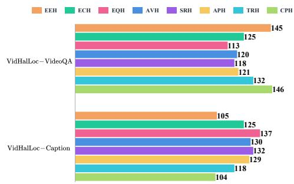

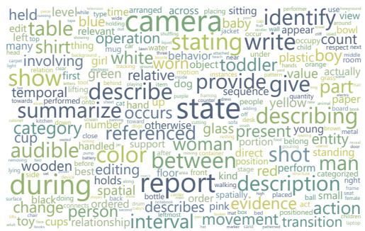  
Figure 4: Data Composition of VIDHALLOC — Left: Number of data points per each hallucination type in the VIDHALLOC–VideoQA, VIDHALLOC–Caption. Right: word cloud of benchmark questions.

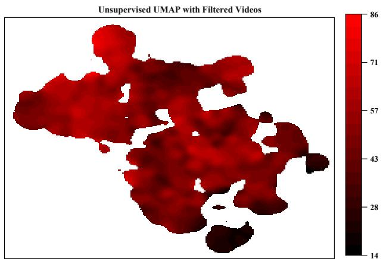

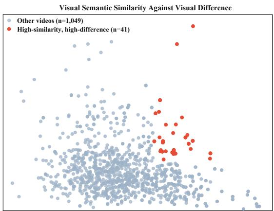

Figure 5: Representations of Inter-Video Visual Diversity Using CLIP (Radford et al., 2021) — Left: global semantic coverage verifying dataset-wide visual richness. Right: joint analysis comparing inter-video nearest-neighbor similarity against within-video visual variations.  
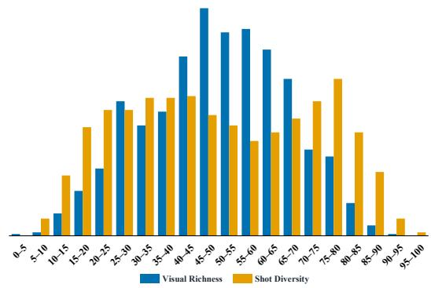

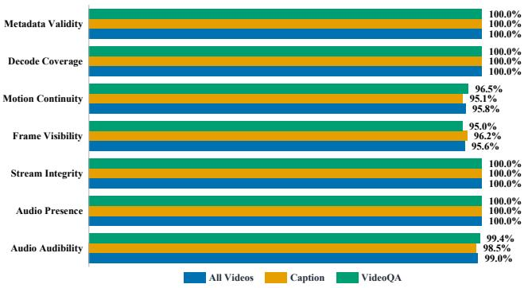  
Figure 6: Representations of Intra-Video Dynamics and Media Integrity — Left: within-video visual richness evaluated via CLIP (Radford et al., 2021), contrasted with temporal shot diversity across sequential windows captured by LaViLa (Zhao et al., 2023). Right: media integrity pass rates across data subsets.

## B.1 Memory System

To ensure robust synchronization across the pipeline, VIDEOHALO implements a hierarchical memory system (Sumers et al., 2024) comprising two foundational layers invoked during each agent call. (1) Systematic Cognitive Memory Layer: The cognitive layer establishes overarching data construction boundaries and operational constraints throughout the orchestrated sub-tasks. (2) Categorical Memory Layer: The categorical layer provides precise specifications for various hallucination types, detailing their exact definitions, conceptual boundaries, illustrative examples, and retrieval rules. By aligning the multi-agent collaborative workflow in this dual-layer architecture, we ensure that all role-specific agents adhere to globally consistent annotation guidelines, thereby effectively prompting fine-grained data generation. Figures 7, 8, 9, and 10 present the exact specifications for both layers.

## B.2 Coordinated Video Understanding Sub-tasks

As detailed in the corresponding figures, the VIDEOHALO pipeline executes four interdependent sub-tasks. (1) Hallucination Category Retrieval (HCR): The planner agent leverages the dual-layer memory system to identify reasonable intervals for counterfactual fabrication, immediately discarding weak candidates (Figure 11). (2) Fact Extraction and Reflection (FER): Building on these refined intervals, the extraction agent isolates a grounded atomic fact. The reflection agent subsequently corroborates this statement against the video, confirming both its temporal correctness and suitability for logical alteration (Figure 12). (3) Generation and Verification of Adversarial Pairs (GVP): Shifting to a text-only stage, the generation agent modifies a single key detail, utilizing predefined templates (Table 6) to formulate the corresponding question and construct the conflicting statement. The verification agent subsequently back-parses adversarial responses into structured facts to validate the structural correctness of the samples (Figure 13). (4) Comprehensive Reliability Validation (CRV): Closing the loop, the monitor agent re-engages the visual modality to rigorously verify the ultimate reliability of the generated samples. By conducting a final visual audit that allows at most one targeted re-inspection, this agent ensures the accepted data strictly maintains factual support and single-detail consistency (Figure 14).

## B.3 Communication Protocol

To ensure seamless orchestration across the pipeline, VIDEOHALO implements a structured communication protocol governing both intertask transitions and intra-task agent collaborations. Within collaborative stages such as FER and GVP, agents exchange intermediate outputs through standardized, schema-driven forms rather than open-ended dialogue. This organization effectively mitigates context dilution and aligns with advanced multi-agent paradigms that coordinate specialized roles via predefined interaction patterns (Hong et al., 2024; Wu et al., 2024; Zhong and Zhu, 2026). A fundamental principle of this protocol is the preservation of task state. The propagated information encapsulates the current operational context as well as the verified evidence retained from prior stages. Once rigorously accepted, crucial fields are locked as immutable contextual states. Downstream agents evaluate whether this propagated information provides sufficient support, but they are restricted from overwriting previously validated conclusions. By decoupling localized task reasoning from global state propagation, the protocol guarantees a stable and consistent interpretation of each sample. Any candidate failing to meet the criteria is immediately discarded, though the Reflection or Monitor Agents may trigger at most one focused visual reinspection to recover borderline cases. Figures 7 to 14 detail the exact instruction schemas and communication formats.

## B.4 Multi-Agent Collaborative Workflow for Video Hallucination Benchmarking

Algorithm 1 outlines the complete pipeline, formalizing agent specifications, task orchestration, state transitions, and final acceptance criteria.

Algorithm 1 Notation — Let V, T , A, and D denote the video space, target tasks, multi-agent set, and finalized benchmark dataset, respectively. The system is governed by a unified dual-layer memory formulation $\mathcal { M } = ( \mathcal { M } _ { \mathrm { c o g } } , \mathcal { M } _ { \mathrm { c a t } } )$ . For each agent $a \in { \mathcal { A } }$ , the instruction profile is instantiated as $\Pi _ { a } = { \mathcal { M } } \oplus \langle { \mathcal { R } } _ { a } , { \mathcal { G } } _ { a } , { \mathcal { P } } _ { a } , { \mathcal { O } } _ { a } \rangle$ , integrating the unified memory with localized configurations for agent-specific role, objective, execution process, and output schema. During initialization, Ω represents the counterfactual feasibility matrix. Given a proposed atomic fact $f \in { \mathcal { F } }$ , the projection operator $\boldsymbol { \omega } = \Gamma ( \boldsymbol { f } , \boldsymbol { \Omega } )$ isolates the associated visual context. To maintain state consistency, the invariant tuple $q _ { \omega } = { \langle } \omega . t , \omega . \alpha , \omega . h { \rangle }$ bounds the time scope, semantic referents, and the targeted factual detail for alteration. Throughout the pipeline, discrete variables $r , p , b ,$ and m track the intermediate outputs of reflection, adversarial generation, structural back-parsing, and visual monitoring, respectively. For each stage $k \in \{ 1 , 2 , 3 , 4 \}$ , the encapsulation operator $\Psi _ { k }$ consolidates outputs conditioned on a Boolean validity indicator $V _ { k } \in \{ 0 , 1 \}$ . The resulting checkpoint $\mu _ { k }$ preserves the conceptual category ω.c and evidence interval ω.e to prevent subsequent modifications. Operationally, I executes agent inference, $\delta ^ { + }$ and $\delta ^ { - }$ act as deterministic gates for stage-level transitions, and the mapping $\boldsymbol { \mathcal { S } }$ projects verified candidates into $\mathcal { D } .$

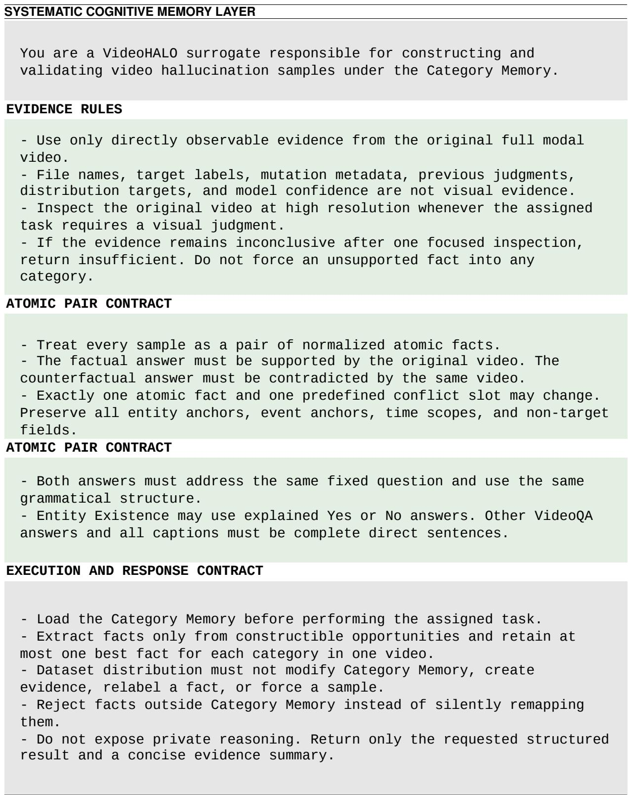  
Figure 7: Systematic Cognitive Memory Used by VIDEOHALO — It standardizes the execution specifications and declares the data generation boundaries within multi-agent systems.

## C External Human Audit

Sampling and Reviewers — We randomly sampled 100 instances from each of the eight original categories, yielding an audit set of 800 samples from the 2,000-sample benchmark. Sampling used a stable sort and seed 20260818. The subset contains 649 unique videos, with 413 Video Question Answering (Video QA) and 387 Video Captioning samples. Two workers independently reviewed the subset after a 30-sample calibration phase. One author independently reviewed all 800 samples to establish the reference category labels.

Table 6, Part I: VIDHALLOC Video QA categories EEH–SRH
<table><tr><td>Type</td><td>Exact source templates</td></tr><tr><td>EEH</td><td>(1) Is {enti ty} present during the referenced part of the video? (2) Does the video show {entity} in the referenced interval? (3) Can {entity} be observed in this part of the video? (4) Is {entity} visible or otherwise directly observable here? (5) Does {entity} appear in the relevant portion of the video? (6) Is there direct video evidence that {entity} is present?</td></tr><tr><td>ECH</td><td>(1) What category does {entity} belong to in the video? (2) What type of entity is {entity}? (3) How should {entity} be categorized based on the video? (4) Which entity category best describes {entity}? (5) What kind of thing is {entity} in this video? (6) Based on the video, what is the category of {entity}?</td></tr><tr><td>EQH</td><td>(1) How many {entity_set} are visible in the referenced interval? (2) What is the number of visible {enti ty_set } in this part of the video? (3) Count the {entity_set } shown in the referenced interval. (4) What quantity of {entity_set} can be observed here? (5) How many instances of {entity_set} does this interval show? (6) What count does the video support for {entity_set}? (1) What is the {attribute_key} of {entity} in the video?</td></tr><tr><td>AVH</td><td>(2) How would you describe the {attribute_key} of {entity}? (3) Which {attribute_key} value is directly observable for {entity}? (4) What {attribute_key} does the video show for {entity}? (5) Which value describes the {attribute_key} of {entity}? (6) Based on the visible evidence, what is the {attribute_key} of {entity}? (1) Where is {subject} relative to {object}?</td></tr><tr><td>SRH</td><td>(2) What is the spatial relation between {subject} and {object}? (3) How is {subject} positioned with respect to {object}? (4) What position does {subject} occupy relative to {object}? (5) How are {subject} and {object} spatially arranged? (6) Which spatial relationship holds between {subject} and {object}?</td></tr></table>

Table 6: Task template candidates used in VIDHALLOC — Part I details the exact Video QA formats for EEH, ECH, EQH, AVH, and SRH. Following this, Part II presents APH, TRH, CPH, alongside eight caption formats drawn from a universal bank independent of specific categories. For APH specifically, the system employs two distinct banks of six templates: one tailored for facts conditioned on objects and another for actions lacking a direct object. Regarding notation, bold text represents fixed phrasing, whereas monospaced braces denote fields requiring instantiation. Ultimately, a deterministic key selects a single template before generating both the factual and counterfactual answers, guaranteeing that variations occur exclusively within the designated conflict slot.

Annotation Protocol — Workers were provided with the video, question, candidate answers, and category definitions. Original category labels and the other worker’s judgments were hidden, and presentation order was randomized independently for each worker. Workers verified that the factual answer was supported by the video while the counterfactual answer was contradicted by it, and that the two answers differed only in the targeted content. Each sample was assigned a final category label.

Metrics — Sample accuracy is the proportion of original benchmark categories matching the author’s reference labels. Worker agreement is the proportion of identical category labels assigned by the two workers. Both agreement and Cohen’s κ use the workers’ independent annotations. We retain InvalidSample as a distinct label prior to modification. Per-category accuracy and agreement are evaluated within each 100-sample stratum. Given the equal strata sizes, the overall values across all 800 samples naturally equal their macroaverages. Additionally, per-category κ uses one-vsrest coding over the full 800 samples, while overall κ relies on the complete multiclass labels.

Table 6, Part II: APH, TRH, CPH, and caption templates
<table><tr><td>Type</td><td>Exact source templates</td></tr><tr><td>APH</td><td>(1) What action does {subject} perform involving {object }? (2) What does {subject} do with {object}? (3) Which action involving {object } is performed by {subject}? (4) How does {subject} act on or use {object}? (5) What is {subject} observed doing with {object}? (6) Which action connects {subject} with {object } in this interval? (7) What action does {subject} perform? (8) What does {subject } do in the referenced interval? (9) Which action is performed by {subject}? (10) What is {subject} observed doing?</td></tr><tr><td>TRH</td><td>(1) What is the temporal order between {event_a} and {event_b}? (2) Which occurs first:  $\{ { \tt e v e n t \_ a } \}$  or {event_b}? (3) How are  $\{ { \tt e v e n t \_ a } \}$  and {event_b} ordered in time? (4) What sequence does the video show for {event_a} and  $\{ { \mathsf { e v e n t } } _ { - } { \mathsf { b } } \} \colon$  (5) Does {event_a} occur before or after  $\{ { \mathsf { e v e n t } } _ { - } { \mathsf { b } } \} \colon$  (6) Which temporal relationship holds between {event_a} and  $\{ { \mathsf { e v e n t } } _ { - } { \mathsf { b } } \} \colon$  (1) What camera or editing change occurs during {camera_event}?</td></tr><tr><td>CPH</td><td>(2) How does the shot actually change during  $\scriptstyle \{ \mathsf { c a m e r a \_ e v e n t } \} \colon$  (3) Which observed camera or editing operation occurs during {camera_event}? (4) What camera behavior is visible during  $\scriptstyle \{ \mathsf { c a m e r a \_ e v e n t } \} \colon$  (5) How is the camera or edit handled during {camera_event }? (6) Which shot-level operation does the video show during  $\scriptstyle \{ \mathsf { c a m e r a \_ e v e n t } \} \colon$ </td></tr><tr><td>Scope</td><td>Caption task</td></tr><tr><td>(1) State one directly observable fact from the video in one complete sentence. (2) Describe one fact that is directly observable in the video.</td><td>Exact source templates</td></tr><tr><td>All</td><td>(3) In one complete sentence, report a fact directly supported by the video. (4) What is one directly observable fact in the video? Answer in a complete sentence. (5) Provide one complete-sentence description of a fact visible or audible in the video. (6) Identify one fact directly supported by the video and state it in one sentence. (7) Report one concrete observation from the video as a complete sentence. (8) Give one complete sentence describing something the video directly establishes.</td></tr></table>

Uncertainty — We estimated 95% percentile confidence intervals using 10,000 stratified bootstrap replicates with seed 20260818. Each replicate sampled 100 items with replacement within each original category, retaining the reference and both workers’ labels for each sampled item. All metrics were recomputed in every replicate, and intervals were defined by the 2.5th and 97.5th percentiles (Table 7). We used NumPy’s PCG64 generator, ordered categories as EEH, ECH, EQH, AVH, SRH, APH, TRH, and CPH, and sorted sample IDs lexicographically within each category.

## D Main Experiment Settings

Evaluation Subset and Split — We selected 100 instances from each of the eight categories in the VIDHALLOC benchmark of 2,000 examples, yielding an evaluation set of 800 items spanning 436 unique videos. The calibration set contains 100 instances from 100 distinct videos, ensuring zero overlap with the evaluation data.

## D.1 Hardware and Dependency Settings

Commercial LVLMs — Following local video preprocessing, Gemini-3-Flash (Google DeepMind, 2025) and GPT-5 (OpenAI, 2025) were accessed via their respective provider APIs. Specifically, Gemini-3-Flash utilized the gemini-3-flashpreview endpoint to handle provider-native video inputs, whereas GPT-5 was supplied with frames uniformly sampled at 1 fps.

Open-source LVLMs — A diverse suite of open-source models — LLaVA-NeXT-Video (Li et al., 2024), Qwen3-VL-Instruct (Bai et al., 2025b), Gemma-4-it (Gemma Team, 2026), InternVL3.5 (Wang et al., 2025), and Qwen3-Omni-Instruct (Xu et al., 2025) — were deployed locally on a cluster of four A100-PCIE-40GB GPUs.

Algorithm 1 Multi-Agent Collaborative Workflow for Video Hallucination Benchmarking   
Require: Candidate videos V, task set T, memory formulation $\mathcal { M } = ( \mathcal { M } _ { \mathrm { c o g } } , \mathcal { M } _ { \mathrm { c a t } } )$   
Require: Agents $\mathcal { A } = \{ a _ { p } , a _ { e } , a _ { r } , a _ { g } , a _ { v } , a _ { m } \}$   
Ensure: Accepted benchmark samples D   
1: D ← ∅   
2: $\Pi _ { a }  { \mathcal { M } } \oplus \langle { \mathcal { R } } _ { a } , { \mathcal { G } } _ { a } , { \mathcal { P } } _ { a } , { \mathcal { O } } _ { a } \rangle \quad \forall a \in { \mathcal { A } }$ // Initialize multi-agent instructions   
3: for each video $v \in \mathcal V$ and task $\tau \in \mathcal T$ do   
4: $\Omega  \mathcal { T } ( a _ { p } , \Pi _ { p } , \langle v , \tau \rangle )$ // Retrieve counterfactual feasibility   
5: $\mu _ { 1 }  \dot { \Psi _ { 1 } ( \tau , \Omega , V _ { 1 } ( \Omega ) ) }$ // Stage 1 state checkpoint   
6: $\mathbf { i f } \\\neg \delta ^ { + } ( \mu _ { 1 } )$ or Constructible(Ω) = ∅ then continue   
7: $\mathcal { F } \gets \mathcal { T } ( a _ { e } , \Pi _ { e } , \langle v , \mu _ { 1 }$ , Constructible(Ω)⟩)   
8: i $\mathbf { f } { \mathcal { F } } = { \dot { \boldsymbol { \mathcal { O } } } }$ then continue   
9: for each proposed fact $f \in { \mathcal { F } }$ do   
10: $\omega  \bar { \Gamma } ( \bar { f } , \Omega )$ // Ground text fact to visual matrix   
11: $q _ { \omega } \gets \langle \omega . t , \dot { \omega } . \alpha , \omega . h \rangle$ // Time scope, semantic referents, and targeted factual detail   
12: $r \gets \mathcal { T } ( a _ { r } , \Pi _ { r } , \langle v , f , \omega , q _ { \omega } \rangle )$   
13: if Insuficient $; ( r ) \wedge$ Recoverable(r) then $r \gets \mathbb { Z } ( a _ { r } , \Pi _ { r } , \langle v , f , \omega , q _ { \omega } , \mathrm { f o c u s e d } \rangle )$ // Targeted visual re-inspection   
14: $\mu _ { 2 } \gets \Psi _ { 2 } ( \tau , \omega . c , \omega . e , q _ { \omega } , f , r , V _ { 2 } ( f , r ) )$ // Stage 2 state checkpoint   
15: $\mathbf { i f } \\\not \to \delta ^ { + } ( \mu _ { 2 } )$ then $\delta ^ { - } \left( \mu _ { 2 } \right) ,$ continue   
16: $p  \mathcal { T } ( a _ { g } , \Pi _ { g } , \langle \mu _ { 2 } , \tau , q _ { \omega } \rangle )$   
17: $b \gets \mathcal { T } ( a _ { v } , \Pi _ { v } ^ { - } , \langle p , f , q _ { \omega } \rangle )$ // Structural back-parsing   
18: $\mu _ { 3 } \gets \dot { \Psi } _ { 3 } \big ( \tau , \omega . c , \omega . e , q _ { \omega } , p , b , V _ { 3 } ( p , b , f , q _ { \omega } ) \big )$ // Stage 3 state checkpoint   
19: $\mathbf { i f } \\\neg \delta ^ { + } ( \mu _ { 3 } )$ then $\delta ^ { - } ( \mu _ { 3 } ) ,$ continue   
20: $m  \mathcal { \bar { T } } ( a _ { m } , \Pi _ { m } , \langle v , \mu _ { 3 } , f , q _ { \omega } \rangle )$   
21: if Insuficient $( m ) \wedge$ Recoverable(m) then m $ T ( a _ { m } , \Pi _ { m } , \langle v , \mu _ { 3 } , f , q _ { \omega }$ , focused⟩)   
22: $\mu _ { 4 } \gets \Psi _ { 4 } ( \tau , \omega . c , \omega . e , q _ { \omega } , f , \mu _ { 3 } , m , V _ { 4 } ( f , \mu _ { 3 } , m , q _ { \omega } ) )$ // Stage 4 state checkpoint   
23: $\mathbf { i f } \delta ^ { + } ( \mu _ { 4 } )$ then $\mathcal { D }  \mathcal { D } \cup \{ S ( v , \tau , \omega , f , \mu _ { 3 } ) \}$ else $\delta ^ { - } \left( \mu _ { 4 } \right)$ // Commit valid sample   
24: end for   
25: end for   
26: return D

## CATEGORICAL MEMORY LAYER

Use the following taxonomy as the authoritative memory for category<sup>Use</sup> <sup>the</sup> <sup>following</sup> <sup>taxonomy</sup> <sup>as</sup> <sup>the</sup> <sup>authoritative</sup> <sup>memory</sup> <sup>for</sup> <sup>category</sup>retrieval, atomic f ct extr ction, counterfactual c nstruction, str retrieval, atomic fact extraction, counterfactual construction, structuralchecking, and f nal reliabili y verification. checking, and final reliability verification.

## CLASSIFICATION UNIT

<sub>The</sub> <sub>classification</sub> <sub>unit</sub> <sub>is</sub> <sub>one</sub> <sub>normalized</sub> <sub>atomic</sub> <sub>fact.</sub> <sub>A</sub> <sub>response</sub> <sub>may</sub> <sub>contain</sub><sup>The</sup> <sup>classification</sup> <sup>unit</sup> <sup>is</sup> <sup>one</sup> <sup>normalized</sup> <sup>atomic</sup> <sup>fact.</sup> <sup>A</sup> <sup>response</sup> <sup>may</sup> <sup>contain</sup> multiple facts, but each contradicted in scope fact must resolve to exactly one hallucination category and exactly one conflict slot. No silent remapping is permitted.

## GLOBAL RETRIEVAL RULES

- Examine all eight categories independently in the specified order.   
Examine all eight categories independently in the specified order. Return constructible only when the video provides a decisive evidence   
- Return constructible only when the video provides a decisive evidenceint rval, a able atomic anc or, and a viable on slot ount rfactual.   
nterval, a stable atomic anchor, and a viable one slot counterfactual. R turn not\_constructible when the required vid nce or ancho is absent.   
Return not\_constructible when the required evidence or anchor is a Return uncertain when relevant content is observable but cannot be   
- Return uncertain wdet rmi ed r li bly.   
etermined reliably. Extract no more than one best fact for each category in one video.   
Extract no more than one best fact for each category in one video. Preserve all anchors, time scopes, and non-target fields when constructing   
- Preserve all ana counterfactual.   
counterfactual. Datas t balance may order verified opportunities but may not create   
- Dataset balance may order verified opportunitevidenc , modify a category, o orce a sample.   
evidence, modify a category, or force a sample.- Reject entity reference errors, action role binding errors, causal claims,   
- Reject entity reference errors, action role binding errors, causal subjectiv in ent, subjective atmosphere, and other facts outside the   
subjectivtaxonomy.

CATEGORY 1: ENTITY EXISTENCE HALLUCINATThe standardized software environment comprised <sup>Fact</sup> <sup>kind:</sup> <sup>entity\_existence</sup>Python 3.12.3, PyTorch 2.8.0+cu128, TorchVision Signature: Exists(entity\_or\_scene, ti0.23.0+cu128, and Transformers 5.14.1, with In-

ternVL3.5 acting as the sole exception requiring Transformers 4.52.1. In terms of precision, LLaVAscope)NeXT-Video operated in FP16, while the remain-

ENCE HALLUCINATION   
Fact kind: entity\_existence<sup>taxonomy.</sup>   
Signature: Exists(entity\_or\_scene, time\_scope)   
Conflict slot: existence<sup>TEGORY</sup> <sup>1:</sup> <sup>ENTITY</sup> <sup>EXISTEN</sup>   
Definition: Use this category when a response invents an entity or scene that   
is absent, or explicitly denies an entity or scene that is present. Mere<sup>Fact</sup> <sup>kind:</sup> <sup>entity\_existence</sup>   
omission is not a contradiction unless the response makes an exhaustive<sup>Signature:</sup> <sup>Exists(entity\_or\_scene,</sup> <sup>time\_scope)</sup>   
claim.Confli   
Retrieval question: Is there a uniquely grounded entity or scene whose<sup>Definition:</sup> <sup>Use</sup> <sup>this</sup> <sup>category</sup> <sup>when</sup> <sup>a</sup> <sup>response</sup> <sup>invents</sup> <sup>an</sup> <sup>entity</sup> <sup>or</sup> <sup>sce</sup>   
presence or explicit absence is directly decidable within one time scope?<sup>is</sup> <sup>absent,</sup> <sup>or</sup> <sup>explicitly</sup> <sup>denies</sup> <sup>an</sup> <sup>entity</sup> <sup>or</sup> <sup>scene</sup> <sup>that</sup> <sup>is</sup> <sup>present.</sup> <sup>Mere</sup>   
Construction rule: Keep the entity or scene anchor and time scope unchanged.<sup>omission</sup> <sup>is</sup> <sup>not</sup> <sup>a</sup> <sup>contradiction</sup> <sup>unless</sup> <sup>the</sup> <sup>response</sup> <sup>makes</sup> <sup>an</sup> <sup>exhaustive</sup>   
Modify only the existence value.<sup>claim.</sup>   
Boundaries:<sup>Retrieval</sup> <sup>q</sup>   
<sub>-</sub> <sub>A</sub> <sub>present</sub> <sub>cat</sub> <sub>described</sub> <sub>as</sub> <sub>a</sub> <sub>dog</sub> <sub>is</sub> <sub>ENTITY</sub> <sub>CATEGORY</sub> <sub>HALLUCINATION,</sub> <sub>not</sub>presence or explicit absence is directly decidable within one time scope   
ENTITY EXISTENCE HALLUCINATION.<sup>Construction</sup> <sup>rule:</sup> <sup>Keep</sup> <sup>the</sup> <sup>ent</sup>   
- An asserted dog where no animal exists is ENTITY EXISTENCE HALLUCINATION.<sup>Modify</sup> <sup>only</sup> <sup>the</sup> <sup>existence</sup> <sup>value.</sup>   
Do not construct from omission or a non-exhaustive description.<sup>oundaries:</sup>

Fact kind: entity\_category   
Signature: Category(entity\_id, category, time\_scope)   
Conflict slot: category   
Definition: Use this category when a uniquely grounded entity exists but its   
<sup>Definition:</sup> <sup>Use</sup> <sup>this</sup> <sup>category</sup> <sup>when</sup> <sup>a</sup> <sup>uni</sup>normalized object category is incorrect.   
<sup>normalized</sup> <sup>object</sup> <sup>category</sup> <sup>is</sup> <sup>incorrect.</sup>Retrieval question: Is there a uniquely grounded entity whose category is   
directly visible and admits a plausible incompatible category?   
Construction rule: Keep the same entity anchor and time scope. Replace only   
its normalized category.   
Boundaries:   
- Incorrect color, clothing, gender appearance, age appearance, AND ANY OTHER   
INTRINSIC ATTRIBUTES are ATTRIBUTE VALUE HALLUCINATION.   
- A present basketball described as a soccer ball is ENTITY CATEGORY   
HALLUCINATION, not ATTRIBUTE VALUE HALLUCINATION.   
- A present gorgeous girl described as an ugly girl is ATTRIBUTE VALUE   
HALLUCINATION, not ENTITY CATEGORY HALLUCINATION.   
- Do not replace the entity anchor.   
Do not reinterpret an absent entity as a category error.

<sub>CATEGORY</sub> <sub>3:</sub> <sub>ENTITY</sub> <sub>QUANTITY</sub> <sub>HALLUCINATION</sub><sup>CATEGORY</sup> <sup>3:</sup> <sup>ENTITY</sup> <sup>QUANTITY</sup> <sup>HALLUCINATION</sup>Figure 8: Categorical Memory Used by VIDEOHALO, Part I — This part emphasizes the global category contract,HALLUCINATION, not ENTITY CATEGORY HALLUCINATION.   
including EEH, ECH and the corresponding exclusion boundaries.- Do not replace the entity anchor.

Signature: Count(entity<sub>CATEGORICAL MEMORY LAYER</sub>   
<sup>Conflict</sup> <sup>slot:</sup> <sup>count</sup>CATEGORY 3: ENTITY QUANTITY HALLUCINATION   
<sub>entity</sub> <sub>tracks</sub> <sub>within</sub> <sub>a</sub> <sub>fix</sub><sup>entity</sup> <sup>tracks</sup> <sup>within</sup> <sup>a</sup> <sup>fix</sup>Fact kind: entity\_quantity   
<sup>Retrieval</sup> <sup>question:</sup> <sup>Is</sup> <sup>there</sup> <sup>a</sup> <sup>stable</sup> <sup>time</sup> <sup>scope</sup>Signature: Count(entity\_set, time\_scope, number)   
<sup>countable</sup> <sup>set</sup> <sup>of</sup> <sup>dis</sup>Conflict slot: count   
<sup>Construction</sup> <sup>rule:</sup> <sup>Keep</sup> <sup>the</sup> <sup>same</sup> <sup>entity</sup> <sup>set</sup> <sup>and</sup> <sup>time</sup> <sup>scope.</sup> <sup>Change</sup> <sup>only</sup> <sup>t</sup>Definition: Use this category for an incorrect number of distinct visible   
<sub>integer</sub> <sub>count.</sub><sup>integer</sup> <sup>count.</sup>entity tracks within a fixed time scope.   
<sup>Boundaries:</sup>Retrieval question: Is there a stable time scope containing a directly   
<sup>-</sup> <sup>Do</sup> <sup>not</sup> <sup>use</sup> <sup>event</sup> <sup>repetition</sup> <sup>counts.</sup>countable set of distinct visible entities?   
- Do not use ambiguous, heavily occluded, or temporally changing entity set<sup>Construction</sup> <sup>rule:</sup> <sup>Keep</sup> <sup>the</sup> <sup>same</sup> <sup>entity</sup> <sup>set</sup> <sup>and</sup> <sup>time</sup> <sup>scope.</sup> <sup>Change</sup> <sup>only</sup> <sup>the</sup>   
Action particiinteger count.   
Boundaries:   
TEGORY 4: ATTRIBUTE VALUE HALLUCINATI<sub>-</sub> <sub>Do</sub> <sub>not</sub> <sub>use</sub> <sub>event</sub> <sub>repetition</sub> <sub>counts.</sub>   
- Do not use ambiguous, heavily occluded, or temporally changing entity sets.   
<sub>Fact</sub> <sub>kind:</sub> <sub>attribute\_value</sub><sup>Fact</sup> <sup>kind:</sup> <sup>attribute\_value</sup>Action participant disputes are outside this category.

<sub>Definition:</sub> <sub>Use</sub> <sub>this</sub> <sub>category</sub> <sub>for</sub> <sub>an</sub> <sub>incorrect</sub> <sub>directly</sub> <sub>observable</sub> <sub>unary</sub><sup>Definition:</sup> <sup>Use</sup> <sup>this</sup> <sup>category</sup> <sup>for</sup> <sup>an</sup> <sup>incorrect</sup> <sup>directly</sup> <sup>observable</sup> <sup>unary</sup>der utilized BF16. All models processed 32-frame inputs; notably, InternVL3.5 extracted segment

Fact kind: attribute\_valueAction participant dispute   
Signature: Attribute(entity\_or\_scene\_id, key, value, time\_scope)   
Conflict slot: attribute\_valueTEGORY 4: ATTRIBUTE VALUE HALL   
Definition: Use this category for an incorrect directly observable unary   
property, including color, material, shape, size, clothing, demographicFact kind: attribute\_value   
appearance, stable posture, visible state, display content, and readableSignature: Attribute(entity\_or\_scene\_id, key, value, time\_scope)   
onscreen text.Conflict slot:   
Retrieval question: Is there a uniquely grounded entity or scene with aDefinition: Use this category for an incorrect directly observable unar   
directly observable property and a plausible incompatible value?property, including color, material, shape, size, clothing, demo   
<sub>Construction</sub> <sub>rule:</sub> <sub>Keep</sub> <sub>the</sub> <sub>same</sub> <sub>entity,</sub> <sub>attribute</sub> <sub>key,</sub> <sub>and</sub> <sub>time</sub> <sub>scope.</sub>appearance, stable posture, visible state, display content, and readabl   
Replace only the attribute value.onscreen text.   
Boundaries:Retrieval q   
‘A door described as open when it’s actually closed’ describes ATTRIBUTEirectly observable property and a plausible incompatible value?   
VALUE HALLUCINATION.Construction rule: K   
‘A man opens the door, yet he actually closes it’ describes ACTIONeplace only the attribute value.   
PREDICATE HALLUCINATION.Boundaries:   
- Do not use intention, personality, moral evaluation, atmosphere, or another<sup>-</sup> <sup>‘A</sup> <sup>door</sup> <sup>described</sup> <sup>as</sup> <sup>open</sup> <sup>when</sup> <sup>it’s</sup> <sup>actually</sup> <sup>closed’</sup> <sup>describes</sup> <sup>ATTRIBUTE</sup>   
subjective property.VALUE HALLUCINATION.

CATEGORY 5: STATIC RELATION HALLUCINATION

Fact kind: static\_relation   
Signature: StaticRelation(subject\_id, relation, object\_id, time\_scope)   
Conflict slot: relation\_predicate   
Definition: Use this category for an incorrect static spatial relation   
between grounded entities. Eligible relations include left, right, above,   
below, in front, behind, inside, outside, on, under, besides, near, far,   
contact, support, overlap, and facing.   
Retrieval question: Are two grounded entities connected by a directly   
decidable static spatial relation within one snapshot like time scope?   
Construction rule: Keep the subject anchor, object anchor, and time scope   
unchanged. Replace only the relation predicate.   
Boundaries:   
Do not use relations that require cross frame motion to establish.   
Do not swap the subject and object anchors.   
Incorrect dynamic interactions belong to ACTION PREDICATE HALLUCINATION.

CATEGORY 6: ACTION PREDICATE HALLUCINATION<sup>CATEGORY</sup> <sup>6:</sup> <sup>ACTION</sup> <sup>PREDICATE</sup> <sup>HALLUCINATION</sup>Figure 9: Categorical Memory Used by VIDEOHALO, Part II — This part shows EQH, AVH, and SRH together- Do not use relations that require cross frame motion to establish. with the regarding exclusion boundaries.- Do not swap the subject a

## Signature: EventPredica<sub>CATEGORICAL MEMORY LAYER</sub>

as walking instead of runni<sup>as</sup> <sup>walking</sup> <sup>instead</sup> <sup>of</sup> <sup>runni</sup>Fact kind: action\_predicate   
dropping, and entering instead of leaving.<sup>dropping,</sup> <sup>and</sup> <sup>entering</sup> <sup>instead</sup> <sup>of</sup> <sup>leaving.</sup>Signature: EventPredicate(event\_id, predicate, interval)   
<sub>Retrieval</sub> <sub>question:</sub> <sub>Is</sub> <sub>t</sub><sup>Retrieval</sup> <sup>question:</sup> <sup>Is</sup> <sup>t</sup>Conflict slot: predicate   
predicate is directly decidable?<sup>predicate</sup> <sup>is</sup> <sup>directly</sup> <sup>decidable?</sup>Definition: Use this category for an incorrect dynamic event or process, such   
Construction rule: Keep the event, subject, object, participants, and<sup>Construction</sup> <sup>rule:</sup> <sup>Keep</sup> <sup>the</sup> <sup>event,</sup> <sup>subject,</sup> <sup>object,</sup> <sup>participants,</sup> <sup>and</sup>as walking instead of running, opening instead of closing, lifting instead of   
interval unchanged. Replace only the actio<sup>interval</sup> <sup>unchanged.</sup> <sup>Replace</sup> <sup>only</sup> <sup>the</sup> <sup>actio</sup>dropping, and entering instead of leaving.   
Boundaries:<sup>Boundaries:</sup>Retrieval question: Is there a uniquely grounded dynamic event whose action   
- Do not construct an error whos<sup>-</sup> <sup>Do</sup> <sup>not</sup> <sup>construct</sup> <sup>an</sup> <sup>error</sup> <sup>whos</sup>predicate is directly decidable?   
action.<sup>action.</sup>Construction rule: Keep the event, subject, object, participants, and   
<sub>-</sub> <sub>Do</sub> <sub>not</sub> <sub>replace</sub> <sub>event</sub> <sub>participants.</sub><sup>-</sup> <sup>Do</sup> <sup>not</sup> <sup>replace</sup> <sup>event</sup> <sup>participants.</sup>interval unchanged. Replace only the action predicate.   
- Incorrect<sup>-</sup> <sup>Incorrect</sup>Boundaries:   
- Do not construct an error whose only difference is who performed the   
<sup>TEGORY</sup>action.   
- Do not replace event participants.   
act kind: temporal\_relation<sup>act</sup> <sup>kind:</sup> <sup>temporal\_relation</sup> Incorrect stable visual states belong to ATTRIBUTE VALUE HALLUCINATION.

CATEGORY 7: TEMPORAL RELATION HALLUCINATION   
Fact kind: temporal\_relation   
Signature: TemporalRelation(event\_a, order, event\_b)   
Conflict slot: order   
Definition: Use this category when two component events are both supported   
but their relative temporal order is incorrect.   
Retrieval question: Are two grounded events directly visible with a   
decisively observable relative temporal order?   
Construction rule: Keep both event anchors unchanged. Reverse only the   
normalized order.   
Permitted runtime values: ‘before’ & ‘after’   
Boundaries:   
- Do not replace either component event.   
- Do not infer causality.   
Causal claims are outside the taxonomy.   
CATEGORY 8: CAMERA PREDICATE HALLUCINATION   
Fact kind: camera\_predicate   
Signature: CameraPredicate(camera\_event, predicate, interval)   
Conflict slot: camera\_predicate   
Definition: Use this category only for a real and temporally bounded camera   
or editing change that is directly observable in the original video.   
Retrieval question: Does the video contain a directly observable camera or   
editing operation that can be distinguished from actor or object motion?   
Permitted source predicates: ‘pan\_left’, ‘pan\_right’, ‘tilt\_up’, ‘tilt\_down’,   
<sup>Permitted</sup> <sup>source</sup> <sup>predicates:</sup> <sup>‘pan\_left’,</sup> <sup>‘pan\_right’,</sup> <sup>‘tilt\_up’</sup>‘zoom\_in’, ‘zoom\_out’, ‘cut’, ‘focus\_change’, ‘framing\_change’,   
‘viewpoint\_change’   
<sup>‘viewpoint\_change’</sup>Permitted counterfactual predicates: ‘pan\_left’, ‘pan\_right’, ‘tilt\_up’,   
‘tilt\_down’, ‘zoom\_in’, ‘zoom\_out’, ‘cut’, ‘focus\_change’, ‘framing\_change’,   
<sup>‘tilt\_down’,</sup> <sup>‘zoom\_in’,</sup> <sup>‘zoom\_out’,</sup> <sup>‘c</sup>‘viewpoint\_change’, ‘no\_camera\_change’   
<sup>‘viewpoint\_change’,</sup> <sup>‘no\_camera\_change’</sup>Construction rule: Keep the same camera event anchor and interval. Replace   
<sup>Construction</sup> <sup>rule:</sup> <sup>Keep</sup> <sup>the</sup> <sup>same</sup> <sup>camera</sup> <sup>event</sup> <sup>anchor</sup> <sup>and</sup> <sup>interval.</sup> <sup>Replace</sup>only the camera predicate with an incompatible operation or no\_camera\_change.   
<sup>only</sup> <sup>the</sup> <sup>ca</sup>Boundaries:   
- A stationary shot is not an eligible source fact.   
- Do not infer camera motion from an actor or object changing position or   
<sup>-</sup> <sup>Do</sup> <sup>not</sup> <sup>infer</sup> <sup>camera</sup> <sup>motion</sup> <sup>from</sup> <sup>an</sup> <sup>actor</sup> <sup>or</sup> <sup>object</sup> <sup>changing</sup> <sup>position</sup> <sup>o</sup>size. Camera evidence requires a global frame, parallax, optical, focus,   
framing, viewpoint, or editing change.   
- Incorrect actor and object motion belongs to ACTION PREDICATE   
HALLUCINATION.   
Incorrect static arrangements belong to STATIC RELATION HALLUCINATION.   
- Incorrect unary visual properties belong to ATTRIBUTE VALUE HALLUCINATION.   
- An inexistent entity appearing through scene action belongs to ENTITY   
EXISTENCE HALLUCINATION.   
- A semantic scene change alone is not a camera or editing operation.  
Figure 10: Categorical Memory Used by VIDEOHALO, Part III — This part defines APH, TRH, and CPH with the corresponding exclusion boundaries.

midpoints, and Qwen3-Omni-Instruct was evaluated with its audio and talker modules explicitly disabled. Furthermore, Qwen3.6-27B (Qwen Team, 2026) was distributed across the same four-GPU hardware setup, standardizing on 32 frames and BF16 precision, but operated within a specialized environment featuring NVIDIA PyTorch 2.7.0a0+nv25.03 and Transformers 5.14.1.

Video Agents — We evaluated several agentic frameworks. VideoAgent (Fan et al., 2024) integrated a GPT-4o (OpenAI, 2024a) controller with a local 4-bit Video-LLaVA-7B (Lin et al., 2024) model, LaViLa (Zhao et al., 2023), and an object memory module to facilitate adaptive video access. Both VideoHV-Agent (Wang et al., 2026) and Deep Video Discovery (DVD) (Zhang et al., 2025c) relied on open-source agent implementations backed by provider-side GPT-4o inference. Specifically, VideoHV-Agent (Python 3.10.20) maintained a 1 fps frame library capped at 180 frames, whereas

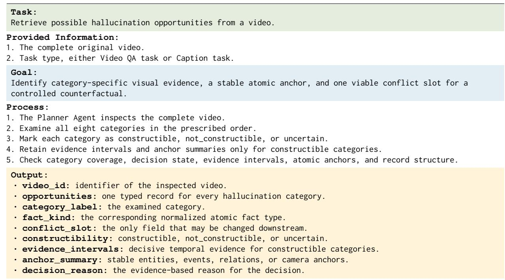  
Figure 11: Hallucination Category Retrieval — The objective of this sub-task is to scan the video to identify segments suitable for constructing corresponding hallucination types, ultimately returning the category and the decision rationale.

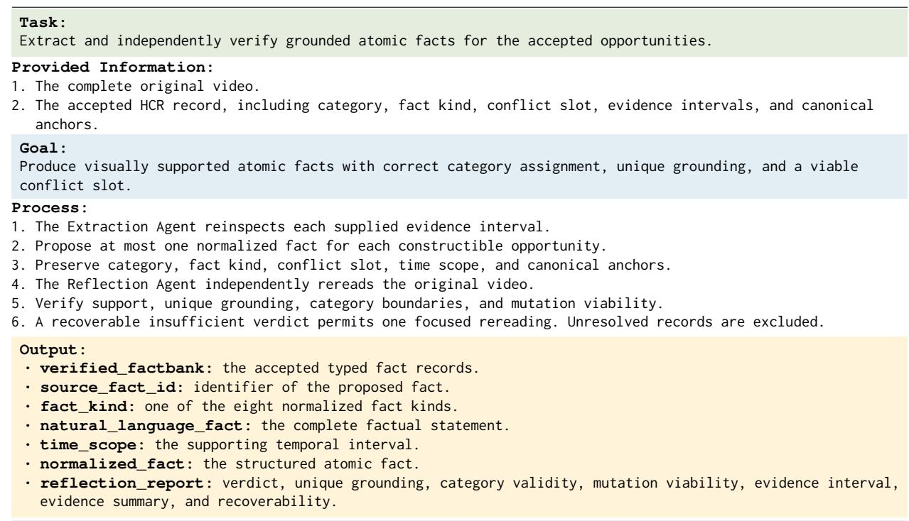  
Figure 12: Fact Extraction and Reflection — The objective of this sub-task is to inherit the output fields from the preceding sub-task under a uniform communication protocol, map the segments back to their corresponding video intervals for fact extraction, and verify the reliability of these extracted facts through independent reflection.

DVD (Python 3.11.15) applied 2 fps sampling across 10 s clips, leveraging GPT-4o for orchestration alongside text-embedding-3-large (OpenAI, 2024b).

Detection Methods — For hallucination detection, PAC-S (Sarto et al., 2023) and EMScore (Shi et al., 2022) evaluated all decoded frames locally on the aforementioned A100-PCIE-40GB pool. PAC-S operated under Python 3.9.16 and PyTorch 1.12.1+cu113 utilizing its dedicated CLIP ViT-

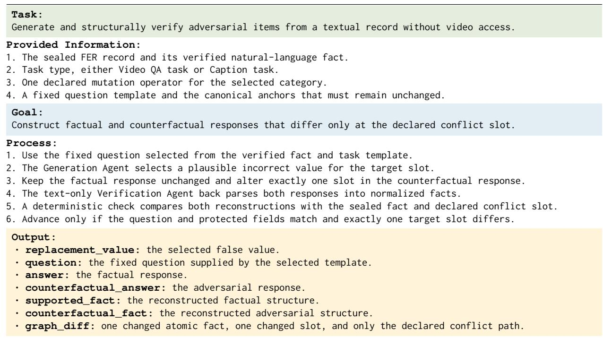

Figure 13: Generation and Verification of Adversarial Pairs — The objective of this sub-task is to construct adversarial examples for the corresponding video understanding tasks. It first inherits the output fields from the preceding sub-task to inject structured facts into predefined question templates. Simultaneously, it generates counterfactual statements based on these facts and utilizes reverse parsing to ensure the structural correctness of the sample.  
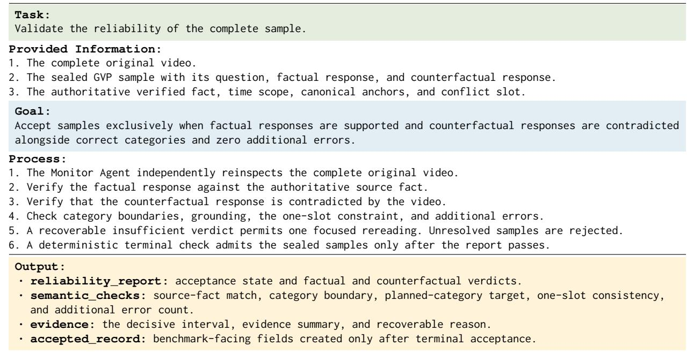  
Figure 14: Comprehensive Reliability Validation — The objective of this sub-task is to review the constructed adversarial examples, ensuring that the generated hallucination types align with expectations. Specifically, the factual and counterfactual answers must contradict each other exclusively regarding the targeted hallucination while maintaining consistent overall structures.

B/32 checkpoint, whereas EMScore ran on Python 3.8.20 and PyTorch 1.7.1+cu110 using the standard OpenAI CLIP ViT-B/32 (Radford et al., 2021). Owl-Con (Bansal et al., 2024) was similarly deployed on this GPU pool, processing 32 frames via mPLUG-Owl-LLaMA-7B-Video (Ye et al., 2023) (Owl-Con checkpoint) within an environment comprising PyTorch 1.13.1+cu117, TorchVision 0.14.1+cu117, Transformers 4.28.1, and PEFT 0.4.0. Alternatively, FIFA (Jing et al., 2025)

<table><tr><td>Scope</td><td>Sample accuracy</td><td>Worker agreement</td><td>Cohen&#x27;s κ</td></tr><tr><td>EEH</td><td>0.9900 [0.9700, 1.0000]</td><td>0.9700 [0.9300, 1.0000]</td><td>0.9826 [0.9588, 1.0000]</td></tr><tr><td>ECH</td><td>0.9300 [0.8800, 0.9800]</td><td>0.9600 [0.9200, 0.9900]</td><td>0.9752 [0.9484, 0.9941]</td></tr><tr><td>EQH</td><td>1.0000 [1.0000, 1.0000]</td><td>1.0000 [1.0000, 1.0000]</td><td>1.0000 [1.0000, 1.0000]</td></tr><tr><td>AVH</td><td>1.0000 [1.0000, 1.0000]</td><td>0.9800 [0.9500, 1.0000]</td><td>0.9627 [0.9337, 0.9890]</td></tr><tr><td>SRH</td><td>1.0000 [1.0000, 1.0000]</td><td>0.9900 [0.9700, 1.0000]</td><td>0.9886 [0.9713, 1.0000]</td></tr><tr><td>APH</td><td>0.9800 [0.9500, 1.0000]</td><td>0.9600 [0.9200, 0.9900]</td><td>0.9763 [0.9513, 0.9943]</td></tr><tr><td>TRH</td><td>1.0000 [1.0000, 1.0000]</td><td>0.9300 [0.8800, 0.9700]</td><td>0.9580 [0.9242, 0.9826]</td></tr><tr><td>CPH</td><td>1.0000 [1.0000, 1.0000]</td><td>0.9400 [0.8900, 0.9800]</td><td>0.9645 [0.9334, 0.9885]</td></tr><tr><td>All</td><td>0.9875 [0.9800, 0.9950]</td><td>0.9663 [0.9525, 0.9788]</td><td>0.9616 [0.9461, 0.9758]</td></tr></table>

Table 7: Category Annotation Audit with 95% Stratified Bootstrap Confidence Intervals — All values range from 0 to 1. Accuracy compares original benchmark categories against the author reference labels while agreement and κ assess consensus between the two workers. Accuracy and agreement for each category rely on the original sampling strata. The κ metric per category applies one versus rest coding across all 800 instances and the overall column reports the multiclass κ.  
```latex
Algorithm 2 Global Threshold Selection
1: $\Theta  B ( S _ { F } \cup S _ { C } )$ and m $ \textstyle { \frac { 1 } { 2 } }$ median(S<sub>F</sub>) + median(S<sub>C</sub>)
2: for each $t \in \Theta$ do
3: Yield indicator $\hat { y } = 1 \iff s \geq t ,$ and compute $A _ { F } ( t ) , A _ { C } ( t ) , A _ { O } ( t )$
4: $\begin{array} { r } { K ( t ) \gets \left. A _ { O } ( t ) , \operatorname* { m i n } \{ A _ { F } ( t ) , A _ { C } ( t ) \} , \frac { A _ { F } ( t ) + A _ { C } ( t ) } { 2 } , - | t - m | , - t \right. } \end{array}$
5: end for
6: return $t ^ { \star } \gets \arg \operatorname* { m a x } _ { t \in \Theta } ^ { \succ _ { L } } K ( t )$ // Frozen for downstream evaluation
```

adopted a hybrid methodology, combining local Qwen2.5-VL-72B (Bai et al., 2025a) inference on two A100-SXM4-80GB GPUs with GPT-4o (OpenAI, 2024a) for DSG. Its specialized local environment leveraged PyTorch 2.7.0a0+nv25.3, Transformers 4.57.1, FlashAttention 2.7.3 (Dao et al., 2022), Accelerate 1.6.0, qwen-vl-utils 0.0.14, and Decord 0.6.0 (DMLC Community, 2021), sampling at 1 fps for Video QA verification.

System Configuration — The centralized audit host was equipped with 14 CPU cores, 240 GB RAM, and NVIDIA driver 570.124.06, exposing two 81,920 MiB devices. Standard media I/O operations were consistently handled by FFmpeg (Tomar, 2006), OpenCV (Bradski, 2000), Decord (DMLC Community, 2021), and PyAV (PyAV Developers, 2026), while all external provider API calls were configured as resumable requests to ensure robust execution.

## D.2 Threshold Settings

For score-based methods, binary predictions $( \hat { y } \in$ {0, 1}) are derived by mapping candidate scores against a designated threshold. As formalized in Algorithm 2, we determine a method-specific global threshold optimized exclusively on a disjoint validation split, which is strictly frozen prior to the main evaluation.

Algorithm 2 Notation — Let $S _ { F }$ and $S _ { C }$ denote the multisets of factual and counterfactual scores from the validation split while s represents a given candidate score. The candidate threshold space Θ is generated by the discrete boundary operator $B ( S _ { F } \cup S _ { C } )$ . For any threshold $t \in \Theta$ , the binary decision rule yields an indicator $\hat { y } = 1$ if $s \geq t$ and $\hat { y } = 0$ otherwise. The functions $A _ { F } ( t )$ and $A _ { C } ( t )$ denote the marginal accuracies for factual acceptance $( \hat { y } = 1 )$ and counterfactual rejection $( \hat { y } = 0 )$ while $A _ { O } ( t )$ defines the Overall pairwise accuracy for simultaneous correct classifications. The reference midpoint m is defined as the arithmetic mean of the medians of $S _ { F }$ and $S _ { C }$ . Algorithm 2 maximizes $K ( t )$ lexicographically by using later components only when all preceding components tie. The selected threshold $t ^ { \star }$ remains fixed across all evaluation splits and tasks as well as hallucination categories.

Using the stored independent candidate scores for the 800 evaluation instances, Tables 9 through 11 summarize the four detectors across the full set and OH/DH subsets alongside individual categories for pooled Video QA and Video Captioning. AUROC compares factual and counterfactual score distributions within each group while Ranking denotes the fraction of instances with $s _ { F } > s _ { C }$ by assigning half credit to ties. The Overall metric uses the fixed thresholds in Table 8. Brackets provide pointwise 95% percentile intervals from

<table><tr><td>Method</td><td>Threshold</td><td>Factual</td><td>Counterfactual</td><td>Overall</td></tr><tr><td>EMScore (Shi et al., 2022)</td><td>0.2649626136</td><td>66.0%</td><td>43.0%</td><td>10.0%</td></tr><tr><td>PAC-S (Sarto et al., 2023)</td><td>0.7559156418</td><td>54.0%</td><td>56.0%</td><td>13.0%</td></tr><tr><td>Owl-Con (Bansal et al., 2024)</td><td>0.5312500000</td><td>66.0%</td><td>66.0%</td><td>38.0%</td></tr><tr><td>FIFA (Jing et al., 2025)</td><td>0.8000000000</td><td>40.0%</td><td>94.0%</td><td>36.0%</td></tr></table>

Table 8: Global Thresholds and Validation Performance — We use a disjoint validation split of 100 samples to calibrate the decision thresholds for all accuracy evaluations. For the main evaluation results, see Table 5.
<table><tr><td>Method</td><td>Overall</td><td>AUROC ×100</td><td>Ranking</td><td>Ties</td></tr><tr><td>EMScore</td><td>6.50 [4.89, 8.24]</td><td>52.94 [52.27, 53.67]</td><td>61.75 [58.33, 65.16]</td><td>0.00</td></tr><tr><td>PAC-S</td><td>7.25 [5.47, 9.15]</td><td>52.98 [52.30, 53.71]</td><td>60.38 [57.18, 63.52]</td><td>0.00</td></tr><tr><td>Owl-Con</td><td>33.13 [29.85, 36.38]</td><td>67.76 [65.60, 69.94]</td><td>70.31 [67.11, 73.43]</td><td>8.63</td></tr><tr><td>FIFA</td><td>34.63 [31.26, 38.04]</td><td>66.03 [64.24, 67.95]</td><td>74.94 [72.58, 77.36]</td><td>27.88</td></tr></table>

Table 9: Raw Score Summaries For the Four Detectors — AUROC is scaled by 100, and Overall, Ranking, and Ties are percentages. Ties denotes equal factual and counterfactual scores within an instance.

<table><tr><td>Method</td><td>Group</td><td>AUROC ×100</td><td>Ranking</td><td>Overall</td><td>Ties</td></tr><tr><td>EMScore</td><td>OH</td><td>54.38 [53.49, 55.37]</td><td>67.00 [62.86, 71.15]</td><td>8.00 [5.71, 10.46]</td><td>0.00</td></tr><tr><td>EMScore</td><td>DH</td><td>50.74 [49.65, 51.83]</td><td>53.00 [47.25, 58.61]</td><td>4.00 [1.99, 6.35]</td><td>0.00</td></tr><tr><td>PAC-S</td><td>OH</td><td>54.43 [53.50, 55.47]</td><td>65.60 [61.41, 69.76]</td><td>10.00 [7.39, 12.85]</td><td>0.00</td></tr><tr><td>PAC-S</td><td>DH</td><td>50.54 [49.58, 51.49]</td><td>51.67 [46.06, 57.24]</td><td>2.67 [1.00, 4.61]</td><td>0.00</td></tr><tr><td>Owl-Con</td><td>OH</td><td>72.03 [69.07, 74.97]</td><td>71.20 [67.28, 75.00]</td><td>42.40 [38.15, 46.69]</td><td>6.00</td></tr><tr><td>Owl-Con</td><td>DH</td><td>61.82 [59.03, 64.62]</td><td>68.83 [63.94, 73.59]</td><td>17.67 [13.56, 21.84]</td><td>13.00</td></tr><tr><td>FIFA</td><td>OH</td><td>71.79 [69.33, 74.31]</td><td>81.70 [78.69, 84.63]</td><td>42.40 [38.05, 46.84]</td><td>17.40</td></tr><tr><td>FIFA</td><td>DH</td><td>58.27 [55.79, 60.85]</td><td>63.67 [59.79, 67.58]</td><td>21.67 [17.22, 26.28]</td><td>45.33</td></tr></table>

Table 10: Detector scores for OH (500 instances) and DH (300 instances).

10,000 bootstrap resamples of the 436 video IDs (seed 20260906) to retain all instances and methods within each sampled video.

The lower DH AUROCs and variation per category align consistently with the accuracy patterns in Section 4.2.

## E Statistical Analysis

## E.1 Macro-Level Evaluation of Hallucination Categories

The primary analysis compares Ontology and Dynamic hallucinations. The Ontology category comprises EEH, ECH, EQH, AVH, and SRH, containing 500 evaluated samples per method. The Dynamic category comprises APH, TRH, and CPH, representing 300 evaluated samples per method. For every evaluation criterion, we compute the accuracy within each group for all fifteen methods and subsequently macro-average the results. The target estimand is defined as the Ontology accuracy minus the Dynamic accuracy. A positive difference therefore indicates higher accuracy on Ontology hallucinations.

The primary percentile bootstrap resamples the 436 video identifiers with replacement, retains all data rows associated with each sampled video, and recomputes the full macro-average. We execute 10,000 draws using seed 20260825 and report the 2.5th and 97.5th percentiles. As a sensitivity check, we additionally resample 100 samples with replacement within each of full categories over 10,000 draws governed by seed 20260826 (Table 12).

The within-video OH–DH gap is 19.12 percentage points, close to the full-evaluation gap of 19.53 percentage points (Table 13).

## E.2 Method-Level Intervals

Table 14 details the performance differences for all fifteen evaluated methods. These values derive from the primary video-cluster bootstrap resampling.

Under the strict evaluation criterion, 14 out of the fifteen methods exhibit intervals entirely above zero. LLaVA-NeXT-Video (Li et al., 2024) serves as the sole exception to this overarching trend. It records a marginal strict difference of −0.87 points, yielding an interval spanning [−3.15, 1.17].

Compared with Ontology samples, EM-Score (Shi et al., 2022) and Owl-Con (Bansal et al., 2024) more frequently accept factual answers on

<table><tr><td>Method</td><td>Category</td><td>AUROC ×100</td><td>Ranking</td><td>Overall</td><td>Ties</td></tr><tr><td>EMScore</td><td>EEH</td><td>53.32 [51.61, 55.49]</td><td>66.00 [56.44, 75.26]</td><td>4.00 [0.92, 8.24]</td><td>0.00</td></tr><tr><td>EMScore</td><td>ECH</td><td>59.31 [56.20, 63.11]</td><td>75.00 [66.32, 83.17]</td><td>15.00 [8.33, 22.47]</td><td>0.00</td></tr><tr><td>EMScore</td><td>EQH</td><td>52.17 [51.00, 53.73]</td><td>66.00 [56.38, 75.22]</td><td>6.00 [1.90, 11.11]</td><td>0.00</td></tr><tr><td>EMScore</td><td>AVH</td><td>57.08 [55.09, 59.77]</td><td>77.00 [68.54, 85.00]</td><td>8.00 [3.09, 13.69]</td><td>0.00</td></tr><tr><td>EMScore</td><td>SRH</td><td>50.50 [48.94, 52.15]</td><td>51.00 [41.24, 60.79]</td><td>7.00 [2.41, 12.50]</td><td>0.00</td></tr><tr><td>EMScore</td><td>APH</td><td>53.43 [50.68, 56.34]</td><td>64.00 [54.17, 73.56]</td><td>8.00 [3.09, 13.68]</td><td>0.00</td></tr><tr><td>EMScore</td><td>TRH</td><td>48.93 [47.72, 49.88]</td><td>41.00 [31.31, 50.91]</td><td>1.00 [0.00, 3.37]</td><td>0.00</td></tr><tr><td>EMScore</td><td>CPH</td><td>49.95 [47.67, 52.19]</td><td>54.00 [44.12, 63.72]</td><td>3.00 [0.00, 6.74]</td><td>0.00</td></tr><tr><td>PAC-S</td><td>EEH</td><td>47.56 [45.72, 49.20]</td><td>40.00 [30.48, 49.58]</td><td>1.00 [0.00, 3.41]</td><td>0.00</td></tr><tr><td>PAC-S</td><td>ECH</td><td>58.76 [55.95, 62.29]</td><td>71.00 [62.04, 79.49]</td><td>16.00 [9.09, 23.58]</td><td>0.00</td></tr><tr><td>PAC-S</td><td>EQH</td><td>57.64 [55.85, 60.16]</td><td>83.00 [75.31, 90.10]</td><td>13.00 [6.74, 20.00]</td><td>0.00</td></tr><tr><td>PAC-S</td><td>AVH</td><td>56.25 [54.05, 59.02]</td><td>74.00 [65.12, 82.24]</td><td>15.00 [8.25, 22.34]</td><td>0.00</td></tr><tr><td>PAC-S</td><td>SRH</td><td>52.24 [50.76, 54.08]</td><td>60.00 [50.00, 69.66]</td><td>5.00 [1.04, 9.78]</td><td>0.00</td></tr><tr><td>PAC-S</td><td>APH</td><td>51.37 [48.72, 54.04]</td><td>56.00 [46.15, 65.48]</td><td>4.00 [0.92, 8.26]</td><td>0.00</td></tr><tr><td>PAC-S</td><td>TRH</td><td>49.33 [48.36, 50.14]</td><td>45.00 [34.96, 54.84]</td><td>0.00 [0.00, 0.00]</td><td>0.00</td></tr><tr><td>PAC-S</td><td>CPH</td><td>50.79 [49.11, 52.58]</td><td>54.00 [44.07, 63.74]</td><td>4.00 [0.90, 8.33]</td><td>0.00</td></tr><tr><td>Owl-Con</td><td>EEH</td><td>88.35 [83.91, 92.62]</td><td>94.00 [89.22, 98.00]</td><td>67.00 [57.61, 76.09]</td><td>2.00</td></tr><tr><td>Owl-Con</td><td>ECH</td><td>73.67 [67.39, 79.61]</td><td>68.50 [59.31, 77.33]</td><td>40.00 [30.61, 49.55]</td><td>3.00</td></tr><tr><td>Owl-Con</td><td>EQH</td><td>67.34 [58.20, 75.76]</td><td>63.00 [53.67, 72.16]</td><td>48.00 [38.04, 57.84]</td><td>4.00</td></tr><tr><td>Owl-Con</td><td>AVH</td><td>70.94 [64.67, 76.91]</td><td>73.00 [64.14, 81.25]</td><td>40.00 [30.53, 49.51]</td><td>6.00</td></tr><tr><td>Owl-Con</td><td>SRH</td><td>57.90 [53.14, 62.86]</td><td>57.50 [48.57, 66.49]</td><td>17.00 [10.00, 25.00]</td><td>15.00</td></tr><tr><td>Owl-Con</td><td>APH</td><td>65.25 [59.17, 71.17]</td><td>68.00 [59.04, 76.60]</td><td>21.00 [13.13, 29.03]</td><td>10.00</td></tr><tr><td>Owl-Con</td><td>TRH</td><td>58.64 [55.42, 62.36]</td><td>73.50 [65.38, 81.18]</td><td>12.00 [6.00, 18.68]</td><td>13.00</td></tr><tr><td>Owl-Con</td><td>CPH</td><td>62.46 [57.22, 67.82]</td><td>65.00 [56.19, 73.33]</td><td>20.00 [12.50, 28.28]</td><td>16.00</td></tr><tr><td></td><td></td><td></td><td></td><td></td><td></td></tr><tr><td>FIFA FIFA</td><td>EEH</td><td>67.92 [61.66, 74.19]</td><td>75.00 [66.98, 82.55]</td><td>39.00 [29.36, 48.94]</td><td>14.00</td></tr><tr><td>FIFA</td><td>ECH</td><td>73.16 [68.33, 78.06]</td><td>83.00 [76.29, 89.29]</td><td>36.00 [26.53, 45.83]</td><td>14.00</td></tr><tr><td>FIFA</td><td>EQH</td><td>77.87 [72.92, 83.26]</td><td>88.50 [83.50, 93.06]</td><td>56.00 [46.32, 66.00]</td><td>17.00</td></tr><tr><td>FIFA</td><td>AVH</td><td>73.78 [68.86, 79.14]</td><td>87.50 [82.00, 92.38] 74.50 [67.50, 81.38]</td><td>44.00 [34.07, 53.54]</td><td>17.00</td></tr><tr><td>FIFA</td><td>SRH APH</td><td>68.16 [62.79, 74.09] 62.09 [57.43, 67.19]</td><td>70.50 [63.55, 77.12]</td><td>37.00 [27.78, 46.79] 31.00 [22.22, 40.40]</td><td>25.00 35.00</td></tr><tr><td>FIFA</td><td></td><td>55.01 [51.70, 58.85]</td><td>61.50 [54.89, 67.86]</td><td>21.00 [13.25, 29.17]</td><td>51.00</td></tr><tr><td></td><td>TRH</td><td></td><td></td><td></td><td></td></tr><tr><td>FIFA</td><td>CPH</td><td>59.52 [54.19, 65.10]</td><td>59.00 [52.20, 65.71]</td><td>13.00 [6.80, 19.82]</td><td>50.00</td></tr></table>

Table 11: Detector scores by hallucination category (100 instances per category).
<table><tr><td>Metric</td><td>Ontology</td><td>Dynamic</td><td> $\Delta$ </td><td>Cluster SE</td><td>Cluster 95% CI</td><td>Category 95% CI</td></tr><tr><td>Factual</td><td>76.55</td><td>70.53</td><td>6.01</td><td>1.11</td><td>[3.87, 8.22]</td><td>[4.01, 8.07]</td></tr><tr><td>Counterfactual</td><td>75.32</td><td>61.47</td><td>13.85</td><td>1.23</td><td>[11.41, 16.22]</td><td>[11.53, 16.17]</td></tr><tr><td>Overall</td><td>54.51</td><td>34.98</td><td>19.53</td><td>1.39</td><td>[16.79, 22.28]</td><td>[17.03, 22.06]</td></tr></table>

Table 12: Macro-Average Comparison Between Ontology and Dynamic Hallucinations — Ontology and Dynamic denote accuracy percentages, while $\Delta$ signifies their difference in percentage points. The strict criterion requires both responses within a matched sample to be classified correctly. Cluster SE and Cluster 95% CI derive from 10,000 bootstrap resamples of 436 video-ID clusters. The Category 95% CI functions as an aggregate sensitivity interval for $\Delta ,$ , calculated by resampling 100 instances with replacement within each of the distinct categories.

Dynamic samples but less reject counterfactual answers. This pattern indicates a greater tendency to accept candidates on Dynamic samples, including incorrect counterfactual answers.

## E.3 Decomposition of Joint Decision Outcomes

Table 15 reports the distribution of instances across the four decision states. The breakdown reveals clear divergence between isolated and joint performance. Methods such as PAC-S (Sarto et al., 2023) and EMScore (Shi et al., 2022) resolve individual factual or counterfactual assertions, yet their correct classifications rarely coincide on the same instance.

## F Qualitative Reliability Examples

Tables 16 and 17 present two representative instances from VIDHALLOC. The method decisions across these cases expose distinct marginal distributions. Most baselines accept the grounded factual statements while failing to reject the counterfactual modification. This failure pattern underscores the need for improving reliability in video hallucination detection techniques.

<table><tr><td>Subset</td><td>Videos</td><td>Instances</td><td>OH</td><td>DH</td><td>Δ</td><td>95% CI</td></tr><tr><td>Full evaluation</td><td>436</td><td>800</td><td>54.51</td><td>34.98</td><td>19.53</td><td>[16.79,22.28]</td></tr><tr><td>Within-video</td><td>198</td><td>396</td><td>53.74</td><td>34.61</td><td>19.12</td><td>[15.59,22.69]</td></tr></table>

Table 13: Supplementary Comparison Within the Same Video in Table 12 — Each of the 198 videos provides one OH and one DH instance of the same task, with averages weighting all videos and the fifteen methods equally. This subset employs the aforementioned bootstrap over video clusters with 10,000 draws (seed 20260906) to retain pairs and methods jointly. The OH and DH metrics report Overall accuracy (%) while ∆ and its 95% CI denote percentage points calculated before rounding.
<table><tr><td>Method</td><td>Factual ∆ [95% CI]</td><td>Counterfactual ∆ [95% CI]</td><td>Overall ∆ [95% CI]</td></tr><tr><td>Deep Video Discovery (Zhang et al., 2025c)</td><td>9.67 [4.63, 14.80]†</td><td>28.80 [22.76, 34.82]†</td><td>36.53 [30.00, 42.91]†</td></tr><tr><td>VideoAgent (Fan et al., 2024)</td><td>13.80 [7.28, 20.56]†</td><td>3.33 [-1.11, 7.79]</td><td>17.87 [11.52, 24.32]†</td></tr><tr><td>VideoHV-Agent (Wang et al., 2026)</td><td>2.80 [-3.16, 8.76]</td><td>11.40 [4.08, 18.65]†</td><td>15.60 [8.53, 22.41]†</td></tr><tr><td>Gemini-3-Flash (Google DeepMind, 2025)</td><td>−0.13 [−1.99, 1.77]</td><td>27.67 [21.82, 33.44]†</td><td>26.60 [20.66, 32.40]</td></tr><tr><td>Gemma-4-it (Gemma Team, 2026)</td><td>32.33 [25.46, 39.12]†</td><td>-0.73 [-3.91, 2.57]</td><td>31.93 [25.15, 38.67]</td></tr><tr><td>GPT-5 (OpenAI, 2025)</td><td>14.33 [8.64, 20.13]†</td><td>10.27 [6.13, 14.53]†</td><td>21.07 [14.89, 27.32]</td></tr><tr><td>InternVL3.5 (Wang et al., 2025)</td><td>2.47 [-1.85, 6.92]</td><td>29.00 [22.28, 35.94]†</td><td>29.67 [22.48, 36.74]†</td></tr><tr><td>LLaVA-NeXT-Video (Li et al., 2024)</td><td>14.47 [8.35, 20.69]†</td><td>-18.73 [−24.94, -12.53]†</td><td>-0.87[-3.15, 1.17]</td></tr><tr><td>Qwen3-Omni-Instruct (Xu et al., 2025)</td><td>1.27 [−0.86, 3.49]</td><td>16.53 [9.38, 23.58]†</td><td>17.73 [10.58, 24.76]</td></tr><tr><td>Qwen3-VL-Instruct (Bai et al., 2025b)</td><td>9.93 [4.91, 15.18]†</td><td>8.07 [2.48, 13.99]†</td><td>17.60 [10.89, 24.49]1</td></tr><tr><td>Qwen3.6-27B (Qwen Team, 2026)</td><td>-0.27 [-3.27, 2.78]</td><td>24.27 [18.73, 29.68]†</td><td>22.40 [16.29, 28.35]</td></tr><tr><td>EMScore (Shi et al., 2022)</td><td>-16.07 [−22.56, -9.63]†</td><td>22.60 [16.29, 28.90]†</td><td>4.00 [0.65, 7.24]†</td></tr><tr><td>FIFA (Jing et al., 2025)</td><td>24.93 [18.35, 31.54]†</td><td>-3.93 [−8.13, 0.25]</td><td>20.73 [14.58, 27.10]</td></tr><tr><td>PAC-S (Sarto et al., 2023)</td><td>-7.33 [−14.36, −0.15]†</td><td>15.80 [8.58, 22.91]†</td><td>7.33 [3.96, 10.65]†</td></tr><tr><td>Owl-Con (Bansal et al., 2024)</td><td> $- 1 2 . 0 0 [ - 1 8 . 4 3 , - 5 . 5 7 ] ^ { \dagger }$ </td><td>33.47 [26.92, 40.05]†</td><td>24.73 [18.95, 30.50]†</td></tr></table>

Table 14: Method-Level Performance Differences Between Ontology and Dynamic Hallucinations — All reported values represent percentage points. Confidence intervals derive from 10,000 video-cluster bootstrap iterations. Positive values designate higher accuracy on the Ontology subset. Negative values correspond to superior performance on the Dynamic subset. A dagger (<sup>†</sup>) marks a 95% confidence interval strictly excluding zero. LLaVA-NeXT-Video (Li et al., 2024) is the only method whose Overall interval includes zero, so the Ontology–Dynamic difference is not statistically distinguishable from zero under this bootstrap analysis.
<table><tr><td>Method</td><td>Both correct</td><td>Factual only</td><td>Counterfactual only</td><td>Neither</td></tr><tr><td>PAC-S (Sarto et al., 2023)</td><td>7.25</td><td>40.50</td><td>49.63</td><td>2.63</td></tr><tr><td>EMScore (Shi et al., 2022)</td><td>6.50</td><td>60.13</td><td>30.63</td><td>2.75</td></tr><tr><td>Owl-Con (Bansal et al., 2024)</td><td>33.13</td><td>34.38</td><td>26.13</td><td>6.38</td></tr><tr><td>FIFA (Jing et al., 2025)</td><td>34.63</td><td>9.63</td><td>54.25</td><td>1.50</td></tr></table>

Table 15: Outcome Breakdown Across Selected Thresholds (%) — Values denote percentages of evaluated instances, summing to 100% per method. This decomposition exposes distinct marginal distributions across evaluators. The disparity between isolated and joint successes reveals critical blind spots in fine-grained video temporal understanding.

VIDHALLOC Example: Action Predicate Hallucination (APH)

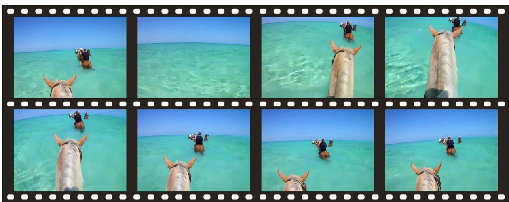  
Task Task prompt

Caption

You are judging whether one candidate answer is fully supported by a video and correctly answers the question. Question: {question}. Candidate answer: {candidate\_answer}. Judge this candidate independently using only the video, the question, and this candidate answer. Do not assume that another candidate answer exists, and do not compare this answer with any alternative answer. Return exactly one label and nothing else. Return ACCEPT only when the candidate answer is fully supported by the video and correctly answers the question. Return REJECT when the candidate answer is contradicted by the video, unsupported, incomplete, irrelevant, or otherwise does not correctly answer the question. If the available video evidence is insufficient to fully support the candidate answer, return REJECT.

## Sample question Factual answer Counterfactual answer Conflict slot

Identify one fact directly supported by the video and state it in one sentence.

A group of people is riding horses through the shallow ocean water.

<table><tr><td>Method</td><td>Factual decision</td><td>Counterfactual decision</td><td>Strict pair</td></tr><tr><td>Commercial VLMs</td><td></td><td></td><td></td></tr><tr><td>Gemini-3-Flash (Google DeepMind, 2025)</td><td>ACCEPT</td><td>ACCEPTX</td><td>X</td></tr><tr><td>GPT-5 (OpenAI, 2025)</td><td>ACCEPT</td><td>REJECT</td><td>0</td></tr><tr><td>Open source VLMs</td><td></td><td></td><td></td></tr><tr><td>LLaVA-NeXT-Video (Li et al., 2024)</td><td>ACCEPT</td><td>ACCEPTX</td><td></td></tr><tr><td>Qwen3-VL-Instruct (Bai et al., 2025b)</td><td>ACCEPT</td><td>ACCEPTX</td><td></td></tr><tr><td>Gemma-4-it (Gemma Team, 2026)</td><td>REJECTX</td><td>REJECT</td><td></td></tr><tr><td>InternVL3.5 (Wang et al., 2025)</td><td>ACCEPT</td><td>ACCEPTX</td><td></td></tr><tr><td>Qwen3.6-27B (Qwen Team, 2026)</td><td>ACCEPT</td><td>ACCEPTX</td><td>×××××</td></tr><tr><td>Qwen3-Omni-Instruct (Xu et al., 2025)</td><td>ACCEPT</td><td>ACCEPTX</td><td>x</td></tr><tr><td>Video agents</td><td></td><td></td><td></td></tr><tr><td>VideoAgent (Fan et al., 2024)</td><td>ACCEPT</td><td>ACCEPTX</td><td>X</td></tr><tr><td>VideoHV-Agent (Wang et al., 2026)</td><td>ACCEPT</td><td>ACCEPTX</td><td>X</td></tr><tr><td>Deep Video Discovery (Zhang et al., 2025c)</td><td>ACCEPT</td><td>REJECT</td><td>0</td></tr><tr><td>Detection methods</td><td></td><td></td><td></td></tr><tr><td>PAC-S (Sarto et al., 2023)</td><td>ACCEPT</td><td>ACCEPTX</td><td>X</td></tr><tr><td>EMScore (Shi et al., 2022)</td><td>ACCEPT</td><td>ACCEPTX</td><td>×</td></tr><tr><td>Owl-Con (Bansal et al., 2024)</td><td>ACCEPT</td><td>ACCEPTX</td><td>X</td></tr><tr><td>FIFA (Jing et al., 2025)</td><td>ACCEPT</td><td>REJECT</td><td>0</td></tr></table>

Table 16: APH example — GPT-5 (OpenAI, 2025), Deep Video Discovery (Zhang et al., 2025c), and FIFA (Jing et al., 2025) are the only evaluated methods that accept the factual answer and reject the counterfactual answer at the same time. A green check marks a correct decision, and a red cross marks an incorrect decision.

VIDHALLOC Example: Camera Predicate Hallucination (CPH)  
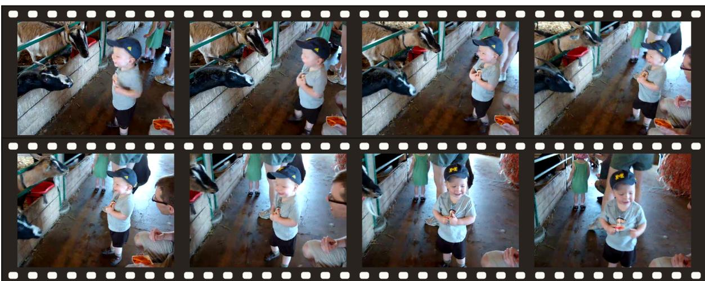  
Task Task prompt

Video QA

You are judging whether one candidate answer is fully supported by a video and correctly answers the question. Question: {question}. Candidate answer: {candidate\_answer}. Judge this candidate independently using only the video, the question, and this candidate answer. Do not assume that another candidate answer exists, and do not compare this answer with any alternative answer. Return exactly one label and nothing else. Return ACCEPT only when the candidate answer is fully supported by the video and correctly answers the question. Return REJECT when the candidate answer is contradicted by the video, unsupported, incomplete, irrelevant, or otherwise does not correctly answer the question. If the available video evidence is insufficient to fully support the candidate answer, return REJECT.

Sample question Factual answer Counterfactual answer Conflict slot  
What camera or editing change occurs during camera movement between 00:20 and 00:24? The camera pans right from the goat pen toward the boy. The camera zooms in from the goat pen toward the boy. Camera predicate: pans right → zooms in.
<table><tr><td>Method</td><td>Factual decision</td><td>Counterfactual decision</td><td>Strict pair</td></tr><tr><td>Commercial VLMs</td><td></td><td></td><td></td></tr><tr><td>Gemini-3-Flash (Google DeepMind, 2025)</td><td>ACCEPT</td><td>ACCEPTX</td><td>X</td></tr><tr><td>GPT-5 (OpenAI, 2025)</td><td>REJECTX</td><td>ACCEPTX</td><td>X</td></tr><tr><td>Open source VLMs</td><td></td><td></td><td></td></tr><tr><td>LLaVA-NeXT-Video (Li et al., 2024)</td><td>REJECTX</td><td>REJECT</td><td></td></tr><tr><td>Qwen3-VL-Instruct (Bai et al., 2025b)</td><td>ACCEPT</td><td>ACCEPTX</td><td></td></tr><tr><td>Gemma-4-it (Gemma Team, 2026)</td><td>REJECTX</td><td>REJECT</td><td></td></tr><tr><td>InternVL3.5 (Wang et al., 2025)</td><td>ACCEPT</td><td>ACCEPTX</td><td></td></tr><tr><td>Qwen3.6-27B (Qwen Team, 2026)</td><td>ACCEPT</td><td>ACCEPTX</td><td>×××××</td></tr><tr><td>Qwen3-Omni-Instruct (Xu et al., 2025)</td><td>ACCEPT</td><td>ACCEPTX</td><td>x</td></tr><tr><td>Video agents</td><td></td><td></td><td></td></tr><tr><td>VideoAgent (Fan et al., 2024)</td><td>REJECTX</td><td>REJECT</td><td>X</td></tr><tr><td>VideoHV-Agent (Wang et al., 2026)</td><td>ACCEPT</td><td>ACCEPTX</td><td>×</td></tr><tr><td>Deep Video Discovery (Zhang et al., 2025c)</td><td>REJECTX</td><td>REJECT</td><td>×</td></tr><tr><td>Detection methods</td><td></td><td></td><td></td></tr><tr><td>PAC-S (Sarto et al., 2023)</td><td>ACCEPT</td><td>ACCEPTX</td><td></td></tr><tr><td>EMScore (Shi et al., 2022)</td><td>ACCEPT</td><td>ACCEPTX</td><td>××</td></tr><tr><td>Owl-Con (Bansal et al., 2024)</td><td>ACCEPT</td><td>ACCEPTX</td><td>× ×</td></tr><tr><td>FIFA (Jing et al., 2025)</td><td>REJECTX</td><td>REJECT</td><td></td></tr></table>

Table 17: CPH example — None of the evaluated methods correctly resolve both candidates. Instead, most approaches collapse into uniformly accepting or rejecting both options simultaneously. Notably, GPT-5 (OpenAI, 2025) completely reverses the required labels. For visual clarity, green checks and red crosses indicate correct and incorrect decisions, respectively.