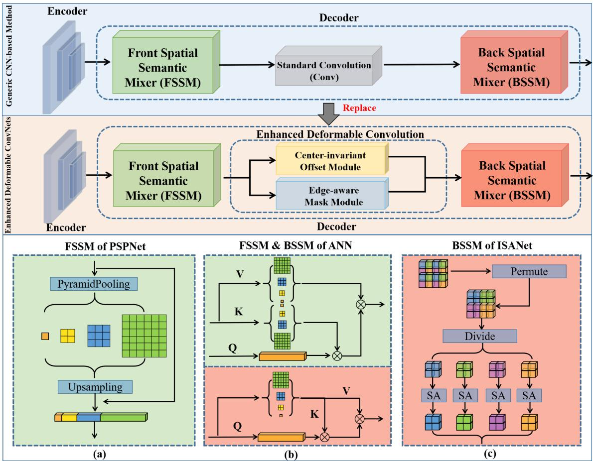
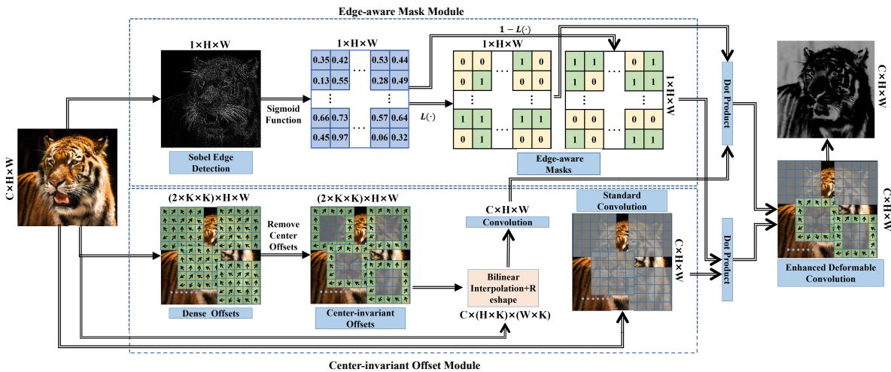
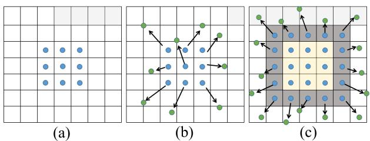
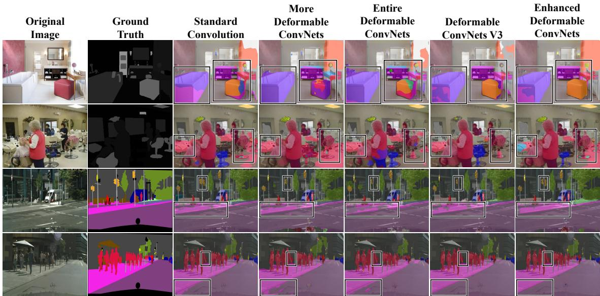
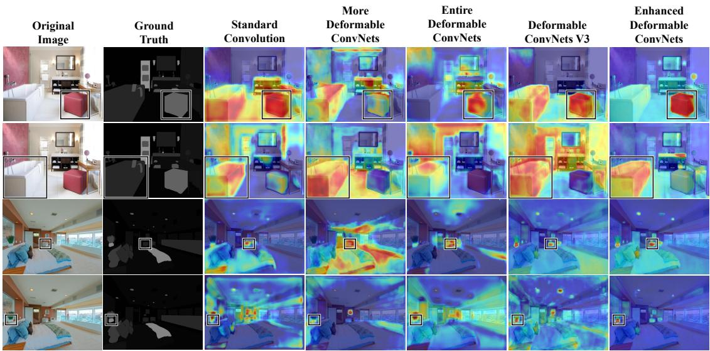
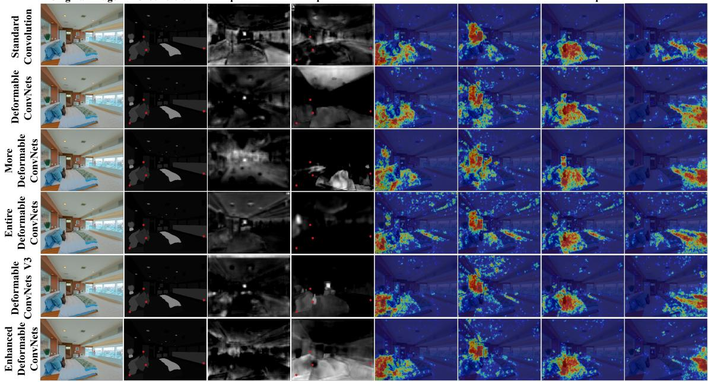
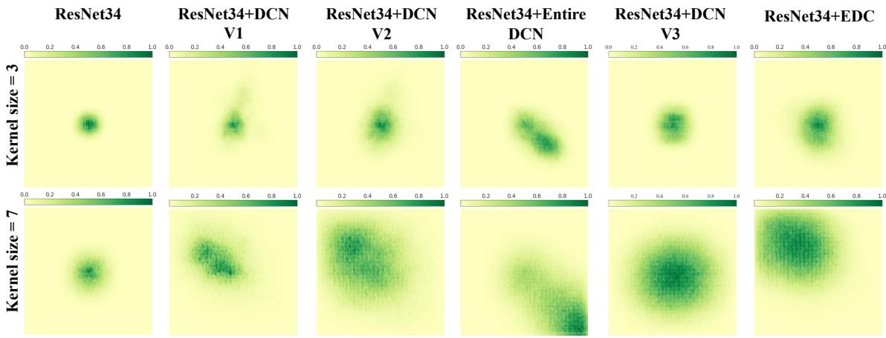

# Enhanced Deformable Convolution with Center-invariant Ofset and Edge-aware Mask

YIXIAO LI, School of Mathematical Sciences, Beihang University, China and Shanghai Academy of Spaceflight Technology, China

XIAOYUAN YANG, School of Mathematical Sciences, Beihang University, China

JIN JIANG, School of Mathematical Sciences, Beihang University, China

MINGHAO ZOU, School of Computational and Mathematical Sciences, Cardif University, United Kingdom

GUANGHUI YUE, School of Biomedical Engineering, Health Science Center, Shenzhen University, China

BAOQUAN ZHAO, School of Artificial Intelligence, Sun Yat-sen University, China

JUN LIU, School of Computing and Communications, Lancaster University, United Kingdom

WEI ZHOU, School of Computational and Mathematical Sciences, Cardif University, United Kingdom

Deformable convolution networks have recently become popular for many computer vision tasks, especially for semantic segmentation, because of their exceptional capabilities in dynamic spatial modeling. However, due to the dense deformable ofsets and the lack of longer-range dependencies, they can not fully adopt proper and precise deformations for feature representations. To tackle the issues, in this paper, we propose Enhanced Deformable ConvNets (EDCN) for semantic segmentation. Specifically, a novel Enhanced Deformable Convolution (EDC) is exploited in the decoder, which integrates the Center-invariant Ofset Module (COM) and Edge-aware Mask Module (EMM). The COM employs larger kernels and eliminates deformations at the kernel center, obtaining ofsets that are more in line with the target from richer spatial information. Concurrently, the EMM obtains the significance of image content via Sobel edge detection, then selectively applies deformations based on the content significance, minimizing unnecessary deformations associated with relatively less important information, thereby avoiding impact from less informative regions. Experiments show that EDC outperforms state-of-the-art deformable convolution variants, including Deformable ConvNets V1-V4 and Entire Deformable ConvNets, across mainstream segmentation datasets with various decoder settings. Moreover, ablation studies confirm the efectiveness of each component. In addition, visualizations illustrate that EDC enhances spatial adaptation and target focus. We further analyze the extendibility of EDC to larger kernels on the image classification benchmark. Code will be publicly released.

Additional Key Words and Phrases: Deformable convolution, center-invariant ofset, edge-aware mask, large deformable kernel, semantic segmentation, image classification

Authors’ Contact Information: Yixiao Li, School of Mathematical Sciences, Beihang University, Beijing, China and Shanghai Academy of Spaceflight Technology, Shanghai Radio Equipment Research Institute, Shanghai, China, 18335310648@163.com; Xiaoyuan Yang, School of Mathematical Sciences, Beihang University, Beijing, China, xiaoyuanyang@vip.163.com; Jin Jiang, School of Mathematical Sciences, Beihang University, Beijing, China, jiangjin1246@163.com; Minghao Zou, School of Computational and Mathematical Sciences, Cardif University, Cardif, United Kingdom, zoum1@cardif. ac.uk; Guanghui Yue, School of Biomedical Engineering, Health Science Center, Shenzhen University, Shenzhen, China, yueguanghui@szu.edu.cn; Baoquan Zhao, School of Artificial Intelligence, Sun Yat-sen University, Zhuhai, China, zhaobaoquan@mail.sysu.edu.cn; Jun Liu, School of Computing and Communications, Lancaster University, Lancaster, United Kingdom, j.liu81@lancaster.ac.uk; Wei Zhou, School of Computational and Mathematical Sciences, Cardif University, Cardif, United Kingdom, zhouw26@cardif.ac.uk

Permission to make digital or hard copies of all or part of this work for personal or classroom use is granted without fee provided that copies are not made or distributed for profit or commercial advantage and that copies bear this notice and the full citation on the first page. Copyrights for components of this work owned by others than the author(s) must be honored. Abstracting with credit is permitted. To copy otherwise, or republish, to post on servers or to redistribute to lists, requires prior specific permission and/or a fee. Request permissions from permissions@acm.org.   
© Copyright held by the owner/author(s). Publication rights licensed to ACM.   
Manuscript submitted to ACM

## 1 Introduction

Convolutional neural networks (CNN) have been widely adopted in semantic segmentation. There have emerged significant eforts to design spatial pyramid pooling [2, 37] and attention models [16, 18, 20, 22, 43, 46]. Nevertheless, these approaches often neglect the drawbacks of standard convolution in feature extraction. That is, traditiona convolution generally utilizes fixed-size kernels that slide over the image, which may not be suitable for capturing objects with varying shapes. In contrast, deformable convolution allows the kernel to adapt its geometry according to the input images, making it more efective for dense prediction tasks.

During recent years, the potential of deformable convolution [5, 47] in semantic segmentation, utilized as plugand-play modules, has been extensively explored [6, 7, 17]. Basically, there exist five main versions of deformable convolutions, including Deformable ConvNets (DCN V1) [5], More Deformable ConvNets (DCN V2) [47], Entire Deformable ConvNets [35], Deformable ConvNets V3 (DCN V3) [29], and Deformable ConvNets V4 (DCN V4) [33]. These have been commonly applied in model design for semantic segmentation [1, 7, 13, 17, 35]. Although these networks can sample the key information adaptively. The critical challenge is that these deformable convolutions still lack long-range dependencies due to the limitation of the restricted efective receptive field (ERF). Luo et al. [24] defined the ERF, which refers to the region of the input image that influences the output of a particular neuron in a neural network. A larger ERF enables convolution-based networks to capture longer-range dependencies, which is particularly beneficial for dense prediction tasks such as semantic segmentation. Traditional deformable convolutions [5, 47] build a CNN by stacking convolution layers with a kernel size of 3 × 3 based on ResNet [12], with the goal of expanding the ERF as the network deepens. However, it has been demonstrated by Veit et al. [27] that the ResNet behaves like ensembles of relatively shallow networks rather than a truly deep network. While DCN V3 asserts its capability to capture longer-range dependencies through depthwise separable convolution and grouping strategies, empirical evidence indicates that achieving considerable receptive fields necessitates the stacking of multiple layers across various stages [29]. Such deep stacking approaches are not fully eficient for plug-and-play purposes in general segmentation benchmarks [14, 42, 48].

Inspired by the findings of Ding et al. [8] and Zhang et al. [40], which demonstrate that increasing kernel size can substantially expand the ERF compared to stacking multiple smaller kernels, the application of larger convolution kernels emerges as a direct strategy. However, DCN V3 has been shown to be obviously less efective when applied to larger kernels [29]. Our experimental results in the Section4.5 about the ablation on kernel sizes also corroborate this observation, revealing that existing variants of deformable convolution encounter a similar challenge. This challenge likely stems from the dense sampling strategy employed in DCN V1-V3, where deformable ofsets are assigned to each sampling location and stride as the kernels slide over the input features. Such a sampling strategy constrains the practical utility of larger kernels in deformable convolutions. Although recent advancements like Entire Deformable ConvNets and DCN V4 have aimed to enhance eficiency and reduce computational load, the fundamental constraints on the application of larger kernels in deformable convolutions persist.

Based on the findings above, we aim to propose a more eficient deformable sampling strategy that takes advantage of the larger receptive field provided by the larger kernel to improve ofset learning, enabling a more accurate prediction of deformable ofsets. In this paper, we introduce Enhanced Deformable Convolution (EDC), which contains a Centerinvariant Ofset Module (COM) and an Edge-aware Mask Module (EMM). The EMM enhances the deformations to be more refined by adaptively selecting whether to use deformable operations during the convolution kernel sliding across the input features based on the guidance of edge detection. The COM utilizes larger kernel sizes to ensure that

Manuscript submitted to ACM

deformations can benefit from a larger receptive field. We enlarge the kernel size of EDC from 3 × 3 to $K \times K ,$ where $K = 5 , 7 , 9 , 1 3 , 1 7$

The proposed EDC is then utilized to replace the standard convolution in CNN-based semantic segmentation methods as a plug-and-play layer. Common segmentation methods [14, 15, 26, 42, 48] typically follow an “encoder-decoder” framework. For convenience, we conceive a general architecture for CNN-based methods (as illustrated in Figure 1) by observing the position of standard convolution in the decoders. The architecture consists of a conventional encoder, a decoder with the Spatial Semantic Mixers (SSMs), and a standard convolution layer. To be clear, the novelty of research in semantic segmentation mainly lies in the way of spatial semantic aggregation in the decoder. Therefore, we collectively name the remaining components other than the standard convolution layer as SSM. The SSM before the standard convolution layer is named Front SSM (FSSM), and the one after the standard convolution layer is called Back SSM (BSSM). Diferent methods incorporate specific SSMs due to the varied positions of standard convolution within their original backbones. Specifically, the standard convolution layer in PSPNet [42] is at the end of the network, so PSPNet has its FSSM and no BSSM; While the standard convolution layer in ISANet [14] is located at the beginning of the network, so ISANet has its BSSM and no FSSM; The standard convolution layer in ANN [48] is located in the middle of the network, so ANN has both FSSM and BSSM. Finally, the version where the standard convolution layer is replaced with the proposed EDC in this architecture is named Enhanced Deformable ConvNets (EDCN).

Compared with previous works, our major contributions can be summarized as follows:

1) We propose a novel Enhanced Deformable Convolution (EDC), which integrates large-kernel and edge information awareness to improve deformable ofsets sampling.

2) We conceive the encoder-decoder architecture for semantic segmentation, named Enhanced Deformable ConvNets, in which various deformable convolutions are compared as plug-and-play layers. The proposed EDC retains the benefits of the deformable convolution counterparts while surpassing their performance on four semantic segmentation datasets.

3) Extensive ablation studies are implemented. We comprehensively analyze the impact of kernel sizes. Moreover, the visualization results show that our method is capable of achieving a more suitable and finer edge for target objects. Furthermore, the center ratio to the border, the edge detection operator, the binary logistic regression, and the thresholds are analyzed. The model complexity and inference speed are also compared.

The rest of this paper is organized as follows. Section II introduces the related work about deformable convolutions and their applications. Section III then discusses the proposed Enhanced Deformable Convolution. Section IV shows the experimental setup and results. Finally, we conclude the paper in Section V.

## 2 Related Work

Deformable convolutions have shown promising capabilities for dynamic spatial modeling and have been widely applied in many applications, such as image debanding [25], image/video super-resolution [28, 30, 41], knowledge distillation [39], face image synthesis [34], and crowd counting [44]. Basically, there are five main versions of deformable convolution variants, including Deformable ConvNets (DCN V1) [5], More Deformable ConvNets (DCN V2) [47], Entire Deformable ConvNets [35], Deformable ConvNets V3 (DCN V3) [29], and Deformable ConvNets V4 (DCN V4) [33]. These variants have subtle diferences in the sampling strategy of deformable ofsets. Specifically, Deformable ConvNets [5] supposes two learnable ofsets in horizontal and vertical directions for each sampling location in a regular grid. An extra convolution is applied to model the ofset function, which allows the deformation to modify based on the input feature maps in a local, dense, and adaptive manner. More Deformable ConvNets [47] further refines the original Deformable ConvNets by adding a weight for each sampling location to modulate the amplitude of each ofset, Manuscript submitted to ACM which helps to stabilize the learning process of the ofsets. To mitigate the potential drawbacks of dense ofset sampling, Entire Deformable ConvNets [35] proposes a global kernel shift mechanism, wherein an entire convolution kernel shifts instead of individual sampling points. This strategy significantly reduces mutual interference among ofsets but at the cost of losing the adaptive shape and dynamic sampling capability of the deformable kernel. Deformable ConvNets V3 [29] draws inspiration from depthwise separable convolution, decomposing the convolutional operation into depth-wise and point-wise components. This approach, combined with a grouping mechanism, therefore improves Manuscript submitted to ACM

  
Fig. 1. Enhanced Deformable ConvNets (EDCN): An overall architecture for semantic segmentation, involving a generic encoderdecoder scheme. The EDCN replaces the standard convolution in the generic CNN-based methods with Enhanced Deformable Convolution $( \mathbf { i . e . , \ E D C } )$ . The remaining components in the original methods, except for standard convolution, are collectively referred to as the Spatial Semantic Mixer (SSM). SSM is named as Front Spatial Semantic Mixer (FSSM) or Back Spatial Semantic Mixer (BSSM) due to its diferent positions relative to standard convolution. Specifically, the PSPNet employs parallel pyramid pooling layers before the standard convolution, thus it has an FSSM (green box in (a)); ANN consists of two feature extraction modules with a standard convolution layer in the middle, thus it has both FSSM (green box in (b)) and BSSM (red box in (b)), the “Q, K & V" refer to “query, key & value" that are used to calculate atention scores; ISANet stacks long-range and short-range sparse self-atention blocks after a standard convolution layer, thus it has a BSSM (red box in (c)), and the “SA" refers to “self-atention". Besides, the EDC consists of a Center-invariant Ofset Module (i.e., COM in the yellow box) and an Edge-aware Mask Module (i.e., EMM in the blue box), where the two modules are combined with a dual branch.

computational and memory eficiency while maintaining deformability, but it is proven to be less efective when applied to larger kernel sizes. Most recently, Deformable ConvNets V4 [33] introduces further optimizations, such as removing softmax normalization in spatial aggregation and refining memory access, leading to faster convergence. But DCN V4 is specially designed for a 3 × 3 kernel. From the above, it is obvious that the expansion of existing deformable convolution variants on larger kernel sizes is still challenging.

## 3 Proposed Method

Existing deformable convolution variants introduce dense ofsets to each sampling point and every stride of sliding convolution operations, allowing for the adaptive deformation of the regular sampling grid. However, two critical issues persist. Firstly, these methods cannot be efectively extended to large convolution kernels. Secondly, not all regions within the input features necessitate the application of deformable ofsets. Therefore, we propose a new Enhanced Deformable Convolution (EDC), and adopt it in an overall framework for semantic segmentation named Enhanced Deformable ConvNets, as illustrated in Figure 1.

## 3.1 Enhanced Deformable ConvNets

We aim to enhance semantic segmentation performance in CNN-based methods by replacing the standard convolution with EDC. To clarify the placement of EDC within these methods, we’ve outlined a general framework termed “Encoder-Decoder" for CNN-based approaches, as depicted in Fig .1. Subsequently, we designate the framework where the standard convolution is replaced with EDC as Enhanced Deformable ConvNets. The encoders for semantic segmentation typically employ well-known backbones used in image classification, including ResNet [12], ResNeSt [38], ResNeXt [32], Vision Transformer [9], and Swin Transformer [23]. These encoders are often pre-trained on large-scale datasets like ImageNet-1K and subsequently utilized to encode images for the decoder. The majority of research in the field of semantic segmentation concentrates on decoder design, and their claimed novelty mainly lies in the way of spatial semantic aggregation. Therefore, we collectively name the remaining components other than the standard convolution layer of these decoders as “Spatial Semantic Mixer (SSM)". Subsequently, we designate the framework where the standard convolution is replaced with EDC as Enhanced Deformable ConvNets (EDCN). The SSM before standard convolution is named Front SSM (FSSM), and the one after the standard convolution is called Back SSM (BSSM). Note that we replace the standard convolution (larger than 1 × 1) in the generic CNN-based framework with EDC, so whether the EDCN for a specific method has FSSM or BSSM depends on the relative position of the standard convolution in its original segmentation model. Specifically, the PSPNet [42] employs parallel pyramid pooling layers before the standard convolution, thus it has an FSSM but no BSSM; ANN [48] consists of two feature extraction modules with standard convolution in the middle, thus it has both FSSM and BSSM; ISANet [14] has a standard convolution layer at the beginning of its backbone, followed by a stack of long-range and short-range sparse self-attention blocks, thus it has a BSSM but no FSSM. By the proposed Enhanced Deformable ConvNets, the robust capabilities of dynamic spatial modeling and acquiring longer-range dependencies can significantly benefit the semantic segmentation. We will interpret the EDC in detail in the following subsection.

## 3.2 Enhanced Deformable Convolution

As the core of the Enhanced Deformable ConvNets, Enhanced Deformable Convolution selectively introduces Centerinvariant Ofset to a deformable kernel covering crucial areas of the input feature map, rather than applying it all over the input. Deformable kernels sliding over less informative regions are replaced by standard convolution. This is Manuscript submitted to ACM accomplished through a dual-branch structure. Figure 2 presents the detailed mechanism. By adaptively using the novel deformable kernels only in salient feature regions of the input features, our method can elastically mitigate the impact from less important information as well as obtain richer semantic information from large kernels.

  
Fig. 2. Illustration of Enhanced Deformable Convolution (EDC), integrating Center-invariant Ofset Module (COM) and Edge-aware Mask Module (EMM), where �, �,� refer to channel dimension, length, and width of input. � refers to the kernel size of deformable convolution. In COM, the “Center-invariant Ofsets" are obtained by removing the center ofsets of initial “Dense Ofsets", and then sampling the deformable locations on the input image. In EMM, the “Edge-aware Masks" decide where to utilize deformable/standard convolution. The final EDC is obtained by adding the dot product of outputs in EMM and COM.

With the input feature map, the Center-invariant Ofset Module (COM) eliminates the learnable ofsets from the center sampling locations of each deformable convolution kernel. Concurrently, the Edge-aware Mask Module (EMM) generates binary masks for the COM. The following paragraphs delve into the dual-branch module in detail.

3.2.1 Center-invariant Ofset Module. Deformable convolutions are known to add vertical and horizontal ofset variables to each sampling point, which is applied to models with shallow convolution layers and small kernel sizes due to the high computational complexity. However, small convolution kernels limit their learning ability by focusing on local information rather than long-range dependencies. This limitation hampers the ofset’s ability to gather adequate information, resulting in inaccurate deformation. One approach could be to directly increase the kernel size to capture longer-range dependencies. However, not all sampling points need adjustment, especially when the kernel size is scaled up, as an excess of ofset variables may cause noise and confusion rather than fine-tuning. Therefore, we propose a novel Center-invariant Ofset for deformable kernels with scaled-up kernel size and a limited extra number of parameters as well.

As illustrated in Figure 3, (a) is a standard convolution with fixed sampling locations. (b) is a 3 × 3 deformable convolution from Deformable ConvNets, in which each sampling location is modified to a new direction. Our centerinvariant large deformable kernel is shown in (c), where sampling points only need modification at the border sampling locations (gray), while the center sampling locations (yellow) remain unchanged.

Let R define the relative location of the receptive field in the input feature map I. For each p0 on the output feature map O, let w(·) denote the convolution weights in the ${ \mathcal { R } } , { \mathfrak { p } } _ { n }$ denote the relative locations for standard sampling points Manuscript submitted to ACM

  
Fig. 3. Illustration of the sampling location in the standard kernel, deformable kernel, center-invariant large deformable kernel. (a) regular sampling grid (blue dots) of the standard kernel. (b) deformable kernel of 3 × 3. The ofsets are added to each point in the regular sampling grids. Green dots show the deformation of sampling locations. (c) center-invariant large deformable kernel of 5 × 5. Ofsets are added to border sampling locations (grey) and center sampling locations (yellow) remain unchanged.

of the kernel in R, and $\Delta { \bf p } _ { n }$ denote the originally learned ofsets for the kernel. Let q denote the integral spatial locations in the input feature map I, and $\mathcal G ( \cdot , \cdot )$ denote the bilinear interpolation function.

With the input feature map I, there are $( K \times K )$ sampling locations in one kernel, and two ofset variables for each location. Hence, there are $( 2 \times K \times K )$ original ofsets for one kernel, and $\Delta { \bf p } _ { n }$ is obtained through a convolution layer:

$$
\Delta \mathbf { p } \mathbf { n } = \mathrm { C o n v } ( \mathbf { I } , \mathrm { o u t c h a n n e l s } = 2 \times \mathrm { K } \times \mathrm { K } ) .\tag{1}
$$

Let $( C \times H \times W )$ denote the size of output feature O. Due to the weight sharing of convolution, there are $( H \times W )$ kernels that need ofsets, with each kernel having $K \times K$ sampling points, and each sampling point has two 2 ofsets. Thus the shape of $\Delta { \bf p } _ { n }$ is $( 2 \times K \times K \times H \times W )$ ). Then the originally learned ofsets of center sampling points are set to zero, and the Center-invariant Ofset $\Delta \mathbf { p _ { \mathrm { { n } } } ^ { ' } }$ is received through the progress in the COM branch as shown in Figure 2. This process can be formulated as Eq.2. Besides, there are several “ratios" between the center area and border area, such as ${ } ^ { * } k \times k ^ { \mathfrak { P } } , k = 0 , 1 , 3 , \ldots , ( K - 2 ) \mathrm { t o } ^ { \mathfrak { \alpha } } ( K \times K ) - ( k \times k ) ^ { \mathfrak { n } }$ ”, denoting the center area and border area respectively. We provide a lucid discussion about the “ratio" in the ablation study.

$$
\begin{array} { r l } & { \mathrm { a r e a } _ { \mathrm { c e n t e r } } = } \\ & { \left\{ \begin{array} { l l } { \displaystyle { { \beta } _ { n } } \mid - \frac { K - 3 } { 2 } \leq { p } _ { n } ^ { x } \leq \frac { K - 3 } { 2 } , - \frac { K - 3 } { 2 } \leq { p } _ { n } ^ { y } \leq \frac { K - 3 } { 2 } \} } \\ { \mathrm { a r e a } _ { \mathrm { b o r d e r } } = \left\{ \mathrm { k e r n e l } \mid { \mathrm { K } \times \mathrm { K } } \right\} \backslash \mathrm { a r e a } _ { \mathrm { c e n t e r } } } \end{array} \right. } \\ & { \mathrm { ~ } \quad \Delta { \bf p } _ { n } ^ { ' } = \left\{ \begin{array} { l l } { \displaystyle \begin{array} { r l } { 0 , \quad } & { p _ { n } \in \mathrm { a r e a } _ { \mathrm { c e n t e r } } } \\ { \Delta { \bf p } _ { \bf n } , \quad { p } _ { n } \in \mathrm { a r e a } _ { \mathrm { b o r d e r } } . } \end{array}  } } \end{\right.array} \end{array} \end{array}\tag{2}
$$

These $\Delta \mathbf { p } _ { n } ^ { \prime }$ are then used in bilinear interpolation to calculate sampling locations of deformable kernels. The singlechannel ofsets are applied to input I, sampled and then interpolated to form a feature map of size $( H \times K ) \times ( W \times K )$ which is then expanded across � channels, resulting in output features of size $( C \times H \times W )$ through a convolution layer with stride �.

The Center-invariant Ofset Module is designed based on receptive field dynamics in deformable convolution. While all sampling points can shift, those near the kernel boundary contribute most to altering the receptive field, much like how a polygon’s shape is defined by its vertices. In contrast, central points rarely shift beyond the original kernel and have limited influence. Modifying them can also hinder optimization. By removing central ofsets, our approach reduces parameters while maintaining adaptive geometric modeling, enabling its efectiveness with larger kernels.

Manuscript submitted to ACM

3.2.2 Edge-aware Mask Module. Existing deformable convolution variants introduce learnable ofsets at each stride of the convolution operation, which can lead to chaotic output features when the deformable kernel captures less important information. We hypothesize that selectively applying a deformable kernel only to crucial regions of the input feature maps, while employing a standard convolution kernel in less informative areas, could lead to more precise deformations and simultaneously reduce the number of required ofsets.

He et al. [11] demonstrated that edge information plays a pivotal role in segmentation tasks, and utilized edge information as the guidance for remote sensing image semantic segmentation. Liu et al. [21] and Yu et al. [36] showed that edge detection is a well-established method for identifying significant features. Inspired by these insights, we employ edge detection to assess the significance of input features. Additionally, in our ablation studies, we thoroughly compare the efects of three mainstream edge detection operators on segmentation performance. By generating a grayscale map of the input features using the Sobel operator, we can efectively evaluate the importance of diferent regions within the image content. Consequently, in this section, we propose an edge-aware mask for the proposed novel ofset, as depicted in the EMM branch of Figure 2. Let ⊗ denote the convolution operation. With the input feature map I, the horizontal and vertical brightness diference approximate values $\mathbf { G _ { x } }$ and $\mathbf { G _ { y } }$ can be obtained respectively:

$$
\mathbf { G } _ { \mathbf { x } } = \left[ \begin{array} { l l l } { - 1 } & { 0 } & { + 1 } \\ { - 2 } & { 0 } & { + 2 } \\ { - 1 } & { 0 } & { + 1 } \end{array} \right] \otimes \mathbf { I } ,\tag{3}
$$

$$
\mathbf { G } _ { \mathrm { y } } = \left[ \begin{array} { c c c } { + 1 } & { + 2 } & { + 1 } \\ { 0 } & { 0 } & { 0 } \\ { - 1 } & { - 2 } & { - 1 } \end{array} \right] \otimes \mathbf { I } .
$$

Then the following Eq.4 is used to combine the horizontal and vertical gray values to get the gradient map of I:

$$
\mathbf { G } ( \mathbf { I } ) = \sqrt { { \mathbf { G } _ { \mathbf { x } } } ^ { 2 } + { \mathbf { G } _ { \mathbf { y } } } ^ { 2 } } .\tag{4}
$$

The gradient map G indicates the importance of each pixel in the output feature map O, whose shape is $( 1 \times H \times W )$ . In order to get the edge-aware mask, G is normalized at [0, 1] using a trainable nonlinear transformation and Sigmoid function as shown in the following equation:

$$
\mathbf { g } ( \mathbf { O } ) = \mathrm { S i g m o i d } ( \eta \mathbf { G } + \tau ) .\tag{5}
$$

Let $\mathcal { L }$ denote the logistic regression function. For each $\mathbf { p 0 }$ in the output feature map $\mathbf { o , }$ the gray values larger than or equal to the threshold are chosen as meaningful information and others as less meaningful information. In this module, the threshold is set to 0.5, then $\mathcal { L }$ is calculated as Eq.6. Besides, the ablation studies on the threshold and logistic regression are thoroughly analyzed in Section IV.

$$
\mathcal { L } ( \cdot ) = \left\{ \begin{array} { l l } { 0 , } & { g ( \mathbf { p } _ { 0 } ) < 0 . 5 } \\ { 1 , } & { g ( \mathbf { p } _ { 0 } ) \geq 0 . 5 } \end{array} \right. .\tag{6}
$$

Then the edge-aware mask for the ofsets can be obtained:

$$
\begin{array} { r } { \mathrm { M } _ { \mathrm { D } } = \mathcal { L } ( \mathbf { g } ( \mathbf { G } ( \mathbf { I } ) ) ) , } \end{array}\tag{7}
$$

$$
\mathrm { M } _ { \mathrm { S } } = 1 - \mathcal { L } ( \mathbf { g } ( \mathbf { G } ( \mathbf { I } ) ) ) ,\tag{8}
$$

Manuscript submitted to ACM

Table 1. Information on existing deformable convolution variants. The column “Large Kernel $( \ge 5 \times 5 )$ Support” indicates whether the variant can be applied to kernels of size 5 × 5 or larger. “Deformation Type” summarizes the ofset design, and “Input Shape” indicates the tensor shape of inputs.
<table><tr><td>Variant</td><td>Year</td><td>Large Kernel (≥ 5 × 5) Support</td><td>Deformation  $\mathrm { T y p e }$ </td><td>InPut Shape</td></tr><tr><td>Deformable ConvNets (DCN)</td><td>2017</td><td>True</td><td>Dense offsets</td><td>[B, C, H, W]</td></tr><tr><td>More Deformable ConvNets (DCN V2)</td><td>2018</td><td>True</td><td>Dense Offsets</td><td>[B, C, H, W]</td></tr><tr><td>Entire Deformable ConvNets (Entire DCN)</td><td>2019</td><td>True</td><td>Single Offset Per Kernel</td><td>[B, C, H, W]</td></tr><tr><td>Deformable ConvNets V3 (DCN V3)</td><td>2023</td><td>True</td><td>Grouped Dense Offsets</td><td>[B, C, H, W]</td></tr><tr><td>Deformable ConvNets V4 (DCN V4)</td><td>2024</td><td>False (Restricted to 3 × 3)</td><td>Grouped Dense Offsets</td><td> $[ \mathrm { B } , \mathrm { L } , \mathrm { C } ] , \mathrm { L } = \mathrm { H } \times \mathrm { W }$ </td></tr><tr><td>Enhanced Deformable Convolution (EDC)</td><td>2025</td><td>True</td><td>Center-invariant Offset + Edge-aware Mask</td><td> $[ \mathrm { B } , \mathrm { C } , \mathrm { H } , \mathrm { W } ]$ </td></tr></table>

where $\mathrm { { M _ { D } } , }$ MS refer to the mask for Center-invariant Ofset and standard convolution, respectively. To sum up, by merging modules in subsections 1 and 2, an Enhanced Deformable Convolution can be constructed, which significantly provides far more precise and selectively adaptive deformations to deformable convolutions. Therefore, the learnable ofsets can more efectively concentrate on target information, which may result in more precise deformation. The output feature O of the proposed EDC can be enumerated as:

$$
\begin{array} { l } { \displaystyle \mathbf { p } ^ { ' } = \mathbf { p } _ { 0 } + \mathbf { p } _ { n } + \Delta \mathbf { p } _ { n } ^ { ' } , } \\ { \displaystyle \mathbf { y } ^ { ' } \left( \mathbf { p } _ { 0 } \right) = \sum _ { \mathbf { p } _ { n } \in \mathcal { R } } \mathbf { w } \left( \mathbf { p } _ { n } \right) \cdot ( \sum _ { \mathbf { q } } \mathcal { G } ( \mathbf { q } , \mathbf { p } ^ { ' } ) \cdot \mathbf { x } ( \mathbf { q } ) ) , } \\ { \displaystyle \operatorname { O } _ { \mathrm { D } } = \{ \mathbf { y } ^ { ' } \left( \mathbf { p } _ { 0 } \right) \} , \operatorname { O } _ { \mathrm { S } } = \operatorname { C o n v } ( \mathbf { I } ) , } \\ { \displaystyle \operatorname { O } = M _ { \mathrm { D } } \cdot \operatorname { O } _ { \mathrm { D } } + \mathbf { M } _ { \mathrm { S } } \cdot \operatorname { O } _ { \mathrm { S } } , } \end{array}\tag{9}
$$

where $\mathbf { y } \left( \mathbf { p } _ { 0 } \right)$ is the sampling progress through a convolution layer, taking input image I and center-invariant ofset p as input.

## 4 Experiments

In this section, we empirically compare the proposed Enhanced Deformable Convolution (EDC) with existing deformable convolution variants. We first introduce the datasets and experimental setup. For semantic segmentation, EDC and all baselines are evaluated within the Enhanced Deformable ConvNets framework on ADE20K, MS COCO, Cityscapes, and PASCAL VOC. Table 1 summarizes their key properties: DCN, DCN V2, Entire DCN, DCNv3, and our EDC support large kernels, whereas DCNv4 is limited to a 3 × 3 window and cannot be directly extended to larger kernels such as 5 × 5. Since EDC is specifically designed for kernels beyond 3 × 3, we compare it against DCN, DCN V2, Entire DCN, and DCNv3 across state-of-the-art decoders (PSPNet, ANN, ISANet) under a 5 × 5 setting. For DCNv4, we separately report its 3 × 3 performance in the ablation studies. To further examine the scalability of EDC, we conduct additional ablation studies using ultra-large kernels (up to 17 × 17) on the RepLKNet benchmark [8].

## 4.1 Experimental Setup and Implementation

In training and testing procedures, we run experiments on an NVIDIA DGX Station with a Tesla V100-DGXS-32GB GPU and Ubuntu 18.04 LTS.

4.1.1 Dataset. For semantic segmentation, we adopt ADE20K, MS COCO, Cityscapes, and PASCAL VOC. ADE20K [45] contains 25K densely annotated images (20K/2K/3K for train/val/test) with 150 categories. MS COCO [19] provides 164K images (118K/5K/20K for train/val/test) covering 172 categories. Cityscapes [4] includes 5,000 finely annotated street-scene images (2,975/500/1,525 for train/val/test) across 19 categories, plus 20K coarsely labeled images. PASCAL

Table 2. Test Performance comparison on MS COCO. All variants are trained for 80k iterations. The encoder is ResNet50 pretrained on ImageNet-1K, and kernel sizes are 5 × 5. The best and second-best performances are highlighted in bold and underlined, respectively.
<table><tr><td colspan="4">Method</td><td colspan="3">Performance</td></tr><tr><td>Decoder</td><td>FSSM</td><td>BSSM</td><td>Deformation</td><td>aACC</td><td>mIoU</td><td>Macc</td></tr><tr><td rowspan="6">PSPNet</td><td> $\checkmark$ </td><td>|×</td><td>No</td><td>58.96</td><td>24.81</td><td>37.93</td></tr><tr><td> $\checkmark$ </td><td>|×</td><td>Deformable ConvNets [5]</td><td>60.78</td><td>26.28</td><td>39.06</td></tr><tr><td> $\checkmark$  一</td><td> $\times$ </td><td>More Deformable ConvNets [47]</td><td>59.74</td><td>26.18</td><td>39.37</td></tr><tr><td> $\checkmark$ </td><td>1  $\times$ </td><td>Entire Deformable ConvNets [35]</td><td>59.08</td><td>23.91</td><td>36.6</td></tr><tr><td> $\checkmark$ </td><td>一  $\times$ </td><td>Deformable ConvNets V3 [29]</td><td>60.74</td><td>25.77</td><td>38.02</td></tr><tr><td> $\checkmark$ </td><td>一  $\times$ </td><td>Enhanced Deformable ConvNets</td><td>61.23</td><td>27.01</td><td>39.61</td></tr><tr><td rowspan="6">ISANet</td><td> $\times$ </td><td>一  $\checkmark$  1</td><td>No</td><td>57.53</td><td>20.98</td><td>32.32</td></tr><tr><td> $\times$ </td><td>1  $\checkmark$  1</td><td>Deformable ConvNets</td><td>39.46</td><td>5.74</td><td>10.25</td></tr><tr><td> $\times$  一</td><td> $\checkmark$ </td><td>More Deformable ConvNets</td><td>39.08</td><td>5.76</td><td>10.64</td></tr><tr><td> $\times$ </td><td>一  $\checkmark$ </td><td>Entire Deformable ConvNets</td><td>56.15</td><td>19.76</td><td>30.45</td></tr><tr><td> $\times$ </td><td>一  $\checkmark$ </td><td>Deformable ConvNets V3</td><td>54.58</td><td>17.25</td><td>27.03</td></tr><tr><td> $\times$ </td><td>1  $\checkmark$ </td><td>Enhanced Deformable ConvNets</td><td>58.1</td><td>22.6</td><td>33.45</td></tr><tr><td rowspan="6">ANN</td><td> $\checkmark$ </td><td>一  $\checkmark$  一</td><td>No</td><td>59.76</td><td>24.75</td><td>36.47</td></tr><tr><td> $\checkmark$ </td><td>一  $\checkmark$  1</td><td>Deformable ConvNets</td><td>60.97</td><td>26.11</td><td>38.23</td></tr><tr><td> $\checkmark$  一</td><td> $\checkmark$ </td><td>More Deformable ConvNets</td><td>60.85</td><td>25.95</td><td>39.14</td></tr><tr><td> $\checkmark$ </td><td>一  $\checkmark$ </td><td>Entire Deformable ConvNets</td><td>48.27</td><td>14.2</td><td>24.6</td></tr><tr><td> $\checkmark$ </td><td>一  $\checkmark$ </td><td>Deformable ConvNets V3</td><td>60.54</td><td>25.37</td><td>37.60</td></tr><tr><td> $\checkmark$ </td><td>一  $\checkmark$ </td><td>Enhanced Deformable ConvNets</td><td>61.53</td><td>26.69</td><td>38.57</td></tr><tr><td>Segformer</td><td>-</td><td>-</td><td>No</td><td>54.85</td><td>20.89</td><td>31.46</td></tr></table>

VOC [10] follows the settings in [42, 47] with 20 object classes and 1 background class, containing 1,464/449/456 train/val/test images.

For image classification, we use CIFAR-100, which contains 60K images from 100 classes. The training and test sets include 50K and 10K images, respectively. Each image has both a fine-label (class) and a coarse-label (superclass).

4.1.2 Implementation Details. For Enhanced Deformable Convolution, ofsets Δ� are initialized to zero and the threshold is set to 0.5. Training settings follow MMSegmentation [3]. For ADE20K, MS COCO, and Cityscapes, models are trained for 80K iterations with validation every 8K iterations, using SGD with poly learning rate scheduling (initial LR 0.01, momentum 0.9, weight decay 0.0005). For PASCAL VOC, the same settings apply except that the training length is reduced to 40K iterations. Since existing segmentation decoders are not tailored for large kernels, all deformable variants use a 5 × 5 kernel. We additionally analyze the efects of kernel sizes, the contributions of EMM, COM, and SSM, model complexity, inference speed, and provide extensive qualitative visualizations.

To evaluate the scalability of EDC with larger kernels, we conduct experiments on CIFAR-100 following the RepLKNet [8] protocol. We construct RepLKNet variants with kernel sizes 9 × 9, 13 × 13, and 17 × 17, keeping the block Manuscript submitted to ACM

Table 3. Performance comparison on ADE-20K. All variants are trained for 80k iterations.
<table><tr><td colspan="4">Method</td><td colspan="3">Performance</td></tr><tr><td>Decoder</td><td>FSSM</td><td>BSSM</td><td>Deformation</td><td>aACC</td><td>mIoU</td><td>Macc</td></tr><tr><td rowspan="6">PSPNet</td><td> $\checkmark$ </td><td>|×</td><td>No</td><td>73.80</td><td>27.38</td><td>39.72</td></tr><tr><td>√</td><td>|×</td><td>Deformable ConvNets [5]</td><td>73.36</td><td>26.72</td><td>37.64</td></tr><tr><td> $\checkmark$ </td><td>|×</td><td>More Deformable ConvNets [47]</td><td>74.08</td><td>27.81</td><td>39.25</td></tr><tr><td> $\checkmark$ </td><td>|×</td><td>Entire Deformable ConvNets [35]</td><td>72.90</td><td>27.08</td><td>40.02</td></tr><tr><td> $\checkmark$ </td><td>X</td><td>Deformable ConvNets V3 [29]</td><td>75.37</td><td>29.52</td><td>41.03</td></tr><tr><td>√</td><td>|×</td><td>Enhanced Deformable ConvNets</td><td>76.34</td><td>31.07</td><td>43.30</td></tr><tr><td rowspan="6">ISANet</td><td>X</td><td>√</td><td>No</td><td>72.49</td><td>22.74</td><td>32.23</td></tr><tr><td>X</td><td>√</td><td>Deformable ConvNets</td><td>58.32</td><td>6.44</td><td>9.81</td></tr><tr><td>X</td><td>√</td><td>More Deformable ConvNets</td><td>62.96</td><td>8.79</td><td>12.54</td></tr><tr><td>X</td><td>√</td><td>Entire Deformable ConvNets</td><td>72.46</td><td>22.08</td><td>30.81</td></tr><tr><td>X</td><td>√</td><td>Deformable ConvNets V3</td><td>74.27</td><td>24.64</td><td>34.15</td></tr><tr><td>×</td><td>√</td><td>Enhanced Deformable ConvNets</td><td>74.31</td><td>24.44</td><td>33.53</td></tr><tr><td rowspan="6">ANN</td><td>√</td><td>√</td><td>No</td><td>74.92</td><td>26.86</td><td>37.38</td></tr><tr><td>√</td><td>√</td><td>Deformable ConvNets</td><td>74.36</td><td>27.18</td><td>39.23</td></tr><tr><td>√</td><td>√</td><td>More Deformable ConvNets</td><td>74.59</td><td>27.31</td><td>38.67</td></tr><tr><td>√</td><td>√</td><td>Entire Deformable ConvNets</td><td>74.45</td><td>26.34</td><td>37.41</td></tr><tr><td>√</td><td>√</td><td>Deformable ConvNets V3</td><td>76.30</td><td>29.89</td><td>42.17</td></tr><tr><td>√</td><td>√</td><td>Enhanced Deformable ConvNets</td><td>76.37</td><td>30.06</td><td>41.81</td></tr><tr><td>Segformer</td><td>-</td><td>-</td><td>No</td><td>72.84</td><td>27.40</td><td>39.86</td></tr></table>

configuration at (2, 2, 5, 5, 2). Due to computational limits, half of the convolution layers in stages 2 and 3 are replaced. Models are trained using SGD with LR 0.1, momentum 0.8, and weight decay 0.0001. Ablation studies further examine kernel-size efects, the “ratio” in COM for 7 × 7 and 9 × 9 kernels, and the roles of “logistic regression,” “threshold,” and “edge-detection operator” in EMM.

## 4.2 Semantic Segmentation Results

Table 2, Table 3, Table 4, and Table 5 present the performance comparison on various state-of-the-art decoders on MS COCO, ADE-20K, Cityscapes, and PASCAL VOC, including PSPNet, ANN, and ISANet. All variants of models follow the unified architecture, Enhanced Deformable ConvNets, as depicted in Figure 1. To compare with the other counterparts, we replace our Enhanced Deformable Convolution with other deformable convolution variants.

Table 2 presents the test performance of the proposed Enhanced Deformable ConvNets in comparison to other   
counterparts on the MS COCO dataset. It is evident that while Entire Deformable ConvNets marginally decrease   
parameter count, as illustrated in Table 6, their segmentation performance is subpar. Despite the slight reductions   
in ofsets, Entire Deformable ConvNets lack both the adaptability of shape and the receptive field of convolution Manuscript submitted to ACM

Table 4. Performance comparison on Cityscapes. All variants are trained for 80k iterations.
<table><tr><td colspan="4">Method</td><td colspan="3">Performance</td></tr><tr><td>Decoder</td><td>FSSM</td><td>BSSM</td><td>Deformation</td><td>aACC</td><td>mIoU</td><td>Macc</td></tr><tr><td rowspan="6">PSPNet</td><td>√</td><td>X</td><td>No</td><td>94.36</td><td>68.48</td><td>76.27</td></tr><tr><td>√</td><td>X</td><td>Deformable ConvNets</td><td>94.49</td><td>71.44</td><td>80.46</td></tr><tr><td>√</td><td>X</td><td>More Deformable ConvNets</td><td>95.03</td><td>72.19</td><td>81.54</td></tr><tr><td>√</td><td>X</td><td>Entire Deformable ConvNets</td><td>94.26</td><td>65.39</td><td>78.99</td></tr><tr><td>√</td><td>X</td><td>Deformable ConvNets V3</td><td>95.11</td><td>71.35</td><td>83.46</td></tr><tr><td>√</td><td>X</td><td>Enhanced Deformable ConvNets</td><td>95.47</td><td>73.52</td><td>82.95</td></tr><tr><td rowspan="6">ISANet</td><td>X</td><td>√</td><td>No</td><td>90.37</td><td>66.46</td><td>80.53</td></tr><tr><td>X</td><td>√</td><td>Deformable ConvNets</td><td>92.08</td><td>62.84</td><td>76.26</td></tr><tr><td>X</td><td>√</td><td>More Deformable ConvNets</td><td>77.13</td><td>22.32</td><td>26.97</td></tr><tr><td>X</td><td>√</td><td>Entire Deformable ConvNets</td><td>93.5</td><td>61.77</td><td>72.52</td></tr><tr><td>X</td><td>1√</td><td>Deformable ConvNets V3</td><td>93.84</td><td>64.95</td><td>78.10</td></tr><tr><td>X</td><td>√</td><td>Enhanced Deformable ConvNets</td><td>93.59</td><td>64.76</td><td>77.58</td></tr><tr><td rowspan="6">ANN</td><td>√</td><td>√</td><td>No</td><td>95.07</td><td>69.92</td><td>78.56</td></tr><tr><td>√</td><td>√</td><td>Deformable ConvNets</td><td>94.98</td><td>70.23</td><td>82.85</td></tr><tr><td>√</td><td>√</td><td>More Deformable ConvNets</td><td>95</td><td>72.50</td><td>81.53</td></tr><tr><td>√</td><td>√</td><td>Entire Deformable ConvNets</td><td>95</td><td>71.9</td><td>82.85</td></tr><tr><td>√</td><td>√</td><td>Deformable ConvNets V3</td><td>94.91</td><td>70.75</td><td>82.81</td></tr><tr><td>√</td><td>√</td><td>Enhanced Deformable ConvNets</td><td>95.61</td><td>73.89</td><td>83.95</td></tr><tr><td>Segformer</td><td>一</td><td>-</td><td>No</td><td>94.43</td><td>66.99</td><td>77.23</td></tr></table>

kernels, thereby constraining their deformability and learning capacity. Table 4 shows the performance comparisons on the Cityscapes dataset. Table 3 shows the performance comparisons on the ADE-20K dataset. Table 5 shows the performance comparisons on the PASCAL VOC dataset. It can be observed that our method is able to outperform other counterparts in most cases.

Meanwhile, both Deformable ConvNets and More Deformable ConvNets exhibit occasional instability when applied to ISANet. Given that ISANet only has BSSM without FSSM, deformable convolutions are positioned at the beginning of the network in ISANet. We posit that Deformable ConvNets and More Deformable ConvNets are not well-suited for application in shallow (or early) network layers due to several reasons. Firstly, in Deformable ConvNets and More Deformable ConvNets, deformable convolution layers are primarily utilized in the final few layers within ResNet. Secondly, deformable convolutions only achieve a significant receptive field in deep network layers, whereas shallow networks lack long-range dependencies. The dense ofsets at the beginning of the network may introduce chaos into network optimization rather than adaptively fine-tuning due to the lack of adequate information. Thirdly, the proposed Manuscript submitted to ACM

Table 5. Performance comparison on PASCAL VOC. All variants are trained for 40k iterations.
<table><tr><td colspan="4">Method</td><td colspan="3">Performance</td></tr><tr><td>Decoder</td><td>FSSM</td><td>BSSM</td><td>Deformation</td><td>aACC</td><td>mIoU</td><td>Macc</td></tr><tr><td rowspan="6">PSPNet</td><td>√</td><td>X</td><td>No</td><td>91.02</td><td>63.39</td><td>75.61</td></tr><tr><td>√</td><td>X</td><td>Deformable ConvNets</td><td>90.5</td><td>61.91</td><td>75.76</td></tr><tr><td>√</td><td>X</td><td>More Deformable ConvNets</td><td>90.36</td><td>60.18</td><td>73.66</td></tr><tr><td>√</td><td>X</td><td>Entire Deformable ConvNets</td><td>90.38</td><td>61.53</td><td>75.11</td></tr><tr><td>√</td><td>X</td><td>Deformable ConvNets V3</td><td>91.42</td><td>64.64</td><td>76.83</td></tr><tr><td>√</td><td>|×</td><td>Enhanced Deformable ConvNets</td><td>91.89</td><td>65.30</td><td>75.89</td></tr><tr><td rowspan="6">ISANet</td><td>X</td><td>√</td><td>No</td><td>89.93</td><td>59.5</td><td>71.73</td></tr><tr><td>X</td><td>√</td><td>Deformable ConvNets</td><td>72.21</td><td>14.28</td><td>23.85</td></tr><tr><td>X</td><td>√</td><td>More Deformable ConvNets</td><td>72.32</td><td>16.36</td><td>24.95</td></tr><tr><td>X</td><td>√</td><td>Entire Deformable ConvNets</td><td>81.9</td><td>39.63</td><td>55.54</td></tr><tr><td>X</td><td>√</td><td>Deformable ConvNets V3</td><td>87.12</td><td>50.97</td><td>65.44</td></tr><tr><td>X</td><td>√</td><td>Enhanced Deformable ConvNets</td><td>91.24</td><td>63.29</td><td>75.22</td></tr><tr><td rowspan="6">ANN</td><td>√</td><td>√</td><td>No</td><td>91.96</td><td>65.17</td><td>73.96</td></tr><tr><td>√</td><td>√</td><td>Deformable ConvNets</td><td>91.82</td><td>64.68</td><td>75.17</td></tr><tr><td>√</td><td>√</td><td>More Deformable ConvNets</td><td>91.6</td><td>64.2</td><td>76.01</td></tr><tr><td>√</td><td>√</td><td>Entire Deformable ConvNets</td><td>91.14</td><td>62.02</td><td>72.8</td></tr><tr><td>√</td><td>√</td><td>Deformable ConvNets V3</td><td>90.50</td><td>62.47</td><td>77.38</td></tr><tr><td>√</td><td>√</td><td>Enhanced Deformable ConvNets</td><td>91.88</td><td>65.23</td><td>74.76</td></tr><tr><td>Segformer</td><td>-</td><td>-</td><td>No</td><td>88.59</td><td>55.8</td><td>65.02</td></tr></table>

EDC is designed to reduce the number of unnecessary ofsets, efectively addressing the failure issues associated with More Deformable ConvNets in ISANet.

The proposed EDC aims to efectively implement deformable ofsets on large convolution kernels, thereby enhancing the utilization of the receptive field. This allows ofsets to lead to more precise adaptive sampling. Considering that the transformer model inherently captures global dependencies, we compare Segformer [31]’s performance across four datasets. It can be observed that the major advantage of Segformer over CNN-based approaches lies in its lower number of parameters and comparable performance. But segformer does not have an overwhelming advantage, because although it has a global receptive field theoretically, it lacks attention to local information. Our method is able to outperform Segformer, while other deformable counterparts may fall short in comparison.

## 4.3 Comparison on Model Complexity and Eficiency

Table 6 compares the Enhanced Deformable ConvNets (EDCN) with other deformable convolutions across PSPNet, ISANet, and ANN decoders in terms of complexity and inference speed. The results demonstrate that EDCN achieves a good balance between parameter size, computational cost (FLOPs), and inference speed. Compared to other variants such as Deformable ConvNets, More Deformable ConvNets, and Entire Deformable ConvNets, EDCN significantly achieves a better trade-of between performance and model complexity. Meanwhile, the baseline Segformer has the lowest parameters and FLOPs but may fall short for segmentation tasks. Therefore, the proposed EDC serves as an eficient and high-performing choice for plug-and-play purposes.

Table 6. Comparison of model complexity across decoders. The input shape is 3 × 512 × 512, with deformable convolution kernel sizes of 5 × 5. Inference speed is averaged over 100 runs.
<table><tr><td colspan="4">Method</td><td colspan="3">Complexity</td></tr><tr><td>Decoder</td><td>FSSM</td><td>BSSM</td><td>Deformation</td><td>Params/M</td><td>Flops/G</td><td>Speed/Ms</td></tr><tr><td rowspan="6">PSPNet</td><td> $\checkmark$ </td><td>|×</td><td>No</td><td>55.63</td><td>205.61</td><td>32.37</td></tr><tr><td> $\checkmark$ </td><td>×</td><td>Deformable ConvNets</td><td>56.27</td><td>208.23</td><td>48.26</td></tr><tr><td> $\checkmark$ </td><td>×</td><td>More Deformable ConvNets</td><td>56.59</td><td>209.54</td><td>52.28</td></tr><tr><td> $\checkmark$ </td><td>1  $\times$ </td><td>Entire Deformable ConvNets</td><td>/ 55.67</td><td>205.76</td><td>52.66</td></tr><tr><td> $\checkmark$ </td><td>一  $\times$ </td><td>Deformable ConvNets V3</td><td>47.31</td><td>181.51</td><td>47.16</td></tr><tr><td> $\checkmark$ </td><td>1  $\times$ </td><td>Enhanced Deformable ConvNets</td><td>52.21</td><td>192.88</td><td>45.99</td></tr><tr><td rowspan="6">ISANet</td><td> $\times$ </td><td>一  $\checkmark$ </td><td>No</td><td>37.71</td><td>149.43</td><td>18.54</td></tr><tr><td> $\times$ </td><td>一  $\checkmark$ </td><td>Deformable ConvNets</td><td>44.90</td><td>178.90</td><td>38.48</td></tr><tr><td> $\times$ </td><td>一  $\checkmark$ </td><td>More Deformable ConvNets</td><td>45.22</td><td>180.21</td><td>41.72</td></tr><tr><td> $\times$ </td><td>一  $\checkmark$ </td><td>Entire Deformable ConvNets</td><td>41.94</td><td>176.84</td><td>39.96</td></tr><tr><td> $\times$ </td><td>1  $\checkmark$ </td><td>Deformable ConvNets V3</td><td>36.04</td><td>152.83</td><td>59.92</td></tr><tr><td> $\times$ </td><td>1  $\checkmark$ </td><td>Enhanced Deformable ConvNets</td><td>40.64</td><td>160.38</td><td>47.65</td></tr><tr><td rowspan="6">ANN</td><td> $\checkmark$ </td><td>1  $\checkmark$ </td><td>No</td><td>46.23</td><td>184.88</td><td>17.30</td></tr><tr><td> $\checkmark$ </td><td>一  $\checkmark$ </td><td>Deformable ConvNets</td><td>53.42</td><td>214.35</td><td>41.49</td></tr><tr><td> $\checkmark$ </td><td>一  $\checkmark$ </td><td>More Deformable ConvNets</td><td>53.74</td><td>215.66</td><td>52.34</td></tr><tr><td> $\checkmark$ </td><td>一  $\checkmark$ </td><td>Entire Deformable ConvNets</td><td>52.81</td><td>211.83</td><td>44.53</td></tr><tr><td> $\checkmark$ </td><td>1  $\checkmark$ </td><td>Deformable ConvNets V3</td><td>44.48</td><td>188.03</td><td>47.69</td></tr><tr><td> $\checkmark$ </td><td>一  $\checkmark$ </td><td>Enhanced Deformable ConvNets</td><td>49.16</td><td>195.83</td><td>47.87</td></tr><tr><td>Segformer</td><td> $-$ </td><td>1-</td><td>No</td><td>3.72</td><td>6.44</td><td>13.21</td></tr></table>

## 4.4 Validity on Individual Contributions of SSM, COM, and EMM

We systematically validate the individual contributions of the Spatial Semantic Mixer (i.e., SSM), Center-invariant Ofset Module (i.e., COM), and Edge-aware Mask Module (i.e., EMM).

Since the proposed EDCN consists of SSMs and EDC, where the SSMs are pre-existing modules in existing segmentation decoders (e.g., PSPNet, ANN, ISANet), and EDC is our proposed convolution module. Therefore, we first validate the performance of EDCN after removing these SSMs, which can ensure that any performance gains can be attributed to EDC itself rather than being inherited from existing segmentation architectures.

Table 7 first evaluates the performance of removing the SSMs and taking EDC alone as the decoder. The results show that EDC alone, with only two standard convolution layers as the decoder, achieves good performance on the Manuscript submitted to ACM

Cityscapes dataset but struggles on PASCAL VOC and MS COCO. This suggests that while EDC maintains a certain level of generalization after removing pre-existing SSMs, its generalization performance is limited (e.g., performance on MS COCO).  
Table 7. Validation of EDCNs with and without SSM across three segmentation datasets. The decoder with SSM is based on the decoder of ANN, while the decoder without SSM is a three-layer convolutional neural network. The best performance is highlighted in bold.
<table><tr><td>Decoder</td><td>Dataset</td><td>aAcc</td><td>mIoU</td><td>mAcc</td></tr><tr><td>Without SSM</td><td>MS COCO Cityscapes PASCAL VOC</td><td>58.25 95.51 87.63</td><td>21.99 73.04 50.57</td><td>33.66 81.43 63.44</td></tr><tr><td>With SSM</td><td>MS COCO Cityscapes PASCAL VOC</td><td>61.53 95.18 91.99</td><td>26.69 72.16 65.46</td><td>38.57 83.10 76.45</td></tr></table>

Second, we analyze the individual contributions of each component (i.e., COM, EMM) in the proposed EDC, as shown in Table 8. The results highlight the critical role of COM and EMM in semantic segmentation performance, reinforcing the necessity of using the center-invariant deformable kernel and employing edge-aware masks to adaptively determine where to apply deformable or standard kernels.

Third, we further illustrate the rationale of the EMM, as shown in Table 9, the Without Masks variant has a lower model complexity but sufers from a noticeable performance drop. The Exchange Masks variant exhibits even poorer segmentation performance, as it applies deformable kernels to non-edge regions while neglecting critical edge information by employing the standard convolution kernels. In contrast, our With Masks variant is the best way to employ edge-aware masks to COM, which confirms that strategically applying deformable kernels to edge regions while using standard kernels in non-edge areas is an efective approach for enhancing semantic segmentation performance.

## 4.5 Ablation Study on Kernel Size

In this section, we conduct a comprehensive analysis of the impact of kernel size on segmentation performance, model complexity, and inference speed. We aim to demonstrate the eficiency of the proposed method for larger kernels while highlighting the instability of other variants under the same conditions. We first evaluate three diferent kernel sizes for each variant on the ADE-20K and MS-COCO datasets. As shown in Table 10, the best and second-best performances are mostly achieved by the proposed EDCN and DCN V3, respectively. In contrast, Entire Deformable ConvNets and DCN V2 sufer significant performance drops as the kernel size increases. Regarding model complexity and inference speed, both EDCN and DCN V3 achieve the best trade-of.

We also validate the efectiveness of the DCN V4 as the plug-and-play module in PSPNet. According to the details in [33] and its source code, DCN V4 is specifically designed for a 3 × 3 kernel and cannot be extended to 5 × 5 or 7 × 7. The results show that DCN V4 fails on both the ADE-20K and MS COCO datasets. We attribute this failure to the following reasons: DCN V4 may heavily rely on the deep network structure tailored for its use [33]. According to the source code, its input feature representation follows the format [�, �, �] rather than [�, �,�, �], where � = � × �, � is the batch size. �, �, and � refer to the height, width, and number of channels of the input tensor, respectively. This indicates that when processing input features, DCN V4 largely disrupts the original spatial structure of the � × �

Table 8. Validity on the role of COM and EMM in Enhanced Deformable ConvNets with diferent kernel sizes on ADE-20K. Note that “w/o COM” refers to utilizing the deformable kernel from the Deformable ConvNets [5] instead of the proposed center-invariant deformable kernel.
<table><tr><td rowspan="2">Decoder</td><td rowspan="2">Kernelsize</td><td colspan="3">w/o EMM</td><td colspan="3">w/o COM</td><td colspan="3">1 EMM+COM</td></tr><tr><td>aACC</td><td>mIoU</td><td>Macc</td><td>aACC</td><td>mIoU</td><td>Macc</td><td>aACC</td><td>mIoU</td><td>Macc</td></tr><tr><td rowspan="7">PSPNet</td><td>3×3</td><td>74.47</td><td>27.73</td><td>40.82</td><td>74.39</td><td>26.69</td><td>39.58</td><td>75.24</td><td>30.65</td><td>45.18</td></tr><tr><td>5×5</td><td>74.42</td><td>27.96</td><td>40.46</td><td>74.69</td><td>26.42</td><td>38.21</td><td>76.34</td><td>31.07</td><td>43.30</td></tr><tr><td>7×7</td><td>74.28</td><td>27.15</td><td>40.02</td><td>74.27</td><td>26.38</td><td>38.89</td><td>75.78</td><td>30.74</td><td>44.37</td></tr><tr><td></td><td>Params/M</td><td>Flops/G</td><td>Speed/ms</td><td>Params/M</td><td>Flops/G</td><td>Speed/ms</td><td>Params/M</td><td>Flops/G</td><td>Speed/ms</td></tr><tr><td>3×3</td><td>50.01</td><td>182.59</td><td>35.44</td><td>50.60</td><td>186.08</td><td>35.94</td><td>50.60</td><td>186.08</td><td>35.96</td></tr><tr><td>5×5</td><td>51.62</td><td>189.17</td><td>45.28</td><td>52.21</td><td>192.88</td><td>45.97</td><td>52.21</td><td>192.88</td><td>45.99</td></tr><tr><td>7×7</td><td>55.01</td><td>203.06</td><td>59.52</td><td>55.60</td><td>207.00</td><td>60.37</td><td>55.60</td><td>207.00</td><td>60.32</td></tr></table>

Table 9. Ablation study on the edge-aware mask on ADE-20K. All variants are evaluated based on the decoder of PSPNet. “Without Masks” applies the deformable kernel to the entire input feature, while “Exchange Masks” uses standard convolution kernels in edge regions and deformable kernels in non-edge regions.
<table><tr><td>Models</td><td>aACC</td><td>mIoU</td><td>mACC</td><td>Params (M)</td><td>Flops (G)</td><td>Speed (Ms)</td></tr><tr><td>Without Masks</td><td>74.42</td><td>27.96</td><td>40.46</td><td>51.62</td><td>189.17</td><td>45.28</td></tr><tr><td>Exchange Masks</td><td>73.48</td><td>25.71</td><td>38.65</td><td>52.21</td><td>192.88</td><td>45.89</td></tr><tr><td>With Masks</td><td>76.37</td><td>31.07</td><td>43.30</td><td>52.21</td><td>192.88</td><td>45.99</td></tr></table>

feature map. As a result, it fails to function efectively as a plug-and-play module for generic semantic segmentation baselines.

Table 10. Performance comparison of three diferent kernel sizes of Enhanced Deformable ConvNets with other counterparts on both ADE-20K and MS-COCO. The best and second-best results are highlighted in bold and underlined, respectively. ∗ Deformable ConvNets V4 [33] is designed for 3 × 3 kernel, and cannot be utilized with 5 × 5 and 7 × 7 kernels
<table><tr><td rowspan="2">Decoder</td><td rowspan="2">Kernel Size</td><td rowspan="2">Deformation</td><td colspan="3">ADE20K</td><td colspan="3">MS-COCO</td><td rowspan="2">Params/M</td><td rowspan="2">Flops/G</td><td rowspan="2">Speed/ms</td></tr><tr><td>aACC</td><td>mIoU</td><td>Macc</td><td>aACC</td><td>mIoU</td><td>Macc</td></tr><tr><td rowspan="10">PSPNet</td><td rowspan="5">3×3</td><td>No More Deformable ConvNets</td><td>74.46</td><td>27.82</td><td>39.90</td><td>58.78</td><td>24.12</td><td>36.41</td><td>51.44</td><td>188.43</td><td>28.36</td></tr><tr><td></td><td>75.88</td><td>29.22</td><td>40.79</td><td>60.28</td><td>25.86</td><td>37.92</td><td>51.56</td><td>188.93</td><td>38.35</td></tr><tr><td>Entire Deformable ConvNets</td><td>75.28</td><td>27.01</td><td>39.67</td><td>59.32</td><td>24.73</td><td>37.56</td><td>51.45</td><td>188.48</td><td>38.92</td></tr><tr><td>Deformable ConvNets V3</td><td>75.74</td><td>29.42</td><td>40.82</td><td>59.53</td><td>25.53</td><td>37.37</td><td>47.24</td><td>181.23</td><td>30.36</td></tr><tr><td>Deformable ConvNets V4* Enhanced Deformable ConvNets</td><td>17.54</td><td>0.12 30.65</td><td>0.67</td><td>8.77</td><td>0.05</td><td>0.58</td><td>47.23</td><td>181.21</td><td>145.74</td></tr><tr><td></td><td></td><td>75.24</td><td></td><td>45.18</td><td>60.34</td><td>25.94</td><td>38.94</td><td>50.60</td><td>186.08</td><td>35.96</td></tr><tr><td rowspan="5">5×5</td><td>No More Deformable ConvNets</td><td>73.80 74.08</td><td>27.38 27.81</td><td>39.72 39.25</td><td>58.96 59.74</td><td>24.81 26.18</td><td>37.93</td><td>55.63</td><td>205.61</td><td>32.37 52.28</td></tr><tr><td>Entire Deformable ConvNets</td><td>72.90</td><td>27.08</td><td>40.02</td><td>59.08</td><td></td><td>39.37</td><td>56.59</td><td>209.54 205.76</td><td></td></tr><tr><td>Deformable ConvNets V3</td><td>75.37</td><td>29.52</td><td>41.03</td><td>60.74</td><td>23.91 25.77</td><td>36.60</td><td>55.67 47.31</td><td>181.51</td><td>52.66 47.16</td></tr><tr><td>Enhanced Deformable ConvNets</td><td>76.34</td><td>31.07</td><td>43.30</td><td>61.23</td><td>27.01</td><td>38.02</td><td>52.21</td><td>192.88</td><td></td></tr><tr><td></td><td></td><td></td><td></td><td></td><td></td><td>39.61</td><td></td><td></td><td>45.99</td></tr><tr><td rowspan="5">7×7</td><td>No More Deformable ConvNets</td><td>73.88</td><td>27.10</td><td>39.77</td><td>56.00</td><td>19.90</td><td>30.68</td><td>61.92</td><td>231.38</td><td>39.08</td></tr><tr><td></td><td>73.18</td><td>26.67</td><td>39.75</td><td>58.37</td><td>23.05</td><td>35.41</td><td>65.61</td><td>246.48</td><td>72.41</td></tr><tr><td>Entire Deformable ConvNets</td><td>73.86 75.72</td><td>26.69</td><td>40.44 40.34</td><td>59.04 60.45</td><td>23.92 25.43</td><td>36.11</td><td>62.00 47.38</td><td>231.68 181.82</td><td>72.78</td></tr><tr><td>Deformable ConvNets V3</td><td></td><td>29.24</td><td>44.37</td><td>60.07</td><td>26.14</td><td>37.64</td><td>55.60</td><td>207.00</td><td>50.43</td></tr><tr><td>Enhanced Deformable ConvNets</td><td>75.78</td><td>30.74</td><td></td><td></td><td></td><td>38.87</td><td></td><td></td><td>60.32</td></tr></table>

Table 11. Validation of DCN V3 and the proposed EDC for scaling to larger kernel sizes. Specifically, we replace certain layers in the second and third stages of RepLKNet-9/13/17 with DCN V3 or EDC.
<table><tr><td>Model</td><td colspan="4">Flops/G Param/M Top1(%) Top5 (%)</td></tr><tr><td>RepLKNet-9</td><td>22.67</td><td>41.68</td><td>78.28</td><td>95.65</td></tr><tr><td>RepLKNet-9+DCN V3</td><td>23.98</td><td>44.49</td><td>77.56</td><td>95.09</td></tr><tr><td>RepLKNet-9+EDC</td><td>38.16</td><td>71.92</td><td>78.73</td><td>95.56</td></tr><tr><td>RepLKNet-13</td><td>23.41</td><td>42.26</td><td>78.68</td><td>95.38</td></tr><tr><td>RepLKNet-13+DCN V3</td><td>25.54</td><td>46.70</td><td>77.53</td><td>94.99</td></tr><tr><td>RepLKNet-13+EDC</td><td>90.81</td><td>173.89</td><td>78.12</td><td>95.40</td></tr><tr><td>RepLKNet-17</td><td>24.40</td><td>42.82</td><td>78.66</td><td>95.04</td></tr><tr><td>RepLKNet-17+DCN V3</td><td>27.67</td><td>49.47</td><td>78.08</td><td>95.20</td></tr><tr><td>RepLKNet-17+EDC</td><td>221.47</td><td>427.69</td><td>78.54</td><td>95.71</td></tr></table>

  
Fig. 4. Segmentation predictions of deformable convolution variants based on PSPNet, including standard convolution, More Deformable ConvNets, Entire Deformable ConvNets, Deformable ConvNets V3, and Enhanced Deformable ConvNets. The original images are from ADE-20K (Rows 1-2) and the Cityscapes (Rows 3-4). Areas with obvious diferences are highlighted with black boxes

## 4.6 Extensibility on Larger Convolutional Kernels

Table 11 presents comparative results for larger kernel sizes up to 17 × 17. The findings reveal that RepLKNet with DCN V3 generally leads to performance degradation, while the model with EDC shows a slight advantage at � = 9. However, it struggles to scale efectively to even larger kernels (e.g., 15 and 17). Additionally, when the kernel size reaches 15 and 17, a variant with EDC exhibits significantly higher parameter and computational complexity compared to the original RepLKNet. This underscores the challenge of extending deformable convolution techniques to ultra-large kernels, which remains a critical problem. Addressing this limitation will be the focus of our future work.

Manuscript submitted to ACM

  
Fig. 5. Class activation maps (CAMs) of deformable convolution variants based on the decoder of PSPNet. Objects with obvious diferences are highlighted with black boxes

## 4.7 Visualization Analysis

4.7.1 Visualization ofSemantic Segmentation Predictions and CAMs. To verify that the segmentation results of the Moreproposed EDC align better with target edges, we visualize the semantic segmentation predictions on Cityscapes and ADE-20K datasets, as shown in Fig. 4. We employ PSPNet as the original decoder and select images from the validation set of these datasets. The visualizations of segmentation predictions demonstrate that although existing deformable convolution variants (More Deformable ConvNets, Entire Deformable ConvNets, and Deformable ConvNets DeformableV3) outperform the standard convolution (original PSPNet) in semantic understanding in cases such as “bathtub” (Row 1, left box), the proposed Enhanced Deformable ConvNets achieve superior object edge segmentation on objects such as “ottoman” (Row 1, right box), “sink” (Row 2, left box), “pavement” (Row 3, lower box), and “people” (Row 4, upper box).

DeformableTo further demonstrate how EDC is improved over the other deformable counterparts, we display class activation maps (CAM) of several target objects (highlighted with black boxes). As shown in Fig. 5, our method more precisely focuses on objects such as “ottoman” (Row 1) and “bathtub” (Row 2). In Rows 3&4, our method more precisely segments the “chair” (Row 3) and “pot” (Row 4).

4.7.2 Visualization on Efective Receptive Field. Analysis on reducing “redundant deformations”: As shown in Fig 6, the selected locations for visualizing the ERF are located in the “table”, “pillow”, “door”, and “glass handrail” in the ground truth image. The visualizations of ERF show that existing deformable convolution methods cannot precisely focus on the target object areas compared to our proposed method (e.g., the ERF of the Deformable ConvNets, the More Deformable ConvNets, and the Entire Deformable ConvNets significantly cover irrelevant regions more than “table”, “pillow”, and “glass handrail”). These redundant covers are the redundant deformations.

Analysis on modeling “long-range dependency”: To validate the ability of the proposed EDC to strengthen longrange dependencies, we conduct ablation studies based on ResNet-34. Specifically, we replace 10 standard convolution layers in the third stage of ResNet-34 with deformable convolution variants and evaluate the model on the CIFAR-100 Manuscript submitted to ACM

Original image  
Ground truth  
Input feature  
Output feature  
Visualizations of the effective receptive field  

Fig. 6. Comparison of the “redundant deformation” in existing deformable convolution counterparts. The visualizations of the efective receptive field are based on the semantic segmentation baseline (i.e., PSPNet), which are calculated by visualizing the gradient response of the selected locations (red points) in output features that correspond to the original image. The corresponding positions of these five positions in the Ground truth are also highlighted. The selected channel of these visualizations is 242 (a total of 512 channels). The redder color represents to higher gradient response. The kernel size is 5×5.  
  
Fig. 7. Comparison of the “long-range dependencies” modeling. The visualizations of the efective receptive field (ERF) with five deformable convolution variants are based on ResNet34 on the image classification task (CIFAR-100). The visualization approach follows [8], where the darker color represents the greater gradient response.

dataset. The visualization approach of the ERF follows [8]. As shown in Fig. 7, the visualizations of ERF show that Manuscript submitted to ACM

ResNet34 with the proposed EDC has an obviously larger ERF than other counterparts (e.g., DCN V1, DCN V2, and Entire DCN), which can be beneficial for modeling long-range dependencies. The quantitative data in Table A5 of the Appendix further prove that ResNet34 with the proposed EDC achieves the best performance. The performances of other deformable counterparts significantly drop when applied to a larger kernel 7×7, which illustrates the impact of less efectively modeling long-range dependencies.

## 5 Conclusion

In this paper, we introduce a unified architecture called Enhanced Deformable ConvNets for semantic segmentation. At the core of Enhanced Deformable ConvNets, the Enhanced Deformable Convolution comprises a Center-invariant Ofset Module and an Edge-aware Mask Module, integrated within a dual-branch structure. This innovative deformable convolution enables feature extraction to efectively leverage a larger efective receptive field while selectively applying deformations at the edge regions, leading to considerable improvements compared to other deformable convolution counterparts. Additionally, comprehensive ablation studies and visualizations demonstrate that our method achieves superior performance across various kernel sizes. These findings suggest that the proposed EDC enhances the efectiveness of deformable convolutions in models with larger kernels

## References

[1] Daiki Ando and Shuichi Arai. 2021. Semantic Segmentation Using HRNet with Deform-Conv for Feature Extraction Dependent on Object Shape. In International Conference on Cybernetics and Intelligent System. 1–5. doi:10.1109/ICORIS52787.2021.9649462

[2] Liang-Chieh Chen, George Papandreou, Florian Schrof, and Hartwig Adam. 2017. Rethinking Atrous Convolution for Semantic Image Segmentation. arXiv preprint arXiv:1706.05587 (2017).

[3] MMSegmentation Contributors. 2020. MMSegmentation: OpenMMLab Semantic Segmentation Toolbox and Benchmark. https://github.com/open mmlab/mmsegmentation.

[4] Marius Cordts, Mohamed Omran, Sebastian Ramos, Timo Rehfeld, Markus Enzweiler, Rodrigo Benenson, Uwe Franke, Stefan Roth, and Bernt Schiele. 2016. The Cityscapes Dataset for Semantic Urban Scene Understanding. In Proceedings ofthe IEEE/CVF Conference on Computer Vision and Pattern Recognition.

[5] Jifeng Dai, Haozhi Qi, Yuwen Xiong, Yi Li, Guodong Zhang, Han Hu, and Yichen Wei. 2017. Deformable Convolutional Networks. In Proceedings of the IEEE/CVF Conference on Computer Vision and Pattern Recognition. 764–773.

[6] Liuyuan Deng, Ming Yang, Hao Li, Tianyi Li, Bing Hu, and Chunxiang Wang. 2020. Restricted Deformable Convolution-Based Road Scene Semantic Segmentation Using Surround View Cameras. IEEE Transactions on Intelligent Transportation Systems 21, 10 (2020), 4350–4362. doi:10.1109/TITS 2019.2939832

[7] Henghui Ding, Xudong Jiang, Bing Shuai, Ai Qun Liu, and Gang Wang. 2019. Semantic Correlation Promoted Shape-Variant Context for Segmentation. In Proceedings ofthe IEEE/CVF Conference on Computer Vision and Pattern Recognition. 8885–8894.

[8] Xiaohan Ding, Xiangyu Zhang, Jungong Han, and Guiguang Ding. 2022. Scaling Up Your Kernels to 31x31: Revisiting Large Kernel Design in CNNs. In Proceedings of the IEEE/CVF Conference on Computer Vision and Pattern Recognition. 11963–11975.

[9] Alexey Dosovitskiy, Lucas Beyer, Alexander Kolesnikov, Dirk Weissenborn, Xiaohua Zhai, Thomas Unterthiner, Mostafa Dehghani, Matthias Minderer, Georg Heigold, Sylvain Gelly, et al. 2020. An Image is Worth 16x16 Words: Transformers for Image Recognition at Scale. arXiv preprint arXiv:2010.11929 (2020).

[10] Mark Everingham, Luc Van Gool, Christopher K. I. Williams, John Winn, and Andrew Zisserman. 2010. The Pascal Visual Object Classes (VOC) Challenge. International Journal of Computer Vision 88, 2 (June 2010). doi:10.1007/s11263-009-0275-4

[11] Chu He, Shenglin Li, Dehui Xiong, Peizhang Fang, and Mingsheng Liao. 2020. Remote Sensing Image Semantic Segmentation Based on Edge Information Guidance. Remote Sensing 12, 9 (2020), 1501.

[12] Kaiming He, Xiangyu Zhang, Shaoqing Ren, and Jian Sun. 2016. Deep residual learning for image recognition. In Proceedings ofthe IEEE/CVF Conference on Computer Vision and Pattern Recognition. 770–778.

[13] Bor-Sheng Huang, Chih-Chung Hsu, Wo-Ting Liao, Han-Yi Kao, and Xian-Yun Wang. 2022. DCSN: Deformable Convolutional Semantic Segmentation Neural Network for Non-Rigid Scenes. In IEEE International Conference on Acoustics, Speech andSignal Processing. 4668–4672. doi:10.1109/ICASSP43922 2022.9747586

[14] Lang Huang, Yuhui Yuan, Jianyuan Guo, Chao Zhang, Xilin Chen, and Jingdong Wang. 2019. Interlaced Sparse Self-Attention for Semanti Segmentation. arXiv preprint arXiv:1907.12273 (2019).

Manuscript submitted to ACM

[15] Ye Huang, Di Kang, Shenghua Gao, Wen Li, and Lixin Duan. 2024. High-Level Feature Guided Decoding for Semantic Segmentation. IEEE Transactions on Circuits and Systems for Video Technology 34, 9 (2024), 8281–8291. doi:10.1109/TCSVT.2024.3393632

[16] Heyu Hung, Runmin Cong, Lianhe Yang, Ling Du, Cong Wang, and Sam Kwong. 2023. Feedback chain network for hippocampus segmentation. ACM Transactions on Multimedia Computing, Communications and Applications (TOMM) 19, 3s (2023), 1–18.

[17] Wei Ji, Xi Li, Fei Wu, Zhijie Pan, and Yueting Zhuang. 2019. Human-Centric Clothing Segmentation via Deformable Semantic Locality-Preserving Network. IEEE Transactions on Circuits and Systems for Video Technology 30, 12 (2019), 4837–4848

[18] Xia Li, Zhisheng Zhong, Jianlong Wu, Yibo Yang, Zhouchen Lin, and Hong Liu. 2019. Expectation-Maximization Attention Networks for Semantic Segmentation. In Proceedings ofthe IEEE/CVF International Conference on Computer Vision. 9167–9176.

[19] Tsung-Yi Lin, Michael Maire, Serge Belongie, James Hays, Pietro Perona, Deva Ramanan, Piotr Dollár, and C Lawrence Zitnick. 2014. Microsoft COCO: Common Objects in Context. In Computer vision–ECCV 2014: 13th European conference, zurich, Switzerland, September 6-12, 2014, proceedings, part v 13. Springer, 740–755.

[20] Wenxi Liu, Jiaxin Cai, Qi Li, Chenyang Liao, Jingjing Cao, Shengfeng He, and Yuanlong Yu. 2024. Learning nighttime semantic segmentation the hard way. ACM Transactions on Multimedia Computing, Communications and Applications (TOMM) 20, 7 (2024), 1–23.

[21] Yun Liu, Ming-Ming Cheng, Xiaowei Hu, Kai Wang, and Xiang Bai. 2017. Richer Convolutional Features for Edge Detection. In Proceedings ofthe IEEE/CVF Conference on Computer Vision and Pattern Recognition. 3000–3009.

[22] Yajie Liu, Pu Ge, Guodong Wang, Qingjie Liu, and Di Huang. 2025. Multi-grained contrastive learning for text-supervised open-vocabulary semantic segmentation. ACM Transactions on Multimedia Computing, Communications and Applications (TOMM) 21, 3 (2025), 1–21.

[23] Ze Liu, Yutong Lin, Yue Cao, Han Hu, Yixuan Wei, Zheng Zhang, Stephen Lin, and Baining Guo. 2021. Swin Transformer: Hierarchical Vision Transformer Using Shifted Windows. In Proceedings ofthe IEEE/CVF Conference on Computer Vision and Pattern Recognition. 10012–10022.

[24] Wenjie Luo, Yujia Li, Raquel Urtasun, and Richard Zemel. 2016. Understanding the Efective Receptive Field in Deep Convolutional Neural Networks. In Proceedings of the 30th International Conference on Neural Information Processing Systems (NIPS’16). Curran Associates Inc., 4905–4913.

[25] Yuhui Quan, Xuyi He, Ruotao Xu, Yong Xu, and Hui Ji. 2025. Image debanding using cross-scale invertible networks with banded deformable convolutions. Neural Networks 187 (2025), 107270.

[26] Wei Sun, Yuan Li, Qixiang Ye, Jianbin Jiao, and Yanzhao Zhou. 2025. Depth-Guided Texture Difusion for Image Semantic Segmentation. IEEE Transactions on Circuits and Systems for Video Technology 35, 2 (2025), 1287–1302. doi:10.1109/TCSVT.2024.3484490

[27] Andreas Veit, Michael J Wilber, and Serge Belongie. 2016. Residual Networks Behave Like Ensembles of Relatively Shallow Networks. Advances in Neural Information Processing Systems 29 (2016).

[28] Hai Wang, Xiaoyu Xiang, Yapeng Tian, Wenming Yang, and Qingmin Liao. 2023. STDAN: Deformable Attention Network for Space-Time Video Super-Resolution. IEEE Transactions on Neural Networks and Learning Systems (2023), 1–11. doi:10.1109/TNNLS.2023.324302

[29] Wenhai Wang, Jifeng Dai, Zhe Chen, Zhenhang Huang, Zhiqi Li, Xizhou Zhu, Xiaowei Hu, Tong Lu, Lewei Lu, Hongsheng Li, et al. 2023. InternImage: Exploring Large-Scale Vision Foundation Models With Deformable Convolutions. In Proceedings ofthe IEEE/CVF Conference on Computer Vision and Pattern Recognition. 14408–14419.

[30] Yingqian Wang, Jungang Yang, Longguang Wang, Xinyi Ying, Tianhao Wu, Wei An, and Yulan Guo. 2021. Light Field Image Super-Resolution Using Deformable Convolution. IEEE Transactions on Image Processing 30 (2021), 1057–1071. doi:10.1109/TIP.2020.3042059

[31] Enze Xie, Wenhai Wang, Zhiding Yu, Anima Anandkumar, Jose M Alvarez, and Ping Luo. 2021. SegFormer: Simple and Eficient Design for Semantic Segmentation with Transformers. In Advances in Neural Information Processing Systems, Vol. 34. 12077–12090.

[32] Saining Xie, Ross Girshick, Piotr Dollár, Zhuowen Tu, and Kaiming He. 2017. Aggregated Residual Transformations for Deep Neural Networks. In Proceedings ofthe IEEE/CVF Conference on Computer Vision and Pattern Recognition. 1492–1500.

[33] Yuwen Xiong, Zhiqi Li, Yuntao Chen, Feng Wang, Xizhou Zhu, Jiapeng Luo, Wenhai Wang, Tong Lu, Hongsheng Li, Yu Qiao, et al. 2024. Eficient Deformable ConvNets: Rethinking Dynamic and Sparse Operator for Vision Applications. In Proceedings ofthe IEEE/CVF Conference on Computer Vision and Pattern Recognition. 5652–5661.

[34] Cheng Xu, Keke Li, Xuandi Luo, Xuemiao Xu, Shengfeng He, and Kun Zhang. 2022. Fully Deformable Network for Multiview Face Image Synthesis. IEEE Transactions on Neural Networks and Learning Systems (2022), 1–15. doi:10.1109/TNNLS.2022.3216018

[35] Bingqi Yu, Licheng Jiao, Xu Liu, Lingling Li, Fang Liu, Shuyuan Yang, and Xu Tang. 2022. Entire Deformable ConvNets for semantic segmentation. Knowledge-Based Systems (Aug. 2022), 108871.

[36] Honghai Yu and Stefan Winkler. 2013. Image Complexity and Spatial Information. In 2013 Fifth International Workshop on Quality of Multimedia Experience (QoMEX). 12–17. doi:10.1109/QoMEX.2013.6603194

[37] Yuan Yuan, Jie Fang, Xiaoqiang Lu, and Yachuang Feng. 2019. Spatial structure preserving feature pyramid network for semantic image segmentation. ACM Transactions on Multimedia Computing, Communications, and Applications (TOMM) 15, 3 (2019), 1–19.

[38] Hang Zhang, Chongruo Wu, Zhongyue Zhang, Yi Zhu, Haibin Lin, Zhi Zhang, Yue Sun, Tong He, Jonas Mueller, R Manmatha, et al. 2022. ResNeSt Split-Attention Networks. In Proceedings ofthe IEEE/CVF Conference on Computer Vision and Pattern Recognition. 2736–2746.

[39] Saiping Zhang, Luis Herranz, Marta Mrak, Marc Górriz Blanch, Shuai Wan, and Fuzheng Yang. 2022. DCNGAN: A deformable convolution-based GAN with QP adaptation for perceptual quality enhancement of compressed video. In IEEE International Conference on Acoustics, Speech and Signal Processing. 2035–2039.

[40] Yiyuan Zhang, Xiaohan Ding, and Xiangyu Yue. 2024. Scaling Up Your Kernels: Large Kernel Design in ConvNets towards Universal Representations. arXiv preprint arXiv:2410.08049 (2024)

[41] Chunhui Zhao, Wenxiang Zhu, and Shou Feng. 2022. Superpixel Guided Deformable Convolution Network for Hyperspectral Image Classification IEEE Transactions on Image Processing 31 (2022), 3838–3851. doi:10.1109/TIP.2022.3176537

[42] Hengshuang Zhao, Jianping Shi, Xiaojuan Qi, Xiaogang Wang, and Jiaya Jia. 2017. Pyramid Scene Parsing Network. In Proceedings ofthe IEEE/CVF Conference on Computer Vision and Pattern Recognition. 6230–6239. doi:10.1109/CVPR.2017.660

[43] Hengshuang Zhao, Yi Zhang, Shu Liu, Jianping Shi, Chen Change Loy, Dahua Lin, and Jiaya Jia. 2018. PSANet: Point-wise Spatial Attention Network for Scene Parsing. In Proceedings ofthe European Conference on Computer Vision. 267–283.

[44] Zhiyuan Zhao and Xuelong Li. 2023. Deformable Density Estimation via Adaptive Representation. IEEE Transactions on Image Processing 32 (2023), 1134–1144. doi:10.1109/TIP.2023.3240839

[45] Bolei Zhou, Hang Zhao, Xavier Puig, Sanja Fidler, Adela Barriuso, and Antonio Torralba. 2017. Scene Parsing Through ADE20K Dataset. In Proceedings ofthe IEEE/CVF Conference on Computer Vision and Pattern Recognition. 633–641.

[46] Yang-Hao Zhou, Heyan Huang, Cunhan Guo, Rong-Cheng Tu, Zeyu Xiao, Bo Wang, and Xian-Ling Mao. 2025. Aloha: Adapting local spatio-temporal context to enhance the audio-visual semantic segmentation. ACM Transactions on Multimedia Computing, Communications and Applications 21, 6 (2025), 1–23.

[47] Xizhou Zhu, Han Hu, Stephen Lin, and Jifeng Dai. 2019. Deformable ConvNets V2: More Deformable, Better Results. In Proceedings of the IEEE/CVF Conference on Computer Vision and Pattern Recognition. 9308–9316

[48] Zhen Zhu, Mengdu Xu, Song Bai, Tengteng Huang, and Xiang Bai. 2019. Asymmetric Non-Local Neural Networks for Semantic Segmentation. In Proceedings ofthe IEEE/CVF International Conference on Computer Vision. 593–602. doi:10.1109/ICCV.2019.00068

## A Online Appendix

This appendix provides additional experimental results and ablation studies that are not included in the main text due to page limitations. The contents include: ablation studies on edge detection operators, ratio in COM, logistic regression, threshold, and ERF quantification on ResNet34.

## A.1 Ablation Study on Edge Detection Operators

The EMM within EDC employs edge detection to assess the significance of features. To assess the influence of edge detection operators on segmentation performance, we compare three commonly used operators: Sobel, Laplace, and Prewitt, as shown in Table 12. The results show that the Sobel operator achieves optimal performance. There may be two reasons for this:

1. Noise Sensitivity: The Sobel operator is generally less sensitive to noise compared to the Laplace operator. Laplace is a second derivative operator and is highly sensitive to noise, which can introduce more false edges in noisy images. The Sobel operator uses first derivative approximations and includes smoothing in its calculation, making it more robust against noise.

2. Edge Localization: The Sobel operator can more accurately locate edges because it calculates the gradient with a focus on both horizontal and vertical directions within its 3 × 3 kernel. Although Prewitt also uses a 3 × 3 kernel, the diference in weighting can sometimes make the Sobel operator provide a stronger response to edges.

## A.2 Ablation Study on the “Ratio” in COM

In the Center-invariant Ofset Module, the ratio of the center area to the border area can have a notable impact on performance. As demonstrated in Table 13, we examine the efects of various ratios, primarily $\mathbf { \dot { \theta } } K \times K / k \times k ^ { \prime }$ , where $K \times K$ represents the kernel size and � × � denotes the center area. We ofer a comparison with K values of 7 and 9, and k values of 0, 1, 3, 5, and 7, respectively. It can be interpreted that the performance experiences a steady increase as the proportion of center area increases. Specially, the testing Top1 accuracy of $\mathbf { \bar { 7 } } \times 7 / 5 \times 5 \mathbf { \bar { 3 } }$ is 19.2%, 1.61%, and 3.89% higher than that of $^ { \circ } 7 \times 7 ^ { \circ } , \ ^ { \circ } 7 \times 7 / 1 \times 1 ^ { \circ } ,$ , and $^ { \circ } 7 \times 7 / 3 \times 3 ^ { \circ }$ respectively. We discover that performance is significantly improved when applying the $^ { * } K \times K / ( K - 2 ) \times ( K - 2 ) ^ { , }$ , hence all variants in this paper apply this ratio.

Table 12. Validity of three edge detection operators – Sobel, Laplace, and Prewit on MS COCO. The best performances are highlighted in bold.
<table><tr><td>Decoder</td><td>Edge detector</td><td>aACC</td><td>mIoU</td><td>Macc</td></tr><tr><td>PSPNet</td><td>Sobel</td><td>61.23</td><td>27.01</td><td>39.61</td></tr><tr><td>PSPNet</td><td>Laplace</td><td>60.9</td><td>26.69</td><td>39.38</td></tr><tr><td>PSPNet</td><td>Prewitt</td><td>61.17</td><td>26.7</td><td>39.26</td></tr><tr><td>ISANet</td><td>Sobel</td><td>58.1</td><td>22.6</td><td>33.45</td></tr><tr><td>ISANet</td><td>Laplace</td><td>57.51</td><td>21.55</td><td>31.81</td></tr><tr><td>ISANet</td><td>Prewitt</td><td>56.16</td><td>20.18</td><td>29.95</td></tr><tr><td>ANN</td><td>Sobel</td><td>61.53</td><td>26.69</td><td>38.57</td></tr><tr><td>ANN</td><td>Laplace</td><td>61.18</td><td>26.36</td><td>38.58</td></tr><tr><td>ANN</td><td>Prewitt</td><td>61.01</td><td>26.37</td><td>38.77</td></tr></table>

Table 13. Performance of Enhanced Deformable Convolutions with diferent ratios of center to border in Center-invariant Ofse Module. All variants are trained on CIFAR-100 for 120 epochs. The backbone is ResNet18, and kernel sizes are 7 × 7 and 9 × 9.
<table><tr><td colspan="5">Training</td><td colspan="2">Testing</td></tr><tr><td>Ratio</td><td>Loss</td><td>Top-1</td><td>Top-5</td><td>Loss</td><td>Top-1</td><td>Top-5</td></tr><tr><td>7×7</td><td>0.32</td><td>90.47</td><td>99.56</td><td>4.60</td><td>34.43</td><td>62.31</td></tr><tr><td> $7 \times 7 / 1 \times 1$ </td><td>0.23</td><td>92.72</td><td>99.74</td><td>2.96</td><td>52.02</td><td>78.94</td></tr><tr><td> $7 \times 7 / 3 \times 3$ </td><td>0.23</td><td>92.79</td><td>99.72</td><td>3.13</td><td>49.74</td><td>76.69</td></tr><tr><td> $7 \times 7 / 5 \times 5$ </td><td>0.22</td><td>93.26</td><td>99.75</td><td>2.82</td><td>53.63</td><td>80.32</td></tr><tr><td>9×9</td><td>0.24</td><td>92.43</td><td>99.73</td><td>3.37</td><td>47.13</td><td>74.72</td></tr><tr><td> $9 \times 9 / 1 \times 1$ </td><td>0.28</td><td>91.70</td><td>99.65</td><td>3.96</td><td>40.68</td><td>69.02</td></tr><tr><td> $9 \times 9 / 3 \times 3$ </td><td>0.23</td><td>92.75</td><td>99.73</td><td>2.88</td><td>52.71</td><td>79.40</td></tr><tr><td> $9 \times 9 / 5 \times 5$ </td><td>0.23</td><td>92.96</td><td>99.75</td><td>2.86</td><td>52.12</td><td>79.24</td></tr><tr><td> $9 \times 9 / 7 \times 7$ </td><td>0.22</td><td>93.12</td><td>99.76</td><td>2.66</td><td>54.88</td><td>81.01</td></tr></table>

## A.3 Ablation Study on Logistic Regression in EMM

In the Edge-aware Mask Module, the edge-aware mask is generated through two consecutive operations: the Sigmoid function and binary logistic regression. It appears that using the Sigmoid function alone, rather than logistic regression, would result in a more precise mask, as the binary operation may somewhat overlook content awareness. This is evident when the kernel is $^ 5 \times 5 / 3 \times 3 ^ { \prime }$ , as shown in Table 14. However, the situation reverses when the kernels are scaled up to $\mathbf { \bar { 7 } } \times 7 / 5 \times 5 \mathbf { \bar { 3 } }$ and ${ \bf \dot { \varphi } } _ { 9 } \times 9 / 7 \times 7 { \bf \dot { \varphi } } _ { , }$ , respectively. In our view, this intriguing reversal stems from inappropriate content awareness without binary logistic regression.

As mentioned in the EMM, gradient values are normalized within the range of [0,1] by the Sigmoid function. Without employing binary logistic regression—i.e., using the score obtained by the Sigmoid function directly as the mask—the ofsets of areas with scores close to 0 are not removed. Consequently, deformations are still influenced by less important information. Additionally, the deformations of other essential areas are limited in amplitude by multiplying ofsets with masks less than 1, constraining their deformation ability.

According to the central limit theorem, plenty of gradient scores normalized by the Sigmoid function should follow a Gaussian distribution. This implies that, when logistic regression is removed, most edge-aware masks that correspond to scores around 0.5 could be most afected. Meanwhile, the masks obtained from binary logistic regression act as the activation function of ofsets, rather than reducing their amplitudes. In summary, as the kernel size increases, the efectiveness of applying binary logistic regression improves.

Table 14. Analysis concerning the influence of binary logistic regression. All variants are trained on CIFAR-100 for 120 epochs, the backbone is Resnet18. The displayed scores are the average of the testing results during the last 20 epochs.
<table><tr><td colspan="4">Logistic Regression</td><td colspan="3">No logistic Regression</td></tr><tr><td>Kernel</td><td>Loss</td><td>Top-1</td><td>Top-5</td><td>Loss</td><td>Top-1</td><td>Top-5</td></tr><tr><td> $5 \times 5 / 3 \times 3$ </td><td>3.08</td><td>51.06</td><td>78.27</td><td>2.89</td><td>52.83</td><td>79.84</td></tr><tr><td> $7 \times 7 / 5 \times 5$ </td><td>2.82</td><td>53.63</td><td>80.32</td><td>2.93</td><td>52.61</td><td>79.28</td></tr><tr><td> $9 \times 9 / 7 \times 7$ </td><td>2.66</td><td>54.88</td><td>81.01</td><td>2.75</td><td>53.39</td><td>80.10</td></tr></table>

## A.4 Ablation Study on Threshold of Logistic Regression

One more crucial aspect of binary logistic regression is the threshold, which establishes the dividing point for content significance. We conduct a comprehensive analysis of threshold values ranging from 0.0 to 1.0, as illustrated in Table 15. Specifically, all image contents are regarded as essential information when the threshold is set to 0.0, while all the contents are hypothesized to be less important when the threshold is 1.0. The findings indicate that all counterparts exhibit similar performances during training, basically 92%–93% of Top-1 accuracy is achieved. However, an excessively high or low threshold may lead to overfitting. Based on our empirical observations, the optimal threshold value is 0.5.

Table 15. The comparison between various thresholds ranging from zero to one. Specifically, the kernels are all deformable when the threshold is set to zero, and are all regular with no deformation when the threshold is one. The kernel sizes are 9 × 9, and the backbone is ResNet18.
<table><tr><td colspan="5">Train Test</td></tr><tr><td>Threshold</td><td>Loss</td><td>Top-1</td><td>Top-5</td><td>Loss</td><td>Top-1</td><td>Top-5</td></tr><tr><td>0.0</td><td>0.22</td><td>92.96</td><td>99.75</td><td>2.83</td><td>52.44</td><td>79.56</td></tr><tr><td>0.1</td><td>0.22</td><td>93.02</td><td>99.75</td><td>2.76</td><td>53.38</td><td>80.44</td></tr><tr><td>0.2</td><td>0.22</td><td>93.13</td><td>99.76</td><td>2.91</td><td>52.05</td><td>78.68</td></tr><tr><td>0.3</td><td>0.22</td><td>93.02</td><td>99.72</td><td>2.96</td><td>51.46</td><td>78.47</td></tr><tr><td>0.4</td><td>0.22</td><td>93.12</td><td>99.78</td><td>2.95</td><td>52.22</td><td>78.67</td></tr><tr><td>0.5</td><td>0.22</td><td>93.13</td><td>99.76</td><td>2.66</td><td>54.96</td><td>81.01</td></tr><tr><td>0.6</td><td>0.22</td><td>93.27</td><td>99.76</td><td>2.72</td><td>54.06</td><td>80.14</td></tr><tr><td>0.7</td><td>0.22</td><td>92.99</td><td>99.74</td><td>3.03</td><td>50.66</td><td>77.76</td></tr><tr><td>0.8</td><td>0.22</td><td>93.17</td><td>99.77</td><td>2.77</td><td>53.66</td><td>80.01</td></tr><tr><td>0.9</td><td>0.23</td><td>92.84</td><td>99.75</td><td>3.08</td><td>50.28</td><td>77.78</td></tr><tr><td>1.0</td><td>0.22</td><td>93.02</td><td>99.75</td><td>2.94</td><td>51.47</td><td>78.40</td></tr></table>

## A.5 Ablation Study on ERF Quantification with ResNet34

To support the ERF visualizations, Table 16 provides quantitative results on the CIFAR-100 classification task using ResNet34, where 10 layers in stage 3 are replaced by deformable variants. The proposed EDC achieves the best accuracy with both 3 × 3 and 7 × 7 kernels.

Received 6 September 2026

Manuscript submitted to ACM

Table 16. Ablation study on five deformable convolution variants based on ResNet34. DCN V1 and V2 refer to the Deformable ConvNets and More Deformable ConvNets, respectively. Entire DCN refers to the Entire Deformable ConvNets. And DCN V3 refers to the Deformable ConvNets V3.
<table><tr><td>Accuracy</td><td colspan="2">Top1(%)</td><td colspan="2">Top5(%)</td></tr><tr><td>Kernel size</td><td>3×3</td><td>7×7</td><td>3×3</td><td>7×7</td></tr><tr><td>ResNet34</td><td>69.88</td><td>66.44</td><td>90.20</td><td>87.44</td></tr><tr><td>ResNet34+DCN V1</td><td>48.27</td><td>65.63</td><td>73.28</td><td>87.56</td></tr><tr><td>ResNet34+DCN V2</td><td>72.04</td><td>66.44</td><td>91.12</td><td>87.80</td></tr><tr><td>ResNet34+Entire DCN</td><td>71.55</td><td>65.53</td><td>91.34</td><td>87.47</td></tr><tr><td>ResNet34+DCN V3</td><td>70.69</td><td>62.41</td><td>90.42</td><td>84.68</td></tr><tr><td>ResNet34+EDC</td><td>72.42</td><td>67.34</td><td>90.92</td><td>88.58</td></tr></table>