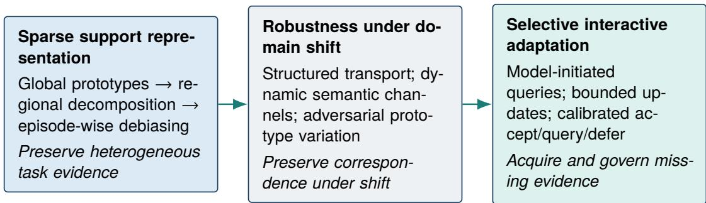
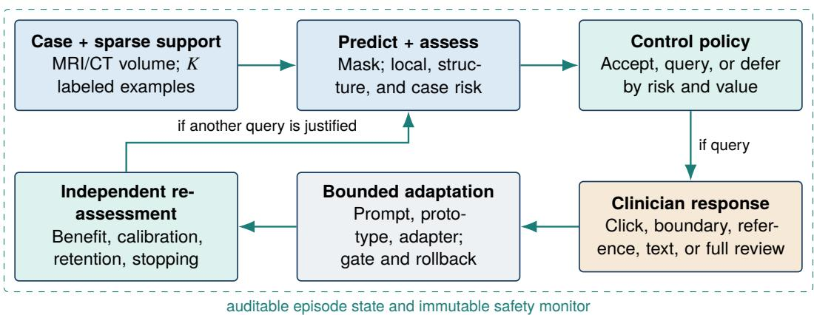

# From Few-Shot Segmentation to Clinician-in-the-Loop Medical Image Analysis

Yazhou Zhu

Independent Researcher rangerzhuyazhou@gmail.com

## Abstract

Few-shot medical image segmentation (FSMIS) seeks to delineate unseen structures from a small support set, but its standard formulation fixes task-defining evidence before inference. This assumption is fragile when query cases exhibit acquisition shift, atypical pathology, ambiguous boundaries, or poor image quality. Prototype learning, cross-domain matching, interactive segmentation, uncertainty estimation, test-time adaptation, and promptable foundation models address parts of this problem, yet have not been jointly evaluated under a common model of expert attention and clinical risk. This Perspective reframes FSMIS as a sequential clinician-model decision problem with a static support budget � and a distinct interaction budget �. At each step, a system accepts the current segmentation, requests feedback, or defers to full expert review. Queries vary in location and modality and are selected by response-conditioned net expected value of information; clinician-provided feedback informs bounded adaptation only after prespecified provenance, consistency, and safety gates. The framework separates distributional atypicality from predicted clinical failure and treats clinician responses as informative but fallible observations. We synthesize the transition from few-shot and cross-domain segmentation to interactive and selective adaptation, delineate the integration gap, and define four research directions with falsifiable hypotheses. Evaluation spans external-domain calibration, quality-efort trade-ofs, reader studies, and prospective workflow assessment. The central claim is not that interaction alone resolves domain shift, but that scarce expert attention should be allocated only when it is expected to reduce clinically relevant risk.

Keywords: few-shot learning; medical image segmentation; cross-domain generalization; clinician-inthe-loop; uncertainty calibration; selective prediction; foundation models

## 1 Introduction

Few-shot medical image segmentation is motivated by a simple constraint: expert masks are expensive, whereas new anatomical structures, pathologies, scanners, and imaging protocols appear continually. The canonical answer is to condition a segmentation model on a small set of labeled support images and infer the mask for a query image. This framing has generated substantial progress, but it implicitly assumes that the initial support set contains enough evidence to resolve the query. That assumption is weakest precisely in the cases for which adaptable medical imaging systems are most valuable: rare disease, atypical anatomy, postoperative change, severe artifact, unfamiliar acquisition, or a genuinely ambiguous boundary.

The next scientific problem is therefore not only how to extract a stronger representation from a few examples. It is how a learning-based model and a clinician should jointly acquire, interpret, and act on evidence after the dificult case has been observed. Points and short boundary corrections already provide useful geometric information; proposed channels such as a reference case or text may communicate domain context or task intent, but their value remains to be established. Clinical attention is not a free oracle. Queries interrupt work, modalities have unequal cognitive and temporal costs, experts can disagree, and adaptation from a mistaken correction can amplify rather than reduce risk.

This Perspective develops a research framework for clinician-in-the-loop few-shot medical image analysis. It extends FSMIS with a separate budget for sequential clinician feedback and casts inference as a controlled trajectory with three available actions, of which acceptance and deferral terminate the episode. The formulation links six bodies of work that are usually evaluated in isolation: few-shot segmentation, cross-domain generalization, interactive segmentation, active information acquisition, selective prediction, and test-time or foundation-model adaptation. The aim is an accountable joint system whose decision to request supervision is driven by expected clinical value rather than undiferentiated uncertainty. Segmentation is the motivating and formally developed case; extension to reconstruction, detection, or diagnosis is outside the present claims.

This article makes four conceptual contributions. First, it formalizes static task evidence and sequential clinician feedback as separate resources, � and �, thereby avoiding the conflation of few-shot learning with ordinary interactive segmentation. Second, it casts deployment as an accept-query-defer decision process in which queries are selected by response-conditioned net expected value and adaptation is constrained by protected-task retention. Third, it identifies proposed safety requirements—external calibration, separately frozen monitoring, provenance, rollback, and bounded memory—that distinguish controlled adaptation from unrestricted online learning. Fourth, it provides a falsifiable, multilevel evaluation agenda for the coupled clinician-model system, spanning segmentation quality, selective risk, expert efort, adaptation stability, and workflow efects. The synthesis is a selective Perspective rather than a systematic review; literature claims are consequently restricted to the cited design space and do not assert exhaustive coverage.

## 2 Problem Foundations: Scarcity, Shift, and Ambiguity

## 2.1 Three forms of scarcity

The motivation for FSMIS is normally described as label scarcity. In clinical edge cases, this is only one of three interacting constraints. Data scarcity reflects the specialist labor required for dense masks. Coverage scarcity arises because unusual protocols, rare pathology, atypical anatomy, and severe artifacts are intrinsically uncommon. Attention scarcity reflects the fact that a clinician cannot inspect and correct every model output. Improving average Dice under a fixed one-shot protocol only partially addresses the first constraint and leaves the other two implicit.

Acquisition, representation, and interpretation are also coupled. MRI pulse sequences, field strengths, reconstruction pipelines, and vendor-specific choices alter contrast and texture; CT phase, dose, reconstruction kernel, and hardware alter noise and edge appearance. Pathology can simultaneously change target morphology and the clinical meaning of an uncertain boundary. Consequently, the same apparent segmentation failure may arise from missing task evidence, a shifted feature geometry, an ambiguous reference standard, or a model limitation. A clinically useful controller must avoid treating these causes as interchangeable.

## 2.2 Two independent supervision budgets

Let � denote the number of static support image-mask pairs that initially specify an unseen class or task. Let $B \in \mathbb { R } _ { + } ^ { m }$ denote a vector of hard interaction limits available after observing the query, such as maximum elapsed time, number of interruptions, or corrected area; $b ( a ) \in \mathbb { R } _ { + } ^ { m }$ measures the same resources for action �, and inequalities are componentwise. Each experiment should prespecify the active components and units of �. A separate soft cost $c ( a )$ represents burden not already hard-constrained, with accounting rules that prevent double counting. “Few-shot” refers to small �; the proposed extension asks how � should be spent. The distinction prevents ordinary interactive segmentation from being relabeled as few-shot learning and prevents a gradually accumulated target-domain dataset from being mistaken for a bounded per-case episode.

Table 1: Distinct sources of dificulty and their consequences for a clinician-in-the-loop policy. The categories can co-occur but should not be collapsed into a single OOD label.
<table><tr><td>Source of difficulty</td><td>Operational meaning</td><td>Typical evidence</td><td>Policy implication</td></tr><tr><td>Label-space novelty</td><td>The target structure or lesion was not represented among meta-training classes.</td><td>Small labeled support set; semantic prompt; anatomical relation.</td><td>Improve task specification; query semantic identity when the support set is insufficient.</td></tr><tr><td>Domain shift</td><td>Meta-training and deployment differ in scanner, protocol, site, modality, or appearance.</td><td>Domain-robust features; acquisition metadata; target support examples.</td><td>Reweight or adapt representation while monitoring transfer and retention.</td></tr><tr><td>Case-level OOD</td><td>The individual case lies outside the validated deployment envelope.</td><td>Atypicality score, predicted mask quality, provenance, clinical consequence.</td><td>Use as a routing signal; do not equate atypicality with failure probability.</td></tr><tr><td>Clinical ambiguity</td><td>More than one contour can remain plausible even under matched acquisition.</td><td>Multiple readers, provenance, task intent, downstream tolerance.</td><td>Represent disagreement, ask a task-specific question, or defer to adjudication.</td></tr></table>

## 2.3 Central thesis

The thesis of this paper is that reliable segmentation for rare, ambiguous, and shifted cases should be formulated as a sequential decision problem. A model uses a small support set as initial task evidence, estimates what remains uncertain, and spends limited clinician attention only when the expected reduction in clinical risk justifies the cost. Reliability must emerge from externally validated decision rules, response-conditioned querying, bounded adaptation, and principled deferral—not from model confidence or model scale alone.

## 3 From Fixed Support to Cross-Domain Robustness

To motivate a sequential framework, limitations in how sparse evidence is represented must first be distinguished from limitations caused by evidence that is absent.

## 3.1 The canonical few-shot assumption

One-shot semantic segmentation established that a single annotated example could specify a new denseprediction task at inference time [1]. Prototypical Networks supplied a metric-learning principle in which each class is represented by the center of its support embeddings [2]; PANet translated this principle to dense prediction through masked prototypes and support-query alignment [3]. In medical imaging, volumetric task conditioning, self-supervised representation learning, and anomaly-inspired foreground-background modeling have relaxed this idealized geometry [4–6]. The common pipeline nevertheless remains fixed: encode the support set and query, compress the labeled foreground into a task representation, and transfer that representation to an unseen class.

Medical images expose the statistical weakness of this compression. Foreground and background are highly imbalanced, labeled base structures can be scarce, and a structure rarely forms one compact cluster across slices, patients, modalities, and disease states. The support mask is therefore not merely small; it is an incomplete and potentially biased description of a heterogeneous target.

## 3.2 Representing heterogeneous support evidence

A sequence of within-domain studies can be read as complementary relaxations of the single-prototype assumption. The Region-Enhanced Prototypical Transformer decomposes the support foreground into regional prototypes and uses relation-aware refinement to obtain a rectified global representation [7].

  
Figure 1: Conceptual trajectory from representing a small fixed support set to governing new evidence at inference time. The branches are complementary rather than a claim of strict historical succession.

Partition-A-Medical-Image makes the mixture structure explicit by extracting several representative subregions, suppressing interference within support features and during support-query interaction, and combining multiple prototype-induced predictions [8]. Learning De-Biased Prototypes challenges masked average pooling directly by filtering episode-specific foreground features before prototype construction [9].

The theoretical continuity is more important than the list of architectures: what must a few labeled images retain to represent a heterogeneous anatomical structure? Regional decomposition, relation-aware refinement, and episode-conditioned filtering all imply that elements of a support mask have unequal relevance and that relevance depends on the target case.

## 3.3 Cross-domain FSMIS (CD-FSMIS)

CD-FSMIS introduces a second generalization axis: source-trained meta-knowledge must transfer to both unseen classes and an unfamiliar target domain [10]. Even when test support and query images originate from the same target domain, the encoder and similarity function learned on source data may provide a poorly aligned coordinate system. An acquisition mismatch between test support and query compounds the problem.

Recent work addresses complementary failure points. RobustEMD replaces point-wise prototype comparison with structured transport between decomposed support and query features; texture- and structure-aware weighting suppresses domain-sensitive nodes, while boundary evidence contributes to the transport cost [11]. Dynamic Semantic Matching performs support-query reweighting, dynamically selects domain-robust channels, and estimates semantic centers from dual perspectives [12]. Adversarial Prototypical Perturbation constructs gradient-derived perturbations from intra- and inter-class variation objectives and combines them with local-imbalance-aware whitening [13]. MAUP uses DINOv2 features and a frozen Segment Anything Model (SAM) with multi-center prompt generation, uncertainty-aware prompt selection, and adaptive prompt optimization without parameter training [14].

These methods form complementary branches rather than a strict chronology: one improves the representation of sparse task evidence, another improves matching under shift, and the foundation-model branch supplies a promptable interface. Better support representations and domain-robust matching can preserve available evidence, but they cannot recover case-specific anatomy or clinical intent that is not contained in the support set. None of these methods establishes whether a missing item of evidence is worth requesting from a clinician.

## 4 Adjacent Paradigms and the Integration Gap

## 4.1 Interactive segmentation is necessary but not suficient

Interactive medical segmentation has established that points, scribbles, boxes, and image-specific optimization can correct a current output [15–18]. ScribblePrompt further demonstrated generalization to unseen biomedical tasks and improved annotation eficiency relative to SAM ViT-B in a study involving 16 academic-hospital imaging researchers who were shown target masks [19]. This supports known-target annotation eficiency, not independent patient-level boundary judgment.

Interaction is also not universally reactive. PseudoClick predicts candidate next clicks automatically [20]; MECCA combines action confidence with reinforcement learning to guide the next interaction region [21]; and sequential-memory models encode the order of user corrections [22]. Interactive few-shot learning uses simulated point corrections for regularized test-time optimization [23], while IFSS-Net propagates expert-seeded information in volumetric ultrasound [24]. Correction-driven adaptation across images and domain change is likewise established [25].

More recent systems occupy additional parts of the design space: clinician-corrected predictions for cross-center test-time adaptation [26]; multiple plausible masks for iterative refinement [27]; image ordering as context grows [28]; support selection and in-context failure detection [29]; pixel- or regionlevel deferral to multiple experts [30]; online adaptation from user-refined masks under distribution shift [31]; and uncertainty-guided candidate selection for preference alignment [32]. Their evidence levels difer: several are preprints, one is a workshop contribution, and others are peer-reviewed conference or journal studies. Accordingly, human correction, adaptation, context accumulation, selection, deferral, and preference alignment are not novel in isolation.

## 4.2 Active learning, in-context learning, and deferral

Pool-based active learning asks which samples or regions should be labeled to improve a future global model. Information-theoretic and Bayesian acquisition formalize informativeness through expected information gain or epistemic uncertainty [33, 34]; medical systems combine these signals with representativeness, consistency, diversity, or simplified interactive labels [35, 36]. Interactive segmentation usually targets the current mask, whereas in-context segmentation uses completed examples to specify a task without gradientbased retraining. UniverSeg demonstrates broad in-context medical segmentation [37]; MultiverSeg accumulates completed examples as context [38]; and the ordering of these examples can alter both accuracy and efort [28]. More broadly, classical information value theory asks whether an observation changes a decision [39].

The remaining evaluation gap is therefore not another interaction primitive, but a policy that determines whether additional information is worth acquiring, what form it should take, and how its consequences should be controlled. What remains insuficiently tested is a controlled integration: sequential, modelinitiated clinical querying under explicit few-shot, cross-domain, and case-level OOD conditions, with joint risk, efort, adaptation, and deferral evaluation. A query should identify the location, feedback modality, and clinical question; the response should update an auditable episode state; and interaction should stop when another query no longer dominates acceptance or deferral.

## 5 Decision-Theoretic Formulation

## 5.1 Episode state, actions, and bounded update

An episode begins with a query image or volume �, � support image-mask pairs $S _ { K }$ , an initial model $f _ { 0 }$ and interaction budget �. At step �, the state

$$
s _ { t } = ( x , S _ { K } , h _ { t } , f _ { t } , B _ { t } , u _ { t } )\tag{1}
$$

contains the interaction history $h _ { t }$ , current model or episode representation $f _ { t } ,$ , remaining budget $B _ { t } .$ , and a hierarchy of local, structural, and case-level risk evidence $u _ { t }$ . The controller chooses $d _ { t } \in \{ A , Q , D \}$ accept the current mask, query the clinician through action $\boldsymbol { a } _ { t } \in \mathcal { A } _ { Q }$ , or defer to full review. Query action $a _ { t }$ jointly specifies a location, modality, and question. The response $z _ { t }$ may include disagreement, correction error, no response, or latency. A bounded transition operator $\mathcal { T } ( s _ { t } , a _ { t } , z _ { t } )$ can update prompts, prototypes, memory, latent features, or a restricted parameter subset. The episode terminates at stopping time �.

Table 2: Primary objectives of related paradigms. The rows are not mutually exclusive; existing methods already bridge several categories.
<table><tr><td>Paradigm</td><td>When supervision arrives</td><td>What supervision changes</td><td>Central limitation or advance</td></tr><tr><td>Few-shot segmenta- tion</td><td>Fixed support before inference</td><td>Task representation or prototypes</td><td>No mechanism to acquire missing case evidence.</td></tr><tr><td>Interactive segmen- tation</td><td>Corrections during inference</td><td>Current mask; sometimes current image representation</td><td>Usually optimizes refinement rather than joint risk and task learning.</td></tr><tr><td>Pool-based active learning</td><td>Selected labels during development</td><td>Future global model</td><td>Does not directly manage current-case release risk.</td></tr><tr><td>In-context segmen- tation</td><td>Examples accumulate as context</td><td>Task specification without weight updates</td><td>Selection, calibration, and deferral remain incompletely coupled.</td></tr><tr><td>Proposed frame- work</td><td>Model-initiated multimodal feedback under budget</td><td>Case, task, domain representation, and governed memory</td><td>Intended to jointly optimize and evaluate error, effort, escalation, and retention.</td></tr></table>

Acceptance and deferral have diferent consequences. Acceptance incurs clinically weighted loss from a released mask. Deferral incurs full-review time and the residual loss of the expert or joint result; it is neither free nor perfect. For feasible policies $\Pi ( B ) = \{ \pi : \textstyle \sum _ { t < \tau } b ( { a _ { t } } ) \preceq B \}$ , where ⪯ is componentwise, consider

$$
\begin{array} { r l } { \pi ^ { \star } = \underset { \pi \in \Pi ( B ) } { \arg \operatorname* { m i n } } } & { \mathbb { E } _ { \pi } \Bigg [ \mathbb { I } ( d _ { \tau } = A ) L _ { \mathrm { c l i n } } ( \hat { y } _ { \tau } , y ) } \\ & { \qquad + \mathbb { I } ( d _ { \tau } = D ) \{ C _ { D } + L _ { \mathrm { c l i n } } ( y _ { \tau } ^ { D } , y ) \} } \\ & { \qquad + \lambda _ { C } \underset { t < \tau } { \sum } c ( a _ { t } ) } \\ & { \qquad + \lambda _ { R } \big [ L _ { \mathcal { R } } ( f _ { \tau } ) - L _ { \mathcal { R } } ( f _ { 0 } ) - \varepsilon _ { R } \big ] _ { + } \Bigg ] . } \end{array}\tag{2}
$$

Here $b ( a )$ records prespecified hard resource use, whereas $c ( a )$ grades residual burden not already represented in the active components of $b ( a )$ . The cost ledger and normalization are fixed before evaluation to prevent double counting. The final term penalizes degradation beyond tolerance $\varepsilon _ { R }$ on an immutable protected reference set R. Clinical losses and costs must be elicited for a defined downstream decision; a missed lesion, a critical boundary violation, and a harmless surface discrepancy cannot share an arbitrary common weight.

## 5.2 Response-conditioned value of clinical feedback

Uncertainty alone is not a reason to interrupt a clinician. A query is useful only if a plausible response is expected to change the mask, lower residual risk, or determine that the case requires deferral. Define the retention penalty $P _ { \mathcal { R } } ( s ) = \lambda _ { R } [ L _ { \mathcal { R } } ( f _ { s } ) - L _ { \mathcal { R } } ( f _ { 0 } ) - \varepsilon _ { R } ] _ { + }$ . Let $J _ { A } ( s )$ and $J _ { D } ( s )$ denote the expected costs of accepting and deferring, respectively, each including $P _ { \mathcal { R } } ( s )$ , and let $J _ { \mathrm { s t o p } } ( s ) = \operatorname* { m i n } \{ J _ { A } ( s ) , J _ { D } ( s ) \}$ The net one-step expected value of information is

$$
\begin{array} { r } { \mathrm { n E V I } ( a \mid s _ { t } ) = J _ { \mathrm { s t o p } } ( s _ { t } ) - \mathbb { E } _ { z \sim p ( z \mid s _ { t } , a ) } \left[ J _ { \mathrm { s t o p } } ( \mathcal { T } ( s _ { t } , a , z ) ) \right] - \lambda _ { C } c ( a ) . } \end{array}\tag{3}
$$

A greedy controller selects

$$
a _ { t } ^ { g } = \arg \operatorname* { m a x } _ { a \in { \mathcal { A } } _ { Q } : b ( a ) \preceq b _ { t } } { \mathrm { n E V I } } ( a \mid s _ { t } )\tag{4}
$$

  
Figure 2: Selective interactive adaptation loop. A foundation model can provide the representation and prompt interface, but a separate controller governs interaction and stopping. Adaptation cannot certify its own safety; each update is independently reassessed against clinical risk and protected capabilities.

and queries only when the maximum is positive. A non-myopic controller instead satisfies the constrained Bellman relation

$$
\begin{array} { r l } & { V ( s , B ) = \operatorname* { m i n } \Bigg \{ J _ { A } ( s ) , J _ { D } ( s ) , } \\ & { \qquad \quad \underset { a \in \mathcal { A } _ { Q } : b ( a ) \preceq B } { \mathrm { m i n } } \left[ \lambda _ { C } c ( a ) + \mathbb { E } _ { z } V ( \mathcal { T } ( s , a , z ) , B - b ( a ) ) \right] \Bigg \} . } \end{array}\tag{5}
$$

The distinction matters because one answer can alter the value of later questions. A click is inexpensive but low bandwidth; a boundary correction conveys geometry; and a reference case or short text may convey domain context or task intent. The last two channels are hypotheses to be tested, not capabilities implied by click- or box-prompt models. Because $J _ { A }$ and $J _ { D }$ contain $P _ { \mathcal R }$ , a query cannot acquire positive value merely by sacrificing protected capabilities. Candidate updates must also be reversible: when a separately frozen monitor rejects a post-response state, $\mathcal { T }$ returns the pre-update state and routes the case to another query or deferral. Equations (2)–(5) are normative until their risk, response, cost, and update models have been estimated for a defined clinical use case and separately safeguarded.

## 5.3 Accept, query, or defer

Querying is appropriate when risk is elevated and a compact intervention is likely to resolve it. Deferral is appropriate when the case is outside the validated adaptation envelope, support evidence is inadequate, ambiguity is irreducible, or another interaction has low expected value. Acceptance is permitted only by an empirical decision rule whose clinically defined threshold is frozen after stratified external validation. Selective prediction provides the risk-coverage perspective [40]; selective medical segmentation demonstrates why performance on a confident subset difers from average accuracy [41].

The clinician is not assumed to be an infallible oracle. Boundaries may be ambiguous, experts may disagree, and a hurried correction may be wrong. Feedback should retain provenance, modality, timing, and confidence. STAPLE models a probabilistic consensus and rater-specific performance under conditional-independence assumptions [42]; probabilistic segmentation and MedUHIP illustrate alternative ways to represent several plausible masks [27, 43]. The framework must distinguish annotation error, systematic reader preference, irreducible ambiguity, and legitimate use-case-specific contouring rather than collapsing them into one latent truth.

## 6 Design Principles and Research Questions

## 6.1 Calibrated recognition of correctable and non-correctable failure

The first direction is to estimate residual risk at three linked levels. Voxel- or patch-level uncertainty should localize candidate errors and support spatial querying. Structure-level uncertainty should reveal missing components, topology violations, boundary failures, and small lesions that an average heat map can hide. Case-level risk should govern release or deferral. Accuracy and confidence must remain separate: modern networks are often overconfident [44], calibration degrades under distribution shift [45], and medical segmentation studies demonstrate both the promise and the limitations of uncertainty for quality control [46–48].

Acquisition shift, task ambiguity, and model insuficiency may not be identifiable from a single output. Operational proxies should therefore be tested under controlled factorial shifts and by their incremental decision value. An OOD score measures atypicality, not the probability of segmentation failure; an unusual case may be easy, and a serious error may remain in-distribution. OOD evidence should be combined with predicted mask quality and clinical consequence as a routing signal. Conditional calibration by site, scanner, modality, structure size, pathology, and interaction step is more informative than pooled voxel calibration. A key negative result is scientifically meaningful: if confidence increases after feedback without improved correctness, the signal is unsuitable for query control.

## 6.2 Cost-sensitive multimodal feedback as task specification

The second direction treats interaction modalities as semantically distinct supervision channels. Existing systems establish points, boxes, scribbles, masks, and constrained semantic prompts [19, 49, 50]; in-context systems show that labeled image-mask pairs can specify unseen segmentation tasks [37, 38]. These findings do not establish that free clinical text can explain an exception, that a reference case reliably communicates acquisition context, or that accepting a suggested region is valid weak supervision. Those channels should be experimental variables. Earlier work predicts suficient annotation strength by jointly considering accuracy and human cost [51]; the unresolved problem in CD-FSMIS is response-conditioned selection among feedback channels, coupled to accept/query/defer decisions and measured in real efort.

The policy must learn where to ask, what to ask, and how to ask. A foreground point may resolve semantic identity; a short correction may resolve geometry; a matched reference case may reveal unfamiliar appearance; and full review may dominate when no compact answer is reliable. Within the core per-case episode, feedback should update a shared representation so that one intervention can correct the present mask and, where justified, clarify the task for later slices in the same volume.

## 6.3 Bounded rapid adaptation and governed memory

The third direction uses clinician-provided feedback without converting deployment into uncontrolled online training. Per-case test-time adaptation can recover performance across scanner and protocol shifts [52]; source-free domain adaptation addresses a distinct target-cohort setting in which source images cannot be retained [53]. Continual test-time adaptation and entropy minimization can accumulate pseudo-label error or forget source capability in changing streams [54, 55], although much of this evidence comes from non-medical benchmarks. Correction-driven adaptation is established [25], and OAIMS directly studies online adaptation from refined masks under medical distribution shift [31]. These works are essential baselines rather than novelty claims.

Initial updates should be episode-local and reversible: prototype revision, prompt optimization, adapters, or small normalization modules, combined with source anchors, trust regions, and snapshots. A separately frozen monitor should control update gates and rollback; operational separation requires fixed monitor parameters, calibration on data disjoint from episode adaptation, and no updating from the same clinician response. Persistent memory belongs to an optional higher-level longitudinal process, not the per-case equations. That process requires its own horizon, resource budget, consent, provenance, privacy controls, and protected-task tests before an interaction can influence later patients. The scientific question is not whether a model can keep learning, but under what evidence and governance conditions retaining an interaction is safer than forgetting it.

Table 3: Research directions, outputs, and prespecified falsification signals.
<table><tr><td>Direction</td><td>Core question</td><td>Principal output</td><td>Falsification signal</td></tr><tr><td>Risk recognition</td><td>Which errors are correctable, irreducible, or unsafe?</td><td>Multi-level calibrated risk and accept/query/defer control.</td><td>No external-site gain in selective risk or failure detection.</td></tr><tr><td>Feedback selec- tion</td><td>Which channel has the greatest clinical value per unit effort?</td><td>Policy over clicks, boundaries, reference cases, and text.</td><td>Benefit disappears with elapsed-time cost or real clinician input.</td></tr><tr><td>Bounded adapta- tion</td><td>How can feedback change a model without drift?</td><td>Episode-local updates, separately frozen gates, rollback, and governed memory.</td><td>Target gain causes protected-task loss or error propagation.</td></tr><tr><td>Clinician-model teaming</td><td>How should assistance respond to clinician heterogeneity?</td><td>Transparent personalization and prospective workflow evidence.</td><td>Workload, reliance, or inequity worsens despite mask gains.</td></tr></table>

## 6.4 Selective and personalized clinician-model teaming

Clinical collaboration depends on both partners. Evidence transferred from diagnostic classification shows that decision support can improve performance, while inaccurate advice—including advice presented as AI-generated—can mislead clinicians [56, 57]. A large radiology study found heterogeneous efects across 140 radiologists and 15 chest-radiograph tasks, with AI error a major determinant of harm [58]. Segmentation-specific studies report gains in contouring accuracy or time in some settings [59], but heterogeneous savings across structures and institutions [60] and possible automation bias in prostate radiotherapy contouring [61]. Classification evidence is not proof for interactive segmentation; together, these studies demand direct workflow evaluation. UAIR already uses uncertainty-guided selection for preference alignment [32], so preference alignment is likewise a comparator.

Clinician behavior can enter the system state, but response time or correction style must not be interpreted directly as competence because both are confounded by case dificulty, interface familiarity, fatigue, and prior allocation. Learning-to-defer provides a basis for routing to humans [62] and adapting to an unseen expert from a population [63]; it does not validate dense segmentation or transfer clinical responsibility. Personalization should require consent, interpretable features, minimum evidence, bounded exploration, subgroup workload audits, reversibility, and an unconditional clinician override.

## 7 Foundation Models as an Enabling Substrate

The decision framework does not prescribe a backbone. Foundation models warrant separate treatment because they can unify representation and interaction interfaces, while leaving calibration, stopping, and adaptation safety unresolved.

SAM established a broadly promptable segmentation interface [50]. Points, boxes, and masks can alter an output without task-specific retraining, which makes this interface attractive for clinician-in-the-loop inference. Yet direct retrospective medical evaluation found large variation across tasks and strong dependence on protocol-generated prompt type [64]. MedSAM expands promptable segmentation through large-scale medical adaptation but primarily uses box prompting [65]; Medical SAM Adapter still requires task-specific parameter optimization [66]; and FM-ABS uses active expert cross-labeling in semi-supervised model development rather than real-time clinical inference [67]. These studies establish technical feasibility, not calibrated abstention, model-initiated queries, or prospective safety.

A foundation model should therefore be treated as a reusable representation and interaction substrate. MAUP provides an immediate bridge: multi-center representations and uncertainty-aware prompt selection condition a frozen SAM at inference without parameter updates [14]. Its uncertainty score ranks prompts; it has not established patient-level risk calibration or justified abstention. The next step is a controller that can decide when automatically generated evidence is insuficient and which clinician input would most eficiently change a clinically relevant decision.

The preferred architecture is modular. A medical foundation encoder provides reusable features; episode memory combines support examples, gated clinician-confirmed masks, and interaction history; a task head proposes the segmentation; separate modules estimate local and case risk; a controller selects accept, query, or defer; and a constrained adapter modifies only approved components. This separation allows each safety claim to be tested independently. A stronger backbone can improve the initial mask, but cannot conceal a poorly calibrated controller or a drifting update rule.

## 8 Experimental and Clinical Validation

Because each interaction changes both the prediction and the remaining information state, evaluation must address the complete clinician-model trajectory rather than only its final mask.

## 8.1 Study domains and edge-case construction

Evaluation should begin with multi-institutional MRI and CT tasks that expose both controlled and naturally occurring shifts: MRI sequence, field strength, vendor, and reconstruction; CT phase, dose, kernel, and hardware; institution-specific protocols; and temporal drift. Task novelty should include unseen structures and lesions. Edge-case strata should include small targets, weak boundaries, atypical morphology, postoperative anatomy, artifact, and poor image quality. Factorial designs should separate acquisition shift from clinical ambiguity whenever possible so that a query policy is not rewarded for treating every unfamiliar texture as a request for annotation.

Average external performance is insuficient. Cross-hospital studies show variable generalization and exploitation of institution-specific signals [68]; causality-inspired domain generalization likewise demonstrates the need to address acquisition appearance and spurious correlation [69]. Results should therefore be stratified by site, scanner, sequence, target size, pathology, and dificulty, with worst-group performance and low-performing quantiles. Held-out institutions and prospective temporal cohorts should remain untouched until the method and thresholds are frozen.

## 8.2 Evaluation of the coupled system

Overlap measures such as Dice remain useful for continuity, but cannot define clinical success. Candidate geometric proxies include normalized surface Dice (NSD) at a clinically elicited tolerance, average symmetric surface distance (ASSD), and HD95. Their relationship to editing time, inter-reader acceptability, and downstream outcomes must be tested rather than assumed. Metrics Reloaded shows why metric choice should follow target geometry, data hierarchy, imbalance, and decision purpose [70]; clinically applicable contouring studies illustrate tolerance-aware surface evaluation and independent expert comparison [71].

The primary calibration target should be a patient- or structure-level probability that the complete mask fails a prespecified, blinded acceptability criterion. On an independent calibration cohort, reliability curves, Brier and log scores, and uncertainty intervals should be reported by deployment stratum and interaction step. Pooled-voxel expected calibration error is secondary because it can conceal case-level miscalibration and imbalance. AUROC and AUPRC assess ranking, not threshold safety. Selective-safety reporting should therefore include false-accept rate, sensitivity, positive predictive value, and empirical coverage at a frozen threshold with confidence intervals. A claim of distribution-free risk control must state exchangeability and other assumptions; otherwise “maximum risk” remains an empirical operating target.

Table 4: Evaluation follows the causal chain from local prediction to interaction, adaptation, and workflow.
<table><tr><td>Level</td><td>Representative measures</td><td>Primary safety question</td></tr><tr><td>Voxel or region</td><td>Calibration, error localization, boundary distance, Dice.</td><td>Does uncertainty identify a clinically meaningful correction?</td></tr><tr><td>Structure or case</td><td>NSD, ASSD, HD95, missed small targets, failure AUROC/AUPRC.</td><td>Can the system recognize a clinically unacceptable complete result?</td></tr><tr><td>Selective policy</td><td>Risk-coverage, false accepts, counterfactual query value, frozen-threshold coverage.</td><td>Are release and escalation decisions accountable?</td></tr><tr><td>Interaction</td><td>Time to acceptable mask, quality-effort AUC, improvement per minute, latency.</td><td>Does assistance save expert effort outside simulation?</td></tr><tr><td>Adaptation</td><td>Immediate gain, calibration change, retention, rollback, within-volume transfer; cross-case</td><td>Does learning help without drift or propagated error?</td></tr><tr><td>Workflow</td><td>transfer only in the longitudinal extension. Editing time, workload, override, downstream effect, subgroup results.</td><td>Does the joint system outperform both components safely?</td></tr></table>

A false query has no directly observed label on a single trajectory because the safe no-query outcome is counterfactual. Operationally, it is a query whose adjudicated net expected value is non-positive: the pre-query result was acceptable and realized or estimated benefit falls below a prespecified minimum after measured efort. Randomized query/no-query assignment or validated ofline policy evaluation is needed. Interaction outcomes should be expressed against elapsed clinician time, corrected area or slices, interface actions, and latency. Useful summaries include time to acceptable mask, area under the quality-efort curve, improvement per minute, and failure within a fixed budget. Decision-curve analysis ofers a framework for explicit net benefit rather than inferring clinical utility from geometry alone [72].

Adaptation should be evaluated after every response. Immediate gain, calibration change, monotonicity, protected-task retention, within-volume transfer, error propagation, and rollback frequency should all be reported. A separately governed longitudinal extension should additionally report cross-case transfer and performance over changing domain sequences. An update that increases confidence while increasing clinically weighted error is a safety failure. Downstream endpoints such as volumetry stability, radiotherapy contour acceptability, or derived-measurement sensitivity should be used when the application permits.

## 8.3 From robot users to clinicians

Simulated users are indispensable for scalable ablation, but do not establish clinical interaction eficiency. Many protocols use the ground-truth mask to place the next click and count heterogeneous modalities as one “interaction step”. They therefore omit search time, navigation, windowing, and cognitive switching, and cannot measure anchoring, fatigue, frustration, or recovery from a misleading output. Interactive-segmentation research shows that user protocols and interface design can alter conclusions [73, 74]. Radiotherapy workflow studies support measuring operational and cognitive time, although small-reader studies cannot establish broad efectiveness [75].

Validation should proceed in a ladder: multiple independent robot policies and prompt perturbations; manually collected traces disjoint from the final human test; a reader study on representative edge cases; prospective silent evaluation; and a limited workflow study with stopping and rollback criteria. Reader studies should use a randomized crossover with washout or a balanced incomplete-block design. Manual delineation, review of a raw automatic mask, a conventional interactive tool, and the proposed system should be matched where possible for backbone, initial mask, display, training, latency, and interface. Analyses should model crossed clinician and case efects, prespecify power, use blinded adjudication, and record quality-efort intervals, workload, usability, override, and recovery from deliberately imperfect suggestions. A silent phase can estimate case flow, shift prevalence, trigger rates, and potential workload; without responses it cannot validate query utility, adaptation, anchoring, or time savings. Early reporting should follow DECIDE-AI [76], recognizing that a reporting framework is not itself evidence of safety.

## 9 Falsifiable Hypotheses

The research program is useful only if the central assumptions can fail. Five hypotheses define its principal tests.

H1: Dynamic queries improve clinical value per unit efort. At matched clinician time, a value-guided policy should reach an acceptable mask more often than random queries, fixed-click heuristics, or passive correction. It is falsified if the gain disappears with elapsed-time cost or real users.

H2: Multi-level risk improves safe action selection. Combining local error localization, structure quality, and case atypicality should improve accept/query/defer decisions over voxel entropy alone. It is falsified if selective risk does not improve at held-out institutions or patient-level calibration fails after thresholds are frozen.

H3: Feedback should update task representation, not only mask pixels. At equal risk, a correction that updates support or prompt representation should improve unedited slices in the same volume more than a local overwrite. A separately governed longitudinal study may test later related cases. The hypothesis is falsified by negligible transfer, propagated error, or excessive protected-task loss.

H4: Bounded adaptation improves the safety-adaptation trade-of. Trust regions, anchors, separately frozen gates, and rollback should retain most target-domain gain while reducing catastrophic accumulation and forgetting. It is falsified if constraints only suppress useful adaptation without improving worst-case or longitudinal safety.

H5: Governed personalization outperforms a uniform interface. With consent and suficient observations, clinician-conditioned policies should reduce time and unnecessary queries without increasing error or over-reliance. It is falsified by benefit limited to robot users, inequitable task allocation, or behavior that cannot be explained, audited, and overridden.

## 10 Levels of Evidence Required for Translation

Level I: benchmark and decision evidence. A unified protocol should connect within-domain FSMIS, CD-FSMIS, promptable foundation models, interactive refinement, and selective prediction. Evidence at this level must establish calibration and accept/query/defer baselines, define clinically weighted edge-case strata, and derive interaction-cost models from multiple robot policies and initial clinician traces. An auditable controller can be evaluated before any parameter adaptation is allowed.

Level II: interaction and adaptation evidence. Comparative studies should evaluate points, scribbles, boundaries, references, and text together with episode-local prompt, prototype, or adapter updates. Evidence must show whether feedback lowers risk for the intended reason, whether benefit transfers beyond the edited region, and whether rollback prevents non-monotonic failure. Clinical collaboration is essential because cost and acceptability cannot be inferred from benchmark masks.

Level III: prospective clinician-model evidence. Silent studies should first estimate shift, failure prevalence, trigger rates, and potential workload without claiming interaction eficiency. Limited workflow studies should then evaluate clinician-specific policies, inter-reader disagreement, and query utility. Any longitudinal cross-case learning must be a separately consented and governed protocol. Thresholds should be frozen; model, clinician, and joint-system performance should be reported separately; and site and subgroup analyses should be prespecified.

## 11 Limitations, Governance, and Scope

The central technical risk is that uncertainty can be unreliable precisely under severe shift. Independent signals and conditional calibration can mitigate this problem, but detected shift can only block adaptation or trigger review; it does not prove error. Feedback itself is another source of uncertainty. A correction can reflect ambiguity, fatigue, or idiosyncratic preference, so provenance, repeated evidence, confidence, and multi-reader models are required before it becomes persistent memory.

Human factors create a distinct failure mode. A plausible mask may anchor a reader, while repeated low-value queries can create fatigue. Controlled studies must therefore measure override behavior, workload, and recovery from deliberately imperfect suggestions, not only accuracy or usability. Evidence that erroneous AI advice can degrade physician decisions [57, 58] makes this a primary safety endpoint.

Persistent adaptation raises privacy and governance questions because site- or clinician-specific memory may encode identifiable or institution-specific information. Retained representations require access control, audit trails, and deletion mechanisms. Per-case updates should remain local and ephemeral; cross-case memory in the optional longitudinal process is justified only when consent, governance, and measurable transfer support persistence.

The response distribution $p ( z \mid s , a )$ is another unresolved source of error. It must represent disagreement, no response, latency, and interface efects; a policy optimized under a misspecified response model can issue confidently low-value queries. Sensitivity analysis and prospective re-estimation are therefore required.

Finally, segmentation quality is not identical to clinical benefit. A boundary deviation may be harmless in one application and consequential in another. Each study must therefore define the use case, tolerance, failure cost, and downstream endpoint before optimization. Retrospective benchmark gains, a single aggregate metric, or the presence of a large foundation model cannot establish general clinical safety. The framework remains normative and does not itself constitute evidence of prospective clinical efectiveness.

## 12 Conclusion

Conventional FSMIS asks how much can be learned from a few labeled images. Cross-domain FSMIS asks whether that evidence transfers across unfamiliar acquisition domains. Clinician-in-the-loop FSMIS asks a further question: what is the smallest, safest, and most informative dialogue required to resolve the current clinical case?

The proposed framework changes the unit of analysis from a final mask to the trajectory of a joint clinician-model system. It connects regional and domain-robust representations with active multimodal querying, calibrated acceptance and deferral, bounded adaptation, and governed memory. Foundation models supply a reusable interface, not a safety argument. The desired endpoint is not a model that appears universally confident, but a system that knows when to act, when to ask, how to learn safely from an answer, and when to stop.

## Declaration of competing interest

The author declares no known competing financial interests or personal relationships that could have appeared to influence the work reported in this paper.

## Data availability

No new data were created or analyzed for this Perspective.

## References

[1] A. Shaban, S. Bansal, Z. Liu, I. Essa, and B. Boots. One-Shot Learning for Semantic Segmentation. In BMVC, 2017. doi: 10.5244/C.31.167.

[2] J. Snell, K. Swersky, and R. S. Zemel. Prototypical Networks for Few-shot Learning. In Advances in Neural Information Processing Systems, volume 30, 2017. URL https://proceedings.neurip s.cc/paper\_files/paper/2017/hash/cb8da6767461f2812ae4290eac7cbc42-Abstract. html.

[3] K. Wang, J. H. Liew, Y. Zou, D. Zhou, and J. Feng. PANet: Few-Shot Image Semantic Segmentation With Prototype Alignment. In ICCV, pages 9197–9206, 2019. doi: 10.1109/ICCV.2019.00929.

[4] A. G. Roy, S. Siddiqui, S. Pölsterl, N. Navab, and C. Wachinger. ‘Squeeze & Excite’ Guided Few-Shot Segmentation of Volumetric Images. Medical Image Analysis, 59:101587, 2020. doi: 10.1016/j.media.2019.101587.

[5] C. Ouyang, C. Bifi, C. Chen, T. Kart, H. Qiu, and D. Rueckert. Self-Supervised Learning for Few-Shot Medical Image Segmentation. IEEE Transactions on Medical Imaging, 41(7):1837–1848, 2022. doi: 10.1109/TMI.2022.3150682.

[6] S. Hansen, S. Gautam, R. Jenssen, and M. Kampfmeyer. Anomaly Detection-Inspired Few-Shot Medical Image Segmentation Through Self-Supervision With Supervoxels. Medical Image Analysis, 78:102385, 2022. doi: 10.1016/j.media.2022.102385.

[7] Y. Zhu, S. Wang, T. Xin, and H. Zhang. Few-Shot Medical Image Segmentation via a Region-Enhanced Prototypical Transformer. In MICCAI, volume 14223 of LNCS, pages 271–280, 2023. doi: 10.1007/978-3-031-43901-8\_26.

[8] Y. Zhu, S. Wang, T. Xin, Z. Zhang, and H. Zhang. Partition-A-Medical-Image: Extracting Multiple Representative Subregions for Few-Shot Medical Image Segmentation. IEEE Transactions on Instrumentation and Measurement, 73:1–12, 2024. doi: 10.1109/TIM.2024.3381715.

[9] Y. Zhu, Z. Cheng, S. Wang, and H. Zhang. Learning De-Biased Prototypes for Few-Shot Medical Image Segmentation. Pattern Recognition Letters, 183:71–77, 2024. doi: 10.1016/j.patrec.2024.05 .003.

[10] S. Lei, X. Zhang, J. He, F. Chen, B. Du, and C.-T. Lu. Cross-Domain Few-Shot Semantic Segmentation. In ECCV, pages 73–90, 2022. doi: 10.1007/978-3-031-20056-4\_5.

[11] Y. Zhu, M. Li, Q. Ye, S. Wang, T. Xin, and H. Zhang. RobustEMD: Domain Robust Matching for Cross-Domain Few-Shot Medical Image Segmentation. Artificial Intelligence in Medicine, 167: 103197, 2025. doi: 10.1016/j.artmed.2025.103197.

[12] Y. Zhu, S. Wang, T. Zhou, Z. Li, H. Zhang, and L. Shao. Cross-Domain Few-Shot Medical Image Segmentation via Dynamic Semantic Matching. IEEE Transactions on Image Processing, 34: 6669–6682, 2025. doi: 10.1109/TIP.2025.3618396.

[13] Y. Zhu, S. Wang, T. Xin, and H. Zhang. Adversarial Prototypical Perturbation for Cross-Domain Few-Shot Medical Image Segmentation. ACM Transactions on Multimedia Computing, Communications, and Applications, 22(8):1–27, 2026. doi: 10.1145/3832315.

[14] Y. Zhu and H. Zhang. MAUP: Training-Free Multi-Center Adaptive Uncertainty-Aware Prompting for Cross-Domain Few-Shot Medical Image Segmentation. In MICCAI, volume 15966 of LNCS, pages 326–336, 2025. doi: 10.1007/978-3-032-04981-0\_31.

[15] G. Wang, W. Li, M. A. Zuluaga, et al. Interactive Medical Image Segmentation Using Deep Learning With Image-Specific Fine Tuning. IEEE Transactions on Medical Imaging, 37(7):1562–1573, 2018. doi: 10.1109/TMI.2018.2791721.

[16] G. Wang, M. A. Zuluaga, W. Li, et al. DeepIGeoS: A Deep Interactive Geodesic Framework for Medical Image Segmentation. IEEE Transactions on Pattern Analysis and Machine Intelligence, 41 (7):1559–1572, 2019. doi: 10.1109/TPAMI.2018.2840695.

[17] X. Luo, G. Wang, T. Song, et al. MIDeepSeg: Minimally Interactive Segmentation of Unseen Objects from Medical Images Using Deep Learning. Medical Image Analysis, 72:102102, 2021. doi: 10.1016/j.media.2021.102102.

[18] N. A. Koohbanani, M. Jahanifar, N. Z. Tajadin, and N. Rajpoot. NuClick: A Deep Learning Framework for Interactive Segmentation of Microscopic Images. Medical Image Analysis, 65: 101771, 2020. doi: 10.1016/j.media.2020.101771.

[19] H. E. Wong, M. Rakic, J. Guttag, and A. V. Dalca. ScribblePrompt: Fast and Flexible Interactive Segmentation for Any Biomedical Image. In ECCV, pages 207–229, 2024. doi: 10.1007/978-3-031 -73661-2\_12.

[20] Q. Liu, M. Zheng, B. Planche, et al. PseudoClick: Interactive Image Segmentation with Click Imitation. In ECCV, pages 728–745, 2022. doi: 10.1007/978-3-031-20068-7\_42.

[21] C. Shen, W. Li, Q. Xu, et al. Interactive Medical Image Segmentation with Self-Adaptive Confidence Calibration. Frontiers ofInformation Technology & Electronic Engineering, 24(9):1332–1348, 2023. doi: 10.1631/FITEE.2200299.

[22] I. A. Mikhailov, B. Chauveau, N. Bourdel, et al. A Deep Learning-Based Interactive Medical Image Segmentation Framework with Sequential Memory. Computer Methods and Programs in Biomedicine, 245:108038, 2024. doi: 10.1016/j.cmpb.2024.108038.

[23] R. Feng, X. Zheng, T. Gao, J. Chen, W. Wang, D. Z. Chen, and J. Wu. Interactive Few-Shot Learning: Limited Supervision, Better Medical Image Segmentation. IEEE Transactions on Medical Imaging, 40(10):2575–2588, 2021. doi: 10.1109/TMI.2021.3060551.

[24] D. Al Chanti, V. G. Duque, M. Crouzier, et al. IFSS-Net: Interactive Few-Shot Siamese Network for Faster Muscle Segmentation and Propagation in Volumetric Ultrasound. IEEE Transactions on Medical Imaging, 40(10):2615–2628, 2021. doi: 10.1109/TMI.2021.3058303.

[25] T. Kontogianni, E. Celikkan, S. Tang, and K. Schindler. Continuous Adaptation for Interactive Object Segmentation by Learning from Corrections. In ECCV, pages 579–596, 2020. doi: 10.1007/978-3-030-58517-4\_34.

[26] S. Hu, Z. Liao, Z. Liu, and Y. Xia. Towards Clinician-Preferred Segmentation: Leveraging Human-in-the-Loop for Test Time Adaptation in Medical Image Segmentation. arXiv preprint arXiv:2405.08270, 2024. doi: 10.48550/arXiv.2405.08270.

[27] J. Zhu and J. Wu. MedUHIP: Towards Human-In-the-Loop Medical Segmentation. arXiv preprint arXiv:2408.01620, 2024. doi: 10.48550/arXiv.2408.01620.

[28] G. Torpey, J. Guttag, and H. E. Wong. Learning What To Ask For When: Image Ordering for In-Context Interactive Medical Image Segmentation. In CVPR Workshops, pages 6418–6426, 2026. URL https://openaccess.thecvf.com/content/CVPR2026W/PHAROS-AIF-MIH/html/To rpey\_Learning\_What\_To\_Ask\_For\_When\_Image\_Ordering\_for\_In-Context\_CVPRW\_202 6\_paper.html.

[29] Y. Gehad, E. Zerefa, K. Kabra, and G. Balakrishnan. Context Matters: Support Set Selection and Failure Detection for In-Context Medical Image Segmentation. arXiv preprint arXiv:2608.05333, 2026. doi: 10.48550/arXiv.2608.05333.

[30] Q. Tian, H. Sun, Y. Wang, Y. Shi, and Y. Yin. DeferredSeg: A Multi-Expert Deferral Framework for Medical Image Segmentation. Pattern Recognition, 182:114811, 2027. doi: 10.1016/j.patcog.2026. 114811. URL https://doi.org/10.1016/j.patcog.2026.114811. Available online 2026.

[31] W. Xu, Z. Liang, H. Anthony, Y. Ibrahim, F. Cohen, G. Yang, and K. Kamnitsas. You Point, I Learn: Online Adaptation of Interactive Segmentation Models for Handling Distribution Shifts in Medical Imaging. In ICLR, 2026. URL https://proceedings.iclr.cc/paper\_files/paper/2026 /hash/8e5e1e120afdbd8700ee4ce8c42f2bf5-Abstract-Conference.html.

[32] G. Zhao, Y. Wang, C. Gong, et al. User-Preference Alignment with Uncertainty-Aware Interactive Rectification for Liver Organ and Tumor Segmentation and Analysis from CT Images. npj Digital Medicine, 9:418, 2026. doi: 10.1038/s41746-026-02544-2.

[33] D. J. C. MacKay. Information-Based Objective Functions for Active Data Selection. Neural Computation, 4(4):590–604, 1992. doi: 10.1162/neco.1992.4.4.590.

[34] Y. Gal, R. Islam, and Z. Ghahramani. Deep Bayesian Active Learning with Image Data. In ICML, volume 70 of PMLR, pages 1183–1192, 2017. URL https://proceedings.mlr.press/v70/ gal17a.html.

[35] L. Yang, Y. Zhang, J. Chen, S. Zhang, and D. Z. Chen. Suggestive Annotation: A Deep Active Learning Framework for Biomedical Image Segmentation. In MICCAI, pages 399–407, 2017. doi: 10.1007/978-3-319-66179-7\_46.

[36] X. Li, M. Xia, J. Jiao, S. Zhou, C. Chang, Y. Wang, and Y. Guo. HAL-IA: A Hybrid Active Learning Framework Using Interactive Annotation for Medical Image Segmentation. Medical Image Analysis, 88:102862, 2023. doi: 10.1016/j.media.2023.102862.

[37] V. I. Butoi, J. J. Gonzalez Ortiz, T. Ma, M. R. Sabuncu, J. Guttag, and A. V. Dalca. UniverSeg: Universal Medical Image Segmentation. In ICCV, pages 21438–21451, 2023. doi: 10.1109/ICCV 51070.2023.01960.

[38] H. E. Wong, J. J. Gonzalez Ortiz, J. V. Guttag, and A. V. Dalca. MultiverSeg: Scalable Interactive Segmentation of Biomedical Imaging Datasets with In-Context Guidance. In ICCV, pages 20966– 20980, 2025. doi: 10.1109/ICCV51701.2025.01949.

[39] R. A. Howard. Information Value Theory. IEEE Transactions on Systems Science and Cybernetics, 2(1):22–26, 1966. doi: 10.1109/TSSC.1966.300074.

[40] Y. Geifman and R. El-Yaniv. SelectiveNet: A Deep Neural Network with an Integrated Reject Option. In ICML, volume 97 of PMLR, pages 2151–2159, 2019. URL https://proceedings. mlr.press/v97/geifman19a.html.

[41] Y. Ding, J. Liu, X. Xu, M. Huang, J. Zhuang, J. Xiong, and Y. Shi. Uncertainty-Aware Training of Neural Networks for Selective Medical Image Segmentation. In MIDL, volume 121 of PMLR, pages 156–173, 2020. URL https://proceedings.mlr.press/v121/ding20a.html.

[42] S. K. Warfield, K. H. Zou, and W. M. Wells. Simultaneous Truth and Performance Level Estimation (STAPLE): An Algorithm for the Validation of Image Segmentation. IEEE Transactions on Medical Imaging, 23(7):903–921, 2004. doi: 10.1109/TMI.2004.828354.

[43] S. A. A. Kohl, B. Romera-Paredes, C. Meyer, et al. A Probabilistic U-Net for Segmentation of Ambiguous Images. In Advances in Neural Information Processing Systems, volume 31, pages 6965–6975, 2018. URL https://proceedings.neurips.cc/paper\_files/paper/2018/ha sh/473447ac58e1cd7e96172575f48dca3b-Abstract.html.

[44] C. Guo, G. Pleiss, Y. Sun, and K. Q. Weinberger. On Calibration of Modern Neural Networks. In ICML, volume 70 of PMLR, pages 1321–1330, 2017. URL https://proceedings.mlr.press/ v70/guo17a.html.

[45] Y. Ovadia, E. Fertig, J. Ren, et al. Can You Trust Your Model’s Uncertainty? Evaluating Predictive Uncertainty Under Dataset Shift. In Advances in Neural Information Processing Systems, volume 32, 2019. URL https://proceedings.neurips.cc/paper\_files/paper/2019/hash/8558c b408c1d76621371888657d2eb1d-Abstract.html.

[46] A. Mehrtash, W. M. Wells, III, C. M. Tempany, P. Abolmaesumi, and T. Kapur. Confidence Calibration and Predictive Uncertainty Estimation for Deep Medical Image Segmentation. IEEE Transactions on Medical Imaging, 39(12):3868–3878, 2020. doi: 10.1109/TMI.2020.3006437.

[47] A. Jungo, F. Balsiger, and M. Reyes. Analyzing the Quality and Challenges of Uncertainty Estimations for Brain Tumor Segmentation. Frontiers in Neuroscience, 14:282, 2020. doi: 10.3389/fnins.2020.00282.

[48] M. Zenk, D. Zimmerer, F. Isensee, et al. Comparative Benchmarking of Failure Detection Methods in Medical Image Segmentation: Unveiling the Role of Confidence Aggregation. Medical Image Analysis, 101:103392, 2025. doi: 10.1016/j.media.2024.103392.

[49] Y. Du, F. Bai, T. Huang, and B. Zhao. SegVol: Universal and Interactive Volumetric Medical Image Segmentation. In Advances in Neural Information Processing Systems, volume 37, 2024. doi: 10.52202/079017-3516.

[50] A. Kirillov, E. Mintun, N. Ravi, et al. Segment Anything. In ICCV, 2023. doi: 10.1109/ICCV5107 0.2023.00371.

[51] S. D. Jain and K. Grauman. Predicting Suficient Annotation Strength for Interactive Foreground Segmentation. In ICCV, pages 1313–1320, 2013. doi: 10.1109/ICCV.2013.166.

[52] N. Karani, E. Erdil, K. Chaitanya, and E. Konukoglu. Test-Time Adaptable Neural Networks for Robust Medical Image Segmentation. Medical Image Analysis, 68:101907, 2021. doi: 10.1016/j.me dia.2020.101907.

[53] M. Bateson, H. Kervadec, J. Dolz, H. Lombaert, and I. Ben Ayed. Source-Free Domain Adaptation for Image Segmentation. Medical Image Analysis, 82:102617, 2022. doi: 10.1016/j.media.2022.102617.

[54] Q. Wang, O. Fink, L. Van Gool, and D. Dai. Continual Test-Time Domain Adaptation. In CVPR, 2022. doi: 10.1109/CVPR52688.2022.00706.

[55] S. Niu, J. Wu, Y. Zhang, Y. Chen, S. Zheng, P. Zhao, and M. Tan. Eficient Test-Time Model Adaptation without Forgetting. In ICML, volume 162 of PMLR, pages 16888–16905, 2022. URL https://proceedings.mlr.press/v162/niu22a.html.

[56] P. Tschandl, C. Rinner, Z. Apalla, et al. Human–Computer Collaboration for Skin Cancer Recognition. Nature Medicine, 26:1229–1234, 2020. doi: 10.1038/s41591-020-0942-0.

[57] S. Gaube, H. Suresh, M. Raue, et al. Do as AI Say: Susceptibility in Deployment of Clinical Decision-Aids. npj Digital Medicine, 4:31, 2021. doi: 10.1038/s41746-021-00385-9.

[58] F. Yu, A. Moehring, O. Banerjee, et al. Heterogeneity and Predictors of the Efects of AI Assistance on Radiologists. Nature Medicine, 30:837–849, 2024. doi: 10.1038/s41591-024-02850-w.

[59] S.-L. Lu, F.-R. Xiao, J. C.-H. Cheng, et al. Randomized Multi-Reader Evaluation of Automated Detection and Segmentation of Brain Tumors in Stereotactic Radiosurgery with Deep Neural Networks. Neuro-Oncology, 23(9):1560–1568, 2021. doi: 10.1093/neuonc/noab071.

[60] E. P. P. Pang, H. Q. Tan, F. Wang, et al. Multicentre Evaluation of Deep Learning CT Autosegmentation of the Head and Neck Region for Radiotherapy. npj Digital Medicine, 8:312, 2025. doi: 10.1038/s41746-025-01624-z.

[61] N. Arjmandi, A. R. Sebzari, F. Molaei, et al. Clinical Validation of AI-Assisted Contouring in Prostate Radiation Therapy Treatment Planning: Highlighting Automation Bias and the Need for Standardized Quality Assurance. Journal ofApplied Clinical Medical Physics, 27(1):e70425, 2026. doi: 10.1002/acm2.70425.

[62] H. Mozannar, H. Lang, D. Wei, P. Sattigeri, S. Das, and D. Sontag. Who Should Predict? Exact Algorithms for Learning to Defer to Humans. In AISTATS, volume 206 of PMLR, pages 10520–10545, 2023. URL https://proceedings.mlr.press/v206/mozannar23a.html.

[63] D. Tailor, A. Patra, R. Verma, P. Manggala, and E. Nalisnick. Learning to Defer to a Population: A Meta-Learning Approach. In AISTATS, volume 238 of PMLR, pages 3475–3483, 2024. URL https://proceedings.mlr.press/v238/tailor24a.html.

[64] M. A. Mazurowski, H. Dong, H. Gu, J. Yang, N. Konz, and Y. Zhang. Segment Anything Model for Medical Image Analysis: An Experimental Study. Medical Image Analysis, 89:102918, 2023. doi: 10.1016/j.media.2023.102918.

[65] J. Ma, Y. He, F. Li, L. Han, C. You, and B. Wang. Segment Anything in Medical Images. Nature Communications, 15:654, 2024. doi: 10.1038/s41467-024-44824-z.

[66] J. Wu, Z. Wang, M. Hong, W. Ji, H. Fu, Y. Xu, M. Xu, and Y. Jin. Medical SAM Adapter: Adapting Segment Anything Model for Medical Image Segmentation. Medical Image Analysis, 102:103547, 2025. doi: 10.1016/j.media.2025.103547.

[67] Z. Xu, C. Chen, D. Lu, et al. FM-ABS: Promptable Foundation Model Drives Active Barely Supervised Learning for 3D Medical Image Segmentation. In MICCAI, pages 294–304, 2024. doi: 10.1007/978-3-031-72111-3\_28.

[68] J. R. Zech, M. A. Badgeley, M. Liu, A. B. Costa, J. J. Titano, and E. K. Oermann. Variable Generalization Performance of a Deep Learning Model to Detect Pneumonia in Chest Radiographs: A Cross-Sectional Study. PLOS Medicine, 15(11):e1002683, 2018. doi: 10.1371/journal.pmed.100 2683.

[69] C. Ouyang, C. Chen, S. Li, Z. Li, C. Qin, W. Bai, and D. Rueckert. Causality-Inspired Single-Source Domain Generalization for Medical Image Segmentation. IEEE Transactions on Medical Imaging, 42(4):1095–1106, 2023. doi: 10.1109/TMI.2022.3224067.

[70] L. Maier-Hein, A. Reinke, P. Godau, et al. Metrics Reloaded: Recommendations for Image Analysis Validation. Nature Methods, 21:195–212, 2024. doi: 10.1038/s41592-023-02151-z.

[71] S. Nikolov, S. Blackwell, A. Zverovitch, et al. Clinically Applicable Segmentation of Head and Neck Anatomy for Radiotherapy: Deep Learning Algorithm Development and Validation Study. Journal ofMedical Internet Research, 23(7):e26151, 2021. doi: 10.2196/26151.

[72] A. J. Vickers and E. B. Elkin. Decision Curve Analysis: A Novel Method for Evaluating Prediction Models. Medical Decision Making, 26(6):565–574, 2006. doi: 10.1177/0272989X06295361.

[73] P. Kohli, H. Nickisch, C. Rother, and C. Rhemann. User-Centric Learning and Evaluation of Interactive Segmentation Systems. International Journal of Computer Vision, 100(3):261–274, 2012. doi: 10.1007/s11263-012-0537-4.

[74] M. Amrehn, S. Steidl, R. Kortekaas, et al. A Semi-Automated Usability Evaluation Framework for Interactive Image Segmentation Systems. International Journal of Biomedical Imaging, 2019: 1464592, 2019. doi: 10.1155/2019/1464592.

[75] A. Ramkumar, J. Dolz, H. A. Kirisli, et al. User Interaction in Semi-Automatic Segmentation of Organs at Risk: A Case Study in Radiotherapy. Journal ofDigital Imaging, 29(2):264–277, 2016. doi: 10.1007/s10278-015-9839-8.

[76] B. Vasey, M. Nagendran, B. Campbell, et al. Reporting Guideline for the Early-Stage Clinical Evaluation of Decision Support Systems Driven by Artificial Intelligence: DECIDE-AI. Nature Medicine, 28:924–933, 2022. doi: 10.1038/s41591-022-01772-9.