# From Pixels to Hierarchical Sequences: Quadtree Mask Encoding for Vision-Language Binary Change Detection

Xiao An1∗, Ruikang Zhang2∗, Chen Zhong1, Xuli Shen3, Jiaxing Sun3, Jiang Wu3†, Wei He1†

1Wuhan University 2Peking University 3Shanghai Artificial Intelligence Laboratory

## Abstract

Dense change detection in remote sensing requires vision- language models (VLMs) to compare bi-temporal images and generate accurate pixel-level masks. Existing VLMs are largely confined to change captioning outputs, and the few that produce pixel-level masks still rely on external decoders or flat text-as-mask serialization, which are less efective for small and fragmented changes. We introduce QUAKE-CD, a framework that recasts dense change prediction as syntax- verifiable structured generation. QUAKE-CD represents bi-nary change masks as grammar-constrained quadtree token sequences, making the masks compact, syntactically check- able, and deterministically decodable within an autoregressive generation space. We further construct QUAKE-CoT, which pairs these sequences with chain-of-thought traces grounded in visual evidence, and jointly optimizes textual reasoning and spatial dense prediction through a progressive curriculum fol- lowed by grammar-gated dual-reward RL. On QUAKE-CoT, QUAKE-CD achieves 78.31% accumulated F1, outperforming decoder-based and flat text-as-mask VLMs while produc- ing more faithful bi-temporal reasoning.

## 1 Introduction

Large vision-language models (VLMs) demonstrate profound capability in multimodal reasoning (Bai et al. 2025; Team et al. 2026), yet real-world applications increasingly demand spatially grounded outputs that delineate precise footprint boundaries (Xiao et al. 2025; Ding et al. 2025). Remote sensing change detection (Asokan and Anitha 2019; Dong et al. 2024) provides a stringent testbed for this im-perative. Given bi-temporal images, models must synthesize cross-temporal visual evidence to render a pixel-level binary change map. Traditional change detection paradigms, includ- ing encoder–decoder networks and open-vocabulary formu- lations, narrowly optimize for discriminative mask predic- tion (Dong et al. 2024; Korkmaz and Patel 2026; Zhu et al. 2025), structurally divorcing the semantic interpretation of changes from spatial footprints. While recent VLMs support interactive change captioning and localization (Deng, Zhou, and Wu 2025; Li et al. 2026b; Elgendy et al. 2024), natively generating complete, dense spatial masks remains challeng- ing. This limitation exposes a critical dichotomy between language-centric reasoning and pixel-level decision-making.

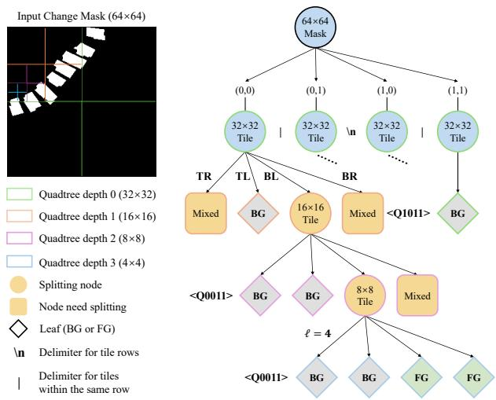  
Figure 1: Illustration of the proposed QUAKE grammar. We take 64 × 64 change mask and ℓ = 4 as an example.

Rather than bridging this gap, contemporary VLM archi- tectures often relegate dense prediction to an auxiliary objective, mapping hidden states to spatial masks via task-specific decoders (Lai et al. 2024; Ren et al. 2024; Ma et al. 2025; Li et al. 2026a), which remains fundamentally orthogonal to the core autoregressive mechanism. While efective in isolation, this decoupling necessitates heterogeneous objectives, en-cumbering end-to-end training and stifling direct token-level optimization. Furthermore, sparse-cue methods that delegate mask generation to external segmenters (e.g., SAM (Kirillov et al. 2023)) via bounding boxes or points (Sun et al. 2026; Yao et al. 2026; Liu et al. 2025) not only lack native support for bi-temporal contexts but also falter on multiple frag- mented instances. These coarse prompts inevitably entangle subtle targets with irrelevant background, triggering cascad- ing localization errors that amplify false predictions.

Integrating dense prediction natively into VLMs requires formulating output masks as structured, autoregressive lan- guage. The emerging text-as-mask paradigm (Lan et al. 2025, 2026; Liu and Lian 2026) ofers a promising trajectory by serializing spatial layouts into textual descriptors. However, existing methods relying on flat patch-grid serialization treat all spatial regions equally, misaligning with sparse change masks where fine-grained boundaries demand high token density. Furthermore, this uniform encoding causes densely distributed targets in remote sensing (RS) imagery to sufer from severe spatial adhesion, erroneously collapsing distinct instances into a single connected component. Consequently, the task necessitates a hierarchical representation capable of eficiently compressing uniform regions while adaptively allocating tokens to areas demanding high spatial acuity.

We introduce QUAKE-CD, a framework that unifies language-centric reasoning with pixel-level prediction by encoding binary masks via Quadtree mask Encoding (QUAKE)—a hierarchical spatial language shown in $\mathrm { F i g \mathrm { - } }$ ure 1 that supports dense spatial optimization directly within the native autoregressive token space. By recursively refining heterogeneous regions and collapsing uniform areas, QUAKE adaptively allocates tokens to preserve fine-grained bound- aries while compressing redundant background. Crucially, its grammar makes structural errors observable, transforming dense prediction into a syntax-verifiable language generation that aligns naturally with explicit reasoning traces.

Trained exclusively on QUAKE, VLMs mechanically memorize the syntax but struggle to grasp the underlying semantics, degenerating into hollow pattern matching. To ex- plicitly guide the model and anchor this grammar in genuine visual understanding, we construct QUAKE-CoT, an instruction dataset that couples QUAKE sequences with chain-ofthought (CoT) rationales detailing the type, location, and extent of changes. To avert optimization conflicts, our progres- sive curriculum decouples these dual objectives: the model first masters valid sequence generation before integrating the bi-temporal rationales. Exploiting the syntactic verifia- bility of QUAKE’s textual form, we further align the model via grammar-gated dual-reward reinforcement learning (RL). A rule-based Quadtree Reward validates syntax and scores decoded masks against ground truth using a Tversky-style spatial objective, preventing format collapse while optimizing dense prediction quality. In parallel, ThinkAnswer Reward evaluates whether the reasoning trace faithfully reflects the observed changes. Optimizing these rewards with GRPO (Guo et al. 2025) jointly enforces grammaticality, pixel-level accuracy, and visually grounded reasoning.

Experiments show that QUAKE-CD substantially improves pixel-level VLM change detection. It achieves 78.31% accumulated F1 and 73.18% per-image F1, surpassing decoder-based baselines and uniform text-as-mask serializa- tions. The results expose two failure modes of existing de- signs: decoder-based VLMs produce spatial outputs weakly coupled to cross-temporal evidence, while uniform grid se- rialization over-covers small, densely distributed changes. Reasoning evaluations further confirm that grounded spatial supervision yields more faithful bi-temporal explanations.

In summary, our main contributions are:

• We introduce QUAKE, a hierarchical text-as-mask lan-guage whose context-free grammar admits linear-time syntactic and structural validation, embedding dense spa- tial prediction into the autoregressive token space.

• We construct QUAKE-CoT, a dataset that explicitly cou-ples hierarchical mask sequences with CoT rationales, and establish a progressive curriculum to anchor spatial grammar in genuine bi-temporal understanding.

• We develop a grammar-gated dual-reward RL paradigm that jointly optimizes format validity, pixel-level mask accuracy, and semantic reasoning fidelity within a unified token-level optimization process.

## 2 Related Work

Pixel-Level Prediction in RS Vision-Language Models. While VLMs have been widely adapted for RS applications including change captioning (Deng, Zhou, and Wu 2025), change grounding (Xue et al. 2026), and RL-driven spatial reasoning (Yao et al. 2026; Sun et al. 2026), achieving precise pixel-level interaction remains a systemic challenge. Most approaches either employ auxiliary mask decoders (Lai et al. 2024; Ren et al. 2024; Li et al. 2025) or generate sparse coordinate cues that inevitably delegate dense mask predic- tion to external segmenters (Sun et al. 2026; Liu et al. 2025). Although the emerging text-as-mask paradigm bypasses external modules by serializing spatial layouts directly into text (Lan et al. 2025; Liu and Lian 2026), its rigid, flat-grid for-mulation fails to capture fine boundaries and consistently induces severe spatial adhesion among dense semantic tar- gets. QUAKE-CD fundamentally diverges by formulating the bi-temporal change mask as a grammar-constrained hier- archical QUAKE sequence, adaptively concentrating tokens along boundaries to ensure native, precise mask generation without external visual dependencies.

Grammar-Aligned Spatial Reasoning. Standard CoT prompting inherently struggles with complex spatial com- prehension (Shiri et al. 2024), routinely hallucinating rationales without explicit grounding supervision (Chen et al. 2024). While recent advances employ grammar constraints for structural validity (Park et al. 2024) and RL to refine reasoning trajectories (Guo et al. 2025), these mechanisms operate in isolation: reasoning is evaluated as unstructured text, grammar superficially restricts decoding, and RL pre- dominantly targets sparse bounding-box objectives (Sun et al. 2026; Yao et al. 2026). QUAKE-CD departs from this line by inextricably anchoring the semantic rationale to a formal QUAKE grammar; the resulting dual-reward RL framework jointly enforces grammatical determinism, semantic faithful-ness, and pixel-level precision.

## 3 Methodology

## Problem Formulation

QUAKE-CD reformulates bi-temporal change detection as autoregressive structured generation. Given a bi-temporal image pair $( I _ { 1 } , I _ { 2 } )$ , a VLM πθ generates a tripartite token sequence $\mathbf { y } = [ \mathbf { y } _ { \mathrm { t h i n k } } ; \mathbf { y } _ { \mathrm { a n s w e r } } ; \mathbf { y } _ { \mathrm { s e g } } ]$ , where $\mathbf { y } _ { \mathrm { t h i n k } }$ constitutes a free-text CoT reasoning trace, yanswer provides a concise change summary, and $\mathbf { y } _ { \mathrm { s e g } }$ acts as a quadtree encoding drawn from a formal language ${ \check { \mathcal { L } } } _ { Q } \subset V ^ { * }$ . A deterministic decoder $\mathcal { D } : \mathcal { L } _ { Q }  \{ 0 , 1 \} ^ { \mathbf { \bar { H } } \times \mathbf { \bar { W } } }$ then maps any valid encoding back to a binary change mask $\hat { M } = { \mathcal { D } } ( \mathbf { y } _ { \mathrm { s e g } } )$

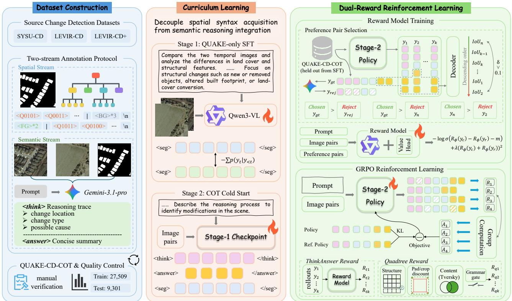  
Figure 2: Illustration of the QUAKE-CD Pipeline. (1) Construction of the QUAKE-CoT dataset via a two-stream annotation protocol. (2) Two-stage progressive SFT curriculum. (3) Reward model training and grammar-gated dual-reward RL.

## Quadtree Mask Encoding

Vocabulary and Encoding Grammar. The language $\mathcal { L } _ { Q }$ is defined over an alphabet of special tokens integrated into the VLM vocabulary. This alphabet encompasses wrapper delimiters <seg> and </seg>, uniform tile tokens <BG> representing pure background and <FG> denoting pure fore-ground, alongside fifteen quadtree node tokens <Q0001> through <Q1111>. The all-zero pattern <Q0000> is ex-plicitly excluded as it inherently signifies an empty quadrant.

The syntax of $\mathcal { L } _ { Q }$ obeys a context-free grammar $\mathcal { G } _ { Q }$ . A valid encoding conforms to the structure <seg> G </seg>, where G specifies a grid of non-overlapping 32×32 image tiles ordered via raster scan. Tiles within a row are delineated by | symbols, while distinct rows are separated by newline characters. This 32×32 tile dimension aligns perfectly with the native visual token granularity of Qwen3-VL (Bai et al. 2025), ensuring the output grid shares an identical spatial architecture with the visual feature map. Within each row, consecutive identical uniform tiles undergo run-length com- pression as <BG>\*n or <FG>\*n for integer n ≥ 2.

As outlined in Figure 1 and Algorithm 1, given a binary change mask $M \in \{ 0 , 1 \} ^ { H \times W }$ , a deterministic encoder $E : \mathsf { \bar { \{ 0 , 1 \} } } ^ { H \times W } \to \mathsf { \bar { \mathcal { L } } } _ { Q }$ partitions M into the aforementioned tile grid. Each tile acts either as a uniform token or a quadtree expansion represented by a node <Qabcd>. The four constituent bits specify which respective quadrants contain foreground pixels across the top-left, top-right, bottom-left, and bottom-right sectors. Active quadrants undergo recursive preorder expansion until reaching a minimum leaf size ℓ.

The grammar $\mathcal { G } _ { Q }$ is context-free with bounded recursion depth $\bar { d } _ { \mathrm { m a x } } = \lceil \log _ { 2 } ( 3 2 / \ell ) \rceil$ . We further distinguish three levels of correctness: syntactic validity, certified in linear time by a single-pass parser under GQ; structural validity, verified during decoding by matching the reconstructed grid against the expected $\bar { H / 3 2 } \times \bar { W / 3 2 }$ layout, and semantic correctness, optimized against the ground truth through the reward framework in Section 3. Crucially, this encoding is recall-preserving by construction: any leaf cell containing a foreground pixel dictates a foreground encoding, strictly guaranteeing ∀(i, j) where $M [ i , j ] { = } 1 , { \cal D } ( E ( M ) ) [ i , j ] = \dot { 1 }$ The complementary precision loss is strictly bounded by $\ell ,$ restricting over-encoding solely to boundary cells mix- ing foreground and background. The parameter ℓ ofers ex-plicit modulation of this precision–compression trade-of, with concrete value selections analyzed in Section 4.

Mask Decoding. The decoding function $\mathcal { D } ~ : ~ \mathcal { L } _ { Q } ~ $ $\{ 0 , 1 \} ^ { H \times W }$ efectively reverses E by parsing the QUAKE sequence, resolving run-length compression, and recursively rendering quadtree nodes back into 32×32 pixel blocks. Consequently, D operates as a purely non-parametric mapping, circumventing neural networks and ensuring high eficiency during both RL reward computation and evaluation.

## Supervised Fine-Tuning with Curriculum

Dataset Construction. Existing change detection benchmarks, SYSU-CD (Shi et al. 2021), LEVIR-CD and LEVIR-

CD+ (Chen and Shi 2020), provide pixel-level masks but no language annotations. We assemble QUAKE-CoT from these sources via a two-stream annotation protocol. As illustrated in Figure 2, the spatial stream deterministically encodes each ground-truth mask as $E ( M ) \ \in \ { \mathcal { L } } _ { Q }$ The semantic stream prompts Gemini-3.1-Pro-Thinking-Preview (Team et al. 2023), conditioned on the bi-temporal pair and groundtruth mask, to produce a reasoning trace covering change type, location, extent, and plausible cause, followed by a concise summary. Dataset details and system prompts are shown in Appendix B and G.

These independently generated streams are subsequently paired into samples of the form <think> reasoning </think> <answer> summary </answer> <seg> QUAKE </seg>. Mask-conditioned generation makes these traces a grounding supervision signal that anchors QUAKE syntax in visually verifiable semantics, not a record of nat- uralistic inference. The original training splits yield 27,509 training samples; the union of validation and test splits forms a 9,301-sample test set, precluding leakage. Quantitative assessments regarding the round-trip fidelity of E and D on the QUAKE-CoT dataset are established in Table 3. To our knowledge, QUAKE-CoT constitutes the first instructiontuning dataset for bi-temporal change detection that pairs structured reasoning traces with formalized, deterministi- cally decodable dense mask encodings.

Curriculum Stage-1: QUAKE-Only SFT. Attempting simultaneous acquisition of QUAKE grammar alongside freetext reasoning precipitates destructive interference, forcing the model to fracture capacity between syntax mastery and semantic analysis. Stage-1 intentionally isolates spatial syntax acquisition. We fine-tune the model to exclusively gen- erate the <seg> block conditioned on a bi-temporal image pair, dedicating its entire generation budget to mastering grid dimensions, uniform tile semantics, recursive node expan- sion, run-length encoding, and row delimiters.

Curriculum Stage-2: CoT Cold-Start. Stage-2 integrates reasoning by fine-tuning the Stage-1 checkpoint to synthesize the complete tripartite output. This cold-start strategy successfully preserves the entrenched QUAKE syntax while cat-alyzing the acquisition of cross-temporal reasoning capabil- ities. Subsequent ablations in Section 4 validate the eficacy of this curriculum. The sequential dependency linking these stages operationalizes the curriculum’s central principle: de- manding mastery of the spatial alphabet before permitting the composition of spatially grounded visual explanations.

## Grammar-Gated Dual-Reward RL

While SFT yields syntactically valid QUAKE sequences paired with grounded reasoning, it fundamentally lacks the mechanism to directly optimize the composite objective en-compassing format validity, pixel-level accuracy, and rea- soning faithfulness. We resolve this limitation with a dual- reward RL framework to jointly optimize dense spatial out-puts and strengthen the reasoning trace as a semantic guide for QUAKE generation within the autoregressive space.

Reward Model Construction. To train a dedicated reward model for evaluating semantic reasoning faithfulness, we construct preference pairs from the QUAKE-CoT split held out from SFT. The cold-start model generates multiple com- pletions per sample under high-temperature decoding. Each completion’s corresponding QUAKE sequence is decoded via $\bar { \mathcal { D } }$ and scored against the ground-truth mask M using Intersection over Union (IoU). In parallel, we synthesize one hard-negative response $y _ { \mathrm { n e g } }$ per sample by prompting Gemini-3.1-Pro-Thinking-Preview to perturb core semantic facts while preserving fluency and the grammatical structure.

Let $s ( y ) \dot { = } \mathrm { I o U } ( \bar { \mathcal { D } } ( y _ { \mathrm { s e g } } )$ , M) denote the decoded IoU of a rollout. Given a candidate pool $\mathcal { C } = \{ y _ { \mathrm { g t } } \} \cup \{ y _ { k } \} _ { k = 1 } ^ { K } \cup$ $\{ y _ { \mathrm { n e g } } \}$ , where $y _ { \mathrm { g t } }$ is the ground-truth reasoning trace, and $\{ y _ { k } \} _ { k = 1 } ^ { K }$ denotes K empirical rollouts, we form preference pairs following the five-tier hierarchy in Appendix C, with $y _ { \mathrm { g t } }$ and $y _ { \mathrm { n e g } }$ serving as fixed top and bottom anchors, and retain rollout pairs whose IoU gap exceeds the threshold δ:

$$
\mathcal { D } _ { \mathrm { p r e f } } = \{ ( y _ { c } , y _ { r } ) \in \mathcal { C } \times \mathcal { C } \ | \ y _ { c } \succ y _ { r } \} ,\tag{1}
$$

The reward model $R _ { \phi }$ is trained on $\mathcal { D } _ { \mathrm { p r e f } }$ with Qwen3-VL-8B-Instruct under the objective:

$$
\begin{array} { r } { \mathcal { L } _ { \mathrm { R M } } = - \mathbb { E } _ { \mathcal { D } _ { \mathrm { p r e f } } } \left[ \log \sigma ( R _ { \phi } ( y _ { c } ) - R _ { \phi } ( y _ { r } ) ) \right. \right. } \\ { \left. \left. - \lambda ( R _ { \phi } ( y _ { c } ) + R _ { \phi } ( y _ { r } ) ) ^ { 2 } \right] , } \end{array}\tag{2}
$$

where $y _ { c }$ and $y _ { r }$ indicate chosen and rejected responses, respectively, and $R _ { \phi }$ evaluates the semantic caliber of the <think><answer> segments. Details on negative generation and RM training dynamics are provided inAppendix C.

ThinkAnswer Reward. To systematically enforce the se-mantic validity of the underlying logic during RL, the ThinkAnswer Reward $R _ { t }$ acts as a direct application of the previously trained reward model $R _ { \phi }$ . It specifically scores the <think> reasoning trace and <answer> summary segments. This incorporates query-wise normalization to guarantee stable optimization signals across highly diverse prompts. Operating as a crucial semantic regularizer, this reward signal discourages structurally valid but factually un- faithful explanations from receiving inflated high scores.

Quadtree Reward. The Quadtree Reward $R _ { q }$ operates as a rigorous rule-based function evaluating spatial mask qual- ity natively from the generated sequence. A grammar gate validates the <seg> sequence against $\mathcal { G } _ { Q }$ via a single-pass linear-time parser. Concurrently, a structure score mandates grid dimension alignment with the ground truth. The sub- sequent content score calculates the Tversky index (Tversky 1977) between the decoded prediction Mˆ and ground truth M. Additionally, a pad/crop discount penalizes topologi-cal dimension mismatches necessitating fallback alignment, while an empty-GT guard outright neutralizes the trivial ex-ploitation strategy of perpetually predicting pure background (see details in Appendix C).

GRPO Optimization. We optimize the VLM policy starting from the cold-start checkpoint utilizing the GRPO objective (Guo et al. 2025), using the reward:

$$
R ( \mathbf { y } , M ) = ( 1 - \mu ) R _ { \mathrm { q } } ( \mathbf { y } , M ) + \mu R _ { \mathrm { t } } ( I _ { 1 } , I _ { 2 } , \mathbf { y } )\tag{3}
$$

under KL regularization against the reference policy $\pi _ { \mathrm { r e f } } .$ where $\mu$ dictates the weight of the semantic reward. This dual-reward architecture instantiates the central hypothesis of this work: formulating dense spatial outputs as structured language enables joint, token-level optimization of format validity, pixel-level accuracy, and reasoning faithfulness.

<table><tr><td rowspan="3">Method</td><td colspan="3">Accumulated Mean</td><td colspan="3">Per-Image Mean</td><td rowspan="3">Throughput (pairs/s)</td></tr><tr><td>Precision</td><td>Recall</td><td>F1</td><td>Precision</td><td>Recall</td><td>F1</td></tr><tr><td>BIT</td><td>77.08</td><td>76.80</td><td>76.94</td><td>66.34</td><td>66.64</td><td>63.19</td><td>50.25</td></tr><tr><td>ChangeFormer</td><td>84.23</td><td>78.84</td><td>81.44</td><td>76.61</td><td>71.06</td><td>70.88</td><td>65.78</td></tr><tr><td>ChangeCLIP</td><td>84.32</td><td>78.50</td><td>81.30</td><td>57.31</td><td>50.58</td><td>51.04</td><td>74.93</td></tr><tr><td>LISA-7B</td><td>16.65</td><td>73.42</td><td>27.14</td><td>18.04</td><td>46.83</td><td>21.91</td><td>40.21</td></tr><tr><td>LISA-llama2-13B</td><td>15.04</td><td>76.45</td><td>25.13</td><td>17.10</td><td>49.20</td><td>21.45</td><td>27.15</td></tr><tr><td>GLaMM</td><td>14.85</td><td>52.07</td><td>23.11</td><td>16.22</td><td>29.59</td><td>17.44</td><td>18.77</td></tr><tr><td>PixelLM</td><td>16.79</td><td>72.51</td><td>27.27</td><td>17.39</td><td>46.38</td><td>21.38</td><td>14.01</td></tr><tr><td>Text4Seg</td><td>14.52</td><td>84.07</td><td>24.76</td><td>15.27</td><td>54.88</td><td>19.65</td><td>86.54</td></tr><tr><td>RSUniVLM</td><td>50.12</td><td>82.45</td><td>62.34</td><td>48.76</td><td>81.23</td><td>60.94</td><td>82.30</td></tr><tr><td>QUAKE-CD</td><td>70.99</td><td>87.31</td><td>78.31</td><td>68.77</td><td>84.09</td><td>73.18</td><td>74.27</td></tr></table>

Table 1: Dense change detection performance on the QUAKE-CoT test set. We compare against specialist change detectors (BIT, Chan eFormer, and Chan eCLIP), decoder-based ixel-level VLMs (LISA, GLaMM, PixelLM), a flat text-as-mask method (Text4Seg), and a remote sensing VLM (RSUniVLM) with native bi-temporal input and text-as-mask serialization.

## 4 Experiments

## Experimental Setup

Setup. All experiments utilize the QUAKE-CoT established in Section 3. We allocate 80% of the training set to the two- stage curriculum and reserve the remaining 20% exclusively for reward model training and RL. The framework is initial- ized from Qwen3-VL-8B-Instruct (Bai et al. 2025). Training is executed via ms-swift (Zhao et al. 2024) on eight NVIDIA H200 GPUs, while inference is served through vLLM (Kwon et al. 2023). Both SFT stages and the reward model employ LoRA (Hu et al. 2022) with rank 64, with the reward model initialized from a fresh backbone copy. The RL phase op- timizes the policy via GRPO (Guo et al. 2025) using eight rollouts per prompt, and a KL coeficient of 0.04. Appendix D catalogs the comprehensive hyperparameter specifications.

Baselines. We compare against three complementary baseline groups. First, we include representative specialist remote sensing change detectors: BIT (Chen, Qi, and Shi 2021), ChangeFormer (Bandara and Patel 2022), and Change-CLIP (Dong et al. 2024). Second, we evaluate pixel-level VLMs across two prevailing paradigms. LISA (Lai et al. 2024), GLaMM (Rasheed et al. 2024), and PixelLM (Ren et al. 2024) perform decoder-based mask prediction, while Text4Seg (Lan et al. 2025) and RSUniVLM (Liu and Lian 2026) serialize masks autoregressively. Specialist change detectors and RSUniVLM are retrained on the QUAKE-CoT training split. RSUniVLM natively accepts RS bi- temporal pairs, while the remaining pixel-level VLMs as- sume single-image inputs. Following (Nguyen et al. 2025; Xu, Zhu, and Yang 2025), we concatenate the bi-temporal pair $( I _ { 1 } , I _ { 2 } )$ along the width dimension and fine-tune them on the QUAKE-CoT training split under their original training recipes. Third, for reasoning-quality evaluation, we include Teochat (Irvin et al. 2025) and EarthDial (Soni et al. 2025). These temporal RS VLMs generate textual change descrip- tions but do not predict dense masks. Additional experimental results on large images, out-of-domain dataset, qualitative interpretability, and parameter sensitivity are reported in Appendix E.

## Dense Change Mask Generation

For each prediction, we decode the extracted QUAKE span into a binary mask with D and report Precision, Recall, and F1 under accumulated pixel statistics and per-image means. As shown in Table 1, QUAKE-CD attains specialist-level mask quality while retaining a unified autoregressive inter- face for dense prediction and grounded reasoning. Its accu- mulated F1 of 78.31% surpasses BIT by 1.37% and remains within 3.13% of the strongest specialist model, Change-Former. Under per-image evaluation, QUAKE-CD reaches 73.18% F1 and outperforms all three specialist models. It further achieves the highest recall among all methods un- der both evaluation protocols. Against pixel-level VLMs, QUAKE-CD surpasses PixelLM by 51.04% in accumulated F1 and LISA-7B by 51.27% in per-image F1. Existing VLM baselines exhibit a pronounced recall–precision imbalance: they recover broad change regions but introduce extensive false positives. Even the strongest VLM baseline reaches only 50.12% accumulated precision and 48.76% per-image precision. Text4Seg exemplifies this regime, attaining 84.07% accumulated recall but only 14.52% precision and thus 24.76% F1: its flat patch-grid serialization assigns uniform resolu- tion across the scene and cannot resolve the small, frag- mented objects characteristic of change detection. In contrast, QUAKE-CD raises precision to 70.99% and 68.77% while preserving strong recall at 87.31% and 84.09%. This advantage stems from the selective allocation of quadtree to- kens around change boundaries, which suppresses spurious regions without erasing fine-grained structures. RSUniVLM adopts flat text-as-mask formulation while accepting the bi- temporal pair natively. Its persistent recall–precision imbal- ance isolates the QUAKE-CD gain to hierarchical quadtree encoding rather than to native bi-temporal input.

QUAKE-CD also achieves a favorable balance between accuracy and eficiency. Its throughput reaches 74.27 pairs/s, at least 1.85× that of decoder-based VLMs, as native text generation avoids the overhead of a segmentation decoder. Its throughput remains close to flat serialization methods, in- cluding Text4Seg at 86.54 pairs/s and RSUniVLM at 82.30 pairs/s, despite the additional sequential structure introduced by the hierarchical QUAKE syntax. In return, QUAKE-CD improves accumulated F1 over Text4Seg and RSUniVLM by 53.55% and 15.97%, respectively, establishing a stronger trade-of between throughput and spatial fidelity. The de- tailed throughput setup is provided in Appendix D.

<table><tr><td>Model</td><td>BLEU-1</td><td>ROUGE-1</td><td>METEOR</td><td>Reranker</td><td>GPT-Judge</td><td>Human</td></tr><tr><td>Qwen3-VL-8B-Instruct</td><td>3.82</td><td>23.06</td><td>11.08</td><td>27.76</td><td>47.78</td><td>42.25</td></tr><tr><td>Qwen3-VL-32B-Instruct</td><td>11.90</td><td>29.78</td><td>15.42</td><td>32.41</td><td>52.91</td><td>51.10</td></tr><tr><td>Qwen3-VL-235B-Instruct</td><td>5.25</td><td>23.76</td><td>11.77</td><td>56.20</td><td>64.53</td><td>60.30</td></tr><tr><td>RSUniVLM</td><td>10.85</td><td>28.95</td><td>18.96</td><td>53.27</td><td>61.42</td><td>54.65</td></tr><tr><td>Teochat</td><td>8.72</td><td>20.14</td><td>13.27</td><td>32.11</td><td>45.39</td><td>36.40</td></tr><tr><td>EarthDial</td><td>7.13</td><td>24.43</td><td>17.84</td><td>51.10</td><td>59.83</td><td>51.80</td></tr><tr><td>QUAKE-CD</td><td>49.30</td><td>52.21</td><td>40.24</td><td>71.26</td><td>78.61</td><td>73.50</td></tr></table>

Table 2: Semantic evaluation on the reasoning trace of model outputs. Human annotators are given only the bi-temporal image pair and the model output.

## Reasoning Quality Evaluation

Since mask metrics cannot verify whether textual claims stem from bi-temporal evidence, we evaluate the generated <think> and <answer> trajectories. Although we report BLEU-1, ROUGE-1, and METEOR for lexical overlap, Ta- ble 2 shows that generic VLMs score abnormally low un- der n-gram metrics, which penalize paraphrasing and verbose reasoning rather than semantic correctness. We there- fore complement them with two semantics-aware automatic evaluators and a human-rating protocol. Reranker Score (Qwen3-Reranker-4B) assesses semantic fidelity, completeness, and structural coherence. GPT-Judge Accuracy (GPT--./FIM12P4IRP4/MS 5.5-2026-04-23) quantifies semantic consistency against human-verified references (prompt templates in Figure 15'\* and 16). Human Score averages acceptance rates from two independent annotators over 1,000 randomly sampled out-I>A puts assessed for factual consistency and localization cor-(\*1c rectness, reaching 87.5% inter-annotator agreement.

Table 2 disentangles scaling from grounded bi-temporal supervision. Under traditional metrics, QUAKE-CD outperforms all baselines, achieving 49.30 BLEU-1 and 40.24!' METEOR. On semantics-aware metrics, scaling Qwen3-VL&\* from 8B to 235B raises the reranker score from 27.76 to 56.20 and GPT-judge accuracy from 47.78% to 64.53%, as greater capacity improves fluency and coarse semantic plausibility. Yet scale alone does not close the grounding gap: QUAKE-CD exceeds the same-8B baseline by 31.25% in human score and still leads the 235B model by 13.20%. RSUniVLM also trails QUAKE-CD by 18.85% in human score, indicating that its change-captioning supervision is insuficient for cap- turing the key bi-temporal evidence underlying each change. The agreement across lexical, semantic, and human evalua- tors indicates that the gain is robust rather than an artifact of any single judge.

## Ablation Studies

Minimum Leaf Size. Figure 3 varies the minimum leaf size ℓ, which controls the trade-of between spatial resolution and sequence complexity, under fixed SFT settings. Reducing ℓ from 16 to 2 increases the average sequence length from 57 to 523 tokens, yet mask quality does not improve monotonically. F1 reaches its maximum at ℓ=8 and drops sharply at ℓ=2. This degradation reflects a learnability bottleneck rather than a representational limit: although finer leaves can en- code sharper boundaries, long recursive sequences increase grammar violations and dimension mismatches, weakening both SFT supervision and RL rollouts. At the opposite ex- treme, ℓ=16 reduces the token budget but quantizes each 16×16 patch into a single bit, which erodes boundary precision. Thus, ℓ=8 provides the strongest operating point, pre-serving fine-grained structure while keeping autoregressive decoding and policy optimization tractable.

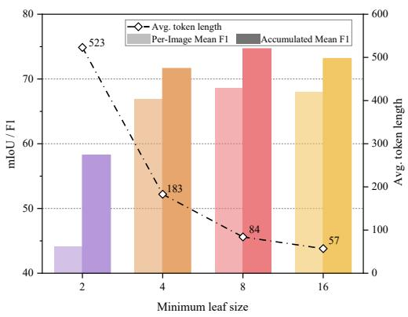  
Figure 3: Ablation studies on the influence of the minimum leaf size ℓ.

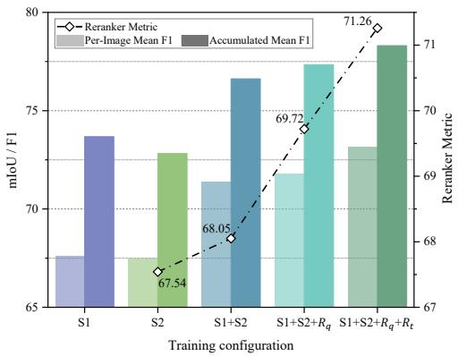  
Figure 4: Ablation studies on the influence of curriculum stages and reward components.

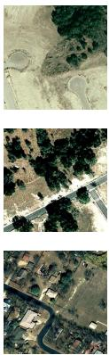  
(a)

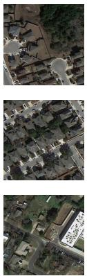  
(b)

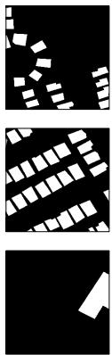  
(c)

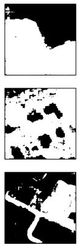  
(d)

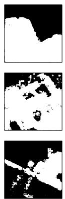  
(e)

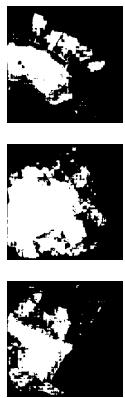  
(f)

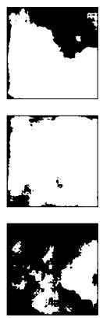  
(g)

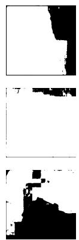

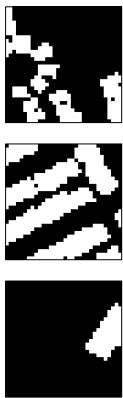  
(h)  
(i)  
<answer> Significant structural change is observed in the form of newly constructed residential houses. These changes are located throughout the developed lots surrounding the curved roadways and cul-de-sacs, particularly in the central and lower regions of the scene. </answer>  
(j)  
<answer> The primary change is the construction of a residential subdivision, characterized by numerous houses and paved streets. This development is located across the majority of the scene, replacing the previously undeveloped vegetated land </answer>  
(k)  
<think> I notice a significant alteration in the upper right quadrant where open land previously existed. A large, bright rectangular structure now dominates this area. </think> <answer> A large building and parking lot were constructed in the upper right portion of the scene, replacing the previously open field area. </answer>  
(l)  
Figure 5: Qualitative results of representative decoder-based pixel-level VLMs and QUAKE-CD. (a): pre-change image. (b): post-change image. (c): ground truth. (d)-(i): results of LISA-7B, LISA-llama2-13B, GLaMM, PixelLM, Text4Seg, and QUAKE-CD. (j)–(l): textual change descriptions generated by QUAKE-CD.

Curriculum and Reward Components. Figure 4 evaluates five training regimes: S1, S2, S1+S2, S1+S2+Rq, and $\mathrm { S } 1 + \mathrm { S } 2 + { \cal R } _ { q } + \bar { { \cal R } _ { t } }$ . The S1 regime—supervising only the <seg> block—serves as the QUAKE-only variant that isolates the hierarchical representation from CoT supervision, while S1+S2 layers CoT atop the same syntax. First, the two- stage curriculum separates syntax acquisition from tempora reasoning: applying Stage 2 directly to the base VLM yields weaker per-image F1 due to interference between grammar learnin and rationale eneration, while initializin Sta e-2 from the Stage-1 checkpoint improves both accumulated and per-image F1 by roughly 4% over either single-stage vari-ant. Notably, the S1-only mask quality already exceeds every flat-serialization baseline in Table 1, attributing a substantial share of the dense-prediction gain to the QUAKE representation itself. Second, adding Quadtree Reward raises accumulated F1 by about 1% and the reranker score from 68.05 to 69.72, showing that grammar-gated spatial RL supplies a useful optimization signal beyond imitation learning. Third, the full dual-reward model reaches 71.26 reranker score with further gains in accumulated F1, confirming that ThinkAnswer Reward strengthens textual faithfulness without compromising the spatial accuracy preserved by Quadtree Reward, and, in turn, provides a stronger semantic guidance for QUAKE generation. Overall, the monotonic gains confirm that hier- archical encoding, staged supervision, and grammar-gated dual RL act synergistically across distinct failure modes.

## Qualitative Analysis

Figure 5 presents representative cases where QUAKE-CD accurately resolves dense small-building construction requir- ing fine-grained bi-temporal comparison. External-decoder baselines and Text4Seg instead follow the high-recall pattern of Section 4, over-predicting broad regions in dense scenes and hallucinating large changed areas in single-building cases where they miss the pre- and post-change structural correspondence. In contrast, QUAKE-CD’s textual descriptions remain grounded, correctly specifying change type, location, and extent.

## 5 Conclusion

We introduced QUAKE-CD, a framework that formulates dense remote-sensing change detection as structured autore- gressive generation under a syntax-verifiable mask grammar. Its quadtree mask language converts binary change maps into compact, grammar-constrained token sequences that can be decoded, checked, and optimized within autoregressive VLMs. With paired spatial supervision, grounded reason- ing traces, staged curriculum learning, and grammar-gated dual-reward RL, QUAKE-CD aligns dense mask generation with faithful bi-temporal reasoning. Experiments show clear gains over decoder-based and flat text-as-mask VLM base- lines, while demonstrating that grounded spatial supervision improves reasoning more efectively than generic model scal- ing. These results position structured spatial languages as a practical foundation for accurate, interpretable, and struc- turally checkable dense prediction in VLMs.

Asokan, A.; and Anitha, J. 2019. Change detection tech- niques for remote sensing applications: A survey. Earth Science Informatics, 12(2): 143–160.

Bai, S.; Cai, Y.; Chen, R.; Chen, K.; Chen, X.; Cheng, Z.; Deng, L.; Ding, W.; Gao, C.; Ge, C.; et al. 2025. Qwen3-vl technical report. arXiv preprint arXiv:2511.21631.

Bandara, W. G. C.; and Patel, V. M. 2022. A transformer- based siamese network for change detection. In IGARSS 2022-2022 IEEE International Geoscience andRemote Sensing Symposium, 207–210. IEEE.

Chen, H.; Qi, Z.; and Shi, Z. 2021. Remote sensing image change detection with transformers. IEEE Transactions on Geoscience and Remote Sensing, 60: 1–14.

Chen, H.; and Shi, Z. 2020. A spatial-temporal attention- based method and a new dataset for remote sensing image change detection. Remote sensing, 12(10): 1662.

Chen, Y.; Sikka, K.; Cogswell, M.; Ji, H.; and Divakaran, A. 2024. Measuring and improving chain-of-thought reasoning in vision-language models. In Proceedings of the 2024 Conference ofthe North American Chapter ofthe Associationfor Computational Linguistics: Human Language Technologies (Volume 1: Long Papers), 192–210.

Deng, P.; Zhou, W.; and Wu, H. 2025. Changechat: An interactive model for remote sensing change analysis via multimodal instruction tuning. In ICASSP 2025-2025 IEEE International Conference on Acoustics, Speech and Signal Processing (ICASSP), 1–5. IEEE.

Ding, H.; Tang, S.; He, S.; Liu, C.; Wu, Z.; and Jiang, Y.-G. 2025. Multimodal referring segmentation: A survey. arXiv preprint arXiv:2508.00265.

Dong, S.; Wang, L.; Du, B.; and Meng, X. 2024. Change- CLIP: Remote sensing change detection with multimodal vision-language representation learning. ISPRS Journal of Photogrammetry and Remote Sensing, 208: 53–69.

Elgendy, H.; Sharshar, A.; Aboeitta, A.; Ashraf, Y.; and Guizani, M. 2024. Geollava: Eficient fine-tuned vision- language models for temporal change detection in remote sensing. arXiv preprint arXiv:2410.19552.

Guo, D.; Yang, D.; Zhang, H.; Song, J.; Wang, P.; Zhu, Q.; Xu, R.; Zhang, R.; Ma, S.; Bi, X.; et al. 2025. Deepseek-r1: Incentivizing reasoning capability in llms via reinforcement learnin . arXiv preprint arXiv:2501.12948.

Hoxha, G.; Chouaf, S.; Melgani, F.; and Smara, Y. 2022. Change captioning: A new paradigm for multitemporal re- mote sensing image analysis. IEEE Transactions on Geoscience and Remote Sensing, 60: 1–14.

Hu, E. J.; Shen, Y.; Wallis, P.; Allen-Zhu, Z.; Li, Y.; Wang, S.; Wang, L.; Chen, W.; et al. 2022. Lora: Low-rank adaptation of large language models. Iclr, 1(2): 3.

Irvin, J.; Liu, E.; Chen, J.; Dormoy, I.; Kim, J.; Khanna, S.; Zheng, Z.; and Ermon, S. 2025. Teochat: A large vision- language assistant for temporal earth observation data. In International Conference on Learning Representations, vol-ume 2025, 68883–68911.

Ji, S.; Wei, S.; and Lu, M. 2019. Fully Convolutional Net- works for Multisource Building Extraction From an Open Aerial and Satellite Imagery Data Set. IEEE Transactions on Geoscience and Remote Sensing, 57(1): 574–586.

Kirillov, A.; Mintun, E.; Ravi, N.; Mao, H.; Rolland, C.; Gustafson, L.; Xiao, T.; Whitehead, S.; Berg, A. C.; Lo, W.-Y.; et al. 2023. Segment anything. In Proceedings of the IEEE/CVF international conference on computer vision, 4015–4026.

Korkmaz, Y.; and Patel, V. M. 2026. RemoteVAR: Autore- gressive Visual Modeling for Remote Sensing Change De- tection. arXiv preprint arXiv:2601.11898.

Kwon, W.; Li, Z.; Zhuang, S.; Sheng, Y.; Zheng, L.; Yu, C. H.; Gonzalez, J. E.; Zhang, H.; and Stoica, I. 2023. Eficient Memory Management for Large Language Model Serving with PagedAttention. In Proceedings of the ACM SIGOPS 29th Symposium on Operating Systems Principles.

Lai, X.; Tian, Z.; Chen, Y.; Li, Y.; Yuan, Y.; Liu, S.; and Jia, J. 2024. Lisa: Reasoning segmentation via large lan- guage model. In Proceedings of the IEEE/CVF conference on computer vision and pattern recognition, 9579–9589.

Lan, M.; Chen, C.; Xu, J.; Li, Z.; Ke, Y.; Jiang, X.; Yu, Y.; Zhao, Y.; and Bai, S. 2026. Text4seg++: Advancing image segmentation via generative language modeling. IEEE Transactions on Pattern Analysis and Machine Intelligence.

Lan, M.; Chen, C.; Zhou, Y.; Xu, J.; Ke, Y.; Wang, X.; Feng, L.; and Zhang, W. 2025. Text4seg: Reimagining image segmentation as text generation. In International Conference on Learning Representations volume 2025 1634–1661.

Li, K.; Xin, Z.; Pang, L.; Pang, C.; Deng, Y.; Yao, J.; Xia, G.; Meng, D.; Wang, Z.; and Cao, X. 2025. Segearth-r1: Geospatial pixel reasoning via large language model. arXiv preprint arXiv:2504.09644.

Li, X.; Li, J.; Zhang, K.; Fang, Y.; Lin, L.; Wang, H.; Wu, H.; and Fan, Z. 2026a. Decoding the Delta: Unify- ing Remote Sensing Change Detection and Understanding with Multimodal Large Language Models. arXiv preprint arXiv:2604.14044.

Li, Y.; Xu, W.; Zhang, Y.; Wei, Z.; and Peng, M. 2026b. BTC- Chat: Advancing remote sensing bi-temporal change caption- ing with multimodal large language model. In ICASSP 2026- 2026 IEEE International Conference on Acoustics, Speech and Signal Processing (ICASSP), 4596–4600. IEEE.

Liu, C.; Zhao, R.; Chen, H.; Zou, Z.; and Shi, Z. 2022. Remote sensing image change captioning with dual-branch transformers: A new method and a large scale dataset. IEEE Transactions on Geoscience and Remote Sensing, 60: 1–20.

Liu, J.; Sun, L.; Fu, R.; and Yang, B. 2025. Towards Faith- ful Reasoning in Remote Sensing: A Perceptually-Grounded GeoSpatial Chain-of-Thought for Vision-Language Models. arXiv preprint arXiv:2509.22221.

Liu, X.; and Lian, Z. 2026. RSUniVLM: A unified vision- language model for remote sensing via Granularity-oriented MoE. Pattern Recognition, 113717.

Ma, X.; Feng, S.; Zhang, B.; and Wang, B. 2025. ViLaCD-R1: A Vision-Language Framework for Seman- tic Change Detection in Remote Sensing. arXiv preprint arXiv:2512.23244.

Nguyen, K. A.; Juvekar, A.; Yu, T.; Wahed, M.; and Lourent- zou, I. 2025. Calico: Part-focused semantic co-segmentation with large vision-language models. In Proceedings of the Computer Vision and Pattern Recognition Conference, 4550–4561.

Park, K.; Wang, J.; Berg-Kirkpatrick, T.; Polikarpova, N.; and D’Antoni, L. 2024. Grammar-aligned decoding. Advances in Neural Information Processing Systems, 37: 24547–24568.

Rasheed, H.; Maaz, M.; Shaji, S.; Shaker, A.; Khan, S.; Cholakkal, H.; Anwer, R. M.; Xing, E.; Yang, M.-H.; and Khan, F. S. 2024. Glamm: Pixel grounding large multimodal model. In Proceedings of the IEEE/CVF Conference on Computer Vision and Pattern Recognition, 13009–13018.

Ren, Z.; Huang, Z.; Wei, Y.; Zhao, Y.; Fu, D.; Feng, J.; and Jin, X. 2024. Pixellm: Pixel reasoning with large multimodal model. In Proceedings of the IEEE/CVF Conference on Computer Vision and Pattern Recognition, 26374–26383.

Shi, Q.; Liu, M.; Li, S.; Liu, X.; Wang, F.; and Zhang, L. 2021. A deeply supervised attention metric-based network and an open aerial image dataset for remote sensing change detection. IEEE transactions on geoscience and remote sensing, 60: 1–16.

Shiri, F.; Guo, X.-Y.; Far, M. G.; Yu, X.; Haf, R.; and Li, Y.-F. 2024. An empirical analysis on spatial reasoning ca- pabilities of large multimodal models. In Proceedings of the 2024 Conference on Empirical Methods in Natural Language Processing, 21440–21455.

Soni, S.; Dudhane, A.; Debary, H.; Fiaz, M.; Munir, M. A.; Danish, M. S.; Fraccaro, P.; Watson, C. D.; Klein, L. J.; Khan, F. S.; et al. 2025. Earthdial: Turning multi-sensory earth observations to interactive dialogues. In Proceedings ofthe Computer Vision and Pattern Recognition Conference, 14303–14313.

Sun, Q.; Zhang, C.; Zhang, J.; Wang, X.; Xie, J.; Zheng, P.; Wang, H.; Lee, S.; Tai, C.-l. A.; Yang, Y.; et al. 2026. GRASP: Guided Region-Aware Sparse Prompting for Adapting MLLMs to Remote Sensing. arXiv preprint arXiv:2601.17089.

Team, G.; Anil, R.; Borgeaud, S.; Alayrac, J.-B.; Yu, J.; Sori- cut, R.; Schalkwyk, J.; Dai, A. M.; Hauth, A.; Millican, K.; et al. 2023. Gemini: a family of highly capable multimodal models. arXiv preprint arXiv:2312.11805.

Team, K.; Bai, T.; Bai, Y.; Bao, Y.; Cai, S.; Cao, Y.; Charles, Y.; Che, H.; Chen, C.; Chen, G.; et al. 2026. Kimi K2.5: Vi- sual Agentic Intelligence. arXiv preprint arXiv:2602.02276.

Tversky, A. 1977. Features of similarity. Psychological review, 84(4): 327.

Xiao, L.; Yang, X.; Lan, X.; Wang, Y.; and Xu, C. 2025. Towards visual grounding: A survey. IEEE Transactions on Pattern Analysis and Machine Intelligence.

Xu, Y.; Zhu, L.; and Yang, Y. 2025. Mc-bench: A benchmark for multi-context visual grounding in the era of mllms. In

Proceedings of the IEEE/CVF International Conference on Computer Vision, 17675–17687.

Xue, J.; Deng, Q.; Wu, X.; Yao, K.; Yin, X.; Yu, F.; Zhou, W.; Zhong, Y.; Liu, Y.; and Yang, D. 2026. Towards compre- hensive interactive change understanding in remote sensing: A large-scale dataset and dual-granularity enhanced VLM. IEEE Transactions on Geoscience and Remote Sensing.

Yao, L.; Liu, F.; Lu, H.; Zhang, C.; Min, R.; Xu, S.; Di, S.; and Peng, P. 2026. Remotereasoner: Towards unifying geospatial reasoning workflow. In Proceedings ofthe AAAI Conference on Artificial Intelligence, volume 40, 11883–11891.

Zhao, Y.; Huang, J.; Hu, J.; Wang, X.; Mao, Y.; Zhang, D.;Jiang, Z.; Wu, Z.; Ai, B.; Wang, A.; Zhou, W.; and Chen,Y. 2024. SWIFT:A Scalable lightWeight Infrastructure forFine-Tuning. arXiv:2408.05517.

Zhu, Y.; Li, L.; Chen, K.; Liu, C.; Zhou, F.; and Shi, Z. 2025. Semantic-CD: Remote sensing image semantic change detection towards open-vocabulary setting. In IGARSS 2025- 2025 IEEE International Geoscience and Remote Sensing Symposium, 6388–6392. IEEE.

## A Quadtree Mask Encoding Details

This appendix extends the informal description in Section 3 with a complete formal specification of $\mathcal { L } _ { Q } ,$ , its determin- istic encoder E, and decoder D. The specification renders $\mathcal { L } _ { Q }$ a syntactically and structurally checkable mask language whose well-formedness is decidable in linear time, indepen- dent of the model’s semantic predictions.

## Formal Grammar of $\mathcal { L } _ { Q }$

The alphabet of $\mathcal { L } _ { Q }$ extends the base VLM vocabulary with 19 special tokens, supplemented by standard separators and numerals:

• Structural delimiters: <seg>, </seg>

• Uniform tile tokens: $\langle \mathrm { B G } \rangle , \langle \mathrm { F G } \rangle$

• Quadtree node tokens: 15 nodes $\left\{ < \mathsf { Q 0 0 0 1 } > , \ldots , < \mathsf { Q 1 1 1 1 } > \right\}$ ; the all-zero pattern <Q0000> is strictly excluded, since an inactive quadrant is already absorbed by its parent node’s occupancy bit.

• Separators and Modifiers: | (column delimiter), \n (row delimiter), and \* (run-length encoding prefix).

The syntax of $\mathcal { L } _ { Q }$ is governed by a context-free grammar defined by the following production rules:

(4)

Sequence → <seg> Grid </seg>   
Grid → Row (\n Row)∗   
Row → Tile (| Tile)∗   
$\begin{array} { r } { \mathrm { T i l e }  < \mathrm { B G } > \mid < \mathrm { F G } > \mid < \mathrm { B G } > \mid < n \mid < \mathrm { F G } > \ast n } \\ { \mid < \mathrm { Q } b _ { 1 } b _ { 2 } b _ { 3 } b _ { 4 } > \mathrm { C h i l d r e n } ( b _ { 1 } b _ { 2 } b _ { 3 } b _ { 4 } , d ) } \end{array}$

(5)

(6)

Here, Children $( b _ { 1 } b _ { 2 } b _ { 3 } b _ { 4 } , d )$ recursively expands every active quadrant with $b _ { i } = 1 \operatorname { i n } Z$ -order (preorder) traversal: top-left, top-right, bottom-left, bottom-right. Let d denote the current recursion depth, bounded by $d _ { \operatorname* { m a x } } ^ { - } = \lceil \log _ { 2 } ( 3 2 / \ell ) \rceil$ . Upon reaching $d _ { \operatorname* { m a x } } ,$ the quadrant collapses to a base Tile of side length ℓ.

Grammar validity ensures format compliance before de- coding. A sequence is valid if and only if: (1) exactly one <seg> wrapper encloses the grid; (2) the expanded row and column counts match the expected grid dimensions $H / 3 2 \times W / 3 2 ; ( 3 )$ ) every run-length count satisfies $n \geq 2$ and does not exceed the remaining tiles in its row; (4) quadtree recursion depth never exceeds $d _ { \mathrm { m a x } } ;$ and (5) the number of recursively expanded children matches the sum of active bits $\sum b _ { i }$ in the corresponding <Qabcd> node.

## Encoding Algorithm E

Algorithm 1 specifies the deterministic encoding procedure. Given a binary mask $M \in \{ 0 , 1 \} ^ { H \times W }$ , a fixed tile size $T = 3 2$ , and a minimum leaf size ℓ, the encoder partitions M into an $H / T \times W / T$ grid and recursively subdivides each heterogeneous tile until the minimum leaf size ℓ is reached.

The encoding is recall-preserving by construction: if $M [ i , j ] = 1$ , then $\mathcal { D } ( E ( M ) ) [ i , j ] = \tilde { 1 }$ . A single foreground pixel within any leaf forces that leaf’s occupancy bit to 1, and the decoder renders every active leaf as fully foreground. Precision loss therefore originates exclusively from bound- ary leaves of size $\ell ,$ where mixed background pixels are unavoidably promoted to foreground. For $\ell = 8 .$ , the maxi- mum false-positive expansion per boundary leaf is 64 pix-els. This controlled precision–compression trade-of strictly eliminates false-negative boundary omissions, accounting for the bounded precision drop.

Algorithm 1: Quadtree Mask Encoding   
Require: Binary mask $M \in \{ 0 , 1 \} ^ { H \times W }$ , tile size $T = 3 2 .$ , min   
leaf size $\ell = 8$   
Ensure: Quadtree sequence $\mathbf { y } _ { \mathrm { s e g } } \in \mathcal { L } _ { Q }$   
1: Partition M into rid G of ${ \check { H } } / T \times { \check { W } } / T$ tiles of size $T \times T$   
2: Initialize sequence bufer $S \stackrel { . } {  } < s \in \mathfrak { g } >$   
3: for each row $r \in \mathcal G$ do   
4: for each tile $t \in r$ do   
5: if t is uniform background $( \forall _ { i , j } t [ i , j ] = 0 )$ then   
6: Emit <BG>   
7: else if t is uniform foreground $( \forall _ { i , j } t [ i , j ] = 1 )$ then   
8: Emit ${ \tt C F G } >$   
9: else   
10: Emit EncodeNode(t, T, ℓ, depth = 0)   
11: end if   
12: Emit column delimiter | if t is not the last tile in r   
13: end for   
14: Apply RLE: collapse consecutive identical uniform tokens   
$\mathbf { t o } < \mathbf { B } \bar { \mathsf { G } } > ^ { * } n \ \mathbf { o r } < \mathbf { F } \bar { \mathsf { G } } > ^ { * } n$   
15: Append row separator \n   
16: end for   
17: Append </seg>   
18: return S   
19: function EncodeNode(B, size, ℓ, depth)   
20: $d _ { \operatorname* { m a x } }  \lceil \log _ { 2 } ( \operatorname { s i z e } / \ell ) \rceil$   
21: if depth $. = d _ { \mathrm { m a x } }$ then   
22: return ${ \tt C F G } >$ if quadrant contains any foreground pixel   
else <BG> ▷ recall-preserving leaf rule   
23: end if   
24: $h  \mathrm { s i z e } / 2$   
25: $b _ { 1 } b _ { 2 } b _ { 3 } b _ { 4 } $ occupancy bits of quadrants TL, TR, BL, BR   
26: if $b _ { 1 } = b _ { 2 } = b _ { 3 } = b _ { 4 } = 0$ then ▷ unreachable; defensive   
guard   
27: return empty string   
28: end if   
29: Emit $< \ Q b _ { 1 } b _ { 2 } b _ { 3 } b _ { 4 } >$   
30: for each quadrant qi with $b _ { i } = 1$ in TL, TR, BL, BR order   
do   
31: EncodeNode(B[qi], h, ℓ, depth +1)   
32: end for   
33: end function

Total complexity is $O ( H W )$ : each pixel is visited once during partitioning, and recursive subdivisions operate on disjoint subregions.

## Decoding Algorithm D

Decoding reconstructs a binary mask $\hat { M }$ from a quadtree sequence $\mathbf { y } _ { \mathrm { s e g } } \in \mathcal { L } _ { Q }$ as a purely symbolic, non-parametric mapping, eliminating neural overhead during both inference and RL reward computation.

Upon extracting the $< s \in \mathfrak { g } > . . . < / s \in \mathfrak { g } >$ body, the de- coder splits the grid by row separators, expands RLE pre- fixes, and validates the reconstructed sequence dimensions. Invalid sequences trigger categorical safety fallbacks:

<table><tr><td>Metric</td><td>Accumulated (%)</td><td>Per-Image Mean (%)</td></tr><tr><td>IoU</td><td>83.9</td><td>80.2</td></tr><tr><td>F1</td><td>91.2</td><td>88.0</td></tr><tr><td>Precision</td><td>83.9</td><td>80.2</td></tr><tr><td>Recall</td><td>100.0</td><td>100.0</td></tr></table>

Table 3: Round-trip encoding fidelity of E and D on the QUAKE-CoT training set.
<table><tr><td>l</td><td>IoU</td><td>Accum. F1</td><td>Per-Image F1</td><td>Avg. Tokens</td></tr><tr><td>2</td><td>97.2</td><td>98.6</td><td>97.9</td><td>520.7</td></tr><tr><td>4</td><td>91.2</td><td>95.3</td><td>93.8</td><td>124.7</td></tr><tr><td>8</td><td>83.9</td><td>91.2</td><td>88.0</td><td>78.3</td></tr><tr><td>16</td><td>71.4</td><td>83.2</td><td>79.7</td><td>52.1</td></tr></table>

Table 4: Encoding fidelity by minimum leaf size ℓ on the QUAKE-CoT training set. Smaller leaves improve precision; larger leaves reduce sequence length.

• Grammar Failure: Missing wrappers, unrecognized node tokens, or malformed RLE prefixes yield an all-zero fallback mask.

• Dimension Mismatch: If expanded dimensions diverge from $H / 3 2 \times W / 3 2$ , the decoder applies pad/crop align- ment to recover a usable mask; the corresponding reward- side discount is specified in Appendix C.

• Unexpected EOF: Severely truncated sequences that break during token parsing default to the all-zero mask.

• Depth Overflow: Recursion exceeding $d _ { \mathrm { m a x } }$ triggers an immediate fallback to a uniform $\ell \times \ell$ leaf-level approxi- mation.

For valid sequences, tile tokens are rendered deterministi- cally. <BG> and <FG> generate 32 × 32 zero or one blocks, respectively. A <Qabcd> node recursively renders only the quadrants whose occupancy bits $b _ { i } = 1$ , while inactive quad- rants default to background. The rendered spatial blocks are concatenated in raster-scan order into the final dense mask $\hat { M } \in \{ 0 , 1 \} ^ { H \times W }$

## Encoding Fidelity and Compression Statistics

Table 3 quantifies the round-trip algorithmic fidelity of encoding followed by decoding across the QUAKE-CoT dataset. Foreground recall strictly achieves 100.0% at both accumulated and per-image levels, directly validating the claim of preserving all target foreground regions. Accu- mulated F1 of 91.2% and per-image F1 of 88.0% confirm that boundary-quantization precision loss remains strictly bounded under ℓ=8. The decoded masks therefore serve as faithful supervision targets for SFT and as reliable reward signals for RL.

Table 4 ablates the minimum leaf size ℓ. Setting ℓ=2 inflates sequence length, while ℓ=16 shortens sequences at the cost of spatial resolution and a higher per-leaf false-positive rate. We adopt ℓ=8 as the operating point that balances com-pression against precision.

## B QUAKE-CoT Dataset Details

QUAKE-CoT pairs pixel-level change masks with chain-ofthought reasoning traces, supplying the linguistic supervision absent from purely discriminative change-detection bench- marks. We build upon established bi-temporal remote sens- ing benchmarks, augmenting them with hierarchical mask sequences and teacher-distilled reasoning traces.

## Data Sources and Curation

We source raw image pairs and binary change masks from three large-scale change detection benchmarks: SYSU-CD (Shi et al. 2021), LEVIR-CD and LEVIR-CD+ (Chen and Shi 2020). Table 5 summarizes the characteristics of these source datasets. SYSU-CD covers diverse urban change types in- cluding buildings, roads, and vegetation, whereas the LEVIR series targets building additions and removals.

The curation process involves three stages:

Spatial Quantization. SYSU-CD natively provides 256×256 pairs and is consumed as-is. LEVIR-CD and LEVIR-CD+ (1024×1024) are partitioned into 16 nonoverlapping 256×256 tiles per pair via raster scan. Each mask M is then encoded into $\mathbf { y } _ { \mathrm { s e g } }$ via Algorithm 1 with T=32 and ℓ=8. No positive–negative balancing is applied at this stage; sample-level filtering is deferred to the validation step described below.

Reasoning Distillation. We employ Gemini-3.1-Pro-Thinking-Preview (Team et al. 2023) as the teacher, conditioning generation on the bi-temporal pair $( I _ { 1 } , I _ { 2 } )$ and the ground-truth mask M. The prompt in Figure 13 enforces two core constraints. First, the trace must reference only the two temporal images and pursue reasoning-oriented comparison—articulating how diferences should be ana- lyzed and which categories of change are relevant—rather than producing yes/no judgements. Second, the teacher must explicitly discount appearance shifts caused by season, phe- nology, sun angle, shadows, haze, or global brightness/con- trast, focusing instead on structural change such as new or removed objects, altered built footprints, land-cover conversion, and layout reconfiguration. We issue 55,740 teacher calls in total; 9,788 (17.6%) require re-invocation due to API timeouts or format violations, and the afected samples are retained only after a successful re-call. Reasoning traces tokenized with the Qwen3-VL tokenizer average 84 tokens, with median 70 and range 31–303.

Validation. Four graduate students with backgrounds in remote sensing, computer vision, or computer science cross- verify all $N _ { \mathrm { t r a c e } }$ distilled traces against the corresponding bi-temporal pair and ground-truth mask, revising obvious factual inconsistencies. Traces judged factually consistent account for 98.7% of the corpus, while the remaining 1.3% are revised by the annotators. We therefore define the trace- validation rate as

$$
A _ { \mathrm { t r a c e } } = { \frac { N _ { \mathrm { c o n s i s t e n t } } } { N _ { \mathrm { t r a c e } } } } = 9 8 . 7 \%\tag{7}
$$

We then apply three sample-level filters: (i) traces that re-main factually inconsistent with the mask after revision are discarded; (ii) tiles whose change consists solely of subtile-scale boundary noise—small fragmented edge variations deemed too ambiguous for chain-of-thought training—are removed; (iii) to mitigate the heavy class imbalance toward unchanged tiles, we retain a uniformly random 20% of fully-empty-mask tiles. Filtering yields the final samples docu- mented in Table 6.

<table><tr><td>Source</td><td>Resolution</td><td>Main change type</td><td># Samples</td></tr><tr><td>SYSU-CD</td><td> $2 5 6 \times 2 5 6$ </td><td>Urban changes</td><td>20,000</td></tr><tr><td>LEVIR-CD</td><td> $1 , 0 2 4 \times 1 , 0 2 4$ </td><td>Building changes</td><td>637</td></tr><tr><td>LEVIR-CD+</td><td> $1 , 0 2 4 \times 1 , 0 2 4$ </td><td>Building and subtle changes</td><td>985</td></tr></table>

Table 5: Source datasets used to construct QUAKE-CoT. All original images were cropped or resized to $2 5 6 \times 2 5 6$ spatial resolution.

Human Annotation and Agreement. All human assess-ments were conducted by the same four graduate annotators using a common rubric for factual consistency and spatial grounding. For the reported Human Score, we evaluated $\bar { N } = 1 { , } 0 \bar { 0 } 0$ randomly sampled outputs for each of the $M = 7$ evaluated models. Let $h _ { m , i } ^ { ( a ) } \in \{ 0 , 1 \}$ denote the acceptance judgment assigned by annotator $a \in \{ 1 , 2 \}$ to the i-th output of model m. The acceptance rate of annotator a for model m is

$$
A _ { m } ^ { ( a ) } = \frac { 1 } { N } \sum _ { i = 1 } ^ { N } h _ { m , i } ^ { ( a ) } ,\tag{8}
$$

and the reported Human Score for model m averages the two annotators’ acceptance rates:

$$
H _ { m } = \frac { 1 } { 2 } \left( A _ { m } ^ { ( 1 ) } + A _ { m } ^ { ( 2 ) } \right) = \frac { 1 } { 2 N } \sum _ { i = 1 } ^ { N } \sum _ { a = 1 } ^ { 2 } { h _ { m , i } ^ { ( a ) } } .\tag{9}
$$

Inter-annotator agreement is computed as exact label agree- ment over all MN evaluated outputs:

$$
A _ { \mathrm { i n t e r } } = \frac { 1 } { M N } \sum _ { m = 1 } ^ { M } \sum _ { i = 1 } ^ { N } \mathcal { k } \Big [ h _ { m , i } ^ { ( 1 ) } = h _ { m , i } ^ { ( 2 ) } \Big ] = 8 7 . 5 \% .\tag{10}
$$

To rule out the concern that the trained model merely re- plays teacher templates rather than grounding its reasoning in visual evidence, two of the same annotators additionally audit a stratified 500-sample subset of QUAKE-CD infer-ence outputs, manually verifying that each rationale’s spa- tial claims—location, change type, and approximate extent— agree with the model’s own predicted mask. The rationale– mask agreement rate is defined as

$$
A _ { \mathrm { r m } } = { \frac { N _ { \mathrm { m a s k - c o n s i s t e n t } } } { 5 0 0 } } = 9 7 . 2 \% ,\tag{11}
$$

indicating that the textual reasoning is internally consistent with the spatial prediction rather than decoupled boilerplate.

## Data Partitioning

The dataset is partitioned into training and testing sets fol- lowing the splits defined in the source benchmarks, enabling direct comparison with prior change-detection methods. Ta- ble 6 details the final data splits. The test split is held out for the final evaluation of both the SFT baselines and the GRPO-trained QUAKE-CD model.

<table><tr><td>Split</td><td>Size</td><td>Purpose</td></tr><tr><td>Train</td><td>22,007</td><td>Stage 1 &amp; Stage 2</td></tr><tr><td>Train</td><td>5,502</td><td>RM training &amp; ĠRPO</td></tr><tr><td>Test</td><td>9,301</td><td>Final evaluation</td></tr></table>

Table 6: QUAKE-CoT data partition. The dataset is divided into a training split and a held-out test split, maintaining the original dataset distributions.

## Dataset Statistics

The final QUAKE-CoT corpus comprises 36,810 aligned ⟨image pair, mask, reasoning trace⟩ triples drawn from the three source benchmarks. Reasoning traces total approxi- mately 3.09M Qwen3-VL tokens, averaging 60.4 words (84 tokens) per trace—roughly an order of magnitude longer than the single-sentence captions in LEVIR-CC (Liu et al. 2022) (7.99 words) and DUBAI-CC (Hoxha et al. 2022) (7.35 words). QUAKE-CoT is also the only corpus among the compared datasets to pair these reasoning traces with deterministically decodable dense mask sequences.

## Comparison with Existing Benchmarks

Table 7 compares QUAKE-CoT with representative datasets across change detection and change captioning paradigms. Standard discriminative benchmarks such as LEVIR-CD and SYSU-CD provide only binary masks, leaving language su- pervision to downstream users. Existing change-captioning datasets like LEVIR-CC (Liu et al. 2022) and DUBAI-CC (Hoxha et al. 2022) attach a single short caption per pair, which seldom encodes the spatial localization or step-wise comparison needed for chain-of-thought training. QUAKE-CoT couples each pair with a multi-step reasoning trace and a deterministically decodable dense mask, supporting joint optimization of language and spatial grounding within a single autoregressive objective.

Figure 6 visualizes the lexical distribution of QUAKE-CoT’s reasoning traces. The vocabulary is dominated by structural objects (building, landcover) and change descriptors (new, modification, conversion), reflecting the spatial– temporal vocabulary required for bi-temporal reasoning rather than the surface-level descriptors typical of single- sentence captioning.

## Licenses and Limitations

QUAKE-CoT is released under the licenses of its underlying source datasets (SYSU-CD, LEVIR-CD, and LEVIR-CD+); we redistribute the bi-temporal imagery together with the derived quadtree mask sequences and reasoning traces under those terms.

<table><tr><td>Dataset</td><td>Primary task</td><td>Caption / QA</td><td>Mask</td><td>Reasoning Trace</td><td>Avg. Word Count</td></tr><tr><td>LEVIR-CC</td><td>Change captioning</td><td>V</td><td></td><td></td><td>7.99</td></tr><tr><td>DUBAI-CC</td><td>Change captioning</td><td>√</td><td></td><td></td><td>7.35</td></tr><tr><td>ChangeChat</td><td>Interactive change understanding</td><td>√</td><td></td><td>Partial</td><td></td></tr><tr><td>SYSU-CD</td><td>Binary change detection</td><td></td><td></td><td></td><td></td></tr><tr><td>LEVIR-CD</td><td>Binary change detection</td><td></td><td>√</td><td></td><td></td></tr><tr><td>LEVIR-CD+</td><td>Binary change detection</td><td></td><td>√</td><td></td><td></td></tr><tr><td>QUAKE-CoT</td><td>Structured dense change generation</td><td>√</td><td>√</td><td>√</td><td>60.38</td></tr></table>

Table 7: Comparison between QUAKE-CoT and representative remote-sensing change-language and change-detection datasets. Captioning datasets provide language supervision but do not provide dense binary masks for autoregressive mask generation. Conventional change-detection datasets provide dense masks but no reasoning traces. QUAKE-CoT pairs bi-temporal images with teacher-distilled reasoning traces and deterministic quadtree mask sequences.

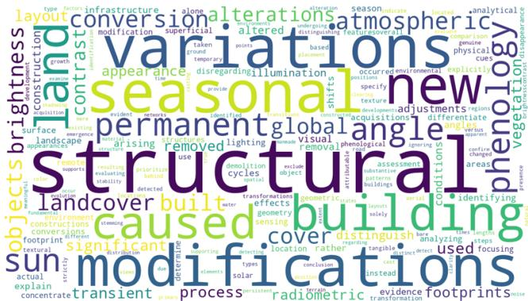  
Figure 6: Word cloud visualization of the QUAKE-CoT dataset’s textual content.

We highlight three limitations relevant to downstream use. First, reasoning traces are distilled from Gemini-3.1- Pro-Thinking-Preview; biases or systematic blind spots of the teacher—for example, preferred phrasings, residual re- liance on global appearance cues, or culturally specific descriptors—may propagate into the trained policy despite the human cross-verification pass. Second, the source bench- marks emphasize built-environment changes, so building- level additions and removals are over-represented relative to natural changes such as vegetation succession, water- body fluctuation, or land-cover conversion at fine granular- ity. Third, the validation filter removes tiles whose anno- tated change is dominated by sub-tile-scale boundary noise, which trims a tail of legitimate but very small changes; QUAKE-CoT therefore underweights the high-frequency micro-change regime and should not be the sole benchmark for evaluating sub-pixel or thin-linear change detection.

## C Reward Construction Details

This section describes the training data and objective for the ThinkAnswer Reward $R _ { \phi } ,$ which is trained in a dedicated RM stage and subsequently consumed by the GRPO RL stage. The training set combines policy rollouts scored by IoU, one Gemini-synthesized hard negative per query, and the ground- truth trace, assembled into strict pairwise preferences over a five-tier hierarchy.

## Rollout Generation and IoU Scoring

For each prompt x in the 20% RL subset of the QUAKE-CoT dataset, we independently sample $K = 1 0$ responses $\{ y _ { 1 } , \dots , y _ { K } \} \sim \pi _ { \theta _ { \mathrm { S F T } } } ( \cdot \mid \mathbf { x } )$ from the curriculum-SFT pol- icy. Each response yi is parsed to extract its quadtree mask sequence $y _ { \mathrm { s e g } } ^ { ( i ) }$ . The sequence is subsequently processed by the deterministic decoder D to yield the binary mask prediction $\hat { M } ^ { ( i ) } = \mathcal { D } ( y _ { \mathrm { s e g } } ^ { ( i ) } )$

We evaluate the structural quality of every rollout by com- puting its Intersection over Union (IoU) with the ground-truth mask M:

$$
\mathrm { I o U } ( y _ { i } ) = { \frac { \lvert { \hat { M } } ^ { ( i ) } \cap M \rvert } { \lvert { \hat { M } } ^ { ( i ) } \cup M \rvert } }\tag{12}
$$

Generations that fail $\mathcal { L } _ { Q }$ grammar matching—missing <seg> wrapper, unrecognized tokens, or malformed RLE prefixes—are assigned $\mathrm { I o } \mathbf { \bar { U } } ( y _ { i } ) = 0 ;$ pad/crop fallbacks trig- gered by dimension mismatch still receive a normally com- puted IoU.

## Hard-Negative Generation

For each query we synthesize one fluent-but-contradictory hard negative $y _ { \mathrm { n e g } } ,$ forcing $R _ { \phi }$ to discriminate factual fi- delity from surface fluency rather than rewarding stylistic eloquence.

Generator and Prompt. The generator is Gemini-3.1-Pro-Thinking-Preview (Team et al. 2023), queried via API and conditioned on the bi-temporal pair $( I _ { 1 } , I _ { 2 } )$ together with the ground-truth trace $y _ { \mathrm { g t } }$ . Following the system prompt in Figure 14, the generator is instructed to inject exactly one factual conflict into the rewritten trace, drawn from three categories: fabricating a change that did not occur, displacing the change to an incorrect location, or asserting no-change when change is present.

Format Constraints. To ensure $y _ { \mathrm { n e g } }$ is dificult to distinguish from genuine outputs, the prompt enforces three constraints: (i) the linguistic length is bounded between 0.8× and 1.2× of $| y _ { \mathrm { g t } } |$ in tokens; (ii) the original <think>...</think><answer>...</answer>

structure is preserved verbatim; (iii) giveaway tokens such as “mask” or “ground truth” are forbidden.

$y _ { \mathrm { n e g } }$ is therefore placed at the bottom of the preference hierarchy defined below.

## Preference Pair Construction

From the $K = 1 0$ rollouts we select three samples spanning the IoU spectrum:

$$
y _ { a } = \arg \operatorname* { m a x } _ { y _ { i } } \mathrm { I o U } ( y _ { i } ) ,\tag{13}
$$

$$
y _ { b } = \arg \operatorname* { m i n } _ { y _ { i } } \mathrm { I o U } ( y _ { i } ) ,\tag{14}
$$

$$
\begin{array} { r } { y _ { c } = \arg \underset { y _ { i } \notin \{ y _ { a } , y _ { b } \} } { \operatorname* { m a x } } \left| \mathrm { I o U } ( y _ { a } ) - \mathrm { I o U } ( y _ { i } ) \right| \right. \qquad } \\ { \left. \qquad \cdot \left| \mathrm { I o U } ( y _ { i } ) - \mathrm { I o U } ( y _ { b } ) \right| . \qquad } \end{array}\tag{15}
$$

Here $y _ { a }$ and $y _ { b }$ are the highest- and lowest-IoU rollouts, while $y _ { c }$ is the intermediate rollout whose IoU sits farthest from both endpoints, measured by the product of absolute IoU gaps.

A preference comparison between any two candidates $( y _ { i } , y _ { j } )$ is considered valid only if their performance discrep- ancy is significant enough to warrant a discernible semantic diference. We enforce this through a margin check threshold $\tau = 0 . 1 $

$$
y _ { i } \succ y _ { j } \iff \mathrm { I o U } ( y _ { i } ) - \mathrm { I o U } ( y _ { j } ) \geq \tau\tag{16}
$$

By incorporating the ground-truth sequence $y _ { \mathrm { g t } }$ (considered the absolute upper bound) and the fabricated hard negative $y _ { \mathrm { n e g } }$ (the absolute lower bound), we establish a stringent, multi-tiered preference hierarchy:

$$
y _ { \mathrm { g t } } \succ y _ { a } \succ y _ { c } \succ y _ { b } \succ y _ { \mathrm { n e g } }\tag{17}
$$

From this hierarchy, we extract the preference set

$$
\mathcal D _ { \mathrm { p r e f } } = \{ ( y _ { c } , y _ { r } ) \ | \ y _ { c } \succ y _ { r } \} ,\tag{18}
$$

instantiated by pairs such as $( y _ { \mathrm { g t } } , y _ { \mathrm { n e g } } ) , ( y _ { b } , y _ { \mathrm { n e g } } ) , ( y _ { a } , y _ { c } ) ,$ and $( y _ { c } , y _ { b } )$ , provided the τ gap condition is satisfied for rollout comparisons. These pairs are aggregated to train the Qwen3-VL-8B-Instruct reward model. The neural reward model is optimized using the following objective:

$$
\begin{array} { r } { \mathcal { L } _ { \mathrm { R M } } = - \mathbb { E } _ { \mathcal { D } _ { \mathrm { p r e f } } } \big [ \log \sigma ( R _ { \phi } ( y _ { c } ) - R _ { \phi } ( y _ { r } ) ) } \\ { - \lambda ( R _ { \phi } ( y _ { c } ) + R _ { \phi } ( y _ { r } ) ) ^ { 2 } \big ] , } \end{array}\tag{19}
$$

The resulting preference set anchors $R _ { \phi }$ to spatial fidelity rather than surface phrasing.

## Dual-Reward Specification

During the GRPO RL stage, the total reward combines a rule-based $R _ { q }$ with the learned $R _ { t }$

$$
R ( { \bf x } , y ) = \left( 1 - \mu \right) R _ { q } ( y ; M ) + \mu R _ { t } ( y ; { \bf x } ) ,\tag{20}
$$

with $\mu = 0 . 1$ . The rule-based component validates grammar and spatial accuracy; the learned component scores the bi- temporal reasoning trace.

Quadtree Reward Formulation $( R _ { q } ) .$ . The Quadtree Re-ward deterministically validates format compliance and spa- tial accuracy:

$$
R _ { q } = \mathrm { c l i p } ( R _ { \mathrm { s t r u c t } } + R _ { \mathrm { c o n t e n t } } , 0 . 0 , 1 . 0 )\tag{21}
$$

If the generation fails $\mathcal { L } _ { Q }$ parsing—missing <seg> wrap- per, unrecognized tokens, a forbidden $< \mathsf { Q } 0 0 0 0 0 >$ node, an RLE count below 2, or a child count not matching $\textstyle \sum _ { i } b _ { i }$ for any <Qabcd> node—grammar gating forces $R _ { q } = \overline { { 0 . 0 } }$ Otherwise:

• Structure Score $( R _ { \mathrm { s t r u c t } } ) { : }$ The decoded grid is compared against the expected dimensions $( H _ { e } , \bar { W _ { e } } )$ via row-wise error rates and an exact-alignment bonus:

$$
\epsilon _ { h } = \operatorname* { m i n } \bigr ( 1 , | H _ { p } - H _ { e } | / H _ { e } \bigr ) ,\tag{22}
$$

$$
{ \epsilon _ { w } } = \frac { 1 } { { { H _ { e } } } } \sum _ { i = 1 } ^ { { H _ { e } } } { \operatorname* { m i n } } { \left( 1 , \ : | { W _ { i } } - { W _ { e } } | / { W _ { e } } \right) } ,\tag{23}
$$

$$
\begin{array} { r l } & { R _ { \mathrm { s t r u c t } } = 0 . 2 5 ~ \mathrm { m a x } \big ( 0 , 1 - \frac { 1 } { 2 } \big ( \epsilon _ { h } + \epsilon _ { w } \big ) \big ) } \\ & { ~ + 0 . 0 5 \cdot { \mathcal K } \big [ H _ { p } = H _ { e } \wedge \forall i W _ { i } = W _ { e } \big ] , } \end{array}\tag{24}
$$

where $H _ { p }$ is the decoded row count and $W _ { i }$ the logical width of row i after RLE expansion.

• Content Score $( R _ { \mathrm { c o n t e n t } } ) { : }$ The decoded binary mask Mˆ is scored against the ground truth M via the Tversky index $\mathcal { T } _ { \alpha , \beta }$ with $( \alpha , \beta ) \^ = \ ( 0 . 3 , 0 . 7 )$ , which weights false negatives more strongly than false positives. Writing $\mathrm { T P } = | M \cap \hat { M } | , \mathrm { F P } = | \hat { M } \setminus M |$ , and $\mathrm { F N } = | M \setminus \hat { M } |$

$$
\mathcal { T } _ { \alpha , \beta } ( M , \hat { M } ) = \frac { \mathrm { T P } } { \mathrm { T P } + \alpha \mathrm { F P } + \beta \mathrm { F N } } .\tag{25}
$$

The content score is non-trivial only when the ground- truth mask contains foreground: when $| M | = 0 .$ , an exactempty prediction earns a residual reward of 0.2 to pre-vent collapse to all-background outputs, while any false- positive prediction yields 0. For active masks $\left( \left| M \right| > 0 \right) :$

$$
\begin{array} { r l } & { R _ { \mathrm { c o n t e n t } } = 0 . 7 0 \mathcal { T } _ { \alpha , \beta } ( M , \hat { M } ) s _ { \mathrm { a l i g n } } } \\ & { \qquad + 0 . 0 3 \mathcal { k } [ \mathcal { T } \geq 0 . 4 5 \wedge \mathrm { s t r i c t } ] , } \end{array}\tag{26}
$$

where $s _ { \mathrm { a l i g n } } = 1 . 0$ under strict decode and $s _ { \mathrm { a l i g n } } = 0 . 8 0$ when the pad/crop fallback was triggered. The additive +0.03 rewards strict-decoded predictions whose Tversky score clears the boundary-preservation threshold.

ThinkAnswer Reward Formulation (Rt). The reward model $R _ { \phi }$ trained in the pre- ceding RM stage scores the extracted $\scriptstyle < \mathrm { t h i n k } > \dotsc < < / \mathrm { t h i n k } > < \dotsc \dotsc < / \mathrm { a n s w e r } > \dotsc \dotsc < / \mathrm { a n s w e r } >$ segment of each rollout. To stabilise the reward scale across queries, we apply query-wise centred sigmoid normalisation over the group $\mathcal { S } _ { \mathbf { x } }$ of $\dot { K } = 8$ rollouts sharing prompt x:

$$
R _ { t } ( y _ { i } ) = \sigma \big ( R _ { \phi } ( y _ { i } \mid \mathbf { x } ) - \bar { R } _ { \phi } ( \mathbf { x } ) \big ) ,\tag{27}
$$

$$
\bar { R } _ { \phi } ( \mathbf { x } ) = \frac { 1 } { | S _ { \mathbf { x } } | } \sum _ { y _ { j } \in S _ { \mathbf { x } } } R _ { \phi } ( y _ { j } \mid \mathbf { x } ) .\tag{28}
$$

The mean is computed across all K rollouts of x aggregated over all data-parallel ranks, so every rank applies identical centring; this bounds $R _ { t } \in ( 0 , 1 )$ and yields zero-mean ad- vantages within each query group.

<table><tr><td>Hyperparameter</td><td>Stage 1 (SFT)</td><td>Stage 2 (SFT)</td><td>RM Training</td><td>RL (GRPO)</td></tr><tr><td>Foundation Model</td><td>Qwen3-VL-8B</td><td>Stage 1 Checkpoint</td><td>Qwen3-VL-8B</td><td>Stage 2 Checkpoint</td></tr><tr><td>Training Epochs</td><td>10</td><td>5</td><td>3</td><td>3</td></tr><tr><td>Optimizer</td><td>AdamW</td><td>AdamW</td><td>AdamW</td><td>AdamW</td></tr><tr><td>Precision</td><td>BF16</td><td>BF16</td><td>BF16</td><td>BF16</td></tr><tr><td>Learning Rate</td><td> $2 \times 1 0 ^ { - 4 }$ </td><td> $2 \times 1 0 ^ { - 4 }$ </td><td> $1 \times 1 0 ^ { - 4 }$ </td><td> $5 \times 1 0 ^ { - 6 }$ </td></tr><tr><td>LR Scheduler</td><td>Cosine</td><td>Cosine</td><td>Cosine</td><td>Cosine</td></tr><tr><td>Warmup Ratio</td><td>0.03</td><td>0.03</td><td>0.05</td><td>0.03</td></tr><tr><td>Weight Decay</td><td>0.01</td><td>0.01</td><td>0.01</td><td>0.01</td></tr><tr><td>Hardware Setup</td><td>8× H200</td><td>8× H200</td><td>4× H200</td><td>8× H200</td></tr><tr><td>Batch Size (BS) per GPU</td><td>8</td><td>8</td><td>4</td><td>2</td></tr><tr><td>Gradient Accumulation Steps</td><td>1</td><td>1</td><td>1</td><td>1</td></tr><tr><td>Max Sequence Length</td><td>4096</td><td>4096</td><td>2048</td><td>1024 (Completion)</td></tr><tr><td colspan="5">LoRA Configuration</td></tr><tr><td>LoRA Target Modules</td><td>Attention &amp; MLP</td><td>Attention &amp; MLP</td><td>Attention &amp; MLP</td><td></td></tr><tr><td>LoRA Rank (r)</td><td>64</td><td>64</td><td>64</td><td>All Linear 32</td></tr><tr><td>LoRA Alpha (α)</td><td>128</td><td>128</td><td>128</td><td>64</td></tr><tr><td>LoRA Dropout</td><td>0.05</td><td>0.05</td><td>0.05</td><td>0.05</td></tr><tr><td colspan="5">RL-Specific Configuration</td></tr><tr><td>Rollouts per Prompt (K)</td><td></td><td></td><td></td><td>8</td></tr><tr><td>Temperature</td><td></td><td></td><td></td><td>0.7</td></tr><tr><td>KL Coefficient (β)</td><td></td><td></td><td></td><td>0.04</td></tr><tr><td>Reward Weights</td><td></td><td></td><td></td><td> $1 . 0 \ ( R _ { q } ) , 0 . 1 \ ( R _ { t } )$ </td></tr></table>

Table 8: Comprehensive hyperparameters for all training stages of QUAKE-CD. BS = batch size per device.

## D Comprehensive Hyperparameters

Table 8 lists the full hyperparameter configuration for the two SFT stages, the reward model, and the GRPO rollout. Throughput Measurement Protocol. Because Table 1 mixes specialist change detectors and VLMs, we define throughput at the application level rather than the token level. All methods are measured on a single NVIDIA H200 GPU with batch size 64 under BF16 inference, and the reported numbers are wall-clock end-to-end throughput in pairs/s. For specialist detectors, this includes direct mask prediction and deterministic post-processing. For VLM baselines, it in- cludes prompt encoding, autoregressive generation until the model’s stopping criterion, and final mask extraction when applicable. For QUAKE-CD, this additionally includes generation of the <seg> span, followed by deterministic decoding of <seg> into the binary mask. No test-time adaptation, model parallelism, or extra refinement is used.

## E More Experimental Results

## Oracle Performance Upper Bound

The mask representation imposes an upper bound indepen- dently of model generation. Table 9 reports the representa- tion oracles of the hierarchical QUAKE encoding and the flat text-as-mask encoding on the QUAKE-CoT test set. The flat oracle applies to Text4Seg and RSUniVLM, while the QUAKE oracle applies to QUAKE-CD.

Table 9 isolates the efect of mask representation. Both encodings preserve 100.00% foreground recall, confirming that neither representation discards annotated change re- gions. Compared with flat text-as-mask encoding, QUAKE increases accumulated precision from 68.04% to 84.03% and per-image precision from 65.23% to 81.43%. These improvements raise accumulated and per-image F1 by 10.35% and 9.70%, respectively. The results show that hierarchi-cal refinement suppresses boundary over-coverage induced by uniform spatial quantization while preserving complete foreground coverage.

For metric m ∈ {Precision, Recall, F1} and evaluation regime $s \in \{ \mathrm { a c c } , \mathrm { i m g } \}$ , the fraction of oracle performance reached is

$$
\rho _ { m } ^ { ( s ) } = \frac { m _ { \mathrm { m o d e l } } ^ { ( s ) } } { m _ { \mathrm { o r a c l e } } ^ { ( s ) } } \times 1 0 0 \% ,\tag{29}
$$

where $m _ { \mathrm { o r a c l e } } ^ { ( s ) }$ is the upper bound obtained from represen- tation round-trip fidelity and $m _ { \mathrm { m o d e l } } ^ { ( s ) }$ is the end-to-end re- sult in Table 1. These ratios quantify the remaining model- generation gap after accounting for representation-specific quantization.

Table 10 shows that QUAKE-CD realizes the largest fraction of its representation oracle across all metrics. It reaches 85.75% accumulated F1 and 82.52% per-image F1, exceeding the strongest alternative by 8.76% and 5.35%, respectively. Its normalized precision also remains above 84% under both evaluation regimes, indicating substantially less degradation from autoregressive generation. Together, the two tables show that the gains of QUAKE-CD arise from both a more faithful spatial representation and a more efec- tive realization of its attainable mask quality.

<table><tr><td rowspan="3">Representation</td><td colspan="3">Accumulated Mean</td><td colspan="3">Per-Image Mean</td></tr><tr><td>Precision</td><td>Recall</td><td>F1</td><td>Precision</td><td>Recall</td><td>F1</td></tr><tr><td>Flat text-as-mask</td><td>68.04</td><td>100.00</td><td>80.97</td><td>65.23</td><td>100.00</td><td>78.98</td></tr><tr><td>QUAKE</td><td>84.03</td><td>100.00</td><td>91.32</td><td>81.43</td><td>100.00</td><td>88.68</td></tr></table>

Table 9: Representation-oracle mask quality on the QUAKE-CoT test set. Each ground-truth mask is encoded with the corre-sponding mask representation and deterministically decoded without model generation. All metrics are reported as percentages.
<table><tr><td rowspan="2">Method</td><td colspan="3">Accumulated Mean</td><td colspan="3">Per-Image Mean</td></tr><tr><td>Precision</td><td>Recall</td><td>F1</td><td>Precision</td><td>Recall</td><td>F1</td></tr><tr><td>Text4Seg</td><td>21.34</td><td>84.07</td><td>30.58</td><td>23.41</td><td>54.88</td><td>24.88</td></tr><tr><td>RSUniVLM</td><td>73.67</td><td>82.45</td><td>76.99</td><td>74.74</td><td>81.23</td><td>77.17</td></tr><tr><td>QUAKE-CD</td><td>84.48</td><td>87.31</td><td>85.75</td><td>84.45</td><td>84.09</td><td>82.52</td></tr></table>

Table 10: End-to-end mask quality normalized by the corresponding representation oracle on the QUAKE-CoT test set. Each entry reports model performance divided by oracle performance.
<table><tr><td rowspan="3">Dataset</td><td colspan="3">Accumulated Mean</td><td colspan="3">Per-Image Mean</td></tr><tr><td>Precision</td><td>Recall</td><td>F1</td><td>Precision</td><td>Recall</td><td>F1</td></tr><tr><td>LEVIR-CD</td><td>64.65</td><td>98.61</td><td>78.10</td><td>58.53</td><td>90.23</td><td>71.00</td></tr><tr><td>LEVIR-CD+</td><td>55.79</td><td>85.82</td><td>67.62</td><td>57.23</td><td>78.68</td><td>66.26</td></tr></table>

Table 11: Change-mask performance under tiled inference on the original 1024 × 1024 test images. All values are percentages.

## Scalability to High-Resolution Imagery

Although our model is trained with 256 × 256 image pairs, practical remote sensing imagery often covers substantially larger spatial extents. We therefore evaluate its scalability on the original 1024 × 1024 images from LEVIR-CD and LEVIR-CD+, without high-resolution fine-tuning or archi- tectural modification. Each co-registered bi-temporal pair is partitioned into a 4 × 4 grid of non-overlapping and spatially aligned 256 × 256 tile pairs. The model processes each pair independently at its native training resolution. The result- ing QUAKE predictions are decoded into binary tile masks, restored to their original coordinates, and stitched into a full- resolution 1024 × 1024 prediction for evaluation against the original ground truth. This protocol preserves local image detail and avoids the information loss caused by resizing the entire image to the training resolution. No overlapping infer- ence, test-time adaptation, cross-tile refinement, or learned fusion is employed.

Table 11 reports the resulting full-resolution performance. On the test pairs of LEVIR-CD, the model achieves a dataset- level precision of 64.65% and an F1 score of 78.10%, with a recall of 98.61%. On the test pairs of LEVIR-CD+, it obtains a precision of 55.79% and an F1 score of 67.62%, with a recall of 85.82%. The consistently high recall indicates that the model retains strong sensitivity to changed struc- tures when applied to images with 16× the training image area. The lower precision on LEVIR-CD+ suggests that the remaining errors are primarily attributable to conservative over-detection rather than missed changes. Overall, these re- sults demonstrate that the proposed QUAKE predictor can be efectively extended to megapixel-scale imagery through a simple tiled inference strategy while preserving the original training resolution.

Figure 7 provides qualitative evidence consistent with these results. In the first example, the stitched prediction recovers the full extent of the newly developed curvilinear residential area, while merging nearby building footprints and expanding into some surrounding regions. In the sec- ond example, it captures the long rows of newly constructed buildings but represents several adjacent instances as contiguous bands. These errors explain the high recall and lower precision reported in Table 11. Despite independent tile pro- cessing, both predictions retain the global spatial arrange- ment of changes after stitching, confirming efective transfer from 256 × 256 training crops to 1024 × 1024 scenes.

## Generalization on Out-of-Domain Dataset

All preceding evaluations use data drawn from QUAKE-CoT and therefore retain substantial overlap with its training dis- tribution. We assess external validity on WHU Building CD (Ji, Wei, and Lu 2019), which is excluded from data con-struction, supervised fine-tuning, and reinforcement learn- ing. WHU has a ground sampling distance of 0.2 m/pixel, compared with 0.3 m/pixel for LEVIR-CD and 0.5 m/pixel for SYSU-CD, and was acquired with a diferent sensor. This benchmark consequently introduces coupled shifts in spa- tial resolution, sensor characteristics, scene appearance, and object scale.

We evaluate the frozen QUAKE-CD model without spe-cific fine-tuning or test-time adaptation. The native ground sampling distance is preserved, and each pair is processed using the same tiled inference and deterministic decoding

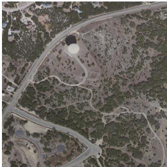

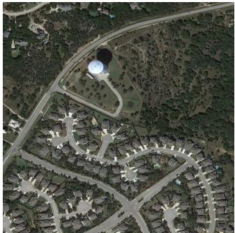

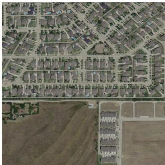  
(a)

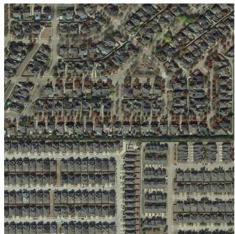  
(b)

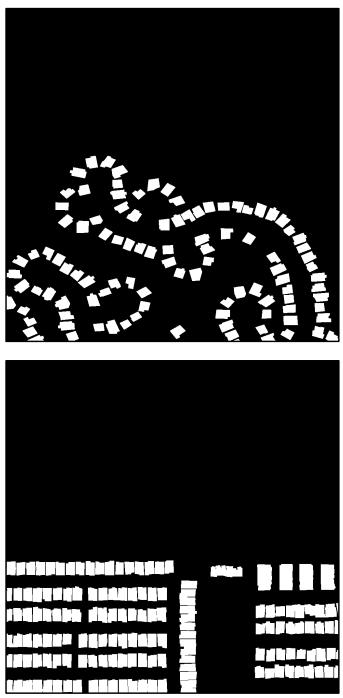  
(c)

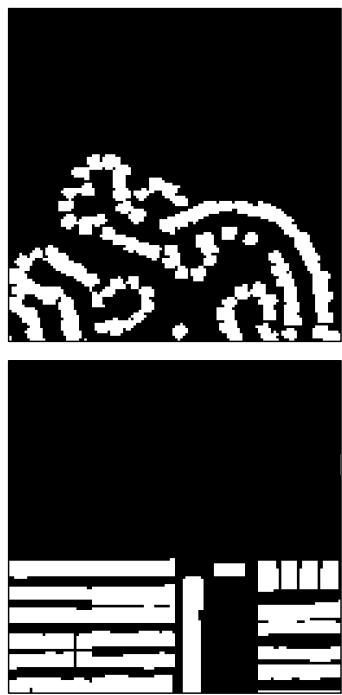  
(d)

Figure 7: Qualitative results on original 1024 × 1024 image pairs under tiled inference. Each row presents one example: (a) pre-change image; (b) post-change image; (c) ground-truth change mask; (d) stitched prediction.
<table><tr><td rowspan="2">Method</td><td colspan="3">Accumulated Mean</td><td colspan="3">Per-Image Mean</td></tr><tr><td>Precision</td><td>Recall</td><td>F1</td><td>Precision</td><td>Recall</td><td>F1</td></tr><tr><td>BIT</td><td>72.93</td><td>68.25</td><td>68.54</td><td>62.24</td><td>60.44</td><td>60.21</td></tr><tr><td>ChangeFormer</td><td>75.83</td><td>71.04</td><td>75.36</td><td>71.30</td><td>60.63</td><td>65.29</td></tr><tr><td>ChangeCLIP</td><td>76.41</td><td>68.70</td><td>73.09</td><td>54.43</td><td>45.76</td><td>47.13</td></tr><tr><td>LISA-7B</td><td>15.73</td><td>64.03</td><td>25.96</td><td>16.46</td><td>42.15</td><td>19.97</td></tr><tr><td>LISA-llama2-13B</td><td>14.88</td><td>68.52</td><td>22.99</td><td>17.62</td><td>41.71</td><td>21.15</td></tr><tr><td>GLaMM</td><td>12.34</td><td>45.36</td><td>23.00</td><td>14.23</td><td>27.53</td><td>15.93</td></tr><tr><td>PixelLM</td><td>16.02</td><td>65.63</td><td>26.75</td><td>17.72</td><td>42.73</td><td>20.87</td></tr><tr><td>Text4Seg</td><td>14.65</td><td>74.41</td><td>22.26</td><td>12.94</td><td>47.80</td><td>19.18</td></tr><tr><td>RSUniVLM</td><td>45.23</td><td>74.57</td><td>58.25</td><td>46.80</td><td>72.62</td><td>56.65</td></tr><tr><td>QUAKE-CD</td><td>65.36</td><td>78.40</td><td>71.29</td><td>64.90</td><td>73.88</td><td>69.10</td></tr><tr><td>QUAKE-CD / Oracle</td><td>77.84</td><td>78.40</td><td>78.10</td><td>87.69</td><td>73.88</td><td>82.44</td></tr></table>

Table 12: Out-of-domain performance on WHU Building CD. QUAKE-CD is evaluated without specific fine-tuning. The second row reports end-to-end performance normalized by the corresponding representation oracle.

## protocol described in Section 4.

Table 12 reports the end-to-end mask quality of QUAKE-CD and the fraction of the corresponding representation ora- cle attained by the model. The oracle is obtained by encoding and deterministically decoding the WHU ground-truth masks with the QUAKE representation. The normalized row follows Equation 29 and divides each end-to-end metric by its ora- cle counterpart. Under accumulated evaluation, QUAKE-CD remains competitive with the specialist change detectors: its accumulated F1 of 71.29% is within 4.07% of the strongest specialist, ChangeFormer, while its accumulated recall of

78.40% is the best in the table. More importantly, QUAKE-CD surpasses all specialist baselines in the per-image setting, reaching 69.10% F1 versus 65.29% for the strongest specialist, ChangeFormer. Among the VLM baselines, QUAKE-CD is the best by a clear margin; the strongest VLM base- line, RSUniVLM, reaches only 58.25% accumulated F1 and 56.65% per-image F1, leaving QUAKE-CD ahead by 13.04 and 12.45 points, respectively. Without adaptation, QUAKE-CD achieves accumulated and per-image F1 scores of71.29% and 69.10%. These results correspond to 78.10% and 82.44% of the respective oracle F1 scores. Recall remains higher than precision under both evaluation regimes, showing that the transferred model favors coverage of changed buildings over conservative boundary estimation. The results establish efective generalization across shifts in spatial resolution, sensor characteristics, and scene appearance.

<table><tr><td rowspan="2"> $( \alpha , \beta )$ </td><td colspan="3">Accumulated Mean</td><td colspan="3">Per-Image Mean</td></tr><tr><td>Precision</td><td>Recall</td><td>F1</td><td>Precision</td><td>Recall</td><td>F1</td></tr><tr><td>(0.1, 0.9)</td><td>70.82</td><td>86.68</td><td>77.95</td><td>68.41</td><td>83.04</td><td>72.63</td></tr><tr><td>(0.2, 0.8)</td><td>70.24</td><td>86.89</td><td>77.68</td><td>68.19</td><td>83.24</td><td>72.51</td></tr><tr><td>(0.3, 0.7)</td><td>70.99</td><td>87.31</td><td>78.31</td><td>68.77</td><td>84.09</td><td>73.18</td></tr><tr><td>(0.4, 0.6)</td><td>73.13</td><td>81.19</td><td>76.95</td><td>69.63</td><td>79.44</td><td>71.61</td></tr><tr><td>(0.5, 0.5)</td><td>73.09</td><td>81.31</td><td>76.98</td><td>69.40</td><td>79.35</td><td>71.46</td></tr></table>

Table 13: Sensitivity of the Tversky parameters in the Quadtree Reward.
<table><tr><td rowspan="2"> $\mu$ </td><td colspan="3">Accumulated Mean</td><td colspan="3">Per-Image Mean</td><td rowspan="2">Reranker (score)</td></tr><tr><td>Precision</td><td>Recall</td><td>F1</td><td>Precision</td><td>Recall</td><td>F1</td></tr><tr><td>0.05</td><td>68.91</td><td>76.38</td><td>72.45</td><td>58.70</td><td>74.50</td><td>67.50</td><td>69.72</td></tr><tr><td>0.10</td><td>70.99</td><td>87.31</td><td>78.31</td><td>68.77</td><td>84.09</td><td>73.18</td><td>71.26</td></tr><tr><td>0.15</td><td>70.55</td><td>86.75</td><td>77.82</td><td>68.31</td><td>83.17</td><td>72.60</td><td>70.30</td></tr><tr><td>0.20</td><td>73.09</td><td>81.31</td><td>76.98</td><td>69.40</td><td>79.35</td><td>71.46</td><td>68.05</td></tr></table>

Table 14: Sensitivity of the reward trade-of coeficient in Eq. (3).
<table><tr><td rowspan="2">KL Coefficient</td><td colspan="3">Accumulated Mean</td><td colspan="3">Per-Image Mean</td><td rowspan="2">Reranker (score)</td></tr><tr><td>Precision</td><td>Recall</td><td>F1</td><td>Precision</td><td>Recall</td><td>F1</td></tr><tr><td>0.00</td><td>72.78</td><td>81.53</td><td>76.90</td><td>69.44</td><td>79.67</td><td>71.58</td><td>64.85</td></tr><tr><td>0.02</td><td>71.60</td><td>82.91</td><td>76.84</td><td>68.77</td><td>80.66</td><td>71.64</td><td>70.82</td></tr><tr><td>0.04</td><td>70.99</td><td>87.31</td><td>78.31</td><td>68.77</td><td>84.09</td><td>73.18</td><td>71.26</td></tr><tr><td>0.06</td><td>68.91</td><td>76.38</td><td>72.45</td><td>66.03</td><td>74.50</td><td>67.50</td><td>70.79</td></tr><tr><td>0.08</td><td>69.25</td><td>76.31</td><td>72.61</td><td>66.12</td><td>74.46</td><td>67.48</td><td>64.09</td></tr></table>

Table 15: Sensitivity of the GRPO KL coeficient. The Reranker column reports the average reranker score.

## Qualitative Attention Visualization

To assess the spatial grounding of the structured prediction process, we construct two complementary attention views. The token-conditioned visualization projects the attention associated with each generated QUAKE token onto its designated visual tile. The aggregated overlay pools the visual responses over the complete segmentation sequence, provid- ing a holistic view of the evidence supporting the predicted change region.

We present three representative examples in Figure 8, Figure 9, and Figure 10. Across all cases, both attention views concentrate on regions undergoing meaningful tem- poral changes, while largely unchanged background areas receive weak responses. In the token-conditioned visualiza- tion, the red box marks the visual tile corresponding to the generated QUAKE token. The peak attention mostly falls within this tile, with substantially lower responses on neigh- boring and non-corresponding tiles. This self-tile concentra- tion provides direct evidence ofthe spatial alignment between the QUAKE output and the visual representation. The aggre-gated attention overlay further recovers the overall extent of the changed regions and follows their salient structures and boundaries. Its spatial distribution is consistent with both the predicted masks and the ground-truth annotations, indicating that the model focuses on relevant changes while suppressing irrelevant contextual content. This agreement is maintained across examples with diferent object scales, shapes, and background configurations, supporting the efectiveness of the QUAKE-based representation for grounding structured segmentation predictions in visual change evidence.

## Parameter Sensitivity Analysis

We sweep three reward-related hyperparameters around the default configuration used in the main experiments: the Tver- sky asymmetry $( \alpha , \beta ) ~ = ~ ( 0 . 3 , 0 . 7 )$ , the reward trade-of $\mu = 0 . 1$ in Eq. (3), and the KL coeficient 0.04. As sum-marized in Tables 13–15, the default setting is consistently the most balanced choice: it yields the strongest recall/F1 trade-offor the Tversky reward, achieves the highest reranker score at $\mu = 0 . 1$ , and provides the best overall balance under KL regularization. Although some nearby settings improve precision in isolation, they generally do so at the expense of recall, F1, or reranker performance.

## F Failure Mode Analysis

We quantify three categories of generation failure that can compromise mask reconstruction. Grammar invalidity occurs when the <seg> span cannot be parsed under $\mathcal { G } _ { Q }$ (e.g., malformed quadtree node, run-length count below 2, or unmatched delimiters). Structure mismatch occurs when the parsed grid does not match the expected $H / 3 2 \times W / 3 2$ di- mensions. Whenever a structure mismatch is detected, the decoder falls back to a pad/crop alignment that pads or truncates the recovered grid to the target shape; the trigger rate of this fallback therefore coincides with the structure- mismatch rate.

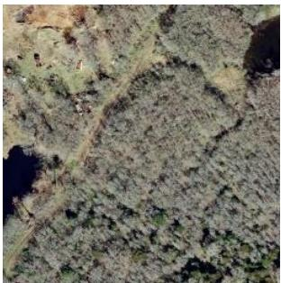  
(a)

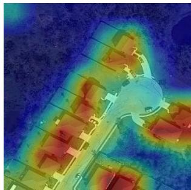

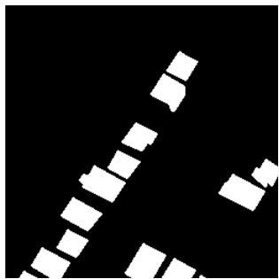  
(c)

(b)  
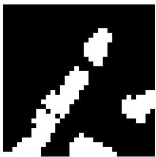  
(d)

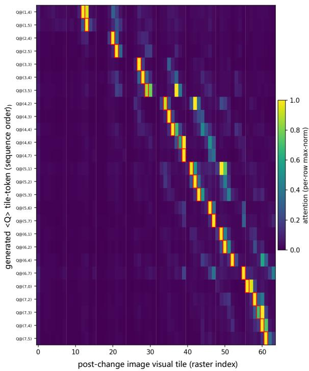  
(e)

Figure 8: Qualitative attention visualization example. (a) Pre-change image; (b) post-change image with aggregated attention overlay for the complete segmentation sequence; (c) ground-truth change mask; (d) predicted change mask; (e) token-conditioned attention visualization, where the red box indicates the visual tile corresponding to the generated QUAKE token. The token-conditioned attention peaks within the corresponding red-boxed tile, while the aggregated attention concentrates on regions of temporal change and is consistent with both the predicted and ground-truth masks.
<table><tr><td>Stage</td><td>Grammar Invalid</td><td>Structure Mismatch / Fallback</td></tr><tr><td>After Curriculum SFT</td><td>1.26%</td><td>12.64%</td></tr><tr><td>After RL</td><td>0.13%</td><td>2.17%</td></tr></table>

Table 16: Failure-mode rates on the QUAKE-CoT test split. The pad/crop fallback is invoked exactly when a structure mismatch is detected, so the two columns share a trigger.

Table 16 reports these rates measured on the held-out test split after the two-stage curriculum (S1+S2) and after grammar-gated dual-reward RL $( \mathrm { S } 1 { + } \mathrm { S } 2 { + } R _ { q } { + } R _ { t } )$ . Curricu- lum supervision already keeps grammar invalidity at 1.26%, indicating that the syntax is largely internalized during SFT. Reinforcement learning further reduces grammar invalidity to 0.13%, an order-of-magnitude drop attributable to the grammar gate in $R _ { q }$ that assigns zero reward to ungram- matical rollouts. Structure mismatch decreases from 12.64% to 2.17% over the same transition, showing that the structure score in $R _ { q }$ efectively penalizes grid-dimension drift even though the grammar gate alone does not enforce it.

## G Prompt Templates

Figures 11–16 reproduce every prompt used in this work. Data construction prompts (Figs. 11, 12, 13, 14) cover the system instruction, QA distillation, and hard-negative synthesis described in §B and §C. Evaluation prompts (Figs. 15, 16) cover the reranker used during preference-pair selection and the GPT judge used in §4.

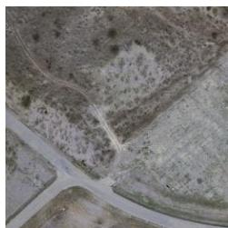  
(a)

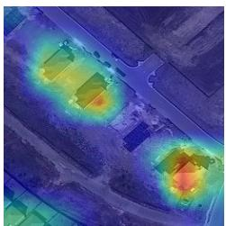  
(b)

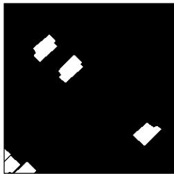  
(c)

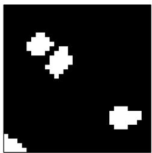  
(d)

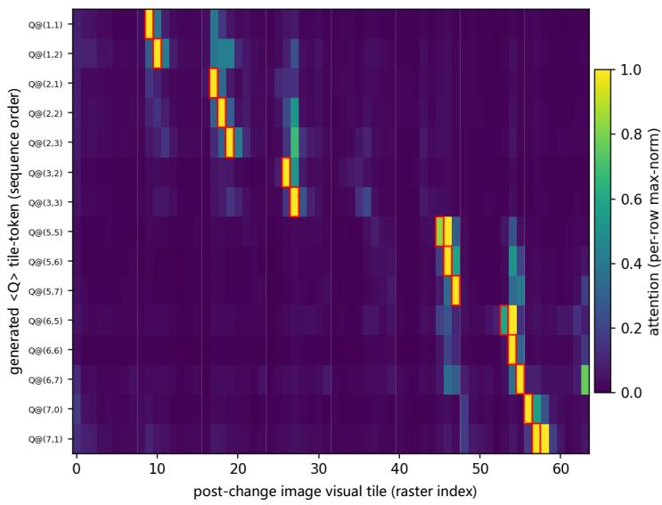  
(e)  
Figure 9: Qualitative attention visualization example. (a) Pre-change image; (b) post-change image with aggregated attention overlay for the complete segmentation sequence; (c) ground-truth change mask; (d) predicted change mask; (e) token-conditioned attention visualization, where the red box indicates the visual tile corresponding to the generated QUAKE token. The token-conditioned attention peaks within the corresponding red-boxed tile, while the aggregated attention concentrates on regions of temporal change and is consistent with both the predicted and ground-truth masks.

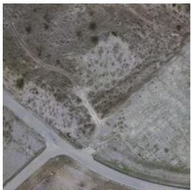  
(a)

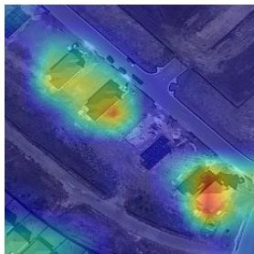  
(b)

  
(c)

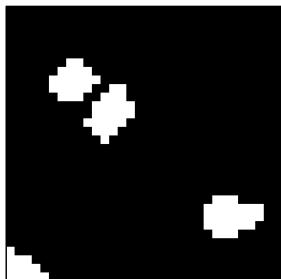  
(d)

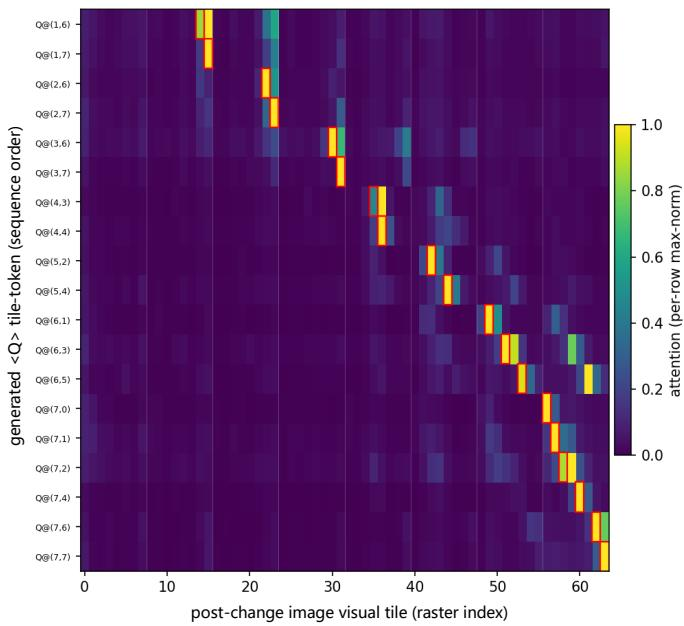  
(e)  
Figure 10: Qualitative attention visualization example. (a) Pre-change image; (b) post-change image with aggregated attention overlay for the complete segmentation sequence; (c) ground-truth change mask; (d) predicted change mask; (e) token-conditioned attention visualization, where the red box indicates the visual tile corresponding to the generated QUAKE token. The token-conditioned attention peaks within the corresponding red-boxed tile, while the aggregated attention concentrates on regions of temporal change and is consistent with both the predicted and ground-truth masks.

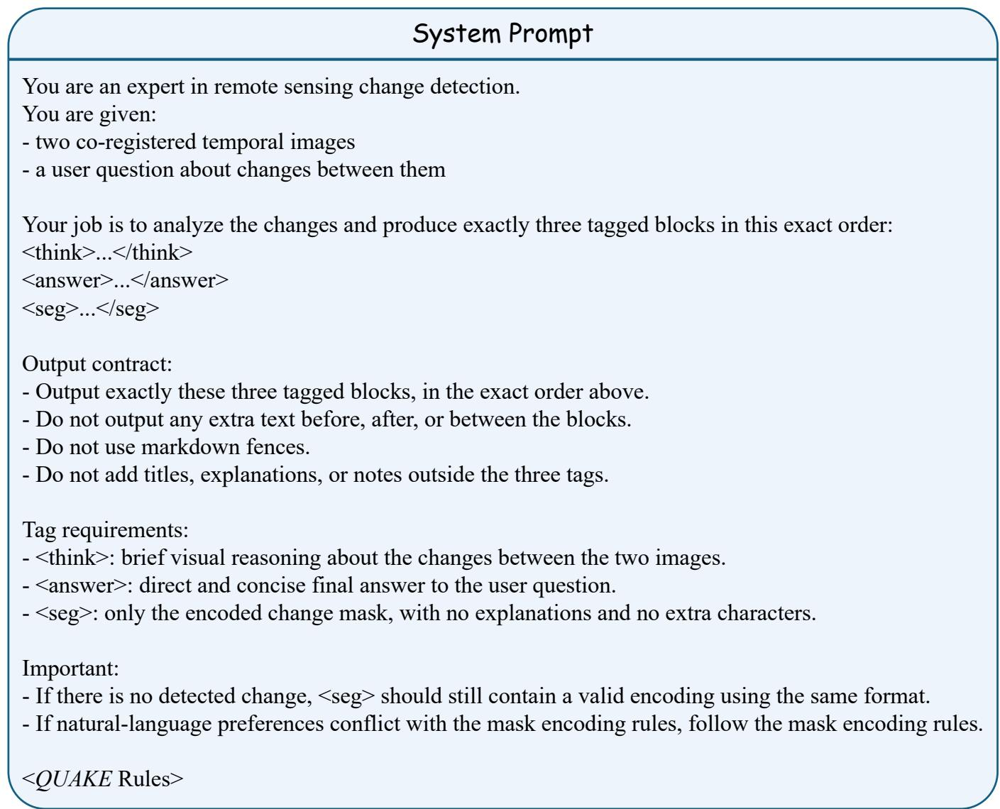  
Figure 11: System prompt prepended to all training and inference inputs of QUAKE-CD.

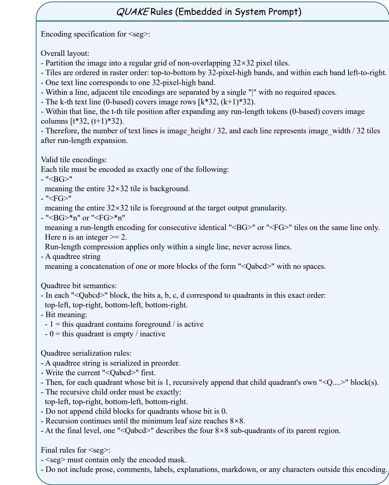  
Figure 12: QUAKE grammar rules embedded into the system prompt to constrain the model’s output schema.

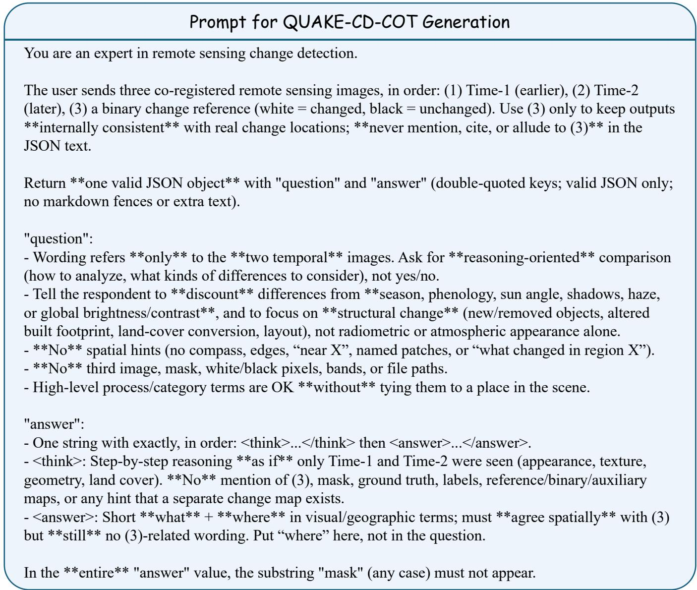  
Figure 13: Prompt issued to the teacher model to distill <think>/<answer> traces from a bi-temporal image pair during QUAKE-CoT construction.

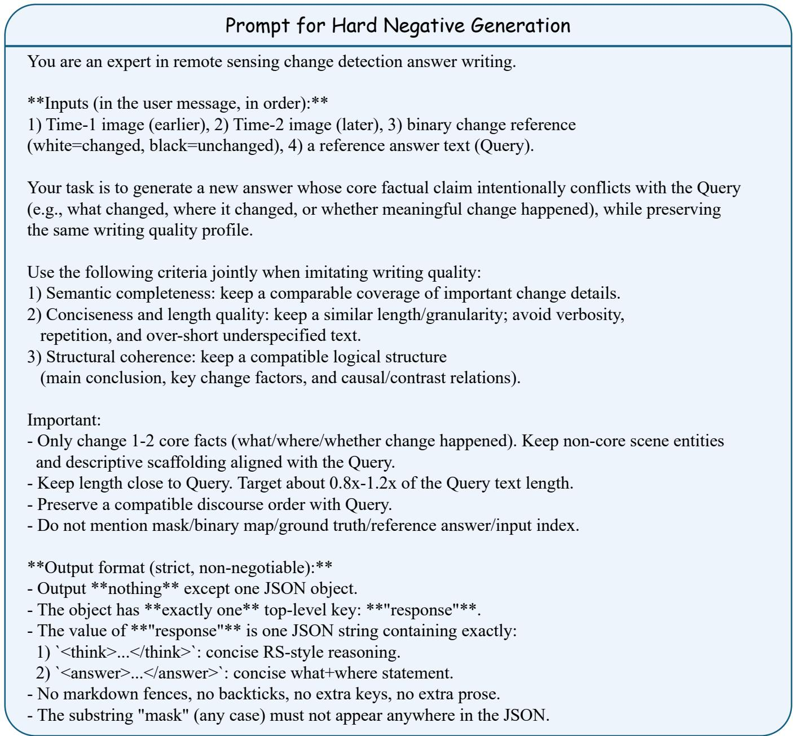  
Figure 14: Prompt issued to Gemini-3.1-Pro-Thinking-Preview to synthesize hard negatives for the preference hierarchy in §C.

<table><tr><td>Prompt for Reranker</td></tr><tr><td>You are an expert evaluator for remote sensing change detection answers.</td></tr><tr><td>Given a reference answer (Query) and a candidate answer (Document),</td></tr><tr><td>judge whether the Document is truly relevant and faithful to the Query.</td></tr><tr><td>Use all of the following criteria jointly: 1) Semantic fidelity: preserve the same change semantics and key entities.</td></tr><tr><td>2) Semantic completeness: do not omit important change details.</td></tr><tr><td>3) Conciseness and length quality: avoid verbose, repetitive, or overly short responses that lose</td></tr><tr><td>meaning. 4) Structural coherence: keep a compatible logical structure</td></tr><tr><td>(main conclusion, key change factors, and causal/contrast relations).</td></tr><tr><td>Note: all four criteria are equally important. No criterion is optional or secondary.</td></tr><tr><td>Semantically correct answers with different wording/order should still be considered relevant.</td></tr><tr><td>Superficially similar wording/structure with wrong conclusions or missing key facts should be</td></tr></table>

Figure 15: Prompt issued to Qwen3-VL-Reranker to score candidate responses during preference-pair selection.

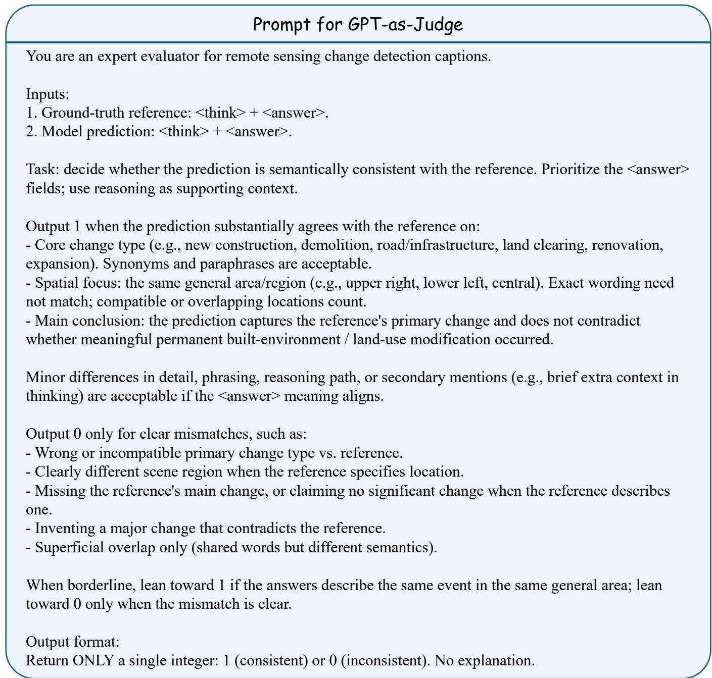  
Figure 16: Prompt issued to GPT-5.5 for pairwise quality scoring reported in §4.