# Geometry Without Coordinates: LiDAR Diffusion as a 3D Feature Bridge

Samed Dogan˘ Department of Electrical Engineering and Information Technology Munich University of Applied Sciences Munich, Bavaria 80335 samed.dogan@hm.edu

Nico Leuze Department of Electrical Engineering and Information Technology Munich University of Applied Sciences Munich, Bavaria 80335 nico.leuze@hm.edu

Alfred Schöttl Department of Electrical Engineering and Information Technology Munich University of Applied Sciences Munich, Bavaria 80335 alfred.schoettl@hm.edu

## Abstract

Transferring the rich priors of large 2D foundation models to sparse 3D LiDAR remains challenging, as training native 3D foundation models at comparable scale is limited by data and annotation scarcity. We introduce a LiDAR-conditioned diffusion model trained on pseudo-labels from off-the-shelf 2D foundation models. The model supports multiple output modalities, including depth, semantic segmentation and instance prediction, selectable via a textual task prompt. Because the model is conditioned on LiDAR, both its outputs and its intermediate UNet features can be projected back onto the input point cloud, enabling analysis of a 3D representation learned entirely under 2D supervision. We study this representation directly in point-cloud space, explicitly excluding raw spatial coordinates to isolate feature content from projection geometry. Linear probes recover up to ∼23% Mean Intersection over Union (MIoU) on 3D semantic classes, compared to ∼3.5% for a matched Gaussian-noise control, indicating substantial non-trivial structure. Pairwise cosine similarity across modality-specific feature streams reveals a layered organization. Early encoder layers remain weakly aligned across modalities while individually decodable, intermediate layers converge toward a shared representation, and decoder layers re-specialize toward task-specific outputs. These findings indicate that LiDAR-conditioned diffusion models can induce structured 3D representations from 2D supervision alone, with a modality-dependent manifold that locally unifies near a shared bottleneck. This positions diffusion as a viable mechanism for transferring large-scale 2D priors into sparse 3D domains.

## 1 Introduction

Acquiring large-scale, well-aligned multi-modal 3D data remains a central bottleneck for LiDAR perception. Established benchmarks such as nuScenes[2], Waymo Open Dataset[45], and KITTI[12] provide synchronized camera-LiDAR data, but at a scale far below what is available for 2D vision. These constraints have motivated a growing body of work on generative modeling for sensor data, particularly diffusion-based frameworks inspired by [16, 38, 43]. Recent generative approaches model camera images [9, 10, 57, 48, 11, 49], LiDAR point clouds [67, 30, 66, 14, 34, 17, 51, 23], and joint multi-modal distributions [54, 52, 21, 62] primarily as sensor simulators, aiming to reproduce raw observations rather than transferable representations.

In contrast, the 2D image domain has benefited from large-scale pretraining on foundation models such as DINO[4, 32, 42], Depth Anything[24, 58], and Segment Anything[37, 3]. These models encode rich priors over geometry, semantics, and object boundaries learned from web-scale image corpora. Comparable priors are largely absent in 3D, where early efforts exist [65, 50, 63, 25], but remain orders of magnitude smaller than their 2D counterparts. 3D data is sparse, irregular, and significantly more costly to scale. This disparity raises a central question: can the priors learned by 2D foundation models be transferred into 3D representations without training a native 3D model from scratch? We approach this problem with a diffusion model that bridges the two domains by conditioning on LiDAR. Rather than treating diffusion as a sensor simulator, we use it as a vehicle for transporting 2D priors into 3D: the network learns to produce dense scene representations conditioned on sparse 3D measurements, supervised entirely by pseudo-labels from off-the-shelf 2D foundation models. A single backbone produces multiple modalities, namely depth, semantic segmentation, and instance prediction, switched by textual prompt. The LiDAR conditioning spatially aligns dense 2D priors with 3D observations by construction, which makes intermediate features directly reprojectable into the input point cloud.

We then ask: what structure does this transfer induce? To answer this, we probe intermediate features directly in point-cloud space, explicitly excluding raw spatial coordinates to isolate feature content from projection geometry. Our analysis reveals two findings. First, the learned representation encodes meaningful 3D structure: linear probes reach ∼23% MIoU on 3D semantic classes, compared to ∼3.5% for a Gaussian-noise control. Second, modality-conditioned features exhibit a consistent organization across network depth: early layers remain modality-specific, intermediate layers converge toward a shared representation, and later layers re-specialize toward task-specific outputs. Rather than collapsing modalities, the network arranges them along its depth.

We summarize our contributions as follows:

• We introduce a LiDAR-conditioned diffusion framework that produces dense scene representations across multiple task modalities through textual prompting, enabling pseudo-labelbased transfer of 2D foundation-model priors into 3D point clouds.

• We propose a probing protocol that evaluates diffusion features directly in point-cloud space while excluding raw spatial coordinates, isolating what the features encode from what the projection geometry leaks.

• We show that, despite the absence of 3D ground-truth labels, the learned features encode structured 3D information and are organized across network depth into modality-specific streams that converge near a shared bottleneck.

## 2 Related Work

## 2.1 Diffusion Models for Conditional and Structured Generation

Denoising Diffusion Probabilistic Models (DDPMs) introduced by [16] have become a dominant paradigm for high-fidelity generative modeling. Subsequent works extended diffusion models to conditional generation, including text conditioning [22, 31, 40], and spatial guidance [19, 47, 39]. Text-to-image models such as Stable Diffusion [38] and DALL.E 2 [33] demonstrate the scalability of diffusion under large-scale supervision. Adapters such as ControlNet [61], T2I [29] and IP-Adapter [59] introduce spatial conditioning mechanism, while classifier-free guidance [15] enables flexible conditioning without auxiliary networks. Beyond image synthesis, diffusion has also been applied to depth estimation [20], segmentation [56], and other dense prediction tasks [41, 28], blurring the boundary between generative modeling and discriminative structured prediction.

## 2.2 Diffusion Features for Perception

A growing line of work shows that the intermediate U-Net features of pretrained text-to-image diffusion models encode strong perceptual priors that transfer to discriminative tasks. [64] adapt Stable Diffusion[38] features for dense visual perception with task-specific heads, while [55] use them for open-vocabulary panoptic segmentation by pairing them with text encoders. Subsequent work treats the features themselves as a primary object of study: [27] aggregate features across timesteps and decoder levels to identify the layers where semantic structure concentrates, [46] demonstrate that diffusion features support zero-shot semantic correspondence, and [44] address the mismatch between training-time noised features and inference-time clean inputs. Closer to the dense-prediction setting, [18] use diffusion features for semantic segmentation without task-specific finetuning.

These works establish that diffusion features carry transferable perceptual structure, but they study a single output modality at a time on 2D images. Two questions are therefore open. First, how do these features behave when the same backbone is conditioned to produce multiple output modalities at inference? Second, do the same observations transfer when the input modality is sparse 3D rather than dense RGB? Our work addresses both: we analyze a single LiDAR-conditioned diffusion model that produces depth, semantic, and instance outputs through textual prompting, and we probe its features in 3D point-cloud space rather than 2D pixel space. The cross-modal organization we observe (Section 5.2) is not visible from any single-modality probing setup.

## 3 Preliminaries

Latent Diffusion Models. We use Stable Diffusion 1.5 [38], a latent diffusion model that performs the forward and reverse diffusion process in the latent space of a pretrained autoencoder $( \mathcal { E } , D )$ The denoising network $\boldsymbol { \epsilon } _ { \theta } ( z _ { t } , t , c )$ is trained to predict noise added to latents $z _ { 0 } = \mathcal { E } ( x _ { 0 } )$ under conditioning c. In our setting, c comprises the projected LiDAR view (depth and intensity) and a textual task prompt that selects the target representation type. Full derivations are provided in Appendix A.1.

LiDAR-Camera Projection. We assume calibrated LiDAR-camera pairs with known intrinsic K and extrinsic $T _ { C L }$ . Throughout the paper, we denote the composite projection of a 3D LiDAR point p to pixel coordinates as $\Pi ( T _ { C L } , \bar { \mathbf { p } } _ { L } ) \in \mathbb { R } ^ { 2 }$ , and its inverse, given a pixel u and a depth value λ, as $\bar { \Pi } ^ { - 1 } ( \bar { T } _ { C L } , \mathbf { u } , \lambda ) \in \mathbb { R } ^ { 3 }$ . Full projection and backprojection equations are provided in Appendix A.2.

## 4 Methodology

## 4.1 Pseudo-label Generation

Let $I \in \mathbb { R } ^ { H \times W \times 3 }$ denote a camera image and $\mathcal { P } = \{ { \bf p } _ { i } \} _ { i = 1 } ^ { N }$ a corresponding point set in the LiDAR coordinate frame. We obtain supervision signals by applying pretrained 2D foundation models $\{ \mathcal { F } _ { k } \}$ to each image $y _ { k } = \mathcal { F } _ { k } ( I )$ , where yk may represent predictions of varying modality such as dense depth, semantic segmentation, or instance masks. Specifically, we use Depth Anything v3 [24] for dense monocular depth, Segment Anything 2 [37] for instance masks, and a SegFormer [53] model finetuned on Cityscapes [6] for semantic segmentation. The predictions are generated offline and remain fixed during diffusion training, acting as supervision targets. Our structured multi-modal representation takes on the form of $\bar { x } _ { 0 } = \bar { \Phi } ( \{ y _ { k } \} )$ , where Φ denotes concatenation across the batch-axis. The diffusion model is trained to model the conditional distribution

$$
p _ { \theta } ( x _ { 0 } | \Pi ( T _ { L C } , \mathcal { P } ) , s )\tag{1}
$$

with $\Pi ( T _ { L C } , \mathcal { P } )$ representing the projection of the point cloud depth and intensity onto the corresponding camera view of I and s the desired representation type.

Foundation-model predictions may contain noise or inconsistencies with ground-truth sensor measurements. We apply modality specific preprocessing to ensure geometric and semantic consistency, using metadata available within the nuScenes[2] dataset. We also accommodate for the input dimensionality of the encoder E, which expects a 3-channel image.

## 4.1.1 Depth

We learn relative depth and recover metric scale post-hoc via least-squares alignment to LiDAR (Section 5.4.1). For each pseudo-depth map d, sky pixels [24] are reassigned to the 0.99-quantile $d _ { 0 . 9 9 } , \mathrm { y i e l d i n g } d ^ { \prime }$ . We then apply a logarithmic transform and quantile-based normalization [20]:

$$
\tilde { d } = 2 \cdot \mathrm { c l i p } \left( \frac { \log ( d ^ { \prime } ) - d _ { \operatorname* { m i n } } } { d _ { \operatorname* { m a x } } - d _ { \operatorname* { m i n } } } , 0 , 1 \right) - 1 ,\tag{2}
$$

with $d _ { \operatorname* { m i n } } = \log ( d ^ { \prime } ) _ { 0 . 0 2 } , d _ { \operatorname* { m a x } } = \log ( d ^ { \prime } ) _ { 0 . 9 8 }$ . The result is replicated to 3 channels to match $\mathcal { E } .$

## 4.1.2 Instance Segmentation

To initialize the instance segmentation, we leverage existing bounding box annotations of road users as spatial anchors, iteratively refining the segmentation masks based on prior predictions. During training, we encode the discrete instance masks into a a continuous, dense representation suitable for diffusion. Specifically, we adapt the the center-regression approach from [5] to the diffusion domain. The segmentation mask is parameterized as a three-channel tensor: a foreground mask $M \in \{ 0 , 1 \}$ and two relative offset vectors $O _ { x } \in [ - 1 , 1 ] , O _ { y } \in [ - 1 , 1 ]$ . The offset vectors are normalized by the spatial image dimension and point to the center of mass of its respective instance.

At inference, we decode the per-view continuous predictions into a single set of point-cloud instance IDs. For each LiDAR point that projects into a camera view, the predicted offset vector is added to its pixel coordinate to obtain the predicted centre location in pixel space, which is then unprojected into the LiDAR coordinate frame assuming the centre lies at the same depth as the surface point. Predicted centres and foreground confidences are mean-fused across the views in which a point is visible. Points whose fused foreground confidence exceeds a threshold $\tau _ { \mathrm { f g } } = 0 . 8$ are retained as instance candidates, and their predicted centres are clustered in 3D LiDAR space using DBSCAN [7] with a Euclidean neighbourhood radius of $\epsilon = 1$ m and minimum cluster size of 5 points. Each resulting cluster yields one instance ID.

## 4.1.3 Semantic Segmentation

We convert the class labels to fixed RGB colors using the conversion table provided by the Cityscapes [6] dataset. For inference, we retrieve the class indexes via nearest-neighbor color quantization, using the conversion table as color palette.

## 4.2 Conditioning Dropout Ablation

The conditioning input has two LiDAR channels: depth D and reflective intensity R. We compare five training regimes to characterize the network’s reliance on each channel: (1) no dropout (baseline), (2) depth-channel dropout, (3) intensity-channel dropout, (4) random per-channel dropout (one of the two channels, never both), and (5) joint pixel-space dropout (per-pixel mask applied to both channels simultaneously). All channel-level regimes use $p = 0 . 2 0 ; ( 5 )$ uses per-pixel $p = 0 . 2 0$ . Regimes (2-4) corrupt entire channels at the channel level; (5) corrupts both channels at the pixel level, so neither modality is ever fully present nor fully absent. These four regimes serve as ablation conditions for Section 5.3.

## 4.3 Probing Methodology

We assess the quality of internal U-Net representations by evaluating them in their final downstream domain: the 3D LiDAR point cloud. Our evaluation pipeline proceeds as follows: (i) we generate dense 2D views from sparse LiDAR inputs, (ii) extract feature maps from all U-Net levels, and (iii) reproject these features back onto the original 3D point cloud via grid sampling. We then train a linear probe on the reprojected point-wise features. The probe is a single linear layer mapping per-point feature vectors to per-class logits, trained for 60 optimization steps. At each step, features and pseudo-labels are accumulated across a fixed training chunk of 10 samples, and the gradient is computed over the concatenated set; we use full-batch updates rather than stochastic minibatches. Evaluation is performed on a disjoint 10-sample bucket sampled from the unobserved validation set. We report mean intersection-over-union over the nuScene lidarseg dataset. To isolate the semantic and geometric information encoded exclusively within the diffusion features, we exclude raw spatial coordinates $( x , y , z )$ from the probe’s input. As a comparative baseline, we construct a Gaussian-noise control feature: per-channel mean and standard deviation are computed from the U-Net features at each level, and a tensor of matched shape is sampled from $\mathcal { N } ( \mu _ { c } , \sigma _ { c } )$ as the probe input. Because the control preserves the marginal statistics of the real features but contains no spatial structure, near-chance probe performance on this control verifies that probe scores reflect the structure of the U-Net features rather than incidental properties of the projection geometry.

Table 1: Long linear-probe mIoU on backprojected UNet features, evaluated in point-cloud space without xyz coordinates. Reported at the strongest single level (subscript), selected independently per ablation, stage and feature type from Figure 1. The BASE column is a Gaussian-noise control feature; its near-chance score confirms probes do not exploit projection geometry.
<table><tr><td></td><td colspan="4">Encoder features</td><td colspan="4">Decoder features</td></tr><tr><td>Dropout</td><td>Depth</td><td>Sem.</td><td>Inst.</td><td>Base</td><td>Depth</td><td>Sem.</td><td>Inst.</td><td>Base</td></tr><tr><td>None</td><td> $0 . 1 7 6 _ { \mathrm { L 1 } }$ </td><td> $0 . 2 2 9 _ { \mathrm { L 0 } }$ </td><td> $0 . 1 6 7 _ { \mathrm { L 1 } }$ </td><td>0.035-</td><td> $0 . 2 0 8 _ { \mathrm { L } 2 }$ </td><td> $0 . 2 2 7 _ { \mathrm { L } 2 }$ </td><td> $0 . 1 6 8 _ { \mathrm { L 1 } }$ </td><td>0.038-</td></tr><tr><td>Depth</td><td> $0 . 1 8 0 _ { \mathrm { L 1 } }$ </td><td> $0 . 2 3 0 _ { \mathrm { L 0 } }$ </td><td> $0 . 1 6 7 _ { \mathrm { L 0 } }$ </td><td>0.036-</td><td> $0 . 2 0 8 _ { \mathrm { L } 2 }$ </td><td> $0 . 2 2 4 _ { \mathrm { L } 2 }$ </td><td> $0 . 1 6 9 _ { \mathrm { L 1 } }$ </td><td>0.037-</td></tr><tr><td>Intensity</td><td> $0 . 1 7 6 _ { \mathrm { L 1 } }$ </td><td> $0 . 2 3 1 _ { \mathrm { L 0 } }$ </td><td> $0 . 1 6 6 _ { \mathrm { L 0 } }$ </td><td>0.035-</td><td> $0 . 2 0 8 _ { \mathrm { L } 2 }$ </td><td> $0 . 2 2 6 _ { \mathrm { L } 2 }$ </td><td> $0 . 1 6 7 _ { \mathrm { L 1 } }$ </td><td>0.036-</td></tr><tr><td>Random</td><td> $0 . 1 7 8 _ { \mathrm { L 1 } }$ </td><td> $0 . 2 2 9 _ { \mathrm { L 0 } }$ </td><td> $0 . 1 6 6 _ { \mathrm { L 0 } }$ </td><td>0.036-</td><td> $0 . 2 0 8 _ { \mathrm { L } 2 }$ </td><td> $0 . 2 2 3 _ { \mathrm { L } 2 }$ </td><td> $0 . 1 6 6 _ { \mathrm { L 1 } }$ </td><td>0.035-</td></tr><tr><td>Pixel Space</td><td> $0 . 1 7 4 _ { \mathrm { L 1 } }$ </td><td> $0 . 1 9 3 _ { \mathrm { L 1 } }$ </td><td> $0 . 1 5 3 _ { \mathrm { L 1 } }$ </td><td>0.034-</td><td> $0 . 2 0 4 _ { \mathrm { L 1 } }$ </td><td> $0 . 2 0 5 _ { \mathrm { L 1 } }$ </td><td> $0 . 1 4 7 _ { \mathrm { L 1 } }$ </td><td>0.034-</td></tr></table>

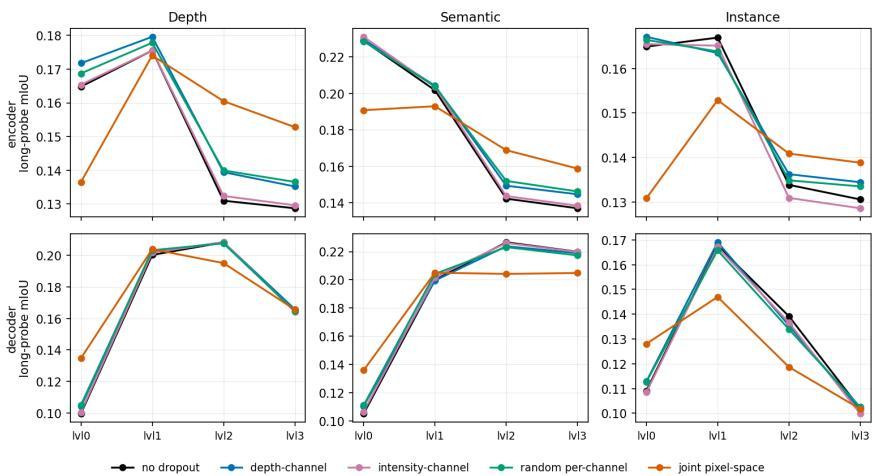  
Figure 1: Long-probe MIoU per U-Net level, separately for encoder and decoder features. Encoder probes peak at shallow levels (L0–L1) and decay monotonically with depth. Decoder probes show an inverted-U shape, peaking at L1–L2. Joint pixel-space dropout is the only ablation that visibly shifts these patterns, suppressing shallow encoder levels and collapsing all best-level probes onto L1

## 5 Experiments

## 5.1 Diffusion Features Encode 3D Relevant Information

To dissect the impact of our representational modeling, we evaluate the long-range generalization of the learned U-Net features across all U-Net levels. Table 1 reports long-range probing MIoU on the unseen validation set. Each cell reports the score at the level where the probe is strongest, selected independently per ablation, stage, and feature type. This isolates the question of whether features encode task-relevant 3D structure. The complementary question of where in the network this information lives is shown in Figure 1, which plots probe MIoU as a function of U-Net level for both stages. We additionally probed level-concatenated features, stacked along the channel dimension. These concatenated probes consistently underperformed the best single level probe. We attribute this to the linear probe’s limited capacity to fit a 4× higher-dimensional input under the same regularization, rather than to a property of the underlying representation. Across all conditioning regimes, linear probes recover task-relevant 3D structure from UNet features. The strongest probe reaches 0.231 MIoU on semantic segmentation, substantially above the Gaussian-noise control, which remains at 0.035 − 0.038 across every ablation and every task. This ∼ 6× gap establishes that the probes are reading task-relevant content from the features themselves rather than exploiting projection geometry. Figure 1 reveals that encoder and decoder features organize this information differently along the network. Encoder probes decay monotonically with depth across all three feature types: semantic MIoU drops from 0.229 at level 0 to 0.137 at level3, a 40% relative loss. Decoder probes invert this, with shallow features (L0) at near-chance levels (0.10–0.11 MIoU and a clear peak at level1–level2. This asymmetry is consistent with the U-Net’s architectural role: the encoder compresses input-side geometry into progressively abstract features, while the decoder reconstruct spatial structure most decodably at mid-resolution. We examine the relationship between modality streams within each level in Section 5.2. Joint pixel-space dropout (orange in Figure 1) is the only regime that visibly shifts this pattern, suppressing the shallow-encoder peak and collapsing all of its best-level probes onto level1. We examine this in Section 5.3.

Table 2: Pairwise cosine similarity between modality-conditioned features (no-dropout model). Encoder similarity grows with depth; decoder similarity drops to a minimum at level 2 with a small rebound at level 3.
<table><tr><td rowspan="2">Pair</td><td colspan="4">Encoder</td><td colspan="4">Decoder</td></tr><tr><td>L0</td><td>L1</td><td>L2</td><td>L3</td><td>L0</td><td>L1</td><td>L2</td><td>L3</td></tr><tr><td>Depth vs. Semantic</td><td>0.187</td><td>0.331</td><td>0.422</td><td>0.435</td><td>0.464</td><td>0.429</td><td>0.282</td><td>0.323</td></tr><tr><td>Depth vs. Instance</td><td>0.304</td><td>0.295</td><td>0.307</td><td>0.321</td><td>0.352</td><td>0.253</td><td>0.202</td><td>0.333</td></tr><tr><td>Semantic vs. Instance</td><td>0.223</td><td>0.308</td><td>0.319</td><td>0.332</td><td>0.359</td><td>0.287</td><td>0.205</td><td>0.322</td></tr></table>

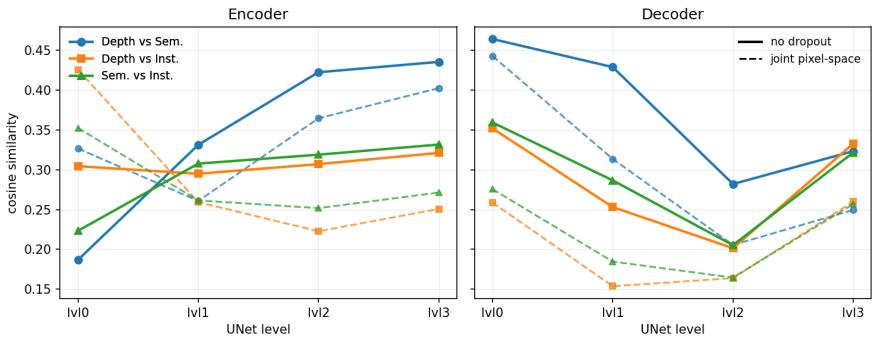  
Figure 2: Pairwise cosine similarity of features (baseline) compared to features streams produced by pixel-wise channel dropout. Joint pixel-space dropout makes shallow encoder representations more unified, while deeper layers become more specialized.

## 5.2 Modality Stream Analysis

Section 5.1 established that U-Net features at every level encode task-relevant 3D structure, and that encoder and decoder stages reach peak decodability at different depths. Linear probing, however, treats each modality stream in isolation: it measures whether information is present, not how the streams produced under different task prompts relate to one another. A single backbone that switches modality through text prompt could in principle produce nearly identical features regardless of prompt, collapsing into a single representation that the prompt merely relabels, or it could maintain three substantially distinct streams. To distinguish these cases, we measure pairwise cosine similarity between feature maps produced under each pair of task prompts, computed at every U-Net level on the no-dropout model. Low similarity indicates that the streams occupy different directions in feature space. High similarity indicates convergence towards a shared representation. We report cosine-similarity for the baseline in Table 2, as we observed no substantial feature restructuring across the ablations, except for the pixel level joint-dropout. We further provide a direct comparison between those two ablations in Figure 2 and discuss the direct influence on feature structure more thoroughly in Section 5.3. Figure 2 and Table 2 show two opposing trends. In the encoder, cross-modal similarity grows with depth: depth-vs-semantic alignment rises from ∼ 0.19 at level 0 to ∼ 0.44 at level 3, and the other two pairs follow the same monotonic pattern. Shallow encoder layers maintain the most modality-decomposed representations of any point in the network, while progressively deeper layers converge toward a shared manifold. The decoder reverses this trend: similarity is highest at level 0 ∼(0.36–0.46) across the three pairs, drops to a minimum at level 2 ∼(0.2–0.28), and shows small rebound at level 3 ∼(0.32–0.33). This pattern is consistent with the encoder progressively unifying modality-specific inputs into a shared bottleneck representation, and the decoder re-specializing those features as it reconstructs modality-specific outputs. Since the weights produce all three streams, our observation is a structure that the architecture allows, but not enforces. Together with the per-level decodability results of Section 5.1, these measurements show that the U-Net does not collapse modalities into a single representation. It organizes them into a modality-decomposed manifold that locally unifies near the bottleneck.

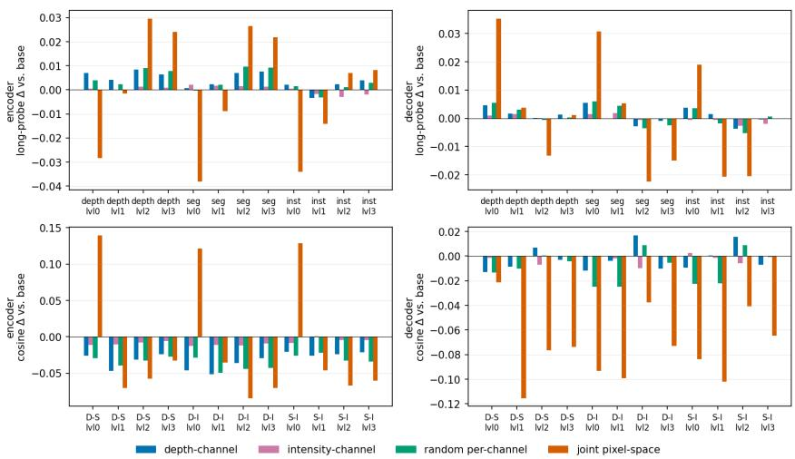  
Figure 3: Conditioning-dropout effects, reported as deltas relative to the no-dropout baseline. Top row: long-probe MIoU differences per feature, type and level. Bottom row: pairwise cosine-similarity differences per modality, pair and level. Single-channel dropout cluster near zero across both metrics. Joint pixel-space dropout is the only regime that consistently displaces the representation. It suppresses shallow-encoder probe quality and raises shallow-encoder cosine alignment, while reducing decoder cosine alignment across every level and pair. D-S, D-I and S-I denote Depth– Semantic, Depth–Instance, and Semantic–Instance pairs.

## 5.3 Feature Restructuring

The preceding two sections used the no-dropout model to establish where information lives in the U-Net (Section 5.1) and how modality streams are organized along its depth (Section 5.2). We now ask how the conditioning regime shapes that organization. Specifically, we ask what part of the LiDAR input the network must learn to be robust. Recall that we condition on a two-channel projected LiDAR view: sparse-depth and reflective intensity. We compare four dropout regimes against the no-dropout baseline: depth drops the depth channel entirely with some probability, intensity drops intensity entirely, random drops one of the two channels at random, and joint pixel-space masks both channels at the pixel level. Figure 3 reports each ablation as a delta against base, separately for long-probe MIoU and pairwise cosine similarity, at every level and stage. Three of the four ablations cluster tightly near zero across every panel: depth-channel, intensity-channel, and random per-channel dropout produce probe-MIoU shifts within ±0.01 and cosine-similarity shifts within ±0.07, with no consistent direction across levels or pairs. The intensity-channel result in particular is essentially a no op, indicating that the network treats the depth channel as the dominant 3D conditioning signal. Joint pixel-space dropout, in contrast, produces a coordinated restructuring. In the encoder it suppresses shallow probe quality while raising probe quality at deeper levels. The corresponding cosine deltas are large and level 0 concentrated. In the decoder, all three cosine pairs drop substantially across every level. We hypothesize that the absence of reliable conditioning information in either channel forces shallow encoding layers to learn more globally-mixed denoising representations. Task-discriminative content is deferred to deeper layers, and the decoder becomes more modality-decomposed throughout. We interpret this as the network trading shallow modality specialization for input-noise robustness, with the cost being a small but measurable drop in downstream output quality (Table 3).

Table 3: Depth metrics computed on LiDAR points after least-squares metric alignment
<table><tr><td>Dropout</td><td>abs_rel ↓</td><td>RMSE↓</td><td> $\delta _ { 1 . 2 5 } \uparrow$ </td></tr><tr><td>none</td><td>0.160</td><td>7.11</td><td>0.781</td></tr><tr><td>depth</td><td>0.162</td><td>7.17</td><td>0.778</td></tr><tr><td>intensity</td><td>0.161</td><td>7.11</td><td>0.780</td></tr><tr><td>random per-channel</td><td>0.162</td><td>7.17</td><td>0.778</td></tr><tr><td>joint pixel-space</td><td>0.165</td><td>7.27</td><td>0.777</td></tr></table>

## 5.4 Output Quality

We evaluate outputs only insofar as they reflect properties of the learned representations. To this end, we report quantitative depth metrics, which provide a direct and minimally confounded probe of geometric structure. These metrics confirm that the representational changes induced by joint-pixel space dropout (Section 5.3) translate consistently to the output space. For semantic and instance predictions, we focus on qualitative evaluation. Quantitative evaluation in these settings depends on factors orthogonal to our study. Namely, cross-dataset label alignment (Cityscapes → nuScenes lidarseg) and post-processing design for instance extraction, introduce substantial variance unrelated to representation quality. We therefore restrict quantitative analysis to depth, where measurement more directly reflects the underlying features.

## 5.4.1 Depth

We asses model performance in dense depth estimation by adopting the Absolute Mean Relative Error (AbsRel) and δ1 metric as well-known evaluation protocols observed in [35, 36, 60, 8, 13, 58]. We compute AbsRel as absolute relative distance over all observed LiDAR points $\begin{array} { r } { M \colon \frac { 1 } { M } \sum _ { i = 1 } ^ { M } | \hat { d } _ { i } - } \end{array}$ $d _ { i } | / d _ { i }$ and δ1 accuracy as the ratio of all points satisfying max $( \hat { d } _ { i } / d _ { i } , d _ { i } / \hat { d } _ { i } ) < 1 . 2 5$ . Additionally, we report the Root Mean Square Error (RMSE) $\frac { 1 } { \sqrt { M } } \lVert d - \hat { d } \rVert$ to reflect prediction accuracy in far-field regions, where observed data is typically very sparse and noisy. All tests are conducted in metric LiDAR space using least-squares alignment following [20, 35]. Concretely, we use LiDAR depth d as sparse measurements and solve for the affine transformation $\hat { d } = \tilde { d } \times s + t .$ where ˜d is the predicted affine invariant depth, ˆd the aligned metric depth and s, t depict scale and shift transforms, respectively.

## 5.4.2 Qualitative Results

Figure 4 visualizes U-Net decoder features at level 2, with per-point feature vectors reduced to their first three principal components and mapped to RGB. We select this level for its combination of low cross-modal cosine similarity and high linear-probe MIoU.

## 6 Discussion and Limitations

We have shown that a single LiDAR-conditioned diffusion model, trained entirely from 2D foundationmodel pseudo-labels, learns features that encode non-trivial 3D structure and exhibit a layered crossmodal organization when probed in point-cloud space. The learned representation progresses from modality-specific shallow features, through a shared bottleneck, and back toward task-specialized decoder representations, suggesting that diffusion can act as a viable mechanism for transferring large-scale 2D priors into 3D. More broadly, this extends the diffusion-features-for-perception line of work [64, 46, 27] from single-modality 2D settings to a multi-modal, 3D-conditioned one. Our analysis has several limitations. Experiments are conducted on a single dataset (nuScenes) and reported from a single training run, so cross-dataset generalization and sensitivity to random initialization remain untested. Quantitative semantic evaluation is constrained by the label-space mismatch between the Cityscapes and nuScenes lidarseg taxonomies, while instance predictions are evaluated qualitatively since instance metrics depend strongly on a post-processing pipeline that is orthogonal to the representational analysis studied here. Output quality is not competitive with task-specialized 3D networks, as the objective of this work is representation analysis rather than taskspecific output optimization. We therefore treat outputs primarily as probes of the learned features rather than as standalone benchmark targets. Several directions follow naturally from this work. The same probing protocol could be applied to alternative LiDAR-conditioned diffusion architectures, 3Daware transformers, or non-diffusion multi-task models, providing a broader picture of how structured cross-modal representations emerge. Downstream evaluation, for example, training lightweight task heads for 3D detection or panoptic segmentation on top of the lifted features, would test whether the recovered structure is operationally useful. Extending the analysis to additional modalities (optical flow, surface normals, motion forecasting) would test whether the layered organization is specific to the three modalities studied here or a general property of multi-modal diffusion training.

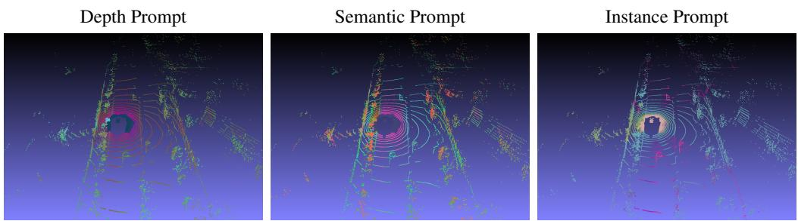  
Figure 4: Principal-component visualization of decoder level 2 U-Net features on a representative nuScenes validation scene. Per-point feature vectors are projected to three principal components and mapped to RGB. The same scene under different task prompts produces visually distinct feature structures, visualizing the cross-modal feature decomposition quantified in Section 5.2. Additional scenes in Appendix D.

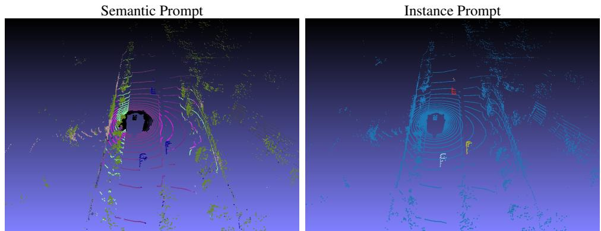  
Figure 5: Predicted outputs in point-cloud space on a representative nuScenes validation scene. Semantic outputs are color mapped, instance clusters are processed according to Section 4.1.2.

## Acknowledgments and Disclosure of Funding

The research leading to these results is funded by the German Federal Ministry for Economic Affairs and Energy within the project “NXT GEN AI METHODS – Generative Methoden für Perzeption, Prädiktion und Planung" (grant no. 19A23014M).

## References

[1] T. Brooks, A. Holynski, and A. A. Efros. Instructpix2pix: Learning to follow image editing instructions. In Proceedings of the IEEE/CVF conference on computer vision and pattern recognition, pages 18392–18402, 2023.

[2] H. Caesar, V. Bankiti, A. H. Lang, S. Vora, V. E. Liong, Q. Xu, A. Krishnan, Y. Pan, G. Baldan, and O. Beijbom. nuscenes: A multimodal dataset for autonomous driving. In CVPR, 2020.

[3] N. Carion, L. Gustafson, Y.-T. Hu, S. Debnath, R. Hu, D. S. Coll-Vinent, C. Ryali, K. V. Alwala, H. Khedr, A. Huang, J. Lei, T. Ma, B. Guo, A. Kalla, M. Marks, J. Greer, M. Wang, P. Sun, R. Rädle, T. Afouras, E. Mavroudi, K. Xu, T.-H. Wu, Y. Zhou, L. Momeni, R. HAZRA, S. Ding, S. Vaze, F. Porcher, F. Li, S. Li, A. Kamath, H. K. Cheng, P. Dollar, N. Ravi, K. Saenko, P. Zhang, and C. Feichtenhofer. SAM 3: Segment anything with concepts. In The Fourteenth International Conference on Learning Representations, 2026. URL https://openreview.net/forum?id=r35clVtGzw.

[4] M. Caron, H. Touvron, I. Misra, H. Jégou, J. Mairal, P. Bojanowski, and A. Joulin. Emerging properties in self-supervised vision transformers. In Proceedings ofthe IEEE/CVF international conference on computer vision, pages 9650–9660, 2021.

[5] B. Cheng, M. D. Collins, Y. Zhu, T. Liu, T. S. Huang, H. Adam, and L.-C. Chen. Panoptic-deeplab: A simple, strong, and fast baseline for bottom-up panoptic segmentation. In Proceedings of the IEEE/CVF conference on computer vision and pattern recognition, pages 12475–12485, 2020.

[6] M. Cordts, M. Omran, S. Ramos, T. Rehfeld, M. Enzweiler, R. Benenson, U. Franke, S. Roth, and B. Schiele. The cityscapes dataset for semantic urban scene understanding. In Proceedings of the IEEE conference on computer vision and pattern recognition, pages 3213–3223, 2016.

[7] M. Ester, H.-P. Kriegel, J. Sander, and X. Xu. A density-based algorithm for discovering clusters in large spatial databases with noise. In Proceedings of the Second International Conference on Knowledge Discovery and Data Mining, KDD’96, page 226–231. AAAI Press, 1996.

[8] X. Fu, W. Yin, M. Hu, K. Wang, Y. Ma, P. Tan, S. Shen, D. Lin, and X. Long. Geowizard: Unleashing the diffusion priors for 3d geometry estimation from a single image. In European Conference on Computer Vision, pages 241–258. Springer, 2024.

[9] R. Gao, K. Chen, E. Xie, L. HONG, Z. Li, D.-Y. Yeung, and Q. Xu. Magicdrive: Street view generation with diverse 3d geometry control. In B. Kim, Y. Yue, S. Chaudhuri, K. Fragkiadaki, M. Khan, and Y. Sun, editors, International Conference on Learning Representations, volume 2024, pages 22841–22860, 2024. URL https://proceedings.iclr.cc/paper\_files/paper/2024/ file/635351dc3d18116d1a44ca31592e2f9a-Paper-Conference.pdf.

[10] R. Gao, K. Chen, B. Xiao, L. Hong, Z. Li, and Q. Xu. Magicdrive-v2: High-resolution long video generation for autonomous driving with adaptive control. In Proceedings ofthe IEEE/CVF International Conference on Computer Vision (ICCV), pages 28135–28144, October 2025.

[11] S. Gao, J. Yang, L. Chen, K. Chitta, Y. Qiu, A. Geiger, J. Zhang, and H. Li. Vista: A generalizable driving world model with high fidelity and versatile controllability. Advances in Neural Information Processing Systems, 37:91560–91596, 2024.

[12] A. Geiger, P. Lenz, C. Stiller, and R. Urtasun. Vision meets robotics: The kitti dataset. International Journal of Robotics Research (IJRR), 2013.

[13] M. Gui, J. Schusterbauer, U. Prestel, P. Ma, D. Kotovenko, O. Grebenkova, S. A. Baumann, V. T. Hu, and B. Ommer. Depthfm: Fast generative monocular depth estimation with flow matching. In Proceedings of the AAAI Conference on Artificial Intelligence, volume 39, pages 3203–3211, 2025.

[14] S. E. M. Helgesen, K. Nakashima, J. Tørresen, and R. Kurazume. Fast lidar upsampling using conditional diffusion models. In 2024 33rd IEEE International Conference on Robot and Human Interactive Communication (ROMAN), pages 272–277. IEEE, 2024.

[15] J. Ho and T. Salimans. Classifier-free diffusion guidance. In NeurIPS 2021 Workshop on Deep Generative Models and Downstream Applications, 2021. URL https://openreview.net/forum?id= qw8AKxfYbI.

[16] J. Ho, A. Jain, and P. Abbeel. Denoising diffusion probabilistic models. Advances in neural information processing systems, 33:6840–6851, 2020.

[17] Q. Hu, Z. Zhang, and W. Hu. Rangeldm: Fast realistic lidar point cloud generation. In European Conference on Computer Vision, pages 115–135. Springer, 2024.

[18] Y. Kawano and Y. Aoki. Maskdiffusion: Exploiting pre-trained diffusion models for semantic segmentation. IEEE Access, 12:127283–127293, 2024.

[19] B. Kawar, M. Elad, S. Ermon, and J. Song. Denoising diffusion restoration models. Advances in neural information processing systems, 35:23593–23606, 2022.

[20] B. Ke, A. Obukhov, S. Huang, N. Metzger, R. C. Daudt, and K. Schindler. Repurposing diffusion-based image generators for monocular depth estimation. In Proceedings of the IEEE/CVF conference on computer vision and pattern recognition, pages 9492–9502, 2024.

[21] B. Li, J. Guo, H. Liu, Y. Zou, Y. Ding, X. Chen, H. Zhu, F. Tan, C. Zhang, T. Wang, et al. Uniscene: Unified occupancy-centric driving scene generation. In Proceedings of the computer vision and pattern recognition conference, pages 11971–11981, 2025.

[22] Y. Li, H. Liu, Q. Wu, F. Mu, J. Yang, J. Gao, C. Li, and Y. J. Lee. Gligen: Open-set grounded text-to-image generation. In Proceedings of the IEEE/CVF conference on computer vision and pattern recognition, pages 22511–22521, 2023.

[23] A. Liang, Y. Liu, Y. Yang, D. Lu, L. Li, L. Kong, H. Zhao, and W. T. Ooi. Lidarcrafter: Dynamic 4d world modeling from lidar sequences. arXiv preprint arXiv:2508.03692, 2025.

[24] H. Lin, S. Chen, J. H. Liew, D. Y. Chen, Z. Li, G. Shi, J. Feng, and B. Kang. Depth anything 3: Recovering the visual space from any views. arXiv preprint arXiv:2511.10647, 2025.

[25] M. Liu, R. Shi, K. Kuang, Y. Zhu, X. Li, S. Han, H. Cai, F. Porikli, and H. Su. Openshape: Scaling up 3d shape representation towards open-world understanding. Advances in neural information processing systems, 36:44860–44879, 2023.

[26] I. Loshchilov and F. Hutter. Decoupled weight decay regularization. arXiv preprint arXiv:1711.05101, 2017.

[27] G. Luo, L. Dunlap, D. H. Park, A. Holynski, and T. Darrell. Diffusion hyperfeatures: Searching through time and space for semantic correspondence. Advances in Neural Information Processing Systems, 36: 47500–47510, 2023.

[28] N. Magar, A. Hertz, E. Tabellion, Y. Pritch, A. Rav-Acha, A. Shamir, and Y. Hoshen. Lightlab: Controlling light sources in images with diffusion models. In Proceedings ofthe Special Interest Group on Computer Graphics and Interactive Techniques Conference Conference Papers, SIGGRAPH Conference Papers ’25, New York, NY, USA, 2025. Association for Computing Machinery. ISBN 9798400715402. doi: 10.1145/3721238.3730696. URL https://doi.org/10.1145/3721238.3730696.

[29] C. Mou, X. Wang, L. Xie, Y. Wu, J. Zhang, Z. Qi, and Y. Shan. T2i-adapter: Learning adapters to dig out more controllable ability for text-to-image diffusion models. Proceedings of the AAAI Conference on Artificial Intelligence, 38(5):4296–4304, Mar. 2024. doi: 10.1609/aaai.v38i5.28226. URL https: //ojs.aaai.org/index.php/AAAI/article/view/28226.

[30] K. Nakashima and R. Kurazume. Lidar data synthesis with denoising diffusion probabilistic models. In 2024 IEEE International Conference on Robotics and Automation (ICRA), pages 14724–14731. IEEE, 2024.

[31] A. Q. Nichol, P. Dhariwal, A. Ramesh, P. Shyam, P. Mishkin, B. Mcgrew, I. Sutskever, and M. Chen. GLIDE: Towards photorealistic image generation and editing with text-guided diffusion models. In K. Chaudhuri, S. Jegelka, L. Song, C. Szepesvari, G. Niu, and S. Sabato, editors, Proceedings of the 39th International Conference on Machine Learning, volume 162 of Proceedings ofMachine Learning Research, pages 16784–16804. PMLR, 17–23 Jul 2022. URL https://proceedings.mlr.press/ v162/nichol22a.html.

[32] M. Oquab, T. Darcet, T. Moutakanni, H. Vo, M. Szafraniec, V. Khalidov, P. Fernandez, D. Haziza, F. Massa, A. El-Nouby, et al. Dinov2: Learning robust visual features without supervision. Transactions on Machine Learning Research Journal, pages 1–31, 2024.

[33] A. Ramesh, P. Dhariwal, A. Nichol, C. Chu, and M. Chen. Hierarchical text-conditional image generation with clip latents. arXiv e-prints, pages arXiv–2204, 2022.

[34] H. Ran, V. Guizilini, and Y. Wang. Towards realistic scene generation with lidar diffusion models. In Proceedings ofthe IEEE/CVF Conference on Computer Vision and Pattern Recognition, pages 14738– 14748, 2024.

[35] R. Ranftl, K. Lasinger, D. Hafner, K. Schindler, and V. Koltun. Towards robust monocular depth estimation: Mixing datasets for zero-shot cross-dataset transfer. IEEE transactions on pattern analysis and machine intelligence, 44(3):1623–1637, 2020.

[36] R. Ranftl, A. Bochkovskiy, and V. Koltun. Vision transformers for dense prediction. In Proceedings of the IEEE/CVF international conference on computer vision, pages 12179–12188, 2021.

[37] N. Ravi, V. Gabeur, Y.-T. Hu, R. Hu, C. Ryali, T. Ma, H. Khedr, R. Rädle, C. Rolland, L. Gustafson, E. Mintun, J. Pan, K. V. Alwala, N. Carion, C.-Y. Wu, R. Girshick, P. Dollar, and C. Feichtenhofer. SAM 2: Segment anything in images and videos. In The Thirteenth International Conference on Learning Representations, 2025.

[38] R. Rombach, A. Blattmann, D. Lorenz, P. Esser, and B. Ommer. High-resolution image synthesis with latent diffusion models. In Proceedings of the IEEE/CVF conference on computer vision and pattern recognition, pages 10684–10695, 2022.

[39] C. Saharia, W. Chan, H. Chang, C. Lee, J. Ho, T. Salimans, D. Fleet, and M. Norouzi. Palette: Image-toimage diffusion models. In ACM SIGGRAPH 2022 conference proceedings, pages 1–10, 2022.

[40] C. Saharia, W. Chan, S. Saxena, L. Li, J. Whang, E. L. Denton, K. Ghasemipour, R. Gontijo Lopes, B. Karagol Ayan, T. Salimans, et al. Photorealistic text-to-image diffusion models with deep language understanding. Advances in neural information processing systems, 35:36479–36494, 2022.

[41] S. Saxena, C. Herrmann, J. Hur, A. Kar, M. Norouzi, D. Sun, and D. J. Fleet. The surprising effectiveness of diffusion models for optical flow and monocular depth estimation. Advances in Neural Information Processing Systems, 36:39443–39469, 2023.

[42] O. Siméoni, H. V. Vo, M. Seitzer, F. Baldassarre, M. Oquab, C. Jose, V. Khalidov, M. Szafraniec, S. Yi, M. Ramamonjisoa, et al. Dinov3. arXiv preprint arXiv:2508.10104, 2025.

[43] J. Sohl-Dickstein, E. Weiss, N. Maheswaranathan, and S. Ganguli. Deep unsupervised learning using nonequilibrium thermodynamics. In International conference on machine learning, pages 2256–2265. pmlr, 2015.

[44] N. Stracke, S. A. Baumann, K. Bauer, F. Fundel, and B. Ommer. Cleandift: Diffusion features without noise. In Proceedings of the IEEE/CVF Conference on Computer Vision and Pattern Recognition, pages 117–127, 2025.

[45] P. Sun, H. Kretzschmar, X. Dotiwalla, A. Chouard, V. Patnaik, P. Tsui, J. Guo, Y. Zhou, Y. Chai, B. Caine, V. Vasudevan, W. Han, J. Ngiam, H. Zhao, A. Timofeev, S. Ettinger, M. Krivokon, A. Gao, A. Joshi, Y. Zhang, J. Shlens, Z. Chen, and D. Anguelov. Scalability in perception for autonomous driving: Waymo open dataset. In Proceedings of the IEEE/CVF Conference on Computer Vision and Pattern Recognition (CVPR), June 2020.

[46] L. Tang, M. Jia, Q. Wang, C. P. Phoo, and B. Hariharan. Emergent correspondence from image diffusion. Advances in neural information processing systems, 36:1363–1389, 2023.

[47] J. Wang, Z. Yue, S. Zhou, K. C. Chan, and C. C. Loy. Exploiting diffusion prior for real-world image super-resolution. International Journal of Computer Vision, 132(12):5929–5949, 2024.

[48] X. Wang, Z. Zhu, G. Huang, X. Chen, J. Zhu, and J. Lu. Drivedreamer: Towards real-world-drive world models for autonomous driving. In Computer Vision – ECCV 2024: 18th European Conference, Milan, Italy, September 29–October 4, 2024, Proceedings, Part XLVIII, page 55–72, Berlin, Heidelberg, 2024. Springer-Verlag. ISBN 978-3-031-73194-5. doi: 10.1007/978-3-031-73195-2\_4. URL https: //doi.org/10.1007/978-3-031-73195-2\_4.

[49] Y. Wen, Y. Zhao, Y. Liu, F. Jia, Y. Wang, C. Luo, C. Zhang, T. Wang, X. Sun, and X. Zhang. Panacea: Panoramic and controllable video generation for autonomous driving. In Proceedings ofthe IEEE/CVF Conference on Computer Vision and Pattern Recognition, pages 6902–6912, 2024.

[50] X. Wu, D. DeTone, D. Frost, T. Shen, C. Xie, N. Yang, J. Engel, R. Newcombe, H. Zhao, and J. Straub. Sonata: Self-supervised learning of reliable point representations. In Proceedings ofthe Computer Vision and Pattern Recognition Conference, pages 22193–22204, 2025.

[51] Y. Wu, K. Zhang, J. Qian, J. Xie, and J. Yang. Text2lidar: Text-guided lidar point cloud generation via equirectangular transformer. In European Conference on Computer Vision, pages 291–310. Springer, 2024.

[52] Z. Wu, J. Ni, X. Wang, Y. Guo, R. Chen, L. Lu, J. Dai, and Y. Xiong. Holodrive: Holistic 2d-3d multi-modal street scene generation for autonomous driving. arXiv preprint arXiv:2412.01407, 2024.

[53] E. Xie, W. Wang, Z. Yu, A. Anandkumar, J. M. Alvarez, and P. Luo. Segformer: Simple and efficient design for semantic segmentation with transformers. Advances in neural information processing systems, 34:12077–12090, 2021.

[54] Y. Xie, C. Xu, C. Peng, S. Zhao, N. Ho, A. T. Pham, M. Ding, M. Tomizuka, and W. Zhan. X-drive: Cross-modality consistent multi-sensor data synthesis for driving scenarios. In The Thirteenth International Conference on Learning Representations, 2025.

[55] J. Xu, S. Liu, A. Vahdat, W. Byeon, X. Wang, and S. De Mello. Open-vocabulary panoptic segmentation with text-to-image diffusion models. In Proceedings of the IEEE/CVF Conference on Computer Vision and Pattern Recognition (CVPR), pages 2955–2966, June 2023.

[56] J. Xu, S. Liu, A. Vahdat, W. Byeon, X. Wang, and S. De Mello. Open-vocabulary panoptic segmentation with text-to-image diffusion models. In Proceedings of the IEEE/CVF conference on computer vision and pattern recognition, pages 2955–2966, 2023.

[57] K. Yang, E. Ma, J. Peng, Q. Guo, D. Lin, and K. Yu. Bevcontrol: Accurately controlling street-view elements with multi-perspective consistency via bev sketch layout. arXiv preprint arXiv:2308.01661, 2023.

[58] L. Yang, B. Kang, Z. Huang, Z. Zhao, X. Xu, J. Feng, and H. Zhao. Depth anything v2. Advances in Neural Information Processing Systems, 37:21875–21911, 2024.

[59] H. Ye, J. Zhang, S. Liu, X. Han, and W. Yang. Ip-adapter: Text compatible image prompt adapter for text-to-image diffusion models. arXiv preprint arXiv:2308.06721, 2023.

[60] W. Yin, C. Zhang, H. Chen, Z. Cai, G. Yu, K. Wang, X. Chen, and C. Shen. Metric3d: Towards zero-shot metric 3d prediction from a single image. In Proceedings ofthe IEEE/CVF international conference on computer vision, pages 9043–9053, 2023.

[61] L. Zhang, A. Rao, and M. Agrawala. Adding conditional control to text-to-image diffusion models. In Proceedings ofthe IEEE/CVF international conference on computer vision, pages 3836–3847, 2023.

[62] Y. Zhang, S. Gong, K. Xiong, X. Ye, X. Li, X. Tan, F. Wang, J. Huang, H. Wu, and H. Wang. Bevworld: A multimodal world simulator for autonomous driving via scene-level bev latents. arXiv preprint arXiv:2407.05679, 2024.

[63] Y. Zhang, X. Wu, Y. Yang, X. Fan, H. Li, Y. Zhang, Z. Huang, N. Wang, and H. Zhao. Utonia: Toward one encoder for all point clouds. arXiv preprint arXiv:2603.03283, 2026.

[64] W. Zhao, Y. Rao, Z. Liu, B. Liu, J. Zhou, and J. Lu. Unleashing text-to-image diffusion models for visual perception. In Proceedings of the IEEE/CVF international conference on computer vision, pages 5729–5739, 2023.

[65] J. Zhou, J. Wang, B. Ma, Y.-S. Liu, T. Huang, and X. Wang. Uni3d: Exploring unified 3d representation at scale. In International Conference on Learning Representations (ICLR), 2024.

[66] V. Zyrianov, X. Zhu, and S. Wang. Learning to generate realistic lidar point clouds. In European Conference on Computer Vision, pages 17–35. Springer, 2022.

[67] V. Zyrianov, H. Che, Z. Liu, and S. Wang. Lidardm: Generative lidar simulation in a generated world. In 2025 IEEE International Conference on Robotics and Automation (ICRA), pages 6055–6062, 2025. doi: 10.1109/ICRA55743.2025.11128001.

## A Preliminaries

## A.1 Latent Diffusion Models

Diffusion probabilistic models define a forward noising process that gradually perturbs data samples into Gaussian noise, and a learned reverse process that reconstructs data from noise. Let $x _ { 0 } \sim p _ { \mathrm { d a t a } } ( \mathbf { x } )$ denote a data sample. The forward diffusion process is defined as a fixed Markov chain:

$$
q ( x _ { t } | x _ { t - 1 } ) = \mathcal { N } ( x _ { t } ; \sqrt { 1 - \beta _ { t } } x _ { t - 1 } , \beta _ { t } I ) ,\tag{3}
$$

where $\{ \beta _ { t } \} _ { t = 1 } ^ { T }$ is a predefined variance schedule. With $\alpha _ { t } = 1 - \beta _ { t }$ and $\begin{array} { r } { \bar { \alpha } _ { t } = \prod _ { s = 1 } ^ { t } \alpha _ { s } } \end{array}$ , this yields the closed-form marginal:

$$
q ( x _ { t } | x _ { 0 } ) = \mathcal { N } ( x _ { t } ; \sqrt { \bar { \alpha } _ { t } } x _ { 0 } , ( 1 - \bar { \alpha } _ { t } ) I ) .\tag{4}
$$

A neural network ϵ $( x _ { t } , t , c )$ is trained to predict the added noise under conditioning c. Given $\epsilon \sim \mathcal { N } ( 0 , I )$ and $x _ { t } = \sqrt { \bar { \alpha } _ { t } } x _ { 0 } + \sqrt { 1 - \bar { \alpha } _ { t } } \epsilon ,$ the standard objective is

$$
\mathcal { L } = \mathbb { E } _ { x _ { 0 } , \epsilon , t } \left[ \| \epsilon - \epsilon _ { \theta } ( x _ { t } , t , c ) \| _ { 2 } ^ { 2 } \right] .\tag{5}
$$

Latent diffusion models [38] reduce computational cost by performing diffusion in a compressed latent space. An encoder E maps the input to $z _ { 0 } = \mathcal { E } ( \bar { x } _ { 0 } )$ , where diffusion is applied; a decoder D reconstructs the output $\hat { x } _ { 0 } = D ( z _ { 0 } )$ . The training objective becomes

$$
\mathcal { L } _ { \mathrm { L D M } } = \mathbb { E } _ { z _ { 0 } , \epsilon , t } \left[ \| \epsilon - \epsilon _ { \theta } ( z _ { t } , t , c ) \| _ { 2 } ^ { 2 } \right] .\tag{6}
$$

## A.2 LiDAR-Camera Projection

Let $\mathbf { p } _ { L } = ( x , y , z , 1 ) ^ { \top }$ be a LiDAR point in homogeneous coordinates and $T _ { C L } \in S E ( 3 )$ the rigid transformation from LiDAR to camera frame. The point in camera coordinates is

$$
\tilde { \mathbf { p } } _ { C } = T _ { C L } \mathbf { p } _ { L } ,\tag{7}
$$

with Euclidean form $\mathbf { p } _ { C } = ( X , Y , Z ) ^ { \top }$ . The projection $\pi : \mathbb { R } ^ { 3 }  \mathbb { R } ^ { 2 }$ onto the image plane uses the camera intrinsic $\ b { K } \in \mathbb { R } ^ { 3 \times 3 }$ :

$$
\lambda \left( \begin{array} { l } { u } \\ { v } \\ { 1 } \end{array} \right) = K { \bf p } c , \quad u = \frac { f _ { x } X } { Z } + c _ { x } , \quad v = \frac { f _ { y } Y } { Z } + c _ { y } ,\tag{8}
$$

with $\lambda = Z .$ . Given a 2D pixel $\mathbf { u } = ( u , v ) ^ { \top }$ at depth $\lambda = D ( u , v )$ , the backprojection $\pi ^ { - 1 } : \mathbb { R } ^ { 2 } \times \mathbb { R } ^ { 1 } \to \mathbb { R } ^ { 3 }$ i

$$
\mathbf { p } _ { C } = \pi ^ { - 1 } ( \mathbf { u } , \lambda ) = \lambda \cdot K ^ { - 1 } { \tilde { \mathbf { u } } } ,\tag{9}
$$

with $\tilde { \mathbf { u } } = ( u , v , 1 ) ^ { \top }$ . The point in LiDAR frame is recovered by

$$
{ \bf p } _ { L } = T _ { C L } ^ { - 1 } \tilde { { \bf p } } _ { C } .\tag{10}
$$

We denote the composite projection from a 3D LiDAR point to 2D pixel coordinates as $\Pi : S E ( 3 ) \times \mathbb { R } ^ { 4 }  \mathbb { R } ^ { 2 } \colon$

$$
\mathbf { u } _ { i } = \Pi ( T _ { C L } , \mathbf { p } _ { L , i } ) = \pi ( T _ { C L } \mathbf { p } _ { L , i } ) ,\tag{11}
$$

and the full backprojection from a pixel and depth as $\Pi ^ { - 1 } : S E ( 3 ) \times \mathbb { R } ^ { 2 } \times \mathbb { R } ^ { 1 } \to \mathbb { R } ^ { 4 }$

$$
{ \bf p } _ { L , i } = \Pi ^ { - 1 } ( T _ { C L } , { \bf u } _ { i } , \lambda _ { i } ) = T _ { C L } ^ { - 1 } \left( \begin{array} { c } { { \pi ^ { - 1 } ( { \bf u } _ { i } , \lambda _ { i } ) } } \\ { { 1 } } \end{array} \right) .\tag{12}
$$

## B Short-Probe Convergence

In addition to the long-range linear probes used for the main analysis (Section 4.3), we also compute a shortrange probe during training as a per-step diagnostic. The short probe is trained for 30 optimization steps on a single sample (one batch of 6 views, all three modalities), with intermediate scores logged every 5 steps. Unlike the long probe, the short probe does not isolate generalization: it is trained and evaluated on the same sample and primarily reflects the linear separability of the features under a fixed optimization budget. We use it as a training-monitoring signal, not as a measure of representational quality. Figure 6 shows short-probe convergence at the two narrowest U-Net levels in SD 1.5: encoder level 0 and decoder level 3, both with 320 channels. At these low-dimensional levels, the linear probe has limited freedom to overfit, so the comparison between real features and the Gaussian-noise control is informative: a meaningful gap indicates that the features themselves carry separable structure beyond what the probe could synthesize from random vectors of matched dimensionality. Across both panels, all three task-conditioned features reach ∼0.36–0.65 MIoU within 30 probe steps, while the control flattens at ∼0.08. This ∼ 5× gap, in a regime where the probe has 4× fewer channels to fit through than at the 1280-channel decoder level 0, is consistent with the long-probe finding that diffusion features carry linearly decodable 3D structure.

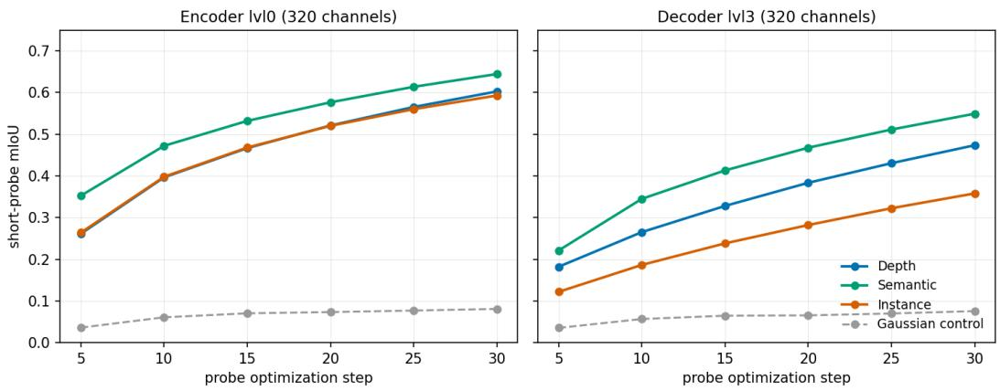  
Figure 6: Short-probe convergence at the two narrowest U-Net levels of Stable Diffusion 1.5 (encoder level 0 and decoder level 3, both 320 channels), for the three task-conditioned feature streams and the Gaussian-noise control of matched dimensionality. At these levels the probe has too few channels to fit noise: all three features reach ∼0.36–0.65 mIoU within 30 steps, while the control flattens near ∼0.08. The gap reflects intrinsic separability rather than probe capacity.

## C Implementation Details

## C.1 Text Prompt Format

We use a fixed two-field textual prompt of the form “Task: <modality>. Scene: <description>.”, where <modality> is one of {depth, semantic\_segmentation, instance} and <description> is a short scene caption derived from the nuScenes scene metadata. The same scene description is used across modalities for a given sample; only the Task field varies between the three modality-conditioned forward passes used for cross-modal cosine analysis (Section 5.2).

## C.2 Training Configuration

We initialize the U-Net from Stable Diffusion 1.5 [38] and expand its input convolution to accept 6 channels: the original 4 VAE-latent channels concatenated with 2 conditioning channels (LiDAR depth and intensity). The added input weights are zero-initialized following [1]. All other weights inherit the pretrained SD 1.5 values. Input images are processed at 224 × 400 resolution, yielding latents of shape $2 8 \times 5 0$ . The sparse LiDAR projection is max-pooled to the latent resolution.

We train with AdamW [26] $( \mathrm { l r } = 4 \times 1 0 ^ { - 4 }$ , weight decay 0.01) using a cosine schedule with 1000 warmup steps and a minimum learning rate of $1 0 ^ { - 5 }$ . Classifier-free guidance dropout and conditioning-projection dropout are both set to 20%.

All three task modalities are trained jointly: each batch is expanded along the modality axis so a single optimizer step sees all three prompts. With per-GPU batch size 4, 6 camera views per sample, 3 modalities, and 8 NVIDIA A40 GPUs, the effective batch size is 576. We train for 50 epochs on nuScenes [2].

## C.3 Probing Configuration

Both probes use a single linear layer mapping per-point feature vectors to per-class logits, with no pooling and no nonlinearities. The probe sees only the backprojected feature vector at each LiDAR point; spatial coordinates $( x , y , z )$ are not provided as input. Probes are trained with the cross-entropy loss against the pseudo-label class assignment at each point.

The short-range probe is trained for 30 optimization steps on a single sample (one batch of 6 views, all three modalities), with intermediate scores logged every 5 steps. The long-range probe is trained for 60 optimization steps. Each step accumulates features and labels from a fixed validation chunk of 10 samples and computes the gradient over the concatenated set. We use full-batch updates rather than stochastic minibatches. Evaluation is performed on a disjoint 10-sample bucket sampled from the unobserved validation set, using mean intersectionover-union over the evaluable class set.

Both probes use AdamW with learning rate $1 0 ^ { - 2 }$ and weight decay 0. Spatial coordinates are excluded by construction: the input feature is the per-point backprojected U-Net activation, with no positional encoding or coordinate concatenation. The Gaussian-noise control feature used as a baseline is constructed by computing the per-channel mean and standard deviation of the U-Net features for a given level and sampling a tensor of matched shape from $\mathcal { N } ( \mu _ { c } , \sigma _ { c } )$

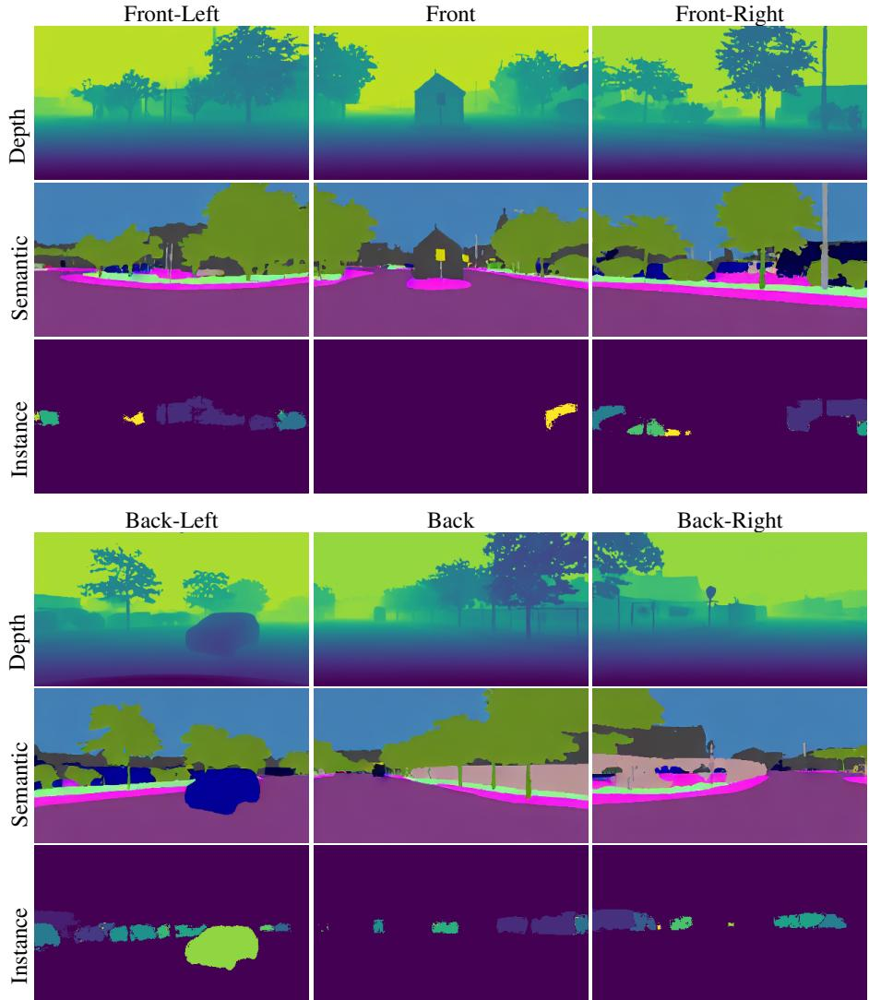  
Figure 7: Direct 2D outputs of the model across all six nuScenes camera views. Top: front three views (FL/F/FR). Bottom: rear three views (BL/B/BR). The same backbone produces depth, semantic, and instance predictions selected by textual task prompt. View labels follow nuScenes convention.

## D Additional Qualitative Results

We provide a complete qualitative output for a further scene on the validation set. Figure 7 shows the model’s direct 2D outputs across all six camera views. Figure 8 shows the backprojected 3D outputs against ground truth. Figure 4 shows feature Principal Component Analysiss (PCAs). Figure 10 shows the densified depth output after least-squares metric alignment.

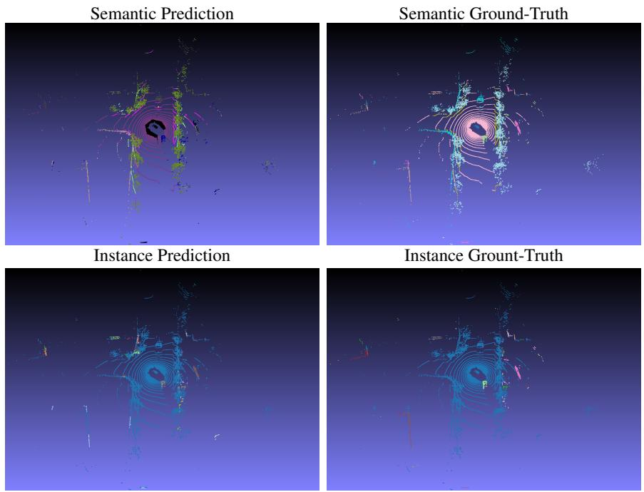  
Figure 8: Backprojected 3D outputs vs. ground truth on an additional nuScenes validation scene. Top row: semantic segmentation and ground truth. Bottom row: instance predictions and ground truth. Semantic predictions are restricted to the Cityscapes label set. The ground truth uses a randomly assigned color palette over the nuScenes lidarseg classes, since the two taxonomies do not share a canonical color mapping. Instance colors are arbitrary and not matched between prediction and ground truth, so correctness corresponds to the spatial separation of distinct objects rather than to color agreement.

Depth prompt  
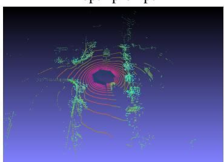

Semantic prompt  
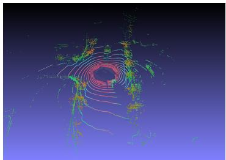

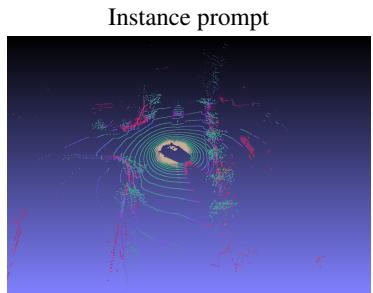  
Figure 9: PCA visualization of decoder level 2 features under each task prompt, mapped to RGB on the backprojected LiDAR point cloud. Same prompt and level as the main-text Figure 4.

Sparse LiDAR input  
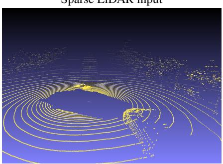

Densified output  
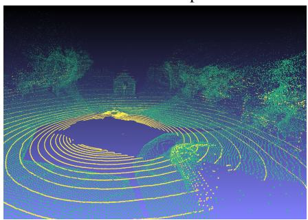  
Figure 10: Depth densification quality. Left: original sparse LiDAR scan. Right: dense depth produced by the model and aligned to metric scale via least-squares regression against the input LiDAR depth (Section 5.4.1).