# IAE-VTG: Interaction-Aligned Action–Entity Video Temporal

Grounding

Shiwen Zhao1, Qi Zhang 2,∗, Graduate Student Member, IEEE, Sezer Karaoglu2, Theo Gevers2, Martin R. Oswald2

Abstract—Video Temporal Grounding (VTG) localizes the video segment that matches a natural-language query. Many queries describe an action performed by a particular entity. Existing methods often encode the query as a whole or use general video-text interactions, without explicitly checking whether the action and entity occur together. They may therefore select a segment that contains both concepts but not the event described by the query. We propose Interaction Aligned Action-Entity Video Temporal Grounding (IAE-VTG), which models this relationship at both the representation and training assignment levels. First, the Fine-grained Disentangled Interaction Module (FDIM) separates action and entity related query information and aligns it with complementary motion and appearance features. It then combines token-level interactions to build representations that capture the relationship between the action and entity. Second, Interaction-Sensitive Assignment (ISA) adds this interaction evidence to bipartite matching, so training targets are selected using both temporal overlap and semantic compatibility. This reduces supervision from temporally plausible but semantically incorrect proposals. Experiments on QVHighlights, Charades-STA, and TACoS show that IAE-VTG consistently improves strong baselines and achieves competitive or state-of-the-art performance on standard grounding metrics. Additional analyses show that the method is especially effective when similar actions or entities appear at multiple times and produces more reliable assignments for complex events.

Index Terms—Video temporal grounding, compositional reasoning, action-entity interaction, temporal localization.

## I. INTRODUCTION

Video Temporal Grounding (VTG) [1]–[9] aims to localize the temporal segment in a video that corresponds to a natural language query. By establishing fine grained correspondence between visual content and queries, VTG serves as an important component of multimodal video understanding and has attracted increasing attention.

A grounding prediction can be semantically correct while remaining temporally incorrect. For example, a model may recognize the queried entity and respond to all frames in which it appears, even though the queried action occurs only during a short subinterval. The resulting prediction contains relevant visual concepts but fails to recognize when they form the queried action. This reveals an important distinction between concept relevance and interaction consistency. Interaction consistency means recognizing an action or entity independently and does not establish that they are compositionally associated within the localized moment.

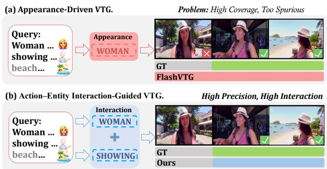  
Fig. 1. Comparison between appearance dominant grounding and the proposed interaction aware grounding. FlashVTG [9] responds broadly to the salient entity, whereas IAE-VTG jointly considers appearance and motion evidence to localize the queried action-entity interaction. Colored curves denote predicted grounding responses, and the green interval indicates the ground-truth moment.

Existing VTG methods can be divided into proposal based and proposal free paradigms [10]–[12]. Proposal based methods [4]–[7] generate predefined or learned candidate segments and rank them according to video and text relevance. The proposal free methods predict temporal boundaries without densely enumerating temporal candidates. More recently, DETR-based [2], [13] approaches formulate VTG as a set prediction problem. It means learnable moment queries decode a set of candidate temporal moments and bipartite matching determines their supervision. Despite their architectural differences, these methods identify target moments through query relevant visual evidence. But they would fail When actions recur at different temporal locations and occupie only a small fraction of the entity visible interval. Appearance cues identify the correct entity while providing limited temporal information. The motion cues indicate a relevant action without determining the entity involved. Many recent VTG approaches [2], [9], [13] employ token level or fine grained cross modal interactions and can capture both action related and entity related evidence. Recent works have also explored phrase level [14] or event level grounding [15]. However, these cues are still commonly integrated through correlation driven matching, without explicitly verifying whether the queried action and entity are jointly supported within the same temporal context. Consequently, a segment may receive a high grounding score because it contains a salient entity or a similar action, even though it does not contain the both.

Figure 1 provides a concrete example of this failure mode. Given the query “A woman in a pink dress and white hat showing off views of the beach she is $a t , "$ FlashVTG [9] responds strongly to the persistent entity cue, woman, and consequently produces an overly broad temporal prediction. However, the subject remains visible outside the interval in which the queried action, showing, is performed. Accurate localization therefore requires more than detecting relevant entities or actions independently. It requires determining whether they form the queried interaction at each temporal location.

To address the problem, we propose IAE VTG, an interaction aware framework for fine grained temporal grounding. IAE VTG exploits complementary appearance and motion streams, which provide different inductive biases for entity related and action related evidence. We introduce a Fine grained Disentangled Interaction Module (FDIM) that grounds action related and entity related query tokens in these complementary streams and explicitly models their cross stream interactions. Rather than treating the two types of evidence as independent sources of relevance, FDIM constructs composition sensitive representations that indicate whether they are jointly supported within the same temporal context.

We further develop an Interaction Sensitive Assignment (ISA) strategy that incorporates interaction consistency into bipartite matching. ISA augments the matching cost with a consistency term derived from binding and saliency evidence, discouraging predictions with high localization confidence but incomplete action and entity support from receiving positive supervision. In this way, FDIM improves the semantic structure of the representations, while ISA ensures that the training assignments reflect the same interaction requirement.

The main contributions of this work are summarized as follows:

• We identify action-entity ambiguity as an important source of spurious temporal grounding and propose IAE-VTG, an interaction-aware framework that explicitly models whether the queried action and entity jointly occur within a candidate moment. We use various datasets [2], [16], [17] to demonstrate that IAE-VTG achieves stateof-the-art or competitive performance across standard grounding metrics.

• We introduce FDIM, which grounds action and entity related query tokens in complementary motion and appearance streams and models their fine-grained interactions to construct composition-sensitive video–text representations.

• We develop ISA, an interaction sensitive assignment strategy that incorporates binding–saliency consistency into bipartite matching, thereby producing semantically more reliable training assignments.

## II. RELATED WORK

## A. Video Temporal Grounding

Video Temporal Grounding [1]–[7], [16], [18]–[29] has been studied from several complementary perspectives. With the introduction of QVHighlights [2], moment retrieval and highlight detection were unified within a shared benchmark and learning framework. Moment-DETR [2] formulated grounding as a set prediction problem, in which learnable moment queries decode candidate intervals and bipartite matching assigns predictions to ground truth moments. This formulation has encouraged subsequent research on unified localization and saliency modeling. Later methods [6], [7], [14], [30] improve the interaction between moment queries, video clips, and textual features, while also refining the confidence and temporal quality of decoded predictions. Nevertheless, querylevel matching and localization objectives do not necessarily evaluate whether the internal semantic structure of a query is fully supported by a candidate moment.

Subsequent studies have improved VTG from several directions. Multimodal fusion methods [31] enhance information exchange between visual and linguistic features, while contrastive alignment [32] strengthens the separation between relevant and irrelevant video query pairs. Multi granularity approaches [8], [33] model temporal information at different resolutions or interaction levels, aiming to capture both local details and broader event context. Other methods improve video and text representations through large scale pretraining or language models [1], [34], thereby providing stronger semantic priors for temporal localization. These developments have substantially improved the ability of VTG models to identify query relevant content.

More recent approaches further investigate multiscale temporal reasoning [9] and structured semantic modeling [14]. Multiscale reasoning is useful when events vary considerably in duration, while structured modeling attempts to preserve more detailed linguistic or visual information than a single sentence embedding. However, richer temporal representations do not by themselves guarantee that the queried action is associated with the correct entity. When an entity remains visible over an extended interval, or when similar actions occur at different locations, a model may still respond to individually relevant cues without identifying the moment in which they participate in the same event. This motivates a more explicit treatment of compositional interaction in temporal grounding.

## B. Fine-Grained Cross-Modal Interaction and Assignment

High level video understanding depends on establishing correspondences between visual evidence and linguistic expressions. Foundation models such as CLIP [35] provide strong joint visual and textual representations, while earlier grounding methods often combine modalities through direct concatenation or shallow fusion, as exemplified by MINI-Net [36]. These representations provide useful semantic similarity but tend to compress the query into a holistic embedding. Such compression can preserve overall relevance while obscuring the different roles played by actions, entities, attributes, and relations in the described event.

Later approaches introduce query conditioned interaction to obtain more selective video representations. QD-DETR [32] and CG-DETR [8], for example, use linguistic information to guide the encoding or decoding of temporal content. By conditioning visual features on the query, these methods reduce the influence of obviously unrelated clips and improve moment discrimination. However, query conditioning mainly determines how strongly a clip relates to the complete query. It does not necessarily reveal which part of the relevance originates from an action, which part originates from an entity, or whether these two sources of evidence are compositionally consistent.

Saliency guided approaches [9], [33] provide another important direction. They estimate clip relevance and use saliency information to emphasize temporally informative content. This is particularly useful for suppressing background clips and improving the joint treatment of moment retrieval and highlight detection. Nevertheless, a high saliency response may be caused by a persistent subject, a visually prominent object, or a frequently occurring action. Without an explicit interaction constraint, saliency alone cannot determine whether the queried action is performed by the queried entity within the selected moment. This distinction is important because visual prominence and event completeness are not equivalent.

Fine-grained and structured grounding methods have increasingly explored richer linguistic organization beyond holistic sentence representations. Token-level and local crossmodal interaction preserve word-specific evidence, while phrase-level approaches associate different textual constituents with corresponding visual content. DualGround [14], for example, performs dual-grained alignment at the phrase and sentence levels to retain complementary semantic granularity. Structured compositional grounding methods [37] further model relations among multiple semantic elements through graph-based correspondence, providing a more expressive representation of complex event structure.

Our focus is complementary but more specific. Rather than modeling unrestricted phrase-level or graph-level relations, IAE-VTG targets the action–entity binding ambiguity that directly affects temporal localization.

Discussion. Existing VTG studies have progressively improved temporal proposals, direct boundary prediction, set based decoding, multimodal fusion, saliency estimation, and fine grained alignment. However, detecting action related and entity related evidence remains different from verifying that they participate in the same event. Moreover, representation improvements alone cannot prevent semantically incomplete predictions from receiving positive supervision during bipartite matching. Our IAE-VTG addresses these two aspects jointly. FDIM disentangles action related and entity related query information, grounds them in complementary motion and appearance streams, and explicitly models their interaction to construct composition sensitive representations. ISA further introduces binding and saliency consistency into bipartite matching, aligning the assignment criterion with the same interaction requirement used in representation learning.

## III. METHOD

## A. System Overview

Given an untrimmed video $\nu ~ = ~ \{ v _ { t } \} _ { t = 1 } ^ { T }$ and a natural language query $\mathcal { Q } \ : = \ : \{ w _ { l } \} _ { l = 1 } ^ { L }$ , Video Temporal Grounding aims to localize the temporal interval described by the query. Following the underlying VTG backbone, we extract appearance and motion features $\mathbf { F } _ { a } , \mathbf { F } _ { m } ~ \in ~ \mathbb { R } ^ { T \times d }$ . The backbone predicts a set of temporal proposals $\mathcal { P } = \{ p _ { i } \} _ { i = 1 } ^ { N }$ , where each proposal $p _ { i } = ( t _ { s } ^ { i } , t _ { e } ^ { i } )$ has an initial confidence $c _ { i }$

As illustrated in Fig. 2, IAE-VTG consists of three stages built upon the underlying VTG backbone. First, the Finegrained Disentangled Interaction Module (FDIM), shown in Fig. 2(a), grounds action and entity related query tokens in complementary motion and appearance streams and constructs clip-level interaction evidence (Eqs. (1)–(9)). Second, Fig. 2(b) shows how the resulting binding scores are aggregated at the proposal level and used to refine interaction-supported candidates (Eqs. (10)–(12)). Finally, the Interaction-Sensitive Assignment (ISA) in Fig. 2(c) incorporates the same interaction evidence into bipartite matching during training (Eqs. (13)– (15)).

Three scores are used throughout the framework. $S _ { \mathrm { b a s e } } ( t )$ denotes the clip-level relevance predicted by the grounding backbone; $S _ { \mathrm { b i n d i n g } } ( t )$ measures whether the queried action and entity are jointly supported at clip t; and $c _ { p }$ denotes the confidence of proposal $p .$ The distinction between the first two scores is important: $S _ { \mathrm { b a s e } }$ captures general query relevance, whereas $S _ { \mathrm { b i n d i n g } }$ evaluates the internal composition of the queried event.

## B. Fine-grained Disentangled Interaction Module

As shown in Fig. 2(a), FDIM constructs interaction evidence in three steps: role-specific grounding, action–entity token pairing, and interaction binding.

1) Role-specific Grounding: We use a lightweight linguistic parser to identify noun and verb tokens in the query. Let $\mathbf { \bar { X } } ~ = ~ \{ \mathbf { x } _ { l } \} _ { l = 1 } ^ { L } ~ \mathbf { \bar { \in } } ~ \mathbb { R } ^ { L \times d }$ denote the encoded query-token sequence. Binary role masks ${ { \bf { M } } _ { n } }$ Mn and $\mathbf { M } _ { v }$ indicate the noun and verb tokens, respectively, yielding the corresponding rolespecific token sets $\mathbf { F } _ { n } = \{ \mathbf { x } _ { n } \} _ { n = 1 } ^ { N _ { n } }$ and $\mathbf { F } _ { v } = \bar { \{ \mathbf { x } _ { v } \} } _ { v = 1 } ^ { N _ { v } }$ . The complete query representation is still used by the grounding backbone; the role-specific masks are introduced only for interaction modeling.

Appearance and motion provide complementary evidence. Appearance tends to preserve subjects, objects, and scene attributes, whereas motion is more responsive to temporal changes. We therefore obtain action-aware and entity-aware clip representations, together with their token-level response matrices, through

$$
\begin{array} { r } { ( { \bf A } , { \bf R } ^ { m } ) = \mathrm { M H A } ( { \bf F } _ { m } , { \bf X } , { \bf X } ; { \bf M } _ { v } ) , } \\ { ( { \bf E } , { \bf R } ^ { a } ) = \mathrm { M H A } ( { \bf F } _ { a } , { \bf X } , { \bf X } ; { \bf M } _ { n } ) , } \end{array}\tag{1}
$$

where $\mathrm { M H A } ( \mathbf { Q } , \mathbf { K } , \mathbf { V } ; \mathbf { M } )$ denotes multi-head cross-attention with the role mask M applied to the key/value tokens. The resulting representations satisfy

$$
\mathbf { A } , \mathbf { E } \in \mathbb { R } ^ { T \times d } ,
$$

where ${ \bf A } _ { t }$ denotes the clip-level action-aware representation obtained by aggregating the valid verb tokens, and $\mathbf { E } _ { t }$ denotes the corresponding entity-aware representation obtained from the valid noun tokens.

The associated response matrices are

$$
\mathbf { R } ^ { m } \in \mathbb { R } ^ { T \times N _ { v } } , \qquad \mathbf { R } ^ { a } \in \mathbb { R } ^ { T \times N _ { n } } .
$$

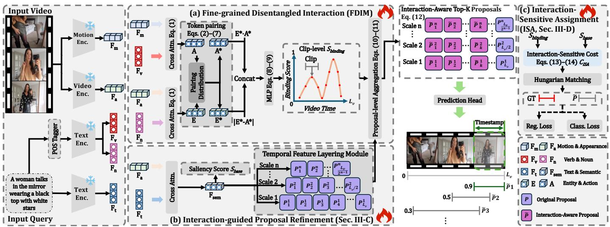  
Fig. 2. Overview of IAE-VTG. (a) FDIM: Dual encoders extract motion and appearance features to yield action-aware (A) and entity-aware (E) representations via cross-modal attention. After token pairing, four features, $\mathrm { A ^ { * } , E ^ { * } , E ^ { * } \odot A ^ { * } }$ , and $| \mathrm { E ^ { * } - A ^ { * } } |$ , are concatenated to compute clip-level binding scores $S _ { \mathrm { b i n d i n g } }$ via an MLP. (b) Proposal Generation: Multi-scale proposals $\dot { P }$ and saliency scores $S _ { \mathrm { b a s e } }$ are generated from semantic features $F _ { \mathrm { s e n } }$ . P are then modulated by aggregated $S _ { \mathrm { b i n d i n g } }$ to produce interaction-refined proposals P˜. (c) ISA: During training, an interaction-aware matching cost $C _ { I S A }$ incorporating Sbase and $S _ { \mathrm { b i n d i n g } }$ guides the label assignment for precise Video Temporal Grounding (VTG). The three stages correspond to Eqs. (1)–(9), Eqs. (10)–(12), and Eqs. (13)–(15), respectively.

Here, $R _ { t , v } ^ { m }$ measures the response of clip t to verb token v, while $R _ { t , n } ^ { a }$ measures its response to noun token n. The response matrices are obtained from the softmax-normalized cross-attention weights and averaged over attention heads. Thus, the cross-attention stage aggregates role-specific token features into clip-level representations while retaining tokenwise attention responses for the subsequent noun–verb pairing stage. When a word is divided into multiple subword tokens, their features and responses are averaged before pairing. The clip-level representations A and E serve as role-conditioned summaries of the motion and appearance streams, whereas the subsequent token-pairing stage operates on the associated response matrices $\mathbf { R } ^ { m }$ and $\mathbf { R } ^ { a }$ together with the original token features. The resulting pair probabilities are then used to construct the pair-aware representations $\mathbf { A } ^ { * }$ and E∗.

2) Action–Entity Token Pairing: A query may contain several nouns and verbs, but only some of their combinations describe the target event. For efficiency, we retain the $K _ { n }$ nouns and $K _ { v }$ verbs with the largest accumulated role-specific attention responses and construct the candidate pair set

$$
\begin{array} { l } { \displaystyle \Omega _ { n } = \mathrm { T o p K } _ { n } \left( \sum _ { t = 1 } ^ { T } R _ { t , n } ^ { a } , K _ { n } \right) , } \\ { \displaystyle \Omega _ { v } = \mathrm { T o p K } _ { v } \left( \sum _ { t = 1 } ^ { T } R _ { t , v } ^ { m } , K _ { v } \right) , } \\ { \displaystyle \Omega = \Omega _ { n } \times \Omega _ { v } . } \end{array}\tag{2}
$$

The parser only determines the token roles; the correspondence between nouns and verbs is learned by the model.

For each clip t, the probability of pairing noun n with verb v is defined as

$$
P _ { t } ( n , v ) = \frac { \exp ( \ell _ { t } ( n , v ) ) } { \displaystyle \sum _ { ( n ^ { \prime } , v ^ { \prime } ) \in \Omega } \exp ( \ell _ { t } ( n ^ { \prime } , v ^ { \prime } ) ) } , \qquad ( n , v ) \in \Omega ,\tag{3}
$$

where the pairing logit is

$$
\begin{array} { r } { \ell _ { t } ( n , v ) = \mathop { \mathcal { T } } _ { t , n , v } + \lambda _ { g } g ( \mathbf { x } _ { n } , \mathbf { x } _ { v } ) \mathop { } } \\ { + \mu _ { h } h ( \mathbf { F } _ { a , t } , \mathbf { F } _ { m , t } , \mathbf { x } _ { n } , \mathbf { x } _ { v } ) \mathop { } . } \end{array}\tag{4}
$$

For sparse interaction modeling, only the highest-scoring noun–verb pairs according to the pairing logits are retained for subsequent interaction aggregation. Unless otherwise specified, all subsequent operations over Ω are performed on this retained sparse pair set, while we keep the notation Ω for simplicity. In all experiments, we retain the top $K _ { \mathrm { p a i r } } = 8$ noun-verb pairs, and this setting is fixed across datasets.

The three terms in Eq. (4) provide complementary pairing evidence. The cross-modal prior is defined as

$$
\begin{array} { r } { \textstyle \mathcal { T } _ { t , n , v } = \log \bigl ( R _ { t , n } ^ { a } + \epsilon \bigr ) + \log \bigl ( R _ { t , v } ^ { m } + \epsilon \bigr ) , } \end{array}\tag{5}
$$

which favors noun–verb pairs whose appearance-related noun response and motion-related verb response are simultaneously strong at clip t. The function $g ( \cdot )$ evaluates language-level compatibility between noun token ${ \bf x } _ { n }$ and verb token $\mathbf { x } _ { v } .$ whereas $h ( \cdot )$ evaluates their compatibility under the local appearance and motion context $\left( \mathbf { F } _ { a , t } , \mathbf { F } _ { m , t } \right)$ . Both functions are implemented as two-layer MLPs with scalar outputs. Their inputs combine the corresponding original features with element-wise products and absolute differences, as illustrated in Fig. 2.

We obtain noun and verb marginal probabilities from the learned pair distribution:

$$
P _ { t } ^ { n } ( n ) = \sum _ { v : ( n , v ) \in \Omega } P _ { t } ( n , v ) , \qquad P _ { t } ^ { v } ( v ) = \sum _ { n : ( n , v ) \in \Omega } P _ { t } ( n , v ) .\tag{6}
$$

The pair-aware action and entity representations are then obtained by weighting the corresponding role-specific token features:

$$
\mathbf { A } _ { t } ^ { * } = \sum _ { v \in \Omega _ { v } } P _ { t } ^ { v } ( v ) \mathbf { x } _ { v } , \qquad \mathbf { E } _ { t } ^ { * } = \sum _ { n \in \Omega _ { n } } P _ { t } ^ { n } ( n ) \mathbf { x } _ { n } .\tag{7}
$$

These representations summarize the verb and noun tokens whose pairing is most strongly supported by the visual content at clip t.

3) Interaction Binding: The paired features are combined into

$$
\begin{array} { r l } & { \mathbf { z } _ { t } = \mathrm { C o n c a t } \left( \mathbf { A } _ { t } ^ { * } , \mathbf { E } _ { t } ^ { * } , \mathbf { A } _ { t } ^ { * } \odot \mathbf { E } _ { t } ^ { * } , \right. } \\ & { \left. \left| \mathbf { A } _ { t } ^ { * } - \mathbf { E } _ { t } ^ { * } \right| \right) , } \end{array}\tag{8}
$$

$$
S _ { \mathrm { b i n d i n g } } ( t ) = \sigma ( \phi _ { \mathrm { b i n d } } ( { \bf z } _ { t } ) ) .\tag{9}
$$

The product term captures coactivation between action and entity evidence, while the absolute difference measures their disagreement. The MLP $\phi _ { \mathrm { b i n d } }$ maps this representation to the clip-level binding score. A high score indicates that the queried action and entity are jointly supported at the corresponding temporal location.

## C. Interaction-guided Proposal Refinement

As illustrated in Fig. 2(b), we retain the multi-scale proposal generation mechanism of the underlying VTG backbone and inject the FDIM binding evidence only during proposal-level refinement.

Given holistic semantic features $\mathbf { F } _ { \mathrm { s e m } }$ , the backbone con structs a temporal feature pyramid, predicts candidate moments, and produces the baseline saliency

$$
S _ { \mathrm { b a s e } } = \sigma ( \phi _ { \mathrm { s e m } } ( \bf F _ { \mathrm { s e m } } ) ) ,\tag{10}
$$

where $\phi _ { \mathrm { s e m } }$ is the original saliency head.

For proposal p with temporal span $\mathcal { T } _ { p } .$ , its interaction support is obtained by averaging the binding scores within the proposal:

$$
s _ { p } = \frac { 1 } { | \mathcal I _ { p } | } \sum _ { t \in \mathcal { T } _ { p } } S _ { \mathrm { b i n d i n g } } ( t ) .\tag{11}
$$

We apply interaction modulation to the last $L _ { c }$ levels of the temporal pyramid, where proposals cover broader temporal contexts. For each active level ℓ, let $\mathcal { P } _ { \ell }$ denote the corresponding proposal set. We select the $K _ { p } ^ { ( \ell ) }$ proposals with the largest interaction support $s _ { p } ,$ where $K _ { p } ^ { ( \bar { \ell } ) }$ is defined as a fixed proportion of the proposals at that level. Their confidence is refined by

$$
\widetilde { c } _ { p } = \left\{ \begin{array} { l l } { c _ { p } ( 1 + \alpha s _ { p } ) , } & { p \in \mathrm { T o p K } _ { q \in \mathcal { P } _ { \ell } } \Big ( s _ { q } , K _ { p } ^ { ( \ell ) } \Big ) , } \\ { c _ { p } , } & { \mathrm { o t h e r w i s e } , } \end{array} \right.\tag{12}
$$

where α controls the contribution of interaction evidence. The residual form preserves the original proposal confidence while increasing the scores of candidates with stronger action–entity interaction support. The refined confidence is used during both training and inference. In all experiments, interaction refinement is applied only to the coarsest temporal-pyramid level, i.e., $L _ { c } ~ = ~ 1$ . For an active level ℓ containing $N _ { \ell }$ proposals, we set $K _ { p } ^ { ( \ell ) } = \operatorname* { m a x } ( 1 , \lfloor 0 . 2 N _ { \ell } \rfloor )$ , corresponding to the top 20% proposals ranked by interaction support. This selection rule is fixed across datasets.

## D. Interaction-Sensitive Assignment and Optimization

Figure 2(c) illustrates the training-time ISA stage. Proposal refinement affects prediction confidence, but it does not determine which proposals receive positive supervision. In DETRbased grounding models, this decision is made through bipartite matching. A temporally plausible proposal can therefore be selected even when its semantic evidence is incomplete. ISA addresses this issue by incorporating interaction consistency into the matching cost.

For each proposal p, we first aggregate the backbone saliency and interaction-binding scores over its temporal span $I _ { p } \colon$

$$
\begin{array} { r } { \bar { S } _ { \mathrm { b a s e } } ( p ) = \displaystyle \frac { 1 } { | I _ { p } | } \sum _ { t \in I _ { p } } S _ { \mathrm { b a s e } } ( t ) , } \\ { \bar { S } _ { \mathrm { b i n d i n g } } ( p ) = \displaystyle \frac { 1 } { | I _ { p } | } \sum _ { t \in I _ { p } } S _ { \mathrm { b i n d i n g } } ( t ) . } \end{array}\tag{13}
$$

The interaction-sensitive matching cost is then defined as

$$
\begin{array} { r l } & { \mathcal { C } _ { \mathrm { I S A } } ( p , g ) = \mathcal { C } _ { \mathrm { b a s e } } ( p , g ) } \\ & { \qquad + \beta \mathrm { I o U } ( p , g ) \left| \bar { S } _ { \mathrm { b i n d i n g } } ( p ) - \bar { S } _ { \mathrm { b a s e } } ( p ) \right| . } \end{array}\tag{14}
$$

where $\mathcal { C } _ { \mathrm { b a s e } }$ denotes the original temporal matching cost and $\beta$ controls the contribution of interaction consistency. The additional term measures the discrepancy between holistic query relevance and action–entity binding evidence. Its IoU weighting focuses the semantic consistency constraint on temporally plausible proposals, while limiting the influence of candidates that are already poorly aligned with the groundtruth moment. Consequently, proposals with strong temporal overlap but inconsistent interaction evidence receive a larger assignment cost.

The standard Hungarian algorithm is applied using $\mathcal { C } _ { \mathrm { I S A } }$ The matching operation remains discrete and is not differentiated; ISA affects training by changing which proposals are selected as positive targets. It introduces no additional operation at inference time.

The backbone retains its original localization, classification, and saliency losses:

$$
\mathcal { L } = \lambda _ { \mathrm { l o c } } \mathcal { L } _ { \mathrm { l o c } } + \lambda _ { \mathrm { c l s } } \mathcal { L } _ { \mathrm { c l s } } ( \widetilde { \mathbf { c } } ) + \lambda _ { \mathrm { s a l } } \mathcal { L } _ { \mathrm { s a l } } .\tag{15}
$$

Because $\widetilde { c } _ { p }$ depends differentiably on $S _ { \mathrm { b i n d i n g } } ,$ the classification loss provides a direct optimization path for FDIM. ISA further influences learning through interaction-sensitive target assignment without propagating gradients through Hungarian matching. Accordingly, interaction evidence affects optimization through two complementary paths: differentiable proposal refinement and interaction-sensitive supervision assignment.

Queries without an identified noun or verb use the highestattended content token as a fallback. The complete architectural and training settings are specified in Sec. IV-A.

## IV. EXPERIMENTS

## A. Implementation Details

Dataset. Following FlashVTG [9], we adopt the same data preprocessing pipeline and train/val/test splits. Experiments are conducted on three VTG benchmarks: QVHighlights [2],

Charades-STA [16], and TACoS [17]. QVHighlights [2] serves as the primary benchmark with full comparisons, while Charades-STA and TACoS are used to evaluate moment retrieval performance in daily-activity and cooking scenarios. Metrics. We follow the evaluation protocol of FlashVTG [9]. For moment retrieval, we report R1@X $( X \in \{ 0 . 3 , 0 . 5 , 0 . 7 \} )$ , mAP (averaged over IoU thresholds from 0.5 to 0.95 with step size 0.05 following COCO-style evaluation [38]), mIoU, and mAP@0.5/0.75 for consistency with prior work. For highlight detection, we report mAP.

Hyperparameters and Architectural Settings. IAE-VTG is implemented in PyTorch and trained end-to-end using the AdamW optimizer on a single NVIDIA A6000 GPU. Unless otherwise specified, we follow the training configuration of the underlying FlashVTG backbone.

The proposal-modulation coefficient and ISA interaction weight are set to $\alpha = 0 . 6$ and $\beta = 0 . 8 ,$ , respectively, based on the QVHighlights validation set. For FDIM, the languagecompatibility weight, visual-context compatibility weight, and pairing temperature are fixed to $\lambda _ { g } ~ = ~ 0 . 7 , ~ \mu _ { h } ~ = ~ 0 . 4 ,$ and τ = 1.0. We retain at most $K _ { n } = 1 2$ noun tokens and $K _ { v } = 1 2$ verb tokens, followed by the top $K _ { \mathrm { p a i r } } = 8$ noun–verb pairs.

Interaction-guided proposal refinement is applied only to the coarsest temporal-pyramid level $( L _ { c } ~ = ~ 1 )$ , where the top 20% proposals ranked by interaction support are modulated. The temporal pyramid contains five levels with strides (1, 2, 4, 8, 16).

All interaction representations use the same d = 256 dimensional latent space as the grounding backbone. The rolespecific cross-attention modules use four attention heads, and the FDIM MLPs use a hidden dimension of 512. The logprior stabilizer is set to $\epsilon = 1 0 ^ { - 8 }$ . All of these architectural and selection settings are kept fixed across QVHighlights, Charades-STA, and TACoS.

The noun–verb decomposition is used only by the interaction branch; the complete sentence representation remains unchanged in the original proposal-generation and saliency pathways. Sensitivity analyses of α and β are shown in Figs. 6 and 7. Extended comparisons with large-scale and detectorenhanced VTG models are presented in Sec. IV-F.

Efficiency. IAE-VTG increases the parameter count from 11.81M to 13.26M and runs at 139 FPS, compared with 168 FPS for the baseline. ISA is training-only and introduces no additional inference-time operation.

We compare IAE-VTG with recent state-of-the-art VTG systems across MR/HD benchmarks, including proposal-free DETR-style baselines and their variants Moment-DETR [2], QD-DETR [32], TR-DETR [44], UniVTG [3], CG-DETR [8], as well as stronger recent models such as FlashVTG [9], DualGround [14], KDA [39], LLMEPET [1], R2-Tuning [34], UVCOM [33], and Task-Weave [30]. For MR datasets, we additionally include classical baselines 2D-TAN [42] and VSLNet [43].

## B. Quantitative Comparison

Performance on QVHighlights. As shown in Table I, IAE-VTG achieves state-of-the-art or competitive performance across all metrics. On the Test set, we achieve 52.91% Average mAP, exceeding FlashVTG [9] (+0.91%). Notably, the gains on stricter metrics such as mAP@0.75 demonstrate improved high-precision localization. The contribution of ISA is examined separately in the ablation study.

Performance on Charades-STA and TACoS. Evaluations on Charades-STA (Table II) and TACoS (Table III) further demonstrate generalizability. On Charades-STA, IAE-VTG reaches 37.58% R1@0.7 (SF+C) and 50.03% R1@0.7 (IV2), demonstrating generalization across different visual feature settings. On the long-form TACoS dataset, our model achieves 39.25% mIoU and 26.57% R1@0.7, outperforming FlashVTG (+1.64% and +1.83%, respectively). These results further demonstrate that IAE-VTG generalizes to long-form videos with fine-grained procedural actions.

Summary. Across all benchmarks, IAE-VTG consistently improves strict localization metrics across diverse video domains and feature settings. These results highlight that explicitly modeling the internal consistency between motion and appearance provides complementary benefits beyond conventional holistic feature fusion. Further comparisons with large-scale and detector-enhanced VTG architectures are presented in Sec. IV-F.

## C. Qualitative Comparison

Qualitative Analysis. Figures 3, 4, and 5 present six representative examples covering complementary forms of temporal ambiguity. For each case, we visualize the predicted moments, temporal saliency responses, attention maps, and FDIM binding scores. These examples illustrate how conventional relevance-based grounding can be affected by temporally separated actions, persistent appearance evidence, and competing visually plausible events, whereas IAE-VTG produces more interaction-consistent temporal responses.

Case 1: Sequential-action ambiguity. In the left example of Fig. 3, the query describes “a fire is poked at before vegetables are put in it.” The baseline is distracted by a later event and predicts an incorrect interval around 104– 136 s, although the queried interaction occurs much earlier. IAE-VTG instead localizes approximately 26–40 s, closely matching the annotated moment. The saliency and attention responses become more concentrated around the target event, while the FDIM binding response in row (d) provides additional evidence for the interval in which the queried action and entity are jointly supported. This example shows that interaction-aware evidence can distinguish the target event from a temporally separated action with related visual content.

Case 2: Entity-persistence ambiguity. The right example of Fig. 3 illustrates a different failure mode. The queried woman remains visually salient for an extended period, causing the baseline to produce an overly broad prediction of approximately 4–62 s. In contrast, IAE-VTG predicts a substantially more compact interval of approximately 38–64 s, closely aligned with the ground-truth moment at 40–62 s. The corresponding saliency and attention responses show that the baseline remains sensitive to persistent appearance evidence, whereas IAE-VTG emphasizes the temporal region in which the queried action and entity are jointly supported. The binding response further provides a selective interaction cue around the target region.

TABLE I  
COMPARISON WITH STATE-OF-THE-ART METHODS ON QVHIGHLIGHTS [2] UNDER THE TEST AND VALIDATION SPLITS. BEST RESULTS ARE SHOWN IN BOLD, AND SECOND-BEST RESULTS ARE UNDERLINED.
<table><tr><td rowspan="3">Method</td><td colspan="6">Test Set</td><td colspan="4">Validation Set</td></tr><tr><td colspan="2">R1</td><td colspan="3">mAP</td><td colspan="2">R1</td><td colspan="3">mAP</td></tr><tr><td>@0.5</td><td>@0.7</td><td>@0.5</td><td>@0.75</td><td>Avg.</td><td>@0.5</td><td>@0.7</td><td>@0.5</td><td>@0.75</td><td>Avg.</td></tr><tr><td>TaskWeave [30] CVPR&#x27;24</td><td></td><td></td><td></td><td></td><td></td><td>64.26</td><td>50.06</td><td>65.39</td><td>46.47</td><td>45.38</td></tr><tr><td>CG-DETR [8] arXiv&#x27;23</td><td>65.43</td><td>48.38</td><td>64.51</td><td>42.77</td><td>42.86</td><td>67.35</td><td>52.06</td><td>65.57</td><td>45.73</td><td>44.93</td></tr><tr><td>UVCOM [33] CVPR&#x27;24</td><td>63.55</td><td>47.47</td><td>63.37</td><td>42.67</td><td>43.18</td><td>65.10</td><td>51.81</td><td></td><td></td><td>45.79</td></tr><tr><td>LLMEPET [1] ACM MM&#x27;24</td><td>66.73</td><td>49.94</td><td>65.76</td><td>43.91</td><td>44.05</td><td>66.58</td><td>51.10</td><td></td><td></td><td>46.24</td></tr><tr><td>R2-Tuning [34] ECCV&#x27;24</td><td>68.03</td><td>49.35</td><td>69.04</td><td>47.56</td><td>46.17</td><td>68.71</td><td>52.06</td><td></td><td></td><td>47.59</td></tr><tr><td>FlashVTG [9] WACV&#x27;25</td><td>70.69</td><td>53.96</td><td>72.33</td><td>53.85</td><td>52.00</td><td>73.10</td><td>57.29</td><td>72.75</td><td>54.33</td><td>52.84</td></tr><tr><td>DualGround [14] NeurIPS&#x27;25</td><td>71.87</td><td>56.94</td><td>72.41</td><td>54.38</td><td>52.73</td><td>73.48</td><td>58.97</td><td>72.99</td><td>56.35</td><td>53.26</td></tr><tr><td>KDA [39] ICCV&#x27;25</td><td>66.70</td><td>50.88</td><td>67.57</td><td>46.31</td><td>45.67</td><td>69.11</td><td>53.46</td><td>68.17</td><td>48.04</td><td>47.41</td></tr><tr><td>IAE-VTG(Ours)</td><td>71.92</td><td>55.90</td><td>73.51</td><td>55.31</td><td>52.91</td><td>73.81</td><td>58.52</td><td>73.49</td><td>57.16</td><td>54.47</td></tr></table>

Query: A fire is poked at before vegetables are put in it.  
Query: The young woman shows the cover of the book she's reading and the view from the poolside  
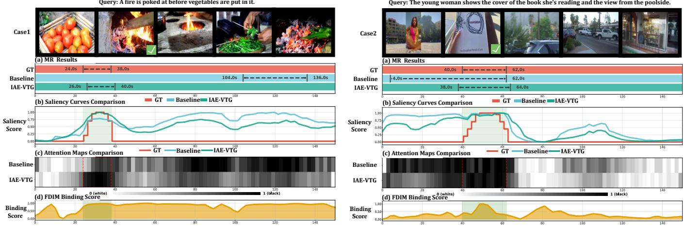  
Fig. 3. Qualitative comparison on two representative temporal-ambiguity cases. Left: a sequential-action case, where the baseline is distracted by a later event while IAE-VTG localizes the queried interaction. Right: an entity-persistence case, where the baseline responds broadly to a visually persistent entity while IAE-VTG concentrates on the target interval. For each case, (a) compares the predicted temporal moments with the ground truth (GT), (b) shows the temporal saliency responses, (c) visualizes the attention maps, and (d) reports the FDIM binding score Sbinding. Together, the two examples illustrate how interaction-aware modeling suppresses temporally plausible but compositionally inconsistent responses.

Case 3: Temporal over-extension. In the left example of Fig. 4, the query describes “a big crowd marching near a park.” The annotated event occupies approximately the first 44 s of the video. Although the baseline identifies the relevant early content, its prediction extends to approximately 114.5 s, substantially beyond the ground-truth boundary. This behavior is consistent with crowd- and scene-level appearance evidence remaining visually relevant after the queried marching event has ended. IAE-VTG instead produces a compact prediction of approximately 0–46 s. The more selective saliency and attention responses, together with the interaction signal in row (d), help distinguish persistent visual context from the temporally bounded action.

Case 4: Temporally separated distractor. The right example of Fig. 4 provides a more extreme distractor case. For the query “a woman in green blouse and her babe are being recorded while sitting on the chair,” the ground-truth interaction spans approximately 50–92 s. The baseline is attracted by a late visually salient region near the end of the video, despite its temporal inconsistency with the queried event. IAE-VTG instead localizes approximately 52–92 s, closely following the ground-truth boundaries. Its saliency and attention responses are concentrated around the target interval, while the binding signal provides complementary evidence for the relevant action–entity interaction.

Case 5: Appearance-dominant ambiguity. In the left example of Fig. 5, the query describes a fork in a murky river flowing around a tree on an island. The baseline responds strongly to an earlier visually plausible river segment, although the annotated event occurs near the end of the video. IAE-VTG instead shifts its prediction toward the ground-truth interval. This example shows that visually similar scene content can create a strong appearance shortcut even when it occurs at the wrong temporal location. The interaction-aware response provides a more selective cue for identifying when the queried visual configuration and action are jointly supported.

Case 6: Repeated-event ambiguity. The right example of

Query: A woman in green blouse and her babe are being recorded while sitting on the chair.

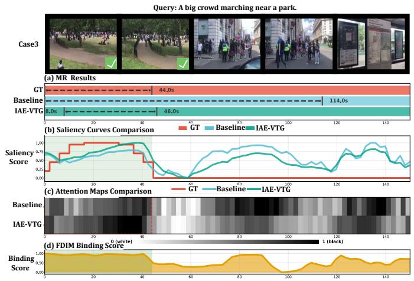

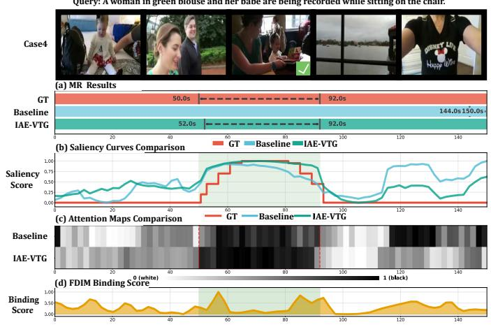  
Fig. 4. Qualitative comparison on two representative temporal-ambiguity cases. Left: a temporal over-extension case, where persistent crowd and scene evidence causes the baseline to respond far beyond the queried “marching” event, whereas IAE-VTG produces a compact prediction closely aligned with the ground truth. Right: a temporally separated distractor case, where the baseline is attracted by a late visually salient interval, while IAE-VTG localizes the target action–entity interaction. For each case, (a) compares the predicted temporal moments with the ground truth (GT), (b) shows the temporal saliency responses, (c) visualizes the attention maps, and (d) reports the FDIM binding score $S _ { \mathrm { b i n d i n g } } .$ Together, the examples illustrate how interaction-aware modeling suppresses both persistent appearance responses and temporally separated distractors.

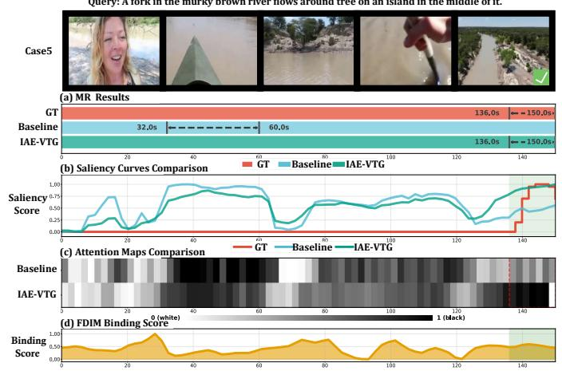

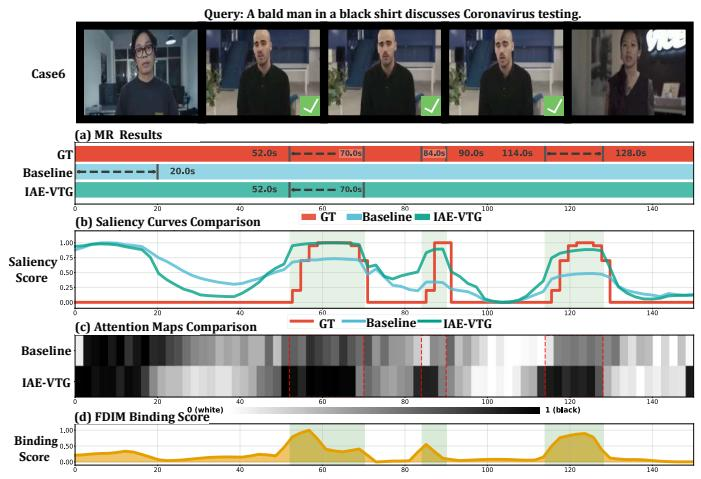  
Fig. 5. Qualitative comparison on two additional challenging temporal-ambiguity cases. Left (Case 5): an appearance-dominant ambiguity case, where the baseline localizes an earlier visually plausible interval, whereas IAE-VTG shifts its prediction toward the annotated event near the end of the video. Right (Case 6): a repeated-event ambiguity case with multiple temporally separated relevant intervals, where the baseline is dominated by an early entity-driven response while IAE-VTG places greater emphasis on the action-consistent regions. For each case, (a) compares the predicted temporal moments with the ground truth (GT), (b) shows the temporal saliency responses, (c) visualizes the attention maps, and (d) reports the FDIM binding score $S _ { \mathrm { b i n d i n g } } .$ Together, these examples further demonstrate that explicit action–entity interaction evidence helps suppress appearance shortcuts and distinguish temporally competing events.

Fig. 5 contains multiple temporally separated relevant intervals for the query describing a man discussing Coronavirus testing. The baseline is dominated by an early response that does not correspond to the annotated events, whereas IAE-VTG places greater emphasis on the later action-relevant regions. The corresponding saliency and attention responses become more consistent with the annotated intervals, while the FDIM binding signal exhibits stronger responses around the interactionrich regions. This example indicates that interaction evidence is also useful when the queried event occurs repeatedly rather than within a single isolated interval.

Discussion. Together, the six examples reveal three recurring sources of spurious temporal grounding. First, Cases 1, 4, and 6 show that temporally separated or competing events can attract the baseline despite incomplete agreement with the queried interaction. Second, Cases 2 and 3 demonstrate that persistent entity or scene evidence can cause predictions to extend beyond the actual action interval. Third, Case 5 illustrates an appearance-dominant shortcut in which visually plausible content is localized at an incorrect temporal position. Across these cases, IAE-VTG mitigates the ambiguity by complementing holistic video–text relevance with explicit action–entity interaction evidence. FDIM provides composition-sensitive temporal cues, while ISA encourages proposals consistent with the same interaction evidence to receive more reliable supervision during training. These qualitative observations are consistent with the quantitative, perturbation, and ablation results reported below.

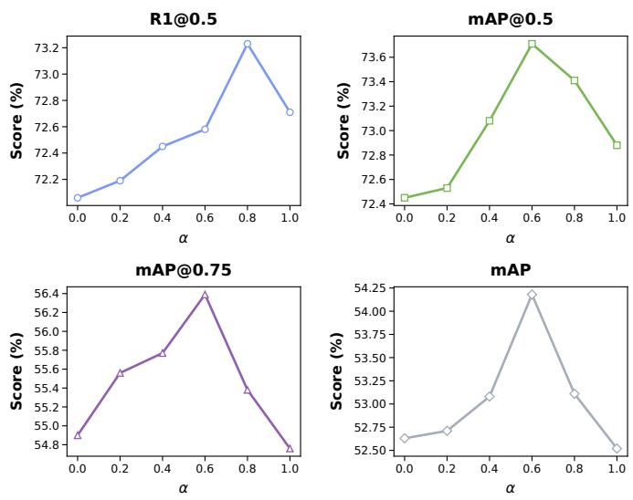

TABLE II  
COMPARISON ON THE CHARADES-STA [16] TEST SET. “SF+C” DENOTES SLOWFAST R-50 [40] COMBINED WITH CLIP-B/32 [35], WHILE “IV2” DENOTES INTERNVIDEO2-6B [41]. BEST RESULTS ARE SHOWN IN BOLD, AND SECOND-BEST RESULTS ARE UNDERLINED.
<table><tr><td>Method</td><td>Backbone</td><td>R1@0.5</td><td>R1@0.7</td></tr><tr><td>2D-TAN [42]</td><td>SF+C</td><td>46.02</td><td>27.50</td></tr><tr><td>VSLNet [43]</td><td>SF+C</td><td>42.69</td><td>24.14</td></tr><tr><td>Moment-DETR [2]</td><td>SF+C</td><td>52.07</td><td>30.59</td></tr><tr><td>QD-DETR [32]</td><td>SF+C</td><td>57.31</td><td>32.55</td></tr><tr><td>UniVTG [3]</td><td>SF+C</td><td>58.01</td><td>35.65</td></tr><tr><td>TR-DETR [44]</td><td>SF+C</td><td>57.61</td><td>33.52</td></tr><tr><td>LLMEPET [1]</td><td>SF+C</td><td></td><td>36.49</td></tr><tr><td>CG-DETR [8]</td><td>SF+C</td><td>58.44</td><td>36.34</td></tr><tr><td>FlashVTG [9]</td><td>SF+C</td><td>57.58</td><td>37.31</td></tr><tr><td>IAE-VTG (Ours)</td><td>SF+C</td><td>58.63</td><td>37.58</td></tr><tr><td>FlashVTG [9]</td><td>IV2</td><td>70.32</td><td>49.87</td></tr><tr><td>IAE-VTG (Ours)</td><td>IV2</td><td>71.42</td><td>50.03</td></tr></table>

TABLE III

COMPARISON ON TACOS [17]. ALL METHODS USE SLOWFAST [40] AND CLIP [35] AS VISUAL AND TEXTUAL BACKBONES. BEST RESULTS ARE SHOWN IN BOLD, AND SECOND-BEST RESULTS ARE UNDERLINED.
<table><tr><td>Method</td><td>R1@0.3</td><td>R1@0.5</td><td>R1@0.7</td><td>mIoU</td></tr><tr><td>2D-TAN [42]</td><td>40.01</td><td>27.99</td><td>12.92</td><td>27.22</td></tr><tr><td>VSLNet [43]</td><td>35.54</td><td>23.54</td><td>13.15</td><td>24.99</td></tr><tr><td>Moment-DETR [2]</td><td>37.97</td><td>24.67</td><td>11.97</td><td>25.49</td></tr><tr><td>UniVTG [3]</td><td>51.44</td><td>34.97</td><td>17.35</td><td>33.60</td></tr><tr><td>CG-DETR [8]</td><td>52.23</td><td>39.61</td><td>22.23</td><td>36.48</td></tr><tr><td>R2-Tuning [34]</td><td>49.71</td><td>38.72</td><td>25.12</td><td>35.92</td></tr><tr><td>LLMEPET [1]</td><td>52.73</td><td></td><td>22.78</td><td>36.55</td></tr><tr><td>FlashVTG [9]</td><td>53.71</td><td>41.76</td><td>24.74</td><td>37.61</td></tr><tr><td>IAE-VTG (Ours)</td><td>54.21</td><td>42.66</td><td>26.57</td><td>39.25</td></tr></table>

## D. Ablation Study

Component Ablation. As shown in Table IV, progressively enabling FDIM and ISA on QVHighlights yields consistent gains. From a representation perspective, FDIM reduces spurious correlations by explicitly modeling action–entity interactions, enhancing the model’s ability to localize correct regions via fine-grained linguistic evidence. From a supervision perspective, ISA further elevates high-precision metrics (e.g., mAP@0.75) by enforcing binding–saliency consistency during training. Notably, ISA improves performance without increasing inference cost, confirming that our gains stem from optimized alignment rather than model capacity.

Robustness to Role-Label Corruption. FDIM uses noun and verb masks to construct role-specific interaction evidence. To test whether the model genuinely depends on correct linguistic roles rather than merely benefiting from an additional text pathway, we perturb the role assignments at evaluation time.

For each corruption ratio, we randomly select the corresponding fraction of noun- or verb-labeled tokens and flip their noun/verb role assignments. The perturbation modifies only the role masks used by the interaction branch; the encoded query tokens, the full-sentence grounding pathway, and all model parameters remain unchanged. No retraining is performed for the corrupted settings.

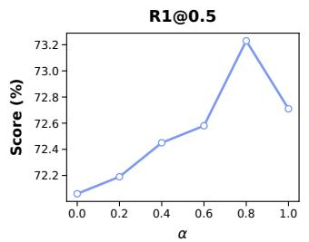

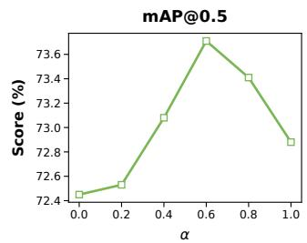

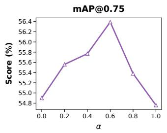

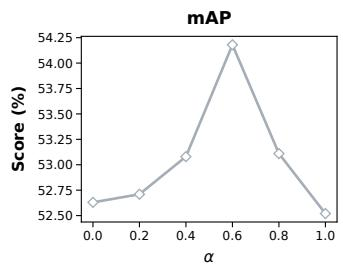  
Fig. 6. Sensitivity analysis of the Interaction weight α on QVHighlights [2]. The model maintains stable performance across a wide range of values, demonstrating robustness to hyperparameter selection.

R1@0.5  
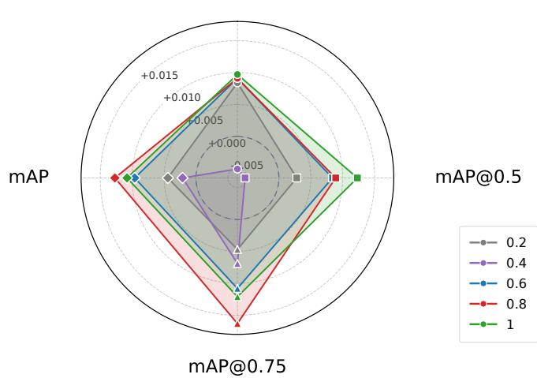  
Fig. 7. Effect of the Interaction-consistency weight β on QVHighlights [2] validation set. We report Recall and mAP.

As shown in Table VIII, top-1 retrieval performance deteriorates as role assignments become less reliable, with the largest reduction under complete corruption. Average mAP changes less monotonically because the original full-sentence pathway remains active and can still rank plausible proposals. These results indicate that accurate role information is particularly important for selecting the correct interaction-consistent moment, rather than being the sole source of general video–text relevance.

Effect of Interaction Modeling. To verify that gains are not merely from stronger features, we compare IAE-VTG against a baseline augmented with SlowFast motion features (Table V). While SlowFast provides richer visual evidence, IAE-VTG consistently outperforms it. This suggests that whereas raw feature enrichment quickly saturates in complex scenes, our structural integration of motion and entity information effectively resolves action–entity binding ambiguities that implicit alignment fails to address.

TABLE IV  
ABLATION STUDY OF FDIM AND ISA ON QVHIGHLIGHTS [2]. ✓ INDICATES THAT THE CORRESPONDING COMPONENT IS ENABLED. RESULTS ARE REPORTED ON BOTH THE TEST AND VALIDATION SPLITS. BEST RESULTS ARE SHOWN IN BOLD.
<table><tr><td rowspan="2">FDIM ISA</td><td rowspan="2"></td><td colspan="5">Test Set</td><td colspan="5">Validation Set</td></tr><tr><td>R1@0.5</td><td>R1@0.7</td><td>mAP@0.5</td><td>mAP@0.75</td><td>Avg.</td><td>R1@0.5</td><td>R1@0.7</td><td>mAP@0.5</td><td>mAP@0.75</td><td>Avg.</td></tr><tr><td>X</td><td>X</td><td>70.69</td><td>53.96</td><td>72.33</td><td>53.85</td><td>52.00</td><td>71.48</td><td>56.06</td><td>72.37</td><td>55.03</td><td>52.61</td></tr><tr><td>√</td><td>×</td><td>71.27</td><td>54.93</td><td>73.20</td><td>54.56</td><td>52.17</td><td>73.42</td><td>57.23</td><td>73.16</td><td>54.83</td><td>52.71</td></tr><tr><td>√</td><td>√</td><td>71.92</td><td>55.90</td><td>73.51</td><td>55.31</td><td>52.91</td><td>73.81</td><td>58.52</td><td>73.49</td><td>57.16</td><td>54.47</td></tr></table>

TABLE V

FEATURE ABLATION ON THE QVHIGHLIGHTS [2] VALIDATION SET. BASELINE+DUAL AUGMENTS THE BASELINE WITH SLOWFAST MOTION FEATURES. BEST RESULTS ARE SHOWN IN BOLD.
<table><tr><td>Method</td><td>R1@0.7</td><td>mAP@0.75</td><td>Avg. mAP</td></tr><tr><td>Baseline</td><td>56.06</td><td>55.03</td><td>52.61</td></tr><tr><td>Baseline+Dual</td><td>57.03</td><td>56.29</td><td>53.33</td></tr><tr><td>IAE-VTG (Ours)</td><td>58.52</td><td>57.16</td><td>54.47</td></tr></table>

TABLE VI

PERFORMANCE ON THE NA-VMR TASK. RA-ID AND RA-OOD DENOTE REJECTION ACCURACY FOR IN-DOMAIN AND OUT-OF-DOMAIN NEGATIVE QUERIES, RESPECTIVELY.
<table><tr><td>Method</td><td>R1@0.5</td><td>R1@0.7</td><td>RA-ID</td><td>RA-OOD</td></tr><tr><td>Baseline</td><td>68.00</td><td>55.87</td><td>52.84</td><td>66.84</td></tr><tr><td>IAE-VTG (Ours)</td><td>68.90</td><td>57.55</td><td>68.97</td><td>74.06</td></tr><tr><td>∆</td><td>+0.90</td><td>+1.68</td><td>+16.13</td><td>+7.22</td></tr></table>

Robustness to Negative Queries. We evaluate IAE-VTG on the NA-VMR task [45] to test its ability to reject mismatched queries (Table VI). IAE-VTG achieves substantial gains in Rejection Accuracy (+16.13% RA-ID, +7.22% RA-OOD) while simultaneously improving R1 localization. The significant boost in RA-ID improved rejection of semantically plausible mismatched queries.

Sensitivity to Semantic Perturbations. We conduct a stress test by perturbing queries through verb, object, or relation swaps while keeping the video fixed (Table VII). All perturbation types substantially reduce the overlap between the topranked prediction and the original ground-truth moment, while also decreasing prediction confidence and producing high rejection rates. These results indicate that IAE-VTG responds sensitively to controlled semantic inconsistencies rather than relying solely on superficial visual cues.

Hyperparameter Sensitivity. The corresponding sensitivity trends of α and β are further analyzed in Figs. 6 and 7.

## E. Generalization and Query Complexity

Compositional Generalization. To examine whether the proposed action–entity binding mechanism generalizes beyond the standard test distribution, we evaluate the baseline and IAE-VTG on the Trivial, Novel-Composition (Novel-C), and

TABLE VII  
SEMANTIC INTERACTION PERTURBATION ANALYSIS ON QVHIGHLIGHTS [2].
<table><tr><td>Type</td><td>N</td><td>IoU Drop</td><td>Conf. Drop</td><td>Rej. (%)</td></tr><tr><td>Verb</td><td>521</td><td>0.416</td><td>0.272</td><td>78.9</td></tr><tr><td>Object</td><td>869</td><td>0.447</td><td>0.275</td><td>81.2</td></tr><tr><td>Relation</td><td>488</td><td>0.410</td><td>0.257</td><td>77.3</td></tr></table>

Novel-Word (Novel-W) splits introduced by the compositional temporal grounding protocol of Li et al. [37]. These splits evaluate increasingly challenging forms of compositional generalization, ranging from familiar compositions to novel combinations and novel lexical elements.

As shown in Table IX, IAE-VTG improves both R1@0.7 and mIoU on all three splits. The largest gain occurs on Novel-W, where generalization requires handling unfamiliar lexical compositions while preserving the underlying action–entity structure. These results support compositional transfer without replacing the original full-sentence representation.

Behavior on Complex Queries. We further group queries according to linguistic complexity and evaluate IAE-VTG on the three sufficiently represented categories shown in Table X. A separate negation subset contains only seven samples (N = 7), so we do not use it to support a general category-level conclusion.

IAE-VTG maintains comparable performance on multientity and mixed-complexity queries, while multi-action queries remain more challenging. This behavior is consistent with the intended scope of the method: the auxiliary rolespecific branch improves explicit action–entity binding but does not replace broader event-level or paragraph-level reasoning.

## F. Extended Comparisons

Comparison with Large-Model-Based VTG. Large multimodal models provide substantially stronger pretraining and model capacity. Table XI therefore serves as a scale-aware comparison rather than a claim of uniform superiority.

Although the large models obtain higher absolute recall, IAE-VTG operates with orders-of-magnitude fewer parameters. This comparison supports a complementary interpretation: large-scale pretraining provides broad semantic priors, whereas IAE-VTG introduces an explicit lightweight inductive bias for action–entity consistency.

Comparison with Saliency-Guided DETR Variants. SG-DETR [50] strengthens temporal grounding through saliencyguided modules, and its hybrid variant additionally modifies the detector head.

TABLE VIII  
EFFECT OF NOUN/VERB ROLE-LABEL CORRUPTION ON THE QVHIGHLIGHTS VALIDATION SPLIT.
<table><tr><td>Corruption ratio</td><td>R1@0.5</td><td>R1@0.7</td><td>mAP@0.5</td><td>mAP@0.75</td><td>Avg. mAP</td></tr><tr><td>0% (original roles)</td><td>73.81</td><td>58.52</td><td>73.49</td><td>57.16</td><td>54.47</td></tr><tr><td>20%</td><td>72.84</td><td>57.03</td><td>72.68</td><td>54.67</td><td>52.71</td></tr><tr><td>50%</td><td>72.00</td><td>56.13</td><td>72.61</td><td>54.10</td><td>52.37</td></tr><tr><td>100%</td><td>65.10</td><td>52.39</td><td>71.26</td><td>55.86</td><td>52.74</td></tr></table>

TABLE IX  
BASELINE-TO-IAE-VTG COMPARISON ON THE COMPOSITIONAL TEMPORAL GROUNDING SPLITS.
<table><tr><td></td><td colspan="2">R1@0.7</td><td colspan="2">mIoU</td></tr><tr><td>Split</td><td>Baseline</td><td>IAE-VTG</td><td>Baseline</td><td>IAE-VTG</td></tr><tr><td>Trivial</td><td>12.16</td><td>13.14</td><td>30.66</td><td>31.56</td></tr><tr><td>Novel-C</td><td>7.92</td><td>8.49</td><td>24.62</td><td>25.17</td></tr><tr><td>Novel-W</td><td>8.11</td><td>9.46</td><td>24.73</td><td>26.43</td></tr></table>

TABLE X  
PERFORMANCE ON THE QUERY-COMPLEXITY GROUPS.
<table><tr><td>Query group</td><td>R1@0.7</td><td>Avg. mAP</td></tr><tr><td>Multi-entity</td><td>58.14</td><td>53.99</td></tr><tr><td>Multi-action</td><td>53.87</td><td>51.79</td></tr><tr><td>Complex</td><td>57.79</td><td>53.60</td></tr></table>

IAE-VTG improves over the saliency-guided SG-DETR baseline on all reported metrics, while the hybrid detector remains stronger overall. The distinction is informative: the hybrid head primarily improves proposal coverage and boundary regression, whereas IAE-VTG focuses on compositional interaction and assignment quality. These directions are therefore complementary rather than directly interchangeable.

## V. CONCLUSION

In this work, we investigated action–entity ambiguity as an important source of spurious temporal grounding, where a model may respond strongly to individually relevant actions or entities without verifying whether they jointly constitute the queried event. To address this limitation, we proposed IAE-VTG, which models interaction consistency at both the representation and supervision levels. FDIM constructs composition-sensitive temporal evidence by grounding actionand entity-related query information in complementary motion and appearance streams, while ISA incorporates the same interaction criterion into bipartite assignment.

Experiments on QVHighlights, Charades-STA, and TACoS demonstrate competitive or state-of-the-art grounding performance. Component ablations, role-label corruption, semantic perturbations, and qualitative analyses further show that the gains arise from explicit interaction modeling rather than simply increasing feature capacity. The improvements on compositional splits and complex-query groups provide additional evidence that the interaction branch generalizes beyond the standard evaluation distribution while preserving the original full-sentence pathway.

TABLE XI  
COMPARISON WITH LARGE-MODEL-BASED METHODS ONQVHIGHLIGHTS.
<table><tr><td>Method</td><td>Size</td><td>R1@0.5</td><td>R1@0.7</td></tr><tr><td colspan="4">Zero-shot / LLM-based</td></tr><tr><td>TimeSuite [46]</td><td>7B</td><td>12.3</td><td>9.2</td></tr><tr><td>UniTime [47]</td><td>7B</td><td>41.0</td><td>31.5</td></tr><tr><td colspan="4">QVHighlights-trained</td></tr><tr><td>Chrono-BLIP [48]</td><td>4B</td><td>76.8</td><td>62.8</td></tr><tr><td>Chrono-Qwen [48]</td><td>3B</td><td>79.1</td><td>64.8</td></tr><tr><td>SlotVTG [49]</td><td>3B</td><td>79.5</td><td>64.6</td></tr><tr><td>Chrono-Qwen [48]</td><td>7B</td><td>81.8</td><td>67.6</td></tr><tr><td>SlotVTG [49]</td><td>7B</td><td>82.9</td><td>69.3</td></tr><tr><td>IAE-VTG</td><td>13.26M</td><td>73.81</td><td>58.52</td></tr></table>

TABLE XII

COMPARISON WITH SG-DETR VARIANTS ON QVHIGHLIGHTSVALIDATION.
<table><tr><td>Metric</td><td>SG-DETR</td><td>SG-DETR + Hybrid</td><td>IAE-VTG</td></tr><tr><td>R1@0.5</td><td>72.10</td><td>72.80</td><td>73.81</td></tr><tr><td>R1@0.7</td><td>57.60</td><td>59.50</td><td>58.52</td></tr><tr><td>mAP@0.5</td><td>72.60</td><td>73.50</td><td>73.49</td></tr><tr><td>mAP@0.75</td><td>53.60</td><td>57.90</td><td>57.16</td></tr><tr><td>Avg. mAP</td><td>52.20</td><td>55.60</td><td>54.47</td></tr></table>

Overall, the results indicate that explicit action–entity interaction modeling provides a useful and lightweight complement to conventional holistic video–text alignment. At the same time, action–entity ambiguity is not universal to all VTG samples, and more general graph-based relational reasoning, rare linguistic phenomena, and paragraph-level dense grounding remain promising directions for future work.

## REFERENCES

[1] Y. Jiang, W. Zhang, X. Zhang, X.-Y. Wei, C. W. Chen, and Q. Li, “Prior knowledge integration via llm encoding and pseudo event regulation for video moment retrieval,” in ACM International Conference on Multimedia (ACM MM), 2024.

[2] J. Lei, T. L. Berg, and M. Bansal, “Detecting moments and highlights in videos via natural language queries,” Advances in Neural Information Processing Systems (NeurIPS), vol. 34, pp. 11 846–11 858, 2021.

[3] K. Q. Lin, P. Zhang, J. Chen, S. Pramanick, D. Gao, A. J. Wang, R. Yan, and M. Z. Shou, “Univtg: Towards unified video-language temporal grounding,” in IEEE International Conference on Computer Vision (ICCV), 2023.

[4] D. Liu, X. Qu, J. Dong, P. Zhou, Y. Cheng, W. Wei, Z. Xu, and Y. Xie, “Context-aware biaffine localizing network for temporal sentence grounding,” in IEEE/CVF Conference on Computer Vision and Pattern Recognition (CVPR), 2021.

[5] D. Liu, X. Qu, X.-Y. Liu, J. Dong, P. Zhou, and Z. Xu, “Jointly cross-and self-modal graph attention network for query-based moment

localization,” in ACM International Conference on Multimedia (ACM MM), 2020.

[6] D. Shao, Y. Xiong, Y. Zhao, Q. Huang, Y. Qiao, and D. Lin, “Find and focus: Retrieve and localize video events with natural language queries,” in Proceedings of the European Conference on Computer Vision (ECCV), 2018, pp. 200–216.

[7] S. Xiao, L. Chen, S. Zhang, W. Ji, J. Shao, L. Ye, and J. Xiao, “Boundary proposal network for two-stage natural language video localization,” in AAAI Conference on Artificial Intelligence (AAAI), 2021.

[8] W. Moon, S. Hyun, S. B. Lee, and J.-P. Heo, “Correlation-guided querydependency calibration in video representation learning for temporal grounding,” arXiv, 2023.

[9] Z. Cao, B. Zhang, H. Du, X. Yu, X. Li, and S. Wang, “Flashvtg: Feature layering and adaptive score handling network for video temporal grounding,” in Winter Conference on Applications of Computer Vision (WACV), 2025.

[10] L. Chen, C. Lu, S. Tang, J. Xiao, D. Zhang, C. Tan, and X. Li, “Rethinking the bottom-up framework for query-based video localization,” in AAAI Conference on Artificial Intelligence (AAAI), 2020.

[11] D. Liu, X. Qu, X. Di, Y. Cheng, Z. Xu, and P. Zhou, “Memory-guided semantic learning network for temporal sentence grounding,” in AAAI Conference on Artificial Intelligence (AAAI), 2022.

[12] D. Liu, X. Qu, and W. Hu, “Reducing the vision and language bias for temporal sentence grounding,” in ACM International Conference on Multimedia (ACM MM), 2022.

[13] N. Carion, F. Massa, G. Synnaeve, N. Usunier, A. Kirillov, and S. Zagoruyko, “End-to-end object detection with transformers,” in European Conference on Computer Vision (ECCV), 2020.

[14] M. Kang, M. Lee, M. Kim, D. Kim, and S. Lee, “Empower words: Dualground for structured phrase and sentence-level temporal grounding,” Advances in Neural Information Processing Systems, vol. 38, pp. 92 472–92 499, 2025.

[15] Y. Guo, J. Liu, M. Li, Q. Liu, X. Chen, and X. Tang, “Trace: Temporal grounding video llm via causal event modeling,” arXiv, 2024.

[16] J. Gao, C. Sun, Z. Yang, and R. Nevatia, “Tall: Temporal activity localization via language query,” in IEEE International Conference on Computer Vision (ICCV), 2017.

[17] M. Regneri, M. Rohrbach, D. Wetzel, S. Thater, B. Schiele, and M. Pinkal, “Grounding action descriptions in videos,” Transactions of the Association for Computational Linguistics, 2013.

[18] L. Anne Hendricks, O. Wang, E. Shechtman, J. Sivic, T. Darrell, and B. Russell, “Localizing moments in video with natural language,” in IEEE International Conference on Computer Vision (ICCV), 2017.

[19] R. Ge, J. Gao, K. Chen, and R. Nevatia, “Mac: Mining activity concepts for language-based temporal localization,” in Winter Conference on Applications of Computer Vision (WACV), 2019.

[20] J. Wang, L. Ma, and W. Jiang, “Temporally grounding language queries in videos by contextual boundary-aware prediction,” in AAAI Conference on Artificial Intelligence (AAAI), 2020.

[21] Y. Yuan, L. Ma, J. Wang, W. Liu, and W. Zhu, “Semantic conditioned dynamic modulation for temporal sentence grounding in videos,” Neural Information Processing Systems (NeurIPS), 2019.

[22] D. Zhang, X. Dai, X. Wang, Y.-F. Wang, and L. S. Davis, “Man: Moment alignment network for natural language moment retrieval via iterative graph adjustment,” in IEEE/CVF Conference on Computer Vision and Pattern Recognition (CVPR), 2019.

[23] M. Gygli, Y. Song, and L. Cao, “Video2gif: Automatic generation of animated gifs from video,” in IEEE/CVF Conference on Computer Vision and Pattern Recognition (CVPR), 2016.

[24] C. Liu, Q. Huang, and S. Jiang, “Query-sensitive dynamic web video thumbnail generation,” in IEEE International Conference on Image Processing (ICIP), 2011.

[25] Z. Lin, Z. Zhao, Z. Zhang, Z. Zhang, and D. Cai, “Moment retrieval via cross-modal interaction networks with query reconstruction,” IEEE Transactions on Image Processing, vol. 29, pp. 3750–3762, 2020.

[26] K. Ning, L. Xie, J. Liu, F. Wu, and Q. Tian, “Interaction-integrated network for natural language moment localization,” IEEE Transactions on Image Processing, vol. 30, pp. 2538–2548, 2021.

[27] W. Yang, T. Zhang, Y. Zhang, and F. Wu, “Local correspondence network for weakly supervised temporal sentence grounding,” IEEE Transactions on Image Processing, vol. 30, pp. 3252–3262, 2021.

[28] T. Liu, B.-K. Bao, and K.-M. Lam, “An episode memory-guided dual-stage framework for long-form video temporal grounding,” IEEE Transactions on Image Processing, 2026.

[29] Y. Wang, X. Jiang, D. Cheng, D. Li, and C. Zhao, “Actprompt: Indomain feature adaptation via action cues for video temporal grounding,” IEEE Transactions on Image Processing, 2026.

[30] J. Yang, P. Wei, H. Li, and Z. Ren, “Task-driven exploration: Decoupling and inter-task feedback for joint moment retrieval and highlight detection,” in IEEE/CVF Conference on Computer Vision and Pattern Recognition (CVPR), 2024.

[31] Y. Liu, S. Li, Y. Wu, C.-W. Chen, Y. Shan, and X. Qie, “Umt: Unified multi-modal transformers for joint video moment retrieval and highlight detection,” in IEEE/CVF Conference on Computer Vision and Pattern Recognition (CVPR), 2022.

[32] W. Moon, S. Hyun, S. Park, D. Park, and J.-P. Heo, “Query-dependent video representation for moment retrieval and highlight detection,” in IEEE/CVF Conference on Computer Vision and Pattern Recognition (CVPR), 2023.

[33] Y. Xiao, Z. Luo, Y. Liu, Y. Ma, H. Bian, Y. Ji, Y. Yang, and X. Li, “Bridging the gap: A unified video comprehension framework for moment retrieval and highlight detection,” in IEEE/CVF Conference on Computer Vision and Pattern Recognition (CVPR), 2024.

[34] Y. Liu, J. He, W. Li, J. Kim, D. Wei, H. Pfister, and C. W. Chen, “R2- tuning: Efficient image-to-video transfer learning for video temporal grounding,” in European Conference on Computer Vision (ECCV), 2024.

[35] A. Radford, J. W. Kim, C. Hallacy, A. Ramesh, G. Goh, S. Agarwal, G. Sastry, A. Askell, P. Mishkin, J. Clark et al., “Learning transferable visual models from natural language supervision,” in International Conference on Machine Learning (ICML), 2021.

[36] F.-T. Hong, X. Huang, W.-H. Li, and W.-S. Zheng, “Mini-net: Multiple instance ranking network for video highlight detection,” in European Conference on Computer Vision (ECCV), 2020.

[37] J. Li, J. Xie, L. Qian, L. Zhu, S. Tang, F. Wu, Y. Yang, Y. Zhuang, and X. E. Wang, “Compositional temporal grounding with structured variational cross-graph correspondence learning,” in Proceedings of the IEEE/CVF Conference on Computer Vision and Pattern Recognition, 2022, pp. 3032–3041.

[38] T.-Y. Lin, M. Maire, S. Belongie, J. Hays, P. Perona, D. Ramanan, P. Dollar, and C. L. Zitnick, “Microsoft coco: Common objects in´ context,” in European Conference on Computer Vision (ECCV), 2014.

[39] R. Ran, J. Wei, S. He, Z. Ma, C. Zhang, N. Xie, and Y. Yang, “Kda: Knowledge diffusion alignment with enhanced context for video temporal grounding,” in IEEE International Conference on Computer Vision (ICCV), 2025.

[40] C. Feichtenhofer, H. Fan, J. Malik, and K. He, “Slowfast networks for video recognition,” in IEEE International Conference on Computer Vision (ICCV), 2019.

[41] Y. Wang, K. Li, X. Li, J. Yu, Y. He, G. Chen, B. Pei, R. Zheng, Z. Wang, Y. Shi et al., “Internvideo2: Scaling foundation models for multimodal video understanding,” in European Conference on Computer Vision (ECCV), 2024.

[42] S. Zhang, H. Peng, J. Fu, and J. Luo, “Learning 2d temporal adjacent networks for moment localization with natural language,” in AAAI Conference on Artificial Intelligence (AAAI), 2020.

[43] H. Zhang, A. Sun, W. Jing, and J. T. Zhou, “Span-based localizing network for natural language video localization,” arXiv, 2020.

[44] H. Sun, M. Zhou, W. Chen, and W. Xie, “Tr-detr: Task-reciprocal transformer for joint moment retrieval and highlight detection,” in AAAI Conference on Artificial Intelligence (AAAI), 2024.

[45] K. Flanagan, D. Damen, and M. Wray, “Moment of untruth: Dealing with negative queries in video moment retrieval,” in Winter Conference on Applications of Computer Vision (WACV), 2025.

[46] X. Zeng, K. Li, C. Wang, X. Li, T. Jiang, Z. Yan, S. Li, Y. Shi, Z. Yue, Y. Wang et al., “Timesuite: Improving mllms for long video understanding via grounded tuning,” arXiv preprint arXiv:2410.19702, 2024.

[47] Z. Li, S. Di, Z. Zhai, W. Huang, Y. Wang, and W. Xie, “Universal video temporal grounding with generative multi-modal large language models,” arXiv preprint arXiv:2506.18883, 2025.

[48] B. Meinardus, H. Rodriguez, A. Batra, A. Rohrbach, and M. Rohrbach, “Chrono: A simple blueprint for representing time in mllms,” arXiv preprint arXiv:2406.18113, 2024.

[49] J. Han, G. Ahn, Y. Kim, and J. Choi, “Slotvtg: Object-centric adapter for generalizable video temporal grounding,” arXiv preprint arXiv:2603.25733, 2026.

[50] A. Gordeev, V. Dokholyan, I. Tolstykh, and M. Kuprashevich, “Saliencyguided detr for moment retrieval and highlight detection,” in Winter Conference on Applications of Computer Vision (WACV), 2026, pp. 907– 916.