# Interpreting Object-Dependent Concept Britleness in Text-to-Image Difusion Models

Yifan Yuan∗   
School of Artificial   
Intelligence   
Shenzhen University   
Shenzhen, China   
yifanyuan@szu.edu.cn Yu Jiang   
Department of Statistics and Data Science   
National University of Singapore Singapore, Singapore e1348927@u.nus.edu   
Xiangyu Liu∗   
School of Mathematical   
Sciences   
Shenzhen University   
Shenzhen, China   
metecade@gmail.com   
Hao Tan   
School of Artificial   
Intelligence   
Shenzhen University   
Shenzhen, China   
2500672006@mails.szu.edu.cn   
Hongming Shan   
Institute of Science and   
Technology for   
Brain-inspired Intelligence   
Fudan University   
Shanghai, China   
hmshan@fudan.edu.cn   
Junping Zhang   
College of Computer   
Science and Artificial   
Intelligence   
Fudan University   
Shanghai, China   
jpzhang@fudan.edu.cn   
Yu Han   
College of Computer   
Science and Software   
Engineering   
Shenzhen University   
Shenzhen, China   
2024040042@mails.szu.edu.cn   
Linlin Shen✉   
School of Artificial   
Intelligence   
Shenzhen University   
Shenzhen, China   
llshen@szu.edu.cn

## Abstract

Although text-to-image difusion models generally exhibit strong prompt-following ability, we identify a persistent and previously underexplored failure pattern in which a small subset of prompts difering only in the object consistently fails to realize the same target concept under identical generation settings. We term this phenomenon object-dependent concept brittleness. Such cases suggest systematic internal blind spots rather than random sampling noise. In this paper, we present an interpretability-oriented framework to audit and minimally correct these failures. Our key idea is to analyze denoising trajectories in a step-wise sparse autoencoder (SAE) space, where abstract style and attribute concepts become more separable than in the raw denoising representation. This sparse space enables us to compare successful and failed generations, identify concept dimensions whose evidence is missing, weakened, or temporally delayed, and construct class-level concept prototypes from reliable class-consistent samples. Based on this audit process, we introduce a lightweight inference-time correction strategy that interpolates denoising features toward the corresponding prototype in SAE space. Rather than serving as a task-specific retraining method, this intervention acts as a validation of the diagnosed concept deficiency. We evaluate the proposed framework on style and attribute failure cases across multiple difusion backbones, with significant improvements in concept consistency, text fidelity, and repair success. Further analyses show that deeper denoising representations provide clearer concept structure, while

early-stage intervention ofers the strongest correction leverage.   
Code is available at GitHub.

## CCS Concepts

• Computing methodologies → Image representations; Computer vision.

## Keywords

Difusion models; Interpretability; Sparse autoencoders; Concept brittleness; Concept-level failure diagnosis

## ACM Reference Format:

Yifan Yuan, Xiangyu Liu, Hongming Shan, Yu Han, Yu Jiang, Hao Tan, Junping Zhang, and Linlin Shen. 2026. Interpreting Object-Dependent Concept Brittleness in Text-to-Image Difusion Models. In Proceedings of the 34th ACM International Conference on Multimedia (MM ’26), November 10–14, 2026, Rio de Janeiro, Brazil. ACM, New York, NY, USA, 27 pages. https://doi.org/10.1145/3767308.3835084

## 1 Introduction

Text-to-image difusion models (DMs) [1, 27, 33] show strong promptfollowing ability under diverse style, attribute, and compositional conditions [5]. Yet we observe a persistent failure pattern that remains underexplored, which we term object-dependent concept brittleness: for a fixed target concept (e.g., style, texture, or attribute), the model succeeds on most prompts but repeatedly fails on a small subset of near-identical prompts that difer only in the object. Unlike generic prompt-following failure [11, 19], this phenomenon is not caused by prompt complexity or missing concept knowledge; rather, it indicates that the same concept is realized unevenly across objects. For example, under the same setting, Flux [2] can render “grapes” in ink sketch style but revert to a colorful style for “cake”. Similar failures also appear in color, material, texture, and attribute binding [11, 19, 42]. Their persistence across multiple random seeds suggests a systematic weakness in how difusion models internalize abstract concepts across diferent contents.

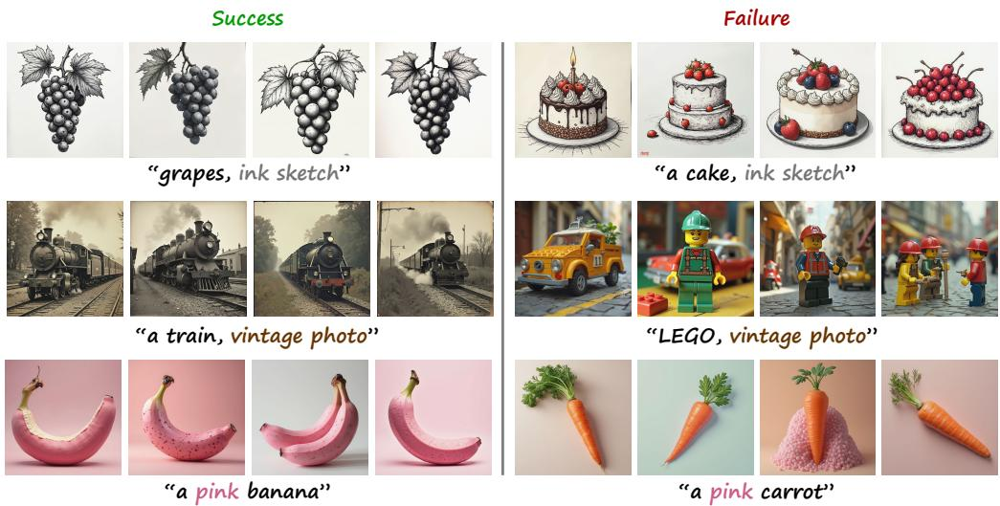  
Figure 1: Object-Dependent Concept Brittleness discovered in this work. For a fixed concept, Flux produces correct results for most objects but repeatedly fails on a subset of semantically related objects. Each object is generated with four random seeds.

These failures are informative because they may expose the boundary of what the model has actually learned: if a concept is realized correctly for most objects but repeatedly breaks on a few nearby cases, then it has likely not been learned in a suficiently robust and compositional way [11, 19]. Diagnosing this phenomenon is dificult because it is sparse, often global rather than local, and fundamentally process-dependent: concept failure may not be visible in attention maps alone and depends on how supporting evidence evolves during denoising [3, 6, 15, 37].

Prior work related to this problem mainly falls into three directions. Attention attribution and spatial localization methods [15, 37] are efective for local token-region correspondence, but less suited to global failures such as style mismatch or abstract attribute loss. Temporal analyses [12, 15, 20] study when concepts are editable, but usually capture generic stage-wise controllability rather than the diference between successful and failed cases. Studies of difusion dynamics and representation structure [7, 13, 20, 41] provide broader insights, yet remain too coarse for selective instance-level failure. Overall, existing methods still lack a representation-level framework for content-dependent failure of the same concept.

The above limitations suggest that endpoint inspection or local attention analysis alone is not suficient for this problem. In raw denoising features, content, style, texture, and attributes are highly entangled, making concept-level diagnosis dificult. We therefore seek a space that preserves denoising information while making concept evidence more separable. Recent work [9, 10, 36] suggests that sparse autoencoders (SAEs) can provide such a representation. Motivated by this, we model denoising features with step-wise SAEs. Our key observation is that, in this timestep-wise sparse space, successful and failed generations become substantially more separable than in raw features, and failed cases show systematic activation diferences that are otherwise hard to observe.

Based on this observation, we propose an interpretability-oriented framework for diagnosing and correcting object-dependent concept brittleness in text-to-image difusion models. We train SAEs at each denoising timestep, compare successful and failed samples in sparse space, construct class-level concept prototypes from reliable classconsistent generations, and use them as internal priors during inference. We then perform lightweight correction by interpolating the current denoising representation toward the prototype in SAE space, without retraining the base difusion model [3, 6, 15]. This intervention serves not only as a plug-and-play utility but also as a probe of representational relevance: if restoring the diagnosed evidence changes the outcome, then the sparse discrepancy is likely mechanistically relevant. Experiments on style and attribute settings across five difusion backbones (SD 1.5 [32], SD 3.5 [35], SDXL [30], PixArt [8], Flux [2]) show consistent improvements in concept consistency and repair success.

Our analysis further reveals two main findings about where concept evidence is most legible and when it is most correctable. First, deeper denoising features form a clearer sparse concept space and support more efective intervention than earlier representations. Second, correction is strongly time-sensitive: small sparse adjustments in early timesteps can substantially change the final output, whereas later intervention is much weaker, and prolonged strong intervention may damage unrelated content. Together, these results show that tracing systematic failures requires identifying not only which concept evidence is missing, but also where it becomes readable and when it can still be repaired.

In summary, our contributions are as follows:

• We define and systematically characterize object-dependent concept brittleness in text-to-image difusion models. We identify a previously underexplored failure pattern in which the same target concept is realized reliably for most content instances but repeatedly fails on a small subset of near-identical prompts that difer only in content.

• We uncover an interpretable representation pattern underlying concept brittleness. Using step-wise SAEs, we show that successful and failed generations exhibit stable and separable activation diferences in sparse representation space, revealing an internal structure that is dificult to observe in raw features.

• We validate the framework on two tasks and five widely used difusion backbones. Across both style and attribute settings, our approach consistently improves concept consistency and repair success, suggesting that the discovered phenomenon and its sparse representation patterns generalize across common difusion model families (SD 1.5, SD 3.5, SDXL, PixArt, Flux).

## 2 Related Work

## 2.1 Interpreting Difusion Model Internals

Recent work on difusion interpretability mainly spans three directions. The first uses attention and attribution to localize how textual concepts are expressed in generated images, as exemplified by DAAM [37], ConceptAttention [14], and I2AM [28]. The second moves from localization to mechanism analysis by examining concept-relevant heads or components; representative studies show that cross-attention head patterns can align with human visual con cepts and that internal modules can be decomposed into positive and negative contributions to concept expression [26, 29]. The third studies concept dynamics along denoising trajectories [21], asking when concepts emerge, stabilize, or remain editable, as in PCI [12]. Collectively, these works reveal interpretable structure across the spatial, modular, and temporal dimensions of difusion models. Our work builds on this perspective, but targets a diferent question: why a small subset of near-neighbor prompts systematically fails, and how such failures can be diagnosed as missing or weakened concept evidence within the denoising process.

## 2.2 Sparse Autoencoders for Mechanistic Interpretability

Sparse autoencoders (SAEs) have become an important tool for extracting sparse and semantically meaningful features from dense neural activations [4, 10, 38]. Recent work has further extended SAEbased analysis to difusion models [9, 39]. For example, SAeUron [9] uses SAE features for concept-level unlearning, while Tinaz et al. [39] studies concept evolution and stage-dependent steering. These studies establish SAE spaces as useful tools for analyzing and intervening on generative model internals. In contrast, we use step-wise SAEs as a diagnostic representation for comparing successful and failed denoising trajectories. Rather than removing or generically steering concepts, we identify missing or temporally misaligned concept evidence in systematic failures, and test these diagnoses through lightweight prototype-guided correction.

## 3 Preliminaries

## 3.1 Unified Denoising Formulation

Let $z _ { t }$ denote the sampler latent state at timestep �, and let � denote the text prompt. A broad class of difusion and flow-based generators can be written in the unified form [17, 23, 24, 34]:

$$
z _ { t - 1 } = \mathcal { U } _ { t } \big ( z _ { t } , \Phi _ { \theta } ( z _ { t } , p , t ) \big ) ,\tag{1}
$$

Here, $\mathcal { U } _ { t } ( \cdot )$ denotes the sampler update, and $\Phi _ { \theta } ( z _ { t } , p , t )$ denotes the backbone prediction at timestep �. For noise-prediction difusion models [17, 34], $\Phi _ { \theta } ( \cdot )$ is the predicted noise $\epsilon _ { \theta } ( z _ { t } , p , t )$ . A typical

deterministic update can be expressed through

$$
\hat { x } _ { 0 } ( z _ { t } , p , t ) = \frac { z _ { t } - \sqrt { 1 - \bar { \alpha _ { t } } } \epsilon _ { \theta } ( z _ { t } , p , t ) } { \sqrt { \bar { \alpha _ { t } } } } ,\tag{2}
$$

followed by

$$
z _ { t - 1 } = \sqrt { \bar { \alpha } _ { t - 1 } } \hat { x } _ { 0 } + \sqrt { 1 - \bar { \alpha } _ { t - 1 } } \epsilon _ { \theta } ( z _ { t } , p , t ) .\tag{3}
$$

For flow- or velocity-prediction models [23, 24], $\Phi _ { \theta } ( \cdot )$ becomes a vector field $v _ { \theta } ( z _ { t } , p , t )$ , and the update can be written as:

$$
z _ { t - \Delta t } = z _ { t } - \Delta t \cdot v _ { \theta } ( z _ { t } , p , t ) .\tag{4}
$$

Rather than directly analyzing $z _ { t } ,$ our method operates on the intermediate backbone prediction produced at each timestep.

## 3.2 Sparse Autoencoders

Sparse autoencoders (SAEs) [4, 10, 25] are reconstruction models that map dense activations into sparse latent representations, and are widely used to recover more interpretable internal structure from neural features. In our setting, SAEs serve as a sparse representation tool for denoising features, making condition-related structure easier to analyze than in the original dense feature space.

Given a normalized token feature $\boldsymbol { x } \in \mathbb { R } ^ { d }$ , a standard single-layer ReLU sparse autoencoder is defined as:

$$
z = \mathrm { R e L U } \big ( W _ { \mathrm { e n c } } ( x - b _ { \mathrm { p r e } } ) + b _ { \mathrm { e n c } } \big ) ,\tag{5}
$$

$$
\hat { x } = W _ { \mathrm { d e c } } z + b _ { \mathrm { p r e } } ,\tag{6}
$$

where $W _ { \mathrm { e n c } } \in \mathbb { R } ^ { K _ { d } \times d }$ and $W _ { \mathrm { d e c } } \in \mathbb { R } ^ { d \times K _ { d } }$ are the encoder and decoder weight matrices respectively, $b _ { \mathrm { p r e } } \in  { \mathbb { R } } ^ { d }$ and $b _ { \mathrm { e n c } } \in \mathbb { R } ^ { K _ { d } }$ are learnable bias terms, and � denotes the latent feature activations. $K _ { d }$ is the latent dimension of the autoencoder. Typically, $K _ { d }$ is equal to � multiplied by a positive expansion factor.

The SAE is trained to reconstruct the input while encouraging sparsity in the latent space:

$$
\mathcal { L } (  { \boldsymbol { { x } } } ) = \|  { \boldsymbol { { x } } } - \hat {  { \boldsymbol { { x } } } } \| _ { 2 } ^ { 2 } + \lambda \mathcal { L } _ { \mathrm { a u x } } ,\tag{7}
$$

where $\| { \boldsymbol { x } } - { \hat { \boldsymbol { x } } } \| _ { 2 } ^ { 2 }$ is the reconstruction loss and $\mathcal { L } _ { \mathrm { a u x } }$ is an auxiliary term used to discourage inactive latent units.

In this work, we adopt the Top-K variant of SAE [10, 25], which retains only the � largest latent activations for each input and sets the rest to zero. The encoder is therefore written as:

$$
z = \mathrm { T o p K } \big ( W _ { \mathrm { e n c } } ( x - b _ { \mathrm { p r e } } ) \big ) ,\tag{8}
$$

where TopK(·) keeps the � largest entries and zeroes out the rest, with $K \ll K _ { d }$ . The decoder remains unchanged.

## 4 Method

## 4.1 Problem Setup

We study object-dependent concept brittleness in the following setting. Let a text prompt be composed of an object � and a target concept �, where � may denote a style, an attribute, or another abstract concept to be realized in generation. Although a text-toimage difusion model can satisfy � for most prompts that share the same concept, it may repeatedly fail on a small subset of prompts whose objects difer but remain semantically close to the successful ones. Our goal is to diagnose this object-dependent failure at the level of internal denoising representations, and to test whether restoring the missing concept-related evidence can repair the failure without retraining the base model. To this end, we assume access to a reference set:

$$
\mathcal { D } _ { \mathrm { r e f } } = \{ ( x _ { i } , p _ { i } , c _ { i } ) \} _ { i = 1 } ^ { N } ,\tag{9}
$$

where $x _ { i }$ denotes a reference sample, $\mathbf { \nabla } \mathcal { P } i$ is its text prompt, and �� is the corresponding target concept class. For each sample � and timestep �, we extract the update quantity of the current denoising step and tokenize it as $X _ { i } ^ { ( \bar { t } ) } \in \bar { \mathbb { R } } ^ { \bar { P } \times D }$ , where � is the number of tokens and � is the backbone-dependent feature dimension. From these features, we obtain token-level sparse codes $Z _ { i } ^ { ( t ) }$ and pooled sample-level embeddings $s _ { i } ^ { ( t ) }$ . The reference set is used to estimate class-consistent structure in sparse space and to construct classconditioned sparse priors for later intervention.

## 4.2 Why a Sparse Internal Space is Needed

The central challenge in diagnosing object-dependent concept brittleness is not merely to identify whether a target concept is missing in the final output, but to determine how successful and failed cases difer inside the denoising process. If object-dependent concept failure reflects a systematic weakness in concept realization rather than incidental sampling noise, then the relevant discrepancy should be traceable within the denoising process.

A first indication comes from the original denoising feature space itself. As shown in Fig. 2 (a), when we visualize the pooled raw de noising features of ten style classes with t-SNE, substantial overlap remains across classes. This suggests that the original denoising representation is highly entangled: at each timestep, the backbone prediction simultaneously carries information about content, style, texture, and attributes, and these factors are mixed across spatial tokens and channels. As a result, samples that difer in whether the target concept is successfully realized may still appear close in the raw feature space, while the relevant discrepancy is confined to a small subset of latent directions. This makes it dificult to isolate the internal components associated with successful concept realization from those associated with failure.

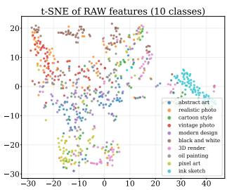  
(a) Noise latent features

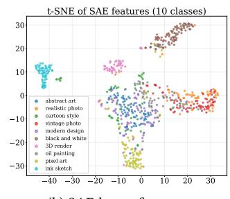  
(b) SAE latent features  
Figure 2: T-SNE visualization of raw denoising features and corresponding SAE embeddings for 10 style classes.

The overlap in Fig. 2 (a) also shows that the raw feature space does not provide a stable basis for cross-sample comparison. It is therefore poorly suited to estimating reliable class structure or determining whether a failed sample truly departs from a conceptconsistent internal pattern. This motivates the use of a sparse internal space. An appropriate representation should preserve the generative information of the denoising process while making concept-related structure more separable across samples. Sparse autoencoders are well suited to this role, as they transform dense activations into sparse latent codes while approximately preserving the underlying information. In the resulting space, concept-related evidence is concentrated on a smaller set of active dimensions, making deviations from successful patterns easier to detect.

Based on this motivation, we perform the subsequent analysis in timestep-specific SAE spaces. As shown in Fig. 2 (b), after projection into SAE space, the class structure becomes substantially clearer, suggesting that the learned sparse representation is more suitable for subsequent diagnosis than the original dense feature space.

## 4.3 Step-wise SAE Representation

To compare denoising trajectories under the same target condition, we represent the step-update features in a timestep-specific sparse space. Given $X _ { i } ^ { ( t ) } ~ \in ~ \mathbb { R } ^ { P \times D }$ , we normalize it using the timestepspecific statistics $( \mu ^ { ( t ) } , \sigma ^ { ( t ) } )$ and encode it with a dedicated SAE:

$$
Z _ { i } ^ { ( t ) } = \operatorname { E n c } ^ { ( t ) } \left( \frac { X _ { i } ^ { ( t ) } - \mu ^ { ( t ) } } { \sigma ^ { ( t ) } + \varepsilon } \right) ,\tag{10}
$$

where $Z _ { i } ^ { ( t ) } \in \mathbb { R } ^ { P \times K _ { d } }$ is the token-level sparse code and � ensures numerical stability. We further obtain the pooled representation $\begin{array} { r } { s _ { i } ^ { ( t ) } = \frac { 1 } { P } \sum _ { p = 1 } ^ { P } Z _ { i } ^ { ( t ) } ( p ) \in \mathbb { R } ^ { K _ { d } } } \end{array}$

We use a separate SAE for each timestep encoder across the full denoising trajectory. This is because denoising features vary substantially across timesteps in both distribution and semantic role: early steps mainly encode coarse global structure, whereas later steps contain more refined condition-specific information. A shared SAE would mix these heterogeneous representations into a single latent space and blur temporally specific structure. In contrast, stepwise SAEs preserve the local statistics of each denoising stage and provide a more suitable basis for cross-sample comparison.

Each SAE is trained with the reconstruction objective in Sec. 3.2, combining reconstruction fidelity with sparsity regularization. As a result, the learned sparse space remains faithful to the original denoising features while making condition-related structure more separable. This representation serves as the basis for the subsequent analysis: instead of comparing samples in the raw feature space, we compare them in a timestep-specific sparse space where deviations from successful trajectories can be identified more directly.

In the remainder of the method, we use the step-wise sparse codes $Z _ { i } ^ { ( t ) }$ and pooled embeddings $s _ { i } ^ { ( t ) }$ as the basic representations for diagnosis and intervention. The former retains token-level structure for later correction, while the latter supports sample-level comparison and class-wise statistics.

## 4.4 Diagnosing Concept Brittleness in SAE Space

With the step-wise SAE representation in place, we diagnose concept brittleness by measuring how individual samples depart from the class-consistent sparse structure under the same target condition. The key hypothesis is that, if concept brittleness reflects a systematic failure of internal condition realization rather than incidental sampling noise, then failed generations should exhibit structured departures from the reference profile in SAE space.

Let ${ \mathcal { T } } _ { c } = \{ i \mid c _ { i } = c \}$ denote the set of reference samples associated with target condition �. We first estimate the class-wise center and dispersion in pooled SAE space:

$$
\mu _ { c } ^ { ( t ) } = \frac { 1 } { \left| \mathcal { I } _ { c } \right| } \sum _ { i \in J _ { c } } s _ { i } ^ { ( t ) } , \qquad \sigma _ { c } ^ { ( t ) } = \sqrt { \frac { 1 } { \left| \mathcal { I } _ { c } \right| } \sum _ { i \in \mathcal { I } _ { c } } \left( s _ { i } ^ { ( t ) } - \mu _ { c } ^ { ( t ) } \right) ^ { 2 } } .\tag{11}
$$

These statistics define a class-consistent reference profile at timestep �. We then quantify how far each sample deviates from this profile using the normalized max-deviation score

$$
d _ { i } ^ { ( t , c ) } = \left. \frac { s _ { i } ^ { ( t ) } - \mu _ { c } ^ { ( t ) } } { \sigma _ { c } ^ { ( t ) } + \varepsilon } \right. _ { \infty } .\tag{12}
$$

This score measures whether a sample remains consistent with the sparse activation structure of its reference class. As illustrated in Fig. 3, visually failed cases tend to exhibit larger deviations from the class mean than successful cases, and the dominant discrepancies are concentrated on a small subset of sparse dimensions rather than distributed uniformly across the representation.

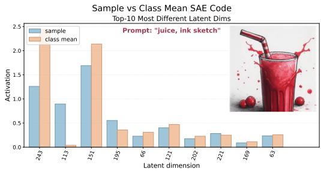  
(a) Failed sample

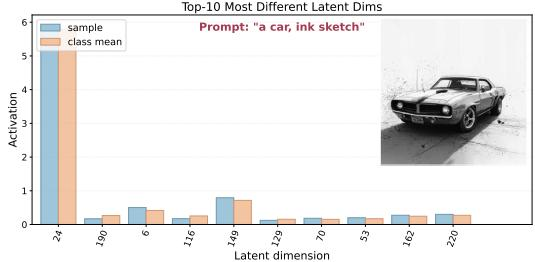  
(b) Successful sample  
Figure 3: Sample-level SAE activations versus the class mean on the top-10 most deviating latent dimensions. Failed samples (top) exhibit larger sparse-space deviations than successful samples (bottom).

To obtain a reliable class-conditioned reference for later intervention, we retain the prototype-consistent subset

$$
{ \cal J } _ { c , \mathrm { k e e p } } ^ { ( t ) } = \{ i \in { \cal J } _ { c } \mid d _ { i } ^ { ( t , c ) } \leq \tau \} ,\tag{13}
$$

where � is a filtering threshold. Samples satisfying this criterion are treated as reliable samples for prototype estimation. This filtering step reduces the influence of atypical or weakly expressed class members and yields a more stable reference subset.

To make the resulting structure more explicit, we further examine which latent dimensions are most discriminative for each condition class after filtering prototype-inconsistent samples. Figure 4 shows that these class-selective activations form a structured pattern across conditions: diferent style classes are associated with distinct subsets of sparse dimensions, and the dominant diferences are concentrated on these dimensions rather than spread uniformly over the full code. This observation strengthens the interpretation of concept brittleness as a structured representational mismatch rather than a random perturbation in the denoising feature space.

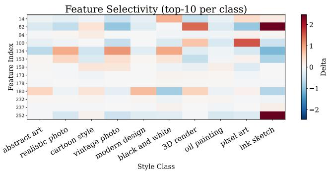  
Figure 4: Class-selective SAE activations after filtering prototype-inconsistent samples. Diferent style classes activate distinct subsets of sparse dimensions.

Once the reliable subset is identified, we turn from sample-level diagnosis to class-level structure. Since pooled embeddings are suitable for filtering but discard token-level information, we construct the final class-conditioned sparse prototype at the token level:

$$
R _ { c } ^ { ( t ) } ( \boldsymbol { p } ) = \frac { 1 } { | \mathcal { I } _ { c , \mathrm { k e e p } } ^ { ( t ) } | } \sum _ { i \in \mathcal { I } _ { c , \mathrm { k e e p } } ^ { ( t ) } } Z _ { i } ^ { ( t ) } ( \boldsymbol { p } ) , \qquad \boldsymbol { \hat { p } } = 1 , \dots , { P } ,\tag{14}
$$

which yields $R _ { c } ^ { ( t ) } \in \mathbb { R } ^ { P \times K _ { d } }$ . Here, $\mathcal { P }$ indexes token positions, $\mu _ { c } ^ { ( t ) }$ is used as the pooled class center for diagnosis and filtering, and $R _ { c } ^ { ( t ) }$ serves as a token-level sparse prototype for subsequent correction.

This diagnosis procedure plays two roles in the framework as shown in Fig. 5. First, it makes concept brittleness measurable in SAE space by exposing how atypical or failed samples depart from the class-consistent sparse structure. Second, it converts the reliable class structure into a token-level prototype that can later be used as an internal prior during inference. In this way, diagnosis and correction are linked through the same sparse representation: the structure used to identify deviations in Stage I also provides the reference used for intervention in Stage II.

## 4.5 Prototype-Guided Correction

Once the class-conditioned sparse prototypes $R _ { c } ^ { ( t ) }$ are available, we use them to correct denoising trajectories during inference. The goal of this step is to test whether restoring the class-consistent sparse structure identified in Sec. 4.4 is suficient to alter a failure outcome. In this sense, correction serves both as an intervention mechanism and as a probe of whether the diagnosed representational mismatch is relevant to the final generation.

Given a test prompt with target class $c ^ { \star }$ , we intervene at selected timesteps $t \in \mathcal { T } _ { \mathrm { g u i d e } }$ . The current step-update feature $X _ { \mathrm { t e s t } } ^ { ( t ) }$ is normalized and encoded into the timestep-specific SAE space:

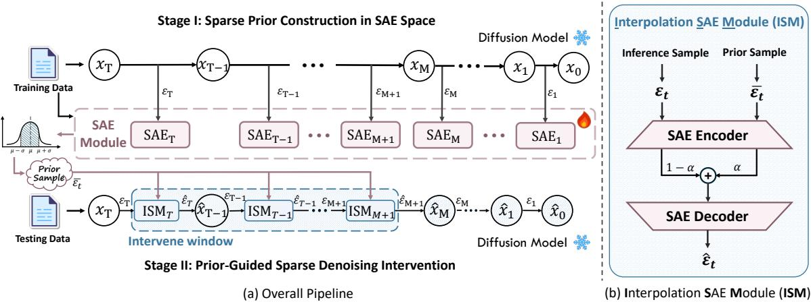  
Figure 5: Overview of the proposed two-stage framework. Stage I learns timestep-specific SAEs, filters prototype-inconsistent samples, and constructs class-conditioned sparse prototypes. Stage II performs prototype-guided interpolation in SAE space at selected denoising steps and decodes the corrected representation for subsequent sampling.

$$
Z _ { \mathrm { t e s t } } ^ { ( t ) } = \operatorname { E n c } ^ { ( t ) } \left( \frac { X _ { \mathrm { t e s t } } ^ { ( t ) } - \mu ^ { ( t ) } } { \sigma ^ { ( t ) } + \varepsilon } \right) .\tag{15}
$$

We then interpolate it toward the target-class prototype:

$$
\bar { Z } ^ { ( t ) } = ( 1 - \alpha ) Z _ { \mathrm { t e s t } } ^ { ( t ) } + \alpha R _ { c ^ { \star } } ^ { ( t ) } ,\tag{16}
$$

where $\alpha \in [ 0 , 1 ]$ controls the intervention strength. The corrected code is decoded and restored to the original feature scale:

$$
X _ { \mathrm { g u i d e d } } ^ { ( t ) } = \mathrm { D e c } ^ { ( t ) } \left( \bar { Z } ^ { ( t ) } \right) \odot ( \sigma ^ { ( t ) } + \varepsilon ) + \mu ^ { ( t ) } .\tag{17}
$$

The resulting feature is used as the current sampler update, while unguided timesteps retain the original update. Thus, the intervention directly modifies the step-update quantity rather than an arbitrary hidden state.

This design has two advantages. First, it keeps the base difusion model frozen and performs correction entirely at inference time, avoiding any task-specific finetuning. Second, the intervention is performed in the same timestep-specific sparse space used for diagnosis, so its efect remains directly tied to the class-consistent structure identified in Stage I. If moving a failed trajectory toward this sparse prototype changes the final generation, the diagnosed sparse mismatch is functionally relevant to the failure outcome.

In practice, we do not apply this correction uniformly across all timesteps. As will be shown in Sec. 6.2, the efect of intervention is strongly time-dependent, with early denoising steps providing sub stantially larger leverage than middle or late stages. We therefore apply prototype-guided correction only within a selected guidance window, which allows the method to improve condition realization while avoiding unnecessary distortion of unrelated content. Figure 5 illustrates this procedure through the interpolation SAE module (ISM), where the current step-update feature is encoded, interpolated with the corresponding sparse prototype, decoded, and then returned to the sampler for continued denoising.

## 5 Experiments

## 5.1 Experimental Setup

Tasks and Dataset. We evaluate our framework on two held-out tasks: style generation and attribute control. To support both under a unified protocol, we construct a dataset with separate training and test splits, since existing public datasets do not jointly emphasize controlled content variation, explicit content–condition separation, and matched coverage of style and attribute concepts required for analyzing object-dependent concept brittleness. The training split contains 2,080 samples covering 10 styles and 10 attribute terms, while the test split contains 1,780 samples from more than 150 entity categories and follows the prompt template “[color] [texture] [shape] [entity], [style]”. The training split is used only for feature extraction, SAE training, sample filtering, and sparse-prior construction; the test split is used only for final evaluation.

Backbones. We evaluate five difusion backbones: Stable Difusion 1.5 [32], Stable Difusion 3.5 [35], Stable Difusion XL [30], PixArt-Alpha [8], and FLUX.1-dev [2]. We follow the oficial sampler settings of each model: SD 1.5, SDXL, and FLUX.1-dev use 50 denoising steps, SD 3.5 uses 40, and PixArt-Alpha uses 20. All models use their default guidance scales and generate images at 256 × 256 resolution.

Quantitative Metrics. For style generation, we report CLIP-Image (CLIP-I) for similarity to target-style references, CLIP-Text (CLIP-T) for full-prompt alignment, Style Alignment for target-style consistency, and inference time, while treating style-specific FID [16] as a secondary reference metric. For attribute control, we report BLIP-VQA [22] scores for Color, Texture, and Shape, together with attribute-conditioned CLIP Similarity (CLIPSim) [31] and inference time. Following T2I-CompBench++ [18], BLIP-VQA uses attribute-specific yes/no questions, while CLIPSim measures semantic alignment with attribute-focused text.

Implementation Details. At each timestep �, we extract the tokenized backbone prediction $X ^ { ( t ) } \in \mathbb { R } ^ { P \times D }$ with � = 256 spatial tokens and � = 64 channels. We train one timestep-specific SAE per denoising step using flattened token features, with per-step z-score normalization. Unless otherwise stated, we use $d _ { \mathrm { m o d e l } } = 6 4 ,$ latent width $K _ { d } = 2 5 6$ (4× expansion), Top-� sparsity � = 10, and auxk = 128. Training uses 200 epochs, batch size 40,960, learn ing rate $1 \times 1 0 ^ { - 3 }$ , auxiliary loss coeficient 1/32, and dead-feature threshold 50. During inference, prototype-guided correction uses � = 0.8 and is applied to the earliest 20% of denoising steps. All quantitative results are obtained with a fixed test seed of 2026 on a single NVIDIA A800 80GB GPU.

Table 1: Main results on style generation and attribute control tasks compared with five widely used difusion model backbones.
<table><tr><td rowspan="2">Model</td><td colspan="3">Style Generation</td><td colspan="4">Attribute Control</td><td rowspan="2">Infer Time (s) (1-sample end-to-end)</td></tr><tr><td>CLIP-I↑</td><td>CLIP-T ↑</td><td>Style Align. ↑</td><td>Color ↑</td><td>Texture ↑</td><td>Shape ↑</td><td>CLIPSim ↑</td></tr><tr><td>SD 1.5 [32]</td><td>0.644</td><td>0.327</td><td>0.237</td><td>0.204</td><td>0.195</td><td>0.236</td><td>0.217</td><td>1.227±0.045</td></tr><tr><td>SD 1.5 + Ours</td><td>0.659</td><td>0.333</td><td>0.239</td><td>0.336</td><td>0.328</td><td>0.330</td><td>0.231</td><td>1.261±0.062</td></tr><tr><td>SD 3.5 [35]</td><td>0.725</td><td>0.261</td><td>0.220</td><td>0.341</td><td>0.302</td><td>0.451</td><td>0.245</td><td>15.407±0.100</td></tr><tr><td>SD 3.5 + Ours</td><td>0.797</td><td>0.297</td><td>0.221</td><td>0.461</td><td>0.437</td><td>0.475</td><td>0.250</td><td>15.701±0.598</td></tr><tr><td>SDXL [30]</td><td>0.630</td><td>0.341</td><td>0.238</td><td>0.353</td><td>0.276</td><td>0.300</td><td>0.235</td><td>6.388±0.011</td></tr><tr><td>SDXL + Ours</td><td>0.653</td><td>0.359</td><td>0.243</td><td>0.415</td><td>0.361</td><td>0.318</td><td>0.237</td><td>6.393±0.034</td></tr><tr><td>PixArt-Alpha [8]</td><td>0.627</td><td>0.336</td><td>0.232</td><td>0.349</td><td>0.356</td><td>0.315</td><td>0.222</td><td>0.586±0.013</td></tr><tr><td>PixArt-Alpha + Ours</td><td>0.629</td><td>0.338</td><td>0.239</td><td>0.368</td><td>0.366</td><td>0.358</td><td>0.247</td><td>0.609±0.069</td></tr><tr><td>Flux.1-dev [2]</td><td>0.598</td><td>0.273</td><td>0.220</td><td>0.379</td><td>0.326</td><td>0.240</td><td>0.229</td><td>4.104±0.014</td></tr><tr><td>Flux.1-dev + Ours</td><td>0.623</td><td>0.288</td><td>0.230</td><td>0.394</td><td>0.346</td><td>0.379</td><td>0.233</td><td>4.149±0.028</td></tr></table>

## 5.2 Main Results on Style Generation

We first examine whether the proposed sparse-prior intervention can improve style generation consistently across diferent difusion backbones on held-out prompts. As shown in Table 1, across all five backbones, our method improves the prompt-based metrics that most directly reflect style expression and text fidelity, while intro ducing only negligible runtime overhead. The gains are especially pronounced on stronger backbones such as SD 3.5, suggesting that the learned sparse prior functions as a backbone-agnostic mechanism for restoring missing style evidence, rather than merely as a heuristic tailored to a particular model.

Importantly, our goal is not to match a broad reference distribution for a given style domain, but to improve prompt-level concept expression under held-out prompts. For this reason, we treat CLIP-Image, CLIP-Text, and Style Alignment as the primary evidence in the main text, since they track prompt-conditioned improvement more directly than style-specific FID. The negligible increase in inference time further supports our claim that the proposed mod ule functions as a lightweight plug-in, rather than as a control mechanism that depends on costly optimization during inference.

## 5.3 Main Results on Attribute Control

We next explore whether the same mechanism extends beyond global style cues to more fine-grained attribute evidence. As shown in the right half of Table 1, our proposed method improves most or all of the Color, Texture, and Shape dimensions, while maintaining similarly small runtime overhead. This suggests that the learned sparse prior is not merely a style-specific filter, but instead captures a more general form of concept evidence that also applies to localized and semantically precise attributes.

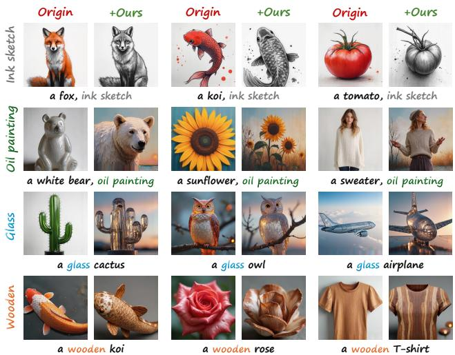  
Figure 6: Qualitative correction results on representative style and attribute failures generated by Flux [2].

This result is meaningful because attribute control is qualitatively diferent from style generation. Whereas style cues are often global, attributes such as color, material, and shape are finer-grained and more dificult to preserve consistently. The fact that the same intervention improves performance in both settings provides strong evidence that the proposed framework generalizes not only across model architectures, but also across concept families, while retaining its lightweight plug-and-play nature.

Qualitative results in Fig. 6 further support these findings: our intervention strengthens the target concept while largely preserving object identity and overall content.

## 6 Analysis

## 6.1 Where Is Concept Evidence Most Legible?

We first analyze where concept evidence is most legible inside the difusion backbone and whether clearer class structure also supports stronger intervention. To isolate representation depth, we compare three FLUX readouts—Last Double DiT Layer, Last Single

Table 2: Comparison of diferent representation layers for concept separation.
<table><tr><td>Representation Layer</td><td>Acc ↑</td><td>Sep ↑</td></tr><tr><td>Noise Latent (ours)</td><td>0.7648</td><td>1.8479</td></tr><tr><td>Last Single DiT Layer</td><td>0.7284</td><td>1.8245</td></tr><tr><td>Last Double DiT Layer</td><td>0.7108</td><td>1.7120</td></tr></table>

Table 3: Efect of representation layer on style correction.
<table><tr><td>Representation</td><td>CLIP-I↑</td><td>CLIP-T↑</td><td>Style Alignment ↑</td><td>FID↓</td></tr><tr><td>Noise Latent (ours)</td><td>0.623</td><td>0.288</td><td>0.230</td><td>293.3</td></tr><tr><td>Last Single DiT Layer</td><td>0.621</td><td>0.284</td><td>0.229</td><td>293.0</td></tr><tr><td>Last Double DiT Layer</td><td>0.606</td><td>0.275</td><td>0.224</td><td>291.8</td></tr></table>

DiT Layer, and the final Noise Latent—while fixing the training set, SAE procedure, prototype construction, intervention protocol, test set, and random seed. Each SAE uses a dictionary width four times the input dimensionality.

We begin by examining class structure in sparse space. Table 2 shows a clear depth-dependent trend: both 5-fold linear-probe accuracy (Acc) and separation ratio (Sep) improve toward the denoising output. Noise Latent achieves the best separability, followed by Last Single DiT Layer, while Last Double DiT Layer performs worst. This indicates that concept evidence becomes progressively more class-selective in later representations.

We next test whether improved legibility translates into stronger intervention. Using the same Stage-II procedure, we apply conceptguided correction with the SAE bank and class priors learned from each layer. Table 3 follows the same ordering as Table 2: Noise Latent achieves the best prompt-conditioned performance. Although FID varies only mildly, the prompt-conditioned metrics consistently favor the denoising output. Thus, better separability reflects actionable evidence rather than merely a visualization artifact. Later representations are therefore both more legible in SAE space and more efective for concept-level correction. We adopt the denoising output as the default readout because it ofers the best trade-of between interpretability and intervention efectiveness.

## 6.2 When Is Concept Evidence Most Correctable?

We next ask when concept evidence remains correctable. Because early updates establish concept evidence while later ones mainly refine committed content, we combine single-step mean ablation to measure timestep leverage with intervention-window ablation to identify the most efective correction period.

For single-step mean ablation, we replace one update in a normal trajectory with the mean feature of other samples at the same timestep, excluding the current sample. In Fig. 7, early perturbations cause the largest deviations in LPIPS, PSNR, and SSIM, while middle and late perturbations are progressively weaker. Because this operation preserves the overall feature scale while removing sample-specific information, it reveals the intrinsic leverage of each timestep. Thus, early timesteps carry high-leverage concept evidence whose errors propagate most strongly to the final image.

We then compare “Early Only (0–20%)”, “Middle Only (20–60%)”, “Late Only (60–100%)”, “Early + Middle”, and “All Steps” with other settings fixed. Table 4 shows that “Early Only” performs best overall, whereas “Middle Only” and “Late Only” are progressively weaker. “Early + Middle” slightly raises Style Alignment but lowers CLIP-Text and worsens FID, and “All Steps” performs worst. Extending intervention therefore overwrites formed content and leads to overcorrection.

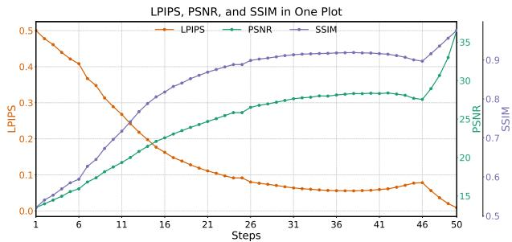  
Figure 7: Efect of single-step mean ablation at diferent denoising timesteps.

Table 4: Efect of guidance window on style correction.
<table><tr><td>Window</td><td>CLIP-I↑</td><td>CLIP-T↑</td><td>Style Alignment ↑</td><td>FID↓</td></tr><tr><td>Early Only (ours)</td><td>0.623</td><td>0.288</td><td>0.230</td><td>293.3</td></tr><tr><td>Middle Only</td><td>0.616</td><td>0.274</td><td>0.230</td><td>327.4</td></tr><tr><td>Late Only</td><td>0.593</td><td>0.271</td><td>0.224</td><td>351.2</td></tr><tr><td>Early + Middle</td><td>0.621</td><td>0.239</td><td>0.233</td><td>371.9</td></tr><tr><td>All Steps</td><td>0.603</td><td>0.206</td><td>0.221</td><td>481.4</td></tr></table>

Together, Fig. 7 and Table 4 identify a limited early correction window. Early steps determine whether concept evidence is successfully established, while later steps ofer little room for repair and risk overcorrection. This temporal asymmetry explains why our framework restricts intervention to an early subset of timesteps rather than applying it throughout the trajectory.

## 7 Conclusion

In this paper, we study object-dependent concept brittleness in text-to-image difusion models, where the same target condition succeeds for most objects but fails on a small subset of closely related prompts. To diagnose this phenomenon, we introduce a step wise SAE framework that maps denoising features into a sparse space where successful and failed trajectories can be compared directly. The resulting structured mismatches in condition-related activations make object-dependent brittleness more interpretable.

Using class-level sparse prototypes from reliable class-consistent samples, we perform lightweight inference-time correction that also probes whether the diagnosed discrepancy is relevant to the failure outcome. Experiments across style and attribute settings on five difusion backbones show consistent gains in condition consistency and repair success. Our analysis further shows that condition-related information becomes clearer in deeper features, while efective correction is concentrated in early timesteps. Future work includes extending this analysis to larger difusion architectures, video generation models, and multimodal agent settings [40], and developing more fine-grained interventions and broader benchmarks for content-dependent condition failure.

## References

[1] James Betker, Gabriel Goh, Li Jing, Tim Brooks, Jianfeng Wang, Linjie Li, Long Ouyang, Juntang Zhuang, Joyce Lee, Yufei Guo, Wesam Manassra, Prafulla Dhariwal, Casey Chu, Yunxin Jiao, and Aditya Ramesh. 2023. Improving Image Gener ation with Better Captions. https://cdn.openai.com/papers/dall-e-3.pdf

[2] Black Forest Labs. 2024. FLUX.1. https://blackforestlabs.ai/announcing-blackforest-labs/.

[3] Manuel Brack, Felix Friedrich, Dominik Hintersdorf, Lukas Struppek, Patrick Schramowski, and Kristian Kersting. 2023. SEGA: Instructing Text-to-Image Models Using Semantic Guidance. In Advances in Neural Information Processing Systems, A. Oh, T. Naumann, A. Globerson, K. Saenko, M. Hardt, and S. Levine (Eds.), Vol. 36. Curran Associates, Inc., Red Hook, NY, USA, 25365–25389. doi:10. 52202/075280-1102

[4] Trenton Bricken, Adly Templeton,Joshua Batson, Brian Chen, AdamJermyn, Tom Conerly, Nicholas L. Turner, Cem Anil, Carson Denison, Amanda Askell, Robert Lasenby, Yifan Wu, Shauna Kravec, Nicholas Schiefer, Tim Maxwell, Nicholas Joseph, Alex Tamkin, Karina Nguyen, Brayden McLean, Josiah E. Burke, Tristan Hume, Shan Carter, Tom Henighan, and Chris Olah. 2023. Towards Monosemanticity: Decomposing Language Models With Dictionary Learning. Transformer Circuits Thread. https://transformer-circuits.pub/2023/monosemanticfeatures/index.html

[5] Boyuan Cao, Jiaxin Ye, Yujie Wei, and Hongming Shan. 2025. RepLDM: Repro gramming Pretrained Latent Difusion Models for High-Quality, High-Eficiency, High-Resolution Image Generation. In Advances in Neural Information Processing Systems, D. Belgrave, C. Zhang, H. Lin, R. Pascanu, P. Koniusz, M. Ghassemi, and N. Chen (Eds.), Vol. 38. Curran Associates, Inc., Red Hook, NY, USA, 61316–61351. doi:10.52202/085713-2049

[6] Hila Chefer, Yuval Alaluf, Yael Vinker, Lior Wolf, and Daniel Cohen-Or. 2023. Attend-and-Excite: Attention-Based Semantic Guidance for Text-to-Image Dif fusion Models. ACM Transactions on Graphics 42, 4 (2023), 148:1–148:10. doi:10.1145/3592116

[7] Defang Chen, Zhenyu Zhou, Can Wang, Chunhua Shen, and Siwei Lyu. 2024. On the Trajectory Regularity of ODE-Based Difusion Sampling. In Proceedings ofthe 41st International Conference on Machine Learning (Proceedings ofMachine Learning Research, Vol. 235), Ruslan Salakhutdinov, Zico Kolter, Katherine Heller, Adrian Weller, Nuria Oliver, Jonathan Scarlett, and Felix Berkenkamp (Eds.). PMLR, Vi enna, Austria, 7905–7934. https://proceedings.mlr.press/v235/chen24bm.html

[8] Junsong Chen, Jincheng Yu, Chongjian Ge, Lewei Yao, Enze Xie, Zhongdao Wang, James Kwok, Ping Luo, Huchuan Lu, and Zhenguo Li. 2024. PixArt-�: Fast Training of Difusion Transformer for Photorealistic Text-to-Image Synthesis. In The Twelfth International Conference on Learning Representations. OpenReview.net, Vienna, Austria. https://openreview.net/forum?id=eAKmQPe3m1

[9] Bartosz Cywiński and Kamil Deja. 2025. SAeUron: Interpretable Concept Unlearning in Difusion Models with Sparse Autoencoders. In Proceedings ofthe 42nd International Conference on Machine Learning (Proceedings ofMachine Learning Research, Vol. 267), Aarti Singh, Maryam Fazel, Daniel Hsu, Simon Lacoste-Julien, Felix Berkenkamp, Tegan Maharaj, Kiri Wagstaf, andJerry Zhu (Eds.). PMLR, Van couver, Canada, 11738–11775. https://proceedings.mlr.press/v267/cywinski25a. html

[10] Leo Gao, Tom Dupré la Tour, Henk Tillman, Gabriel Goh, Rajan Troll, Alec Radford, Ilya Sutskever, Jan Leike, and Jefrey Wu. 2025. Scaling and Evaluating Sparse Autoencoders. In The Thirteenth International Conference on Learning Representations. OpenReview.net, Singapore. https://openreview.net/forum?id= tcsZt9ZNKD

[11] Dhruba Ghosh, Hannaneh Hajishirzi, and Ludwig Schmidt. 2023. GenEval: An Object-Focused Framework for Evaluating Text-to-Image Alignment. In Advances in Neural Information Processing Systems, A. Oh, T. Naumann, A. Globerson, K. Saenko, M. Hardt, and S. Levine (Eds.), Vol. 36. Curran Associates, Inc., Red Hook, NY, USA, 52132–52152. doi:10.52202/075280-2270

[12] Ada Görgün, Fawaz Sammani, Nikos Deligiannis, Bernt Schiele, and Jonas Fischer. 2026. Temporal Concept Dynamics in Difusion Models via Prompt-Conditioned Interventions. In The Fourteenth International Conference on Learning Representations. OpenReview.net, Rio de Janeiro, Brazil. https://openreview.net/forum?id= ABjaSsrYPD

[13] Jaehoon Hahm, Junho Lee, Sunghyun Kim, and Joonseok Lee. 2024. Isometric Representation Learning for Disentangled Latent Space of Difusion Mod els. In Proceedings of the 41st International Conference on Machine Learning (Proceedings of Machine Learning Research, Vol. 235), Ruslan Salakhutdinov, Zico Kolter, Katherine Heller, Adrian Weller, Nuria Oliver, Jonathan Scarlett, and Felix Berkenkamp (Eds.). PMLR, Vienna, Austria, 17224–17245. https: //proceedings.mlr.press/v235/hahm24a.html

[14] Alec Helbling, Tuna Han Salih Meral, Benjamin Hoover, Pinar Yanardag, and Duen Horng Chau. 2025. ConceptAttention: Difusion Transformers Learn Highly Interpretable Features. In Proceedings of the 42nd International Conference on Machine Learning (Proceedings ofMachine Learning Research, Vol. 267), Aarti Singh, Maryam Fazel, Daniel Hsu, Simon Lacoste-Julien, Felix Berkenkamp, Tegan Maharaj, Kiri Wagstaf, and Jerry Zhu (Eds.). PMLR, Vancouver, Canada, 22946–22963. https://proceedings.mlr.press/v267/helbling25a.html

[15] Amir Hertz, Ron Mokady, Jay Tenenbaum, Kfir Aberman, Yael Pritch, and Daniel Cohen-Or. 2023. Prompt-to-Prompt Image Editing with Cross-Attention Control. In The Eleventh International Conference on Learning Representations. OpenReview.net, Kigali, Rwanda. https://openreview.net/forum?id=\_CDixzkzeyb

[16] Martin Heusel, Hubert Ramsauer, Thomas Unterthiner, Bernhard Nessler, and Sepp Hochreiter. 2017. GANs Trained by a Two Time-Scale Update Rule Converge to a Local Nash Equilibrium. In Advances in Neural Information Processing Systems, I. Guyon, U. von Luxburg, S. Bengio, H. Wallach, R. Fergus, S. Vishwanathan, and R. Garnett (Eds.), Vol. 30. Curran Associates, Inc., Red Hook, NY, USA, 6626–6637. https://proceedings.neurips.cc/paper/2017/hash/ 8a1d694707eb0fefe65871369074926d-Abstract.html

[17] Jonathan Ho, Ajay Jain, and Pieter Abbeel. 2020. Denoising Difusion Probabilistic Models. In Advances in Neural Information Processing Systems, H. Larochelle, M. Ranzato, R. Hadsell, M. F. Balcan, and H. Lin (Eds.), Vol. 33. Curran Associates, Inc., Red Hook, NY, USA, 6840–6851. https://proceedings.neurips.cc/paper/2020/ hash/4c5bcfec8584af0d967f1ab10179ca4b-Abstract.htm

[18] Kaiyi Huang, Chengqi Duan, Kaiyue Sun, Enze Xie, Zhenguo Li, and Xihui Liu. 2025. T2I-CompBench++: An Enhanced and Comprehensive Benchmark for Compositional Text-to-Image Generation. IEEE Transactions on Pattern Analysis and Machine Intelligence 47, 5 (2025), 3563–3579. doi:10.1109/TPAMI.2025.3531907

[19] Kaiyi Huang, Kaiyue Sun, Enze Xie, Zhenguo Li, and Xihui Liu. 2023. T2I-CompBench: A Comprehensive Benchmark for Open-World Compositional Text to-Image Generation. In Advances in Neural Information Processing Systems, A. Oh, T. Naumann, A. Globerson, K. Saenko, M. Hardt, and S. Levine (Eds.), Vol. 36. Curran Associates, Inc., Red Hook, NY, USA, 78723–78747. doi:10.52202/075280- 3443

[20] Mingi Kwon, Jaeseok Jeong, and Youngjung Uh. 2023. Difusion Models Already Have a Semantic Latent Space. In The Eleventh International Conference on Learning Representations. OpenReview.net, Kigali, Rwanda. https: //openreview.net/forum?id=pd1P2eUBVfq

[21] Yiming Lei, Zilong Li, Junping Zhang, and Hongming Shan. 2024. Denoising Difusion Path: Attribution Noise Reduction with An Auxiliary Difusion Model. In Advances in Neural Information Processing Systems, A. Globerson, L. Mackey, D. Belgrave, A. Fan, U. Paquet, J. Tomczak, and C. Zhang (Eds.), Vol. 37. Curran Associates, Inc., Red Hook, NY, USA, 54003–54025. doi:10.52202/079017-1710

[22] Junnan Li, Dongxu Li, Caiming Xiong, and Steven Hoi. 2022. BLIP: Bootstrapping Language-Image Pre-training for Unified Vision-Language Understanding and Generation. In Proceedings of the 39th International Conference on Machine Learning (Proceedings ofMachine Learning Research, Vol. 162), Ka malika Chaudhuri, Stefanie Jegelka, Le Song, Csaba Szepesvari, Gang Niu, and Sivan Sabato (Eds.). PMLR, Baltimore, Maryland, USA, 12888–12900. https: //proceedings.mlr.press/v162/li22n.htm

[23] Yaron Lipman, Ricky T. Q. Chen, Heli Ben-Hamu, Maximilian Nickel, and Matthew Le. 2023. Flow Matching for Generative Modeling. In The Eleventh International Conference on Learning Representations. OpenReview.net, Kigali, Rwanda. https://openreview.net/forum?id=PqvMRDCJT9t

[24] Xingchao Liu, Chengyue Gong, and Qiang Liu. 2023. Flow Straight and Fast: Learning to Generate and Transfer Data with Rectified Flow. In The Eleventh International Conference on Learning Representations. OpenReview.net, Kigali, Rwanda. https://openreview.net/forum?id=XVjTT1nw5z

[25] Alireza Makhzani and Brendan Frey. 2014. k-Sparse Autoencoders. In The Second International Conference on Learning Representations. OpenReview.net, Banf, Canada. https://openreview.net/forum?id=QDm4QXNOsuQVE

[26] Hung-Quang Nguyen, Hoang Phan, and Khoa D. Doan. 2025. Unveiling Concept Attribution in Difusion Models. In Advances in Neural Information Processing Systems, D. Belgrave, C. Zhang, H. Lin, R. Pascanu, P. Koniusz, M. Ghassemi, and N. Chen (Eds.), Vol. 38. Curran Associates, Inc., Red Hook, NY, USA, 28596–28622. doi:10.52202/085713-0962

[27] Alexander Quinn Nichol, Prafulla Dhariwal, Aditya Ramesh, Pranav Shyam, Pamela Mishkin, Bob McGrew, Ilya Sutskever, and Mark Chen. 2022. GLIDE: Towards Photorealistic Image Generation and Editing with Text-Guided Difusion Models. In Proceedings ofthe 39th International Conference on Machine Learning (Proceedings ofMachine Learning Research, Vol. 162), Kamalika Chaudhuri, Stefanie Jegelka, Le Song, Csaba Szepesvari, Gang Niu, and Sivan Sabato (Eds.). PMLR, Baltimore, Maryland, USA, 16784–16804. https://proceedings.mlr.press/v162/ nichol22a.html

[28] Junseo Park and Hyeryung Jang. 2025. I2AM: Interpreting Image-to-Image Latent Difusion Models via Bi-Attribution Maps. In The Thirteenth International Conference on Learning Representations. OpenReview.net, Singapore. https: //openreview.net/forum?id=bBNUiErs26

[29] Jungwon Park, Jungmin Ko, Dongnam Byun, Jangwon Suh, and Wonjong Rhee. 2025. Cross-Attention Head Position Patterns Can Align with Human Visual Concepts in Text-to-Image Generative Models. In The Thirteenth International Conference on Learning Representations. OpenReview.net, Singapore. https: //openreview.net/forum?id=1vggIT5vvj

[30] Dustin Podell, Zion English, Kyle Lacey, Andreas Blattmann, Tim Dockhorn, Jonas Müller, Joe Penna, and Robin Rombach. 2023. SDXL: Improving Latent Difusion Models for High-Resolution Image Synthesis. arXiv:2307.01952 [cs.CV]

doi:10.48550/arXiv.2307.01952

[31] Alec Radford, Jong Wook Kim, Chris Hallacy, Aditya Ramesh, Gabriel Goh, Sandhini Agarwal, Girish Sastry, Amanda Askell, Pamela Mishkin, Jack Clark, Gretchen Krueger, and Ilya Sutskever. 2021. Learning Transferable Visual Models From Natural Language Supervision. In Proceedings of the 38th International Conference on Machine Learning (Proceedings ofMachine Learning Research, Vol. 139), Marina Meila and Tong Zhang (Eds.). PMLR, Virtual, 8748–8763. https://proceedings.mlr.press/v139/radford21a.html

[32] Robin Rombach, Andreas Blattmann, Dominik Lorenz, Patrick Esser, and Björn Ommer. 2022. High-Resolution Image Synthesis with Latent Difusion Models. In Proceedings ofthe IEEE/CVFConference on ComputerVision andPattern Recognition. IEEE Computer Society, Los Alamitos, CA, USA, 10684–10695. doi:10.1109/ CVPR52688.2022.01042

[33] Chitwan Saharia, William Chan, Saurabh Saxena, Lala Li, Jay Whang, Emily Denton, Seyed Kamyar Seyed Ghasemipour, Burcu Karagol Ayan, S. Sara Mahdavi, Rapha Gontijo Lopes, Tim Salimans, Jonathan Ho, David J. Fleet, and Mohammad Norouzi. 2022. Photorealistic Text-to-Image Difusion Models with Deep Language Understanding. In Advances in Neural Information Processing Systems, S. Koyejo, S. Mohamed, A. Agarwal, D. Belgrave, K. Cho, and A. Oh (Eds.), Vol. 35. Curran Associates, Inc., Red Hook, NY, USA, 36479–36494. doi:10.52202/068431-2643

[34] Jiaming Song, Chenlin Meng, and Stefano Ermon. 2021. Denoising Difusion Implicit Models. In The Ninth International Conference on Learning Representations. OpenReview.net, Virtual. https://openreview.net/forum?id=St1giarCHLP

[35] Stability AI. 2024. Introducing Stable Difusion 3.5. https://stability.ai/news introducing-stable-difusion-3-5

[36] Viacheslav Surkov, Chris Wendler, Antonio Mari, Mikhail Terekhov, Justin Deschenaux, Robert West, Caglar Gulcehre, and David Bau. 2025. One-Step is Enough: Sparse Autoencoders for Text-to-Image Difusion Models. In Advances in Neural Information Processing Systems, D. Belgrave, C. Zhang, H. Lin, R. Pascanu, P. Koniusz, M. Ghassemi, and N. Chen (Eds.), Vol. 38. Curran Associates, Inc., Red Hook, NY, USA, 99956–100027. doi:10.52202/085713-3342

[37] Raphael Tang, Linqing Liu, Akshat Pandey, Zhiying Jiang, Gefei Yang, Karun Kumar, Pontus Stenetorp, Jimmy Lin, and Ferhan Ture. 2023. What the DAAM: Interpreting Stable Difusion Using Cross Attention. In Proceedings of the 61st Annual Meeting of the Association for Computational Linguistics (Volume 1: Long Papers). Association for Computational Linguistics, Toronto, Canada, 5644–5659. doi:10.18653/v1/2023.acl-long.310

[38] Adly Templeton, Tom Conerly, Jonathan Marcus, Jack Lindsey, Trenton Bricken, Brian Chen, Adam Pearce, Craig Citro, Emmanuel Ameisen, Andy Jones, Hoagy Cunningham, Nicholas L. Turner, Callum McDougall, Monte MacDiarmid, Alex Tamkin, Esin Durmus, Tristan Hume, Francesco Mosconi, C. Daniel Freeman, Theodore R. Sumers, Edward Rees, Joshua Batson, Adam Jermyn, Shan Carter, Chris Olah, and Tom Henighan. 2024. Scaling Monosemanticity: Extracting Interpretable Features from Claude 3 Sonnet. Transformer Circuits Thread. https://transformer-circuits.pub/2024/scaling-monosemanticity/index.html

[39] Berk Tinaz, Zalan Fabian, and Mahdi Soltanolkotabi. 2025. Emergence and Evolution of Interpretable Concepts in Difusion Models. In Advances in Neural Information Processing Systems, D. Belgrave, C. Zhang, H. Lin, R. Pascanu, P. Koniusz, M. Ghassemi, and N. Chen (Eds.), Vol. 38. Curran Associates, Inc., Red Hook, NY, USA, 166943–166986. doi:10.52202/085713-5566

[40] ZhengXian Wu, Hangrui Xu, Kai Shi, Zhuohong Chen, Yunyao Yu, Chuanrui Zhang, Zirui Liao, Jun Yang, Zhenyu Yang, Haonan Lu, and Haoqian Wang. 2026. ProMSA: Progressive Multimodal Search Agents for Knowledge-Based Visual Question Answering. Accepted to ECCV 2026. arXiv:2606.27974 [cs.CV] doi:10.48550/arXiv.2606.27974

[41] Yifan Yuan, Guanqun Yang, James Z. Wang, Hui Zhang, Hongming Shan, Fei-Yue Wang, and Junping Zhang. 2025. Dissecting and Mitigating Semantic Discrepancy in Stable Difusion for Image-to-Image Translation. IEEE/CAA Journal of Automatica Sinica 12, 4 (2025), 705–718. doi:10.1109/JAS.2024.124800

[42] Huixuan Zhang and Xiaojun Wan. 2025. R-Bind: Unified Enhancement of At tribute and Relation Binding in Text-to-Image Difusion Models. In Proceedings of the 2025 Conference on Empirical Methods in Natural Language Processing. Association for Computational Linguistics, Suzhou, China, 6856–6870. doi:10.18653/v1/2025.emnlp-main.349

## Appendix

This appendix provides supplementary details and analyses that complement the main text. Specifically, it expands the descrip tion of dataset construction, feature extraction, and the two-stage implementation pipeline; gives explicit definitions of all quanti tative metrics; reports additional baseline comparisons and more qualitative examples; and includes sanity checks, ablation studies, and robustness analyses. Together, these materials are intended to improve reproducibility and to provide further evidence for the interpretability and intervention claims of the proposed framework.

## Appendix Contents

• Dataset Construction

• Detailed Algorithm and Pipeline

• Quantitative Metric Details

• More Qualitative Results

• Intervening in the Raw Feature Space versus in SAE Space

• Ablation Analyses

• Robustness Analyses

## A Dataset Construction

## A.1 Concept Vocabulary

As stated in the main text, the training split covers 10 styles and 10 attribute terms, while the held-out test split follows the prompt template [color] [texture] [shape] [entity], [style]. Below, we specify the concept vocabulary explicitly.

Training styles. The style-training prompts follow the template [entity], [style]. The 10 styles used in the training split are

abstract art, modern art, ink sketch, pixel art, cartoon style, oil painting, 3D render, realistic photo, black and white photo, and vintage photo.

These styles cover several distinct visual regimes. In particular, the vocabulary includes highly abstract styles such as abstract art and modern art, medium-constrained styles such as 3D render, oil painting, pixel art, and ink sketch, as well as photographyrelated styles such as realistic photo, black and white photo, and vintage photo. This breadth is useful in our setting because it spans both high-level stylistic abstraction and visually concrete rendering constraints.

Training attribute terms. The attribute-training prompts follow the template [attribute] [entity]. The 10 attribute terms used in the training split are

gold, pink, silver, metallic, rubber, wooden, glass,

cylindrical, teardrop, and pyramidal.

These terms can be grouped into three appearance-oriented categories. The color-related terms are gold, pink, and silver. The texture-related terms are metallic, rubber, wooden, and glass. The shape-related terms are cylindrical, pyramidal, and teardrop. Each attribute term appears 208 times in the training prompt file. Test-time color / texture / shape vocabulary. The held-out test split uses a richer closed-set vocabulary over color, texture, and shape within the unified template [color] [texture] [shape] [entity], [style].

The color vocabulary is

black, blue, brown, gold, green, orange, pink, purple, red, silver, white, and yellow.

The texture vocabulary is

fabric, fluffy, glass, leather, metallic, plastic, rubber, and wooden.

The shape vocabulary is

conical, cylindrical, diamond, pentagonal, pyramidal, rectangular, round, spherical, square, teardrop, and triangular.

Why these concepts. The prompt files show directly that the training split covers 10 styles and 10 attribute terms, and that the test split follows the explicit protocol [color] [texture] [shape] [entity], [style]. Beyond these directly observable facts, the overall concept design follows a deliberate coverage strategy.

First, the style vocabulary spans both abstract and mediumspecific conditions. Second, the appearance vocabulary focuses on color, texture, and shape, which are visually salient and also common sources of generation failure. Third, the training attribute space is intentionally compact, while the held-out test split expands this space into a richer closed-set composition over color, texture, and shape. This design indicates that the benchmark is intended to test controlled generalization under concept composition rather than simple memorization of training prompts.

## A.2 Entity Coverage and Split Characteristics

As summarized in the main text, the held-out test split contains prompts from more than 150 entity categories. Inspection of the prompt files further shows that the entity pool spans many semantic clusters rather than a narrow set of object nouns.

Representative categories include the following:

Animals: dog, cat, elephant, lion, owl, whale

Plants: tree, flower, oak tree, tulip, rose

People: child, elderly person, doctor, teacher, tourist

as well as vehicles, buildings, furniture, electronics, clothing, accessories, tools, toys, food, books, sports equipment, instruments, household items, and scene-related categories.

Coverage of semantically related objects. The prompt files do not provide an explicit formal coverage rule such as WordNet-based sampling or embedding-based sampling. However, the observed vocabulary structure suggests that semantically related objects are mainly covered through manual enumeration within semantic clusters. For example, related animal categories such as

dog, cat, lion, fox, and bear co-occur; furniture categories such as chair, table, sofa, bed, and bookshelf appear in groups; transportation categories such as car, bus, truck, train, boat, airplane, and helicopter are also grouped; and cultural objects such as novel, dictionary, textbook, magazine, newspaper, journal, and notebook

are jointly included. This clustered organization is important in our setting because object-dependent brittleness is most visible when the same concept is evaluated on semantically nearby content instances.

Observed split properties and partial cleaning. The style-training prompt file contains 208 normalized unique entities, with no exact duplicates after normalization. The attribute-training prompt file contains 208 prompts for each attribute term, but only 180 unique entities in each attribute block; the remaining 28 entries are repeated entities used to fill the block to 208 examples. In addition, the attribute prompt file appears to exclude many plural nouns, mass nouns, and some pattern-like terms. Taken together, these observations suggest that the dataset undergoes partial manual cleaning to remove entities that are awkward under direct attribute prefix templates, although the resulting prompt space is not fully linguistically sanitized. We therefore view the dataset as a controlled prompt benchmark rather than as a natural-language benchmark.

## A.3 Prompt Generation Rules

Although the style and attribute tasks do not use the same literal prompt string, they follow a unified high-level protocol: the entity content and the condition concept are explicitly separated, and the test split recombines them under a more compositional template. Style training prompts. The style-training split uses the template [entity], [style]. It contains 208 entities and 10 styles, which results in 2080 prompts in total. In practice, this is close to a Cartesian product of entity and style.

Attribute training prompts. The attribute-training split uses the template [attribute] [entity]. It contains 10 attribute terms, with 208 prompts for each term, again yielding 2080 prompts in total. However, this is not a strict Cartesian product over unique entities, because each attribute block contains 180 unique entities together with 28 repeated fillers.

Held-out joint test prompts. The held-out test split uses the template [color] [texture] [shape] [entity], [style]. Here, the color, texture, and shape slots are optional, but each prompt contains at least one attribute term. The total size of the test split is 1780 prompts, and the 10 styles are evenly distributed, with 178 prompts for each style.

The number of attribute terms in each test prompt is distributed as follows: 565 prompts contain one attribute term, 599 prompts contain two attribute terms, and 616 prompts contain three attribute terms. A finer breakdown shows that there are 188 prompts with color only, 199 with texture only, 178 with shape only, 177 with color + texture, 214 with color + shape, 208 with texture + shape, and 616 with color + texture + shape.

Relationship between style and attribute tasks. The style and attribute tasks should therefore be understood as two task-specific subtemplates within one shared protocol rather than as a single literal prompt template. Style training uses [entity], [style], attribute training uses [attribute] [entity], and the held-out test split combines both content and condition cues through [color] [texture] [shape] [entity], [style]. This design explicitly separates content from condition during training while reserving richer compositional combinations for final evaluation.

Practical implication for our setting. This dataset design is particularly suitable for analyzing object-dependent concept brittleness. Because the entity token is explicitly exposed and the condition token or tokens are controlled independently, one can compare prompts that difer primarily in content while keeping the target concept fixed. One can also test whether a sparse prior learned from a simplified training condition space transfers to a more compositional held-out test space.

Representative prompt examples. To make the construction of the dataset more concrete, we provide a small set of representative prompts drawn from the training and held-out splits. These examples are not intended to be exhaustive. Rather, they are selected to illustrate the grammatical form, semantic coverage, and compositional structure of the benchmark.

For the style-training split, prompts follow the simple template [entity], [style]. Representative examples include:

"a dog, abstract art"

"an elephant, abstract art"

"a car, abstract art"

"a dog, ink sketch"

"an owl, realistic photo"

These examples show that the same entity space is reused across diferent styles and spans multiple semantic categories, including animals, vehicles, and everyday objects. This design makes it possible to examine whether the same target concept is expressed consistently when the object token changes.

For the held-out test split, prompts follow the richer compositional template [color] [texture] [shape] [entity], [style]. Representative examples include:

"a gold leather dog, abstract art"

"a white car, cartoon style"

"a wooden watch, realistic photo"

"a leather horse, ink sketch"

"a red fabric triangular pizza, vintage photo"

"a pink glass cylindrical traffic light, 3D render"

These examples illustrate two important properties of the benchmark. First, the test split does not merely replace the object token under a fixed style condition, but composes multiple controllable appearance cues, including color, material or texture, and shape, within a unified prompt structure. Second, the entity vocabulary is intentionally broad and covers not only common animals and artifacts, but also people, food items, and small man-made objects. This diversity makes the benchmark suitable for evaluating whether a method generalizes beyond a narrow object domain and remains stable under more complex concept combinations.

## B Detailed Algorithm and Pipeline

Algorithms 1 and 2 summarize the full two-stage procedure used in our implementation. In this appendix, we further clarify the practical feature-extraction protocol, the training details of the timestep-wise SAE bank, the construction of class prototypes, and the behavior of the inference-time intervention.

## B.1 Stage I: Sparse Prior Construction

Given a reference set $\mathcal { D } _ { \mathrm { r e f } } ~ = ~ \{ ( x _ { i } , p _ { i } , c _ { i } ) \} _ { i = 1 } ^ { N }$ , we first extract a denoising feature tensor from each timestep and train one SAE for

Algorithm 1 Stage I: Sparse Prior Construction in SAE Space   
Require: Reference dataset $\mathcal { D } _ { \mathrm { r e f } } = \{ ( x _ { i } , p _ { i } , c _ { i } ) \} _ { i = 1 } ^ { N }$ , backbone pre  
dictor $\Phi _ { \theta } ,$ timesteps $\{ 0 , . . . , T { - } 1 \}$ , dictionary width $K _ { d } ,$ , sparsity   
level $K ,$ threshold �   
Ensure: SAE bank $\{ ( \mathrm { E n c } ^ { ( t ) } , \mathrm { D e c } ^ { ( t ) } ) \}$ , normalization statistics   
$\{ ( \boldsymbol { \mu } ^ { ( t ) } , \boldsymbol { \sigma } ^ { ( t ) } ) \}$ , sparse priors $\{ R _ { c } ^ { ( t ) } \}$   
1: $\mathcal { B } _ { \mathrm { S A E } } , \mathcal { B } _ { \mathrm { n o r m } } , \mathcal { B } _ { \mathrm { p r i o r } }  0$   
2: for $t = 0$ to $T - 1$ do   
3: $X _ { i } ^ { ( t ) } \gets \mathrm { T o k e n i z e } ( \Phi _ { \theta } ( \cdot , p _ { i } , t ) ) , \ : \forall i \in \{ 1 , . . . , N \}$   
4: $S ^ { ( t ) } \gets \{ x _ { i , t , p } ~ | ~ i = 1 , . . . , N , ~ p = 1 , . . . , P \}$   
5: $\mu ^ { ( t ) } \gets \mathrm { M e a n } ( S ^ { ( t ) } ) , \sigma ^ { ( t ) } \gets \mathrm { S t d } ( S ^ { ( t ) } )$   
6: $( \mathrm { E n c } ^ { ( t ) } , \mathrm { D e c } ^ { ( t ) } ) \gets \mathrm { T r a i n S A E } \Bigg ( \frac { S ^ { ( t ) } - \mu ^ { ( t ) } } { \sigma ^ { ( t ) } + \varepsilon } , K _ { d } , K \Bigg )$ ⊲ Train   
timestep-specific SAE   
7: $\boldsymbol { Z _ { i } ^ { ( t ) } } \gets \operatorname { E n c } ^ { ( t ) } \left( \frac { \boldsymbol { X } _ { i } ^ { ( t ) } - \boldsymbol { \mu } ^ { ( t ) } } { \sigma ^ { ( t ) } + \varepsilon } \right)$ , ∀�   
8: $\begin{array} { r } { s _ { i } ^ { ( t ) }  \displaystyle \frac { 1 } { P } \sum _ { p = 1 } ^ { P } Z _ { i } ^ { ( t ) } ( p ) , \forall i } \end{array}$   
9: for all class � do   
10: $I _ { c } \gets \{ i \ | \ c _ { i } = c \}$   
11: $\boldsymbol { \mu } _ { c } ^ { ( t ) } \gets \frac { 1 } { | I _ { c } | } \sum _ { i \in I _ { c } } \boldsymbol { s } _ { i } ^ { ( t ) }$   
12: $\sigma _ { c } ^ { ( t ) } \gets \sqrt { \frac { 1 } { | I _ { c } | } \sum _ { i \in I _ { c } } ( s _ { i } ^ { ( t ) } - \mu _ { c } ^ { ( t ) } ) ^ { 2 } }$   
13: $I _ { c , \mathrm { k e e p } } ^ { ( t ) } \gets \left\{ i \in I _ { c } \Bigg | \Bigg | \Bigg | \frac { s _ { i } ^ { ( t ) } - \mu _ { c } ^ { ( t ) } } { \sigma _ { c } ^ { ( t ) } + \varepsilon } \Bigg | \Bigg | _ { \infty } \leq \tau \right\}$ ⊲ Filter   
abnormal samples in pooled SAE space   
14: $R _ { c } ^ { ( t ) } ( p ) \gets \frac { 1 } { | I _ { c , \mathrm { k e e p } } ^ { ( t ) } | } \sum _ { i \in I _ { c , \mathrm { k e e p } } ^ { ( t ) } } Z _ { i } ^ { ( t ) } ( p ) , \forall p \in \{ 1 , . . . , P \}$   
15: end for   
16: end for   
17: return $\{ ( \mathrm { E n c } ^ { ( t ) } , \mathrm { D e c } ^ { ( t ) } ) , ( \mu ^ { ( t ) } , \sigma ^ { ( t ) } ) , \{ R _ { c } ^ { ( t ) } \} _ { c } \} _ { t = 0 } ^ { T - 1 }$

each timestep. Concretely, for every $t \in \{ 0 , . . . , T - 1 \}$ , we collect tokenized features

$$
X _ { i } ^ { ( t ) } \in \mathbb { R } ^ { P \times D } ,
$$

compute timestep-specific normalization statistics $( \mu ^ { ( t ) } , \sigma ^ { ( t ) } )$ , normalize all token features with z-score normalization, and train a dedicated Top-� SAE

$$
\big ( \mathrm { E n c } ^ { ( t ) } , \mathrm { D e c } ^ { ( t ) } \big ) .
$$

The resulting token-level sparse code is denoted by

$$
\boldsymbol { Z } _ { i } ^ { ( t ) } = \operatorname { E n c } ^ { ( t ) } \left( \frac { X _ { i } ^ { ( t ) } - \mu ^ { ( t ) } } { \sigma ^ { ( t ) } + \varepsilon } \right) \in \mathbb { R } ^ { P \times K _ { d } } .
$$

For sample-level comparison, we apply mean pooling over tokens and obtain

$$
s _ { i } ^ { ( t ) } = \frac { 1 } { P } \sum _ { p = 1 } ^ { P } Z _ { i } ^ { ( t ) } ( \boldsymbol { p } ) \in \mathbb { R } ^ { K _ { d } } .
$$

For each concept class $c ,$ we then estimate the class center and class dispersion in pooled SAE space. In the implementation used for prototype construction, we measure the deviation ofeach pooled

code from the class-consistent sparse profile with the normalized max-deviation score

$$
d _ { i } ^ { ( t , c ) } = \left\| \frac { s _ { i } ^ { ( t ) } - \mu _ { c } ^ { ( t ) } } { \sigma _ { c } ^ { ( t ) } + \varepsilon } \right\| _ { \infty } ,
$$

where token aggregation is performed by mean pooling. We then retain the reliable subset as

$$
I _ { c , \mathrm { k e e p } } ^ { ( t ) } = \left\{ i \in I _ { c } \biggm | d _ { i } ^ { ( t , c ) } \leq \tau \right\} .
$$

Samples satisfying this criterion are treated as prototype-consistent samples, where the default threshold is $\tau = 1 . 0$ . In practice, this filtering step removes roughly one third of the initial class members and retains a more stable subset for prototype estimation. We then construct the class prototype in token-level SAE space:

$$
R _ { c } ^ { ( t ) } ( \boldsymbol { p } ) = \frac { 1 } { | I _ { c , \mathrm { k e e p } } ^ { ( t ) } | } \sum _ { i \in I _ { c , \mathrm { k e e p } } ^ { ( t ) } } Z _ { i } ^ { ( t ) } ( \boldsymbol { p } ) , \qquad \boldsymbol { p } = 1 , \dots , P .
$$

Thus, each timestep and each class are associated with a token-level sparse prior

$$
R _ { c } ^ { ( t ) } \in \mathbb { R } ^ { P \times K _ { d } } .
$$

## B.2 Stage II: Prior-Guided Sparse Denoising Intervention

During inference, we run the original sampler and intervene only at the selected timesteps $\mathcal { T } _ { \mathrm { g u i d e } }$ . For the current denoising feature $\dot { X } _ { \mathrm { t e s t } } ^ { ( t ) } .$ we first normalize it with the saved timestep-specific statistics, encode it into sparse space, and linearly interpolate it with the target prototype:

$$
\bar { Z } ^ { ( t ) } = ( 1 - \alpha ) Z _ { \mathrm { t e s t } } ^ { ( t ) } + \alpha R _ { c ^ { \star } } ^ { ( t ) } .
$$

The interpolated sparse code is then decoded back into the original feature space, unnormalized, and converted into the feature tensor required by the sampler update. Importantly, this intervention is inserted before the current sampler state update is written back, while the intervention target itself is the step-update delta of the current denoising step. Therefore, the method does not modify an arbitrary hidden state. Instead, it directly adjusts the update quantity used by the sampler at that timestep.

## B.3 Backbone-Specific Feature Extraction

Although the framework is unified in Algorithms 1 and 2, the exact feature tensor saved at each step depends on the backbone.

For FLUX.1-dev, we save the latent update delta of the current step rather than an intermediate hidden state. The latent is first packed into a token sequence, which yields features of shape [�, �, 64]. Therefore, the extracted feature corresponds to the update of the current step in packed latent-token space.

For PixArt-Alpha, we save the one-step solver update delta after classifier-free guidance. The latent map is patchified with patch size 2, which yields tokenized features of shape [�, �, 16].

For SD 3.5, we likewise use the step-update delta after classifierfree guidance and sampler transformation. After patchifying the latent map with patch size 2, the saved feature has shape [�, �, 64].

For SDXL and SD 1.5, we extract the DDIM step-update delta after classifier-free guidance. Since these backbones naturally produce latent updates of shape (�, �, �,�), we patchify them into token sequences for SAE training and unpatchify them back into the original tensor form before writing the guided update to the sampler.

Algorithm 2 Stage II: Prior-Guided Sparse Denoising Intervention   
Require: Initial latent $z _ { T } ,$ prompt �, target class $c ^ { \star }$ , guidance steps   
${ \mathcal { T } } _ { \mathrm { g u i d e } } \subseteq \{ 0 , . . . , T - 1 \}$ , interpolation weight �, backbone pre   
dictor $\Phi _ { \theta } ,$ sampler $\{ U _ { t } \} _ { t = 0 } ^ { T - 1 }$ , SAE bank $\{ ( \mathrm { E n c } ^ { ( t ) } , \mathrm { D e c } ^ { ( t ) } ) \}$ , nor  
malization statistics $\{ ( \boldsymbol { \mu } ^ { ( t ) } , \boldsymbol { \sigma } ^ { ( t ) } ) \}$ , sparse priors $\{ R _ { c } ^ { ( t ) } \}$   
Ensure: Final image �0   
1: $z \gets z _ { T }$   
2: for $t = T - 1$ downto 0 do   
3: $\Delta ^ { ( t ) } \gets \Phi _ { \theta } ( z , p , t ) , \quad X _ { \mathrm { t e s t } } ^ { ( t ) } \gets \mathrm { T o k e n i z e } ( \Delta ^ { ( t ) } )$   
4: $\mathbf { i f } \ t \in \mathcal { T } _ { \mathrm { g u i d e } }$ then   
5: $\widetilde { X } _ { \mathrm { t e s t } } ^ { ( t ) }  \frac { X _ { \mathrm { t e s t } } ^ { ( t ) } - \mu ^ { ( t ) } } { \sigma ^ { ( t ) } + \varepsilon }$   
6: $Z _ { \mathrm { t e s t } } ^ { ( t ) }  \mathrm { E n c } ^ { ( t ) } ( \widetilde { X } _ { \mathrm { t e s t } } ^ { ( t ) } )$   
7: $\bar { Z } ^ { ( t ) } \gets ( 1 - \alpha ) Z _ { \mathrm { t e s t } } ^ { ( t ) } + \alpha R _ { c ^ { \star } } ^ { ( t ) }$   
8: $\widehat { X } ^ { ( t ) } \gets \mathrm { D e c } ^ { ( t ) } ( \bar { Z } ^ { ( t ) } )$   
9: $X _ { \mathrm { g u i d e d } } ^ { ( t ) }  \widehat { X } ^ { ( t ) } \odot ( \sigma ^ { ( t ) } + \varepsilon ) + \mu ^ { ( t ) }$   
10: ${ \tilde { \Delta _ { \mathrm { g u i d e d } } ^ { ( t ) } } }  \mathrm { U n T o k e n i z e } ( X _ { \mathrm { g u i d e d } } ^ { ( t ) } )$ ⊲ Inject target-class   
sparse prior at selected steps   
11: else   
12: $\Delta _ { \mathrm { g u i d e d } } ^ { ( t ) }  \Delta ^ { ( t ) }$   
13: end if   
14: $z \gets U _ { t } ( z , \Delta _ { \mathrm { g u i d e d } } ^ { ( t ) } )$   
15: end for   
16: $x _ { 0 } \gets$ Decode(�)   
17: return $x _ { 0 }$

In all experiments reported in the main text, images are generated at resolution 256 × 256, so the number of tokens is consistently $P = 2 5 6$ across all backbones. We then apply mean pooling over the token dimension whenever a pooled sample representation is required.

## B.4 Timestep-Wise SAE Bank

We train one SAE for each timestep and do not share parameters across timesteps. This design follows from the fact that denoising features at diferent timesteps have diferent distributions and different semantic roles. Each timestep-specific SAE is trained only on normalized token features from that timestep, and each timestep stores its own normalization statistics $( \mu ^ { ( t ) } , \bar { \sigma } ^ { ( t ) } )$ .

Our SAE adopts a Top-� sparse autoencoder of the form

$$
z = \mathrm { T o p K } \big ( W _ { \mathrm { e n c } } ( x - b _ { \mathrm { p r e } } ) + b _ { \mathrm { e n c } } \big ) , \qquad \hat { x } = W _ { \mathrm { d e c } } z + b _ { \mathrm { p r e } } .
$$

In practice, the decoder weights are unit-normalized, and an AuxK residual reconstruction term is added during training to alleviate dead features. The total loss therefore consists of the standard reconstruction loss and the AuxK residual reconstruction loss.

For the FLUX checkpoints used in the main experiments, we set $d _ { \mathrm { m o d e l } } = 6 4$ , dictionary width $K _ { d } = 2 5 6 , k = 1 0 , \mathrm { a u x k } = 1 2 8 _ { \cdot }$ , and the dead-feature threshold to 50. For PixArt-Alpha, whose token dimension is 16, we set $d _ { \mathrm { m o d e l } } = 1 6 , K _ { d } = 6 4 , k = 1 0$ , and $\operatorname { a u x k } = 3 2$ Unless otherwise specified, the remaining training hyperparameters are as follows: 200 epochs, batch size 40960, learning rate $1 0 ^ { - 3 }$ , and

AuxK coeficient 1/32. We initialize the SAE pre-bias $b _ { \mathrm { p r e } }$ with the geometric median of a subset of normalized training tokens rather than with zero initialization.

## B.5 Intervention Granularity and Coeficient Sharing

The interpolation in sparse space is applied to the entire tokenfeature tensor rather than to selected spatial positions or selected latent dimensions. That is, at every guided timestep, we interpolate all tokens and all sparse features with the same elementwise linear rule in Eq. (16). The interpolation weight � remains fixed throughout sampling. In all main experiments, we use a constant $\alpha = 0 . 8 ,$ shared across timesteps, tokens, and latent dimensions.

## B.6 Guidance Window Across Backbones

The main text states that intervention is restricted to the earliest portion of the denoising process. In implementation, this corresponds to the following backbone-specific step windows: steps 1–10 for FLUX.1-dev, SDXL, and SD1.5; steps 1–8 for SD3.5; and steps 1–5 for PixArt-Alpha. These windows approximately match the earliest 20% of the denoising trajectory for each backbone.

## B.7 Reference Partition and Practical Label Construction

For practical prototype construction, the success/failure partition used in the code is derived directly from the pooled SAE-space score above rather than from a separate VLM-based or human-annotation pipeline. Specifically, samples with $\mathrm { d } _ { i } ^ { ( t , c ) } \leq \tau$ are treated as reliable, reference-consistent samples, while those with $\mathrm { d } _ { i } ^ { ( t , c ) } >$ � are treated as outliers or failed samples for prototype estimation. The same rule is used for both style and attribute settings.

## B.8 Multi-Condition Prompts

The current implementation does not perform concept-level routing within the prompt. Instead, the target concept is specified externally by a single class identifier $c ^ { \star }$ , and the corresponding prototype $R _ { c ^ { \star } } ^ { ( t ) }$ is loaded and applied to the full token tensor. Therefore, when a prompt contains multiple conditions, the method does not parse which token span should align with which concept prototype. It uses one manually specified target class and applies the corresponding prototype uniformly to all token positions. This simplification is suficient for the controlled setting studied in this work, but it is also an important limitation of the current implementation.

## C Quantitative Metric Details

To make the quantitative results in the main text fully explicit, we describe the computation of all evaluation metrics used in this work. We group them into three categories: style-generation metrics, attribute-control metrics, and structural metrics used in the representation-layer analysis.

## C.1 Style Generation Metrics

Suppose that the test set contains � generated images. Let $x _ { i }$ denote the generated image of sample �, let $\mathbf { \nabla } \mathcal { P } i$ denote the full prompt, and let $c _ { i }$ denote the target style. Let $f _ { \mathrm { i m g } } ( \cdot )$ and $f _ { \mathrm { t e x t } } ( \cdot )$ denote the

CLIP image encoder and text encoder, respectively. We use cosine similarity throughout:

$$
\mathrm { s i m } ( u , v ) = \frac { \boldsymbol { u } ^ { \top } \boldsymbol { v } } { \Vert u \Vert _ { 2 } \Vert v \Vert _ { 2 } } .
$$

For each style $^ { c , }$ we manually collect a small reference set $\mathcal { R } _ { c } =$ $\{ r _ { 1 } , . . . , r _ { M } \}$ of visually representative images. CLIP-Image measures the average similarity between $x _ { i }$ and the reference images of the target style:

$$
\mathrm { c l i p - I } ( x _ { i } , c _ { i } ) = \frac { 1 } { | \mathcal { R } _ { c _ { i } } | } \sum _ { r \in \mathcal { R } _ { c _ { i } } } \mathrm { s i m } \big ( f _ { \mathrm { i m g } } ( x _ { i } ) , f _ { \mathrm { i m g } } ( r ) \big ) ,
$$

and the final score is

$$
{ \mathrm { C L I P - I m a g e } } = { \frac { 1 } { N } } \sum _ { i = 1 } ^ { N } { \mathrm { c l i p - I } } ( x _ { i } , c _ { i } ) .
$$

This metric emphasizes whether the generated result approaches representative visual examples of the target style.

CLIP-Text measures alignment with the full prompt:

$$
\mathrm { c l i p - T } ( x _ { i } , p _ { i } ) = \mathrm { s i m } \big ( f _ { \mathrm { i m g } } ( x _ { i } ) , f _ { \mathrm { t e x t } } ( p _ { i } ) \big ) ,
$$

$$
\mathrm { C L I P - T e x t } = \frac { 1 } { N } \sum _ { i = 1 } ^ { N } \mathrm { c l i p } \mathrm { - T } ( x _ { i } , p _ { i } ) .
$$

Because the full prompt contains both object content and condition cues, this metric reflects overall prompt adherence rather than style alone.

Style Alignment isolates the target style term and measures

$$
\mathrm { S A } ( x _ { i } , c _ { i } ) = \sin \bigl ( f _ { \mathrm { i m g } } ( x _ { i } ) , f _ { \mathrm { t e x t } } ( c _ { i } ) \bigr ) ,
$$

$$
{ \mathrm { S t y l e ~ A l i g n m e n t } } = { \frac { 1 } { N } } \sum _ { i = 1 } ^ { N } { \mathrm { S A } } ( x _ { i } , c _ { i } ) .
$$

Compared with CLIP-Text, this metric more directly reflects whether the intended style is expressed.

Style-specific FID evaluates distributional proximity between generated samples and a style reference set. For each style $c ,$ let $\mathcal { G } _ { c }$ denote the generated images under style �, and let $\mathcal { R } _ { c }$ denote the corresponding reference set. After extracting Inception features, we estimate Gaussian statistics $( \mu _ { g } , \Sigma _ { g } )$ and $\left( \mu _ { r } , \Sigma _ { r } \right)$ for $\mathcal { G } _ { c }$ and $\mathcal { R } _ { c } $ and compute

$$
\mathrm { F I D } ( { \mathcal G } _ { c } , { \mathcal R } _ { c } ) = \| \mu _ { g } - \mu _ { r } \| _ { 2 } ^ { 2 } + \mathrm { T r } \Big ( \Sigma _ { g } + \Sigma _ { r } - 2 \big ( \Sigma _ { g } \Sigma _ { r } \big ) ^ { 1 / 2 } \Big ) \ .
$$

We report either the per-style values or their mean across styles. Since this metric measures proximity to a style domain rather than prompt-level concept realization, we use it as a secondary reference rather than as the main evidence in the paper.

## C.2 Attribute-Control Metrics

In the attribute-control task, we evaluate whether color, texture, and shape are correctly bound to the target object. Let $a _ { i } ^ { \mathrm { c o l } } , a _ { i } ^ { \mathrm { t e x } }$ $a _ { i } ^ { \mathrm { s h a } }$ , and $o _ { i }$ denote the target color, texture, shape, and object of sample �.

Following T2I-CompBench++ [18], we use BLIP-VQA to evaluate each attribute dimension with attribute-specific yes/no questions. For color, the question takes the form “Is the [object] [color]?” For texture, we ask “Does the [object] have a [texture] texture?” For shape, we ask “Is the shape of the [object] [shape]?”

Although the wording is simple, it directly tests whether the target attribute is realized on the intended object. Let $\hat { y } _ { i } ^ { \mathrm { a t t r } } \in \{ 0 , 1 \}$ denote whether BLIP-VQA answers the corresponding question correctly, where atr ∈ {Color, Texture, Shape}. The score for each attribute is

$$
\mathrm { S c o r e } _ { \mathrm { a t t r } } = \frac { 1 } { N } \sum _ { i = 1 } ^ { N } { 1 \big [ \hat { y } _ { i } ^ { \mathrm { a t t r } } = 1 \big ] } ~ .
$$

Accordingly, we report

$$
\mathrm { C o l o r } = \frac { 1 } { N } \sum _ { i = 1 } ^ { N } { 1 \left[ \hat { y } _ { i } ^ { \mathrm { c o l } } = 1 \right] } ,
$$

$$
\mathrm { T e x t u r e } = \frac { 1 } { N } \sum _ { i = 1 } ^ { N } { 1 \big [ \hat { y } _ { i } ^ { \mathrm { t e x } } = 1 \big ] } ,
$$

$$
\mathrm { S h a p e } = \frac { 1 } { N } \sum _ { i = 1 } ^ { N } { 1 \big [ \hat { y } _ { i } ^ { \mathrm { s h a } } = 1 \big ] } ~ .
$$

These three scores reflect attribute-binding accuracy along the three dimensions.

We also report CLIPSim as a continuous semantic-similarity metric between the generated image and an attribute-focused text description. Let $t _ { i } ^ { \mathrm { a t t r } }$ denote the attribute text used for sample �, which can be either a single attribute token or a short descriptive phrase. We compute

$$
\mathrm { C L I P S i m } ( x _ { i } , t _ { i } ^ { \mathrm { a t t r } } ) = \mathrm { s i m } \big ( f _ { \mathrm { i m g } } ( x _ { i } ) , f _ { \mathrm { t e x t } } ( t _ { i } ^ { \mathrm { a t t r } } ) \big ) ,
$$

and average it over the test set:

$$
\mathrm { C L I P S i m } = \frac { 1 } { N } \sum _ { i = 1 } ^ { N } \mathrm { C L I P S i m } ( x _ { i } , t _ { i } ^ { \mathrm { a t t r } } ) .
$$

This metric complements BLIP-VQA by providing a continuous estimate of whether the target attribute is expressed.

## C.3 Representation-Layer Metrics

For the representation-layer analysis, we ask whether prompt-level representations extracted from diferent layers are easier to classify and better separated in feature space. Let

$$
\mathcal { D } = \{ ( s _ { i } , y _ { i } ) \} _ { i = 1 } ^ { N }
$$

denote the pooled representation $s _ { i } \in \mathbb { R } ^ { d }$ and its class label $y _ { i }$

Acc is computed by fitting a multiclass logistic regression classifier with 5-fold cross-validation on D. $\operatorname { I f } \mathcal { N } _ { m }$ denotes the validation split of fold � and $\hat { y } _ { i } ^ { ( m ) }$ denotes the predicted label, then

$$
\mathrm { A c c } = \frac { 1 } { 5 } \sum _ { m = 1 } ^ { 5 } \frac { 1 } { \left| \mathcal { V } _ { m } \right| } \sum _ { ( s _ { i } , y _ { i } ) \in \mathcal { V } _ { m } } 1 \Big [ \hat { y } _ { i } ^ { ( m ) } = y _ { i } \Big ] .
$$

Higher Acc indicates that class information is more legible to a simple linear classifier.

Sep measures geometric class separation directly in representation space. We sample pairs of representations and compute Euclidean distances. The within-class and between-class distances are

$$
{ \begin{array} { r l } & { { \mathrm { I n t r a } } = \mathbb { E } { \left[ \| s _ { i } - s _ { j } \| _ { 2 } \ | \ y _ { i } = y _ { j } \right] } , } \\ & { { \mathrm { I n t e r } } = \mathbb { E } { \left[ \| s _ { i } - s _ { j } \| _ { 2 } \ | \ y _ { i } \neq y _ { j } \right] } . } \end{array} }
$$

We then define

$$
\mathrm { S e p } = \frac { \mathrm { I n t e r } } { \mathrm { I n t r a } + \varepsilon } ,
$$

where � is a small constant for numerical stability. A larger Sep indicates that samples from diferent classes are farther apart while samples from the same class remain more compact.

Taken together, these metrics evaluate complementary aspects of the framework. For style generation, CLIP-Image emphasizes visual proximity to representative style examples, CLIP-Text evaluates global adherence to the full prompt, Style Alignment isolates target-style expression, and style-specific FID reflects distributional proximity to a style domain. For attribute control, BLIP-VQA provides explicit attribute-binding accuracy, while CLIPSim provides a continuous semantic measure. For the representation-layer study, Acc measures classifier readability and Sep measures intrinsic geometric separation. Their joint use provides a more complete view of where concept evidence becomes most legible within the difusion model.

## D More Qualitative Results

We provide additional qualitative examples to complement the quantitative results in the main text. These examples are intended to illustrate three aspects of the proposed method more directly. First, the sparse-prior intervention improves concept realization across a broad range of objects rather than only on a few isolated prompts. Second, the improvement is observed for both global style conditions and more localized attribute conditions. Third, in most cases, the intervention strengthens the target concept while preserving the main object identity and overall scene structure.

Figures 8 and 9 present additional side-by-side comparisons between the original generation and the corrected result. Across these examples, the proposed method consistently reduces missingstyle and weak-attribute failures that are dificult to repair from the final image alone. The examples also show that the efect is not

<table><tr><td></td><td>Flux.1-dev</td><td>+Ours</td><td>Flux.1-dev</td><td>+Ours</td><td>Flux.1-dev</td><td>+Ours</td><td>Flux.1-dev +Ours</td><td>Flux.1-dev</td><td>+Ours</td><td>Flux.1-dev</td><td></td><td>+Ours</td></tr><tr><td>Iks eck</td><td></td><td></td><td></td><td></td><td></td><td></td><td></td><td></td><td></td><td></td><td></td><td></td></tr><tr><td>oiaiind ing</td><td>a sunflower, ink sketch</td><td></td><td>an apple, ink sketch</td><td></td><td>grapes, ink sketch</td><td></td><td>juice, ink sketch</td><td></td><td>a cake, ink sketch</td><td></td><td>sushi, ink sketch</td><td></td></tr><tr><td></td><td>an elephant, oil painting</td><td></td><td>a fluffy bird, oil painting a purple whale, oil painting</td><td></td><td></td><td></td><td>a rubber bus, oil painting</td><td></td><td>a handbag, oil painting</td><td></td><td>a fabric sofa, oil painting</td><td></td></tr><tr><td>itaage</td><td></td><td></td><td></td><td></td><td></td><td></td><td></td><td></td><td></td><td></td><td></td><td></td></tr><tr><td></td><td>a fluffy bear, vintage photo</td><td></td><td>a tulip, vintage photo</td><td></td><td>a white rose, vintage photo</td><td></td><td>a blue sofa, vintage photo</td><td></td><td></td><td>a measure, vintage photo a microscope, vintage photo</td><td></td><td></td></tr><tr><td>Ed der</td><td></td><td></td><td></td><td></td><td></td><td></td><td></td><td></td><td></td><td></td><td></td><td></td></tr><tr><td></td><td>a fish, 3D render</td><td></td><td>an owl, 3D render</td><td></td><td>a fridge, 3D render</td><td></td><td>a helicopter, 3D render</td><td></td><td>a blue wardrobe, 3D render</td><td></td><td>a pink cabinet, 3D render</td><td></td></tr><tr><td></td><td>a pink panda</td><td></td><td>a pink carrot</td><td></td><td></td><td></td><td></td><td></td><td></td><td></td><td></td><td></td></tr><tr><td>Meallie</td><td></td><td></td><td></td><td></td><td>a pink television</td><td></td><td>a pink burger</td><td></td><td>a pink microscope</td><td></td><td>a pink koi</td><td></td></tr><tr><td></td><td>a metallic owl</td><td></td><td>a metallic koi</td><td></td><td>a metallic tulip</td><td></td><td>a metallic apple</td><td></td><td></td><td></td><td></td><td></td></tr><tr><td>Woen</td><td></td><td></td><td></td><td></td><td></td><td></td><td></td><td></td><td>a metallic banana</td><td></td><td>a metallic violin</td><td></td></tr><tr><td></td><td></td><td></td><td></td><td></td><td></td><td></td><td></td><td></td><td></td><td></td><td></td><td></td></tr><tr><td></td><td>a wooden panda</td><td></td><td>a wooden sunflower</td><td></td><td>a wooden banana</td><td></td><td>a wooden strawberry</td><td></td><td>a wooden drone</td><td></td><td>a wooden laptop</td><td></td></tr><tr><td>as</td><td></td><td></td><td></td><td></td><td></td><td></td><td></td><td></td><td></td><td></td><td></td><td></td></tr><tr><td></td><td></td><td></td><td></td><td></td><td></td><td></td><td></td><td></td><td></td><td></td><td></td><td></td></tr><tr><td>a glass turtle</td><td></td><td></td><td>a glass penguin</td><td></td><td>a glass apple</td><td></td><td>a glass cello</td><td></td><td></td><td>a glass helicopter</td><td>a glass shovel</td><td></td></tr></table>

Figure 8: Further qualitative comparisons for representative failure cases. The corrected results exhibit clearer target-style or target-attribute expression than the original outputs, which supports the claim that the sparse discrepancy identified in SAE space is functionally relevant to the final generation outcome.

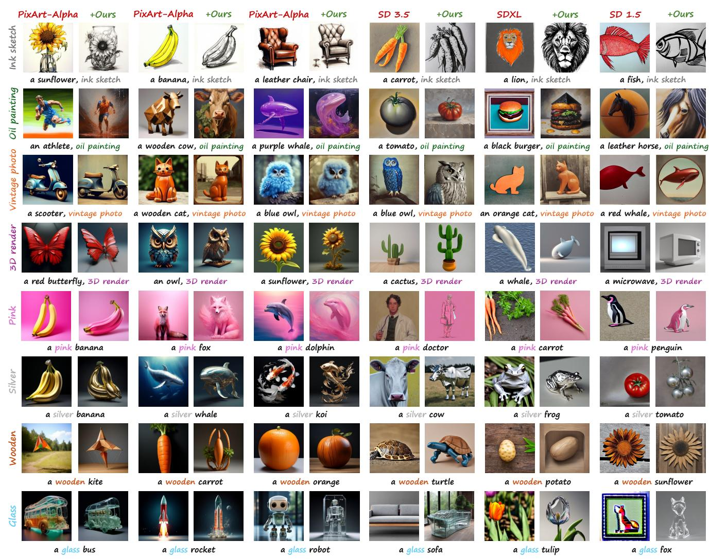  
Figure 9: Additional qualitative results on held-out prompts. Each group compares the original generation with the result after sparse-prior intervention. The examples show that the proposed method improves concept realization across diverse object categories and prompt types, while largely preserving the main content and layout of the original generation.

limited to a single semantic category, but extends to animals, daily objects, vehicles, food items, and scene-related concepts.

Taken together, these examples provide qualitative support for the main claim of the paper. The proposed intervention does not merely produce isolated visual changes, but systematically restores missing or weakened concept evidence across a wide range of prompts. This behavior is consistent with our interpretation that object-dependent concept britleness arises from an internal mismatch in concept-related sparse activations rather than from purely random sampling variation.

## E Intervening in the Raw Feature Space versus in SAE Space

To clarify that the benefit of the proposed method arises from the intervention space itself rather than from merely inserting an addi tional interpolation step, we compare two intervention variants. In the first variant, we directly interpolate in the raw denoising feature space. In the second variant, we first map the current denoising feature into SAE space, interpolate it with the target class prototype in sparse space, and then decode it back into the original space for the subsequent sampling step. In this comparison, both variants use the same intervention strength � = 0.8, and all other sampling settings remain unchanged, so that the efect of the intervention space can be isolated as clearly as possible.

Figure 10 provides representative comparisons for both style and attribute failures. Each triplet shows the original generation, the result obtained by intervention in the raw noise-latent space, and the result obtained by intervention in SAE space. The examples cover several typical failure types, including missing sketch style in “a fox, ink sketch” and “a tomato, ink sketch”, as well as attributebinding failures such as “a pink panda”, “a pink burger”, “a glass

a koi

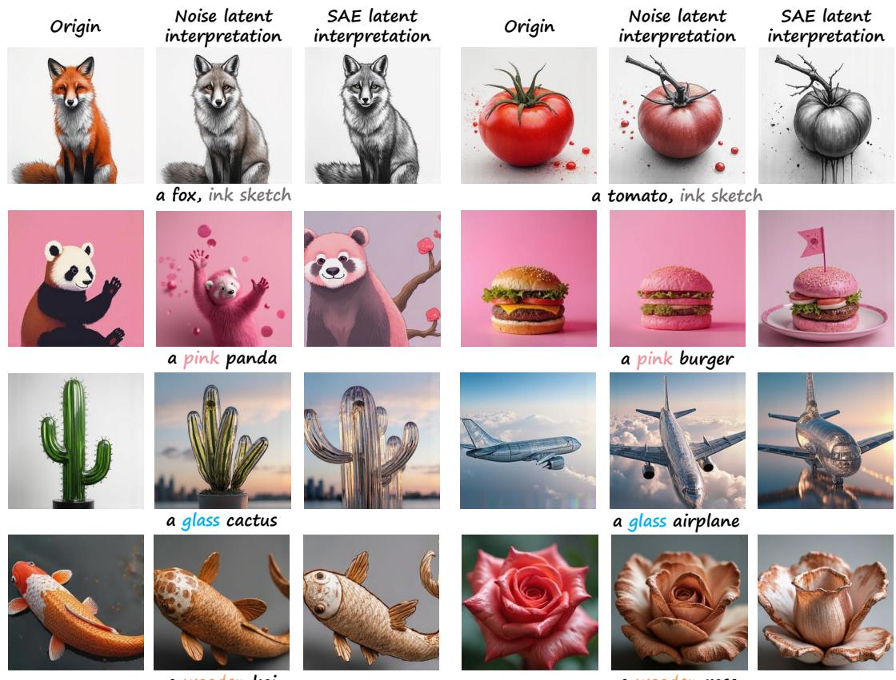  
a rose

Figure 10: Comparison between intervention in the raw denoising feature space and intervention in SAE space. For each example, the three columns show the original generation, the result after raw-space intervention on the noise latent, and the result after SAE-space intervention. Raw-space intervention is generally more conservative and better preserves already-formed visual structure, but it often provides only partial correction of the target concept. By contrast, SAE-space intervention more reliably restores the intended style or attribute, which supports the view that concept repair is more efective when the intervention is performed in a sparse representation space where concept evidence is more separable.

cactus”, “a glass airplane”, “a wooden koi” and “a wooden rose”. These examples are chosen to span diferent semantic categories and to test whether the two intervention spaces behave diferently across both global style conditions and more localized attribute conditions.

The comparison reveals a consistent diference in behavior. Intervention in the raw denoising feature space is visually more conservative: it often preserves coarse object identity, background layout, and already-formed appearance cues, but its corrective efect is frequently limited. This can be observed, for example, in the sketch examples, where raw-space intervention moves the result toward a weaker grayscale rendering but often fails to impose a clear sketchlike appearance. A similar pattern appears in the oil-painting and 3D-render examples, where the raw-space result partially shifts the image toward the target concept yet still retains a substantial amount of the original appearance. This behavior is consistent with the fact that content, style, and attribute information remain highly entangled in the original feature space, so the intervention signal is diluted by the dominant content structure already present in the denoising trajectory.

By contrast, intervention in SAE space yields a substantially stronger and more stable correction efect. In Figure 10, the SAEspace result more reliably restores the intended sketch style for the fox and tomato. The same tendency is visible in the attribute examples, where the target color or material cue becomes more pronounced for the panda, burger, cactus, airplane, koi, and rose. In summary, SAE-space intervention can repair the missing or weakened concept evidence more consistently while still preserving the main semantic identity of the object. These observations support the main claim of the paper: the efectiveness ofthe proposed intervention does not come simply from modifying the trajectory, but from performing that modification in a representation space where concept-relevant evidence is more explicitly separated from the surrounding content structure.

## F Ablation Analyses

## F.1 Sensitivity to the SAE Sparsity Hyperparameter �

We examine the sensitivity of the SAE sparsity level �, which controls how many latent dimensions remain active after the Top-� operator. Since the main purpose of the SAE in our framework is to expose concept-relevant structure more clearly than the raw feature space, we evaluate diferent values of � through the two structural metrics used in the representation-layer analysis, namely Acc and Sep.

Table 5: Sensitivity to the SAE sparsity level � in the representation-layer analysis.
<table><tr><td>k</td><td>4</td><td>6</td><td>10</td><td>15</td><td>20</td></tr><tr><td>Acc ↑</td><td>0.7269</td><td>0.7709</td><td>0.7648</td><td>0.7618</td><td>0.7800</td></tr><tr><td>Sep ↑</td><td>1.7967</td><td>1.8094</td><td>1.8479</td><td>1.8796</td><td>1.8559</td></tr></table>

As shown in Table 5, both Acc and Sep improve substantially when � increases from a very small value, and then become rela tively stable once the sparse code becomes moderately wide. This trend suggests that, beyond a certain point, the SAE already retains enough active dimensions to encode the concept information needed for our analysis. Although slightly larger values of � may improve one metric in isolation, the gains are small and are no longer systematic. We therefore use $k = 1 0$ in the main paper because it provides strong class structure while keeping the sparse representation compact and the subsequent intervention simple.

## F.2 Sensitivity to the Filtering Threshold �

We further analyze the sensitivity of the filtering threshold � in Eq. (13). In our framework, � controls the strictness of the prototypeconstruction stage. A smaller value removes more samples that deviate from the class-consistent sparse pattern and therefore yields a cleaner but potentially less diverse reference subset. A larger value preserves more samples, but it may also retain unstable or weakly expressed cases. Since the training split is used to construct classconditioned sparse priors, the choice of � directly determines the trade-of between prototype reliability and intra-class diversity.

To examine this trade-of, we conduct a targeted analysis on the ink sketch style, where severe failure cases are visually clear and relatively easy to identify. We first manually collect a small set of obvious failure examples and use them only as a sanity-check set rather than as an additional supervision signal. We then vary � and examine two quantities simultaneously: how many training samples are filtered out by Eq. (13), and whether the rejected subset overlaps with the manually identified severe failures. Figure 11 provides a visual illustration of this process. The top row shows the manually collected error-generated samples, while the rows below show the subsets rejected under diferent values of�. Although this figure is intended mainly as a qualitative illustration, it makes the filtering trend more transparent: as � decreases, the rejected subset expands and progressively covers a larger portion of the visually obvious failures.

The resulting trend is monotonic. When � is large, filtering is loose and removes only a few samples, but many visually obvious failures remain in the retained subset. As � decreases, the filter becomes progressively stricter and captures a larger portion of the severe failures, but it also removes substantially more training data. Concretely, the number of excluded samples is 23/2080 for � = 2.0, 119/2080 for � = 1.5, 324/2080 for � = 1.25, 746/2080 for � = 1.0, and 1421/2080 for � = 0.75.

The qualitative evidence in Figure 11 is consistent with this quantitative trend. Under relatively loose thresholds such as $\tau = 2 . 0$ and $\tau = 1 . 5 ,$ , only a small portion of the obvious failures is identified. As the threshold becomes stricter, more of the error-generated samples are captured, and at $\tau = 0 . 7 5$ the rejected subset already overlaps with nearly the full manually collected set. This behavior supports our interpretation that the pooled SAE-space score provides a meaningful proxy for sample reliability, even though the final choice of � must still be determined by the balance between purity and diversity.

Among these settings, $\tau = 0 . 7 5$ is the most aggressive and excludes nearly all manually identified severe failures. However, it also removes 1421 out of2080 training samples, which is too destructive for the subsequent prototype-estimation stage. Such large-scale filtering substantially reduces the diversity of the retained reference pool and may weaken the robustness of the class-conditioned prior used for guidance. By contrast, $\tau = 1 . 0$ already captures most of the manually identified severe failures while preserving a much larger fraction of the training data. We therefore treat $\tau = 1 . 0$ as a more suitable operating point because it provides a better balance between removing unreliable samples and retaining suficient intra-class diversity for sparse-prior construction.

Overall, this analysis suggests that the role of � is not simply to maximize the number of discarded failure samples. Its real function is to balance prototype purity against prototype diversity. Based on this trade-of, we use $\tau = 1 .$ 0 as the default setting in all experiments.

## F.3 Sensitivity to the Intervention Coeficient �

We further analyze the sensitivity of the intervention coeficient � in Eq. (16). In our framework, � controls the interpolation strength between the current sparse code of the test sample and the target class prototype. A smaller � changes the original denoising trajectory more conservatively and is therefore more favorable for preserving the object structure and content details that have already formed. However, such weak guidance may not be suficient to compensate for missing, weakened, or shifted concept evidence in failed samples. A larger � pushes the current denoising update more strongly toward the class prototype and therefore enforces the target style or attribute more aggressively. Yet if the intervention is too strong, it may overwrite content information that has already formed in the original trajectory and lead to over-correction, including changes in object appearance, abnormal local structure, or even semantic drift. The choice of � therefore controls the trade-of between concept-repair strength and content-preservation ability.

To examine this trade-of, we qualitatively compare representative failed prompts under � $\in \ \left\{ 1 . 0 , 0 . 9 , 0 . 8 , 0 . 7 , 0 . 6 , 0 . 5 \right\}$ while keeping all other sampling settings unchanged. We focus on two questions. The first is whether a given value of � can efectively repair the original concept failure. The second is whether the repaired result still preserves the original object identity and overall content structure. Figures 12 and 13 summarize the corresponding qualitative comparisons for style failures and attribute failures, respectively.

The qualitative results show a clear pattern. When � is too small, the intervention signal is weak and often produces only limited concept correction, so some originally failed samples remain insuficiently repaired. This efect is particularly visible in the style

## Error-generated sample

  
τ = 2.0

$$
\pmb { \tau } = \pmb { 1 . 5 }
$$

  
τ = 1.25

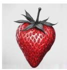

  
τ = 1.0

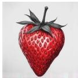

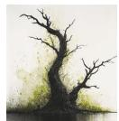

  
τ = 0.75

Figure 11: Qualitative illustration of the filtering behavior under diferent thresholds � for the ink sketch style. The top row shows a manually collected set of visually obvious error-generated samples. The rows below show the subsets rejected by the pooled SAE-space score under diferent values of �. As � decreases, the filtering becomes progressively stricter and captures a larger portion of the obvious failures. This visual trend is consistent with the quantitative statistics reported in the text: smaller thresholds improve prototype purity, but they also remove substantially more training samples and thus reduce the diversity of the retained reference subset.

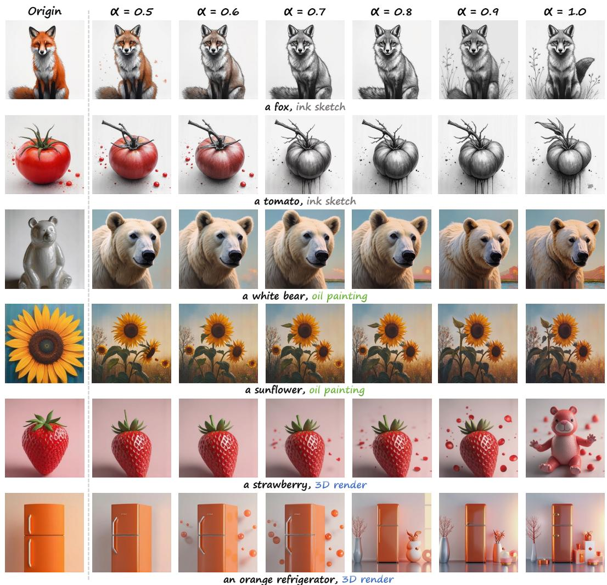  
Figure 12: Qualitative sensitivity to the intervention coeficient � on representative style-failure cases. From left to right, each row shows the original generation and the results obtained with � ∈ {0.5, 0.6, 0.7, 0.8, 0.9, 1.0}. As � increases, the target style is enforced more strongly: sketch, oil-painting, and 3D-render cues become progressively clearer. However, excessively large values may also introduce over-correction, including changes in scene layout, additional background structure, or semantic drift. Across these examples, moderate values around � = 0.8 provide the most favorable balance between concept repair and content preservation.

examples of Figure 12. For prompts such as “a fox, ink sketch” and “a tomato, ink sketch,” smaller values such as � = 0.5 or � = 0.6 only partially suppress the original color appearance and do not yet yield a suficiently clear sketch-like rendering. A similar tendency appears for “a white bear, oil painting” and “a sunflower, oil painting,” where weak intervention improves the result only marginally and does not fully establish the painterly texture and atmosphere associated with the target style.

As � increases, expression of the target style or attribute becomes more apparent. In Figure 12, values around � = 0.7 and � = 0.8 generally provide a favorable balance: the sketch examples become substantially more consistent with the target monochrome linebased style, the oil-painting examples acquire a more coherent painterly appearance, and the 3D-render examples show a clearer synthetic rendered look. The same trend is observed in the attribute examples of Figure 13. For “a pink panda” and “a pink burger,” increasing � gradually strengthens the target color cue, while for “a glass cactus” and “a glass airplane,” the intended material property becomes progressively more explicit. Likewise, the wooden texture in “a wooden koi” and “a wooden rose” becomes clearer as the intervention strength increases from weak to moderate values.

However, overly large interpolation also makes the result more likely to deviate from the original content. This efect becomes evident at � = 0.9 and is most pronounced at � = 1.0. In Figure 12, aggressive intervention may introduce substantial scene changes or semantic drift. For example, the 3D-render case of “a strawberry, 3D render” is over-corrected at � = 1.0 and no longer preserves the original object identity, while “an orange refrigerator, 3D render” acquires additional scene elements and a noticeably altered composition under stronger intervention. In Figure 13, the same phenomenon is visible in cases such as “a pink panda,” “a pink burger,” and especially “a glass airplane” and “a wooden koi,” where the target attribute is strengthened but the object itself becomes increasingly distorted or partially replaced by visually implausible structures. In other words, too small a value of � fails to repair the concept reliably, whereas too large a value of � tends to repair it too aggressively.

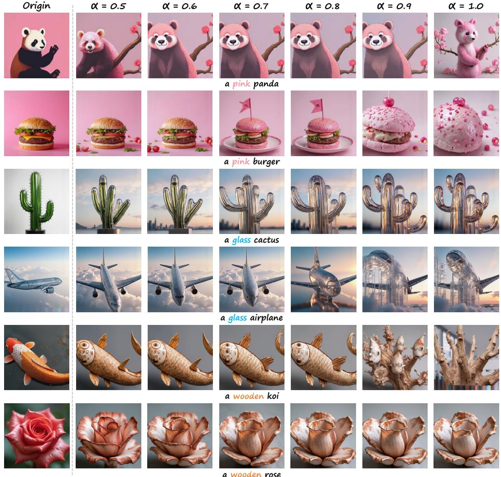  
Figure 13: Qualitative sensitivity to the intervention coeficient � on representative attribute-failure cases. From left to right each row shows the original generation and the results obtained with � ∈ {0.5, 0.6, 0.7, 0.8, 0.9, 1.0}. Increasing � strengthens the target attribute, including color and material cues such as pink, glass, and wooden. At the same time, overly strong intervention may distort object identity or produce visually implausible structures, especially at � = 1.0. These examples further support the conclusion that moderate intervention strengths, particularly around � = 0.8, achieve a better trade-of between reliable concept correction and preservation of the original object content.

Taken together, these observations suggest that � = 0.8 is a suitable operating point. Relative to smaller values, it provides sufficiently strong concept guidance and repairs a substantial portion of style and attribute failures. Relative to more aggressive values, it is less likely to damage object content or disrupt the original layout. We therefore use � = 0.8 as the default setting in all main experiments.

## G Robustness Analyses

## G.1 Robustness Across Random Seeds

The main text reports quantitative results under a fixed test seed of 2026. To assess whether the observed improvement is specific to a particular noise initialization, we further evaluate FLUX.1-dev on the style-generation task under four diferent random seeds, namely 2026, 512, 331, and 42. The original model and our method are compared under exactly the same experimental settings.

Table 6: Robustness across random seeds on the FLUX.1-dev style-generation benchmark.
<table><tr><td></td><td colspan="2">2026</td><td colspan="2">512</td><td colspan="2">331</td><td colspan="2">42</td></tr><tr><td>Metric</td><td>Origin</td><td>Ours</td><td>Origin</td><td>Ours</td><td>Origin</td><td>Ours</td><td>Origin</td><td>Ours</td></tr><tr><td>CLIP-Image</td><td>0.598</td><td>0.623</td><td>0.577</td><td>0.618</td><td>0.578</td><td>0.618</td><td>0.582</td><td>0.622</td></tr><tr><td>CLIP-Text</td><td>0.273</td><td>0.288</td><td>0.275</td><td>0.288</td><td>0.277</td><td>0.293</td><td>0.274</td><td>0.290</td></tr><tr><td>Style Alignment</td><td>0.220</td><td>0.230</td><td>0.219</td><td>0.230</td><td>0.221</td><td>0.231</td><td>0.219</td><td>0.230</td></tr></table>

Table 6 shows that the proposed intervention yields a consistent improvement over the original model across all tested seeds. More importantly, this consistency is observed simultaneously on CLIP-Image, CLIP-Text, and Style Alignment, which indicates that the gain is not restricted to a single aspect of generation quality. The relative ranking between the original model and our method remains unchanged under diferent noise initializations, and the improvement margins are also stable across seeds.

These results support two conclusions. First, the benefit of the proposed sparse-prior intervention does not depend on a particular favorable sampling trajectory. Second, the intervention improves style realization in a manner that is robust to seed variation, rather than merely shifting performance under isolated cases. From the perspective of interpretability, this stability is important because it suggests that the repaired concept evidence reflects a persistent property of the denoising process, instead of an incidental efect tied to one specific random initialization.

Overall, the multi-seed evaluation strengthens the main claim of the paper. The proposed method provides a reproducible improvement in style-related generation quality, and its efect remains stable under diferent sampling seeds.

## G.2 Step-wise SAE Activation Comparison Across Guided Timesteps

The main text visualizes the diference between successful and failed samples in SAE space using a single representative timestep. Since our framework trains a separate SAE for each denoising step, it is also important to examine whether the same contrast remains visible throughout the full guided window rather than only at one isolated step. To this end, we further visualize the top-10 most diferent latent dimensions for four representative prompts over the first ten denoising steps, including two successful cases, namely “a dog, ink sketch” and “a car, ink sketch,” and two failed cases, namely “an orange, ink sketch” and “juice, ink sketch.”

Figures 14–17 reveal a clear temporal distinction between successful and failed trajectories. For the successful samples, the samplewise SAE activations remain close to the corresponding class mean across most of the first ten steps. Although small fluctuations are still present, the dominant activation peaks generally appear on similar latent dimensions and with similar magnitudes. This indicates that successful generations do not merely satisfy the target concept at the final image level, but also follow a relatively stable condition-consistent trajectory in step-wise sparse space.

By contrast, the failed samples exhibit larger and more persistent deviations from the class mean across multiple denoising steps. The mismatch is not uniformly distributed across the full latent code. Instead, it is concentrated on a limited subset of highly activated sparse dimensions, which is consistent with the main-text observation that concept brittleness appears as a structured sparse discrepancy rather than as difuse noise. In particular, for both “an orange, ink sketch” and “juice, ink sketch,” noticeable gaps between the sample activation and the class mean are already visible at the earliest steps and remain observable throughout much ofthe guided window. This suggests that these failures are not caused by a purely late-stage drift, but reflect a trajectory-level mismatch that emerges early and persists over time.

Another notable pattern is that the identity of the top deviating latent dimensions changes from step to step. This behavior further justifies the timestep-specific SAE design adopted in our framework. Since denoising features play diferent semantic roles at diferent stages, a shared latent space would blur this temporal structure, whereas step-wise SAE representations preserve the local statistics of each stage and make cross-sample comparison more faithful. The present visualizations therefore provide additional qualitative support for the use of a timestep-specific sparse representation.

Sample vs Class Mean SAE Code | ink sketch  
Sample vs Class Mean SAE Code | ink sketch  
Sample vs Class Mean SAE Code | ink sketch  
Step = 1  
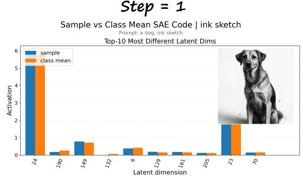  
Step = 2

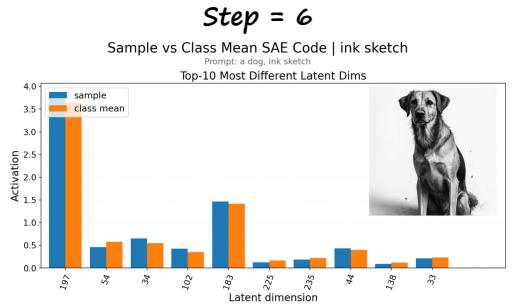  
Step = 7  
Sample vs Class Mean SAE Code | ink sketch

Sample vs Class Mean SAE Code | ink sketch  
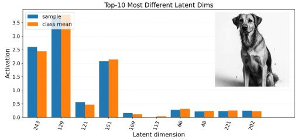  
Step = 3

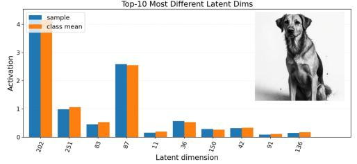  
Step = 8

Sample vs Class Mean SAE Code | ink sketch  
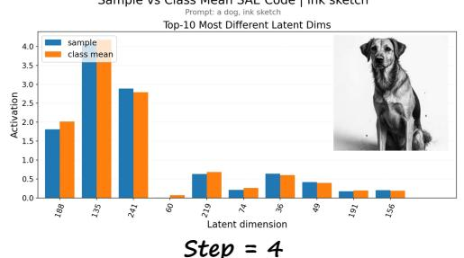

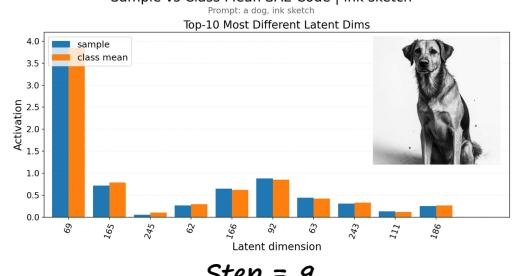  
Step = 9

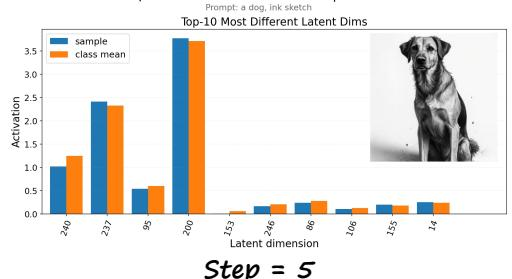

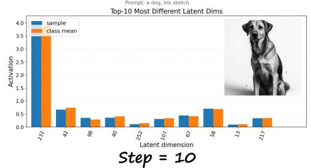

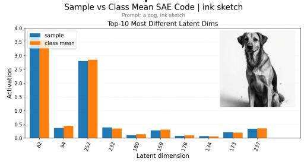

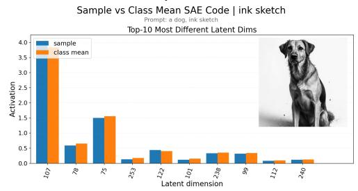  
Figure 14: Step-wise comparison between the sample SAE code and the class-mean SAE code for the successful prompt “a dog, ink sketch” over the first ten denoising steps. Across most steps, the dominant activation peaks of the sample remain closely aligned with the class mean, and the overall sparse activation pattern is stable over time. This example illustrates that successful generations follow a condition-consistent trajectory in step-wise SAE space rather than matching the target concept only at the final image level.

Step = 8  
Step = 9  
Step = 3  
Step = 1  
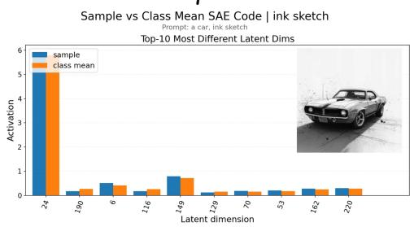  
Step = 2  
Sample vs Class Mean SAE Code | ink sketch

Step = 6  
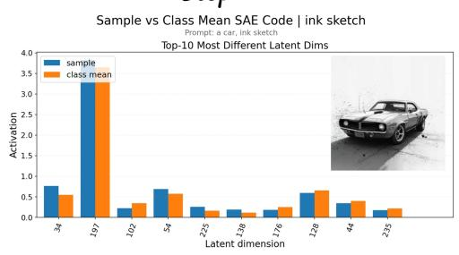  
Step = 7  
Sample vs Class Mean SAE Code | ink sketch

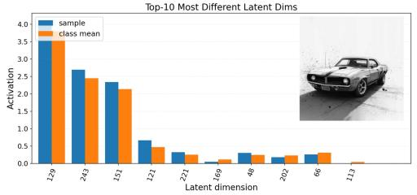

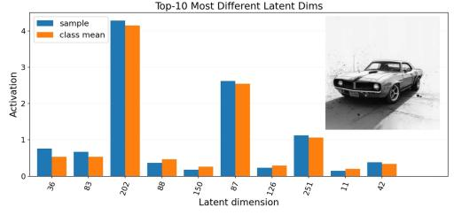

Sample vs Class Mean SAE Code | ink sketch  
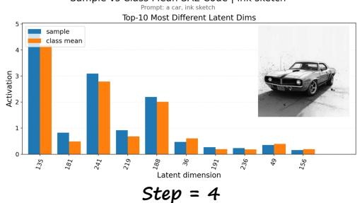  
Sample vs Class Mean SAE Code | ink sketch

Sample vs Class Mean SAE Code | ink sketch  
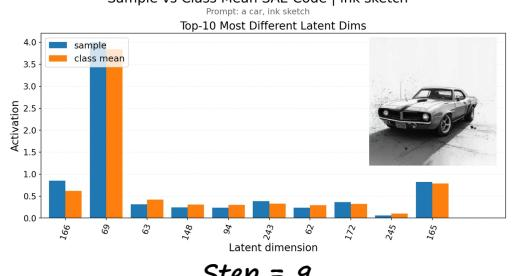

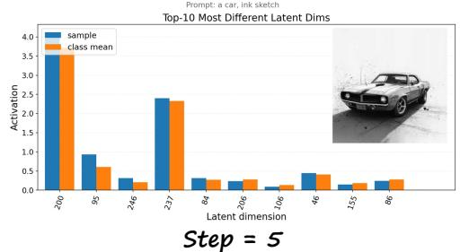

Sample vs Class Mean SAE Code | ink sketch  
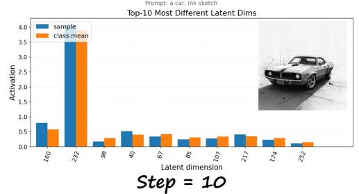

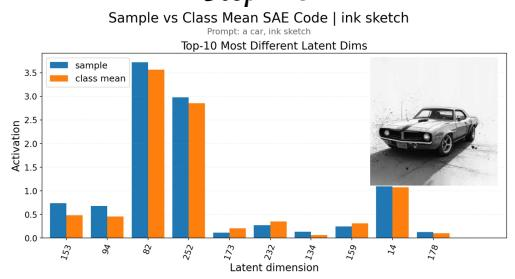

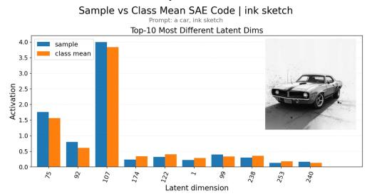  
Figure 15: Step-wise comparison between the sample SAE code and the class-mean SAE code for the successful prompt “a car, ink sketch” over the first ten denoising steps. Similar to Fig. 14, the sample activations remain broadly consistent with the class mean across the guided window, with only limited local fluctuations. This supports the view that successful concept realization corresponds to a temporally stable sparse activation structure.

Step = 2  
Step = 5  
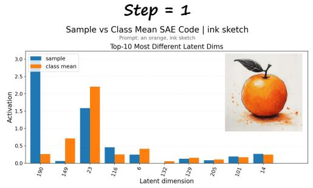

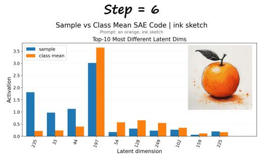  
Step = 7

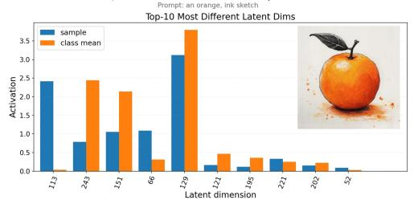  
Step = 3

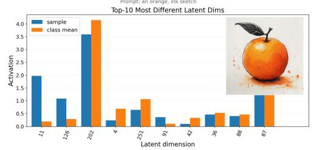

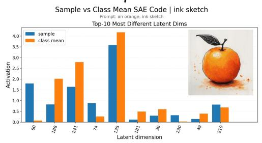  
Step = 4

Step = 8  
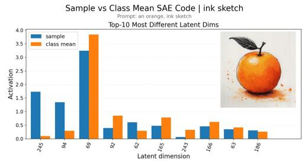

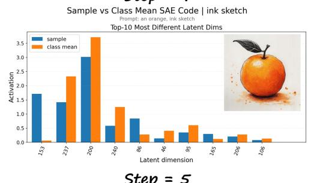

Step = 9  
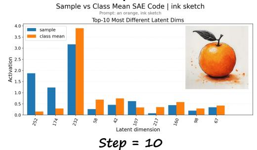

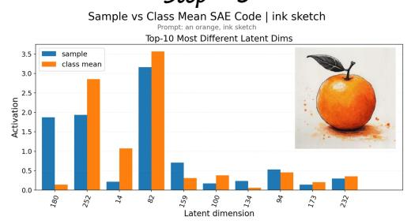

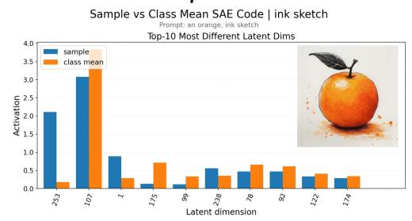  
Figure 16: Step-wise comparison between the sample SAE code and the class-mean SAE code for the failed prompt “an orange, ink sketch” over the first ten denoising steps. In contrast to successful samples, the activation pattern shows repeated mismatches with the class mean across multiple steps, especially on a small subset of dominant sparse dimensions. The discrepancy is already visible in the early denoising phase and persists throughout the guided window, indicating a trajectory-level failure of concept realization.

Sample vs Class Mean SAE Code | ink sketch  
Step = 8  
Sample vs Class Mean SAE Code | ink sketch  
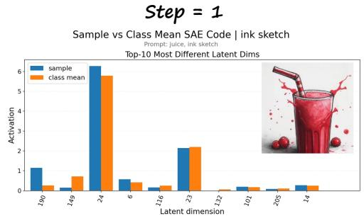

Step = 6  
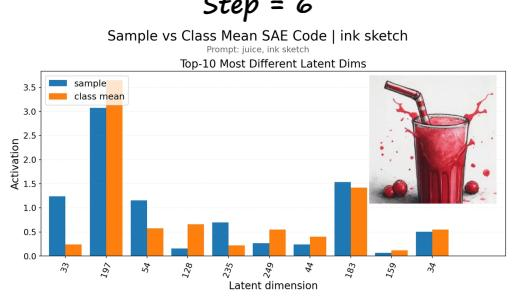

Step = 7  
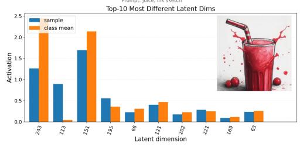

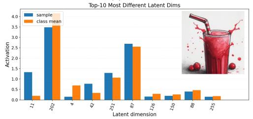

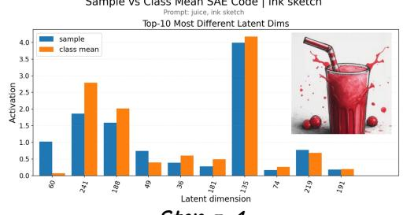

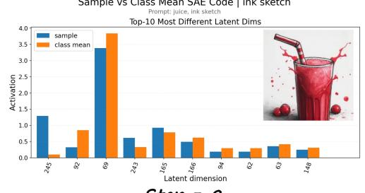

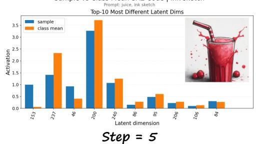

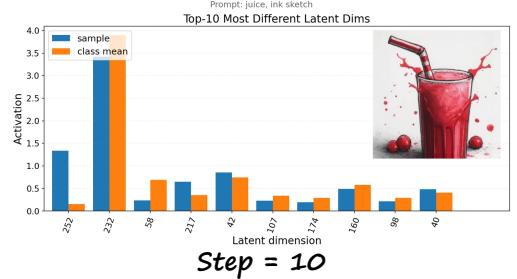

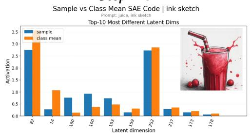

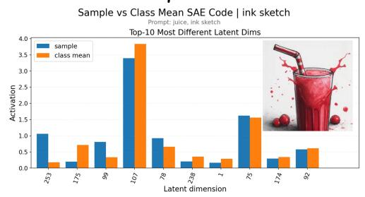  
Figure 17: Step-wise comparison between the sample SAE code and the class-mean SAE code for the failed prompt “juice, ink sketch” over the first ten denoising steps. The sample exhibits persistent deviations from the class-consistent sparse profile, with larger gaps on several highly activated latent dimensions than those observed in successful cases. This figure further suggests that concept brittleness is associated with a structured and temporally persistent mismatch in SAE space rather than with an isolated late-stage perturbation.