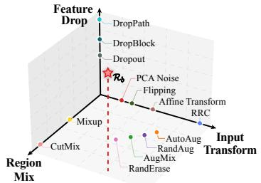
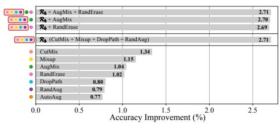
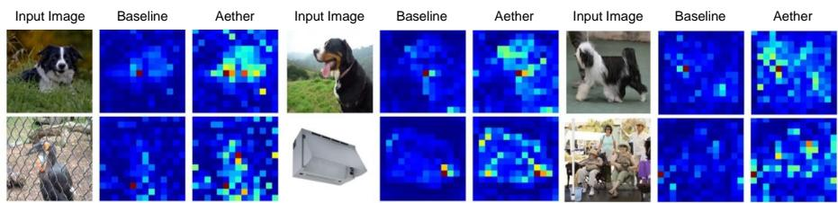
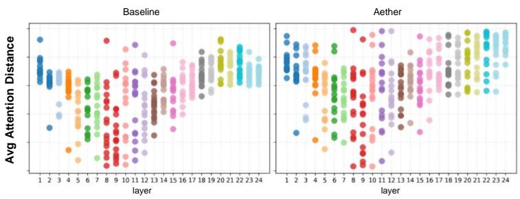
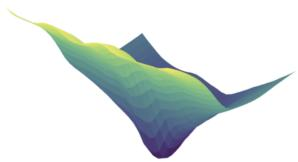
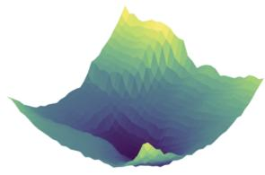
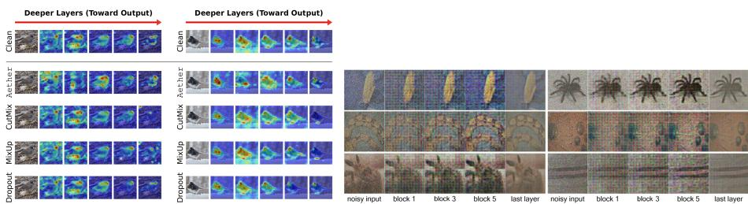

# Isotropic Embedding Perturbations for Robust Vision Language Encoders

Hyesong Choi1,3∗, Daeun Kim2, Song Park3, Taekyung Kim3, Byeongho Heo3, Sangdoo Yun3, Dongbo Min2†, and Dongyoon Han3†

1Soongsil Univ. 2Ewha W. Univ. 3NAVER AI Lab

Abstract. Data augmentation is fundamental to training modern deep vision and multimodal models. While individual methods, such as RandAug, CutMix, Mixup, RandErase, and DropPath, ofer strong regularization efects, their combined use has saturated in performance due to overlapping functionalities, and aggressive pixel-level manipulations may disrupt delicate cross-modal alignment. This saturation motivates the search for a new augmentation axis within the embedding space rather than the input space. We introduce Aether, a simple plug-in method that applies difusion-style random perturbations in the embedding space via controlled alpha-mixing, specifically designed to provide isotropic regularization that remains semantically consistent. Inspired by feature-space perturbations in language models and image degradation in generative pretraining, Aether induces mild yet efective perturbations that smooth the representations without compromising the fine-grained structural information required for strong vision-language encoders. Across diverse architectures and across multiple recognition tasks, Aether delivers consis tent gains over the advanced recipe combining CutMix, Mixup, DropPath, and RandAug—a level of improvement rarely observed with modern aug mentation alternatives. Notably, Aether demonstrates superior efective ness in multi-modal alignment, succeeding where traditional pixel-space augmentations fail by providing a stable, isotropic regularization signal that respects the integrity of the high-dimensional feature space. Code is available at https://github.com/naver-ai/aether.

## 1 Introduction

Data augmentation is a staple for the generalization capability of vision models. It has first delivered large gains in Convolutional Neural Networks (CNNs) [14,36, 41,43] by enriching data diversity and mitigating overfitting. After the emergence of Vision Transformers (ViT) [10,44,45], they have made augmentation even more crucial; this is likely because ViTs have a higher capacity relying on global self attention, while lacking spatial inductive biases, which can make them sensitive

  
(a) Illustrative augmentation space along grouped axes, with $\mathcal { R } _ { b } = \mathrm { C u t } -$ Mix + Mixup + DropPath + RandAug

  
(b) Rb appears saturated – integrating other augmentations ofers negligible gains

Fig. 1: Where do we stand? Data augmentation may reach its limits in the era of robust visual and vision language encoders. When more is no more, we are now at the wall of augmentations that limits further progress. Modern training pipelines $( e . g .$ on ImageNet) are now saturated, where the standard recipe $\mathcal { R } _ { b }$ dominates competing alternatives. Specifically, (a) conceptually, augmentation space can be drawn in three explicit axes—input transforms (pixel/geometric manipulation in the image space), region-level mixing (inter-sample blending within the pixel space), feature-level dropping (sparsity regularization via setting paths to zero). (b) ImageNet accuracy gains vanish beyond the de facto recipe $\mathscr { R } _ { b } = \mathrm { C u t M i x } + \mathrm { M i x u p } + \mathrm { D r o p P a t h } + \mathrm { R a n d A u g }$ . We argue that most modern augmentations collapse onto these three axes, resulting in highly overlapping regularization efects. Furthermore, we believe this collapse may also occur in training vision language models, as they also incorporate vision encoders.

to small perturbations. In downstream fine-tuning with ViTs and vision language alignment in vision language models (VLMs), this issue becomes central: efective transfer of pre-trained parameters depends on carefully chosen augmentations that inject task-relevant inductive biases and curb overfitting under limited labels.

Tremendous eforts have been made to discover a golden augmentation recipe; however, we now face the wall of the standard recipe combining CutMix [55], Mixup [58], DropPath [19], and RandAug [5] (we denote it as $\mathcal { R } _ { b } )$ for fine-tuning ViTs (often combined with Label Smoothing [42] and Dropout [39]). In practice, despite broad adoption and strong results, its gains have reached a performance plateau: many prior works [6,12,16,21,40,43–45,52] employed or slightly extended the standard setup, yet the combination remains the default and has plateaued in augmentation diversity.

Fig. 1(a) illustrates a conceptual augmentation space, where most methods lie within three dominant axes—input transforms, region-level mixing, and featurelevel dropping. Many methods remain largely confined to the input space and region mixing, relying on photometric/geometric transforms and inter-sample mixing. While efective for uni-modal vision, these pixel-level manipulations often fail to provide complementary regularization for vision language encoders [11, 32, 46,56], in which the aggressive mixing of images may yield diminishing returns for the delicate fine-grained alignment between text and images. In the feature space, regularization has been restricted to passive feature dropping $( e . g .$ ., DropPath [19], Dropout [39]). This limitation in advancement causes augmentations to cluster closely along these three axes, leaving other valuable directions in the feature space underexplored. Indeed, Fig. 1 (b) displays that stacking additional augmentations on top of $\mathcal { R } _ { b }$ yields almost no improvements. We argue that this saturation stems from the significant conceptual overlap among existing methods, which not only operate along limited axes but also manifest as anisotropic noise after passing through the stem layer, failing to efectively regularize the high-dimensional feature space.

Can we discover a new method that operates on top of the standard recipe? We draw inspiration from two trends in modern representation learning. First, Feature-Space perturbations: while standard vision pipelines heavily rely on spatial and photometric manipulations [5, 55, 58], using stochastic perturbations in the embedding space has been highly efective in other modalities, notably in language modeling [18, 20, 31]. Second, Image degradation: generative pretraining [13, 17, 50] demonstrated the power of intentional data degradation and subsequent recovery as a mechanism for learning robust, generalized features. What if degradation-based regularization were realized as an embedding-space perturbation?

Building upon these observations, we propose $_ { \tt A e t h e r ^ { 1 } }$ , a simple embeddingspace data augmentation method for improved representation learning. Aether employs a difusion-style controlled alpha-mixing mechanism to smoothly mix input embeddings with an isotropic Gaussian. By injecting isotropic perturbations directly into the embedding space, Aether provides a new axis of augmentation that enhances the generalization of vision language encoders without destroying the underlying semantic structure critical for cross-modal alignment. This allows for controlled perturbations in the feature space without abruptly corrupting semantic information, efectively smoothing the representation space. We argue Aether complements the standard setup $\mathcal { R } _ { b }$ in a distinct and complementary manner and integrates efectively as a plug-in. Furthermore, our analysis reveals that (1) Aether enhances localization by improving attention capabilities, presumably because smoother embeddings improve sensitivity to fine details; (2) Aether further acts as an embedding-level regularization due to the embedding smoothing process, thus leading to improved robustness; (3) Aether demonstrates a strong ability to learn more generalized representations, as revealed by its flatter loss landscape.

We conduct extensive experiments with Aether across diverse architectures, including ViT-S,B,L [10], multi-modal models (CLIP [32], AIMv2 [11], SigLip 2 [46]), and modern self-supervised frameworks, masked image modeling (MIM) [13, 54] and difusion-MIM [1, 50, 59]). When combined with standard augmentations, Aether yields up to a 3.49%p performance gain. Beyond ViTs, consistent improvements on CNNs (ResNet-26/50) and hierarchical transformers (Swin V2-L [25]) indicate that its efect is architecture-agnostic. We further evaluate Aether on a range of recognition tasks—image classification, fine-grained visual classification (FGVC), semantic segmentation, object detection, and instance segmentation.

Tasks such as FGVC relying on subtle, part-level cues benefit most: Aether enhances fine-detail sensitivity by mitigating spurious localized attention and promoting a broader, more coherent attention distribution, yielding consistent gains on fine-grained benchmarks [47, 49].

## 2 Related Work

Data augmentation has been a cornerstone for improving the generalization of deep vision models. The strategies have evolved from basic input-space manipulations, such as geometric and photometric transformations [22], to sophisticated policy-based methods like AutoAug [4] and RandAug [5]. Concurrently, powerful mixing strategies emerged, including Mixup [58] and CutMix [55], which combine images via patch pasting. These methods, often used alongside architectural regularization like DropPath [19], have coalesced into a de facto standard recipe $\left( \mathcal { R } _ { b } \right)$ widely adopted in high-performance vision training pipelines [51, 53]. While highly efective, this standard recipe has reached saturation. Recent studies [9,57] and our analysis (Fig. 1a) indicate that stacking these strong augmentations yields diminishing returns. Critically, for vision language encoders, these aggressive pixel-mixing strategies often disrupt the delicate fine-grained alignment between visual and textual modalities, making them largely inefective for multimodal tasks. This saturation and inefectiveness suggest that current methods, which predominantly manipulate the input space, not only overlap in their regularization efects but also fail to provide an isotropic regularization signal for high-dimensional representations.

Embedding-/feature-space augmentation. While input-space augmentation has saturated in vision, regularization within the embedding space remains largely underexplored. In contrast, perturbing embeddings via stochastic mechanisms is an established technique in Natural Language Processing (NLP) to enhance generalization by smoothing the representation space [18,20,29]. Furthermore, recent vision SSL methods [13,17] demonstrate the power of intentionally degrading and recovering features for representation learning. Aether synthesizes these insights by introducing a difusion-style controlled alpha-mixing mechanism. By injecting isotropic perturbations directly at the embedding level, Aether introduces a new regularization method that overcomes the limitations of input-space methods, which manifest as anisotropic noise after passing through the stem layer and thus fail to regularize the feature space efectively. Unlike previous approaches that interfere with cross-modal correspondence, Aether preserves the integrity of the semantic structure, making it uniquely suited for robust vision language alignment.

## 3 Method

This section begins by presenting the background of our method, focusing on prior methods of embedding-space augmentations and image degradations. We then

detail the mechanics of Aether, motivated by the insight that current approaches are not seamlessly compatible with smoothing-oriented augmentation.

## 3.1 Background

Embedding-space augmentations in language modeling. In language modeling, embeddings are often perturbed or masked to enhance generalization [8, 29, 62]. Among various perturbation strategies, stochastic perturbation (e.g., using Gaussian noise) has been commonly employed for this purpose [18, 20, 31]. Specifically, given token embeddings $\mathbf { e } _ { i } \in \mathbb { R } ^ { d }$ , a smooth perturbation is applied like $\tilde { \mathbf { e } } _ { i } = \mathbf { e } _ { i } + \epsilon _ { i } ,$ , s.t. $\mathbf { \epsilon } \epsilon _ { i } \sim \mathcal { N } ( \mathbf { 0 } , \sigma ^ { 2 } \mathbf { I } )$ . Intuitively, this encourages invariance to small perturbations in embeddings, leading to more robust representations. Our method draws inspiration from this, applying stochastic perturbations to tokens, rather than to the image input, as an additional exploration of the visual augmentation space.

Image degradation in generative pretraining. Modern pretraining frameworks [1–3, 13, 17, 30, 33–35, 37, 38, 50, 54, 59], particularly in self-supervised and generative modeling, rely heavily on the principle of intentional image degradation for reconstruction. For example, methods like Masked Autoencoders (MAE) [13] employ aggressive masking, while Denoising Difusion Models (DDM) [17,30,33–35,38] utilize a gradual degradation process. These frameworks are believed to learn robust features by training the network to reconstruct the original clean image from a degraded one, and may provide further insights for their use as augmentations.

## 3.2 Introducing the Proposed Method

Motivation and pilot study. Our inspiration stems from two key observations: (1) data augmentation methods in vision have underexplored feature-space regularizations that are crucial for maintaining cross-modal integrity, and (2) difusion-style image degradation–reconstruction approaches in self-supervised learning have proven highly efective. Bridging these perspectives may lead us to breakthroughs beyond the current performance saturation. To this end, we revisit the efectiveness of perturbations in the embedding space for training both vision and vision language models; we further argue that applying such perturbations in the input space (e.g., perturbation-based photometric distortions or spatial transformations) may sufer from inherent limitations:

1. Input-level perturbations disrupt the delicate cross-modal alignment and finegrained structures. Before any encoding, pixel intensities represent textures and shapes essential for semantic alignment; aggressive manipulations like CutMix [55] and Mixup [58] lose these subtle details, interfering with the precise correspondence between visual tokens and textual descriptions required for vision encoders.

2. Perturbing pixels does not translate uniformly into the embedding space, diminishing regularization impact. After passing through the stem layer (e.g., patchification or initial convolutions), isotropic pixel perturbations $( i . e . ,$ uniformly spread across all dimensions) become anisotropic in the embedding space, thereby reducing the efectiveness of pixel-level perturbation methods, as consistently observed in prior works.

Before proceeding, we conduct a pilot study comparing input-level and embeddinglevel perturbations to quickly test our claims. We primarily evaluate fine-grained recognition using CUB [49] accuracy, while also reporting ImageNet-1K [7] accuracy as a preliminary reference point for the general image understanding results presented later. In addition, we measure the token-perturbation covariance spectrum on the ImageNet validation set using the eigenvalue ratio $\lambda _ { \operatorname* { m a x } } / \lambda _ { \operatorname* { m i n } }$ to quantify the anisotropy induced by each perturbation type.

Tab. 1 demonstrates that the pilot study results support our claim: embeddinglevel perturbations achieve better CUB performance, which suggests that they more efectively preserve and regularize fine-grained visual cues. Moreover, pixellevel perturbations yield a high anisotropy ratio of 8.4; by contrast, embeddinglevel perturbations remain nearly isotropic, with a ratio of approximately 1.15. This anisotropy disproportionately afects fine-grained cues, explaining why the CUB gap is larger than the ImageNet-1K gap.

Table 1: Embedding- vs. pixel-level perturbations. The efect of input perturbation diminishes, resulting in minimal gains. Specifically, general understanding perfor mance, fine-tuned performance measured by CUB accuracy, and empirical anisotropy consistently reveal which perturbation type is more efective, supporting our claim.
<table><tr><td></td><td> $\lambda _ { \operatorname* { m a x } } / \lambda _ { \operatorname* { m i n } }$ </td><td>CUB (%)</td><td>ImageNet-1K (%)</td></tr><tr><td>Pixel-level</td><td> $8 . 4 \pm 0 . 5$ </td><td> $7 9 . 3 3 \pm 0 . 1 1$ </td><td>80.17</td></tr><tr><td>Embed-level</td><td> ${ \bf 1 . 1 5 \pm 0 . 0 5 }$ </td><td> $\mathbf { 8 0 . 8 9 \pm 0 . 0 9 }$ </td><td>82.25</td></tr></table>

Design principle. While simple additive perturbations are utilized in other modalities [20], directly adding stochastic elements to high-dimensional vision embeddings can abruptly shift the representations, potentially corrupting the underlying semantic structure or overpowering the original signal. Therefore, an efective mechanism must provide controlled, smooth perturbations that gently reshape the feature landscape rather than disrupt it. The regularization should encourage robustness to mild variations without compromising the essential information contained within the embeddings.

Among existing perturbation methods, Aether employs a simple yet controlled alpha-mixing strategy, directly inspired by the variance-preserving forward process at a specific timestep t in denoising difusion models [17, 30, 38]. We smoothly blend the input embeddings with stochastic perturbations ηt drawn from an isotropic perturbation corresponding to timestep t. Given an embedding tensor $\mathbf { Z } \in \mathbb { R } ^ { N \times \bar { d } }$ (where N is the number of tokens and d is the embedding dimension), Aether generates a perturbed embedding $\tilde { \mathbf { Z } }$ as follows:

$$
\tilde { \mathbf { Z } } = \sqrt { \bar { \alpha } _ { t } } \cdot \mathbf { Z } + \sqrt { 1 - \bar { \alpha } _ { t } } \cdot \eta _ { t } , \quad \mathrm { w h e r e } \ \eta _ { t } \sim \mathcal { N } ( \mathbf { 0 } , \mathbf { I } ) .\tag{1}
$$

The timestep t acts as a discrete proxy for the augmentation intensity, where the hyperparameter $\bar { \alpha } _ { t }$ follows a pre-defined noise schedule. This formulation ensures a smooth interpolation along the difusion trajectory, between the original clean embedding $t = 0$ and a noise-shrouded representation at higher t values.

Unlike naive additive methods, this variance-preserving approach leverages the mathematical properties of difusion forward-mapping to help preserve the overall feature statistics, preventing abrupt shifts in the distribution during training. By treating augmentation as a difusion-based degradation process, we encourage the model to learn representations that are invariant to isotropic variations in the latent manifold. This could efectively smooth the representation landscape and provide a new axis of regularization signal that is complementary to the standard recipe $\mathcal { R } _ { b }$ . Unlike pixel-space perturbations, which may disrupt cross-modal correspondence, Aether preserves semantic integrity by injecting perturbations directly into the representation space where the model performs cross-modal alignment. This suggests that Aether may be better suited for robust vision-language representation learning. We further support this intuition through the theoretical analysis below.

Theoretical backup: why at the embedding space? We provide an informal theoretical justification for our approach. Our conjecture is that isotropic perturbations in the embedding space, uniformly spread across all token dimensions, are more desirable, whereas pixel-level perturbations incur bias. Specifically, let an input image be $x \in \mathbb { R } ^ { H \mathrm { \overset { . } { W } } C }$ and assume the patch-embedding operator is expressed as a linear matrix, $\mathcal { P } \in$ RNd×HW C (e.g., a stride-p conv). Injecting pixel-level perturbation $\epsilon \sim \mathcal { N } ( 0 , \sigma ^ { 2 } I )$ leads to

$$
z _ { 0 } ^ { \prime } = \mathcal { P } ( x + \epsilon ) = \mathcal { P } x + \mathcal { P } \epsilon ,\tag{2}
$$

so the perturbation in the embedding space is $\epsilon _ { \mathrm { { t o k } } } = \mathcal { P } \epsilon$ with covariance

$$
\mathrm { C o v } [ \epsilon _ { \mathrm { t o k } } ] = \sigma ^ { 2 } \mathcal { P } \mathcal { P } ^ { \top } .\tag{3}
$$

Thus, the covariance is no longer isotropic, resulting in a biased perturbation that concentrates disproportionately on certain directions or channels rather than being evenly distributed. Moreover, pixel-space perturbation disrupts spatial alignment before the stem layer $( e . g .$ , patchification or a set of convolutions), entangling perturbation across neighboring pixels inside each patch and degrading fine structure that is critical for fine-grained data like FGVC datasets.

In contrast, injecting perturbation in the embedding space preserves isotropy, magnitude, and alignment at the level where the model actually computes:

$$
z _ { 0 } ^ { \prime } = \mathcal { P } x \ : + \ : \eta _ { 0 } , \qquad \eta _ { 0 } \sim \mathcal { N } ( 0 , \sigma _ { e } ^ { 2 } I _ { N d } ) .\tag{4}
$$

Let $z _ { l }$ be the l-th layer’s embedding without perturbations and $z _ { l } ^ { \prime }$ be the result from $z _ { 0 } ^ { \prime }$ . For a residual block $f _ { l } ( \cdot )$ , the perturbation after $( l + 1 )$ -th layer can be

$$
\eta _ { l + 1 } = z _ { l + 1 } ^ { \prime } - z _ { l + 1 } = z _ { l } ^ { \prime } - z _ { l } + f _ { l } ( z _ { l } ^ { \prime } ) - f _ { l } ( z _ { l } ) = ( I + J _ { f _ { l } } ) \eta _ { l } ,\tag{5}
$$

  
BaselineFig. 2: Aether promotes broader and more coherent attention. Compared to ethe baseline trained with $\mathcal { R } _ { b }$ (middle), which often exhibits imprecise attention patterns tawith spurious localized peaks, the Aether-augmented model (right) distributes attention Dmore smoothly and consistently across foreground regions. This mitigates over-reliance tioon individual tokens and enhances semantic coherence.

where $J _ { f _ { l } }$ denotes the discrepancy between residual-side feature computations layer layerwith and without perturbations, which is expected to remain small in practice. We observe that the skip connection provides a shortcut for the perturbation η to propagate without attenuation by weights like P. This first-order efect of η remains observable even in practice, for pre-normalization architectures.

Empirically, this yields (i) stronger early-layer diversity (signal present at the level where computation occurs) and (ii) late-layer recovery via residual aggregation—benefits that vanish when perturbation is injected in pixels and then suppressed by P. We argue that propagation through layers encourages the learning of more generalized features, owing to residual perturbations that persist across layers.

Implementation. Algorithm 1 illustrates how Aether integrates into the standard fine-tuning pipelines [10,13,16,44,45]. Given an existing training setup using strong augmentations, Aether requires only a single additional line—injecting isotropic perturbations into the embeddings after patch embedding and positional encoding. This simplicity shows the modularity of our method: it acts as a lightweight, plug-and-play augmentation component that operates in the feature space without altering the model architecture or training procedure.

Algorithm 1 PyTorch-like code for Aether   
Require: Blending factor $\alpha \in ( 0 , 1 )$   
1: function AddAether(Z, α)   
2: $s  \sqrt { \alpha } , n  \sqrt { 1 - \alpha }$   
3: $\pmb { \eta } \sim \mathcal { N } ( \mathbf { 0 } , \mathbf { I } )$ \triangleright same tensor shape as Z   
return $\tilde { \mathbf { Z } }  s \cdot \mathbf { Z } + n \cdot \pmb { \eta }$   
5: end function   
6:   
7: x ← DataLoader(ImageNet, augmentation = R )   
8: Z ← PatchEmbed(x) + PosEmbed   
9: Z ← AddAether(Z, α) \triangleright Single added line for Aether   
10: x ← Encoder(Z)

  
Fig. 3: Aether expands attention distance across layers. We measure the average attention distance across transformer layers for ViT-L. The baseline model $\left( \mathcal { R } _ { b } \right)$ shows a tendency for narrowed attention in later layers. In contrast, Aether consistently maintains a broader attention distance, facilitating better integration of local cues with global context without architectural modifications.

## 4 Empirical Analyses

This section analyzes the mechanisms underlying Aether.

Improved attention capability for localization. Fig. 2 shows that the baseline trained with $\mathcal { R } _ { b }$ exhibits narrow attention with spurious peaks on background regions or over-concentration on limited foreground areas. In contrast, Aether produces smoother attention maps with broader coverage over task-relevant regions. We attribute this behavior to embedding-space perturbations, which enhance representation robustness and encourage attention to previously weakly activated tokens. Pixel-level perturbations, by comparison, may diminish after patchification (i.e., large-kernel convolution), limiting their efect on token representations.

Expanded attention distance. We measure the average attention distance across layers, representing the spatial range of token interactions. As shown in Fig. 3, the baseline progressively narrows attention in deeper layers. Aether maintains significantly broader attention distances, enabling stronger coupling between local cues and global context throughout the network.

Flattened loss landscape. Loss landscape geometry provides a proxy for generalization. As visualized in Fig. 4, the baseline converges to a sharp minimum, whereas Aether yields a substantially flatter basin, indicating improved robustness and stability.

Robustness under extreme perturbations. We further stress-test robustness by amplifying perturbations far beyond typical levels in the input space. In Fig. 5a, under 20× noise, only Aether recovers attention maps consistent with the clean image. Additionally, feature-map reconstructions under 50× perturbations (Fig. 5b) preserve semantic structure, demonstrating strong robustness.

  
(a) Baseline

  
(b) w/Aether

Fig. 4: Loss visualization. We plot the loss surfaces: (a) baseline + Rb vs. (b) baseline $+ \ \mathcal { R } _ { b ^ { - } }$ +Aether. Aether converges to a flatter minimum, which suggests Aether learns more generalized features.  
  
(a) Attention visualizations under 20× perturbations.  
(b) Reconstructions under 50× perturbations.  
Fig. 5: Robustness under extreme perturbations. (a) Only Aether progressively suppresses perturbations—becoming increasingly similar to the clean image as layers approach the output—yielding class-consistent latents. Conventional augmentations such as CutMix, Mixup, and Dropout retain residual artifacts. (b) Late-layer feature inversions show that Aether preserves semantic information even under heavy corruption, producing reconstructions highly similar to the clean image with only minor perturbations.

Implications for fine-grained visual recognition. The improved localization and broader attention dynamics directly translate to significant gains in Fine-Grained Visual Classification (FGVC). Tasks in FGVC require the model to discriminate between highly similar subcategories based on subtle, part-level cues. As reported later in the experimental results (Tab. 5), Aether delivers substantial improvements (e.g., CUB accuracy rises from 79.10 to 80.74, and NABirds from 77.87 to 79.52). These gains confirm that by suppressing spurious attention sinks and reinforcing part-level evidence, Aether sharpens the decision boundaries in challenging fine-grained scenarios.

## 5 Experiment

This section performs comprehensive comparisons between baseline models with or without Aether. Our main analysis covers four major axes: (1) vision language models, (2) transformer backbone variants (ViT and Swin), (3) CNNs prehensive ablation studies are reported in the supplementary material.

Table 2: ImageNet-1K top-1 accuracy and relative gains. Aether surpasses the performance saturation point of $\mathcal { R } _ { b }$ and consistently improves performance across both vision models and vision language models.
<table><tr><td>Model</td><td>Augmentation / Setup</td><td>Top-1 (%) Gain</td><td> $( \% \mathrm { { p } ) }$ </td></tr><tr><td colspan="4">Vision Language Models</td></tr><tr><td>CLIP</td><td>Baseline</td><td>83.05</td><td></td></tr><tr><td></td><td>+ Aether</td><td>84.37</td><td>+1.32</td></tr><tr><td>AIMv2</td><td>Baseline</td><td>86.22</td><td></td></tr><tr><td></td><td>+ Aether</td><td>87.01</td><td>+0.79</td></tr><tr><td>SigLIP 2</td><td>Baseline</td><td>73.64</td><td></td></tr><tr><td></td><td>+ Aether</td><td>73.79</td><td>+0.15</td></tr><tr><td colspan="4">Vision Transformer Variants</td></tr><tr><td>ViT-B +</td><td>Baseline</td><td>79.02</td><td></td></tr><tr><td></td><td> $\mathscr { R } _ { b } \left( \mathrm { C u t M i x } + \mathrm { M i x U p } + \mathrm { D r o p P a t h } + \mathrm { R a n d A u g } \right)$ </td><td>81.17</td><td>+2.15</td></tr><tr><td></td><td> $+ \ \mathcal { R } _ { b } + \mathrm { A u g M i x }$ </td><td>81.16</td><td>+2.14</td></tr><tr><td></td><td> $\mathcal { R } _ { b }$  + RandErase</td><td>81.14</td><td>+2.12</td></tr><tr><td>++</td><td> $\mathcal { R } _ { b }$  + Manifold Mixup</td><td>81.32</td><td>+2.30</td></tr><tr><td> $+ \ \mathcal { R } _ { b } \ +$ </td><td>Noisy Feature Mixup</td><td>81.28</td><td>+2.26</td></tr><tr><td> $+ \ \mathcal { R } _ { b }$ </td><td>+ Aether</td><td>82.25</td><td>+3.23</td></tr><tr><td></td><td> $+ \ \mathcal { R } _ { b } + \mathrm { A u g M i x } + \mathrm { R a n d E r a s e }$ </td><td>81.16</td><td>+2.14</td></tr><tr><td>+  $\mathcal { R } _ { b }$ </td><td>+ AugMix + Aether</td><td>82.43</td><td>+3.41</td></tr><tr><td>十  $\mathcal { R } _ { b }$ </td><td>+ RandErase + Aether</td><td>82.38</td><td>+3.36</td></tr><tr><td>+  $\mathcal { R } _ { b }$ </td><td>+ AugMix + RandErase + Aether</td><td>82.51</td><td>+3.49</td></tr><tr><td>ViT-S</td><td>Baseline</td><td>77.79</td><td></td></tr><tr><td></td><td>十  $\mathcal { R } _ { b }$ </td><td>78.85</td><td>+1.06</td></tr><tr><td>+</td><td> $\mathcal { R } _ { b }$  + Aether</td><td>79.42</td><td>+1.63</td></tr><tr><td>ViT-L</td><td>Baseline</td><td>82.24</td><td></td></tr><tr><td></td><td> $+ \ \mathcal { R } _ { b }$ </td><td>84.71</td><td>+2.47</td></tr><tr><td></td><td> $+ \ \mathcal { R } _ { b } + \mathtt { A e t h e r }$ </td><td>85.35</td><td>+3.11</td></tr><tr><td>SwinV2</td><td>Baseline</td><td>84.08</td><td></td></tr><tr><td></td><td> $+ \ \mathcal { R } _ { b }$ </td><td>85.21</td><td>+1.13</td></tr><tr><td></td><td> $+ \ \mathcal { R } _ { b } + \mathtt { A e t h e r }$ </td><td>85.30</td><td>+1.22</td></tr><tr><td>ViT-B</td><td>Baseline</td><td>79.02</td><td></td></tr><tr><td></td><td>+ CutMix [55]</td><td>80.08</td><td>+1.34</td></tr><tr><td></td><td> $+ \ \mathrm { M i x U p \ [ \dot { 5 } 8 ] } ^ { \cdot }$ </td><td>79.93</td><td>+1.15</td></tr><tr><td></td><td> $+ \ \mathrm { D r o p } \bar { \mathrm { P a t h } } \ \bar { \mathrm { [ 1 9 ] } }$ </td><td>79.65</td><td>+0.80</td></tr><tr><td></td><td> $+ \mathrm { \ R a n d A u g \ U 5 ] }$ </td><td>79.64</td><td>+0.79</td></tr><tr><td></td><td>+ AutoAug [4]</td><td>79.63</td><td>+0.77</td></tr><tr><td></td><td> $+ \mathrm { \ A u g M i x } \mathrm { [ i 5 ] }$ </td><td>79.84</td><td>+1.04</td></tr><tr><td></td><td>+ RandErase [9]</td><td>79.83</td><td>+1.02</td></tr><tr><td>+ Aether</td><td></td><td>80.14</td><td>+1.41</td></tr><tr><td colspan="4">CNNs</td></tr><tr><td>ResNet-50 Baseline</td><td></td><td>79.86</td><td></td></tr><tr><td></td><td>+ Aether</td><td>80.04</td><td>+0.18</td></tr><tr><td>ResNet-26 Baseline</td><td></td><td>73.20</td><td></td></tr><tr><td></td><td>+ Aether</td><td>73.33</td><td>+0.13</td></tr></table>

(ResNet-26/50), and (4) modern self-supervised learning (SSL) frameworks. Com-

Table 3: Cross-modal retrieval on COCO 5K with CLIP ViT-B/16. Aether is applied only to the vision encoder during fine-tuning, yet improves both retrieval directions. Recent CLIP-based methods typically gain $0 . 3 \% \mathrm { p } - 0 . 8 \% \mathrm { p }$
<table><tr><td>Setting</td><td>Baseline (%)</td><td>+Aether (%)</td><td>Gain (%p)</td></tr><tr><td>COCO I→T R@1</td><td>52.1</td><td>53.4</td><td>+1.3</td></tr><tr><td>COCO T→I R@1</td><td>32.9</td><td>33.6</td><td>+0.7</td></tr></table>

Training setup. We follow standard fine-tuning protocols from prior work [10,11, 13, 14, 16, 26, 32, 44–46]. Training is conducted using cosine learning rate scheduling [27] with the AdamW optimizer [28]. Regularization and data augmentation include CutMix [55], Mixup [58], DropPath [19], RandAug [5], AutoAug [4], Aug-Mix [15], RandErase [60], Manifold Mixup [48], Noisy Feature Mixup [23], weight decay, and other standard settings to both baseline and Aether-augmented models. Overall, our ImageNet-1K [7] training is based on the Timm repository [51]. See the supplementary material for detailed experimental settings.

On Vision Language Models (VLMs). We evaluate Aether on representative VLM architectures, including CLIP [32], AIMv2 [11], and SigLIP 2 [46]. For all models, we initialize from the pretrained weights and fine-tune them on ImageNet using their original training setups, preserving the augmentations and regularization strategies used in each model. Our perturbation module is applied only to the vision encoder, leaving the language branch unchanged.

For CLIP, the baseline achieves 83.05%, while applying the standard augmentation recipe $\mathcal { R } _ { b }$ improves performance to 84.10%. Incorporating Aether further raises accuracy to 84.37%. For AIMv2, Aether improves the baseline from 86.22% to 87.01%. Similarly, on SigLIP 2, performance increases from 73.64% to 73.79%. These results indicate that Aether consistently enhances representation robustness and generalizes efectively to large-scale vision language models.

Beyond ImageNet accuracy, we directly probe cross-modal alignment via image–text retrieval (Tab. 3). Although Aether perturbs only the vision branch, it improves both image-to-text and text-to-image R@1, indicating that a smoother visual manifold tightens the joint embedding without distorting either modality— consistent with our isotropy analysis.

On ViTs. $\mathcal { R } _ { b }$ lifts Top-1 from 79.02% to 81.17% for ViT-B, while adding other augmentations [9, 15] yields no further gains due to overlap along the same three axes (Fig. 1). In contrast, Aether raises accuracy to 82.43%, expanding the efective regularization space. For ViT-S, we observe a similar trend. The baseline achieves 77.79%, while $\mathcal { R } _ { b }$ leads to 78.85%. Incorporating Aether results in 79.42%, a relative improvement of +2.09%. For ViT-L, Aether improves performance from the baseline of 82.24% to 85.35% when added to the standard augmentation setup. These results indicate that Aether complements standard augmentations. Unlike existing methods, which fall into three primary categories in Fig. 1 (b), Aether operates along a distinct regularization axis.

Table 4: Top-1 accuracy on ImageNet-1K of fine-tuning self-supervised pre-trained (SSL) models, with and without Aether. We leverage modern state-of-the-art SSL pretrained models, including MAE, SimMIM, DifMAE, MaskDiT, and DifMIM, and show consistent gains across all the models, demonstrating the superior method-agnostic capability of our method.
<table><tr><td>SSL Framework</td><td>Model</td><td>Method</td><td> $\mathrm { T o p - 1 ~ A c c ~ ( \% ) }$ </td></tr><tr><td rowspan="5">Masked Image Modeling</td><td>ViT-B</td><td> $\mathrm { M A E } \left[ 1 3 \right] + \mathcal { R } _ { b }$ </td><td>82.92</td></tr><tr><td></td><td> $\scriptstyle + \mathtt { A e t h e r }$ </td><td>83.17</td></tr><tr><td>ViT-L</td><td> $\mathrm { M A E } \left[ 1 3 \right] + \mathcal { R } _ { b }$ </td><td>84.42</td></tr><tr><td></td><td>_  $\scriptstyle + \mathtt { A e t h e r }$ </td><td>84.61</td></tr><tr><td rowspan="2">ViT-B</td><td> $\mathrm { S i m M I M } \left[ 5 4 \right] + \mathcal { R } _ { b }$ </td><td>83.10</td></tr><tr><td></td><td>+ Aether</td><td>83.23</td></tr><tr><td rowspan="5">Diffusion Model-based Masked Image Modeling</td><td>ViT-B</td><td> $\mathrm { D i f f M A E } \ [ 5 0 ] + \mathcal { R } _ { b }$ </td><td>82.18</td></tr><tr><td>ViT-B</td><td>+ Aether</td><td>82.50</td></tr><tr><td></td><td>MaskDiT  $[ 5 9 ] + \mathcal { R } _ { b }$ </td><td>82.89</td></tr><tr><td></td><td>+ Aether</td><td>83.14</td></tr><tr><td>ViT-B</td><td> $\mathrm { D i f f M I M } \left[ 1 \right] + \mathcal { R } _ { b }$ </td><td>83.31</td></tr><tr><td colspan="2"></td><td> $\scriptstyle + \mathtt { A e t h e r }$ </td><td>83.52</td></tr></table>

On SwinV2-L [25], pre-trained with SimMIM [54] on ImageNet-1K [7] and then fine-tuned, $\mathcal { R } _ { b }$ reaches 85.21%; adding Aether nudges it to 85.30% (+1.45%), consistent with Swin’s stronger built-in locality yet confirming Aether as a complementary regularizer even for locality-aware backbones.

Extension to CNNs. While Aether is primarily evaluated on transformer-based architectures, we also assess its applicability to convolutional networks by applying it to ResNet-50 [14] and ResNet-26 [14] on ImageNet [7] classification. Aether improves the top-1 accuracy from 79.86% to 80.04% and 73.20% to 73.33%, when added to a standard ResNet-50 and ResNet-26 baseline. This confirms that the regularization efect of Aether is not exclusive to transformer models and can extend to CNNs. We interpret this improvement as further evidence of Aether acting as a general-purpose augmentation method. Unlike traditional augmentations tailored to input-level or region-level transformations, Aether perturbs intermediate features in the embedding space, which also benefits CNN representations by promoting robustness in hidden activations.

## 5.1 Evaluation with SSL-pre-trained Models

SSL pre-training [13, 54] is now fundamental to vision, driving large Vision Transformers with unlabeled data. As capacity scales, efective integration with

Table 5: Evaluation on downstream tasks. We evaluate our fine-tuned models using Aether to assess improvements in generalization. We extensively evaluate our method on several datasets, including fine-grained visual classification benchmarks (CUB and NABirds) and large-scale semantic/instance segmentation and object detection benchmarks (ADE20K and COCO). Aether consistently improves performance across all the benchmarks by a large margin.
<table><tr><td>Task</td><td>CUB</td><td>NABirds</td><td>ADE20K</td><td>COCO  $( \mathrm { A P ^ { b o x } / A P ^ { m a s k } } )$ </td></tr><tr><td>Baseline</td><td>79.10</td><td>77.87</td><td>43.12</td><td>46.17 / 40.21</td></tr><tr><td>+ Aether</td><td>80.74</td><td>79.52</td><td>43.56</td><td>46.44 / 40.58</td></tr></table>

SSL defines a method’s scalability and relevance. Moving beyond supervised pre-trained models in the previous section, we apply Aether at fine-tuning to SSL pre-trained ImageNet-1K checkpoints from MAE (ViT-B/L) [13], SimMIM [54], and difusion-based SSL (DifMAE, MaskDiT, DifMIM) [1, 50, 59] to test the generalization capacity.

The results in Table 4 demonstrate that Aether generalizes efectively to the modern SSL frameworks. Across a variety of SSL-pre-trained models, incorporating Aether during fine-tuning consistently improves performance over established augmentation baselines, even when standard augmentations are already applied, indicating that Aether provides a complementary form of regularization beyond existing methods. This efect is pronounced in difusion-based SSL, which has gained increasing prominence recently. For instance, Aether lifts DifMAE [50] from 82.18% to 82.50% and DifMIM [1] from 83.31% to 83.52%. These improvements, ranging from +0.25% to +0.34%, are particularly notable given that they build on already strong SSL baselines. We attribute these gains to reduced pretrain–finetune mismatch: Aether that randomly perturbs embedding, implicitly encourages the model to learn smoother representations, aligning fine-tuning with difusion-style pre-training. Given the ongoing shift toward difusion-based pre-training in large vision models, Aether provides a new guideline for designing methods that integrate seamlessly with modern SSL approaches and yield consistent complementary gains.

## 5.2 Evaluation on Downstream Tasks

We evaluate Aether on a diverse set of downstream tasks, including fine-grained visual classification (FGVC): CUB [49], NABirds [47]), semantic segmentation (ADE20K [61]), and object detection and instance segmentation (COCO [24], as shown in Table 5. Aether improves performance across all tasks, demonstrating its generality beyond image classification. Gains are significant on FGVC datasets: +1.64%p on CUB [49] and +1.65%p on NABirds [47], where subtle part cues (e.g., beak, feather texture) matter and Aether’s localization is especially helpful. In semantic segmentation (ADE20K [61]), where spatially coherent semantic understanding is crucial, mIoU rises from 43.12 to 43.56; in object detection and instance segmentation (COCO [24]), APbox rises from 46.17 to 46.44 and APmask rises from 40.21 to 40.58. These improvements suggest that embeddinglevel perturbation strengthens discriminative features while preserving spatial structure, yielding consistent gains across tasks.

## 6 Conclusion

The conventional paradigm of data augmentation for training vision models, predominantly focused on input-space manipulations and region-level mixing, has reached a saturation point, with the combination yielding diminishing returns even when combined with other strong alternatives. Critically, we have shown that these existing recipes are largely inefective for vision language encoders, as they disrupt the delicate cross-modal alignment between visual tokens and text. We have introduced Aether, a simple yet efective plug-in augmentation that serves as a new axis of regularization: isotropic perturbations directly within the embedding space. Inspired by feature-space regularization in language models and the difusion-style degradation-recovery paradigm in generative pretraining, Aether employs a variance-preserving alpha-mixing mechanism to smoothly blend embeddings with isotropic perturbations.

Our analyses have demonstrated that this approach provides a distinct regularization signal that is uniquely complementary to the standard recipe by preserving semantic integrity during the augmentation process. We validated that Aether enhances localization by promoting broader and more coherent attention dynamics and improves generalization, resulting in flatter loss landscapes. Furthermore, we provided theoretical and empirical justification for why embedding-space perturbations succeed where pixel-space approaches falter, highlighting the critical role of maintaining isotropy to avoid the biased, anisotropic noise typically introduced by input-level transformations. Evaluations across diverse architectures and a wide array of recognition tasks confirm that Aether consistently improves performance and robustness, confirming the essential benefit of exploring isotropic embedding-space augmentations for the next generation of visual and multi-modal representation learning.

## Acknowledgments

This work was supported by the National Research Foundation of Korea (NRF) grants funded by the Korea government (MSIT) (RS-2025-24803204 and RS-2026-25498839); by the Institute of Information & Communications Technology Planning & Evaluation (IITP) grant funded by the Korea government (MSIT) (IITP-2026-RS-2026-25546026, Leading Generative AI Human Resources Development); and by the IITP-ITRC (Information Technology Research Center) grant funded by the Korea government (MSIT) (IITP-2026-RS-2020-II201602, 20%).

## References

1. Choi, H., Kim, D., Cha, S., Yi, K.M., Min, D.: Improving generative pre-training: An in-depth study of masked image modeling and denoising models. arXiv preprint arXiv:2412.19104 (2024) 3, 5, 13, 14

2. Choi, H., Lee, H., Joung, S., Park, H., Kim, J., Min, D.: Emerging property of masked token for efective pre-training. In: European Conference on Computer Vision. pp. 272–289. Springer (2024) 5

3. Choi, H., Park, H., Yi, K.M., Cha, S., Min, D.: Salience-based adaptive masking: revisiting token dynamics for enhanced pre-training. In: European Conference on Computer Vision. pp. 343–359. Springer (2024) 5

4. Cubuk, E.D., Zoph, B., Mane, D., Vasudevan, V., Le, Q.V.: Autoaugment: Learning augmentation strategies from data. In: Proceedings of the IEEE/CVF conference on computer vision and pattern recognition. pp. 113–123 (2019) 4, 11, 12

5. Cubuk, E.D., Zoph, B., Shlens, J., Le, Q.V.: Randaugment: Practical automated data augmentation with a reduced search space. In: Proceedings of the IEEE/CVF conference on computer vision and pattern recognition workshops. pp. 702–703 (2020) 2, 3, 4, 11, 12

6. Dehghani, M., Djolonga, J., Mustafa, B., Padlewski, P., Heek, J., Gilmer, J., Steiner, A.P., Caron, M., Geirhos, R., Alabdulmohsin, I., et al.: Scaling vision transformers to 22 billion parameters. In: International Conference on Machine Learning. pp. 7480–7512. PMLR (2023) 2

7. Deng, J., Dong, W., Socher, R., Li, L.J., Li, K., Fei-Fei, L.: Imagenet: A large-scale hierarchical image database. In: 2009 IEEE conference on computer vision and pattern recognition. pp. 248–255. Ieee (2009) 6, 12, 13

8. Devlin, J.: Bert: Pre-training of deep bidirectional transformers for language under standing. arXiv preprint arXiv:1810.04805 (2018) 5

9. DeVries, T., Taylor, G.W.: Improved regularization of convolutional neural networks with cutout. arXiv preprint arXiv:1708.04552 (2017) 4, 11, 12

10. Dosovitskiy, A., Beyer, L., Kolesnikov, A., Weissenborn, D., Zhai, X., Unterthiner, T., Dehghani, M., Minderer, M., Heigold, G., Gelly, S., et al.: An image is worth 16x16 words: Transformers for image recognition at scale. arXiv preprint arXiv:2010.11929 (2020) 1, 3, 8, 12

11. Fini, E., Shukor, M., Li, X., Dufter, P., Klein, M., Haldimann, D., Aitharaju, S., da Costa, V.G.T., Béthune, L., Gan, Z., et al.: Multimodal autoregressive pretraining of large vision encoders. In: Proceedings of the IEEE/CVF Conference on Computer Vision and Pattern Recognition. pp. 9641–9654 (2025) 2, 3, 12

12. Han, D., Yun, S., Heo, B., Yoo, Y.: Rethinking channel dimensions for eficient model design. In: CVPR (2021) 2

13. He, K., Chen, X., Xie, S., Li, Y., Dollár, P., Girshick, R.: Masked autoencoders are scalable vision learners. In: CVPR (2022) 3, 4, 5, 8, 12, 13, 14

14. He, K., Zhang, X., Ren, S., Sun, J.: Deep residual learning for image recognition. In: Proceedings of the IEEE conference on computer vision and pattern recognition. pp. 770–778 (2016) 1, 12, 13

15. Hendrycks, D., Mu, N., Cubuk, E.D., Zoph, B., Gilmer, J., Lakshminarayanan, B.: Augmix: A simple data processing method to improve robustness and uncertainty. arXiv preprint arXiv:1912.02781 (2019) 11, 12

16. Heo, B., Kim, T., Yun, S., Han, D.: Masking meets supervision: A strong learning alliance. In: CVPR (2025) 2, 8, 12

17. Ho, J., Jain, A., Abbeel, P.: Denoising difusion probabilistic models. Advances in neural information processing systems 33, 6840–6851 (2020) 3, 4, 5, 6

18. Hua, H., Li, X., Dou, D., Xu, C.Z., Luo, J.: Noise stability regularization for improving bert fine-tuning. In: NAACL (2021) 3, 4, 5

19. Huang, G., Sun, Y., Liu, Z., Sedra, D., Weinberger, K.Q.: Deep networks with stochastic depth. In: Computer Vision–ECCV 2016: 14th European Conference, Amsterdam, The Netherlands, October 11–14, 2016, Proceedings, Part IV 14. pp. 646–661. Springer (2016) 2, 4, 11, 12

20. Jain, N., Chiang, P.y., Wen, Y., Kirchenbauer, J., Chu, H.M., Somepalli, G., Bartoldson, B.R., Kailkhura, B., Schwarzschild, A., Saha, A., et al.: Neftune: Noisy embeddings improve instruction finetuning. In: ICLR (2024) 3, 4, 5, 6

21. Kim, D., Heo, B., Han, D.: Densenets reloaded: paradigm shift beyond resnets and vits. In: European Conference on Computer Vision. pp. 395–415. Springer (2024) 2

22. Krizhevsky, A., Sutskever, I., Hinton, G.E.: Imagenet classification with deep convolutional neural networks. Communications of the ACM 60(6), 84–90 (2017) 4

23. Lim, S.H., Erichson, N.B., Utrera, F., Xu, W., Mahoney, M.W.: Noisy feature mixup. arXiv preprint arXiv:2110.02180 (2021) 12

24. Lin, T.Y., Maire, M., Belongie, S., Hays, J., Perona, P., Ramanan, D., Dollár, P., Zitnick, C.L.: Microsoft coco: Common objects in context. In: Computer Vision– ECCV 2014: 13th European Conference, Zurich, Switzerland, September 6-12, 2014, Proceedings, Part V 13. pp. 740–755. Springer (2014) 14, 15

25. Liu, Z., Hu, H., Lin, Y., Yao, Z., Xie, Z., Wei, Y., Ning, J., Cao, Y., Zhang, Z., Dong, L., et al.: Swin transformer v2: Scaling up capacity and resolution. In: CVPR (2022) 3, 13

26. Liu, Z., Lin, Y., Cao, Y., Hu, H., Wei, Y., Zhang, Z., Lin, S., Guo, B.: Swin transformer: Hierarchical vision transformer using shifted windows. In: ICCV (2021) 12

27. Loshchilov, I., Hutter, F.: Sgdr: Stochastic gradient descent with warm restarts. In: ICLR (2017) 12

28. Loshchilov, I., Hutter, F.: Decoupled weight decay regularization. In: International Conference on Learning Representations (2019) 12

29. Miyato, T., Dai, A.M., Goodfellow, I.: Adversarial training methods for semisupervised text classification. In: ICLR (2017) 4, 5

30. Nichol, A.Q., Dhariwal, P.: Improved denoising difusion probabilistic models. In: International conference on machine learning. pp. 8162–8171. PMLR (2021) 5, 6

31. Nukrai, D., Mokady, R., Globerson, A.: Text-only training for image captioning using noise-injected clip. arXiv preprint arXiv:2211.00575 (2022) 3, 5

32. Radford, A., Kim, J.W., Hallacy, C., Ramesh, A., Goh, G., Agarwal, S., Sastry, G., Askell, A., Mishkin, P., Clark, J., et al.: Learning transferable visual models from natural language supervision. In: International conference on machine learning. pp. 8748–8763. PMLR (2021) 2, 3, 12

33. Ramesh, A., Pavlov, M., Goh, G., Gray, S., Voss, C., Radford, A., Chen, M., Sutskever, I.: Zero-shot text-to-image generation. In: International conference on machine learning. pp. 8821–8831. PMLR (2021) 5

34. Rombach, R., Blattmann, A., Lorenz, D., Esser, P., Ommer, B.: High-resolution image synthesis with latent difusion models. In: Proceedings of the IEEE/CVF conference on computer vision and pattern recognition. pp. 10684–10695 (2022) 5

35. Saharia, C., Chan, W., Saxena, S., Li, L., Whang, J., Denton, E.L., Ghasemipour, K., Gontijo Lopes, R., Karagol Ayan, B., Salimans, T., et al.: Photorealistic textto-image difusion models with deep language understanding. Advances in neural information processing systems 35, 36479–36494 (2022) 5

36. Simonyan, K., Zisserman, A.: Very deep convolutional networks for large-scale image recognition. In: ICLR (2015) 1

37. Son, S., Choi, H., Min, D.: Sg-mim: Structured knowledge guided eficient pretraining for dense prediction. arXiv preprint arXiv:2409.02513 (2024) 5

38. Song, J., Meng, C., Ermon, S.: Denoising difusion implicit models. arXiv preprint arXiv:2010.02502 (2020) 5, 6

39. Srivastava, N., Hinton, G., Krizhevsky, A., Sutskever, I., Salakhutdinov, R.: Dropout: a simple way to prevent neural networks from overfitting. The journal of machine learning research 15(1), 1929–1958 (2014) 2

40. Steiner, A., Kolesnikov, A., Zhai, X., Wightman, R., Uszkoreit, J., Beyer, L.: How to train your vit? data, augmentation, and regularization in vision transformers. arXiv preprint arXiv:2106.10270 (2021) 2

41. Szegedy, C., Liu, W., Jia, Y., Sermanet, P., Reed, S., Anguelov, D., Erhan, D., Vanhoucke, V., Rabinovich, A.: Going deeper with convolutions. In: CVPR (2015) 1

42. Szegedy, C., Vanhoucke, V., Iofe, S., Shlens, J., Wojna, Z.: Rethinking the inception architecture for computer vision. In: CVPR (2016) 2

43. Tan, M., Le, Q.: Eficientnet: Rethinking model scaling for convolutional neural networks. In: ICML (2019) 1, 2

44. Touvron, H., Cord, M., Douze, M., Massa, F., Sablayrolles, A., Jégou, H.: Training data-eficient image transformers & distillation through attention. In: International conference on machine learning. pp. 10347–10357. PMLR (2021) 1, 2, 8, 12

45. Touvron, H., Cord, M., Jégou, H.: Deit iii: Revenge of the vit. In: European conference on computer vision. pp. 516–533. Springer (2022) 1, 2, 8, 12

46. Tschannen, M., Gritsenko, A., Wang, X., Naeem, M.F., Alabdulmohsin, I., Parthasarathy, N., Evans, T., Beyer, L., Xia, Y., Mustafa, B., et al.: Siglip 2: Multilingual vision-language encoders with improved semantic understanding, lo calization, and dense features. arXiv preprint arXiv:2502.14786 (2025) 2, 3, 12

47. Van Horn, G., Branson, S., Farrell, R., Haber, S., Barry, J., Ipeirotis, P., Perona, P., Belongie, S.: Building a bird recognition app and large scale dataset with citizen scientists: The fine print in fine-grained dataset collection. In: Proceedings of the IEEE conference on computer vision and pattern recognition. pp. 595–604 (2015) 4, 14

48. Verma, V., Lamb, A., Beckham, C., Najafi, A., Mitliagkas, I., Lopez-Paz, D., Bengio, Y.: Manifold mixup: Better representations by interpolating hidden states. In: International conference on machine learning. pp. 6438–6447. PMLR (2019) 12

49. Wah, C., Branson, S., Welinder, P., Perona, P., Belongie, S.: The caltech-ucsd birds-200-2011 dataset (2011) 4, 6, 14

50. Wei, C., Mangalam, K., Huang, P.Y., Li, Y., Fan, H., Xu, H., Wang, H., Xie, C., Yuille, A., Feichtenhofer, C.: Difusion models as masked autoencoders. In: Proceedings of the IEEE/CVF International Conference on Computer Vision. pp. 16284–16294 (2023) 3, 5, 13, 14

51. Wightman, R.: Pytorch image models. https://github.com/rwightman/pytorchimage-models (2019) 4, 12

52. Wightman, R., Touvron, H., Jégou, H.: Resnet strikes back: An improved training procedure in timm. arXiv preprint arXiv:2110.00476 (2021) 2

53. Wolf, T., Debut, L., Sanh, V., Chaumond, J., Delangue, C., Moi, A., Cistac, P., Rault, T., Louf, R., Funtowicz, M., Davison, J., Shleifer, S., von Platen, P., Ma, C., Jernite, Y., Plu, J., Xu, C., Scao, T.L., Gugger, S., Drame, M., Lhoest, Q., Rush, A.M.: Transformers: State-of-the-art natural language processing. https: //github.com/huggingface/transformers (2020) 4

54. Xie, Z., Zhang, Z., Cao, Y., Lin, Y., Bao, J., Yao, Z., Dai, Q., Hu, H.: Simmim: A simple framework for masked image modeling. In: Proceedings of the IEEE/CVF conference on computer vision and pattern recognition. pp. 9653–9663 (2022) 3, 5, 13, 14

55. Yun, S., Han, D., Oh, S.J., Chun, S., Choe, J., Yoo, Y.: Cutmix: Regularization strategy to train strong classifiers with localizable features. In: Proceedings of the IEEE/CVF international conference on computer vision. pp. 6023–6032 (2019) 2, 3, 4, 5, 11, 12

56. Zhai, X., Mustafa, B., Kolesnikov, A., Beyer, L.: Sigmoid loss for language image pretraining. In: Proceedings of the IEEE/CVF international conference on computer vision. pp. 11975–11986 (2023) 2

57. Zhang, B., Wang, Y., Li, Z., Yu, X., Wang, Y., Van Gool, L., Timofte, R.: Understanding and improving data augmentation for vision transformers. In: Proceedings of the IEEE/CVF Conference on Computer Vision and Pattern Recognition (CVPR). pp. 10325–10334 (2022) 4

58. Zhang, H., Cisse, M., Dauphin, Y.N., Lopez-Paz, D.: mixup: Beyond empirical risk minimization. arXiv preprint arXiv:1710.09412 (2017) 2, 3, 4, 5, 11, 12

59. Zheng, H., Nie, W., Vahdat, A., Anandkumar, A.: Fast training of difusion models with masked transformers. arXiv preprint arXiv:2306.09305 (2023) 3, 5, 13, 14

60. Zhong, Z., Zheng, L., Kang, G., Li, S., Yang, Y.: Random erasing data augmentation. In: Proceedings of the AAAI conference on artificial intelligence. vol. 34, pp. 13001– 13008 (2020) 12

61. Zhou, B., Zhao, H., Puig, X., Fidler, S., Barriuso, A., Torralba, A.: Scene parsing through ade20k dataset. In: Proceedings of the IEEE conference on computer vision and pattern recognition. pp. 633–641 (2017) 14

62. Zhu, C., Cheng, Y., Gan, Z., Sun, S., Goldstein, T., Liu, J.: Freelb: Enhanced adversarial training for natural language understanding. In: ICLR (2020) 5