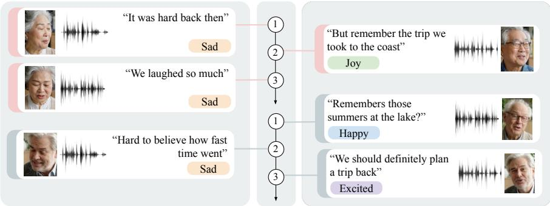
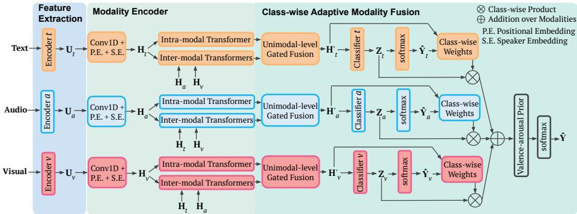
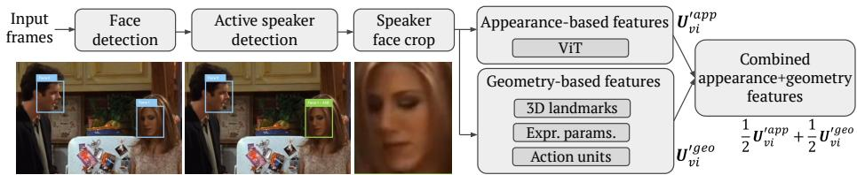
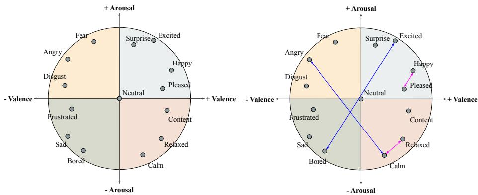

# Multimodal Emotion Recognition in Conversations via Class-Wise Adaptive Modality Fusion and Afective Geometry

Oriol Marín1 , Roger Marí1 , Gloria Haro2,3 , and Rafael Redondo1

1 Eurecat, Centre Tecnològic de Catalunya, Barcelona, Spain

{oriol.marin,roger.mari,rafael.redondo}@eurecat.org

2 Universitat Pompeu Fabra, Barcelona, Spain

3 Serra Húnter Fellow Programme, Universitat Pompeu Fabra, Barcelona, Spain gloria.haro@upf.edu

Abstract. Emotion Recognition in Conversations (ERC) requires integrating heterogeneous textual, audio, and visual cues while accounting for conversational context and emotional dynamics. We extend the Self-Distillation Transformer architecture for ERC with appearance+geometry visual representations, class-wise adaptive modality fusion, and a valencearousal prior for afective transitions. On the MELD and IEMOCAP datasets, geometry-enhanced visual representations improve weighted F1 by 0.27 and 4.36 points over appearance-only features, respectively, while class-wise adaptive fusion provides further gains of 0.17 and 0.25 points over the original softmax gate. The valence-arousal prior yields targeted improvements of 0.30 and 0.74 accuracy points on emotionally shifted utterances while preserving performance on stable turns. These results indicate that structured facial cues, emotion-dependent modality weighting, and afective geometry provide complementary benefits for multimodal ERC.

Keywords: Multimodal emotion recognition in conversations · Multimodal fusion · Afective geometry · Afective computing

## 1 Introduction

Emotion Recognition in Conversations (ERC) aims to identify the emotion expressed in each conversational turn, or utterance, by jointly modeling linguistic content, vocal cues, facial behavior, conversational context, and speaker interactions [27]. Unlike isolated emotion recognition, ERC must account for how afect evolves throughout a dialogue and how the relevance of each modality changes across speakers, emotions, and recording conditions.

Multimodal ERC remains challenging for three main reasons. First, text, audio, and visual signals are heterogeneous and are not equally informative for every utterance. In practice, multimodal models may become dominated by textual representations, while audio and visual cues receive comparatively less influence in standard fusion mechanisms [25]. Second, the informativeness of each modality varies across utterances and emotion categories, yet standard fusion mechanisms do not explicitly estimate whether a modality is reliable for the current prediction [21]. Third, discrete emotion classifiers generally treat emotion categories as independent labels, ignoring their structure in afective space and making emotionally shifted utterances particularly dificult to recognize, as in Fig. 1.

  
Fig. 1: Examples of emotion-shift dialogues in multimodal ERC. Top: sad → joy → sad; bottom: happy → sad→ excited. Each turn shows the speaker face, audio waveform, transcribed utterance, and emotion label, illustrating how afect evolves across turns.

This work addresses these limitations by extending the Self-Distillation Transformer (SDT) [21], a transformer-based ERC architecture that jointly processes text, audio, and visual representations through intra- and inter-modal attention, hierarchical gated fusion, and unimodal self-distillation. Building on this multimodal framework, we investigate whether stronger facial representations can make the visual stream more informative, whether modality contributions can be adapted to the predicted emotion class, and whether afective geometry can improve recognition under emotional transitions.

Specifically, this work proposes the following contributions:

– A combination of visual encoders for appearance-based features with facial geometry descriptors to strengthen the visual stream;

– A class-wise adaptive modality fusion strategy that allows modality importance to vary across emotion categories;

– A valence-arousal prior that applies a shift-aware correction in the emotion space to improve recognition of emotionally shifted utterances;

The proposed method is evaluated on the MELD [26] and IEMOCAP [3] benchmarks for ERC. The experiments show consistent gains in multimodal fusion performance, together with targeted improvements in emotion-shift recognition that vary with the characteristics of each dataset. Code and pretrained weights are available at: https://github.com/multimedia-eurecat/classwisemultimodal-ERC.

## 2 Related Work

## 2.1 Multimodal Emotion Recognition in Conversations

Emotion Recognition in Conversations difers from isolated emotion recognition because predictions depend on conversational context, speaker identity, and the temporal evolution of afect. Early methods used recurrent or memory-based architectures to model these dependencies. CMN [12] and ICON [11] maintain conversational memories over multimodal inputs, while DialogueRNN [23] explicitly tracks speaker states, global context, and emotion dynamics. Graph-based approaches such as DialogueGCN [9] and MMGCN [16] instead represent utterances and speaker relations as structured graphs.

More recent methods rely on attention-based and Transformer architectures to jointly model long-range context and cross-modal interactions. HiTrans [19] captures global and speaker-sensitive context, DialogueTRM [24] combines hierarchical contextual modeling with interactive multimodal fusion, and MM-DFN [14] integrates graph reasoning with dynamic fusion. MMTr [34] uses crossmodal attention to strengthen weaker modalities, while UniMSE [15] combines multi-level fusion with contrastive alignment.

Transformer-based fusion is particularly suitable for multimodal dialogue because it can model both intra-modal context and interactions between text, audio, and vision. MulT [31] introduced cross-modal attention for unaligned multimodal sequences, while MAG [28] injects acoustic and visual information into a pretrained language representation. However, standard attention and gating mechanisms do not explicitly estimate whether a modality is informative or reliable for a particular utterance.

## 2.2 SDT Framework in a Nutshell

Our work builds on the Self-Distillation Transformer (SDT) [21], a multimodal ERC architecture that operates on utterance-level text, audio, and visual features. For each modality $m \in \{ t , a , v \}$ , the input features are first projected to a shared hidden dimension and enriched with positional and speaker embeddings. An intra-modal Transformer then models contextual dependencies within the same modality, while two inter-modal Transformers allow each modality to attend to the other two streams. The resulting self- and cross-modal representations are combined through unimodal-level sigmoid gates, producing one enhanced representation per modality, denoted as $\mathbf { H } _ { m } ^ { \prime }$

At the multimodal level, SDT applies a softmax-based gate to combine the diferent modality enhanced representations $\mathbf { H } _ { m } ^ { \prime }$ before the final classification $\hat { \mathbf Y }$ In parallel, each unimodal branch has its own classifier and is trained through self-distillation, using the fused multimodal prediction Yˆ as a teacher of the unimodal-level classifiers. This encourages stronger unimodal representations while preserving a joint multimodal decision.

Our work retains SDT’s intra- and inter-modal modality encoding and selfdistillation strategy, but revisits the fusion stage by replacing the original softmax gate with class-wise adaptive modality fusion.

## 2.3 Visual Representations for Emotion Recognition

Visual ERC systems commonly rely on appearance-based encoders that extract a holistic representation from face crops. Convolutional networks such as DenseNet [17] and more recent Vision Transformers (ViTs) [5] capture rich visual information, but may also encode identity, illumination, pose, texture, and background together with expression-related cues.

Geometry-based representations provide a complementary alternative by focusing on facial structure and deformation. The Facial Action Coding System (FACS) [6] represents expressions through anatomically defined facial action units, while 3D Morphable Models (3DMMs) [2] separate identity-related facial structure from expression parameters. Although appearance- and geometrybased features have been widely studied for facial expression recognition, their complementarity within multimodal ERC has received less attention [18, 33].

## 2.4 Emotion Dynamics and Afective Geometry

Emotion shifts remain particularly challenging in ERC. Existing methods often model them as a discrete auxiliary task. For example, Bansal et al. [1] predict whether an emotional change occurs between consecutive utterances and use this signal to regulate the influence of dialogue history on the next prediction.

A separate line of work represents relationships between emotions through continuous afective dimensions. Russell’s circumplex model [30] organizes emotion categories around a continuous two-dimensional space according to valence and arousal, where distances between valence-arousal coordinates reflect afective similarity. Such distances have been incorporated into training objectives to penalize confusions between afectively distant classes more strongly [8].

## 3 Method

This section presents the proposed methodology for ERC from text, audio, and visual streams. As shown in Fig. 2, the pipeline comprises three main stages: unimodal feature extraction, modality encoding, and class-wise adaptive modality fusion followed by a valence-arousal prior.

The unimodal feature extraction and modality encoding stages build on the Self-Distillation Transformer (SDT) [21]. We update the unimodal encoders and extend the visual stream by combining appearance-based and geometry-based facial cues. We then replace SDT’s original softmax-based multimodal fusion with a class-wise adaptive strategy that combines unimodal logits using explicit estimates of each modality’s informativeness for each emotion class. Finally, we introduce a valence-arousal prior grounded in afective geometry, which applies a targeted correction to the fused logits when the predicted afective state changes strongly across consecutive utterances.

The training objective follows the original SDT formulation:

$$
\mathcal { L } = \gamma _ { 1 } \mathcal { L } _ { \mathrm { T a s k } } + \gamma _ { 2 } \mathcal { L } _ { \mathrm { C E } } + \gamma _ { 3 } \mathcal { L } _ { \mathrm { K L } } ,\tag{1}
$$

  
Fig. 2: Method overview. Building on SDT [21], unimodal features U are projected into H and processed by intra- and inter-modal Transformers to obtain enhanced representations H′. We introduce class-wise adaptive modality fusion and a valence-arousal prior that biases the final prediction Yˆ toward plausible afective transitions.

where $\mathcal { L } _ { \mathrm { T a s k } }$ and $\mathcal { L } _ { \mathrm { C E } }$ are cross-entropy losses supervising the fused multimodal and modality-specific predictions, respectively, using the ground-truth labels. Self-distillation is applied via the Kullback-Leibler (KL) divergence term ${ \mathcal { L } } _ { \mathrm { K L } }$ which encourages the temperature-softened unimodal-level predictions to match the softened fused prediction; larger temperature values yield a softer distribution over classes [13].

## 3.1 Feature Extraction and Modality Encoding

We replace the original SDT feature extractors [21] with more recent pretrained encoders to extract unimodal feature representations ${ \mathbf { U } } _ { m }$ for each modality m. Following SDT, these representations are projected to a shared dimensionality $d = 1 0 2 4$ using 1 × 1 convolutions and combined with positional embeddings PE and speaker embeddings SE, i.e., $\mathbf H _ { m } = \mathrm { C o n v { 1 D } } ( \mathbf U _ { m } ) + \mathbf P \mathbf E + \mathbf S \mathbf E$ . The modality encoding stage, shown in Fig. 2, remains unchanged and uses intramodal and inter-modal Transformers to capture contextual relationships within each modality and interactions across modalities.

Text features. Text embeddings are extracted with RoBERTa-large trained within the sentence-transformer framework $[ 2 9 ] ^ { 4 }$ . Each target utterance is preceded by the two previous dialogue turns for context, formatted with speaker identifiers, and encoded by mean-pooling the final hidden states.

Audio features. Audio embeddings are extracted with the speech emotion representation model emotion2vec [22]5, trained on large-scale, unspecified speech emotion recognition corpora, replacing the handcrafted openSMILE features [7] used by SDT. As the exact training subsets are not publicly disclosed, possible overlap with IEMOCAP or MELD cannot be determined. The publicly released checkpoint is used here without fine-tuning. Audio is converted to mono, resampled to 16 kHz, RMS-normalized, and truncated to 10 s. Missing or invalid segments are represented by zero vectors.

  
Fig. 3: Overview of the visual feature extraction. Speaker face crops are obtained from $T = 1 6$ frames per utterance, then encoded as a combined representation of appearanceand geometric-based facial features before entering the visual modality encoding stage.

Visual features. For each utterance, $T = 1 6$ frames are sampled uniformly. Faces are detected with MTCNN [32], while LightASD [20] selects the active speaker in multi-person scenes. If no valid face is found, the visual embedding is set to zero. The resulting face crops are encoded using a combination of appearance-based features and geometry-based descriptors, as illustrated in Fig. 3.

Appearance features are obtained with a Vision Transformer (ViT) [5]6. Each frame is encoded independently, and the resulting 768-dimensional embeddings are mean-pooled into one utterance-level descriptor.

To provide a more structured representation of facial expressions, we evaluate three geometry-based descriptors:

1. 3D landmarks: 68 landmarks extracted with 3DDFA-V2 [10], normalized by nose position and inter-ocular distance, and summarized across frames using their mean and standard deviation, producing a 408-dimensional descriptor;

2. Expression parameters: 10 expression coeficients and three head-pose angles estimated with 3DDFA-V2 and a 3D Morphable Model [2], aggregated using the mean, standard deviation, and average frame-to-frame diference into a 39-dimensional descriptor;

3. Action units: 20 facial action-unit intensities defined by FACS [6] and extracted with py-feat [4], aggregated using the same three statistics into a 60-dimensional descriptor.

Appearance-based descriptors are projected to the shared dimension using a $1 \times 1$ convolution as in SDT, while geometry-based descriptors are mapped to the same space using a lightweight two-layer MLP that can model non-linear relationships within the structured facial features. After independent normalization, the two branches are combined by symmetric addition: $\begin{array} { r } { \mathbf { \dot { U } } _ { v i } ^ { \prime } = \frac { 1 } { 2 } \mathbf { U } _ { v i } ^ { \prime \mathrm { a p p } } + \frac { 1 } { 2 } \mathbf { U } _ { v i } ^ { \prime \mathrm { g e o } } } \end{array}$ , where $\mathbf { U } _ { v i } ^ { \mathrm { \prime a p p } } , \mathbf { U } _ { v i } ^ { \mathrm { \prime g e o } } \in \mathbb { R } ^ { d }$ are the projected and normalized appearance and geometry embeddings for utterance $i ,$ and $\mathbf { U } _ { v i } ^ { \prime }$ is the combined visual representation previous to the addition of the positional and speaker embeddings.

## 3.2 Class-Wise Adaptive Modality Fusion

The original SDT architecture uses hierarchical gated fusion at both the unimodal and multimodal levels [21]. At the unimodal level, the outputs of the intra- and inter-modal Transformers are combined into an enhanced representation $\mathbf { H } _ { m } ^ { \prime }$ for each modality, as shown in Fig. 2. At the multimodal level, these representations are fused through a softmax-based gate.

This multimodal gate is not explicitly reliability-aware: a modality may receive a large contribution because of the magnitude of its projected activations, even when its signal is noisy, corrupted, or weakly informative. We therefore retain the unimodal-level gated fusion and replace the softmax-based gate with a class-wise adaptive fusion strategy that estimates the contribution of each modality separately for each emotion category.

Throughout this section, $\mathbf { h } _ { m i } ^ { \prime } \in \mathbb { R } ^ { d }$ denotes the i-th row of $\mathbf { H } _ { m } ^ { \prime } , \ i . e$ . the enhanced representation of modality m for a given utterance. Each modalityspecific classifier maps $\mathbf { h } _ { m i } ^ { \prime }$ to unimodal logits $\mathbf { z } _ { m i } \in \mathbb { R } ^ { C }$ in $\mathbf { Z } _ { m }$ and a subsequent probability vector $\hat { \mathbf { y } } _ { m i } = \mathrm { s o f t m a x } ( \mathbf { z } _ { m i } ) \in \mathbb { R } ^ { C }$ in $\hat { \mathbf { Y } } _ { m }$ over the $C$ emotion categories.

Multimodal softmax fusion. The SDT baseline [21] applies a shared linear projection $\mathbf { W } \in \mathbb { R } ^ { d \times d }$ to each enhanced modality representation $\mathbf { h } _ { m i } ^ { \prime }$ , where $m \in$ $\{ t , a , v \}$ denotes text, audio, or visual stream. A softmax over the modality dimension produces dimension-wise weights as follows:

$$
\left[ { \bf g } _ { t i } ; { \bf g } _ { a i } ; { \bf g } _ { v i } \right] = \mathrm { s o f t m a x } ( [ { \bf W } { \bf h } _ { t i } ^ { \prime } ; { \bf W } { \bf h } _ { a i } ^ { \prime } ; { \bf W } { \bf h } _ { v i } ^ { \prime } ] ) .\tag{2}
$$

The final multimodal representation $\mathbf { h } _ { i } ^ { \prime }$ is obtained as a weighted sum of the enhanced modality representations:

$$
\mathbf { h } _ { i } ^ { \prime } = \sum _ { { m \in \{ t , a , v \} } } \mathbf { g } _ { m i } \odot \mathbf { h } _ { m i } ^ { \prime } ,\tag{3}
$$

where $\odot$ denotes the element wise-product. Although expressive, this gate does not explicitly estimate whether each modality is informative for the current utterance and a certain emotion class.

Multimodal class-wise adaptive fusion. The relevance of a modality may depend on the emotion being predicted. Audio, for example, may be especially informative for high-arousal emotions, whereas visual cues may be more useful for classes associated with distinctive facial configurations. Our class-wise adaptive fusion implements this idea by estimating an explicit contribution score for each emotion class c and modality $m ,$ based on $\mathbf { h } _ { m i } ^ { \prime } \in \mathbb { R } ^ { d }$ and $\hat { \mathbf { y } } _ { m i } \in \mathbb { R } ^ { C }$ , as follows:

$$
r _ { m i } ^ { c } = \mathcal { R } _ { m } ^ { c } \bigl ( \bigl [ \mathbf { h } _ { m i } ^ { \prime } \bigr ] \bigr | \hat { \mathbf { y } } _ { m i } \bigr ] \bigr ) ,\tag{4}
$$

  
Fig. 4: Russell’s valence-arousal circumplex model of afect. The proposed prior favors smaller, plausible emotion transitions (magenta) over large shifts (blue).

where ∥ denotes concatenation and $\mathcal { R } _ { m }$ is a learnable function per modality implemented as a lightweight two-layer MLP. Its c-th output, $r _ { m i } ^ { c } ,$ represents the estimated informativeness of the modality m for the emotion class c.

For each class, $r _ { m i } ^ { c }$ scores in Eq. (4) are converted to weights via softmax across modalities, $w _ { m i } ^ { c } = \mathrm { s o f t m a x } _ { m } ( r _ { m i } ^ { c } )$ . Note that fusion is performed at the logit level rather than directly on $\mathbf { h } _ { m i } ^ { \prime }$ . The fused logit for class c is obtained as

$$
\hat { z } _ { i } ^ { c } = \sum _ { { m } \in \{ t , a , v \} } w _ { { m } i } ^ { c } z _ { { m } i } ^ { c } ,\tag{5}
$$

where $\hat { z } _ { i } ^ { c }$ and $z _ { m i } ^ { c }$ are the c-class values of the fused and unimodal-level logits, $\hat { \mathbf { z } } _ { m i }$ and $\mathbf { z } _ { m i }$ , respectively. The final prediction is obtained from the fused logits as $\hat { \mathbf { y } } _ { i } = \mathrm { s o f t m a x } ( \hat { \mathbf { z } } _ { i } )$ . The unimodal predictions provided to the class-wise learnable MLPs are detached from the computation graph, preventing the fusion weights from influencing the unimodal classifiers through a circular gradient path.

## 3.3 Valence-Arousal Prior for Emotion Shifts

Emotion shifts remain challenging in ERC because standard classifiers treat emotion categories as independent labels, ignoring their relationships in afective space. For example, a transition from happy to excited is afectively closer than one from happy to sad. We therefore introduce a shift-aware prior based on Russell’s circumplex model [30], which represents emotions in a two-dimensional continuous space defined by valence and arousal, as illustrated in Fig. 4. In this space, each emotion class c is assigned a pair of valence-arousal coordinates $\mathbf { v } _ { c } \in \mathbb { R } ^ { 2 }$ . These coordinates can be defined using either canonical circumplex positions or dataset-specific centroids derived from continuous annotations.

We apply a valence-arousal prior after class-wise adaptive fusion, which produces multimodal logits $\hat { \mathbf { z } } _ { i } ~ \in ~ \mathbb { R } ^ { C }$ and corresponding class probabilities $\hat { \mathbf { y } } _ { i } ~ =$ softmax $\left( \hat { \mathbf { z } } _ { i } \right)$ . The expected valence-arousal position of utterance i is then computed as

$$
\hat { \mathbf { v } } _ { i } = \sum _ { c = 1 } ^ { C } \hat { y } _ { i } ^ { c } \mathbf { v } _ { c } ,\tag{6}
$$

where $\hat { y } _ { i } ^ { c }$ is the predicted probability of class c. The same estimate is obtained for the preceding utterance $\hat { \mathbf { v } } _ { i - 1 }$ . For the first utterance of a dialogue, the previous class distribution is initialized uniformly.

The magnitude of the predicted afective transition is measured by the Euclidean distance between two consecutive valence-arousal positions:

$$
\beta _ { i } = \left\| \hat { \mathbf { v } } _ { i } - \hat { \mathbf { v } } _ { i - 1 } \right\| ,\tag{7}
$$

so that the correction has little influence on afectively stable utterances and becomes stronger for larger predicted shifts.

For each candidate class c, the distance from the previous afective state is

$$
d _ { i } ^ { c } = \left\| \mathbf { v } _ { c } - \hat { \mathbf { v } } _ { i - 1 } \right\| .\tag{8}
$$

These distances are converted into a temperature-scaled log-prior as

$$
\phi _ { i } ^ { c } = \log \frac { \exp ( - d _ { i } ^ { c } / \tau _ { \mathrm { v a } } ) } { \sum _ { c ^ { \prime } = 1 } ^ { C } \exp ( - d _ { i } ^ { c ^ { \prime } } / \tau _ { \mathrm { v a } } ) } ,\tag{9}
$$

where smaller $\tau _ { \mathrm { v a } }$ assigns greater preference to classes closer to the previous afective state. Stacking the class-wise values gives the log-prior vector $\phi _ { i } \in \mathbb { R } ^ { C }$ 2 which is added to the fused logits:

$$
\hat { \mathbf { z } } _ { i } ^ { \prime } = \hat { \mathbf { z } } _ { i } + \alpha \beta _ { i } \phi _ { i } ,\tag{10}
$$

where $\alpha \geq 0$ controls the overall prior strength and $\beta _ { i }$ scales the correction according to the predicted transition magnitude. In this way, the prior acts as an afective transition smoother: $\beta _ { i }$ determines how strongly the correction is applied, while $\phi _ { i }$ favors emotion classes that remain close to the previous afective state. The final prediction is $\hat { \mathbf { y } } _ { i } ^ { \prime } = \mathrm { s o f t m a x } ( \hat { \mathbf { z } } _ { i } ^ { \prime } )$ . The prior correction term is applied at both training and inference; α and $\tau _ { \mathrm { v a } }$ are fixed by hyperparameter sweep and no gradients flow through Eqs. (7)–(10). The prior correction at utterance i uses the base class probabilities of the previous utterance, before adding the prior correction, so that errors are not propagated along a dialogue.

## 4 Experiments

This section evaluates the proposed components on ERC datasets through a progressive ablation. After presenting the common experimental setup and overall comparison, we separately analyze the appearance+geometry visual representations, class-wise adaptive modality fusion, and the valence-arousal prior for emotionally shifted utterances.

## 4.1 Experimental Setup

Datasets. We evaluate the proposed method on two multimodal ERC benchmarks: MELD [26] and IEMOCAP [3]. Both provide utterance-level emotion labels together with text, audio, and video, but difer substantially in conversational setting and annotation structure.

MELD contains 13,708 utterances from 1,433 multi-party dialogues, annotated with seven emotion classes: neutral, surprise, fear, sadness, joy, disgust, and anger. We use the oficial training, validation, and test splits, containing 9,989, 1,109, and 2,610 utterances, respectively. IEMOCAP contains 7,433 utterances from dyadic interactions and uses six classes: happy, sad, neutral, angry, excited, and frustrated. Following the SDT protocol [21], Sessions 1-4 are used for training and Session 5 for testing. IEMOCAP additionally provides continuous valence and arousal annotations, which are used only in the emotion-shift analysis.

Evaluation protocol. Weighted F1 is used as the primary metric because both datasets exhibit substantial class imbalance; overall accuracy is reported as a complementary measure. For the valence-arousal prior, we additionally report accuracy separately on emotionally shifted and stable utterances. For MELD, the oficial validation and test splits are used. IEMOCAP does not have a validation split; following the SDT protocol [21], Session 5 is used for both validation and test. Hyperparameter choices are made using validation data, and results are reported on the test set.

Baseline and training. All experiments build on our reimplementation of SDT [21], using the updated text, audio, and visual encoders described in Section 3.1. The original SDT results are included only as reported reference values because its fine-tuned feature-extractor weights were not publicly available. Unless otherwise stated, ablations modify one component at a time while keeping the remaining architecture and training configuration fixed.

As in SDT, for MELD, we use a learning rate of $5 \times 1 0 ^ { - 6 }$ , batch size 8, and self-distillation temperature $\tau = 8 ;$ and for IEMOCAP, we use a learning rate of $1 0 ^ { - 4 }$ , batch size 16, and τ = 1. Models are trained for up to 15 epochs with early stopping based on weighted F1 of the validation set. All configurations used a fixed random seed to ensure consistent comparisons across ablations. The SDT softmax fusion gate requires a ∼1.05M projection layer, whereas our class-wise approaches requires only ∼0.40M. All experiments were run on a single NVIDIA GTX 1080 Ti (12 GB VRAM).

## 4.2 Overall Comparison and Ablation

We first evaluate the cumulative efect of the proposed components on the multimodal text-audio-visual prediction, starting from our updated SDT baseline and progressively adding the proposed appearance+geometry visual representation and class-wise adaptive modality fusion.

Table 1: Comparison with established multimodal ERC methods and cumulative ablation of the proposed components. Results report overall accuracy (ACC) and weighted F1 (w-F1), in %. Mean denotes the average across MELD and IEMOCAP. Results marked with † are taken from [21] and were not reproduced in this work.
<table><tr><td></td><td colspan="2">MELD</td><td colspan="2">IEMOCAP</td><td colspan="2">Mean</td></tr><tr><td>Model</td><td>ACC</td><td>w-F1</td><td>ACC</td><td>w-F1</td><td>ACC</td><td>w-F1</td></tr><tr><td>Previously reported ERC methods</td><td></td><td></td><td></td><td></td><td></td><td></td></tr><tr><td>DialogueRNN [23]†</td><td>66.70</td><td>65.31</td><td>69.38</td><td>69.37</td><td>68.04</td><td>67.34</td></tr><tr><td>MMGCN [16]†</td><td>66.40</td><td>65.21</td><td>69.62</td><td>69.61</td><td>68.01</td><td>67.41</td></tr><tr><td>DialogueTRM [24]†</td><td>66.70</td><td>65.76</td><td>69.87</td><td>69.93</td><td>68.29</td><td>67.85</td></tr><tr><td>MM-DFN [14]†</td><td>66.55</td><td>65.48</td><td>69.87</td><td>69.91</td><td>68.21</td><td>67.70</td></tr><tr><td>Original SDT [21]†</td><td>67.55</td><td>66.60</td><td>73.95</td><td>74.08</td><td>70.75</td><td>70.34</td></tr><tr><td>Cumulative ablation of our model</td><td></td><td></td><td></td><td></td><td></td><td></td></tr><tr><td>Updated SDT baseline</td><td>74.87</td><td>75.49</td><td>69.36</td><td>69.50</td><td>72.12</td><td>72.50</td></tr><tr><td>+ Appearance+geometry visual stream</td><td>75.40</td><td>75.76</td><td>73.98</td><td>73.86</td><td>74.69</td><td>74.81</td></tr><tr><td>+ Class-wise adaptive modality fusion</td><td>75.36</td><td>75.93</td><td>74.72</td><td>74.11</td><td>75.04</td><td>75.02</td></tr></table>

Table 1 places the proposed method in the context of established multimodal ERC approaches and reports the cumulative efect of the visual and fusion components. Previously published results are included as reference values and were not reproduced under our updated feature-extraction setting.

The updated feature encoders afect the two datasets diferently, substantially improving MELD while reducing performance relative to the reported SDT result on IEMOCAP. Nevertheless, their mean weighted F1 across both datasets increases from 70.34 to 72.50. Adding appearance+geometry visual representations raises the mean weighted F1 to 74.81, with particularly strong gains on IEMOCAP. Class-wise adaptive modality fusion provides a further improvement to 75.02 mean weighted F1 and achieves the strongest IEMOCAP accuracy and weighted F1. Sections 4.3 and 4.4 analyze these contributions individually. The valence-arousal prior is separately examined in Section 4.5.

## 4.3 Visual Representation Analysis

This section analyzes the efect of appearance- and geometry-based facial representations on multimodal ERC performance, as summarized in Table 2. To isolate the visual stream, all configurations retain the updated text and audio encoders and use the original SDT softmax fusion. We compare ViT appearance features with 3D landmarks, expression parameters, and facial action units, both individually and in combination with ViT according to Fig. 3. All geometrybased descriptors are projected to the shared hidden space using the lightweight MLP described in Section 3.1.

On MELD, geometry-only representations perform similarly to the ViT appearance baseline, indicating that structured facial descriptors retain useful expression information despite their substantially lower dimensionality. Expression parameters provide the strongest geometry-only result, while combining ViT with action units achieves the best overall performance.

Table 2: Visual representation ablation on MELD and IEMOCAP, reported as trimodal overall accuracy (ACC) and weighted F1 (w-F1), in %. Best and second-best results are shown in bold and underlined, respectively.
<table><tr><td rowspan="2">Visual representation</td><td colspan="2">MELD</td><td colspan="2">IEMOCAP</td></tr><tr><td>ACC</td><td>w-F1</td><td>ACC</td><td>w-F1</td></tr><tr><td>ViT appearance</td><td>74.87</td><td>75.49</td><td>69.36</td><td>69.50</td></tr><tr><td>3D landmarks</td><td>74.98</td><td>75.34</td><td>72.93</td><td>72.41</td></tr><tr><td>Expression parameters</td><td>75.21</td><td>75.59</td><td>73.00</td><td>72.51</td></tr><tr><td>Action units</td><td>75.17</td><td>75.43</td><td>73.30</td><td>73.20</td></tr><tr><td>ViT + 3D landmarks</td><td>75.59</td><td>75.27</td><td>73.98</td><td>73.86</td></tr><tr><td>ViT + expression parameters</td><td>74.79</td><td>75.47</td><td>70.59</td><td>70.06</td></tr><tr><td>ViT + action units</td><td>75.40</td><td>75.76</td><td>71.52</td><td>71.67</td></tr></table>

The efect of facial geometry is more pronounced on IEMOCAP, where all three geometry-only representations outperform ViT appearance features. Action units provide the strongest geometry-only result compared with ViT, while the best overall configuration combines ViT with 3D landmarks.

The results also show that combining appearance and geometry is not uniformly beneficial. While action units complement ViT on MELD and 3D landmarks complement it on IEMOCAP, the remaining combinations perform below their corresponding geometry-only representations. This indicates that the usefulness of appearance+geometry fusion depends on both the facial descriptor and the dataset characteristics. Based on the weighted F1 results in Table 2, subsequent experiments use ViT with action units for MELD and ViT with 3D landmarks for IEMOCAP.

## 4.4 Class-Wise Adaptive Fusion Analysis

We evaluate whether estimating modality informativeness separately for each emotion class improves over class-independent fusion. All configurations use the visual representations selected in Section 4.3: ViT combined with action units for MELD and with 3D landmarks for IEMOCAP. We compare the original SDT softmax gate, the proposed class-wise strategy and a modality-wise but classagnostic variant. For the modality-wise variant, the learnable MLP in Eq. (4) is modified to predict a single score per modality instead of C class-specific scores.

As reported in Table 1, class-wise adaptive fusion improves weighted F1 from 75.76 to 75.93 on MELD and from 73.86 to 74.11 on IEMOCAP. In contrast, the modality-wise variant obtains only 73.47 and 73.17 weighted F1 on MELD and IEMOCAP, respectively. A single score per modality therefore appears too coarse to represent the emotion-dependent informativeness of text, audio, and visual cues. On IEMOCAP, class-wise fusion increases accuracy, while on MELD it remains essentially unchanged. This suggests that the class-wise weights mainly improve the balance of predictions across MELD’s imbalanced emotion categories rather than the total number of correct predictions. The larger efect on IEMOCAP is also consistent with the stronger contribution of facial geometry observed in Section 4.3, leaving more room for class-dependent multimodal weighting.

Table 3: Per-class weighted F1 on MELD and IEMOCAP for the SDT softmax baseline and the proposed class-wise adaptive fusion, with the visual encoders selected in Sec. 4.3
<table><tr><td colspan="3">MELD</td><td colspan="3">IEMOCAP</td></tr><tr><td>Class</td><td>Softmax</td><td>Class-wise</td><td>Class</td><td>Softmax</td><td>Class-wise</td></tr><tr><td>Neutral</td><td>96.16</td><td>96.40</td><td>Happy</td><td>57.34</td><td>56.81</td></tr><tr><td>Surprise</td><td>45.19</td><td>46.15</td><td>Sad</td><td>80.82</td><td>81.84</td></tr><tr><td>Fear</td><td>10.08</td><td>15.29</td><td>Neutral</td><td>79.44</td><td>80.94</td></tr><tr><td>Sadness</td><td>51.24</td><td>52.96</td><td>Angry</td><td>72.46</td><td>74.24</td></tr><tr><td>Joy</td><td>77.60</td><td>77.76</td><td>Excited</td><td>80.13</td><td>81.13</td></tr><tr><td>Disgust</td><td>31.40</td><td>27.33</td><td>Frustrated</td><td>65.66</td><td>63.17</td></tr><tr><td>Anger</td><td>57.27</td><td>55.78</td><td></td><td></td><td></td></tr><tr><td>Average</td><td>75.76</td><td>75.93</td><td>Average</td><td>73.86</td><td>74.11</td></tr></table>

Table 4: Weighted F1 under clean and degraded test conditions for clean-trained and degradation-trained models. Audio degraded averages SNR = 5 dB and 50% packet loss; visual degraded averages σ =7 blur and 50% lower-face occlusion.
<table><tr><td rowspan="2">Test condition</td><td colspan="2">MELD</td><td colspan="2">IEMOCAP</td></tr><tr><td>No degraded</td><td>Degraded</td><td>No degraded</td><td>Degraded</td></tr><tr><td>Clean</td><td>75.93</td><td>75.61</td><td>74.11</td><td>68.81</td></tr><tr><td>Audio degraded</td><td>72.48</td><td>71.31</td><td>20.61</td><td>47.79</td></tr><tr><td>Visual degraded</td><td>75.63</td><td>73.96</td><td>56.66</td><td>64.97</td></tr></table>

Table 3 reports the per-class weighted F1 for both fusion strategies. Classwise gains concentrate on less-represented emotions on both datasets, while softmax fusion remains stronger on a small subset of classes. In general, no clear pattern is observed between positive and negative emotions.

We further trained on partial missing modalities with noisy partitions: 50% clean, ∼50% audio-, visual-, or both-degraded. Table 4 shows that MELD, dominated by text, does not benefit from degradation training. However, IEMO-CAP’s clean-trained model collapses under audio degradation and drops sharply under visual degradation; degradation training recovers most of this loss. While MELD is sourced from television dialogues, with natural environmental noise, varied lighting and occasionally missing speaker faces, IEMOCAP was recorded in a controlled laboratory setting. This explains why introducing degraded data in training benefits models trained on IEMOCAP by improving their robustness.

Table 5: Valence-arousal coordinates normalized between [0, 1]. IEMOCAP coordinates are class centroids derived from continuous annotations, while MELD uses canonical positions based on Russell’s circumplex model [30].
<table><tr><td>Dataset</td><td>Dimension</td><td colspan="7">Emotion class</td></tr><tr><td rowspan="2">IEMOCAP</td><td>Emotion</td><td>Neutral</td><td>Happy</td><td>Excited</td><td>Angry</td><td>Sad 0.20</td><td>Frustrated</td><td></td></tr><tr><td>Valence Arousal</td><td>0.50 0.50</td><td>0.80 0.60</td><td>0.75 0.80</td><td>0.20 0.80</td><td>0.30</td><td>0.25 0.55</td><td></td></tr><tr><td rowspan="3">MELD</td><td>Emotion</td><td></td><td></td><td></td><td></td><td></td><td></td><td></td></tr><tr><td></td><td>Neutral</td><td>Joy</td><td>Surprise</td><td>Anger</td><td>Sadness</td><td>Fear</td><td>Disgust</td></tr><tr><td>Valence Arousal</td><td>0.50 0.50</td><td>0.88 0.74</td><td>0.70 0.84</td><td>0.29 0.84</td><td>0.19 0.37</td><td>0.18 0.80</td><td>0.20 0.68</td></tr></table>

Table 6: Efect of the valence-arousal prior on overall weighted F1 and accuracy on emotionally shifted and stable utterances, in %. Parentheses indicate the number of test utterances in each subset. Both configurations use modality dropout with $p _ { \mathrm { d r o p } } = 0 . 1 0$
<table><tr><td rowspan="2"></td><td colspan="3">MELD</td><td colspan="3">IEMOCAP</td></tr><tr><td>w-F1 (1864)</td><td>ACC Shift (1003)</td><td>ACC Stable (861)</td><td>w-F1 (1561)</td><td>ACC Shift (410)</td><td>ACC Stable (1151)</td></tr><tr><td>Configuration Without prior</td><td>75.47</td><td>62.81</td><td>85.95</td><td>74.69</td><td>54.90</td><td>81.60</td></tr><tr><td>With prior</td><td>75.61</td><td>63.11</td><td>86.06</td><td>74.87</td><td>55.64</td><td>81.60</td></tr></table>

## 4.5 Emotion-Shift Analysis

We evaluate whether the valence-arousal prior introduced in Section 3.3 improves recognition of utterances involving emotional transitions. An utterance is considered shifted when its ground-truth emotion difers from that of the most recent preceding utterance by the same speaker, and stable otherwise. Utterances without a preceding turn from the same speaker are excluded. This yields 1,003 shifted and 861 stable utterances for MELD, and 410 shifted and 1,151 stable utterances for IEMOCAP. The prior remains dialogue-level and uses the immediately preceding dialogue turn when estimating the previous afective state.

For this experiment, the configurations with and without the valence–arousal prior both use class-wise adaptive fusion and the visual representations selected in Section 4.3: ViT combined with action units for MELD and with 3D landmarks for IEMOCAP. Both configurations also use input-level modality dropout with $p _ { \mathrm { d r o p } } = 0 . 1 0$ as a fixed training regularizer, randomly zeroing modality inputs while ensuring that at least one stream remains available.

The two datasets provide diferent sources to represent the afective space. IEMOCAP class coordinates are obtained by averaging the continuous valence and arousal annotations associated with each emotion category. MELD does not provide continuous afective annotations, so its classes are assigned canonical coordinates derived from Russell’s circumplex model [30]. All coordinates are normalized to [0, 1] and shown in Table 5. The prior parameters are fixed to $\alpha = 0 . 1$ and $\tau _ { \mathrm { v a } } = 5$ for MELD, and $\alpha = 0 . 7$ and $\tau _ { \mathrm { v a } } = 1 . 5$ for IEMOCAP.

As shown in Table 6, the prior produces modest improvements in overall weighted F1. This limited overall efect is consistent with its targeted design: the velocity term reduces the correction for afectively stable predictions and increases its influence when the predicted transition is larger.

The efect is more apparent on emotionally shifted utterances. The stronger improvement on IEMOCAP is consistent with its dataset-specific valence-arousal coordinates, which are better aligned with the empirical afective distribution than the canonical coordinates used for MELD. Overall, these results are consistent with the intended role of the prior as an afective transition smoother. It favors classes that remain plausible relative to the preceding dialogue state while preserving performance on stable utterances.

## 4.6 Limitations

The results presented in this work remain dataset dependent. The visual stream relies on face detection and active-speaker identification, which may fail under occlusion, profile views or overlapping speech. The afective prior is also limited by the availability of dataset-specific valence-arousal annotations. Moreover, it operates at the dialogue level and does not account for whether consecutive utterances belong to the same speaker; a speaker-aware extension is left for future work. Finally, evaluation is restricted to two established benchmarks, and the updated feature extractors prevent a fully controlled comparison with the original SDT implementation because its fine-tuned encoder weights were not publicly available.

## 5 Conclusion

This work presents a multimodal Transformer-based ERC framework with geometryenhanced visual representations, class-wise adaptive modality fusion, and a valencearousal prior for emotion transitions. Experiments on MELD and IEMOCAP show that structured facial descriptors can complement appearance features, with particularly clear improvements on IEMOCAP. Class-wise fusion also improves over the original softmax gate and class-agnostic variants, indicating that modality relevance depends on the emotion category being predicted. The valence-arousal prior provides modest but targeted gains on emotionally shifted utterances while largely preserving performance on stable dialogue turns.

Future research directions include learning dataset- and speaker-specific affective geometries, improving robustness to degraded modality inputs, and evaluating the method on more spontaneous conversational data. Another promising direction is to analyze the learned class-wise weights at the utterance level to clarify which modality drives each emotion prediction.

## Acknowledgements

This work was financially supported by the Catalan Government through the funding grant ACCIÓ-Eurecat (Project TRAÇA: “MentalTwin” 2026-2027).

## References

1. Bansal, K., Agarwal, H., Joshi, A., Modi, A.: Shapes of emotions: Multimodal emotion recognition in conversations via emotion shifts. In: Proceedings of the First Workshop on Performance and Interpretability Evaluations of Multimodal, Multipurpose, Massive-Scale Models. pp. 44–56 (2022)

2. Blanz, V., Vetter, T.: A morphable model for the synthesis of 3D faces. In: Proceedings of the 26th Annual Conference on Computer Graphics and Interactive Techniques (SIGGRAPH). pp. 187–194 (1999)

3. Busso, C., Bulut, M., Lee, C.C., Kazemzadeh, A., Mower, E., Kim, S., Chang, J.N., Lee, S., Narayanan, S.S.: IEMOCAP: Interactive emotional dyadic motion capture database. Language Resources and Evaluation 42(4), 335–359 (2008)

4. Cheong, J., Xie, T., Hanes, N., Chang, L.: Py-Feat: Python Facial Expression Analysis Toolbox. Afective Science 4, 781–789 (2023)

5. Dosovitskiy, A., Beyer, L., Kolesnikov, A., Weissenborn, D., Zhai, X., Unterthiner, T., Dehghani, M., Minderer, M., Heigold, G., Gelly, S., Uszkoreit, J., Houlsby, N.: An image is worth 16x16 words: Transformers for image recognition at scale. In: International Conference on Learning Representations (ICLR) (2021)

6. Ekman, P., Friesen, W.V.: Facial Action Coding System: A Technique for the Measurement of Facial Movement. Consulting Psychologists Press, Palo Alto, CA (1978)

7. Eyben, F., Weninger, F., Gross, F., Schuller, B.: Recent developments in opensmile, the munich open-source multimedia feature extractor. In: Proceedings of the 21st ACM International Conference on Multimedia. pp. 835–838 (2013)

8. Feng, S., Lubis, N., Ruppik, B., Geishauser, C., Heck, M., Lin, H.C., van Niekerk, C., Vukovic, R., Gasic, M.: From chatter to matter: Addressing critical steps of emotion recognition learning in task-oriented dialogue. In: Proceedings of the 24th Annual Meeting of the Special Interest Group on Discourse and Dialogue (SIGDIAL). pp. 85–103 (2023)

9. Ghosal, D., Majumder, N., Poria, S., Chhaya, N., Gelbukh, A.: DialogueGCN: A graph convolutional neural network for emotion recognition in conversation. In: Proceedings of the 2019 Conference on Empirical Methods in Natural Language Processing and the 9th International Joint Conference on Natural Language Processing (EMNLP-IJCNLP). pp. 154–164 (2019)

10. Guo, J., Zhu, X., Yang, Y., Yang, F., Lei, Z., Li, S.Z.: Towards fast, accurate and stable 3D dense face alignment. In: Proceedings of the European Conference on Computer Vision (ECCV). pp. 152–168 (2020)

11. Hazarika, D., Poria, S., Mihalcea, R., Cambria, E., Zimmermann, R.: ICON: Interactive conversational memory network for multimodal emotion detection. In: Proceedings of the 2018 Conference on Empirical Methods in Natural Language Processing (EMNLP). pp. 2594–2604 (2018)

12. Hazarika, D., Poria, S., Zadeh, A., Cambria, E., Morency, L.P., Zimmermann, R.: Conversational memory network for emotion recognition in dyadic dialogue videos. In: Proceedings of the 2018 Conference of the North American Chapter of the Association for Computational Linguistics: Human Language Technologies (NAACL-HLT). pp. 2122–2132 (2018)

13. Hinton, G., Vinyals, O., Dean, J.: Distilling the knowledge in a neural network. arXiv preprint arXiv:1503.02531 (2015)

14. Hu, D., Hou, X., Wei, L., Jiang, L., Mo, Y.: MM-DFN: Multimodal dynamic fusion network for emotion recognition in conversations. In: 2022 IEEE International Conference on Acoustics, Speech and Signal Processing (ICASSP) (2022)

15. Hu, G., Lin, T.E., Zhao, Y., Lu, G., Wu, Y., Li, Y.: UniMSE: Towards unified multimodal sentiment analysis and emotion recognition. In: Proceedings of the 2022 Conference on Empirical Methods in Natural Language Processing (EMNLP) (2022)

16. Hu, J., Liu, Y., Zhao, J., Jin, Q.: MMGCN: Multimodal fusion via deep graph convolution network for emotion recognition in conversation. In: Proceedings of the 59th Annual Meeting of the Association for Computational Linguistics and the 11th International Joint Conference on Natural Language Processing (ACL-IJCNLP). pp. 5666–5675 (2021)

17. Huang, G., Liu, Z., Maaten, L.V.D., Weinberger, K.Q.: Densely connected convolutional networks. In: Proceedings of the IEEE Conference on Computer Vision and Pattern Recognition (CVPR). pp. 4700–4708 (2017)

18. Jung, H., Lee, S., Yim, J., Park, S., Kim, J.: Joint fine-tuning in deep neural networks for facial expression recognition. In: Proceedings of the IEEE International Conference on Computer Vision. pp. 2983–2991 (2015)

19. Li, J., Ji, D., Li, F., Zhang, M., Liu, Y.: HiTrans: A transformer-based context- and speaker-sensitive model for emotion detection in conversations. In: Proceedings of the 28th International Conference on Computational Linguistics (COLING). pp. 4190–4200 (2020)

20. Liao, L., Liu, Z., Wang, W., Zhao, P., Tang, M.: Light-ASD: A light weight and high-accuracy active speaker detection network. In: Proceedings of the IEEE International Conference on Acoustics, Speech and Signal Processing (ICASSP) (2023)

21. Ma, H., Wang, J., Lin, H., Zhang, B., Zhang, Y., Xu, B.: A transformer-based model with self-distillation for multimodal emotion recognition in conversations. IEEE Transactions on Multimedia 26, 776–788 (2024)

22. Ma, Z., Zheng, W., Zheng, X., Yu, C.: emotion2vec: Self-supervised pre-training for speech emotion representation. arXiv preprint arXiv:2312.15185 (2023)

23. Majumder, N., Poria, S., Hazarika, D., Mihalcea, R., Gelbukh, A., Cambria, E.: DialogueRNN: An attentive RNN for emotion detection in conversations. In: Proceedings of the AAAI Conference on Artificial Intelligence. vol. 33, pp. 6818–6825 (2019)

24. Mao, Y., Liu, G., Wang, X., Gao, W., Li, X.: DialogueTRM: Exploring multimodal emotional dynamics in a conversation. In: Findings of the Association for Computational Linguistics: EMNLP 2021. pp. 2694–2704 (2021)

25. Peng, X., Wei, Y., Deng, A., Wang, D., Hu, D.: Balanced multimodal learning via on-the-fly gradient modulation. In: Proceedings of the IEEE/CVF Conference on Computer Vision and Pattern Recognition (CVPR). pp. 8228–8237 (Jun 2022)

26. Poria, S., Hazarika, D., Majumder, N., Naik, G., Cambria, E., Mihalcea, R.: MELD: A multimodal multi-party dataset for emotion recognition in conversations. In: Proceedings of the 57th Annual Meeting of the Association for Computational Linguistics (ACL). pp. 527–536 (2019)

27. Poria, S., Majumder, N., Mihalcea, R., Hovy, E.: Emotion recognition in conversation: Research challenges, datasets, and recent advances. IEEE Access 7, 100943– 100953 (2019)

28. Rahman, W., Hasan, M.K., Lee, S., Zadeh, A.B., Mao, C., Morency, L.P., Hoque, E.: Integrating multimodal information in large pretrained transformers. In: Proceedings of the 58th Annual Meeting of the Association for Computational Linguistics (ACL). pp. 2359–2369 (2020)

29. Reimers, N., Gurevych, I.: Sentence-BERT: Sentence embeddings using siamese BERT-networks. In: Proceedings of the 2019 Conference on Empirical Methods in Natural Language Processing (EMNLP). pp. 3982–3992 (2019)

30. Russell, J.A.: A circumplex model of afect. Journal of Personality and Social Psychology 39(6), 1161–1178 (1980)

31. Tsai, Y.H.H., Bai, S., Liang, P.P., Kolter, J.Z., Morency, L.P., Salakhutdinov, R.: Multimodal transformer for unaligned multimodal language sequences. In: Proceedings of the 57th Annual Meeting of the Association for Computational Linguistics (ACL). pp. 6558–6569 (2019)

32. Zhang, K., Zhang, Z., Li, Z., Qiao, Y.: Joint face detection and alignment using multitask cascaded convolutional networks. vol. 23, pp. 1499–1503 (2016)

33. Zheng, C., Mendieta, M., Chen, C.: Poster: A pyramid cross-fusion transformer network for facial expression recognition. In: Proceedings of the IEEE/CVF International Conference on Computer Vision. pp. 3146–3155 (2023)

34. Zou, S., Huang, X., Shen, X., Liu, H.: Improving multimodal fusion with main modal transformer for emotion recognition in conversation. Knowledge-Based Systems 258, 109978 (2022)