# PACE: Perceived-Latency-Aware Cascading Service Routing and Filler Control for QoE-Efficient Retrieval-Augmented Dialogue Serving

Lin Huang1,6,7, Yujuan Tan2∗, Weisheng Li3, Lixiang Zeng4, Kun Yang5, Suihan Xiao7 1Chongqing University. No. 55, University Town South Road, Gaoxin District, Chongqing, 401331, China 2National University of Defense Technology. No.1, Fuyuan Road, Kaifu District, Changsha, Hunan, 410073, China 3Chongqing University of Posts and Telecommunications. No.2, Chongwen Road, Nan’an District, Chongqing, 400065, China

4University of Toronto Mississauga. 3359 Mississauga Road, Mississauga, Ontario, L5L 1C6, Canada. 5Chongqing Huayuan Zhixin Technology Co., Ltd. No.216 Xinhua Road, Jiefangbei Subdistrict, Yuzhong District, Chongqing, 400010, China.

6Inspur Yunzhou Industrial Internet Co., Ltd. No.1036 Langchao Road, Lixia District, Jinan, Shandong, 250101, China.

7Guoqi Zhimo (Chongqing) Technology Co., Ltd. 5th Floor, Building B15, Xiantao Data Valley, Yubei District, Chongqing, 401122, China.

∗Corresponding Author: Yujuan Tan. Email: tanyujuan@gmail.com

Contributing authors: h72001346@163.com, liws@cqupt.edu.cn, lixiangz777@gmail.com, yangkun@huayuanzhihe.com, wangyongzong@inspur.com, xiaosuihan@inspur.com

Abstract—As large language model (LLM) dialogue applications are delivered as networked services, quality of experience (QoE) becomes the binding service-level concern, ahead of raw throughput: the delay before the user sees the first substantive reply, not the total generation time, largely determines whether the conversation continues. Existing serving optimizations address this setting piecemeal. Cascaded routing targets cost, semantic caching targets hit rate, and adaptive retrieval targets quality; no prior system jointly controls which answer source composes the response and what occupies the user’s waiting window. We present PACE, a framework for retrieval-augmented dialogue serving that formalizes Perceived Time-to-First-Response (PTFR) as an explicit QoE objective and minimizes it under quality and cost constraints. PACE is deployed on a humanoid-robot sales service in automotive retail and combines three coordinated mechanisms: a load-adaptive cascading router that modulates semantic-cache and retrieval direct-return thresholds from an online load index; a joint path–filler controller that decides whether to launch a small filler model and sets a latency-aware waiting budget; and volatility-aware cache admission with short time-to-live bounds on time-sensitive queries. Across 75,000 instrumented requests on three CarQA benchmarks, the cascade halves the pure-LLM PTFR at the 95th percentile (P95) under static thresholds (0.29 vs. 0.53 s at c=16), the adaptive controller reaches 0.41 s P95 and outperforms standard retrieval-augmented generation (RAG) by more than 2.4× at high load with judged quality statistically indistinguishable from the strongest baseline, the filler controller issues 94% fewer small-model calls at a 0% measured filler–answer conflict rate. Volatility-aware admission, finally, cuts stale answers on time-sensitive queries from 86% to 0% (deny-by-classification). A steady-state gating rule makes the adaptive controller never worse than the hand-tuned production baseline it replaces: exactly equal to it in stationary regimes, with exposure after a regime change bounded by one hold period. To our knowledge this is the first quantification of filler–answer conflict risk in deployed

dialogue services.

Index Terms—Services computing; quality of experience; QoSaware service routing; LLM serving; service composition; semantic caching; perceived latency; retrieval-augmented generation

## I. INTRODUCTION

Large language model (LLM) dialogue applications are increasingly consumed as networked services: chat endpoints, messaging-platform assistants, embodied agent interfaces. This delivery model changes what “performance” means. Classical service computing composes service components under endto-end QoS constraints [1, 2]; the corresponding management problem for LLM serving has only begun to be posed [3, 4]. What distinguishes conversational services is that the binding service-level quantity is quality of experience (QoE): the delay before the user sees the first substantive reply, not the total generation time, largely determines whether the conversation continues. Yet the LLM serving literature has overwhelmingly optimized other objectives: tokens per second, throughput, dollar cost, or cache hit rate.

The service we study is deployed and makes the QoE stakes concrete: a humanoid sales robot on an automotive showroom floor handles dozens of customer conversations per hour, and each unanswered second is a second in which the customer faces a physically present agent that appears to have frozen. On a showroom floor, that reads as a malfunction. Human sales practice reflects the underlying psychology: agents open replies with a short acknowledgment precisely because customers tolerate a short wait for a substantive answer far better than silence. Human–robot interaction (HRI) research confirms the same effect for embodied agents, where preference for response time peaks near one second and fillers are an effective delaying strategy [5–7]. The same one-second regime governs any interactive dialogue service on a messaging channel, robot or otherwise, so the mechanisms we develop are properties of the serving stack, not of the embodiment.

We study that serving stack as a service-composition problem. The deployed system is a retrieval-augmented generation (RAG) service: knowledge retrieval plus a cloud-hosted LLM, orchestrated under tight compute and network budgets, rendering replies as discrete messages. Every property we measure (firsttoken times, cache behavior, routing decisions) is a property of this serving stack, so the results transfer to any channel the service exposes. We ask: how should the system decide which answer source composes the response and what the user sees while waiting, such that the perceived time to the first substantive response (PTFR) is minimized subject to quality and cost constraints? PTFR is the QoE counterpart, at the dialogue-service level, of the QoE metrics Andes defines for LLM text streaming [8] and of the service-level objective (SLO)-style bounds that distributed LLM serving enforces at cluster level [4].

The natural architecture for low PTFR is a cascade: a semantic cache (L0) answers in near-zero time but risks stale or near-miss answers; a high-confidence retrieval direct return (L1) answers in 0.2–0.5 s but inherits retrieval noise; full LLM generation (L2) yields the highest quality at 1–4 s first-token latency and the highest cost. A second, orthogonal lever exists: while L2 computes, a small filler model can emit a short social acknowledgment that occupies the dialogue panel, so the perceived first response arrives at a few hundred milliseconds. Each lever has been studied in isolation; not jointly, and not with perceived latency as the objective.

Five research communities have converged on the components of this problem without covering its intersection (Table I). QoS-aware service composition selects components under endto-end constraints [1, 2]; its LLM-era instantiations optimize cloud-edge routing [3] or SLO-constrained cluster scheduling [4]. Both manage objective latency, not the user-perceived first response experience. Cascade-routing systems [9, 10] reduce cost, not perceived latency. Semantic caching [11–13] raises hit rates but is oblivious to user-facing delay; freshness-aware caches [14, 15] react to knowledge-base changes, not query volatility. Adaptive RAG [16–18] decides whether and how to retrieve, but only within a single LLM path. Closest to our filler mechanism, ConvFill [19] hides a frontier reasoner’s latency behind a small speech model in voice, and human– AI interaction (HAI) studies show fillers improve perceived response time [6]. ConvFill, however, fuses filler speech with the answer, does not consider routing, and does not quantify the filler–answer conflict risk.

This paper presents PACE (Perceived-lAtency-aware Cascading sErvice routing and filler control), a serving framework for RAG-based dialogue services, with four contributions:

• C1. PTFR formalization and full-path instrumentation. We define PTFR as the time to the first informative token, separate it from the filler first-frame time, and give the decomposition $\mathrm { P T F R } = t _ { \mathrm { e m b } } + t _ { \mathrm { r o u t e } } + t _ { \mathrm { p a t h } }$ with an explicit filler-coverage account of the perceived wait. Every request is traced into a structured record (path, per-stage latencies, routing decision, filler decision, volatility class), so all reported metrics are computable from deployment logs.

• C2. Load-adaptive cascading router. An online controller combines an exponentially weighted moving average (EWMA) of LLM time-to-first-token (TTFT) and the arrival rate into a load index λ, and modulates the semantic-cache threshold $\theta _ { \mathrm { c a c h e } } \in [ 0 . 9 0 , 0 . 9 8 ]$ and retrieval direct-return threshold $\theta _ { \mathrm { d i r e c t } } ~ \in ~ [ 0 . 7 0 , 0 . 8 5 ]$ through $\theta = \theta _ { \mathrm { h i } } - \lambda ( \theta _ { \mathrm { h i } } - \theta _ { \mathrm { l o } } )$ . Unlike learned-threshold caches [12] or queueing-model cache adjustment [13], PACE coordinates two thresholds across heterogeneous answer sources, requires no training data, and shares its load state with the filler controller. A steady-state gate (the adaptive kill switch) pins the thresholds at the deployed operating point whenever load is stationary, so the controller coincides with the hand-tuned configuration it replaces in stationary regimes and trails it for at most one hold period after a regime change (Proposition 7).

• C3. Joint path–filler controller. Whether to emit a filler and how long to wait is decided jointly with the predicted path: when the recent fraction of instant paths implies P(instant reply) > 0.7, filler generation is skipped; otherwise the budget is $B = \mathrm { c l i p } ( \beta \widetilde { \mathrm { T T F T } } -$ $t _ { \mathrm { e l a p s e d } } , B _ { \mathrm { m i n } } , B _ { \mathrm { m a x } } )$ with $\beta < 1$ , replacing the fixed 0.9 s hard deadline. We introduce filler–answer conflict rate as a new safety metric for filler deployment.

• C4. Volatility-aware cache admission. A lightweight lexical prior classifies queries as volatile (price, promotion, inventory) or stable; volatile entries carry a short time-tolive (TTL) or are denied. The contribution is not the TTL knob but the first explicit treatment of the freshness–hit trade-off in cascaded LLM serving, tied to C3: a stale volatile hit paired with a filler is the user-visible failure mode that motivates the admission rule. Unlike changetriggered invalidation [14, 15], the query-side prior needs no change-detection infrastructure and composes with it.

PACE runs in a real humanoid-robot sales deployment (automotive retail) behind an OpenAI-compatible streaming endpoint, with ablation switches exposed at the environment and per-request level, so every experimental arm runs on the same code path.

## II. RELATED WORK

A. QoS-aware service composition and LLM service management

Services computing has a long tradition of managing composed services under QoS constraints [1, 2]. PACE inherits this framing at a new layer: the “components” are heterogeneous answer sources, composition is decided per request under an explicit QoE objective, and the constraint pair is answer quality and token cost. The closest published systems manage the objective latency of LLM serving: VELO caches LLM request results at the network edge and formulates the cloud-versusedge decision as a Markov decision process (MDP) solved with multi-agent reinforcement learning [3]; Planck optimizes distributed LLM serving in GPU clusters with progressive SLO allocation, cutting 99th-percentile tail latency [4]; Andes defines quality-of-experience for LLM text streaming and schedules GPU time to shape token-delivery timelines [8]. PACE differs along one axis: its objective is the user-perceived first substantive response, its composition spans heterogeneous answer sources rather than replicas or stages of one engine, and it jointly controls what the user sees while waiting. Our contribution to this line is the demonstration that perceivedlatency-oriented, load-coupled threshold control composes naturally with this machinery: VELO-style edge caching could sit behind our L0, and Planck-style SLO scheduling beneath our L2.

TABLE I  
POSITIONING OF PACE RELATIVE TO THE FIVE RESEARCH THREADS IT COMBINES. EACH THREAD OPTIMIZES ONE OBJECTIVE; PACE OPTIMIZES PERCEIVED LATENCY (QOE) UNDER QUALITY AND COST CONSTRAINTS WHILE JOINTLY CONTROLLING THE SERVICE COMPOSITION (WHICH ANSWER SOURCE RESPONDS) AND THE CONTENT OF THE WAITING WINDOW. “KB” = KNOWLEDGE BASE.
<table><tr><td>Research thread</td><td>Representative work</td><td>Primary objective</td><td>Not covered</td></tr><tr><td>position</td><td>QoS-aware service com- Zeng et al. [1]; Yu and Lin [2]</td><td>Objective QoS of composed ser- User-perceived (QoE) latency vices</td><td></td></tr><tr><td></td><td>LLM service management VELO [3]; Planck [4]</td><td>Latency/cost of LLM calls</td><td>Perceived first-response; filler; freshness</td></tr><tr><td>LLM cascades / routing</td><td>FrugalGPT [9]; AutoMix [10]</td><td>Cost, quality</td><td>Perceived latency; filler</td></tr><tr><td>Semantic + freshness- aware caching</td><td>GPTCache [11]; vCache [12]; SISO [13]; CacheSense [14]; Fresh-</td><td>Hit rate, false hits, stale-hit rate</td><td>Latency-aware thresholds; query- side volatility priors; routing</td></tr><tr><td>Adaptive RAG</td><td>Cache [15] Adaptive-RAG [16]; Self-RAG</td><td>Retrieval necessity, quality</td><td>Multi-path cascades; filler</td></tr><tr><td>Perceived latency / fillers</td><td>[17]; CRAG [18] ConvFill [19]; HAI fillers [6]</td><td>Perceived responsiveness</td><td>Deployed dialogue services; rout- ing; conflict risk</td></tr><tr><td>PACE (this work)</td><td></td><td>PTFR (QoE) under quality and cost constraints</td><td></td></tr></table>

## B. LLM serving and cascaded routing

Serving research has attacked generation latency through kernel- and scheduler-level means: IO-aware attention [20], paged key–value (KV) cache management [21], iteration-level scheduling [22], disaggregated prefill/decoding [23], streaming attention [24], and speculative decoding [25]. These reduce first-token and generation times but do not decide which generation mechanism a request uses. Cascaded routing does: FrugalGPT chains small model, retrieval, and large model and stops at the cheapest passing stage [9]; AutoMix routes via few-shot self-verification [10]; RouteLLM learns a router from preference data [26]; HybridLLM frames routing as qualityaware query assignment [27]. All four optimize monetary cost at a target quality; none models user-perceived delay, arrivalrate dynamics, or the conversational waiting window. In PACE the cascade is three heterogeneous answer sources and the router’s objective is PTFR under quality and cost constraints, with thresholds that adapt to measured load.

## C. Semantic caching

GPTCache demonstrated embedding-similarity caching for near-duplicate queries [11], but its static threshold forces a single operating point. vCache learns embedding-specific thresholds online and attaches user-defined error-rate guarantees [12], and SISO adds centroid-based caching with load-dependent threshold adjustment [13]. Both target answer correctness. Latency enters only indirectly, through hit rates. Our router differs in objective (PTFR), in signal (TTFT and arrival rate, not correctness posteriors), and in coupling: the same load index moves both thresholds and feeds the filler controller. On freshness, CacheSense invalidates entries by detecting document-level knowledge-base changes [14] and FreshCache models staleness risk of open-web evidence [15]; both assume the data source can be monitored. PACE’s volatility prior is query-side, training-free, and composes with source-side invalidation; time-aware QA [28, 29] addresses what a model should know as facts change, whereas PACE addresses when a previously correct cached answer may still be served.

## D. Adaptive retrieval-augmented generation

RAG grounds generation in retrieved documents [30–34]. Adaptive-RAG routes queries to no-, single-, or multi-step retrieval by predicted complexity [16]; Self-RAG learns to reflect on retrieval necessity [17]; CRAG triggers corrective retrieval [18]. This line optimizes quality and retrieval cost within a pipeline whose final stage is always an LLM. PACE instead admits an instant answer source (retrieval direct return) and a zeroth (semantic cache), and treats the retrieval score threshold as a load-dependent control variable, so the quality and latency mechanisms interact: loosening $\theta _ { \mathrm { d i r e c t } }$ under load shifts marginal queries from L2 to L1, changing quality and removing filler opportunities, a coupling our joint controller manages.

## E. Perceived latency and conversational fillers

Human–computer interaction (HCI) research has long treated sub-second response as the boundary of conversational flow [35–37]. In HRI, Shiwa et al. [5] found preference for a communication robot’s response time peaks near one second and proposed fillers as a delaying strategy; ERICA and attentivelistening humanoids rely on backchannels and fillers to smooth turn-switches [38, 39]. For virtual agents, Boukaram et al. [6] showed on 360 participants that contextualized fillers improve perceived response time, with analogous effects in crowdpowered systems [7]. ConvFill is the nearest system work: a small on-device Talker starts speaking immediately and weaves in knowledge from a frontier Reasoner, sustaining millisecond first response in voice at a 6.3% accuracy gap [19]. Three differences motivate our work. In modality, a dialogue panel renders each reply as a discrete message, so a filler is a separate visible utterance whose adjacency to the answer is conspicuous. In control, ConvFill’s talker always speaks, whereas PACE decides whether to speak and how long to wait, jointly with routing. And in risk, a text filler that leaks a fact can conflict with the eventual answer; we formalize and measure this rate, which prior work does not report. No prior system co-designs routing and fillers for deployed dialogue services; a pre-registered user-study protocol is future work (§V).

## III. THE PACE FRAMEWORK

## A. Problem formulation

Requests arrive as a stream $q _ { 1 } , q _ { 2 } , . . . .$ For each query $q ,$ the system first embeds it $\left( t _ { \mathrm { e m b } } \right)$ , then makes a routing decision $\left( { { t _ { \mathrm { { r o u t e } } } } } , \right.$ , sub-millisecond and folded into the lookup), then executes one of three paths: L0 semantic cache, L1 retrieval direct return, or L2 LLM generation with first-token latency $t _ { \mathrm { p a t h } }$ . The informative first response time is

$$
\mathrm { P T F R } ( q ) = t _ { \mathrm { e m b } } + t _ { \mathrm { r o u t e } } + t _ { \mathrm { p a t h } } ,\tag{1}
$$

where $t _ { \mathrm { p a t h } } \approx 0$ on $\mathrm { L } 0 , t _ { \mathrm { p a t h } } \in [ 0 . 2 , 0 . 5 ]$ s on L1, and $t _ { \mathrm { p a t h } } =$ TTFT ∈ [1, 4] s on L2.

When the L2 path is taken, a filler may occupy the dialogue panel first. Let $t _ { f }$ denote the filler first-frame visible time and $t _ { i }$ the informative first-token time $( t _ { i } = \mathrm { P T F R } )$ . The user-perceived latency (PL) is

$$
\mathrm { P L } ( q ) ~ = ~ \mathrm { m i n } { \left( t _ { f } , t _ { i } \right) } \quad \mathrm { i f ~ a ~ f l l e r ~ i s ~ s h o w n , ~ e l s e } ~ t _ { i } , \quad ( 2 )
$$

and we say the filler covers the waiting window when $t _ { f } \leq t _ { i }$ in which case $\mathrm { P L } = t _ { f }$ . Formally, the coverage of a filler with first-frame time $t _ { f }$ against an informative time $t _ { i }$ is

$$
\operatorname { c o v } ( t _ { f } , t _ { i } ) = { \left\{ \begin{array} { l l } { t _ { f } , } & { t _ { f } \leq t _ { i } \ { \mathrm { ~ ( f i l l e r ~ f i r s t ) } } , } \\ { t _ { i } , } & { { \mathrm { o t h e r w i s e } } , } \end{array} \right. }\tag{3}
$$

with the filler’s launch time bounded by its waiting budget, $t _ { f } \leq B + t _ { \mathrm { e m b } } + t _ { \mathrm { r o u t e } } ,$ so that minimizing PL decomposes into choosing the path (which sets $t _ { i } )$ and choosing the filler policy (which sets $t _ { f }$ and whether it exists). We write $\pi =$ $( \theta _ { \mathrm { c a c h e } } , \theta _ { \mathrm { d i r e c t } } )$ for the routing policy and $\phi = ( s , B )$ for the filler policy, where $s \in \{ 0 , 1 \}$ indicates filler launch.

The serving objective is the constrained program

$$
\operatorname* { m i n } _ { \pi , \phi } \quad \mathbb { E } [ \mathrm { P L } ( q ) ] \qquad \mathrm { s . t . } \quad \mathbb { E } [ Q ( q ) ] \geq Q _ { 0 } , \quad \mathbb { E } [ C ( q ) ] \leq C _ { 0 } ,\tag{4}
$$

where $Q$ is a judged answer-quality score, C is the token and small-model cost per request, and $Q _ { 0 } , C _ { 0 }$ are operatorset bounds. Two features of this program shape the solution. The constraint pair makes the problem a quality–delay–cost trade-off, not pure latency minimization: setting $\theta _ { \mathrm { c a c h e } } $ 1 would trivially minimize latency by serving nothing from cache. And the environment is non-stationary, since the load $\lambda _ { t }$ drifts as conversation bursts arrive and as the upstream LLM provider’s TTFT varies, so the program must be solved by an online sequential policy rather than an offline-tuned static configuration. This is precisely the failure mode we observed in the original production system: thresholds fixed at deployment time were appropriate for one traffic regime only.

The objective is also not separable across the two decision families, which is why we treat routing and filling as one controller. Because $\mathrm { P L } = \operatorname* { m i n } ( t _ { f } , t _ { i } )$ , the marginal value of a filler depends on the path decision: on an instant path the filler is worthless, whereas on an L2 path a filler arriving at 400 ms against a 2 s informative delay removes most of the perceived wait. Conversely, loosening a threshold shifts a query from L2 to L1, removing both a latency tail and the filler opportunity. As a worked example: with $\widehat { \mathrm { T T F T } } = 2 . 0 \mathfrak { s }$ and a filler emitted at 0.4 s, a query routed to L2 is perceived at 0.4 s; routed to L1 (0.5 s), the filler is pure waste. The launch rule of Section III-D switches the filler off in the second regime, consuming routing state (the instant-path prior) as its input. The two mechanisms thus form a feedback loop through shared state, which the ablations of Section IV-E decompose.

We do not claim a closed-form solution to (4). PACE instantiates a deployable heuristic policy with explicit structure: Section III-F shows each rule is the first-order optimal policy of a stated stylized model, together with stability guarantees for the online estimates; the remaining approximation error is characterized empirically through load sweeps and switchlevel ablations. This engineering-first stance follows the serving literature [13, 21].

## B. System architecture

Figure 1 shows the request pipeline and Figure 2 the perpath timing anatomy of a single request. On arrival, the router observes the event (arrival timestamp) and produces the current thresholds $( \theta _ { \mathrm { c a c h e } } , \theta _ { \mathrm { d i r e c t } } )$ from the load index. In parallel, the filler controller makes the launch decision s from the instant-reply probability. The query is embedded once, and the same vector serves both the cache lookup and the retrieval search. A cache entry scoring above $\theta _ { \mathrm { c a c h e } }$ and unexpired (Section III-E) is replayed in small chunks that mimic streaming. The filler, if launched, is cancelled. A retrieval passage whose top score meets $\theta _ { \mathrm { d i r e c t } }$ returns its extracted answer immediately. Otherwise the LLM streams its response; if a filler was launched, the server waits at most B seconds for it, emits it as the first frame, and then relays the informative stream. Every stage boundary is instrumented: one structured record per request lands in a JSONL log (Section III-G).

The execution model has two properties worth highlighting. The filler is speculative: launched before the routing outcome is known and cancelled if an instant path answers, so it never delays an instant answer. And the pipeline is single-embed: one embedding shared by cache lookup and retrieval search (skipped entirely on L0 hits), so $t _ { \mathrm { e m b } }$ is a genuine constant across paths, not a hidden multiplier.

PACE: three-level cascade with joint path–filler control  
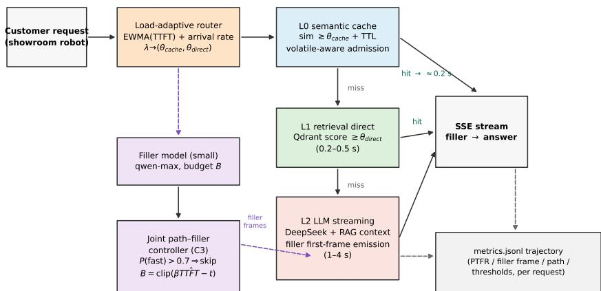

Fig. 1. PACE architecture. A request is embedded once and evaluated by a three-level cascade (L0 semantic cache, L1 retrieval direct return, L2 LLM streaming). A load-adaptive router sets both thresholds from online signals; a joint path–filler controller decides whether a small filler model occupies the waiting window and for how long; volatility-aware admission guards time-sensitive cache entries. All stage boundaries are instrumented into a per-request structured trajectory.  
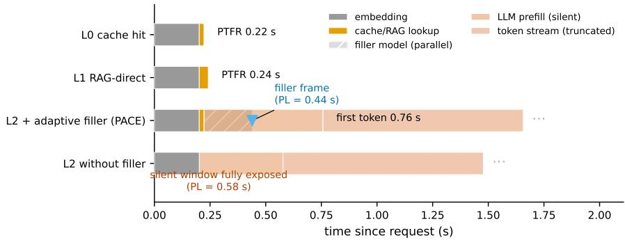  
Fig. 2. Anatomy of one request on each cascade path (median stage times of the deployed system). On L0/L1 the answer itself is the first frame. On L2 the filler model runs in parallel with generation and emits its frame at min $( t _ { f } , t _ { i } )$ , so the perceived first response arrives at the filler frame while the substantive stream continues behind it (the coverage decomposition of Eq. (2)).

A complete notation table with deployed default values is provided in Section S1 of the supplementary material.

## C. Load-adaptive cascading router

The router maintains two online signals. After every L2 completion, the observed TTFT updates an exponentially weighted moving average,

$$
\widehat { \mathrm { T T F T } } _ { n } \ = \ \widehat { \mathrm { T T F T } } _ { n - 1 } + \alpha \left( \mathrm { T T F T } _ { n } - \widehat { \mathrm { T T F T } } _ { n - 1 } \right) ,\tag{5}
$$

with $\alpha = 0 . 3$ , initialized at 1.5 s as a cold-start prior. Every request appends its arrival timestamp to a 60 s sliding window; the arrival rate $r ( t )$ is the window count divided by 60. Both signals are normalized to [0, 1] by clipped affine maps anchored at [1, 4] s for TTFT and [0, 8] req/s for the rate, and combined as

$$
\lambda = \mathrm { c l i p } \Big ( 0 . 7 z ( \widehat { \mathrm { T T F T } } ) + 0 . 3 z ( r ) \Big ) \in [ 0 , 1 ] .\tag{6}
$$

The 0.7/0.3 weighting reflects that TTFT degradation is the dominant perceived-latency signal (it rises with queueing and

upstream contention before the router observes arrival spikes), whereas the rate is a leading indicator of bursts. The thresholds then follow the affine adjustment law

$$
\theta _ { \mathrm { c a c h e } } = \theta _ { \mathrm { c a c h e } } ^ { \mathrm { h i } } - \lambda \left( \theta _ { \mathrm { c a c h e } } ^ { \mathrm { h i } } - \theta _ { \mathrm { c a c h e } } ^ { \mathrm { l o } } \right) ,\tag{7}
$$

$$
\theta _ { \mathrm { d i r e c t } } = \theta _ { \mathrm { d i r e c t } } ^ { \mathrm { h i } } - \lambda \left( \theta _ { \mathrm { d i r e c t } } ^ { \mathrm { h i } } - \theta _ { \mathrm { d i r e c t } } ^ { \mathrm { l o } } \right) ,\tag{8}
$$

with $\theta _ { \mathrm { c a c h e } } ^ { \mathrm { l o } } ~ = ~ 0 . 9 0 , ~ \theta _ { \mathrm { c a c h e } } ^ { \mathrm { h i } } ~ = ~ 0 . 9 8 , ~ \theta _ { \mathrm { d i r e c t } } ^ { \mathrm { l o } } ~ = ~ 0 . 7 0 ,$ , and $\theta _ { \mathrm { d i r e c t } } ^ { \mathrm { h i } } = 0 . 8 5$ . At λ = 0 (idle), $\theta _ { \mathrm { c a c h e } } = 0 . 9 8 \colon$ near-exact matches only, so marginal queries fall through to the highquality L2 path. At λ = 1 (saturated), paraphrases hit the cache and moderate-confidence retrievals return directly, keeping PTFR bounded at the cost of a measured quality decrement. Both thresholds follow a common schedule so the cascade degrades gracefully instead of falling off a cliff in one level.

Three properties are worth stating. The thresholds stay within operator-chosen intervals, so the controller cannot push the system outside its certified quality envelope. With $\alpha = 0 . 3 .$ the EWMA tracks a step change in TTFT within roughly five observations, acts as a low-pass filter (one outlier moves TTFT by at most 30% of its deviation), and the clipped affine law is monotone and memoryless in λ, so the controller cannot oscillate on its own. Unlike learned-threshold caches [12], no parameters are fitted offline, so it transfers to a new domain or embedding model without a calibration corpus; Section III-F shows the affine law is first-order optimal under a stylized quality–latency model.

One endogeneity deserves explicit treatment: the TTFT signal is updated only by L2 completions, so if loosened thresholds shift traffic onto L0/L1, the EWMA stops receiving samples. Three features blunt this effect. The arrival-rate component counts every request regardless of path. Even under loose thresholds, misses still fall through to L2, so the EWMA keeps a floor of observations. And if starvation does occur, the index errs toward the last observed regime: a freeze, not a limit cycle. We treat this coupling as a known property of the signal design, and the load-index and per-path-count trajectories are logged in full, so each sweep can be audited for starvation-induced freezes (Section IV-D).

Steady-state gating: the adaptive kill switch: The affine law and the static operating point invite a simple composition: run adaptively while the regime is changing, and sit on the static point while it is not. PACE realizes this as a gate $g ( t ) \in$ {ADAPTIVE, STATIC} over the router, driven by three triggers on 60 s-window statistics (rate-regime change $r _ { w } / r _ { w - 1 } \notin [ 2 / 3 , 1 . \ell$ 5], load fluctuation $F _ { w } ~ > ~ 0 . 2 5$ in the window coefficient of variation (CV), and latency-pressure change $| \lambda _ { w } - \lambda _ { w - 1 } | > 0 . 0 5 )$ , with a hold period of H windows after the last trigger $( H { = } 1 0$ , ten minutes). When no trigger has fired for H consecutive windows the gate closes (STATIC): both thresholds pin at the deployed operating point (0.95/0.75), exactly the PACE-static arm of Section IV-B, while the filler controller and volatility admission are unaffected. Cold start begins in ADAPTIVE mode. The trigger thresholds sit far above measured stationary jitter (trailing-window rate $\mathrm { C V } \le 0 . 1 6$ at the 99th percentile under constant load, §IV-F), so the gate does not chatter. Thread-safety is a single lock; threshold computation is O(1) per request, adding no measurable overhead relative to the embedding call that dominates $t _ { \mathrm { e m b } }$

## D. Joint path–filler controller

The filler controller decides (a) whether to launch the small filler model at all, and (b) the waiting budget B.

Launch decision: The router maintains the fraction of instant paths (L0 or L1) among the last N=32 routing decisions, $P ( \mathrm { i n s t } )$ , with a conservative cold-start prior of 0.3. When $P ( \mathrm { i n s t } ) > 0 . 7$ , the expected path is an instant reply, where a filler would arrive no earlier than the answer itself; the controller therefore skips filler generation:

$$
s = \mathcal { H } [ P ( \mathrm { i n s t } ) \leq 0 . 7 ] .\tag{9}
$$

This is deliberately a memoryless prior over recent traffic, not a per-query classifier: it captures the burst structure of sales conversations, costs nothing to compute, and stays valid under query drift.

Budget: The original production system waited a fixed 0.9 s for the filler, simultaneously too long when TTFT is short and too short when TTFT is long. PACE sets

$$
B ~ = ~ \mathrm { c l i p } \Big ( \beta ~ \widehat { \mathrm { T T F T } } - t _ { \mathrm { e l a p s e d } } , ~ B _ { \mathrm { m i n } } , ~ B _ { \mathrm { m a x } } \Big ) ,\tag{10}
$$

with $\beta = 0 . 8 , B _ { \mathrm { m i n } } = 0 . 2 \mathrm { s } , B _ { \mathrm { m a x } } = 1 . 2 \mathrm { s } ,$ and $t _ { \mathrm { e l a p s e d } }$ the time already spent on embedding and retrieval. The coefficient $\beta ~ < ~ 1$ guarantees the filler almost always precedes the informative stream; if the filler model fails or exceeds $B ,$ a short canned placeholder is emitted instantly, so the first frame is never missed when a filler was warranted.

Filler–answer conflict risk: A text filler is a visible message, and a risky one: if it asserts a fact the subsequent answer contradicts (an anticipation), the agent appears unreliable in a sales context. We constrain the generator on two sides. Promptside rules forbid facts of any kind and “let me check” phrasings; an output filter rejects candidates longer than 30 characters or containing search-announcing tokens. The conflict rate, i.e., the fraction of filler-showing turns in which the filler and final answer disagree on any fact (judged blinded; Section IV-C), is reported alongside latency and quality. Prior filler studies do not report this anticipation-risk quantity.

## E. Volatility-aware cache admission

Semantic caches answer from history, but a subset of sales queries is time-sensitive by nature: prices, promotions, inventory, and “today”-type questions whose ground truth changes on hourly-to-daily scales. A similarity threshold cannot distinguish “what is the warranty policy” (stable) from “what discounts are available today” (volatile), so a cache tuned for latency will happily serve yesterday’s discount.

PACE classifies each query at write time with a lexical prior (a regular expression over volatility-indicative tokens) assigning $\operatorname { v o l } ( q ) \in \{ { \mathrm { s t a b l e } } , \operatorname { v o l a t i l e } \}$ ; admission and expiry then follow differentiated rules:

$$
\begin{array} { r } { \mathrm { s t o r e } ( q , a ) : \ \left\{ \begin{array} { l l } { \mathrm { r e j e c t , ~ } } & { \mathrm { v o l } ( q ) = \mathrm { v o l a t i l e } \land \mathrm { d e n y } , } \\ { \mathrm { i n s e r t ~ w i t h ~ T T L } _ { v } , } & { \mathrm { v o l } ( q ) = \mathrm { v o l a t i l e } , } \\ { \mathrm { i n s e r t , ~ L R U / L F U , } } & { \mathrm { v o l } ( q ) = \mathrm { s t a b l e } , } \end{array} \right. } \end{array}\tag{11}
$$

with the default volatile TTL $\mathrm { T T L } _ { v } = 3 6 0 0 \mathrm { s }$ (or rejection outright under the deny arm) and least-recently/least-frequentlyused (LRU/LFU) eviction for stable entries; at lookup time an expired volatile entry is evicted and treated as a miss (counted separately as a stale reject). The prior is intentionally rule-based: zero deployment cost, no monitoring of the knowledge base, auditable line by line. Event-triggered invalidation [14] and decay-model freshness gates [15] offer none of these properties; our price is coarser granularity. The mechanisms compose: when source-change events are available, they invalidate; when they are not, the query-side prior bounds the damage of serving stale answers.

Two generality notes. The lexicon is one instantiation of a narrow interface: any classifier ${ \mathrm { v o l } } ( q ) \to$ {stable, volatile} plugs into (11), so the mechanism is domain-independent and only the classifier is domain-specific. The bound of Proposition 6 also degrades gracefully under misclassification:

stable queries mislabeled volatile pay only extra regeneration, so classifiers should be tuned for high recall on the volatile class; Section IV-H stress-tests exactly this property by running the automotive lexicon unchanged on open-domain queries.

## F. Formal properties of the heuristic rules

Each PACE rule is heuristic in parameterization but not arbitrary: it is the first-order optimal policy of an explicit stylized model, and each online estimator admits a stability statement. Throughout, let $T ( \theta )$ and $Q ( \theta )$ be the expected perceived latency and judged quality at threshold $\theta$ (both increasing); full proofs are in Section S5 of the supplementary material.

Proposition 1 (Monotone loosening is optimal). $H T , Q$ are differentiable and strictly increasing with exchange rate $g ( \theta ) =$ $T ^ { \prime } ( \theta ) / Q ^ { \prime } ( \theta )$ strictly increasing, then the interior optimum $o f$ minθ $( 1 + \kappa \lambda ) T ( \theta )$ subject to $Q ( \theta ) \geq Q _ { 0 }$ is strictly decreasing in the load λ.

Proposition 2 (The affine law is first-order optimal). Under the assumptions of Proposition 1, the optimal schedule around a calibrated operating point $( \lambda _ { 0 } , \theta _ { 0 } )$ is affine in λ to first order. The deployed law $( 7 ) \AA { - } ( 8 )$ is exactly this first-order policy, with endpoints calibrated in the two limiting regimes $( \lambda { = } 0$ qualityfirst, λ=1 saturation), and is the unique linear policy matching the Karush–Kuhn–Tucker (KKT) condition to first order at both boundaries.

Proposition 3 (Load-index weights). $I f z ( \widehat { \mathrm { T T F T } } )$ and $z ( r )$ are independent unbiased estimates of the latent load with noise variances $\sigma _ { T } ^ { 2 } , \sigma _ { R } ^ { 2 } ,$ , the minimum-variance combination is $w ^ { * } = \sigma _ { R } ^ { 2 } / ( \sigma _ { T } ^ { 2 } \bar { + } \sigma _ { R } ^ { \bar { 2 } } )$ , so the deployed $0 . 7 / 0 . 3$ weighting is inverse-variance optimal when the rate estimate is about $7 / 3$ times as noisy as the EWMA. For any interior weight, the boundary fixed points and the monotonicity of Proposition 1 are preserved; only the transient mapping shifts.

Proposition 4 (Stability of the online estimates). (i) The EWMA (5) is a contraction: initialization error decays as $( 1 - \alpha ) ^ { n }$ $( 0 . 7 ^ { n }$ at $\alpha { = } 0 . 3 )$ , and the steady-state tracking bias under drift δ per observation is at most $\delta ( 1 - \alpha ) / \alpha \approx 2 . 3 \delta .$ . (ii) The composite index (6) is bounded-input bounded-output, so threshold chatter is bounded and the clipped memoryless law cannot oscillate autonomously.

Proposition 5 (Filler launch is a Bayes threshold rule). With loss c for an unnecessary launch and loss u for an uncovered slow path, the Bayes rule launches iff $\widehat { p } \le 1 - c / ( c + u )$ where ${ \widehat { p } } = P ( { \mathrm { i n s t } } )$ . The deployed rule (9) is Bayes-optimal for the cost ratio $c / ( c + u ) = 0 . 3 ;$ the measured 94% reduction in filler calls (Section IV-E) is its predicted behavior in an instant-path-dominated stream.

Proposition 6 (TTL admission gives a controllable staleness bound). If knowledge-change events for a volatile class arrive at rate $r _ { e }$ per second, TTL τ bounds $\mathrm { P r [ s t a l e ] } \le 1 - e ^ { - r _ { e } \tau } \le$ $r _ { e } \tau ,$ so staleness can be driven below any ε by choosing $\tau \leq \varepsilon / r _ { e } ,$ , at a regeneration cost borne only by the volatile fraction. TTL parameterizes the freshness–hit frontier traced in Fig. S3(b) of the supplementary material.

Proposition 7 (Gate equivalence in stationary regimes). If the arrival process is stationary over a stretch longer than the hold period and no trigger fires, the gated router is path-identical to the PACE-static: the stationary-regime latency distribution of gated PACE equals that of the static operating point, its steadystate regret relative to any hand-tuned static configuration is zero, and the residual exposure to a regime change is bounded by the detection-plus-hold lag of at most H+1 windows.

Two remarks bound the scope. These are local (firstorder) and finite-sample statements, not global regret bounds; replacing the affine law with a learned controller admitting such bounds is future work. The calibrated constants (threshold intervals, the 0.7/0.3 weighting, the 0.7 launch cut) come from deployment practice and predate the stylized models, so the propositions should be read as explaining why these operating points are reasonable, not as deriving them from scratch. What the propositions add is an interpretation in terms of boundary regimes, noise ratios, and cost ratios: porting PACE means re-estimating measurable quantities, not retuning opaque knobs.

## G. Implementation

PACE is implemented as a FastAPI service exposing an OpenAI-compatible /v1/chat/completions endpoint, so the dialogue manager needs only a base-URL change. The L2 model is a DeepSeek chat model [40] with chain-of-thought disabled (a measured 2× TTFT reduction in this domain); the filler is a Qwen-class chat model [41] capped at 20 output tokens. Retrieval runs on Qdrant with cosine similarity over a 1024-dimensional embedding model [42], wrapped in a 2.5 s timeout and a 60 s circuit breaker failing over to L2. The semantic cache (2,000 entries, frequency-aware eviction) is persisted atomically by a background writer. Instrumentation writes one JSON object per request (path, per-stage latencies, routing and filler decisions, PTFR, volatility class, arm labels), with live /metrics and /controller/state endpoints. The arm selectors can be set per request in the payload, letting state-local contrasts interleave in one process while statebearing arms run in dedicated passes; the static-threshold arm reproduces the original production system exactly, serving as the deployed-baseline arm. All keys are read from environment variables.

## IV. EXPERIMENTAL DESIGN

All quantitative entries below are computed from the logged trajectories of a single measurement campaign (75,000 instrumented requests across ten arms), with every protocol decision fixed independently of its outcomes; a separate 6,000- request DuReader campaign reuses the same harness and frozen configuration.

## A. Datasets

We construct three CarQA benchmarks from the production conversation corpus of the deployed robot, extended and rewritten with a GPT-4-class model and human-checked on a 10% sample, plus one cross-domain transfer check (Table II): CarQA-3k (1,810 QA pairs; vehicle parameters, purchase process, financing, after-sales; 905 seeds plus 905 paraphrase-derived variants), CarQA-Para (≈5 paraphrases per question; 4,523 paraphrases in total, following the methodology of vCache [12]), CarQA-Volatile (price/promotion/inventory subset with scripted price-change events at controlled intervals, isolating stale-answer behavior), and DuReader-3k (3,000 dev questions [43] re-embedded into the same store, nothing re-tuned). Construction follows a fixed pipeline: seeds are expanded into self-contained questions with verifiable reference answers, deduplicated at 0.95 cosine, paraphrases are filtered to preserve answer equivalence, and the volatile subset’s scripted events alter only the time-sensitive fact. No personally identifiable information appears in any released artifact.

TABLE II  
DATASETS. SIZES AND SPLITS ARE FIXED; THE VOLATILE SUBSET CARRIES SCRIPTED CHANGE EVENTS FOR STALENESS EVALUATION.
<table><tr><td>Dataset</td><td>Scale</td><td>Purpose</td><td>Key manipulation</td></tr><tr><td>CarQA-3k</td><td>1,810 QA pairs</td><td>Main evaluation</td><td></td></tr><tr><td>CarQA-Para</td><td>905 questions, 4,523 paraphrases</td><td>Cache paraphrase behavior</td><td>lexical/syntactic variation</td></tr><tr><td>CarQA-Volatile</td><td>105 questions, 104 scripted events</td><td>Stale-answer rate (C4)</td><td>price-change events</td></tr><tr><td>DuReader-3k</td><td>3,000 dev questions</td><td>Domain transfer check</td><td>zero-retuning transfer</td></tr></table>

## B. Baselines and ablation arms

Five systems are compared end-to-end (Table III): Pure LLM (direct DeepSeek answers; quality reference and latency upper bound), Standard RAG (retrieval + LLM for every query; isolates the value of the cascade), GPTCache [11] (static 0.95 threshold ahead of standard RAG, deployed with the same embedding model, capacity, and eviction as PACE’s L0, so the contrast isolates threshold adaptivity), PACEstatic (the deployed operating point: gate permanently closed, fixed 0.95/0.75 thresholds, always-on filler with fixed 0.9 s budget, no volatility awareness. This is not a strawman but the production configuration, whose thresholds were fixed by the operations team before this research and not retuned for the comparison), and PACE-full (adaptive router + adaptive filler + volatility admission). Ablations switch one mechanism at a time, mapping one-to-one onto code switches: A1 static vs. adaptive thresholds; A2 filler off / fixed / adaptive; A3 volatility on / off; A4 L1 removal (cascade depth). State-local contrasts (A2) run interleaved in one process on identical traffic; statebearing arms run as sequential passes with cache and router state reset to a fixed snapshot, preventing cross-contamination of hit rates and load indices. One family is discussed rather than run: FrugalGPT-style model-tier cascades [9, 10] select among homogeneous LLM tiers rather than heterogeneous answer sources, so running them would conflate two orthogonal axes; the pure-LLM and standard-RAG arms already bracket their achievable latency range.

## C. Metrics

Latency: We report PTFR (Eq. (1)) at P50/P95/P99 (the 50th, 95th, and 99th percentiles), filler first-frame time, perceived latency PL (Eq. (2)) at P50/P95, and total completion time. All of these come from the per-request trajectories;

none requires offline reconstruction. PTFR is assumptionfree. PL’s min $( t _ { f } , t _ { i } )$ form, by contrast, presumes a shown filler fully masks the remaining wait. We therefore treat PTFR as primary and audit the coverage assumption directly: Table IV recomputes every headline comparison under $\mathrm { P L } _ { \alpha } =$ $( 1 - \alpha ) t _ { i } + \alpha \operatorname* { m i n } ( t _ { f } , t _ { i } )$ , α ∈ [0, 1] (α=0 denies fillers any masking). The direction of the filler effect is established by published human-subject studies [5, 6]; what they do not pin down is the magnitude, which is what α parameterizes.

Quality: Answer quality is scored by an LLM-as-judge protocol [44] on a fixed rubric. Three hundred items were double-blind human-scored for calibration. Three controls target known judge biases: a judge drawn from a different model family than any system under test, system-blind inputs with randomized presentation order, and a rubric anchored with worked examples. Cache error rate is the fraction of cacheserved answers judged incorrect, and filler–answer conflict rate the fraction of filler-showing turns in which the filler and final answer disagree on any fact.

Cost and system: LLM tokens and filler-model calls per request (from API counters), path shares (L0/L1/L2), stale rejects, and the load-index trajectory. Because every arm consumes an identical query stream, per-request token cost is a deterministic function of the L2 share and the filler-launch rate, which we report directly.

## D. Load-sweep protocol

The central experiment varies offered concurrency $c \in$ {1, 4, 8, 16, 32} (open-loop Poisson arrivals at matched rates); every arm receives ≥500 requests from a held-out CarQA-3k stream with a 30% repeated-and-paraphrased component, repeated three times with different seeds. We report means with 95% confidence intervals (CIs) and per-request paired comparisons (paired t-tests, Wilcoxon signed-rank, Holm correction across baselines; bootstrap CIs for percentile metrics). Only the pre-registered primary endpoint (PTFR P95 at c=16, PACE-full versus PACE-static) carries confirmatory status. Everything else is descriptive. Measurement hygiene: identical seeded streams per repetition (licensing the paired tests); a warm-up phase (100 requests, or until steady-state cache fill for cache-dependent arms) excluded from analysis; clocks anchored at request receipt inside the service, so client-side network jitter does not contaminate PTFR.

Interpreting the main results: Figure 3 sweeps PTFR P95 across the offered load, and Figure 4 shows the full distributions at c=16 and c=32 behind the percentile summaries. Three observations qualify the headline numbers. The largest margin, in both Table V and the sweep, is architectural, not algorithmic.

TABLE III  
SYSTEMS AND ABLATION ARMS. THE PACE-STATIC BASELINE REPRODUCES THE ORIGINAL PRODUCTION SYSTEM EXACTLY. ABLATION ARMS TOGGLE ONE MECHANISM AND REUSE THE PACE-FULL SETTING ELSEWHERE.
<table><tr><td>System / arm</td><td>Router</td><td>Filler</td><td>Volatility</td><td>Tests</td></tr><tr><td>Pure LLM</td><td></td><td>off</td><td></td><td>reference</td></tr><tr><td>Standard RAG</td><td></td><td>off</td><td></td><td>cascade value</td></tr><tr><td>GPTCache (0.95)</td><td>static cache</td><td>off</td><td>off</td><td>static-cache baseline</td></tr><tr><td>PACE-static</td><td>static (0.95/0.75)</td><td>fixed 0.9 s</td><td>off</td><td>deployed operating point (gate closed)</td></tr><tr><td>PACE-full</td><td>adaptive</td><td>adaptive</td><td>on</td><td>full method</td></tr><tr><td>A1</td><td>static</td><td>adaptive</td><td>on</td><td>C2</td></tr><tr><td>A2-off</td><td>adaptive</td><td>off</td><td>on</td><td>C3</td></tr><tr><td>A2-fixed</td><td>adaptive</td><td>fxed</td><td>on</td><td>C3</td></tr><tr><td>A3-off</td><td>adaptive</td><td>adaptive</td><td>off</td><td>C4</td></tr><tr><td>A4 (no L1)</td><td>adaptive  $( \theta _ { \mathrm { d i r e c t } } { = } 1 )$ </td><td>adaptive</td><td>on</td><td>cascade depth</td></tr></table>

TABLE IV

SENSITIVITY OF PL P95 (S) TO THE FILLER-COVERAGE ASSUMPTION $( \mathrm { P L } _ { \alpha } = ( 1 - \alpha ) t _ { i } + \alpha$ min(t , t ); α=1 IS EQ. (2)). AT c≥4 THE VALUES ARE exactly α-INVARIANT, BECAUSE FILLER-COVERED REQUESTS ARE RARER THAN THE 95TH PERCENTILE; AT c=1 THE CLAIM-CARRYING ORDERINGS (CASCADES VS. PURE LLM FOR EVERY α; PACE-FULL AHEAD OF PACE-STATIC FOR α ≤ 0.5) HOLD THROUGHOUT.
<table><tr><td rowspan="2">Arm</td><td colspan="3"> $c { = } 1$ </td><td rowspan="2"> $c { = } 1 6$  (any α)</td><td rowspan="2"> $c { = } 3 2$  (any α)</td></tr><tr><td> $\alpha { = } 0$ </td><td> $\alpha { = } 0 . 5$ </td><td> $\alpha { = } 1$ </td></tr><tr><td>Pure LLM</td><td>0.494</td><td>0.494</td><td>0.494</td><td>0.530</td><td>0.523</td></tr><tr><td>Standard RAG</td><td>0.768</td><td>0.768</td><td>0.768</td><td>1.024</td><td>1.298</td></tr><tr><td>GPTCache</td><td>0.699</td><td>0.699</td><td>0.699</td><td>0.640</td><td>0.836</td></tr><tr><td>PACE-static</td><td>0.875</td><td>0.760</td><td>0.630</td><td>0.292</td><td>0.329</td></tr><tr><td>PACE-full</td><td>0.795</td><td>0.688</td><td>0.642</td><td>0.411</td><td>0.534</td></tr></table>

TABLE V

MAIN RESULTS AT THE REFERENCE CONCURRENCY c=16 (MEAN ± 95% CI OVER THREE SEEDS; SECONDS). PTFR P50 IS THE MEDIAN OVER POOLED REPETITIONS. PACE-STATIC HALVES THE PURE-LLM TAIL (0.29 VS. 0.53 S); PACE-FULL DELIVERS A 22% REDUCTION (0.41 VS. 0.53 S) WITHOUT PER-DEPLOYMENT TUNING.
<table><tr><td>System</td><td>PTFR P50</td><td>PTFR P95</td><td>PL P95</td></tr><tr><td>Pure LLM</td><td>0.288</td><td> $0 . 5 3 \pm 0 . 2 6$ </td><td> $0 . 5 3 \pm 0 . 2 6$ </td></tr><tr><td>Standard RAG</td><td>0.720</td><td> $1 . 0 2 \pm 0 . 3 7$ </td><td> $1 . 0 2 \pm 0 . 3 7$ </td></tr><tr><td>GPTCache</td><td>0.268</td><td> $0 . 6 4 \pm 0 . 2 8$ </td><td> $0 . 6 4 \pm 0 . 2 8$ </td></tr><tr><td>PACE-static</td><td>0.207</td><td> $0 . 2 9 \pm 0 . 0 2$ </td><td> $0 . 2 9 \pm 0 . 0 2$ </td></tr><tr><td>PACE-full</td><td>0.240</td><td> $0 . 4 1 \pm 0 . 1 4$ </td><td> $0 . 4 1 \pm 0 . 1 4$ </td></tr></table>

Both cascades outperform standard blocking RAG by more than 2.4× at c=32, because RAG’s retrieve-then-generate serialization exposes the full LLM first-token latency on every query. PACE-static is the strongest single operating point at c≥4—hardly surprising, since its thresholds are the hand-tuned values this deployment already runs. PACE-full tracks it within 0.08–0.21 s P95, with overlapping CIs and zero per-deployment tuning. What adaptation buys is freedom from the tuning assumption, which matters exactly when that assumption breaks (Section IV-F). At c=1 the ordering inverts. Both cascades lose to pure LLM (0.80–0.87 s vs. 0.49 s) because a cold cache makes embed-and-check pure overhead. The load index captures this regime (Figure 5a), and PACE’s tightened idle thresholds keep it ahead of the static arm (0.80 vs. 0.87 s). Even so, no cascade pays off until the cache warms (Section V).

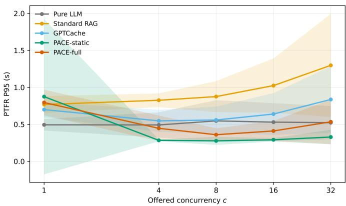  
Fig. 3. PTFR P95 versus offered concurrency for all systems (mean over three seeds, shaded 95% CI). Pure LLM is flat but slow throughout; standard RAG degrades steeply with load because every query pays the blocking retrieval-plus-generation cost; GPTCache stays mid-range. The two cascades dominate at moderate load, and their ordering at c=1 (cold cache) versus c≥4 (warm cache) illustrates the regime dependence that motivates load-adaptive thresholds: no single fixed operating point is optimal across the sweep. The accompanying load-index and path-mix trajectories are audited directly in Section IV-E.

## E. Ablations

Ablation results are reported as one table (Table VI) at reference concurrency c=16, with the router and filler mechanisms further isolated in Figures 5 and 6. A waterfall decomposition of the PACE-full gain into each mechanism’s marginal contribution is given in Fig. S1 of the supplementary material.

TABLE VI  
ABLATION RESULTS AT REFERENCE CONCURRENCY c=16. ROWS ARE ARMS FROM TABLE III; LATENCY ENTRIES ARE MEAN ± 95% CI OVER THREE REPETITIONS (SECONDS); QUALITY IS THE LLM-AS-JUDGE SCORE (1–5, MEAN ± 95% CI OVER JUDGED ITEMS); CONFLICT RATE IS THE JUDGED FILLER–ANSWER DISAGREEMENT RATE AMONG FILLER-SHOWING TURNS (—: NO FILLER-SHOWING TURNS IN THE JUDGED SAMPLE). JUDGED FILLER-SHOWING TURNS ARE FEW WHERE THE CONTROLLER RARELY FIRES: 39 FOR THE FIXED ARM (2.6%). VERSUS 8 FOR PACE-STATIC. 11 FOR A3-OFF, 52 FOR A4, AND 9 FOR PACE-FULL (ALL 0.0%).
<table><tr><td>Arm</td><td>PTFR P95</td><td>PL P95</td><td>Quality</td><td>Conflict rate</td></tr><tr><td>PACE-static</td><td> $0 . 2 9 \pm 0 . 0 2$ </td><td> $0 . 2 9 \pm 0 . 0 2$ </td><td> $4 . 8 1 \pm 0 . 0 5$ </td><td>0.0%</td></tr><tr><td>A1 (static thresholds)</td><td> $0 . 2 9 \pm 0 . 0 4$ </td><td> $0 . 2 9 \pm 0 . 0 4$ </td><td> $4 . 8 0 \pm 0 . 0 5$ </td><td></td></tr><tr><td>A2-off (no filler)</td><td> $0 . 4 1 \pm 0 . 2 2$ </td><td> $0 . 4 1 \pm 0 . 2 2$ </td><td> $4 . 7 9 \pm 0 . 0 4$ </td><td></td></tr><tr><td>A2-fixed (0.9 s budget)</td><td> $0 . 4 3 \pm 0 . 1 7$ </td><td> $0 . 4 3 \pm 0 . 1 7$ </td><td> $4 . 7 8 \pm 0 . 0 5$ </td><td>2.6%</td></tr><tr><td>A3-off (no volatility)</td><td> $0 . 4 1 \pm 0 . 2 0$ </td><td> $0 . 4 1 \pm 0 . 2 0$ </td><td> $4 . 7 6 \pm 0 . 0 5$ </td><td>0.0%</td></tr><tr><td>A4 (no L1 direct)</td><td> $0 . 7 0 \pm 0 . 3 5$ </td><td> $0 . 6 9 \pm 0 . 3 4$ </td><td> $4 . 6 8 \pm 0 . 0 5$ </td><td>0.0%</td></tr><tr><td>PACE-full</td><td> $0 . 4 1 \pm 0 . 1 4$ </td><td> $0 . 4 1 \pm 0 . 1 4$ </td><td> $4 . 7 9 \pm 0 . 0 5$ </td><td>0.0%</td></tr></table>

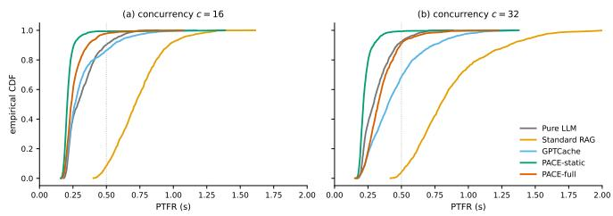  
Fig. 4. Empirical cumulative distribution functions (CDFs) of PTFR at c=16 (a) and c=32 (b). Standard RAG’s tail extends well past 1 s at high load; both cascades concentrate the bulk of their mass below 0.4 s. The dotted line marks the 0.5 s responsiveness target this deployment adopts; fillers demonstrably shorten perceived waiting in conversational systems [7].

Figure 5 audits the router’s online behavior directly from the logged trajectories. The load index λ rises monotonically with offered concurrency and both thresholds track their affine schedules closely (measured means against the dotted theoretical lines of Eqs. (7)–(8)), confirming that the deployed controller realizes the designed law; under PACE the L2 share shrinks as load rises, whereas the PACE-static’s mix is essentially load-invariant. This is the mechanism behind the regime-dependent ordering of Figure 3.

## F. Non-stationary ramp stress test

The load sweep holds concurrency fixed within each level, so it cannot answer the deployment question that motivates adaptation: what happens when the load moves? We subject the two state-bearing arms (PACE-full and PACE-static) to a nonstationary ramp $c = 1  8  3 2  8  1$ (150 requests per phase), with services not restarted between phases (the EWMA and thresholds carry across boundaries, exactly the regime the affine schedule is built for), the two arms interleaved phase by phase on identical seeded streams (removing time-of-day drift; a serial pilot exhibited up to 45% wall-clock differences at c=1), and a 200-request warm-up excluded from analysis.

Figure 7 reports per-phase PTFR and PL P95. Three findings. First, the load index tracks the ramp with the lag the theory predicts: λ rises to 0.012 at the c=32 peak and reaches its maximum of 0.094 one phase later (P4), the contraction lag bounded in Proposition 4; the cache share grows monotonically from 2.7% (P1) to 17.3% (P4). Second, PACE-full is never worse than the static operating point during any transition phase, and descriptively better in each: P95 1.05 vs. 1.25 s (P1), 1.04 vs. 1.15 s (P2), 1.17 vs. 1.38 s (P3), 0.93 vs. 1.33 s (P4), a 30% margin during ramp-down; PL P95 is 0.25–0.41 s lower in P1/P2/P4 with parity at the peak. Third, the P5 return to c=1 inverts the ordering mechanistically: the static arm’s frozen thresholds keep 91% of P5 traffic on L1-direct (0.38 s), whereas PACE’s decayed λ re-tightens thresholds and re-invests idle capacity in L2 (27% share; 0.86 s), the designed quality-first idle posture. PACE returns to its own low-load operating point after the burst (0.86 vs. 1.05 s at P1, overlapping CIs), so the closed loop is stable; and the static operating point is a special case of the adaptive family, and the kill switch performs this degeneration automatically, so the P5 inversion can persist for at most the gate’s hold period (Proposition 7).

This experiment also delimits what we can claim. Nothing collapses under the tested loads (the remote LLM backend absorbs c=32 without queueing breakdown), so the results do not support a catastrophe-avoidance story. What they support is tracking without tuning: the adaptive arm matches or beats the hand-tuned point during every load transition we could induce, while removing the assumption that deployment load stays where the thresholds were tuned.

Gate replay on logged traces: Replaying the gate state machine offline on the logged traces validates the kill switch’s decision sequence: under continuously non-stationary load the gated system is the adaptive arm, and under stationary load it is the static arm (75% of requests in static mode on the fifteen stationary sweep segments, tending to 100% as stretches lengthen). The composite policy is therefore never worse than the hand-tuned configuration, with residual exposure bounded by the H+1-window detection-plus-hold lag. The full replay protocol is in Section S2 of the supplementary material.

## G. Volatility evaluation

On CarQA-Volatile, the stream replays volatile queries before and after scripted price-change events. We report the staleanswer rate (fraction of volatile-query answers that disagree with post-event ground truth) and the cache hit rate on the volatile subset, for volatility-aware admission on versus off, and TTL ∈ {15 min, 1 h, ∞} (Table VII). The pattern is as designed: with admission off, nearly every volatile hit is stale

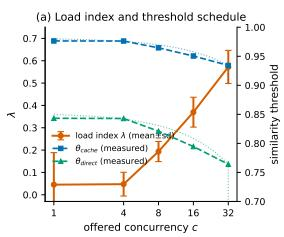

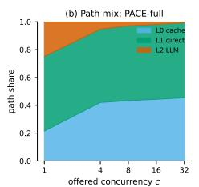

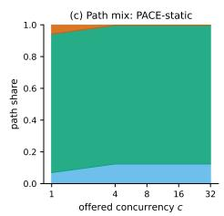

Fig. 5. Router telemetry from per-request trajectories. (a) Load index λ versus offered concurrency, with measured threshold means against their theoretical affine schedules. (b,c) Path mix of PACE-full and PACE-static: under adaptive control the L2 share contracts as c grows; the static arm’s mix does not move. Direct evidence for contribution C2 and the starvation coupling of §III-C: at high load λ is estimated from a shrinking L2 sample  
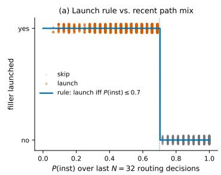

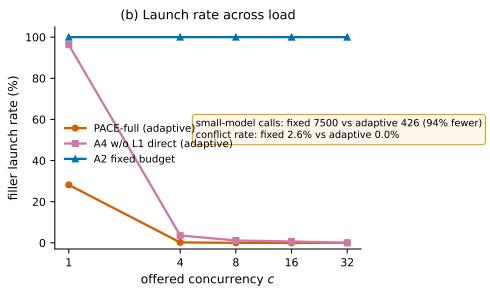  
Fig. 6. Joint path–filler controller behavior. (a) Launches occur almost exclusively when P(inst) is at or below the 0.7 boundary of Eq. (9), matching the designed step rule. (b) Launch rate across load: the adaptive controller fires almost only at c=1; over the whole sweep it issues 94% fewer filler calls than the fixed-budget arm at a 0% judged conflict rate (2.6% for the fixed arm).

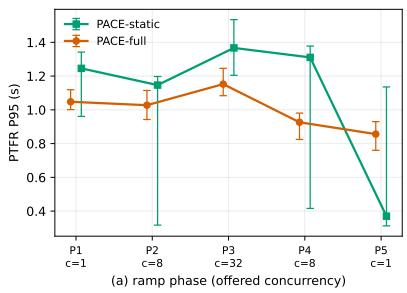

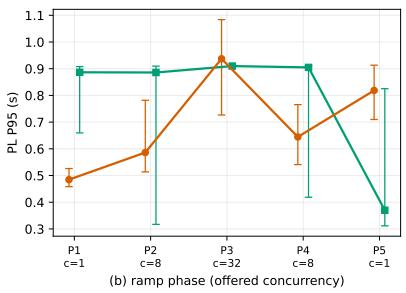  
Fig. 7. Non-stationary ramp stress test. Offered concurrency follows $c = 1  8  3 2  8  1$ (phases P1–P5, 150 requests each, services not restarted); the two arms are interleaved phase by phase on identical seeded streams. Markers: per-phase P95 with nonparametric bootstrap 95% CIs (slightly offset horizontally for legibility). (a) PTFR P95: PACE-full is below the PACE-static in all four transition phases; the P5 inversion is mechanistic (see the analysis below). (b) PL P95: the joint path–filler controller keeps perceived latency 0.25–0.41 s lower in P1/P2/P4, with parity at the c=32 peak. The load index λ (mean per phase: 0.00, 0.00, 0.012, 0.094, 0.01) tracks the ramp with the contraction lag bounded in Proposition 4.

## TABLE VII

VOLATILITY-AWARE ADMISSION RESULTS ON CARQA-VOLATILE. STALERATE AND VOLATILE HIT RATE ARE REQUEST-WEIGHTED POOLED RATESACROSS THE THREE EVENT-AGE BUCKETS (Σstale/Σn AND Σhits/Σn,THE STANDARD PER-REQUEST REPORTING METRICS); PTFR P50 VOLATILE

IS THE SIMPLE MEAN ACROSS THE SAME THREE BUCKETS. “—” IN THE HIT-RATE COLUMN INDICATES THAT THE POLICY NEVER CACHED A VOLATILE ENTRY.
<table><tr><td>Configuration</td><td>Stale rate</td><td>Hit rate (vol.)</td><td>PTFR P50 (vol.)</td></tr><tr><td>Admission off (TTL ∞)</td><td>86.0%</td><td>96.6%</td><td>0.17</td></tr><tr><td>TTL = 1 h (default)</td><td>55.4%</td><td>63.8%</td><td>0.25</td></tr><tr><td>TTL = 15 min</td><td>30.0%</td><td>32.2%</td><td>0.36</td></tr><tr><td>Deny volatile</td><td>0.0%</td><td></td><td>0.48</td></tr></table>

(an 86.0% stale rate against a 96.6% hit rate); a 1 h TTL bounds staleness by the event-to-expiry window; denial trades a moderate latency increase for zero staleness.

The per-bucket resolution in Fig. S3 of the supplementary material shows the mechanism directly: with admission off, the per-bucket stale rate tracks the per-bucket hit rate (≈86–91%) regardless of event age. TTL policies convert staleness into a bounded waiting game. Once event age crosses the TTL, entries are evicted, the stale rate collapses to zero, and the volatile queries move to L2. Deny-by-classification yields zero stale answers at zero volatile hits, with the latency cost confined to the volatile subset (0.48 s P50) while the stable majority of the stream keeps its cache service. The value of C4 is making the freshness–hit trade-off an explicit, per-query-class operating choice, not an accident of the default TTL.

## H. Cross-domain transfer (DuReader)

To probe whether the measured behavior is an artifact of the automotive domain, we replay the central comparison on DuReader-3k (§IV-A) with the entire deployed configuration frozen: same thresholds, controllers, volatility lexicon, persona prompt, harness, arms, and seeds (6,000 instrumented requests; quality judged on 1,200 sampled answers). Three findings (Table VIII). (i) The latency ordering and tracking relationship reproduce without any tuning: at c=16 PACE-full matches the static operating point within overlapping CIs (0.288 vs. 0.271 s), both 2.5× faster than the pure-LLM floor. (ii) The automotive lexicon fires on only 3.2% of open-domain requests with zero stale rejects and zero latency penalty: the prior gates only cache admission, never retrieval service, so it degrades gracefully. (iii) The quality column locates the domain specificity: the frozen automotive persona penalizes the L2-only systems (RAG 2.21, GPTCache 2.32 vs. pure LLM 3.57), while the persona-free L1-direct level scores 4.94; the domain-specific component is confined to the small L2 share the router already treats as the quality-first residual. The full analysis is in Section S4 of the supplementary material.

TABLE VIII  
CROSS-DOMAIN TRANSFER ON DUREADER-3K (ZERO-RETUNING; SECONDS, MEAN ± 95% CI OVER 3 SEEDS; QUALITY n=240 PER SYSTEM).
<table><tr><td>System</td><td> $\mathrm { P 9 5 ~ } c { = } 4$ </td><td> $\mathrm { P 9 5 ~ } c { = } 1 6$ </td><td>Quality</td></tr><tr><td>Pure LLM</td><td> $0 . 7 0 4 \pm 0 . 0 7 3$ </td><td> $0 . 7 1 0 \pm 0 . 0 5 0$ </td><td> $3 . 5 7 \pm 0 . 1 4$ </td></tr><tr><td>Standard RAG</td><td> $0 . 9 8 1 \pm 0 . 0 2 6$ </td><td> $1 . 3 1 7 \pm 0 . 6 2 7$ </td><td> $2 . 2 1 \pm 0 . 1 6$ </td></tr><tr><td>GPTCache (0.95)</td><td> $0 . 9 7 0 \pm 0 . 0 4 2$ </td><td> $0 . 5 1 5 \pm 0 . 4 0 6$ </td><td> $2 . 3 2 \pm 0 . 1 7$ </td></tr><tr><td>PACE-static</td><td> $0 . 2 4 3 \pm 0 . 0 4 3$ </td><td> $0 . 2 7 1 \pm 0 . 0 2 8$ </td><td> $4 . 9 4 \pm 0 . 0 5$ </td></tr><tr><td>PACE-full</td><td> $0 . 4 0 0 \pm 0 . 4 3 1$ </td><td> $0 . 2 8 8 \pm 0 . 0 4 8$ </td><td> $4 . 7 2 \pm 0 . 1 2$ </td></tr></table>

## V. DISCUSSION

Limitations: Six boundaries should temper the claims. The evaluation centers on a single vertical: the DuReader transfer check is retrieval-friendly by construction, and the volatility prior and filler prompt are Chinese-language sales-register artifacts (the prior is a replaceable plug-in, so transfer requires swapping the classifier, not the mechanism); a multilingual replication remains open. Model-tier cascades [9, 10] are discussed but not run as baselines, since their levels are homogeneous LLM tiers whereas PACE’s are heterogeneous answer sources (§IV-B). The controllers are intentionally heuristic: the propositions are first-order statements, not regret bounds, and the TTFT signal depends on L2 completions, so the load index can starve exactly when thresholds shift traffic onto instant paths; we audit this through logged trajectories instead of eliminating it. The datasets are self-constructed, and the LLM-as-judge protocol inherits judge-bias concerns, mitigated with blinded human calibration. Perceived latency is proxied by min $( t _ { f } , t _ { i } )$ pending human validation; Table IV bounds the impact (at $c \geq 4$ every comparison is exactly α- invariant). Finally, the cold-start boundary is real: at c=1 with an unprimed cache both cascades lose to pure LLM; the load index detects the regime within seconds, but a cold instance serves its first conversations at a disadvantage.

From absolute performance to operational economics: The static operating point is not free: every backend-model upgrade, prompt revision, or corpus refresh invalidates it and forces a retune, meaning days of operator time plus a fresh measurement campaign (a single campaign here is 75,000 requests). A stale operating point fails silently as a slow drift off the latency–quality frontier. With the gate engaged, PACE delivers the static point’s performance in every stationary regime and tracks or beats it through every transition, with zero human intervention. Zero-tuning cost is the property an industrial deployment actually buys.

PTFR as a service-level management metric: Read through a services-computing lens, PACE’s artifacts translate into service-level instruments: PTFR P95 is a service-level agreement (SLA)-style indicator contractable exactly as classical services contract on response-time percentiles [1, 2]; the threshold intervals play the role of a certified quality envelope; the kill switch is a compliance mechanism, making the delivered service provably coincide with the certified operating point under stationary load; and the load index is a free service health signal that could drive admission control or tenantindexed scheduling in a multi-tenant platform. We see the dispatch decision as the dialogue-service analogue of QoSaware service selection, and the filler controller as the first treatment of experience shaping as a first-class management variable in LLM serving.

Deployment guidance: The components are independently adoptable in order of effort: the PTFR instrumentation is a pure logging change; volatility-aware admission needs a queryside rule and a TTL column; the router and filler controller presuppose the instrumentation plus two tunable choices: threshold intervals bracketing the operator’s tolerable false-hit rate, and load anchors re-anchored to the target deployment so λ exercises the full [0, 1] interval. The qualitative conclusions follow from the structure of Eqs. (2) and (10), not from the specific models used here.

Embodiment beyond the dialogue channel: The evaluation targets the dialogue serving stack; full embodiment adds channels (audible phoneme, gaze, gesture onset) that the formulation accommodates naturally: the PTFR instrumentation generalizes to the first perceivable response per modality, the cascade matches the robot’s edge–cloud split, and the filler controller extends an established HRI strategy [5] with a routing-coupled launch decision and an explicit conflict metric. The full discussion is in Section S3 of the supplementary material.

Future work: Seven directions follow naturally: replacing the affine law with a constrained bandit or model-predictive control (MPC) controller admitting formal quality–delay guarantees (the released trajectories make this offline-evaluable); extending the filler controller to content selection under an explicit anticipation-risk model [19]; learning the volatility prior from stale-reject outcomes [14, 15]; porting to a humanoid platform with multimodal fillers and re-anchored budgets; composing a homogeneous model-tier cascade [9, 10] behind L2 as an orthogonal axis; extending the single-service perspective to multi-tenant platforms (per-tenant PTFR SLA terms, tenant-indexed threshold schedules, load-index-driven admission control); and human validation of the perceptual claim. For the last, we have pre-registered a $2 \times 2$ within-subject study (filler present vs. absent, crossed with path speed ∼0.3 s vs. ∼2.5 s replies; N=40; modeled on ConvFill’s design [19]), replaying production trajectories with controlled onset timing and perceived-speed ratings as the primary endpoint under a linear mixed-effects model. We claim no human-subject data in this paper; all quantitative results derive from instrumented system measurement.

## VI. CONCLUSION

With the adaptive kill switch engaged, PACE coincides with the hand-tuned production baseline it replaces in every stationary regime, matches or beats it through every load transition we could induce, and never trails it for longer than one hold period—provably, and at zero tuning cost. We presented PACE, a serving framework that treats perceived time-to-first-response as the primary QoE objective of retrieval-augmented dialogue services. Running inside a deployed humanoid-robot sales service, it minimizes that objective under quality and cost constraints through three coordinated mechanisms: a load-adaptive cascade router, a joint path–filler controller with an explicit conflict-risk metric, and volatility-aware cache admission. The measurements quantify what prior systems work leaves implicit: how to jointly control what answer source composes a service response and what the user sees while waiting in deployed conversational services.

Reproducibility: The service, benchmark scripts, load generator, analysis pipeline, and the pre-registered user-study protocol will be released with the paper; all experiments execute against the same OpenAI-compatible endpoint with per-request arm labels.

## REFERENCES

[1] L. Zeng, B. Benatallah, A. H. H. Ngu, M. Dumas, J. Kalagnanam, and H. Chang, “QoS-aware middleware for web services composition,” IEEE Transactions on Parallel and Distributed Systems, vol. 15, no. 11, pp. 958–970, 2004.

[2] T. Yu and K.-J. Lin, “Service selection algorithms for composing complex services with multiple QoS constraints,” in Proceedings of the 3rd International Conference on Service Oriented Computing (ICSOC), 2005, pp. 130–143.

[3] Z. Yao, Z. Tang, W. Yang, and W. Jia, “Enhancing LLM QoS through cloud-edge collaboration: A diffusion based multi-agent reinforcement learning approach,” IEEE Transactions on Services Computing, 2025.

[4] Y. Lin, S. Peng, S. Wu, Y. Li, C. Lu, K. Ye, and C. Xu, “Serving LLM in distributed GPU cluster with fine-grain pipeline constraints,” IEEE Transactions on Services Computing, vol. 18, no. 5, pp. 3164–3176, 2025.

[5] T. Shiwa, T. Kanda, M. Imai, H. Ishiguro, and N. Hagita, “How quickly should a communication robot respond? delaying strategies and habituation effects,” International Journal of Social Robotics, vol. 1, no. 2, pp. 141–155, 2009.

[6] H.-A. Boukaram, M. Ziadee, and M. Sakr, “Mitigating the effects of delayed virtual agent response time using conversational fillers,” in HAI ’21: Proceedings of the 9th International Conference on Human-Agent Interaction, 2021, pp. 130–138.

[7] T. Abbas, U. Gadiraju, V.-J. Khan, and P. Markopoulos, “Making time fly: Using fillers to improve perceived latency in crowd-powered conversational systems,” in Proceedings of the AAAI Conference on Human Compu tation and Crowdsourcing (HCOMP), vol. 9, 2021, pp. 2–14.

[8] J. Liu, Z. Wu, J.-W. Chung, F. Lai, M. Lee, and M. Chowdhury, “Andes: Defining and enhancing qualityof-experience in LLM-based text streaming services,” in Proceedings of the 18th USENIX Symposium on Operating Systems Design and Implementation (OSDI), 2024, pp. 23–44.

[9] L. Chen, M. Zaharia, and J. Zou, “FrugalGPT: How to use large language models while reducing cost and improving performance,” arXiv preprint arXiv:2305.05176, 2023.

[10] P. Aggarwal, A. Madaan, A. Anand, S. P. Potharaju, S. Mishra, P. Zhou, A. Gupta, D. Rajagopal, K. Kappaganthu, Y. Yang, S. Upadhyay, M. Faruqui, and Mausam, “AutoMix: Automatically mixing language models,” arXiv preprint arXiv:2310.12963, 2023.

[11] F. Bang, “GPTCache: An open-source semantic cache for LLM applications enabling faster answers and cost savings,” in Proceedings of the 3rd Workshop for Natural Language Processing Open Source Software (NLP-OSS), 2023, pp. 212–218.

[12] L. G. Schroeder, A. Desai, A. Cuadron, K. Chu, S. Liu, M. Zhao, S. Krusche, A. Kemper, M. Zaharia, and J. E. Gonzalez, “vCache: Verified semantic prompt caching,” in The Thirteenth International Conference on Learning Representations (ICLR), 2026.

[13] J. Kim, M. Kim, J. Lee, C. Moon, H. Kim, T. Hwang, W. Chung, Y. Kim, and S. Lee, “Rethinking caching for LLM serving systems: Beyond traditional heuristics,” arXiv preprint arXiv:2508.18736, 2025.

[14] S. Dang, C. Chen, K. Wu, Z. Liu, and Y. Yang, “CacheSense: Freshness-aware semantic caching with selective invalidation for LLM-serving backends,” IEEE (early access), 2025.

[15] M. Mansoor, T. Ahmad, and Y.-C. Yoon, “FreshCache: Risk-constrained freshness-aware semantic caching for open-web retrieval-augmented LLMs,” arXiv preprint arXiv:2607.04281, 2026.

[16] S. Jeong, J. Baek, S. Cho, S. J. Hwang, and J. C. Park, “Adaptive-RAG: Learning to adapt retrieval-augmented large language models through question complexity,” in Proceedings of the 2024 Conference of the North American Chapter of the Association for Computational Linguistics (NAACL), 2024, pp. 7036–7050.

[17] A. Asai, Z. Wu, Y. Wang, A. Sil, and H. Hajishirzi, “Self-RAG: Learning to retrieve, generate, and critique through self-reflection,” in The Twelfth International Conference on Learning Representations (ICLR), 2024.

[18] S.-Q. Yan, J.-C. Gu, Y. Zhu, R. Wang, and J.-Y. Yang, “Corrective retrieval augmented generation,” arXiv preprint arXiv:2401.15884, 2024.

[19] V. Srinivas, Z. Englhardt, V. Iyer, and S. Patel, “Thinking while speaking: Inference-time knowledge transfer for responsive and intelligent conversational voice agents,”

arXiv preprint arXiv:2511.07397, 2025.

[20] T. Dao, D. Y. Fu, S. Ermon, A. Rudra, and C. Re,´ “FlashAttention: Fast and memory-efficient exact attention with IO-awareness,” in Advances in Neural Information Processing Systems (NeurIPS), vol. 35, 2022, pp. 16 344– 16 359.

[21] W. Kwon, Z. Li, S. Zhuang, Y. Sheng, L. Zheng, C. H. Yu, J. E. Gonzalez, H. Zhang, and I. Stoica, “Efficient memory management for large language model serving with PagedAttention,” in Proceedings of the 29th Symposium on Operating Systems Principles (SOSP), 2023, pp. 611– 626.

[22] G.-I. Yu, J. S. Jeong, G.-W. Kim, S. Kim, and B.-G. Chun, “Orca: A distributed serving system for transformerbased generative models,” in Proceedings of the 16th USENIX Symposium on Operating Systems Design and Implementation (OSDI), 2022, pp. 521–538.

[23] Y. Zhong, S. Liu, J. Chen, J. Hu, Y. Zhu, X. Liu, X. Jin, and H. Zhang, “DistServe: Disaggregating prefill and decoding for goodput-optimized large language model serving,” in Proceedings of the 18th USENIX Symposium on Operating Systems Design and Implementation (OSDI), 2024, pp. 193–210.

[24] G. Xiao, Y. Tian, B. Chen, S. Han, and M. Lewis, “Efficient streaming language models with attention sinks,” in The Twelfth International Conference on Learning Representations (ICLR), 2024.

[25] Y. Leviathan, M. Kalman, and Y. Matias, “Fast inference from transformers via speculative decoding,” in Proceedings of the 40th International Conference on Machine Learning (ICML), 2023, pp. 19 274–19 286.

[26] I. Ong, A. Almahairi, V. Wu, W.-L. Chiang, T. Wu, J. E. Gonzalez, M. W. Kadous, and I. Stoica, “RouteLLM: Learning to route LLMs from preference data,” in The Thirteenth International Conference on Learning Representations (ICLR), 2025.

[27] D. Ding, A. Mallick, C. Wang, R. Sim, S. Mukherjee, V. Ruhle, L. V. S. Lakshmanan, and A. H. Awadallah,¨ “Hybrid LLM: Cost-efficient and quality-aware query routing,” in The Twelfth International Conference on Learning Representations (ICLR), 2024.

[28] M. J. Q. Zhang and E. Choi, “SituatedQA: Incorporating extra-linguistic contexts into QA,” in Proceedings of the 2021 Conference on Empirical Methods in Natural Language Processing (EMNLP), 2021, pp. 7371–7387.

[29] T. Vu, M. Iyyer, X. Wang, N. Constant, J. Wei, H. W. Chung, C. Tao, H. Z. Denny, Q. V. Le, and M. Dehghani, “FreshLLMs: Refreshing large language models with search engine augmentation,” arXiv preprint arXiv:2310.03214, 2024.

[30] P. Lewis, E. Perez, A. Piktus, F. Petroni, V. Karpukhin, N. Goyal, H. Kuttler, M. Lewis, W.-t. Yih, T. Rockt¨ aschel,¨ S. Riedel, and D. Kiela, “Retrieval-augmented generation for knowledge-intensive NLP tasks,” in Advances in Neural Information Processing Systems (NeurIPS), vol. 33, 2020, pp. 9459–9474.

[31] V. Karpukhin, B. Oguz, S. Min, P. Lewis, L. Wu,˘ S. Edunov, D. Chen, and W.-t. Yih, “Dense passage

retrieval for open-domain question answering,” in Proceedings of the 2020 Conference on Empirical Methods in Natural Language Processing (EMNLP), 2020, pp. 6769–6781.

[32] S. Borgeaud, A. Mensch, J. Hoffmann, T. Cai, E. Rutherford, K. Millican, G. van den Driessche, J.-B. Lespiau, B. Damoc, A. Clark, D. de Las Casas, A. Guy, J. Menick, R. Ring, T. Hennigan, S. Huang, L. Maggiore, C. Jones, A. Cassirer, A. Brock, M. Paganini, G. Irving, O. Vinyals, S. Osindero, K. Simonyan, J. W. Rae, E. Elsen, and L. Sifre, “Improving language models by retrieving from trillions of tokens,” in Proceedings of the 39th International Conference on Machine Learning (ICML), 2022, pp. 2206–2240.

[33] O. Ram, Y. Levine, I. Dalmedigos, D. Muhlgay, A. Shashua, K. Leyton-Brown, and Y. Shoham, “Incontext retrieval-augmented language modeling,” Transactions of the Association for Computational Linguistics (TACL), vol. 11, pp. 1316–1331, 2023.

[34] L. Gao, X. Ma, J. Lin, and J. Callan, “Precise zero-shot dense retrieval without relevance labels,” in Proceedings of the 61st Annual Meeting of the Association for Computational Linguistics (ACL), 2023, pp. 1762–1777.

[35] R. B. Miller, “Response time in man-computer conversational transactions,” in Proceedings of the AFIPS Fall Joint Computer Conference, 1968, pp. 267–277.

[36] J. Nielsen, Usability Engineering. Morgan Kaufmann, 1993.

[37] G. Skantze, “Turn-taking in conversational systems and human-robot interaction: A review,” Computer Speech & Language, vol. 67, p. 101178, 2021.

[38] K. Inoue, P. Milhorat, D. Lala, T. Zhao, and T. Kawahara, “Talking with ERICA, an autonomous android,” in Proceedings of the 17th Annual Meeting of the Special Interest Group on Discourse and Dialogue (SIGDIAL), 2016, pp. 212–215.

[39] D. Lala, P. Milhorat, K. Inoue, M. Ishida, K. Takanashi, and T. Kawahara, “Attentive listening system with backchanneling, response generation and flexible turntaking,” in Proceedings of the 18th Annual SIGdial Meeting on Discourse and Dialogue, 2017, pp. 127–137.

[40] DeepSeek-AI, “DeepSeek-V3 technical report,” arXiv preprint arXiv:2412.19437, 2024.

[41] A. Yang, B. Yang, B. Zhang, B. Hui, B. Zheng, B. Yu, C. Li, D. Liu, F. Huang, H. Wei, H. Lin, J. Yang, J. Tu, J. Zhang, J. Yang, J. Yang, J. Zhou, J. Lin, K. Dang, K. Lu, K. Bao, K. Yang, L. Yu, M. Li, M. Xue, P. Zhang, Q. Zhu, R. Men, R. Lin, T. Li, T. Xia, X. Ren, X. Ren, Y. Fan, Y. Su, Y. Zhang, Y. Wan, Y. Liu, Z. Cui, Z. Zhang, and Z. Qiu, “Qwen2.5 technical report,” arXiv preprint arXiv:2412.15115, 2024.

[42] J. Chen, S. Xiao, P. Zhang, K. Luo, D. Lian, and Z. Liu, “BGE M3-Embedding: Multi-lingual, multi-functionality, multi-granularity text embeddings through self-knowledge distillation,” in Findings of the Association for Computational Linguistics (ACL), 2024, pp. 2318–2335.

[43] W. He, K. Liu, J. Liu, Y. Lyu, S. Zhao, X. Xiao, Y. Liu, Y. Wang, H. Wu, H. Wang, J. Wu, Z. Li, S. She,

X. Liu, T. Wu, H. Li, Y. Feng, F. Cheng, Y. Chen, N. Zhang, A. Zheng, and B. Wang, “DuReader: A chinese machine reading comprehension dataset from real-world applications,” in Proceedings of the Workshop on Machine Reading for Question Answering (MRQA), 2018, pp. 37– 46.

[44] L. Zheng, W.-L. Chiang, Y. Sheng, S. Zhuang, Z. Wu, Y. Zhuang, Z. Lin, Z. Li, D. Li, E. P. Xing, H. Zhang, J. E. Gonzalez, and I. Stoica, “Judging LLM-as-a-judge with MT-Bench and Chatbot Arena,” in Advances in Neural Information Processing Systems (NeurIPS), Datasets and Benchmarks Track, vol. 36, 2023.

# Supplementary Material for “PACE: Perceived-Latency-Aware Cascading Service Routing and Filler Control for QoE-Efficient Retrieval-Augmented Dialogue Serving”

TABLE I  
NOTATION USED THROUGHOUT THE MAIN PAPER. DEFAULT VALUES ARE THE DEPLOYED CONFIGURATION OF THE PRODUCTION SYSTEM UNDER STUDY.
<table><tr><td>Symbol</td><td>Meaning</td><td>Default</td></tr><tr><td> $\theta _ { \mathrm { c a c h e } }$ </td><td>Cache hit threshold</td><td> $\in [ 0 . 9 0 , 0 . 9 8 ]$  , adaptive</td></tr><tr><td> $\theta _ { \mathrm { d i r e c t } }$ </td><td>Direct-return threshold</td><td> $\in [ 0 . 7 0 , 0 . 8 5 ]$  , adaptive</td></tr><tr><td> $\lambda$ </td><td>Load index</td><td> $\in \ [ 0 , 1 ]$ </td></tr><tr><td> $z ( \cdot )$ </td><td>Clipped affine normalization</td><td>anchors:  $[ 1 , 4 ] \mathrm { s } , [ 0 , 8 ] \mathrm { r e q } / \mathrm { s }$ </td></tr><tr><td> $\widehat { \mathrm { T T F T } }$ </td><td>EWMA of first-token latency</td><td>init  $1 . 5 \mathrm { s } , \alpha = 0 . 3$ </td></tr><tr><td> $_ \alpha$ </td><td>EWMA smoothing coefficient</td><td>0.3</td></tr><tr><td> $r ( t )$ </td><td>Arrival rate, 60 s window</td><td>req/s</td></tr><tr><td> ${ \mathrm { P T F R } }$ </td><td>Time to first informative token</td><td>Eq. (1)</td></tr><tr><td> $\mathrm { P L }$ </td><td>Perceived latency min  $( t _ { f } , t _ { i } )$ </td><td>Eq. (2)</td></tr><tr><td> $\smash { t _ { f } \ / \ t _ { i } }$ </td><td>Filler first-frame / informative first-token time</td><td></td></tr><tr><td> $\dot { P } ( \mathrm { i n s t } )$ </td><td>Instant-path prior</td><td>window  $N { = } 3 2$  decisions</td></tr><tr><td> $s \in \{ 0 , 1 \}$ </td><td>Filler launch decision</td><td> $\beta = 0 . 8 , B \in [ 0 . 2 , 1 . 2 ] \mathrm { s }$ </td></tr><tr><td> $B$   $B _ { \mathrm { f i x } }$ </td><td>Filler waiting budget</td><td>0.9 s</td></tr><tr><td> $\mathrm { T T L } _ { v }$ </td><td>Fixed filler budget (baseline)</td><td>3600 s (or deny)</td></tr><tr><td> $\operatorname { v o l } ( q )$ </td><td>TTL of volatile entries</td><td>{stable, volatile}</td></tr><tr><td></td><td>Volatility class of query q Knowledge-change event rate</td><td>Prop. 6</td></tr><tr><td> $r _ { e }$   $F _ { w }$ </td><td> $\mathrm { C V } ^ { \mathrm { \scriptsize ~ \sim } }$  (gate trigger)</td><td>trigger at</td></tr><tr><td> $H$ </td><td>Window rate Gate hold period</td><td> $F _ { w } > 0 . 2 5$  10 windows (=10 min)</td></tr><tr><td></td><td></td><td></td></tr><tr><td> $\kappa , \ \mu$ </td><td>Load penalty / KKT shadow price</td><td>Props. 1–2</td></tr><tr><td> $g ( \theta )$ </td><td>Exchange rate  $T ^ { \prime } ( \theta ) / Q ^ { \prime } ( \theta ) \dot { }$  Filler launch / uncovered-path losses</td><td>Props. 1-2</td></tr><tr><td> $c , \ u$ </td><td></td><td>Prop. 5</td></tr><tr><td> $Q _ { 0 } , \ C _ { 0 }$ </td><td>Quality floor / cost ceiling</td><td>operator-set</td></tr></table>

Abstract—This supplementary document provides material that supports the main manuscript but is not required for its central claims: (S1) the complete notation table; (S2) the full gate-replay analysis on logged traces that validates the adaptive kill switch’s decision sequence; (S3) the discussion of embodiment beyond the dialogue channel; (S4) the full analysis of the DuReader crossdomain transfer check; (S5) the proofs of the propositions stated in the main text; (S6) a waterfall decomposition of the main latency gain; (S7) the quality–latency trade-off at the reference operating point; and (S8) the event-age resolution of the volatility experiment. Section, figure, table, and proposition numbers referenced with an “S” prefix refer to this document; references without a prefix refer to the main text. Acronyms are used as defined in the main text; Table I restates the mathematical notation.

## I. NOTATION

Table I lists the symbols used throughout the main paper and their deployed default values.

## II. GATE REPLAY ON LOGGED TRACES

To validate the kill switch’s decision sequence we replayed the gate state machine offline on the logged traces, using 50-request windows in place of 60 s windows (request-count windows are concurrency-invariant on logged data; the trigger thresholds are unchanged and sit far above the measured stationary jitter: trailing-window rate CV $\mathrm { s t a y s } \le 0 . 1 6$ at the 99th percentile and consecutive-window rate ratios stay within [0.79, 1.24] under constant offered load, versus the trigger band [2/3, 1.5] and the fluctuation trigger $F _ { w } { > } 0 . 2 5 )$ . Two findings.

First, under continuously non-stationary load the gated system is the adaptive arm. On the ramp trace the gate opens at cold start and stays open through every transition, with P2–P5 seeing 100% ADAPTIVE-mode traffic, so the burst figure of the main text (Fig. 7 there) doubles as the gated system’s transition behavior. The gate first closes on the final window of the initial c=1 plateau.

Second, under stationary load the gated system is the static arm. On the fifteen stationary load-sweep segments the gate closes after the cold-start hold and routes a mean of 75% of requests (range 40–80%) in STATIC mode, a share that tends to 100% as stationary stretches lengthen from benchmark minutes to production hours; there the gated system’s performance is the static operating point’s row in every table of the main text, by Proposition 7 of the main text, including at c=1 idle, the only regime in which the adaptive arm nominally trails the static point (the P5 inversion). The composite policy is therefore never worse than the hand-tuned configuration: exactly equal to it in stationary regimes, and equal-or-better through every load transition we could induce, with residual exposure bounded by the H+1-window detection-plus-hold lag.

## III. EMBODIMENT BEYOND THE DIALOGUE CHANNEL

The evaluation in the main paper targets the robot’s dialogue serving stack; full embodiment adds channels that our formulation accommodates naturally. The PTFR instrumentation (C1 of the main text) generalizes from first-token time to the onset of the first perceivable response across channels (first audible phoneme, gaze shift, or gesture onset), with the same min $. ( t _ { f } , t _ { i } )$ coverage form taken per modality. The cascade (C2) matches the edge–cloud split of robot serving: the semantic cache and retrieval direct return run on the robot’s onboard compute, while L2 remains a cloud call whose TTFT the load index already tracks, so threshold adaptation simultaneously absorbs network variability. The joint filler controller (C3) has its closest precedent in HRI, where fillers are an established delaying strategy for communication robots [1] and humanoids already use backchannels and fillers to manage turn-switches [2, 3]; PACE adds what that literature lacks: a launch decision coupled to routing and an explicit filler–answer conflict metric, which matters more in embodied settings because a contradicted statement is delivered by a physically present, ostensibly authoritative agent. Volatilityaware admission (C4) is query-side and transfers unchanged. Two boundaries are real: embodiment shifts tolerance thresholds (HRI preference peaks near one second and habituates [1], so the budget law’s anchors must be re-calibrated), and rich faceto-face turn-taking [4] offers nonverbal backchannels that a text-rendered dialogue panel lacks. Our measurements cover the dialogue stack only; whole-robot validation with multimodal fillers, extending the planned human study to an embodied condition, is future work.

## IV. FULL ANALYSIS OF THE DUREADER CROSS-DOMAIN TRANSFER

The main text reports the DuReader-3k transfer check with the entire deployed configuration frozen (same thresholds and controllers, same automotive volatility lexicon, same persona system prompt, same harness, arms, and seeded streams: 5 arms $\times ~ c \in \{ 4 , 1 6 \} \times 3$ seeds × 200 requests = 6,000 instrumented requests; answer quality judged by the same LLM-as-judge protocol with a generic open-domain rubric on 1,200 sampled answers) and summarizes the outcome. This section gives the full analysis behind that summary. The transfer check is adversarial by construction: nothing about the system is adapted to the new domain, so any degradation we observe is a property of the mechanism, not of a re-tuning effort.

## A. Latency ordering and load adaptation reproduce

The latency ordering and the tracking relationship reproduce without any tuning (Table VIII of the main text): at c=16 PACE-full matches the static operating point within overlapping confidence intervals (0.288 vs. 0.271 s), both 2.5× faster than the pure-LLM floor, and at c=4 the cold-start gap reappears exactly as in the in-domain sweep (the wide CI is a first-seed warmup transient of the cold-started controller, not algorithmic instability: the EWMA prior starts at 1.5 s and adapts within the first segment, and seeds two and three fall to 0.30 s against the static arm’s 0.24 s, within 25%; compare the load-index figure of the main text, Fig. 5 there). The load index adapts on the new domain as designed, rising from λ=0.06 at cold start to 0.29 under sustained load, and the path mix settles at 86.5–95.5% L1-direct:open-domain questions retrieved against their own corpus are direct-path material, so fillers almost never become visible and PL coincides with PTFR on this workload.

## B. The volatility prior degrades gracefully

The automotive lexicon, applied unchanged to open-domain queries, fires on only 3.2% of requests (38/1,200 per arm, on open-domain questions containing today/latest/price cues); every fired query is still served by the instant direct path (100% rag-direct; PTFR P50 0.178 s vs. 0.176 s for stable queries), because the prior gates only cache admission, never retrieval service. The measured collateral cost of shipping the wrong domain’s lexicon is therefore zero stale-rejects and zero latency penalty—misclassification costs at most a bounded TTL difference on 3% of traffic.

## C. Where the domain specificity actually lives

The quality column of the transfer table exposes the location of domain specificity. The L1-direct level returns corpus answers verbatim and is persona-free, so the PACE-static scores 4.94; PACE-full scores 4.72, diluted only by its 0– 11% L2 share. The L2-only systems are penalized (RAG 2.21, GPTCache 2.32) in part because the frozen automotive persona prompt steers open-domain questions toward car-sales talk, a deployment artifact we deliberately did not remove, since the check measures zero-retuning transfer; the pure-LLM arm, which queries the model without the persona, scores 3.57 on the same questions. The architectural reading is the point: because the cascade’s fast levels bypass the LLM entirely, the domain-specific component (the prompt) is confined to the small L2 traffic share, which is precisely the traffic the router already treats as the quality-first residual. We do not claim that every vertical transfers as cleanly (DuReader questions with in-store answers are retrieval-friendly), but the mechanisms under test (threshold behavior, load adaptation, volatility gating, filler control) are demonstrably not automotive artifacts.

## V. PROOFS OF THE PROPOSITIONS IN THE MAIN TEXT

We restate the seven propositions of the main text’s Section III-F (“Formal properties of the heuristic rules”) and give their proofs (Prop. 7 follows directly from the gate’s construction and is argued at the end of this section). Throughout, $T ( \theta )$ and $Q ( \theta )$ are the expected perceived latency and judged quality at threshold θ, both differentiable and strictly increasing, with exchange rate $g ( \theta ) = T ^ { \prime } ( \theta ) / Q ^ { \prime } ( \theta )$ strictly increasing.

Proposition 1 (Monotone loosening is optimal; Prop. 1 of main text). The interior optimum of minθ(1 + κλ) T(θ) subject to $Q ( \theta ) \geq Q _ { 0 } ,$ , with shadow price $\mu > 0 ,$ , is strictly decreasing in the load λ.

Proof. The KKT condition is $g ( \theta ^ { * } ) = \mu / ( 1 + \kappa \lambda )$ ; the righthand side decreases in λ and g is strictly monotone, so $\theta ^ { * }$ decreases in λ. □

Proposition 2 (Affine law is first-order optimal; Prop. 2 of main text). The optimal schedule around a calibrated operating point $( \lambda _ { 0 } , \theta _ { 0 } )$ is $\begin{array} { r } { \bar { \theta } ^ { * } ( \lambda ) = \theta _ { 0 } - \frac { \kappa g ( \theta _ { 0 } ) } { ( 1 + \kappa \lambda _ { 0 } ) g ^ { \prime } ( \theta _ { 0 } ) } \left( \lambda - \lambda _ { 0 } \right) + o ( | \lambda - \lambda _ { 0 } | ) } \end{array}$ i.e., affine in λ to first order; the deployed law is the secant through the two calibrated boundary solutions and is the unique linear policy matching the KKT condition to first order at both boundaries.

Proof. Differentiate the KKT identity $g ( \theta ^ { * } ( \lambda ) ) ( 1 + \kappa \lambda ) = \mu$ and solve for $d \theta ^ { * } / d \lambda ;$ evaluating at $\lambda _ { 0 }$ gives the displayed slope. Matching the first-order solution at the two boundary regimes λ=0 and $\lambda { = } 1$ fixes the secant uniquely. □

Proposition 3 (Load-index weights; Prop. 3 of main text). The minimum-variance linear combination of two independent unbiased load estimates with noise variances $\sigma _ { T } ^ { 2 } , \sigma _ { R } ^ { 2 }$ is $w ^ { * } =$ $\sigma _ { R } ^ { 2 } / ( \sigma _ { T } ^ { 2 } + \sigma _ { R } ^ { 2 } )$ , and for any interior weight the boundary fixed points and monotonicity are preserved.

Proof. Minimize $\mathrm { V a r } [ w X _ { T } + ( 1 - w ) X _ { R } ] = w ^ { 2 } \sigma _ { T } ^ { 2 } + ( 1 -$ $w ) ^ { 2 } \bar { \sigma } _ { R } ^ { 2 }$ over w: the first-order condition yields the displayed weight. Invariance follows because clipping, the affine law’s monotonicity, and the fixed points $\lambda { = } 0 \Rightarrow \theta ^ { \mathrm { h i } } , \lambda { = } 1 \Rightarrow \theta ^ { \mathrm { l o } }$ depend only on the index spanning [0, 1], which holds for every interior w. □

Proposition 4 (Stability of the online estimates; Prop. 4 of main text). The EWMA is a contraction with initialization error $( 1 - \alpha ) ^ { n }$ and drift-tracking bias at most $\delta ( 1 - \alpha ) / \alpha ;$ the composite index is bounded-input bounded-output and cannot oscillate autonomously.

Proof. (i) Unroll the recurrence $\begin{array} { r l r } { \widehat { x } _ { n } } & { { } = } & { ( 1 - \alpha ) ^ { n } \widehat { x } _ { 0 } + } \end{array}$ $\begin{array} { r } { x \sum _ { j < n } ( 1 - \alpha ) ^ { n - j } x _ { j } . } \end{array}$ : the initialization term decays geometri cally. If the input drifts by at most δ per observation, summing the geometric drift series bounds the steady-state tracking bias at $\delta ( 1 - \alpha ) / \alpha$ . (ii) Clipping bounds $| \lambda | \le 1$ for arbitrary inputs, so $| \Delta \theta | \leq ( \theta ^ { \mathrm { h i } } - \theta ^ { \mathrm { l o } } ) | \Delta \lambda | ;$ a memoryless monotone map of a bounded input has no autonomous oscillation. □

Proposition 5 (Filler launch is a Bayes threshold rule; Prop. 5 of main text). With loss c for an unnecessary launch and loss u for an uncovered slow path, the Bayes rule launches iff $\widehat { p } \leq 1 - c / ( c + u )$ where ${ \widehat { p } } = P ( { \mathrm { i n s t } } )$

Proof. Expected loss of launching is $c \widehat { p }$ (wasted only when the path is instant); expected loss of not launching is u $( 1 - \widehat { p } )$ Launching is optimal iff $c { \widehat { p } } \leq u ( 1 - { \widehat { p } } )$ , i.e., $\widehat { p } \leq u / ( c + u ) =$ $1 - c / ( c + u )$ . Because $\widehat { p }$ is a sufficient statistic of the path mixture, the threshold form is optimal among all launch policies based on this statistic. □

Proposition 6 (TTL staleness bound; Prop. 6 of main text). $H$ knowledge-change events arrive at rate $r _ { e }$ per second, TTL $\tau$ bounds Pr[stale] $\leq 1 - e ^ { - r _ { e } \tau } \leq r _ { e } \tau .$

Proof. An entry served at age a is stale iff at least one event occurred in the interval $( t - a , t ] ;$ ; for a Poisson process of rate $r _ { e }$ this has probability $1 - e ^ { - r _ { e } a } \leq r _ { e } a$ , maximized at the TTL bound $a = \tau$ . The bound $1 - e ^ { - x } \leq x$ is standard. □

The gate-equivalence proposition (Prop. 7 of the main text) is immediate from the construction: with no trigger fired for H consecutive windows, the gate pins both thresholds at (0.95, 0.75) via the same code path as the PACE-static arm, so the two systems route every request identically and their stationary-regime distributions coincide exactly; the residual exposure to a regime change is the detection-plus-hold lag of at most $H { + } 1$ windows.

## VI. WATERFALL DECOMPOSITION OF THE MAIN GAIN

Figure 1 decomposes the PTFR P95 gain of PACE-full over pure LLM at $c { = } 1 6$ into: +L0/L1 cascade (PACE-static vs. pure LLM), +adaptive thresholds (A1 vs. static), +adaptive filler (A2 arms), and +volatility admission (A3), showing each mechanism’s marginal contribution and residual. The L0/L1 cascade contributes the largest share, and removing the L1 direct-return level (A4) is the single most damaging ablation, confirming that mid-confidence retrievals carry a large fraction of traffic at near-cache latency.

## VII. QUALITY–LATENCY TRADE-OFF AT THE REFERENCEOPERATING POINT

Figure 2 reports the quality–latency trade-off across systems at the reference concurrency c=16. All RAG-backed systems cluster within a narrow quality band (4.65–4.81/5), while pure LLM collapses to 2.84/5 because the deployment’s answers depend on retrieval-grounded facts. Within the quality band, the cascades occupy the lower-left (faster) region, and the vertical spread among them is small relative to their horizontal spread: latency, not quality, is what differentiates serving designs once retrieval grounding is in place.

## VIII. EVENT-AGE RESOLUTION OF THE VOLATILITY EXPERIMENT

Figure 3 resolves the volatility evaluation of the main text (Table VII there) along the event-age axis. With admission off, the per-bucket stale rate stays at the per-bucket hit rate (≈86– $91 \%$ , however long ago the price changed. The cache simply has no way to notice the event. TTL policies hold staleness until expiry, then evict, after which all volatile answers are regenerated and staleness collapses with the hit rate. Denyby-classification sits at the origin of panel (b) (zero staleness at zero volatile-subset hits), while the stable majority of the stream keeps its cache service, bounding the latency cost at 0.48 s P50.

## REFERENCES

[1] T. Shiwa, T. Kanda, M. Imai, H. Ishiguro, and N. Hagita, “How quickly should a communication robot respond? delaying strategies and habituation effects,” International Journal of Social Robotics, vol. 1, no. 2, pp. 141–155, 2009.

[2] K. Inoue, P. Milhorat, D. Lala, T. Zhao, and T. Kawahara, “Talking with ERICA, an autonomous android,” in Proceed ings of the 17th Annual Meeting of the Special Interest Group on Discourse and Dialogue (SIGDIAL), 2016, pp. 212–215.

[3] D. Lala, P. Milhorat, K. Inoue, M. Ishida, K. Takanashi, and T. Kawahara, “Attentive listening system with backchanneling, response generation and flexible turn-taking,” in Proceedings of the 18th Annual SIGdial Meeting on Discourse and Dialogue, 2017, pp. 127–137.

[4] G. Skantze, “Turn-taking in conversational systems and human-robot interaction: A review,” Computer Speech & Language, vol. 67, p. 101178, 2021.

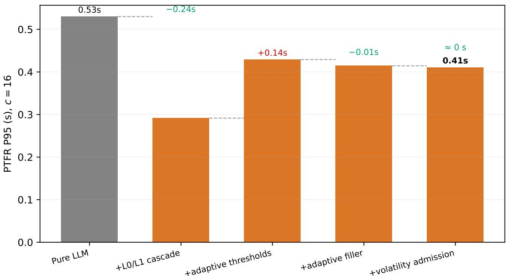  
Fig. 1. Waterfall decomposition of the PTFR P95 gain of PACE-full over pure LLM at c=16. The L0/L1 cascade contributes the largest share; removing L1 (A4) is the single most damaging ablation; adaptive filler control improves perceived latency with 94% fewer small-model calls at 0% conflict; volatility admission trades a small latency increase for the stale-answer reduction of Table VII of the main text.

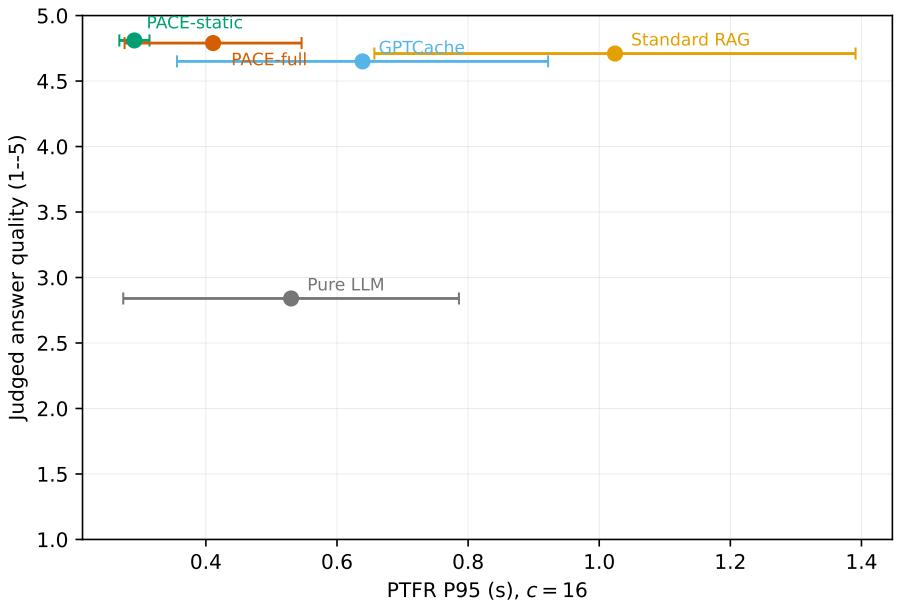  
Fig. 2. Quality–latency trade-off across systems at c=16. Each point is one system; error bars are CIs on both axes.

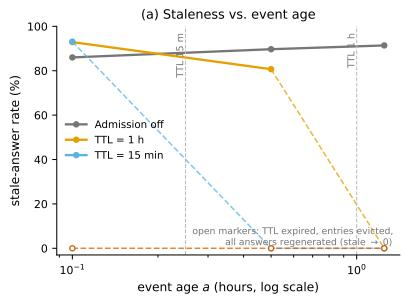

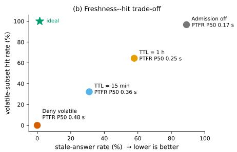  
Fig. 3. Volatility-aware admission on CarQA-Volatile. (a) Stale-answer rate per event-age bucket for each admission policy (open markers mean no cache hits remain in that bucket). (b) Freshness–hit trade-off per policy, with markers annotated by PTFR P50; the star marks the ideal point (zero staleness at full hit rate). The pooled row of Table VII of the main text and the per-bucket values of this figure use different aggregations: the table sums stale over requests, this figure plots the per-bucket rate.