# Putting Captions to the Test: Evaluating Video Caption Quality through Multiple-Choice Question Answering

Zizhen Wang, Bo Feng, Zhengfeng Lai\*, Shiyu Li

Yang Lu, Meng Cao, Ping Huang, Simon Wang

Apple

{wang\_zizhen, bfeng2, jeff\_lai, shiyu\_li, yanglu, mengcao, huang\_ping, simon\_wang2}@apple.com

## Abstract

Evaluating video captioning remains a critical challenge for Visual Large Language Models (VLLMs). Existing metrics primarily rely on matching generated text against groundtruth references. This paradigm suffers from the “one-to-many” nature of video description, where high-quality captions are often penalized for lexical mismatches or valid shifts in visual focus. Furthermore, such assessments are typically one-dimensional, failing to provide a fine-grained analysis of caption quality. To address this, we redefine caption quality via information fidelity: A caption must maximize the coverage ofsalient visual information while ensuring strict factuality. We introduce CapQuiz, a novel reference-free benchmark that assesses captions based on their utility in answering human-verified, fine-grained, multiple-choice questions derived from the video. CapQuiz features a hierarchical taxonomy of 10 question types (spanning Descriptive and Inferential categories) across 24 diverse video domains. We further formulate CapF1, a composite metric that synthesizes CapP (measuring factuality) and CapR (measuring coverage). Extensive experiments demonstrate that CapQuiz correlates significantly better with human judgments than existing metrics and offers interpretable insights into model performance.

## 1 Introduction

Recent advancements in Visual Large Language Models (VLLMs) have significantly improved the performance of vision-language tasks. Among these, video captioning remains a fundamental challenge, requiring models to perceive temporal visual dynamics and synthesize them into coherent natural language. This capability is essential for various downstream applications, such as video retrieval, content indexing, and accessibility tools for the visually impaired. As VLLMs become more capable of generating detailed and lengthy descriptions, the need for a robust benchmark to assess their quality has become increasingly critical.

The dominant evaluation paradigm remains textbased comparison with ground-truth references, relying on n-gram overlap metrics like BLEU (Papineni et al., 2002) and CIDEr (Vedantam et al., 2015), or semantic judges like BERTScore (Zhang et al., 2019) and LLM-based evaluators (Liu et al., 2023; Fu et al., 2024). However, these methods fundamentally suffer from the “one-to-many” nature of video description, often penalizing valid captions that diverge lexically from the ground truth. To address this, cross-modal metrics have emerged to incorporate visual grounding into the evaluation loop. Approaches range from leveraging matching models and scene graphs (Jiang et al., 2019; Wang et al., 2021) to utilizing pre-trained visionlanguage embeddings (Hessel et al., 2021; Hu et al., 2023). Parallel to this, a distinct research strand has shifted toward question-based evaluation, such as VDC (Chai et al., 2024) and VCapsBench (Zhang et al., 2025), which probe caption fidelity through question answering. Crucially, however, neither paradigm successfully provides a fine-grained, diagnostic analysis capable of effectively decoupling factual trustworthiness from information coverage.

To address these limitations, we propose evaluating captions based on information fidelity. Fundamentally, a high-quality caption should act as an effective textual surrogate for the video, preserving the key visual details accurately. The core criterion thus becomes: can a user correctly answer fine-grained questions about the video solely by reading the caption? This reference-free approach encourages the model to maximize the coverage of salient information while ensuring factuality regarding the source video.

Guided by this philosophy, we introduce CapQuiz, a benchmark that quantifies caption quality through human-verified, fine-grained, multiplechoice question answering, as shown in Figure 1. Unlike binary verification, the multiple-choice format forces the model to discriminate between correct details and plausible distractors, offering a more rigorous test of fine-grained understanding. CapQuiz is built upon a hierarchical taxonomy comprising 10 specific question types, categorized under Descriptive (e.g., entity, attribute) and Inferential (e.g., relation, causality). This structure enables a multi-faceted analysis of model capabilities across 24 diverse video domains. We categorize the QA results into True Positives (TP), False Positives (FP), and False Negatives (FN). Building upon this taxonomy, we introduce CapP and CapR to quantify factuality and coverage, respectively, and aggregate them into a unified metric, CapF1.

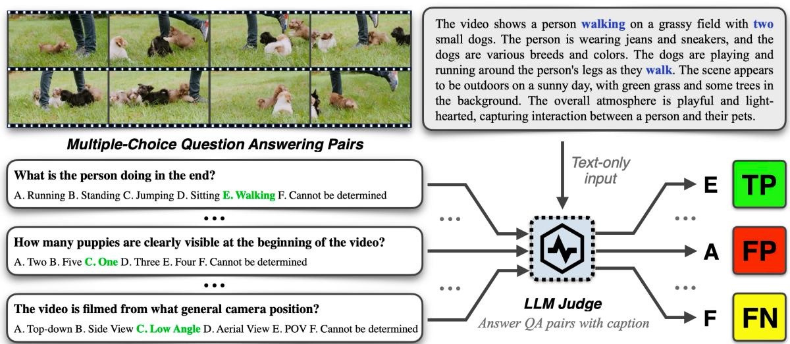  
Figure 1: Overview of the CapQuiz evaluation pipeline. We assess caption quality by leveraging an LLM to answer human-verified fine-grained multiple-choice questions based solely on the generated caption. The green options denote the ground-truth answers, while blue text highlights the key evidence within the caption.

Our main contributions are summarized as follows:

• We propose CapQuiz, a novel reference-free benchmark grounded in the principle of information fidelity. By utilizing human-verified, fine-grained multiple-choice questions with plausible distractors, it robustly assesses caption quality in terms of factuality (CapP), coverage (CapR), and the unified metric (CapF1).

• We release a comprehensive benchmark comprising 1,204 videos spanning 24 diverse domains. It features 23,632 human-verified multiple-choice question-answer pairs, organized into a rigorous taxonomy of 10 specific types under broader Descriptive and Inferential categories.

• Extensive experiments demonstrate that CapQuiz achieves superior alignment with human preferences. Our fine-grained analysis further reveals VLLM disparities and diagnostic insights missed by traditional onedimensional metrics.

## 2 Related Works

Text-based Evaluation relies on comparing candidates against human-authored reference captions. Traditional n-gram metrics (e.g. BLEU (Papineni et al., 2002), ROUGE (Lin, 2004)) focus on surfacelevel lexical overlap, while METEOR (Banerjee and Lavie, 2005) incorporates synonymy via Word-Net (Miller, 1995). CIDEr (Vedantam et al., 2015), specifically designed for image captioning, computes cosine similarity using TF-IDF weighting to emphasize distinctive terms. To capture structural semantics, SPICE (Anderson et al., 2016) parses captions into scene graphs composed of objects, attributes, and relationships. However, these matching paradigms suffer from the “one-to-many” nature of video description, penalizing valid captions that deviate lexically from the ground truth. Recent semantic metrics like BERTScore (Zhang et al., 2019), BERTHA (Lebron et al., 2022) and LLMbased judges (Liu et al., 2023; Fu et al., 2024) move beyond exact matches but remain inherently reference-dependent. They are constrained by the limited coverage of ground-truth annotations and suffer from reference bias, where high-quality captions are undervalued simply for describing valid visual details absent in the specific reference texts.

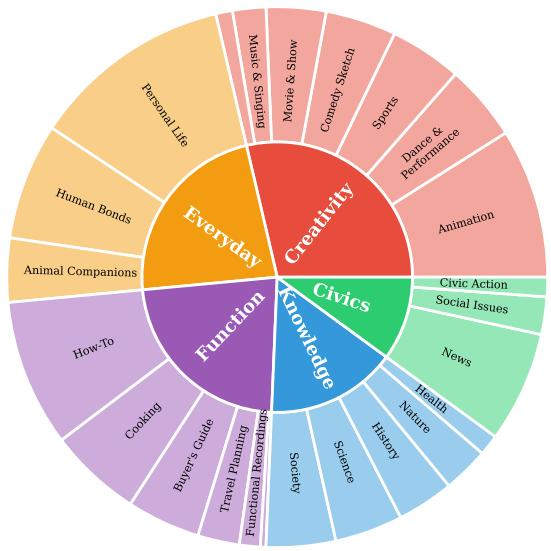  
(a) Video Categories Distribution

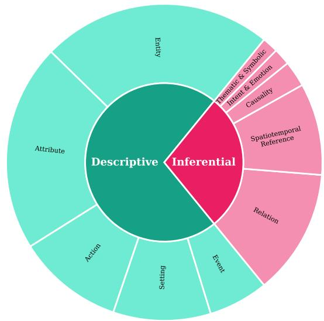  
(b) Question Categories Distribution  
Figure 2: Hierarchical statistics of the proposed CapQuiz.

Cross-modal Grounded Evaluation mitigates reference reliance by directly incorporating visual information into the evaluation loop. Early approaches leveraged image-text matching models (Lee et al., 2018; Jiang et al., 2019) or scene graphs (Wang et al., 2020, 2021) to score fidelity. With the advent of large-scale pre-training, CLIPScore (Hessel et al., 2021) has become a de facto standard, computing the cosine similarity in a shared semantic space provided by models like CLIP (Radford et al., 2021). InfoMetIC (Hu et al., 2023) builds on VLMs to provide both coarse-grained and tokenlevel quality scores. Despite their popularity, these metrics typically yield a global similarity score that treats the caption as a “bag of words”, often failing to distinguish fine-grained semantic nuances such as object relations or action directionality. Crucially, they lack explicit modeling of temporal dynamics and logical reasoning, making them less effective in diagnosing whether a model truly understands the complex events unfolding in a video.

Question-based Evaluation assesses caption quality via information fidelity. While early works like QACE (Lee et al., 2021), VQAScore (Lin et al., 2024) and CaptionQA (Yang et al., 2025) utilize visual question answering to verify consistency, they are primarily tailored for static images. In the video domain, Dream1K (Wang et al., 2024) compares answers derived from candidates against those from references; however, this reintroduces the “one-to-many” limitation where valid but nonoverlapping information is penalized. To enable reference-free evaluation, VDC (Chai et al., 2024), QEVA (Jung and Kim, 2025) and VCapsBench (Zhang et al., 2025) introduce QA sets to bypass this issue. Nevertheless, such binary or open-ended formats are susceptible to random guessing or instability, lacking the plausible distractors necessary for fine-grained discrimination. Critically, most existing QA metrics predominantly verify factual correctness, largely overlooking whether the caption provides comprehensive coverage of salient events. In contrast, our work explicitly decomposes caption quality into factual trustworthiness and information coverage, treating question answerability not merely as a verification signal but as the primary evaluation objective.

## 3 The CapQuiz Benchmark

In this section, we introduce the methodology behind CapQuiz, a reference-free benchmark designed to evaluate video caption quality through human-verified, fine-grained multiple-choice question answering.

## 3.1 Hierarchical Taxonomy Design

To ensure a holistic assessment of VLLM caption capabilities, we ground CapQuiz in a rigorous twolevel taxonomy governing both visual domains and the probing question types. As shown in Figure 2(a), we curate videos across 5 super-categories (e.g., Knowledge, Everyday) branching into 24 finegrained sub-categories. This stratification maximizes semantic diversity, ranging from dynamic events in Sports to information-dense scenes in News, ensuring models are tested against distinct visual distributions and temporal dynamics. Complementing this visual breadth, our question taxonomy (Figure 2(b)) probes information fidelity across two cognitive dimensions: Descriptive that focusing on visual grounding tasks like Entity and Action, and Inferential that targeting higher-order logic such as Relation and Causality. By organizing 10 specific question types under these categories, we effectively decouple basic recognition from complex interpretation, enabling fine-grained diagnostic analysis. Detailed definitions of both taxonomies are provided in Appendix C.

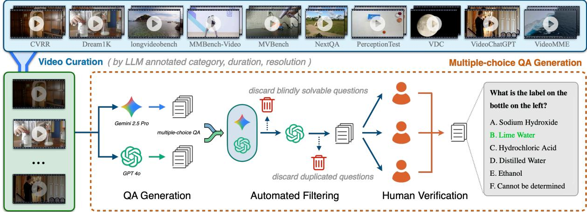  
Figure 3: The construction pipeline of CapQuiz.

## 3.2 Benchmark Construction

Figure 3 shows the construction pipeline of the benchmark.

## 3.2.1 Video Curation

Preventing data contamination was a paramount priority in our construction process. To minimize the risk of training set leakage, we strictly sourced candidate videos from the test or heldout validation splits of 10 public benchmarks, including VideoMME (Fu et al., 2025), VideoChat-GPT (Maaz et al., 2024), NextQA (Xiao et al., 2021), MVBench (Li et al., 2024), MMBench-Video (Fang et al., 2024), CVRR (Khattak et al., 2025), PerceptionTest (Patraucean et al., 2023), longvideobench (Wu et al., 2024), VDC (Chai et al., 2024) and Dream1K (Wang et al., 2024).

We extracted essential metadata (i.e., resolution, duration) and employed Gemini-2.5-Pro (Comanici et al., 2025) to annotate video categories, which guided the subsequent selection process. We adopted a duration ratio of approximately 6:3:1 for short (0–30s), medium (30–60s), and long (60– 120s) videos. While ensuring ample coverage of short-form clips, this distribution also incorporates narratively rich content through longer videos.

## 3.2.2 Multiple-Choice QA Generation

We implemented a rigorous Over-generate then Filter pipeline to construct the multiple-choice question-answer set. In the generation phase, utilizing Gemini-2.5-Pro and GPT-4o (Hurst et al., 2024), we produced diverse question-answer pairs rooted in our hierarchical taxonomy. Specifically, we prompted the models with the raw video, the specific definition of the target question type, and at least five few-shot reference examples. The models were instructed to generate a list of candidate QA pairs, where each pair comprises a distinct question body and five answer options.

Subsequently, these candidates underwent a strictly controlled filtration phase, beginning with an automated stage designed to ensure validity and information density. We first addressed language bias via a Blind Solvability Check. In this step, QA pairs were fed to LLMs (i.e., Gemini-2.5-Pro and GPT-4.1) in a video-blind setting, with option orders shuffled across three independent trials for each LLM. A question was deemed Blindly Solvable if both models answered it correctly in at least two out of the three trials, suggesting the answer could be inferred solely from textual patterns without visual context. Following this, we performed semantic de-duplication to eliminate redundancy. We utilized GPT-4.1 to analyze semantic similarity and cluster related questions. Within each cluster, we retained only the single most challenging instance, quantified as the one yielding the lowest accuracy during the blind pass, thereby maximizing the discriminative power of the dataset.

<table><tr><td>Benchmark</td><td>Reference-free</td><td>Human Verified</td><td>QA Format</td><td># Videos</td><td>Avg. Duration (s)</td><td>Avg. Q/V</td></tr><tr><td>MSVD (2011)</td><td>x</td><td></td><td></td><td>1,970</td><td>9.65</td><td></td></tr><tr><td>MSR-VTT (2016)</td><td>x</td><td></td><td></td><td>10,000</td><td>15.01</td><td></td></tr><tr><td>ActivityNet Captions (2017)</td><td>x</td><td></td><td></td><td>9,802</td><td>118.21</td><td></td></tr><tr><td>VATEX (2019)</td><td>x</td><td></td><td></td><td>4,478</td><td>144.78</td><td></td></tr><tr><td>Dream1K (2024)</td><td>x</td><td></td><td></td><td>1,000</td><td>8.87</td><td></td></tr><tr><td>VDC (2024)</td><td>√</td><td>x</td><td>Open-Ended</td><td>1,027</td><td>28.18</td><td>94.35</td></tr><tr><td>VCapsBench (2025)</td><td>√</td><td>√</td><td>Yes/No</td><td>5,677</td><td>9.79</td><td>18.38</td></tr><tr><td>CapQuiz</td><td>√</td><td>√</td><td>Multiple-Choice</td><td>1,204</td><td>34.69</td><td>19.63</td></tr></table>

Table 1: Comparison of CapQuiz with existing video captioning benchmarks. Our benchmark provides humanverified fine-grained multiple-choice question answering pairs designed for caption information fidelity evaluation. Avg. Q/V indicates Average number of questions per video.  
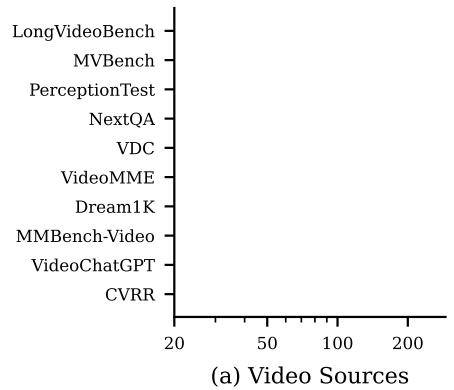

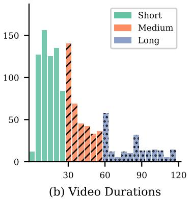

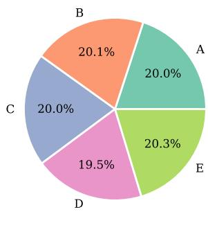  
(c) Golden Options  
Figure 4: Detailed statistics of the proposed CapQuiz.

Finally, the surviving candidates advanced to the human stage for rigorous verification. During this process, annotators were allowed and explicitly instructed to re-watch the video as needed. Each QA pair was evaluated by at least three annotators based on three strict criteria:

• Visual Relevance: A question is considered valid only if it is strictly grounded in the video.

• Factual Correctness: Each question must have exactly one correct answer that is objectively verifiable through visual evidence in the video.

• Question difficulty: To ensure the benchmark evaluates fine-grained visual understanding, we require that at least one incorrect option be a “hard negative.” A hard negative is an option that appears plausible but is factually incorrect, requiring careful inspection of the video details to rule out.

To validate the reliability of human review process, we calculated the inter-annotator agreement on a subset of the data, achieving a Gwet’s AC1 (Gwet, 2001) of 0.92, which indicates the high consistency and quality of our ground-truth annotations. The prompts are listed in Appendix D.

## 3.3 Dataset Statistics

As shown in Table 1, CapQuiz contains 1,204 videos, with an average of 19.63 QA pairs per video. Unlike reference-based benchmarks (e.g., MSR-VTT), CapQuiz adopts a reference-free paradigm to circumvent the “one-to-many” constraints of text matching, thereby directly assessing information fidelity. Its human-verified multiplechoice format ensures deterministic and reliable evaluation, superior to the reference-free attempts limited by unverified generation or binary tasks. Furthermore, featuring a hierarchical taxonomy of 24 video domains and 10 question types, CapQuiz enables a more nuanced diagnosis of model capabilities than prior coarse-grained datasets.

As visually detailed in Figure 2, our benchmark is structured around a sophisticated hierarchical video and question taxonomy. This design meticulously balances visual richness with linguistic complexity, ensuring that the benchmark covers a wide spectrum of semantic granularity, from coarsegrained object recognition to fine-grained reasoning. Furthermore, the source distribution presented in Figure 4(a) demonstrates that we aggregate video data from a highly heterogeneous array of sources, while minimizing the risk of training set leakage. This strategy is intended to maximize visual diversity and domain coverage, thereby testing the generalization ability of models across different visual styles. In terms of video duration (Figure 4(b)), while the benchmark is primarily anchored in short-form videos (< 30s) to capture atomic events, we deliberately maintain a substantial proportion of medium- and long-form content. This diverse duration distribution serves as a rigorous test for models’ temporal reasoning capabilities and their ability to model long-range dependencies. Finally, to ensure fair evaluation, the answer options are strictly uniformly distributed as shown in Figure 4(c). This balance is critical for mitigating potential position bias and prevents models from bypassing genuine understanding by exploiting statistical shortcuts or spurious correlations.

## 3.4 Evaluation Methodology

To evaluate the quality of video caption $C ,$ , we define a question set $\mathcal { Q }$ derived from the video. Each question comprises a stem $q _ { i }$ and 5 options $\mathcal { O } _ { i } ~ = ~ \{ o _ { i , 1 } , o _ { i , 2 } , . . . , o _ { i , 5 } \}$ , where $o _ { i , g t \in [ 1 , . . . , 5 ] }$ is the correct option. We introduce an extra “Cannot be determined” option $o _ { u n k }$ to form the evaluation space $\mathcal { O } _ { i } ^ { \prime } = \mathcal { O } _ { i } \cup \{ o _ { u n k } \}$ , allowing the Judge to explicitly signal uncertainty due to missing information. Given the caption $C$ and question $q _ { i }$ the judge selects the most likely option $\hat { o } _ { i }$ as the answer from options ${ \mathcal { O } } _ { i } ^ { \prime } .$ . The outcomes are categorized as:

• True Positive (TP) $( \hat { o } _ { i } = o _ { i , g t } ) \colon$ The caption contains the correct visual information, enabling the judge to select the ground-truth option.

• False Negative (FN) $( \hat { o } _ { i } = o _ { u n k } ) \mathrm { : }$ : The caption lacks the necessary information to answer the question. This results in an omission, forcing the judge to choose "Cannot be determined."

• False Positive (FP) $( \hat { o } _ { i } \neq o _ { i , g t } \land \hat { o } _ { i } \neq o _ { u n k } ) \colon$ The caption contains incorrect or misleading details consistent with a wrong option. This reflects hallucination, leading the judge to a specific incorrect answer.

Based on the categorization outcomes, we propose three metrics to quantify caption quality:

<table><tr><td>Correlation</td><td>Dimension</td><td>VLLM-as-a-Judge</td><td></td><td>Ours</td></tr><tr><td rowspan="3">Spearman (ρ)</td><td>Factuality</td><td></td><td>0.556 [0.421,0.674]</td><td>0.690 [0.593,0.765]</td></tr><tr><td>Coverage</td><td>0.579</td><td>[0.456,0.701]</td><td>0.663 [0.562,0.745]</td></tr><tr><td>Overall</td><td>0.522</td><td>2 [0.389,0.650]</td><td>0.643 [0.542,0.728]</td></tr><tr><td rowspan="3">Kendall (τ)</td><td>Factuality</td><td></td><td>0.500 [0.378,0.607]</td><td>0.581 [0.498,0.649]</td></tr><tr><td>Coverage</td><td>0.515 [0.406,0.624]</td><td></td><td>0.551 [0.463,0.624]</td></tr><tr><td>Overall</td><td>0.463 [0.342,0.577]</td><td></td><td>0.533 [0.447,0.608]</td></tr></table>

Table 2: Correlation with human judgments. Spearman $( \rho )$ and Kendall (τ) correlations are reported for Factuality, Coverage, and Overall Quality, with 95% bootstrap confidence intervals over videos. Our CapQuiz achieves the highest correlation in all six settings. All correlations are significant $( p < 0 . 0 1 )$

• Factuality (CapP). This metric measures the precision of determinate answers, penalizing hallucinations (FP) while disregarding uncertainty (FN).

$$
C a p P = { \frac { T P } { T P + F P } }
$$

• Coverage (CapR). This metric evaluates the completeness of the caption by measuring the proportion of correctly retrieved details against the total number of questions N.

$$
C a p R = { \frac { T P } { N } }
$$

• Overall (CapF1). To provide a holistic assessment, we compute the harmonic mean of factuality and coverage:

$$
C a p F 1 = \frac { 2 \cdot C a p P \cdot C a p R } { C a p P + C a p R }
$$

To ensure reproducibility and minimize prior knowledge bias, we employ $\mathsf { G P T } \mathsf { - } 4 . 1$ as the judge in our experiments, instructing it to strictly ground its answers in the provided caption C.

## 4 Experiments

## 4.1 Alignment with Human Judgments

To validate the effectiveness of CapQuiz, we assess the alignment between automated metrics and human judgments using Spearman (ρ) (Spearman, 1961) and Kendall (τ ) (Kendall, 1948) rank coefficients. We randomly sampled 200 videos from the benchmark, where the captions were generated by three different models (i.e. GPT-4o, InternVL3.5-8B and QWen3-VL-8B), yielding a total of 600 video-caption pairs. Human experts and the VLLM-as-a-Judge rated the generated captions on a Likert scale of 1-5 across Factuality, Coverage, and Overall Quality. For the VLLM-as-a-Judge, we prompted Gemini-2.5-pro to judge based on the video content (prompt detailed in Appendix D). For CapQuiz, we map the metric components to the evaluation dimensions: CapP evaluates Factuality, CapR measures Coverage, and CapF1 represents Overall Quality. We report both point estimates and 95% confidence intervals computed via bootstrap resampling over videos (1,000 resamples). As shown in Table 2, CapQuiz consistently achieves higher correlations with human judgments than the VLLM-as-a-Judge baseline across all six settings, and all reported correlations are statistically significant (p < 0.01). These results further indicate that decomposing evaluation into fine-grained QA tasks yields a more reliable and interpretable assessment than direct scoring.

<table><tr><td rowspan="2">Model</td><td colspan="3">Overall</td><td colspan="3">Descriptive</td><td colspan="3">Inferential</td></tr><tr><td>F1</td><td>P</td><td>R</td><td>F1</td><td>P</td><td>R</td><td>F1</td><td>P</td><td>R</td></tr><tr><td>Proprietary Models</td><td></td><td></td><td></td><td></td><td></td><td></td><td></td><td></td><td></td></tr><tr><td>Gemini-2.5-flash (2025)</td><td>81.01</td><td>84.52</td><td>77.79</td><td>83.85</td><td>87.69</td><td>80.34</td><td>73.84</td><td>76.58</td><td>71.29</td></tr><tr><td>Gemini-2.5-pro (2025)</td><td>81.71</td><td>84.94</td><td>78.72</td><td>84.30</td><td>87.74</td><td>81.11</td><td>75.16</td><td>77.88</td><td>72.63</td></tr><tr><td>GPT-4o-2024-11-20 (2024)</td><td>71.97</td><td>78.13</td><td>66.71</td><td>74.99</td><td>82.03</td><td>69.07</td><td>64.45</td><td>68.70</td><td>60.70</td></tr><tr><td>GPT-4.1-2025-04-14 (2025)</td><td>76.79</td><td>81.65</td><td>72.47</td><td>79.34</td><td>84.82</td><td>74.53</td><td>70.40</td><td>73.88</td><td>67.24</td></tr><tr><td>GPT-5.2-2025-12-11 (2025)</td><td>83.08</td><td>86.31</td><td>80.09</td><td>85.23</td><td>88.74</td><td>81.99</td><td>77.65</td><td>80.22</td><td>75.24</td></tr><tr><td>Open-source Models</td><td></td><td></td><td></td><td></td><td></td><td></td><td></td><td></td><td></td></tr><tr><td>AuroraCap-7B (2024)</td><td>39.86</td><td>63.00</td><td>29.16</td><td>43.86</td><td>68.40</td><td>32.28</td><td>29.48</td><td>48.26</td><td>21.22</td></tr><tr><td>LLaVA-Video-7B (2024)</td><td>63.16</td><td>73.61</td><td>55.30</td><td>66.83</td><td>78.02</td><td>58.45</td><td>53.85</td><td>62.51</td><td>47.30</td></tr><tr><td>Tarsier2-7b (2025)</td><td>42.37</td><td>55.80</td><td>34.16</td><td>43.55</td><td>57.91</td><td>34.90</td><td>39.44</td><td>50.70</td><td>32.27</td></tr><tr><td>InternVL3.5-8B (2025)</td><td>45.69</td><td>67.57</td><td>34.51</td><td>47.67</td><td>72.46</td><td>35.52</td><td>40.89</td><td>56.75</td><td>31.95</td></tr><tr><td>InternVL3.5-30B-A3B (2025)</td><td>54.46</td><td>70.03</td><td>44.55</td><td>57.92</td><td>75.03</td><td>47.16</td><td>45.80</td><td>57.83</td><td>37.92</td></tr><tr><td>Qwen3-VL Series (2025)</td><td></td><td></td><td></td><td></td><td></td><td></td><td></td><td></td><td></td></tr><tr><td>Qwen3-VL-2B</td><td>61.53</td><td>74.77</td><td>52.27</td><td>65.46</td><td>79.80</td><td>55.50</td><td>51.61</td><td>62.23</td><td>44.08</td></tr><tr><td>Qwen3-VL-4B</td><td>70.15</td><td>78.33</td><td>63.51</td><td>73.45</td><td>82.22</td><td>66.38</td><td>61.79</td><td>68.59</td><td>56.22</td></tr><tr><td>Qwen3-VL-8B</td><td>70.72</td><td>78.23</td><td>64.52</td><td>74.26</td><td>82.45</td><td>67.55</td><td>61.82</td><td>67.76</td><td>56.83</td></tr><tr><td>Qwen3-VL-30B-A3B</td><td>68.82</td><td>78.30</td><td>61.40</td><td>71.99</td><td>82.42</td><td>63.90</td><td>60.92</td><td>68.21</td><td>55.04</td></tr><tr><td>Qwen3-VL-32B</td><td>77.95</td><td>82.07</td><td>74.23</td><td>80.74</td><td>85.22</td><td>76.70</td><td>70.92</td><td>74.19</td><td>67.93</td></tr></table>

Table 3: Main results on CapQuiz. We report performance across the Overall metric and its two question categories: Descriptive and Inferential. P, R, and F1 correspond to CapP, CapR, and CapF1, respectively. The best performance is marked in bold and the second best is underlined.

## 4.2 Evaluation on SOTA Models

We evaluated several popular proprietary and opensource models. To ensure a fair comparison, all models were queried with a standardized prompt: “Describe this video in detail”, with visual inputs uniformly sampled at 32 frames per video. The quantitative results are summarized in Table 3, revealing three key observations.

Model Capabilities and Scaling Trend. CapQuiz effectively differentiates model tiers. Generally, proprietary models outperform open-source counterparts, with GPT-5.2 achieving the highest Overall CapF1 score of 83.08. Within the opensource landscape, we observe a distinct scaling trend in the Qwen3-VL series. As activated model size increases from 2B to 32B, performance improves generally (e.g., Overall CapF1 rises from 61.53 to 77.95), underscoring that increased parameter count correlates strongly with video caption quality.

The Trade-off between Factuality and Coverage. A pervasive trend across all models is that CapP (Factuality) consistently exceeds CapR (Coverage). For instance, GPT-4o achieves a high factuality of 78.13 but a significantly lower coverage of 66.71. This suggests that current VLLMs exhibit a conservative generation strategy: they tend to generate trustworthy descriptions but often fail to exhaustively cover the salient visual details. This indicates room for improvement in increasing caption density without introducing hallucinations.

The Reasoning Gap. Performance on Inferential questions consistently lags behind Descriptive ones, validating the hierarchical difficulty of our taxonomy. Crucially, this performance gap widens significantly for smaller models. While top-tier models like GPT-5.2 see a moderate degradation (∼10%) when transitioning from Descriptive to Inferential tasks, smaller models like AuroraCap-7B suffer a significant drop of ∼30%. This indicates that while visual recognition is becoming a baseline capability, complex visual reasoning remains the primary differentiator for superior VLLMs.

<table><tr><td rowspan="2">Model</td><td colspan="3">Overall</td><td colspan="3">Descriptive</td><td colspan="3">Inferential</td></tr><tr><td>F1</td><td>P</td><td>R</td><td>F1</td><td>P</td><td>R</td><td>F1</td><td>P</td><td>R</td></tr><tr><td>Proprietary Models</td><td></td><td></td><td></td><td></td><td></td><td></td><td></td><td></td><td></td></tr><tr><td>Gemini-2.5-flash</td><td>78.52 -3.07%</td><td>82.36 -2.56% 86.08</td><td>75.02 -3.56% 82.89</td><td>81.47 -2.84% 87.49</td><td>85.65 -2.33%</td><td>77.68 -3.31%</td><td>71.06 -3.76%</td><td>74.11 -3.23% 78.30</td><td>68.26 -4.25% 75.20</td></tr><tr><td>Gemini-2.5-pro</td><td>84.46 +3.37% 75.75</td><td>+1.34% 79.39</td><td>+5.30% 72.43</td><td>+3.78% 79.50</td><td>89.12 +1.57% 83.47</td><td>85.92 +5.93% 75.89</td><td>76.72 +2.08% 66.27</td><td>+0.54% 69.13</td><td>+3.54% 63.64</td></tr><tr><td>GPT-4o-2024-11-20 GPT-4.1-2025-04-14</td><td>+5.25% 80.48 +4.81%</td><td>+1.61% 82.30 +0.80%</td><td>+8.57% 78.73 +8.64%</td><td>+6.01% 83.89 +5.73%</td><td>+1.76% 85.82 +1.18%</td><td>+9.87% 82.04 +10.08%</td><td>+2.82% 71.81 +2.00%</td><td>+0.63% 73.37 -0.69%</td><td>+4.84% 70.32 +4.58%</td></tr><tr><td>GPT-5.2-2025-12-11</td><td>85.14 +2.48%</td><td>87.04 +0.85%</td><td>83.33 +4.05%</td><td>87.48 +2.64%</td><td>89.42 +0.77%</td><td>85.62 +4.43%</td><td>79.21 +2.01%</td><td>80.98 +0.95%</td><td>77.52 +3.03%</td></tr><tr><td>Open-source Models</td><td>27.00</td><td>57.24</td><td>17.67</td><td>29.31</td><td>62.35</td><td>19.16</td><td>21.15</td><td>44.46</td><td>13.88</td></tr><tr><td>AuroraCap-7B (2024) LLaVA-Video-7B (2024)</td><td>-32.26% 60.63 4.01%</td><td>-9.14% 69.56 -5.50%</td><td>-39.40% 53.73 -2.84%</td><td>33.17% 64.66 -3.25%</td><td>-8.85% 74.65 -4.32%</td><td>40.64% 57.03 -2.43%</td><td>-28.26% 50.54 -6.15%</td><td>-7.87% 57.11 -8.64%</td><td>-34.59% 45.32 -4.19%</td></tr><tr><td>Tarsier2-7b (2025) InternVL3.5-8B (2025)</td><td>9.95 -76.52% 64.03</td><td>11.92 -78.64% 71.89 +6.39%</td><td>8.54 -75.00% 57.72</td><td>10.20 -76.58% 67.53</td><td>12.21 -78.92% 76.05</td><td>8.75 -74.93% 60.73</td><td>9.32 -76.37% 55.20</td><td>11.16 -77.99% 61.51</td><td>8.00 -75.21% 50.06</td></tr><tr><td>InternVL3.5-30B-A3B (2025)</td><td>+40.14% 64.97 +19.30%</td><td>73.61 +5.11%</td><td>+67.26% 58.14 +30.51%</td><td>+41.66% 68.37 +18.04%</td><td>+4.95% 77.94 +3.88%</td><td>+70.97% 60.88 +29.09%</td><td>+35.00% 56.47 +23.30%</td><td>+8.39% 63.02 +8.97%</td><td>+56.68% 51.15 +34.89%</td></tr><tr><td>Qwen3-VL Series (2025)</td><td></td><td></td><td></td><td></td><td></td><td></td><td></td><td></td><td></td></tr><tr><td>Qwen3-VL-2B</td><td>70.46 +14.51%</td><td>75.99 +1.63%</td><td>65.67 +25.64%</td><td>74.31 +13.52%</td><td>80.10 +0.38%</td><td>69.30 +24.86%</td><td>60.64 +17.50%</td><td>65.49</td><td>56.46</td></tr><tr><td>Qwen3-VL-4B</td><td>76.35 +8.84%</td><td>80.40 +2.64%</td><td>72.69 +14.45%</td><td>79.57 +8.33%</td><td>83.91 +2.06%</td><td>75.66</td><td>68.20</td><td>+5.24% 71.56</td><td>+28.09% 65.15</td></tr><tr><td>Qwen3-VL-8B</td><td>78.22 +10.61%</td><td>81.82 +4.59%</td><td>74.92 +16.12%</td><td>81.03 +9.12%</td><td>84.87</td><td>+13.98% 77.52 +14.76%</td><td>+10.37% 71.10 +15.01%</td><td>+4.33% 74.13</td><td>+15.88% 68.30</td></tr><tr><td>Qwen3-VL-30B-A3B</td><td>80.09 +16.38%</td><td>83.26 +6.33%</td><td>77.16 +25.67%</td><td>82.90</td><td>+2.94% 86.30</td><td>79.76</td><td>72.97</td><td>+9.40% 75.59</td><td>+20.18% 70.53</td></tr><tr><td></td><td>81.09</td><td>83.57</td><td>78.75</td><td>+15.15% 83.43</td><td>+4.71% 86.00</td><td>+24.82% 81.00</td><td>+19.78% 75.15</td><td>+10.82% 77.40</td><td>+28.14% 73.04</td></tr><tr><td>Qwen3-VL-32B</td><td>+4.03%</td><td>+1.83%</td><td>+6.09%</td><td>+3.33%</td><td>+0.92%</td><td>+5.61%</td><td>+5.96%</td><td>+4.33%</td><td>+7.52%</td></tr></table>

Table 4: Evaluation results under the detailed caption prompt setting. The colored subscripts indicate the relative performance change compared to the baseline standardized prompt results reported in Table 3. Green and red denote performance improvement and decline, respectively.

## 4.3 Prompt Sensitivity Analysis

It is widely recognized that VLLM performance can be heavily influenced by prompt design. To validate our findings, we experimented with a more complex and detailed caption prompt (see Appendix D) in this section, comparing it against the concise standardized prompt from our main experiments. As shown in Table 4, these results reveal divergent sensitivities across models. For instance, the Overall CapF1 of the Gemini-2.5-flash decreased by 3.07%, while that of GPT-4.1-2025-04-14 increased by 4.81%. This phenomenon is also observed in open-source models. While the Qwen3-VL series demonstrates consistent performance gains with the detailed prompt, other open-source models, such as LLaVA-Video-7B, exhibit a 4.01% decrease, and Tarsier2-7b shows an even more substantial decline of 76.52%.

Crucially, however, the main conclusions of our benchmark remain robust against these variations. The key trends from the previous section (i.e., Model Capabilities and Scaling Trend, The Tradeoff between Factuality and Coverage, and The Reasoning Gap) persist regardless of the prompt complexity, demonstrating that CapQuiz effectively captures fundamental model capabilities independent of prompting strategies.

## 5 Conclusion

In this paper, we introduce CapQuiz, a novel reference-free benchmark designed to assess video captioning quality via information fidelity. By leveraging human-verified, fine-grained multiplechoice questions, it decouples and quantifies caption factuality and coverage. Experiments demonstrate that CapQuiz achieves robust alignment with human judgments compared to existing evaluators. Moreover, our analysis exposes a critical limitation in current SOTA VLLMs: While exhibiting high factual precision, they often struggle with comprehensive coverage and show significant degradation on inferential tasks compared to descriptive ones. We envision CapQuiz as a vital testbed to guide future research toward more robust and grounded video understanding models.

## Limitations

First, the question set of CapQuiz may not be exhaustive. Although we generate an average of 19.63 QA pairs per video to capture a wide range of visual information, guaranteeing the complete coverage of every visual detail in a complex video remains practically challenging. Consequently, our coverage metric (CapR) serves as a proxy based on identified salient information rather than an absolute measure of total visual content. In cases where videos contain extremely dense or subtle background details not captured by our QA generation pipeline, the reported coverage scores might be slightly overestimated. Moreover, the current QA pairs are exclusively in English, which limits the evaluation of VLLMs in multilingual contexts.

Furthermore, to maintain a scalable and reference-free evaluation, we utilize GPT-4.1 as the judge. While exhibiting high alignment with human experts, the evaluation is inherently constrained by the judge model’s upper bound and susceptible to the closed-source nature of the API, where model updates may affect reproducibility. Additionally, potential biases in the judge model regarding ambiguous visual descriptions could introduce noise.

## Ethical Considerations

We prioritize ethical concerns associated with video content in benchmark construction, particularly regarding privacy and safety. To mitigate these risks, we curated video samples exclusively from established open-source datasets distributed under Creative Commons or compatible licenses, ensuring compliance with their usage policies. Regarding the text annotation, while commercial APIs (e.g., GPT and Gemini) implement built-in safety guardrails, we acknowledge the residual risk of introducing model-inherent biases or toxicity. Furthermore, we conducted a rigorous manual inspection to filter out any content containing potential Not Safe For Work (NSFW) elements or sensitive Personally Identifiable Information (PII). We ensured that all human annotators involved in this verification process were compensated at a rate exceeding the local minimum wage, adhering to fair labor practices.

## Acknowledgments

We would like to express our special thanks to Xiaoyi Ren for the exceptional support, insightful discussions, and detailed feedback throughout this project. We also thank Peng Zhang, Wencong Zhang, and Wentao Wu for their valuable discussions and careful reviews. We are grateful to Syed Khaja Naseeruddin Ahmed, Michael FitzMaurice, Gulsagar Jassar, Ryyan Mukarram, and the annotation team for their important efforts in data annotation and verification. We additionally thank Ying-Chang Cheng, Ganesh Nagarajan, Bruce Leng, and Snehal Nagmote for their outstanding infrastructure support for data processing and analysis.

## References

Peter Anderson, Basura Fernando, Mark Johnson, and Stephen Gould. 2016. Spice: Semantic propositional image caption evaluation. In European conference on computer vision, pages 382–398. Springer.

Shuai Bai, Yuxuan Cai, Ruizhe Chen, Keqin Chen, Xionghui Chen, Zesen Cheng, Lianghao Deng, Wei Ding, Chang Gao, Chunjiang Ge, Wenbin Ge, Zhifang Guo, Qidong Huang, Jie Huang, Fei Huang, Binyuan Hui, Shutong Jiang, Zhaohai Li, Mingsheng Li, and 45 others. 2025. Qwen3-vl technical report. Preprint, arXiv:2511.21631.

Satanjeev Banerjee and Alon Lavie. 2005. Meteor: An automatic metric for mt evaluation with improved correlation with human judgments. In Proceedings of the acl workshop on intrinsic and extrinsic evaluation measuresfor machine translation and/or summarization, pages 65–72.

Wenhao Chai, Enxin Song, Yilun Du, Chenlin Meng, Vashisht Madhavan, Omer Bar-Tal, Jenq-Neng Hwang, Saining Xie, and Christopher D Manning. 2024. Auroracap: Efficient, performant video detailed captioning and a new benchmark. arXiv preprint arXiv:2410.03051.

David Chen and William B Dolan. 2011. Collecting highly parallel data for paraphrase evaluation. In Proceedings of the 49th annual meeting of the association for computational linguistics: human language technologies, pages 190–200.

Gheorghe Comanici, Eric Bieber, Mike Schaekermann, Ice Pasupat, Noveen Sachdeva, Inderjit Dhillon, Marcel Blistein, Ori Ram, Dan Zhang, Evan Rosen, and 1 others. 2025. Gemini 2.5: Pushing the frontier with advanced reasoning, multimodality, long context, and next generation agentic capabilities. arXiv preprint arXiv:2507.06261.

Xinyu Fang, Kangrui Mao, Haodong Duan, Xiangyu Zhao, Yining Li, Dahua Lin, and Kai Chen. 2024. Mmbench-video: A long-form multi-shot benchmark for holistic video understanding. Advances in Neural Information Processing Systems, 37:89098–89124.

Chaoyou Fu, Yuhan Dai, Yongdong Luo, Lei Li, Shuhuai Ren, Renrui Zhang, Zihan Wang, Chenyu Zhou, Yunhang Shen, Mengdan Zhang, and 1 others. 2025. Video-mme: The first-ever comprehensive evaluation benchmark of multi-modal llms in video analysis. In Proceedings of the Computer Vision and Pattern Recognition Conference, pages 24108– 24118.

Jinlan Fu, See Kiong Ng, Zhengbao Jiang, and Pengfei Liu. 2024. Gptscore: Evaluate as you desire. In Proceedings of the 2024 Conference of the North American Chapter of the Association for Computational Linguistics: Human Language Technologies (Volume 1: Long Papers), pages 6556–6576.

Kilem Gwet. 2001. Handbook of inter-rater reliability: How to estimate the level of agreement between two or multiple raters. Gaithersburg, MD: STATAXIS Publishing Company.

Jack Hessel, Ari Holtzman, Maxwell Forbes, Ronan Le Bras, and Yejin Choi. 2021. Clipscore: A referencefree evaluation metric for image captioning. arXiv preprint arXiv:2104.08718.

Anwen Hu, Shizhe Chen, Liang Zhang, and Qin Jin. 2023. Infometic: An informative metric for reference-free image caption evaluation. arXiv preprint arXiv:2305.06002.

Aaron Hurst, Adam Lerer, Adam P Goucher, Adam Perelman, Aditya Ramesh, Aidan Clark, AJ Ostrow, Akila Welihinda, Alan Hayes, Alec Radford, and 1 others. 2024. Gpt-4o system card. arXiv preprint arXiv:2410.21276.

Ming Jiang, Qiuyuan Huang, Lei Zhang, Xin Wang, Pengchuan Zhang, Zhe Gan, Jana Diesner, and Jianfeng Gao. 2019. Tiger: Text-to-image grounding for image caption evaluation. arXiv preprint arXiv:1909.02050.

Woojun Jung and Junyeong Kim. 2025. Qeva: A reference-free evaluation metric for narrative video summarization with multimodal question answering. In Findings of the Association for Computational Linguistics: EMNLP 2025, pages 24632–24642.

Maurice George Kendall. 1948. Rank correlation methods.

Muhammad Uzair Khattak, Muhammad Ferjad Naeem, Jameel Hassan, Muzammal Naseer, Federico Tombari, Fahad Shahbaz Khan, and Salman Khan. 2025. How good is my video-lmm? complex video reasoning and robustness evaluation suite for videolmms. In Proceedings of the Computer Vision and Pattern Recognition Conference, pages 3642–3651.

Ranjay Krishna, Kenji Hata, Frederic Ren, Li Fei-Fei, and Juan Carlos Niebles. 2017. Dense-captioning events in videos. In Proceedings of the IEEE international conference on computer vision, pages 706–715.

Luis Lebron, Yvette Graham, Kevin McGuinness, Konstantinos Kouramas, and Noel E O’Connor. 2022. Bertha: Video captioning evaluation via transferlearned human assessment. In Proceedings of the Thirteenth Language Resources and Evaluation Conference, pages 1566–1575.

Hwanhee Lee, Thomas Scialom, Seunghyun Yoon, Franck Dernoncourt, and Kyomin Jung. 2021. Qace: Asking questions to evaluate an image caption. arXiv preprint arXiv:2108.12560.

Kuang-Huei Lee, Xi Chen, Gang Hua, Houdong Hu, and Xiaodong He. 2018. Stacked cross attention for image-text matching. In Proceedings of the European conference on computer vision (ECCV), pages 201–216.

Kunchang Li, Yali Wang, Yinan He, Yizhuo Li, Yi Wang, Yi Liu, Zun Wang, Jilan Xu, Guo Chen, Ping Luo, and 1 others. 2024. Mvbench: A comprehensive multi-modal video understanding benchmark. In Proceedings of the IEEE/CVF Conference on Computer Vision and Pattern Recognition, pages 22195–22206.

Chin-Yew Lin. 2004. Rouge: A package for automatic evaluation of summaries. In Text summarization branches out, pages 74–81.

Zhiqiu Lin, Deepak Pathak, Baiqi Li, Jiayao Li, Xide Xia, Graham Neubig, Pengchuan Zhang, and Deva Ramanan. 2024. Evaluating text-to-visual generation with image-to-text generation. In European Conference on Computer Vision, pages 366–384. Springer.

Yang Liu, Dan Iter, Yichong Xu, Shuohang Wang, Ruochen Xu, and Chenguang Zhu. 2023. G-eval: Nlg evaluation using gpt-4 with better human alignment. arXiv preprint arXiv:2303.16634.

Muhammad Maaz, Hanoona Rasheed, Salman Khan, and Fahad Khan. 2024. Video-chatgpt: Towards detailed video understanding via large vision and language models. In Proceedings of the 62nd Annual Meeting of the Association for Computational Linguistics (Volume 1: Long Papers), pages 12585– 12602.

George A Miller. 1995. Wordnet: a lexical database for english. Communications of the ACM, 38(11):39–41.

OpenAI. 2025. Gpt-5.1: A smarter, more conversational chatgpt. https://openai.com/index/gpt-5-1/.

OpenAI. 2025. Introducing gpt-4.1 in the api. https: //openai.com/index/gpt-4-1/. Accessed: 2025- 04-14.

Kishore Papineni, Salim Roukos, Todd Ward, and Wei-Jing Zhu. 2002. Bleu: a method for automatic evaluation of machine translation. In Proceedings ofthe 40th annual meeting of the Association for Computational Linguistics, pages 311–318.

Viorica Patraucean, Lucas Smaira, Ankush Gupta, Adria Recasens, Larisa Markeeva, Dylan Banarse, Skanda Koppula, Mateusz Malinowski, Yi Yang, Carl Doersch, and 1 others. 2023. Perception test: A diagnostic benchmark for multimodal video models. Advances in Neural Information Processing Systems, 36:42748– 42761.

Alec Radford, Jong Wook Kim, Chris Hallacy, Aditya Ramesh, Gabriel Goh, Sandhini Agarwal, Girish Sastry, Amanda Askell, Pamela Mishkin, Jack Clark, and 1 others. 2021. Learning transferable visual models from natural language supervision. In International conference on machine learning, pages 8748–8763. PmLR.

Charles Spearman. 1961. " general intelligence" objectively determined and measured.

Ramakrishna Vedantam, C Lawrence Zitnick, and Devi Parikh. 2015. Cider: Consensus-based image description evaluation. In Proceedings of the IEEE conference on computer vision and pattern recogni tion, pages 4566–4575.

Jiawei Wang, Liping Yuan, Yuchen Zhang, and Haomiao Sun. 2024. Tarsier: Recipes for training and evaluating large video description models. arXiv preprint arXiv:2407.00634.

Sijin Wang, Ruiping Wang, Ziwei Yao, Shiguang Shan, and Xilin Chen. 2020. Cross-modal scene graph matching for relationship-aware image-text retrieval. In Proceedings ofthe IEEE/CVF winter conference on applications of computer vision, pages 1508– 1517.

Sijin Wang, Ziwei Yao, Ruiping Wang, Zhongqin Wu, and Xilin Chen. 2021. Faier: Fidelity and adequacy ensured image caption evaluation. In Proceedings of the IEEE/CVF Conference on Computer Vision and Pattern Recognition, pages 14050–14059.

Weiyun Wang, Zhangwei Gao, Lixin Gu, Hengjun Pu, Long Cui, Xingguang Wei, Zhaoyang Liu, Linglin Jing, Shenglong Ye, Jie Shao, and 1 others. 2025. Internvl3. 5: Advancing open-source multimodal models in versatility, reasoning, and efficiency. arXiv preprint arXiv:2508.18265.

Xin Wang, Jiawei Wu, Junkun Chen, Lei Li, Yuan-Fang Wang, and William Yang Wang. 2019. Vatex: A large-scale, high-quality multilingual dataset for video-and-language research. In Proceedings ofthe IEEE/CVF international conference on computer vision, pages 4581–4591.

Haoning Wu, Dongxu Li, Bei Chen, and Junnan Li. 2024. Longvideobench: A benchmark for longcontext interleaved video-language understanding. Advances in Neural Information Processing Systems, 37:28828–28857.

Junbin Xiao, Xindi Shang, Angela Yao, and Tat-Seng Chua. 2021. Next-qa: Next phase of questionanswering to explaining temporal actions. In Proceedings of the IEEE/CVF conference on computer vision and pattern recognition, pages 9777–9786.

Jun Xu, Tao Mei, Ting Yao, and Yong Rui. 2016. Msrvtt: A large video description dataset for bridging video and language. In Proceedings ofthe IEEE conference on computer vision and pattern recognition, pages 5288–5296.

Shijia Yang, Yunong Liu, Bohan Zhai, Ximeng Sun, Zicheng Liu, Emad Barsoum, Manling Li, and Chenfeng Xu. 2025. Captionqa: Is your caption as useful as the image itself? arXiv preprint arXiv:2511.21025.

Liping Yuan, Jiawei Wang, Haomiao Sun, Yuchen Zhang, and Yuan Lin. 2025. Tarsier2: Advancing large vision-language models from detailed video description to comprehensive video understanding. Preprint, arXiv:2501.07888.

Shi-Xue Zhang, Hongfa Wang, Duojun Huang, Xin Li, Xiaobin Zhu, and Xu-Cheng Yin. 2025. Vcapsbench: A large-scale fine-grained benchmark for video caption quality evaluation. arXiv preprint arXiv:2505.23484.

Tianyi Zhang, Varsha Kishore, Felix Wu, Kilian Q Weinberger, and Yoav Artzi. 2019. Bertscore: Evaluating text generation with bert. arXiv preprint arXiv:1904.09675.

Yuanhan Zhang, Jinming Wu, Wei Li, Bo Li, Zejun Ma, Ziwei Liu, and Chunyuan Li. 2024. Video instruction tuning with synthetic data. Preprint, arXiv:2410.02713.

## A Robustness to Judge Choice

To ensure reproducibility, all main experiments use a fixed API snapshot of GPT-4.1 (i.e. gpt-4.1- 2025-04-14) with deterministic decoding. While GPT-4.1 serves as the default automatic judge due to its strong instruction-following and stable answer formatting, CapQuiz itself is not tied to a specific judge model. To examine the sensitivity of CapQuiz to judge choice, we additionally instantiate the same evaluation pipeline with a strong openweight model, Qwen3-30B-A3B-Instruct-2507. We keep the prompt template, answer space, and parsing rules identical across judges, and reevaluate the VLLMs in Section 4.2 under the Qwen3-based judge.

As summarized in Table 5, we observe two main findings. First, replacing GPT-4.1 with Qwen3-30B-A3B-Instruct-2507 preserves the overall ranking trends of VLLMs and leaves the main conclusions of Section 4.2 unchanged.

<table><tr><td rowspan="2">Model</td><td colspan="3">Overall</td><td colspan="3">Descriptive</td><td colspan="3">Inferential</td></tr><tr><td>F1</td><td>P</td><td>R</td><td>F1</td><td>P</td><td>R</td><td>F1</td><td>P</td><td>R</td></tr><tr><td>Proprietary Models</td><td></td><td></td><td></td><td></td><td></td><td></td><td></td><td></td><td></td></tr><tr><td>Gemini-2.5-flash</td><td>74.84 -7.62%</td><td>82.38 -2.53%</td><td>68.57 -11.85%</td><td>78.47 -6.42%</td><td>86.76 -1.06%</td><td>71.63 -10.84%</td><td>65.74 -10.97%</td><td>71.56 -6.56%</td><td>60.79 -14.73%</td></tr><tr><td>Gemini-2.5-pro</td><td>77.43 -5.24%</td><td>83.43 -1.78%</td><td>72.22 -8.26%</td><td>80.84 -4.10%</td><td>87.14 -0.68%</td><td>75.40 -7.04%</td><td>68.75 -8.53%</td><td>74.03 -4.94%</td><td>64.18 -11.63%</td></tr><tr><td>GPT-4o-2024-11-20</td><td>66.76 -7.24%</td><td>79.30 +1.50%</td><td>57.64 -13.60%</td><td>70.59 -5.87%</td><td>84.04 +2.45%</td><td>60.85 -11.90%</td><td>57.08 -11.44%</td><td>67.43 -1.85%</td><td>49.49 -18.47%</td></tr><tr><td>GPT-4.1-2025-04-14</td><td>71.83 -6.46%</td><td>80.76 -1.09%</td><td>64.67 -10.76%</td><td>75.44 -4.92%</td><td>85.30 +0.57%</td><td>67.62 -9.27%</td><td>62.78 -10.82%</td><td>69.62 -5.77%</td><td>57.16 -14.99%</td></tr><tr><td>GPT-5.2-2025-12-11</td><td>78.49 -5.52%</td><td>84.45 -2.16%</td><td>73.31 -8.47%</td><td>81.60 -4.26%</td><td>87.95 -0.89%</td><td>76.10 -7.18%</td><td>70.62 -9.05%</td><td>75.64 -5.71%</td><td>66.23 -11.98%</td></tr><tr><td>Open-source Models</td><td>33.91</td><td>64.47</td><td>23.01</td><td>38.05</td><td>68.73</td><td>26.31</td><td>22.37</td><td>49.81</td><td>14.42</td></tr><tr><td>AuroraCap-7B LLaVA-Video-7B</td><td>-14.93% 56.57 -10.43%</td><td>+2.33% 74.15 +0.73%</td><td>-21.09% 45.73 -17.31%</td><td>-13.25% 61.09 -8.59%</td><td>+0.48% 79.07 +1.35%</td><td>-18.49% 49.77 -14.85%</td><td>-24.12% 44.46</td><td>+3.21% 60.33</td><td>-32.05% 35.20</td></tr><tr><td>Tarsier2-7b</td><td>43.82 +3.42%</td><td>68.77 +23.24%</td><td>32.16 -5.85%</td><td>45.61 +4.73%</td><td>74.39 +28.46%</td><td>32.89 -5.76%</td><td>-17.44% 39.47 +0.08%</td><td>-3.49% 56.71 +11.85%</td><td>-25.58% 30.27 -6.20%</td></tr><tr><td>InternVL3.5-8B</td><td>39.66 -13.20%</td><td>70.27 +4.00%</td><td>27.63 -19.94%</td><td>42.36 -11.14%</td><td>74.54 +2.87%</td><td>29.59 -16.69%</td><td>32.63 -20.20%</td><td>58.84 +3.68%</td><td>22.57 -29.36%</td></tr><tr><td>InternVL3.5-30B-A3B</td><td>48.18 -11.53%</td><td>72.28 +3.21%</td><td>36.14 -18.88%</td><td>52.03 -10.17%</td><td>76.68 +2.20%</td><td>39.38 -16.50%</td><td>37.83 -17.40%</td><td>59.61 +3.08%</td><td>27.71 -26.93%</td></tr><tr><td>Qwen3-VL Series (2025)</td><td></td><td></td><td></td><td></td><td></td><td></td><td></td><td></td><td></td></tr><tr><td>Qwen3-VL-2B</td><td>56.56 -8.08%</td><td>74.79 +0.03%</td><td>45.48 -12.99%</td><td>60.78 -7.15%</td><td>79.75 -0.06%</td><td>49.10 -11.53%</td><td>45.65 -11.55%</td><td>61.60 -1.01%</td><td>36.26 17.74%</td></tr><tr><td>Qwen3-VL-4B</td><td>64.69 -7.78%</td><td>77.94 -0.50%</td><td>55.29 -12.94%</td><td>68.75</td><td>82.72</td><td>58.82</td><td>54.31</td><td>65.68</td><td>46.30</td></tr><tr><td>Qwen3-VL-8B</td><td>66.04</td><td>78.46</td><td>57.02</td><td>-6.40% 70.08</td><td>+0.61% 83.14</td><td>-11.39% 60.56</td><td>-12.11% 55.76</td><td>-4.24% 66.45</td><td>-17.64% 48.04</td></tr><tr><td>Qwen3-VL-30B-A3B</td><td>-6.62% 63.15</td><td>+0.29% 77.36</td><td>-11.62% 53.36</td><td>-5.63% 66.86</td><td>+0.84% 81.90</td><td>-10.35% 56.49</td><td>-9.80% 53.72</td><td>-1.93% 65.80</td><td>-15.47% 45.38</td></tr><tr><td></td><td>-8.24% 73.36</td><td>-1.20% 80.84</td><td>-13.09% 67.14</td><td>-7.13% 77.08</td><td>-0.63% 84.96</td><td>-11.60%</td><td>-11.82% 63.90</td><td>-3.53% 70.38</td><td>-17.55% 58.51</td></tr><tr><td>Qwen3-VL-32B</td><td>-5.89%</td><td>-1.50%</td><td>-9.55%</td><td>-4.53%</td><td>-0.31%</td><td>70.54 -8.03%</td><td>-9.90%</td><td>-5.14%</td><td>-13.87%</td></tr></table>

Table 5: Evaluation results with Qwen3-30B-A3B-Instruct-2507 as the Judge. The colored subscripts indicate relative changes with respect to the GPT-4.1-based results in Table 3. Green and red denote performance improvement and decline, respectively.

This suggests that the comparative findings of CapQuiz are not tied to a single proprietary judge. Second, we observe a general decrease in absolute CapP, CapR, and CapF1 scores under Qwen3-30B-A3B-Instruct-2507. This shift likely reflects differences in instruction-following and zero-shot reasoning capability across judges. Overall, these results suggest that GPT-4.1 is a strong default judge that improves score calibration, while the main comparative conclusions of CapQuiz remain robust to judge substitution.

## B Robustness to QA Set Size

CapR is intended as a proxy for the coverage of salient visual information, rather than an exhaustive recall measure over all possible video details. Since each video is annotated with a finite set of curated QA pairs, it is important to verify that the resulting evaluation remains stable with respect to the number of questions used. We therefore conduct an ablation study by varying the retained proportion of QA pairs per video.

Specifically, for each video, we uniformly subsample its QA set with retention ratios in 25%, 50%, 75%, 100%. For the 25%, 50%, and 75% settings, we repeat the subsampling with 10 random seeds and report the mean and standard deviation of CapF1. We evaluate four representative VLLMs spanning different model families and capability levels: Gemini-2.5-pro, GPT-5.2, Qwen3-VL-30B-A3B, and Qwen3-VL-32B.

As shown in Table 6, we observe two main findings. First, the comparative conclusions are highly stable across all retention ratios: even under the aggressive 25% setting, the relative ranking of the evaluated VLLMs remains unchanged. This indicates that CapQuiz is not overly sensitive to the exact number of QA pairs used for evaluation at the system-comparison level. Second, the score variance exhibits a clear threshold effect. At 50% and 75% retention, the standard deviation of CapF1 remains very small across all evaluated models, whereas the 25% setting leads to noticeably larger variance. These results suggest that the default annotation density in CapQuiz (19+ QA pairs per video on average) is safely above the stability threshold needed for reliable evaluation. Overall, this analysis supports the interpretation of CapR as a salience-oriented coverage proxy: although it is not exhaustive by design, the current QA density is sufficient to yield stable model comparisons and robust CapF1 estimates.

<table><tr><td>Retention Rate</td><td>gemini-2.5-pro</td><td>gpt-5.2</td><td>Qwen3-VL-30B-A3B</td><td>Qwen3-VL-32B</td></tr><tr><td>25%</td><td>81.72 ± 0.16</td><td>83.00 ± 0.07</td><td>68.90 ± 0.19</td><td>77.94 ± 0.21</td></tr><tr><td>50%</td><td>81.78 ± 0.07</td><td>83.03 ± 0.03</td><td>68.57 ± 0.09</td><td>78.00 ± 0.08</td></tr><tr><td>75%</td><td>81.64 ± 0.03</td><td>83.06 ± 0.01</td><td>68.80 ± 0.03</td><td>77.93 ± 0.03</td></tr><tr><td>100%</td><td>81.71</td><td>83.08</td><td>68.82</td><td>77.95</td></tr></table>

Table 6: CapF1 under different QA retention ratios. For each video, we uniformly subsample 25%, 50%, or 75% of its QA pairs and repeat the evaluation with 10 random seeds. Results are reported as mean ± standard deviation. The 100% row uses the full QA set.

## C Taxonomy

## C.1 Video Taxonomy

Knowledge Content that systematically presents knowledge about the natural world, human societies, historical developments, and scientific or technological principles. The primary purpose is to inform, explain, and deepen understanding through structured, evidence-based narratives.

• Nature: Content about the natural world on Earth, including ecosystems, wildlife, environmental processes, and conservation efforts. Focuses on non-human-driven phenomena and the interdependence of living organisms and their habitats.

• Science: Systematic knowledge of the physical and technological world, including fundamental principles in physics, chemistry, biology, astronomy, and engineering. Covers how things work, from subatomic particles to space exploration, and the development of technologies such as AI and robotics.

• Health: Knowledge about the human body, medical science, disease prevention, mental wellbeing, and public health. Emphasizes evidencebased understanding of health conditions, treatments, and lifestyle impacts on physical and psychological wellness.

• History: Documented understanding of past human events, civilizations, conflicts, discoveries, and cultural developments. Based on historical records, archaeological findings, and scholarly analysis of how societies have evolved over time.

• Society: Insights into human social structures, behaviors, institutions, and collective thought. Includes economics, psychology, education, ethics, philosophy, and the study of how individuals and groups interact within cultural and organizational contexts.

Everyday Authentic recordings of ordinary life that capture personal experiences, relationships with people and animals, and moments of solitude. Focuses on unscripted, non-performance-based content that reflects how individuals live, connect, and exist in their daily environments—whether alone, with others, or alongside companion animals.

• Human Bonds: Authentic moments of connection and coexistence with family, friends, partners, or acquaintances, emphasizing emotional intimacy, shared experiences, and the warmth of human relationships.

• Animal Companions: Daily life and emotional bonding between humans and their animal companions, highlighting care, spontaneity, and the unique non-verbal intimacy shared across species.

• Personal Life: Recordings of an individual’s daily existence in solitude, encompassing routines, habits, reflections, emotions, domestic activities, and atmospheric moments. Focuses on how a person experiences, manages, and expresses their life without interaction with people or pets. This includes personal journeys, functional tasks, and contemplative states, all centered on the self as the sole subject.

Creativity Content that expresses imagination, emotion, or aesthetic vision through artistic performance, storytelling, or physical excellence. Includes movies, music, dance, animation, comedy, and sports events. The primary intent is to be seen, heard, or experienced as a form of personal or collaborative expression—not for instruction, commerce, or information alone.

• Movie & Show: Fictional or dramatic videos that tell a story, including movies, TV series, web dramas, and short films. Typically feature actors, scripts, and narrative structure.

• Dance & Performance: Choreographed or expressive performances centered on movement, including original dance routines, dance covers, stage shows, spoken word poetry, and artistic recitations. Emphasizes physical expression, rhythm, and emotional delivery.

• Music & Singing: Original or performed musical works, including official music videos, song releases, vocal covers, instrumental performances, and creative audio-visual compositions. Focuses on auditory artistry and musical expression.

• Animation: Animated works created through 2D, 3D, stop-motion, or digital techniques, including short films, creative explainers, and experimental visual stories. Emphasizes visual imagination and motion design.

• Comedy Sketch: Short, scripted humorous videos designed to entertain, including parodies, satirical scenes, original comedy skits, and creative spoofs. Often feature exaggerated characters and comedic timing.

• Game: Creative content made within or about games, such as custom maps, mods, character designs, in-game art projects, or narrative-driven gameplay. Emphasizes originality, design, and virtual world-building.

• Sports: Content centered on athletic competitions and physical performance, including live events, highlights, athlete stories, news, and expert analysis. Emphasizes the drama, skill, and emotional intensity of sports as a form of visual and emotional entertainment.

Civics Coverage of real-world public events, societal issues, political developments, and collective experiences that impact communities or nations. Focuses on factual reporting, public discourse, and awareness of civic life.

• News: Reporting on recent, impactful public events such as natural disasters, accidents, conflicts, or major societal incidents. Focuses on what happened, where, and when, with emphasis on timeliness and factual accuracy.

• Social Issues: Coverage of ongoing societal challenges and public debates, such as education inequality, mental health awareness, housing affordability, gender rights, racial justice, and environmental policy. Focuses on current events, stakeholder perspectives, and civic discourse.

• Civic Action: Recordings of collective efforts to address social or environmental issues, such as protests, volunteer work, humanitarian aid, and community organizing. Highlights public participation and social change.

Function Content designed to help users accomplish a practical goal, such as learning how to cook a meal, perform a task, make a purchase decision, plan a trip, organize daily life, or review a recording for reference. The primary intent is utility—providing actionable guidance, decision support, or functional documentation—rather than entertainment, knowledge explanation, or personal expression.

• How-To: Step-by-step instructions for completing practical tasks in daily life, work, or learning—excluding cooking—such as repairing a device, using software, organizing space, crafting, or performing a physical skill. Covers both short-term actions and repeatable routines, with a focus on actionable guidance and immediate application.

• Cooking: Step-by-step instructions for preparing meals, dishes, or beverages, including recipe demonstrations, cooking techniques, meal prep, and kitchen tips. Focuses on food creation, flavor development, and practical kitchen skills.

• Buyer’s Guide: Content that helps viewers decide what to buy, including product reviews, comparisons, recommendations, unboxing, and live commerce. Emphasizes real-world usage, value assessment, and decision support.

• Travel Planning: Guides for designing a trip, including itinerary creation, budgeting, transportation, accommodation, and visa planning. Helps viewers prepare for travel with practical, organized advice.

• Life Guide: Guides that help viewers design sustainable, personalized life systems, such as minimalism, daily routines, or personal workflows. Focuses on the philosophy, structure, and longterm optimization of everyday living—beyond step-by-step instructions.

• Functional Recordings: Videos recorded for practical purposes, such as screen recordings, surveillance, dashcams, meeting logs, or training replays. Not intended for entertainment or artistic expression.

## C.2 Question Taxonomy

Descriptive Focus on factual information that is directly observable in the video content.

• Entity: Pertains to the identification of specific people, animals, objects, texts, or symbols present in the scene.

• Attribute: Involves visual properties (e.g., color, shape), quantity counts, or the physical states (e.g., open/closed) of the entities.

• Action: Captures physical movements, simple behaviors performed by a single entity, or direct physical interactions between entities.

• Event: Summarizes the composite activity, situation, or overarching happening depicted throughout the video clip.

• Setting: Describes the environmental context, background scenery, or visual cues indicating location and time of day.

Inferential Focus on abstract information derived from visual cues through logical reasoning or contextual understanding.

• Relation: Captures the spatial configurations, temporal ordering, or comparative relationships between entities or actions.

• Causality: Explains the logic behind events, including causes (why?), immediate effects (results), or potential counterfactuals.

• Intent & Emotion: Implies the agents’ underlying goals, motivations, emotional states, or the psychological purpose behind their actions.

• Thematic & Symbolic: Involves high-level understanding of the plot, abstract themes, or symbolic meanings embedded in the content.

• Spatiotemporal Reference: Includes specific deictic cues or references (e.g., "on the left", "at the beginning") that ground the text to precise spatial regions or temporal segments.

## D Prompts

• Video Taxonomy Prompt, see Figure 5

• QA Generation Prompt, see Figure 6

• Blind Solvability Check Prompt, see Figure 7

• Question Deduplication Prompt, see Figure 7

• Multiple-Choice QA Prompt, see Figure 8

• VLLM-as-a-Judge Prompt, see Figure 8

• Detailed Caption Prompt, see Figure 9

## E Annotation Details

We recruited annotators through our internal data annotation platform. Our annotation workforce exhibits a diverse international background, roughly evenly split into four groups. India, Singapore, and China each contribute approximately 25% of the personnel, while the final cohort represents a mix of European and North American countries, including the United States, Spain, and Ireland. To ensure high-quality text generation and comprehension, we enforced a strict prerequisite of proficiency in written English. The annotation interface used by the workers is illustrated in Figure 10.

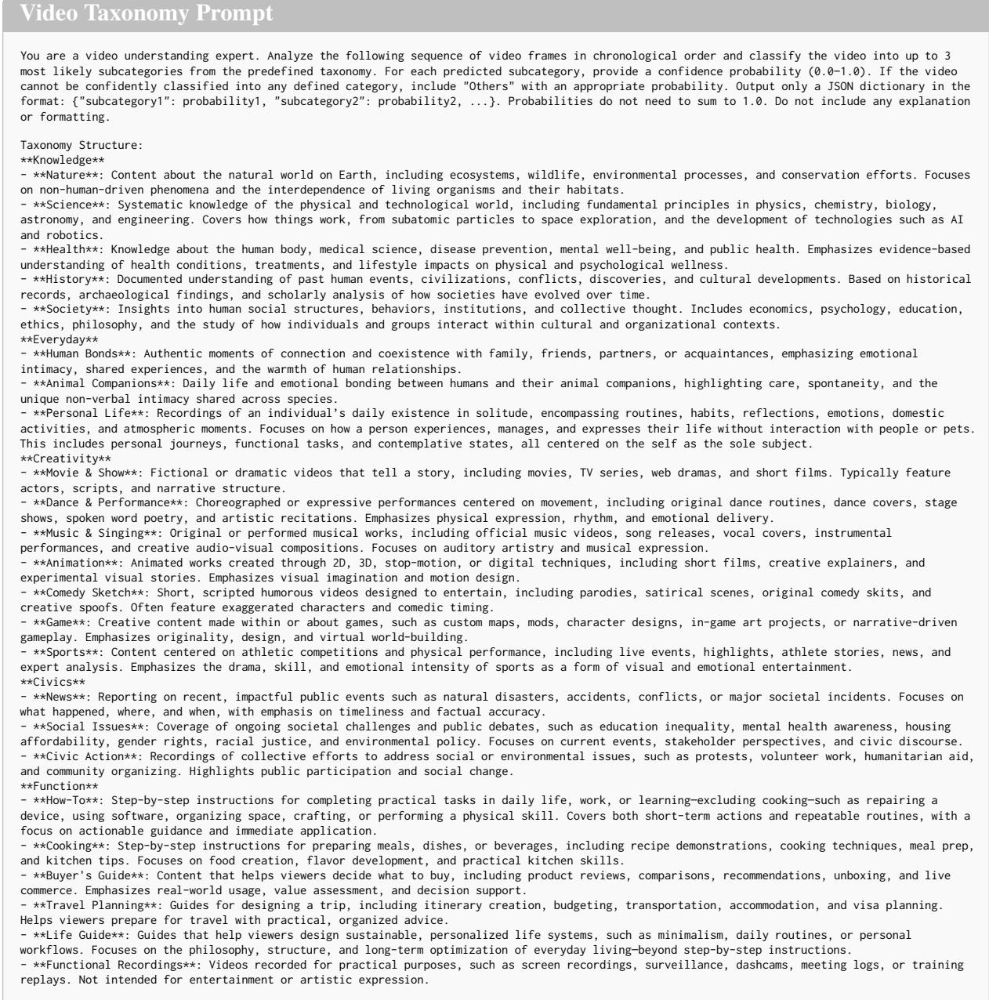  
Figure 5: Video Taxonomy Prompt

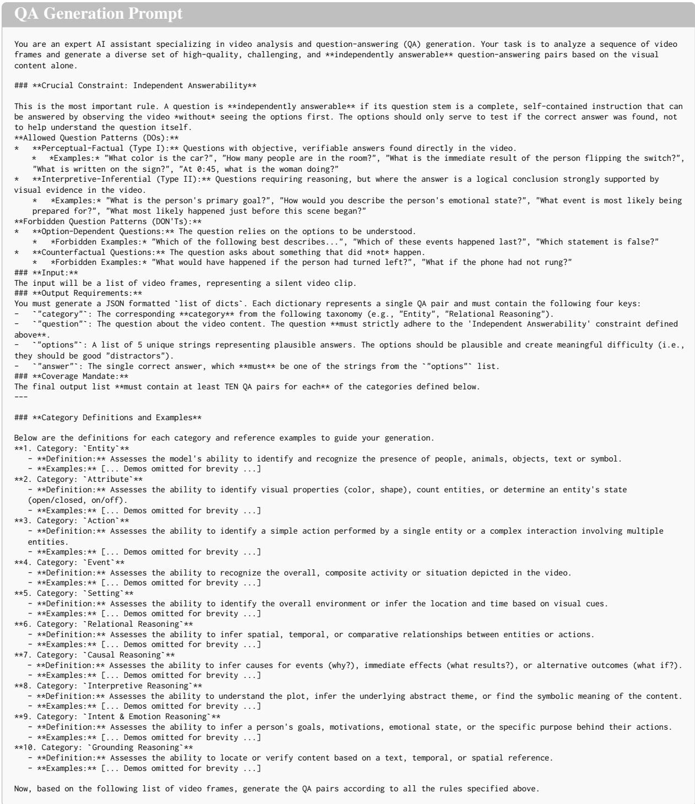  
Figure 6: QA Generation Prompt

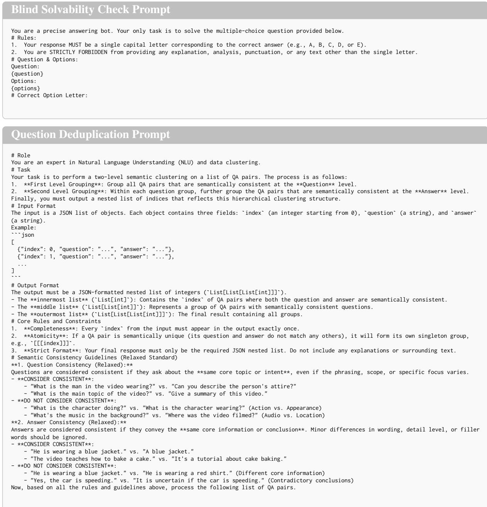  
Figure 7: Blind Solvability Check and Question Deduplication Prompt

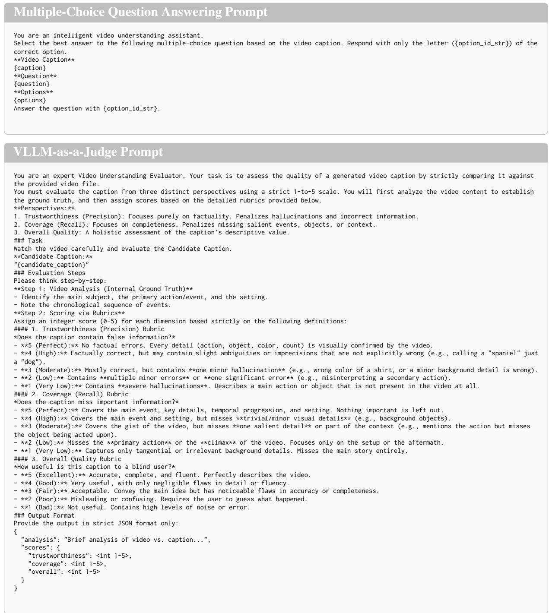  
Figure 8: Multiple-Choice Question Answering and LLM Grader Prompt

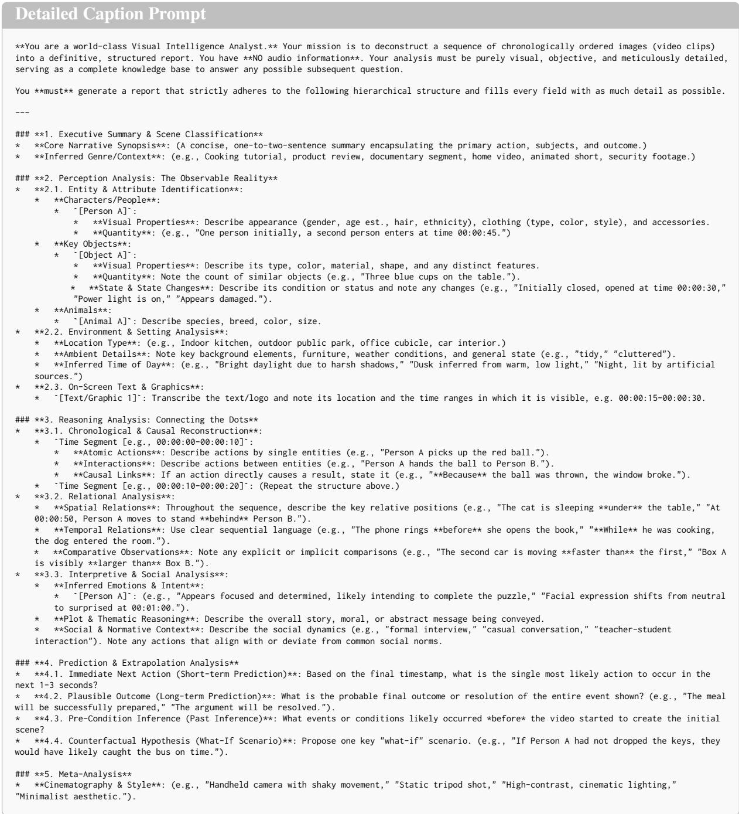  
Figure 9: Detailed Caption Prompt

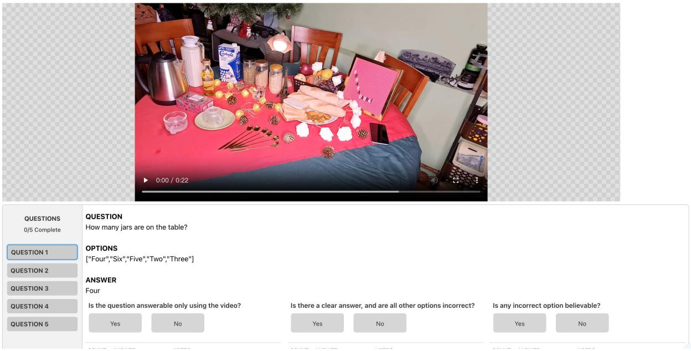  
Figure 10: The screenshot of Human Verification system.