# RealSimLoop: Online Real-to-Sim Adaptation via Diferentiable Reduced-Order Simulation with Vision Feedback

ZHIHAO CEN, South China University of Technology, China   
CHUHUA XIAN∗, South China University of Technology, China   
HAILIN SUN, The Chinese University of Hong Kong, China   
YULIANG LIUFU, The Chinese University of Hong Kong, China   
ZHEN ZHANG, The Chinese University of Hong Kong, China   
XIANGYU CHU, The Chinese University of Hong Kong, China   
HONGMIN CAI, South China University of Technology, China   
YUNBO ZHANG, Hong Kong Institute of Science & Innovation, CAS, Hong Kong, China   
GUOXIN FANG∗, The Chinese University of Hong Kong, China

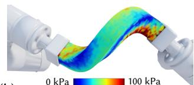

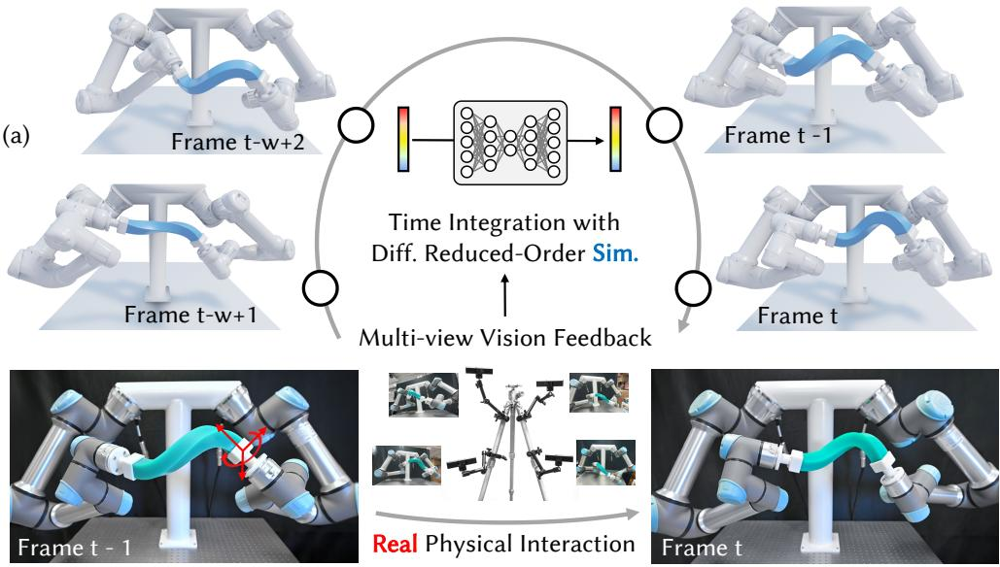

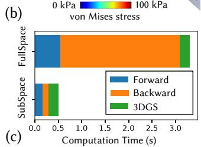

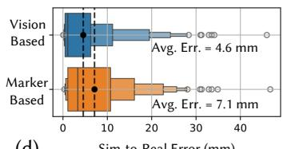  
(d)  
Fig. 1. We propose an online Real-to-Sim method to reduce the reality gap for deformable object manipulation. (a) In our pipeline, real-to-sim gap is eliminated by minimizing the diference between physical vision feedback and simulation-based rendered images within a sliding time window $\{ t - w + 1 , . . . , t \}$ . In this way, we close the sim-real loop by integrating scene representation with 3D-GS, (b) and realize downstream applications like physical stress construction in arbitrary new synthesized views. (c) Neural reduced-order diferentiable simulation is adopted, which significantly accelerates computation and achieves quasi-real-time performance, delivering 6.23x speedup over full-space methods. (d) Our method generalizes to physical inputs from conventional marker-based motion capture systems, whereas the vision-based solution performs beter.

Authors’ Contact Information: Zhihao Cen, czh1224415633@gmail.com, South China University of Technology, Guangzhou, China; Chuhua Xian, chhxian@scut.edu.cn, South China University of Technology, Guangzhou, China; Hailin Sun, hlsun@mae. cuhk.edu.hk, The Chinese University ofHong Kong, Hong Kong SAR, China; Yuliang Li ufu, yuliangliufu@cuhk.edu.hk, The Chinese University ofHong Kong, Hong Kong SAR, China; Zhen Zhang, zhzhen@link.cuhk.edu.hk, The Chinese University of Hong Kong, Hong Kong SAR, China; Xiangyu Chu, xiangyuchu@cuhk.edu.hk, The Chinese University of Hong Kong, Hong Kong SAR, China; Hongmin Cai, hmcai@scut.edu.cn, South China University ofTechnology, Guangzhou, China; Yunbo Zhang, yunbozhang@hkustgz.edu.cn, Hong Kong Institute of Science & Innovation, CAS, Hong Kong, Hong Kong, China; Guoxin Fang, guoxinfang@cuhk.edu.hk, The Chinese University of Hong Kong, Hong Kong SAR, China.

Real-world observations of deformable objects are often sparse or surface level, while downstream tasks require hidden physical quantities such as internal deformation, stress fields, and interaction forces. Physics-based simulation can recover these quantities, but online real-to-sim adaptation remains challenging due to costly full-space optimization, limited feed back, and time-varying material properties. To address these challenges, we propose RealSimLoop, a diferentiable framework for online real-to-sim adaptation using vision data as physical feedback. Our approach achieves quasi-real-time performance by executing diferentiable simulation within a reduced-order neural subspace, drastically accelerating the optimization

loop. We couple this eficient dynamics model with diferentiable rendering, enabling direct gradient backpropagation that leverages high-fidelity pixel data to refine physical parameters such as material stifness. Furthermore, by employing a sliding-window objective function, RealSimLoop enables robust online adaptation, allowing the system to track time-varying material properties and efectively bridge the real-to-sim gap arising from model reduction or unmodeled dynamics. Extensive experiments demonstrate that our method outperforms conventional ofline methods, and we validate the framework’s versatility in downstream applications, including external force prediction and 3D stress field reconstruction with novel view synthesis.

CCS Concepts: • Computing methodologies → Shape modeling; • Ap plied computing → Engineering.

Additional Key Words and Phrases: Real-to-Sim Adaptation, Reduced-order simulation, Deformable model.

## ACM Reference Format:

Zhihao Cen, Chuhua Xian, Hailin Sun, Yuliang Liufu, Zhen Zhang, Xiangyu Chu, Hongmin Cai, Yunbo Zhang, and Guoxin Fang. 2026. RealSimLoop: Online Real-to-Sim Adaptation via Diferentiable Reduced-Order Simulation with Vision Feedback. In SIGGRAPH Asia 2026 Conference Papers (SA Conference Papers ’26), December 01–04, 2026, Kuala Lumpur, Malaysia. ACM, New York, NY, USA, 12 pages. https://doi.org/10.1145/3829340.3842376

## 1 Introduction

Bridging the reality gap between the physical world and digital simulation is a cornerstone of digital twin technologies, enabling a wide range of applications, including robotic manipulation of deformable objects (Fig. 1), multi-material structural analysis (Fig. 3), heat-sensitive stifness tracking (Fig. 6), and structural health monitoring (Fig. 9). In these applications, real-world observations are often limited to sparse or surface-level geometric measurements captured by motion capture or vision systems. Physics-based simulation can complement such observations by inferring hidden physical quantities, such as internal deformation, stress distribution, and interaction forces [Gjoka et al. 2024; Kim et al. 2017]. This makes real-to-sim adaptation essential for keeping simulations aligned with real-world physical behavior [Nealen et al. 2006].

However, achieving this level of physical understanding remains challenging. Conventional Real-to-Sim adaptation methods typically conduct an ofline solution [Cai et al. 2024]: collecting a set of pre-recorded datasets, then fitting simulation parameters using parametric material models (e.g., linear elasticity, Saint Venant-Kirchhof (StVK) model [Barbič and James 2005], Neo-Hookean model [Smith et al. 2018], etc.). However, this may introduce significant modeling errors - particularly for hyperelastic materials, as idealized constitutive laws rarely match real-world complex laws perfectly. On the other hand, these ofline approaches can sufer from open-loop drift, resulting in a lack of adaptability to time-varying properties or sudden environmental changes [Hahn et al. 2019] (example also shown in Fig. 8 and discussed in Sec. 5.2).

Recently, data-driven approaches based on vision systems have enabled online scene reconstruction [Wu et al. 2024]. Although these advances enable the efective recovery of time-varying surface geometry from video inputs, they sufer from a fundamental disconnect with physical reality [Wang et al. 2025]. Critical mechanical information for downstream applications, such as the prediction of internal stress fields, force boundary conditions, and material properties (see the application demonstrated in Sec. 5.2), cannot be inferred from these approaches.

## 1.1 Our method and contribution

In this work, we introduce RealSimLoop, a novel quasi-real-time online real-to-sim adaptation framework that continuously synchronizes a diferentiable physical simulator with vision feedback. Our pipeline is driven by eficient scene representation (e.g., 3D Gaussian Splatting [Kerbl et al. 2023]), and coupled with a time window-based objective function that allows us to capture dynamic variations in material properties over time to reduce the accumulated sim-to-real gap [Liu et al. 2021]. To bridge the gap between observed geometry and underlying physical parameters, we employ a diferentiable simulation engine capable of highly eficient forward and backward steps. Our system also enables seamless online operation by integrating a neural-subspace reduced-order model [Fulton et al. 2019], which accelerates high-fidelity soft-body simulation. While such models are prone to approximation errors [Shen et al. 2021], our framework leverages continuous visual feedback to dynamically compensate for these inaccuracies, therefore maintaining the eficiency to eliminate the real-to-sim gap.

RealSimLoop addresses the system-level challenge ofcontinuously maintaining physically meaningful deformable-object simulations by integrating visual feedback, eficient diferentiable simulation, and online material adaptation under practical computational constraints. Our technical contributions are summarized as follows:

• We propose a sliding-window optimization approach for online real-to-sim adaptation, reducing open-loop drift and aligning simulation with evolving real-world behavior.

• We employ an eficient neural-based diferentiable simulator that accelerates forward simulation and gradient backpropa gation, making online gradient-based real-to-sim adaptation computationally feasible.

• We integrate diferentiable simulation with diferentiable rendering to incorporate vision-based physical feedback, enabling closed-loop adaptation from image observations.

We validate the proposed method in diferent virtual and physical settings. Compared with ofline methods [Cai et al. 2024; Hahn et al. 2019] and purely vision-based pipelines [Wang et al. 2025; Wu et al. 2024], our approach continuously closes the real-to-sim gap while preserving physical consistency. We showcase practical applications in robotic manipulation, force estimation, and structural analysis. The source code of this work will be released upon acceptance.

## 2 Related Work

We review literature on diferentiable simulation and Real-to-Sim adaptation for both graphics and robotics applications. In addition, we discuss recent advances in neural reduced-order methods for deformable simulation.

Real-to-sim adaptationfrom physical observations. Aligning physicsbased simulation with real-world observations is essential for digital twins, robotic manipulation, and physical state reconstruction. Existing solutions often rely on expensive data acquisition devices, such as motion capture systems [Chen et al. 2017; Hahn et al. 2019] and specialized probing or force-sensing setups [Bickel et al. 2009;

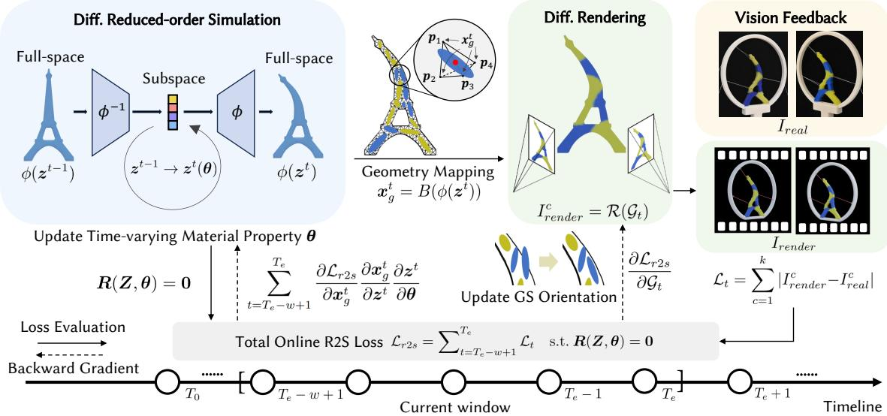  
Fig. 2. Pipeline for online real-to-sim adaptation with vision-based feedback (i.e., $( \mathsf { i . e . , }$ sparse-view images $I _ { \mathrm { r e a l } }$ obtained from cameras). The forward process simulates deformation using a reduced-order model, maps the geometry to 3D Gaussians, and renders the image $I _ { \mathrm { r e n d e r } }$ through diferentiable rendering to evaluate $\mathcal { L } _ { \mathrm { s } 2 \mathrm { r } }$ by updating time-varying material properties. The backward process back-propagates loss gradients to update material properties � and Gaussian orientations within a sliding window (i.e., from $T _ { e } - \mathsf { w } + 1$ to $T _ { e } ) _ { : }$ , supporting gradient-based optimization to eficiently eliminate the real-sim diference.

Pai et al. 2001, 2018], to capture the physical world and calibrate simulations. Image-based observations ofer a scalable alternative: prior work estimates cloth material properties from images [Bouman et al. 2013; Davis et al. 2015; Yang et al. 2017], while recent diferentiable rendering methods enable image-level losses to optimize simulation states and physical parameters [Cai et al. 2024; Jatavallabhula et al. 2021; Rho et al. 2025]. Recent works [Jiang et al. 2025; Li et al. 2023; Modi et al. 2024; Zhong et al. 2024] have also invited vision data to guide the real-to-sim adaptation with deformable objects. Nevertheless, most methods remain ofline, i.e., fitting a single set of parameters to a pre-collected sequence, and therefore struggle to track evolving physical properties during dynamic interactions.

A major barrier to online real-to-sim adaptation is the high computational cost of repeatedly simulating and diferentiating physical dynamics. Although recent methods incorporate the Material Point Method (MPM) [Hu et al. 2018; Xie et al. 2024], they often remain too expensive for real-time use. Similarly, Vid2Sim [Chen et al. 2025] employs a mesh-free simulation model to reduce complexity but remains unsuitable for online adaptation over long sequences. To address this, we introduce a sliding-window adaptation objective integrated with reduced-order diferentiable simulation, improving computational eficiency while enabling robust online tracking of evolving physical properties.

Diferentiable and Reduced-Order Simulation. Diferentiable simulation has become a vital research direction in the computer graphics community, enabling the computation of gradients for simulation outputs w.r.t. physical parameters and initial states [Degrave et al. 2019; Huang et al. 2024]. This capability facilitates gradient-based optimization for inverse problems, driving applications in rigid body control [Xu et al. 2021] and cloth manipulation [Li et al. 2022].

In particular, it has been widely introduced for soft body simulation [Du et al. 2021; Hu et al. 2019], where Hahn et al. [2019] have demonstrated its ability for ofline real-to-sim transfer.

On the other hand, Reduced-order simulation has emerged as a key direction for accelerating physics by mapping high-dimensional systems to low-dimensional subspaces [Chang et al. 2023; Sharp et al. 2023]. While early linear methods like modal analysis [James and Pai 2002; Pentland and Williams 1989] and PCA [Krysl et al. 2001] require large subspaces for nonlinear deformations, recent neural networks enable nonlinear mappings with superior representation capabilities [Fulton et al. 2019]. Although techniques like Lipschitz loss [Lyu et al. 2024] or linear corrections [Shen et al. 2021] opti mize speed, they rely on supervised data; conversely, unsupervised alternatives [Sharp et al. 2023; Wang et al. 2024] can sufer from physical drift. In this work, we leverage the diferentiable reduced order simulator with vision feedback to eliminate the real-to-sim gap, utilizing the neural-based nonlinear mapping from [Fulton et al. 2019] to capture complex deformations.

## 3 Preliminary and Overview

In this section, we first provide preliminary knowledge on simulation and the formulation of the online real-to-sim adaptation problem. Then, we give a short discussion followed by an overview of our pipeline (illustrated in Fig. 2).

3.1 Preliminary of Simulation and Problem of Real-to-Sim Consider a deformable object discretized by a tetrahedral mesh M consisting of � vertices and � elements. The system configuration of the object at time � is represented by a flattened vector $\boldsymbol { x } ^ { t } \in \mathbb { R } ^ { 3 n }$ obtained by stacking the positions of all vertices. For a dynamic system using implicit time integration [Baraf and Witkin 2023], the forward deformable simulation can be formulated as:

$$
r ( x ^ { t } , y ^ { t } , \theta ) : = \frac { 1 } { \Delta t ^ { 2 } } M ( x ^ { t } - y ^ { t } ) - f ( x ^ { t } , \theta ) = 0 ,\tag{1}
$$

where $\Delta t$ is the timestep, � is the lumped mass matrix, $\theta = [ E ,$ �] is the material parameters representing Young’s modulus and Poisson’s ratio respectively, $\pmb { y } ^ { t } : = \pmb { \dot { x } } ^ { t - 1 } + \Delta t \pmb { \dot { v } } ^ { t - 1 } , \pmb { v } ^ { t - 1 } = ( \pmb { x } ^ { t - 1 } - \pmb { x } ^ { t - 2 } ) / \Delta t$ $f ( x ^ { t } , \pmb \theta )$ denotes the total forces including elastic internal force, gravity, and interaction force. Consider a sequence of timesteps $t = 0 , 1 , \cdots , T$ , forward simulation solves the nonlinear system:

$$
\begin{array} { r } { r ( x ^ { t } , y ^ { t } , \pmb { \theta } ) = \mathbf { 0 } , \forall t \in \{ 0 , \ldots , T \} , } \end{array}\tag{2}
$$

As ${ \pmb y } ^ { t }$ is a function of $x ^ { t - 1 }$ and $v ^ { t - 1 }$ , and $v ^ { t - 1 }$ is either a boundary condition or a function of $x ^ { t - 1 }$ and $x ^ { t - 2 }$ , we can stack the DoF vectors of all timesteps as a vector $\boldsymbol { X } \in \mathbb { R } ^ { T \times 3 \times n }$ . And the residual functions of the nonlinear system can be also stacked as a single function $R ( X , \theta )$ . Forward simulation then solves � such that the state equation $R ( X , \theta ) = 0$ holds.

To eliminate the real-to-sim gap, an objective function $\mathcal { L } _ { \mathrm { r 2 s } }$ that describes the diference between the simulation result � and the observation (e.g., motion capture systems, multi-view RGB feedings) of the real-world experiment is introduced. In this work, we try to correct the reality gap by finding empirically the best material parameters � to minimize the discrepancy between simulation and real-world observation, which can be written as a constrained optimization problem:

$$
\underset { \theta } { \operatorname { a r g m i n } } \ \mathcal { L } _ { \mathrm { r } 2 \mathrm { s } } ( X ) \ \mathrm { s . t . } \ R ( X , \theta ) = 0 .\tag{3}
$$

which is often solved by gradient-based optimization methods - details to be discussed in Sec. 4.3.

## 3.2 Short Discussion and Overview

In conventional ofline methods, the objective $\mathcal { L } _ { \mathrm { r 2 s } }$ is typically defined as the discrepancy between simulated trajectories and groundtruth geometry data collected via a motion capture system [Hahn et al. 2019] as:

$$
\mathcal { L } _ { \mathrm { r 2 s - } m a r k } ^ { \mathrm { o f f } } ( \theta ) = \int _ { t = 0 } ^ { T } \sum _ { i = 1 } ^ { k } \| \mathbf { p } _ { s i m } ^ { i } ( \theta ) - \mathbf { p } _ { r e a l } ^ { i } \| ^ { 2 } d t ,\tag{4}
$$

which aggregates sim-real error over time� at marker points $\mathbf { p } \in { \mathcal { M } }$ While efective for small strains, the accuracy of ofline methods will collapse at large elongations (>100%), even with complex material models such as the Yeoh model [Yeoh 1993] (see Fig.12 and Sec.5.3 for a detailed discussion). Meanwhile, constant material parameters $( \mathrm { i . e . , } \theta$ kept unchanged across the entire time domain) cannot compensate for the error accumulation inherent in long-horizon forward simulations.

To handle this issue and greatly improve the accuracy of simulation, we propose the online pipeline (as illustrated in Fig. 2), where the reality gap accumulation issue is handled through a windowbased real-to-sim objective with the update of material properties through time steps, which minimizes the vision-based loss accumulated over the current window $\left\{ T _ { e } - w + 1 , \ldots , T _ { e } \right\}$ to update the material properties �. Here $T _ { e }$ is the current time step, � is the window size.

To ensure the speed of online update, neural reduced-order solution is invited to greatly improve the simulation speed, where we introduce a subspace mapping $\phi$ obtained by data-driven method into the time-integration of forward simulation (we refer [Fulton et al. 2019] for a comprehensive description of the neural reduced order simulations). Together with time-varying material properties �, the time integration of forward simulation Eq. 1 is reformulated as

$$
J ( z ^ { t } ) ^ { \top } \boldsymbol { r } ( z ^ { t } , y ^ { t } , \theta ) : = J ( z ^ { t } ) ^ { \top } \big [ \frac { 1 } { \Delta t ^ { 2 } } M \big ( \phi ( z ^ { t } ) - y ^ { t } \big ) - f \big ( \phi ( z ^ { t } ) , \theta \big ) \big ] = 0\tag{5}
$$

where the subspace mapping function $\phi : \mathbb { R } ^ { r }  \mathbb { R } ^ { 3 n }$ maps the low-dimensional subspace state $z \in \mathbb { R } ^ { r }$ to the high-dimensional full space $( { \mathrm { i . e . } }$ , making $\begin{array} { r } { { \boldsymbol { x } } = \phi ( { \boldsymbol { z } } ) ) , { \boldsymbol { J } } ( { \boldsymbol { z } } ^ { t } ) = \frac { \partial { \boldsymbol { x } } ^ { t } } { \partial { \boldsymbol { z } } ^ { t } } = \frac { \partial \phi } { \partial { \boldsymbol { z } } } \in \mathbb { R } ^ { 3 n \times r } } \end{array}$ is the Jacobian of the neural subspace mapping, $\overrightharpoon { y } ^ { t } : = \phi ( z ^ { t - 1 } ) + \Delta t v ^ { t - 1 }$ and $\pmb { \upsilon } ^ { t - 1 } = ( \phi ( z ^ { t - 1 } ) - \phi ( z ^ { t - \bar { 2 } } ) ) / \Delta t$ . Similarly, we give the definition of the nonlinear system in the reduced subspace for the window time �:

$$
J ( z ^ { t } ) ^ { \top } r ( z ^ { t } , y ^ { t } , \theta ) = 0 , \forall t \in \{ T _ { e } - w + 1 , \ldots , T _ { e } \} ,\tag{6}
$$

Further, the stacked DoF vectors across all timesteps can be rewritten as $Z \in \mathbb { R } ^ { w \times r }$ and the residual functions of the nonlinear system as the constraint for online real-to-sim adaptation problem can also be formulated as $\pmb { R } ( Z , \pmb { \theta } ) = \mathbf { 0 }$ (similar to the constraint in Eq. 3).

On the other hand, unlike conventional approaches that rely solely on geometric information (i.e., marker positions captured by motion capture system), our framework leverages high-density visual data to capture complex deformation patterns and highly dynamic systems (see comparisons in Sec. 5.2). To achieve higheficiency geometry-to-image mapping, we integrate 3D Gaussian Splatting (3DGS) with diferentiable rendering, thereby defining a diferentiable online objective with physical vision feedback to eliminate the reality gap. As illustrated by the dashed line in Fig. 2, the diferentiability of both simulation and rendering provides eficient gradient evaluation, allowing for robust optimization of the online real-to-sim adaptation and supporting downstream practical applications.

## 4 Method and Details

We now detail the method applied to realize online sim-to-real adaptation with vision-feedback, starting from 3DGS-based mapping for an online window-based objective, then give the diferentiable form of the reduced-order simulation to support gradient-based optimization.

## 4.1 GS-Based Vision-Geometry Mapping

In our pipeline, Gaussian primitives at timestep � is defined as $\boldsymbol { \mathcal { G } } _ { t } = \{ \boldsymbol { x } _ { q } ^ { t } , \boldsymbol { \Sigma } _ { q } ^ { t } , \boldsymbol { c } _ { q } ^ { t } , \boldsymbol { \sigma } _ { q } ^ { t } \}$ . For these Gaussian attributes, $x _ { g } , \Sigma _ { g } , c _ { g } ,$ , and $\sigma _ { g }$ denote the center position, covariance matrix, spherical harmonic coeficients, and opacity, respectively. To establish a geometric mapping between the Gaussian points and the mesh, we express each Gaussian’s position as a barycentric interpolation of its enclosing tetrahedron’s vertices $\begin{array} { r } { ( \mathrm { i . e . , } \ x _ { g } = \sum _ { i = 1 } ^ { 4 } w _ { i } \pmb { p } _ { i } , s . t . , \sum _ { i = 1 } ^ { 4 } w _ { i } = 1 } \end{array}$ , where $\pmb { p } _ { i }$ denotes the coordinate of the i-th vertex.). Here we denote this geometry mapping function $B ( \cdot )$ w.r.t. reduced-order simulation’s latent space coordinates $z ^ { t }$ (defined in Eq. 5) as $\boldsymbol { x } _ { g } ^ { t } = B ( \phi ( \boldsymbol { z } ^ { t } ) )$ ).

It is worth noting that during each online iteration, the Gaussian center positions $\boldsymbol { x } _ { g } ^ { t }$ are updated synchronously with the deformed mesh M (�) to ensure strict spatial alignment between the rendering primitives and the underlying geometry (see middle part of Fig. 2 for illustration). Since the motion of the tetrahedral mesh is governed by a defined physical model, the appearance variations obtained through GS rendering inherently adhere to these physical dynamics. This also showcases the significance of physical simulation, which mitigates artifacts caused by sparse views. Furthermore, the interpolation between positions is diferentiable, supporting the chain rule for gradient propagation as discussed in the following section.

## 4.2 Window-based Online R2S Adaptation objectives

For online real-to-sim adaptation, a key challenge lies in balancing the accumulation of historical data and the need for immediate responsiveness. Drawing inspiration from ofline methods — where the dataset length encompasses the entire interaction sequence — we introduce the concept of a window to formulate the online objective. In this context, a window represents a rolling bufer of recent observations. Unlike the ofline setting, where the window efectively spans the full history, the online window size is deliberately constrained. This constraint serves a dual purpose: it remains large enough to capture material characteristics and temporal dynamics, yet small enough to ensure computational eficiency for real-time performance and accommodate material variations. Consequently, the windowed diferentiable-simulation objective function with vision-based input data is defined as:

$$
\mathcal { L } _ { \mathrm { r 2 s - } v i s i o n } ^ { \mathrm { o n l i n e } } = \sum _ { \substack { t \in \{ T _ { e } - w + 1 , \ldots , T _ { e } \} } } \sum _ { c = 1 } ^ { K } | \mathcal { R } ( \mathcal { G } _ { t } ) - I _ { r e a l } ^ { c } |\tag{7}
$$

where $\mathcal { R } ( \cdot )$ is the diferentiable renderer based on 3DGS [Kerbl et al. 2023], and $\{ I _ { r e a l } ^ { c } \} _ { c = 1 , 2 , \dots K }$ (K is the number of views) are the captured images. By minimizing the online-updated objective function $\scriptstyle { \mathcal { L } } _ { \mathrm { r } 2 s - v i s i o n } ^ { \mathrm { o n l i n e } } ,$ the deviation between simulation results and observation data over the window time horizon can be eliminated with updated material properties in the simulation. It is worth noting that a smaller window enables faster parameter updates but is more susceptible to noise, while a larger window leads to slower updates but yields more stable and accurate results - detailed results and discussion in Sec. 5.3.

## 4.3 Gradient-based Optimization

To achieve online real-to-sim adaptation, we aim to minimize the window-based objective function $\mathcal { L } _ { \mathrm { o n l i n e } } \left( \mathrm { E q . } 7 \right)$ with respect to the material parameters � and Gaussian attributes $\mathcal { G } .$ Mathematically, we aim to minimize the vision-based loss accumulated over the current window $\{ T _ { e } - w + 1 , \ldots , T _ { e } \}$ to update the material properties of $\theta ,$ which follows the formulation of $\operatorname { E q } .$ 3:

$$
\operatorname * { a r g m i n } _ { \theta , \mathcal { G } t } \ \mathcal { L } _ { \mathrm { r 2 s - v i s i o n } } ^ { \mathrm { o n l i n e } } ( \mathcal { G } _ { t } ) \quad \mathrm { s . t . } \ R ( Z , \theta ) = 0 ,\tag{8}
$$

where the constraint represents the discrete state equations of the reduced-order simulation (derived from Eq. 5).

While the gradients for Gaussian attributes can be computed directly via the diferentiable rasterizer, computing the gradient for material parameters, $d \mathcal { L } / d \theta ,$ , is non-trivial due to the complex dependency of the simulation state on �. We solve this constrained optimization problem using the adjoint method, which propagates gradients backward through time without explicitly forming the dense Jacobian of the simulation trajectory w.r.t � and previous states, while eficiently exploiting system sparsity.

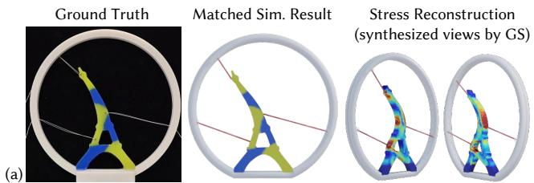

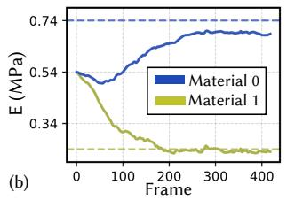

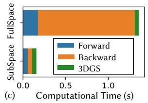  
Fig. 3. Online real-to-sim results for a multi-material cable-driven deformable structure. (a) With vision feedback, the simulation results match the ground truth, enabling downstream applications such as stress reconstruction. (b) Convergence curves for the Young’s modulus of two silicone rubber materials. (c) Comparison with computation time showcases that our subspace solution achieves a 7.56× speedup, ensuring online eficiency.

4.3.1 Vision-to-State Gradient Backpropagation. First, we compute the gradient of the loss with respect to the reduced simulation state $z ^ { t }$ at each time step � within the window. Applying the chain rule through the diferentiable rendering and the subspace mapping we have

$$
\frac { \partial \mathcal { L } } { \partial z ^ { t } } = \frac { \partial \mathcal { L } } { \partial I ^ { t } } \frac { \partial I ^ { t } } { \partial G ^ { t } } \frac { \partial G ^ { t } } { \partial x ^ { t } } \cdot J ( z ^ { t } ) ,\tag{9}
$$

The first two term aggregates gradients from the pixel level to the GS geometry, while the third term projects these geometric gradients into the reduced simulation subspace.

4.3.2 Adjoint Method for Reduced-Order Physics. With the state gradients $\textstyle { \frac { \partial { \mathcal { L } } } { \partial z ^ { t } } }$ available, we must propagate them to the material parameters �. The relationship between � and $\theta$ is governed by physics equilibrium. Specifically, we define the physics residual as $J ( z ^ { t } ) ^ { \top } r ( z ^ { t } , \pmb { y } ^ { t } , \pmb { \theta } )$ (see Eq. 5). We seek $z ^ { t }$ such that the residual is orthogonal to the tangent space of the neural subspace mapping:

$$
\pmb { h } ( z ^ { t } , z ^ { t - 1 } , z ^ { t - 2 } , \pmb { \theta } ) : = \pmb { J } ( z ^ { t } ) ^ { \top } \pmb { r } ( z ^ { t } , \pmb { y } ^ { t } , \pmb { \theta } ) = \pmb { 0 } .\tag{10}
$$

To compute the total derivative $d \mathcal { L } / d \theta _ { : }$ , we introduce adjoint variables $\lambda _ { t } \in \mathbb { R } ^ { r }$ . The adjoint variables are computed by solving the following linear system backward in time (from $t = t _ { e }$ down to � ):

$$
\sum _ { k = t } ^ { t + 2 } \left( \frac { \partial \mathbf { h } ^ { k } } { \partial z ^ { t } } \right) ^ { \top } \lambda _ { k } = - \frac { \partial \mathcal { L } } { \partial z ^ { t } } .\tag{11}
$$

The matrix on the left-hand side is the transpose of the reduced tangent stifness matrix. Substituting the residual definition, this is

Real Scene  
(a)  
(b)  
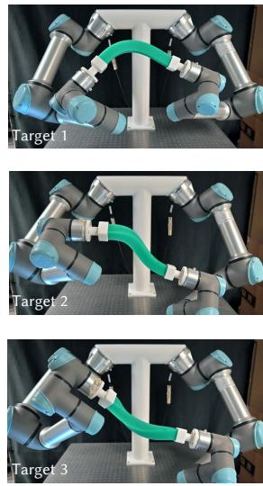

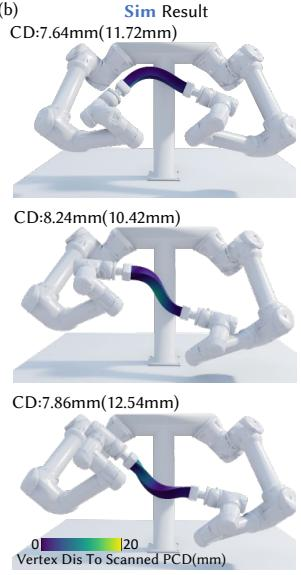

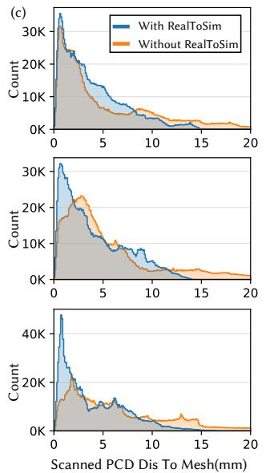

(d)  
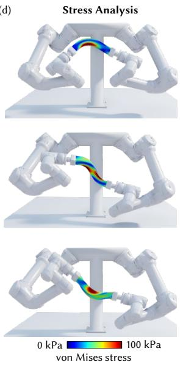  
Fig. 4. Result for soft bar manipulation by dual robot arms. (a) After performing online real-to-sim adaptation, the control strategy optimized in simulation is directly applied to the real robotic system without additional tuning. (b) Corresponding simulation results after adaptation, colored by the vertex-to-scan distance. (c) Quantitative comparison between the simulated mesh and the ground-truth point cloud captured by a 3D scanner, demonstrating reduced geometric discrepancy after real-to-sim adaptation. (d) The adapted simulation with vision-based feedback further enables downstream physical analysis of von Mises stress reconstruction.

eficiently computed as:

$$
\begin{array} { r l } & { \displaystyle \frac { \partial h ^ { t } } { \partial z ^ { t } } = \frac { \partial J ( z ^ { t } ) ^ { \top } } { \partial z ^ { t } } r ^ { t } + J ( z ^ { t } ) ^ { \top } \frac { \partial r ^ { t } } { \partial z ^ { t } } , } \\ & { \displaystyle \frac { \partial h ^ { t + 1 } } { \partial z ^ { t } } = J ( z ^ { t + 1 } ) ^ { \top } \frac { \partial r ^ { t + 1 } } { \partial z ^ { t } } , \ \frac { \partial h ^ { t + 2 } } { \partial z ^ { t } } = J ( z ^ { t + 2 } ) ^ { \top } \frac { \partial r ^ { t + 2 } } { \partial z ^ { t } } . } \end{array}\tag{12}
$$

where $\partial J / \partial z ^ { t }$ corresponds to the Hessian of the nonlinear mapping �. Finally, once the adjoint variables � are computed for the entire window, the gradients with respect to the material parameters are accumulated through the controlled window:

$$
\frac { d \mathcal { L } } { d \theta } = \sum _ { t = T _ { e } - w + 1 } ^ { T _ { e } } \lambda _ { t } ^ { \top } \left( \frac { \partial h ^ { t } } { \partial \theta } \right) = \sum _ { t = T _ { e } - w + 1 } ^ { T _ { e } } \lambda _ { t } ^ { \top } \left( - J ( z ^ { t } ) ^ { \top } \frac { \partial f ( z ^ { t } , \theta ) } { \partial \theta } \right) .\tag{13}
$$

The resulting gradients $\scriptstyle { \frac { d { \mathcal { L } } } { d \theta } }$ accurately capture how changes in material properties propagate through the reduced subspace together with vision feedback, enabling the optimizer with gradient descent to iteratively refine the physical parameters � at the end of each sliding window, closing the loop between visual observation and physical parameters.

## 5 Results and Discussion

This section details the implementation and results of our online real-to-sim adaptation framework using vision feedback. We refer to the supplemental video for detailed results.

## 5.1 Implementation and Details of Training

We implement the diferentiable reduced-order simulation module in JAX [Bradbury et al. 2018] and use the stable neo-Hookean [Smith et al. 2018] material model to define the elastic energy, while the

3DGS module is implemented in PyTorch [Paszke et al. 2017]. For processing physically collected vision data, SAM 2 [Ravi et al. 2024] is used. During simulation, the subspace Hessian matrix is obtained via automatic diferentiation. Additionally, we apply the data-generation procedure by combining diferent material parameters with randomly generated interaction sequences, allowing the learned subspace to cover diverse soft-body deformations. The material properties (e.g., � and �), are linearly sampled within the range of physical prior for each frame to create the dataset.

In this work, all training and experiments are conducted on an NVIDIA RTX 4090 GPU. The experiments presented in this chapter adopt the AutoEncoder (AE)-based subspace network architecture proposed in [Fulton et al. 2019]. The comparison with other reduced-order methods $( \mathrm { e . g . }$ , linear subspace-based representations [Benchekroun et al. 2023; Wang et al. 2015]) is presented in Sec.5.3.1. The encoder and decoder of the AE both consist of fully connected hidden layers with a size of $2 \times 2 0 0$ , and the learning rate is set to $1 \times 1 0 ^ { \dot { - } 3 }$ . The corresponding subspace dimensions are reported in the table 1 (ablation study on the selection is discussed in Sec. 5.3.2.) To construct the dataset for subspace training, we generate data by combining diferent material configurations with randomly synthesized interaction sequences. This strategy aims to ensure that the learned subspace adequately covers diverse deformation patterns arising during online state inference.

## 5.2 Computation and Physical Results

We evaluated the framework across diverse physical scenarios to demonstrate robustness; Tests involving deformable object interactions highlight the method’s eficiency. While the backward pass typically dominates computation time due to high-dimensional Jacobian and Hessian evaluations, our reduced order model significantly accelerates this step, achieving a 2.52 − 7.69× speedup (detailed breakdown of the computational cost can be found in Table 1.)

Table 1. Parameters and results of experiments evaluated in this work. �: number of full-space $\mathsf { D O F s } ;$ �: the subspace dimension used; �: the window size used; �: number of camera views for SI; ��: average computational time in subspace(s) per frame; $T _ { f } { \mathrm { : } }$ average computational time in fullspace(s) per frame.
<table><tr><td rowspan=2 colspan=1>Model</td><td rowspan=2 colspan=1>Figure</td><td rowspan=2 colspan=1>n</td><td rowspan=2 colspan=1> $r$ </td><td rowspan=2 colspan=1> $\boldsymbol { \mathsf { \Omega } } ^ { \star }$ </td><td rowspan=2 colspan=1> $^ { c }$ </td><td rowspan=1 colspan=5>Comp. time for online SI per frame (s)</td><td rowspan=2 colspan=1>Accel. Rate</td></tr><tr><td rowspan=1 colspan=1>forward</td><td rowspan=1 colspan=1>backward</td><td rowspan=1 colspan=1>3DGS</td><td rowspan=1 colspan=1> $\overline { { \mathrm { \ t o t a l ~ } T _ { r } } }$ </td><td rowspan=1 colspan=1>total $\overline { { T _ { f } } }$ </td></tr><tr><td rowspan=1 colspan=1>Material Bar</td><td rowspan=1 colspan=1>Fig. 1</td><td rowspan=1 colspan=1>10K</td><td rowspan=1 colspan=1>30</td><td rowspan=1 colspan=1>3</td><td rowspan=1 colspan=1>4</td><td rowspan=1 colspan=1>0.17</td><td rowspan=1 colspan=1>0.14</td><td rowspan=1 colspan=1>0.22</td><td rowspan=1 colspan=1>0.53</td><td rowspan=1 colspan=1>3.30</td><td rowspan=1 colspan=1>6.23x</td></tr><tr><td rowspan=1 colspan=1>Eiffel tower</td><td rowspan=1 colspan=1>Fig. 3, 8</td><td rowspan=1 colspan=1>12K</td><td rowspan=1 colspan=1>10</td><td rowspan=1 colspan=1>3</td><td rowspan=1 colspan=1>2</td><td rowspan=1 colspan=1>0.06</td><td rowspan=1 colspan=1>0.07</td><td rowspan=1 colspan=1>0.05</td><td rowspan=1 colspan=1>0.18</td><td rowspan=1 colspan=1>1.36</td><td rowspan=1 colspan=1>7.56x</td></tr><tr><td rowspan=1 colspan=1>Dinosaur</td><td rowspan=1 colspan=1>Fig. 4, 7</td><td rowspan=1 colspan=1>15K</td><td rowspan=1 colspan=1>100</td><td rowspan=1 colspan=1>5</td><td rowspan=1 colspan=1>8</td><td rowspan=1 colspan=1>0.24</td><td rowspan=1 colspan=1>0.32</td><td rowspan=1 colspan=1>0.45</td><td rowspan=1 colspan=1>1.01</td><td rowspan=1 colspan=1>7.77</td><td rowspan=1 colspan=1>7.69x</td></tr><tr><td rowspan=1 colspan=1>Gingerbread Joy</td><td rowspan=1 colspan=1>Fig. 5, 6</td><td rowspan=1 colspan=1>3.6K</td><td rowspan=1 colspan=1>80</td><td rowspan=1 colspan=1>15</td><td rowspan=1 colspan=1>1</td><td rowspan=1 colspan=1>0.19</td><td rowspan=1 colspan=1>0.17</td><td rowspan=1 colspan=1>0.22</td><td rowspan=1 colspan=1>0.58</td><td rowspan=1 colspan=1>1.46</td><td rowspan=1 colspan=1>2.52x</td></tr><tr><td rowspan=1 colspan=1>High Speed Ball†</td><td rowspan=1 colspan=1> $\overline { { \mathrm { F i g . } 7 } }$ </td><td rowspan=1 colspan=1>3.4K</td><td rowspan=1 colspan=1>-</td><td rowspan=1 colspan=1>20</td><td rowspan=1 colspan=1>1</td><td rowspan=1 colspan=1>一</td><td rowspan=1 colspan=1>-</td><td rowspan=1 colspan=1>-</td><td rowspan=1 colspan=1>1</td><td rowspan=1 colspan=1>1.75</td><td rowspan=1 colspan=1></td></tr></table>

† For this highly dynamic case, the reduced-order method failed to converge, and only full-space data is reported here. Detailed discussion see Sec. 5.3.

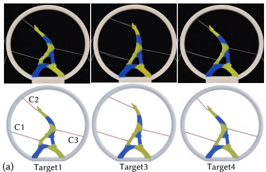

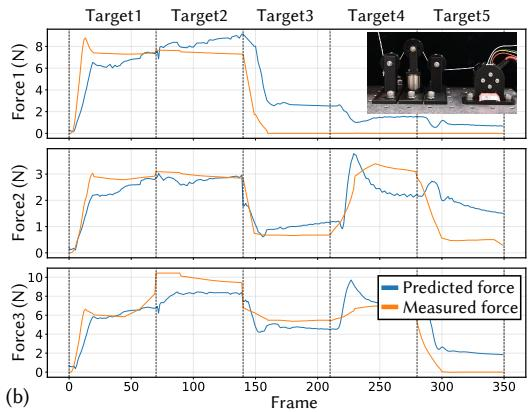  
Fig. 5. (a) Additional real-to-sim adaptation result for cable-driven interaction with the multi-material Eifel Tower model. (b) With the help of simulation, we can predict the cable force based on stress field reconstruction, which matches the ground-truth data captured by the force sensor, as shown in the zoom-in view.

The first case we tested is deformable object manipulation by a dual robot arm. As shown in Fig. 1, positional constraints are applied at both ends of a square-shaped bar made with silicon rubber (material: Smooth-on Dragon Skin 10A). This setup induces pronounced twisting and stretching deformations under the motion of two UR5e robot arms. With the help of the vision feedback from 4 cameras viewed in a stack of window time, the real-to-sim gap is reduced by dynamically updating the material properties. Especially with the reduced-order method, computation time is reduced by 6.23 times (i.e., from 3.30 s to 0.53 s per frame) and the reconstruction error has also decreased to an average of 4.6 mm (2.3% of the model size).

With the updated material properties, we further perform a shapecontrol test using the dual-arm robot setup. The control command is computed using model predictive control (MPC) in simulation with the method presented in [Zhang et al. 2025], where a dynamics model rolls out candidate dual-arm 6-DoF end-efector action sequences, shape error with respect to the goal state is minimized to optimize the action sequence iteratively, and the first optimized action is executed after inverse-kinematics conversion. As shown in Fig. 4(a), directly applying the configuration computed in simulation produces physical results that closely match with target shapes, with Chamfer Distance reported in Fig. 4(b).

As downstream applications of real-to-sim adaptation, our pipeline recovers internal physical states for stress reconstruction (Figs. 1(b), 3(a), 8(b)). We calculate the Cauchy stress � from the identified parameters and deformation gradient, then derive the Von Mises stress $\sigma _ { \mathrm { v M } }$ via the deviatoric stress �:

$$
\sigma _ { \mathrm { v M } } = \sqrt { 1 . 5 s : s } , \quad \mathrm { w h e r e } s = \sigma - \mathrm { t r } ( \sigma ) I / 3 .
$$

These stresses are transferred to Gaussian attributes to enable realtime, multi-view visualization for digital twins. For example, the stress distribution within the soft bar can be accurately reconstructed at each frame (see Fig. 4(d)), providing additional physical insight beyond surface geometry. We refer readers to the supplemental video for a better illustration.

To verify the method’s ability to handle spatially varying stifness, we utilized a cable-driven interaction setup with the Eifel Tower model. As illustrated in Fig. 3 and Fig. 5, the structure is composed of distinct material zones using two silicone materials (Dragon Skin 30A and 10A, with � = 0.74 MPa and 0.24 MPa, respectively). With the proposed pipeline, multiple independent elasticity parameters are accurately identified. Similarly, the stress distribution during cable actuation can be reconstructed, as shown in Fig. 3(a), which further enables external cable-force prediction by computing internal nodal forces from the reconstructed stress field. For each cable, we identify the attached vertices and approximate the total tension by summing the magnitudes of the internal forces at those vertices. As shown in Fig. 5(b), the computed cable force closely matches the force measured by the sensor in the physical setup.

We also demonstrate the ability of the proposed online real-to-sim adaptation in stifness tracking for a temperature-varying structure. As shown in Fig. 6, the gingerbread-man-shaped specimen was fabricated using a 3D-printed polycaprolactone (PCL) truss structure embedded within Ecoflex 00-30 silicone through a molding process. With temperature decreases from 45◦C to 27◦, it progressively increases the stifness of the PCL structure [Baptista et al. 2020], resulting in changes in deformation and force responses under similar interactions. Our method continuously adapts online real-to-sim adaptation, and well captures the increasing push force and estimated increasing Young’s modulus.

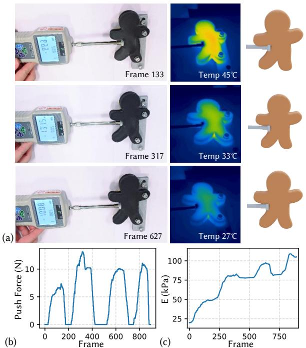

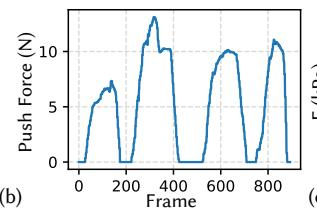

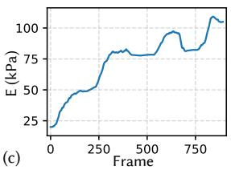  
Fig. 6. Online real-to-sim adaptation for stifness tracking in a temperaturevarying structure. (a) Representative frames showing simulated deformation during cooling. (b) Push force over time. (c) Estimated Young’s modulus over time, demonstrating tracking of temperature-dependent stifness variation.

Validation cases involving collisions and high-frequency dynamics are also tested. This includes the golf-ball bouncing case, our online method better matches the ground-truth transient deformation, while the ofline baseline shows noticeable shape errors during compression and rebound - as a comparison, the PSNR greatly in creased from 18.0 to 22.6 with our online method for the first key frame shown in Fig. 7. For ease of comparison with existing work and to conduct ablation studies, we also include a virtual test case using the Dinosaur model with random external interactions (see Fig. 10), and details of this case are discussed in the next section.

## 5.3 Comparison, Ablation Study, and Discussion

5.3.1 Comparison with existing ofline method. We compare our online real-to-sim approach with existing vision-based ofline methods [Chen et al. 2025; Hahn et al. 2019]. Unlike our method, the ofline baseline estimates a single fixed model from the full sequence. This strategy is less efective for long-horizon interactions, especially when the system exhibits time-varying materials or accumulates modeling errors over time. A detailed virtual comparison is provided in Fig. 8(c), where the ofline method can failed to capture the material variation and cannot solve for the deformation. We further observe that the ofline method remains less efective even when the material properties are fixed. In the two-robot-arm bar manipulation example, our method achieves a higher PSNR of 25.91 compared with 24.42 for the ofline baseline. This suggests that optimizing a limited set of material parameters ofline is insuficient to fully capture the physical behavior in long-horizon manipulation tasks, where accumulated errors and unmodeled dynamics can degrade reconstruction accuracy.

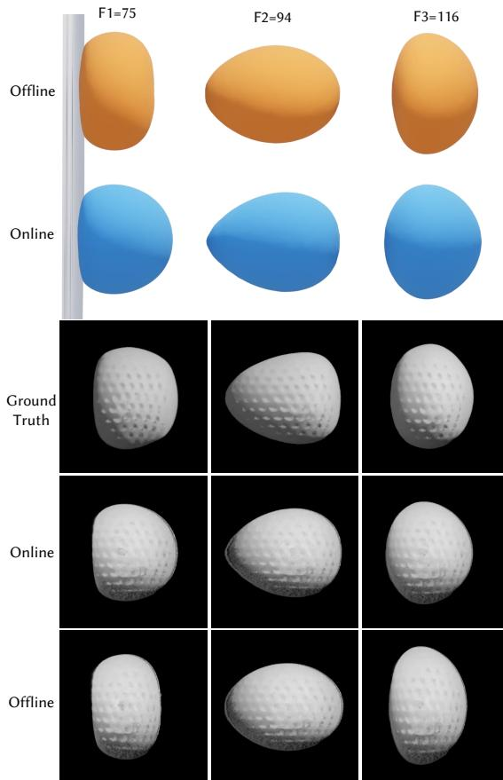  
Fig. 7. Result of a high-speed ball bouncing back after hiting a wall with $v _ { 0 } = 2 7 \mathrm { m } / s .$ The vision data are duplicated from IPC [Li et al. 2020], and the texture of the result is obtained by GS-based training.

A similar performance diference is observed in the material aging experiment. As shown in Fig. 9(a), our online method closely tracks the increasing stifness of the bar over time, whereas the ofline baseline converges to an almost constant stifness and fails to capture the temporal variation. Consequently, the ofline method overestimates the stifness in the early frames and underestimates it in the later frames as the ground-truth stifness increases. The per-frame �2 error in Fig. 9(b) further shows that our method consistently achieves lower simulation error, reducing the loss by approximately 3–5× compared with the ofline baseline.

5.3.2 Ablation Study on Parameter Selection. We conduct an ablation study on hyperparameter selection with the dinosaur model under random contact conditions (Fig. 11), focusing on the subspace dimension �, temporal window size �, and number of camera

Marker Based

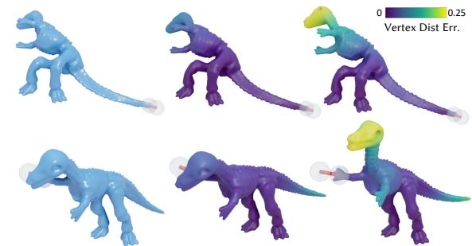  
Vision Based Data  
(a) E = 10 KPa

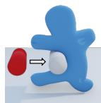

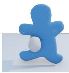  
E = 20 KPa

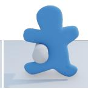

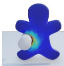  
E = 30 KPa

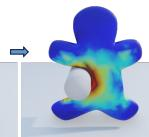

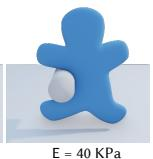

(b)  
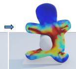

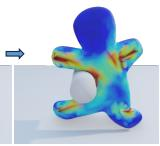

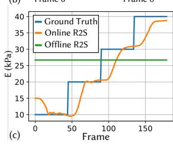

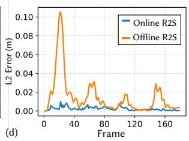  
Fig. 8. (a) Comparison of deformation dynamics across diferent stifness levels (Young’s modulus changing dynamically from 10 kPa to 40 kPa in steps when the bar is hit by the Gingerbread-man. (b) Reconstructed stress fields over time (E = 10 kPa for all frames). (c) Prediction of time-varying Young’s modulus changes and (d) comparison of online and ofline methods, showing that the proposed online framework tracks evolving stifness.

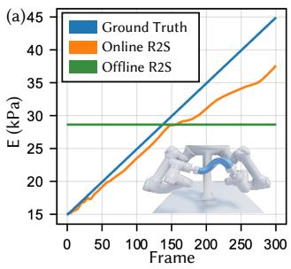

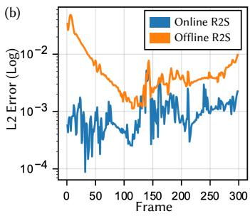  
Fig. 9. Result and analysis of material aging in the bar manipulation task. (a) Our online real-to-sim method accurately tracks the time-varying Young’s modulus of the bar, whereas the ofline baseline estimates an almost constant stifness. (b) The per-frame L2 error further shows that online real-tosim consistently outperforms the ofline method.

view �. It can be seen that increasing � improves deformation expressiveness and rapidly reduces the L2 reconstruction error from $r = 3 0 \mathrm { \ t o \ } r = 9 0$ , after which the error plateaus, while update time grows approximately linearly. We choose $r = 1 0 0$ as a trade-of point, where the error stabilizes around 0.025 m, i.e., about 5% of the model size. With � = 100 fixed, increasing � incorporates more temporal constraints and further reduces the error, but also linearly increases update time; the improvement becomes marginal after � = 5. We also present the ablation of camera number in Fig. 11(c), where can be seen that increasing the number of cameras initially reduces the reconstruction error, indicating that additional views provide useful constraints for the online update. However, once the multi-view images cover most of the geometry, the accuracy improvement becomes marginal, while the update time continues to increase approximately linearly. Therefore, �, �, and � are tuned for each model to balance reconstruction accuracy and computational eficiency - we refer Table 1 for statistics.

  
Marker Based Data

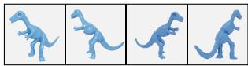

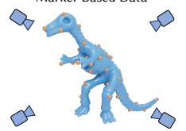

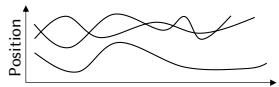

(a)  
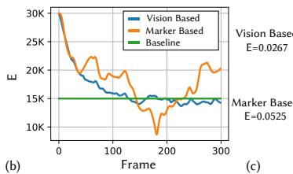

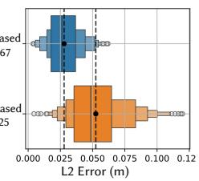  
Fig. 10. Comparison of online real-to-sim adaptation on the dinosaur example using vision-based and marker-based physical input. 40 markers uniformly distributed are used for comparison. (a) Key frame showcase vision-based method outperforms in terms of reconstructed geometry accuracy. (b) Material parameter update curves during online adaptation. (c) Distribution of L2 errors over all frames for the two methods.

5.3.3 Discussion on Constitutive Model Choice and Vision-based Feedback. We further examine how the choice of constitutive mode afects online real-to-sim adaptation. As shown in Fig. 12, although the Yeoh model provides a higher-order formulation with four material parameters, it is less robust under large deformation and produces larger reconstruction errors than the Neo-Hookean model. This suggests that a more expressive material model does not necessarily improve online adaptation, as the higher-dimensional parameter space can make optimization less stable from limited observations. Both models require similar online update time within our reduced-order diferentiable pipeline, indicating that the framework remains eficient even with the higher-dimensional Yeoh parameterization. On the other hand, we also compare with conventional learning based methods [Benchekroun et al. 2023; Wang et al. 2015] to demonstrate the efectiveness of the neural subspace selection. In the same Dinosaur setting, the average reconstruction error is decreases from 24.34 to 20.15 with our AutoEncoder-based subspace network [Fulton et al. 2019] reduces it to 20.15, demonstrates that it can better capture complex nonlinear deformation modes than classic Linear Blend Skinning (LBS) representations [Chen et al. 2025] for the presented real-to-sim tasks.

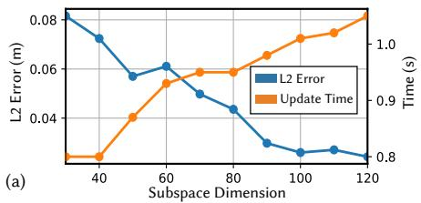

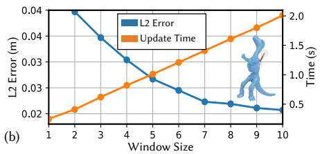

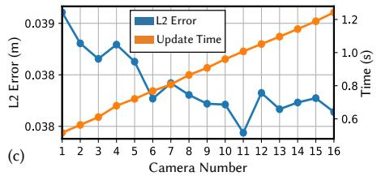  
Fig. 11. Ablation studies on the Dinosaur model with random interactions. (a) Increasing the subspace dimension reduces the L2 error but increases the update time. (b) A larger temporal window size generally improves accuracy at the cost of longer update time (for this test, a fixed � = 100 is used). (c) Ablation on the number of camera views � for both reconstruction error and computational cost.

Additionally, the proposed online real-to-sim adaptation framework supports both marker-based and vision-based observation inputs. We compare the two on the bar and dinosaur manipulation cases and find that vision-based feedback is more efective. As shown in Fig. 10(c), the average vertex $L _ { 2 }$ error decreases from 0.052 m to 0.026 m, while the material update curves in Fig. 10(b) show faster convergence due to the denser spatial information provided by images. Similarly, Fig. 1(d) shows that the vision-based solution reduces vertex error by about 50%, substantially reducing the real-to-sim error.

5.3.4 Limitation and Future Work. While our framework is robust across diverse scenarios, several limitations remain. Although we show efective online SI for multi-material setups with clearly defined regions, extending to per-element material distributions would greatly increase the parameter space and complicate optimization. Addressing this may require stronger regularization or neural representations for continuous material variation. Additionally, reducedorder models may face convergence issues in highly dynamic systems and have limited extrapolation capability for unseen deformation modes or out-of-range material parameters [Lyu et al. 2024; Sharp et al. 2023]. Therefore for such cases, e.g., the high-speed ball in Fig. 7, we revert to full-space simulation. Even without model reduction, our online framework remains more accurate than the ofline method, producing simulations that better match visual observations. Future work will explore adaptive refinement to retain reduced-order eficiency in highly dynamic cases, and inviting unsupervised learning to improve the extrapolation ability.

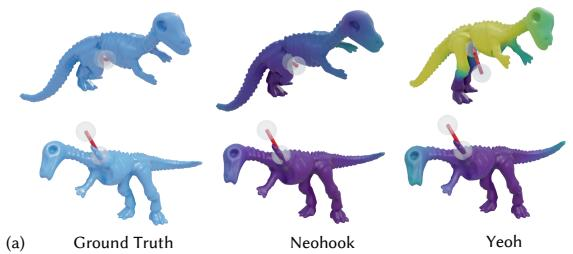

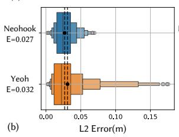

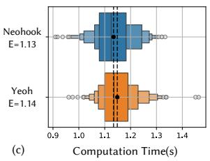  
Fig. 12. Comparison of diferent material models tested with our pipeline. (a) Qualitative comparison between the ground-truth geometry and the adapted simulation results using the two material models. (b, c) With the proposed method, the Yeoh model shows similar computation time but less robust real-to-sim adaptation under large deformation.

## 6 Conclusion

In this work, we present an online real-to-sim adaptation framework that integrates diferentiable reduced-order simulation with visua feedback. By combining a neural subspace solver with windowbased optimization, our method alleviates the computational bottlenecks of ofline full-space methods while capturing time-varying dynamics to reduce sim-to-real gaps. Extensive virtual and physi cal experiments on elastic object manipulation, cable-driven multimaterial manipulation, and temperature-dependent stifness tracking show the efectiveness of our pipeline. Our method consistently outperforms ofline baselines and marker-based approaches, supporting downstream applications such as force prediction, 3D stress reconstruction, and robot-based manipulation. We believe this capability opens new opportunities for building digital twins that mimic the physical world with dynamic interactions.

## Acknowledgments

The authors would like to thank Mr. Chenyu Xu for his kind help in conducting time-varying material experiments, and Mr. Aoran Lyu for insightful discussions during the early stages of this work.

This work is supported by the Guangdong Basic and Applied Basic Research Foundation (2025A1515010124), and in part by the National Key Research and Development Program ofChina (2024YFF1206600), the National Natural Science Foundation of China (62325204), and the HKSAR Research Grants Council Early Career Scheme (RGC-ECS) (CUHK/24204924).

## References

Cameron Baptista, Aharon Azagury, Hyeseon Shin, Christopher M Baker, Eileen Ly, Rachel Lee, and Edith Mathiowitz. 2020. The efect of temperature and pressure on polycaprolactone morphology. Polymer 191 (2020), 122227.

David Baraf and Andrew Witkin. 2023. Large steps in cloth simulation. In Seminal Graphics Papers: Pushing the Boundaries, Volume 2. 767–778.

Jernej Barbič and Doug L James. 2005. Real-time subspace integration for St. Venant Kirchhof deformable models. ACM transactions on graphics (TOG) 24, 3 (2005), 982–990.

Otman Benchekroun, Jiayi Eris Zhang, Siddhartha Chaudhuri, Eitan Grinspun, Yi Zhou, and Alec Jacobson. 2023. Fast Complementary Dynamics via Skinning Eigenmodes. ACM Transactions on Graphics 42, 4, Article 77 (2023).

Bernd Bickel, Moritz Bächer, Miguel A Otaduy, Wojciech Matusik, Hanspeter Pfister, and Markus Gross. 2009. Capture and modeling of non-linear heterogeneous soft tissue. ACM transactions on graphics (TOG) 28, 3 (2009), 1–9.

Katherine L Bouman, Bei Xiao, Peter Battaglia, and William T Freeman. 2013. Estimating the material properties of fabric from video. In Proceedings ofthe IEEE international conference on computer vision. 1984–1991.

James Bradbury, Roy Frostig, Peter Hawkins, Matthew James Johnson, Chris Leary, Dougal Maclaurin, George Necula, Adam Paszke, Jake VanderPlas, Skye Wanderman-Milne, and Qiao Zhang. 2018. JAX: composable transformations ofPython+NumPy programs. http://github.com/jax-ml/jax

Junhao Cai, Yuji Yang, Weihao Yuan, Yisheng He, Zilong Dong, Liefeng Bo, Hui Cheng, and Qifeng Chen. 2024. Gic: Gaussian-informed continuum for physical property identification and simulation. Advances in Neural Information Processing Systems 37 (2024), 75035–75063.

Yue Chang, Peter Yichen Chen, Zhecheng Wang, Maurizio M Chiaramonte, Kevin Carlberg, and Eitan Grinspun. 2023. Licrom: Linear-subspace continuous reduced order modeling with neural fields. In SIGGRAPH Asia 2023 Conference Papers. 1–12.

Chuhao Chen, Zhiyang Dou, Chen Wang, Yiming Huang, Anjun Chen, Qiao Feng, Jiatao Gu, and Lingjie Liu. 2025. Vid2sim: Generalizable, video-based reconstruction of appearance, geometry and physics for mesh-free simulation. 2025 IEEE/CVF Conference on Computer Vision and Pattern Recognition (CVPR) (2025), 26545–26555.

Desai Chen, David IW Levin, Wojciech Matusik, and Danny M Kaufman. 2017. Dynamics-aware numerical coarsening for fabrication design. ACM Transactions on Graphics (TOG) 36, 4 (2017), 1–15.

Abe Davis, Katherine L Bouman, Justin G Chen, Michael Rubinstein, Fredo Durand, and William T Freeman. 2015. Visual vibrometry: Estimating material properties from small motion in video. In Proceedings of the ieee conference on computer vision and pattern recognition. 5335–5343.

Jonas Degrave, Michiel Hermans, Joni Dambre, and Francis Wyfels. 2019. A difer entiable physics engine for deep learning in robotics. Frontiers in neurorobotics 13 (2019), 6.

Tao Du, Kui Wu, Pingchuan Ma, Sebastien Wah, Andrew Spielberg, Daniela Rus, and Wojciech Matusik. 2021. Difpd: Diferentiable projective dynamics. ACM Transactions on Graphics (ToG) 41, 2 (2021), 1–21.

Lawson Fulton, Vismay Modi, David Duvenaud, David IW Levin, and Alec Jacobson. 2019. Latent-space dynamics for reduced deformable simulation. In Computer graphics forum, Vol. 38. Wiley Online Library, 379–391.

Arvi Gjoka, Espen Knoop, Moritz Bächer, Denis Zorin, and Daniele Panozzo. 2024. Soft pneumatic actuator design using diferentiable simulation. In ACM SIGGRAPH 2024 Conference Papers. 1–11.

David Hahn, Pol Banzet, James M Bern, and Stelian Coros. 2019. Real2sim: Visco-elastic parameter estimation from dynamic motion. ACM Transactions on Graphics (TOG) 38, 6 (2019), 1–13.

Yuanming Hu, Yu Fang, Ziheng Ge, Ziyin Qu, Yixin Zhu, Andre Pradhana, and Chen fanfu Jiang. 2018. A moving least squares material point method with displacement discontinuity and two-way rigid body coupling. ACM Transactions on Graphics (TOG) 37, 4 (2018), 1–14.

Yuanming Hu, Jiancheng Liu, Andrew Spielberg, Joshua B Tenenbaum, William T Freeman, Jiajun Wu, Daniela Rus, and Wojciech Matusik. 2019. Chainqueen: A real-time diferentiable physical simulator for soft robotics. In 2019 International conference on robotics and automation (ICRA). IEEE, 6265–6271.

Zizhou Huang, Davi Colli Tozoni, Arvi Gjoka, Zachary Ferguson, Teseo Schneider, Daniele Panozzo, and Denis Zorin. 2024. Diferentiable solver for time-dependent deformation problems with contact. ACM Transactions on Graphics 43, 3 (2024), 1–30.

Doug L James and Dinesh K Pai. 2002. DyRT: Dynamic response textures for real time deformation simulation with graphics hardware. In Proceedings of the 29th annual conference on Computer graphics and interactive techniques. 582–585.

Krishna Murthy Jatavallabhula, Miles Macklin, Florian Golemo, Vikram Voleti, Linda Petrini, Martin Weiss, Breandan Considine, Jérôme Parent-Lévesque, Kevin Xie, Kenny Erleben, et al. 2021. gradsim: Diferentiable simulation for system identifica tion and visuomotor control. arXiv preprint arXiv:2104.02646 (2021).

Hanxiao Jiang, Hao-Yu Hsu, Kaifeng Zhang, Hsin-Ni Yu, Shenlong Wang, and Yunzhu Li. 2025. Phystwin: Physics-informed reconstruction and simulation of deformable

objects from videos. In 2025 IEEE/CVF International Conference on Computer Vision (ICCV). IEEE, 7219–7230.

Bernhard Kerbl, Georgios Kopanas, Thomas Leimkühler, and George Drettakis. 2023. 3D Gaussian splatting for real-time radiance field rendering. ACM Trans. Graph. 42, 4 (2023), 139–1.

Meekyoung Kim, Gerard Pons-Moll, Sergi Pujades, Seungbae Bang, Jinwook Kim, Michael J Black, and Sung-Hee Lee. 2017. Data-driven physics for human soft tissue animation. ACM Transactions on Graphics (ToG) 36, 4 (2017), 1–12.

Petr Krysl, Sanjay Lall, and Jerrold E Marsden. 2001. Dimensional model reduction in non-linear finite element dynamics of solids and structures. International Journal for numerical methods in engineering 51, 4 (2001), 479–504.

Minchen Li, Zachary Ferguson, Teseo Schneider, Timothy R Langlois, Denis Zorin, Daniele Panozzo, Chenfanfu Jiang, and Danny M Kaufman. 2020. Incremental potential contact: intersection-and inversion-free, large-deformation dynamics. ACM Trans. Graph. 39, 4 (2020), 49.

Xuan Li, Yi-Ling Qiao, Peter Yichen Chen, Krishna Murthy Jatavallabhula, Ming Lin, Chenfanfu Jiang, and Chuang Gan. 2023. Pac-nerf: Physics augmented continuum neural radiance fields for geometry-agnostic system identification. arXiv preprint arXiv:2303.05512 (2023).

Yifei Li, Tao Du, Kui Wu, Jie Xu, and Wojciech Matusik. 2022. Difcloth: Diferentiable cloth simulation with dry frictional contact. ACM Transactions on Graphics (TOG) 42, 1 (2022), 1–20.

Fei Liu, Zihan Li, Yunhai Han, Jingpei Lu, Florian Richter, and Michael C Yip. 2021. Real-to-sim registration of deformable soft tissue with position-based dynamics for surgical robot autonomy. In 2021 IEEE International Conference on Robotics and Automation (ICRA). IEEE, 12328–12334.

Aoran Lyu, Shixian Zhao, Chuhua Xian, Zhihao Cen, Hongmin Cai, and Guoxin Fang. 2024. Accelerate Neural Subspace-Based Reduced-Order Solver of Deformable Simulation by Lipschitz Optimization. ACM Transactions on Graphics (TOG) 43, 6 (2024), 1–10.

Vismay Modi, Nicholas Sharp, Or Perel, Shinjiro Sueda, and David IW Levin. 2024. Simplicits: Mesh-free, geometry-agnostic elastic simulation. ACM Transactions on Graphics (TOG) 43, 4 (2024), 1–11.

Andrew Nealen, Matthias Müller, Richard Keiser, Eddy Boxerman, and Mark Carlson. 2006. Physically based deformable models in computer graphics. In Computer graphics forum, Vol. 25. Wiley Online Library, 809–836.

Dinesh K Pai, Kees van den Doel, Doug L James, Jochen Lang, John E Lloyd, Joshua L Richmond, and Som H Yau. 2001. Scanning physical interaction behavior of 3D objects. In Proceedings of the 28th annual conference on Computer graphics and interactive techniques. 87–96.

Dinesh K Pai, Austin Rothwell, Pearson Wyder-Hodge, Alistair Wick, Ye Fan, Egor Larionov, Darcy Harrison, Debanga Raj Neog, and Cole Shing. 2018. The human touch: Measuring contact with real human soft tissues. ACM Transactions on Graphics (TOG) 37, 4 (2018), 1–12.

Adam Paszke, Sam Gross, Soumith Chintala, Gregory Chanan, Edward Yang, Zachary DeVito, Zeming Lin, Alban Desmaison, Luca Antiga, and Adam Lerer. 2017. Automatic diferentiation in pytorch. (2017).

Alex Pentland and John Williams. 1989. Good vibrations: Modal dynamics for graphics and animation. In Proceedings of the 16th annual conference on Computer graphics and interactive techniques. 215–222.

Nikhila Ravi, Valentin Gabeur, Yuan-Ting Hu, Ronghang Hu, Chaitanya Ryali, Tengyu Ma, Haitham Khedr, Roman Rädle, Chloe Rolland, Laura Gustafson, Eric Mintun, Junting Pan, Kalyan Vasudev Alwala, Nicolas Carion, Chao-Yuan Wu, Ross Girshick, Piotr Dollár, and Christoph Feichtenhofer. 2024. SAM 2: Segment Anything in Images and Videos. arXiv preprint arXiv:2408.00714 (2024). https://arxiv.org/abs/2408.00714

Daniel Rho, Jun Myeong Choi, Biswadip Dey, and Roni Sengupta. 2025. ProJo4D: Progressive Joint Optimization for Sparse-View Inverse Physics Estimation. arXiv preprint arXiv:2506.05317 (2025).

Nicholas Sharp, Cristian Romero, Alec Jacobson, Etienne Vouga, Paul Kry, David IW Levin, and Justin Solomon. 2023. Data-free learning of reduced-order kinematics. In ACM SIGGRAPH 2023 Conference Proceedings. 1–9.

Siyuan Shen, Yang Yin, Tianjia Shao, He Wang, Chenfanfu Jiang, Lei Lan, and Kun Zhou. 2021. High-order diferentiable autoencoder for nonlinear model reduction. arXiv preprint arXiv:2102.11026 (2021).

Breannan Smith, Fernando De Goes, and Theodore Kim. 2018. Stable neo-hookean flesh simulation. ACM Transactions on Graphics (TOG) 37, 2 (2018), 1–15.

Jianyuan Wang, Minghao Chen, Nikita Karaev, Andrea Vedaldi, Christian Rupprecht, and David Novotny. 2025. Vggt: Visual geometry grounded transformer. In Proceedings of the Computer Vision and Pattern Recognition Conference. 5294–5306.

Jiahong Wang, Yinwei Du, Stelian Coros, and Bernhard Thomaszewski. 2024. Neural Modes: Self-supervised Learning of Nonlinear Modal Subspaces. In Proceedings of the IEEE/CVF Conference on Computer Vision and Pattern Recognition. 23158–23167.

Yu Wang, Alec Jacobson, Jernej Barbic, and Ladislav Kavan. 2015. Linear Subspace Design for Real-Time Shape Deformation. ACM Transactions on Graphics 34, 4, Article 57 (2015).

Guanjun Wu, Taoran Yi, Jiemin Fang, Lingxi Xie, Xiaopeng Zhang, Wei Wei, Wenyu Liu, Qi Tian, and Xinggang Wang. 2024. 4d gaussian splatting for real-time dynamic scene rendering. In Proceedings of the IEEE/CVF conference on computer vision and pattern recognition. 20310–20320.

Tianyi Xie, Zeshun Zong, Yuxing Qiu, Xuan Li, Yutao Feng, Yin Yang, and Chenfanfu Jiang. 2024. Physgaussian: Physics-integrated 3d gaussians for generative dynamics. In Proceedings ofthe IEEE/CVFConference on ComputerVision and Pattern Recognition. 4389–4398.

Jie Xu, Tao Chen, Lara Zlokapa, Michael Foshey, Wojciech Matusik, Shinjiro Sueda, and Pulkit Agrawal. 2021. An end-to-end diferentiable framework for contact-aware robot design. arXiv preprint arXiv:2107.07501 (2021).

Shan Yang, Junbang Liang, and Ming C Lin. 2017. Learning-based cloth material recovery from video. In Proceedings of the IEEE International Conference on Computer Vision. 4383–4393.

O. H. Yeoh. 1993. Some Forms of the Strain Energy Function for Rubber. Rubber Chemistry and Technology 66, 5 (1993), 754–771. doi:10.5254/1.3538343

Zhen Zhang, Xiangyu Chu, Yunxi Tang, Lulu Zhao, Jing Huang, Zhongliang Jiang, and KW Samuel Au. 2025. Manipulating Elasto-Plastic Objects With 3D Occupancy and Learning-Based Predictive Control. IEEE Robotics and Automation Letters (2025).

Licheng Zhong, Hong-Xing Yu, Jiajun Wu, and Yunzhu Li. 2024. Reconstruction and simulation of elastic objects with spring-mass 3d gaussians. In European Conference on Computer Vision. Springer, 407–423.