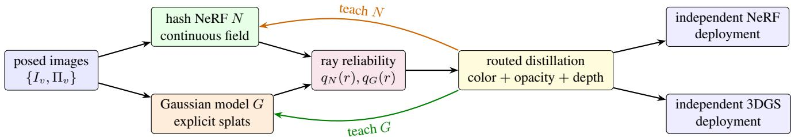

# RouteBridge: Reliability-Routed Bidirectional Distillation Between Neural Radiance Fields and 3D Gaussian Splatting

YuanHang Wang

University of Technology Sydney

Xin Cao

University of Technology Sydney

## Abstract

Neural radiancefields (NeRFs) and 3D Gaussian Splatting (3DGS) encode a scene with complementary inductive biases, but existing cross-representation distillation typically fixes one representation as teacher for the entire scene. A globally fixed teacher can propagate local reconstruction errors. We present RouteBridge, a bidirectional framework that selects the teaching direction for each ray. Its reliability estimator combines photometric residuals with representation-specific geometric evidence and routes supervisionfrom NeRF to 3DGS,from 3DGS to NeRF, or abstains. A renderer-independent interface transfers color, opacity, and normalized depth without sharedfeatures or point correspondence. On mip-NeRF 360, the NeRF and 3DGS exports reach 28.56 and 28.77 dB, respectively. The 3DGS export improves over 3DGS by 1.56 dB and over NeRF-GS by 0.45 dB while reducing LPIPS to 0.207. On static three-view DTU, RouteBridge obtains 21.12 dB. Ablations show that both adaptive routing and geometric ray targets contribute to the improvement.

## 1. Introduction

Neural Radiance Fields (NeRFs) represent density and viewdependent color with a continuous function and form pixels by volume rendering [1]. Hash grids, sparse voxels, and tensor factorizations greatly reduce training and rendering cost [2–4], but they preserve the field interpretation. Threedimensional Gaussian Splatting (3DGS) instead optimizes explicit anisotropic primitives and rasterizes their projected support [5]. The two representations therefore solve the same inverse problem with different spatial priors and execution models.

A trained NeRF can provide point locations and depth supervision for 3DGS [6, 7]. Gaussian attributes can be generated from an implicit representation [8]. NeRF and 3DGS can also be converted in both directions [9, 10]. NeRF-GS goes further by jointly optimizing both representations and sharing continuous spatial information with the Gaussian branch [11]. These results motivate treating the two representations as cooperating models rather than alternative endpoints.

We study one question not answered by demonstrating that conversion is possible: which representation should supply the target when the two branches disagree locally? A diffuse field may misplace a thin surface, whereas an undersupported splat may produce a view-dependent artifact. Joint optimization does not identify which prediction is more reliable. Results on dissimilar views further show that a representation’s relative advantage can depend on the camera [9]. Our hypothesis is therefore local: the preferred teaching direction depends on ray evidence, not on the representation name.

We propose RouteBridge, illustrated in Fig. 1. A standard NeRF and a standard 3DGS model are warmed up independently from the same images. A router combines each model’s observed RGB residual with a geometric reliability cue. It transfers color, opacity, and depth targets from the locally stronger branch to the weaker one, or abstains. The branches share neither parameters nor a feature backbone, and the method adds no learned conversion network. Either trained branch can therefore be exported without baking an auxiliary module.

PVD and PVD-AL demonstrate effective distillation across radiance-field architectures and between NeRF and 3DGS [10, 12]. NeRF-GS demonstrates the value ofjoint optimization [11], while prior bidirectional conversion shows that either representation can be a student [9]. Building on these results, we contribute:

• a local reliability router that chooses NeRF-to-3DGS supervision, 3DGS-to-NeRF supervision, or abstention for every ray;

• a parameter-free ray-space distillation interface that aligns heterogeneous renderers without shared latent features or point correspondence.

Experiments on mip-NeRF 360 and the static three-view DTU protocol support both design choices. RouteBridge improves the 3DGS export from 27.21 to 28.77 dB on mip-NeRF 360, and its adaptive router outperforms a fixed NeRF teacher by 0.16 dB with lower perceptual error.

  
Figure 1. RouteBridge has one training mechanism. Independent NeRF and 3DGS branches render the same captured rays. The reliability router chooses one teaching direction or abstains. Routed color, opacity, and depth losses update only the selected student; either origina branch is directly deployable.

## 2. Related Work

Direct conversion and assistance. PVD studies progressive distillation between NeRF architectures [12]. PVD-AL adds active selection at camera, ray, and point levels; its IJCV version also demonstrates conversion in both directions between vanilla NeRF and 3DGS [10]. That extension identifies nonuniform conversion designs and incomplete spatial correspondence as limitations. He et al. recover a field from views of an edited Gaussian model [9]. Other approaches use a NeRF for Gaussian initialization and depth supervision [6], radiance-field-informed training and pruning [7], or additional rendered training views [13]. These methods establish cross-representation transfer. Our work instead asks which direction should be used for each ray during joint training.

Joint and hybrid parameterizations. NeRF-GS shares continuous spatial features with Gaussians and jointly optimizes the two representations using learned residuals [11]. It is our closest joint-training baseline, not a frozen-teacher method. SplatFields predicts splat attributes from an implicit field [14]; Hash-GS combines anchors and hash encoding [15]; VDGS uses a neural predictor for Gaussian color and opacity [16]. A Gaussian decoder also maps implicit GAN features to splats [8]. These attribute predictors should not be equated with a separately volume-rendered NeRF branch. Likewise, a diffusion prior applicable to either representation [17] is not necessarily a conversion operator. Table 1 separates these mechanisms.

Selective teaching. Mutual learning allows networks to teach one another instead of relying on a permanent teacher [18]. In our setting, however, the models use different rendering equations and can fail in different regions. The proposed router therefore selects one direction or abstains at ray level. This is narrower than a general mutual-learning framework and does not require active view acquisition or cycle consistency.

Earlier representation transport. The conversion problem predates 3DGS. PlenOctrees pretabulates a trained field into an octree [19]; SNeRG bakes NeRF into a sparse feature grid [20]; and KiloNeRF distills a teacher into many small spatial MLPs [21]. MobileNeRF optimizes textured polygons for a standard rasterization pipeline [22]. Point-NeRF uses neural points with explicit growing and pruning [23], while HybridNeRF divides a scene between surface-like and volumetric regions [24]. These results support transport through rendered and spatial targets, while also showing that a successful student must retain its own execution model.

Complementary failure modes. Generalizable fields use image features or multiview cost volumes to reduce perscene evidence requirements [25–27]. Sparse-view fields are further stabilized by semantic, entropy, frequency, patch, or depth constraints [28–33]. Sparse and poorly initialized Gaussians require depth normalization, implicit spatial correlation, improved random starts, progressive propagation, or better density control [14, 34–39]. 3DGS-MCMC further recasts densification as sampling to reduce heuristic dependence [40]. These failures differ enough that symmetric averaging is undesirable. They motivate our confidence routing, which permits the stronger representation to vary across space and training time.

Rendering, geometry, and scale. Finite pixel support improves both neural fields and splats [41–45]. Surface-aligned or planar primitives improve geometry [46, 47], while Gaussian Opacity Fields and RaDe-GS expose more reliable surfaces and depths [48, 49]. StopThePop corrects viewdependent sorting artifacts [50]. Large and compressed representations introduce additional resource constraints [51–53]. We use these works to define stress tests, not as interchangeable variants of one method.

Table 1. Different forms of NeRF/3DGS interaction. Neural Gaussian parameterization is distinguished from direct representation conversion and dual-renderer optimization.
<table><tr><td>Method</td><td>Established interaction</td><td>Relevance to the proposed method</td></tr><tr><td>PVD-AL [10]</td><td>Progressive conversion; NeRF/GS extension</td><td>Active conversion baseline in both directions</td></tr><tr><td>NeRFs to Splats and Back [9]</td><td>NeRF to GS; edited GS to NeRF</td><td>Return conversion and editing baseline</td></tr><tr><td>NeRF initialization [6]</td><td>Field-derived points and depth targets</td><td>Isolates initialization benefits</td></tr><tr><td>RadSplat [7]</td><td>Radiance-field-informed Gaussian training</td><td>Strong field-assisted deployment baseline</td></tr><tr><td>NeRF-GS [11]</td><td>Joint NeRF/GS optimization by shared feature</td><td>Isolates gains beyond joint training</td></tr><tr><td>SplatFields [14]</td><td>Implicit field predicts Gaussian attributes</td><td>Neural parameterization control</td></tr><tr><td>RouteBridge</td><td>Independent NeRF and GS with routed mutual teaching</td><td>Selects the local teaching direction without shared features</td></tr></table>

## 3. Preliminaries

Neural field. The field branch $N _ { \theta }$ maps a point and direction to density and color,

$$
( \sigma _ { N } , { \bf c } _ { N } ) = N _ { \theta } ( { \bf x } , { \bf d } ) .\tag{1}
$$

For samples $\{ t _ { i } \}$ on ray $r ( t ) = \mathbf { o } + t \mathbf { d } .$ , let

$$
\alpha _ { i } ^ { N } = 1 - \exp ( - \sigma _ { i } \delta _ { i } ) , T _ { i } ^ { N } = \prod _ { j < i } ( 1 - \alpha _ { j } ^ { N } ) ,\tag{2}
$$

$$
w _ { i } ^ { N } = T _ { i } ^ { N } \alpha _ { i } ^ { N } .
$$

The rendered color, opacity, and expected depth are

$$
\begin{array} { l } { { \displaystyle { \bf C } _ { N } = \sum _ { i } w _ { i } ^ { N } { \bf c } _ { i } ^ { N } + ( 1 - A _ { N } ) { \bf c } _ { \mathrm { b g } } } , } \\ { ~ } \\ { { \displaystyle A _ { N } = \sum _ { i } w _ { i } ^ { N } } , \qquad D _ { N } = \frac { \sum _ { i } w _ { i } ^ { N } t _ { i } } { A _ { N } + \epsilon } . }  \end{array}\tag{3}
$$

We use an Instant-NGP hash encoding and small decoders [2].

Gaussian branch. Each Gaussian $g _ { j }$ stores mean $\mu _ { j }$ , covariance $\Sigma _ { j }$ , opacity $o _ { j }$ , and appearance coefficients $\mathbf { h } _ { j } .$ Projection yields a 2D Gaussian footprint. After sorting, rasterization produces weights

$$
w _ { j } ^ { G } ( p ) = \alpha _ { j } ( p ) \prod _ { k < j } ( 1 - \alpha _ { k } ( p ) ) .\tag{4}
$$

Color, opacity, and depth use the same weighted summaries as Eq. 3. This common alpha-compositing interface allows image-space alignment. It does not imply that density samples and Gaussians are parameter-wise equivalent.

Common ray interface. The two branches have incompatible parameters but expose comparable rendered quantities:

$$
\Phi ( M ; r ) = \bigl ( { \bf C } _ { M } ( r ) , A _ { M } ( r ) , D _ { M } ( r ) / s \bigr ) ,\tag{5}
$$

where s is the scene radius. Color, opacity, and normalized depth define a renderer-independent distillation interface. The comparison is made on rays, so it does not require point correspondence or equal model topology.

## 4. RouteBridge

## 4.1. Independent branches and warm-up

We retain ordinary Instant-NGP and 3DGS parameterizations rather than constructing a shared model. Both branches are first optimized from the captured images with their standard photometric objectives. The Gaussian branch uses its normal SfM initialization and densification schedule. After warmup, both branches remain trainable and receive the same sampled training rays. This separation is intentional: any improvement must arise from routed distillation rather than shared capacity.

## 4.2. Ray reliability and routing

For a captured ray r with observed color $I ( r )$ , branch $M \in$ {N, G} has robust photometric residual

$$
e _ { M } ( \boldsymbol { r } ) = \rho ( \mathbf { C } _ { M } ( \boldsymbol { r } ) - I ( \boldsymbol { r } ) ) ,\tag{6}
$$

where colors are scaled to [0, 1] and $\rho$ is a channel-averaged Huber penalty. The residual is directly comparable across branches but does not reveal whether an error is geometric. We therefore add one representation-specific geometric cue per branch. For NeRF, normalized termination entropy is

$$
h _ { N } ( r ) = - \frac { 1 } { \log ( B + 1 ) } \sum _ { i = 1 } ^ { B + 1 } \bar { p } _ { i } ^ { N } \log ( \bar { p } _ { i } ^ { N } + \epsilon ) ,\tag{7}
$$

where $\bar { p } ^ { N } = ( w _ { 1 } ^ { N } , \dots , w _ { B } ^ { N } , 1 - A _ { N } )$ includes background escape mass. For 3DGS, we use normalized contributingdepth variance

$$
v _ { G } ( r ) = \frac { \sum _ { j } w _ { j } ^ { G } ( t _ { j } - D _ { G } ) ^ { 2 } } { s ^ { 2 } ( A _ { G } + \epsilon ) } ,\tag{8}
$$

where s is the scene radius. Both cues are clipped to [0, 1] using percentiles computed only on training rays. Reliability is

$$
q _ { N } = b _ { N } \mathrm { e x p } ( - e _ { N } / \tau _ { e } - \gamma _ { N } h _ { N } ) ,\tag{9}
$$

$$
q _ { G } = b _ { G } \exp ( - e _ { G } / \tau _ { e } - \gamma _ { G } v _ { G } ) ,\tag{10}
$$

where $b _ { M } = 1$ only when opacity exceeds $\eta _ { A } ;$ otherwise it is zero. We call $q _ { M }$ a heuristic reliability score, not calibrated uncertainty.

Let $m = q _ { N } - q _ { G }$ . With reliability threshold $\eta _ { q }$ and margin $\eta _ { m }$ , the detached routing gates are

$$
\pi _ { N \to G } = \mathbf { 1 } [ q _ { N } \geq \eta _ { q } , m \geq \eta _ { m } ] ,\tag{11}
$$

$$
\pi _ { G \to N } = \mathbf { 1 } [ q _ { G } \geq \eta _ { q } , - m \geq \eta _ { m } ] .\tag{12}
$$

At most one gate is active. Both are zero when the branches are weak or similarly reliable. This abstention rule prevents agreement alone from being interpreted as correctness. The teacher output is stop-gradient in the corresponding transfer loss.

## 4.3. Ray-space bidirectional distillation

The two renderers are compared through color, opacity, and normalized expected depth. For teacher A and student $B ,$ we define

$$
\ell _ { A \to B } ( r ) = \lambda _ { c } \| \operatorname { s g } ( \mathbf { C } _ { A } ) - \mathbf { C } _ { B } \| _ { 1 }\tag{13}
$$

$$
+ \lambda _ { a } | \operatorname { s g } ( A _ { A } ) - A _ { B } |\tag{14}
$$

$$
+ \lambda _ { d } \chi _ { A B } \rho \bigg ( \frac { \mathrm { s g } ( D _ { A } ) - D _ { B } } { s } \bigg ) ,\tag{15}
$$

where $\chi _ { A B } = 1$ only when both opacities exceed $\eta _ { A }$ . The routed loss is

$$
\mathcal { L } _ { \mathrm { r o u t e } } = \mathbb { E } _ { r } [ \pi _ { N  G } \ell _ { N  G } + \pi _ { G  N } \ell _ { G  N } ] .\tag{16}
$$

Unlike PVD-AL [10], we do not match intermediate network features or actively select cameras and points. Unlike NeRF-GS [11], the branches share no encoding or Gaussian attributes. The only new interaction is the routed loss in Eq. 16.

## 4.4. Training objective and deployment

Each branch retains its captured-image objective,

$$
\mathcal { L } _ { \mathrm { o b s } } ^ { M } = \Vert \mathbf { C } _ { M } - I \Vert _ { 1 } + \lambda _ { \mathrm { s s i m } } ( 1 - \mathrm { S S I M } ( \mathbf { C } _ { M } , I ) ) .\tag{17}
$$

After independent warm-up, we minimize

$$
\mathcal { L } = \mathcal { L } _ { \mathrm { o b s } } ^ { N } + \mathcal { L } _ { \mathrm { o b s } } ^ { G } + \lambda _ { t } \mathcal { L } _ { \mathrm { r o u t e } } + \mathcal { L } _ { \mathrm { r e g } } ^ { N } + \mathcal { L } _ { \mathrm { r e g } } ^ { G } .\tag{18}
$$

We use 5k warm-up steps followed by 25k routed joint steps. Uniformly sampled training rays are reused for both observation and transfer losses. No additional virtual views are rendered. At inference, the original NeRF or 3DGS branch is saved directly. The router is a training-only component and adds no deployment parameters.

Table 2. Novel-view synthesis on mip-NeRF 360. Baseline values follow their published evaluations on the same nine-scene benchmark. Best results are in bold.
<table><tr><td>Method</td><td>Type</td><td>PSNR↑</td><td>SSIM↑ LPIPS↓</td></tr><tr><td>Instant-NGP (big) [2]</td><td>NeRF</td><td>25.59</td><td>.699 .331</td></tr><tr><td>3DGS [5]</td><td>GS</td><td>27.21</td><td>.815 .214</td></tr><tr><td>Scaffold-GS [55]</td><td>GS</td><td>27.50</td><td>.806 .252</td></tr><tr><td>Hash-GS [15]</td><td>GS</td><td>27.53</td><td>.807 .238</td></tr><tr><td>VDGS [16]</td><td>GS</td><td>27.64</td><td>.813 .220</td></tr><tr><td>NeRF-GS [11]</td><td>GS</td><td>28.32</td><td>.817 .210</td></tr><tr><td>RouteBridge field export</td><td>NeRF</td><td>28.56</td><td>.824 .211</td></tr><tr><td>RouteBridge GS export</td><td>GS</td><td>28.77</td><td>.827 .207</td></tr></table>

## 5. Experiments

## 5.1. Research questions and protocol

We organize the evaluation around two questions. RQ1 asks whether routed bidirectional distillation improves the independently deployable NeRF and 3DGS branches over representative baselines. RQ2 isolates the effects of adaptive teacher selection and the geometric ray targets.

Datasets. Our primary benchmark contains all nine scenes from mip-NeRF 360 [42], which cover bounded indoor environments and unbounded outdoor captures. We additionally use the 15-scene static three-view DTU protocol adopted by SplatFields [14, 54] to evaluate sparse-view reconstruction. Camera parameters and sparse initialization follow the official dataset preprocessing; no test image is used for training or routing.

Baselines. We compare against Instant-NGP and 3DGS as the canonical representatives of the two branches [2, 5]. Scaffold-GS, Hash-GS, and VDGS test stronger neural Gaussian parameterizations [15, 16, 55]. NeRF-GS is the closest joint NeRF/3DGS competitor because it shares continuous features with the Gaussian branch [11]. For sparse-view DTU, we compare with 3DGS, 2DGS, and SplatFields under the same 15-scene protocol [5, 14, 47].

Budget matching. All RouteBridge variants use the same initialization, 5k-step warm-up, 25k-step joint optimization budget, and number of rendered rays. The fixed-teacher and RGB-only variants differ from the full model only in the routed transfer term. Both branches retain their standard observation losses and optimization schedules, which prevents the ablation gains from being attributed to a larger ray budget.

Metrics and statistics. We report PSNR, SSIM [56], and LPIPS [57]. Metrics are computed on the official test views and averaged within each scene before computing the dataset mean. Higher PSNR and SSIM indicate better fidelity, whereas lower LPIPS indicates better perceptual similarity.

Table 3. Static three-view DTU PSNR under the 15-scene protocol used by SplatFields. Baseline values follow its supplementary evaluation.
<table><tr><td>Method</td><td>PSNR↑</td></tr><tr><td>3DGS [5]</td><td>19.40</td></tr><tr><td>2DGS [47]</td><td>20.70</td></tr><tr><td>SplatFields [14]</td><td>21.07</td></tr><tr><td>RouteBridge</td><td>21.12</td></tr></table>

## 5.2. Main comparison

Table 2 reports the mip-NeRF 360 results. The RouteBridge field export reaches 28.56 dB, exceeding Instant-NGP (big) by 2.97 dB. The Gaussian export obtains 28.77 dB, 0.45 dB above NeRF-GS and 1.56 dB above the original 3DGS. It also achieves the best SSIM of 0.827 and the lowest LPIPS of 0.207. The two independently deployable branches therefore both benefit from joint training, while the Gaussian branch retains a small advantage in final image quality. Baseline entries are published benchmark values rather than reruns in our codebase, so small differences should be interpreted with the usual caution regarding implementation and preprocessing details.

## 5.3. Sparse views and geometry

Sparse captures are challenging because both branches receive weak geometric evidence. Table 3 evaluates the static three-view DTU protocol reported by SplatFields. Route-Bridge reaches 21.12 dB, improving over 3DGS and 2DGS by 1.72 and 0.42 dB, respectively. It also exceeds SplatFields by 0.05 dB. The smaller margin over SplatFields suggests that implicit spatial regularization remains particularly effective when only three input views are available.

## 5.4. Ablation study

Table 4 isolates the two claimed components under identical ray budgets. Replacing adaptive routing with a fixed NeRF teacher reduces PSNR from 28.77 to 28.61 dB and increases LPIPS from 0.207 to 0.213. Restricting transfer to RGB targets causes a larger 0.20 dB drop and raises LPIPS to 0.214. These results show that the gain is not explained by ordinary fixed-direction distillation alone: local teacher selection matters, and opacity and depth provide useful geometric constraints beyond color agreement.

Scope. Our evaluation targets static RGB novel-view synthesis. Anti-aliased fields and splats address scale variation [41, 43–45], while SuGaR, 2DGS, Gaussian Opacity

Table 4. Ablation on mip-NeRF 360. All variants use the same training and ray budgets.
<table><tr><td colspan="2">Variant</td><td>GS PSNR↑ LPIPS↓</td></tr><tr><td>Full RouteBridge</td><td>28.77</td><td>.207</td></tr><tr><td>Fixed NeRF teacher</td><td>28.61</td><td>.213</td></tr><tr><td>RGB targets only</td><td>28.57</td><td>.214</td></tr></table>

Fields, and RaDe-GS emphasize surface recovery [46–49]. Temporal fields [58, 59], dynamic Gaussians [60–62], and semantic feature methods [63–65] solve different problems and are outside our experimental claim.

## 6. Discussion

Interpretation. RouteBridge does not assume that NeRF and 3DGS are equivalent. Instead, it exploits their different local errors while preserving their native rendering pipelines. The ablation against a fixed NeRF teacher supports the central hypothesis: selecting the teaching direction per ray is more effective than imposing one global direction. The relatively small DTU margin over SplatFields also shows that routing is complementary to, rather than a replacement for, strong representation-specific regularization.

Limitations. Training two representations increases memory, and the reliability scores are heuristic rather than calibrated uncertainty. When both branches share an error, abstention may fail to detect it, and captured-image losses cannot recover structure that is absent from all observations. Sorting-aware rasterization [50] and view-dependent Gaussian attributes [16] may also alter the reliability cues. In addition, most dense-view baseline values in Table 2 come from the corresponding papers rather than a unified reimplementation, so very small margins should not be overinterpreted.

## 7. Conclusion

We presented RouteBridge, a compact connection between neural fields and Gaussian primitives. It keeps both representations independent and adds a ray-level reliability router with color, opacity, and depth distillation. RouteBridge reaches 28.56 dB for its NeRF export and 28.77 dB for its 3DGS export on mip-NeRF 360, while the static three-view DTU result reaches 21.12 dB. Matched-budget ablations confirm that adaptive routing and geometric ray targets both improve the Gaussian branch. These results show that NeRF and 3DGS can act as local teachers for one another without shared features, an auxiliary conversion network, or additional deployment parameters.

## References

[1] Ben Mildenhall, Pratul P. Srinivasan, Matthew Tancik, Jonathan T. Barron, Ravi Ramamoorthi, and Ren Ng. NeRF: Representing scenes as neural radiance fields for view synthesis. In European Conference on Computer Vision, pages 405–421, 2020. 1

[2] Thomas Muller, Alex Evans, Christoph Schied, and Alexan-¨ der Keller. Instant neural graphics primitives with a multiresolution hash encoding. ACM Transactions on Graphics, 41(4):102:1–102:15, 2022. 1, 3, 4

[3] Sara Fridovich-Keil, Alex Yu, Matthew Tancik, Qinhong Chen, Benjamin Recht, and Angjoo Kanazawa. Plenoxels: Radiance fields without neural networks. In Proceedings of the IEEE/CVF Conference on Computer Vision and Pattern Recognition, pages 5501–5510, 2022.

[4] Anpei Chen, Zexiang Xu, Andreas Geiger, Jingyi Yu, and Hao Su. TensoRF: Tensorial radiance fields. In European Conference on Computer Vision, pages 333–350, 2022. 1

[5] Bernhard Kerbl, Georgios Kopanas, Thomas Leimkuhler, and¨ George Drettakis. 3d gaussian splatting for real-time radiance field rendering. ACM Transactions on Graphics, 42(4):139:1– 139:14, 2023. 1, 4, 5

[6] Yalda Foroutan, Daniel Rebain, Kwang Moo Yi, and Andrea Tagliasacchi. Evaluating alternatives to SfM point cloud initialization for gaussian splatting. arXiv preprint arXiv:2404.12547, 2024. 1, 2, 3

[7] Michael Niemeyer, Fabian Manhardt, Marie-Julie Rakotosaona, Michael Oechsle, Daniel Duckworth, Rama Gosula, Keisuke Tateno, John Bates, Dominik Kaeser, and Federico Tombari. RadSplat: Radiance field-informed gaussian splatting for robust real-time rendering with 900+ FPS. In International Conference on 3D Vision, 2025. 1, 2, 3

[8] Florian Barthel, Arian Beckmann, Wieland Morgenstern, Anna Hilsmann, and Peter Eisert. Gaussian splatting decoder for 3d-aware generative adversarial networks. In Proceedings ofthe IEEE/CVF Conference on Computer Vision and Pattern Recognition Workshops, pages 7963–7972, 2024. 1, 2

[9] Siming He, Zach Osman, and Pratik Chaudhari. From NeRFs to gaussian splats, and back. arXiv preprint arXiv:2405.09717, 2024. 1, 2, 3

[10] Shuangkang Fang, Yufeng Wang, Yi Yang, Weixin Xu, Heng Wang, Wenrui Ding, and Shuchang Zhou. Progressive volume distillation with active learning for efficient NeRF architecture conversion. International Journal ofComputer Vision, 134(5):228, 2026. 1, 2, 3, 4

[11] Shuangkang Fang, I-Chao Shen, Takeo Igarashi, Yufeng Wang, Zesheng Wang, Yi Yang, Wenrui Ding, and Shuchang Zhou. NeRF is a valuable assistant for 3d gaussian splatting. In Proceedings of the IEEE/CVF International Conference on Computer Vision, pages 26230–26240, 2025. 1, 2, 3, 4

[12] Shuangkang Fang, Weixin Xu, Heng Wang, Yi Yang, Yufeng Wang, and Shuchang Zhou. One is all: Bridging the gap between neural radiance fields architectures with progressive volume distillation. In Proceedings ofthe AAAI Conference on Artificial Intelligence, volume 37, pages 597–605, 2023. 1, 2

[13] Mizuki Morikawa, Yuta Shimizu, Chunyu Li, Yusuke Monno, and Masatoshi Okutomi. Leveraging NeRF-rendered images for 3d gaussian splatting. arXiv preprint arXiv:2606.09034, 2026. 2

[14] Marko Mihajlovic, Sergey Prokudin, Siyu Tang, Robert Maier, Federica Bogo, Tony Tung, and Edmond Boyer. SplatFields: Neural gaussian splats for sparse 3d and 4d reconstruction. In European Conference on Computer Vision, pages 313–332, 2024. 2, 3, 4, 5

[15] Yijia Xie, Yuhang Lin, Laijian Li, Lina Liu, Xiaobin Wei, Yong Liu, and Jiajun Lv. Hash-GS: Anchor-based 3d gaussian splatting with multi-resolution hash encoding for efficient scene reconstruction. In IEEE International Conference on Robotics and Automation, pages 13964–13971, 2025. 2, 4

[16] Dawid Malarz, Weronika Smolak-Dyzewska, Jacek Tabor,˙ Sławomir Tadeja, and Przemysław Spurek. Gaussian splatting with NeRF-based color and opacity. Computer Vision and Image Understanding, 251:104273, 2025. 2, 4, 5

[17] Xiaofeng Yang, Yiwen Chen, Cheng Chen, Chi Zhang, Yi Xu, Xulei Yang, Fayao Liu, and Guosheng Lin. Learn to optimize denoising scores for 3d generation: A unified and improved diffusion prior on NeRF and 3d gaussian splatting. arXiv preprint arXiv:2312.04820, 2023. 2

[18] Ying Zhang, Tao Xiang, Timothy M. Hospedales, and Huchuan Lu. Deep mutual learning. In Proceedings of the IEEE Conference on Computer Vision and Pattern Recognition, pages 4320–4328, 2018. 2

[19] Alex Yu, Ruilong Li, Matthew Tancik, Hao Li, Ren Ng, and Angjoo Kanazawa. PlenOctrees for real-time rendering of neural radiance fields. In Proceedings ofthe IEEE/CVF International Conference on Computer Vision, pages 5752–5761, 2021. 2

[20] Peter Hedman, Pratul P. Srinivasan, Ben Mildenhall, Jonathan T. Barron, and Paul Debevec. Baking neural radiance fields for real-time view synthesis. In Proceedings of the IEEE/CVF International Conference on Computer Vision, pages 5875–5884, 2021. 2

[21] Christian Reiser, Songyou Peng, Yiyi Liao, and Andreas Geiger. KiloNeRF: Speeding up neural radiance fields with thousands of tiny MLPs. In Proceedings of the IEEE/CVF International Conference on Computer Vision, pages 14335– 14345, 2021. 2

[22] Zhiqin Chen, Thomas Funkhouser, Peter Hedman, and Andrea Tagliasacchi. MobileNeRF: Exploiting the polygon rasterization pipeline for efficient neural field rendering on mobile architectures. In Proceedings ofthe IEEE/CVF Conference on Computer Vision and Pattern Recognition, pages 16569–16578, 2023. 2

[23] Qiangeng Xu, Zexiang Xu, Julien Philip, Sai Bi, Zhixin Shu, Kalyan Sunkavalli, and Ulrich Neumann. Point-NeRF: Pointbased neural radiance fields. In Proceedings ofthe IEEE/CVF Conference on Computer Vision and Pattern Recognition, pages 5438–5448, 2022. 2

[24] Haithem Turki, Vasu Agrawal, Samuel Rota Bulo, Lorenzo\` Porzi, Peter Kontschieder, Deva Ramanan, Michael Zollhofer,¨ and Christian Richardt. HybridNeRF: Efficient neural rendering via adaptive volumetric surfaces. In Proceedings of

the IEEE/CVF Conference on Computer Vision and Pattern Recognition, pages 19647–19656, 2024. 2

[25] Alex Yu, Vickie Ye, Matthew Tancik, and Angjoo Kanazawa. pixelNeRF: Neural radiance fields from one or few images. In Proceedings of the IEEE/CVF Conference on Computer Vision and Pattern Recognition, pages 4578–4587, 2021. 2

[26] Anpei Chen, Zexiang Xu, Fuqiang Zhao, Xiaoshuai Zhang, Fanbo Xiang, Jingyi Yu, and Hao Su. MVSNeRF: Fast generalizable radiance field reconstruction from multi-view stereo. In Proceedings of the IEEE/CVF International Conference on Computer Vision, pages 14124–14133, 2021.

[27] Shuangkang Fang, Yufeng Wang, Yi-Hsuan Tsai, Wenrui Ding, Yi Yang, Shuchang Zhou, and Ming-Hsuan Yang. Editing 3d scenes via text prompts without retraining. IEEE Transactions on Visualization and Computer Graphics, 2026. 2

[28] Ajay Jain, Matthew Tancik, and Pieter Abbeel. Putting NeRF on a diet: Semantically consistent few-shot view synthesis. In Proceedings of the IEEE/CVF International Conference on Computer Vision, pages 5885–5894, 2021. 2

[29] Mijeong Kim, Seonguk Seo, and Bohyung Han. InfoNeRF: Ray entropy minimization for few-shot neural volume rendering. In Proceedings of the IEEE/CVF Conference on Computer Vision and Pattern Recognition, pages 12912–12921, 2022.

[30] Jiawei Yang, Marco Pavone, and Yue Wang. FreeNeRF: Improving few-shot neural rendering with free frequency regularization. In Proceedings ofthe IEEE/CVF Conference on Computer Vision and Pattern Recognition, pages 8254–8263, 2023.

[31] Michael Niemeyer, Jonathan T. Barron, Ben Mildenhall, Mehdi S. M. Sajjadi, Andreas Geiger, and Noha Radwan. RegNeRF: Regularizing neural radiance fields for view synthesis from sparse inputs. In Proceedings ofthe IEEE/CVF Conference on Computer Vision and Pattern Recognition, pages 5480–5490, 2022.

[32] Kangle Deng, Andrew Liu, Jun-Yan Zhu, and Deva Ramanan. Depth-supervised NeRF: Fewer views and faster training for free. In Proceedings ofthe IEEE/CVF Conference on Computer Vision and Pattern Recognition, pages 12882–12891, 2022.

[33] Shuangkang Fang, Yufeng Wang, Yi-Hsuan Tsai, Yi Yang, Wenrui Ding, Shuchang Zhou, and Ming-Hsuan Yang. Chatedit-3d: Interactive 3d scene editing via text prompts. In European Conference on Computer Vision, pages 199–216. Springer, 2024. 2

[34] Yufeng Wang, Shuangkang Fang, Huayu Zhang, Hongguang Li, Zehao Zhang, Xianlin Zeng, and Wenrui Ding. Uavenerf: Text-driven uav scene editing with neural radiance fields. IEEE Transactions on Geoscience and Remote Sensing, 62:1–14, 2024. 2

[35] Jiahe Li, Jiawei Zhang, Xiao Bai, Jin Zheng, Xin Ning, Jun Zhou, and Lin Gu. DNGaussian: Optimizing sparse-view 3d gaussian radiance fields with global-local depth normalization. In Proceedings of the IEEE/CVF Conference on Computer Vision and Pattern Recognition, pages 20775–20785, 2024.

[36] Jaewoo Jung, Jisang Han, Honggyu An, Jiwon Kang, Seonghoon Park, and Seungryong Kim. Relaxing accurate ini-

tialization constraint for 3d gaussian splatting. arXiv preprint arXiv:2403.09413, 2024.

[37] Kai Cheng, Xiaoxiao Long, Kaizhi Yang, Yao Yao, Wei Yin, Yuexin Ma, Wenping Wang, and Xuejin Chen. GaussianPro: 3d gaussian splatting with progressive propagation. In Proceedings of the 41st International Conference on Machine Learning, volume 235 of Proceedings of Machine Learning Research, pages 8123–8140, 2024.

[38] Zheng Zhang, Wenbo Hu, Yixing Lao, Tong He, and Hengshuang Zhao. Pixel-GS: Density control with pixel-aware gradient for 3d gaussian splatting. In European Conference on Computer Vision, pages 326–342, 2024.

[39] Shuangkang Fang, I Shen, Xuanyang Zhang, Zesheng Wang, Yufeng Wang, Wenrui Ding, Gang Yu, Takeo Igarashi, et al. Dropping anchor and spherical harmonics for sparse-view gaussian splatting. arXiv preprint arXiv:2602.20933, 2026. 2

[40] Shakiba Kheradmand, Daniel Rebain, Gopal Sharma, Weiwei Sun, Yang-Che Tseng, Hossam Isack, Abhishek Kar, Andrea Tagliasacchi, and Kwang Moo Yi. 3d gaussian splatting as markov chain monte carlo. In Advances in Neural Information Processing Systems, volume 37, pages 80965–80986, 2024. 2

[41] Jonathan T. Barron, Ben Mildenhall, Matthew Tancik, Peter Hedman, Ricardo Martin-Brualla, and Pratul P. Srinivasan. Mip-NeRF: A multiscale representation for anti-aliasing neural radiance fields. In Proceedings of the IEEE/CVF International Conference on Computer Vision, pages 5855–5864, 2021. 2, 5

[42] Jonathan T. Barron, Ben Mildenhall, Dor Verbin, Pratul P. Srinivasan, and Peter Hedman. Mip-NeRF 360: Unbounded anti-aliased neural radiance fields. In Proceedings of the IEEE/CVF Conference on Computer Vision and Pattern Recognition, pages 5470–5479, 2022. 4

[43] Jonathan T. Barron, Ben Mildenhall, Dor Verbin, Pratul P. Srinivasan, and Peter Hedman. Zip-NeRF: Anti-aliased gridbased neural radiance fields. In Proceedings of the IEEE/CVF International Conference on Computer Vision, pages 19697– 19705, 2023. 5

[44] Zehao Yu, Anpei Chen, Binbin Huang, Torsten Sattler, and Andreas Geiger. Mip-splatting: Alias-free 3d gaussian splatting. In Proceedings of the IEEE/CVF Conference on Computer Vision and Pattern Recognition, pages 19447–19456, 2024.

[45] Zhiwen Yan, Weng Fei Low, Yu Chen, and Gim Hee Lee. Multi-scale 3d gaussian splatting for anti-aliased rendering. In Proceedings of the IEEE/CVF Conference on Computer Vision and Pattern Recognition, pages 20923–20931, 2024. 2, 5

[46] Antoine Guedon and Vincent Lepetit. SuGaR: Surface-´ aligned gaussian splatting for efficient 3d mesh reconstruction and high-quality mesh rendering. In Proceedings of the IEEE/CVF Conference on Computer Vision and Pattern Recognition, pages 5354–5363, 2024. 2, 5

[47] Binbin Huang, Zehao Yu, Anpei Chen, Andreas Geiger, and Shenghua Gao. 2d gaussian splatting for geometrically accurate radiance fields. In ACM SIGGRAPH 2024 Conference Papers, 2024. 2, 4, 5

[48] Zehao Yu, Torsten Sattler, and Andreas Geiger. Gaussian opacity fields: Efficient adaptive surface reconstruc-

tion in unbounded scenes. ACM Transactions on Graphics, 43(6):271:1–271:13, 2024. 2

[49] Baowen Zhang, Chuan Fang, Rakesh Shrestha, Yixun Liang, Xiaoxiao Long, and Ping Tan. Rade-GS: Rasterizing depth in gaussian splatting. ACM Transactions on Graphics, 45(2):19:1–19:14, 2026. 2, 5

[50] Lukas Radl, Michael Steiner, Mathias Parger, Alexander Weinrauch, Bernhard Kerbl, and Markus Steinberger. StopThePop: Sorted gaussian splatting for view-consistent real-time rendering. ACM Transactions on Graphics, 43(4):64:1–64:17, 2024. 2, 5

[51] Jiaqi Lin, Zhihao Li, Xiao Tang, Jianzhuang Liu, Shiyong Liu, Jiayue Liu, Yangdi Lu, Xiaofei Wu, Songcen Xu, Youliang Yan, and Wenming Yang. VastGaussian: Vast 3d gaussians for large scene reconstruction. In Proceedings ofthe IEEE/CVF Conference on Computer Vision and Pattern Recognition, pages 5166–5175, 2024. 2

[52] Joo Chan Lee, Daniel Rho, Xiangyu Sun, Jong Hwan Ko, and Eunbyung Park. Compact 3d gaussian representation for radiance field. In Proceedings ofthe IEEE/CVF Conference on Computer Vision and Pattern Recognition, pages 21719– 21728, 2024.

[53] Simon Niedermayr, Josef Stumpfegger, and Rudiger West-¨ ermann. Compressed 3d gaussian splatting for accelerated novel view synthesis. In Proceedings ofthe IEEE/CVF Conference on Computer Vision and Pattern Recognition, pages 10349–10358, 2024. 2

[54] Henrik Aanæs, Rasmus Ramsbøl Jensen, George Vogiatzis, Engin Tola, and Anders Bjorholm Dahl. Large-scale data for multiple-view stereopsis. International Journal ofComputer Vision, 120(2):153–168, 2016. 4

[55] Tao Lu, Mulin Yu, Linning Xu, Yuanbo Xiangli, Limin Wang, Dahua Lin, and Bo Dai. Scaffold-GS: Structured 3d gaussians for view-adaptive rendering. In Proceedings of the IEEE/CVF Conference on Computer Vision and Pattern Recognition, pages 20654–20664, 2024. 4

[56] Zhou Wang, Alan C. Bovik, Hamid R. Sheikh, and Eero P. Simoncelli. Image quality assessment: From error visibility to structural similarity. IEEE Transactions on Image Processing, 13(4):600–612, 2004. 4

[57] Richard Zhang, Phillip Isola, Alexei A. Efros, Eli Shechtman, and Oliver Wang. The unreasonable effectiveness of deep features as a perceptual metric. In Proceedings of the IEEE Conference on Computer Vision and Pattern Recognition, pages 586–595, 2018. 4

[58] Albert Pumarola, Enric Corona, Gerard Pons-Moll, and Francesc Moreno-Noguer. D-NeRF: Neural radiance fields for dynamic scenes. In Proceedings ofthe IEEE/CVF Conference on Computer Vision and Pattern Recognition, pages 10318–10327, 2021. 5

[59] Keunhong Park, Utkarsh Sinha, Jonathan T. Barron, Sofien Bouaziz, Dan B. Goldman, Steven M. Seitz, and Ricardo Martin-Brualla. Nerfies: Deformable neural radiance fields. In Proceedings of the IEEE/CVF International Conference on Computer Vision, pages 5865–5874, 2021. 5

[60] Guanjun Wu, Taoran Yi, Jiemin Fang, Lingxi Xie, Xiaopeng Zhang, Wei Wei, Wenyu Liu, Qi Tian, and Xinggang Wang.

4d gaussian splatting for real-time dynamic scene rendering. In Proceedings of the IEEE/CVF Conference on Computer Vision and Pattern Recognition, pages 20310–20320, 2024. 5

[61] Ziyi Yang, Xinyu Gao, Wen Zhou, Shaohui Jiao, Yuqing Zhang, and Xiaogang Jin. Deformable 3d gaussians for highfidelity monocular dynamic scene reconstruction. In Proceedings ofthe IEEE/CVF Conference on Computer Vision and Pattern Recognition, pages 20331–20341, 2024.

[62] Zhan Li, Zhang Chen, Zhong Li, and Yi Xu. Spacetime gaussian feature splatting for real-time dynamic view synthesis. In Proceedings of the IEEE/CVF Conference on Computer Vision and Pattern Recognition, pages 8508–8520, 2024. 5

[63] Justin Kerr, Chung Min Kim, Ken Goldberg, Angjoo Kanazawa, and Matthew Tancik. LERF: Language embedded radiance fields. In Proceedings of the IEEE/CVF International Conference on Computer Vision, pages 19729–19739, 2023. 5

[64] Minghan Qin, Wanhua Li, Jiawei Zhou, Haoqian Wang, and Hanspeter Pfister. Langsplat: 3d language gaussian splatting. In Proceedings of the IEEE/CVF Conference on Computer Vision and Pattern Recognition, pages 20051–20060, 2024.

[65] Shijie Zhou, Haoran Chang, Sicheng Jiang, Zhiwen Fan, Zehao Zhu, Dejia Xu, Pradyumna Chari, Suya You, Zhangyang Wang, and Achuta Kadambi. Feature 3dgs: Supercharging 3d gaussian splatting to enable distilled feature fields. In Proceedings of the IEEE/CVF Conference on Computer Vision and Pattern Recognition, pages 21676–21685, 2024. 5