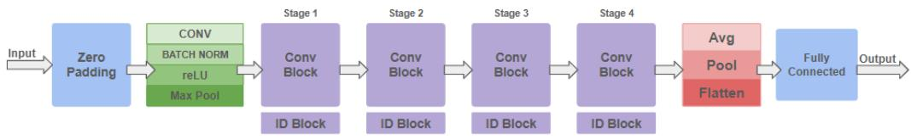
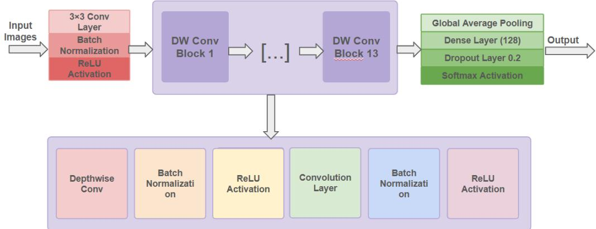
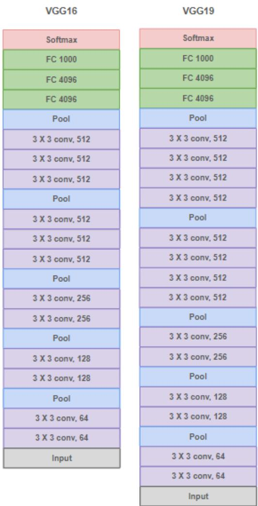
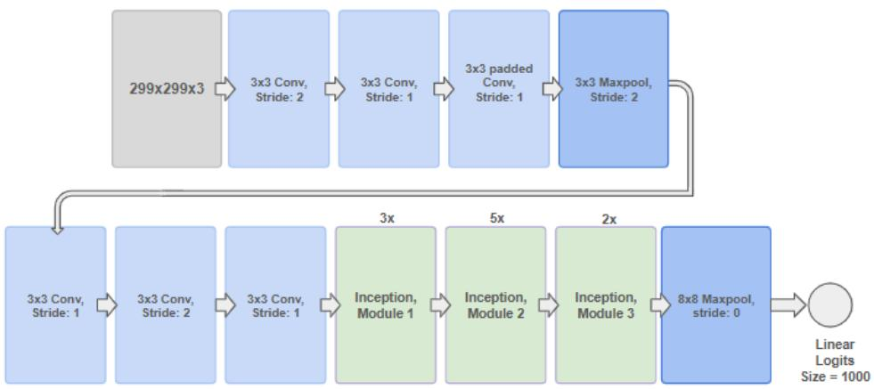
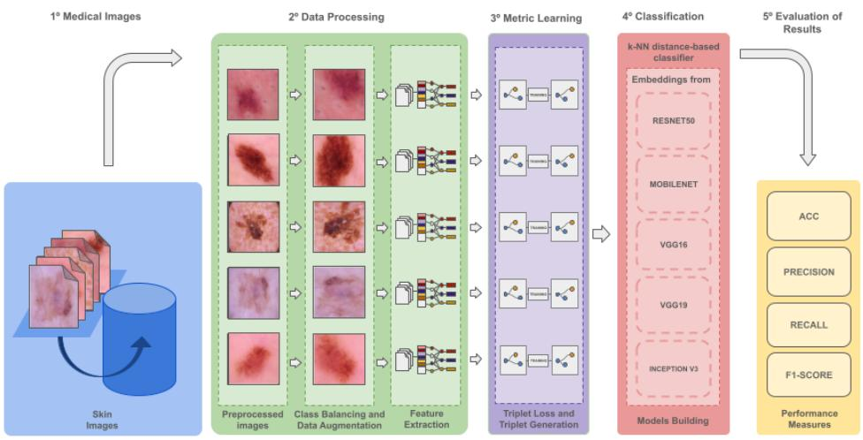

# A Comparative Evaluation of Pre-trained Convolutional Neural Networks for Melanoma Detection

Wagner Moreno Schmitzb, Marco Antonio de Castro Barbosab, Thiago Magalhães Amaral1, Dalcimar Casanovab, Jeferson Tales Olivab

aUniversidade Tecnológica Federal do Paraná (UTFPR), Pato Branco, Paraná, Brasil bUniversidade Federal do Vale do São Francisco (Univasf ), Petrolina, Pernambuco, Brasil

## Abstract

Early diagnosis of melanoma is critical for improving patient survival rates. However, accurately distinguishing melanoma from other skin lesions remains a significant clinical challenge due to the high visual similarity among lesion types and variability in image acquisition conditions. Artificial intelligence, particularly machine learning, has emerged as a promising tool to support dermatological diagnosis by automating feature extraction from medical images. Among the available approaches, convolutional neural networks (CNNs) have demonstrated strong performance in image classification tasks, making them well-suited for analyzing both dermatoscopic and histopatho logical images, given their ability to capture hierarchical visual patterns relevant to lesion characterization. Nevertheless, despite numerous pre-trained CNN architectures having been proposed, selecting the most appropriate one for a given imaging modality remains an open challenge. In this study, we evaluate pre-trained convolutional neural networks (CNNs) for skin lesion classification using dermatoscopic and histopathological image datasets. Experiments were conducted on the HAM10000, ISIC 2018, and CR-AI4SkIN datasets, evaluating the ResNet50, VGG16, VGG19, MobileNet, and InceptionV3 architectures under the same training protocol. The experimental evaluation showed that the models achieved accuracies ranging from 71% (InceptionV3 on ISIC 2018) to 84% (ResNet50 on HAM10000) on dermatoscopic images. For histopathological images, accuracies ranged from 72% (VGG19) to 83% (ResNet50) on the CR-AI4SkIN dataset. The results demonstrate that model performance difers between dermatoscopic and histopathological

image modalities, showing that architectures exhibiting similar performance on dermatoscopic images exhibit diferent performance on histopathological data.. These findings emphasize the importance of considering image modality when selecting deep learning architectures for melanoma detection.

Keywords: Melanoma, Deep Learning, Convolutional Neural Networks, Dermoscopy, Histopathology

## 1. Introduction

Skin cancers constitute the most commonly diagnosed group of neoplasms worldwide, representing one of the major current challenges for global health. According to the International Agency for Research on Cancer (IARC), the cancer research arm of the World Health Organization (WHO), the term “skin cancer” encompasses a spectrum of diseases that includes both nonmelanoma skin carcinomas and malignant melanoma (World Health Organization, 2024). Melanoma is recognized as the most aggressive form of skin cancer due to its high metastatic potential and the elevated mortality rates associated with advanced stages of the disease (Pekarek et al., 2025).

Recent epidemiological estimates indicate a concerning global trend of increasing melanoma incidence (Langselius et al., 2025). As reported by (Karimkhani et al., 2022), the number of melanoma cases is expected to increase by more than 50% between 2020 and 2040. Based on demographic changes and population aging, it is projected that more than 500,000 new cases and approximately 100,000 annual deaths from melanoma will occur worldwide by 2040. Despite this alarming scenario, the same study emphasizes that a substantial proportion of these cases could be prevented through efective public health strategies, including early detection.

Early-stage melanoma detection is decisive for patient survival: approximately 99% of patients diagnosed at an early stage in the United States survive at least five years after detection (The Skin Cancer Foundation, 2025). However, the accuracy of naked-eye diagnosis of cutaneous melanoma is only around 60%. Techniques such as dermoscopy, a non-invasive examination that enables the visualization of skin structures not visible to the naked eye, can substantially increase diagnostic accuracy. Nevertheless, its efectiveness strongly depends on the examiner’s level of expertise (Kittler et al., 2002).

In addition, in some cases, detection can be performed through the analysis of histopathological images obtained from tissue samples removed by biopsy and examined under a microscope. These images provide detailed information about cellular morphology and tissue architecture, enabling the identification of specific characteristics associated with melanoma. According to the guidelines (Munhoz de Paula Alves Coelho et al., 2025), histopathological examination is considered the gold standard for diagnostic confirmation, although it involves manual procedures and subjective interpretation by pathologists.

Advances in technology have contributed to making melanoma detection faster and more accurate. Methods based on artificial intelligence have shown promising results, assisting in screening and diagnostic support (Parhi et al., 2026). Nevertheless, challenges persist related to data variability, the heterogeneous performance of neural network architectures, and model generalization capability. In this context, the evaluation of diferent CNN architectures under controlled experimental conditions becomes essential to identify models that are more robust and reliable for supporting medical diagnosis. Current studies commonly evaluate models on a single dataset or imaging modality, or employ diferent training protocols and hyperparameter configurations, making it dificult to isolate the efects of the CNN architecture from those of the experimental setup. Therefore, this study evaluates the performance of pre-trained CNN architectures using an identical training protocol and hyperparameter configuration across dermatoscopic and histopathological image datasets, enabling a fair assessment of how imaging modality influences the performance and generalization capability of diferent CNN architectures for automatic melanoma detection.

Among these technologies, Athiwaratkun and Kang (2015) point out that convolutional neural networks (CNN) stand out due to their ability to automatically extract relevant patterns and characteristics from images. Since their popularization, numerous architectures have been proposed, such as VGG, ResNet, Inception, and DenseNet, each with distinct designs that influence their capacity to learn discriminative representations. However, training these models from scratch typically requires large annotated datasets and substantial computational resources, which are often scarce in the medical imaging domain. To address this limitation, pre-trained networks have been widely adopted through transfer learning, a strategy in which models previously trained on large-scale datasets, such as ImageNet, are fine-tuned for a specific target task with considerably less data.

In this way, the analysis of dermoscopic and histopathological images using CNNs overcomes the limitations of manual evaluation, which can be subjective and dependent on examiner experience. These networks are capable of identifying subtle details that often go unnoticed in conventional analysis. Comparing diferent CNN architectures allows for the assessment of how each model responds to data variability, the identification of more robust and generalizable models, and the selection of those with greater potential to improve automatic melanoma detection, contributing to more accurate and consistent diagnoses.

In this work, we evaluate five pre-trained CNN architectures for melanoma detection across three distinct datasets: two composed of dermatoscopic images and one of histopathological images. The inclusion of two dermatoscopic datasets enables the assessment of model consistency across diferent datasets within the same imaging modality, while the histopathological dataset allows the evaluation of model behavior under a distinct imaging modality. The adopted strategy aims to evaluate the behavior of diferent architectures on both homogeneous and heterogeneous datasets, investigating whether there are statistically significant diferences among models and how the imaging modality influences the obtained results. This analysis enables the identification of architectures that exhibit greater robustness, generalization capability, and consistent performance across diferent image types, providing important insights into model selection for clinical applications of automatic melanoma detection and contributing to the development of more accurate and reliable medical decision-support systems.

The main contributions of this work are as follows:

• A systematic comparison of five CNN architectures employed as feature extractors across diferent image datasets, considering both dermoscopic and histopathological data;

• The evaluation of performance and generalization capability across modalities and multiple datasets enables an understanding of how each architecture responds to the structural variations present in distinct data sources;

• The application of statistical hypothesis testing, specifically the Friedman and Nemenyi tests, to rigorously assess whether performance differences among architectures are statistically significant;

Subsequently, the remainder of this paper is organized as follows: Section 2 presents the Related Work, including a systematic review of related studies and the identification of methodological patterns and limitations in the literature; Section 3 describes the materials and methods adopted in this study, detailing the datasets used (HAM10000, ISIC 2018 Challenge, and CR-AI4SkIN), the preprocessing procedures, the evaluated pre-trained convolutional neural network architectures, the feature embedding extraction process, and the evaluation metrics; Section 4 reports and discusses the experimental results, analyzing the performance of the evaluated architectures across diferent datasets and including statistical comparisons based on the Friedman and Nemenyi tests; and Section 5 concludes the paper by summarizing the main findings, discussing their implications, and outlining directions for future research in automatic melanoma detection.

## 2. Related Work

The development of this research is grounded in the analysis of recent studies that employ machine learning and deep learning techniques for skin cancer detection. Based on this review, the objective is to identify the most frequently adopted methodological practices in the literature, as well as to recognize recurring patterns and limitations that may be addressed or overcome. This stage is fundamental for defining the parameters and guidelines to be adopted in this study, with the goal of implementing a robust model with high generalization potential for automated diagnosis.

To ensure a systematic and reproducible selection of the literature, the bibliographic review followed specific criteria. The search was conducted in the IEEE Xplore database, chosen for its relevance in computer science and technology, and complemented by a search in the journal Expert Systems with Applications, selected for its relevance in applied computational research, despite not ofering open-access publications. The search string was constructed using logical combinations of keywords in English: ("CNN" OR "Convolutional Neural Network") AND ("Image Classification" OR "Medical Images") AND ("Deep Learning") AND ("skin lesions" OR "skin cancer").

After retrieving the initial search results, a sequential screening protocol was applied to determine the eligibility of each study. The selection process consisted of five verification steps: (i) the study had to be related to the healthcare domain; (ii) it had to be written in English; (iii) it had to employ a Convolutional Neural Network (CNN) as the primary methodological approach; (iv) for the IEEE Xplore search, it had to be available with full open access, this criterion was not applied to the search conducted in Expert Systems with Applications, given that the journal does not provide open-access articles; and (v) it had to address skin cancer or related cancer classification problems. Only studies that satisfied all applicable criteria were included in the detailed analysis.

For the refinement of the results, the following inclusion criteria were applied: (i) articles written in English; (ii) studies addressing the application of CNN for the classification of skin cancer medical images; (iii) publications between January 2023 and May 2026; and (iv) articles available in full text. Conversely, studies that did not use CNNs as the primary method, articles without full-text access, and those with titles or abstracts unrelated to the research theme were excluded.

Following the initial search, a total of 278 articles were identified. After the application of the selection protocol and inclusion criteria, 27 articles were selected for detailed analysis. These studies provide a comparative baseline for the current research, focusing on state-of-the-art implementations within the specified period.

An overview of the analyzed articles, based on the previously established criteria: Dataset, Image Set Size, Problem Type, Training Testing Strategy, Applied Model, Main Features, Evaluation Metrics, Reported Results, and Frameworks, is provided in Table 1. To ensure a clear understanding of the comparative data, the definitions and parameters considered for each column of the table are described below:

• Work: Authors and year of publication.

• Image set: image dataset used in each study.

• Feature categories: Category or type of features employed.

• Classification algorithms: Algorithms or neural network architectures used for classification.

• Performance measures: Reported performance evaluation measures used in the related work.

• Fine-tuning / Transfer learning: Indication of whether fine-tuning or transfer learning was applied, and which pre-trained models were used.

Table 1: Systematic literature review of skin cancer classification methods
<table><tr><td rowspan=1 colspan=1>Work</td><td rowspan=1 colspan=1>Image set</td><td rowspan=1 colspan=1>Featurecategories</td><td rowspan=1 colspan=1>Classificationalgorithms</td><td rowspan=1 colspan=1>Performancemeasures</td><td rowspan=1 colspan=1>Fine-tuning/Transferlearning</td></tr><tr><td rowspan=1 colspan=1>Obayya et al.(2023)</td><td rowspan=1 colspan=1>ISIC 2017and 2020</td><td rowspan=1 colspan=1>Deep andMetaheuristic-basedFeatures</td><td rowspan=1 colspan=1>HMDL-MFMBIA</td><td rowspan=1 colspan=1>Accuracy,F1-score,precision,recall, andAUC</td><td rowspan=1 colspan=1>Yes</td></tr><tr><td rowspan=1 colspan=1>Qian et al.(2024)</td><td rowspan=1 colspan=1>HAM10000NCT-CRC-HE-100K</td><td rowspan=1 colspan=1>Attention, andmulti-scale features</td><td rowspan=1 colspan=1>SPCB-Net</td><td rowspan=1 colspan=1>Accuracy (Acc),and F1-score (F1)</td><td rowspan=1 colspan=1>Yes</td></tr><tr><td rowspan=1 colspan=1>Su et al.(2024)</td><td rowspan=1 colspan=1>HAM10000</td><td rowspan=1 colspan=1>GAN and attention</td><td rowspan=1 colspan=1>STGAN andT-ResNet50</td><td rowspan=1 colspan=1>Sensitivity (Sen),Acc, F1, andspecificity (Spe)</td><td rowspan=1 colspan=1>Yes</td></tr><tr><td rowspan=1 colspan=1>Wang et al.(2022)</td><td rowspan=1 colspan=1>ISIC 2016,2017, and2018, andPH2</td><td rowspan=1 colspan=1>CascadedContextAggregation (CCA),and Context-GuidedLocal affinity (CGL)</td><td rowspan=1 colspan=1>ResNet-ASPP,CCA, and CGL</td><td rowspan=1 colspan=1>Jaccard (Jac)and dice</td><td rowspan=1 colspan=1>Yes</td></tr><tr><td rowspan=1 colspan=1>Faizi and Ad-nan (2024)</td><td rowspan=1 colspan=1>ISIC 2017,2019, and2020</td><td rowspan=1 colspan=1>Shape and Texture</td><td rowspan=1 colspan=1>k-means, NCC,RF, and SVM</td><td rowspan=1 colspan=1>Acc, F1,precision (Pre),and recall (Rec)</td><td rowspan=1 colspan=1>No</td></tr><tr><td rowspan=1 colspan=1>Ji et  al.(2024)</td><td rowspan=1 colspan=1>ISIC 2019HAM10000</td><td rowspan=1 colspan=1>Fusion features</td><td rowspan=1 colspan=1>EFAM-Net</td><td rowspan=1 colspan=1>Acc and F1</td><td rowspan=1 colspan=1>Yes</td></tr><tr><td rowspan=1 colspan=1>Saeed et al.(2025)</td><td rowspan=1 colspan=1>ISIC 2017HAM10000</td><td rowspan=1 colspan=1>Global/Local Attention,and Multi-scale Fusion</td><td rowspan=1 colspan=1>EG-VAN</td><td rowspan=1 colspan=1>Acc, Rec, andF1</td><td rowspan=1 colspan=1>Yes</td></tr><tr><td rowspan=1 colspan=1>Yang et al.(2025)</td><td rowspan=1 colspan=1>ISIC 2017 HAM10000</td><td rowspan=1 colspan=1>CNN features</td><td rowspan=1 colspan=1>DRL-drivenActiveLearning</td><td rowspan=1 colspan=1>F1</td><td rowspan=1 colspan=1>Yes</td></tr><tr><td rowspan=1 colspan=1>Amer et al.(2025)</td><td rowspan=1 colspan=1>ISIC 2019 andPAD-UFES-20</td><td rowspan=1 colspan=1>Compressed deepfeatures</td><td rowspan=1 colspan=1>OptimizedAlexNet</td><td rowspan=1 colspan=1>Acc, Sen, Spe,Pre, and F1</td><td rowspan=1 colspan=1>Yes</td></tr><tr><td rowspan=1 colspan=1>Ambar et al.(2025)</td><td rowspan=1 colspan=1>HAM10000</td><td rowspan=1 colspan=1>Deep ResidualFeatures</td><td rowspan=1 colspan=1>ResNet-50</td><td rowspan=1 colspan=1>Acc, Pre, Rec,and F1</td><td rowspan=1 colspan=1>Yes</td></tr><tr><td rowspan=1 colspan=1>Shafter et al.(2025)</td><td rowspan=1 colspan=1>ISIC 2016,2017, and2018</td><td rowspan=1 colspan=1>Multi-Scale Spatialand Contextual</td><td rowspan=1 colspan=1>UniSegNet</td><td rowspan=1 colspan=1>Dice and IoU</td><td rowspan=1 colspan=1>Yes</td></tr><tr><td rowspan=1 colspan=1>Ahmed et al.(2025)</td><td rowspan=1 colspan=1>ISIC 2016,2017, and2018</td><td rowspan=1 colspan=1>Multi-model deepfeatures</td><td rowspan=1 colspan=1>XceptMPX</td><td rowspan=1 colspan=1>Acc, Pre, Rec,F1, and areaunder curve (AUC)</td><td rowspan=1 colspan=1>Yes</td></tr><tr><td rowspan=1 colspan=1>Zhang et al.(2025)</td><td rowspan=1 colspan=1>ISIC 2017and PH2</td><td rowspan=1 colspan=1>Multi-task features</td><td rowspan=1 colspan=1>CA Y-Net</td><td rowspan=1 colspan=1>Acc, Sen, Spe,and AUC</td><td rowspan=1 colspan=1>Yes</td></tr><tr><td rowspan=1 colspan=1>Adeel   Aj-mal  Khanet al. (2026)</td><td rowspan=1 colspan=1>HAM10000ISIC 2019andBCN20000</td><td rowspan=1 colspan=1>Ensemble-based deepfeatures</td><td rowspan=1 colspan=1>SynthraXCoreNet</td><td rowspan=1 colspan=1>Acc, Rec, Pre,and F1</td><td rowspan=1 colspan=1>Yes</td></tr><tr><td rowspan=1 colspan=1>Chu and Lin(2026)</td><td rowspan=1 colspan=1>ISIC 2016,2017, and2018, andPH2</td><td rowspan=1 colspan=1>Global, local, andregion-level cues</td><td rowspan=1 colspan=1>GLR-Net</td><td rowspan=1 colspan=1>Dice, Acc, andintersectionover union (IoU)</td><td rowspan=1 colspan=1>Yes</td></tr></table>

Continued on next page

Table 1 – continued from previous page
<table><tr><td rowspan=1 colspan=1>Work</td><td rowspan=1 colspan=1>Image set</td><td rowspan=1 colspan=1>Featurecategories</td><td rowspan=1 colspan=1>Classificationalgorithms</td><td rowspan=1 colspan=1>Performancemeasures</td><td rowspan=1 colspan=1>Fine-tuning/Transferlearning</td></tr><tr><td rowspan=1 colspan=1>Alenezi et al.(2023)</td><td rowspan=1 colspan=1>ISIC 2019and 2020</td><td rowspan=1 colspan=1>Deep FeatureExtraction</td><td rowspan=1 colspan=1>Bayesian-optimizedSVM</td><td rowspan=1 colspan=1>Acc, Sen, Spe,and Pre</td><td rowspan=1 colspan=1>Yes</td></tr><tr><td rowspan=1 colspan=1>Hu etal.(2022)</td><td rowspan=1 colspan=1>ISIC 2017and 2018,and PH2</td><td rowspan=1 colspan=1>Spatial and ChannelAttention</td><td rowspan=1 colspan=1>AS-Net</td><td rowspan=1 colspan=1>Acc, and Jac</td><td rowspan=1 colspan=1>Yes</td></tr><tr><td rowspan=1 colspan=1>Abdelhalimet al. (2021)</td><td rowspan=1 colspan=1>HAM10000</td><td rowspan=1 colspan=1>GAN-basedfeatures</td><td rowspan=1 colspan=1>ResNet-18</td><td rowspan=1 colspan=1>Acc, Sen, Rec,Pre, and F1</td><td rowspan=1 colspan=1>Yes</td></tr><tr><td rowspan=1 colspan=1>Zhu et al.(2025)</td><td rowspan=1 colspan=1>ISIC 2016,2017, and2018, andPH2 PAD-UFES-20</td><td rowspan=1 colspan=1>Morphology-awareboundary extraction,multi-scale fusion,and few-shot domaingeneralization</td><td rowspan=1 colspan=1>EM-Net</td><td rowspan=1 colspan=1>Acc, Pre, Rec,Dice and IoU</td><td rowspan=1 colspan=1>Yes</td></tr><tr><td rowspan=1 colspan=1>Kaymaket al. (2020)</td><td rowspan=1 colspan=1>ISIC 2017</td><td rowspan=1 colspan=1>FCN-basedfeatures</td><td rowspan=1 colspan=1>FCN-8s</td><td rowspan=1 colspan=1>Acc, Dice,and Jac</td><td rowspan=1 colspan=1>Yes</td></tr><tr><td rowspan=1 colspan=1>Catal  Reisand   Turk(2026)</td><td rowspan=1 colspan=1>PH2</td><td rowspan=1 colspan=1>Multi-scale attention,and ensemble fusion</td><td rowspan=1 colspan=1>SVM, RF, andKNN hard-votingensemble</td><td rowspan=1 colspan=1>Acc, Pre, Sen,and F1</td><td rowspan=1 colspan=1>Yes</td></tr><tr><td rowspan=1 colspan=1>Zhang et al.(2026)</td><td rowspan=1 colspan=1>ISIC 2018and 2019</td><td rowspan=1 colspan=1>Multi-scale attentionfusion</td><td rowspan=1 colspan=1>GL-MSFN</td><td rowspan=1 colspan=1>Acc, Pre, Rec,and Spe</td><td rowspan=1 colspan=1>Yes</td></tr><tr><td rowspan=1 colspan=1>Aruk et al.(2025)</td><td rowspan=1 colspan=1>HAM10000andISIC 2019</td><td rowspan=1 colspan=1>Local-globalhybrid (CNN-ViT)</td><td rowspan=1 colspan=1>Hybrid CNN-ViT</td><td rowspan=1 colspan=1>Acc and F1</td><td rowspan=1 colspan=1>Yes</td></tr><tr><td rowspan=1 colspan=1>Pezhman Pourand  Seker(2020)</td><td rowspan=1 colspan=1>ISIC 2016and 2017</td><td rowspan=1 colspan=1>Contourlet-transform,CIELAB color</td><td rowspan=1 colspan=1>Compact encoder-decoder CNN</td><td rowspan=1 colspan=1>Jac, Sen, anddice</td><td rowspan=1 colspan=1>No</td></tr><tr><td rowspan=1 colspan=1>Sethananet al. (2023)</td><td rowspan=1 colspan=1>HAM10000and HAM-MB-13312</td><td rowspan=1 colspan=1>Ensemble deep features</td><td rowspan=1 colspan=1>AMIS-weighteddouble-ensemble</td><td rowspan=1 colspan=1>Acc, AUC, andPre</td><td rowspan=1 colspan=1>Yes</td></tr><tr><td rowspan=1 colspan=1>Sulthana Aet al. (2024)</td><td rowspan=1 colspan=1>HAM10000</td><td rowspan=1 colspan=1>Fractals</td><td rowspan=1 colspan=1>S-MobileNet</td><td rowspan=1 colspan=1>Acc, Pre, andF1</td><td rowspan=1 colspan=1>Yes</td></tr><tr><td rowspan=1 colspan=1>Gao et al.(2026)</td><td rowspan=1 colspan=1>ISIC 2017and 2018,and PH2</td><td rowspan=1 colspan=1>Multi-scaletransformer-CNN dualencoder</td><td rowspan=1 colspan=1>AMST-Net</td><td rowspan=1 colspan=1>Dice, IoU, and Acc</td><td rowspan=1 colspan=1>No</td></tr></table>

The analysis of the selected studies presented in Table 1 revealed a recurring pattern in dataset selection, with HAM10000 being the most frequently used dataset, followed by diferent editions of the ISIC dataset (2017, 2018, 2019, and 2020). In addition to these public datasets, some studies employed private datasets, which are often not publicly available, thereby limiting reproducibility and hindering direct comparison among methods.

The data splitting strategy was predominantly performed using the holdout method, adopting proportions such as 80% for training and 20% for testing, or alternatively 80% for training, 10% for validation, and 10% for testing.

Obayya et al. (2023) propose the HMDL-MFMBIA framework, a hybrid architecture that combines Swin-UNet-based segmentation, fusion-based feature extraction using Xception and ResNet18, metaheuristic hyperparameter optimization via a Hybrid Salp Swarm Algorithm, and GRU-based classification for biomedical image analysis. The study is evaluated on the ISIC 2017 and ISIC 2020 datasets, each containing 3,000 images across two classes (benign and melanoma), using a 70/30 hold-out split, with performance measured through Accuracy, Precision, Recall, F-Score, and AUC. The proposed method achieves 94.51% and 95.38% accuracy on ISIC 2017 and ISIC 2020 respectively, outperforming baselines such as ResNet18, InceptionV3, AlexNet, SVM, and Ensemble models. From a methodological standpoint, the work illustrates how the integration of automated hyperparameter tuning and multimodel feature fusion can yield more robust classification pipelines, though the binary class setup and relatively small dataset size represent limitations worth considering when contextualizing its contribution within broader skin cancer detection research.

Addressing the persistent challenge of intra-class variability and interclass similarity in dermatological images, Qian et al. (2024) introduces SPCB-Net (Self-Interactive Attention Pyramid and Cross-Layer Bilinear-Trilinear Pooling Network), a multi-scale architecture combining a Self-Interactive Attention Pyramid, cross-layer bilinear-trilinear pooling, and a Global Average Algorithm over ResNet101 and VGG19 backbones. Evaluated on HAM10000 (10,015 images, 7 classes) and NCT-CRC-HE-100K (100,000 patches, 9 classes) through an 80/10/10 split using Accuracy, Precision, Recall, F1-Score, and AUC under PyTorch, the model reaches 97.10% and 99.87% accuracy respectively, outperforming the prior state-of-the-art by 0.4% on both datasets, demonstrating that high-order feature interaction combined with multi-scale attention yields more discriminative representations for fine-grained medical image classification.

Taking a generative approach to the class imbalance problem, Su et al. (2024) proposes STGAN, a two-stage framework that decouples the learning of universal and class-specific knowledge to overcome mode collapse in minority classes, producing diverse 256×256 dermoscopy images for the HAM10000 dataset. The classification pipeline combines the synthetic data with a pretrained ResNet50 and Test-Time Augmentation, evaluated on an 80/20 holdout split through Accuracy, Sensitivity, Precision, F1-Score, and Specificity under PyTorch, reaching 98.23% accuracy and 88.85% sensitivity. Beyond classification, STGAN outperforms conditional StyleGAN2 by 16% in FID and 33% in Recall, suggesting that separating global from class-specific generation is a more principled strategy for handling severely imbalanced medical image datasets than conventional conditional GAN approaches.

Unlike the deep learning-centered approaches predominant in the literature, Faizi and Adnan (2024) takes a classical machine learning route, proposing a normalized cross-correlation-based k-means clustering pipeline for melanoma segmentation and binary classification. The method uses template matching to dynamically determine the number of clusters fed into k-means, followed by GLCM-based Haralick texture (Haralick et al., 1973) and Hu-Moment (Hu, 1962) shape feature extraction, PCA-based dimensionality reduction, and evaluation across six classifiers including Random Forest, SVM, and KNN. Three ISIC datasets are used (2017, 2019, and 2020) with a 70/30 hold-out split, reporting Accuracy, Precision, Recall, and F1-Score, with the best results reaching 99.46%, 99.38%, and 99.29% respectively across datasets. Notably, the study explicitly benchmarks its results against deep learning models and claims superior performance, which positions it as a relevant reference for discussions on the trade-ofs between computational complexity and classification efectiveness in dermoscopic image analysis.

Chatterjee et al. (2024) propose the IncepX-Ensemble model, a transfer learning-based ensemble combining InceptionV3 and Xception through weighted average fusion for multiclass skin lesion classification. Evaluated on the HAM10000 dataset (10,015 images, 7 classes) using an 80/20 holdout split and traditional data augmentation to address class imbalance, the model achieves 98.8% accuracy, outperforming individual baselines such as ResNet50 and InceptionV3, with performance assessed through Accuracy, Precision, Recall, and F1-Score.

Ji et al. (2024) introduce EFAM-Net, a ConvNeXt-based architecture that incorporates three newly designed modules: an Attention Residual Learning ConvNeXt (ARLC) block for low-level feature extraction, a Parallel ConvNeXt (PCNXt) block for enhanced deep semantic representation, and a Multi-scale Eficient Attention Feature Fusion (MEAFF) block for integrating multi-scale features across network layers. The model is evaluated on ISIC 2019 (25,331 images, 8 classes), HAM10000 (10,015 images, 7 classes), and a private clinical dataset (2,900 images, 6 classes), using an 80/20 hold-out split, with performance assessed through Accuracy, Precision, Recall, Specificity, and F1-Score under PyTorch. Data augmentation techniques, including random rotation, horizontal flipping, and histogram equalization, were applied to the training set to improve robustness. EFAM-Net achieves overall accuracies of 92.30%, 93.95%, and 94.31% on the three datasets, respectively, outperforming baselines such as ResNet-101, DenseNet-201, EficientNet-B0, and ConvNeXt, while also ranking first across all evaluation metrics on HAM10000 compared to other state-of-the-art methods.

Ibrahim et al. (2024) address a binary classification problem using the ISIC Archive dataset with only 3,297 dermoscopy images, a considerably small image set compared to other works in the literature, adopting the hold-out strategy with an 80/20 split and applying transfer learning with ImageNet weights across three CNN backbones, namely EficientNetV2B3, InceptionV3, and InceptionResNetV2, enhanced by a soft attention mechanism. Evaluation was conducted through accuracy, precision, recall, and F1- score, with the best result reaching 95.6% accuracy. However, the reduced dataset size and binary problem scope limit conclusions about the model’s generalization capacity to more complex multi-class clinical scenarios.

Advancing beyond conventional single-strategy approaches, Saeed et al. (2025) propose the EG-VAN architecture, a dual-branch ensemble combining EficientNetV2S with a modified ResNet50 enhanced by a Spatial-Context Group Attention (SCGA) module and a Non-Local Block, applied to a custom 9-class dataset aggregated from HAM10000 and a binary ISIC dataset totaling over 13,000 images, with a split strategy separating 1,332 original images for testing and the remainder divided into training and validation sets after augmentation. The preprocessing pipeline stands out for its novelty, incorporating hair removal, oversampling, and a color balancing method combining the Gray World algorithm with Retinex theory to enhance lesion visibility. Transfer learning with ImageNet weights was employed across both branches, and focal loss was adopted instead of categorical cross-entropy to address class imbalance. Performance was evaluated through accuracy, precision, recall, F1-score, and AUC, with the model achieving 98.20% accuracy and 96.68% F1-score on the 9-class dataset, though generalization to external datasets remains unaddressed, representing a notable limitation for clinical deployment.

Proposing active learning as a solution to the labeled data bottleneck in CNN-based skin cancer detection, Yang et al. (2025) integrate deep reinforcement learning for dynamic sample selection with a novel scope loss function, evaluated on ISIC (318 images, seven classes) and HAM10000 (10,015 images, seven classes) using a hold-out strategy with preprocessing including resizing, augmentation, and contrast adjustment. An enhanced artificial bee colony algorithm handles hyperparameter optimization, and performance is assessed through accuracy, F-measure, G-means, and AUC, achieving F-measures of 92.791% and 91.984% respectively, though the very limited ISIC image set and absence of external validation raise concerns about generalization.

Addressing the challenge of deploying deep learning models on resourceconstrained edge devices, Amer et al. (2025) apply magnitude-based unstructured pruning to a fine-tuned AlexNet for binary skin cancer classification using a small subset of the PAD-UFES-20 dataset (296 images, augmented to 592, split 80:20), focusing on melanoma versus benign nevus distinction. Rather than reporting standard classification metrics as primary results, the study conducts a layer-wise pruning sensitivity analysis, revealing that fully connected layers tolerate aggressive pruning for memory reduction while convolutional layers are more sensitive but dominate computational cost, with 91% pruning achieving 97.48% accuracy, 95.83% sensitivity, and 93.88% F1- score at a 91% reduction in parameters, representing a viable trade-of for edge deployment, though the very limited dataset size and absence of comparison against other compressed architectures limit broader conclusions about generalizability.

Ambar et al. (2025), propose a multistage learning pipeline using ResNet-50 as a static feature extractor for multiclass skin lesion classification on the HAM10000 dataset (10,015 dermoscopic images across seven categories), applying transfer learning with ImageNet weights, targeted data augmentation without SMOTE, and an 80/10/10 hold-out split with 5-fold patient-wise cross-validation. The model achieved 85% accuracy with macro-averaged precision of 0.75, recall of 0.65, and F1-score of 0.65, evaluated using accuracy, precision, recall, F1-score, and ROC-AUC metrics via PyTorch. The study aligns with the dominant methodological patterns found in the literature, including the use of HAM10000, hold-out splitting, transfer learning, and augmentation-based class balancing, while its modest macro recall reflects the persistent challenge of minority class recognition in imbalanced medical imaging datasets.

Shafter et al. (2025) present UniSegNet, a skin lesion segmentation architecture designed to improve both segmentation accuracy and computational eficiency through the integration of multi-attention mechanisms, asymmetric multi-cross convolutions, and boundary-guided modules. The proposed model was evaluated on the ISIC 2016, 2017, and 2018 datasets using Dice Score, Jaccard Index, pixel accuracy, and inference time as evaluation metrics, achieving Dice scores of 0.935, 0.934, and 0.936, respectively, while requiring only 0.08 seconds per image during inference. Training was conducted in PyTorch using the Adam optimizer with a learning rate of 0.001 over 200 epochs, with images resized to 192×256 and augmented through rotation, flipping, and scaling operations. Although the work targets segmentation instead of classification, it shares several methodological characteristics commonly found in skin lesion analysis studies, such as the adoption of ISIC benchmarks and data augmentation techniques, while standing out for its strong emphasis on low computational cost alongside high predictive performance.

Targeting mpox detection, Ahmed et al. (2025). present XceptMPX, a modified Xception model trained on MCVSLD, a newly compiled six-class dataset of 11,325 images expanded to 67,950 through augmentation, using an 80:20 split. Xception’s classification head is replaced by Global Average Pooling followed by dense layers with Leaky ReLU, batch normalization, L2 regularization, and dropout, with the deepest 20 base layers fine-tuned using a cosine-annealing scheduler. Accuracy reached 96.36% and 97.01% on the original and augmented sets respectively, confirmed by 5-fold crossvalidation at 97.06%. A Streamlit-based web application supports real-time clinical deployment. Limitations include the absence of hospital-grade clinical validation, sensitivity to image quality and skin tone variation, and the preliminary scope of the usability evaluation.

Narasimha Raju et al. (2025) propose XAI-SkinCADx, a six-stage deep ensemble framework applied to the ISIC dataset with 2,367 dermoscopic images across nine classes, expanded via augmentation to 5,023 balanced samples using an 80:20 split. Feature extraction combines LBP and GLCM descriptors with three DenseNet201-based CNN pairs followed by BiLSTM temporal modeling and Multiclass SVM classification. The best configuration, DM-25 with BiLSTM and SVM, achieved 95.63% accuracy and 0.97 AUC, confirmed by 5-fold cross-validation. Explainability is addressed through Grad-CAM++ and LIME, with a sixth stage implementing a rule-based recommendation system stratifying predictions into low, moderate, and high clinical risk levels. Limitations include reliance on a single dataset without external validation and constraints in the representativeness of synthetic augmentation for real-world clinical scenarios.

Addressing binary skin cancer classification, Hosny et al. (2025), introduce EDA-ResNet50, trained on 3,297 dermoscopic ISIC images without augmentation using an 80:20 split. ResNet50 is enhanced with a Multi-

Scale Feature Representation block and an Eficient Dual Attention module combining channel recalibration and spatial attention, initialized with ImageNet weights. The model reached 93.18% accuracy and 94% sensitivity, statistically validated through Cochran’s Q and McNemar’s tests, with generalizability demonstrated across HAM10000, a combined ISIC 2019/2020 dataset, and a blood cell benchmark. Limitations include the binary classification scope, absence of quantitative explainability evaluation against expert annotations, and dependence on dermoscopic equipment unavailable in lowresource settings.

Zhang et al. (2025) propose CA Y-Net, a dual-branch CNN multitask learning architecture that integrates Convolutional Block Attention Modules (CBAMs) and a novel contrastive loss function (MuCo) to simultaneously perform skin lesion classification and segmentation. The model was evaluated on the International Skin Imaging Collaboration ISIC 2017 dataset, comprising 2,000 training images, 150 validation images, and 600 test images across three lesion classes, employing a hold-out strategy with an additional set of 1,036 images from the ISIC archive for extended training. Performance was assessed using mean AUC for classification and Jaccard Index for segmentation, achieving 92.8% mean AUC and 79.6% Jaccard Index, with additional validation on the Pedro Hispano Hospital PH2 dataset (98.9% AUC and 91.3% Jaccard), demonstrating good generalization capability. Although the results are competitive with the state of the art, the restriction of the study to a single challenge dataset and the requirement for segmentation annotations for all images limit conclusions regarding performance in broader and more heterogeneous clinical scenarios.

Adeel Ajmal Khan et al. (2026) propose SynthraXCoreNet, an ensemble of six heterogeneous CNNs — ResNet50V2, ResNet101V2, ResNet152V2, DenseNet201, NASNetLarge, and Xception — combined through posterior probability soft voting, incorporating probability calibration via temperature scaling and an interpretability pipeline with Integrated Gradients, multiple Grad-CAM variants, and quantitative XAI metrics. The evaluation was conducted on four public datasets (HAM10000, ISIC2019, BCN20000, and DERM12345, totaling more than 50,000 images), using a stratified 70/20/10 split with intra-split class balancing. Performance was reported using accuracy, macro F1-score, and 95% Wilson confidence intervals, with results of $9 8 . 8 5 \% \pm \ 0 . 6 8$ on HAM10000 and $9 6 . 6 3 \% \pm \ 1 . 0 0$ on DERM12345 (40 subclasses). Despite the strong performance and robust evaluation across multiple benchmarks, the absence of prospective multicenter validation with dermatologist approval and the inference latency of approximately 461 ms per image represent important limitations for real-world clinical deployment.

Chu and Lin (2026) present GLR-Net, a hierarchical encoder-decoder architecture based on the Mix Vision Transformer (MiT) from SegFormer, integrating four synergistic components: Global-Local Refinement (GLoR), Boundary-Semantic Integration and Selection Filter (BISF), Attention-Guided Context Refinement (AGCR) and multi-scale Reverse Attention (RA), to specifically enhance dermoscopic lesion boundary delineation. The model was evaluated on the ISIC 2016, 2017, 2018 and PH2 datasets, strictly following the oficial challenge splits (2.000/150/600 for ISIC 2017 and 2.594/100/1.000 for ISIC 2018), with images resized to 512×512 pixels and evaluated using Dice, IoU, accuracy, sensitivity, HD95 and ASSD. GLR-Net achieved 92.32% Dice and 90.71% IoU on ISIC 2017, as well as 95.99% Dice on PH2. The cross-dataset generalization analysis, in which the model was trained on ISIC 2017 and tested on unseen datasets, including 500 samples from HAM10000 with 91.65% Dice, strengthens the study’s conclusions. Nevertheless, the high computational demand of the transformer backbone (92.33M parameters and approximately 210 GFLOPs) and the lack of evaluation across skin tone subgroups limit the extension of the findings toward equitable clinical deployment.

Sonune et al. (2026) conduct a controlled evaluation of six pre-trained CNN architectures: ResNet50, Xception, EficientNetB3, MobileNetV2, DenseNet201 and InceptionV3, along with their soft-voting ensemble for sevenclass classification on the HAM10000 dataset, emphasizing architectural comparability and interpretability through Grad-CAM, LIME and Occlusion Sensitivity. The unified protocol employed a stratified train/test split with a fixed random seed (random seed = 42), inverse-frequency class weights to mitigate imbalance and evaluation using accuracy, F1-score, recall, precision, specificity and macro AUC-ROC. The ensemble achieved 89.37% accuracy and a macro AUC of 0.985, outperforming the best individual model, ResNet50 (86.03%). Although the controlled comparative approach represents a relevant methodological strength, the absence of cross-validation, the lack of guaranteed patient-wise separation, the absence of probability calibration and the strictly qualitative XAI analysis limit both the statistical robustness of the results and the formal assessment of the system’s clinical reliability.

The review of the analyzed articles revealed important insights into the use of deep learning for the classification and segmentation of dermatological lesions. Transfer learning with pre-trained architectures such as InceptionV3, Xception, and EficientNet demonstrated high efectiveness, achieving accuracy values above 98% on the HAM10000 dataset (Chatterjee et al., 2024; Su et al., 2024). Attention mechanisms and feature fusion strategies, as employed in models such as SPCB-Net and EFAM-Net, improved feature representation and contributed to enhanced classification performance (Qian et al., 2024; Ji et al., 2024). Data augmentation techniques, including conventional transformations and GAN-based image generation, were shown to mitigate class imbalance and improve model robustness (Chatterjee et al., 2024; Su et al., 2024). Overall, a predominance of transfer learning was observed, along with the recurrent use of the HAM10000 and ISIC datasets and the widespread adoption of data augmentation techniques, which contributed to the development of models with improved generalization capability.

Among the best practices identified, the use of pre-trained models and the combination of multiple evaluation metrics stood out, enabling a more comprehensive assessment of model performance. Ensemble strategies, such as those adopted in SynthraXCoreNet (Adeel Ajmal Khan et al., 2026) and the soft-voting ensemble evaluated by (Sonune et al., 2026), consistently outperformed individual architectures, reinforcing their utility in imbalanced classification scenarios. Interpretability tools such as Grad-CAM and LIME, reported in several studies (Sonune et al., 2026; Adeel Ajmal Khan et al., 2026), also emerged as relevant complementary components for supporting clinical trust in model predictions.

The lack of standardization in evaluation metrics and data splitting strategies hindered direct comparison among the analyzed studies. Several works adopted hold-out splits with varying proportions, while others employed kfold cross-validation, making performance comparisons across methods dificult to draw. Furthermore, reliance on publicly available imbalanced datasets, most notably HAM10000, compromises the generalization capability of networks for underrepresented classes, a limitation explicitly reflected in the modest macro recall values reported by studies such as Ambar et al. (2025). The absence of external or prospective validation was also a recurring limitation, noted in works such as Saeed et al. (2025) and Adeel Ajmal Khan et al. (2026), restricting conclusions about real-world clinical applicability.

Alenezi et al. (2023) propose a multi-stage melanoma recognition framework that combines a hair-removal pre-processing step based on dilation and max-pooling with a pre-trained ResNet101 backbone for deep feature extraction, followed by Relief-based feature selection and a Bayesian-optimizationtuned SVM classifier. The model was evaluated on two balanced binary datasets built from ISIC-2019 and ISIC-2020, containing 1,168 and 9,044 dermoscopy images of melanoma and benign lesions, respectively, using an 80/20 hold-out split and accuracy, sensitivity, specificity, and precision as metrics. The full pipeline reached 99.14% and 98.62% accuracy on the two datasets, outperforming seven pre-trained backbones tested as baselines and previous state-of-the-art works such as Sayed et al. (2021, 98.37%) and Pyingkodi et al. (2020, 98.32%). Despite these strong results, the framework restricts the task to binary melanoma-versus-benign discrimination and adds non-negligible training overhead from the Bayesian hyperparameter search, as acknowledged by the authors themselves.

Hu et al. (2022) present AS-Net, an Attention Synergy Network for skin lesion segmentation that pairs a pre-trained VGG16 encoder with a decoder containing parallel spatial and channel attention paths, fused through a synergy module, and trained with a novel weighted binary cross-entropy loss to counter foreground-background size imbalance. Evaluated on ISIC2017 (2000/150/600 train/validation/test images), ISIC2018 (2594 images, 75/25 split), and PH2 (200 images, trained on ISIC2016), with online augmentation (random zoom, rotation, shifts) and results averaged over 15 runs, the model is assessed via pixel-wise Accuracy, Dice, Jaccard, Sensitivity, and Specificity. AS-Net attains 94.66% ACC, 88.07% Dice, and 80.51% Jaccard on ISIC2017, and 95.68% ACC/83.09% Jaccard on ISIC2018, outperforming CDNN, FrCN, SLSDeep, DCL-PSI, and DA-Net, though the authors acknowledge the VGG16 backbone and dual attention paths inflate parameter count (24.9M) and computational cost relative to lighter architectures.

Complementing attention-based approaches to context modeling, Wang et al. (2022) introduces a cascaded context enhancement network for automatic skin lesion segmentation, combining a ResNet-ASPP encoder with a cascaded context aggregation (CCA) module that uses gate-based units to sequentially fuse original-image cues with multi-level encoder features, plus a context-guided local afinity (CGL) module that exploits this global context to refine local feature discrimination. Trained with a joint weighted binary cross-entropy and Dice loss and an auxiliary supervision branch, the model is evaluated on ISIC-2016, ISIC-2017, ISIC-2018 (five-fold cross-validation), and PH2, reaching Jaccard Index scores of 87.1%, 80.3%, 84.3%, and 86.6%, respectively, and Dice scores up to 92.6% and 87.8% on ISIC-2016 and ISIC-2017, outperforming CPFNet, Inf-Net, and PyDiNet by 1.1-1.5% JA. However, the PH2 result stems from directly applying the ISIC-2017-trained model without fine-tuning on only 200 images, and the lack of an oficial ISIC-2018 test split limits direct comparability with challenge leaderboards.

Abdelhalim et al. (2021) propose SPGGAN-TTUR, a self-attention- augmented Progressive Growing GAN combined with the Two-Timescale Update Rule, designed to synthesize fine-grained 256×256 dermoscopic images for data augmentation rather than for direct classification. Evaluated on the HAM10000 dataset (10,015 images, 9514/501 train/held-out split across seven classes), the generated samples are used to retrain a ResNet-18 classifier under stratified 3-fold cross-validation. Using GAN-train/GANtest protocols, SPGGAN-TTUR outperforms plain PGGAN and SPGGAN (68.1% vs. 63.5%/64.8% GAN-train), and the resulting augmentation scheme raises overall sensitivity by 5.6% over non-augmented training and 2.5% over the best classical augmentation, with melanoma-specific recall improving by 13.8% and 8.6% respectively (p<0.05). However, absolute accuracy remains modest (66.1%), and the authors themselves note that hardware constraints limited generation to 256×256 rather than the dataset’s native 600×450 resolution, leaving open whether gains would persist at full resolution.

In a related efort targeting boundary precision and cross-dataset robustness, (Zhu et al., 2025) propose EM-Net, a hybrid CNN-ViT encoder-decoder for skin lesion segmentation that couples a Morphology-aware Module—using non-convex optimization over a generalized M-junction field to extract fuzzy lesion boundaries—with Bridge Fusion Modules for multi-scale feature integration and a Few-shot Domain Generalization module that adapts a sourcetrained model to new target domains with minimal labeled samples. Evaluated on ISIC 2016/2017/2018, PH2, PAD-UFES-20, and the University of Waterloo dataset using Dice, IoU, Accuracy, Precision, and Recall, EM-Net surpasses U-Net, TransUNet, Swin-UNet, and ICL-Net across the board, reaching Dice/IoU of 91.89%/85.57% on ISIC 2016 and 94.03%/88.92% on PH2, and improving IoU over TransUNet by 5.62% on Waterloo and 1.57% on PAD-UFES-20, though the authors themselves note the model’s high parameter count constrains deployment on resource-limited clinical hardware.

Li et al. (2024) propose DSEUNet, a lightweight U-shaped encoder-decoder network for skin lesion segmentation that combines four modules: Conditional Parameterized Convolution (CPC), Grouped Hadamard Product Attention (GHPA), a Dynamic Aggregation Bridge (DAB) replacing standard skip connections, and Spatial Group-Enhanced attention (SGE), trained with a multi-scale weighted BCE-Dice loss. Evaluated on ISIC2017 (2,150 images) and ISIC2018 (2,694 images) with a 7:3 train/test split, using mIoU and Dice

Similarity Coeficient as metrics, the model attains 79.2% mIoU / 88.4% DSC on ISIC2017 and 80.5% mIoU / 89.2% DSC on ISIC2018, with only 23.306K parameters and 9.497M FLOPs, outperforming UNext-s by 1.6-1.8% mIoU while using roughly half the parameters of EGEUNet. Despite this eficiency, DSEUNet still trails the much heavier TransUnet (85.9%/85.1% mIoU), suggesting an accuracy ceiling imposed by such aggressive parameter reduction.

In a related direction focused on segmentation rather than classification, Kaymak et al. (2020) conduct a comparative experimental study of four Fully Convolutional Network variants—FCN-AlexNet, FCN-8s, FCN-16s, and FCN-32s—for automatic skin lesion delineation on the ISIC 2017 dataset (2000 training, 150 validation, and 600 test dermoscopic images), leveraging transfer learning from ImageNet and PASCAL VOC pretraining. On the test set, FCN-8s achieved the best overall performance, reaching 93.9% accuracy, 84.1% Dice, and 72.5% Jaccard, outperforming U-Net, LinkNet, SegNet, and II-FCN baselines and producing markedly sharper lesion contours than the coarser FCN-AlexNet and FCN-32s predictions. Despite these gains, the deeper FCN-8s/16s/32s models required roughly three times longer to train (over 500 minutes) than FCN-AlexNet (176 minutes), and the study neither applies data augmentation nor evaluates generalization beyond the single ISIC 2017 benchmark, limiting its practical scalability.

Extending the ensemble-learning paradigm to multi-scale feature fusion, Catal Reis and Turk (2026) propose PADSCNet, P-DEFF, and M-DEFF for skin cancer detection, where PADSCNet combines depthwise separable convolutions with multi-head attention across dual pathways (1175 layers but only 3.3 million parameters), while P-DEFF and M-DEFF fuse PAD-SCNet features—augmented by FCIE/CLAHE-enhanced images and, for M-DEFF, additional pre-trained backbones (DenseNet201, ResNet152, MobileNet)—via a hard-voting SVM-RF-KNN ensemble tuned with PSO/GSA GWO. On the Skin Cancer: Malignant vs. Benign dataset, PADSCNet, P-DEFF, and M-DEFF reach 88.12%, 93.75%, and 95.00% accuracy respectively, with PADSCNet also generalizing to 93.12% on the CNN for Melanoma Detection dataset and 95.00% on PH2, outperforming heavier CNNs such as DenseNet201 (18.3M parameters) and ResNet152 (58.4M parameters). However, the PH2 result is inflated by severe class imbalance (only 8 melanoma test samples), where PADSCNet’s melanoma sensitivity drops to 75%, undermining the headline accuracy as a reliable clinical indicator.

Building on attention-based feature fusion strategies, Zhang et al. (2026) present GL-MSFN, a dermoscopic image classification framework built upon a customized EficientNetV2-S backbone augmented with three complementary modules: an Adaptive Perception Aggregation Module (APAM) that reweights multi-scale features within MBConv blocks, a Global-Local Feature Fusion Module (GLFFM) with an asymmetric dual-branch attention design, and a Multi-Level Attention Module (MLAM) that replaces standard Squeeze-and-Excitation blocks with directional strip pooling, complemented by a combined focal and class-weighted loss to counter class imbalance. Trained on the eight-class ISIC 2019 dataset (25,331 images, 8:2 split), the model attains 93.85% accuracy, 91.23% precision, 92.70% recall and 98.70% specificity, surpassing DeepLabV3+, InSiNet and MetaFormers with focal self-attention, and generalizes to ISIC 2018 with 94.76% accuracy, though cross-dataset evaluation remains confined to the closely related ISIC family rather than independent clinical cohorts.

Aruk et al. (2025) propose a hybrid CNN-ViT architecture for skin lesion classification that augments the MetaFormer-based CAFormer-s32 backbone with ConvNeXt blocks across a four-stage design (four ConvNeXt blocks in Stage 1, eight in Stage 2, sixteen transformer blocks in Stage 3, and four in Stage 4), using ConvNeXt’s large-kernel depthwise convolutions and layer normalization for fine-grained local feature extraction while transformer blocks capture global context. Evaluated on HAM10000 and ISIC 2019 against ten CNN and ten ViT baselines under identical training conditions, the model, with only 38.01M parameters, achieves 94.30% accuracy and 91.11% F1-score on HAM10000, and 92.50% accuracy and 90.38% F1-score on ISIC 2019, with statistically significant gains confirmed via Wilcoxon signed-rank testing; however, performance still degrades noticeably on minority classes such as AK (F1 around 80%), and both datasets predominantly represent light-skinned populations, limiting demonstrated generalizability across skin tones.

Departing from approaches that rely on transfer learning or heavy augmentation to compensate for scarce dermoscopic data, Pezhman Pour and Seker (2020) proposes a compact encoder-decoder CNN trained entirely from scratch for skin lesion and dermoscopic feature (globule/streak) segmentation, injecting multiscale, multidirectional contourlet-transform representations and CIELAB color channels directly into the pooling layers rather than deepening the network. On ISIC 2016 and 2017, the transform-domain variant lifted the Jaccard index by 12% over the base 7-layer model, versus only 6% from simply extending it to 15 layers, and the final model surpassed the ISIC 2017 challenge winner by 2.2% Jaccard and 7% sensitivity, and improved dermoscopic feature segmentation by 17% Dice. However, the approach still depends on handcrafted transform features and manual postprocessing heuristics, and validation is confined to the same two small ISIC challenge sets used by nearly every competing method.

Sethanan et al. (2023) propose a double artificial multiple intelligence system (AMIS)-ensemble deep learning framework for skin cancer classification, combining an ensemble image segmentation stage (thresholding, edge detection, region-growing, clustering, U-Net, and RP-Net fused via Jaccard similarity) with a heterogeneous ensemble of six CNN backbones (including DenseNet121, NASNetMobile, EficientNetB7, EficientNetV2L, and EfficientNetV2M) whose decisions are fused using AMIS-optimized weights, and the model is deployed through a Line chatbot for home use. Evaluated on HAM10000, a malignant-vs-benign dataset, and a merged HAM-MB-13312 dataset (80/20 split), the model reaches over 99.4% accuracy on the aggregated data, 95.078% accuracy through the chatbot, and outperforms prior CNN-based methods by 2.831-15.357% on HAM10000 and 1.356-8.560% on the malignant-vs-benign dataset, with a reported System Usability Scale score of 96.85 from 31 clinical volunteers. The heavy reliance on a computationally expensive six-CNN ensemble with metaheuristic weight optimization raises concerns about training cost and real-time deployability despite the strong reported accuracy gains.

In a related direction, Sulthana A et al. (2024) propose an end-to-end deep convolutional neural network framework, S-MobileNet, for multiclass skin lesion classification on the HAM10000 dataset (10,000 dermoscopic images, 7 classes, 80:20 train-test split), combining a custom Gaussian-based segmentation algorithm with a modified Segmentation-based Fractal Texture Analysis (SFTA) feature extractor before classification. The architecture is evaluated along four axes: raw versus preprocessed input, ReLU versus Mish activation, and pruned versus unpruned layers, across Adam, RMSProp, and SGD optimizers. Their best configuration (preprocessed data, SGD, Mish, with L1-norm pruning of 156 filters) reached 98.35% training and 98.15% test accuracy, 96.23% precision, and 94.59% F1-score, reportedly surpassing MobileNet, ShufleNet, DenseNet, and other HAM10000 benchmarks from 2018-2023. However, the comparison relies on figures copied from prior papers rather than re-implementation under identical hardware/latency conditions, weakening the validity of the superiority claim.

Gao et al. (2026) propose AMST-Net, an adaptive multi-scale transformer dual encoder network for skin lesion segmentation that pairs a light-

se-to-fine resolution features with a parallel CNN encoder, hierarchically fusing them through a cascaded multi-scale pooling eficient channel attention module (CMSP-ECA) and an eficient contextual information fusion module (CIFM) inside a U-shaped architecture trained with a combined Dice and cross-entropy loss. Evaluated on ISIC2017, ISIC2018, and PH2 with simple augmentation (Gaussian noise, flips, translation), the model reaches Dice/IoU/ACC of 88.53%/81.48%/92.07% on ISIC2018, 84.32%/75.79% 82.66% on ISIC2017, and 92.89%/87.42%/96.34% on PH2, outperforming U-Net, CE-Net, CA-Net, FAT-Net, H-Net, TransUNet, TransFuse, and CMM-Net across Dice, IoU, ASSD, and HD95. Despite the consistent gains, the 32M-parameter model remains heavier than several competing baselines such as CA-Net (2.8M) and SegFormer (7M), and the authors themselves note persistent failures on extremely low-contrast or spatially discontinuous lesions.

Moving outside the dermoscopic domain entirely, Xu et al. (2024) propose DKNet, a domain knowledge-driven encoder-decoder for nasopharyngeal carcinoma (NPC) segmentation that encodes radiologists’ expert-prior knowledge of NPC predilection sites as a Gaussian mixture distribution via optimal-transport regularization, combined with dynamic top-k pooling for slice-level prediction and a cross-scale feature refinement module for coarseto-fine segmentation. Built on a modified ResNet-14 backbone (2.8M parameters), the model is evaluated on a private multi-hospital MRI dataset (SegNPC, 1,181 patients) and the public SegRap2023 CT dataset (120 patients) using AUC and Dice as metrics. DKNet reaches 98.2% and 94.3% AUC for primary-tumor and lymph-node prediction, respectively, and 85.5% Dice for segmentation, outperforming AlexNet, ResNet, ViT, Swin, U-Net, and NPCNet while using only 10% of the pixel-level annotations required by competing methods. However, the work targets an entirely diferent cancer type and imaging modality than dermoscopic skin lesion analysis, limiting its relevance to the domain-knowledge strategy itself.

In a further departure from dermoscopic classification, Huang et al. (2026) present M2CR, a multimodal diagnostic system for primary liver cancer subtypes (HCC, ICC, cHCC-CCA) that couples a segmentation subnetwork, ResUNetX, with a multimodal classification network, MCE-CCLNet, fusing CECT image features and laboratory indicators through cross-modal attention, a dynamic contrastive loss, and Intra-/Inter-phase BiLSTM modules for variable slice counts and phase combinations. Evaluated on a private multi-hospital 3D CECT dataset (361 subjects) and externally validated on the public LiTS dataset, ResUNetX outperforms U-Net, U-Net++, and SAM in IoU/Dice, and MCE-CCLNet reaches a macro-average accuracy of 97% and AUROC of 96%, outperforming MulT, MedFuse, and MMAformer, though performance drops to 86% accuracy under leave-one-hospital-out cross-validation. The system was further piloted prospectively in a clinical setting integrated with hospital LIS/PACS infrastructure. As with Xu et al. (2024), however, the work addresses a diferent cancer type and imaging modality entirely outside the dermoscopic domain, limiting its relevance to the multimodal fusion strategy it demonstrates.

As a guideline for this research, rigorously standardized evaluation protocols were adopted, including multiple performance metrics such as accuracy, precision, recall, F1-score, and AUC, to ensure a comprehensive assessment of model performance. Standardized preprocessing, dataset splitting, and class balancing strategies were also implemented to enable fair and reproducible comparisons. The main diferential of this work in relation to the state of the art lies in the proposal of a unified and reproducible experimental framework for skin cancer classification. Unlike previous studies that typically evaluate a single architecture or employ non-standardized validation protocols, this work performs a systematic and controlled comparison across multiple convolutional neural network architectures under identical experimental conditions. These contributions help address key limitations identified in prior studies, supporting the development of more robust, transparent, and clinically applicable artificial intelligence models for skin cancer diagnosis.

## 3. Materials and Methods

## 3.1. Datasets

In this study, three distinct publicly available datasets were used, comprising both dermoscopic and histopathological images. Access information for all datasets is provided in the Data Availability Section 5. The HAM10000 and ISIC 2018 datasets consist of dermoscopic images, whereas the CR-AI4SkIN dataset corresponds to histopathological images derived from microscopic sections of skin tissue. In order to maintain a consistent experimental setting across datasets, the classification task was formulated as a binary problem, distinguishing melanoma (malignant) from benign (nonmelanoma) lesions. The selection of these datasets enabled the evaluation of model robustness across diferent imaging modalities while maintaining the focus on melanoma detection.

## 3.1.1. HAM10000

The HAM10000 dataset is one of the most widely used public datasets in skin lesion detection studies. It contains 10,015 high-resolution dermoscopic images distributed across seven original diagnostic classes (Tschandl, 2018): akiec (actinic keratoses and intraepithelial carcinoma), bcc (basal cell carcinoma), bkl (benign keratosis-like lesions), df (dermatofibroma), nv (melanocytic nevi), vasc (vascular lesions), and mel (melanoma). The dataset presents a significant class imbalance, with melanocytic nevi representing the majority of samples, while classes such as dermatofibroma and vascular lesions contain fewer instances.

For the purposes of this study, these categories were reorganized into two classes in order to standardize the binary classification task. The melanoma class includes only the mel category, while the non-melanoma class includes all remaining categories (akiec, bcc, bkl, df, nv, and vasc). This grouping allows the models to focus specifically on the distinction between melanoma and other skin lesion types.

The images were acquired under varying lighting conditions and using diferent dermoscopic devices, resulting in variations in color, contrast, and resolution. These characteristics make the HAM10000 dataset particularly suitable for evaluating the robustness and generalization capability of deep learning models in dermoscopic image classification.

## 3.1.2. ISIC 2018

The ISIC 2018 dataset (Task 3: Lesion Diagnosis), released as part of the International Skin Imaging Collaboration (ISIC) Challenge (Codella et al., 2019), contains dermoscopic images annotated for lesion diagnosis. In this study, the Training Ground Truth subset was used, comprising 10,015 images distributed across seven diagnostic categories: mel (melanoma), nv (melanocytic nevus), bcc (basal cell carcinoma), akiec (actinic keratosis and intraepithelial carcinoma), bkl (benign keratosis-like lesions), df (dermatofibroma), and vasc (vascular lesions). Similar to other dermoscopic datasets, the class distribution is imbalanced, with melanocytic nevi representing the majority of samples.

The images were acquired in diferent clinical settings using multiple dermoscopic devices, resulting in variations in illumination, color distribution, resolution, and lesion appearance. These characteristics make the dataset particularly suitable for evaluating the robustness and generalization capability of deep learning models.

For the purposes of this study, the original diagnostic categories were reorganized into two classes. The melanoma class includes only the mel category, while the non-melanoma class includes all remaining categories (nv, bcc, akiec, bkl, df, and vasc). This grouping standardizes the binary classification process and allows the models to focus on the distinction between melanoma and other skin lesion types.

The ISIC 2018 dataset is widely used as an international benchmark for automated skin lesion classification, reinforcing its relevance for validating and comparing deep learning approaches.

## 3.1.3. CR-AI4SkIN

The CR-AI4SkIN dataset consists of histopathological image samples collected from 215 patients, with annotations provided by expert dermatopathologists and multiple non-expert annotators (Del Amor et al., 2023). Each case is associated with several image patches extracted from whole-slide images, representing diferent tissue regions and morphological structures. This patch-based organization increases the variability within each case and reflects realistic histopathological analysis conditions.

The dataset includes binary diagnostic labels corresponding to melanoma and non-melanoma. In addition to the expert ground truth (GT), the dataset also provides majority vote (MV) labels and individual annotations from multiple non-expert annotators. However, for the purposes of this study, only the expert annotations provided by dermatopathologists (ground truth – GT) were used for training and evaluation, ensuring that the models were supervised exclusively using clinically validated diagnoses.

Unlike dermoscopic datasets such as HAM10000 and ISIC 2018, CR-AI4SkIN contains histopathological images, which present substantially different visual characteristics, including cellular-level structures, staining patterns, and complex tissue morphology. These diferences make the classification task more challenging and require the models to learn more discriminative and robust feature representations.

This dataset was incorporated to evaluate the generalization capability of the models across diferent imaging modalities and to assess their performance in a more complex and clinically detailed diagnostic scenario.

## 3.2. Data Preprocessing

Images from all datasets were resized to a fixed spatial resolution of 224×224 pixels, converted to RGB format, and normalized to ensure consistency in the input dimensions of the convolutional neural networks. The 224×224 resolution was adopted because it corresponds to the standard input size required by most pretrained CNN architectures evaluated in this study, allowing a consistent comparison while preserving suficient image detail for lesion characterization. For the InceptionV3 architecture, images were resized to 299×299 pixels, following the original input specification of the model. This standardization step guarantees a uniform spatial representation across datasets acquired under diferent imaging conditions and devices.

To mitigate class imbalance and increase intra-class variability, data augmentation was performed using the Albumentations library (Albumentations, 2025). The augmentation pipeline included horizontal flipping (p=0.5), random brightness and contrast adjustment (p=0.2), random rotation (limit ±30◦, p=0.5), afine transformations with scaling between 0.9 and 1.1, translation of up to 5%, additional rotation (p=0.5), Gaussian blur (p=0.1), and random resized cropping with scaling between 80% and 100% of the original image size (p=0.5). These transformations were applied to generate synthetic samples for underrepresented classes until a predefined target number of images per class was reached, resulting in balanced class distributions. This strategy aimed to increase variability, reduce overfitting, and strengthen generalization capability.

For the HAM10000 dataset, the balancing procedure resulted in 3000 samples per class (melanoma and non-melanoma), totaling 6000 images. For the ISIC 2018 dataset, 1800 samples per class were used, totaling 3600 images. After balancing, the original multiclass labels were converted into a binary classification problem, in which melanoma samples were grouped into the malignant class and all remaining lesion types were grouped into the benign (non-melanoma) class.

The datasets were split into 70% for training, 15% for validation, and 15% for testing in the case of HAM10000 and ISIC 2018, ensuring a balanced distribution for model development and evaluation. For the CR-AI4SkIN dataset, the split followed the original recommendation provided by the dataset authors, with 150 patients allocated for training, 23 for validation, and 43 for testing. This patient-level separation prevented data leakage and ensured a consistent and reliable performance evaluation protocol. Notably, the number of images per patient is not standardized, varying according to the specific area analyzed; consequently, the volume of data per patch ranges significantly, from approximately 60 images to over 1,000 crops.

## 3.3. Pre-trained Models

The architectures evaluated in this study include ResNet50, MobileNet, VGG16, VGG19, and InceptionV3, each selected based on specific archi tectural strengths demonstrated in recent skin lesion classification research. ResNet50 employs residual connections that enable the training of deeper networks without degradation, improving feature extraction and classification performance in dermoscopic datasets (Akter et al., 2022). MobileNet employs depthwise separable convolutions that significantly reduce computational complexity and the number of parameters while preserving efective feature extraction capability, making it suitable for eficient skin lesion image classification tasks (Howard et al., 2017). VGG16 employs a deep architecture composed of sequential convolutional layers with small receptive fields, enabling progressive hierarchical feature learning and efective extraction of visual patterns relevant for accurate skin lesion classification (Simonyan and Zisserman, 2015). VGG19 extends this capability with increased depth, en abling improved abstraction of high-level features and more detailed feature representations, which enhances classification robustness in complex dermatological image analysis tasks (Al Shafi et al., 2025). InceptionV3 utilizes multiple convolutional filter sizes within its Inception modules, enabling the model to capture both local and global features, which improves its ability to diferentiate between various types of skin lesions and enhances classi fication accuracy in dermatological image analysis (Jayanti, 2024). These architectures are widely used in medical image classification tasks and are recognized for their efectiveness in extracting complex visual features such as lesion shape, border irregularities, texture patterns, color variations, and structural asymmetries, which are critical for accurate skin lesion analysis and discrimination between benign and malignant cases. Unlike traditional approaches where CNNs act as end-to-end classifiers, in this work these architectures were used as feature embedding extractors, generating feature vectors that were integrated into a supervised metric learning framework to improve class separability. Each model was initialized with weights pre trained on the ImageNet dataset (Deng et al., 2009), which contains tens of millions annotated images across thousands of object categories. This strat egy enables knowledge transfer, accelerates convergence, and reduces the risk of overfitting when dealing with limited medical image datasets.

  
Figure 1: ResNet50 architecture overview comprising zero padding, four residual stages, average pooling, and fully connected output layer. Source: Author, based on (Mukherjee, 2022).

The feature embeddings generated by each network were organized within an optimized metric space. Activations from intermediate layers were converted into feature vectors, which were then used as input to a distance-based classifier, namely k-NN (k-Nearest Neighbors). This supervised method assigns a label to a new sample by identifying, in the embedding space, the k-nearest examples according to a similarity measure, such as Euclidean distance (Hu et al., 2016). This approach enables the evaluation of the discriminative quality of the learned feature representations while separating the feature extraction process from the final classification stage. In addition, k-NN was selected because it operates directly in the embedding space without introducing additional trainable parameters, allowing a more reliable assessment of the intrinsic quality and separability of the learned feature representations.

To ensure a fair and controlled comparison among the evaluated architectures, a standardized training protocol was established and applied consistently to all models. This protocol included fixed hyperparameters such as learning rate, batch size, optimizer configuration, loss function, and embedding dimensionality, as well as the same projection head structure and training strategy. By maintaining these parameters constant across all networks, the experimental design ensures that performance diferences can be attributed primarily to the backbone architecture rather than variations in training configuration.

## 3.3.1. ResNet50 Architecture

ResNet50 enables the training of deep neural networks with 50 convolutional layers through the use of skip connections, which preserve information flow across layers and mitigate the vanishing gradient problem, thereby facilitating the learning of complex and hierarchical feature representations (Py-

  
Figure 2: MobileNet architecture overview comprising an initial convolution block, 13 depthwise separable convolution blocks, global average pooling, and softmax output.Source: elaborated by the author based on (Asif et al., 2024).

Torch Foundation, 2025)as illustrated in Figure 1. By incorporating residual learning, the architecture improves gradient propagation during backpropagation, allowing deeper structures to be optimized more efectively and consistently. This design enhances convergence stability and supports the extraction of high-level semantic features from input images. Due to its depth, robustness, and strong representational capacity, ResNet50 has become a widely adopted baseline model for feature representation learning and for comparative evaluation with other convolutional neural network architectures in image classification tasks.

## 3.3.2. MobileNet Architecture

MobileNet was designed with a focus on eficiency and portability, ensuring a balance between performance and computational cost. Its architecture is primarily based on depthwise separable convolutions, as illustrated in Figure 2, which decompose the standard convolution into a depthwise convolution (applied independently to each input channel) followed by a pointwise 1×1 convolution responsible for channel combination. This factorization significantly reduces the number of parameters and computational operations compared to conventional convolutions, while preserving discriminative capacity (Keras Team, 2025). Additionally, MobileNet introduces width and resolution multipliers that allow control over the trade-of between accuracy and eficiency, making it particularly suitable for deployment on resource-constrained devices while maintaining competitive performance in image classification tasks.

## 3.3.3. VGG16 and VGG19 Architectures

VGG16, developed by the Visual Geometry Group at the University of Oxford (Jiang et al., 2021), consists of 16 weight layers organized in a sequential architecture that stacks small $3 \times 3$ convolutional filters with stride 1, each followed by ReLU activation functions, and periodically applies $2 \times 2$ max-pooling layers to progressively reduce spatial dimensions, as illustrated in Figure 3. This uniform design increases network depth while keeping the convolutional operations simple and consistent across layers. As the network deepens, it captures increasingly abstract and hierarchical visual patterns, transitioning from low-level features such as edges and textures to high-level semantic representations. Despite its relatively high number of parameters, VGG16’s straightforward and homogeneous architecture has made it a widely adopted baseline and reference model in image classification tasks.

VGG19, a deeper variant of VGG16, incorporates additional convolutional layers, increasing its representational and learning capacity (Manataki et al., 2023). Maintaining the same design principle of stacked $3 \times 3$ convolutional filters followed by ReLU activations and periodic $2 \times 2$ max-pooling operations, VGG19 extends the network depth to 19 weight layers. This increased depth enables the extraction of more detailed and fine-grained hierarchical features, enhancing the model’s ability to discriminate subtle visual patterns. Such capability is particularly valuable in medical image classification tasks, including the diferentiation between benign and malignant dermatological lesions.

## 3.3.4. InceptionV3 Architecture

InceptionV3 was selected due to its eficient and modular architecture, which combines convolutions of diferent kernel sizes within parallel branches in the same block, as illustrated in Figure 4, allowing the network to capture multi-scale spatial features simultaneously. By factorizing larger convolutions into smaller operations and incorporating dimensionality reduction strategies, the model improves computational eficiency while maintaining strong representational capacity. This architectural design supports robust feature extraction and high classification performance, making InceptionV3 well suited for applications that require both eficiency and reliability, such as automated diagnostic systems (Admass et al., 2024).

## 3.4. Training and Hyperparameter Settings

The backbone architectures ResNet50, MobileNet, VGG16, VGG19, and InceptionV3 were initialized with ImageNet pre-trained weights. The convolutional base of each network was configured with include\_top=False and Global Average Pooling. All backbone layers were frozen during training, allowing only the embedding head to be optimized.

The embedding head consisted of a Dropout layer (rate = 0.5), followed by a fully connected layer with 256 neurons and ReLU activation, Batch Normalization, a second Dropout layer (rate = 0.3), and a Dense layer with 128 units. The final embeddings were L2-normalized to constrain the feature space.

Metric learning was performed using Triplet Loss with a margin of 0.5. The loss function computes the squared Euclidean distance between anchorpositive and anchor-negative pairs, enforcing a minimum margin between them. The Adam optimizer was used with a learning rate of $1 \times 1 0 ^ { - 4 }$

Triplets were dynamically generated during training. For each batch, anchor and positive samples were randomly selected from the same class, while negatives were sampled from diferent classes. When enabled, hard negative mining was applied by selecting the negative sample with the smallest embedding distance among a subset of candidates.

Data augmentation was applied using ImageDataGenerator with random rotations (up to 30 degrees), width and height shifts (0.1), shear transformations (0.1), zoom (0.1), horizontal flipping, and reflective padding.

Training was performed for up to 30 epochs using EarlyStopping with a patience of 15 epochs, restoring the best model weights based on validation loss.

Table 2 summarizes the hyperparameters used in the experiments.

In total, 15 models were constructed and evaluated in this study, corresponding to five backbone architectures (ResNet50, MobileNet, VGG16, VGG19, and InceptionV3) trained independently on three datasets: HAM10000, ISIC 2018, and CR-AI4SkIN. For each dataset, five distinct models were implemented, ensuring a consistent and comparable experimental protocol across all data sources.

## 3.5. Model Evaluation

The evaluation relied on traditional quantitative classification metrics combined with complementary analyses focused on embedding interpretation, training stability, and statistical comparison between models, enabling a comprehensive assessment of both discriminative capacity and result consistency.

Table 2: Hyperparameters used for training the evaluated architectures with Triplet Loss.
<table><tr><td>Component</td><td>Configuration</td></tr><tr><td>Pre-trained weights</td><td>ImageNet</td></tr><tr><td>Backbone trainable</td><td>No (Frozen)</td></tr><tr><td>Pooling strategy</td><td>Global Average Pooling</td></tr><tr><td>Embedding dimension</td><td>128</td></tr><tr><td>Dense layer</td><td>256 (ReLU)</td></tr><tr><td>Batch Normalization</td><td>Yes</td></tr><tr><td>Dropout (1st layer)</td><td>0.5</td></tr><tr><td>Dropout (2nd layer)</td><td>0.3</td></tr><tr><td>Loss function</td><td>Triplet Loss</td></tr><tr><td>Triplet margin</td><td>0.5</td></tr><tr><td>Optimizer</td><td>Adam</td></tr><tr><td>Learning rate</td><td> $1 \times 1 0 ^ { - 4 }$ </td></tr><tr><td>Batch size</td><td></td></tr><tr><td></td><td>8</td></tr><tr><td>Epochs</td><td>30</td></tr><tr><td>EarlyStopping patience</td><td>15</td></tr><tr><td>Data augmentation Hard negative mining</td><td>Rotation, shift, shear, zoom, flip Optional</td></tr></table>

These measures were computed based on the confusion matrix, which organizes model predictions by comparing predicted against true labels into four entries: true positives (TP) and true negatives (TN), representing correctly classified samples, and false positives (FP) and false negatives (FN), representing misclassifications from which all subsequent metrics are derived (Hicks et al., 2022).

For model evaluation, the following measures were considered:

• Accuracy: measures the proportion of correct predictions relative to the total number of evaluated samples, ofering an overall view of model performance (Ghanem et al., 2023). However, as medical datasets often present class imbalance, accuracy alone may not be suficient to fully characterize model behavior.

$$
\mathrm { A c c u r a c y } = { \frac { T P + T N } { T P + T N + F P + F N } }\tag{1}
$$

• Precision (per class): evaluates the proportion of true positives among all samples predicted as belonging to a given class (Alnaggar et al., 2024). Precision was computed separately for each class. In the binary analysis, the positive class corresponds to malignant lesions (e.g., melanoma and its variations), while the negative class corresponds to other lesion types.

$$
\mathrm { P r e c i s i o n } = { \frac { T P } { T P + F P } }\tag{2}
$$

• Recall (per class): also referred to as sensitivity, quantifies the proportion of actual samples of a given class that were correctly identified (Hicks et al., 2022). Recall was calculated individually for each class, with particular emphasis on the malignant class due to its clinical relevance.

$$
{ \mathrm { R e c a l l } } = { \frac { T P } { T P + F N } }\tag{3}
$$

• F1-score (per class): calculated as the harmonic mean between precision and recall (Ahmad et al., 2025), and computed separately for each class. This metric provides a balanced assessment of classification performance, especially in the presence of class imbalance.

$$
{ \mathrm { F 1 - S c o r e } } = { \frac { 2 \cdot { \mathrm { P r e c i s i o n } } \cdot { \mathrm { R e c a l l } } } { \mathrm { P r e c i s i o n } + \mathrm { R e c a l l } } }\tag{4}
$$

• ROC curve and Area Under the Curve (AUC): used to analyze the discriminative capability of the models across diferent decision thresholds (Li, 2024). The AUC value quantifies the overall ability of the model to distinguish between malignant and non-malignant lesions, with values closer to 1 indicating better discrimination.

$$
\mathrm { A U C } = \int _ { 0 } ^ { 1 } \mathrm { T P R } ( t ) d \mathrm { F P R } ( t )\tag{5}
$$

where TPR denotes the true positive rate (Recall), FPR denotes the false positive rate, and t represents the decision threshold.

## 3.6. Experimental Settings

The developed setup was structured into four stages, as illustrated in Figure 5.

After image acquisition, resizing was performed according to the input size required by each CNN architecture, ensuring visual uniformity for processing and avoiding inconsistencies arising from the use of original image resolutions. For the HAM10000 and ISIC 2018 datasets, preprocessing was applied directly to each image file, while the corresponding CSV files were used exclusively to associate each image with its respective class label.

In contrast, for the CR-AI4SkIN dataset, this step was not performed, as the dataset was integrated into the pipeline through a previously prepared PKL file (a file format native to Python used to save and load precomputed data objects) containing embeddings organized by clinical case.

To mitigate issues related to class imbalance—which can compromise the discriminative capability of the models and introduce bias during training—a strategy combining sampling and data augmentation was adopted. The Albumentations framework1 was employed to expand minority classes until predefined target quantities were reached for each dataset. The applied transformations included horizontal flipping, brightness and contrast adjustments, controlled rotations, afine transformations with slight geometric variations, Gaussian blur, and random resized cropping (RandomResizedCrop), producing suficient intra- and inter-class variability to enrich the sample distribution.

For the HAM10000 dataset, each minority class was expanded to 500 images, while the melanoma class was increased to 3000 samples. The strategy consisted of retaining the original images and generating augmented samples when necessary until the target size was reached. This configuration enabled the construction of a balanced binary dataset (Benign/Malignant), resulting in 3000 instances per class.

In the ISIC 2018 dataset, where the original distribution is even more asymmetric, the same augmentation pipeline was applied. All classes were balanced to 300 samples, except for the melanoma-related class, which was expanded to 1800 images. As with HAM10000, a binary version of the dataset was created, equally balanced with 1800 malignant and 1800 benign samples.

For the CR-AI4SkIN dataset, class balancing was not performed through data augmentation, since the dataset contains multiple image patches associated with each patient and provides preprocessed embeddings supplied by the repository. Therefore, the dataset expansion was performed only at a structural level by mapping all patches corresponding to each clinical case.

After the balancing step, each dataset was processed individually, maintaining separate workflows according to their specific characteristics. For the HAM10000 and ISIC 2018 datasets, all balanced images were processed by ImageNet-pretrained architectures, whose embeddings were refined through supervised metric learning using Triplet Loss. In this stage, the weights of the convolutional backbone were kept frozen, and only the layers responsible for embedding projection were trained, with the objective of organizing the vector space according to class similarity, maximizing inter-class separation and reducing intra-class variability.

Metric learning is a representation learning paradigm that focuses on learning an embedding space in which the distance between samples reflects their semantic similarity (Musgrave et al., 2020). In this paradigm, the model is trained to learn feature representations that organize the embedding space according to similarity relationships, encouraging samples that share semantic characteristics to be positioned closer together while separating dissimilar samples. By learning representations based on relative distances rather than explicit class decision boundaries, metric learning enables models to capture structured relationships among data samples and produce embeddings that are more suitable for similarity-based analysis and downstream classification tasks.

This approach is particularly advantageous in medical imaging tasks, where high intra-class variability and visual similarity between pathological and non-pathological patterns can make traditional classification boundaries dificult to learn (Zeng et al., 2022). By enforcing intra-class compactness and inter-class separation in the feature space, metric learning encourages the model to extract representations that are shared within each class but discriminative between classes, producing embeddings more suitable for downstream classification tasks.

For the CR-AI4SkIN dataset, a diferent procedure was adopted. No new embedding extraction or Triplet Loss optimization was performed because the dataset provides precomputed feature vectors in a PKL file rather than the original image set. Therefore, these feature vectors were used directly as input to the classifier. This approach follows the format in which the dataset is publicly distributed and should be considered when interpreting the results

obtained for this dataset.

The embeddings obtained after processing were used as input to a traditional classifier, specifically the K-Nearest Neighbors (KNN) algorithm. The classifier was configured with k=5 neighbors and Euclidean distance as the similarity metric, where k=5 was adopted as a widely used default value that balances sensitivity to local noise and preservation of local structure without requiring task-specific tuning. KNN was selected because it operates directly on feature similarity and does not require additional parameter learning, allowing the evaluation to focus on the discriminative quality of the learned embeddings. Since metric learning explicitly structures the feature space according to distance relationships, similarity-based classifiers such as KNN are particularly suitable for evaluating how well samples from the same class cluster together in the embedding space.

The classifier was trained directly on the embeddings generated by the evaluated architectures, including ResNet50, MobileNet, VGG16, VGG19, and InceptionV3, whose feature representations were optimized through Triple Loss–based metric learning. In this methodology, the network learns to structure the embedding space using triplets composed of an anchor sample, a positive sample from the same class, and a negative sample from a diferent class. The optimization objective encourages the anchor representation to be closer to the positive sample than to the negative one by at least a predefined margin, promoting greater inter-class separation and reduced intra-class variability in the learned feature space.

For the CR-AI4SkIN dataset, the classifier was trained directly on the feature embeddings provided in the dataset repository through a PKL file. These embeddings were generated by the dataset authors using their own representation learning pipeline; therefore, no additional feature extraction or metric learning stage was applied in this work. Only the expert-defined ground-truth labels were used for training and evaluation, while the majority vote and individual annotator labels from the crowdsourcing process were not considered in the classification stage.

Performance evaluation was conducted using metrics derived from the confusion matrices of the predicted labels. After classification, accuracy and macro F1-score were computed to assess model performance. The classification task was formulated as a binary problem (benign vs. malignant) in order to emphasize the clinical relevance of early detection of malignant skin lesions, which is a critical objective in dermatological diagnosis.

## 4. Results and Discussion

The experiments were conducted using five convolutional architectures pre-trained on ImageNet. The networks employed are ResNet50, VGG16, VGG19, MobileNet, and InceptionV3, which were used as embedding extractors within a supervised metric learning pipeline. The purpose of this stage was to transform each image into a high-dimensional vector representation capable of capturing discriminative properties relevant to the classification task. These representations served as input to the classifier used in the final implementation, ensuring consistency across all evaluated scenarios.

Subsequently, the embedding space was optimized through supervised metric learning using Triplet Loss, promoting greater inter-class separation and reduced intra-class variability, thus favoring a more separable structure suitable for the subsequent classifier. This process was applied only to the HAM10000 and ISIC 2018 datasets, which underwent the complete visual processing pipeline. In the case of CR-AI4SkIN, Triplet Loss was not applied, since the dataset already provides precomputed feature embeddings.

The models were then evaluated across the three datasets, enabling the analysis of the behavior of the evaluated architectures across diferent data scenarios. The results revealed variations among the architectures in terms of accuracy and macro F1-score (Table 3). In addition to these metrics, precision and recall values were also analyzed to provide a more detailed view of the classification behavior, particularly regarding the balance between correctly predicted cases and the detection of relevant lesions (Table 4).

<table><tr><td>Model</td><td>HAM10000 (ACC F1-score)</td><td>ISIC 2018 (ACC F1-score)</td><td>CR-AI4SkIN (ACC</td><td>F1-score)</td></tr><tr><td>ResNet50</td><td>83.8% 84.0%</td><td>76.8% 77.0%</td><td>83.0%</td><td>84.0%</td></tr><tr><td>MobileNet</td><td>83.1% 83.0%</td><td>73.2%</td><td>73.0% 80.0%</td><td>81.0%</td></tr><tr><td>VGG16</td><td>82.9% 83.0%</td><td>75.3% 75.0%</td><td>76.0%</td><td>77.0%</td></tr><tr><td>VGG19</td><td>81.5% 82.0%</td><td>74.9%</td><td>75.0% 72.0%</td><td>74.0%</td></tr><tr><td>InceptionV3</td><td>80.1% 80.0%</td><td>70.8% 71.0%</td><td>78.0%</td><td>79.0%</td></tr></table>

Table 3: Accuracy and average F1-score for each model across the three datasets.

The results presented in Table 3 demonstrate that the ResNet50 architecture achieved the best performance measseures across all evaluated datasets. It reached an accuracy of 83.8% and an macro F1-score of 84.0% on HAM10000, 76.8%/77.0% on ISIC 2018, and 83.0%/84.0% on CR-AI4SkIN.

<table><tr><td>Model</td><td>HAM10000 (Precision Recall)</td><td>ISIC 2018 (Precision / Recall)</td><td>CR-AI4SkIN (Precision /Recall)</td></tr><tr><td>ResNet50</td><td>84% 84%</td><td>77% 77%</td><td>84% 83%</td></tr><tr><td>MobileNet</td><td>83% 83%</td><td>73% 73%</td><td>83% 80%</td></tr><tr><td>VGG16</td><td>83% 83%</td><td>75% 75%</td><td>79% 76%</td></tr><tr><td>VGG19</td><td>82% 82%</td><td>75% 75%</td><td>78% 72%</td></tr><tr><td>InceptionV3</td><td>80% 80%</td><td>71% 71%</td><td>81% 78%</td></tr></table>

Table 4: Precision and Recall (Sensitivity) obtained by each model across the HAM10000, ISIC 2018, and CR-AI4SkIN datasets.

This strong performance can be explained by the ResNet50 architecture, which employs residual connections that help capture image features more efectively, particularly in skin lesion analysis.

The MobileNet model also presented satisfactory results, ranking second in most experiments, with the exception of ISIC 2018, where VGG16 and VGG19 achieved higher accuracy. This finding is particularly relevant because MobileNet is a lightweight and computationally eficient model, indicating that competitive performance can be achieved even with less complex architectures.

It was observed that all models performed worse on the ISIC 2018 dataset, with results approximately 7% to 10% lower compared to the other datasets. This suggests that ISIC 2018 images may be more challenging, either due to greater variability in lesion appearance, image acquisition conditions, or class distribution diferences.

A positive aspect observed is that all models maintained similar values of accuracy and macro F1-score, indicating a satisfactory balance between correctly identifying lesions (precision) and detecting the majority of relevant cases (recall), as also confirmed by the precision and recall values shown in Table 4. This confirms that the approach based on feature extraction combined with supervised metric learning is efective for skin cancer classification.

From a more detailed perspective, the recall values indicate that most models were able to detect a large proportion of malignant lesions, which is a crucial aspect in medical diagnosis. However, errors still occur mainly in borderline cases where benign and malignant lesions share similar visual characteristics. These errors are more evident in architectures such as VGG16 and VGG19, which show a slightly larger drop in recall and macro F1-score, suggesting a lower capability to capture subtle discriminative patterns in more complex datasets.

The joint analysis of the metrics also highlights diferences in the clinical robustness of the evaluated architectures. The balanced values of accuracy, precision, recall, and macro F1-score across all models are positive, as they contribute to reducing false negatives, which is a critical aspect in melanoma diagnosis. However, the performance drops observed mainly in the VGG architectures and in MobileNet under domain shifts indicate lower reliability of these models in more heterogeneous clinical scenarios. In contrast, ResNet50 demonstrates greater stability across diferent datasets, suggesting a more consistent clinical potential.

Beyond individual comparisons per dataset, the results also allow us to observe how the architectures behave when transitioning between imaging modalities. Models such as ResNet50 and VGG16 exhibit moderate variations between dermatoscopic and histopathological scenarios, indicating better cross-domain stability compared to the remaining architectures. In contrast, VGG19 and MobileNet show more pronounced performance drops across datasets, suggesting a reduced generalization capability when confronted with substantially diferent visual patterns. These findings reinforce that modality shifts have a direct impact on performance, afecting each architecture in a distinct manner.

After training and evaluating the models on each dataset, the Friedman test was applied to the accuracy metric to verify whether the performance diferences among the architectures were statistically significant (Siegel and Castellan Jr., 2006). This non-parametric test is suitable for comparing multiple methods evaluated under the same experimental conditions, especially when the normality assumptions cannot be guaranteed, as is often the case in machine learning studies involving medical images.

As presented in Table 5, a statistically significant diference was found for all datasets, with p-values lower than 0.05. This indicates that the models do not exhibit equivalent performance when evaluated under the same experimental conditions. Both the ISIC 2018 and CR-AI4SkIN datasets present extremely low p-values (<0.0001), while HAM10000 also shows a significant result (p = 0.0077). This indicates that the performance diferences among architectures are statistically pronounced across all evaluated scenarios, being particularly strong in the more challenging datasets.

Given the global diferences indicated by the Friedman test, the Nemenyi post-hoc test was applied to identify which pairs of models exhibited statistically significant diferences (Neményi, 1963). This procedure performs pairwise comparisons and considers two methods to difer significantly when the diference between their average ranks exceeds the critical diference, complementing the analysis by specifically indicating which architectures stand out relative to the others.

<table><tr><td>Dataset</td><td>p-value</td></tr><tr><td>HAM10000</td><td>0.0077</td></tr><tr><td>ISIC 2018</td><td>&lt;0.0001</td></tr><tr><td>CR-AI4SkIN</td><td>&lt;0.0001</td></tr></table>

Table 5: Results of the Friedman test for accuracy across the three datasets.

According to Table 6, no pair of models reached statistical significance in the post-hoc analysis — all p-values remain well above 0.05, with the lowest value being 0.487 for the ResNet50 × InceptionV3 comparison. Therefore, with 95% confidence, no architecture can be considered statistically superior to the others on the HAM10000 dataset. Although the Friedman test detected a global diference, the Nemenyi results indicate that this diference is distributed difusely across architectures, with no single model standing out as a clear outlier.

<table><tr><td>Model</td><td>ResNet50</td><td>MobileNet</td><td>VGG16</td><td>VGG19</td><td>InceptionV3</td></tr><tr><td>ResNet50</td><td>1.000000</td><td>0.997802</td><td>0.994397</td><td>0.863732</td><td>0.486649</td></tr><tr><td>MobileNet</td><td>0.997802</td><td>1.000000</td><td>0.999987</td><td>0.964039</td><td>0.691827</td></tr><tr><td>VGG16</td><td>0.994397</td><td>0.999987</td><td>1.000000</td><td>0.978412</td><td>0.744179</td></tr><tr><td>VGG19</td><td>0.863732</td><td>0.964039</td><td>0.978412</td><td>1.000000</td><td>0.969382</td></tr><tr><td>InceptionV3</td><td>0.486649</td><td>0.691827</td><td>0.744179</td><td>0.969382</td><td>1.000000</td></tr></table>

Table 6: Nemenyi post-hoc test — p-values between models on the HAM10000 dataset.

According to Table 7, the only statistically significant diference found on the ISIC 2018 dataset is the comparison ResNet50 × InceptionV3 (p=0.017). Therefore, with 95% confidence, we can confirm that ResNet50 and InceptionV3 exhibit distinct accuracy levels on this dataset. All other pairs yield p-values well above 0.05, indicating that MobileNet, VGG16, and VGG19 form a statistically homogeneous group together with each other and with both ResNet50 and InceptionV3 individually.

According to Table 8, the CR-AI4SkIN dataset presents the most pronounced statistical separations among all analyzed datasets. Statistically significant diferences were found in all pairwise comparisons: ResNet50 × MobileNet (p<0.001), ResNet50 × VGG16 (p<0.001), ResNet50 × VGG19 (p<0.001), ResNet50 × InceptionV3 (p<0.001), MobileNet × VGG16 (p<0.001), MobileNet × VGG19 (p<0.001), MobileNet × InceptionV3 (p=0.010), VGG16 × VGG19 (p<0.001), VGG16 × InceptionV3 (p=0.016), and VGG19 × InceptionV3 (p<0.001). Therefore, with 95% confidence, we can confirm that all pairs belong to distinct performance groups. This pattern demonstrates that on CR-AI4SkIN the architectures exhibit broadly distinct performance levels, with each architecture belonging to a distinct performance group.

<table><tr><td>Model</td><td>ResNet50</td><td>MobileNet</td><td>VGG16</td><td>VGG19</td><td>InceptionV3</td></tr><tr><td>ResNet50</td><td>1.000000</td><td>0.755716</td><td>0.988802</td><td>0.969650</td><td>0.016941</td></tr><tr><td>MobileNet</td><td>0.755716</td><td>1.000000</td><td>0.954733</td><td>0.980845</td><td>0.316869</td></tr><tr><td>VGG16</td><td>0.988802</td><td>0.954733</td><td>1.000000</td><td>0.999889</td><td>0.068745</td></tr><tr><td>VGG19</td><td>0.969650</td><td>0.980845</td><td>0.999889</td><td>1.000000</td><td>0.099962</td></tr><tr><td>InceptionV3</td><td>0.016941</td><td>0.316869</td><td>0.068745</td><td>0.099962</td><td>1.000000</td></tr></table>

Table 7: Nemenyi post-hoc test — p-values between models on the ISIC 2018 dataset.

<table><tr><td>Model</td><td>ResNet50</td><td>MobileNet</td><td>VGG16</td><td>VGG19</td><td>InceptionV3</td></tr><tr><td>ResNet50</td><td>1.000000</td><td>1.945e-04</td><td>1.110e-16</td><td>1.110e-16</td><td>5.770e-13</td></tr><tr><td>MobileNet</td><td>1.945e-04</td><td>1.000000</td><td>2.014e-09</td><td>1.110e-16</td><td>1.020e-02</td></tr><tr><td>VGG16</td><td>1.110e-16</td><td>2.014e-09</td><td>1.000000</td><td>7.482e-05</td><td>1.599e-02</td></tr><tr><td>VGG19</td><td>1.110e-16</td><td>1.110e-16</td><td>7.482e-05</td><td>1.000000</td><td>3.290e-13</td></tr><tr><td>InceptionV3</td><td>5.770e-13</td><td>1.020e-02</td><td>1.599e-02</td><td>3.290e-13</td><td>1.000000</td></tr></table>

Table 8: Nemenyi post-hoc test — p-values between models on the CR-AI4SkIN dataset.

Regarding the results across datasets, the p-values confirm that all three datasets present statistically significant diferences among the models. Both CR-AI4SkIN and ISIC 2018 yield substantially more significant results than HAM10000, which is consistent with the greater visual complexity introduced by diferent image acquisition conditions and dataset characteristics. While HAM10000 is composed of dermatoscopic images with relatively consistent visual and structural patterns, ISIC 2018 introduces higher variability in acquisition settings, and CR-AI4SkIN includes histopathological images with fundamentally diferent tissue organization. These diferences lead the architectures to respond more divergently, producing more pronounced statistical contrasts.

## 5. Conclusion

The results obtained allow us to conclude that ResNet50 consistently achieved the best performance across all three evaluated datasets, demonstrating greater stability across diferent image modalities. In the dermoscopic datasets HAM10000 and ISIC 2018, it is observed that all five architectures present statistically similar performances on HAM10000, forming a group of models with equivalent responses in this modality. On ISIC 2018, this homogeneity is partially maintained, with the only statistically significant distinction being observed between ResNet50 and InceptionV3 $\scriptstyle \left( \mathrm { p { = } 0 . 0 1 7 } \right)$ , while the remaining architectures formed an equivalent group. However, when analyzing the histopathological dataset CR-AI4SkIN, this pattern no longer holds. The architectures exhibit much more pronounced diferences, with all pairwise comparisons reaching statistical significance, revealing distinct performance groups and indicating that the structural complexity of histopathological images impacts the response of each model more intensively. Thus, while ResNet50 can be identified as the most stable and consistently superior architecture, performance diferences among models are strongly modulated by the characteristics of the dataset used, with some architectures showing greater sensitivity to modality shifts than others.

Our work contemplates, at least, three relevant contributions. The first contribution lies in the comprehensive comparison of architectures applied to diferent image modalities, which makes it possible to observe how each model responds to important structural variations between dermoscopic and histopathological datasets. This analysis shows that architectures exhibiting similar behavior in one domain do not necessarily maintain this pattern when evaluated in a diferent visual context, as evidenced by the transition from the statistically homogeneous behavior observed on HAM10000 to the fully diferentiated performance groups found on CR-AI4SkIN. The second contribution refers to the understanding of the influence of modality shift on the generalization capability of convolutional neural networks. The performance diferences observed across the datasets reveal that the structural complexity of histopathological images tends to accentuate contrasts that are not as evident in dermoscopic datasets, afecting each architecture in a distinct manner. The third contribution concerns the practical implications of these findings for computer-aided melanoma detection. The results demonstrate that conclusions drawn from a single dataset may not adequately reflect the real performance of models in diverse scenarios, reinforcing the importance of multi-dataset evaluations to identify architectures with greater stability and potential for use in computer-aided melanoma detection.

In summary, the results presented throughout this study indicate that the evaluation of models applied to melanoma detection requires an analysis that simultaneously considers diferent image modalities, as the performance achieved on one type of dataset does not guarantee equivalent behavior in other clinical contexts. The superior performance of ResNet50 across all evaluated scenarios, combined with its greater statistical separation from competing architectures particularly under domain shift, reinforces that model selection should consider not only isolated accuracy metrics but also stability, consistency, and adaptability across distinct datasets. In this sense, the findings contribute to expanding the understanding of the limitations and potential of the investigated architectures and highlight the importance of more comprehensive validation strategies capable of supporting the development of safer, more robust, and more reliable solutions for computer-aided melanoma diagnosis.

Future work may explore the integration of attention mechanisms and transformer-based architectures, which have demonstrated promising results in medical image analysis and may ofer improved generalization across different imaging modalities. Additionally, investigating data augmentation strategies and domain adaptation techniques could help mitigate the performance drops observed under modality shifts, particularly for architectures such as VGG19 and MobileNet. The use of ensemble methods combining multiple architectures could also be investigated as a strategy to achieve more robust and consistent performance across dermoscopic and histopathological datasets. Finally, expanding the experimental evaluation to include additional datasets with greater class diversity and acquisition variability would contribute to a more comprehensive understanding of the generalization boundaries of the evaluated models in real-world clinical scenarios.

## Acknowledgements

The authors would like to thank the Coordination for the Improvement of Higher Education Personnel (CAPES) for the financial support.

## CRediT authorship contribution statement

Wagner M. Schmitz: conceptualization; formal analysis; methodology; software; writing - original draft; investigation. Marco A. C. Barbosa:

writing – review & editing; methodology. Thiago M. Amaral: writing – review & editing; methodology. D. Casanova: writing – review & editing; methodology; supervision. J. T. Oliva: writing – review & editing; methodology; investigation; validation; supervision.

## Declaration of generative AI use

During the preparation of this manuscript, the authors used generative artificial intelligence tools exclusively to assist with the adaptation of authordrafted content into scientific language and to support the translation and synthesis of text originally developed by the authors. Generative AI was also used to assist in the search of related literature, supporting but not replacing the authors’ own critical reading and interpretation of the reviewed works. At no point was generative AI used to independently generate content or draw conclusions.

## Declaration of competing interest

The authors declare that they have no competing financial interests or personal relationships that could have appeared to influence the work reported in this paper.

## Data availability

All datasets used in this study are publicly available. The HAM10000 dataset can be accessed at https://dataverse.harvard.edu/dataset.xhtml? persistentId=doi:10.7910/DVN/DBW86T; the ISIC 2018 Challenge dataset at https://challenge.isic-archive.com/data/#2018; and the CR-AI4SkIN dataset at https://zenodo.org/records/10880652.

## References

Abdelhalim, I.S.A., Mohamed, M.F., Mahdy, Y.B., 2021. Data augmentation for skin lesion using self-attention based progressive generative adversarial network. Expert Systems with Applications 165, 113922. doi:10.1016/j. eswa.2020.113922.

Adeel Ajmal Khan, M., Tahir, M., Ali Irtaza, S., Mughal, M.R., Nadeem Yousaf, M., 2026. SynthraXCoreNet: An interpretable, wellcalibrated six-CNN ensemble for dermoscopic skin-lesion classification. IEEE Access 14, 6287–6309. doi:10.1109/ACCESS.2025.3641868.

Admass, W.S., Munaye, Y.Y., Salau, A.O., 2024. Integration of feature enhancement technique in google inception network for breast cancer detection and classification. Journal of Big Data 11, 78. URL: https://doi. org/10.1186/s40537-024-00936-3, doi:10.1186/s40537-024-00936-3. accessed: 30 October 2025.

Ahmad, I.S., Dai, J., Xie, Y., Liang, X., 2025. Deep learning models for ct image classification: a comprehensive literature review. Quantitative Imaging in Medicine and Surgery 15, 962–1011. doi:10.21037/qims-24-1400.

Ahmed, K.R., Sarkar, S.C., Masum, A.K.M., Khan, M.F.I., Hossain, Z., Miah, I., Mahmud, F.U., 2025. Xceptmpx: A robust deep learning-powered web system for mpox detection and classification. IEEE Access 13, 150970– 150991. doi:10.1109/ACCESS.2025.3600282.

Akter, M.S., Shahriar, H., Sneha, S., Cuzzocrea, A., 2022. Multi-class skin cancer classification architecture based on deep convolutional neural network, in: 2022 IEEE International Conference on Big Data (Big Data), IEEE. p. 5404–5413. URL: http://dx.doi.org/10.1109/BigData55660. 2022.10020302, doi:10.1109/bigdata55660.2022.10020302.

Al Shafi, A., Muntakim, A., Shill, P.C., Zannat, R., Al-Amin, A., 2025. Skin lesion classification using a soft voting ensemble of convolutional neural networks, in: 2025 International Conference on Electrical, Computer and Communication Engineering (ECCE), IEEE. p. 1–6. URL: http://dx. doi.org/10.1109/ECCE64574.2025.11013422, doi:10.1109/ecce64574. 2025.11013422.

Albumentations, 2025. Choosing augmentations for model generalization. URL: https://albumentations.ai/docs/3-basic-usage/ choosing-augmentations/. acesso em: 21 out. 2025.

Alenezi, F., Armghan, A., Polat, K., 2023. A multi-stage melanoma recognition framework with deep residual neural network and hyperparameter optimization-based decision support in dermoscopy images. Expert Systems with Applications 215, 119352. doi:10.1016/j.eswa.2022.119352.

Alnaggar, O.A.M.F., Jagadale, B.N., Saif, M.A.N., Ghaleb, O.A.M., Ahmed, A.A.Q., Aqlan, H.A.A., Al-Ariki, H.D.E., 2024. Eficient artificial intelligence approaches for medical image processing in healthcare: com-

prehensive review, taxonomy, and analysis. Artificial Intelligence Review 57, 221. URL: https://link.springer.com/article/10.1007/ s10462-024-10814-2, doi:10.1007/s10462-024-10814-2.

Ambar, M.K., Öztoprak, H., Yurtkan, K., 2025. Optimizing resnet-50 for multiclass classification: A multi-stage learning approach. IEEE Access 13, 142517–142534. doi:10.1109/ACCESS.2025.3597227.

Amer, Y.A., Saleh, H.I., Nasr, O.A., 2025. Optimized AlexNet pruning for edge-based medical diagnostics. IEEE Access 13, 139129–139140. doi:10. 1109/ACCESS.2025.3593453.

Aruk, I., Pacal, I., Toprak, A.N., 2025. A novel hybrid ConvNeXt-based approach for enhanced skin lesion classification. Expert Systems with Applications 283, 127721. doi:10.1016/j.eswa.2025.127721.

Asif, S., Zhao, M., Tang, F., et al., 2024. LWSE: a lightweight stacked ensemble model for accurate detection of multiple chest infectious diseases including COVID-19. Multimedia Tools and Applications 83, 23967–24003. doi:10.1007/s11042-023-16432-4.

Athiwaratkun, B., Kang, K., 2015. Feature representation in convolutional neural networks. arXiv preprint arXiv:1507.02313 URL: https://arxiv. org/abs/1507.02313.

Catal Reis, H., Turk, V., 2026. Eficient ensemble learning with multi-scale fusion based deep neural network for skin lesion classification. Expert Systems with Applications 296, 129302. doi:10.1016/j.eswa.2025.129302.

Chatterjee, S., Gil, J.M., Byun, Y.C., 2024. Early detection of multiclass skin lesions using transfer learning-based incepx-ensemble model. IEEE Access 12, 113677–113693. doi:10.1109/ACCESS.2024.3432904.

Chu, C.Y., Lin, C.H., 2026. Skin lesion segmentation based on a boundaryaware multi-scale attention network. IEEE Access 14, 10186–10202. doi:10.1109/ACCESS.2026.3654809.

Codella, N.C.F., Rotemberg, V., Tschandl, P., et al., 2019. Skin lesion analysis toward melanoma detection 2018: A challenge hosted by the international skin imaging collaboration (isic). arXiv preprint arXiv:1902.03368

datahacker.rs, 2018. #013 CNN VGG 16 and VGG 19. https:// datahacker.rs/deep-learning-vgg-16-vs-vgg-19/. Master Data Science. Accessed: May 2026.

Del Amor, R., Pérez-Cano, J., López-Pérez, M., Terradez, L., Aneiros-Fernandez, J., Morales, S., Mateos, J., Molina, R., Naranjo, V., 2023. Annotation protocol and crowdsourcing multiple instance learning classification of skin histological images: The cr-ai4skin dataset. Artificial Intelligence in Medicine 145, 102686.

Deng, J., Dong, W., Socher, R., Li, L.J., Li, K., Fei-Fei, L., 2009. Imagenet: A large-scale hierarchical image database. IEEE Conference on Computer Vision and Pattern Recognition (CVPR) doi:10.1109/CVPR. 2009.5206848.

Faizi, M.I., Adnan, S.M., 2024. Improved segmentation model for melanoma lesion detection using normalized cross-correlation-based k-means clustering. IEEE Access 12, 20753–20766. doi:10.1109/ACCESS.2024.3360223.

Gao, B., Yang, L., Guan, Y., Yang, H., Liu, C., Tan, Y., 2026. AMST-Net: An adaptive multi-scale transformer dual encoder network for skin lesion segmentation. Expert Systems with Applications 299, 130058. doi:10. 1016/j.eswa.2025.130058.

Ghanem, M., Ghaith, A.K., El-Hajj, V.G., Bhandarkar, A., de Giorgio, A., Elmi-Terander, A., Bydon, M., 2023. Limitations in evaluating machine learning models for imbalanced binary outcome classification in spine surgery: A systematic review. Brain Sciences 13, 1723. URL: https://pmc.ncbi.nlm.nih.gov/articles/PMC10741524/, doi:10.3390/brainsci13121723.

Haralick, R.M., Shanmugam, K., Dinstein, I., 1973. Textural features for image classification. IEEE Transactions on Systems, Man, and Cybernetics SMC-3, 610–621. doi:10.1109/TSMC.1973.4309314.

Hicks, S.A., Strümke, I., Thambawita, V., Hammou, M., Riegler, M.A., Halvorsen, P., Parasa, S., 2022. On evaluation metrics for medical applications of artificial intelligence. Scientific Reports 12, 5979. URL: https://doi.org/10.1038/s41598-022-09954-8, doi:10.1038/ s41598-022-09954-8.

Hosny, M., Elgendy, I.A., Chelloug, S.A., Albashrawi, M.A., 2025. Attentionbased convolutional neural network model for skin cancer classification. IEEE Access 13, 172027–172050. doi:10.1109/ACCESS.2025.3616022.

Howard, A.G., Zhu, M., Chen, B., et al., 2017. Mobilenets: Eficient convolutional neural networks for mobile vision applications. arXiv preprint arXiv:1704.04861 URL: https://arxiv.org/abs/1704.04861.

Hu, K., Lu, J., Lee, D., Xiong, D., Chen, Z., 2022. AS-Net: Attention synergy network for skin lesion segmentation. Expert Systems with Applications 201, 117112. doi:10.1016/j.eswa.2022.117112.

Hu, L.Y., Huang, M.W., Ke, S.W., Tsai, C.F., 2016. The distance function efect on k-nearest neighbor classification for medical datasets. Springer-Plus 5, 1304. doi:10.1186/s40064-016-2941-7.

Hu, M.K., 1962. Visual pattern recognition by moment invariants. IRE Transactions on Information Theory 8, 179–187. doi:10.1109/TIT.1962. 1057692.

Huang, S., Luo, J., Wan, X., Nie, X., 2026. M2CR: A primary liver cancer diagnosis system with multimodal multitask collaborative reasoning. Expert Systems with Applications 310, 131275. doi:10.1016/j.eswa.2026. 131275.

Ibrahim, S., Amin, K.M., Ibrahim Alkanhel, R., Abdallah, H.A., Ibrahim, M., 2024. Soft attention based eficientnetv2b3 model for skin cancer’s disease classification using dermoscopy images. IEEE Access 12, 161283– 161295. doi:10.1109/ACCESS.2024.3486153.

Jayanti, V., 2024. Comparative analysis of neural network architectures in skin lesion classification. National High School Journal of Science URL: https://nhsjs.com/2024/ comparative-analysis-of-neural-network-architectures-in-skin/ allowbreak-lesion-classification/.

Ji, Z., Wang, X., Liu, C., Wang, Z., Yuan, N., Ganchev, I., 2024. Efam-net: A multi-class skin lesion classification model utilizing enhanced feature fusion and attention mechanisms. IEEE Access 12, 143029–143041. doi:10.1109/ ACCESS.2024.3468612.

Jiang, Z.P., Liu, Y.Y., Shao, Z.E., Huang, K.W., 2021. An improved vgg16 model for pneumonia image classification. Applied Sciences 11. URL: https://www.mdpi.com/2076-3417/11/23/11185, doi:10. 3390/app112311185.

Karimkhani, C., Green, A.C., Nijsten, T., Dellavalle, R.P., Naghavi, M., Fitzmaurice, C., 2022. The global burden of melanoma and non-melanoma skin cancer: Estimates from the global burden of disease 2020 study. British Journal of Dermatology URL: https://pubmed.ncbi.nlm.nih. gov/35353115/, doi:10.1111/bjd.21224.

Kaymak, R., Kaymak, C., Ucar, A., 2020. Skin lesion segmentation using fully convolutional networks: A comparative experimental study. Expert Systems with Applications 161, 113742. doi:10.1016/j.eswa.2020. 113742.

Keras Team, 2025. Keras Applications: MobileNet, MobileNetV2 and MobileNetV3. Keras Documentation. URL: https://keras.io/api/ applications/mobilenet/. accessed: 30 October 2025.

Kittler, H., Pehamberger, H., Wolf, K., Binder, M., 2002. Diagnostic accuracy of dermoscopy. The Lancet Oncology 3, 159–165. doi:10.1016/ S1470-2045(02)00679-4. pMID: 11902502.

Langselius, O., Rumgay, H., de Vries, E., Whiteman, D.C., Jemal, A., Parkin, D.M., et al., 2025. Global burden of cutaneous melanoma incidence attributable to ultraviolet radiation in 2022. International Journal of Cancer doi:10.1002/ijc.35463.

Li, J., 2024. Area under the ROC curve has the most consistent evaluation for binary classification. PLoS One 19, e0316019. URL: https://doi.org/ 10.1371/journal.pone.0316019, doi:10.1371/journal.pone.0316019.

Li, J., Wang, J., Lin, F., Wu, W., Chen, Z.M., Heidari, A.A., Chen, H., 2024. DSEUNet: A lightweight UNet for dynamic space grouping enhancement for skin lesion segmentation. Expert Systems with Applications 255, 124544. doi:10.1016/j.eswa.2024.124544.

Manataki, M., Papadopoulos, N., Schetakis, N., Di Iorio, A., 2023. Exploring deep learning models on gpr data: A comparative study of alexnet and vgg

on a dataset from archaeological sites. Remote Sensing 15, 3193. URL: https://doi.org/10.3390/rs15123193, doi:10.3390/rs15123193. accessed: 30 October 2025.

Mukherjee, S., 2022. The annotated ResNet-50. https:// towardsdatascience.com/the-annotated-resnet-50-a6c536034758/. Towards Data Science. Accessed: May 2026.

Musgrave, K., Belongie, S., Lim, S.N., 2020. A metric learning reality check. arXiv preprint arXiv:2003.08505 .

Narasimha Raju, A.S., Gurunathan, S., Kumar Gatla, R., Ankalaki, S., Hukkeri, G.S., 2025. Xai-skincadx: A six-stage explainable deep ensemble framework for skin cancer diagnosis and risk-based clinical recommendations. IEEE Access 13, 176583–176621. doi:10.1109/ACCESS.2025. 3616738.

Neményi, P., 1963. Distribution-free Multiple Comparisons. Ph.D. thesis. Princeton University.

Obayya, M., Saeed, M.K., Alruwais, N., Alotaibi, S.S., Assiri, M., Salama, A.S., 2023. Hybrid metaheuristics with deep learning-based fusion model for biomedical image analysis. IEEE Access 11, 117149–117158. doi:10. 1109/ACCESS.2023.3326369.

Parhi, R., Jena, G.K., Garg, A., Dhobi, M., Mondal, S., 2026. Recent advances in artificial intelligence for melanoma: A review of history, models, datasets, applications, and ethical and legal considerations. Journal of Holistic Integrative Pharmacy 7, 193– 211. URL: https://www.sciencedirect.com/science/article/pii/ S2707368826000233, doi:https://doi.org/10.1016/j.jhip.2026.03. 002.

Munhoz de Paula Alves Coelho, K., Petaccia de Macedo, M., Lellis, R.F., Pinheiro-Junior, N.F.d., Rocha, R.F., Xavier-Junior, J.C.C., of the Brazilian Society of Pathology, D.C., 2025. Guidelines for diagnosis and patho logical report of melanocytic skin lesions — recommendations from the brazilian society of pathology. Surgical and Experimental Pathology 8. URL: https://surgexppathol.biomedcentral.com/articles/10.

1186/s42047-025-00178-4, doi:10.1186/s42047-025-00178-4. publicado: 10 mar. 2025; Acesso em: 09 out. 2025.

Pekarek, L., Cedra, A.S., Jaudenes, Y.Y., Ospino, L.R., Pedrejón, B.I., Bernier, L., Roberts Cervantes, E., Cendra, C.S., Cassinello, J., Trasobares, L., 2025. Paradigm of biomarkers in metastatic melanoma (review). Oncology Letters 29, 78. doi:10.3892/ol.2024.14824.

Pezhman Pour, M., Seker, H., 2020. Transform domain representation-driven convolutional neural networks for skin lesion segmentation. Expert Systems with Applications 144, 113129. doi:10.1016/j.eswa.2019.113129.

PyTorch Foundation, 2025. torchvision.models.resnet50 — Torchvision 0.18 documentation. PyTorch Documentation. URL: https://docs.pytorch.org/vision/main/models/generated/ torchvision.models.resnet50.html. accessed: 30 October 2025.

Qian, X., Weng, T., Han, Q., Wu, C., Xu, H., Hou, M., Qiu, Z., Zhou, B., Gao, X., 2024. Spcb-net: A multi-scale skin cancer image identification network using self-interactive attention pyramid and cross-layer bilineartrilinear pooling. IEEE Access 12, 2272–2287. doi:10.1109/ACCESS.2023. 3347424.

Saeed, A., Shehzad, K., Ahmed, S., Taher Azar, A., 2025. Eg-van: A global and local attention-based dual-branch ensemble network with advanced color balancing for multi-class skin cancer recognition. IEEE Access 13, 72852–72874. doi:10.1109/ACCESS.2025.3561240.

Sethanan, K., Pitakaso, R., Srichok, T., Khonjun, S., Thannipat, P., Wanram, S., Boonmee, C., Gonwirat, S., Enkvetchakul, P., Kaewta, C., Nanthasamroeng, N., 2023. Double AMIS-ensemble deep learning for skin cancer classification. Expert Systems with Applications 234, 121047. doi:10.1016/j.eswa.2023.121047.

Shafter, Y., Patel, I., Ul Alam, M.A., 2025. Unisegnet: A unified deep learning framework for robust and computationally eficient skin lesion segmentation, in: 2025 IEEE/ACM Conference on Connected Health: Applications, Systems and Engineering Technologies (CHASE), pp. 299–303.

Siegel, S., Castellan Jr., N.J., 2006. Estatística Não-Paramétrica para Ciências do Comportamento. Grupo A.

Simonyan, K., Zisserman, A., 2015. Very deep convolutional networks for large-scale image recognition. International Conference on Learning Representations (ICLR) URL: https://arxiv.org/abs/1409.1556.

Sonune, B.S., Udaykumar, R., Nemane, S.G., Tulaskar, D.P., Bhaiyya, M., Haick, H., 2026. Interpretable deep learning in dermoscopy: An xai-driven ensemble for skin lesion diagnosis. IEEE Access 14, 62126–62142. doi:10. 1109/ACCESS.2026.3684257.

Su, Q., Hamed, H.N.A., Isa, M.A., Hao, X., Dai, X., 2024. A gan-based data augmentation method for imbalanced multi-class skin lesion classification. IEEE Access 12, 16498–16513. doi:10.1109/ACCESS.2024.3360215.

Sulthana A, R., Chamola, V., Hussain, Z., Albalwy, F., Hussain, A., 2024. A novel end-to-end deep convolutional neural network based skin lesion classification framework. Expert Systems with Applications 246, 123056. doi:10.1016/j.eswa.2023.123056.

The Skin Cancer Foundation, 2025. Melanoma: Sinais de aviso (Melanoma Warning Signs). https://www. skincancer.org/pt/skin-cancer-information/melanoma/ melanoma-warning-signs-and-images/. Acesso em: 9 out. 2025.

Tschandl, P., 2018. The HAM10000 dataset, a large collection of multisource dermatoscopic images of common pigmented skin lesions. URL: https://doi.org/10.7910/DVN/DBW86T, doi:10.7910/DVN/DBW86T.

Wang, R., Chen, S., Ji, C., Li, Y., 2022. Cascaded context enhancement network for automatic skin lesion segmentation. Expert Systems with Applications 201, 117069. doi:10.1016/j.eswa.2022.117069.

World Health Organization, 2024. Skin cancer – international agency for research on cancer (iarc). https://www.iarc.who.int/cancer-type/ skin-cancer/. Acesso em: outubro de 2025.

Xu, G.X., Ren, C.X., Sun, Y., 2024. Domain knowledge-driven encoder– decoder for nasopharyngeal carcinoma segmentation. Expert Systems with Applications 258, 125208. doi:10.1016/j.eswa.2024.125208.

Yang, J., Qin, H., Wang, J., Yee, P.L., Prajapat, S., Kumar, G., Balusamy, B., Bashir, A.K., Omar, M., 2025. Iot-driven skin cancer detection: Active

learning and hyperparameter optimization for enhanced accuracy. IEEE Journal of Biomedical and Health Informatics , 1–11doi:10.1109/JBHI. 2025.3578419.

Zeng, C., Lu, H., Chen, K., Wang, R., Zheng, W.S., 2022. Learning discriminative representation via metric learning for imbalanced medical image classification. URL: https://arxiv.org/abs/2207.06975, arXiv:2207.06975.

Zhang, C., Chen, Q., Lv, C., 2026. GL-MSFN: a global-local and multi-level attention fusion network for dermoscopic image classification. Expert Systems with Applications 315, 131672. doi:10.1016/j.eswa.2026.131672.

Zhang, W., Chen, Z., Kai-Sun Wong, A., Chiu, B., 2025. Multi-task contrastive learning for skin lesion classification and segmentation. IEEE Access 13, 202171–202185. doi:10.1109/ACCESS.2025.3636044.

Zhu, K., Yang, Y., Chen, Y., Feng, R., Chen, D., Fan, B., Liu, N., Li, Y., Wang, X., 2025. EM-Net: Efective and morphology-aware network for skin lesion segmentation. Expert Systems with Applications 285, 127668. doi:10.1016/j.eswa.2025.127668.

  
Figure 3: VGG16 and VGG19 architecture overview comprising stacked $3 \times 3$ convolutional layers, max-pooling stages, and fully connected layers with softmax output. Source: elaborated by the author based on (datahacker.rs, 2018).

  
Figure 4: InceptionV3 architecture overview comprising initial convolution stages, three inception module groups, and a linear output layer. Source: elaborated by the author based on (Asif et al., 2024).

  
Figure 5: Overall workflow of the proposed method. In the case of the CR-AI4SkIN dataset, pre-computed embeddings were directly used in the classification stage, and the image processing and metric learning steps were not applied.