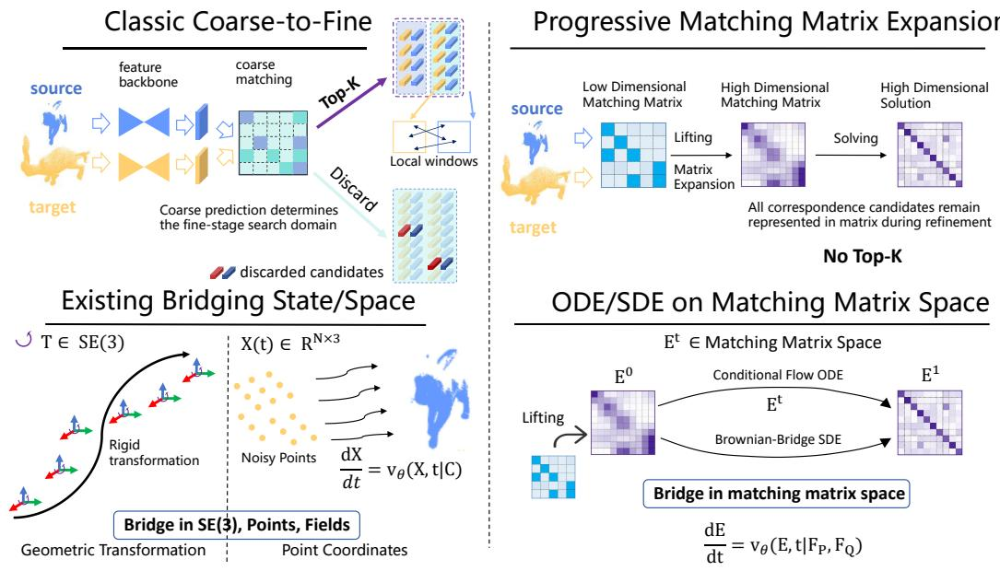
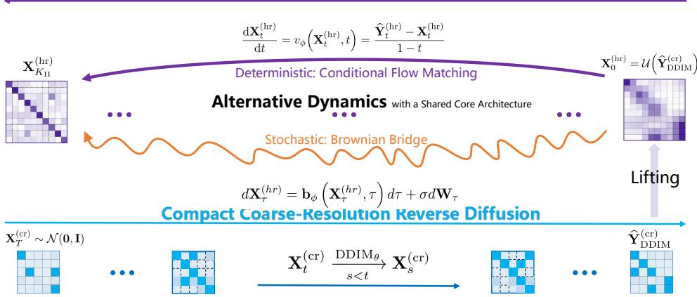
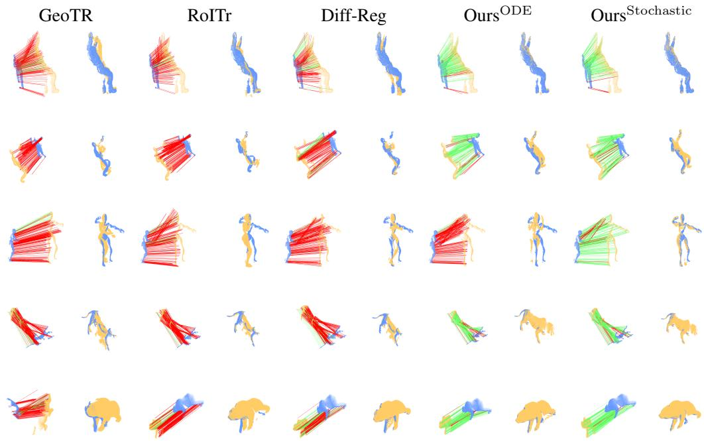

# BRIDGEMATCH: CONDITIONAL TRANSPORT BRIDGES IN MATCHING MATRIX SPACE FOR 3D DEFORMABLE REGISTRATION

Qianliang Wu1 Haobo Jiang2 Guangwei Gao4 Shuo Chen3 Jin Xie3 Jian Yang4 Yaqing Ding5

1Nantong University 2Nanyang Technological University 3Nanjing University 4Nanjing University of Science and Technology 5Southeast University

## ABSTRACT

Reliable non-rigid point cloud correspondences are important for deformable anatomical registration, embodied perception and manipulation, and dynamic 3D reconstruction. Coarse-to-fine methods reduce computational cost by selecting the top-K coarse regions. However, this pruning may remove weak but correct hypotheses and restrict fine matching to an incomplete search space. We present BridgeMatch, a two-stage generative solver that maintains the complete soft matching matrix at both coarse and high resolutions. Stage I uses denoising diffusion to estimate a global matching matrix in the compact coarse-resolution space. We then lift this matrix to high resolution while preserving its hierarchy. The lifted matrix is rank-bounded and block-constant. Stage II refines it through a conditional transport bridge. We implement the bridge with two types of dynamics: a deterministic endpoint-parameterized conditional Flow Matching (CFM) ODE and a stochastic Brownian-bridge SDE inspired by Schrodinger¨ bridges. Both variants share the lifted source, a time-conditioned transformer, and a matching-matrix endpoint predictor. Experiments on 4DMatch and 4DLo-Match show that both variants produce more accurate correspondences than the compared methods and improve downstream registration, with larger gains in low-overlap cases. They also improve cross-dataset generalization on CAPE and DeepDeform without target-domain adaptation while using the same deformation solver.

## 1 INTRODUCTION

Non-rigid point cloud registration estimates correspondences and spatially varying deformations between observations of dynamic objects or scenes. It supports dynamic 3D reconstruction and animation Prokudin et al. (2023), medical imaging and intervention Zou et al. (2022); Yang et al. (2025), and the perception and manipulation of deformable objects Shi et al. (2022); Lin et al. (2023). Reliable matching remains difficult because of partial visibility, outliers, uneven sampling, large motion, and self-occlusion. To handle thousands of points, many keypoint-free methods adopt coarse-to-fine matching Yu et al. (2021); Qin et al. (2022); Li & Harada (2022a); Yu et al. (2023). Coarse features provide global context, while fine features improve localization. These methods often select the top-K coarse pairs to reduce computation and refine only the resulting dense candidates. However, this selection may discard low-confidence but correct matches that cannot be recovered at the fine stage.

Such uncertain matches are difficult to resolve with a single prediction. Generative registration methods address this problem through iterative correction or by modeling several plausible alignments. Pose- and coordinate-based methods gradually refine transformations or point positions Jiang et al. (2023); Jin et al. (2025); Pan et al. (2025). Rectified Point Flow also models multiple valid configurations caused by symmetry Sun et al. (2025). However, these states do not explicitly store scores for several target candidates for each source point. Diff-PCR and Diff-Reg represent these candidates in matching matrices and learn to recover clean matches from noise-corrupted states Shi & Wu (2025); Wu et al. (2024). We focus on the connection between resolutions: how can a complete coarse matching estimate serve as the source of a learned transport path toward high-resolution correspondences?

  
Figure 1: Comparison with existing paradigms. Traditional coarse-to-fine pipelines restrict fine matching through Top-K pruning, while our progressive expansion retains all candidates by lifting the complete coarse matrix. Unlike bridges in coordinate or transformation space, BridgeMatch transports the matching matrix (Et) through a conditional-flow ODE or a Brownian-bridge SDE.

To answer this question, we propose BridgeMatch, a two-stage solver that connects compact coarseresolution diffusion with a high-resolution conditional transport bridge. We lift the complete coarse matrix to define the bridge source, while the high-resolution ground-truth matrix defines its target. This design trains the second stage to correct a coarse correspondence estimate along a path between the two matching endpoints. Figure 1 compares our formulation with existing paradigms, and Fig. 2 presents the full solver.

How can we retain weak matches without Top-K pruning? Stage I estimates a complete soft matching matrix in the compact coarse-resolution space. Hierarchy-preserving lifting transfers every entry to high resolution and forms a rank-bounded, block-constant bridge source. The coarse scores provide an initial estimate rather than deciding which candidates can enter the next stage. Therefore, low-confidence candidates remain available for correction, although retaining them alone does not determine the final matches.

How can we represent and efficiently refine multiple matches? Stage II evolves the complete high-resolution matching matrix, so the scores of multiple target candidates can change throughout refinement. Its conditional bridge connects the lifted coarse estimate to the target matching matrix. It learns to correct coarse errors and recover details within each block. We study both deterministic and stochastic transport to understand how they refine ambiguous correspondence estimates. The deterministic variant predicts the endpoint along a paired straight path and uses this prediction to define an endpoint-CFM ODE Lipman et al. (2023); Liu et al. (2022). The stochastic variant follows a paired Brownian bridge and predicts both the endpoint and the injected noise for SDE integration De Bortoli et al. (2021); Tong et al. (2024). Both variants use the same endpoint-predictor design.

Efficient endpoint prediction makes this full-matrix search practical. The predictor processes point features conditioned on the current matching matrix and avoids storing a high-dimensional hidden feature for every point pair. The backbone runs once for each input pair, and all solver steps reuse its output features. The stochastic variant further uses a low-rank pairwise noise head. Together, these designs reduce repeated computation and hidden-feature storage while keeping the complete matching matrices.

Experiments on 4DMatch and 4DLoMatch show consistent gains over Diff-Reg, especially under low overlap. On 4DLoMatch, the stochastic bridge improves NFMR and inlier ratio by 5.26 and 11.79 points, respectively. These gains also lead to better downstream registration. Both variants outperform Diff-Reg in zero-shot tests on CAPE and the real-world DeepDeform dataset, with larger gains under stronger deformation. Ablation studies further show the contribution of high-resolution refinement and the effect of the number of solver steps.

Our contributions are summarized as follows:

• To the best of our knowledge, we are the first to formulate correspondence estimation as a conditional transport bridge in matching-matrix space, with a lifted coarse matching estimate as the source and a high-resolution matching matrix as the target.

• We use a high-resolution conditional bridge to refine all candidate correspondences from the lifted coarse matching matrix. The bridge updates all candidate scores without Top-K pruning and keeps low-confidence but potentially correct matches throughout refinement.

• We study deterministic endpoint-CFM and stochastic paired Brownian-bridge implementations within this formulation. Experiments show improvements in correspondence estimation, downstream registration, and zero-shot generalization, with ablations examining the hierarchy and solver-step budgets.

## 2 RELATED WORK

Point Cloud Registration. Point cloud registration includes both rigid matching and deformable alignment. Recent rigid methods improve hierarchical matching and generalization in different ways. PARE-Net, HST, CAST, and Dual Focus Attention use equivariant, Sinkhorn-based, consistency-guided, or dual-scale matching, while BUFFER-X addresses zero-shot scale transfer Yao et al. (2024); Ren et al. (2024); Huang et al. (2024); Fu et al. (2025); Seo et al. (2025). Other methods combine feature learning with matching, estimate inlier confidence or consensus, and expand matching hypotheses. They also accelerate clique search, apply network-flow assignment, or refine registration in zero-shot, correspondence-free, and multiview settings Yanagi et al. (2024); Yuan et al. (2024); Yan et al. (2025b); Zhao et al. (2025a); Yan et al. (2025a); Wu et al. (2026); Gao et al. (2026); Zheng et al. (2025); Zhang et al. (2026); Li et al. (2025); Jiang et al. (2026). Most of these approaches assume a single rigid transformation. In contrast, non-rigid methods estimate spatially varying motion. NDP gradually fits deformation, GraphSCNet enforces local consistency among noisy matches, and SyNoRiM synchronizes functional maps across scans Li & Harada (2022b); Qin et al. (2023); Huang et al. (2022). Recent studies further address occlusion, efficient sequential deformation, and topology-aware unsupervised propagation Zhao et al. (2025b); He et al. (2025); Chen et al. (2026). AniSym-Net combines anisotropic shape–motion fields with symplectic constraints and motion-conditioned attention Wang et al. (2025), while RGGT and UniCorrn unify correspondence representations across tasks and modalities Zheng et al. (2026); Goswami et al. (2026). Unlike these methods, BridgeMatch lifts the complete soft coarse matrix and continues the correspondence search through high-resolution transport in matching-matrix space.

Generative Transport in 3D Geometry. Generative registration replaces one-shot prediction with conditional transport over poses, coordinates, or correspondence states. Diff-PCR and Diff-Reg apply diffusion to projected doubly stochastic matching matrices Shi & Wu (2025); Wu et al. (2024). ODIN alternates between overlap discovery and correlation denoising for multiway mosaicking Jin et al. (2024), while FUSER refines multiview poses through SE(3)N diffusion Jiang et al. (2026). Rectified Point Flow and Register Any Point transport point coordinates before pose recovery Sun et al. (2025); Pan et al. (2025), and ODin generates ordered human templates while preserving identity Masiero et al. (2026). Flow-based methods learn continuous deterministic paths. Flow matching uses predefined probability paths, while rectified flow uses straight couplings that support ODE integration with only a few steps Lipman et al. (2023); Liu et al. (2022). This framework has been extended to curved spaces Chen & Lipman (2024), cascaded structured 3D latent variables Lan et al. (2025), and smooth non-rigid correspondence Ye et al. (2026). By comparison, stochastic bridges retain finite noise between the endpoint distributions Leonard (2014); De Bortoli et al. (2021); Tong´ et al. (2024). P2P-Bridge transports noisy scans toward clean coordinates, whereas BridgeShape operates in a compact shape latent space Vogel et al. (2024); Kong et al. (2026). Unlike these pose-, coordinate-, or latent-space models, BridgeMatch connects compact matching-matrix diffusion with a deterministic or stochastic high-resolution bridge, so both stages remain in matching-matrix space.

High-Resolution Conditional Transport  
  
Figure 2: Overview of BridgeMatch. Stage I performs reverse diffusion in the compact coarseresolution matching-matrix space and lifts its solution to initialize Stage II. Stage II refines this high-resolution source through either a deterministic endpoint-CFM ODE or a stochastic Brownianbridge SDE. Both variants share the time-conditioned transformer and matching-matrix endpoint predictor, while the stochastic branch also predicts bridge noise.

## 3 METHOD

## 3.1 METHOD OVERVIEW

Given source and target point clouds $\mathbf { \mathcal { P } } ~ = ~ \{ \mathbf { p } _ { i } \} _ { i = 1 } ^ { N }$ and $\mathcal { Q } = \{ \mathbf { q } _ { j } \} _ { j = 1 } ^ { M }$ , our goal is to estimate a soft matching matrix for later geometric alignment. A hierarchical feature backbone extracts features $\mathbf { F } _ { s } ^ { ( r ) }$ and $\mathbf { F } _ { t } ^ { ( r ) }$ at resolutions $r \in \{ \mathrm { c r } , \mathrm { h r } \}$ , where cr and hr denote the compact coarse and high resolutions, respectively. The corresponding ground-truth matching matrix for supervision is $\mathbf { Y } ^ { \mathsf { ^ { ( r ) } } } \in \{ 0 , 1 \} ^ { N _ { r } \times M _ { r } ^ { - } }$

BridgeMatch uses the complete soft matching matrix as the generative state in both stages. Therefore, the Stage-I diffusion state, its lifted solution, every Stage-II bridge state $\mathbf { X } _ { t } ,$ , and the endpoint ${ \widehat { \mathbf { Y } } } ^ { ( \mathrm { h r } ) }$ use the same complete matching-matrix representation. This representation preserves uncertainty over all source–target pairs.

As shown in Fig. 2, Stage I performs reverse diffusion in the compact coarse-resolution matchingmatrix space. A fixed hierarchy operator lifts the complete solution into a rank-bounded highresolution subspace to form $\mathbf { X } _ { 0 }$ . Stage II then transports $\mathbf { X } _ { 0 }$ toward $\mathbf { Y } ^ { ( \mathrm { h r } ) }$ through either a deterministic endpoint-CFM ODE or a stochastic Brownian-bridge SDE. Both variants operate in the same high-resolution matching-matrix space and share an endpoint-prediction architecture. The stochastic variant also includes a memory-efficient noise head with a low-rank pairwise term and state-dependent affine terms.

## 3.2 STAGE I: COMPACT COARSE-RESOLUTION DIFFUSION SOLVER

Stage I performs a global search in the compact coarse-resolution space, which contains fewer matrix entries and uses features with larger receptive fields. It produces an initial estimate of the complete matching matrix for high-resolution refinement. At diffusion time $k ,$ with cumulative schedule $\bar { \alpha } _ { k }$

the forward process is

$$
{ \bf X } _ { k } ^ { \mathrm { ( c r ) } } = \sqrt { \bar { \alpha } _ { k } } { \bf Y } ^ { \mathrm { ( c r ) } } + \sqrt { 1 - \bar { \alpha } _ { k } } \epsilon , \quad \epsilon \sim \mathcal { N } ( { \bf 0 } , { \bf I } ) .\tag{1}
$$

A time-conditioned matching transformer predicts the clean endpoint

$$
\begin{array} { r } { \widehat { \mathbf { Y } } _ { 0 , k } ^ { \mathrm { ( c r ) } } = D _ { \theta } \left( \mathbf { X } _ { k } ^ { \mathrm { ( c r ) } } , k , \mathbf { F } _ { s } ^ { \mathrm { ( c r ) } } , \mathbf { F } _ { t } ^ { \mathrm { ( c r ) } } \right) . } \end{array}\tag{2}
$$

The confidence view of $\mathbf { X } _ { k } ^ { \mathrm { ( c r ) } }$ also induces a geometric warp used by the transformer.

During inference, deterministic DDIM Song et al. (2020) starts from $\mathbf { X } _ { T } ^ { \mathrm { ( c r ) } } \sim \mathcal { N } ( \mathbf { 0 } , \mathbf { I } )$ and produces the complete coarse estimate $\widehat { \mathbf { Y } } _ { \mathrm { D D I M } } ^ { \mathrm { ( c r ) } }$ for lifting. Appendix B.1 provides the sampling updates.

## 3.3 HIERARCHY-PRESERVING LIFTING TO HIGH-RESOLUTION SPACE

We lift the coarse matrix across resolutions without gradients or an additional learned mapping. This operation preserves all soft coarse correspondence hypotheses. Let $\mathbf { P } _ { s } \in \{ 0 , 1 \} ^ { N _ { \mathrm { h r } } \times N _ { \mathrm { c r } } ^ { \bullet } }$ and $\mathbf { P } _ { t } \in \dot { \{ 0 , 1 \} } ^ { M _ { \mathrm { h r } } ^ { \bullet } \times M _ { \mathrm { c r } } }$ be the source and target parent-assignment matrices, with one nonzero entry in each row. We define

$$
\mathbf { X } _ { 0 } = \mathcal { U } \big ( \widehat { \mathbf { Y } } ^ { \mathrm { ( c r ) } } \big ) = \mathbf { P } _ { s } \widehat { \mathbf { Y } } ^ { \mathrm { ( c r ) } } \mathbf { P } _ { t } ^ { \top } .\tag{3}
$$

Each coarse entry is copied to all high-resolution pairs that share its two parent points. The resulting block-constant source satisfies

$$
\mathrm { r a n k } ( { \mathbf { X } } _ { 0 } ) \leq \mathrm { r a n k } ( \widehat { \mathbf { Y } } ^ { ( \mathrm { c r } ) } ) \leq \mathrm { m i n } ( N _ { \mathrm { c r } } , M _ { \mathrm { c r } } ) .\tag{4}
$$

Thus, $\mathbf { X } _ { 0 }$ is a structured low-dimensional prior embedded in the high-resolution space. Stage I estimates global support in this block-constant subspace, while Stage II corrects the remaining coarse errors and recovers details within each block. Appendix B.2 gives the related orthogonal error decomposition.

## 3.4 UNIFIED STAGE-II CONDITIONAL-BRIDGE MODEL

Stage II provides two choices of dynamics for the conditional bridge. Both transport the lifted source $\mathbf { X } _ { 0 }$ toward the endpoint $\mathbf { Y } ^ { ( \mathrm { h \bar { r } } ) }$ under the same geometric condition c and use the following path family:

$$
\mathbf { X } _ { t } ^ { ( d ) } = ( 1 - t ) \mathbf { X } _ { 0 } + t \mathbf { Y } ^ { \mathrm { ( h r ) } } + \rho _ { d } ( t ) \epsilon , \quad \rho _ { d } ( t ) = \left\{ \begin{array} { l l } { 0 , } & { d = \mathrm { O D E } , } \\ { \sigma _ { B } \sqrt { t ( 1 - t ) } , } & { d = \mathrm { S D E } . } \end{array} \right.\tag{5}
$$

Here, $d \in \{ \mathrm { O D E } , \mathrm { S D E } \}$ selects endpoint-CFM or the paired Brownian bridge. The two branches share the same endpoints and conditioning, but they use zero or finite path variance. In the Stage-II equations below, we omit the superscript hr. Thus, $\mathbf { X } _ { t }$ and $\widehat { \mathbf Y } _ { t }$ denote the high-resolution state and endpoint prediction shown in Fig. 2. In the figure, $\mathbf { X } _ { K _ { \mathrm { I I } } } ^ { \mathrm { ( h r ) } }$ denotes the state after $K _ { \mathrm { I I } }$ solver steps. We define the ODE velocity $v _ { \phi }$ , SDE drift $b _ { \phi }$ , and Brownian noise scale $\sigma _ { B }$ below.

Both variants share a geometry-conditioned matching-matrix endpoint predictor. From the current state, we first form a bounded conditioning matrix $\mathbf { C } _ { t }$ . Endpoint-CFM uses its bounded state, while the Brownian branch sets $\mathbf { C } _ { t } = \mathrm { c l i p } ( \mathbf { X } _ { t } , 0 , 1 )$ because $\dot { \mathbf X _ { t } } \in \mathbb R ^ { N _ { \mathrm { h r } } \times M _ { \mathrm { h r } } }$ . After invalid pairs are masked, Sinkhorn normalization produces the assignment weights ${ \bf A } _ { t }$ . Soft Procrustes then estimates

$$
( \mathbf { R } _ { t } , \pmb { \tau } _ { t } ) = \arg \operatorname* { m i n } _ { \mathbf { R } \in \mathrm { S O } ( 3 ) , \pmb { \tau } } \sum _ { i j } A _ { t , i j } \| \mathbf { R p } _ { i } + \pmb { \tau } - \mathbf { q } _ { j } \| _ { 2 } ^ { 2 } .\tag{6}
$$

The transformer processes the warped source $\widetilde { \mathbf { p } } _ { i , t } = \mathbf { R } _ { t } \mathbf { p } _ { i } + \boldsymbol { \tau } _ { t }$ , target geometry, high-resolution features, and a sinusoidal time embedding. The shared matching-matrix endpoint predictor outputs

$$
\begin{array} { r } { \widehat { \mathbf { Y } } _ { t } = H _ { \phi } \Big ( \mathbf { C } _ { t } , t , \mathbf { F } _ { s } ^ { \mathrm { ( h r ) } } , \mathbf { F } _ { t } ^ { \mathrm { ( h r ) } } , \mathcal { \widetilde { P } } _ { t } , \mathcal { Q } \Big ) . } \end{array}\tag{7}
$$

The conditioning matrix also provides a bias for the matching logits. We recompute Eq. 6 at every solver step, which links the evolving matrix, the alignment, and the next predicted field. In the stochastic branch, clipping is used only for this conditioning view; the noise head and SDE update still receive the unbounded state. This branch also uses a low-rank head $G _ { \psi }$ to predict $\widehat { \epsilon } _ { t } .$ . The two variants differ in $\rho _ { d } ( t )$ , the auxiliary noise field, and their use of ODE or SDE integration. Appendix B.3 describes the endpoint-predictor architecture and matrix-conditioning paths in detail.

## 3.5 STAGE II-A: DETERMINISTIC ENDPOINT-CFM SOLVER

The deterministic realization sets $\rho _ { \mathrm { O D E } } ( t ) ~ = ~ 0$ in Eq. 5. The endpoint prediction analytically induces the velocity

$$
v _ { \phi } ( \mathbf { X } _ { t } , t ) = \frac { \widehat { \mathbf { Y } } _ { t } - \mathbf { X } _ { t } } { 1 - t } .\tag{8}
$$

This endpoint-parameterized field is the deterministic Stage-II velocity shown in Fig. 2. We refer to this variant as endpoint-CFM. Appendix B.2 relates it to canonical velocity matching, and Appendix B.4 describes its optimization.

Inference begins at the lifted DDIM matrix and solves

$$
\frac { d \mathbf { X } _ { t } } { d t } = v _ { \phi } ( \mathbf { X } _ { t } , t ) , \qquad \mathbf { X } _ { 0 } = \mathcal { U } ( \widehat { \mathbf { Y } } _ { \mathrm { D D I M } } ^ { ( \mathrm { c r } ) } ) .\tag{9}
$$

We integrate this ODE with explicit Euler steps. Appendix B.1 provides the straight-path expansion, discrete updates, and endpoint handling.

## 3.6 STAGE II-B: STOCHASTIC PAIRED BROWNIAN-BRIDGE SOLVER

The stochastic variant uses the Brownian path in Eq. 5, where $s _ { t } = \sqrt { t ( 1 - t ) }$ . Besides the endpoint $\widehat { \mathbf { Y } } _ { t } .$ , a low-rank pairwise head predicts the injected unit noise $\widehat { \epsilon } _ { t }$ . This head produces a scalar noise field without forming a dense $\bar { N } _ { \mathrm { h r } } { \times } M _ { \mathrm { h r } } { \times } C$ hidden tensor. The endpoint and noise estimates define the drift

$$
b _ { \phi } ( { \bf X } _ { t } , t ) = \widehat { \bf Y } _ { t } - { \bf X } _ { 0 } - \sigma _ { B } \frac { t } { s _ { t } } \widehat { \bf \epsilon } _ { t } .\tag{10}
$$

The resulting dynamics shown in Fig. 2 are

$$
\mathrm { d } \mathbf { X } _ { t } = b _ { \phi } ( \mathbf { X } _ { t } , t ) \mathrm { d } t + \sigma _ { B } \mathrm { d } \mathbf { W } _ { t } ,\tag{11}
$$

where $\mathbf { W } _ { t }$ is a standard matrix-valued Wiener process. We train the endpoint with correspondence supervision and the noise head with a balanced noise loss, as described in Appendix B.4. For sampling, we apply Euler–Maruyama on a truncated time interval and then make a final endpoint prediction. Appendix B.1 provides the noise-head parameterization, velocity–score derivation, and sampling procedure. Appendix B.2 verifies the consistency of the drift.

## 4 EXPERIMENTS

## 4.1 PROTOCOL

Datasets and metrics. Following Lepard Li & Harada (2022a), we evaluate correspondence on 4DMatch/4DLoMatch. We evaluate downstream registration on the filtered 4DMatch-F/4DLoMatch-F splits Li & Harada (2022b); Qin et al. (2023). We report NFMR and IR for correspondence, and EPE, AccS, AccR, and outlier ratio (OR) for registration and cross-dataset transfer. Lower EPE and OR values are better, while higher values are better for the other metrics. Appendix C.3 gives the metric definitions and thresholds. Unless stated otherwise, bold and underlined values indicate the best and second-best results, respectively.

Zero-shot protocol. We use the MPC-CAPE and MPC-DD data released by SyNoRiM Huang et al. (2022), which we refer to as CAPE and DeepDeform below. The MPC (Multi-Point Cloud) versions arrange the original datasets for multiway registration, while we evaluate directed point pairs. We evaluate 4DMatch-only checkpoints for Lepard, Diff-Reg, and our variants in Tables 3 and 4, with deformation-stratified CAPE results in Appendix C.5. These checkpoints use neither MPC-CAPE nor MPC-DD/DeepDeform for training, fine-tuning, or adaptation. The protocol-matched variants use the same fixed GraphSCNet solver trained on 4DMatch, test pairs, metrics, and thresholds. Results for the stochastic bridge are averaged over seeds {0, 1, 2}, while deterministic matchers are run once. Superscripts ∗ and † indicate target-domain training or fine-tuning and different test subsets, preprocessing, or protocols, respectively. These rows provide context but are not directly comparable.

  
Figure 3: Qualitative non-rigid registration comparisons on 4DMatch/4DLoMatch. For each method, the left image visualizes predicted correspondences and the right image shows the deformation estimated by GraphSCNet. Blue and yellow denote the source and target point clouds, respectively; green and red lines indicate correct and incorrect correspondences. ODE and Stochastic denote our deterministic endpoint-CFM and stochastic Brownian-bridge variants, respectively. Zoom in for details.

Table 1: Non-rigid correspondence on 4DMatch/4DLoMatch. Best and second-best values are highlighted in bold and underlined, respectively.
<table><tr><td rowspan="2">Method</td><td colspan="2">4DMatch</td><td colspan="2">4DLoMatch</td></tr><tr><td>NFMR↑</td><td>IR↑</td><td>NFMR↑</td><td>IR↑</td></tr><tr><td>PointPWC Wu et al. (2019)</td><td>21.60</td><td>20.00</td><td>10.00</td><td>7.20</td></tr><tr><td>FLOT Puy et al. (2020)</td><td>27.10</td><td>24.90</td><td>15.20</td><td>10.70</td></tr><tr><td>D3Feat Bai et al. (2020)</td><td>55.50</td><td>54.70</td><td>27.40</td><td>21.50</td></tr><tr><td>Predator Huang et al. (2021) Lepard Li &amp; Harada (2022a)</td><td>56.40</td><td>60.40</td><td>32.10</td><td>27.50</td></tr><tr><td>GeoTransformer Qin et al. (2022)</td><td>83.60 83.20</td><td>82.64 82.20</td><td>66.63 65.40</td><td>55.55 63.60</td></tr><tr><td>RoITr Yu et al. (2023)</td><td>83.00</td><td>84.40</td><td>69.40</td><td>67.60</td></tr><tr><td>Diff-Reg Wu et al. (2024)</td><td>90.25</td><td>87.98</td><td>77.15</td><td>67.00</td></tr><tr><td>RoITr-WN Yanagi et al. (2024)</td><td>87.2</td><td>87.3</td><td>75.3</td><td>73.3</td></tr><tr><td>OursODE</td><td></td><td></td><td></td><td></td></tr><tr><td></td><td>91.47</td><td>89.82</td><td>78.64</td><td>71.78</td></tr><tr><td>OursStochastic</td><td>92.43</td><td>91.47</td><td>82.41</td><td>78.79</td></tr></table>

## 4.2 NON-RIGID CORRESPONDENCE

Tables 1 and 2 evaluate correspondence quality and its effect on downstream non-rigid registration. Both Stage-II variants outperform Diff-Reg. Their gains are generally larger on 4DLoMatch, where limited overlap makes the lifted source more ambiguous. These results show the value of refining the coarse solution in Stage II.

Both variants improve correspondence quality over Diff-Reg (Table 1). The stochastic bridge achieves the best NFMR and IR on both datasets, with gains of 5.26 and 11.79 points on 4DLo-Match. Its larger margin over endpoint-CFM under low overlap suggests that stochastic transport may help in ambiguous cases. These epoch-matched results use equal iteration budgets and compare complete methods. Since their paths, auxiliary predictions, objectives, and dynamics differ, the results do not isolate the effect of the numerical integrator.

Table 2: Non-rigid registration on 4DMatch-F/4DLoMatch-F. Matcher-based entries labeled with GraphSCNet Qin et al. (2023) use this common deformation solver; other entries retain their respective pipelines. For RGGT, TF denotes pretrained features from the large-scale 3D generative model TRELLIS; the gray row uses this additional prior and is excluded from ranking. Among the remaining methods, best and second-best values are highlighted in bold and underlined, respectively.
<table><tr><td rowspan="2">Method</td><td colspan="4">4DMatch-F</td><td colspan="4">4DLoMatch-F</td></tr><tr><td>EPE↓</td><td>AccS↑</td><td>AccR↑</td><td>Outlier↓</td><td>EPE↓</td><td>AccS↑</td><td>AccR↑</td><td>Outlier↓</td></tr><tr><td>NSEFP Li et al. (2021)</td><td>0.265</td><td>8.7</td><td>18.7</td><td>65.0</td><td>0.495</td><td>0.4</td><td>1.6</td><td>84.8</td></tr><tr><td>Nerfies Park et aì. (2021)</td><td>0.280</td><td>12.7</td><td>25.4</td><td>58.9</td><td>0.498</td><td>1.1</td><td>3.0</td><td>82.2</td></tr><tr><td>PointPWC-Net Wu et al. (2020)</td><td>0.182</td><td>6.3</td><td>21.5</td><td>52.1</td><td>0.279</td><td>1.7</td><td>8.2</td><td>55.7</td></tr><tr><td>FLOT Puy et al. (2020)</td><td>0.133</td><td>7.7</td><td>27.2</td><td>40.5</td><td>0.210</td><td>2.7</td><td>13.1</td><td>42.5</td></tr><tr><td>DGFM Donati et al. (2020)</td><td>0.152</td><td>12.3</td><td>32.6</td><td>37.9</td><td>0.148</td><td>1.9</td><td>6.5</td><td>64.6</td></tr><tr><td>SyNoRiM Huang et al. (2022)</td><td>0.099</td><td>22.9</td><td>49.9</td><td>26.0</td><td>0.170</td><td>10.6</td><td>30.2</td><td>31.1</td></tr><tr><td>NDP Li &amp; Harada (2022b)</td><td>0.077</td><td>61.3</td><td>74.1</td><td>17.3</td><td>0.177</td><td>26.6</td><td>41.1</td><td>33.8</td></tr><tr><td>RoITrYu et al. (2023) +GraphSCNet</td><td>0.056</td><td>59.60</td><td>80.50</td><td>12.50</td><td>0.118</td><td>32.30</td><td>56.70</td><td>20.50</td></tr><tr><td>LepardLi &amp; Harada (2022a)+GraphSCNet</td><td>0.042</td><td>70.10</td><td>83.80</td><td>9.20</td><td>0.102</td><td>40.00</td><td>59.10</td><td>17.50</td></tr><tr><td>GeoTRQin et al. (2022)+GraphSCNet</td><td>0.043</td><td>72.10</td><td>84.30</td><td>9.50</td><td>0.119</td><td>41.00</td><td>58.40</td><td>20.60</td></tr><tr><td>Diff-RegWu et al. (2024)+GraphSCNet</td><td>0.041</td><td>73.20</td><td>85.80</td><td>8.30</td><td>0.095</td><td>43.80</td><td>62.90</td><td>15.50</td></tr><tr><td>Lepard+OARZhao et al. (2025b)</td><td>0.059</td><td>59.32</td><td>74.33</td><td>16.41</td><td>0.251</td><td>27.25</td><td>42.01</td><td>45.04</td></tr><tr><td>RGGTZheng et al. (2026) (w/o TF)</td><td>0.039</td><td>62.10</td><td>79.60</td><td>11.3</td><td></td><td></td><td></td><td></td></tr><tr><td>RGGTZheng et al. (2026) (w TF)</td><td>0.031</td><td>73.9</td><td>89.7</td><td>7.1</td><td>0.052</td><td>55.0</td><td>79.0</td><td>6.8</td></tr><tr><td> $\mathrm { O u r s ^ { O D E } { + } G r a p h S C N e t }$ </td><td>0.037</td><td>73.1</td><td>86.3</td><td>7.9</td><td>0.094</td><td>45.0</td><td>65.0</td><td>14.9</td></tr><tr><td> $\mathrm { O u r s ^ { S t o c h a s t i c } + G r a p h S C N e t }$ </td><td>0.036</td><td>74.1</td><td>87.0</td><td>7.4</td><td>0.089</td><td>47.2</td><td>67.2</td><td>13.8</td></tr></table>

With GraphSCNet fixed, the stochastic bridge improves all eight registration metrics over Diff-Reg (Table 2). On 4DLoMatch-F, EPE decreases from 0.095 to 0.089, while AccR increases by 4.3 points. Endpoint-CFM improves seven of the eight metrics. The larger gains under low overlap indicate that more accurate correspondences also improve downstream registration. RGGT with TRELLIS features remains stronger on several metrics, while our stochastic bridge is competitive without this additional prior. However, the different pretraining settings prevent us from attributing these differences to bridge refinement alone. Appendix C.4 provides a detailed comparison. Figure 3 shows that both bridge variants produce fewer long-range incorrect matches and better alignment around limbs and animal extremities. The stochastic bridge gives the most consistent results in these examples, which agrees with the quantitative registration results.

## 4.3 ZERO-SHOT GENERALIZATION ON CAPE

Following the RGGT protocol Zheng et al. (2026), we evaluate zero-shot transfer on the MPC-CAPE test set of 2,508 pairs. Diff-Reg and our variants use checkpoints trained on 4DMatch and the same GraphSCNet solver, without adaptation to CAPE. Appendix C.3 describes how the pairs are constructed.

Table 3 groups the methods according to their target-domain training status. RGGT is evaluated zero-shot on CAPE, although it uses additional training data and pretrained features. The highlighted rankings compare reported values only within the final zero-shot group and do not imply identical training or input settings. In particular, SyNoRiM uses target-domain self-supervision and four-view synchronization. Appendix C.4 explains these differences. Compared with RGGT using TRELLIS features, the stochastic bridge achieves lower EPE and higher AccS and AccR, while RGGT maintains a lower OR. However, the two methods use different pretraining settings.

Under the matched GraphSCNet pipeline, both variants improve all four CAPE metrics over Diff-Reg (Table 3). The stochastic bridge reduces EPE from 0.018 to 0.016 and increases AccS by 2.0 points. These results show that the gains transfer without target-domain adaptation. The deformation-stratified CAPE results show larger gains on the large-deformation subset. In this subset, the stochastic bridge reduces EPE by 13.8% relative to Diff-Reg (Appendix C.5).

Table 3: Generalization on CAPE, grouped by target-domain training status. Our evaluation uses 2,508 pairs. ∗ denotes target-domain training; – denotes unverified information. Bold/underlined values mark best/second-best only in the final No group. Training and input settings differ across references (Appendix C.4); stochastic results average three seeds.
<table><tr><td>Method</td><td>Venue</td><td>Training data</td><td>Target train</td><td>EPE↓</td><td>AccS↑</td><td>AccR↑</td><td>OR↓</td></tr><tr><td>Target-domain training</td><td></td><td></td><td></td><td></td><td></td><td></td><td></td></tr><tr><td>SyNoRiM (self-sup., four-view)* Huang et al. (2022)</td><td>TPAMI 2022</td><td>CAPE</td><td>Yes</td><td>0.030</td><td>55.5</td><td>89.1</td><td>59.1</td></tr><tr><td>Target-domain training status unverified</td><td></td><td></td><td></td><td></td><td></td><td></td><td></td></tr><tr><td>PointPWC-Net Wu et al. (2020)</td><td>ECCV 2020</td><td></td><td></td><td>0.039</td><td>17.9</td><td>35.7</td><td>85.9</td></tr><tr><td>FLOT Puy et al. (2020)</td><td>ECCV 2020</td><td></td><td></td><td>0.049</td><td>21.2</td><td>31.1</td><td>92.2</td></tr><tr><td>DGFM Donati et al. (2020)</td><td>CVPR 2020</td><td></td><td></td><td>0.036</td><td>35.5</td><td>62.4</td><td>73.7</td></tr><tr><td>Lepard+N-ICP Li &amp; Harada (2022a)</td><td>CVPR 2022</td><td></td><td>一</td><td>0.089</td><td>23.9</td><td>44.7</td><td>78.0</td></tr><tr><td>LNDP Li &amp; Harada (2022b)</td><td>NeurIPS 2022</td><td></td><td>一</td><td>0.045</td><td>61.3</td><td>92.2</td><td>45.7</td></tr><tr><td>Zero-shot transfer (no target-domain training)</td><td></td><td></td><td></td><td></td><td></td><td></td><td></td></tr><tr><td>GeoTransformer Qin et al. (2022)</td><td>CVPR 2022</td><td>ModelNet</td><td>No</td><td>0.055</td><td>20.9</td><td>50.1</td><td>75.5</td></tr><tr><td>GraphSCNet Qin et al. (2023)</td><td>CVPR 2023</td><td>4DMatch</td><td>No</td><td>0.059</td><td>66.7</td><td>79.4</td><td>62.1</td></tr><tr><td>Diff-Reg Wu et al. (2024)</td><td>ECCV 2024</td><td>4DMatch</td><td>No</td><td>0.018</td><td>78.4</td><td>95.1</td><td>45.4</td></tr><tr><td>RGGT (w TF) Zheng et al. (2026)</td><td>ICML 2026</td><td>ModelNet + 4DMatch</td><td>No</td><td>0.023</td><td>77.7</td><td>93.2</td><td>36.4</td></tr><tr><td>OursODE + GraphSCNet</td><td></td><td>4DMatch</td><td>No</td><td>0.017</td><td>79.2</td><td>95.3</td><td>44.7</td></tr><tr><td>OursStochastic + GraphSCNet</td><td></td><td>4DMatch</td><td>No</td><td>0.016</td><td>80.4</td><td>95.7</td><td>43.4</td></tr></table>

Table 4: Generalization on DeepDeform, grouped by target-domain training status. Recomputed results use 1,221 pairs after 1 cm near-rigid filtering. ∗ denotes target-domain training or fine-tuning; † denotes a different evaluation protocol. Bold/underlined values mark best/second-best only in the final No group. Stochastic results average three seeds; protocol details are in Appendix C.3.
<table><tr><td>Method</td><td>Venue</td><td>Training data</td><td>Target train</td><td>EPE↓</td><td>AccS↑</td><td>AccR↑</td><td>OR↓</td></tr><tr><td>Target-domain training</td><td></td><td></td><td></td><td></td><td></td><td></td><td></td></tr><tr><td>SyNoRiM* Huang et al. (2022)</td><td>TPAMI 2022</td><td>MPC-DD</td><td>Yes</td><td>0.0268</td><td>72.9</td><td>91.8</td><td>12.8</td></tr><tr><td>AniSym-Net*† Wang et al. (2025)</td><td>TPAMI 2025</td><td>MPI-FAUST</td><td>Yes</td><td>0.0266</td><td>一</td><td>89.4</td><td>一</td></tr><tr><td>Zero-shot transfer (no target-domain training)</td><td></td><td></td><td></td><td></td><td></td><td></td><td></td></tr><tr><td>GeoTransformer Qin et al. (2022)+GraphSCNet†</td><td>CVPR 2022</td><td>4DMatch</td><td>No</td><td>0.134</td><td>24.1</td><td>44.2</td><td>59.1</td></tr><tr><td>Lepard Li &amp; Harada (2022a) + GraphSCNet</td><td>CVPR 2022</td><td>4DMatch</td><td>No</td><td>0.1501</td><td>17.1</td><td>35.1</td><td>64.0</td></tr><tr><td>Diff-Reg Wu et al. (2024) + GraphSCNet</td><td>ECCV 2024</td><td>4DMatch</td><td>No</td><td>0.0748</td><td>43.6</td><td>66.1</td><td>36.0</td></tr><tr><td>OursODE + GraphSCNet</td><td></td><td>4DMatch</td><td>No</td><td>0.0697</td><td>46.4</td><td>69.4</td><td>33.8</td></tr><tr><td>OursStochastic + GraphSCNet</td><td></td><td>4DMatch</td><td>No</td><td>0.0620</td><td>53.2</td><td>74.9</td><td>28.3</td></tr></table>

## 4.4 ZERO-SHOT GENERALIZATION ON DEEPDEFORM

We evaluate synthetic-to-real transfer on 1,221 directed MPC-DD/DeepDeform test pairs after removing nearly rigid pairs. The protocol-matched zero-shot methods use correspondence predictors trained on 4DMatch and the same GraphSCNet solver, without target-domain adaptation. Table 4 lists target-domain-trained and different-protocol results separately. Appendix C.3 provides the preprocessing details.

On the shared DeepDeform pairs, both variants improve all four metrics over Diff-Reg (Table 4). The stochastic bridge reduces EPE by 17.1% and increases AccS by 9.6 points, outperforming the other protocol-matched zero-shot methods. SyNoRiM, which is trained on the target domain, remains much stronger and reveals a remaining transfer gap. We do not directly rank results obtained under different protocols against these zero-shot results.

## 5 CONCLUSION

We presented BridgeMatch, a two-stage coarse-to-fine solver in matching-matrix space. Stage I uses diffusion to estimate a coarse correspondence matrix efficiently. We lift the complete soft matrix to high resolution, where it forms a rank-bounded and block-constant starting point. Stage II refines this matrix through either a deterministic endpoint-CFM ODE or a stochastic Brownian-bridge SDE. On 4DMatch and 4DLoMatch, both variants improve correspondence estimation over Diff-Reg and strengthen downstream registration with a fixed GraphSCNet solver. The stochastic variant gives the largest gains under low overlap. The same models trained on 4DMatch also improve the matched Diff-Reg pipeline on CAPE and real-world DeepDeform data without target-domain adaptation. The ablation studies show the contribution of high-resolution refinement and the trade-off between accuracy and runtime.

## REFERENCES

Xuyang Bai, Zixin Luo, Lei Zhou, Hongbo Fu, Long Quan, and Chiew-Lan Tai. D3feat: Joint learning of dense detection and description of 3d local features. In Proceedings of the IEEE/CVF Conference on Computer Vision and Pattern Recognition, 2020.

Haozhe Chen, Rui Li, Zhengbao Wang, Xinhao Zhu, Linjie Li, Tianyu Xiong, Xuan Ouyang, and Jiaqi Yang. Topology-aware feature propagation for unsupervised non-rigid point cloud correspondence. In Proceedings of the IEEE/CVF Conference on Computer Vision and Pattern Recognition, pp. 31389–31399, 2026.

Ricky T. Q. Chen and Yaron Lipman. Flow matching on general geometries. In International Conference on Learning Representations, 2024.

Valentin De Bortoli, James Thornton, Jeremy Heng, and Arnaud Doucet. Diffusion schrodinger¨ bridge with applications to score-based generative modeling. In Advances in Neural Information Processing Systems, volume 34, 2021.

Nicolas Donati, Abhishek Sharma, and Maks Ovsjanikov. Deep geometric functional maps: Robust feature learning for shape correspondence. In 2020 IEEE/CVF Conference on Computer Vision and Pattern Recognition (CVPR), pp. 8589–8598. IEEE, 2020.

Kexue Fu, Mingzhi Yuan, Changwei Wang, Weiguang Pang, Jing Chi, Manning Wang, and Longxiang Gao. Dual focus-attention transformer for robust point cloud registration. In Proceedings of the Computer Vision and Pattern Recognition Conference, pp. 11769–11778, June 2025.

Haohao Gao, Hao Yu, Junjie Gao, Huibiao Wen, Shuangmin Chen, Shiqing Xin, and Changhe Tu. RegistrationBooster: Refine correspondence for rigid registration. In Computer Graphics International Conference, volume 16509 of Lecture Notes in Computer Science, pp. 28–40, 2026. doi: 10.1007/978-3-032-22267-1 3.

Prajnan Goswami, Tianye Ding, Feng Liu, and Huaizu Jiang. Unicorrn: Unified correspondence transformer across 2d and 3d. In Proceedings of the IEEE/CVF Conference on Computer Vision and Pattern Recognition (CVPR), pp. 9943–9954, June 2026.

Guangzhao He, Yuxi Xiao, Zhen Xu, Xiaowei Zhou, and Sida Peng. ERNet: Efficient non-rigid registration network for point sequences. In Proceedings of the IEEE/CVF International Conference on Computer Vision, pp. 27156–27165, 2025.

Jiahui Huang, Tolga Birdal, Zan Gojcic, Leonidas J Guibas, and Shi-Min Hu. Multiway non-rigid point cloud registration via learned functional map synchronization. IEEE Transactions on Pattern Analysis and Machine Intelligence, 45(2):2038–2053, 2022.

Renlang Huang, Yufan Tang, Jiming Chen, and Liang Li. A consistency-aware spot-guided transformer for versatile and hierarchical point cloud registration. In Advances in Neural Information Processing Systems, volume 37, 2024.

Shengyu Huang, Zan Gojcic, Mikhail Usvyatsov, Andreas Wieser, and Konrad Schindler. Predator: Registration of 3d point clouds with low overlap. In Proceedings of the IEEE/CVF Conference on computer vision and pattern recognition, 2021.

Haobo Jiang, Mathieu Salzmann, Zheng Dang, Jin Xie, and Jian Yang. SE(3) diffusion model-based point cloud registration for robust 6D object pose estimation. In Advances in Neural Information Processing Systems, volume 36, 2023.

Haobo Jiang, Jin Xie, Jian Yang, Liang Yu, and Jianmin Zheng. FUSER: Feed-forward multiview 3D registration transformer and SE(3)N diffusion refinement. In Proceedings of the IEEE/CVF Conference on Computer Vision and Pattern Recognition, pp. 7393–7403, 2026.

Shengze Jin, Iro Armeni, Marc Pollefeys, and Daniel Barath. Multiway point cloud mosaicking with diffusion and global optimization. In Proceedings of the IEEE/CVF Conference on Computer Vision and Pattern Recognition, pp. 20838–20849, 2024.

Yufeng Jin, Niklas Funk, Vignesh Prasad, Zechu Li, Mathias Franzius, Jan Peters, and Georgia Chalvatzaki. SE(3)-PoseFlow: Estimating 6D pose distributions for uncertainty-aware robotic manipulation. arXiv preprint arXiv:2511.01501, 2025.

Dequan Kong, Honghua Chen, Zhe Zhu, and Mingqiang Wei. BridgeShape: Latent diffusion schr”odinger bridge for 3D shape completion. Proceedings of the AAAI Conference on Artificial Intelligence, 40(7):5726–5734, 2026. doi: 10.1609/aaai.v40i7.37493.

Yushi Lan, Shangchen Zhou, Zhaoyang Lyu, Fangzhou Hong, Shuai Yang, Bo Dai, Xingang Pan, and Chen Change Loy. GaussianAnything: Interactive point cloud flow matching for 3D generation. In International Conference on Learning Representations, 2025.

Christian Leonard. A survey of the schr´ odinger problem and some of its connections with optimal¨ transport. Discrete and Continuous Dynamical Systems, 34(4):1533–1574, 2014. doi: 10.3934/ dcds.2014.34.1533.

Shiqi Li, Jihua Zhu, Yifan Xie, and Mingchen Zhu. Incremental multiview point cloud registration with two-stage candidate retrieval. Pattern Recognition, 167:111705, 2025. doi: 10.1016/j.patcog. 2025.111705.

Xueqian Li, Jhony Kaesemodel Pontes, and Simon Lucey. Neural scene flow prior. Advances in Neural Information Processing Systems, 2021.

Yang Li and Tatsuya Harada. Lepard: Learning partial point cloud matching in rigid and deformable scenes. In Proceedings of the IEEE/CVF Conference on Computer Vision and Pattern Recognition, 2022a.

Yang Li and Tatsuya Harada. Non-rigid point cloud registration with neural deformation pyramid. Advances in Neural Information Processing Systems, 2022b.

Xingyu Lin, Carl Qi, Yunchu Zhang, Zhiao Huang, Katerina Fragkiadaki, Yunzhu Li, Chuang Gan, and David Held. Planning with spatial-temporal abstraction from point clouds for deformable object manipulation. In Proceedings of the 6th Conference on Robot Learning, volume 205 of Proceedings ofMachine Learning Research, pp. 1640–1651, 2023.

Yaron Lipman, Ricky T. Q. Chen, Heli Ben-Hamu, Maximilian Nickel, and Matt Le. Flow matching for generative modeling. In International Conference on Learning Representations, 2023. URL https://openreview.net/forum?id=PqvMRDCJT9t.

Xingchao Liu, Chengyue Gong, and Qiang Liu. Flow straight and fast: Learning to generate and transfer data with rectified flow. arXiv preprint arXiv:2209.03003, 2022.

Mattia Masiero, Ilya A. Petrov, Daniel Cremers, Gerard Pons-Moll, and Riccardo Marin. Ordered diffusion for 3D human registration. arXiv preprint arXiv:2608.05804, 2026.

Yue Pan, Tao Sun, Liyuan Zhu, Lucas Nunes, Iro Armeni, Jens Behley, and Cyrill Stachniss. Register any point: Scaling 3D point cloud registration by flow matching. arXiv preprint arXiv:2512.01850, 2025.

Keunhong Park, Utkarsh Sinha, Jonathan T Barron, Sofien Bouaziz, Dan B Goldman, Steven M Seitz, and Ricardo Martin-Brualla. Nerfies: Deformable neural radiance fields. In 2021 IEEE/CVF International Conference on Computer Vision (ICCV), pp. 5845–5854. IEEE, 2021.

Sergey Prokudin, Qianli Ma, Maxime Raafat, Julien Valentin, and Siyu Tang. Dynamic point fields. In Proceedings of the IEEE/CVF International Conference on Computer Vision, pp. 7964–7976, 2023.

Gilles Puy, Alexandre Boulch, and Renaud Marlet. Flot: Scene flow on point clouds guided by optimal transport. In European conference on computer vision, pp. 527–544. Springer, 2020.

Zheng Qin, Hao Yu, Changjian Wang, Yulan Guo, Yuxing Peng, and Kai Xu. Geometric transformer for fast and robust point cloud registration. In Proceedings of the IEEE/CVF Conference on Computer Vision and Pattern Recognition, 2022.

Zheng Qin, Hao Yu, Changjian Wang, Yuxing Peng, and Kai Xu. Deep graph-based spatial consistency for robust non-rigid point cloud registration. In Proceedings of the IEEE/CVF Conference on Computer Vision and Pattern Recognition, 2023.

Chengwei Ren, Yifan Feng, Weixiang Zhang, Xiao-Ping Zhang, and Yue Gao. Multi-scale consistency for robust 3D registration via hierarchical sinkhorn tree. In Advances in Neural Information Processing Systems, volume 37, 2024.

Minkyun Seo, Hyungtae Lim, Kanghee Lee, Luca Carlone, and Jaesik Park. Buffer-x: Towards zeroshot point cloud registration in diverse scenes. In Proceedings of the IEEE/CVF International Conference on Computer Vision, pp. 3851–3862, October 2025.

Haihua Shi and Qianliang Wu. Diff-pcr: Diffusion-based correspondence searching in doubly stochastic matrix space for point cloud registration, 2025.

Haochen Shi, Huazhe Xu, Zhiao Huang, Yunzhu Li, and Jiajun Wu. Robocraft: Learning to see, simulate, and shape elasto-plastic objects with graph networks. In Proceedings of Robotics: Science and Systems, 2022. doi: 10.15607/RSS.2022.XVIII.008.

Jiaming Song, Chenlin Meng, and Stefano Ermon. Denoising diffusion implicit models. arXiv preprint arXiv:2010.02502, 2020.

Tao Sun, Liyuan Zhu, Shengyu Huang, Shuran Song, and Iro Armeni. Rectified point flow: Generic point cloud pose estimation. In Advances in Neural Information Processing Systems, volume 38, 2025. URL https://rectified-pointflow.github.io/.

Alexander Y. Tong, Nikolay Malkin, Kilian Fatras, Lazar Atanackovic, Yanlei Zhang, Guillaume Huguet, Guy Wolf, and Yoshua Bengio. Simulation-free schrodinger bridges via score and flow¨ matching. In Proceedings of the 27th International Conference on Artificial Intelligence and Statistics, volume 238 of Proceedings of Machine Learning Research, pp. 1279–1287, 2024.

Mathias Vogel, Keisuke Tateno, Marc Pollefeys, Federico Tombari, Marie-Julie Rakotosaona, and Francis Engelmann. P2P-Bridge: Diffusion bridges for 3D point cloud denoising. In European Conference on Computer Vision, 2024.

Jinyang Wang, Xuequan Lu, Mohammed Bennamoun, and Bin Sheng. Non-rigid point cloud registration via anisotropic hybrid field harmonization. IEEE Transactions on Pattern Analysis and Machine Intelligence, 47(9):7898–7915, 2025. doi: 10.1109/TPAMI.2025.3572584.

Qianliang Wu, Haobo Jiang, Lei Luo, Jun Li, Yaqing Ding, Jin Xie, and Jian Yang. Diff-reg: Diffusion model in doubly stochastic matrix space for registration problem. In European Conference on Computer Vision, pp. 160–178. Springer, 2024.

Wenxuan Wu, Zhiyuan Wang, Zhuwen Li, Wei Liu, and Li Fuxin. Pointpwc-net: A coarse-tofine network for supervised and self-supervised scene flow estimation on 3d point clouds. arXiv preprint arXiv:1911.12408, 2019.

Wenxuan Wu, Zhi Yuan Wang, Zhuwen Li, Wei Liu, and Li Fuxin. Pointpwc-net: Cost volume on point clouds for (self-) supervised scene flow estimation. In European conference on computer vision, pp. 88–107. Springer, 2020.

Yue Wu, Feng Xiao, Yongzhe Yuan, Hao Li, Kaiyuan Feng, Maoguo Gong, Qiguang Miao, and Wenping Ma. MHopReg: Efficient hierarchical multi-hop graph search for point cloud registration. In Proceedings of the IEEE/CVF Conference on Computer Vision and Pattern Recognition, pp. 24217–24226, 2026.

Shaocheng Yan, Pengcheng Shi, Zhenjun Zhao, Kaixin Wang, Kuang Cao, Ji Wu, and Jiayuan Li. TurboReg: TurboClique for robust and efficient point cloud registration. In Proceedings of the IEEE/CVF International Conference on Computer Vision, pp. 26371–26381, 2025a.

Shaocheng Yan, Yiming Wang, Kaiyan Zhao, Pengcheng Shi, Zhenjun Zhao, Yongjun Zhang, and Jiayuan Li. Hemora: Unsupervised heuristic consensus sampling for robust point cloud registration. In Proceedings ofthe Computer Vision and Pattern Recognition Conference, pp. 1363–1373, June 2025b.

Rintaro Yanagi, Atsushi Hashimoto, Naoya Chiba, Shusaku Sone, Jiaxin Ma, and Yoshitaka Ushiku. Learning 3d point cloud registration as a single optimization problem. In Asian Conference on Computer Vision, pp. 175–193. Springer, 2024.

Zixin Yang, Richard Simon, Kelly Merrell, and Cristian A. Linte. Boundary constraint-free biomechanical model-based surface matching for intraoperative liver deformation correction. IEEE Transactions on Medical Imaging, 44(4):1723–1734, 2025. doi: 10.1109/TMI.2024.3515632.

Runzhao Yao, Shaoyi Du, Wenting Cui, Canhui Tang, and Chengwu Yang. PARE-Net: Positionaware rotation-equivariant networks for robust point cloud registration. In European Conference on Computer Vision, pp. 287–303. Springer, 2024.

Tianwei Ye, Xiaoguang Mei, Yifan Xia, Fan Fan, Jun Huang, and Jiayi Ma. SGMatch: Semanticguided non-rigid shape matching with flow regularization. arXiv preprint arXiv:2603.12937, 2026.

Hao Yu, Fu Li, Mahdi Saleh, Benjamin Busam, and Slobodan Ilic. Cofinet: Reliable coarse-to-fine correspondences for robust pointcloud registration. Advances in Neural Information Processing Systems, 2021.

Hao Yu, Zheng Qin, Ji Hou, Mahdi Saleh, Dongsheng Li, Benjamin Busam, and Slobodan Ilic. Rotation-invariant transformer for point cloud matching. In Proceedings of the IEEE/CVF Conference on Computer Vision and Pattern Recognition, 2023.

Yongzhe Yuan, Yue Wu, Xiaolong Fan, Maoguo Gong, Qiguang Miao, and Wenping Ma. Inlier confidence calibration for point cloud registration. In Proceedings of the IEEE/CVF Conference on Computer Vision and Pattern Recognition, pp. 5312–5321, 2024.

Ray Zhang, Marcus Greiff, Thomas Lew, and John Subosits. Generalized-CVO: Fast and correspondence-free local point cloud registration with second order riemannian optimization. In Proceedings of the IEEE/CVF Conference on Computer Vision and Pattern Recognition, pp. 2948–2958, 2026.

Guiyu Zhao, Sheng Ao, Ye Zhang, Kai Xu, and Yulan Guo. Progressive correspondence regenerator for robust 3D registration. In Proceedings of the IEEE/CVF Conference on Computer Vision and Pattern Recognition, 2025a.

Mingyang Zhao, Gaofeng Meng, and Dong-ming Yan. Occlusion-aware non-rigid point cloud registration via unsupervised neural deformation correntropy. In International Conference on Learning Representations, volume 2025, pp. 33351–33375, 2025b.

Chengyu Zheng, Jin Huang, Honghua Chen, and Mingqiang Wei. RARE: Refine any registration of pairwise point clouds via zero-shot learning. In Proceedings of the IEEE/CVF International Conference on Computer Vision, pp. 26549–26558, 2025.

Chengyu Zheng, Songlin Yang, Jin Huang, Honghua Chen, Weiming Wang, Haoran Xie, Fu Lee Wang, and Mingqiang Wei. Rggt: A generative-prior-guided transformer for unified rigid and non-rigid point cloud registration. In Forty-third International Conference on Machine Learning, 2026.

Jing Zou, Bingchen Gao, Youyi Song, and Jing Qin. A review of deep learning-based deformable medical image registration. Frontiers in Oncology, 12:1047215, 2022. doi: 10.3389/fonc.2022. 1047215.